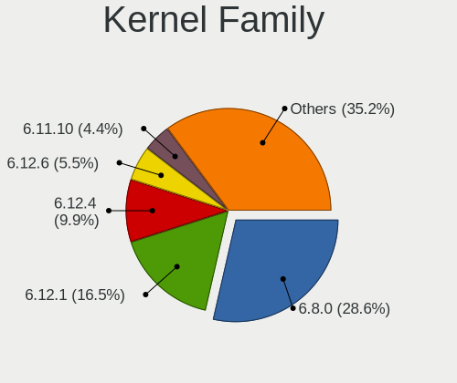
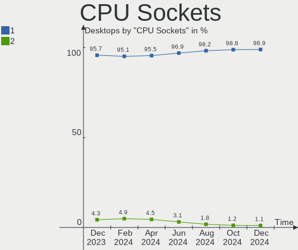
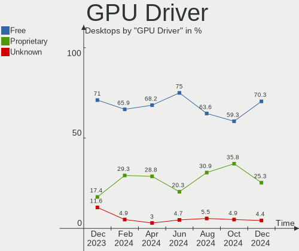
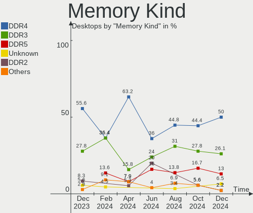
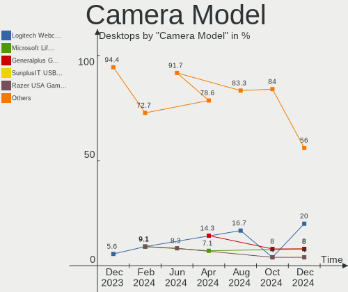

Linux in Canada - Hardware Trends (Desktops)
--------------------------------------------

A project to identify most popular hardware characteristics and track their change
over time based on data collected by Linux users at https://Linux-Hardware.org.

Anyone can contribute to this report by the [hw-probe](https://github.com/linuxhw/hw-probe) tool:

    sudo -E hw-probe -all -upload

Period: Apr, 2024.

Contents
--------

* [ System ](#system)
  - [ OS                       ](#os)
  - [ OS Family                ](#os-family)
  - [ Kernel                   ](#kernel)
  - [ Kernel Family            ](#kernel-family)
  - [ Kernel Major Ver.        ](#kernel-major-ver)
  - [ Arch                     ](#arch)
  - [ DE                       ](#de)
  - [ Display Server           ](#display-server)
  - [ Display Manager          ](#display-manager)
  - [ OS Lang                  ](#os-lang)
  - [ Boot Mode                ](#boot-mode)
  - [ Filesystem               ](#filesystem)
  - [ Part. scheme             ](#part-scheme)
  - [ Dual Boot with Linux/BSD ](#dual-boot-with-linuxbsd)
  - [ Dual Boot (Win)          ](#dual-boot-win)

* [ Board ](#board)
  - [ Vendor                   ](#vendor)
  - [ Model                    ](#model)
  - [ Model Family             ](#model-family)
  - [ MFG Year                 ](#mfg-year)
  - [ Form Factor              ](#form-factor)
  - [ Secure Boot              ](#secure-boot)
  - [ Coreboot                 ](#coreboot)
  - [ RAM Size                 ](#ram-size)
  - [ RAM Used                 ](#ram-used)
  - [ Total Drives             ](#total-drives)
  - [ Has CD-ROM               ](#has-cd-rom)
  - [ Has Ethernet             ](#has-ethernet)
  - [ Has WiFi                 ](#has-wifi)
  - [ Has Bluetooth            ](#has-bluetooth)

* [ Location ](#location)
  - [ Country                  ](#country)
  - [ City                     ](#city)

* [ Drives ](#drives)
  - [ Drive Vendor             ](#drive-vendor)
  - [ Drive Model              ](#drive-model)
  - [ HDD Vendor               ](#hdd-vendor)
  - [ SSD Vendor               ](#ssd-vendor)
  - [ Drive Kind               ](#drive-kind)
  - [ Drive Connector          ](#drive-connector)
  - [ Drive Size               ](#drive-size)
  - [ Space Total              ](#space-total)
  - [ Space Used               ](#space-used)
  - [ Malfunc. Drives          ](#malfunc-drives)
  - [ Malfunc. Drive Vendor    ](#malfunc-drive-vendor)
  - [ Malfunc. HDD Vendor      ](#malfunc-hdd-vendor)
  - [ Malfunc. Drive Kind      ](#malfunc-drive-kind)
  - [ Failed Drives            ](#failed-drives)
  - [ Failed Drive Vendor      ](#failed-drive-vendor)
  - [ Drive Status             ](#drive-status)

* [ Storage controller ](#storage-controller)
  - [ Storage Vendor           ](#storage-vendor)
  - [ Storage Model            ](#storage-model)
  - [ Storage Kind             ](#storage-kind)

* [ Processor ](#processor)
  - [ CPU Vendor               ](#cpu-vendor)
  - [ CPU Model                ](#cpu-model)
  - [ CPU Model Family         ](#cpu-model-family)
  - [ CPU Cores                ](#cpu-cores)
  - [ CPU Sockets              ](#cpu-sockets)
  - [ CPU Threads              ](#cpu-threads)
  - [ CPU Op-Modes             ](#cpu-op-modes)
  - [ CPU Microcode            ](#cpu-microcode)
  - [ CPU Microarch            ](#cpu-microarch)

* [ Graphics ](#graphics)
  - [ GPU Vendor               ](#gpu-vendor)
  - [ GPU Model                ](#gpu-model)
  - [ GPU Combo                ](#gpu-combo)
  - [ GPU Driver               ](#gpu-driver)
  - [ GPU Memory               ](#gpu-memory)

* [ Monitor ](#monitor)
  - [ Monitor Vendor           ](#monitor-vendor)
  - [ Monitor Model            ](#monitor-model)
  - [ Monitor Resolution       ](#monitor-resolution)
  - [ Monitor Diagonal         ](#monitor-diagonal)
  - [ Monitor Width            ](#monitor-width)
  - [ Aspect Ratio             ](#aspect-ratio)
  - [ Monitor Area             ](#monitor-area)
  - [ Pixel Density            ](#pixel-density)
  - [ Multiple Monitors        ](#multiple-monitors)

* [ Network ](#network)
  - [ Net Controller Vendor    ](#net-controller-vendor)
  - [ Net Controller Model     ](#net-controller-model)
  - [ Wireless Vendor          ](#wireless-vendor)
  - [ Wireless Model           ](#wireless-model)
  - [ Ethernet Vendor          ](#ethernet-vendor)
  - [ Ethernet Model           ](#ethernet-model)
  - [ Net Controller Kind      ](#net-controller-kind)
  - [ Used Controller          ](#used-controller)
  - [ NICs                     ](#nics)
  - [ IPv6                     ](#ipv6)

* [ Bluetooth ](#bluetooth)
  - [ Bluetooth Vendor         ](#bluetooth-vendor)
  - [ Bluetooth Model          ](#bluetooth-model)

* [ Sound ](#sound)
  - [ Sound Vendor             ](#sound-vendor)
  - [ Sound Model              ](#sound-model)

* [ Memory ](#memory)
  - [ Memory Vendor            ](#memory-vendor)
  - [ Memory Model             ](#memory-model)
  - [ Memory Kind              ](#memory-kind)
  - [ Memory Form Factor       ](#memory-form-factor)
  - [ Memory Size              ](#memory-size)
  - [ Memory Speed             ](#memory-speed)

* [ Printers & scanners ](#printers--scanners)
  - [ Printer Vendor           ](#printer-vendor)
  - [ Printer Model            ](#printer-model)
  - [ Scanner Vendor           ](#scanner-vendor)
  - [ Scanner Model            ](#scanner-model)

* [ Camera ](#camera)
  - [ Camera Vendor            ](#camera-vendor)
  - [ Camera Model             ](#camera-model)

* [ Security ](#security)
  - [ Fingerprint Vendor       ](#fingerprint-vendor)
  - [ Fingerprint Model        ](#fingerprint-model)
  - [ Chipcard Vendor          ](#chipcard-vendor)
  - [ Chipcard Model           ](#chipcard-model)

* [ Unsupported ](#unsupported)
  - [ Unsupported Devices      ](#unsupported-devices)
  - [ Unsupported Device Types ](#unsupported-device-types)

System
------

OS
--

Installed operating systems

| Name                 | Desktops | Percent |
|----------------------|----------|---------|
| Ubuntu 22.04         | 11       | 16.67%  |
| Fedora 39            | 9        | 13.64%  |
| Debian 12            | 6        | 9.09%   |
| Pop!_OS 22.04        | 4        | 6.06%   |
| Linux Mint 21.3      | 4        | 6.06%   |
| Fedora 40            | 3        | 4.55%   |
| Arch Rolling         | 3        | 4.55%   |
| Ubuntu MATE 20.04    | 2        | 3.03%   |
| Ubuntu 23.10         | 2        | 3.03%   |
| OpenMandriva 5.0     | 2        | 3.03%   |
| Manjaro 23.1.4       | 2        | 3.03%   |
| Manjaro              | 2        | 3.03%   |
| Garuda Linux Soaring | 2        | 3.03%   |
| Zorin 16             | 1        | 1.52%   |
| Xubuntu 23.10        | 1        | 1.52%   |
| Xubuntu 20.04        | 1        | 1.52%   |
| Ubuntu 23.04         | 1        | 1.52%   |
| Slackware 15.0       | 1        | 1.52%   |
| Pika OS 3            | 1        | 1.52%   |
| NixOS 24.05          | 1        | 1.52%   |
| LMDE 6               | 1        | 1.52%   |
| Linux Mint 21.2      | 1        | 1.52%   |
| Linux Mint 20.3      | 1        | 1.52%   |
| Kubuntu 23.10        | 1        | 1.52%   |
| Debian               | 1        | 1.52%   |
| ChimeraOS 45-1       | 1        | 1.52%   |
| ArcoLinux Rolling    | 1        | 1.52%   |

OS Family
---------

OS without a version

| Name         | Desktops | Percent |
|--------------|----------|---------|
| Ubuntu       | 14       | 21.21%  |
| Fedora       | 12       | 18.18%  |
| Debian       | 7        | 10.61%  |
| Linux Mint   | 6        | 9.09%   |
| Pop!_OS      | 4        | 6.06%   |
| Manjaro      | 4        | 6.06%   |
| Arch         | 3        | 4.55%   |
| Xubuntu      | 2        | 3.03%   |
| Ubuntu MATE  | 2        | 3.03%   |
| OpenMandriva | 2        | 3.03%   |
| Garuda Linux | 2        | 3.03%   |
| Zorin        | 1        | 1.52%   |
| Slackware    | 1        | 1.52%   |
| Pikaos       | 1        | 1.52%   |
| NixOS        | 1        | 1.52%   |
| LMDE         | 1        | 1.52%   |
| Kubuntu      | 1        | 1.52%   |
| ChimeraOS    | 1        | 1.52%   |
| ArcoLinux    | 1        | 1.52%   |

Kernel
------

Version of the Linux kernel

| Version                             | Desktops | Percent |
|-------------------------------------|----------|---------|
| 6.5.0-28-generic                    | 6        | 9.09%   |
| 6.5.0-27-generic                    | 4        | 6.06%   |
| 5.15.0-102-generic                  | 4        | 6.06%   |
| 6.8.7-300.fc40.x86_64               | 3        | 4.55%   |
| 6.8.0-76060800daily20240311-generic | 3        | 4.55%   |
| 6.7.11-200.fc39.x86_64              | 3        | 4.55%   |
| 6.8.7-arch1-1                       | 2        | 3.03%   |
| 6.8.7-200.fc39.x86_64               | 2        | 3.03%   |
| 6.8.5-zen1-1-zen                    | 2        | 3.03%   |
| 6.6.2-desktop-1omv2390              | 2        | 3.03%   |
| 6.5.6-300.fc39.x86_64               | 2        | 3.03%   |
| 6.5.13-3-pve                        | 2        | 3.03%   |
| 6.5.0-26-generic                    | 2        | 3.03%   |
| 6.5.0-25-generic                    | 2        | 3.03%   |
| 6.1.0-20-amd64                      | 2        | 3.03%   |
| 5.15.0-105-generic                  | 2        | 3.03%   |
| 6.8.5-arch1-1                       | 1        | 1.52%   |
| 6.8.5-201.fc39.x86_64               | 1        | 1.52%   |
| 6.8.5-1-MANJARO                     | 1        | 1.52%   |
| 6.8.4-200.fc39.x86_64               | 1        | 1.52%   |
| 6.8.3-pikaos                        | 1        | 1.52%   |
| 6.8.2-zen2-1-zen                    | 1        | 1.52%   |
| 6.7.9-amd64                         | 1        | 1.52%   |
| 6.6.28-1-lts                        | 1        | 1.52%   |
| 6.6.28                              | 1        | 1.52%   |
| 6.6.26-1-MANJARO                    | 1        | 1.52%   |
| 6.6.25-1-MANJARO                    | 1        | 1.52%   |
| 6.6.10-chos1-chimeraos-2            | 1        | 1.52%   |
| 6.6.10-76060610-generic             | 1        | 1.52%   |
| 6.5.0-1019-oem                      | 1        | 1.52%   |
| 6.2.0-39-generic                    | 1        | 1.52%   |
| 6.1.79-Unraid                       | 1        | 1.52%   |
| 6.1.0-9-amd64                       | 1        | 1.52%   |
| 6.1.0-18-amd64                      | 1        | 1.52%   |
| 6.1.0-13-amd64                      | 1        | 1.52%   |
| 5.4.0-173-generic                   | 1        | 1.52%   |
| 5.19.0-32-generic                   | 1        | 1.52%   |
| 5.15.0-76-generic                   | 1        | 1.52%   |
| 5.15.0-101-generic                  | 1        | 1.52%   |

Kernel Family
-------------

Linux kernel without a distro release

| Version | Desktops | Percent |
|---------|----------|---------|
| 6.5.0   | 15       | 22.73%  |
| 5.15.0  | 8        | 12.12%  |
| 6.8.7   | 7        | 10.61%  |
| 6.8.5   | 5        | 7.58%   |
| 6.1.0   | 5        | 7.58%   |
| 6.8.0   | 3        | 4.55%   |
| 6.7.11  | 3        | 4.55%   |
| 6.6.28  | 2        | 3.03%   |
| 6.6.2   | 2        | 3.03%   |
| 6.6.10  | 2        | 3.03%   |
| 6.5.6   | 2        | 3.03%   |
| 6.5.13  | 2        | 3.03%   |
| 6.8.4   | 1        | 1.52%   |
| 6.8.3   | 1        | 1.52%   |
| 6.8.2   | 1        | 1.52%   |
| 6.7.9   | 1        | 1.52%   |
| 6.6.26  | 1        | 1.52%   |
| 6.6.25  | 1        | 1.52%   |
| 6.2.0   | 1        | 1.52%   |
| 6.1.79  | 1        | 1.52%   |
| 5.4.0   | 1        | 1.52%   |
| 5.19.0  | 1        | 1.52%   |

Kernel Major Ver.
-----------------

Linux kernel major version

| Version | Desktops | Percent |
|---------|----------|---------|
| 6.5     | 19       | 28.79%  |
| 6.8     | 18       | 27.27%  |
| 6.6     | 8        | 12.12%  |
| 5.15    | 8        | 12.12%  |
| 6.1     | 6        | 9.09%   |
| 6.7     | 4        | 6.06%   |
| 6.2     | 1        | 1.52%   |
| 5.4     | 1        | 1.52%   |
| 5.19    | 1        | 1.52%   |

Arch
----

OS architecture (x86_64, i586, etc.)

| Name   | Desktops | Percent |
|--------|----------|---------|
| x86_64 | 66       | 100%    |

DE
--

Desktop Environment

| Name            | Desktops | Percent |
|-----------------|----------|---------|
| GNOME           | 33       | 50%     |
| KDE5            | 8        | 12.12%  |
| X-Cinnamon      | 7        | 10.61%  |
| Unknown         | 5        | 7.58%   |
| XFCE            | 3        | 4.55%   |
| MATE            | 2        | 3.03%   |
| LXQt            | 2        | 3.03%   |
| KDE6            | 2        | 3.03%   |
| pika:GNOME      | 1        | 1.52%   |
| KDE4            | 1        | 1.52%   |
| KDE             | 1        | 1.52%   |
| GNOME Flashback | 1        | 1.52%   |

Display Server
--------------

X11 or Wayland

| Name    | Desktops | Percent |
|---------|----------|---------|
| X11     | 40       | 60.61%  |
| Wayland | 21       | 31.82%  |
| Unknown | 3        | 4.55%   |
| Tty     | 2        | 3.03%   |

Display Manager
---------------

SDDM, LightDM, etc.

| Name    | Desktops | Percent |
|---------|----------|---------|
| Unknown | 26       | 39.39%  |
| GDM3    | 14       | 21.21%  |
| SDDM    | 10       | 15.15%  |
| LightDM | 10       | 15.15%  |
| GDM     | 6        | 9.09%   |

OS Lang
-------

Language

| Lang    | Desktops | Percent |
|---------|----------|---------|
| en_CA   | 33       | 50%     |
| en_US   | 21       | 31.82%  |
| fr_CA   | 7        | 10.61%  |
| Unknown | 3        | 4.55%   |
| en_GB   | 1        | 1.52%   |
| C       | 1        | 1.52%   |

Boot Mode
---------

EFI or BIOS

| Mode | Desktops | Percent |
|------|----------|---------|
| BIOS | 35       | 53.03%  |
| EFI  | 31       | 46.97%  |

Filesystem
----------

Type of filesystem

| Type    | Desktops | Percent |
|---------|----------|---------|
| Ext4    | 34       | 51.52%  |
| Btrfs   | 16       | 24.24%  |
| Tmpfs   | 11       | 16.67%  |
| Zfs     | 3        | 4.55%   |
| Overlay | 2        | 3.03%   |

Part. scheme
------------

Scheme of partitioning

| Type    | Desktops | Percent |
|---------|----------|---------|
| GPT     | 40       | 60.61%  |
| Unknown | 21       | 31.82%  |
| MBR     | 5        | 7.58%   |

Dual Boot with Linux/BSD
------------------------

Hosting more than one Linux/BSD

| Dual boot | Desktops | Percent |
|-----------|----------|---------|
| No        | 54       | 81.82%  |
| Yes       | 12       | 18.18%  |

Dual Boot (Win)
---------------

Hosting Linux and Windows

| Dual boot | Desktops | Percent |
|-----------|----------|---------|
| No        | 45       | 68.18%  |
| Yes       | 21       | 31.82%  |

Board
-----

Vendor
------

Motherboard manufacturer

| Name                | Desktops | Percent |
|---------------------|----------|---------|
| ASUSTek Computer    | 17       | 25.76%  |
| MSI                 | 14       | 21.21%  |
| Dell                | 8        | 12.12%  |
| Hewlett-Packard     | 7        | 10.61%  |
| Gigabyte Technology | 6        | 9.09%   |
| ASRock              | 6        | 9.09%   |
| AZW                 | 2        | 3.03%   |
| STGAUBRON           | 1        | 1.52%   |
| Pegatron            | 1        | 1.52%   |
| Lenovo              | 1        | 1.52%   |
| Intel               | 1        | 1.52%   |
| Apple               | 1        | 1.52%   |
| Acer                | 1        | 1.52%   |

Model
-----

Motherboard model

| Name                            | Desktops | Percent |
|---------------------------------|----------|---------|
| MSI MS-7D91                     | 2        | 3.03%   |
| MSI MS-7C95                     | 2        | 3.03%   |
| MSI MS-7C92                     | 2        | 3.03%   |
| STGAUBRON ZRD5104               | 1        | 1.52%   |
| Pegatron p7-1238                | 1        | 1.52%   |
| MSI MS-7E12                     | 1        | 1.52%   |
| MSI MS-7C56                     | 1        | 1.52%   |
| MSI MS-7C02                     | 1        | 1.52%   |
| MSI MS-7B89                     | 1        | 1.52%   |
| MSI MS-7B85                     | 1        | 1.52%   |
| MSI MS-7A38                     | 1        | 1.52%   |
| MSI MS-7850                     | 1        | 1.52%   |
| MSI MS-7817                     | 1        | 1.52%   |
| Lenovo Legion t5 26ara8         | 1        | 1.52%   |
| Intel X99                       | 1        | 1.52%   |
| HP Z840 Workstation             | 1        | 1.52%   |
| HP Z600 Workstation             | 1        | 1.52%   |
| HP Slim Desktop 290-a0xxx       | 1        | 1.52%   |
| HP RP5 Retail System Model 5810 | 1        | 1.52%   |
| HP Pavilion Desktop PC 570-p0xx | 1        | 1.52%   |
| HP 750-430                      | 1        | 1.52%   |
| HP 27-k309                      | 1        | 1.52%   |
| Gigabyte X570 AORUS ELITE       | 1        | 1.52%   |
| Gigabyte TRX40 DESIGNARE        | 1        | 1.52%   |
| Gigabyte B660 GAMING X AX DDR4  | 1        | 1.52%   |
| Gigabyte B450 AORUS ELITE V2    | 1        | 1.52%   |
| Gigabyte AB350M-DS3H            | 1        | 1.52%   |
| Gigabyte 990FXA-UD5             | 1        | 1.52%   |
| Dell Vostro 230                 | 1        | 1.52%   |
| Dell Precision Tower 3620       | 1        | 1.52%   |
| Dell Precision 5820 Tower       | 1        | 1.52%   |
| Dell OptiPlex 755               | 1        | 1.52%   |
| Dell OptiPlex 5080              | 1        | 1.52%   |
| Dell OptiPlex 5060              | 1        | 1.52%   |
| Dell OptiPlex 3060              | 1        | 1.52%   |
| Dell DXP061                     | 1        | 1.52%   |
| AZW U59                         | 1        | 1.52%   |
| AZW MINI S                      | 1        | 1.52%   |
| ASUS Vig820S                    | 1        | 1.52%   |
| ASUS TUF Gaming X570-PLUS       | 1        | 1.52%   |

Model Family
------------

Motherboard model prefix

| Name                 | Desktops | Percent |
|----------------------|----------|---------|
| Dell OptiPlex        | 4        | 6.06%   |
| ASUS PRIME           | 3        | 4.55%   |
| MSI MS-7D91          | 2        | 3.03%   |
| MSI MS-7C95          | 2        | 3.03%   |
| MSI MS-7C92          | 2        | 3.03%   |
| Dell Precision       | 2        | 3.03%   |
| ASUS ROG             | 2        | 3.03%   |
| STGAUBRON ZRD5104    | 1        | 1.52%   |
| Pegatron p7-1238     | 1        | 1.52%   |
| MSI MS-7E12          | 1        | 1.52%   |
| MSI MS-7C56          | 1        | 1.52%   |
| MSI MS-7C02          | 1        | 1.52%   |
| MSI MS-7B89          | 1        | 1.52%   |
| MSI MS-7B85          | 1        | 1.52%   |
| MSI MS-7A38          | 1        | 1.52%   |
| MSI MS-7850          | 1        | 1.52%   |
| MSI MS-7817          | 1        | 1.52%   |
| Lenovo Legion        | 1        | 1.52%   |
| Intel X99            | 1        | 1.52%   |
| HP Z840              | 1        | 1.52%   |
| HP Z600              | 1        | 1.52%   |
| HP Slim              | 1        | 1.52%   |
| HP RP5               | 1        | 1.52%   |
| HP Pavilion          | 1        | 1.52%   |
| HP 750-430           | 1        | 1.52%   |
| HP 27-k309           | 1        | 1.52%   |
| Gigabyte X570        | 1        | 1.52%   |
| Gigabyte TRX40       | 1        | 1.52%   |
| Gigabyte B660        | 1        | 1.52%   |
| Gigabyte B450        | 1        | 1.52%   |
| Gigabyte AB350M-DS3H | 1        | 1.52%   |
| Gigabyte 990FXA-UD5  | 1        | 1.52%   |
| Dell Vostro          | 1        | 1.52%   |
| Dell DXP061          | 1        | 1.52%   |
| AZW U59              | 1        | 1.52%   |
| AZW MINI             | 1        | 1.52%   |
| ASUS Vig820S         | 1        | 1.52%   |
| ASUS TUF             | 1        | 1.52%   |
| ASUS ProArt          | 1        | 1.52%   |
| ASUS P5Q             | 1        | 1.52%   |

MFG Year
--------

Motherboard manufacture year

| Year | Desktops | Percent |
|------|----------|---------|
| 2020 | 9        | 13.64%  |
| 2019 | 9        | 13.64%  |
| 2018 | 7        | 10.61%  |
| 2023 | 5        | 7.58%   |
| 2021 | 5        | 7.58%   |
| 2022 | 4        | 6.06%   |
| 2010 | 4        | 6.06%   |
| 2017 | 3        | 4.55%   |
| 2014 | 3        | 4.55%   |
| 2012 | 3        | 4.55%   |
| 2009 | 3        | 4.55%   |
| 2024 | 2        | 3.03%   |
| 2015 | 2        | 3.03%   |
| 2008 | 2        | 3.03%   |
| 2016 | 1        | 1.52%   |
| 2013 | 1        | 1.52%   |
| 2011 | 1        | 1.52%   |
| 2007 | 1        | 1.52%   |
| 2006 | 1        | 1.52%   |

Form Factor
-----------

Physical design of the computer

| Name    | Desktops | Percent |
|---------|----------|---------|
| Desktop | 66       | 100%    |

Secure Boot
-----------

Enabled or disabled

| State    | Desktops | Percent |
|----------|----------|---------|
| Disabled | 62       | 93.94%  |
| Enabled  | 4        | 6.06%   |

Coreboot
--------

Have coreboot on board

| Used | Desktops | Percent |
|------|----------|---------|
| No   | 66       | 100%    |

RAM Size
--------

Total RAM memory

| Size in GB  | Desktops | Percent |
|-------------|----------|---------|
| 32.01-64.0  | 19       | 28.79%  |
| 16.01-24.0  | 16       | 24.24%  |
| 4.01-8.0    | 9        | 13.64%  |
| 64.01-256.0 | 9        | 13.64%  |
| 8.01-16.0   | 9        | 13.64%  |
| 3.01-4.0    | 2        | 3.03%   |
| 24.01-32.0  | 2        | 3.03%   |

RAM Used
--------

Used RAM memory

| Used GB    | Desktops | Percent |
|------------|----------|---------|
| 4.01-8.0   | 17       | 25.76%  |
| 3.01-4.0   | 14       | 21.21%  |
| 2.01-3.0   | 12       | 18.18%  |
| 1.01-2.0   | 12       | 18.18%  |
| 8.01-16.0  | 8        | 12.12%  |
| 32.01-64.0 | 1        | 1.52%   |
| 24.01-32.0 | 1        | 1.52%   |
| 0.51-1.0   | 1        | 1.52%   |

Total Drives
------------

Number of drives on board

| Drives | Desktops | Percent |
|--------|----------|---------|
| 2      | 21       | 31.82%  |
| 1      | 20       | 30.3%   |
| 4      | 9        | 13.64%  |
| 3      | 7        | 10.61%  |
| 5      | 4        | 6.06%   |
| 14     | 1        | 1.52%   |
| 13     | 1        | 1.52%   |
| 9      | 1        | 1.52%   |
| 6      | 1        | 1.52%   |
| 0      | 1        | 1.52%   |

Has CD-ROM
----------

Has CD-ROM on board

| Presented | Desktops | Percent |
|-----------|----------|---------|
| No        | 46       | 69.7%   |
| Yes       | 20       | 30.3%   |

Has Ethernet
------------

Has Ethernet on board

| Presented | Desktops | Percent |
|-----------|----------|---------|
| Yes       | 66       | 100%    |

Has WiFi
--------

Has WiFi module

| Presented | Desktops | Percent |
|-----------|----------|---------|
| Yes       | 44       | 66.67%  |
| No        | 22       | 33.33%  |

Has Bluetooth
-------------

Has Bluetooth module

| Presented | Desktops | Percent |
|-----------|----------|---------|
| Yes       | 35       | 53.03%  |
| No        | 31       | 46.97%  |

Location
--------

Country
-------

Geographic location (country)

| Country | Desktops | Percent |
|---------|----------|---------|
| Canada  | 66       | 100%    |

City
----

Geographic location (city)

| City             | Desktops | Percent |
|------------------|----------|---------|
| Toronto          | 8        | 12.12%  |
| Montreal         | 4        | 6.06%   |
| Scarborough      | 3        | 4.55%   |
| London           | 3        | 4.55%   |
| Mississauga      | 2        | 3.03%   |
| Mandeville       | 2        | 3.03%   |
| Edmonton         | 2        | 3.03%   |
| Burnaby          | 2        | 3.03%   |
| Brampton         | 2        | 3.03%   |
| Winnipeg         | 1        | 1.52%   |
| Vernon           | 1        | 1.52%   |
| Vaudreuil-Dorion | 1        | 1.52%   |
| Vancouver        | 1        | 1.52%   |
| Trois-Rivières  | 1        | 1.52%   |
| Thunder Bay      | 1        | 1.52%   |
| Sydney           | 1        | 1.52%   |
| Surrey           | 1        | 1.52%   |
| Sherwood Park    | 1        | 1.52%   |
| Sherbrooke       | 1        | 1.52%   |
| Saint-Eustache   | 1        | 1.52%   |
| Saint John       | 1        | 1.52%   |
| Richmond Hill    | 1        | 1.52%   |
| Port Moody       | 1        | 1.52%   |
| Pierrefonds      | 1        | 1.52%   |
| Paradise         | 1        | 1.52%   |
| Ottawa           | 1        | 1.52%   |
| Newcastle        | 1        | 1.52%   |
| Nanaimo          | 1        | 1.52%   |
| Markham          | 1        | 1.52%   |
| Laval            | 1        | 1.52%   |
| Lac-aux-Sables   | 1        | 1.52%   |
| Kitchener        | 1        | 1.52%   |
| Kingston         | 1        | 1.52%   |
| Kamloops         | 1        | 1.52%   |
| Hamilton         | 1        | 1.52%   |
| Guelph           | 1        | 1.52%   |
| Grande Prairie   | 1        | 1.52%   |
| Georgetown       | 1        | 1.52%   |
| Gatineau         | 1        | 1.52%   |
| Fredericton      | 1        | 1.52%   |

Drives
------

Drive Vendor
------------

Hard drive vendors

| Vendor                      | Desktops | Drives | Percent |
|-----------------------------|----------|--------|---------|
| Seagate                     | 23       | 33     | 18.4%   |
| WDC                         | 21       | 47     | 16.8%   |
| Samsung Electronics         | 15       | 19     | 12%     |
| Sandisk                     | 12       | 18     | 9.6%    |
| Kingston                    | 8        | 10     | 6.4%    |
| Crucial                     | 6        | 7      | 4.8%    |
| A-DATA Technology           | 6        | 8      | 4.8%    |
| Hitachi                     | 4        | 4      | 3.2%    |
| Phison Electronics          | 3        | 3      | 2.4%    |
| Kingston Technology Company | 3        | 4      | 2.4%    |
| Intel                       | 3        | 3      | 2.4%    |
| Unknown                     | 2        | 2      | 1.6%    |
| Toshiba                     | 2        | 2      | 1.6%    |
| Corsair                     | 2        | 2      | 1.6%    |
| China                       | 2        | 2      | 1.6%    |
| TSA                         | 1        | 1      | 0.8%    |
| TO Exter                    | 1        | 1      | 0.8%    |
| Team                        | 1        | 1      | 0.8%    |
| SPCC                        | 1        | 1      | 0.8%    |
| SK hynix                    | 1        | 1      | 0.8%    |
| Silicon Motion              | 1        | 1      | 0.8%    |
| Realtek                     | 1        | 1      | 0.8%    |
| Radeon                      | 1        | 1      | 0.8%    |
| OCZ                         | 1        | 1      | 0.8%    |
| Micron Technology           | 1        | 1      | 0.8%    |
| KingFast                    | 1        | 1      | 0.8%    |
| ASMT                        | 1        | 1      | 0.8%    |
| ADATA Technology            | 1        | 2      | 0.8%    |

Drive Model
-----------

Hard drive models

| Model                                             | Desktops | Percent |
|---------------------------------------------------|----------|---------|
| Sandisk WD Blue SN550 NVMe SSD 2TB                | 4        | 2.48%   |
| WDC WDS100T3X0C-00SJG0 1TB                        | 3        | 1.86%   |
| WDC WD20EZRX-00DC0B0 2TB                          | 3        | 1.86%   |
| WDC WD20EZBX-00AYRA0 2TB                          | 3        | 1.86%   |
| WDC WD40EFRX-68N32N0 4TB                          | 2        | 1.24%   |
| Unknown SD/MMC/MS PRO 128GB                       | 2        | 1.24%   |
| Seagate ST8000DM004-2U9188 8TB                    | 2        | 1.24%   |
| Seagate ST500DM002-1BD142 500GB                   | 2        | 1.24%   |
| Seagate ST2000DM008-2FR102 2TB                    | 2        | 1.24%   |
| Seagate ST1000DM003-1SB102 1TB                    | 2        | 1.24%   |
| Sandisk WD_BLACK SN770 1TB                        | 2        | 1.24%   |
| Sandisk WD Black SN750 / PC SN730 NVMe SSD 512GB  | 2        | 1.24%   |
| Samsung SSD 850 EVO 250GB                         | 2        | 1.24%   |
| Samsung NVMe SSD Controller SM981/PM981/PM983 1TB | 2        | 1.24%   |
| Kingston Company A2000 NVMe SSD 500GB             | 2        | 1.24%   |
| Kingston SA400S37240G 240GB SSD                   | 2        | 1.24%   |
| Crucial CT1000MX500SSD1 1TB                       | 2        | 1.24%   |
| WDC WDS500G2B0C-00PXH0 500GB                      | 1        | 0.62%   |
| WDC WDS500G2B0B-00YS70 500GB SSD                  | 1        | 0.62%   |
| WDC WDS500G1X0E-00AFY0 500GB                      | 1        | 0.62%   |
| WDC WDS200T2B0A-00SM50 2TB SSD                    | 1        | 0.62%   |
| WDC WDS200T1X0E-00AFY0 2TB                        | 1        | 0.62%   |
| WDC WDS100T1X0E-00AFY0 1TB                        | 1        | 0.62%   |
| WDC WD7500BPKX-00HPJT0 752GB                      | 1        | 0.62%   |
| WDC WD5000LPLX-66ZNTT1 500GB                      | 1        | 0.62%   |
| WDC WD5000BPVT-22HXZT3 500GB                      | 1        | 0.62%   |
| WDC WD5000AZLX-60K2TA0 500GB                      | 1        | 0.62%   |
| WDC WD5000AAKS-00V1A0 500GB                       | 1        | 0.62%   |
| WDC WD40EZRZ-00GXCB0 4TB                          | 1        | 0.62%   |
| WDC WD40EFZX-68AWUN0 4TB                          | 1        | 0.62%   |
| WDC WD40EFAX-68JH4N1 4TB                          | 1        | 0.62%   |
| WDC WD30EZRX-00SPEB0 3TB                          | 1        | 0.62%   |
| WDC WD30EZRX-00D8PB0 3TB                          | 1        | 0.62%   |
| WDC WD30EZAZ-00SF3B0 3TB                          | 1        | 0.62%   |
| WDC WD2500JS-22NCB1 250GB                         | 1        | 0.62%   |
| WDC WD20EZRX-00D8PB0 2TB                          | 1        | 0.62%   |
| WDC WD20EZAZ-00GGJB0 2TB                          | 1        | 0.62%   |
| WDC WD20EFRX-68EUZN0 2TB                          | 1        | 0.62%   |
| WDC WD20EARX-22PASB0 2TB                          | 1        | 0.62%   |
| WDC WD1600BEVT-75ZCT2 160GB                       | 1        | 0.62%   |

HDD Vendor
----------

Hard disk drive vendors

| Vendor   | Desktops | Drives | Percent |
|----------|----------|--------|---------|
| Seagate  | 23       | 33     | 48.94%  |
| WDC      | 15       | 38     | 31.91%  |
| Hitachi  | 4        | 4      | 8.51%   |
| Unknown  | 2        | 2      | 4.26%   |
| Toshiba  | 1        | 1      | 2.13%   |
| TO Exter | 1        | 1      | 2.13%   |
| ASMT     | 1        | 1      | 2.13%   |

SSD Vendor
----------

Solid state drive vendors

| Vendor              | Desktops | Drives | Percent |
|---------------------|----------|--------|---------|
| Samsung Electronics | 7        | 9      | 20%     |
| Kingston            | 6        | 7      | 17.14%  |
| Crucial             | 5        | 5      | 14.29%  |
| A-DATA Technology   | 5        | 6      | 14.29%  |
| WDC                 | 2        | 2      | 5.71%   |
| China               | 2        | 2      | 5.71%   |
| TSA                 | 1        | 1      | 2.86%   |
| Team                | 1        | 1      | 2.86%   |
| SK hynix            | 1        | 1      | 2.86%   |
| SanDisk             | 1        | 1      | 2.86%   |
| Radeon              | 1        | 1      | 2.86%   |
| OCZ                 | 1        | 1      | 2.86%   |
| Intel               | 1        | 1      | 2.86%   |
| Corsair             | 1        | 1      | 2.86%   |

Drive Kind
----------

HDD or SSD

| Kind    | Desktops | Drives | Percent |
|---------|----------|--------|---------|
| HDD     | 38       | 80     | 36.89%  |
| NVMe    | 35       | 58     | 33.98%  |
| SSD     | 29       | 39     | 28.16%  |
| Unknown | 1        | 1      | 0.97%   |

Drive Connector
---------------

SATA, SAS, NVMe, etc.

| Type | Desktops | Drives | Percent |
|------|----------|--------|---------|
| SATA | 50       | 110    | 54.35%  |
| NVMe | 35       | 57     | 38.04%  |
| SAS  | 7        | 11     | 7.61%   |

Drive Size
----------

Size of hard drive

| Size in TB | Desktops | Drives | Percent |
|------------|----------|--------|---------|
| 0.01-0.5   | 31       | 45     | 38.27%  |
| 0.51-1.0   | 23       | 31     | 28.4%   |
| 1.01-2.0   | 10       | 18     | 12.35%  |
| 3.01-4.0   | 9        | 14     | 11.11%  |
| 4.01-10.0  | 4        | 4      | 4.94%   |
| 2.01-3.0   | 3        | 6      | 3.7%    |
| 10.01-20.0 | 1        | 1      | 1.23%   |

Space Total
-----------

Amount of disk space available on the file system

| Size in GB     | Desktops | Percent |
|----------------|----------|---------|
| 1001-2000      | 13       | 19.7%   |
| 501-1000       | 12       | 18.18%  |
| More than 3000 | 11       | 16.67%  |
| 251-500        | 8        | 12.12%  |
| 2001-3000      | 6        | 9.09%   |
| 101-250        | 4        | 6.06%   |
| 1-20           | 4        | 6.06%   |
| 51-100         | 3        | 4.55%   |
| Unknown        | 3        | 4.55%   |
| 21-50          | 2        | 3.03%   |

Space Used
----------

Amount of used disk space

| Used GB        | Desktops | Percent |
|----------------|----------|---------|
| 1-20           | 15       | 22.73%  |
| 1001-2000      | 10       | 15.15%  |
| 21-50          | 7        | 10.61%  |
| 501-1000       | 7        | 10.61%  |
| 51-100         | 7        | 10.61%  |
| More than 3000 | 5        | 7.58%   |
| 251-500        | 5        | 7.58%   |
| 101-250        | 5        | 7.58%   |
| Unknown        | 3        | 4.55%   |
| 2001-3000      | 2        | 3.03%   |

Malfunc. Drives
---------------

Drive models with a malfunction

| Model                               | Desktops | Drives | Percent |
|-------------------------------------|----------|--------|---------|
| Seagate ST500DM002-1BD142 500GB     | 2        | 2      | 14.29%  |
| WDC WD7500BPKX-00HPJT0 752GB        | 1        | 1      | 7.14%   |
| WDC WD5000AAKS-00V1A0 500GB         | 1        | 1      | 7.14%   |
| WDC WD20EARX-22PASB0 2TB            | 1        | 2      | 7.14%   |
| WDC WD10EZRX-22A3KB0 1TB            | 1        | 1      | 7.14%   |
| Seagate ST3750640AS 752GB           | 1        | 1      | 7.14%   |
| Seagate ST3000DM008-2DM166 3TB      | 1        | 1      | 7.14%   |
| Seagate ST2000DM008-2FR102 2TB      | 1        | 1      | 7.14%   |
| Seagate ST2000DL003-9VT166 2TB      | 1        | 1      | 7.14%   |
| Seagate ST1000LM014-1EJ164-SSHD 1TB | 1        | 1      | 7.14%   |
| Samsung Electronics SSD 980 1TB     | 1        | 1      | 7.14%   |
| Hitachi HTS725025A9A364 250GB       | 1        | 1      | 7.14%   |
| Crucial CT480M500SSD1 480GB         | 1        | 1      | 7.14%   |

Malfunc. Drive Vendor
---------------------

Vendors of faulty drives

| Vendor              | Desktops | Drives | Percent |
|---------------------|----------|--------|---------|
| Seagate             | 6        | 7      | 46.15%  |
| WDC                 | 4        | 5      | 30.77%  |
| Samsung Electronics | 1        | 1      | 7.69%   |
| Hitachi             | 1        | 1      | 7.69%   |
| Crucial             | 1        | 1      | 7.69%   |

Malfunc. HDD Vendor
-------------------

Vendors of faulty HDD drives

| Vendor  | Desktops | Drives | Percent |
|---------|----------|--------|---------|
| Seagate | 6        | 7      | 54.55%  |
| WDC     | 4        | 5      | 36.36%  |
| Hitachi | 1        | 1      | 9.09%   |

Malfunc. Drive Kind
-------------------

Kinds of faulty drives

| Kind | Desktops | Drives | Percent |
|------|----------|--------|---------|
| HDD  | 8        | 13     | 80%     |
| NVMe | 1        | 1      | 10%     |
| SSD  | 1        | 1      | 10%     |

Failed Drives
-------------

Failed drive models

Zero info for selected period =(

Failed Drive Vendor
-------------------

Failed drive vendors

Zero info for selected period =(

Drive Status
------------

Number of failed and malfunc. drives

| Status   | Desktops | Drives | Percent |
|----------|----------|--------|---------|
| Works    | 35       | 94     | 46.05%  |
| Detected | 33       | 69     | 43.42%  |
| Malfunc  | 8        | 15     | 10.53%  |

Storage controller
------------------

Storage Vendor
--------------

Storage controller vendors

| Vendor                       | Desktops | Percent |
|------------------------------|----------|---------|
| Intel                        | 35       | 28.46%  |
| AMD                          | 30       | 24.39%  |
| SanDisk                      | 17       | 13.82%  |
| Samsung Electronics          | 9        | 7.32%   |
| ASMedia Technology           | 8        | 6.5%    |
| Phison Electronics           | 5        | 4.07%   |
| Kingston Technology Company  | 4        | 3.25%   |
| Marvell Technology Group     | 3        | 2.44%   |
| Micron/Crucial Technology    | 2        | 1.63%   |
| JMicron Technology           | 2        | 1.63%   |
| ADATA Technology             | 2        | 1.63%   |
| Toshiba America Info Systems | 1        | 0.81%   |
| Silicon Motion               | 1        | 0.81%   |
| Realtek Semiconductor        | 1        | 0.81%   |
| Micron Technology            | 1        | 0.81%   |
| Broadcom / LSI               | 1        | 0.81%   |
| Adaptec                      | 1        | 0.81%   |

Storage Model
-------------

Storage controller models

| Model                                                                          | Desktops | Percent |
|--------------------------------------------------------------------------------|----------|---------|
| AMD FCH SATA Controller [AHCI mode]                                            | 13       | 9.03%   |
| AMD 500 Series Chipset SATA Controller                                         | 7        | 4.86%   |
| AMD 400 Series Chipset SATA Controller                                         | 7        | 4.86%   |
| ASMedia ASM1061/ASM1062 Serial ATA Controller                                  | 6        | 4.17%   |
| SanDisk Ultra 3D / WD Blue SN550 NVMe SSD                                      | 5        | 3.47%   |
| Intel SATA Controller [RAID mode]                                              | 5        | 3.47%   |
| SanDisk WD Black SN770 / PC SN740 256GB / PC SN560 (DRAM-less) NVMe SSD        | 4        | 2.78%   |
| SanDisk Extreme Pro / WD Black SN750 / PC SN730 / Red SN700 NVMe SSD           | 4        | 2.78%   |
| SanDisk WD PC SN810 / Black SN850 NVMe SSD                                     | 3        | 2.08%   |
| Samsung NVMe SSD Controller SM981/PM981/PM983                                  | 3        | 2.08%   |
| Intel 8 Series/C220 Series Chipset Family 6-port SATA Controller 1 [AHCI mode] | 3        | 2.08%   |
| Intel 500 Series Chipset Family SATA AHCI Controller                           | 3        | 2.08%   |
| AMD SB7x0/SB8x0/SB9x0 SATA Controller [AHCI mode]                              | 3        | 2.08%   |
| AMD SB7x0/SB8x0/SB9x0 IDE Controller                                           | 3        | 2.08%   |
| AMD 600 Series Chipset SATA Controller                                         | 3        | 2.08%   |
| SanDisk Ultra 3D / WD Blue SN570 NVMe SSD (DRAM-less)                          | 2        | 1.39%   |
| Samsung NVMe SSD Controller PM9A1/PM9A3/980PRO                                 | 2        | 1.39%   |
| Samsung NVMe SSD Controller 980 (DRAM-less)                                    | 2        | 1.39%   |
| Phison E12 NVMe Controller                                                     | 2        | 1.39%   |
| Kingston Company A2000 NVMe SSD SM2263EN                                       | 2        | 1.39%   |
| JMicron JMB363 SATA/IDE Controller                                             | 2        | 1.39%   |
| Intel Raptor Lake SATA AHCI Controller                                         | 2        | 1.39%   |
| Intel NM10/ICH7 Family SATA Controller [IDE mode]                              | 2        | 1.39%   |
| Intel Cannon Lake PCH SATA AHCI Controller                                     | 2        | 1.39%   |
| Intel C610/X99 series chipset sSATA Controller [AHCI mode]                     | 2        | 1.39%   |
| Intel 82801IR/IO/IH (ICH9R/DO/DH) 6 port SATA Controller [AHCI mode]           | 2        | 1.39%   |
| Intel 500 Series Chipset Family SATA RAID Controller                           | 2        | 1.39%   |
| ASMedia ASM1064 Serial ATA Controller                                          | 2        | 1.39%   |
| AMD SB7x0/SB8x0/SB9x0 SATA Controller [IDE mode]                               | 2        | 1.39%   |
| ADATA XPG SX8200 Pro PCIe Gen3x4 M.2 2280 Solid State Drive                    | 2        | 1.39%   |
| Toshiba America Info Systems XG6 NVMe SSD Controller                           | 1        | 0.69%   |
| Silicon Motion SM2262/SM2262EN SSD Controller                                  | 1        | 0.69%   |
| SanDisk WD Green SN350 240GB (DRAM-less) / SN560E NVMe SSD                     | 1        | 0.69%   |
| SanDisk WD Blue SN570 NVMe SSD 2TB                                             | 1        | 0.69%   |
| Sandisk WD Black SN850X NVMe SSD                                               | 1        | 0.69%   |
| SanDisk Extreme Pro / WD Black 2018/SN750/PC SN720 NVMe SSD                    | 1        | 0.69%   |
| Samsung NVMe SSD Controller SM961/PM961/SM963                                  | 1        | 0.69%   |
| Samsung NVMe SSD Controller S4LV008[Pascal]                                    | 1        | 0.69%   |
| Realtek RTS5763DL x2 NVMe SSD Controller                                       | 1        | 0.69%   |
| Phison PS5021-E21 PCIe4 NVMe Controller (DRAM-less)                            | 1        | 0.69%   |

Storage Kind
------------

Kind of storage controller (IDE, SATA, NVMe, SAS, ...)

| Kind | Desktops | Percent |
|------|----------|---------|
| SATA | 53       | 50.48%  |
| NVMe | 35       | 33.33%  |
| RAID | 8        | 7.62%   |
| IDE  | 8        | 7.62%   |
| SAS  | 1        | 0.95%   |

Processor
---------

CPU Vendor
----------

Processor vendors

| Vendor | Desktops | Percent |
|--------|----------|---------|
| Intel  | 35       | 53.03%  |
| AMD    | 31       | 46.97%  |

CPU Model
---------

Processor models

| Model                                          | Desktops | Percent |
|------------------------------------------------|----------|---------|
| AMD Ryzen 5 5600X 6-Core Processor             | 3        | 4.55%   |
| Intel Core i5-8500T CPU @ 2.10GHz              | 2        | 3.03%   |
| Intel 11th Gen Core i5-11600K @ 3.90GHz        | 2        | 3.03%   |
| AMD Ryzen 9 5900X 12-Core Processor            | 2        | 3.03%   |
| AMD Ryzen 7 2700X Eight-Core Processor         | 2        | 3.03%   |
| AMD Ryzen 5 3600X 6-Core Processor             | 2        | 3.03%   |
| Intel Xeon W-2104 CPU @ 3.20GHz                | 1        | 1.52%   |
| Intel Xeon CPU X5660 @ 2.80GHz                 | 1        | 1.52%   |
| Intel Xeon CPU L5420 @ 2.50GHz                 | 1        | 1.52%   |
| Intel Xeon CPU E5-2687W v3 @ 3.10GHz           | 1        | 1.52%   |
| Intel Xeon CPU E5-2673 v4 @ 2.30GHz            | 1        | 1.52%   |
| Intel Xeon CPU E5-1650 v2 @ 3.50GHz            | 1        | 1.52%   |
| Intel N100                                     | 1        | 1.52%   |
| Intel Core i7-7700 CPU @ 3.60GHz               | 1        | 1.52%   |
| Intel Core i7-6700 CPU @ 3.40GHz               | 1        | 1.52%   |
| Intel Core i7-5930K CPU @ 3.50GHz              | 1        | 1.52%   |
| Intel Core i7-4790T CPU @ 2.70GHz              | 1        | 1.52%   |
| Intel Core i7-4790K CPU @ 4.00GHz              | 1        | 1.52%   |
| Intel Core i7-4770TE CPU @ 2.30GHz             | 1        | 1.52%   |
| Intel Core i7-10700F CPU @ 2.90GHz             | 1        | 1.52%   |
| Intel Core i7 CPU 920 @ 2.67GHz                | 1        | 1.52%   |
| Intel Core i5-4570S CPU @ 2.90GHz              | 1        | 1.52%   |
| Intel Core i5-3570K CPU @ 3.40GHz              | 1        | 1.52%   |
| Intel Core i5-10500 CPU @ 3.10GHz              | 1        | 1.52%   |
| Intel Core i3-4170 CPU @ 3.70GHz               | 1        | 1.52%   |
| Intel Core i3-10100 CPU @ 3.60GHz              | 1        | 1.52%   |
| Intel Core 2 Quad CPU Q9450 @ 2.66GHz          | 1        | 1.52%   |
| Intel Core 2 Quad CPU Q8200 @ 2.33GHz          | 1        | 1.52%   |
| Intel Core 2 Quad CPU Q6600 @ 2.40GHz          | 1        | 1.52%   |
| Intel Core 2 Duo CPU E8400 @ 3.00GHz           | 1        | 1.52%   |
| Intel Core 2 Duo CPU E4500 @ 2.20GHz           | 1        | 1.52%   |
| Intel Celeron N5105 @ 2.00GHz                  | 1        | 1.52%   |
| Intel 13th Gen Core i9-13900K                  | 1        | 1.52%   |
| Intel 13th Gen Core i5-13600KF                 | 1        | 1.52%   |
| Intel 12th Gen Core i5-12600KF                 | 1        | 1.52%   |
| Intel 11th Gen Core i7-11700 @ 2.50GHz         | 1        | 1.52%   |
| Intel 11th Gen Core i5-11400F @ 2.60GHz        | 1        | 1.52%   |
| AMD Ryzen Threadripper 3960X 24-Core Processor | 1        | 1.52%   |
| AMD Ryzen 9 5950X 16-Core Processor            | 1        | 1.52%   |
| AMD Ryzen 7 7700X 8-Core Processor             | 1        | 1.52%   |

CPU Model Family
----------------

Processor model prefix

| Model                  | Desktops | Percent |
|------------------------|----------|---------|
| AMD Ryzen 5            | 12       | 18.18%  |
| Other                  | 8        | 12.12%  |
| Intel Core i7          | 8        | 12.12%  |
| AMD Ryzen 7            | 7        | 10.61%  |
| Intel Xeon             | 6        | 9.09%   |
| Intel Core i5          | 5        | 7.58%   |
| Intel Core 2 Quad      | 3        | 4.55%   |
| AMD Ryzen 9            | 3        | 4.55%   |
| Intel Core i3          | 2        | 3.03%   |
| Intel Core 2 Duo       | 2        | 3.03%   |
| AMD FX                 | 2        | 3.03%   |
| Intel Celeron          | 1        | 1.52%   |
| AMD Ryzen Threadripper | 1        | 1.52%   |
| AMD Phenom II X6       | 1        | 1.52%   |
| AMD Phenom II X4       | 1        | 1.52%   |
| AMD Athlon II X4       | 1        | 1.52%   |
| AMD A8                 | 1        | 1.52%   |
| AMD A6                 | 1        | 1.52%   |
| AMD A10                | 1        | 1.52%   |

CPU Cores
---------

Number of processor cores

| Number | Desktops | Percent |
|--------|----------|---------|
| 4      | 21       | 31.82%  |
| 6      | 19       | 28.79%  |
| 8      | 9        | 13.64%  |
| 2      | 5        | 7.58%   |
| 12     | 3        | 4.55%   |
| 24     | 2        | 3.03%   |
| 40     | 1        | 1.52%   |
| 20     | 1        | 1.52%   |
| 16     | 1        | 1.52%   |
| 14     | 1        | 1.52%   |
| 10     | 1        | 1.52%   |
| 5      | 1        | 1.52%   |
| 3      | 1        | 1.52%   |

CPU Sockets
-----------

Number of sockets

| Number | Desktops | Percent |
|--------|----------|---------|
| 1      | 63       | 95.45%  |
| 2      | 3        | 4.55%   |

CPU Threads
-----------

Threads per core (Hyper-Threading)

| Number | Desktops | Percent |
|--------|----------|---------|
| 2      | 47       | 71.21%  |
| 1      | 19       | 28.79%  |

CPU Op-Modes
------------

CPU Operation Modes (32-bit, 64-bit)

| Op mode        | Desktops | Percent |
|----------------|----------|---------|
| 32-bit, 64-bit | 66       | 100%    |

CPU Microcode
-------------

Microcode number

| Number     | Desktops | Percent |
|------------|----------|---------|
| Unknown    | 46       | 69.7%   |
| 0x0a50000d | 2        | 3.03%   |
| 0x0a20102b | 2        | 3.03%   |
| 0x0800820d | 2        | 3.03%   |
| 0xb0671    | 1        | 1.52%   |
| 0xa0671    | 1        | 1.52%   |
| 0xa0653    | 1        | 1.52%   |
| 0x6fd      | 1        | 1.52%   |
| 0x50654    | 1        | 1.52%   |
| 0x306c3    | 1        | 1.52%   |
| 0x0a201016 | 1        | 1.52%   |
| 0x0a201009 | 1        | 1.52%   |
| 0x08701030 | 1        | 1.52%   |
| 0x08701013 | 1        | 1.52%   |
| 0x06006705 | 1        | 1.52%   |
| 0x06000852 | 1        | 1.52%   |
| 0x010000dc | 1        | 1.52%   |
| 0x010000db | 1        | 1.52%   |

CPU Microarch
-------------

Microarchitecture

| Name             | Desktops | Percent |
|------------------|----------|---------|
| Zen 3            | 11       | 16.67%  |
| Haswell          | 7        | 10.61%  |
| Unknown          | 7        | 10.61%  |
| Zen 2            | 5        | 7.58%   |
| Penryn           | 4        | 6.06%   |
| Zen+             | 3        | 4.55%   |
| KabyLake         | 3        | 4.55%   |
| K10              | 3        | 4.55%   |
| Icelake          | 3        | 4.55%   |
| CometLake        | 3        | 4.55%   |
| Skylake          | 2        | 3.03%   |
| Piledriver       | 2        | 3.03%   |
| IvyBridge        | 2        | 3.03%   |
| Excavator        | 2        | 3.03%   |
| Core             | 2        | 3.03%   |
| Zen              | 1        | 1.52%   |
| Westmere         | 1        | 1.52%   |
| Nehalem          | 1        | 1.52%   |
| K10 Llano        | 1        | 1.52%   |
| Gracemont        | 1        | 1.52%   |
| Broadwell        | 1        | 1.52%   |
| Alderlake Hybrid | 1        | 1.52%   |

Graphics
--------

GPU Vendor
----------

Vendors of graphics cards

| Vendor | Desktops | Percent |
|--------|----------|---------|
| Nvidia | 27       | 37.5%   |
| AMD    | 26       | 36.11%  |
| Intel  | 19       | 26.39%  |

GPU Model
---------

Graphics card models

| Model                                                                       | Desktops | Percent |
|-----------------------------------------------------------------------------|----------|---------|
| Intel Xeon E3-1200 v3/4th Gen Core Processor Integrated Graphics Controller | 4        | 5.41%   |
| Nvidia GA104 [GeForce RTX 3070]                                             | 3        | 4.05%   |
| Intel RocketLake-S GT1 [UHD Graphics 750]                                   | 3        | 4.05%   |
| AMD Ellesmere [Radeon RX 470/480/570/570X/580/580X/590]                     | 3        | 4.05%   |
| Nvidia GP104 [GeForce GTX 1080]                                             | 2        | 2.7%    |
| Nvidia GM107 [GeForce GTX 750 Ti]                                           | 2        | 2.7%    |
| Intel CometLake-S GT2 [UHD Graphics 630]                                    | 2        | 2.7%    |
| Intel CoffeeLake-S GT2 [UHD Graphics 630]                                   | 2        | 2.7%    |
| Intel 4 Series Chipset Integrated Graphics Controller                       | 2        | 2.7%    |
| AMD RV770 [Radeon HD 4850]                                                  | 2        | 2.7%    |
| AMD Navi 24 [Radeon RX 6400/6500 XT/6500M]                                  | 2        | 2.7%    |
| AMD Lexa PRO [Radeon 540/540X/550/550X / RX 540X/550/550X]                  | 2        | 2.7%    |
| AMD Cezanne [Radeon Vega Series / Radeon Vega Mobile Series]                | 2        | 2.7%    |
| Nvidia TU116 [GeForce GTX 1660 SUPER]                                       | 1        | 1.35%   |
| Nvidia TU106 [GeForce RTX 2070 Rev. A]                                      | 1        | 1.35%   |
| Nvidia TU106 [GeForce RTX 2060 SUPER]                                       | 1        | 1.35%   |
| Nvidia TU106 [GeForce RTX 2060 Rev. A]                                      | 1        | 1.35%   |
| Nvidia GT218 [GeForce 210]                                                  | 1        | 1.35%   |
| Nvidia GP107 [GeForce GTX 1050 Ti]                                          | 1        | 1.35%   |
| Nvidia GP106 [GeForce GTX 1060 6GB]                                         | 1        | 1.35%   |
| Nvidia GP106 [GeForce GTX 1060 3GB]                                         | 1        | 1.35%   |
| Nvidia GM204 [GeForce GTX 970]                                              | 1        | 1.35%   |
| Nvidia GM108M [GeForce 830M]                                                | 1        | 1.35%   |
| Nvidia GM107 [GeForce GTX 745]                                              | 1        | 1.35%   |
| Nvidia GK104 [GeForce GTX 660 Ti]                                           | 1        | 1.35%   |
| Nvidia GF119 [GeForce GT 610]                                               | 1        | 1.35%   |
| Nvidia GF100GL [Quadro 4000]                                                | 1        | 1.35%   |
| Nvidia GA106 [GeForce RTX 3060 Lite Hash Rate]                              | 1        | 1.35%   |
| Nvidia GA106 [GeForce RTX 3050 OEM]                                         | 1        | 1.35%   |
| Nvidia GA104 [GeForce RTX 3070 Lite Hash Rate]                              | 1        | 1.35%   |
| Nvidia GA104 [GeForce RTX 3060 Ti]                                          | 1        | 1.35%   |
| Nvidia GA104 [GeForce RTX 3060 Ti Lite Hash Rate]                           | 1        | 1.35%   |
| Nvidia GA102 [GeForce RTX 3080 12GB]                                        | 1        | 1.35%   |
| Intel Raptor Lake-S GT1 [UHD Graphics 770]                                  | 1        | 1.35%   |
| Intel JasperLake [UHD Graphics]                                             | 1        | 1.35%   |
| Intel IvyBridge GT2 [HD Graphics 4000]                                      | 1        | 1.35%   |
| Intel HD Graphics 630                                                       | 1        | 1.35%   |
| Intel Alder Lake-N [UHD Graphics]                                           | 1        | 1.35%   |
| Intel 4th Generation Core Processor Family Integrated Graphics Controller   | 1        | 1.35%   |
| AMD Wani [Radeon R5/R6/R7 Graphics]                                         | 1        | 1.35%   |

GPU Combo
---------

Combinations of graphics cards

| Name           | Desktops | Percent |
|----------------|----------|---------|
| 1 x Nvidia     | 24       | 36.36%  |
| 1 x AMD        | 23       | 34.85%  |
| 1 x Intel      | 14       | 21.21%  |
| 2 x AMD        | 2        | 3.03%   |
| Intel + Nvidia | 2        | 3.03%   |
| AMD + Nvidia   | 1        | 1.52%   |

GPU Driver
----------

Free vs proprietary

| Driver      | Desktops | Percent |
|-------------|----------|---------|
| Free        | 45       | 68.18%  |
| Proprietary | 19       | 28.79%  |
| Unknown     | 2        | 3.03%   |

GPU Memory
----------

Total video memory

| Size in GB | Desktops | Percent |
|------------|----------|---------|
| Unknown    | 40       | 60.61%  |
| 7.01-8.0   | 7        | 10.61%  |
| 3.01-4.0   | 4        | 6.06%   |
| 0.51-1.0   | 4        | 6.06%   |
| 1.01-2.0   | 3        | 4.55%   |
| 0.01-0.5   | 3        | 4.55%   |
| 5.01-6.0   | 2        | 3.03%   |
| 8.01-16.0  | 2        | 3.03%   |
| 2.01-3.0   | 1        | 1.52%   |

Monitor
-------

Monitor Vendor
--------------

Monitor vendors

| Vendor               | Desktops | Percent |
|----------------------|----------|---------|
| Samsung Electronics  | 15       | 20%     |
| Dell                 | 11       | 14.67%  |
| Hewlett-Packard      | 7        | 9.33%   |
| Goldstar             | 6        | 8%      |
| Acer                 | 5        | 6.67%   |
| AOC                  | 3        | 4%      |
| Unknown              | 2        | 2.67%   |
| Sony                 | 2        | 2.67%   |
| RTK                  | 2        | 2.67%   |
| Philips              | 2        | 2.67%   |
| Panasonic            | 2        | 2.67%   |
| Gigabyte Technology  | 2        | 2.67%   |
| BenQ                 | 2        | 2.67%   |
| ASUSTek Computer     | 2        | 2.67%   |
| Ancor Communications | 2        | 2.67%   |
| ViewSonic            | 1        | 1.33%   |
| Unknown (CDD)        | 1        | 1.33%   |
| Sun                  | 1        | 1.33%   |
| SKY                  | 1        | 1.33%   |
| Sceptre              | 1        | 1.33%   |
| JVC                  | 1        | 1.33%   |
| InnoView             | 1        | 1.33%   |
| Hitachi              | 1        | 1.33%   |
| Elo Touch            | 1        | 1.33%   |
| Daewoo               | 1        | 1.33%   |

Monitor Model
-------------

Monitor models

| Model                                                                   | Desktops | Percent |
|-------------------------------------------------------------------------|----------|---------|
| Unknown LCD Monitor FFFF 2288x1287 2550x2550mm 142.0-inch               | 2        | 2.47%   |
| ViewSonic VX2000 VSC4208 1600x1200 408x306mm 20.1-inch                  | 1        | 1.23%   |
| Unknown (CDD) LED TV CDD0030 1920x1080 708x398mm 32.0-inch              | 1        | 1.23%   |
| Sun SCEI MONITOR SCE0301 1920x1080 522x294mm 23.6-inch                  | 1        | 1.23%   |
| Sony TV SNY5803 1360x768                                                | 1        | 1.23%   |
| Sony LCD Monitor TV  *30 3840x2160                                      | 1        | 1.23%   |
| SKY TV MONITOR SKY0030 1920x1080 1430x800mm 64.5-inch                   | 1        | 1.23%   |
| Sceptre LCD Monitor P30 2560x1080                                       | 1        | 1.23%   |
| Samsung Electronics U32R59x SAM0F96 3840x2160 697x392mm 31.5-inch       | 1        | 1.23%   |
| Samsung Electronics U28E590 SAM0C4E 3840x2160 608x345mm 27.5-inch       | 1        | 1.23%   |
| Samsung Electronics SMB2430HD SAM0711 1920x1080 531x299mm 24.0-inch     | 1        | 1.23%   |
| Samsung Electronics S24F350 SAM0D20 1920x1080 521x293mm 23.5-inch       | 1        | 1.23%   |
| Samsung Electronics S24D360 SAM0B25 1920x1080 521x293mm 23.5-inch       | 1        | 1.23%   |
| Samsung Electronics S24B240 SAM08E9 1920x1080 521x293mm 23.5-inch       | 1        | 1.23%   |
| Samsung Electronics S23C350 SAM0A36 1920x1080 510x287mm 23.0-inch       | 1        | 1.23%   |
| Samsung Electronics Odyssey G52A SAM71E7 2560x1440 699x393mm 31.6-inch  | 1        | 1.23%   |
| Samsung Electronics LCD Monitor SAM7210 3840x1600 1872x1053mm 84.6-inch | 1        | 1.23%   |
| Samsung Electronics LCD Monitor SAM7129 3840x2160 950x540mm 43.0-inch   | 1        | 1.23%   |
| Samsung Electronics LCD Monitor SAM0F13 3840x2160 950x540mm 43.0-inch   | 1        | 1.23%   |
| Samsung Electronics LCD Monitor SAM0667 1920x1080                       | 1        | 1.23%   |
| Samsung Electronics LCD Monitor SAM0666 1920x1080 886x498mm 40.0-inch   | 1        | 1.23%   |
| Samsung Electronics LC32G5xT SAM7088 2560x1440 698x393mm 31.5-inch      | 1        | 1.23%   |
| Samsung Electronics C32F391 SAM0D34 1920x1080 698x393mm 31.5-inch       | 1        | 1.23%   |
| Samsung Electronics C27F390 SAM0D32 1920x1080 598x336mm 27.0-inch       | 1        | 1.23%   |
| RTK QHD HDR RTKBC32 2560x1440 597x336mm 27.0-inch                       | 1        | 1.23%   |
| RTK DP RTKBC32 2560x1600 600x340mm 27.2-inch                            | 1        | 1.23%   |
| Philips PHL 276E8V PHLC18F 3840x2160 597x336mm 27.0-inch                | 1        | 1.23%   |
| Philips PHL 241E1 PHLC207 1920x1080 527x296mm 23.8-inch                 | 1        | 1.23%   |
| Philips 220SW PHL086F 1680x1050 474x296mm 22.0-inch                     | 1        | 1.23%   |
| Panasonic TV MEIA296 1920x1080 698x392mm 31.5-inch                      | 1        | 1.23%   |
| Panasonic TV MEIA07B 1280x720 698x392mm 31.5-inch                       | 1        | 1.23%   |
| JVC Acer ET322QR JVC0103 1920x1080 530x398mm 26.1-inch                  | 1        | 1.23%   |
| InnoView Innoview YCT57C3 1920x1080 345x195mm 15.6-inch                 | 1        | 1.23%   |
| Hitachi HISENSE HEC002F 3840x2160 1872x1053mm 84.6-inch                 | 1        | 1.23%   |
| Hewlett-Packard w2007 HWP26A7 1680x1050 433x271mm 20.1-inch             | 1        | 1.23%   |
| Hewlett-Packard w1907 HWP26A3 1440x900 408x255mm 18.9-inch              | 1        | 1.23%   |
| Hewlett-Packard w1707 HWP2800 1440x900 370x230mm 17.2-inch              | 1        | 1.23%   |
| Hewlett-Packard vs17 HWP2647 1280x1024 337x270mm 17.0-inch              | 1        | 1.23%   |
| Hewlett-Packard All-in-One HWP4227 1920x1080 599x336mm 27.0-inch        | 1        | 1.23%   |
| Hewlett-Packard 27es HWP3326 1920x1080 598x336mm 27.0-inch              | 1        | 1.23%   |

Monitor Resolution
------------------

Monitor screen resolution

| Resolution         | Desktops | Percent |
|--------------------|----------|---------|
| 1920x1080 (FHD)    | 31       | 40.26%  |
| 3840x2160 (4K)     | 13       | 16.88%  |
| 2560x1440 (QHD)    | 6        | 7.79%   |
| 1680x1050 (WSXGA+) | 6        | 7.79%   |
| 3440x1440          | 3        | 3.9%    |
| 1440x900 (WXGA+)   | 3        | 3.9%    |
| 2560x1080          | 2        | 2.6%    |
| 2288x1287          | 2        | 2.6%    |
| 1600x1200          | 2        | 2.6%    |
| 1280x1024 (SXGA)   | 2        | 2.6%    |
| 3840x1600          | 1        | 1.3%    |
| 2560x1600          | 1        | 1.3%    |
| 1920x540           | 1        | 1.3%    |
| 1920x1200 (WUXGA)  | 1        | 1.3%    |
| 1600x900 (HD+)     | 1        | 1.3%    |
| 1366x768 (WXGA)    | 1        | 1.3%    |
| 1360x768           | 1        | 1.3%    |

Monitor Diagonal
----------------

Diagonal size in inches

| Inches  | Desktops | Percent |
|---------|----------|---------|
| 27      | 13       | 16.67%  |
| 31      | 9        | 11.54%  |
| 24      | 9        | 11.54%  |
| 23      | 8        | 10.26%  |
| 84      | 5        | 6.41%   |
| 34      | 4        | 5.13%   |
| 20      | 4        | 5.13%   |
| 22      | 3        | 3.85%   |
| 21      | 3        | 3.85%   |
| 18      | 3        | 3.85%   |
| Unknown | 3        | 3.85%   |
| 142     | 2        | 2.56%   |
| 40      | 2        | 2.56%   |
| 19      | 2        | 2.56%   |
| 17      | 2        | 2.56%   |
| 72      | 1        | 1.28%   |
| 64      | 1        | 1.28%   |
| 57      | 1        | 1.28%   |
| 32      | 1        | 1.28%   |
| 26      | 1        | 1.28%   |
| 15      | 1        | 1.28%   |

Monitor Width
-------------

Physical width

| Width in mm    | Desktops | Percent |
|----------------|----------|---------|
| 501-600        | 28       | 36.36%  |
| 401-500        | 14       | 18.18%  |
| 601-700        | 11       | 14.29%  |
| 1501-2000      | 6        | 7.79%   |
| 701-800        | 5        | 6.49%   |
| Unknown        | 3        | 3.9%    |
| More than 2000 | 2        | 2.6%    |
| 801-900        | 2        | 2.6%    |
| 351-400        | 2        | 2.6%    |
| 301-350        | 2        | 2.6%    |
| 1001-1500      | 2        | 2.6%    |

Aspect Ratio
------------

Proportional relationship between the width and the height

| Ratio   | Desktops | Percent |
|---------|----------|---------|
| 16/9    | 49       | 68.06%  |
| 16/10   | 10       | 13.89%  |
| 21/9    | 4        | 5.56%   |
| 4/3     | 3        | 4.17%   |
| 5/4     | 2        | 2.78%   |
| 1.00    | 2        | 2.78%   |
| Unknown | 2        | 2.78%   |

Monitor Area
------------

Area in inch²

| Area in inch² | Desktops | Percent |
|----------------|----------|---------|
| 201-250        | 21       | 27.63%  |
| 301-350        | 14       | 18.42%  |
| 351-500        | 13       | 17.11%  |
| More than 1000 | 9        | 11.84%  |
| 151-200        | 9        | 11.84%  |
| Unknown        | 3        | 3.95%   |
| 141-150        | 2        | 2.63%   |
| 501-1000       | 2        | 2.63%   |
| 251-300        | 1        | 1.32%   |
| 131-140        | 1        | 1.32%   |
| 101-110        | 1        | 1.32%   |

Pixel Density
-------------

Pixels per inch

| Density | Desktops | Percent |
|---------|----------|---------|
| 51-100  | 46       | 67.65%  |
| 101-120 | 7        | 10.29%  |
| 1-50    | 6        | 8.82%   |
| 121-160 | 5        | 7.35%   |
| Unknown | 3        | 4.41%   |
| 161-240 | 1        | 1.47%   |

Multiple Monitors
-----------------

Total monitors connected

| Total | Desktops | Percent |
|-------|----------|---------|
| 1     | 45       | 68.18%  |
| 2     | 14       | 21.21%  |
| 0     | 4        | 6.06%   |
| 3     | 2        | 3.03%   |
| 4     | 1        | 1.52%   |

Network
-------

Net Controller Vendor
---------------------

Controller vendors

| Vendor                     | Desktops | Percent |
|----------------------------|----------|---------|
| Realtek Semiconductor      | 39       | 35.78%  |
| Intel                      | 36       | 33.03%  |
| TP-Link                    | 6        | 5.5%    |
| Qualcomm Atheros           | 5        | 4.59%   |
| MediaTek                   | 5        | 4.59%   |
| Broadcom                   | 4        | 3.67%   |
| Ralink                     | 2        | 1.83%   |
| Marvell Technology Group   | 2        | 1.83%   |
| ZTE WCDMA Technologies MSM | 1        | 0.92%   |
| U-Blox                     | 1        | 0.92%   |
| Sierra Wireless            | 1        | 0.92%   |
| Samsung Electronics        | 1        | 0.92%   |
| Ralink Technology          | 1        | 0.92%   |
| Mellanox Technologies      | 1        | 0.92%   |
| Google                     | 1        | 0.92%   |
| Edimax Technology          | 1        | 0.92%   |
| D-Link                     | 1        | 0.92%   |
| Aquantia                   | 1        | 0.92%   |

Net Controller Model
--------------------

Controller models

| Model                                                                          | Desktops | Percent |
|--------------------------------------------------------------------------------|----------|---------|
| Realtek RTL8111/8168/8211/8411 PCI Express Gigabit Ethernet Controller         | 29       | 22.83%  |
| Realtek RTL8125 2.5GbE Controller                                              | 9        | 7.09%   |
| Intel Wi-Fi 6 AX200                                                            | 6        | 4.72%   |
| Intel I211 Gigabit Network Connection                                          | 4        | 3.15%   |
| Intel Ethernet Connection (14) I219-V                                          | 4        | 3.15%   |
| Intel Dual Band Wireless-AC 3168NGW [Stone Peak]                               | 4        | 3.15%   |
| MediaTek MT7922 802.11ax PCI Express Wireless Network Adapter                  | 3        | 2.36%   |
| Intel Wi-Fi 6E(802.11ax) AX210/AX1675* 2x2 [Typhoon Peak]                      | 3        | 2.36%   |
| Intel Wi-Fi 5(802.11ac) Wireless-AC 9x6x [Thunder Peak]                        | 3        | 2.36%   |
| TP-Link 802.11ac NIC                                                           | 2        | 1.57%   |
| Realtek RTL88x2bu [AC1200 Techkey]                                             | 2        | 1.57%   |
| Qualcomm Atheros AR9227 Wireless Network Adapter                               | 2        | 1.57%   |
| Qualcomm Atheros AR8121/AR8113/AR8114 Gigabit or Fast Ethernet                 | 2        | 1.57%   |
| MediaTek MT7921K (RZ608) Wi-Fi 6E 80MHz                                        | 2        | 1.57%   |
| Intel Raptor Lake-S PCH CNVi WiFi                                              | 2        | 1.57%   |
| Intel I210 Gigabit Network Connection                                          | 2        | 1.57%   |
| Intel Ethernet Controller I226-V                                               | 2        | 1.57%   |
| Intel Ethernet Connection I217-LM                                              | 2        | 1.57%   |
| Intel 82574L Gigabit Network Connection                                        | 2        | 1.57%   |
| Broadcom BCM4360 802.11ac Dual Band Wireless Network Adapter                   | 2        | 1.57%   |
| ZTE WCDMA MSM ZXIC Mobile Boardband                                            | 1        | 0.79%   |
| U-Blox [u-blox 7]                                                              | 1        | 0.79%   |
| TP-Link Archer T3U [Realtek RTL8812BU]                                         | 1        | 0.79%   |
| TP-Link Archer T2U PLUS [RTL8821AU]                                            | 1        | 0.79%   |
| TP-Link AC600 wireless Realtek RTL8811AU [Archer T2U Nano]                     | 1        | 0.79%   |
| TP-Link 802.11ac WLAN Adapter                                                  | 1        | 0.79%   |
| Sierra Wireless MC7750                                                         | 1        | 0.79%   |
| Samsung GT-I9070 (network tethering, USB debugging enabled)                    | 1        | 0.79%   |
| Realtek RTL8821CE 802.11ac PCIe Wireless Network Adapter                       | 1        | 0.79%   |
| Realtek RTL8188EUS 802.11n Wireless Network Adapter                            | 1        | 0.79%   |
| Realtek 802.11ac NIC                                                           | 1        | 0.79%   |
| Ralink MT7601U Wireless Adapter                                                | 1        | 0.79%   |
| Ralink RT5390 Wireless 802.11n 1T/1R PCIe                                      | 1        | 0.79%   |
| Ralink RT2790 Wireless 802.11n 1T/2R PCIe                                      | 1        | 0.79%   |
| Qualcomm Atheros AR8131 Gigabit Ethernet                                       | 1        | 0.79%   |
| Mellanox MT27500 Family [ConnectX-3]                                           | 1        | 0.79%   |
| Marvell Group Yukon Optima 88E8059 [PCIe Gigabit Ethernet Controller with AVB] | 1        | 0.79%   |
| Marvell Group 88E8056 PCI-E Gigabit Ethernet Controller                        | 1        | 0.79%   |
| Intel Wireless 8260                                                            | 1        | 0.79%   |
| Intel Wireless 7265                                                            | 1        | 0.79%   |

Wireless Vendor
---------------

Wireless vendors

| Vendor                | Desktops | Percent |
|-----------------------|----------|---------|
| Intel                 | 23       | 47.92%  |
| TP-Link               | 6        | 12.5%   |
| MediaTek              | 5        | 10.42%  |
| Realtek Semiconductor | 4        | 8.33%   |
| Ralink                | 2        | 4.17%   |
| Qualcomm Atheros      | 2        | 4.17%   |
| Broadcom              | 2        | 4.17%   |
| Sierra Wireless       | 1        | 2.08%   |
| Ralink Technology     | 1        | 2.08%   |
| Edimax Technology     | 1        | 2.08%   |
| D-Link                | 1        | 2.08%   |

Wireless Model
--------------

Wireless models

| Model                                                                  | Desktops | Percent |
|------------------------------------------------------------------------|----------|---------|
| Intel Wi-Fi 6 AX200                                                    | 6        | 12.24%  |
| Intel Dual Band Wireless-AC 3168NGW [Stone Peak]                       | 4        | 8.16%   |
| MediaTek MT7922 802.11ax PCI Express Wireless Network Adapter          | 3        | 6.12%   |
| Intel Wi-Fi 6E(802.11ax) AX210/AX1675* 2x2 [Typhoon Peak]              | 3        | 6.12%   |
| Intel Wi-Fi 5(802.11ac) Wireless-AC 9x6x [Thunder Peak]                | 3        | 6.12%   |
| TP-Link 802.11ac NIC                                                   | 2        | 4.08%   |
| Realtek RTL88x2bu [AC1200 Techkey]                                     | 2        | 4.08%   |
| Qualcomm Atheros AR9227 Wireless Network Adapter                       | 2        | 4.08%   |
| MediaTek MT7921K (RZ608) Wi-Fi 6E 80MHz                                | 2        | 4.08%   |
| Intel Raptor Lake-S PCH CNVi WiFi                                      | 2        | 4.08%   |
| Broadcom BCM4360 802.11ac Dual Band Wireless Network Adapter           | 2        | 4.08%   |
| TP-Link Archer T3U [Realtek RTL8812BU]                                 | 1        | 2.04%   |
| TP-Link Archer T2U PLUS [RTL8821AU]                                    | 1        | 2.04%   |
| TP-Link AC600 wireless Realtek RTL8811AU [Archer T2U Nano]             | 1        | 2.04%   |
| TP-Link 802.11ac WLAN Adapter                                          | 1        | 2.04%   |
| Sierra Wireless MC7750                                                 | 1        | 2.04%   |
| Realtek RTL8821CE 802.11ac PCIe Wireless Network Adapter               | 1        | 2.04%   |
| Realtek RTL8188EUS 802.11n Wireless Network Adapter                    | 1        | 2.04%   |
| Realtek 802.11ac NIC                                                   | 1        | 2.04%   |
| Ralink MT7601U Wireless Adapter                                        | 1        | 2.04%   |
| Ralink RT5390 Wireless 802.11n 1T/1R PCIe                              | 1        | 2.04%   |
| Ralink RT2790 Wireless 802.11n 1T/2R PCIe                              | 1        | 2.04%   |
| Intel Wireless 8260                                                    | 1        | 2.04%   |
| Intel Wireless 7265                                                    | 1        | 2.04%   |
| Intel Wireless 7260                                                    | 1        | 2.04%   |
| Intel Tiger Lake PCH CNVi WiFi                                         | 1        | 2.04%   |
| Intel CNVi: Wi-Fi                                                      | 1        | 2.04%   |
| Edimax EW-7811Un 802.11n Wireless Adapter [Realtek RTL8188CUS]         | 1        | 2.04%   |
| D-Link DWA-182 Wireless AC Dualband Adapter(rev.C) [Realtek RTL8812AU] | 1        | 2.04%   |

Ethernet Vendor
---------------

Ethernet vendors

| Vendor                   | Desktops | Percent |
|--------------------------|----------|---------|
| Realtek Semiconductor    | 37       | 50.68%  |
| Intel                    | 24       | 32.88%  |
| Qualcomm Atheros         | 3        | 4.11%   |
| Broadcom                 | 3        | 4.11%   |
| Marvell Technology Group | 2        | 2.74%   |
| Samsung Electronics      | 1        | 1.37%   |
| Mellanox Technologies    | 1        | 1.37%   |
| Google                   | 1        | 1.37%   |
| Aquantia                 | 1        | 1.37%   |

Ethernet Model
--------------

Ethernet models

| Model                                                                          | Desktops | Percent |
|--------------------------------------------------------------------------------|----------|---------|
| Realtek RTL8111/8168/8211/8411 PCI Express Gigabit Ethernet Controller         | 29       | 38.16%  |
| Realtek RTL8125 2.5GbE Controller                                              | 9        | 11.84%  |
| Intel I211 Gigabit Network Connection                                          | 4        | 5.26%   |
| Intel Ethernet Connection (14) I219-V                                          | 4        | 5.26%   |
| Qualcomm Atheros AR8121/AR8113/AR8114 Gigabit or Fast Ethernet                 | 2        | 2.63%   |
| Intel I210 Gigabit Network Connection                                          | 2        | 2.63%   |
| Intel Ethernet Controller I226-V                                               | 2        | 2.63%   |
| Intel Ethernet Connection I217-LM                                              | 2        | 2.63%   |
| Intel 82574L Gigabit Network Connection                                        | 2        | 2.63%   |
| Samsung GT-I9070 (network tethering, USB debugging enabled)                    | 1        | 1.32%   |
| Qualcomm Atheros AR8131 Gigabit Ethernet                                       | 1        | 1.32%   |
| Mellanox MT27500 Family [ConnectX-3]                                           | 1        | 1.32%   |
| Marvell Group Yukon Optima 88E8059 [PCIe Gigabit Ethernet Controller with AVB] | 1        | 1.32%   |
| Marvell Group 88E8056 PCI-E Gigabit Ethernet Controller                        | 1        | 1.32%   |
| Intel Ethernet Controller I225-V                                               | 1        | 1.32%   |
| Intel Ethernet Connection (7) I219-V                                           | 1        | 1.32%   |
| Intel Ethernet Connection (5) I219-LM                                          | 1        | 1.32%   |
| Intel Ethernet Connection (2) I219-LM                                          | 1        | 1.32%   |
| Intel Ethernet Connection (2) I218-V                                           | 1        | 1.32%   |
| Intel Ethernet Connection (2) I218-LM                                          | 1        | 1.32%   |
| Intel Ethernet Connection (11) I219-LM                                         | 1        | 1.32%   |
| Intel 82567LF-2 Gigabit Network Connection                                     | 1        | 1.32%   |
| Intel 82566DM-2 Gigabit Network Connection                                     | 1        | 1.32%   |
| Intel 82566DC Gigabit Network Connection                                       | 1        | 1.32%   |
| Google Pixel 6                                                                 | 1        | 1.32%   |
| Broadcom NetXtreme BCM57762 Gigabit Ethernet PCIe                              | 1        | 1.32%   |
| Broadcom NetXtreme BCM5764M Gigabit Ethernet PCIe                              | 1        | 1.32%   |
| Broadcom NetLink BCM57788 Gigabit Ethernet PCIe                                | 1        | 1.32%   |
| Aquantia AQtion AQC107 NBase-T/IEEE 802.3an Ethernet Controller [Atlantic 10G] | 1        | 1.32%   |

Net Controller Kind
-------------------

Ethernet, WiFi or modem

| Kind     | Desktops | Percent |
|----------|----------|---------|
| Ethernet | 66       | 59.46%  |
| WiFi     | 44       | 39.64%  |
| Modem    | 1        | 0.9%    |

Used Controller
---------------

Currently used network controller

| Kind     | Desktops | Percent |
|----------|----------|---------|
| Ethernet | 47       | 68.12%  |
| WiFi     | 22       | 31.88%  |

NICs
----

Total network controllers on board

| Total | Desktops | Percent |
|-------|----------|---------|
| 2     | 34       | 51.52%  |
| 1     | 25       | 37.88%  |
| 3     | 6        | 9.09%   |
| 4     | 1        | 1.52%   |

IPv6
----

IPv6 vs IPv4

| Used | Desktops | Percent |
|------|----------|---------|
| No   | 51       | 77.27%  |
| Yes  | 15       | 22.73%  |

Bluetooth
---------

Bluetooth Vendor
----------------

Controller vendors

| Vendor                          | Desktops | Percent |
|---------------------------------|----------|---------|
| Intel                           | 23       | 63.89%  |
| MediaTek                        | 4        | 11.11%  |
| Realtek Semiconductor           | 2        | 5.56%   |
| Cambridge Silicon Radio         | 2        | 5.56%   |
| TP-Link                         | 1        | 2.78%   |
| Qualcomm Atheros Communications | 1        | 2.78%   |
| Edimax Technology               | 1        | 2.78%   |
| ASUSTek Computer                | 1        | 2.78%   |
| Apple                           | 1        | 2.78%   |

Bluetooth Model
---------------

Controller models

| Model                                                 | Desktops | Percent |
|-------------------------------------------------------|----------|---------|
| Intel AX200 Bluetooth                                 | 6        | 16.67%  |
| MediaTek Wireless_Device                              | 4        | 11.11%  |
| Intel Wireless-AC 3168 Bluetooth                      | 4        | 11.11%  |
| Intel Wireless-AC 9260 Bluetooth Adapter              | 3        | 8.33%   |
| Intel AX210 Bluetooth                                 | 3        | 8.33%   |
| Intel Bluetooth wireless interface                    | 2        | 5.56%   |
| Intel AX211 Bluetooth                                 | 2        | 5.56%   |
| Intel AX201 Bluetooth                                 | 2        | 5.56%   |
| Cambridge Silicon Radio Bluetooth Dongle (HCI mode)   | 2        | 5.56%   |
| TP-Link UB500 Adapter                                 | 1        | 2.78%   |
| Realtek  Bluetooth 4.2 Adapter                        | 1        | 2.78%   |
| Realtek Bluetooth Radio                               | 1        | 2.78%   |
| Qualcomm Atheros AR3011 Bluetooth                     | 1        | 2.78%   |
| Intel Bluetooth Device                                | 1        | 2.78%   |
| Edimax Edimax Bluetooth Adapter                       | 1        | 2.78%   |
| ASUS Broadcom BCM20702 Single-Chip Bluetooth 4.0 + LE | 1        | 2.78%   |
| Apple Bluetooth Host Controller                       | 1        | 2.78%   |

Sound
-----

Sound Vendor
------------

Sound card vendors

| Vendor                   | Desktops | Percent |
|--------------------------|----------|---------|
| AMD                      | 36       | 30%     |
| Intel                    | 35       | 29.17%  |
| Nvidia                   | 26       | 21.67%  |
| Logitech                 | 6        | 5%      |
| Creative Labs            | 3        | 2.5%    |
| C-Media Electronics      | 3        | 2.5%    |
| Micro Star International | 2        | 1.67%   |
| Shure                    | 1        | 0.83%   |
| KTMicro                  | 1        | 0.83%   |
| Hewlett-Packard          | 1        | 0.83%   |
| GN Netcom                | 1        | 0.83%   |
| Giga-Byte Technology     | 1        | 0.83%   |
| Focusrite-Novation       | 1        | 0.83%   |
| FIFINE 683 Microphone    | 1        | 0.83%   |
| Ensoniq                  | 1        | 0.83%   |
| Corsair                  | 1        | 0.83%   |

Sound Model
-----------

Sound card models

| Model                                                                                           | Desktops | Percent |
|-------------------------------------------------------------------------------------------------|----------|---------|
| AMD Starship/Matisse HD Audio Controller                                                        | 11       | 7.59%   |
| AMD Family 17h/19h HD Audio Controller                                                          | 7        | 4.83%   |
| Nvidia GA104 High Definition Audio Controller                                                   | 6        | 4.14%   |
| AMD SBx00 Azalia (Intel HDA)                                                                    | 5        | 3.45%   |
| AMD Navi 21/23 HDMI/DP Audio Controller                                                         | 5        | 3.45%   |
| Intel Xeon E3-1200 v3/4th Gen Core Processor HD Audio Controller                                | 4        | 2.76%   |
| Intel Tiger Lake-H HD Audio Controller                                                          | 4        | 2.76%   |
| Intel 8 Series/C220 Series Chipset High Definition Audio Controller                             | 4        | 2.76%   |
| AMD Renoir Radeon High Definition Audio Controller                                              | 4        | 2.76%   |
| AMD Baffin HDMI/DP Audio [Radeon RX 550 640SP / RX 560/560X]                                    | 4        | 2.76%   |
| Nvidia TU106 High Definition Audio Controller                                                   | 3        | 2.07%   |
| Nvidia GM107 High Definition Audio Controller [GeForce 940MX]                                   | 3        | 2.07%   |
| Intel C610/X99 series chipset HD Audio Controller                                               | 3        | 2.07%   |
| Intel 82801JI (ICH10 Family) HD Audio Controller                                                | 3        | 2.07%   |
| C-Media Electronics Blue Snowball                                                               | 3        | 2.07%   |
| AMD Family 17h (Models 00h-0fh) HD Audio Controller                                             | 3        | 2.07%   |
| AMD Ellesmere HDMI Audio [Radeon RX 470/480 / 570/580/590]                                      | 3        | 2.07%   |
| Nvidia GP106 High Definition Audio Controller                                                   | 2        | 1.38%   |
| Nvidia GP104 High Definition Audio Controller                                                   | 2        | 1.38%   |
| Nvidia GA106 High Definition Audio Controller                                                   | 2        | 1.38%   |
| Micro Star International USB Audio                                                              | 2        | 1.38%   |
| Logitech Blue Microphones                                                                       | 2        | 1.38%   |
| Intel Raptor Lake High Definition Audio Controller                                              | 2        | 1.38%   |
| Intel NM10/ICH7 Family High Definition Audio Controller                                         | 2        | 1.38%   |
| Intel Cannon Lake PCH cAVS                                                                      | 2        | 1.38%   |
| Intel 82801I (ICH9 Family) HD Audio Controller                                                  | 2        | 1.38%   |
| Intel 100 Series/C230 Series Chipset Family HD Audio Controller                                 | 2        | 1.38%   |
| Creative Labs CA0132 Sound Core3D [Sound Blaster Recon3D / Z-Series / Sound BlasterX AE-5 Plus] | 2        | 1.38%   |
| AMD RV770 HDMI Audio [Radeon HD 4850/4870]                                                      | 2        | 1.38%   |
| AMD Rembrandt Radeon High Definition Audio Controller                                           | 2        | 1.38%   |
| AMD Family 15h (Models 60h-6fh) Audio Controller                                                | 2        | 1.38%   |
| Shure MV7                                                                                       | 1        | 0.69%   |
| Nvidia TU116 High Definition Audio Controller                                                   | 1        | 0.69%   |
| Nvidia High Definition Audio Controller                                                         | 1        | 0.69%   |
| Nvidia GP107GL High Definition Audio Controller                                                 | 1        | 0.69%   |
| Nvidia GM204 High Definition Audio Controller                                                   | 1        | 0.69%   |
| Nvidia GK104 HDMI Audio Controller                                                              | 1        | 0.69%   |
| Nvidia GF119 HDMI Audio Controller                                                              | 1        | 0.69%   |
| Nvidia GF100 High Definition Audio Controller                                                   | 1        | 0.69%   |
| Nvidia GA102 High Definition Audio Controller                                                   | 1        | 0.69%   |

Memory
------

Memory Vendor
-------------

Memory module vendors

| Vendor                                  | Desktops | Percent |
|-----------------------------------------|----------|---------|
| Corsair                                 | 9        | 21.95%  |
| Kingston                                | 7        | 17.07%  |
| Samsung Electronics                     | 6        | 14.63%  |
| G.Skill                                 | 5        | 12.2%   |
| Unknown                                 | 3        | 7.32%   |
| SK hynix                                | 3        | 7.32%   |
| Crucial                                 | 2        | 4.88%   |
| A-DATA Technology                       | 2        | 4.88%   |
| Silicon Power Computer & Communications | 1        | 2.44%   |
| Micron Technology                       | 1        | 2.44%   |
| Elpida                                  | 1        | 2.44%   |
| Unknown                                 | 1        | 2.44%   |

Memory Model
------------

Memory module models

| Model                                                    | Desktops | Percent |
|----------------------------------------------------------|----------|---------|
| Unknown RAM Module 2GB DIMM DDR2 800MT/s                 | 2        | 4.65%   |
| Samsung RAM M471B1G73QH0-YK0 8GB SODIMM DDR3 1600MT/s    | 2        | 4.65%   |
| Unknown RAM Module 2048MB DIMM DDR 800MT/s               | 1        | 2.33%   |
| SK hynix RAM HMT451S6BFR8A-PB 4GB SODIMM DDR3 1600MT/s   | 1        | 2.33%   |
| SK hynix RAM HMA81GR7AFR8N-VK 8GB DIMM DDR4 2666MT/s     | 1        | 2.33%   |
| SK hynix RAM HMA81GR7AFR8N-UH 8GB DIMM DDR4 2400MT/s     | 1        | 2.33%   |
| Silicon Power & RAM Module 8GB DIMM DDR4 2667MT/s        | 1        | 2.33%   |
| Samsung RAM M471B1G73EB0-YK0 8GB SODIMM DDR3 1600MT/s    | 1        | 2.33%   |
| Samsung RAM M393A4K40BB1-CRC 32GB DIMM DDR4 2400MT/s     | 1        | 2.33%   |
| Samsung RAM M378A1K43DB2-CTD 8GB DIMM DDR4 4333MT/s      | 1        | 2.33%   |
| Samsung RAM M378A1K43BB2-CRC 8GB DIMM DDR4 3400MT/s      | 1        | 2.33%   |
| Samsung RAM M3 78T5663QZ3-CF7 2GB DIMM DDR2 800MT/s      | 1        | 2.33%   |
| Micron RAM 8ATF1G64HZ-2G6D1 8GB SODIMM DDR4 2667MT/s     | 1        | 2.33%   |
| Kingston RAM KHX3200C16D4/16GX 16GB DIMM DDR4 3600MT/s   | 1        | 2.33%   |
| Kingston RAM KHX3000C15D4/4GX 4GB DIMM DDR4 3000MT/s     | 1        | 2.33%   |
| Kingston RAM KHX2933C15D4/8GX 8GB DIMM DDR4 2933MT/s     | 1        | 2.33%   |
| Kingston RAM KF3200C16D4/8GX 8192MB DIMM DDR4 3600MT/s   | 1        | 2.33%   |
| Kingston RAM KF3200C16D4/16GX 16GB DIMM DDR4 3200MT/s    | 1        | 2.33%   |
| Kingston RAM 99U5584-010.A00LF 4096MB DIMM DDR3 1866MT/s | 1        | 2.33%   |
| Kingston RAM 9905744-062.A00G 32GB SODIMM DDR4 3200MT/s  | 1        | 2.33%   |
| G.Skill RAM F4-3600C18-32GVK 32GB DIMM DDR4 3600MT/s     | 1        | 2.33%   |
| G.Skill RAM F4-3600C18-32GTZN 32GB DIMM DDR4 3800MT/s    | 1        | 2.33%   |
| G.Skill RAM F4-3200C16-16GFX 16GB DIMM DDR4 3266MT/s     | 1        | 2.33%   |
| G.Skill RAM F4-3000C16-8GISB 8192MB DIMM DDR4 3200MT/s   | 1        | 2.33%   |
| G.Skill RAM F3-14900CL9-4GBXL 4GB DIMM DDR3 1866MT/s     | 1        | 2.33%   |
| Elpida RAM Module 4GB DIMM DDR3 1866MT/s                 | 1        | 2.33%   |
| Crucial RAM CT51264BD160BJ.M8F 4GB DIMM DDR3 1600MT/s    | 1        | 2.33%   |
| Crucial RAM BLS8G3D1609DS1S00. 8GB DIMM DDR3 1800MT/s    | 1        | 2.33%   |
| Corsair RAM CMW32GX4M2D3600C18 16GB DIMM DDR4 3600MT/s   | 1        | 2.33%   |
| Corsair RAM CMW16GX4M2C3000C15 8GB DIMM DDR4 3400MT/s    | 1        | 2.33%   |
| Corsair RAM CMT32GX5M2B6400C32 16GB DIMM DDR5 6400MT/s   | 1        | 2.33%   |
| Corsair RAM CMK32GX5M2D6000C36 16GB DIMM DDR5 6000MT/s   | 1        | 2.33%   |
| Corsair RAM CMK32GX4M2Z3600C18 16GB DIMM DDR4 3800MT/s   | 1        | 2.33%   |
| Corsair RAM CMK16GX4M4A2400C14 4GB DIMM DDR4 2400MT/s    | 1        | 2.33%   |
| Corsair RAM CMK16GX4M2Z2400C16 8GB DIMM DDR4 2400MT/s    | 1        | 2.33%   |
| Corsair RAM CMK16GX4M2A2400C16 8GB DIMM DDR4 2933MT/s    | 1        | 2.33%   |
| Corsair RAM CMH64GX4M4D3600C18 16GB DIMM DDR4 3600MT/s   | 1        | 2.33%   |
| Corsair RAM CMH32GX5M2B6000Z30 16GB DIMM DDR5 4800MT/s   | 1        | 2.33%   |
| A-DATA RAM DDR4 3200 8GB DIMM DDR4 3600MT/s              | 1        | 2.33%   |
| A-DATA RAM DDR4 3000 8GB DIMM DDR4 3600MT/s              | 1        | 2.33%   |

Memory Kind
-----------

Memory module kinds

| Kind  | Desktops | Percent |
|-------|----------|---------|
| DDR4  | 24       | 63.16%  |
| DDR3  | 6        | 15.79%  |
| DDR5  | 3        | 7.89%   |
| DDR2  | 2        | 5.26%   |
| SDRAM | 1        | 2.63%   |
| DRAM  | 1        | 2.63%   |
| DDR   | 1        | 2.63%   |

Memory Form Factor
------------------

Physical design of the memory module

| Name   | Desktops | Percent |
|--------|----------|---------|
| DIMM   | 33       | 86.84%  |
| SODIMM | 5        | 13.16%  |

Memory Size
-----------

Memory module size

| Size  | Desktops | Percent |
|-------|----------|---------|
| 8192  | 13       | 33.33%  |
| 16384 | 12       | 30.77%  |
| 32768 | 5        | 12.82%  |
| 4096  | 5        | 12.82%  |
| 2048  | 4        | 10.26%  |

Memory Speed
------------

Memory module speed

| Speed | Desktops | Percent |
|-------|----------|---------|
| 3600  | 7        | 16.28%  |
| 3200  | 4        | 9.3%    |
| 2667  | 4        | 9.3%    |
| 2400  | 4        | 9.3%    |
| 1600  | 3        | 6.98%   |
| 800   | 3        | 6.98%   |
| 3800  | 2        | 4.65%   |
| 3400  | 2        | 4.65%   |
| 2933  | 2        | 4.65%   |
| 1866  | 2        | 4.65%   |
| 6400  | 1        | 2.33%   |
| 6000  | 1        | 2.33%   |
| 4800  | 1        | 2.33%   |
| 4333  | 1        | 2.33%   |
| 3266  | 1        | 2.33%   |
| 3000  | 1        | 2.33%   |
| 2666  | 1        | 2.33%   |
| 1867  | 1        | 2.33%   |
| 1800  | 1        | 2.33%   |
| 1639  | 1        | 2.33%   |

Printers & scanners
-------------------

Printer Vendor
--------------

Printer device vendors

| Vendor             | Desktops | Percent |
|--------------------|----------|---------|
| Hewlett-Packard    | 2        | 40%     |
| Canon              | 2        | 40%     |
| Brother Industries | 1        | 20%     |

Printer Model
-------------

Printer device models

| Model                | Desktops | Percent |
|----------------------|----------|---------|
| HP ENVY 5000 series  | 1        | 20%     |
| HP Deskjet 3050A     | 1        | 20%     |
| Canon PRO-100 series | 1        | 20%     |
| Canon MF3010         | 1        | 20%     |
| Brother Printer      | 1        | 20%     |

Scanner Vendor
--------------

Scanner device vendors

| Vendor | Desktops | Percent |
|--------|----------|---------|
| Canon  | 1        | 100%    |

Scanner Model
-------------

Scanner device models

| Model                   | Desktops | Percent |
|-------------------------|----------|---------|
| Canon CanoScan LiDE 220 | 1        | 100%    |

Camera
------

Camera Vendor
-------------

Camera device vendors

| Vendor                 | Desktops | Percent |
|------------------------|----------|---------|
| Logitech               | 4        | 28.57%  |
| Generalplus Technology | 2        | 14.29%  |
| ValueHD                | 1        | 7.14%   |
| Samsung Electronics    | 1        | 7.14%   |
| Microsoft              | 1        | 7.14%   |
| Linux Foundation       | 1        | 7.14%   |
| eMeet                  | 1        | 7.14%   |
| Chicony Electronics    | 1        | 7.14%   |
| ARC International      | 1        | 7.14%   |
| 2M UVC CAMERA          | 1        | 7.14%   |

Camera Model
------------

Camera device models

| Model                                   | Desktops | Percent |
|-----------------------------------------|----------|---------|
| Logitech Logi Webcam C920e              | 2        | 14.29%  |
| Generalplus CAMERA - UVC                | 2        | 14.29%  |
| ValueHD Avaya HC020                     | 1        | 7.14%   |
| Samsung Galaxy series, misc. (MTP mode) | 1        | 7.14%   |
| Microsoft LifeCam VX-5000               | 1        | 7.14%   |
| Logitech Webcam C930e                   | 1        | 7.14%   |
| Logitech C922 Pro Stream Webcam         | 1        | 7.14%   |
| Linux Foundation EEM Gadget             | 1        | 7.14%   |
| eMeet HD Webcam C960                    | 1        | 7.14%   |
| Chicony HP High Definition 1MP Webcam   | 1        | 7.14%   |
| ARC International Camera                | 1        | 7.14%   |
| 2M UVC CAMERA NexiGo N60 FHD Webcam     | 1        | 7.14%   |

Security
--------

Fingerprint Vendor
------------------

Fingerprint sensor vendors

Zero info for selected period =(

Fingerprint Model
-----------------

Fingerprint sensor models

Zero info for selected period =(

Chipcard Vendor
---------------

Chipcard module vendors

Zero info for selected period =(

Chipcard Model
--------------

Chipcard module models

Zero info for selected period =(

Unsupported
-----------

Unsupported Devices
-------------------

Total unsupported devices on board

| Total | Desktops | Percent |
|-------|----------|---------|
| 0     | 55       | 83.33%  |
| 1     | 8        | 12.12%  |
| 2     | 2        | 3.03%   |
| 3     | 1        | 1.52%   |

Unsupported Device Types
------------------------

Types of unsupported devices

| Type                     | Desktops | Percent |
|--------------------------|----------|---------|
| Net/wireless             | 4        | 36.36%  |
| Unassigned class         | 3        | 27.27%  |
| Graphics card            | 3        | 27.27%  |
| Communication controller | 1        | 9.09%   |

