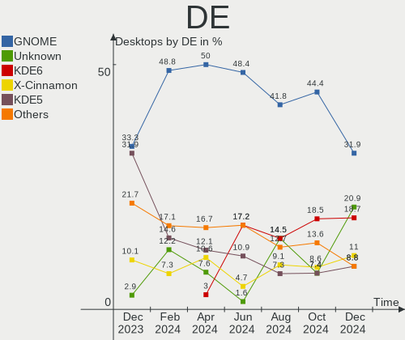
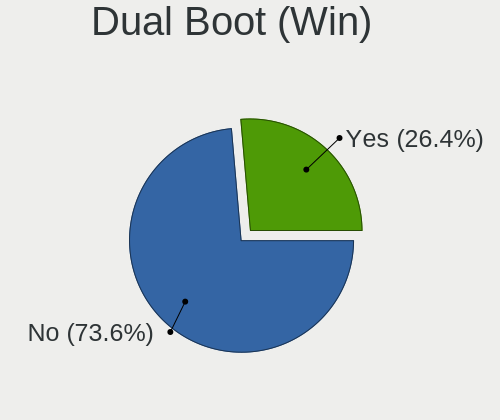
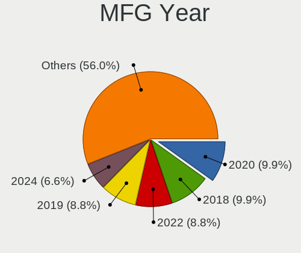
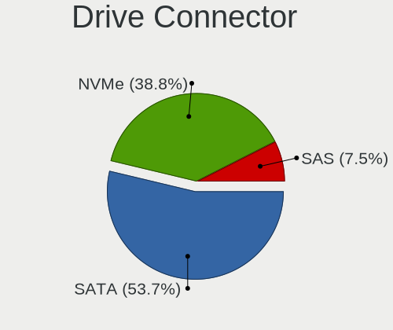
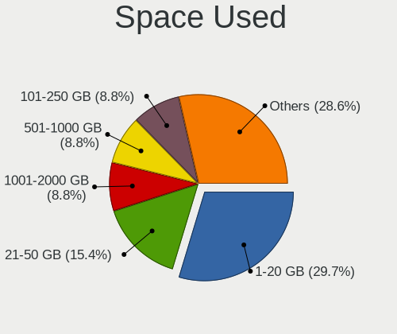
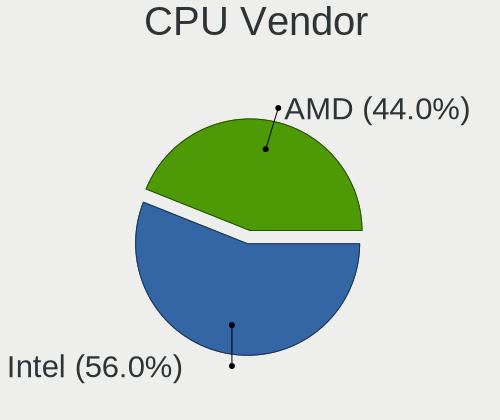
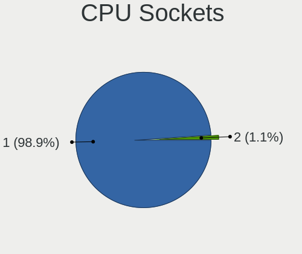
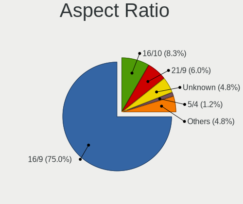
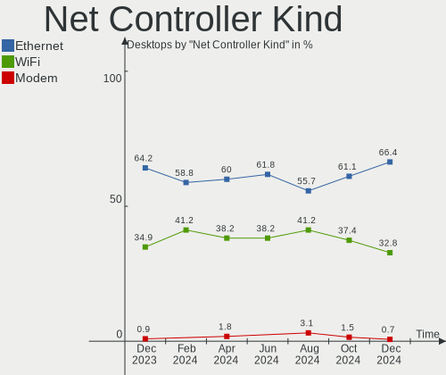

Linux in Canada - Hardware Trends (Desktops)
--------------------------------------------

A project to identify most popular hardware characteristics and track their change
over time based on data collected by Linux users at https://Linux-Hardware.org.

Anyone can contribute to this report by the [hw-probe](https://github.com/linuxhw/hw-probe) tool:

    sudo -E hw-probe -all -upload

Period: Aug, 2023.

Contents
--------

* [ System ](#system)
  - [ OS                       ](#os)
  - [ OS Family                ](#os-family)
  - [ Kernel                   ](#kernel)
  - [ Kernel Family            ](#kernel-family)
  - [ Kernel Major Ver.        ](#kernel-major-ver)
  - [ Arch                     ](#arch)
  - [ DE                       ](#de)
  - [ Display Server           ](#display-server)
  - [ Display Manager          ](#display-manager)
  - [ OS Lang                  ](#os-lang)
  - [ Boot Mode                ](#boot-mode)
  - [ Filesystem               ](#filesystem)
  - [ Part. scheme             ](#part-scheme)
  - [ Dual Boot with Linux/BSD ](#dual-boot-with-linuxbsd)
  - [ Dual Boot (Win)          ](#dual-boot-win)

* [ Board ](#board)
  - [ Vendor                   ](#vendor)
  - [ Model                    ](#model)
  - [ Model Family             ](#model-family)
  - [ MFG Year                 ](#mfg-year)
  - [ Form Factor              ](#form-factor)
  - [ Secure Boot              ](#secure-boot)
  - [ Coreboot                 ](#coreboot)
  - [ RAM Size                 ](#ram-size)
  - [ RAM Used                 ](#ram-used)
  - [ Total Drives             ](#total-drives)
  - [ Has CD-ROM               ](#has-cd-rom)
  - [ Has Ethernet             ](#has-ethernet)
  - [ Has WiFi                 ](#has-wifi)
  - [ Has Bluetooth            ](#has-bluetooth)

* [ Location ](#location)
  - [ Country                  ](#country)
  - [ City                     ](#city)

* [ Drives ](#drives)
  - [ Drive Vendor             ](#drive-vendor)
  - [ Drive Model              ](#drive-model)
  - [ HDD Vendor               ](#hdd-vendor)
  - [ SSD Vendor               ](#ssd-vendor)
  - [ Drive Kind               ](#drive-kind)
  - [ Drive Connector          ](#drive-connector)
  - [ Drive Size               ](#drive-size)
  - [ Space Total              ](#space-total)
  - [ Space Used               ](#space-used)
  - [ Malfunc. Drives          ](#malfunc-drives)
  - [ Malfunc. Drive Vendor    ](#malfunc-drive-vendor)
  - [ Malfunc. HDD Vendor      ](#malfunc-hdd-vendor)
  - [ Malfunc. Drive Kind      ](#malfunc-drive-kind)
  - [ Failed Drives            ](#failed-drives)
  - [ Failed Drive Vendor      ](#failed-drive-vendor)
  - [ Drive Status             ](#drive-status)

* [ Storage controller ](#storage-controller)
  - [ Storage Vendor           ](#storage-vendor)
  - [ Storage Model            ](#storage-model)
  - [ Storage Kind             ](#storage-kind)

* [ Processor ](#processor)
  - [ CPU Vendor               ](#cpu-vendor)
  - [ CPU Model                ](#cpu-model)
  - [ CPU Model Family         ](#cpu-model-family)
  - [ CPU Cores                ](#cpu-cores)
  - [ CPU Sockets              ](#cpu-sockets)
  - [ CPU Threads              ](#cpu-threads)
  - [ CPU Op-Modes             ](#cpu-op-modes)
  - [ CPU Microcode            ](#cpu-microcode)
  - [ CPU Microarch            ](#cpu-microarch)

* [ Graphics ](#graphics)
  - [ GPU Vendor               ](#gpu-vendor)
  - [ GPU Model                ](#gpu-model)
  - [ GPU Combo                ](#gpu-combo)
  - [ GPU Driver               ](#gpu-driver)
  - [ GPU Memory               ](#gpu-memory)

* [ Monitor ](#monitor)
  - [ Monitor Vendor           ](#monitor-vendor)
  - [ Monitor Model            ](#monitor-model)
  - [ Monitor Resolution       ](#monitor-resolution)
  - [ Monitor Diagonal         ](#monitor-diagonal)
  - [ Monitor Width            ](#monitor-width)
  - [ Aspect Ratio             ](#aspect-ratio)
  - [ Monitor Area             ](#monitor-area)
  - [ Pixel Density            ](#pixel-density)
  - [ Multiple Monitors        ](#multiple-monitors)

* [ Network ](#network)
  - [ Net Controller Vendor    ](#net-controller-vendor)
  - [ Net Controller Model     ](#net-controller-model)
  - [ Wireless Vendor          ](#wireless-vendor)
  - [ Wireless Model           ](#wireless-model)
  - [ Ethernet Vendor          ](#ethernet-vendor)
  - [ Ethernet Model           ](#ethernet-model)
  - [ Net Controller Kind      ](#net-controller-kind)
  - [ Used Controller          ](#used-controller)
  - [ NICs                     ](#nics)
  - [ IPv6                     ](#ipv6)

* [ Bluetooth ](#bluetooth)
  - [ Bluetooth Vendor         ](#bluetooth-vendor)
  - [ Bluetooth Model          ](#bluetooth-model)

* [ Sound ](#sound)
  - [ Sound Vendor             ](#sound-vendor)
  - [ Sound Model              ](#sound-model)

* [ Memory ](#memory)
  - [ Memory Vendor            ](#memory-vendor)
  - [ Memory Model             ](#memory-model)
  - [ Memory Kind              ](#memory-kind)
  - [ Memory Form Factor       ](#memory-form-factor)
  - [ Memory Size              ](#memory-size)
  - [ Memory Speed             ](#memory-speed)

* [ Printers & scanners ](#printers--scanners)
  - [ Printer Vendor           ](#printer-vendor)
  - [ Printer Model            ](#printer-model)
  - [ Scanner Vendor           ](#scanner-vendor)
  - [ Scanner Model            ](#scanner-model)

* [ Camera ](#camera)
  - [ Camera Vendor            ](#camera-vendor)
  - [ Camera Model             ](#camera-model)

* [ Security ](#security)
  - [ Fingerprint Vendor       ](#fingerprint-vendor)
  - [ Fingerprint Model        ](#fingerprint-model)
  - [ Chipcard Vendor          ](#chipcard-vendor)
  - [ Chipcard Model           ](#chipcard-model)

* [ Unsupported ](#unsupported)
  - [ Unsupported Devices      ](#unsupported-devices)
  - [ Unsupported Device Types ](#unsupported-device-types)

System
------

OS
--

Installed operating systems

| Name                         | Desktops | Percent |
|------------------------------|----------|---------|
| OpenMandriva 23.08           | 9        | 12.86%  |
| Fedora 38                    | 9        | 12.86%  |
| Ubuntu 22.04                 | 8        | 11.43%  |
| Linux Mint 21.2              | 7        | 10%     |
| Ubuntu 23.04                 | 4        | 5.71%   |
| Debian 12                    | 4        | 5.71%   |
| Zorin 16                     | 3        | 4.29%   |
| Xubuntu 22.04                | 3        | 4.29%   |
| Ubuntu 22.10                 | 3        | 4.29%   |
| Pop!_OS 22.04                | 2        | 2.86%   |
| EndeavourOS Rolling          | 2        | 2.86%   |
| Xubuntu 23.04                | 1        | 1.43%   |
| Xero Rolling                 | 1        | 1.43%   |
| Ubuntu MATE 20.04            | 1        | 1.43%   |
| openSUSE Tumbleweed-XXXXXXXX | 1        | 1.43%   |
| openSUSE Leap-15.5           | 1        | 1.43%   |
| OpenMandriva 4.3             | 1        | 1.43%   |
| OpenMandriva 23.90           | 1        | 1.43%   |
| Nobara 38                    | 1        | 1.43%   |
| Manjaro 23.0.0               | 1        | 1.43%   |
| Linux Mint 21                | 1        | 1.43%   |
| KDE neon 22.04               | 1        | 1.43%   |
| Garuda Linux Rolling         | 1        | 1.43%   |
| Fedora 33                    | 1        | 1.43%   |
| Elementary 7                 | 1        | 1.43%   |
| Devuan 4                     | 1        | 1.43%   |
| ArcoLinux Rolling            | 1        | 1.43%   |

OS Family
---------

OS without a version

| Name         | Desktops | Percent |
|--------------|----------|---------|
| Ubuntu       | 15       | 21.43%  |
| OpenMandriva | 11       | 15.71%  |
| Fedora       | 10       | 14.29%  |
| Linux Mint   | 8        | 11.43%  |
| Xubuntu      | 4        | 5.71%   |
| Debian       | 4        | 5.71%   |
| Zorin        | 3        | 4.29%   |
| Pop!_OS      | 2        | 2.86%   |
| openSUSE     | 2        | 2.86%   |
| EndeavourOS  | 2        | 2.86%   |
| Xero         | 1        | 1.43%   |
| Ubuntu MATE  | 1        | 1.43%   |
| Nobara       | 1        | 1.43%   |
| Manjaro      | 1        | 1.43%   |
| KDE neon     | 1        | 1.43%   |
| Garuda Linux | 1        | 1.43%   |
| Elementary   | 1        | 1.43%   |
| Devuan       | 1        | 1.43%   |
| ArcoLinux    | 1        | 1.43%   |

Kernel
------

Version of the Linux kernel

| Version                      | Desktops | Percent |
|------------------------------|----------|---------|
| 6.2.0-26-generic             | 13       | 18.57%  |
| 6.4.11-desktop-1omv2390      | 7        | 10%     |
| 5.15.0-78-generic            | 7        | 10%     |
| 6.4.8-desktop-2omv2390       | 3        | 4.29%   |
| 5.15.0-79-generic            | 3        | 4.29%   |
| 6.4.6-76060406-generic       | 2        | 2.86%   |
| 6.4.11-200.fc38.x86_64       | 2        | 2.86%   |
| 6.4.10-200.fc38.x86_64       | 2        | 2.86%   |
| 5.19.0-46-generic            | 2        | 2.86%   |
| 6.4.9-arch1-1                | 1        | 1.43%   |
| 6.4.9-200.fc38.x86_64        | 1        | 1.43%   |
| 6.4.9-060409-generic         | 1        | 1.43%   |
| 6.4.8-1-default              | 1        | 1.43%   |
| 6.4.7-200.fc38.x86_64        | 1        | 1.43%   |
| 6.4.12-200.fc38.x86_64       | 1        | 1.43%   |
| 6.4.11-arch2-1               | 1        | 1.43%   |
| 6.4.10-zen2-1-zen            | 1        | 1.43%   |
| 6.4.10-202.fsync.fc38.x86_64 | 1        | 1.43%   |
| 6.3.8-x64v1-xanmod1-1        | 1        | 1.43%   |
| 6.3.8-200.fc38.x86_64        | 1        | 1.43%   |
| 6.3.4-060304-generic         | 1        | 1.43%   |
| 6.2.9-300.fc38.x86_64        | 1        | 1.43%   |
| 6.2.16-6-pve                 | 1        | 1.43%   |
| 6.2.0-27-generic             | 1        | 1.43%   |
| 6.2.0-20-generic             | 1        | 1.43%   |
| 6.1.46-x64v1-xanmod1-1-lts   | 1        | 1.43%   |
| 6.1.41-1-MANJARO             | 1        | 1.43%   |
| 6.1.0-9-amd64                | 1        | 1.43%   |
| 6.1.0-11-amd64               | 1        | 1.43%   |
| 6.1.0-10-amd64               | 1        | 1.43%   |
| 5.4.0-1104-gke               | 1        | 1.43%   |
| 5.19.0-50-generic            | 1        | 1.43%   |
| 5.19.0-45-generic            | 1        | 1.43%   |
| 5.16.7-desktop-1omv4003      | 1        | 1.43%   |
| 5.15.0-58-generic            | 1        | 1.43%   |
| 5.14.21-150500.55.12-default | 1        | 1.43%   |
| 5.14.18-100.fc33.x86_64      | 1        | 1.43%   |
| 5.10.0-23-amd64              | 1        | 1.43%   |

Kernel Family
-------------

Linux kernel without a distro release

| Version | Desktops | Percent |
|---------|----------|---------|
| 6.2.0   | 15       | 21.43%  |
| 5.15.0  | 11       | 15.71%  |
| 6.4.11  | 10       | 14.29%  |
| 6.4.8   | 4        | 5.71%   |
| 6.4.10  | 4        | 5.71%   |
| 5.19.0  | 4        | 5.71%   |
| 6.4.9   | 3        | 4.29%   |
| 6.1.0   | 3        | 4.29%   |
| 6.4.6   | 2        | 2.86%   |
| 6.3.8   | 2        | 2.86%   |
| 6.4.7   | 1        | 1.43%   |
| 6.4.12  | 1        | 1.43%   |
| 6.3.4   | 1        | 1.43%   |
| 6.2.9   | 1        | 1.43%   |
| 6.2.16  | 1        | 1.43%   |
| 6.1.46  | 1        | 1.43%   |
| 6.1.41  | 1        | 1.43%   |
| 5.4.0   | 1        | 1.43%   |
| 5.16.7  | 1        | 1.43%   |
| 5.14.21 | 1        | 1.43%   |
| 5.14.18 | 1        | 1.43%   |
| 5.10.0  | 1        | 1.43%   |

Kernel Major Ver.
-----------------

Linux kernel major version

| Version | Desktops | Percent |
|---------|----------|---------|
| 6.4     | 25       | 35.71%  |
| 6.2     | 17       | 24.29%  |
| 5.15    | 11       | 15.71%  |
| 6.1     | 5        | 7.14%   |
| 5.19    | 4        | 5.71%   |
| 6.3     | 3        | 4.29%   |
| 5.14    | 2        | 2.86%   |
| 5.4     | 1        | 1.43%   |
| 5.16    | 1        | 1.43%   |
| 5.10    | 1        | 1.43%   |

Arch
----

OS architecture (x86_64, i586, etc.)

| Name   | Desktops | Percent |
|--------|----------|---------|
| x86_64 | 70       | 100%    |

DE
--

Desktop Environment

| Name       | Desktops | Percent |
|------------|----------|---------|
| GNOME      | 32       | 45.71%  |
| KDE5       | 16       | 22.86%  |
| X-Cinnamon | 8        | 11.43%  |
| XFCE       | 5        | 7.14%   |
| Unknown    | 5        | 7.14%   |
| LXQt       | 2        | 2.86%   |
| Pantheon   | 1        | 1.43%   |
| MATE       | 1        | 1.43%   |

Display Server
--------------

X11 or Wayland

| Name    | Desktops | Percent |
|---------|----------|---------|
| Wayland | 32       | 45.71%  |
| X11     | 31       | 44.29%  |
| Unknown | 5        | 7.14%   |
| Tty     | 2        | 2.86%   |

Display Manager
---------------

SDDM, LightDM, etc.

| Name    | Desktops | Percent |
|---------|----------|---------|
| Unknown | 25       | 35.71%  |
| SDDM    | 17       | 24.29%  |
| GDM3    | 15       | 21.43%  |
| LightDM | 8        | 11.43%  |
| GDM     | 5        | 7.14%   |

OS Lang
-------

Language

| Lang  | Desktops | Percent |
|-------|----------|---------|
| en_CA | 42       | 60%     |
| en_US | 20       | 28.57%  |
| fr_CA | 6        | 8.57%   |
| en_GB | 2        | 2.86%   |

Boot Mode
---------

EFI or BIOS

| Mode | Desktops | Percent |
|------|----------|---------|
| BIOS | 41       | 58.57%  |
| EFI  | 29       | 41.43%  |

Filesystem
----------

Type of filesystem

| Type    | Desktops | Percent |
|---------|----------|---------|
| Ext4    | 36       | 51.43%  |
| Btrfs   | 16       | 22.86%  |
| Tmpfs   | 12       | 17.14%  |
| Overlay | 5        | 7.14%   |
| Zfs     | 1        | 1.43%   |

Part. scheme
------------

Scheme of partitioning

| Type    | Desktops | Percent |
|---------|----------|---------|
| GPT     | 42       | 60%     |
| Unknown | 21       | 30%     |
| MBR     | 7        | 10%     |

Dual Boot with Linux/BSD
------------------------

Hosting more than one Linux/BSD

| Dual boot | Desktops | Percent |
|-----------|----------|---------|
| No        | 56       | 80%     |
| Yes       | 14       | 20%     |

Dual Boot (Win)
---------------

Hosting Linux and Windows

| Dual boot | Desktops | Percent |
|-----------|----------|---------|
| No        | 53       | 75.71%  |
| Yes       | 17       | 24.29%  |

Board
-----

Vendor
------

Motherboard manufacturer

| Name                | Desktops | Percent |
|---------------------|----------|---------|
| MSI                 | 17       | 24.29%  |
| ASUSTek Computer    | 15       | 21.43%  |
| Hewlett-Packard     | 8        | 11.43%  |
| Gigabyte Technology | 6        | 8.57%   |
| Dell                | 5        | 7.14%   |
| Lenovo              | 4        | 5.71%   |
| AZW                 | 3        | 4.29%   |
| Acer                | 3        | 4.29%   |
| ASRock              | 2        | 2.86%   |
| Supermicro          | 1        | 1.43%   |
| Pegatron            | 1        | 1.43%   |
| Gateway             | 1        | 1.43%   |
| CWWK                | 1        | 1.43%   |
| BESSTAR Tech        | 1        | 1.43%   |
| AMI                 | 1        | 1.43%   |
| Unknown             | 1        | 1.43%   |

Model
-----

Motherboard model

| Name                                   | Desktops | Percent |
|----------------------------------------|----------|---------|
| MSI MS-7D43                            | 2        | 2.86%   |
| HP Z420 Workstation                    | 2        | 2.86%   |
| Supermicro SYS-1018GR-T                | 1        | 1.43%   |
| Pegatron AW016AV-ABA s5280t            | 1        | 1.43%   |
| MSI MS-7E07                            | 1        | 1.43%   |
| MSI MS-7E06                            | 1        | 1.43%   |
| MSI MS-7D77                            | 1        | 1.43%   |
| MSI MS-7D76                            | 1        | 1.43%   |
| MSI MS-7C95                            | 1        | 1.43%   |
| MSI MS-7C87                            | 1        | 1.43%   |
| MSI MS-7C56                            | 1        | 1.43%   |
| MSI MS-7B86                            | 1        | 1.43%   |
| MSI MS-7B33                            | 1        | 1.43%   |
| MSI MS-7B29                            | 1        | 1.43%   |
| MSI MS-7917                            | 1        | 1.43%   |
| MSI MS-7885                            | 1        | 1.43%   |
| MSI MS-7823                            | 1        | 1.43%   |
| MSI MS-7721                            | 1        | 1.43%   |
| MSI MS-7693                            | 1        | 1.43%   |
| Lenovo ThinkCentre M92P 3237EJ3        | 1        | 1.43%   |
| Lenovo ThinkCentre M73 10B00013US      | 1        | 1.43%   |
| Lenovo ThinkCentre M57 6072BJU         | 1        | 1.43%   |
| Lenovo H415                            | 1        | 1.43%   |
| HP ProDesk 600 G1 SFF                  | 1        | 1.43%   |
| HP EliteDesk 800 G1 TWR                | 1        | 1.43%   |
| HP Compaq dc7900 Convertible Minitower | 1        | 1.43%   |
| HP Compaq 8200 Elite USDT PC           | 1        | 1.43%   |
| HP Compaq 8000 Elite SFF PC            | 1        | 1.43%   |
| HP Compaq 8000 Elite CMT PC            | 1        | 1.43%   |
| Gigabyte Z690 AORUS ELITE AX           | 1        | 1.43%   |
| Gigabyte Z390 AORUS PRO WIFI           | 1        | 1.43%   |
| Gigabyte Z270X-UD5                     | 1        | 1.43%   |
| Gigabyte H81M-S2PV                     | 1        | 1.43%   |
| Gigabyte GA-990FXA-UD3                 | 1        | 1.43%   |
| Gigabyte B650 AORUS ELITE AX           | 1        | 1.43%   |
| Gateway SX2185                         | 1        | 1.43%   |
| Dell XPS 8940                          | 1        | 1.43%   |
| Dell Precision WorkStation T3500       | 1        | 1.43%   |
| Dell OptiPlex 990                      | 1        | 1.43%   |
| Dell OptiPlex 790                      | 1        | 1.43%   |

Model Family
------------

Motherboard model prefix

| Name                    | Desktops | Percent |
|-------------------------|----------|---------|
| HP Compaq               | 4        | 5.71%   |
| Lenovo ThinkCentre      | 3        | 4.29%   |
| Dell OptiPlex           | 3        | 4.29%   |
| Acer Aspire             | 3        | 4.29%   |
| MSI MS-7D43             | 2        | 2.86%   |
| HP Z420                 | 2        | 2.86%   |
| ASUS TUF                | 2        | 2.86%   |
| ASUS ROG                | 2        | 2.86%   |
| ASUS PRIME              | 2        | 2.86%   |
| Supermicro SYS-1018GR-T | 1        | 1.43%   |
| Pegatron AW016AV-ABA    | 1        | 1.43%   |
| MSI MS-7E07             | 1        | 1.43%   |
| MSI MS-7E06             | 1        | 1.43%   |
| MSI MS-7D77             | 1        | 1.43%   |
| MSI MS-7D76             | 1        | 1.43%   |
| MSI MS-7C95             | 1        | 1.43%   |
| MSI MS-7C87             | 1        | 1.43%   |
| MSI MS-7C56             | 1        | 1.43%   |
| MSI MS-7B86             | 1        | 1.43%   |
| MSI MS-7B33             | 1        | 1.43%   |
| MSI MS-7B29             | 1        | 1.43%   |
| MSI MS-7917             | 1        | 1.43%   |
| MSI MS-7885             | 1        | 1.43%   |
| MSI MS-7823             | 1        | 1.43%   |
| MSI MS-7721             | 1        | 1.43%   |
| MSI MS-7693             | 1        | 1.43%   |
| Lenovo H415             | 1        | 1.43%   |
| HP ProDesk              | 1        | 1.43%   |
| HP EliteDesk            | 1        | 1.43%   |
| Gigabyte Z690           | 1        | 1.43%   |
| Gigabyte Z390           | 1        | 1.43%   |
| Gigabyte Z270X-UD5      | 1        | 1.43%   |
| Gigabyte H81M-S2PV      | 1        | 1.43%   |
| Gigabyte GA-990FXA-UD3  | 1        | 1.43%   |
| Gigabyte B650           | 1        | 1.43%   |
| Gateway SX2185          | 1        | 1.43%   |
| Dell XPS                | 1        | 1.43%   |
| Dell Precision          | 1        | 1.43%   |
| CWWK CW-J6-6L           | 1        | 1.43%   |
| BESSTAR Tech UM700      | 1        | 1.43%   |

MFG Year
--------

Motherboard manufacture year

| Year | Desktops | Percent |
|------|----------|---------|
| 2022 | 8        | 11.43%  |
| 2020 | 8        | 11.43%  |
| 2011 | 7        | 10%     |
| 2013 | 6        | 8.57%   |
| 2021 | 5        | 7.14%   |
| 2018 | 5        | 7.14%   |
| 2012 | 5        | 7.14%   |
| 2019 | 4        | 5.71%   |
| 2015 | 4        | 5.71%   |
| 2023 | 3        | 4.29%   |
| 2014 | 3        | 4.29%   |
| 2009 | 3        | 4.29%   |
| 2016 | 2        | 2.86%   |
| 2010 | 2        | 2.86%   |
| 2008 | 2        | 2.86%   |
| 2007 | 2        | 2.86%   |
| 2006 | 1        | 1.43%   |

Form Factor
-----------

Physical design of the computer

| Name    | Desktops | Percent |
|---------|----------|---------|
| Desktop | 70       | 100%    |

Secure Boot
-----------

Enabled or disabled

| State    | Desktops | Percent |
|----------|----------|---------|
| Disabled | 69       | 98.57%  |
| Enabled  | 1        | 1.43%   |

Coreboot
--------

Have coreboot on board

| Used | Desktops | Percent |
|------|----------|---------|
| No   | 70       | 100%    |

RAM Size
--------

Total RAM memory

| Size in GB  | Desktops | Percent |
|-------------|----------|---------|
| 16.01-24.0  | 21       | 30%     |
| 32.01-64.0  | 15       | 21.43%  |
| 8.01-16.0   | 11       | 15.71%  |
| 64.01-256.0 | 9        | 12.86%  |
| 4.01-8.0    | 7        | 10%     |
| 3.01-4.0    | 3        | 4.29%   |
| 24.01-32.0  | 3        | 4.29%   |
| 1.01-2.0    | 1        | 1.43%   |

RAM Used
--------

Used RAM memory

| Used GB    | Desktops | Percent |
|------------|----------|---------|
| 1.01-2.0   | 20       | 28.57%  |
| 2.01-3.0   | 18       | 25.71%  |
| 4.01-8.0   | 16       | 22.86%  |
| 8.01-16.0  | 6        | 8.57%   |
| 3.01-4.0   | 5        | 7.14%   |
| 0.51-1.0   | 3        | 4.29%   |
| 24.01-32.0 | 1        | 1.43%   |
| 0.01-0.5   | 1        | 1.43%   |

Total Drives
------------

Number of drives on board

| Drives | Desktops | Percent |
|--------|----------|---------|
| 1      | 27       | 38.57%  |
| 3      | 15       | 21.43%  |
| 2      | 14       | 20%     |
| 4      | 7        | 10%     |
| 5      | 4        | 5.71%   |
| 11     | 1        | 1.43%   |
| 9      | 1        | 1.43%   |
| 6      | 1        | 1.43%   |

Has CD-ROM
----------

Has CD-ROM on board

| Presented | Desktops | Percent |
|-----------|----------|---------|
| No        | 46       | 65.71%  |
| Yes       | 24       | 34.29%  |

Has Ethernet
------------

Has Ethernet on board

| Presented | Desktops | Percent |
|-----------|----------|---------|
| Yes       | 69       | 98.57%  |
| No        | 1        | 1.43%   |

Has WiFi
--------

Has WiFi module

| Presented | Desktops | Percent |
|-----------|----------|---------|
| Yes       | 42       | 60%     |
| No        | 28       | 40%     |

Has Bluetooth
-------------

Has Bluetooth module

| Presented | Desktops | Percent |
|-----------|----------|---------|
| No        | 36       | 51.43%  |
| Yes       | 34       | 48.57%  |

Location
--------

Country
-------

Geographic location (country)

| Country | Desktops | Percent |
|---------|----------|---------|
| Canada  | 70       | 100%    |

City
----

Geographic location (city)

| City                  | Desktops | Percent |
|-----------------------|----------|---------|
| Montreal              | 7        | 10%     |
| Toronto               | 6        | 8.57%   |
| Edmonton              | 4        | 5.71%   |
| Regina                | 3        | 4.29%   |
| Ottawa                | 3        | 4.29%   |
| Winnipeg              | 2        | 2.86%   |
| Vancouver             | 2        | 2.86%   |
| Tillsonburg           | 2        | 2.86%   |
| Thunder Bay           | 2        | 2.86%   |
| Québec               | 2        | 2.86%   |
| Newcastle             | 2        | 2.86%   |
| Nepean                | 2        | 2.86%   |
| Kamloops              | 2        | 2.86%   |
| Drummondville         | 2        | 2.86%   |
| Calgary               | 2        | 2.86%   |
| Woodbridge            | 1        | 1.43%   |
| Wolfville             | 1        | 1.43%   |
| Truro                 | 1        | 1.43%   |
| Timmins               | 1        | 1.43%   |
| Surrey                | 1        | 1.43%   |
| Sorel-Tracy           | 1        | 1.43%   |
| Smiths Falls          | 1        | 1.43%   |
| Saskatoon             | 1        | 1.43%   |
| Saint-Lazare          | 1        | 1.43%   |
| Saint-Hyacinthe       | 1        | 1.43%   |
| Saint-Basile-le-Grand | 1        | 1.43%   |
| Rimouski              | 1        | 1.43%   |
| Red Lake              | 1        | 1.43%   |
| Oshawa                | 1        | 1.43%   |
| Mississauga           | 1        | 1.43%   |
| Miramichi             | 1        | 1.43%   |
| Markham               | 1        | 1.43%   |
| Jonquiere             | 1        | 1.43%   |
| Hamilton              | 1        | 1.43%   |
| Fort St. John         | 1        | 1.43%   |
| Forest                | 1        | 1.43%   |
| Estevan               | 1        | 1.43%   |
| Corner Brook          | 1        | 1.43%   |
| Chicoutimi            | 1        | 1.43%   |
| Carleton Place        | 1        | 1.43%   |

Drives
------

Drive Vendor
------------

Hard drive vendors

| Vendor                      | Desktops | Drives | Percent |
|-----------------------------|----------|--------|---------|
| Seagate                     | 28       | 36     | 19.72%  |
| WDC                         | 25       | 33     | 17.61%  |
| Samsung Electronics         | 22       | 31     | 15.49%  |
| Sandisk                     | 14       | 16     | 9.86%   |
| Kingston                    | 6        | 7      | 4.23%   |
| Hitachi                     | 6        | 6      | 4.23%   |
| Crucial                     | 6        | 7      | 4.23%   |
| Intel                       | 4        | 5      | 2.82%   |
| Unknown                     | 3        | 3      | 2.11%   |
| Toshiba                     | 3        | 3      | 2.11%   |
| Realtek Semiconductor       | 2        | 2      | 1.41%   |
| Realtek                     | 2        | 2      | 1.41%   |
| MAXIO Technology (Hangzhou) | 2        | 2      | 1.41%   |
| Dogfish                     | 2        | 2      | 1.41%   |
| Timetec                     | 1        | 1      | 0.7%    |
| T-FORCE                     | 1        | 1      | 0.7%    |
| Supermicro                  | 1        | 1      | 0.7%    |
| SPCC                        | 1        | 1      | 0.7%    |
| Phison Electronics          | 1        | 1      | 0.7%    |
| Patriot                     | 1        | 1      | 0.7%    |
| OCZ                         | 1        | 1      | 0.7%    |
| Micron/Crucial Technology   | 1        | 1      | 0.7%    |
| Micron Technology           | 1        | 1      | 0.7%    |
| Maxtor                      | 1        | 1      | 0.7%    |
| Maxone                      | 1        | 1      | 0.7%    |
| Lexar                       | 1        | 1      | 0.7%    |
| Kingston Technology Company | 1        | 1      | 0.7%    |
| Hewlett-Packard             | 1        | 1      | 0.7%    |
| Fanxiang                    | 1        | 1      | 0.7%    |
| Corsair                     | 1        | 2      | 0.7%    |
| China                       | 1        | 1      | 0.7%    |

Drive Model
-----------

Hard drive models

| Model                                                 | Desktops | Percent |
|-------------------------------------------------------|----------|---------|
| Seagate ST1000DM003-1CH162 1TB                        | 4        | 2.47%   |
| Samsung SSD 860 EVO 500GB                             | 4        | 2.47%   |
| WDC WD1003FZEX-00K3CA0 1TB                            | 3        | 1.85%   |
| Sandisk WD_BLACK SN750 SE 1TB                         | 3        | 1.85%   |
| Samsung SSD 980 PRO 1TB                               | 3        | 1.85%   |
| Samsung NVMe SSD Controller PM9A1/PM9A3/980PRO 1024GB | 3        | 1.85%   |
| WDC WD10EZEX-08WN4A0 1TB                              | 2        | 1.23%   |
| Unknown SD/MMC/MS PRO 1GB                             | 2        | 1.23%   |
| Toshiba DT01ACA100 1TB                                | 2        | 1.23%   |
| Seagate ST500DM002-1BD142 500GB                       | 2        | 1.23%   |
| Seagate ST1000DM010-2EP102 1TB                        | 2        | 1.23%   |
| Sandisk WD Blue SN550 NVMe SSD 250GB                  | 2        | 1.23%   |
| SanDisk NVMe SSD Drive 2TB                            | 2        | 1.23%   |
| Samsung SSD 870 EVO 500GB                             | 2        | 1.23%   |
| Samsung NVMe SSD Controller SM981/PM981/PM983 500GB   | 2        | 1.23%   |
| Realtek RTL9210B-CG 2TB                               | 2        | 1.23%   |
| MAXIO (Hangzhou) NVMe SSD Controller MAP1202 1024GB   | 2        | 1.23%   |
| Kingston SA400S37480G 480GB SSD                       | 2        | 1.23%   |
| Hitachi HDS721010CLA332 1TB                           | 2        | 1.23%   |
| Dogfish SSD 128GB                                     | 2        | 1.23%   |
| WDC WDS500G2B0C-00PXH0 500GB                          | 1        | 0.62%   |
| WDC WDS500G2B0A 500GB SSD                             | 1        | 0.62%   |
| WDC WD80EMAZ-00WJTA0 8TB                              | 1        | 0.62%   |
| WDC WD6400AAKS-22A7B2 640GB                           | 1        | 0.62%   |
| WDC WD5000AAKS-00A7B2 500GB                           | 1        | 0.62%   |
| WDC WD40EZRX-00SPEB0 4TB                              | 1        | 0.62%   |
| WDC WD40EZAZ-22SF3B0 4TB                              | 1        | 0.62%   |
| WDC WD40EZAZ-00SF3B0 4TB                              | 1        | 0.62%   |
| WDC WD40EFAX-68JH4N1 4TB                              | 1        | 0.62%   |
| WDC WD3200AAKS-00L9A0 320GB                           | 1        | 0.62%   |
| WDC WD3200AAJS-00L7A0 320GB                           | 1        | 0.62%   |
| WDC WD30EZRX-00DC0B0 3TB                              | 1        | 0.62%   |
| WDC WD2500JD-00HBB0 250GB                             | 1        | 0.62%   |
| WDC WD20EZAZ-00GGJB0 2TB                              | 1        | 0.62%   |
| WDC WD20EARX-00PASB0 2TB                              | 1        | 0.62%   |
| WDC WD20EARS-42S0XB0 2TB                              | 1        | 0.62%   |
| WDC WD20EARS-00MVWB0 2TB                              | 1        | 0.62%   |
| WDC WD2005FBYZ-01YCBB3 2TB                            | 1        | 0.62%   |
| WDC WD2000F9YZ-09N20L1 2TB                            | 1        | 0.62%   |
| WDC WD120EDAZ-11F3RA0 12TB                            | 1        | 0.62%   |

HDD Vendor
----------

Hard disk drive vendors

| Vendor              | Desktops | Drives | Percent |
|---------------------|----------|--------|---------|
| Seagate             | 28       | 34     | 43.08%  |
| WDC                 | 23       | 30     | 35.38%  |
| Hitachi             | 6        | 6      | 9.23%   |
| Toshiba             | 3        | 3      | 4.62%   |
| Unknown             | 2        | 2      | 3.08%   |
| Samsung Electronics | 1        | 1      | 1.54%   |
| Maxtor              | 1        | 1      | 1.54%   |
| Maxone              | 1        | 1      | 1.54%   |

SSD Vendor
----------

Solid state drive vendors

| Vendor              | Desktops | Drives | Percent |
|---------------------|----------|--------|---------|
| Samsung Electronics | 13       | 18     | 34.21%  |
| Kingston            | 4        | 5      | 10.53%  |
| Crucial             | 4        | 5      | 10.53%  |
| SanDisk             | 3        | 3      | 7.89%   |
| WDC                 | 2        | 2      | 5.26%   |
| Dogfish             | 2        | 2      | 5.26%   |
| Timetec             | 1        | 1      | 2.63%   |
| Supermicro          | 1        | 1      | 2.63%   |
| SPCC                | 1        | 1      | 2.63%   |
| Seagate             | 1        | 1      | 2.63%   |
| Patriot             | 1        | 1      | 2.63%   |
| OCZ                 | 1        | 1      | 2.63%   |
| Lexar               | 1        | 1      | 2.63%   |
| Hewlett-Packard     | 1        | 1      | 2.63%   |
| Fanxiang            | 1        | 1      | 2.63%   |
| China               | 1        | 1      | 2.63%   |

Drive Kind
----------

HDD or SSD

| Kind    | Desktops | Drives | Percent |
|---------|----------|--------|---------|
| HDD     | 43       | 78     | 39.81%  |
| SSD     | 33       | 45     | 30.56%  |
| NVMe    | 29       | 47     | 26.85%  |
| Unknown | 2        | 2      | 1.85%   |
| MMC     | 1        | 1      | 0.93%   |

Drive Connector
---------------

SATA, SAS, NVMe, etc.

| Type | Desktops | Drives | Percent |
|------|----------|--------|---------|
| SATA | 55       | 116    | 58.51%  |
| NVMe | 29       | 45     | 30.85%  |
| SAS  | 9        | 11     | 9.57%   |
| MMC  | 1        | 1      | 1.06%   |

Drive Size
----------

Size of hard drive

| Size in TB | Desktops | Drives | Percent |
|------------|----------|--------|---------|
| 0.01-0.5   | 42       | 59     | 45.65%  |
| 0.51-1.0   | 24       | 31     | 26.09%  |
| 1.01-2.0   | 11       | 15     | 11.96%  |
| 3.01-4.0   | 4        | 4      | 4.35%   |
| 2.01-3.0   | 4        | 4      | 4.35%   |
| 4.01-10.0  | 4        | 6      | 4.35%   |
| 10.01-20.0 | 3        | 4      | 3.26%   |

Space Total
-----------

Amount of disk space available on the file system

| Size in GB     | Desktops | Percent |
|----------------|----------|---------|
| More than 3000 | 13       | 18.57%  |
| 251-500        | 13       | 18.57%  |
| 501-1000       | 13       | 18.57%  |
| 101-250        | 8        | 11.43%  |
| 1001-2000      | 8        | 11.43%  |
| 2001-3000      | 6        | 8.57%   |
| 1-20           | 5        | 7.14%   |
| 51-100         | 2        | 2.86%   |
| 21-50          | 1        | 1.43%   |
| Unknown        | 1        | 1.43%   |

Space Used
----------

Amount of used disk space

| Used GB        | Desktops | Percent |
|----------------|----------|---------|
| 1-20           | 23       | 32.86%  |
| 51-100         | 10       | 14.29%  |
| 21-50          | 8        | 11.43%  |
| More than 3000 | 6        | 8.57%   |
| 251-500        | 6        | 8.57%   |
| 101-250        | 6        | 8.57%   |
| 501-1000       | 4        | 5.71%   |
| 2001-3000      | 3        | 4.29%   |
| 1001-2000      | 3        | 4.29%   |
| Unknown        | 1        | 1.43%   |

Malfunc. Drives
---------------

Drive models with a malfunction

| Model                             | Desktops | Drives | Percent |
|-----------------------------------|----------|--------|---------|
| Seagate ST500LM021-1KJ152 500GB   | 1        | 1      | 20%     |
| Seagate ST3250310AS 250GB         | 1        | 1      | 20%     |
| Seagate ST14000NM0018-2H4101 14TB | 1        | 1      | 20%     |
| Crucial M4-CT128M4SSD2 128GB      | 1        | 1      | 20%     |
| China SATA SSD 64GB               | 1        | 1      | 20%     |

Malfunc. Drive Vendor
---------------------

Vendors of faulty drives

| Vendor  | Desktops | Drives | Percent |
|---------|----------|--------|---------|
| Seagate | 3        | 3      | 60%     |
| Crucial | 1        | 1      | 20%     |
| China   | 1        | 1      | 20%     |

Malfunc. HDD Vendor
-------------------

Vendors of faulty HDD drives

| Vendor  | Desktops | Drives | Percent |
|---------|----------|--------|---------|
| Seagate | 3        | 3      | 100%    |

Malfunc. Drive Kind
-------------------

Kinds of faulty drives

| Kind | Desktops | Drives | Percent |
|------|----------|--------|---------|
| HDD  | 3        | 3      | 60%     |
| SSD  | 2        | 2      | 40%     |

Failed Drives
-------------

Failed drive models

Zero info for selected period =(

Failed Drive Vendor
-------------------

Failed drive vendors

Zero info for selected period =(

Drive Status
------------

Number of failed and malfunc. drives

| Status   | Desktops | Drives | Percent |
|----------|----------|--------|---------|
| Detected | 42       | 95     | 51.85%  |
| Works    | 34       | 73     | 41.98%  |
| Malfunc  | 5        | 5      | 6.17%   |

Storage controller
------------------

Storage Vendor
--------------

Storage controller vendors

| Vendor                      | Desktops | Percent |
|-----------------------------|----------|---------|
| Intel                       | 46       | 41.44%  |
| AMD                         | 23       | 20.72%  |
| SanDisk                     | 12       | 10.81%  |
| Samsung Electronics         | 10       | 9.01%   |
| ASMedia Technology          | 4        | 3.6%    |
| Micron/Crucial Technology   | 3        | 2.7%    |
| Marvell Technology Group    | 3        | 2.7%    |
| Kingston Technology Company | 3        | 2.7%    |
| Realtek Semiconductor       | 2        | 1.8%    |
| Phison Electronics          | 2        | 1.8%    |
| MAXIO Technology (Hangzhou) | 2        | 1.8%    |
| Micron Technology           | 1        | 0.9%    |

Storage Model
-------------

Storage controller models

| Model                                                                          | Desktops | Percent |
|--------------------------------------------------------------------------------|----------|---------|
| AMD FCH SATA Controller [AHCI mode]                                            | 12       | 8.96%   |
| Samsung NVMe SSD Controller PM9A1/PM9A3/980PRO                                 | 7        | 5.22%   |
| Intel 8 Series/C220 Series Chipset Family 6-port SATA Controller 1 [AHCI mode] | 5        | 3.73%   |
| Intel Alder Lake-S PCH SATA Controller [AHCI Mode]                             | 4        | 2.99%   |
| Intel 6 Series/C200 Series Chipset Family 6 port Desktop SATA AHCI Controller  | 4        | 2.99%   |
| ASMedia ASM1062 Serial ATA Controller                                          | 4        | 2.99%   |
| AMD 500 Series Chipset SATA Controller                                         | 4        | 2.99%   |
| SanDisk WD Blue SN550 NVMe SSD                                                 | 3        | 2.24%   |
| SanDisk PC SN735 NVMe SSD (DRAM-less)                                          | 3        | 2.24%   |
| Micron/Crucial P2 [Nick P2] / P3 / P3 Plus NVMe PCIe SSD (DRAM-less)           | 3        | 2.24%   |
| Intel Comet Lake SATA AHCI Controller                                          | 3        | 2.24%   |
| Intel Cannon Lake PCH SATA AHCI Controller                                     | 3        | 2.24%   |
| AMD SB7x0/SB8x0/SB9x0 SATA Controller [AHCI mode]                              | 3        | 2.24%   |
| SanDisk WD Black SN770 / PC SN740 256GB / PC SN560 (DRAM-less) NVMe SSD        | 2        | 1.49%   |
| Samsung NVMe SSD Controller SM981/PM981/PM983                                  | 2        | 1.49%   |
| Samsung NVMe SSD Controller 980                                                | 2        | 1.49%   |
| Realtek RTS5765DL NVMe SSD Controller (DRAM-less)                              | 2        | 1.49%   |
| MAXIO (Hangzhou) NVMe SSD Controller MAP1202                                   | 2        | 1.49%   |
| Intel SATA Controller [RAID mode]                                              | 2        | 1.49%   |
| Intel SATA controller                                                          | 2        | 1.49%   |
| Intel NM10/ICH7 Family SATA Controller [IDE mode]                              | 2        | 1.49%   |
| Intel C610/X99 series chipset sSATA Controller [AHCI mode]                     | 2        | 1.49%   |
| Intel C610/X99 series chipset 6-Port SATA Controller [AHCI mode]               | 2        | 1.49%   |
| Intel C602 chipset 4-Port SATA Storage Control Unit                            | 2        | 1.49%   |
| Intel C600/X79 series chipset SATA RAID Controller                             | 2        | 1.49%   |
| Intel C600/X79 series chipset IDE-r Controller                                 | 2        | 1.49%   |
| Intel 9 Series Chipset Family SATA Controller [AHCI Mode]                      | 2        | 1.49%   |
| Intel 82Q35 Express PT IDER Controller                                         | 2        | 1.49%   |
| Intel 82801JD/DO (ICH10 Family) SATA AHCI Controller                           | 2        | 1.49%   |
| Intel 82801G (ICH7 Family) IDE Controller                                      | 2        | 1.49%   |
| Intel 700 Series Chipset Family SATA AHCI Controller                           | 2        | 1.49%   |
| Intel 7 Series/C210 Series Chipset Family 6-port SATA Controller [AHCI mode]   | 2        | 1.49%   |
| AMD 400 Series Chipset SATA Controller                                         | 2        | 1.49%   |
| Sandisk Western Digital WD Black SN850X NVMe SSD                               | 1        | 0.75%   |
| SanDisk WD PC SN810 / Black SN850 NVMe SSD                                     | 1        | 0.75%   |
| SanDisk WD Green SN350 NVMe SSD 1 TB (DRAM-less)                               | 1        | 0.75%   |
| SanDisk WD Blue SN570 NVMe SSD 2TB                                             | 1        | 0.75%   |
| SanDisk WD Blue SN570 NVMe SSD 1TB                                             | 1        | 0.75%   |
| SanDisk WD Black 2018/SN750 / PC SN720 NVMe SSD                                | 1        | 0.75%   |
| Phison E16 PCIe4 NVMe Controller                                               | 1        | 0.75%   |

Storage Kind
------------

Kind of storage controller (IDE, SATA, NVMe, SAS, ...)

| Kind | Desktops | Percent |
|------|----------|---------|
| SATA | 59       | 56.19%  |
| NVMe | 29       | 27.62%  |
| IDE  | 9        | 8.57%   |
| RAID | 6        | 5.71%   |
| SAS  | 2        | 1.9%    |

Processor
---------

CPU Vendor
----------

Processor vendors

| Vendor | Desktops | Percent |
|--------|----------|---------|
| Intel  | 47       | 67.14%  |
| AMD    | 23       | 32.86%  |

CPU Model
---------

Processor models

| Model                                  | Desktops | Percent |
|----------------------------------------|----------|---------|
| Intel N100                             | 2        | 2.86%   |
| Intel Core i5-2400 CPU @ 3.10GHz       | 2        | 2.86%   |
| Intel Core 2 Duo CPU E4500 @ 2.20GHz   | 2        | 2.86%   |
| Intel 13th Gen Core i7-13700K          | 2        | 2.86%   |
| AMD Ryzen 9 7950X 16-Core Processor    | 2        | 2.86%   |
| AMD Ryzen 9 7900X 12-Core Processor    | 2        | 2.86%   |
| AMD Ryzen 7 5700G with Radeon Graphics | 2        | 2.86%   |
| Intel Xeon CPU W3530 @ 2.80GHz         | 1        | 1.43%   |
| Intel Xeon CPU E5-2603 v4 @ 1.70GHz    | 1        | 1.43%   |
| Intel Xeon CPU E5-1620 0 @ 3.60GHz     | 1        | 1.43%   |
| Intel Xeon CPU E5-1603 0 @ 2.80GHz     | 1        | 1.43%   |
| Intel Pentium Dual CPU E2160 @ 1.80GHz | 1        | 1.43%   |
| Intel Core i9-9880H CPU @ 2.30GHz      | 1        | 1.43%   |
| Intel Core i7-9700K CPU @ 3.60GHz      | 1        | 1.43%   |
| Intel Core i7-7700K CPU @ 4.20GHz      | 1        | 1.43%   |
| Intel Core i7-6800K CPU @ 3.40GHz      | 1        | 1.43%   |
| Intel Core i7-4790K CPU @ 4.00GHz      | 1        | 1.43%   |
| Intel Core i7-4790 CPU @ 3.60GHz       | 1        | 1.43%   |
| Intel Core i7-3770 CPU @ 3.40GHz       | 1        | 1.43%   |
| Intel Core i7-2600K CPU @ 3.40GHz      | 1        | 1.43%   |
| Intel Core i7-10700K CPU @ 3.80GHz     | 1        | 1.43%   |
| Intel Core i7-10700 CPU @ 2.90GHz      | 1        | 1.43%   |
| Intel Core i7 CPU X 980 @ 3.33GHz      | 1        | 1.43%   |
| Intel Core i5-9400 CPU @ 2.90GHz       | 1        | 1.43%   |
| Intel Core i5-8600K CPU @ 3.60GHz      | 1        | 1.43%   |
| Intel Core i5-4690K CPU @ 3.50GHz      | 1        | 1.43%   |
| Intel Core i5-4590 CPU @ 3.30GHz       | 1        | 1.43%   |
| Intel Core i5-4570 CPU @ 3.20GHz       | 1        | 1.43%   |
| Intel Core i5-4460 CPU @ 3.20GHz       | 1        | 1.43%   |
| Intel Core i5-3470T CPU @ 2.90GHz      | 1        | 1.43%   |
| Intel Core i5-2400S CPU @ 2.50GHz      | 1        | 1.43%   |
| Intel Core i5-10400 CPU @ 2.90GHz      | 1        | 1.43%   |
| Intel Core i5-1035G7 CPU @ 1.20GHz     | 1        | 1.43%   |
| Intel Core i3-8100 CPU @ 3.60GHz       | 1        | 1.43%   |
| Intel Core i3-4150 CPU @ 3.50GHz       | 1        | 1.43%   |
| Intel Core 2 Quad CPU Q8400 @ 2.66GHz  | 1        | 1.43%   |
| Intel Core 2 Quad CPU Q8300 @ 2.50GHz  | 1        | 1.43%   |
| Intel Core 2 Quad CPU Q6600 @ 2.40GHz  | 1        | 1.43%   |
| Intel Core 2 Duo CPU E7500 @ 2.93GHz   | 1        | 1.43%   |
| Intel Core 2 Duo CPU E7200 @ 2.53GHz   | 1        | 1.43%   |

CPU Model Family
----------------

Processor model prefix

| Model              | Desktops | Percent |
|--------------------|----------|---------|
| Intel Core i5      | 12       | 17.14%  |
| Intel Core i7      | 10       | 14.29%  |
| Other              | 9        | 12.86%  |
| AMD Ryzen 7        | 5        | 7.14%   |
| Intel Xeon         | 4        | 5.71%   |
| Intel Core 2 Duo   | 4        | 5.71%   |
| AMD Ryzen 9        | 4        | 5.71%   |
| AMD FX             | 4        | 5.71%   |
| Intel Core 2 Quad  | 3        | 4.29%   |
| AMD Ryzen 3        | 3        | 4.29%   |
| AMD A6             | 3        | 4.29%   |
| Intel Core i3      | 2        | 2.86%   |
| AMD Ryzen 5        | 2        | 2.86%   |
| Intel Pentium Dual | 1        | 1.43%   |
| Intel Core i9      | 1        | 1.43%   |
| Intel Celeron      | 1        | 1.43%   |
| Intel Atom         | 1        | 1.43%   |
| AMD Athlon X4      | 1        | 1.43%   |

CPU Cores
---------

Number of processor cores

| Number | Desktops | Percent |
|--------|----------|---------|
| 4      | 36       | 51.43%  |
| 2      | 9        | 12.86%  |
| 8      | 8        | 11.43%  |
| 6      | 8        | 11.43%  |
| 16     | 5        | 7.14%   |
| 12     | 3        | 4.29%   |
| 10     | 1        | 1.43%   |

CPU Sockets
-----------

Number of sockets

| Number | Desktops | Percent |
|--------|----------|---------|
| 1      | 70       | 100%    |

CPU Threads
-----------

Threads per core (Hyper-Threading)

| Number | Desktops | Percent |
|--------|----------|---------|
| 2      | 40       | 57.14%  |
| 1      | 30       | 42.86%  |

CPU Op-Modes
------------

CPU Operation Modes (32-bit, 64-bit)

| Op mode        | Desktops | Percent |
|----------------|----------|---------|
| 32-bit, 64-bit | 70       | 100%    |

CPU Microcode
-------------

Microcode number

| Number     | Desktops | Percent |
|------------|----------|---------|
| Unknown    | 39       | 55.71%  |
| 0x0a601203 | 5        | 7.14%   |
| 0x6fd      | 3        | 4.29%   |
| 0x0a50000d | 2        | 2.86%   |
| 0x06000852 | 2        | 2.86%   |
| 0x03000014 | 2        | 2.86%   |
| 0xb0671    | 1        | 1.43%   |
| 0x906ea    | 1        | 1.43%   |
| 0x90675    | 1        | 1.43%   |
| 0x90672    | 1        | 1.43%   |
| 0x406f1    | 1        | 1.43%   |
| 0x406c4    | 1        | 1.43%   |
| 0x306c3    | 1        | 1.43%   |
| 0x306a9    | 1        | 1.43%   |
| 0x206c2    | 1        | 1.43%   |
| 0x1067a    | 1        | 1.43%   |
| 0x10676    | 1        | 1.43%   |
| 0x0a20120a | 1        | 1.43%   |
| 0x08701030 | 1        | 1.43%   |
| 0x08701021 | 1        | 1.43%   |
| 0x08108109 | 1        | 1.43%   |
| 0x0700010f | 1        | 1.43%   |
| 0x0600063e | 1        | 1.43%   |

CPU Microarch
-------------

Microarchitecture

| Name             | Desktops | Percent |
|------------------|----------|---------|
| Unknown          | 9        | 12.86%  |
| Haswell          | 7        | 10%     |
| SandyBridge      | 6        | 8.57%   |
| KabyLake         | 6        | 8.57%   |
| Zen 3            | 4        | 5.71%   |
| Piledriver       | 4        | 5.71%   |
| Penryn           | 4        | 5.71%   |
| Core             | 4        | 5.71%   |
| Zen 2            | 3        | 4.29%   |
| CometLake        | 3        | 4.29%   |
| Alderlake Hybrid | 3        | 4.29%   |
| K10 Llano        | 2        | 2.86%   |
| IvyBridge        | 2        | 2.86%   |
| Broadwell        | 2        | 2.86%   |
| Zen+             | 1        | 1.43%   |
| Zen              | 1        | 1.43%   |
| Westmere         | 1        | 1.43%   |
| Tremont          | 1        | 1.43%   |
| Silvermont       | 1        | 1.43%   |
| Nehalem          | 1        | 1.43%   |
| Jaguar           | 1        | 1.43%   |
| IceLake          | 1        | 1.43%   |
| Gracemont        | 1        | 1.43%   |
| Excavator        | 1        | 1.43%   |
| Bulldozer        | 1        | 1.43%   |

Graphics
--------

GPU Vendor
----------

Vendors of graphics cards

| Vendor            | Desktops | Percent |
|-------------------|----------|---------|
| Nvidia            | 30       | 36.59%  |
| AMD               | 28       | 34.15%  |
| Intel             | 23       | 28.05%  |
| ASPEED Technology | 1        | 1.22%   |

GPU Model
---------

Graphics card models

| Model                                                                       | Desktops | Percent |
|-----------------------------------------------------------------------------|----------|---------|
| AMD Raphael                                                                 | 5        | 6.02%   |
| Intel Xeon E3-1200 v3/4th Gen Core Processor Integrated Graphics Controller | 4        | 4.82%   |
| Nvidia GP107 [GeForce GTX 1050 Ti]                                          | 3        | 3.61%   |
| AMD Navi 22 [Radeon RX 6700/6700 XT/6750 XT / 6800M/6850M XT]               | 3        | 3.61%   |
| AMD Ellesmere [Radeon RX 470/480/570/570X/580/580X/590]                     | 3        | 3.61%   |
| Nvidia GT218 [GeForce 210]                                                  | 2        | 2.41%   |
| Nvidia GP104 [GeForce GTX 1060 6GB]                                         | 2        | 2.41%   |
| Nvidia GK208B [GeForce GT 710]                                              | 2        | 2.41%   |
| Nvidia GA102 [GeForce RTX 3090]                                             | 2        | 2.41%   |
| Intel CometLake-S GT2 [UHD Graphics 630]                                    | 2        | 2.41%   |
| Intel Alder Lake-N [UHD Graphics]                                           | 2        | 2.41%   |
| Intel 2nd Generation Core Processor Family Integrated Graphics Controller   | 2        | 2.41%   |
| AMD Cezanne [Radeon Vega Series / Radeon Vega Mobile Series]                | 2        | 2.41%   |
| AMD Caicos PRO [Radeon HD 7450]                                             | 2        | 2.41%   |
| Nvidia TU117M [GeForce GTX 1650 Mobile / Max-Q]                             | 1        | 1.2%    |
| Nvidia TU104 [GeForce RTX 2080 Rev. A]                                      | 1        | 1.2%    |
| Nvidia GP104 [GeForce GTX 1080]                                             | 1        | 1.2%    |
| Nvidia GP104 [GeForce GTX 1070]                                             | 1        | 1.2%    |
| Nvidia GM206 [GeForce GTX 960]                                              | 1        | 1.2%    |
| Nvidia GM204 [GeForce GTX 970]                                              | 1        | 1.2%    |
| Nvidia GK107 [NVS 510]                                                      | 1        | 1.2%    |
| Nvidia GF119 [GeForce GT 610]                                               | 1        | 1.2%    |
| Nvidia GF116 [GeForce GTX 550 Ti]                                           | 1        | 1.2%    |
| Nvidia GF108 [GeForce GT 730]                                               | 1        | 1.2%    |
| Nvidia GF100GL [Quadro 4000]                                                | 1        | 1.2%    |
| Nvidia GA106 [GeForce RTX 3060 Lite Hash Rate]                              | 1        | 1.2%    |
| Nvidia GA104 [GeForce RTX 3060 Ti Lite Hash Rate]                           | 1        | 1.2%    |
| Nvidia GA102 [GeForce RTX 3070 Ti]                                          | 1        | 1.2%    |
| Nvidia G98 [GeForce 8400 GS Rev. 2]                                         | 1        | 1.2%    |
| Nvidia G96C [GeForce GT 120]                                                | 1        | 1.2%    |
| Nvidia G92 [GeForce 8800 GT]                                                | 1        | 1.2%    |
| Nvidia AD106 [GeForce RTX 4060 Ti]                                          | 1        | 1.2%    |
| Nvidia AD102 [GeForce RTX 4090]                                             | 1        | 1.2%    |
| Intel Xeon E3-1200 v2/3rd Gen Core processor Graphics Controller            | 1        | 1.2%    |
| Intel Raptor Lake-S GT1 [UHD Graphics 770]                                  | 1        | 1.2%    |
| Intel IvyBridge GT2 [HD Graphics 4000]                                      | 1        | 1.2%    |
| Intel Iris Plus Graphics G7                                                 | 1        | 1.2%    |
| Intel Elkhart Lake [UHD Graphics Gen11 16EU]                                | 1        | 1.2%    |
| Intel CoffeeLake-S GT2 [UHD Graphics 630]                                   | 1        | 1.2%    |
| Intel CoffeeLake-H GT2 [UHD Graphics 630]                                   | 1        | 1.2%    |

GPU Combo
---------

Combinations of graphics cards

| Name           | Desktops | Percent |
|----------------|----------|---------|
| 1 x Nvidia     | 25       | 35.71%  |
| 1 x AMD        | 20       | 28.57%  |
| 1 x Intel      | 15       | 21.43%  |
| AMD + Nvidia   | 4        | 5.71%   |
| Intel + AMD    | 3        | 4.29%   |
| 2 x AMD        | 1        | 1.43%   |
| Intel + Nvidia | 1        | 1.43%   |
| 1 x ASPEED     | 1        | 1.43%   |

GPU Driver
----------

Free vs proprietary

| Driver      | Desktops | Percent |
|-------------|----------|---------|
| Free        | 52       | 74.29%  |
| Proprietary | 17       | 24.29%  |
| Unknown     | 1        | 1.43%   |

GPU Memory
----------

Total video memory

| Size in GB | Desktops | Percent |
|------------|----------|---------|
| Unknown    | 35       | 50%     |
| 0.01-0.5   | 8        | 11.43%  |
| 1.01-2.0   | 7        | 10%     |
| 0.51-1.0   | 5        | 7.14%   |
| 7.01-8.0   | 4        | 5.71%   |
| 3.01-4.0   | 4        | 5.71%   |
| 8.01-16.0  | 4        | 5.71%   |
| 5.01-6.0   | 2        | 2.86%   |
| 16.01-24.0 | 1        | 1.43%   |

Monitor
-------

Monitor Vendor
--------------

Monitor vendors

| Vendor               | Desktops | Percent |
|----------------------|----------|---------|
| Samsung Electronics  | 11       | 15.49%  |
| Dell                 | 8        | 11.27%  |
| Lenovo               | 6        | 8.45%   |
| Goldstar             | 6        | 8.45%   |
| Ancor Communications | 6        | 8.45%   |
| Acer                 | 5        | 7.04%   |
| ASUSTek Computer     | 4        | 5.63%   |
| ViewSonic            | 3        | 4.23%   |
| BenQ                 | 3        | 4.23%   |
| Unknown (AAA)        | 2        | 2.82%   |
| MSI                  | 2        | 2.82%   |
| Hitachi              | 2        | 2.82%   |
| Hewlett-Packard      | 2        | 2.82%   |
| Sony                 | 1        | 1.41%   |
| Sharp                | 1        | 1.41%   |
| RCA                  | 1        | 1.41%   |
| Iiyama               | 1        | 1.41%   |
| HSI                  | 1        | 1.41%   |
| Gateway              | 1        | 1.41%   |
| Fluid                | 1        | 1.41%   |
| Denver               | 1        | 1.41%   |
| AUS                  | 1        | 1.41%   |
| AOC                  | 1        | 1.41%   |
| Unknown              | 1        | 1.41%   |

Monitor Model
-------------

Monitor models

| Model                                                                | Desktops | Percent |
|----------------------------------------------------------------------|----------|---------|
| Unknown (AAA) LCDTV AAA3393 1920x1080 520x290mm 23.4-inch            | 2        | 2.7%    |
| Samsung Electronics S27R35A SAM7126 1920x1080 598x336mm 27.0-inch    | 2        | 2.7%    |
| Lenovo LEN LT2223zwC LEN60A2 1920x1080 477x268mm 21.5-inch           | 2        | 2.7%    |
| Acer EB222Q ACR0518 1920x1080 477x268mm 21.5-inch                    | 2        | 2.7%    |
| ViewSonic XG250 VSCE43B 1920x1080 544x303mm 24.5-inch                | 1        | 1.35%   |
| ViewSonic VP201b VSC6911 1600x1200 408x306mm 20.1-inch               | 1        | 1.35%   |
| ViewSonic VA2231 Series VSCBB25 1920x1080 477x268mm 21.5-inch        | 1        | 1.35%   |
| Sony TV SNYF301 1920x1080                                            | 1        | 1.35%   |
| Sharp LC-32LB370U SHP3253 1920x1080 698x392mm 31.5-inch              | 1        | 1.35%   |
| Samsung Electronics SyncMaster SAM037C 1680x1050 474x296mm 22.0-inch | 1        | 1.35%   |
| Samsung Electronics S24F350 SAM0D21 1920x1080 521x293mm 23.5-inch    | 1        | 1.35%   |
| Samsung Electronics S24E650 SAM0C86 1920x1200 518x324mm 24.1-inch    | 1        | 1.35%   |
| Samsung Electronics S24C650 SAM0B13 1920x1200 518x324mm 24.1-inch    | 1        | 1.35%   |
| Samsung Electronics S23A700 SAM085F 1920x1080 509x286mm 23.0-inch    | 1        | 1.35%   |
| Samsung Electronics S22D300 SAM0B3F 1920x1080 477x268mm 21.5-inch    | 1        | 1.35%   |
| Samsung Electronics LCD Monitor SAM07BC 1360x768 700x390mm 31.5-inch | 1        | 1.35%   |
| Samsung Electronics LCD Monitor S34J55x                              | 1        | 1.35%   |
| Samsung Electronics LC27G7xT SAM105C 2560x1440 597x336mm 27.0-inch   | 1        | 1.35%   |
| Samsung Electronics LC27G5xT SAM7079 2560x1440 597x336mm 27.0-inch   | 1        | 1.35%   |
| Samsung Electronics C32F391 SAM0D34 1920x1080 698x393mm 31.5-inch    | 1        | 1.35%   |
| RCA RTR3261-B-CA RCA0B01 1920x1080 698x392mm 31.5-inch               | 1        | 1.35%   |
| MSI MP241X MSI3BA9 1920x1080 527x296mm 23.8-inch                     | 1        | 1.35%   |
| MSI MD241P MSI30A5 1920x1080 527x296mm 23.8-inch                     | 1        | 1.35%   |
| Lenovo M14 LEN61DD 1920x1080 309x174mm 14.0-inch                     | 1        | 1.35%   |
| Lenovo LEN Y27q-20 LEN65EE 2560x1440 597x336mm 27.0-inch             | 1        | 1.35%   |
| Lenovo LEN C32q-20 LEN65F8 2560x1440 698x393mm 31.5-inch             | 1        | 1.35%   |
| Lenovo L1951p Wide LEN0990 1440x900 408x255mm 18.9-inch              | 1        | 1.35%   |
| Iiyama PL2282H IVM5625 1920x1080 477x268mm 21.5-inch                 | 1        | 1.35%   |
| HSI LED-TV HSI0001 1920x1080 708x398mm 32.0-inch                     | 1        | 1.35%   |
| Hitachi HISENSE HEC0030 3840x2160 1872x1053mm 84.6-inch              | 1        | 1.35%   |
| Hitachi HDMI HEC0029 1920x1080 1152x648mm 52.0-inch                  | 1        | 1.35%   |
| Hewlett-Packard w2007 HWP26A7 1680x1050 433x271mm 20.1-inch          | 1        | 1.35%   |
| Hewlett-Packard 24f HPN3546 1920x1080 527x296mm 23.8-inch            | 1        | 1.35%   |
| Goldstar ULTRAGEAR GSM776F 2560x1440 697x392mm 31.5-inch             | 1        | 1.35%   |
| Goldstar ULTRAGEAR GSM5B80 2560x1440 597x336mm 27.0-inch             | 1        | 1.35%   |
| Goldstar QHD GSM772A 2560x1440 697x392mm 31.5-inch                   | 1        | 1.35%   |
| Goldstar LG HDR WFHD GSM7715 2560x1080 800x340mm 34.2-inch           | 1        | 1.35%   |
| Goldstar L204WT GSM4E47 1680x1050 434x270mm 20.1-inch                | 1        | 1.35%   |
| Goldstar HDR QHD GSM5B95 2560x1440 698x392mm 31.5-inch               | 1        | 1.35%   |
| Goldstar HDR 4K GSM7707 3840x2160 600x340mm 27.2-inch                | 1        | 1.35%   |

Monitor Resolution
------------------

Monitor screen resolution

| Resolution         | Desktops | Percent |
|--------------------|----------|---------|
| 1920x1080 (FHD)    | 31       | 44.93%  |
| 2560x1440 (QHD)    | 9        | 13.04%  |
| 3840x2160 (4K)     | 5        | 7.25%   |
| 3440x1440          | 4        | 5.8%    |
| 1680x1050 (WSXGA+) | 4        | 5.8%    |
| 1920x1200 (WUXGA)  | 3        | 4.35%   |
| 1600x900 (HD+)     | 2        | 2.9%    |
| Unknown            | 2        | 2.9%    |
| 5360x1440          | 1        | 1.45%   |
| 5120x1440          | 1        | 1.45%   |
| 2560x1080          | 1        | 1.45%   |
| 1920x540           | 1        | 1.45%   |
| 1600x1200          | 1        | 1.45%   |
| 1440x900 (WXGA+)   | 1        | 1.45%   |
| 1366x768 (WXGA)    | 1        | 1.45%   |
| 1360x768           | 1        | 1.45%   |
| 1280x1024 (SXGA)   | 1        | 1.45%   |

Monitor Diagonal
----------------

Diagonal size in inches

| Inches  | Desktops | Percent |
|---------|----------|---------|
| 24      | 10       | 14.08%  |
| 31      | 9        | 12.68%  |
| 27      | 9        | 12.68%  |
| 23      | 7        | 9.86%   |
| 21      | 7        | 9.86%   |
| 34      | 6        | 8.45%   |
| 19      | 4        | 5.63%   |
| Unknown | 4        | 5.63%   |
| 20      | 3        | 4.23%   |
| 40      | 2        | 2.82%   |
| 22      | 2        | 2.82%   |
| 84      | 1        | 1.41%   |
| 72      | 1        | 1.41%   |
| 52      | 1        | 1.41%   |
| 36      | 1        | 1.41%   |
| 35      | 1        | 1.41%   |
| 25      | 1        | 1.41%   |
| 18      | 1        | 1.41%   |
| 14      | 1        | 1.41%   |

Monitor Width
-------------

Physical width

| Width in mm | Desktops | Percent |
|-------------|----------|---------|
| 501-600     | 26       | 37.14%  |
| 401-500     | 16       | 22.86%  |
| 601-700     | 9        | 12.86%  |
| 701-800     | 7        | 10%     |
| Unknown     | 4        | 5.71%   |
| 801-900     | 3        | 4.29%   |
| 1501-2000   | 2        | 2.86%   |
| 351-400     | 1        | 1.43%   |
| 301-350     | 1        | 1.43%   |
| 1001-1500   | 1        | 1.43%   |

Aspect Ratio
------------

Proportional relationship between the width and the height

| Ratio   | Desktops | Percent |
|---------|----------|---------|
| 16/9    | 44       | 67.69%  |
| 16/10   | 9        | 13.85%  |
| 21/9    | 6        | 9.23%   |
| Unknown | 4        | 6.15%   |
| 5/4     | 1        | 1.54%   |
| 4/3     | 1        | 1.54%   |

Monitor Area
------------

Area in inch²

| Area in inch² | Desktops | Percent |
|----------------|----------|---------|
| 201-250        | 17       | 24.64%  |
| 351-500        | 14       | 20.29%  |
| 151-200        | 11       | 15.94%  |
| 301-350        | 9        | 13.04%  |
| 251-300        | 5        | 7.25%   |
| 501-1000       | 4        | 5.8%    |
| Unknown        | 4        | 5.8%    |
| More than 1000 | 3        | 4.35%   |
| 81-90          | 1        | 1.45%   |
| 141-150        | 1        | 1.45%   |

Pixel Density
-------------

Pixels per inch

| Density | Desktops | Percent |
|---------|----------|---------|
| 51-100  | 41       | 59.42%  |
| 101-120 | 15       | 21.74%  |
| 1-50    | 6        | 8.7%    |
| Unknown | 4        | 5.8%    |
| 121-160 | 2        | 2.9%    |
| 161-240 | 1        | 1.45%   |

Multiple Monitors
-----------------

Total monitors connected

| Total | Desktops | Percent |
|-------|----------|---------|
| 1     | 51       | 72.86%  |
| 2     | 14       | 20%     |
| 0     | 4        | 5.71%   |
| 3     | 1        | 1.43%   |

Network
-------

Net Controller Vendor
---------------------

Controller vendors

| Vendor                    | Desktops | Percent |
|---------------------------|----------|---------|
| Intel                     | 43       | 39.09%  |
| Realtek Semiconductor     | 39       | 35.45%  |
| Qualcomm Atheros          | 6        | 5.45%   |
| MediaTek                  | 6        | 5.45%   |
| D-Link                    | 3        | 2.73%   |
| Broadcom                  | 3        | 2.73%   |
| Ralink Technology         | 2        | 1.82%   |
| NetGear                   | 2        | 1.82%   |
| Aquantia                  | 2        | 1.82%   |
| TP-Link                   | 1        | 0.91%   |
| Solarflare Communications | 1        | 0.91%   |
| Marvell Technology Group  | 1        | 0.91%   |
| ASUSTek Computer          | 1        | 0.91%   |

Net Controller Model
--------------------

Controller models

| Model                                                             | Desktops | Percent |
|-------------------------------------------------------------------|----------|---------|
| Realtek RTL8111/8168/8411 PCI Express Gigabit Ethernet Controller | 29       | 23.2%   |
| Realtek RTL8125 2.5GbE Controller                                 | 8        | 6.4%    |
| Intel Ethernet Controller I225-V                                  | 6        | 4.8%    |
| Intel 82579LM Gigabit Network Connection (Lewisville)             | 6        | 4.8%    |
| MediaTek MT7922 802.11ax PCI Express Wireless Network Adapter     | 5        | 4%      |
| Intel Wi-Fi 6 AX200                                               | 5        | 4%      |
| Realtek RTL8153 Gigabit Ethernet Adapter                          | 3        | 2.4%    |
| Intel Alder Lake-S PCH CNVi WiFi                                  | 3        | 2.4%    |
| Intel 82567LM-3 Gigabit Network Connection                        | 3        | 2.4%    |
| Realtek 802.11ac NIC                                              | 2        | 1.6%    |
| Qualcomm Atheros Killer E220x Gigabit Ethernet Controller         | 2        | 1.6%    |
| Intel I211 Gigabit Network Connection                             | 2        | 1.6%    |
| Intel Ethernet Connection I217-LM                                 | 2        | 1.6%    |
| Intel Ethernet Connection (2) I218-V                              | 2        | 1.6%    |
| Intel Ethernet Connection (11) I219-V                             | 2        | 1.6%    |
| Intel Dual Band Wireless-AC 3168NGW [Stone Peak]                  | 2        | 1.6%    |
| Intel CNVi: Wi-Fi                                                 | 2        | 1.6%    |
| Intel Cannon Lake PCH CNVi WiFi                                   | 2        | 1.6%    |
| Intel 82566DM-2 Gigabit Network Connection                        | 2        | 1.6%    |
| Intel 700 Series Chipset Family Wi-Fi                             | 2        | 1.6%    |
| TP-Link RTL8812AU Archer T4U 802.11ac                             | 1        | 0.8%    |
| Solarflare SFC9020 10G Ethernet Controller                        | 1        | 0.8%    |
| Realtek RTL8812AE 802.11ac PCIe Wireless Network Adapter          | 1        | 0.8%    |
| Realtek Killer E2600 Gigabit Ethernet Controller                  | 1        | 0.8%    |
| Ralink RT5572 Wireless Adapter                                    | 1        | 0.8%    |
| Ralink MT7601U Wireless Adapter                                   | 1        | 0.8%    |
| Qualcomm Atheros Attansic L1 Gigabit Ethernet                     | 1        | 0.8%    |
| Qualcomm Atheros AR9462 Wireless Network Adapter                  | 1        | 0.8%    |
| Qualcomm Atheros AR9227 Wireless Network Adapter                  | 1        | 0.8%    |
| Qualcomm Atheros AR8131 Gigabit Ethernet                          | 1        | 0.8%    |
| NetGear A6210                                                     | 1        | 0.8%    |
| NetGear A6100 AC600 DB Wireless Adapter [Realtek RTL8811AU]       | 1        | 0.8%    |
| MediaTek MT7921K (RZ608) Wi-Fi 6E 80MHz                           | 1        | 0.8%    |
| Marvell Group 88E8056 PCI-E Gigabit Ethernet Controller           | 1        | 0.8%    |
| Intel Wireless 8265 / 8275                                        | 1        | 0.8%    |
| Intel Wireless 7265                                               | 1        | 0.8%    |
| Intel Wireless 7260                                               | 1        | 0.8%    |
| Intel Ice Lake-LP PCH CNVi WiFi                                   | 1        | 0.8%    |
| Intel I350 Gigabit Network Connection                             | 1        | 0.8%    |
| Intel Ethernet Controller I226-V                                  | 1        | 0.8%    |

Wireless Vendor
---------------

Wireless vendors

| Vendor                | Desktops | Percent |
|-----------------------|----------|---------|
| Intel                 | 22       | 50%     |
| MediaTek              | 6        | 13.64%  |
| Realtek Semiconductor | 3        | 6.82%   |
| D-Link                | 3        | 6.82%   |
| Ralink Technology     | 2        | 4.55%   |
| Qualcomm Atheros      | 2        | 4.55%   |
| NetGear               | 2        | 4.55%   |
| Broadcom              | 2        | 4.55%   |
| TP-Link               | 1        | 2.27%   |
| ASUSTek Computer      | 1        | 2.27%   |

Wireless Model
--------------

Wireless models

| Model                                                                        | Desktops | Percent |
|------------------------------------------------------------------------------|----------|---------|
| MediaTek MT7922 802.11ax PCI Express Wireless Network Adapter                | 5        | 11.36%  |
| Intel Wi-Fi 6 AX200                                                          | 5        | 11.36%  |
| Intel Alder Lake-S PCH CNVi WiFi                                             | 3        | 6.82%   |
| Realtek 802.11ac NIC                                                         | 2        | 4.55%   |
| Intel Dual Band Wireless-AC 3168NGW [Stone Peak]                             | 2        | 4.55%   |
| Intel CNVi: Wi-Fi                                                            | 2        | 4.55%   |
| Intel Cannon Lake PCH CNVi WiFi                                              | 2        | 4.55%   |
| Intel 700 Series Chipset Family Wi-Fi                                        | 2        | 4.55%   |
| TP-Link RTL8812AU Archer T4U 802.11ac                                        | 1        | 2.27%   |
| Realtek RTL8812AE 802.11ac PCIe Wireless Network Adapter                     | 1        | 2.27%   |
| Ralink RT5572 Wireless Adapter                                               | 1        | 2.27%   |
| Ralink MT7601U Wireless Adapter                                              | 1        | 2.27%   |
| Qualcomm Atheros AR9462 Wireless Network Adapter                             | 1        | 2.27%   |
| Qualcomm Atheros AR9227 Wireless Network Adapter                             | 1        | 2.27%   |
| NetGear A6210                                                                | 1        | 2.27%   |
| NetGear A6100 AC600 DB Wireless Adapter [Realtek RTL8811AU]                  | 1        | 2.27%   |
| MediaTek MT7921K (RZ608) Wi-Fi 6E 80MHz                                      | 1        | 2.27%   |
| Intel Wireless 8265 / 8275                                                   | 1        | 2.27%   |
| Intel Wireless 7265                                                          | 1        | 2.27%   |
| Intel Wireless 7260                                                          | 1        | 2.27%   |
| Intel Ice Lake-LP PCH CNVi WiFi                                              | 1        | 2.27%   |
| Intel Comet Lake PCH CNVi WiFi                                               | 1        | 2.27%   |
| Intel Centrino Advanced-N 6205 [Taylor Peak]                                 | 1        | 2.27%   |
| D-Link DWA-160 802.11abgn Xtreme N Dual Band Adapter(rev.B2) [Ralink RT5572] | 1        | 2.27%   |
| D-Link DWA-121 802.11n Wireless N 150 Pico Adapter [Realtek RTL8188CUS]      | 1        | 2.27%   |
| D-Link 802.11ac NIC                                                          | 1        | 2.27%   |
| Broadcom BCM4360 802.11ac Wireless Network Adapter                           | 1        | 2.27%   |
| Broadcom BCM4352 802.11ac Wireless Network Adapter                           | 1        | 2.27%   |
| ASUS USB-N13 802.11n Network Adapter (rev. B1) [Realtek RTL8192CU]           | 1        | 2.27%   |

Ethernet Vendor
---------------

Ethernet vendors

| Vendor                    | Desktops | Percent |
|---------------------------|----------|---------|
| Realtek Semiconductor     | 38       | 50%     |
| Intel                     | 29       | 38.16%  |
| Qualcomm Atheros          | 4        | 5.26%   |
| Aquantia                  | 2        | 2.63%   |
| Solarflare Communications | 1        | 1.32%   |
| Marvell Technology Group  | 1        | 1.32%   |
| Broadcom                  | 1        | 1.32%   |

Ethernet Model
--------------

Ethernet models

| Model                                                               | Desktops | Percent |
|---------------------------------------------------------------------|----------|---------|
| Realtek RTL8111/8168/8411 PCI Express Gigabit Ethernet Controller   | 29       | 36.25%  |
| Realtek RTL8125 2.5GbE Controller                                   | 8        | 10%     |
| Intel Ethernet Controller I225-V                                    | 6        | 7.5%    |
| Intel 82579LM Gigabit Network Connection (Lewisville)               | 6        | 7.5%    |
| Realtek RTL8153 Gigabit Ethernet Adapter                            | 3        | 3.75%   |
| Intel 82567LM-3 Gigabit Network Connection                          | 3        | 3.75%   |
| Qualcomm Atheros Killer E220x Gigabit Ethernet Controller           | 2        | 2.5%    |
| Intel I211 Gigabit Network Connection                               | 2        | 2.5%    |
| Intel Ethernet Connection I217-LM                                   | 2        | 2.5%    |
| Intel Ethernet Connection (2) I218-V                                | 2        | 2.5%    |
| Intel Ethernet Connection (11) I219-V                               | 2        | 2.5%    |
| Intel 82566DM-2 Gigabit Network Connection                          | 2        | 2.5%    |
| Solarflare SFC9020 10G Ethernet Controller                          | 1        | 1.25%   |
| Realtek Killer E2600 Gigabit Ethernet Controller                    | 1        | 1.25%   |
| Qualcomm Atheros Attansic L1 Gigabit Ethernet                       | 1        | 1.25%   |
| Qualcomm Atheros AR8131 Gigabit Ethernet                            | 1        | 1.25%   |
| Marvell Group 88E8056 PCI-E Gigabit Ethernet Controller             | 1        | 1.25%   |
| Intel I350 Gigabit Network Connection                               | 1        | 1.25%   |
| Intel Ethernet Controller I226-V                                    | 1        | 1.25%   |
| Intel Ethernet Connection (7) I219-V                                | 1        | 1.25%   |
| Intel Ethernet Connection (2) I219-V                                | 1        | 1.25%   |
| Intel 82574L Gigabit Network Connection                             | 1        | 1.25%   |
| Broadcom NetXtreme BCM5761 Gigabit Ethernet PCIe                    | 1        | 1.25%   |
| Aquantia AQC113CS NBase-T/IEEE 802.3bz Ethernet Controller [AQtion] | 1        | 1.25%   |
| Aquantia AQC107 NBase-T/IEEE 802.3bz Ethernet Controller [AQtion]   | 1        | 1.25%   |

Net Controller Kind
-------------------

Ethernet, WiFi or modem

| Kind     | Desktops | Percent |
|----------|----------|---------|
| Ethernet | 69       | 61.61%  |
| WiFi     | 42       | 37.5%   |
| Modem    | 1        | 0.89%   |

Used Controller
---------------

Currently used network controller

| Kind     | Desktops | Percent |
|----------|----------|---------|
| Ethernet | 51       | 69.86%  |
| WiFi     | 22       | 30.14%  |

NICs
----

Total network controllers on board

| Total | Desktops | Percent |
|-------|----------|---------|
| 2     | 33       | 47.14%  |
| 1     | 31       | 44.29%  |
| 3     | 4        | 5.71%   |
| 6     | 1        | 1.43%   |
| 4     | 1        | 1.43%   |

IPv6
----

IPv6 vs IPv4

| Used | Desktops | Percent |
|------|----------|---------|
| No   | 61       | 87.14%  |
| Yes  | 9        | 12.86%  |

Bluetooth
---------

Bluetooth Vendor
----------------

Controller vendors

| Vendor                  | Desktops | Percent |
|-------------------------|----------|---------|
| Intel                   | 19       | 55.88%  |
| MediaTek                | 4        | 11.76%  |
| Cambridge Silicon Radio | 3        | 8.82%   |
| Foxconn / Hon Hai       | 2        | 5.88%   |
| ASUSTek Computer        | 2        | 5.88%   |
| Realtek Semiconductor   | 1        | 2.94%   |
| Lite-On Technology      | 1        | 2.94%   |
| Broadcom                | 1        | 2.94%   |
| Apple                   | 1        | 2.94%   |

Bluetooth Model
---------------

Controller models

| Model                                               | Desktops | Percent |
|-----------------------------------------------------|----------|---------|
| Intel AX201 Bluetooth                               | 7        | 20.59%  |
| MediaTek Wireless_Device                            | 4        | 11.76%  |
| Intel Bluetooth Device                              | 4        | 11.76%  |
| Intel Bluetooth wireless interface                  | 3        | 8.82%   |
| Intel AX200 Bluetooth                               | 3        | 8.82%   |
| Cambridge Silicon Radio Bluetooth Dongle (HCI mode) | 3        | 8.82%   |
| Intel Bluetooth 9460/9560 Jefferson Peak (JfP)      | 2        | 5.88%   |
| Foxconn / Hon Hai Wireless_Device                   | 2        | 5.88%   |
| Realtek Bluetooth Radio                             | 1        | 2.94%   |
| Lite-On Bluetooth Device                            | 1        | 2.94%   |
| Broadcom BCM2045 Bluetooth                          | 1        | 2.94%   |
| ASUS BCM20702A0                                     | 1        | 2.94%   |
| ASUS ASUS USB-BT500                                 | 1        | 2.94%   |
| Apple Bluetooth Host Controller                     | 1        | 2.94%   |

Sound
-----

Sound Vendor
------------

Sound card vendors

| Vendor                     | Desktops | Percent |
|----------------------------|----------|---------|
| Intel                      | 45       | 33.58%  |
| AMD                        | 36       | 26.87%  |
| Nvidia                     | 27       | 20.15%  |
| Razer USA                  | 3        | 2.24%   |
| C-Media Electronics        | 3        | 2.24%   |
| Plantronics                | 2        | 1.49%   |
| Micro Star International   | 2        | 1.49%   |
| Logitech                   | 2        | 1.49%   |
| ASUSTek Computer           | 2        | 1.49%   |
| Texas Instruments          | 1        | 0.75%   |
| Samson Technologies        | 1        | 0.75%   |
| RODE Microphones           | 1        | 0.75%   |
| Realtek Semiconductor      | 1        | 0.75%   |
| PreSonus Audio Electronics | 1        | 0.75%   |
| Kingston Technology        | 1        | 0.75%   |
| JMTek                      | 1        | 0.75%   |
| Jieli Technology           | 1        | 0.75%   |
| Hewlett-Packard            | 1        | 0.75%   |
| Hauppauge                  | 1        | 0.75%   |
| Creative Technology        | 1        | 0.75%   |
| Afatech                    | 1        | 0.75%   |

Sound Model
-----------

Sound card models

| Model                                                                             | Desktops | Percent |
|-----------------------------------------------------------------------------------|----------|---------|
| AMD Family 17h/19h HD Audio Controller                                            | 8        | 5.1%    |
| Intel Xeon E3-1200 v3/4th Gen Core Processor HD Audio Controller                  | 5        | 3.18%   |
| Intel Cannon Lake PCH cAVS                                                        | 5        | 3.18%   |
| Intel 8 Series/C220 Series Chipset High Definition Audio Controller               | 5        | 3.18%   |
| AMD Rembrandt Radeon High Definition Audio Controller                             | 5        | 3.18%   |
| AMD Navi 21/23 HDMI/DP Audio Controller                                           | 5        | 3.18%   |
| Nvidia GP104 High Definition Audio Controller                                     | 4        | 2.55%   |
| Intel Alder Lake-S HD Audio Controller                                            | 4        | 2.55%   |
| Intel 6 Series/C200 Series Chipset Family High Definition Audio Controller        | 4        | 2.55%   |
| AMD Starship/Matisse HD Audio Controller                                          | 4        | 2.55%   |
| AMD SBx00 Azalia (Intel HDA)                                                      | 4        | 2.55%   |
| AMD FCH Azalia Controller                                                         | 4        | 2.55%   |
| Nvidia GP107GL High Definition Audio Controller                                   | 3        | 1.91%   |
| Nvidia GA102 High Definition Audio Controller                                     | 3        | 1.91%   |
| Intel Comet Lake PCH cAVS                                                         | 3        | 1.91%   |
| Intel 82801JI (ICH10 Family) HD Audio Controller                                  | 3        | 1.91%   |
| Intel 82801JD/DO (ICH10 Family) HD Audio Controller                               | 3        | 1.91%   |
| AMD Renoir Radeon High Definition Audio Controller                                | 3        | 1.91%   |
| AMD Ellesmere HDMI Audio [Radeon RX 470/480 / 570/580/590]                        | 3        | 1.91%   |
| Razer USA RZ19-0229 Gaming Microphone                                             | 2        | 1.27%   |
| Razer USA Razer Barracuda 2.4                                                     | 2        | 1.27%   |
| Nvidia High Definition Audio Controller                                           | 2        | 1.27%   |
| Nvidia GK208 HDMI/DP Audio Controller                                             | 2        | 1.27%   |
| Micro Star International USB Audio                                                | 2        | 1.27%   |
| Intel NM10/ICH7 Family High Definition Audio Controller                           | 2        | 1.27%   |
| Intel C600/X79 series chipset High Definition Audio Controller                    | 2        | 1.27%   |
| Intel Alder Lake-N HD Graphics SGPC                                               | 2        | 1.27%   |
| Intel 9 Series Chipset Family HD Audio Controller                                 | 2        | 1.27%   |
| Intel 82801I (ICH9 Family) HD Audio Controller                                    | 2        | 1.27%   |
| Intel 700 Series Chipset Family Precise Touch and Stylus Port #1                  | 2        | 1.27%   |
| Intel 7 Series/C216 Chipset Family High Definition Audio Controller               | 2        | 1.27%   |
| C-Media Electronics Blue Snowball                                                 | 2        | 1.27%   |
| ASUSTek Computer USB Audio                                                        | 2        | 1.27%   |
| AMD Oland/Hainan/Cape Verde/Pitcairn HDMI Audio [Radeon HD 7000 Series]           | 2        | 1.27%   |
| AMD Caicos HDMI Audio [Radeon HD 6450 / 7450/8450/8490 OEM / R5 230/235/235X OEM] | 2        | 1.27%   |
| Texas Instruments PCM2900C Audio CODEC                                            | 1        | 0.64%   |
| Samson Technologies Q2U handheld mic with XLR                                     | 1        | 0.64%   |
| RODE Microphones RODE NT-USB Mini                                                 | 1        | 0.64%   |
| Realtek Semiconductor USB SPDIF Adapter                                           | 1        | 0.64%   |
| Razer USA Kraken Tournament Edition                                               | 1        | 0.64%   |

Memory
------

Memory Vendor
-------------

Memory module vendors

| Vendor              | Desktops | Percent |
|---------------------|----------|---------|
| Kingston            | 7        | 16.28%  |
| G.Skill             | 6        | 13.95%  |
| Corsair             | 6        | 13.95%  |
| Unknown             | 5        | 11.63%  |
| SK hynix            | 4        | 9.3%    |
| Samsung Electronics | 4        | 9.3%    |
| Micron Technology   | 2        | 4.65%   |
| Elpida              | 2        | 4.65%   |
| Crucial             | 2        | 4.65%   |
| A-DATA Technology   | 2        | 4.65%   |
| Unknown (0x0C26)    | 1        | 2.33%   |
| Team                | 1        | 2.33%   |
| Unknown             | 1        | 2.33%   |

Memory Model
------------

Memory module models

| Model                                                         | Desktops | Percent |
|---------------------------------------------------------------|----------|---------|
| Unknown RAM Module 4GB DIMM DDR3 1600MT/s                     | 2        | 4.35%   |
| G.Skill RAM F4-3200C16-8GVKB 8192MB DIMM DDR4 3866MT/s        | 2        | 4.35%   |
| Elpida RAM EBJ21UE8BDF0-DJ-F 2GB DIMM DDR3 1333MT/s           | 2        | 4.35%   |
| Corsair RAM CMK32GX5M2B5600C36 16GB DIMM DDR5 5800MT/s        | 2        | 4.35%   |
| A-DATA RAM DDR4 3200 16GB DIMM DDR4 3200MT/s                  | 2        | 4.35%   |
| Unknown RAM Module 8GB DIMM DDR3 1600MT/s                     | 1        | 2.17%   |
| Unknown RAM Module 8GB DIMM 1333MT/s                          | 1        | 2.17%   |
| Unknown RAM Module 4GB DIMM DDR3 1333MT/s                     | 1        | 2.17%   |
| Unknown RAM Module 4096MB DIMM 1333MT/s                       | 1        | 2.17%   |
| Unknown (0x0C26) RAM TIMETEC-UD4-3600 32GB DIMM DDR4 2667MT/s | 1        | 2.17%   |
| Team RAM TEAMGROUP-SD4-3200 8GB SODIMM DDR4 3200MT/s          | 1        | 2.17%   |
| SK hynix RAM Module 2GB DIMM DDR3 1600MT/s                    | 1        | 2.17%   |
| SK hynix RAM HMT41GU6MFR8C-PB 8GB DIMM DDR3 1600MT/s          | 1        | 2.17%   |
| SK hynix RAM HMT41GU6AFR8C-PB 8GB DIMM DDR3 1600MT/s          | 1        | 2.17%   |
| SK hynix RAM HMT351U6EFR8C-PB 4GB DIMM DDR3 1600MT/s          | 1        | 2.17%   |
| Samsung RAM Module 2GB DIMM DDR3 1333MT/s                     | 1        | 2.17%   |
| Samsung RAM M391B5773CH0-YH9 2GB DIMM DDR3 1333MT/s           | 1        | 2.17%   |
| Samsung RAM M378B5673FH0-CH9 2GB DIMM DDR3 1600MT/s           | 1        | 2.17%   |
| Samsung RAM M3 78T5663QZ3-CF7 2GB DIMM DDR2 800MT/s           | 1        | 2.17%   |
| Micron RAM 8ATF1G64HZ-3G2R1 8GB SODIMM DDR4 3200MT/s          | 1        | 2.17%   |
| Micron RAM 18ASF1G72PDZ-2G1A1 8GB DIMM DDR4 2133MT/s          | 1        | 2.17%   |
| Kingston RAM Module 8GB DIMM DDR4 2666MT/s                    | 1        | 2.17%   |
| Kingston RAM Module 4GB DIMM DDR4 2666MT/s                    | 1        | 2.17%   |
| Kingston RAM KHX2400C15/8G 8GB DIMM DDR4 3400MT/s             | 1        | 2.17%   |
| Kingston RAM KHX1600C9D3/4GX 4GB DIMM DDR3 1600MT/s           | 1        | 2.17%   |
| Kingston RAM KHX1600C10D3/8G 4GB DIMM DDR3 1600MT/s           | 1        | 2.17%   |
| Kingston RAM KF556C36-16 16GB DIMM DDR5 6400MT/s              | 1        | 2.17%   |
| Kingston RAM CBD26D4S9S8K1C-8 8GB SODIMM DDR4 2667MT/s        | 1        | 2.17%   |
| Kingston RAM 99U5458-002.A00LF 2GB DIMM DDR3 1333MT/s         | 1        | 2.17%   |
| Kingston RAM 9905458-009.A00LF 2GB DIMM DDR3 1600MT/s         | 1        | 2.17%   |
| G.Skill RAM F5-5600J3636C16G 16GB DIMM DDR5 5600MT/s          | 1        | 2.17%   |
| G.Skill RAM F4-3600C19-16GVRB 16GB DIMM DDR4 3600MT/s         | 1        | 2.17%   |
| G.Skill RAM F4-3200C16-16GTZR 16GB DIMM DDR4 3333MT/s         | 1        | 2.17%   |
| G.Skill RAM F3-12800CL10-8GBXL 8GB DIMM DDR3 1600MT/s         | 1        | 2.17%   |
| Crucial RAM CT8G4SFRA32A.M8FRS 8GB SODIMM DDR4 3200MT/s       | 1        | 2.17%   |
| Crucial RAM CT32G4SFD832A.M16FF 32GB SODIMM DDR4 3200MT/s     | 1        | 2.17%   |
| Corsair RAM CMK8GX4M1A2400C16 8GB DIMM DDR4 2800MT/s          | 1        | 2.17%   |
| Corsair RAM CMK64GX5M2B6000C40 32GB DIMM DDR5 4800MT/s        | 1        | 2.17%   |
| Corsair RAM CMK64GX5M2B5600C40 32GB DIMM DDR5 4800MT/s        | 1        | 2.17%   |
| Corsair RAM CMK64GX4M2E3200C16 32GB DIMM DDR4 3200MT/s        | 1        | 2.17%   |

Memory Kind
-----------

Memory module kinds

| Kind    | Desktops | Percent |
|---------|----------|---------|
| DDR4    | 17       | 42.5%   |
| DDR3    | 12       | 30%     |
| DDR5    | 6        | 15%     |
| SDRAM   | 3        | 7.5%    |
| Unknown | 2        | 5%      |

Memory Form Factor
------------------

Physical design of the memory module

| Name   | Desktops | Percent |
|--------|----------|---------|
| DIMM   | 34       | 87.18%  |
| SODIMM | 5        | 12.82%  |

Memory Size
-----------

Memory module size

| Size  | Desktops | Percent |
|-------|----------|---------|
| 8192  | 15       | 34.88%  |
| 16384 | 9        | 20.93%  |
| 4096  | 7        | 16.28%  |
| 32768 | 6        | 13.95%  |
| 2048  | 6        | 13.95%  |

Memory Speed
------------

Memory module speed

| Speed | Desktops | Percent |
|-------|----------|---------|
| 1600  | 9        | 21.43%  |
| 3200  | 8        | 19.05%  |
| 1333  | 6        | 14.29%  |
| 5800  | 2        | 4.76%   |
| 4800  | 2        | 4.76%   |
| 3866  | 2        | 4.76%   |
| 2667  | 2        | 4.76%   |
| 6400  | 1        | 2.38%   |
| 5600  | 1        | 2.38%   |
| 3600  | 1        | 2.38%   |
| 3400  | 1        | 2.38%   |
| 3333  | 1        | 2.38%   |
| 2800  | 1        | 2.38%   |
| 2666  | 1        | 2.38%   |
| 2400  | 1        | 2.38%   |
| 2133  | 1        | 2.38%   |
| 1867  | 1        | 2.38%   |
| 1639  | 1        | 2.38%   |

Printers & scanners
-------------------

Printer Vendor
--------------

Printer device vendors

| Vendor             | Desktops | Percent |
|--------------------|----------|---------|
| Hewlett-Packard    | 2        | 33.33%  |
| Brother Industries | 2        | 33.33%  |
| Seiko Epson        | 1        | 16.67%  |
| Dymo-CoStar        | 1        | 16.67%  |

Printer Model
-------------

Printer device models

| Model                       | Desktops | Percent |
|-----------------------------|----------|---------|
| Seiko Epson ET-3850 Series  | 1        | 16.67%  |
| HP LaserJet 1020            | 1        | 16.67%  |
| HP Color LaserJet CP1215    | 1        | 16.67%  |
| Dymo-CoStar LabelWriter 400 | 1        | 16.67%  |
| Brother HL-L2370DW series   | 1        | 16.67%  |
| Brother DCP-L2550DW series  | 1        | 16.67%  |

Scanner Vendor
--------------

Scanner device vendors

| Vendor | Desktops | Percent |
|--------|----------|---------|
| Canon  | 1        | 100%    |

Scanner Model
-------------

Scanner device models

| Model                  | Desktops | Percent |
|------------------------|----------|---------|
| Canon CanoScan LIDE 25 | 1        | 100%    |

Camera
------

Camera Vendor
-------------

Camera device vendors

| Vendor                              | Desktops | Percent |
|-------------------------------------|----------|---------|
| Logitech                            | 8        | 44.44%  |
| Unknown                             | 3        | 16.67%  |
| Samsung Electronics                 | 1        | 5.56%   |
| Microdia                            | 1        | 5.56%   |
| MacroSilicon                        | 1        | 5.56%   |
| IMC Networks                        | 1        | 5.56%   |
| Generalplus Technology              | 1        | 5.56%   |
| Fuzhou Rockchip Electronics Company | 1        | 5.56%   |
| AVerMedia Technologies              | 1        | 5.56%   |

Camera Model
------------

Camera device models

| Model                                   | Desktops | Percent |
|-----------------------------------------|----------|---------|
| Logitech HD Pro Webcam C920             | 3        | 16.67%  |
| Unknown                                 | 3        | 16.67%  |
| Logitech Webcam C270                    | 2        | 11.11%  |
| Samsung Galaxy series, misc. (MTP mode) | 1        | 5.56%   |
| Microdia Webcam Vitade AF               | 1        | 5.56%   |
| MacroSilicon USB Video                  | 1        | 5.56%   |
| Logitech HD Webcam C910                 | 1        | 5.56%   |
| Logitech HD Webcam C510                 | 1        | 5.56%   |
| Logitech C505 HD Webcam                 | 1        | 5.56%   |
| IMC Networks XHC Camera                 | 1        | 5.56%   |
| Generalplus CAMERA - UVC                | 1        | 5.56%   |
| Fuzhou Rockchip Company P700            | 1        | 5.56%   |
| AVerMedia Live Streamer CAM 313         | 1        | 5.56%   |

Security
--------

Fingerprint Vendor
------------------

Fingerprint sensor vendors

Zero info for selected period =(

Fingerprint Model
-----------------

Fingerprint sensor models

Zero info for selected period =(

Chipcard Vendor
---------------

Chipcard module vendors

Zero info for selected period =(

Chipcard Model
--------------

Chipcard module models

Zero info for selected period =(

Unsupported
-----------

Unsupported Devices
-------------------

Total unsupported devices on board

| Total | Desktops | Percent |
|-------|----------|---------|
| 0     | 57       | 81.43%  |
| 1     | 11       | 15.71%  |
| 4     | 1        | 1.43%   |
| 2     | 1        | 1.43%   |

Unsupported Device Types
------------------------

Types of unsupported devices

| Type                     | Desktops | Percent |
|--------------------------|----------|---------|
| Graphics card            | 5        | 31.25%  |
| Unassigned class         | 2        | 12.5%   |
| Net/wireless             | 2        | 12.5%   |
| Storage/ide              | 1        | 6.25%   |
| Sound                    | 1        | 6.25%   |
| Net/ethernet             | 1        | 6.25%   |
| Modem                    | 1        | 6.25%   |
| Firewire controller      | 1        | 6.25%   |
| Communication controller | 1        | 6.25%   |
| Bluetooth                | 1        | 6.25%   |

