Linux in Canada - Hardware Trends (Desktops)
--------------------------------------------

A project to identify most popular hardware characteristics and track their change
over time based on data collected by Linux users at https://Linux-Hardware.org.

Anyone can contribute to this report by the [hw-probe](https://github.com/linuxhw/hw-probe) tool:

    sudo -E hw-probe -all -upload

Period: Dec, 2024.

Contents
--------

* [ System ](#system)
  - [ OS                       ](#os)
  - [ OS Family                ](#os-family)
  - [ Kernel                   ](#kernel)
  - [ Kernel Family            ](#kernel-family)
  - [ Kernel Major Ver.        ](#kernel-major-ver)
  - [ Arch                     ](#arch)
  - [ DE                       ](#de)
  - [ Display Server           ](#display-server)
  - [ Display Manager          ](#display-manager)
  - [ OS Lang                  ](#os-lang)
  - [ Boot Mode                ](#boot-mode)
  - [ Filesystem               ](#filesystem)
  - [ Part. scheme             ](#part-scheme)
  - [ Dual Boot with Linux/BSD ](#dual-boot-with-linuxbsd)
  - [ Dual Boot (Win)          ](#dual-boot-win)

* [ Board ](#board)
  - [ Vendor                   ](#vendor)
  - [ Model                    ](#model)
  - [ Model Family             ](#model-family)
  - [ MFG Year                 ](#mfg-year)
  - [ Form Factor              ](#form-factor)
  - [ Secure Boot              ](#secure-boot)
  - [ Coreboot                 ](#coreboot)
  - [ RAM Size                 ](#ram-size)
  - [ RAM Used                 ](#ram-used)
  - [ Total Drives             ](#total-drives)
  - [ Has CD-ROM               ](#has-cd-rom)
  - [ Has Ethernet             ](#has-ethernet)
  - [ Has WiFi                 ](#has-wifi)
  - [ Has Bluetooth            ](#has-bluetooth)

* [ Location ](#location)
  - [ Country                  ](#country)
  - [ City                     ](#city)

* [ Drives ](#drives)
  - [ Drive Vendor             ](#drive-vendor)
  - [ Drive Model              ](#drive-model)
  - [ HDD Vendor               ](#hdd-vendor)
  - [ SSD Vendor               ](#ssd-vendor)
  - [ Drive Kind               ](#drive-kind)
  - [ Drive Connector          ](#drive-connector)
  - [ Drive Size               ](#drive-size)
  - [ Space Total              ](#space-total)
  - [ Space Used               ](#space-used)
  - [ Malfunc. Drives          ](#malfunc-drives)
  - [ Malfunc. Drive Vendor    ](#malfunc-drive-vendor)
  - [ Malfunc. HDD Vendor      ](#malfunc-hdd-vendor)
  - [ Malfunc. Drive Kind      ](#malfunc-drive-kind)
  - [ Failed Drives            ](#failed-drives)
  - [ Failed Drive Vendor      ](#failed-drive-vendor)
  - [ Drive Status             ](#drive-status)

* [ Storage controller ](#storage-controller)
  - [ Storage Vendor           ](#storage-vendor)
  - [ Storage Model            ](#storage-model)
  - [ Storage Kind             ](#storage-kind)

* [ Processor ](#processor)
  - [ CPU Vendor               ](#cpu-vendor)
  - [ CPU Model                ](#cpu-model)
  - [ CPU Model Family         ](#cpu-model-family)
  - [ CPU Cores                ](#cpu-cores)
  - [ CPU Sockets              ](#cpu-sockets)
  - [ CPU Threads              ](#cpu-threads)
  - [ CPU Op-Modes             ](#cpu-op-modes)
  - [ CPU Microcode            ](#cpu-microcode)
  - [ CPU Microarch            ](#cpu-microarch)

* [ Graphics ](#graphics)
  - [ GPU Vendor               ](#gpu-vendor)
  - [ GPU Model                ](#gpu-model)
  - [ GPU Combo                ](#gpu-combo)
  - [ GPU Driver               ](#gpu-driver)
  - [ GPU Memory               ](#gpu-memory)

* [ Monitor ](#monitor)
  - [ Monitor Vendor           ](#monitor-vendor)
  - [ Monitor Model            ](#monitor-model)
  - [ Monitor Resolution       ](#monitor-resolution)
  - [ Monitor Diagonal         ](#monitor-diagonal)
  - [ Monitor Width            ](#monitor-width)
  - [ Aspect Ratio             ](#aspect-ratio)
  - [ Monitor Area             ](#monitor-area)
  - [ Pixel Density            ](#pixel-density)
  - [ Multiple Monitors        ](#multiple-monitors)

* [ Network ](#network)
  - [ Net Controller Vendor    ](#net-controller-vendor)
  - [ Net Controller Model     ](#net-controller-model)
  - [ Wireless Vendor          ](#wireless-vendor)
  - [ Wireless Model           ](#wireless-model)
  - [ Ethernet Vendor          ](#ethernet-vendor)
  - [ Ethernet Model           ](#ethernet-model)
  - [ Net Controller Kind      ](#net-controller-kind)
  - [ Used Controller          ](#used-controller)
  - [ NICs                     ](#nics)
  - [ IPv6                     ](#ipv6)

* [ Bluetooth ](#bluetooth)
  - [ Bluetooth Vendor         ](#bluetooth-vendor)
  - [ Bluetooth Model          ](#bluetooth-model)

* [ Sound ](#sound)
  - [ Sound Vendor             ](#sound-vendor)
  - [ Sound Model              ](#sound-model)

* [ Memory ](#memory)
  - [ Memory Vendor            ](#memory-vendor)
  - [ Memory Model             ](#memory-model)
  - [ Memory Kind              ](#memory-kind)
  - [ Memory Form Factor       ](#memory-form-factor)
  - [ Memory Size              ](#memory-size)
  - [ Memory Speed             ](#memory-speed)

* [ Printers & scanners ](#printers--scanners)
  - [ Printer Vendor           ](#printer-vendor)
  - [ Printer Model            ](#printer-model)
  - [ Scanner Vendor           ](#scanner-vendor)
  - [ Scanner Model            ](#scanner-model)

* [ Camera ](#camera)
  - [ Camera Vendor            ](#camera-vendor)
  - [ Camera Model             ](#camera-model)

* [ Security ](#security)
  - [ Fingerprint Vendor       ](#fingerprint-vendor)
  - [ Fingerprint Model        ](#fingerprint-model)
  - [ Chipcard Vendor          ](#chipcard-vendor)
  - [ Chipcard Model           ](#chipcard-model)

* [ Unsupported ](#unsupported)
  - [ Unsupported Devices      ](#unsupported-devices)
  - [ Unsupported Device Types ](#unsupported-device-types)

System
------

OS
--

Installed operating systems

| Name                         | Desktops | Percent |
|------------------------------|----------|---------|
| OpenMandriva 24.12           | 13       | 14.29%  |
| Ubuntu 24.04                 | 7        | 7.69%   |
| Fedora 41                    | 7        | 7.69%   |
| Zorin 17                     | 6        | 6.59%   |
| Arch Rolling                 | 6        | 6.59%   |
| Ubuntu 22.04                 | 5        | 5.49%   |
| Debian 12                    | 5        | 5.49%   |
| Pop!_OS 22.04                | 3        | 3.3%    |
| OpenMandriva 5.0             | 3        | 3.3%    |
| Nobara 40                    | 3        | 3.3%    |
| Linux Mint 22                | 3        | 3.3%    |
| Ubuntu 20.04                 | 2        | 2.2%    |
| Manjaro                      | 2        | 2.2%    |
| Linux Mint 21.3              | 2        | 2.2%    |
| KDE neon 24.04               | 2        | 2.2%    |
| Bazzite 41                   | 2        | 2.2%    |
| Ubuntu Studio 24.04          | 1        | 1.1%    |
| Ubuntu MATE 24.10            | 1        | 1.1%    |
| Ubuntu 24.10                 | 1        | 1.1%    |
| org.kde.Platform 5.15-21.08  | 1        | 1.1%    |
| openSUSE Tumbleweed-XXXXXXXX | 1        | 1.1%    |
| OpenMandriva 4.50            | 1        | 1.1%    |
| OpenMandriva 24.03           | 1        | 1.1%    |
| OpenMandriva 23.08           | 1        | 1.1%    |
| NixOS 25.05                  | 1        | 1.1%    |
| Manjaro 24.2.1               | 1        | 1.1%    |
| Linux Mint 21.1              | 1        | 1.1%    |
| Kubuntu 24.10                | 1        | 1.1%    |
| Kubuntu 24.04                | 1        | 1.1%    |
| Fedora 42                    | 1        | 1.1%    |
| Fedora 39                    | 1        | 1.1%    |
| Elementary 8                 | 1        | 1.1%    |
| Dts-distro 2.1.0             | 1        | 1.1%    |
| Debian                       | 1        | 1.1%    |
| CachyOS Rolling              | 1        | 1.1%    |
| Aurora 41                    | 1        | 1.1%    |

OS Family
---------

OS without a version

| Name             | Desktops | Percent |
|------------------|----------|---------|
| OpenMandriva     | 19       | 20.88%  |
| Ubuntu           | 15       | 16.48%  |
| Fedora           | 9        | 9.89%   |
| Zorin            | 6        | 6.59%   |
| Linux Mint       | 6        | 6.59%   |
| Debian           | 6        | 6.59%   |
| Arch             | 6        | 6.59%   |
| Pop!_OS          | 3        | 3.3%    |
| Nobara           | 3        | 3.3%    |
| Manjaro          | 3        | 3.3%    |
| Kubuntu          | 2        | 2.2%    |
| KDE neon         | 2        | 2.2%    |
| Bazzite          | 2        | 2.2%    |
| Ubuntu Studio    | 1        | 1.1%    |
| Ubuntu MATE      | 1        | 1.1%    |
| org.kde.Platform | 1        | 1.1%    |
| openSUSE         | 1        | 1.1%    |
| NixOS            | 1        | 1.1%    |
| Elementary       | 1        | 1.1%    |
| Dts-distro       | 1        | 1.1%    |
| CachyOS          | 1        | 1.1%    |
| Aurora           | 1        | 1.1%    |

Kernel
------

Version of the Linux kernel

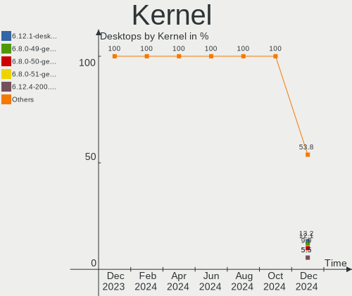

| Version                                             | Desktops | Percent |
|-----------------------------------------------------|----------|---------|
| 6.12.1-desktop-1omv2490                             | 12       | 13.19%  |
| 6.8.0-49-generic                                    | 11       | 12.09%  |
| 6.8.0-50-generic                                    | 9        | 9.89%   |
| 6.8.0-51-generic                                    | 5        | 5.49%   |
| 6.12.4-200.fc41.x86_64                              | 5        | 5.49%   |
| 6.9.3-76060903-generic                              | 3        | 3.3%    |
| 6.6.2-desktop-1omv2390                              | 3        | 3.3%    |
| 5.15.0-126-generic                                  | 3        | 3.3%    |
| 6.12.4-arch1-1                                      | 2        | 2.2%    |
| 6.12.4-1-MANJARO                                    | 2        | 2.2%    |
| 6.12.1-arch1-1                                      | 2        | 2.2%    |
| 6.11.9-200.fsync.fc40.x86_64                        | 2        | 2.2%    |
| 6.1.0-28-amd64                                      | 2        | 2.2%    |
| 6.8.7-desktop-1omv2490                              | 1        | 1.1%    |
| 6.8.12-5-pve                                        | 1        | 1.1%    |
| 6.8.12-4-pve                                        | 1        | 1.1%    |
| 6.8.0-49-lowlatency                                 | 1        | 1.1%    |
| 6.7.4-200.fc39.x86_64                               | 1        | 1.1%    |
| 6.6.63                                              | 1        | 1.1%    |
| 6.6.21-yocto-standard                               | 1        | 1.1%    |
| 6.4.8-desktop-2omv2390                              | 1        | 1.1%    |
| 6.13.0-0.rc2.20241211gitf92f4749861b.24.fc42.x86_64 | 1        | 1.1%    |
| 6.12.6-rado-7                                       | 1        | 1.1%    |
| 6.12.6-desktop-1omv2490                             | 1        | 1.1%    |
| 6.12.6-arch1-1                                      | 1        | 1.1%    |
| 6.12.6-1-cachyos                                    | 1        | 1.1%    |
| 6.12.6                                              | 1        | 1.1%    |
| 6.12.3-061203-generic                               | 1        | 1.1%    |
| 6.12.1-2-cachyos                                    | 1        | 1.1%    |
| 6.11.9-303.bazzite.fc41.x86_64                      | 1        | 1.1%    |
| 6.11.8-1-default                                    | 1        | 1.1%    |
| 6.11.7-201.fsync.fc40.x86_64                        | 1        | 1.1%    |
| 6.11.4-301.fc41.x86_64                              | 1        | 1.1%    |
| 6.11.3-300.fc41.x86_64                              | 1        | 1.1%    |
| 6.11.10-amd64                                       | 1        | 1.1%    |
| 6.11.10-304.bazzite.fc41.x86_64                     | 1        | 1.1%    |
| 6.11.10-300.fc41.x86_64                             | 1        | 1.1%    |
| 6.11.10-2-MANJARO                                   | 1        | 1.1%    |
| 6.11.0-9-generic                                    | 1        | 1.1%    |
| 6.11.0-13-generic                                   | 1        | 1.1%    |

Kernel Family
-------------

Linux kernel without a distro release

| Version | Desktops | Percent |
|---------|----------|---------|
| 6.8.0   | 26       | 28.57%  |
| 6.12.1  | 15       | 16.48%  |
| 6.12.4  | 9        | 9.89%   |
| 6.12.6  | 5        | 5.49%   |
| 6.11.10 | 4        | 4.4%    |
| 6.9.3   | 3        | 3.3%    |
| 6.6.2   | 3        | 3.3%    |
| 6.11.9  | 3        | 3.3%    |
| 6.1.0   | 3        | 3.3%    |
| 5.15.0  | 3        | 3.3%    |
| 6.8.12  | 2        | 2.2%    |
| 6.11.0  | 2        | 2.2%    |
| 6.8.7   | 1        | 1.1%    |
| 6.7.4   | 1        | 1.1%    |
| 6.6.63  | 1        | 1.1%    |
| 6.6.21  | 1        | 1.1%    |
| 6.4.8   | 1        | 1.1%    |
| 6.13.0  | 1        | 1.1%    |
| 6.12.3  | 1        | 1.1%    |
| 6.11.8  | 1        | 1.1%    |
| 6.11.7  | 1        | 1.1%    |
| 6.11.4  | 1        | 1.1%    |
| 6.11.3  | 1        | 1.1%    |
| 5.19.5  | 1        | 1.1%    |
| 5.19.0  | 1        | 1.1%    |

Kernel Major Ver.
-----------------

Linux kernel major version

| Version | Desktops | Percent |
|---------|----------|---------|
| 6.12    | 30       | 32.97%  |
| 6.8     | 29       | 31.87%  |
| 6.11    | 13       | 14.29%  |
| 6.6     | 5        | 5.49%   |
| 6.9     | 3        | 3.3%    |
| 6.1     | 3        | 3.3%    |
| 5.15    | 3        | 3.3%    |
| 5.19    | 2        | 2.2%    |
| 6.7     | 1        | 1.1%    |
| 6.4     | 1        | 1.1%    |
| 6.13    | 1        | 1.1%    |

Arch
----

OS architecture (x86_64, i586, etc.)

| Name   | Desktops | Percent |
|--------|----------|---------|
| x86_64 | 91       | 100%    |

DE
--

Desktop Environment

| Name       | Desktops | Percent |
|------------|----------|---------|
| GNOME      | 29       | 31.87%  |
| Unknown    | 19       | 20.88%  |
| KDE6       | 17       | 18.68%  |
| X-Cinnamon | 10       | 10.99%  |
| KDE5       | 8        | 8.79%   |
| XFCE       | 4        | 4.4%    |
| xmonad     | 1        | 1.1%    |
| Pantheon   | 1        | 1.1%    |
| MATE       | 1        | 1.1%    |
| LXQt       | 1        | 1.1%    |

Display Server
--------------

X11 or Wayland

| Name    | Desktops | Percent |
|---------|----------|---------|
| Wayland | 45       | 49.45%  |
| X11     | 40       | 43.96%  |
| Tty     | 3        | 3.3%    |
| Unknown | 3        | 3.3%    |

Display Manager
---------------

SDDM, LightDM, etc.

| Name    | Desktops | Percent |
|---------|----------|---------|
| Unknown | 36       | 39.56%  |
| SDDM    | 27       | 29.67%  |
| GDM3    | 15       | 16.48%  |
| LightDM | 8        | 8.79%   |
| GDM     | 5        | 5.49%   |

OS Lang
-------

Language

| Lang    | Desktops | Percent |
|---------|----------|---------|
| en_CA   | 42       | 46.15%  |
| en_US   | 40       | 43.96%  |
| fr_CA   | 4        | 4.4%    |
| en_GB   | 2        | 2.2%    |
| Unknown | 2        | 2.2%    |
| fr_FR   | 1        | 1.1%    |

Boot Mode
---------

EFI or BIOS

| Mode | Desktops | Percent |
|------|----------|---------|
| BIOS | 56       | 61.54%  |
| EFI  | 35       | 38.46%  |

Filesystem
----------

Type of filesystem

| Type    | Desktops | Percent |
|---------|----------|---------|
| Ext4    | 40       | 43.96%  |
| Btrfs   | 21       | 23.08%  |
| Tmpfs   | 16       | 17.58%  |
| Overlay | 11       | 12.09%  |
| Zfs     | 1        | 1.1%    |
| Rootfs  | 1        | 1.1%    |
| Unknown | 1        | 1.1%    |

Part. scheme
------------

Scheme of partitioning

| Type    | Desktops | Percent |
|---------|----------|---------|
| GPT     | 53       | 58.24%  |
| Unknown | 34       | 37.36%  |
| MBR     | 4        | 4.4%    |

Dual Boot with Linux/BSD
------------------------

Hosting more than one Linux/BSD

| Dual boot | Desktops | Percent |
|-----------|----------|---------|
| No        | 68       | 74.73%  |
| Yes       | 23       | 25.27%  |

Dual Boot (Win)
---------------

Hosting Linux and Windows

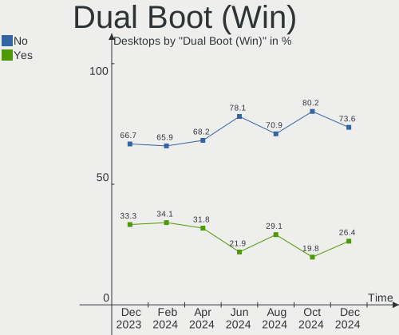

| Dual boot | Desktops | Percent |
|-----------|----------|---------|
| No        | 67       | 73.63%  |
| Yes       | 24       | 26.37%  |

Board
-----

Vendor
------

Motherboard manufacturer

| Name                | Desktops | Percent |
|---------------------|----------|---------|
| ASUSTek Computer    | 29       | 31.87%  |
| MSI                 | 14       | 15.38%  |
| Gigabyte Technology | 14       | 15.38%  |
| Dell                | 12       | 13.19%  |
| Lenovo              | 6        | 6.59%   |
| Hewlett-Packard     | 5        | 5.49%   |
| ASRock              | 3        | 3.3%    |
| Intel               | 2        | 2.2%    |
| Acer                | 2        | 2.2%    |
| Wistron             | 1        | 1.1%    |
| Pegatron            | 1        | 1.1%    |
| Foxconn             | 1        | 1.1%    |
| Unknown             | 1        | 1.1%    |

Model
-----

Motherboard model

| Name                                    | Desktops | Percent |
|-----------------------------------------|----------|---------|
| MSI MS-7C37                             | 3        | 3.3%    |
| Gigabyte X570 AORUS PRO WIFI            | 2        | 2.2%    |
| ASUS TUF Gaming X570-PLUS               | 2        | 2.2%    |
| ASUS All Series                         | 2        | 2.2%    |
| ASRock B650M Pro RS WiFi                | 2        | 2.2%    |
| Wistron ProLiant ML110 G6               | 1        | 1.1%    |
| Pegatron FQ516AA-A2L a6648f             | 1        | 1.1%    |
| MSI MS-7E02                             | 1        | 1.1%    |
| MSI MS-7D77                             | 1        | 1.1%    |
| MSI MS-7D25                             | 1        | 1.1%    |
| MSI MS-7C95                             | 1        | 1.1%    |
| MSI MS-7C84                             | 1        | 1.1%    |
| MSI MS-7C56                             | 1        | 1.1%    |
| MSI MS-7A37                             | 1        | 1.1%    |
| MSI MS-7A34                             | 1        | 1.1%    |
| MSI MS-7998                             | 1        | 1.1%    |
| MSI MS-7978                             | 1        | 1.1%    |
| MSI MS-7640                             | 1        | 1.1%    |
| Lenovo ThinkStation P300 30AH000SUS     | 1        | 1.1%    |
| Lenovo ThinkStation P300 30AGS2UW00     | 1        | 1.1%    |
| Lenovo ThinkStation P3 Tower 30GUSLBA00 | 1        | 1.1%    |
| Lenovo ThinkCentre M93p 10A8S00200      | 1        | 1.1%    |
| Lenovo ThinkCentre M910t 10MM000KUS     | 1        | 1.1%    |
| Lenovo ThinkCentre M900 10FGS1400W      | 1        | 1.1%    |
| Intel X99 V1.0                          | 1        | 1.1%    |
| Intel IPC-ADN2L                         | 1        | 1.1%    |
| HP Z4 G4 Workstation                    | 1        | 1.1%    |
| HP EliteDesk 705 G4 SFF                 | 1        | 1.1%    |
| HP EliteBook 805 G6 SFF                 | 1        | 1.1%    |
| HP Compaq Elite 8300 SFF                | 1        | 1.1%    |
| HP Compaq 8200 Elite CMT PC             | 1        | 1.1%    |
| Gigabyte Z97X-Gaming 5                  | 1        | 1.1%    |
| Gigabyte Z390 UD                        | 1        | 1.1%    |
| Gigabyte X870 EAGLE WIFI7               | 1        | 1.1%    |
| Gigabyte H81M-S2PH                      | 1        | 1.1%    |
| Gigabyte H81M-H                         | 1        | 1.1%    |
| Gigabyte H370M-DS3H                     | 1        | 1.1%    |
| Gigabyte GA-MA790GP-DS4H                | 1        | 1.1%    |
| Gigabyte F2A85XM-D3H                    | 1        | 1.1%    |
| Gigabyte EP45-DS3R                      | 1        | 1.1%    |

Model Family
------------

Motherboard model prefix

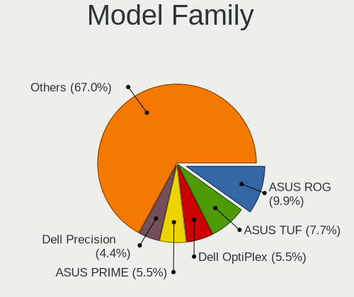

| Name                     | Desktops | Percent |
|--------------------------|----------|---------|
| ASUS ROG                 | 9        | 9.89%   |
| ASUS TUF                 | 7        | 7.69%   |
| Dell OptiPlex            | 5        | 5.49%   |
| ASUS PRIME               | 5        | 5.49%   |
| Dell Precision           | 4        | 4.4%    |
| MSI MS-7C37              | 3        | 3.3%    |
| Lenovo ThinkStation      | 3        | 3.3%    |
| Lenovo ThinkCentre       | 3        | 3.3%    |
| HP Compaq                | 2        | 2.2%    |
| Gigabyte X570            | 2        | 2.2%    |
| ASUS P8Z77-V             | 2        | 2.2%    |
| ASUS All                 | 2        | 2.2%    |
| ASRock B650M             | 2        | 2.2%    |
| Wistron ProLiant         | 1        | 1.1%    |
| Pegatron FQ516AA-A2L     | 1        | 1.1%    |
| MSI MS-7E02              | 1        | 1.1%    |
| MSI MS-7D77              | 1        | 1.1%    |
| MSI MS-7D25              | 1        | 1.1%    |
| MSI MS-7C95              | 1        | 1.1%    |
| MSI MS-7C84              | 1        | 1.1%    |
| MSI MS-7C56              | 1        | 1.1%    |
| MSI MS-7A37              | 1        | 1.1%    |
| MSI MS-7A34              | 1        | 1.1%    |
| MSI MS-7998              | 1        | 1.1%    |
| MSI MS-7978              | 1        | 1.1%    |
| MSI MS-7640              | 1        | 1.1%    |
| Intel X99                | 1        | 1.1%    |
| Intel IPC-ADN2L          | 1        | 1.1%    |
| HP Z4                    | 1        | 1.1%    |
| HP EliteDesk             | 1        | 1.1%    |
| HP EliteBook             | 1        | 1.1%    |
| Gigabyte Z97X-Gaming     | 1        | 1.1%    |
| Gigabyte Z390            | 1        | 1.1%    |
| Gigabyte X870            | 1        | 1.1%    |
| Gigabyte H81M-S2PH       | 1        | 1.1%    |
| Gigabyte H81M-H          | 1        | 1.1%    |
| Gigabyte H370M-DS3H      | 1        | 1.1%    |
| Gigabyte GA-MA790GP-DS4H | 1        | 1.1%    |
| Gigabyte F2A85XM-D3H     | 1        | 1.1%    |
| Gigabyte EP45-DS3R       | 1        | 1.1%    |

MFG Year
--------

Motherboard manufacture year

| Year | Desktops | Percent |
|------|----------|---------|
| 2020 | 9        | 9.89%   |
| 2018 | 9        | 9.89%   |
| 2022 | 8        | 8.79%   |
| 2019 | 8        | 8.79%   |
| 2024 | 6        | 6.59%   |
| 2023 | 6        | 6.59%   |
| 2021 | 6        | 6.59%   |
| 2012 | 6        | 6.59%   |
| 2014 | 5        | 5.49%   |
| 2011 | 5        | 5.49%   |
| 2017 | 4        | 4.4%    |
| 2016 | 4        | 4.4%    |
| 2008 | 4        | 4.4%    |
| 2015 | 3        | 3.3%    |
| 2013 | 2        | 2.2%    |
| 2009 | 2        | 2.2%    |
| 2006 | 2        | 2.2%    |
| 2010 | 1        | 1.1%    |
| 2007 | 1        | 1.1%    |

Form Factor
-----------

Physical design of the computer

| Name    | Desktops | Percent |
|---------|----------|---------|
| Desktop | 91       | 100%    |

Secure Boot
-----------

Enabled or disabled

| State    | Desktops | Percent |
|----------|----------|---------|
| Disabled | 91       | 100%    |

Coreboot
--------

Have coreboot on board

| Used | Desktops | Percent |
|------|----------|---------|
| No   | 91       | 100%    |

RAM Size
--------

Total RAM memory

| Size in GB  | Desktops | Percent |
|-------------|----------|---------|
| 32.01-64.0  | 31       | 34.07%  |
| 16.01-24.0  | 19       | 20.88%  |
| 64.01-256.0 | 13       | 14.29%  |
| 24.01-32.0  | 8        | 8.79%   |
| 8.01-16.0   | 8        | 8.79%   |
| 4.01-8.0    | 7        | 7.69%   |
| 3.01-4.0    | 5        | 5.49%   |

RAM Used
--------

Used RAM memory

| Used GB    | Desktops | Percent |
|------------|----------|---------|
| 4.01-8.0   | 26       | 28.57%  |
| 2.01-3.0   | 23       | 25.27%  |
| 3.01-4.0   | 14       | 15.38%  |
| 1.01-2.0   | 13       | 14.29%  |
| 8.01-16.0  | 9        | 9.89%   |
| 16.01-24.0 | 3        | 3.3%    |
| 0.01-0.5   | 2        | 2.2%    |
| 0.51-1.0   | 1        | 1.1%    |

Total Drives
------------

Number of drives on board

| Drives | Desktops | Percent |
|--------|----------|---------|
| 1      | 30       | 32.97%  |
| 2      | 25       | 27.47%  |
| 3      | 21       | 23.08%  |
| 4      | 7        | 7.69%   |
| 6      | 4        | 4.4%    |
| 5      | 2        | 2.2%    |
| 8      | 1        | 1.1%    |
| 7      | 1        | 1.1%    |

Has CD-ROM
----------

Has CD-ROM on board

| Presented | Desktops | Percent |
|-----------|----------|---------|
| No        | 62       | 68.13%  |
| Yes       | 29       | 31.87%  |

Has Ethernet
------------

Has Ethernet on board

| Presented | Desktops | Percent |
|-----------|----------|---------|
| Yes       | 91       | 100%    |

Has WiFi
--------

Has WiFi module

| Presented | Desktops | Percent |
|-----------|----------|---------|
| No        | 46       | 50.55%  |
| Yes       | 45       | 49.45%  |

Has Bluetooth
-------------

Has Bluetooth module

| Presented | Desktops | Percent |
|-----------|----------|---------|
| No        | 48       | 52.75%  |
| Yes       | 43       | 47.25%  |

Location
--------

Country
-------

Geographic location (country)

| Country | Desktops | Percent |
|---------|----------|---------|
| Canada  | 91       | 100%    |

City
----

Geographic location (city)

| City                        | Desktops | Percent |
|-----------------------------|----------|---------|
| Toronto                     | 9        | 9.89%   |
| Montreal                    | 7        | 7.69%   |
| Vancouver                   | 5        | 5.49%   |
| Québec                     | 4        | 4.4%    |
| St. Catharines              | 3        | 3.3%    |
| Ottawa                      | 3        | 3.3%    |
| Cochrane                    | 3        | 3.3%    |
| Calgary                     | 3        | 3.3%    |
| Victoria                    | 2        | 2.2%    |
| Nepean                      | 2        | 2.2%    |
| London                      | 2        | 2.2%    |
| Kitchener                   | 2        | 2.2%    |
| Edmonton                    | 2        | 2.2%    |
| Winnipeg                    | 1        | 1.1%    |
| Windsor                     | 1        | 1.1%    |
| Waterford                   | 1        | 1.1%    |
| Tracadie–Sheila           | 1        | 1.1%    |
| Timmins                     | 1        | 1.1%    |
| Thornhill                   | 1        | 1.1%    |
| St. Thomas                  | 1        | 1.1%    |
| St. John's                  | 1        | 1.1%    |
| Spruce Grove                | 1        | 1.1%    |
| Sorel-Tracy                 | 1        | 1.1%    |
| Shawinigan                  | 1        | 1.1%    |
| Selkirk                     | 1        | 1.1%    |
| Saskatoon                   | 1        | 1.1%    |
| Saint-Felix-de-Valois       | 1        | 1.1%    |
| Saint-Charles-sur-Richelieu | 1        | 1.1%    |
| Saint John                  | 1        | 1.1%    |
| Richmond Hill               | 1        | 1.1%    |
| Parksville                  | 1        | 1.1%    |
| Orillia                     | 1        | 1.1%    |
| Oakville                    | 1        | 1.1%    |
| Mississauga                 | 1        | 1.1%    |
| Milton                      | 1        | 1.1%    |
| Messines                    | 1        | 1.1%    |
| Medicine Hat                | 1        | 1.1%    |
| Lower Sackville             | 1        | 1.1%    |
| Laval                       | 1        | 1.1%    |
| Langley                     | 1        | 1.1%    |

Drives
------

Drive Vendor
------------

Hard drive vendors

| Vendor                         | Desktops | Drives | Percent |
|--------------------------------|----------|--------|---------|
| Samsung Electronics            | 35       | 45     | 19.44%  |
| Seagate                        | 31       | 41     | 17.22%  |
| WDC                            | 30       | 45     | 16.67%  |
| Sandisk                        | 17       | 19     | 9.44%   |
| Kingston                       | 11       | 12     | 6.11%   |
| Toshiba                        | 5        | 5      | 2.78%   |
| Phison Electronics             | 5        | 5      | 2.78%   |
| Crucial                        | 5        | 5      | 2.78%   |
| Shenzhen Longsys Electronics   | 3        | 3      | 1.67%   |
| Kingston Technology Company    | 3        | 3      | 1.67%   |
| Unknown                        | 2        | 5      | 1.11%   |
| Transcend                      | 2        | 2      | 1.11%   |
| Timetec                        | 2        | 2      | 1.11%   |
| Team                           | 2        | 2      | 1.11%   |
| Realtek Semiconductor          | 2        | 2      | 1.11%   |
| MAXIO Technology (Hangzhou)    | 2        | 2      | 1.11%   |
| JMicron Technology             | 2        | 3      | 1.11%   |
| Intel                          | 2        | 2      | 1.11%   |
| Hitachi                        | 2        | 2      | 1.11%   |
| HGST                           | 2        | 3      | 1.11%   |
| Hewlett-Packard                | 2        | 2      | 1.11%   |
| T-FORCE                        | 1        | 1      | 0.56%   |
| Solid State Storage Technology | 1        | 1      | 0.56%   |
| SK hynix                       | 1        | 1      | 0.56%   |
| Radeon                         | 1        | 1      | 0.56%   |
| OWC                            | 1        | 1      | 0.56%   |
| LITEONIT                       | 1        | 1      | 0.56%   |
| Fanxiang                       | 1        | 1      | 0.56%   |
| External                       | 1        | 1      | 0.56%   |
| Corsair                        | 1        | 1      | 0.56%   |
| CF400                          | 1        | 1      | 0.56%   |
| A-DATA Technology              | 1        | 1      | 0.56%   |
| 120SSDZA                       | 1        | 1      | 0.56%   |
| Unknown                        | 1        | 1      | 0.56%   |

Drive Model
-----------

Hard drive models

| Model                                                | Desktops | Percent |
|------------------------------------------------------|----------|---------|
| Samsung NVMe SSD Controller SM981/PM981/PM983 512GB  | 10       | 4.76%   |
| Samsung NVMe SSD Controller SM961/PM961/SM963 256GB  | 5        | 2.38%   |
| WDC WDS100T2B0A-00SM50 1TB SSD                       | 4        | 1.9%    |
| Seagate ST4000DM004-2CV104 4TB                       | 4        | 1.9%    |
| Samsung SSD 850 EVO 500GB                            | 4        | 1.9%    |
| Seagate ST2000DM008-2FR102 2TB                       | 3        | 1.43%   |
| Seagate ST1000DM003-1CH162 1TB                       | 3        | 1.43%   |
| Samsung SSD 870 EVO 500GB                            | 3        | 1.43%   |
| Samsung SSD 860 EVO 500GB                            | 3        | 1.43%   |
| Samsung NVMe SSD Controller PM9A1/PM9A3/980PRO 512GB | 3        | 1.43%   |
| Kingston SA400S37240G 240GB SSD                      | 3        | 1.43%   |
| WDC WDS500G2B0A-00SM50 500GB SSD                     | 2        | 0.95%   |
| WDC WD5000AAKS-00TMA0 500GB                          | 2        | 0.95%   |
| WDC WD40EZRX-00SPEB0 4TB                             | 2        | 0.95%   |
| WDC WD20EZRX-00D8PB0 2TB                             | 2        | 0.95%   |
| WDC WD Green 2.5 1000GB SSD                          | 2        | 0.95%   |
| Toshiba MQ01ABD032V -63 320GB                        | 2        | 0.95%   |
| Toshiba DT01ACA100 1TB                               | 2        | 0.95%   |
| Seagate ST1000DM010-2EP102 1TB                       | 2        | 0.95%   |
| Seagate Expansion Desk 5TB                           | 2        | 0.95%   |
| Sandisk WD_BLACK SN850X 4000GB                       | 2        | 0.95%   |
| Sandisk WD_BLACK SN850X 2000GB                       | 2        | 0.95%   |
| Sandisk WD_BLACK SN770 1TB                           | 2        | 0.95%   |
| Kingston Company SNV2S1000G 1TB                      | 2        | 0.95%   |
| Kingston SA400S37480G 480GB SSD                      | 2        | 0.95%   |
| JMicron Disk 320GB                                   | 2        | 0.95%   |
| WDC WUH721816ALE6L4 16TB                             | 1        | 0.48%   |
| WDC WDS500G3X0C-00SJG0 500GB                         | 1        | 0.48%   |
| WDC WDS250G2B0A-00SM50 250GB SSD                     | 1        | 0.48%   |
| WDC WDS200T2B0A-00SM50 2TB SSD                       | 1        | 0.48%   |
| WDC WD7502AAEX-00Y9A0 752GB                          | 1        | 0.48%   |
| WDC WD6401AALS-00L3B2 640GB                          | 1        | 0.48%   |
| WDC WD6400AAKS-00A7B0 640GB                          | 1        | 0.48%   |
| WDC WD60EFRX-68MYMN1 6TB                             | 1        | 0.48%   |
| WDC WD5000AZLX-00K2TA0 500GB                         | 1        | 0.48%   |
| WDC WD40EZRZ-00GXCB0 4TB                             | 1        | 0.48%   |
| WDC WD4003FRYZ-01F0DB0 4TB                           | 1        | 0.48%   |
| WDC WD3200BPVT-22JJ5T0 320GB                         | 1        | 0.48%   |
| WDC WD3200AAKS-75B3A0 320GB                          | 1        | 0.48%   |
| WDC WD30EZRX-00DC0B0 3TB                             | 1        | 0.48%   |

HDD Vendor
----------

Hard disk drive vendors

| Vendor             | Desktops | Drives | Percent |
|--------------------|----------|--------|---------|
| Seagate            | 29       | 39     | 43.94%  |
| WDC                | 24       | 32     | 36.36%  |
| Toshiba            | 4        | 4      | 6.06%   |
| JMicron Technology | 2        | 3      | 3.03%   |
| Hitachi            | 2        | 2      | 3.03%   |
| HGST               | 2        | 3      | 3.03%   |
| Hewlett-Packard    | 2        | 2      | 3.03%   |
| External           | 1        | 1      | 1.52%   |

SSD Vendor
----------

Solid state drive vendors

| Vendor              | Desktops | Drives | Percent |
|---------------------|----------|--------|---------|
| Samsung Electronics | 16       | 19     | 31.37%  |
| WDC                 | 8        | 12     | 15.69%  |
| Kingston            | 6        | 7      | 11.76%  |
| Crucial             | 5        | 5      | 9.8%    |
| SanDisk             | 3        | 3      | 5.88%   |
| Transcend           | 2        | 2      | 3.92%   |
| Team                | 2        | 2      | 3.92%   |
| Timetec             | 1        | 1      | 1.96%   |
| Seagate             | 1        | 1      | 1.96%   |
| Radeon              | 1        | 1      | 1.96%   |
| OWC                 | 1        | 1      | 1.96%   |
| LITEONIT            | 1        | 1      | 1.96%   |
| Intel               | 1        | 1      | 1.96%   |
| Corsair             | 1        | 1      | 1.96%   |
| CF400               | 1        | 1      | 1.96%   |
| A-DATA Technology   | 1        | 1      | 1.96%   |

Drive Kind
----------

HDD or SSD

| Kind    | Desktops | Drives | Percent |
|---------|----------|--------|---------|
| HDD     | 53       | 86     | 34.87%  |
| NVMe    | 52       | 69     | 34.21%  |
| SSD     | 41       | 59     | 26.97%  |
| Unknown | 6        | 9      | 3.95%   |

Drive Connector
---------------

SATA, SAS, NVMe, etc.

| Type | Desktops | Drives | Percent |
|------|----------|--------|---------|
| SATA | 72       | 139    | 53.73%  |
| NVMe | 52       | 69     | 38.81%  |
| SAS  | 10       | 15     | 7.46%   |

Drive Size
----------

Size of hard drive

| Size in TB | Desktops | Drives | Percent |
|------------|----------|--------|---------|
| 0.01-0.5   | 39       | 53     | 35.14%  |
| 0.51-1.0   | 32       | 44     | 28.83%  |
| 1.01-2.0   | 15       | 18     | 13.51%  |
| 3.01-4.0   | 12       | 15     | 10.81%  |
| 4.01-10.0  | 7        | 9      | 6.31%   |
| 2.01-3.0   | 4        | 4      | 3.6%    |
| 10.01-20.0 | 2        | 2      | 1.8%    |

Space Total
-----------

Amount of disk space available on the file system

| Size in GB     | Desktops | Percent |
|----------------|----------|---------|
| 501-1000       | 21       | 23.08%  |
| More than 3000 | 17       | 18.68%  |
| 251-500        | 13       | 14.29%  |
| 1-20           | 12       | 13.19%  |
| 1001-2000      | 10       | 10.99%  |
| 101-250        | 8        | 8.79%   |
| 2001-3000      | 6        | 6.59%   |
| Unknown        | 3        | 3.3%    |
| 51-100         | 1        | 1.1%    |

Space Used
----------

Amount of used disk space

| Used GB        | Desktops | Percent |
|----------------|----------|---------|
| 1-20           | 27       | 29.67%  |
| 21-50          | 14       | 15.38%  |
| 101-250        | 8        | 8.79%   |
| 1001-2000      | 8        | 8.79%   |
| 501-1000       | 8        | 8.79%   |
| 51-100         | 8        | 8.79%   |
| 251-500        | 7        | 7.69%   |
| More than 3000 | 4        | 4.4%    |
| 2001-3000      | 4        | 4.4%    |
| Unknown        | 3        | 3.3%    |

Malfunc. Drives
---------------

Drive models with a malfunction

| Model                                 | Desktops | Drives | Percent |
|---------------------------------------|----------|--------|---------|
| WDC WD20EARS-00J2GB0 2TB              | 1        | 1      | 11.11%  |
| WDC WD10EZEX-60ZF5A0 1TB              | 1        | 1      | 11.11%  |
| Toshiba MQ01ABD032V -63 320GB         | 1        | 1      | 11.11%  |
| Seagate ST500DM002-1BD142 500GB       | 1        | 1      | 11.11%  |
| Seagate ST4000DX001-1CE168 4TB        | 1        | 2      | 11.11%  |
| Seagate ST3250823A 250GB              | 1        | 1      | 11.11%  |
| Samsung Electronics SSD 870 EVO 1TB   | 1        | 1      | 11.11%  |
| Samsung Electronics SSD 850 PRO 512GB | 1        | 1      | 11.11%  |
| A-DATA Technology SX900 512GB SSD     | 1        | 1      | 11.11%  |

Malfunc. Drive Vendor
---------------------

Vendors of faulty drives

| Vendor              | Desktops | Drives | Percent |
|---------------------|----------|--------|---------|
| Seagate             | 3        | 4      | 33.33%  |
| WDC                 | 2        | 2      | 22.22%  |
| Samsung Electronics | 2        | 2      | 22.22%  |
| Toshiba             | 1        | 1      | 11.11%  |
| A-DATA Technology   | 1        | 1      | 11.11%  |

Malfunc. HDD Vendor
-------------------

Vendors of faulty HDD drives

| Vendor  | Desktops | Drives | Percent |
|---------|----------|--------|---------|
| Seagate | 3        | 4      | 50%     |
| WDC     | 2        | 2      | 33.33%  |
| Toshiba | 1        | 1      | 16.67%  |

Malfunc. Drive Kind
-------------------

Kinds of faulty drives

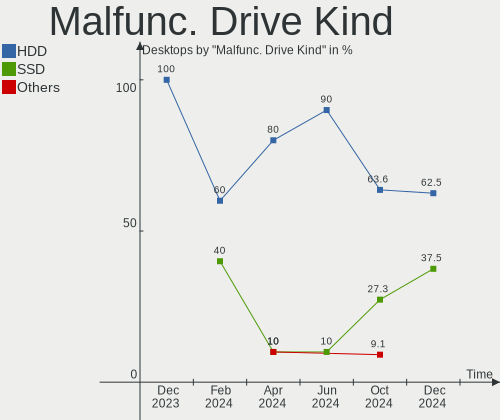

| Kind | Desktops | Drives | Percent |
|------|----------|--------|---------|
| HDD  | 5        | 7      | 62.5%   |
| SSD  | 3        | 3      | 37.5%   |

Failed Drives
-------------

Failed drive models

Zero info for selected period =(

Failed Drive Vendor
-------------------

Failed drive vendors

Zero info for selected period =(

Drive Status
------------

Number of failed and malfunc. drives

| Status   | Desktops | Drives | Percent |
|----------|----------|--------|---------|
| Detected | 57       | 138    | 54.81%  |
| Works    | 39       | 74     | 37.5%   |
| Malfunc  | 7        | 10     | 6.73%   |
| Fixed    | 1        | 1      | 0.96%   |

Storage controller
------------------

Storage Vendor
--------------

Storage controller vendors

| Vendor                         | Desktops | Percent |
|--------------------------------|----------|---------|
| Intel                          | 50       | 30.49%  |
| AMD                            | 40       | 24.39%  |
| Samsung Electronics            | 22       | 13.41%  |
| Sandisk                        | 15       | 9.15%   |
| Kingston Technology Company    | 8        | 4.88%   |
| ASMedia Technology             | 7        | 4.27%   |
| Phison Electronics             | 5        | 3.05%   |
| Shenzhen Longsys Electronics   | 3        | 1.83%   |
| JMicron Technology             | 3        | 1.83%   |
| Realtek Semiconductor          | 2        | 1.22%   |
| MAXIO Technology (Hangzhou)    | 2        | 1.22%   |
| Marvell Technology Group       | 2        | 1.22%   |
| Toshiba America Info Systems   | 1        | 0.61%   |
| Solid State Storage Technology | 1        | 0.61%   |
| SK hynix                       | 1        | 0.61%   |
| Seagate Technology             | 1        | 0.61%   |
| LSI Logic / Symbios Logic      | 1        | 0.61%   |

Storage Model
-------------

Storage controller models

| Model                                                                          | Desktops | Percent |
|--------------------------------------------------------------------------------|----------|---------|
| AMD FCH SATA Controller [AHCI mode]                                            | 18       | 9.63%   |
| Samsung NVMe SSD Controller SM981/PM981/PM983                                  | 11       | 5.88%   |
| AMD 500 Series Chipset SATA Controller                                         | 9        | 4.81%   |
| AMD 600 Series Chipset SATA Controller                                         | 8        | 4.28%   |
| Intel Q170/Q150/B150/H170/H110/Z170/CM236 Chipset SATA Controller [AHCI Mode]  | 7        | 3.74%   |
| Sandisk WD Black SN850X NVMe SSD                                               | 6        | 3.21%   |
| Samsung NVMe SSD Controller SM961/PM961/SM963                                  | 6        | 3.21%   |
| Intel 8 Series/C220 Series Chipset Family 6-port SATA Controller 1 [AHCI mode] | 6        | 3.21%   |
| Intel SATA Controller [RAID mode]                                              | 5        | 2.67%   |
| Intel Cannon Lake PCH SATA AHCI Controller                                     | 5        | 2.67%   |
| ASMedia ASM1061/ASM1062 Serial ATA Controller                                  | 5        | 2.67%   |
| Samsung NVMe SSD Controller PM9A1/PM9A3/980PRO                                 | 4        | 2.14%   |
| Intel Raptor Lake SATA AHCI Controller                                         | 4        | 2.14%   |
| AMD 400 Series Chipset SATA Controller                                         | 4        | 2.14%   |
| SanDisk WD Black SN770 / PC SN740 256GB / PC SN560 (DRAM-less) NVMe SSD        | 3        | 1.6%    |
| Intel Alder Lake-S PCH SATA Controller [AHCI Mode]                             | 3        | 1.6%    |
| Intel 7 Series/C210 Series Chipset Family 6-port SATA Controller [AHCI mode]   | 3        | 1.6%    |
| AMD SB7x0/SB8x0/SB9x0 SATA Controller [AHCI mode]                              | 3        | 1.6%    |
| AMD SB7x0/SB8x0/SB9x0 IDE Controller                                           | 3        | 1.6%    |
| AMD 300 Series Chipset SATA Controller                                         | 3        | 1.6%    |
| SanDisk Extreme Pro / WD Black 2018/SN750/PC SN720 NVMe SSD                    | 2        | 1.07%   |
| Samsung NVMe SSD Controller PM9C1a (DRAM-less)                                 | 2        | 1.07%   |
| Realtek RTS5765DL NVMe SSD Controller (DRAM-less)                              | 2        | 1.07%   |
| MAXIO (Hangzhou) NVMe SSD Controller MAP1602 (DRAM-less)                       | 2        | 1.07%   |
| Kingston Company NV2 NVMe SSD [SM2267XT] (DRAM-less)                           | 2        | 1.07%   |
| Kingston Company NV2 NVMe SSD [E21T] (DRAM-less)                               | 2        | 1.07%   |
| JMicron JMB368 IDE controller                                                  | 2        | 1.07%   |
| Intel Volume Management Device NVMe RAID Controller Intel Corporation          | 2        | 1.07%   |
| Intel C610/X99 series chipset sSATA Controller [AHCI mode]                     | 2        | 1.07%   |
| Intel 9 Series Chipset Family SATA Controller [AHCI Mode]                      | 2        | 1.07%   |
| Intel 82801JI (ICH10 Family) SATA AHCI Controller                              | 2        | 1.07%   |
| Intel 6 Series/C200 Series Chipset Family 6 port Desktop SATA AHCI Controller  | 2        | 1.07%   |
| Intel 200 Series PCH SATA controller [AHCI mode]                               | 2        | 1.07%   |
| ASMedia ASM1064 Serial ATA Controller                                          | 2        | 1.07%   |
| AMD SB7x0/SB8x0/SB9x0 SATA Controller [IDE mode]                               | 2        | 1.07%   |
| Toshiba America Info Systems XG6 NVMe SSD Controller                           | 1        | 0.53%   |
| Solid State Storage CA5-8D256 NVMe SSD M.2                                     | 1        | 0.53%   |
| SK hynix BC511 NVMe SSD                                                        | 1        | 0.53%   |
| Shenzhen Longsys SM2263EN/SM2263XT-based OEM NVME SSD (DRAM-less)              | 1        | 0.53%   |
| Shenzhen Longsys Lexar NM790 NVME SSD (DRAM-less)                              | 1        | 0.53%   |

Storage Kind
------------

Kind of storage controller (IDE, SATA, NVMe, SAS, ...)

| Kind | Desktops | Percent |
|------|----------|---------|
| SATA | 82       | 53.59%  |
| NVMe | 52       | 33.99%  |
| RAID | 9        | 5.88%   |
| IDE  | 9        | 5.88%   |
| SCSI | 1        | 0.65%   |

Processor
---------

CPU Vendor
----------

Processor vendors

| Vendor | Desktops | Percent |
|--------|----------|---------|
| Intel  | 51       | 56.04%  |
| AMD    | 40       | 43.96%  |

CPU Model
---------

Processor models

| Model                                 | Desktops | Percent |
|---------------------------------------|----------|---------|
| AMD Ryzen 7 5800X 8-Core Processor    | 4        | 4.4%    |
| Intel Pentium CPU G3220 @ 3.00GHz     | 2        | 2.2%    |
| Intel Core i9-14900K                  | 2        | 2.2%    |
| Intel Core i7-6700 CPU @ 3.40GHz      | 2        | 2.2%    |
| Intel Core i7-4790 CPU @ 3.60GHz      | 2        | 2.2%    |
| Intel Core i7-3770K CPU @ 3.50GHz     | 2        | 2.2%    |
| Intel Core i5-6500 CPU @ 3.20GHz      | 2        | 2.2%    |
| Intel Core 2 Quad CPU Q6600 @ 2.40GHz | 2        | 2.2%    |
| Intel 12th Gen Core i5-12600K         | 2        | 2.2%    |
| AMD Ryzen 9 7950X3D 16-Core Processor | 2        | 2.2%    |
| AMD Ryzen 7 5800X3D 8-Core Processor  | 2        | 2.2%    |
| AMD Ryzen 5 7600X 6-Core Processor    | 2        | 2.2%    |
| AMD Ryzen 5 5500                      | 2        | 2.2%    |
| AMD Ryzen 5 3600X 6-Core Processor    | 2        | 2.2%    |
| Intel Xeon W-2123 CPU @ 3.60GHz       | 1        | 1.1%    |
| Intel Xeon CPU X5675 @ 3.07GHz        | 1        | 1.1%    |
| Intel Xeon CPU X3430 @ 2.40GHz        | 1        | 1.1%    |
| Intel Xeon CPU W3530 @ 2.80GHz        | 1        | 1.1%    |
| Intel Xeon CPU E5-2699 v3 @ 2.30GHz   | 1        | 1.1%    |
| Intel Xeon CPU E5-2697 v3 @ 2.60GHz   | 1        | 1.1%    |
| Intel Xeon CPU E3-1270 v5 @ 3.60GHz   | 1        | 1.1%    |
| Intel Xeon CPU E3-1226 v3 @ 3.30GHz   | 1        | 1.1%    |
| Intel Pentium D CPU 2.80GHz           | 1        | 1.1%    |
| Intel Pentium CPU G2020 @ 2.90GHz     | 1        | 1.1%    |
| Intel N95                             | 1        | 1.1%    |
| Intel Core i7-9700K CPU @ 3.60GHz     | 1        | 1.1%    |
| Intel Core i7-9700F CPU @ 3.00GHz     | 1        | 1.1%    |
| Intel Core i7-8700K CPU @ 3.70GHz     | 1        | 1.1%    |
| Intel Core i7-7700 CPU @ 3.60GHz      | 1        | 1.1%    |
| Intel Core i7-6700K CPU @ 4.00GHz     | 1        | 1.1%    |
| Intel Core i7-5930K CPU @ 3.50GHz     | 1        | 1.1%    |
| Intel Core i7-4790K CPU @ 4.00GHz     | 1        | 1.1%    |
| Intel Core i7-2600 CPU @ 3.40GHz      | 1        | 1.1%    |
| Intel Core i7-10700F CPU @ 2.90GHz    | 1        | 1.1%    |
| Intel Core i5-8500T CPU @ 2.10GHz     | 1        | 1.1%    |
| Intel Core i5-8400 CPU @ 2.80GHz      | 1        | 1.1%    |
| Intel Core i5-6600T CPU @ 2.70GHz     | 1        | 1.1%    |
| Intel Core i5-4590 CPU @ 3.30GHz      | 1        | 1.1%    |
| Intel Core i5-4570 CPU @ 3.20GHz      | 1        | 1.1%    |
| Intel Core i5-2400 CPU @ 3.10GHz      | 1        | 1.1%    |

CPU Model Family
----------------

Processor model prefix

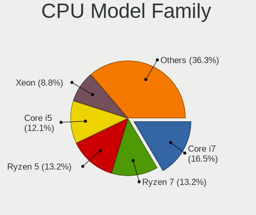

| Model                  | Desktops | Percent |
|------------------------|----------|---------|
| Intel Core i7          | 15       | 16.48%  |
| AMD Ryzen 7            | 12       | 13.19%  |
| AMD Ryzen 5            | 12       | 13.19%  |
| Intel Core i5          | 11       | 12.09%  |
| Intel Xeon             | 8        | 8.79%   |
| AMD Ryzen 9            | 7        | 7.69%   |
| Other                  | 4        | 4.4%    |
| Intel Pentium          | 3        | 3.3%    |
| Intel Core 2 Quad      | 3        | 3.3%    |
| Intel Core i9          | 2        | 2.2%    |
| Intel Core 2 Duo       | 2        | 2.2%    |
| AMD Ryzen 5 PRO        | 2        | 2.2%    |
| AMD FX                 | 2        | 2.2%    |
| Intel Pentium D        | 1        | 1.1%    |
| Intel Core i3          | 1        | 1.1%    |
| Intel Atom             | 1        | 1.1%    |
| AMD Ryzen Threadripper | 1        | 1.1%    |
| AMD Phenom             | 1        | 1.1%    |
| AMD Athlon II X4       | 1        | 1.1%    |
| AMD Athlon 64 X2       | 1        | 1.1%    |
| AMD A10                | 1        | 1.1%    |

CPU Cores
---------

Number of processor cores

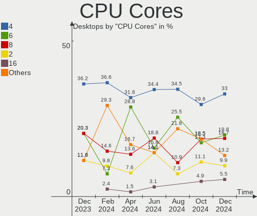

| Number | Desktops | Percent |
|--------|----------|---------|
| 4      | 30       | 32.97%  |
| 6      | 18       | 19.78%  |
| 8      | 17       | 18.68%  |
| 2      | 9        | 9.89%   |
| 16     | 5        | 5.49%   |
| 24     | 3        | 3.3%    |
| 12     | 3        | 3.3%    |
| 10     | 3        | 3.3%    |
| 14     | 2        | 2.2%    |
| 18     | 1        | 1.1%    |

CPU Sockets
-----------

Number of sockets

| Number | Desktops | Percent |
|--------|----------|---------|
| 1      | 90       | 98.9%   |
| 2      | 1        | 1.1%    |

CPU Threads
-----------

Threads per core (Hyper-Threading)

| Number | Desktops | Percent |
|--------|----------|---------|
| 2      | 60       | 65.93%  |
| 1      | 31       | 34.07%  |

CPU Op-Modes
------------

CPU Operation Modes (32-bit, 64-bit)

| Op mode        | Desktops | Percent |
|----------------|----------|---------|
| 32-bit, 64-bit | 91       | 100%    |

CPU Microcode
-------------

Microcode number

| Number     | Desktops | Percent |
|------------|----------|---------|
| Unknown    | 84       | 92.31%  |
| 0x90661    | 1        | 1.1%    |
| 0x306f2    | 1        | 1.1%    |
| 0x306c3    | 1        | 1.1%    |
| 0x306a9    | 1        | 1.1%    |
| 0x06001119 | 1        | 1.1%    |
| 0x06000852 | 1        | 1.1%    |
| 0x01000095 | 1        | 1.1%    |

CPU Microarch
-------------

Microarchitecture

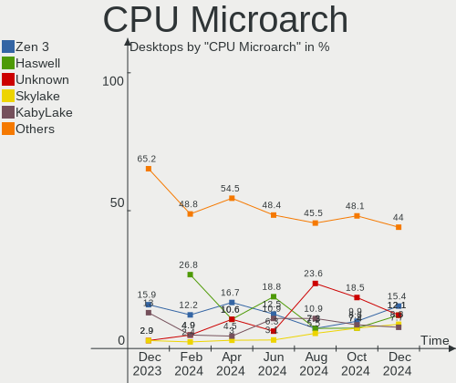

| Name             | Desktops | Percent |
|------------------|----------|---------|
| Zen 3            | 14       | 15.38%  |
| Haswell          | 11       | 12.09%  |
| Unknown          | 11       | 12.09%  |
| Skylake          | 8        | 8.79%   |
| KabyLake         | 7        | 7.69%   |
| Zen 2            | 6        | 6.59%   |
| Alderlake Hybrid | 4        | 4.4%    |
| Zen+             | 3        | 3.3%    |
| Zen              | 3        | 3.3%    |
| Piledriver       | 3        | 3.3%    |
| Penryn           | 3        | 3.3%    |
| IvyBridge        | 3        | 3.3%    |
| Westmere         | 2        | 2.2%    |
| SandyBridge      | 2        | 2.2%    |
| Nehalem          | 2        | 2.2%    |
| K10              | 2        | 2.2%    |
| Core             | 2        | 2.2%    |
| Tremont          | 1        | 1.1%    |
| NetBurst         | 1        | 1.1%    |
| K8 Hammer        | 1        | 1.1%    |
| Gracemont        | 1        | 1.1%    |
| CometLake        | 1        | 1.1%    |

Graphics
--------

GPU Vendor
----------

Vendors of graphics cards

| Vendor                     | Desktops | Percent |
|----------------------------|----------|---------|
| AMD                        | 40       | 38.83%  |
| Nvidia                     | 36       | 34.95%  |
| Intel                      | 26       | 25.24%  |
| Matrox Electronics Systems | 1        | 0.97%   |

GPU Model
---------

Graphics card models

| Model                                                                       | Desktops | Percent |
|-----------------------------------------------------------------------------|----------|---------|
| Intel Xeon E3-1200 v3/4th Gen Core Processor Integrated Graphics Controller | 7        | 6.48%   |
| AMD Raphael                                                                 | 7        | 6.48%   |
| AMD Navi 32 [Radeon RX 7700 XT / 7800 XT]                                   | 5        | 4.63%   |
| Intel HD Graphics 530                                                       | 4        | 3.7%    |
| Intel Raptor Lake-S GT1 [UHD Graphics 770]                                  | 3        | 2.78%   |
| AMD Navi 31 [Radeon RX 7900 XT/7900 XTX/7900 GRE/7900M]                     | 3        | 2.78%   |
| Nvidia TU117 [GeForce GTX 1650]                                             | 2        | 1.85%   |
| Nvidia TU106 [GeForce RTX 2060 Rev. A]                                      | 2        | 1.85%   |
| Nvidia GP106GL [Quadro P2000]                                               | 2        | 1.85%   |
| Nvidia GK208B [GeForce GT 710]                                              | 2        | 1.85%   |
| Nvidia AD107 [GeForce RTX 4060]                                             | 2        | 1.85%   |
| Intel IvyBridge GT2 [HD Graphics 4000]                                      | 2        | 1.85%   |
| Intel CoffeeLake-S GT2 [UHD Graphics 630]                                   | 2        | 1.85%   |
| Intel AlderLake-S GT1                                                       | 2        | 1.85%   |
| AMD RV770 [Radeon HD 4850]                                                  | 2        | 1.85%   |
| AMD Polaris 20 XL [Radeon RX 580 2048SP]                                    | 2        | 1.85%   |
| AMD Navi 33 [Radeon RX 7600/7600 XT/7600M XT/7600S/7700S / PRO W7600]       | 2        | 1.85%   |
| AMD Navi 24 [Radeon RX 6400/6500 XT/6500M]                                  | 2        | 1.85%   |
| AMD Navi 21 [Radeon RX 6800/6800 XT / 6900 XT]                              | 2        | 1.85%   |
| AMD Ellesmere [Radeon RX 470/480/570/570X/580/580X/590]                     | 2        | 1.85%   |
| AMD Cezanne [Radeon Vega Series / Radeon Vega Mobile Series]                | 2        | 1.85%   |
| AMD Cedar [Radeon HD 5000/6000/7350/8350 Series]                            | 2        | 1.85%   |
| Nvidia TU106 [GeForce RTX 2070]                                             | 1        | 0.93%   |
| Nvidia TU106 [GeForce RTX 2060 SUPER]                                       | 1        | 0.93%   |
| Nvidia TU106 [GeForce GTX 1650]                                             | 1        | 0.93%   |
| Nvidia TU102 [GeForce RTX 2080 Ti Rev. A]                                   | 1        | 0.93%   |
| Nvidia GP108 [GeForce GT 1030]                                              | 1        | 0.93%   |
| Nvidia GP107 [GeForce GTX 1050 Ti]                                          | 1        | 0.93%   |
| Nvidia GP102 [TITAN X]                                                      | 1        | 0.93%   |
| Nvidia GP102 [GeForce GTX 1080 Ti]                                          | 1        | 0.93%   |
| Nvidia GM206 [GeForce GTX 960]                                              | 1        | 0.93%   |
| Nvidia GM206 [GeForce GTX 950]                                              | 1        | 0.93%   |
| Nvidia GM204 [GeForce GTX 970]                                              | 1        | 0.93%   |
| Nvidia GM107GL [Quadro K2200]                                               | 1        | 0.93%   |
| Nvidia GK106 [GeForce GTX 650 Ti]                                           | 1        | 0.93%   |
| Nvidia GK104 [GeForce GTX 760]                                              | 1        | 0.93%   |
| Nvidia GF119 [GeForce GT 610]                                               | 1        | 0.93%   |
| Nvidia GF100GL [Quadro 5000]                                                | 1        | 0.93%   |
| Nvidia GF100 [GeForce GTX 470]                                              | 1        | 0.93%   |
| Nvidia GA106 [GeForce RTX 3060]                                             | 1        | 0.93%   |

GPU Combo
---------

Combinations of graphics cards

| Name           | Desktops | Percent |
|----------------|----------|---------|
| 1 x AMD        | 29       | 31.87%  |
| 1 x Nvidia     | 27       | 29.67%  |
| 1 x Intel      | 20       | 21.98%  |
| 2 x AMD        | 5        | 5.49%   |
| AMD + Nvidia   | 5        | 5.49%   |
| Intel + Nvidia | 4        | 4.4%    |
| 1 x Matrox     | 1        | 1.1%    |

GPU Driver
----------

Free vs proprietary

| Driver      | Desktops | Percent |
|-------------|----------|---------|
| Free        | 64       | 70.33%  |
| Proprietary | 23       | 25.27%  |
| Unknown     | 4        | 4.4%    |

GPU Memory
----------

Total video memory

| Size in GB | Desktops | Percent |
|------------|----------|---------|
| Unknown    | 60       | 65.93%  |
| 8.01-16.0  | 10       | 10.99%  |
| 3.01-4.0   | 4        | 4.4%    |
| 0.51-1.0   | 4        | 4.4%    |
| 0.01-0.5   | 4        | 4.4%    |
| 1.01-2.0   | 3        | 3.3%    |
| 7.01-8.0   | 2        | 2.2%    |
| 16.01-24.0 | 2        | 2.2%    |
| 5.01-6.0   | 1        | 1.1%    |
| 4.01-5.0   | 1        | 1.1%    |

Monitor
-------

Monitor Vendor
--------------

Monitor vendors

| Vendor               | Desktops | Percent |
|----------------------|----------|---------|
| Goldstar             | 17       | 17.35%  |
| Samsung Electronics  | 14       | 14.29%  |
| Dell                 | 9        | 9.18%   |
| BenQ                 | 7        | 7.14%   |
| Ancor Communications | 6        | 6.12%   |
| Acer                 | 6        | 6.12%   |
| ASUSTek Computer     | 5        | 5.1%    |
| ViewSonic            | 4        | 4.08%   |
| MSI                  | 3        | 3.06%   |
| Hewlett-Packard      | 3        | 3.06%   |
| RTK                  | 2        | 2.04%   |
| MStar                | 2        | 2.04%   |
| DENON                | 2        | 2.04%   |
| Unknown              | 2        | 2.04%   |
| Unknown              | 1        | 1.02%   |
| Sony                 | 1        | 1.02%   |
| Sceptre Tech         | 1        | 1.02%   |
| Philips              | 1        | 1.02%   |
| LG Electronics       | 1        | 1.02%   |
| Lenovo               | 1        | 1.02%   |
| Insignia             | 1        | 1.02%   |
| HKC                  | 1        | 1.02%   |
| Hitachi              | 1        | 1.02%   |
| GVV                  | 1        | 1.02%   |
| Gigabyte Technology  | 1        | 1.02%   |
| FL_                  | 1        | 1.02%   |
| eMachines            | 1        | 1.02%   |
| BSL                  | 1        | 1.02%   |
| AUS                  | 1        | 1.02%   |
| AOC                  | 1        | 1.02%   |

Monitor Model
-------------

Monitor models

| Model                                                                   | Desktops | Percent |
|-------------------------------------------------------------------------|----------|---------|
| Goldstar FULL HD GSM5B55 1920x1080 480x270mm 21.7-inch                  | 3        | 2.97%   |
| MStar Demo MST0030 1920x1080 708x398mm 32.0-inch                        | 2        | 1.98%   |
| Goldstar ULTRAWIDE GSM7768 3440x1440 800x334mm 34.1-inch                | 2        | 1.98%   |
| Goldstar HDR 4K GSM7707 3840x2160 600x340mm 27.2-inch                   | 2        | 1.98%   |
| Ancor Communications VS248 ACI2498 1920x1080 531x299mm 24.0-inch        | 2        | 1.98%   |
| Unknown                                                                 | 2        | 1.98%   |
| ViewSonic VX2476 Series VSCD332 1920x1080 527x296mm 23.8-inch           | 1        | 0.99%   |
| ViewSonic VX2453 Series VSC0C28 1920x1080 520x290mm 23.4-inch           | 1        | 0.99%   |
| ViewSonic VA2447-FHD VSC303B 1920x1080 527x296mm 23.8-inch              | 1        | 0.99%   |
| ViewSonic VA2231 Series VSCBB25 1920x1080 477x268mm 21.5-inch           | 1        | 0.99%   |
| Unknown LCD Monitor Dell SE2717H/HX                                     | 1        | 0.99%   |
| Sony TV SNY4903 1920x1080 1107x623mm 50.0-inch                          | 1        | 0.99%   |
| Sceptre Tech X240T-1920 SPT2405 1920x1080 531x299mm 24.0-inch           | 1        | 0.99%   |
| Samsung Electronics SyncMaster SAM0379 1680x1050 433x271mm 20.1-inch    | 1        | 0.99%   |
| Samsung Electronics SMBX2240 SAM0684 1920x1080 477x268mm 21.5-inch      | 1        | 0.99%   |
| Samsung Electronics S27F350 SAM0D23 1920x1080 598x336mm 27.0-inch       | 1        | 0.99%   |
| Samsung Electronics S24D590 SAM0B47 1920x1080 521x293mm 23.5-inch       | 1        | 0.99%   |
| Samsung Electronics S24B240 SAM08E9 1920x1080 521x293mm 23.5-inch       | 1        | 0.99%   |
| Samsung Electronics S22B350 SAM08D4 1920x1080 477x268mm 21.5-inch       | 1        | 0.99%   |
| Samsung Electronics Odyssey G65B SAM7236 2560x1440 698x392mm 31.5-inch  | 1        | 0.99%   |
| Samsung Electronics LF27T35 SAM707F 1920x1080 598x337mm 27.0-inch       | 1        | 0.99%   |
| Samsung Electronics LF22T35 SAM707B 1920x1080 477x268mm 21.5-inch       | 1        | 0.99%   |
| Samsung Electronics LCD Monitor SAM7397 3840x2160 1872x1053mm 84.6-inch | 1        | 0.99%   |
| Samsung Electronics LCD Monitor SAM7102 3840x2160 700x390mm 31.5-inch   | 1        | 0.99%   |
| Samsung Electronics LCD Monitor SAM0FA5 3840x2160 1872x1053mm 84.6-inch | 1        | 0.99%   |
| Samsung Electronics LCD Monitor SAM0F13 3840x2160 950x540mm 43.0-inch   | 1        | 0.99%   |
| Samsung Electronics LCD Monitor SAM08FC 1366x768                        | 1        | 0.99%   |
| Samsung Electronics C32JG5x SAM0F55 2560x1440 697x392mm 31.5-inch       | 1        | 0.99%   |
| RTK FHD RTK2A3B 1920x1080 531x299mm 24.0-inch                           | 1        | 0.99%   |
| RTK Beetronics D RTK01BF 1920x1200 477x268mm 21.5-inch                  | 1        | 0.99%   |
| Philips 19S PHL0878 1280x1024 376x301mm 19.0-inch                       | 1        | 0.99%   |
| MSI MAG342CQR MSI3DB6 3440x1440 797x333mm 34.0-inch                     | 1        | 0.99%   |
| MSI G272QPF MSI3CD3 2560x1440 597x336mm 27.0-inch                       | 1        | 0.99%   |
| MSI G24C4 MSI3BA0 1920x1080 521x293mm 23.5-inch                         | 1        | 0.99%   |
| LG Electronics LCD Monitor LG FHD                                       | 1        | 0.99%   |
| Lenovo LEN T32p-20 LEN61F2 3840x2160 697x392mm 31.5-inch                | 1        | 0.99%   |
| Insignia NS-19E310A13 BBY0032 1680x1050 640x384mm 29.4-inch             | 1        | 0.99%   |
| HKC 24N1A HKC2413 1920x1080 527x296mm 23.8-inch                         | 1        | 0.99%   |
| Hitachi HISENSE HEC002F 3840x2160 1872x1053mm 84.6-inch                 | 1        | 0.99%   |
| Hewlett-Packard Z27 HPN3536 3840x2160 600x340mm 27.2-inch               | 1        | 0.99%   |

Monitor Resolution
------------------

Monitor screen resolution

| Resolution         | Desktops | Percent |
|--------------------|----------|---------|
| 1920x1080 (FHD)    | 40       | 43.01%  |
| 3840x2160 (4K)     | 21       | 22.58%  |
| 2560x1440 (QHD)    | 9        | 9.68%   |
| 3440x1440          | 5        | 5.38%   |
| 1680x1050 (WSXGA+) | 3        | 3.23%   |
| 3840x1080          | 2        | 2.15%   |
| 1920x1200 (WUXGA)  | 2        | 2.15%   |
| 1366x768 (WXGA)    | 2        | 2.15%   |
| Unknown            | 2        | 2.15%   |
| 2560x1600          | 1        | 1.08%   |
| 1920x720           | 1        | 1.08%   |
| 1920x540           | 1        | 1.08%   |
| 1600x900 (HD+)     | 1        | 1.08%   |
| 1600x1200          | 1        | 1.08%   |
| 1440x900 (WXGA+)   | 1        | 1.08%   |
| 1280x1024 (SXGA)   | 1        | 1.08%   |

Monitor Diagonal
----------------

Diagonal size in inches

| Inches  | Desktops | Percent |
|---------|----------|---------|
| 27      | 16       | 17.02%  |
| 21      | 14       | 14.89%  |
| 24      | 12       | 12.77%  |
| 31      | 10       | 10.64%  |
| 23      | 9        | 9.57%   |
| 84      | 5        | 5.32%   |
| 34      | 5        | 5.32%   |
| 20      | 4        | 4.26%   |
| Unknown | 4        | 4.26%   |
| 52      | 2        | 2.13%   |
| 19      | 2        | 2.13%   |
| 72      | 1        | 1.06%   |
| 70      | 1        | 1.06%   |
| 57      | 1        | 1.06%   |
| 48      | 1        | 1.06%   |
| 43      | 1        | 1.06%   |
| 40      | 1        | 1.06%   |
| 32      | 1        | 1.06%   |
| 26      | 1        | 1.06%   |
| 22      | 1        | 1.06%   |
| 18      | 1        | 1.06%   |
| 13      | 1        | 1.06%   |

Monitor Width
-------------

Physical width

| Width in mm | Desktops | Percent |
|-------------|----------|---------|
| 501-600     | 37       | 40.22%  |
| 401-500     | 20       | 21.74%  |
| 601-700     | 10       | 10.87%  |
| 701-800     | 7        | 7.61%   |
| 1501-2000   | 7        | 7.61%   |
| Unknown     | 4        | 4.35%   |
| 1001-1500   | 3        | 3.26%   |
| 801-900     | 1        | 1.09%   |
| 351-400     | 1        | 1.09%   |
| 301-350     | 1        | 1.09%   |
| 901-1000    | 1        | 1.09%   |

Aspect Ratio
------------

Proportional relationship between the width and the height

| Ratio   | Desktops | Percent |
|---------|----------|---------|
| 16/9    | 63       | 75%     |
| 16/10   | 7        | 8.33%   |
| 21/9    | 5        | 5.95%   |
| Unknown | 4        | 4.76%   |
| 5/4     | 1        | 1.19%   |
| 4/3     | 1        | 1.19%   |
| 2.69    | 1        | 1.19%   |
| 1.96    | 1        | 1.19%   |
| 0.56    | 1        | 1.19%   |

Monitor Area
------------

Area in inch²

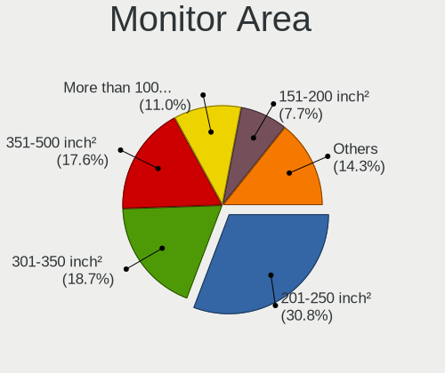

| Area in inch² | Desktops | Percent |
|----------------|----------|---------|
| 201-250        | 28       | 30.77%  |
| 301-350        | 17       | 18.68%  |
| 351-500        | 16       | 17.58%  |
| More than 1000 | 10       | 10.99%  |
| 151-200        | 7        | 7.69%   |
| 251-300        | 4        | 4.4%    |
| Unknown        | 4        | 4.4%    |
| 501-1000       | 3        | 3.3%    |
| 51-60          | 1        | 1.1%    |
| 141-150        | 1        | 1.1%    |

Pixel Density
-------------

Pixels per inch

| Density | Desktops | Percent |
|---------|----------|---------|
| 51-100  | 46       | 51.11%  |
| 101-120 | 24       | 26.67%  |
| 1-50    | 6        | 6.67%   |
| 161-240 | 5        | 5.56%   |
| 121-160 | 5        | 5.56%   |
| Unknown | 4        | 4.44%   |

Multiple Monitors
-----------------

Total monitors connected

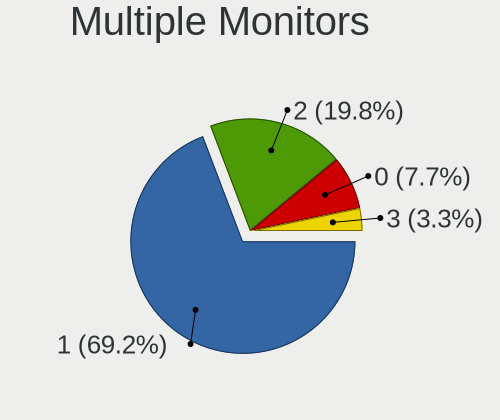

| Total | Desktops | Percent |
|-------|----------|---------|
| 1     | 63       | 69.23%  |
| 2     | 18       | 19.78%  |
| 0     | 7        | 7.69%   |
| 3     | 3        | 3.3%    |

Network
-------

Net Controller Vendor
---------------------

Controller vendors

| Vendor                   | Desktops | Percent |
|--------------------------|----------|---------|
| Realtek Semiconductor    | 51       | 37.5%   |
| Intel                    | 48       | 35.29%  |
| MediaTek                 | 9        | 6.62%   |
| Qualcomm Atheros         | 5        | 3.68%   |
| Broadcom                 | 5        | 3.68%   |
| TP-Link                  | 4        | 2.94%   |
| ASIX Electronics         | 3        | 2.21%   |
| Ralink                   | 2        | 1.47%   |
| Microsoft                | 2        | 1.47%   |
| Marvell Technology Group | 2        | 1.47%   |
| Aquantia                 | 2        | 1.47%   |
| Ralink Technology        | 1        | 0.74%   |
| NetGear                  | 1        | 0.74%   |
| ArteryTek                | 1        | 0.74%   |

Net Controller Model
--------------------

Controller models

| Model                                                                  | Desktops | Percent |
|------------------------------------------------------------------------|----------|---------|
| Realtek RTL8111/8168/8211/8411 PCI Express Gigabit Ethernet Controller | 28       | 17.83%  |
| Realtek RTL8125 2.5GbE Controller                                      | 18       | 11.46%  |
| Intel Wi-Fi 6 AX200                                                    | 7        | 4.46%   |
| MediaTek MT7922 802.11ax PCI Express Wireless Network Adapter          | 6        | 3.82%   |
| Intel I211 Gigabit Network Connection                                  | 6        | 3.82%   |
| Intel Ethernet Controller I225-V                                       | 5        | 3.18%   |
| Intel Ethernet Connection I217-LM                                      | 5        | 3.18%   |
| Intel Ethernet Connection (2) I219-LM                                  | 5        | 3.18%   |
| Realtek 802.11ac NIC                                                   | 3        | 1.91%   |
| Intel Wireless 8260                                                    | 3        | 1.91%   |
| Intel Wi-Fi 6E(802.11ax) AX210/AX1675* 2x2 [Typhoon Peak]              | 3        | 1.91%   |
| Intel Ethernet Connection (7) I219-V                                   | 3        | 1.91%   |
| Intel Ethernet Connection (2) I219-V                                   | 3        | 1.91%   |
| TP-Link 802.11ac WLAN Adapter                                          | 2        | 1.27%   |
| Microsoft Xbox Wireless Adapter for Windows                            | 2        | 1.27%   |
| Intel Raptor Lake-S PCH CNVi WiFi                                      | 2        | 1.27%   |
| Intel I210 Gigabit Network Connection                                  | 2        | 1.27%   |
| Intel 82579LM Gigabit Network Connection (Lewisville)                  | 2        | 1.27%   |
| Broadcom NetXtreme BCM5761 Gigabit Ethernet PCIe                       | 2        | 1.27%   |
| ASIX AX88179 Gigabit Ethernet                                          | 2        | 1.27%   |
| TP-Link Archer T2U PLUS [RTL8821AU]                                    | 1        | 0.64%   |
| TP-Link 802.11ac NIC                                                   | 1        | 0.64%   |
| Realtek USB 10/100/1G/2.5G LAN                                         | 1        | 0.64%   |
| Realtek RTL8852BE PCIe 802.11ax Wireless Network Controller            | 1        | 0.64%   |
| Realtek RTL8822BE 802.11a/b/g/n/ac WiFi adapter                        | 1        | 0.64%   |
| Realtek RTL8821CE 802.11ac PCIe Wireless Network Adapter               | 1        | 0.64%   |
| Realtek RTL8812AE 802.11ac PCIe Wireless Network Adapter               | 1        | 0.64%   |
| Realtek RTL8192CE PCIe Wireless Network Adapter                        | 1        | 0.64%   |
| Realtek RTL8188FTV 802.11b/g/n 1T1R 2.4G WLAN Adapter                  | 1        | 0.64%   |
| Realtek RTL8188EUS 802.11n Wireless Network Adapter                    | 1        | 0.64%   |
| Realtek RTL8111/8168/8411 PCI Express Gigabit Ethernet Controller      | 1        | 0.64%   |
| Realtek RTL810xE PCI Express Fast Ethernet controller                  | 1        | 0.64%   |
| Realtek Realtek WLAN controller                                        | 1        | 0.64%   |
| Realtek Killer E2600 GbE Controller                                    | 1        | 0.64%   |
| Ralink MT7601U Wireless Adapter                                        | 1        | 0.64%   |
| Ralink RT5390 Wireless 802.11n 1T/1R PCIe                              | 1        | 0.64%   |
| Ralink RT2561/RT61 802.11g PCI                                         | 1        | 0.64%   |
| Qualcomm Atheros QCA8171 Gigabit Ethernet                              | 1        | 0.64%   |
| Qualcomm Atheros Killer E2400 Gigabit Ethernet Controller              | 1        | 0.64%   |
| Qualcomm Atheros Killer E220x Gigabit Ethernet Controller              | 1        | 0.64%   |

Wireless Vendor
---------------

Wireless vendors

| Vendor                | Desktops | Percent |
|-----------------------|----------|---------|
| Intel                 | 19       | 38.78%  |
| Realtek Semiconductor | 10       | 20.41%  |
| MediaTek              | 6        | 12.24%  |
| TP-Link               | 4        | 8.16%   |
| Ralink                | 2        | 4.08%   |
| Qualcomm Atheros      | 2        | 4.08%   |
| Microsoft             | 2        | 4.08%   |
| Broadcom              | 2        | 4.08%   |
| Ralink Technology     | 1        | 2.04%   |
| NetGear               | 1        | 2.04%   |

Wireless Model
--------------

Wireless models

| Model                                                          | Desktops | Percent |
|----------------------------------------------------------------|----------|---------|
| Intel Wi-Fi 6 AX200                                            | 7        | 14.29%  |
| MediaTek MT7922 802.11ax PCI Express Wireless Network Adapter  | 4        | 8.16%   |
| Realtek 802.11ac NIC                                           | 3        | 6.12%   |
| Intel Wireless 8260                                            | 3        | 6.12%   |
| Intel Wi-Fi 6E(802.11ax) AX210/AX1675* 2x2 [Typhoon Peak]      | 3        | 6.12%   |
| TP-Link 802.11ac WLAN Adapter                                  | 2        | 4.08%   |
| Microsoft Xbox Wireless Adapter for Windows                    | 2        | 4.08%   |
| Intel Raptor Lake-S PCH CNVi WiFi                              | 2        | 4.08%   |
| TP-Link Archer T2U PLUS [RTL8821AU]                            | 1        | 2.04%   |
| TP-Link 802.11ac NIC                                           | 1        | 2.04%   |
| Realtek RTL8822BE 802.11a/b/g/n/ac WiFi adapter                | 1        | 2.04%   |
| Realtek RTL8821CE 802.11ac PCIe Wireless Network Adapter       | 1        | 2.04%   |
| Realtek RTL8812AE 802.11ac PCIe Wireless Network Adapter       | 1        | 2.04%   |
| Realtek RTL8192CE PCIe Wireless Network Adapter                | 1        | 2.04%   |
| Realtek RTL8188FTV 802.11b/g/n 1T1R 2.4G WLAN Adapter          | 1        | 2.04%   |
| Realtek RTL8188EUS 802.11n Wireless Network Adapter            | 1        | 2.04%   |
| Realtek Realtek WLAN controller                                | 1        | 2.04%   |
| Ralink MT7601U Wireless Adapter                                | 1        | 2.04%   |
| Ralink RT5390 Wireless 802.11n 1T/1R PCIe                      | 1        | 2.04%   |
| Ralink RT2561/RT61 802.11g PCI                                 | 1        | 2.04%   |
| Qualcomm Atheros AR9485 Wireless Network Adapter               | 1        | 2.04%   |
| Qualcomm Atheros AR928X Wireless Network Adapter (PCI-Express) | 1        | 2.04%   |
| NetGear A6150                                                  | 1        | 2.04%   |
| MediaTek Wi-Fi 6E MT7902 Wireless Network Adapter              | 1        | 2.04%   |
| MediaTek MT7921K (RZ608) Wi-Fi 6E 80MHz                        | 1        | 2.04%   |
| Intel Wireless 7265                                            | 1        | 2.04%   |
| Intel Dual Band Wireless-AC 3168NGW [Stone Peak]               | 1        | 2.04%   |
| Intel Comet Lake PCH CNVi WiFi                                 | 1        | 2.04%   |
| Intel Cannon Lake PCH CNVi WiFi                                | 1        | 2.04%   |
| Broadcom BCM4360 802.11ac Dual Band Wireless Network Adapter   | 1        | 2.04%   |
| Broadcom BCM4313 802.11bgn Wireless Network Adapter            | 1        | 2.04%   |

Ethernet Vendor
---------------

Ethernet vendors

| Vendor                   | Desktops | Percent |
|--------------------------|----------|---------|
| Realtek Semiconductor    | 46       | 46%     |
| Intel                    | 37       | 37%     |
| Broadcom                 | 4        | 4%      |
| Qualcomm Atheros         | 3        | 3%      |
| MediaTek                 | 3        | 3%      |
| ASIX Electronics         | 3        | 3%      |
| Marvell Technology Group | 2        | 2%      |
| Aquantia                 | 2        | 2%      |

Ethernet Model
--------------

Ethernet models

| Model                                                                          | Desktops | Percent |
|--------------------------------------------------------------------------------|----------|---------|
| Realtek RTL8111/8168/8211/8411 PCI Express Gigabit Ethernet Controller         | 28       | 26.17%  |
| Realtek RTL8125 2.5GbE Controller                                              | 18       | 16.82%  |
| Intel I211 Gigabit Network Connection                                          | 6        | 5.61%   |
| Intel Ethernet Controller I225-V                                               | 5        | 4.67%   |
| Intel Ethernet Connection I217-LM                                              | 5        | 4.67%   |
| Intel Ethernet Connection (2) I219-LM                                          | 5        | 4.67%   |
| Intel Ethernet Connection (7) I219-V                                           | 3        | 2.8%    |
| Intel Ethernet Connection (2) I219-V                                           | 3        | 2.8%    |
| MediaTek MT7922 802.11ax PCI Express Wireless Network Adapter                  | 2        | 1.87%   |
| Intel I210 Gigabit Network Connection                                          | 2        | 1.87%   |
| Intel 82579LM Gigabit Network Connection (Lewisville)                          | 2        | 1.87%   |
| Broadcom NetXtreme BCM5761 Gigabit Ethernet PCIe                               | 2        | 1.87%   |
| ASIX AX88179 Gigabit Ethernet                                                  | 2        | 1.87%   |
| Realtek USB 10/100/1G/2.5G LAN                                                 | 1        | 0.93%   |
| Realtek RTL8852BE PCIe 802.11ax Wireless Network Controller                    | 1        | 0.93%   |
| Realtek RTL8111/8168/8411 PCI Express Gigabit Ethernet Controller              | 1        | 0.93%   |
| Realtek RTL810xE PCI Express Fast Ethernet controller                          | 1        | 0.93%   |
| Realtek Killer E2600 GbE Controller                                            | 1        | 0.93%   |
| Qualcomm Atheros QCA8171 Gigabit Ethernet                                      | 1        | 0.93%   |
| Qualcomm Atheros Killer E2400 Gigabit Ethernet Controller                      | 1        | 0.93%   |
| Qualcomm Atheros Killer E220x Gigabit Ethernet Controller                      | 1        | 0.93%   |
| MediaTek WLAN controller                                                       | 1        | 0.93%   |
| Marvell Group 88E8071 PCI-E Gigabit Ethernet Controller                        | 1        | 0.93%   |
| Marvell Group 88E8001 Gigabit Ethernet Controller                              | 1        | 0.93%   |
| Intel Ethernet Controller I226-V                                               | 1        | 0.93%   |
| Intel Ethernet Controller I225-LM                                              | 1        | 0.93%   |
| Intel Ethernet Connection (7) I219-LM                                          | 1        | 0.93%   |
| Intel Ethernet Connection (2) I218-V                                           | 1        | 0.93%   |
| Intel Ethernet Connection (17) I219-LM                                         | 1        | 0.93%   |
| Intel 82579V Gigabit Network Connection                                        | 1        | 0.93%   |
| Intel 82578DC Gigabit Network Connection                                       | 1        | 0.93%   |
| Intel 82566DC Gigabit Network Connection                                       | 1        | 0.93%   |
| Broadcom NetXtreme BCM5723 Gigabit Ethernet PCIe                               | 1        | 0.93%   |
| Broadcom NetLink BCM57788 Gigabit Ethernet PCIe                                | 1        | 0.93%   |
| ASIX AX88772                                                                   | 1        | 0.93%   |
| Aquantia AQtion AQC107 NBase-T/IEEE 802.3an Ethernet Controller [Atlantic 10G] | 1        | 0.93%   |
| Aquantia AQtion AQC100 NBase-T/IEEE 802.3an Ethernet Controller [Atlantic 10G] | 1        | 0.93%   |

Net Controller Kind
-------------------

Ethernet, WiFi or modem

| Kind     | Desktops | Percent |
|----------|----------|---------|
| Ethernet | 91       | 66.42%  |
| WiFi     | 45       | 32.85%  |
| Modem    | 1        | 0.73%   |

Used Controller
---------------

Currently used network controller

| Kind     | Desktops | Percent |
|----------|----------|---------|
| Ethernet | 74       | 78.72%  |
| WiFi     | 20       | 21.28%  |

NICs
----

Total network controllers on board

| Total | Desktops | Percent |
|-------|----------|---------|
| 1     | 46       | 50.55%  |
| 2     | 40       | 43.96%  |
| 3     | 5        | 5.49%   |

IPv6
----

IPv6 vs IPv4

| Used | Desktops | Percent |
|------|----------|---------|
| No   | 64       | 70.33%  |
| Yes  | 27       | 29.67%  |

Bluetooth
---------

Bluetooth Vendor
----------------

Controller vendors

| Vendor                  | Desktops | Percent |
|-------------------------|----------|---------|
| Intel                   | 18       | 40.91%  |
| TP-Link                 | 4        | 9.09%   |
| Realtek Semiconductor   | 4        | 9.09%   |
| MediaTek                | 4        | 9.09%   |
| Foxconn / Hon Hai       | 3        | 6.82%   |
| Cambridge Silicon Radio | 3        | 6.82%   |
| ASUSTek Computer        | 3        | 6.82%   |
| IMC Networks            | 2        | 4.55%   |
| Broadcom                | 2        | 4.55%   |
| Unknown                 | 1        | 2.27%   |

Bluetooth Model
---------------

Controller models

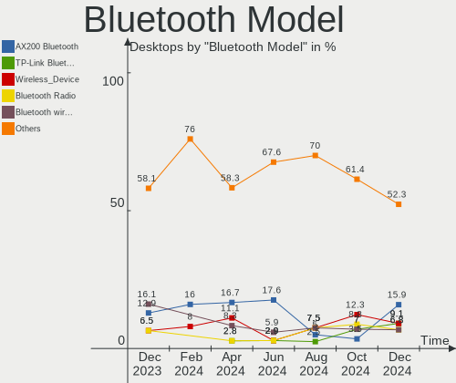

| Model                                               | Desktops | Percent |
|-----------------------------------------------------|----------|---------|
| Intel AX200 Bluetooth                               | 7        | 15.91%  |
| TP-Link TP-Link Bluetooth USB Adapter               | 4        | 9.09%   |
| MediaTek Wireless_Device                            | 4        | 9.09%   |
| Realtek Bluetooth Radio                             | 3        | 6.82%   |
| Intel Bluetooth wireless interface                  | 3        | 6.82%   |
| Intel AX210 Bluetooth                               | 3        | 6.82%   |
| Foxconn / Hon Hai Wireless_Device                   | 3        | 6.82%   |
| Cambridge Silicon Radio Bluetooth Dongle (HCI mode) | 3        | 6.82%   |
| Intel AX201 Bluetooth                               | 2        | 4.55%   |
| Broadcom BCM20702A0 Bluetooth 4.0                   | 2        | 4.55%   |
| Realtek Bluetooth 5.3 Radio                         | 1        | 2.27%   |
| Intel Wireless-AC 3168 Bluetooth                    | 1        | 2.27%   |
| Intel Bluetooth 9460/9560 Jefferson Peak (JfP)      | 1        | 2.27%   |
| Intel AX211 Bluetooth                               | 1        | 2.27%   |
| IMC Networks Wireless_Device                        | 1        | 2.27%   |
| IMC Networks Bluetooth Radio                        | 1        | 2.27%   |
| ASUS Broadcom BCM20702A0 Bluetooth                  | 1        | 2.27%   |
| ASUS Bluetooth Radio                                | 1        | 2.27%   |
| ASUS ASUS USB-BT500                                 | 1        | 2.27%   |
| Unknown                                             | 1        | 2.27%   |

Sound
-----

Sound Vendor
------------

Sound card vendors

| Vendor                                       | Desktops | Percent |
|----------------------------------------------|----------|---------|
| AMD                                          | 52       | 30.41%  |
| Intel                                        | 47       | 27.49%  |
| Nvidia                                       | 35       | 20.47%  |
| Logitech                                     | 4        | 2.34%   |
| C-Media Electronics                          | 4        | 2.34%   |
| Creative Labs                                | 3        | 1.75%   |
| Razer USA                                    | 2        | 1.17%   |
| Focusrite-Novation                           | 2        | 1.17%   |
| Corsair                                      | 2        | 1.17%   |
| ASUSTek Computer                             | 2        | 1.17%   |
| Zoran Co. Personal Media Division (Nogatech) | 1        | 0.58%   |
| XMOS                                         | 1        | 0.58%   |
| Texas Instruments                            | 1        | 0.58%   |
| SteelSeries ApS                              | 1        | 0.58%   |
| RODE Microphones                             | 1        | 0.58%   |
| KTMicro                                      | 1        | 0.58%   |
| Kingston Technology                          | 1        | 0.58%   |
| JOUNIVO                                      | 1        | 0.58%   |
| JMTek                                        | 1        | 0.58%   |
| Jieli Technology                             | 1        | 0.58%   |
| Generalplus Technology                       | 1        | 0.58%   |
| ESI Audiotechnik                             | 1        | 0.58%   |
| Elektron Music Machines                      | 1        | 0.58%   |
| Drop                                         | 1        | 0.58%   |
| CMTECK                                       | 1        | 0.58%   |
| CME (Central Music)                          | 1        | 0.58%   |
| Alesis                                       | 1        | 0.58%   |
| Actions Semiconductor                        | 1        | 0.58%   |

Sound Model
-----------

Sound card models

| Model                                                                      | Desktops | Percent |
|----------------------------------------------------------------------------|----------|---------|
| AMD Starship/Matisse HD Audio Controller                                   | 15       | 7.14%   |
| AMD Navi 31 HDMI/DP Audio                                                  | 10       | 4.76%   |
| AMD Family 17h/19h/1ah HD Audio Controller                                 | 10       | 4.76%   |
| Intel Xeon E3-1200 v3/4th Gen Core Processor HD Audio Controller           | 8        | 3.81%   |
| AMD Rembrandt Radeon High Definition Audio Controller                      | 8        | 3.81%   |
| Intel 8 Series/C220 Series Chipset High Definition Audio Controller        | 7        | 3.33%   |
| Intel 100 Series/C230 Series Chipset Family HD Audio Controller            | 7        | 3.33%   |
| AMD Navi 21/23 HDMI/DP Audio Controller                                    | 7        | 3.33%   |
| Nvidia TU106 High Definition Audio Controller                              | 5        | 2.38%   |
| Intel Cannon Lake PCH cAVS                                                 | 5        | 2.38%   |
| AMD SBx00 Azalia (Intel HDA)                                               | 5        | 2.38%   |
| AMD Renoir Radeon High Definition Audio Controller                         | 5        | 2.38%   |
| AMD Family 17h (Models 00h-0fh) HD Audio Controller                        | 5        | 2.38%   |
| Nvidia GA102 High Definition Audio Controller                              | 4        | 1.9%    |
| Intel Raptor Lake High Definition Audio Controller                         | 4        | 1.9%    |
| AMD Ellesmere HDMI Audio [Radeon RX 470/480 / 570/580/590]                 | 4        | 1.9%    |
| Intel Alder Lake-S HD Audio Controller                                     | 3        | 1.43%   |
| Intel 82801JI (ICH10 Family) HD Audio Controller                           | 3        | 1.43%   |
| Intel 200 Series PCH HD Audio                                              | 3        | 1.43%   |
| Nvidia TU107 GeForce GTX 1650 High Definition Audio Controller             | 2        | 0.95%   |
| Nvidia GP106 High Definition Audio Controller                              | 2        | 0.95%   |
| Nvidia GP102 HDMI Audio Controller                                         | 2        | 0.95%   |
| Nvidia GM206 High Definition Audio Controller                              | 2        | 0.95%   |
| Nvidia GK208 HDMI/DP Audio Controller                                      | 2        | 0.95%   |
| Nvidia GF100 High Definition Audio Controller                              | 2        | 0.95%   |
| Nvidia AD107 High Definition Audio Controller                              | 2        | 0.95%   |
| Logitech G935 Gaming Headset                                               | 2        | 0.95%   |
| Logitech Blue Microphones                                                  | 2        | 0.95%   |
| Intel C610/X99 series chipset HD Audio Controller                          | 2        | 0.95%   |
| Intel 7 Series/C216 Chipset Family High Definition Audio Controller        | 2        | 0.95%   |
| Intel 6 Series/C200 Series Chipset Family High Definition Audio Controller | 2        | 0.95%   |
| Creative Labs EMU20k1 [Sound Blaster X-Fi Series]                          | 2        | 0.95%   |
| ASUSTek Computer USB Audio                                                 | 2        | 0.95%   |
| AMD RV770 HDMI Audio [Radeon HD 4850/4870]                                 | 2        | 0.95%   |
| AMD Cedar HDMI Audio [Radeon HD 5400/6300/7300 Series]                     | 2        | 0.95%   |
| Zoran Co. Personal Media Division (Nogatech) USB Audio and HID             | 1        | 0.48%   |
| XMOS MONOLITH HPA                                                          | 1        | 0.48%   |
| Texas Instruments PCM2902 Audio Codec                                      | 1        | 0.48%   |
| SteelSeries ApS SteelSeries Arctis 1 Wireless                              | 1        | 0.48%   |
| RODE Microphones RODE NT-USB Mini                                          | 1        | 0.48%   |

Memory
------

Memory Vendor
-------------

Memory module vendors

| Vendor              | Desktops | Percent |
|---------------------|----------|---------|
| Corsair             | 12       | 24%     |
| G.Skill             | 8        | 16%     |
| Unknown             | 7        | 14%     |
| Kingston            | 7        | 14%     |
| SK hynix            | 6        | 12%     |
| Team                | 2        | 4%      |
| Samsung Electronics | 2        | 4%      |
| Ramos Technology    | 1        | 2%      |
| Micron Technology   | 1        | 2%      |
| Crucial             | 1        | 2%      |
| Colorful            | 1        | 2%      |
| A-DATA Technology   | 1        | 2%      |
| Unknown             | 1        | 2%      |

Memory Model
------------

Memory module models

| Model                                                  | Desktops | Percent |
|--------------------------------------------------------|----------|---------|
| G.Skill RAM F5-6000J3038F16G 16GB DIMM DDR5 6000MT/s   | 2        | 3.85%   |
| Corsair RAM CMK32GX4M2E3200C16 16GB DIMM DDR4 3534MT/s | 2        | 3.85%   |
| Corsair RAM CMK32GX4M2D3600C18 16GB DIMM DDR4 3800MT/s | 2        | 3.85%   |
| Corsair RAM CMK32GX4M2B3200C16 16GB DIMM DDR4 3800MT/s | 2        | 3.85%   |
| Corsair RAM CMK16GX4M2B3200C16 8GB DIMM DDR4 3600MT/s  | 2        | 3.85%   |
| Unknown RAM Module 4GB DIMM DDR3 1332MT/s              | 1        | 1.92%   |
| Unknown RAM Module 2GB DIMM DDR2 333MT/s               | 1        | 1.92%   |
| Unknown RAM Module 2GB DIMM DDR 800MT/s                | 1        | 1.92%   |
| Unknown RAM Module 2GB DIMM 800MT/s                    | 1        | 1.92%   |
| Unknown RAM Module 2GB DIMM 667MT/s                    | 1        | 1.92%   |
| Unknown RAM Module 1GB DIMM DDR2 333MT/s               | 1        | 1.92%   |
| Unknown RAM Module 1GB DIMM 800MT/s                    | 1        | 1.92%   |
| Unknown RAM 1600 CL9 Series 8192MB DIMM DDR3 1066MT/s  | 1        | 1.92%   |
| Team RAM UD5-6000 32GB DIMM DDR5 6000MT/s              | 1        | 1.92%   |
| Team RAM TEAMGROUP-UD4-3600 8GB DIMM DDR4 3733MT/s     | 1        | 1.92%   |
| SK hynix RAM HMT451U6BFR8C-PB 4GB DIMM DDR3 1600MT/s   | 1        | 1.92%   |
| SK hynix RAM HMT41GU6MFR8C-PB 8GB DIMM DDR3 1600MT/s   | 1        | 1.92%   |
| SK hynix RAM HMT351U6CFR8C-H9 4GB SODIMM DDR3 1333MT/s | 1        | 1.92%   |
| SK hynix RAM HMCG88AGBUA081N 32GB DIMM DDR5 5600MT/s   | 1        | 1.92%   |
| SK hynix RAM HMA82GU6DJR8N-XN 16GB DIMM DDR4 3200MT/s  | 1        | 1.92%   |
| SK hynix RAM HMA41GS6AFR8N-TF 8GB SODIMM DDR4 2667MT/s | 1        | 1.92%   |
| Samsung RAM M391B5773CH0-YH9 2GB DIMM DDR3 1333MT/s    | 1        | 1.92%   |
| Samsung RAM M378A1K43BB1-CPB 8GB DIMM DDR4 2733MT/s    | 1        | 1.92%   |
| Ramos RAM EWB4GB681CA3-16IC 4GB DIMM DDR3 1600MT/s     | 1        | 1.92%   |
| Micron RAM 8JTF25664AZ-1G6M1 2GB DIMM DDR3 1600MT/s    | 1        | 1.92%   |
| Kingston RAM Module 8GB DIMM DDR4 2400MT/s             | 1        | 1.92%   |
| Kingston RAM KHX2133C14D4/4G 4GB DIMM DDR4 2933MT/s    | 1        | 1.92%   |
| Kingston RAM KHX1600C9D3/4 4GB DIMM DDR3 1600MT/s      | 1        | 1.92%   |
| Kingston RAM KF552C40-32 32GB DIMM DDR5 5200MT/s       | 1        | 1.92%   |
| Kingston RAM KF3200C16D4/8GX 8GB DIMM DDR4 3600MT/s    | 1        | 1.92%   |
| Kingston RAM 99U5584-009.A00LF 4GB DIMM DDR3 1600MT/s  | 1        | 1.92%   |
| Kingston RAM 9905471-064.A00LF 8GB DIMM DDR3 1600MT/s  | 1        | 1.92%   |
| G.Skill RAM F4-3600C19-16GVRB 16GB DIMM DDR4 3600MT/s  | 1        | 1.92%   |
| G.Skill RAM F4-3600C16-32GTZN 32GB DIMM DDR4 3600MT/s  | 1        | 1.92%   |
| G.Skill RAM F4-3200C16-16GVK 16GB DIMM DDR4 3600MT/s   | 1        | 1.92%   |
| G.Skill RAM F4-2666C15-4GVR 4GB DIMM DDR4 3200MT/s     | 1        | 1.92%   |
| G.Skill RAM F4-2400C15-8GVR 8GB DIMM DDR4 3200MT/s     | 1        | 1.92%   |
| G.Skill RAM F3-14900CL10-8GBXL 8GB DIMM DDR3 1867MT/s  | 1        | 1.92%   |
| Crucial RAM CT8G4SFRA32A.M8FE 8GB SODIMM DDR4 3200MT/s | 1        | 1.92%   |
| Corsair RAM CMK64GX4M2E3200C16 32GB DIMM DDR4 3600MT/s | 1        | 1.92%   |

Memory Kind
-----------

Memory module kinds

| Kind    | Desktops | Percent |
|---------|----------|---------|
| DDR4    | 23       | 50%     |
| DDR3    | 12       | 26.09%  |
| DDR5    | 6        | 13.04%  |
| Unknown | 3        | 6.52%   |
| DDR2    | 1        | 2.17%   |
| DDR     | 1        | 2.17%   |

Memory Form Factor
------------------

Physical design of the memory module

| Name   | Desktops | Percent |
|--------|----------|---------|
| DIMM   | 42       | 91.3%   |
| SODIMM | 4        | 8.7%    |

Memory Size
-----------

Memory module size

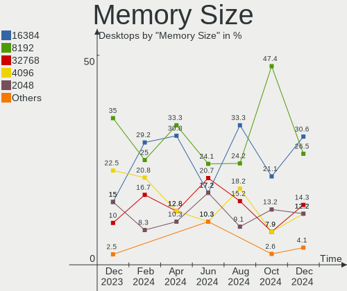

| Size  | Desktops | Percent |
|-------|----------|---------|
| 16384 | 15       | 30.61%  |
| 8192  | 13       | 26.53%  |
| 32768 | 7        | 14.29%  |
| 4096  | 6        | 12.24%  |
| 2048  | 6        | 12.24%  |
| 1024  | 2        | 4.08%   |

Memory Speed
------------

Memory module speed

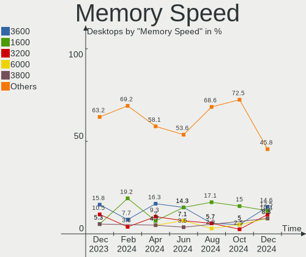

| Speed | Desktops | Percent |
|-------|----------|---------|
| 3600  | 7        | 14.58%  |
| 1600  | 6        | 12.5%   |
| 3200  | 5        | 10.42%  |
| 6000  | 4        | 8.33%   |
| 3800  | 4        | 8.33%   |
| 1333  | 3        | 6.25%   |
| 800   | 3        | 6.25%   |
| 3534  | 2        | 4.17%   |
| 2667  | 2        | 4.17%   |
| 5600  | 1        | 2.08%   |
| 5200  | 1        | 2.08%   |
| 3733  | 1        | 2.08%   |
| 2933  | 1        | 2.08%   |
| 2733  | 1        | 2.08%   |
| 2400  | 1        | 2.08%   |
| 2133  | 1        | 2.08%   |
| 1867  | 1        | 2.08%   |
| 1866  | 1        | 2.08%   |
| 1332  | 1        | 2.08%   |
| 667   | 1        | 2.08%   |
| 333   | 1        | 2.08%   |

Printers & scanners
-------------------

Printer Vendor
--------------

Printer device vendors

| Vendor              | Desktops | Percent |
|---------------------|----------|---------|
| Canon               | 3        | 30%     |
| Samsung Electronics | 2        | 20%     |
| Hewlett-Packard     | 2        | 20%     |
| Brother Industries  | 2        | 20%     |
| Seiko Epson         | 1        | 10%     |

Printer Model
-------------

Printer device models

| Model                          | Desktops | Percent |
|--------------------------------|----------|---------|
| Seiko Epson XP-4100 Series     | 1        | 10%     |
| Samsung M332x 382x 402x Series | 1        | 10%     |
| Samsung M2070 Series           | 1        | 10%     |
| HP LaserJet 1020               | 1        | 10%     |
| HP Deskjet 3050A               | 1        | 10%     |
| Canon TS5300 series            | 1        | 10%     |
| Canon MF4410                   | 1        | 10%     |
| Canon LiDE 400                 | 1        | 10%     |
| Brother MFC-J480DW             | 1        | 10%     |
| Brother HL-2240D series        | 1        | 10%     |

Scanner Vendor
--------------

Scanner device vendors

Zero info for selected period =(

Scanner Model
-------------

Scanner device models

Zero info for selected period =(

Camera
------

Camera Vendor
-------------

Camera device vendors

| Vendor                 | Desktops | Percent |
|------------------------|----------|---------|
| Logitech               | 11       | 44%     |
| Microsoft              | 4        | 16%     |
| Generalplus Technology | 3        | 12%     |
| SunplusIT              | 1        | 4%      |
| Razer USA              | 1        | 4%      |
| Microdia               | 1        | 4%      |
| Linux Foundation       | 1        | 4%      |
| Crestron               | 1        | 4%      |
| AVerMedia Technologies | 1        | 4%      |
| 2M UVC CAMERA          | 1        | 4%      |

Camera Model
------------

Camera device models

| Model                                  | Desktops | Percent |
|----------------------------------------|----------|---------|
| Logitech Webcam C270                   | 5        | 20%     |
| Microsoft LifeCam VX-5000              | 2        | 8%      |
| Generalplus GENERAL WEBCAM             | 2        | 8%      |
| SunplusIT USB 2.0 Camera               | 1        | 4%      |
| Razer USA Gaming Webcam [Kiyo]         | 1        | 4%      |
| Microsoft Microsoft LifeCam HD-5001  | 1        | 4%      |
| Microsoft LifeCam Cinema               | 1        | 4%      |
| Microdia Webcam Vitade AF              | 1        | 4%      |
| Logitech StreamCam                     | 1        | 4%      |
| Logitech QuickCam Communicate MP/S5500 | 1        | 4%      |
| Logitech HD Webcam C615                | 1        | 4%      |
| Logitech HD Pro Webcam C920            | 1        | 4%      |
| Logitech C922 Pro Stream Webcam        | 1        | 4%      |
| Logitech BRIO Ultra HD Webcam          | 1        | 4%      |
| Linux Foundation EEM Gadget            | 1        | 4%      |
| Generalplus WEB CAM                    | 1        | 4%      |
| Crestron HD-CONV-USB-300 Content       | 1        | 4%      |
| AVerMedia Live Streamer CAM 310P       | 1        | 4%      |
| 2M UVC CAMERA NexiGo N60 FHD Webcam    | 1        | 4%      |

Security
--------

Fingerprint Vendor
------------------

Fingerprint sensor vendors

Zero info for selected period =(

Fingerprint Model
-----------------

Fingerprint sensor models

Zero info for selected period =(

Chipcard Vendor
---------------

Chipcard module vendors

Zero info for selected period =(

Chipcard Model
--------------

Chipcard module models

Zero info for selected period =(

Unsupported
-----------

Unsupported Devices
-------------------

Total unsupported devices on board

| Total | Desktops | Percent |
|-------|----------|---------|
| 0     | 81       | 89.01%  |
| 1     | 8        | 8.79%   |
| 2     | 2        | 2.2%    |

Unsupported Device Types
------------------------

Types of unsupported devices

| Type             | Desktops | Percent |
|------------------|----------|---------|
| Graphics card    | 5        | 41.67%  |
| Unassigned class | 3        | 25%     |
| Net/wireless     | 3        | 25%     |
| Bluetooth        | 1        | 8.33%   |

