Linux in Canada - Hardware Trends (Notebooks)
---------------------------------------------

A project to identify most popular hardware characteristics and track their change
over time based on data collected by Linux users at https://Linux-Hardware.org.

Anyone can contribute to this report by the [hw-probe](https://github.com/linuxhw/hw-probe) tool:

    sudo -E hw-probe -all -upload

Period: Dec, 2025.

Contents
--------

* [ System ](#system)
  - [ OS                       ](#os)
  - [ OS Family                ](#os-family)
  - [ Kernel                   ](#kernel)
  - [ Kernel Family            ](#kernel-family)
  - [ Kernel Major Ver.        ](#kernel-major-ver)
  - [ Arch                     ](#arch)
  - [ DE                       ](#de)
  - [ Display Server           ](#display-server)
  - [ Display Manager          ](#display-manager)
  - [ OS Lang                  ](#os-lang)
  - [ Boot Mode                ](#boot-mode)
  - [ Filesystem               ](#filesystem)
  - [ Part. scheme             ](#part-scheme)
  - [ Dual Boot with Linux/BSD ](#dual-boot-with-linuxbsd)
  - [ Dual Boot (Win)          ](#dual-boot-win)

* [ Board ](#board)
  - [ Vendor                   ](#vendor)
  - [ Model                    ](#model)
  - [ Model Family             ](#model-family)
  - [ MFG Year                 ](#mfg-year)
  - [ Form Factor              ](#form-factor)
  - [ Secure Boot              ](#secure-boot)
  - [ Coreboot                 ](#coreboot)
  - [ RAM Size                 ](#ram-size)
  - [ RAM Used                 ](#ram-used)
  - [ Total Drives             ](#total-drives)
  - [ Has CD-ROM               ](#has-cd-rom)
  - [ Has Ethernet             ](#has-ethernet)
  - [ Has WiFi                 ](#has-wifi)
  - [ Has Bluetooth            ](#has-bluetooth)

* [ Location ](#location)
  - [ Country                  ](#country)
  - [ City                     ](#city)

* [ Drives ](#drives)
  - [ Drive Vendor             ](#drive-vendor)
  - [ Drive Model              ](#drive-model)
  - [ HDD Vendor               ](#hdd-vendor)
  - [ SSD Vendor               ](#ssd-vendor)
  - [ Drive Kind               ](#drive-kind)
  - [ Drive Connector          ](#drive-connector)
  - [ Drive Size               ](#drive-size)
  - [ Space Total              ](#space-total)
  - [ Space Used               ](#space-used)
  - [ Malfunc. Drives          ](#malfunc-drives)
  - [ Malfunc. Drive Vendor    ](#malfunc-drive-vendor)
  - [ Malfunc. HDD Vendor      ](#malfunc-hdd-vendor)
  - [ Malfunc. Drive Kind      ](#malfunc-drive-kind)
  - [ Failed Drives            ](#failed-drives)
  - [ Failed Drive Vendor      ](#failed-drive-vendor)
  - [ Drive Status             ](#drive-status)

* [ Storage controller ](#storage-controller)
  - [ Storage Vendor           ](#storage-vendor)
  - [ Storage Model            ](#storage-model)
  - [ Storage Kind             ](#storage-kind)

* [ Processor ](#processor)
  - [ CPU Vendor               ](#cpu-vendor)
  - [ CPU Model                ](#cpu-model)
  - [ CPU Model Family         ](#cpu-model-family)
  - [ CPU Cores                ](#cpu-cores)
  - [ CPU Sockets              ](#cpu-sockets)
  - [ CPU Threads              ](#cpu-threads)
  - [ CPU Op-Modes             ](#cpu-op-modes)
  - [ CPU Microcode            ](#cpu-microcode)
  - [ CPU Microarch            ](#cpu-microarch)

* [ Graphics ](#graphics)
  - [ GPU Vendor               ](#gpu-vendor)
  - [ GPU Model                ](#gpu-model)
  - [ GPU Combo                ](#gpu-combo)
  - [ GPU Driver               ](#gpu-driver)
  - [ GPU Memory               ](#gpu-memory)

* [ Monitor ](#monitor)
  - [ Monitor Vendor           ](#monitor-vendor)
  - [ Monitor Model            ](#monitor-model)
  - [ Monitor Resolution       ](#monitor-resolution)
  - [ Monitor Diagonal         ](#monitor-diagonal)
  - [ Monitor Width            ](#monitor-width)
  - [ Aspect Ratio             ](#aspect-ratio)
  - [ Monitor Area             ](#monitor-area)
  - [ Pixel Density            ](#pixel-density)
  - [ Multiple Monitors        ](#multiple-monitors)

* [ Network ](#network)
  - [ Net Controller Vendor    ](#net-controller-vendor)
  - [ Net Controller Model     ](#net-controller-model)
  - [ Wireless Vendor          ](#wireless-vendor)
  - [ Wireless Model           ](#wireless-model)
  - [ Ethernet Vendor          ](#ethernet-vendor)
  - [ Ethernet Model           ](#ethernet-model)
  - [ Net Controller Kind      ](#net-controller-kind)
  - [ Used Controller          ](#used-controller)
  - [ NICs                     ](#nics)
  - [ IPv6                     ](#ipv6)

* [ Bluetooth ](#bluetooth)
  - [ Bluetooth Vendor         ](#bluetooth-vendor)
  - [ Bluetooth Model          ](#bluetooth-model)

* [ Sound ](#sound)
  - [ Sound Vendor             ](#sound-vendor)
  - [ Sound Model              ](#sound-model)

* [ Memory ](#memory)
  - [ Memory Vendor            ](#memory-vendor)
  - [ Memory Model             ](#memory-model)
  - [ Memory Kind              ](#memory-kind)
  - [ Memory Form Factor       ](#memory-form-factor)
  - [ Memory Size              ](#memory-size)
  - [ Memory Speed             ](#memory-speed)

* [ Printers & scanners ](#printers--scanners)
  - [ Printer Vendor           ](#printer-vendor)
  - [ Printer Model            ](#printer-model)
  - [ Scanner Vendor           ](#scanner-vendor)
  - [ Scanner Model            ](#scanner-model)

* [ Camera ](#camera)
  - [ Camera Vendor            ](#camera-vendor)
  - [ Camera Model             ](#camera-model)

* [ Security ](#security)
  - [ Fingerprint Vendor       ](#fingerprint-vendor)
  - [ Fingerprint Model        ](#fingerprint-model)
  - [ Chipcard Vendor          ](#chipcard-vendor)
  - [ Chipcard Model           ](#chipcard-model)

* [ Unsupported ](#unsupported)
  - [ Unsupported Devices      ](#unsupported-devices)
  - [ Unsupported Device Types ](#unsupported-device-types)

System
------

OS
--

Installed operating systems

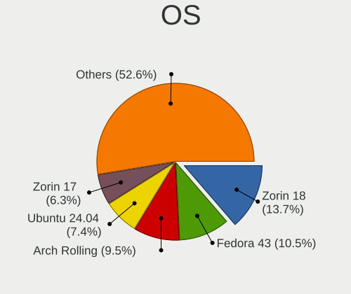

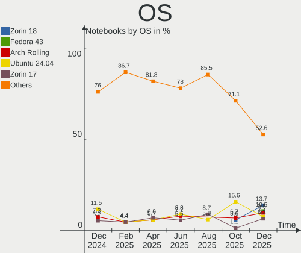

| Name                | Notebooks | Percent |
|---------------------|-----------|---------|
| Zorin 18            | 13        | 13.68%  |
| Fedora 43           | 10        | 10.53%  |
| Arch Rolling        | 9         | 9.47%   |
| Ubuntu 24.04        | 7         | 7.37%   |
| Zorin 17            | 6         | 6.32%   |
| Linux Mint 22.2     | 6         | 6.32%   |
| OpenMandriva 25.11  | 5         | 5.26%   |
| Pop!_OS 22.04       | 3         | 3.16%   |
| Debian 13           | 3         | 3.16%   |
| CachyOS Rolling     | 3         | 3.16%   |
| Ubuntu 25.10        | 2         | 2.11%   |
| Pop!_OS 24.04       | 2         | 2.11%   |
| OpenMandriva 6.0    | 2         | 2.11%   |
| OpenMandriva 25.90  | 2         | 2.11%   |
| Linux Mint 22.1     | 2         | 2.11%   |
| Xubuntu 25.10       | 1         | 1.05%   |
| Xubuntu 24.04       | 1         | 1.05%   |
| Ubuntu MATE 25.10   | 1         | 1.05%   |
| Ubuntu Budgie 24.04 | 1         | 1.05%   |
| SteamOS Rolling     | 1         | 1.05%   |
| SteamOS 3.7.17      | 1         | 1.05%   |
| openSUSE Leap-16.0  | 1         | 1.05%   |
| NixOS 26.05         | 1         | 1.05%   |
| Manjaro             | 1         | 1.05%   |
| Lubuntu 24.04       | 1         | 1.05%   |
| LMDE 7              | 1         | 1.05%   |
| Linux Lite 7.6      | 1         | 1.05%   |
| Gentoo 2.18         | 1         | 1.05%   |
| Fedora 42           | 1         | 1.05%   |
| Fedora 37           | 1         | 1.05%   |
| Fedora 36           | 1         | 1.05%   |
| Elementary 8        | 1         | 1.05%   |
| CachyOS             | 1         | 1.05%   |
| Bazzite 43          | 1         | 1.05%   |
| Bazzite 42          | 1         | 1.05%   |

OS Family
---------

OS without a version

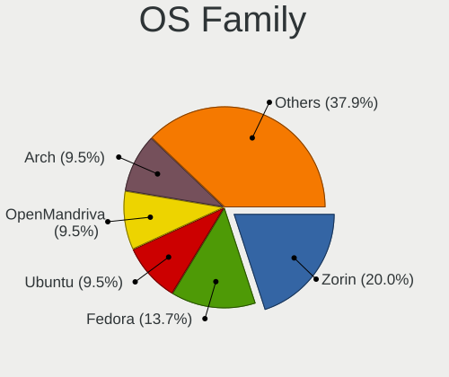

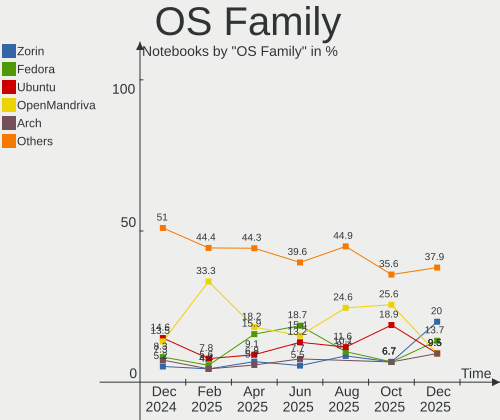

| Name          | Notebooks | Percent |
|---------------|-----------|---------|
| Zorin         | 19        | 20%     |
| Fedora        | 13        | 13.68%  |
| Ubuntu        | 9         | 9.47%   |
| OpenMandriva  | 9         | 9.47%   |
| Arch          | 9         | 9.47%   |
| Linux Mint    | 8         | 8.42%   |
| Pop!_OS       | 5         | 5.26%   |
| CachyOS       | 4         | 4.21%   |
| Debian        | 3         | 3.16%   |
| Xubuntu       | 2         | 2.11%   |
| SteamOS       | 2         | 2.11%   |
| Bazzite       | 2         | 2.11%   |
| Ubuntu MATE   | 1         | 1.05%   |
| Ubuntu Budgie | 1         | 1.05%   |
| openSUSE      | 1         | 1.05%   |
| NixOS         | 1         | 1.05%   |
| Manjaro       | 1         | 1.05%   |
| Lubuntu       | 1         | 1.05%   |
| LMDE          | 1         | 1.05%   |
| Linux Lite    | 1         | 1.05%   |
| Gentoo        | 1         | 1.05%   |
| Elementary    | 1         | 1.05%   |

Kernel
------

Version of the Linux kernel

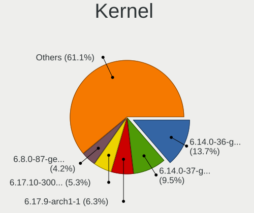

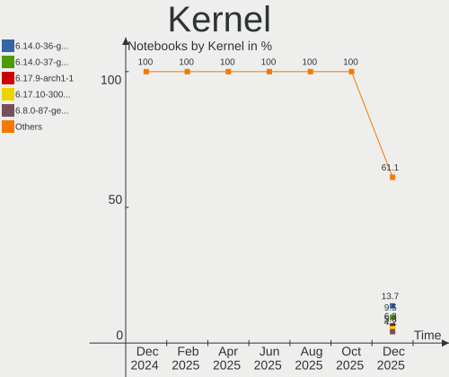

| Version                                     | Notebooks | Percent |
|---------------------------------------------|-----------|---------|
| 6.14.0-36-generic                           | 13        | 13.68%  |
| 6.14.0-37-generic                           | 9         | 9.47%   |
| 6.17.9-arch1-1                              | 6         | 6.32%   |
| 6.17.10-300.fc43.x86_64                     | 5         | 5.26%   |
| 6.8.0-87-generic                            | 4         | 4.21%   |
| 6.8.0-90-generic                            | 3         | 3.16%   |
| 6.8.0-88-generic                            | 3         | 3.16%   |
| 6.18.0-desktop-1omv2590                     | 3         | 3.16%   |
| 6.17.4-76061704-generic                     | 3         | 3.16%   |
| 6.17.0-7-generic                            | 3         | 3.16%   |
| 6.14.2-desktop-3omv2590                     | 3         | 3.16%   |
| 6.14.0-35-generic                           | 3         | 3.16%   |
| 6.12.57+deb13-amd64                         | 3         | 3.16%   |
| 6.18.2-arch2-1                              | 2         | 2.11%   |
| 6.18.0-2-cachyos                            | 2         | 2.11%   |
| 6.17.9-76061709-generic                     | 2         | 2.11%   |
| 6.17.7-desktop-1omv2590                     | 2         | 2.11%   |
| 6.17.12-300.fc43.x86_64                     | 2         | 2.11%   |
| 6.14.0-33-generic                           | 2         | 2.11%   |
| 6.11.11-valve24-2-neptune-611-gfd0dd251480d | 2         | 2.11%   |
| 6.5.12-100.fc37.x86_64                      | 1         | 1.05%   |
| 6.18.0-cachyos                              | 1         | 1.05%   |
| 6.18.0-5-cachyos                            | 1         | 1.05%   |
| 6.18.0-3-cachyos                            | 1         | 1.05%   |
| 6.17.9-zen1-1-zen                           | 1         | 1.05%   |
| 6.17.8-300.fc43.x86_64                      | 1         | 1.05%   |
| 6.17.8-210.t2.fc43.x86_64                   | 1         | 1.05%   |
| 6.17.7-ba20.fc43.x86_64                     | 1         | 1.05%   |
| 6.17.7-200.fc42.x86_64                      | 1         | 1.05%   |
| 6.17.4-desktop-1omv2590                     | 1         | 1.05%   |
| 6.17.1-300.fc43.x86_64                      | 1         | 1.05%   |
| 6.17.0-6-generic                            | 1         | 1.05%   |
| 6.16.4-116.bazzite.fc42.x86_64              | 1         | 1.05%   |
| 6.14.0-29-generic                           | 1         | 1.05%   |
| 6.14.0-27-generic                           | 1         | 1.05%   |
| 6.12.62-1-MANJARO                           | 1         | 1.05%   |
| 6.12.58-gentoo-dist                         | 1         | 1.05%   |
| 6.12.48+deb13-amd64                         | 1         | 1.05%   |
| 6.12.0-160000.5-default                     | 1         | 1.05%   |
| 5.19.14-200.fc36.x86_64                     | 1         | 1.05%   |

Kernel Family
-------------

Linux kernel without a distro release

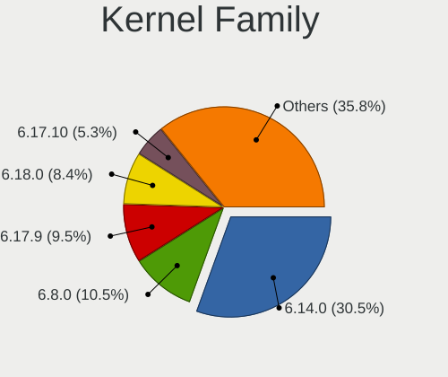

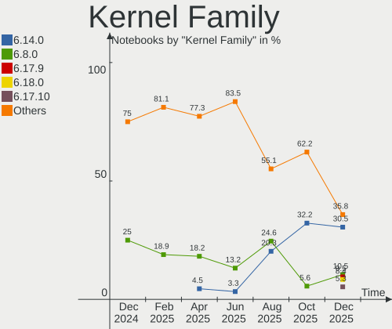

| Version | Notebooks | Percent |
|---------|-----------|---------|
| 6.14.0  | 29        | 30.53%  |
| 6.8.0   | 10        | 10.53%  |
| 6.17.9  | 9         | 9.47%   |
| 6.18.0  | 8         | 8.42%   |
| 6.17.10 | 5         | 5.26%   |
| 6.17.7  | 4         | 4.21%   |
| 6.17.4  | 4         | 4.21%   |
| 6.17.0  | 4         | 4.21%   |
| 6.14.2  | 3         | 3.16%   |
| 6.12.57 | 3         | 3.16%   |
| 6.18.2  | 2         | 2.11%   |
| 6.17.8  | 2         | 2.11%   |
| 6.17.12 | 2         | 2.11%   |
| 6.11.11 | 2         | 2.11%   |
| 6.5.12  | 1         | 1.05%   |
| 6.17.1  | 1         | 1.05%   |
| 6.16.4  | 1         | 1.05%   |
| 6.12.62 | 1         | 1.05%   |
| 6.12.58 | 1         | 1.05%   |
| 6.12.48 | 1         | 1.05%   |
| 6.12.0  | 1         | 1.05%   |
| 5.19.14 | 1         | 1.05%   |

Kernel Major Ver.
-----------------

Linux kernel major version

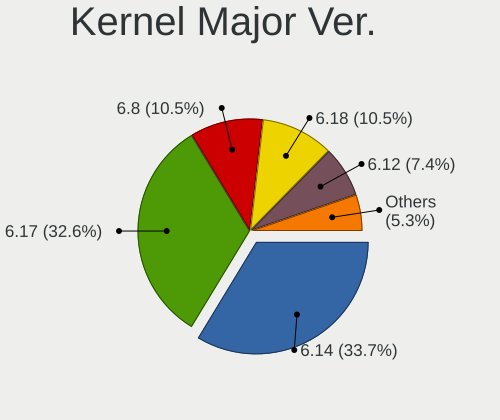

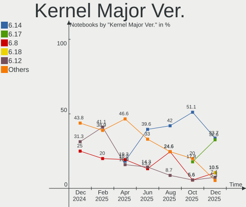

| Version | Notebooks | Percent |
|---------|-----------|---------|
| 6.14    | 32        | 33.68%  |
| 6.17    | 31        | 32.63%  |
| 6.8     | 10        | 10.53%  |
| 6.18    | 10        | 10.53%  |
| 6.12    | 7         | 7.37%   |
| 6.11    | 2         | 2.11%   |
| 6.5     | 1         | 1.05%   |
| 6.16    | 1         | 1.05%   |
| 5.19    | 1         | 1.05%   |

Arch
----

OS architecture (x86_64, i586, etc.)

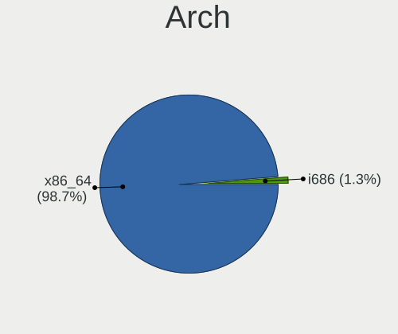

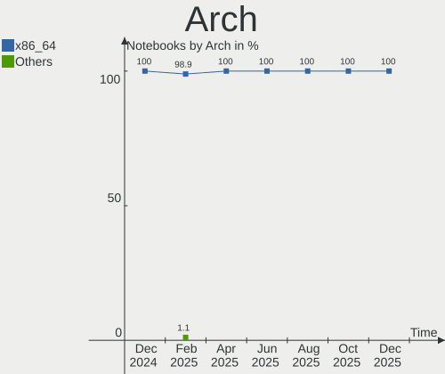

| Name   | Notebooks | Percent |
|--------|-----------|---------|
| x86_64 | 95        | 100%    |

DE
--

Desktop Environment

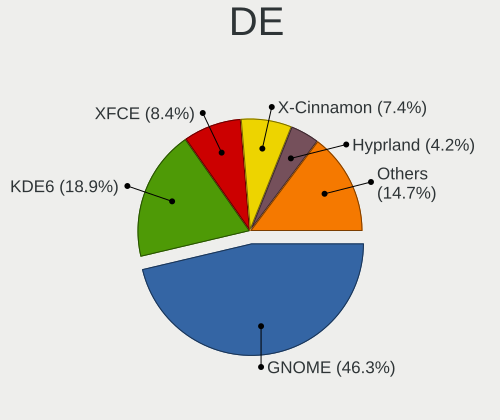

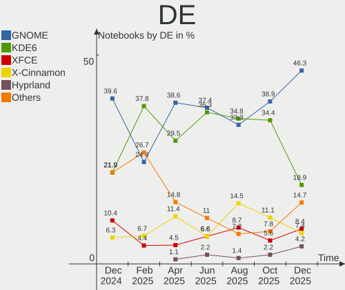

| Name       | Notebooks | Percent |
|------------|-----------|---------|
| GNOME      | 44        | 46.32%  |
| KDE6       | 18        | 18.95%  |
| XFCE       | 8         | 8.42%   |
| X-Cinnamon | 7         | 7.37%   |
| Hyprland   | 4         | 4.21%   |
| COSMIC     | 3         | 3.16%   |
| Unknown    | 3         | 3.16%   |
| LXQt       | 2         | 2.11%   |
| Budgie     | 2         | 2.11%   |
| Pantheon   | 1         | 1.05%   |
| MATE       | 1         | 1.05%   |
| KDE        | 1         | 1.05%   |
| i3         | 1         | 1.05%   |

Display Server
--------------

X11 or Wayland

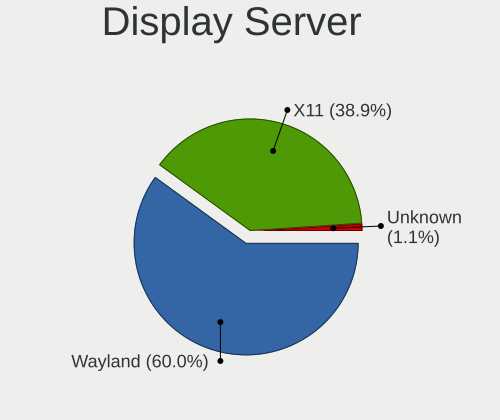

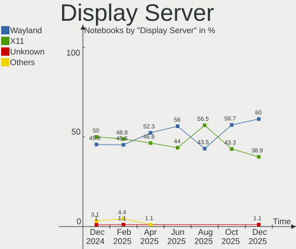

| Name    | Notebooks | Percent |
|---------|-----------|---------|
| Wayland | 57        | 60%     |
| X11     | 37        | 38.95%  |
| Unknown | 1         | 1.05%   |

Display Manager
---------------

SDDM, LightDM, etc.

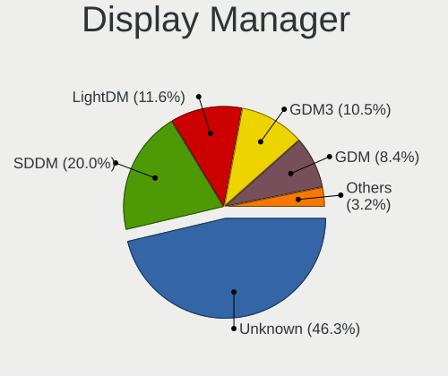

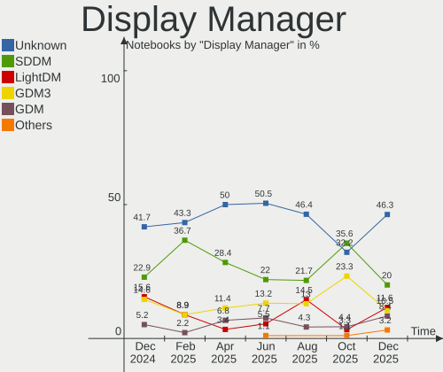

| Name                  | Notebooks | Percent |
|-----------------------|-----------|---------|
| Unknown               | 44        | 46.32%  |
| SDDM                  | 19        | 20%     |
| LightDM               | 11        | 11.58%  |
| GDM3                  | 10        | 10.53%  |
| GDM                   | 8         | 8.42%   |
| GREETD                | 2         | 2.11%   |
| DISPLAY-MANAGER-START | 1         | 1.05%   |

OS Lang
-------

Language

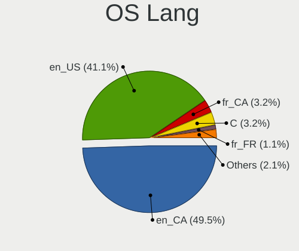

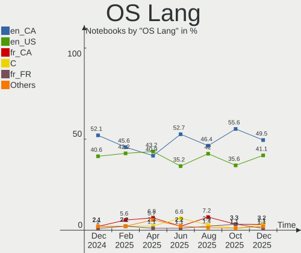

| Lang    | Notebooks | Percent |
|---------|-----------|---------|
| en_CA   | 47        | 49.47%  |
| en_US   | 39        | 41.05%  |
| fr_CA   | 3         | 3.16%   |
| C       | 3         | 3.16%   |
| fr_FR   | 1         | 1.05%   |
| en_GB   | 1         | 1.05%   |
| Unknown | 1         | 1.05%   |

Boot Mode
---------

EFI or BIOS

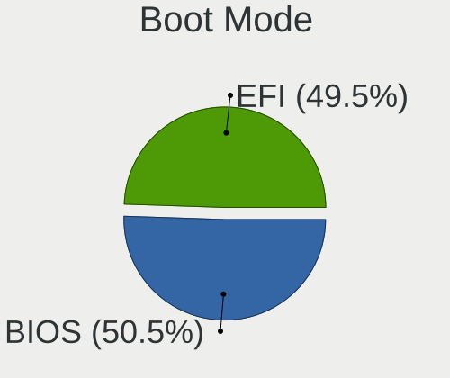

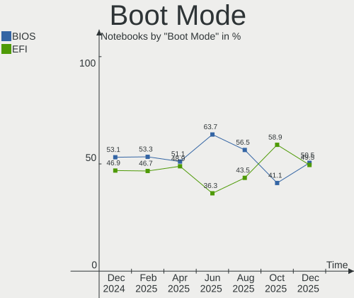

| Mode | Notebooks | Percent |
|------|-----------|---------|
| BIOS | 48        | 50.53%  |
| EFI  | 47        | 49.47%  |

Filesystem
----------

Type of filesystem

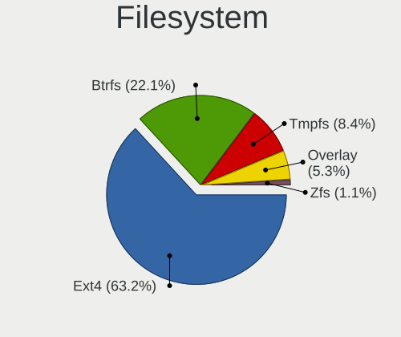

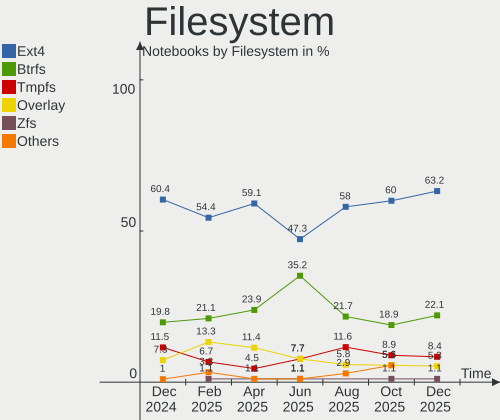

| Type    | Notebooks | Percent |
|---------|-----------|---------|
| Ext4    | 60        | 63.16%  |
| Btrfs   | 21        | 22.11%  |
| Tmpfs   | 8         | 8.42%   |
| Overlay | 5         | 5.26%   |
| Zfs     | 1         | 1.05%   |

Part. scheme
------------

Scheme of partitioning

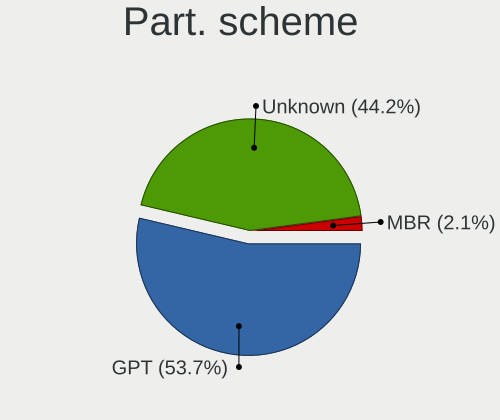

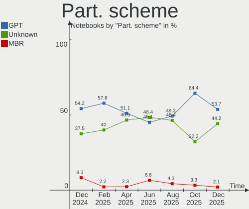

| Type    | Notebooks | Percent |
|---------|-----------|---------|
| GPT     | 51        | 53.68%  |
| Unknown | 42        | 44.21%  |
| MBR     | 2         | 2.11%   |

Dual Boot with Linux/BSD
------------------------

Hosting more than one Linux/BSD

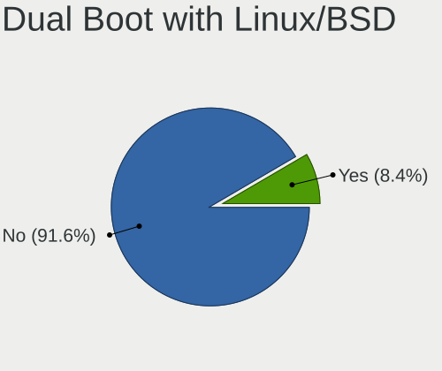

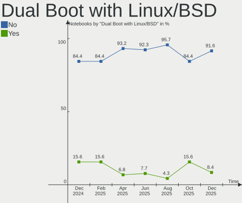

| Dual boot | Notebooks | Percent |
|-----------|-----------|---------|
| No        | 87        | 91.58%  |
| Yes       | 8         | 8.42%   |

Dual Boot (Win)
---------------

Hosting Linux and Windows

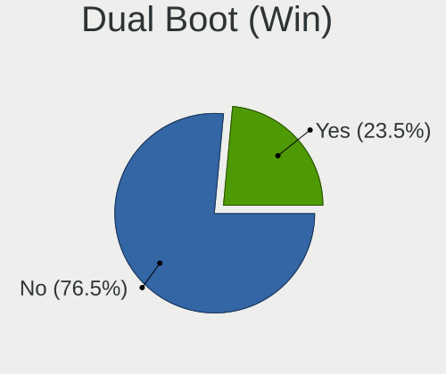

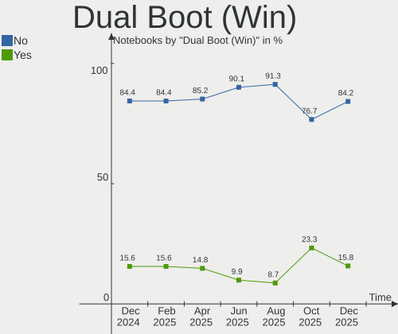

| Dual boot | Notebooks | Percent |
|-----------|-----------|---------|
| No        | 80        | 84.21%  |
| Yes       | 15        | 15.79%  |

Board
-----

Vendor
------

Motherboard manufacturer

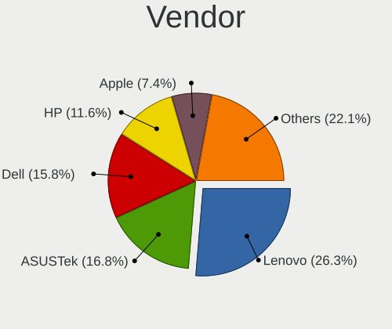

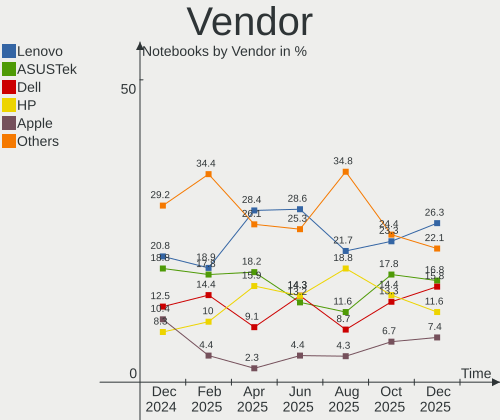

| Name                    | Notebooks | Percent |
|-------------------------|-----------|---------|
| Lenovo                  | 25        | 26.32%  |
| ASUSTek Computer        | 16        | 16.84%  |
| Dell                    | 15        | 15.79%  |
| Hewlett-Packard         | 11        | 11.58%  |
| Apple                   | 7         | 7.37%   |
| Acer                    | 7         | 7.37%   |
| MSI                     | 3         | 3.16%   |
| Valve                   | 2         | 2.11%   |
| Framework               | 2         | 2.11%   |
| SZ ReachingTech Limited | 1         | 1.05%   |
| LG Electronics          | 1         | 1.05%   |
| Google                  | 1         | 1.05%   |
| Gigabyte Technology     | 1         | 1.05%   |
| Gateway                 | 1         | 1.05%   |
| Chuwi                   | 1         | 1.05%   |
| Alienware               | 1         | 1.05%   |

Model
-----

Motherboard model

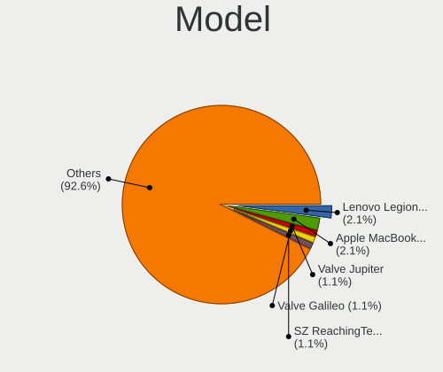

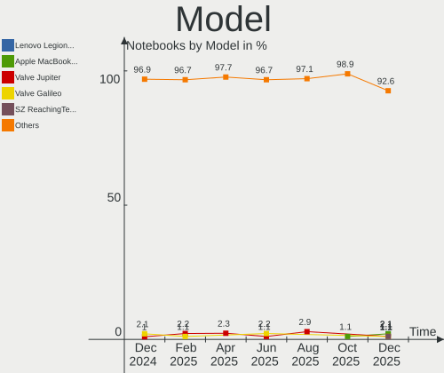

| Name                                       | Notebooks | Percent |
|--------------------------------------------|-----------|---------|
| Lenovo Legion Pro 7 16AFR10H 83RU          | 2         | 2.11%   |
| Apple MacBookPro11,5                       | 2         | 2.11%   |
| Valve Jupiter                              | 1         | 1.05%   |
| Valve Galileo                              | 1         | 1.05%   |
| SZ ReachingTech Limited DQ05proplus        | 1         | 1.05%   |
| MSI Summit E14Evo A12M                     | 1         | 1.05%   |
| MSI Katana GF66 11UE                       | 1         | 1.05%   |
| MSI Katana 17 B13VFK                       | 1         | 1.05%   |
| LG 16Z90S-H.ADB9U1                         | 1         | 1.05%   |
| Lenovo Y50-70 20378                        | 1         | 1.05%   |
| Lenovo ThinkPad X260 20F5S4VC00            | 1         | 1.05%   |
| Lenovo ThinkPad X1 Extreme Gen2 20QVCT01WW | 1         | 1.05%   |
| Lenovo ThinkPad X1 Carbon Gen 9 20XW00QGUS | 1         | 1.05%   |
| Lenovo ThinkPad W541 20EF000NUS            | 1         | 1.05%   |
| Lenovo ThinkPad W520 42763JU               | 1         | 1.05%   |
| Lenovo ThinkPad T590 20N5S3E900            | 1         | 1.05%   |
| Lenovo ThinkPad T480 20L5CTO1WW            | 1         | 1.05%   |
| Lenovo ThinkPad T470 20HDCTO1WW            | 1         | 1.05%   |
| Lenovo ThinkPad T450s 20BWS5SJ00           | 1         | 1.05%   |
| Lenovo ThinkPad T450s 20BW0004US           | 1         | 1.05%   |
| Lenovo ThinkPad T420 4177QGU               | 1         | 1.05%   |
| Lenovo ThinkPad P15v Gen 1 20TQCTO1WW      | 1         | 1.05%   |
| Lenovo ThinkPad P14s Gen 6 AMD 21RVCTO1WW  | 1         | 1.05%   |
| Lenovo ThinkPad P14s Gen 2a 21A1S0J600     | 1         | 1.05%   |
| Lenovo ThinkPad E570 20H50047CA            | 1         | 1.05%   |
| Lenovo ThinkBook 16 G7 ARP 21MW            | 1         | 1.05%   |
| Lenovo Legion Y545 PG0 81T2                | 1         | 1.05%   |
| Lenovo Legion S7 15IMH5 82BC               | 1         | 1.05%   |
| Lenovo Legion S7 15ACH6 82K8               | 1         | 1.05%   |
| Lenovo Legion Pro 5 16IAX10H 83LU          | 1         | 1.05%   |
| Lenovo Legion 5 16IRX9 83DG                | 1         | 1.05%   |
| Lenovo IdeaPad S145-15IIL 81W8             | 1         | 1.05%   |
| HP ProBook 640 G5                          | 1         | 1.05%   |
| HP ProBook 455 G8 Notebook PC              | 1         | 1.05%   |
| HP ProBook 4 G1iR 16 inch Notebook PC      | 1         | 1.05%   |
| HP Pavilion g7                             | 1         | 1.05%   |
| HP Pavilion g6                             | 1         | 1.05%   |
| HP OmniBook 5 Laptop 16-af1xxx             | 1         | 1.05%   |
| HP Notebook                                | 1         | 1.05%   |
| HP Laptop 15-ef3xxx                        | 1         | 1.05%   |

Model Family
------------

Motherboard model prefix

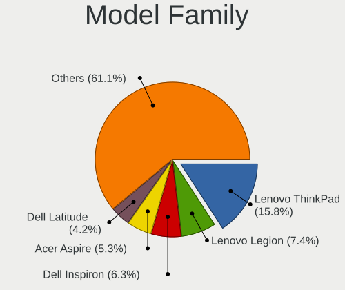

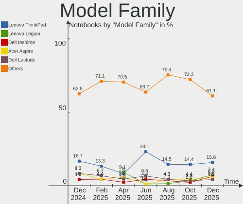

| Name                                | Notebooks | Percent |
|-------------------------------------|-----------|---------|
| Lenovo ThinkPad                     | 15        | 15.79%  |
| Lenovo Legion                       | 7         | 7.37%   |
| Dell Inspiron                       | 6         | 6.32%   |
| Acer Aspire                         | 5         | 5.26%   |
| Dell Latitude                       | 4         | 4.21%   |
| ASUS Vivobook                       | 4         | 4.21%   |
| Apple MacBookPro11                  | 4         | 4.21%   |
| HP ProBook                          | 3         | 3.16%   |
| ASUS ROG                            | 3         | 3.16%   |
| MSI Katana                          | 2         | 2.11%   |
| HP Pavilion                         | 2         | 2.11%   |
| HP Laptop                           | 2         | 2.11%   |
| Framework Laptop                    | 2         | 2.11%   |
| Valve Jupiter                       | 1         | 1.05%   |
| Valve Galileo                       | 1         | 1.05%   |
| SZ ReachingTech Limited DQ05proplus | 1         | 1.05%   |
| MSI Summit                          | 1         | 1.05%   |
| LG 16Z90S-H.ADB9U1                  | 1         | 1.05%   |
| Lenovo Y50-70                       | 1         | 1.05%   |
| Lenovo ThinkBook                    | 1         | 1.05%   |
| Lenovo IdeaPad                      | 1         | 1.05%   |
| HP OmniBook                         | 1         | 1.05%   |
| HP Notebook                         | 1         | 1.05%   |
| HP G61                              | 1         | 1.05%   |
| HP ENVY                             | 1         | 1.05%   |
| Google Galtic                       | 1         | 1.05%   |
| Gigabyte A5                         | 1         | 1.05%   |
| Gateway MD7811U                     | 1         | 1.05%   |
| Dell XPS                            | 1         | 1.05%   |
| Dell Pro                            | 1         | 1.05%   |
| Dell Precision                      | 1         | 1.05%   |
| Dell G7                             | 1         | 1.05%   |
| Dell 16                             | 1         | 1.05%   |
| Chuwi CoreBook                      | 1         | 1.05%   |
| ASUS X551MA                         | 1         | 1.05%   |
| ASUS UX331UA                        | 1         | 1.05%   |
| ASUS PRIME                          | 1         | 1.05%   |
| ASUS K56CA                          | 1         | 1.05%   |
| ASUS G75VX                          | 1         | 1.05%   |
| ASUS G75VW                          | 1         | 1.05%   |

MFG Year
--------

Motherboard manufacture year

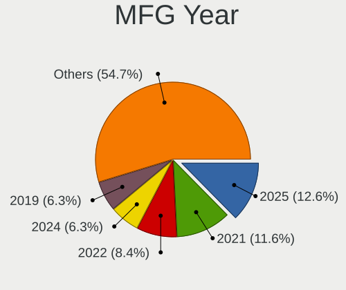

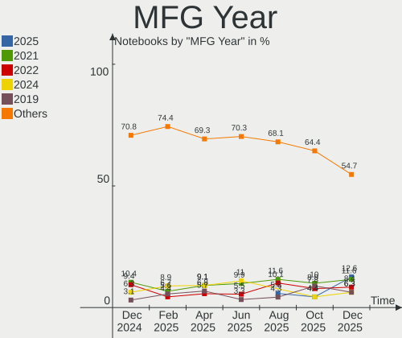

| Year    | Notebooks | Percent |
|---------|-----------|---------|
| 2025    | 12        | 12.63%  |
| 2021    | 11        | 11.58%  |
| 2022    | 8         | 8.42%   |
| 2024    | 6         | 6.32%   |
| 2019    | 6         | 6.32%   |
| 2017    | 6         | 6.32%   |
| 2016    | 6         | 6.32%   |
| 2012    | 6         | 6.32%   |
| 2011    | 6         | 6.32%   |
| 2020    | 5         | 5.26%   |
| 2023    | 4         | 4.21%   |
| 2018    | 4         | 4.21%   |
| 2013    | 4         | 4.21%   |
| 2015    | 3         | 3.16%   |
| 2014    | 3         | 3.16%   |
| 2009    | 2         | 2.11%   |
| 2006    | 2         | 2.11%   |
| Unknown | 1         | 1.05%   |

Form Factor
-----------

Physical design of the computer

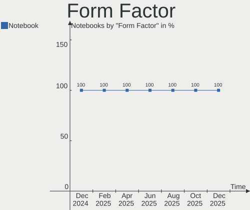

| Name     | Notebooks | Percent |
|----------|-----------|---------|
| Notebook | 95        | 100%    |

Secure Boot
-----------

Enabled or disabled

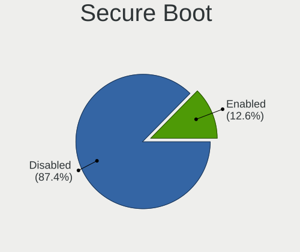

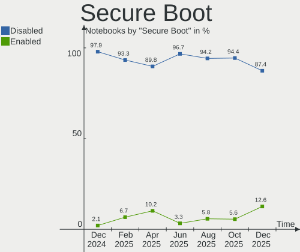

| State    | Notebooks | Percent |
|----------|-----------|---------|
| Disabled | 83        | 87.37%  |
| Enabled  | 12        | 12.63%  |

Coreboot
--------

Have coreboot on board

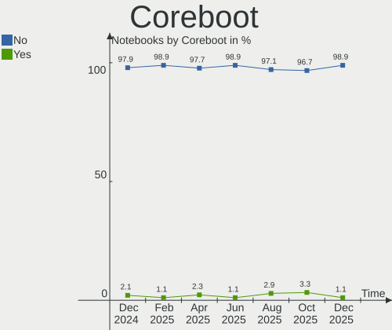

| Used | Notebooks | Percent |
|------|-----------|---------|
| No   | 94        | 98.95%  |
| Yes  | 1         | 1.05%   |

RAM Size
--------

Total RAM memory

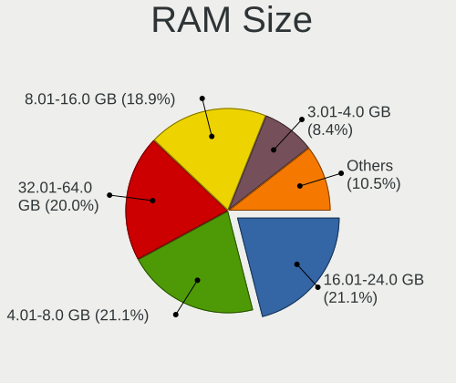

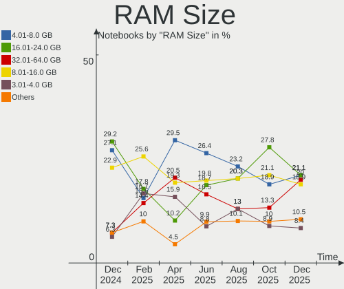

| Size in GB  | Notebooks | Percent |
|-------------|-----------|---------|
| 4.01-8.0    | 20        | 21.05%  |
| 16.01-24.0  | 20        | 21.05%  |
| 32.01-64.0  | 19        | 20%     |
| 8.01-16.0   | 18        | 18.95%  |
| 3.01-4.0    | 8         | 8.42%   |
| 24.01-32.0  | 6         | 6.32%   |
| 64.01-256.0 | 3         | 3.16%   |
| 0.51-1.0    | 1         | 1.05%   |

RAM Used
--------

Used RAM memory

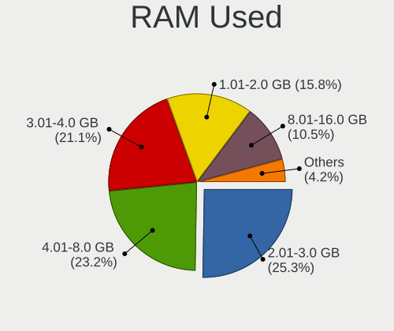

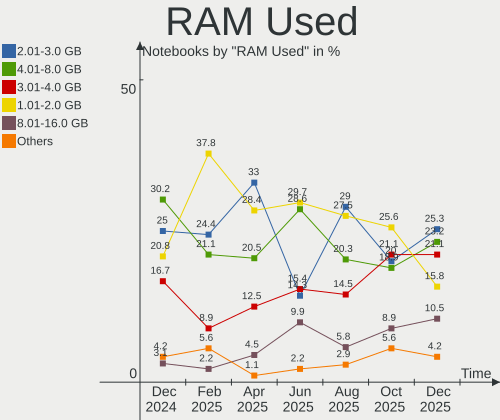

| Used GB    | Notebooks | Percent |
|------------|-----------|---------|
| 2.01-3.0   | 24        | 25.26%  |
| 4.01-8.0   | 22        | 23.16%  |
| 3.01-4.0   | 20        | 21.05%  |
| 1.01-2.0   | 15        | 15.79%  |
| 8.01-16.0  | 10        | 10.53%  |
| 24.01-32.0 | 1         | 1.05%   |
| 16.01-24.0 | 1         | 1.05%   |
| 0.51-1.0   | 1         | 1.05%   |
| 0.01-0.5   | 1         | 1.05%   |

Total Drives
------------

Number of drives on board

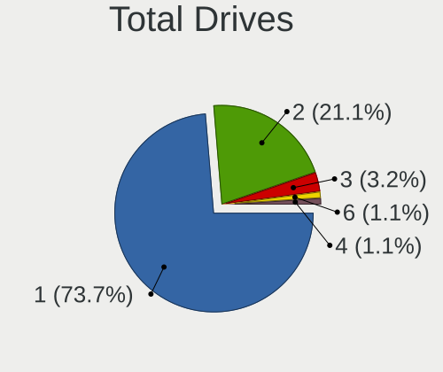

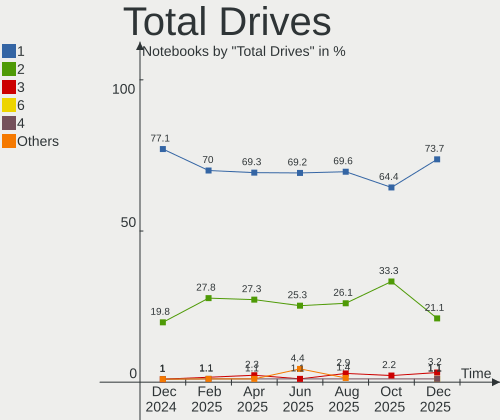

| Drives | Notebooks | Percent |
|--------|-----------|---------|
| 1      | 70        | 73.68%  |
| 2      | 20        | 21.05%  |
| 3      | 3         | 3.16%   |
| 6      | 1         | 1.05%   |
| 4      | 1         | 1.05%   |

Has CD-ROM
----------

Has CD-ROM on board

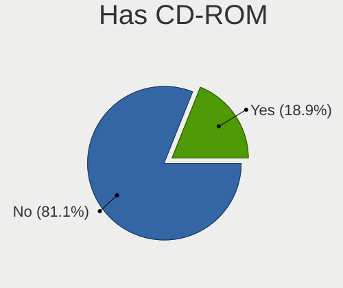

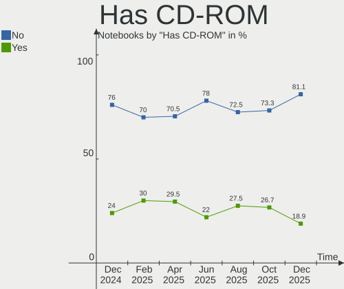

| Presented | Notebooks | Percent |
|-----------|-----------|---------|
| No        | 77        | 81.05%  |
| Yes       | 18        | 18.95%  |

Has Ethernet
------------

Has Ethernet on board

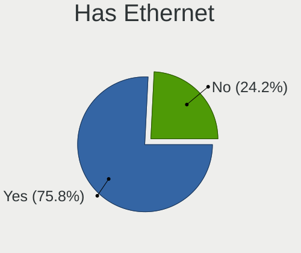

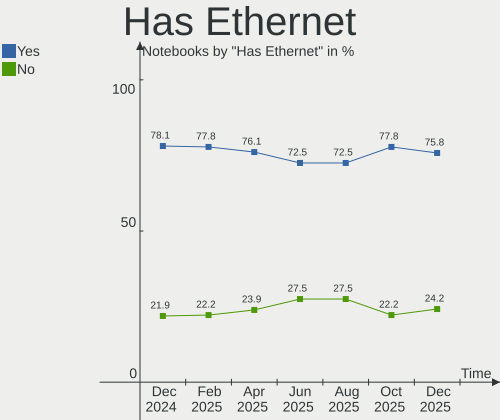

| Presented | Notebooks | Percent |
|-----------|-----------|---------|
| Yes       | 72        | 75.79%  |
| No        | 23        | 24.21%  |

Has WiFi
--------

Has WiFi module

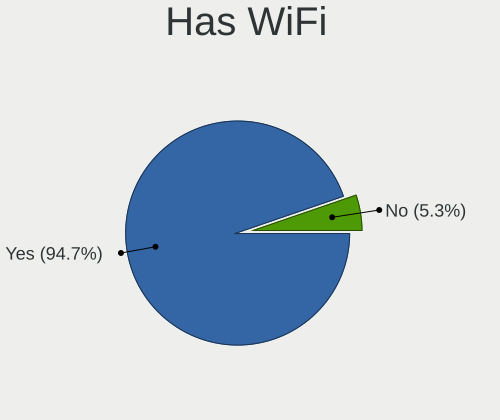

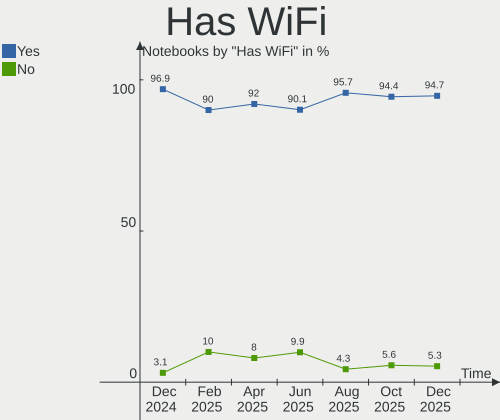

| Presented | Notebooks | Percent |
|-----------|-----------|---------|
| Yes       | 90        | 94.74%  |
| No        | 5         | 5.26%   |

Has Bluetooth
-------------

Has Bluetooth module

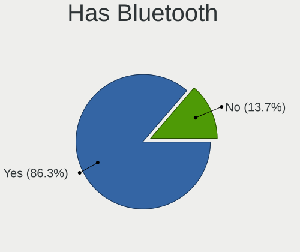

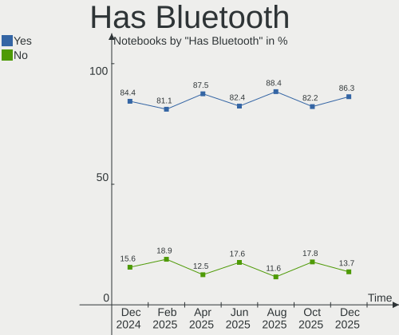

| Presented | Notebooks | Percent |
|-----------|-----------|---------|
| Yes       | 82        | 86.32%  |
| No        | 13        | 13.68%  |

Location
--------

Country
-------

Geographic location (country)

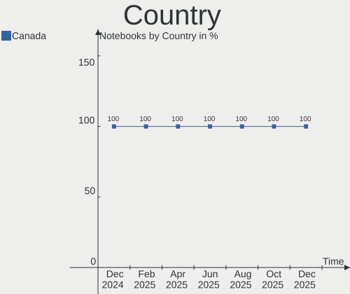

| Country | Notebooks | Percent |
|---------|-----------|---------|
| Canada  | 95        | 100%    |

City
----

Geographic location (city)

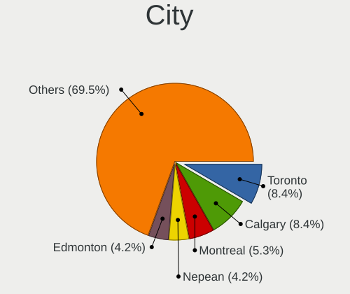

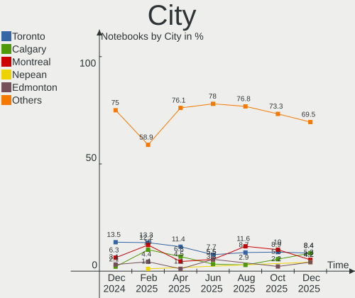

| City                      | Notebooks | Percent |
|---------------------------|-----------|---------|
| Toronto                   | 8         | 8.42%   |
| Calgary                   | 8         | 8.42%   |
| Montreal                  | 5         | 5.26%   |
| Nepean                    | 4         | 4.21%   |
| Edmonton                  | 4         | 4.21%   |
| Vancouver                 | 3         | 3.16%   |
| Pickering                 | 3         | 3.16%   |
| Winnipeg                  | 2         | 2.11%   |
| Regina                    | 2         | 2.11%   |
| Prince George             | 2         | 2.11%   |
| Ottawa                    | 2         | 2.11%   |
| Oshawa                    | 2         | 2.11%   |
| London                    | 2         | 2.11%   |
| Leduc                     | 2         | 2.11%   |
| Laval                     | 2         | 2.11%   |
| Langley                   | 2         | 2.11%   |
| Kitchener                 | 2         | 2.11%   |
| Halifax                   | 2         | 2.11%   |
| Grande Prairie            | 2         | 2.11%   |
| Burnaby                   | 2         | 2.11%   |
| Winkler                   | 1         | 1.05%   |
| Windsor                   | 1         | 1.05%   |
| Verdun                    | 1         | 1.05%   |
| Surrey                    | 1         | 1.05%   |
| Spaniard's Bay            | 1         | 1.05%   |
| Scarborough               | 1         | 1.05%   |
| Saint Thomas de Montmagny | 1         | 1.05%   |
| Rimouski                  | 1         | 1.05%   |
| Richmond                  | 1         | 1.05%   |
| Repentigny                | 1         | 1.05%   |
| Québec                   | 1         | 1.05%   |
| Orleans                   | 1         | 1.05%   |
| Neuanlage                 | 1         | 1.05%   |
| Mount Currie              | 1         | 1.05%   |
| Mont-Tremblant            | 1         | 1.05%   |
| Mont-Saint-Hilaire        | 1         | 1.05%   |
| Midland                   | 1         | 1.05%   |
| Markham                   | 1         | 1.05%   |
| Maple                     | 1         | 1.05%   |
| Lincoln                   | 1         | 1.05%   |

Drives
------

Drive Vendor
------------

Hard drive vendors

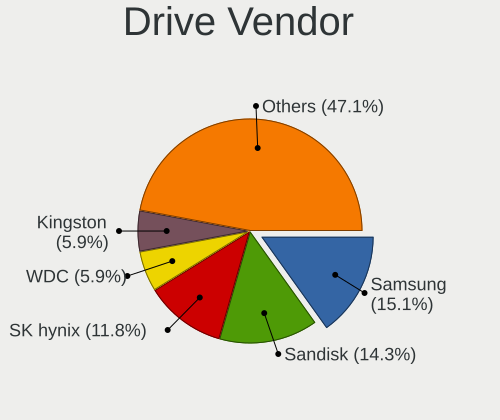

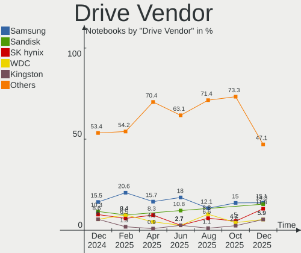

| Vendor                      | Notebooks | Drives | Percent |
|-----------------------------|-----------|--------|---------|
| Samsung Electronics         | 18        | 22     | 15.13%  |
| Sandisk                     | 17        | 17     | 14.29%  |
| SK hynix                    | 14        | 16     | 11.76%  |
| WDC                         | 7         | 7      | 5.88%   |
| Kingston                    | 7         | 7      | 5.88%   |
| Apple                       | 6         | 6      | 5.04%   |
| Unknown                     | 5         | 7      | 4.2%    |
| Micron Technology           | 5         | 5      | 4.2%    |
| A-DATA Technology           | 5         | 5      | 4.2%    |
| Seagate                     | 4         | 4      | 3.36%   |
| Intel                       | 4         | 4      | 3.36%   |
| Phison Electronics          | 3         | 3      | 2.52%   |
| Crucial                     | 3         | 3      | 2.52%   |
| Toshiba                     | 2         | 2      | 1.68%   |
| KIOXIA                      | 2         | 2      | 1.68%   |
| Transcend                   | 1         | 1      | 0.84%   |
| Timetec                     | 1         | 1      | 0.84%   |
| SPCC                        | 1         | 1      | 0.84%   |
| SABRENT                     | 1         | 4      | 0.84%   |
| Realtek Semiconductor       | 1         | 1      | 0.84%   |
| PNY                         | 1         | 1      | 0.84%   |
| MAXIO Technology (Hangzhou) | 1         | 1      | 0.84%   |
| Lexar                       | 1         | 1      | 0.84%   |
| Kingston Technology Company | 1         | 1      | 0.84%   |
| KingSpec                    | 1         | 1      | 0.84%   |
| JMicron Technology          | 1         | 1      | 0.84%   |
| Hitachi                     | 1         | 1      | 0.84%   |
| HGST                        | 1         | 1      | 0.84%   |
| Fujitsu                     | 1         | 1      | 0.84%   |
| EDILOCA                     | 1         | 1      | 0.84%   |
| Colorful                    | 1         | 1      | 0.84%   |
| China                       | 1         | 1      | 0.84%   |

Drive Model
-----------

Hard drive models

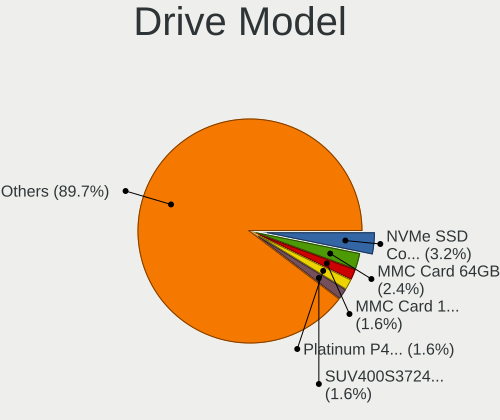

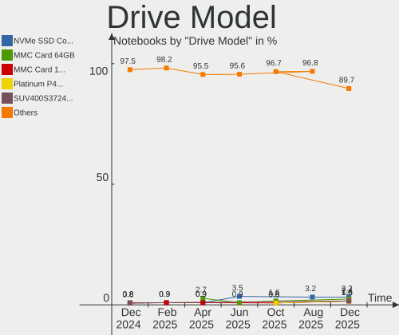

| Model                                                  | Notebooks | Percent |
|--------------------------------------------------------|-----------|---------|
| Samsung NVMe SSD Controller SM981/PM981/PM983 1TB      | 4         | 3.17%   |
| Unknown MMC Card  64GB                                 | 3         | 2.38%   |
| Unknown MMC Card  128GB                                | 2         | 1.59%   |
| SK hynix Platinum P41/PC801 NVMe Solid State Drive 1TB | 2         | 1.59%   |
| Kingston SUV400S37240G 240GB SSD                       | 2         | 1.59%   |
| Intel SSDPEKNU512GZ 512GB                              | 2         | 1.59%   |
| Intel SSDPEKNU010TZ 1TB                                | 2         | 1.59%   |
| Apple SSD SM0512G 500GB                                | 2         | 1.59%   |
| A-DATA SP550 240GB SSD                                 | 2         | 1.59%   |
| WDC WDS500G2B0A-00SM50 500GB                           | 1         | 0.79%   |
| WDC WD7500BPVT-22HXZT1 752GB                           | 1         | 0.79%   |
| WDC WD5000LPVX-22V0TT0 500GB                           | 1         | 0.79%   |
| WDC WD5000LPLX-08ZNTT0 500GB                           | 1         | 0.79%   |
| WDC WD10JPVX-22JC3T0 1TB                               | 1         | 0.79%   |
| WDC PC SN810 SDCPNRY-1T00-1032 1TB                     | 1         | 0.79%   |
| WDC PC SN530 NVMe 512GB                                | 1         | 0.79%   |
| Unknown MMC Card  512GB                                | 1         | 0.79%   |
| Unknown MMC Card  32GB                                 | 1         | 0.79%   |
| Transcend TS512GMTS430S 512GB SSD                      | 1         | 0.79%   |
| Toshiba MQ01ABD075 752GB                               | 1         | 0.79%   |
| Toshiba KXG50ZNV256G NVMe 256GB                        | 1         | 0.79%   |
| Timetec SD07 256GB SSD                                 | 1         | 0.79%   |
| SPCC Solid State Disk 256GB                            | 1         | 0.79%   |
| SK hynix SKHynix_HFS512GEJ4X112N 512GB                 | 1         | 0.79%   |
| SK hynix SKHynix_HFS256GD9TNI-L2B0B 256GB              | 1         | 0.79%   |
| SK hynix SKHynix_HFS001TDE9X084N 1024GB                | 1         | 0.79%   |
| SK hynix SKHynix_HFS001TD9TNI-L2A0B 1024GB             | 1         | 0.79%   |
| SK hynix PVC10 512GB                                   | 1         | 0.79%   |
| SK hynix PVC10 1024GB                                  | 1         | 0.79%   |
| SK hynix PC401 NVMe Solid State Drive 256GB            | 1         | 0.79%   |
| SK hynix HFS001TEJ9X108N 1TB                           | 1         | 0.79%   |
| SK hynix HFM001TD3JX013N 1024GB                        | 1         | 0.79%   |
| SK hynix BC711 NVMe 512GB                              | 1         | 0.79%   |
| SK hynix BC511 512GB                                   | 1         | 0.79%   |
| SK hynix BC501 NVMe Solid State Drive 512GB            | 1         | 0.79%   |
| Seagate ST4000DM004-2U9104 4TB                         | 1         | 0.79%   |
| Seagate ST1000LM035-1RK172 1TB                         | 1         | 0.79%   |
| Seagate ST1000LM024 HN-M101MBB 1TB                     | 1         | 0.79%   |
| Seagate BUP Portable 5TB                               | 1         | 0.79%   |
| Sandisk WD PC SN735 SDBPNHH-1T00-1002 1024GB           | 1         | 0.79%   |

HDD Vendor
----------

Hard disk drive vendors

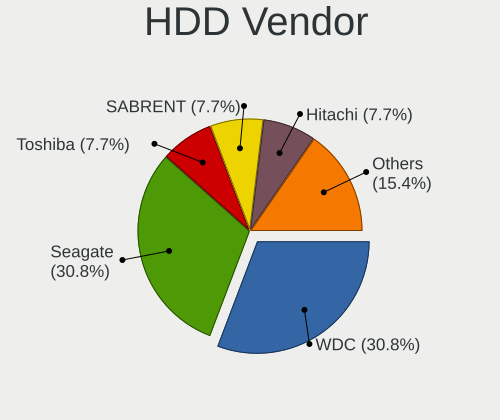

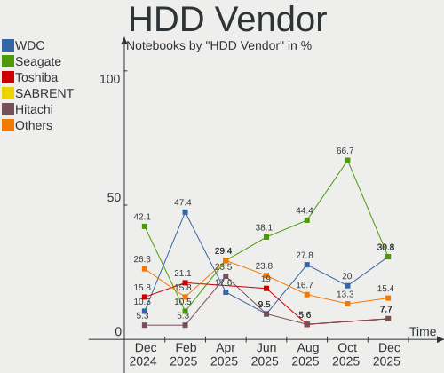

| Vendor  | Notebooks | Drives | Percent |
|---------|-----------|--------|---------|
| WDC     | 4         | 4      | 30.77%  |
| Seagate | 4         | 4      | 30.77%  |
| Toshiba | 1         | 1      | 7.69%   |
| SABRENT | 1         | 3      | 7.69%   |
| Hitachi | 1         | 1      | 7.69%   |
| HGST    | 1         | 1      | 7.69%   |
| Fujitsu | 1         | 1      | 7.69%   |

SSD Vendor
----------

Solid state drive vendors

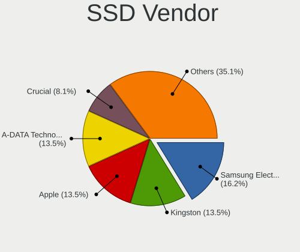

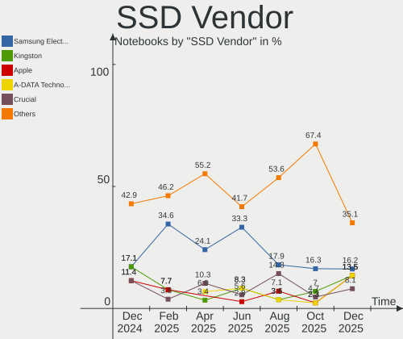

| Vendor              | Notebooks | Drives | Percent |
|---------------------|-----------|--------|---------|
| Samsung Electronics | 6         | 7      | 16.22%  |
| Kingston            | 5         | 5      | 13.51%  |
| Apple               | 5         | 5      | 13.51%  |
| A-DATA Technology   | 5         | 5      | 13.51%  |
| Crucial             | 3         | 3      | 8.11%   |
| SanDisk             | 2         | 2      | 5.41%   |
| Micron Technology   | 2         | 2      | 5.41%   |
| WDC                 | 1         | 1      | 2.7%    |
| Transcend           | 1         | 1      | 2.7%    |
| Timetec             | 1         | 1      | 2.7%    |
| SPCC                | 1         | 1      | 2.7%    |
| SABRENT             | 1         | 1      | 2.7%    |
| PNY                 | 1         | 1      | 2.7%    |
| KingSpec            | 1         | 1      | 2.7%    |
| Colorful            | 1         | 1      | 2.7%    |
| China               | 1         | 1      | 2.7%    |

Drive Kind
----------

HDD or SSD

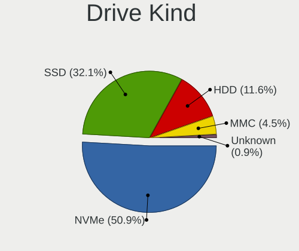

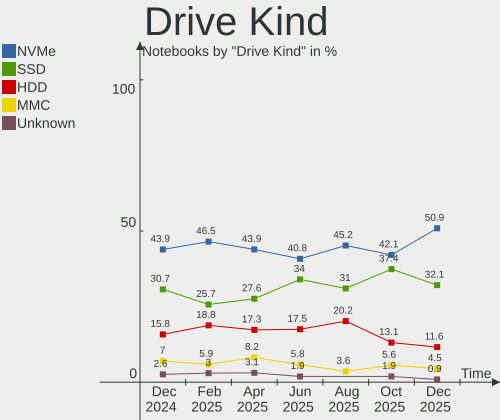

| Kind    | Notebooks | Drives | Percent |
|---------|-----------|--------|---------|
| NVMe    | 57        | 69     | 50.89%  |
| SSD     | 36        | 38     | 32.14%  |
| HDD     | 13        | 15     | 11.61%  |
| MMC     | 5         | 7      | 4.46%   |
| Unknown | 1         | 1      | 0.89%   |

Drive Connector
---------------

SATA, SAS, NVMe, etc.

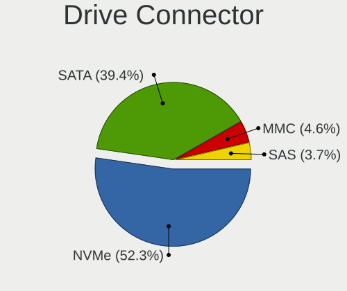

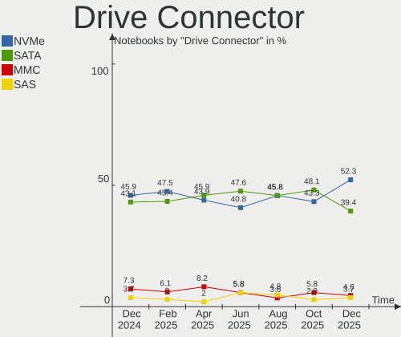

| Type | Notebooks | Drives | Percent |
|------|-----------|--------|---------|
| NVMe | 57        | 68     | 52.29%  |
| SATA | 43        | 47     | 39.45%  |
| MMC  | 5         | 7      | 4.59%   |
| SAS  | 4         | 8      | 3.67%   |

Drive Size
----------

Size of hard drive

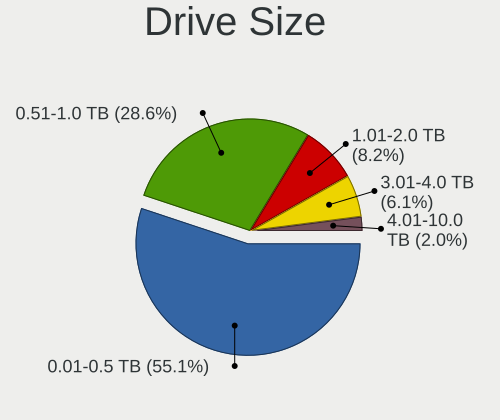

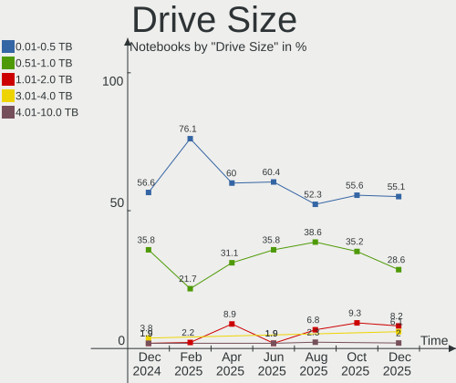

| Size in TB | Notebooks | Drives | Percent |
|------------|-----------|--------|---------|
| 0.01-0.5   | 27        | 30     | 55.1%   |
| 0.51-1.0   | 14        | 14     | 28.57%  |
| 1.01-2.0   | 4         | 5      | 8.16%   |
| 3.01-4.0   | 3         | 3      | 6.12%   |
| 4.01-10.0  | 1         | 1      | 2.04%   |

Space Total
-----------

Amount of disk space available on the file system

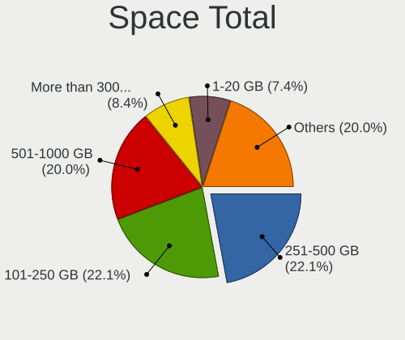

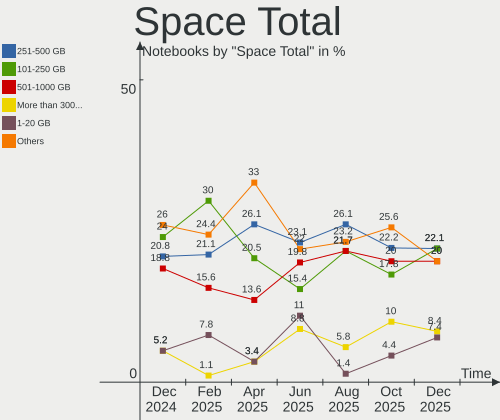

| Size in GB     | Notebooks | Percent |
|----------------|-----------|---------|
| 251-500        | 21        | 22.11%  |
| 101-250        | 21        | 22.11%  |
| 501-1000       | 19        | 20%     |
| More than 3000 | 8         | 8.42%   |
| 1-20           | 7         | 7.37%   |
| 1001-2000      | 6         | 6.32%   |
| 51-100         | 6         | 6.32%   |
| Unknown        | 6         | 6.32%   |
| 2001-3000      | 1         | 1.05%   |

Space Used
----------

Amount of used disk space

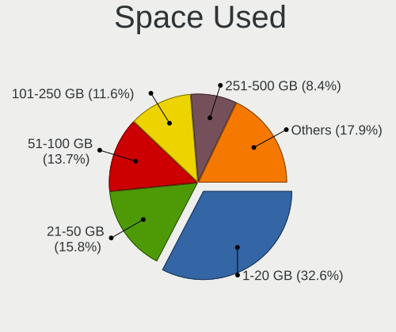

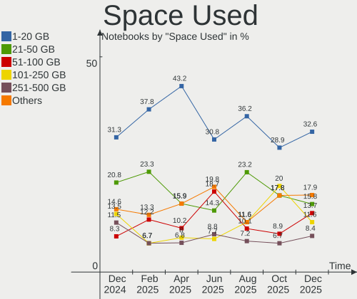

| Used GB        | Notebooks | Percent |
|----------------|-----------|---------|
| 1-20           | 31        | 32.63%  |
| 21-50          | 15        | 15.79%  |
| 51-100         | 13        | 13.68%  |
| 101-250        | 11        | 11.58%  |
| 251-500        | 8         | 8.42%   |
| Unknown        | 6         | 6.32%   |
| 2001-3000      | 3         | 3.16%   |
| More than 3000 | 2         | 2.11%   |
| 1001-2000      | 2         | 2.11%   |
| 501-1000       | 2         | 2.11%   |
| 0              | 2         | 2.11%   |

Malfunc. Drives
---------------

Drive models with a malfunction

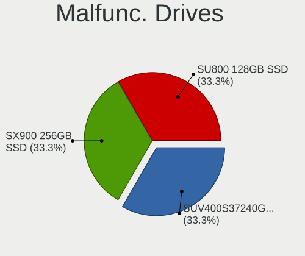

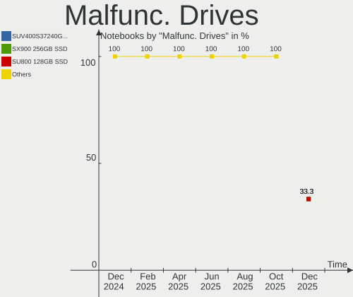

| Model                             | Notebooks | Drives | Percent |
|-----------------------------------|-----------|--------|---------|
| Kingston SUV400S37240G 240GB SSD  | 1         | 1      | 33.33%  |
| A-DATA Technology SX900 256GB SSD | 1         | 1      | 33.33%  |
| A-DATA Technology SU800 128GB SSD | 1         | 1      | 33.33%  |

Malfunc. Drive Vendor
---------------------

Vendors of faulty drives

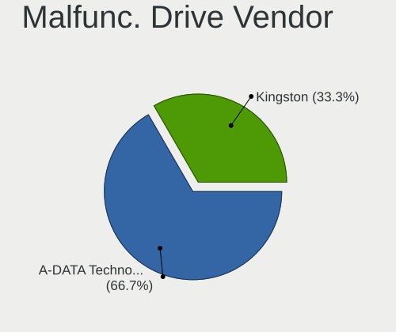

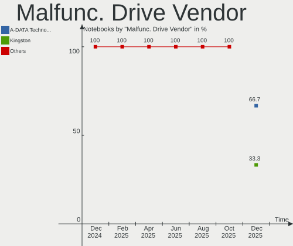

| Vendor            | Notebooks | Drives | Percent |
|-------------------|-----------|--------|---------|
| A-DATA Technology | 2         | 2      | 66.67%  |
| Kingston          | 1         | 1      | 33.33%  |

Malfunc. HDD Vendor
-------------------

Vendors of faulty HDD drives

Zero info for selected period =(

Malfunc. Drive Kind
-------------------

Kinds of faulty drives

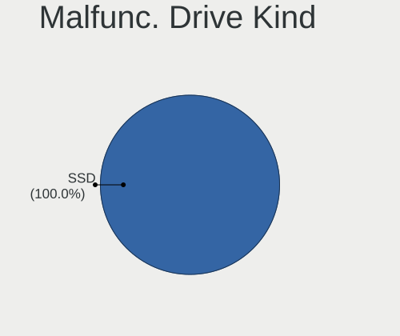

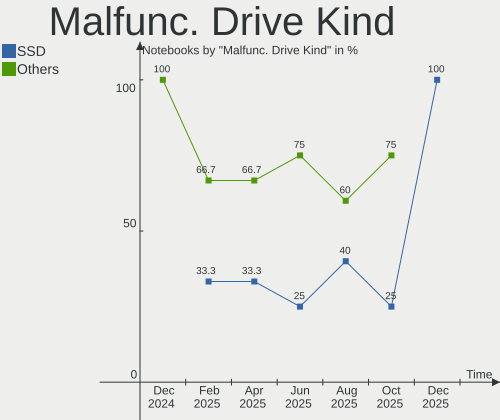

| Kind | Notebooks | Drives | Percent |
|------|-----------|--------|---------|
| SSD  | 3         | 3      | 100%    |

Failed Drives
-------------

Failed drive models

Zero info for selected period =(

Failed Drive Vendor
-------------------

Failed drive vendors

Zero info for selected period =(

Drive Status
------------

Number of failed and malfunc. drives

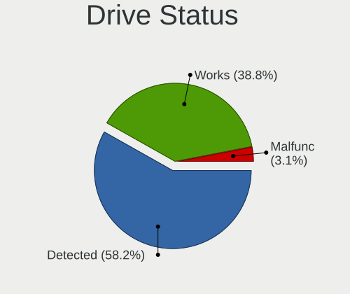

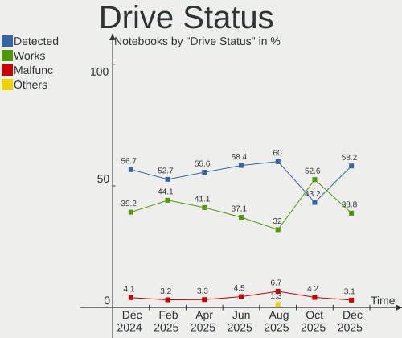

| Status   | Notebooks | Drives | Percent |
|----------|-----------|--------|---------|
| Detected | 57        | 81     | 58.16%  |
| Works    | 38        | 46     | 38.78%  |
| Malfunc  | 3         | 3      | 3.06%   |

Storage controller
------------------

Storage Vendor
--------------

Storage controller vendors

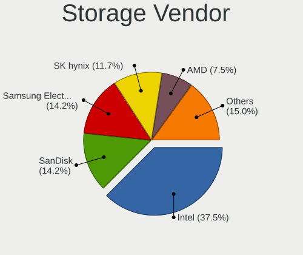

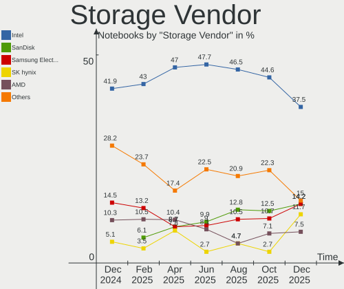

| Vendor                       | Notebooks | Percent |
|------------------------------|-----------|---------|
| Intel                        | 45        | 37.5%   |
| SanDisk                      | 17        | 14.17%  |
| Samsung Electronics          | 17        | 14.17%  |
| SK hynix                     | 14        | 11.67%  |
| AMD                          | 9         | 7.5%    |
| Phison Electronics           | 3         | 2.5%    |
| Micron Technology            | 3         | 2.5%    |
| Kingston Technology Company  | 3         | 2.5%    |
| MAXIO Technology (Hangzhou)  | 2         | 1.67%   |
| KIOXIA                       | 2         | 1.67%   |
| Toshiba America Info Systems | 1         | 0.83%   |
| Shenzhen Longsys Electronics | 1         | 0.83%   |
| Realtek Semiconductor        | 1         | 0.83%   |
| Marvell Technology Group     | 1         | 0.83%   |
| Apple                        | 1         | 0.83%   |

Storage Model
-------------

Storage controller models

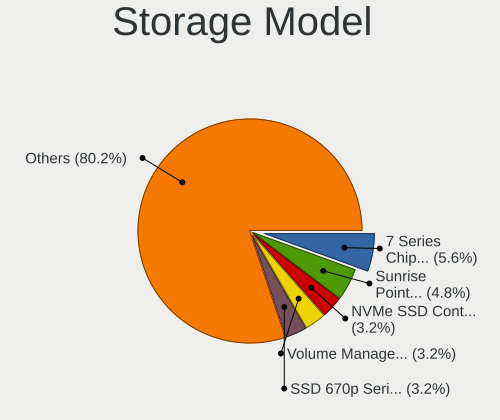

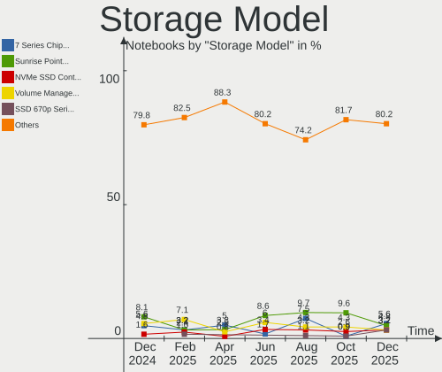

| Model                                                                          | Notebooks | Percent |
|--------------------------------------------------------------------------------|-----------|---------|
| Intel 7 Series Chipset Family 6-port SATA Controller [AHCI mode]               | 7         | 5.56%   |
| Intel Sunrise Point-LP SATA Controller [AHCI mode]                             | 6         | 4.76%   |
| Samsung NVMe SSD Controller SM981/PM981/PM983                                  | 4         | 3.17%   |
| Intel Volume Management Device NVMe RAID Controller                            | 4         | 3.17%   |
| Intel SSD 670p Series [Keystone Harbor]                                        | 4         | 3.17%   |
| Intel 6 Series/C200 Series Chipset Family 6 port Mobile SATA AHCI Controller   | 4         | 3.17%   |
| AMD FCH SATA Controller [AHCI mode]                                            | 4         | 3.17%   |
| SK hynix Gold P31/BC711/PC711 NVMe Solid State Drive                           | 3         | 2.38%   |
| SanDisk WD SN560/SN740/SN770/SN5000 NVMe SSD                                   | 3         | 2.38%   |
| Intel Wildcat Point-LP SATA Controller [AHCI Mode]                             | 3         | 2.38%   |
| Intel Cannon Point-LP SATA Controller [AHCI Mode]                              | 3         | 2.38%   |
| Intel 82801 Mobile SATA Controller [RAID mode]                                 | 3         | 2.38%   |
| SK hynix PVC10 NVMe Solid State Drive (DRAM-less)                              | 2         | 1.59%   |
| SK hynix Platinum P41/PC801 NVMe Solid State Drive                             | 2         | 1.59%   |
| SK hynix PC611 NVMe Solid State Drive                                          | 2         | 1.59%   |
| SK hynix BC901 NVMe Solid State Drive (DRAM-less)                              | 2         | 1.59%   |
| Sandisk WD PC SN5000S M.2 2280 NVMe SSD (DRAM-less)                            | 2         | 1.59%   |
| SanDisk IX SN530 NVMe SSD / microSD Express Card (DRAM-less)                   | 2         | 1.59%   |
| Samsung S4LN058A01[SSUBX] AHCI SSD Controller (Apple slot)                     | 2         | 1.59%   |
| Samsung S4LN053X01 AHCI SSD Controller(Apple slot)                             | 2         | 1.59%   |
| Samsung NVMe SSD Controller SM961/PM961/SM963                                  | 2         | 1.59%   |
| Samsung NVMe SSD Controller PM9C1a (DRAM-less)                                 | 2         | 1.59%   |
| Samsung NVMe SSD Controller 980 (DRAM-less)                                    | 2         | 1.59%   |
| Intel Tiger Lake SATA AHCI Controller                                          | 2         | 1.59%   |
| Intel Cannon Lake Mobile PCH SATA AHCI Controller                              | 2         | 1.59%   |
| Intel 8 Series/C220 Series Chipset Family 6-port SATA Controller 1 [AHCI mode] | 2         | 1.59%   |
| Toshiba America Info Systems XG5 NVMe SSD Controller                           | 1         | 0.79%   |
| SK hynix PC401 NVMe Solid State Drive 256GB                                    | 1         | 0.79%   |
| SK hynix BC511 NVMe SSD                                                        | 1         | 0.79%   |
| SK hynix BC501 NVMe Solid State Drive                                          | 1         | 0.79%   |
| Shenzhen Longsys Lexar NM790 / Patriot Viper VP4300 Lite NVMe SSD (DRAM-less)  | 1         | 0.79%   |
| SanDisk WD PC SN810 / Black SN850 NVMe SSD                                     | 1         | 0.79%   |
| SanDisk WD PC SN540 / Green SN350 NVMe SSD 1 TB (DRAM-less)                    | 1         | 0.79%   |
| SanDisk WD Green SN350 240GB (DRAM-less) / SN560E NVMe SSD                     | 1         | 0.79%   |
| Sandisk WD Blue SN580 NVMe SSD (DRAM-less)                                     | 1         | 0.79%   |
| Sandisk WD Blue SN5100 NVMe SSD (DRAM-less)                                    | 1         | 0.79%   |
| Sandisk WD Black SN850X NVMe SSD                                               | 1         | 0.79%   |
| SanDisk Ultra 3D / WD PC SN530, IX SN530, Blue SN550 NVMe SSD (DRAM-less)      | 1         | 0.79%   |
| SanDisk PC SN735 / WD_BLACK SN750 SE NVMe SSD (DRAM-less)                      | 1         | 0.79%   |
| SanDisk Extreme Pro / WD Black SN750 / PC SN730 / Red SN700 NVMe SSD           | 1         | 0.79%   |

Storage Kind
------------

Kind of storage controller (IDE, SATA, NVMe, SAS, ...)

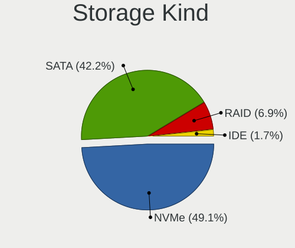

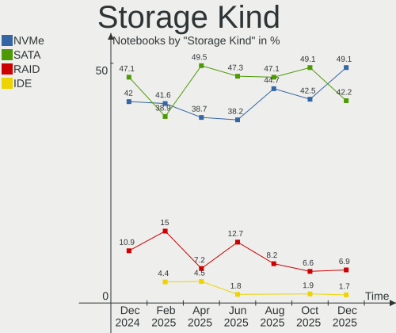

| Kind | Notebooks | Percent |
|------|-----------|---------|
| NVMe | 57        | 49.14%  |
| SATA | 49        | 42.24%  |
| RAID | 8         | 6.9%    |
| IDE  | 2         | 1.72%   |

Processor
---------

CPU Vendor
----------

Processor vendors

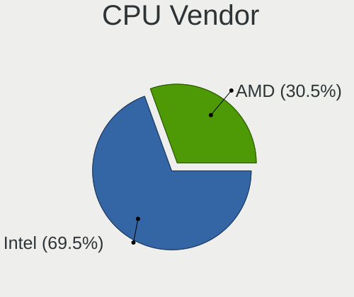

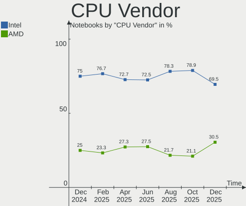

| Vendor | Notebooks | Percent |
|--------|-----------|---------|
| Intel  | 66        | 69.47%  |
| AMD    | 29        | 30.53%  |

CPU Model
---------

Processor models

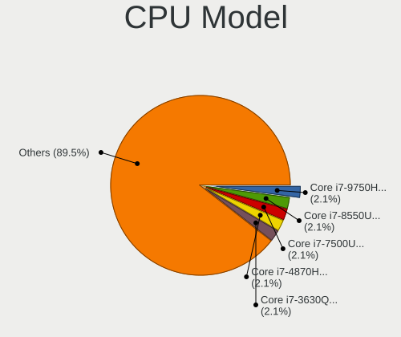

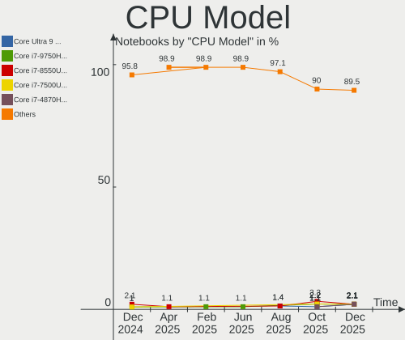

| Model                                   | Notebooks | Percent |
|-----------------------------------------|-----------|---------|
| Intel Core Ultra 9 275HX                | 2         | 2.11%   |
| Intel Core i7-9750H CPU @ 2.60GHz       | 2         | 2.11%   |
| Intel Core i7-8550U CPU @ 1.80GHz       | 2         | 2.11%   |
| Intel Core i7-7500U CPU @ 2.70GHz       | 2         | 2.11%   |
| Intel Core i7-4870HQ CPU @ 2.50GHz      | 2         | 2.11%   |
| Intel Core i7-3630QM CPU @ 2.40GHz      | 2         | 2.11%   |
| Intel Core i5-8265U CPU @ 1.60GHz       | 2         | 2.11%   |
| Intel Core i5-5300U CPU @ 2.30GHz       | 2         | 2.11%   |
| Intel Core i3-3110M CPU @ 2.40GHz       | 2         | 2.11%   |
| Intel 11th Gen Core i5-11400H @ 2.70GHz | 2         | 2.11%   |
| AMD Ryzen 9 9955HX 16-Core Processor    | 2         | 2.11%   |
| Intel Pentium Silver N6000 @ 1.10GHz    | 1         | 1.05%   |
| Intel Pentium CPU N4200 @ 1.10GHz       | 1         | 1.05%   |
| Intel N95                               | 1         | 1.05%   |
| Intel Core Ultra 7 256V                 | 1         | 1.05%   |
| Intel Core Ultra 7 255U                 | 1         | 1.05%   |
| Intel Core Ultra 7 165H                 | 1         | 1.05%   |
| Intel Core Ultra 7 155H                 | 1         | 1.05%   |
| Intel Core Ultra 5 226V                 | 1         | 1.05%   |
| Intel Core i9-9880H CPU @ 2.30GHz       | 1         | 1.05%   |
| Intel Core i7-8750H CPU @ 2.20GHz       | 1         | 1.05%   |
| Intel Core i7-6820HQ CPU @ 2.70GHz      | 1         | 1.05%   |
| Intel Core i7-4980HQ CPU @ 2.80GHz      | 1         | 1.05%   |
| Intel Core i7-4810MQ CPU @ 2.80GHz      | 1         | 1.05%   |
| Intel Core i7-3537U CPU @ 2.00GHz       | 1         | 1.05%   |
| Intel Core i7-2760QM CPU @ 2.40GHz      | 1         | 1.05%   |
| Intel Core i7-2630QM CPU @ 2.00GHz      | 1         | 1.05%   |
| Intel Core i7-14650HX                   | 1         | 1.05%   |
| Intel Core i7-10875H CPU @ 2.30GHz      | 1         | 1.05%   |
| Intel Core i5-8365U CPU @ 1.60GHz       | 1         | 1.05%   |
| Intel Core i5-8350U CPU @ 1.70GHz       | 1         | 1.05%   |
| Intel Core i5-8259U CPU @ 2.30GHz       | 1         | 1.05%   |
| Intel Core i5-7300U CPU @ 2.60GHz       | 1         | 1.05%   |
| Intel Core i5-6300U CPU @ 2.40GHz       | 1         | 1.05%   |
| Intel Core i5-6200U CPU @ 2.30GHz       | 1         | 1.05%   |
| Intel Core i5-4260U CPU @ 1.40GHz       | 1         | 1.05%   |
| Intel Core i5-4200H CPU @ 2.80GHz       | 1         | 1.05%   |
| Intel Core i5-3337U CPU @ 1.80GHz       | 1         | 1.05%   |
| Intel Core i5-3210M CPU @ 2.50GHz       | 1         | 1.05%   |
| Intel Core i5-2520M CPU @ 2.50GHz       | 1         | 1.05%   |

CPU Model Family
----------------

Processor model prefix

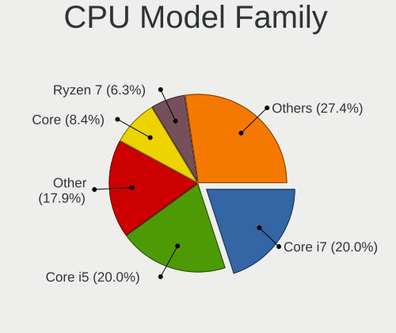

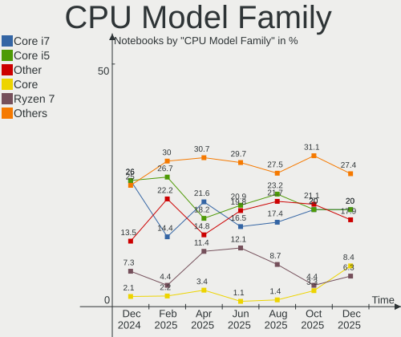

| Model                   | Notebooks | Percent |
|-------------------------|-----------|---------|
| Intel Core i7           | 19        | 20%     |
| Intel Core i5           | 19        | 20%     |
| Other                   | 17        | 17.89%  |
| Intel Core              | 8         | 8.42%   |
| AMD Ryzen 7             | 6         | 6.32%   |
| AMD Ryzen 5             | 6         | 6.32%   |
| Intel Core i3           | 4         | 4.21%   |
| AMD Ryzen 9             | 4         | 4.21%   |
| AMD A4                  | 2         | 2.11%   |
| Intel Pentium Silver    | 1         | 1.05%   |
| Intel Pentium           | 1         | 1.05%   |
| Intel Core i9           | 1         | 1.05%   |
| Intel Core 2 Duo        | 1         | 1.05%   |
| Intel Celeron           | 1         | 1.05%   |
| AMD Turion 64 X2 Mobile | 1         | 1.05%   |
| AMD Turion 64 Mobile    | 1         | 1.05%   |
| AMD Ryzen 7 PRO         | 1         | 1.05%   |
| AMD Ryzen 3             | 1         | 1.05%   |
| AMD Athlon II Dual-Core | 1         | 1.05%   |

CPU Cores
---------

Number of processor cores

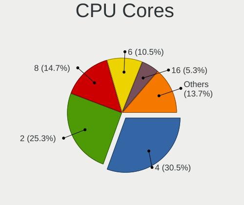

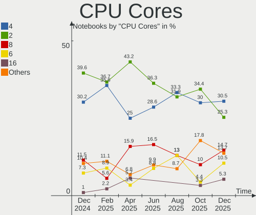

| Number | Notebooks | Percent |
|--------|-----------|---------|
| 4      | 29        | 30.53%  |
| 2      | 24        | 25.26%  |
| 8      | 14        | 14.74%  |
| 6      | 10        | 10.53%  |
| 16     | 5         | 5.26%   |
| 10     | 5         | 5.26%   |
| 12     | 4         | 4.21%   |
| 24     | 2         | 2.11%   |
| 14     | 1         | 1.05%   |
| 1      | 1         | 1.05%   |

CPU Sockets
-----------

Number of sockets

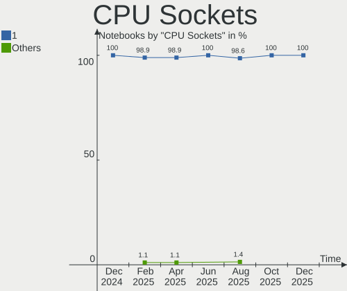

| Number | Notebooks | Percent |
|--------|-----------|---------|
| 1      | 95        | 100%    |

CPU Threads
-----------

Threads per core (Hyper-Threading)

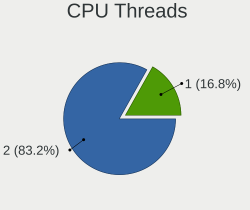

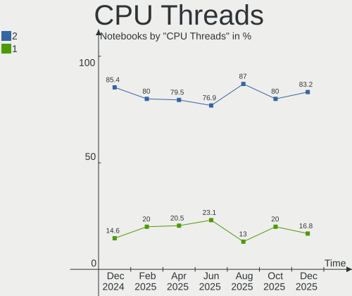

| Number | Notebooks | Percent |
|--------|-----------|---------|
| 2      | 79        | 83.16%  |
| 1      | 16        | 16.84%  |

CPU Op-Modes
------------

CPU Operation Modes (32-bit, 64-bit)

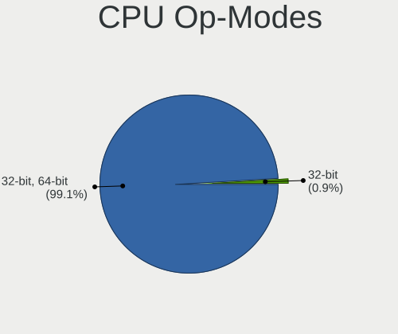

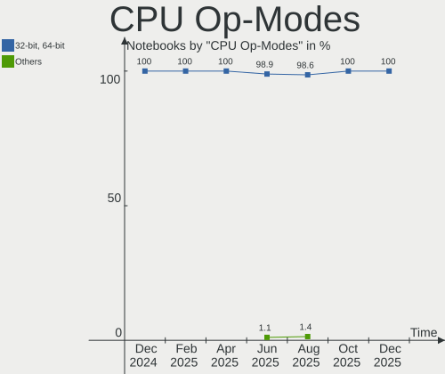

| Op mode        | Notebooks | Percent |
|----------------|-----------|---------|
| 32-bit, 64-bit | 95        | 100%    |

CPU Microcode
-------------

Microcode number

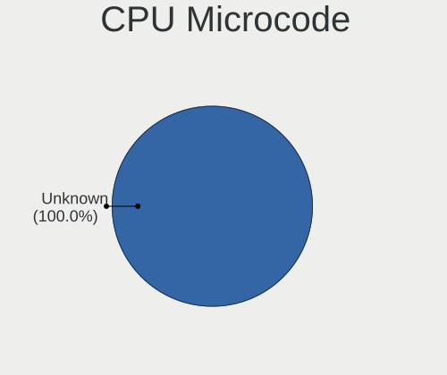

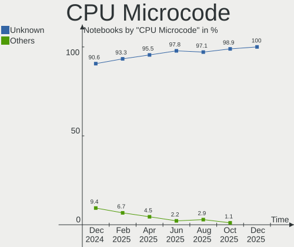

| Number  | Notebooks | Percent |
|---------|-----------|---------|
| Unknown | 95        | 100%    |

CPU Microarch
-------------

Microarchitecture

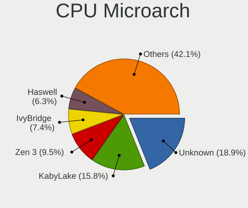

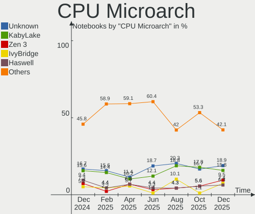

| Name              | Notebooks | Percent |
|-------------------|-----------|---------|
| Unknown           | 18        | 18.95%  |
| KabyLake          | 15        | 15.79%  |
| Zen 3             | 9         | 9.47%   |
| IvyBridge         | 7         | 7.37%   |
| Haswell           | 6         | 6.32%   |
| SandyBridge       | 4         | 4.21%   |
| Alderlake Hybrid  | 4         | 4.21%   |
| Skylake           | 3         | 3.16%   |
| Meteorlake Hybrid | 3         | 3.16%   |
| Lunarlake Hybrid  | 3         | 3.16%   |
| IceLake           | 3         | 3.16%   |
| Broadwell         | 3         | 3.16%   |
| Zen               | 2         | 2.11%   |
| TigerLake         | 2         | 2.11%   |
| K8 Hammer         | 2         | 2.11%   |
| CometLake         | 2         | 2.11%   |
| Zen 2             | 1         | 1.05%   |
| Tremont           | 1         | 1.05%   |
| Silvermont        | 1         | 1.05%   |
| Puma              | 1         | 1.05%   |
| Penryn            | 1         | 1.05%   |
| K10 Llano         | 1         | 1.05%   |
| K10               | 1         | 1.05%   |
| Gracemont         | 1         | 1.05%   |
| Goldmont          | 1         | 1.05%   |

Graphics
--------

GPU Vendor
----------

Vendors of graphics cards

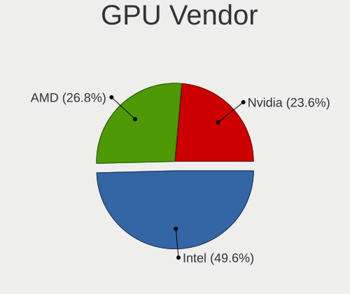

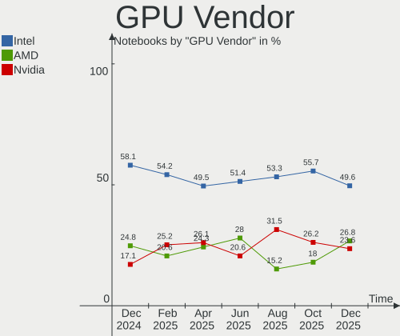

| Vendor | Notebooks | Percent |
|--------|-----------|---------|
| Intel  | 61        | 49.59%  |
| AMD    | 33        | 26.83%  |
| Nvidia | 29        | 23.58%  |

GPU Model
---------

Graphics card models

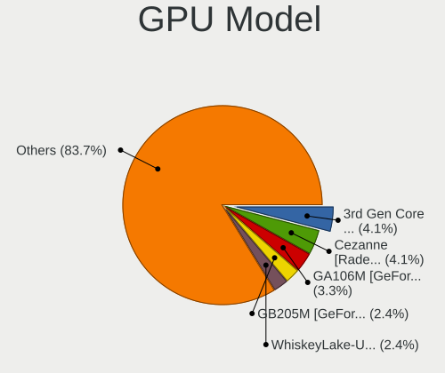

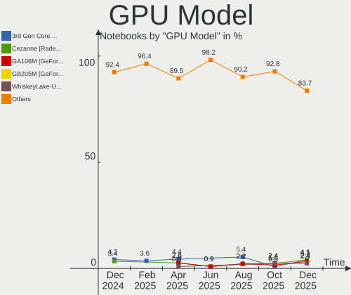

| Model                                                                     | Notebooks | Percent |
|---------------------------------------------------------------------------|-----------|---------|
| Intel 3rd Gen Core processor Graphics Controller                          | 5         | 4.07%   |
| AMD Cezanne [Radeon Vega Series / Radeon Vega Mobile Series]              | 5         | 4.07%   |
| Nvidia GA106M [GeForce RTX 3060 Mobile / Max-Q]                           | 4         | 3.25%   |
| Nvidia GB205M [GeForce RTX 5070 Ti Mobile]                                | 3         | 2.44%   |
| Intel WhiskeyLake-U GT2 [UHD Graphics 620]                                | 3         | 2.44%   |
| Intel Kaby Lake-U GT2 [HD Graphics 620]                                   | 3         | 2.44%   |
| Intel Kaby Lake-R GT2 [UHD Graphics 620]                                  | 3         | 2.44%   |
| Intel Crystal Well Integrated Graphics Controller                         | 3         | 2.44%   |
| Intel CoffeeLake-H GT2 [UHD Graphics 630]                                 | 3         | 2.44%   |
| Intel Broadwell-U GT2 [HD Graphics 5500]                                  | 3         | 2.44%   |
| Intel 2nd Generation Core Processor Family Integrated Graphics Controller | 3         | 2.44%   |
| AMD Barcelo                                                               | 3         | 2.44%   |
| Nvidia TU117M [GeForce GTX 1650 Mobile / Max-Q]                           | 2         | 1.63%   |
| Nvidia AD107M [GeForce RTX 4060 Max-Q / Mobile]                           | 2         | 1.63%   |
| Intel TigerLake-LP GT2 [Iris Xe Graphics]                                 | 2         | 1.63%   |
| Intel TigerLake-H GT1 [UHD Graphics]                                      | 2         | 1.63%   |
| Intel Skylake-U GT2 [HD Graphics 520]                                     | 2         | 1.63%   |
| Intel Meteor Lake-P [Intel Arc Graphics]                                  | 2         | 1.63%   |
| Intel Lunar Lake [Intel Arc Graphics 130V / 140V]                         | 2         | 1.63%   |
| Intel Iris Plus Graphics G1 (Ice Lake)                                    | 2         | 1.63%   |
| Intel CometLake-H GT2 [UHD Graphics]                                      | 2         | 1.63%   |
| Intel Arrow Lake-S [Intel Graphics]                                       | 2         | 1.63%   |
| Intel Alder Lake-P GT2 [Iris Xe Graphics]                                 | 2         | 1.63%   |
| Intel 4th Gen Core Processor Integrated Graphics Controller               | 2         | 1.63%   |
| AMD Venus XT [Radeon HD 8870M / R9 M270X/M370X]                           | 2         | 1.63%   |
| AMD Strix [Radeon 880M / 890M]                                            | 2         | 1.63%   |
| AMD RS482M [Mobility Radeon Xpress 200]                                   | 2         | 1.63%   |
| AMD Rembrandt [Radeon 680M]                                               | 2         | 1.63%   |
| AMD Granite Ridge [Radeon Graphics]                                       | 2         | 1.63%   |
| Nvidia TU116M [GeForce GTX 1660 Ti Mobile]                                | 1         | 0.81%   |
| Nvidia TU106M [GeForce RTX 2060 Max-Q]                                    | 1         | 0.81%   |
| Nvidia GP107GLM [Quadro P620]                                             | 1         | 0.81%   |
| Nvidia GP106M [GeForce GTX 1060 Mobile]                                   | 1         | 0.81%   |
| Nvidia GM206GLM [Quadro M2200 Mobile]                                     | 1         | 0.81%   |
| Nvidia GM107M [GeForce GTX 950M]                                          | 1         | 0.81%   |
| Nvidia GM107M [GeForce GTX 860M]                                          | 1         | 0.81%   |
| Nvidia GK107M [GeForce GTX 660M]                                          | 1         | 0.81%   |
| Nvidia GK107M [GeForce GT 750M Mac Edition]                               | 1         | 0.81%   |
| Nvidia GK107GLM [Quadro K1100M]                                           | 1         | 0.81%   |
| Nvidia GK104M [GeForce GTX 670MX]                                         | 1         | 0.81%   |

GPU Combo
---------

Combinations of graphics cards

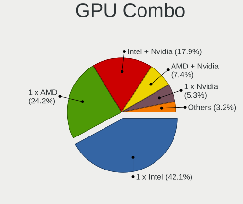

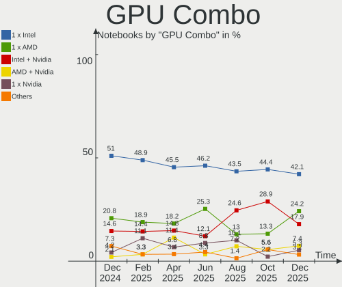

| Name           | Notebooks | Percent |
|----------------|-----------|---------|
| 1 x Intel      | 40        | 42.11%  |
| 1 x AMD        | 23        | 24.21%  |
| Intel + Nvidia | 17        | 17.89%  |
| AMD + Nvidia   | 7         | 7.37%   |
| 1 x Nvidia     | 5         | 5.26%   |
| Intel + AMD    | 3         | 3.16%   |

GPU Driver
----------

Free vs proprietary

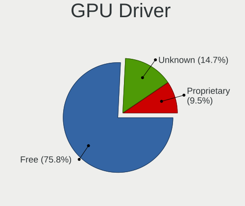

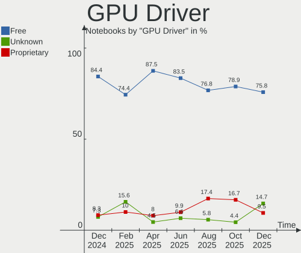

| Driver      | Notebooks | Percent |
|-------------|-----------|---------|
| Free        | 72        | 75.79%  |
| Unknown     | 14        | 14.74%  |
| Proprietary | 9         | 9.47%   |

GPU Memory
----------

Total video memory

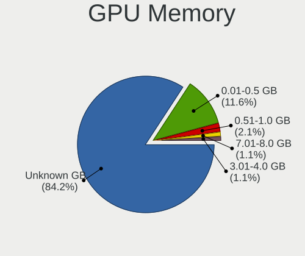

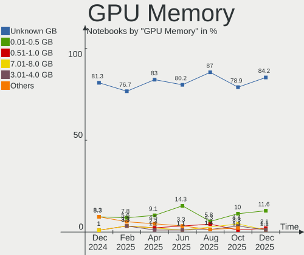

| Size in GB | Notebooks | Percent |
|------------|-----------|---------|
| Unknown    | 80        | 84.21%  |
| 0.01-0.5   | 11        | 11.58%  |
| 0.51-1.0   | 2         | 2.11%   |
| 7.01-8.0   | 1         | 1.05%   |
| 3.01-4.0   | 1         | 1.05%   |

Monitor
-------

Monitor Vendor
--------------

Monitor vendors

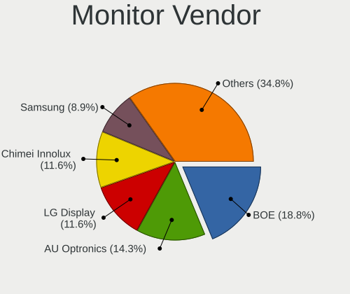

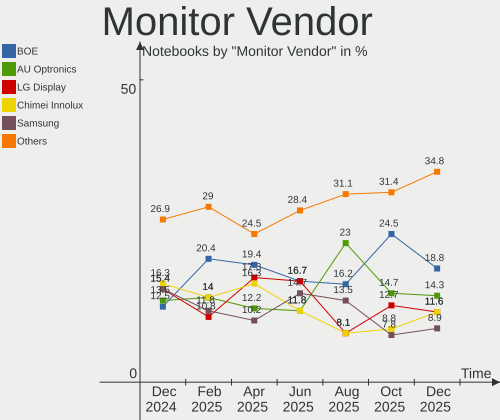

| Vendor                  | Notebooks | Percent |
|-------------------------|-----------|---------|
| BOE                     | 21        | 18.75%  |
| AU Optronics            | 16        | 14.29%  |
| LG Display              | 13        | 11.61%  |
| Chimei Innolux          | 13        | 11.61%  |
| Samsung Electronics     | 10        | 8.93%   |
| Apple                   | 6         | 5.36%   |
| Lenovo                  | 3         | 2.68%   |
| Goldstar                | 3         | 2.68%   |
| Dell                    | 3         | 2.68%   |
| Chi Mei Optoelectronics | 3         | 2.68%   |
| Valve                   | 2         | 1.79%   |
| PANDA                   | 2         | 1.79%   |
| CSOT                    | 2         | 1.79%   |
| BenQ                    | 2         | 1.79%   |
| ASUSTek Computer        | 2         | 1.79%   |
| Ancor Communications    | 2         | 1.79%   |
| Sharp                   | 1         | 0.89%   |
| Philips                 | 1         | 0.89%   |
| MiTAC                   | 1         | 0.89%   |
| LG Philips              | 1         | 0.89%   |
| InnoLux Display         | 1         | 0.89%   |
| Hewlett-Packard         | 1         | 0.89%   |
| DPL                     | 1         | 0.89%   |
| CSW                     | 1         | 0.89%   |
| Acer                    | 1         | 0.89%   |

Monitor Model
-------------

Monitor models

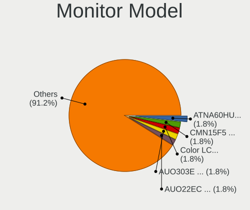

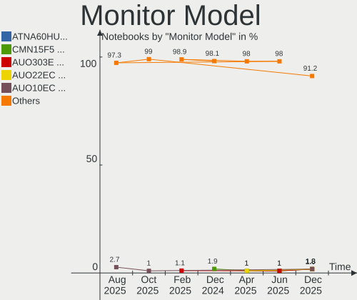

| Model                                                                 | Notebooks | Percent |
|-----------------------------------------------------------------------|-----------|---------|
| Samsung Electronics ATNA60HU02-0  SDC421B                             | 2         | 1.77%   |
| Chimei Innolux LCD Monitor CMN15F5 1920x1080 344x193mm 15.5-inch      | 2         | 1.77%   |
| AU Optronics LCD Monitor AUO303E 1600x900 309x174mm 14.0-inch         | 2         | 1.77%   |
| AU Optronics LCD Monitor AUO22EC 1366x768 344x193mm 15.5-inch         | 2         | 1.77%   |
| AU Optronics LCD Monitor AUO10EC 1366x768 344x193mm 15.5-inch         | 2         | 1.77%   |
| Apple Color LCD APPA02E 2880x1800 331x207mm 15.4-inch                 | 2         | 1.77%   |
| Valve ANX7530 U VLV3003 800x1280 100x160mm 7.4-inch                   | 1         | 0.88%   |
| Valve ANX7530 U VLV3001 800x1280 100x150mm 7.1-inch                   | 1         | 0.88%   |
| Sharp LCD Monitor SHP1593 1920x1200 288x180mm 13.4-inch               | 1         | 0.88%   |
| Samsung Electronics S24R35xFZ SAM71A8 1920x1080 521x293mm 23.5-inch   | 1         | 0.88%   |
| Samsung Electronics Odyssey G5 SAM74A6 2560x1440 597x336mm 27.0-inch  | 1         | 0.88%   |
| Samsung Electronics LS24C33xG SAM7435 1920x1080 527x296mm 23.8-inch   | 1         | 0.88%   |
| Samsung Electronics LF27T35 SAM707F 1920x1080 598x337mm 27.0-inch     | 1         | 0.88%   |
| Samsung Electronics LCD Monitor SEC3454 1600x900 382x215mm 17.3-inch  | 1         | 0.88%   |
| Samsung Electronics LCD Monitor SDC4214 1920x1200 344x215mm 16.0-inch | 1         | 0.88%   |
| Samsung Electronics LCD Monitor SDC416D 2880x1800 312x195mm 14.5-inch | 1         | 0.88%   |
| Samsung Electronics LCD Monitor SAM03AB 1360x768                      | 1         | 0.88%   |
| Samsung Electronics ATNA60HS01-0  SDC420A                             | 1         | 0.88%   |
| Philips 224E PHLC053 1920x1080 476x268mm 21.5-inch                    | 1         | 0.88%   |
| PANDA LCD Monitor NCP004D 1920x1080 344x194mm 15.5-inch               | 1         | 0.88%   |
| PANDA LCD Monitor NCP0035 1920x1080 344x194mm 15.5-inch               | 1         | 0.88%   |
| MiTAC MStar Demo SZM0030 3840x2160 708x398mm 32.0-inch                | 1         | 0.88%   |
| LG Philips LCD Monitor LPLCA00 1280x800 331x207mm 15.4-inch           | 1         | 0.88%   |
| LG Display LP156WH1-TLA3 LGD01C2 1366x768 344x194mm 15.5-inch         | 1         | 0.88%   |
| LG Display LCD Monitor LGD07BD 1920x1200 345x215mm 16.0-inch          | 1         | 0.88%   |
| LG Display LCD Monitor LGD07A8 1920x1200 345x215mm 16.0-inch          | 1         | 0.88%   |
| LG Display LCD Monitor LGD06F9 1920x1200 302x189mm 14.0-inch          | 1         | 0.88%   |
| LG Display LCD Monitor LGD06EB 2560x1600 344x215mm 16.0-inch          | 1         | 0.88%   |
| LG Display LCD Monitor LGD06DB 1920x1080 382x215mm 17.3-inch          | 1         | 0.88%   |
| LG Display LCD Monitor LGD0563 1920x1080 344x194mm 15.5-inch          | 1         | 0.88%   |
| LG Display LCD Monitor LGD0557 1920x1080 309x174mm 14.0-inch          | 1         | 0.88%   |
| LG Display LCD Monitor LGD053F 1920x1080 344x194mm 15.5-inch          | 1         | 0.88%   |
| LG Display LCD Monitor LGD0490 1920x1080 309x174mm 14.0-inch          | 1         | 0.88%   |
| LG Display LCD Monitor LGD03AB 1366x768 344x194mm 15.5-inch           | 1         | 0.88%   |
| LG Display LCD Monitor LGD02E2 1600x900 310x174mm 14.0-inch           | 1         | 0.88%   |
| LG Display LCD Monitor LGD02DA 1920x1080 382x215mm 17.3-inch          | 1         | 0.88%   |
| Lenovo LCD Monitor LEN9156 1920x1200 344x215mm 16.0-inch              | 1         | 0.88%   |
| Lenovo LCD Monitor LEN40B2 1920x1080 344x193mm 15.5-inch              | 1         | 0.88%   |
| Lenovo B140UAN02.7 LEN403A 1920x1200 302x188mm 14.0-inch              | 1         | 0.88%   |
| InnoLux Display LCD Monitor INL0016 1366x768 309x174mm 14.0-inch      | 1         | 0.88%   |

Monitor Resolution
------------------

Monitor screen resolution

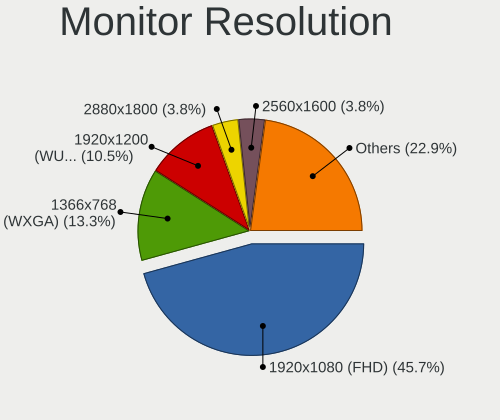

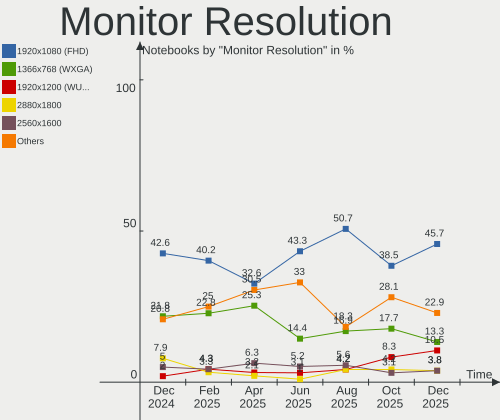

| Resolution        | Notebooks | Percent |
|-------------------|-----------|---------|
| 1920x1080 (FHD)   | 48        | 45.71%  |
| 1366x768 (WXGA)   | 14        | 13.33%  |
| 1920x1200 (WUXGA) | 11        | 10.48%  |
| 2880x1800         | 4         | 3.81%   |
| 2560x1600         | 4         | 3.81%   |
| 2560x1440 (QHD)   | 4         | 3.81%   |
| 1600x900 (HD+)    | 4         | 3.81%   |
| Unknown           | 3         | 2.86%   |
| 800x1280          | 2         | 1.9%    |
| 3840x2160 (4K)    | 2         | 1.9%    |
| 1280x800 (WXGA)   | 2         | 1.9%    |
| 3072x1920         | 1         | 0.95%   |
| 2880x1920         | 1         | 0.95%   |
| 2560x1080         | 1         | 0.95%   |
| 2256x1504         | 1         | 0.95%   |
| 2160x1440         | 1         | 0.95%   |
| 1440x900 (WXGA+)  | 1         | 0.95%   |
| 1360x768          | 1         | 0.95%   |

Monitor Diagonal
----------------

Diagonal size in inches

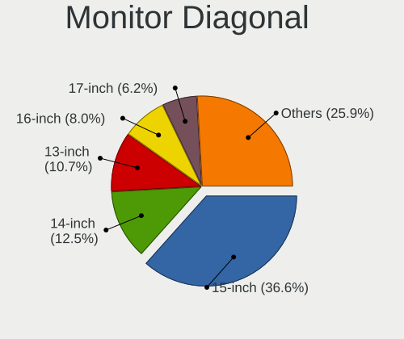

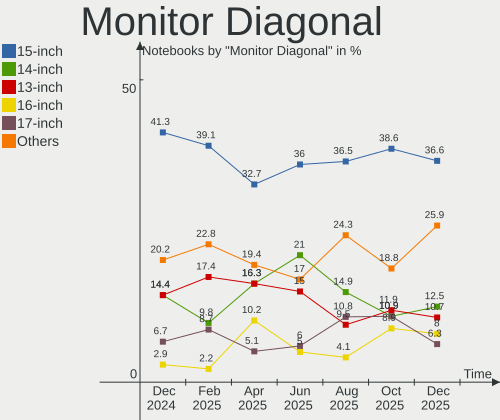

| Inches  | Notebooks | Percent |
|---------|-----------|---------|
| 15      | 41        | 36.61%  |
| 14      | 14        | 12.5%   |
| 13      | 12        | 10.71%  |
| 16      | 9         | 8.04%   |
| 17      | 7         | 6.25%   |
| 27      | 6         | 5.36%   |
| 24      | 6         | 5.36%   |
| 21      | 4         | 3.57%   |
| Unknown | 4         | 3.57%   |
| 23      | 2         | 1.79%   |
| 7       | 2         | 1.79%   |
| 34      | 1         | 0.89%   |
| 32      | 1         | 0.89%   |
| 31      | 1         | 0.89%   |
| 18      | 1         | 0.89%   |
| 12      | 1         | 0.89%   |

Monitor Width
-------------

Physical width

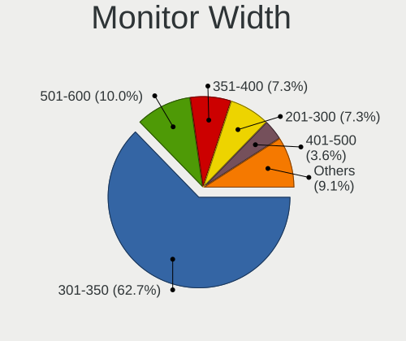

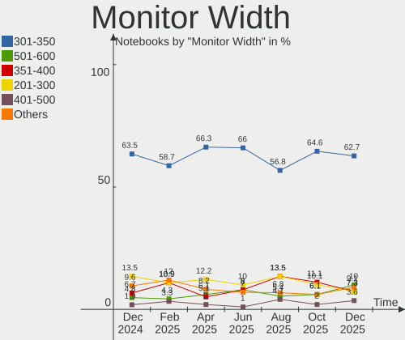

| Width in mm | Notebooks | Percent |
|-------------|-----------|---------|
| 301-350     | 69        | 62.73%  |
| 501-600     | 11        | 10%     |
| 351-400     | 8         | 7.27%   |
| 201-300     | 8         | 7.27%   |
| 401-500     | 4         | 3.64%   |
| Unknown     | 4         | 3.64%   |
| 701-800     | 2         | 1.82%   |
| 601-700     | 2         | 1.82%   |
| 1-100       | 2         | 1.82%   |

Aspect Ratio
------------

Proportional relationship between the width and the height

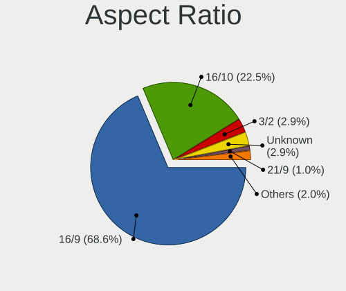

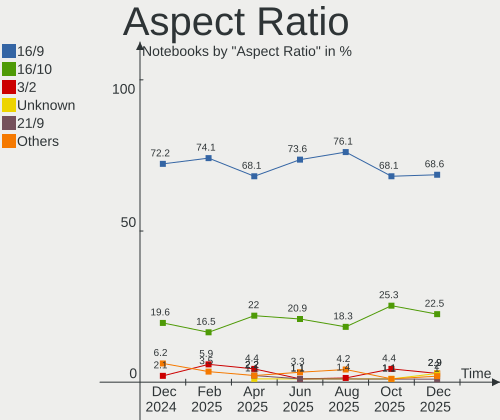

| Ratio   | Notebooks | Percent |
|---------|-----------|---------|
| 16/9    | 70        | 68.63%  |
| 16/10   | 23        | 22.55%  |
| 3/2     | 3         | 2.94%   |
| Unknown | 3         | 2.94%   |
| 21/9    | 1         | 0.98%   |
| 0.67    | 1         | 0.98%   |
| 0.62    | 1         | 0.98%   |

Monitor Area
------------

Area in inch²

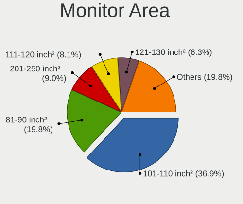

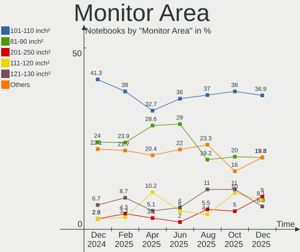

| Area in inch² | Notebooks | Percent |
|----------------|-----------|---------|
| 101-110        | 41        | 36.94%  |
| 81-90          | 22        | 19.82%  |
| 201-250        | 10        | 9.01%   |
| 111-120        | 9         | 8.11%   |
| 121-130        | 7         | 6.31%   |
| 301-350        | 6         | 5.41%   |
| Unknown        | 4         | 3.6%    |
| 71-80          | 3         | 2.7%    |
| 351-500        | 3         | 2.7%    |
| 1-40           | 2         | 1.8%    |
| 61-70          | 1         | 0.9%    |
| 251-300        | 1         | 0.9%    |
| 141-150        | 1         | 0.9%    |
| 91-100         | 1         | 0.9%    |

Pixel Density
-------------

Pixels per inch

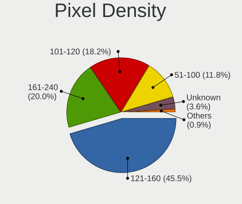

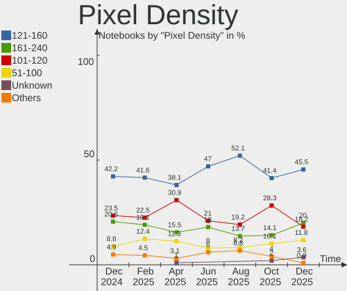

| Density       | Notebooks | Percent |
|---------------|-----------|---------|
| 121-160       | 50        | 45.45%  |
| 161-240       | 22        | 20%     |
| 101-120       | 20        | 18.18%  |
| 51-100        | 13        | 11.82%  |
| Unknown       | 4         | 3.64%   |
| More than 240 | 1         | 0.91%   |

Multiple Monitors
-----------------

Total monitors connected

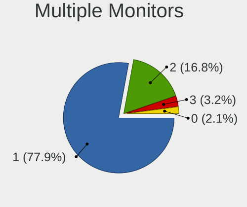

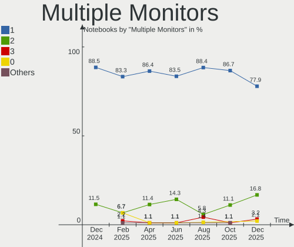

| Total | Notebooks | Percent |
|-------|-----------|---------|
| 1     | 74        | 77.89%  |
| 2     | 16        | 16.84%  |
| 3     | 3         | 3.16%   |
| 0     | 2         | 2.11%   |

Network
-------

Net Controller Vendor
---------------------

Controller vendors

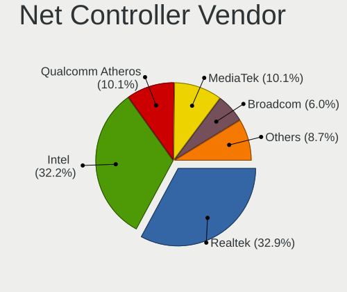

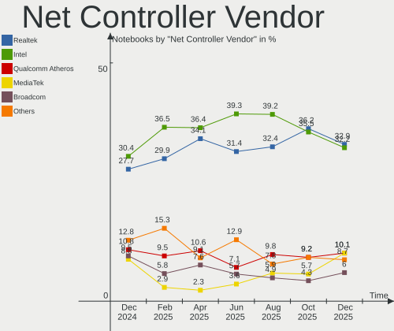

| Vendor                   | Notebooks | Percent |
|--------------------------|-----------|---------|
| Realtek Semiconductor    | 49        | 32.89%  |
| Intel                    | 48        | 32.21%  |
| Qualcomm Atheros         | 15        | 10.07%  |
| MediaTek                 | 15        | 10.07%  |
| Broadcom                 | 9         | 6.04%   |
| Broadcom Limited         | 4         | 2.68%   |
| ASIX Electronics         | 2         | 1.34%   |
| Sierra Wireless          | 1         | 0.67%   |
| Qualcomm                 | 1         | 0.67%   |
| NetGear                  | 1         | 0.67%   |
| Marvell Technology Group | 1         | 0.67%   |
| DisplayLink              | 1         | 0.67%   |
| Aquantia                 | 1         | 0.67%   |
| Apple                    | 1         | 0.67%   |

Net Controller Model
--------------------

Controller models

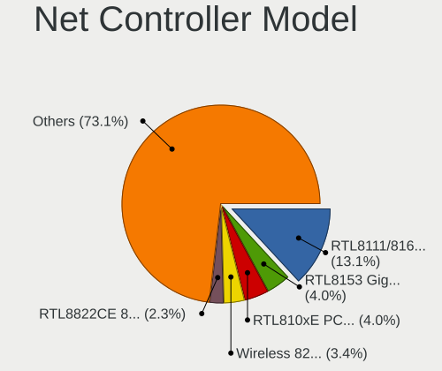

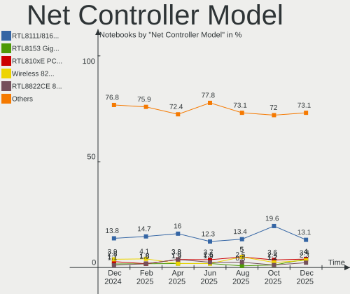

| Model                                                                           | Notebooks | Percent |
|---------------------------------------------------------------------------------|-----------|---------|
| Realtek RTL8111/8168/8211/8411 PCI Express Gigabit Ethernet Controller          | 23        | 13.14%  |
| Realtek RTL8153 Gigabit Ethernet Adapter                                        | 7         | 4%      |
| Realtek RTL810xE PCI Express Fast Ethernet controller                           | 7         | 4%      |
| Intel Wireless 8265 / 8275                                                      | 6         | 3.43%   |
| Realtek RTL8822CE 802.11ac PCIe Wireless Network Adapter                        | 4         | 2.29%   |
| Qualcomm Atheros AR9485 Wireless Network Adapter                                | 4         | 2.29%   |
| MediaTek MT7925 802.11be 160MHz 2x2 PCIe Wireless Network Adapter [Filogic 360] | 4         | 2.29%   |
| Intel Wireless 7265                                                             | 4         | 2.29%   |
| Realtek USB 10/100/1G/2.5 LAN                                                   | 3         | 1.71%   |
| Realtek RTL8125 2.5GbE Controller                                               | 3         | 1.71%   |
| Qualcomm Atheros AR9285 Wireless Network Adapter (PCI-Express)                  | 3         | 1.71%   |
| MediaTek MT7922 802.11ax PCI Express Wireless Network Adapter                   | 3         | 1.71%   |
| MediaTek MT7921 802.11ax PCIe Wireless Network Adapter [Filogic 330]            | 3         | 1.71%   |
| MediaTek MT7902 802.11ax PCIe Wireless Network Adapter [Filogic 310]            | 3         | 1.71%   |
| Intel Wi-Fi 6 AX200                                                             | 3         | 1.71%   |
| Intel Raptor Lake PCH CNVi WiFi                                                 | 3         | 1.71%   |
| Intel Alder Lake-P PCH CNVi WiFi                                                | 3         | 1.71%   |
| Qualcomm Atheros QCA9377 802.11ac Wireless Network Adapter                      | 2         | 1.14%   |
| Qualcomm Atheros QCA6174 802.11ac Wireless Network Adapter                      | 2         | 1.14%   |
| Qualcomm Atheros AR8151 v2.0 Gigabit Ethernet                                   | 2         | 1.14%   |
| MediaTek MT7927 802.11be 320MHz 2x2 PCIe Wireless Network Adapter [Filogic 380] | 2         | 1.14%   |
| Intel Wireless 8260                                                             | 2         | 1.14%   |
| Intel Wi-Fi 6 AX201                                                             | 2         | 1.14%   |
| Intel Tiger Lake PCH CNVi WiFi                                                  | 2         | 1.14%   |
| Intel Ethernet Connection I219-LM                                               | 2         | 1.14%   |
| Intel Ethernet Connection (4) I219-V                                            | 2         | 1.14%   |
| Intel Ethernet Connection (4) I219-LM                                           | 2         | 1.14%   |
| Intel Ethernet Connection (3) I218-LM                                           | 2         | 1.14%   |
| Intel Comet Lake PCH CNVi WiFi                                                  | 2         | 1.14%   |
| Intel Centrino Wireless-N 2230                                                  | 2         | 1.14%   |
| Intel Centrino Advanced-N 6205 [Taylor Peak]                                    | 2         | 1.14%   |
| Intel Cannon Point-LP CNVi [Wireless-AC]                                        | 2         | 1.14%   |
| Intel Cannon Lake PCH CNVi WiFi                                                 | 2         | 1.14%   |
| Intel BE201 320MHz                                                              | 2         | 1.14%   |
| Intel 82579LM Gigabit Network Connection (Lewisville)                           | 2         | 1.14%   |
| Broadcom NetLink BCM57785 Gigabit Ethernet PCIe                                 | 2         | 1.14%   |
| Broadcom BCM43602 802.11ac Wireless LAN SoC                                     | 2         | 1.14%   |
| Broadcom BCM4360 802.11ac Dual Band Wireless Network Adapter                    | 2         | 1.14%   |
| ASIX AX88179 Gigabit Ethernet                                                   | 2         | 1.14%   |
| Sierra Wireless EM7455                                                          | 1         | 0.57%   |

Wireless Vendor
---------------

Wireless vendors

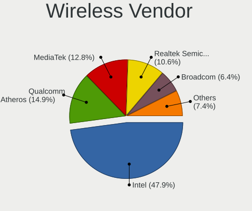

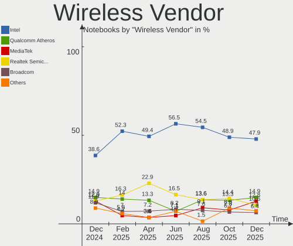

| Vendor                | Notebooks | Percent |
|-----------------------|-----------|---------|
| Intel                 | 45        | 47.87%  |
| Qualcomm Atheros      | 14        | 14.89%  |
| MediaTek              | 12        | 12.77%  |
| Realtek Semiconductor | 10        | 10.64%  |
| Broadcom              | 6         | 6.38%   |
| Broadcom Limited      | 4         | 4.26%   |
| Sierra Wireless       | 1         | 1.06%   |
| Qualcomm              | 1         | 1.06%   |
| NetGear               | 1         | 1.06%   |

Wireless Model
--------------

Wireless models

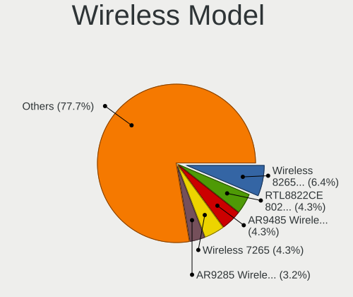

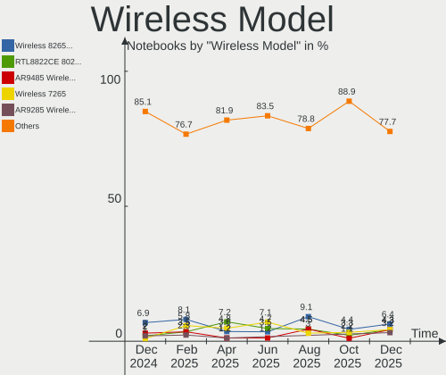

| Model                                                                           | Notebooks | Percent |
|---------------------------------------------------------------------------------|-----------|---------|
| Intel Wireless 8265 / 8275                                                      | 6         | 6.38%   |
| Realtek RTL8822CE 802.11ac PCIe Wireless Network Adapter                        | 4         | 4.26%   |
| Qualcomm Atheros AR9485 Wireless Network Adapter                                | 4         | 4.26%   |
| Intel Wireless 7265                                                             | 4         | 4.26%   |
| Qualcomm Atheros AR9285 Wireless Network Adapter (PCI-Express)                  | 3         | 3.19%   |
| MediaTek MT7925 802.11be 160MHz 2x2 PCIe Wireless Network Adapter [Filogic 360] | 3         | 3.19%   |
| MediaTek MT7922 802.11ax PCI Express Wireless Network Adapter                   | 3         | 3.19%   |
| MediaTek MT7921 802.11ax PCIe Wireless Network Adapter [Filogic 330]            | 3         | 3.19%   |
| MediaTek MT7902 802.11ax PCIe Wireless Network Adapter [Filogic 310]            | 3         | 3.19%   |
| Intel Wi-Fi 6 AX200                                                             | 3         | 3.19%   |
| Intel Raptor Lake PCH CNVi WiFi                                                 | 3         | 3.19%   |
| Qualcomm Atheros QCA9377 802.11ac Wireless Network Adapter                      | 2         | 2.13%   |
| Qualcomm Atheros QCA6174 802.11ac Wireless Network Adapter                      | 2         | 2.13%   |
| Intel Wireless 8260                                                             | 2         | 2.13%   |
| Intel Wi-Fi 6 AX201                                                             | 2         | 2.13%   |
| Intel Tiger Lake PCH CNVi WiFi                                                  | 2         | 2.13%   |
| Intel Comet Lake PCH CNVi WiFi                                                  | 2         | 2.13%   |
| Intel Centrino Wireless-N 2230                                                  | 2         | 2.13%   |
| Intel Centrino Advanced-N 6205 [Taylor Peak]                                    | 2         | 2.13%   |
| Intel Cannon Point-LP CNVi [Wireless-AC]                                        | 2         | 2.13%   |
| Intel Cannon Lake PCH CNVi WiFi                                                 | 2         | 2.13%   |
| Intel BE201 320MHz                                                              | 2         | 2.13%   |
| Intel Alder Lake-P PCH CNVi WiFi                                                | 2         | 2.13%   |
| Broadcom BCM43602 802.11ac Wireless LAN SoC                                     | 2         | 2.13%   |
| Broadcom BCM4360 802.11ac Dual Band Wireless Network Adapter                    | 2         | 2.13%   |
| Sierra Wireless EM7455                                                          | 1         | 1.06%   |
| Realtek RTL8852BE-VT PCIe 802.11ax Wireless Network Controller                  | 1         | 1.06%   |
| Realtek RTL8852BE PCIe 802.11ax Wireless Network Controller                     | 1         | 1.06%   |
| Realtek RTL8852AE 802.11ax PCIe Wireless Network Adapter                        | 1         | 1.06%   |
| Realtek RTL8851BE PCIe 802.11ax Wireless Network Controller                     | 1         | 1.06%   |
| Realtek RTL8723BE PCIe Wireless Network Adapter                                 | 1         | 1.06%   |
| Realtek RTL8188FTV 802.11b/g/n 1T1R 2.4G WLAN Adapter                           | 1         | 1.06%   |
| Qualcomm QCNFA765 Wireless Network Adapter                                      | 1         | 1.06%   |
| Qualcomm Atheros QCA9565 / AR9565 Wireless Network Adapter                      | 1         | 1.06%   |
| Qualcomm Atheros AR9462 Wireless Network Adapter                                | 1         | 1.06%   |
| Qualcomm Atheros AR9287 Wireless Network Adapter (PCI-Express)                  | 1         | 1.06%   |
| NetGear A6150                                                                   | 1         | 1.06%   |
| Intel Wireless 7260                                                             | 1         | 1.06%   |
| Intel WiFi Link 5100                                                            | 1         | 1.06%   |
| Intel Wi-Fi 7(802.11be) AX1775*/AX1790*/BE20*/BE401/BE1750* 2x2                 | 1         | 1.06%   |

Ethernet Vendor
---------------

Ethernet vendors

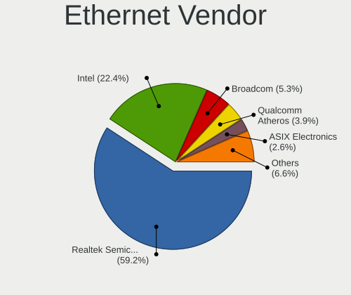

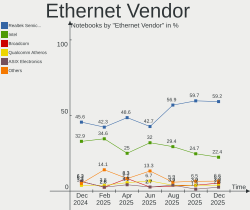

| Vendor                   | Notebooks | Percent |
|--------------------------|-----------|---------|
| Realtek Semiconductor    | 45        | 59.21%  |
| Intel                    | 17        | 22.37%  |
| Broadcom                 | 4         | 5.26%   |
| Qualcomm Atheros         | 3         | 3.95%   |
| ASIX Electronics         | 2         | 2.63%   |
| MediaTek                 | 1         | 1.32%   |
| Marvell Technology Group | 1         | 1.32%   |
| DisplayLink              | 1         | 1.32%   |
| Aquantia                 | 1         | 1.32%   |
| Apple                    | 1         | 1.32%   |

Ethernet Model
--------------

Ethernet models

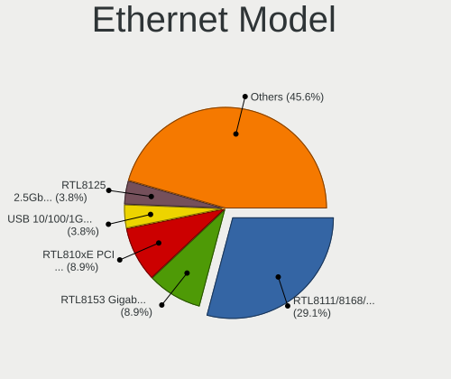

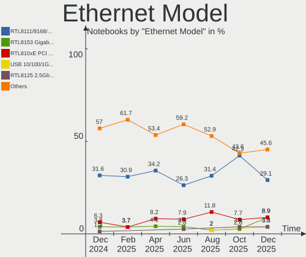

| Model                                                                           | Notebooks | Percent |
|---------------------------------------------------------------------------------|-----------|---------|
| Realtek RTL8111/8168/8211/8411 PCI Express Gigabit Ethernet Controller          | 23        | 29.11%  |
| Realtek RTL8153 Gigabit Ethernet Adapter                                        | 7         | 8.86%   |
| Realtek RTL810xE PCI Express Fast Ethernet controller                           | 7         | 8.86%   |
| Realtek USB 10/100/1G/2.5 LAN                                                   | 3         | 3.8%    |
| Realtek RTL8125 2.5GbE Controller                                               | 3         | 3.8%    |
| Qualcomm Atheros AR8151 v2.0 Gigabit Ethernet                                   | 2         | 2.53%   |
| Intel Ethernet Connection I219-LM                                               | 2         | 2.53%   |
| Intel Ethernet Connection (4) I219-V                                            | 2         | 2.53%   |
| Intel Ethernet Connection (4) I219-LM                                           | 2         | 2.53%   |
| Intel Ethernet Connection (3) I218-LM                                           | 2         | 2.53%   |
| Intel 82579LM Gigabit Network Connection (Lewisville)                           | 2         | 2.53%   |
| Broadcom NetLink BCM57785 Gigabit Ethernet PCIe                                 | 2         | 2.53%   |
| ASIX AX88179 Gigabit Ethernet                                                   | 2         | 2.53%   |
| Realtek RTL8852CE PCIe 802.11ax Wireless Network Controller                     | 1         | 1.27%   |
| Realtek RTL-8100/8101L/8139 PCI Fast Ethernet Adapter                           | 1         | 1.27%   |
| Realtek Killer E5000 5GbE Controller                                            | 1         | 1.27%   |
| Realtek Killer E2600 GbE Controller                                             | 1         | 1.27%   |
| Qualcomm Atheros Killer E2400 Gigabit Ethernet Controller                       | 1         | 1.27%   |
| MediaTek MT7925 802.11be 160MHz 2x2 PCIe Wireless Network Adapter [Filogic 360] | 1         | 1.27%   |
| Marvell Group 88E8057 PCI-E Gigabit Ethernet Controller                         | 1         | 1.27%   |
| Intel Ethernet Connection I217-LM                                               | 1         | 1.27%   |
| Intel Ethernet Connection (7) I219-V                                            | 1         | 1.27%   |
| Intel Ethernet Connection (6) I219-V                                            | 1         | 1.27%   |
| Intel Ethernet Connection (6) I219-LM                                           | 1         | 1.27%   |
| Intel Ethernet Connection (5) I219-LM                                           | 1         | 1.27%   |
| Intel Ethernet Connection (16) I219-LM                                          | 1         | 1.27%   |
| Intel Ethernet Connection (11) I219-V                                           | 1         | 1.27%   |
| Intel Alder Lake-P PCH CNVi WiFi                                                | 1         | 1.27%   |
| DisplayLink Plugable UD-3900Z                                                   | 1         | 1.27%   |
| Broadcom NetXtreme BCM57765 Gigabit Ethernet PCIe                               | 1         | 1.27%   |
| Broadcom BCM4401-B0 100Base-TX                                                  | 1         | 1.27%   |
| Aquantia AQtion AQC107S NBase-T/IEEE 802.3an Ethernet Controller [Atlantic 10G] | 1         | 1.27%   |
| Apple iBridge                                                                   | 1         | 1.27%   |

Net Controller Kind
-------------------

Ethernet, WiFi or modem

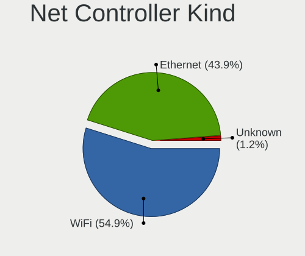

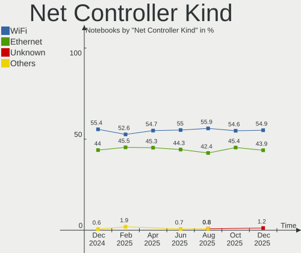

| Kind     | Notebooks | Percent |
|----------|-----------|---------|
| WiFi     | 90        | 54.88%  |
| Ethernet | 72        | 43.9%   |
| Unknown  | 2         | 1.22%   |

Used Controller
---------------

Currently used network controller

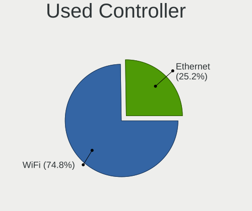

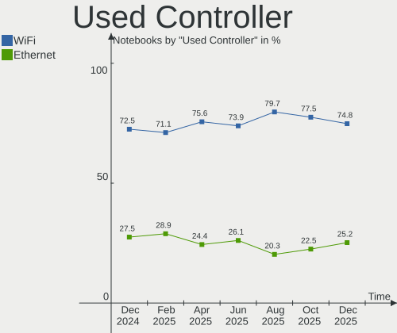

| Kind     | Notebooks | Percent |
|----------|-----------|---------|
| WiFi     | 77        | 74.76%  |
| Ethernet | 26        | 25.24%  |

NICs
----

Total network controllers on board

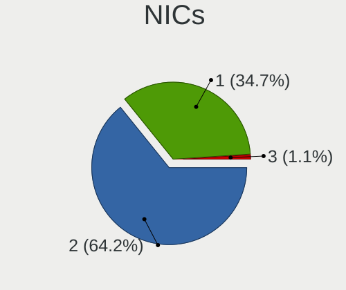

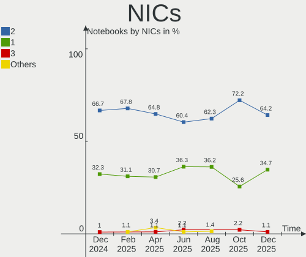

| Total | Notebooks | Percent |
|-------|-----------|---------|
| 2     | 61        | 64.21%  |
| 1     | 33        | 34.74%  |
| 3     | 1         | 1.05%   |

IPv6
----

IPv6 vs IPv4

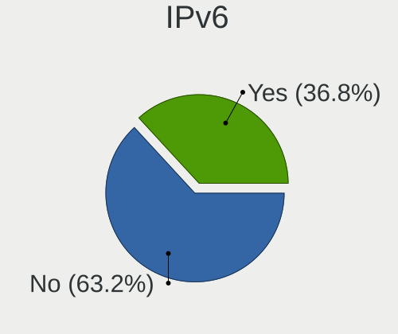

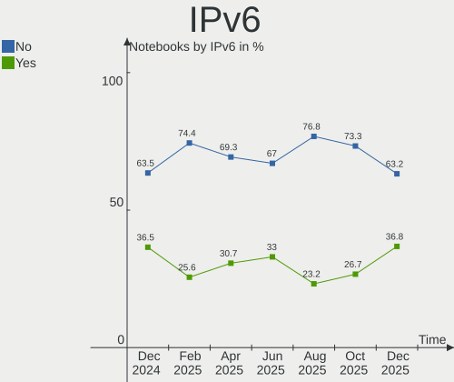

| Used | Notebooks | Percent |
|------|-----------|---------|
| No   | 60        | 63.16%  |
| Yes  | 35        | 36.84%  |

Bluetooth
---------

Bluetooth Vendor
----------------

Controller vendors

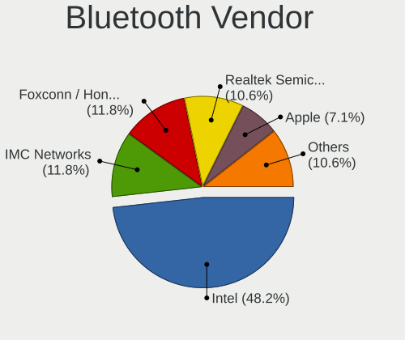

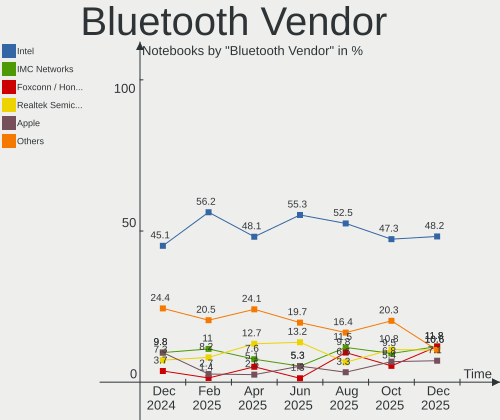

| Vendor                          | Notebooks | Percent |
|---------------------------------|-----------|---------|
| Intel                           | 41        | 48.24%  |
| IMC Networks                    | 10        | 11.76%  |
| Foxconn / Hon Hai               | 10        | 11.76%  |
| Realtek Semiconductor           | 9         | 10.59%  |
| Apple                           | 6         | 7.06%   |
| Qualcomm Atheros Communications | 4         | 4.71%   |
| Broadcom                        | 3         | 3.53%   |
| MediaTek                        | 2         | 2.35%   |

Bluetooth Model
---------------

Controller models

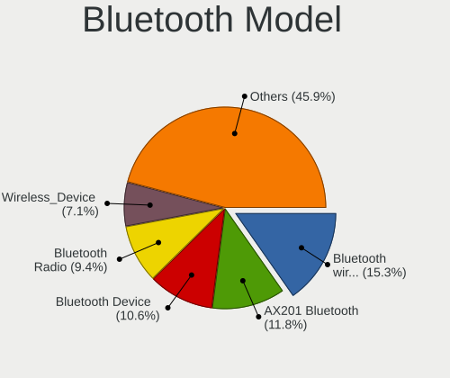

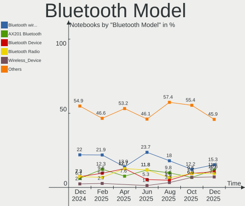

| Model                                             | Notebooks | Percent |
|---------------------------------------------------|-----------|---------|
| Intel Bluetooth wireless interface                | 13        | 15.29%  |
| Intel AX201 Bluetooth                             | 10        | 11.76%  |
| Intel Bluetooth Device                            | 9         | 10.59%  |
| Realtek Bluetooth Radio                           | 8         | 9.41%   |
| IMC Networks Wireless_Device                      | 6         | 7.06%   |
| Foxconn / Hon Hai Wireless_Device                 | 6         | 7.06%   |
| Qualcomm Atheros  Bluetooth Device                | 4         | 4.71%   |
| Apple Bluetooth Host Controller                   | 4         | 4.71%   |
| Intel Bluetooth 9460/9560 Jefferson Peak (JfP)    | 3         | 3.53%   |
| IMC Networks Atheros AR3012 Bluetooth 4.0 Adapter | 3         | 3.53%   |
| MediaTek Wireless_Device                          | 2         | 2.35%   |
| Intel Centrino Bluetooth Wireless Transceiver     | 2         | 2.35%   |
| Intel AX200 Bluetooth                             | 2         | 2.35%   |
| Foxconn / Hon Hai Bluetooth Device                | 2         | 2.35%   |
| Broadcom BCM2045B (BDC-2.1)                       | 2         | 2.35%   |
| Apple Bluetooth USB Host Controller               | 2         | 2.35%   |
| Realtek Bluetooth 5.4 Radio                       | 1         | 1.18%   |
| Intel Bluetooth                                   | 1         | 1.18%   |
| Intel AX210 Bluetooth                             | 1         | 1.18%   |
| IMC Networks Bluetooth Radio                      | 1         | 1.18%   |
| Foxconn / Hon Hai MediaTek Bluetooth Adapter      | 1         | 1.18%   |
| Foxconn / Hon Hai Broadcom BCM20702A1 Bluetooth   | 1         | 1.18%   |
| Broadcom BCM20702A0 Bluetooth 4.0                 | 1         | 1.18%   |

Sound
-----

Sound Vendor
------------

Sound card vendors

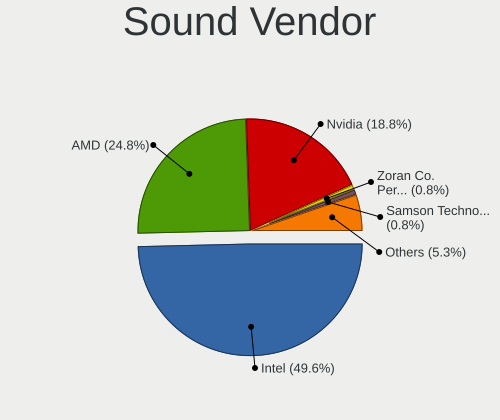

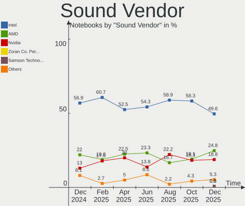

| Vendor                                       | Notebooks | Percent |
|----------------------------------------------|-----------|---------|
| Intel                                        | 66        | 49.62%  |
| AMD                                          | 33        | 24.81%  |
| Nvidia                                       | 25        | 18.8%   |
| Zoran Co. Personal Media Division (Nogatech) | 1         | 0.75%   |
| Samson Technologies                          | 1         | 0.75%   |
| Plantronics                                  | 1         | 0.75%   |
| MV-SILICON                                   | 1         | 0.75%   |
| LE XIAN                                      | 1         | 0.75%   |
| GYROCOM C&C                                  | 1         | 0.75%   |
| Corsair                                      | 1         | 0.75%   |
| ASUSTek Computer                             | 1         | 0.75%   |
| Apple                                        | 1         | 0.75%   |

Sound Model
-----------

Sound card models

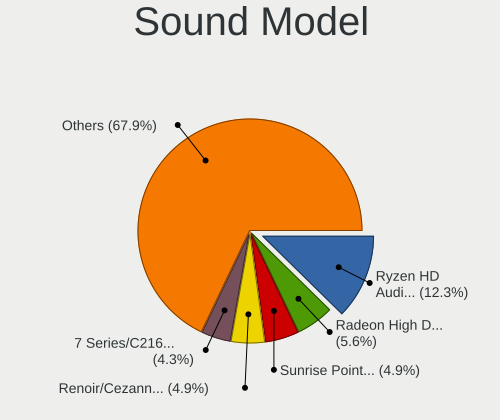

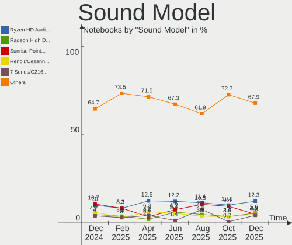

| Model                                                                        | Notebooks | Percent |
|------------------------------------------------------------------------------|-----------|---------|
| AMD Ryzen HD Audio Controller                                                | 20        | 12.35%  |
| AMD Radeon High Definition Audio Controller                                  | 9         | 5.56%   |
| Intel Sunrise Point-LP HD Audio                                              | 8         | 4.94%   |
| AMD Renoir/Cezanne HDMI/DP Audio Controller                                  | 8         | 4.94%   |
| Intel 7 Series/C216 Chipset Family High Definition Audio Controller          | 7         | 4.32%   |
| Intel 8 Series/C220 Series Chipset High Definition Audio Controller          | 6         | 3.7%    |
| Nvidia GA106 High Definition Audio Controller                                | 4         | 2.47%   |
| Intel Cannon Point-LP High Definition Audio Controller                       | 4         | 2.47%   |
| Intel Alder Lake PCH-P High Definition Audio Controller                      | 4         | 2.47%   |
| Intel 6 Series/C200 Series Chipset Family High Definition Audio Controller   | 4         | 2.47%   |
| Nvidia GK107 HDMI Audio Controller                                           | 3         | 1.85%   |
| Nvidia GB205 High Definition Audio Controller                                | 3         | 1.85%   |
| Intel Wildcat Point-LP High Definition Audio Controller                      | 3         | 1.85%   |
| Intel Raptor Lake-P/U/H cAVS                                                 | 3         | 1.85%   |
| Intel Crystal Well HD Audio Controller                                       | 3         | 1.85%   |
| Intel Cannon Lake PCH cAVS                                                   | 3         | 1.85%   |
| Intel Broadwell-U Audio Controller                                           | 3         | 1.85%   |
| Nvidia TU107 GeForce GTX 1650 High Definition Audio Controller               | 2         | 1.23%   |
| Nvidia AD107 High Definition Audio Controller                                | 2         | 1.23%   |
| Intel Xeon E3-1200 v3/4th Gen Core Processor HD Audio Controller             | 2         | 1.23%   |
| Intel Tiger Lake-LP Smart Sound Technology Audio Controller                  | 2         | 1.23%   |
| Intel Tiger Lake-H HD Audio Controller                                       | 2         | 1.23%   |
| Intel Meteor Lake-P HD Audio Controller                                      | 2         | 1.23%   |
| Intel Lunar Lake-M HD Audio Controller                                       | 2         | 1.23%   |
| Intel Ice Lake-LP Smart Sound Technology Audio Controller                    | 2         | 1.23%   |
| Intel Comet Lake PCH cAVS                                                    | 2         | 1.23%   |
| Intel 800 Series ACE (Audio Context Engine)                                  | 2         | 1.23%   |
| AMD SBx00 Azalia (Intel HDA)                                                 | 2         | 1.23%   |
| AMD Raven/Raven2/Fenghuang HDMI/DP Audio Controller                          | 2         | 1.23%   |
| AMD Oland/Hainan/Cape Verde/Pitcairn HDMI Audio [Radeon HD 7000 Series]      | 2         | 1.23%   |
| AMD FCH Azalia Controller                                                    | 2         | 1.23%   |
| Zoran Co. Personal Media Division (Nogatech) USB Audio and HID               | 1         | 0.62%   |
| Samson Technologies GoMic compact condenser mic                              | 1         | 0.62%   |
| Plantronics Blackwire C5220 headset (remote control and 3.5mm audio adapter) | 1         | 0.62%   |
| Nvidia TU116 High Definition Audio Controller                                | 1         | 0.62%   |
| Nvidia TU106 High Definition Audio Controller                                | 1         | 0.62%   |
| Nvidia GP106 High Definition Audio Controller                                | 1         | 0.62%   |
| Nvidia GM206 High Definition Audio Controller                                | 1         | 0.62%   |
| Nvidia GK104 HDMI Audio Controller                                           | 1         | 0.62%   |
| Nvidia GF116 High Definition Audio Controller                                | 1         | 0.62%   |

Memory
------

Memory Vendor
-------------

Memory module vendors

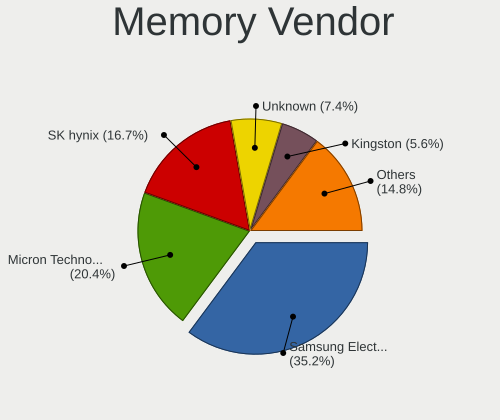

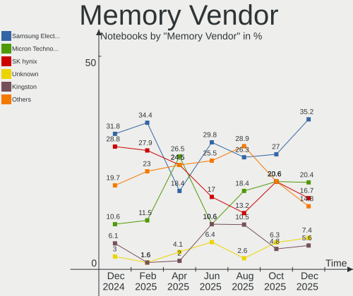

| Vendor              | Notebooks | Percent |
|---------------------|-----------|---------|
| Samsung Electronics | 19        | 35.19%  |
| Micron Technology   | 11        | 20.37%  |
| SK hynix            | 9         | 16.67%  |
| Unknown             | 4         | 7.41%   |
| Kingston            | 3         | 5.56%   |
| G.Skill             | 2         | 3.7%    |
| Unknown             | 2         | 3.7%    |
| Team                | 1         | 1.85%   |
| Crucial             | 1         | 1.85%   |
| ASint Technology    | 1         | 1.85%   |
| A-DATA Technology   | 1         | 1.85%   |

Memory Model
------------

Memory module models

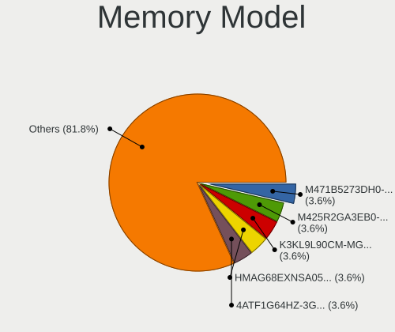

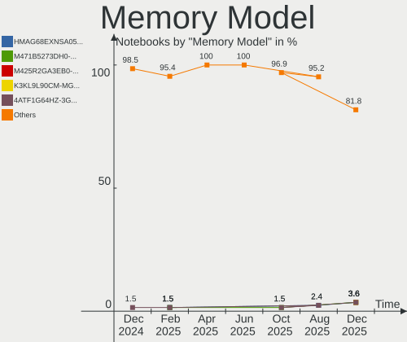

| Model                                                            | Notebooks | Percent |
|------------------------------------------------------------------|-----------|---------|
| SK hynix RAM HMAG68EXNSA051N 8GB SODIMM DDR4 3200MT/s            | 2         | 3.64%   |
| Samsung RAM M471B5273DH0-CH9 4GB SODIMM DDR3 1600MT/s            | 2         | 3.64%   |
| Samsung RAM M425R2GA3EB0-CWMOL 16GB SODIMM DDR5 5600MT/s         | 2         | 3.64%   |
| Samsung RAM K3KL9L90CM-MGCT 4GB Row Of Chips LPDDR5 7500MT/s     | 2         | 3.64%   |
| Micron RAM 4ATF1G64HZ-3G2F1 8GB SODIMM DDR4 3200MT/s             | 2         | 3.64%   |
| Unknown                                                          | 2         | 3.64%   |
| Unknown RAM Module 512MB SODIMM DDR2                             | 1         | 1.82%   |
| Unknown RAM Module 2GB SODIMM DDR3 1333MT/s                      | 1         | 1.82%   |
| Unknown RAM Module 2GB SODIMM DDR2 667MT/s                       | 1         | 1.82%   |
| Unknown RAM DDR4 NB 16G 2666 16384MB SODIMM DDR4 2667MT/s        | 1         | 1.82%   |
| Team RAM TEAMGROUP-SD4-3200 16GB SODIMM DDR4 3200MT/s            | 1         | 1.82%   |
| SK hynix RAM Module 2GB SODIMM DDR3 1600MT/s                     | 1         | 1.82%   |
| SK hynix RAM HMT451S6BFR8A-PB 4GB SODIMM DDR3 1600MT/s           | 1         | 1.82%   |
| SK hynix RAM HMT351S6CFR8A-PB 4GB SODIMM DDR3 1600MT/s           | 1         | 1.82%   |
| SK hynix RAM HMCG88AGBSA095N 32GB SODIMM DDR5 5600MT/s           | 1         | 1.82%   |
| SK hynix RAM HMAA1GS6CJR6N-XN 8GB SODIMM DDR4 3200MT/s           | 1         | 1.82%   |
| SK hynix RAM H9JCNNNCP3MLYR-N6E 2GB Row Of Chips LPDDR5 6400MT/s | 1         | 1.82%   |
| SK hynix RAM H58G66CK8BX147 16GB Row Of Chips LPDDR5 8533MT/s    | 1         | 1.82%   |
| Samsung RAM UBE3D4AA-MGCR 2GB Row Of Chips LPDDR4 4267MT/s       | 1         | 1.82%   |
| Samsung RAM Module 3GB Row Of Chips LPDDR5 6400MT/s              | 1         | 1.82%   |
| Samsung RAM M471B5173QH0-YK0 4GB SODIMM DDR3 1600MT/s            | 1         | 1.82%   |
| Samsung RAM M471A5244CB0-CWE 4GB SODIMM DDR4 3200MT/s            | 1         | 1.82%   |
| Samsung RAM M471A2K43DB1-CWE 16GB SODIMM DDR4 3200MT/s           | 1         | 1.82%   |
| Samsung RAM M471A1K43EB1-CWE 8GB SODIMM DDR4 3200MT/s            | 1         | 1.82%   |
| Samsung RAM M471A1K43DB1-CWE 8GB SODIMM DDR4 3200MT/s            | 1         | 1.82%   |
| Samsung RAM M471A1K43CB1-CRC 8GB SODIMM DDR4 8400MT/s            | 1         | 1.82%   |
| Samsung RAM M471A1G44CB0-CWE 8GB SODIMM DDR4 3200MT/s            | 1         | 1.82%   |
| Samsung RAM M471A1G44BB0-CWE 8GB SODIMM DDR4 3200MT/s            | 1         | 1.82%   |
| Samsung RAM M471A1G44AB0-CWE 8GiB SODIMM DDR4 3200MT/s           | 1         | 1.82%   |
| Samsung RAM M425R2GA3EB0-CWMOL 16GB Row Of Chips DDR5 5600MT/s   | 1         | 1.82%   |
| Samsung RAM K4E6E304EB-EGCG 4GB Row Of Chips LPDDR3 2133MT/s     | 1         | 1.82%   |
| Micron RAM MTC8C1084S1SC56BD1 K 16GiB SODIMM DDR5 5600MT/s       | 1         | 1.82%   |
| Micron RAM MTC16C2085S1VC64BD1 KFF 32GB SODIMM DDR5 6400MT/s     | 1         | 1.82%   |
| Micron RAM MT62F1G64D4AH-023 WT 4GB SODIMM LPDDR5 4266MT/s       | 1         | 1.82%   |
| Micron RAM Module 16GB SODIMM DDR4 3200MT/s                      | 1         | 1.82%   |
| Micron RAM CT32G56C46S5.M16D1 32GB SODIMM DDR5 6000MT/s          | 1         | 1.82%   |
| Micron RAM 8ATF1G64HZ-3G2R1 8GB SODIMM DDR4 3200MT/s             | 1         | 1.82%   |
| Micron RAM 8ATF1G64HZ-2G6E1 8GB SODIMM DDR4 2667MT/s             | 1         | 1.82%   |
| Micron RAM 8ATF1G64HZ-2G6D1 8GB SODIMM DDR4 2667MT/s             | 1         | 1.82%   |
| Micron RAM 4ATF51264HZ-3G2J1 4GB SODIMM DDR4 3200MT/s            | 1         | 1.82%   |

Memory Kind
-----------

Memory module kinds

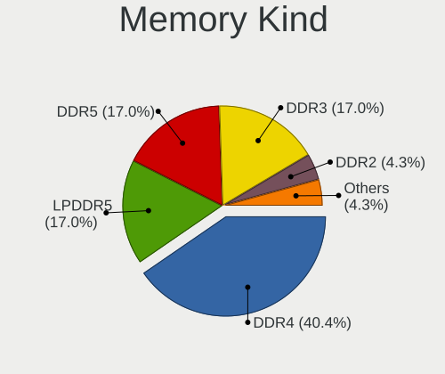

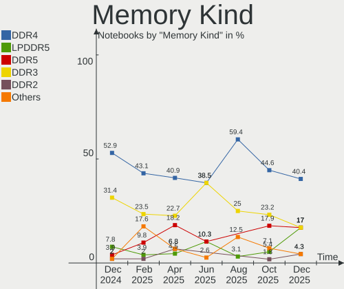

| Kind   | Notebooks | Percent |
|--------|-----------|---------|
| DDR4   | 19        | 40.43%  |
| LPDDR5 | 8         | 17.02%  |
| DDR5   | 8         | 17.02%  |
| DDR3   | 8         | 17.02%  |
| DDR2   | 2         | 4.26%   |
| LPDDR4 | 1         | 2.13%   |
| LPDDR3 | 1         | 2.13%   |

Memory Form Factor
------------------

Physical design of the memory module

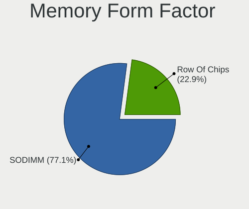

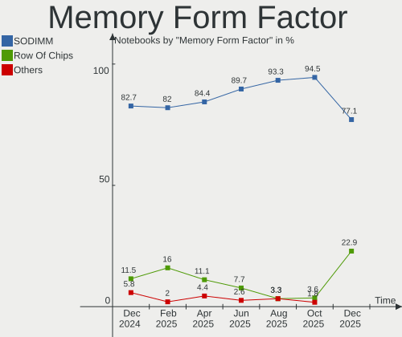

| Name         | Notebooks | Percent |
|--------------|-----------|---------|
| SODIMM       | 37        | 77.08%  |
| Row Of Chips | 11        | 22.92%  |

Memory Size
-----------

Memory module size

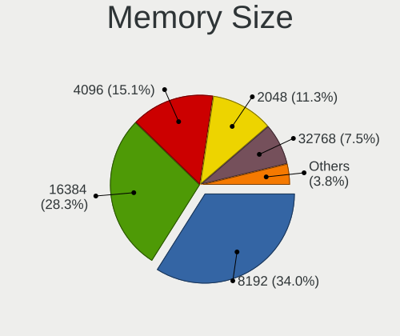

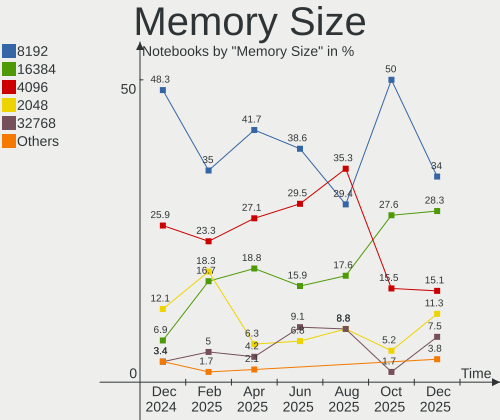

| Size  | Notebooks | Percent |
|-------|-----------|---------|
| 8192  | 18        | 33.96%  |
| 16384 | 15        | 28.3%   |
| 4096  | 8         | 15.09%  |
| 2048  | 6         | 11.32%  |
| 32768 | 4         | 7.55%   |
| 3072  | 1         | 1.89%   |
| 512   | 1         | 1.89%   |

Memory Speed
------------

Memory module speed

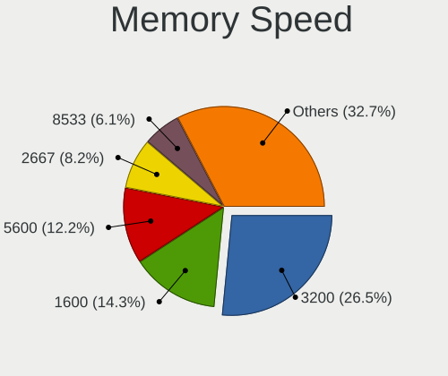

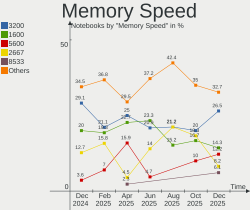

| Speed   | Notebooks | Percent |
|---------|-----------|---------|
| 3200    | 13        | 26.53%  |
| 1600    | 7         | 14.29%  |
| 5600    | 6         | 12.24%  |
| 2667    | 4         | 8.16%   |
| 8533    | 3         | 6.12%   |
| 6400    | 3         | 6.12%   |
| 7500    | 2         | 4.08%   |
| 2133    | 2         | 4.08%   |
| 8400    | 1         | 2.04%   |
| 6000    | 1         | 2.04%   |
| 4267    | 1         | 2.04%   |
| 4266    | 1         | 2.04%   |
| 2400    | 1         | 2.04%   |
| 1334    | 1         | 2.04%   |
| 1333    | 1         | 2.04%   |
| 667     | 1         | 2.04%   |
| Unknown | 1         | 2.04%   |

Printers & scanners
-------------------

Printer Vendor
--------------

Printer device vendors

Zero info for selected period =(

Printer Model
-------------

Printer device models

Zero info for selected period =(

Scanner Vendor
--------------

Scanner device vendors

Zero info for selected period =(

Scanner Model
-------------

Scanner device models

Zero info for selected period =(

Camera
------

Camera Vendor
-------------

Camera device vendors

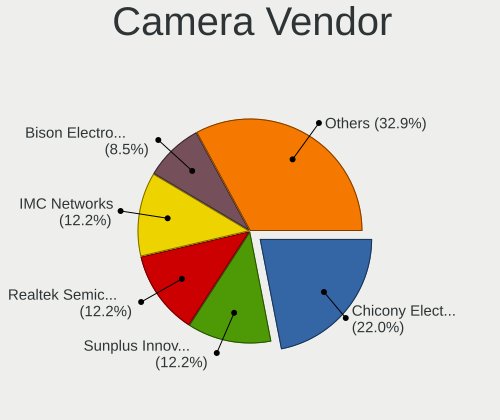

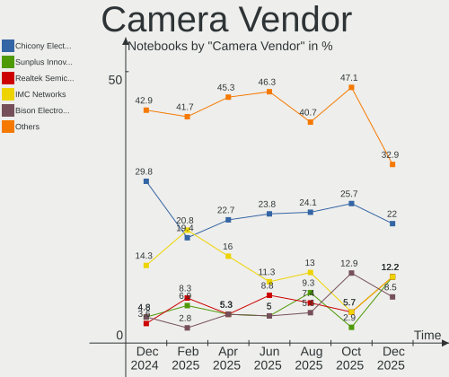

| Vendor                        | Notebooks | Percent |
|-------------------------------|-----------|---------|
| Chicony Electronics           | 18        | 21.95%  |
| Sunplus Innovation Technology | 10        | 12.2%   |
| Realtek Semiconductor         | 10        | 12.2%   |
| IMC Networks                  | 10        | 12.2%   |
| Bison Electronics             | 7         | 8.54%   |
| Luxvisions Innotech Limited   | 6         | 7.32%   |
| Syntek                        | 4         | 4.88%   |
| Quanta                        | 4         | 4.88%   |
| Microdia                      | 3         | 3.66%   |
| Apple                         | 2         | 2.44%   |
| Alcor Micro                   | 2         | 2.44%   |
| Suyin                         | 1         | 1.22%   |
| ShineTech                     | 1         | 1.22%   |
| Samsung Electronics           | 1         | 1.22%   |
| Logitech                      | 1         | 1.22%   |
| Framework                     | 1         | 1.22%   |
| BillionPixels                 | 1         | 1.22%   |

Camera Model
------------

Camera device models

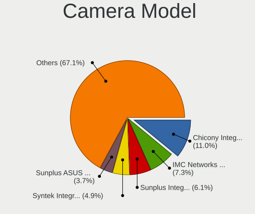

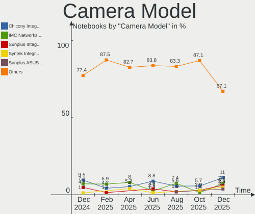

| Model                                                 | Notebooks | Percent |
|-------------------------------------------------------|-----------|---------|
| Chicony Integrated Camera                             | 9         | 10.98%  |
| IMC Networks USB2.0 HD UVC WebCam                     | 6         | 7.32%   |
| Sunplus Integrated_Webcam_HD                          | 5         | 6.1%    |
| Syntek Integrated Camera                              | 4         | 4.88%   |
| Sunplus ASUS Webcam                                   | 3         | 3.66%   |
| Realtek Integrated_Webcam_FHD                         | 3         | 3.66%   |
| Luxvisions Innotech Limited Integrated Camera         | 3         | 3.66%   |
| Realtek USB Camera                                    | 2         | 2.44%   |
| Realtek Integrated_Webcam_HD                          | 2         | 2.44%   |
| Quanta HP HD Camera                                   | 2         | 2.44%   |
| Quanta HD User Facing                                 | 2         | 2.44%   |
| IMC Networks Integrated Camera                        | 2         | 2.44%   |
| Bison SunplusIT Integrated Camera                     | 2         | 2.44%   |
| Bison Integrated Camera                               | 2         | 2.44%   |
| Suyin HP Webcam-101                                   | 1         | 1.22%   |
| Sunplus HD WebCam                                     | 1         | 1.22%   |
| Sunplus Dell Integrated Webcam                        | 1         | 1.22%   |
| ShineTech USB2.0 HD UVC WebCam                        | 1         | 1.22%   |
| Samsung Galaxy series, misc. (MTP mode)               | 1         | 1.22%   |
| Realtek Integrated Camera                             | 1         | 1.22%   |
| Realtek HP Truevision HD                              | 1         | 1.22%   |
| Realtek Bluetooth Radio                               | 1         | 1.22%   |
| Microdia USB 2.0 Camera                               | 1         | 1.22%   |
| Microdia Integrated_Webcam_HD                         | 1         | 1.22%   |
| Microdia Integrated_Webcam_FHD                        | 1         | 1.22%   |
| Luxvisions Innotech Limited LGE Camera                | 1         | 1.22%   |
| Luxvisions Innotech Limited HP TrueVision HD Camera   | 1         | 1.22%   |
| Luxvisions Innotech Limited HP True Vision FHD Camera | 1         | 1.22%   |
| Logitech Webcam C270                                  | 1         | 1.22%   |
| IMC Networks USB2.0 VGA UVC WebCam                    | 1         | 1.22%   |
| IMC Networks USB Camera                               | 1         | 1.22%   |
| Framework Laptop Webcam Module (2nd Gen)              | 1         | 1.22%   |
| Chicony VGA Webcam                                    | 1         | 1.22%   |
| Chicony Lenovo Integrated Camera (0.3MP)              | 1         | 1.22%   |
| Chicony Integrated Camera (1280x720@30)               | 1         | 1.22%   |
| Chicony HP TrueVision HD Camera                       | 1         | 1.22%   |
| Chicony HP Truevision HD                              | 1         | 1.22%   |
| Chicony HP FHD Camera                                 | 1         | 1.22%   |
| Chicony Chicony USB2.0 Camera                         | 1         | 1.22%   |
| Chicony ACER QHD User Facing                          | 1         | 1.22%   |

Security
--------

Fingerprint Vendor
------------------

Fingerprint sensor vendors

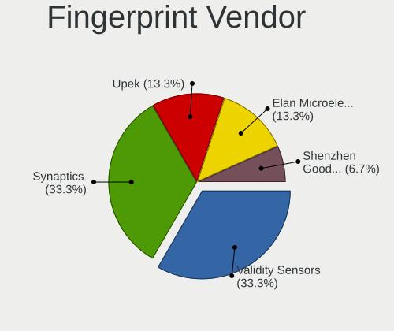

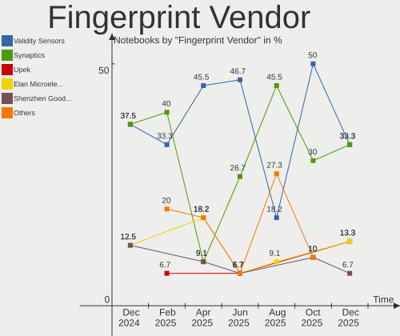

| Vendor                     | Notebooks | Percent |
|----------------------------|-----------|---------|
| Validity Sensors           | 5         | 33.33%  |
| Synaptics                  | 5         | 33.33%  |
| Upek                       | 2         | 13.33%  |
| Elan Microelectronics      | 2         | 13.33%  |
| Shenzhen Goodix Technology | 1         | 6.67%   |

Fingerprint Model
-----------------

Fingerprint sensor models

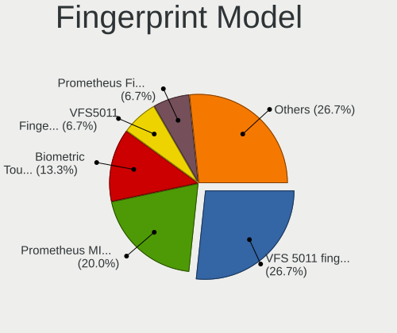

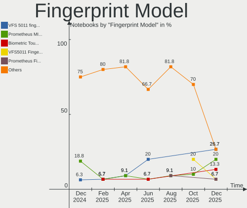

| Model                                                  | Notebooks | Percent |
|--------------------------------------------------------|-----------|---------|
| Validity Sensors VFS 5011 fingerprint sensor           | 4         | 26.67%  |
| Synaptics Prometheus MIS Touch Fingerprint Reader      | 3         | 20%     |
| Upek Biometric Touchchip/Touchstrip Fingerprint Sensor | 2         | 13.33%  |
| Validity Sensors VFS5011 Fingerprint Reader            | 1         | 6.67%   |
| Synaptics Prometheus Fingerprint Reader                | 1         | 6.67%   |
| Synaptics Fingerprint reader [HP G6]                   | 1         | 6.67%   |
| Shenzhen Goodix  FingerPrint Device                    | 1         | 6.67%   |
| Elan ELAN:Fingerprint                                  | 1         | 6.67%   |
| Elan ELAN:ARM-M4                                       | 1         | 6.67%   |

Chipcard Vendor
---------------

Chipcard module vendors

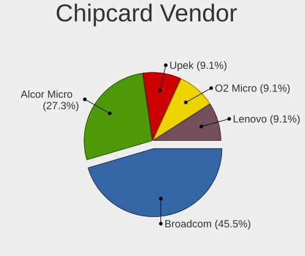

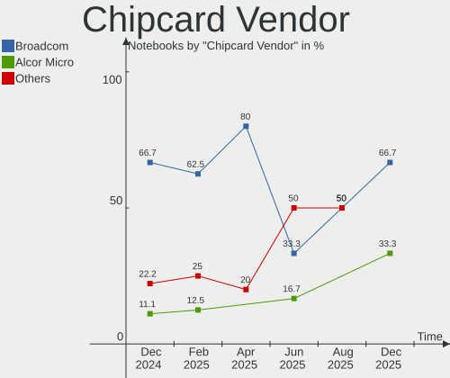

| Vendor      | Notebooks | Percent |
|-------------|-----------|---------|
| Broadcom    | 2         | 66.67%  |
| Alcor Micro | 1         | 33.33%  |

Chipcard Model
--------------

Chipcard module models

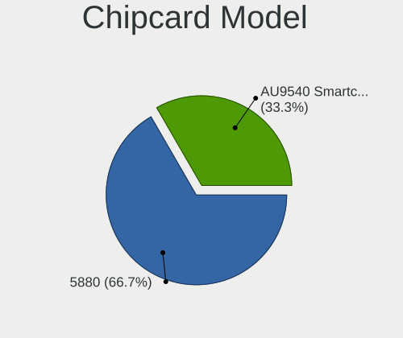

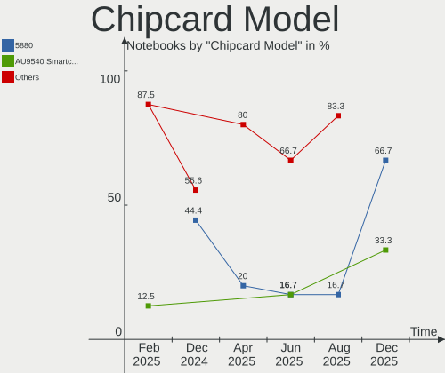

| Model                               | Notebooks | Percent |
|-------------------------------------|-----------|---------|
| Broadcom 5880                       | 2         | 66.67%  |
| Alcor Micro AU9540 Smartcard Reader | 1         | 33.33%  |

Unsupported
-----------

Unsupported Devices
-------------------

Total unsupported devices on board

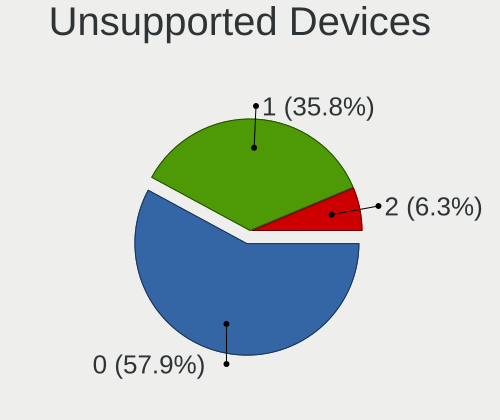

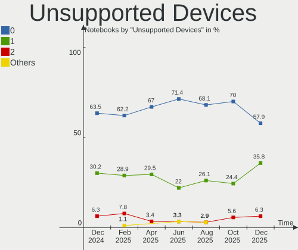

| Total | Notebooks | Percent |
|-------|-----------|---------|
| 0     | 55        | 57.89%  |
| 1     | 34        | 35.79%  |
| 2     | 6         | 6.32%   |

Unsupported Device Types
------------------------

Types of unsupported devices

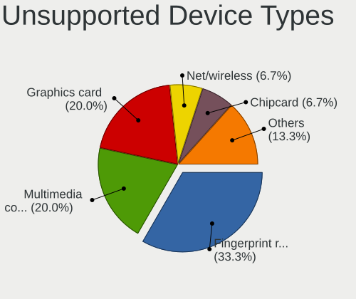

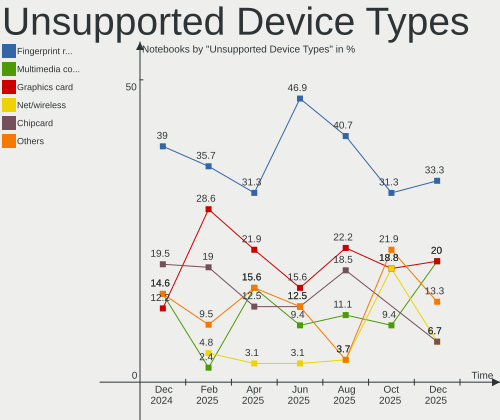

| Type                     | Notebooks | Percent |
|--------------------------|-----------|---------|
| Fingerprint reader       | 15        | 33.33%  |
| Multimedia controller    | 9         | 20%     |
| Graphics card            | 9         | 20%     |
| Net/wireless             | 3         | 6.67%   |
| Chipcard                 | 3         | 6.67%   |
| Network                  | 2         | 4.44%   |
| Communication controller | 2         | 4.44%   |
| Storage                  | 1         | 2.22%   |
| Flash memory             | 1         | 2.22%   |

