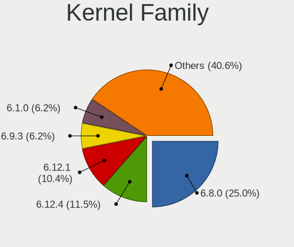
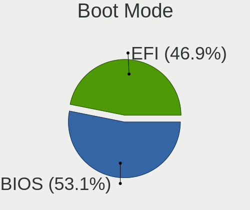
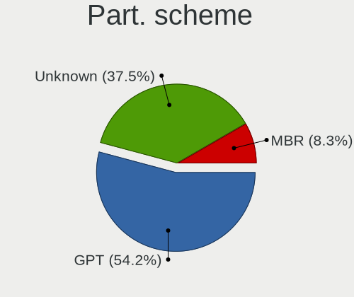
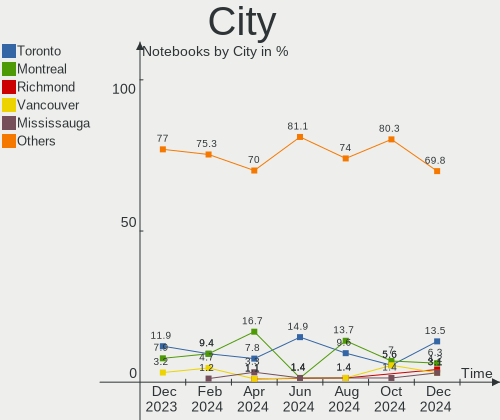
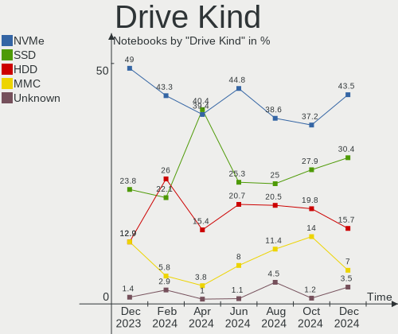
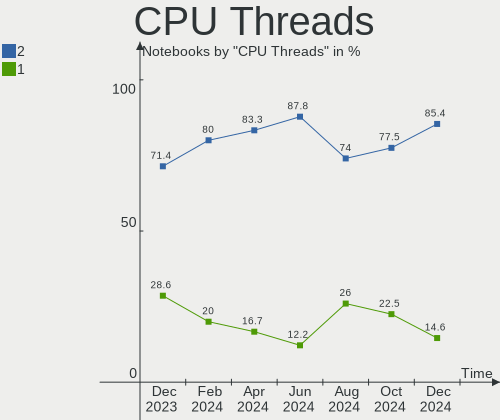
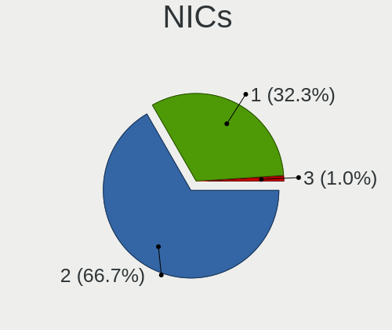
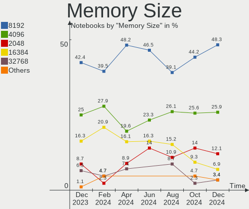
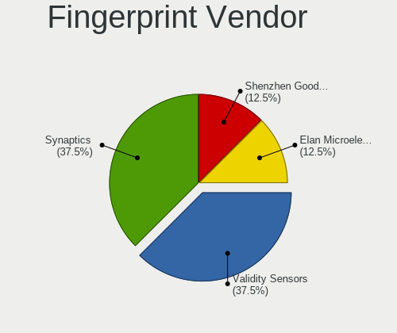
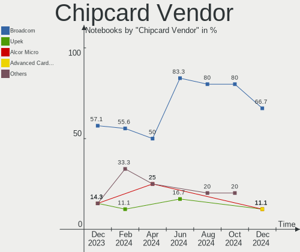

Linux in Canada - Hardware Trends (Notebooks)
---------------------------------------------

A project to identify most popular hardware characteristics and track their change
over time based on data collected by Linux users at https://Linux-Hardware.org.

Anyone can contribute to this report by the [hw-probe](https://github.com/linuxhw/hw-probe) tool:

    sudo -E hw-probe -all -upload

Period: Jun, 2023.

Contents
--------

* [ System ](#system)
  - [ OS                       ](#os)
  - [ OS Family                ](#os-family)
  - [ Kernel                   ](#kernel)
  - [ Kernel Family            ](#kernel-family)
  - [ Kernel Major Ver.        ](#kernel-major-ver)
  - [ Arch                     ](#arch)
  - [ DE                       ](#de)
  - [ Display Server           ](#display-server)
  - [ Display Manager          ](#display-manager)
  - [ OS Lang                  ](#os-lang)
  - [ Boot Mode                ](#boot-mode)
  - [ Filesystem               ](#filesystem)
  - [ Part. scheme             ](#part-scheme)
  - [ Dual Boot with Linux/BSD ](#dual-boot-with-linuxbsd)
  - [ Dual Boot (Win)          ](#dual-boot-win)

* [ Board ](#board)
  - [ Vendor                   ](#vendor)
  - [ Model                    ](#model)
  - [ Model Family             ](#model-family)
  - [ MFG Year                 ](#mfg-year)
  - [ Form Factor              ](#form-factor)
  - [ Secure Boot              ](#secure-boot)
  - [ Coreboot                 ](#coreboot)
  - [ RAM Size                 ](#ram-size)
  - [ RAM Used                 ](#ram-used)
  - [ Total Drives             ](#total-drives)
  - [ Has CD-ROM               ](#has-cd-rom)
  - [ Has Ethernet             ](#has-ethernet)
  - [ Has WiFi                 ](#has-wifi)
  - [ Has Bluetooth            ](#has-bluetooth)

* [ Location ](#location)
  - [ Country                  ](#country)
  - [ City                     ](#city)

* [ Drives ](#drives)
  - [ Drive Vendor             ](#drive-vendor)
  - [ Drive Model              ](#drive-model)
  - [ HDD Vendor               ](#hdd-vendor)
  - [ SSD Vendor               ](#ssd-vendor)
  - [ Drive Kind               ](#drive-kind)
  - [ Drive Connector          ](#drive-connector)
  - [ Drive Size               ](#drive-size)
  - [ Space Total              ](#space-total)
  - [ Space Used               ](#space-used)
  - [ Malfunc. Drives          ](#malfunc-drives)
  - [ Malfunc. Drive Vendor    ](#malfunc-drive-vendor)
  - [ Malfunc. HDD Vendor      ](#malfunc-hdd-vendor)
  - [ Malfunc. Drive Kind      ](#malfunc-drive-kind)
  - [ Failed Drives            ](#failed-drives)
  - [ Failed Drive Vendor      ](#failed-drive-vendor)
  - [ Drive Status             ](#drive-status)

* [ Storage controller ](#storage-controller)
  - [ Storage Vendor           ](#storage-vendor)
  - [ Storage Model            ](#storage-model)
  - [ Storage Kind             ](#storage-kind)

* [ Processor ](#processor)
  - [ CPU Vendor               ](#cpu-vendor)
  - [ CPU Model                ](#cpu-model)
  - [ CPU Model Family         ](#cpu-model-family)
  - [ CPU Cores                ](#cpu-cores)
  - [ CPU Sockets              ](#cpu-sockets)
  - [ CPU Threads              ](#cpu-threads)
  - [ CPU Op-Modes             ](#cpu-op-modes)
  - [ CPU Microcode            ](#cpu-microcode)
  - [ CPU Microarch            ](#cpu-microarch)

* [ Graphics ](#graphics)
  - [ GPU Vendor               ](#gpu-vendor)
  - [ GPU Model                ](#gpu-model)
  - [ GPU Combo                ](#gpu-combo)
  - [ GPU Driver               ](#gpu-driver)
  - [ GPU Memory               ](#gpu-memory)

* [ Monitor ](#monitor)
  - [ Monitor Vendor           ](#monitor-vendor)
  - [ Monitor Model            ](#monitor-model)
  - [ Monitor Resolution       ](#monitor-resolution)
  - [ Monitor Diagonal         ](#monitor-diagonal)
  - [ Monitor Width            ](#monitor-width)
  - [ Aspect Ratio             ](#aspect-ratio)
  - [ Monitor Area             ](#monitor-area)
  - [ Pixel Density            ](#pixel-density)
  - [ Multiple Monitors        ](#multiple-monitors)

* [ Network ](#network)
  - [ Net Controller Vendor    ](#net-controller-vendor)
  - [ Net Controller Model     ](#net-controller-model)
  - [ Wireless Vendor          ](#wireless-vendor)
  - [ Wireless Model           ](#wireless-model)
  - [ Ethernet Vendor          ](#ethernet-vendor)
  - [ Ethernet Model           ](#ethernet-model)
  - [ Net Controller Kind      ](#net-controller-kind)
  - [ Used Controller          ](#used-controller)
  - [ NICs                     ](#nics)
  - [ IPv6                     ](#ipv6)

* [ Bluetooth ](#bluetooth)
  - [ Bluetooth Vendor         ](#bluetooth-vendor)
  - [ Bluetooth Model          ](#bluetooth-model)

* [ Sound ](#sound)
  - [ Sound Vendor             ](#sound-vendor)
  - [ Sound Model              ](#sound-model)

* [ Memory ](#memory)
  - [ Memory Vendor            ](#memory-vendor)
  - [ Memory Model             ](#memory-model)
  - [ Memory Kind              ](#memory-kind)
  - [ Memory Form Factor       ](#memory-form-factor)
  - [ Memory Size              ](#memory-size)
  - [ Memory Speed             ](#memory-speed)

* [ Printers & scanners ](#printers--scanners)
  - [ Printer Vendor           ](#printer-vendor)
  - [ Printer Model            ](#printer-model)
  - [ Scanner Vendor           ](#scanner-vendor)
  - [ Scanner Model            ](#scanner-model)

* [ Camera ](#camera)
  - [ Camera Vendor            ](#camera-vendor)
  - [ Camera Model             ](#camera-model)

* [ Security ](#security)
  - [ Fingerprint Vendor       ](#fingerprint-vendor)
  - [ Fingerprint Model        ](#fingerprint-model)
  - [ Chipcard Vendor          ](#chipcard-vendor)
  - [ Chipcard Model           ](#chipcard-model)

* [ Unsupported ](#unsupported)
  - [ Unsupported Devices      ](#unsupported-devices)
  - [ Unsupported Device Types ](#unsupported-device-types)

System
------

OS
--

Installed operating systems

| Name                         | Notebooks | Percent |
|------------------------------|-----------|---------|
| Fedora 38                    | 13        | 19.12%  |
| Ubuntu 22.04                 | 9         | 13.24%  |
| Debian 12                    | 5         | 7.35%   |
| Linux Mint 21.1              | 4         | 5.88%   |
| Ubuntu 23.04                 | 3         | 4.41%   |
| OpenMandriva 23.03           | 3         | 4.41%   |
| Manjaro 23.0.0               | 3         | 4.41%   |
| Arch Rolling                 | 3         | 4.41%   |
| Zorin 16                     | 2         | 2.94%   |
| SteamOS 3.4.8                | 2         | 2.94%   |
| Linux Mint 20.3              | 2         | 2.94%   |
| Linux Mint 20.2              | 2         | 2.94%   |
| KDE neon 22.04               | 2         | 2.94%   |
| Elementary 5.1.7             | 2         | 2.94%   |
| Ubuntu MATE 22.04            | 1         | 1.47%   |
| Ubuntu 22.10                 | 1         | 1.47%   |
| Ubuntu 20.10                 | 1         | 1.47%   |
| Ubuntu 20.04                 | 1         | 1.47%   |
| openSUSE Tumbleweed-XXXXXXXX | 1         | 1.47%   |
| Nobara 37                    | 1         | 1.47%   |
| Manjaro                      | 1         | 1.47%   |
| Lubuntu 22.10                | 1         | 1.47%   |
| Kubuntu 23.04                | 1         | 1.47%   |
| Endless 4.0.13               | 1         | 1.47%   |
| EndeavourOS Rolling          | 1         | 1.47%   |
| Debian 11                    | 1         | 1.47%   |
| BlackPanther 18.1            | 1         | 1.47%   |

OS Family
---------

OS without a version

| Name         | Notebooks | Percent |
|--------------|-----------|---------|
| Ubuntu       | 15        | 22.06%  |
| Fedora       | 13        | 19.12%  |
| Linux Mint   | 8         | 11.76%  |
| Debian       | 6         | 8.82%   |
| Manjaro      | 4         | 5.88%   |
| OpenMandriva | 3         | 4.41%   |
| Arch         | 3         | 4.41%   |
| Zorin        | 2         | 2.94%   |
| SteamOS      | 2         | 2.94%   |
| KDE neon     | 2         | 2.94%   |
| Elementary   | 2         | 2.94%   |
| Ubuntu MATE  | 1         | 1.47%   |
| openSUSE     | 1         | 1.47%   |
| Nobara       | 1         | 1.47%   |
| Lubuntu      | 1         | 1.47%   |
| Kubuntu      | 1         | 1.47%   |
| Endless      | 1         | 1.47%   |
| EndeavourOS  | 1         | 1.47%   |
| BlackPanther | 1         | 1.47%   |

Kernel
------

Version of the Linux kernel

| Version                     | Notebooks | Percent |
|-----------------------------|-----------|---------|
| 5.19.0-43-generic           | 9         | 13.24%  |
| 6.1.0-9-amd64               | 4         | 5.88%   |
| 5.15.0-73-generic           | 4         | 5.88%   |
| 6.3.8-200.fc38.x86_64       | 3         | 4.41%   |
| 6.2.9-300.fc38.x86_64       | 3         | 4.41%   |
| 6.2.6-desktop-1omv2390      | 3         | 4.41%   |
| 5.15.0-75-generic           | 3         | 4.41%   |
| 6.3.7-060307-generic        | 2         | 2.94%   |
| 6.3.6-200.fc38.x86_64       | 2         | 2.94%   |
| 6.3.5-arch1-1               | 2         | 2.94%   |
| 6.3.5-200.fc38.x86_64       | 2         | 2.94%   |
| 6.2.0-23-generic            | 2         | 2.94%   |
| 6.1.31-2-MANJARO            | 2         | 2.94%   |
| 5.4.0-150-generic           | 2         | 2.94%   |
| 5.19.0-46-generic           | 2         | 2.94%   |
| 5.19.0-45-generic           | 2         | 2.94%   |
| 5.13.0-valve36-1-neptune    | 2         | 2.94%   |
| 6.4.0-1-MANJARO             | 1         | 1.47%   |
| 6.3.9-arch1-1               | 1         | 1.47%   |
| 6.3.7-zen1-1-zen            | 1         | 1.47%   |
| 6.3.7-200.fc38.x86_64       | 1         | 1.47%   |
| 6.3.7-1-default             | 1         | 1.47%   |
| 6.3.5-201.fsync.fc37.x86_64 | 1         | 1.47%   |
| 6.3.5-2-MANJARO             | 1         | 1.47%   |
| 6.2.16-060216-generic       | 1         | 1.47%   |
| 6.2.15-300.fc38.x86_64      | 1         | 1.47%   |
| 6.2.12-300.fc38.x86_64      | 1         | 1.47%   |
| 6.2.0-20-generic            | 1         | 1.47%   |
| 6.1.0-3-amd64               | 1         | 1.47%   |
| 6.0.0-6mx-amd64             | 1         | 1.47%   |
| 5.8.0-25-generic            | 1         | 1.47%   |
| 5.6.14-desktop-2bP          | 1         | 1.47%   |
| 5.4.0-92-generic            | 1         | 1.47%   |
| 5.4.0-152-generic           | 1         | 1.47%   |
| 5.4.0-148-generic           | 1         | 1.47%   |
| 5.11.0-35-generic           | 1         | 1.47%   |

Kernel Family
-------------

Linux kernel without a distro release

| Version | Notebooks | Percent |
|---------|-----------|---------|
| 5.19.0  | 13        | 19.12%  |
| 5.15.0  | 7         | 10.29%  |
| 6.3.5   | 6         | 8.82%   |
| 6.3.7   | 5         | 7.35%   |
| 6.1.0   | 5         | 7.35%   |
| 5.4.0   | 5         | 7.35%   |
| 6.3.8   | 3         | 4.41%   |
| 6.2.9   | 3         | 4.41%   |
| 6.2.6   | 3         | 4.41%   |
| 6.2.0   | 3         | 4.41%   |
| 6.3.6   | 2         | 2.94%   |
| 6.1.31  | 2         | 2.94%   |
| 5.13.0  | 2         | 2.94%   |
| 6.4.0   | 1         | 1.47%   |
| 6.3.9   | 1         | 1.47%   |
| 6.2.16  | 1         | 1.47%   |
| 6.2.15  | 1         | 1.47%   |
| 6.2.12  | 1         | 1.47%   |
| 6.0.0   | 1         | 1.47%   |
| 5.8.0   | 1         | 1.47%   |
| 5.6.14  | 1         | 1.47%   |
| 5.11.0  | 1         | 1.47%   |

Kernel Major Ver.
-----------------

Linux kernel major version

| Version | Notebooks | Percent |
|---------|-----------|---------|
| 6.3     | 17        | 25%     |
| 5.19    | 13        | 19.12%  |
| 6.2     | 12        | 17.65%  |
| 6.1     | 7         | 10.29%  |
| 5.15    | 7         | 10.29%  |
| 5.4     | 5         | 7.35%   |
| 5.13    | 2         | 2.94%   |
| 6.4     | 1         | 1.47%   |
| 6.0     | 1         | 1.47%   |
| 5.8     | 1         | 1.47%   |
| 5.6     | 1         | 1.47%   |
| 5.11    | 1         | 1.47%   |

Arch
----

OS architecture (x86_64, i586, etc.)

| Name   | Notebooks | Percent |
|--------|-----------|---------|
| x86_64 | 68        | 100%    |

DE
--

Desktop Environment

| Name       | Notebooks | Percent |
|------------|-----------|---------|
| GNOME      | 33        | 48.53%  |
| KDE5       | 18        | 26.47%  |
| XFCE       | 4         | 5.88%   |
| X-Cinnamon | 4         | 5.88%   |
| Unknown    | 3         | 4.41%   |
| MATE       | 2         | 2.94%   |
| i3         | 2         | 2.94%   |
| Pantheon   | 1         | 1.47%   |
| LXQt       | 1         | 1.47%   |

Display Server
--------------

X11 or Wayland

| Name    | Notebooks | Percent |
|---------|-----------|---------|
| X11     | 36        | 52.94%  |
| Wayland | 30        | 44.12%  |
| Unknown | 2         | 2.94%   |

Display Manager
---------------

SDDM, LightDM, etc.

| Name    | Notebooks | Percent |
|---------|-----------|---------|
| Unknown | 28        | 41.18%  |
| GDM3    | 16        | 23.53%  |
| SDDM    | 10        | 14.71%  |
| LightDM | 9         | 13.24%  |
| GDM     | 4         | 5.88%   |
| Ly      | 1         | 1.47%   |

OS Lang
-------

Language

| Lang    | Notebooks | Percent |
|---------|-----------|---------|
| en_CA   | 36        | 52.94%  |
| en_US   | 24        | 35.29%  |
| fr_CA   | 3         | 4.41%   |
| fr_FR   | 2         | 2.94%   |
| Unknown | 2         | 2.94%   |
| hu_HU   | 1         | 1.47%   |

Boot Mode
---------

EFI or BIOS

| Mode | Notebooks | Percent |
|------|-----------|---------|
| EFI  | 40        | 58.82%  |
| BIOS | 28        | 41.18%  |

Filesystem
----------

Type of filesystem

| Type    | Notebooks | Percent |
|---------|-----------|---------|
| Ext4    | 34        | 50%     |
| Btrfs   | 19        | 27.94%  |
| Tmpfs   | 12        | 17.65%  |
| Overlay | 3         | 4.41%   |

Part. scheme
------------

Scheme of partitioning

| Type    | Notebooks | Percent |
|---------|-----------|---------|
| GPT     | 37        | 54.41%  |
| Unknown | 25        | 36.76%  |
| MBR     | 6         | 8.82%   |

Dual Boot with Linux/BSD
------------------------

Hosting more than one Linux/BSD

| Dual boot | Notebooks | Percent |
|-----------|-----------|---------|
| No        | 61        | 89.71%  |
| Yes       | 7         | 10.29%  |

Dual Boot (Win)
---------------

Hosting Linux and Windows

| Dual boot | Notebooks | Percent |
|-----------|-----------|---------|
| No        | 52        | 76.47%  |
| Yes       | 16        | 23.53%  |

Board
-----

Vendor
------

Motherboard manufacturer

| Name                | Notebooks | Percent |
|---------------------|-----------|---------|
| Dell                | 14        | 20.59%  |
| Lenovo              | 13        | 19.12%  |
| ASUSTek Computer    | 11        | 16.18%  |
| Hewlett-Packard     | 8         | 11.76%  |
| Apple               | 6         | 8.82%   |
| Sony                | 3         | 4.41%   |
| Acer                | 3         | 4.41%   |
| Valve               | 2         | 2.94%   |
| MSI                 | 2         | 2.94%   |
| Xplore              | 1         | 1.47%   |
| Samsung Electronics | 1         | 1.47%   |
| Panasonic           | 1         | 1.47%   |
| Google              | 1         | 1.47%   |
| Gateway             | 1         | 1.47%   |
| Fujitsu             | 1         | 1.47%   |

Model
-----

Motherboard model

| Name                                 | Notebooks | Percent |
|--------------------------------------|-----------|---------|
| Apple MacBookPro5,5                  | 3         | 4.41%   |
| Valve Jupiter                        | 2         | 2.94%   |
| Dell XPS 13 9310                     | 2         | 2.94%   |
| Xplore iX104C6                       | 1         | 1.47%   |
| Sony VPCF120FD                       | 1         | 1.47%   |
| Sony VPCEB37FD                       | 1         | 1.47%   |
| Sony VPCEB2AFD                       | 1         | 1.47%   |
| Samsung R430/R480                    | 1         | 1.47%   |
| Panasonic CF-S10CDHEDM               | 1         | 1.47%   |
| MSI GP72 7RDX                        | 1         | 1.47%   |
| MSI GE62 2QF                         | 1         | 1.47%   |
| Lenovo Yoga 3 Pro-1370 80HE          | 1         | 1.47%   |
| Lenovo ThinkPad W520 4282AB9         | 1         | 1.47%   |
| Lenovo ThinkPad W510 4391B49         | 1         | 1.47%   |
| Lenovo ThinkPad T580 20LAS0DL00      | 1         | 1.47%   |
| Lenovo ThinkPad T460p 20FXS0DR01     | 1         | 1.47%   |
| Lenovo ThinkPad T430 2349UA9         | 1         | 1.47%   |
| Lenovo ThinkPad Edge E545 20B2S00F00 | 1         | 1.47%   |
| Lenovo ThinkPad E590 20NB001JUS      | 1         | 1.47%   |
| Lenovo ThinkPad E580 20KSCTO1WW      | 1         | 1.47%   |
| Lenovo ThinkBook 15 G4 IAP 21DJ      | 1         | 1.47%   |
| Lenovo Legion 5 15ACH6A 82NW         | 1         | 1.47%   |
| Lenovo IdeaPad Y700-15ISK 80NV       | 1         | 1.47%   |
| Lenovo IdeaPad 3 15ITL6 82H8         | 1         | 1.47%   |
| HP ZBook 15 G3                       | 1         | 1.47%   |
| HP ProBook 650 G2                    | 1         | 1.47%   |
| HP ProBook 450 G2                    | 1         | 1.47%   |
| HP ProBook 445 G7                    | 1         | 1.47%   |
| HP Pavilion dv7                      | 1         | 1.47%   |
| HP Laptop 15-ef1xxx                  | 1         | 1.47%   |
| HP ENVY m6                           | 1         | 1.47%   |
| HP EliteBook 840 G3                  | 1         | 1.47%   |
| Google Kefka                         | 1         | 1.47%   |
| Gateway NV57H                        | 1         | 1.47%   |
| Fujitsu T900                         | 1         | 1.47%   |
| Dell XPS 15 9560                     | 1         | 1.47%   |
| Dell XPS 15 7590                     | 1         | 1.47%   |
| Dell XPS 13 9370                     | 1         | 1.47%   |
| Dell System XPS L502X                | 1         | 1.47%   |
| Dell Precision 5540                  | 1         | 1.47%   |

Model Family
------------

Motherboard model prefix

| Name                   | Notebooks | Percent |
|------------------------|-----------|---------|
| Lenovo ThinkPad        | 8         | 11.76%  |
| Dell XPS               | 5         | 7.35%   |
| ASUS VivoBook          | 5         | 7.35%   |
| Dell Latitude          | 4         | 5.88%   |
| HP ProBook             | 3         | 4.41%   |
| Dell Inspiron          | 3         | 4.41%   |
| Apple MacBookPro5      | 3         | 4.41%   |
| Acer Aspire            | 3         | 4.41%   |
| Valve Jupiter          | 2         | 2.94%   |
| Lenovo IdeaPad         | 2         | 2.94%   |
| ASUS Zenbook           | 2         | 2.94%   |
| ASUS ROG               | 2         | 2.94%   |
| Xplore iX104C6         | 1         | 1.47%   |
| Sony VPCF120FD         | 1         | 1.47%   |
| Sony VPCEB37FD         | 1         | 1.47%   |
| Sony VPCEB2AFD         | 1         | 1.47%   |
| Samsung R430           | 1         | 1.47%   |
| Panasonic CF-S10CDHEDM | 1         | 1.47%   |
| MSI GP72               | 1         | 1.47%   |
| MSI GE62               | 1         | 1.47%   |
| Lenovo Yoga            | 1         | 1.47%   |
| Lenovo ThinkBook       | 1         | 1.47%   |
| Lenovo Legion          | 1         | 1.47%   |
| HP ZBook               | 1         | 1.47%   |
| HP Pavilion            | 1         | 1.47%   |
| HP Laptop              | 1         | 1.47%   |
| HP ENVY                | 1         | 1.47%   |
| HP EliteBook           | 1         | 1.47%   |
| Google Kefka           | 1         | 1.47%   |
| Gateway NV57H          | 1         | 1.47%   |
| Fujitsu T900           | 1         | 1.47%   |
| Dell System            | 1         | 1.47%   |
| Dell Precision         | 1         | 1.47%   |
| ASUS X553MA            | 1         | 1.47%   |
| ASUS E403SA            | 1         | 1.47%   |
| Apple MacBookPro8      | 1         | 1.47%   |
| Apple MacBookPro7      | 1         | 1.47%   |
| Apple MacBookAir7      | 1         | 1.47%   |

MFG Year
--------

Motherboard manufacture year

| Year | Notebooks | Percent |
|------|-----------|---------|
| 2020 | 10        | 14.71%  |
| 2010 | 7         | 10.29%  |
| 2019 | 6         | 8.82%   |
| 2014 | 6         | 8.82%   |
| 2011 | 6         | 8.82%   |
| 2016 | 5         | 7.35%   |
| 2022 | 4         | 5.88%   |
| 2015 | 4         | 5.88%   |
| 2021 | 3         | 4.41%   |
| 2018 | 3         | 4.41%   |
| 2017 | 3         | 4.41%   |
| 2009 | 3         | 4.41%   |
| 2023 | 2         | 2.94%   |
| 2013 | 2         | 2.94%   |
| 2012 | 2         | 2.94%   |
| 2008 | 2         | 2.94%   |

Form Factor
-----------

Physical design of the computer

| Name     | Notebooks | Percent |
|----------|-----------|---------|
| Notebook | 68        | 100%    |

Secure Boot
-----------

Enabled or disabled

| State    | Notebooks | Percent |
|----------|-----------|---------|
| Disabled | 62        | 91.18%  |
| Enabled  | 6         | 8.82%   |

Coreboot
--------

Have coreboot on board

| Used | Notebooks | Percent |
|------|-----------|---------|
| No   | 67        | 98.53%  |
| Yes  | 1         | 1.47%   |

RAM Size
--------

Total RAM memory

| Size in GB | Notebooks | Percent |
|------------|-----------|---------|
| 4.01-8.0   | 19        | 27.94%  |
| 8.01-16.0  | 14        | 20.59%  |
| 3.01-4.0   | 13        | 19.12%  |
| 16.01-24.0 | 13        | 19.12%  |
| 32.01-64.0 | 7         | 10.29%  |
| 24.01-32.0 | 1         | 1.47%   |
| 1.01-2.0   | 1         | 1.47%   |

RAM Used
--------

Used RAM memory

| Used GB    | Notebooks | Percent |
|------------|-----------|---------|
| 1.01-2.0   | 23        | 33.82%  |
| 2.01-3.0   | 17        | 25%     |
| 4.01-8.0   | 14        | 20.59%  |
| 3.01-4.0   | 10        | 14.71%  |
| 8.01-16.0  | 2         | 2.94%   |
| 24.01-32.0 | 1         | 1.47%   |
| 0.51-1.0   | 1         | 1.47%   |

Total Drives
------------

Number of drives on board

| Drives | Notebooks | Percent |
|--------|-----------|---------|
| 1      | 51        | 75%     |
| 2      | 13        | 19.12%  |
| 3      | 3         | 4.41%   |
| 4      | 1         | 1.47%   |

Has CD-ROM
----------

Has CD-ROM on board

| Presented | Notebooks | Percent |
|-----------|-----------|---------|
| No        | 44        | 64.71%  |
| Yes       | 24        | 35.29%  |

Has Ethernet
------------

Has Ethernet on board

| Presented | Notebooks | Percent |
|-----------|-----------|---------|
| Yes       | 49        | 72.06%  |
| No        | 19        | 27.94%  |

Has WiFi
--------

Has WiFi module

| Presented | Notebooks | Percent |
|-----------|-----------|---------|
| Yes       | 68        | 100%    |

Has Bluetooth
-------------

Has Bluetooth module

| Presented | Notebooks | Percent |
|-----------|-----------|---------|
| Yes       | 58        | 85.29%  |
| No        | 10        | 14.71%  |

Location
--------

Country
-------

Geographic location (country)

| Country | Notebooks | Percent |
|---------|-----------|---------|
| Canada  | 68        | 100%    |

City
----

Geographic location (city)

| City                 | Notebooks | Percent |
|----------------------|-----------|---------|
| Montreal             | 11        | 16.18%  |
| Toronto              | 10        | 14.71%  |
| Ottawa               | 3         | 4.41%   |
| Vancouver            | 2         | 2.94%   |
| Thunder Bay          | 2         | 2.94%   |
| Surrey               | 2         | 2.94%   |
| Mississauga          | 2         | 2.94%   |
| London               | 2         | 2.94%   |
| Kingston             | 2         | 2.94%   |
| Whitby               | 1         | 1.47%   |
| Waterloo             | 1         | 1.47%   |
| Wakefield            | 1         | 1.47%   |
| Victoria             | 1         | 1.47%   |
| Vernon               | 1         | 1.47%   |
| Verdun               | 1         | 1.47%   |
| Vegreville           | 1         | 1.47%   |
| St. Catharines       | 1         | 1.47%   |
| Saskatoon            | 1         | 1.47%   |
| Salmon Arm           | 1         | 1.47%   |
| Saint-Jerome         | 1         | 1.47%   |
| Saint-Calixte        | 1         | 1.47%   |
| Prince Albert        | 1         | 1.47%   |
| Port Coquitlam       | 1         | 1.47%   |
| Pointe-a-la-Croix    | 1         | 1.47%   |
| Newmarket            | 1         | 1.47%   |
| Nanaimo              | 1         | 1.47%   |
| Musquodoboit Harbour | 1         | 1.47%   |
| Mont-Laurier         | 1         | 1.47%   |
| Maple Ridge          | 1         | 1.47%   |
| Lindsay              | 1         | 1.47%   |
| Kelowna              | 1         | 1.47%   |
| Halifax              | 1         | 1.47%   |
| Greater Sudbury      | 1         | 1.47%   |
| Grande Cache         | 1         | 1.47%   |
| Edmonton             | 1         | 1.47%   |
| Coteau-du-Lac        | 1         | 1.47%   |
| Coquitlam            | 1         | 1.47%   |
| Burnaby              | 1         | 1.47%   |
| Barrie               | 1         | 1.47%   |
| Ancaster             | 1         | 1.47%   |

Drives
------

Drive Vendor
------------

Hard drive vendors

| Vendor                      | Notebooks | Drives | Percent |
|-----------------------------|-----------|--------|---------|
| Samsung Electronics         | 16        | 16     | 18.82%  |
| Toshiba                     | 9         | 9      | 10.59%  |
| Unknown                     | 8         | 9      | 9.41%   |
| WDC                         | 7         | 7      | 8.24%   |
| Seagate                     | 6         | 8      | 7.06%   |
| Sandisk                     | 6         | 6      | 7.06%   |
| Intel                       | 6         | 6      | 7.06%   |
| Kingston                    | 5         | 5      | 5.88%   |
| SPCC                        | 4         | 4      | 4.71%   |
| HGST                        | 3         | 3      | 3.53%   |
| SK hynix                    | 2         | 2      | 2.35%   |
| Micron Technology           | 2         | 2      | 2.35%   |
| Crucial                     | 2         | 2      | 2.35%   |
| Timetec                     | 1         | 1      | 1.18%   |
| Super Talent                | 1         | 1      | 1.18%   |
| Netac                       | 1         | 1      | 1.18%   |
| Micron/Crucial Technology   | 1         | 1      | 1.18%   |
| Kingston Technology Company | 1         | 1      | 1.18%   |
| Hitachi                     | 1         | 1      | 1.18%   |
| CT2000MX                    | 1         | 2      | 1.18%   |
| Apple                       | 1         | 1      | 1.18%   |
| A-DATA Technology           | 1         | 1      | 1.18%   |

Drive Model
-----------

Hard drive models

| Model                                               | Notebooks | Percent |
|-----------------------------------------------------|-----------|---------|
| Unknown MMC Card  64GB                              | 4         | 4.55%   |
| SPCC Solid State Disk 256GB                         | 3         | 3.41%   |
| WDC WD10JPVX-22JC3T0 1TB                            | 2         | 2.27%   |
| Seagate BUP Portable 4TB                            | 2         | 2.27%   |
| Samsung SSD 870 EVO 1TB                             | 2         | 2.27%   |
| Samsung SSD 860 EVO 500GB                           | 2         | 2.27%   |
| Samsung NVMe SSD Controller SM981/PM981/PM983 250GB | 2         | 2.27%   |
| Intel SSDPEKNU512GZ 512GB                           | 2         | 2.27%   |
| HGST HTS721010A9E630 1TB                            | 2         | 2.27%   |
| WDC WD5000LPCX-60VHAT0 500GB                        | 1         | 1.14%   |
| WDC WD10SPZX-21Z10T0 1TB                            | 1         | 1.14%   |
| WDC WD Blue SA510 M.2 2280 500GB SSD                | 1         | 1.14%   |
| WDC PC SN730 NVMe 1024GB                            | 1         | 1.14%   |
| WDC PC SN530 SDBPNPZ-1T00-1006 1TB                  | 1         | 1.14%   |
| Unknown SN256  256GB                                | 1         | 1.14%   |
| Unknown SD32G  32GB                                 | 1         | 1.14%   |
| Unknown MMC Card  249GB                             | 1         | 1.14%   |
| Unknown MMC Card  1GB                               | 1         | 1.14%   |
| Unknown MMC Card  16GB                              | 1         | 1.14%   |
| Toshiba THNSN51T02DUK NVMe 1024GB                   | 1         | 1.14%   |
| Toshiba NVMe Controller 256GB                       | 1         | 1.14%   |
| Toshiba MQ04ABF100 1TB                              | 1         | 1.14%   |
| Toshiba MQ01ACF050 500GB                            | 1         | 1.14%   |
| Toshiba MK5065GSX 500GB                             | 1         | 1.14%   |
| Toshiba MK3276GSX 320GB                             | 1         | 1.14%   |
| Toshiba MK1059GSMP 1TB                              | 1         | 1.14%   |
| Toshiba KXG60ZNV512G NVMe 512GB                     | 1         | 1.14%   |
| Toshiba BG3 NVMe SSD Controller 512GB               | 1         | 1.14%   |
| Timetec SD08 512GB SSD                              | 1         | 1.14%   |
| Super Talent FTM25N325H 250GB                       | 1         | 1.14%   |
| SPCC Solid State Disk 512GB                         | 1         | 1.14%   |
| SK hynix BC511 256GB                                | 1         | 1.14%   |
| SK hynix BC501 NVMe Solid State Drive 512GB         | 1         | 1.14%   |
| Seagate ST9750420AS 752GB                           | 1         | 1.14%   |
| Seagate ST9500325ASG 500GB                          | 1         | 1.14%   |
| Seagate ST9250414ASG 250GB                          | 1         | 1.14%   |
| Seagate ST9250411AS 250GB                           | 1         | 1.14%   |
| Seagate ST500LM0 21-1KJ152 500GB                    | 1         | 1.14%   |
| Seagate One Touch HDD 2TB                           | 1         | 1.14%   |
| Sandisk WD Blue SN550 NVMe SSD 1TB                  | 1         | 1.14%   |

HDD Vendor
----------

Hard disk drive vendors

| Vendor  | Notebooks | Drives | Percent |
|---------|-----------|--------|---------|
| Seagate | 6         | 8      | 31.58%  |
| Toshiba | 5         | 5      | 26.32%  |
| WDC     | 4         | 4      | 21.05%  |
| HGST    | 3         | 3      | 15.79%  |
| Hitachi | 1         | 1      | 5.26%   |

SSD Vendor
----------

Solid state drive vendors

| Vendor              | Notebooks | Drives | Percent |
|---------------------|-----------|--------|---------|
| Samsung Electronics | 9         | 9      | 30%     |
| SPCC                | 4         | 4      | 13.33%  |
| Kingston            | 4         | 4      | 13.33%  |
| SanDisk             | 2         | 2      | 6.67%   |
| Intel               | 2         | 2      | 6.67%   |
| Crucial             | 2         | 2      | 6.67%   |
| WDC                 | 1         | 1      | 3.33%   |
| Timetec             | 1         | 1      | 3.33%   |
| Super Talent        | 1         | 1      | 3.33%   |
| Netac               | 1         | 1      | 3.33%   |
| CT2000MX            | 1         | 2      | 3.33%   |
| Apple               | 1         | 1      | 3.33%   |
| A-DATA Technology   | 1         | 1      | 3.33%   |

Drive Kind
----------

HDD or SSD

| Kind | Notebooks | Drives | Percent |
|------|-----------|--------|---------|
| SSD  | 29        | 31     | 35.37%  |
| NVMe | 26        | 27     | 31.71%  |
| HDD  | 18        | 21     | 21.95%  |
| MMC  | 9         | 10     | 10.98%  |

Drive Connector
---------------

SATA, SAS, NVMe, etc.

| Type | Notebooks | Drives | Percent |
|------|-----------|--------|---------|
| SATA | 41        | 45     | 51.25%  |
| NVMe | 26        | 27     | 32.5%   |
| MMC  | 9         | 10     | 11.25%  |
| SAS  | 4         | 7      | 5%      |

Drive Size
----------

Size of hard drive

| Size in TB | Notebooks | Drives | Percent |
|------------|-----------|--------|---------|
| 0.01-0.5   | 28        | 30     | 58.33%  |
| 0.51-1.0   | 15        | 16     | 31.25%  |
| 1.01-2.0   | 3         | 4      | 6.25%   |
| 3.01-4.0   | 2         | 2      | 4.17%   |

Space Total
-----------

Amount of disk space available on the file system

| Size in GB     | Notebooks | Percent |
|----------------|-----------|---------|
| 251-500        | 18        | 26.47%  |
| 101-250        | 18        | 26.47%  |
| 501-1000       | 12        | 17.65%  |
| Unknown        | 5         | 7.35%   |
| 1001-2000      | 4         | 5.88%   |
| 1-20           | 4         | 5.88%   |
| More than 3000 | 2         | 2.94%   |
| 2001-3000      | 2         | 2.94%   |
| 51-100         | 2         | 2.94%   |
| 21-50          | 1         | 1.47%   |

Space Used
----------

Amount of used disk space

| Used GB        | Notebooks | Percent |
|----------------|-----------|---------|
| 1-20           | 19        | 27.94%  |
| 21-50          | 13        | 19.12%  |
| 101-250        | 9         | 13.24%  |
| 51-100         | 8         | 11.76%  |
| 251-500        | 7         | 10.29%  |
| 501-1000       | 5         | 7.35%   |
| Unknown        | 5         | 7.35%   |
| More than 3000 | 1         | 1.47%   |
| 1001-2000      | 1         | 1.47%   |

Malfunc. Drives
---------------

Drive models with a malfunction

| Model                                | Notebooks | Drives | Percent |
|--------------------------------------|-----------|--------|---------|
| WDC WD Blue SA510 M.2 2280 500GB SSD | 1         | 1      | 12.5%   |
| Toshiba THNSN51T02DUK NVMe 1024GB    | 1         | 1      | 12.5%   |
| Timetec SD08 512GB SSD               | 1         | 1      | 12.5%   |
| Seagate ST9750420AS 752GB            | 1         | 1      | 12.5%   |
| Seagate ST9250414ASG 250GB           | 1         | 1      | 12.5%   |
| Intel SSDSA2M160G2GC 160GB           | 1         | 1      | 12.5%   |
| HGST HTS721010A9E630 1TB             | 1         | 1      | 12.5%   |
| HGST HTS541010A9E680 1TB             | 1         | 1      | 12.5%   |

Malfunc. Drive Vendor
---------------------

Vendors of faulty drives

| Vendor  | Notebooks | Drives | Percent |
|---------|-----------|--------|---------|
| Seagate | 2         | 2      | 25%     |
| HGST    | 2         | 2      | 25%     |
| WDC     | 1         | 1      | 12.5%   |
| Toshiba | 1         | 1      | 12.5%   |
| Timetec | 1         | 1      | 12.5%   |
| Intel   | 1         | 1      | 12.5%   |

Malfunc. HDD Vendor
-------------------

Vendors of faulty HDD drives

| Vendor  | Notebooks | Drives | Percent |
|---------|-----------|--------|---------|
| Seagate | 2         | 2      | 50%     |
| HGST    | 2         | 2      | 50%     |

Malfunc. Drive Kind
-------------------

Kinds of faulty drives

| Kind | Notebooks | Drives | Percent |
|------|-----------|--------|---------|
| HDD  | 4         | 4      | 50%     |
| SSD  | 3         | 3      | 37.5%   |
| NVMe | 1         | 1      | 12.5%   |

Failed Drives
-------------

Failed drive models

Zero info for selected period =(

Failed Drive Vendor
-------------------

Failed drive vendors

Zero info for selected period =(

Drive Status
------------

Number of failed and malfunc. drives

| Status   | Notebooks | Drives | Percent |
|----------|-----------|--------|---------|
| Detected | 44        | 57     | 58.67%  |
| Works    | 23        | 24     | 30.67%  |
| Malfunc  | 8         | 8      | 10.67%  |

Storage controller
------------------

Storage Vendor
--------------

Storage controller vendors

| Vendor                       | Notebooks | Percent |
|------------------------------|-----------|---------|
| Intel                        | 44        | 55%     |
| Samsung Electronics          | 8         | 10%     |
| AMD                          | 8         | 10%     |
| SanDisk                      | 5         | 6.25%   |
| Toshiba America Info Systems | 4         | 5%      |
| Nvidia                       | 4         | 5%      |
| SK hynix                     | 2         | 2.5%    |
| Micron Technology            | 2         | 2.5%    |
| Kingston Technology Company  | 2         | 2.5%    |
| Micron/Crucial Technology    | 1         | 1.25%   |

Storage Model
-------------

Storage controller models

| Model                                                                          | Notebooks | Percent |
|--------------------------------------------------------------------------------|-----------|---------|
| AMD FCH SATA Controller [AHCI mode]                                            | 8         | 9.3%    |
| Intel HM170/QM170 Chipset SATA Controller [AHCI Mode]                          | 5         | 5.81%   |
| Intel 8 Series SATA Controller 1 [AHCI mode]                                   | 5         | 5.81%   |
| Intel 6 Series/C200 Series Chipset Family 6 port Mobile SATA AHCI Controller   | 5         | 5.81%   |
| Intel 82801 Mobile SATA Controller [RAID mode]                                 | 4         | 4.65%   |
| Intel 5 Series/3400 Series Chipset 4 port SATA AHCI Controller                 | 4         | 4.65%   |
| Samsung NVMe SSD Controller 980                                                | 3         | 3.49%   |
| Nvidia MCP79 AHCI Controller                                                   | 3         | 3.49%   |
| Intel Volume Management Device NVMe RAID Controller                            | 3         | 3.49%   |
| Intel Sunrise Point-LP SATA Controller [AHCI mode]                             | 3         | 3.49%   |
| Intel 5 Series/3400 Series Chipset 6 port SATA AHCI Controller                 | 3         | 3.49%   |
| SanDisk WD Blue SN550 NVMe SSD                                                 | 2         | 2.33%   |
| SanDisk WD Black SN750 / PC SN730 NVMe SSD                                     | 2         | 2.33%   |
| Samsung NVMe SSD Controller SM981/PM981/PM983                                  | 2         | 2.33%   |
| Intel Tiger Lake-LP SATA Controller                                            | 2         | 2.33%   |
| Intel Non-Volatile memory controller                                           | 2         | 2.33%   |
| Intel Celeron/Pentium Silver Processor SATA Controller                         | 2         | 2.33%   |
| Intel Cannon Lake Mobile PCH SATA AHCI Controller                              | 2         | 2.33%   |
| Toshiba America Info Systems XG6 NVMe SSD Controller                           | 1         | 1.16%   |
| Toshiba America Info Systems XG4 NVMe SSD Controller                           | 1         | 1.16%   |
| Toshiba America Info Systems NVMe Controller                                   | 1         | 1.16%   |
| Toshiba America Info Systems BG3 NVMe SSD Controller                           | 1         | 1.16%   |
| SK hynix BC511 NVMe SSD                                                        | 1         | 1.16%   |
| SK hynix BC501 NVMe Solid State Drive                                          | 1         | 1.16%   |
| SanDisk Non-Volatile memory controller                                         | 1         | 1.16%   |
| Samsung NVMe SSD Controller SM951/PM951                                        | 1         | 1.16%   |
| Samsung NVMe SSD Controller PM9A1/PM9A3/980PRO                                 | 1         | 1.16%   |
| Samsung Electronics SATA controller                                            | 1         | 1.16%   |
| Nvidia MCP89 SATA Controller (AHCI mode)                                       | 1         | 1.16%   |
| Micron/Crucial P2 NVMe PCIe SSD                                                | 1         | 1.16%   |
| Micron NVMe Storage Controller                                                 | 1         | 1.16%   |
| Micron 2200S NVMe SSD                                                          | 1         | 1.16%   |
| Kingston Company OM3PDP3 NVMe SSD                                              | 1         | 1.16%   |
| Kingston Company A2000 NVMe SSD                                                | 1         | 1.16%   |
| Intel Wildcat Point-LP SATA Controller [AHCI Mode]                             | 1         | 1.16%   |
| Intel SSD 660P Series                                                          | 1         | 1.16%   |
| Intel SSD 600P Series                                                          | 1         | 1.16%   |
| Intel Q170/Q150/B150/H170/H110/Z170/CM236 Chipset SATA Controller [AHCI Mode]  | 1         | 1.16%   |
| Intel Atom Processor E3800 Series SATA AHCI Controller                         | 1         | 1.16%   |
| Intel 8 Series/C220 Series Chipset Family 6-port SATA Controller 1 [AHCI mode] | 1         | 1.16%   |

Storage Kind
------------

Kind of storage controller (IDE, SATA, NVMe, SAS, ...)

| Kind | Notebooks | Percent |
|------|-----------|---------|
| SATA | 49        | 58.33%  |
| NVMe | 26        | 30.95%  |
| RAID | 7         | 8.33%   |
| IDE  | 2         | 2.38%   |

Processor
---------

CPU Vendor
----------

Processor vendors

| Vendor | Notebooks | Percent |
|--------|-----------|---------|
| Intel  | 55        | 80.88%  |
| AMD    | 13        | 19.12%  |

CPU Model
---------

Processor models

| Model                                   | Notebooks | Percent |
|-----------------------------------------|-----------|---------|
| Intel Core i7-2670QM CPU @ 2.20GHz      | 3         | 4.41%   |
| Intel Core i7-8550U CPU @ 1.80GHz       | 2         | 2.94%   |
| Intel Core i7-7700HQ CPU @ 2.80GHz      | 2         | 2.94%   |
| Intel Core i7-6820HQ CPU @ 2.70GHz      | 2         | 2.94%   |
| Intel Core i7-4510U CPU @ 2.00GHz       | 2         | 2.94%   |
| Intel Core i5-8265U CPU @ 1.60GHz       | 2         | 2.94%   |
| Intel Core i5 CPU M 430 @ 2.27GHz       | 2         | 2.94%   |
| Intel Core 2 Duo CPU P7550 @ 2.26GHz    | 2         | 2.94%   |
| Intel Celeron N4020 CPU @ 1.10GHz       | 2         | 2.94%   |
| Intel 11th Gen Core i7-1165G7 @ 2.80GHz | 2         | 2.94%   |
| AMD Ryzen 7 4700U with Radeon Graphics  | 2         | 2.94%   |
| AMD Custom APU 0405                     | 2         | 2.94%   |
| Intel Pentium CPU N3700 @ 1.60GHz       | 1         | 1.47%   |
| Intel Pentium CPU N3530 @ 2.16GHz       | 1         | 1.47%   |
| Intel Core M-5Y71 CPU @ 1.20GHz         | 1         | 1.47%   |
| Intel Core i7-9850H CPU @ 2.60GHz       | 1         | 1.47%   |
| Intel Core i7-9750H CPU @ 2.60GHz       | 1         | 1.47%   |
| Intel Core i7-6700HQ CPU @ 2.60GHz      | 1         | 1.47%   |
| Intel Core i7-4720HQ CPU @ 2.60GHz      | 1         | 1.47%   |
| Intel Core i7-3632QM CPU @ 2.20GHz      | 1         | 1.47%   |
| Intel Core i7-2720QM CPU @ 2.20GHz      | 1         | 1.47%   |
| Intel Core i7-10750H CPU @ 2.60GHz      | 1         | 1.47%   |
| Intel Core i7 CPU Q 720 @ 1.60GHz       | 1         | 1.47%   |
| Intel Core i7 CPU M 640 @ 2.80GHz       | 1         | 1.47%   |
| Intel Core i5-8350U CPU @ 1.70GHz       | 1         | 1.47%   |
| Intel Core i5-6440HQ CPU @ 2.60GHz      | 1         | 1.47%   |
| Intel Core i5-6300U CPU @ 2.40GHz       | 1         | 1.47%   |
| Intel Core i5-5250U CPU @ 1.60GHz       | 1         | 1.47%   |
| Intel Core i5-4310U CPU @ 2.00GHz       | 1         | 1.47%   |
| Intel Core i5-4300U CPU @ 1.90GHz       | 1         | 1.47%   |
| Intel Core i5-4210U CPU @ 1.70GHz       | 1         | 1.47%   |
| Intel Core i5-3230M CPU @ 2.60GHz       | 1         | 1.47%   |
| Intel Core i5-2520M CPU @ 2.50GHz       | 1         | 1.47%   |
| Intel Core i5-2435M CPU @ 2.40GHz       | 1         | 1.47%   |
| Intel Core i5 CPU M 460 @ 2.53GHz       | 1         | 1.47%   |
| Intel Core i3-7100U CPU @ 2.40GHz       | 1         | 1.47%   |
| Intel Core i3-4010U CPU @ 1.70GHz       | 1         | 1.47%   |
| Intel Core i3 CPU M 380 @ 2.53GHz       | 1         | 1.47%   |
| Intel Core i3 CPU M 330 @ 2.13GHz       | 1         | 1.47%   |
| Intel Core 2 Duo CPU T9550 @ 2.66GHz    | 1         | 1.47%   |

CPU Model Family
----------------

Processor model prefix

| Model            | Notebooks | Percent |
|------------------|-----------|---------|
| Intel Core i7    | 20        | 29.41%  |
| Intel Core i5    | 15        | 22.06%  |
| Other            | 7         | 10.29%  |
| Intel Core 2 Duo | 5         | 7.35%   |
| AMD Ryzen 7      | 5         | 7.35%   |
| Intel Core i3    | 4         | 5.88%   |
| Intel Celeron    | 3         | 4.41%   |
| Intel Pentium    | 2         | 2.94%   |
| AMD A6           | 2         | 2.94%   |
| Intel Core M     | 1         | 1.47%   |
| AMD Ryzen 9      | 1         | 1.47%   |
| AMD Ryzen 5      | 1         | 1.47%   |
| AMD Ryzen 3      | 1         | 1.47%   |
| AMD A12          | 1         | 1.47%   |

CPU Cores
---------

Number of processor cores

| Number | Notebooks | Percent |
|--------|-----------|---------|
| 2      | 29        | 42.65%  |
| 4      | 27        | 39.71%  |
| 8      | 6         | 8.82%   |
| 6      | 4         | 5.88%   |
| 10     | 1         | 1.47%   |
| 1      | 1         | 1.47%   |

CPU Sockets
-----------

Number of sockets

| Number | Notebooks | Percent |
|--------|-----------|---------|
| 1      | 68        | 100%    |

CPU Threads
-----------

Threads per core (Hyper-Threading)

| Number | Notebooks | Percent |
|--------|-----------|---------|
| 2      | 52        | 76.47%  |
| 1      | 16        | 23.53%  |

CPU Op-Modes
------------

CPU Operation Modes (32-bit, 64-bit)

| Op mode        | Notebooks | Percent |
|----------------|-----------|---------|
| 32-bit, 64-bit | 68        | 100%    |

CPU Microcode
-------------

Microcode number

| Number     | Notebooks | Percent |
|------------|-----------|---------|
| Unknown    | 35        | 51.47%  |
| 0x08600106 | 3         | 4.41%   |
| 0x506e3    | 2         | 2.94%   |
| 0x40651    | 2         | 2.94%   |
| 0x206a7    | 2         | 2.94%   |
| 0x20655    | 2         | 2.94%   |
| 0x1067a    | 2         | 2.94%   |
| 0x0a50000c | 2         | 2.94%   |
| 0x08600104 | 2         | 2.94%   |
| 0x906ed    | 1         | 1.47%   |
| 0x906ea    | 1         | 1.47%   |
| 0x906e9    | 1         | 1.47%   |
| 0x806ec    | 1         | 1.47%   |
| 0x806ea    | 1         | 1.47%   |
| 0x806e9    | 1         | 1.47%   |
| 0x806c1    | 1         | 1.47%   |
| 0x706a8    | 1         | 1.47%   |
| 0x406e3    | 1         | 1.47%   |
| 0x406c3    | 1         | 1.47%   |
| 0x306c3    | 1         | 1.47%   |
| 0x20652    | 1         | 1.47%   |
| 0x106e5    | 1         | 1.47%   |
| 0x0a404101 | 1         | 1.47%   |
| 0x06006705 | 1         | 1.47%   |
| 0x0600611a | 1         | 1.47%   |

CPU Microarch
-------------

Microarchitecture

| Name             | Notebooks | Percent |
|------------------|-----------|---------|
| KabyLake         | 10        | 14.71%  |
| Haswell          | 7         | 10.29%  |
| Westmere         | 6         | 8.82%   |
| SandyBridge      | 6         | 8.82%   |
| Zen 2            | 5         | 7.35%   |
| Skylake          | 5         | 7.35%   |
| Penryn           | 5         | 7.35%   |
| TigerLake        | 4         | 5.88%   |
| Silvermont       | 3         | 4.41%   |
| Unknown          | 3         | 4.41%   |
| Zen 3            | 2         | 2.94%   |
| IvyBridge        | 2         | 2.94%   |
| Goldmont plus    | 2         | 2.94%   |
| Excavator        | 2         | 2.94%   |
| Broadwell        | 2         | 2.94%   |
| Piledriver       | 1         | 1.47%   |
| Nehalem          | 1         | 1.47%   |
| CometLake        | 1         | 1.47%   |
| Alderlake Hybrid | 1         | 1.47%   |

Graphics
--------

GPU Vendor
----------

Vendors of graphics cards

| Vendor | Notebooks | Percent |
|--------|-----------|---------|
| Intel  | 48        | 60%     |
| Nvidia | 18        | 22.5%   |
| AMD    | 14        | 17.5%   |

GPU Model
---------

Graphics card models

| Model                                                                                    | Notebooks | Percent |
|------------------------------------------------------------------------------------------|-----------|---------|
| Intel Haswell-ULT Integrated Graphics Controller                                         | 6         | 7.5%    |
| Intel 2nd Generation Core Processor Family Integrated Graphics Controller                | 6         | 7.5%    |
| Intel Core Processor Integrated Graphics Controller                                      | 5         | 6.25%   |
| AMD Renoir                                                                               | 5         | 6.25%   |
| Intel TigerLake-LP GT2 [Iris Xe Graphics]                                                | 4         | 5%      |
| Nvidia C79 [GeForce 9400M]                                                               | 3         | 3.75%   |
| Intel UHD Graphics 620                                                                   | 3         | 3.75%   |
| Intel HD Graphics 530                                                                    | 3         | 3.75%   |
| Nvidia GP107M [GeForce GTX 1050 Mobile]                                                  | 2         | 2.5%    |
| Intel WhiskeyLake-U GT2 [UHD Graphics 620]                                               | 2         | 2.5%    |
| Intel HD Graphics 630                                                                    | 2         | 2.5%    |
| Intel GeminiLake [UHD Graphics 600]                                                      | 2         | 2.5%    |
| Intel CoffeeLake-H GT2 [UHD Graphics 630]                                                | 2         | 2.5%    |
| Intel Atom/Celeron/Pentium Processor x5-E8000/J3xxx/N3xxx Integrated Graphics Controller | 2         | 2.5%    |
| Intel 3rd Gen Core processor Graphics Controller                                         | 2         | 2.5%    |
| AMD VanGogh [AMD Custom GPU 0405]                                                        | 2         | 2.5%    |
| Nvidia TU117M [GeForce GTX 1650 Mobile / Max-Q]                                          | 1         | 1.25%   |
| Nvidia TU117GLM [Quadro T2000 Mobile / Max-Q]                                            | 1         | 1.25%   |
| Nvidia TU106M [GeForce RTX 2070 Mobile / Max-Q Refresh]                                  | 1         | 1.25%   |
| Nvidia MCP89 [GeForce 320M]                                                              | 1         | 1.25%   |
| Nvidia GT218M [GeForce 310M]                                                             | 1         | 1.25%   |
| Nvidia GT216GLM [Quadro FX 880M]                                                         | 1         | 1.25%   |
| Nvidia GP107M [GeForce MX350]                                                            | 1         | 1.25%   |
| Nvidia GM204M [GeForce GTX 960 OEM / 970M]                                               | 1         | 1.25%   |
| Nvidia GM108M [GeForce 940MX]                                                            | 1         | 1.25%   |
| Nvidia GM107M [GeForce GTX 960M]                                                         | 1         | 1.25%   |
| Nvidia GM107GLM [Quadro M2000M]                                                          | 1         | 1.25%   |
| Nvidia GF108M [GeForce GT 540M]                                                          | 1         | 1.25%   |
| Nvidia GF108GLM [Quadro 1000M]                                                           | 1         | 1.25%   |
| Intel Skylake GT2 [HD Graphics 520]                                                      | 1         | 1.25%   |
| Intel Mobile 4 Series Chipset Integrated Graphics Controller                             | 1         | 1.25%   |
| Intel HD Graphics 620                                                                    | 1         | 1.25%   |
| Intel HD Graphics 6000                                                                   | 1         | 1.25%   |
| Intel HD Graphics 5300                                                                   | 1         | 1.25%   |
| Intel CometLake-H GT2 [UHD Graphics]                                                     | 1         | 1.25%   |
| Intel Atom Processor Z36xxx/Z37xxx Series Graphics & Display                             | 1         | 1.25%   |
| Intel Alder Lake-UP3 GT2 [Iris Xe Graphics]                                              | 1         | 1.25%   |
| Intel 4th Gen Core Processor Integrated Graphics Controller                              | 1         | 1.25%   |
| AMD Wani [Radeon R5/R6/R7 Graphics]                                                      | 1         | 1.25%   |
| AMD Thames [Radeon HD 7500M/7600M Series]                                                | 1         | 1.25%   |

GPU Combo
---------

Combinations of graphics cards

| Name           | Notebooks | Percent |
|----------------|-----------|---------|
| 1 x Intel      | 36        | 52.94%  |
| 1 x AMD        | 12        | 17.65%  |
| Intel + Nvidia | 10        | 14.71%  |
| 1 x Nvidia     | 7         | 10.29%  |
| 2 x Intel      | 1         | 1.47%   |
| Intel + AMD    | 1         | 1.47%   |
| AMD + Nvidia   | 1         | 1.47%   |

GPU Driver
----------

Free vs proprietary

| Driver      | Notebooks | Percent |
|-------------|-----------|---------|
| Free        | 59        | 86.76%  |
| Proprietary | 8         | 11.76%  |
| Unknown     | 1         | 1.47%   |

GPU Memory
----------

Total video memory

| Size in GB | Notebooks | Percent |
|------------|-----------|---------|
| Unknown    | 49        | 72.06%  |
| 0.01-0.5   | 11        | 16.18%  |
| 1.01-2.0   | 4         | 5.88%   |
| 3.01-4.0   | 2         | 2.94%   |
| 7.01-8.0   | 1         | 1.47%   |
| 0.51-1.0   | 1         | 1.47%   |

Monitor
-------

Monitor Vendor
--------------

Monitor vendors

| Vendor                  | Notebooks | Percent |
|-------------------------|-----------|---------|
| AU Optronics            | 12        | 13.95%  |
| Samsung Electronics     | 10        | 11.63%  |
| BOE                     | 10        | 11.63%  |
| Chimei Innolux          | 9         | 10.47%  |
| Sharp                   | 6         | 6.98%   |
| Apple                   | 6         | 6.98%   |
| LG Display              | 5         | 5.81%   |
| Goldstar                | 4         | 4.65%   |
| PANDA                   | 3         | 3.49%   |
| Lenovo                  | 3         | 3.49%   |
| Dell                    | 3         | 3.49%   |
| Valve                   | 2         | 2.33%   |
| Sony                    | 2         | 2.33%   |
| Hewlett-Packard         | 2         | 2.33%   |
| Chi Mei Optoelectronics | 2         | 2.33%   |
| Acer                    | 2         | 2.33%   |
| Planar                  | 1         | 1.16%   |
| LG Philips              | 1         | 1.16%   |
| HSI                     | 1         | 1.16%   |
| BenQ                    | 1         | 1.16%   |
| ASUSTek Computer        | 1         | 1.16%   |

Monitor Model
-------------

Monitor models

| Model                                                                 | Notebooks | Percent |
|-----------------------------------------------------------------------|-----------|---------|
| Valve ANX7530 U VLV3001 800x1280 100x150mm 7.1-inch                   | 2         | 2.3%    |
| Sharp LCD Monitor SHP14BA 1920x1080 344x194mm 15.5-inch               | 2         | 2.3%    |
| Lenovo LCD Monitor LEN40B2 1920x1080 344x193mm 15.5-inch              | 2         | 2.3%    |
| AU Optronics LCD Monitor AUO11EC 1366x768 344x193mm 15.5-inch         | 2         | 2.3%    |
| Apple Color LCD APP9CC9 1280x800 286x178mm 13.3-inch                  | 2         | 2.3%    |
| Sony TV SNY4502 1920x1080                                             | 1         | 1.15%   |
| Sony Nvidia Defaul t Flat Panel SNY06FA 1600x900 360x200mm 16.2-inch  | 1         | 1.15%   |
| Sharp LCD Monitor SHP14FA 3840x2400 288x180mm 13.4-inch               | 1         | 1.15%   |
| Sharp LCD Monitor SHP14F9 1920x1200 288x180mm 13.4-inch               | 1         | 1.15%   |
| Sharp LCD Monitor SHP1484 1920x1080 294x165mm 13.3-inch               | 1         | 1.15%   |
| Sharp LCD Monitor SHP1476 3840x2160 346x194mm 15.6-inch               | 1         | 1.15%   |
| Samsung Electronics SyncMaster SAM027D 1680x1050 433x271mm 20.1-inch  | 1         | 1.15%   |
| Samsung Electronics S27R35x SAM1053 1920x1080 598x336mm 27.0-inch     | 1         | 1.15%   |
| Samsung Electronics S24E650 SAM0CB3 1920x1080 521x293mm 23.5-inch     | 1         | 1.15%   |
| Samsung Electronics LCD Monitor SEC4542 1366x768 309x174mm 14.0-inch  | 1         | 1.15%   |
| Samsung Electronics LCD Monitor SEC344B 1440x900 370x230mm 17.2-inch  | 1         | 1.15%   |
| Samsung Electronics LCD Monitor SDC434A 3200x1800 293x165mm 13.2-inch | 1         | 1.15%   |
| Samsung Electronics LCD Monitor SDC4171 2880x1800 302x189mm 14.0-inch | 1         | 1.15%   |
| Samsung Electronics LCD Monitor SDC416D 2880x1800 312x195mm 14.5-inch | 1         | 1.15%   |
| Samsung Electronics LCD Monitor SDC354A 1366x768 344x194mm 15.5-inch  | 1         | 1.15%   |
| Samsung Electronics LCD Monitor SAM0503 1920x1080                     | 1         | 1.15%   |
| Planar PLN2200 PLN2200 1920x1080 477x268mm 21.5-inch                  | 1         | 1.15%   |
| PANDA LCD Monitor NCP005E 1920x1080 309x174mm 14.0-inch               | 1         | 1.15%   |
| PANDA LCD Monitor NCP004D 1920x1080 344x194mm 15.5-inch               | 1         | 1.15%   |
| PANDA LCD Monitor NCP0040 1920x1080 344x194mm 15.5-inch               | 1         | 1.15%   |
| LG Philips LCD Monitor LPL0140 1440x900 304x190mm 14.1-inch           | 1         | 1.15%   |
| LG Display LCD Monitor LGD06A5 1920x1080 344x194mm 15.5-inch          | 1         | 1.15%   |
| LG Display LCD Monitor LGD05F2 1920x1080 344x194mm 15.5-inch          | 1         | 1.15%   |
| LG Display LCD Monitor LGD053F 1920x1080 344x194mm 15.5-inch          | 1         | 1.15%   |
| LG Display LCD Monitor LGD04A7 1920x1080 344x194mm 15.5-inch          | 1         | 1.15%   |
| LG Display LCD Monitor LGD0467 1366x768 310x174mm 14.0-inch           | 1         | 1.15%   |
| Lenovo LEN Y27gq-20 LEN65EC 2560x1440 597x336mm 27.0-inch             | 1         | 1.15%   |
| HSI LED-TV HSI0001 1920x1200 708x398mm 32.0-inch                      | 1         | 1.15%   |
| Hewlett-Packard Z27 HPN3535 3840x2160 597x336mm 27.0-inch             | 1         | 1.15%   |
| Hewlett-Packard LA1956x HWP3022 1280x1024 376x301mm 19.0-inch         | 1         | 1.15%   |
| Goldstar ULTRAWIDE GSM59F1 2560x1080 673x284mm 28.8-inch              | 1         | 1.15%   |
| Goldstar HDR 4K GSM7706 3840x2160 600x340mm 27.2-inch                 | 1         | 1.15%   |
| Goldstar FULL HD GSM5B55 1920x1080 480x270mm 21.7-inch                | 1         | 1.15%   |
| Goldstar FULL HD GSM5AB9 1920x1080 480x270mm 21.7-inch                | 1         | 1.15%   |
| Dell U2713HM DEL4080 2560x1440 597x336mm 27.0-inch                    | 1         | 1.15%   |

Monitor Resolution
------------------

Monitor screen resolution

| Resolution         | Notebooks | Percent |
|--------------------|-----------|---------|
| 1920x1080 (FHD)    | 31        | 39.24%  |
| 1366x768 (WXGA)    | 18        | 22.78%  |
| 1280x800 (WXGA)    | 6         | 7.59%   |
| 3840x2160 (4K)     | 5         | 6.33%   |
| 2560x1440 (QHD)    | 3         | 3.8%    |
| 1440x900 (WXGA+)   | 3         | 3.8%    |
| 800x1280           | 2         | 2.53%   |
| 2880x1800          | 2         | 2.53%   |
| 1680x1050 (WSXGA+) | 2         | 2.53%   |
| 1600x900 (HD+)     | 2         | 2.53%   |
| 3840x2400          | 1         | 1.27%   |
| 3200x1800 (QHD+)   | 1         | 1.27%   |
| 2560x1080          | 1         | 1.27%   |
| 1920x1200 (WUXGA)  | 1         | 1.27%   |
| 1280x1024 (SXGA)   | 1         | 1.27%   |

Monitor Diagonal
----------------

Diagonal size in inches

| Inches  | Notebooks | Percent |
|---------|-----------|---------|
| 15      | 34        | 39.53%  |
| 13      | 15        | 17.44%  |
| 14      | 10        | 11.63%  |
| 27      | 6         | 6.98%   |
| 21      | 4         | 4.65%   |
| 17      | 4         | 4.65%   |
| 34      | 2         | 2.33%   |
| 23      | 2         | 2.33%   |
| 7       | 2         | 2.33%   |
| 72      | 1         | 1.16%   |
| 24      | 1         | 1.16%   |
| 22      | 1         | 1.16%   |
| 20      | 1         | 1.16%   |
| 19      | 1         | 1.16%   |
| 11      | 1         | 1.16%   |
| Unknown | 1         | 1.16%   |

Monitor Width
-------------

Physical width

| Width in mm | Notebooks | Percent |
|-------------|-----------|---------|
| 301-350     | 47        | 54.65%  |
| 201-300     | 12        | 13.95%  |
| 501-600     | 9         | 10.47%  |
| 401-500     | 6         | 6.98%   |
| 351-400     | 5         | 5.81%   |
| 701-800     | 2         | 2.33%   |
| 1-100       | 2         | 2.33%   |
| 601-700     | 1         | 1.16%   |
| 1501-2000   | 1         | 1.16%   |
| Unknown     | 1         | 1.16%   |

Aspect Ratio
------------

Proportional relationship between the width and the height

| Ratio | Notebooks | Percent |
|-------|-----------|---------|
| 16/9  | 50        | 71.43%  |
| 16/10 | 15        | 21.43%  |
| 21/9  | 2         | 2.86%   |
| 0.67  | 2         | 2.86%   |
| 5/4   | 1         | 1.43%   |

Monitor Area
------------

Area in inch

| Area in inch | Notebooks | Percent |
|----------------|-----------|---------|
| 101-110        | 34        | 39.53%  |
| 81-90          | 16        | 18.6%   |
| 71-80          | 8         | 9.3%    |
| 301-350        | 6         | 6.98%   |
| 201-250        | 5         | 5.81%   |
| 151-200        | 4         | 4.65%   |
| 121-130        | 3         | 3.49%   |
| 351-500        | 2         | 2.33%   |
| 1-40           | 2         | 2.33%   |
| More than 1000 | 1         | 1.16%   |
| 51-60          | 1         | 1.16%   |
| 251-300        | 1         | 1.16%   |
| 131-140        | 1         | 1.16%   |
| 91-100         | 1         | 1.16%   |
| Unknown        | 1         | 1.16%   |

Pixel Density
-------------

Pixels per inch

| Density       | Notebooks | Percent |
|---------------|-----------|---------|
| 121-160       | 29        | 35.37%  |
| 101-120       | 29        | 35.37%  |
| 51-100        | 11        | 13.41%  |
| 161-240       | 7         | 8.54%   |
| More than 240 | 4         | 4.88%   |
| 1-50          | 1         | 1.22%   |
| Unknown       | 1         | 1.22%   |

Multiple Monitors
-----------------

Total monitors connected

| Total | Notebooks | Percent |
|-------|-----------|---------|
| 1     | 48        | 70.59%  |
| 2     | 15        | 22.06%  |
| 3     | 4         | 5.88%   |
| 0     | 1         | 1.47%   |

Network
-------

Net Controller Vendor
---------------------

Controller vendors

| Vendor                   | Notebooks | Percent |
|--------------------------|-----------|---------|
| Intel                    | 41        | 37.96%  |
| Realtek Semiconductor    | 25        | 23.15%  |
| Qualcomm Atheros         | 11        | 10.19%  |
| Broadcom                 | 9         | 8.33%   |
| Marvell Technology Group | 4         | 3.7%    |
| Nvidia                   | 3         | 2.78%   |
| MediaTek                 | 3         | 2.78%   |
| Broadcom Limited         | 3         | 2.78%   |
| TRENDnet                 | 2         | 1.85%   |
| U-Blox                   | 1         | 0.93%   |
| STMicroelectronics       | 1         | 0.93%   |
| Qualcomm                 | 1         | 0.93%   |
| Google                   | 1         | 0.93%   |
| DisplayLink              | 1         | 0.93%   |
| ASIX Electronics         | 1         | 0.93%   |
| Apple                    | 1         | 0.93%   |

Net Controller Model
--------------------

Controller models

| Model                                                                          | Notebooks | Percent |
|--------------------------------------------------------------------------------|-----------|---------|
| Realtek RTL8111/8168/8411 PCI Express Gigabit Ethernet Controller              | 14        | 11.02%  |
| Intel Wi-Fi 6 AX200                                                            | 6         | 4.72%   |
| Intel Wireless 8260                                                            | 5         | 3.94%   |
| Realtek RTL8822CE 802.11ac PCIe Wireless Network Adapter                       | 4         | 3.15%   |
| Intel Wireless 7260                                                            | 4         | 3.15%   |
| Broadcom BCM4322 802.11a/b/g/n Wireless LAN Controller                         | 4         | 3.15%   |
| Realtek RTL810xE PCI Express Fast Ethernet controller                          | 3         | 2.36%   |
| Qualcomm Atheros AR9285 Wireless Network Adapter (PCI-Express)                 | 3         | 2.36%   |
| Nvidia MCP79 Ethernet                                                          | 3         | 2.36%   |
| Intel Wireless 8265 / 8275                                                     | 3         | 2.36%   |
| Intel Ethernet Connection I218-LM                                              | 3         | 2.36%   |
| Intel Ethernet Connection (2) I219-LM                                          | 3         | 2.36%   |
| Intel Centrino Advanced-N 6205 [Taylor Peak]                                   | 3         | 2.36%   |
| Intel 82579LM Gigabit Network Connection (Lewisville)                          | 3         | 2.36%   |
| TRENDnet TEW-805UB 300Mbps+867Mbps Wireless AC Adapter [Realtek RTL8812AU]     | 2         | 1.57%   |
| Realtek RTL8821CE 802.11ac PCIe Wireless Network Adapter                       | 2         | 1.57%   |
| Realtek RTL8153 Gigabit Ethernet Adapter                                       | 2         | 1.57%   |
| Qualcomm Atheros QCA9565 / AR9565 Wireless Network Adapter                     | 2         | 1.57%   |
| MediaTek MT7922 802.11ax PCI Express Wireless Network Adapter                  | 2         | 1.57%   |
| Marvell Group Yukon Optima 88E8059 [PCIe Gigabit Ethernet Controller with AVB] | 2         | 1.57%   |
| Intel Wireless-AC 9260                                                         | 2         | 1.57%   |
| Intel Wireless 3160                                                            | 2         | 1.57%   |
| Intel Wi-Fi 6 AX201                                                            | 2         | 1.57%   |
| Intel Centrino Wireless-N 1000 [Condor Peak]                                   | 2         | 1.57%   |
| Intel 82577LM Gigabit Network Connection                                       | 2         | 1.57%   |
| U-Blox [u-blox 7]                                                              | 1         | 0.79%   |
| STMicroelectronics Virtual COM Port                                            | 1         | 0.79%   |
| Realtek RTL88x2bu [AC1200 Techkey]                                             | 1         | 0.79%   |
| Realtek RTL8852AE 802.11ax PCIe Wireless Network Adapter                       | 1         | 0.79%   |
| Realtek 802.11ac NIC                                                           | 1         | 0.79%   |
| Qualcomm QCA6390 Wireless Network Adapter                                      | 1         | 0.79%   |
| Qualcomm Atheros QCA9377 802.11ac Wireless Network Adapter                     | 1         | 0.79%   |
| Qualcomm Atheros QCA6174 802.11ac Wireless Network Adapter                     | 1         | 0.79%   |
| Qualcomm Atheros Killer E2400 Gigabit Ethernet Controller                      | 1         | 0.79%   |
| Qualcomm Atheros Killer E220x Gigabit Ethernet Controller                      | 1         | 0.79%   |
| Qualcomm Atheros AR9462 Wireless Network Adapter                               | 1         | 0.79%   |
| Qualcomm Atheros AR9287 Wireless Network Adapter (PCI-Express)                 | 1         | 0.79%   |
| MediaTek MT6227 phone                                                          | 1         | 0.79%   |
| Marvell Group 88E8057 PCI-E Gigabit Ethernet Controller                        | 1         | 0.79%   |
| Marvell Group 88E8040 PCI-E Fast Ethernet Controller                           | 1         | 0.79%   |

Wireless Vendor
---------------

Wireless vendors

| Vendor                | Notebooks | Percent |
|-----------------------|-----------|---------|
| Intel                 | 40        | 55.56%  |
| Realtek Semiconductor | 9         | 12.5%   |
| Qualcomm Atheros      | 9         | 12.5%   |
| Broadcom              | 6         | 8.33%   |
| Broadcom Limited      | 3         | 4.17%   |
| TRENDnet              | 2         | 2.78%   |
| MediaTek              | 2         | 2.78%   |
| Qualcomm              | 1         | 1.39%   |

Wireless Model
--------------

Wireless models

| Model                                                                      | Notebooks | Percent |
|----------------------------------------------------------------------------|-----------|---------|
| Intel Wi-Fi 6 AX200                                                        | 6         | 8.33%   |
| Intel Wireless 8260                                                        | 5         | 6.94%   |
| Realtek RTL8822CE 802.11ac PCIe Wireless Network Adapter                   | 4         | 5.56%   |
| Intel Wireless 7260                                                        | 4         | 5.56%   |
| Broadcom BCM4322 802.11a/b/g/n Wireless LAN Controller                     | 4         | 5.56%   |
| Qualcomm Atheros AR9285 Wireless Network Adapter (PCI-Express)             | 3         | 4.17%   |
| Intel Wireless 8265 / 8275                                                 | 3         | 4.17%   |
| Intel Centrino Advanced-N 6205 [Taylor Peak]                               | 3         | 4.17%   |
| TRENDnet TEW-805UB 300Mbps+867Mbps Wireless AC Adapter [Realtek RTL8812AU] | 2         | 2.78%   |
| Realtek RTL8821CE 802.11ac PCIe Wireless Network Adapter                   | 2         | 2.78%   |
| Qualcomm Atheros QCA9565 / AR9565 Wireless Network Adapter                 | 2         | 2.78%   |
| MediaTek MT7922 802.11ax PCI Express Wireless Network Adapter              | 2         | 2.78%   |
| Intel Wireless-AC 9260                                                     | 2         | 2.78%   |
| Intel Wireless 3160                                                        | 2         | 2.78%   |
| Intel Wi-Fi 6 AX201                                                        | 2         | 2.78%   |
| Intel Centrino Wireless-N 1000 [Condor Peak]                               | 2         | 2.78%   |
| Realtek RTL88x2bu [AC1200 Techkey]                                         | 1         | 1.39%   |
| Realtek RTL8852AE 802.11ax PCIe Wireless Network Adapter                   | 1         | 1.39%   |
| Realtek 802.11ac NIC                                                       | 1         | 1.39%   |
| Qualcomm QCA6390 Wireless Network Adapter                                  | 1         | 1.39%   |
| Qualcomm Atheros QCA9377 802.11ac Wireless Network Adapter                 | 1         | 1.39%   |
| Qualcomm Atheros QCA6174 802.11ac Wireless Network Adapter                 | 1         | 1.39%   |
| Qualcomm Atheros AR9462 Wireless Network Adapter                           | 1         | 1.39%   |
| Qualcomm Atheros AR9287 Wireless Network Adapter (PCI-Express)             | 1         | 1.39%   |
| Intel Wireless 7265                                                        | 1         | 1.39%   |
| Intel Ultimate N WiFi Link 5300                                            | 1         | 1.39%   |
| Intel Dual Band Wireless-AC 3168NGW [Stone Peak]                           | 1         | 1.39%   |
| Intel Comet Lake PCH CNVi WiFi                                             | 1         | 1.39%   |
| Intel Centrino Wireless-N 2230                                             | 1         | 1.39%   |
| Intel Centrino Wireless-N 2200                                             | 1         | 1.39%   |
| Intel Centrino Wireless-N 1030 [Rainbow Peak]                              | 1         | 1.39%   |
| Intel Centrino Ultimate-N 6300                                             | 1         | 1.39%   |
| Intel Centrino Advanced-N 6200                                             | 1         | 1.39%   |
| Intel Cannon Point-LP CNVi [Wireless-AC]                                   | 1         | 1.39%   |
| Intel Alder Lake-P PCH CNVi WiFi                                           | 1         | 1.39%   |
| Broadcom Limited BCM4360 802.11ac Wireless Network Adapter                 | 1         | 1.39%   |
| Broadcom Limited BCM4352 802.11ac Wireless Network Adapter                 | 1         | 1.39%   |
| Broadcom Limited BCM43228 802.11a/b/g/n                                    | 1         | 1.39%   |
| Broadcom BCM4331 802.11a/b/g/n                                             | 1         | 1.39%   |
| Broadcom BCM43142 802.11b/g/n                                              | 1         | 1.39%   |

Ethernet Vendor
---------------

Ethernet vendors

| Vendor                   | Notebooks | Percent |
|--------------------------|-----------|---------|
| Realtek Semiconductor    | 18        | 35.29%  |
| Intel                    | 15        | 29.41%  |
| Broadcom                 | 5         | 9.8%    |
| Marvell Technology Group | 4         | 7.84%   |
| Nvidia                   | 3         | 5.88%   |
| Qualcomm Atheros         | 2         | 3.92%   |
| Google                   | 1         | 1.96%   |
| DisplayLink              | 1         | 1.96%   |
| ASIX Electronics         | 1         | 1.96%   |
| Apple                    | 1         | 1.96%   |

Ethernet Model
--------------

Ethernet models

| Model                                                                          | Notebooks | Percent |
|--------------------------------------------------------------------------------|-----------|---------|
| Realtek RTL8111/8168/8411 PCI Express Gigabit Ethernet Controller              | 14        | 26.92%  |
| Realtek RTL810xE PCI Express Fast Ethernet controller                          | 3         | 5.77%   |
| Nvidia MCP79 Ethernet                                                          | 3         | 5.77%   |
| Intel Ethernet Connection I218-LM                                              | 3         | 5.77%   |
| Intel Ethernet Connection (2) I219-LM                                          | 3         | 5.77%   |
| Intel 82579LM Gigabit Network Connection (Lewisville)                          | 3         | 5.77%   |
| Realtek RTL8153 Gigabit Ethernet Adapter                                       | 2         | 3.85%   |
| Marvell Group Yukon Optima 88E8059 [PCIe Gigabit Ethernet Controller with AVB] | 2         | 3.85%   |
| Intel 82577LM Gigabit Network Connection                                       | 2         | 3.85%   |
| Qualcomm Atheros Killer E2400 Gigabit Ethernet Controller                      | 1         | 1.92%   |
| Qualcomm Atheros Killer E220x Gigabit Ethernet Controller                      | 1         | 1.92%   |
| Marvell Group 88E8057 PCI-E Gigabit Ethernet Controller                        | 1         | 1.92%   |
| Marvell Group 88E8040 PCI-E Fast Ethernet Controller                           | 1         | 1.92%   |
| Intel Ethernet Connection I219-LM                                              | 1         | 1.92%   |
| Intel Ethernet Connection (4) I219-LM                                          | 1         | 1.92%   |
| Intel Ethernet Connection (16) I219-V                                          | 1         | 1.92%   |
| Intel 82567LM Gigabit Network Connection                                       | 1         | 1.92%   |
| Google Pixel 7 Pro                                                             | 1         | 1.92%   |
| DisplayLink Kensington Dock (Composite Device)                                 | 1         | 1.92%   |
| Broadcom NetXtreme BCM57765 Gigabit Ethernet PCIe                              | 1         | 1.92%   |
| Broadcom NetXtreme BCM57762 Gigabit Ethernet PCIe                              | 1         | 1.92%   |
| Broadcom NetXtreme BCM5764M Gigabit Ethernet PCIe                              | 1         | 1.92%   |
| Broadcom NetLink BCM57785 Gigabit Ethernet PCIe                                | 1         | 1.92%   |
| Broadcom NetLink BCM57780 Gigabit Ethernet PCIe                                | 1         | 1.92%   |
| ASIX AX88179 Gigabit Ethernet                                                  | 1         | 1.92%   |
| Apple Ethernet Adapter [A1277]                                                 | 1         | 1.92%   |

Net Controller Kind
-------------------

Ethernet, WiFi or modem

| Kind     | Notebooks | Percent |
|----------|-----------|---------|
| WiFi     | 68        | 56.67%  |
| Ethernet | 49        | 40.83%  |
| Modem    | 3         | 2.5%    |

Used Controller
---------------

Currently used network controller

| Kind     | Notebooks | Percent |
|----------|-----------|---------|
| WiFi     | 57        | 78.08%  |
| Ethernet | 16        | 21.92%  |

NICs
----

Total network controllers on board

| Total | Notebooks | Percent |
|-------|-----------|---------|
| 2     | 44        | 64.71%  |
| 1     | 23        | 33.82%  |
| 3     | 1         | 1.47%   |

IPv6
----

IPv6 vs IPv4

| Used | Notebooks | Percent |
|------|-----------|---------|
| No   | 48        | 70.59%  |
| Yes  | 20        | 29.41%  |

Bluetooth
---------

Bluetooth Vendor
----------------

Controller vendors

| Vendor                          | Notebooks | Percent |
|---------------------------------|-----------|---------|
| Intel                           | 30        | 51.72%  |
| Foxconn / Hon Hai               | 7         | 12.07%  |
| Apple                           | 6         | 10.34%  |
| IMC Networks                    | 5         | 8.62%   |
| Lite-On Technology              | 3         | 5.17%   |
| Realtek Semiconductor           | 2         | 3.45%   |
| Qualcomm Atheros Communications | 2         | 3.45%   |
| Taiyo Yuden                     | 1         | 1.72%   |
| Broadcom                        | 1         | 1.72%   |
| Alps Electric                   | 1         | 1.72%   |

Bluetooth Model
---------------

Controller models

| Model                                                                               | Notebooks | Percent |
|-------------------------------------------------------------------------------------|-----------|---------|
| Intel Bluetooth wireless interface                                                  | 15        | 25.86%  |
| Intel AX200 Bluetooth                                                               | 6         | 10.34%  |
| Apple Bluetooth Host Controller                                                     | 5         | 8.62%   |
| Intel AX201 Bluetooth                                                               | 4         | 6.9%    |
| IMC Networks Bluetooth Radio                                                        | 4         | 6.9%    |
| Foxconn / Hon Hai Foxconn T77H114 BCM2070 [Single-Chip Bluetooth 2.1 + EDR Adapter] | 3         | 5.17%   |
| Realtek Bluetooth Radio                                                             | 2         | 3.45%   |
| Foxconn / Hon Hai Bluetooth Device                                                  | 2         | 3.45%   |
| Taiyo Yuden Bluetooth Device                                                        | 1         | 1.72%   |
| Qualcomm Atheros  Bluetooth Device                                                  | 1         | 1.72%   |
| Qualcomm Atheros AR3011 Bluetooth                                                   | 1         | 1.72%   |
| Lite-On Qualcomm Atheros QCA9377 Bluetooth                                          | 1         | 1.72%   |
| Lite-On Bluetooth Radio                                                             | 1         | 1.72%   |
| Lite-On Bluetooth Device                                                            | 1         | 1.72%   |
| Intel Wireless-AC 9260 Bluetooth Adapter                                            | 1         | 1.72%   |
| Intel Wireless-AC 3168 Bluetooth                                                    | 1         | 1.72%   |
| Intel Centrino Bluetooth Wireless Transceiver                                       | 1         | 1.72%   |
| Intel Centrino Advanced-N 6230 Bluetooth adapter                                    | 1         | 1.72%   |
| Intel Bluetooth 9460/9560 Jefferson Peak (JfP)                                      | 1         | 1.72%   |
| IMC Networks Wireless_Device                                                        | 1         | 1.72%   |
| Foxconn / Hon Hai Wireless_Device                                                   | 1         | 1.72%   |
| Foxconn / Hon Hai BCM20702A0                                                        | 1         | 1.72%   |
| Broadcom BCM20702 Bluetooth 4.0 [ThinkPad]                                          | 1         | 1.72%   |
| Apple Bluetooth USB Host Controller                                                 | 1         | 1.72%   |
| Alps Electric UGTZ4 Bluetooth                                                       | 1         | 1.72%   |

Sound
-----

Sound Vendor
------------

Sound card vendors

| Vendor                  | Notebooks | Percent |
|-------------------------|-----------|---------|
| Intel                   | 51        | 60%     |
| AMD                     | 13        | 15.29%  |
| Nvidia                  | 10        | 11.76%  |
| GN Netcom               | 3         | 3.53%   |
| Texas Instruments       | 1         | 1.18%   |
| SAVITECH                | 1         | 1.18%   |
| Samson Technologies     | 1         | 1.18%   |
| Realtek Semiconductor   | 1         | 1.18%   |
| Lenovo                  | 1         | 1.18%   |
| Conexant Systems        | 1         | 1.18%   |
| C-Media Electronics     | 1         | 1.18%   |
| BEHRINGER International | 1         | 1.18%   |

Sound Model
-----------

Sound card models

| Model                                                                                             | Notebooks | Percent |
|---------------------------------------------------------------------------------------------------|-----------|---------|
| AMD Family 17h/19h HD Audio Controller                                                            | 8         | 7.62%   |
| Intel 5 Series/3400 Series Chipset High Definition Audio                                          | 7         | 6.67%   |
| Intel Haswell-ULT HD Audio Controller                                                             | 6         | 5.71%   |
| Intel 8 Series HD Audio Controller                                                                | 6         | 5.71%   |
| Intel 6 Series/C200 Series Chipset Family High Definition Audio Controller                        | 6         | 5.71%   |
| AMD Renoir Radeon High Definition Audio Controller                                                | 6         | 5.71%   |
| Intel Sunrise Point-LP HD Audio                                                                   | 5         | 4.76%   |
| Intel Tiger Lake-LP Smart Sound Technology Audio Controller                                       | 4         | 3.81%   |
| Intel 100 Series/C230 Series Chipset Family HD Audio Controller                                   | 4         | 3.81%   |
| Nvidia MCP79 High Definition Audio                                                                | 3         | 2.86%   |
| AMD Rembrandt Radeon High Definition Audio Controller                                             | 3         | 2.86%   |
| Nvidia GF108 High Definition Audio Controller                                                     | 2         | 1.9%    |
| Intel Wildcat Point-LP High Definition Audio Controller                                           | 2         | 1.9%    |
| Intel CM238 HD Audio Controller                                                                   | 2         | 1.9%    |
| Intel Celeron/Pentium Silver Processor High Definition Audio                                      | 2         | 1.9%    |
| Intel Cannon Point-LP High Definition Audio Controller                                            | 2         | 1.9%    |
| Intel Cannon Lake PCH cAVS                                                                        | 2         | 1.9%    |
| Intel Broadwell-U Audio Controller                                                                | 2         | 1.9%    |
| Intel Atom/Celeron/Pentium Processor x5-E8000/J3xxx/N3xxx Series High Definition Audio Controller | 2         | 1.9%    |
| Intel 7 Series/C216 Chipset Family High Definition Audio Controller                               | 2         | 1.9%    |
| AMD Family 15h (Models 60h-6fh) Audio Controller                                                  | 2         | 1.9%    |
| Texas Instruments PCM2904 Audio Codec                                                             | 1         | 0.95%   |
| SAVITECH USB HIFI Audio                                                                           | 1         | 0.95%   |
| Samson Technologies G-Track Pro microphone                                                        | 1         | 0.95%   |
| Realtek Semiconductor USB Audio                                                                   | 1         | 0.95%   |
| Nvidia TU106 High Definition Audio Controller                                                     | 1         | 0.95%   |
| Nvidia MCP89 High Definition Audio                                                                | 1         | 0.95%   |
| Nvidia High Definition Audio Controller                                                           | 1         | 0.95%   |
| Nvidia GT216 HDMI Audio Controller                                                                | 1         | 0.95%   |
| Nvidia GM107 High Definition Audio Controller [GeForce 940MX]                                     | 1         | 0.95%   |
| Lenovo ThinkPad Dock USB Audio                                                                    | 1         | 0.95%   |
| Intel Xeon E3-1200 v3/4th Gen Core Processor HD Audio Controller                                  | 1         | 0.95%   |
| Intel Comet Lake PCH cAVS                                                                         | 1         | 0.95%   |
| Intel Atom Processor Z36xxx/Z37xxx Series High Definition Audio Controller                        | 1         | 0.95%   |
| Intel Alder Lake PCH-P High Definition Audio Controller                                           | 1         | 0.95%   |
| Intel 82801I (ICH9 Family) HD Audio Controller                                                    | 1         | 0.95%   |
| Intel 8 Series/C220 Series Chipset High Definition Audio Controller                               | 1         | 0.95%   |
| GN Netcom Jabra Speak 710                                                                         | 1         | 0.95%   |
| GN Netcom Jabra Link 380                                                                          | 1         | 0.95%   |
| GN Netcom Jabra Engage 50                                                                         | 1         | 0.95%   |

Memory
------

Memory Vendor
-------------

Memory module vendors

| Vendor              | Notebooks | Percent |
|---------------------|-----------|---------|
| SK hynix            | 11        | 24.44%  |
| Micron Technology   | 11        | 24.44%  |
| Unknown             | 7         | 15.56%  |
| Samsung Electronics | 7         | 15.56%  |
| Kingston            | 5         | 11.11%  |
| Crucial             | 3         | 6.67%   |
| A-DATA Technology   | 1         | 2.22%   |

Memory Model
------------

Memory module models

| Model                                                            | Notebooks | Percent |
|------------------------------------------------------------------|-----------|---------|
| SK hynix RAM HMA81GS6DJR8N-XN 8GB SODIMM DDR4 3200MT/s           | 2         | 4.26%   |
| SK hynix RAM HMA41GS6AFR8N-TF 8GB SODIMM DDR4 2667MT/s           | 2         | 4.26%   |
| Samsung RAM Module 2GB SODIMM DDR3 1333MT/s                      | 2         | 4.26%   |
| Micron RAM 8ATF1G64HZ-2G6E1 8GB SODIMM DDR4 2667MT/s             | 2         | 4.26%   |
| Unknown RAM Module 8GB SODIMM DDR3 1333MT/s                      | 1         | 2.13%   |
| Unknown RAM Module 4GB SODIMM LPDDR3 1600MT/s                    | 1         | 2.13%   |
| Unknown RAM Module 4GB Row Of Chips LPDDR4 4267MT/s              | 1         | 2.13%   |
| Unknown RAM Module 2GB SODIMM DDR3 1600MT/s                      | 1         | 2.13%   |
| Unknown RAM Module 2GB SODIMM DDR3                               | 1         | 2.13%   |
| Unknown RAM Module 2GB Row Of Chips LPDDR4 4267MT/s              | 1         | 2.13%   |
| Unknown RAM Module 2048MB SODIMM DDR3                            | 1         | 2.13%   |
| SK hynix RAM Module 2GB SODIMM DDR3 1333MT/s                     | 1         | 2.13%   |
| SK hynix RAM HYMP125S64CP8-S6 2GB SODIMM DDR 800MT/s             | 1         | 2.13%   |
| SK hynix RAM HMT351S6CFR8C-H9 4GB SODIMM DDR3 1334MT/s           | 1         | 2.13%   |
| SK hynix RAM HMA851S6CJR6N-VK 4GB SODIMM DDR4 2400MT/s           | 1         | 2.13%   |
| SK hynix RAM HMA82GS6DJR8N-VK 16GB SODIMM DDR4 2667MT/s          | 1         | 2.13%   |
| SK hynix RAM H9HCNNNCPMMLXR-NEE 8GB SODIMM LPDDR4 4266MT/s       | 1         | 2.13%   |
| SK hynix RAM H9CCNNNCLGALAR-NVD 8GB Row Of Chips LPDDR3 2133MT/s | 1         | 2.13%   |
| Samsung RAM Module 8192MB SODIMM DDR4 2133MT/s                   | 1         | 2.13%   |
| Samsung RAM M471B5273CH0-CH9 4GB SODIMM DDR3 1334MT/s            | 1         | 2.13%   |
| Samsung RAM M471A5143DB0-CPB 4096MB SODIMM DDR4 2133MT/s         | 1         | 2.13%   |
| Samsung RAM M471A1K43DB1-CWE 8GB SODIMM DDR4 3200MT/s            | 1         | 2.13%   |
| Samsung RAM M471A1G44AB0-CWE 8GB SODIMM DDR4 3200MT/s            | 1         | 2.13%   |
| Micron RAM MT53E1G32D4NQ-046 8GB SODIMM LPDDR4 4266MT/s          | 1         | 2.13%   |
| Micron RAM Module 2GB SODIMM DDR3 1333MT/s                       | 1         | 2.13%   |
| Micron RAM MICRON/MT60B1G16HC-4 8GB SODIMM DDR5 4800MT/s         | 1         | 2.13%   |
| Micron RAM 8ATF1G64HZ-2G6J1 8GB SODIMM DDR4 2667MT/s             | 1         | 2.13%   |
| Micron RAM 4KTF25664HZ-1G6E2 2GB SODIMM DDR3 1600MT/s            | 1         | 2.13%   |
| Micron RAM 4ATF51264HZ-2G6E1 4GB SODIMM DDR4 2667MT/s            | 1         | 2.13%   |
| Micron RAM 4ATF51264HZ-2G3B1 4GB Chip DDR4 2133MT/s              | 1         | 2.13%   |
| Micron RAM 4ATF1264HZ-2G6E1 4GB SODIMM DDR4 2400MT/s             | 1         | 2.13%   |
| Micron RAM 16KTF51264HZ-1G6M1 4GB SODIMM DDR3 1600MT/s           | 1         | 2.13%   |
| Kingston RAM MSI16D3LS1MNG/8G 8192MB SODIMM DDR3 1600MT/s        | 1         | 2.13%   |
| Kingston RAM MSI16D3LS1MNG/4G 4096MB SODIMM DDR3 1600MT/s        | 1         | 2.13%   |
| Kingston RAM K821PJ-MIB 16GB SODIMM DDR4 2400MT/s                | 1         | 2.13%   |
| Kingston RAM ACR16D3LS1KFG/8G 8GB SODIMM DDR3 1600MT/s           | 1         | 2.13%   |
| Kingston RAM 99U5428-040.A00LF 4GB SODIMM 1333MT/s               | 1         | 2.13%   |
| Kingston RAM 9905624-008.A00G 8GB SODIMM DDR4 2133MT/s           | 1         | 2.13%   |
| Kingston RAM 9905428-043.A00LF 4GB SODIMM 1334MT/s               | 1         | 2.13%   |
| Crucial RAM CT8G4SFS832A.M8FR 8GB SODIMM DDR4 3200MT/s           | 1         | 2.13%   |

Memory Kind
-----------

Memory module kinds

| Kind   | Notebooks | Percent |
|--------|-----------|---------|
| DDR4   | 16        | 43.24%  |
| DDR3   | 13        | 35.14%  |
| LPDDR4 | 4         | 10.81%  |
| LPDDR3 | 2         | 5.41%   |
| DDR5   | 1         | 2.7%    |
| DDR2   | 1         | 2.7%    |

Memory Form Factor
------------------

Physical design of the memory module

| Name         | Notebooks | Percent |
|--------------|-----------|---------|
| SODIMM       | 34        | 89.47%  |
| Row Of Chips | 3         | 7.89%   |
| Chip         | 1         | 2.63%   |

Memory Size
-----------

Memory module size

| Size  | Notebooks | Percent |
|-------|-----------|---------|
| 8192  | 18        | 46.15%  |
| 4096  | 10        | 25.64%  |
| 2048  | 8         | 20.51%  |
| 16384 | 2         | 5.13%   |
| 32768 | 1         | 2.56%   |

Memory Speed
------------

Memory module speed

| Speed   | Notebooks | Percent |
|---------|-----------|---------|
| 2667    | 8         | 19.51%  |
| 1600    | 5         | 12.2%   |
| 1333    | 5         | 12.2%   |
| 3200    | 4         | 9.76%   |
| 2400    | 4         | 9.76%   |
| 2133    | 4         | 9.76%   |
| 1334    | 3         | 7.32%   |
| 4267    | 2         | 4.88%   |
| 4266    | 2         | 4.88%   |
| Unknown | 2         | 4.88%   |
| 4800    | 1         | 2.44%   |
| 975     | 1         | 2.44%   |

Printers & scanners
-------------------

Printer Vendor
--------------

Printer device vendors

| Vendor          | Notebooks | Percent |
|-----------------|-----------|---------|
| Hewlett-Packard | 1         | 50%     |
| Canon           | 1         | 50%     |

Printer Model
-------------

Printer device models

| Model              | Notebooks | Percent |
|--------------------|-----------|---------|
| HP LaserJet 1020   | 1         | 50%     |
| Canon G3060 series | 1         | 50%     |

Scanner Vendor
--------------

Scanner device vendors

| Vendor          | Notebooks | Percent |
|-----------------|-----------|---------|
| Canon           | 1         | 50%     |
| AGFA-Gevaert NV | 1         | 50%     |

Scanner Model
-------------

Scanner device models

| Model                              | Notebooks | Percent |
|------------------------------------|-----------|---------|
| Canon CanoScan LiDE 120            | 1         | 50%     |
| AGFA-Gevaert NV SnapScan 1212U (?) | 1         | 50%     |

Camera
------

Camera Vendor
-------------

Camera device vendors

| Vendor                                 | Notebooks | Percent |
|----------------------------------------|-----------|---------|
| Chicony Electronics                    | 11        | 16.67%  |
| Microdia                               | 9         | 13.64%  |
| Realtek Semiconductor                  | 7         | 10.61%  |
| IMC Networks                           | 7         | 10.61%  |
| Apple                                  | 7         | 10.61%  |
| Bison Electronics                      | 4         | 6.06%   |
| Logitech                               | 3         | 4.55%   |
| Suyin                                  | 2         | 3.03%   |
| Sunplus Innovation Technology          | 2         | 3.03%   |
| Quanta                                 | 2         | 3.03%   |
| Lite-On Technology                     | 2         | 3.03%   |
| ZOOM                                   | 1         | 1.52%   |
| Z-Star Microelectronics                | 1         | 1.52%   |
| SunplusIT                              | 1         | 1.52%   |
| Sonix Technology                       | 1         | 1.52%   |
| Samsung Electronics                    | 1         | 1.52%   |
| Ricoh                                  | 1         | 1.52%   |
| Luxvisions Innotech Limited            | 1         | 1.52%   |
| Linux Foundation                       | 1         | 1.52%   |
| Lenovo                                 | 1         | 1.52%   |
| Cheng Uei Precision Industry (Foxlink) | 1         | 1.52%   |

Camera Model
------------

Camera device models

| Model                                         | Notebooks | Percent |
|-----------------------------------------------|-----------|---------|
| Microdia Integrated_Webcam_HD                 | 5         | 7.58%   |
| Realtek Integrated_Webcam_HD                  | 4         | 6.06%   |
| Apple Built-in iSight                         | 4         | 6.06%   |
| Realtek Integrated Webcam                     | 2         | 3.03%   |
| Logitech HD Pro Webcam C920                   | 2         | 3.03%   |
| Lite-On HP HD Camera                          | 2         | 3.03%   |
| IMC Networks USB2.0 VGA UVC WebCam            | 2         | 3.03%   |
| IMC Networks USB2.0 HD UVC WebCam             | 2         | 3.03%   |
| Chicony Integrated Camera                     | 2         | 3.03%   |
| Bison Integrated Camera                       | 2         | 3.03%   |
| Apple iPhone 5/5C/5S/6/SE/7/8/X               | 2         | 3.03%   |
| ZOOM Q4n Web Cam                              | 1         | 1.52%   |
| Z-Star WebCam SCB-1900N                       | 1         | 1.52%   |
| Suyin USB 2.0 Camera                          | 1         | 1.52%   |
| Suyin HP Truevision HD                        | 1         | 1.52%   |
| SunplusIT RearCam-5M                          | 1         | 1.52%   |
| Sunplus Lenovo EasyCamera                     | 1         | 1.52%   |
| Sunplus Laptop_Integrated_Webcam_HD           | 1         | 1.52%   |
| Sonix USB2.0 HD UVC WebCam                    | 1         | 1.52%   |
| Samsung Galaxy A5 (MTP)                       | 1         | 1.52%   |
| Ricoh Sony Visual Communication Camera        | 1         | 1.52%   |
| Realtek USB Camera                            | 1         | 1.52%   |
| Quanta Laptop_Integrated_Webcam_2HDM          | 1         | 1.52%   |
| Quanta HP TrueVision HD Camera                | 1         | 1.52%   |
| Microdia Webcam                               | 1         | 1.52%   |
| Microdia USB 2.0 Camera                       | 1         | 1.52%   |
| Microdia Sonix Integrated Webcam              | 1         | 1.52%   |
| Microdia Integrated Webcam                    | 1         | 1.52%   |
| Luxvisions Innotech Limited Integrated Camera | 1         | 1.52%   |
| Logitech HD Webcam C525                       | 1         | 1.52%   |
| Linux Foundation EEM Gadget                   | 1         | 1.52%   |
| Lenovo Integrated Webcam [R5U877]             | 1         | 1.52%   |
| IMC Networks VGA UVC WebCam                   | 1         | 1.52%   |
| IMC Networks USB2.0 HD IR UVC WebCam          | 1         | 1.52%   |
| IMC Networks Integrated Camera                | 1         | 1.52%   |
| Chicony VGA WebCam                            | 1         | 1.52%   |
| Chicony USB2.0 HD UVC WebCam                  | 1         | 1.52%   |
| Chicony Lenovo Integrated Camera (0.3MP)      | 1         | 1.52%   |
| Chicony Lenovo EasyCamera                     | 1         | 1.52%   |
| Chicony HP HD Webcam                          | 1         | 1.52%   |

Security
--------

Fingerprint Vendor
------------------

Fingerprint sensor vendors

| Vendor                     | Notebooks | Percent |
|----------------------------|-----------|---------|
| Validity Sensors           | 5         | 38.46%  |
| Shenzhen Goodix Technology | 3         | 23.08%  |
| Synaptics                  | 2         | 15.38%  |
| LighTuning Technology      | 1         | 7.69%   |
| Elan Microelectronics      | 1         | 7.69%   |
| AuthenTec                  | 1         | 7.69%   |

Fingerprint Model
-----------------

Fingerprint sensor models

| Model                                             | Notebooks | Percent |
|---------------------------------------------------|-----------|---------|
| Validity Sensors VFS495 Fingerprint Reader        | 2         | 15.38%  |
| Validity Sensors Fingerprint scanner              | 2         | 15.38%  |
| Shenzhen Goodix FingerPrint                       | 2         | 15.38%  |
| Validity Sensors VFS7500 Touch Fingerprint Sensor | 1         | 7.69%   |
| Synaptics Metallica MOH Touch Fingerprint Reader  | 1         | 7.69%   |
| Synaptics Metallica MIS Touch Fingerprint Reader  | 1         | 7.69%   |
| Shenzhen Goodix  FingerPrint Device               | 1         | 7.69%   |
| LighTuning ES603 Swipe Fingerprint Sensor         | 1         | 7.69%   |
| Elan ELAN:Fingerprint                             | 1         | 7.69%   |
| AuthenTec AES2550 Fingerprint Sensor              | 1         | 7.69%   |

Chipcard Vendor
---------------

Chipcard module vendors

| Vendor      | Notebooks | Percent |
|-------------|-----------|---------|
| Broadcom    | 1         | 50%     |
| Alcor Micro | 1         | 50%     |

Chipcard Model
--------------

Chipcard module models

| Model                                                                        | Notebooks | Percent |
|------------------------------------------------------------------------------|-----------|---------|
| Broadcom BCM5880 Secure Applications Processor with fingerprint swipe sensor | 1         | 50%     |
| Alcor Micro AU9540 Smartcard Reader                                          | 1         | 50%     |

Unsupported
-----------

Unsupported Devices
-------------------

Total unsupported devices on board

| Total | Notebooks | Percent |
|-------|-----------|---------|
| 0     | 44        | 64.71%  |
| 1     | 20        | 29.41%  |
| 2     | 4         | 5.88%   |

Unsupported Device Types
------------------------

Types of unsupported devices

| Type                  | Notebooks | Percent |
|-----------------------|-----------|---------|
| Fingerprint reader    | 12        | 42.86%  |
| Multimedia controller | 4         | 14.29%  |
| Graphics card         | 4         | 14.29%  |
| Net/wireless          | 3         | 10.71%  |
| Storage               | 1         | 3.57%   |
| Chipcard              | 1         | 3.57%   |
| Card reader           | 1         | 3.57%   |
| Camera                | 1         | 3.57%   |
| Bluetooth             | 1         | 3.57%   |

