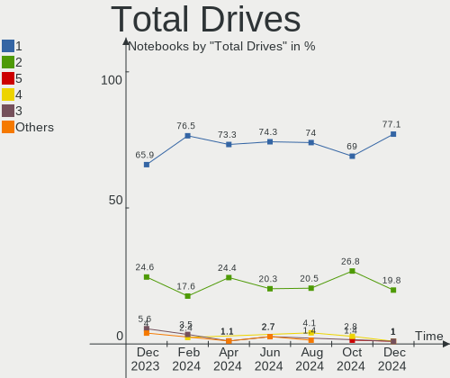
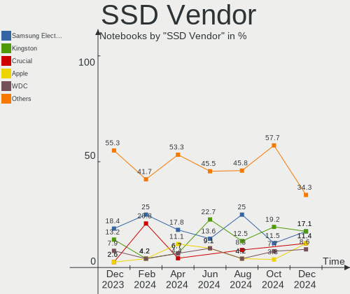
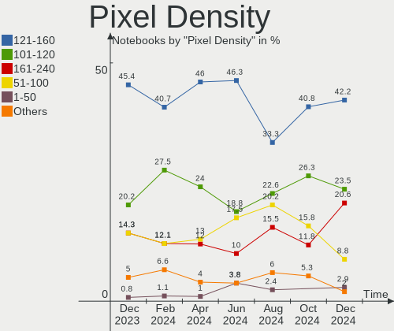
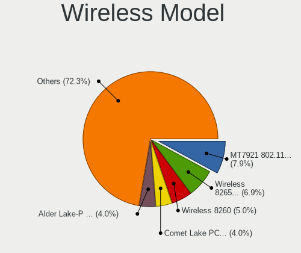
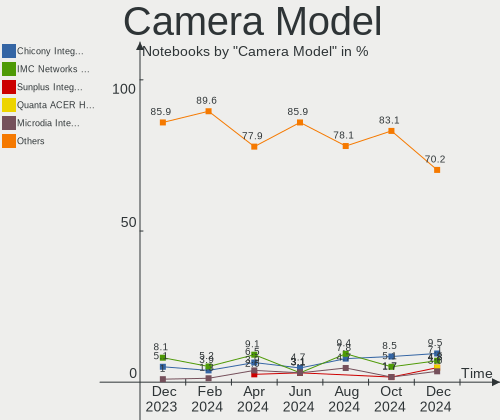
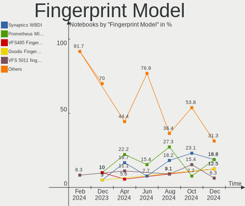
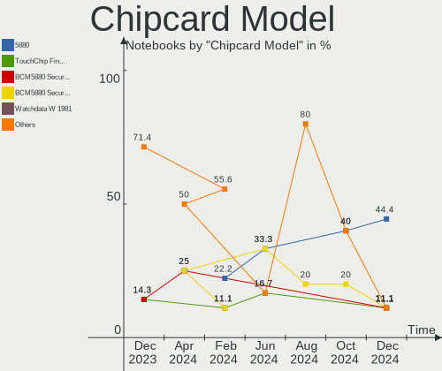
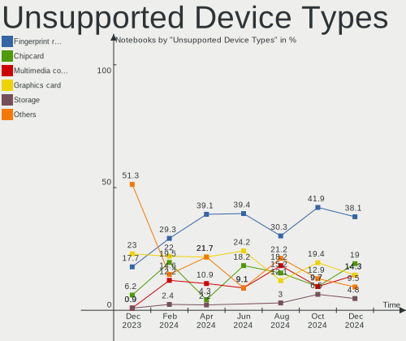

Linux in Canada - Hardware Trends (Notebooks)
---------------------------------------------

A project to identify most popular hardware characteristics and track their change
over time based on data collected by Linux users at https://Linux-Hardware.org.

Anyone can contribute to this report by the [hw-probe](https://github.com/linuxhw/hw-probe) tool:

    sudo -E hw-probe -all -upload

Period: Aug, 2023.

Contents
--------

* [ System ](#system)
  - [ OS                       ](#os)
  - [ OS Family                ](#os-family)
  - [ Kernel                   ](#kernel)
  - [ Kernel Family            ](#kernel-family)
  - [ Kernel Major Ver.        ](#kernel-major-ver)
  - [ Arch                     ](#arch)
  - [ DE                       ](#de)
  - [ Display Server           ](#display-server)
  - [ Display Manager          ](#display-manager)
  - [ OS Lang                  ](#os-lang)
  - [ Boot Mode                ](#boot-mode)
  - [ Filesystem               ](#filesystem)
  - [ Part. scheme             ](#part-scheme)
  - [ Dual Boot with Linux/BSD ](#dual-boot-with-linuxbsd)
  - [ Dual Boot (Win)          ](#dual-boot-win)

* [ Board ](#board)
  - [ Vendor                   ](#vendor)
  - [ Model                    ](#model)
  - [ Model Family             ](#model-family)
  - [ MFG Year                 ](#mfg-year)
  - [ Form Factor              ](#form-factor)
  - [ Secure Boot              ](#secure-boot)
  - [ Coreboot                 ](#coreboot)
  - [ RAM Size                 ](#ram-size)
  - [ RAM Used                 ](#ram-used)
  - [ Total Drives             ](#total-drives)
  - [ Has CD-ROM               ](#has-cd-rom)
  - [ Has Ethernet             ](#has-ethernet)
  - [ Has WiFi                 ](#has-wifi)
  - [ Has Bluetooth            ](#has-bluetooth)

* [ Location ](#location)
  - [ Country                  ](#country)
  - [ City                     ](#city)

* [ Drives ](#drives)
  - [ Drive Vendor             ](#drive-vendor)
  - [ Drive Model              ](#drive-model)
  - [ HDD Vendor               ](#hdd-vendor)
  - [ SSD Vendor               ](#ssd-vendor)
  - [ Drive Kind               ](#drive-kind)
  - [ Drive Connector          ](#drive-connector)
  - [ Drive Size               ](#drive-size)
  - [ Space Total              ](#space-total)
  - [ Space Used               ](#space-used)
  - [ Malfunc. Drives          ](#malfunc-drives)
  - [ Malfunc. Drive Vendor    ](#malfunc-drive-vendor)
  - [ Malfunc. HDD Vendor      ](#malfunc-hdd-vendor)
  - [ Malfunc. Drive Kind      ](#malfunc-drive-kind)
  - [ Failed Drives            ](#failed-drives)
  - [ Failed Drive Vendor      ](#failed-drive-vendor)
  - [ Drive Status             ](#drive-status)

* [ Storage controller ](#storage-controller)
  - [ Storage Vendor           ](#storage-vendor)
  - [ Storage Model            ](#storage-model)
  - [ Storage Kind             ](#storage-kind)

* [ Processor ](#processor)
  - [ CPU Vendor               ](#cpu-vendor)
  - [ CPU Model                ](#cpu-model)
  - [ CPU Model Family         ](#cpu-model-family)
  - [ CPU Cores                ](#cpu-cores)
  - [ CPU Sockets              ](#cpu-sockets)
  - [ CPU Threads              ](#cpu-threads)
  - [ CPU Op-Modes             ](#cpu-op-modes)
  - [ CPU Microcode            ](#cpu-microcode)
  - [ CPU Microarch            ](#cpu-microarch)

* [ Graphics ](#graphics)
  - [ GPU Vendor               ](#gpu-vendor)
  - [ GPU Model                ](#gpu-model)
  - [ GPU Combo                ](#gpu-combo)
  - [ GPU Driver               ](#gpu-driver)
  - [ GPU Memory               ](#gpu-memory)

* [ Monitor ](#monitor)
  - [ Monitor Vendor           ](#monitor-vendor)
  - [ Monitor Model            ](#monitor-model)
  - [ Monitor Resolution       ](#monitor-resolution)
  - [ Monitor Diagonal         ](#monitor-diagonal)
  - [ Monitor Width            ](#monitor-width)
  - [ Aspect Ratio             ](#aspect-ratio)
  - [ Monitor Area             ](#monitor-area)
  - [ Pixel Density            ](#pixel-density)
  - [ Multiple Monitors        ](#multiple-monitors)

* [ Network ](#network)
  - [ Net Controller Vendor    ](#net-controller-vendor)
  - [ Net Controller Model     ](#net-controller-model)
  - [ Wireless Vendor          ](#wireless-vendor)
  - [ Wireless Model           ](#wireless-model)
  - [ Ethernet Vendor          ](#ethernet-vendor)
  - [ Ethernet Model           ](#ethernet-model)
  - [ Net Controller Kind      ](#net-controller-kind)
  - [ Used Controller          ](#used-controller)
  - [ NICs                     ](#nics)
  - [ IPv6                     ](#ipv6)

* [ Bluetooth ](#bluetooth)
  - [ Bluetooth Vendor         ](#bluetooth-vendor)
  - [ Bluetooth Model          ](#bluetooth-model)

* [ Sound ](#sound)
  - [ Sound Vendor             ](#sound-vendor)
  - [ Sound Model              ](#sound-model)

* [ Memory ](#memory)
  - [ Memory Vendor            ](#memory-vendor)
  - [ Memory Model             ](#memory-model)
  - [ Memory Kind              ](#memory-kind)
  - [ Memory Form Factor       ](#memory-form-factor)
  - [ Memory Size              ](#memory-size)
  - [ Memory Speed             ](#memory-speed)

* [ Printers & scanners ](#printers--scanners)
  - [ Printer Vendor           ](#printer-vendor)
  - [ Printer Model            ](#printer-model)
  - [ Scanner Vendor           ](#scanner-vendor)
  - [ Scanner Model            ](#scanner-model)

* [ Camera ](#camera)
  - [ Camera Vendor            ](#camera-vendor)
  - [ Camera Model             ](#camera-model)

* [ Security ](#security)
  - [ Fingerprint Vendor       ](#fingerprint-vendor)
  - [ Fingerprint Model        ](#fingerprint-model)
  - [ Chipcard Vendor          ](#chipcard-vendor)
  - [ Chipcard Model           ](#chipcard-model)

* [ Unsupported ](#unsupported)
  - [ Unsupported Devices      ](#unsupported-devices)
  - [ Unsupported Device Types ](#unsupported-device-types)

System
------

OS
--

Installed operating systems

| Name                 | Notebooks | Percent |
|----------------------|-----------|---------|
| Ubuntu 22.04         | 18        | 19.15%  |
| OpenMandriva 23.08   | 12        | 12.77%  |
| Ubuntu 23.04         | 6         | 6.38%   |
| Pop!_OS 22.04        | 5         | 5.32%   |
| Linux Mint 21.2      | 5         | 5.32%   |
| Fedora 38            | 5         | 5.32%   |
| Debian 12            | 4         | 4.26%   |
| ArcoLinux Rolling    | 4         | 4.26%   |
| Arch Rolling         | 4         | 4.26%   |
| MX 23                | 3         | 3.19%   |
| Xubuntu 22.04        | 2         | 2.13%   |
| OpenMandriva 23.03   | 2         | 2.13%   |
| Linux Mint 21        | 2         | 2.13%   |
| Ubuntu Unity 18.04   | 1         | 1.06%   |
| Ubuntu Budgie 22.04  | 1         | 1.06%   |
| SteamOS 3.4.8        | 1         | 1.06%   |
| Sparky 8             | 1         | 1.06%   |
| OpenMandriva 23.90   | 1         | 1.06%   |
| Nobara 38            | 1         | 1.06%   |
| MX 21                | 1         | 1.06%   |
| Makulu 2023.07.12    | 1         | 1.06%   |
| Mageia 9             | 1         | 1.06%   |
| Lubuntu 22.04        | 1         | 1.06%   |
| Kubuntu 23.04        | 1         | 1.06%   |
| Kubuntu 22.04        | 1         | 1.06%   |
| KDE neon 22.04       | 1         | 1.06%   |
| Kali 2023.3          | 1         | 1.06%   |
| Gentoo 2.14          | 1         | 1.06%   |
| Garuda Linux Soaring | 1         | 1.06%   |
| Fedora 34            | 1         | 1.06%   |
| EndeavourOS Rolling  | 1         | 1.06%   |
| Elementary 6.1       | 1         | 1.06%   |
| Debian 22            | 1         | 1.06%   |
| BlackPanther 18.1    | 1         | 1.06%   |
| Alpine 3.18.3        | 1         | 1.06%   |

OS Family
---------

OS without a version

| Name          | Notebooks | Percent |
|---------------|-----------|---------|
| Ubuntu        | 24        | 25.53%  |
| OpenMandriva  | 15        | 15.96%  |
| Linux Mint    | 7         | 7.45%   |
| Fedora        | 6         | 6.38%   |
| Pop!_OS       | 5         | 5.32%   |
| Debian        | 5         | 5.32%   |
| MX            | 4         | 4.26%   |
| ArcoLinux     | 4         | 4.26%   |
| Arch          | 4         | 4.26%   |
| Xubuntu       | 2         | 2.13%   |
| Kubuntu       | 2         | 2.13%   |
| Ubuntu Unity  | 1         | 1.06%   |
| Ubuntu Budgie | 1         | 1.06%   |
| SteamOS       | 1         | 1.06%   |
| Sparky        | 1         | 1.06%   |
| Nobara        | 1         | 1.06%   |
| Makulu        | 1         | 1.06%   |
| Mageia        | 1         | 1.06%   |
| Lubuntu       | 1         | 1.06%   |
| KDE neon      | 1         | 1.06%   |
| Kali          | 1         | 1.06%   |
| Gentoo        | 1         | 1.06%   |
| Garuda Linux  | 1         | 1.06%   |
| EndeavourOS   | 1         | 1.06%   |
| Elementary    | 1         | 1.06%   |
| BlackPanther  | 1         | 1.06%   |
| Alpine        | 1         | 1.06%   |

Kernel
------

Version of the Linux kernel

| Version                      | Notebooks | Percent |
|------------------------------|-----------|---------|
| 6.2.0-26-generic             | 14        | 14.89%  |
| 6.4.11-desktop-1omv2390      | 9         | 9.57%   |
| 6.4.8-desktop-2omv2390       | 4         | 4.26%   |
| 6.4.6-76060406-generic       | 4         | 4.26%   |
| 5.19.0-50-generic            | 4         | 4.26%   |
| 5.15.0-79-generic            | 4         | 4.26%   |
| 5.15.0-78-generic            | 4         | 4.26%   |
| 6.4.7-200.fc38.x86_64        | 3         | 3.19%   |
| 6.2.0-20-generic             | 3         | 3.19%   |
| 6.1.0-11-amd64               | 3         | 3.19%   |
| 6.1.0-10-amd64               | 3         | 3.19%   |
| 5.19.0-32-generic            | 3         | 3.19%   |
| 6.4.12-arch1-1               | 2         | 2.13%   |
| 6.4.10-arch1-1               | 2         | 2.13%   |
| 6.2.6-desktop-1omv2390       | 2         | 2.13%   |
| 6.2.0-27-generic             | 2         | 2.13%   |
| 6.4.8-zen1-1-zen             | 1         | 1.06%   |
| 6.4.8-desktop-6.mga9         | 1         | 1.06%   |
| 6.4.8-arch1-1                | 1         | 1.06%   |
| 6.4.2-x64v2-xanmod1-3        | 1         | 1.06%   |
| 6.4.12-zen1-1-zen            | 1         | 1.06%   |
| 6.4.11-arch2-1               | 1         | 1.06%   |
| 6.4.10-200.fc38.x86_64       | 1         | 1.06%   |
| 6.4.0-2-amd64                | 1         | 1.06%   |
| 6.3.8-200.fc38.x86_64        | 1         | 1.06%   |
| 6.3.12-205.fsync.fc38.x86_64 | 1         | 1.06%   |
| 6.3.0-kali1-amd64            | 1         | 1.06%   |
| 6.3.0-1-amd64                | 1         | 1.06%   |
| 6.2.6-76060206-generic       | 1         | 1.06%   |
| 6.2.0-32-generic             | 1         | 1.06%   |
| 6.2.0-25-generic             | 1         | 1.06%   |
| 6.2.0-1009-lowlatency        | 1         | 1.06%   |
| 6.1.46-gentoo-x86_64         | 1         | 1.06%   |
| 6.1.46-0-lts                 | 1         | 1.06%   |
| 6.1.0-10-686-pae             | 1         | 1.06%   |
| 6.0.2-arch1-1                | 1         | 1.06%   |
| 5.6.14-desktop-2bP           | 1         | 1.06%   |
| 5.19.0-46-generic            | 1         | 1.06%   |
| 5.17.12-100.fc34.x86_64      | 1         | 1.06%   |
| 5.15.0-71-generic            | 1         | 1.06%   |

Kernel Family
-------------

Linux kernel without a distro release

| Version | Notebooks | Percent |
|---------|-----------|---------|
| 6.2.0   | 22        | 23.4%   |
| 6.4.11  | 10        | 10.64%  |
| 5.15.0  | 10        | 10.64%  |
| 5.19.0  | 8         | 8.51%   |
| 6.4.8   | 7         | 7.45%   |
| 6.1.0   | 7         | 7.45%   |
| 6.4.6   | 4         | 4.26%   |
| 6.4.7   | 3         | 3.19%   |
| 6.4.12  | 3         | 3.19%   |
| 6.4.10  | 3         | 3.19%   |
| 6.2.6   | 3         | 3.19%   |
| 6.3.0   | 2         | 2.13%   |
| 6.1.46  | 2         | 2.13%   |
| 6.4.2   | 1         | 1.06%   |
| 6.4.0   | 1         | 1.06%   |
| 6.3.8   | 1         | 1.06%   |
| 6.3.12  | 1         | 1.06%   |
| 6.0.2   | 1         | 1.06%   |
| 5.6.14  | 1         | 1.06%   |
| 5.17.12 | 1         | 1.06%   |
| 5.13.0  | 1         | 1.06%   |
| 5.10.0  | 1         | 1.06%   |
| 4.15.0  | 1         | 1.06%   |

Kernel Major Ver.
-----------------

Linux kernel major version

| Version | Notebooks | Percent |
|---------|-----------|---------|
| 6.4     | 32        | 34.04%  |
| 6.2     | 25        | 26.6%   |
| 5.15    | 10        | 10.64%  |
| 6.1     | 9         | 9.57%   |
| 5.19    | 8         | 8.51%   |
| 6.3     | 4         | 4.26%   |
| 6.0     | 1         | 1.06%   |
| 5.6     | 1         | 1.06%   |
| 5.17    | 1         | 1.06%   |
| 5.13    | 1         | 1.06%   |
| 5.10    | 1         | 1.06%   |
| 4.15    | 1         | 1.06%   |

Arch
----

OS architecture (x86_64, i586, etc.)

| Name   | Notebooks | Percent |
|--------|-----------|---------|
| x86_64 | 92        | 97.87%  |
| i686   | 2         | 2.13%   |

DE
--

Desktop Environment

| Name             | Notebooks | Percent |
|------------------|-----------|---------|
| GNOME            | 39        | 41.49%  |
| KDE5             | 26        | 27.66%  |
| XFCE             | 9         | 9.57%   |
| X-Cinnamon       | 6         | 6.38%   |
| Unknown          | 3         | 3.19%   |
| i3               | 2         | 2.13%   |
| Unity            | 1         | 1.06%   |
| sway             | 1         | 1.06%   |
| Pantheon         | 1         | 1.06%   |
| LXQt             | 1         | 1.06%   |
| LXDE             | 1         | 1.06%   |
| lightdm-xsession | 1         | 1.06%   |
| Jwm              | 1         | 1.06%   |
| Cinnamon         | 1         | 1.06%   |
| Budgie           | 1         | 1.06%   |

Display Server
--------------

X11 or Wayland

| Name    | Notebooks | Percent |
|---------|-----------|---------|
| X11     | 47        | 50%     |
| Wayland | 44        | 46.81%  |
| Unknown | 3         | 3.19%   |

Display Manager
---------------

SDDM, LightDM, etc.

| Name    | Notebooks | Percent |
|---------|-----------|---------|
| SDDM    | 30        | 31.91%  |
| GDM3    | 22        | 23.4%   |
| LightDM | 18        | 19.15%  |
| Unknown | 18        | 19.15%  |
| GDM     | 4         | 4.26%   |
| LXDM    | 2         | 2.13%   |

OS Lang
-------

Language

| Lang    | Notebooks | Percent |
|---------|-----------|---------|
| en_CA   | 42        | 44.68%  |
| en_US   | 33        | 35.11%  |
| fr_CA   | 11        | 11.7%   |
| Unknown | 2         | 2.13%   |
| zh_TW   | 1         | 1.06%   |
| hu_HU   | 1         | 1.06%   |
| en_GB   | 1         | 1.06%   |
| C.UTF8  | 1         | 1.06%   |
| C       | 1         | 1.06%   |
| ar_EG   | 1         | 1.06%   |

Boot Mode
---------

EFI or BIOS

| Mode | Notebooks | Percent |
|------|-----------|---------|
| EFI  | 53        | 56.38%  |
| BIOS | 41        | 43.62%  |

Filesystem
----------

Type of filesystem

| Type    | Notebooks | Percent |
|---------|-----------|---------|
| Ext4    | 54        | 57.45%  |
| Tmpfs   | 15        | 15.96%  |
| Overlay | 13        | 13.83%  |
| Btrfs   | 11        | 11.7%   |
| Zfs     | 1         | 1.06%   |

Part. scheme
------------

Scheme of partitioning

| Type    | Notebooks | Percent |
|---------|-----------|---------|
| GPT     | 64        | 68.09%  |
| Unknown | 18        | 19.15%  |
| MBR     | 12        | 12.77%  |

Dual Boot with Linux/BSD
------------------------

Hosting more than one Linux/BSD

| Dual boot | Notebooks | Percent |
|-----------|-----------|---------|
| No        | 81        | 86.17%  |
| Yes       | 13        | 13.83%  |

Dual Boot (Win)
---------------

Hosting Linux and Windows

| Dual boot | Notebooks | Percent |
|-----------|-----------|---------|
| No        | 67        | 71.28%  |
| Yes       | 27        | 28.72%  |

Board
-----

Vendor
------

Motherboard manufacturer

| Name                | Notebooks | Percent |
|---------------------|-----------|---------|
| Hewlett-Packard     | 20        | 21.28%  |
| Lenovo              | 19        | 20.21%  |
| Dell                | 18        | 19.15%  |
| ASUSTek Computer    | 9         | 9.57%   |
| Acer                | 5         | 5.32%   |
| Apple               | 4         | 4.26%   |
| System76            | 3         | 3.19%   |
| MSI                 | 3         | 3.19%   |
| Google              | 3         | 3.19%   |
| Toshiba             | 2         | 2.13%   |
| Xplore              | 1         | 1.06%   |
| Valve               | 1         | 1.06%   |
| Samsung Electronics | 1         | 1.06%   |
| Panasonic           | 1         | 1.06%   |
| MOTION              | 1         | 1.06%   |
| LG Electronics      | 1         | 1.06%   |
| Gateway             | 1         | 1.06%   |
| Corsair             | 1         | 1.06%   |

Model
-----

Motherboard model

| Name                                                                                     | Notebooks | Percent |
|------------------------------------------------------------------------------------------|-----------|---------|
| Xplore iX104C6                                                                           | 1         | 1.06%   |
| Valve Jupiter                                                                            | 1         | 1.06%   |
| Toshiba Satellite Pro C70-C                                                              | 1         | 1.06%   |
| Toshiba Satellite Pro A50-C                                                              | 1         | 1.06%   |
| System76 Gazelle                                                                         | 1         | 1.06%   |
| System76 Galago Pro                                                                      | 1         | 1.06%   |
| System76 Darter Pro                                                                      | 1         | 1.06%   |
| Samsung 355V4C/355V4X/355V5C/355V5X/356V4C/356V4X/356V5C/356V5X/3445VC/3445VX/3545VC/354 | 1         | 1.06%   |
| Panasonic CF-31AQAAA1M                                                                   | 1         | 1.06%   |
| MSI MS-7E06                                                                              | 1         | 1.06%   |
| MSI GP72 7RDX                                                                            | 1         | 1.06%   |
| MSI GP72 6QF                                                                             | 1         | 1.06%   |
| MOTION J3500                                                                             | 1         | 1.06%   |
| LG 17Z90N-V.AA72A8                                                                       | 1         | 1.06%   |
| Lenovo Yoga 2 Pro 20266                                                                  | 1         | 1.06%   |
| Lenovo V15-IIL 82C5                                                                      | 1         | 1.06%   |
| Lenovo ThinkPad X220 42902WU                                                             | 1         | 1.06%   |
| Lenovo ThinkPad X131e 33671S2                                                            | 1         | 1.06%   |
| Lenovo ThinkPad W520 427637U                                                             | 1         | 1.06%   |
| Lenovo ThinkPad T470s W10DG 20JTS0DN00                                                   | 1         | 1.06%   |
| Lenovo ThinkPad T450s 20BWS2M300                                                         | 1         | 1.06%   |
| Lenovo ThinkPad T420 4236AK9                                                             | 1         | 1.06%   |
| Lenovo ThinkPad T420 4180AP3                                                             | 1         | 1.06%   |
| Lenovo ThinkPad T410 25222AU                                                             | 1         | 1.06%   |
| Lenovo ThinkPad T16 Gen 1 21BVCTO1WW                                                     | 1         | 1.06%   |
| Lenovo ThinkPad T14s Gen 3 21CQ000GUS                                                    | 1         | 1.06%   |
| Lenovo ThinkPad 13 2nd Gen 20J2A0C1JP                                                    | 1         | 1.06%   |
| Lenovo Legion 5 17ACH6H 82JY                                                             | 1         | 1.06%   |
| Lenovo IdeaPad Y570 0862                                                                 | 1         | 1.06%   |
| Lenovo IdeaPad S540-15IWL GTX 81SW                                                       | 1         | 1.06%   |
| Lenovo IdeaPad 520S-14IKB 81BL                                                           | 1         | 1.06%   |
| Lenovo IdeaPad 320-15IKB 81BG                                                            | 1         | 1.06%   |
| Lenovo 3000 C100 07612GU                                                                 | 1         | 1.06%   |
| HP ZBook Firefly 14 inch G8 Mobile Workstation PC                                        | 1         | 1.06%   |
| HP ProBook 650 G4                                                                        | 1         | 1.06%   |
| HP ProBook 650 G2                                                                        | 1         | 1.06%   |
| HP ProBook 445 G8 Notebook PC                                                            | 1         | 1.06%   |
| HP Presario V2000 (ES307UA#ABL)                                                          | 1         | 1.06%   |
| HP Pavilion g6                                                                           | 1         | 1.06%   |
| HP Pavilion dv8000 (ET839UA#ABL)                                                         | 1         | 1.06%   |

Model Family
------------

Motherboard model prefix

| Name                   | Notebooks | Percent |
|------------------------|-----------|---------|
| Lenovo ThinkPad        | 11        | 11.7%   |
| Dell Latitude          | 8         | 8.51%   |
| HP EliteBook           | 7         | 7.45%   |
| Dell Inspiron          | 5         | 5.32%   |
| Lenovo IdeaPad         | 4         | 4.26%   |
| HP Laptop              | 4         | 4.26%   |
| ASUS VivoBook          | 4         | 4.26%   |
| HP ProBook             | 3         | 3.19%   |
| Dell XPS               | 3         | 3.19%   |
| Acer Aspire            | 3         | 3.19%   |
| Toshiba Satellite      | 2         | 2.13%   |
| MSI GP72               | 2         | 2.13%   |
| HP Pavilion            | 2         | 2.13%   |
| Dell Precision         | 2         | 2.13%   |
| ASUS ZenBook           | 2         | 2.13%   |
| Xplore iX104C6         | 1         | 1.06%   |
| Valve Jupiter          | 1         | 1.06%   |
| System76 Gazelle       | 1         | 1.06%   |
| System76 Galago        | 1         | 1.06%   |
| System76 Darter        | 1         | 1.06%   |
| Samsung 355V4C         | 1         | 1.06%   |
| Panasonic CF-31AQAAA1M | 1         | 1.06%   |
| MSI MS-7E06            | 1         | 1.06%   |
| MOTION J3500           | 1         | 1.06%   |
| LG 17Z90N-V.AA72A8     | 1         | 1.06%   |
| Lenovo Yoga            | 1         | 1.06%   |
| Lenovo V15-IIL         | 1         | 1.06%   |
| Lenovo Legion          | 1         | 1.06%   |
| Lenovo 3000            | 1         | 1.06%   |
| HP ZBook               | 1         | 1.06%   |
| HP Presario            | 1         | 1.06%   |
| HP Notebook            | 1         | 1.06%   |
| HP Elite               | 1         | 1.06%   |
| Google Snappy          | 1         | 1.06%   |
| Google Bobba360        | 1         | 1.06%   |
| Google Blooglet        | 1         | 1.06%   |
| Gateway NV57H          | 1         | 1.06%   |
| Corsair Voyager        | 1         | 1.06%   |
| ASUS X751LA            | 1         | 1.06%   |
| ASUS TUF               | 1         | 1.06%   |

MFG Year
--------

Motherboard manufacture year

| Year | Notebooks | Percent |
|------|-----------|---------|
| 2022 | 13        | 13.83%  |
| 2011 | 11        | 11.7%   |
| 2023 | 7         | 7.45%   |
| 2021 | 6         | 6.38%   |
| 2020 | 6         | 6.38%   |
| 2019 | 6         | 6.38%   |
| 2018 | 6         | 6.38%   |
| 2017 | 6         | 6.38%   |
| 2016 | 6         | 6.38%   |
| 2013 | 6         | 6.38%   |
| 2012 | 5         | 5.32%   |
| 2014 | 4         | 4.26%   |
| 2015 | 3         | 3.19%   |
| 2006 | 3         | 3.19%   |
| 2010 | 2         | 2.13%   |
| 2009 | 1         | 1.06%   |
| 2008 | 1         | 1.06%   |
| 2007 | 1         | 1.06%   |
| 2005 | 1         | 1.06%   |

Form Factor
-----------

Physical design of the computer

| Name     | Notebooks | Percent |
|----------|-----------|---------|
| Notebook | 94        | 100%    |

Secure Boot
-----------

Enabled or disabled

| State    | Notebooks | Percent |
|----------|-----------|---------|
| Disabled | 90        | 95.74%  |
| Enabled  | 4         | 4.26%   |

Coreboot
--------

Have coreboot on board

| Used | Notebooks | Percent |
|------|-----------|---------|
| No   | 89        | 94.68%  |
| Yes  | 5         | 5.32%   |

RAM Size
--------

Total RAM memory

| Size in GB  | Notebooks | Percent |
|-------------|-----------|---------|
| 4.01-8.0    | 28        | 29.79%  |
| 16.01-24.0  | 20        | 21.28%  |
| 8.01-16.0   | 16        | 17.02%  |
| 3.01-4.0    | 13        | 13.83%  |
| 1.01-2.0    | 6         | 6.38%   |
| 32.01-64.0  | 5         | 5.32%   |
| 24.01-32.0  | 3         | 3.19%   |
| 64.01-256.0 | 3         | 3.19%   |

RAM Used
--------

Used RAM memory

| Used GB    | Notebooks | Percent |
|------------|-----------|---------|
| 1.01-2.0   | 32        | 34.04%  |
| 2.01-3.0   | 22        | 23.4%   |
| 4.01-8.0   | 15        | 15.96%  |
| 3.01-4.0   | 15        | 15.96%  |
| 8.01-16.0  | 4         | 4.26%   |
| 0.51-1.0   | 4         | 4.26%   |
| 16.01-24.0 | 1         | 1.06%   |
| 0.01-0.5   | 1         | 1.06%   |

Total Drives
------------

Number of drives on board

| Drives | Notebooks | Percent |
|--------|-----------|---------|
| 1      | 70        | 74.47%  |
| 2      | 20        | 21.28%  |
| 3      | 3         | 3.19%   |
| 0      | 1         | 1.06%   |

Has CD-ROM
----------

Has CD-ROM on board

| Presented | Notebooks | Percent |
|-----------|-----------|---------|
| No        | 72        | 76.6%   |
| Yes       | 22        | 23.4%   |

Has Ethernet
------------

Has Ethernet on board

| Presented | Notebooks | Percent |
|-----------|-----------|---------|
| Yes       | 65        | 69.15%  |
| No        | 29        | 30.85%  |

Has WiFi
--------

Has WiFi module

| Presented | Notebooks | Percent |
|-----------|-----------|---------|
| Yes       | 93        | 98.94%  |
| No        | 1         | 1.06%   |

Has Bluetooth
-------------

Has Bluetooth module

| Presented | Notebooks | Percent |
|-----------|-----------|---------|
| Yes       | 80        | 85.11%  |
| No        | 14        | 14.89%  |

Location
--------

Country
-------

Geographic location (country)

| Country | Notebooks | Percent |
|---------|-----------|---------|
| Canada  | 94        | 100%    |

City
----

Geographic location (city)

| City                | Notebooks | Percent |
|---------------------|-----------|---------|
| Montreal            | 12        | 12.77%  |
| Toronto             | 11        | 11.7%   |
| Oshawa              | 5         | 5.32%   |
| Vancouver           | 4         | 4.26%   |
| Québec             | 4         | 4.26%   |
| Kitchener           | 3         | 3.19%   |
| Edmonton            | 3         | 3.19%   |
| Simcoe              | 2         | 2.13%   |
| Prince Albert       | 2         | 2.13%   |
| Ottawa              | 2         | 2.13%   |
| Longueuil           | 2         | 2.13%   |
| Laval               | 2         | 2.13%   |
| Kelowna             | 2         | 2.13%   |
| Calgary             | 2         | 2.13%   |
| Brantford           | 2         | 2.13%   |
| Yorkton             | 1         | 1.06%   |
| Victoria            | 1         | 1.06%   |
| Vernon              | 1         | 1.06%   |
| Trois-Rivières     | 1         | 1.06%   |
| Thompson            | 1         | 1.06%   |
| Surrey              | 1         | 1.06%   |
| Sherbrooke          | 1         | 1.06%   |
| Saskatoon           | 1         | 1.06%   |
| Saint-Jude          | 1         | 1.06%   |
| Saint-Jerome        | 1         | 1.06%   |
| Repentigny          | 1         | 1.06%   |
| Red Deer            | 1         | 1.06%   |
| Pickering           | 1         | 1.06%   |
| New Westminster     | 1         | 1.06%   |
| Nepean              | 1         | 1.06%   |
| Moose Jaw           | 1         | 1.06%   |
| Mississauga         | 1         | 1.06%   |
| Markham             | 1         | 1.06%   |
| Kingston            | 1         | 1.06%   |
| Hamilton            | 1         | 1.06%   |
| Halifax             | 1         | 1.06%   |
| Glovertown          | 1         | 1.06%   |
| Gatineau            | 1         | 1.06%   |
| Etobicoke           | 1         | 1.06%   |
| Dollard-des-Ormeaux | 1         | 1.06%   |

Drives
------

Drive Vendor
------------

Hard drive vendors

| Vendor                      | Notebooks | Drives | Percent |
|-----------------------------|-----------|--------|---------|
| Samsung Electronics         | 21        | 23     | 18.58%  |
| Sandisk                     | 14        | 15     | 12.39%  |
| Seagate                     | 10        | 10     | 8.85%   |
| WDC                         | 8         | 8      | 7.08%   |
| Toshiba                     | 5         | 5      | 4.42%   |
| KIOXIA                      | 5         | 5      | 4.42%   |
| Kingston                    | 5         | 5      | 4.42%   |
| Hitachi                     | 5         | 5      | 4.42%   |
| Unknown                     | 4         | 4      | 3.54%   |
| Intel                       | 4         | 4      | 3.54%   |
| Crucial                     | 4         | 5      | 3.54%   |
| Timetec                     | 3         | 3      | 2.65%   |
| SK hynix                    | 3         | 3      | 2.65%   |
| HGST                        | 3         | 3      | 2.65%   |
| Micron Technology           | 2         | 2      | 1.77%   |
| Kingston Technology Company | 2         | 2      | 1.77%   |
| Apple                       | 2         | 3      | 1.77%   |
| A-DATA Technology           | 2         | 2      | 1.77%   |
| Zheino                      | 1         | 1      | 0.88%   |
| Union Memory (Shenzhen)     | 1         | 1      | 0.88%   |
| SSSTC                       | 1         | 1      | 0.88%   |
| Solid State Storage         | 1         | 1      | 0.88%   |
| SINTECHI                    | 1         | 1      | 0.88%   |
| Micron/Crucial Technology   | 1         | 1      | 0.88%   |
| M.2 SSD                     | 1         | 1      | 0.88%   |
| Kingchuxing                 | 1         | 1      | 0.88%   |
| Fujitsu                     | 1         | 1      | 0.88%   |
| CT2000MX                    | 1         | 1      | 0.88%   |
| Unknown                     | 1         | 1      | 0.88%   |

Drive Model
-----------

Hard drive models

| Model                                                 | Notebooks | Percent |
|-------------------------------------------------------|-----------|---------|
| WDC WDS250G2B0A-00SM50 250GB SSD                      | 2         | 1.71%   |
| Seagate ST1000LM035-1RK172 1TB                        | 2         | 1.71%   |
| Samsung SSD 980 PRO 1TB                               | 2         | 1.71%   |
| Samsung NVMe SSD Controller PM9A1/PM9A3/980PRO 1024GB | 2         | 1.71%   |
| Kingston SA400S37240G 240GB SSD                       | 2         | 1.71%   |
| HGST HTS721010A9E630 1TB                              | 2         | 1.71%   |
| Zheino CHN MSATAQ3 120 120GB SSD                      | 1         | 0.85%   |
| WDC WDBNCE0010PNC 1TB SSD                             | 1         | 0.85%   |
| WDC WD5000LPVX-22V0TT0 500GB                          | 1         | 0.85%   |
| WDC WD5000LPLX-66ZNTT1 500GB                          | 1         | 0.85%   |
| WDC WD10SPZX-60Z10T0 1TB                              | 1         | 0.85%   |
| WDC WD10JPVX-22JC3T0 1TB                              | 1         | 0.85%   |
| WDC PC SN530 NVMe 256GB                               | 1         | 0.85%   |
| Unknown SD04G  4GB                                    | 1         | 0.85%   |
| Unknown MMC Card  64GB                                | 1         | 0.85%   |
| Unknown CUTB42  64GB                                  | 1         | 0.85%   |
| Unknown BJNB4R  32GB                                  | 1         | 0.85%   |
| Union Memory (Shenzhen) RPFTJ128PDD2EWX 128GB         | 1         | 0.85%   |
| Toshiba XG6 NVMe SSD Controller 1024GB                | 1         | 0.85%   |
| Toshiba MQ01ABD075 752GB                              | 1         | 0.85%   |
| Toshiba MK7559GSXF 752GB                              | 1         | 0.85%   |
| Toshiba MK1059GSMP 1TB                                | 1         | 0.85%   |
| Toshiba KXG5AZNV256G 256GB                            | 1         | 0.85%   |
| Timetec SD08 512GB SSD                                | 1         | 0.85%   |
| Timetec MS10 1TB                                      | 1         | 0.85%   |
| Timetec 30TT253X2-512G SSD                            | 1         | 0.85%   |
| SSSTC CL1-8D128-HP 128GB                              | 1         | 0.85%   |
| Solid State Storage SSSTC CL1-8D256-HP 256GB          | 1         | 0.85%   |
| SK hynix HFS512GD9TNG-L2A0A 512GB                     | 1         | 0.85%   |
| SK hynix BC711 HFM512GD3JX013N 512GB                  | 1         | 0.85%   |
| SK hynix BC501 NVMe 256GB                             | 1         | 0.85%   |
| SINTECHI HighSpeed SD to CF Adapter V1.0              | 1         | 0.85%   |
| Seagate ST9500325ASG 500GB                            | 1         | 0.85%   |
| Seagate ST9160411AS 160GB                             | 1         | 0.85%   |
| Seagate ST750LM022 HN-M750MBB 752GB                   | 1         | 0.85%   |
| Seagate ST4000DM004-2U9104 4TB                        | 1         | 0.85%   |
| Seagate ST1000LM024 HN-M101MBB 1TB                    | 1         | 0.85%   |
| Seagate OneTouch HDD 2TB                              | 1         | 0.85%   |
| Seagate BUP Slim BL 2TB                               | 1         | 0.85%   |
| Seagate BarraCuda 120 SSD ZA500CM10003 500GB          | 1         | 0.85%   |

HDD Vendor
----------

Hard disk drive vendors

| Vendor              | Notebooks | Drives | Percent |
|---------------------|-----------|--------|---------|
| Seagate             | 9         | 9      | 31.03%  |
| Hitachi             | 5         | 5      | 17.24%  |
| WDC                 | 4         | 4      | 13.79%  |
| Toshiba             | 3         | 3      | 10.34%  |
| Samsung Electronics | 3         | 3      | 10.34%  |
| HGST                | 3         | 3      | 10.34%  |
| SINTECHI            | 1         | 1      | 3.45%   |
| Fujitsu             | 1         | 1      | 3.45%   |

SSD Vendor
----------

Solid state drive vendors

| Vendor              | Notebooks | Drives | Percent |
|---------------------|-----------|--------|---------|
| Samsung Electronics | 6         | 6      | 18.18%  |
| SanDisk             | 4         | 4      | 12.12%  |
| Kingston            | 4         | 4      | 12.12%  |
| Crucial             | 4         | 4      | 12.12%  |
| WDC                 | 3         | 3      | 9.09%   |
| Timetec             | 2         | 2      | 6.06%   |
| Intel               | 2         | 2      | 6.06%   |
| A-DATA Technology   | 2         | 2      | 6.06%   |
| Zheino              | 1         | 1      | 3.03%   |
| Seagate             | 1         | 1      | 3.03%   |
| Micron Technology   | 1         | 1      | 3.03%   |
| Kingchuxing         | 1         | 1      | 3.03%   |
| CT2000MX            | 1         | 1      | 3.03%   |
| Apple               | 1         | 1      | 3.03%   |

Drive Kind
----------

HDD or SSD

| Kind | Notebooks | Drives | Percent |
|------|-----------|--------|---------|
| NVMe | 43        | 50     | 40.19%  |
| SSD  | 30        | 33     | 28.04%  |
| HDD  | 28        | 29     | 26.17%  |
| MMC  | 6         | 6      | 5.61%   |

Drive Connector
---------------

SATA, SAS, NVMe, etc.

| Type | Notebooks | Drives | Percent |
|------|-----------|--------|---------|
| SATA | 51        | 58     | 48.57%  |
| NVMe | 43        | 49     | 40.95%  |
| MMC  | 6         | 6      | 5.71%   |
| SAS  | 5         | 5      | 4.76%   |

Drive Size
----------

Size of hard drive

| Size in TB | Notebooks | Drives | Percent |
|------------|-----------|--------|---------|
| 0.01-0.5   | 34        | 37     | 59.65%  |
| 0.51-1.0   | 19        | 20     | 33.33%  |
| 1.01-2.0   | 3         | 4      | 5.26%   |
| 3.01-4.0   | 1         | 1      | 1.75%   |

Space Total
-----------

Amount of disk space available on the file system

| Size in GB     | Notebooks | Percent |
|----------------|-----------|---------|
| 101-250        | 24        | 25.53%  |
| 1-20           | 16        | 17.02%  |
| 501-1000       | 16        | 17.02%  |
| 251-500        | 15        | 15.96%  |
| 1001-2000      | 7         | 7.45%   |
| 51-100         | 5         | 5.32%   |
| Unknown        | 4         | 4.26%   |
| More than 3000 | 3         | 3.19%   |
| 21-50          | 3         | 3.19%   |
| 2001-3000      | 1         | 1.06%   |

Space Used
----------

Amount of used disk space

| Used GB        | Notebooks | Percent |
|----------------|-----------|---------|
| 1-20           | 44        | 46.81%  |
| 51-100         | 17        | 18.09%  |
| 21-50          | 12        | 12.77%  |
| 101-250        | 9         | 9.57%   |
| 501-1000       | 4         | 4.26%   |
| Unknown        | 4         | 4.26%   |
| More than 3000 | 1         | 1.06%   |
| 251-500        | 1         | 1.06%   |
| 2001-3000      | 1         | 1.06%   |
| 1001-2000      | 1         | 1.06%   |

Malfunc. Drives
---------------

Drive models with a malfunction

| Model                              | Notebooks | Drives | Percent |
|------------------------------------|-----------|--------|---------|
| Timetec SD08 512GB SSD             | 1         | 1      | 12.5%   |
| Seagate ST1000LM024 HN-M101MBB 1TB | 1         | 1      | 12.5%   |
| Samsung Electronics HM641JI 640GB  | 1         | 1      | 12.5%   |
| Kingston SA400S37240G 240GB SSD    | 1         | 1      | 12.5%   |
| Intel SSDSCKKF256H6L 256GB         | 1         | 1      | 12.5%   |
| Hitachi HTS541616J9SA00 160GB      | 1         | 1      | 12.5%   |
| Hitachi HTS541080G9AT00 80GB       | 1         | 1      | 12.5%   |
| Fujitsu MHV2080AH 80GB             | 1         | 1      | 12.5%   |

Malfunc. Drive Vendor
---------------------

Vendors of faulty drives

| Vendor              | Notebooks | Drives | Percent |
|---------------------|-----------|--------|---------|
| Hitachi             | 2         | 2      | 25%     |
| Timetec             | 1         | 1      | 12.5%   |
| Seagate             | 1         | 1      | 12.5%   |
| Samsung Electronics | 1         | 1      | 12.5%   |
| Kingston            | 1         | 1      | 12.5%   |
| Intel               | 1         | 1      | 12.5%   |
| Fujitsu             | 1         | 1      | 12.5%   |

Malfunc. HDD Vendor
-------------------

Vendors of faulty HDD drives

| Vendor              | Notebooks | Drives | Percent |
|---------------------|-----------|--------|---------|
| Hitachi             | 2         | 2      | 40%     |
| Seagate             | 1         | 1      | 20%     |
| Samsung Electronics | 1         | 1      | 20%     |
| Fujitsu             | 1         | 1      | 20%     |

Malfunc. Drive Kind
-------------------

Kinds of faulty drives

| Kind | Notebooks | Drives | Percent |
|------|-----------|--------|---------|
| HDD  | 5         | 5      | 62.5%   |
| SSD  | 3         | 3      | 37.5%   |

Failed Drives
-------------

Failed drive models

| Model                             | Notebooks | Drives | Percent |
|-----------------------------------|-----------|--------|---------|
| Samsung Electronics HM160HC 160GB | 1         | 1      | 100%    |

Failed Drive Vendor
-------------------

Failed drive vendors

| Vendor              | Notebooks | Drives | Percent |
|---------------------|-----------|--------|---------|
| Samsung Electronics | 1         | 1      | 100%    |

Drive Status
------------

Number of failed and malfunc. drives

| Status   | Notebooks | Drives | Percent |
|----------|-----------|--------|---------|
| Works    | 50        | 62     | 51.02%  |
| Detected | 39        | 47     | 39.8%   |
| Malfunc  | 8         | 8      | 8.16%   |
| Failed   | 1         | 1      | 1.02%   |

Storage controller
------------------

Storage Vendor
--------------

Storage controller vendors

| Vendor                         | Notebooks | Percent |
|--------------------------------|-----------|---------|
| Intel                          | 59        | 53.15%  |
| Samsung Electronics            | 12        | 10.81%  |
| SanDisk                        | 10        | 9.01%   |
| AMD                            | 8         | 7.21%   |
| KIOXIA                         | 5         | 4.5%    |
| SK hynix                       | 3         | 2.7%    |
| Kingston Technology Company    | 3         | 2.7%    |
| Toshiba America Info Systems   | 2         | 1.8%    |
| Solid State Storage Technology | 2         | 1.8%    |
| Micron/Crucial Technology      | 2         | 1.8%    |
| Union Memory (Shenzhen)        | 1         | 0.9%    |
| Silicon Motion                 | 1         | 0.9%    |
| Micron Technology              | 1         | 0.9%    |
| Marvell Technology Group       | 1         | 0.9%    |
| Apple                          | 1         | 0.9%    |

Storage Model
-------------

Storage controller models

| Model                                                                        | Notebooks | Percent |
|------------------------------------------------------------------------------|-----------|---------|
| Intel 6 Series/C200 Series Chipset Family 6 port Mobile SATA AHCI Controller | 8         | 6.78%   |
| Intel Volume Management Device NVMe RAID Controller                          | 7         | 5.93%   |
| Samsung NVMe SSD Controller PM9A1/PM9A3/980PRO                               | 6         | 5.08%   |
| Intel 8 Series SATA Controller 1 [AHCI mode]                                 | 5         | 4.24%   |
| AMD FCH SATA Controller [AHCI mode]                                          | 5         | 4.24%   |
| Intel Sunrise Point-LP SATA Controller [AHCI mode]                           | 4         | 3.39%   |
| Samsung NVMe SSD Controller SM981/PM981/PM983                                | 3         | 2.54%   |
| Samsung NVMe SSD Controller 980                                              | 3         | 2.54%   |
| Intel Wildcat Point-LP SATA Controller [AHCI Mode]                           | 3         | 2.54%   |
| Intel HM170/QM170 Chipset SATA Controller [AHCI Mode]                        | 3         | 2.54%   |
| Intel 82801 Mobile SATA Controller [RAID mode]                               | 3         | 2.54%   |
| Intel 7 Series Chipset Family 6-port SATA Controller [AHCI mode]             | 3         | 2.54%   |
| Intel 5 Series/3400 Series Chipset 6 port SATA AHCI Controller               | 3         | 2.54%   |
| Solid State Storage CL1-3D256-Q11 NVMe SSD M.2                               | 2         | 1.69%   |
| SanDisk WD Blue SN570 NVMe SSD 1TB                                           | 2         | 1.69%   |
| SanDisk WD Black SN770 / PC SN740 256GB / PC SN560 (DRAM-less) NVMe SSD      | 2         | 1.69%   |
| KIOXIA NVMe SSD Controller BG5 (DRAM-less)                                   | 2         | 1.69%   |
| Kingston Company Company Non-Volatile memory controller                      | 2         | 1.69%   |
| Intel SSD 670p Series [Keystone Harbor]                                      | 2         | 1.69%   |
| Intel Comet Lake SATA AHCI Controller                                        | 2         | 1.69%   |
| Intel Cannon Point-LP SATA Controller [AHCI Mode]                            | 2         | 1.69%   |
| Intel Cannon Lake Mobile PCH SATA AHCI Controller                            | 2         | 1.69%   |
| Intel Atom Processor E3800 Series SATA AHCI Controller                       | 2         | 1.69%   |
| Intel 82801FB/FBM/FR/FW/FRW (ICH6 Family) IDE Controller                     | 2         | 1.69%   |
| AMD IXP SB4x0 IDE Controller                                                 | 2         | 1.69%   |
| Union Memory (Shenzhen) AM610 PCIe 3.0 NVMe SSD 128GB                        | 1         | 0.85%   |
| Toshiba America Info Systems XG6 NVMe SSD Controller                         | 1         | 0.85%   |
| Toshiba America Info Systems XG5 NVMe SSD Controller                         | 1         | 0.85%   |
| SK hynix PC601 NVMe Solid State Drive                                        | 1         | 0.85%   |
| SK hynix Gold P31/BC711/PC711 NVMe Solid State Drive                         | 1         | 0.85%   |
| SK hynix BC501 NVMe Solid State Drive                                        | 1         | 0.85%   |
| Silicon Motion SM2263EN/SM2263XT (DRAM-less) NVMe SSD Controllers            | 1         | 0.85%   |
| Sandisk Western Digital WD Black SN850X NVMe SSD                             | 1         | 0.85%   |
| SanDisk WD PC SN810 / Black SN850 NVMe SSD                                   | 1         | 0.85%   |
| SanDisk WD Blue SN500 / PC SN520 NVMe SSD                                    | 1         | 0.85%   |
| SanDisk WD Black SN750 / PC SN730 NVMe SSD                                   | 1         | 0.85%   |
| Sandisk PC SN740 NVMe SSD (DRAM-less)                                        | 1         | 0.85%   |
| SanDisk PC SN735 NVMe SSD (DRAM-less)                                        | 1         | 0.85%   |
| SanDisk IX SN530 NVMe SSD (DRAM-less)                                        | 1         | 0.85%   |
| Samsung NVMe SSD Controller SM961/PM961/SM963                                | 1         | 0.85%   |

Storage Kind
------------

Kind of storage controller (IDE, SATA, NVMe, SAS, ...)

| Kind | Notebooks | Percent |
|------|-----------|---------|
| SATA | 52        | 46.02%  |
| NVMe | 43        | 38.05%  |
| RAID | 11        | 9.73%   |
| IDE  | 7         | 6.19%   |

Processor
---------

CPU Vendor
----------

Processor vendors

| Vendor | Notebooks | Percent |
|--------|-----------|---------|
| Intel  | 79        | 84.04%  |
| AMD    | 15        | 15.96%  |

CPU Model
---------

Processor models

| Model                                    | Notebooks | Percent |
|------------------------------------------|-----------|---------|
| Intel Core i7-2640M CPU @ 2.80GHz        | 2         | 2.13%   |
| Intel Core i5-8250U CPU @ 1.60GHz        | 2         | 2.13%   |
| Intel Core i5-2520M CPU @ 2.50GHz        | 2         | 2.13%   |
| Intel Core i5 CPU M 520 @ 2.40GHz        | 2         | 2.13%   |
| Intel 13th Gen Core i9-13900H            | 2         | 2.13%   |
| Intel 13th Gen Core i7-1370P             | 2         | 2.13%   |
| Intel 13th Gen Core i5-1335U             | 2         | 2.13%   |
| AMD Turion 64 Mobile Technology ML-32    | 2         | 2.13%   |
| Intel Pentium Silver N6000 @ 1.10GHz     | 1         | 1.06%   |
| Intel Pentium Silver N5030 CPU @ 1.10GHz | 1         | 1.06%   |
| Intel Pentium Gold 7505 @ 2.00GHz        | 1         | 1.06%   |
| Intel Pentium CPU N3530 @ 2.16GHz        | 1         | 1.06%   |
| Intel Pentium 3556U @ 1.70GHz            | 1         | 1.06%   |
| Intel Core m7-6Y75 CPU @ 1.20GHz         | 1         | 1.06%   |
| Intel Core m5-6Y54 CPU @ 1.10GHz         | 1         | 1.06%   |
| Intel Core i7-9850H CPU @ 2.60GHz        | 1         | 1.06%   |
| Intel Core i7-8750H CPU @ 2.20GHz        | 1         | 1.06%   |
| Intel Core i7-8665U CPU @ 1.90GHz        | 1         | 1.06%   |
| Intel Core i7-8565U CPU @ 1.80GHz        | 1         | 1.06%   |
| Intel Core i7-8550U CPU @ 1.80GHz        | 1         | 1.06%   |
| Intel Core i7-7700HQ CPU @ 2.80GHz       | 1         | 1.06%   |
| Intel Core i7-7660U CPU @ 2.50GHz        | 1         | 1.06%   |
| Intel Core i7-6820HQ CPU @ 2.70GHz       | 1         | 1.06%   |
| Intel Core i7-6700HQ CPU @ 2.60GHz       | 1         | 1.06%   |
| Intel Core i7-6600U CPU @ 2.60GHz        | 1         | 1.06%   |
| Intel Core i7-6500U CPU @ 2.50GHz        | 1         | 1.06%   |
| Intel Core i7-5600U CPU @ 2.60GHz        | 1         | 1.06%   |
| Intel Core i7-4710HQ CPU @ 2.50GHz       | 1         | 1.06%   |
| Intel Core i7-4510U CPU @ 2.00GHz        | 1         | 1.06%   |
| Intel Core i7-3720QM CPU @ 2.60GHz       | 1         | 1.06%   |
| Intel Core i7-3632QM CPU @ 2.20GHz       | 1         | 1.06%   |
| Intel Core i7-2720QM CPU @ 2.20GHz       | 1         | 1.06%   |
| Intel Core i7-2670QM CPU @ 2.20GHz       | 1         | 1.06%   |
| Intel Core i7-2630QM CPU @ 2.00GHz       | 1         | 1.06%   |
| Intel Core i7-1065G7 CPU @ 1.30GHz       | 1         | 1.06%   |
| Intel Core i5-8350U CPU @ 1.70GHz        | 1         | 1.06%   |
| Intel Core i5-8265U CPU @ 1.60GHz        | 1         | 1.06%   |
| Intel Core i5-7200U CPU @ 2.50GHz        | 1         | 1.06%   |
| Intel Core i5-6300U CPU @ 2.40GHz        | 1         | 1.06%   |
| Intel Core i5-5200U CPU @ 2.20GHz        | 1         | 1.06%   |

CPU Model Family
----------------

Processor model prefix

| Model                | Notebooks | Percent |
|----------------------|-----------|---------|
| Intel Core i7        | 22        | 23.4%   |
| Intel Core i5        | 21        | 22.34%  |
| Other                | 17        | 18.09%  |
| Intel Celeron        | 5         | 5.32%   |
| AMD Ryzen 7          | 5         | 5.32%   |
| Intel Core i3        | 4         | 4.26%   |
| Intel Pentium Silver | 2         | 2.13%   |
| Intel Pentium        | 2         | 2.13%   |
| Intel Core 2 Duo     | 2         | 2.13%   |
| Intel Celeron M      | 2         | 2.13%   |
| AMD Turion 64 Mobile | 2         | 2.13%   |
| AMD Ryzen 5          | 2         | 2.13%   |
| AMD A6               | 2         | 2.13%   |
| Intel Pentium Gold   | 1         | 1.06%   |
| Intel Core m7        | 1         | 1.06%   |
| Intel Core m5        | 1         | 1.06%   |
| AMD Ryzen 7 PRO      | 1         | 1.06%   |
| AMD Ryzen 3          | 1         | 1.06%   |
| AMD A10              | 1         | 1.06%   |

CPU Cores
---------

Number of processor cores

| Number | Notebooks | Percent |
|--------|-----------|---------|
| 2      | 38        | 40.43%  |
| 4      | 29        | 30.85%  |
| 8      | 6         | 6.38%   |
| 14     | 5         | 5.32%   |
| 1      | 5         | 5.32%   |
| 6      | 4         | 4.26%   |
| 12     | 3         | 3.19%   |
| 10     | 3         | 3.19%   |
| 16     | 1         | 1.06%   |

CPU Sockets
-----------

Number of sockets

| Number | Notebooks | Percent |
|--------|-----------|---------|
| 1      | 94        | 100%    |

CPU Threads
-----------

Threads per core (Hyper-Threading)

| Number | Notebooks | Percent |
|--------|-----------|---------|
| 2      | 75        | 79.79%  |
| 1      | 19        | 20.21%  |

CPU Op-Modes
------------

CPU Operation Modes (32-bit, 64-bit)

| Op mode        | Notebooks | Percent |
|----------------|-----------|---------|
| 32-bit, 64-bit | 91        | 96.81%  |
| 32-bit         | 2         | 2.13%   |
| Unknown        | 1         | 1.06%   |

CPU Microcode
-------------

Microcode number

| Number     | Notebooks | Percent |
|------------|-----------|---------|
| Unknown    | 65        | 69.15%  |
| 0xb06a2    | 2         | 2.13%   |
| 0x706a8    | 2         | 2.13%   |
| 0x6d8      | 2         | 2.13%   |
| 0x306a9    | 2         | 2.13%   |
| 0x206a7    | 2         | 2.13%   |
| 0x0a50000c | 2         | 2.13%   |
| 0x0a404102 | 2         | 2.13%   |
| 0x906ed    | 1         | 1.06%   |
| 0x906a3    | 1         | 1.06%   |
| 0x806c2    | 1         | 1.06%   |
| 0x706e5    | 1         | 1.06%   |
| 0x506e3    | 1         | 1.06%   |
| 0x40651    | 1         | 1.06%   |
| 0x30678    | 1         | 1.06%   |
| 0x1067a    | 1         | 1.06%   |
| 0x0a50000d | 1         | 1.06%   |
| 0x0a404101 | 1         | 1.06%   |
| 0x08608103 | 1         | 1.06%   |
| 0x08108102 | 1         | 1.06%   |
| 0x0600611a | 1         | 1.06%   |
| 0x06001116 | 1         | 1.06%   |
| 0x03000027 | 1         | 1.06%   |

CPU Microarch
-------------

Microarchitecture

| Name             | Notebooks | Percent |
|------------------|-----------|---------|
| KabyLake         | 15        | 15.96%  |
| Alderlake Hybrid | 10        | 10.64%  |
| SandyBridge      | 9         | 9.57%   |
| Unknown          | 8         | 8.51%   |
| Skylake          | 7         | 7.45%   |
| Haswell          | 7         | 7.45%   |
| Westmere         | 4         | 4.26%   |
| TigerLake        | 4         | 4.26%   |
| IvyBridge        | 4         | 4.26%   |
| Zen 3            | 3         | 3.19%   |
| Silvermont       | 3         | 3.19%   |
| Broadwell        | 3         | 3.19%   |
| Zen+             | 2         | 2.13%   |
| P6               | 2         | 2.13%   |
| K8 Hammer        | 2         | 2.13%   |
| IceLake          | 2         | 2.13%   |
| Goldmont plus    | 2         | 2.13%   |
| Tremont          | 1         | 1.06%   |
| Piledriver       | 1         | 1.06%   |
| Penryn           | 1         | 1.06%   |
| K10 Llano        | 1         | 1.06%   |
| Goldmont         | 1         | 1.06%   |
| Excavator        | 1         | 1.06%   |
| Core             | 1         | 1.06%   |

Graphics
--------

GPU Vendor
----------

Vendors of graphics cards

| Vendor | Notebooks | Percent |
|--------|-----------|---------|
| Intel  | 78        | 69.64%  |
| Nvidia | 19        | 16.96%  |
| AMD    | 15        | 13.39%  |

GPU Model
---------

Graphics card models

| Model                                                                     | Notebooks | Percent |
|---------------------------------------------------------------------------|-----------|---------|
| Intel 2nd Generation Core Processor Family Integrated Graphics Controller | 9         | 7.89%   |
| Intel Raptor Lake-P [Iris Xe Graphics]                                    | 7         | 6.14%   |
| Intel Haswell-ULT Integrated Graphics Controller                          | 6         | 5.26%   |
| Intel UHD Graphics 620                                                    | 4         | 3.51%   |
| Intel Core Processor Integrated Graphics Controller                       | 4         | 3.51%   |
| Intel 3rd Gen Core processor Graphics Controller                          | 4         | 3.51%   |
| Intel WhiskeyLake-U GT2 [UHD Graphics 620]                                | 3         | 2.63%   |
| Intel Skylake GT2 [HD Graphics 520]                                       | 3         | 2.63%   |
| Intel HD Graphics 5500                                                    | 3         | 2.63%   |
| Intel Alder Lake-P Integrated Graphics Controller                         | 3         | 2.63%   |
| AMD Rembrandt [Radeon 680M]                                               | 3         | 2.63%   |
| Nvidia GP107M [GeForce GTX 1050 Mobile]                                   | 2         | 1.75%   |
| Nvidia GM108M [GeForce 930M]                                              | 2         | 1.75%   |
| Nvidia GA106M [GeForce RTX 3060 Mobile / Max-Q]                           | 2         | 1.75%   |
| Intel TigerLake-LP GT2 [Iris Xe Graphics]                                 | 2         | 1.75%   |
| Intel Tiger Lake-LP GT2 [UHD Graphics G4]                                 | 2         | 1.75%   |
| Intel Mobile 915GM/GMS/910GML Express Graphics Controller                 | 2         | 1.75%   |
| Intel HD Graphics 530                                                     | 2         | 1.75%   |
| Intel HD Graphics 515                                                     | 2         | 1.75%   |
| Intel CometLake-U GT2 [UHD Graphics]                                      | 2         | 1.75%   |
| Intel CoffeeLake-H GT2 [UHD Graphics 630]                                 | 2         | 1.75%   |
| Intel Atom Processor Z36xxx/Z37xxx Series Graphics & Display              | 2         | 1.75%   |
| AMD RS480M [Mobility Radeon Xpress 200]                                   | 2         | 1.75%   |
| AMD Picasso/Raven 2 [Radeon Vega Series / Radeon Vega Mobile Series]      | 2         | 1.75%   |
| AMD Cezanne [Radeon Vega Series / Radeon Vega Mobile Series]              | 2         | 1.75%   |
| Nvidia TU117M [GeForce GTX 1650 Mobile / Max-Q]                           | 1         | 0.88%   |
| Nvidia TU117GLM [Quadro T2000 Mobile / Max-Q]                             | 1         | 0.88%   |
| Nvidia GM108M [GeForce MX130]                                             | 1         | 0.88%   |
| Nvidia GM107M [GeForce GTX 960M]                                          | 1         | 0.88%   |
| Nvidia GM107M [GeForce GTX 860M]                                          | 1         | 0.88%   |
| Nvidia GK107M [GeForce GT 650M Mac Edition]                               | 1         | 0.88%   |
| Nvidia GF108M [GeForce GT 620M/630M/635M/640M LE]                         | 1         | 0.88%   |
| Nvidia GF108M [GeForce GT 555M]                                           | 1         | 0.88%   |
| Nvidia GF108GLM [Quadro 1000M]                                            | 1         | 0.88%   |
| Nvidia GA107M [GeForce RTX 3050 Mobile]                                   | 1         | 0.88%   |
| Nvidia GA104 [GeForce RTX 3060 Ti Lite Hash Rate]                         | 1         | 0.88%   |
| Nvidia G96GLM [Quadro FX 770M]                                            | 1         | 0.88%   |
| Nvidia AD106M [GeForce RTX 4070 Max-Q / Mobile]                           | 1         | 0.88%   |
| Intel TigerLake-H GT1 [UHD Graphics]                                      | 1         | 0.88%   |
| Intel Raptor Lake-S GT1 [UHD Graphics 770]                                | 1         | 0.88%   |

GPU Combo
---------

Combinations of graphics cards

| Name           | Notebooks | Percent |
|----------------|-----------|---------|
| 1 x Intel      | 58        | 61.7%   |
| Intel + Nvidia | 17        | 18.09%  |
| 1 x AMD        | 13        | 13.83%  |
| 2 x Intel      | 2         | 2.13%   |
| Other          | 1         | 1.06%   |
| 2 x AMD        | 1         | 1.06%   |
| 1 x Nvidia     | 1         | 1.06%   |
| AMD + Nvidia   | 1         | 1.06%   |

GPU Driver
----------

Free vs proprietary

| Driver      | Notebooks | Percent |
|-------------|-----------|---------|
| Free        | 81        | 86.17%  |
| Proprietary | 12        | 12.77%  |
| Unknown     | 1         | 1.06%   |

GPU Memory
----------

Total video memory

| Size in GB | Notebooks | Percent |
|------------|-----------|---------|
| Unknown    | 72        | 76.6%   |
| 0.01-0.5   | 10        | 10.64%  |
| 1.01-2.0   | 4         | 4.26%   |
| 3.01-4.0   | 3         | 3.19%   |
| 0.51-1.0   | 3         | 3.19%   |
| 7.01-8.0   | 1         | 1.06%   |
| 8.01-16.0  | 1         | 1.06%   |

Monitor
-------

Monitor Vendor
--------------

Monitor vendors

| Vendor                  | Notebooks | Percent |
|-------------------------|-----------|---------|
| AU Optronics            | 19        | 17.43%  |
| LG Display              | 17        | 15.6%   |
| Samsung Electronics     | 15        | 13.76%  |
| Chimei Innolux          | 15        | 13.76%  |
| BOE                     | 14        | 12.84%  |
| Dell                    | 5         | 4.59%   |
| Apple                   | 4         | 3.67%   |
| Sharp                   | 3         | 2.75%   |
| Acer                    | 3         | 2.75%   |
| Lenovo                  | 2         | 1.83%   |
| InfoVision              | 2         | 1.83%   |
| Valve                   | 1         | 0.92%   |
| Sony                    | 1         | 0.92%   |
| Quanta Display          | 1         | 0.92%   |
| LG Philips              | 1         | 0.92%   |
| HKC                     | 1         | 0.92%   |
| Hewlett-Packard         | 1         | 0.92%   |
| Gigabyte Technology     | 1         | 0.92%   |
| Chi Mei Optoelectronics | 1         | 0.92%   |
| BenQ                    | 1         | 0.92%   |
| AOpen                   | 1         | 0.92%   |

Monitor Model
-------------

Monitor models

| Model                                                                 | Notebooks | Percent |
|-----------------------------------------------------------------------|-----------|---------|
| Chimei Innolux LCD Monitor CMN1735 1920x1080 382x215mm 17.3-inch      | 2         | 1.83%   |
| Chimei Innolux LCD Monitor CMN14D4 1920x1080 309x173mm 13.9-inch      | 2         | 1.83%   |
| AU Optronics LCD Monitor AUO403D 1920x1080 309x173mm 13.9-inch        | 2         | 1.83%   |
| Valve ANX7530 U VLV3001 800x1280 100x150mm 7.1-inch                   | 1         | 0.92%   |
| Sony TV SNY4502 1920x1080                                             | 1         | 0.92%   |
| Sharp LCD Monitor SHP1551 3840x2400 288x180mm 13.4-inch               | 1         | 0.92%   |
| Sharp LCD Monitor SHP14BA 1920x1080 340x190mm 15.3-inch               | 1         | 0.92%   |
| Sharp LCD Monitor SHP1449 1920x1080 294x165mm 13.3-inch               | 1         | 0.92%   |
| Samsung Electronics S27C230 SAM0A86 1920x1080 598x336mm 27.0-inch     | 1         | 0.92%   |
| Samsung Electronics LF27T35 SAM707F 1920x1080 598x337mm 27.0-inch     | 1         | 0.92%   |
| Samsung Electronics LCD Monitor SEC544B 1600x900 382x214mm 17.2-inch  | 1         | 0.92%   |
| Samsung Electronics LCD Monitor SEC5441 1280x800 331x207mm 15.4-inch  | 1         | 0.92%   |
| Samsung Electronics LCD Monitor SEC4258 1024x768 286x214mm 14.1-inch  | 1         | 0.92%   |
| Samsung Electronics LCD Monitor SEC4251 1366x768 344x194mm 15.5-inch  | 1         | 0.92%   |
| Samsung Electronics LCD Monitor SEC4149 1366x768 292x174mm 13.4-inch  | 1         | 0.92%   |
| Samsung Electronics LCD Monitor SEC3953 1366x768 256x144mm 11.6-inch  | 1         | 0.92%   |
| Samsung Electronics LCD Monitor SEC3945 1280x800 331x207mm 15.4-inch  | 1         | 0.92%   |
| Samsung Electronics LCD Monitor SDC424A 3200x1800 293x165mm 13.2-inch | 1         | 0.92%   |
| Samsung Electronics LCD Monitor SDC4171 2880x1800 302x189mm 14.0-inch | 1         | 0.92%   |
| Samsung Electronics LCD Monitor SDC416D 2880x1800 312x195mm 14.5-inch | 1         | 0.92%   |
| Samsung Electronics LCD Monitor SDC4161 1920x1080 344x194mm 15.5-inch | 1         | 0.92%   |
| Samsung Electronics LCD Monitor SDC414D 3456x2160 336x210mm 15.6-inch | 1         | 0.92%   |
| Samsung Electronics LCD Monitor SAM0503 1920x1080                     | 1         | 0.92%   |
| Quanta Display LCD Monitor QDS0020 1280x768 305x183mm 14.0-inch       | 1         | 0.92%   |
| LG Philips LCD Monitor LPL1288 1440x900 367x230mm 17.1-inch           | 1         | 0.92%   |
| LG Display LCD Monitor LGDF200 1920x1200 331x207mm 15.4-inch          | 1         | 0.92%   |
| LG Display LCD Monitor LGD0764 1920x1080 344x194mm 15.5-inch          | 1         | 0.92%   |
| LG Display LCD Monitor LGD071D 1920x1080 344x194mm 15.5-inch          | 1         | 0.92%   |
| LG Display LCD Monitor LGD06CA 1920x1080 309x174mm 14.0-inch          | 1         | 0.92%   |
| LG Display LCD Monitor LGD05F8 2560x1600 366x229mm 17.0-inch          | 1         | 0.92%   |
| LG Display LCD Monitor LGD05ED 1920x1080 294x165mm 13.3-inch          | 1         | 0.92%   |
| LG Display LCD Monitor LGD053B 1920x1080 294x165mm 13.3-inch          | 1         | 0.92%   |
| LG Display LCD Monitor LGD04D5 1920x1080 344x194mm 15.5-inch          | 1         | 0.92%   |
| LG Display LCD Monitor LGD04B1 1366x768 310x174mm 14.0-inch           | 1         | 0.92%   |
| LG Display LCD Monitor LGD04A5 1920x1280 253x169mm 12.0-inch          | 1         | 0.92%   |
| LG Display LCD Monitor LGD046D 1920x1080 309x174mm 14.0-inch          | 1         | 0.92%   |
| LG Display LCD Monitor LGD046C 1920x1080 382x215mm 17.3-inch          | 1         | 0.92%   |
| LG Display LCD Monitor LGD0430 1366x768 345x194mm 15.6-inch           | 1         | 0.92%   |
| LG Display LCD Monitor LGD03AB 1366x768 344x194mm 15.5-inch           | 1         | 0.92%   |
| LG Display LCD Monitor LGD0397 1600x900 382x215mm 17.3-inch           | 1         | 0.92%   |

Monitor Resolution
------------------

Monitor screen resolution

| Resolution         | Notebooks | Percent |
|--------------------|-----------|---------|
| 1920x1080 (FHD)    | 42        | 42%     |
| 1366x768 (WXGA)    | 26        | 26%     |
| 1600x900 (HD+)     | 5         | 5%      |
| 1440x900 (WXGA+)   | 4         | 4%      |
| 2880x1800          | 3         | 3%      |
| 2560x1600          | 3         | 3%      |
| 2560x1440 (QHD)    | 2         | 2%      |
| 1920x1200 (WUXGA)  | 2         | 2%      |
| 1280x800 (WXGA)    | 2         | 2%      |
| 1024x768 (XGA)     | 2         | 2%      |
| 800x1280           | 1         | 1%      |
| 3840x2400          | 1         | 1%      |
| 3840x2160 (4K)     | 1         | 1%      |
| 3456x2160          | 1         | 1%      |
| 3200x1800 (QHD+)   | 1         | 1%      |
| 1920x550           | 1         | 1%      |
| 1920x1280          | 1         | 1%      |
| 1680x1050 (WSXGA+) | 1         | 1%      |
| 1280x768           | 1         | 1%      |

Monitor Diagonal
----------------

Diagonal size in inches

| Inches  | Notebooks | Percent |
|---------|-----------|---------|
| 15      | 35        | 32.41%  |
| 14      | 18        | 16.67%  |
| 13      | 17        | 15.74%  |
| 17      | 11        | 10.19%  |
| 27      | 4         | 3.7%    |
| 11      | 4         | 3.7%    |
| 24      | 3         | 2.78%   |
| 23      | 3         | 2.78%   |
| 12      | 3         | 2.78%   |
| 21      | 2         | 1.85%   |
| 16      | 2         | 1.85%   |
| Unknown | 2         | 1.85%   |
| 72      | 1         | 0.93%   |
| 31      | 1         | 0.93%   |
| 20      | 1         | 0.93%   |
| 7       | 1         | 0.93%   |

Monitor Width
-------------

Physical width

| Width in mm | Notebooks | Percent |
|-------------|-----------|---------|
| 301-350     | 59        | 54.63%  |
| 201-300     | 19        | 17.59%  |
| 351-400     | 12        | 11.11%  |
| 501-600     | 10        | 9.26%   |
| 401-500     | 3         | 2.78%   |
| Unknown     | 2         | 1.85%   |
| 601-700     | 1         | 0.93%   |
| 1501-2000   | 1         | 0.93%   |
| 1-100       | 1         | 0.93%   |

Aspect Ratio
------------

Proportional relationship between the width and the height

| Ratio | Notebooks | Percent |
|-------|-----------|---------|
| 16/9  | 74        | 76.29%  |
| 16/10 | 18        | 18.56%  |
| 4/3   | 2         | 2.06%   |
| 32/9  | 1         | 1.03%   |
| 3/2   | 1         | 1.03%   |
| 0.67  | 1         | 1.03%   |

Monitor Area
------------

Area in inch²

| Area in inch² | Notebooks | Percent |
|----------------|-----------|---------|
| 101-110        | 35        | 32.11%  |
| 81-90          | 24        | 22.02%  |
| 71-80          | 9         | 8.26%   |
| 121-130        | 9         | 8.26%   |
| 201-250        | 7         | 6.42%   |
| 51-60          | 4         | 3.67%   |
| 301-350        | 4         | 3.67%   |
| 61-70          | 3         | 2.75%   |
| 151-200        | 2         | 1.83%   |
| 131-140        | 2         | 1.83%   |
| 111-120        | 2         | 1.83%   |
| 91-100         | 2         | 1.83%   |
| Unknown        | 2         | 1.83%   |
| More than 1000 | 1         | 0.92%   |
| 351-500        | 1         | 0.92%   |
| 1-40           | 1         | 0.92%   |
| 251-300        | 1         | 0.92%   |

Pixel Density
-------------

Pixels per inch

| Density       | Notebooks | Percent |
|---------------|-----------|---------|
| 121-160       | 42        | 39.62%  |
| 101-120       | 27        | 25.47%  |
| 51-100        | 16        | 15.09%  |
| 161-240       | 13        | 12.26%  |
| More than 240 | 5         | 4.72%   |
| Unknown       | 2         | 1.89%   |
| 1-50          | 1         | 0.94%   |

Multiple Monitors
-----------------

Total monitors connected

| Total | Notebooks | Percent |
|-------|-----------|---------|
| 1     | 76        | 80.85%  |
| 2     | 15        | 15.96%  |
| 0     | 2         | 2.13%   |
| 3     | 1         | 1.06%   |

Network
-------

Net Controller Vendor
---------------------

Controller vendors

| Vendor                | Notebooks | Percent |
|-----------------------|-----------|---------|
| Intel                 | 58        | 43.94%  |
| Realtek Semiconductor | 30        | 22.73%  |
| Qualcomm Atheros      | 12        | 9.09%   |
| Broadcom              | 12        | 9.09%   |
| MediaTek              | 4         | 3.03%   |
| Broadcom Limited      | 3         | 2.27%   |
| Ralink Technology     | 2         | 1.52%   |
| Qualcomm              | 2         | 1.52%   |
| D-Link                | 2         | 1.52%   |
| AMD                   | 2         | 1.52%   |
| Samsung Electronics   | 1         | 0.76%   |
| Hewlett-Packard       | 1         | 0.76%   |
| Dell                  | 1         | 0.76%   |
| ASUSTek Computer      | 1         | 0.76%   |
| ASIX Electronics      | 1         | 0.76%   |

Net Controller Model
--------------------

Controller models

| Model                                                               | Notebooks | Percent |
|---------------------------------------------------------------------|-----------|---------|
| Realtek RTL8111/8168/8411 PCI Express Gigabit Ethernet Controller   | 16        | 9.41%   |
| Intel 82579LM Gigabit Network Connection (Lewisville)               | 7         | 4.12%   |
| Realtek RTL8822CE 802.11ac PCIe Wireless Network Adapter            | 5         | 2.94%   |
| Intel Wireless 8260                                                 | 5         | 2.94%   |
| Intel Raptor Lake PCH CNVi WiFi                                     | 5         | 2.94%   |
| Realtek RTL810xE PCI Express Fast Ethernet controller               | 4         | 2.35%   |
| Intel Wireless 7265                                                 | 4         | 2.35%   |
| Realtek RTL8153 Gigabit Ethernet Adapter                            | 3         | 1.76%   |
| Realtek RTL-8100/8101L/8139 PCI Fast Ethernet Adapter               | 3         | 1.76%   |
| Qualcomm Atheros QCA9565 / AR9565 Wireless Network Adapter          | 3         | 1.76%   |
| Intel Wireless 8265 / 8275                                          | 3         | 1.76%   |
| Intel Wireless 7260                                                 | 3         | 1.76%   |
| Intel Wi-Fi 6 AX201                                                 | 3         | 1.76%   |
| Intel Centrino Ultimate-N 6300                                      | 3         | 1.76%   |
| Intel Centrino Advanced-N 6205 [Taylor Peak]                        | 3         | 1.76%   |
| Intel Alder Lake-P PCH CNVi WiFi                                    | 3         | 1.76%   |
| Intel 82577LM Gigabit Network Connection                            | 3         | 1.76%   |
| Realtek RTL8821CE 802.11ac PCIe Wireless Network Adapter            | 2         | 1.18%   |
| Realtek RTL8723BE PCIe Wireless Network Adapter                     | 2         | 1.18%   |
| Qualcomm QCNFA765 Wireless Network Adapter                          | 2         | 1.18%   |
| Qualcomm Atheros QCA9377 802.11ac Wireless Network Adapter          | 2         | 1.18%   |
| Qualcomm Atheros Killer E2400 Gigabit Ethernet Controller           | 2         | 1.18%   |
| Qualcomm Atheros AR9485 Wireless Network Adapter                    | 2         | 1.18%   |
| MediaTek MT7922 802.11ax PCI Express Wireless Network Adapter       | 2         | 1.18%   |
| Intel Wireless 3165                                                 | 2         | 1.18%   |
| Intel Wi-Fi 6 AX200                                                 | 2         | 1.18%   |
| Intel Ice Lake-LP PCH CNVi WiFi                                     | 2         | 1.18%   |
| Intel Ethernet Controller I219-LM                                   | 2         | 1.18%   |
| Intel Ethernet Connection I219-LM                                   | 2         | 1.18%   |
| Intel Ethernet Connection I218-LM                                   | 2         | 1.18%   |
| Intel Ethernet Connection (4) I219-V                                | 2         | 1.18%   |
| Intel Comet Lake PCH-LP CNVi WiFi                                   | 2         | 1.18%   |
| Intel Centrino Advanced-N 6200                                      | 2         | 1.18%   |
| Intel Cannon Point-LP CNVi [Wireless-AC]                            | 2         | 1.18%   |
| Intel 82801FB/FBM/FR/FW/FRW (ICH6 Family) AC'97 Modem Controller    | 2         | 1.18%   |
| Broadcom NetXtreme BCM57765 Gigabit Ethernet PCIe                   | 2         | 1.18%   |
| Broadcom BCM4331 802.11a/b/g/n                                      | 2         | 1.18%   |
| Broadcom BCM4318 [AirForce One 54g] 802.11g Wireless LAN Controller | 2         | 1.18%   |
| AMD IXP SB400 AC'97 Modem Controller                                | 2         | 1.18%   |
| Samsung Galaxy series, misc. (tethering mode)                       | 1         | 0.59%   |

Wireless Vendor
---------------

Wireless vendors

| Vendor                | Notebooks | Percent |
|-----------------------|-----------|---------|
| Intel                 | 55        | 56.12%  |
| Realtek Semiconductor | 13        | 13.27%  |
| Qualcomm Atheros      | 9         | 9.18%   |
| Broadcom              | 8         | 8.16%   |
| MediaTek              | 4         | 4.08%   |
| Ralink Technology     | 2         | 2.04%   |
| Qualcomm              | 2         | 2.04%   |
| D-Link                | 2         | 2.04%   |
| Broadcom Limited      | 2         | 2.04%   |
| ASUSTek Computer      | 1         | 1.02%   |

Wireless Model
--------------

Wireless models

| Model                                                               | Notebooks | Percent |
|---------------------------------------------------------------------|-----------|---------|
| Realtek RTL8822CE 802.11ac PCIe Wireless Network Adapter            | 5         | 5.05%   |
| Intel Wireless 8260                                                 | 5         | 5.05%   |
| Intel Raptor Lake PCH CNVi WiFi                                     | 5         | 5.05%   |
| Intel Wireless 7265                                                 | 4         | 4.04%   |
| Qualcomm Atheros QCA9565 / AR9565 Wireless Network Adapter          | 3         | 3.03%   |
| Intel Wireless 8265 / 8275                                          | 3         | 3.03%   |
| Intel Wireless 7260                                                 | 3         | 3.03%   |
| Intel Wi-Fi 6 AX201                                                 | 3         | 3.03%   |
| Intel Centrino Ultimate-N 6300                                      | 3         | 3.03%   |
| Intel Centrino Advanced-N 6205 [Taylor Peak]                        | 3         | 3.03%   |
| Intel Alder Lake-P PCH CNVi WiFi                                    | 3         | 3.03%   |
| Realtek RTL8821CE 802.11ac PCIe Wireless Network Adapter            | 2         | 2.02%   |
| Realtek RTL8723BE PCIe Wireless Network Adapter                     | 2         | 2.02%   |
| Qualcomm QCNFA765 Wireless Network Adapter                          | 2         | 2.02%   |
| Qualcomm Atheros QCA9377 802.11ac Wireless Network Adapter          | 2         | 2.02%   |
| Qualcomm Atheros AR9485 Wireless Network Adapter                    | 2         | 2.02%   |
| MediaTek MT7922 802.11ax PCI Express Wireless Network Adapter       | 2         | 2.02%   |
| Intel Wireless 3165                                                 | 2         | 2.02%   |
| Intel Wi-Fi 6 AX200                                                 | 2         | 2.02%   |
| Intel Ice Lake-LP PCH CNVi WiFi                                     | 2         | 2.02%   |
| Intel Comet Lake PCH-LP CNVi WiFi                                   | 2         | 2.02%   |
| Intel Centrino Advanced-N 6200                                      | 2         | 2.02%   |
| Intel Cannon Point-LP CNVi [Wireless-AC]                            | 2         | 2.02%   |
| Broadcom BCM4331 802.11a/b/g/n                                      | 2         | 2.02%   |
| Broadcom BCM4318 [AirForce One 54g] 802.11g Wireless LAN Controller | 2         | 2.02%   |
| Realtek RTL8852BE PCIe 802.11ax Wireless Network Controller         | 1         | 1.01%   |
| Realtek RTL8852AE 802.11ax PCIe Wireless Network Adapter            | 1         | 1.01%   |
| Realtek RTL8812AU 802.11a/b/g/n/ac 2T2R DB WLAN Adapter             | 1         | 1.01%   |
| Realtek RTL8188CE 802.11b/g/n WiFi Adapter                          | 1         | 1.01%   |
| Ralink RT2870/RT3070 Wireless Adapter                               | 1         | 1.01%   |
| Ralink MT7601U Wireless Adapter                                     | 1         | 1.01%   |
| Qualcomm Atheros QCA6174 802.11ac Wireless Network Adapter          | 1         | 1.01%   |
| Qualcomm Atheros AR9285 Wireless Network Adapter (PCI-Express)      | 1         | 1.01%   |
| MediaTek Wi-Fi 6E MT7902 Wireless Network Adapter                   | 1         | 1.01%   |
| MediaTek MT7921 802.11ax PCI Express Wireless Network Adapter       | 1         | 1.01%   |
| Intel Wireless Gigabit 17265                                        | 1         | 1.01%   |
| Intel Ultimate N WiFi Link 5300                                     | 1         | 1.01%   |
| Intel Tiger Lake PCH CNVi WiFi                                      | 1         | 1.01%   |
| Intel PRO/Wireless 3945ABG [Golan] Network Connection               | 1         | 1.01%   |
| Intel Gemini Lake PCH CNVi WiFi                                     | 1         | 1.01%   |

Ethernet Vendor
---------------

Ethernet vendors

| Vendor                | Notebooks | Percent |
|-----------------------|-----------|---------|
| Intel                 | 27        | 41.54%  |
| Realtek Semiconductor | 25        | 38.46%  |
| Broadcom              | 6         | 9.23%   |
| Qualcomm Atheros      | 3         | 4.62%   |
| Samsung Electronics   | 1         | 1.54%   |
| Hewlett-Packard       | 1         | 1.54%   |
| Broadcom Limited      | 1         | 1.54%   |
| ASIX Electronics      | 1         | 1.54%   |

Ethernet Model
--------------

Ethernet models

| Model                                                                | Notebooks | Percent |
|----------------------------------------------------------------------|-----------|---------|
| Realtek RTL8111/8168/8411 PCI Express Gigabit Ethernet Controller    | 16        | 24.24%  |
| Intel 82579LM Gigabit Network Connection (Lewisville)                | 7         | 10.61%  |
| Realtek RTL810xE PCI Express Fast Ethernet controller                | 4         | 6.06%   |
| Realtek RTL8153 Gigabit Ethernet Adapter                             | 3         | 4.55%   |
| Realtek RTL-8100/8101L/8139 PCI Fast Ethernet Adapter                | 3         | 4.55%   |
| Intel 82577LM Gigabit Network Connection                             | 3         | 4.55%   |
| Qualcomm Atheros Killer E2400 Gigabit Ethernet Controller            | 2         | 3.03%   |
| Intel Ethernet Controller I219-LM                                    | 2         | 3.03%   |
| Intel Ethernet Connection I219-LM                                    | 2         | 3.03%   |
| Intel Ethernet Connection I218-LM                                    | 2         | 3.03%   |
| Intel Ethernet Connection (4) I219-V                                 | 2         | 3.03%   |
| Broadcom NetXtreme BCM57765 Gigabit Ethernet PCIe                    | 2         | 3.03%   |
| Samsung Galaxy series, misc. (tethering mode)                        | 1         | 1.52%   |
| Qualcomm Atheros QCA8171 Gigabit Ethernet                            | 1         | 1.52%   |
| Intel Ethernet Controller I225-V                                     | 1         | 1.52%   |
| Intel Ethernet Connection I219-V                                     | 1         | 1.52%   |
| Intel Ethernet Connection (4) I219-LM                                | 1         | 1.52%   |
| Intel Ethernet Connection (3) I218-LM                                | 1         | 1.52%   |
| Intel Ethernet Connection (2) I219-LM                                | 1         | 1.52%   |
| Intel Ethernet Connection (16) I219-V                                | 1         | 1.52%   |
| Intel Ethernet Connection (10) I219-LM                               | 1         | 1.52%   |
| Intel 82567LM Gigabit Network Connection                             | 1         | 1.52%   |
| Intel 82562ET/EZ/GT/GZ - PRO/100 VE (LOM) Ethernet Controller Mobile | 1         | 1.52%   |
| HP HP lt4120 Snapdragon X5 LTE                                       | 1         | 1.52%   |
| Broadcom NetXtreme BCM57786 Gigabit Ethernet PCIe                    | 1         | 1.52%   |
| Broadcom NetLink BCM5787M Gigabit Ethernet PCI Express               | 1         | 1.52%   |
| Broadcom NetLink BCM57785 Gigabit Ethernet PCIe                      | 1         | 1.52%   |
| Broadcom NetLink BCM57780 Gigabit Ethernet PCIe                      | 1         | 1.52%   |
| Broadcom Limited NetLink BCM57781 Gigabit Ethernet PCIe              | 1         | 1.52%   |
| ASIX AX88179 Gigabit Ethernet                                        | 1         | 1.52%   |

Net Controller Kind
-------------------

Ethernet, WiFi or modem

| Kind     | Notebooks | Percent |
|----------|-----------|---------|
| WiFi     | 93        | 57.06%  |
| Ethernet | 65        | 39.88%  |
| Modem    | 5         | 3.07%   |

Used Controller
---------------

Currently used network controller

| Kind     | Notebooks | Percent |
|----------|-----------|---------|
| WiFi     | 77        | 80.21%  |
| Ethernet | 19        | 19.79%  |

NICs
----

Total network controllers on board

| Total | Notebooks | Percent |
|-------|-----------|---------|
| 2     | 59        | 62.77%  |
| 1     | 35        | 37.23%  |

IPv6
----

IPv6 vs IPv4

| Used | Notebooks | Percent |
|------|-----------|---------|
| No   | 68        | 72.34%  |
| Yes  | 26        | 27.66%  |

Bluetooth
---------

Bluetooth Vendor
----------------

Controller vendors

| Vendor                          | Notebooks | Percent |
|---------------------------------|-----------|---------|
| Intel                           | 39        | 48.15%  |
| Realtek Semiconductor           | 9         | 11.11%  |
| IMC Networks                    | 7         | 8.64%   |
| Broadcom                        | 7         | 8.64%   |
| Foxconn / Hon Hai               | 5         | 6.17%   |
| Qualcomm Atheros Communications | 4         | 4.94%   |
| Apple                           | 3         | 3.7%    |
| Hewlett-Packard                 | 2         | 2.47%   |
| USI                             | 1         | 1.23%   |
| TP-Link                         | 1         | 1.23%   |
| Toshiba                         | 1         | 1.23%   |
| Lite-On Technology              | 1         | 1.23%   |
| Cambridge Silicon Radio         | 1         | 1.23%   |

Bluetooth Model
---------------

Controller models

| Model                                               | Notebooks | Percent |
|-----------------------------------------------------|-----------|---------|
| Intel Bluetooth wireless interface                  | 14        | 17.28%  |
| Intel Bluetooth Device                              | 10        | 12.35%  |
| Realtek Bluetooth Radio                             | 9         | 11.11%  |
| Intel Bluetooth 9460/9560 Jefferson Peak (JfP)      | 6         | 7.41%   |
| Intel AX201 Bluetooth                               | 6         | 7.41%   |
| Broadcom BCM2045B (BDC-2.1)                         | 4         | 4.94%   |
| IMC Networks Wireless_Device                        | 3         | 3.7%    |
| Qualcomm Atheros  Bluetooth Device                  | 2         | 2.47%   |
| Intel Centrino Bluetooth Wireless Transceiver       | 2         | 2.47%   |
| IMC Networks Bluetooth Device                       | 2         | 2.47%   |
| Foxconn / Hon Hai Bluetooth Device                  | 2         | 2.47%   |
| Apple Bluetooth USB Host Controller                 | 2         | 2.47%   |
| USI Bluetooth Device                                | 1         | 1.23%   |
| TP-Link UB5A Adapter                                | 1         | 1.23%   |
| Toshiba Bluetooth Radio                             | 1         | 1.23%   |
| Qualcomm Atheros AR3012 Bluetooth 4.0               | 1         | 1.23%   |
| Qualcomm Atheros AR3011 Bluetooth                   | 1         | 1.23%   |
| Lite-On Atheros AR3012 Bluetooth                    | 1         | 1.23%   |
| Intel AX200 Bluetooth                               | 1         | 1.23%   |
| IMC Networks Bluetooth Radio                        | 1         | 1.23%   |
| IMC Networks BCM20702A0                             | 1         | 1.23%   |
| HP Broadcom 2070 Bluetooth Combo                    | 1         | 1.23%   |
| HP Bluetooth 2.0 Interface [Broadcom BCM2045]       | 1         | 1.23%   |
| Foxconn / Hon Hai Wireless_Device                   | 1         | 1.23%   |
| Foxconn / Hon Hai Broadcom Bluetooth 2.1 Device     | 1         | 1.23%   |
| Foxconn / Hon Hai Bluetooth USB Host Controller     | 1         | 1.23%   |
| Cambridge Silicon Radio Bluetooth Dongle (HCI mode) | 1         | 1.23%   |
| Broadcom HP Portable Bumble Bee                     | 1         | 1.23%   |
| Broadcom BCM20702A0 Bluetooth 4.0                   | 1         | 1.23%   |
| Broadcom BCM2045 Bluetooth                          | 1         | 1.23%   |
| Apple Bluetooth Host Controller                     | 1         | 1.23%   |

Sound
-----

Sound Vendor
------------

Sound card vendors

| Vendor          | Notebooks | Percent |
|-----------------|-----------|---------|
| Intel           | 79        | 75.96%  |
| AMD             | 15        | 14.42%  |
| Nvidia          | 8         | 7.69%   |
| Logitech        | 1         | 0.96%   |
| Hewlett-Packard | 1         | 0.96%   |

Sound Model
-----------

Sound card models

| Model                                                                                             | Notebooks | Percent |
|---------------------------------------------------------------------------------------------------|-----------|---------|
| Intel Sunrise Point-LP HD Audio                                                                   | 12        | 9.52%   |
| Intel 6 Series/C200 Series Chipset Family High Definition Audio Controller                        | 9         | 7.14%   |
| AMD Family 17h/19h HD Audio Controller                                                            | 9         | 7.14%   |
| Intel Raptor Lake-P/U/H cAVS                                                                      | 7         | 5.56%   |
| Intel Haswell-ULT HD Audio Controller                                                             | 6         | 4.76%   |
| Intel 8 Series HD Audio Controller                                                                | 6         | 4.76%   |
| Intel Tiger Lake-LP Smart Sound Technology Audio Controller                                       | 4         | 3.17%   |
| Intel Alder Lake PCH-P High Definition Audio Controller                                           | 4         | 3.17%   |
| Intel 7 Series/C216 Chipset Family High Definition Audio Controller                               | 4         | 3.17%   |
| Intel 5 Series/3400 Series Chipset High Definition Audio                                          | 4         | 3.17%   |
| AMD Rembrandt Radeon High Definition Audio Controller                                             | 4         | 3.17%   |
| Nvidia GF108 High Definition Audio Controller                                                     | 3         | 2.38%   |
| Intel Wildcat Point-LP High Definition Audio Controller                                           | 3         | 2.38%   |
| Intel Cannon Point-LP High Definition Audio Controller                                            | 3         | 2.38%   |
| Intel Broadwell-U Audio Controller                                                                | 3         | 2.38%   |
| AMD Renoir Radeon High Definition Audio Controller                                                | 3         | 2.38%   |
| Nvidia GA106 High Definition Audio Controller                                                     | 2         | 1.59%   |
| Intel Ice Lake-LP Smart Sound Technology Audio Controller                                         | 2         | 1.59%   |
| Intel Comet Lake PCH-LP cAVS                                                                      | 2         | 1.59%   |
| Intel Celeron/Pentium Silver Processor High Definition Audio                                      | 2         | 1.59%   |
| Intel Cannon Lake PCH cAVS                                                                        | 2         | 1.59%   |
| Intel Atom Processor Z36xxx/Z37xxx Series High Definition Audio Controller                        | 2         | 1.59%   |
| Intel 82801FB/FBM/FR/FW/FRW (ICH6 Family) AC'97 Audio Controller                                  | 2         | 1.59%   |
| Intel 100 Series/C230 Series Chipset Family HD Audio Controller                                   | 2         | 1.59%   |
| AMD Raven/Raven2/Fenghuang HDMI/DP Audio Controller                                               | 2         | 1.59%   |
| AMD IXP SB400 AC'97 Audio Controller                                                              | 2         | 1.59%   |
| AMD FCH Azalia Controller                                                                         | 2         | 1.59%   |
| Nvidia TU107 GeForce GTX 1650 High Definition Audio Controller                                    | 1         | 0.79%   |
| Nvidia GK107 HDMI Audio Controller                                                                | 1         | 0.79%   |
| Nvidia GA104 High Definition Audio Controller                                                     | 1         | 0.79%   |
| Logitech G432 Gaming Headset                                                                      | 1         | 0.79%   |
| Intel Xeon E3-1200 v3/4th Gen Core Processor HD Audio Controller                                  | 1         | 0.79%   |
| Intel Tiger Lake-H HD Audio Controller                                                            | 1         | 0.79%   |
| Intel Jasper Lake HD Audio                                                                        | 1         | 0.79%   |
| Intel CM238 HD Audio Controller                                                                   | 1         | 0.79%   |
| Intel Celeron N3350/Pentium N4200/Atom E3900 Series Audio Cluster                                 | 1         | 0.79%   |
| Intel Atom/Celeron/Pentium Processor x5-E8000/J3xxx/N3xxx Series High Definition Audio Controller | 1         | 0.79%   |
| Intel 82801I (ICH9 Family) HD Audio Controller                                                    | 1         | 0.79%   |
| Intel 82801H (ICH8 Family) HD Audio Controller                                                    | 1         | 0.79%   |
| Intel 8 Series/C220 Series Chipset High Definition Audio Controller                               | 1         | 0.79%   |

Memory
------

Memory Vendor
-------------

Memory module vendors

| Vendor              | Notebooks | Percent |
|---------------------|-----------|---------|
| SK hynix            | 18        | 23.08%  |
| Samsung Electronics | 17        | 21.79%  |
| Micron Technology   | 10        | 12.82%  |
| Unknown             | 7         | 8.97%   |
| Unknown             | 5         | 6.41%   |
| Kingston            | 4         | 5.13%   |
| Timetec             | 2         | 2.56%   |
| ff                  | 2         | 2.56%   |
| Crucial             | 2         | 2.56%   |
| Corsair             | 2         | 2.56%   |
| 4ea5                | 2         | 2.56%   |
| Ramaxel Technology  | 1         | 1.28%   |
| Neo Forza           | 1         | 1.28%   |
| Nanya Technology    | 1         | 1.28%   |
| Goldkey             | 1         | 1.28%   |
| G.Skill             | 1         | 1.28%   |
| fef5                | 1         | 1.28%   |
| CSX                 | 1         | 1.28%   |

Memory Model
------------

Memory module models

| Model                                                            | Notebooks | Percent |
|------------------------------------------------------------------|-----------|---------|
| Unknown                                                          | 5         | 5.95%   |
| Micron RAM 4ATF1G64HZ-3G2E2 8GB SODIMM DDR4 3200MT/s             | 3         | 3.57%   |
| Unknown RAM Module 1GB SODIMM DRAM                               | 2         | 2.38%   |
| SK hynix RAM H9HCNNN8KUMLHR 1GB 2400MT/s                         | 2         | 2.38%   |
| Samsung RAM M471B5773CHS-CH9 2048MB SODIMM DDR3 4199MT/s         | 2         | 2.38%   |
| Samsung RAM M471B5273CH0-CH9 4GB SODIMM DDR3 1334MT/s            | 2         | 2.38%   |
| Unknown RAM Module 512MB SODIMM DRAM                             | 1         | 1.19%   |
| Unknown RAM Module 512MB SODIMM DDR 400MT/s                      | 1         | 1.19%   |
| Unknown RAM Module 4GB SODIMM DDR3 1067MT/s                      | 1         | 1.19%   |
| Unknown RAM Module 4GB SODIMM                                    | 1         | 1.19%   |
| Unknown RAM Module 2GB SODIMM DDR3 1600MT/s                      | 1         | 1.19%   |
| Unknown RAM Module 1GB SODIMM DDR2 533MT/s                       | 1         | 1.19%   |
| Timetec RAM SD3-1600 8GB SODIMM DDR3 1600MT/s                    | 1         | 1.19%   |
| Timetec RAM SD3-1333 8GB SODIMM DDR3 1333MT/s                    | 1         | 1.19%   |
| Timetec RAM S8G-1600 8GB SODIMM DDR3 1600MT/s                    | 1         | 1.19%   |
| SK hynix RAM Module 8GB SODIMM DDR3 1333MT/s                     | 1         | 1.19%   |
| SK hynix RAM Module 32GB SODIMM DDR4 3200MT/s                    | 1         | 1.19%   |
| SK hynix RAM Module 2GB SODIMM LPDDR3 1867MT/s                   | 1         | 1.19%   |
| SK hynix RAM Module 2GB SODIMM DDR3 1600MT/s                     | 1         | 1.19%   |
| SK hynix RAM HMT451S6BFR8A-PB 4GB SODIMM DDR3 1600MT/s           | 1         | 1.19%   |
| SK hynix RAM HMT41GS6BFR8A-PB 8192MB SODIMM DDR3 1600MT/s        | 1         | 1.19%   |
| SK hynix RAM HMT351S6EFR8A-PB 4096MB SODIMM DDR3 1600MT/s        | 1         | 1.19%   |
| SK hynix RAM HMCG66MEBSA092N 8GB SODIMM DDR5 4800MT/s            | 1         | 1.19%   |
| SK hynix RAM HMAG68EXNSA051N 8GB SODIMM DDR4 3200MT/s            | 1         | 1.19%   |
| SK hynix RAM HMAA1GS6CMR6N-XN 8GB SODIMM DDR4 3200MT/s           | 1         | 1.19%   |
| SK hynix RAM HMAA1GS6CJR6N-XN 8GB SODIMM DDR4 3200MT/s           | 1         | 1.19%   |
| SK hynix RAM HMA82GS6DJR8N-VK 16GB SODIMM DDR4 2667MT/s          | 1         | 1.19%   |
| SK hynix RAM HMA81GS6DJR8N-XN 8GB SODIMM DDR4 3200MT/s           | 1         | 1.19%   |
| SK hynix RAM HMA81GS6CJR8N-XN 8GB SODIMM DDR4 3200MT/s           | 1         | 1.19%   |
| SK hynix RAM HMA81GS6AFR8N-UH 8GB SODIMM DDR4 2400MT/s           | 1         | 1.19%   |
| SK hynix RAM H9CCNNNBJTMLAR-NUD 4GB Row Of Chips LPDDR3 1867MT/s | 1         | 1.19%   |
| Samsung RAM Module 8GB SODIMM DDR4 3200MT/s                      | 1         | 1.19%   |
| Samsung RAM Module 8192MB SODIMM DDR4 2133MT/s                   | 1         | 1.19%   |
| Samsung RAM M471B5273DH0-CH9 4GB SODIMM DDR3 1334MT/s            | 1         | 1.19%   |
| Samsung RAM M471B5273CH0-CK0 4GB SODIMM DDR3 1600MT/s            | 1         | 1.19%   |
| Samsung RAM M471B5173BH0-CK0 4GB SODIMM DDR3 1600MT/s            | 1         | 1.19%   |
| Samsung RAM M471A5244CB0-CWE 4GB SODIMM DDR4 3200MT/s            | 1         | 1.19%   |
| Samsung RAM M471A5244CB0-CTD 4GB SODIMM DDR4 3266MT/s            | 1         | 1.19%   |
| Samsung RAM M471A2G44BM0-CWE 16384MB SODIMM DDR4 3200MT/s        | 1         | 1.19%   |
| Samsung RAM M471A1K43CB1-CRC 8GB SODIMM DDR4 2667MT/s            | 1         | 1.19%   |

Memory Kind
-----------

Memory module kinds

| Kind    | Notebooks | Percent |
|---------|-----------|---------|
| DDR4    | 23        | 35.38%  |
| DDR3    | 17        | 26.15%  |
| DDR5    | 6         | 9.23%   |
| LPDDR4  | 5         | 7.69%   |
| SDRAM   | 3         | 4.62%   |
| LPDDR3  | 3         | 4.62%   |
| LPDDR5  | 2         | 3.08%   |
| DRAM    | 2         | 3.08%   |
| Unknown | 2         | 3.08%   |
| DDR2    | 1         | 1.54%   |
| DDR     | 1         | 1.54%   |

Memory Form Factor
------------------

Physical design of the memory module

| Name         | Notebooks | Percent |
|--------------|-----------|---------|
| SODIMM       | 56        | 88.89%  |
| Row Of Chips | 3         | 4.76%   |
| Unknown      | 3         | 4.76%   |
| DIMM         | 1         | 1.59%   |

Memory Size
-----------

Memory module size

| Size  | Notebooks | Percent |
|-------|-----------|---------|
| 8192  | 33        | 45.21%  |
| 4096  | 13        | 17.81%  |
| 16384 | 7         | 9.59%   |
| 2048  | 7         | 9.59%   |
| 1024  | 7         | 9.59%   |
| 32768 | 3         | 4.11%   |
| 512   | 2         | 2.74%   |
| 256   | 1         | 1.37%   |

Memory Speed
------------

Memory module speed

| Speed   | Notebooks | Percent |
|---------|-----------|---------|
| 3200    | 15        | 22.06%  |
| 1600    | 14        | 20.59%  |
| 2400    | 6         | 8.82%   |
| 4800    | 5         | 7.35%   |
| 2667    | 3         | 4.41%   |
| 2133    | 3         | 4.41%   |
| 1334    | 3         | 4.41%   |
| Unknown | 3         | 4.41%   |
| 6400    | 2         | 2.94%   |
| 4199    | 2         | 2.94%   |
| 1867    | 2         | 2.94%   |
| 1333    | 2         | 2.94%   |
| 6000    | 1         | 1.47%   |
| 4267    | 1         | 1.47%   |
| 4266    | 1         | 1.47%   |
| 3266    | 1         | 1.47%   |
| 2048    | 1         | 1.47%   |
| 1067    | 1         | 1.47%   |
| 533     | 1         | 1.47%   |
| 400     | 1         | 1.47%   |

Printers & scanners
-------------------

Printer Vendor
--------------

Printer device vendors

Zero info for selected period =(

Printer Model
-------------

Printer device models

Zero info for selected period =(

Scanner Vendor
--------------

Scanner device vendors

| Vendor | Notebooks | Percent |
|--------|-----------|---------|
| Canon  | 1         | 100%    |

Scanner Model
-------------

Scanner device models

| Model                   | Notebooks | Percent |
|-------------------------|-----------|---------|
| Canon CanoScan LiDE 120 | 1         | 100%    |

Camera
------

Camera Vendor
-------------

Camera device vendors

| Vendor                                 | Notebooks | Percent |
|----------------------------------------|-----------|---------|
| Chicony Electronics                    | 21        | 26.92%  |
| Microdia                               | 9         | 11.54%  |
| IMC Networks                           | 7         | 8.97%   |
| Realtek Semiconductor                  | 6         | 7.69%   |
| Cheng Uei Precision Industry (Foxlink) | 5         | 6.41%   |
| Sunplus Innovation Technology          | 4         | 5.13%   |
| Luxvisions Innotech Limited            | 4         | 5.13%   |
| Bison Electronics                      | 4         | 5.13%   |
| Suyin                                  | 3         | 3.85%   |
| Syntek                                 | 2         | 2.56%   |
| Quanta                                 | 2         | 2.56%   |
| Apple                                  | 2         | 2.56%   |
| Acer                                   | 2         | 2.56%   |
| SunplusIT                              | 1         | 1.28%   |
| Sunplus Technology                     | 1         | 1.28%   |
| Sonix Technology                       | 1         | 1.28%   |
| Silicon Motion                         | 1         | 1.28%   |
| Samsung Electronics                    | 1         | 1.28%   |
| Lite-On Technology                     | 1         | 1.28%   |
| Lenovo                                 | 1         | 1.28%   |

Camera Model
------------

Camera device models

| Model                                               | Notebooks | Percent |
|-----------------------------------------------------|-----------|---------|
| Realtek Integrated_Webcam_HD                        | 4         | 5.06%   |
| Microdia Integrated_Webcam_HD                       | 4         | 5.06%   |
| Chicony Integrated Camera                           | 4         | 5.06%   |
| IMC Networks USB2.0 HD UVC WebCam                   | 3         | 3.8%    |
| Chicony HP HD Camera                                | 3         | 3.8%    |
| Luxvisions Innotech Limited HP TrueVision HD Camera | 2         | 2.53%   |
| Luxvisions Innotech Limited HP HD Camera            | 2         | 2.53%   |
| Chicony USB2.0 HD UVC WebCam                        | 2         | 2.53%   |
| Chicony USB2.0 Camera                               | 2         | 2.53%   |
| Chicony HP TrueVision HD                            | 2         | 2.53%   |
| Chicony HD WebCam                                   | 2         | 2.53%   |
| Bison Integrated Camera                             | 2         | 2.53%   |
| Apple FaceTime HD Camera                            | 2         | 2.53%   |
| Syntek Integrated Camera                            | 1         | 1.27%   |
| Syntek EasyCamera                                   | 1         | 1.27%   |
| Suyin USB 2.0 Camera                                | 1         | 1.27%   |
| Suyin HD WebCam                                     | 1         | 1.27%   |
| Suyin Acer CrystalEye Webcam                        | 1         | 1.27%   |
| SunplusIT RearCam-5M                                | 1         | 1.27%   |
| Sunplus 1.3M HD WebCam                              | 1         | 1.27%   |
| Sunplus Laptop Integrated Webcam HD                 | 1         | 1.27%   |
| Sunplus Integrated_Webcam_FHD                       | 1         | 1.27%   |
| Sunplus Integrated Camera                           | 1         | 1.27%   |
| Sunplus HP HD Webcam [Fixed]                        | 1         | 1.27%   |
| Sonix USB2.0 FHD UVC WebCam                         | 1         | 1.27%   |
| Silicon Motion WebCam SC-13HDL11939N                | 1         | 1.27%   |
| Samsung Galaxy series, misc. (MTP mode)             | 1         | 1.27%   |
| Realtek LG Camera                                   | 1         | 1.27%   |
| Realtek Integrated_Webcam_FHD                       | 1         | 1.27%   |
| Quanta USB2.0 HD UVC WebCam                         | 1         | 1.27%   |
| Quanta HP Wide Vision HD Camera                     | 1         | 1.27%   |
| Microdia Laptop_Integrated_Webcam_HD                | 1         | 1.27%   |
| Microdia Integrated_Webcam_FHD                      | 1         | 1.27%   |
| Microdia Integrated Webcam HD                       | 1         | 1.27%   |
| Microdia HP Integrated Webcam                       | 1         | 1.27%   |
| Microdia Dell Laptop Integrated Webcam HD           | 1         | 1.27%   |
| Lite-On HP HD Camera                                | 1         | 1.27%   |
| Lenovo Integrated Webcam [R5U877]                   | 1         | 1.27%   |
| IMC Networks VGA UVC WebCam                         | 1         | 1.27%   |
| IMC Networks TOSHIBA Web Camera - HD                | 1         | 1.27%   |

Security
--------

Fingerprint Vendor
------------------

Fingerprint sensor vendors

| Vendor                     | Notebooks | Percent |
|----------------------------|-----------|---------|
| Validity Sensors           | 5         | 31.25%  |
| Synaptics                  | 4         | 25%     |
| Upek                       | 2         | 12.5%   |
| Shenzhen Goodix Technology | 2         | 12.5%   |
| AuthenTec                  | 2         | 12.5%   |
| LighTuning Technology      | 1         | 6.25%   |

Fingerprint Model
-----------------

Fingerprint sensor models

| Model                                                    | Notebooks | Percent |
|----------------------------------------------------------|-----------|---------|
| Upek Biometric Touchchip/Touchstrip Fingerprint Sensor   | 2         | 12.5%   |
| Synaptics FS7604 Touch Fingerprint Sensor with PurePrint | 2         | 12.5%   |
| Shenzhen Goodix Fingerprint Reader                       | 2         | 12.5%   |
| Validity Sensors VFS495 Fingerprint Reader               | 1         | 6.25%   |
| Validity Sensors VFS491                                  | 1         | 6.25%   |
| Validity Sensors VFS471 Fingerprint Reader               | 1         | 6.25%   |
| Validity Sensors VFS 5011 fingerprint sensor             | 1         | 6.25%   |
| Validity Sensors Synaptics WBDI                          | 1         | 6.25%   |
| Synaptics UWP WBDI Device                                | 1         | 6.25%   |
| Synaptics  WBDI                                          | 1         | 6.25%   |
| LighTuning ES603 Swipe Fingerprint Sensor                | 1         | 6.25%   |
| AuthenTec AES2810                                        | 1         | 6.25%   |
| AuthenTec AES2550 Fingerprint Sensor                     | 1         | 6.25%   |

Chipcard Vendor
---------------

Chipcard module vendors

| Vendor   | Notebooks | Percent |
|----------|-----------|---------|
| Broadcom | 2         | 100%    |

Chipcard Model
--------------

Chipcard module models

| Model                                          | Notebooks | Percent |
|------------------------------------------------|-----------|---------|
| Broadcom BCM5880 Secure Applications Processor | 1         | 50%     |
| Broadcom 58200                                 | 1         | 50%     |

Unsupported
-----------

Unsupported Devices
-------------------

Total unsupported devices on board

| Total | Notebooks | Percent |
|-------|-----------|---------|
| 0     | 61        | 64.89%  |
| 1     | 27        | 28.72%  |
| 2     | 4         | 4.26%   |
| 3     | 2         | 2.13%   |

Unsupported Device Types
------------------------

Types of unsupported devices

| Type                     | Notebooks | Percent |
|--------------------------|-----------|---------|
| Fingerprint reader       | 16        | 40%     |
| Graphics card            | 6         | 15%     |
| Net/wireless             | 5         | 12.5%   |
| Multimedia controller    | 4         | 10%     |
| Modem                    | 2         | 5%      |
| Chipcard                 | 2         | 5%      |
| Storage                  | 1         | 2.5%    |
| Network                  | 1         | 2.5%    |
| Net/ethernet             | 1         | 2.5%    |
| Flash memory             | 1         | 2.5%    |
| Communication controller | 1         | 2.5%    |

