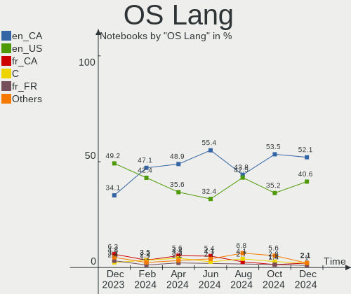
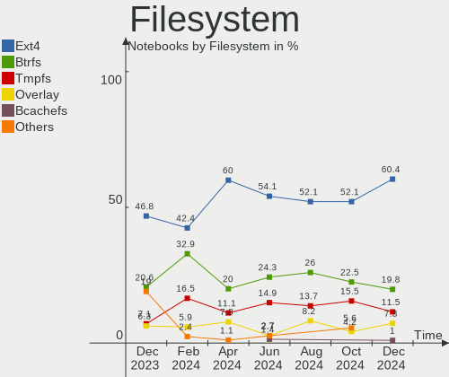
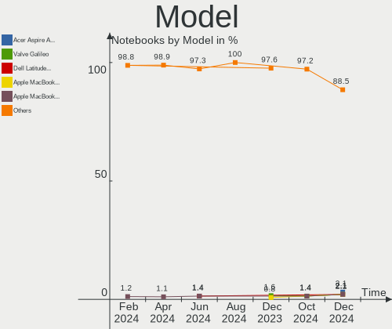
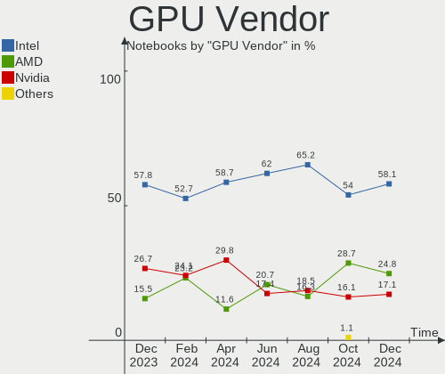
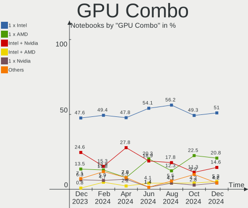
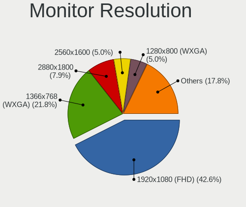
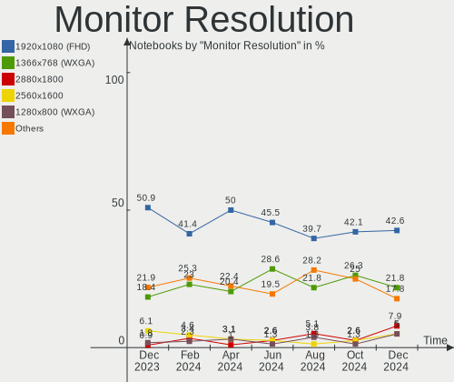
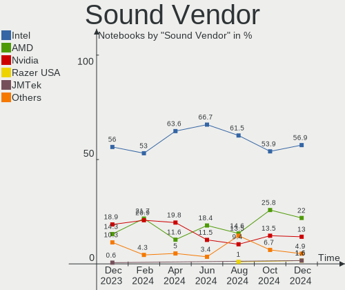
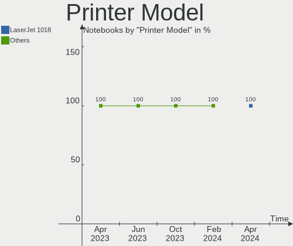

Linux in Canada - Hardware Trends (Notebooks)
---------------------------------------------

A project to identify most popular hardware characteristics and track their change
over time based on data collected by Linux users at https://Linux-Hardware.org.

Anyone can contribute to this report by the [hw-probe](https://github.com/linuxhw/hw-probe) tool:

    sudo -E hw-probe -all -upload

Contents
--------

* [ System ](#system)
  - [ OS                       ](#os)
  - [ OS Family                ](#os-family)
  - [ Kernel                   ](#kernel)
  - [ Kernel Family            ](#kernel-family)
  - [ Kernel Major Ver.        ](#kernel-major-ver)
  - [ Arch                     ](#arch)
  - [ DE                       ](#de)
  - [ Display Server           ](#display-server)
  - [ Display Manager          ](#display-manager)
  - [ OS Lang                  ](#os-lang)
  - [ Boot Mode                ](#boot-mode)
  - [ Filesystem               ](#filesystem)
  - [ Part. scheme             ](#part-scheme)
  - [ Dual Boot with Linux/BSD ](#dual-boot-with-linuxbsd)
  - [ Dual Boot (Win)          ](#dual-boot-win)

* [ Board ](#board)
  - [ Vendor                   ](#vendor)
  - [ Model                    ](#model)
  - [ Model Family             ](#model-family)
  - [ MFG Year                 ](#mfg-year)
  - [ Form Factor              ](#form-factor)
  - [ Secure Boot              ](#secure-boot)
  - [ Coreboot                 ](#coreboot)
  - [ RAM Size                 ](#ram-size)
  - [ RAM Used                 ](#ram-used)
  - [ Total Drives             ](#total-drives)
  - [ Has CD-ROM               ](#has-cd-rom)
  - [ Has Ethernet             ](#has-ethernet)
  - [ Has WiFi                 ](#has-wifi)
  - [ Has Bluetooth            ](#has-bluetooth)

* [ Location ](#location)
  - [ Country                  ](#country)
  - [ City                     ](#city)

* [ Drives ](#drives)
  - [ Drive Vendor             ](#drive-vendor)
  - [ Drive Model              ](#drive-model)
  - [ HDD Vendor               ](#hdd-vendor)
  - [ SSD Vendor               ](#ssd-vendor)
  - [ Drive Kind               ](#drive-kind)
  - [ Drive Connector          ](#drive-connector)
  - [ Drive Size               ](#drive-size)
  - [ Space Total              ](#space-total)
  - [ Space Used               ](#space-used)
  - [ Malfunc. Drives          ](#malfunc-drives)
  - [ Malfunc. Drive Vendor    ](#malfunc-drive-vendor)
  - [ Malfunc. HDD Vendor      ](#malfunc-hdd-vendor)
  - [ Malfunc. Drive Kind      ](#malfunc-drive-kind)
  - [ Failed Drives            ](#failed-drives)
  - [ Failed Drive Vendor      ](#failed-drive-vendor)
  - [ Drive Status             ](#drive-status)

* [ Storage controller ](#storage-controller)
  - [ Storage Vendor           ](#storage-vendor)
  - [ Storage Model            ](#storage-model)
  - [ Storage Kind             ](#storage-kind)

* [ Processor ](#processor)
  - [ CPU Vendor               ](#cpu-vendor)
  - [ CPU Model                ](#cpu-model)
  - [ CPU Model Family         ](#cpu-model-family)
  - [ CPU Cores                ](#cpu-cores)
  - [ CPU Sockets              ](#cpu-sockets)
  - [ CPU Threads              ](#cpu-threads)
  - [ CPU Op-Modes             ](#cpu-op-modes)
  - [ CPU Microcode            ](#cpu-microcode)
  - [ CPU Microarch            ](#cpu-microarch)

* [ Graphics ](#graphics)
  - [ GPU Vendor               ](#gpu-vendor)
  - [ GPU Model                ](#gpu-model)
  - [ GPU Combo                ](#gpu-combo)
  - [ GPU Driver               ](#gpu-driver)
  - [ GPU Memory               ](#gpu-memory)

* [ Monitor ](#monitor)
  - [ Monitor Vendor           ](#monitor-vendor)
  - [ Monitor Model            ](#monitor-model)
  - [ Monitor Resolution       ](#monitor-resolution)
  - [ Monitor Diagonal         ](#monitor-diagonal)
  - [ Monitor Width            ](#monitor-width)
  - [ Aspect Ratio             ](#aspect-ratio)
  - [ Monitor Area             ](#monitor-area)
  - [ Pixel Density            ](#pixel-density)
  - [ Multiple Monitors        ](#multiple-monitors)

* [ Network ](#network)
  - [ Net Controller Vendor    ](#net-controller-vendor)
  - [ Net Controller Model     ](#net-controller-model)
  - [ Wireless Vendor          ](#wireless-vendor)
  - [ Wireless Model           ](#wireless-model)
  - [ Ethernet Vendor          ](#ethernet-vendor)
  - [ Ethernet Model           ](#ethernet-model)
  - [ Net Controller Kind      ](#net-controller-kind)
  - [ Used Controller          ](#used-controller)
  - [ NICs                     ](#nics)
  - [ IPv6                     ](#ipv6)

* [ Bluetooth ](#bluetooth)
  - [ Bluetooth Vendor         ](#bluetooth-vendor)
  - [ Bluetooth Model          ](#bluetooth-model)

* [ Sound ](#sound)
  - [ Sound Vendor             ](#sound-vendor)
  - [ Sound Model              ](#sound-model)

* [ Memory ](#memory)
  - [ Memory Vendor            ](#memory-vendor)
  - [ Memory Model             ](#memory-model)
  - [ Memory Kind              ](#memory-kind)
  - [ Memory Form Factor       ](#memory-form-factor)
  - [ Memory Size              ](#memory-size)
  - [ Memory Speed             ](#memory-speed)

* [ Printers & scanners ](#printers--scanners)
  - [ Printer Vendor           ](#printer-vendor)
  - [ Printer Model            ](#printer-model)
  - [ Scanner Vendor           ](#scanner-vendor)
  - [ Scanner Model            ](#scanner-model)

* [ Camera ](#camera)
  - [ Camera Vendor            ](#camera-vendor)
  - [ Camera Model             ](#camera-model)

* [ Security ](#security)
  - [ Fingerprint Vendor       ](#fingerprint-vendor)
  - [ Fingerprint Model        ](#fingerprint-model)
  - [ Chipcard Vendor          ](#chipcard-vendor)
  - [ Chipcard Model           ](#chipcard-model)

* [ Unsupported ](#unsupported)
  - [ Unsupported Devices      ](#unsupported-devices)
  - [ Unsupported Device Types ](#unsupported-device-types)

System
------

OS
--

Installed operating systems

| Name                         | Notebooks | Percent |
|------------------------------|-----------|---------|
| Ubuntu 22.04                 | 11        | 16.42%  |
| Linux Mint 20.3              | 5         | 7.46%   |
| Pop!_OS 22.04                | 4         | 5.97%   |
| Manjaro                      | 4         | 5.97%   |
| Fedora 36                    | 4         | 5.97%   |
| Zorin 16                     | 3         | 4.48%   |
| OpenMandriva 4.3             | 3         | 4.48%   |
| Ubuntu 20.04                 | 2         | 2.99%   |
| Garuda Linux                 | 2         | 2.99%   |
| Arch Rolling                 | 2         | 2.99%   |
| Arch                         | 2         | 2.99%   |
| Ubuntu MATE 20.04            | 1         | 1.49%   |
| Ubuntu 18.04                 | 1         | 1.49%   |
| SteamOS 3.1                  | 1         | 1.49%   |
| ROSA 12.2                    | 1         | 1.49%   |
| openSUSE Tumbleweed-XXXXXXXX | 1         | 1.49%   |
| Manjaro 21.2.6               | 1         | 1.49%   |
| Makulu Build: 2021.12.15     | 1         | 1.49%   |
| Lubuntu 22.04                | 1         | 1.49%   |
| Kubuntu 22.04                | 1         | 1.49%   |
| Kubuntu 21.10                | 1         | 1.49%   |
| KDE neon 20.04               | 1         | 1.49%   |
| Kali 2022.1                  | 1         | 1.49%   |
| Kali 2021.4                  | 1         | 1.49%   |
| Gentoo 2.8                   | 1         | 1.49%   |
| Gentoo 2.6                   | 1         | 1.49%   |
| Garuda Linux Soaring         | 1         | 1.49%   |
| Fedora 35                    | 1         | 1.49%   |
| Endless 4.0.6                | 1         | 1.49%   |
| Endless 4.0.4                | 1         | 1.49%   |
| EndeavourOS Rolling          | 1         | 1.49%   |
| Elementary 6.1               | 1         | 1.49%   |
| Debian Testing               | 1         | 1.49%   |
| Debian 11                    | 1         | 1.49%   |
| ArcoLinux Rolling            | 1         | 1.49%   |
| ArcoLinux                    | 1         | 1.49%   |

OS Family
---------

OS without a version

| Name         | Notebooks | Percent |
|--------------|-----------|---------|
| Ubuntu       | 14        | 20.9%   |
| Manjaro      | 5         | 7.46%   |
| Linux Mint   | 5         | 7.46%   |
| Fedora       | 5         | 7.46%   |
| Pop!_OS      | 4         | 5.97%   |
| Arch         | 4         | 5.97%   |
| Zorin        | 3         | 4.48%   |
| OpenMandriva | 3         | 4.48%   |
| Garuda Linux | 3         | 4.48%   |
| Kubuntu      | 2         | 2.99%   |
| Kali         | 2         | 2.99%   |
| Gentoo       | 2         | 2.99%   |
| Endless      | 2         | 2.99%   |
| Debian       | 2         | 2.99%   |
| ArcoLinux    | 2         | 2.99%   |
| Ubuntu MATE  | 1         | 1.49%   |
| SteamOS      | 1         | 1.49%   |
| ROSA         | 1         | 1.49%   |
| openSUSE     | 1         | 1.49%   |
| Makulu       | 1         | 1.49%   |
| Lubuntu      | 1         | 1.49%   |
| KDE neon     | 1         | 1.49%   |
| EndeavourOS  | 1         | 1.49%   |
| Elementary   | 1         | 1.49%   |

Kernel
------

Version of the Linux kernel

| Version                                         | Notebooks | Percent |
|-------------------------------------------------|-----------|---------|
| 5.15.0-27-generic                               | 6         | 8.96%   |
| 5.15.0-30-generic                               | 5         | 7.46%   |
| 5.17.9-zen1-1-zen                               | 3         | 4.48%   |
| 5.17.5-76051705-generic                         | 3         | 4.48%   |
| 5.16.7-desktop-1omv4003                         | 3         | 4.48%   |
| 5.15.32-1-MANJARO                               | 3         | 4.48%   |
| 5.13.0-44-generic                               | 3         | 4.48%   |
| 5.13.0-40-generic                               | 3         | 4.48%   |
| 5.4.0-110-generic                               | 2         | 2.99%   |
| 5.17.9-arch1-1                                  | 2         | 2.99%   |
| 5.17.8-300.fc36.x86_64                          | 2         | 2.99%   |
| 5.17.6-arch1-1                                  | 2         | 2.99%   |
| 5.17.5-arch1-1                                  | 2         | 2.99%   |
| 5.13.0-41-generic                               | 2         | 2.99%   |
| 5.11.0-35-generic                               | 2         | 2.99%   |
| 5.4.0-91-generic                                | 1         | 1.49%   |
| 5.4.0-84-generic                                | 1         | 1.49%   |
| 5.4.0-113-generic                               | 1         | 1.49%   |
| 5.4.0-109-generic                               | 1         | 1.49%   |
| 5.18.0-rc7-x86_64-git-00119-gb015dcd62b86-dirty | 1         | 1.49%   |
| 5.18.0-arch1-1                                  | 1         | 1.49%   |
| 5.17.9-300.fc36.x86_64                          | 1         | 1.49%   |
| 5.17.8-051708-generic                           | 1         | 1.49%   |
| 5.17.7-1-default                                | 1         | 1.49%   |
| 5.17.5-301.fsync.fc35.x86_64                    | 1         | 1.49%   |
| 5.17.11-300.fc36.x86_64                         | 1         | 1.49%   |
| 5.17.1-3-MANJARO                                | 1         | 1.49%   |
| 5.17.0-kali1-amd64                              | 1         | 1.49%   |
| 5.17.0-1-amd64                                  | 1         | 1.49%   |
| 5.16.19-76051619-generic                        | 1         | 1.49%   |
| 5.15.38-1-MANJARO                               | 1         | 1.49%   |
| 5.15.10-gentoo                                  | 1         | 1.49%   |
| 5.15.0-kali3-amd64                              | 1         | 1.49%   |
| 5.15.0-35-generic                               | 1         | 1.49%   |
| 5.13.0-valve10.3-1-neptune-02176-g5fe416c4acd8  | 1         | 1.49%   |
| 5.13.0-30-generic                               | 1         | 1.49%   |
| 5.11.0-41-generic                               | 1         | 1.49%   |
| 5.10.74-generic-2rosa2021.1-x86_64              | 1         | 1.49%   |
| 5.10.0-14-amd64                                 | 1         | 1.49%   |

Kernel Family
-------------

Linux kernel without a distro release

| Version | Notebooks | Percent |
|---------|-----------|---------|
| 5.15.0  | 13        | 19.4%   |
| 5.13.0  | 10        | 14.93%  |
| 5.4.0   | 6         | 8.96%   |
| 5.17.9  | 6         | 8.96%   |
| 5.17.5  | 6         | 8.96%   |
| 5.17.8  | 3         | 4.48%   |
| 5.16.7  | 3         | 4.48%   |
| 5.15.32 | 3         | 4.48%   |
| 5.11.0  | 3         | 4.48%   |
| 5.18.0  | 2         | 2.99%   |
| 5.17.6  | 2         | 2.99%   |
| 5.17.0  | 2         | 2.99%   |
| 5.17.7  | 1         | 1.49%   |
| 5.17.11 | 1         | 1.49%   |
| 5.17.1  | 1         | 1.49%   |
| 5.16.19 | 1         | 1.49%   |
| 5.15.38 | 1         | 1.49%   |
| 5.15.10 | 1         | 1.49%   |
| 5.10.74 | 1         | 1.49%   |
| 5.10.0  | 1         | 1.49%   |

Kernel Major Ver.
-----------------

Linux kernel major version

| Version | Notebooks | Percent |
|---------|-----------|---------|
| 5.17    | 22        | 32.84%  |
| 5.15    | 18        | 26.87%  |
| 5.13    | 10        | 14.93%  |
| 5.4     | 6         | 8.96%   |
| 5.16    | 4         | 5.97%   |
| 5.11    | 3         | 4.48%   |
| 5.18    | 2         | 2.99%   |
| 5.10    | 2         | 2.99%   |

Arch
----

OS architecture (x86_64, i586, etc.)

| Name   | Notebooks | Percent |
|--------|-----------|---------|
| x86_64 | 67        | 100%    |

DE
--

Desktop Environment

| Name            | Notebooks | Percent |
|-----------------|-----------|---------|
| GNOME           | 29        | 43.28%  |
| KDE5            | 20        | 29.85%  |
| XFCE            | 5         | 7.46%   |
| Unknown         | 4         | 5.97%   |
| X-Cinnamon      | 3         | 4.48%   |
| MATE            | 2         | 2.99%   |
| Pantheon        | 1         | 1.49%   |
| LXQt            | 1         | 1.49%   |
| i3              | 1         | 1.49%   |
| GNOME Flashback | 1         | 1.49%   |

Display Server
--------------

X11 or Wayland

| Name    | Notebooks | Percent |
|---------|-----------|---------|
| X11     | 49        | 73.13%  |
| Wayland | 14        | 20.9%   |
| Tty     | 2         | 2.99%   |
| Unknown | 2         | 2.99%   |

Display Manager
---------------

SDDM, LightDM, etc.

| Name    | Notebooks | Percent |
|---------|-----------|---------|
| Unknown | 32        | 47.76%  |
| GDM3    | 13        | 19.4%   |
| SDDM    | 12        | 17.91%  |
| LightDM | 5         | 7.46%   |
| GDM     | 4         | 5.97%   |
| Ly      | 1         | 1.49%   |

OS Lang
-------

Language

| Lang    | Notebooks | Percent |
|---------|-----------|---------|
| en_CA   | 35        | 52.24%  |
| en_US   | 24        | 35.82%  |
| fr_CA   | 2         | 2.99%   |
| C       | 2         | 2.99%   |
| Unknown | 2         | 2.99%   |
| ro_RO   | 1         | 1.49%   |
| POSIX   | 1         | 1.49%   |

Boot Mode
---------

EFI or BIOS

| Mode | Notebooks | Percent |
|------|-----------|---------|
| EFI  | 35        | 52.24%  |
| BIOS | 32        | 47.76%  |

Filesystem
----------

Type of filesystem

| Type    | Notebooks | Percent |
|---------|-----------|---------|
| Ext4    | 52        | 77.61%  |
| Btrfs   | 12        | 17.91%  |
| Overlay | 2         | 2.99%   |
| Xfs     | 1         | 1.49%   |

Part. scheme
------------

Scheme of partitioning

| Type    | Notebooks | Percent |
|---------|-----------|---------|
| Unknown | 40        | 59.7%   |
| GPT     | 24        | 35.82%  |
| MBR     | 3         | 4.48%   |

Dual Boot with Linux/BSD
------------------------

Hosting more than one Linux/BSD

| Dual boot | Notebooks | Percent |
|-----------|-----------|---------|
| No        | 62        | 92.54%  |
| Yes       | 5         | 7.46%   |

Dual Boot (Win)
---------------

Hosting Linux and Windows

| Dual boot | Notebooks | Percent |
|-----------|-----------|---------|
| No        | 56        | 83.58%  |
| Yes       | 11        | 16.42%  |

Board
-----

Vendor
------

Motherboard manufacturer

| Name              | Notebooks | Percent |
|-------------------|-----------|---------|
| Dell              | 21        | 31.34%  |
| Lenovo            | 10        | 14.93%  |
| ASUSTek Computer  | 9         | 13.43%  |
| Hewlett-Packard   | 6         | 8.96%   |
| Acer              | 5         | 7.46%   |
| MSI               | 4         | 5.97%   |
| Alienware         | 3         | 4.48%   |
| Toshiba           | 2         | 2.99%   |
| Apple             | 2         | 2.99%   |
| Unknown           | 2         | 2.99%   |
| Valve             | 1         | 1.49%   |
| Google            | 1         | 1.49%   |
| A-DATA Technology | 1         | 1.49%   |

Model
-----

Motherboard model

| Name                                    | Notebooks | Percent |
|-----------------------------------------|-----------|---------|
| Dell XPS 15 9510                        | 2         | 2.99%   |
| Dell XPS 13 9310                        | 2         | 2.99%   |
| Unknown                                 | 2         | 2.99%   |
| Valve Jupiter                           | 1         | 1.49%   |
| Toshiba Satellite L655                  | 1         | 1.49%   |
| Toshiba Satellite C670D                 | 1         | 1.49%   |
| MSI Stealth GS66 12UE                   | 1         | 1.49%   |
| MSI MS-7A34                             | 1         | 1.49%   |
| MSI GS65 Stealth 8SG                    | 1         | 1.49%   |
| MSI GF75 Thin 9SC                       | 1         | 1.49%   |
| Lenovo ThinkPad X131e 33691J6           | 1         | 1.49%   |
| Lenovo ThinkPad W520 42763JF            | 1         | 1.49%   |
| Lenovo ThinkPad T490 20N2CTO1WW         | 1         | 1.49%   |
| Lenovo ThinkPad T460s 20FAS0F400        | 1         | 1.49%   |
| Lenovo ThinkPad T440p 20AN00DEUS        | 1         | 1.49%   |
| Lenovo ThinkPad P15 Gen 1 20SUS5W400    | 1         | 1.49%   |
| Lenovo Legion 7 15IMH05 81YT            | 1         | 1.49%   |
| Lenovo IdeaPad 3 15IIL05 81WE           | 1         | 1.49%   |
| Lenovo IdeaPad 3 15ARE05 81W4           | 1         | 1.49%   |
| Lenovo Edge 15 80K9                     | 1         | 1.49%   |
| HP ZBook 15 G3                          | 1         | 1.49%   |
| HP Stream Laptop 11-ak1xxx              | 1         | 1.49%   |
| HP Pavilion g4                          | 1         | 1.49%   |
| HP Notebook                             | 1         | 1.49%   |
| HP Laptop 15-ef0xxx                     | 1         | 1.49%   |
| HP Laptop 15-bs0xx                      | 1         | 1.49%   |
| Google Terra                            | 1         | 1.49%   |
| Dell XPS 13 9370                        | 1         | 1.49%   |
| Dell XPS 13 9343                        | 1         | 1.49%   |
| Dell Vostro 3500                        | 1         | 1.49%   |
| Dell Studio XPS 1645                    | 1         | 1.49%   |
| Dell Precision 5550                     | 1         | 1.49%   |
| Dell Latitude E6540                     | 1         | 1.49%   |
| Dell Latitude E6420                     | 1         | 1.49%   |
| Dell Latitude E6400                     | 1         | 1.49%   |
| Dell Latitude E5450                     | 1         | 1.49%   |
| Dell Latitude D830                      | 1         | 1.49%   |
| Dell Latitude D630                      | 1         | 1.49%   |
| Dell Latitude 5430 Rugged               | 1         | 1.49%   |
| Dell Latitude 5289                      | 1         | 1.49%   |
| Dell Inspiron 5593                      | 1         | 1.49%   |
| Dell Inspiron 5565                      | 1         | 1.49%   |
| Dell Inspiron 15 5510                   | 1         | 1.49%   |
| Dell G15 5515                           | 1         | 1.49%   |
| ASUS X551MA                             | 1         | 1.49%   |
| ASUS X541UAK                            | 1         | 1.49%   |
| ASUS X200CA                             | 1         | 1.49%   |
| ASUS VivoBook_ASUSLaptop E410MAB_L410MA | 1         | 1.49%   |
| ASUS TUF Gaming FX505GT_FX505GT         | 1         | 1.49%   |
| ASUS Strix 17 GL703GE                   | 1         | 1.49%   |
| ASUS ROG Zephyrus G14 GA401QM_GA401QM   | 1         | 1.49%   |
| ASUS ROG Strix G513QY_G513QY            | 1         | 1.49%   |
| ASUS G73Jh                              | 1         | 1.49%   |
| Apple MacBookPro11,2                    | 1         | 1.49%   |
| Apple MacBookAir4,1                     | 1         | 1.49%   |
| Alienware x17 R2                        | 1         | 1.49%   |
| Alienware m15 Ryzen Ed. R5              | 1         | 1.49%   |
| Alienware m15 R4                        | 1         | 1.49%   |
| Acer TravelMate P653-M                  | 1         | 1.49%   |
| Acer Swift SF314-42                     | 1         | 1.49%   |

Model Family
------------

Motherboard model prefix

| Name               | Notebooks | Percent |
|--------------------|-----------|---------|
| Dell Latitude      | 8         | 11.94%  |
| Lenovo ThinkPad    | 6         | 8.96%   |
| Dell XPS           | 6         | 8.96%   |
| Dell Inspiron      | 3         | 4.48%   |
| Toshiba Satellite  | 2         | 2.99%   |
| Lenovo IdeaPad     | 2         | 2.99%   |
| HP Laptop          | 2         | 2.99%   |
| ASUS ROG           | 2         | 2.99%   |
| Alienware m15      | 2         | 2.99%   |
| Acer Aspire        | 2         | 2.99%   |
| Unknown            | 2         | 2.99%   |
| Valve Jupiter      | 1         | 1.49%   |
| MSI Stealth        | 1         | 1.49%   |
| MSI MS-7A34        | 1         | 1.49%   |
| MSI GS65           | 1         | 1.49%   |
| MSI GF75           | 1         | 1.49%   |
| Lenovo Legion      | 1         | 1.49%   |
| Lenovo Edge        | 1         | 1.49%   |
| HP ZBook           | 1         | 1.49%   |
| HP Stream          | 1         | 1.49%   |
| HP Pavilion        | 1         | 1.49%   |
| HP Notebook        | 1         | 1.49%   |
| Google Terra       | 1         | 1.49%   |
| Dell Vostro        | 1         | 1.49%   |
| Dell Studio        | 1         | 1.49%   |
| Dell Precision     | 1         | 1.49%   |
| Dell G15           | 1         | 1.49%   |
| ASUS X551MA        | 1         | 1.49%   |
| ASUS X541UAK       | 1         | 1.49%   |
| ASUS X200CA        | 1         | 1.49%   |
| ASUS VivoBook      | 1         | 1.49%   |
| ASUS TUF           | 1         | 1.49%   |
| ASUS Strix         | 1         | 1.49%   |
| ASUS G73Jh         | 1         | 1.49%   |
| Apple MacBookPro11 | 1         | 1.49%   |
| Apple MacBookAir4  | 1         | 1.49%   |
| Alienware x17      | 1         | 1.49%   |
| Acer TravelMate    | 1         | 1.49%   |
| Acer Swift         | 1         | 1.49%   |
| Acer Predator      | 1         | 1.49%   |
| A-DATA XENIA       | 1         | 1.49%   |

MFG Year
--------

Motherboard manufacture year

| Year | Notebooks | Percent |
|------|-----------|---------|
| 2020 | 13        | 19.4%   |
| 2021 | 11        | 16.42%  |
| 2016 | 5         | 7.46%   |
| 2011 | 5         | 7.46%   |
| 2019 | 4         | 5.97%   |
| 2018 | 4         | 5.97%   |
| 2015 | 4         | 5.97%   |
| 2013 | 4         | 5.97%   |
| 2010 | 4         | 5.97%   |
| 2022 | 3         | 4.48%   |
| 2012 | 3         | 4.48%   |
| 2017 | 2         | 2.99%   |
| 2007 | 2         | 2.99%   |
| 2014 | 1         | 1.49%   |
| 2009 | 1         | 1.49%   |
| 2008 | 1         | 1.49%   |

Form Factor
-----------

Physical design of the computer

| Name     | Notebooks | Percent |
|----------|-----------|---------|
| Notebook | 67        | 100%    |

Secure Boot
-----------

Enabled or disabled

| State    | Notebooks | Percent |
|----------|-----------|---------|
| Disabled | 59        | 88.06%  |
| Enabled  | 8         | 11.94%  |

Coreboot
--------

Have coreboot on board

| Used | Notebooks | Percent |
|------|-----------|---------|
| No   | 66        | 98.51%  |
| Yes  | 1         | 1.49%   |

RAM Size
--------

Total RAM memory

| Size in GB  | Notebooks | Percent |
|-------------|-----------|---------|
| 16.01-24.0  | 17        | 25.37%  |
| 3.01-4.0    | 16        | 23.88%  |
| 4.01-8.0    | 11        | 16.42%  |
| 32.01-64.0  | 10        | 14.93%  |
| 8.01-16.0   | 9         | 13.43%  |
| 64.01-256.0 | 2         | 2.99%   |
| 24.01-32.0  | 1         | 1.49%   |
| 1.01-2.0    | 1         | 1.49%   |

RAM Used
--------

Used RAM memory

| Used GB   | Notebooks | Percent |
|-----------|-----------|---------|
| 1.01-2.0  | 22        | 32.84%  |
| 3.01-4.0  | 15        | 22.39%  |
| 4.01-8.0  | 12        | 17.91%  |
| 2.01-3.0  | 10        | 14.93%  |
| 8.01-16.0 | 5         | 7.46%   |
| 0.51-1.0  | 3         | 4.48%   |

Total Drives
------------

Number of drives on board

| Drives | Notebooks | Percent |
|--------|-----------|---------|
| 1      | 42        | 62.69%  |
| 2      | 23        | 34.33%  |
| 4      | 1         | 1.49%   |
| 3      | 1         | 1.49%   |

Has CD-ROM
----------

Has CD-ROM on board

| Presented | Notebooks | Percent |
|-----------|-----------|---------|
| No        | 50        | 74.63%  |
| Yes       | 17        | 25.37%  |

Has Ethernet
------------

Has Ethernet on board

| Presented | Notebooks | Percent |
|-----------|-----------|---------|
| Yes       | 50        | 74.63%  |
| No        | 17        | 25.37%  |

Has WiFi
--------

Has WiFi module

| Presented | Notebooks | Percent |
|-----------|-----------|---------|
| Yes       | 66        | 98.51%  |
| No        | 1         | 1.49%   |

Has Bluetooth
-------------

Has Bluetooth module

| Presented | Notebooks | Percent |
|-----------|-----------|---------|
| Yes       | 57        | 85.07%  |
| No        | 10        | 14.93%  |

Location
--------

Country
-------

Geographic location (country)

| Country | Notebooks | Percent |
|---------|-----------|---------|
| Canada  | 67        | 100%    |

City
----

Geographic location (city)

| City               | Notebooks | Percent |
|--------------------|-----------|---------|
| Toronto            | 7         | 10.45%  |
| Montreal           | 5         | 7.46%   |
| Vancouver          | 4         | 5.97%   |
| Regina             | 4         | 5.97%   |
| Calgary            | 4         | 5.97%   |
| Québec            | 3         | 4.48%   |
| Saskatoon          | 2         | 2.99%   |
| Mississauga        | 2         | 2.99%   |
| Winnipeg           | 1         | 1.49%   |
| Whistler           | 1         | 1.49%   |
| Weyburn            | 1         | 1.49%   |
| Victoria           | 1         | 1.49%   |
| Vermilion          | 1         | 1.49%   |
| Surrey             | 1         | 1.49%   |
| Smiths Falls       | 1         | 1.49%   |
| Saint John         | 1         | 1.49%   |
| Red Deer           | 1         | 1.49%   |
| Qualicum Beach     | 1         | 1.49%   |
| Port Hawkesbury    | 1         | 1.49%   |
| Ottawa             | 1         | 1.49%   |
| Oakville           | 1         | 1.49%   |
| Nipigon            | 1         | 1.49%   |
| New Westminster    | 1         | 1.49%   |
| New Glasgow        | 1         | 1.49%   |
| Napierville        | 1         | 1.49%   |
| Meadow Creek       | 1         | 1.49%   |
| Markham            | 1         | 1.49%   |
| Laval              | 1         | 1.49%   |
| L'Ancienne-Lorette | 1         | 1.49%   |
| Kitchener          | 1         | 1.49%   |
| Kirkland           | 1         | 1.49%   |
| Kinburn            | 1         | 1.49%   |
| Kelowna            | 1         | 1.49%   |
| Halifax            | 1         | 1.49%   |
| Glenwood           | 1         | 1.49%   |
| Gatineau           | 1         | 1.49%   |
| Dartmouth          | 1         | 1.49%   |
| Coquitlam          | 1         | 1.49%   |
| Burnaby            | 1         | 1.49%   |
| Burlington         | 1         | 1.49%   |
| Brantford          | 1         | 1.49%   |
| Brampton           | 1         | 1.49%   |
| Beauharnois        | 1         | 1.49%   |
| Barrie             | 1         | 1.49%   |

Drives
------

Drive Vendor
------------

Hard drive vendors

| Vendor              | Notebooks | Drives | Percent |
|---------------------|-----------|--------|---------|
| Samsung Electronics | 17        | 20     | 19.77%  |
| WDC                 | 12        | 13     | 13.95%  |
| Seagate             | 9         | 11     | 10.47%  |
| SK Hynix            | 6         | 6      | 6.98%   |
| SanDisk             | 6         | 6      | 6.98%   |
| Unknown             | 5         | 6      | 5.81%   |
| Toshiba             | 5         | 5      | 5.81%   |
| Micron Technology   | 3         | 3      | 3.49%   |
| Kingston            | 3         | 4      | 3.49%   |
| Intel               | 3         | 3      | 3.49%   |
| KIOXIA              | 2         | 2      | 2.33%   |
| Hitachi             | 2         | 2      | 2.33%   |
| Crucial             | 2         | 2      | 2.33%   |
| Apple               | 2         | 2      | 2.33%   |
| Phison              | 1         | 1      | 1.16%   |
| Mushkin             | 1         | 1      | 1.16%   |
| KingSpec            | 1         | 1      | 1.16%   |
| KingFast            | 1         | 1      | 1.16%   |
| Inateck             | 1         | 1      | 1.16%   |
| HGST                | 1         | 1      | 1.16%   |
| China               | 1         | 1      | 1.16%   |
| A-DATA Technology   | 1         | 2      | 1.16%   |
| Unknown             | 1         | 1      | 1.16%   |

Drive Model
-----------

Hard drive models

| Model                                   | Notebooks | Percent |
|-----------------------------------------|-----------|---------|
| SK Hynix NVMe SSD Drive 512GB           | 3         | 3.19%   |
| Toshiba MQ01ABD100 1TB                  | 2         | 2.13%   |
| Seagate Expansion 4TB                   | 2         | 2.13%   |
| Sandisk NVMe SSD Drive 512GB            | 2         | 2.13%   |
| Samsung SSD 970 EVO Plus 1TB            | 2         | 2.13%   |
| Samsung NVMe SSD Drive 500GB            | 2         | 2.13%   |
| Samsung MZVLB512HAJQ-00000 512GB        | 2         | 2.13%   |
| WDC WDS500G2X0C-00L350 500GB            | 1         | 1.06%   |
| WDC WDS500G2B0B 500GB SSD               | 1         | 1.06%   |
| WDC WDS100T2B0B-00YS70 1TB SSD          | 1         | 1.06%   |
| WDC WDBRPG0010BNC-WRSN 1TB              | 1         | 1.06%   |
| WDC WDBNCE5000PNC 500GB SSD             | 1         | 1.06%   |
| WDC WD3200BEVT-22ZCT0 320GB             | 1         | 1.06%   |
| WDC WD10SPZX-22Z10T1 1TB                | 1         | 1.06%   |
| WDC WD10JPVX-22JC3T0 1TB                | 1         | 1.06%   |
| WDC WD10EZEX-08M2NA0 1TB                | 1         | 1.06%   |
| WDC PC SN530 SDBPNPZ-512G-1114 512GB    | 1         | 1.06%   |
| WDC PC SN530 SDBPMPZ-512G-1101 512GB    | 1         | 1.06%   |
| WDC PC SN530 SDBPMPZ-256G-1101 256GB    | 1         | 1.06%   |
| WDC PC SN530 NVMe 512GB                 | 1         | 1.06%   |
| Unknown TA2964  64GB                    | 1         | 1.06%   |
| Unknown SF64G  64GB                     | 1         | 1.06%   |
| Unknown NVMe SSD Drive 1024GB           | 1         | 1.06%   |
| Unknown MMC Card  512GB                 | 1         | 1.06%   |
| Unknown hB8aP  32GB                     | 1         | 1.06%   |
| Unknown DA4032  32GB                    | 1         | 1.06%   |
| Toshiba MQ01ABF050 500GB                | 1         | 1.06%   |
| Toshiba MQ01ABD100V -63 1TB             | 1         | 1.06%   |
| Toshiba MK6476GSX 640GB                 | 1         | 1.06%   |
| SK Hynix PC711 NVMe 512GB               | 1         | 1.06%   |
| SK Hynix PC401 NVMe 1TB                 | 1         | 1.06%   |
| SK Hynix HFM001TD3JX013N 1TB            | 1         | 1.06%   |
| Seagate ST9500325AS 500GB               | 1         | 1.06%   |
| Seagate ST500LT012-1DG142 500GB         | 1         | 1.06%   |
| Seagate ST320LT012-9WS14C 320GB         | 1         | 1.06%   |
| Seagate ST320LT007-9ZV142 320GB         | 1         | 1.06%   |
| Seagate ST1000LX015-1U7172 1TB          | 1         | 1.06%   |
| Seagate ST1000LM048-2E7172 1TB          | 1         | 1.06%   |
| Seagate ST1000LM035-1RK172 1TB          | 1         | 1.06%   |
| Seagate BUP Portable 5TB                | 1         | 1.06%   |
| Seagate BarraCuda SSD ZA1000CM10002 1TB | 1         | 1.06%   |
| SanDisk SSD PLUS 1000GB                 | 1         | 1.06%   |
| SanDisk SD6SB1M-128G-1006 128GB SSD     | 1         | 1.06%   |
| Sandisk NVMe SSD Drive 500GB            | 1         | 1.06%   |
| Sandisk NVMe SSD Drive 1024GB           | 1         | 1.06%   |
| Samsung SSD PM851 2.5 7mm 256GB         | 1         | 1.06%   |
| Samsung SSD PM830 2.5 7mm 128GB         | 1         | 1.06%   |
| Samsung SSD 970 EVO 1TB                 | 1         | 1.06%   |
| Samsung SSD 960 PRO 512GB               | 1         | 1.06%   |
| Samsung SSD 870 EVO 500GB               | 1         | 1.06%   |
| Samsung SSD 860 EVO 250GB               | 1         | 1.06%   |
| Samsung PSSD T7 1TB                     | 1         | 1.06%   |
| Samsung PM991a NVMe 512GB               | 1         | 1.06%   |
| Samsung NVMe SSD Drive 2TB              | 1         | 1.06%   |
| Samsung NVMe SSD Drive 1024GB           | 1         | 1.06%   |
| Samsung MZVLB1T0HBLR-000L2 1TB          | 1         | 1.06%   |
| Samsung MZMTE256HMHP-000MV 256GB SSD    | 1         | 1.06%   |
| Samsung HM320HJ 320GB                   | 1         | 1.06%   |
| Phison NVMe SSD Drive 256GB             | 1         | 1.06%   |
| Mushkin MKNSSDCR120GB                   | 1         | 1.06%   |

HDD Vendor
----------

Hard disk drive vendors

| Vendor              | Notebooks | Drives | Percent |
|---------------------|-----------|--------|---------|
| Seagate             | 8         | 10     | 38.1%   |
| Toshiba             | 5         | 5      | 23.81%  |
| WDC                 | 4         | 4      | 19.05%  |
| Hitachi             | 2         | 2      | 9.52%   |
| Samsung Electronics | 1         | 1      | 4.76%   |
| HGST                | 1         | 1      | 4.76%   |

SSD Vendor
----------

Solid state drive vendors

| Vendor              | Notebooks | Drives | Percent |
|---------------------|-----------|--------|---------|
| Samsung Electronics | 6         | 6      | 26.09%  |
| WDC                 | 3         | 3      | 13.04%  |
| SanDisk             | 2         | 2      | 8.7%    |
| Intel               | 2         | 2      | 8.7%    |
| Apple               | 2         | 2      | 8.7%    |
| Seagate             | 1         | 1      | 4.35%   |
| Mushkin             | 1         | 1      | 4.35%   |
| Micron Technology   | 1         | 1      | 4.35%   |
| Kingston            | 1         | 1      | 4.35%   |
| KingSpec            | 1         | 1      | 4.35%   |
| Crucial             | 1         | 1      | 4.35%   |
| China               | 1         | 1      | 4.35%   |
| A-DATA Technology   | 1         | 2      | 4.35%   |

Drive Kind
----------

HDD or SSD

| Kind    | Notebooks | Drives | Percent |
|---------|-----------|--------|---------|
| NVMe    | 31        | 40     | 38.75%  |
| SSD     | 22        | 24     | 27.5%   |
| HDD     | 20        | 23     | 25%     |
| MMC     | 5         | 6      | 6.25%   |
| Unknown | 2         | 2      | 2.5%    |

Drive Connector
---------------

SATA, SAS, NVMe, etc.

| Type | Notebooks | Drives | Percent |
|------|-----------|--------|---------|
| SATA | 37        | 41     | 46.84%  |
| NVMe | 31        | 40     | 39.24%  |
| SAS  | 6         | 8      | 7.59%   |
| MMC  | 5         | 6      | 6.33%   |

Drive Size
----------

Size of hard drive

| Size in TB | Notebooks | Drives | Percent |
|------------|-----------|--------|---------|
| 0.01-0.5   | 26        | 26     | 57.78%  |
| 0.51-1.0   | 15        | 17     | 33.33%  |
| 3.01-4.0   | 2         | 2      | 4.44%   |
| 1.01-2.0   | 1         | 1      | 2.22%   |
| 4.01-10.0  | 1         | 1      | 2.22%   |

Space Total
-----------

Amount of disk space available on the file system

| Size in GB     | Notebooks | Percent |
|----------------|-----------|---------|
| 251-500        | 21        | 31.34%  |
| 501-1000       | 13        | 19.4%   |
| 101-250        | 9         | 13.43%  |
| 1001-2000      | 8         | 11.94%  |
| 1-20           | 6         | 8.96%   |
| 51-100         | 3         | 4.48%   |
| More than 3000 | 2         | 2.99%   |
| 21-50          | 2         | 2.99%   |
| Unknown        | 2         | 2.99%   |
| 2001-3000      | 1         | 1.49%   |

Space Used
----------

Amount of used disk space

| Used GB   | Notebooks | Percent |
|-----------|-----------|---------|
| 1-20      | 17        | 25.37%  |
| 21-50     | 16        | 23.88%  |
| 51-100    | 10        | 14.93%  |
| 251-500   | 8         | 11.94%  |
| 101-250   | 7         | 10.45%  |
| 501-1000  | 6         | 8.96%   |
| Unknown   | 2         | 2.99%   |
| 1001-2000 | 1         | 1.49%   |

Malfunc. Drives
---------------

Drive models with a malfunction

| Model                          | Notebooks | Drives | Percent |
|--------------------------------|-----------|--------|---------|
| WDC WD10EZEX-08M2NA0 1TB       | 1         | 1      | 33.33%  |
| Seagate ST1000LX015-1U7172 1TB | 1         | 1      | 33.33%  |
| Intel SSDSCKKF256H6 SATA 256GB | 1         | 1      | 33.33%  |

Malfunc. Drive Vendor
---------------------

Vendors of faulty drives

| Vendor  | Notebooks | Drives | Percent |
|---------|-----------|--------|---------|
| WDC     | 1         | 1      | 33.33%  |
| Seagate | 1         | 1      | 33.33%  |
| Intel   | 1         | 1      | 33.33%  |

Malfunc. HDD Vendor
-------------------

Vendors of faulty HDD drives

| Vendor  | Notebooks | Drives | Percent |
|---------|-----------|--------|---------|
| WDC     | 1         | 1      | 50%     |
| Seagate | 1         | 1      | 50%     |

Malfunc. Drive Kind
-------------------

Kinds of faulty drives

| Kind | Notebooks | Drives | Percent |
|------|-----------|--------|---------|
| HDD  | 2         | 2      | 66.67%  |
| SSD  | 1         | 1      | 33.33%  |

Failed Drives
-------------

Failed drive models

Zero info for selected period =(

Failed Drive Vendor
-------------------

Failed drive vendors

Zero info for selected period =(

Drive Status
------------

Number of failed and malfunc. drives

| Status   | Notebooks | Drives | Percent |
|----------|-----------|--------|---------|
| Detected | 45        | 60     | 60.81%  |
| Works    | 26        | 32     | 35.14%  |
| Malfunc  | 3         | 3      | 4.05%   |

Storage controller
------------------

Storage Vendor
--------------

Storage controller vendors

| Vendor                      | Notebooks | Percent |
|-----------------------------|-----------|---------|
| Intel                       | 38        | 45.78%  |
| Samsung Electronics         | 12        | 14.46%  |
| Sandisk                     | 9         | 10.84%  |
| AMD                         | 9         | 10.84%  |
| SK Hynix                    | 6         | 7.23%   |
| Micron Technology           | 2         | 2.41%   |
| KIOXIA                      | 2         | 2.41%   |
| Kingston Technology Company | 2         | 2.41%   |
| Unknown                     | 1         | 1.2%    |
| Phison Electronics          | 1         | 1.2%    |
| Micron/Crucial Technology   | 1         | 1.2%    |

Storage Model
-------------

Storage controller models

| Model                                                                          | Notebooks | Percent |
|--------------------------------------------------------------------------------|-----------|---------|
| Samsung NVMe SSD Controller SM981/PM981/PM983                                  | 8         | 9.2%    |
| AMD FCH SATA Controller [AHCI mode]                                            | 7         | 8.05%   |
| SK Hynix Gold P31 SSD                                                          | 4         | 4.6%    |
| Sandisk WD Black SN750 / PC SN730 NVMe SSD                                     | 4         | 4.6%    |
| Intel 6 Series/C200 Series Chipset Family 6 port Mobile SATA AHCI Controller   | 4         | 4.6%    |
| Sandisk Non-Volatile memory controller                                         | 3         | 3.45%   |
| Intel Wildcat Point-LP SATA Controller [AHCI Mode]                             | 3         | 3.45%   |
| Intel Volume Management Device NVMe RAID Controller                            | 3         | 3.45%   |
| Intel Sunrise Point-LP SATA Controller [AHCI mode]                             | 3         | 3.45%   |
| Intel 82801 Mobile SATA Controller [RAID mode]                                 | 3         | 3.45%   |
| Intel 7 Series Chipset Family 6-port SATA Controller [AHCI mode]               | 3         | 3.45%   |
| Micron Non-Volatile memory controller                                          | 2         | 2.3%    |
| KIOXIA Non-Volatile memory controller                                          | 2         | 2.3%    |
| Intel Ice Lake-LP SATA Controller [AHCI mode]                                  | 2         | 2.3%    |
| Intel Cannon Lake Mobile PCH SATA AHCI Controller                              | 2         | 2.3%    |
| Intel 82801HM/HEM (ICH8M/ICH8M-E) IDE Controller                               | 2         | 2.3%    |
| Intel 8 Series/C220 Series Chipset Family 6-port SATA Controller 1 [AHCI mode] | 2         | 2.3%    |
| Intel 5 Series/3400 Series Chipset 6 port SATA AHCI Controller                 | 2         | 2.3%    |
| Intel 5 Series/3400 Series Chipset 4 port SATA AHCI Controller                 | 2         | 2.3%    |
| AMD SB7x0/SB8x0/SB9x0 SATA Controller [AHCI mode]                              | 2         | 2.3%    |
| Unknown Non-Volatile memory controller                                         | 1         | 1.15%   |
| SK Hynix PC401 NVMe Solid State Drive 256GB                                    | 1         | 1.15%   |
| SK Hynix BC511                                                                 | 1         | 1.15%   |
| Sandisk WD Blue SN550 NVMe SSD                                                 | 1         | 1.15%   |
| Sandisk WD Black 2018/SN750 / PC SN720 NVMe SSD                                | 1         | 1.15%   |
| Samsung NVMe SSD Controller SM961/PM961/SM963                                  | 1         | 1.15%   |
| Samsung NVMe SSD Controller PM9A1/PM9A3/980PRO                                 | 1         | 1.15%   |
| Samsung NVMe SSD Controller 980                                                | 1         | 1.15%   |
| Samsung Apple PCIe SSD                                                         | 1         | 1.15%   |
| Phison PS5013 E13 NVMe Controller                                              | 1         | 1.15%   |
| Micron/Crucial P1 NVMe PCIe SSD                                                | 1         | 1.15%   |
| Kingston Company U-SNS8154P3 NVMe SSD                                          | 1         | 1.15%   |
| Kingston Company OM3PDP3 NVMe SSD                                              | 1         | 1.15%   |
| Intel Q170/Q150/B150/H170/H110/Z170/CM236 Chipset SATA Controller [AHCI Mode]  | 1         | 1.15%   |
| Intel Non-Volatile memory controller                                           | 1         | 1.15%   |
| Intel Celeron/Pentium Silver Processor SATA Controller                         | 1         | 1.15%   |
| Intel Cannon Lake PCH SATA AHCI Controller                                     | 1         | 1.15%   |
| Intel Atom Processor E3800 Series SATA AHCI Controller                         | 1         | 1.15%   |
| Intel 82801IBM/IEM (ICH9M/ICH9M-E) 4 port SATA Controller [AHCI mode]          | 1         | 1.15%   |
| Intel 82801HM/HEM (ICH8M/ICH8M-E) SATA Controller [IDE mode]                   | 1         | 1.15%   |
| Intel 82801HM/HEM (ICH8M/ICH8M-E) SATA Controller [AHCI mode]                  | 1         | 1.15%   |
| Intel 8 Series SATA Controller 1 [AHCI mode]                                   | 1         | 1.15%   |
| AMD SB7x0/SB8x0/SB9x0 IDE Controller                                           | 1         | 1.15%   |
| AMD 300 Series Chipset SATA Controller                                         | 1         | 1.15%   |

Storage Kind
------------

Kind of storage controller (IDE, SATA, NVMe, SAS, ...)

| Kind | Notebooks | Percent |
|------|-----------|---------|
| SATA | 40        | 50%     |
| NVMe | 31        | 38.75%  |
| RAID | 6         | 7.5%    |
| IDE  | 3         | 3.75%   |

Processor
---------

CPU Vendor
----------

Processor vendors

| Vendor | Notebooks | Percent |
|--------|-----------|---------|
| Intel  | 54        | 80.6%   |
| AMD    | 13        | 19.4%   |

CPU Model
---------

Processor models

| Model                                         | Notebooks | Percent |
|-----------------------------------------------|-----------|---------|
| Intel Core i7-8750H CPU @ 2.20GHz             | 2         | 2.99%   |
| Intel Core i7-10750H CPU @ 2.60GHz            | 2         | 2.99%   |
| Intel 11th Gen Core i7-1195G7 @ 2.90GHz       | 2         | 2.99%   |
| Intel 11th Gen Core i7-11800H @ 2.30GHz       | 2         | 2.99%   |
| AMD Ryzen 7 5800H with Radeon Graphics        | 2         | 2.99%   |
| Intel Pentium CPU B940 @ 2.00GHz              | 1         | 1.49%   |
| Intel Genuine CPU U2700 @ 1.30GHz             | 1         | 1.49%   |
| Intel Core i9-8950HK CPU @ 2.90GHz            | 1         | 1.49%   |
| Intel Core i9-10885H CPU @ 2.40GHz            | 1         | 1.49%   |
| Intel Core i7-9750H CPU @ 2.60GHz             | 1         | 1.49%   |
| Intel Core i7-8550U CPU @ 1.80GHz             | 1         | 1.49%   |
| Intel Core i7-7700HQ CPU @ 2.80GHz            | 1         | 1.49%   |
| Intel Core i7-6820HQ CPU @ 2.70GHz            | 1         | 1.49%   |
| Intel Core i7-5600U CPU @ 2.60GHz             | 1         | 1.49%   |
| Intel Core i7-4770HQ CPU @ 2.20GHz            | 1         | 1.49%   |
| Intel Core i7-4558U CPU @ 2.80GHz             | 1         | 1.49%   |
| Intel Core i7-3632QM CPU @ 2.20GHz            | 1         | 1.49%   |
| Intel Core i7-2670QM CPU @ 2.20GHz            | 1         | 1.49%   |
| Intel Core i7-10870H CPU @ 2.20GHz            | 1         | 1.49%   |
| Intel Core i7-1065G7 CPU @ 1.30GHz            | 1         | 1.49%   |
| Intel Core i7 CPU Q 740 @ 1.73GHz             | 1         | 1.49%   |
| Intel Core i7 CPU Q 720 @ 1.60GHz             | 1         | 1.49%   |
| Intel Core i5-9300H CPU @ 2.40GHz             | 1         | 1.49%   |
| Intel Core i5-8265U CPU @ 1.60GHz             | 1         | 1.49%   |
| Intel Core i5-7300U CPU @ 2.60GHz             | 1         | 1.49%   |
| Intel Core i5-7200U CPU @ 2.50GHz             | 1         | 1.49%   |
| Intel Core i5-6300U CPU @ 2.40GHz             | 1         | 1.49%   |
| Intel Core i5-5200U CPU @ 2.20GHz             | 1         | 1.49%   |
| Intel Core i5-4310M CPU @ 2.70GHz             | 1         | 1.49%   |
| Intel Core i5-4300M CPU @ 2.60GHz             | 1         | 1.49%   |
| Intel Core i5-2520M CPU @ 2.50GHz             | 1         | 1.49%   |
| Intel Core i5-2467M CPU @ 1.60GHz             | 1         | 1.49%   |
| Intel Core i3-6006U CPU @ 2.00GHz             | 1         | 1.49%   |
| Intel Core i3-5020U CPU @ 2.20GHz             | 1         | 1.49%   |
| Intel Core i3-3227U CPU @ 1.90GHz             | 1         | 1.49%   |
| Intel Core i3-1005G1 CPU @ 1.20GHz            | 1         | 1.49%   |
| Intel Core i3 CPU M 380 @ 2.53GHz             | 1         | 1.49%   |
| Intel Core i3 CPU M 370 @ 2.40GHz             | 1         | 1.49%   |
| Intel Core 2 Duo CPU T9300 @ 2.50GHz          | 1         | 1.49%   |
| Intel Core 2 Duo CPU T7500 @ 2.20GHz          | 1         | 1.49%   |
| Intel Core 2 Duo CPU P8400 @ 2.26GHz          | 1         | 1.49%   |
| Intel Celeron N4020 CPU @ 1.10GHz             | 1         | 1.49%   |
| Intel Celeron CPU N3060 @ 1.60GHz             | 1         | 1.49%   |
| Intel Celeron CPU N2840 @ 2.16GHz             | 1         | 1.49%   |
| Intel Celeron CPU 1007U @ 1.50GHz             | 1         | 1.49%   |
| Intel Atom x5-E8000 CPU @ 1.04GHz             | 1         | 1.49%   |
| Intel 12th Gen Core i9-12900HK                | 1         | 1.49%   |
| Intel 12th Gen Core i7-12700H                 | 1         | 1.49%   |
| Intel 11th Gen Core i9-11900H @ 2.50GHz       | 1         | 1.49%   |
| Intel 11th Gen Core i7-1185G7 @ 3.00GHz       | 1         | 1.49%   |
| Intel 11th Gen Core i5-11320H @ 3.20GHz       | 1         | 1.49%   |
| AMD Ryzen 9 5900HX with Radeon Graphics       | 1         | 1.49%   |
| AMD Ryzen 9 5900HS with Radeon Graphics       | 1         | 1.49%   |
| AMD Ryzen 7 4700U with Radeon Graphics        | 1         | 1.49%   |
| AMD Ryzen 7 3700U with Radeon Vega Mobile Gfx | 1         | 1.49%   |
| AMD Ryzen 5 4500U with Radeon Graphics        | 1         | 1.49%   |
| AMD Ryzen 5 1500X Quad-Core Processor         | 1         | 1.49%   |
| AMD E-350 Processor                           | 1         | 1.49%   |
| AMD Custom APU 0405                           | 1         | 1.49%   |
| AMD C-50 Processor                            | 1         | 1.49%   |

CPU Model Family
----------------

Processor model prefix

| Model            | Notebooks | Percent |
|------------------|-----------|---------|
| Intel Core i7    | 17        | 25.37%  |
| Other            | 10        | 14.93%  |
| Intel Core i5    | 10        | 14.93%  |
| Intel Core i3    | 6         | 8.96%   |
| Intel Celeron    | 4         | 5.97%   |
| AMD Ryzen 7      | 4         | 5.97%   |
| Intel Core 2 Duo | 3         | 4.48%   |
| Intel Core i9    | 2         | 2.99%   |
| AMD Ryzen 9      | 2         | 2.99%   |
| AMD Ryzen 5      | 2         | 2.99%   |
| Intel Pentium    | 1         | 1.49%   |
| Intel Genuine    | 1         | 1.49%   |
| Intel Atom       | 1         | 1.49%   |
| AMD E            | 1         | 1.49%   |
| AMD C-50         | 1         | 1.49%   |
| AMD A4           | 1         | 1.49%   |
| AMD A12          | 1         | 1.49%   |

CPU Cores
---------

Number of processor cores

| Number | Notebooks | Percent |
|--------|-----------|---------|
| 2      | 27        | 40.3%   |
| 4      | 20        | 29.85%  |
| 8      | 10        | 14.93%  |
| 6      | 7         | 10.45%  |
| 14     | 2         | 2.99%   |
| 1      | 1         | 1.49%   |

CPU Sockets
-----------

Number of sockets

| Number | Notebooks | Percent |
|--------|-----------|---------|
| 1      | 67        | 100%    |

CPU Threads
-----------

Threads per core (Hyper-Threading)

| Number | Notebooks | Percent |
|--------|-----------|---------|
| 2      | 52        | 77.61%  |
| 1      | 15        | 22.39%  |

CPU Op-Modes
------------

CPU Operation Modes (32-bit, 64-bit)

| Op mode        | Notebooks | Percent |
|----------------|-----------|---------|
| 32-bit, 64-bit | 67        | 100%    |

CPU Microcode
-------------

Microcode number

| Number     | Notebooks | Percent |
|------------|-----------|---------|
| Unknown    | 25        | 37.31%  |
| 0x906ea    | 4         | 5.97%   |
| 0x806c2    | 3         | 4.48%   |
| 0x306d4    | 3         | 4.48%   |
| 0x206a7    | 3         | 4.48%   |
| 0xa0652    | 2         | 2.99%   |
| 0x906a3    | 2         | 2.99%   |
| 0x806e9    | 2         | 2.99%   |
| 0x0a50000c | 2         | 2.99%   |
| 0x906e9    | 1         | 1.49%   |
| 0x806eb    | 1         | 1.49%   |
| 0x806d1    | 1         | 1.49%   |
| 0x806c1    | 1         | 1.49%   |
| 0x706e5    | 1         | 1.49%   |
| 0x6fb      | 1         | 1.49%   |
| 0x406e3    | 1         | 1.49%   |
| 0x406c4    | 1         | 1.49%   |
| 0x40661    | 1         | 1.49%   |
| 0x40651    | 1         | 1.49%   |
| 0x306c3    | 1         | 1.49%   |
| 0x306a9    | 1         | 1.49%   |
| 0x106e5    | 1         | 1.49%   |
| 0x1067a    | 1         | 1.49%   |
| 0x10676    | 1         | 1.49%   |
| 0x08600106 | 1         | 1.49%   |
| 0x08600102 | 1         | 1.49%   |
| 0x08001105 | 1         | 1.49%   |
| 0x0700010f | 1         | 1.49%   |
| 0x06006118 | 1         | 1.49%   |
| 0x05000028 | 1         | 1.49%   |

CPU Microarch
-------------

Microarchitecture

| Name             | Notebooks | Percent |
|------------------|-----------|---------|
| KabyLake         | 10        | 14.93%  |
| Zen 3            | 4         | 5.97%   |
| TigerLake        | 4         | 5.97%   |
| SandyBridge      | 4         | 5.97%   |
| Haswell          | 4         | 5.97%   |
| CometLake        | 4         | 5.97%   |
| Skylake          | 3         | 4.48%   |
| Silvermont       | 3         | 4.48%   |
| Penryn           | 3         | 4.48%   |
| IvyBridge        | 3         | 4.48%   |
| IceLake          | 3         | 4.48%   |
| Broadwell        | 3         | 4.48%   |
| Unknown          | 3         | 4.48%   |
| Zen 2            | 2         | 2.99%   |
| Westmere         | 2         | 2.99%   |
| Nehalem          | 2         | 2.99%   |
| Bobcat           | 2         | 2.99%   |
| Alderlake Hybrid | 2         | 2.99%   |
| Zen+             | 1         | 1.49%   |
| Zen              | 1         | 1.49%   |
| Jaguar           | 1         | 1.49%   |
| Goldmont plus    | 1         | 1.49%   |
| Excavator        | 1         | 1.49%   |
| Core             | 1         | 1.49%   |

Graphics
--------

GPU Vendor
----------

Vendors of graphics cards

| Vendor | Notebooks | Percent |
|--------|-----------|---------|
| Intel  | 47        | 54.65%  |
| Nvidia | 24        | 27.91%  |
| AMD    | 15        | 17.44%  |

GPU Model
---------

Graphics card models

| Model                                                                                    | Notebooks | Percent |
|------------------------------------------------------------------------------------------|-----------|---------|
| Intel CoffeeLake-H GT2 [UHD Graphics 630]                                                | 5         | 5.68%   |
| Intel TigerLake-LP GT2 [Iris Xe Graphics]                                                | 4         | 4.55%   |
| Intel 2nd Generation Core Processor Family Integrated Graphics Controller                | 4         | 4.55%   |
| AMD Cezanne                                                                              | 4         | 4.55%   |
| Nvidia TU117M [GeForce GTX 1650 Mobile / Max-Q]                                          | 3         | 3.41%   |
| Nvidia GA106M [GeForce RTX 3060 Mobile / Max-Q]                                          | 3         | 3.41%   |
| Nvidia GA104M [GeForce RTX 3070 Mobile / Max-Q]                                          | 3         | 3.41%   |
| Intel TigerLake-H GT1 [UHD Graphics]                                                     | 3         | 3.41%   |
| Intel HD Graphics 5500                                                                   | 3         | 3.41%   |
| Intel 3rd Gen Core processor Graphics Controller                                         | 3         | 3.41%   |
| Nvidia GA107M [GeForce RTX 3050 Ti Mobile]                                               | 2         | 2.27%   |
| Intel Skylake GT2 [HD Graphics 520]                                                      | 2         | 2.27%   |
| Intel Mobile 4 Series Chipset Integrated Graphics Controller                             | 2         | 2.27%   |
| Intel HD Graphics 620                                                                    | 2         | 2.27%   |
| Intel Core Processor Integrated Graphics Controller                                      | 2         | 2.27%   |
| Intel CometLake-H GT2 [UHD Graphics]                                                     | 2         | 2.27%   |
| Intel Atom/Celeron/Pentium Processor x5-E8000/J3xxx/N3xxx Integrated Graphics Controller | 2         | 2.27%   |
| Intel Alder Lake-P Integrated Graphics Controller                                        | 2         | 2.27%   |
| Intel 4th Gen Core Processor Integrated Graphics Controller                              | 2         | 2.27%   |
| AMD Renoir                                                                               | 2         | 2.27%   |
| Nvidia TU117GLM [Quadro T500 Mobile]                                                     | 1         | 1.14%   |
| Nvidia TU117GLM [Quadro T1000 Mobile]                                                    | 1         | 1.14%   |
| Nvidia TU106BM [GeForce RTX 2070 Mobile]                                                 | 1         | 1.14%   |
| Nvidia TU104M [GeForce RTX 2080 Mobile]                                                  | 1         | 1.14%   |
| Nvidia TU104GLM [Quadro RTX 5000 Mobile / Max-Q]                                         | 1         | 1.14%   |
| Nvidia GP107M [GeForce GTX 1050 Ti Mobile]                                               | 1         | 1.14%   |
| Nvidia GP106 [GeForce GTX 1060 3GB]                                                      | 1         | 1.14%   |
| Nvidia GP104BM [GeForce GTX 1070 Mobile]                                                 | 1         | 1.14%   |
| Nvidia GM108M [GeForce 840M]                                                             | 1         | 1.14%   |
| Nvidia GM107GLM [Quadro M1000M]                                                          | 1         | 1.14%   |
| Nvidia GF108GLM [Quadro 1000M]                                                           | 1         | 1.14%   |
| Nvidia GA103M [GeForce RTX 3080 Ti Laptop GPU]                                           | 1         | 1.14%   |
| Nvidia G86M [Quadro NVS 140M]                                                            | 1         | 1.14%   |
| Intel WhiskeyLake-U GT2 [UHD Graphics 620]                                               | 1         | 1.14%   |
| Intel UHD Graphics 620                                                                   | 1         | 1.14%   |
| Intel Mobile GM965/GL960 Integrated Graphics Controller (secondary)                      | 1         | 1.14%   |
| Intel Mobile GM965/GL960 Integrated Graphics Controller (primary)                        | 1         | 1.14%   |
| Intel Iris Plus Graphics G7                                                              | 1         | 1.14%   |
| Intel Iris Plus Graphics G1 (Ice Lake)                                                   | 1         | 1.14%   |
| Intel Haswell-ULT Integrated Graphics Controller                                         | 1         | 1.14%   |
| Intel GeminiLake [UHD Graphics 600]                                                      | 1         | 1.14%   |
| Intel Crystal Well Integrated Graphics Controller                                        | 1         | 1.14%   |
| Intel Atom Processor Z36xxx/Z37xxx Series Graphics & Display                             | 1         | 1.14%   |
| AMD Wrestler [Radeon HD 6310]                                                            | 1         | 1.14%   |
| AMD Wrestler [Radeon HD 6250]                                                            | 1         | 1.14%   |
| AMD Wani [Radeon R5/R6/R7 Graphics]                                                      | 1         | 1.14%   |
| AMD VanGogh [AMD Custom GPU 0405]                                                        | 1         | 1.14%   |
| AMD Picasso/Raven 2 [Radeon Vega Series / Radeon Vega Mobile Series]                     | 1         | 1.14%   |
| AMD Navi 22 [Radeon RX 6700/6700 XT/6750 XT / 6800M]                                     | 1         | 1.14%   |
| AMD Mars XTX [Radeon HD 8790M]                                                           | 1         | 1.14%   |
| AMD Madison [Mobility Radeon HD 5730 / 6570M]                                            | 1         | 1.14%   |
| AMD Kabini [Radeon HD 8330]                                                              | 1         | 1.14%   |
| AMD Broadway XT [Mobility Radeon HD 5870]                                                | 1         | 1.14%   |

GPU Combo
---------

Combinations of graphics cards

| Name           | Notebooks | Percent |
|----------------|-----------|---------|
| 1 x Intel      | 31        | 46.27%  |
| Intel + Nvidia | 15        | 22.39%  |
| 1 x AMD        | 10        | 14.93%  |
| 1 x Nvidia     | 6         | 8.96%   |
| AMD + Nvidia   | 3         | 4.48%   |
| 2 x AMD        | 1         | 1.49%   |
| Intel + AMD    | 1         | 1.49%   |

GPU Driver
----------

Free vs proprietary

| Driver      | Notebooks | Percent |
|-------------|-----------|---------|
| Free        | 47        | 70.15%  |
| Proprietary | 19        | 28.36%  |
| Unknown     | 1         | 1.49%   |

GPU Memory
----------

Total video memory

| Size in GB | Notebooks | Percent |
|------------|-----------|---------|
| Unknown    | 52        | 77.61%  |
| 0.01-0.5   | 6         | 8.96%   |
| 3.01-4.0   | 3         | 4.48%   |
| 7.01-8.0   | 2         | 2.99%   |
| 2.01-3.0   | 1         | 1.49%   |
| 1.01-2.0   | 1         | 1.49%   |
| 8.01-16.0  | 1         | 1.49%   |
| 0.51-1.0   | 1         | 1.49%   |

Monitor
-------

Monitor Vendor
--------------

Monitor vendors

| Vendor                  | Notebooks | Percent |
|-------------------------|-----------|---------|
| AU Optronics            | 18        | 21.69%  |
| LG Display              | 14        | 16.87%  |
| Dell                    | 9         | 10.84%  |
| Samsung Electronics     | 6         | 7.23%   |
| Sharp                   | 5         | 6.02%   |
| Chimei Innolux          | 5         | 6.02%   |
| BOE                     | 5         | 6.02%   |
| PANDA                   | 3         | 3.61%   |
| ViewSonic               | 2         | 2.41%   |
| Lenovo                  | 2         | 2.41%   |
| Goldstar                | 2         | 2.41%   |
| ASUSTek Computer        | 2         | 2.41%   |
| Apple                   | 2         | 2.41%   |
| YTH                     | 1         | 1.2%    |
| TMX                     | 1         | 1.2%    |
| STD                     | 1         | 1.2%    |
| Seiko/Epson             | 1         | 1.2%    |
| InfoVision              | 1         | 1.2%    |
| Chi Mei Optoelectronics | 1         | 1.2%    |
| ANX                     | 1         | 1.2%    |
| Unknown                 | 1         | 1.2%    |

Monitor Model
-------------

Monitor models

| Model                                                                    | Notebooks | Percent |
|--------------------------------------------------------------------------|-----------|---------|
| Sharp LCD Monitor SHP14D1 1920x1200 336x210mm 15.6-inch                  | 2         | 2.35%   |
| Samsung Electronics LCD Monitor SDC414F 3456x2160 288x180mm 13.4-inch    | 2         | 2.35%   |
| AU Optronics LCD Monitor AUO11ED 1920x1080 344x193mm 15.5-inch           | 2         | 2.35%   |
| YTH YTH156KC YTH1560 3840x2160 600x330mm 27.0-inch                       | 1         | 1.18%   |
| ViewSonic VA2719 Series VSCC132 1920x1080 598x336mm 27.0-inch            | 1         | 1.18%   |
| ViewSonic LCD Monitor VSCD22B 1920x1080 520x290mm 23.4-inch              | 1         | 1.18%   |
| ViewSonic LCD Monitor VSC1B35 1920x1080 530x300mm 24.0-inch              | 1         | 1.18%   |
| TMX TL156VDXP01 TMX1560 1920x1080 344x194mm 15.5-inch                    | 1         | 1.18%   |
| STD HDMI TV STD00C7 1680x1050 698x392mm 31.5-inch                        | 1         | 1.18%   |
| Sharp LQ156M1JW03 SHP155D 1920x1080 344x194mm 15.5-inch                  | 1         | 1.18%   |
| Sharp LCD Monitor SHP148B 3840x2160 294x165mm 13.3-inch                  | 1         | 1.18%   |
| Sharp LCD Monitor SHP1420 1920x1080 294x165mm 13.3-inch                  | 1         | 1.18%   |
| Seiko/Epson LCD Monitor 1680x1050                                        | 1         | 1.18%   |
| Samsung Electronics LCD Monitor SEC5541 1366x768 344x193mm 15.5-inch     | 1         | 1.18%   |
| Samsung Electronics LCD Monitor SDC4E51 1366x768 344x194mm 15.5-inch     | 1         | 1.18%   |
| Samsung Electronics LCD Monitor SAM0C39 1920x1080 885x498mm 40.0-inch    | 1         | 1.18%   |
| Samsung Electronics C32JG5x SAM0F55 2560x1440 697x392mm 31.5-inch        | 1         | 1.18%   |
| PANDA LCD Monitor NCP005E 1920x1080 309x174mm 14.0-inch                  | 1         | 1.18%   |
| PANDA LCD Monitor NCP0040 1920x1080 344x194mm 15.5-inch                  | 1         | 1.18%   |
| PANDA LCD Monitor NCP002D 1920x1080 344x194mm 15.5-inch                  | 1         | 1.18%   |
| LG Display LP156WH3-TLA1 LGD0202 1366x768 345x194mm 15.6-inch            | 1         | 1.18%   |
| LG Display LCD Monitor LGD06E0 1920x1080 344x194mm 15.5-inch             | 1         | 1.18%   |
| LG Display LCD Monitor LGD06B3 1920x1200 336x210mm 15.6-inch             | 1         | 1.18%   |
| LG Display LCD Monitor LGD06A8 1920x1080 576x324mm 26.0-inch             | 1         | 1.18%   |
| LG Display LCD Monitor LGD0690 2560x1440 344x194mm 15.5-inch             | 1         | 1.18%   |
| LG Display LCD Monitor LGD0542 1920x1080 276x156mm 12.5-inch             | 1         | 1.18%   |
| LG Display LCD Monitor LGD04DA 1920x1080 344x194mm 15.5-inch             | 1         | 1.18%   |
| LG Display LCD Monitor LGD04D5 1920x1080 344x194mm 15.5-inch             | 1         | 1.18%   |
| LG Display LCD Monitor LGD046F 1920x1080 344x194mm 15.5-inch             | 1         | 1.18%   |
| LG Display LCD Monitor LGD046D 1920x1080 309x174mm 14.0-inch             | 1         | 1.18%   |
| LG Display LCD Monitor LGD044F 1920x1080 345x194mm 15.6-inch             | 1         | 1.18%   |
| LG Display LCD Monitor LGD0406 1920x1080 309x175mm 14.0-inch             | 1         | 1.18%   |
| LG Display LCD Monitor LGD02F7 1600x900 382x215mm 17.3-inch              | 1         | 1.18%   |
| LG Display LCD Monitor LGD02E9 1366x768 309x174mm 14.0-inch              | 1         | 1.18%   |
| Lenovo LEN T2254pC LEN60CC 1680x1050 470x300mm 22.0-inch                 | 1         | 1.18%   |
| Lenovo LCD Monitor LEN40B2 1920x1080 344x193mm 15.5-inch                 | 1         | 1.18%   |
| InfoVision LCD Monitor IVO0489 1366x768 256x144mm 11.6-inch              | 1         | 1.18%   |
| Goldstar W2443 GSM571C 1920x1080 510x290mm 23.1-inch                     | 1         | 1.18%   |
| Goldstar ULTRAWIDE GSM5AFB 2560x1080 798x334mm 34.1-inch                 | 1         | 1.18%   |
| Dell UP3216Q DEL40C1 3840x2160 698x393mm 31.5-inch                       | 1         | 1.18%   |
| Dell U3415W DELA0A6 3440x1440 798x335mm 34.1-inch                        | 1         | 1.18%   |
| Dell U2719DC DEL417E 2560x1440 597x336mm 27.0-inch                       | 1         | 1.18%   |
| Dell U2719D DEL415F 2560x1440 600x340mm 27.2-inch                        | 1         | 1.18%   |
| Dell U2412M DELA07A 1920x1200 518x324mm 24.1-inch                        | 1         | 1.18%   |
| Dell SE2416H DELD082 1920x1080 527x296mm 23.8-inch                       | 1         | 1.18%   |
| Dell S2716DG DELA0D1 2560x1440 598x336mm 27.0-inch                       | 1         | 1.18%   |
| Dell P2721Q DELF123 3840x2160 597x336mm 27.0-inch                        | 1         | 1.18%   |
| Dell LCD Monitor U3419W 3440x1440                                        | 1         | 1.18%   |
| Dell 2208WFP DEL403C 1680x1050 473x296mm 22.0-inch                       | 1         | 1.18%   |
| Chimei Innolux LCD Monitor CMN1747 1920x1080 381x214mm 17.2-inch         | 1         | 1.18%   |
| Chimei Innolux LCD Monitor CMN15F5 1920x1080 344x193mm 15.5-inch         | 1         | 1.18%   |
| Chimei Innolux LCD Monitor CMN15CA 1366x768 344x193mm 15.5-inch          | 1         | 1.18%   |
| Chimei Innolux LCD Monitor CMN1147 1366x768 256x144mm 11.6-inch          | 1         | 1.18%   |
| Chimei Innolux LCD Monitor CMN1132 1366x768 256x144mm 11.6-inch          | 1         | 1.18%   |
| Chi Mei Optoelectronics LCD Monitor CMO1426 1280x800 303x190mm 14.1-inch | 1         | 1.18%   |
| BOE LCD Monitor BOE0974 2560x1440 344x194mm 15.5-inch                    | 1         | 1.18%   |
| BOE LCD Monitor BOE08DF 1920x1080 344x194mm 15.5-inch                    | 1         | 1.18%   |
| BOE LCD Monitor BOE08B2 1366x768 309x174mm 14.0-inch                     | 1         | 1.18%   |
| BOE LCD Monitor BOE0819 1920x1080 344x194mm 15.5-inch                    | 1         | 1.18%   |
| BOE LCD Monitor BOE0812 1920x1080 344x194mm 15.5-inch                    | 1         | 1.18%   |

Monitor Resolution
------------------

Monitor screen resolution

| Resolution         | Notebooks | Percent |
|--------------------|-----------|---------|
| 1920x1080 (FHD)    | 32        | 40.51%  |
| 1366x768 (WXGA)    | 16        | 20.25%  |
| 2560x1440 (QHD)    | 7         | 8.86%   |
| 1920x1200 (WUXGA)  | 4         | 5.06%   |
| 3840x2160 (4K)     | 3         | 3.8%    |
| 1680x1050 (WSXGA+) | 3         | 3.8%    |
| 1600x900 (HD+)     | 3         | 3.8%    |
| 3456x2160          | 2         | 2.53%   |
| 3440x1440          | 2         | 2.53%   |
| 1280x800 (WXGA)    | 2         | 2.53%   |
| 800x1280           | 1         | 1.27%   |
| 3200x2000          | 1         | 1.27%   |
| 2880x1800          | 1         | 1.27%   |
| 2560x1080          | 1         | 1.27%   |
| Unknown            | 1         | 1.27%   |

Monitor Diagonal
----------------

Diagonal size in inches

| Inches  | Notebooks | Percent |
|---------|-----------|---------|
| 15      | 33        | 40.24%  |
| 14      | 11        | 13.41%  |
| 27      | 6         | 7.32%   |
| 17      | 5         | 6.1%    |
| 11      | 5         | 6.1%    |
| 13      | 4         | 4.88%   |
| 31      | 3         | 3.66%   |
| 24      | 3         | 3.66%   |
| Unknown | 3         | 3.66%   |
| 34      | 2         | 2.44%   |
| 23      | 2         | 2.44%   |
| 22      | 2         | 2.44%   |
| 47      | 1         | 1.22%   |
| 26      | 1         | 1.22%   |
| 12      | 1         | 1.22%   |

Monitor Width
-------------

Physical width

| Width in mm | Notebooks | Percent |
|-------------|-----------|---------|
| 301-350     | 44        | 54.32%  |
| 501-600     | 11        | 13.58%  |
| 201-300     | 10        | 12.35%  |
| 351-400     | 5         | 6.17%   |
| 601-700     | 3         | 3.7%    |
| Unknown     | 3         | 3.7%    |
| 701-800     | 2         | 2.47%   |
| 401-500     | 2         | 2.47%   |
| 1001-1500   | 1         | 1.23%   |

Aspect Ratio
------------

Proportional relationship between the width and the height

| Ratio   | Notebooks | Percent |
|---------|-----------|---------|
| 16/9    | 55        | 77.46%  |
| 16/10   | 11        | 15.49%  |
| 21/9    | 2         | 2.82%   |
| Unknown | 2         | 2.82%   |
| 0.62    | 1         | 1.41%   |

Monitor Area
------------

Area in inch²

| Area in inch² | Notebooks | Percent |
|----------------|-----------|---------|
| 101-110        | 33        | 40.24%  |
| 81-90          | 11        | 13.41%  |
| 301-350        | 6         | 7.32%   |
| 201-250        | 6         | 7.32%   |
| 51-60          | 5         | 6.1%    |
| 351-500        | 5         | 6.1%    |
| 121-130        | 5         | 6.1%    |
| 71-80          | 4         | 4.88%   |
| Unknown        | 3         | 3.66%   |
| 251-300        | 2         | 2.44%   |
| 61-70          | 1         | 1.22%   |
| 501-1000       | 1         | 1.22%   |

Pixel Density
-------------

Pixels per inch

| Density       | Notebooks | Percent |
|---------------|-----------|---------|
| 121-160       | 34        | 41.98%  |
| 101-120       | 18        | 22.22%  |
| 51-100        | 14        | 17.28%  |
| 161-240       | 7         | 8.64%   |
| More than 240 | 4         | 4.94%   |
| Unknown       | 3         | 3.7%    |
| 1-50          | 1         | 1.23%   |

Multiple Monitors
-----------------

Total monitors connected

| Total | Notebooks | Percent |
|-------|-----------|---------|
| 1     | 49        | 73.13%  |
| 2     | 14        | 20.9%   |
| 3     | 3         | 4.48%   |
| 0     | 1         | 1.49%   |

Network
-------

Net Controller Vendor
---------------------

Controller vendors

| Vendor                            | Notebooks | Percent |
|-----------------------------------|-----------|---------|
| Intel                             | 40        | 38.83%  |
| Realtek Semiconductor             | 32        | 31.07%  |
| Qualcomm Atheros                  | 12        | 11.65%  |
| Broadcom                          | 7         | 6.8%    |
| Broadcom Limited                  | 3         | 2.91%   |
| MEDIATEK                          | 2         | 1.94%   |
| ASIX Electronics                  | 2         | 1.94%   |
| TP-Link                           | 1         | 0.97%   |
| Ralink                            | 1         | 0.97%   |
| Ericsson Business Mobile Networks | 1         | 0.97%   |
| D-Link                            | 1         | 0.97%   |
| ASUSTek Computer                  | 1         | 0.97%   |

Net Controller Model
--------------------

Controller models

| Model                                                              | Notebooks | Percent |
|--------------------------------------------------------------------|-----------|---------|
| Realtek RTL8111/8168/8411 PCI Express Gigabit Ethernet Controller  | 11        | 8.73%   |
| Realtek RTL810xE PCI Express Fast Ethernet controller              | 7         | 5.56%   |
| Realtek RTL8153 Gigabit Ethernet Adapter                           | 5         | 3.97%   |
| Intel Wi-Fi 6 AX200                                                | 4         | 3.17%   |
| Intel Cannon Lake PCH CNVi WiFi                                    | 4         | 3.17%   |
| Realtek RTL8822CE 802.11ac PCIe Wireless Network Adapter           | 3         | 2.38%   |
| Qualcomm Atheros QCA6174 802.11ac Wireless Network Adapter         | 3         | 2.38%   |
| Intel Wireless 8260                                                | 3         | 2.38%   |
| Intel Wi-Fi 6 AX201                                                | 3         | 2.38%   |
| Intel Tiger Lake PCH CNVi WiFi                                     | 3         | 2.38%   |
| Intel Comet Lake PCH CNVi WiFi                                     | 3         | 2.38%   |
| Broadcom BCM4313 802.11bgn Wireless Network Adapter                | 3         | 2.38%   |
| Realtek RTL8188CE 802.11b/g/n WiFi Adapter                         | 2         | 1.59%   |
| Realtek RTL8125 2.5GbE Controller                                  | 2         | 1.59%   |
| Realtek Killer E3000 2.5GbE Controller                             | 2         | 1.59%   |
| Qualcomm Atheros QCA9377 802.11ac Wireless Network Adapter         | 2         | 1.59%   |
| Qualcomm Atheros AR9285 Wireless Network Adapter (PCI-Express)     | 2         | 1.59%   |
| Qualcomm Atheros AR8131 Gigabit Ethernet                           | 2         | 1.59%   |
| MEDIATEK MT7921 802.11ax PCI Express Wireless Network Adapter      | 2         | 1.59%   |
| Intel Wireless 7265                                                | 2         | 1.59%   |
| Intel Wi-Fi 6 AX210/AX211/AX411 160MHz                             | 2         | 1.59%   |
| Intel PRO/Wireless 4965 AG or AGN [Kedron] Network Connection      | 2         | 1.59%   |
| Intel Ethernet Connection I217-LM                                  | 2         | 1.59%   |
| Intel Centrino Advanced-N 6205 [Taylor Peak]                       | 2         | 1.59%   |
| Intel Alder Lake-P PCH CNVi WiFi                                   | 2         | 1.59%   |
| Intel 82579LM Gigabit Network Connection (Lewisville)              | 2         | 1.59%   |
| ASIX AX88179 Gigabit Ethernet                                      | 2         | 1.59%   |
| TP-Link USB 10/100/1000 LAN                                        | 1         | 0.79%   |
| Realtek RTL88x2bu [AC1200 Techkey]                                 | 1         | 0.79%   |
| Realtek RTL8821CE 802.11ac PCIe Wireless Network Adapter           | 1         | 0.79%   |
| Realtek RTL8812AU 802.11a/b/g/n/ac 2T2R DB WLAN Adapter            | 1         | 0.79%   |
| Realtek RTL8723BE PCIe Wireless Network Adapter                    | 1         | 0.79%   |
| Realtek RTL8188EUS 802.11n Wireless Network Adapter                | 1         | 0.79%   |
| Realtek RTL8188EE Wireless Network Adapter                         | 1         | 0.79%   |
| Ralink RT3290 Wireless 802.11n 1T/1R PCIe                          | 1         | 0.79%   |
| Qualcomm Atheros QCA8172 Fast Ethernet                             | 1         | 0.79%   |
| Qualcomm Atheros Killer E2500 Gigabit Ethernet Controller          | 1         | 0.79%   |
| Qualcomm Atheros Killer E2400 Gigabit Ethernet Controller          | 1         | 0.79%   |
| Qualcomm Atheros AR9485 Wireless Network Adapter                   | 1         | 0.79%   |
| Qualcomm Atheros AR928X Wireless Network Adapter (PCI-Express)     | 1         | 0.79%   |
| Qualcomm Atheros AR8152 v2.0 Fast Ethernet                         | 1         | 0.79%   |
| Qualcomm Atheros AR8152 v1.1 Fast Ethernet                         | 1         | 0.79%   |
| Intel Wireless 8265 / 8275                                         | 1         | 0.79%   |
| Intel Wireless 7260                                                | 1         | 0.79%   |
| Intel Wireless 3165                                                | 1         | 0.79%   |
| Intel WiFi Link 5100                                               | 1         | 0.79%   |
| Intel Ice Lake-LP PCH CNVi WiFi                                    | 1         | 0.79%   |
| Intel Ethernet Controller I225-V                                   | 1         | 0.79%   |
| Intel Ethernet controller                                          | 1         | 0.79%   |
| Intel Ethernet Connection I219-LM                                  | 1         | 0.79%   |
| Intel Ethernet Connection (6) I219-V                               | 1         | 0.79%   |
| Intel Ethernet Connection (3) I218-LM                              | 1         | 0.79%   |
| Intel Ethernet Connection (2) I219-LM                              | 1         | 0.79%   |
| Intel Ethernet Connection (13) I219-LM                             | 1         | 0.79%   |
| Intel Ethernet Connection (11) I219-LM                             | 1         | 0.79%   |
| Intel Dual Band Wireless-AC 3168NGW [Stone Peak]                   | 1         | 0.79%   |
| Intel Centrino Advanced-N 6235                                     | 1         | 0.79%   |
| Intel Cannon Point-LP CNVi [Wireless-AC]                           | 1         | 0.79%   |
| Intel 82567LM Gigabit Network Connection                           | 1         | 0.79%   |
| Ericsson Business Mobile Networks H5321 gw Mobile Broadband Module | 1         | 0.79%   |

Wireless Vendor
---------------

Wireless vendors

| Vendor                | Notebooks | Percent |
|-----------------------|-----------|---------|
| Intel                 | 38        | 54.29%  |
| Realtek Semiconductor | 10        | 14.29%  |
| Qualcomm Atheros      | 9         | 12.86%  |
| Broadcom              | 6         | 8.57%   |
| MEDIATEK              | 2         | 2.86%   |
| Broadcom Limited      | 2         | 2.86%   |
| Ralink                | 1         | 1.43%   |
| D-Link                | 1         | 1.43%   |
| ASUSTek Computer      | 1         | 1.43%   |

Wireless Model
--------------

Wireless models

| Model                                                               | Notebooks | Percent |
|---------------------------------------------------------------------|-----------|---------|
| Intel Wi-Fi 6 AX200                                                 | 4         | 5.63%   |
| Intel Cannon Lake PCH CNVi WiFi                                     | 4         | 5.63%   |
| Realtek RTL8822CE 802.11ac PCIe Wireless Network Adapter            | 3         | 4.23%   |
| Qualcomm Atheros QCA6174 802.11ac Wireless Network Adapter          | 3         | 4.23%   |
| Intel Wireless 8260                                                 | 3         | 4.23%   |
| Intel Wi-Fi 6 AX201                                                 | 3         | 4.23%   |
| Intel Tiger Lake PCH CNVi WiFi                                      | 3         | 4.23%   |
| Intel Comet Lake PCH CNVi WiFi                                      | 3         | 4.23%   |
| Broadcom BCM4313 802.11bgn Wireless Network Adapter                 | 3         | 4.23%   |
| Realtek RTL8188CE 802.11b/g/n WiFi Adapter                          | 2         | 2.82%   |
| Qualcomm Atheros QCA9377 802.11ac Wireless Network Adapter          | 2         | 2.82%   |
| Qualcomm Atheros AR9285 Wireless Network Adapter (PCI-Express)      | 2         | 2.82%   |
| MEDIATEK MT7921 802.11ax PCI Express Wireless Network Adapter       | 2         | 2.82%   |
| Intel Wireless 7265                                                 | 2         | 2.82%   |
| Intel Wi-Fi 6 AX210/AX211/AX411 160MHz                              | 2         | 2.82%   |
| Intel PRO/Wireless 4965 AG or AGN [Kedron] Network Connection       | 2         | 2.82%   |
| Intel Centrino Advanced-N 6205 [Taylor Peak]                        | 2         | 2.82%   |
| Intel Alder Lake-P PCH CNVi WiFi                                    | 2         | 2.82%   |
| Realtek RTL88x2bu [AC1200 Techkey]                                  | 1         | 1.41%   |
| Realtek RTL8821CE 802.11ac PCIe Wireless Network Adapter            | 1         | 1.41%   |
| Realtek RTL8812AU 802.11a/b/g/n/ac 2T2R DB WLAN Adapter             | 1         | 1.41%   |
| Realtek RTL8723BE PCIe Wireless Network Adapter                     | 1         | 1.41%   |
| Realtek RTL8188EUS 802.11n Wireless Network Adapter                 | 1         | 1.41%   |
| Realtek RTL8188EE Wireless Network Adapter                          | 1         | 1.41%   |
| Ralink RT3290 Wireless 802.11n 1T/1R PCIe                           | 1         | 1.41%   |
| Qualcomm Atheros AR9485 Wireless Network Adapter                    | 1         | 1.41%   |
| Qualcomm Atheros AR928X Wireless Network Adapter (PCI-Express)      | 1         | 1.41%   |
| Intel Wireless 8265 / 8275                                          | 1         | 1.41%   |
| Intel Wireless 7260                                                 | 1         | 1.41%   |
| Intel Wireless 3165                                                 | 1         | 1.41%   |
| Intel WiFi Link 5100                                                | 1         | 1.41%   |
| Intel Ice Lake-LP PCH CNVi WiFi                                     | 1         | 1.41%   |
| Intel Dual Band Wireless-AC 3168NGW [Stone Peak]                    | 1         | 1.41%   |
| Intel Centrino Advanced-N 6235                                      | 1         | 1.41%   |
| Intel Cannon Point-LP CNVi [Wireless-AC]                            | 1         | 1.41%   |
| D-Link 802.11 n WLAN                                                | 1         | 1.41%   |
| Broadcom Limited BCM4352 802.11ac Wireless Network Adapter          | 1         | 1.41%   |
| Broadcom Limited BCM4312 802.11b/g LP-PHY                           | 1         | 1.41%   |
| Broadcom BCM4360 802.11ac Wireless Network Adapter                  | 1         | 1.41%   |
| Broadcom BCM43224 802.11a/b/g/n                                     | 1         | 1.41%   |
| Broadcom BCM4312 802.11b/g LP-PHY                                   | 1         | 1.41%   |
| ASUS USB-AC56 802.11a/b/g/n/ac Wireless Adapter [Realtek RTL8812AU] | 1         | 1.41%   |

Ethernet Vendor
---------------

Ethernet vendors

| Vendor                | Notebooks | Percent |
|-----------------------|-----------|---------|
| Realtek Semiconductor | 26        | 49.06%  |
| Intel                 | 13        | 24.53%  |
| Qualcomm Atheros      | 7         | 13.21%  |
| Broadcom              | 3         | 5.66%   |
| ASIX Electronics      | 2         | 3.77%   |
| TP-Link               | 1         | 1.89%   |
| Broadcom Limited      | 1         | 1.89%   |

Ethernet Model
--------------

Ethernet models

| Model                                                             | Notebooks | Percent |
|-------------------------------------------------------------------|-----------|---------|
| Realtek RTL8111/8168/8411 PCI Express Gigabit Ethernet Controller | 11        | 20.37%  |
| Realtek RTL810xE PCI Express Fast Ethernet controller             | 7         | 12.96%  |
| Realtek RTL8153 Gigabit Ethernet Adapter                          | 5         | 9.26%   |
| Realtek RTL8125 2.5GbE Controller                                 | 2         | 3.7%    |
| Realtek Killer E3000 2.5GbE Controller                            | 2         | 3.7%    |
| Qualcomm Atheros AR8131 Gigabit Ethernet                          | 2         | 3.7%    |
| Intel Ethernet Connection I217-LM                                 | 2         | 3.7%    |
| Intel 82579LM Gigabit Network Connection (Lewisville)             | 2         | 3.7%    |
| ASIX AX88179 Gigabit Ethernet                                     | 2         | 3.7%    |
| TP-Link USB 10/100/1000 LAN                                       | 1         | 1.85%   |
| Qualcomm Atheros QCA8172 Fast Ethernet                            | 1         | 1.85%   |
| Qualcomm Atheros Killer E2500 Gigabit Ethernet Controller         | 1         | 1.85%   |
| Qualcomm Atheros Killer E2400 Gigabit Ethernet Controller         | 1         | 1.85%   |
| Qualcomm Atheros AR8152 v2.0 Fast Ethernet                        | 1         | 1.85%   |
| Qualcomm Atheros AR8152 v1.1 Fast Ethernet                        | 1         | 1.85%   |
| Intel Ethernet Controller I225-V                                  | 1         | 1.85%   |
| Intel Ethernet controller                                         | 1         | 1.85%   |
| Intel Ethernet Connection I219-LM                                 | 1         | 1.85%   |
| Intel Ethernet Connection (6) I219-V                              | 1         | 1.85%   |
| Intel Ethernet Connection (3) I218-LM                             | 1         | 1.85%   |
| Intel Ethernet Connection (2) I219-LM                             | 1         | 1.85%   |
| Intel Ethernet Connection (13) I219-LM                            | 1         | 1.85%   |
| Intel Ethernet Connection (11) I219-LM                            | 1         | 1.85%   |
| Intel 82567LM Gigabit Network Connection                          | 1         | 1.85%   |
| Broadcom NetXtreme BCM57761 Gigabit Ethernet PCIe                 | 1         | 1.85%   |
| Broadcom NetXtreme BCM5755M Gigabit Ethernet PCI Express          | 1         | 1.85%   |
| Broadcom NetLink BCM5784M Gigabit Ethernet PCIe                   | 1         | 1.85%   |
| Broadcom Limited NetXtreme BCM5755M Gigabit Ethernet PCI Express  | 1         | 1.85%   |

Net Controller Kind
-------------------

Ethernet, WiFi or modem

| Kind     | Notebooks | Percent |
|----------|-----------|---------|
| WiFi     | 66        | 56.41%  |
| Ethernet | 50        | 42.74%  |
| Modem    | 1         | 0.85%   |

Used Controller
---------------

Currently used network controller

| Kind     | Notebooks | Percent |
|----------|-----------|---------|
| WiFi     | 58        | 80.56%  |
| Ethernet | 14        | 19.44%  |

NICs
----

Total network controllers on board

| Total | Notebooks | Percent |
|-------|-----------|---------|
| 2     | 43        | 64.18%  |
| 1     | 23        | 34.33%  |
| 3     | 1         | 1.49%   |

IPv6
----

IPv6 vs IPv4

| Used | Notebooks | Percent |
|------|-----------|---------|
| No   | 53        | 79.1%   |
| Yes  | 14        | 20.9%   |

Bluetooth
---------

Bluetooth Vendor
----------------

Controller vendors

| Vendor                          | Notebooks | Percent |
|---------------------------------|-----------|---------|
| Intel                           | 33        | 56.9%   |
| Realtek Semiconductor           | 4         | 6.9%    |
| Qualcomm Atheros Communications | 4         | 6.9%    |
| IMC Networks                    | 4         | 6.9%    |
| Cambridge Silicon Radio         | 3         | 5.17%   |
| Foxconn / Hon Hai               | 2         | 3.45%   |
| Dell                            | 2         | 3.45%   |
| Broadcom                        | 2         | 3.45%   |
| Apple                           | 2         | 3.45%   |
| Ralink                          | 1         | 1.72%   |
| ASUSTek Computer                | 1         | 1.72%   |

Bluetooth Model
---------------

Controller models

| Model                                               | Notebooks | Percent |
|-----------------------------------------------------|-----------|---------|
| Intel AX201 Bluetooth                               | 9         | 15.52%  |
| Intel Bluetooth wireless interface                  | 8         | 13.79%  |
| Intel Bluetooth 9460/9560 Jefferson Peak (JfP)      | 6         | 10.34%  |
| Intel AX200 Bluetooth                               | 4         | 6.9%    |
| Cambridge Silicon Radio Bluetooth Dongle (HCI mode) | 3         | 5.17%   |
| Realtek Bluetooth Radio                             | 2         | 3.45%   |
| Realtek 802.11ac WLAN Adapter                       | 2         | 3.45%   |
| Qualcomm Atheros  Bluetooth Device                  | 2         | 3.45%   |
| Qualcomm Atheros QCA61x4 Bluetooth 4.0              | 2         | 3.45%   |
| Intel Bluetooth Device                              | 2         | 3.45%   |
| Intel AX210 Bluetooth                               | 2         | 3.45%   |
| IMC Networks Wireless_Device                        | 2         | 3.45%   |
| IMC Networks Bluetooth Radio                        | 2         | 3.45%   |
| Ralink RT3290 Bluetooth                             | 1         | 1.72%   |
| Intel Wireless-AC 3168 Bluetooth                    | 1         | 1.72%   |
| Intel Centrino Bluetooth Wireless Transceiver       | 1         | 1.72%   |
| Foxconn / Hon Hai Bluetooth Device                  | 1         | 1.72%   |
| Foxconn / Hon Hai BCM20702A0                        | 1         | 1.72%   |
| Dell Wireless 370 Bluetooth Mini-card               | 1         | 1.72%   |
| Dell Wireless 360 Bluetooth                         | 1         | 1.72%   |
| Broadcom BCM2070 Bluetooth 2.1 + EDR                | 1         | 1.72%   |
| Broadcom BCM2045B (BDC-2.1)                         | 1         | 1.72%   |
| ASUS ASUS USB-BT500                                 | 1         | 1.72%   |
| Apple Built-in Bluetooth 2.0+EDR HCI                | 1         | 1.72%   |
| Apple Bluetooth Host Controller                     | 1         | 1.72%   |

Sound
-----

Sound Vendor
------------

Sound card vendors

| Vendor                     | Notebooks | Percent |
|----------------------------|-----------|---------|
| Intel                      | 53        | 56.99%  |
| Nvidia                     | 16        | 17.2%   |
| AMD                        | 15        | 16.13%  |
| Logitech                   | 2         | 2.15%   |
| SteelSeries ApS            | 1         | 1.08%   |
| Realtek Semiconductor      | 1         | 1.08%   |
| PreSonus Audio Electronics | 1         | 1.08%   |
| Kingston Technology        | 1         | 1.08%   |
| Hewlett-Packard            | 1         | 1.08%   |
| Cambridge Audio            | 1         | 1.08%   |
| AKAI Professional M.I.     | 1         | 1.08%   |

Sound Model
-----------

Sound card models

| Model                                                                                             | Notebooks | Percent |
|---------------------------------------------------------------------------------------------------|-----------|---------|
| AMD Family 17h/19h HD Audio Controller                                                            | 7         | 6.42%   |
| Intel Sunrise Point-LP HD Audio                                                                   | 5         | 4.59%   |
| Intel Cannon Lake PCH cAVS                                                                        | 5         | 4.59%   |
| Nvidia Audio device                                                                               | 4         | 3.67%   |
| Intel Tiger Lake-LP Smart Sound Technology Audio Controller                                       | 4         | 3.67%   |
| Intel Comet Lake PCH cAVS                                                                         | 4         | 3.67%   |
| Intel 6 Series/C200 Series Chipset Family High Definition Audio Controller                        | 4         | 3.67%   |
| AMD Renoir Radeon High Definition Audio Controller                                                | 4         | 3.67%   |
| Nvidia GA104 High Definition Audio Controller                                                     | 3         | 2.75%   |
| Intel Wildcat Point-LP High Definition Audio Controller                                           | 3         | 2.75%   |
| Intel Tiger Lake-H HD Audio Controller                                                            | 3         | 2.75%   |
| Intel Broadwell-U Audio Controller                                                                | 3         | 2.75%   |
| Intel 8 Series/C220 Series Chipset High Definition Audio Controller                               | 3         | 2.75%   |
| Intel 7 Series/C216 Chipset Family High Definition Audio Controller                               | 3         | 2.75%   |
| Intel 5 Series/3400 Series Chipset High Definition Audio                                          | 3         | 2.75%   |
| Nvidia TU107 GeForce GTX 1650 High Definition Audio Controller                                    | 2         | 1.83%   |
| Nvidia TU104 HD Audio Controller                                                                  | 2         | 1.83%   |
| Intel Xeon E3-1200 v3/4th Gen Core Processor HD Audio Controller                                  | 2         | 1.83%   |
| Intel Ice Lake-LP Smart Sound Technology Audio Controller                                         | 2         | 1.83%   |
| Intel Atom/Celeron/Pentium Processor x5-E8000/J3xxx/N3xxx Series High Definition Audio Controller | 2         | 1.83%   |
| Intel Alder Lake PCH-P High Definition Audio Controller                                           | 2         | 1.83%   |
| Intel 82801I (ICH9 Family) HD Audio Controller                                                    | 2         | 1.83%   |
| Intel 82801H (ICH8 Family) HD Audio Controller                                                    | 2         | 1.83%   |
| AMD SBx00 Azalia (Intel HDA)                                                                      | 2         | 1.83%   |
| AMD Kabini HDMI/DP Audio                                                                          | 2         | 1.83%   |
| SteelSeries ApS Arctis 7P+                                                                        | 1         | 0.92%   |
| Realtek Semiconductor USB Audio                                                                   | 1         | 0.92%   |
| PreSonus Audio Electronics AudioBox USB 96                                                        | 1         | 0.92%   |
| Nvidia TU106 High Definition Audio Controller                                                     | 1         | 0.92%   |
| Nvidia GP106 High Definition Audio Controller                                                     | 1         | 0.92%   |
| Nvidia GP104 High Definition Audio Controller                                                     | 1         | 0.92%   |
| Nvidia GM107 High Definition Audio Controller [GeForce 940MX]                                     | 1         | 0.92%   |
| Nvidia GF108 High Definition Audio Controller                                                     | 1         | 0.92%   |
| Logitech H390 headset with microphone                                                             | 1         | 0.92%   |
| Logitech G432 Gaming Headset                                                                      | 1         | 0.92%   |
| Kingston Technology HyperX 7.1 Audio                                                              | 1         | 0.92%   |
| Intel USB PnP Sound Device                                                                        | 1         | 0.92%   |
| Intel Haswell-ULT HD Audio Controller                                                             | 1         | 0.92%   |
| Intel Crystal Well HD Audio Controller                                                            | 1         | 0.92%   |
| Intel CM238 HD Audio Controller                                                                   | 1         | 0.92%   |
| Intel Celeron/Pentium Silver Processor High Definition Audio                                      | 1         | 0.92%   |
| Intel Cannon Point-LP High Definition Audio Controller                                            | 1         | 0.92%   |
| Intel Atom Processor Z36xxx/Z37xxx Series High Definition Audio Controller                        | 1         | 0.92%   |
| Intel 8 Series HD Audio Controller                                                                | 1         | 0.92%   |
| Intel 100 Series/C230 Series Chipset Family HD Audio Controller                                   | 1         | 0.92%   |
| Hewlett-Packard USB Audio                                                                         | 1         | 0.92%   |
| Cambridge Audio Azur DacMagic 100                                                                 | 1         | 0.92%   |
| AMD Rembrandt Radeon High Definition Audio Controller                                             | 1         | 0.92%   |
| AMD Redwood HDMI Audio [Radeon HD 5000 Series]                                                    | 1         | 0.92%   |
| AMD Raven/Raven2/Fenghuang HDMI/DP Audio Controller                                               | 1         | 0.92%   |
| AMD Navi 21/23 HDMI/DP Audio Controller                                                           | 1         | 0.92%   |
| AMD Juniper HDMI Audio [Radeon HD 5700 Series]                                                    | 1         | 0.92%   |
| AMD FCH Azalia Controller                                                                         | 1         | 0.92%   |
| AMD Family 17h (Models 00h-0fh) HD Audio Controller                                               | 1         | 0.92%   |
| AMD Family 15h (Models 60h-6fh) Audio Controller                                                  | 1         | 0.92%   |
| AKAI Professional M.I. MPK mini                                                                   | 1         | 0.92%   |

Memory
------

Memory Vendor
-------------

Memory module vendors

| Vendor                     | Notebooks | Percent |
|----------------------------|-----------|---------|
| SK Hynix                   | 12        | 32.43%  |
| Samsung Electronics        | 11        | 29.73%  |
| Micron Technology          | 4         | 10.81%  |
| Kingston                   | 3         | 8.11%   |
| Unknown                    | 2         | 5.41%   |
| Crucial                    | 2         | 5.41%   |
| Unknown (7F7F7F94FFFFFFFF) | 1         | 2.7%    |
| Nanya Technology           | 1         | 2.7%    |
| G.Skill                    | 1         | 2.7%    |

Memory Model
------------

Memory module models

| Model                                                                 | Notebooks | Percent |
|-----------------------------------------------------------------------|-----------|---------|
| SK Hynix RAM HMT41GS6BFR8A-PB 8GB SODIMM DDR3 1600MT/s                | 2         | 4.88%   |
| SK Hynix RAM HMAA1GS6CJR6N-XN 8GB SODIMM DDR4 3200MT/s                | 2         | 4.88%   |
| Samsung RAM M471A5244CB0-CWE 4GB SODIMM DDR4 3200MT/s                 | 2         | 4.88%   |
| Samsung RAM M471A1G44AB0-CWE 8GB SODIMM DDR4 3200MT/s                 | 2         | 4.88%   |
| Unknown RAM Module 4GB Row Of Chips LPDDR3 1867MT/s                   | 1         | 2.44%   |
| Unknown RAM Module 2GB Row Of Chips LPDDR4 4267MT/s                   | 1         | 2.44%   |
| Unknown (7F7F7F94FFFFFFFF) RAM 991559 (996559) 2GB SODIMM DDR 667MT/s | 1         | 2.44%   |
| SK Hynix RAM Module 8GB SODIMM DDR3 1600MT/s                          | 1         | 2.44%   |
| SK Hynix RAM HYMP125S64CP8-S6 2GB SODIMM DDR 975MT/s                  | 1         | 2.44%   |
| SK Hynix RAM HMT41GS6AFR8A-PB 8GB SODIMM DDR3 1600MT/s                | 1         | 2.44%   |
| SK Hynix RAM HMT351S6AFR6N-PB 8GB SODIMM DDR3 1600MT/s                | 1         | 2.44%   |
| SK Hynix RAM HMAB2GS6AMR6N-XN 16GB Row Of Chips DDR4 3200MT/s         | 1         | 2.44%   |
| SK Hynix RAM HMAA1GS6CJR6N-XN 8192MB Row Of Chips DDR4 3200MT/s       | 1         | 2.44%   |
| SK Hynix RAM HMA81GS6DJR8N-XN 8GB SODIMM DDR4 3200MT/s                | 1         | 2.44%   |
| SK Hynix RAM HMA41GS6AFR8N-TF 8GB SODIMM DDR4 2667MT/s                | 1         | 2.44%   |
| SK Hynix RAM H9CCNNNCLGALAR-NVD 8GB Row Of Chips LPDDR3 2133MT/s      | 1         | 2.44%   |
| Samsung RAM M471B5273DH0-CH9 4GB SODIMM DDR3 1334MT/s                 | 1         | 2.44%   |
| Samsung RAM M471B5273CH0-CH9 4GB SODIMM DDR3 1334MT/s                 | 1         | 2.44%   |
| Samsung RAM M471B1G73DB0-YK0 8192MB SODIMM DDR3 1600MT/s              | 1         | 2.44%   |
| Samsung RAM M471A5244CB0-CWE 4GB Row Of Chips DDR4 3200MT/s           | 1         | 2.44%   |
| Samsung RAM M471A2K43CB1-CTD 16GB SODIMM DDR4 2667MT/s                | 1         | 2.44%   |
| Samsung RAM M471A1K43BB1-CRC 8GB SODIMM DDR4 2667MT/s                 | 1         | 2.44%   |
| Samsung RAM M425R4GA3BB0-CQKOD 32GB SODIMM 4800MT/s                   | 1         | 2.44%   |
| Samsung RAM K4F6E3S4HM-MGCJ 4096MB SODIMM LPDDR4 3733MT/s             | 1         | 2.44%   |
| Nanya RAM NT5CC256M16ER-EK 2GB Row Of Chips DDR3 1600MT/s             | 1         | 2.44%   |
| Micron RAM 4ATS1G64HZ-2G6E1 8192MB SODIMM DDR4 2667MT/s               | 1         | 2.44%   |
| Micron RAM 4ATF51264HZ-3G2J1 4GB SODIMM DDR4 3200MT/s                 | 1         | 2.44%   |
| Micron RAM 4ATF51264HZ-3G2J1 4GB Row Of Chips DDR4 3200MT/s           | 1         | 2.44%   |
| Micron RAM 4ATF1G64HZ-3G2E1 8GB SODIMM DDR4 3200MT/s                  | 1         | 2.44%   |
| Micron RAM 4471A5244CB0-CWE 4GB SODIMM DDR4 3200MT/s                  | 1         | 2.44%   |
| Micron RAM 4471A5244CB0-CWE 4GB Row Of Chips DDR4 3200MT/s            | 1         | 2.44%   |
| Kingston RAM MSI26D4S9S8ME-8 8GB SODIMM DDR4 2667MT/s                 | 1         | 2.44%   |
| Kingston RAM KF548S38-16 16GB SODIMM 4800MT/s                         | 1         | 2.44%   |
| Kingston RAM ACR24D4S7S8MB-8 8192MB SODIMM DDR4 2400MT/s              | 1         | 2.44%   |
| G.Skill RAM F4-3200C 8GB SODIMM DDR4 1067MT/s                         | 1         | 2.44%   |
| Crucial RAM CT16G4S24AM.M16FD 16384MB SODIMM DDR4 2400MT/s            | 1         | 2.44%   |
| Crucial RAM BLS16G4S240FSD.16FBD 16GB SODIMM DDR4 2400MT/s            | 1         | 2.44%   |

Memory Kind
-----------

Memory module kinds

| Kind    | Notebooks | Percent |
|---------|-----------|---------|
| DDR4    | 17        | 53.13%  |
| DDR3    | 7         | 21.88%  |
| LPDDR4  | 2         | 6.25%   |
| LPDDR3  | 2         | 6.25%   |
| Unknown | 2         | 6.25%   |
| DDR2    | 1         | 3.13%   |
| DDR     | 1         | 3.13%   |

Memory Form Factor
------------------

Physical design of the memory module

| Name         | Notebooks | Percent |
|--------------|-----------|---------|
| SODIMM       | 25        | 75.76%  |
| Row Of Chips | 8         | 24.24%  |

Memory Size
-----------

Memory module size

| Size  | Notebooks | Percent |
|-------|-----------|---------|
| 8192  | 17        | 51.52%  |
| 4096  | 7         | 21.21%  |
| 16384 | 5         | 15.15%  |
| 2048  | 3         | 9.09%   |
| 32768 | 1         | 3.03%   |

Memory Speed
------------

Memory module speed

| Speed | Notebooks | Percent |
|-------|-----------|---------|
| 3200  | 10        | 30.3%   |
| 2667  | 5         | 15.15%  |
| 1600  | 5         | 15.15%  |
| 4800  | 2         | 6.06%   |
| 2400  | 2         | 6.06%   |
| 1334  | 2         | 6.06%   |
| 4267  | 1         | 3.03%   |
| 3733  | 1         | 3.03%   |
| 2133  | 1         | 3.03%   |
| 1867  | 1         | 3.03%   |
| 1067  | 1         | 3.03%   |
| 975   | 1         | 3.03%   |
| 667   | 1         | 3.03%   |

Printers & scanners
-------------------

Printer Vendor
--------------

Printer device vendors

| Vendor          | Notebooks | Percent |
|-----------------|-----------|---------|
| Hewlett-Packard | 1         | 100%    |

Printer Model
-------------

Printer device models

| Model                   | Notebooks | Percent |
|-------------------------|-----------|---------|
| HP LaserJet 1160 series | 1         | 100%    |

Scanner Vendor
--------------

Scanner device vendors

| Vendor | Notebooks | Percent |
|--------|-----------|---------|
| Canon  | 1         | 100%    |

Scanner Model
-------------

Scanner device models

| Model                   | Notebooks | Percent |
|-------------------------|-----------|---------|
| Canon CanoScan LiDE 220 | 1         | 100%    |

Camera
------

Camera Vendor
-------------

Camera device vendors

| Vendor                                 | Notebooks | Percent |
|----------------------------------------|-----------|---------|
| Microdia                               | 11        | 21.15%  |
| Chicony Electronics                    | 10        | 19.23%  |
| Realtek Semiconductor                  | 9         | 17.31%  |
| IMC Networks                           | 4         | 7.69%   |
| Quanta                                 | 3         | 5.77%   |
| Acer                                   | 3         | 5.77%   |
| Logitech                               | 2         | 3.85%   |
| Apple                                  | 2         | 3.85%   |
| Syntek                                 | 1         | 1.92%   |
| Sunplus Innovation Technology          | 1         | 1.92%   |
| Samsung Electronics                    | 1         | 1.92%   |
| Primax Electronics                     | 1         | 1.92%   |
| Microsoft                              | 1         | 1.92%   |
| Luxvisions Innotech Limited            | 1         | 1.92%   |
| Importek                               | 1         | 1.92%   |
| Cheng Uei Precision Industry (Foxlink) | 1         | 1.92%   |

Camera Model
------------

Camera device models

| Model                                                          | Notebooks | Percent |
|----------------------------------------------------------------|-----------|---------|
| Microdia Integrated_Webcam_HD                                  | 7         | 13.21%  |
| Realtek Integrated_Webcam_HD                                   | 6         | 11.32%  |
| IMC Networks USB2.0 HD UVC WebCam                              | 3         | 5.66%   |
| Chicony Integrated Camera                                      | 3         | 5.66%   |
| Microdia Laptop_Integrated_Webcam_2M                           | 2         | 3.77%   |
| Acer Integrated Camera                                         | 2         | 3.77%   |
| Syntek Integrated Camera                                       | 1         | 1.89%   |
| Sunplus Integrated_Webcam_HD                                   | 1         | 1.89%   |
| Samsung Galaxy A5 (MTP)                                        | 1         | 1.89%   |
| Samsung Galaxy (debugging mode)                                | 1         | 1.89%   |
| Realtek USB2.0 HD UVC WebCam                                   | 1         | 1.89%   |
| Realtek USB Camera                                             | 1         | 1.89%   |
| Realtek Integrated Webcam HD                                   | 1         | 1.89%   |
| Quanta USB2.0 VGA UVC WebCam                                   | 1         | 1.89%   |
| Quanta HP Webcam                                               | 1         | 1.89%   |
| Quanta HD User Facing                                          | 1         | 1.89%   |
| Primax webcam                                                  | 1         | 1.89%   |
| Microsoft Microsoft LifeCam Cinema                           | 1         | 1.89%   |
| Microdia Integrated Webcam                                     | 1         | 1.89%   |
| Microdia HP Webcam                                             | 1         | 1.89%   |
| Luxvisions Innotech Limited HP TrueVision HD Camera            | 1         | 1.89%   |
| Logitech Webcam C310                                           | 1         | 1.89%   |
| Logitech C922 Pro Stream Webcam                                | 1         | 1.89%   |
| Importek Laptop Integrated Webcam                              | 1         | 1.89%   |
| IMC Networks USB2.0 VGA UVC WebCam                             | 1         | 1.89%   |
| Chicony ThinkPad T490 Webcam                                   | 1         | 1.89%   |
| Chicony Lenovo Integrated Camera (0.3MP)                       | 1         | 1.89%   |
| Chicony HP HD Camera                                           | 1         | 1.89%   |
| Chicony HD WebCam                                              | 1         | 1.89%   |
| Chicony CNF9113                                                | 1         | 1.89%   |
| Chicony CNF9055 Toshiba Webcam                                 | 1         | 1.89%   |
| Chicony 4-Port Hub                                             | 1         | 1.89%   |
| Cheng Uei Precision Industry (Foxlink) HP TrueVision HD Camera | 1         | 1.89%   |
| Apple iPhone 5/5C/5S/6/SE                                      | 1         | 1.89%   |
| Apple FaceTime Camera                                          | 1         | 1.89%   |
| Acer Lenovo EasyCamera                                         | 1         | 1.89%   |

Security
--------

Fingerprint Vendor
------------------

Fingerprint sensor vendors

| Vendor                     | Notebooks | Percent |
|----------------------------|-----------|---------|
| Synaptics                  | 3         | 27.27%  |
| Shenzhen Goodix Technology | 3         | 27.27%  |
| Validity Sensors           | 2         | 18.18%  |
| Upek                       | 1         | 9.09%   |
| STMicroelectronics         | 1         | 9.09%   |
| LighTuning Technology      | 1         | 9.09%   |

Fingerprint Model
-----------------

Fingerprint sensor models

| Model                                                  | Notebooks | Percent |
|--------------------------------------------------------|-----------|---------|
| Shenzhen Goodix FingerPrint                            | 3         | 27.27%  |
| Synaptics Prometheus MIS Touch Fingerprint Reader      | 2         | 18.18%  |
| Validity Sensors VFS7500 Touch Fingerprint Sensor      | 1         | 9.09%   |
| Validity Sensors VFS495 Fingerprint Reader             | 1         | 9.09%   |
| Upek Biometric Touchchip/Touchstrip Fingerprint Sensor | 1         | 9.09%   |
| STMicroelectronics Fingerprint Reader                  | 1         | 9.09%   |
| LighTuning ES603 Swipe Fingerprint Sensor              | 1         | 9.09%   |
| Unknown                                                | 1         | 9.09%   |

Chipcard Vendor
---------------

Chipcard module vendors

| Vendor   | Notebooks | Percent |
|----------|-----------|---------|
| Broadcom | 4         | 66.67%  |
| O2 Micro | 2         | 33.33%  |

Chipcard Model
--------------

Chipcard module models

| Model                                                                        | Notebooks | Percent |
|------------------------------------------------------------------------------|-----------|---------|
| O2 Micro OZ776 CCID Smartcard Reader                                         | 2         | 33.33%  |
| Broadcom BCM5880 Secure Applications Processor with fingerprint swipe sensor | 2         | 33.33%  |
| Broadcom BCM5880 Secure Applications Processor                               | 2         | 33.33%  |

Unsupported
-----------

Unsupported Devices
-------------------

Total unsupported devices on board

| Total | Notebooks | Percent |
|-------|-----------|---------|
| 0     | 44        | 65.67%  |
| 1     | 20        | 29.85%  |
| 3     | 2         | 2.99%   |
| 2     | 1         | 1.49%   |

Unsupported Device Types
------------------------

Types of unsupported devices

| Type                     | Notebooks | Percent |
|--------------------------|-----------|---------|
| Fingerprint reader       | 11        | 39.29%  |
| Chipcard                 | 6         | 21.43%  |
| Graphics card            | 4         | 14.29%  |
| Multimedia controller    | 2         | 7.14%   |
| Communication controller | 2         | 7.14%   |
| Storage                  | 1         | 3.57%   |
| Net/wireless             | 1         | 3.57%   |
| Bluetooth                | 1         | 3.57%   |

