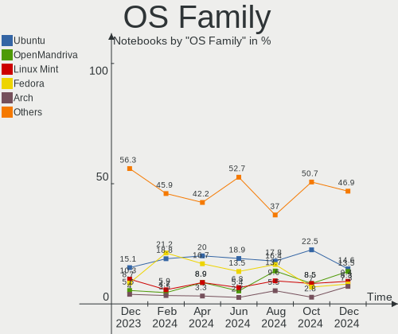
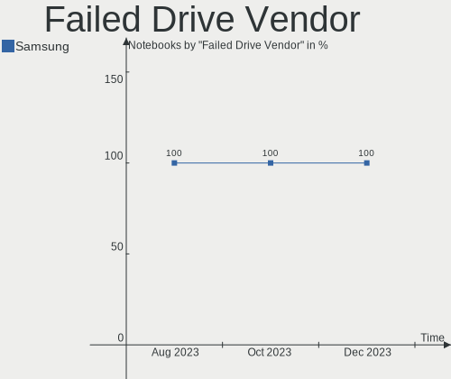
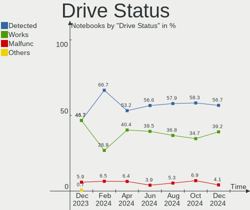
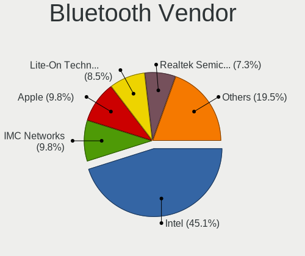

Linux in Canada - Hardware Trends (Notebooks)
---------------------------------------------

A project to identify most popular hardware characteristics and track their change
over time based on data collected by Linux users at https://Linux-Hardware.org.

Anyone can contribute to this report by the [hw-probe](https://github.com/linuxhw/hw-probe) tool:

    sudo -E hw-probe -all -upload

Period: Dec, 2023.

Contents
--------

* [ System ](#system)
  - [ OS                       ](#os)
  - [ OS Family                ](#os-family)
  - [ Kernel                   ](#kernel)
  - [ Kernel Family            ](#kernel-family)
  - [ Kernel Major Ver.        ](#kernel-major-ver)
  - [ Arch                     ](#arch)
  - [ DE                       ](#de)
  - [ Display Server           ](#display-server)
  - [ Display Manager          ](#display-manager)
  - [ OS Lang                  ](#os-lang)
  - [ Boot Mode                ](#boot-mode)
  - [ Filesystem               ](#filesystem)
  - [ Part. scheme             ](#part-scheme)
  - [ Dual Boot with Linux/BSD ](#dual-boot-with-linuxbsd)
  - [ Dual Boot (Win)          ](#dual-boot-win)

* [ Board ](#board)
  - [ Vendor                   ](#vendor)
  - [ Model                    ](#model)
  - [ Model Family             ](#model-family)
  - [ MFG Year                 ](#mfg-year)
  - [ Form Factor              ](#form-factor)
  - [ Secure Boot              ](#secure-boot)
  - [ Coreboot                 ](#coreboot)
  - [ RAM Size                 ](#ram-size)
  - [ RAM Used                 ](#ram-used)
  - [ Total Drives             ](#total-drives)
  - [ Has CD-ROM               ](#has-cd-rom)
  - [ Has Ethernet             ](#has-ethernet)
  - [ Has WiFi                 ](#has-wifi)
  - [ Has Bluetooth            ](#has-bluetooth)

* [ Location ](#location)
  - [ Country                  ](#country)
  - [ City                     ](#city)

* [ Drives ](#drives)
  - [ Drive Vendor             ](#drive-vendor)
  - [ Drive Model              ](#drive-model)
  - [ HDD Vendor               ](#hdd-vendor)
  - [ SSD Vendor               ](#ssd-vendor)
  - [ Drive Kind               ](#drive-kind)
  - [ Drive Connector          ](#drive-connector)
  - [ Drive Size               ](#drive-size)
  - [ Space Total              ](#space-total)
  - [ Space Used               ](#space-used)
  - [ Malfunc. Drives          ](#malfunc-drives)
  - [ Malfunc. Drive Vendor    ](#malfunc-drive-vendor)
  - [ Malfunc. HDD Vendor      ](#malfunc-hdd-vendor)
  - [ Malfunc. Drive Kind      ](#malfunc-drive-kind)
  - [ Failed Drives            ](#failed-drives)
  - [ Failed Drive Vendor      ](#failed-drive-vendor)
  - [ Drive Status             ](#drive-status)

* [ Storage controller ](#storage-controller)
  - [ Storage Vendor           ](#storage-vendor)
  - [ Storage Model            ](#storage-model)
  - [ Storage Kind             ](#storage-kind)

* [ Processor ](#processor)
  - [ CPU Vendor               ](#cpu-vendor)
  - [ CPU Model                ](#cpu-model)
  - [ CPU Model Family         ](#cpu-model-family)
  - [ CPU Cores                ](#cpu-cores)
  - [ CPU Sockets              ](#cpu-sockets)
  - [ CPU Threads              ](#cpu-threads)
  - [ CPU Op-Modes             ](#cpu-op-modes)
  - [ CPU Microcode            ](#cpu-microcode)
  - [ CPU Microarch            ](#cpu-microarch)

* [ Graphics ](#graphics)
  - [ GPU Vendor               ](#gpu-vendor)
  - [ GPU Model                ](#gpu-model)
  - [ GPU Combo                ](#gpu-combo)
  - [ GPU Driver               ](#gpu-driver)
  - [ GPU Memory               ](#gpu-memory)

* [ Monitor ](#monitor)
  - [ Monitor Vendor           ](#monitor-vendor)
  - [ Monitor Model            ](#monitor-model)
  - [ Monitor Resolution       ](#monitor-resolution)
  - [ Monitor Diagonal         ](#monitor-diagonal)
  - [ Monitor Width            ](#monitor-width)
  - [ Aspect Ratio             ](#aspect-ratio)
  - [ Monitor Area             ](#monitor-area)
  - [ Pixel Density            ](#pixel-density)
  - [ Multiple Monitors        ](#multiple-monitors)

* [ Network ](#network)
  - [ Net Controller Vendor    ](#net-controller-vendor)
  - [ Net Controller Model     ](#net-controller-model)
  - [ Wireless Vendor          ](#wireless-vendor)
  - [ Wireless Model           ](#wireless-model)
  - [ Ethernet Vendor          ](#ethernet-vendor)
  - [ Ethernet Model           ](#ethernet-model)
  - [ Net Controller Kind      ](#net-controller-kind)
  - [ Used Controller          ](#used-controller)
  - [ NICs                     ](#nics)
  - [ IPv6                     ](#ipv6)

* [ Bluetooth ](#bluetooth)
  - [ Bluetooth Vendor         ](#bluetooth-vendor)
  - [ Bluetooth Model          ](#bluetooth-model)

* [ Sound ](#sound)
  - [ Sound Vendor             ](#sound-vendor)
  - [ Sound Model              ](#sound-model)

* [ Memory ](#memory)
  - [ Memory Vendor            ](#memory-vendor)
  - [ Memory Model             ](#memory-model)
  - [ Memory Kind              ](#memory-kind)
  - [ Memory Form Factor       ](#memory-form-factor)
  - [ Memory Size              ](#memory-size)
  - [ Memory Speed             ](#memory-speed)

* [ Printers & scanners ](#printers--scanners)
  - [ Printer Vendor           ](#printer-vendor)
  - [ Printer Model            ](#printer-model)
  - [ Scanner Vendor           ](#scanner-vendor)
  - [ Scanner Model            ](#scanner-model)

* [ Camera ](#camera)
  - [ Camera Vendor            ](#camera-vendor)
  - [ Camera Model             ](#camera-model)

* [ Security ](#security)
  - [ Fingerprint Vendor       ](#fingerprint-vendor)
  - [ Fingerprint Model        ](#fingerprint-model)
  - [ Chipcard Vendor          ](#chipcard-vendor)
  - [ Chipcard Model           ](#chipcard-model)

* [ Unsupported ](#unsupported)
  - [ Unsupported Devices      ](#unsupported-devices)
  - [ Unsupported Device Types ](#unsupported-device-types)

System
------

OS
--

Installed operating systems

| Name                         | Notebooks | Percent |
|------------------------------|-----------|---------|
| Debian Testing/unstable      | 21        | 16.67%  |
| Ubuntu 23.10                 | 12        | 9.52%   |
| Linux Mint 21.2              | 10        | 7.94%   |
| Fedora 39                    | 9         | 7.14%   |
| Ubuntu 22.04                 | 7         | 5.56%   |
| SteamOS 3.5.7                | 6         | 4.76%   |
| Pop!_OS 22.04                | 6         | 4.76%   |
| Debian 12                    | 5         | 3.97%   |
| Arch Rolling                 | 5         | 3.97%   |
| openSUSE Tumbleweed-XXXXXXXX | 3         | 2.38%   |
| Kubuntu 23.10                | 3         | 2.38%   |
| KDE neon 22.04               | 3         | 2.38%   |
| OpenMandriva 5.0             | 2         | 1.59%   |
| OpenMandriva 4.3             | 2         | 1.59%   |
| OpenMandriva 23.11           | 2         | 1.59%   |
| Manjaro 23.1.0               | 2         | 1.59%   |
| Lubuntu 22.04                | 2         | 1.59%   |
| Kali 2023.4                  | 2         | 1.59%   |
| Fedora 38                    | 2         | 1.59%   |
| ArcoLinux Rolling            | 2         | 1.59%   |
| Ubuntu Studio 22.04          | 1         | 0.79%   |
| Parrot 5.3                   | 1         | 0.79%   |
| Parrot 5.2                   | 1         | 0.79%   |
| openSUSE Microos-XXXXXXXX    | 1         | 0.79%   |
| OpenMandriva 23.09           | 1         | 0.79%   |
| MX 23                        | 1         | 0.79%   |
| Manjaro 23.1.1               | 1         | 0.79%   |
| Linux Mint 21.1              | 1         | 0.79%   |
| Linux Mint 21                | 1         | 0.79%   |
| Linux Mint 20.3              | 1         | 0.79%   |
| Kubuntu 24.04                | 1         | 0.79%   |
| Kubuntu 22.04                | 1         | 0.79%   |
| Gentoo 2.14                  | 1         | 0.79%   |
| Fedora-asahi-remix 39        | 1         | 0.79%   |
| EndeavourOS Rolling          | 1         | 0.79%   |
| Elementary 7.1               | 1         | 0.79%   |
| Devuan-daedalus              | 1         | 0.79%   |
| Debian 12-updates            | 1         | 0.79%   |
| ChimeraOS 44-1               | 1         | 0.79%   |
| BlackPanther 18.1            | 1         | 0.79%   |

OS Family
---------

OS without a version

| Name               | Notebooks | Percent |
|--------------------|-----------|---------|
| Debian             | 27        | 21.43%  |
| Ubuntu             | 19        | 15.08%  |
| Linux Mint         | 13        | 10.32%  |
| Fedora             | 11        | 8.73%   |
| OpenMandriva       | 7         | 5.56%   |
| SteamOS            | 6         | 4.76%   |
| Pop!_OS            | 6         | 4.76%   |
| Kubuntu            | 5         | 3.97%   |
| Arch               | 5         | 3.97%   |
| openSUSE           | 4         | 3.17%   |
| Manjaro            | 3         | 2.38%   |
| KDE neon           | 3         | 2.38%   |
| Parrot             | 2         | 1.59%   |
| Lubuntu            | 2         | 1.59%   |
| Kali               | 2         | 1.59%   |
| ArcoLinux          | 2         | 1.59%   |
| Ubuntu Studio      | 1         | 0.79%   |
| MX                 | 1         | 0.79%   |
| Gentoo             | 1         | 0.79%   |
| Fedora-asahi-remix | 1         | 0.79%   |
| EndeavourOS        | 1         | 0.79%   |
| Elementary         | 1         | 0.79%   |
| Devuan-daedalus    | 1         | 0.79%   |
| ChimeraOS          | 1         | 0.79%   |
| BlackPanther       | 1         | 0.79%   |

Kernel
------

Version of the Linux kernel

| Version                          | Notebooks | Percent |
|----------------------------------|-----------|---------|
| 5.10.10-64                       | 22        | 17.46%  |
| 6.5.0-14-generic                 | 13        | 10.32%  |
| 6.2.0-39-generic                 | 8         | 6.35%   |
| 6.2.0-37-generic                 | 6         | 4.76%   |
| 6.1.52-valve9-1-neptune-61       | 6         | 4.76%   |
| 6.5.6-76060506-generic           | 4         | 3.17%   |
| 5.15.0-91-generic                | 4         | 3.17%   |
| 6.6.8-arch1-1                    | 3         | 2.38%   |
| 6.6.7-200.fc39.x86_64            | 3         | 2.38%   |
| 6.6.4-200.fc39.x86_64            | 3         | 2.38%   |
| 6.6.2-desktop-1omv2390           | 3         | 2.38%   |
| 6.5.0-9-generic                  | 3         | 2.38%   |
| 6.1.0-13-amd64                   | 3         | 2.38%   |
| 5.15.0-76-generic                | 3         | 2.38%   |
| 6.6.6-76060606-generic           | 2         | 1.59%   |
| 6.6.3-1-MANJARO                  | 2         | 1.59%   |
| 6.6.2-201.fc39.x86_64            | 2         | 1.59%   |
| 6.6.2-1-default                  | 2         | 1.59%   |
| 6.5.0-kali3-amd64                | 2         | 1.59%   |
| 6.6.8-gentoo                     | 1         | 0.79%   |
| 6.6.8-100.fc38.x86_64            | 1         | 0.79%   |
| 6.6.7-zen1-1-zen                 | 1         | 0.79%   |
| 6.6.7-arch1-1                    | 1         | 0.79%   |
| 6.6.7-1-default                  | 1         | 0.79%   |
| 6.6.6-200.fc39.x86_64            | 1         | 0.79%   |
| 6.6.6-1-default                  | 1         | 0.79%   |
| 6.6.4-100.fc38.x86_64            | 1         | 0.79%   |
| 6.6.3-arch1-1                    | 1         | 0.79%   |
| 6.6.3-411.asahi.fc39.aarch64+16k | 1         | 0.79%   |
| 6.5.6-chos1-chimeraos-1          | 1         | 0.79%   |
| 6.5.3-desktop-1omv2390           | 1         | 0.79%   |
| 6.5.0-13-lowlatency              | 1         | 0.79%   |
| 6.4.11-desktop-1omv2390          | 1         | 0.79%   |
| 6.3.3-arch1-1                    | 1         | 0.79%   |
| 6.2.0-26-generic                 | 1         | 0.79%   |
| 6.2.0-1018-lowlatency            | 1         | 0.79%   |
| 6.1.69-1-MANJARO                 | 1         | 0.79%   |
| 6.1.69-1-lts                     | 1         | 0.79%   |
| 6.1.62                           | 1         | 0.79%   |
| 6.1.0-1parrot1-amd64             | 1         | 0.79%   |

Kernel Family
-------------

Linux kernel without a distro release

| Version | Notebooks | Percent |
|---------|-----------|---------|
| 5.10.10 | 22        | 17.46%  |
| 6.5.0   | 19        | 15.08%  |
| 6.2.0   | 16        | 12.7%   |
| 5.15.0  | 10        | 7.94%   |
| 6.6.2   | 7         | 5.56%   |
| 6.1.0   | 7         | 5.56%   |
| 6.6.7   | 6         | 4.76%   |
| 6.1.52  | 6         | 4.76%   |
| 6.6.8   | 5         | 3.97%   |
| 6.5.6   | 5         | 3.97%   |
| 6.6.6   | 4         | 3.17%   |
| 6.6.4   | 4         | 3.17%   |
| 6.6.3   | 4         | 3.17%   |
| 6.1.69  | 2         | 1.59%   |
| 6.5.3   | 1         | 0.79%   |
| 6.4.11  | 1         | 0.79%   |
| 6.3.3   | 1         | 0.79%   |
| 6.1.62  | 1         | 0.79%   |
| 6.0.0   | 1         | 0.79%   |
| 5.4.0   | 1         | 0.79%   |
| 5.16.7  | 1         | 0.79%   |
| 5.16.13 | 1         | 0.79%   |
| 5.15.85 | 1         | 0.79%   |

Kernel Major Ver.
-----------------

Linux kernel major version

| Version | Notebooks | Percent |
|---------|-----------|---------|
| 6.6     | 30        | 23.81%  |
| 6.5     | 25        | 19.84%  |
| 5.10    | 22        | 17.46%  |
| 6.2     | 16        | 12.7%   |
| 6.1     | 16        | 12.7%   |
| 5.15    | 11        | 8.73%   |
| 5.16    | 2         | 1.59%   |
| 6.4     | 1         | 0.79%   |
| 6.3     | 1         | 0.79%   |
| 6.0     | 1         | 0.79%   |
| 5.4     | 1         | 0.79%   |

Arch
----

OS architecture (x86_64, i586, etc.)

| Name    | Notebooks | Percent |
|---------|-----------|---------|
| x86_64  | 125       | 99.21%  |
| aarch64 | 1         | 0.79%   |

DE
--

Desktop Environment

| Name          | Notebooks | Percent |
|---------------|-----------|---------|
| KDE5          | 39        | 30.95%  |
| GNOME         | 37        | 29.37%  |
| LXDE          | 22        | 17.46%  |
| X-Cinnamon    | 11        | 8.73%   |
| XFCE          | 7         | 5.56%   |
| MATE          | 2         | 1.59%   |
| LXQt          | 2         | 1.59%   |
| Unknown       | 2         | 1.59%   |
| Pantheon      | 1         | 0.79%   |
| Jwm           | 1         | 0.79%   |
| GNOME Classic | 1         | 0.79%   |
| Cinnamon      | 1         | 0.79%   |

Display Server
--------------

X11 or Wayland

| Name    | Notebooks | Percent |
|---------|-----------|---------|
| X11     | 90        | 71.43%  |
| Wayland | 34        | 26.98%  |
| Unknown | 2         | 1.59%   |

Display Manager
---------------

SDDM, LightDM, etc.

| Name    | Notebooks | Percent |
|---------|-----------|---------|
| Unknown | 37        | 29.37%  |
| SDDM    | 30        | 23.81%  |
| NODM    | 22        | 17.46%  |
| GDM3    | 22        | 17.46%  |
| LightDM | 12        | 9.52%   |
| GDM     | 2         | 1.59%   |
| LXDM    | 1         | 0.79%   |

OS Lang
-------

Language

| Lang    | Notebooks | Percent |
|---------|-----------|---------|
| en_US   | 62        | 49.21%  |
| en_CA   | 43        | 34.13%  |
| fr_CA   | 8         | 6.35%   |
| fr_FR   | 4         | 3.17%   |
| C       | 3         | 2.38%   |
| Unknown | 2         | 1.59%   |
| POSIX   | 1         | 0.79%   |
| es_AR   | 1         | 0.79%   |
| en_GB   | 1         | 0.79%   |
| C.UTF8  | 1         | 0.79%   |

Boot Mode
---------

EFI or BIOS

| Mode | Notebooks | Percent |
|------|-----------|---------|
| EFI  | 76        | 60.32%  |
| BIOS | 50        | 39.68%  |

Filesystem
----------

Type of filesystem

| Type    | Notebooks | Percent |
|---------|-----------|---------|
| Ext4    | 59        | 46.83%  |
| Btrfs   | 26        | 20.63%  |
| Rootfs  | 22        | 17.46%  |
| Tmpfs   | 9         | 7.14%   |
| Overlay | 8         | 6.35%   |
| Zfs     | 1         | 0.79%   |
| Aufs    | 1         | 0.79%   |

Part. scheme
------------

Scheme of partitioning

| Type    | Notebooks | Percent |
|---------|-----------|---------|
| GPT     | 78        | 61.9%   |
| Unknown | 34        | 26.98%  |
| MBR     | 14        | 11.11%  |

Dual Boot with Linux/BSD
------------------------

Hosting more than one Linux/BSD

| Dual boot | Notebooks | Percent |
|-----------|-----------|---------|
| No        | 112       | 88.89%  |
| Yes       | 14        | 11.11%  |

Dual Boot (Win)
---------------

Hosting Linux and Windows

| Dual boot | Notebooks | Percent |
|-----------|-----------|---------|
| No        | 83        | 65.87%  |
| Yes       | 43        | 34.13%  |

Board
-----

Vendor
------

Motherboard manufacturer

| Name                | Notebooks | Percent |
|---------------------|-----------|---------|
| ASUSTek Computer    | 26        | 20.63%  |
| Lenovo              | 24        | 19.05%  |
| Hewlett-Packard     | 16        | 12.7%   |
| Dell                | 13        | 10.32%  |
| Acer                | 10        | 7.94%   |
| MSI                 | 7         | 5.56%   |
| Valve               | 6         | 4.76%   |
| Apple               | 5         | 3.97%   |
| Toshiba             | 4         | 3.17%   |
| Alienware           | 4         | 3.17%   |
| Unknown             | 4         | 3.17%   |
| Google              | 2         | 1.59%   |
| Gigabyte Technology | 2         | 1.59%   |
| Razer               | 1         | 0.79%   |
| Notebook            | 1         | 0.79%   |
| Gateway             | 1         | 0.79%   |

Model
-----

Motherboard model

| Name                                        | Notebooks | Percent |
|---------------------------------------------|-----------|---------|
| Valve Jupiter                               | 4         | 3.17%   |
| Unknown                                     | 4         | 3.17%   |
| Valve Galileo                               | 2         | 1.59%   |
| Dell Latitude E6440                         | 2         | 1.59%   |
| ASUS ROG Strix G513RM_G513RM                | 2         | 1.59%   |
| ASUS ASUS TUF Gaming F15 FX507ZC_TUF507ZC   | 2         | 1.59%   |
| Apple MacBookAir9,1                         | 2         | 1.59%   |
| Alienware m18 R1                            | 2         | 1.59%   |
| Toshiba TECRA Z50-A                         | 1         | 0.79%   |
| Toshiba Satellite S50D-A                    | 1         | 0.79%   |
| Toshiba Satellite L650D                     | 1         | 0.79%   |
| Toshiba PORTEGE R930                        | 1         | 0.79%   |
| Razer Blade                                 | 1         | 0.79%   |
| Notebook W94_95_97SU2,SUY,-C,-T             | 1         | 0.79%   |
| MSI Vector GP77 13VG                        | 1         | 0.79%   |
| MSI Thin GF63 12VE                          | 1         | 0.79%   |
| MSI Stealth 16Studio A13VF                  | 1         | 0.79%   |
| MSI Pulse 17 B13VGK                         | 1         | 0.79%   |
| MSI GT72VR 6RD                              | 1         | 0.79%   |
| MSI GF65 Thin 10SER                         | 1         | 0.79%   |
| MSI Cyborg 15 A12VF                         | 1         | 0.79%   |
| Lenovo Yoga 2 Pro 20266                     | 1         | 0.79%   |
| Lenovo ThinkPad X390 20Q1S1WB00             | 1         | 0.79%   |
| Lenovo ThinkPad X390 20Q0004VUS             | 1         | 0.79%   |
| Lenovo ThinkPad X1 Carbon Gen 11 21HM002EUS | 1         | 0.79%   |
| Lenovo ThinkPad X1 Carbon 3444CUU           | 1         | 0.79%   |
| Lenovo ThinkPad T61 7662CTO                 | 1         | 0.79%   |
| Lenovo ThinkPad T540p 20BFS06200            | 1         | 0.79%   |
| Lenovo ThinkPad T520 42404AU                | 1         | 0.79%   |
| Lenovo ThinkPad T490s 20NYS7K90Z            | 1         | 0.79%   |
| Lenovo ThinkPad T490 20N3S4PX02             | 1         | 0.79%   |
| Lenovo ThinkPad T480s 20L8S3SW00            | 1         | 0.79%   |
| Lenovo ThinkPad T470s W10DG 20JTS12Y00      | 1         | 0.79%   |
| Lenovo ThinkPad T470 W10DG 20JNS1XT00       | 1         | 0.79%   |
| Lenovo ThinkPad T450 20BUS05V00             | 1         | 0.79%   |
| Lenovo ThinkPad T14 Gen 2i 20W1S2VN00       | 1         | 0.79%   |
| Lenovo ThinkBook 14 G3 ACL 21A2             | 1         | 0.79%   |
| Lenovo ThinkBook 13x G2 IAP 21AT            | 1         | 0.79%   |
| Lenovo Legion Pro 5 16IRX8 82WK             | 1         | 0.79%   |
| Lenovo Legion Pro 5 16ARX8 82WM             | 1         | 0.79%   |

Model Family
------------

Motherboard model prefix

| Name              | Notebooks | Percent |
|-------------------|-----------|---------|
| Lenovo ThinkPad   | 14        | 11.11%  |
| ASUS VivoBook     | 7         | 5.56%   |
| ASUS ASUS         | 7         | 5.56%   |
| Acer Aspire       | 7         | 5.56%   |
| Dell Latitude     | 6         | 4.76%   |
| ASUS ROG          | 6         | 4.76%   |
| Lenovo Legion     | 5         | 3.97%   |
| Valve Jupiter     | 4         | 3.17%   |
| Unknown           | 4         | 3.17%   |
| HP Pavilion       | 3         | 2.38%   |
| Valve Galileo     | 2         | 1.59%   |
| Toshiba Satellite | 2         | 1.59%   |
| Lenovo ThinkBook  | 2         | 1.59%   |
| Lenovo IdeaPad    | 2         | 1.59%   |
| HP ProBook        | 2         | 1.59%   |
| HP Laptop         | 2         | 1.59%   |
| HP EliteBook      | 2         | 1.59%   |
| Gigabyte AERO     | 2         | 1.59%   |
| Dell XPS          | 2         | 1.59%   |
| Dell Precision    | 2         | 1.59%   |
| Dell Inspiron     | 2         | 1.59%   |
| Apple MacBookAir9 | 2         | 1.59%   |
| Alienware m18     | 2         | 1.59%   |
| Toshiba TECRA     | 1         | 0.79%   |
| Toshiba PORTEGE   | 1         | 0.79%   |
| Razer Blade       | 1         | 0.79%   |
| Notebook W94      | 1         | 0.79%   |
| MSI Vector        | 1         | 0.79%   |
| MSI Thin          | 1         | 0.79%   |
| MSI Stealth       | 1         | 0.79%   |
| MSI Pulse         | 1         | 0.79%   |
| MSI GT72VR        | 1         | 0.79%   |
| MSI GF65          | 1         | 0.79%   |
| MSI Cyborg        | 1         | 0.79%   |
| Lenovo Yoga       | 1         | 0.79%   |
| HP ZBook          | 1         | 0.79%   |
| HP Victus         | 1         | 0.79%   |
| HP Stream         | 1         | 0.79%   |
| HP Spectre        | 1         | 0.79%   |
| HP G61            | 1         | 0.79%   |

MFG Year
--------

Motherboard manufacture year

| Year    | Notebooks | Percent |
|---------|-----------|---------|
| 2023    | 28        | 22.22%  |
| 2022    | 12        | 9.52%   |
| 2019    | 12        | 9.52%   |
| 2021    | 9         | 7.14%   |
| 2020    | 9         | 7.14%   |
| 2018    | 8         | 6.35%   |
| 2014    | 7         | 5.56%   |
| 2016    | 6         | 4.76%   |
| 2013    | 6         | 4.76%   |
| 2012    | 6         | 4.76%   |
| 2009    | 5         | 3.97%   |
| 2017    | 4         | 3.17%   |
| 2007    | 4         | 3.17%   |
| 2015    | 3         | 2.38%   |
| 2011    | 3         | 2.38%   |
| 2010    | 1         | 0.79%   |
| 2008    | 1         | 0.79%   |
| 2006    | 1         | 0.79%   |
| Unknown | 1         | 0.79%   |

Form Factor
-----------

Physical design of the computer

| Name     | Notebooks | Percent |
|----------|-----------|---------|
| Notebook | 126       | 100%    |

Secure Boot
-----------

Enabled or disabled

| State    | Notebooks | Percent |
|----------|-----------|---------|
| Disabled | 113       | 89.68%  |
| Enabled  | 13        | 10.32%  |

Coreboot
--------

Have coreboot on board

| Used | Notebooks | Percent |
|------|-----------|---------|
| No   | 124       | 98.41%  |
| Yes  | 2         | 1.59%   |

RAM Size
--------

Total RAM memory

| Size in GB  | Notebooks | Percent |
|-------------|-----------|---------|
| 8.01-16.0   | 36        | 28.57%  |
| 4.01-8.0    | 29        | 23.02%  |
| 16.01-24.0  | 22        | 17.46%  |
| 3.01-4.0    | 15        | 11.9%   |
| 32.01-64.0  | 14        | 11.11%  |
| 64.01-256.0 | 4         | 3.17%   |
| 24.01-32.0  | 2         | 1.59%   |
| 2.01-3.0    | 2         | 1.59%   |
| 1.01-2.0    | 2         | 1.59%   |

RAM Used
--------

Used RAM memory

| Used GB   | Notebooks | Percent |
|-----------|-----------|---------|
| 1.01-2.0  | 39        | 30.95%  |
| 4.01-8.0  | 25        | 19.84%  |
| 2.01-3.0  | 22        | 17.46%  |
| 3.01-4.0  | 15        | 11.9%   |
| 0.51-1.0  | 14        | 11.11%  |
| 8.01-16.0 | 9         | 7.14%   |
| 0.01-0.5  | 2         | 1.59%   |

Total Drives
------------

Number of drives on board

| Drives | Notebooks | Percent |
|--------|-----------|---------|
| 1      | 83        | 65.87%  |
| 2      | 31        | 24.6%   |
| 3      | 7         | 5.56%   |
| 0      | 5         | 3.97%   |

Has CD-ROM
----------

Has CD-ROM on board

| Presented | Notebooks | Percent |
|-----------|-----------|---------|
| No        | 104       | 82.54%  |
| Yes       | 22        | 17.46%  |

Has Ethernet
------------

Has Ethernet on board

| Presented | Notebooks | Percent |
|-----------|-----------|---------|
| Yes       | 94        | 74.6%   |
| No        | 32        | 25.4%   |

Has WiFi
--------

Has WiFi module

| Presented | Notebooks | Percent |
|-----------|-----------|---------|
| Yes       | 122       | 96.83%  |
| No        | 4         | 3.17%   |

Has Bluetooth
-------------

Has Bluetooth module

| Presented | Notebooks | Percent |
|-----------|-----------|---------|
| Yes       | 101       | 80.16%  |
| No        | 25        | 19.84%  |

Location
--------

Country
-------

Geographic location (country)

| Country | Notebooks | Percent |
|---------|-----------|---------|
| Canada  | 126       | 100%    |

City
----

Geographic location (city)

| City           | Notebooks | Percent |
|----------------|-----------|---------|
| Toronto        | 15        | 11.9%   |
| Québec        | 13        | 10.32%  |
| Montreal       | 10        | 7.94%   |
| Vancouver      | 4         | 3.17%   |
| Levis          | 4         | 3.17%   |
| Calgary        | 4         | 3.17%   |
| Oshawa         | 3         | 2.38%   |
| Kitchener      | 3         | 2.38%   |
| Burnaby        | 3         | 2.38%   |
| Winnipeg       | 2         | 1.59%   |
| Victoria       | 2         | 1.59%   |
| St. John's     | 2         | 1.59%   |
| Sherbrooke     | 2         | 1.59%   |
| Peterborough   | 2         | 1.59%   |
| London         | 2         | 1.59%   |
| Kelowna        | 2         | 1.59%   |
| Halifax        | 2         | 1.59%   |
| Gatineau       | 2         | 1.59%   |
| Edmonton       | 2         | 1.59%   |
| Courtenay      | 2         | 1.59%   |
| Terrebonne     | 1         | 0.79%   |
| Surrey         | 1         | 0.79%   |
| Stratford      | 1         | 0.79%   |
| Squamish       | 1         | 0.79%   |
| Spruce Grove   | 1         | 0.79%   |
| Sorel-Tracy    | 1         | 0.79%   |
| Simcoe         | 1         | 0.79%   |
| Sidney         | 1         | 0.79%   |
| Sherwood Park  | 1         | 0.79%   |
| Scarborough    | 1         | 0.79%   |
| Saskatoon      | 1         | 0.79%   |
| Saint-Pascal   | 1         | 0.79%   |
| Saint-Lambert  | 1         | 0.79%   |
| Saint-Jerome   | 1         | 0.79%   |
| Saint-Eustache | 1         | 0.79%   |
| Rockwood       | 1         | 0.79%   |
| Richmond Hill  | 1         | 0.79%   |
| Raymond        | 1         | 0.79%   |
| Prince George  | 1         | 0.79%   |
| Penticton      | 1         | 0.79%   |

Drives
------

Drive Vendor
------------

Hard drive vendors

| Vendor                      | Notebooks | Drives | Percent |
|-----------------------------|-----------|--------|---------|
| Samsung Electronics         | 29        | 33     | 19.33%  |
| Unknown                     | 16        | 20     | 10.67%  |
| Sandisk                     | 14        | 16     | 9.33%   |
| Toshiba                     | 9         | 9      | 6%      |
| SK hynix                    | 9         | 9      | 6%      |
| Intel                       | 8         | 9      | 5.33%   |
| WDC                         | 7         | 7      | 4.67%   |
| Seagate                     | 7         | 7      | 4.67%   |
| Micron Technology           | 7         | 7      | 4.67%   |
| Kingston                    | 5         | 5      | 3.33%   |
| Apple                       | 5         | 7      | 3.33%   |
| Unknown                     | 4         | 4      | 2.67%   |
| SPCC                        | 3         | 3      | 2%      |
| Hitachi                     | 3         | 3      | 2%      |
| A-DATA Technology           | 3         | 3      | 2%      |
| KIOXIA                      | 2         | 2      | 1.33%   |
| Kingston Technology Company | 2         | 2      | 1.33%   |
| Fujitsu                     | 2         | 2      | 1.33%   |
| Crucial                     | 2         | 3      | 1.33%   |
| Union Memory (Shenzhen)     | 1         | 1      | 0.67%   |
| UMIS                        | 1         | 1      | 0.67%   |
| Timetec                     | 1         | 1      | 0.67%   |
| PNY                         | 1         | 1      | 0.67%   |
| Phison Electronics          | 1         | 1      | 0.67%   |
| Phison                      | 1         | 1      | 0.67%   |
| Patriot                     | 1         | 1      | 0.67%   |
| LS                          | 1         | 1      | 0.67%   |
| LITEONIT                    | 1         | 1      | 0.67%   |
| Lexar                       | 1         | 2      | 0.67%   |
| Indilinx                    | 1         | 1      | 0.67%   |
| Dogfish                     | 1         | 1      | 0.67%   |
| ASMT                        | 1         | 1      | 0.67%   |

Drive Model
-----------

Hard drive models

| Model                                               | Notebooks | Percent |
|-----------------------------------------------------|-----------|---------|
| Unknown                                             | 4         | 2.44%   |
| SanDisk NVMe SSD Drive 1TB                          | 3         | 1.83%   |
| Samsung NVMe SSD Controller SM981/PM981/PM983 512GB | 3         | 1.83%   |
| Samsung NVMe SSD Controller PM9A1/PM9A3/980PRO 2TB  | 3         | 1.83%   |
| Samsung MZVL41T0HBLB-00BTW 1TB                      | 3         | 1.83%   |
| WDC WDS500G2B0A-00SM50 500GB SSD                    | 2         | 1.22%   |
| Unknown MMC Card  64GB                              | 2         | 1.22%   |
| Unknown MMC Card  128GB                             | 2         | 1.22%   |
| Unknown DA4064  64GB                                | 2         | 1.22%   |
| Toshiba MQ01ABD100 1TB                              | 2         | 1.22%   |
| SK hynix HFM512GD3JX013N 512GB                      | 2         | 1.22%   |
| Seagate ST1000LM024 HN-M101MBB 1TB                  | 2         | 1.22%   |
| Sandisk WD Blue SN550 NVMe SSD 1TB                  | 2         | 1.22%   |
| Sandisk WD Blue SN500 / PC SN520 NVMe SSD 128GB     | 2         | 1.22%   |
| Samsung SSD 870 EVO 1TB                             | 2         | 1.22%   |
| Samsung SSD 860 EVO 1TB                             | 2         | 1.22%   |
| Samsung MZVL4512HBLU-00BTW 512GB                    | 2         | 1.22%   |
| Micron 2450_MTFDKBA1T0TFK 1TB                       | 2         | 1.22%   |
| Micron 2400_MTFDKBA512QFM 512GB                     | 2         | 1.22%   |
| Kingston Company OM3PDP3 NVMe SSD 512GB             | 2         | 1.22%   |
| Kingston SA400S37480G 480GB SSD                     | 2         | 1.22%   |
| Apple SSD AP0256N 256GB                             | 2         | 1.22%   |
| WDC WDS500G3X0C-00SJG0 500GB                        | 1         | 0.61%   |
| WDC WDS100T2B0A-00SM50 1TB SSD                      | 1         | 0.61%   |
| WDC WD10SPZX-16Z10T0 1TB                            | 1         | 0.61%   |
| WDC WD10JPVX-22JC3T0 1TB                            | 1         | 0.61%   |
| WDC WD My Passport 25F3 512GB                       | 1         | 0.61%   |
| Unknown SPCC  64GB                                  | 1         | 0.61%   |
| Unknown SN128  128GB                                | 1         | 0.61%   |
| Unknown SD64G  64GB                                 | 1         | 0.61%   |
| Unknown NVMe SSD Drive 512GB                        | 1         | 0.61%   |
| Unknown NVMe SSD Drive 1024GB                       | 1         | 0.61%   |
| Unknown MMC Card  971MB                             | 1         | 0.61%   |
| Unknown MMC Card  512GB                             | 1         | 0.61%   |
| Unknown MMC Card  32GB                              | 1         | 0.61%   |
| Unknown GFAQK  512GB                                | 1         | 0.61%   |
| Unknown EE8QT  256GB                                | 1         | 0.61%   |
| Unknown CGND3R  64GB                                | 1         | 0.61%   |
| Unknown BJTD4R  32GB                                | 1         | 0.61%   |
| Unknown 016GE2  16GB                                | 1         | 0.61%   |

HDD Vendor
----------

Hard disk drive vendors

| Vendor              | Notebooks | Drives | Percent |
|---------------------|-----------|--------|---------|
| Toshiba             | 7         | 7      | 33.33%  |
| Seagate             | 5         | 5      | 23.81%  |
| Hitachi             | 3         | 3      | 14.29%  |
| WDC                 | 2         | 2      | 9.52%   |
| Fujitsu             | 2         | 2      | 9.52%   |
| Samsung Electronics | 1         | 1      | 4.76%   |
| Apple               | 1         | 1      | 4.76%   |

SSD Vendor
----------

Solid state drive vendors

| Vendor              | Notebooks | Drives | Percent |
|---------------------|-----------|--------|---------|
| Samsung Electronics | 7         | 8      | 18.42%  |
| Kingston            | 5         | 5      | 13.16%  |
| WDC                 | 3         | 3      | 7.89%   |
| SPCC                | 3         | 3      | 7.89%   |
| Intel               | 3         | 3      | 7.89%   |
| SanDisk             | 2         | 2      | 5.26%   |
| A-DATA Technology   | 2         | 2      | 5.26%   |
| Toshiba             | 1         | 1      | 2.63%   |
| Timetec             | 1         | 1      | 2.63%   |
| SK hynix            | 1         | 1      | 2.63%   |
| Seagate             | 1         | 1      | 2.63%   |
| PNY                 | 1         | 1      | 2.63%   |
| Patriot             | 1         | 1      | 2.63%   |
| LS                  | 1         | 1      | 2.63%   |
| LITEONIT            | 1         | 1      | 2.63%   |
| Lexar               | 1         | 2      | 2.63%   |
| Indilinx            | 1         | 1      | 2.63%   |
| Dogfish             | 1         | 1      | 2.63%   |
| Crucial             | 1         | 1      | 2.63%   |
| Apple               | 1         | 1      | 2.63%   |

Drive Kind
----------

HDD or SSD

| Kind    | Notebooks | Drives | Percent |
|---------|-----------|--------|---------|
| NVMe    | 72        | 80     | 48.98%  |
| SSD     | 35        | 40     | 23.81%  |
| MMC     | 19        | 22     | 12.93%  |
| HDD     | 19        | 21     | 12.93%  |
| Unknown | 2         | 2      | 1.36%   |

Drive Connector
---------------

SATA, SAS, NVMe, etc.

| Type | Notebooks | Drives | Percent |
|------|-----------|--------|---------|
| NVMe | 72        | 79     | 50%     |
| SATA | 48        | 59     | 33.33%  |
| MMC  | 19        | 22     | 13.19%  |
| SAS  | 5         | 5      | 3.47%   |

Drive Size
----------

Size of hard drive

| Size in TB | Notebooks | Drives | Percent |
|------------|-----------|--------|---------|
| 0.01-0.5   | 33        | 38     | 61.11%  |
| 0.51-1.0   | 17        | 19     | 31.48%  |
| 1.01-2.0   | 3         | 3      | 5.56%   |
| 3.01-4.0   | 1         | 1      | 1.85%   |

Space Total
-----------

Amount of disk space available on the file system

| Size in GB     | Notebooks | Percent |
|----------------|-----------|---------|
| 101-250        | 30        | 23.81%  |
| 251-500        | 25        | 19.84%  |
| 1-20           | 16        | 12.7%   |
| 501-1000       | 16        | 12.7%   |
| 51-100         | 16        | 12.7%   |
| 1001-2000      | 12        | 9.52%   |
| Unknown        | 4         | 3.17%   |
| More than 3000 | 3         | 2.38%   |
| 21-50          | 2         | 1.59%   |
| 2001-3000      | 2         | 1.59%   |

Space Used
----------

Amount of used disk space

| Used GB        | Notebooks | Percent |
|----------------|-----------|---------|
| 1-20           | 59        | 46.83%  |
| 101-250        | 16        | 12.7%   |
| 51-100         | 14        | 11.11%  |
| 21-50          | 13        | 10.32%  |
| 251-500        | 10        | 7.94%   |
| 501-1000       | 4         | 3.17%   |
| Unknown        | 4         | 3.17%   |
| 1001-2000      | 3         | 2.38%   |
| More than 3000 | 2         | 1.59%   |
| 2001-3000      | 1         | 0.79%   |

Malfunc. Drives
---------------

Drive models with a malfunction

| Model                              | Notebooks | Drives | Percent |
|------------------------------------|-----------|--------|---------|
| WDC WD10SPZX-16Z10T0 1TB           | 1         | 1      | 12.5%   |
| UMIS RPITJ512VME2OWD 512GB         | 1         | 1      | 12.5%   |
| Toshiba MK3261GSYN 320GB           | 1         | 1      | 12.5%   |
| Timetec SD08 512GB SSD             | 1         | 1      | 12.5%   |
| Seagate ST9500420AS 500GB          | 1         | 1      | 12.5%   |
| Seagate ST1000LM024 HN-M101MBB 1TB | 1         | 1      | 12.5%   |
| Hitachi HTS547564A9E384 640GB      | 1         | 1      | 12.5%   |
| Fujitsu MHV2080AH 80GB             | 1         | 1      | 12.5%   |

Malfunc. Drive Vendor
---------------------

Vendors of faulty drives

| Vendor  | Notebooks | Drives | Percent |
|---------|-----------|--------|---------|
| Seagate | 2         | 2      | 25%     |
| WDC     | 1         | 1      | 12.5%   |
| UMIS    | 1         | 1      | 12.5%   |
| Toshiba | 1         | 1      | 12.5%   |
| Timetec | 1         | 1      | 12.5%   |
| Hitachi | 1         | 1      | 12.5%   |
| Fujitsu | 1         | 1      | 12.5%   |

Malfunc. HDD Vendor
-------------------

Vendors of faulty HDD drives

| Vendor  | Notebooks | Drives | Percent |
|---------|-----------|--------|---------|
| Seagate | 2         | 2      | 33.33%  |
| WDC     | 1         | 1      | 16.67%  |
| Toshiba | 1         | 1      | 16.67%  |
| Hitachi | 1         | 1      | 16.67%  |
| Fujitsu | 1         | 1      | 16.67%  |

Malfunc. Drive Kind
-------------------

Kinds of faulty drives

| Kind | Notebooks | Drives | Percent |
|------|-----------|--------|---------|
| HDD  | 6         | 6      | 75%     |
| NVMe | 1         | 1      | 12.5%   |
| SSD  | 1         | 1      | 12.5%   |

Failed Drives
-------------

Failed drive models

| Model                             | Notebooks | Drives | Percent |
|-----------------------------------|-----------|--------|---------|
| Samsung Electronics HM160HC 160GB | 1         | 1      | 100%    |

Failed Drive Vendor
-------------------

Failed drive vendors

| Vendor              | Notebooks | Drives | Percent |
|---------------------|-----------|--------|---------|
| Samsung Electronics | 1         | 1      | 100%    |

Drive Status
------------

Number of failed and malfunc. drives

| Status   | Notebooks | Drives | Percent |
|----------|-----------|--------|---------|
| Detected | 63        | 80     | 46.67%  |
| Works    | 63        | 76     | 46.67%  |
| Malfunc  | 8         | 8      | 5.93%   |
| Failed   | 1         | 1      | 0.74%   |

Storage controller
------------------

Storage Vendor
--------------

Storage controller vendors

| Vendor                       | Notebooks | Percent |
|------------------------------|-----------|---------|
| Intel                        | 73        | 48.34%  |
| Samsung Electronics          | 24        | 15.89%  |
| SanDisk                      | 14        | 9.27%   |
| SK hynix                     | 8         | 5.3%    |
| AMD                          | 8         | 5.3%    |
| Micron Technology            | 7         | 4.64%   |
| Union Memory (Shenzhen)      | 2         | 1.32%   |
| Solidigm                     | 2         | 1.32%   |
| Phison Electronics           | 2         | 1.32%   |
| Micron/Crucial Technology    | 2         | 1.32%   |
| KIOXIA                       | 2         | 1.32%   |
| Kingston Technology Company  | 2         | 1.32%   |
| Apple                        | 2         | 1.32%   |
| Toshiba America Info Systems | 1         | 0.66%   |
| Nvidia                       | 1         | 0.66%   |
| ADATA Technology             | 1         | 0.66%   |

Storage Model
-------------

Storage controller models

| Model                                                                          | Notebooks | Percent |
|--------------------------------------------------------------------------------|-----------|---------|
| Intel Volume Management Device NVMe RAID Controller                            | 14        | 8.7%    |
| Intel 82801 Mobile SATA Controller [RAID mode]                                 | 7         | 4.35%   |
| Samsung NVMe SSD Controller PM9B1 (DRAM-less)                                  | 6         | 3.73%   |
| Samsung NVMe SSD Controller 980 (DRAM-less)                                    | 6         | 3.73%   |
| Intel Volume Management Device NVMe RAID Controller Intel Corporation          | 6         | 3.73%   |
| SanDisk WD Black SN770 / PC SN740 256GB / PC SN560 (DRAM-less) NVMe SSD        | 5         | 3.11%   |
| Samsung NVMe SSD Controller SM981/PM981/PM983                                  | 5         | 3.11%   |
| Samsung NVMe SSD Controller PM9A1/PM9A3/980PRO                                 | 5         | 3.11%   |
| Intel 8 Series SATA Controller 1 [AHCI mode]                                   | 5         | 3.11%   |
| AMD FCH SATA Controller [AHCI mode]                                            | 5         | 3.11%   |
| Intel SSD 670p Series [Keystone Harbor]                                        | 4         | 2.48%   |
| Intel 82801IBM/IEM (ICH9M/ICH9M-E) 4 port SATA Controller [AHCI mode]          | 4         | 2.48%   |
| Intel 7 Series Chipset Family 6-port SATA Controller [AHCI mode]               | 4         | 2.48%   |
| SK hynix PC601 NVMe Solid State Drive                                          | 3         | 1.86%   |
| SK hynix Gold P31/BC711/PC711 NVMe Solid State Drive                           | 3         | 1.86%   |
| Intel Sunrise Point-LP SATA Controller [AHCI mode]                             | 3         | 1.86%   |
| Intel Celeron/Pentium Silver Processor SATA Controller                         | 3         | 1.86%   |
| Intel Cannon Lake Mobile PCH SATA AHCI Controller                              | 3         | 1.86%   |
| Intel Alder Lake-P SATA AHCI Controller                                        | 3         | 1.86%   |
| Intel 8 Series/C220 Series Chipset Family 6-port SATA Controller 1 [AHCI mode] | 3         | 1.86%   |
| Intel 6 Series/C200 Series Chipset Family 6 port Mobile SATA AHCI Controller   | 3         | 1.86%   |
| Solidigm P41 Plus NVMe SSD (DRAM-less) [Echo Harbor]                           | 2         | 1.24%   |
| SanDisk WD Blue SN500 / PC SN520 x2 M.2 2280 NVMe SSD                          | 2         | 1.24%   |
| SanDisk Ultra 3D / WD Blue SN550 NVMe SSD                                      | 2         | 1.24%   |
| SanDisk Extreme Pro / WD Black SN750 / PC SN730 / Red SN700 NVMe SSD           | 2         | 1.24%   |
| Micron/Crucial P5 Plus NVMe PCIe SSD                                           | 2         | 1.24%   |
| Micron 2450 NVMe SSD [HendrixV] (DRAM-less)                                    | 2         | 1.24%   |
| Micron 2400 NVMe SSD (DRAM-less)                                               | 2         | 1.24%   |
| Micron 2200S NVMe SSD [Cassandra]                                              | 2         | 1.24%   |
| KIOXIA NVMe SSD Controller XG8                                                 | 2         | 1.24%   |
| Kingston Company OM3PDP3 NVMe SSD                                              | 2         | 1.24%   |
| Intel Wildcat Point-LP SATA Controller [AHCI Mode]                             | 2         | 1.24%   |
| Intel Tiger Lake-LP SATA Controller                                            | 2         | 1.24%   |
| Intel Q170/Q150/B150/H170/H110/Z170/CM236 Chipset SATA Controller [AHCI Mode]  | 2         | 1.24%   |
| Intel HM170/QM170 Chipset SATA Controller [AHCI Mode]                          | 2         | 1.24%   |
| Apple ANS2 NVMe Controller                                                     | 2         | 1.24%   |
| AMD SB7x0/SB8x0/SB9x0 SATA Controller [AHCI mode]                              | 2         | 1.24%   |
| Union Memory (Shenzhen) AM610 PCIe 3.0 x2 NVMe SSD 128GB, 256GB                | 1         | 0.62%   |
| Union Memory (Shenzhen) AH631 PCIe 3.0 NVMe SSD 512GB                          | 1         | 0.62%   |
| Toshiba America Info Systems XG3 NVMe SSD Controller                           | 1         | 0.62%   |

Storage Kind
------------

Kind of storage controller (IDE, SATA, NVMe, SAS, ...)

| Kind | Notebooks | Percent |
|------|-----------|---------|
| NVMe | 71        | 45.81%  |
| SATA | 53        | 34.19%  |
| RAID | 27        | 17.42%  |
| IDE  | 4         | 2.58%   |

Processor
---------

CPU Vendor
----------

Processor vendors

| Vendor  | Notebooks | Percent |
|---------|-----------|---------|
| Intel   | 101       | 80.16%  |
| AMD     | 24        | 19.05%  |
| Unknown | 1         | 0.79%   |

CPU Model
---------

Processor models

| Model                                       | Notebooks | Percent |
|---------------------------------------------|-----------|---------|
| AMD Custom APU 0405                         | 6         | 4.76%   |
| Intel Core i5-8265U CPU @ 1.60GHz           | 4         | 3.17%   |
| Intel 12th Gen Core i7-12700H               | 4         | 3.17%   |
| Intel Core i7-8750H CPU @ 2.20GHz           | 3         | 2.38%   |
| Intel Core i7-8665U CPU @ 1.90GHz           | 3         | 2.38%   |
| Intel Core i7-10750H CPU @ 2.60GHz          | 3         | 2.38%   |
| Intel 13th Gen Core i9-13900H               | 3         | 2.38%   |
| Intel 12th Gen Core i7-12650H               | 3         | 2.38%   |
| Intel 12th Gen Core i5-1235U                | 3         | 2.38%   |
| Intel Core i7-6700HQ CPU @ 2.60GHz          | 2         | 1.59%   |
| Intel Core i7-4610M CPU @ 3.00GHz           | 2         | 1.59%   |
| Intel Core i5-6300U CPU @ 2.40GHz           | 2         | 1.59%   |
| Intel Core i5-4300U CPU @ 1.90GHz           | 2         | 1.59%   |
| Intel Core i5-3210M CPU @ 2.50GHz           | 2         | 1.59%   |
| Intel Core i3-1000NG4 CPU @ 1.10GHz         | 2         | 1.59%   |
| Intel Celeron N4020 CPU @ 1.10GHz           | 2         | 1.59%   |
| Intel Celeron N4000 CPU @ 1.10GHz           | 2         | 1.59%   |
| Intel 13th Gen Core i7-13700HX              | 2         | 1.59%   |
| Intel 11th Gen Core i7-1185G7 @ 3.00GHz     | 2         | 1.59%   |
| Intel 11th Gen Core i7-11800H @ 2.30GHz     | 2         | 1.59%   |
| Intel 11th Gen Core i5-11400H @ 2.70GHz     | 2         | 1.59%   |
| AMD Ryzen 7 6800H with Radeon Graphics      | 2         | 1.59%   |
| AMD Ryzen 5 5500U with Radeon Graphics      | 2         | 1.59%   |
| Intel Xeon CPU E3-1505M v5 @ 2.80GHz        | 1         | 0.79%   |
| Intel Pentium Silver N6000 @ 1.10GHz        | 1         | 0.79%   |
| Intel Pentium Gold 7505 @ 2.00GHz           | 1         | 0.79%   |
| Intel Pentium Dual-Core CPU T4400 @ 2.20GHz | 1         | 0.79%   |
| Intel Pentium Dual CPU T2330 @ 1.60GHz      | 1         | 0.79%   |
| Intel Pentium CPU N3700 @ 1.60GHz           | 1         | 0.79%   |
| Intel Core m5-6Y54 CPU @ 1.10GHz            | 1         | 0.79%   |
| Intel Core i7-9850H CPU @ 2.60GHz           | 1         | 0.79%   |
| Intel Core i7-8565U CPU @ 1.80GHz           | 1         | 0.79%   |
| Intel Core i7-6820HQ CPU @ 2.70GHz          | 1         | 0.79%   |
| Intel Core i7-6500U CPU @ 2.50GHz           | 1         | 0.79%   |
| Intel Core i7-5500U CPU @ 2.40GHz           | 1         | 0.79%   |
| Intel Core i7-4710HQ CPU @ 2.50GHz          | 1         | 0.79%   |
| Intel Core i7-4702HQ CPU @ 2.20GHz          | 1         | 0.79%   |
| Intel Core i7-4510U CPU @ 2.00GHz           | 1         | 0.79%   |
| Intel Core i7-3667U CPU @ 2.00GHz           | 1         | 0.79%   |
| Intel Core i7-3610QM CPU @ 2.30GHz          | 1         | 0.79%   |

CPU Model Family
----------------

Processor model prefix

| Model                   | Notebooks | Percent |
|-------------------------|-----------|---------|
| Other                   | 37        | 29.37%  |
| Intel Core i7           | 24        | 19.05%  |
| Intel Core i5           | 22        | 17.46%  |
| Intel Celeron           | 7         | 5.56%   |
| AMD Ryzen 7             | 7         | 5.56%   |
| Intel Core i3           | 5         | 3.97%   |
| Intel Core 2 Duo        | 5         | 3.97%   |
| AMD Ryzen 5             | 4         | 3.17%   |
| AMD Ryzen 9             | 2         | 1.59%   |
| AMD A10                 | 2         | 1.59%   |
| Intel Xeon              | 1         | 0.79%   |
| Intel Pentium Silver    | 1         | 0.79%   |
| Intel Pentium Gold      | 1         | 0.79%   |
| Intel Pentium Dual-Core | 1         | 0.79%   |
| Intel Pentium Dual      | 1         | 0.79%   |
| Intel Pentium           | 1         | 0.79%   |
| Intel Core m5           | 1         | 0.79%   |
| Intel Atom              | 1         | 0.79%   |
| AMD Turion II           | 1         | 0.79%   |
| AMD Turion 64 Mobile    | 1         | 0.79%   |
| AMD Athlon II Dual-Core | 1         | 0.79%   |

CPU Cores
---------

Number of processor cores

| Number | Notebooks | Percent |
|--------|-----------|---------|
| 2      | 41        | 32.54%  |
| 4      | 37        | 29.37%  |
| 6      | 13        | 10.32%  |
| 8      | 10        | 7.94%   |
| 14     | 9         | 7.14%   |
| 10     | 9         | 7.14%   |
| 12     | 3         | 2.38%   |
| 16     | 2         | 1.59%   |
| 24     | 1         | 0.79%   |
| 1      | 1         | 0.79%   |

CPU Sockets
-----------

Number of sockets

| Number | Notebooks | Percent |
|--------|-----------|---------|
| 1      | 126       | 100%    |

CPU Threads
-----------

Threads per core (Hyper-Threading)

| Number | Notebooks | Percent |
|--------|-----------|---------|
| 2      | 90        | 71.43%  |
| 1      | 36        | 28.57%  |

CPU Op-Modes
------------

CPU Operation Modes (32-bit, 64-bit)

| Op mode        | Notebooks | Percent |
|----------------|-----------|---------|
| 32-bit, 64-bit | 125       | 99.21%  |
| 64-bit         | 1         | 0.79%   |

CPU Microcode
-------------

Microcode number

| Number     | Notebooks | Percent |
|------------|-----------|---------|
| Unknown    | 71        | 56.35%  |
| 0x906a3    | 6         | 4.76%   |
| 0xb06a2    | 4         | 3.17%   |
| 0x806ec    | 3         | 2.38%   |
| 0x806d1    | 3         | 2.38%   |
| 0x40651    | 3         | 2.38%   |
| 0xb0671    | 2         | 1.59%   |
| 0xa0652    | 2         | 1.59%   |
| 0x906ed    | 2         | 1.59%   |
| 0x906ea    | 2         | 1.59%   |
| 0x706a8    | 2         | 1.59%   |
| 0x506e3    | 2         | 1.59%   |
| 0x306c3    | 2         | 1.59%   |
| 0x0a404102 | 2         | 1.59%   |
| 0x08608103 | 2         | 1.59%   |
| 0xb06f2    | 1         | 0.79%   |
| 0xb06a3    | 1         | 0.79%   |
| 0x906a4    | 1         | 0.79%   |
| 0x806ea    | 1         | 0.79%   |
| 0x706e5    | 1         | 0.79%   |
| 0x706a1    | 1         | 0.79%   |
| 0x406e3    | 1         | 0.79%   |
| 0x406c3    | 1         | 0.79%   |
| 0x306a9    | 1         | 0.79%   |
| 0x1067a    | 1         | 0.79%   |
| 0x0a601206 | 1         | 0.79%   |
| 0x0a601203 | 1         | 0.79%   |
| 0x0a50000d | 1         | 0.79%   |
| 0x0a50000b | 1         | 0.79%   |
| 0x08608104 | 1         | 0.79%   |
| 0x08600106 | 1         | 0.79%   |
| 0x06001119 | 1         | 0.79%   |
| 0x010000c8 | 1         | 0.79%   |

CPU Microarch
-------------

Microarchitecture

| Name             | Notebooks | Percent |
|------------------|-----------|---------|
| Unknown          | 33        | 26.19%  |
| KabyLake         | 17        | 13.49%  |
| Haswell          | 11        | 8.73%   |
| Alderlake Hybrid | 9         | 7.14%   |
| Skylake          | 8         | 6.35%   |
| Goldmont plus    | 6         | 4.76%   |
| Penryn           | 5         | 3.97%   |
| IvyBridge        | 5         | 3.97%   |
| TigerLake        | 4         | 3.17%   |
| SandyBridge      | 4         | 3.17%   |
| IceLake          | 4         | 3.17%   |
| Zen 3            | 3         | 2.38%   |
| Silvermont       | 3         | 2.38%   |
| CometLake        | 3         | 2.38%   |
| K10              | 2         | 1.59%   |
| Core             | 2         | 1.59%   |
| Broadwell        | 2         | 1.59%   |
| Zen 2            | 1         | 0.79%   |
| Zen              | 1         | 0.79%   |
| Piledriver       | 1         | 0.79%   |
| K8 Hammer        | 1         | 0.79%   |
| Excavator        | 1         | 0.79%   |

Graphics
--------

GPU Vendor
----------

Vendors of graphics cards

| Vendor | Notebooks | Percent |
|--------|-----------|---------|
| Intel  | 93        | 57.76%  |
| Nvidia | 43        | 26.71%  |
| AMD    | 25        | 15.53%  |

GPU Model
---------

Graphics card models

| Model                                                                                    | Notebooks | Percent |
|------------------------------------------------------------------------------------------|-----------|---------|
| Intel WhiskeyLake-U GT2 [UHD Graphics 620]                                               | 9         | 5.45%   |
| Intel Raptor Lake-P [Iris Xe Graphics]                                                   | 6         | 3.64%   |
| Intel GeminiLake [UHD Graphics 600]                                                      | 6         | 3.64%   |
| Nvidia GA106M [GeForce RTX 3060 Mobile / Max-Q]                                          | 5         | 3.03%   |
| Nvidia AD107M [GeForce RTX 4060 Max-Q / Mobile]                                          | 5         | 3.03%   |
| Intel Haswell-ULT Integrated Graphics Controller                                         | 5         | 3.03%   |
| Intel CoffeeLake-H GT2 [UHD Graphics 630]                                                | 5         | 3.03%   |
| Intel Alder Lake-P GT2 [Iris Xe Graphics]                                                | 5         | 3.03%   |
| Intel 4th Gen Core Processor Integrated Graphics Controller                              | 5         | 3.03%   |
| Intel 3rd Gen Core processor Graphics Controller                                         | 5         | 3.03%   |
| Nvidia GA107M [GeForce RTX 3050 Mobile]                                                  | 4         | 2.42%   |
| Nvidia AD106M [GeForce RTX 4070 Max-Q / Mobile]                                          | 4         | 2.42%   |
| Intel TigerLake-H GT1 [UHD Graphics]                                                     | 4         | 2.42%   |
| Intel Alder Lake-UP3 GT2 [Iris Xe Graphics]                                              | 4         | 2.42%   |
| Intel 2nd Generation Core Processor Family Integrated Graphics Controller                | 4         | 2.42%   |
| AMD VanGogh [AMD Custom GPU 0405]                                                        | 4         | 2.42%   |
| Nvidia TU117M [GeForce GTX 1650 Mobile / Max-Q]                                          | 3         | 1.82%   |
| Nvidia AD107M [GeForce RTX 4050 Max-Q / Mobile]                                          | 3         | 1.82%   |
| Intel TigerLake-LP GT2 [Iris Xe Graphics]                                                | 3         | 1.82%   |
| Intel Skylake GT2 [HD Graphics 520]                                                      | 3         | 1.82%   |
| Intel Mobile 4 Series Chipset Integrated Graphics Controller                             | 3         | 1.82%   |
| Intel Alder Lake-P GT1 [UHD Graphics]                                                    | 3         | 1.82%   |
| AMD Rembrandt [Radeon 680M]                                                              | 3         | 1.82%   |
| AMD Lucienne                                                                             | 3         | 1.82%   |
| Nvidia TU117M [GeForce GTX 1650 Ti Mobile]                                               | 2         | 1.21%   |
| Nvidia GM107GLM [Quadro M1000M]                                                          | 2         | 1.21%   |
| Intel UHD Graphics 620                                                                   | 2         | 1.21%   |
| Intel Raptor Lake-S UHD Graphics                                                         | 2         | 1.21%   |
| Intel Iris Plus Graphics G4 (Ice Lake)                                                   | 2         | 1.21%   |
| Intel HD Graphics 5500                                                                   | 2         | 1.21%   |
| Intel HD Graphics 530                                                                    | 2         | 1.21%   |
| Intel CometLake-H GT2 [UHD Graphics]                                                     | 2         | 1.21%   |
| Intel Atom/Celeron/Pentium Processor x5-E8000/J3xxx/N3xxx Integrated Graphics Controller | 2         | 1.21%   |
| Intel Alder Lake-HX GT1 [UHD Graphics 770]                                               | 2         | 1.21%   |
| AMD VGA compatible controller                                                            | 2         | 1.21%   |
| AMD RS880M [Mobility Radeon HD 4225/4250]                                                | 2         | 1.21%   |
| AMD Cezanne [Radeon Vega Series / Radeon Vega Mobile Series]                             | 2         | 1.21%   |
| Nvidia TU117GLM [Quadro T2000 Mobile / Max-Q]                                            | 1         | 0.61%   |
| Nvidia TU106M [GeForce RTX 2070 Mobile]                                                  | 1         | 0.61%   |
| Nvidia TU106M [GeForce RTX 2060 Mobile]                                                  | 1         | 0.61%   |

GPU Combo
---------

Combinations of graphics cards

| Name           | Notebooks | Percent |
|----------------|-----------|---------|
| 1 x Intel      | 60        | 47.62%  |
| Intel + Nvidia | 31        | 24.6%   |
| 1 x AMD        | 17        | 13.49%  |
| 1 x Nvidia     | 8         | 6.35%   |
| AMD + Nvidia   | 4         | 3.17%   |
| 2 x AMD        | 3         | 2.38%   |
| Other          | 1         | 0.79%   |
| 2 x Intel      | 1         | 0.79%   |
| Intel + AMD    | 1         | 0.79%   |

GPU Driver
----------

Free vs proprietary

| Driver      | Notebooks | Percent |
|-------------|-----------|---------|
| Free        | 93        | 73.81%  |
| Unknown     | 18        | 14.29%  |
| Proprietary | 15        | 11.9%   |

GPU Memory
----------

Total video memory

| Size in GB | Notebooks | Percent |
|------------|-----------|---------|
| Unknown    | 106       | 84.13%  |
| 0.01-0.5   | 9         | 7.14%   |
| 7.01-8.0   | 4         | 3.17%   |
| 3.01-4.0   | 3         | 2.38%   |
| 0.51-1.0   | 2         | 1.59%   |
| 5.01-6.0   | 1         | 0.79%   |
| 1.01-2.0   | 1         | 0.79%   |

Monitor
-------

Monitor Vendor
--------------

Monitor vendors

| Vendor                  | Notebooks | Percent |
|-------------------------|-----------|---------|
| AU Optronics            | 20        | 16.53%  |
| BOE                     | 18        | 14.88%  |
| Samsung Electronics     | 16        | 13.22%  |
| Chimei Innolux          | 16        | 13.22%  |
| LG Display              | 15        | 12.4%   |
| Valve                   | 5         | 4.13%   |
| Goldstar                | 5         | 4.13%   |
| Apple                   | 5         | 4.13%   |
| Sharp                   | 4         | 3.31%   |
| Lenovo                  | 2         | 1.65%   |
| Hewlett-Packard         | 2         | 1.65%   |
| ASUSTek Computer        | 2         | 1.65%   |
| ViewSonic               | 1         | 0.83%   |
| Toshiba                 | 1         | 0.83%   |
| SBE                     | 1         | 0.83%   |
| PANDA                   | 1         | 0.83%   |
| LG Philips              | 1         | 0.83%   |
| GMS                     | 1         | 0.83%   |
| Dell                    | 1         | 0.83%   |
| CSO                     | 1         | 0.83%   |
| Chi Mei Optoelectronics | 1         | 0.83%   |
| BenQ                    | 1         | 0.83%   |
| Acer                    | 1         | 0.83%   |

Monitor Model
-------------

Monitor models

| Model                                                                 | Notebooks | Percent |
|-----------------------------------------------------------------------|-----------|---------|
| Valve ANX7530 U VLV3001 800x1280 100x150mm 7.1-inch                   | 3         | 2.46%   |
| Chimei Innolux LCD Monitor CMN15F5 1920x1080 344x193mm 15.5-inch      | 3         | 2.46%   |
| Chimei Innolux LCD Monitor CMN1521 1920x1080 344x193mm 15.5-inch      | 3         | 2.46%   |
| BOE LCD Monitor BOE08B2 1366x768 309x174mm 14.0-inch                  | 2         | 1.64%   |
| BOE LCD Monitor BOE0715 1366x768 256x144mm 11.6-inch                  | 2         | 1.64%   |
| AU Optronics LCD Monitor AUO8294 1920x1080 382x215mm 17.3-inch        | 2         | 1.64%   |
| AU Optronics LCD Monitor AUO323D 1920x1080 309x174mm 14.0-inch        | 2         | 1.64%   |
| Apple Color LCD APPA041 2560x1600 286x179mm 13.3-inch                 | 2         | 1.64%   |
| ViewSonic XG2431 VSC3B3B 1920x1080 527x296mm 23.8-inch                | 1         | 0.82%   |
| Valve ANX7530 U VLV3004 800x1280 100x160mm 7.4-inch                   | 1         | 0.82%   |
| Valve ANX7530 U VLV3003 800x1280 100x160mm 7.4-inch                   | 1         | 0.82%   |
| Toshiba TV TSB0206 1920x1080 890x500mm 40.2-inch                      | 1         | 0.82%   |
| Sharp LQ140Z1JW01 SHP1401 3200x1800 310x174mm 14.0-inch               | 1         | 0.82%   |
| Sharp LCD Monitor SHP14D0 3840x2400 336x210mm 15.6-inch               | 1         | 0.82%   |
| Sharp LCD Monitor SHP14BA 1920x1080 344x194mm 15.5-inch               | 1         | 0.82%   |
| Sharp LCD Monitor SHP1453 1920x1080 346x194mm 15.6-inch               | 1         | 0.82%   |
| SBE 2511600 SBE2442 1920x1080 478x269mm 21.6-inch                     | 1         | 0.82%   |
| Samsung Electronics S24D300 SAM0B45 1920x1080 521x293mm 23.5-inch     | 1         | 0.82%   |
| Samsung Electronics LF27T35 SAM707F 1920x1080 598x337mm 27.0-inch     | 1         | 0.82%   |
| Samsung Electronics LCD Monitor SEC5541 1366x768 344x193mm 15.5-inch  | 1         | 0.82%   |
| Samsung Electronics LCD Monitor SEC4141 1366x768 344x193mm 15.5-inch  | 1         | 0.82%   |
| Samsung Electronics LCD Monitor SEC3050 1366x768 309x174mm 14.0-inch  | 1         | 0.82%   |
| Samsung Electronics LCD Monitor SEC304F 1680x945 409x230mm 18.5-inch  | 1         | 0.82%   |
| Samsung Electronics LCD Monitor SDC4C48 1920x1080 344x194mm 15.5-inch | 1         | 0.82%   |
| Samsung Electronics LCD Monitor SDC484E 1600x900 309x174mm 14.0-inch  | 1         | 0.82%   |
| Samsung Electronics LCD Monitor SDC4259 1920x1080 293x165mm 13.2-inch | 1         | 0.82%   |
| Samsung Electronics LCD Monitor SDC424A 3200x1800 293x165mm 13.2-inch | 1         | 0.82%   |
| Samsung Electronics LCD Monitor SDC416D 2880x1800 312x195mm 14.5-inch | 1         | 0.82%   |
| Samsung Electronics LCD Monitor SDC4161 1920x1080 344x194mm 15.5-inch | 1         | 0.82%   |
| Samsung Electronics LCD Monitor SDC4143 3840x2160 344x194mm 15.5-inch | 1         | 0.82%   |
| Samsung Electronics LCD Monitor SAM065D 1920x1080                     | 1         | 0.82%   |
| Samsung Electronics LCD Monitor SAM050F 1920x1080                     | 1         | 0.82%   |
| Samsung Electronics LC27G7xT SAM105E 2560x1440 597x336mm 27.0-inch    | 1         | 0.82%   |
| PANDA LCD Monitor NCP002D 1920x1080 344x194mm 15.5-inch               | 1         | 0.82%   |
| LG Philips LCD Monitor LPL1288 1440x900 367x230mm 17.1-inch           | 1         | 0.82%   |
| LG Display LP156WH1-TLA3 LGD01C2 1366x768 344x194mm 15.5-inch         | 1         | 0.82%   |
| LG Display LCD Monitor LGD06F0 1920x1080 309x174mm 14.0-inch          | 1         | 0.82%   |
| LG Display LCD Monitor LGD068D 1920x1080 309x174mm 14.0-inch          | 1         | 0.82%   |
| LG Display LCD Monitor LGD062C 1920x1080 309x174mm 14.0-inch          | 1         | 0.82%   |
| LG Display LCD Monitor LGD060F 1920x1080 309x174mm 14.0-inch          | 1         | 0.82%   |

Monitor Resolution
------------------

Monitor screen resolution

| Resolution         | Notebooks | Percent |
|--------------------|-----------|---------|
| 1920x1080 (FHD)    | 58        | 50.88%  |
| 1366x768 (WXGA)    | 21        | 18.42%  |
| 2560x1600          | 7         | 6.14%   |
| 800x1280           | 5         | 4.39%   |
| 1600x900 (HD+)     | 5         | 4.39%   |
| 1440x900 (WXGA+)   | 3         | 2.63%   |
| 3200x1800 (QHD+)   | 2         | 1.75%   |
| 2560x1440 (QHD)    | 2         | 1.75%   |
| 1280x800 (WXGA)    | 2         | 1.75%   |
| 3840x2400          | 1         | 0.88%   |
| 3840x2160 (4K)     | 1         | 0.88%   |
| 3440x1440          | 1         | 0.88%   |
| 2880x1800          | 1         | 0.88%   |
| 2560x1080          | 1         | 0.88%   |
| 1920x1280          | 1         | 0.88%   |
| 1920x1200 (WUXGA)  | 1         | 0.88%   |
| 1680x945           | 1         | 0.88%   |
| 1680x1050 (WSXGA+) | 1         | 0.88%   |

Monitor Diagonal
----------------

Diagonal size in inches

| Inches  | Notebooks | Percent |
|---------|-----------|---------|
| 15      | 37        | 30.33%  |
| 14      | 19        | 15.57%  |
| 13      | 14        | 11.48%  |
| 17      | 11        | 9.02%   |
| 7       | 5         | 4.1%    |
| 27      | 4         | 3.28%   |
| 24      | 4         | 3.28%   |
| 23      | 4         | 3.28%   |
| 21      | 4         | 3.28%   |
| 16      | 4         | 3.28%   |
| 11      | 4         | 3.28%   |
| 18      | 3         | 2.46%   |
| 34      | 2         | 1.64%   |
| 12      | 2         | 1.64%   |
| Unknown | 2         | 1.64%   |
| 74      | 1         | 0.82%   |
| 31      | 1         | 0.82%   |
| 20      | 1         | 0.82%   |

Monitor Width
-------------

Physical width

| Width in mm | Notebooks | Percent |
|-------------|-----------|---------|
| 301-350     | 65        | 53.28%  |
| 201-300     | 15        | 12.3%   |
| 501-600     | 12        | 9.84%   |
| 351-400     | 12        | 9.84%   |
| 401-500     | 7         | 5.74%   |
| 1-100       | 5         | 4.1%    |
| 701-800     | 2         | 1.64%   |
| Unknown     | 2         | 1.64%   |
| 601-700     | 1         | 0.82%   |
| 1501-2000   | 1         | 0.82%   |

Aspect Ratio
------------

Proportional relationship between the width and the height

| Ratio | Notebooks | Percent |
|-------|-----------|---------|
| 16/9  | 84        | 77.06%  |
| 16/10 | 17        | 15.6%   |
| 0.67  | 3         | 2.75%   |
| 21/9  | 2         | 1.83%   |
| 0.62  | 2         | 1.83%   |
| 3/2   | 1         | 0.92%   |

Monitor Area
------------

Area in inch²

| Area in inch² | Notebooks | Percent |
|----------------|-----------|---------|
| 101-110        | 37        | 30.33%  |
| 81-90          | 24        | 19.67%  |
| 121-130        | 9         | 7.38%   |
| 201-250        | 8         | 6.56%   |
| 71-80          | 7         | 5.74%   |
| 1-40           | 5         | 4.1%    |
| 51-60          | 4         | 3.28%   |
| 301-350        | 4         | 3.28%   |
| 151-200        | 4         | 3.28%   |
| 111-120        | 4         | 3.28%   |
| 351-500        | 3         | 2.46%   |
| 141-150        | 3         | 2.46%   |
| 61-70          | 2         | 1.64%   |
| 131-140        | 2         | 1.64%   |
| 91-100         | 2         | 1.64%   |
| Unknown        | 2         | 1.64%   |
| More than 1000 | 1         | 0.82%   |
| 251-300        | 1         | 0.82%   |

Pixel Density
-------------

Pixels per inch

| Density       | Notebooks | Percent |
|---------------|-----------|---------|
| 121-160       | 54        | 45.38%  |
| 101-120       | 24        | 20.17%  |
| 161-240       | 17        | 14.29%  |
| 51-100        | 17        | 14.29%  |
| More than 240 | 4         | 3.36%   |
| Unknown       | 2         | 1.68%   |
| 1-50          | 1         | 0.84%   |

Multiple Monitors
-----------------

Total monitors connected

| Total | Notebooks | Percent |
|-------|-----------|---------|
| 1     | 88        | 69.84%  |
| 0     | 19        | 15.08%  |
| 2     | 18        | 14.29%  |
| 3     | 1         | 0.79%   |

Network
-------

Net Controller Vendor
---------------------

Controller vendors

| Vendor                          | Notebooks | Percent |
|---------------------------------|-----------|---------|
| Intel                           | 77        | 40.1%   |
| Realtek Semiconductor           | 64        | 33.33%  |
| Qualcomm Atheros                | 13        | 6.77%   |
| Broadcom                        | 12        | 6.25%   |
| MediaTek                        | 8         | 4.17%   |
| ASIX Electronics                | 3         | 1.56%   |
| Qualcomm                        | 2         | 1.04%   |
| DisplayLink                     | 2         | 1.04%   |
| Ralink Technology               | 1         | 0.52%   |
| Qualcomm Technologies           | 1         | 0.52%   |
| Qualcomm Atheros Communications | 1         | 0.52%   |
| Nvidia                          | 1         | 0.52%   |
| NetGear                         | 1         | 0.52%   |
| Lenovo                          | 1         | 0.52%   |
| Hewlett-Packard                 | 1         | 0.52%   |
| D-Link                          | 1         | 0.52%   |
| Cisco Systems                   | 1         | 0.52%   |
| Broadcom Limited                | 1         | 0.52%   |
| AMD                             | 1         | 0.52%   |

Net Controller Model
--------------------

Controller models

| Model                                                             | Notebooks | Percent |
|-------------------------------------------------------------------|-----------|---------|
| Realtek RTL8111/8168/8411 PCI Express Gigabit Ethernet Controller | 32        | 13.79%  |
| Intel Alder Lake-P PCH CNVi WiFi                                  | 9         | 3.88%   |
| Realtek RTL8153 Gigabit Ethernet Adapter                          | 8         | 3.45%   |
| Intel Wireless 7260                                               | 8         | 3.45%   |
| Realtek RTL8125 2.5GbE Controller                                 | 7         | 3.02%   |
| Intel Wireless 8260                                               | 7         | 3.02%   |
| Intel Wi-Fi 6 AX200                                               | 6         | 2.59%   |
| Intel Raptor Lake PCH CNVi WiFi                                   | 6         | 2.59%   |
| Intel Cannon Point-LP CNVi [Wireless-AC]                          | 6         | 2.59%   |
| Realtek RTL8822CE 802.11ac PCIe Wireless Network Adapter          | 4         | 1.72%   |
| Realtek RTL810xE PCI Express Fast Ethernet controller             | 4         | 1.72%   |
| Intel Wi-Fi 6 AX201                                               | 4         | 1.72%   |
| Intel Cannon Lake PCH CNVi WiFi                                   | 4         | 1.72%   |
| Intel 700 Series Chipset Family Wi-Fi                             | 4         | 1.72%   |
| Realtek Killer E3000 2.5GbE Controller                            | 3         | 1.29%   |
| Qualcomm Atheros QCA9377 802.11ac Wireless Network Adapter        | 3         | 1.29%   |
| Qualcomm Atheros QCA6174 802.11ac Wireless Network Adapter        | 3         | 1.29%   |
| MediaTek MT7922 802.11ax PCI Express Wireless Network Adapter     | 3         | 1.29%   |
| MediaTek MT7921 802.11ax PCI Express Wireless Network Adapter     | 3         | 1.29%   |
| Intel Wireless 7265                                               | 3         | 1.29%   |
| Intel Ethernet Connection I218-LM                                 | 3         | 1.29%   |
| Intel Ethernet Connection I217-LM                                 | 3         | 1.29%   |
| Intel Ethernet Connection (6) I219-LM                             | 3         | 1.29%   |
| Intel Ethernet Connection (16) I219-LM                            | 3         | 1.29%   |
| Intel Comet Lake PCH CNVi WiFi                                    | 3         | 1.29%   |
| Intel Centrino Advanced-N 6235                                    | 3         | 1.29%   |
| ASIX AX88179 Gigabit Ethernet                                     | 3         | 1.29%   |
| Realtek RTL8852BE PCIe 802.11ax Wireless Network Controller       | 2         | 0.86%   |
| Realtek RTL8821CE 802.11ac PCIe Wireless Network Adapter          | 2         | 0.86%   |
| Realtek RTL8821AE 802.11ac PCIe Wireless Network Adapter          | 2         | 0.86%   |
| Realtek RTL8188EE Wireless Network Adapter                        | 2         | 0.86%   |
| Realtek RTL-8100/8101L/8139 PCI Fast Ethernet Adapter             | 2         | 0.86%   |
| Qualcomm QCNFA765 Wireless Network Adapter                        | 2         | 0.86%   |
| MediaTek Wi-Fi 6E MT7902 Wireless Network Adapter                 | 2         | 0.86%   |
| Intel Gemini Lake PCH CNVi WiFi                                   | 2         | 0.86%   |
| Intel Ethernet Connection I219-LM                                 | 2         | 0.86%   |
| Intel Ethernet Connection (6) I219-V                              | 2         | 0.86%   |
| Intel Ethernet Connection (2) I219-LM                             | 2         | 0.86%   |
| Intel Centrino Advanced-N 6205 [Taylor Peak]                      | 2         | 0.86%   |
| Intel 82579LM Gigabit Network Connection (Lewisville)             | 2         | 0.86%   |

Wireless Vendor
---------------

Wireless vendors

| Vendor                          | Notebooks | Percent |
|---------------------------------|-----------|---------|
| Intel                           | 76        | 60.32%  |
| Realtek Semiconductor           | 15        | 11.9%   |
| Broadcom                        | 10        | 7.94%   |
| Qualcomm Atheros                | 9         | 7.14%   |
| MediaTek                        | 8         | 6.35%   |
| Qualcomm                        | 2         | 1.59%   |
| Ralink Technology               | 1         | 0.79%   |
| Qualcomm Technologies           | 1         | 0.79%   |
| Qualcomm Atheros Communications | 1         | 0.79%   |
| NetGear                         | 1         | 0.79%   |
| D-Link                          | 1         | 0.79%   |
| Broadcom Limited                | 1         | 0.79%   |

Wireless Model
--------------

Wireless models

| Model                                                          | Notebooks | Percent |
|----------------------------------------------------------------|-----------|---------|
| Intel Alder Lake-P PCH CNVi WiFi                               | 9         | 7.09%   |
| Intel Wireless 7260                                            | 8         | 6.3%    |
| Intel Wireless 8260                                            | 7         | 5.51%   |
| Intel Wi-Fi 6 AX200                                            | 6         | 4.72%   |
| Intel Raptor Lake PCH CNVi WiFi                                | 6         | 4.72%   |
| Intel Cannon Point-LP CNVi [Wireless-AC]                       | 6         | 4.72%   |
| Realtek RTL8822CE 802.11ac PCIe Wireless Network Adapter       | 4         | 3.15%   |
| Intel Wi-Fi 6 AX201                                            | 4         | 3.15%   |
| Intel Cannon Lake PCH CNVi WiFi                                | 4         | 3.15%   |
| Intel 700 Series Chipset Family Wi-Fi                          | 4         | 3.15%   |
| Qualcomm Atheros QCA9377 802.11ac Wireless Network Adapter     | 3         | 2.36%   |
| Qualcomm Atheros QCA6174 802.11ac Wireless Network Adapter     | 3         | 2.36%   |
| MediaTek MT7922 802.11ax PCI Express Wireless Network Adapter  | 3         | 2.36%   |
| MediaTek MT7921 802.11ax PCI Express Wireless Network Adapter  | 3         | 2.36%   |
| Intel Wireless 7265                                            | 3         | 2.36%   |
| Intel Comet Lake PCH CNVi WiFi                                 | 3         | 2.36%   |
| Intel Centrino Advanced-N 6235                                 | 3         | 2.36%   |
| Realtek RTL8852BE PCIe 802.11ax Wireless Network Controller    | 2         | 1.57%   |
| Realtek RTL8821CE 802.11ac PCIe Wireless Network Adapter       | 2         | 1.57%   |
| Realtek RTL8821AE 802.11ac PCIe Wireless Network Adapter       | 2         | 1.57%   |
| Realtek RTL8188EE Wireless Network Adapter                     | 2         | 1.57%   |
| Qualcomm QCNFA765 Wireless Network Adapter                     | 2         | 1.57%   |
| MediaTek Wi-Fi 6E MT7902 Wireless Network Adapter              | 2         | 1.57%   |
| Intel Gemini Lake PCH CNVi WiFi                                | 2         | 1.57%   |
| Intel Centrino Advanced-N 6205 [Taylor Peak]                   | 2         | 1.57%   |
| Broadcom BCM4377b Wireless Network Adapter                     | 2         | 1.57%   |
| Broadcom BCM4331 802.11a/b/g/n                                 | 2         | 1.57%   |
| Realtek RTL8852AE WiFi 6 802.11ax PCIe Adapter                 | 1         | 0.79%   |
| Realtek RTL8188CE 802.11b/g/n WiFi Adapter                     | 1         | 0.79%   |
| Realtek Realtek WLAN controller                                | 1         | 0.79%   |
| Ralink RT3572 Wireless Adapter                                 | 1         | 0.79%   |
| Qualcomm QCNFA765 Wireless Network Adapter                     | 1         | 0.79%   |
| Qualcomm Atheros AR9271 802.11n                                | 1         | 0.79%   |
| Qualcomm Atheros AR9462 Wireless Network Adapter               | 1         | 0.79%   |
| Qualcomm Atheros AR928X Wireless Network Adapter (PCI-Express) | 1         | 0.79%   |
| Qualcomm Atheros AR9285 Wireless Network Adapter (PCI-Express) | 1         | 0.79%   |
| NetGear A6150                                                  | 1         | 0.79%   |
| Intel Wireless-AC 9260                                         | 1         | 0.79%   |
| Intel Wireless Gigabit 17265                                   | 1         | 0.79%   |
| Intel Wireless 8265 / 8275                                     | 1         | 0.79%   |

Ethernet Vendor
---------------

Ethernet vendors

| Vendor                | Notebooks | Percent |
|-----------------------|-----------|---------|
| Realtek Semiconductor | 54        | 55.67%  |
| Intel                 | 26        | 26.8%   |
| Qualcomm Atheros      | 6         | 6.19%   |
| Broadcom              | 4         | 4.12%   |
| ASIX Electronics      | 3         | 3.09%   |
| DisplayLink           | 2         | 2.06%   |
| Nvidia                | 1         | 1.03%   |
| Hewlett-Packard       | 1         | 1.03%   |

Ethernet Model
--------------

Ethernet models

| Model                                                             | Notebooks | Percent |
|-------------------------------------------------------------------|-----------|---------|
| Realtek RTL8111/8168/8411 PCI Express Gigabit Ethernet Controller | 32        | 32.32%  |
| Realtek RTL8153 Gigabit Ethernet Adapter                          | 8         | 8.08%   |
| Realtek RTL8125 2.5GbE Controller                                 | 7         | 7.07%   |
| Realtek RTL810xE PCI Express Fast Ethernet controller             | 4         | 4.04%   |
| Realtek Killer E3000 2.5GbE Controller                            | 3         | 3.03%   |
| Intel Ethernet Connection I218-LM                                 | 3         | 3.03%   |
| Intel Ethernet Connection I217-LM                                 | 3         | 3.03%   |
| Intel Ethernet Connection (6) I219-LM                             | 3         | 3.03%   |
| Intel Ethernet Connection (16) I219-LM                            | 3         | 3.03%   |
| ASIX AX88179 Gigabit Ethernet                                     | 3         | 3.03%   |
| Realtek RTL-8100/8101L/8139 PCI Fast Ethernet Adapter             | 2         | 2.02%   |
| Intel Ethernet Connection I219-LM                                 | 2         | 2.02%   |
| Intel Ethernet Connection (6) I219-V                              | 2         | 2.02%   |
| Intel Ethernet Connection (2) I219-LM                             | 2         | 2.02%   |
| Intel 82579LM Gigabit Network Connection (Lewisville)             | 2         | 2.02%   |
| Qualcomm Atheros QCA8172 Fast Ethernet                            | 1         | 1.01%   |
| Qualcomm Atheros Killer E2500 Gigabit Ethernet Controller         | 1         | 1.01%   |
| Qualcomm Atheros Killer E2400 Gigabit Ethernet Controller         | 1         | 1.01%   |
| Qualcomm Atheros AR8152 v1.1 Fast Ethernet                        | 1         | 1.01%   |
| Qualcomm Atheros AR8151 v2.0 Gigabit Ethernet                     | 1         | 1.01%   |
| Qualcomm Atheros AR8121/AR8113/AR8114 Gigabit or Fast Ethernet    | 1         | 1.01%   |
| Nvidia MCP79 Ethernet                                             | 1         | 1.01%   |
| Intel Ethernet Connection (4) I219-LM                             | 1         | 1.01%   |
| Intel Ethernet Connection (3) I218-LM                             | 1         | 1.01%   |
| Intel Ethernet Connection (13) I219-V                             | 1         | 1.01%   |
| Intel Ethernet Connection (13) I219-LM                            | 1         | 1.01%   |
| Intel 82574L Gigabit Network Connection                           | 1         | 1.01%   |
| Intel 82566MM Gigabit Network Connection                          | 1         | 1.01%   |
| HP lt4120 Snapdragon X5 LTE                                       | 1         | 1.01%   |
| DisplayLink USB Display                                           | 1         | 1.01%   |
| DisplayLink USB 3.0 Dual Video Dock                               | 1         | 1.01%   |
| Broadcom NetXtreme BCM57786 Gigabit Ethernet PCIe                 | 1         | 1.01%   |
| Broadcom NetXtreme BCM57765 Gigabit Ethernet PCIe                 | 1         | 1.01%   |
| Broadcom NetXtreme BCM5764M Gigabit Ethernet PCIe                 | 1         | 1.01%   |
| Broadcom NetLink BCM5784M Gigabit Ethernet PCIe                   | 1         | 1.01%   |

Net Controller Kind
-------------------

Ethernet, WiFi or modem

| Kind     | Notebooks | Percent |
|----------|-----------|---------|
| WiFi     | 122       | 54.95%  |
| Ethernet | 94        | 42.34%  |
| Modem    | 3         | 1.35%   |
| Unknown  | 3         | 1.35%   |

Used Controller
---------------

Currently used network controller

| Kind     | Notebooks | Percent |
|----------|-----------|---------|
| WiFi     | 94        | 71.76%  |
| Ethernet | 37        | 28.24%  |

NICs
----

Total network controllers on board

| Total | Notebooks | Percent |
|-------|-----------|---------|
| 2     | 87        | 69.05%  |
| 1     | 38        | 30.16%  |
| 0     | 1         | 0.79%   |

IPv6
----

IPv6 vs IPv4

| Used | Notebooks | Percent |
|------|-----------|---------|
| No   | 95        | 75.4%   |
| Yes  | 31        | 24.6%   |

Bluetooth
---------

Bluetooth Vendor
----------------

Controller vendors

| Vendor                          | Notebooks | Percent |
|---------------------------------|-----------|---------|
| Intel                           | 64        | 63.37%  |
| IMC Networks                    | 11        | 10.89%  |
| Broadcom                        | 6         | 5.94%   |
| Foxconn / Hon Hai               | 5         | 4.95%   |
| Lite-On Technology              | 4         | 3.96%   |
| Realtek Semiconductor           | 3         | 2.97%   |
| Apple                           | 3         | 2.97%   |
| Qualcomm Atheros Communications | 2         | 1.98%   |
| Toshiba                         | 1         | 0.99%   |
| Realtek                         | 1         | 0.99%   |
| Cambridge Silicon Radio         | 1         | 0.99%   |

Bluetooth Model
---------------

Controller models

| Model                                               | Notebooks | Percent |
|-----------------------------------------------------|-----------|---------|
| Intel Bluetooth Device                              | 22        | 21.78%  |
| Intel Bluetooth wireless interface                  | 16        | 15.84%  |
| Intel Bluetooth 9460/9560 Jefferson Peak (JfP)      | 13        | 12.87%  |
| Intel AX200 Bluetooth                               | 6         | 5.94%   |
| IMC Networks Wireless_Device                        | 5         | 4.95%   |
| Intel Centrino Bluetooth Wireless Transceiver       | 4         | 3.96%   |
| IMC Networks 802.11ac WLAN Adapter                  | 4         | 3.96%   |
| Realtek Bluetooth Radio                             | 3         | 2.97%   |
| Lite-On Qualcomm Atheros QCA9377 Bluetooth          | 3         | 2.97%   |
| Qualcomm Atheros QCA61x4 Bluetooth 4.0              | 2         | 1.98%   |
| IMC Networks Bluetooth Radio                        | 2         | 1.98%   |
| Foxconn / Hon Hai Wireless_Device                   | 2         | 1.98%   |
| Foxconn / Hon Hai Bluetooth Device                  | 2         | 1.98%   |
| Broadcom BCM20702A0 Bluetooth 4.0                   | 2         | 1.98%   |
| Apple Bluetooth Host Controller                     | 2         | 1.98%   |
| Toshiba Atheros AR3012 Bluetooth                    | 1         | 0.99%   |
| Realtek Bluetooth Radio                             | 1         | 0.99%   |
| Lite-On Broadcom BCM43142A0 Bluetooth Device        | 1         | 0.99%   |
| Intel Wireless-AC 9260 Bluetooth Adapter            | 1         | 0.99%   |
| Intel Centrino Advanced-N 6230 Bluetooth adapter    | 1         | 0.99%   |
| Intel AX210 Bluetooth                               | 1         | 0.99%   |
| Foxconn / Hon Hai Bluetooth Adapter                 | 1         | 0.99%   |
| Cambridge Silicon Radio Bluetooth Dongle (HCI mode) | 1         | 0.99%   |
| Broadcom BCM2070B0                                  | 1         | 0.99%   |
| Broadcom BCM20702 Bluetooth 4.0 [ThinkPad]          | 1         | 0.99%   |
| Broadcom BCM2045B (BDC-2.1)                         | 1         | 0.99%   |
| Broadcom BCM2045B (BDC-2) [Bluetooth Controller]    | 1         | 0.99%   |
| Apple Bluetooth USB Host Controller                 | 1         | 0.99%   |

Sound
-----

Sound Vendor
------------

Sound card vendors

| Vendor                | Notebooks | Percent |
|-----------------------|-----------|---------|
| Intel                 | 98        | 56%     |
| Nvidia                | 33        | 18.86%  |
| AMD                   | 25        | 14.29%  |
| ASUSTek Computer      | 3         | 1.71%   |
| Logitech              | 2         | 1.14%   |
| Hewlett-Packard       | 2         | 1.14%   |
| Apple                 | 2         | 1.14%   |
| Texas Instruments     | 1         | 0.57%   |
| Realtek Semiconductor | 1         | 0.57%   |
| Plantronics           | 1         | 0.57%   |
| Kingston Technology   | 1         | 0.57%   |
| JMTek                 | 1         | 0.57%   |
| Google                | 1         | 0.57%   |
| GN Netcom             | 1         | 0.57%   |
| C-Media Electronics   | 1         | 0.57%   |
| Bose                  | 1         | 0.57%   |
| Blue Microphones      | 1         | 0.57%   |

Sound Model
-----------

Sound card models

| Model                                                                      | Notebooks | Percent |
|----------------------------------------------------------------------------|-----------|---------|
| Nvidia Audio device                                                        | 16        | 8%      |
| AMD Family 17h/19h HD Audio Controller                                     | 13        | 6.5%    |
| Intel Alder Lake PCH-P High Definition Audio Controller                    | 12        | 6%      |
| Intel Cannon Point-LP High Definition Audio Controller                     | 9         | 4.5%    |
| Intel Raptor Lake-P/U/H cAVS                                               | 7         | 3.5%    |
| AMD Rembrandt Radeon High Definition Audio Controller                      | 7         | 3.5%    |
| Intel Sunrise Point-LP HD Audio                                            | 6         | 3%      |
| Intel Celeron/Pentium Silver Processor High Definition Audio               | 6         | 3%      |
| Intel Cannon Lake PCH cAVS                                                 | 6         | 3%      |
| Intel 8 Series HD Audio Controller                                         | 6         | 3%      |
| Intel 7 Series/C216 Chipset Family High Definition Audio Controller        | 6         | 3%      |
| AMD Renoir Radeon High Definition Audio Controller                         | 6         | 3%      |
| Nvidia GA106 High Definition Audio Controller                              | 5         | 2.5%    |
| Intel Xeon E3-1200 v3/4th Gen Core Processor HD Audio Controller           | 5         | 2.5%    |
| Intel Haswell-ULT HD Audio Controller                                      | 5         | 2.5%    |
| Intel 8 Series/C220 Series Chipset High Definition Audio Controller        | 5         | 2.5%    |
| Nvidia TU107 GeForce GTX 1650 High Definition Audio Controller             | 4         | 2%      |
| Intel Tiger Lake-LP Smart Sound Technology Audio Controller                | 4         | 2%      |
| Intel Tiger Lake-H HD Audio Controller                                     | 4         | 2%      |
| Intel 82801I (ICH9 Family) HD Audio Controller                             | 4         | 2%      |
| Intel 700 Series Chipset Family Precise Touch and Stylus Port #1           | 4         | 2%      |
| Intel 100 Series/C230 Series Chipset Family HD Audio Controller            | 4         | 2%      |
| Nvidia TU106 High Definition Audio Controller                              | 3         | 1.5%    |
| Intel Comet Lake PCH cAVS                                                  | 3         | 1.5%    |
| ASUSTek Computer C-Media Audio                                             | 3         | 1.5%    |
| Intel Wildcat Point-LP High Definition Audio Controller                    | 2         | 1%      |
| Intel Smart Sound Technology Audio Controller                              | 2         | 1%      |
| Intel Broadwell-U Audio Controller                                         | 2         | 1%      |
| Intel 82801H (ICH8 Family) HD Audio Controller                             | 2         | 1%      |
| Intel 6 Series/C200 Series Chipset Family High Definition Audio Controller | 2         | 1%      |
| Apple Audio Device                                                         | 2         | 1%      |
| AMD SBx00 Azalia (Intel HDA)                                               | 2         | 1%      |
| Texas Instruments PCM2912A Audio Codec                                     | 1         | 0.5%    |
| Realtek Semiconductor USB Audio                                            | 1         | 0.5%    |
| Plantronics USB DSP v4 Audio Interface                                     | 1         | 0.5%    |
| Nvidia MCP79 High Definition Audio                                         | 1         | 0.5%    |
| Nvidia GP107GL High Definition Audio Controller                            | 1         | 0.5%    |
| Nvidia GP106 High Definition Audio Controller                              | 1         | 0.5%    |
| Nvidia GM107 High Definition Audio Controller [GeForce 940MX]              | 1         | 0.5%    |
| Nvidia GA104 High Definition Audio Controller                              | 1         | 0.5%    |

Memory
------

Memory Vendor
-------------

Memory module vendors

| Vendor              | Notebooks | Percent |
|---------------------|-----------|---------|
| Samsung Electronics | 31        | 31.63%  |
| SK hynix            | 22        | 22.45%  |
| Micron Technology   | 16        | 16.33%  |
| Kingston            | 8         | 8.16%   |
| Unknown             | 3         | 3.06%   |
| G.Skill             | 3         | 3.06%   |
| Crucial             | 3         | 3.06%   |
| A-DATA Technology   | 3         | 3.06%   |
| Timetec             | 2         | 2.04%   |
| Elpida              | 2         | 2.04%   |
| Team                | 1         | 1.02%   |
| Ramaxel Technology  | 1         | 1.02%   |
| PSC                 | 1         | 1.02%   |
| Nanya Technology    | 1         | 1.02%   |
| Goldkey             | 1         | 1.02%   |

Memory Model
------------

Memory module models

| Model                                                            | Notebooks | Percent |
|------------------------------------------------------------------|-----------|---------|
| Samsung RAM M425R1GB4BB0-CQKOL 8GB SODIMM DDR5 4800MT/s          | 5         | 4.81%   |
| SK hynix RAM HMAG68EXNSA051N 8GB SODIMM DDR4 3200MT/s            | 3         | 2.88%   |
| Samsung RAM M471A1K43EB1-CWE 8GB SODIMM DDR4 3200MT/s            | 3         | 2.88%   |
| Timetec RAM S8G-1600 8GB SODIMM DDR3 1600MT/s                    | 2         | 1.92%   |
| SK hynix RAM HMT451S6BFR8A-PB 4GB SODIMM DDR3 1600MT/s           | 2         | 1.92%   |
| SK hynix RAM HMCG78AGBSA095N 16GB SODIMM DDR5 5600MT/s           | 2         | 1.92%   |
| SK hynix RAM HMA851S6CJR6N-VK 4GB SODIMM DDR4 2667MT/s           | 2         | 1.92%   |
| Samsung RAM M471B1G73QH0-YK0 8GB SODIMM DDR3 1867MT/s            | 2         | 1.92%   |
| Samsung RAM M471A1G44BB0-CWE 8GB SODIMM DDR4 3200MT/s            | 2         | 1.92%   |
| Samsung RAM M425R2GA3BB0-CWMOD 16GB SODIMM DDR5 5600MT/s         | 2         | 1.92%   |
| Samsung RAM K3UH5H50MM-JGCJ 4GB Row Of Chips LPDDR4 3733MT/s     | 2         | 1.92%   |
| Micron RAM 4ATF51264HZ-2G6E1 4GB SODIMM DDR4 2667MT/s            | 2         | 1.92%   |
| Unknown RAM Module 4GB SODIMM                                    | 1         | 0.96%   |
| Unknown RAM Module 2GB SODIMM DDR3 1600MT/s                      | 1         | 0.96%   |
| Unknown RAM Module 1GB SODIMM DRAM                               | 1         | 0.96%   |
| Team RAM TEAMGROUP-SD4-3200 16GB SODIMM DDR4 3200MT/s            | 1         | 0.96%   |
| SK hynix RAM Module 4GB SODIMM DDR4 2400MT/s                     | 1         | 0.96%   |
| SK hynix RAM Module 4GB SODIMM DDR3 1333MT/s                     | 1         | 0.96%   |
| SK hynix RAM Module 2GB SODIMM LPDDR3 1867MT/s                   | 1         | 0.96%   |
| SK hynix RAM HYMP125S64CP8-Y5 2GB SODIMM DDR2 667MT/s            | 1         | 0.96%   |
| SK hynix RAM HYMP125S64CP8-S6 2GB SODIMM DDR2 975MT/s            | 1         | 0.96%   |
| SK hynix RAM HMT451S6AFR8A-PB 4096MB SODIMM DDR3 1600MT/s        | 1         | 0.96%   |
| SK hynix RAM HMT41GS6BFR8A-PB 8GB SODIMM DDR3 1600MT/s           | 1         | 0.96%   |
| SK hynix RAM HMT351S6BFR8C-H9 4GB SODIMM DDR3 1333MT/s           | 1         | 0.96%   |
| SK hynix RAM HMCG88AEBSA095N 32GB SODIMM DDR5 4800MT/s           | 1         | 0.96%   |
| SK hynix RAM HMAA1GS6CJR6N-XN 8GB SODIMM DDR4 3200MT/s           | 1         | 0.96%   |
| SK hynix RAM HMAA1GS6CJR6N-XN 8GB Row Of Chips DDR4 3200MT/s     | 1         | 0.96%   |
| SK hynix RAM HMA81GS6JJR8N-VK 8GB SODIMM DDR4 2667MT/s           | 1         | 0.96%   |
| SK hynix RAM H9JCNNNCP3MLYR-N6E 2GB Row Of Chips LPDDR5 6400MT/s | 1         | 0.96%   |
| SK hynix RAM H9CCNNNBJTALAR-NVD 4GB Row Of Chips LPDDR3 2133MT/s | 1         | 0.96%   |
| Samsung RAM Module 8GB SODIMM DDR4 2133MT/s                      | 1         | 0.96%   |
| Samsung RAM Module 8192MB SODIMM DDR4 2133MT/s                   | 1         | 0.96%   |
| Samsung RAM M471B5673FH0-CF8 2GB SODIMM 1067MT/s                 | 1         | 0.96%   |
| Samsung RAM M471B5273CH0-CH9 4096MB SODIMM DDR3 1334MT/s         | 1         | 0.96%   |
| Samsung RAM M471B5174BM0-YH9 4GB Chip DDR3 1333MT/s              | 1         | 0.96%   |
| Samsung RAM M471B5173DB0-YK0 4GB SODIMM DDR3 1600MT/s            | 1         | 0.96%   |
| Samsung RAM M471B1G73DB0-YK0 8GB SODIMM DDR3 1600MT/s            | 1         | 0.96%   |
| Samsung RAM M471A2K43CB1-CTD 16GB SODIMM DDR4 8400MT/s           | 1         | 0.96%   |
| Samsung RAM M471A2G44AM0-CTD 16GB SODIMM DDR4 2667MT/s           | 1         | 0.96%   |
| Samsung RAM M471A1K43CB1-CTD 8192MB SODIMM DDR4 2667MT/s         | 1         | 0.96%   |

Memory Kind
-----------

Memory module kinds

| Kind    | Notebooks | Percent |
|---------|-----------|---------|
| DDR4    | 40        | 45.98%  |
| DDR3    | 18        | 20.69%  |
| DDR5    | 14        | 16.09%  |
| LPDDR5  | 3         | 3.45%   |
| LPDDR4  | 3         | 3.45%   |
| LPDDR3  | 3         | 3.45%   |
| DDR2    | 3         | 3.45%   |
| Unknown | 2         | 2.3%    |
| DRAM    | 1         | 1.15%   |

Memory Form Factor
------------------

Physical design of the memory module

| Name         | Notebooks | Percent |
|--------------|-----------|---------|
| SODIMM       | 78        | 88.64%  |
| Row Of Chips | 8         | 9.09%   |
| Chip         | 1         | 1.14%   |
| Unknown      | 1         | 1.14%   |

Memory Size
-----------

Memory module size

| Size  | Notebooks | Percent |
|-------|-----------|---------|
| 8192  | 39        | 42.39%  |
| 4096  | 23        | 25%     |
| 16384 | 13        | 14.13%  |
| 2048  | 10        | 10.87%  |
| 32768 | 6         | 6.52%   |
| 1024  | 1         | 1.09%   |

Memory Speed
------------

Memory module speed

| Speed   | Notebooks | Percent |
|---------|-----------|---------|
| 3200    | 21        | 23.08%  |
| 2667    | 13        | 14.29%  |
| 1600    | 13        | 14.29%  |
| 4800    | 8         | 8.79%   |
| 5600    | 7         | 7.69%   |
| 2400    | 5         | 5.49%   |
| 2133    | 4         | 4.4%    |
| 1333    | 4         | 4.4%    |
| 6400    | 3         | 3.3%    |
| 3733    | 2         | 2.2%    |
| 1867    | 2         | 2.2%    |
| 1334    | 2         | 2.2%    |
| Unknown | 2         | 2.2%    |
| 8400    | 1         | 1.1%    |
| 1067    | 1         | 1.1%    |
| 975     | 1         | 1.1%    |
| 800     | 1         | 1.1%    |
| 667     | 1         | 1.1%    |

Printers & scanners
-------------------

Printer Vendor
--------------

Printer device vendors

Zero info for selected period =(

Printer Model
-------------

Printer device models

Zero info for selected period =(

Scanner Vendor
--------------

Scanner device vendors

| Vendor | Notebooks | Percent |
|--------|-----------|---------|
| Canon  | 1         | 100%    |

Scanner Model
-------------

Scanner device models

| Model                   | Notebooks | Percent |
|-------------------------|-----------|---------|
| Canon CanoScan LiDE 120 | 1         | 100%    |

Camera
------

Camera Vendor
-------------

Camera device vendors

| Vendor                                 | Notebooks | Percent |
|----------------------------------------|-----------|---------|
| Chicony Electronics                    | 21        | 21.21%  |
| IMC Networks                           | 15        | 15.15%  |
| Realtek Semiconductor                  | 10        | 10.1%   |
| Bison Electronics                      | 9         | 9.09%   |
| Sonix Technology                       | 7         | 7.07%   |
| Microdia                               | 7         | 7.07%   |
| Quanta                                 | 4         | 4.04%   |
| Suyin                                  | 3         | 3.03%   |
| Sunplus Innovation Technology          | 3         | 3.03%   |
| Luxvisions Innotech Limited            | 3         | 3.03%   |
| Lite-On Technology                     | 3         | 3.03%   |
| Cheng Uei Precision Industry (Foxlink) | 3         | 3.03%   |
| Apple                                  | 3         | 3.03%   |
| Syntek                                 | 1         | 1.01%   |
| ShineTech                              | 1         | 1.01%   |
| Microsoft                              | 1         | 1.01%   |
| Logitech                               | 1         | 1.01%   |
| Importek                               | 1         | 1.01%   |
| BRS 2Mp Camera                         | 1         | 1.01%   |
| Alcor Micro                            | 1         | 1.01%   |
| Acer                                   | 1         | 1.01%   |

Camera Model
------------

Camera device models

| Model                                               | Notebooks | Percent |
|-----------------------------------------------------|-----------|---------|
| IMC Networks USB2.0 HD UVC WebCam                   | 8         | 8.08%   |
| IMC Networks Integrated Camera                      | 6         | 6.06%   |
| Sonix USB2.0 HD UVC WebCam                          | 5         | 5.05%   |
| Chicony Integrated Camera                           | 5         | 5.05%   |
| Realtek Integrated_Webcam_HD                        | 4         | 4.04%   |
| Chicony HD Webcam                                   | 3         | 3.03%   |
| Bison HD Webcam                                     | 3         | 3.03%   |
| Suyin Acer/HP Integrated Webcam [CN0314]            | 2         | 2.02%   |
| Sonix USB2.0 FHD UVC WebCam                         | 2         | 2.02%   |
| Realtek USB Camera                                  | 2         | 2.02%   |
| Realtek Integrated_Webcam_FHD                       | 2         | 2.02%   |
| Quanta HP Wide Vision HD Camera                     | 2         | 2.02%   |
| Microdia Laptop_Integrated_Webcam_HD                | 2         | 2.02%   |
| Microdia Integrated Webcam                          | 2         | 2.02%   |
| Luxvisions Innotech Limited HP TrueVision HD Camera | 2         | 2.02%   |
| Chicony TOSHIBA Web Camera - HD                     | 2         | 2.02%   |
| Chicony HD User Facing                              | 2         | 2.02%   |
| Bison Integrated Camera                             | 2         | 2.02%   |
| Syntek Integrated Camera                            | 1         | 1.01%   |
| Suyin Laptop_Integrated_Webcam_FHD                  | 1         | 1.01%   |
| Sunplus TOSHIBA Web Camera - HD                     | 1         | 1.01%   |
| Sunplus Integrated_Webcam_FHD                       | 1         | 1.01%   |
| Sunplus HD WebCam                                   | 1         | 1.01%   |
| ShineTech USB2.0 HD UVC WebCam                      | 1         | 1.01%   |
| Realtek HD Webcam - Realtek                         | 1         | 1.01%   |
| Realtek Bluetooth Radio                             | 1         | 1.01%   |
| Quanta VGA WebCam                                   | 1         | 1.01%   |
| Quanta USB2.0 HD UVC WebCam                         | 1         | 1.01%   |
| Microsoft Microsoft LifeCam Studio                | 1         | 1.01%   |
| Microdia USB 2.0 Camera                             | 1         | 1.01%   |
| Microdia Integrated_Webcam_HD                       | 1         | 1.01%   |
| Microdia Integrated_Webcam_FHD                      | 1         | 1.01%   |
| Luxvisions Innotech Limited Integrated Camera       | 1         | 1.01%   |
| Logitech HD Pro Webcam C920                         | 1         | 1.01%   |
| Lite-On Integrated Camera                           | 1         | 1.01%   |
| Lite-On HP HD Webcam                                | 1         | 1.01%   |
| Lite-On HP HD Camera                                | 1         | 1.01%   |
| Importek Laptop Integrated Webcam                   | 1         | 1.01%   |
| IMC Networks USB2.0 VGA UVC WebCam                  | 1         | 1.01%   |
| Chicony TOSHIBA Web Camera - FHD                    | 1         | 1.01%   |

Security
--------

Fingerprint Vendor
------------------

Fingerprint sensor vendors

| Vendor                     | Notebooks | Percent |
|----------------------------|-----------|---------|
| Elan Microelectronics      | 5         | 26.32%  |
| Validity Sensors           | 4         | 21.05%  |
| Synaptics                  | 4         | 21.05%  |
| Shenzhen Goodix Technology | 3         | 15.79%  |
| Upek                       | 1         | 5.26%   |
| LighTuning Technology      | 1         | 5.26%   |
| AuthenTec                  | 1         | 5.26%   |

Fingerprint Model
-----------------

Fingerprint sensor models

| Model                                                  | Notebooks | Percent |
|--------------------------------------------------------|-----------|---------|
| Elan ELAN:ARM-M4                                       | 3         | 15.79%  |
| Validity Sensors VFS495 Fingerprint Reader             | 2         | 10.53%  |
| Synaptics Prometheus MIS Touch Fingerprint Reader      | 2         | 10.53%  |
| Elan ELAN:Fingerprint                                  | 2         | 10.53%  |
| Validity Sensors VFS Fingerprint sensor                | 1         | 5.26%   |
| Validity Sensors Synaptics WBDI                        | 1         | 5.26%   |
| Upek Biometric Touchchip/Touchstrip Fingerprint Sensor | 1         | 5.26%   |
| Synaptics Metallica MIS Touch Fingerprint Reader       | 1         | 5.26%   |
| Synaptics Fingerprint reader [HP G6]                   | 1         | 5.26%   |
| Shenzhen Goodix  FingerPrint Device                    | 1         | 5.26%   |
| Shenzhen Goodix Fingerprint Reader                     | 1         | 5.26%   |
| Shenzhen Goodix FingerPrint                            | 1         | 5.26%   |
| LighTuning EgisTec Touch Fingerprint Sensor            | 1         | 5.26%   |
| AuthenTec Fingerprint Sensor                           | 1         | 5.26%   |

Chipcard Vendor
---------------

Chipcard module vendors

| Vendor      | Notebooks | Percent |
|-------------|-----------|---------|
| Broadcom    | 4         | 57.14%  |
| Upek        | 1         | 14.29%  |
| O2 Micro    | 1         | 14.29%  |
| Alcor Micro | 1         | 14.29%  |

Chipcard Model
--------------

Chipcard module models

| Model                                                                        | Notebooks | Percent |
|------------------------------------------------------------------------------|-----------|---------|
| Broadcom 58200                                                               | 3         | 42.86%  |
| Upek TouchChip Fingerprint Coprocessor (WBF advanced mode)                   | 1         | 14.29%  |
| O2 Micro OZ776 CCID Smartcard Reader                                         | 1         | 14.29%  |
| Broadcom BCM5880 Secure Applications Processor with fingerprint swipe sensor | 1         | 14.29%  |
| Alcor Micro AU9540 Smartcard Reader                                          | 1         | 14.29%  |

Unsupported
-----------

Unsupported Devices
-------------------

Total unsupported devices on board

| Total | Notebooks | Percent |
|-------|-----------|---------|
| 0     | 65        | 51.59%  |
| 1     | 37        | 29.37%  |
| 2     | 8         | 6.35%   |
| 5     | 5         | 3.97%   |
| 6     | 4         | 3.17%   |
| 4     | 4         | 3.17%   |
| 3     | 3         | 2.38%   |

Unsupported Device Types
------------------------

Types of unsupported devices

| Type                     | Notebooks | Percent |
|--------------------------|-----------|---------|
| Graphics card            | 27        | 23.89%  |
| Net/wireless             | 22        | 19.47%  |
| Fingerprint reader       | 19        | 16.81%  |
| Communication controller | 14        | 12.39%  |
| Sound                    | 13        | 11.5%   |
| Chipcard                 | 7         | 6.19%   |
| Storage/raid             | 4         | 3.54%   |
| Camera                   | 3         | 2.65%   |
| Storage                  | 1         | 0.88%   |
| Net/ethernet             | 1         | 0.88%   |
| Multimedia controller    | 1         | 0.88%   |
| Bluetooth                | 1         | 0.88%   |

