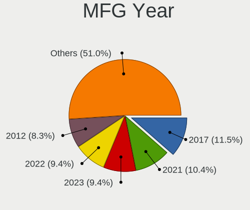
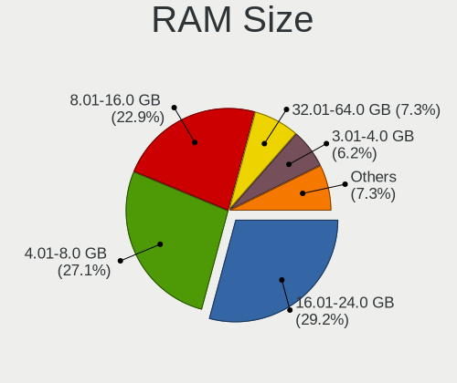
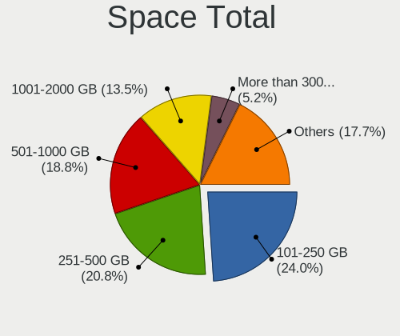
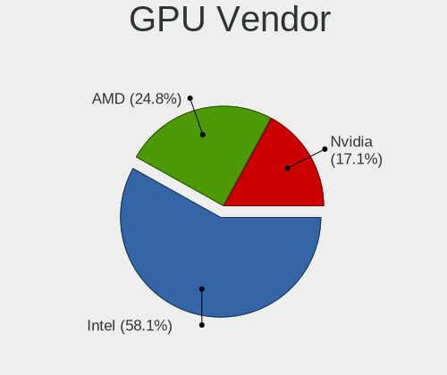
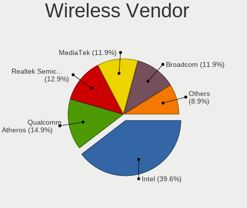
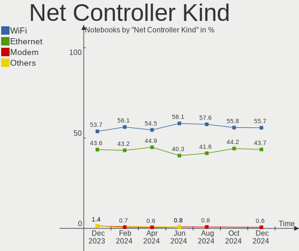
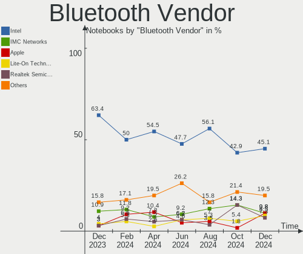

Linux in Canada - Hardware Trends (Notebooks)
---------------------------------------------

A project to identify most popular hardware characteristics and track their change
over time based on data collected by Linux users at https://Linux-Hardware.org.

Anyone can contribute to this report by the [hw-probe](https://github.com/linuxhw/hw-probe) tool:

    sudo -E hw-probe -all -upload

Period: Aug, 2022.

Contents
--------

* [ System ](#system)
  - [ OS                       ](#os)
  - [ OS Family                ](#os-family)
  - [ Kernel                   ](#kernel)
  - [ Kernel Family            ](#kernel-family)
  - [ Kernel Major Ver.        ](#kernel-major-ver)
  - [ Arch                     ](#arch)
  - [ DE                       ](#de)
  - [ Display Server           ](#display-server)
  - [ Display Manager          ](#display-manager)
  - [ OS Lang                  ](#os-lang)
  - [ Boot Mode                ](#boot-mode)
  - [ Filesystem               ](#filesystem)
  - [ Part. scheme             ](#part-scheme)
  - [ Dual Boot with Linux/BSD ](#dual-boot-with-linuxbsd)
  - [ Dual Boot (Win)          ](#dual-boot-win)

* [ Board ](#board)
  - [ Vendor                   ](#vendor)
  - [ Model                    ](#model)
  - [ Model Family             ](#model-family)
  - [ MFG Year                 ](#mfg-year)
  - [ Form Factor              ](#form-factor)
  - [ Secure Boot              ](#secure-boot)
  - [ Coreboot                 ](#coreboot)
  - [ RAM Size                 ](#ram-size)
  - [ RAM Used                 ](#ram-used)
  - [ Total Drives             ](#total-drives)
  - [ Has CD-ROM               ](#has-cd-rom)
  - [ Has Ethernet             ](#has-ethernet)
  - [ Has WiFi                 ](#has-wifi)
  - [ Has Bluetooth            ](#has-bluetooth)

* [ Location ](#location)
  - [ Country                  ](#country)
  - [ City                     ](#city)

* [ Drives ](#drives)
  - [ Drive Vendor             ](#drive-vendor)
  - [ Drive Model              ](#drive-model)
  - [ HDD Vendor               ](#hdd-vendor)
  - [ SSD Vendor               ](#ssd-vendor)
  - [ Drive Kind               ](#drive-kind)
  - [ Drive Connector          ](#drive-connector)
  - [ Drive Size               ](#drive-size)
  - [ Space Total              ](#space-total)
  - [ Space Used               ](#space-used)
  - [ Malfunc. Drives          ](#malfunc-drives)
  - [ Malfunc. Drive Vendor    ](#malfunc-drive-vendor)
  - [ Malfunc. HDD Vendor      ](#malfunc-hdd-vendor)
  - [ Malfunc. Drive Kind      ](#malfunc-drive-kind)
  - [ Failed Drives            ](#failed-drives)
  - [ Failed Drive Vendor      ](#failed-drive-vendor)
  - [ Drive Status             ](#drive-status)

* [ Storage controller ](#storage-controller)
  - [ Storage Vendor           ](#storage-vendor)
  - [ Storage Model            ](#storage-model)
  - [ Storage Kind             ](#storage-kind)

* [ Processor ](#processor)
  - [ CPU Vendor               ](#cpu-vendor)
  - [ CPU Model                ](#cpu-model)
  - [ CPU Model Family         ](#cpu-model-family)
  - [ CPU Cores                ](#cpu-cores)
  - [ CPU Sockets              ](#cpu-sockets)
  - [ CPU Threads              ](#cpu-threads)
  - [ CPU Op-Modes             ](#cpu-op-modes)
  - [ CPU Microcode            ](#cpu-microcode)
  - [ CPU Microarch            ](#cpu-microarch)

* [ Graphics ](#graphics)
  - [ GPU Vendor               ](#gpu-vendor)
  - [ GPU Model                ](#gpu-model)
  - [ GPU Combo                ](#gpu-combo)
  - [ GPU Driver               ](#gpu-driver)
  - [ GPU Memory               ](#gpu-memory)

* [ Monitor ](#monitor)
  - [ Monitor Vendor           ](#monitor-vendor)
  - [ Monitor Model            ](#monitor-model)
  - [ Monitor Resolution       ](#monitor-resolution)
  - [ Monitor Diagonal         ](#monitor-diagonal)
  - [ Monitor Width            ](#monitor-width)
  - [ Aspect Ratio             ](#aspect-ratio)
  - [ Monitor Area             ](#monitor-area)
  - [ Pixel Density            ](#pixel-density)
  - [ Multiple Monitors        ](#multiple-monitors)

* [ Network ](#network)
  - [ Net Controller Vendor    ](#net-controller-vendor)
  - [ Net Controller Model     ](#net-controller-model)
  - [ Wireless Vendor          ](#wireless-vendor)
  - [ Wireless Model           ](#wireless-model)
  - [ Ethernet Vendor          ](#ethernet-vendor)
  - [ Ethernet Model           ](#ethernet-model)
  - [ Net Controller Kind      ](#net-controller-kind)
  - [ Used Controller          ](#used-controller)
  - [ NICs                     ](#nics)
  - [ IPv6                     ](#ipv6)

* [ Bluetooth ](#bluetooth)
  - [ Bluetooth Vendor         ](#bluetooth-vendor)
  - [ Bluetooth Model          ](#bluetooth-model)

* [ Sound ](#sound)
  - [ Sound Vendor             ](#sound-vendor)
  - [ Sound Model              ](#sound-model)

* [ Memory ](#memory)
  - [ Memory Vendor            ](#memory-vendor)
  - [ Memory Model             ](#memory-model)
  - [ Memory Kind              ](#memory-kind)
  - [ Memory Form Factor       ](#memory-form-factor)
  - [ Memory Size              ](#memory-size)
  - [ Memory Speed             ](#memory-speed)

* [ Printers & scanners ](#printers--scanners)
  - [ Printer Vendor           ](#printer-vendor)
  - [ Printer Model            ](#printer-model)
  - [ Scanner Vendor           ](#scanner-vendor)
  - [ Scanner Model            ](#scanner-model)

* [ Camera ](#camera)
  - [ Camera Vendor            ](#camera-vendor)
  - [ Camera Model             ](#camera-model)

* [ Security ](#security)
  - [ Fingerprint Vendor       ](#fingerprint-vendor)
  - [ Fingerprint Model        ](#fingerprint-model)
  - [ Chipcard Vendor          ](#chipcard-vendor)
  - [ Chipcard Model           ](#chipcard-model)

* [ Unsupported ](#unsupported)
  - [ Unsupported Devices      ](#unsupported-devices)
  - [ Unsupported Device Types ](#unsupported-device-types)

System
------

OS
--

Installed operating systems

| Name                         | Notebooks | Percent |
|------------------------------|-----------|---------|
| Ubuntu 22.04                 | 7         | 11.67%  |
| Pop!_OS 22.04                | 6         | 10%     |
| Ubuntu 20.04                 | 5         | 8.33%   |
| Linux Mint 20.3              | 4         | 6.67%   |
| Zorin 16                     | 3         | 5%      |
| OpenMandriva 4.90            | 3         | 5%      |
| Kubuntu 22.04                | 3         | 5%      |
| SteamOS 3.3.1                | 2         | 3.33%   |
| SteamOS 3.3                  | 2         | 3.33%   |
| openSUSE Tumbleweed-XXXXXXXX | 2         | 3.33%   |
| Linux Mint 21                | 2         | 3.33%   |
| KDE neon 20.04               | 2         | 3.33%   |
| Fedora 36                    | 2         | 3.33%   |
| Debian 11                    | 2         | 3.33%   |
| Zorin 15                     | 1         | 1.67%   |
| Ubuntu Core 18               | 1         | 1.67%   |
| Ubuntu Budgie 22.04          | 1         | 1.67%   |
| SteamOS 3.2                  | 1         | 1.67%   |
| SteamOS 3.1                  | 1         | 1.67%   |
| Pop!_OS 20.04                | 1         | 1.67%   |
| OpenMandriva 4.3             | 1         | 1.67%   |
| Manjaro 21.3.6               | 1         | 1.67%   |
| Manjaro                      | 1         | 1.67%   |
| Kali 2022.3                  | 1         | 1.67%   |
| Garuda Linux Soaring         | 1         | 1.67%   |
| Fedora 35                    | 1         | 1.67%   |
| CentOS 9                     | 1         | 1.67%   |
| Arch Rolling                 | 1         | 1.67%   |
| Arch                         | 1         | 1.67%   |

OS Family
---------

OS without a version

| Name          | Notebooks | Percent |
|---------------|-----------|---------|
| Ubuntu        | 13        | 21.67%  |
| Pop!_OS       | 7         | 11.67%  |
| SteamOS       | 6         | 10%     |
| Linux Mint    | 6         | 10%     |
| Zorin         | 4         | 6.67%   |
| OpenMandriva  | 4         | 6.67%   |
| Kubuntu       | 3         | 5%      |
| Fedora        | 3         | 5%      |
| openSUSE      | 2         | 3.33%   |
| Manjaro       | 2         | 3.33%   |
| KDE neon      | 2         | 3.33%   |
| Debian        | 2         | 3.33%   |
| Arch          | 2         | 3.33%   |
| Ubuntu Budgie | 1         | 1.67%   |
| Kali          | 1         | 1.67%   |
| Garuda Linux  | 1         | 1.67%   |
| CentOS        | 1         | 1.67%   |

Kernel
------

Version of the Linux kernel

| Version                                        | Notebooks | Percent |
|------------------------------------------------|-----------|---------|
| 5.15.0-46-generic                              | 11        | 18.33%  |
| 5.15.0-41-generic                              | 5         | 8.33%   |
| 5.15.0-43-generic                              | 4         | 6.67%   |
| 5.19.0-76051900-generic                        | 3         | 5%      |
| 5.18.12-desktop-3omv4090                       | 3         | 5%      |
| 5.18.10-76051810-generic                       | 3         | 5%      |
| 5.4.0-124-generic                              | 2         | 3.33%   |
| 5.4.0-122-generic                              | 2         | 3.33%   |
| 5.18.16-200.fc36.x86_64                        | 2         | 3.33%   |
| 5.13.0-valve21.1-1-neptune-02211-gc54cda5a36f3 | 2         | 3.33%   |
| 5.13.0-valve21-1-neptune-02209-g2a5bdc1102a0   | 2         | 3.33%   |
| 5.10.0-16-amd64                                | 2         | 3.33%   |
| 5.4.0-104-generic                              | 1         | 1.67%   |
| 5.19.2-arch1-1                                 | 1         | 1.67%   |
| 5.19.2-1-default                               | 1         | 1.67%   |
| 5.19.0-4.1-liquorix-amd64                      | 1         | 1.67%   |
| 5.18.16-arch1-1                                | 1         | 1.67%   |
| 5.18.15-1-default                              | 1         | 1.67%   |
| 5.18.14-1-MANJARO                              | 1         | 1.67%   |
| 5.18.0-kali5-amd64                             | 1         | 1.67%   |
| 5.16.7-desktop-1omv4003                        | 1         | 1.67%   |
| 5.16.16-200.fc35.x86_64                        | 1         | 1.67%   |
| 5.15.61-1-lts                                  | 1         | 1.67%   |
| 5.15.57-2-MANJARO                              | 1         | 1.67%   |
| 5.15.0-47-generic                              | 1         | 1.67%   |
| 5.15.0-43-lowlatency                           | 1         | 1.67%   |
| 5.14.0-148.el9.x86_64                          | 1         | 1.67%   |
| 5.13.0-valve15-1-neptune-02197-gf6ec7ad3762a   | 1         | 1.67%   |
| 5.13.0-valve10.3-1-neptune-02176-g5fe416c4acd8 | 1         | 1.67%   |
| 5.13.0-7620-generic                            | 1         | 1.67%   |
| 5.13.0-51-generic                              | 1         | 1.67%   |

Kernel Family
-------------

Linux kernel without a distro release

| Version | Notebooks | Percent |
|---------|-----------|---------|
| 5.15.0  | 22        | 36.67%  |
| 5.13.0  | 8         | 13.33%  |
| 5.4.0   | 5         | 8.33%   |
| 5.19.0  | 4         | 6.67%   |
| 5.18.16 | 3         | 5%      |
| 5.18.12 | 3         | 5%      |
| 5.18.10 | 3         | 5%      |
| 5.19.2  | 2         | 3.33%   |
| 5.10.0  | 2         | 3.33%   |
| 5.18.15 | 1         | 1.67%   |
| 5.18.14 | 1         | 1.67%   |
| 5.18.0  | 1         | 1.67%   |
| 5.16.7  | 1         | 1.67%   |
| 5.16.16 | 1         | 1.67%   |
| 5.15.61 | 1         | 1.67%   |
| 5.15.57 | 1         | 1.67%   |
| 5.14.0  | 1         | 1.67%   |

Kernel Major Ver.
-----------------

Linux kernel major version

| Version | Notebooks | Percent |
|---------|-----------|---------|
| 5.15    | 24        | 40%     |
| 5.18    | 12        | 20%     |
| 5.13    | 8         | 13.33%  |
| 5.19    | 6         | 10%     |
| 5.4     | 5         | 8.33%   |
| 5.16    | 2         | 3.33%   |
| 5.10    | 2         | 3.33%   |
| 5.14    | 1         | 1.67%   |

Arch
----

OS architecture (x86_64, i586, etc.)

| Name   | Notebooks | Percent |
|--------|-----------|---------|
| x86_64 | 60        | 100%    |

DE
--

Desktop Environment

| Name       | Notebooks | Percent |
|------------|-----------|---------|
| GNOME      | 28        | 46.67%  |
| KDE5       | 17        | 28.33%  |
| X-Cinnamon | 6         | 10%     |
| Unknown    | 3         | 5%      |
| XFCE       | 2         | 3.33%   |
| Cinnamon   | 2         | 3.33%   |
| i3         | 1         | 1.67%   |
| Budgie     | 1         | 1.67%   |

Display Server
--------------

X11 or Wayland

| Name    | Notebooks | Percent |
|---------|-----------|---------|
| X11     | 47        | 78.33%  |
| Wayland | 11        | 18.33%  |
| Unknown | 2         | 3.33%   |

Display Manager
---------------

SDDM, LightDM, etc.

| Name    | Notebooks | Percent |
|---------|-----------|---------|
| Unknown | 24        | 40%     |
| GDM3    | 16        | 26.67%  |
| SDDM    | 8         | 13.33%  |
| LightDM | 8         | 13.33%  |
| GDM     | 4         | 6.67%   |

OS Lang
-------

Language

| Lang    | Notebooks | Percent |
|---------|-----------|---------|
| en_CA   | 30        | 50%     |
| en_US   | 23        | 38.33%  |
| fr_CA   | 3         | 5%      |
| C       | 2         | 3.33%   |
| Unknown | 2         | 3.33%   |

Boot Mode
---------

EFI or BIOS

| Mode | Notebooks | Percent |
|------|-----------|---------|
| BIOS | 32        | 53.33%  |
| EFI  | 28        | 46.67%  |

Filesystem
----------

Type of filesystem

| Type    | Notebooks | Percent |
|---------|-----------|---------|
| Ext4    | 41        | 68.33%  |
| Btrfs   | 11        | 18.33%  |
| Overlay | 6         | 10%     |
| Zfs     | 1         | 1.67%   |
| Xfs     | 1         | 1.67%   |

Part. scheme
------------

Scheme of partitioning

| Type    | Notebooks | Percent |
|---------|-----------|---------|
| Unknown | 39        | 65%     |
| GPT     | 19        | 31.67%  |
| MBR     | 2         | 3.33%   |

Dual Boot with Linux/BSD
------------------------

Hosting more than one Linux/BSD

| Dual boot | Notebooks | Percent |
|-----------|-----------|---------|
| No        | 55        | 91.67%  |
| Yes       | 5         | 8.33%   |

Dual Boot (Win)
---------------

Hosting Linux and Windows

| Dual boot | Notebooks | Percent |
|-----------|-----------|---------|
| No        | 51        | 85%     |
| Yes       | 9         | 15%     |

Board
-----

Vendor
------

Motherboard manufacturer

| Name                | Notebooks | Percent |
|---------------------|-----------|---------|
| Lenovo              | 14        | 23.33%  |
| Hewlett-Packard     | 11        | 18.33%  |
| Dell                | 7         | 11.67%  |
| ASUSTek Computer    | 7         | 11.67%  |
| Valve               | 6         | 10%     |
| Samsung Electronics | 2         | 3.33%   |
| MSI                 | 2         | 3.33%   |
| Google              | 2         | 3.33%   |
| Apple               | 2         | 3.33%   |
| Acer                | 2         | 3.33%   |
| Toshiba             | 1         | 1.67%   |
| System76            | 1         | 1.67%   |
| Sony                | 1         | 1.67%   |
| Razer               | 1         | 1.67%   |
| Alienware           | 1         | 1.67%   |

Model
-----

Motherboard model

| Name                                     | Notebooks | Percent |
|------------------------------------------|-----------|---------|
| Valve Jupiter                            | 6         | 10%     |
| HP Pavilion 15                           | 3         | 5%      |
| Samsung 305E4A/305E5A/305E7A             | 2         | 3.33%   |
| Lenovo ThinkPad X1 Carbon 6th 20KHCTO1WW | 2         | 3.33%   |
| Toshiba PORTEGE M780                     | 1         | 1.67%   |
| System76 Oryx Pro                        | 1         | 1.67%   |
| Sony VPCEB12FD                           | 1         | 1.67%   |
| Razer Book 13 - RZ09-0357                | 1         | 1.67%   |
| MSI WF75 10TK                            | 1         | 1.67%   |
| MSI Sword 15 A11UD                       | 1         | 1.67%   |
| Lenovo ThinkPad T580 20L9CTO1WW          | 1         | 1.67%   |
| Lenovo ThinkPad T500 2055A38             | 1         | 1.67%   |
| Lenovo ThinkPad T470s 20HFCTO1WW         | 1         | 1.67%   |
| Lenovo ThinkPad T460s 20F9004NUS         | 1         | 1.67%   |
| Lenovo ThinkPad T430 2349DG5             | 1         | 1.67%   |
| Lenovo ThinkPad T430 2344BMU             | 1         | 1.67%   |
| Lenovo ThinkPad T420s 417152U            | 1         | 1.67%   |
| Lenovo ThinkPad P15s Gen 1 20T4001VUS    | 1         | 1.67%   |
| Lenovo ThinkPad P14s Gen 2a 21A0CTO1WW   | 1         | 1.67%   |
| Lenovo ThinkPad E550 20DF0040CA          | 1         | 1.67%   |
| Lenovo IdeaPad Y410P 20216               | 1         | 1.67%   |
| Lenovo IdeaPad 3 14ALC6 82KT             | 1         | 1.67%   |
| HP ProBook 4540s                         | 1         | 1.67%   |
| HP Pavilion Gaming Laptop 16-a0xxx       | 1         | 1.67%   |
| HP Pavilion Gaming Laptop 15-ec0xxx      | 1         | 1.67%   |
| HP Laptop 17-by1xxx                      | 1         | 1.67%   |
| HP Laptop 14-dq4xxx                      | 1         | 1.67%   |
| HP ENVY m6                               | 1         | 1.67%   |
| HP EliteBook 8460p                       | 1         | 1.67%   |
| Google Rabbid                            | 1         | 1.67%   |
| Google Droid                             | 1         | 1.67%   |
| Dell XPS 15 9520                         | 1         | 1.67%   |
| Dell XPS 15 9500                         | 1         | 1.67%   |
| Dell Latitude E6410                      | 1         | 1.67%   |
| Dell Latitude 7420                       | 1         | 1.67%   |
| Dell Inspiron 15-5578                    | 1         | 1.67%   |
| Dell Inspiron 15-3567                    | 1         | 1.67%   |
| Dell G3 3590                             | 1         | 1.67%   |
| ASUS Zenbook UM3402YA_UM3402YA           | 1         | 1.67%   |
| ASUS X555LAB                             | 1         | 1.67%   |
| ASUS VivoBook_ASUSLaptop X530FA_S530FA   | 1         | 1.67%   |
| ASUS VivoBook_ASUSLaptop X509DAP_M509DA  | 1         | 1.67%   |
| ASUS UX303UA                             | 1         | 1.67%   |
| ASUS K401UQK                             | 1         | 1.67%   |
| ASUS G73Jh                               | 1         | 1.67%   |
| Apple MacBookPro9,2                      | 1         | 1.67%   |
| Apple MacBookPro12,1                     | 1         | 1.67%   |
| Alienware x17 R2                         | 1         | 1.67%   |
| Acer Swift SFX14-41G                     | 1         | 1.67%   |
| Acer Aspire 5742                         | 1         | 1.67%   |
| Unknown                                  | 1         | 1.67%   |

Model Family
------------

Motherboard model prefix

| Name               | Notebooks | Percent |
|--------------------|-----------|---------|
| Lenovo ThinkPad    | 12        | 20%     |
| Valve Jupiter      | 6         | 10%     |
| HP Pavilion        | 5         | 8.33%   |
| Samsung 305E4A     | 2         | 3.33%   |
| Lenovo IdeaPad     | 2         | 3.33%   |
| HP Laptop          | 2         | 3.33%   |
| Dell XPS           | 2         | 3.33%   |
| Dell Latitude      | 2         | 3.33%   |
| Dell Inspiron      | 2         | 3.33%   |
| ASUS VivoBook      | 2         | 3.33%   |
| Toshiba PORTEGE    | 1         | 1.67%   |
| System76 Oryx      | 1         | 1.67%   |
| Sony VPCEB12FD     | 1         | 1.67%   |
| Razer Book         | 1         | 1.67%   |
| MSI WF75           | 1         | 1.67%   |
| MSI Sword          | 1         | 1.67%   |
| HP ProBook         | 1         | 1.67%   |
| HP ENVY            | 1         | 1.67%   |
| HP EliteBook       | 1         | 1.67%   |
| Google Rabbid      | 1         | 1.67%   |
| Google Droid       | 1         | 1.67%   |
| Dell G3            | 1         | 1.67%   |
| ASUS Zenbook       | 1         | 1.67%   |
| ASUS X555LAB       | 1         | 1.67%   |
| ASUS UX303UA       | 1         | 1.67%   |
| ASUS K401UQK       | 1         | 1.67%   |
| ASUS G73Jh         | 1         | 1.67%   |
| Apple MacBookPro9  | 1         | 1.67%   |
| Apple MacBookPro12 | 1         | 1.67%   |
| Alienware x17      | 1         | 1.67%   |
| Acer Swift         | 1         | 1.67%   |
| Acer Aspire        | 1         | 1.67%   |
| Unknown            | 1         | 1.67%   |

MFG Year
--------

Motherboard manufacture year

| Year | Notebooks | Percent |
|------|-----------|---------|
| 2022 | 13        | 21.67%  |
| 2020 | 7         | 11.67%  |
| 2018 | 5         | 8.33%   |
| 2012 | 5         | 8.33%   |
| 2010 | 5         | 8.33%   |
| 2021 | 4         | 6.67%   |
| 2013 | 4         | 6.67%   |
| 2011 | 4         | 6.67%   |
| 2016 | 3         | 5%      |
| 2019 | 2         | 3.33%   |
| 2017 | 2         | 3.33%   |
| 2015 | 2         | 3.33%   |
| 2014 | 2         | 3.33%   |
| 2008 | 2         | 3.33%   |

Form Factor
-----------

Physical design of the computer

| Name     | Notebooks | Percent |
|----------|-----------|---------|
| Notebook | 60        | 100%    |

Secure Boot
-----------

Enabled or disabled

| State    | Notebooks | Percent |
|----------|-----------|---------|
| Disabled | 59        | 98.33%  |
| Enabled  | 1         | 1.67%   |

Coreboot
--------

Have coreboot on board

| Used | Notebooks | Percent |
|------|-----------|---------|
| No   | 57        | 95%     |
| Yes  | 3         | 5%      |

RAM Size
--------

Total RAM memory

| Size in GB  | Notebooks | Percent |
|-------------|-----------|---------|
| 4.01-8.0    | 18        | 30%     |
| 8.01-16.0   | 18        | 30%     |
| 3.01-4.0    | 8         | 13.33%  |
| 16.01-24.0  | 8         | 13.33%  |
| 32.01-64.0  | 6         | 10%     |
| 64.01-256.0 | 2         | 3.33%   |

RAM Used
--------

Used RAM memory

| Used GB   | Notebooks | Percent |
|-----------|-----------|---------|
| 2.01-3.0  | 21        | 35%     |
| 1.01-2.0  | 17        | 28.33%  |
| 4.01-8.0  | 12        | 20%     |
| 3.01-4.0  | 7         | 11.67%  |
| 8.01-16.0 | 2         | 3.33%   |
| 0.51-1.0  | 1         | 1.67%   |

Total Drives
------------

Number of drives on board

| Drives | Notebooks | Percent |
|--------|-----------|---------|
| 1      | 41        | 68.33%  |
| 2      | 18        | 30%     |
| 3      | 1         | 1.67%   |

Has CD-ROM
----------

Has CD-ROM on board

| Presented | Notebooks | Percent |
|-----------|-----------|---------|
| No        | 40        | 66.67%  |
| Yes       | 20        | 33.33%  |

Has Ethernet
------------

Has Ethernet on board

| Presented | Notebooks | Percent |
|-----------|-----------|---------|
| Yes       | 46        | 76.67%  |
| No        | 14        | 23.33%  |

Has WiFi
--------

Has WiFi module

| Presented | Notebooks | Percent |
|-----------|-----------|---------|
| Yes       | 58        | 96.67%  |
| No        | 2         | 3.33%   |

Has Bluetooth
-------------

Has Bluetooth module

| Presented | Notebooks | Percent |
|-----------|-----------|---------|
| Yes       | 54        | 90%     |
| No        | 6         | 10%     |

Location
--------

Country
-------

Geographic location (country)

| Country | Notebooks | Percent |
|---------|-----------|---------|
| Canada  | 60        | 100%    |

City
----

Geographic location (city)

| City                                         | Notebooks | Percent |
|----------------------------------------------|-----------|---------|
| Toronto                                      | 7         | 11.67%  |
| Montreal                                     | 5         | 8.33%   |
| Victoria                                     | 3         | 5%      |
| Laval                                        | 3         | 5%      |
| Calgary                                      | 3         | 5%      |
| Winnipeg                                     | 2         | 3.33%   |
| Vancouver                                    | 2         | 3.33%   |
| Ottawa                                       | 2         | 3.33%   |
| Edmonton                                     | 2         | 3.33%   |
| Cold Lake                                    | 2         | 3.33%   |
| Burnaby                                      | 2         | 3.33%   |
| Welland                                      | 1         | 1.67%   |
| Sherbrooke                                   | 1         | 1.67%   |
| Sault Ste. Marie                             | 1         | 1.67%   |
| Salford                                      | 1         | 1.67%   |
| Saint John                                   | 1         | 1.67%   |
| Saguenay                                     | 1         | 1.67%   |
| Québec                                      | 1         | 1.67%   |
| Peterborough                                 | 1         | 1.67%   |
| Milton                                       | 1         | 1.67%   |
| Merritt                                      | 1         | 1.67%   |
| Maple Ridge                                  | 1         | 1.67%   |
| Lloydminster                                 | 1         | 1.67%   |
| Kelowna                                      | 1         | 1.67%   |
| Joliette                                     | 1         | 1.67%   |
| Hartland                                     | 1         | 1.67%   |
| Halifax                                      | 1         | 1.67%   |
| Grande Prairie                               | 1         | 1.67%   |
| Fort St. John                                | 1         | 1.67%   |
| Courtenay                                    | 1         | 1.67%   |
| Chateauguay                                  | 1         | 1.67%   |
| Blenheim                                     | 1         | 1.67%   |
| Beaux-Rivages--Lac-des-Ecorces--Val-Barrette | 1         | 1.67%   |
| Barrie                                       | 1         | 1.67%   |
| Athabasca                                    | 1         | 1.67%   |
| Alliston                                     | 1         | 1.67%   |
| Airdrie                                      | 1         | 1.67%   |
| Abbotsford                                   | 1         | 1.67%   |

Drives
------

Drive Vendor
------------

Hard drive vendors

| Vendor              | Notebooks | Drives | Percent |
|---------------------|-----------|--------|---------|
| WDC                 | 8         | 9      | 10.39%  |
| Unknown             | 8         | 8      | 10.39%  |
| Seagate             | 8         | 8      | 10.39%  |
| Kingston            | 8         | 8      | 10.39%  |
| Samsung Electronics | 6         | 6      | 7.79%   |
| Intel               | 6         | 7      | 7.79%   |
| Hitachi             | 4         | 4      | 5.19%   |
| Phison              | 3         | 3      | 3.9%    |
| HGST                | 3         | 3      | 3.9%    |
| Crucial             | 3         | 3      | 3.9%    |
| Unknown             | 3         | 3      | 3.9%    |
| SPCC                | 2         | 2      | 2.6%    |
| SK hynix            | 2         | 2      | 2.6%    |
| SanDisk             | 2         | 2      | 2.6%    |
| LITEON              | 2         | 2      | 2.6%    |
| Apple               | 2         | 2      | 2.6%    |
| Toshiba             | 1         | 1      | 1.3%    |
| Silicon Motion      | 1         | 1      | 1.3%    |
| PNY                 | 1         | 1      | 1.3%    |
| Micron Technology   | 1         | 1      | 1.3%    |
| Lenovo              | 1         | 1      | 1.3%    |
| JMicron Technology  | 1         | 1      | 1.3%    |
| Fujitsu             | 1         | 1      | 1.3%    |

Drive Model
-----------

Hard drive models

| Model                                     | Notebooks | Percent |
|-------------------------------------------|-----------|---------|
| Kingston NVMe SSD Drive 256GB             | 3         | 3.8%    |
| Unknown                                   | 3         | 3.8%    |
| Unknown MMC Card  64GB                    | 2         | 2.53%   |
| Seagate ST1000LM035-1RK172 1TB            | 2         | 2.53%   |
| Phison NVMe SSD Drive 512GB               | 2         | 2.53%   |
| Intel NVMe SSD Drive 512GB                | 2         | 2.53%   |
| WDC WDS500G2B0C-00PXH0 500GB              | 1         | 1.27%   |
| WDC WD3200BEKT-60PVMT0 320GB              | 1         | 1.27%   |
| WDC WD1600BJKT-75F4T0 160GB               | 1         | 1.27%   |
| WDC PC SN810 NVMe 2048GB                  | 1         | 1.27%   |
| WDC PC SN810 NVMe 1024GB                  | 1         | 1.27%   |
| WDC PC SN730 SDBQNTY-512G-1001 512GB      | 1         | 1.27%   |
| WDC PC SN730 NVMe 512GB                   | 1         | 1.27%   |
| WDC PC SN530 SDBPMPZ-256G-1101 256GB      | 1         | 1.27%   |
| WDC PC SN530 NVMe 256GB                   | 1         | 1.27%   |
| Unknown SD64G  64GB                       | 1         | 1.27%   |
| Unknown SC256  256GB                      | 1         | 1.27%   |
| Unknown MMC Card  7GB                     | 1         | 1.27%   |
| Unknown MMC Card  512GB                   | 1         | 1.27%   |
| Unknown MMC Card  250GB                   | 1         | 1.27%   |
| Unknown DA4064  64GB                      | 1         | 1.27%   |
| Toshiba MQ04ABF100 1TB                    | 1         | 1.27%   |
| SPCC Solid State Disk 512GB               | 1         | 1.27%   |
| SPCC Solid State Disk 256GB               | 1         | 1.27%   |
| SK hynix NVMe SSD Drive 512GB             | 1         | 1.27%   |
| SK hynix NVMe SSD Drive 1024GB            | 1         | 1.27%   |
| Silicon Motion NVMe SSD Drive 512GB       | 1         | 1.27%   |
| Seagate ST9500420AS 500GB                 | 1         | 1.27%   |
| Seagate ST320LT000-9VL142 320GB           | 1         | 1.27%   |
| Seagate ST1000LX015-1U7172 1TB            | 1         | 1.27%   |
| Seagate Portable 4TB                      | 1         | 1.27%   |
| Seagate NVMe SSD Drive 2TB                | 1         | 1.27%   |
| Seagate Expansion Desk 4TB                | 1         | 1.27%   |
| SanDisk NVMe SSD Drive 2TB                | 1         | 1.27%   |
| SanDisk NVMe SSD Drive 1024GB             | 1         | 1.27%   |
| Samsung SSD 860 EVO 1TB                   | 1         | 1.27%   |
| Samsung NVMe SSD Drive 512GB              | 1         | 1.27%   |
| Samsung NVMe SSD Drive 256GB              | 1         | 1.27%   |
| Samsung NVMe SSD Drive 1TB                | 1         | 1.27%   |
| Samsung MZVLB256HBHQ-00A00 256GB          | 1         | 1.27%   |
| Samsung MZNLN256HMHQ-000L7 256GB SSD      | 1         | 1.27%   |
| PNY CS900 240GB SSD                       | 1         | 1.27%   |
| Phison NVMe SSD Drive 256GB               | 1         | 1.27%   |
| Micron 1100_MTFDDAV512TBN 512GB SSD       | 1         | 1.27%   |
| LITEON LCH-128V2S-11 2.5 7mm 128GB SSD    | 1         | 1.27%   |
| LITEON IT LCS-256L9S-11 2.5 7mm 256GB SSD | 1         | 1.27%   |
| Lenovo NVMe SSD Drive 256GB               | 1         | 1.27%   |
| Kingston SV300S37A240G 240GB SSD          | 1         | 1.27%   |
| Kingston SNVS1000G 1TB                    | 1         | 1.27%   |
| Kingston SKC600512G 512GB SSD             | 1         | 1.27%   |
| Kingston SKC600256G 256GB SSD             | 1         | 1.27%   |
| Kingston SA400S37240G 240GB SSD           | 1         | 1.27%   |
| JMicron Tech 250GB                        | 1         | 1.27%   |
| Intel SSDSC2KW256G8 256GB                 | 1         | 1.27%   |
| Intel SSDSA2CW080G3 80GB                  | 1         | 1.27%   |
| Intel SSDPEKNU512GZH 512GB                | 1         | 1.27%   |
| Intel HBRPEKNX0202AHO 32GB                | 1         | 1.27%   |
| Intel HBRPEKNX0202AH 512GB                | 1         | 1.27%   |
| Hitachi HTS725032A9A360 320GB             | 1         | 1.27%   |
| Hitachi HTS547550A9E384 500GB             | 1         | 1.27%   |

HDD Vendor
----------

Hard disk drive vendors

| Vendor  | Notebooks | Drives | Percent |
|---------|-----------|--------|---------|
| Seagate | 6         | 6      | 33.33%  |
| Hitachi | 4         | 4      | 22.22%  |
| HGST    | 3         | 3      | 16.67%  |
| WDC     | 2         | 2      | 11.11%  |
| Toshiba | 1         | 1      | 5.56%   |
| Fujitsu | 1         | 1      | 5.56%   |
| Apple   | 1         | 1      | 5.56%   |

SSD Vendor
----------

Solid state drive vendors

| Vendor              | Notebooks | Drives | Percent |
|---------------------|-----------|--------|---------|
| Kingston            | 4         | 4      | 22.22%  |
| Crucial             | 3         | 3      | 16.67%  |
| SPCC                | 2         | 2      | 11.11%  |
| Samsung Electronics | 2         | 2      | 11.11%  |
| LITEON              | 2         | 2      | 11.11%  |
| Intel               | 2         | 2      | 11.11%  |
| PNY                 | 1         | 1      | 5.56%   |
| Micron Technology   | 1         | 1      | 5.56%   |
| Apple               | 1         | 1      | 5.56%   |

Drive Kind
----------

HDD or SSD

| Kind    | Notebooks | Drives | Percent |
|---------|-----------|--------|---------|
| NVMe    | 26        | 30     | 35.14%  |
| HDD     | 18        | 18     | 24.32%  |
| SSD     | 17        | 18     | 22.97%  |
| MMC     | 11        | 11     | 14.86%  |
| Unknown | 2         | 2      | 2.7%    |

Drive Connector
---------------

SATA, SAS, NVMe, etc.

| Type | Notebooks | Drives | Percent |
|------|-----------|--------|---------|
| SATA | 33        | 35     | 45.21%  |
| NVMe | 26        | 30     | 35.62%  |
| MMC  | 11        | 11     | 15.07%  |
| SAS  | 3         | 3      | 4.11%   |

Drive Size
----------

Size of hard drive

| Size in TB | Notebooks | Drives | Percent |
|------------|-----------|--------|---------|
| 0.01-0.5   | 21        | 23     | 61.76%  |
| 0.51-1.0   | 12        | 12     | 35.29%  |
| 3.01-4.0   | 1         | 1      | 2.94%   |

Space Total
-----------

Amount of disk space available on the file system

| Size in GB     | Notebooks | Percent |
|----------------|-----------|---------|
| 251-500        | 18        | 30%     |
| 101-250        | 13        | 21.67%  |
| 501-1000       | 8         | 13.33%  |
| 1-20           | 7         | 11.67%  |
| 1001-2000      | 3         | 5%      |
| 51-100         | 3         | 5%      |
| Unknown        | 3         | 5%      |
| More than 3000 | 2         | 3.33%   |
| 2001-3000      | 2         | 3.33%   |
| 21-50          | 1         | 1.67%   |

Space Used
----------

Amount of used disk space

| Used GB   | Notebooks | Percent |
|-----------|-----------|---------|
| 1-20      | 19        | 31.67%  |
| 21-50     | 13        | 21.67%  |
| 101-250   | 9         | 15%     |
| 51-100    | 7         | 11.67%  |
| 251-500   | 5         | 8.33%   |
| 501-1000  | 3         | 5%      |
| Unknown   | 3         | 5%      |
| 1001-2000 | 1         | 1.67%   |

Malfunc. Drives
---------------

Drive models with a malfunction

| Model                         | Notebooks | Drives | Percent |
|-------------------------------|-----------|--------|---------|
| Hitachi HTS725032A9A360 320GB | 1         | 1      | 33.33%  |
| Hitachi HTS541010A9E680 1TB   | 1         | 1      | 33.33%  |
| HGST HTS541010A9E680 1TB      | 1         | 1      | 33.33%  |

Malfunc. Drive Vendor
---------------------

Vendors of faulty drives

| Vendor  | Notebooks | Drives | Percent |
|---------|-----------|--------|---------|
| Hitachi | 2         | 2      | 66.67%  |
| HGST    | 1         | 1      | 33.33%  |

Malfunc. HDD Vendor
-------------------

Vendors of faulty HDD drives

| Vendor  | Notebooks | Drives | Percent |
|---------|-----------|--------|---------|
| Hitachi | 2         | 2      | 66.67%  |
| HGST    | 1         | 1      | 33.33%  |

Malfunc. Drive Kind
-------------------

Kinds of faulty drives

| Kind | Notebooks | Drives | Percent |
|------|-----------|--------|---------|
| HDD  | 3         | 3      | 100%    |

Failed Drives
-------------

Failed drive models

Zero info for selected period =(

Failed Drive Vendor
-------------------

Failed drive vendors

Zero info for selected period =(

Drive Status
------------

Number of failed and malfunc. drives

| Status   | Notebooks | Drives | Percent |
|----------|-----------|--------|---------|
| Detected | 43        | 59     | 70.49%  |
| Works    | 15        | 17     | 24.59%  |
| Malfunc  | 3         | 3      | 4.92%   |

Storage controller
------------------

Storage Vendor
--------------

Storage controller vendors

| Vendor                      | Notebooks | Percent |
|-----------------------------|-----------|---------|
| Intel                       | 32        | 48.48%  |
| AMD                         | 9         | 13.64%  |
| SanDisk                     | 8         | 12.12%  |
| Samsung Electronics         | 5         | 7.58%   |
| Kingston Technology Company | 4         | 6.06%   |
| Phison Electronics          | 3         | 4.55%   |
| SK hynix                    | 2         | 3.03%   |
| Silicon Motion              | 1         | 1.52%   |
| Seagate Technology          | 1         | 1.52%   |
| Lenovo                      | 1         | 1.52%   |

Storage Model
-------------

Storage controller models

| Model                                                                          | Notebooks | Percent |
|--------------------------------------------------------------------------------|-----------|---------|
| AMD FCH SATA Controller [AHCI mode]                                            | 8         | 11.43%  |
| Intel Sunrise Point-LP SATA Controller [AHCI mode]                             | 6         | 8.57%   |
| Intel 7 Series Chipset Family 6-port SATA Controller [AHCI mode]               | 5         | 7.14%   |
| Intel 82801 Mobile SATA Controller [RAID mode]                                 | 4         | 5.71%   |
| SanDisk Non-Volatile memory controller                                         | 3         | 4.29%   |
| Phison PS5013 E13 NVMe Controller                                              | 3         | 4.29%   |
| Kingston Company OM3PDP3 NVMe SSD                                              | 3         | 4.29%   |
| Intel Non-Volatile memory controller                                           | 3         | 4.29%   |
| Intel 5 Series/3400 Series Chipset 4 port SATA AHCI Controller                 | 3         | 4.29%   |
| SanDisk WD PC SN810 / Black SN850 NVMe SSD                                     | 2         | 2.86%   |
| SanDisk WD Blue SN550 NVMe SSD                                                 | 2         | 2.86%   |
| SanDisk WD Black SN750 / PC SN730 NVMe SSD                                     | 2         | 2.86%   |
| Samsung NVMe SSD Controller SM981/PM981/PM983                                  | 2         | 2.86%   |
| Intel Wildcat Point-LP SATA Controller [AHCI Mode]                             | 2         | 2.86%   |
| Intel Volume Management Device NVMe RAID Controller                            | 2         | 2.86%   |
| Intel 6 Series/C200 Series Chipset Family 6 port Mobile SATA AHCI Controller   | 2         | 2.86%   |
| SK hynix Gold P31 SSD                                                          | 1         | 1.43%   |
| SK hynix BC511                                                                 | 1         | 1.43%   |
| Silicon Motion SM2263EN/SM2263XT SSD Controller                                | 1         | 1.43%   |
| Seagate FireCuda 520 SSD                                                       | 1         | 1.43%   |
| Samsung NVMe SSD Controller SM961/PM961/SM963                                  | 1         | 1.43%   |
| Samsung NVMe SSD Controller 980                                                | 1         | 1.43%   |
| Samsung Electronics SATA controller                                            | 1         | 1.43%   |
| Lenovo Non-Volatile memory controller                                          | 1         | 1.43%   |
| Kingston Company Company Non-Volatile memory controller                        | 1         | 1.43%   |
| Intel SSD Pro 7600p/760p/E 6100p Series                                        | 1         | 1.43%   |
| Intel Cannon Lake Mobile PCH SATA AHCI Controller                              | 1         | 1.43%   |
| Intel 82801IBM/IEM (ICH9M/ICH9M-E) 2 port SATA Controller [IDE mode]           | 1         | 1.43%   |
| Intel 8 Series/C220 Series Chipset Family 6-port SATA Controller 1 [AHCI mode] | 1         | 1.43%   |
| Intel 500 Series Chipset Family SATA AHCI Controller                           | 1         | 1.43%   |
| Intel 5 Series/3400 Series Chipset 6 port SATA AHCI Controller                 | 1         | 1.43%   |
| Intel 400 Series Chipset Family SATA AHCI Controller                           | 1         | 1.43%   |
| AMD SB600 Non-Raid-5 SATA                                                      | 1         | 1.43%   |
| AMD SB600 IDE                                                                  | 1         | 1.43%   |

Storage Kind
------------

Kind of storage controller (IDE, SATA, NVMe, SAS, ...)

| Kind | Notebooks | Percent |
|------|-----------|---------|
| SATA | 33        | 49.25%  |
| NVMe | 26        | 38.81%  |
| RAID | 6         | 8.96%   |
| IDE  | 2         | 2.99%   |

Processor
---------

CPU Vendor
----------

Processor vendors

| Vendor | Notebooks | Percent |
|--------|-----------|---------|
| Intel  | 42        | 70%     |
| AMD    | 18        | 30%     |

CPU Model
---------

Processor models

| Model                                         | Notebooks | Percent |
|-----------------------------------------------|-----------|---------|
| AMD Custom APU 0405                           | 6         | 10%     |
| Intel Core i7-5500U CPU @ 2.40GHz             | 2         | 3.33%   |
| Intel Core i7-10750H CPU @ 2.60GHz            | 2         | 3.33%   |
| Intel Core i5-2520M CPU @ 2.50GHz             | 2         | 3.33%   |
| Intel 12th Gen Core i9-12900HK                | 2         | 3.33%   |
| Intel 11th Gen Core i7-11800H @ 2.30GHz       | 2         | 3.33%   |
| Intel Core i7-9750H CPU @ 2.60GHz             | 1         | 1.67%   |
| Intel Core i7-8650U CPU @ 1.90GHz             | 1         | 1.67%   |
| Intel Core i7-8565U CPU @ 1.80GHz             | 1         | 1.67%   |
| Intel Core i7-8550U CPU @ 1.80GHz             | 1         | 1.67%   |
| Intel Core i7-7600U CPU @ 2.80GHz             | 1         | 1.67%   |
| Intel Core i7-7500U CPU @ 2.70GHz             | 1         | 1.67%   |
| Intel Core i7-4700MQ CPU @ 2.40GHz            | 1         | 1.67%   |
| Intel Core i7-10510U CPU @ 1.80GHz            | 1         | 1.67%   |
| Intel Core i7 CPU Q 740 @ 1.73GHz             | 1         | 1.67%   |
| Intel Core i5-8350U CPU @ 1.70GHz             | 1         | 1.67%   |
| Intel Core i5-8265U CPU @ 1.60GHz             | 1         | 1.67%   |
| Intel Core i5-7200U CPU @ 2.50GHz             | 1         | 1.67%   |
| Intel Core i5-6300U CPU @ 2.40GHz             | 1         | 1.67%   |
| Intel Core i5-6200U CPU @ 2.30GHz             | 1         | 1.67%   |
| Intel Core i5-5257U CPU @ 2.70GHz             | 1         | 1.67%   |
| Intel Core i5-3380M CPU @ 2.90GHz             | 1         | 1.67%   |
| Intel Core i5-3320M CPU @ 2.60GHz             | 1         | 1.67%   |
| Intel Core i5-3230M CPU @ 2.60GHz             | 1         | 1.67%   |
| Intel Core i5-3210M CPU @ 2.50GHz             | 1         | 1.67%   |
| Intel Core i5-10300H CPU @ 2.50GHz            | 1         | 1.67%   |
| Intel Core i5 CPU M 560 @ 2.67GHz             | 1         | 1.67%   |
| Intel Core i5 CPU M 520 @ 2.40GHz             | 1         | 1.67%   |
| Intel Core i5 CPU M 430 @ 2.27GHz             | 1         | 1.67%   |
| Intel Core i3-7130U CPU @ 2.70GHz             | 1         | 1.67%   |
| Intel Core i3-2370M CPU @ 2.40GHz             | 1         | 1.67%   |
| Intel Core i3 CPU M 330 @ 2.13GHz             | 1         | 1.67%   |
| Intel Core 2 Duo CPU T9600 @ 2.80GHz          | 1         | 1.67%   |
| Intel Celeron N4020 CPU @ 1.10GHz             | 1         | 1.67%   |
| Intel Celeron CPU N3350 @ 1.10GHz             | 1         | 1.67%   |
| Intel 11th Gen Core i7-1185G7 @ 3.00GHz       | 1         | 1.67%   |
| Intel 11th Gen Core i7-1165G7 @ 2.80GHz       | 1         | 1.67%   |
| Intel 11th Gen Core i5-1155G7 @ 2.50GHz       | 1         | 1.67%   |
| AMD Turion 64 X2 Mobile Technology TL-58      | 1         | 1.67%   |
| AMD Ryzen 7 5825U with Radeon Graphics        | 1         | 1.67%   |
| AMD Ryzen 7 5700U with Radeon Graphics        | 1         | 1.67%   |
| AMD Ryzen 5 PRO 5650U with Radeon Graphics    | 1         | 1.67%   |
| AMD Ryzen 5 5500U with Radeon Graphics        | 1         | 1.67%   |
| AMD Ryzen 5 3550H with Radeon Vega Mobile Gfx | 1         | 1.67%   |
| AMD Ryzen 3 3250U with Radeon Graphics        | 1         | 1.67%   |
| AMD HP Hexa-Core 2.0GHz                       | 1         | 1.67%   |
| AMD A8-5545M APU with Radeon HD Graphics      | 1         | 1.67%   |
| AMD A6-3420M APU with Radeon HD Graphics      | 1         | 1.67%   |
| AMD A4-3305M APU with Radeon HD Graphics      | 1         | 1.67%   |
| AMD A10-4600M APU with Radeon HD Graphics     | 1         | 1.67%   |

CPU Model Family
----------------

Processor model prefix

| Model                   | Notebooks | Percent |
|-------------------------|-----------|---------|
| Intel Core i5           | 16        | 26.67%  |
| Other                   | 14        | 23.33%  |
| Intel Core i7           | 13        | 21.67%  |
| Intel Core i3           | 3         | 5%      |
| Intel Celeron           | 2         | 3.33%   |
| AMD Ryzen 7             | 2         | 3.33%   |
| AMD Ryzen 5             | 2         | 3.33%   |
| Intel Core 2 Duo        | 1         | 1.67%   |
| AMD Turion 64 X2 Mobile | 1         | 1.67%   |
| AMD Ryzen 5 PRO         | 1         | 1.67%   |
| AMD Ryzen 3             | 1         | 1.67%   |
| AMD A8                  | 1         | 1.67%   |
| AMD A6                  | 1         | 1.67%   |
| AMD A4                  | 1         | 1.67%   |
| AMD A10                 | 1         | 1.67%   |

CPU Cores
---------

Number of processor cores

| Number | Notebooks | Percent |
|--------|-----------|---------|
| 2      | 28        | 46.67%  |
| 4      | 21        | 35%     |
| 6      | 5         | 8.33%   |
| 8      | 4         | 6.67%   |
| 14     | 2         | 3.33%   |

CPU Sockets
-----------

Number of sockets

| Number | Notebooks | Percent |
|--------|-----------|---------|
| 1      | 60        | 100%    |

CPU Threads
-----------

Threads per core (Hyper-Threading)

| Number | Notebooks | Percent |
|--------|-----------|---------|
| 2      | 51        | 85%     |
| 1      | 9         | 15%     |

CPU Op-Modes
------------

CPU Operation Modes (32-bit, 64-bit)

| Op mode        | Notebooks | Percent |
|----------------|-----------|---------|
| 32-bit, 64-bit | 60        | 100%    |

CPU Microcode
-------------

Microcode number

| Number     | Notebooks | Percent |
|------------|-----------|---------|
| Unknown    | 24        | 40%     |
| 0x306a9    | 4         | 6.67%   |
| 0x806ea    | 3         | 5%      |
| 0x806e9    | 3         | 5%      |
| 0x206a7    | 3         | 5%      |
| 0x906a3    | 2         | 3.33%   |
| 0x806eb    | 2         | 3.33%   |
| 0x406e3    | 2         | 3.33%   |
| 0x306d4    | 2         | 3.33%   |
| 0x20652    | 2         | 3.33%   |
| 0x06001119 | 2         | 3.33%   |
| 0xa0652    | 1         | 1.67%   |
| 0x906ea    | 1         | 1.67%   |
| 0x806c2    | 1         | 1.67%   |
| 0x806c1    | 1         | 1.67%   |
| 0x706a8    | 1         | 1.67%   |
| 0x506c9    | 1         | 1.67%   |
| 0x106e5    | 1         | 1.67%   |
| 0x1067a    | 1         | 1.67%   |
| 0x08608103 | 1         | 1.67%   |
| 0x07030106 | 1         | 1.67%   |
| 0x03000027 | 1         | 1.67%   |

CPU Microarch
-------------

Microarchitecture

| Name             | Notebooks | Percent |
|------------------|-----------|---------|
| KabyLake         | 11        | 18.33%  |
| Unknown          | 10        | 16.67%  |
| Westmere         | 4         | 6.67%   |
| IvyBridge        | 4         | 6.67%   |
| TigerLake        | 3         | 5%      |
| SandyBridge      | 3         | 5%      |
| CometLake        | 3         | 5%      |
| Broadwell        | 3         | 5%      |
| Zen+             | 2         | 3.33%   |
| Zen 3            | 2         | 3.33%   |
| Skylake          | 2         | 3.33%   |
| Piledriver       | 2         | 3.33%   |
| K10 Llano        | 2         | 3.33%   |
| Alderlake Hybrid | 2         | 3.33%   |
| Puma             | 1         | 1.67%   |
| Penryn           | 1         | 1.67%   |
| Nehalem          | 1         | 1.67%   |
| K8 Hammer        | 1         | 1.67%   |
| Haswell          | 1         | 1.67%   |
| Goldmont plus    | 1         | 1.67%   |
| Goldmont         | 1         | 1.67%   |

Graphics
--------

GPU Vendor
----------

Vendors of graphics cards

| Vendor | Notebooks | Percent |
|--------|-----------|---------|
| Intel  | 39        | 52.7%   |
| AMD    | 21        | 28.38%  |
| Nvidia | 14        | 18.92%  |

GPU Model
---------

Graphics card models

| Model                                                                                 | Notebooks | Percent |
|---------------------------------------------------------------------------------------|-----------|---------|
| AMD VanGogh [AMD Custom GPU 0405]                                                     | 6         | 7.69%   |
| Intel HD Graphics 620                                                                 | 4         | 5.13%   |
| Intel 3rd Gen Core processor Graphics Controller                                      | 4         | 5.13%   |
| Intel UHD Graphics 620                                                                | 3         | 3.85%   |
| Intel TigerLake-LP GT2 [Iris Xe Graphics]                                             | 3         | 3.85%   |
| Intel Core Processor Integrated Graphics Controller                                   | 3         | 3.85%   |
| Intel CometLake-H GT2 [UHD Graphics]                                                  | 3         | 3.85%   |
| Intel 2nd Generation Core Processor Family Integrated Graphics Controller             | 3         | 3.85%   |
| Nvidia TU116M [GeForce GTX 1660 Ti Mobile]                                            | 2         | 2.56%   |
| Nvidia GA107M [GeForce RTX 3050 Ti Mobile]                                            | 2         | 2.56%   |
| Intel WhiskeyLake-U GT2 [UHD Graphics 620]                                            | 2         | 2.56%   |
| Intel TigerLake-H GT1 [UHD Graphics]                                                  | 2         | 2.56%   |
| Intel Skylake GT2 [HD Graphics 520]                                                   | 2         | 2.56%   |
| Intel HD Graphics 5500                                                                | 2         | 2.56%   |
| Intel Alder Lake-P Integrated Graphics Controller                                     | 2         | 2.56%   |
| AMD Seymour [Radeon HD 6400M/7400M Series]                                            | 2         | 2.56%   |
| AMD Picasso/Raven 2 [Radeon Vega Series / Radeon Vega Mobile Series]                  | 2         | 2.56%   |
| AMD Lucienne                                                                          | 2         | 2.56%   |
| Nvidia TU117M [GeForce GTX 1650 Ti Mobile]                                            | 1         | 1.28%   |
| Nvidia TU106GLM [Quadro RTX 3000 Mobile / Max-Q]                                      | 1         | 1.28%   |
| Nvidia GT218M [NVS 3100M]                                                             | 1         | 1.28%   |
| Nvidia GP108GLM [Quadro P520]                                                         | 1         | 1.28%   |
| Nvidia GP107M [GeForce GTX 1050 3 GB Max-Q]                                           | 1         | 1.28%   |
| Nvidia GM108M [GeForce 940MX]                                                         | 1         | 1.28%   |
| Nvidia GK107M [GeForce GT 755M]                                                       | 1         | 1.28%   |
| Nvidia GA107M [GeForce RTX 3050 Mobile]                                               | 1         | 1.28%   |
| Nvidia GA104M [GeForce RTX 3070 Mobile / Max-Q]                                       | 1         | 1.28%   |
| Nvidia GA103M [GeForce RTX 3080 Ti Laptop GPU]                                        | 1         | 1.28%   |
| Intel Iris Graphics 6100                                                              | 1         | 1.28%   |
| Intel HD Graphics 500                                                                 | 1         | 1.28%   |
| Intel GeminiLake [UHD Graphics 600]                                                   | 1         | 1.28%   |
| Intel CometLake-U GT2 [UHD Graphics]                                                  | 1         | 1.28%   |
| Intel CoffeeLake-H GT2 [UHD Graphics 630]                                             | 1         | 1.28%   |
| Intel 4th Gen Core Processor Integrated Graphics Controller                           | 1         | 1.28%   |
| AMD Trinity [Radeon HD 7660G]                                                         | 1         | 1.28%   |
| AMD Topaz XT [Radeon R7 M260/M265 / M340/M360 / M440/M445 / 530/535 / 620/625 Mobile] | 1         | 1.28%   |
| AMD Thames [Radeon HD 7500M/7600M Series]                                             | 1         | 1.28%   |
| AMD SuperSumo [Radeon HD 6480G]                                                       | 1         | 1.28%   |
| AMD Sumo [Radeon HD 6520G]                                                            | 1         | 1.28%   |
| AMD RV635/M86 [Mobility Radeon HD 3650]                                               | 1         | 1.28%   |
| AMD RS690M [Radeon Xpress 1200/1250/1270]                                             | 1         | 1.28%   |
| AMD Richland [Radeon HD 8510G]                                                        | 1         | 1.28%   |
| AMD Opal XT [Radeon R7 M265/M365X/M465]                                               | 1         | 1.28%   |
| AMD Mullins [Radeon R4/R5 Graphics]                                                   | 1         | 1.28%   |
| AMD Cezanne                                                                           | 1         | 1.28%   |
| AMD Broadway XT [Mobility Radeon HD 5870]                                             | 1         | 1.28%   |
| AMD Barcelo                                                                           | 1         | 1.28%   |

GPU Combo
---------

Combinations of graphics cards

| Name           | Notebooks | Percent |
|----------------|-----------|---------|
| 1 x Intel      | 25        | 41.67%  |
| 1 x AMD        | 14        | 23.33%  |
| Intel + Nvidia | 10        | 16.67%  |
| 2 x AMD        | 4         | 6.67%   |
| Other          | 2         | 3.33%   |
| 1 x Nvidia     | 2         | 3.33%   |
| AMD + Nvidia   | 2         | 3.33%   |
| Intel + AMD    | 1         | 1.67%   |

GPU Driver
----------

Free vs proprietary

| Driver      | Notebooks | Percent |
|-------------|-----------|---------|
| Free        | 49        | 81.67%  |
| Proprietary | 10        | 16.67%  |
| Unknown     | 1         | 1.67%   |

GPU Memory
----------

Total video memory

| Size in GB | Notebooks | Percent |
|------------|-----------|---------|
| Unknown    | 49        | 81.67%  |
| 0.51-1.0   | 3         | 5%      |
| 0.01-0.5   | 3         | 5%      |
| 1.01-2.0   | 2         | 3.33%   |
| 7.01-8.0   | 1         | 1.67%   |
| 5.01-6.0   | 1         | 1.67%   |
| 8.01-16.0  | 1         | 1.67%   |

Monitor
-------

Monitor Vendor
--------------

Monitor vendors

| Vendor              | Notebooks | Percent |
|---------------------|-----------|---------|
| AU Optronics        | 17        | 25%     |
| Chimei Innolux      | 10        | 14.71%  |
| Samsung Electronics | 8         | 11.76%  |
| LG Display          | 7         | 10.29%  |
| ANX                 | 6         | 8.82%   |
| BOE                 | 4         | 5.88%   |
| Toshiba             | 2         | 2.94%   |
| Sharp               | 2         | 2.94%   |
| Lenovo              | 2         | 2.94%   |
| Goldstar            | 2         | 2.94%   |
| Dell                | 2         | 2.94%   |
| Apple               | 2         | 2.94%   |
| PANDA               | 1         | 1.47%   |
| Huion               | 1         | 1.47%   |
| ASUSTek Computer    | 1         | 1.47%   |
| Acer                | 1         | 1.47%   |

Monitor Model
-------------

Monitor models

| Model                                                                 | Notebooks | Percent |
|-----------------------------------------------------------------------|-----------|---------|
| ANX ANX7530 U ANX7539 800x1280                                        | 6         | 8.7%    |
| Toshiba TV TSB0206 1920x1080 886x498mm 40.0-inch                      | 2         | 2.9%    |
| AU Optronics LCD Monitor AUO408D 1920x1080 309x174mm 14.0-inch        | 2         | 2.9%    |
| AU Optronics LCD Monitor AUO213E 1600x900 309x174mm 14.0-inch         | 2         | 2.9%    |
| Sharp LQ134N1JW48 SHP1527 1920x1200 288x180mm 13.4-inch               | 1         | 1.45%   |
| Sharp LCD Monitor SHP14D1 1920x1200 336x210mm 15.6-inch               | 1         | 1.45%   |
| Samsung Electronics LCD Monitor SEC5441 1366x768 344x194mm 15.5-inch  | 1         | 1.45%   |
| Samsung Electronics LCD Monitor SEC384A 1366x768 344x194mm 15.5-inch  | 1         | 1.45%   |
| Samsung Electronics LCD Monitor SEC324C 1600x900 310x174mm 14.0-inch  | 1         | 1.45%   |
| Samsung Electronics LCD Monitor SDC4951 1366x768 344x194mm 15.5-inch  | 1         | 1.45%   |
| Samsung Electronics LCD Monitor SDC4651 1366x768 344x194mm 15.5-inch  | 1         | 1.45%   |
| Samsung Electronics LCD Monitor SDC4171 2880x1800 302x189mm 14.0-inch | 1         | 1.45%   |
| Samsung Electronics LCD Monitor SDC414D 3456x2160 336x210mm 15.6-inch | 1         | 1.45%   |
| Samsung Electronics LCD Monitor SAM050F 1920x1080                     | 1         | 1.45%   |
| PANDA LCD Monitor NCP0040 1920x1080 344x194mm 15.5-inch               | 1         | 1.45%   |
| LG Display LCD Monitor LGD068D 1920x1080 309x174mm 14.0-inch          | 1         | 1.45%   |
| LG Display LCD Monitor LGD058B 2560x1440 309x174mm 14.0-inch          | 1         | 1.45%   |
| LG Display LCD Monitor LGD055F 2560x1440 310x174mm 14.0-inch          | 1         | 1.45%   |
| LG Display LCD Monitor LGD0511 1920x1080 344x194mm 15.5-inch          | 1         | 1.45%   |
| LG Display LCD Monitor LGD045C 1366x768 345x194mm 15.6-inch           | 1         | 1.45%   |
| LG Display LCD Monitor LGD034D 1366x768 344x194mm 15.5-inch           | 1         | 1.45%   |
| LG Display LCD Monitor LGD02AC 1366x768 344x194mm 15.5-inch           | 1         | 1.45%   |
| Lenovo LEN T24i-20 LEN61F7 1920x1080 527x296mm 23.8-inch              | 1         | 1.45%   |
| Lenovo LCD Monitor LEN40BA 1920x1080 344x194mm 15.5-inch              | 1         | 1.45%   |
| Lenovo LCD Monitor LEN4053 1680x1050 331x207mm 15.4-inch              | 1         | 1.45%   |
| Huion GT221 HAT2150 1920x1080 476x267mm 21.5-inch                     | 1         | 1.45%   |
| Goldstar ULTRAGEAR GSM774A 3440x1440 800x335mm 34.1-inch              | 1         | 1.45%   |
| Goldstar FULL HD GSM5B55 1920x1080 480x270mm 21.7-inch                | 1         | 1.45%   |
| Dell U2722D DEL422F 2560x1440 597x336mm 27.0-inch                     | 1         | 1.45%   |
| Dell P2210 DEL404D 1680x1050 474x296mm 22.0-inch                      | 1         | 1.45%   |
| Chimei Innolux LCD Monitor CMN176E 1920x1080 381x214mm 17.2-inch      | 1         | 1.45%   |
| Chimei Innolux LCD Monitor CMN15E6 1366x768 344x193mm 15.5-inch       | 1         | 1.45%   |
| Chimei Innolux LCD Monitor CMN15E5 1920x1080 344x193mm 15.5-inch      | 1         | 1.45%   |
| Chimei Innolux LCD Monitor CMN15C4 1920x1080 344x193mm 15.5-inch      | 1         | 1.45%   |
| Chimei Innolux LCD Monitor CMN15B6 1366x768 344x194mm 15.5-inch       | 1         | 1.45%   |
| Chimei Innolux LCD Monitor CMN1521 1920x1080 344x193mm 15.5-inch      | 1         | 1.45%   |
| Chimei Innolux LCD Monitor CMN14D6 1366x768 309x173mm 13.9-inch       | 1         | 1.45%   |
| Chimei Innolux LCD Monitor CMN1427 1920x1080 309x173mm 13.9-inch      | 1         | 1.45%   |
| Chimei Innolux LCD Monitor CMN1408 1920x1080 309x173mm 13.9-inch      | 1         | 1.45%   |
| Chimei Innolux LCD Monitor CMN1361 1920x1080 293x165mm 13.2-inch      | 1         | 1.45%   |
| BOE LCD Monitor BOE08F7 1920x1080 355x200mm 16.0-inch                 | 1         | 1.45%   |
| BOE LCD Monitor BOE08DF 1920x1080 344x194mm 15.5-inch                 | 1         | 1.45%   |
| BOE LCD Monitor BOE0819 1920x1080 344x194mm 15.5-inch                 | 1         | 1.45%   |
| BOE LCD Monitor BOE075A 1366x768 309x173mm 13.9-inch                  | 1         | 1.45%   |
| AU Optronics LCD Monitor AUOBD90 1920x1080 382x215mm 17.3-inch        | 1         | 1.45%   |
| AU Optronics LCD Monitor AUO8074 1280x800 331x207mm 15.4-inch         | 1         | 1.45%   |
| AU Optronics LCD Monitor AUO71EC 1366x768 344x193mm 15.5-inch         | 1         | 1.45%   |
| AU Optronics LCD Monitor AUO61ED 1920x1080 344x193mm 15.5-inch        | 1         | 1.45%   |
| AU Optronics LCD Monitor AUO313D 1920x1080 309x174mm 14.0-inch        | 1         | 1.45%   |
| AU Optronics LCD Monitor AUO313C 1366x768 309x173mm 13.9-inch         | 1         | 1.45%   |
| AU Optronics LCD Monitor AUO243D 1920x1080 309x173mm 13.9-inch        | 1         | 1.45%   |
| AU Optronics LCD Monitor AUO22EC 1366x768 344x193mm 15.5-inch         | 1         | 1.45%   |
| AU Optronics LCD Monitor AUO229E 1600x900 382x214mm 17.2-inch         | 1         | 1.45%   |
| AU Optronics LCD Monitor AUO21EC 1366x768 340x190mm 15.3-inch         | 1         | 1.45%   |
| AU Optronics LCD Monitor AUO203E 1600x900 309x174mm 14.0-inch         | 1         | 1.45%   |
| AU Optronics LCD Monitor AUO1E3D 1920x1080 309x173mm 13.9-inch        | 1         | 1.45%   |
| AU Optronics LCD Monitor AUO109D 1920x1080 381x214mm 17.2-inch        | 1         | 1.45%   |
| ASUSTek Computer PA248QV AUS2487 1920x1200 520x320mm 24.0-inch        | 1         | 1.45%   |
| Apple LCD Monitor APP9CC3 1280x800 286x179mm 13.3-inch                | 1         | 1.45%   |
| Apple Color LCD APPA029 2560x1600 286x179mm 13.3-inch                 | 1         | 1.45%   |

Monitor Resolution
------------------

Monitor screen resolution

| Resolution         | Notebooks | Percent |
|--------------------|-----------|---------|
| 1920x1080 (FHD)    | 26        | 39.39%  |
| 1366x768 (WXGA)    | 15        | 22.73%  |
| 800x1280           | 6         | 9.09%   |
| 1600x900 (HD+)     | 4         | 6.06%   |
| 2560x1440 (QHD)    | 3         | 4.55%   |
| 1920x1200 (WUXGA)  | 3         | 4.55%   |
| 1680x1050 (WSXGA+) | 2         | 3.03%   |
| 1280x800 (WXGA)    | 2         | 3.03%   |
| 3840x2160 (4K)     | 1         | 1.52%   |
| 3456x2160          | 1         | 1.52%   |
| 3440x1440          | 1         | 1.52%   |
| 2880x1800          | 1         | 1.52%   |
| 2560x1600          | 1         | 1.52%   |

Monitor Diagonal
----------------

Diagonal size in inches

| Inches  | Notebooks | Percent |
|---------|-----------|---------|
| 15      | 26        | 37.68%  |
| 14      | 11        | 15.94%  |
| 13      | 10        | 14.49%  |
| Unknown | 7         | 10.14%  |
| 17      | 4         | 5.8%    |
| 74      | 2         | 2.9%    |
| 24      | 2         | 2.9%    |
| 21      | 2         | 2.9%    |
| 34      | 1         | 1.45%   |
| 27      | 1         | 1.45%   |
| 23      | 1         | 1.45%   |
| 22      | 1         | 1.45%   |
| 16      | 1         | 1.45%   |

Monitor Width
-------------

Physical width

| Width in mm | Notebooks | Percent |
|-------------|-----------|---------|
| 301-350     | 41        | 59.42%  |
| 351-400     | 7         | 10.14%  |
| Unknown     | 7         | 10.14%  |
| 501-600     | 4         | 5.8%    |
| 201-300     | 4         | 5.8%    |
| 401-500     | 3         | 4.35%   |
| 1501-2000   | 2         | 2.9%    |
| 701-800     | 1         | 1.45%   |

Aspect Ratio
------------

Proportional relationship between the width and the height

| Ratio | Notebooks | Percent |
|-------|-----------|---------|
| 16/9  | 45        | 70.31%  |
| 16/10 | 12        | 18.75%  |
| 0.62  | 6         | 9.38%   |
| 21/9  | 1         | 1.56%   |

Monitor Area
------------

Area in inch²

| Area in inch² | Notebooks | Percent |
|----------------|-----------|---------|
| 101-110        | 27        | 39.13%  |
| 81-90          | 19        | 27.54%  |
| Unknown        | 7         | 10.14%  |
| 201-250        | 4         | 5.8%    |
| 121-130        | 4         | 5.8%    |
| More than 1000 | 2         | 2.9%    |
| 71-80          | 2         | 2.9%    |
| 351-500        | 1         | 1.45%   |
| 301-350        | 1         | 1.45%   |
| 251-300        | 1         | 1.45%   |
| 151-200        | 1         | 1.45%   |

Pixel Density
-------------

Pixels per inch

| Density       | Notebooks | Percent |
|---------------|-----------|---------|
| 121-160       | 26        | 38.24%  |
| 101-120       | 19        | 27.94%  |
| 51-100        | 7         | 10.29%  |
| Unknown       | 7         | 10.29%  |
| 161-240       | 5         | 7.35%   |
| More than 240 | 2         | 2.94%   |
| 1-50          | 2         | 2.94%   |

Multiple Monitors
-----------------

Total monitors connected

| Total | Notebooks | Percent |
|-------|-----------|---------|
| 1     | 51        | 85%     |
| 2     | 8         | 13.33%  |
| 3     | 1         | 1.67%   |

Network
-------

Net Controller Vendor
---------------------

Controller vendors

| Vendor                   | Notebooks | Percent |
|--------------------------|-----------|---------|
| Realtek Semiconductor    | 31        | 36.47%  |
| Intel                    | 29        | 34.12%  |
| Qualcomm Atheros         | 9         | 10.59%  |
| Ralink                   | 3         | 3.53%   |
| Broadcom                 | 3         | 3.53%   |
| ASIX Electronics         | 3         | 3.53%   |
| MediaTek                 | 2         | 2.35%   |
| Samsung Electronics      | 1         | 1.18%   |
| Ralink Technology        | 1         | 1.18%   |
| Marvell Technology Group | 1         | 1.18%   |
| Broadcom Limited         | 1         | 1.18%   |
| ASUSTek Computer         | 1         | 1.18%   |

Net Controller Model
--------------------

Controller models

| Model                                                                          | Notebooks | Percent |
|--------------------------------------------------------------------------------|-----------|---------|
| Realtek RTL8111/8168/8411 PCI Express Gigabit Ethernet Controller              | 14        | 13.21%  |
| Realtek RTL8822CE 802.11ac PCIe Wireless Network Adapter                       | 9         | 8.49%   |
| Intel Wireless 8265 / 8275                                                     | 5         | 4.72%   |
| Intel Centrino Advanced-N 6205 [Taylor Peak]                                   | 5         | 4.72%   |
| Realtek RTL810xE PCI Express Fast Ethernet controller                          | 4         | 3.77%   |
| Intel 82579LM Gigabit Network Connection (Lewisville)                          | 4         | 3.77%   |
| Realtek RTL8153 Gigabit Ethernet Adapter                                       | 3         | 2.83%   |
| Ralink RT3290 Wireless 802.11n 1T/1R PCIe                                      | 3         | 2.83%   |
| Qualcomm Atheros AR9285 Wireless Network Adapter (PCI-Express)                 | 3         | 2.83%   |
| Intel Wireless 7265                                                            | 3         | 2.83%   |
| Intel Ethernet Connection (4) I219-LM                                          | 3         | 2.83%   |
| ASIX AX88179 Gigabit Ethernet                                                  | 3         | 2.83%   |
| Qualcomm Atheros QCA9377 802.11ac Wireless Network Adapter                     | 2         | 1.89%   |
| Intel Wireless 8260                                                            | 2         | 1.89%   |
| Intel Wi-Fi 6 AX201                                                            | 2         | 1.89%   |
| Intel Tiger Lake PCH CNVi WiFi                                                 | 2         | 1.89%   |
| Intel Comet Lake PCH CNVi WiFi                                                 | 2         | 1.89%   |
| Intel Alder Lake-P PCH CNVi WiFi                                               | 2         | 1.89%   |
| Intel 82577LM Gigabit Network Connection                                       | 2         | 1.89%   |
| Samsung Galaxy series, misc. (tethering mode)                                  | 1         | 0.94%   |
| Realtek RTL8852AE 802.11ax PCIe Wireless Network Adapter                       | 1         | 0.94%   |
| Realtek RTL8822BE 802.11a/b/g/n/ac WiFi adapter                                | 1         | 0.94%   |
| Realtek RTL8821CE 802.11ac PCIe Wireless Network Adapter                       | 1         | 0.94%   |
| Realtek RTL8723BE PCIe Wireless Network Adapter                                | 1         | 0.94%   |
| Realtek Realtek Network controller                                             | 1         | 0.94%   |
| Realtek Killer E3000 2.5GbE Controller                                         | 1         | 0.94%   |
| Ralink RT5370 Wireless Adapter                                                 | 1         | 0.94%   |
| Qualcomm Atheros QCA9565 / AR9565 Wireless Network Adapter                     | 1         | 0.94%   |
| Qualcomm Atheros QCA8171 Gigabit Ethernet                                      | 1         | 0.94%   |
| Qualcomm Atheros AR9485 Wireless Network Adapter                               | 1         | 0.94%   |
| Qualcomm Atheros AR8131 Gigabit Ethernet                                       | 1         | 0.94%   |
| Qualcomm Atheros AR242x / AR542x Wireless Network Adapter (PCI-Express)        | 1         | 0.94%   |
| MediaTek WLAN controller                                                       | 1         | 0.94%   |
| MediaTek MT7921 802.11ax PCI Express Wireless Network Adapter                  | 1         | 0.94%   |
| Marvell Group Yukon Optima 88E8059 [PCIe Gigabit Ethernet Controller with AVB] | 1         | 0.94%   |
| Intel Wireless 3165                                                            | 1         | 0.94%   |
| Intel Gemini Lake PCH CNVi WiFi                                                | 1         | 0.94%   |
| Intel Ethernet Connection I219-LM                                              | 1         | 0.94%   |
| Intel Ethernet Connection (4) I219-V                                           | 1         | 0.94%   |
| Intel Ethernet Connection (3) I218-V                                           | 1         | 0.94%   |
| Intel Ethernet Connection (10) I219-V                                          | 1         | 0.94%   |
| Intel Comet Lake PCH-LP CNVi WiFi                                              | 1         | 0.94%   |
| Intel Centrino Wireless-N 2230                                                 | 1         | 0.94%   |
| Intel Centrino Advanced-N 6200                                                 | 1         | 0.94%   |
| Intel 82567LM Gigabit Network Connection                                       | 1         | 0.94%   |
| Broadcom NetXtreme BCM57765 Gigabit Ethernet PCIe                              | 1         | 0.94%   |
| Broadcom NetLink BCM57780 Gigabit Ethernet PCIe                                | 1         | 0.94%   |
| Broadcom Limited NetLink BCM5787M Gigabit Ethernet PCI Express                 | 1         | 0.94%   |
| Broadcom BCM43602 802.11ac Wireless LAN SoC                                    | 1         | 0.94%   |
| Broadcom BCM4331 802.11a/b/g/n                                                 | 1         | 0.94%   |
| Broadcom BCM43225 802.11b/g/n                                                  | 1         | 0.94%   |
| ASUS 802.11ac NIC                                                              | 1         | 0.94%   |

Wireless Vendor
---------------

Wireless vendors

| Vendor                | Notebooks | Percent |
|-----------------------|-----------|---------|
| Intel                 | 28        | 46.67%  |
| Realtek Semiconductor | 14        | 23.33%  |
| Qualcomm Atheros      | 8         | 13.33%  |
| Ralink                | 3         | 5%      |
| Broadcom              | 3         | 5%      |
| MediaTek              | 2         | 3.33%   |
| Ralink Technology     | 1         | 1.67%   |
| ASUSTek Computer      | 1         | 1.67%   |

Wireless Model
--------------

Wireless models

| Model                                                                   | Notebooks | Percent |
|-------------------------------------------------------------------------|-----------|---------|
| Realtek RTL8822CE 802.11ac PCIe Wireless Network Adapter                | 9         | 15%     |
| Intel Wireless 8265 / 8275                                              | 5         | 8.33%   |
| Intel Centrino Advanced-N 6205 [Taylor Peak]                            | 5         | 8.33%   |
| Ralink RT3290 Wireless 802.11n 1T/1R PCIe                               | 3         | 5%      |
| Qualcomm Atheros AR9285 Wireless Network Adapter (PCI-Express)          | 3         | 5%      |
| Intel Wireless 7265                                                     | 3         | 5%      |
| Qualcomm Atheros QCA9377 802.11ac Wireless Network Adapter              | 2         | 3.33%   |
| Intel Wireless 8260                                                     | 2         | 3.33%   |
| Intel Wi-Fi 6 AX201                                                     | 2         | 3.33%   |
| Intel Tiger Lake PCH CNVi WiFi                                          | 2         | 3.33%   |
| Intel Comet Lake PCH CNVi WiFi                                          | 2         | 3.33%   |
| Intel Alder Lake-P PCH CNVi WiFi                                        | 2         | 3.33%   |
| Realtek RTL8852AE 802.11ax PCIe Wireless Network Adapter                | 1         | 1.67%   |
| Realtek RTL8822BE 802.11a/b/g/n/ac WiFi adapter                         | 1         | 1.67%   |
| Realtek RTL8821CE 802.11ac PCIe Wireless Network Adapter                | 1         | 1.67%   |
| Realtek RTL8723BE PCIe Wireless Network Adapter                         | 1         | 1.67%   |
| Realtek Realtek Network controller                                      | 1         | 1.67%   |
| Ralink RT5370 Wireless Adapter                                          | 1         | 1.67%   |
| Qualcomm Atheros QCA9565 / AR9565 Wireless Network Adapter              | 1         | 1.67%   |
| Qualcomm Atheros AR9485 Wireless Network Adapter                        | 1         | 1.67%   |
| Qualcomm Atheros AR242x / AR542x Wireless Network Adapter (PCI-Express) | 1         | 1.67%   |
| MediaTek WLAN controller                                                | 1         | 1.67%   |
| MediaTek MT7921 802.11ax PCI Express Wireless Network Adapter           | 1         | 1.67%   |
| Intel Wireless 3165                                                     | 1         | 1.67%   |
| Intel Gemini Lake PCH CNVi WiFi                                         | 1         | 1.67%   |
| Intel Comet Lake PCH-LP CNVi WiFi                                       | 1         | 1.67%   |
| Intel Centrino Wireless-N 2230                                          | 1         | 1.67%   |
| Intel Centrino Advanced-N 6200                                          | 1         | 1.67%   |
| Broadcom BCM43602 802.11ac Wireless LAN SoC                             | 1         | 1.67%   |
| Broadcom BCM4331 802.11a/b/g/n                                          | 1         | 1.67%   |
| Broadcom BCM43225 802.11b/g/n                                           | 1         | 1.67%   |
| ASUS 802.11ac NIC                                                       | 1         | 1.67%   |

Ethernet Vendor
---------------

Ethernet vendors

| Vendor                   | Notebooks | Percent |
|--------------------------|-----------|---------|
| Realtek Semiconductor    | 22        | 47.83%  |
| Intel                    | 14        | 30.43%  |
| ASIX Electronics         | 3         | 6.52%   |
| Qualcomm Atheros         | 2         | 4.35%   |
| Broadcom                 | 2         | 4.35%   |
| Samsung Electronics      | 1         | 2.17%   |
| Marvell Technology Group | 1         | 2.17%   |
| Broadcom Limited         | 1         | 2.17%   |

Ethernet Model
--------------

Ethernet models

| Model                                                                          | Notebooks | Percent |
|--------------------------------------------------------------------------------|-----------|---------|
| Realtek RTL8111/8168/8411 PCI Express Gigabit Ethernet Controller              | 14        | 30.43%  |
| Realtek RTL810xE PCI Express Fast Ethernet controller                          | 4         | 8.7%    |
| Intel 82579LM Gigabit Network Connection (Lewisville)                          | 4         | 8.7%    |
| Realtek RTL8153 Gigabit Ethernet Adapter                                       | 3         | 6.52%   |
| Intel Ethernet Connection (4) I219-LM                                          | 3         | 6.52%   |
| ASIX AX88179 Gigabit Ethernet                                                  | 3         | 6.52%   |
| Intel 82577LM Gigabit Network Connection                                       | 2         | 4.35%   |
| Samsung Galaxy series, misc. (tethering mode)                                  | 1         | 2.17%   |
| Realtek Killer E3000 2.5GbE Controller                                         | 1         | 2.17%   |
| Qualcomm Atheros QCA8171 Gigabit Ethernet                                      | 1         | 2.17%   |
| Qualcomm Atheros AR8131 Gigabit Ethernet                                       | 1         | 2.17%   |
| Marvell Group Yukon Optima 88E8059 [PCIe Gigabit Ethernet Controller with AVB] | 1         | 2.17%   |
| Intel Ethernet Connection I219-LM                                              | 1         | 2.17%   |
| Intel Ethernet Connection (4) I219-V                                           | 1         | 2.17%   |
| Intel Ethernet Connection (3) I218-V                                           | 1         | 2.17%   |
| Intel Ethernet Connection (10) I219-V                                          | 1         | 2.17%   |
| Intel 82567LM Gigabit Network Connection                                       | 1         | 2.17%   |
| Broadcom NetXtreme BCM57765 Gigabit Ethernet PCIe                              | 1         | 2.17%   |
| Broadcom NetLink BCM57780 Gigabit Ethernet PCIe                                | 1         | 2.17%   |
| Broadcom Limited NetLink BCM5787M Gigabit Ethernet PCI Express                 | 1         | 2.17%   |

Net Controller Kind
-------------------

Ethernet, WiFi or modem

| Kind     | Notebooks | Percent |
|----------|-----------|---------|
| WiFi     | 58        | 55.77%  |
| Ethernet | 46        | 44.23%  |

Used Controller
---------------

Currently used network controller

| Kind     | Notebooks | Percent |
|----------|-----------|---------|
| WiFi     | 51        | 77.27%  |
| Ethernet | 15        | 22.73%  |

NICs
----

Total network controllers on board

| Total | Notebooks | Percent |
|-------|-----------|---------|
| 2     | 36        | 60%     |
| 1     | 23        | 38.33%  |
| 3     | 1         | 1.67%   |

IPv6
----

IPv6 vs IPv4

| Used | Notebooks | Percent |
|------|-----------|---------|
| No   | 45        | 75%     |
| Yes  | 15        | 25%     |

Bluetooth
---------

Bluetooth Vendor
----------------

Controller vendors

| Vendor                          | Notebooks | Percent |
|---------------------------------|-----------|---------|
| Intel                           | 19        | 35.19%  |
| IMC Networks                    | 9         | 16.67%  |
| Realtek Semiconductor           | 7         | 12.96%  |
| Broadcom                        | 4         | 7.41%   |
| Ralink                          | 3         | 5.56%   |
| Qualcomm Atheros Communications | 3         | 5.56%   |
| Apple                           | 2         | 3.7%    |
| Toshiba                         | 1         | 1.85%   |
| Lite-On Technology              | 1         | 1.85%   |
| Hewlett-Packard                 | 1         | 1.85%   |
| Foxconn / Hon Hai               | 1         | 1.85%   |
| Dell                            | 1         | 1.85%   |
| Cambridge Silicon Radio         | 1         | 1.85%   |
| ASUSTek Computer                | 1         | 1.85%   |

Bluetooth Model
---------------

Controller models

| Model                                                                               | Notebooks | Percent |
|-------------------------------------------------------------------------------------|-----------|---------|
| Intel Bluetooth wireless interface                                                  | 8         | 14.81%  |
| Intel AX201 Bluetooth                                                               | 7         | 12.96%  |
| IMC Networks Bluetooth Radio                                                        | 7         | 12.96%  |
| Realtek Bluetooth Radio                                                             | 6         | 11.11%  |
| Ralink RT3290 Bluetooth                                                             | 3         | 5.56%   |
| Qualcomm Atheros  Bluetooth Device                                                  | 2         | 3.7%    |
| Intel Bluetooth Device                                                              | 2         | 3.7%    |
| Broadcom BCM20702 Bluetooth 4.0 [ThinkPad]                                          | 2         | 3.7%    |
| Toshiba Integrated Bluetooth HCI                                                    | 1         | 1.85%   |
| Realtek  Bluetooth 4.2 Adapter                                                      | 1         | 1.85%   |
| Qualcomm Atheros AR3012 Bluetooth 4.0                                               | 1         | 1.85%   |
| Lite-On Wireless_Device                                                             | 1         | 1.85%   |
| Intel Centrino Bluetooth Wireless Transceiver                                       | 1         | 1.85%   |
| Intel Bluetooth 9460/9560 Jefferson Peak (JfP)                                      | 1         | 1.85%   |
| IMC Networks Wireless_Device                                                        | 1         | 1.85%   |
| IMC Networks Bluetooth Device                                                       | 1         | 1.85%   |
| HP Broadcom 2070 Bluetooth Combo                                                    | 1         | 1.85%   |
| Foxconn / Hon Hai Foxconn T77H114 BCM2070 [Single-Chip Bluetooth 2.1 + EDR Adapter] | 1         | 1.85%   |
| Dell DW375 Bluetooth Module                                                         | 1         | 1.85%   |
| Cambridge Silicon Radio Bluetooth Dongle (HCI mode)                                 | 1         | 1.85%   |
| Broadcom BCM2045B (BDC-2.1) [Bluetooth Controller]                                  | 1         | 1.85%   |
| Broadcom BCM2045B (BDC-2.1)                                                         | 1         | 1.85%   |
| ASUS BT-270 Bluetooth Adapter                                                       | 1         | 1.85%   |
| Apple Bluetooth USB Host Controller                                                 | 1         | 1.85%   |
| Apple Bluetooth Host Controller                                                     | 1         | 1.85%   |

Sound
-----

Sound Vendor
------------

Sound card vendors

| Vendor                               | Notebooks | Percent |
|--------------------------------------|-----------|---------|
| Intel                                | 42        | 57.53%  |
| AMD                                  | 19        | 26.03%  |
| Nvidia                               | 8         | 10.96%  |
| Thesycon Systemsoftware & Consulting | 1         | 1.37%   |
| Sennheiser Communications            | 1         | 1.37%   |
| Panasonic (Matsushita)               | 1         | 1.37%   |
| Logitech                             | 1         | 1.37%   |

Sound Model
-----------

Sound card models

| Model                                                                      | Notebooks | Percent |
|----------------------------------------------------------------------------|-----------|---------|
| Intel Sunrise Point-LP HD Audio                                            | 9         | 10.34%  |
| AMD Rembrandt Radeon High Definition Audio Controller                      | 6         | 6.9%    |
| AMD Family 17h/19h HD Audio Controller                                     | 6         | 6.9%    |
| Intel 7 Series/C216 Chipset Family High Definition Audio Controller        | 5         | 5.75%   |
| Intel 5 Series/3400 Series Chipset High Definition Audio                   | 5         | 5.75%   |
| AMD FCH Azalia Controller                                                  | 5         | 5.75%   |
| AMD Renoir Radeon High Definition Audio Controller                         | 4         | 4.6%    |
| Intel Wildcat Point-LP High Definition Audio Controller                    | 3         | 3.45%   |
| Intel Tiger Lake-LP Smart Sound Technology Audio Controller                | 3         | 3.45%   |
| Intel Comet Lake PCH cAVS                                                  | 3         | 3.45%   |
| Intel Broadwell-U Audio Controller                                         | 3         | 3.45%   |
| Nvidia TU116 High Definition Audio Controller                              | 2         | 2.3%    |
| Intel Tiger Lake-H HD Audio Controller                                     | 2         | 2.3%    |
| Intel Cannon Point-LP High Definition Audio Controller                     | 2         | 2.3%    |
| Intel Alder Lake PCH-P High Definition Audio Controller                    | 2         | 2.3%    |
| Intel 6 Series/C200 Series Chipset Family High Definition Audio Controller | 2         | 2.3%    |
| AMD Trinity HDMI Audio Controller                                          | 2         | 2.3%    |
| AMD BeaverCreek HDMI Audio [Radeon HD 6500D and 6400G-6600G series]        | 2         | 2.3%    |
| Thesycon Systemsoftware & Consulting U90                                   | 1         | 1.15%   |
| Sennheiser Communications EPOS ADAPT 1x5T                                  | 1         | 1.15%   |
| Panasonic (Matsushita) TY-CC10                                             | 1         | 1.15%   |
| Nvidia TU106 High Definition Audio Controller                              | 1         | 1.15%   |
| Nvidia High Definition Audio Controller                                    | 1         | 1.15%   |
| Nvidia GP107GL High Definition Audio Controller                            | 1         | 1.15%   |
| Nvidia GK107 HDMI Audio Controller                                         | 1         | 1.15%   |
| Nvidia GA104 High Definition Audio Controller                              | 1         | 1.15%   |
| Nvidia Audio device                                                        | 1         | 1.15%   |
| Logitech G430 Surround Sound Gaming Headset                                | 1         | 1.15%   |
| Intel Xeon E3-1200 v3/4th Gen Core Processor HD Audio Controller           | 1         | 1.15%   |
| Intel Comet Lake PCH-LP cAVS                                               | 1         | 1.15%   |
| Intel Celeron/Pentium Silver Processor High Definition Audio               | 1         | 1.15%   |
| Intel Celeron N3350/Pentium N4200/Atom E3900 Series Audio Cluster          | 1         | 1.15%   |
| Intel Cannon Lake PCH cAVS                                                 | 1         | 1.15%   |
| Intel 82801I (ICH9 Family) HD Audio Controller                             | 1         | 1.15%   |
| Intel 8 Series/C220 Series Chipset High Definition Audio Controller        | 1         | 1.15%   |
| AMD SBx00 Azalia (Intel HDA)                                               | 1         | 1.15%   |
| AMD Raven/Raven2/Fenghuang HDMI/DP Audio Controller                        | 1         | 1.15%   |
| AMD Kabini HDMI/DP Audio                                                   | 1         | 1.15%   |
| AMD Juniper HDMI Audio [Radeon HD 5700 Series]                             | 1         | 1.15%   |

Memory
------

Memory Vendor
-------------

Memory module vendors

| Vendor              | Notebooks | Percent |
|---------------------|-----------|---------|
| SK hynix            | 10        | 32.26%  |
| Samsung Electronics | 8         | 25.81%  |
| Kingston            | 4         | 12.9%   |
| Micron Technology   | 3         | 9.68%   |
| Crucial             | 2         | 6.45%   |
| Unknown             | 1         | 3.23%   |
| fef5                | 1         | 3.23%   |
| Elpida              | 1         | 3.23%   |
| A-DATA Technology   | 1         | 3.23%   |

Memory Model
------------

Memory module models

| Model                                                        | Notebooks | Percent |
|--------------------------------------------------------------|-----------|---------|
| Unknown RAM Module 8GB SODIMM DDR3 800MT/s                   | 1         | 2.94%   |
| SK hynix RAM HMT451S6BFR8A-PB 4GB SODIMM DDR3 1600MT/s       | 1         | 2.94%   |
| SK hynix RAM HMT451S6AFR8C-PB 4GB SODIMM DDR3 1600MT/s       | 1         | 2.94%   |
| SK hynix RAM HMT451S6AFR8A-PB 4096MB SODIMM DDR3 1600MT/s    | 1         | 2.94%   |
| SK hynix RAM HMT41GS6BFR8A-PB 8GB SODIMM DDR3 1600MT/s       | 1         | 2.94%   |
| SK hynix RAM HMT351S6BFR8C-H9 4096MB SODIMM DDR3 1333MT/s    | 1         | 2.94%   |
| SK hynix RAM HMCG88MEBSA092N 32GB SODIMM 4800MT/s            | 1         | 2.94%   |
| SK hynix RAM HMCG78MEBSA095N 16GB SODIMM 4800MT/s            | 1         | 2.94%   |
| SK hynix RAM HMA851S6DJR6N-XN 4GB Row Of Chips DDR4 3200MT/s | 1         | 2.94%   |
| SK hynix RAM HMA81GS6AFR8N-UH 8GB SODIMM DDR4 2667MT/s       | 1         | 2.94%   |
| SK hynix RAM HMA81GS6AFR8N-UH 8GB SODIMM DDR4 2400MT/s       | 1         | 2.94%   |
| SK hynix RAM H9HCNNN8KUMLHR-NME 1GB LPDDR4 2400MT/s          | 1         | 2.94%   |
| Samsung RAM UBE3D4AA-MGCR 2GB Row Of Chips LPDDR4 4267MT/s   | 1         | 2.94%   |
| Samsung RAM M471B5773CHS-CH9 2GB SODIMM DDR3 4199MT/s        | 1         | 2.94%   |
| Samsung RAM M471B5273CM0-CH9 4GB SODIMM DDR3 1334MT/s        | 1         | 2.94%   |
| Samsung RAM M471B5173DB0-YK0 4096MB SODIMM DDR3 1600MT/s     | 1         | 2.94%   |
| Samsung RAM M471A5244CB0-CTD 4096MB SODIMM DDR4 3266MT/s     | 1         | 2.94%   |
| Samsung RAM M471A2K43DB1-CWE 16GB SODIMM DDR4 3200MT/s       | 1         | 2.94%   |
| Samsung RAM M471A2G44AM0-CWE 16GB SODIMM DDR4 3200MT/s       | 1         | 2.94%   |
| Samsung RAM M471A1K43CB1-CRC 8GB SODIMM DDR4 2667MT/s        | 1         | 2.94%   |
| Samsung RAM K4F8E304HB-MGCJ 1GB 2400MT/s                     | 1         | 2.94%   |
| Micron RAM 8KTF51264HZ-1G6E1 4096MB SODIMM DDR3 1600MT/s     | 1         | 2.94%   |
| Micron RAM 53E2G32D4NQ-046 4GB Row Of Chips LPDDR4 4267MT/s  | 1         | 2.94%   |
| Micron RAM 4ATF51264HZ-3G2R1 4GB SODIMM DDR4 3200MT/s        | 1         | 2.94%   |
| Micron RAM 16KTF1G64HZ-1G6E1 8GB SODIMM DDR3 1600MT/s        | 1         | 2.94%   |
| Kingston RAM KNWMX1-ETB 4GB SODIMM DDR3 1600MT/s             | 1         | 2.94%   |
| Kingston RAM HP26D4S9S8HJ-8 8GB SODIMM DDR4 2667MT/s         | 1         | 2.94%   |
| Kingston RAM HP16D3LS1KFG/8G 8GB SODIMM DDR3 1600MT/s        | 1         | 2.94%   |
| Kingston RAM 9905428-005.A02LF 4GB SODIMM DDR3 1067MT/s      | 1         | 2.94%   |
| fef5 RAM K4F8E304HB-MGCJ 1GB 2400MT/s                        | 1         | 2.94%   |
| Elpida RAM Module 4GB SODIMM DDR3 1867MT/s                   | 1         | 2.94%   |
| Crucial RAM CT8G4SFRA32A.M8FRS 8GB SODIMM DDR4 3200MT/s      | 1         | 2.94%   |
| Crucial RAM CT51264BF160B.C16F 4GB SODIMM DDR3 1600MT/s      | 1         | 2.94%   |
| A-DATA RAM Module 16GB SODIMM DDR4 3200MT/s                  | 1         | 2.94%   |

Memory Kind
-----------

Memory module kinds

| Kind    | Notebooks | Percent |
|---------|-----------|---------|
| DDR3    | 10        | 37.04%  |
| DDR4    | 9         | 33.33%  |
| LPDDR4  | 4         | 14.81%  |
| Unknown | 3         | 11.11%  |
| SDRAM   | 1         | 3.7%    |

Memory Form Factor
------------------

Physical design of the memory module

| Name         | Notebooks | Percent |
|--------------|-----------|---------|
| SODIMM       | 21        | 80.77%  |
| Row Of Chips | 3         | 11.54%  |
| Unknown      | 2         | 7.69%   |

Memory Size
-----------

Memory module size

| Size  | Notebooks | Percent |
|-------|-----------|---------|
| 4096  | 13        | 41.94%  |
| 8192  | 10        | 32.26%  |
| 16384 | 4         | 12.9%   |
| 1024  | 2         | 6.45%   |
| 32768 | 1         | 3.23%   |
| 2048  | 1         | 3.23%   |

Memory Speed
------------

Memory module speed

| Speed | Notebooks | Percent |
|-------|-----------|---------|
| 1600  | 6         | 21.43%  |
| 3200  | 5         | 17.86%  |
| 2667  | 3         | 10.71%  |
| 2400  | 3         | 10.71%  |
| 4800  | 2         | 7.14%   |
| 4267  | 2         | 7.14%   |
| 4199  | 1         | 3.57%   |
| 3266  | 1         | 3.57%   |
| 1867  | 1         | 3.57%   |
| 1334  | 1         | 3.57%   |
| 1333  | 1         | 3.57%   |
| 1067  | 1         | 3.57%   |
| 800   | 1         | 3.57%   |

Printers & scanners
-------------------

Printer Vendor
--------------

Printer device vendors

| Vendor | Notebooks | Percent |
|--------|-----------|---------|
| Canon  | 1         | 100%    |

Printer Model
-------------

Printer device models

| Model                     | Notebooks | Percent |
|---------------------------|-----------|---------|
| Canon PIXMA MG2900 Series | 1         | 100%    |

Scanner Vendor
--------------

Scanner device vendors

Zero info for selected period =(

Scanner Model
-------------

Scanner device models

Zero info for selected period =(

Camera
------

Camera Vendor
-------------

Camera device vendors

| Vendor                                 | Notebooks | Percent |
|----------------------------------------|-----------|---------|
| Chicony Electronics                    | 12        | 23.53%  |
| Realtek Semiconductor                  | 6         | 11.76%  |
| Acer                                   | 6         | 11.76%  |
| Quanta                                 | 5         | 9.8%    |
| IMC Networks                           | 5         | 9.8%    |
| Microdia                               | 4         | 7.84%   |
| Sunplus Innovation Technology          | 2         | 3.92%   |
| Luxvisions Innotech Limited            | 2         | 3.92%   |
| Z-Star Microelectronics                | 1         | 1.96%   |
| Suyin                                  | 1         | 1.96%   |
| Silicon Motion                         | 1         | 1.96%   |
| Microsoft                              | 1         | 1.96%   |
| Logitech                               | 1         | 1.96%   |
| Lenovo                                 | 1         | 1.96%   |
| Cheng Uei Precision Industry (Foxlink) | 1         | 1.96%   |
| Apple                                  | 1         | 1.96%   |
| ALi                                    | 1         | 1.96%   |

Camera Model
------------

Camera device models

| Model                                                                         | Notebooks | Percent |
|-------------------------------------------------------------------------------|-----------|---------|
| Chicony Integrated Camera                                                     | 6         | 11.54%  |
| Realtek Integrated_Webcam_HD                                                  | 4         | 7.69%   |
| Microdia Integrated_Webcam_HD                                                 | 3         | 5.77%   |
| Quanta HP TrueVision HD Camera                                                | 2         | 3.85%   |
| Quanta HD User Facing                                                         | 2         | 3.85%   |
| Luxvisions Innotech Limited HP TrueVision HD Camera                           | 2         | 3.85%   |
| IMC Networks USB2.0 HD UVC WebCam                                             | 2         | 3.85%   |
| IMC Networks Integrated Camera                                                | 2         | 3.85%   |
| Acer HD Webcam                                                                | 2         | 3.85%   |
| Z-Star WebCam SC-03FFL11739P                                                  | 1         | 1.92%   |
| Suyin HP Truevision HD                                                        | 1         | 1.92%   |
| Sunplus HP Truevision HD                                                      | 1         | 1.92%   |
| Sunplus HP HD Webcam [Fixed]                                                  | 1         | 1.92%   |
| Silicon Motion WebCam SC-0311139N                                             | 1         | 1.92%   |
| Realtek USB2.0 VGA UVC WebCam                                                 | 1         | 1.92%   |
| Realtek Lenovo EasyCamera                                                     | 1         | 1.92%   |
| Quanta USB2.0 HD UVC WebCam                                                   | 1         | 1.92%   |
| Microsoft Microsoft LifeCam Studio                                          | 1         | 1.92%   |
| Microdia Webcam                                                               | 1         | 1.92%   |
| Logitech HD Pro Webcam C920                                                   | 1         | 1.92%   |
| Lenovo UVC Camera                                                             | 1         | 1.92%   |
| IMC Networks USB2.0 VGA UVC WebCam                                            | 1         | 1.92%   |
| Chicony USB2.0 VGA UVC WebCam                                                 | 1         | 1.92%   |
| Chicony USB2.0 HD UVC WebCam                                                  | 1         | 1.92%   |
| Chicony USB2.0 2.0M UVC WebCam                                                | 1         | 1.92%   |
| Chicony Thinkpad T430 camera                                                  | 1         | 1.92%   |
| Chicony Integrated IR Camera                                                  | 1         | 1.92%   |
| Chicony HP Truevision HD camera                                               | 1         | 1.92%   |
| Chicony CNA7157                                                               | 1         | 1.92%   |
| Cheng Uei Precision Industry (Foxlink) SunplusIT INC. HP Truevision HD Webcam | 1         | 1.92%   |
| Apple FaceTime HD Camera                                                      | 1         | 1.92%   |
| ALi Gateway Webcam                                                            | 1         | 1.92%   |
| Acer SunplusIT Integrated Camera                                              | 1         | 1.92%   |
| Acer Lenovo Integrated Webcam                                                 | 1         | 1.92%   |
| Acer Integrated Camera                                                        | 1         | 1.92%   |
| Acer BisonCam,NB Pro                                                          | 1         | 1.92%   |

Security
--------

Fingerprint Vendor
------------------

Fingerprint sensor vendors

| Vendor                     | Notebooks | Percent |
|----------------------------|-----------|---------|
| Synaptics                  | 6         | 37.5%   |
| Validity Sensors           | 5         | 31.25%  |
| AuthenTec                  | 3         | 18.75%  |
| Shenzhen Goodix Technology | 1         | 6.25%   |
| Dell                       | 1         | 6.25%   |

Fingerprint Model
-----------------

Fingerprint sensor models

| Model                                             | Notebooks | Percent |
|---------------------------------------------------|-----------|---------|
| Synaptics Metallica MIS Touch Fingerprint Reader  | 3         | 18.75%  |
| Synaptics Prometheus MIS Touch Fingerprint Reader | 2         | 12.5%   |
| Validity Sensors VFS7500 Touch Fingerprint Sensor | 1         | 6.25%   |
| Validity Sensors VFS5011 Fingerprint Reader       | 1         | 6.25%   |
| Validity Sensors VFS471 Fingerprint Reader        | 1         | 6.25%   |
| Validity Sensors Synaptics WBDI                   | 1         | 6.25%   |
| Validity Sensors Fingerprint scanner              | 1         | 6.25%   |
| Shenzhen Goodix FingerPrint                       | 1         | 6.25%   |
| Dell MS819 Wired Mouse With Fingerprint Reader    | 1         | 6.25%   |
| AuthenTec AES2810                                 | 1         | 6.25%   |
| AuthenTec AES2501 Fingerprint Sensor              | 1         | 6.25%   |
| AuthenTec AES1600                                 | 1         | 6.25%   |
| Unknown                                           | 1         | 6.25%   |

Chipcard Vendor
---------------

Chipcard module vendors

| Vendor      | Notebooks | Percent |
|-------------|-----------|---------|
| Upek        | 2         | 40%     |
| Alcor Micro | 2         | 40%     |
| Broadcom    | 1         | 20%     |

Chipcard Model
--------------

Chipcard module models

| Model                                                      | Notebooks | Percent |
|------------------------------------------------------------|-----------|---------|
| Upek TouchChip Fingerprint Coprocessor (WBF advanced mode) | 2         | 40%     |
| Alcor Micro AU9540 Smartcard Reader                        | 2         | 40%     |
| Broadcom BCM5880 Secure Applications Processor             | 1         | 20%     |

Unsupported
-----------

Unsupported Devices
-------------------

Total unsupported devices on board

| Total | Notebooks | Percent |
|-------|-----------|---------|
| 0     | 35        | 58.33%  |
| 1     | 20        | 33.33%  |
| 2     | 5         | 8.33%   |

Unsupported Device Types
------------------------

Types of unsupported devices

| Type                     | Notebooks | Percent |
|--------------------------|-----------|---------|
| Fingerprint reader       | 14        | 48.28%  |
| Chipcard                 | 5         | 17.24%  |
| Graphics card            | 4         | 13.79%  |
| Bluetooth                | 3         | 10.34%  |
| Multimedia controller    | 1         | 3.45%   |
| Communication controller | 1         | 3.45%   |
| Camera                   | 1         | 3.45%   |

