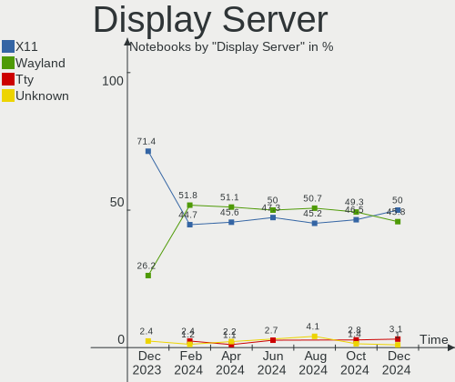
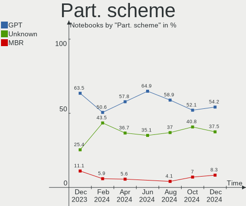
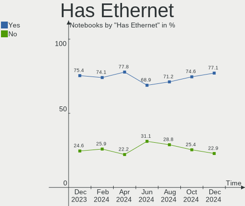
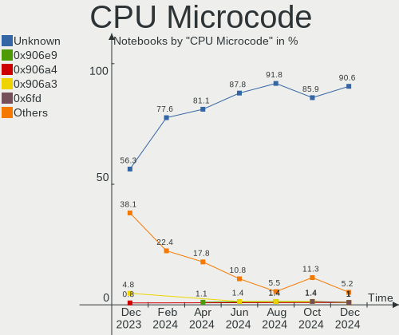
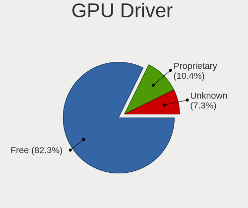
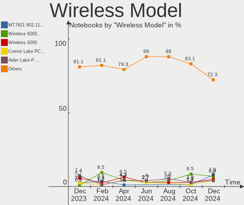
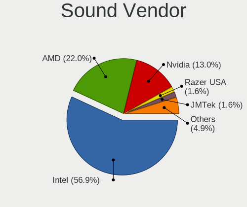
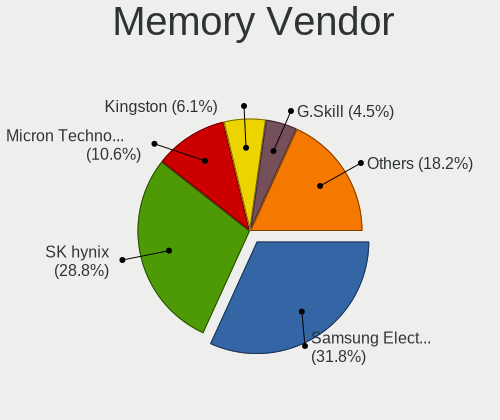
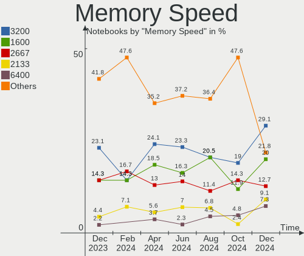
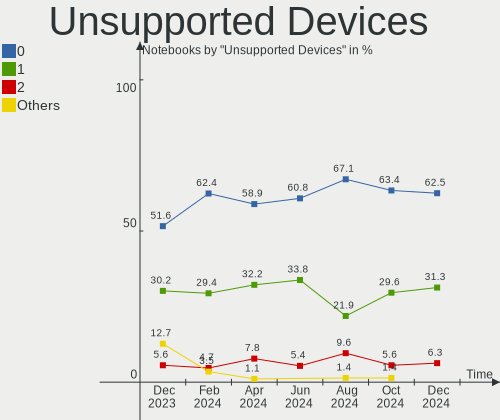

Linux in Canada - Hardware Trends (Notebooks)
---------------------------------------------

A project to identify most popular hardware characteristics and track their change
over time based on data collected by Linux users at https://Linux-Hardware.org.

Anyone can contribute to this report by the [hw-probe](https://github.com/linuxhw/hw-probe) tool:

    sudo -E hw-probe -all -upload

Period: Oct, 2023.

Contents
--------

* [ System ](#system)
  - [ OS                       ](#os)
  - [ OS Family                ](#os-family)
  - [ Kernel                   ](#kernel)
  - [ Kernel Family            ](#kernel-family)
  - [ Kernel Major Ver.        ](#kernel-major-ver)
  - [ Arch                     ](#arch)
  - [ DE                       ](#de)
  - [ Display Server           ](#display-server)
  - [ Display Manager          ](#display-manager)
  - [ OS Lang                  ](#os-lang)
  - [ Boot Mode                ](#boot-mode)
  - [ Filesystem               ](#filesystem)
  - [ Part. scheme             ](#part-scheme)
  - [ Dual Boot with Linux/BSD ](#dual-boot-with-linuxbsd)
  - [ Dual Boot (Win)          ](#dual-boot-win)

* [ Board ](#board)
  - [ Vendor                   ](#vendor)
  - [ Model                    ](#model)
  - [ Model Family             ](#model-family)
  - [ MFG Year                 ](#mfg-year)
  - [ Form Factor              ](#form-factor)
  - [ Secure Boot              ](#secure-boot)
  - [ Coreboot                 ](#coreboot)
  - [ RAM Size                 ](#ram-size)
  - [ RAM Used                 ](#ram-used)
  - [ Total Drives             ](#total-drives)
  - [ Has CD-ROM               ](#has-cd-rom)
  - [ Has Ethernet             ](#has-ethernet)
  - [ Has WiFi                 ](#has-wifi)
  - [ Has Bluetooth            ](#has-bluetooth)

* [ Location ](#location)
  - [ Country                  ](#country)
  - [ City                     ](#city)

* [ Drives ](#drives)
  - [ Drive Vendor             ](#drive-vendor)
  - [ Drive Model              ](#drive-model)
  - [ HDD Vendor               ](#hdd-vendor)
  - [ SSD Vendor               ](#ssd-vendor)
  - [ Drive Kind               ](#drive-kind)
  - [ Drive Connector          ](#drive-connector)
  - [ Drive Size               ](#drive-size)
  - [ Space Total              ](#space-total)
  - [ Space Used               ](#space-used)
  - [ Malfunc. Drives          ](#malfunc-drives)
  - [ Malfunc. Drive Vendor    ](#malfunc-drive-vendor)
  - [ Malfunc. HDD Vendor      ](#malfunc-hdd-vendor)
  - [ Malfunc. Drive Kind      ](#malfunc-drive-kind)
  - [ Failed Drives            ](#failed-drives)
  - [ Failed Drive Vendor      ](#failed-drive-vendor)
  - [ Drive Status             ](#drive-status)

* [ Storage controller ](#storage-controller)
  - [ Storage Vendor           ](#storage-vendor)
  - [ Storage Model            ](#storage-model)
  - [ Storage Kind             ](#storage-kind)

* [ Processor ](#processor)
  - [ CPU Vendor               ](#cpu-vendor)
  - [ CPU Model                ](#cpu-model)
  - [ CPU Model Family         ](#cpu-model-family)
  - [ CPU Cores                ](#cpu-cores)
  - [ CPU Sockets              ](#cpu-sockets)
  - [ CPU Threads              ](#cpu-threads)
  - [ CPU Op-Modes             ](#cpu-op-modes)
  - [ CPU Microcode            ](#cpu-microcode)
  - [ CPU Microarch            ](#cpu-microarch)

* [ Graphics ](#graphics)
  - [ GPU Vendor               ](#gpu-vendor)
  - [ GPU Model                ](#gpu-model)
  - [ GPU Combo                ](#gpu-combo)
  - [ GPU Driver               ](#gpu-driver)
  - [ GPU Memory               ](#gpu-memory)

* [ Monitor ](#monitor)
  - [ Monitor Vendor           ](#monitor-vendor)
  - [ Monitor Model            ](#monitor-model)
  - [ Monitor Resolution       ](#monitor-resolution)
  - [ Monitor Diagonal         ](#monitor-diagonal)
  - [ Monitor Width            ](#monitor-width)
  - [ Aspect Ratio             ](#aspect-ratio)
  - [ Monitor Area             ](#monitor-area)
  - [ Pixel Density            ](#pixel-density)
  - [ Multiple Monitors        ](#multiple-monitors)

* [ Network ](#network)
  - [ Net Controller Vendor    ](#net-controller-vendor)
  - [ Net Controller Model     ](#net-controller-model)
  - [ Wireless Vendor          ](#wireless-vendor)
  - [ Wireless Model           ](#wireless-model)
  - [ Ethernet Vendor          ](#ethernet-vendor)
  - [ Ethernet Model           ](#ethernet-model)
  - [ Net Controller Kind      ](#net-controller-kind)
  - [ Used Controller          ](#used-controller)
  - [ NICs                     ](#nics)
  - [ IPv6                     ](#ipv6)

* [ Bluetooth ](#bluetooth)
  - [ Bluetooth Vendor         ](#bluetooth-vendor)
  - [ Bluetooth Model          ](#bluetooth-model)

* [ Sound ](#sound)
  - [ Sound Vendor             ](#sound-vendor)
  - [ Sound Model              ](#sound-model)

* [ Memory ](#memory)
  - [ Memory Vendor            ](#memory-vendor)
  - [ Memory Model             ](#memory-model)
  - [ Memory Kind              ](#memory-kind)
  - [ Memory Form Factor       ](#memory-form-factor)
  - [ Memory Size              ](#memory-size)
  - [ Memory Speed             ](#memory-speed)

* [ Printers & scanners ](#printers--scanners)
  - [ Printer Vendor           ](#printer-vendor)
  - [ Printer Model            ](#printer-model)
  - [ Scanner Vendor           ](#scanner-vendor)
  - [ Scanner Model            ](#scanner-model)

* [ Camera ](#camera)
  - [ Camera Vendor            ](#camera-vendor)
  - [ Camera Model             ](#camera-model)

* [ Security ](#security)
  - [ Fingerprint Vendor       ](#fingerprint-vendor)
  - [ Fingerprint Model        ](#fingerprint-model)
  - [ Chipcard Vendor          ](#chipcard-vendor)
  - [ Chipcard Model           ](#chipcard-model)

* [ Unsupported ](#unsupported)
  - [ Unsupported Devices      ](#unsupported-devices)
  - [ Unsupported Device Types ](#unsupported-device-types)

System
------

OS
--

Installed operating systems

| Name                         | Notebooks | Percent |
|------------------------------|-----------|---------|
| Ubuntu 22.04                 | 11        | 14.29%  |
| Fedora 38                    | 9         | 11.69%  |
| Linux Mint 21.2              | 7         | 9.09%   |
| Pop!_OS 22.04                | 6         | 7.79%   |
| Ubuntu 23.04                 | 5         | 6.49%   |
| Linux Mint 21                | 3         | 3.9%    |
| KDE neon 22.04               | 3         | 3.9%    |
| Arch Rolling                 | 3         | 3.9%    |
| SteamOS 3.4.11               | 2         | 2.6%    |
| Manjaro                      | 2         | 2.6%    |
| Kali 2023.3                  | 2         | 2.6%    |
| Debian 12                    | 2         | 2.6%    |
| Zorin 16                     | 1         | 1.3%    |
| Xero Rolling                 | 1         | 1.3%    |
| Ubuntu 20.04                 | 1         | 1.3%    |
| SteamOS 3.5                  | 1         | 1.3%    |
| openSUSE Tumbleweed-XXXXXXXX | 1         | 1.3%    |
| openSUSE Leap-15.5           | 1         | 1.3%    |
| OpenMandriva 4.3             | 1         | 1.3%    |
| OpenMandriva 23.01           | 1         | 1.3%    |
| Nobara 38                    | 1         | 1.3%    |
| MX 23                        | 1         | 1.3%    |
| MocaccinoOS                  | 1         | 1.3%    |
| LMDE 6                       | 1         | 1.3%    |
| Linux Mint 21.1              | 1         | 1.3%    |
| Linux Mint 20.3              | 1         | 1.3%    |
| Kubuntu 22.04                | 1         | 1.3%    |
| Garuda Linux Soaring         | 1         | 1.3%    |
| Fedora 39                    | 1         | 1.3%    |
| Fedora 37                    | 1         | 1.3%    |
| Elementary 7.1               | 1         | 1.3%    |
| Elementary 6.1               | 1         | 1.3%    |
| Debian 11                    | 1         | 1.3%    |
| ArcoLinux Rolling            | 1         | 1.3%    |

OS Family
---------

OS without a version

| Name         | Notebooks | Percent |
|--------------|-----------|---------|
| Ubuntu       | 17        | 22.08%  |
| Linux Mint   | 12        | 15.58%  |
| Fedora       | 11        | 14.29%  |
| Pop!_OS      | 6         | 7.79%   |
| SteamOS      | 3         | 3.9%    |
| KDE neon     | 3         | 3.9%    |
| Debian       | 3         | 3.9%    |
| Arch         | 3         | 3.9%    |
| openSUSE     | 2         | 2.6%    |
| OpenMandriva | 2         | 2.6%    |
| Manjaro      | 2         | 2.6%    |
| Kali         | 2         | 2.6%    |
| Elementary   | 2         | 2.6%    |
| Zorin        | 1         | 1.3%    |
| Xero         | 1         | 1.3%    |
| Nobara       | 1         | 1.3%    |
| MX           | 1         | 1.3%    |
| MocaccinoOS  | 1         | 1.3%    |
| LMDE         | 1         | 1.3%    |
| Kubuntu      | 1         | 1.3%    |
| Garuda Linux | 1         | 1.3%    |
| ArcoLinux    | 1         | 1.3%    |

Kernel
------

Version of the Linux kernel

| Version                     | Notebooks | Percent |
|-----------------------------|-----------|---------|
| 6.2.0-34-generic            | 11        | 14.29%  |
| 6.2.0-33-generic            | 5         | 6.49%   |
| 5.15.0-86-generic           | 5         | 6.49%   |
| 6.2.0-35-generic            | 4         | 5.19%   |
| 6.5.7-200.fc38.x86_64       | 3         | 3.9%    |
| 6.5.4-76060504-generic      | 3         | 3.9%    |
| 5.15.0-87-generic           | 3         | 3.9%    |
| 6.5.6-76060506-generic      | 2         | 2.6%    |
| 6.5.5-arch1-1               | 2         | 2.6%    |
| 6.2.9-300.fc38.x86_64       | 2         | 2.6%    |
| 5.15.0-84-generic           | 2         | 2.6%    |
| 5.13.0-valve37-1-neptune    | 2         | 2.6%    |
| 6.5.9-200.fsync.fc38.x86_64 | 1         | 1.3%    |
| 6.5.8-arch1-1               | 1         | 1.3%    |
| 6.5.8-200.fc38.x86_64       | 1         | 1.3%    |
| 6.5.7-zen1-1-zen            | 1         | 1.3%    |
| 6.5.7-300.fc39.x86_64       | 1         | 1.3%    |
| 6.5.6-arch2-1-g14           | 1         | 1.3%    |
| 6.5.6-200.fc38.x86_64       | 1         | 1.3%    |
| 6.5.6-1-default             | 1         | 1.3%    |
| 6.5.5-200.fc38.x86_64       | 1         | 1.3%    |
| 6.5.5-1-MANJARO             | 1         | 1.3%    |
| 6.5.4-060504-generic        | 1         | 1.3%    |
| 6.5.0-kali2-amd64           | 1         | 1.3%    |
| 6.5.0-1mx-ahs-amd64         | 1         | 1.3%    |
| 6.4.6-76060406-generic      | 1         | 1.3%    |
| 6.4.11-200.fc38.x86_64      | 1         | 1.3%    |
| 6.2.0-20-generic            | 1         | 1.3%    |
| 6.1.57-1-lts                | 1         | 1.3%    |
| 6.1.55-mocaccino            | 1         | 1.3%    |
| 6.1.52-valve2-1-neptune-61  | 1         | 1.3%    |
| 6.1.1-desktop-1omv2290      | 1         | 1.3%    |
| 6.1.0-13-amd64              | 1         | 1.3%    |
| 6.1.0-12-amd64              | 1         | 1.3%    |
| 6.1.0-12-686-pae            | 1         | 1.3%    |
| 6.0.8-300.fc37.x86_64       | 1         | 1.3%    |
| 5.4.0-132-generic           | 1         | 1.3%    |
| 5.18.0-kali5-amd64          | 1         | 1.3%    |
| 5.16.2-1-rt19-MANJARO       | 1         | 1.3%    |
| 5.16.13-desktop-1omv4003    | 1         | 1.3%    |

Kernel Family
-------------

Linux kernel without a distro release

| Version | Notebooks | Percent |
|---------|-----------|---------|
| 6.2.0   | 21        | 27.27%  |
| 5.15.0  | 13        | 16.88%  |
| 6.5.7   | 5         | 6.49%   |
| 6.5.6   | 5         | 6.49%   |
| 6.5.5   | 4         | 5.19%   |
| 6.5.4   | 4         | 5.19%   |
| 6.1.0   | 3         | 3.9%    |
| 6.5.8   | 2         | 2.6%    |
| 6.5.0   | 2         | 2.6%    |
| 6.2.9   | 2         | 2.6%    |
| 5.13.0  | 2         | 2.6%    |
| 6.5.9   | 1         | 1.3%    |
| 6.4.6   | 1         | 1.3%    |
| 6.4.11  | 1         | 1.3%    |
| 6.1.57  | 1         | 1.3%    |
| 6.1.55  | 1         | 1.3%    |
| 6.1.52  | 1         | 1.3%    |
| 6.1.1   | 1         | 1.3%    |
| 6.0.8   | 1         | 1.3%    |
| 5.4.0   | 1         | 1.3%    |
| 5.18.0  | 1         | 1.3%    |
| 5.16.2  | 1         | 1.3%    |
| 5.16.13 | 1         | 1.3%    |
| 5.14.21 | 1         | 1.3%    |
| 5.10.0  | 1         | 1.3%    |

Kernel Major Ver.
-----------------

Linux kernel major version

| Version | Notebooks | Percent |
|---------|-----------|---------|
| 6.5     | 23        | 29.87%  |
| 6.2     | 23        | 29.87%  |
| 5.15    | 13        | 16.88%  |
| 6.1     | 7         | 9.09%   |
| 6.4     | 2         | 2.6%    |
| 5.16    | 2         | 2.6%    |
| 5.13    | 2         | 2.6%    |
| 6.0     | 1         | 1.3%    |
| 5.4     | 1         | 1.3%    |
| 5.18    | 1         | 1.3%    |
| 5.14    | 1         | 1.3%    |
| 5.10    | 1         | 1.3%    |

Arch
----

OS architecture (x86_64, i586, etc.)

| Name   | Notebooks | Percent |
|--------|-----------|---------|
| x86_64 | 75        | 97.4%   |
| i686   | 2         | 2.6%    |

DE
--

Desktop Environment

| Name       | Notebooks | Percent |
|------------|-----------|---------|
| GNOME      | 33        | 42.86%  |
| KDE5       | 24        | 31.17%  |
| X-Cinnamon | 10        | 12.99%  |
| XFCE       | 3         | 3.9%    |
| Pantheon   | 2         | 2.6%    |
| MATE       | 1         | 1.3%    |
| LXDE       | 1         | 1.3%    |
| Jwm        | 1         | 1.3%    |
| Cinnamon   | 1         | 1.3%    |
| Unknown    | 1         | 1.3%    |

Display Server
--------------

X11 or Wayland

| Name    | Notebooks | Percent |
|---------|-----------|---------|
| X11     | 42        | 54.55%  |
| Wayland | 33        | 42.86%  |
| Tty     | 2         | 2.6%    |

Display Manager
---------------

SDDM, LightDM, etc.

| Name    | Notebooks | Percent |
|---------|-----------|---------|
| Unknown | 31        | 40.26%  |
| GDM3    | 20        | 25.97%  |
| SDDM    | 12        | 15.58%  |
| LightDM | 9         | 11.69%  |
| GDM     | 4         | 5.19%   |
| LXDM    | 1         | 1.3%    |

OS Lang
-------

Language

| Lang    | Notebooks | Percent |
|---------|-----------|---------|
| en_CA   | 43        | 55.84%  |
| en_US   | 19        | 24.68%  |
| fr_CA   | 6         | 7.79%   |
| C       | 3         | 3.9%    |
| fr_FR   | 2         | 2.6%    |
| ru_RU   | 1         | 1.3%    |
| POSIX   | 1         | 1.3%    |
| C.UTF8  | 1         | 1.3%    |
| Unknown | 1         | 1.3%    |

Boot Mode
---------

EFI or BIOS

| Mode | Notebooks | Percent |
|------|-----------|---------|
| BIOS | 39        | 50.65%  |
| EFI  | 38        | 49.35%  |

Filesystem
----------

Type of filesystem

| Type    | Notebooks | Percent |
|---------|-----------|---------|
| Ext4    | 44        | 57.14%  |
| Btrfs   | 19        | 24.68%  |
| Tmpfs   | 11        | 14.29%  |
| Overlay | 2         | 2.6%    |
| Ext3    | 1         | 1.3%    |

Part. scheme
------------

Scheme of partitioning

| Type    | Notebooks | Percent |
|---------|-----------|---------|
| GPT     | 38        | 49.35%  |
| Unknown | 30        | 38.96%  |
| MBR     | 9         | 11.69%  |

Dual Boot with Linux/BSD
------------------------

Hosting more than one Linux/BSD

| Dual boot | Notebooks | Percent |
|-----------|-----------|---------|
| No        | 69        | 89.61%  |
| Yes       | 8         | 10.39%  |

Dual Boot (Win)
---------------

Hosting Linux and Windows

| Dual boot | Notebooks | Percent |
|-----------|-----------|---------|
| No        | 61        | 79.22%  |
| Yes       | 16        | 20.78%  |

Board
-----

Vendor
------

Motherboard manufacturer

| Name                           | Notebooks | Percent |
|--------------------------------|-----------|---------|
| Dell                           | 14        | 18.18%  |
| Lenovo                         | 13        | 16.88%  |
| Acer                           | 11        | 14.29%  |
| Hewlett-Packard                | 10        | 12.99%  |
| ASUSTek Computer               | 9         | 11.69%  |
| Valve                          | 3         | 3.9%    |
| Apple                          | 3         | 3.9%    |
| Toshiba                        | 2         | 2.6%    |
| Gateway                        | 2         | 2.6%    |
| System76                       | 1         | 1.3%    |
| Sony                           | 1         | 1.3%    |
| Notebook                       | 1         | 1.3%    |
| Matsushita Electric Industrial | 1         | 1.3%    |
| HUAWEI                         | 1         | 1.3%    |
| Google                         | 1         | 1.3%    |
| Fujitsu                        | 1         | 1.3%    |
| Direkt-Tek                     | 1         | 1.3%    |
| Chuwi                          | 1         | 1.3%    |
| Alienware                      | 1         | 1.3%    |

Model
-----

Motherboard model

| Name                                        | Notebooks | Percent |
|---------------------------------------------|-----------|---------|
| Valve Jupiter                               | 3         | 3.9%    |
| HP Pavilion dv7                             | 2         | 2.6%    |
| Gateway NV59                                | 2         | 2.6%    |
| Apple MacBookPro8,1                         | 2         | 2.6%    |
| Acer Aspire A315-21                         | 2         | 2.6%    |
| Toshiba Satellite L655                      | 1         | 1.3%    |
| Toshiba Satellite A660                      | 1         | 1.3%    |
| System76 Gazelle                            | 1         | 1.3%    |
| Sony SVE15128CCW                            | 1         | 1.3%    |
| Notebook P9XXEN_EF_ED                       | 1         | 1.3%    |
| Matsushita Electric Industrial CF-30CTWAZBM | 1         | 1.3%    |
| Lenovo ThinkPad X1 Carbon 6th 20KH002VCA    | 1         | 1.3%    |
| Lenovo ThinkPad X1 Carbon 6th 20KGS1TW00    | 1         | 1.3%    |
| Lenovo ThinkPad T510 4384DJ3                | 1         | 1.3%    |
| Lenovo ThinkPad T480s 20L8S2SS00            | 1         | 1.3%    |
| Lenovo ThinkPad T480 20L5CTO1WW             | 1         | 1.3%    |
| Lenovo ThinkPad T460 20FN002JUS             | 1         | 1.3%    |
| Lenovo ThinkPad T440 20B7S03Q00             | 1         | 1.3%    |
| Lenovo ThinkPad T430 2349UA9                | 1         | 1.3%    |
| Lenovo ThinkPad P52 20MAS0WG00              | 1         | 1.3%    |
| Lenovo ThinkPad L490 20Q6S07X00             | 1         | 1.3%    |
| Lenovo IdeaPadFlex 15 20309                 | 1         | 1.3%    |
| Lenovo IdeaPad S340-15IIL 81VW              | 1         | 1.3%    |
| Lenovo IdeaPad 320-15IKB 81BG               | 1         | 1.3%    |
| HUAWEI MACHD-WXX9                           | 1         | 1.3%    |
| HP Victus by Laptop PC                      | 1         | 1.3%    |
| HP Pavilion dv8000 (ET839UA#ABL)            | 1         | 1.3%    |
| HP Laptop 15-da0xxx                         | 1         | 1.3%    |
| HP G61                                      | 1         | 1.3%    |
| HP G60                                      | 1         | 1.3%    |
| HP EliteBook 850 G1                         | 1         | 1.3%    |
| HP EliteBook 840 G3                         | 1         | 1.3%    |
| HP 2000                                     | 1         | 1.3%    |
| Google Fleex                                | 1         | 1.3%    |
| Fujitsu LIFEBOOK AH531                      | 1         | 1.3%    |
| Direkt-Tek DTLAPY116-1                      | 1         | 1.3%    |
| Dell XPS 15 9500                            | 1         | 1.3%    |
| Dell XPS 15 7590                            | 1         | 1.3%    |
| Dell XPS 13 9300                            | 1         | 1.3%    |
| Dell Vostro 3550                            | 1         | 1.3%    |

Model Family
------------

Motherboard model prefix

| Name                                        | Notebooks | Percent |
|---------------------------------------------|-----------|---------|
| Lenovo ThinkPad                             | 10        | 12.99%  |
| Acer Aspire                                 | 9         | 11.69%  |
| Dell Latitude                               | 6         | 7.79%   |
| Valve Jupiter                               | 3         | 3.9%    |
| HP Pavilion                                 | 3         | 3.9%    |
| Dell XPS                                    | 3         | 3.9%    |
| ASUS VivoBook                               | 3         | 3.9%    |
| Toshiba Satellite                           | 2         | 2.6%    |
| Lenovo IdeaPad                              | 2         | 2.6%    |
| HP EliteBook                                | 2         | 2.6%    |
| Gateway NV59                                | 2         | 2.6%    |
| Dell Inspiron                               | 2         | 2.6%    |
| ASUS ZenBook                                | 2         | 2.6%    |
| Apple MacBookPro8                           | 2         | 2.6%    |
| System76 Gazelle                            | 1         | 1.3%    |
| Sony SVE15128CCW                            | 1         | 1.3%    |
| Notebook P9XXEN                             | 1         | 1.3%    |
| Matsushita Electric Industrial CF-30CTWAZBM | 1         | 1.3%    |
| Lenovo IdeaPadFlex                          | 1         | 1.3%    |
| HUAWEI MACHD-WXX9                           | 1         | 1.3%    |
| HP Victus                                   | 1         | 1.3%    |
| HP Laptop                                   | 1         | 1.3%    |
| HP G61                                      | 1         | 1.3%    |
| HP G60                                      | 1         | 1.3%    |
| HP 2000                                     | 1         | 1.3%    |
| Google Fleex                                | 1         | 1.3%    |
| Fujitsu LIFEBOOK                            | 1         | 1.3%    |
| Direkt-Tek DTLAPY116-1                      | 1         | 1.3%    |
| Dell Vostro                                 | 1         | 1.3%    |
| Dell Precision                              | 1         | 1.3%    |
| Dell G7                                     | 1         | 1.3%    |
| Chuwi GemiBook                              | 1         | 1.3%    |
| ASUS ROG                                    | 1         | 1.3%    |
| ASUS G750JW                                 | 1         | 1.3%    |
| ASUS G73Jh                                  | 1         | 1.3%    |
| ASUS ASUS                                   | 1         | 1.3%    |
| Apple MacBookPro11                          | 1         | 1.3%    |
| Alienware 13                                | 1         | 1.3%    |
| Acer Nitro                                  | 1         | 1.3%    |
| Acer AOA150                                 | 1         | 1.3%    |

MFG Year
--------

Motherboard manufacture year

| Year | Notebooks | Percent |
|------|-----------|---------|
| 2023 | 10        | 12.99%  |
| 2018 | 8         | 10.39%  |
| 2011 | 8         | 10.39%  |
| 2020 | 6         | 7.79%   |
| 2019 | 6         | 7.79%   |
| 2010 | 6         | 7.79%   |
| 2014 | 5         | 6.49%   |
| 2017 | 4         | 5.19%   |
| 2009 | 4         | 5.19%   |
| 2008 | 4         | 5.19%   |
| 2022 | 3         | 3.9%    |
| 2016 | 3         | 3.9%    |
| 2013 | 3         | 3.9%    |
| 2012 | 3         | 3.9%    |
| 2021 | 2         | 2.6%    |
| 2007 | 1         | 1.3%    |
| 2006 | 1         | 1.3%    |

Form Factor
-----------

Physical design of the computer

| Name     | Notebooks | Percent |
|----------|-----------|---------|
| Notebook | 77        | 100%    |

Secure Boot
-----------

Enabled or disabled

| State    | Notebooks | Percent |
|----------|-----------|---------|
| Disabled | 72        | 93.51%  |
| Enabled  | 5         | 6.49%   |

Coreboot
--------

Have coreboot on board

| Used | Notebooks | Percent |
|------|-----------|---------|
| No   | 75        | 97.4%   |
| Yes  | 2         | 2.6%    |

RAM Size
--------

Total RAM memory

| Size in GB  | Notebooks | Percent |
|-------------|-----------|---------|
| 4.01-8.0    | 22        | 28.57%  |
| 16.01-24.0  | 15        | 19.48%  |
| 8.01-16.0   | 15        | 19.48%  |
| 3.01-4.0    | 13        | 16.88%  |
| 32.01-64.0  | 4         | 5.19%   |
| 64.01-256.0 | 3         | 3.9%    |
| 1.01-2.0    | 3         | 3.9%    |
| 24.01-32.0  | 1         | 1.3%    |
| 0.51-1.0    | 1         | 1.3%    |

RAM Used
--------

Used RAM memory

| Used GB   | Notebooks | Percent |
|-----------|-----------|---------|
| 4.01-8.0  | 20        | 25.97%  |
| 1.01-2.0  | 17        | 22.08%  |
| 2.01-3.0  | 16        | 20.78%  |
| 3.01-4.0  | 10        | 12.99%  |
| 8.01-16.0 | 9         | 11.69%  |
| 0.51-1.0  | 4         | 5.19%   |
| 0.01-0.5  | 1         | 1.3%    |

Total Drives
------------

Number of drives on board

| Drives | Notebooks | Percent |
|--------|-----------|---------|
| 1      | 52        | 67.53%  |
| 2      | 22        | 28.57%  |
| 3      | 3         | 3.9%    |

Has CD-ROM
----------

Has CD-ROM on board

| Presented | Notebooks | Percent |
|-----------|-----------|---------|
| No        | 47        | 61.04%  |
| Yes       | 30        | 38.96%  |

Has Ethernet
------------

Has Ethernet on board

| Presented | Notebooks | Percent |
|-----------|-----------|---------|
| Yes       | 58        | 75.32%  |
| No        | 19        | 24.68%  |

Has WiFi
--------

Has WiFi module

| Presented | Notebooks | Percent |
|-----------|-----------|---------|
| Yes       | 74        | 96.1%   |
| No        | 3         | 3.9%    |

Has Bluetooth
-------------

Has Bluetooth module

| Presented | Notebooks | Percent |
|-----------|-----------|---------|
| Yes       | 51        | 66.23%  |
| No        | 26        | 33.77%  |

Location
--------

Country
-------

Geographic location (country)

| Country | Notebooks | Percent |
|---------|-----------|---------|
| Canada  | 77        | 100%    |

City
----

Geographic location (city)

| City                | Notebooks | Percent |
|---------------------|-----------|---------|
| Montreal            | 9         | 11.69%  |
| Toronto             | 8         | 10.39%  |
| Calgary             | 7         | 9.09%   |
| Mississauga         | 3         | 3.9%    |
| Markham             | 3         | 3.9%    |
| Corner Brook        | 3         | 3.9%    |
| Scarborough         | 2         | 2.6%    |
| Regina              | 2         | 2.6%    |
| Oakville            | 2         | 2.6%    |
| Edmonton            | 2         | 2.6%    |
| Windsor             | 1         | 1.3%    |
| Verdun              | 1         | 1.3%    |
| Vancouver           | 1         | 1.3%    |
| Sainte-Therese      | 1         | 1.3%    |
| Sainte-Eulalie      | 1         | 1.3%    |
| Saint-Jean-de-Matha | 1         | 1.3%    |
| Saint-Georges       | 1         | 1.3%    |
| Saint-Constant      | 1         | 1.3%    |
| Rockwood            | 1         | 1.3%    |
| Québec             | 1         | 1.3%    |
| Ottawa              | 1         | 1.3%    |
| Oshawa              | 1         | 1.3%    |
| Orford Lake         | 1         | 1.3%    |
| Newcastle           | 1         | 1.3%    |
| Moncton             | 1         | 1.3%    |
| Middle Sackville    | 1         | 1.3%    |
| Matane              | 1         | 1.3%    |
| Mascouche           | 1         | 1.3%    |
| Maple Ridge         | 1         | 1.3%    |
| Longueuil           | 1         | 1.3%    |
| Liverpool           | 1         | 1.3%    |
| Levis               | 1         | 1.3%    |
| LaSalle             | 1         | 1.3%    |
| La Ronge            | 1         | 1.3%    |
| Kingston            | 1         | 1.3%    |
| Kelowna             | 1         | 1.3%    |
| Kamloops            | 1         | 1.3%    |
| Halifax             | 1         | 1.3%    |
| Gravenhurst         | 1         | 1.3%    |
| Gatineau            | 1         | 1.3%    |

Drives
------

Drive Vendor
------------

Hard drive vendors

| Vendor                      | Notebooks | Drives | Percent |
|-----------------------------|-----------|--------|---------|
| Samsung Electronics         | 16        | 16     | 16.49%  |
| WDC                         | 14        | 14     | 14.43%  |
| SanDisk                     | 10        | 10     | 10.31%  |
| Unknown                     | 7         | 8      | 7.22%   |
| Toshiba                     | 6         | 6      | 6.19%   |
| Kingston                    | 6         | 6      | 6.19%   |
| Intel                       | 6         | 6      | 6.19%   |
| Seagate                     | 5         | 6      | 5.15%   |
| Crucial                     | 4         | 5      | 4.12%   |
| HGST                        | 3         | 4      | 3.09%   |
| Hitachi                     | 2         | 2      | 2.06%   |
| WDC PC S                    | 1         | 1      | 1.03%   |
| SPCC                        | 1         | 1      | 1.03%   |
| SK hynix                    | 1         | 1      | 1.03%   |
| Silicon Motion              | 1         | 1      | 1.03%   |
| Realtek Semiconductor       | 1         | 1      | 1.03%   |
| Phison Electronics          | 1         | 1      | 1.03%   |
| OWC                         | 1         | 1      | 1.03%   |
| O2 Micro                    | 1         | 1      | 1.03%   |
| Micron Technology           | 1         | 1      | 1.03%   |
| MAXIO Technology (Hangzhou) | 1         | 1      | 1.03%   |
| LITEON                      | 1         | 1      | 1.03%   |
| Kingston Technology Company | 1         | 1      | 1.03%   |
| KingFast                    | 1         | 1      | 1.03%   |
| Fujitsu                     | 1         | 1      | 1.03%   |
| ASMT                        | 1         | 1      | 1.03%   |
| APOLLO                      | 1         | 1      | 1.03%   |
| AirDisk                     | 1         | 1      | 1.03%   |
| Unknown                     | 1         | 1      | 1.03%   |

Drive Model
-----------

Hard drive models

| Model                                 | Notebooks | Percent |
|---------------------------------------|-----------|---------|
| Intel SSD 660P Series 1024GB          | 4         | 4.04%   |
| Sandisk WD Blue SN550 NVMe SSD 1TB    | 3         | 3.03%   |
| WDC WD5000BEVT-22A0RT0 500GB          | 2         | 2.02%   |
| Unknown MMC Card  512GB               | 2         | 2.02%   |
| Toshiba MQ04ABF100 1TB                | 2         | 2.02%   |
| SanDisk SD8TB8U256G1001 256GB SSD     | 2         | 2.02%   |
| Samsung SSD 860 EVO 500GB             | 2         | 2.02%   |
| Kingston SV300S37A120G 120GB SSD      | 2         | 2.02%   |
| Kingston SA400S37480G 480GB SSD       | 2         | 2.02%   |
| Hitachi HTS723232A7A364 320GB         | 2         | 2.02%   |
| Crucial CT500MX500SSD1 500GB          | 2         | 2.02%   |
| WDC WDS240G2G0A-00JH30 240GB SSD      | 1         | 1.01%   |
| WDC WDS120G2G0A-00JH30 120GB SSD      | 1         | 1.01%   |
| WDC WDBNCE5000PNC 500GB SSD           | 1         | 1.01%   |
| WDC WD5000LPVT-75G33T0 500GB          | 1         | 1.01%   |
| WDC WD5000LPCX-75VHAT0 500GB          | 1         | 1.01%   |
| WDC WD5000BPKT-00PK4T0 500GB          | 1         | 1.01%   |
| WDC WD2500BEKT-75A25T0 250GB          | 1         | 1.01%   |
| WDC WD1600BEVT-75ZCT2 160GB           | 1         | 1.01%   |
| WDC WD1600BEVT-75A23T0 160GB          | 1         | 1.01%   |
| WDC WD1200BEVT-75ZCT2 120GB           | 1         | 1.01%   |
| WDC WD1200BEVS-22UST0 120GB           | 1         | 1.01%   |
| WDC PC SN730 NVMe 1024GB              | 1         | 1.01%   |
| WDC PC S N730 SDBQNTY 512GB           | 1         | 1.01%   |
| Unknown SPCC  64GB                    | 1         | 1.01%   |
| Unknown MMC Card  64GB                | 1         | 1.01%   |
| Unknown MMC Card  32GB                | 1         | 1.01%   |
| Unknown MMC Card  256GB               | 1         | 1.01%   |
| Unknown DA4032  32GB                  | 1         | 1.01%   |
| Toshiba XG6 NVMe SSD Controller 256GB | 1         | 1.01%   |
| Toshiba MQ01ABD100 1TB                | 1         | 1.01%   |
| Toshiba MK6465GSX 640GB               | 1         | 1.01%   |
| Toshiba MK5076GSX 500GB               | 1         | 1.01%   |
| SPCC Solid State Disk 480GB           | 1         | 1.01%   |
| SK hynix HBG4e  32GB                  | 1         | 1.01%   |
| Silicon Motion PCIe-8 SSD 1TB         | 1         | 1.01%   |
| Seagate ST9500420ASG 500GB            | 1         | 1.01%   |
| Seagate ST9500420AS 500GB             | 1         | 1.01%   |
| Seagate ST9500325AS 500GB             | 1         | 1.01%   |
| Seagate ST9160411ASG 160GB            | 1         | 1.01%   |

HDD Vendor
----------

Hard disk drive vendors

| Vendor              | Notebooks | Drives | Percent |
|---------------------|-----------|--------|---------|
| WDC                 | 10        | 10     | 37.04%  |
| Toshiba             | 5         | 5      | 18.52%  |
| Seagate             | 5         | 6      | 18.52%  |
| HGST                | 3         | 4      | 11.11%  |
| Hitachi             | 2         | 2      | 7.41%   |
| Samsung Electronics | 1         | 1      | 3.7%    |
| Fujitsu             | 1         | 1      | 3.7%    |

SSD Vendor
----------

Solid state drive vendors

| Vendor              | Notebooks | Drives | Percent |
|---------------------|-----------|--------|---------|
| Samsung Electronics | 7         | 7      | 25.93%  |
| Kingston            | 4         | 4      | 14.81%  |
| Crucial             | 4         | 4      | 14.81%  |
| WDC                 | 3         | 3      | 11.11%  |
| SanDisk             | 3         | 3      | 11.11%  |
| SPCC                | 1         | 1      | 3.7%    |
| OWC                 | 1         | 1      | 3.7%    |
| LITEON              | 1         | 1      | 3.7%    |
| ASMT                | 1         | 1      | 3.7%    |
| APOLLO              | 1         | 1      | 3.7%    |
| AirDisk             | 1         | 1      | 3.7%    |

Drive Kind
----------

HDD or SSD

| Kind    | Notebooks | Drives | Percent |
|---------|-----------|--------|---------|
| NVMe    | 30        | 32     | 34.09%  |
| SSD     | 25        | 27     | 28.41%  |
| HDD     | 23        | 29     | 26.14%  |
| MMC     | 8         | 11     | 9.09%   |
| Unknown | 2         | 2      | 2.27%   |

Drive Connector
---------------

SATA, SAS, NVMe, etc.

| Type | Notebooks | Drives | Percent |
|------|-----------|--------|---------|
| SATA | 47        | 53     | 52.22%  |
| NVMe | 30        | 32     | 33.33%  |
| MMC  | 8         | 11     | 8.89%   |
| SAS  | 5         | 5      | 5.56%   |

Drive Size
----------

Size of hard drive

| Size in TB | Notebooks | Drives | Percent |
|------------|-----------|--------|---------|
| 0.01-0.5   | 38        | 43     | 76%     |
| 0.51-1.0   | 10        | 11     | 20%     |
| 2.01-3.0   | 1         | 1      | 2%      |
| 1.01-2.0   | 1         | 1      | 2%      |

Space Total
-----------

Amount of disk space available on the file system

| Size in GB     | Notebooks | Percent |
|----------------|-----------|---------|
| 251-500        | 20        | 25.97%  |
| 501-1000       | 19        | 24.68%  |
| 101-250        | 17        | 22.08%  |
| 1001-2000      | 5         | 6.49%   |
| 51-100         | 4         | 5.19%   |
| More than 3000 | 3         | 3.9%    |
| 21-50          | 3         | 3.9%    |
| 1-20           | 3         | 3.9%    |
| 2001-3000      | 2         | 2.6%    |
| Unknown        | 1         | 1.3%    |

Space Used
----------

Amount of used disk space

| Used GB   | Notebooks | Percent |
|-----------|-----------|---------|
| 1-20      | 23        | 29.87%  |
| 21-50     | 15        | 19.48%  |
| 101-250   | 12        | 15.58%  |
| 51-100    | 10        | 12.99%  |
| 251-500   | 8         | 10.39%  |
| 501-1000  | 5         | 6.49%   |
| 2001-3000 | 2         | 2.6%    |
| 1001-2000 | 1         | 1.3%    |
| Unknown   | 1         | 1.3%    |

Malfunc. Drives
---------------

Drive models with a malfunction

| Model                                 | Notebooks | Drives | Percent |
|---------------------------------------|-----------|--------|---------|
| WDC WD5000LPCX-75VHAT0 500GB          | 1         | 1      | 20%     |
| Toshiba MK6465GSX 640GB               | 1         | 1      | 20%     |
| Seagate ST9500420ASG 500GB            | 1         | 1      | 20%     |
| Samsung Electronics SSD 870 EVO 250GB | 1         | 1      | 20%     |
| Fujitsu MHV2080AH 80GB                | 1         | 1      | 20%     |

Malfunc. Drive Vendor
---------------------

Vendors of faulty drives

| Vendor              | Notebooks | Drives | Percent |
|---------------------|-----------|--------|---------|
| WDC                 | 1         | 1      | 20%     |
| Toshiba             | 1         | 1      | 20%     |
| Seagate             | 1         | 1      | 20%     |
| Samsung Electronics | 1         | 1      | 20%     |
| Fujitsu             | 1         | 1      | 20%     |

Malfunc. HDD Vendor
-------------------

Vendors of faulty HDD drives

| Vendor  | Notebooks | Drives | Percent |
|---------|-----------|--------|---------|
| WDC     | 1         | 1      | 25%     |
| Toshiba | 1         | 1      | 25%     |
| Seagate | 1         | 1      | 25%     |
| Fujitsu | 1         | 1      | 25%     |

Malfunc. Drive Kind
-------------------

Kinds of faulty drives

| Kind | Notebooks | Drives | Percent |
|------|-----------|--------|---------|
| HDD  | 4         | 4      | 80%     |
| SSD  | 1         | 1      | 20%     |

Failed Drives
-------------

Failed drive models

| Model                             | Notebooks | Drives | Percent |
|-----------------------------------|-----------|--------|---------|
| Samsung Electronics HM160HC 160GB | 1         | 1      | 100%    |

Failed Drive Vendor
-------------------

Failed drive vendors

| Vendor              | Notebooks | Drives | Percent |
|---------------------|-----------|--------|---------|
| Samsung Electronics | 1         | 1      | 100%    |

Drive Status
------------

Number of failed and malfunc. drives

| Status   | Notebooks | Drives | Percent |
|----------|-----------|--------|---------|
| Detected | 50        | 64     | 60.24%  |
| Works    | 27        | 31     | 32.53%  |
| Malfunc  | 5         | 5      | 6.02%   |
| Failed   | 1         | 1      | 1.2%    |

Storage controller
------------------

Storage Vendor
--------------

Storage controller vendors

| Vendor                       | Notebooks | Percent |
|------------------------------|-----------|---------|
| Intel                        | 51        | 57.95%  |
| AMD                          | 9         | 10.23%  |
| Samsung Electronics          | 8         | 9.09%   |
| SanDisk                      | 7         | 7.95%   |
| Kingston Technology Company  | 3         | 3.41%   |
| Toshiba America Info Systems | 1         | 1.14%   |
| Silicon Motion               | 1         | 1.14%   |
| Realtek Semiconductor        | 1         | 1.14%   |
| Phison Electronics           | 1         | 1.14%   |
| O2 Micro                     | 1         | 1.14%   |
| Nvidia                       | 1         | 1.14%   |
| Micron/Crucial Technology    | 1         | 1.14%   |
| Micron Technology            | 1         | 1.14%   |
| MAXIO Technology (Hangzhou)  | 1         | 1.14%   |
| Marvell Technology Group     | 1         | 1.14%   |

Storage Model
-------------

Storage controller models

| Model                                                                        | Notebooks | Percent |
|------------------------------------------------------------------------------|-----------|---------|
| Intel 6 Series/C200 Series Chipset Family 6 port Mobile SATA AHCI Controller | 6         | 6.32%   |
| Intel 5 Series/3400 Series Chipset 4 port SATA AHCI Controller               | 6         | 6.32%   |
| AMD FCH SATA Controller [AHCI mode]                                          | 6         | 6.32%   |
| Intel Sunrise Point-LP SATA Controller [AHCI mode]                           | 5         | 5.26%   |
| Intel 82801 Mobile SATA Controller [RAID mode]                               | 5         | 5.26%   |
| Intel Volume Management Device NVMe RAID Controller                          | 4         | 4.21%   |
| Intel SSD 660P Series                                                        | 4         | 4.21%   |
| SanDisk Ultra 3D / WD Blue SN550 NVMe SSD                                    | 3         | 3.16%   |
| Intel Cannon Lake Mobile PCH SATA AHCI Controller                            | 3         | 3.16%   |
| Intel 8 Series SATA Controller 1 [AHCI mode]                                 | 3         | 3.16%   |
| Intel 7 Series Chipset Family 6-port SATA Controller [AHCI mode]             | 3         | 3.16%   |
| Samsung NVMe SSD Controller SM981/PM981/PM983                                | 2         | 2.11%   |
| Samsung NVMe SSD Controller PM9B1 (DRAM-less)                                | 2         | 2.11%   |
| Samsung NVMe SSD Controller 980 (DRAM-less)                                  | 2         | 2.11%   |
| Intel Wildcat Point-LP SATA Controller [AHCI Mode]                           | 2         | 2.11%   |
| Intel 400 Series Chipset Family SATA AHCI Controller                         | 2         | 2.11%   |
| AMD SB7x0/SB8x0/SB9x0 SATA Controller [AHCI mode]                            | 2         | 2.11%   |
| Toshiba America Info Systems XG6 NVMe SSD Controller                         | 1         | 1.05%   |
| Silicon Motion Non-Volatile memory controller                                | 1         | 1.05%   |
| SanDisk WD Black SN770 / PC SN740 256GB / PC SN560 (DRAM-less) NVMe SSD      | 1         | 1.05%   |
| SanDisk Ultra 3D / WD Blue SN570 NVMe SSD (DRAM-less)                        | 1         | 1.05%   |
| Sandisk PC SN740 NVMe SSD (DRAM-less)                                        | 1         | 1.05%   |
| SanDisk Extreme Pro / WD Black SN750 / PC SN730 / Red SN700 NVMe SSD         | 1         | 1.05%   |
| Samsung NVMe SSD Controller SM961/PM961/SM963                                | 1         | 1.05%   |
| Samsung NVMe SSD Controller PM9A1/PM9A3/980PRO                               | 1         | 1.05%   |
| Realtek RTS5765DL NVMe SSD Controller (DRAM-less)                            | 1         | 1.05%   |
| Phison E16 PCIe4 NVMe Controller                                             | 1         | 1.05%   |
| O2 Micro FORESEE E2M2 NVMe SSD                                               | 1         | 1.05%   |
| Nvidia MCP78S [GeForce 8200] SATA Controller (non-AHCI mode)                 | 1         | 1.05%   |
| Nvidia MCP78S [GeForce 8200] IDE                                             | 1         | 1.05%   |
| Micron/Crucial P5 Plus NVMe PCIe SSD                                         | 1         | 1.05%   |
| Micron 2450 NVMe SSD [HendrixV] (DRAM-less)                                  | 1         | 1.05%   |
| MAXIO (Hangzhou) NVMe SSD Controller MAP1202                                 | 1         | 1.05%   |
| Marvell Group 88SE9230 PCIe 2.0 x2 4-port SATA 6 Gb/s RAID Controller        | 1         | 1.05%   |
| Kingston Company OM3PDP3 NVMe SSD                                            | 1         | 1.05%   |
| Kingston Company A2000 NVMe SSD SM2263EN                                     | 1         | 1.05%   |
| Kingston Company A1000/U-SNS8154P3 x2 NVMe SSD                               | 1         | 1.05%   |
| Intel SSD DC P4101/Pro 7600p/760p/E 6100p Series                             | 1         | 1.05%   |
| Intel SSD 670p Series [Keystone Harbor]                                      | 1         | 1.05%   |
| Intel SATA controller                                                        | 1         | 1.05%   |

Storage Kind
------------

Kind of storage controller (IDE, SATA, NVMe, SAS, ...)

| Kind | Notebooks | Percent |
|------|-----------|---------|
| SATA | 47        | 51.65%  |
| NVMe | 30        | 32.97%  |
| RAID | 9         | 9.89%   |
| IDE  | 5         | 5.49%   |

Processor
---------

CPU Vendor
----------

Processor vendors

| Vendor | Notebooks | Percent |
|--------|-----------|---------|
| Intel  | 63        | 81.82%  |
| AMD    | 14        | 18.18%  |

CPU Model
---------

Processor models

| Model                              | Notebooks | Percent |
|------------------------------------|-----------|---------|
| Intel Core i5-8250U CPU @ 1.60GHz  | 3         | 3.9%    |
| Intel Core i5-2410M CPU @ 2.30GHz  | 3         | 3.9%    |
| Intel Core i3 CPU M 370 @ 2.40GHz  | 3         | 3.9%    |
| AMD Custom APU 0405                | 3         | 3.9%    |
| Intel Core i7-1065G7 CPU @ 1.30GHz | 2         | 2.6%    |
| Intel Core i5-6300U CPU @ 2.40GHz  | 2         | 2.6%    |
| Intel Core i5-5200U CPU @ 2.20GHz  | 2         | 2.6%    |
| Intel Core i5-2435M CPU @ 2.40GHz  | 2         | 2.6%    |
| Intel Xeon E-2176M CPU @ 2.70GHz   | 1         | 1.3%    |
| Intel Pentium CPU 997 @ 1.60GHz    | 1         | 1.3%    |
| Intel N100                         | 1         | 1.3%    |
| Intel Core i9-10885H CPU @ 2.40GHz | 1         | 1.3%    |
| Intel Core i7-9850H CPU @ 2.60GHz  | 1         | 1.3%    |
| Intel Core i7-9750H CPU @ 2.60GHz  | 1         | 1.3%    |
| Intel Core i7-8750H CPU @ 2.20GHz  | 1         | 1.3%    |
| Intel Core i7-8650U CPU @ 1.90GHz  | 1         | 1.3%    |
| Intel Core i7-8565U CPU @ 1.80GHz  | 1         | 1.3%    |
| Intel Core i7-8550U CPU @ 1.80GHz  | 1         | 1.3%    |
| Intel Core i7-4700HQ CPU @ 2.40GHz | 1         | 1.3%    |
| Intel Core i7-4600U CPU @ 2.10GHz  | 1         | 1.3%    |
| Intel Core i7-2630QM CPU @ 2.00GHz | 1         | 1.3%    |
| Intel Core i7-10750H CPU @ 2.60GHz | 1         | 1.3%    |
| Intel Core i7 CPU Q 740 @ 1.73GHz  | 1         | 1.3%    |
| Intel Core i7 CPU Q 720 @ 1.60GHz  | 1         | 1.3%    |
| Intel Core i5-8350U CPU @ 1.70GHz  | 1         | 1.3%    |
| Intel Core i5-8265U CPU @ 1.60GHz  | 1         | 1.3%    |
| Intel Core i5-4300U CPU @ 1.90GHz  | 1         | 1.3%    |
| Intel Core i5-4258U CPU @ 2.40GHz  | 1         | 1.3%    |
| Intel Core i5-3230M CPU @ 2.60GHz  | 1         | 1.3%    |
| Intel Core i5-3210M CPU @ 2.50GHz  | 1         | 1.3%    |
| Intel Core i5-2520M CPU @ 2.50GHz  | 1         | 1.3%    |
| Intel Core i5-10300H CPU @ 2.50GHz | 1         | 1.3%    |
| Intel Core i5-10210U CPU @ 1.60GHz | 1         | 1.3%    |
| Intel Core i5 CPU M 580 @ 2.67GHz  | 1         | 1.3%    |
| Intel Core i5 CPU M 520 @ 2.40GHz  | 1         | 1.3%    |
| Intel Core i3-8130U CPU @ 2.20GHz  | 1         | 1.3%    |
| Intel Core i3-4010U CPU @ 1.70GHz  | 1         | 1.3%    |
| Intel Core i3 CPU M 350 @ 2.27GHz  | 1         | 1.3%    |
| Intel Core i3 CPU M 330 @ 2.13GHz  | 1         | 1.3%    |
| Intel Core Duo CPU L2400 @ 1.66GHz | 1         | 1.3%    |

CPU Model Family
----------------

Processor model prefix

| Model                   | Notebooks | Percent |
|-------------------------|-----------|---------|
| Intel Core i5           | 23        | 29.87%  |
| Intel Core i7           | 14        | 18.18%  |
| Other                   | 13        | 16.88%  |
| Intel Core i3           | 7         | 9.09%   |
| Intel Atom              | 3         | 3.9%    |
| AMD E                   | 2         | 2.6%    |
| Intel Xeon              | 1         | 1.3%    |
| Intel Pentium           | 1         | 1.3%    |
| Intel Core i9           | 1         | 1.3%    |
| Intel Core Duo          | 1         | 1.3%    |
| Intel Core 2 Duo        | 1         | 1.3%    |
| Intel Celeron           | 1         | 1.3%    |
| AMD Turion 64 Mobile    | 1         | 1.3%    |
| AMD Sempron             | 1         | 1.3%    |
| AMD Ryzen 7             | 1         | 1.3%    |
| AMD Ryzen 5             | 1         | 1.3%    |
| AMD E2                  | 1         | 1.3%    |
| AMD Athlon II Dual-Core | 1         | 1.3%    |
| AMD Athlon              | 1         | 1.3%    |
| AMD A6                  | 1         | 1.3%    |
| AMD A4                  | 1         | 1.3%    |

CPU Cores
---------

Number of processor cores

| Number | Notebooks | Percent |
|--------|-----------|---------|
| 2      | 35        | 45.45%  |
| 4      | 25        | 32.47%  |
| 6      | 6         | 7.79%   |
| 10     | 4         | 5.19%   |
| 8      | 3         | 3.9%    |
| 1      | 3         | 3.9%    |
| 14     | 1         | 1.3%    |

CPU Sockets
-----------

Number of sockets

| Number | Notebooks | Percent |
|--------|-----------|---------|
| 1      | 77        | 100%    |

CPU Threads
-----------

Threads per core (Hyper-Threading)

| Number | Notebooks | Percent |
|--------|-----------|---------|
| 2      | 61        | 79.22%  |
| 1      | 16        | 20.78%  |

CPU Op-Modes
------------

CPU Operation Modes (32-bit, 64-bit)

| Op mode        | Notebooks | Percent |
|----------------|-----------|---------|
| 32-bit, 64-bit | 75        | 97.4%   |
| 32-bit         | 2         | 2.6%    |

CPU Microcode
-------------

Microcode number

| Number     | Notebooks | Percent |
|------------|-----------|---------|
| Unknown    | 51        | 66.23%  |
| 0x20655    | 4         | 5.19%   |
| 0x206a7    | 3         | 3.9%    |
| 0x806ec    | 2         | 2.6%    |
| 0x06006704 | 2         | 2.6%    |
| 0x906ed    | 1         | 1.3%    |
| 0x906ea    | 1         | 1.3%    |
| 0x806ea    | 1         | 1.3%    |
| 0x6ec      | 1         | 1.3%    |
| 0x406c4    | 1         | 1.3%    |
| 0x306d4    | 1         | 1.3%    |
| 0x306a9    | 1         | 1.3%    |
| 0x30678    | 1         | 1.3%    |
| 0x20652    | 1         | 1.3%    |
| 0x106e5    | 1         | 1.3%    |
| 0x106c2    | 1         | 1.3%    |
| 0x0a404102 | 1         | 1.3%    |
| 0x08108109 | 1         | 1.3%    |
| 0x06006705 | 1         | 1.3%    |
| 0x05000119 | 1         | 1.3%    |

CPU Microarch
-------------

Microarchitecture

| Name             | Notebooks | Percent |
|------------------|-----------|---------|
| KabyLake         | 14        | 18.18%  |
| SandyBridge      | 8         | 10.39%  |
| Westmere         | 7         | 9.09%   |
| Unknown          | 6         | 7.79%   |
| Haswell          | 5         | 6.49%   |
| Alderlake Hybrid | 5         | 6.49%   |
| IceLake          | 3         | 3.9%    |
| Excavator        | 3         | 3.9%    |
| CometLake        | 3         | 3.9%    |
| Zen+             | 2         | 2.6%    |
| TigerLake        | 2         | 2.6%    |
| Skylake          | 2         | 2.6%    |
| Silvermont       | 2         | 2.6%    |
| Nehalem          | 2         | 2.6%    |
| IvyBridge        | 2         | 2.6%    |
| Broadwell        | 2         | 2.6%    |
| Bobcat           | 2         | 2.6%    |
| Penryn           | 1         | 1.3%    |
| P6               | 1         | 1.3%    |
| K8 Hammer        | 1         | 1.3%    |
| K8 & K10 hybrid  | 1         | 1.3%    |
| K10              | 1         | 1.3%    |
| Goldmont plus    | 1         | 1.3%    |
| Bonnell          | 1         | 1.3%    |

Graphics
--------

GPU Vendor
----------

Vendors of graphics cards

| Vendor | Notebooks | Percent |
|--------|-----------|---------|
| Intel  | 55        | 59.14%  |
| Nvidia | 19        | 20.43%  |
| AMD    | 19        | 20.43%  |

GPU Model
---------

Graphics card models

| Model                                                                         | Notebooks | Percent |
|-------------------------------------------------------------------------------|-----------|---------|
| Intel UHD Graphics 620                                                        | 7         | 7.37%   |
| Intel 2nd Generation Core Processor Family Integrated Graphics Controller     | 7         | 7.37%   |
| Intel Core Processor Integrated Graphics Controller                           | 6         | 6.32%   |
| Intel Haswell-ULT Integrated Graphics Controller                              | 4         | 4.21%   |
| Intel Raptor Lake-P [Iris Xe Graphics]                                        | 3         | 3.16%   |
| Intel CometLake-H GT2 [UHD Graphics]                                          | 3         | 3.16%   |
| Intel CoffeeLake-H GT2 [UHD Graphics 630]                                     | 3         | 3.16%   |
| AMD VanGogh [AMD Custom GPU 0405]                                             | 3         | 3.16%   |
| AMD Stoney [Radeon R2/R3/R4/R5 Graphics]                                      | 3         | 3.16%   |
| Nvidia TU117M [GeForce GTX 1650 Mobile / Max-Q]                               | 2         | 2.11%   |
| Nvidia GF119M [NVS 4200M]                                                     | 2         | 2.11%   |
| Nvidia GA107M [GeForce RTX 3050 Mobile]                                       | 2         | 2.11%   |
| Intel WhiskeyLake-U GT2 [UHD Graphics 620]                                    | 2         | 2.11%   |
| Intel TigerLake-LP GT2 [Iris Xe Graphics]                                     | 2         | 2.11%   |
| Intel TigerLake-H GT1 [UHD Graphics]                                          | 2         | 2.11%   |
| Intel Skylake GT2 [HD Graphics 520]                                           | 2         | 2.11%   |
| Intel Mobile 945GM/GMS/GME, 943/940GML Express Integrated Graphics Controller | 2         | 2.11%   |
| Intel Iris Plus Graphics G7                                                   | 2         | 2.11%   |
| Intel HD Graphics 5500                                                        | 2         | 2.11%   |
| Intel Alder Lake-UP3 GT2 [Iris Xe Graphics]                                   | 2         | 2.11%   |
| AMD Wrestler [Radeon HD 6310]                                                 | 2         | 2.11%   |
| AMD Picasso/Raven 2 [Radeon Vega Series / Radeon Vega Mobile Series]          | 2         | 2.11%   |
| AMD Madison [Mobility Radeon HD 5650/5750 / 6530M/6550M]                      | 2         | 2.11%   |
| Nvidia TU117M [GeForce GTX 1650 Ti Mobile]                                    | 1         | 1.05%   |
| Nvidia TU117GLM [Quadro T2000 Mobile / Max-Q]                                 | 1         | 1.05%   |
| Nvidia TU106M [GeForce RTX 2070 Mobile / Max-Q Refresh]                       | 1         | 1.05%   |
| Nvidia TU106M [GeForce RTX 2060 Mobile]                                       | 1         | 1.05%   |
| Nvidia GT218M [GeForce 310M]                                                  | 1         | 1.05%   |
| Nvidia GP108BM [GeForce MX250]                                                | 1         | 1.05%   |
| Nvidia GP107GLM [Quadro P2000 Mobile]                                         | 1         | 1.05%   |
| Nvidia GM107M [GeForce GTX 960M]                                              | 1         | 1.05%   |
| Nvidia GK106M [GeForce GTX 765M]                                              | 1         | 1.05%   |
| Nvidia GA107 [GeForce RTX 2050]                                               | 1         | 1.05%   |
| Nvidia GA106M [GeForce RTX 3060 Mobile / Max-Q]                               | 1         | 1.05%   |
| Nvidia G96CM [GeForce 9600M GT]                                               | 1         | 1.05%   |
| Nvidia C77 [GeForce 8200M G]                                                  | 1         | 1.05%   |
| Intel Mobile 945GSE Express Integrated Graphics Controller                    | 1         | 1.05%   |
| Intel Mobile 945GM/GMS, 943/940GML Express Integrated Graphics Controller     | 1         | 1.05%   |
| Intel GeminiLake [UHD Graphics 600]                                           | 1         | 1.05%   |
| Intel CometLake-U GT2 [UHD Graphics]                                          | 1         | 1.05%   |

GPU Combo
---------

Combinations of graphics cards

| Name           | Notebooks | Percent |
|----------------|-----------|---------|
| 1 x Intel      | 39        | 50.65%  |
| 1 x AMD        | 17        | 22.08%  |
| Intel + Nvidia | 14        | 18.18%  |
| 1 x Nvidia     | 4         | 5.19%   |
| 2 x Intel      | 1         | 1.3%    |
| Intel + AMD    | 1         | 1.3%    |
| AMD + Nvidia   | 1         | 1.3%    |

GPU Driver
----------

Free vs proprietary

| Driver      | Notebooks | Percent |
|-------------|-----------|---------|
| Free        | 67        | 87.01%  |
| Proprietary | 7         | 9.09%   |
| Unknown     | 3         | 3.9%    |

GPU Memory
----------

Total video memory

| Size in GB | Notebooks | Percent |
|------------|-----------|---------|
| Unknown    | 60        | 77.92%  |
| 0.01-0.5   | 7         | 9.09%   |
| 1.01-2.0   | 5         | 6.49%   |
| 3.01-4.0   | 3         | 3.9%    |
| 7.01-8.0   | 1         | 1.3%    |
| 0.51-1.0   | 1         | 1.3%    |

Monitor
-------

Monitor Vendor
--------------

Monitor vendors

| Vendor                  | Notebooks | Percent |
|-------------------------|-----------|---------|
| AU Optronics            | 20        | 23.26%  |
| BOE                     | 12        | 13.95%  |
| LG Display              | 8         | 9.3%    |
| Samsung Electronics     | 7         | 8.14%   |
| Goldstar                | 5         | 5.81%   |
| Chimei Innolux          | 5         | 5.81%   |
| Sharp                   | 4         | 4.65%   |
| Valve                   | 3         | 3.49%   |
| PANDA                   | 3         | 3.49%   |
| Apple                   | 3         | 3.49%   |
| Toshiba                 | 2         | 2.33%   |
| Hewlett-Packard         | 2         | 2.33%   |
| Dell                    | 2         | 2.33%   |
| ViewSonic               | 1         | 1.16%   |
| Tianma XM               | 1         | 1.16%   |
| LG Philips              | 1         | 1.16%   |
| Lenovo                  | 1         | 1.16%   |
| InfoVision              | 1         | 1.16%   |
| HKC                     | 1         | 1.16%   |
| HannStar                | 1         | 1.16%   |
| Chi Mei Optoelectronics | 1         | 1.16%   |
| BenQ                    | 1         | 1.16%   |
| Ancor Communications    | 1         | 1.16%   |

Monitor Model
-------------

Monitor models

| Model                                                                | Notebooks | Percent |
|----------------------------------------------------------------------|-----------|---------|
| Valve ANX7530 U VLV3001 800x1280 100x150mm 7.1-inch                  | 3         | 3.49%   |
| Sharp LCD Monitor SHP14BA 1920x1080 340x190mm 15.3-inch              | 2         | 2.33%   |
| LG Display LCD Monitor LGD02E3 1366x768 344x194mm 15.5-inch          | 2         | 2.33%   |
| Goldstar FULL HD GSM5B55 1920x1080 480x270mm 21.7-inch               | 2         | 2.33%   |
| AU Optronics LCD Monitor AUO70EC 1366x768 344x193mm 15.5-inch        | 2         | 2.33%   |
| AU Optronics LCD Monitor AUO243D 1920x1080 309x173mm 13.9-inch       | 2         | 2.33%   |
| AU Optronics LCD Monitor AUO139E 1600x900 382x214mm 17.2-inch        | 2         | 2.33%   |
| ViewSonic VX2250 SERIES VSCCB25 1920x1080 477x268mm 21.5-inch        | 1         | 1.16%   |
| Toshiba TSB-TV TSB0206 1360x768 930x520mm 41.9-inch                  | 1         | 1.16%   |
| Toshiba ScreenXpert TSB8888 1080x2160                                | 1         | 1.16%   |
| Tianma XM LCD Monitor TLX1388 3000x2000 293x196mm 13.9-inch          | 1         | 1.16%   |
| Sharp LCD Monitor SHP14D1 1920x1200 336x210mm 15.6-inch              | 1         | 1.16%   |
| Sharp LCD Monitor SHP14CB 1920x1200 288x180mm 13.4-inch              | 1         | 1.16%   |
| Samsung Electronics LF27T35 SAM707F 1920x1080 598x337mm 27.0-inch    | 1         | 1.16%   |
| Samsung Electronics LCD Monitor SEC544B 1600x900 382x214mm 17.2-inch | 1         | 1.16%   |
| Samsung Electronics LCD Monitor SEC5441 1366x768 309x174mm 14.0-inch | 1         | 1.16%   |
| Samsung Electronics LCD Monitor SEC3641 1366x768 353x198mm 15.9-inch | 1         | 1.16%   |
| Samsung Electronics LCD Monitor SEC3451 1366x768 344x194mm 15.5-inch | 1         | 1.16%   |
| Samsung Electronics LCD Monitor SEC334B 1440x900 367x230mm 17.1-inch | 1         | 1.16%   |
| Samsung Electronics LCD Monitor SAM0C3C 1366x768 609x347mm 27.6-inch | 1         | 1.16%   |
| PANDA LCD Monitor NCP0063 1920x1080 344x194mm 15.5-inch              | 1         | 1.16%   |
| PANDA LCD Monitor NCP004D 1920x1080 344x194mm 15.5-inch              | 1         | 1.16%   |
| PANDA LCD Monitor NCP0046 1920x1080 344x194mm 15.5-inch              | 1         | 1.16%   |
| LG Philips LCD Monitor LPL1288 1440x900 370x230mm 17.2-inch          | 1         | 1.16%   |
| LG Display LP156WH2-TLE1 LGDCF01 1366x768 344x194mm 15.5-inch        | 1         | 1.16%   |
| LG Display LCD Monitor LGD0751 1920x1200 302x188mm 14.0-inch         | 1         | 1.16%   |
| LG Display LCD Monitor LGD066C 1920x1080 382x215mm 17.3-inch         | 1         | 1.16%   |
| LG Display LCD Monitor LGD0467 1366x768 310x174mm 14.0-inch          | 1         | 1.16%   |
| LG Display LCD Monitor LGD03AB 1366x768 344x194mm 15.5-inch          | 1         | 1.16%   |
| LG Display LCD Monitor LGD02DC 1366x768 344x194mm 15.5-inch          | 1         | 1.16%   |
| Lenovo LCD Monitor LEN40B0 1366x768 345x194mm 15.6-inch              | 1         | 1.16%   |
| InfoVision LCD Monitor IVO057D 1920x1080 309x174mm 14.0-inch         | 1         | 1.16%   |
| HKC 24E4 HKC2413 1920x1080 526x296mm 23.8-inch                       | 1         | 1.16%   |
| Hewlett-Packard Z27 HPN3535 3840x2160 597x336mm 27.0-inch            | 1         | 1.16%   |
| Hewlett-Packard LE2002x HWP2964 1600x900 443x249mm 20.0-inch         | 1         | 1.16%   |
| HannStar HL161ABB HSD61C7 1366x768 344x193mm 15.5-inch               | 1         | 1.16%   |
| Goldstar WFHD GSM7747 2560x1080 798x334mm 34.1-inch                  | 1         | 1.16%   |
| Goldstar QHD GSM7729 2560x1440 697x392mm 31.5-inch                   | 1         | 1.16%   |
| Goldstar IPS FULLHD GSM5AB7 1920x1080 480x270mm 21.7-inch            | 1         | 1.16%   |
| Dell U2722D DEL422F 2560x1440 597x336mm 27.0-inch                    | 1         | 1.16%   |

Monitor Resolution
------------------

Monitor screen resolution

| Resolution        | Notebooks | Percent |
|-------------------|-----------|---------|
| 1920x1080 (FHD)   | 31        | 37.8%   |
| 1366x768 (WXGA)   | 25        | 30.49%  |
| 1600x900 (HD+)    | 5         | 6.1%    |
| 3840x2160 (4K)    | 4         | 4.88%   |
| 800x1280          | 3         | 3.66%   |
| 2560x1440 (QHD)   | 3         | 3.66%   |
| 1920x1200 (WUXGA) | 3         | 3.66%   |
| 1440x900 (WXGA+)  | 2         | 2.44%   |
| 1280x800 (WXGA)   | 2         | 2.44%   |
| 3000x2000         | 1         | 1.22%   |
| 2560x1600         | 1         | 1.22%   |
| 2560x1080         | 1         | 1.22%   |
| 1024x600          | 1         | 1.22%   |

Monitor Diagonal
----------------

Diagonal size in inches

| Inches | Notebooks | Percent |
|--------|-----------|---------|
| 15     | 35        | 40.7%   |
| 14     | 10        | 11.63%  |
| 13     | 10        | 11.63%  |
| 17     | 7         | 8.14%   |
| 27     | 4         | 4.65%   |
| 21     | 4         | 4.65%   |
| 7      | 3         | 3.49%   |
| 31     | 2         | 2.33%   |
| 23     | 2         | 2.33%   |
| 16     | 2         | 2.33%   |
| 86     | 1         | 1.16%   |
| 74     | 1         | 1.16%   |
| 34     | 1         | 1.16%   |
| 24     | 1         | 1.16%   |
| 20     | 1         | 1.16%   |
| 11     | 1         | 1.16%   |
| 8      | 1         | 1.16%   |

Monitor Width
-------------

Physical width

| Width in mm | Notebooks | Percent |
|-------------|-----------|---------|
| 301-350     | 47        | 54.65%  |
| 351-400     | 11        | 12.79%  |
| 201-300     | 7         | 8.14%   |
| 501-600     | 6         | 6.98%   |
| 401-500     | 5         | 5.81%   |
| 601-700     | 3         | 3.49%   |
| 1-100       | 3         | 3.49%   |
| 701-800     | 1         | 1.16%   |
| 1501-2000   | 1         | 1.16%   |
| 101-200     | 1         | 1.16%   |
| 1001-1500   | 1         | 1.16%   |

Aspect Ratio
------------

Proportional relationship between the width and the height

| Ratio | Notebooks | Percent |
|-------|-----------|---------|
| 16/9  | 61        | 80.26%  |
| 16/10 | 9         | 11.84%  |
| 0.67  | 3         | 3.95%   |
| 3/2   | 1         | 1.32%   |
| 21/9  | 1         | 1.32%   |
| 0.56  | 1         | 1.32%   |

Monitor Area
------------

Area in inch²

| Area in inch² | Notebooks | Percent |
|----------------|-----------|---------|
| 101-110        | 35        | 40.7%   |
| 81-90          | 16        | 18.6%   |
| 201-250        | 7         | 8.14%   |
| 121-130        | 5         | 5.81%   |
| 71-80          | 4         | 4.65%   |
| 1-40           | 4         | 4.65%   |
| 301-350        | 4         | 4.65%   |
| 351-500        | 3         | 3.49%   |
| More than 1000 | 2         | 2.33%   |
| 131-140        | 2         | 2.33%   |
| 111-120        | 2         | 2.33%   |
| 51-60          | 1         | 1.16%   |
| 151-200        | 1         | 1.16%   |

Pixel Density
-------------

Pixels per inch

| Density       | Notebooks | Percent |
|---------------|-----------|---------|
| 121-160       | 32        | 38.55%  |
| 101-120       | 27        | 32.53%  |
| 51-100        | 12        | 14.46%  |
| 161-240       | 8         | 9.64%   |
| 1-50          | 3         | 3.61%   |
| More than 240 | 1         | 1.2%    |

Multiple Monitors
-----------------

Total monitors connected

| Total | Notebooks | Percent |
|-------|-----------|---------|
| 1     | 58        | 75.32%  |
| 2     | 15        | 19.48%  |
| 0     | 3         | 3.9%    |
| 3     | 1         | 1.3%    |

Network
-------

Net Controller Vendor
---------------------

Controller vendors

| Vendor                   | Notebooks | Percent |
|--------------------------|-----------|---------|
| Intel                    | 41        | 35.04%  |
| Realtek Semiconductor    | 35        | 29.91%  |
| Qualcomm Atheros         | 18        | 15.38%  |
| Broadcom                 | 9         | 7.69%   |
| MediaTek                 | 3         | 2.56%   |
| Broadcom Limited         | 3         | 2.56%   |
| Ralink Technology        | 1         | 0.85%   |
| Nvidia                   | 1         | 0.85%   |
| Marvell Technology Group | 1         | 0.85%   |
| Lenovo                   | 1         | 0.85%   |
| DisplayLink              | 1         | 0.85%   |
| D-Link System            | 1         | 0.85%   |
| ASIX Electronics         | 1         | 0.85%   |
| AMD                      | 1         | 0.85%   |

Net Controller Model
--------------------

Controller models

| Model                                                                   | Notebooks | Percent |
|-------------------------------------------------------------------------|-----------|---------|
| Realtek RTL8111/8168/8411 PCI Express Gigabit Ethernet Controller       | 16        | 11.51%  |
| Realtek RTL810xE PCI Express Fast Ethernet controller                   | 7         | 5.04%   |
| Intel Wireless 8265 / 8275                                              | 5         | 3.6%    |
| Qualcomm Atheros AR9287 Wireless Network Adapter (PCI-Express)          | 4         | 2.88%   |
| Realtek RTL8822CE 802.11ac PCIe Wireless Network Adapter                | 3         | 2.16%   |
| Qualcomm Atheros QCA9377 802.11ac Wireless Network Adapter              | 3         | 2.16%   |
| Qualcomm Atheros AR9485 Wireless Network Adapter                        | 3         | 2.16%   |
| Intel Wireless-AC 9260                                                  | 3         | 2.16%   |
| Intel Wireless 7260                                                     | 3         | 2.16%   |
| Intel Ethernet Connection (4) I219-V                                    | 3         | 2.16%   |
| Intel 82579LM Gigabit Network Connection (Lewisville)                   | 3         | 2.16%   |
| Realtek RTL8153 Gigabit Ethernet Adapter                                | 2         | 1.44%   |
| Qualcomm Atheros AR9285 Wireless Network Adapter (PCI-Express)          | 2         | 1.44%   |
| Qualcomm Atheros AR8151 v2.0 Gigabit Ethernet                           | 2         | 1.44%   |
| Qualcomm Atheros AR242x / AR542x Wireless Network Adapter (PCI-Express) | 2         | 1.44%   |
| Intel Wireless 8260                                                     | 2         | 1.44%   |
| Intel Wi-Fi 6 AX201                                                     | 2         | 1.44%   |
| Intel Wi-Fi 6 AX200                                                     | 2         | 1.44%   |
| Intel Tiger Lake PCH CNVi WiFi                                          | 2         | 1.44%   |
| Intel Ice Lake-LP PCH CNVi WiFi                                         | 2         | 1.44%   |
| Intel Ethernet Connection I219-LM                                       | 2         | 1.44%   |
| Intel Ethernet Connection I218-LM                                       | 2         | 1.44%   |
| Intel Ethernet Connection (4) I219-LM                                   | 2         | 1.44%   |
| Intel Dual Band Wireless-AC 3168NGW [Stone Peak]                        | 2         | 1.44%   |
| Intel Comet Lake PCH CNVi WiFi                                          | 2         | 1.44%   |
| Intel Centrino Wireless-N 1030 [Rainbow Peak]                           | 2         | 1.44%   |
| Intel 82577LM Gigabit Network Connection                                | 2         | 1.44%   |
| Broadcom NetXtreme BCM57765 Gigabit Ethernet PCIe                       | 2         | 1.44%   |
| Broadcom NetLink BCM57780 Gigabit Ethernet PCIe                         | 2         | 1.44%   |
| Broadcom BCM4331 802.11a/b/g/n                                          | 2         | 1.44%   |
| Realtek RTL8822BE 802.11a/b/g/n/ac WiFi adapter                         | 1         | 0.72%   |
| Realtek RTL8821CE 802.11ac PCIe Wireless Network Adapter                | 1         | 0.72%   |
| Realtek RTL8191SEvB Wireless LAN Controller                             | 1         | 0.72%   |
| Realtek RTL8188EUS 802.11n Wireless Network Adapter                     | 1         | 0.72%   |
| Realtek RTL8188CE 802.11b/g/n WiFi Adapter                              | 1         | 0.72%   |
| Realtek RTL8125 2.5GbE Controller                                       | 1         | 0.72%   |
| Realtek RTL-8100/8101L/8139 PCI Fast Ethernet Adapter                   | 1         | 0.72%   |
| Realtek Killer E2600 Gigabit Ethernet Controller                        | 1         | 0.72%   |
| Realtek Killer E2500 Gigabit Ethernet Controller                        | 1         | 0.72%   |
| Ralink MT7601U Wireless Adapter                                         | 1         | 0.72%   |

Wireless Vendor
---------------

Wireless vendors

| Vendor                | Notebooks | Percent |
|-----------------------|-----------|---------|
| Intel                 | 39        | 51.32%  |
| Qualcomm Atheros      | 16        | 21.05%  |
| Realtek Semiconductor | 8         | 10.53%  |
| Broadcom              | 7         | 9.21%   |
| MediaTek              | 2         | 2.63%   |
| Broadcom Limited      | 2         | 2.63%   |
| Ralink Technology     | 1         | 1.32%   |
| D-Link System         | 1         | 1.32%   |

Wireless Model
--------------

Wireless models

| Model                                                                   | Notebooks | Percent |
|-------------------------------------------------------------------------|-----------|---------|
| Intel Wireless 8265 / 8275                                              | 5         | 6.58%   |
| Qualcomm Atheros AR9287 Wireless Network Adapter (PCI-Express)          | 4         | 5.26%   |
| Realtek RTL8822CE 802.11ac PCIe Wireless Network Adapter                | 3         | 3.95%   |
| Qualcomm Atheros QCA9377 802.11ac Wireless Network Adapter              | 3         | 3.95%   |
| Qualcomm Atheros AR9485 Wireless Network Adapter                        | 3         | 3.95%   |
| Intel Wireless-AC 9260                                                  | 3         | 3.95%   |
| Intel Wireless 7260                                                     | 3         | 3.95%   |
| Qualcomm Atheros AR9285 Wireless Network Adapter (PCI-Express)          | 2         | 2.63%   |
| Qualcomm Atheros AR242x / AR542x Wireless Network Adapter (PCI-Express) | 2         | 2.63%   |
| Intel Wireless 8260                                                     | 2         | 2.63%   |
| Intel Wi-Fi 6 AX201                                                     | 2         | 2.63%   |
| Intel Wi-Fi 6 AX200                                                     | 2         | 2.63%   |
| Intel Tiger Lake PCH CNVi WiFi                                          | 2         | 2.63%   |
| Intel Ice Lake-LP PCH CNVi WiFi                                         | 2         | 2.63%   |
| Intel Dual Band Wireless-AC 3168NGW [Stone Peak]                        | 2         | 2.63%   |
| Intel Comet Lake PCH CNVi WiFi                                          | 2         | 2.63%   |
| Intel Centrino Wireless-N 1030 [Rainbow Peak]                           | 2         | 2.63%   |
| Broadcom BCM4331 802.11a/b/g/n                                          | 2         | 2.63%   |
| Realtek RTL8822BE 802.11a/b/g/n/ac WiFi adapter                         | 1         | 1.32%   |
| Realtek RTL8821CE 802.11ac PCIe Wireless Network Adapter                | 1         | 1.32%   |
| Realtek RTL8191SEvB Wireless LAN Controller                             | 1         | 1.32%   |
| Realtek RTL8188EUS 802.11n Wireless Network Adapter                     | 1         | 1.32%   |
| Realtek RTL8188CE 802.11b/g/n WiFi Adapter                              | 1         | 1.32%   |
| Ralink MT7601U Wireless Adapter                                         | 1         | 1.32%   |
| Qualcomm Atheros QCA6174 802.11ac Wireless Network Adapter              | 1         | 1.32%   |
| Qualcomm Atheros AR928X Wireless Network Adapter (PCI-Express)          | 1         | 1.32%   |
| MediaTek Wi-Fi 6E MT7902 Wireless Network Adapter                       | 1         | 1.32%   |
| MediaTek MT7922 802.11ax PCI Express Wireless Network Adapter           | 1         | 1.32%   |
| Intel Raptor Lake PCH CNVi WiFi                                         | 1         | 1.32%   |
| Intel PRO/Wireless 5100 AGN [Shiloh] Network Connection                 | 1         | 1.32%   |
| Intel PRO/Wireless 3945ABG [Golan] Network Connection                   | 1         | 1.32%   |
| Intel Gemini Lake PCH CNVi WiFi                                         | 1         | 1.32%   |
| Intel Comet Lake PCH-LP CNVi WiFi                                       | 1         | 1.32%   |
| Intel CNVi: Wi-Fi                                                       | 1         | 1.32%   |
| Intel Centrino Wireless-N 2200                                          | 1         | 1.32%   |
| Intel Centrino Advanced-N 6205 [Taylor Peak]                            | 1         | 1.32%   |
| Intel Centrino Advanced-N 6200                                          | 1         | 1.32%   |
| Intel Cannon Point-LP CNVi [Wireless-AC]                                | 1         | 1.32%   |
| Intel Cannon Lake PCH CNVi WiFi                                         | 1         | 1.32%   |
| Intel Alder Lake-P PCH CNVi WiFi                                        | 1         | 1.32%   |

Ethernet Vendor
---------------

Ethernet vendors

| Vendor                   | Notebooks | Percent |
|--------------------------|-----------|---------|
| Realtek Semiconductor    | 29        | 46.77%  |
| Intel                    | 16        | 25.81%  |
| Qualcomm Atheros         | 6         | 9.68%   |
| Broadcom                 | 4         | 6.45%   |
| Nvidia                   | 1         | 1.61%   |
| MediaTek                 | 1         | 1.61%   |
| Marvell Technology Group | 1         | 1.61%   |
| Lenovo                   | 1         | 1.61%   |
| DisplayLink              | 1         | 1.61%   |
| Broadcom Limited         | 1         | 1.61%   |
| ASIX Electronics         | 1         | 1.61%   |

Ethernet Model
--------------

Ethernet models

| Model                                                             | Notebooks | Percent |
|-------------------------------------------------------------------|-----------|---------|
| Realtek RTL8111/8168/8411 PCI Express Gigabit Ethernet Controller | 16        | 25.81%  |
| Realtek RTL810xE PCI Express Fast Ethernet controller             | 7         | 11.29%  |
| Intel Ethernet Connection (4) I219-V                              | 3         | 4.84%   |
| Intel 82579LM Gigabit Network Connection (Lewisville)             | 3         | 4.84%   |
| Realtek RTL8153 Gigabit Ethernet Adapter                          | 2         | 3.23%   |
| Qualcomm Atheros AR8151 v2.0 Gigabit Ethernet                     | 2         | 3.23%   |
| Intel Ethernet Connection I219-LM                                 | 2         | 3.23%   |
| Intel Ethernet Connection I218-LM                                 | 2         | 3.23%   |
| Intel Ethernet Connection (4) I219-LM                             | 2         | 3.23%   |
| Intel 82577LM Gigabit Network Connection                          | 2         | 3.23%   |
| Broadcom NetXtreme BCM57765 Gigabit Ethernet PCIe                 | 2         | 3.23%   |
| Broadcom NetLink BCM57780 Gigabit Ethernet PCIe                   | 2         | 3.23%   |
| Realtek RTL8125 2.5GbE Controller                                 | 1         | 1.61%   |
| Realtek RTL-8100/8101L/8139 PCI Fast Ethernet Adapter             | 1         | 1.61%   |
| Realtek Killer E2600 Gigabit Ethernet Controller                  | 1         | 1.61%   |
| Realtek Killer E2500 Gigabit Ethernet Controller                  | 1         | 1.61%   |
| Qualcomm Atheros QCA8171 Gigabit Ethernet                         | 1         | 1.61%   |
| Qualcomm Atheros Killer E220x Gigabit Ethernet Controller         | 1         | 1.61%   |
| Qualcomm Atheros AR8152 v1.1 Fast Ethernet                        | 1         | 1.61%   |
| Qualcomm Atheros AR8131 Gigabit Ethernet                          | 1         | 1.61%   |
| Nvidia MCP77 Ethernet                                             | 1         | 1.61%   |
| MediaTek Wiko U316AT                                              | 1         | 1.61%   |
| Marvell Group 88E8055 PCI-E Gigabit Ethernet Controller           | 1         | 1.61%   |
| Lenovo USB-C Dock Ethernet                                        | 1         | 1.61%   |
| Intel Ethernet Connection (7) I219-LM                             | 1         | 1.61%   |
| Intel Ethernet Connection (6) I219-V                              | 1         | 1.61%   |
| DisplayLink Targus USB-C DV4K Docking Station 100W Power          | 1         | 1.61%   |
| Broadcom Limited NetLink BCM57780 Gigabit Ethernet PCIe           | 1         | 1.61%   |
| ASIX AX88179 Gigabit Ethernet                                     | 1         | 1.61%   |

Net Controller Kind
-------------------

Ethernet, WiFi or modem

| Kind     | Notebooks | Percent |
|----------|-----------|---------|
| WiFi     | 74        | 55.64%  |
| Ethernet | 58        | 43.61%  |
| Modem    | 1         | 0.75%   |

Used Controller
---------------

Currently used network controller

| Kind     | Notebooks | Percent |
|----------|-----------|---------|
| WiFi     | 62        | 80.52%  |
| Ethernet | 15        | 19.48%  |

NICs
----

Total network controllers on board

| Total | Notebooks | Percent |
|-------|-----------|---------|
| 2     | 55        | 71.43%  |
| 1     | 19        | 24.68%  |
| 0     | 3         | 3.9%    |

IPv6
----

IPv6 vs IPv4

| Used | Notebooks | Percent |
|------|-----------|---------|
| No   | 58        | 75.32%  |
| Yes  | 19        | 24.68%  |

Bluetooth
---------

Bluetooth Vendor
----------------

Controller vendors

| Vendor                          | Notebooks | Percent |
|---------------------------------|-----------|---------|
| Intel                           | 29        | 55.77%  |
| IMC Networks                    | 6         | 11.54%  |
| Broadcom                        | 4         | 7.69%   |
| Lite-On Technology              | 3         | 5.77%   |
| Apple                           | 3         | 5.77%   |
| Qualcomm Atheros Communications | 2         | 3.85%   |
| Taiyo Yuden                     | 1         | 1.92%   |
| Realtek Semiconductor           | 1         | 1.92%   |
| Foxconn / Hon Hai               | 1         | 1.92%   |
| Dell                            | 1         | 1.92%   |
| Cambridge Silicon Radio         | 1         | 1.92%   |

Bluetooth Model
---------------

Controller models

| Model                                               | Notebooks | Percent |
|-----------------------------------------------------|-----------|---------|
| Intel AX201 Bluetooth                               | 9         | 17.31%  |
| Intel Bluetooth wireless interface                  | 7         | 13.46%  |
| Intel Bluetooth 9460/9560 Jefferson Peak (JfP)      | 4         | 7.69%   |
| IMC Networks Bluetooth Radio                        | 4         | 7.69%   |
| Lite-On Qualcomm Atheros QCA9377 Bluetooth          | 3         | 5.77%   |
| Intel Bluetooth Device                              | 3         | 5.77%   |
| Apple Bluetooth Host Controller                     | 3         | 5.77%   |
| Intel Wireless-AC 9260 Bluetooth Adapter            | 2         | 3.85%   |
| Intel Wireless-AC 3168 Bluetooth                    | 2         | 3.85%   |
| Intel AX200 Bluetooth                               | 2         | 3.85%   |
| Taiyo Yuden Bluetooth Device(BC04-External)         | 1         | 1.92%   |
| Realtek Bluetooth Radio                             | 1         | 1.92%   |
| Qualcomm Atheros QCA61x4 Bluetooth 4.0              | 1         | 1.92%   |
| Qualcomm Atheros Bluetooth USB Host Controller      | 1         | 1.92%   |
| IMC Networks Wireless_Device                        | 1         | 1.92%   |
| IMC Networks BCM20702A0                             | 1         | 1.92%   |
| Foxconn / Hon Hai Bluetooth USB Host Controller     | 1         | 1.92%   |
| Dell DW375 Bluetooth Module                         | 1         | 1.92%   |
| Cambridge Silicon Radio Bluetooth Dongle (HCI mode) | 1         | 1.92%   |
| Broadcom BCM43142 Bluetooth 4.0                     | 1         | 1.92%   |
| Broadcom BCM20702A0 Bluetooth 4.0                   | 1         | 1.92%   |
| Broadcom BCM20702 Bluetooth 4.0 [ThinkPad]          | 1         | 1.92%   |
| Broadcom BCM2045B (BDC-2.1)                         | 1         | 1.92%   |

Sound
-----

Sound Vendor
------------

Sound card vendors

| Vendor                               | Notebooks | Percent |
|--------------------------------------|-----------|---------|
| Intel                                | 60        | 61.86%  |
| AMD                                  | 19        | 19.59%  |
| Nvidia                               | 12        | 12.37%  |
| Thesycon Systemsoftware & Consulting | 1         | 1.03%   |
| Logitech                             | 1         | 1.03%   |
| Lenovo                               | 1         | 1.03%   |
| GN Netcom                            | 1         | 1.03%   |
| FX200                                | 1         | 1.03%   |
| C-Media Electronics                  | 1         | 1.03%   |

Sound Model
-----------

Sound card models

| Model                                                                      | Notebooks | Percent |
|----------------------------------------------------------------------------|-----------|---------|
| Intel Sunrise Point-LP HD Audio                                            | 9         | 8.11%   |
| Intel 5 Series/3400 Series Chipset High Definition Audio                   | 8         | 7.21%   |
| Intel 6 Series/C200 Series Chipset Family High Definition Audio Controller | 7         | 6.31%   |
| Intel Haswell-ULT HD Audio Controller                                      | 4         | 3.6%    |
| Intel Cannon Lake PCH cAVS                                                 | 4         | 3.6%    |
| Intel 8 Series HD Audio Controller                                         | 4         | 3.6%    |
| Intel Raptor Lake-P/U/H cAVS                                               | 3         | 2.7%    |
| Intel Comet Lake PCH cAVS                                                  | 3         | 2.7%    |
| Intel 7 Series/C216 Chipset Family High Definition Audio Controller        | 3         | 2.7%    |
| AMD Rembrandt Radeon High Definition Audio Controller                      | 3         | 2.7%    |
| AMD High Definition Audio Controller                                       | 3         | 2.7%    |
| AMD Family 17h/19h HD Audio Controller                                     | 3         | 2.7%    |
| AMD Family 15h (Models 60h-6fh) Audio Controller                           | 3         | 2.7%    |
| Nvidia TU106 High Definition Audio Controller                              | 2         | 1.8%    |
| Nvidia GF119 HDMI Audio Controller                                         | 2         | 1.8%    |
| Nvidia Audio device                                                        | 2         | 1.8%    |
| Intel Wildcat Point-LP High Definition Audio Controller                    | 2         | 1.8%    |
| Intel Tiger Lake-LP Smart Sound Technology Audio Controller                | 2         | 1.8%    |
| Intel Tiger Lake-H HD Audio Controller                                     | 2         | 1.8%    |
| Intel NM10/ICH7 Family High Definition Audio Controller                    | 2         | 1.8%    |
| Intel Ice Lake-LP Smart Sound Technology Audio Controller                  | 2         | 1.8%    |
| Intel Cannon Point-LP High Definition Audio Controller                     | 2         | 1.8%    |
| Intel Broadwell-U Audio Controller                                         | 2         | 1.8%    |
| Intel Alder Lake PCH-P High Definition Audio Controller                    | 2         | 1.8%    |
| AMD Wrestler HDMI Audio                                                    | 2         | 1.8%    |
| AMD Turks HDMI Audio [Radeon HD 6500/6600 / 6700M Series]                  | 2         | 1.8%    |
| AMD SBx00 Azalia (Intel HDA)                                               | 2         | 1.8%    |
| AMD Redwood HDMI Audio [Radeon HD 5000 Series]                             | 2         | 1.8%    |
| AMD Raven/Raven2/Fenghuang HDMI/DP Audio Controller                        | 2         | 1.8%    |
| Thesycon Systemsoftware & Consulting DX3 Pro+                              | 1         | 0.9%    |
| Nvidia TU107 GeForce GTX 1650 High Definition Audio Controller             | 1         | 0.9%    |
| Nvidia MCP72XE/MCP72P/MCP78U/MCP78S High Definition Audio                  | 1         | 0.9%    |
| Nvidia High Definition Audio Controller                                    | 1         | 0.9%    |
| Nvidia GP107GL High Definition Audio Controller                            | 1         | 0.9%    |
| Nvidia GK106 HDMI Audio Controller                                         | 1         | 0.9%    |
| Nvidia GA106 High Definition Audio Controller                              | 1         | 0.9%    |
| Logitech PRO X Wireless Gaming Headset                                     | 1         | 0.9%    |
| Lenovo ThinkPad USB-C Dock Gen2 USB Audio                                  | 1         | 0.9%    |
| Intel Comet Lake PCH-LP cAVS                                               | 1         | 0.9%    |
| Intel Celeron/Pentium Silver Processor High Definition Audio               | 1         | 0.9%    |

Memory
------

Memory Vendor
-------------

Memory module vendors

| Vendor              | Notebooks | Percent |
|---------------------|-----------|---------|
| Samsung Electronics | 13        | 26%     |
| SK hynix            | 12        | 24%     |
| Micron Technology   | 8         | 16%     |
| Unknown             | 5         | 10%     |
| Kingston            | 3         | 6%      |
| Nanya Technology    | 2         | 4%      |
| Unknown             | 2         | 4%      |
| ff                  | 1         | 2%      |
| Elpida              | 1         | 2%      |
| Crucial             | 1         | 2%      |
| A-DATA Technology   | 1         | 2%      |
| 4ea5                | 1         | 2%      |

Memory Model
------------

Memory module models

| Model                                                         | Notebooks | Percent |
|---------------------------------------------------------------|-----------|---------|
| SK hynix RAM Module 4GB SODIMM DDR3 1600MT/s                  | 2         | 3.85%   |
| SK hynix RAM HMT351S6BFR8C-H9 4GB SODIMM DDR3 1334MT/s        | 2         | 3.85%   |
| Samsung RAM M471A1K43EB1-CWE 8GB SODIMM DDR4 3200MT/s         | 2         | 3.85%   |
| Samsung RAM M471A1K43DB1-CTD 8GB SODIMM DDR4 2667MT/s         | 2         | 3.85%   |
| Samsung RAM K4E6E304EB-EGCG 4GB Row Of Chips LPDDR3 2133MT/s  | 2         | 3.85%   |
| Unknown                                                       | 2         | 3.85%   |
| Unknown RAM Module 8GB SODIMM DDR3 1600MT/s                   | 1         | 1.92%   |
| Unknown RAM Module 8GB Row Of Chips LPDDR4 4267MT/s           | 1         | 1.92%   |
| Unknown RAM Module 2GB SODIMM DDR2                            | 1         | 1.92%   |
| Unknown RAM Module 2048MB SODIMM DDR3 1333MT/s                | 1         | 1.92%   |
| Unknown RAM Module 1GB SODIMM DRAM                            | 1         | 1.92%   |
| SK hynix RAM Module 8GB SODIMM DDR3 1333MT/s                  | 1         | 1.92%   |
| SK hynix RAM Module 512MB SODIMM DDR2 533MT/s                 | 1         | 1.92%   |
| SK hynix RAM HMT451S6BFR8A-PB 4GB SODIMM DDR3 1600MT/s        | 1         | 1.92%   |
| SK hynix RAM HMT351S6CFR8C-H9 4GB SODIMM DDR3 1334MT/s        | 1         | 1.92%   |
| SK hynix RAM HMAG68EXNSA051N 8GB SODIMM DDR4 3200MT/s         | 1         | 1.92%   |
| SK hynix RAM HMAA4GS6AJR8N-XN 32GB SODIMM DDR4 3200MT/s       | 1         | 1.92%   |
| SK hynix RAM HMA851S6AFR6N-UH 4GB SODIMM DDR4 2400MT/s        | 1         | 1.92%   |
| SK hynix RAM HMA82GS6CJR8N-VK 16GB SODIMM DDR4 2667MT/s       | 1         | 1.92%   |
| SK hynix RAM HMA81GS6AFR8N-UH 8GB SODIMM DDR4 2667MT/s        | 1         | 1.92%   |
| Samsung RAM M471B5673FH0-CF8 2GB SODIMM DDR3 1067MT/s         | 1         | 1.92%   |
| Samsung RAM M471B5273CH0-CH9 4GB SODIMM DDR3 1334MT/s         | 1         | 1.92%   |
| Samsung RAM M471B1G73EB0-YK0 8GB SODIMM DDR3 1600MT/s         | 1         | 1.92%   |
| Samsung RAM M471B1G73BH0-YK0 8GB SODIMM DDR3 1600MT/s         | 1         | 1.92%   |
| Samsung RAM M471A5244CB0-CTD 4GB SODIMM DDR4 3266MT/s         | 1         | 1.92%   |
| Samsung RAM M471A1G44BB0-CWE 8GB SODIMM DDR4 3200MT/s         | 1         | 1.92%   |
| Samsung RAM M425R1GB4BB0-CQKOL 8GB SODIMM DDR5 4800MT/s       | 1         | 1.92%   |
| Samsung RAM K4F8E304HB-MGCJ 1GB 2400MT/s                      | 1         | 1.92%   |
| Nanya RAM NT4GC64B8HB0NS-CG 4GB SODIMM DDR3 1334MT/s          | 1         | 1.92%   |
| Nanya RAM NT2GC64B88B0NS-CG 2GB SODIMM DDR3 1334MT/s          | 1         | 1.92%   |
| Micron RAM MT52L1G32D4PG-093 8GB Row Of Chips LPDDR3 2133MT/s | 1         | 1.92%   |
| Micron RAM Module 512MB SODIMM DDR2 533MT/s                   | 1         | 1.92%   |
| Micron RAM 8ATF1G64HZ-3G2J1 8GB SODIMM DDR4 3200MT/s          | 1         | 1.92%   |
| Micron RAM 8ATF1G64HZ-2G6E1 8GB SODIMM DDR4 2667MT/s          | 1         | 1.92%   |
| Micron RAM 4ATF51264HZ-3G2J1 4GB Row Of Chips DDR4 3200MT/s   | 1         | 1.92%   |
| Micron RAM 4ATF51264HZ-2G3B1 4GB SODIMM DDR4 3200MT/s         | 1         | 1.92%   |
| Micron RAM 4ATF1G64HZ-3G2F1 8GB SODIMM DDR4 3200MT/s          | 1         | 1.92%   |
| Micron RAM 16JSF51264HZ-1G4D1 4GB SODIMM DDR3 1334MT/s        | 1         | 1.92%   |
| Kingston RAM Module 8GB SODIMM DDR4 2133MT/s                  | 1         | 1.92%   |
| Kingston RAM KF3200C20S4/32GX 32GB SODIMM DDR4 3200MT/s       | 1         | 1.92%   |

Memory Kind
-----------

Memory module kinds

| Kind   | Notebooks | Percent |
|--------|-----------|---------|
| DDR4   | 15        | 38.46%  |
| DDR3   | 14        | 35.9%   |
| LPDDR3 | 3         | 7.69%   |
| LPDDR4 | 2         | 5.13%   |
| DDR2   | 2         | 5.13%   |
| LPDDR5 | 1         | 2.56%   |
| DRAM   | 1         | 2.56%   |
| DDR5   | 1         | 2.56%   |

Memory Form Factor
------------------

Physical design of the memory module

| Name         | Notebooks | Percent |
|--------------|-----------|---------|
| SODIMM       | 32        | 80%     |
| Row Of Chips | 7         | 17.5%   |
| Unknown      | 1         | 2.5%    |

Memory Size
-----------

Memory module size

| Size  | Notebooks | Percent |
|-------|-----------|---------|
| 8192  | 16        | 38.1%   |
| 4096  | 11        | 26.19%  |
| 2048  | 6         | 14.29%  |
| 32768 | 4         | 9.52%   |
| 16384 | 2         | 4.76%   |
| 1024  | 2         | 4.76%   |
| 512   | 1         | 2.38%   |

Memory Speed
------------

Memory module speed

| Speed   | Notebooks | Percent |
|---------|-----------|---------|
| 3200    | 9         | 21.95%  |
| 1600    | 6         | 14.63%  |
| 2133    | 5         | 12.2%   |
| 2667    | 4         | 9.76%   |
| 1334    | 4         | 9.76%   |
| 1333    | 3         | 7.32%   |
| 2400    | 2         | 4.88%   |
| Unknown | 2         | 4.88%   |
| 6400    | 1         | 2.44%   |
| 4800    | 1         | 2.44%   |
| 4267    | 1         | 2.44%   |
| 3266    | 1         | 2.44%   |
| 1067    | 1         | 2.44%   |
| 533     | 1         | 2.44%   |

Printers & scanners
-------------------

Printer Vendor
--------------

Printer device vendors

| Vendor             | Notebooks | Percent |
|--------------------|-----------|---------|
| Brother Industries | 1         | 100%    |

Printer Model
-------------

Printer device models

| Model                  | Notebooks | Percent |
|------------------------|-----------|---------|
| Brother HL-2240 series | 1         | 100%    |

Scanner Vendor
--------------

Scanner device vendors

| Vendor | Notebooks | Percent |
|--------|-----------|---------|
| Canon  | 1         | 100%    |

Scanner Model
-------------

Scanner device models

| Model                   | Notebooks | Percent |
|-------------------------|-----------|---------|
| Canon CanoScan LiDE 120 | 1         | 100%    |

Camera
------

Camera Vendor
-------------

Camera device vendors

| Vendor                                 | Notebooks | Percent |
|----------------------------------------|-----------|---------|
| Chicony Electronics                    | 10        | 14.93%  |
| IMC Networks                           | 9         | 13.43%  |
| Realtek Semiconductor                  | 7         | 10.45%  |
| Suyin                                  | 6         | 8.96%   |
| Microdia                               | 6         | 8.96%   |
| Bison Electronics                      | 5         | 7.46%   |
| Quanta                                 | 4         | 5.97%   |
| Sunplus Innovation Technology          | 3         | 4.48%   |
| Samsung Electronics                    | 2         | 2.99%   |
| Ricoh                                  | 2         | 2.99%   |
| Logitech                               | 2         | 2.99%   |
| Apple                                  | 2         | 2.99%   |
| Tripath Technology                     | 1         | 1.49%   |
| Sonix Technology                       | 1         | 1.49%   |
| Luxvisions Innotech Limited            | 1         | 1.49%   |
| Lite-On Technology                     | 1         | 1.49%   |
| kingcome                               | 1         | 1.49%   |
| Cheng Uei Precision Industry (Foxlink) | 1         | 1.49%   |
| ALi                                    | 1         | 1.49%   |
| Alcor Micro                            | 1         | 1.49%   |
| Acer                                   | 1         | 1.49%   |

Camera Model
------------

Camera device models

| Model                                                | Notebooks | Percent |
|------------------------------------------------------|-----------|---------|
| Microdia Integrated_Webcam_HD                        | 5         | 7.46%   |
| IMC Networks USB2.0 HD UVC WebCam                    | 4         | 5.97%   |
| Quanta VGA WebCam                                    | 3         | 4.48%   |
| Chicony Integrated Camera (1280x720@30)              | 3         | 4.48%   |
| Suyin Acer/HP Integrated Webcam [CN0314]             | 2         | 2.99%   |
| Suyin 1.3M HD WebCam                                 | 2         | 2.99%   |
| Samsung Galaxy series, misc. (MTP mode)              | 2         | 2.99%   |
| Realtek Integrated_Webcam_HD                         | 2         | 2.99%   |
| IMC Networks Integrated Camera                       | 2         | 2.99%   |
| Bison BisonCam,NB Pro                                | 2         | 2.99%   |
| Apple FaceTime HD Camera                             | 2         | 2.99%   |
| Tripath PC Camera                                    | 1         | 1.49%   |
| Suyin HP Webcam-101                                  | 1         | 1.49%   |
| Suyin Acer CrystalEye Webcam                         | 1         | 1.49%   |
| Sunplus MTD Camera                                   | 1         | 1.49%   |
| Sunplus Integrated_Webcam_HD                         | 1         | 1.49%   |
| Sunplus Integrated_Webcam_FHD                        | 1         | 1.49%   |
| Sonix USB2.0 HD UVC WebCam                           | 1         | 1.49%   |
| Ricoh Laptop_Integrated_Webcam_FHD                   | 1         | 1.49%   |
| Ricoh Integrated Webcam                              | 1         | 1.49%   |
| Realtek USB2.0-Camera                                | 1         | 1.49%   |
| Realtek Lenovo EasyCamera                            | 1         | 1.49%   |
| Realtek Integrated Webcam HD                         | 1         | 1.49%   |
| Realtek HP Truevision HD                             | 1         | 1.49%   |
| Realtek HD WebCam                                    | 1         | 1.49%   |
| Quanta HD User Facing                                | 1         | 1.49%   |
| Microdia Integrated_Webcam_FHD                       | 1         | 1.49%   |
| Luxvisions Innotech Limited HP Wide Vision HD Camera | 1         | 1.49%   |
| Logitech HP Webcam                                   | 1         | 1.49%   |
| Logitech HD Webcam C615                              | 1         | 1.49%   |
| Lite-On Integrated Camera                            | 1         | 1.49%   |
| kingcome HD Camera                                   | 1         | 1.49%   |
| IMC Networks USB2.0 UVC HD Webcam                    | 1         | 1.49%   |
| IMC Networks USB2.0 HD IR UVC WebCam                 | 1         | 1.49%   |
| IMC Networks EasyCamera                              | 1         | 1.49%   |
| Chicony Webcam                                       | 1         | 1.49%   |
| Chicony Integrated Camera                            | 1         | 1.49%   |
| Chicony HP TrueVision HD Camera                      | 1         | 1.49%   |
| Chicony HP HD Camera                                 | 1         | 1.49%   |
| Chicony HD User Facing                               | 1         | 1.49%   |

Security
--------

Fingerprint Vendor
------------------

Fingerprint sensor vendors

| Vendor                     | Notebooks | Percent |
|----------------------------|-----------|---------|
| Validity Sensors           | 6         | 33.33%  |
| Synaptics                  | 6         | 33.33%  |
| Shenzhen Goodix Technology | 3         | 16.67%  |
| Elan Microelectronics      | 2         | 11.11%  |
| Upek                       | 1         | 5.56%   |

Fingerprint Model
-----------------

Fingerprint sensor models

| Model                                                  | Notebooks | Percent |
|--------------------------------------------------------|-----------|---------|
| Synaptics Metallica MIS Touch Fingerprint Reader       | 4         | 22.22%  |
| Validity Sensors VFS495 Fingerprint Reader             | 2         | 11.11%  |
| Validity Sensors VFS 5011 fingerprint sensor           | 2         | 11.11%  |
| Shenzhen Goodix FingerPrint                            | 2         | 11.11%  |
| Elan ELAN:Fingerprint                                  | 2         | 11.11%  |
| Validity Sensors VFS5011 Fingerprint Reader            | 1         | 5.56%   |
| Validity Sensors VFS301 Fingerprint Reader             | 1         | 5.56%   |
| Upek Biometric Touchchip/Touchstrip Fingerprint Sensor | 1         | 5.56%   |
| Synaptics WBDI                                         | 1         | 5.56%   |
| Synaptics TouchPad                                     | 1         | 5.56%   |
| Shenzhen Goodix  Fingerprint Device                    | 1         | 5.56%   |

Chipcard Vendor
---------------

Chipcard module vendors

| Vendor      | Notebooks | Percent |
|-------------|-----------|---------|
| Broadcom    | 4         | 80%     |
| Alcor Micro | 1         | 20%     |

Chipcard Model
--------------

Chipcard module models

| Model                                          | Notebooks | Percent |
|------------------------------------------------|-----------|---------|
| Broadcom BCM5880 Secure Applications Processor | 3         | 60%     |
| Broadcom 58200                                 | 1         | 20%     |
| Alcor Micro AU9540 Smartcard Reader            | 1         | 20%     |

Unsupported
-----------

Unsupported Devices
-------------------

Total unsupported devices on board

| Total | Notebooks | Percent |
|-------|-----------|---------|
| 0     | 51        | 66.23%  |
| 1     | 20        | 25.97%  |
| 2     | 5         | 6.49%   |
| 3     | 1         | 1.3%    |

Unsupported Device Types
------------------------

Types of unsupported devices

| Type                  | Notebooks | Percent |
|-----------------------|-----------|---------|
| Fingerprint reader    | 15        | 45.45%  |
| Graphics card         | 6         | 18.18%  |
| Chipcard              | 5         | 15.15%  |
| Storage               | 2         | 6.06%   |
| Net/wireless          | 2         | 6.06%   |
| Multimedia controller | 2         | 6.06%   |
| Card reader           | 1         | 3.03%   |

