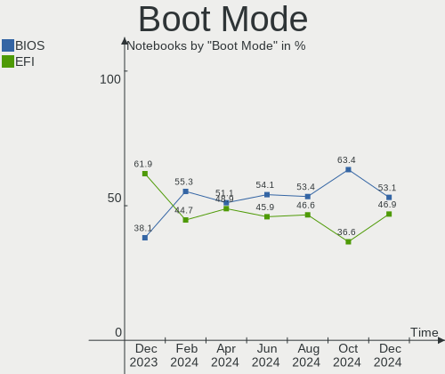
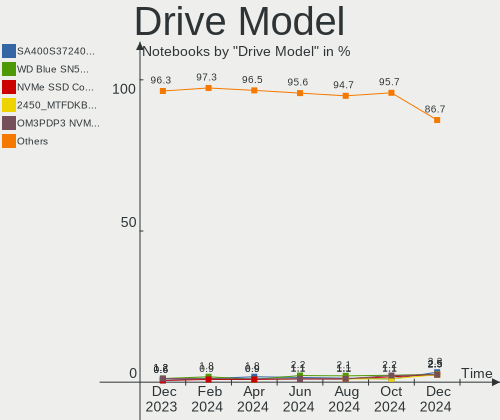
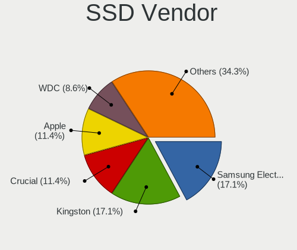
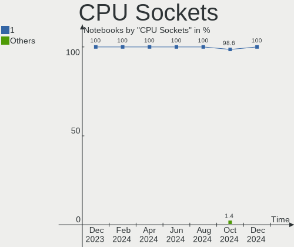
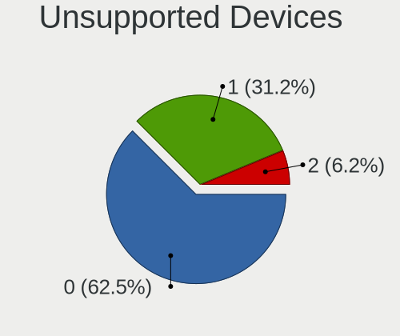

Linux in Canada - Hardware Trends (Notebooks)
---------------------------------------------

A project to identify most popular hardware characteristics and track their change
over time based on data collected by Linux users at https://Linux-Hardware.org.

Anyone can contribute to this report by the [hw-probe](https://github.com/linuxhw/hw-probe) tool:

    sudo -E hw-probe -all -upload

Period: Jan, 2024.

Contents
--------

* [ System ](#system)
  - [ OS                       ](#os)
  - [ OS Family                ](#os-family)
  - [ Kernel                   ](#kernel)
  - [ Kernel Family            ](#kernel-family)
  - [ Kernel Major Ver.        ](#kernel-major-ver)
  - [ Arch                     ](#arch)
  - [ DE                       ](#de)
  - [ Display Server           ](#display-server)
  - [ Display Manager          ](#display-manager)
  - [ OS Lang                  ](#os-lang)
  - [ Boot Mode                ](#boot-mode)
  - [ Filesystem               ](#filesystem)
  - [ Part. scheme             ](#part-scheme)
  - [ Dual Boot with Linux/BSD ](#dual-boot-with-linuxbsd)
  - [ Dual Boot (Win)          ](#dual-boot-win)

* [ Board ](#board)
  - [ Vendor                   ](#vendor)
  - [ Model                    ](#model)
  - [ Model Family             ](#model-family)
  - [ MFG Year                 ](#mfg-year)
  - [ Form Factor              ](#form-factor)
  - [ Secure Boot              ](#secure-boot)
  - [ Coreboot                 ](#coreboot)
  - [ RAM Size                 ](#ram-size)
  - [ RAM Used                 ](#ram-used)
  - [ Total Drives             ](#total-drives)
  - [ Has CD-ROM               ](#has-cd-rom)
  - [ Has Ethernet             ](#has-ethernet)
  - [ Has WiFi                 ](#has-wifi)
  - [ Has Bluetooth            ](#has-bluetooth)

* [ Location ](#location)
  - [ Country                  ](#country)
  - [ City                     ](#city)

* [ Drives ](#drives)
  - [ Drive Vendor             ](#drive-vendor)
  - [ Drive Model              ](#drive-model)
  - [ HDD Vendor               ](#hdd-vendor)
  - [ SSD Vendor               ](#ssd-vendor)
  - [ Drive Kind               ](#drive-kind)
  - [ Drive Connector          ](#drive-connector)
  - [ Drive Size               ](#drive-size)
  - [ Space Total              ](#space-total)
  - [ Space Used               ](#space-used)
  - [ Malfunc. Drives          ](#malfunc-drives)
  - [ Malfunc. Drive Vendor    ](#malfunc-drive-vendor)
  - [ Malfunc. HDD Vendor      ](#malfunc-hdd-vendor)
  - [ Malfunc. Drive Kind      ](#malfunc-drive-kind)
  - [ Failed Drives            ](#failed-drives)
  - [ Failed Drive Vendor      ](#failed-drive-vendor)
  - [ Drive Status             ](#drive-status)

* [ Storage controller ](#storage-controller)
  - [ Storage Vendor           ](#storage-vendor)
  - [ Storage Model            ](#storage-model)
  - [ Storage Kind             ](#storage-kind)

* [ Processor ](#processor)
  - [ CPU Vendor               ](#cpu-vendor)
  - [ CPU Model                ](#cpu-model)
  - [ CPU Model Family         ](#cpu-model-family)
  - [ CPU Cores                ](#cpu-cores)
  - [ CPU Sockets              ](#cpu-sockets)
  - [ CPU Threads              ](#cpu-threads)
  - [ CPU Op-Modes             ](#cpu-op-modes)
  - [ CPU Microcode            ](#cpu-microcode)
  - [ CPU Microarch            ](#cpu-microarch)

* [ Graphics ](#graphics)
  - [ GPU Vendor               ](#gpu-vendor)
  - [ GPU Model                ](#gpu-model)
  - [ GPU Combo                ](#gpu-combo)
  - [ GPU Driver               ](#gpu-driver)
  - [ GPU Memory               ](#gpu-memory)

* [ Monitor ](#monitor)
  - [ Monitor Vendor           ](#monitor-vendor)
  - [ Monitor Model            ](#monitor-model)
  - [ Monitor Resolution       ](#monitor-resolution)
  - [ Monitor Diagonal         ](#monitor-diagonal)
  - [ Monitor Width            ](#monitor-width)
  - [ Aspect Ratio             ](#aspect-ratio)
  - [ Monitor Area             ](#monitor-area)
  - [ Pixel Density            ](#pixel-density)
  - [ Multiple Monitors        ](#multiple-monitors)

* [ Network ](#network)
  - [ Net Controller Vendor    ](#net-controller-vendor)
  - [ Net Controller Model     ](#net-controller-model)
  - [ Wireless Vendor          ](#wireless-vendor)
  - [ Wireless Model           ](#wireless-model)
  - [ Ethernet Vendor          ](#ethernet-vendor)
  - [ Ethernet Model           ](#ethernet-model)
  - [ Net Controller Kind      ](#net-controller-kind)
  - [ Used Controller          ](#used-controller)
  - [ NICs                     ](#nics)
  - [ IPv6                     ](#ipv6)

* [ Bluetooth ](#bluetooth)
  - [ Bluetooth Vendor         ](#bluetooth-vendor)
  - [ Bluetooth Model          ](#bluetooth-model)

* [ Sound ](#sound)
  - [ Sound Vendor             ](#sound-vendor)
  - [ Sound Model              ](#sound-model)

* [ Memory ](#memory)
  - [ Memory Vendor            ](#memory-vendor)
  - [ Memory Model             ](#memory-model)
  - [ Memory Kind              ](#memory-kind)
  - [ Memory Form Factor       ](#memory-form-factor)
  - [ Memory Size              ](#memory-size)
  - [ Memory Speed             ](#memory-speed)

* [ Printers & scanners ](#printers--scanners)
  - [ Printer Vendor           ](#printer-vendor)
  - [ Printer Model            ](#printer-model)
  - [ Scanner Vendor           ](#scanner-vendor)
  - [ Scanner Model            ](#scanner-model)

* [ Camera ](#camera)
  - [ Camera Vendor            ](#camera-vendor)
  - [ Camera Model             ](#camera-model)

* [ Security ](#security)
  - [ Fingerprint Vendor       ](#fingerprint-vendor)
  - [ Fingerprint Model        ](#fingerprint-model)
  - [ Chipcard Vendor          ](#chipcard-vendor)
  - [ Chipcard Model           ](#chipcard-model)

* [ Unsupported ](#unsupported)
  - [ Unsupported Devices      ](#unsupported-devices)
  - [ Unsupported Device Types ](#unsupported-device-types)

System
------

OS
--

Installed operating systems

| Name                         | Notebooks | Percent |
|------------------------------|-----------|---------|
| Ubuntu 22.04                 | 14        | 15.22%  |
| Fedora 39                    | 10        | 10.87%  |
| Ubuntu 23.10                 | 6         | 6.52%   |
| Pop!_OS 22.04                | 6         | 6.52%   |
| Linux Mint 21.2              | 5         | 5.43%   |
| Debian 12                    | 4         | 4.35%   |
| ArcoLinux Rolling            | 4         | 4.35%   |
| Kali 2023.4                  | 3         | 3.26%   |
| EndeavourOS Rolling          | 3         | 3.26%   |
| Zorin 17                     | 2         | 2.17%   |
| Zorin 16                     | 2         | 2.17%   |
| Ubuntu 20.04                 | 2         | 2.17%   |
| Nobara 39                    | 2         | 2.17%   |
| Linux Mint 21.3              | 2         | 2.17%   |
| Kubuntu 23.10                | 2         | 2.17%   |
| Arch Rolling                 | 2         | 2.17%   |
| Ubuntu Budgie 22.04          | 1         | 1.09%   |
| Ubuntu 23.04                 | 1         | 1.09%   |
| RHEL 9                       | 1         | 1.09%   |
| Parrot 6.0                   | 1         | 1.09%   |
| openSUSE Tumbleweed-XXXXXXXX | 1         | 1.09%   |
| OpenMandriva 5.0             | 1         | 1.09%   |
| OpenMandriva 4.2             | 1         | 1.09%   |
| OpenMandriva 23.08           | 1         | 1.09%   |
| MX 23                        | 1         | 1.09%   |
| Manjaro 23.1.3               | 1         | 1.09%   |
| Lubuntu 22.04                | 1         | 1.09%   |
| LMDE 6                       | 1         | 1.09%   |
| Linux Mint 20.3              | 1         | 1.09%   |
| Linux Mint 20.1              | 1         | 1.09%   |
| Lilidog 23                   | 1         | 1.09%   |
| Kubuntu 24.04                | 1         | 1.09%   |
| Gentoo 2.7                   | 1         | 1.09%   |
| Fedora 38                    | 1         | 1.09%   |
| Debian 11                    | 1         | 1.09%   |
| ChimeraOS 44-1               | 1         | 1.09%   |
| CachyOS Rolling              | 1         | 1.09%   |
| BlackPanther 18.1            | 1         | 1.09%   |
| Artix                        | 1         | 1.09%   |

OS Family
---------

OS without a version

| Name          | Notebooks | Percent |
|---------------|-----------|---------|
| Ubuntu        | 23        | 25%     |
| Fedora        | 11        | 11.96%  |
| Linux Mint    | 9         | 9.78%   |
| Pop!_OS       | 6         | 6.52%   |
| Debian        | 5         | 5.43%   |
| Zorin         | 4         | 4.35%   |
| ArcoLinux     | 4         | 4.35%   |
| OpenMandriva  | 3         | 3.26%   |
| Kubuntu       | 3         | 3.26%   |
| Kali          | 3         | 3.26%   |
| EndeavourOS   | 3         | 3.26%   |
| Nobara        | 2         | 2.17%   |
| Arch          | 2         | 2.17%   |
| Ubuntu Budgie | 1         | 1.09%   |
| RHEL          | 1         | 1.09%   |
| Parrot        | 1         | 1.09%   |
| openSUSE      | 1         | 1.09%   |
| MX            | 1         | 1.09%   |
| Manjaro       | 1         | 1.09%   |
| Lubuntu       | 1         | 1.09%   |
| LMDE          | 1         | 1.09%   |
| Lilidog       | 1         | 1.09%   |
| Gentoo        | 1         | 1.09%   |
| ChimeraOS     | 1         | 1.09%   |
| CachyOS       | 1         | 1.09%   |
| BlackPanther  | 1         | 1.09%   |
| Artix         | 1         | 1.09%   |

Kernel
------

Version of the Linux kernel

| Version                     | Notebooks | Percent |
|-----------------------------|-----------|---------|
| 6.5.0-14-generic            | 16        | 17.39%  |
| 5.15.0-91-generic           | 9         | 9.78%   |
| 6.6.9-200.fc39.x86_64       | 6         | 6.52%   |
| 6.6.6-76060606-generic      | 5         | 5.43%   |
| 6.2.0-39-generic            | 4         | 4.35%   |
| 6.1.0-16-amd64              | 4         | 4.35%   |
| 6.5.0-kali3-amd64           | 3         | 3.26%   |
| 6.7.1-arch1-1               | 2         | 2.17%   |
| 6.6.13-200.fc39.x86_64      | 2         | 2.17%   |
| 6.6.11-200.fc39.x86_64      | 2         | 2.17%   |
| 6.1.0-17-amd64              | 2         | 2.17%   |
| 5.15.0-76-generic           | 2         | 2.17%   |
| 6.7.1-artix1-1              | 1         | 1.09%   |
| 6.7.1-2-cachyos             | 1         | 1.09%   |
| 6.7.0-zen3-1-zen            | 1         | 1.09%   |
| 6.7.0-200.fsync.fc39.x86_64 | 1         | 1.09%   |
| 6.6.9-arch1-1               | 1         | 1.09%   |
| 6.6.8-arch1-1               | 1         | 1.09%   |
| 6.6.8-200.fsync.fc39.x86_64 | 1         | 1.09%   |
| 6.6.7-arch1-1               | 1         | 1.09%   |
| 6.6.7-1-default             | 1         | 1.09%   |
| 6.6.2-desktop-1omv2390      | 1         | 1.09%   |
| 6.6.14-1-lts                | 1         | 1.09%   |
| 6.6.13-hardened1-1-hardened | 1         | 1.09%   |
| 6.6.13-1-MANJARO            | 1         | 1.09%   |
| 6.6.11-100.fc38.x86_64      | 1         | 1.09%   |
| 6.6.10-arch1-1              | 1         | 1.09%   |
| 6.6.0-14-generic            | 1         | 1.09%   |
| 6.5.6-chos1-chimeraos-1     | 1         | 1.09%   |
| 6.5.6-76060506-generic      | 1         | 1.09%   |
| 6.5.0-9-generic             | 1         | 1.09%   |
| 6.5.0-14-lowlatency         | 1         | 1.09%   |
| 6.5.0-13parrot1-amd64       | 1         | 1.09%   |
| 6.5.0-13-generic            | 1         | 1.09%   |
| 6.4.11-desktop-1omv2390     | 1         | 1.09%   |
| 6.2.0-26-generic            | 1         | 1.09%   |
| 6.2.0-20-generic            | 1         | 1.09%   |
| 6.2.0-1009-lowlatency       | 1         | 1.09%   |
| 6.1.0-17-686-pae            | 1         | 1.09%   |
| 5.4.0-170-generic           | 1         | 1.09%   |

Kernel Family
-------------

Linux kernel without a distro release

| Version | Notebooks | Percent |
|---------|-----------|---------|
| 6.5.0   | 23        | 25%     |
| 5.15.0  | 12        | 13.04%  |
| 6.6.9   | 7         | 7.61%   |
| 6.2.0   | 7         | 7.61%   |
| 6.1.0   | 7         | 7.61%   |
| 6.6.6   | 5         | 5.43%   |
| 6.7.1   | 4         | 4.35%   |
| 6.6.13  | 4         | 4.35%   |
| 6.6.11  | 3         | 3.26%   |
| 6.7.0   | 2         | 2.17%   |
| 6.6.8   | 2         | 2.17%   |
| 6.6.7   | 2         | 2.17%   |
| 6.5.6   | 2         | 2.17%   |
| 5.4.0   | 2         | 2.17%   |
| 6.6.2   | 1         | 1.09%   |
| 6.6.14  | 1         | 1.09%   |
| 6.6.10  | 1         | 1.09%   |
| 6.6.0   | 1         | 1.09%   |
| 6.4.11  | 1         | 1.09%   |
| 5.15.85 | 1         | 1.09%   |
| 5.14.0  | 1         | 1.09%   |
| 5.10.52 | 1         | 1.09%   |
| 5.10.14 | 1         | 1.09%   |
| 5.10.0  | 1         | 1.09%   |

Kernel Major Ver.
-----------------

Linux kernel major version

| Version | Notebooks | Percent |
|---------|-----------|---------|
| 6.6     | 27        | 29.35%  |
| 6.5     | 25        | 27.17%  |
| 5.15    | 13        | 14.13%  |
| 6.2     | 7         | 7.61%   |
| 6.1     | 7         | 7.61%   |
| 6.7     | 6         | 6.52%   |
| 5.10    | 3         | 3.26%   |
| 5.4     | 2         | 2.17%   |
| 6.4     | 1         | 1.09%   |
| 5.14    | 1         | 1.09%   |

Arch
----

OS architecture (x86_64, i586, etc.)

| Name   | Notebooks | Percent |
|--------|-----------|---------|
| x86_64 | 91        | 98.91%  |
| i686   | 1         | 1.09%   |

DE
--

Desktop Environment

| Name             | Notebooks | Percent |
|------------------|-----------|---------|
| GNOME            | 48        | 52.17%  |
| KDE5             | 17        | 18.48%  |
| X-Cinnamon       | 10        | 10.87%  |
| XFCE             | 8         | 8.7%    |
| sway             | 1         | 1.09%   |
| MATE             | 1         | 1.09%   |
| LXQt             | 1         | 1.09%   |
| lightdm-xsession | 1         | 1.09%   |
| i3               | 1         | 1.09%   |
| Hyprland         | 1         | 1.09%   |
| Enlightenment    | 1         | 1.09%   |
| DWM              | 1         | 1.09%   |
| Budgie           | 1         | 1.09%   |

Display Server
--------------

X11 or Wayland

| Name    | Notebooks | Percent |
|---------|-----------|---------|
| X11     | 53        | 57.61%  |
| Wayland | 37        | 40.22%  |
| Tty     | 2         | 2.17%   |

Display Manager
---------------

SDDM, LightDM, etc.

| Name    | Notebooks | Percent |
|---------|-----------|---------|
| Unknown | 35        | 38.04%  |
| GDM3    | 22        | 23.91%  |
| SDDM    | 15        | 16.3%   |
| LightDM | 13        | 14.13%  |
| GDM     | 5         | 5.43%   |
| XDM     | 1         | 1.09%   |
| NODM    | 1         | 1.09%   |

OS Lang
-------

Language

| Lang    | Notebooks | Percent |
|---------|-----------|---------|
| en_CA   | 48        | 52.17%  |
| en_US   | 30        | 32.61%  |
| fr_CA   | 5         | 5.43%   |
| C       | 3         | 3.26%   |
| fr_FR   | 2         | 2.17%   |
| zh_CN   | 1         | 1.09%   |
| it_IT   | 1         | 1.09%   |
| en_GB   | 1         | 1.09%   |
| Unknown | 1         | 1.09%   |

Boot Mode
---------

EFI or BIOS

| Mode | Notebooks | Percent |
|------|-----------|---------|
| EFI  | 47        | 51.09%  |
| BIOS | 45        | 48.91%  |

Filesystem
----------

Type of filesystem

| Type    | Notebooks | Percent |
|---------|-----------|---------|
| Ext4    | 52        | 56.52%  |
| Btrfs   | 19        | 20.65%  |
| Tmpfs   | 15        | 16.3%   |
| Overlay | 5         | 5.43%   |
| Xfs     | 1         | 1.09%   |

Part. scheme
------------

Scheme of partitioning

| Type    | Notebooks | Percent |
|---------|-----------|---------|
| GPT     | 50        | 54.35%  |
| Unknown | 33        | 35.87%  |
| MBR     | 9         | 9.78%   |

Dual Boot with Linux/BSD
------------------------

Hosting more than one Linux/BSD

| Dual boot | Notebooks | Percent |
|-----------|-----------|---------|
| No        | 83        | 90.22%  |
| Yes       | 9         | 9.78%   |

Dual Boot (Win)
---------------

Hosting Linux and Windows

| Dual boot | Notebooks | Percent |
|-----------|-----------|---------|
| No        | 75        | 81.52%  |
| Yes       | 17        | 18.48%  |

Board
-----

Vendor
------

Motherboard manufacturer

| Name                | Notebooks | Percent |
|---------------------|-----------|---------|
| Lenovo              | 21        | 22.83%  |
| Hewlett-Packard     | 18        | 19.57%  |
| ASUSTek Computer    | 13        | 14.13%  |
| Dell                | 12        | 13.04%  |
| Acer                | 11        | 11.96%  |
| MSI                 | 5         | 5.43%   |
| Apple               | 4         | 4.35%   |
| Samsung Electronics | 2         | 2.17%   |
| Panasonic           | 2         | 2.17%   |
| Toshiba             | 1         | 1.09%   |
| Framework           | 1         | 1.09%   |
| Alienware           | 1         | 1.09%   |
| Unknown             | 1         | 1.09%   |

Model
-----

Motherboard model

| Name                                           | Notebooks | Percent |
|------------------------------------------------|-----------|---------|
| Dell Latitude 7440                             | 2         | 2.17%   |
| Apple MacBookPro11,3                           | 2         | 2.17%   |
| Toshiba Satellite Pro A50-C                    | 1         | 1.09%   |
| Samsung 700Z3C/700Z5C                          | 1         | 1.09%   |
| Samsung 300E5M/300E5L                          | 1         | 1.09%   |
| Panasonic CF-52PFN61PM                         | 1         | 1.09%   |
| Panasonic CF-31ATAAX1M                         | 1         | 1.09%   |
| MSI Prestige 13Evo A13M                        | 1         | 1.09%   |
| MSI MS-7B17                                    | 1         | 1.09%   |
| MSI GP72 6QF                                   | 1         | 1.09%   |
| MSI GF63 Thin 11UC                             | 1         | 1.09%   |
| MSI GE70 2PE                                   | 1         | 1.09%   |
| Lenovo Yoga 14sACH 2021 82MS                   | 1         | 1.09%   |
| Lenovo ThinkPad X61 76754BJ                    | 1         | 1.09%   |
| Lenovo ThinkPad X250 20CLS60800                | 1         | 1.09%   |
| Lenovo ThinkPad X220 429044U                   | 1         | 1.09%   |
| Lenovo ThinkPad X131e 3371AF5                  | 1         | 1.09%   |
| Lenovo ThinkPad X1 Carbon 6th 20KGS1TW00       | 1         | 1.09%   |
| Lenovo ThinkPad X1 Carbon 6th (PRC) 20KH002FUS | 1         | 1.09%   |
| Lenovo ThinkPad T490 20N3S8W501                | 1         | 1.09%   |
| Lenovo ThinkPad T470 20HES18S02                | 1         | 1.09%   |
| Lenovo ThinkPad T430s 2356GUU                  | 1         | 1.09%   |
| Lenovo ThinkPad T14 Gen 4 21HD002BUS           | 1         | 1.09%   |
| Lenovo ThinkPad T14 Gen 2i 20W1SB7J00          | 1         | 1.09%   |
| Lenovo ThinkPad P52s 20LCS2Y800                | 1         | 1.09%   |
| Lenovo ThinkPad P1 Gen 6 21FV002GUS            | 1         | 1.09%   |
| Lenovo ThinkPad L480 20LTS8CY00                | 1         | 1.09%   |
| Lenovo ThinkPad E420 114155F                   | 1         | 1.09%   |
| Lenovo ThinkPad A285 20MXS0GT00                | 1         | 1.09%   |
| Lenovo Legion Y540-15IRH 81SX                  | 1         | 1.09%   |
| Lenovo Legion Slim 7 16APH8 82Y4               | 1         | 1.09%   |
| Lenovo IdeaPad 730S-13IWL 81JB                 | 1         | 1.09%   |
| Lenovo G505 20240                              | 1         | 1.09%   |
| HP ZBook 14u G5                                | 1         | 1.09%   |
| HP Stream Laptop 11-ah1XX                      | 1         | 1.09%   |
| HP ProBook 650 G2                              | 1         | 1.09%   |
| HP ProBook 650 G1                              | 1         | 1.09%   |
| HP ProBook 4540s                               | 1         | 1.09%   |
| HP ProBook 445 G8 Notebook PC                  | 1         | 1.09%   |
| HP Pavilion dv6                                | 1         | 1.09%   |

Model Family
------------

Motherboard model prefix

| Name                   | Notebooks | Percent |
|------------------------|-----------|---------|
| Lenovo ThinkPad        | 16        | 17.39%  |
| Acer Aspire            | 8         | 8.7%    |
| ASUS VivoBook          | 7         | 7.61%   |
| HP ProBook             | 4         | 4.35%   |
| HP Pavilion            | 4         | 4.35%   |
| Dell Precision         | 4         | 4.35%   |
| HP Laptop              | 3         | 3.26%   |
| HP EliteBook           | 3         | 3.26%   |
| Dell Latitude          | 3         | 3.26%   |
| Dell Inspiron          | 3         | 3.26%   |
| Lenovo Legion          | 2         | 2.17%   |
| Dell XPS               | 2         | 2.17%   |
| ASUS Zenbook           | 2         | 2.17%   |
| Apple MacBookPro11     | 2         | 2.17%   |
| Acer Swift             | 2         | 2.17%   |
| Toshiba Satellite      | 1         | 1.09%   |
| Samsung 700Z3C         | 1         | 1.09%   |
| Samsung 300E5M         | 1         | 1.09%   |
| Panasonic CF-52PFN61PM | 1         | 1.09%   |
| Panasonic CF-31ATAAX1M | 1         | 1.09%   |
| MSI Prestige           | 1         | 1.09%   |
| MSI MS-7B17            | 1         | 1.09%   |
| MSI GP72               | 1         | 1.09%   |
| MSI GF63               | 1         | 1.09%   |
| MSI GE70               | 1         | 1.09%   |
| Lenovo Yoga            | 1         | 1.09%   |
| Lenovo IdeaPad         | 1         | 1.09%   |
| Lenovo G505            | 1         | 1.09%   |
| HP ZBook               | 1         | 1.09%   |
| HP Stream              | 1         | 1.09%   |
| HP Notebook            | 1         | 1.09%   |
| HP Elite               | 1         | 1.09%   |
| Framework Laptop       | 1         | 1.09%   |
| ASUS X550JK            | 1         | 1.09%   |
| ASUS ROG               | 1         | 1.09%   |
| ASUS K53U              | 1         | 1.09%   |
| ASUS G750JW            | 1         | 1.09%   |
| Apple MacBookPro8      | 1         | 1.09%   |
| Apple MacBookPro10     | 1         | 1.09%   |
| Alienware M14xR2       | 1         | 1.09%   |

MFG Year
--------

Motherboard manufacture year

| Year | Notebooks | Percent |
|------|-----------|---------|
| 2021 | 10        | 10.87%  |
| 2013 | 10        | 10.87%  |
| 2018 | 9         | 9.78%   |
| 2022 | 8         | 8.7%    |
| 2023 | 7         | 7.61%   |
| 2019 | 7         | 7.61%   |
| 2017 | 6         | 6.52%   |
| 2016 | 5         | 5.43%   |
| 2015 | 5         | 5.43%   |
| 2012 | 5         | 5.43%   |
| 2011 | 5         | 5.43%   |
| 2020 | 4         | 4.35%   |
| 2014 | 4         | 4.35%   |
| 2008 | 3         | 3.26%   |
| 2007 | 2         | 2.17%   |
| 2010 | 1         | 1.09%   |
| 2009 | 1         | 1.09%   |

Form Factor
-----------

Physical design of the computer

| Name     | Notebooks | Percent |
|----------|-----------|---------|
| Notebook | 92        | 100%    |

Secure Boot
-----------

Enabled or disabled

| State    | Notebooks | Percent |
|----------|-----------|---------|
| Disabled | 87        | 94.57%  |
| Enabled  | 5         | 5.43%   |

Coreboot
--------

Have coreboot on board

| Used | Notebooks | Percent |
|------|-----------|---------|
| No   | 92        | 100%    |

RAM Size
--------

Total RAM memory

| Size in GB  | Notebooks | Percent |
|-------------|-----------|---------|
| 4.01-8.0    | 26        | 28.26%  |
| 8.01-16.0   | 20        | 21.74%  |
| 16.01-24.0  | 17        | 18.48%  |
| 3.01-4.0    | 13        | 14.13%  |
| 32.01-64.0  | 8         | 8.7%    |
| 24.01-32.0  | 4         | 4.35%   |
| 64.01-256.0 | 3         | 3.26%   |
| 1.01-2.0    | 1         | 1.09%   |

RAM Used
--------

Used RAM memory

| Used GB   | Notebooks | Percent |
|-----------|-----------|---------|
| 2.01-3.0  | 31        | 33.7%   |
| 1.01-2.0  | 26        | 28.26%  |
| 4.01-8.0  | 13        | 14.13%  |
| 3.01-4.0  | 11        | 11.96%  |
| 8.01-16.0 | 9         | 9.78%   |
| 0.51-1.0  | 2         | 2.17%   |

Total Drives
------------

Number of drives on board

| Drives | Notebooks | Percent |
|--------|-----------|---------|
| 1      | 67        | 72.83%  |
| 2      | 20        | 21.74%  |
| 3      | 3         | 3.26%   |
| 4      | 1         | 1.09%   |
| 0      | 1         | 1.09%   |

Has CD-ROM
----------

Has CD-ROM on board

| Presented | Notebooks | Percent |
|-----------|-----------|---------|
| No        | 66        | 71.74%  |
| Yes       | 26        | 28.26%  |

Has Ethernet
------------

Has Ethernet on board

| Presented | Notebooks | Percent |
|-----------|-----------|---------|
| Yes       | 66        | 71.74%  |
| No        | 26        | 28.26%  |

Has WiFi
--------

Has WiFi module

| Presented | Notebooks | Percent |
|-----------|-----------|---------|
| Yes       | 90        | 97.83%  |
| No        | 2         | 2.17%   |

Has Bluetooth
-------------

Has Bluetooth module

| Presented | Notebooks | Percent |
|-----------|-----------|---------|
| Yes       | 83        | 90.22%  |
| No        | 9         | 9.78%   |

Location
--------

Country
-------

Geographic location (country)

| Country | Notebooks | Percent |
|---------|-----------|---------|
| Canada  | 92        | 100%    |

City
----

Geographic location (city)

| City                         | Notebooks | Percent |
|------------------------------|-----------|---------|
| Toronto                      | 17        | 18.48%  |
| Montreal                     | 8         | 8.7%    |
| Calgary                      | 7         | 7.61%   |
| Winnipeg                     | 4         | 4.35%   |
| Edmonton                     | 4         | 4.35%   |
| Victoria                     | 3         | 3.26%   |
| Dartmouth                    | 3         | 3.26%   |
| Surrey                       | 2         | 2.17%   |
| Québec                      | 2         | 2.17%   |
| Oshawa                       | 2         | 2.17%   |
| Windsor                      | 1         | 1.09%   |
| Whitby                       | 1         | 1.09%   |
| Vancouver                    | 1         | 1.09%   |
| St. Catharines               | 1         | 1.09%   |
| Scarborough                  | 1         | 1.09%   |
| Sainte-Agathe-des-Monts      | 1         | 1.09%   |
| Saint-Charles-de-Bellechasse | 1         | 1.09%   |
| Saint-Anselme                | 1         | 1.09%   |
| Saint-Agapit                 | 1         | 1.09%   |
| Regina                       | 1         | 1.09%   |
| Red Deer                     | 1         | 1.09%   |
| Quinte West                  | 1         | 1.09%   |
| Prince George                | 1         | 1.09%   |
| Port Dover                   | 1         | 1.09%   |
| Plessisville                 | 1         | 1.09%   |
| Pierrefonds                  | 1         | 1.09%   |
| Ottawa                       | 1         | 1.09%   |
| Newcastle                    | 1         | 1.09%   |
| Moncton                      | 1         | 1.09%   |
| Mississauga                  | 1         | 1.09%   |
| Milton                       | 1         | 1.09%   |
| Middle Sackville             | 1         | 1.09%   |
| Maple Ridge                  | 1         | 1.09%   |
| London                       | 1         | 1.09%   |
| Laval                        | 1         | 1.09%   |
| Langley                      | 1         | 1.09%   |
| King City                    | 1         | 1.09%   |
| Hamilton                     | 1         | 1.09%   |
| Grande-Riviere               | 1         | 1.09%   |
| Gatineau                     | 1         | 1.09%   |

Drives
------

Drive Vendor
------------

Hard drive vendors

| Vendor                      | Notebooks | Drives | Percent |
|-----------------------------|-----------|--------|---------|
| Samsung Electronics         | 17        | 19     | 15.18%  |
| WDC                         | 13        | 13     | 11.61%  |
| Unknown                     | 11        | 13     | 9.82%   |
| Kingston                    | 10        | 11     | 8.93%   |
| Toshiba                     | 6         | 6      | 5.36%   |
| Seagate                     | 6         | 7      | 5.36%   |
| Intel                       | 6         | 6      | 5.36%   |
| SanDisk                     | 5         | 5      | 4.46%   |
| Micron Technology           | 4         | 4      | 3.57%   |
| Kingston Technology Company | 4         | 4      | 3.57%   |
| Hitachi                     | 4         | 4      | 3.57%   |
| SK hynix                    | 3         | 3      | 2.68%   |
| KIOXIA                      | 3         | 3      | 2.68%   |
| SPCC                        | 2         | 2      | 1.79%   |
| LITEONIT                    | 2         | 2      | 1.79%   |
| Crucial                     | 2         | 3      | 1.79%   |
| Apple                       | 2         | 2      | 1.79%   |
| TSA 256G                    | 1         | 1      | 0.89%   |
| Timetec                     | 1         | 1      | 0.89%   |
| SSSTC                       | 1         | 1      | 0.89%   |
| PNY                         | 1         | 1      | 0.89%   |
| Patriot                     | 1         | 1      | 0.89%   |
| KingSpec                    | 1         | 1      | 0.89%   |
| JMicron Technology          | 1         | 1      | 0.89%   |
| HGST                        | 1         | 1      | 0.89%   |
| External                    | 1         | 1      | 0.89%   |
| Corsair                     | 1         | 1      | 0.89%   |
| China                       | 1         | 1      | 0.89%   |
| Unknown                     | 1         | 1      | 0.89%   |

Drive Model
-----------

Hard drive models

| Model                                             | Notebooks | Percent |
|---------------------------------------------------|-----------|---------|
| Samsung NVMe SSD Controller SM981/PM981/PM983 1TB | 5         | 4.24%   |
| Intel SSD Pro 7600p/760p/E 6100p Series 1024GB    | 4         | 3.39%   |
| WDC WDS500G2B0A-00SM50 500GB SSD                  | 3         | 2.54%   |
| Unknown MMC Card  64GB                            | 3         | 2.54%   |
| Toshiba MQ01ABD100 1TB                            | 3         | 2.54%   |
| WDC WD10JPVX-22JC3T0 1TB                          | 2         | 1.69%   |
| Unknown SD64G  64GB                               | 2         | 1.69%   |
| SPCC Solid State Disk 512GB                       | 2         | 1.69%   |
| Seagate ST2000LM015-2E8174 2TB                    | 2         | 1.69%   |
| Kingston Company OM3PDP3 NVMe SSD 256GB           | 2         | 1.69%   |
| Kingston SNVS1000G 1TB                            | 2         | 1.69%   |
| Kingston SA400S37960G 960GB SSD                   | 2         | 1.69%   |
| Kingston SA400S37240G 240GB SSD                   | 2         | 1.69%   |
| Kingston OM8PCP3512F-AB 512GB                     | 2         | 1.69%   |
| Apple SSD SM1024F 1TB                             | 2         | 1.69%   |
| WDC WDS100T2B0B-00YS70 1TB SSD                    | 1         | 0.85%   |
| WDC WDS100T2B0A-00SM50 1TB SSD                    | 1         | 0.85%   |
| WDC WDBNCE5000PNC 500GB SSD                       | 1         | 0.85%   |
| WDC WD5000LPZX-60Z10T0 500GB                      | 1         | 0.85%   |
| WDC WD5000LPCX-60VHAT0 500GB                      | 1         | 0.85%   |
| WDC WD3200BEKT-08PVMT1 320GB                      | 1         | 0.85%   |
| WDC WD Blue SA510 2.5 500GB                       | 1         | 0.85%   |
| WDC PC SN530 SDBPNPZ-256G-1006 256GB              | 1         | 0.85%   |
| Unknown NVMe SSD Drive 2TB                        | 1         | 0.85%   |
| Unknown MMC Card  971MB                           | 1         | 0.85%   |
| Unknown MMC Card  536GB                           | 1         | 0.85%   |
| Unknown MMC Card  32GB                            | 1         | 0.85%   |
| Unknown MMC Card  16GB                            | 1         | 0.85%   |
| Unknown MMC Card  128GB                           | 1         | 0.85%   |
| Unknown GFAQK  512GB                              | 1         | 0.85%   |
| Unknown DA4128  128GB                             | 1         | 0.85%   |
| TSA 256G B 256GB SSD                              | 1         | 0.85%   |
| Toshiba MQ04ABF100 1TB                            | 1         | 0.85%   |
| Toshiba MQ01ABD075 752GB                          | 1         | 0.85%   |
| Toshiba MK1237GSX 120GB                           | 1         | 0.85%   |
| Timetec SD08 512GB SSD                            | 1         | 0.85%   |
| SSSTC CL1-8D256-HP 256GB                          | 1         | 0.85%   |
| SK hynix PC401 NVMe Solid State Drive 256GB       | 1         | 0.85%   |
| SK hynix HFS128G39TND-N210A 128GB SSD             | 1         | 0.85%   |
| SK hynix BC711 HFM512GD3JX013N 512GB              | 1         | 0.85%   |

HDD Vendor
----------

Hard disk drive vendors

| Vendor   | Notebooks | Drives | Percent |
|----------|-----------|--------|---------|
| Toshiba  | 6         | 6      | 26.09%  |
| Seagate  | 6         | 7      | 26.09%  |
| WDC      | 5         | 5      | 21.74%  |
| Hitachi  | 4         | 4      | 17.39%  |
| HGST     | 1         | 1      | 4.35%   |
| External | 1         | 1      | 4.35%   |

SSD Vendor
----------

Solid state drive vendors

| Vendor              | Notebooks | Drives | Percent |
|---------------------|-----------|--------|---------|
| WDC                 | 7         | 7      | 20.59%  |
| Samsung Electronics | 5         | 5      | 14.71%  |
| Kingston            | 5         | 5      | 14.71%  |
| SPCC                | 2         | 2      | 5.88%   |
| LITEONIT            | 2         | 2      | 5.88%   |
| Apple               | 2         | 2      | 5.88%   |
| TSA 256G            | 1         | 1      | 2.94%   |
| Timetec             | 1         | 1      | 2.94%   |
| SK hynix            | 1         | 1      | 2.94%   |
| SanDisk             | 1         | 1      | 2.94%   |
| PNY                 | 1         | 1      | 2.94%   |
| Patriot             | 1         | 1      | 2.94%   |
| KingSpec            | 1         | 1      | 2.94%   |
| Intel               | 1         | 1      | 2.94%   |
| Crucial             | 1         | 1      | 2.94%   |
| Corsair             | 1         | 1      | 2.94%   |
| China               | 1         | 1      | 2.94%   |

Drive Kind
----------

HDD or SSD

| Kind    | Notebooks | Drives | Percent |
|---------|-----------|--------|---------|
| NVMe    | 43        | 47     | 39.09%  |
| SSD     | 32        | 34     | 29.09%  |
| HDD     | 23        | 24     | 20.91%  |
| MMC     | 11        | 13     | 10%     |
| Unknown | 1         | 1      | 0.91%   |

Drive Connector
---------------

SATA, SAS, NVMe, etc.

| Type | Notebooks | Drives | Percent |
|------|-----------|--------|---------|
| SATA | 50        | 54     | 45.87%  |
| NVMe | 43        | 47     | 39.45%  |
| MMC  | 11        | 13     | 10.09%  |
| SAS  | 5         | 5      | 4.59%   |

Drive Size
----------

Size of hard drive

| Size in TB | Notebooks | Drives | Percent |
|------------|-----------|--------|---------|
| 0.01-0.5   | 31        | 32     | 55.36%  |
| 0.51-1.0   | 21        | 22     | 37.5%   |
| 1.01-2.0   | 3         | 3      | 5.36%   |
| 4.01-10.0  | 1         | 1      | 1.79%   |

Space Total
-----------

Amount of disk space available on the file system

| Size in GB     | Notebooks | Percent |
|----------------|-----------|---------|
| 251-500        | 24        | 26.09%  |
| 501-1000       | 19        | 20.65%  |
| 101-250        | 17        | 18.48%  |
| 1001-2000      | 11        | 11.96%  |
| 1-20           | 8         | 8.7%    |
| More than 3000 | 6         | 6.52%   |
| 21-50          | 3         | 3.26%   |
| 51-100         | 3         | 3.26%   |
| Unknown        | 1         | 1.09%   |

Space Used
----------

Amount of used disk space

| Used GB   | Notebooks | Percent |
|-----------|-----------|---------|
| 1-20      | 32        | 34.78%  |
| 21-50     | 20        | 21.74%  |
| 51-100    | 11        | 11.96%  |
| 101-250   | 10        | 10.87%  |
| 251-500   | 8         | 8.7%    |
| 501-1000  | 8         | 8.7%    |
| 1001-2000 | 2         | 2.17%   |
| Unknown   | 1         | 1.09%   |

Malfunc. Drives
---------------

Drive models with a malfunction

| Model                                              | Notebooks | Drives | Percent |
|----------------------------------------------------|-----------|--------|---------|
| WDC WD5000LPCX-60VHAT0 500GB                       | 1         | 1      | 25%     |
| Timetec SD08 512GB SSD                             | 1         | 1      | 25%     |
| Kingston Technology Company OM3PDP3 NVMe SSD 256GB | 1         | 1      | 25%     |
| Apple SSD SM1024F 1TB                              | 1         | 1      | 25%     |

Malfunc. Drive Vendor
---------------------

Vendors of faulty drives

| Vendor                      | Notebooks | Drives | Percent |
|-----------------------------|-----------|--------|---------|
| WDC                         | 1         | 1      | 25%     |
| Timetec                     | 1         | 1      | 25%     |
| Kingston Technology Company | 1         | 1      | 25%     |
| Apple                       | 1         | 1      | 25%     |

Malfunc. HDD Vendor
-------------------

Vendors of faulty HDD drives

| Vendor | Notebooks | Drives | Percent |
|--------|-----------|--------|---------|
| WDC    | 1         | 1      | 100%    |

Malfunc. Drive Kind
-------------------

Kinds of faulty drives

| Kind | Notebooks | Drives | Percent |
|------|-----------|--------|---------|
| SSD  | 2         | 2      | 50%     |
| NVMe | 1         | 1      | 25%     |
| HDD  | 1         | 1      | 25%     |

Failed Drives
-------------

Failed drive models

Zero info for selected period =(

Failed Drive Vendor
-------------------

Failed drive vendors

Zero info for selected period =(

Drive Status
------------

Number of failed and malfunc. drives

| Status   | Notebooks | Drives | Percent |
|----------|-----------|--------|---------|
| Detected | 53        | 68     | 54.64%  |
| Works    | 40        | 47     | 41.24%  |
| Malfunc  | 4         | 4      | 4.12%   |

Storage controller
------------------

Storage Vendor
--------------

Storage controller vendors

| Vendor                         | Notebooks | Percent |
|--------------------------------|-----------|---------|
| Intel                          | 55        | 50.46%  |
| Samsung Electronics            | 14        | 12.84%  |
| AMD                            | 12        | 11.01%  |
| Kingston Technology Company    | 9         | 8.26%   |
| SanDisk                        | 5         | 4.59%   |
| Micron Technology              | 4         | 3.67%   |
| KIOXIA                         | 3         | 2.75%   |
| SK hynix                       | 2         | 1.83%   |
| Micron/Crucial Technology      | 2         | 1.83%   |
| Solidigm                       | 1         | 0.92%   |
| Solid State Storage Technology | 1         | 0.92%   |
| Nvidia                         | 1         | 0.92%   |

Storage Model
-------------

Storage controller models

| Model                                                                          | Notebooks | Percent |
|--------------------------------------------------------------------------------|-----------|---------|
| AMD FCH SATA Controller [AHCI mode]                                            | 11        | 9.57%   |
| Intel 7 Series Chipset Family 6-port SATA Controller [AHCI mode]               | 7         | 6.09%   |
| Samsung NVMe SSD Controller SM981/PM981/PM983                                  | 6         | 5.22%   |
| Intel Sunrise Point-LP SATA Controller [AHCI mode]                             | 6         | 5.22%   |
| Intel 8 Series/C220 Series Chipset Family 6-port SATA Controller 1 [AHCI mode] | 6         | 5.22%   |
| Intel SSD DC P4101/Pro 7600p/760p/E 6100p Series                               | 4         | 3.48%   |
| Intel 6 Series/C200 Series Chipset Family 6 port Mobile SATA AHCI Controller   | 4         | 3.48%   |
| Intel Cannon Lake Mobile PCH SATA AHCI Controller                              | 3         | 2.61%   |
| Intel 82801IBM/IEM (ICH9M/ICH9M-E) 4 port SATA Controller [AHCI mode]          | 3         | 2.61%   |
| SanDisk Ultra 3D / WD Blue SN550 NVMe SSD                                      | 2         | 1.74%   |
| Samsung S4LN053X01 AHCI SSD Controller(Apple slot)                             | 2         | 1.74%   |
| Samsung NVMe SSD Controller S4LV008[Pascal]                                    | 2         | 1.74%   |
| Samsung NVMe SSD Controller PM9B1 (DRAM-less)                                  | 2         | 1.74%   |
| Samsung NVMe SSD Controller PM9A1/PM9A3/980PRO                                 | 2         | 1.74%   |
| Micron 2450 NVMe SSD [HendrixV] (DRAM-less)                                    | 2         | 1.74%   |
| KIOXIA NVMe SSD Controller XG8                                                 | 2         | 1.74%   |
| Kingston Company OM8PCP Design-In PCIe 3 NVMe SSD (DRAM-less)                  | 2         | 1.74%   |
| Kingston Company OM3PDP3 NVMe SSD                                              | 2         | 1.74%   |
| Kingston Company A2000 NVMe SSD SM2263EN                                       | 2         | 1.74%   |
| Intel Wildcat Point-LP SATA Controller [AHCI Mode]                             | 2         | 1.74%   |
| Intel Volume Management Device NVMe RAID Controller Intel Corporation          | 2         | 1.74%   |
| Intel Volume Management Device NVMe RAID Controller                            | 2         | 1.74%   |
| Intel Tiger Lake SATA AHCI Controller                                          | 2         | 1.74%   |
| Intel HM170/QM170 Chipset SATA Controller [AHCI Mode]                          | 2         | 1.74%   |
| Intel 82801 Mobile SATA Controller [RAID mode]                                 | 2         | 1.74%   |
| Intel 5 Series/3400 Series Chipset 6 port SATA AHCI Controller                 | 2         | 1.74%   |
| Solidigm P41 Plus NVMe SSD (DRAM-less) [Echo Harbor]                           | 1         | 0.87%   |
| Solid State Storage CL1-3D256-Q11 NVMe SSD M.2                                 | 1         | 0.87%   |
| SK hynix PC401 NVMe Solid State Drive 256GB                                    | 1         | 0.87%   |
| SK hynix Gold P31/BC711/PC711 NVMe Solid State Drive                           | 1         | 0.87%   |
| SanDisk WD PC SN810 / Black SN850 NVMe SSD                                     | 1         | 0.87%   |
| SanDisk WD Black SN770 / PC SN740 256GB / PC SN560 (DRAM-less) NVMe SSD        | 1         | 0.87%   |
| SanDisk PC SN735 NVMe SSD (DRAM-less)                                          | 1         | 0.87%   |
| Samsung NVMe SSD Controller 980 (DRAM-less)                                    | 1         | 0.87%   |
| Nvidia MCP67 IDE Controller                                                    | 1         | 0.87%   |
| Nvidia MCP67 AHCI Controller                                                   | 1         | 0.87%   |
| Micron/Crucial T500 NVMe PCIe SSD                                              | 1         | 0.87%   |
| Micron/Crucial P5 Plus NVMe PCIe SSD                                           | 1         | 0.87%   |
| Micron 3400 NVMe SSD [Hendrix]                                                 | 1         | 0.87%   |
| Micron 2200S NVMe SSD [Cassandra]                                              | 1         | 0.87%   |

Storage Kind
------------

Kind of storage controller (IDE, SATA, NVMe, SAS, ...)

| Kind | Notebooks | Percent |
|------|-----------|---------|
| SATA | 56        | 50.91%  |
| NVMe | 43        | 39.09%  |
| RAID | 7         | 6.36%   |
| IDE  | 4         | 3.64%   |

Processor
---------

CPU Vendor
----------

Processor vendors

| Vendor | Notebooks | Percent |
|--------|-----------|---------|
| Intel  | 72        | 78.26%  |
| AMD    | 20        | 21.74%  |

CPU Model
---------

Processor models

| Model                                   | Notebooks | Percent |
|-----------------------------------------|-----------|---------|
| Intel Core i7-8650U CPU @ 1.90GHz       | 3         | 3.26%   |
| Intel Core i5-8250U CPU @ 1.60GHz       | 3         | 3.26%   |
| Intel Core i7-6820HQ CPU @ 2.70GHz      | 2         | 2.17%   |
| Intel Core i7-4710HQ CPU @ 2.50GHz      | 2         | 2.17%   |
| Intel Core i5-8365U CPU @ 1.60GHz       | 2         | 2.17%   |
| Intel Core i5-2520M CPU @ 2.50GHz       | 2         | 2.17%   |
| Intel Core i5 CPU M 520 @ 2.40GHz       | 2         | 2.17%   |
| Intel 13th Gen Core i9-13900H           | 2         | 2.17%   |
| Intel 13th Gen Core i7-1365U            | 2         | 2.17%   |
| Intel 12th Gen Core i7-12700H           | 2         | 2.17%   |
| Intel 11th Gen Core i5-1135G7 @ 2.40GHz | 2         | 2.17%   |
| AMD Ryzen 5 5600H with Radeon Graphics  | 2         | 2.17%   |
| Intel Genuine CPU U2700 @ 1.30GHz       | 1         | 1.09%   |
| Intel Core m5-6Y54 CPU @ 1.10GHz        | 1         | 1.09%   |
| Intel Core i9-9900K CPU @ 3.60GHz       | 1         | 1.09%   |
| Intel Core i7-9850H CPU @ 2.60GHz       | 1         | 1.09%   |
| Intel Core i7-9750H CPU @ 2.60GHz       | 1         | 1.09%   |
| Intel Core i7-8750H CPU @ 2.20GHz       | 1         | 1.09%   |
| Intel Core i7-8565U CPU @ 1.80GHz       | 1         | 1.09%   |
| Intel Core i7-8550U CPU @ 1.80GHz       | 1         | 1.09%   |
| Intel Core i7-7600U CPU @ 2.80GHz       | 1         | 1.09%   |
| Intel Core i7-6700HQ CPU @ 2.60GHz      | 1         | 1.09%   |
| Intel Core i7-6500U CPU @ 2.50GHz       | 1         | 1.09%   |
| Intel Core i7-4980HQ CPU @ 2.80GHz      | 1         | 1.09%   |
| Intel Core i7-4960HQ CPU @ 2.60GHz      | 1         | 1.09%   |
| Intel Core i7-4810MQ CPU @ 2.80GHz      | 1         | 1.09%   |
| Intel Core i7-4702MQ CPU @ 2.20GHz      | 1         | 1.09%   |
| Intel Core i7-4700HQ CPU @ 2.40GHz      | 1         | 1.09%   |
| Intel Core i7-3635QM CPU @ 2.40GHz      | 1         | 1.09%   |
| Intel Core i7-3520M CPU @ 2.90GHz       | 1         | 1.09%   |
| Intel Core i7-3517U CPU @ 1.90GHz       | 1         | 1.09%   |
| Intel Core i7-2760QM CPU @ 2.40GHz      | 1         | 1.09%   |
| Intel Core i5-8265U CPU @ 1.60GHz       | 1         | 1.09%   |
| Intel Core i5-7300U CPU @ 2.60GHz       | 1         | 1.09%   |
| Intel Core i5-7200U CPU @ 2.50GHz       | 1         | 1.09%   |
| Intel Core i5-5300U CPU @ 2.30GHz       | 1         | 1.09%   |
| Intel Core i5-5200U CPU @ 2.20GHz       | 1         | 1.09%   |
| Intel Core i5-4210U CPU @ 1.70GHz       | 1         | 1.09%   |
| Intel Core i5-4210M CPU @ 2.60GHz       | 1         | 1.09%   |
| Intel Core i5-3210M CPU @ 2.50GHz       | 1         | 1.09%   |

CPU Model Family
----------------

Processor model prefix

| Model            | Notebooks | Percent |
|------------------|-----------|---------|
| Intel Core i7    | 24        | 26.09%  |
| Intel Core i5    | 20        | 21.74%  |
| Other            | 15        | 16.3%   |
| AMD Ryzen 7      | 6         | 6.52%   |
| Intel Celeron    | 4         | 4.35%   |
| Intel Core i3    | 3         | 3.26%   |
| Intel Core 2 Duo | 3         | 3.26%   |
| AMD Ryzen 5      | 3         | 3.26%   |
| AMD E1           | 2         | 2.17%   |
| Intel Genuine    | 1         | 1.09%   |
| Intel Core m5    | 1         | 1.09%   |
| Intel Core i9    | 1         | 1.09%   |
| Intel Atom       | 1         | 1.09%   |
| AMD Turion 64 X2 | 1         | 1.09%   |
| AMD Ryzen 5 PRO  | 1         | 1.09%   |
| AMD Ryzen 3      | 1         | 1.09%   |
| AMD E2           | 1         | 1.09%   |
| AMD C-60         | 1         | 1.09%   |
| AMD Athlon       | 1         | 1.09%   |
| AMD A8           | 1         | 1.09%   |
| AMD A4           | 1         | 1.09%   |

CPU Cores
---------

Number of processor cores

| Number | Notebooks | Percent |
|--------|-----------|---------|
| 2      | 35        | 38.04%  |
| 4      | 34        | 36.96%  |
| 8      | 7         | 7.61%   |
| 6      | 6         | 6.52%   |
| 14     | 5         | 5.43%   |
| 10     | 3         | 3.26%   |
| 12     | 1         | 1.09%   |
| 1      | 1         | 1.09%   |

CPU Sockets
-----------

Number of sockets

| Number | Notebooks | Percent |
|--------|-----------|---------|
| 1      | 92        | 100%    |

CPU Threads
-----------

Threads per core (Hyper-Threading)

| Number | Notebooks | Percent |
|--------|-----------|---------|
| 2      | 73        | 79.35%  |
| 1      | 19        | 20.65%  |

CPU Op-Modes
------------

CPU Operation Modes (32-bit, 64-bit)

| Op mode        | Notebooks | Percent |
|----------------|-----------|---------|
| 32-bit, 64-bit | 92        | 100%    |

CPU Microcode
-------------

Microcode number

| Number     | Notebooks | Percent |
|------------|-----------|---------|
| Unknown    | 66        | 71.74%  |
| 0x506e3    | 2         | 2.17%   |
| 0x0a50000d | 2         | 2.17%   |
| 0xb06a3    | 1         | 1.09%   |
| 0xb06a2    | 1         | 1.09%   |
| 0x906ed    | 1         | 1.09%   |
| 0x806ea    | 1         | 1.09%   |
| 0x806e9    | 1         | 1.09%   |
| 0x6fa      | 1         | 1.09%   |
| 0x506c9    | 1         | 1.09%   |
| 0x306c3    | 1         | 1.09%   |
| 0x306a9    | 1         | 1.09%   |
| 0x206a7    | 1         | 1.09%   |
| 0x20655    | 1         | 1.09%   |
| 0x1067a    | 1         | 1.09%   |
| 0x0a50000f | 1         | 1.09%   |
| 0x0a50000b | 1         | 1.09%   |
| 0x0a404101 | 1         | 1.09%   |
| 0x08608102 | 1         | 1.09%   |
| 0x08108109 | 1         | 1.09%   |
| 0x08108102 | 1         | 1.09%   |
| 0x0810100b | 1         | 1.09%   |
| 0x07030105 | 1         | 1.09%   |
| 0x0700010f | 1         | 1.09%   |
| 0x06006704 | 1         | 1.09%   |

CPU Microarch
-------------

Microarchitecture

| Name             | Notebooks | Percent |
|------------------|-----------|---------|
| KabyLake         | 18        | 19.57%  |
| Haswell          | 9         | 9.78%   |
| Unknown          | 9         | 9.78%   |
| SandyBridge      | 6         | 6.52%   |
| Zen 3            | 5         | 5.43%   |
| Skylake          | 5         | 5.43%   |
| IvyBridge        | 5         | 5.43%   |
| Alderlake Hybrid | 5         | 5.43%   |
| Zen+             | 3         | 3.26%   |
| Westmere         | 3         | 3.26%   |
| TigerLake        | 3         | 3.26%   |
| Penryn           | 3         | 3.26%   |
| Jaguar           | 3         | 3.26%   |
| Goldmont plus    | 2         | 2.17%   |
| Broadwell        | 2         | 2.17%   |
| Bobcat           | 2         | 2.17%   |
| Zen              | 1         | 1.09%   |
| Tremont          | 1         | 1.09%   |
| Silvermont       | 1         | 1.09%   |
| Puma             | 1         | 1.09%   |
| K8 Hammer        | 1         | 1.09%   |
| IceLake          | 1         | 1.09%   |
| Goldmont         | 1         | 1.09%   |
| Excavator        | 1         | 1.09%   |
| Core             | 1         | 1.09%   |

Graphics
--------

GPU Vendor
----------

Vendors of graphics cards

| Vendor | Notebooks | Percent |
|--------|-----------|---------|
| Intel  | 63        | 55.26%  |
| Nvidia | 29        | 25.44%  |
| AMD    | 22        | 19.3%   |

GPU Model
---------

Graphics card models

| Model                                                                     | Notebooks | Percent |
|---------------------------------------------------------------------------|-----------|---------|
| Intel UHD Graphics 620                                                    | 7         | 6.09%   |
| Intel Raptor Lake-P [Iris Xe Graphics]                                    | 6         | 5.22%   |
| Intel 2nd Generation Core Processor Family Integrated Graphics Controller | 6         | 5.22%   |
| Intel 3rd Gen Core processor Graphics Controller                          | 5         | 4.35%   |
| Intel WhiskeyLake-U GT2 [UHD Graphics 620]                                | 4         | 3.48%   |
| Intel 4th Gen Core Processor Integrated Graphics Controller               | 4         | 3.48%   |
| AMD Cezanne [Radeon Vega Series / Radeon Vega Mobile Series]              | 4         | 3.48%   |
| Intel TigerLake-LP GT2 [Iris Xe Graphics]                                 | 3         | 2.61%   |
| Intel HD Graphics 620                                                     | 3         | 2.61%   |
| Intel HD Graphics 530                                                     | 3         | 2.61%   |
| Intel Alder Lake-P GT2 [Iris Xe Graphics]                                 | 3         | 2.61%   |
| AMD Picasso/Raven 2 [Radeon Vega Series / Radeon Vega Mobile Series]      | 3         | 2.61%   |
| Nvidia GK107M [GeForce GT 750M Mac Edition]                               | 2         | 1.74%   |
| Nvidia G96CM [GeForce 9600M GT]                                           | 2         | 1.74%   |
| Intel TigerLake-H GT1 [UHD Graphics]                                      | 2         | 1.74%   |
| Intel HD Graphics 5500                                                    | 2         | 1.74%   |
| Intel GeminiLake [UHD Graphics 600]                                       | 2         | 1.74%   |
| Intel Core Processor Integrated Graphics Controller                       | 2         | 1.74%   |
| Intel CoffeeLake-H GT2 [UHD Graphics 630]                                 | 2         | 1.74%   |
| Nvidia TU117M [GeForce GTX 1650 Mobile / Max-Q]                           | 1         | 0.87%   |
| Nvidia TU117GLM [Quadro T2000 Mobile / Max-Q]                             | 1         | 0.87%   |
| Nvidia TU116M [GeForce GTX 1660 Ti Mobile]                                | 1         | 0.87%   |
| Nvidia GT218M [GeForce G 105M]                                            | 1         | 0.87%   |
| Nvidia GP108M [GeForce MX150]                                             | 1         | 0.87%   |
| Nvidia GP108GLM [Quadro P500 Mobile]                                      | 1         | 0.87%   |
| Nvidia GP107M [GeForce GTX 1050 Ti Mobile]                                | 1         | 0.87%   |
| Nvidia GN21-X11 [GeForce RTX 4090 Laptop GPU]                             | 1         | 0.87%   |
| Nvidia GM108M [GeForce 930M]                                              | 1         | 0.87%   |
| Nvidia GM108M [GeForce 920MX]                                             | 1         | 0.87%   |
| Nvidia GM107M [GeForce GTX 960M]                                          | 1         | 0.87%   |
| Nvidia GM107M [GeForce GTX 860M]                                          | 1         | 0.87%   |
| Nvidia GM107M [GeForce GTX 850M]                                          | 1         | 0.87%   |
| Nvidia GM107GLM [Quadro M1200 Mobile]                                     | 1         | 0.87%   |
| Nvidia GK107M [GeForce GT 650M]                                           | 1         | 0.87%   |
| Nvidia GK107M [GeForce GT 640M]                                           | 1         | 0.87%   |
| Nvidia GK107GLM [Quadro K1100M]                                           | 1         | 0.87%   |
| Nvidia GK106M [GeForce GTX 765M]                                          | 1         | 0.87%   |
| Nvidia GK106M [GeForce GTX 760M]                                          | 1         | 0.87%   |
| Nvidia GA107M [GeForce RTX 3050 Mobile]                                   | 1         | 0.87%   |
| Nvidia GA107GLM [RTX A2000 8GB Laptop GPU]                                | 1         | 0.87%   |

GPU Combo
---------

Combinations of graphics cards

| Name           | Notebooks | Percent |
|----------------|-----------|---------|
| 1 x Intel      | 41        | 44.57%  |
| 1 x AMD        | 18        | 19.57%  |
| Intel + Nvidia | 17        | 18.48%  |
| 1 x Nvidia     | 11        | 11.96%  |
| Intel + AMD    | 3         | 3.26%   |
| 2 x Intel      | 1         | 1.09%   |
| AMD + Nvidia   | 1         | 1.09%   |

GPU Driver
----------

Free vs proprietary

| Driver      | Notebooks | Percent |
|-------------|-----------|---------|
| Free        | 74        | 80.43%  |
| Proprietary | 16        | 17.39%  |
| Unknown     | 2         | 2.17%   |

GPU Memory
----------

Total video memory

| Size in GB | Notebooks | Percent |
|------------|-----------|---------|
| Unknown    | 67        | 72.83%  |
| 0.01-0.5   | 9         | 9.78%   |
| 1.01-2.0   | 7         | 7.61%   |
| 3.01-4.0   | 5         | 5.43%   |
| 0.51-1.0   | 2         | 2.17%   |
| 7.01-8.0   | 1         | 1.09%   |
| 5.01-6.0   | 1         | 1.09%   |

Monitor
-------

Monitor Vendor
--------------

Monitor vendors

| Vendor                  | Notebooks | Percent |
|-------------------------|-----------|---------|
| AU Optronics            | 23        | 21.9%   |
| Chimei Innolux          | 16        | 15.24%  |
| Samsung Electronics     | 13        | 12.38%  |
| LG Display              | 10        | 9.52%   |
| BOE                     | 10        | 9.52%   |
| Sharp                   | 4         | 3.81%   |
| Dell                    | 4         | 3.81%   |
| Apple                   | 4         | 3.81%   |
| PANDA                   | 2         | 1.9%    |
| LG Philips              | 2         | 1.9%    |
| Lenovo                  | 2         | 1.9%    |
| Goldstar                | 2         | 1.9%    |
| CSO                     | 2         | 1.9%    |
| ASUSTek Computer        | 2         | 1.9%    |
| Acer                    | 2         | 1.9%    |
| Toshiba                 | 1         | 0.95%   |
| SKY                     | 1         | 0.95%   |
| Philips                 | 1         | 0.95%   |
| InfoVision              | 1         | 0.95%   |
| Hewlett-Packard         | 1         | 0.95%   |
| EXP                     | 1         | 0.95%   |
| Chi Mei Optoelectronics | 1         | 0.95%   |

Monitor Model
-------------

Monitor models

| Model                                                                  | Notebooks | Percent |
|------------------------------------------------------------------------|-----------|---------|
| Chimei Innolux LCD Monitor CMN1735 1920x1080 382x215mm 17.3-inch       | 3         | 2.83%   |
| AU Optronics LCD Monitor AUO106C 1366x768 276x155mm 12.5-inch          | 3         | 2.83%   |
| Samsung Electronics LCD Monitor SDC4161 1920x1080 344x194mm 15.5-inch  | 2         | 1.89%   |
| LG Display LCD Monitor LGD0751 1920x1200 302x188mm 14.0-inch           | 2         | 1.89%   |
| Chimei Innolux LCD Monitor CMN15BF 1366x768 344x193mm 15.5-inch        | 2         | 1.89%   |
| Chimei Innolux LCD Monitor CMN14D6 1366x768 309x173mm 13.9-inch        | 2         | 1.89%   |
| AU Optronics LCD Monitor AUO213E 1600x900 309x174mm 14.0-inch          | 2         | 1.89%   |
| Apple Color LCD APPA019 2880x1800 331x207mm 15.4-inch                  | 2         | 1.89%   |
| Toshiba TV TSB0206 1920x1080                                           | 1         | 0.94%   |
| SKY TV-monitor SKY1202 1920x1080 890x500mm 40.2-inch                   | 1         | 0.94%   |
| Sharp LCD Monitor SHP1517 3840x2400 366x229mm 17.0-inch                | 1         | 0.94%   |
| Sharp LCD Monitor SHP14BA 1920x1080 344x194mm 15.5-inch                | 1         | 0.94%   |
| Sharp LCD Monitor SHP149A 1920x1080 344x194mm 15.5-inch                | 1         | 0.94%   |
| Sharp LCD Monitor SHP1453 1920x1080 346x194mm 15.6-inch                | 1         | 0.94%   |
| Samsung Electronics S27C230 SAM0A86 1920x1080 598x336mm 27.0-inch      | 1         | 0.94%   |
| Samsung Electronics LCD Monitor SEC314B 1600x900 344x194mm 15.5-inch   | 1         | 0.94%   |
| Samsung Electronics LCD Monitor SEC304F 1680x945 409x230mm 18.5-inch   | 1         | 0.94%   |
| Samsung Electronics LCD Monitor SEC304C 1366x768 309x174mm 14.0-inch   | 1         | 0.94%   |
| Samsung Electronics LCD Monitor SDC4E42 1366x768 309x174mm 14.0-inch   | 1         | 0.94%   |
| Samsung Electronics LCD Monitor SDC4C48 1920x1080 344x194mm 15.5-inch  | 1         | 0.94%   |
| Samsung Electronics LCD Monitor SDC4752 1366x768 344x194mm 15.5-inch   | 1         | 0.94%   |
| Samsung Electronics LCD Monitor SDC416D 2880x1800 312x195mm 14.5-inch  | 1         | 0.94%   |
| Samsung Electronics LCD Monitor SDC4154 2880x1800 302x189mm 14.0-inch  | 1         | 0.94%   |
| Samsung Electronics LCD Monitor SAM06C6 1920x1080 1110x620mm 50.1-inch | 1         | 0.94%   |
| Samsung Electronics LCD Monitor SAM050F 1920x1080                      | 1         | 0.94%   |
| Philips PHL 278E1 PHLC217 3840x2160 597x336mm 27.0-inch                | 1         | 0.94%   |
| PANDA LCD Monitor NCP0061 2560x1600 302x189mm 14.0-inch                | 1         | 0.94%   |
| PANDA LCD Monitor NCP004D 1920x1080 344x194mm 15.5-inch                | 1         | 0.94%   |
| LG Philips LCD Monitor LPL2F01 1280x800 331x207mm 15.4-inch            | 1         | 0.94%   |
| LG Philips LCD Monitor LPL1201 1280x800 304x190mm 14.1-inch            | 1         | 0.94%   |
| LG Display LP156WH3-TLA1 LGD0202 1366x768 345x194mm 15.6-inch          | 1         | 0.94%   |
| LG Display LCD Monitor LGD062E 1920x1080 344x194mm 15.5-inch           | 1         | 0.94%   |
| LG Display LCD Monitor LGD05F1 1920x1080 309x174mm 14.0-inch           | 1         | 0.94%   |
| LG Display LCD Monitor LGD04D5 1920x1080 344x194mm 15.5-inch           | 1         | 0.94%   |
| LG Display LCD Monitor LGD04A5 1920x1280 253x169mm 12.0-inch           | 1         | 0.94%   |
| LG Display LCD Monitor LGD045C 1366x768 345x194mm 15.6-inch            | 1         | 0.94%   |
| LG Display LCD Monitor LGD02EB 1366x768 309x174mm 14.0-inch            | 1         | 0.94%   |
| LG Display LCD Monitor LGD02AC 1366x768 344x194mm 15.5-inch            | 1         | 0.94%   |
| Lenovo LEN S28u-10 LEN61E6 3840x2160 621x341mm 27.9-inch               | 1         | 0.94%   |
| Lenovo LEN LI2821wA LEN65A4 3840x2160 621x341mm 27.9-inch              | 1         | 0.94%   |

Monitor Resolution
------------------

Monitor screen resolution

| Resolution        | Notebooks | Percent |
|-------------------|-----------|---------|
| 1920x1080 (FHD)   | 38        | 39.18%  |
| 1366x768 (WXGA)   | 28        | 28.87%  |
| 1920x1200 (WUXGA) | 6         | 6.19%   |
| 2880x1800         | 5         | 5.15%   |
| 3840x2160 (4K)    | 3         | 3.09%   |
| 2560x1600         | 3         | 3.09%   |
| 1600x900 (HD+)    | 3         | 3.09%   |
| 2560x1440 (QHD)   | 2         | 2.06%   |
| 1680x945          | 2         | 2.06%   |
| 1280x800 (WXGA)   | 2         | 2.06%   |
| 3840x2400         | 1         | 1.03%   |
| 3840x1080         | 1         | 1.03%   |
| 3440x1440         | 1         | 1.03%   |
| 2256x1504         | 1         | 1.03%   |
| 1920x1280         | 1         | 1.03%   |

Monitor Diagonal
----------------

Diagonal size in inches

| Inches  | Notebooks | Percent |
|---------|-----------|---------|
| 15      | 36        | 34.29%  |
| 14      | 18        | 17.14%  |
| 13      | 13        | 12.38%  |
| 17      | 7         | 6.67%   |
| 27      | 5         | 4.76%   |
| 12      | 4         | 3.81%   |
| 24      | 3         | 2.86%   |
| 21      | 3         | 2.86%   |
| 18      | 3         | 2.86%   |
| 23      | 2         | 1.9%    |
| 16      | 2         | 1.9%    |
| 11      | 2         | 1.9%    |
| 74      | 1         | 0.95%   |
| 58      | 1         | 0.95%   |
| 52      | 1         | 0.95%   |
| 49      | 1         | 0.95%   |
| 40      | 1         | 0.95%   |
| 34      | 1         | 0.95%   |
| Unknown | 1         | 0.95%   |

Monitor Width
-------------

Physical width

| Width in mm | Notebooks | Percent |
|-------------|-----------|---------|
| 301-350     | 62        | 59.62%  |
| 201-300     | 12        | 11.54%  |
| 501-600     | 8         | 7.69%   |
| 351-400     | 8         | 7.69%   |
| 401-500     | 6         | 5.77%   |
| 1001-1500   | 3         | 2.88%   |
| 801-900     | 1         | 0.96%   |
| 701-800     | 1         | 0.96%   |
| 601-700     | 1         | 0.96%   |
| 1501-2000   | 1         | 0.96%   |
| Unknown     | 1         | 0.96%   |

Aspect Ratio
------------

Proportional relationship between the width and the height

| Ratio | Notebooks | Percent |
|-------|-----------|---------|
| 16/9  | 69        | 75.82%  |
| 16/10 | 18        | 19.78%  |
| 3/2   | 2         | 2.2%    |
| 32/9  | 1         | 1.1%    |
| 21/9  | 1         | 1.1%    |

Monitor Area
------------

Area in inch²

| Area in inch² | Notebooks | Percent |
|----------------|-----------|---------|
| 101-110        | 35        | 33.33%  |
| 81-90          | 25        | 23.81%  |
| 201-250        | 7         | 6.67%   |
| 121-130        | 6         | 5.71%   |
| 71-80          | 5         | 4.76%   |
| 301-350        | 5         | 4.76%   |
| 61-70          | 4         | 3.81%   |
| More than 1000 | 3         | 2.86%   |
| 141-150        | 3         | 2.86%   |
| 51-60          | 2         | 1.9%    |
| 111-120        | 2         | 1.9%    |
| 501-1000       | 2         | 1.9%    |
| 91-100         | 2         | 1.9%    |
| 351-500        | 1         | 0.95%   |
| 151-200        | 1         | 0.95%   |
| 131-140        | 1         | 0.95%   |
| Unknown        | 1         | 0.95%   |

Pixel Density
-------------

Pixels per inch

| Density       | Notebooks | Percent |
|---------------|-----------|---------|
| 121-160       | 37        | 35.92%  |
| 101-120       | 28        | 27.18%  |
| 161-240       | 16        | 15.53%  |
| 51-100        | 15        | 14.56%  |
| More than 240 | 3         | 2.91%   |
| 1-50          | 3         | 2.91%   |
| Unknown       | 1         | 0.97%   |

Multiple Monitors
-----------------

Total monitors connected

| Total | Notebooks | Percent |
|-------|-----------|---------|
| 1     | 71        | 77.17%  |
| 2     | 16        | 17.39%  |
| 3     | 3         | 3.26%   |
| 0     | 2         | 2.17%   |

Network
-------

Net Controller Vendor
---------------------

Controller vendors

| Vendor                                | Notebooks | Percent |
|---------------------------------------|-----------|---------|
| Intel                                 | 51        | 38.93%  |
| Realtek Semiconductor                 | 35        | 26.72%  |
| Qualcomm Atheros                      | 20        | 15.27%  |
| Broadcom                              | 13        | 9.92%   |
| Broadcom Limited                      | 3         | 2.29%   |
| Samsung Electronics                   | 2         | 1.53%   |
| MediaTek                              | 2         | 1.53%   |
| Nvidia                                | 1         | 0.76%   |
| DisplayLink                           | 1         | 0.76%   |
| D-Link                                | 1         | 0.76%   |
| ASIX Electronics                      | 1         | 0.76%   |
| 802.11g Adapter [Linksys WUSB54GC v3] | 1         | 0.76%   |

Net Controller Model
--------------------

Controller models

| Model                                                                  | Notebooks | Percent |
|------------------------------------------------------------------------|-----------|---------|
| Realtek RTL8111/8168/8211/8411 PCI Express Gigabit Ethernet Controller | 17        | 10.49%  |
| Intel Wireless 8265 / 8275                                             | 9         | 5.56%   |
| Intel Raptor Lake PCH CNVi WiFi                                        | 6         | 3.7%    |
| Realtek RTL810xE PCI Express Fast Ethernet controller                  | 5         | 3.09%   |
| Qualcomm Atheros QCA9565 / AR9565 Wireless Network Adapter             | 5         | 3.09%   |
| Qualcomm Atheros QCA9377 802.11ac Wireless Network Adapter             | 5         | 3.09%   |
| Intel Ethernet Connection (4) I219-LM                                  | 5         | 3.09%   |
| Intel Wi-Fi 6 AX200                                                    | 4         | 2.47%   |
| Realtek RTL8822BE 802.11a/b/g/n/ac WiFi adapter                        | 3         | 1.85%   |
| Realtek RTL8153 Gigabit Ethernet Adapter                               | 3         | 1.85%   |
| Intel Wireless 7265                                                    | 3         | 1.85%   |
| Intel Alder Lake-P PCH CNVi WiFi                                       | 3         | 1.85%   |
| Samsung Galaxy series, misc. (tethering mode)                          | 2         | 1.23%   |
| Realtek RTL8821CE 802.11ac PCIe Wireless Network Adapter               | 2         | 1.23%   |
| Qualcomm Atheros QCA6174 802.11ac Wireless Network Adapter             | 2         | 1.23%   |
| Intel Wireless 8260                                                    | 2         | 1.23%   |
| Intel Wireless 7260                                                    | 2         | 1.23%   |
| Intel Wireless 3165                                                    | 2         | 1.23%   |
| Intel Wi-Fi 6E(802.11ax) AX210/AX1675* 2x2 [Typhoon Peak]              | 2         | 1.23%   |
| Intel Wi-Fi 6 AX201                                                    | 2         | 1.23%   |
| Intel Tiger Lake PCH CNVi WiFi                                         | 2         | 1.23%   |
| Intel Ethernet Connection (6) I219-LM                                  | 2         | 1.23%   |
| Intel Ethernet Connection (4) I219-V                                   | 2         | 1.23%   |
| Intel Centrino Advanced-N 6235                                         | 2         | 1.23%   |
| Intel Centrino Advanced-N 6205 [Taylor Peak]                           | 2         | 1.23%   |
| Intel Cannon Lake PCH CNVi WiFi                                        | 2         | 1.23%   |
| Intel 82579LM Gigabit Network Connection (Lewisville)                  | 2         | 1.23%   |
| Intel 82577LM Gigabit Network Connection                               | 2         | 1.23%   |
| Broadcom NetXtreme BCM57786 Gigabit Ethernet PCIe                      | 2         | 1.23%   |
| Broadcom BCM4360 802.11ac Dual Band Wireless Network Adapter           | 2         | 1.23%   |
| Broadcom BCM4331 802.11a/b/g/n                                         | 2         | 1.23%   |
| Broadcom BCM43142 802.11b/g/n                                          | 2         | 1.23%   |
| Realtek USB 10/100/1G/2.5G LAN                                         | 1         | 0.62%   |
| Realtek RTL8852BE PCIe 802.11ax Wireless Network Controller            | 1         | 0.62%   |
| Realtek RTL8852AE WiFi 6 802.11ax PCIe Adapter                         | 1         | 0.62%   |
| Realtek RTL8852AE 802.11ax PCIe Wireless Network Adapter               | 1         | 0.62%   |
| Realtek RTL8822CE 802.11ac PCIe Wireless Network Adapter               | 1         | 0.62%   |
| Realtek RTL8191SEvA Wireless LAN Controller                            | 1         | 0.62%   |
| Realtek RTL8188EE Wireless Network Adapter                             | 1         | 0.62%   |
| Realtek RTL8188CE 802.11b/g/n WiFi Adapter                             | 1         | 0.62%   |

Wireless Vendor
---------------

Wireless vendors

| Vendor                                | Notebooks | Percent |
|---------------------------------------|-----------|---------|
| Intel                                 | 50        | 53.19%  |
| Qualcomm Atheros                      | 16        | 17.02%  |
| Realtek Semiconductor                 | 12        | 12.77%  |
| Broadcom                              | 11        | 11.7%   |
| MediaTek                              | 2         | 2.13%   |
| D-Link                                | 1         | 1.06%   |
| Broadcom Limited                      | 1         | 1.06%   |
| 802.11g Adapter [Linksys WUSB54GC v3] | 1         | 1.06%   |

Wireless Model
--------------

Wireless models

| Model                                                          | Notebooks | Percent |
|----------------------------------------------------------------|-----------|---------|
| Intel Wireless 8265 / 8275                                     | 9         | 9.47%   |
| Intel Raptor Lake PCH CNVi WiFi                                | 6         | 6.32%   |
| Qualcomm Atheros QCA9565 / AR9565 Wireless Network Adapter     | 5         | 5.26%   |
| Qualcomm Atheros QCA9377 802.11ac Wireless Network Adapter     | 5         | 5.26%   |
| Intel Wi-Fi 6 AX200                                            | 4         | 4.21%   |
| Realtek RTL8822BE 802.11a/b/g/n/ac WiFi adapter                | 3         | 3.16%   |
| Intel Wireless 7265                                            | 3         | 3.16%   |
| Intel Alder Lake-P PCH CNVi WiFi                               | 3         | 3.16%   |
| Realtek RTL8821CE 802.11ac PCIe Wireless Network Adapter       | 2         | 2.11%   |
| Qualcomm Atheros QCA6174 802.11ac Wireless Network Adapter     | 2         | 2.11%   |
| Intel Wireless 8260                                            | 2         | 2.11%   |
| Intel Wireless 7260                                            | 2         | 2.11%   |
| Intel Wireless 3165                                            | 2         | 2.11%   |
| Intel Wi-Fi 6E(802.11ax) AX210/AX1675* 2x2 [Typhoon Peak]      | 2         | 2.11%   |
| Intel Wi-Fi 6 AX201                                            | 2         | 2.11%   |
| Intel Tiger Lake PCH CNVi WiFi                                 | 2         | 2.11%   |
| Intel Centrino Advanced-N 6235                                 | 2         | 2.11%   |
| Intel Centrino Advanced-N 6205 [Taylor Peak]                   | 2         | 2.11%   |
| Intel Cannon Lake PCH CNVi WiFi                                | 2         | 2.11%   |
| Broadcom BCM4360 802.11ac Dual Band Wireless Network Adapter   | 2         | 2.11%   |
| Broadcom BCM4331 802.11a/b/g/n                                 | 2         | 2.11%   |
| Broadcom BCM43142 802.11b/g/n                                  | 2         | 2.11%   |
| Realtek RTL8852BE PCIe 802.11ax Wireless Network Controller    | 1         | 1.05%   |
| Realtek RTL8852AE WiFi 6 802.11ax PCIe Adapter                 | 1         | 1.05%   |
| Realtek RTL8852AE 802.11ax PCIe Wireless Network Adapter       | 1         | 1.05%   |
| Realtek RTL8822CE 802.11ac PCIe Wireless Network Adapter       | 1         | 1.05%   |
| Realtek RTL8191SEvA Wireless LAN Controller                    | 1         | 1.05%   |
| Realtek RTL8188EE Wireless Network Adapter                     | 1         | 1.05%   |
| Realtek RTL8188CE 802.11b/g/n WiFi Adapter                     | 1         | 1.05%   |
| Qualcomm Atheros AR9462 Wireless Network Adapter               | 1         | 1.05%   |
| Qualcomm Atheros AR928X Wireless Network Adapter (PCI-Express) | 1         | 1.05%   |
| Qualcomm Atheros AR9287 Wireless Network Adapter (PCI-Express) | 1         | 1.05%   |
| Qualcomm Atheros AR9285 Wireless Network Adapter (PCI-Express) | 1         | 1.05%   |
| MediaTek MT7922 802.11ax PCI Express Wireless Network Adapter  | 1         | 1.05%   |
| MediaTek MT7921 802.11ax PCI Express Wireless Network Adapter  | 1         | 1.05%   |
| Intel Wireless 3160                                            | 1         | 1.05%   |
| Intel Wi-Fi 5(802.11ac) Wireless-AC 9x6x [Thunder Peak]        | 1         | 1.05%   |
| Intel PRO/Wireless 5100 AGN [Shiloh] Network Connection        | 1         | 1.05%   |
| Intel PRO/Wireless 4965 AG or AGN [Kedron] Network Connection  | 1         | 1.05%   |
| Intel Centrino Wireless-N 2230                                 | 1         | 1.05%   |

Ethernet Vendor
---------------

Ethernet vendors

| Vendor                | Notebooks | Percent |
|-----------------------|-----------|---------|
| Realtek Semiconductor | 28        | 41.79%  |
| Intel                 | 21        | 31.34%  |
| Qualcomm Atheros      | 6         | 8.96%   |
| Broadcom              | 5         | 7.46%   |
| Samsung Electronics   | 2         | 2.99%   |
| Broadcom Limited      | 2         | 2.99%   |
| Nvidia                | 1         | 1.49%   |
| DisplayLink           | 1         | 1.49%   |
| ASIX Electronics      | 1         | 1.49%   |

Ethernet Model
--------------

Ethernet models

| Model                                                                  | Notebooks | Percent |
|------------------------------------------------------------------------|-----------|---------|
| Realtek RTL8111/8168/8211/8411 PCI Express Gigabit Ethernet Controller | 17        | 25.37%  |
| Realtek RTL810xE PCI Express Fast Ethernet controller                  | 5         | 7.46%   |
| Intel Ethernet Connection (4) I219-LM                                  | 5         | 7.46%   |
| Realtek RTL8153 Gigabit Ethernet Adapter                               | 3         | 4.48%   |
| Samsung Galaxy series, misc. (tethering mode)                          | 2         | 2.99%   |
| Intel Ethernet Connection (6) I219-LM                                  | 2         | 2.99%   |
| Intel Ethernet Connection (4) I219-V                                   | 2         | 2.99%   |
| Intel 82579LM Gigabit Network Connection (Lewisville)                  | 2         | 2.99%   |
| Intel 82577LM Gigabit Network Connection                               | 2         | 2.99%   |
| Broadcom NetXtreme BCM57786 Gigabit Ethernet PCIe                      | 2         | 2.99%   |
| Realtek USB 10/100/1G/2.5G LAN                                         | 1         | 1.49%   |
| Realtek RTL8125 2.5GbE Controller                                      | 1         | 1.49%   |
| Realtek Killer E2600 GbE Controller                                    | 1         | 1.49%   |
| Qualcomm Atheros QCA8172 Fast Ethernet                                 | 1         | 1.49%   |
| Qualcomm Atheros QCA8171 Gigabit Ethernet                              | 1         | 1.49%   |
| Qualcomm Atheros Killer E2400 Gigabit Ethernet Controller              | 1         | 1.49%   |
| Qualcomm Atheros Killer E220x Gigabit Ethernet Controller              | 1         | 1.49%   |
| Qualcomm Atheros AR8151 v2.0 Gigabit Ethernet                          | 1         | 1.49%   |
| Qualcomm Atheros AR8131 Gigabit Ethernet                               | 1         | 1.49%   |
| Nvidia MCP67 Ethernet                                                  | 1         | 1.49%   |
| Intel Ethernet Connection I219-V                                       | 1         | 1.49%   |
| Intel Ethernet Connection I217-V                                       | 1         | 1.49%   |
| Intel Ethernet Connection I217-LM                                      | 1         | 1.49%   |
| Intel Ethernet Connection (7) I219-V                                   | 1         | 1.49%   |
| Intel Ethernet Connection (3) I218-LM                                  | 1         | 1.49%   |
| Intel Ethernet Connection (23) I219-V                                  | 1         | 1.49%   |
| Intel Ethernet Connection (2) I219-LM                                  | 1         | 1.49%   |
| Intel 82566MM Gigabit Network Connection                               | 1         | 1.49%   |
| DisplayLink USB3.0 Dual Video Dock                                     | 1         | 1.49%   |
| Broadcom NetXtreme BCM57765 Gigabit Ethernet PCIe                      | 1         | 1.49%   |
| Broadcom NetXtreme BCM57762 Gigabit Ethernet PCIe                      | 1         | 1.49%   |
| Broadcom NetXtreme BCM5764M Gigabit Ethernet PCIe                      | 1         | 1.49%   |
| Broadcom Limited NetXtreme BCM5761 Gigabit Ethernet PCIe               | 1         | 1.49%   |
| Broadcom Limited NetLink BCM57780 Gigabit Ethernet PCIe                | 1         | 1.49%   |
| ASIX AX88179 Gigabit Ethernet                                          | 1         | 1.49%   |

Net Controller Kind
-------------------

Ethernet, WiFi or modem

| Kind     | Notebooks | Percent |
|----------|-----------|---------|
| WiFi     | 90        | 58.06%  |
| Ethernet | 65        | 41.94%  |

Used Controller
---------------

Currently used network controller

| Kind     | Notebooks | Percent |
|----------|-----------|---------|
| WiFi     | 77        | 77%     |
| Ethernet | 23        | 23%     |

NICs
----

Total network controllers on board

| Total | Notebooks | Percent |
|-------|-----------|---------|
| 2     | 56        | 60.87%  |
| 1     | 35        | 38.04%  |
| 4     | 1         | 1.09%   |

IPv6
----

IPv6 vs IPv4

| Used | Notebooks | Percent |
|------|-----------|---------|
| No   | 65        | 70.65%  |
| Yes  | 27        | 29.35%  |

Bluetooth
---------

Bluetooth Vendor
----------------

Controller vendors

| Vendor                          | Notebooks | Percent |
|---------------------------------|-----------|---------|
| Intel                           | 43        | 51.81%  |
| Lite-On Technology              | 6         | 7.23%   |
| Qualcomm Atheros Communications | 5         | 6.02%   |
| IMC Networks                    | 5         | 6.02%   |
| Broadcom                        | 5         | 6.02%   |
| Realtek Semiconductor           | 4         | 4.82%   |
| Foxconn / Hon Hai               | 4         | 4.82%   |
| Apple                           | 4         | 4.82%   |
| Hewlett-Packard                 | 2         | 2.41%   |
| Cambridge Silicon Radio         | 2         | 2.41%   |
| Alps Electric                   | 2         | 2.41%   |
| Dell                            | 1         | 1.2%    |

Bluetooth Model
---------------

Controller models

| Model                                               | Notebooks | Percent |
|-----------------------------------------------------|-----------|---------|
| Intel Bluetooth wireless interface                  | 18        | 21.69%  |
| Intel Bluetooth Device                              | 9         | 10.84%  |
| Qualcomm Atheros  Bluetooth Device                  | 4         | 4.82%   |
| Intel AX201 Bluetooth                               | 4         | 4.82%   |
| Intel AX200 Bluetooth                               | 4         | 4.82%   |
| IMC Networks Bluetooth Radio                        | 4         | 4.82%   |
| Apple Bluetooth Host Controller                     | 4         | 4.82%   |
| Intel Centrino Bluetooth Wireless Transceiver       | 3         | 3.61%   |
| Foxconn / Hon Hai Bluetooth Device                  | 3         | 3.61%   |
| Realtek Bluetooth Radio                             | 2         | 2.41%   |
| Lite-On Qualcomm Atheros QCA9377 Bluetooth          | 2         | 2.41%   |
| Intel Bluetooth 9460/9560 Jefferson Peak (JfP)      | 2         | 2.41%   |
| Intel AX210 Bluetooth                               | 2         | 2.41%   |
| Cambridge Silicon Radio Bluetooth Dongle (HCI mode) | 2         | 2.41%   |
| Alps Electric UGTZ4 Bluetooth                       | 2         | 2.41%   |
| Realtek RTL8822BE Bluetooth 4.2 Adapter             | 1         | 1.2%    |
| Realtek  Bluetooth 4.2 Adapter                      | 1         | 1.2%    |
| Qualcomm Atheros AR9462 Bluetooth                   | 1         | 1.2%    |
| Lite-On Wireless_Device                             | 1         | 1.2%    |
| Lite-On Broadcom BCM43142A0 Bluetooth Device        | 1         | 1.2%    |
| Lite-On Bluetooth Device                            | 1         | 1.2%    |
| Lite-On Atheros AR3012 Bluetooth                    | 1         | 1.2%    |
| Intel Wireless-AC 9260 Bluetooth Adapter            | 1         | 1.2%    |
| IMC Networks BCM20702A0                             | 1         | 1.2%    |
| HP Broadcom 2070 Bluetooth Combo                    | 1         | 1.2%    |
| HP Bluetooth 2.0 Interface [Broadcom BCM2045]       | 1         | 1.2%    |
| Foxconn / Hon Hai Wireless_Device                   | 1         | 1.2%    |
| Dell DW375 Bluetooth Module                         | 1         | 1.2%    |
| Broadcom BCM43142 Bluetooth 4.0                     | 1         | 1.2%    |
| Broadcom BCM20702A0                                 | 1         | 1.2%    |
| Broadcom BCM20702 Bluetooth 4.0 [ThinkPad]          | 1         | 1.2%    |
| Broadcom BCM2045B (BDC-2.1)                         | 1         | 1.2%    |
| Broadcom BCM2045B (BDC-2) [Bluetooth Controller]    | 1         | 1.2%    |

Sound
-----

Sound Vendor
------------

Sound card vendors

| Vendor                | Notebooks | Percent |
|-----------------------|-----------|---------|
| Intel                 | 70        | 63.06%  |
| AMD                   | 20        | 18.02%  |
| Nvidia                | 13        | 11.71%  |
| SteelSeries ApS       | 1         | 0.9%    |
| Sony                  | 1         | 0.9%    |
| Realtek Semiconductor | 1         | 0.9%    |
| Razer USA             | 1         | 0.9%    |
| Native Instruments    | 1         | 0.9%    |
| Logitech              | 1         | 0.9%    |
| Lenovo                | 1         | 0.9%    |
| Hewlett-Packard       | 1         | 0.9%    |

Sound Model
-----------

Sound card models

| Model                                                                      | Notebooks | Percent |
|----------------------------------------------------------------------------|-----------|---------|
| Intel Sunrise Point-LP HD Audio                                            | 12        | 8.76%   |
| AMD Family 17h/19h HD Audio Controller                                     | 12        | 8.76%   |
| Intel 8 Series/C220 Series Chipset High Definition Audio Controller        | 7         | 5.11%   |
| Intel 7 Series/C216 Chipset Family High Definition Audio Controller        | 7         | 5.11%   |
| Intel Raptor Lake-P/U/H cAVS                                               | 6         | 4.38%   |
| AMD Renoir Radeon High Definition Audio Controller                         | 6         | 4.38%   |
| AMD FCH Azalia Controller                                                  | 5         | 3.65%   |
| Nvidia GK107 HDMI Audio Controller                                         | 4         | 2.92%   |
| Intel Xeon E3-1200 v3/4th Gen Core Processor HD Audio Controller           | 4         | 2.92%   |
| Intel Cannon Point-LP High Definition Audio Controller                     | 4         | 2.92%   |
| Intel Cannon Lake PCH cAVS                                                 | 4         | 2.92%   |
| Intel 6 Series/C200 Series Chipset Family High Definition Audio Controller | 4         | 2.92%   |
| AMD Raven/Raven2/Fenghuang HDMI/DP Audio Controller                        | 4         | 2.92%   |
| AMD Kabini HDMI/DP Audio                                                   | 4         | 2.92%   |
| Intel Tiger Lake-LP Smart Sound Technology Audio Controller                | 3         | 2.19%   |
| Intel Alder Lake PCH-P High Definition Audio Controller                    | 3         | 2.19%   |
| Intel 82801I (ICH9 Family) HD Audio Controller                             | 3         | 2.19%   |
| Intel 5 Series/3400 Series Chipset High Definition Audio                   | 3         | 2.19%   |
| Nvidia Audio device                                                        | 2         | 1.46%   |
| Intel Wildcat Point-LP High Definition Audio Controller                    | 2         | 1.46%   |
| Intel Tiger Lake-H HD Audio Controller                                     | 2         | 1.46%   |
| Intel Celeron/Pentium Silver Processor High Definition Audio               | 2         | 1.46%   |
| Intel Broadwell-U Audio Controller                                         | 2         | 1.46%   |
| Intel 100 Series/C230 Series Chipset Family HD Audio Controller            | 2         | 1.46%   |
| AMD Wrestler HDMI Audio                                                    | 2         | 1.46%   |
| AMD Rembrandt Radeon High Definition Audio Controller                      | 2         | 1.46%   |
| SteelSeries ApS Arctis Pro Wireless                                        | 1         | 0.73%   |
| Sony DualSense wireless controller (PS5)                                   | 1         | 0.73%   |
| Realtek Semiconductor USB Audio                                            | 1         | 0.73%   |
| Razer USA Kraken Kitty Edition                                             | 1         | 0.73%   |
| Nvidia TU116 High Definition Audio Controller                              | 1         | 0.73%   |
| Nvidia TU107 GeForce GTX 1650 High Definition Audio Controller             | 1         | 0.73%   |
| Nvidia MCP67 High Definition Audio                                         | 1         | 0.73%   |
| Nvidia High Definition Audio Controller                                    | 1         | 0.73%   |
| Nvidia GK106 HDMI Audio Controller                                         | 1         | 0.73%   |
| Nvidia GA106 High Definition Audio Controller                              | 1         | 0.73%   |
| Nvidia GA104 High Definition Audio Controller                              | 1         | 0.73%   |
| Native Instruments Komplete Audio 6                                        | 1         | 0.73%   |
| Logitech Logi USB Headset                                                  | 1         | 0.73%   |
| Lenovo LI2821 Wide Monitor for USB-Audio                                   | 1         | 0.73%   |

Memory
------

Memory Vendor
-------------

Memory module vendors

| Vendor                       | Notebooks | Percent |
|------------------------------|-----------|---------|
| SK hynix                     | 22        | 37.93%  |
| Samsung Electronics          | 8         | 13.79%  |
| Micron Technology            | 7         | 12.07%  |
| Crucial                      | 6         | 10.34%  |
| Unknown                      | 3         | 5.17%   |
| Unknown                      | 2         | 3.45%   |
| Unknown (268C)               | 1         | 1.72%   |
| Timetec                      | 1         | 1.72%   |
| Smart                        | 1         | 1.72%   |
| Ramaxel Technology           | 1         | 1.72%   |
| Patriot Memory (PDP Systems) | 1         | 1.72%   |
| Patriot                      | 1         | 1.72%   |
| Kingston                     | 1         | 1.72%   |
| Elpida                       | 1         | 1.72%   |
| Corsair                      | 1         | 1.72%   |
| A-DATA Technology            | 1         | 1.72%   |

Memory Model
------------

Memory module models

| Model                                                            | Notebooks | Percent |
|------------------------------------------------------------------|-----------|---------|
| SK hynix RAM HMT41GS6BFR8A-PB 8GB SODIMM DDR3 1600MT/s           | 2         | 3.33%   |
| SK hynix RAM HMCG78AGBSA092N 16GB SODIMM DDR5 5600MT/s           | 2         | 3.33%   |
| Crucial RAM CT16G56C46S5.M8G1 16GB SODIMM DDR5 5600MT/s          | 2         | 3.33%   |
| Unknown                                                          | 2         | 3.33%   |
| Unknown RAM Module 4GB SODIMM DDR3 1067MT/s                      | 1         | 1.67%   |
| Unknown RAM Module 4GB SODIMM DDR2 667MT/s                       | 1         | 1.67%   |
| Unknown RAM Module 2GB SODIMM DDR 800MT/s                        | 1         | 1.67%   |
| Unknown (268C) RAM Module 8GB SODIMM DDR4 3200MT/s               | 1         | 1.67%   |
| Timetec RAM S8G-1600 8GB SODIMM DDR3 1600MT/s                    | 1         | 1.67%   |
| Smart RAM SF4641G8CKHIWDFSEG 8GB SODIMM DDR4 2133MT/s            | 1         | 1.67%   |
| SK hynix RAM Module 8GB SODIMM DDR4 3200MT/s                     | 1         | 1.67%   |
| SK hynix RAM Module 8GB SODIMM DDR4 2400MT/s                     | 1         | 1.67%   |
| SK hynix RAM Module 8GB SODIMM DDR3 1600MT/s                     | 1         | 1.67%   |
| SK hynix RAM Module 2GB SODIMM DDR3 1333MT/s                     | 1         | 1.67%   |
| SK hynix RAM HYMP125S64CP8-Y5 2048MB SODIMM DDR2 667MT/s         | 1         | 1.67%   |
| SK hynix RAM HMT451S6MFR8A-PB 4GB SODIMM DDR3 1600MT/s           | 1         | 1.67%   |
| SK hynix RAM HMT451S6AFR8A-PB 4GB SODIMM DDR3 1600MT/s           | 1         | 1.67%   |
| SK hynix RAM HMT351S6BFR8C-H9 4GB SODIMM DDR3 1333MT/s           | 1         | 1.67%   |
| SK hynix RAM HMCG88AGBSA092N 32GB SODIMM 5600MT/s                | 1         | 1.67%   |
| SK hynix RAM HMCG78MEBSA095N 16GB SODIMM DDR5 4800MT/s           | 1         | 1.67%   |
| SK hynix RAM HMCG66MEBSA092N 8GB SODIMM DDR5 4800MT/s            | 1         | 1.67%   |
| SK hynix RAM HMAA1GS6CMR6N-XN 8GB Row Of Chips DDR4 3200MT/s     | 1         | 1.67%   |
| SK hynix RAM HMA851S6AFR6N-UH 4GB SODIMM DDR4 2400MT/s           | 1         | 1.67%   |
| SK hynix RAM HMA82GS6CJR8N-VK 16GB SODIMM DDR4 2667MT/s          | 1         | 1.67%   |
| SK hynix RAM HMA81GS6CJR8N-XN 8GB SODIMM DDR4 3200MT/s           | 1         | 1.67%   |
| SK hynix RAM HMA81GS6AFR8N-UH 8GB SODIMM DDR4 2667MT/s           | 1         | 1.67%   |
| SK hynix RAM HMA81GS6AFR8N-UH 8GB SODIMM DDR4 2400MT/s           | 1         | 1.67%   |
| SK hynix RAM H9JCNNNFA5MLYR-N6E 4GB Row Of Chips LPDDR5 6400MT/s | 1         | 1.67%   |
| SK hynix RAM H9JCNNNCP3MLYR-N6E 2GB Row Of Chips LPDDR5 6400MT/s | 1         | 1.67%   |
| SK hynix RAM H9CCNNNBJTALAR-NVD 4GB Row Of Chips LPDDR3 2133MT/s | 1         | 1.67%   |
| Samsung RAM Module 8192MB SODIMM DDR4 2133MT/s                   | 1         | 1.67%   |
| Samsung RAM M471B5173EB0-YK0 4GB SODIMM DDR3 1600MT/s            | 1         | 1.67%   |
| Samsung RAM M471B1G73QH0-YK0 8GB SODIMM DDR3 1600MT/s            | 1         | 1.67%   |
| Samsung RAM M471A1K43DB1-CTD 8GB SODIMM DDR4 2667MT/s            | 1         | 1.67%   |
| Samsung RAM M471A1K43BB1-CRC 8GB SODIMM DDR4 2667MT/s            | 1         | 1.67%   |
| Samsung RAM K4EBE304EC-EGCG 8GB Row Of Chips LPDDR3 2133MT/s     | 1         | 1.67%   |
| Samsung RAM K4EBE304EB-EGCG 8GB Row Of Chips LPDDR3 2133MT/s     | 1         | 1.67%   |
| Samsung RAM K4E6E304EB-EGCG 4GB Row Of Chips LPDDR3 2133MT/s     | 1         | 1.67%   |
| Ramaxel RAM RMSA3260KE78HAF-3200 8GB SODIMM DDR4 3200MT/s        | 1         | 1.67%   |
| Patriot RAM 2666 C18 Series .... 16GB SODIMM DDR4 2667MT/s       | 1         | 1.67%   |

Memory Kind
-----------

Memory module kinds

| Kind   | Notebooks | Percent |
|--------|-----------|---------|
| DDR4   | 18        | 38.3%   |
| DDR3   | 12        | 25.53%  |
| DDR5   | 5         | 10.64%  |
| LPDDR5 | 4         | 8.51%   |
| LPDDR3 | 4         | 8.51%   |
| DDR2   | 2         | 4.26%   |
| LPDDR4 | 1         | 2.13%   |
| DDR    | 1         | 2.13%   |

Memory Form Factor
------------------

Physical design of the memory module

| Name         | Notebooks | Percent |
|--------------|-----------|---------|
| SODIMM       | 38        | 80.85%  |
| Row Of Chips | 9         | 19.15%  |

Memory Size
-----------

Memory module size

| Size  | Notebooks | Percent |
|-------|-----------|---------|
| 8192  | 21        | 40.38%  |
| 4096  | 16        | 30.77%  |
| 16384 | 10        | 19.23%  |
| 2048  | 3         | 5.77%   |
| 32768 | 2         | 3.85%   |

Memory Speed
------------

Memory module speed

| Speed | Notebooks | Percent |
|-------|-----------|---------|
| 3200  | 10        | 19.61%  |
| 1600  | 9         | 17.65%  |
| 2133  | 6         | 11.76%  |
| 2667  | 5         | 9.8%    |
| 6400  | 4         | 7.84%   |
| 2400  | 4         | 7.84%   |
| 5600  | 3         | 5.88%   |
| 4800  | 2         | 3.92%   |
| 1333  | 2         | 3.92%   |
| 667   | 2         | 3.92%   |
| 4266  | 1         | 1.96%   |
| 1334  | 1         | 1.96%   |
| 1067  | 1         | 1.96%   |
| 800   | 1         | 1.96%   |

Printers & scanners
-------------------

Printer Vendor
--------------

Printer device vendors

Zero info for selected period =(

Printer Model
-------------

Printer device models

Zero info for selected period =(

Scanner Vendor
--------------

Scanner device vendors

| Vendor | Notebooks | Percent |
|--------|-----------|---------|
| Canon  | 1         | 100%    |

Scanner Model
-------------

Scanner device models

| Model                   | Notebooks | Percent |
|-------------------------|-----------|---------|
| Canon CanoScan LiDE 120 | 1         | 100%    |

Camera
------

Camera Vendor
-------------

Camera device vendors

| Vendor                                 | Notebooks | Percent |
|----------------------------------------|-----------|---------|
| Chicony Electronics                    | 17        | 20.73%  |
| Quanta                                 | 7         | 8.54%   |
| Microdia                               | 7         | 8.54%   |
| IMC Networks                           | 7         | 8.54%   |
| Realtek Semiconductor                  | 6         | 7.32%   |
| Cheng Uei Precision Industry (Foxlink) | 5         | 6.1%    |
| Acer                                   | 4         | 4.88%   |
| Sunplus Innovation Technology          | 3         | 3.66%   |
| Lite-On Technology                     | 3         | 3.66%   |
| Bison Electronics                      | 3         | 3.66%   |
| Apple                                  | 3         | 3.66%   |
| Suyin                                  | 2         | 2.44%   |
| Silicon Motion                         | 2         | 2.44%   |
| Logitech                               | 2         | 2.44%   |
| Z-Star Microelectronics                | 1         | 1.22%   |
| Syntek                                 | 1         | 1.22%   |
| Sonix Technology                       | 1         | 1.22%   |
| ShineTech                              | 1         | 1.22%   |
| Samsung Electronics                    | 1         | 1.22%   |
| Microsoft                              | 1         | 1.22%   |
| Luxvisions Innotech Limited            | 1         | 1.22%   |
| eMeet                                  | 1         | 1.22%   |
| Alcor Micro                            | 1         | 1.22%   |
| 8SSC21K12273V1SR33X2817                | 1         | 1.22%   |
| 8SSC21D67422V1SR3AV5KW1                | 1         | 1.22%   |

Camera Model
------------

Camera device models

| Model                                               | Notebooks | Percent |
|-----------------------------------------------------|-----------|---------|
| IMC Networks USB2.0 HD UVC WebCam                   | 4         | 4.76%   |
| Microdia Integrated_Webcam_HD                       | 3         | 3.57%   |
| Lite-On Integrated Camera                           | 3         | 3.57%   |
| Sunplus Integrated_Webcam_HD                        | 2         | 2.38%   |
| Quanta HP Webcam                                    | 2         | 2.38%   |
| Quanta HP TrueVision HD Camera                      | 2         | 2.38%   |
| IMC Networks Integrated Camera                      | 2         | 2.38%   |
| Chicony Integrated Camera (1280x720@30)             | 2         | 2.38%   |
| Chicony Integrated Camera                           | 2         | 2.38%   |
| Chicony HP HD Camera                                | 2         | 2.38%   |
| Chicony HD WebCam (Acer)                            | 2         | 2.38%   |
| Cheng Uei Precision Industry (Foxlink) HP Webcam    | 2         | 2.38%   |
| Cheng Uei Precision Industry (Foxlink) HP HD Camera | 2         | 2.38%   |
| Acer Integrated Camera                              | 2         | 2.38%   |
| Z-Star Vimicro USB Camera(358boot)                  | 1         | 1.19%   |
| Syntek Integrated Camera                            | 1         | 1.19%   |
| Suyin Laptop_Integrated_Webcam_HD                   | 1         | 1.19%   |
| Suyin Acer/HP Integrated Webcam [CN0314]            | 1         | 1.19%   |
| Sunplus HD WebCam                                   | 1         | 1.19%   |
| Sonix USB2.0 FHD UVC WebCam                         | 1         | 1.19%   |
| Silicon Motion WebCam SC-13HDL12131N                | 1         | 1.19%   |
| Silicon Motion Web Camera                           | 1         | 1.19%   |
| ShineTech USB2.0 HD UVC WebCam                      | 1         | 1.19%   |
| Samsung Galaxy series, misc. (MTP mode)             | 1         | 1.19%   |
| Realtek USB Camera                                  | 1         | 1.19%   |
| Realtek Laptop Camera                               | 1         | 1.19%   |
| Realtek Integrated_Webcam_HD                        | 1         | 1.19%   |
| Realtek HD Webcam - Realtek                         | 1         | 1.19%   |
| Realtek HD WebCam                                   | 1         | 1.19%   |
| Realtek FULL HD 1080P Webcam                        | 1         | 1.19%   |
| Quanta VGA WebCam                                   | 1         | 1.19%   |
| Quanta USB2.0 VGA UVC WebCam                        | 1         | 1.19%   |
| Quanta HD User Facing                               | 1         | 1.19%   |
| Microsoft LifeCam VX-2000                           | 1         | 1.19%   |
| Microdia USB Live camera                            | 1         | 1.19%   |
| Microdia USB 2.0 Camera                             | 1         | 1.19%   |
| Microdia Integrated Webcam                          | 1         | 1.19%   |
| Microdia Dell Laptop Integrated Webcam HD           | 1         | 1.19%   |
| Luxvisions Innotech Limited Integrated Camera       | 1         | 1.19%   |
| Logitech HD Webcam C910                             | 1         | 1.19%   |

Security
--------

Fingerprint Vendor
------------------

Fingerprint sensor vendors

| Vendor                             | Notebooks | Percent |
|------------------------------------|-----------|---------|
| Synaptics                          | 8         | 36.36%  |
| Validity Sensors                   | 5         | 22.73%  |
| Elan Microelectronics              | 4         | 18.18%  |
| Upek                               | 1         | 4.55%   |
| STMicroelectronics                 | 1         | 4.55%   |
| Realtek USB2.0 Finger Print Bridge | 1         | 4.55%   |
| LighTuning Technology              | 1         | 4.55%   |
| AuthenTec                          | 1         | 4.55%   |

Fingerprint Model
-----------------

Fingerprint sensor models

| Model                                                                      | Notebooks | Percent |
|----------------------------------------------------------------------------|-----------|---------|
| Synaptics Metallica MIS Touch Fingerprint Reader                           | 5         | 22.73%  |
| Elan ELAN:Fingerprint                                                      | 3         | 13.64%  |
| Validity Sensors VFS495 Fingerprint Reader                                 | 1         | 4.55%   |
| Validity Sensors VFS301 Fingerprint Reader                                 | 1         | 4.55%   |
| Validity Sensors VFS101 Fingerprint Reader                                 | 1         | 4.55%   |
| Validity Sensors Synaptics WBDI                                            | 1         | 4.55%   |
| Validity Sensors Synaptics VFS7552 Touch Fingerprint Sensor with PurePrint | 1         | 4.55%   |
| Upek Biometric Touchchip/Touchstrip Fingerprint Sensor                     | 1         | 4.55%   |
| Synaptics Prometheus MIS Touch Fingerprint Reader                          | 1         | 4.55%   |
| Synaptics FS7604 Touch Fingerprint Sensor with PurePrint                   | 1         | 4.55%   |
| Synaptics Fingerprint reader [HP G6]                                       | 1         | 4.55%   |
| STMicroelectronics Fingerprint Reader                                      | 1         | 4.55%   |
| Realtek USB2.0 Finger Print Bridge FocalTech Fingerprint Device            | 1         | 4.55%   |
| LighTuning EgisTec Touch Fingerprint Sensor                                | 1         | 4.55%   |
| Elan ELAN:ARM-M4                                                           | 1         | 4.55%   |
| AuthenTec AES2501 Fingerprint Sensor                                       | 1         | 4.55%   |

Chipcard Vendor
---------------

Chipcard module vendors

| Vendor      | Notebooks | Percent |
|-------------|-----------|---------|
| Broadcom    | 3         | 50%     |
| Alcor Micro | 3         | 50%     |

Chipcard Model
--------------

Chipcard module models

| Model                                          | Notebooks | Percent |
|------------------------------------------------|-----------|---------|
| Alcor Micro AU9540 Smartcard Reader            | 3         | 50%     |
| Broadcom 58200                                 | 2         | 33.33%  |
| Broadcom BCM5880 Secure Applications Processor | 1         | 16.67%  |

Unsupported
-----------

Unsupported Devices
-------------------

Total unsupported devices on board

| Total | Notebooks | Percent |
|-------|-----------|---------|
| 0     | 51        | 55.43%  |
| 1     | 34        | 36.96%  |
| 2     | 7         | 7.61%   |

Unsupported Device Types
------------------------

Types of unsupported devices

| Type                  | Notebooks | Percent |
|-----------------------|-----------|---------|
| Fingerprint reader    | 21        | 43.75%  |
| Graphics card         | 9         | 18.75%  |
| Multimedia controller | 5         | 10.42%  |
| Chipcard              | 5         | 10.42%  |
| Net/wireless          | 3         | 6.25%   |
| Storage               | 1         | 2.08%   |
| Net/ethernet          | 1         | 2.08%   |
| Modem                 | 1         | 2.08%   |
| Camera                | 1         | 2.08%   |
| Bluetooth             | 1         | 2.08%   |

