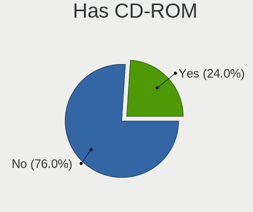
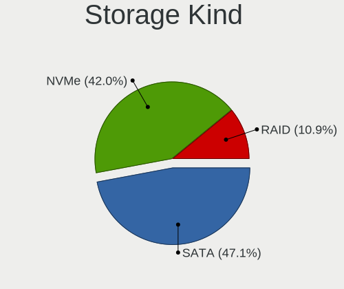
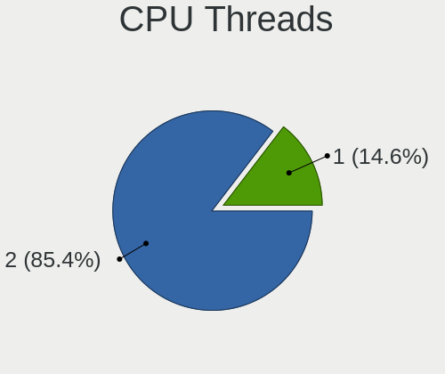
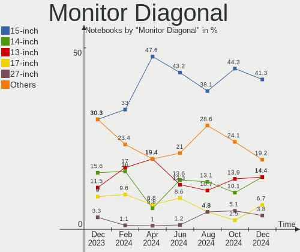
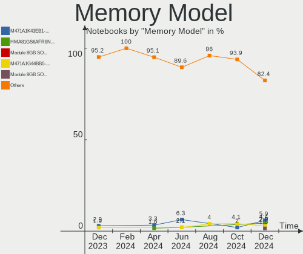
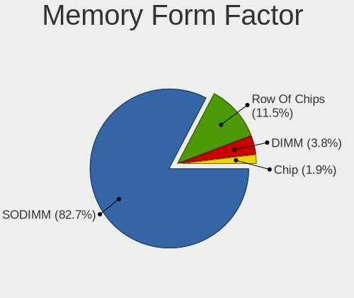

Linux in Canada - Hardware Trends (Notebooks)
---------------------------------------------

A project to identify most popular hardware characteristics and track their change
over time based on data collected by Linux users at https://Linux-Hardware.org.

Anyone can contribute to this report by the [hw-probe](https://github.com/linuxhw/hw-probe) tool:

    sudo -E hw-probe -all -upload

Period: Sep, 2022.

Contents
--------

* [ System ](#system)
  - [ OS                       ](#os)
  - [ OS Family                ](#os-family)
  - [ Kernel                   ](#kernel)
  - [ Kernel Family            ](#kernel-family)
  - [ Kernel Major Ver.        ](#kernel-major-ver)
  - [ Arch                     ](#arch)
  - [ DE                       ](#de)
  - [ Display Server           ](#display-server)
  - [ Display Manager          ](#display-manager)
  - [ OS Lang                  ](#os-lang)
  - [ Boot Mode                ](#boot-mode)
  - [ Filesystem               ](#filesystem)
  - [ Part. scheme             ](#part-scheme)
  - [ Dual Boot with Linux/BSD ](#dual-boot-with-linuxbsd)
  - [ Dual Boot (Win)          ](#dual-boot-win)

* [ Board ](#board)
  - [ Vendor                   ](#vendor)
  - [ Model                    ](#model)
  - [ Model Family             ](#model-family)
  - [ MFG Year                 ](#mfg-year)
  - [ Form Factor              ](#form-factor)
  - [ Secure Boot              ](#secure-boot)
  - [ Coreboot                 ](#coreboot)
  - [ RAM Size                 ](#ram-size)
  - [ RAM Used                 ](#ram-used)
  - [ Total Drives             ](#total-drives)
  - [ Has CD-ROM               ](#has-cd-rom)
  - [ Has Ethernet             ](#has-ethernet)
  - [ Has WiFi                 ](#has-wifi)
  - [ Has Bluetooth            ](#has-bluetooth)

* [ Location ](#location)
  - [ Country                  ](#country)
  - [ City                     ](#city)

* [ Drives ](#drives)
  - [ Drive Vendor             ](#drive-vendor)
  - [ Drive Model              ](#drive-model)
  - [ HDD Vendor               ](#hdd-vendor)
  - [ SSD Vendor               ](#ssd-vendor)
  - [ Drive Kind               ](#drive-kind)
  - [ Drive Connector          ](#drive-connector)
  - [ Drive Size               ](#drive-size)
  - [ Space Total              ](#space-total)
  - [ Space Used               ](#space-used)
  - [ Malfunc. Drives          ](#malfunc-drives)
  - [ Malfunc. Drive Vendor    ](#malfunc-drive-vendor)
  - [ Malfunc. HDD Vendor      ](#malfunc-hdd-vendor)
  - [ Malfunc. Drive Kind      ](#malfunc-drive-kind)
  - [ Failed Drives            ](#failed-drives)
  - [ Failed Drive Vendor      ](#failed-drive-vendor)
  - [ Drive Status             ](#drive-status)

* [ Storage controller ](#storage-controller)
  - [ Storage Vendor           ](#storage-vendor)
  - [ Storage Model            ](#storage-model)
  - [ Storage Kind             ](#storage-kind)

* [ Processor ](#processor)
  - [ CPU Vendor               ](#cpu-vendor)
  - [ CPU Model                ](#cpu-model)
  - [ CPU Model Family         ](#cpu-model-family)
  - [ CPU Cores                ](#cpu-cores)
  - [ CPU Sockets              ](#cpu-sockets)
  - [ CPU Threads              ](#cpu-threads)
  - [ CPU Op-Modes             ](#cpu-op-modes)
  - [ CPU Microcode            ](#cpu-microcode)
  - [ CPU Microarch            ](#cpu-microarch)

* [ Graphics ](#graphics)
  - [ GPU Vendor               ](#gpu-vendor)
  - [ GPU Model                ](#gpu-model)
  - [ GPU Combo                ](#gpu-combo)
  - [ GPU Driver               ](#gpu-driver)
  - [ GPU Memory               ](#gpu-memory)

* [ Monitor ](#monitor)
  - [ Monitor Vendor           ](#monitor-vendor)
  - [ Monitor Model            ](#monitor-model)
  - [ Monitor Resolution       ](#monitor-resolution)
  - [ Monitor Diagonal         ](#monitor-diagonal)
  - [ Monitor Width            ](#monitor-width)
  - [ Aspect Ratio             ](#aspect-ratio)
  - [ Monitor Area             ](#monitor-area)
  - [ Pixel Density            ](#pixel-density)
  - [ Multiple Monitors        ](#multiple-monitors)

* [ Network ](#network)
  - [ Net Controller Vendor    ](#net-controller-vendor)
  - [ Net Controller Model     ](#net-controller-model)
  - [ Wireless Vendor          ](#wireless-vendor)
  - [ Wireless Model           ](#wireless-model)
  - [ Ethernet Vendor          ](#ethernet-vendor)
  - [ Ethernet Model           ](#ethernet-model)
  - [ Net Controller Kind      ](#net-controller-kind)
  - [ Used Controller          ](#used-controller)
  - [ NICs                     ](#nics)
  - [ IPv6                     ](#ipv6)

* [ Bluetooth ](#bluetooth)
  - [ Bluetooth Vendor         ](#bluetooth-vendor)
  - [ Bluetooth Model          ](#bluetooth-model)

* [ Sound ](#sound)
  - [ Sound Vendor             ](#sound-vendor)
  - [ Sound Model              ](#sound-model)

* [ Memory ](#memory)
  - [ Memory Vendor            ](#memory-vendor)
  - [ Memory Model             ](#memory-model)
  - [ Memory Kind              ](#memory-kind)
  - [ Memory Form Factor       ](#memory-form-factor)
  - [ Memory Size              ](#memory-size)
  - [ Memory Speed             ](#memory-speed)

* [ Printers & scanners ](#printers--scanners)
  - [ Printer Vendor           ](#printer-vendor)
  - [ Printer Model            ](#printer-model)
  - [ Scanner Vendor           ](#scanner-vendor)
  - [ Scanner Model            ](#scanner-model)

* [ Camera ](#camera)
  - [ Camera Vendor            ](#camera-vendor)
  - [ Camera Model             ](#camera-model)

* [ Security ](#security)
  - [ Fingerprint Vendor       ](#fingerprint-vendor)
  - [ Fingerprint Model        ](#fingerprint-model)
  - [ Chipcard Vendor          ](#chipcard-vendor)
  - [ Chipcard Model           ](#chipcard-model)

* [ Unsupported ](#unsupported)
  - [ Unsupported Devices      ](#unsupported-devices)
  - [ Unsupported Device Types ](#unsupported-device-types)

System
------

OS
--

Installed operating systems

| Name                 | Notebooks | Percent |
|----------------------|-----------|---------|
| Fedora 36            | 10        | 14.29%  |
| Linux Mint 21        | 9         | 12.86%  |
| Ubuntu 22.04         | 8         | 11.43%  |
| SteamOS 3.3.1        | 5         | 7.14%   |
| Pop!_OS 22.04        | 4         | 5.71%   |
| Debian 11            | 4         | 5.71%   |
| Zorin 16             | 3         | 4.29%   |
| SteamOS 3.4          | 3         | 4.29%   |
| Linux Mint 20.3      | 3         | 4.29%   |
| Ubuntu 20.04         | 2         | 2.86%   |
| Kali 2022.3          | 2         | 2.86%   |
| Debian Testing       | 2         | 2.86%   |
| Ubuntu 18.04         | 1         | 1.43%   |
| SteamOS              | 1         | 1.43%   |
| Rocky Linux 9.0      | 1         | 1.43%   |
| OpenMandriva 4.3     | 1         | 1.43%   |
| Manjaro              | 1         | 1.43%   |
| Kubuntu 22.04        | 1         | 1.43%   |
| KDE neon 20.04       | 1         | 1.43%   |
| Gentoo 2.8           | 1         | 1.43%   |
| Garuda Linux Soaring | 1         | 1.43%   |
| Garuda Linux         | 1         | 1.43%   |
| Fedora 37            | 1         | 1.43%   |
| EndeavourOS Rolling  | 1         | 1.43%   |
| ArcoLinux Rolling    | 1         | 1.43%   |
| Arch Rolling         | 1         | 1.43%   |
| Arch                 | 1         | 1.43%   |

OS Family
---------

OS without a version

| Name         | Notebooks | Percent |
|--------------|-----------|---------|
| Linux Mint   | 12        | 17.14%  |
| Ubuntu       | 11        | 15.71%  |
| Fedora       | 11        | 15.71%  |
| SteamOS      | 9         | 12.86%  |
| Debian       | 6         | 8.57%   |
| Pop!_OS      | 4         | 5.71%   |
| Zorin        | 3         | 4.29%   |
| Kali         | 2         | 2.86%   |
| Garuda Linux | 2         | 2.86%   |
| Arch         | 2         | 2.86%   |
| Rocky Linux  | 1         | 1.43%   |
| OpenMandriva | 1         | 1.43%   |
| Manjaro      | 1         | 1.43%   |
| Kubuntu      | 1         | 1.43%   |
| KDE neon     | 1         | 1.43%   |
| Gentoo       | 1         | 1.43%   |
| EndeavourOS  | 1         | 1.43%   |
| ArcoLinux    | 1         | 1.43%   |

Kernel
------

Version of the Linux kernel

| Version                                                      | Notebooks | Percent |
|--------------------------------------------------------------|-----------|---------|
| 5.15.0-47-generic                                            | 13        | 18.57%  |
| 5.15.0-48-generic                                            | 6         | 8.57%   |
| 5.13.0-valve21.1-1-neptune-02211-gc54cda5a36f3               | 5         | 7.14%   |
| 5.19.0-76051900-generic                                      | 4         | 5.71%   |
| 5.19.9-200.fc36.x86_64                                       | 3         | 4.29%   |
| 5.15.0-46-generic                                            | 3         | 4.29%   |
| 5.13.0-valve24-1-neptune-02226-g5b8545e4c5a1                 | 3         | 4.29%   |
| 5.4.0-125-generic                                            | 2         | 2.86%   |
| 5.19.8-200.fc36.x86_64                                       | 2         | 2.86%   |
| 5.19.6-200.fc36.x86_64                                       | 2         | 2.86%   |
| 5.19.0-1-amd64                                               | 2         | 2.86%   |
| 5.10.0-16-amd64                                              | 2         | 2.86%   |
| 6.0.0-0.rc5.20220913gite839a756012b.38.vanilla.1.fc36.x86_64 | 1         | 1.43%   |
| 5.4.0-91-generic                                             | 1         | 1.43%   |
| 5.4.0-126-generic                                            | 1         | 1.43%   |
| 5.4.0-124-generic                                            | 1         | 1.43%   |
| 5.19.7-zen2-1-zen                                            | 1         | 1.43%   |
| 5.19.7-300.fc37.x86_64                                       | 1         | 1.43%   |
| 5.19.7-1-MANJARO                                             | 1         | 1.43%   |
| 5.19.2-arch1-1                                               | 1         | 1.43%   |
| 5.19.11-zen1-1-zen                                           | 1         | 1.43%   |
| 5.19.11-200.fc36.x86_64                                      | 1         | 1.43%   |
| 5.19.10-zen1-1-zen                                           | 1         | 1.43%   |
| 5.19.10-arch1-1                                              | 1         | 1.43%   |
| 5.19.10-200.fc36.x86_64                                      | 1         | 1.43%   |
| 5.18.0-kali7-amd64                                           | 1         | 1.43%   |
| 5.18.0-kali5-amd64                                           | 1         | 1.43%   |
| 5.16.7-desktop-1omv4003                                      | 1         | 1.43%   |
| 5.15.70-1-lts                                                | 1         | 1.43%   |
| 5.15.63-gentoo-dist                                          | 1         | 1.43%   |
| 5.15.54-1-lts                                                | 1         | 1.43%   |
| 5.15.0-43-generic                                            | 1         | 1.43%   |
| 5.14.0-70.22.1.el9_0.x86_64                                  | 1         | 1.43%   |
| 5.10.0-18-amd64                                              | 1         | 1.43%   |
| 5.10.0-17-amd64                                              | 1         | 1.43%   |

Kernel Family
-------------

Linux kernel without a distro release

| Version | Notebooks | Percent |
|---------|-----------|---------|
| 5.15.0  | 23        | 32.86%  |
| 5.13.0  | 8         | 11.43%  |
| 5.19.0  | 6         | 8.57%   |
| 5.4.0   | 5         | 7.14%   |
| 5.10.0  | 4         | 5.71%   |
| 5.19.9  | 3         | 4.29%   |
| 5.19.7  | 3         | 4.29%   |
| 5.19.10 | 3         | 4.29%   |
| 5.19.8  | 2         | 2.86%   |
| 5.19.6  | 2         | 2.86%   |
| 5.19.11 | 2         | 2.86%   |
| 5.18.0  | 2         | 2.86%   |
| 6.0.0   | 1         | 1.43%   |
| 5.19.2  | 1         | 1.43%   |
| 5.16.7  | 1         | 1.43%   |
| 5.15.70 | 1         | 1.43%   |
| 5.15.63 | 1         | 1.43%   |
| 5.15.54 | 1         | 1.43%   |
| 5.14.0  | 1         | 1.43%   |

Kernel Major Ver.
-----------------

Linux kernel major version

| Version | Notebooks | Percent |
|---------|-----------|---------|
| 5.15    | 26        | 37.14%  |
| 5.19    | 22        | 31.43%  |
| 5.13    | 8         | 11.43%  |
| 5.4     | 5         | 7.14%   |
| 5.10    | 4         | 5.71%   |
| 5.18    | 2         | 2.86%   |
| 6.0     | 1         | 1.43%   |
| 5.16    | 1         | 1.43%   |
| 5.14    | 1         | 1.43%   |

Arch
----

OS architecture (x86_64, i586, etc.)

| Name   | Notebooks | Percent |
|--------|-----------|---------|
| x86_64 | 70        | 100%    |

DE
--

Desktop Environment

| Name          | Notebooks | Percent |
|---------------|-----------|---------|
| GNOME         | 31        | 44.29%  |
| KDE5          | 19        | 27.14%  |
| X-Cinnamon    | 8         | 11.43%  |
| XFCE          | 3         | 4.29%   |
| Cinnamon      | 3         | 4.29%   |
| Unknown       | 2         | 2.86%   |
| Unity         | 1         | 1.43%   |
| qtile         | 1         | 1.43%   |
| MATE          | 1         | 1.43%   |
| Enlightenment | 1         | 1.43%   |

Display Server
--------------

X11 or Wayland

| Name    | Notebooks | Percent |
|---------|-----------|---------|
| X11     | 47        | 67.14%  |
| Wayland | 22        | 31.43%  |
| Tty     | 1         | 1.43%   |

Display Manager
---------------

SDDM, LightDM, etc.

| Name    | Notebooks | Percent |
|---------|-----------|---------|
| Unknown | 33        | 47.14%  |
| LightDM | 13        | 18.57%  |
| GDM3    | 12        | 17.14%  |
| SDDM    | 6         | 8.57%   |
| GDM     | 6         | 8.57%   |

OS Lang
-------

Language

| Lang  | Notebooks | Percent |
|-------|-----------|---------|
| en_CA | 40        | 57.14%  |
| en_US | 25        | 35.71%  |
| fr_FR | 2         | 2.86%   |
| fr_CA | 2         | 2.86%   |
| C     | 1         | 1.43%   |

Boot Mode
---------

EFI or BIOS

| Mode | Notebooks | Percent |
|------|-----------|---------|
| EFI  | 36        | 51.43%  |
| BIOS | 34        | 48.57%  |

Filesystem
----------

Type of filesystem

| Type    | Notebooks | Percent |
|---------|-----------|---------|
| Ext4    | 42        | 60%     |
| Btrfs   | 23        | 32.86%  |
| Overlay | 3         | 4.29%   |
| Zfs     | 1         | 1.43%   |
| Xfs     | 1         | 1.43%   |

Part. scheme
------------

Scheme of partitioning

| Type    | Notebooks | Percent |
|---------|-----------|---------|
| Unknown | 38        | 54.29%  |
| GPT     | 29        | 41.43%  |
| MBR     | 3         | 4.29%   |

Dual Boot with Linux/BSD
------------------------

Hosting more than one Linux/BSD

| Dual boot | Notebooks | Percent |
|-----------|-----------|---------|
| No        | 62        | 88.57%  |
| Yes       | 8         | 11.43%  |

Dual Boot (Win)
---------------

Hosting Linux and Windows

| Dual boot | Notebooks | Percent |
|-----------|-----------|---------|
| No        | 54        | 77.14%  |
| Yes       | 16        | 22.86%  |

Board
-----

Vendor
------

Motherboard manufacturer

| Name                | Notebooks | Percent |
|---------------------|-----------|---------|
| Lenovo              | 16        | 22.86%  |
| Dell                | 13        | 18.57%  |
| ASUSTek Computer    | 9         | 12.86%  |
| Valve               | 8         | 11.43%  |
| Hewlett-Packard     | 8         | 11.43%  |
| Acer                | 6         | 8.57%   |
| MSI                 | 3         | 4.29%   |
| Razer               | 2         | 2.86%   |
| Toshiba             | 1         | 1.43%   |
| Samsung Electronics | 1         | 1.43%   |
| Google              | 1         | 1.43%   |
| Gigabyte Technology | 1         | 1.43%   |
| Apple               | 1         | 1.43%   |

Model
-----

Motherboard model

| Name                                       | Notebooks | Percent |
|--------------------------------------------|-----------|---------|
| Valve Jupiter                              | 8         | 11.43%  |
| Toshiba Satellite P200                     | 1         | 1.43%   |
| Samsung 305E4A/305E5A/305E7A               | 1         | 1.43%   |
| Razer Blade 14 - RZ09-0370                 | 1         | 1.43%   |
| Razer Blade                                | 1         | 1.43%   |
| MSI GS65 Stealth 9SE                       | 1         | 1.43%   |
| MSI GE75 Raider 8SF                        | 1         | 1.43%   |
| MSI Alpha 15 B5EEK                         | 1         | 1.43%   |
| Lenovo ThinkPad X230 23252UU               | 1         | 1.43%   |
| Lenovo ThinkPad X1 Carbon Gen 8 20U9A005CD | 1         | 1.43%   |
| Lenovo ThinkPad T61p 64575KU               | 1         | 1.43%   |
| Lenovo ThinkPad T510 4349BR8               | 1         | 1.43%   |
| Lenovo ThinkPad T480 20L5001FUS            | 1         | 1.43%   |
| Lenovo ThinkPad T460 20FMS43J0V            | 1         | 1.43%   |
| Lenovo ThinkPad T430 2347G4U               | 1         | 1.43%   |
| Lenovo ThinkPad T410 2518F5U               | 1         | 1.43%   |
| Lenovo ThinkPad T410 2516CTO               | 1         | 1.43%   |
| Lenovo ThinkPad P17 Gen 1 20SQS28100       | 1         | 1.43%   |
| Lenovo ThinkPad L460 20FVS1BC0S            | 1         | 1.43%   |
| Lenovo ThinkPad Edge E530 3259CTO          | 1         | 1.43%   |
| Lenovo ThinkPad E15 Gen 4 21EDCTO1WW       | 1         | 1.43%   |
| Lenovo ThinkBook 13s G4 ARB 21AS           | 1         | 1.43%   |
| Lenovo IdeaPad 3 15IGL05 81WQ              | 1         | 1.43%   |
| Lenovo IdeaPad 3 15ARE05 81W4              | 1         | 1.43%   |
| HP ProBook 440 G8 Notebook PC              | 1         | 1.43%   |
| HP Pavilion Gaming Laptop 15-ec0xxx        | 1         | 1.43%   |
| HP Pavilion dv8000 (ET839UA#ABL)           | 1         | 1.43%   |
| HP Pavilion dv6700                         | 1         | 1.43%   |
| HP Pavilion Aero Laptop 13-be0xxx          | 1         | 1.43%   |
| HP Notebook                                | 1         | 1.43%   |
| HP Laptop 15-ef0xxx                        | 1         | 1.43%   |
| HP Laptop 15-dw3xxx                        | 1         | 1.43%   |
| Google Droid                               | 1         | 1.43%   |
| Gigabyte AORUS 15P YD                      | 1         | 1.43%   |
| Dell XPS 9315                              | 1         | 1.43%   |
| Dell XPS 15 7590                           | 1         | 1.43%   |
| Dell Vostro 3550                           | 1         | 1.43%   |
| Dell Latitude E6540                        | 1         | 1.43%   |
| Dell Latitude E6430                        | 1         | 1.43%   |
| Dell Latitude E5510                        | 1         | 1.43%   |

Model Family
------------

Motherboard model prefix

| Name               | Notebooks | Percent |
|--------------------|-----------|---------|
| Lenovo ThinkPad    | 13        | 18.57%  |
| Valve Jupiter      | 8         | 11.43%  |
| Dell Latitude      | 6         | 8.57%   |
| HP Pavilion        | 4         | 5.71%   |
| Dell Inspiron      | 4         | 5.71%   |
| ASUS VivoBook      | 3         | 4.29%   |
| Acer Aspire        | 3         | 4.29%   |
| Razer Blade        | 2         | 2.86%   |
| Lenovo IdeaPad     | 2         | 2.86%   |
| HP Laptop          | 2         | 2.86%   |
| Dell XPS           | 2         | 2.86%   |
| ASUS ROG           | 2         | 2.86%   |
| Acer Swift         | 2         | 2.86%   |
| Toshiba Satellite  | 1         | 1.43%   |
| Samsung 305E4A     | 1         | 1.43%   |
| MSI GS65           | 1         | 1.43%   |
| MSI GE75           | 1         | 1.43%   |
| MSI Alpha          | 1         | 1.43%   |
| Lenovo ThinkBook   | 1         | 1.43%   |
| HP ProBook         | 1         | 1.43%   |
| HP Notebook        | 1         | 1.43%   |
| Google Droid       | 1         | 1.43%   |
| Gigabyte AORUS     | 1         | 1.43%   |
| Dell Vostro        | 1         | 1.43%   |
| ASUS X553MA        | 1         | 1.43%   |
| ASUS K52N          | 1         | 1.43%   |
| ASUS GL502VMK      | 1         | 1.43%   |
| ASUS G73Jh         | 1         | 1.43%   |
| Apple MacBookPro14 | 1         | 1.43%   |
| Acer Nitro         | 1         | 1.43%   |

MFG Year
--------

Motherboard manufacture year

| Year | Notebooks | Percent |
|------|-----------|---------|
| 2022 | 13        | 18.57%  |
| 2020 | 10        | 14.29%  |
| 2021 | 8         | 11.43%  |
| 2019 | 7         | 10%     |
| 2009 | 5         | 7.14%   |
| 2012 | 4         | 5.71%   |
| 2010 | 4         | 5.71%   |
| 2018 | 3         | 4.29%   |
| 2017 | 3         | 4.29%   |
| 2016 | 3         | 4.29%   |
| 2007 | 3         | 4.29%   |
| 2011 | 2         | 2.86%   |
| 2015 | 1         | 1.43%   |
| 2014 | 1         | 1.43%   |
| 2013 | 1         | 1.43%   |
| 2008 | 1         | 1.43%   |
| 2006 | 1         | 1.43%   |

Form Factor
-----------

Physical design of the computer

| Name     | Notebooks | Percent |
|----------|-----------|---------|
| Notebook | 70        | 100%    |

Secure Boot
-----------

Enabled or disabled

| State    | Notebooks | Percent |
|----------|-----------|---------|
| Disabled | 66        | 94.29%  |
| Enabled  | 4         | 5.71%   |

Coreboot
--------

Have coreboot on board

| Used | Notebooks | Percent |
|------|-----------|---------|
| No   | 69        | 98.57%  |
| Yes  | 1         | 1.43%   |

RAM Size
--------

Total RAM memory

| Size in GB | Notebooks | Percent |
|------------|-----------|---------|
| 4.01-8.0   | 20        | 28.57%  |
| 8.01-16.0  | 20        | 28.57%  |
| 3.01-4.0   | 12        | 17.14%  |
| 16.01-24.0 | 10        | 14.29%  |
| 32.01-64.0 | 6         | 8.57%   |
| 24.01-32.0 | 1         | 1.43%   |
| 1.01-2.0   | 1         | 1.43%   |

RAM Used
--------

Used RAM memory

| Used GB   | Notebooks | Percent |
|-----------|-----------|---------|
| 1.01-2.0  | 21        | 30%     |
| 2.01-3.0  | 20        | 28.57%  |
| 4.01-8.0  | 15        | 21.43%  |
| 3.01-4.0  | 11        | 15.71%  |
| 8.01-16.0 | 1         | 1.43%   |
| 0.51-1.0  | 1         | 1.43%   |
| 0.01-0.5  | 1         | 1.43%   |

Total Drives
------------

Number of drives on board

| Drives | Notebooks | Percent |
|--------|-----------|---------|
| 1      | 44        | 62.86%  |
| 2      | 23        | 32.86%  |
| 3      | 3         | 4.29%   |

Has CD-ROM
----------

Has CD-ROM on board

| Presented | Notebooks | Percent |
|-----------|-----------|---------|
| No        | 51        | 72.86%  |
| Yes       | 19        | 27.14%  |

Has Ethernet
------------

Has Ethernet on board

| Presented | Notebooks | Percent |
|-----------|-----------|---------|
| Yes       | 47        | 67.14%  |
| No        | 23        | 32.86%  |

Has WiFi
--------

Has WiFi module

| Presented | Notebooks | Percent |
|-----------|-----------|---------|
| Yes       | 70        | 100%    |

Has Bluetooth
-------------

Has Bluetooth module

| Presented | Notebooks | Percent |
|-----------|-----------|---------|
| Yes       | 56        | 80%     |
| No        | 14        | 20%     |

Location
--------

Country
-------

Geographic location (country)

| Country | Notebooks | Percent |
|---------|-----------|---------|
| Canada  | 70        | 100%    |

City
----

Geographic location (city)

| City                     | Notebooks | Percent |
|--------------------------|-----------|---------|
| Montreal                 | 9         | 12.86%  |
| Toronto                  | 8         | 11.43%  |
| Calgary                  | 4         | 5.71%   |
| Boucherville             | 3         | 4.29%   |
| Richmond                 | 2         | 2.86%   |
| Regina                   | 2         | 2.86%   |
| Ottawa                   | 2         | 2.86%   |
| Mississauga              | 2         | 2.86%   |
| Milton                   | 2         | 2.86%   |
| Hamilton                 | 2         | 2.86%   |
| Brampton                 | 2         | 2.86%   |
| Winnipeg                 | 1         | 1.43%   |
| West Kelowna             | 1         | 1.43%   |
| Victoriaville            | 1         | 1.43%   |
| Victoria                 | 1         | 1.43%   |
| Vegreville               | 1         | 1.43%   |
| Vancouver                | 1         | 1.43%   |
| Surrey                   | 1         | 1.43%   |
| Stouffville              | 1         | 1.43%   |
| Simcoe                   | 1         | 1.43%   |
| Sherbrooke               | 1         | 1.43%   |
| Selkirk                  | 1         | 1.43%   |
| Scarborough              | 1         | 1.43%   |
| Saskatoon                | 1         | 1.43%   |
| Saint-Jean-sur-Richelieu | 1         | 1.43%   |
| Québec                  | 1         | 1.43%   |
| Prince George            | 1         | 1.43%   |
| Pickering                | 1         | 1.43%   |
| Orangeville              | 1         | 1.43%   |
| North Vancouver          | 1         | 1.43%   |
| North Bay                | 1         | 1.43%   |
| New Westminster          | 1         | 1.43%   |
| Merritt                  | 1         | 1.43%   |
| Longueuil                | 1         | 1.43%   |
| Leduc                    | 1         | 1.43%   |
| L'Ancienne-Lorette       | 1         | 1.43%   |
| Kingston                 | 1         | 1.43%   |
| Grand Forks              | 1         | 1.43%   |
| Gatineau                 | 1         | 1.43%   |
| Edmonton                 | 1         | 1.43%   |

Drives
------

Drive Vendor
------------

Hard drive vendors

| Vendor                      | Notebooks | Drives | Percent |
|-----------------------------|-----------|--------|---------|
| Samsung Electronics         | 14        | 16     | 14.29%  |
| WDC                         | 11        | 11     | 11.22%  |
| Unknown                     | 9         | 10     | 9.18%   |
| Kingston                    | 9         | 9      | 9.18%   |
| Toshiba                     | 7         | 7      | 7.14%   |
| Seagate                     | 6         | 6      | 6.12%   |
| SanDisk                     | 6         | 6      | 6.12%   |
| Intel                       | 5         | 5      | 5.1%    |
| Phison                      | 4         | 5      | 4.08%   |
| KIOXIA                      | 3         | 3      | 3.06%   |
| HGST                        | 3         | 3      | 3.06%   |
| Crucial                     | 3         | 3      | 3.06%   |
| SPCC                        | 2         | 2      | 2.04%   |
| SK hynix                    | 2         | 2      | 2.04%   |
| Phison Electronics          | 2         | 2      | 2.04%   |
| Kingston Technology Company | 2         | 2      | 2.04%   |
| Realtek Semiconductor       | 1         | 1      | 1.02%   |
| OCZ                         | 1         | 1      | 1.02%   |
| Mushkin                     | 1         | 1      | 1.02%   |
| Micron Technology           | 1         | 1      | 1.02%   |
| Kingchuxing                 | 1         | 2      | 1.02%   |
| Fujitsu                     | 1         | 1      | 1.02%   |
| DF4064                      | 1         | 1      | 1.02%   |
| China                       | 1         | 1      | 1.02%   |
| ADATA Technology            | 1         | 1      | 1.02%   |
| A-DATA Technology           | 1         | 1      | 1.02%   |

Drive Model
-----------

Hard drive models

| Model                                               | Notebooks | Percent |
|-----------------------------------------------------|-----------|---------|
| Phison NVMe SSD Drive 512GB                         | 3         | 2.91%   |
| Samsung SSD 850 EVO 250GB                           | 2         | 1.94%   |
| Samsung NVMe SSD Controller SM981/PM981/PM983 256GB | 2         | 1.94%   |
| Kingston NVMe SSD Drive 512GB                       | 2         | 1.94%   |
| Kingston NVMe SSD Drive 256GB                       | 2         | 1.94%   |
| WDC WDBNCE5000PNC 500GB SSD                         | 1         | 0.97%   |
| WDC WD7500BPKT-60PK4T0 752GB                        | 1         | 0.97%   |
| WDC WD5000LPLX-00ZNTT0 500GB                        | 1         | 0.97%   |
| WDC WD5000LPCX-75VHAT0 500GB                        | 1         | 0.97%   |
| WDC WD3200BEVT-22ZCT0 320GB                         | 1         | 0.97%   |
| WDC WD3200BEKT-75PVMT0 320GB                        | 1         | 0.97%   |
| WDC WD10SPZX-75Z10T1 1TB                            | 1         | 0.97%   |
| WDC WD10SPZX-60Z10T1 1TB                            | 1         | 0.97%   |
| WDC PC SN730 SDBQNTY-512G-1001 512GB                | 1         | 0.97%   |
| WDC PC SN530 SDBPNPZ-512G-1114 512GB                | 1         | 0.97%   |
| WDC PC SN530 SDBPMPZ-256G-1101 256GB                | 1         | 0.97%   |
| Unknown TA2964  64GB                                | 1         | 0.97%   |
| Unknown SU08G  8GB                                  | 1         | 0.97%   |
| Unknown NCard  16GB                                 | 1         | 0.97%   |
| Unknown MMC Card  512GB                             | 1         | 0.97%   |
| Unknown MMC Card  500GB                             | 1         | 0.97%   |
| Unknown MMC Card  393GB                             | 1         | 0.97%   |
| Unknown MMC Card  16GB                              | 1         | 0.97%   |
| Unknown MMC Card  128GB                             | 1         | 0.97%   |
| Unknown MMC Card  1073GB                            | 1         | 0.97%   |
| Unknown DA4064  64GB                                | 1         | 0.97%   |
| Toshiba THNSNF128GMCS 128GB SSD                     | 1         | 0.97%   |
| Toshiba THNSNC512GBSJ SSD                           | 1         | 0.97%   |
| Toshiba MQ04ABF100 1TB                              | 1         | 0.97%   |
| Toshiba MQ01ABD100V -63 1TB                         | 1         | 0.97%   |
| Toshiba MQ01ABD100 1TB                              | 1         | 0.97%   |
| Toshiba MK6465GSX 640GB                             | 1         | 0.97%   |
| Toshiba MK5055GSX 500GB                             | 1         | 0.97%   |
| SPCC Solid State Disk 512GB                         | 1         | 0.97%   |
| SPCC Solid State Disk 256GB                         | 1         | 0.97%   |
| SK hynix SKHynix_HFS001TD9TNI-L2B0B 1TB             | 1         | 0.97%   |
| SK hynix BC711 HFM512GD3JX013N 512GB                | 1         | 0.97%   |
| Seagate ST95005620AS 500GB                          | 1         | 0.97%   |
| Seagate ST2000LX001-1RG174 2TB                      | 1         | 0.97%   |
| Seagate ST2000LM003 HN-M201RAD 2TB                  | 1         | 0.97%   |

HDD Vendor
----------

Hard disk drive vendors

| Vendor              | Notebooks | Drives | Percent |
|---------------------|-----------|--------|---------|
| WDC                 | 7         | 7      | 31.82%  |
| Toshiba             | 5         | 5      | 22.73%  |
| Seagate             | 5         | 5      | 22.73%  |
| HGST                | 3         | 3      | 13.64%  |
| Samsung Electronics | 1         | 1      | 4.55%   |
| Fujitsu             | 1         | 1      | 4.55%   |

SSD Vendor
----------

Solid state drive vendors

| Vendor              | Notebooks | Drives | Percent |
|---------------------|-----------|--------|---------|
| Samsung Electronics | 3         | 4      | 13.64%  |
| Crucial             | 3         | 3      | 13.64%  |
| Toshiba             | 2         | 2      | 9.09%   |
| SPCC                | 2         | 2      | 9.09%   |
| SanDisk             | 2         | 2      | 9.09%   |
| Kingston            | 2         | 2      | 9.09%   |
| WDC                 | 1         | 1      | 4.55%   |
| Seagate             | 1         | 1      | 4.55%   |
| OCZ                 | 1         | 1      | 4.55%   |
| Mushkin             | 1         | 1      | 4.55%   |
| Kingchuxing         | 1         | 1      | 4.55%   |
| Intel               | 1         | 1      | 4.55%   |
| China               | 1         | 1      | 4.55%   |
| A-DATA Technology   | 1         | 1      | 4.55%   |

Drive Kind
----------

HDD or SSD

| Kind    | Notebooks | Drives | Percent |
|---------|-----------|--------|---------|
| NVMe    | 39        | 46     | 43.33%  |
| HDD     | 21        | 22     | 23.33%  |
| SSD     | 19        | 23     | 21.11%  |
| MMC     | 9         | 10     | 10%     |
| Unknown | 2         | 2      | 2.22%   |

Drive Connector
---------------

SATA, SAS, NVMe, etc.

| Type | Notebooks | Drives | Percent |
|------|-----------|--------|---------|
| NVMe | 39        | 46     | 45.35%  |
| SATA | 37        | 46     | 43.02%  |
| MMC  | 9         | 10     | 10.47%  |
| SAS  | 1         | 1      | 1.16%   |

Drive Size
----------

Size of hard drive

| Size in TB | Notebooks | Drives | Percent |
|------------|-----------|--------|---------|
| 0.01-0.5   | 21        | 25     | 55.26%  |
| 0.51-1.0   | 15        | 17     | 39.47%  |
| 1.01-2.0   | 2         | 3      | 5.26%   |

Space Total
-----------

Amount of disk space available on the file system

| Size in GB     | Notebooks | Percent |
|----------------|-----------|---------|
| 251-500        | 22        | 31.43%  |
| 101-250        | 19        | 27.14%  |
| 501-1000       | 11        | 15.71%  |
| 1-20           | 6         | 8.57%   |
| More than 3000 | 4         | 5.71%   |
| 51-100         | 4         | 5.71%   |
| 1001-2000      | 3         | 4.29%   |
| Unknown        | 1         | 1.43%   |

Space Used
----------

Amount of used disk space

| Used GB        | Notebooks | Percent |
|----------------|-----------|---------|
| 1-20           | 25        | 35.71%  |
| 251-500        | 12        | 17.14%  |
| 21-50          | 12        | 17.14%  |
| 101-250        | 11        | 15.71%  |
| 51-100         | 7         | 10%     |
| More than 3000 | 1         | 1.43%   |
| 2001-3000      | 1         | 1.43%   |
| Unknown        | 1         | 1.43%   |

Malfunc. Drives
---------------

Drive models with a malfunction

| Model                             | Notebooks | Drives | Percent |
|-----------------------------------|-----------|--------|---------|
| WDC WD7500BPKT-60PK4T0 752GB      | 1         | 1      | 33.33%  |
| Seagate ST1000LM014-1EJ164 1TB    | 1         | 1      | 33.33%  |
| Samsung Electronics HM160HC 160GB | 1         | 1      | 33.33%  |

Malfunc. Drive Vendor
---------------------

Vendors of faulty drives

| Vendor              | Notebooks | Drives | Percent |
|---------------------|-----------|--------|---------|
| WDC                 | 1         | 1      | 33.33%  |
| Seagate             | 1         | 1      | 33.33%  |
| Samsung Electronics | 1         | 1      | 33.33%  |

Malfunc. HDD Vendor
-------------------

Vendors of faulty HDD drives

| Vendor              | Notebooks | Drives | Percent |
|---------------------|-----------|--------|---------|
| WDC                 | 1         | 1      | 33.33%  |
| Seagate             | 1         | 1      | 33.33%  |
| Samsung Electronics | 1         | 1      | 33.33%  |

Malfunc. Drive Kind
-------------------

Kinds of faulty drives

| Kind | Notebooks | Drives | Percent |
|------|-----------|--------|---------|
| HDD  | 3         | 3      | 100%    |

Failed Drives
-------------

Failed drive models

Zero info for selected period =(

Failed Drive Vendor
-------------------

Failed drive vendors

Zero info for selected period =(

Drive Status
------------

Number of failed and malfunc. drives

| Status   | Notebooks | Drives | Percent |
|----------|-----------|--------|---------|
| Detected | 44        | 66     | 58.67%  |
| Works    | 28        | 34     | 37.33%  |
| Malfunc  | 3         | 3      | 4%      |

Storage controller
------------------

Storage Vendor
--------------

Storage controller vendors

| Vendor                      | Notebooks | Percent |
|-----------------------------|-----------|---------|
| Intel                       | 39        | 43.33%  |
| Samsung Electronics         | 10        | 11.11%  |
| AMD                         | 10        | 11.11%  |
| Kingston Technology Company | 9         | 10%     |
| SanDisk                     | 7         | 7.78%   |
| Phison Electronics          | 6         | 6.67%   |
| KIOXIA                      | 3         | 3.33%   |
| SK hynix                    | 2         | 2.22%   |
| Realtek Semiconductor       | 1         | 1.11%   |
| Nvidia                      | 1         | 1.11%   |
| Micron Technology           | 1         | 1.11%   |
| ADATA Technology            | 1         | 1.11%   |

Storage Model
-------------

Storage controller models

| Model                                                                 | Notebooks | Percent |
|-----------------------------------------------------------------------|-----------|---------|
| AMD FCH SATA Controller [AHCI mode]                                   | 8         | 8.42%   |
| Samsung NVMe SSD Controller SM981/PM981/PM983                         | 5         | 5.26%   |
| Kingston Company OM3PDP3 NVMe SSD                                     | 5         | 5.26%   |
| Intel Sunrise Point-LP SATA Controller [AHCI mode]                    | 4         | 4.21%   |
| Intel Cannon Lake Mobile PCH SATA AHCI Controller                     | 4         | 4.21%   |
| Intel 5 Series/3400 Series Chipset 6 port SATA AHCI Controller        | 4         | 4.21%   |
| Phison PS5013 E13 NVMe Controller                                     | 3         | 3.16%   |
| Intel Volume Management Device NVMe RAID Controller                   | 3         | 3.16%   |
| Intel Celeron/Pentium Silver Processor SATA Controller                | 3         | 3.16%   |
| Intel 82801 Mobile SATA Controller [RAID mode]                        | 3         | 3.16%   |
| Intel 7 Series Chipset Family 6-port SATA Controller [AHCI mode]      | 3         | 3.16%   |
| SanDisk WD Blue SN570 NVMe SSD                                        | 2         | 2.11%   |
| SanDisk WD Blue SN550 NVMe SSD                                        | 2         | 2.11%   |
| Samsung NVMe SSD Controller SM961/PM961/SM963                         | 2         | 2.11%   |
| Samsung NVMe SSD Controller PM9A1/PM9A3/980PRO                        | 2         | 2.11%   |
| KIOXIA Non-Volatile memory controller                                 | 2         | 2.11%   |
| Kingston Company U-SNS8154P3 NVMe SSD                                 | 2         | 2.11%   |
| Intel SSD 660P Series                                                 | 2         | 2.11%   |
| Intel Non-Volatile memory controller                                  | 2         | 2.11%   |
| Intel 82801IBM/IEM (ICH9M/ICH9M-E) 4 port SATA Controller [AHCI mode] | 2         | 2.11%   |
| Intel 82801HM/HEM (ICH8M/ICH8M-E) SATA Controller [AHCI mode]         | 2         | 2.11%   |
| Intel 82801HM/HEM (ICH8M/ICH8M-E) IDE Controller                      | 2         | 2.11%   |
| Intel 5 Series/3400 Series Chipset 4 port SATA AHCI Controller        | 2         | 2.11%   |
| SK hynix Non-Volatile memory controller                               | 1         | 1.05%   |
| SK hynix Gold P31 SSD                                                 | 1         | 1.05%   |
| SanDisk WD Black SN750 / PC SN730 NVMe SSD                            | 1         | 1.05%   |
| SanDisk WD Black 2018/SN750 / PC SN720 NVMe SSD                       | 1         | 1.05%   |
| SanDisk Non-Volatile memory controller                                | 1         | 1.05%   |
| Samsung NVMe SSD Controller 980                                       | 1         | 1.05%   |
| Realtek RTS5763DL NVMe SSD Controller                                 | 1         | 1.05%   |
| Phison Electronics Non-Volatile memory controller                     | 1         | 1.05%   |
| Phison E16 PCIe4 NVMe Controller                                      | 1         | 1.05%   |
| Phison E12 NVMe Controller                                            | 1         | 1.05%   |
| Nvidia MCP67 IDE Controller                                           | 1         | 1.05%   |
| Nvidia MCP67 AHCI Controller                                          | 1         | 1.05%   |
| Micron Non-Volatile memory controller                                 | 1         | 1.05%   |
| KIOXIA NVMe SSD Controller BG4                                        | 1         | 1.05%   |
| Kingston Company Company Non-Volatile memory controller               | 1         | 1.05%   |
| Kingston Company A2000 NVMe SSD                                       | 1         | 1.05%   |
| Intel Tiger Lake-LP SATA Controller                                   | 1         | 1.05%   |

Storage Kind
------------

Kind of storage controller (IDE, SATA, NVMe, SAS, ...)

| Kind | Notebooks | Percent |
|------|-----------|---------|
| NVMe | 39        | 44.32%  |
| SATA | 38        | 43.18%  |
| RAID | 6         | 6.82%   |
| IDE  | 5         | 5.68%   |

Processor
---------

CPU Vendor
----------

Processor vendors

| Vendor | Notebooks | Percent |
|--------|-----------|---------|
| Intel  | 44        | 62.86%  |
| AMD    | 26        | 37.14%  |

CPU Model
---------

Processor models

| Model                                         | Notebooks | Percent |
|-----------------------------------------------|-----------|---------|
| AMD Custom APU 0405                           | 8         | 11.43%  |
| Intel Core i5-3320M CPU @ 2.60GHz             | 3         | 4.29%   |
| Intel Celeron N4020 CPU @ 1.10GHz             | 3         | 4.29%   |
| Intel Core i7-9750H CPU @ 2.60GHz             | 2         | 2.86%   |
| Intel Core i7-8750H CPU @ 2.20GHz             | 2         | 2.86%   |
| Intel Core i7-7700HQ CPU @ 2.80GHz            | 2         | 2.86%   |
| Intel Core i5 CPU M 560 @ 2.67GHz             | 2         | 2.86%   |
| Intel Core i5 CPU M 520 @ 2.40GHz             | 2         | 2.86%   |
| Intel 11th Gen Core i5-1135G7 @ 2.40GHz       | 2         | 2.86%   |
| AMD Ryzen 9 5900HX with Radeon Graphics       | 2         | 2.86%   |
| AMD Ryzen 5 3500U with Radeon Vega Mobile Gfx | 2         | 2.86%   |
| Intel Pentium CPU N3710 @ 1.60GHz             | 1         | 1.43%   |
| Intel Pentium CPU N3530 @ 2.16GHz             | 1         | 1.43%   |
| Intel Genuine CPU U2700 @ 1.30GHz             | 1         | 1.43%   |
| Intel Core i7-8650U CPU @ 1.90GHz             | 1         | 1.43%   |
| Intel Core i7-4810MQ CPU @ 2.80GHz            | 1         | 1.43%   |
| Intel Core i7-10750H CPU @ 2.60GHz            | 1         | 1.43%   |
| Intel Core i7 CPU Q 740 @ 1.73GHz             | 1         | 1.43%   |
| Intel Core i5-9300H CPU @ 2.40GHz             | 1         | 1.43%   |
| Intel Core i5-7360U CPU @ 2.30GHz             | 1         | 1.43%   |
| Intel Core i5-7200U CPU @ 2.50GHz             | 1         | 1.43%   |
| Intel Core i5-6300U CPU @ 2.40GHz             | 1         | 1.43%   |
| Intel Core i5-6200U CPU @ 2.30GHz             | 1         | 1.43%   |
| Intel Core i5-3210M CPU @ 2.50GHz             | 1         | 1.43%   |
| Intel Core i5-2430M CPU @ 2.40GHz             | 1         | 1.43%   |
| Intel Core i5-1035G1 CPU @ 1.00GHz            | 1         | 1.43%   |
| Intel Core i5-10210U CPU @ 1.60GHz            | 1         | 1.43%   |
| Intel Core i5 CPU M 540 @ 2.53GHz             | 1         | 1.43%   |
| Intel Core 2 Duo CPU T7700 @ 2.40GHz          | 1         | 1.43%   |
| Intel Core 2 Duo CPU T6600 @ 2.20GHz          | 1         | 1.43%   |
| Intel Core 2 Duo CPU T5250 @ 1.50GHz          | 1         | 1.43%   |
| Intel Core 2 Duo CPU P9600 @ 2.53GHz          | 1         | 1.43%   |
| Intel Celeron N4100 CPU @ 1.10GHz             | 1         | 1.43%   |
| Intel Celeron CPU 3955U @ 2.00GHz             | 1         | 1.43%   |
| Intel 12th Gen Core i7-1250U                  | 1         | 1.43%   |
| Intel 11th Gen Core i9-11900H @ 2.50GHz       | 1         | 1.43%   |
| Intel 11th Gen Core i7-11800H @ 2.30GHz       | 1         | 1.43%   |
| AMD Turion II P540 Dual-Core Processor        | 1         | 1.43%   |
| AMD Turion 64 X2 Mobile Technology TL-60      | 1         | 1.43%   |
| AMD Turion 64 Mobile Technology ML-32         | 1         | 1.43%   |

CPU Model Family
----------------

Processor model prefix

| Model                   | Notebooks | Percent |
|-------------------------|-----------|---------|
| Intel Core i5           | 17        | 24.29%  |
| Other                   | 13        | 18.57%  |
| Intel Core i7           | 10        | 14.29%  |
| AMD Ryzen 5             | 7         | 10%     |
| Intel Celeron           | 5         | 7.14%   |
| Intel Core 2 Duo        | 4         | 5.71%   |
| AMD Ryzen 7             | 4         | 5.71%   |
| Intel Pentium           | 2         | 2.86%   |
| AMD Ryzen 9             | 2         | 2.86%   |
| Intel Genuine           | 1         | 1.43%   |
| AMD Turion II           | 1         | 1.43%   |
| AMD Turion 64 X2 Mobile | 1         | 1.43%   |
| AMD Turion 64 Mobile    | 1         | 1.43%   |
| AMD A4                  | 1         | 1.43%   |
| AMD A10                 | 1         | 1.43%   |

CPU Cores
---------

Number of processor cores

| Number | Notebooks | Percent |
|--------|-----------|---------|
| 2      | 26        | 37.14%  |
| 4      | 25        | 35.71%  |
| 8      | 8         | 11.43%  |
| 6      | 8         | 11.43%  |
| 1      | 2         | 2.86%   |
| 10     | 1         | 1.43%   |

CPU Sockets
-----------

Number of sockets

| Number | Notebooks | Percent |
|--------|-----------|---------|
| 1      | 70        | 100%    |

CPU Threads
-----------

Threads per core (Hyper-Threading)

| Number | Notebooks | Percent |
|--------|-----------|---------|
| 2      | 51        | 72.86%  |
| 1      | 19        | 27.14%  |

CPU Op-Modes
------------

CPU Operation Modes (32-bit, 64-bit)

| Op mode        | Notebooks | Percent |
|----------------|-----------|---------|
| 32-bit, 64-bit | 70        | 100%    |

CPU Microcode
-------------

Microcode number

| Number     | Notebooks | Percent |
|------------|-----------|---------|
| Unknown    | 18        | 25.71%  |
| 0x906ea    | 5         | 7.14%   |
| 0x0a50000c | 5         | 7.14%   |
| 0x306a9    | 4         | 5.71%   |
| 0x706a8    | 3         | 4.29%   |
| 0x406e3    | 3         | 4.29%   |
| 0x20655    | 3         | 4.29%   |
| 0x1067a    | 3         | 4.29%   |
| 0x08108109 | 3         | 4.29%   |
| 0x906e9    | 2         | 2.86%   |
| 0x806e9    | 2         | 2.86%   |
| 0x20652    | 2         | 2.86%   |
| 0xa0652    | 1         | 1.43%   |
| 0x906a4    | 1         | 1.43%   |
| 0x806ec    | 1         | 1.43%   |
| 0x806ea    | 1         | 1.43%   |
| 0x806d1    | 1         | 1.43%   |
| 0x706e5    | 1         | 1.43%   |
| 0x706a1    | 1         | 1.43%   |
| 0x6fd      | 1         | 1.43%   |
| 0x6fa      | 1         | 1.43%   |
| 0x406c4    | 1         | 1.43%   |
| 0x306c3    | 1         | 1.43%   |
| 0x30678    | 1         | 1.43%   |
| 0x106e5    | 1         | 1.43%   |
| 0x0a404102 | 1         | 1.43%   |
| 0x08600106 | 1         | 1.43%   |
| 0x08600102 | 1         | 1.43%   |
| 0x0810100b | 1         | 1.43%   |

CPU Microarch
-------------

Microarchitecture

| Name          | Notebooks | Percent |
|---------------|-----------|---------|
| KabyLake      | 11        | 15.71%  |
| Unknown       | 11        | 15.71%  |
| Zen 3         | 6         | 8.57%   |
| Westmere      | 5         | 7.14%   |
| IvyBridge     | 4         | 5.71%   |
| Goldmont plus | 4         | 5.71%   |
| Zen+          | 3         | 4.29%   |
| Skylake       | 3         | 4.29%   |
| Penryn        | 3         | 4.29%   |
| Zen 2         | 2         | 2.86%   |
| TigerLake     | 2         | 2.86%   |
| Silvermont    | 2         | 2.86%   |
| K8 Hammer     | 2         | 2.86%   |
| Icelake       | 2         | 2.86%   |
| Core          | 2         | 2.86%   |
| Zen           | 1         | 1.43%   |
| SandyBridge   | 1         | 1.43%   |
| Nehalem       | 1         | 1.43%   |
| K10 Llano     | 1         | 1.43%   |
| K10           | 1         | 1.43%   |
| Haswell       | 1         | 1.43%   |
| Excavator     | 1         | 1.43%   |
| CometLake     | 1         | 1.43%   |

Graphics
--------

GPU Vendor
----------

Vendors of graphics cards

| Vendor | Notebooks | Percent |
|--------|-----------|---------|
| Intel  | 38        | 45.24%  |
| AMD    | 29        | 34.52%  |
| Nvidia | 17        | 20.24%  |

GPU Model
---------

Graphics card models

| Model                                                                                    | Notebooks | Percent |
|------------------------------------------------------------------------------------------|-----------|---------|
| AMD VanGogh [AMD Custom GPU 0405]                                                        | 8         | 9.2%    |
| Intel CoffeeLake-H GT2 [UHD Graphics 630]                                                | 5         | 5.75%   |
| Intel GeminiLake [UHD Graphics 600]                                                      | 4         | 4.6%    |
| Intel 3rd Gen Core processor Graphics Controller                                         | 4         | 4.6%    |
| AMD Cezanne                                                                              | 4         | 4.6%    |
| Nvidia GA104M [GeForce RTX 3080 Mobile / Max-Q 8GB/16GB]                                 | 3         | 3.45%   |
| Intel Mobile 4 Series Chipset Integrated Graphics Controller                             | 3         | 3.45%   |
| Intel Core Processor Integrated Graphics Controller                                      | 3         | 3.45%   |
| AMD Picasso/Raven 2 [Radeon Vega Series / Radeon Vega Mobile Series]                     | 3         | 3.45%   |
| Nvidia TU117M [GeForce GTX 1650 Mobile / Max-Q]                                          | 2         | 2.3%    |
| Nvidia GT218M [NVS 3100M]                                                                | 2         | 2.3%    |
| Intel TigerLake-LP GT2 [Iris Xe Graphics]                                                | 2         | 2.3%    |
| Intel TigerLake-H GT1 [UHD Graphics]                                                     | 2         | 2.3%    |
| Intel Skylake GT2 [HD Graphics 520]                                                      | 2         | 2.3%    |
| AMD Renoir                                                                               | 2         | 2.3%    |
| AMD Barcelo                                                                              | 2         | 2.3%    |
| Nvidia TU117GLM [Quadro T2000 Mobile / Max-Q]                                            | 1         | 1.15%   |
| Nvidia TU106M [GeForce RTX 2070 Mobile]                                                  | 1         | 1.15%   |
| Nvidia TU106M [GeForce RTX 2060 Mobile]                                                  | 1         | 1.15%   |
| Nvidia GP107M [GeForce GTX 1050 Mobile]                                                  | 1         | 1.15%   |
| Nvidia GP107M [GeForce GTX 1050 3 GB Max-Q]                                              | 1         | 1.15%   |
| Nvidia GP106M [GeForce GTX 1060 Mobile]                                                  | 1         | 1.15%   |
| Nvidia GP106BM [GeForce GTX 1060 Mobile 6GB]                                             | 1         | 1.15%   |
| Nvidia GF108M [NVS 5400M]                                                                | 1         | 1.15%   |
| Nvidia G84GLM [Quadro FX 570M]                                                           | 1         | 1.15%   |
| Nvidia C67 [GeForce 7150M / nForce 630M]                                                 | 1         | 1.15%   |
| Intel VGA compatible controller                                                          | 1         | 1.15%   |
| Intel UHD Graphics 620                                                                   | 1         | 1.15%   |
| Intel Iris Plus Graphics G1 (Ice Lake)                                                   | 1         | 1.15%   |
| Intel Iris Plus Graphics 640                                                             | 1         | 1.15%   |
| Intel HD Graphics 630                                                                    | 1         | 1.15%   |
| Intel HD Graphics 620                                                                    | 1         | 1.15%   |
| Intel HD Graphics 510                                                                    | 1         | 1.15%   |
| Intel CometLake-U GT2 [UHD Graphics]                                                     | 1         | 1.15%   |
| Intel CometLake-H GT2 [UHD Graphics]                                                     | 1         | 1.15%   |
| Intel Atom/Celeron/Pentium Processor x5-E8000/J3xxx/N3xxx Integrated Graphics Controller | 1         | 1.15%   |
| Intel Atom Processor Z36xxx/Z37xxx Series Graphics & Display                             | 1         | 1.15%   |
| Intel 4th Gen Core Processor Integrated Graphics Controller                              | 1         | 1.15%   |
| Intel 2nd Generation Core Processor Family Integrated Graphics Controller                | 1         | 1.15%   |
| AMD Whistler [Radeon HD 6630M/6650M/6750M/7670M/7690M]                                   | 1         | 1.15%   |

GPU Combo
---------

Combinations of graphics cards

| Name           | Notebooks | Percent |
|----------------|-----------|---------|
| 1 x Intel      | 26        | 37.14%  |
| 1 x AMD        | 22        | 31.43%  |
| Intel + Nvidia | 10        | 14.29%  |
| 1 x Nvidia     | 5         | 7.14%   |
| 2 x AMD        | 3         | 4.29%   |
| Intel + AMD    | 2         | 2.86%   |
| AMD + Nvidia   | 2         | 2.86%   |

GPU Driver
----------

Free vs proprietary

| Driver      | Notebooks | Percent |
|-------------|-----------|---------|
| Free        | 65        | 92.86%  |
| Proprietary | 5         | 7.14%   |

GPU Memory
----------

Total video memory

| Size in GB | Notebooks | Percent |
|------------|-----------|---------|
| Unknown    | 42        | 60%     |
| 0.01-0.5   | 11        | 15.71%  |
| 3.01-4.0   | 4         | 5.71%   |
| 1.01-2.0   | 4         | 5.71%   |
| 0.51-1.0   | 3         | 4.29%   |
| 7.01-8.0   | 2         | 2.86%   |
| 5.01-6.0   | 2         | 2.86%   |
| 2.01-3.0   | 2         | 2.86%   |

Monitor
-------

Monitor Vendor
--------------

Monitor vendors

| Vendor                  | Notebooks | Percent |
|-------------------------|-----------|---------|
| Chimei Innolux          | 11        | 13.41%  |
| AU Optronics            | 11        | 13.41%  |
| LG Display              | 9         | 10.98%  |
| BOE                     | 8         | 9.76%   |
| Samsung Electronics     | 5         | 6.1%    |
| Goldstar                | 5         | 6.1%    |
| ANX                     | 5         | 6.1%    |
| Sharp                   | 4         | 4.88%   |
| Lenovo                  | 4         | 4.88%   |
| Chi Mei Optoelectronics | 4         | 4.88%   |
| Valve                   | 3         | 3.66%   |
| Toshiba                 | 2         | 2.44%   |
| TMX                     | 2         | 2.44%   |
| LG Philips              | 2         | 2.44%   |
| ViewSonic               | 1         | 1.22%   |
| MSI                     | 1         | 1.22%   |
| Hewlett-Packard         | 1         | 1.22%   |
| GreenWood               | 1         | 1.22%   |
| Dell                    | 1         | 1.22%   |
| BenQ                    | 1         | 1.22%   |
| Apple                   | 1         | 1.22%   |

Monitor Model
-------------

Monitor models

| Model                                                                    | Notebooks | Percent |
|--------------------------------------------------------------------------|-----------|---------|
| ANX ANX7530 U ANX7539 800x1280                                           | 5         | 6.1%    |
| Valve ANX7530 U VLV3001 800x1280 100x150mm 7.1-inch                      | 3         | 3.66%   |
| Chimei Innolux LCD Monitor CMN15F5 1920x1080 344x193mm 15.5-inch         | 3         | 3.66%   |
| Lenovo LCD Monitor LEN4036 1440x900 303x190mm 14.1-inch                  | 2         | 2.44%   |
| Chimei Innolux LCD Monitor CMN1515 1920x1080 344x193mm 15.5-inch         | 2         | 2.44%   |
| Chi Mei Optoelectronics LCD Monitor CMO15A3 1366x768 344x193mm 15.5-inch | 2         | 2.44%   |
| ViewSonic VX3211-2K VSCF634 2560x1440 698x392mm 31.5-inch                | 1         | 1.22%   |
| Toshiba LCD Monitor LCD2207 1280x800 287x180mm 13.3-inch                 | 1         | 1.22%   |
| Toshiba LCD Monitor LCD1309 1600x900 295x166mm 13.3-inch                 | 1         | 1.22%   |
| TMX TL156MDMP01-0 TMX1560 3200x2000 336x210mm 15.6-inch                  | 1         | 1.22%   |
| TMX TL140BDXP01-0 TMX1400 2560x1440 310x174mm 14.0-inch                  | 1         | 1.22%   |
| Sharp LQ156M1JW03 SHP155D 1920x1080 344x194mm 15.5-inch                  | 1         | 1.22%   |
| Sharp LQ156M1JW03 SHP14C5 1920x1080 344x194mm 15.5-inch                  | 1         | 1.22%   |
| Sharp LCD Monitor SHP1548 1920x1200 288x180mm 13.4-inch                  | 1         | 1.22%   |
| Sharp LCD Monitor SHP14BA 1920x1080 344x194mm 15.5-inch                  | 1         | 1.22%   |
| Samsung Electronics T22B350 SAM0938 1920x1080 477x268mm 21.5-inch        | 1         | 1.22%   |
| Samsung Electronics LCD Monitor SEC5441 1366x768 353x198mm 15.9-inch     | 1         | 1.22%   |
| Samsung Electronics LCD Monitor SEC384A 1366x768 344x194mm 15.5-inch     | 1         | 1.22%   |
| Samsung Electronics LCD Monitor SDC434B 3840x2160 344x194mm 15.5-inch    | 1         | 1.22%   |
| Samsung Electronics LCD Monitor SDC354A 1366x768 344x194mm 15.5-inch     | 1         | 1.22%   |
| MSI MPG341CQR MSI3DA0 3440x1440 797x334mm 34.0-inch                      | 1         | 1.22%   |
| LG Philips LCD Monitor LPLA002 1440x900 367x230mm 17.1-inch              | 1         | 1.22%   |
| LG Philips LCD Monitor LPL1288 1440x900 367x230mm 17.1-inch              | 1         | 1.22%   |
| LG Display LP156WH3-TLA1 LGD0202 1366x768 345x194mm 15.6-inch            | 1         | 1.22%   |
| LG Display LCD Monitor LGD06D1 1920x1080 344x194mm 15.5-inch             | 1         | 1.22%   |
| LG Display LCD Monitor LGD064E 1920x1080 309x174mm 14.0-inch             | 1         | 1.22%   |
| LG Display LCD Monitor LGD0608 1920x1080 309x174mm 14.0-inch             | 1         | 1.22%   |
| LG Display LCD Monitor LGD058B 2560x1440 309x174mm 14.0-inch             | 1         | 1.22%   |
| LG Display LCD Monitor LGD04B9 1920x1080 344x194mm 15.5-inch             | 1         | 1.22%   |
| LG Display LCD Monitor LGD046F 1920x1080 345x194mm 15.6-inch             | 1         | 1.22%   |
| LG Display LCD Monitor LGD0456 1366x768 344x194mm 15.5-inch              | 1         | 1.22%   |
| LG Display LCD Monitor LGD02DF 1600x900 310x174mm 14.0-inch              | 1         | 1.22%   |
| Lenovo LCD Monitor LEN40B0 1366x768 344x194mm 15.5-inch                  | 1         | 1.22%   |
| Lenovo LCD Monitor LEN4055 1920x1200 331x207mm 15.4-inch                 | 1         | 1.22%   |
| Hewlett-Packard Z27 HPN3536 3840x2160 597x336mm 27.0-inch                | 1         | 1.22%   |
| GreenWood ARZOPA GWD1581 1920x1080 350x200mm 15.9-inch                   | 1         | 1.22%   |
| Goldstar ULTRAWIDE GSM5AFB 2560x1080 798x334mm 34.1-inch                 | 1         | 1.22%   |
| Goldstar ULTRAWIDE GSM59F1 2560x1080 673x284mm 28.8-inch                 | 1         | 1.22%   |
| Goldstar ULTRAGEAR GSM5BB1 1920x1080 527x296mm 23.8-inch                 | 1         | 1.22%   |
| Goldstar FULL HD GSM5B55 1920x1080 480x270mm 21.7-inch                   | 1         | 1.22%   |

Monitor Resolution
------------------

Monitor screen resolution

| Resolution        | Notebooks | Percent |
|-------------------|-----------|---------|
| 1920x1080 (FHD)   | 27        | 33.75%  |
| 1366x768 (WXGA)   | 16        | 20%     |
| 800x1280          | 8         | 10%     |
| 2560x1440 (QHD)   | 5         | 6.25%   |
| 1600x900 (HD+)    | 5         | 6.25%   |
| 3840x2160 (4K)    | 4         | 5%      |
| 1440x900 (WXGA+)  | 4         | 5%      |
| 1920x1200 (WUXGA) | 3         | 3.75%   |
| 2560x1080         | 2         | 2.5%    |
| 1280x800 (WXGA)   | 2         | 2.5%    |
| 3440x1440         | 1         | 1.25%   |
| 3200x2000         | 1         | 1.25%   |
| 2880x1800         | 1         | 1.25%   |
| 2560x1600         | 1         | 1.25%   |

Monitor Diagonal
----------------

Diagonal size in inches

| Inches  | Notebooks | Percent |
|---------|-----------|---------|
| 15      | 31        | 37.8%   |
| 13      | 13        | 15.85%  |
| 14      | 9         | 10.98%  |
| 17      | 8         | 9.76%   |
| Unknown | 5         | 6.1%    |
| 34      | 3         | 3.66%   |
| 24      | 3         | 3.66%   |
| 7       | 3         | 3.66%   |
| 31      | 2         | 2.44%   |
| 21      | 2         | 2.44%   |
| 27      | 1         | 1.22%   |
| 12      | 1         | 1.22%   |
| 11      | 1         | 1.22%   |

Monitor Width
-------------

Physical width

| Width in mm | Notebooks | Percent |
|-------------|-----------|---------|
| 301-350     | 46        | 56.1%   |
| 351-400     | 9         | 10.98%  |
| 201-300     | 8         | 9.76%   |
| Unknown     | 5         | 6.1%    |
| 501-600     | 4         | 4.88%   |
| 701-800     | 3         | 3.66%   |
| 1-100       | 3         | 3.66%   |
| 601-700     | 2         | 2.44%   |
| 401-500     | 2         | 2.44%   |

Aspect Ratio
------------

Proportional relationship between the width and the height

| Ratio | Notebooks | Percent |
|-------|-----------|---------|
| 16/9  | 52        | 69.33%  |
| 16/10 | 12        | 16%     |
| 0.62  | 5         | 6.67%   |
| 21/9  | 3         | 4%      |
| 0.67  | 3         | 4%      |

Monitor Area
------------

Area in inch²

| Area in inch² | Notebooks | Percent |
|----------------|-----------|---------|
| 101-110        | 31        | 37.8%   |
| 81-90          | 16        | 19.51%  |
| 71-80          | 6         | 7.32%   |
| 121-130        | 6         | 7.32%   |
| 351-500        | 5         | 6.1%    |
| Unknown        | 5         | 6.1%    |
| 201-250        | 4         | 4.88%   |
| 1-40           | 3         | 3.66%   |
| 131-140        | 2         | 2.44%   |
| 61-70          | 1         | 1.22%   |
| 51-60          | 1         | 1.22%   |
| 301-350        | 1         | 1.22%   |
| 151-200        | 1         | 1.22%   |

Pixel Density
-------------

Pixels per inch

| Density       | Notebooks | Percent |
|---------------|-----------|---------|
| 121-160       | 33        | 40.74%  |
| 101-120       | 15        | 18.52%  |
| 51-100        | 14        | 17.28%  |
| 161-240       | 10        | 12.35%  |
| Unknown       | 5         | 6.17%   |
| More than 240 | 4         | 4.94%   |

Multiple Monitors
-----------------

Total monitors connected

| Total | Notebooks | Percent |
|-------|-----------|---------|
| 1     | 58        | 82.86%  |
| 2     | 12        | 17.14%  |

Network
-------

Net Controller Vendor
---------------------

Controller vendors

| Vendor                | Notebooks | Percent |
|-----------------------|-----------|---------|
| Intel                 | 40        | 38.1%   |
| Realtek Semiconductor | 37        | 35.24%  |
| Qualcomm Atheros      | 11        | 10.48%  |
| Broadcom              | 5         | 4.76%   |
| MediaTek              | 3         | 2.86%   |
| TRENDnet              | 1         | 0.95%   |
| TP-Link               | 1         | 0.95%   |
| Nvidia                | 1         | 0.95%   |
| Linksys               | 1         | 0.95%   |
| JMicron Technology    | 1         | 0.95%   |
| Edimax Technology     | 1         | 0.95%   |
| Broadcom Limited      | 1         | 0.95%   |
| ASIX Electronics      | 1         | 0.95%   |
| AMD                   | 1         | 0.95%   |

Net Controller Model
--------------------

Controller models

| Model                                                                      | Notebooks | Percent |
|----------------------------------------------------------------------------|-----------|---------|
| Realtek RTL8111/8168/8411 PCI Express Gigabit Ethernet Controller          | 15        | 11.81%  |
| Realtek RTL8822CE 802.11ac PCIe Wireless Network Adapter                   | 10        | 7.87%   |
| Intel Wi-Fi 6 AX200                                                        | 5         | 3.94%   |
| Realtek RTL810xE PCI Express Fast Ethernet controller                      | 4         | 3.15%   |
| Intel Cannon Lake PCH CNVi WiFi                                            | 4         | 3.15%   |
| Intel 82577LM Gigabit Network Connection                                   | 4         | 3.15%   |
| Realtek RTL8153 Gigabit Ethernet Adapter                                   | 3         | 2.36%   |
| Intel Wireless 8265 / 8275                                                 | 3         | 2.36%   |
| Intel Wireless 8260                                                        | 3         | 2.36%   |
| Intel Wireless 7260                                                        | 3         | 2.36%   |
| Intel 82579LM Gigabit Network Connection (Lewisville)                      | 3         | 2.36%   |
| Realtek RTL8821CE 802.11ac PCIe Wireless Network Adapter                   | 2         | 1.57%   |
| Realtek Realtek Network controller                                         | 2         | 1.57%   |
| Realtek 802.11ac NIC                                                       | 2         | 1.57%   |
| Qualcomm Atheros QCA9377 802.11ac Wireless Network Adapter                 | 2         | 1.57%   |
| Qualcomm Atheros Killer E2500 Gigabit Ethernet Controller                  | 2         | 1.57%   |
| Qualcomm Atheros AR9285 Wireless Network Adapter (PCI-Express)             | 2         | 1.57%   |
| Qualcomm Atheros AR8131 Gigabit Ethernet                                   | 2         | 1.57%   |
| Intel Wi-Fi 6 AX210/AX211/AX411 160MHz                                     | 2         | 1.57%   |
| Intel Wi-Fi 6 AX201                                                        | 2         | 1.57%   |
| Intel PRO/Wireless 4965 AG or AGN [Kedron] Network Connection              | 2         | 1.57%   |
| Intel Gemini Lake PCH CNVi WiFi                                            | 2         | 1.57%   |
| Intel Centrino Ultimate-N 6300                                             | 2         | 1.57%   |
| Intel Centrino Advanced-N 6205 [Taylor Peak]                               | 2         | 1.57%   |
| TRENDnet TEW-805UB 300Mbps+867Mbps Wireless AC Adapter [Realtek RTL8812AU] | 1         | 0.79%   |
| TP-Link TL-WN823N v2/v3 [Realtek RTL8192EU]                                | 1         | 0.79%   |
| Realtek RTL8191SEvB Wireless LAN Controller                                | 1         | 0.79%   |
| Realtek RTL8125 2.5GbE Controller                                          | 1         | 0.79%   |
| Realtek RTL-8100/8101L/8139 PCI Fast Ethernet Adapter                      | 1         | 0.79%   |
| Qualcomm Atheros QCA9565 / AR9565 Wireless Network Adapter                 | 1         | 0.79%   |
| Qualcomm Atheros QCA6174 802.11ac Wireless Network Adapter                 | 1         | 0.79%   |
| Qualcomm Atheros AR9485 Wireless Network Adapter                           | 1         | 0.79%   |
| Qualcomm Atheros AR928X Wireless Network Adapter (PCI-Express)             | 1         | 0.79%   |
| Qualcomm Atheros AR5212/5213/2414 Wireless Network Adapter                 | 1         | 0.79%   |
| Nvidia MCP67 Ethernet                                                      | 1         | 0.79%   |
| MediaTek MT7922 802.11ax PCI Express Wireless Network Adapter              | 1         | 0.79%   |
| MediaTek MT7921K (RZ608) Wi-Fi 6E 80MHz                                    | 1         | 0.79%   |
| MediaTek MT7921 802.11ax PCI Express Wireless Network Adapter              | 1         | 0.79%   |
| Linksys WUSB6400M                                                          | 1         | 0.79%   |
| JMicron JMC250 PCI Express Gigabit Ethernet Controller                     | 1         | 0.79%   |

Wireless Vendor
---------------

Wireless vendors

| Vendor                | Notebooks | Percent |
|-----------------------|-----------|---------|
| Intel                 | 39        | 50.65%  |
| Realtek Semiconductor | 17        | 22.08%  |
| Qualcomm Atheros      | 9         | 11.69%  |
| Broadcom              | 5         | 6.49%   |
| MediaTek              | 3         | 3.9%    |
| TRENDnet              | 1         | 1.3%    |
| TP-Link               | 1         | 1.3%    |
| Linksys               | 1         | 1.3%    |
| Edimax Technology     | 1         | 1.3%    |

Wireless Model
--------------

Wireless models

| Model                                                                      | Notebooks | Percent |
|----------------------------------------------------------------------------|-----------|---------|
| Realtek RTL8822CE 802.11ac PCIe Wireless Network Adapter                   | 10        | 12.82%  |
| Intel Wi-Fi 6 AX200                                                        | 5         | 6.41%   |
| Intel Cannon Lake PCH CNVi WiFi                                            | 4         | 5.13%   |
| Intel Wireless 8265 / 8275                                                 | 3         | 3.85%   |
| Intel Wireless 8260                                                        | 3         | 3.85%   |
| Intel Wireless 7260                                                        | 3         | 3.85%   |
| Realtek RTL8821CE 802.11ac PCIe Wireless Network Adapter                   | 2         | 2.56%   |
| Realtek Realtek Network controller                                         | 2         | 2.56%   |
| Realtek 802.11ac NIC                                                       | 2         | 2.56%   |
| Qualcomm Atheros QCA9377 802.11ac Wireless Network Adapter                 | 2         | 2.56%   |
| Qualcomm Atheros AR9285 Wireless Network Adapter (PCI-Express)             | 2         | 2.56%   |
| Intel Wi-Fi 6 AX210/AX211/AX411 160MHz                                     | 2         | 2.56%   |
| Intel Wi-Fi 6 AX201                                                        | 2         | 2.56%   |
| Intel PRO/Wireless 4965 AG or AGN [Kedron] Network Connection              | 2         | 2.56%   |
| Intel Gemini Lake PCH CNVi WiFi                                            | 2         | 2.56%   |
| Intel Centrino Ultimate-N 6300                                             | 2         | 2.56%   |
| Intel Centrino Advanced-N 6205 [Taylor Peak]                               | 2         | 2.56%   |
| TRENDnet TEW-805UB 300Mbps+867Mbps Wireless AC Adapter [Realtek RTL8812AU] | 1         | 1.28%   |
| TP-Link TL-WN823N v2/v3 [Realtek RTL8192EU]                                | 1         | 1.28%   |
| Realtek RTL8191SEvB Wireless LAN Controller                                | 1         | 1.28%   |
| Qualcomm Atheros QCA9565 / AR9565 Wireless Network Adapter                 | 1         | 1.28%   |
| Qualcomm Atheros QCA6174 802.11ac Wireless Network Adapter                 | 1         | 1.28%   |
| Qualcomm Atheros AR9485 Wireless Network Adapter                           | 1         | 1.28%   |
| Qualcomm Atheros AR928X Wireless Network Adapter (PCI-Express)             | 1         | 1.28%   |
| Qualcomm Atheros AR5212/5213/2414 Wireless Network Adapter                 | 1         | 1.28%   |
| MediaTek MT7922 802.11ax PCI Express Wireless Network Adapter              | 1         | 1.28%   |
| MediaTek MT7921K (RZ608) Wi-Fi 6E 80MHz                                    | 1         | 1.28%   |
| MediaTek MT7921 802.11ax PCI Express Wireless Network Adapter              | 1         | 1.28%   |
| Linksys WUSB6400M                                                          | 1         | 1.28%   |
| Intel Wireless 7265                                                        | 1         | 1.28%   |
| Intel Wireless 3165                                                        | 1         | 1.28%   |
| Intel WiFi Link 5100                                                       | 1         | 1.28%   |
| Intel Ultimate N WiFi Link 5300                                            | 1         | 1.28%   |
| Intel Ice Lake-LP PCH CNVi WiFi                                            | 1         | 1.28%   |
| Intel Comet Lake PCH-LP CNVi WiFi                                          | 1         | 1.28%   |
| Intel Comet Lake PCH CNVi WiFi                                             | 1         | 1.28%   |
| Intel Centrino Wireless-N 1030 [Rainbow Peak]                              | 1         | 1.28%   |
| Intel Centrino Advanced-N + WiMAX 6250 [Kilmer Peak]                       | 1         | 1.28%   |
| Intel Alder Lake-P PCH CNVi WiFi                                           | 1         | 1.28%   |
| Edimax EW-7811Un 802.11n Wireless Adapter [Realtek RTL8188CUS]             | 1         | 1.28%   |

Ethernet Vendor
---------------

Ethernet vendors

| Vendor                | Notebooks | Percent |
|-----------------------|-----------|---------|
| Realtek Semiconductor | 24        | 51.06%  |
| Intel                 | 15        | 31.91%  |
| Qualcomm Atheros      | 4         | 8.51%   |
| Nvidia                | 1         | 2.13%   |
| JMicron Technology    | 1         | 2.13%   |
| Broadcom Limited      | 1         | 2.13%   |
| ASIX Electronics      | 1         | 2.13%   |

Ethernet Model
--------------

Ethernet models

| Model                                                             | Notebooks | Percent |
|-------------------------------------------------------------------|-----------|---------|
| Realtek RTL8111/8168/8411 PCI Express Gigabit Ethernet Controller | 15        | 31.25%  |
| Realtek RTL810xE PCI Express Fast Ethernet controller             | 4         | 8.33%   |
| Intel 82577LM Gigabit Network Connection                          | 4         | 8.33%   |
| Realtek RTL8153 Gigabit Ethernet Adapter                          | 3         | 6.25%   |
| Intel 82579LM Gigabit Network Connection (Lewisville)             | 3         | 6.25%   |
| Qualcomm Atheros Killer E2500 Gigabit Ethernet Controller         | 2         | 4.17%   |
| Qualcomm Atheros AR8131 Gigabit Ethernet                          | 2         | 4.17%   |
| Realtek RTL8125 2.5GbE Controller                                 | 1         | 2.08%   |
| Realtek RTL-8100/8101L/8139 PCI Fast Ethernet Adapter             | 1         | 2.08%   |
| Nvidia MCP67 Ethernet                                             | 1         | 2.08%   |
| JMicron JMC250 PCI Express Gigabit Ethernet Controller            | 1         | 2.08%   |
| Intel Ethernet Connection I219-V                                  | 1         | 2.08%   |
| Intel Ethernet Connection I219-LM                                 | 1         | 2.08%   |
| Intel Ethernet Connection I217-LM                                 | 1         | 2.08%   |
| Intel Ethernet Connection (4) I219-LM                             | 1         | 2.08%   |
| Intel Ethernet Connection (11) I219-V                             | 1         | 2.08%   |
| Intel Ethernet Connection (10) I219-V                             | 1         | 2.08%   |
| Intel Centrino Advanced-N + WiMAX 6250                            | 1         | 2.08%   |
| Intel 82567LM Gigabit Network Connection                          | 1         | 2.08%   |
| Intel 82566MM Gigabit Network Connection                          | 1         | 2.08%   |
| Broadcom Limited NetXtreme BCM5761e Gigabit Ethernet PCIe         | 1         | 2.08%   |
| ASIX AX88179 Gigabit Ethernet                                     | 1         | 2.08%   |

Net Controller Kind
-------------------

Ethernet, WiFi or modem

| Kind     | Notebooks | Percent |
|----------|-----------|---------|
| WiFi     | 70        | 59.83%  |
| Ethernet | 46        | 39.32%  |
| Modem    | 1         | 0.85%   |

Used Controller
---------------

Currently used network controller

| Kind     | Notebooks | Percent |
|----------|-----------|---------|
| WiFi     | 62        | 83.78%  |
| Ethernet | 12        | 16.22%  |

NICs
----

Total network controllers on board

| Total | Notebooks | Percent |
|-------|-----------|---------|
| 2     | 42        | 60%     |
| 1     | 27        | 38.57%  |
| 3     | 1         | 1.43%   |

IPv6
----

IPv6 vs IPv4

| Used | Notebooks | Percent |
|------|-----------|---------|
| No   | 56        | 80%     |
| Yes  | 14        | 20%     |

Bluetooth
---------

Bluetooth Vendor
----------------

Controller vendors

| Vendor                          | Notebooks | Percent |
|---------------------------------|-----------|---------|
| Intel                           | 30        | 52.63%  |
| IMC Networks                    | 9         | 15.79%  |
| Broadcom                        | 6         | 10.53%  |
| Realtek Semiconductor           | 5         | 8.77%   |
| Qualcomm Atheros Communications | 3         | 5.26%   |
| Lite-On Technology              | 2         | 3.51%   |
| MediaTek                        | 1         | 1.75%   |
| Foxconn / Hon Hai               | 1         | 1.75%   |

Bluetooth Model
---------------

Controller models

| Model                                            | Notebooks | Percent |
|--------------------------------------------------|-----------|---------|
| Intel Bluetooth wireless interface               | 11        | 18.97%  |
| IMC Networks 802.11ac WLAN Adapter               | 8         | 13.79%  |
| Intel Bluetooth 9460/9560 Jefferson Peak (JfP)   | 7         | 12.07%  |
| Realtek Bluetooth Radio                          | 5         | 8.62%   |
| Intel AX200 Bluetooth                            | 5         | 8.62%   |
| Intel AX201 Bluetooth                            | 4         | 6.9%    |
| Intel AX210 Bluetooth                            | 2         | 3.45%   |
| Broadcom BCM20702 Bluetooth 4.0 [ThinkPad]       | 2         | 3.45%   |
| Qualcomm Atheros  Bluetooth Device               | 1         | 1.72%   |
| Qualcomm Atheros QCA61x4 Bluetooth 4.0           | 1         | 1.72%   |
| Qualcomm Atheros AR3012 Bluetooth 4.0            | 1         | 1.72%   |
| MediaTek Wireless_Device                         | 1         | 1.72%   |
| Lite-On Qualcomm Atheros QCA9377 Bluetooth       | 1         | 1.72%   |
| Lite-On Bluetooth Device                         | 1         | 1.72%   |
| Intel Centrino Advanced-N 6230 Bluetooth adapter | 1         | 1.72%   |
| Intel Bluetooth Device                           | 1         | 1.72%   |
| IMC Networks Bluetooth Radio                     | 1         | 1.72%   |
| Foxconn / Hon Hai Wireless_Device                | 1         | 1.72%   |
| Broadcom BCM43142A0 Bluetooth 4.0                | 1         | 1.72%   |
| Broadcom BCM20702A0                              | 1         | 1.72%   |
| Broadcom BCM2045B (BDC-2.1)                      | 1         | 1.72%   |
| Broadcom BCM2045B (BDC-2) [Bluetooth Controller] | 1         | 1.72%   |

Sound
-----

Sound Vendor
------------

Sound card vendors

| Vendor           | Notebooks | Percent |
|------------------|-----------|---------|
| Intel            | 43        | 48.86%  |
| AMD              | 27        | 30.68%  |
| Nvidia           | 14        | 15.91%  |
| XMOS             | 1         | 1.14%   |
| SteelSeries ApS  | 1         | 1.14%   |
| Pioneer DJ       | 1         | 1.14%   |
| Blue Microphones | 1         | 1.14%   |

Sound Model
-----------

Sound card models

| Model                                                                                             | Notebooks | Percent |
|---------------------------------------------------------------------------------------------------|-----------|---------|
| AMD Family 17h/19h HD Audio Controller                                                            | 13        | 12.38%  |
| AMD Rembrandt Radeon High Definition Audio Controller                                             | 9         | 8.57%   |
| AMD Renoir Radeon High Definition Audio Controller                                                | 7         | 6.67%   |
| Intel Sunrise Point-LP HD Audio                                                                   | 6         | 5.71%   |
| Intel Cannon Lake PCH cAVS                                                                        | 5         | 4.76%   |
| Intel 5 Series/3400 Series Chipset High Definition Audio                                          | 5         | 4.76%   |
| Intel Celeron/Pentium Silver Processor High Definition Audio                                      | 4         | 3.81%   |
| Intel 7 Series/C216 Chipset Family High Definition Audio Controller                               | 4         | 3.81%   |
| Nvidia GA104 High Definition Audio Controller                                                     | 3         | 2.86%   |
| Intel 82801I (ICH9 Family) HD Audio Controller                                                    | 3         | 2.86%   |
| AMD Raven/Raven2/Fenghuang HDMI/DP Audio Controller                                               | 3         | 2.86%   |
| Nvidia TU107 GeForce GTX 1650 High Definition Audio Controller                                    | 2         | 1.9%    |
| Nvidia TU106 High Definition Audio Controller                                                     | 2         | 1.9%    |
| Nvidia High Definition Audio Controller                                                           | 2         | 1.9%    |
| Nvidia GP106 High Definition Audio Controller                                                     | 2         | 1.9%    |
| Intel Tiger Lake-LP Smart Sound Technology Audio Controller                                       | 2         | 1.9%    |
| Intel Tiger Lake-H HD Audio Controller                                                            | 2         | 1.9%    |
| Intel CM238 HD Audio Controller                                                                   | 2         | 1.9%    |
| Intel 82801H (ICH8 Family) HD Audio Controller                                                    | 2         | 1.9%    |
| AMD Navi 21/23 HDMI/DP Audio Controller                                                           | 2         | 1.9%    |
| XMOS JDS Labs Atom DAC                                                                            | 1         | 0.95%   |
| SteelSeries ApS Arctis 7P+                                                                        | 1         | 0.95%   |
| Pioneer DJ DDJ-SB3                                                                                | 1         | 0.95%   |
| Nvidia MCP67 High Definition Audio                                                                | 1         | 0.95%   |
| Nvidia GP107GL High Definition Audio Controller                                                   | 1         | 0.95%   |
| Nvidia GF108 High Definition Audio Controller                                                     | 1         | 0.95%   |
| Intel Xeon E3-1200 v3/4th Gen Core Processor HD Audio Controller                                  | 1         | 0.95%   |
| Intel Multimedia audio controller                                                                 | 1         | 0.95%   |
| Intel Ice Lake-LP Smart Sound Technology Audio Controller                                         | 1         | 0.95%   |
| Intel Comet Lake PCH-LP cAVS                                                                      | 1         | 0.95%   |
| Intel Comet Lake PCH cAVS                                                                         | 1         | 0.95%   |
| Intel Atom/Celeron/Pentium Processor x5-E8000/J3xxx/N3xxx Series High Definition Audio Controller | 1         | 0.95%   |
| Intel Atom Processor Z36xxx/Z37xxx Series High Definition Audio Controller                        | 1         | 0.95%   |
| Intel 8 Series/C220 Series Chipset High Definition Audio Controller                               | 1         | 0.95%   |
| Intel 6 Series/C200 Series Chipset Family High Definition Audio Controller                        | 1         | 0.95%   |
| Blue Microphones Yeti Stereo Microphone                                                           | 1         | 0.95%   |
| AMD SBx00 Azalia (Intel HDA)                                                                      | 1         | 0.95%   |
| AMD RV610 HDMI Audio [Radeon HD 2350 PRO / 2400 PRO/XT / HD 3410]                                 | 1         | 0.95%   |
| AMD RS880 HDMI Audio [Radeon HD 4200 Series]                                                      | 1         | 0.95%   |
| AMD Kabini HDMI/DP Audio                                                                          | 1         | 0.95%   |

Memory
------

Memory Vendor
-------------

Memory module vendors

| Vendor              | Notebooks | Percent |
|---------------------|-----------|---------|
| Samsung Electronics | 15        | 34.09%  |
| SK hynix            | 10        | 22.73%  |
| Micron Technology   | 6         | 13.64%  |
| Crucial             | 4         | 9.09%   |
| Unknown             | 2         | 4.55%   |
| Timetec             | 1         | 2.27%   |
| Ramaxel Technology  | 1         | 2.27%   |
| PNY                 | 1         | 2.27%   |
| Nanya Technology    | 1         | 2.27%   |
| Kingston            | 1         | 2.27%   |
| Elpida              | 1         | 2.27%   |
| Unknown             | 1         | 2.27%   |

Memory Model
------------

Memory module models

| Model                                                            | Notebooks | Percent |
|------------------------------------------------------------------|-----------|---------|
| SK hynix RAM HMAA1GS6CJR6N-XN 8GB SODIMM DDR4 3200MT/s           | 2         | 4.44%   |
| Unknown RAM Module 2048MB SODIMM DDR2 667MT/s                    | 1         | 2.22%   |
| Unknown RAM Module 1GB SODIMM DRAM                               | 1         | 2.22%   |
| Unknown RAM Module 1024MB SODIMM DRAM                            | 1         | 2.22%   |
| Timetec RAM SD3-1600 8GB SODIMM DDR3 1600MT/s                    | 1         | 2.22%   |
| SK hynix RAM HMT351S6BFR8C-G7 4GB SODIMM DDR3 1067MT/s           | 1         | 2.22%   |
| SK hynix RAM HMT325S6BFR8C-H9 2GB SODIMM DDR3 1600MT/s           | 1         | 2.22%   |
| SK hynix RAM HMAA2GS6AJR8N-XN 16GB SODIMM DDR4 3200MT/s          | 1         | 2.22%   |
| SK hynix RAM HMA851S6AFR6N-UH 4GB SODIMM DDR4 2667MT/s           | 1         | 2.22%   |
| SK hynix RAM HMA81GS6DJR8N-VK 8GB SODIMM DDR4 2667MT/s           | 1         | 2.22%   |
| SK hynix RAM HMA81GS6CJR8N-XN 8GB SODIMM DDR4 3200MT/s           | 1         | 2.22%   |
| SK hynix RAM HMA81GS6AFR8N-UH 8GB SODIMM DDR4 2400MT/s           | 1         | 2.22%   |
| SK hynix RAM H9HCNNN8KUMLHR-NME 1GB LPDDR4 2400MT/s              | 1         | 2.22%   |
| Samsung RAM Module 8GB SODIMM DDR4 2400MT/s                      | 1         | 2.22%   |
| Samsung RAM Module 8192MB Row Of Chips LPDDR3 2133MT/s           | 1         | 2.22%   |
| Samsung RAM M471B1G73QH0-YK0 8192MB SODIMM DDR3 1600MT/s         | 1         | 2.22%   |
| Samsung RAM M471B1G73EB0-YK0 8GB SODIMM DDR3 1600MT/s            | 1         | 2.22%   |
| Samsung RAM M471B1G73DB0-YK0 8GB SODIMM DDR3 1600MT/s            | 1         | 2.22%   |
| Samsung RAM M471A5244CB0-CWE 4GB SODIMM DDR4 3200MT/s            | 1         | 2.22%   |
| Samsung RAM M471A5244CB0-CTD 4GB SODIMM DDR4 3266MT/s            | 1         | 2.22%   |
| Samsung RAM M471A5244CB0-CRC 4GB SODIMM DDR4 2667MT/s            | 1         | 2.22%   |
| Samsung RAM M471A2K43EB1-CWE 16GB SODIMM DDR4 3200MT/s           | 1         | 2.22%   |
| Samsung RAM M471A2K43CB1-CTD 16384MB SODIMM DDR4 8400MT/s        | 1         | 2.22%   |
| Samsung RAM M471A2K43CB1-CRC 16GB SODIMM DDR4 2667MT/s           | 1         | 2.22%   |
| Samsung RAM M471A2G43AB2-CWE 16GB SODIMM DDR4 3200MT/s           | 1         | 2.22%   |
| Samsung RAM M471A1K43DB1-CWE 8192MB SODIMM DDR4 3200MT/s         | 1         | 2.22%   |
| Samsung RAM M471A1G44AB0-CWE 8GB Row Of Chips DDR4 3200MT/s      | 1         | 2.22%   |
| Samsung RAM K4F6E3S4HM-MGCJ 4GB SODIMM LPDDR4 3733MT/s           | 1         | 2.22%   |
| Ramaxel RAM RMT3160ED58E9W1600 4GB SODIMM DDR3 1600MT/s          | 1         | 2.22%   |
| PNY RAM Module 4GB SODIMM DDR3 1066MT/s                          | 1         | 2.22%   |
| Nanya RAM NT2GC64B88G0NS-DI 2GB SODIMM DDR3 1600MT/s             | 1         | 2.22%   |
| Micron RAM MT62F1G32D4DR-031 WT 4GB Row Of Chips LPDDR5 6400MT/s | 1         | 2.22%   |
| Micron RAM Module 4GB Row Of Chips DDR4 2400MT/s                 | 1         | 2.22%   |
| Micron RAM 8ATF1G64HZ-2G6E1 8GB SODIMM DDR4 2667MT/s             | 1         | 2.22%   |
| Micron RAM 4ATF51264HZ-3G2E1 4GB SODIMM DDR4 3200MT/s            | 1         | 2.22%   |
| Micron RAM 4ATF1264HZ-2G6E1 4GB SODIMM DDR4 2400MT/s             | 1         | 2.22%   |
| Micron RAM 4471A5244CB0-CWE 4GB Row Of Chips DDR4 3200MT/s       | 1         | 2.22%   |
| Kingston RAM MSI26D4S9D8ME-16 16GB SODIMM DDR4 2667MT/s          | 1         | 2.22%   |
| Elpida RAM EBJ41UF8BDU0-GN-F 4GB SODIMM DDR3 1600MT/s            | 1         | 2.22%   |
| Crucial RAM CT51264BF1339.C16F 4GB SODIMM DDR3 1334MT/s          | 1         | 2.22%   |

Memory Kind
-----------

Memory module kinds

| Kind    | Notebooks | Percent |
|---------|-----------|---------|
| DDR4    | 19        | 52.78%  |
| DDR3    | 9         | 25%     |
| LPDDR4  | 3         | 8.33%   |
| LPDDR5  | 1         | 2.78%   |
| LPDDR3  | 1         | 2.78%   |
| DRAM    | 1         | 2.78%   |
| DDR2    | 1         | 2.78%   |
| Unknown | 1         | 2.78%   |

Memory Form Factor
------------------

Physical design of the memory module

| Name         | Notebooks | Percent |
|--------------|-----------|---------|
| SODIMM       | 30        | 81.08%  |
| Row Of Chips | 6         | 16.22%  |
| Unknown      | 1         | 2.7%    |

Memory Size
-----------

Memory module size

| Size  | Notebooks | Percent |
|-------|-----------|---------|
| 8192  | 16        | 41.03%  |
| 4096  | 11        | 28.21%  |
| 16384 | 6         | 15.38%  |
| 2048  | 4         | 10.26%  |
| 1024  | 2         | 5.13%   |

Memory Speed
------------

Memory module speed

| Speed   | Notebooks | Percent |
|---------|-----------|---------|
| 3200    | 10        | 23.81%  |
| 2667    | 8         | 19.05%  |
| 1600    | 7         | 16.67%  |
| 2400    | 6         | 14.29%  |
| 6400    | 2         | 4.76%   |
| 8400    | 1         | 2.38%   |
| 3733    | 1         | 2.38%   |
| 3266    | 1         | 2.38%   |
| 2133    | 1         | 2.38%   |
| 1334    | 1         | 2.38%   |
| 1067    | 1         | 2.38%   |
| 1066    | 1         | 2.38%   |
| 667     | 1         | 2.38%   |
| Unknown | 1         | 2.38%   |

Printers & scanners
-------------------

Printer Vendor
--------------

Printer device vendors

Zero info for selected period =(

Printer Model
-------------

Printer device models

Zero info for selected period =(

Scanner Vendor
--------------

Scanner device vendors

Zero info for selected period =(

Scanner Model
-------------

Scanner device models

Zero info for selected period =(

Camera
------

Camera Vendor
-------------

Camera device vendors

| Vendor                                 | Notebooks | Percent |
|----------------------------------------|-----------|---------|
| Chicony Electronics                    | 12        | 21.05%  |
| IMC Networks                           | 8         | 14.04%  |
| Microdia                               | 6         | 10.53%  |
| Quanta                                 | 5         | 8.77%   |
| Luxvisions Innotech Limited            | 5         | 8.77%   |
| Acer                                   | 5         | 8.77%   |
| Sunplus Innovation Technology          | 3         | 5.26%   |
| Lenovo                                 | 2         | 3.51%   |
| AVerMedia Technologies                 | 2         | 3.51%   |
| Syntek                                 | 1         | 1.75%   |
| Silicon Motion                         | 1         | 1.75%   |
| Samsung Electronics                    | 1         | 1.75%   |
| Ricoh                                  | 1         | 1.75%   |
| Realtek Semiconductor                  | 1         | 1.75%   |
| Primax Electronics                     | 1         | 1.75%   |
| Logitech                               | 1         | 1.75%   |
| Cheng Uei Precision Industry (Foxlink) | 1         | 1.75%   |
| Apple                                  | 1         | 1.75%   |

Camera Model
------------

Camera device models

| Model                                                   | Notebooks | Percent |
|---------------------------------------------------------|-----------|---------|
| IMC Networks USB2.0 HD UVC WebCam                       | 5         | 8.77%   |
| Chicony Integrated Camera                               | 4         | 7.02%   |
| Microdia Integrated_Webcam_HD                           | 3         | 5.26%   |
| Acer Integrated Camera                                  | 3         | 5.26%   |
| Sunplus Integrated_Webcam_HD                            | 2         | 3.51%   |
| Quanta HP TrueVision HD Camera                          | 2         | 3.51%   |
| Quanta HD User Facing                                   | 2         | 3.51%   |
| Lenovo Integrated Webcam [R5U877]                       | 2         | 3.51%   |
| IMC Networks Integrated Camera                          | 2         | 3.51%   |
| Chicony HD WebCam                                       | 2         | 3.51%   |
| AVerMedia Live Streamer CAM 313                         | 2         | 3.51%   |
| Syntek Integrated Camera                                | 1         | 1.75%   |
| Sunplus SPCA2085 PC Camera                              | 1         | 1.75%   |
| Silicon Motion WebCam SC-0311139N                       | 1         | 1.75%   |
| Samsung Galaxy A5 (MTP)                                 | 1         | 1.75%   |
| Ricoh Integrated Webcam                                 | 1         | 1.75%   |
| Realtek USB Camera                                      | 1         | 1.75%   |
| Quanta HD Webcam                                        | 1         | 1.75%   |
| Primax Dell Laptop Integrated Webcam 2Mpix              | 1         | 1.75%   |
| Microdia Laptop_Integrated_Webcam_HD                    | 1         | 1.75%   |
| Microdia Integrated_Webcam_2M                           | 1         | 1.75%   |
| Microdia Integrated_Webcam_1.3M                         | 1         | 1.75%   |
| Luxvisions Innotech Limited Integrated RGB Camera       | 1         | 1.75%   |
| Luxvisions Innotech Limited Integrated Camera           | 1         | 1.75%   |
| Luxvisions Innotech Limited HP Wide Vision HD Camera    | 1         | 1.75%   |
| Luxvisions Innotech Limited HP TrueVision HD Camera     | 1         | 1.75%   |
| Luxvisions Innotech Limited HP HD Camera                | 1         | 1.75%   |
| Logitech HD Pro Webcam C920                             | 1         | 1.75%   |
| IMC Networks USB2.0 VGA UVC WebCam                      | 1         | 1.75%   |
| Chicony VGA 24fps UVC Webcam                            | 1         | 1.75%   |
| Chicony USB2.0 HD UVC WebCam                            | 1         | 1.75%   |
| Chicony USB2.0 0.3M UVC WebCam                          | 1         | 1.75%   |
| Chicony USB 2.0 Camera                                  | 1         | 1.75%   |
| Chicony HD User Facing                                  | 1         | 1.75%   |
| Chicony CNF9113                                         | 1         | 1.75%   |
| Cheng Uei Precision Industry (Foxlink) HP TrueVision HD | 1         | 1.75%   |
| Apple iPhone5/5C/5S/6                                   | 1         | 1.75%   |
| Acer ThinkPad Integrated Camera                         | 1         | 1.75%   |
| Acer HD Webcam                                          | 1         | 1.75%   |

Security
--------

Fingerprint Vendor
------------------

Fingerprint sensor vendors

| Vendor                | Notebooks | Percent |
|-----------------------|-----------|---------|
| Synaptics             | 3         | 25%     |
| Elan Microelectronics | 3         | 25%     |
| Validity Sensors      | 2         | 16.67%  |
| Upek                  | 2         | 16.67%  |
| STMicroelectronics    | 1         | 8.33%   |
| LighTuning Technology | 1         | 8.33%   |

Fingerprint Model
-----------------

Fingerprint sensor models

| Model                                                  | Notebooks | Percent |
|--------------------------------------------------------|-----------|---------|
| Validity Sensors VFS5011 Fingerprint Reader            | 2         | 16.67%  |
| Upek Biometric Touchchip/Touchstrip Fingerprint Sensor | 2         | 16.67%  |
| Synaptics Prometheus MIS Touch Fingerprint Reader      | 2         | 16.67%  |
| Elan ELAN:Fingerprint                                  | 2         | 16.67%  |
| Synaptics Metallica MIS Touch Fingerprint Reader       | 1         | 8.33%   |
| STMicroelectronics Fingerprint Reader                  | 1         | 8.33%   |
| LighTuning EgisTec Touch Fingerprint Sensor            | 1         | 8.33%   |
| Elan ELAN:ARM-M4                                       | 1         | 8.33%   |

Chipcard Vendor
---------------

Chipcard module vendors

| Vendor   | Notebooks | Percent |
|----------|-----------|---------|
| Upek     | 2         | 33.33%  |
| Lenovo   | 2         | 33.33%  |
| Broadcom | 2         | 33.33%  |

Chipcard Model
--------------

Chipcard module models

| Model                                                      | Notebooks | Percent |
|------------------------------------------------------------|-----------|---------|
| Upek TouchChip Fingerprint Coprocessor (WBF advanced mode) | 2         | 33.33%  |
| Lenovo Integrated Smart Card Reader                        | 2         | 33.33%  |
| Broadcom BCM5880 Secure Applications Processor             | 2         | 33.33%  |

Unsupported
-----------

Unsupported Devices
-------------------

Total unsupported devices on board

| Total | Notebooks | Percent |
|-------|-----------|---------|
| 0     | 47        | 67.14%  |
| 1     | 18        | 25.71%  |
| 2     | 5         | 7.14%   |

Unsupported Device Types
------------------------

Types of unsupported devices

| Type                  | Notebooks | Percent |
|-----------------------|-----------|---------|
| Fingerprint reader    | 12        | 44.44%  |
| Chipcard              | 4         | 14.81%  |
| Net/wireless          | 3         | 11.11%  |
| Graphics card         | 3         | 11.11%  |
| Multimedia controller | 2         | 7.41%   |
| Camera                | 2         | 7.41%   |
| Card reader           | 1         | 3.7%    |

