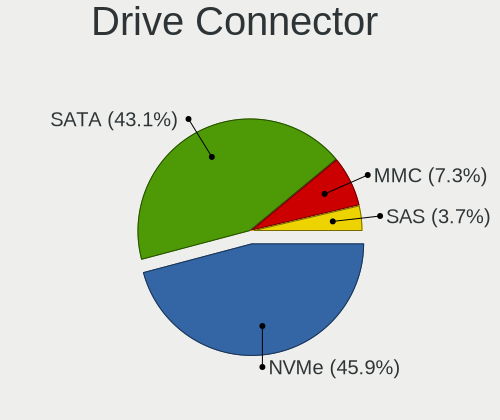
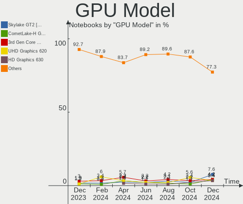
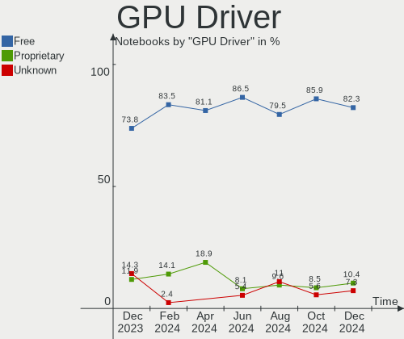

Linux in Canada - Hardware Trends (Notebooks)
---------------------------------------------

A project to identify most popular hardware characteristics and track their change
over time based on data collected by Linux users at https://Linux-Hardware.org.

Anyone can contribute to this report by the [hw-probe](https://github.com/linuxhw/hw-probe) tool:

    sudo -E hw-probe -all -upload

Period: Mar, 2023.

Contents
--------

* [ System ](#system)
  - [ OS                       ](#os)
  - [ OS Family                ](#os-family)
  - [ Kernel                   ](#kernel)
  - [ Kernel Family            ](#kernel-family)
  - [ Kernel Major Ver.        ](#kernel-major-ver)
  - [ Arch                     ](#arch)
  - [ DE                       ](#de)
  - [ Display Server           ](#display-server)
  - [ Display Manager          ](#display-manager)
  - [ OS Lang                  ](#os-lang)
  - [ Boot Mode                ](#boot-mode)
  - [ Filesystem               ](#filesystem)
  - [ Part. scheme             ](#part-scheme)
  - [ Dual Boot with Linux/BSD ](#dual-boot-with-linuxbsd)
  - [ Dual Boot (Win)          ](#dual-boot-win)

* [ Board ](#board)
  - [ Vendor                   ](#vendor)
  - [ Model                    ](#model)
  - [ Model Family             ](#model-family)
  - [ MFG Year                 ](#mfg-year)
  - [ Form Factor              ](#form-factor)
  - [ Secure Boot              ](#secure-boot)
  - [ Coreboot                 ](#coreboot)
  - [ RAM Size                 ](#ram-size)
  - [ RAM Used                 ](#ram-used)
  - [ Total Drives             ](#total-drives)
  - [ Has CD-ROM               ](#has-cd-rom)
  - [ Has Ethernet             ](#has-ethernet)
  - [ Has WiFi                 ](#has-wifi)
  - [ Has Bluetooth            ](#has-bluetooth)

* [ Location ](#location)
  - [ Country                  ](#country)
  - [ City                     ](#city)

* [ Drives ](#drives)
  - [ Drive Vendor             ](#drive-vendor)
  - [ Drive Model              ](#drive-model)
  - [ HDD Vendor               ](#hdd-vendor)
  - [ SSD Vendor               ](#ssd-vendor)
  - [ Drive Kind               ](#drive-kind)
  - [ Drive Connector          ](#drive-connector)
  - [ Drive Size               ](#drive-size)
  - [ Space Total              ](#space-total)
  - [ Space Used               ](#space-used)
  - [ Malfunc. Drives          ](#malfunc-drives)
  - [ Malfunc. Drive Vendor    ](#malfunc-drive-vendor)
  - [ Malfunc. HDD Vendor      ](#malfunc-hdd-vendor)
  - [ Malfunc. Drive Kind      ](#malfunc-drive-kind)
  - [ Failed Drives            ](#failed-drives)
  - [ Failed Drive Vendor      ](#failed-drive-vendor)
  - [ Drive Status             ](#drive-status)

* [ Storage controller ](#storage-controller)
  - [ Storage Vendor           ](#storage-vendor)
  - [ Storage Model            ](#storage-model)
  - [ Storage Kind             ](#storage-kind)

* [ Processor ](#processor)
  - [ CPU Vendor               ](#cpu-vendor)
  - [ CPU Model                ](#cpu-model)
  - [ CPU Model Family         ](#cpu-model-family)
  - [ CPU Cores                ](#cpu-cores)
  - [ CPU Sockets              ](#cpu-sockets)
  - [ CPU Threads              ](#cpu-threads)
  - [ CPU Op-Modes             ](#cpu-op-modes)
  - [ CPU Microcode            ](#cpu-microcode)
  - [ CPU Microarch            ](#cpu-microarch)

* [ Graphics ](#graphics)
  - [ GPU Vendor               ](#gpu-vendor)
  - [ GPU Model                ](#gpu-model)
  - [ GPU Combo                ](#gpu-combo)
  - [ GPU Driver               ](#gpu-driver)
  - [ GPU Memory               ](#gpu-memory)

* [ Monitor ](#monitor)
  - [ Monitor Vendor           ](#monitor-vendor)
  - [ Monitor Model            ](#monitor-model)
  - [ Monitor Resolution       ](#monitor-resolution)
  - [ Monitor Diagonal         ](#monitor-diagonal)
  - [ Monitor Width            ](#monitor-width)
  - [ Aspect Ratio             ](#aspect-ratio)
  - [ Monitor Area             ](#monitor-area)
  - [ Pixel Density            ](#pixel-density)
  - [ Multiple Monitors        ](#multiple-monitors)

* [ Network ](#network)
  - [ Net Controller Vendor    ](#net-controller-vendor)
  - [ Net Controller Model     ](#net-controller-model)
  - [ Wireless Vendor          ](#wireless-vendor)
  - [ Wireless Model           ](#wireless-model)
  - [ Ethernet Vendor          ](#ethernet-vendor)
  - [ Ethernet Model           ](#ethernet-model)
  - [ Net Controller Kind      ](#net-controller-kind)
  - [ Used Controller          ](#used-controller)
  - [ NICs                     ](#nics)
  - [ IPv6                     ](#ipv6)

* [ Bluetooth ](#bluetooth)
  - [ Bluetooth Vendor         ](#bluetooth-vendor)
  - [ Bluetooth Model          ](#bluetooth-model)

* [ Sound ](#sound)
  - [ Sound Vendor             ](#sound-vendor)
  - [ Sound Model              ](#sound-model)

* [ Memory ](#memory)
  - [ Memory Vendor            ](#memory-vendor)
  - [ Memory Model             ](#memory-model)
  - [ Memory Kind              ](#memory-kind)
  - [ Memory Form Factor       ](#memory-form-factor)
  - [ Memory Size              ](#memory-size)
  - [ Memory Speed             ](#memory-speed)

* [ Printers & scanners ](#printers--scanners)
  - [ Printer Vendor           ](#printer-vendor)
  - [ Printer Model            ](#printer-model)
  - [ Scanner Vendor           ](#scanner-vendor)
  - [ Scanner Model            ](#scanner-model)

* [ Camera ](#camera)
  - [ Camera Vendor            ](#camera-vendor)
  - [ Camera Model             ](#camera-model)

* [ Security ](#security)
  - [ Fingerprint Vendor       ](#fingerprint-vendor)
  - [ Fingerprint Model        ](#fingerprint-model)
  - [ Chipcard Vendor          ](#chipcard-vendor)
  - [ Chipcard Model           ](#chipcard-model)

* [ Unsupported ](#unsupported)
  - [ Unsupported Devices      ](#unsupported-devices)
  - [ Unsupported Device Types ](#unsupported-device-types)

System
------

OS
--

Installed operating systems

| Name                         | Notebooks | Percent |
|------------------------------|-----------|---------|
| Ubuntu 22.04                 | 12        | 17.39%  |
| OpenMandriva 23.03           | 5         | 7.25%   |
| Zorin 16                     | 4         | 5.8%    |
| Ubuntu 22.10                 | 4         | 5.8%    |
| OpenMandriva 4.3             | 4         | 5.8%    |
| Arch Rolling                 | 3         | 4.35%   |
| SteamOS 3.4.4                | 2         | 2.9%    |
| Pop!_OS 22.04                | 2         | 2.9%    |
| Linux Mint 21.1              | 2         | 2.9%    |
| Kubuntu 22.10                | 2         | 2.9%    |
| Kubuntu 22.04                | 2         | 2.9%    |
| Gentoo 2.9                   | 2         | 2.9%    |
| Fedora 37                    | 2         | 2.9%    |
| Debian 11                    | 2         | 2.9%    |
| Ubuntu 23.04                 | 1         | 1.45%   |
| Ubuntu 20.04                 | 1         | 1.45%   |
| Ubuntu 18.04                 | 1         | 1.45%   |
| Rocky Linux 9.1              | 1         | 1.45%   |
| openSUSE Tumbleweed-XXXXXXXX | 1         | 1.45%   |
| OpenMandriva 23.01           | 1         | 1.45%   |
| MX 21                        | 1         | 1.45%   |
| Manjaro 22.0.5               | 1         | 1.45%   |
| Manjaro 22.0.4               | 1         | 1.45%   |
| Linux Mint 21                | 1         | 1.45%   |
| Linux Mint 20.3              | 1         | 1.45%   |
| Linux Mint 20                | 1         | 1.45%   |
| KDE neon 22.04               | 1         | 1.45%   |
| Kali 2023.1                  | 1         | 1.45%   |
| Garuda Linux Soaring         | 1         | 1.45%   |
| Fedora 38                    | 1         | 1.45%   |
| EndeavourOS Rolling          | 1         | 1.45%   |
| Debian                       | 1         | 1.45%   |
| BlackPanther 18.1            | 1         | 1.45%   |
| ArcoLinux Rolling            | 1         | 1.45%   |
| Alpine 3.17.2                | 1         | 1.45%   |

OS Family
---------

OS without a version

| Name         | Notebooks | Percent |
|--------------|-----------|---------|
| Ubuntu       | 19        | 27.54%  |
| OpenMandriva | 10        | 14.49%  |
| Linux Mint   | 5         | 7.25%   |
| Zorin        | 4         | 5.8%    |
| Kubuntu      | 4         | 5.8%    |
| Fedora       | 3         | 4.35%   |
| Debian       | 3         | 4.35%   |
| Arch         | 3         | 4.35%   |
| SteamOS      | 2         | 2.9%    |
| Pop!_OS      | 2         | 2.9%    |
| Manjaro      | 2         | 2.9%    |
| Gentoo       | 2         | 2.9%    |
| Rocky Linux  | 1         | 1.45%   |
| openSUSE     | 1         | 1.45%   |
| MX           | 1         | 1.45%   |
| KDE neon     | 1         | 1.45%   |
| Kali         | 1         | 1.45%   |
| Garuda Linux | 1         | 1.45%   |
| EndeavourOS  | 1         | 1.45%   |
| BlackPanther | 1         | 1.45%   |
| ArcoLinux    | 1         | 1.45%   |
| Alpine       | 1         | 1.45%   |

Kernel
------

Version of the Linux kernel

| Version                      | Notebooks | Percent |
|------------------------------|-----------|---------|
| 5.19.0-35-generic            | 12        | 17.39%  |
| 6.2.6-desktop-1omv2390       | 4         | 5.8%    |
| 5.16.7-desktop-1omv4003      | 4         | 5.8%    |
| 5.15.0-67-generic            | 4         | 5.8%    |
| 5.19.0-32-generic            | 3         | 4.35%   |
| 5.15.0-60-generic            | 3         | 4.35%   |
| 5.15.0-56-generic            | 3         | 4.35%   |
| 5.10.0-21-amd64              | 3         | 4.35%   |
| 6.2.8-arch1-1                | 2         | 2.9%    |
| 5.4.0-144-generic            | 2         | 2.9%    |
| 5.19.0-21-generic            | 2         | 2.9%    |
| 5.15.88-gentoo               | 2         | 2.9%    |
| 5.13.0-valve36-1-neptune     | 2         | 2.9%    |
| 6.2.8-060208-generic         | 1         | 1.45%   |
| 6.2.7-arch1-1                | 1         | 1.45%   |
| 6.2.7-200.fc37.x86_64        | 1         | 1.45%   |
| 6.2.7-2-MANJARO              | 1         | 1.45%   |
| 6.2.6-300.fc38.x86_64        | 1         | 1.45%   |
| 6.2.6-1-default              | 1         | 1.45%   |
| 6.2.2-desktop-1omv2390       | 1         | 1.45%   |
| 6.2.2-arch2-1                | 1         | 1.45%   |
| 6.2.1-zen1-1-zen             | 1         | 1.45%   |
| 6.2.1-arch1-1                | 1         | 1.45%   |
| 6.2.0-76060200-generic       | 1         | 1.45%   |
| 6.2.0-18-generic             | 1         | 1.45%   |
| 6.1.18-200.fc37.x86_64       | 1         | 1.45%   |
| 6.1.11-76060111-generic      | 1         | 1.45%   |
| 6.1.1-desktop-1omv2290       | 1         | 1.45%   |
| 6.1.0-kali5-amd64            | 1         | 1.45%   |
| 6.1.0-3-amd64                | 1         | 1.45%   |
| 5.6.14-desktop-2bP           | 1         | 1.45%   |
| 5.15.94-1-MANJARO            | 1         | 1.45%   |
| 5.15.103-0-lts               | 1         | 1.45%   |
| 5.15.0-69-generic            | 1         | 1.45%   |
| 5.14.0-162.18.1.el9_1.x86_64 | 1         | 1.45%   |
| 4.15.0-206-generic           | 1         | 1.45%   |

Kernel Family
-------------

Linux kernel without a distro release

| Version  | Notebooks | Percent |
|----------|-----------|---------|
| 5.19.0   | 17        | 24.64%  |
| 5.15.0   | 11        | 15.94%  |
| 6.2.6    | 6         | 8.7%    |
| 5.16.7   | 4         | 5.8%    |
| 6.2.8    | 3         | 4.35%   |
| 6.2.7    | 3         | 4.35%   |
| 5.10.0   | 3         | 4.35%   |
| 6.2.2    | 2         | 2.9%    |
| 6.2.1    | 2         | 2.9%    |
| 6.2.0    | 2         | 2.9%    |
| 6.1.0    | 2         | 2.9%    |
| 5.4.0    | 2         | 2.9%    |
| 5.15.88  | 2         | 2.9%    |
| 5.13.0   | 2         | 2.9%    |
| 6.1.18   | 1         | 1.45%   |
| 6.1.11   | 1         | 1.45%   |
| 6.1.1    | 1         | 1.45%   |
| 5.6.14   | 1         | 1.45%   |
| 5.15.94  | 1         | 1.45%   |
| 5.15.103 | 1         | 1.45%   |
| 5.14.0   | 1         | 1.45%   |
| 4.15.0   | 1         | 1.45%   |

Kernel Major Ver.
-----------------

Linux kernel major version

| Version | Notebooks | Percent |
|---------|-----------|---------|
| 6.2     | 18        | 26.09%  |
| 5.19    | 17        | 24.64%  |
| 5.15    | 15        | 21.74%  |
| 6.1     | 5         | 7.25%   |
| 5.16    | 4         | 5.8%    |
| 5.10    | 3         | 4.35%   |
| 5.4     | 2         | 2.9%    |
| 5.13    | 2         | 2.9%    |
| 5.6     | 1         | 1.45%   |
| 5.14    | 1         | 1.45%   |
| 4.15    | 1         | 1.45%   |

Arch
----

OS architecture (x86_64, i586, etc.)

| Name   | Notebooks | Percent |
|--------|-----------|---------|
| x86_64 | 68        | 98.55%  |
| i686   | 1         | 1.45%   |

DE
--

Desktop Environment

| Name            | Notebooks | Percent |
|-----------------|-----------|---------|
| GNOME           | 32        | 46.38%  |
| KDE5            | 21        | 30.43%  |
| XFCE            | 8         | 11.59%  |
| X-Cinnamon      | 3         | 4.35%   |
| xsession        | 1         | 1.45%   |
| qtile           | 1         | 1.45%   |
| LXDE            | 1         | 1.45%   |
| GNOME Flashback | 1         | 1.45%   |
| Unknown         | 1         | 1.45%   |

Display Server
--------------

X11 or Wayland

| Name    | Notebooks | Percent |
|---------|-----------|---------|
| X11     | 49        | 71.01%  |
| Wayland | 17        | 24.64%  |
| Tty     | 3         | 4.35%   |

Display Manager
---------------

SDDM, LightDM, etc.

| Name    | Notebooks | Percent |
|---------|-----------|---------|
| Unknown | 22        | 31.88%  |
| SDDM    | 19        | 27.54%  |
| GDM3    | 17        | 24.64%  |
| LightDM | 6         | 8.7%    |
| GDM     | 4         | 5.8%    |
| LXDM    | 1         | 1.45%   |

OS Lang
-------

Language

| Lang    | Notebooks | Percent |
|---------|-----------|---------|
| en_CA   | 41        | 59.42%  |
| en_US   | 20        | 28.99%  |
| fr_CA   | 3         | 4.35%   |
| C       | 3         | 4.35%   |
| fr_FR   | 1         | 1.45%   |
| Unknown | 1         | 1.45%   |

Boot Mode
---------

EFI or BIOS

| Mode | Notebooks | Percent |
|------|-----------|---------|
| BIOS | 35        | 50.72%  |
| EFI  | 34        | 49.28%  |

Filesystem
----------

Type of filesystem

| Type    | Notebooks | Percent |
|---------|-----------|---------|
| Ext4    | 53        | 76.81%  |
| Btrfs   | 8         | 11.59%  |
| Overlay | 6         | 8.7%    |
| Xfs     | 2         | 2.9%    |

Part. scheme
------------

Scheme of partitioning

| Type    | Notebooks | Percent |
|---------|-----------|---------|
| GPT     | 40        | 57.97%  |
| Unknown | 21        | 30.43%  |
| MBR     | 8         | 11.59%  |

Dual Boot with Linux/BSD
------------------------

Hosting more than one Linux/BSD

| Dual boot | Notebooks | Percent |
|-----------|-----------|---------|
| No        | 58        | 84.06%  |
| Yes       | 11        | 15.94%  |

Dual Boot (Win)
---------------

Hosting Linux and Windows

| Dual boot | Notebooks | Percent |
|-----------|-----------|---------|
| No        | 54        | 78.26%  |
| Yes       | 15        | 21.74%  |

Board
-----

Vendor
------

Motherboard manufacturer

| Name                           | Notebooks | Percent |
|--------------------------------|-----------|---------|
| Lenovo                         | 15        | 21.74%  |
| Dell                           | 14        | 20.29%  |
| Acer                           | 9         | 13.04%  |
| Hewlett-Packard                | 8         | 11.59%  |
| ASUSTek Computer               | 5         | 7.25%   |
| MSI                            | 4         | 5.8%    |
| Apple                          | 3         | 4.35%   |
| Valve                          | 2         | 2.9%    |
| Framework                      | 2         | 2.9%    |
| Toshiba                        | 1         | 1.45%   |
| Sony                           | 1         | 1.45%   |
| Matsushita Electric Industrial | 1         | 1.45%   |
| Google                         | 1         | 1.45%   |
| Fujitsu                        | 1         | 1.45%   |
| Datto                          | 1         | 1.45%   |
| Unknown                        | 1         | 1.45%   |

Model
-----

Motherboard model

| Name                                        | Notebooks | Percent |
|---------------------------------------------|-----------|---------|
| Valve Jupiter                               | 2         | 2.9%    |
| MSI GS65 Stealth Thin 8RF                   | 2         | 2.9%    |
| Dell Latitude 7490                          | 2         | 2.9%    |
| Toshiba Satellite P870                      | 1         | 1.45%   |
| Sony VPCCB32FD                              | 1         | 1.45%   |
| MSI PS42 8RB                                | 1         | 1.45%   |
| MSI GE63 Raider RGB 8RE                     | 1         | 1.45%   |
| Matsushita Electric Industrial CF-18KH2ZXBC | 1         | 1.45%   |
| Lenovo V15-IIL 82C5                         | 1         | 1.45%   |
| Lenovo ThinkPad X220 4290LR3                | 1         | 1.45%   |
| Lenovo ThinkPad X220 429035U                | 1         | 1.45%   |
| Lenovo ThinkPad X1 Carbon 5th 20HR000MUS    | 1         | 1.45%   |
| Lenovo ThinkPad X1 Carbon 2nd 20A8S0ET00    | 1         | 1.45%   |
| Lenovo ThinkPad T470 W10DG 20JNS15B26       | 1         | 1.45%   |
| Lenovo ThinkPad T430 4237ZC7                | 1         | 1.45%   |
| Lenovo ThinkPad P16 Gen 1 21D6004QUS        | 1         | 1.45%   |
| Lenovo N22 80S6                             | 1         | 1.45%   |
| Lenovo IdeaPad 320-15ABR 80XS               | 1         | 1.45%   |
| Lenovo IdeaPad 3 15ITL6 82H8                | 1         | 1.45%   |
| Lenovo IdeaPad 3 15ALC6 82KU                | 1         | 1.45%   |
| Lenovo IdeaPad 3 15ABA7 82RN                | 1         | 1.45%   |
| Lenovo G550 2958                            | 1         | 1.45%   |
| Lenovo 3000 N200 0769AUU                    | 1         | 1.45%   |
| HP ProBook 650 G2                           | 1         | 1.45%   |
| HP Presario CQ61                            | 1         | 1.45%   |
| HP Pavilion Gaming Laptop 15-ec0xxx         | 1         | 1.45%   |
| HP Pavilion dv8000 (ET839UA#ABL)            | 1         | 1.45%   |
| HP Pavilion dv6                             | 1         | 1.45%   |
| HP Laptop 15-dy1xxx                         | 1         | 1.45%   |
| HP ENVY 17                                  | 1         | 1.45%   |
| HP EliteBook 830 G5                         | 1         | 1.45%   |
| Google Droid                                | 1         | 1.45%   |
| Fujitsu FMVNP8AE                            | 1         | 1.45%   |
| Framework Laptop (12th Gen Intel Core)      | 1         | 1.45%   |
| Framework Laptop                            | 1         | 1.45%   |
| Dell XPS M1330                              | 1         | 1.45%   |
| Dell XPS 15 9520                            | 1         | 1.45%   |
| Dell Vostro 5620                            | 1         | 1.45%   |
| Dell Studio 1558                            | 1         | 1.45%   |
| Dell Studio 1537                            | 1         | 1.45%   |

Model Family
------------

Motherboard model prefix

| Name                                        | Notebooks | Percent |
|---------------------------------------------|-----------|---------|
| Lenovo ThinkPad                             | 7         | 10.14%  |
| Acer Aspire                                 | 6         | 8.7%    |
| Dell Latitude                               | 5         | 7.25%   |
| Lenovo IdeaPad                              | 4         | 5.8%    |
| HP Pavilion                                 | 3         | 4.35%   |
| Acer Swift                                  | 3         | 4.35%   |
| Valve Jupiter                               | 2         | 2.9%    |
| MSI GS65                                    | 2         | 2.9%    |
| Framework Laptop                            | 2         | 2.9%    |
| Dell XPS                                    | 2         | 2.9%    |
| Dell Studio                                 | 2         | 2.9%    |
| Dell Precision                              | 2         | 2.9%    |
| Dell Inspiron                               | 2         | 2.9%    |
| Apple MacBookPro11                          | 2         | 2.9%    |
| Toshiba Satellite                           | 1         | 1.45%   |
| Sony VPCCB32FD                              | 1         | 1.45%   |
| MSI PS42                                    | 1         | 1.45%   |
| MSI GE63                                    | 1         | 1.45%   |
| Matsushita Electric Industrial CF-18KH2ZXBC | 1         | 1.45%   |
| Lenovo V15-IIL                              | 1         | 1.45%   |
| Lenovo N22                                  | 1         | 1.45%   |
| Lenovo G550                                 | 1         | 1.45%   |
| Lenovo 3000                                 | 1         | 1.45%   |
| HP ProBook                                  | 1         | 1.45%   |
| HP Presario                                 | 1         | 1.45%   |
| HP Laptop                                   | 1         | 1.45%   |
| HP ENVY                                     | 1         | 1.45%   |
| HP EliteBook                                | 1         | 1.45%   |
| Google Droid                                | 1         | 1.45%   |
| Fujitsu FMVNP8AE                            | 1         | 1.45%   |
| Dell Vostro                                 | 1         | 1.45%   |
| Datto 1000                                  | 1         | 1.45%   |
| ASUS X450LD                                 | 1         | 1.45%   |
| ASUS VivoBook                               | 1         | 1.45%   |
| ASUS UX331UA                                | 1         | 1.45%   |
| ASUS ROG                                    | 1         | 1.45%   |
| ASUS G53SX                                  | 1         | 1.45%   |
| Apple MacBookPro9                           | 1         | 1.45%   |
| Unknown                                     | 1         | 1.45%   |

MFG Year
--------

Motherboard manufacture year

| Year | Notebooks | Percent |
|------|-----------|---------|
| 2022 | 9         | 13.04%  |
| 2018 | 7         | 10.14%  |
| 2021 | 6         | 8.7%    |
| 2011 | 6         | 8.7%    |
| 2017 | 5         | 7.25%   |
| 2014 | 5         | 7.25%   |
| 2019 | 4         | 5.8%    |
| 2012 | 4         | 5.8%    |
| 2008 | 4         | 5.8%    |
| 2020 | 3         | 4.35%   |
| 2016 | 3         | 4.35%   |
| 2015 | 3         | 4.35%   |
| 2013 | 3         | 4.35%   |
| 2010 | 2         | 2.9%    |
| 2009 | 2         | 2.9%    |
| 2006 | 2         | 2.9%    |
| 2007 | 1         | 1.45%   |

Form Factor
-----------

Physical design of the computer

| Name     | Notebooks | Percent |
|----------|-----------|---------|
| Notebook | 69        | 100%    |

Secure Boot
-----------

Enabled or disabled

| State    | Notebooks | Percent |
|----------|-----------|---------|
| Disabled | 61        | 88.41%  |
| Enabled  | 8         | 11.59%  |

Coreboot
--------

Have coreboot on board

| Used | Notebooks | Percent |
|------|-----------|---------|
| No   | 68        | 98.55%  |
| Yes  | 1         | 1.45%   |

RAM Size
--------

Total RAM memory

| Size in GB | Notebooks | Percent |
|------------|-----------|---------|
| 4.01-8.0   | 23        | 33.33%  |
| 16.01-24.0 | 16        | 23.19%  |
| 3.01-4.0   | 11        | 15.94%  |
| 8.01-16.0  | 8         | 11.59%  |
| 32.01-64.0 | 5         | 7.25%   |
| 1.01-2.0   | 3         | 4.35%   |
| 24.01-32.0 | 2         | 2.9%    |
| 2.01-3.0   | 1         | 1.45%   |

RAM Used
--------

Used RAM memory

| Used GB   | Notebooks | Percent |
|-----------|-----------|---------|
| 2.01-3.0  | 21        | 30.43%  |
| 1.01-2.0  | 21        | 30.43%  |
| 4.01-8.0  | 15        | 21.74%  |
| 3.01-4.0  | 5         | 7.25%   |
| 0.01-0.5  | 3         | 4.35%   |
| 8.01-16.0 | 2         | 2.9%    |
| 0.51-1.0  | 2         | 2.9%    |

Total Drives
------------

Number of drives on board

| Drives | Notebooks | Percent |
|--------|-----------|---------|
| 1      | 56        | 81.16%  |
| 2      | 11        | 15.94%  |
| 3      | 1         | 1.45%   |
| 0      | 1         | 1.45%   |

Has CD-ROM
----------

Has CD-ROM on board

| Presented | Notebooks | Percent |
|-----------|-----------|---------|
| No        | 48        | 69.57%  |
| Yes       | 21        | 30.43%  |

Has Ethernet
------------

Has Ethernet on board

| Presented | Notebooks | Percent |
|-----------|-----------|---------|
| Yes       | 48        | 69.57%  |
| No        | 21        | 30.43%  |

Has WiFi
--------

Has WiFi module

| Presented | Notebooks | Percent |
|-----------|-----------|---------|
| Yes       | 69        | 100%    |

Has Bluetooth
-------------

Has Bluetooth module

| Presented | Notebooks | Percent |
|-----------|-----------|---------|
| Yes       | 54        | 78.26%  |
| No        | 15        | 21.74%  |

Location
--------

Country
-------

Geographic location (country)

| Country | Notebooks | Percent |
|---------|-----------|---------|
| Canada  | 69        | 100%    |

City
----

Geographic location (city)

| City              | Notebooks | Percent |
|-------------------|-----------|---------|
| Montreal          | 8         | 11.59%  |
| Vancouver         | 5         | 7.25%   |
| Toronto           | 4         | 5.8%    |
| Calgary           | 4         | 5.8%    |
| Ottawa            | 3         | 4.35%   |
| Mississauga       | 3         | 4.35%   |
| Winnipeg          | 2         | 2.9%    |
| Victoria          | 2         | 2.9%    |
| Edmonton          | 2         | 2.9%    |
| Barrie            | 2         | 2.9%    |
| Vernon            | 1         | 1.45%   |
| Thornhill         | 1         | 1.45%   |
| Sutton            | 1         | 1.45%   |
| Sombra            | 1         | 1.45%   |
| Saint-Jerome      | 1         | 1.45%   |
| Saint-Hyacinthe   | 1         | 1.45%   |
| Saint-Georges     | 1         | 1.45%   |
| Saint-Eustache    | 1         | 1.45%   |
| Riviere-Bleue     | 1         | 1.45%   |
| Parksville        | 1         | 1.45%   |
| Paquetville       | 1         | 1.45%   |
| Oshawa            | 1         | 1.45%   |
| Moncton           | 1         | 1.45%   |
| Longueuil         | 1         | 1.45%   |
| Levis             | 1         | 1.45%   |
| Laval             | 1         | 1.45%   |
| Langley           | 1         | 1.45%   |
| Kitchener         | 1         | 1.45%   |
| Kingston          | 1         | 1.45%   |
| Innisfil          | 1         | 1.45%   |
| Halifax           | 1         | 1.45%   |
| Greater Sudbury   | 1         | 1.45%   |
| Frankford         | 1         | 1.45%   |
| Fort Saskatchewan | 1         | 1.45%   |
| Fonthill          | 1         | 1.45%   |
| Duncan            | 1         | 1.45%   |
| Courtenay         | 1         | 1.45%   |
| Burnaby           | 1         | 1.45%   |
| Burlington        | 1         | 1.45%   |
| Brantford         | 1         | 1.45%   |

Drives
------

Drive Vendor
------------

Hard drive vendors

| Vendor                      | Notebooks | Drives | Percent |
|-----------------------------|-----------|--------|---------|
| Samsung Electronics         | 15        | 15     | 18.29%  |
| WDC                         | 9         | 9      | 10.98%  |
| Sandisk                     | 8         | 8      | 9.76%   |
| Toshiba                     | 7         | 7      | 8.54%   |
| Kingston                    | 6         | 6      | 7.32%   |
| Unknown                     | 5         | 5      | 6.1%    |
| Seagate                     | 5         | 5      | 6.1%    |
| Micron Technology           | 4         | 5      | 4.88%   |
| Timetec                     | 2         | 2      | 2.44%   |
| SPCC                        | 2         | 2      | 2.44%   |
| Kingston Technology Company | 2         | 2      | 2.44%   |
| Hitachi                     | 2         | 2      | 2.44%   |
| SK hynix                    | 1         | 1      | 1.22%   |
| Silicon Motion              | 1         | 1      | 1.22%   |
| Saichi D                    | 1         | 1      | 1.22%   |
| Phison Electronics          | 1         | 1      | 1.22%   |
| Patriot                     | 1         | 1      | 1.22%   |
| OWC                         | 1         | 1      | 1.22%   |
| Micron/Crucial Technology   | 1         | 1      | 1.22%   |
| LITEONIT                    | 1         | 1      | 1.22%   |
| KIOXIA                      | 1         | 1      | 1.22%   |
| JMicron Technology          | 1         | 1      | 1.22%   |
| Intel                       | 1         | 1      | 1.22%   |
| HGST                        | 1         | 1      | 1.22%   |
| Fujitsu                     | 1         | 1      | 1.22%   |
| Crucial                     | 1         | 1      | 1.22%   |
| A-DATA Technology           | 1         | 1      | 1.22%   |

Drive Model
-----------

Hard drive models

| Model                                                  | Notebooks | Percent |
|--------------------------------------------------------|-----------|---------|
| Toshiba MQ01ABD100 1TB                                 | 3         | 3.61%   |
| Samsung NVMe SSD Controller SM981/PM981/PM983 250GB    | 3         | 3.61%   |
| Unknown MMC Card  64GB                                 | 2         | 2.41%   |
| Seagate ST9500325AS 500GB                              | 2         | 2.41%   |
| Samsung MZALQ512HBLU-00BL2 512GB                       | 2         | 2.41%   |
| Kingston SA400S37240G 240GB SSD                        | 2         | 2.41%   |
| WDC WDS500G2B0B-00YS70 500GB SSD                       | 1         | 1.2%    |
| WDC WDS100T3X0C-00SJG0 1TB                             | 1         | 1.2%    |
| WDC WDS100T2G0A-00JH30 1TB SSD                         | 1         | 1.2%    |
| WDC WD5000LPCX-21VHAT0 500GB                           | 1         | 1.2%    |
| WDC WD3200BPVT-22JJ5T0 320GB                           | 1         | 1.2%    |
| WDC WD2500BVVT-28A26Y1 250GB                           | 1         | 1.2%    |
| WDC WD2500BEVS-75UST0 250GB                            | 1         | 1.2%    |
| WDC WD10JPVX-22JC3T0 1TB                               | 1         | 1.2%    |
| WDC PC SN520 SDAPNUW-256G                              | 1         | 1.2%    |
| Unknown MMC Card  32GB                                 | 1         | 1.2%    |
| Unknown DA4064  64GB                                   | 1         | 1.2%    |
| Unknown 00000  16GB                                    | 1         | 1.2%    |
| Toshiba MQ01ABD050 500GB                               | 1         | 1.2%    |
| Toshiba MK7559GSXP 752GB                               | 1         | 1.2%    |
| Toshiba KXG5AZNV512G 512GB                             | 1         | 1.2%    |
| Toshiba KSG60ZMV512G M.2 2280 512GB SSD                | 1         | 1.2%    |
| Timetec SD08 512GB SSD                                 | 1         | 1.2%    |
| Timetec 35TTM8SSATA-1TB                                | 1         | 1.2%    |
| SPCC Solid State Disk 480GB                            | 1         | 1.2%    |
| SPCC Solid State Disk 256GB                            | 1         | 1.2%    |
| SK hynix PC401 NVMe Solid State Drive 256GB            | 1         | 1.2%    |
| Silicon Motion SM2263EN/SM2263XT SSD Controller 1024GB | 1         | 1.2%    |
| Seagate ST500LM012 HN-M500MBB 500GB                    | 1         | 1.2%    |
| Seagate ST1000LM024 HN-M101MBB 1TB                     | 1         | 1.2%    |
| Seagate BarraCuda 120 SSD ZA1000CM10003 1TB            | 1         | 1.2%    |
| Sandisk WD PC SN740 SDDPTQE-2T00 2TB                   | 1         | 1.2%    |
| Sandisk WD Blue SN550 NVMe SSD 256GB                   | 1         | 1.2%    |
| SanDisk SSD U100 128GB                                 | 1         | 1.2%    |
| SanDisk SDSSDXPS960G 960GB                             | 1         | 1.2%    |
| SanDisk SD9SN8W256G 256GB SSD                          | 1         | 1.2%    |
| SanDisk SD8SBAT256G1122 256GB SSD                      | 1         | 1.2%    |
| SanDisk SD7SF6S256G1122 256GB SSD                      | 1         | 1.2%    |
| SanDisk NVMe SSD Drive 512GB                           | 1         | 1.2%    |
| Samsung SSD 870 QVO 2TB                                | 1         | 1.2%    |

HDD Vendor
----------

Hard disk drive vendors

| Vendor              | Notebooks | Drives | Percent |
|---------------------|-----------|--------|---------|
| WDC                 | 5         | 5      | 26.32%  |
| Toshiba             | 5         | 5      | 26.32%  |
| Seagate             | 4         | 4      | 21.05%  |
| Hitachi             | 2         | 2      | 10.53%  |
| Samsung Electronics | 1         | 1      | 5.26%   |
| HGST                | 1         | 1      | 5.26%   |
| Fujitsu             | 1         | 1      | 5.26%   |

SSD Vendor
----------

Solid state drive vendors

| Vendor              | Notebooks | Drives | Percent |
|---------------------|-----------|--------|---------|
| SanDisk             | 5         | 5      | 17.24%  |
| Samsung Electronics | 5         | 5      | 17.24%  |
| Kingston            | 5         | 5      | 17.24%  |
| WDC                 | 2         | 2      | 6.9%    |
| Timetec             | 2         | 2      | 6.9%    |
| SPCC                | 2         | 2      | 6.9%    |
| Toshiba             | 1         | 1      | 3.45%   |
| Seagate             | 1         | 1      | 3.45%   |
| Patriot             | 1         | 1      | 3.45%   |
| OWC                 | 1         | 1      | 3.45%   |
| Micron Technology   | 1         | 1      | 3.45%   |
| LITEONIT            | 1         | 1      | 3.45%   |
| Crucial             | 1         | 1      | 3.45%   |
| A-DATA Technology   | 1         | 1      | 3.45%   |

Drive Kind
----------

HDD or SSD

| Kind    | Notebooks | Drives | Percent |
|---------|-----------|--------|---------|
| SSD     | 27        | 29     | 35.06%  |
| NVMe    | 26        | 28     | 33.77%  |
| HDD     | 17        | 19     | 22.08%  |
| MMC     | 5         | 5      | 6.49%   |
| Unknown | 2         | 2      | 2.6%    |

Drive Connector
---------------

SATA, SAS, NVMe, etc.

| Type | Notebooks | Drives | Percent |
|------|-----------|--------|---------|
| SATA | 40        | 46     | 54.05%  |
| NVMe | 26        | 28     | 35.14%  |
| MMC  | 5         | 5      | 6.76%   |
| SAS  | 3         | 4      | 4.05%   |

Drive Size
----------

Size of hard drive

| Size in TB | Notebooks | Drives | Percent |
|------------|-----------|--------|---------|
| 0.01-0.5   | 27        | 33     | 65.85%  |
| 0.51-1.0   | 12        | 13     | 29.27%  |
| 1.01-2.0   | 2         | 2      | 4.88%   |

Space Total
-----------

Amount of disk space available on the file system

| Size in GB | Notebooks | Percent |
|------------|-----------|---------|
| 101-250    | 16        | 23.19%  |
| 251-500    | 15        | 21.74%  |
| 501-1000   | 15        | 21.74%  |
| 1001-2000  | 7         | 10.14%  |
| 1-20       | 6         | 8.7%    |
| 51-100     | 5         | 7.25%   |
| Unknown    | 3         | 4.35%   |
| 21-50      | 1         | 1.45%   |
| 2001-3000  | 1         | 1.45%   |

Space Used
----------

Amount of used disk space

| Used GB  | Notebooks | Percent |
|----------|-----------|---------|
| 1-20     | 22        | 31.88%  |
| 51-100   | 12        | 17.39%  |
| 21-50    | 11        | 15.94%  |
| 101-250  | 10        | 14.49%  |
| 251-500  | 7         | 10.14%  |
| 501-1000 | 4         | 5.8%    |
| Unknown  | 3         | 4.35%   |

Malfunc. Drives
---------------

Drive models with a malfunction

| Model                                   | Notebooks | Drives | Percent |
|-----------------------------------------|-----------|--------|---------|
| WDC WD2500BEVS-75UST0 250GB             | 1         | 1      | 12.5%   |
| Toshiba MQ01ABD100 1TB                  | 1         | 1      | 12.5%   |
| Toshiba KSG60ZMV512G M.2 2280 512GB SSD | 1         | 1      | 12.5%   |
| Seagate ST9500325AS 500GB               | 1         | 1      | 12.5%   |
| Seagate ST1000LM024 HN-M101MBB 1TB      | 1         | 1      | 12.5%   |
| SanDisk SDSSDXPS960G 960GB              | 1         | 1      | 12.5%   |
| Samsung Electronics HM160HC 160GB       | 1         | 1      | 12.5%   |
| Fujitsu MHV2080AH 80GB                  | 1         | 1      | 12.5%   |

Malfunc. Drive Vendor
---------------------

Vendors of faulty drives

| Vendor              | Notebooks | Drives | Percent |
|---------------------|-----------|--------|---------|
| Toshiba             | 2         | 2      | 25%     |
| Seagate             | 2         | 2      | 25%     |
| WDC                 | 1         | 1      | 12.5%   |
| SanDisk             | 1         | 1      | 12.5%   |
| Samsung Electronics | 1         | 1      | 12.5%   |
| Fujitsu             | 1         | 1      | 12.5%   |

Malfunc. HDD Vendor
-------------------

Vendors of faulty HDD drives

| Vendor              | Notebooks | Drives | Percent |
|---------------------|-----------|--------|---------|
| Seagate             | 2         | 2      | 33.33%  |
| WDC                 | 1         | 1      | 16.67%  |
| Toshiba             | 1         | 1      | 16.67%  |
| Samsung Electronics | 1         | 1      | 16.67%  |
| Fujitsu             | 1         | 1      | 16.67%  |

Malfunc. Drive Kind
-------------------

Kinds of faulty drives

| Kind | Notebooks | Drives | Percent |
|------|-----------|--------|---------|
| HDD  | 5         | 6      | 71.43%  |
| SSD  | 2         | 2      | 28.57%  |

Failed Drives
-------------

Failed drive models

Zero info for selected period =(

Failed Drive Vendor
-------------------

Failed drive vendors

Zero info for selected period =(

Drive Status
------------

Number of failed and malfunc. drives

| Status   | Notebooks | Drives | Percent |
|----------|-----------|--------|---------|
| Detected | 35        | 45     | 50%     |
| Works    | 28        | 30     | 40%     |
| Malfunc  | 7         | 8      | 10%     |

Storage controller
------------------

Storage Vendor
--------------

Storage controller vendors

| Vendor                       | Notebooks | Percent |
|------------------------------|-----------|---------|
| Intel                        | 41        | 51.25%  |
| AMD                          | 11        | 13.75%  |
| Samsung Electronics          | 9         | 11.25%  |
| SanDisk                      | 5         | 6.25%   |
| Micron Technology            | 3         | 3.75%   |
| Kingston Technology Company  | 3         | 3.75%   |
| Toshiba America Info Systems | 1         | 1.25%   |
| SK hynix                     | 1         | 1.25%   |
| Silicon Motion               | 1         | 1.25%   |
| Phison Electronics           | 1         | 1.25%   |
| Nvidia                       | 1         | 1.25%   |
| Micron/Crucial Technology    | 1         | 1.25%   |
| Marvell Technology Group     | 1         | 1.25%   |
| KIOXIA                       | 1         | 1.25%   |

Storage Model
-------------

Storage controller models

| Model                                                                            | Notebooks | Percent |
|----------------------------------------------------------------------------------|-----------|---------|
| AMD FCH SATA Controller [AHCI mode]                                              | 8         | 9.41%   |
| Intel 6 Series/C200 Series Chipset Family 6 port Mobile SATA AHCI Controller     | 6         | 7.06%   |
| Intel 8 Series SATA Controller 1 [AHCI mode]                                     | 5         | 5.88%   |
| Samsung NVMe SSD Controller 980                                                  | 4         | 4.71%   |
| Intel 7 Series Chipset Family 6-port SATA Controller [AHCI mode]                 | 4         | 4.71%   |
| Samsung NVMe SSD Controller SM981/PM981/PM983                                    | 3         | 3.53%   |
| Micron NVMe Storage Controller                                                   | 3         | 3.53%   |
| Intel Volume Management Device NVMe RAID Controller                              | 3         | 3.53%   |
| Intel Atom/Celeron/Pentium Processor x5-E8000/J3xxx/N3xxx Series SATA Controller | 3         | 3.53%   |
| Intel 82801 Mobile SATA Controller [RAID mode]                                   | 3         | 3.53%   |
| SanDisk WD Blue SN550 NVMe SSD                                                   | 2         | 2.35%   |
| Kingston Company Company Non-Volatile memory controller                          | 2         | 2.35%   |
| Intel Tiger Lake-LP SATA Controller                                              | 2         | 2.35%   |
| Intel Sunrise Point-LP SATA Controller [AHCI mode]                               | 2         | 2.35%   |
| Intel Ice Lake-LP SATA Controller [AHCI mode]                                    | 2         | 2.35%   |
| Intel 82801IBM/IEM (ICH9M/ICH9M-E) 4 port SATA Controller [AHCI mode]            | 2         | 2.35%   |
| Intel 82801HM/HEM (ICH8M/ICH8M-E) SATA Controller [AHCI mode]                    | 2         | 2.35%   |
| Intel 82801HM/HEM (ICH8M/ICH8M-E) IDE Controller                                 | 2         | 2.35%   |
| AMD SB7x0/SB8x0/SB9x0 SATA Controller [AHCI mode]                                | 2         | 2.35%   |
| Toshiba America Info Systems XG5 NVMe SSD Controller                             | 1         | 1.18%   |
| SK hynix PC401 NVMe Solid State Drive 256GB                                      | 1         | 1.18%   |
| Silicon Motion SM2263EN/SM2263XT SSD Controller                                  | 1         | 1.18%   |
| SanDisk WD Blue SN500 / PC SN520 NVMe SSD                                        | 1         | 1.18%   |
| SanDisk WD Black SN750 / PC SN730 NVMe SSD                                       | 1         | 1.18%   |
| Sandisk Non-Volatile memory controller                                           | 1         | 1.18%   |
| Samsung NVMe SSD Controller SM961/PM961/SM963                                    | 1         | 1.18%   |
| Samsung NVMe SSD Controller PM9A1/PM9A3/980PRO                                   | 1         | 1.18%   |
| Phison E12 NVMe Controller                                                       | 1         | 1.18%   |
| Nvidia nForce SATA Controller                                                    | 1         | 1.18%   |
| Micron/Crucial P2 NVMe PCIe SSD                                                  | 1         | 1.18%   |
| Marvell Group 88SE9230 PCIe 2.0 x2 4-port SATA 6 Gb/s RAID Controller            | 1         | 1.18%   |
| KIOXIA NVMe SSD Controller BG4                                                   | 1         | 1.18%   |
| Kingston Company OM3PDP3 NVMe SSD                                                | 1         | 1.18%   |
| Intel SSD 660P Series                                                            | 1         | 1.18%   |
| Intel Q170/Q150/B150/H170/H110/Z170/CM236 Chipset SATA Controller [AHCI Mode]    | 1         | 1.18%   |
| Intel HM170/QM170 Chipset SATA Controller [AHCI Mode]                            | 1         | 1.18%   |
| Intel Celeron N3350/Pentium N4200/Atom E3900 Series SATA AHCI Controller         | 1         | 1.18%   |
| Intel Cannon Lake Mobile PCH SATA AHCI Controller                                | 1         | 1.18%   |
| Intel 82801FB/FBM/FR/FW/FRW (ICH6 Family) IDE Controller                         | 1         | 1.18%   |
| Intel 8 Series/C220 Series Chipset Family 6-port SATA Controller 1 [AHCI mode]   | 1         | 1.18%   |

Storage Kind
------------

Kind of storage controller (IDE, SATA, NVMe, SAS, ...)

| Kind | Notebooks | Percent |
|------|-----------|---------|
| SATA | 46        | 55.42%  |
| NVMe | 26        | 31.33%  |
| RAID | 6         | 7.23%   |
| IDE  | 5         | 6.02%   |

Processor
---------

CPU Vendor
----------

Processor vendors

| Vendor | Notebooks | Percent |
|--------|-----------|---------|
| Intel  | 53        | 76.81%  |
| AMD    | 16        | 23.19%  |

CPU Model
---------

Processor models

| Model                                   | Notebooks | Percent |
|-----------------------------------------|-----------|---------|
| Intel Core i7-8750H CPU @ 2.20GHz       | 3         | 4.35%   |
| Intel Core i5-7300U CPU @ 2.60GHz       | 3         | 4.35%   |
| AMD Ryzen 7 5700U with Radeon Graphics  | 3         | 4.35%   |
| Intel Core i7-8550U CPU @ 1.80GHz       | 2         | 2.9%    |
| Intel Core i5-2430M CPU @ 2.40GHz       | 2         | 2.9%    |
| Intel Core i5-1035G1 CPU @ 1.00GHz      | 2         | 2.9%    |
| Intel Celeron CPU N3050 @ 1.60GHz       | 2         | 2.9%    |
| Intel 12th Gen Core i7-1260P            | 2         | 2.9%    |
| Intel 11th Gen Core i5-1135G7 @ 2.40GHz | 2         | 2.9%    |
| AMD Custom APU 0405                     | 2         | 2.9%    |
| Intel Pentium M processor 1.20GHz       | 1         | 1.45%   |
| Intel Pentium Dual CPU T2330 @ 1.60GHz  | 1         | 1.45%   |
| Intel Pentium CPU N3710 @ 1.60GHz       | 1         | 1.45%   |
| Intel Pentium CPU B940 @ 2.00GHz        | 1         | 1.45%   |
| Intel Core i7-8650U CPU @ 1.90GHz       | 1         | 1.45%   |
| Intel Core i7-6820HQ CPU @ 2.70GHz      | 1         | 1.45%   |
| Intel Core i7-4800MQ CPU @ 2.70GHz      | 1         | 1.45%   |
| Intel Core i7-4750HQ CPU @ 2.00GHz      | 1         | 1.45%   |
| Intel Core i7-4700MQ CPU @ 2.40GHz      | 1         | 1.45%   |
| Intel Core i7-4600U CPU @ 2.10GHz       | 1         | 1.45%   |
| Intel Core i7-4558U CPU @ 2.80GHz       | 1         | 1.45%   |
| Intel Core i7-4500U CPU @ 1.80GHz       | 1         | 1.45%   |
| Intel Core i7-3630QM CPU @ 2.40GHz      | 1         | 1.45%   |
| Intel Core i7-2630QM CPU @ 2.00GHz      | 1         | 1.45%   |
| Intel Core i7-2620M CPU @ 2.70GHz       | 1         | 1.45%   |
| Intel Core i7 CPU Q 720 @ 1.60GHz       | 1         | 1.45%   |
| Intel Core i5-7440HQ CPU @ 2.80GHz      | 1         | 1.45%   |
| Intel Core i5-6300U CPU @ 2.40GHz       | 1         | 1.45%   |
| Intel Core i5-4300U CPU @ 1.90GHz       | 1         | 1.45%   |
| Intel Core i5-4258U CPU @ 2.40GHz       | 1         | 1.45%   |
| Intel Core i5-3340M CPU @ 2.70GHz       | 1         | 1.45%   |
| Intel Core i5-3320M CPU @ 2.60GHz       | 1         | 1.45%   |
| Intel Core i5-3210M CPU @ 2.50GHz       | 1         | 1.45%   |
| Intel Core i5-2520M CPU @ 2.50GHz       | 1         | 1.45%   |
| Intel Core i3-2370M CPU @ 2.40GHz       | 1         | 1.45%   |
| Intel Core i3-1005G1 CPU @ 1.20GHz      | 1         | 1.45%   |
| Intel Core 2 Duo CPU T6600 @ 2.20GHz    | 1         | 1.45%   |
| Intel Core 2 Duo CPU T6400 @ 2.00GHz    | 1         | 1.45%   |
| Intel Core 2 Duo CPU T5550 @ 1.83GHz    | 1         | 1.45%   |
| Intel Celeron N4020 CPU @ 1.10GHz       | 1         | 1.45%   |

CPU Model Family
----------------

Processor model prefix

| Model                   | Notebooks | Percent |
|-------------------------|-----------|---------|
| Intel Core i7           | 17        | 24.64%  |
| Intel Core i5           | 15        | 21.74%  |
| Other                   | 9         | 13.04%  |
| Intel Celeron           | 5         | 7.25%   |
| AMD Ryzen 7             | 5         | 7.25%   |
| Intel Core 2 Duo        | 3         | 4.35%   |
| Intel Pentium           | 2         | 2.9%    |
| Intel Core i3           | 2         | 2.9%    |
| AMD Ryzen 3             | 2         | 2.9%    |
| Intel Pentium M         | 1         | 1.45%   |
| Intel Pentium Dual      | 1         | 1.45%   |
| AMD Turion 64 Mobile    | 1         | 1.45%   |
| AMD Ryzen 9             | 1         | 1.45%   |
| AMD Phenom II           | 1         | 1.45%   |
| AMD GX                  | 1         | 1.45%   |
| AMD Athlon X2           | 1         | 1.45%   |
| AMD Athlon II Dual-Core | 1         | 1.45%   |
| AMD A12                 | 1         | 1.45%   |

CPU Cores
---------

Number of processor cores

| Number | Notebooks | Percent |
|--------|-----------|---------|
| 2      | 32        | 46.38%  |
| 4      | 23        | 33.33%  |
| 8      | 5         | 7.25%   |
| 6      | 3         | 4.35%   |
| 12     | 2         | 2.9%    |
| 1      | 2         | 2.9%    |
| 16     | 1         | 1.45%   |
| 14     | 1         | 1.45%   |

CPU Sockets
-----------

Number of sockets

| Number | Notebooks | Percent |
|--------|-----------|---------|
| 1      | 69        | 100%    |

CPU Threads
-----------

Threads per core (Hyper-Threading)

| Number | Notebooks | Percent |
|--------|-----------|---------|
| 2      | 50        | 72.46%  |
| 1      | 19        | 27.54%  |

CPU Op-Modes
------------

CPU Operation Modes (32-bit, 64-bit)

| Op mode        | Notebooks | Percent |
|----------------|-----------|---------|
| 32-bit, 64-bit | 67        | 97.1%   |
| 32-bit         | 1         | 1.45%   |
| Unknown        | 1         | 1.45%   |

CPU Microcode
-------------

Microcode number

| Number     | Notebooks | Percent |
|------------|-----------|---------|
| Unknown    | 32        | 46.38%  |
| 0x206a7    | 4         | 5.8%    |
| 0x806ea    | 3         | 4.35%   |
| 0x40651    | 3         | 4.35%   |
| 0x906ea    | 2         | 2.9%    |
| 0x906a3    | 2         | 2.9%    |
| 0x806c1    | 2         | 2.9%    |
| 0x306a9    | 2         | 2.9%    |
| 0x08608103 | 2         | 2.9%    |
| 0x90672    | 1         | 1.45%   |
| 0x806c2    | 1         | 1.45%   |
| 0x706e5    | 1         | 1.45%   |
| 0x706a8    | 1         | 1.45%   |
| 0x6fd      | 1         | 1.45%   |
| 0x6d8      | 1         | 1.45%   |
| 0x506e3    | 1         | 1.45%   |
| 0x506c9    | 1         | 1.45%   |
| 0x406c4    | 1         | 1.45%   |
| 0x406c3    | 1         | 1.45%   |
| 0x306c3    | 1         | 1.45%   |
| 0x106e5    | 1         | 1.45%   |
| 0x1067a    | 1         | 1.45%   |
| 0x0a404101 | 1         | 1.45%   |
| 0x08600102 | 1         | 1.45%   |
| 0x08108102 | 1         | 1.45%   |
| 0x0700010f | 1         | 1.45%   |

CPU Microarch
-------------

Microarchitecture

| Name             | Notebooks | Percent |
|------------------|-----------|---------|
| KabyLake         | 10        | 14.49%  |
| Haswell          | 9         | 13.04%  |
| SandyBridge      | 7         | 10.14%  |
| Unknown          | 6         | 8.7%    |
| IvyBridge        | 4         | 5.8%    |
| Alderlake Hybrid | 4         | 5.8%    |
| TigerLake        | 3         | 4.35%   |
| Silvermont       | 3         | 4.35%   |
| IceLake          | 3         | 4.35%   |
| Zen+             | 2         | 2.9%    |
| Skylake          | 2         | 2.9%    |
| Penryn           | 2         | 2.9%    |
| K10              | 2         | 2.9%    |
| Core             | 2         | 2.9%    |
| Zen 3            | 1         | 1.45%   |
| Zen 2            | 1         | 1.45%   |
| P6               | 1         | 1.45%   |
| Nehalem          | 1         | 1.45%   |
| K8 Hammer        | 1         | 1.45%   |
| K8 & K10 hybrid  | 1         | 1.45%   |
| Jaguar           | 1         | 1.45%   |
| Goldmont plus    | 1         | 1.45%   |
| Goldmont         | 1         | 1.45%   |
| Excavator        | 1         | 1.45%   |

Graphics
--------

GPU Vendor
----------

Vendors of graphics cards

| Vendor | Notebooks | Percent |
|--------|-----------|---------|
| Intel  | 49        | 60.49%  |
| AMD    | 18        | 22.22%  |
| Nvidia | 14        | 17.28%  |

GPU Model
---------

Graphics card models

| Model                                                                                    | Notebooks | Percent |
|------------------------------------------------------------------------------------------|-----------|---------|
| Intel Haswell-ULT Integrated Graphics Controller                                         | 6         | 7.14%   |
| Intel 2nd Generation Core Processor Family Integrated Graphics Controller                | 5         | 5.95%   |
| Intel 3rd Gen Core processor Graphics Controller                                         | 4         | 4.76%   |
| Intel UHD Graphics 620                                                                   | 3         | 3.57%   |
| Intel TigerLake-LP GT2 [Iris Xe Graphics]                                                | 3         | 3.57%   |
| Intel Iris Plus Graphics G1 (Ice Lake)                                                   | 3         | 3.57%   |
| Intel HD Graphics 620                                                                    | 3         | 3.57%   |
| Intel CoffeeLake-H GT2 [UHD Graphics 630]                                                | 3         | 3.57%   |
| Intel Atom/Celeron/Pentium Processor x5-E8000/J3xxx/N3xxx Integrated Graphics Controller | 3         | 3.57%   |
| Intel Alder Lake-P Integrated Graphics Controller                                        | 3         | 3.57%   |
| AMD Lucienne                                                                             | 3         | 3.57%   |
| Nvidia GP104M [GeForce GTX 1070 Mobile]                                                  | 2         | 2.38%   |
| Intel Mobile GM965/GL960 Integrated Graphics Controller (secondary)                      | 2         | 2.38%   |
| Intel Mobile GM965/GL960 Integrated Graphics Controller (primary)                        | 2         | 2.38%   |
| Intel 4th Gen Core Processor Integrated Graphics Controller                              | 2         | 2.38%   |
| AMD VanGogh [AMD Custom GPU 0405]                                                        | 2         | 2.38%   |
| AMD RS880M [Mobility Radeon HD 4225/4250]                                                | 2         | 2.38%   |
| AMD Picasso/Raven 2 [Radeon Vega Series / Radeon Vega Mobile Series]                     | 2         | 2.38%   |
| Nvidia TU117M [GeForce GTX 1650 Mobile / Max-Q]                                          | 1         | 1.19%   |
| Nvidia GP108M [GeForce MX150]                                                            | 1         | 1.19%   |
| Nvidia GP106M [GeForce GTX 1060 Mobile]                                                  | 1         | 1.19%   |
| Nvidia GK208M [GeForce GT 740M]                                                          | 1         | 1.19%   |
| Nvidia GF119M [NVS 4200M]                                                                | 1         | 1.19%   |
| Nvidia GF117M [GeForce 610M/710M/810M/820M / GT 620M/625M/630M/720M]                     | 1         | 1.19%   |
| Nvidia GF116M [GeForce GT 560M]                                                          | 1         | 1.19%   |
| Nvidia GF108M [GeForce GT 620M/630M/635M/640M LE]                                        | 1         | 1.19%   |
| Nvidia GA107M [GeForce RTX 3050 Ti Mobile]                                               | 1         | 1.19%   |
| Nvidia GA107GLM [RTX A1000 Laptop GPU]                                                   | 1         | 1.19%   |
| Nvidia GA104 [Geforce RTX 3070 Ti Laptop GPU]                                            | 1         | 1.19%   |
| Nvidia C77 [GeForce 9100M G]                                                             | 1         | 1.19%   |
| Intel Skylake GT2 [HD Graphics 520]                                                      | 1         | 1.19%   |
| Intel Mobile 915GM/GMS/910GML Express Graphics Controller                                | 1         | 1.19%   |
| Intel Mobile 4 Series Chipset Integrated Graphics Controller                             | 1         | 1.19%   |
| Intel HD Graphics 630                                                                    | 1         | 1.19%   |
| Intel HD Graphics 530                                                                    | 1         | 1.19%   |
| Intel HD Graphics 500                                                                    | 1         | 1.19%   |
| Intel GeminiLake [UHD Graphics 600]                                                      | 1         | 1.19%   |
| Intel Crystal Well Integrated Graphics Controller                                        | 1         | 1.19%   |
| Intel Alder Lake-HX GT1 [UHD Graphics 770]                                               | 1         | 1.19%   |
| AMD Wani [Radeon R5/R6/R7 Graphics]                                                      | 1         | 1.19%   |

GPU Combo
---------

Combinations of graphics cards

| Name           | Notebooks | Percent |
|----------------|-----------|---------|
| 1 x Intel      | 37        | 53.62%  |
| 1 x AMD        | 14        | 20.29%  |
| Intel + Nvidia | 9         | 13.04%  |
| 1 x Nvidia     | 3         | 4.35%   |
| AMD + Nvidia   | 2         | 2.9%    |
| Other          | 1         | 1.45%   |
| 2 x Intel      | 1         | 1.45%   |
| 2 x AMD        | 1         | 1.45%   |
| Intel + AMD    | 1         | 1.45%   |

GPU Driver
----------

Free vs proprietary

| Driver      | Notebooks | Percent |
|-------------|-----------|---------|
| Free        | 58        | 84.06%  |
| Proprietary | 7         | 10.14%  |
| Unknown     | 4         | 5.8%    |

GPU Memory
----------

Total video memory

| Size in GB | Notebooks | Percent |
|------------|-----------|---------|
| Unknown    | 53        | 76.81%  |
| 0.01-0.5   | 7         | 10.14%  |
| 1.01-2.0   | 4         | 5.8%    |
| 7.01-8.0   | 3         | 4.35%   |
| 3.01-4.0   | 1         | 1.45%   |
| 0.51-1.0   | 1         | 1.45%   |

Monitor
-------

Monitor Vendor
--------------

Monitor vendors

| Vendor                  | Notebooks | Percent |
|-------------------------|-----------|---------|
| AU Optronics            | 18        | 22.78%  |
| Samsung Electronics     | 11        | 13.92%  |
| Chimei Innolux          | 11        | 13.92%  |
| LG Display              | 6         | 7.59%   |
| BOE                     | 6         | 7.59%   |
| Lenovo                  | 4         | 5.06%   |
| Apple                   | 3         | 3.8%    |
| Valve                   | 2         | 2.53%   |
| Sharp                   | 2         | 2.53%   |
| Philips                 | 2         | 2.53%   |
| Goldstar                | 2         | 2.53%   |
| Chi Mei Optoelectronics | 2         | 2.53%   |
| Acer                    | 2         | 2.53%   |
| ViewSonic               | 1         | 1.27%   |
| Toshiba                 | 1         | 1.27%   |
| MSI                     | 1         | 1.27%   |
| LG Philips              | 1         | 1.27%   |
| Hewlett-Packard         | 1         | 1.27%   |
| EQV                     | 1         | 1.27%   |
| BenQ                    | 1         | 1.27%   |
| ASUSTek Computer        | 1         | 1.27%   |

Monitor Model
-------------

Monitor models

| Model                                                                  | Notebooks | Percent |
|------------------------------------------------------------------------|-----------|---------|
| Lenovo P24q-10 LEN61A5 2560x1440 527x296mm 23.8-inch                   | 3         | 3.75%   |
| BOE LCD Monitor BOE08D5 1920x1080 344x194mm 15.5-inch                  | 3         | 3.75%   |
| Valve ANX7530 U VLV3001 800x1280 100x150mm 7.1-inch                    | 2         | 2.5%    |
| Chimei Innolux LCD Monitor CMN15F5 1920x1080 344x193mm 15.5-inch       | 2         | 2.5%    |
| BOE LCD Monitor BOE095F 2256x1504 285x190mm 13.5-inch                  | 2         | 2.5%    |
| AU Optronics LCD Monitor AUO80ED 1920x1080 344x193mm 15.5-inch         | 2         | 2.5%    |
| AU Optronics LCD Monitor AUO26EC 1366x768 344x193mm 15.5-inch          | 2         | 2.5%    |
| AU Optronics LCD Monitor AUO235C 1366x768 256x144mm 11.6-inch          | 2         | 2.5%    |
| ViewSonic VX2776 Series VSC3E32 1920x1080 598x336mm 27.0-inch          | 1         | 1.25%   |
| Toshiba TV TSB0206 1920x1080                                           | 1         | 1.25%   |
| Toshiba TV TSB0205 1360x765 886x498mm 40.0-inch                        | 1         | 1.25%   |
| Sharp LCD Monitor SHP1497 1920x1080 309x174mm 14.0-inch                | 1         | 1.25%   |
| Sharp LCD Monitor SHP1453 1920x1080 346x194mm 15.6-inch                | 1         | 1.25%   |
| Samsung Electronics SME2320 SAM0602 1920x1080 510x287mm 23.0-inch      | 1         | 1.25%   |
| Samsung Electronics S22B300 SAM08C8 1920x1080 477x268mm 21.5-inch      | 1         | 1.25%   |
| Samsung Electronics Odyssey G40B SAM727A 1920x1080 597x336mm 27.0-inch | 1         | 1.25%   |
| Samsung Electronics LCD Monitor SEC5443 1920x1200 331x207mm 15.4-inch  | 1         | 1.25%   |
| Samsung Electronics LCD Monitor SEC504B 1600x900 382x215mm 17.3-inch   | 1         | 1.25%   |
| Samsung Electronics LCD Monitor SEC4251 1366x768 344x194mm 15.5-inch   | 1         | 1.25%   |
| Samsung Electronics LCD Monitor SEC3649 1366x768 309x174mm 14.0-inch   | 1         | 1.25%   |
| Samsung Electronics LCD Monitor SEC3633 1280x800 331x207mm 15.4-inch   | 1         | 1.25%   |
| Samsung Electronics LCD Monitor SEC314C 1920x1080 344x194mm 15.5-inch  | 1         | 1.25%   |
| Samsung Electronics LCD Monitor SAM7017 3840x2160 950x540mm 43.0-inch  | 1         | 1.25%   |
| Samsung Electronics LCD Monitor SAM7016 3840x2160 1020x570mm 46.0-inch | 1         | 1.25%   |
| Philips PHL 242G5 PHLC0C4 1920x1080 531x299mm 24.0-inch                | 1         | 1.25%   |
| Philips 231PQPY PHL08BC 1920x1080 509x286mm 23.0-inch                  | 1         | 1.25%   |
| MSI Optix G241VC MSI1462 1920x1080 521x294mm 23.6-inch                 | 1         | 1.25%   |
| LG Philips LCD Monitor LPL1288 1440x900 367x230mm 17.1-inch            | 1         | 1.25%   |
| LG Display LCD Monitor LGD06B3 1920x1200 336x210mm 15.6-inch           | 1         | 1.25%   |
| LG Display LCD Monitor LGD062E 1920x1080 344x194mm 15.5-inch           | 1         | 1.25%   |
| LG Display LCD Monitor LGD04F0 2560x1440 310x174mm 14.0-inch           | 1         | 1.25%   |
| LG Display LCD Monitor LGD032C 1920x1080 344x194mm 15.5-inch           | 1         | 1.25%   |
| LG Display LCD Monitor LGD02D8 1366x768 277x156mm 12.5-inch            | 1         | 1.25%   |
| LG Display LCD Monitor LGD01E9 1920x1080 345x194mm 15.6-inch           | 1         | 1.25%   |
| Lenovo LCD Monitor LEN40B0 1366x768 344x194mm 15.5-inch                | 1         | 1.25%   |
| Hewlett-Packard 27er HWP3325 1920x1080 598x336mm 27.0-inch             | 1         | 1.25%   |
| Goldstar ULTRAGEAR GSM5BD2 2560x1440 697x392mm 31.5-inch               | 1         | 1.25%   |
| Goldstar Ultra HD GSM5B08 3840x2160 600x340mm 27.2-inch                | 1         | 1.25%   |
| EQV LCD Monitor EQV1080 1920x1080 477x268mm 21.5-inch                  | 1         | 1.25%   |
| Chimei Innolux LCD Monitor CMN1733 1600x900 382x215mm 17.3-inch        | 1         | 1.25%   |

Monitor Resolution
------------------

Monitor screen resolution

| Resolution         | Notebooks | Percent |
|--------------------|-----------|---------|
| 1920x1080 (FHD)    | 27        | 38.03%  |
| 1366x768 (WXGA)    | 17        | 23.94%  |
| 2560x1440 (QHD)    | 5         | 7.04%   |
| 1920x1200 (WUXGA)  | 5         | 7.04%   |
| 3840x2160 (4K)     | 3         | 4.23%   |
| 1600x900 (HD+)     | 3         | 4.23%   |
| 800x1280           | 2         | 2.82%   |
| 2256x1504          | 2         | 2.82%   |
| 1280x800 (WXGA)    | 2         | 2.82%   |
| 3440x1440          | 1         | 1.41%   |
| 2880x1800          | 1         | 1.41%   |
| 2560x1600          | 1         | 1.41%   |
| 1680x1050 (WSXGA+) | 1         | 1.41%   |
| 1440x900 (WXGA+)   | 1         | 1.41%   |

Monitor Diagonal
----------------

Diagonal size in inches

| Inches | Notebooks | Percent |
|--------|-----------|---------|
| 15     | 26        | 32.91%  |
| 13     | 11        | 13.92%  |
| 14     | 7         | 8.86%   |
| 27     | 5         | 6.33%   |
| 24     | 5         | 6.33%   |
| 17     | 4         | 5.06%   |
| 21     | 3         | 3.8%    |
| 12     | 3         | 3.8%    |
| 84     | 2         | 2.53%   |
| 23     | 2         | 2.53%   |
| 16     | 2         | 2.53%   |
| 11     | 2         | 2.53%   |
| 7      | 2         | 2.53%   |
| 74     | 1         | 1.27%   |
| 72     | 1         | 1.27%   |
| 34     | 1         | 1.27%   |
| 31     | 1         | 1.27%   |
| 22     | 1         | 1.27%   |

Monitor Width
-------------

Physical width

| Width in mm | Notebooks | Percent |
|-------------|-----------|---------|
| 301-350     | 38        | 50%     |
| 201-300     | 12        | 15.79%  |
| 501-600     | 10        | 13.16%  |
| 351-400     | 5         | 6.58%   |
| 401-500     | 4         | 5.26%   |
| 1501-2000   | 3         | 3.95%   |
| 1-100       | 2         | 2.63%   |
| 701-800     | 1         | 1.32%   |
| 601-700     | 1         | 1.32%   |

Aspect Ratio
------------

Proportional relationship between the width and the height

| Ratio | Notebooks | Percent |
|-------|-----------|---------|
| 16/9  | 52        | 75.36%  |
| 16/10 | 12        | 17.39%  |
| 3/2   | 2         | 2.9%    |
| 0.67  | 2         | 2.9%    |
| 21/9  | 1         | 1.45%   |

Monitor Area
------------

Area in inch

| Area in inch | Notebooks | Percent |
|----------------|-----------|---------|
| 101-110        | 26        | 33.33%  |
| 81-90          | 14        | 17.95%  |
| 201-250        | 9         | 11.54%  |
| 301-350        | 5         | 6.41%   |
| 71-80          | 4         | 5.13%   |
| More than 1000 | 3         | 3.85%   |
| 61-70          | 3         | 3.85%   |
| 131-140        | 3         | 3.85%   |
| 51-60          | 2         | 2.56%   |
| 351-500        | 2         | 2.56%   |
| 1-40           | 2         | 2.56%   |
| 151-200        | 2         | 2.56%   |
| 111-120        | 2         | 2.56%   |
| 121-130        | 1         | 1.28%   |

Pixel Density
-------------

Pixels per inch

| Density | Notebooks | Percent |
|---------|-----------|---------|
| 121-160 | 31        | 41.33%  |
| 101-120 | 16        | 21.33%  |
| 51-100  | 16        | 21.33%  |
| 161-240 | 11        | 14.67%  |
| 1-50    | 1         | 1.33%   |

Multiple Monitors
-----------------

Total monitors connected

| Total | Notebooks | Percent |
|-------|-----------|---------|
| 1     | 51        | 73.91%  |
| 2     | 12        | 17.39%  |
| 3     | 3         | 4.35%   |
| 0     | 3         | 4.35%   |

Network
-------

Net Controller Vendor
---------------------

Controller vendors

| Vendor                | Notebooks | Percent |
|-----------------------|-----------|---------|
| Intel                 | 42        | 38.18%  |
| Realtek Semiconductor | 27        | 24.55%  |
| Qualcomm Atheros      | 15        | 13.64%  |
| Broadcom              | 12        | 10.91%  |
| Broadcom Limited      | 3         | 2.73%   |
| MediaTek              | 2         | 1.82%   |
| D-Link                | 2         | 1.82%   |
| TP-Link               | 1         | 0.91%   |
| Sierra Wireless       | 1         | 0.91%   |
| Ralink                | 1         | 0.91%   |
| Linksys               | 1         | 0.91%   |
| Lenovo                | 1         | 0.91%   |
| ASIX Electronics      | 1         | 0.91%   |
| AMD                   | 1         | 0.91%   |

Net Controller Model
--------------------

Controller models

| Model                                                             | Notebooks | Percent |
|-------------------------------------------------------------------|-----------|---------|
| Realtek RTL8111/8168/8411 PCI Express Gigabit Ethernet Controller | 11        | 8.66%   |
| Realtek RTL8153 Gigabit Ethernet Adapter                          | 6         | 4.72%   |
| Intel Wireless 8265 / 8275                                        | 6         | 4.72%   |
| Realtek RTL8822CE 802.11ac PCIe Wireless Network Adapter          | 5         | 3.94%   |
| Intel Wireless 7260                                               | 4         | 3.15%   |
| Intel Ethernet Connection (4) I219-LM                             | 4         | 3.15%   |
| Intel 82579LM Gigabit Network Connection (Lewisville)             | 4         | 3.15%   |
| Qualcomm Atheros QCA9565 / AR9565 Wireless Network Adapter        | 3         | 2.36%   |
| Qualcomm Atheros Killer E2500 Gigabit Ethernet Controller         | 3         | 2.36%   |
| Intel Cannon Lake PCH CNVi WiFi                                   | 3         | 2.36%   |
| Realtek RTL8188CE 802.11b/g/n WiFi Adapter                        | 2         | 1.57%   |
| Qualcomm Atheros QCA6174 802.11ac Wireless Network Adapter        | 2         | 1.57%   |
| Qualcomm Atheros AR9285 Wireless Network Adapter (PCI-Express)    | 2         | 1.57%   |
| Intel Wireless 8260                                               | 2         | 1.57%   |
| Intel WiFi Link 5100                                              | 2         | 1.57%   |
| Intel Wi-Fi 6 AX210/AX211/AX411 160MHz                            | 2         | 1.57%   |
| Intel Wi-Fi 6 AX201                                               | 2         | 1.57%   |
| Intel Wi-Fi 6 AX200                                               | 2         | 1.57%   |
| Intel Centrino Wireless-N 2230                                    | 2         | 1.57%   |
| Intel Centrino Advanced-N 6205 [Taylor Peak]                      | 2         | 1.57%   |
| Intel Alder Lake-P PCH CNVi WiFi                                  | 2         | 1.57%   |
| Broadcom NetLink BCM57785 Gigabit Ethernet PCIe                   | 2         | 1.57%   |
| Broadcom Limited NetLink BCM5906M Fast Ethernet PCI Express       | 2         | 1.57%   |
| Broadcom BCM4313 802.11bgn Wireless Network Adapter               | 2         | 1.57%   |
| TP-Link Archer T2U PLUS [RTL8821AU]                               | 1         | 0.79%   |
| Sierra Wireless EM7345 4G LTE                                     | 1         | 0.79%   |
| Realtek RTL8852BE PCIe 802.11ax Wireless Network Controller       | 1         | 0.79%   |
| Realtek RTL8822BE 802.11a/b/g/n/ac WiFi adapter                   | 1         | 0.79%   |
| Realtek RTL8188FTV 802.11b/g/n 1T1R 2.4G WLAN Adapter             | 1         | 0.79%   |
| Realtek RTL8125 2.5GbE Controller                                 | 1         | 0.79%   |
| Realtek RTL810xE PCI Express Fast Ethernet controller             | 1         | 0.79%   |
| Realtek RTL-8100/8101L/8139 PCI Fast Ethernet Adapter             | 1         | 0.79%   |
| Ralink RT3290 Wireless 802.11n 1T/1R PCIe                         | 1         | 0.79%   |
| Qualcomm Atheros QCA9377 802.11ac Wireless Network Adapter        | 1         | 0.79%   |
| Qualcomm Atheros QCA8171 Gigabit Ethernet                         | 1         | 0.79%   |
| Qualcomm Atheros AR9485 Wireless Network Adapter                  | 1         | 0.79%   |
| Qualcomm Atheros AR8161 Gigabit Ethernet                          | 1         | 0.79%   |
| Qualcomm Atheros AR8151 v2.0 Gigabit Ethernet                     | 1         | 0.79%   |
| MediaTek MT7922 802.11ax PCI Express Wireless Network Adapter     | 1         | 0.79%   |
| MediaTek MT7921 802.11ax PCI Express Wireless Network Adapter     | 1         | 0.79%   |

Wireless Vendor
---------------

Wireless vendors

| Vendor                | Notebooks | Percent |
|-----------------------|-----------|---------|
| Intel                 | 40        | 54.05%  |
| Realtek Semiconductor | 9         | 12.16%  |
| Qualcomm Atheros      | 9         | 12.16%  |
| Broadcom              | 7         | 9.46%   |
| MediaTek              | 2         | 2.7%    |
| D-Link                | 2         | 2.7%    |
| TP-Link               | 1         | 1.35%   |
| Sierra Wireless       | 1         | 1.35%   |
| Ralink                | 1         | 1.35%   |
| Linksys               | 1         | 1.35%   |
| Broadcom Limited      | 1         | 1.35%   |

Wireless Model
--------------

Wireless models

| Model                                                          | Notebooks | Percent |
|----------------------------------------------------------------|-----------|---------|
| Intel Wireless 8265 / 8275                                     | 6         | 8%      |
| Realtek RTL8822CE 802.11ac PCIe Wireless Network Adapter       | 5         | 6.67%   |
| Intel Wireless 7260                                            | 4         | 5.33%   |
| Qualcomm Atheros QCA9565 / AR9565 Wireless Network Adapter     | 3         | 4%      |
| Intel Cannon Lake PCH CNVi WiFi                                | 3         | 4%      |
| Realtek RTL8188CE 802.11b/g/n WiFi Adapter                     | 2         | 2.67%   |
| Qualcomm Atheros QCA6174 802.11ac Wireless Network Adapter     | 2         | 2.67%   |
| Qualcomm Atheros AR9285 Wireless Network Adapter (PCI-Express) | 2         | 2.67%   |
| Intel Wireless 8260                                            | 2         | 2.67%   |
| Intel WiFi Link 5100                                           | 2         | 2.67%   |
| Intel Wi-Fi 6 AX210/AX211/AX411 160MHz                         | 2         | 2.67%   |
| Intel Wi-Fi 6 AX201                                            | 2         | 2.67%   |
| Intel Wi-Fi 6 AX200                                            | 2         | 2.67%   |
| Intel Centrino Wireless-N 2230                                 | 2         | 2.67%   |
| Intel Centrino Advanced-N 6205 [Taylor Peak]                   | 2         | 2.67%   |
| Intel Alder Lake-P PCH CNVi WiFi                               | 2         | 2.67%   |
| Broadcom BCM4313 802.11bgn Wireless Network Adapter            | 2         | 2.67%   |
| TP-Link Archer T2U PLUS [RTL8821AU]                            | 1         | 1.33%   |
| Sierra Wireless EM7345 4G LTE                                  | 1         | 1.33%   |
| Realtek RTL8852BE PCIe 802.11ax Wireless Network Controller    | 1         | 1.33%   |
| Realtek RTL8822BE 802.11a/b/g/n/ac WiFi adapter                | 1         | 1.33%   |
| Realtek RTL8188FTV 802.11b/g/n 1T1R 2.4G WLAN Adapter          | 1         | 1.33%   |
| Ralink RT3290 Wireless 802.11n 1T/1R PCIe                      | 1         | 1.33%   |
| Qualcomm Atheros QCA9377 802.11ac Wireless Network Adapter     | 1         | 1.33%   |
| Qualcomm Atheros AR9485 Wireless Network Adapter               | 1         | 1.33%   |
| MediaTek MT7922 802.11ax PCI Express Wireless Network Adapter  | 1         | 1.33%   |
| MediaTek MT7921 802.11ax PCI Express Wireless Network Adapter  | 1         | 1.33%   |
| Linksys AE2500 802.11abgn Wireless Adapter [Broadcom BCM43236] | 1         | 1.33%   |
| Intel Wireless 7265                                            | 1         | 1.33%   |
| Intel Wireless 3160                                            | 1         | 1.33%   |
| Intel PRO/Wireless 5100 AGN [Shiloh] Network Connection        | 1         | 1.33%   |
| Intel PRO/Wireless 4965 AG or AGN [Kedron] Network Connection  | 1         | 1.33%   |
| Intel PRO/Wireless 2915ABG [Calexico2] Network Connection      | 1         | 1.33%   |
| Intel Ice Lake-LP PCH CNVi WiFi                                | 1         | 1.33%   |
| Intel Gemini Lake PCH CNVi WiFi                                | 1         | 1.33%   |
| Intel Dual Band Wireless-AC 3168NGW [Stone Peak]               | 1         | 1.33%   |
| Intel Centrino Wireless-N 1000 [Condor Peak]                   | 1         | 1.33%   |
| Intel Centrino Wireless-N 100                                  | 1         | 1.33%   |
| Intel Alder Lake-S PCH CNVi WiFi                               | 1         | 1.33%   |
| D-Link 802.11ac WLAN Adapter                                   | 1         | 1.33%   |

Ethernet Vendor
---------------

Ethernet vendors

| Vendor                | Notebooks | Percent |
|-----------------------|-----------|---------|
| Realtek Semiconductor | 20        | 39.22%  |
| Intel                 | 14        | 27.45%  |
| Broadcom              | 7         | 13.73%  |
| Qualcomm Atheros      | 6         | 11.76%  |
| Broadcom Limited      | 2         | 3.92%   |
| Lenovo                | 1         | 1.96%   |
| ASIX Electronics      | 1         | 1.96%   |

Ethernet Model
--------------

Ethernet models

| Model                                                             | Notebooks | Percent |
|-------------------------------------------------------------------|-----------|---------|
| Realtek RTL8111/8168/8411 PCI Express Gigabit Ethernet Controller | 11        | 21.57%  |
| Realtek RTL8153 Gigabit Ethernet Adapter                          | 6         | 11.76%  |
| Intel Ethernet Connection (4) I219-LM                             | 4         | 7.84%   |
| Intel 82579LM Gigabit Network Connection (Lewisville)             | 4         | 7.84%   |
| Qualcomm Atheros Killer E2500 Gigabit Ethernet Controller         | 3         | 5.88%   |
| Broadcom NetLink BCM57785 Gigabit Ethernet PCIe                   | 2         | 3.92%   |
| Broadcom Limited NetLink BCM5906M Fast Ethernet PCI Express       | 2         | 3.92%   |
| Realtek RTL8125 2.5GbE Controller                                 | 1         | 1.96%   |
| Realtek RTL810xE PCI Express Fast Ethernet controller             | 1         | 1.96%   |
| Realtek RTL-8100/8101L/8139 PCI Fast Ethernet Adapter             | 1         | 1.96%   |
| Qualcomm Atheros QCA8171 Gigabit Ethernet                         | 1         | 1.96%   |
| Qualcomm Atheros AR8161 Gigabit Ethernet                          | 1         | 1.96%   |
| Qualcomm Atheros AR8151 v2.0 Gigabit Ethernet                     | 1         | 1.96%   |
| Lenovo RTL8153 Gigabit Ethernet [ThinkPad OneLink Pro Dock]       | 1         | 1.96%   |
| Intel I210 Gigabit Network Connection                             | 1         | 1.96%   |
| Intel Ethernet Connection I219-LM                                 | 1         | 1.96%   |
| Intel Ethernet Connection I218-LM                                 | 1         | 1.96%   |
| Intel Ethernet Connection I217-LM                                 | 1         | 1.96%   |
| Intel Ethernet Connection (2) I219-LM                             | 1         | 1.96%   |
| Intel 82579V Gigabit Network Connection                           | 1         | 1.96%   |
| Broadcom NetXtreme BCM57786 Gigabit Ethernet PCIe                 | 1         | 1.96%   |
| Broadcom NetXtreme BCM57765 Gigabit Ethernet PCIe                 | 1         | 1.96%   |
| Broadcom NetXtreme BCM5764M Gigabit Ethernet PCIe                 | 1         | 1.96%   |
| Broadcom NetLink BCM5906M Fast Ethernet PCI Express               | 1         | 1.96%   |
| Broadcom NetLink BCM5784M Gigabit Ethernet PCIe                   | 1         | 1.96%   |
| ASIX AX88179 Gigabit Ethernet                                     | 1         | 1.96%   |

Net Controller Kind
-------------------

Ethernet, WiFi or modem

| Kind     | Notebooks | Percent |
|----------|-----------|---------|
| WiFi     | 69        | 58.47%  |
| Ethernet | 48        | 40.68%  |
| Modem    | 1         | 0.85%   |

Used Controller
---------------

Currently used network controller

| Kind     | Notebooks | Percent |
|----------|-----------|---------|
| WiFi     | 54        | 73.97%  |
| Ethernet | 19        | 26.03%  |

NICs
----

Total network controllers on board

| Total | Notebooks | Percent |
|-------|-----------|---------|
| 2     | 39        | 56.52%  |
| 1     | 27        | 39.13%  |
| 3     | 3         | 4.35%   |

IPv6
----

IPv6 vs IPv4

| Used | Notebooks | Percent |
|------|-----------|---------|
| No   | 50        | 72.46%  |
| Yes  | 19        | 27.54%  |

Bluetooth
---------

Bluetooth Vendor
----------------

Controller vendors

| Vendor                          | Notebooks | Percent |
|---------------------------------|-----------|---------|
| Intel                           | 30        | 53.57%  |
| Realtek Semiconductor           | 5         | 8.93%   |
| Qualcomm Atheros Communications | 5         | 8.93%   |
| Broadcom                        | 5         | 8.93%   |
| Lite-On Technology              | 3         | 5.36%   |
| Apple                           | 3         | 5.36%   |
| IMC Networks                    | 2         | 3.57%   |
| SINO WEALTH                     | 1         | 1.79%   |
| Ralink                          | 1         | 1.79%   |
| Foxconn / Hon Hai               | 1         | 1.79%   |

Bluetooth Model
---------------

Controller models

| Model                                                                               | Notebooks | Percent |
|-------------------------------------------------------------------------------------|-----------|---------|
| Intel Bluetooth wireless interface                                                  | 14        | 25%     |
| Realtek Bluetooth Radio                                                             | 4         | 7.14%   |
| Intel Bluetooth 9460/9560 Jefferson Peak (JfP)                                      | 4         | 7.14%   |
| Intel AX201 Bluetooth                                                               | 4         | 7.14%   |
| Qualcomm Atheros  Bluetooth Device                                                  | 3         | 5.36%   |
| Lite-On Atheros AR3012 Bluetooth                                                    | 2         | 3.57%   |
| Intel Centrino Bluetooth Wireless Transceiver                                       | 2         | 3.57%   |
| Intel AX210 Bluetooth                                                               | 2         | 3.57%   |
| Intel AX200 Bluetooth                                                               | 2         | 3.57%   |
| IMC Networks Bluetooth Radio                                                        | 2         | 3.57%   |
| Broadcom BCM20702A0 Bluetooth 4.0                                                   | 2         | 3.57%   |
| Apple Bluetooth Host Controller                                                     | 2         | 3.57%   |
| SINO WEALTH RK Bluetooth Keyboar                                                    | 1         | 1.79%   |
| Realtek  Bluetooth 4.2 Adapter                                                      | 1         | 1.79%   |
| Ralink RT3290 Bluetooth                                                             | 1         | 1.79%   |
| Qualcomm Atheros QCA61x4 Bluetooth 4.0                                              | 1         | 1.79%   |
| Qualcomm Atheros AR3011 Bluetooth                                                   | 1         | 1.79%   |
| Lite-On Wireless_Device                                                             | 1         | 1.79%   |
| Intel Wireless-AC 3168 Bluetooth                                                    | 1         | 1.79%   |
| Intel Bluetooth Device                                                              | 1         | 1.79%   |
| Foxconn / Hon Hai Foxconn T77H114 BCM2070 [Single-Chip Bluetooth 2.1 + EDR Adapter] | 1         | 1.79%   |
| Broadcom BCM20702 Bluetooth 4.0 [ThinkPad]                                          | 1         | 1.79%   |
| Broadcom BCM2070 Bluetooth 2.1 + EDR                                                | 1         | 1.79%   |
| Broadcom BCM2045B (BDC-2.1)                                                         | 1         | 1.79%   |
| Apple Bluetooth USB Host Controller                                                 | 1         | 1.79%   |

Sound
-----

Sound Vendor
------------

Sound card vendors

| Vendor              | Notebooks | Percent |
|---------------------|-----------|---------|
| Intel               | 53        | 61.63%  |
| AMD                 | 18        | 20.93%  |
| Nvidia              | 9         | 10.47%  |
| C-Media Electronics | 2         | 2.33%   |
| No brand            | 1         | 1.16%   |
| Focusrite-Novation  | 1         | 1.16%   |
| Creative Technology | 1         | 1.16%   |
| Audio-Technica      | 1         | 1.16%   |

Sound Model
-----------

Sound card models

| Model                                                                                             | Notebooks | Percent |
|---------------------------------------------------------------------------------------------------|-----------|---------|
| AMD Family 17h/19h HD Audio Controller                                                            | 8         | 7.62%   |
| Intel Sunrise Point-LP HD Audio                                                                   | 7         | 6.67%   |
| Intel Haswell-ULT HD Audio Controller                                                             | 6         | 5.71%   |
| Intel 8 Series HD Audio Controller                                                                | 6         | 5.71%   |
| Intel 6 Series/C200 Series Chipset Family High Definition Audio Controller                        | 6         | 5.71%   |
| Intel 7 Series/C216 Chipset Family High Definition Audio Controller                               | 5         | 4.76%   |
| AMD Renoir Radeon High Definition Audio Controller                                                | 5         | 4.76%   |
| Intel Tiger Lake-LP Smart Sound Technology Audio Controller                                       | 3         | 2.86%   |
| Intel Ice Lake-LP Smart Sound Technology Audio Controller                                         | 3         | 2.86%   |
| Intel Cannon Lake PCH cAVS                                                                        | 3         | 2.86%   |
| Intel Atom/Celeron/Pentium Processor x5-E8000/J3xxx/N3xxx Series High Definition Audio Controller | 3         | 2.86%   |
| Intel Alder Lake PCH-P High Definition Audio Controller                                           | 3         | 2.86%   |
| Intel 8 Series/C220 Series Chipset High Definition Audio Controller                               | 3         | 2.86%   |
| Nvidia GP104 High Definition Audio Controller                                                     | 2         | 1.9%    |
| Intel Xeon E3-1200 v3/4th Gen Core Processor HD Audio Controller                                  | 2         | 1.9%    |
| Intel 82801I (ICH9 Family) HD Audio Controller                                                    | 2         | 1.9%    |
| Intel 82801H (ICH8 Family) HD Audio Controller                                                    | 2         | 1.9%    |
| AMD SBx00 Azalia (Intel HDA)                                                                      | 2         | 1.9%    |
| AMD RS880 HDMI Audio [Radeon HD 4200 Series]                                                      | 2         | 1.9%    |
| AMD Rembrandt Radeon High Definition Audio Controller                                             | 2         | 1.9%    |
| AMD Kabini HDMI/DP Audio                                                                          | 2         | 1.9%    |
| Nvidia TU107 GeForce GTX 1650 High Definition Audio Controller                                    | 1         | 0.95%   |
| Nvidia MCP72XE/MCP72P/MCP78U/MCP78S High Definition Audio                                         | 1         | 0.95%   |
| Nvidia GP106 High Definition Audio Controller                                                     | 1         | 0.95%   |
| Nvidia GF119 HDMI Audio Controller                                                                | 1         | 0.95%   |
| Nvidia GF116 High Definition Audio Controller                                                     | 1         | 0.95%   |
| Nvidia GF108 High Definition Audio Controller                                                     | 1         | 0.95%   |
| Nvidia Audio device                                                                               | 1         | 0.95%   |
| No brand Thunderbolt 3 Audio                                                                      | 1         | 0.95%   |
| Intel Crystal Well HD Audio Controller                                                            | 1         | 0.95%   |
| Intel CM238 HD Audio Controller                                                                   | 1         | 0.95%   |
| Intel Celeron/Pentium Silver Processor High Definition Audio                                      | 1         | 0.95%   |
| Intel Celeron N3350/Pentium N4200/Atom E3900 Series Audio Cluster                                 | 1         | 0.95%   |
| Intel Alder Lake-S HD Audio Controller                                                            | 1         | 0.95%   |
| Intel 82801FB/FBM/FR/FW/FRW (ICH6 Family) AC'97 Audio Controller                                  | 1         | 0.95%   |
| Intel 5 Series/3400 Series Chipset High Definition Audio                                          | 1         | 0.95%   |
| Intel 100 Series/C230 Series Chipset Family HD Audio Controller                                   | 1         | 0.95%   |
| Focusrite-Novation Scarlett Solo (3rd Gen.)                                                       | 1         | 0.95%   |
| Creative Technology Pebble V3                                                                     | 1         | 0.95%   |
| C-Media Electronics USB Advanced Audio Device                                                     | 1         | 0.95%   |

Memory
------

Memory Vendor
-------------

Memory module vendors

| Vendor              | Notebooks | Percent |
|---------------------|-----------|---------|
| Samsung Electronics | 13        | 25.49%  |
| SK hynix            | 9         | 17.65%  |
| Micron Technology   | 7         | 13.73%  |
| Kingston            | 5         | 9.8%    |
| Unknown             | 4         | 7.84%   |
| Elpida              | 4         | 7.84%   |
| Ramaxel Technology  | 2         | 3.92%   |
| Crucial             | 2         | 3.92%   |
| Unifosa             | 1         | 1.96%   |
| Nanya Technology    | 1         | 1.96%   |
| ff                  | 1         | 1.96%   |
| A-DATA Technology   | 1         | 1.96%   |
| 4ea5                | 1         | 1.96%   |

Memory Model
------------

Memory module models

| Model                                                          | Notebooks | Percent |
|----------------------------------------------------------------|-----------|---------|
| Samsung RAM M471A2K43CB1-CTD 16GB SODIMM DDR4 8400MT/s         | 3         | 5.56%   |
| SK hynix RAM HMA851S6DJR6N-XN 4GB SODIMM DDR4 3200MT/s         | 2         | 3.7%    |
| Samsung RAM M471B5273CH0-CH9 4GB SODIMM DDR3 1334MT/s          | 2         | 3.7%    |
| Unknown RAM Module 4GB SODIMM DDR3                             | 1         | 1.85%   |
| Unknown RAM Module 2GB SODIMM DDR3                             | 1         | 1.85%   |
| Unknown RAM Module 1GB SODIMM DRAM                             | 1         | 1.85%   |
| Unknown RAM Module 1GB SODIMM DDR2 533MT/s                     | 1         | 1.85%   |
| Unknown RAM Module 16GB Row Of Chips LPDDR4 4267MT/s           | 1         | 1.85%   |
| Unifosa RAM HU6E4403EP0200 4GB SODIMM DDR3 1333MT/s            | 1         | 1.85%   |
| SK hynix RAM Module 2GB SODIMM DDR3 1600MT/s                   | 1         | 1.85%   |
| SK hynix RAM HYMP112S64CP6-Y5 1GB SODIMM DDR 667MT/s           | 1         | 1.85%   |
| SK hynix RAM HMT41GS6DFR8A-PB 8GB SODIMM DDR3 1600MT/s         | 1         | 1.85%   |
| SK hynix RAM HMT41GS6BFR8A-PB 8GB SODIMM DDR3 1600MT/s         | 1         | 1.85%   |
| SK hynix RAM HMT351S6AFR6N-PB 8GB SODIMM DDR3 1600MT/s         | 1         | 1.85%   |
| SK hynix RAM HMCG78MEBSA092N 16GB SODIMM DDR5 4800MT/s         | 1         | 1.85%   |
| SK hynix RAM H9HCNNN8KUMLHR-NME 1GB LPDDR4 2400MT/s            | 1         | 1.85%   |
| Samsung RAM Module 8192MB SODIMM DDR4 2133MT/s                 | 1         | 1.85%   |
| Samsung RAM M471B5674-H0-YK0--- 4GB Chip DDR3 1600MT/s         | 1         | 1.85%   |
| Samsung RAM M471B5273DH0-CH9 4GB SODIMM DDR3 1334MT/s          | 1         | 1.85%   |
| Samsung RAM M471B1G73QH0-YK0 8GB SODIMM DDR3 1867MT/s          | 1         | 1.85%   |
| Samsung RAM M471A5244CB0-CWE 4GB Row Of Chips DDR4 3200MT/s    | 1         | 1.85%   |
| Samsung RAM M471A5244CB0-CTD 4GB Row Of Chips DDR4 2667MT/s    | 1         | 1.85%   |
| Samsung RAM M471A5244CB0-CRC 4GB SODIMM DDR4 2667MT/s          | 1         | 1.85%   |
| Samsung RAM M425R1GB4BB0-CQKOL 8GB SODIMM DDR5 4800MT/s        | 1         | 1.85%   |
| Samsung RAM M4 70T5663QZ3-CE6 2GB SODIMM DDR 667MT/s           | 1         | 1.85%   |
| Ramaxel RAM RMT3160EB68FAW1600 8GB SODIMM DDR3 1600MT/s        | 1         | 1.85%   |
| Ramaxel RAM RMSA3300MH78HBF-2666 16GB SODIMM DDR4 2400MT/s     | 1         | 1.85%   |
| Nanya RAM NT4GC64B8HB0NS-CG 4GB SODIMM DDR3 1334MT/s           | 1         | 1.85%   |
| Micron RAM MT53E512M32D2NP-046 4GB SODIMM LPDDR4 4266MT/s      | 1         | 1.85%   |
| Micron RAM MT53E1G32D2NP-046 8GB SODIMM LPDDR4 4266MT/s        | 1         | 1.85%   |
| Micron RAM MT40A512M16TB-062E:R 4GB Row Of Chips DDR4 3200MT/s | 1         | 1.85%   |
| Micron RAM Module 2GB SODIMM DDR3 1600MT/s                     | 1         | 1.85%   |
| Micron RAM 8ATF2G64HZ-3G2F1 16GB SODIMM DDR4 3200MT/s          | 1         | 1.85%   |
| Micron RAM 4ATF1G64HZ-3G2B2 8GB SODIMM DDR4 3200MT/s           | 1         | 1.85%   |
| Micron RAM 16JSF25664HZ-1G1F1 2GB SODIMM 1067MT/s              | 1         | 1.85%   |
| Micron RAM 16ATF2G64HZ-2G6H1 16GB SODIMM DDR4 2667MT/s         | 1         | 1.85%   |
| Kingston RAM KMKYF9-MID 8GB SODIMM DDR4 2400MT/s               | 1         | 1.85%   |
| Kingston RAM KHX1600C9S3L/8G 8GB SODIMM DDR3 1600MT/s          | 1         | 1.85%   |
| Kingston RAM ACR512X64D3S13C9G 4GB SODIMM DDR3 1333MT/s        | 1         | 1.85%   |
| Kingston RAM ACR16D3LS1NGG/4G 4GB SODIMM DDR3 1600MT/s         | 1         | 1.85%   |

Memory Kind
-----------

Memory module kinds

| Kind   | Notebooks | Percent |
|--------|-----------|---------|
| DDR3   | 18        | 45%     |
| DDR4   | 12        | 30%     |
| LPDDR4 | 4         | 10%     |
| DDR2   | 3         | 7.5%    |
| DDR5   | 2         | 5%      |
| DRAM   | 1         | 2.5%    |

Memory Form Factor
------------------

Physical design of the memory module

| Name         | Notebooks | Percent |
|--------------|-----------|---------|
| SODIMM       | 37        | 86.05%  |
| Row Of Chips | 4         | 9.3%    |
| Chip         | 1         | 2.33%   |
| Unknown      | 1         | 2.33%   |

Memory Size
-----------

Memory module size

| Size  | Notebooks | Percent |
|-------|-----------|---------|
| 4096  | 14        | 30.43%  |
| 8192  | 13        | 28.26%  |
| 16384 | 8         | 17.39%  |
| 2048  | 7         | 15.22%  |
| 1024  | 4         | 8.7%    |

Memory Speed
------------

Memory module speed

| Speed   | Notebooks | Percent |
|---------|-----------|---------|
| 1600    | 10        | 22.73%  |
| 3200    | 5         | 11.36%  |
| 2667    | 5         | 11.36%  |
| 1334    | 5         | 11.36%  |
| 8400    | 3         | 6.82%   |
| 2400    | 3         | 6.82%   |
| 4800    | 2         | 4.55%   |
| 4266    | 2         | 4.55%   |
| Unknown | 2         | 4.55%   |
| 4267    | 1         | 2.27%   |
| 2133    | 1         | 2.27%   |
| 1333    | 1         | 2.27%   |
| 1067    | 1         | 2.27%   |
| 975     | 1         | 2.27%   |
| 667     | 1         | 2.27%   |
| 533     | 1         | 2.27%   |

Printers & scanners
-------------------

Printer Vendor
--------------

Printer device vendors

| Vendor              | Notebooks | Percent |
|---------------------|-----------|---------|
| Xerox               | 1         | 33.33%  |
| Samsung Electronics | 1         | 33.33%  |
| Brother Industries  | 1         | 33.33%  |

Printer Model
-------------

Printer device models

| Model                     | Notebooks | Percent |
|---------------------------|-----------|---------|
| Xerox B210                | 1         | 33.33%  |
| Samsung M267x 287x Series | 1         | 33.33%  |
| Brother MFC-L2717DW       | 1         | 33.33%  |

Scanner Vendor
--------------

Scanner device vendors

Zero info for selected period =(

Scanner Model
-------------

Scanner device models

Zero info for selected period =(

Camera
------

Camera Vendor
-------------

Camera device vendors

| Vendor                                 | Notebooks | Percent |
|----------------------------------------|-----------|---------|
| Chicony Electronics                    | 11        | 18.03%  |
| Microdia                               | 8         | 13.11%  |
| Quanta                                 | 5         | 8.2%    |
| Sunplus Innovation Technology          | 4         | 6.56%   |
| Realtek Semiconductor                  | 4         | 6.56%   |
| IMC Networks                           | 4         | 6.56%   |
| Apple                                  | 4         | 6.56%   |
| Logitech                               | 3         | 4.92%   |
| Acer                                   | 3         | 4.92%   |
| Silicon Motion                         | 2         | 3.28%   |
| Ricoh                                  | 2         | 3.28%   |
| Cheng Uei Precision Industry (Foxlink) | 2         | 3.28%   |
| YGTek                                  | 1         | 1.64%   |
| Suyin                                  | 1         | 1.64%   |
| Sunplus Technology                     | 1         | 1.64%   |
| OmniVision Technologies                | 1         | 1.64%   |
| MacroSilicon                           | 1         | 1.64%   |
| Lite-On Technology                     | 1         | 1.64%   |
| Elgato Systems                         | 1         | 1.64%   |
| AVerMedia Technologies                 | 1         | 1.64%   |
| Anker PowerConf C200                   | 1         | 1.64%   |

Camera Model
------------

Camera device models

| Model                                               | Notebooks | Percent |
|-----------------------------------------------------|-----------|---------|
| Microdia Integrated_Webcam_HD                       | 4         | 6.56%   |
| Quanta HD User Facing                               | 3         | 4.92%   |
| Chicony Integrated Camera                           | 3         | 4.92%   |
| Apple iPhone 5/5C/5S/6/SE/7/8/X                     | 3         | 4.92%   |
| Sunplus HD WebCam                                   | 2         | 3.28%   |
| Microdia Laptop_Integrated_Webcam_2M                | 2         | 3.28%   |
| IMC Networks Integrated Camera                      | 2         | 3.28%   |
| Chicony Lenovo Integrated Camera (0.3MP)            | 2         | 3.28%   |
| Chicony HD User Facing                              | 2         | 3.28%   |
| Cheng Uei Precision Industry (Foxlink) HP HD Camera | 2         | 3.28%   |
| Acer Integrated Camera                              | 2         | 3.28%   |
| YGTek Webcam                                        | 1         | 1.64%   |
| Suyin HP TrueVision HD Integrated Webcam            | 1         | 1.64%   |
| Sunplus 1.3M HD WebCam                              | 1         | 1.64%   |
| Sunplus Integrated_Webcam_HD                        | 1         | 1.64%   |
| Sunplus ASUS Webcam                                 | 1         | 1.64%   |
| Silicon Motion Lenovo EasyCamera                    | 1         | 1.64%   |
| Silicon Motion HP Webcam-101                        | 1         | 1.64%   |
| Ricoh USB2.0 Camera                                 | 1         | 1.64%   |
| Ricoh Integrated Webcam                             | 1         | 1.64%   |
| Realtek Laptop Camera                               | 1         | 1.64%   |
| Realtek Integrated_Webcam_HD                        | 1         | 1.64%   |
| Realtek Integrated Webcam                           | 1         | 1.64%   |
| Realtek Acer 640 x 480 laptop camera                | 1         | 1.64%   |
| Quanta Lenovo EasyCamera                            | 1         | 1.64%   |
| Quanta HP TrueVision HD Camera                      | 1         | 1.64%   |
| OmniVision OV2640 Webcam                            | 1         | 1.64%   |
| Microdia Integrated_Webcam_FHD                      | 1         | 1.64%   |
| Microdia Integrated Webcam                          | 1         | 1.64%   |
| MacroSilicon USB Video                              | 1         | 1.64%   |
| Logitech Webcam Pro 9000                            | 1         | 1.64%   |
| Logitech HD Pro Webcam C920                         | 1         | 1.64%   |
| Logitech C922 Pro Stream Webcam                     | 1         | 1.64%   |
| Lite-On Integrated Camera                           | 1         | 1.64%   |
| IMC Networks USB2.0 VGA UVC WebCam                  | 1         | 1.64%   |
| IMC Networks USB2.0 HD UVC WebCam                   | 1         | 1.64%   |
| Elgato Systems Game Capture HD60 X                  | 1         | 1.64%   |
| Chicony USB2.0 HD UVC WebCam                        | 1         | 1.64%   |
| Chicony thinkpad t430s camera                       | 1         | 1.64%   |
| Chicony HP Truevision HD                            | 1         | 1.64%   |

Security
--------

Fingerprint Vendor
------------------

Fingerprint sensor vendors

| Vendor                     | Notebooks | Percent |
|----------------------------|-----------|---------|
| Validity Sensors           | 5         | 38.46%  |
| Upek                       | 2         | 15.38%  |
| Elan Microelectronics      | 2         | 15.38%  |
| Synaptics                  | 1         | 7.69%   |
| STMicroelectronics         | 1         | 7.69%   |
| Shenzhen Goodix Technology | 1         | 7.69%   |
| AuthenTec                  | 1         | 7.69%   |

Fingerprint Model
-----------------

Fingerprint sensor models

| Model                                                                      | Notebooks | Percent |
|----------------------------------------------------------------------------|-----------|---------|
| Validity Sensors Synaptics WBDI                                            | 2         | 15.38%  |
| Upek Biometric Touchchip/Touchstrip Fingerprint Sensor                     | 2         | 15.38%  |
| Elan ELAN:Fingerprint                                                      | 2         | 15.38%  |
| Validity Sensors VFS495 Fingerprint Reader                                 | 1         | 7.69%   |
| Validity Sensors Synaptics VFS7552 Touch Fingerprint Sensor with PurePrint | 1         | 7.69%   |
| Validity Sensors Swipe Fingerprint Sensor                                  | 1         | 7.69%   |
| Synaptics WBDI Fingerprint Reader USB 086                                  | 1         | 7.69%   |
| STMicroelectronics Fingerprint Reader                                      | 1         | 7.69%   |
| Shenzhen Goodix  FingerPrint Device                                        | 1         | 7.69%   |
| AuthenTec AES2501 Fingerprint Sensor                                       | 1         | 7.69%   |

Chipcard Vendor
---------------

Chipcard module vendors

| Vendor   | Notebooks | Percent |
|----------|-----------|---------|
| Broadcom | 3         | 75%     |
| Upek     | 1         | 25%     |

Chipcard Model
--------------

Chipcard module models

| Model                                                      | Notebooks | Percent |
|------------------------------------------------------------|-----------|---------|
| Broadcom BCM5880 Secure Applications Processor             | 2         | 50%     |
| Upek TouchChip Fingerprint Coprocessor (WBF advanced mode) | 1         | 25%     |
| Broadcom 5880                                              | 1         | 25%     |

Unsupported
-----------

Unsupported Devices
-------------------

Total unsupported devices on board

| Total | Notebooks | Percent |
|-------|-----------|---------|
| 0     | 39        | 56.52%  |
| 1     | 27        | 39.13%  |
| 2     | 2         | 2.9%    |
| 3     | 1         | 1.45%   |

Unsupported Device Types
------------------------

Types of unsupported devices

| Type                     | Notebooks | Percent |
|--------------------------|-----------|---------|
| Fingerprint reader       | 13        | 38.24%  |
| Graphics card            | 8         | 23.53%  |
| Chipcard                 | 4         | 11.76%  |
| Communication controller | 3         | 8.82%   |
| Net/wireless             | 2         | 5.88%   |
| Multimedia controller    | 2         | 5.88%   |
| Storage                  | 1         | 2.94%   |
| Bluetooth                | 1         | 2.94%   |

