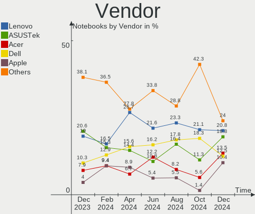
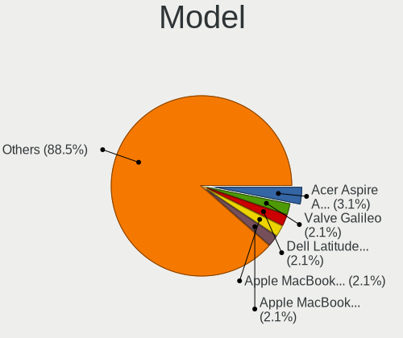
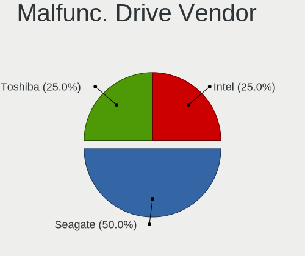
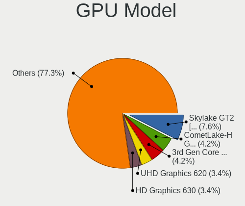
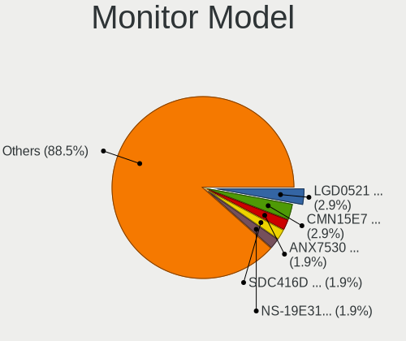
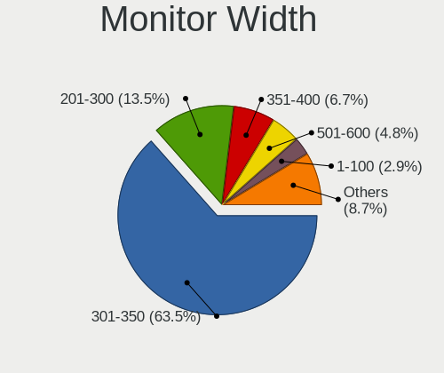
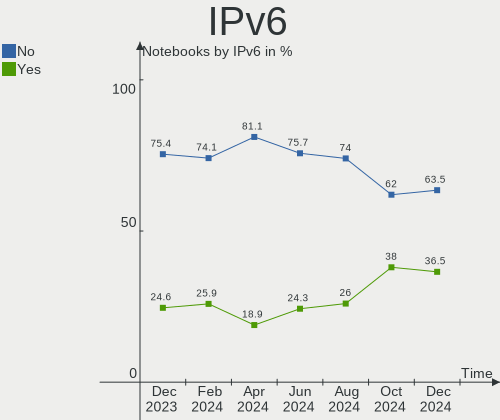
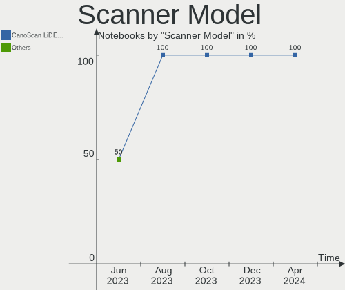
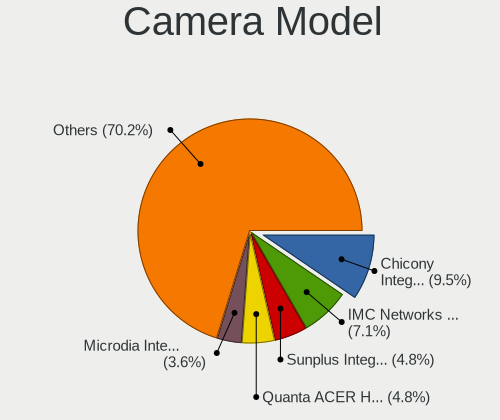

Linux in Canada - Hardware Trends (Notebooks)
---------------------------------------------

A project to identify most popular hardware characteristics and track their change
over time based on data collected by Linux users at https://Linux-Hardware.org.

Anyone can contribute to this report by the [hw-probe](https://github.com/linuxhw/hw-probe) tool:

    sudo -E hw-probe -all -upload

Period: Apr, 2024.

Contents
--------

* [ System ](#system)
  - [ OS                       ](#os)
  - [ OS Family                ](#os-family)
  - [ Kernel                   ](#kernel)
  - [ Kernel Family            ](#kernel-family)
  - [ Kernel Major Ver.        ](#kernel-major-ver)
  - [ Arch                     ](#arch)
  - [ DE                       ](#de)
  - [ Display Server           ](#display-server)
  - [ Display Manager          ](#display-manager)
  - [ OS Lang                  ](#os-lang)
  - [ Boot Mode                ](#boot-mode)
  - [ Filesystem               ](#filesystem)
  - [ Part. scheme             ](#part-scheme)
  - [ Dual Boot with Linux/BSD ](#dual-boot-with-linuxbsd)
  - [ Dual Boot (Win)          ](#dual-boot-win)

* [ Board ](#board)
  - [ Vendor                   ](#vendor)
  - [ Model                    ](#model)
  - [ Model Family             ](#model-family)
  - [ MFG Year                 ](#mfg-year)
  - [ Form Factor              ](#form-factor)
  - [ Secure Boot              ](#secure-boot)
  - [ Coreboot                 ](#coreboot)
  - [ RAM Size                 ](#ram-size)
  - [ RAM Used                 ](#ram-used)
  - [ Total Drives             ](#total-drives)
  - [ Has CD-ROM               ](#has-cd-rom)
  - [ Has Ethernet             ](#has-ethernet)
  - [ Has WiFi                 ](#has-wifi)
  - [ Has Bluetooth            ](#has-bluetooth)

* [ Location ](#location)
  - [ Country                  ](#country)
  - [ City                     ](#city)

* [ Drives ](#drives)
  - [ Drive Vendor             ](#drive-vendor)
  - [ Drive Model              ](#drive-model)
  - [ HDD Vendor               ](#hdd-vendor)
  - [ SSD Vendor               ](#ssd-vendor)
  - [ Drive Kind               ](#drive-kind)
  - [ Drive Connector          ](#drive-connector)
  - [ Drive Size               ](#drive-size)
  - [ Space Total              ](#space-total)
  - [ Space Used               ](#space-used)
  - [ Malfunc. Drives          ](#malfunc-drives)
  - [ Malfunc. Drive Vendor    ](#malfunc-drive-vendor)
  - [ Malfunc. HDD Vendor      ](#malfunc-hdd-vendor)
  - [ Malfunc. Drive Kind      ](#malfunc-drive-kind)
  - [ Failed Drives            ](#failed-drives)
  - [ Failed Drive Vendor      ](#failed-drive-vendor)
  - [ Drive Status             ](#drive-status)

* [ Storage controller ](#storage-controller)
  - [ Storage Vendor           ](#storage-vendor)
  - [ Storage Model            ](#storage-model)
  - [ Storage Kind             ](#storage-kind)

* [ Processor ](#processor)
  - [ CPU Vendor               ](#cpu-vendor)
  - [ CPU Model                ](#cpu-model)
  - [ CPU Model Family         ](#cpu-model-family)
  - [ CPU Cores                ](#cpu-cores)
  - [ CPU Sockets              ](#cpu-sockets)
  - [ CPU Threads              ](#cpu-threads)
  - [ CPU Op-Modes             ](#cpu-op-modes)
  - [ CPU Microcode            ](#cpu-microcode)
  - [ CPU Microarch            ](#cpu-microarch)

* [ Graphics ](#graphics)
  - [ GPU Vendor               ](#gpu-vendor)
  - [ GPU Model                ](#gpu-model)
  - [ GPU Combo                ](#gpu-combo)
  - [ GPU Driver               ](#gpu-driver)
  - [ GPU Memory               ](#gpu-memory)

* [ Monitor ](#monitor)
  - [ Monitor Vendor           ](#monitor-vendor)
  - [ Monitor Model            ](#monitor-model)
  - [ Monitor Resolution       ](#monitor-resolution)
  - [ Monitor Diagonal         ](#monitor-diagonal)
  - [ Monitor Width            ](#monitor-width)
  - [ Aspect Ratio             ](#aspect-ratio)
  - [ Monitor Area             ](#monitor-area)
  - [ Pixel Density            ](#pixel-density)
  - [ Multiple Monitors        ](#multiple-monitors)

* [ Network ](#network)
  - [ Net Controller Vendor    ](#net-controller-vendor)
  - [ Net Controller Model     ](#net-controller-model)
  - [ Wireless Vendor          ](#wireless-vendor)
  - [ Wireless Model           ](#wireless-model)
  - [ Ethernet Vendor          ](#ethernet-vendor)
  - [ Ethernet Model           ](#ethernet-model)
  - [ Net Controller Kind      ](#net-controller-kind)
  - [ Used Controller          ](#used-controller)
  - [ NICs                     ](#nics)
  - [ IPv6                     ](#ipv6)

* [ Bluetooth ](#bluetooth)
  - [ Bluetooth Vendor         ](#bluetooth-vendor)
  - [ Bluetooth Model          ](#bluetooth-model)

* [ Sound ](#sound)
  - [ Sound Vendor             ](#sound-vendor)
  - [ Sound Model              ](#sound-model)

* [ Memory ](#memory)
  - [ Memory Vendor            ](#memory-vendor)
  - [ Memory Model             ](#memory-model)
  - [ Memory Kind              ](#memory-kind)
  - [ Memory Form Factor       ](#memory-form-factor)
  - [ Memory Size              ](#memory-size)
  - [ Memory Speed             ](#memory-speed)

* [ Printers & scanners ](#printers--scanners)
  - [ Printer Vendor           ](#printer-vendor)
  - [ Printer Model            ](#printer-model)
  - [ Scanner Vendor           ](#scanner-vendor)
  - [ Scanner Model            ](#scanner-model)

* [ Camera ](#camera)
  - [ Camera Vendor            ](#camera-vendor)
  - [ Camera Model             ](#camera-model)

* [ Security ](#security)
  - [ Fingerprint Vendor       ](#fingerprint-vendor)
  - [ Fingerprint Model        ](#fingerprint-model)
  - [ Chipcard Vendor          ](#chipcard-vendor)
  - [ Chipcard Model           ](#chipcard-model)

* [ Unsupported ](#unsupported)
  - [ Unsupported Devices      ](#unsupported-devices)
  - [ Unsupported Device Types ](#unsupported-device-types)

System
------

OS
--

Installed operating systems

| Name                 | Notebooks | Percent |
|----------------------|-----------|---------|
| Ubuntu 22.04         | 11        | 12.22%  |
| Fedora 39            | 9         | 10%     |
| Debian 12            | 7         | 7.78%   |
| Fedora 40            | 6         | 6.67%   |
| Zorin 17             | 5         | 5.56%   |
| Linux Mint 21.3      | 5         | 5.56%   |
| Pop!_OS 22.04        | 4         | 4.44%   |
| Ubuntu 24.04         | 3         | 3.33%   |
| Ubuntu 23.10         | 3         | 3.33%   |
| OpenMandriva 23.08   | 3         | 3.33%   |
| Arch Rolling         | 3         | 3.33%   |
| OpenMandriva 5.0     | 2         | 2.22%   |
| Nobara 39            | 2         | 2.22%   |
| Kubuntu 22.04        | 2         | 2.22%   |
| KDE neon 22.04       | 2         | 2.22%   |
| Kali 2024.1          | 2         | 2.22%   |
| Zorin 16             | 1         | 1.11%   |
| Xubuntu 22.04        | 1         | 1.11%   |
| Void Linux Rolling   | 1         | 1.11%   |
| Ubuntu MATE 22.04    | 1         | 1.11%   |
| Ubuntu 20.04         | 1         | 1.11%   |
| SteamOS 3.5.17       | 1         | 1.11%   |
| OpenMandriva 4.2     | 1         | 1.11%   |
| OpenMandriva 24.03   | 1         | 1.11%   |
| OpenMandriva 23.01   | 1         | 1.11%   |
| NixOS 24.05          | 1         | 1.11%   |
| MX 21                | 1         | 1.11%   |
| Manjaro 23.1.4       | 1         | 1.11%   |
| Manjaro              | 1         | 1.11%   |
| Linux Mint 21.2      | 1         | 1.11%   |
| Linux Mint 21.1      | 1         | 1.11%   |
| Linux Mint 20.3      | 1         | 1.11%   |
| Garuda Linux Soaring | 1         | 1.11%   |
| Elementary 7.1       | 1         | 1.11%   |
| Debian 11            | 1         | 1.11%   |
| Debian               | 1         | 1.11%   |
| BlackPanther 18.1    | 1         | 1.11%   |

OS Family
---------

OS without a version

| Name         | Notebooks | Percent |
|--------------|-----------|---------|
| Ubuntu       | 18        | 20%     |
| Fedora       | 15        | 16.67%  |
| Debian       | 9         | 10%     |
| OpenMandriva | 8         | 8.89%   |
| Linux Mint   | 8         | 8.89%   |
| Zorin        | 6         | 6.67%   |
| Pop!_OS      | 4         | 4.44%   |
| Arch         | 3         | 3.33%   |
| Nobara       | 2         | 2.22%   |
| Manjaro      | 2         | 2.22%   |
| Kubuntu      | 2         | 2.22%   |
| KDE neon     | 2         | 2.22%   |
| Kali         | 2         | 2.22%   |
| Xubuntu      | 1         | 1.11%   |
| Void Linux   | 1         | 1.11%   |
| Ubuntu MATE  | 1         | 1.11%   |
| SteamOS      | 1         | 1.11%   |
| NixOS        | 1         | 1.11%   |
| MX           | 1         | 1.11%   |
| Garuda Linux | 1         | 1.11%   |
| Elementary   | 1         | 1.11%   |
| BlackPanther | 1         | 1.11%   |

Kernel
------

Version of the Linux kernel

| Version                             | Notebooks | Percent |
|-------------------------------------|-----------|---------|
| 6.5.0-28-generic                    | 9         | 10%     |
| 6.5.0-27-generic                    | 9         | 10%     |
| 6.5.0-26-generic                    | 7         | 7.78%   |
| 6.8.0-76060800daily20240311-generic | 4         | 4.44%   |
| 6.7.11-200.fc39.x86_64              | 4         | 4.44%   |
| 6.8.7-300.fc40.x86_64               | 3         | 3.33%   |
| 6.4.11-desktop-1omv2390             | 3         | 3.33%   |
| 5.15.0-105-generic                  | 3         | 3.33%   |
| 6.8.5-301.fc40.x86_64               | 2         | 2.22%   |
| 6.8.4-arch1-1                       | 2         | 2.22%   |
| 6.8.4-200.fc39.x86_64               | 2         | 2.22%   |
| 6.8.0-31-generic                    | 2         | 2.22%   |
| 6.6.2-desktop-1omv2390              | 2         | 2.22%   |
| 6.6.15-amd64                        | 2         | 2.22%   |
| 6.1.0-20-amd64                      | 2         | 2.22%   |
| 6.1.0-18-amd64                      | 2         | 2.22%   |
| 5.15.0-102-generic                  | 2         | 2.22%   |
| 5.15.0-101-generic                  | 2         | 2.22%   |
| 6.8.7-desktop-1omv2490              | 1         | 1.11%   |
| 6.8.7-arch1-1                       | 1         | 1.11%   |
| 6.8.7                               | 1         | 1.11%   |
| 6.8.6-200.fc39.x86_64               | 1         | 1.11%   |
| 6.8.5-201.fsync.fc39.x86_64         | 1         | 1.11%   |
| 6.8.5-201.fc39.x86_64               | 1         | 1.11%   |
| 6.8.4-zen1-1-zen                    | 1         | 1.11%   |
| 6.8.4-300.fc40.x86_64               | 1         | 1.11%   |
| 6.8.4-060804-generic                | 1         | 1.11%   |
| 6.8.2-201.fsync.fc39.x86_64         | 1         | 1.11%   |
| 6.7.0                               | 1         | 1.11%   |
| 6.6.9-amd64                         | 1         | 1.11%   |
| 6.6.26-1-MANJARO                    | 1         | 1.11%   |
| 6.6.25_1                            | 1         | 1.11%   |
| 6.6.25-1-MANJARO                    | 1         | 1.11%   |
| 6.6.13+bpo-amd64                    | 1         | 1.11%   |
| 6.5.6-300.fc39.x86_64               | 1         | 1.11%   |
| 6.5.0-26-lowlatency                 | 1         | 1.11%   |
| 6.1.52-valve16-1-neptune-61         | 1         | 1.11%   |
| 6.1.1-desktop-1omv2290              | 1         | 1.11%   |
| 6.1.0-17-amd64                      | 1         | 1.11%   |
| 5.4.0-176-generic                   | 1         | 1.11%   |

Kernel Family
-------------

Linux kernel without a distro release

| Version | Notebooks | Percent |
|---------|-----------|---------|
| 6.5.0   | 26        | 28.89%  |
| 5.15.0  | 9         | 10%     |
| 6.8.4   | 7         | 7.78%   |
| 6.8.7   | 6         | 6.67%   |
| 6.8.0   | 6         | 6.67%   |
| 6.1.0   | 5         | 5.56%   |
| 6.8.5   | 4         | 4.44%   |
| 6.7.11  | 4         | 4.44%   |
| 6.4.11  | 3         | 3.33%   |
| 6.6.25  | 2         | 2.22%   |
| 6.6.2   | 2         | 2.22%   |
| 6.6.15  | 2         | 2.22%   |
| 6.8.6   | 1         | 1.11%   |
| 6.8.2   | 1         | 1.11%   |
| 6.7.0   | 1         | 1.11%   |
| 6.6.9   | 1         | 1.11%   |
| 6.6.26  | 1         | 1.11%   |
| 6.6.13  | 1         | 1.11%   |
| 6.5.6   | 1         | 1.11%   |
| 6.1.52  | 1         | 1.11%   |
| 6.1.1   | 1         | 1.11%   |
| 5.4.0   | 1         | 1.11%   |
| 5.15.85 | 1         | 1.11%   |
| 5.14.0  | 1         | 1.11%   |
| 5.11.12 | 1         | 1.11%   |
| 5.10.0  | 1         | 1.11%   |

Kernel Major Ver.
-----------------

Linux kernel major version

| Version | Notebooks | Percent |
|---------|-----------|---------|
| 6.5     | 27        | 30%     |
| 6.8     | 25        | 27.78%  |
| 5.15    | 10        | 11.11%  |
| 6.6     | 9         | 10%     |
| 6.1     | 7         | 7.78%   |
| 6.7     | 5         | 5.56%   |
| 6.4     | 3         | 3.33%   |
| 5.4     | 1         | 1.11%   |
| 5.14    | 1         | 1.11%   |
| 5.11    | 1         | 1.11%   |
| 5.10    | 1         | 1.11%   |

Arch
----

OS architecture (x86_64, i586, etc.)

| Name   | Notebooks | Percent |
|--------|-----------|---------|
| x86_64 | 90        | 100%    |

DE
--

Desktop Environment

| Name       | Notebooks | Percent |
|------------|-----------|---------|
| GNOME      | 49        | 54.44%  |
| KDE5       | 19        | 21.11%  |
| X-Cinnamon | 7         | 7.78%   |
| KDE6       | 4         | 4.44%   |
| Unknown    | 3         | 3.33%   |
| XFCE       | 2         | 2.22%   |
| MATE       | 2         | 2.22%   |
| Pantheon   | 1         | 1.11%   |
| LXQt       | 1         | 1.11%   |
| KDE4       | 1         | 1.11%   |
| i3         | 1         | 1.11%   |

Display Server
--------------

X11 or Wayland

| Name    | Notebooks | Percent |
|---------|-----------|---------|
| Wayland | 46        | 51.11%  |
| X11     | 41        | 45.56%  |
| Unknown | 2         | 2.22%   |
| Tty     | 1         | 1.11%   |

Display Manager
---------------

SDDM, LightDM, etc.

| Name    | Notebooks | Percent |
|---------|-----------|---------|
| Unknown | 36        | 40%     |
| GDM3    | 22        | 24.44%  |
| SDDM    | 17        | 18.89%  |
| LightDM | 9         | 10%     |
| GDM     | 6         | 6.67%   |

OS Lang
-------

Language

| Lang    | Notebooks | Percent |
|---------|-----------|---------|
| en_CA   | 44        | 48.89%  |
| en_US   | 32        | 35.56%  |
| fr_CA   | 5         | 5.56%   |
| C       | 4         | 4.44%   |
| Unknown | 3         | 3.33%   |
| fr_FR   | 2         | 2.22%   |

Boot Mode
---------

EFI or BIOS

| Mode | Notebooks | Percent |
|------|-----------|---------|
| BIOS | 46        | 51.11%  |
| EFI  | 44        | 48.89%  |

Filesystem
----------

Type of filesystem

| Type    | Notebooks | Percent |
|---------|-----------|---------|
| Ext4    | 54        | 60%     |
| Btrfs   | 18        | 20%     |
| Tmpfs   | 10        | 11.11%  |
| Overlay | 7         | 7.78%   |
| Ext2    | 1         | 1.11%   |

Part. scheme
------------

Scheme of partitioning

| Type    | Notebooks | Percent |
|---------|-----------|---------|
| GPT     | 52        | 57.78%  |
| Unknown | 33        | 36.67%  |
| MBR     | 5         | 5.56%   |

Dual Boot with Linux/BSD
------------------------

Hosting more than one Linux/BSD

| Dual boot | Notebooks | Percent |
|-----------|-----------|---------|
| No        | 78        | 86.67%  |
| Yes       | 12        | 13.33%  |

Dual Boot (Win)
---------------

Hosting Linux and Windows

| Dual boot | Notebooks | Percent |
|-----------|-----------|---------|
| No        | 70        | 77.78%  |
| Yes       | 20        | 22.22%  |

Board
-----

Vendor
------

Motherboard manufacturer

| Name                      | Notebooks | Percent |
|---------------------------|-----------|---------|
| Lenovo                    | 24        | 26.67%  |
| Dell                      | 14        | 15.56%  |
| ASUSTek Computer          | 13        | 14.44%  |
| Apple                     | 8         | 8.89%   |
| Hewlett-Packard           | 7         | 7.78%   |
| Acer                      | 6         | 6.67%   |
| MSI                       | 3         | 3.33%   |
| Gigabyte Technology       | 3         | 3.33%   |
| Unknown                   | 2         | 2.22%   |
| Valve                     | 1         | 1.11%   |
| Toshiba                   | 1         | 1.11%   |
| System76                  | 1         | 1.11%   |
| Sony                      | 1         | 1.11%   |
| RTD Embedded Technologies | 1         | 1.11%   |
| Panasonic                 | 1         | 1.11%   |
| OEM                       | 1         | 1.11%   |
| Intel Client Systems      | 1         | 1.11%   |
| Framework                 | 1         | 1.11%   |
| Chuwi                     | 1         | 1.11%   |

Model
-----

Motherboard model

| Name                                     | Notebooks | Percent |
|------------------------------------------|-----------|---------|
| Apple MacBookPro11,1                     | 2         | 2.22%   |
| Unknown                                  | 2         | 2.22%   |
| Valve Jupiter                            | 1         | 1.11%   |
| Toshiba TECRA Z40-C                      | 1         | 1.11%   |
| System76 Gazelle                         | 1         | 1.11%   |
| Sony SVF15213CDW                         | 1         | 1.11%   |
| RTD Embedded CMX34BT                     | 1         | 1.11%   |
| Panasonic CF-31WFL72LM                   | 1         | 1.11%   |
| OEM KabyLake                             | 1         | 1.11%   |
| MSI GF63 Thin 10SC                       | 1         | 1.11%   |
| MSI Cyborg 15 A12VF                      | 1         | 1.11%   |
| MSI Bravo 15 C7VFK                       | 1         | 1.11%   |
| Lenovo ThinkPad X1 Nano Gen 1 20UQS1RQ00 | 1         | 1.11%   |
| Lenovo ThinkPad X1 Carbon 2nd 20A8S0ET00 | 1         | 1.11%   |
| Lenovo ThinkPad T530 2359CTO             | 1         | 1.11%   |
| Lenovo ThinkPad T510 4349BW3             | 1         | 1.11%   |
| Lenovo ThinkPad T480s 20L8S6BW14         | 1         | 1.11%   |
| Lenovo ThinkPad T470p 20J7S0FA05         | 1         | 1.11%   |
| Lenovo ThinkPad T470 20HEA0TLUS          | 1         | 1.11%   |
| Lenovo ThinkPad T440p 20ANCTO1WW         | 1         | 1.11%   |
| Lenovo ThinkPad T14 Gen 1 20S1S80300     | 1         | 1.11%   |
| Lenovo ThinkPad S1 Yoga 20CD20CD00       | 1         | 1.11%   |
| Lenovo ThinkPad P52 20MAS4W721           | 1         | 1.11%   |
| Lenovo ThinkPad P51 20HHCTO1WW           | 1         | 1.11%   |
| Lenovo ThinkPad P15v Gen 1 20TQCTO1WW    | 1         | 1.11%   |
| Lenovo ThinkPad P15 Gen 2i 20YQ004JUS    | 1         | 1.11%   |
| Lenovo ThinkPad P15 Gen 1 20ST0050US     | 1         | 1.11%   |
| Lenovo ThinkPad E580 20KS003LCA          | 1         | 1.11%   |
| Lenovo ThinkBook 14 G2 ITL 20VD          | 1         | 1.11%   |
| Lenovo ThinkBook 13s G4 IAP 21AR         | 1         | 1.11%   |
| Lenovo LOQ 15IRH8 82XV                   | 1         | 1.11%   |
| Lenovo Legion Y7000P IAH7 82RC           | 1         | 1.11%   |
| Lenovo Legion 5 17ACH6H 82JY             | 1         | 1.11%   |
| Lenovo Legion 5 15ARH7 82RE              | 1         | 1.11%   |
| Lenovo IdeaPadFlex 15 20309              | 1         | 1.11%   |
| Lenovo G780 20138                        | 1         | 1.11%   |
| Intel Client Systems LAPRC710            | 1         | 1.11%   |
| HP ZBook 15 G3                           | 1         | 1.11%   |
| HP ProBook 650 G2                        | 1         | 1.11%   |
| HP ProBook 4540s                         | 1         | 1.11%   |

Model Family
------------

Motherboard model prefix

| Name                          | Notebooks | Percent |
|-------------------------------|-----------|---------|
| Lenovo ThinkPad               | 16        | 17.78%  |
| Dell Latitude                 | 5         | 5.56%   |
| ASUS VivoBook                 | 4         | 4.44%   |
| Acer Aspire                   | 4         | 4.44%   |
| Lenovo Legion                 | 3         | 3.33%   |
| Dell Inspiron                 | 3         | 3.33%   |
| Apple MacBookPro11            | 3         | 3.33%   |
| Lenovo ThinkBook              | 2         | 2.22%   |
| HP ProBook                    | 2         | 2.22%   |
| HP Pavilion                   | 2         | 2.22%   |
| HP EliteBook                  | 2         | 2.22%   |
| Gigabyte AERO                 | 2         | 2.22%   |
| Dell Studio                   | 2         | 2.22%   |
| Dell Precision                | 2         | 2.22%   |
| ASUS ASUS                     | 2         | 2.22%   |
| Apple MacBookPro8             | 2         | 2.22%   |
| Unknown                       | 2         | 2.22%   |
| Valve Jupiter                 | 1         | 1.11%   |
| Toshiba TECRA                 | 1         | 1.11%   |
| System76 Gazelle              | 1         | 1.11%   |
| Sony SVF15213CDW              | 1         | 1.11%   |
| RTD Embedded CMX34BT          | 1         | 1.11%   |
| Panasonic CF-31WFL72LM        | 1         | 1.11%   |
| OEM KabyLake                  | 1         | 1.11%   |
| MSI GF63                      | 1         | 1.11%   |
| MSI Cyborg                    | 1         | 1.11%   |
| MSI Bravo                     | 1         | 1.11%   |
| Lenovo LOQ                    | 1         | 1.11%   |
| Lenovo IdeaPadFlex            | 1         | 1.11%   |
| Lenovo G780                   | 1         | 1.11%   |
| Intel Client Systems LAPRC710 | 1         | 1.11%   |
| HP ZBook                      | 1         | 1.11%   |
| Gigabyte G5                   | 1         | 1.11%   |
| Framework Laptop              | 1         | 1.11%   |
| Dell XPS                      | 1         | 1.11%   |
| Dell G3                       | 1         | 1.11%   |
| Chuwi LapBook                 | 1         | 1.11%   |
| ASUS X555YA                   | 1         | 1.11%   |
| ASUS UX305CA                  | 1         | 1.11%   |
| ASUS Strix                    | 1         | 1.11%   |

MFG Year
--------

Motherboard manufacture year

| Year | Notebooks | Percent |
|------|-----------|---------|
| 2021 | 10        | 11.11%  |
| 2023 | 9         | 10%     |
| 2020 | 8         | 8.89%   |
| 2017 | 8         | 8.89%   |
| 2014 | 8         | 8.89%   |
| 2012 | 8         | 8.89%   |
| 2013 | 7         | 7.78%   |
| 2022 | 6         | 6.67%   |
| 2016 | 5         | 5.56%   |
| 2009 | 5         | 5.56%   |
| 2018 | 4         | 4.44%   |
| 2015 | 4         | 4.44%   |
| 2019 | 3         | 3.33%   |
| 2011 | 3         | 3.33%   |
| 2008 | 2         | 2.22%   |

Form Factor
-----------

Physical design of the computer

| Name     | Notebooks | Percent |
|----------|-----------|---------|
| Notebook | 90        | 100%    |

Secure Boot
-----------

Enabled or disabled

| State    | Notebooks | Percent |
|----------|-----------|---------|
| Disabled | 86        | 95.56%  |
| Enabled  | 4         | 4.44%   |

Coreboot
--------

Have coreboot on board

| Used | Notebooks | Percent |
|------|-----------|---------|
| No   | 89        | 98.89%  |
| Yes  | 1         | 1.11%   |

RAM Size
--------

Total RAM memory

| Size in GB  | Notebooks | Percent |
|-------------|-----------|---------|
| 4.01-8.0    | 36        | 40%     |
| 16.01-24.0  | 19        | 21.11%  |
| 8.01-16.0   | 13        | 14.44%  |
| 32.01-64.0  | 10        | 11.11%  |
| 3.01-4.0    | 9         | 10%     |
| 64.01-256.0 | 2         | 2.22%   |
| 24.01-32.0  | 1         | 1.11%   |

RAM Used
--------

Used RAM memory

| Used GB    | Notebooks | Percent |
|------------|-----------|---------|
| 4.01-8.0   | 24        | 26.67%  |
| 2.01-3.0   | 23        | 25.56%  |
| 1.01-2.0   | 23        | 25.56%  |
| 3.01-4.0   | 13        | 14.44%  |
| 8.01-16.0  | 3         | 3.33%   |
| 0.51-1.0   | 3         | 3.33%   |
| 16.01-24.0 | 1         | 1.11%   |

Total Drives
------------

Number of drives on board

| Drives | Notebooks | Percent |
|--------|-----------|---------|
| 1      | 66        | 73.33%  |
| 2      | 22        | 24.44%  |
| 3      | 1         | 1.11%   |
| 0      | 1         | 1.11%   |

Has CD-ROM
----------

Has CD-ROM on board

| Presented | Notebooks | Percent |
|-----------|-----------|---------|
| No        | 71        | 78.89%  |
| Yes       | 19        | 21.11%  |

Has Ethernet
------------

Has Ethernet on board

| Presented | Notebooks | Percent |
|-----------|-----------|---------|
| Yes       | 71        | 78.89%  |
| No        | 19        | 21.11%  |

Has WiFi
--------

Has WiFi module

| Presented | Notebooks | Percent |
|-----------|-----------|---------|
| Yes       | 86        | 95.56%  |
| No        | 4         | 4.44%   |

Has Bluetooth
-------------

Has Bluetooth module

| Presented | Notebooks | Percent |
|-----------|-----------|---------|
| Yes       | 76        | 84.44%  |
| No        | 14        | 15.56%  |

Location
--------

Country
-------

Geographic location (country)

| Country | Notebooks | Percent |
|---------|-----------|---------|
| Canada  | 90        | 100%    |

City
----

Geographic location (city)

| City             | Notebooks | Percent |
|------------------|-----------|---------|
| Montreal         | 15        | 16.67%  |
| Toronto          | 7         | 7.78%   |
| Calgary          | 5         | 5.56%   |
| Ottawa           | 3         | 3.33%   |
| Mississauga      | 3         | 3.33%   |
| Hamilton         | 3         | 3.33%   |
| Winnipeg         | 2         | 2.22%   |
| Nepean           | 2         | 2.22%   |
| Edmonton         | 2         | 2.22%   |
| Burnaby          | 2         | 2.22%   |
| Whitby           | 1         | 1.11%   |
| Victoria         | 1         | 1.11%   |
| Vancouver        | 1         | 1.11%   |
| Tottenham        | 1         | 1.11%   |
| Swift Current    | 1         | 1.11%   |
| St. John's       | 1         | 1.11%   |
| Spruce Grove     | 1         | 1.11%   |
| Sorel-Tracy      | 1         | 1.11%   |
| Simcoe           | 1         | 1.11%   |
| Sault Ste. Marie | 1         | 1.11%   |
| Saskatoon        | 1         | 1.11%   |
| Sarnia           | 1         | 1.11%   |
| Saint-Jerome     | 1         | 1.11%   |
| Rimouski         | 1         | 1.11%   |
| Richmond         | 1         | 1.11%   |
| Québec          | 1         | 1.11%   |
| Port Moody       | 1         | 1.11%   |
| Port Alberni     | 1         | 1.11%   |
| Pierrefonds      | 1         | 1.11%   |
| Orillia          | 1         | 1.11%   |
| North York       | 1         | 1.11%   |
| North Vancouver  | 1         | 1.11%   |
| Niagara Falls    | 1         | 1.11%   |
| Napanee          | 1         | 1.11%   |
| Moncton          | 1         | 1.11%   |
| Middle Sackville | 1         | 1.11%   |
| Messines         | 1         | 1.11%   |
| Markham          | 1         | 1.11%   |
| Maple Ridge      | 1         | 1.11%   |
| Longueuil        | 1         | 1.11%   |

Drives
------

Drive Vendor
------------

Hard drive vendors

| Vendor                      | Notebooks | Drives | Percent |
|-----------------------------|-----------|--------|---------|
| Samsung Electronics         | 26        | 27     | 23.42%  |
| SK hynix                    | 8         | 8      | 7.21%   |
| Seagate                     | 7         | 7      | 6.31%   |
| SanDisk                     | 7         | 8      | 6.31%   |
| WDC                         | 6         | 6      | 5.41%   |
| Toshiba                     | 6         | 6      | 5.41%   |
| Apple                       | 5         | 5      | 4.5%    |
| Micron Technology           | 4         | 4      | 3.6%    |
| Kingston                    | 4         | 4      | 3.6%    |
| Intel                       | 4         | 4      | 3.6%    |
| Crucial                     | 4         | 4      | 3.6%    |
| SPCC                        | 3         | 3      | 2.7%    |
| A-DATA Technology           | 3         | 3      | 2.7%    |
| Unknown                     | 3         | 3      | 2.7%    |
| Unknown                     | 2         | 2      | 1.8%    |
| Phison Electronics          | 2         | 2      | 1.8%    |
| OCZ                         | 2         | 2      | 1.8%    |
| LITEON                      | 2         | 2      | 1.8%    |
| UMIS                        | 1         | 1      | 0.9%    |
| Timetec                     | 1         | 1      | 0.9%    |
| Realtek Semiconductor       | 1         | 1      | 0.9%    |
| PNY                         | 1         | 1      | 0.9%    |
| Pioneer                     | 1         | 1      | 0.9%    |
| Patriot                     | 1         | 1      | 0.9%    |
| Lexar                       | 1         | 1      | 0.9%    |
| Kingston Technology Company | 1         | 1      | 0.9%    |
| KingSpec                    | 1         | 1      | 0.9%    |
| Hitachi                     | 1         | 1      | 0.9%    |
| HGST                        | 1         | 1      | 0.9%    |
| FORESEE                     | 1         | 1      | 0.9%    |
| Corsair                     | 1         | 1      | 0.9%    |

Drive Model
-----------

Hard drive models

| Model                                              | Notebooks | Percent |
|----------------------------------------------------|-----------|---------|
| Samsung NVMe SSD Controller SM981/PM981/PM983 1TB  | 4         | 3.54%   |
| Samsung NVMe SSD Controller PM9A1/PM9A3/980PRO 1TB | 3         | 2.65%   |
| Unknown                                            | 3         | 2.65%   |
| Kingston SA400S37240G 240GB SSD                    | 2         | 1.77%   |
| Intel SSDPEKNU512GZ 512GB                          | 2         | 1.77%   |
| Apple SSD SM0256F 256GB                            | 2         | 1.77%   |
| WDC WDS500G2B0B-00YS70 500GB SSD                   | 1         | 0.88%   |
| WDC WDS200T2B0B-00YS70 2TB SSD                     | 1         | 0.88%   |
| WDC WDS100T2B0A-00SM50 1TB SSD                     | 1         | 0.88%   |
| WDC WD5000BPVT-22HXZT1 500GB                       | 1         | 0.88%   |
| WDC WD10JPVX-22JC3T0 1TB                           | 1         | 0.88%   |
| WDC WD10JPVX-11JC3T0 1TB                           | 1         | 0.88%   |
| Unknown SD64G  64GB                                | 1         | 0.88%   |
| Unknown MMC Card  32GB                             | 1         | 0.88%   |
| UMIS RPJTJ256MGE1QDY 256GB                         | 1         | 0.88%   |
| Toshiba MQ04ABF100 1TB                             | 1         | 0.88%   |
| Toshiba MQ01ABD100 1TB                             | 1         | 0.88%   |
| Toshiba MQ01ABD075 752GB                           | 1         | 0.88%   |
| Toshiba MK2555GSXF 250GB                           | 1         | 0.88%   |
| Toshiba MK1032GSX 100GB                            | 1         | 0.88%   |
| Toshiba KBG40ZNT256G MEMORY 256GB                  | 1         | 0.88%   |
| Timetec SD08 512GB SSD                             | 1         | 0.88%   |
| SPCC Solid State Disk 256GB                        | 1         | 0.88%   |
| SPCC Solid State Disk 1TB                          | 1         | 0.88%   |
| SPCC M.2 PCIe SSD 1TB                              | 1         | 0.88%   |
| SK hynix SKHynix_HFS512GEJ9X115N 512GB             | 1         | 0.88%   |
| SK hynix SKHynix_HFS512GD9TNI-L2B0B 512GB          | 1         | 0.88%   |
| SK hynix SKHynix_HFS256GD9TNI-L2B0B 256GB          | 1         | 0.88%   |
| SK hynix PC801 NVMe 1TB                            | 1         | 0.88%   |
| SK hynix HFS128G39TND-N210A 128GB SSD              | 1         | 0.88%   |
| SK hynix BC711 NVMe 512GB                          | 1         | 0.88%   |
| SK hynix BC711 HFM512GD3JX013N 512GB               | 1         | 0.88%   |
| SK hynix BC511 HFM256GDJTNI-82A0A 256GB            | 1         | 0.88%   |
| Seagate ST9160414ASG 160GB                         | 1         | 0.88%   |
| Seagate ST500LT012-9WS142 500GB                    | 1         | 0.88%   |
| Seagate ST500LM021-1KJ152 500GB                    | 1         | 0.88%   |
| Seagate ST500LM000-1EJ162 500GB                    | 1         | 0.88%   |
| Seagate ST2000LM015-2E8174 2TB                     | 1         | 0.88%   |
| Seagate ST1000LX015-1U7172 1TB                     | 1         | 0.88%   |
| Seagate BarraCuda 120 SSD ZA1000CM10003 1TB        | 1         | 0.88%   |

HDD Vendor
----------

Hard disk drive vendors

| Vendor  | Notebooks | Drives | Percent |
|---------|-----------|--------|---------|
| Seagate | 6         | 6      | 37.5%   |
| Toshiba | 5         | 5      | 31.25%  |
| WDC     | 3         | 3      | 18.75%  |
| Hitachi | 1         | 1      | 6.25%   |
| HGST    | 1         | 1      | 6.25%   |

SSD Vendor
----------

Solid state drive vendors

| Vendor              | Notebooks | Drives | Percent |
|---------------------|-----------|--------|---------|
| Samsung Electronics | 8         | 8      | 17.78%  |
| Apple               | 5         | 5      | 11.11%  |
| WDC                 | 3         | 3      | 6.67%   |
| Kingston            | 3         | 3      | 6.67%   |
| A-DATA Technology   | 3         | 3      | 6.67%   |
| SPCC                | 2         | 2      | 4.44%   |
| SanDisk             | 2         | 2      | 4.44%   |
| OCZ                 | 2         | 2      | 4.44%   |
| LITEON              | 2         | 2      | 4.44%   |
| Crucial             | 2         | 2      | 4.44%   |
| Unknown             | 2         | 2      | 4.44%   |
| Timetec             | 1         | 1      | 2.22%   |
| SK hynix            | 1         | 1      | 2.22%   |
| Seagate             | 1         | 1      | 2.22%   |
| PNY                 | 1         | 1      | 2.22%   |
| Pioneer             | 1         | 1      | 2.22%   |
| Patriot             | 1         | 1      | 2.22%   |
| Micron Technology   | 1         | 1      | 2.22%   |
| KingSpec            | 1         | 1      | 2.22%   |
| Intel               | 1         | 1      | 2.22%   |
| FORESEE             | 1         | 1      | 2.22%   |
| Corsair             | 1         | 1      | 2.22%   |

Drive Kind
----------

HDD or SSD

| Kind    | Notebooks | Drives | Percent |
|---------|-----------|--------|---------|
| SSD     | 42        | 45     | 40.38%  |
| NVMe    | 41        | 47     | 39.42%  |
| HDD     | 16        | 16     | 15.38%  |
| MMC     | 4         | 4      | 3.85%   |
| Unknown | 1         | 1      | 0.96%   |

Drive Connector
---------------

SATA, SAS, NVMe, etc.

| Type | Notebooks | Drives | Percent |
|------|-----------|--------|---------|
| SATA | 54        | 60     | 53.47%  |
| NVMe | 41        | 47     | 40.59%  |
| MMC  | 4         | 4      | 3.96%   |
| SAS  | 2         | 2      | 1.98%   |

Drive Size
----------

Size of hard drive

| Size in TB | Notebooks | Drives | Percent |
|------------|-----------|--------|---------|
| 0.01-0.5   | 39        | 42     | 68.42%  |
| 0.51-1.0   | 15        | 16     | 26.32%  |
| 1.01-2.0   | 3         | 3      | 5.26%   |

Space Total
-----------

Amount of disk space available on the file system

| Size in GB | Notebooks | Percent |
|------------|-----------|---------|
| 101-250    | 27        | 30%     |
| 251-500    | 20        | 22.22%  |
| 501-1000   | 18        | 20%     |
| 1001-2000  | 6         | 6.67%   |
| 1-20       | 6         | 6.67%   |
| 51-100     | 6         | 6.67%   |
| Unknown    | 5         | 5.56%   |
| 21-50      | 1         | 1.11%   |
| 2001-3000  | 1         | 1.11%   |

Space Used
----------

Amount of used disk space

| Used GB   | Notebooks | Percent |
|-----------|-----------|---------|
| 1-20      | 29        | 32.22%  |
| 21-50     | 18        | 20%     |
| 101-250   | 16        | 17.78%  |
| 251-500   | 8         | 8.89%   |
| 51-100    | 7         | 7.78%   |
| 501-1000  | 6         | 6.67%   |
| Unknown   | 5         | 5.56%   |
| 1001-2000 | 1         | 1.11%   |

Malfunc. Drives
---------------

Drive models with a malfunction

| Model                                 | Notebooks | Drives | Percent |
|---------------------------------------|-----------|--------|---------|
| WDC WD10JPVX-22JC3T0 1TB              | 1         | 1      | 14.29%  |
| Toshiba MQ01ABD075 752GB              | 1         | 1      | 14.29%  |
| Timetec SD08 512GB SSD                | 1         | 1      | 14.29%  |
| Samsung Electronics SSD 870 EVO 250GB | 1         | 1      | 14.29%  |
| OCZ VERTEX2 64GB SSD                  | 1         | 1      | 14.29%  |
| KingSpec NT-256 256GB SSD             | 1         | 1      | 14.29%  |
| Hitachi HTS545050A7E380 500GB         | 1         | 1      | 14.29%  |

Malfunc. Drive Vendor
---------------------

Vendors of faulty drives

| Vendor              | Notebooks | Drives | Percent |
|---------------------|-----------|--------|---------|
| WDC                 | 1         | 1      | 14.29%  |
| Toshiba             | 1         | 1      | 14.29%  |
| Timetec             | 1         | 1      | 14.29%  |
| Samsung Electronics | 1         | 1      | 14.29%  |
| OCZ                 | 1         | 1      | 14.29%  |
| KingSpec            | 1         | 1      | 14.29%  |
| Hitachi             | 1         | 1      | 14.29%  |

Malfunc. HDD Vendor
-------------------

Vendors of faulty HDD drives

| Vendor  | Notebooks | Drives | Percent |
|---------|-----------|--------|---------|
| WDC     | 1         | 1      | 33.33%  |
| Toshiba | 1         | 1      | 33.33%  |
| Hitachi | 1         | 1      | 33.33%  |

Malfunc. Drive Kind
-------------------

Kinds of faulty drives

| Kind | Notebooks | Drives | Percent |
|------|-----------|--------|---------|
| SSD  | 4         | 4      | 57.14%  |
| HDD  | 3         | 3      | 42.86%  |

Failed Drives
-------------

Failed drive models

Zero info for selected period =(

Failed Drive Vendor
-------------------

Failed drive vendors

Zero info for selected period =(

Drive Status
------------

Number of failed and malfunc. drives

| Status   | Notebooks | Drives | Percent |
|----------|-----------|--------|---------|
| Detected | 50        | 60     | 53.19%  |
| Works    | 38        | 46     | 40.43%  |
| Malfunc  | 6         | 7      | 6.38%   |

Storage controller
------------------

Storage Vendor
--------------

Storage controller vendors

| Vendor                      | Notebooks | Percent |
|-----------------------------|-----------|---------|
| Intel                       | 58        | 52.25%  |
| Samsung Electronics         | 22        | 19.82%  |
| SK hynix                    | 7         | 6.31%   |
| AMD                         | 5         | 4.5%    |
| SanDisk                     | 4         | 3.6%    |
| Micron Technology           | 3         | 2.7%    |
| Realtek Semiconductor       | 2         | 1.8%    |
| Phison Electronics          | 2         | 1.8%    |
| Nvidia                      | 2         | 1.8%    |
| Micron/Crucial Technology   | 2         | 1.8%    |
| Kingston Technology Company | 2         | 1.8%    |
| Union Memory (Shenzhen)     | 1         | 0.9%    |
| KIOXIA                      | 1         | 0.9%    |

Storage Model
-------------

Storage controller models

| Model                                                                          | Notebooks | Percent |
|--------------------------------------------------------------------------------|-----------|---------|
| Intel Volume Management Device NVMe RAID Controller                            | 8         | 6.67%   |
| Samsung NVMe SSD Controller SM981/PM981/PM983                                  | 7         | 5.83%   |
| Intel Sunrise Point-LP SATA Controller [AHCI mode]                             | 7         | 5.83%   |
| Intel 7 Series Chipset Family 6-port SATA Controller [AHCI mode]               | 7         | 5.83%   |
| Intel 8 Series SATA Controller 1 [AHCI mode]                                   | 6         | 5%      |
| AMD FCH SATA Controller [AHCI mode]                                            | 5         | 4.17%   |
| Samsung NVMe SSD Controller 980 (DRAM-less)                                    | 4         | 3.33%   |
| Samsung S4LN053X01 AHCI SSD Controller(Apple slot)                             | 3         | 2.5%    |
| Samsung NVMe SSD Controller PM9A1/PM9A3/980PRO                                 | 3         | 2.5%    |
| Intel Tiger Lake-LP SATA Controller                                            | 3         | 2.5%    |
| Intel Cannon Lake Mobile PCH SATA AHCI Controller                              | 3         | 2.5%    |
| Intel 82801IBM/IEM (ICH9M/ICH9M-E) 4 port SATA Controller [AHCI mode]          | 3         | 2.5%    |
| Intel 6 Series/C200 Series Chipset Family 6 port Mobile SATA AHCI Controller   | 3         | 2.5%    |
| SK hynix Platinum P41/PC801 NVMe Solid State Drive                             | 2         | 1.67%   |
| SK hynix PC611 NVMe Solid State Drive                                          | 2         | 1.67%   |
| SK hynix Gold P31/BC711/PC711 NVMe Solid State Drive                           | 2         | 1.67%   |
| SanDisk WD Black SN770 / PC SN740 256GB / PC SN560 (DRAM-less) NVMe SSD        | 2         | 1.67%   |
| Samsung NVMe SSD Controller PM9B1 (DRAM-less)                                  | 2         | 1.67%   |
| Realtek RTS5765DL NVMe SSD Controller (DRAM-less)                              | 2         | 1.67%   |
| Nvidia MCP79 AHCI Controller                                                   | 2         | 1.67%   |
| Intel Tiger Lake SATA AHCI Controller                                          | 2         | 1.67%   |
| Intel SSD 670p Series [Keystone Harbor]                                        | 2         | 1.67%   |
| Intel Q170/Q150/B150/H170/H110/Z170/CM236 Chipset SATA Controller [AHCI Mode]  | 2         | 1.67%   |
| Intel HM170/QM170 Chipset SATA Controller [AHCI Mode]                          | 2         | 1.67%   |
| Intel Celeron N3350/Pentium N4200/Atom E3900 Series SATA AHCI Controller       | 2         | 1.67%   |
| Intel 82801 Mobile SATA Controller [RAID mode]                                 | 2         | 1.67%   |
| Intel 8 Series/C220 Series Chipset Family 6-port SATA Controller 1 [AHCI mode] | 2         | 1.67%   |
| Intel 400 Series Chipset Family SATA AHCI Controller                           | 2         | 1.67%   |
| Union Memory (Shenzhen) AM630 PCIe 4.0 NVMe SSD 256GB                          | 1         | 0.83%   |
| SK hynix BC511 NVMe SSD                                                        | 1         | 0.83%   |
| SanDisk WD PC SN810 / Black SN850 NVMe SSD                                     | 1         | 0.83%   |
| SanDisk Ultra 3D / WD Blue SN570 NVMe SSD (DRAM-less)                          | 1         | 0.83%   |
| SanDisk Ultra 3D / WD Blue SN550 NVMe SSD                                      | 1         | 0.83%   |
| Samsung S4LN058A01[SSUBX] AHCI SSD Controller (Apple slot)                     | 1         | 0.83%   |
| Samsung NVMe SSD Controller SM961/PM961/SM963                                  | 1         | 0.83%   |
| Samsung NVMe SSD Controller SM951/PM951                                        | 1         | 0.83%   |
| Phison PS5021-E21 PCIe4 NVMe Controller (DRAM-less)                            | 1         | 0.83%   |
| Phison E16 PCIe4 NVMe Controller                                               | 1         | 0.83%   |
| Micron/Crucial T500 NVMe PCIe SSD                                              | 1         | 0.83%   |
| Micron/Crucial P5 Plus NVMe PCIe SSD                                           | 1         | 0.83%   |

Storage Kind
------------

Kind of storage controller (IDE, SATA, NVMe, SAS, ...)

| Kind | Notebooks | Percent |
|------|-----------|---------|
| SATA | 60        | 52.63%  |
| NVMe | 41        | 35.96%  |
| RAID | 11        | 9.65%   |
| IDE  | 2         | 1.75%   |

Processor
---------

CPU Vendor
----------

Processor vendors

| Vendor | Notebooks | Percent |
|--------|-----------|---------|
| Intel  | 80        | 88.89%  |
| AMD    | 10        | 11.11%  |

CPU Model
---------

Processor models

| Model                                   | Notebooks | Percent |
|-----------------------------------------|-----------|---------|
| Intel 11th Gen Core i5-11400H @ 2.70GHz | 4         | 4.44%   |
| Intel 11th Gen Core i7-1165G7 @ 2.80GHz | 3         | 3.33%   |
| Intel Core i7-8750H CPU @ 2.20GHz       | 2         | 2.22%   |
| Intel Core i7-6700HQ CPU @ 2.60GHz      | 2         | 2.22%   |
| Intel Core i7-4500U CPU @ 1.80GHz       | 2         | 2.22%   |
| Intel Core i5-6300U CPU @ 2.40GHz       | 2         | 2.22%   |
| Intel Core i5-4278U CPU @ 2.60GHz       | 2         | 2.22%   |
| Intel Core i5-10300H CPU @ 2.50GHz      | 2         | 2.22%   |
| Intel 13th Gen Core i9-13900H           | 2         | 2.22%   |
| Intel 11th Gen Core i7-11800H @ 2.30GHz | 2         | 2.22%   |
| Intel Xeon CPU E3-1535M v6 @ 3.10GHz    | 1         | 1.11%   |
| Intel Pentium CPU N3540 @ 2.16GHz       | 1         | 1.11%   |
| Intel Pentium CPU J4205 @ 1.50GHz       | 1         | 1.11%   |
| Intel Pentium 3556U @ 1.70GHz           | 1         | 1.11%   |
| Intel Genuine CPU U2700 @ 1.30GHz       | 1         | 1.11%   |
| Intel Core m3-6Y30 CPU @ 0.90GHz        | 1         | 1.11%   |
| Intel Core i7-9850H CPU @ 2.60GHz       | 1         | 1.11%   |
| Intel Core i7-8850H CPU @ 2.60GHz       | 1         | 1.11%   |
| Intel Core i7-8550U CPU @ 1.80GHz       | 1         | 1.11%   |
| Intel Core i7-7820HQ CPU @ 2.90GHz      | 1         | 1.11%   |
| Intel Core i7-6820HQ CPU @ 2.70GHz      | 1         | 1.11%   |
| Intel Core i7-4960HQ CPU @ 2.60GHz      | 1         | 1.11%   |
| Intel Core i7-4710HQ CPU @ 2.50GHz      | 1         | 1.11%   |
| Intel Core i7-4700MQ CPU @ 2.40GHz      | 1         | 1.11%   |
| Intel Core i7-4600U CPU @ 2.10GHz       | 1         | 1.11%   |
| Intel Core i7-3667U CPU @ 2.00GHz       | 1         | 1.11%   |
| Intel Core i7-3520M CPU @ 2.90GHz       | 1         | 1.11%   |
| Intel Core i7-2635QM CPU @ 2.00GHz      | 1         | 1.11%   |
| Intel Core i7-10850H CPU @ 2.70GHz      | 1         | 1.11%   |
| Intel Core i7 CPU M 620 @ 2.67GHz       | 1         | 1.11%   |
| Intel Core i5-8350U CPU @ 1.70GHz       | 1         | 1.11%   |
| Intel Core i5-8250U CPU @ 1.60GHz       | 1         | 1.11%   |
| Intel Core i5-7400T CPU @ 2.40GHz       | 1         | 1.11%   |
| Intel Core i5-7300U CPU @ 2.60GHz       | 1         | 1.11%   |
| Intel Core i5-6200U CPU @ 2.30GHz       | 1         | 1.11%   |
| Intel Core i5-5287U CPU @ 2.90GHz       | 1         | 1.11%   |
| Intel Core i5-4200U CPU @ 1.60GHz       | 1         | 1.11%   |
| Intel Core i5-4200M CPU @ 2.50GHz       | 1         | 1.11%   |
| Intel Core i5-3427U CPU @ 1.80GHz       | 1         | 1.11%   |
| Intel Core i5-3340M CPU @ 2.70GHz       | 1         | 1.11%   |

CPU Model Family
----------------

Processor model prefix

| Model            | Notebooks | Percent |
|------------------|-----------|---------|
| Intel Core i5    | 22        | 24.44%  |
| Other            | 20        | 22.22%  |
| Intel Core i7    | 20        | 22.22%  |
| Intel Core i3    | 5         | 5.56%   |
| Intel Core 2 Duo | 5         | 5.56%   |
| AMD Ryzen 7      | 4         | 4.44%   |
| Intel Pentium    | 3         | 3.33%   |
| AMD Ryzen 5      | 3         | 3.33%   |
| Intel Celeron    | 2         | 2.22%   |
| AMD A8           | 2         | 2.22%   |
| Intel Xeon       | 1         | 1.11%   |
| Intel Genuine    | 1         | 1.11%   |
| Intel Core m3    | 1         | 1.11%   |
| Intel Atom       | 1         | 1.11%   |

CPU Cores
---------

Number of processor cores

| Number | Notebooks | Percent |
|--------|-----------|---------|
| 2      | 35        | 38.89%  |
| 4      | 28        | 31.11%  |
| 6      | 12        | 13.33%  |
| 8      | 6         | 6.67%   |
| 14     | 4         | 4.44%   |
| 12     | 2         | 2.22%   |
| 10     | 2         | 2.22%   |
| 1      | 1         | 1.11%   |

CPU Sockets
-----------

Number of sockets

| Number | Notebooks | Percent |
|--------|-----------|---------|
| 1      | 90        | 100%    |

CPU Threads
-----------

Threads per core (Hyper-Threading)

| Number | Notebooks | Percent |
|--------|-----------|---------|
| 2      | 75        | 83.33%  |
| 1      | 15        | 16.67%  |

CPU Op-Modes
------------

CPU Operation Modes (32-bit, 64-bit)

| Op mode        | Notebooks | Percent |
|----------------|-----------|---------|
| 32-bit, 64-bit | 90        | 100%    |

CPU Microcode
-------------

Microcode number

| Number     | Notebooks | Percent |
|------------|-----------|---------|
| Unknown    | 73        | 81.11%  |
| 0x1067a    | 3         | 3.33%   |
| 0xa0652    | 2         | 2.22%   |
| 0x506e3    | 2         | 2.22%   |
| 0x40651    | 2         | 2.22%   |
| 0x906e9    | 1         | 1.11%   |
| 0x806ec    | 1         | 1.11%   |
| 0x406e3    | 1         | 1.11%   |
| 0x30679    | 1         | 1.11%   |
| 0x206a7    | 1         | 1.11%   |
| 0x20655    | 1         | 1.11%   |
| 0x08608103 | 1         | 1.11%   |
| 0x07030105 | 1         | 1.11%   |

CPU Microarch
-------------

Microarchitecture

| Name             | Notebooks | Percent |
|------------------|-----------|---------|
| KabyLake         | 13        | 14.44%  |
| Haswell          | 12        | 13.33%  |
| Unknown          | 11        | 12.22%  |
| Skylake          | 7         | 7.78%   |
| IvyBridge        | 7         | 7.78%   |
| Alderlake Hybrid | 7         | 7.78%   |
| Penryn           | 6         | 6.67%   |
| TigerLake        | 5         | 5.56%   |
| SandyBridge      | 4         | 4.44%   |
| CometLake        | 4         | 4.44%   |
| Westmere         | 2         | 2.22%   |
| Silvermont       | 2         | 2.22%   |
| Icelake          | 2         | 2.22%   |
| Goldmont         | 2         | 2.22%   |
| Zen 3            | 1         | 1.11%   |
| Zen 2            | 1         | 1.11%   |
| Puma             | 1         | 1.11%   |
| Piledriver       | 1         | 1.11%   |
| Goldmont plus    | 1         | 1.11%   |
| Broadwell        | 1         | 1.11%   |

Graphics
--------

GPU Vendor
----------

Vendors of graphics cards

| Vendor | Notebooks | Percent |
|--------|-----------|---------|
| Intel  | 71        | 58.68%  |
| Nvidia | 36        | 29.75%  |
| AMD    | 14        | 11.57%  |

GPU Model
---------

Graphics card models

| Model                                                                     | Notebooks | Percent |
|---------------------------------------------------------------------------|-----------|---------|
| Intel Haswell-ULT Integrated Graphics Controller                          | 8         | 6.5%    |
| Intel 3rd Gen Core processor Graphics Controller                          | 7         | 5.69%   |
| Intel TigerLake-H GT1 [UHD Graphics]                                      | 6         | 4.88%   |
| Intel UHD Graphics 620                                                    | 4         | 3.25%   |
| Intel TigerLake-LP GT2 [Iris Xe Graphics]                                 | 4         | 3.25%   |
| Intel Raptor Lake-P [Iris Xe Graphics]                                    | 4         | 3.25%   |
| Intel CometLake-H GT2 [UHD Graphics]                                      | 4         | 3.25%   |
| Intel 2nd Generation Core Processor Family Integrated Graphics Controller | 4         | 3.25%   |
| Nvidia GA107M [GeForce RTX 3050 Mobile]                                   | 3         | 2.44%   |
| Intel Skylake GT2 [HD Graphics 520]                                       | 3         | 2.44%   |
| Intel CoffeeLake-H GT2 [UHD Graphics 630]                                 | 3         | 2.44%   |
| Intel Alder Lake-P GT2 [Iris Xe Graphics]                                 | 3         | 2.44%   |
| Intel 4th Gen Core Processor Integrated Graphics Controller               | 3         | 2.44%   |
| Nvidia TU117M [GeForce GTX 1650 Mobile / Max-Q]                           | 2         | 1.63%   |
| Nvidia GA107BM [GeForce RTX 3050 Ti Mobile]                               | 2         | 1.63%   |
| Nvidia AD107M [GeForce RTX 4060 Max-Q / Mobile]                           | 2         | 1.63%   |
| Intel Mobile 4 Series Chipset Integrated Graphics Controller              | 2         | 1.63%   |
| Intel HD Graphics 630                                                     | 2         | 1.63%   |
| Intel Atom Processor Z36xxx/Z37xxx Series Graphics & Display              | 2         | 1.63%   |
| AMD Rembrandt [Radeon 680M]                                               | 2         | 1.63%   |
| Nvidia TU117GLM [T1200 Laptop GPU]                                        | 1         | 0.81%   |
| Nvidia TU117GLM [Quadro T2000 Mobile / Max-Q]                             | 1         | 0.81%   |
| Nvidia TU106M [GeForce RTX 2070 Mobile]                                   | 1         | 0.81%   |
| Nvidia TU106GLM [Quadro RTX 3000 Mobile / Max-Q]                          | 1         | 0.81%   |
| Nvidia GT218M [NVS 3100M]                                                 | 1         | 0.81%   |
| Nvidia GP108M [GeForce MX330]                                             | 1         | 0.81%   |
| Nvidia GP108M [GeForce MX150]                                             | 1         | 0.81%   |
| Nvidia GP107M [GeForce GTX 1050 Ti Mobile]                                | 1         | 0.81%   |
| Nvidia GP107M [GeForce GTX 1050 3 GB Max-Q]                               | 1         | 0.81%   |
| Nvidia GP107GLM [Quadro P620]                                             | 1         | 0.81%   |
| Nvidia GP107GLM [Quadro P2000 Mobile]                                     | 1         | 0.81%   |
| Nvidia GP106BM [GeForce GTX 1060 Mobile 6GB]                              | 1         | 0.81%   |
| Nvidia GM206GLM [Quadro M2200 Mobile]                                     | 1         | 0.81%   |
| Nvidia GM108M [GeForce 940MX]                                             | 1         | 0.81%   |
| Nvidia GM107M [GeForce GTX 860M]                                          | 1         | 0.81%   |
| Nvidia GM107GLM [Quadro M1000M]                                           | 1         | 0.81%   |
| Nvidia GK208M [GeForce GT 730M]                                           | 1         | 0.81%   |
| Nvidia GK107M [GeForce GT 750M]                                           | 1         | 0.81%   |
| Nvidia GK107M [GeForce GT 750M Mac Edition]                               | 1         | 0.81%   |
| Nvidia GA107M [GeForce RTX 3050 Ti Mobile]                                | 1         | 0.81%   |

GPU Combo
---------

Combinations of graphics cards

| Name           | Notebooks | Percent |
|----------------|-----------|---------|
| 1 x Intel      | 43        | 47.78%  |
| Intel + Nvidia | 25        | 27.78%  |
| 1 x AMD        | 7         | 7.78%   |
| 1 x Nvidia     | 6         | 6.67%   |
| AMD + Nvidia   | 4         | 4.44%   |
| Intel + AMD    | 2         | 2.22%   |
| 2 x Nvidia     | 1         | 1.11%   |
| 2 x Intel      | 1         | 1.11%   |
| 2 x AMD        | 1         | 1.11%   |

GPU Driver
----------

Free vs proprietary

| Driver      | Notebooks | Percent |
|-------------|-----------|---------|
| Free        | 73        | 81.11%  |
| Proprietary | 17        | 18.89%  |

GPU Memory
----------

Total video memory

| Size in GB | Notebooks | Percent |
|------------|-----------|---------|
| Unknown    | 73        | 81.11%  |
| 0.01-0.5   | 7         | 7.78%   |
| 3.01-4.0   | 4         | 4.44%   |
| 5.01-6.0   | 2         | 2.22%   |
| 1.01-2.0   | 2         | 2.22%   |
| 7.01-8.0   | 1         | 1.11%   |
| 0.51-1.0   | 1         | 1.11%   |

Monitor
-------

Monitor Vendor
--------------

Monitor vendors

| Vendor                  | Notebooks | Percent |
|-------------------------|-----------|---------|
| Chimei Innolux          | 20        | 20%     |
| AU Optronics            | 15        | 15%     |
| LG Display              | 13        | 13%     |
| BOE                     | 12        | 12%     |
| Samsung Electronics     | 10        | 10%     |
| Apple                   | 8         | 8%      |
| Dell                    | 3         | 3%      |
| ASUSTek Computer        | 3         | 3%      |
| PANDA                   | 2         | 2%      |
| BenQ                    | 2         | 2%      |
| Valve                   | 1         | 1%      |
| UHD                     | 1         | 1%      |
| Sharp                   | 1         | 1%      |
| LG Philips              | 1         | 1%      |
| Lenovo                  | 1         | 1%      |
| InfoVision              | 1         | 1%      |
| HKC                     | 1         | 1%      |
| Goldstar                | 1         | 1%      |
| CSO                     | 1         | 1%      |
| Chi Mei Optoelectronics | 1         | 1%      |
| Ancor Communications    | 1         | 1%      |
| Acer                    | 1         | 1%      |

Monitor Model
-------------

Monitor models

| Model                                                                 | Notebooks | Percent |
|-----------------------------------------------------------------------|-----------|---------|
| Chimei Innolux LCD Monitor CMN1521 1920x1080 344x193mm 15.5-inch      | 3         | 2.91%   |
| AU Optronics LCD Monitor AUO103D 1920x1080 309x173mm 13.9-inch        | 3         | 2.91%   |
| Samsung Electronics LCD Monitor SDC5441 1366x768 293x165mm 13.2-inch  | 2         | 1.94%   |
| PANDA LCD Monitor NCP004D 1920x1080 344x194mm 15.5-inch               | 2         | 1.94%   |
| Chimei Innolux LCD Monitor CMN150C 1920x1080 344x193mm 15.5-inch      | 2         | 1.94%   |
| Apple Color LCD APPA018 2560x1600 286x179mm 13.3-inch                 | 2         | 1.94%   |
| Valve ANX7530 U VLV3001 800x1280 100x150mm 7.1-inch                   | 1         | 0.97%   |
| UHD UHD UHD0D42 3840x2160 890x500mm 40.2-inch                         | 1         | 0.97%   |
| Sharp LCD Monitor SHP14BA 1920x1080 344x194mm 15.5-inch               | 1         | 0.97%   |
| Samsung Electronics S23C350 SAM0A36 1920x1080 510x287mm 23.0-inch     | 1         | 0.97%   |
| Samsung Electronics LCD Monitor SEC544B 1600x900 310x174mm 14.0-inch  | 1         | 0.97%   |
| Samsung Electronics LCD Monitor SEC5441 1366x768 344x194mm 15.5-inch  | 1         | 0.97%   |
| Samsung Electronics LCD Monitor SEC3953 1366x768 256x144mm 11.6-inch  | 1         | 0.97%   |
| Samsung Electronics LCD Monitor SEC3152 1366x768 344x194mm 15.5-inch  | 1         | 0.97%   |
| Samsung Electronics LCD Monitor SDC414D 3456x2160 336x210mm 15.6-inch | 1         | 0.97%   |
| Samsung Electronics LCD Monitor SDC4143 3840x2160 344x194mm 15.5-inch | 1         | 0.97%   |
| Samsung Electronics LCD Monitor SAM094E 1920x1080 890x500mm 40.2-inch | 1         | 0.97%   |
| Samsung Electronics LCD Monitor SAM065E 1360x768 410x256mm 19.0-inch  | 1         | 0.97%   |
| Samsung Electronics LCD Monitor SAM050F 1920x1080                     | 1         | 0.97%   |
| LG Philips LCD Monitor LPL0140 1440x900 304x190mm 14.1-inch           | 1         | 0.97%   |
| LG Display LP156WH3-TLA1 LGD0202 1366x768 345x194mm 15.6-inch         | 1         | 0.97%   |
| LG Display LCD Monitor LGD05C0 1920x1080 344x194mm 15.5-inch          | 1         | 0.97%   |
| LG Display LCD Monitor LGD04F0 2560x1440 310x174mm 14.0-inch          | 1         | 0.97%   |
| LG Display LCD Monitor LGD0490 1920x1080 309x174mm 14.0-inch          | 1         | 0.97%   |
| LG Display LCD Monitor LGD046F 1920x1080 340x190mm 15.3-inch          | 1         | 0.97%   |
| LG Display LCD Monitor LGD046C 1920x1080 382x215mm 17.3-inch          | 1         | 0.97%   |
| LG Display LCD Monitor LGD0430 1366x768 345x194mm 15.6-inch           | 1         | 0.97%   |
| LG Display LCD Monitor LGD040A 1920x1080 309x175mm 14.0-inch          | 1         | 0.97%   |
| LG Display LCD Monitor LGD03ED 1366x768 277x156mm 12.5-inch           | 1         | 0.97%   |
| LG Display LCD Monitor LGD0357 1600x900 382x215mm 17.3-inch           | 1         | 0.97%   |
| LG Display LCD Monitor LGD02EB 1366x768 309x174mm 14.0-inch           | 1         | 0.97%   |
| LG Display LCD Monitor LGD02DA 1920x1080 382x215mm 17.3-inch          | 1         | 0.97%   |
| LG Display LCD Monitor LGD02AC 1366x768 344x194mm 15.5-inch           | 1         | 0.97%   |
| LG Display LCD Monitor LGD0145 1280x800 286x179mm 13.3-inch           | 1         | 0.97%   |
| Lenovo LCD Monitor LEN40B2 1920x1080 344x193mm 15.5-inch              | 1         | 0.97%   |
| InfoVision LCD Monitor IVO3D4C 1920x1080 345x194mm 15.6-inch          | 1         | 0.97%   |
| HKC GF40 HKC2413 1920x1080 521x297mm 23.6-inch                        | 1         | 0.97%   |
| Goldstar L206W GSM5669 1680x1050 434x270mm 20.1-inch                  | 1         | 0.97%   |
| Dell U2711 DELA056 1920x1080 597x336mm 27.0-inch                      | 1         | 0.97%   |
| Dell P2412H DELA07D 1920x1080 530x300mm 24.0-inch                     | 1         | 0.97%   |

Monitor Resolution
------------------

Monitor screen resolution

| Resolution         | Notebooks | Percent |
|--------------------|-----------|---------|
| 1920x1080 (FHD)    | 49        | 50%     |
| 1366x768 (WXGA)    | 20        | 20.41%  |
| 1600x900 (HD+)     | 4         | 4.08%   |
| 3840x2160 (4K)     | 3         | 3.06%   |
| 2560x1600          | 3         | 3.06%   |
| 2560x1440 (QHD)    | 3         | 3.06%   |
| 1920x1200 (WUXGA)  | 3         | 3.06%   |
| 1440x900 (WXGA+)   | 3         | 3.06%   |
| 1280x800 (WXGA)    | 3         | 3.06%   |
| 1680x1050 (WSXGA+) | 2         | 2.04%   |
| 800x1280           | 1         | 1.02%   |
| 3456x2160          | 1         | 1.02%   |
| 2880x1800          | 1         | 1.02%   |
| 2256x1504          | 1         | 1.02%   |
| 2160x1350          | 1         | 1.02%   |

Monitor Diagonal
----------------

Diagonal size in inches

| Inches  | Notebooks | Percent |
|---------|-----------|---------|
| 15      | 49        | 47.57%  |
| 13      | 20        | 19.42%  |
| 17      | 7         | 6.8%    |
| 24      | 6         | 5.83%   |
| 14      | 6         | 5.83%   |
| 23      | 2         | 1.94%   |
| 22      | 2         | 1.94%   |
| 12      | 2         | 1.94%   |
| 54      | 1         | 0.97%   |
| 40      | 1         | 0.97%   |
| 27      | 1         | 0.97%   |
| 21      | 1         | 0.97%   |
| 20      | 1         | 0.97%   |
| 19      | 1         | 0.97%   |
| 11      | 1         | 0.97%   |
| 7       | 1         | 0.97%   |
| Unknown | 1         | 0.97%   |

Monitor Width
-------------

Physical width

| Width in mm | Notebooks | Percent |
|-------------|-----------|---------|
| 301-350     | 63        | 61.76%  |
| 201-300     | 14        | 13.73%  |
| 501-600     | 9         | 8.82%   |
| 351-400     | 8         | 7.84%   |
| 401-500     | 4         | 3.92%   |
| 801-900     | 1         | 0.98%   |
| 1001-1500   | 1         | 0.98%   |
| 1-100       | 1         | 0.98%   |
| Unknown     | 1         | 0.98%   |

Aspect Ratio
------------

Proportional relationship between the width and the height

| Ratio | Notebooks | Percent |
|-------|-----------|---------|
| 16/9  | 72        | 78.26%  |
| 16/10 | 18        | 19.57%  |
| 3/2   | 1         | 1.09%   |
| 0.67  | 1         | 1.09%   |

Monitor Area
------------

Area in inch²

| Area in inch² | Notebooks | Percent |
|----------------|-----------|---------|
| 101-110        | 49        | 48.04%  |
| 81-90          | 18        | 17.65%  |
| 71-80          | 8         | 7.84%   |
| 201-250        | 7         | 6.86%   |
| 121-130        | 7         | 6.86%   |
| 251-300        | 3         | 2.94%   |
| 61-70          | 2         | 1.96%   |
| 151-200        | 2         | 1.96%   |
| More than 1000 | 1         | 0.98%   |
| 51-60          | 1         | 0.98%   |
| 1-40           | 1         | 0.98%   |
| 301-350        | 1         | 0.98%   |
| 501-1000       | 1         | 0.98%   |
| Unknown        | 1         | 0.98%   |

Pixel Density
-------------

Pixels per inch

| Density       | Notebooks | Percent |
|---------------|-----------|---------|
| 121-160       | 46        | 46%     |
| 101-120       | 24        | 24%     |
| 51-100        | 13        | 13%     |
| 161-240       | 12        | 12%     |
| More than 240 | 3         | 3%      |
| 1-50          | 1         | 1%      |
| Unknown       | 1         | 1%      |

Multiple Monitors
-----------------

Total monitors connected

| Total | Notebooks | Percent |
|-------|-----------|---------|
| 1     | 74        | 82.22%  |
| 2     | 11        | 12.22%  |
| 0     | 3         | 3.33%   |
| 4     | 1         | 1.11%   |
| 3     | 1         | 1.11%   |

Network
-------

Net Controller Vendor
---------------------

Controller vendors

| Vendor                | Notebooks | Percent |
|-----------------------|-----------|---------|
| Intel                 | 52        | 38.81%  |
| Realtek Semiconductor | 37        | 27.61%  |
| Broadcom              | 14        | 10.45%  |
| Qualcomm Atheros      | 12        | 8.96%   |
| MediaTek              | 6         | 4.48%   |
| Broadcom Limited      | 5         | 3.73%   |
| Sierra Wireless       | 2         | 1.49%   |
| Nvidia                | 2         | 1.49%   |
| Samsung Electronics   | 1         | 0.75%   |
| Lenovo                | 1         | 0.75%   |
| D-Link                | 1         | 0.75%   |
| ASIX Electronics      | 1         | 0.75%   |

Net Controller Model
--------------------

Controller models

| Model                                                                  | Notebooks | Percent |
|------------------------------------------------------------------------|-----------|---------|
| Realtek RTL8111/8168/8211/8411 PCI Express Gigabit Ethernet Controller | 24        | 14.55%  |
| Intel Wireless 8260                                                    | 6         | 3.64%   |
| Intel Wireless 7260                                                    | 6         | 3.64%   |
| Intel Wi-Fi 6 AX201                                                    | 5         | 3.03%   |
| Intel Wireless 8265 / 8275                                             | 4         | 2.42%   |
| Intel Comet Lake PCH CNVi WiFi                                         | 4         | 2.42%   |
| Intel Alder Lake-P PCH CNVi WiFi                                       | 4         | 2.42%   |
| Realtek RTL810xE PCI Express Fast Ethernet controller                  | 3         | 1.82%   |
| Qualcomm Atheros AR928X Wireless Network Adapter (PCI-Express)         | 3         | 1.82%   |
| Intel Wi-Fi 6 AX200                                                    | 3         | 1.82%   |
| Intel Tiger Lake PCH CNVi WiFi                                         | 3         | 1.82%   |
| Intel Ethernet Connection (2) I219-LM                                  | 3         | 1.82%   |
| Intel Cannon Lake PCH CNVi WiFi                                        | 3         | 1.82%   |
| Intel 82579LM Gigabit Network Connection (Lewisville)                  | 3         | 1.82%   |
| Realtek RTL8153 Gigabit Ethernet Adapter                               | 2         | 1.21%   |
| Qualcomm Atheros QCA9565 / AR9565 Wireless Network Adapter             | 2         | 1.21%   |
| Nvidia MCP79 Ethernet                                                  | 2         | 1.21%   |
| MediaTek Wi-Fi 6E MT7902 Wireless Network Adapter                      | 2         | 1.21%   |
| MediaTek MT7922 802.11ax PCI Express Wireless Network Adapter          | 2         | 1.21%   |
| Intel Wireless 3165                                                    | 2         | 1.21%   |
| Intel Ethernet Connection I219-LM                                      | 2         | 1.21%   |
| Intel Ethernet Connection I218-LM                                      | 2         | 1.21%   |
| Intel Ethernet Connection I217-LM                                      | 2         | 1.21%   |
| Intel Ethernet Connection (4) I219-LM                                  | 2         | 1.21%   |
| Intel Centrino Advanced-N 6235                                         | 2         | 1.21%   |
| Broadcom NetXtreme BCM57765 Gigabit Ethernet PCIe                      | 2         | 1.21%   |
| Broadcom Limited BCM4360 802.11ac Dual Band Wireless Network Adapter   | 2         | 1.21%   |
| Broadcom BCM4352 802.11ac Dual Band Wireless Network Adapter           | 2         | 1.21%   |
| Broadcom BCM4331 802.11a/b/g/n                                         | 2         | 1.21%   |
| Broadcom BCM43142 802.11b/g/n                                          | 2         | 1.21%   |
| Sierra Wireless Sierra Wireless EM7345 4G LTE                          | 1         | 0.61%   |
| Sierra Wireless MC7750                                                 | 1         | 0.61%   |
| Samsung GT-I9070 (network tethering, USB debugging enabled)            | 1         | 0.61%   |
| Realtek USB 10/100/1G/2.5G LAN                                         | 1         | 0.61%   |
| Realtek RTL8852BE PCIe 802.11ax Wireless Network Controller            | 1         | 0.61%   |
| Realtek RTL8852AE 802.11ax PCIe Wireless Network Adapter               | 1         | 0.61%   |
| Realtek RTL8822CE 802.11ac PCIe Wireless Network Adapter               | 1         | 0.61%   |
| Realtek RTL8822BE 802.11a/b/g/n/ac WiFi adapter                        | 1         | 0.61%   |
| Realtek RTL8723BE PCIe Wireless Network Adapter                        | 1         | 0.61%   |
| Realtek RTL8125 2.5GbE Controller                                      | 1         | 0.61%   |

Wireless Vendor
---------------

Wireless vendors

| Vendor                | Notebooks | Percent |
|-----------------------|-----------|---------|
| Intel                 | 50        | 54.35%  |
| Broadcom              | 11        | 11.96%  |
| Qualcomm Atheros      | 9         | 9.78%   |
| Realtek Semiconductor | 8         | 8.7%    |
| MediaTek              | 6         | 6.52%   |
| Broadcom Limited      | 5         | 5.43%   |
| Sierra Wireless       | 2         | 2.17%   |
| D-Link                | 1         | 1.09%   |

Wireless Model
--------------

Wireless models

| Model                                                                                         | Notebooks | Percent |
|-----------------------------------------------------------------------------------------------|-----------|---------|
| Intel Wireless 8260                                                                           | 6         | 6.45%   |
| Intel Wireless 7260                                                                           | 6         | 6.45%   |
| Intel Wi-Fi 6 AX201                                                                           | 5         | 5.38%   |
| Intel Wireless 8265 / 8275                                                                    | 4         | 4.3%    |
| Intel Comet Lake PCH CNVi WiFi                                                                | 4         | 4.3%    |
| Intel Alder Lake-P PCH CNVi WiFi                                                              | 4         | 4.3%    |
| Qualcomm Atheros AR928X Wireless Network Adapter (PCI-Express)                                | 3         | 3.23%   |
| Intel Wi-Fi 6 AX200                                                                           | 3         | 3.23%   |
| Intel Tiger Lake PCH CNVi WiFi                                                                | 3         | 3.23%   |
| Intel Cannon Lake PCH CNVi WiFi                                                               | 3         | 3.23%   |
| Qualcomm Atheros QCA9565 / AR9565 Wireless Network Adapter                                    | 2         | 2.15%   |
| MediaTek Wi-Fi 6E MT7902 Wireless Network Adapter                                             | 2         | 2.15%   |
| MediaTek MT7922 802.11ax PCI Express Wireless Network Adapter                                 | 2         | 2.15%   |
| Intel Wireless 3165                                                                           | 2         | 2.15%   |
| Intel Centrino Advanced-N 6235                                                                | 2         | 2.15%   |
| Broadcom Limited BCM4360 802.11ac Dual Band Wireless Network Adapter                          | 2         | 2.15%   |
| Broadcom BCM4352 802.11ac Dual Band Wireless Network Adapter                                  | 2         | 2.15%   |
| Broadcom BCM4331 802.11a/b/g/n                                                                | 2         | 2.15%   |
| Broadcom BCM43142 802.11b/g/n                                                                 | 2         | 2.15%   |
| Sierra Wireless Sierra Wireless EM7345 4G LTE                                                 | 1         | 1.08%   |
| Sierra Wireless MC7750                                                                        | 1         | 1.08%   |
| Realtek RTL8852BE PCIe 802.11ax Wireless Network Controller                                   | 1         | 1.08%   |
| Realtek RTL8852AE 802.11ax PCIe Wireless Network Adapter                                      | 1         | 1.08%   |
| Realtek RTL8822CE 802.11ac PCIe Wireless Network Adapter                                      | 1         | 1.08%   |
| Realtek RTL8822BE 802.11a/b/g/n/ac WiFi adapter                                               | 1         | 1.08%   |
| Realtek RTL8723BE PCIe Wireless Network Adapter                                               | 1         | 1.08%   |
| Realtek Realtek 8812AU/8821AU 802.11ac WLAN Adapter [USB Wireless Dual-Band Adapter 2.4/5Ghz] | 1         | 1.08%   |
| Realtek 802.11n WLAN Adapter                                                                  | 1         | 1.08%   |
| Realtek 802.11ax WLAN Adapter                                                                 | 1         | 1.08%   |
| Qualcomm Atheros QCA9377 802.11ac Wireless Network Adapter                                    | 1         | 1.08%   |
| Qualcomm Atheros QCA6174 802.11ac Wireless Network Adapter                                    | 1         | 1.08%   |
| Qualcomm Atheros AR9485 Wireless Network Adapter                                              | 1         | 1.08%   |
| Qualcomm Atheros AR9285 Wireless Network Adapter (PCI-Express)                                | 1         | 1.08%   |
| Qualcomm Atheros AR242x / AR542x Wireless Network Adapter (PCI-Express)                       | 1         | 1.08%   |
| MediaTek MT7921K (RZ608) Wi-Fi 6E 80MHz                                                       | 1         | 1.08%   |
| MediaTek MT7921 802.11ax PCI Express Wireless Network Adapter                                 | 1         | 1.08%   |
| Intel Wireless 7265                                                                           | 1         | 1.08%   |
| Intel WiFi Link 5100                                                                          | 1         | 1.08%   |
| Intel Wi-Fi 6E(802.11ax) AX210/AX1675* 2x2 [Typhoon Peak]                                     | 1         | 1.08%   |
| Intel Ultimate N WiFi Link 5300                                                               | 1         | 1.08%   |

Ethernet Vendor
---------------

Ethernet vendors

| Vendor                | Notebooks | Percent |
|-----------------------|-----------|---------|
| Realtek Semiconductor | 33        | 45.83%  |
| Intel                 | 24        | 33.33%  |
| Broadcom              | 5         | 6.94%   |
| Qualcomm Atheros      | 4         | 5.56%   |
| Nvidia                | 2         | 2.78%   |
| Samsung Electronics   | 1         | 1.39%   |
| Lenovo                | 1         | 1.39%   |
| Broadcom Limited      | 1         | 1.39%   |
| ASIX Electronics      | 1         | 1.39%   |

Ethernet Model
--------------

Ethernet models

| Model                                                                  | Notebooks | Percent |
|------------------------------------------------------------------------|-----------|---------|
| Realtek RTL8111/8168/8211/8411 PCI Express Gigabit Ethernet Controller | 24        | 33.33%  |
| Realtek RTL810xE PCI Express Fast Ethernet controller                  | 3         | 4.17%   |
| Intel Ethernet Connection (2) I219-LM                                  | 3         | 4.17%   |
| Intel 82579LM Gigabit Network Connection (Lewisville)                  | 3         | 4.17%   |
| Realtek RTL8153 Gigabit Ethernet Adapter                               | 2         | 2.78%   |
| Nvidia MCP79 Ethernet                                                  | 2         | 2.78%   |
| Intel Ethernet Connection I219-LM                                      | 2         | 2.78%   |
| Intel Ethernet Connection I218-LM                                      | 2         | 2.78%   |
| Intel Ethernet Connection I217-LM                                      | 2         | 2.78%   |
| Intel Ethernet Connection (4) I219-LM                                  | 2         | 2.78%   |
| Broadcom NetXtreme BCM57765 Gigabit Ethernet PCIe                      | 2         | 2.78%   |
| Samsung GT-I9070 (network tethering, USB debugging enabled)            | 1         | 1.39%   |
| Realtek USB 10/100/1G/2.5G LAN                                         | 1         | 1.39%   |
| Realtek RTL8125 2.5GbE Controller                                      | 1         | 1.39%   |
| Realtek PCIe GbE Family Controller                                     | 1         | 1.39%   |
| Realtek Killer E2600 GbE Controller                                    | 1         | 1.39%   |
| Qualcomm Atheros QCA8171 Gigabit Ethernet                              | 1         | 1.39%   |
| Qualcomm Atheros Killer E2500 Gigabit Ethernet Controller              | 1         | 1.39%   |
| Qualcomm Atheros AR8162 Fast Ethernet                                  | 1         | 1.39%   |
| Qualcomm Atheros AR8131 Gigabit Ethernet                               | 1         | 1.39%   |
| Lenovo RTL8153 Gigabit Ethernet [ThinkPad OneLink Pro Dock]            | 1         | 1.39%   |
| Intel Ethernet Controller I225-V                                       | 1         | 1.39%   |
| Intel Ethernet Connection I219-V                                       | 1         | 1.39%   |
| Intel Ethernet Connection (7) I219-LM                                  | 1         | 1.39%   |
| Intel Ethernet Connection (5) I219-LM                                  | 1         | 1.39%   |
| Intel Ethernet Connection (11) I219-V                                  | 1         | 1.39%   |
| Intel Ethernet Connection (11) I219-LM                                 | 1         | 1.39%   |
| Intel Ethernet Connection (10) I219-V                                  | 1         | 1.39%   |
| Intel 82577LM Gigabit Network Connection                               | 1         | 1.39%   |
| Intel 82574L Gigabit Network Connection                                | 1         | 1.39%   |
| Intel 82567LM Gigabit Network Connection                               | 1         | 1.39%   |
| Broadcom NetXtreme BCM57786 Gigabit Ethernet PCIe                      | 1         | 1.39%   |
| Broadcom NetLink BCM5784M Gigabit Ethernet PCIe                        | 1         | 1.39%   |
| Broadcom NetLink BCM57780 Gigabit Ethernet PCIe                        | 1         | 1.39%   |
| Broadcom Limited NetXtreme BCM5761 Gigabit Ethernet PCIe               | 1         | 1.39%   |
| ASIX AX88772B Fast Ethernet Controller                                 | 1         | 1.39%   |

Net Controller Kind
-------------------

Ethernet, WiFi or modem

| Kind     | Notebooks | Percent |
|----------|-----------|---------|
| WiFi     | 86        | 54.78%  |
| Ethernet | 71        | 45.22%  |

Used Controller
---------------

Currently used network controller

| Kind     | Notebooks | Percent |
|----------|-----------|---------|
| WiFi     | 71        | 74.74%  |
| Ethernet | 24        | 25.26%  |

NICs
----

Total network controllers on board

| Total | Notebooks | Percent |
|-------|-----------|---------|
| 2     | 63        | 70%     |
| 1     | 24        | 26.67%  |
| 0     | 2         | 2.22%   |
| 4     | 1         | 1.11%   |

IPv6
----

IPv6 vs IPv4

| Used | Notebooks | Percent |
|------|-----------|---------|
| No   | 73        | 81.11%  |
| Yes  | 17        | 18.89%  |

Bluetooth
---------

Bluetooth Vendor
----------------

Controller vendors

| Vendor                          | Notebooks | Percent |
|---------------------------------|-----------|---------|
| Intel                           | 42        | 54.55%  |
| Apple                           | 8         | 10.39%  |
| IMC Networks                    | 6         | 7.79%   |
| Realtek Semiconductor           | 4         | 5.19%   |
| Broadcom                        | 4         | 5.19%   |
| Dell                            | 3         | 3.9%    |
| MediaTek                        | 2         | 2.6%    |
| Lite-On Technology              | 2         | 2.6%    |
| Foxconn / Hon Hai               | 2         | 2.6%    |
| Qualcomm Atheros Communications | 1         | 1.3%    |
| Cambridge Silicon Radio         | 1         | 1.3%    |
| ASUSTek Computer                | 1         | 1.3%    |
| Actions                         | 1         | 1.3%    |

Bluetooth Model
---------------

Controller models

| Model                                               | Notebooks | Percent |
|-----------------------------------------------------|-----------|---------|
| Intel AX201 Bluetooth                               | 13        | 16.88%  |
| Intel Bluetooth wireless interface                  | 8         | 10.39%  |
| Intel Bluetooth Device                              | 8         | 10.39%  |
| Apple Bluetooth Host Controller                     | 7         | 9.09%   |
| Realtek Bluetooth Radio                             | 3         | 3.9%    |
| Intel Bluetooth 9460/9560 Jefferson Peak (JfP)      | 3         | 3.9%    |
| Intel AX211 Bluetooth                               | 3         | 3.9%    |
| Intel AX200 Bluetooth                               | 3         | 3.9%    |
| IMC Networks Wireless_Device                        | 3         | 3.9%    |
| MediaTek Wireless_Device                            | 2         | 2.6%    |
| Intel Centrino Bluetooth Wireless Transceiver       | 2         | 2.6%    |
| IMC Networks BCM20702A0                             | 2         | 2.6%    |
| Realtek RTL8822BE Bluetooth 4.2 Adapter             | 1         | 1.3%    |
| Qualcomm Atheros  Bluetooth Device                  | 1         | 1.3%    |
| Lite-On Qualcomm Atheros QCA9377 Bluetooth          | 1         | 1.3%    |
| Lite-On Atheros AR3012 Bluetooth                    | 1         | 1.3%    |
| Intel Wireless-AC 9260 Bluetooth Adapter            | 1         | 1.3%    |
| Intel AX210 Bluetooth                               | 1         | 1.3%    |
| IMC Networks Bluetooth Radio                        | 1         | 1.3%    |
| Foxconn / Hon Hai Wireless_Device                   | 1         | 1.3%    |
| Foxconn / Hon Hai Broadcom BCM20702 Bluetooth       | 1         | 1.3%    |
| Dell Wireless 370 Bluetooth Mini-card               | 1         | 1.3%    |
| Dell DW375 Bluetooth Module                         | 1         | 1.3%    |
| Dell Broadcom BCM20702A0 Bluetooth                  | 1         | 1.3%    |
| Cambridge Silicon Radio Bluetooth Dongle (HCI mode) | 1         | 1.3%    |
| Broadcom HP Portable Valentine                      | 1         | 1.3%    |
| Broadcom BCM43142 Bluetooth 4.0                     | 1         | 1.3%    |
| Broadcom BCM20702 Bluetooth 4.0 [ThinkPad]          | 1         | 1.3%    |
| Broadcom BCM2045B (BDC-2.1)                         | 1         | 1.3%    |
| ASUS BT-253 Bluetooth Adapter                       | 1         | 1.3%    |
| Apple Built-in Bluetooth 2.0+EDR HCI                | 1         | 1.3%    |
| Actions general adapter                             | 1         | 1.3%    |

Sound
-----

Sound Vendor
------------

Sound card vendors

| Vendor                  | Notebooks | Percent |
|-------------------------|-----------|---------|
| Intel                   | 77        | 63.64%  |
| Nvidia                  | 24        | 19.83%  |
| AMD                     | 14        | 11.57%  |
| NAD Electronics         | 1         | 0.83%   |
| GN Netcom               | 1         | 0.83%   |
| Creative Technology     | 1         | 0.83%   |
| Corsair                 | 1         | 0.83%   |
| Cambridge Silicon Radio | 1         | 0.83%   |
| C-Media Electronics     | 1         | 0.83%   |

Sound Model
-----------

Sound card models

| Model                                                                      | Notebooks | Percent |
|----------------------------------------------------------------------------|-----------|---------|
| Nvidia Audio device                                                        | 9         | 6.43%   |
| Intel Sunrise Point-LP HD Audio                                            | 9         | 6.43%   |
| Intel Haswell-ULT HD Audio Controller                                      | 8         | 5.71%   |
| Intel 8 Series HD Audio Controller                                         | 8         | 5.71%   |
| Intel 7 Series/C216 Chipset Family High Definition Audio Controller        | 8         | 5.71%   |
| AMD Family 17h/19h HD Audio Controller                                     | 7         | 5%      |
| Intel Tiger Lake-H HD Audio Controller                                     | 6         | 4.29%   |
| Intel Tiger Lake-LP Smart Sound Technology Audio Controller                | 5         | 3.57%   |
| AMD Rembrandt Radeon High Definition Audio Controller                      | 5         | 3.57%   |
| Intel Raptor Lake-P/U/H cAVS                                               | 4         | 2.86%   |
| Intel Comet Lake PCH cAVS                                                  | 4         | 2.86%   |
| Intel Cannon Lake PCH cAVS                                                 | 4         | 2.86%   |
| Intel Alder Lake PCH-P High Definition Audio Controller                    | 4         | 2.86%   |
| Intel 82801I (ICH9 Family) HD Audio Controller                             | 4         | 2.86%   |
| Intel 8 Series/C220 Series Chipset High Definition Audio Controller        | 4         | 2.86%   |
| Intel 100 Series/C230 Series Chipset Family HD Audio Controller            | 4         | 2.86%   |
| Intel Xeon E3-1200 v3/4th Gen Core Processor HD Audio Controller           | 3         | 2.14%   |
| Intel 6 Series/C200 Series Chipset Family High Definition Audio Controller | 3         | 2.14%   |
| Nvidia TU107 GeForce GTX 1650 High Definition Audio Controller             | 2         | 1.43%   |
| Nvidia TU106 High Definition Audio Controller                              | 2         | 1.43%   |
| Nvidia MCP79 High Definition Audio                                         | 2         | 1.43%   |
| Nvidia GP107GL High Definition Audio Controller                            | 2         | 1.43%   |
| Intel CM238 HD Audio Controller                                            | 2         | 1.43%   |
| Intel Celeron N3350/Pentium N4200/Atom E3900 Series Audio Cluster          | 2         | 1.43%   |
| Intel 5 Series/3400 Series Chipset High Definition Audio                   | 2         | 1.43%   |
| AMD FCH Azalia Controller                                                  | 2         | 1.43%   |
| Nvidia High Definition Audio Controller                                    | 1         | 0.71%   |
| Nvidia GP106 High Definition Audio Controller                              | 1         | 0.71%   |
| Nvidia GM206 High Definition Audio Controller                              | 1         | 0.71%   |
| Nvidia GM107 High Definition Audio Controller [GeForce 940MX]              | 1         | 0.71%   |
| Nvidia GK107 HDMI Audio Controller                                         | 1         | 0.71%   |
| Nvidia GA106 High Definition Audio Controller                              | 1         | 0.71%   |
| Nvidia GA104 High Definition Audio Controller                              | 1         | 0.71%   |
| NAD Electronics NAD USB Audio                                              | 1         | 0.71%   |
| Intel Wildcat Point-LP High Definition Audio Controller                    | 1         | 0.71%   |
| Intel Comet Lake PCH-LP cAVS                                               | 1         | 0.71%   |
| Intel Celeron/Pentium Silver Processor High Definition Audio               | 1         | 0.71%   |
| Intel Broadwell-U Audio Controller                                         | 1         | 0.71%   |
| Intel Atom Processor Z36xxx/Z37xxx Series High Definition Audio Controller | 1         | 0.71%   |
| GN Netcom Jabra EVOLVE 20 MS                                               | 1         | 0.71%   |

Memory
------

Memory Vendor
-------------

Memory module vendors

| Vendor              | Notebooks | Percent |
|---------------------|-----------|---------|
| Samsung Electronics | 21        | 36.84%  |
| SK hynix            | 16        | 28.07%  |
| Micron Technology   | 6         | 10.53%  |
| Kingston            | 3         | 5.26%   |
| Crucial             | 3         | 5.26%   |
| Unknown (ABCD)      | 2         | 3.51%   |
| A-DATA Technology   | 2         | 3.51%   |
| Unknown             | 1         | 1.75%   |
| Timetec             | 1         | 1.75%   |
| Team                | 1         | 1.75%   |
| Elpida              | 1         | 1.75%   |

Memory Model
------------

Memory module models

| Model                                                            | Notebooks | Percent |
|------------------------------------------------------------------|-----------|---------|
| SK hynix RAM HMT41GS6BFR8A-PB 8GB SODIMM DDR3 1600MT/s           | 2         | 3.28%   |
| SK hynix RAM HMT41GS6AFR8A-PB 8GB SODIMM DDR3 1600MT/s           | 2         | 3.28%   |
| Samsung RAM M471B5173DB0-YK0 4GB SODIMM DDR3 1600MT/s            | 2         | 3.28%   |
| Samsung RAM M471A1K43EB1-CWE 8GB SODIMM DDR4 3200MT/s            | 2         | 3.28%   |
| Kingston RAM KF3200C20S4/32GX 32GB SODIMM DDR4 3200MT/s          | 2         | 3.28%   |
| Unknown RAM Module 4GB SODIMM DDR3                               | 1         | 1.64%   |
| Unknown (ABCD) RAM 123456789012345678 4GB DIMM DDR4 2400MT/s     | 1         | 1.64%   |
| Unknown (ABCD) RAM 123456789012345678 2GB SODIMM LPDDR4 2400MT/s | 1         | 1.64%   |
| Timetec RAM Module 8GB SODIMM DDR3 1333MT/s                      | 1         | 1.64%   |
| Team RAM TEAMGROUP-SD4-3200 16384MB SODIMM DDR4 3200MT/s         | 1         | 1.64%   |
| SK hynix RAM HYMP125S64CP8-S6 2GB SODIMM DDR2 975MT/s            | 1         | 1.64%   |
| SK hynix RAM HMT451S6CFR6A-PB 4GB SODIMM DDR3 1600MT/s           | 1         | 1.64%   |
| SK hynix RAM HMT451S6BFR8A-PB 4GB SODIMM DDR3 1600MT/s           | 1         | 1.64%   |
| SK hynix RAM HMT351S6EFR8A-PB 4GB SODIMM DDR3 1600MT/s           | 1         | 1.64%   |
| SK hynix RAM HMT351S6BFR8C-H9 4GB SODIMM DDR3 1333MT/s           | 1         | 1.64%   |
| SK hynix RAM HMCG78AEBSA095N 16GB SODIMM 4800MT/s                | 1         | 1.64%   |
| SK hynix RAM HMAA1GS6CMR6N-VK 8GB SODIMM DDR4 2667MT/s           | 1         | 1.64%   |
| SK hynix RAM HMAA1GS6CJR6N-XN 8GB Row Of Chips DDR4 3200MT/s     | 1         | 1.64%   |
| SK hynix RAM HMA851S6DJR6N-XN 4GB SODIMM DDR4 3200MT/s           | 1         | 1.64%   |
| SK hynix RAM HMA851S6AFR6N-UH 4GB SODIMM DDR4 2667MT/s           | 1         | 1.64%   |
| SK hynix RAM HMA82GS6CJR8N-VK 16GB SODIMM DDR4 2667MT/s          | 1         | 1.64%   |
| SK hynix RAM HMA81GS6CJR8N-XN 8GB SODIMM DDR4 3200MT/s           | 1         | 1.64%   |
| SK hynix RAM HMA81GS6AFR8N-UH 8GB SODIMM DDR4 2667MT/s           | 1         | 1.64%   |
| SK hynix RAM HMA41GS6AFR8N-TF 8GB SODIMM DDR4 2667MT/s           | 1         | 1.64%   |
| Samsung RAM Module 8192MB SODIMM DDR4 2133MT/s                   | 1         | 1.64%   |
| Samsung RAM Module 4GB SODIMM DDR3 1867MT/s                      | 1         | 1.64%   |
| Samsung RAM Module 2GB Row Of Chips LPDDR4 4267MT/s              | 1         | 1.64%   |
| Samsung RAM M471B5674-H0-YK0--- 4GB Chip DDR3 1600MT/s           | 1         | 1.64%   |
| Samsung RAM M471B5673DZ1-CF8 2GB SODIMM 1067MT/s                 | 1         | 1.64%   |
| Samsung RAM M471B5273DH0-CK0 4096MB SODIMM DDR3 1600MT/s         | 1         | 1.64%   |
| Samsung RAM M471B5273DH0-CH9 4GB SODIMM DDR3 1334MT/s            | 1         | 1.64%   |
| Samsung RAM M471B5173EB0-YK0 4GB SODIMM DDR3 1600MT/s            | 1         | 1.64%   |
| Samsung RAM M471B1G73DB0-YK0 8GB SODIMM DDR3 1600MT/s            | 1         | 1.64%   |
| Samsung RAM M471A5244CB0-CWE 4GB SODIMM DDR4 3200MT/s            | 1         | 1.64%   |
| Samsung RAM M471A2K43DB1-CWE 16GB SODIMM DDR4 3200MT/s           | 1         | 1.64%   |
| Samsung RAM M471A2K43CB1-CTD 16GB SODIMM DDR4 8400MT/s           | 1         | 1.64%   |
| Samsung RAM M471A2K43CB1-CRC 16GB SODIMM DDR4 2667MT/s           | 1         | 1.64%   |
| Samsung RAM M471A1K43BB0-CPB 8GB SODIMM DDR4 2133MT/s            | 1         | 1.64%   |
| Samsung RAM M471A1G44AB0-CWE 8192MB SODIMM DDR4 3200MT/s         | 1         | 1.64%   |
| Samsung RAM M425R1GB4BB0-CWMOL 8GB SODIMM DDR5 5600MT/s          | 1         | 1.64%   |

Memory Kind
-----------

Memory module kinds

| Kind   | Notebooks | Percent |
|--------|-----------|---------|
| DDR4   | 22        | 43.14%  |
| DDR3   | 16        | 31.37%  |
| DDR5   | 5         | 9.8%    |
| LPDDR4 | 4         | 7.84%   |
| LPDDR5 | 2         | 3.92%   |
| DDR2   | 2         | 3.92%   |

Memory Form Factor
------------------

Physical design of the memory module

| Name         | Notebooks | Percent |
|--------------|-----------|---------|
| SODIMM       | 45        | 88.24%  |
| Row Of Chips | 4         | 7.84%   |
| DIMM         | 1         | 1.96%   |
| Chip         | 1         | 1.96%   |

Memory Size
-----------

Memory module size

| Size  | Notebooks | Percent |
|-------|-----------|---------|
| 8192  | 26        | 46.43%  |
| 4096  | 12        | 21.43%  |
| 16384 | 9         | 16.07%  |
| 2048  | 5         | 8.93%   |
| 32768 | 4         | 7.14%   |

Memory Speed
------------

Memory module speed

| Speed   | Notebooks | Percent |
|---------|-----------|---------|
| 3200    | 13        | 24.07%  |
| 1600    | 12        | 22.22%  |
| 2667    | 6         | 11.11%  |
| 4800    | 3         | 5.56%   |
| 2400    | 3         | 5.56%   |
| 2133    | 3         | 5.56%   |
| 6400    | 2         | 3.7%    |
| 5600    | 2         | 3.7%    |
| 1333    | 2         | 3.7%    |
| 975     | 2         | 3.7%    |
| 8400    | 1         | 1.85%   |
| 4267    | 1         | 1.85%   |
| 1867    | 1         | 1.85%   |
| 1334    | 1         | 1.85%   |
| 1067    | 1         | 1.85%   |
| Unknown | 1         | 1.85%   |

Printers & scanners
-------------------

Printer Vendor
--------------

Printer device vendors

| Vendor          | Notebooks | Percent |
|-----------------|-----------|---------|
| Hewlett-Packard | 1         | 100%    |

Printer Model
-------------

Printer device models

| Model            | Notebooks | Percent |
|------------------|-----------|---------|
| HP LaserJet 1018 | 1         | 100%    |

Scanner Vendor
--------------

Scanner device vendors

| Vendor | Notebooks | Percent |
|--------|-----------|---------|
| Canon  | 1         | 100%    |

Scanner Model
-------------

Scanner device models

| Model                   | Notebooks | Percent |
|-------------------------|-----------|---------|
| Canon CanoScan LiDE 120 | 1         | 100%    |

Camera
------

Camera Vendor
-------------

Camera device vendors

| Vendor                                 | Notebooks | Percent |
|----------------------------------------|-----------|---------|
| Chicony Electronics                    | 19        | 24.68%  |
| IMC Networks                           | 9         | 11.69%  |
| Microdia                               | 7         | 9.09%   |
| Sunplus Innovation Technology          | 5         | 6.49%   |
| Suyin                                  | 4         | 5.19%   |
| Bison Electronics                      | 4         | 5.19%   |
| Apple                                  | 4         | 5.19%   |
| Acer                                   | 4         | 5.19%   |
| Luxvisions Innotech Limited            | 3         | 3.9%    |
| Syntek                                 | 2         | 2.6%    |
| Sonix Technology                       | 2         | 2.6%    |
| Realtek Semiconductor                  | 2         | 2.6%    |
| Lite-On Technology                     | 2         | 2.6%    |
| icSpring                               | 2         | 2.6%    |
| Ricoh                                  | 1         | 1.3%    |
| Quanta                                 | 1         | 1.3%    |
| MacroSilicon                           | 1         | 1.3%    |
| lihappe8                               | 1         | 1.3%    |
| Lenovo                                 | 1         | 1.3%    |
| KYE Systems (Mouse Systems)            | 1         | 1.3%    |
| Cubeternet                             | 1         | 1.3%    |
| Cheng Uei Precision Industry (Foxlink) | 1         | 1.3%    |

Camera Model
------------

Camera device models

| Model                                               | Notebooks | Percent |
|-----------------------------------------------------|-----------|---------|
| IMC Networks USB2.0 HD UVC WebCam                   | 7         | 9.09%   |
| Chicony Integrated Camera                           | 5         | 6.49%   |
| Microdia Integrated_Webcam_HD                       | 3         | 3.9%    |
| Chicony Integrated Camera (1280x720@30)             | 3         | 3.9%    |
| Acer Integrated Camera                              | 3         | 3.9%    |
| Sunplus Integrated_Webcam_HD                        | 2         | 2.6%    |
| Sonix USB2.0 HD UVC WebCam                          | 2         | 2.6%    |
| Luxvisions Innotech Limited Integrated Camera       | 2         | 2.6%    |
| Lite-On Integrated Camera                           | 2         | 2.6%    |
| IMC Networks Integrated Camera                      | 2         | 2.6%    |
| icSpring camera                                     | 2         | 2.6%    |
| Chicony USB2.0 HD UVC WebCam                        | 2         | 2.6%    |
| Chicony HP HD Camera                                | 2         | 2.6%    |
| Apple FaceTime HD Camera                            | 2         | 2.6%    |
| Syntek Lenovo EasyCamera                            | 1         | 1.3%    |
| Syntek Integrated Camera                            | 1         | 1.3%    |
| Suyin WebCam                                        | 1         | 1.3%    |
| Suyin UVC 1.3MPixel WebCam                          | 1         | 1.3%    |
| Suyin HP Truevision HD                              | 1         | 1.3%    |
| Suyin HD WebCam                                     | 1         | 1.3%    |
| Sunplus Laptop Integrated Webcam HD                 | 1         | 1.3%    |
| Sunplus HD WebCam                                   | 1         | 1.3%    |
| Sunplus Dell E5570 integrated webcam                | 1         | 1.3%    |
| Ricoh Integrated Webcam                             | 1         | 1.3%    |
| Realtek USB Camera                                  | 1         | 1.3%    |
| Realtek Integrated Camera                           | 1         | 1.3%    |
| Quanta HD User Facing                               | 1         | 1.3%    |
| Microdia USB 2.0 Camera                             | 1         | 1.3%    |
| Microdia Sonix Integrated Webcam                    | 1         | 1.3%    |
| Microdia Integrated_Webcam_1.3M                     | 1         | 1.3%    |
| Microdia Dell Laptop Integrated Webcam HD           | 1         | 1.3%    |
| MacroSilicon MiraBox Capture                        | 1         | 1.3%    |
| Luxvisions Innotech Limited HP TrueVision HD Camera | 1         | 1.3%    |
| lihappe8 USB 2.0 Camera                             | 1         | 1.3%    |
| Lenovo Integrated Webcam [R5U877]                   | 1         | 1.3%    |
| KYE Systems (Mouse Systems) Agama V-1325R           | 1         | 1.3%    |
| Cubeternet UHA-UTCA                                 | 1         | 1.3%    |
| Chicony USB2.0 VGA UVC WebCam                       | 1         | 1.3%    |
| Chicony USB2.0 Camera                               | 1         | 1.3%    |
| Chicony TOSHIBA Web Camera - HD                     | 1         | 1.3%    |

Security
--------

Fingerprint Vendor
------------------

Fingerprint sensor vendors

| Vendor                | Notebooks | Percent |
|-----------------------|-----------|---------|
| Validity Sensors      | 8         | 44.44%  |
| Synaptics             | 7         | 38.89%  |
| AuthenTec             | 2         | 11.11%  |
| LighTuning Technology | 1         | 5.56%   |

Fingerprint Model
-----------------

Fingerprint sensor models

| Model                                                    | Notebooks | Percent |
|----------------------------------------------------------|-----------|---------|
| Synaptics Prometheus MIS Touch Fingerprint Reader        | 4         | 22.22%  |
| Validity Sensors Synaptics WBDI                          | 3         | 16.67%  |
| Validity Sensors VFS 5011 fingerprint sensor             | 2         | 11.11%  |
| Validity Sensors VFS495 Fingerprint Reader               | 1         | 5.56%   |
| Validity Sensors VFS491                                  | 1         | 5.56%   |
| Validity Sensors Fingerprint scanner                     | 1         | 5.56%   |
| Synaptics Metallica MOH Touch Fingerprint Reader         | 1         | 5.56%   |
| Synaptics Metallica MIS Touch Fingerprint Reader         | 1         | 5.56%   |
| Synaptics FS7604 Touch Fingerprint Sensor with PurePrint | 1         | 5.56%   |
| LighTuning EgisTec Touch Fingerprint Sensor              | 1         | 5.56%   |
| AuthenTec AES2810                                        | 1         | 5.56%   |
| AuthenTec AES1600                                        | 1         | 5.56%   |

Chipcard Vendor
---------------

Chipcard module vendors

| Vendor      | Notebooks | Percent |
|-------------|-----------|---------|
| Broadcom    | 2         | 50%     |
| Lenovo      | 1         | 25%     |
| Alcor Micro | 1         | 25%     |

Chipcard Model
--------------

Chipcard module models

| Model                                                                        | Notebooks | Percent |
|------------------------------------------------------------------------------|-----------|---------|
| Lenovo Integrated Smart Card Reader                                          | 1         | 25%     |
| Broadcom BCM5880 Secure Applications Processor with fingerprint swipe sensor | 1         | 25%     |
| Broadcom BCM5880 Secure Applications Processor                               | 1         | 25%     |
| Alcor Micro AU9540 Smartcard Reader                                          | 1         | 25%     |

Unsupported
-----------

Unsupported Devices
-------------------

Total unsupported devices on board

| Total | Notebooks | Percent |
|-------|-----------|---------|
| 0     | 53        | 58.89%  |
| 1     | 29        | 32.22%  |
| 2     | 7         | 7.78%   |
| 3     | 1         | 1.11%   |

Unsupported Device Types
------------------------

Types of unsupported devices

| Type                     | Notebooks | Percent |
|--------------------------|-----------|---------|
| Fingerprint reader       | 18        | 39.13%  |
| Graphics card            | 10        | 21.74%  |
| Net/wireless             | 5         | 10.87%  |
| Multimedia controller    | 5         | 10.87%  |
| Camera                   | 3         | 6.52%   |
| Chipcard                 | 2         | 4.35%   |
| Storage                  | 1         | 2.17%   |
| Net/ethernet             | 1         | 2.17%   |
| Communication controller | 1         | 2.17%   |

