Linux in Canada - Hardware Trends (Notebooks)
---------------------------------------------

A project to identify most popular hardware characteristics and track their change
over time based on data collected by Linux users at https://Linux-Hardware.org.

Anyone can contribute to this report by the [hw-probe](https://github.com/linuxhw/hw-probe) tool:

    sudo -E hw-probe -all -upload

Period: Nov, 2023.

Contents
--------

* [ System ](#system)
  - [ OS                       ](#os)
  - [ OS Family                ](#os-family)
  - [ Kernel                   ](#kernel)
  - [ Kernel Family            ](#kernel-family)
  - [ Kernel Major Ver.        ](#kernel-major-ver)
  - [ Arch                     ](#arch)
  - [ DE                       ](#de)
  - [ Display Server           ](#display-server)
  - [ Display Manager          ](#display-manager)
  - [ OS Lang                  ](#os-lang)
  - [ Boot Mode                ](#boot-mode)
  - [ Filesystem               ](#filesystem)
  - [ Part. scheme             ](#part-scheme)
  - [ Dual Boot with Linux/BSD ](#dual-boot-with-linuxbsd)
  - [ Dual Boot (Win)          ](#dual-boot-win)

* [ Board ](#board)
  - [ Vendor                   ](#vendor)
  - [ Model                    ](#model)
  - [ Model Family             ](#model-family)
  - [ MFG Year                 ](#mfg-year)
  - [ Form Factor              ](#form-factor)
  - [ Secure Boot              ](#secure-boot)
  - [ Coreboot                 ](#coreboot)
  - [ RAM Size                 ](#ram-size)
  - [ RAM Used                 ](#ram-used)
  - [ Total Drives             ](#total-drives)
  - [ Has CD-ROM               ](#has-cd-rom)
  - [ Has Ethernet             ](#has-ethernet)
  - [ Has WiFi                 ](#has-wifi)
  - [ Has Bluetooth            ](#has-bluetooth)

* [ Location ](#location)
  - [ Country                  ](#country)
  - [ City                     ](#city)

* [ Drives ](#drives)
  - [ Drive Vendor             ](#drive-vendor)
  - [ Drive Model              ](#drive-model)
  - [ HDD Vendor               ](#hdd-vendor)
  - [ SSD Vendor               ](#ssd-vendor)
  - [ Drive Kind               ](#drive-kind)
  - [ Drive Connector          ](#drive-connector)
  - [ Drive Size               ](#drive-size)
  - [ Space Total              ](#space-total)
  - [ Space Used               ](#space-used)
  - [ Malfunc. Drives          ](#malfunc-drives)
  - [ Malfunc. Drive Vendor    ](#malfunc-drive-vendor)
  - [ Malfunc. HDD Vendor      ](#malfunc-hdd-vendor)
  - [ Malfunc. Drive Kind      ](#malfunc-drive-kind)
  - [ Failed Drives            ](#failed-drives)
  - [ Failed Drive Vendor      ](#failed-drive-vendor)
  - [ Drive Status             ](#drive-status)

* [ Storage controller ](#storage-controller)
  - [ Storage Vendor           ](#storage-vendor)
  - [ Storage Model            ](#storage-model)
  - [ Storage Kind             ](#storage-kind)

* [ Processor ](#processor)
  - [ CPU Vendor               ](#cpu-vendor)
  - [ CPU Model                ](#cpu-model)
  - [ CPU Model Family         ](#cpu-model-family)
  - [ CPU Cores                ](#cpu-cores)
  - [ CPU Sockets              ](#cpu-sockets)
  - [ CPU Threads              ](#cpu-threads)
  - [ CPU Op-Modes             ](#cpu-op-modes)
  - [ CPU Microcode            ](#cpu-microcode)
  - [ CPU Microarch            ](#cpu-microarch)

* [ Graphics ](#graphics)
  - [ GPU Vendor               ](#gpu-vendor)
  - [ GPU Model                ](#gpu-model)
  - [ GPU Combo                ](#gpu-combo)
  - [ GPU Driver               ](#gpu-driver)
  - [ GPU Memory               ](#gpu-memory)

* [ Monitor ](#monitor)
  - [ Monitor Vendor           ](#monitor-vendor)
  - [ Monitor Model            ](#monitor-model)
  - [ Monitor Resolution       ](#monitor-resolution)
  - [ Monitor Diagonal         ](#monitor-diagonal)
  - [ Monitor Width            ](#monitor-width)
  - [ Aspect Ratio             ](#aspect-ratio)
  - [ Monitor Area             ](#monitor-area)
  - [ Pixel Density            ](#pixel-density)
  - [ Multiple Monitors        ](#multiple-monitors)

* [ Network ](#network)
  - [ Net Controller Vendor    ](#net-controller-vendor)
  - [ Net Controller Model     ](#net-controller-model)
  - [ Wireless Vendor          ](#wireless-vendor)
  - [ Wireless Model           ](#wireless-model)
  - [ Ethernet Vendor          ](#ethernet-vendor)
  - [ Ethernet Model           ](#ethernet-model)
  - [ Net Controller Kind      ](#net-controller-kind)
  - [ Used Controller          ](#used-controller)
  - [ NICs                     ](#nics)
  - [ IPv6                     ](#ipv6)

* [ Bluetooth ](#bluetooth)
  - [ Bluetooth Vendor         ](#bluetooth-vendor)
  - [ Bluetooth Model          ](#bluetooth-model)

* [ Sound ](#sound)
  - [ Sound Vendor             ](#sound-vendor)
  - [ Sound Model              ](#sound-model)

* [ Memory ](#memory)
  - [ Memory Vendor            ](#memory-vendor)
  - [ Memory Model             ](#memory-model)
  - [ Memory Kind              ](#memory-kind)
  - [ Memory Form Factor       ](#memory-form-factor)
  - [ Memory Size              ](#memory-size)
  - [ Memory Speed             ](#memory-speed)

* [ Printers & scanners ](#printers--scanners)
  - [ Printer Vendor           ](#printer-vendor)
  - [ Printer Model            ](#printer-model)
  - [ Scanner Vendor           ](#scanner-vendor)
  - [ Scanner Model            ](#scanner-model)

* [ Camera ](#camera)
  - [ Camera Vendor            ](#camera-vendor)
  - [ Camera Model             ](#camera-model)

* [ Security ](#security)
  - [ Fingerprint Vendor       ](#fingerprint-vendor)
  - [ Fingerprint Model        ](#fingerprint-model)
  - [ Chipcard Vendor          ](#chipcard-vendor)
  - [ Chipcard Model           ](#chipcard-model)

* [ Unsupported ](#unsupported)
  - [ Unsupported Devices      ](#unsupported-devices)
  - [ Unsupported Device Types ](#unsupported-device-types)

System
------

OS
--

Installed operating systems

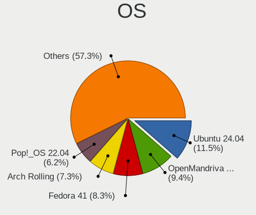

| Name                         | Notebooks | Percent |
|------------------------------|-----------|---------|
| Ubuntu 22.04                 | 13        | 13.4%   |
| Fedora 39                    | 12        | 12.37%  |
| Pop!_OS 22.04                | 7         | 7.22%   |
| Linux Mint 21.2              | 6         | 6.19%   |
| Kali 2023.3                  | 4         | 4.12%   |
| Debian 12                    | 4         | 4.12%   |
| Zorin 16                     | 3         | 3.09%   |
| KDE neon 22.04               | 3         | 3.09%   |
| EndeavourOS Rolling          | 3         | 3.09%   |
| Ubuntu 23.10                 | 2         | 2.06%   |
| SteamOS 3.4.11               | 2         | 2.06%   |
| OpenMandriva 23.11           | 2         | 2.06%   |
| Manjaro 23.1.0               | 2         | 2.06%   |
| Linux Mint 21.1              | 2         | 2.06%   |
| Fedora 38                    | 2         | 2.06%   |
| Debian Testing/unstable      | 2         | 2.06%   |
| Debian                       | 2         | 2.06%   |
| ArcoLinux Rolling            | 2         | 2.06%   |
| Zorin 12                     | 1         | 1.03%   |
| Xubuntu 22.04                | 1         | 1.03%   |
| Ubuntu 20.04                 | 1         | 1.03%   |
| SteamOS 3.5.5                | 1         | 1.03%   |
| SteamOS 3.4.8                | 1         | 1.03%   |
| Q4OS 5                       | 1         | 1.03%   |
| openSUSE Tumbleweed-XXXXXXXX | 1         | 1.03%   |
| OpenMandriva 5.0             | 1         | 1.03%   |
| OpenMandriva 4.3             | 1         | 1.03%   |
| OpenMandriva 23.90           | 1         | 1.03%   |
| NixOS 23.11                  | 1         | 1.03%   |
| MX 23                        | 1         | 1.03%   |
| MX 21                        | 1         | 1.03%   |
| Lubuntu 22.04                | 1         | 1.03%   |
| LMDE 6                       | 1         | 1.03%   |
| Linux Mint 21                | 1         | 1.03%   |
| Kubuntu 23.10                | 1         | 1.03%   |
| Kubuntu 22.04                | 1         | 1.03%   |
| Elementary 6.1               | 1         | 1.03%   |
| Debian 11                    | 1         | 1.03%   |
| BlackPanther 18.1            | 1         | 1.03%   |
| ArcoLinux                    | 1         | 1.03%   |

OS Family
---------

OS without a version

| Name         | Notebooks | Percent |
|--------------|-----------|---------|
| Ubuntu       | 16        | 16.49%  |
| Fedora       | 14        | 14.43%  |
| Linux Mint   | 9         | 9.28%   |
| Debian       | 9         | 9.28%   |
| Pop!_OS      | 7         | 7.22%   |
| OpenMandriva | 5         | 5.15%   |
| Zorin        | 4         | 4.12%   |
| SteamOS      | 4         | 4.12%   |
| Kali         | 4         | 4.12%   |
| KDE neon     | 3         | 3.09%   |
| EndeavourOS  | 3         | 3.09%   |
| ArcoLinux    | 3         | 3.09%   |
| MX           | 2         | 2.06%   |
| Manjaro      | 2         | 2.06%   |
| Kubuntu      | 2         | 2.06%   |
| AlmaLinux    | 2         | 2.06%   |
| Xubuntu      | 1         | 1.03%   |
| Q4OS         | 1         | 1.03%   |
| openSUSE     | 1         | 1.03%   |
| NixOS        | 1         | 1.03%   |
| Lubuntu      | 1         | 1.03%   |
| LMDE         | 1         | 1.03%   |
| Elementary   | 1         | 1.03%   |
| BlackPanther | 1         | 1.03%   |

Kernel
------

Version of the Linux kernel

| Version                  | Notebooks | Percent |
|--------------------------|-----------|---------|
| 6.2.0-36-generic         | 8         | 8.25%   |
| 6.1.0-13-amd64           | 7         | 7.22%   |
| 6.2.0-37-generic         | 6         | 6.19%   |
| 5.15.0-88-generic        | 6         | 6.19%   |
| 6.5.6-76060506-generic   | 4         | 4.12%   |
| 6.5.6-300.fc39.x86_64    | 4         | 4.12%   |
| 6.5.12-300.fc39.x86_64   | 3         | 3.09%   |
| 6.5.11-300.fc39.x86_64   | 3         | 3.09%   |
| 6.6.1-arch1-1            | 2         | 2.06%   |
| 6.6.0-desktop-1omv2390   | 2         | 2.06%   |
| 6.5.0-kali3-amd64        | 2         | 2.06%   |
| 5.18.0-kali5-amd64       | 2         | 2.06%   |
| 5.15.0-89-generic        | 2         | 2.06%   |
| 5.15.0-76-generic        | 2         | 2.06%   |
| 5.13.0-valve37-1-neptune | 2         | 2.06%   |
| 5.10.10-64               | 2         | 2.06%   |
| 6.6.3-arch1-1            | 1         | 1.03%   |
| 6.6.2-desktop-1omv2390   | 1         | 1.03%   |
| 6.6.2-arch1-1            | 1         | 1.03%   |
| 6.6.0                    | 1         | 1.03%   |
| 6.5.9-300.fc39.x86_64    | 1         | 1.03%   |
| 6.5.9-200.fc38.x86_64    | 1         | 1.03%   |
| 6.5.9-1-default          | 1         | 1.03%   |
| 6.5.8-arch1-1            | 1         | 1.03%   |
| 6.5.5-desktop-1omv2390   | 1         | 1.03%   |
| 6.5.4-76060504-generic   | 1         | 1.03%   |
| 6.5.12-x64v3-xanmod1     | 1         | 1.03%   |
| 6.5.11-1-MANJARO         | 1         | 1.03%   |
| 6.5.10-300.fc39.x86_64   | 1         | 1.03%   |
| 6.5.0-4-amd64            | 1         | 1.03%   |
| 6.5.0-3-amd64            | 1         | 1.03%   |
| 6.5.0-13-generic         | 1         | 1.03%   |
| 6.5.0-1007-oem           | 1         | 1.03%   |
| 6.5.0-1004-oem           | 1         | 1.03%   |
| 6.5.0-10-lowlatency      | 1         | 1.03%   |
| 6.5.0-10-generic         | 1         | 1.03%   |
| 6.3.13-1-liquorix-amd64  | 1         | 1.03%   |
| 6.2.9-300.fc38.x86_64    | 1         | 1.03%   |
| 6.2.0-34-generic         | 1         | 1.03%   |
| 6.2.0-26-generic         | 1         | 1.03%   |

Kernel Family
-------------

Linux kernel without a distro release

| Version | Notebooks | Percent |
|---------|-----------|---------|
| 6.2.0   | 16        | 16.49%  |
| 5.15.0  | 13        | 13.4%   |
| 6.5.0   | 9         | 9.28%   |
| 6.5.6   | 8         | 8.25%   |
| 6.1.0   | 7         | 7.22%   |
| 6.5.12  | 4         | 4.12%   |
| 6.5.11  | 4         | 4.12%   |
| 5.13.0  | 4         | 4.12%   |
| 6.6.0   | 3         | 3.09%   |
| 6.5.9   | 3         | 3.09%   |
| 6.6.2   | 2         | 2.06%   |
| 6.6.1   | 2         | 2.06%   |
| 5.18.0  | 2         | 2.06%   |
| 5.14.0  | 2         | 2.06%   |
| 5.10.10 | 2         | 2.06%   |
| 6.6.3   | 1         | 1.03%   |
| 6.5.8   | 1         | 1.03%   |
| 6.5.5   | 1         | 1.03%   |
| 6.5.4   | 1         | 1.03%   |
| 6.5.10  | 1         | 1.03%   |
| 6.3.13  | 1         | 1.03%   |
| 6.2.9   | 1         | 1.03%   |
| 6.1.61  | 1         | 1.03%   |
| 6.1.60  | 1         | 1.03%   |
| 6.1.52  | 1         | 1.03%   |
| 5.17.5  | 1         | 1.03%   |
| 5.16.7  | 1         | 1.03%   |
| 5.15.85 | 1         | 1.03%   |
| 5.10.0  | 1         | 1.03%   |
| 4.18.0  | 1         | 1.03%   |
| 4.15.0  | 1         | 1.03%   |

Kernel Major Ver.
-----------------

Linux kernel major version

| Version | Notebooks | Percent |
|---------|-----------|---------|
| 6.5     | 32        | 32.99%  |
| 6.2     | 17        | 17.53%  |
| 5.15    | 14        | 14.43%  |
| 6.1     | 10        | 10.31%  |
| 6.6     | 8         | 8.25%   |
| 5.13    | 4         | 4.12%   |
| 5.10    | 3         | 3.09%   |
| 5.18    | 2         | 2.06%   |
| 5.14    | 2         | 2.06%   |
| 6.3     | 1         | 1.03%   |
| 5.17    | 1         | 1.03%   |
| 5.16    | 1         | 1.03%   |
| 4.18    | 1         | 1.03%   |
| 4.15    | 1         | 1.03%   |

Arch
----

OS architecture (x86_64, i586, etc.)

| Name   | Notebooks | Percent |
|--------|-----------|---------|
| x86_64 | 96        | 98.97%  |
| i686   | 1         | 1.03%   |

DE
--

Desktop Environment

| Name       | Notebooks | Percent |
|------------|-----------|---------|
| GNOME      | 48        | 49.48%  |
| KDE5       | 22        | 22.68%  |
| XFCE       | 11        | 11.34%  |
| X-Cinnamon | 11        | 11.34%  |
| LXDE       | 2         | 2.06%   |
| Pantheon   | 1         | 1.03%   |
| LXQt       | 1         | 1.03%   |
| Cinnamon   | 1         | 1.03%   |

Display Server
--------------

X11 or Wayland

| Name    | Notebooks | Percent |
|---------|-----------|---------|
| X11     | 57        | 58.76%  |
| Wayland | 40        | 41.24%  |

Display Manager
---------------

SDDM, LightDM, etc.

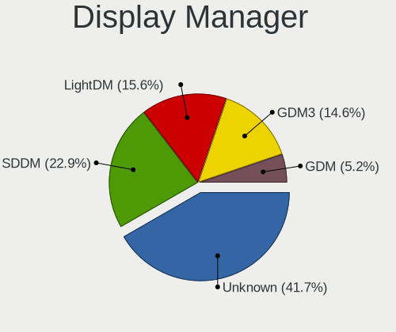

| Name    | Notebooks | Percent |
|---------|-----------|---------|
| Unknown | 33        | 34.02%  |
| GDM3    | 20        | 20.62%  |
| SDDM    | 17        | 17.53%  |
| LightDM | 17        | 17.53%  |
| GDM     | 7         | 7.22%   |
| NODM    | 2         | 2.06%   |
| LXDM    | 1         | 1.03%   |

OS Lang
-------

Language

| Lang    | Notebooks | Percent |
|---------|-----------|---------|
| en_CA   | 51        | 52.58%  |
| en_US   | 31        | 31.96%  |
| C       | 6         | 6.19%   |
| fr_CA   | 5         | 5.15%   |
| tr_TR   | 1         | 1.03%   |
| fr_FR   | 1         | 1.03%   |
| en_IN   | 1         | 1.03%   |
| Unknown | 1         | 1.03%   |

Boot Mode
---------

EFI or BIOS

| Mode | Notebooks | Percent |
|------|-----------|---------|
| EFI  | 51        | 52.58%  |
| BIOS | 46        | 47.42%  |

Filesystem
----------

Type of filesystem

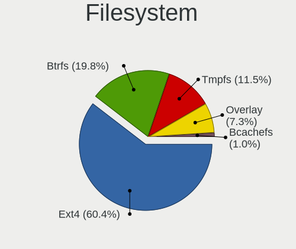

| Type    | Notebooks | Percent |
|---------|-----------|---------|
| Ext4    | 55        | 56.7%   |
| Btrfs   | 20        | 20.62%  |
| Tmpfs   | 13        | 13.4%   |
| Overlay | 5         | 5.15%   |
| Xfs     | 2         | 2.06%   |
| Rootfs  | 2         | 2.06%   |

Part. scheme
------------

Scheme of partitioning

| Type    | Notebooks | Percent |
|---------|-----------|---------|
| GPT     | 50        | 51.55%  |
| Unknown | 33        | 34.02%  |
| MBR     | 14        | 14.43%  |

Dual Boot with Linux/BSD
------------------------

Hosting more than one Linux/BSD

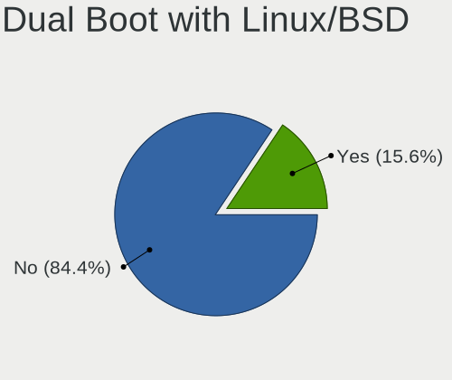

| Dual boot | Notebooks | Percent |
|-----------|-----------|---------|
| No        | 84        | 86.6%   |
| Yes       | 13        | 13.4%   |

Dual Boot (Win)
---------------

Hosting Linux and Windows

| Dual boot | Notebooks | Percent |
|-----------|-----------|---------|
| No        | 68        | 70.1%   |
| Yes       | 29        | 29.9%   |

Board
-----

Vendor
------

Motherboard manufacturer

| Name                 | Notebooks | Percent |
|----------------------|-----------|---------|
| Hewlett-Packard      | 23        | 23.71%  |
| Lenovo               | 20        | 20.62%  |
| Dell                 | 17        | 17.53%  |
| ASUSTek Computer     | 9         | 9.28%   |
| Acer                 | 7         | 7.22%   |
| Valve                | 4         | 4.12%   |
| Apple                | 4         | 4.12%   |
| MSI                  | 3         | 3.09%   |
| Google               | 3         | 3.09%   |
| Toshiba              | 2         | 2.06%   |
| Unknown              | 2         | 2.06%   |
| Panasonic            | 1         | 1.03%   |
| Intel Client Systems | 1         | 1.03%   |
| Gateway              | 1         | 1.03%   |

Model
-----

Motherboard model

| Name                                               | Notebooks | Percent |
|----------------------------------------------------|-----------|---------|
| Valve Jupiter                                      | 4         | 4.12%   |
| MSI GF65 Thin 10UE                                 | 2         | 2.06%   |
| HP Pavilion Notebook                               | 2         | 2.06%   |
| HP Laptop 15-ef3xxx                                | 2         | 2.06%   |
| Unknown                                            | 2         | 2.06%   |
| Toshiba Satellite L755                             | 1         | 1.03%   |
| Toshiba Satellite L300D                            | 1         | 1.03%   |
| Panasonic CF-53JALZY1M                             | 1         | 1.03%   |
| MSI GP60 2QE                                       | 1         | 1.03%   |
| Lenovo ThinkPad X230 2320JPU                       | 1         | 1.03%   |
| Lenovo ThinkPad X1 Extreme 20MGS1QU00              | 1         | 1.03%   |
| Lenovo ThinkPad X1 Carbon Gen 9 20XW003LUS         | 1         | 1.03%   |
| Lenovo ThinkPad X1 Carbon 7th 20QD000BUS           | 1         | 1.03%   |
| Lenovo ThinkPad T500 20552CU                       | 1         | 1.03%   |
| Lenovo ThinkPad T490 20N3S4VV00                    | 1         | 1.03%   |
| Lenovo ThinkPad T480s 20L8SA3Q00                   | 1         | 1.03%   |
| Lenovo ThinkPad T470s W10DG 20JS0004US             | 1         | 1.03%   |
| Lenovo ThinkPad T470p 20J6000TAD                   | 1         | 1.03%   |
| Lenovo ThinkPad T430s 23553J2                      | 1         | 1.03%   |
| Lenovo ThinkPad T14 Gen 1 20S1S4R500               | 1         | 1.03%   |
| Lenovo ThinkPad P16s Gen 2 21K9CTO1WW              | 1         | 1.03%   |
| Lenovo ThinkPad E15 Gen 4 21ED0049US               | 1         | 1.03%   |
| Lenovo Legion Pro 5 16IRX8 82WK                    | 1         | 1.03%   |
| Lenovo Legion Pro 5 16ARX8 82WM                    | 1         | 1.03%   |
| Lenovo Legion 5 17ACH6H 82JY                       | 1         | 1.03%   |
| Lenovo IdeaPad 330-15IKB 81DE                      | 1         | 1.03%   |
| Lenovo IdeaPad 320-15IKB 81BG                      | 1         | 1.03%   |
| Lenovo IdeaPad 320-15ABR 80XS                      | 1         | 1.03%   |
| Lenovo IdeaPad 3 15ABA7 82RN                       | 1         | 1.03%   |
| Intel Client Systems LAPRC710                      | 1         | 1.03%   |
| HP ZBook Firefly 16 inch G10 Mobile Workstation PC | 1         | 1.03%   |
| HP Victus by Gaming Laptop 15-fb1xxx               | 1         | 1.03%   |
| HP Stream Laptop 11-ah1XX                          | 1         | 1.03%   |
| HP ProBook 650 G2                                  | 1         | 1.03%   |
| HP ProBook 5330m                                   | 1         | 1.03%   |
| HP Pavilion Laptop 15-eg3xxx                       | 1         | 1.03%   |
| HP Pavilion g7                                     | 1         | 1.03%   |
| HP Pavilion dv9500                                 | 1         | 1.03%   |
| HP Pavilion dv8000 (ET839UA#ABL)                   | 1         | 1.03%   |
| HP Pavilion dv7                                    | 1         | 1.03%   |

Model Family
------------

Motherboard model prefix

| Name                          | Notebooks | Percent |
|-------------------------------|-----------|---------|
| Lenovo ThinkPad               | 13        | 13.4%   |
| Dell Latitude                 | 9         | 9.28%   |
| HP Pavilion                   | 7         | 7.22%   |
| ASUS VivoBook                 | 6         | 6.19%   |
| HP Laptop                     | 5         | 5.15%   |
| Acer Aspire                   | 5         | 5.15%   |
| Valve Jupiter                 | 4         | 4.12%   |
| Lenovo IdeaPad                | 4         | 4.12%   |
| Dell XPS                      | 4         | 4.12%   |
| Lenovo Legion                 | 3         | 3.09%   |
| HP EliteBook                  | 3         | 3.09%   |
| Toshiba Satellite             | 2         | 2.06%   |
| MSI GF65                      | 2         | 2.06%   |
| HP ProBook                    | 2         | 2.06%   |
| Dell Precision                | 2         | 2.06%   |
| Unknown                       | 2         | 2.06%   |
| Panasonic CF-53JALZY1M        | 1         | 1.03%   |
| MSI GP60                      | 1         | 1.03%   |
| Intel Client Systems LAPRC710 | 1         | 1.03%   |
| HP ZBook                      | 1         | 1.03%   |
| HP Victus                     | 1         | 1.03%   |
| HP Stream                     | 1         | 1.03%   |
| HP OMEN                       | 1         | 1.03%   |
| HP Notebook                   | 1         | 1.03%   |
| HP G61                        | 1         | 1.03%   |
| Google Nami                   | 1         | 1.03%   |
| Google Edgar                  | 1         | 1.03%   |
| Google Droid                  | 1         | 1.03%   |
| Gateway NV57H                 | 1         | 1.03%   |
| Dell Vostro                   | 1         | 1.03%   |
| Dell Inspiron                 | 1         | 1.03%   |
| ASUS Zenbook                  | 1         | 1.03%   |
| ASUS X555QA                   | 1         | 1.03%   |
| ASUS ROG                      | 1         | 1.03%   |
| Apple MacBookPro9             | 1         | 1.03%   |
| Apple MacBookPro14            | 1         | 1.03%   |
| Apple MacBookPro11            | 1         | 1.03%   |
| Apple MacBookAir6             | 1         | 1.03%   |
| Acer Nitro                    | 1         | 1.03%   |
| Acer AO532h                   | 1         | 1.03%   |

MFG Year
--------

Motherboard manufacture year

| Year | Notebooks | Percent |
|------|-----------|---------|
| 2022 | 13        | 13.4%   |
| 2023 | 12        | 12.37%  |
| 2018 | 11        | 11.34%  |
| 2017 | 8         | 8.25%   |
| 2021 | 7         | 7.22%   |
| 2020 | 7         | 7.22%   |
| 2011 | 7         | 7.22%   |
| 2019 | 6         | 6.19%   |
| 2012 | 5         | 5.15%   |
| 2016 | 4         | 4.12%   |
| 2008 | 4         | 4.12%   |
| 2013 | 3         | 3.09%   |
| 2009 | 3         | 3.09%   |
| 2014 | 2         | 2.06%   |
| 2010 | 2         | 2.06%   |
| 2015 | 1         | 1.03%   |
| 2007 | 1         | 1.03%   |
| 2006 | 1         | 1.03%   |

Form Factor
-----------

Physical design of the computer

| Name     | Notebooks | Percent |
|----------|-----------|---------|
| Notebook | 97        | 100%    |

Secure Boot
-----------

Enabled or disabled

| State    | Notebooks | Percent |
|----------|-----------|---------|
| Disabled | 91        | 93.81%  |
| Enabled  | 6         | 6.19%   |

Coreboot
--------

Have coreboot on board

| Used | Notebooks | Percent |
|------|-----------|---------|
| No   | 93        | 95.88%  |
| Yes  | 4         | 4.12%   |

RAM Size
--------

Total RAM memory

| Size in GB  | Notebooks | Percent |
|-------------|-----------|---------|
| 8.01-16.0   | 29        | 29.9%   |
| 16.01-24.0  | 20        | 20.62%  |
| 4.01-8.0    | 18        | 18.56%  |
| 3.01-4.0    | 18        | 18.56%  |
| 32.01-64.0  | 6         | 6.19%   |
| 64.01-256.0 | 3         | 3.09%   |
| 24.01-32.0  | 1         | 1.03%   |
| 2.01-3.0    | 1         | 1.03%   |
| 1.01-2.0    | 1         | 1.03%   |

RAM Used
--------

Used RAM memory

| Used GB   | Notebooks | Percent |
|-----------|-----------|---------|
| 2.01-3.0  | 27        | 27.84%  |
| 1.01-2.0  | 26        | 26.8%   |
| 3.01-4.0  | 21        | 21.65%  |
| 4.01-8.0  | 14        | 14.43%  |
| 8.01-16.0 | 5         | 5.15%   |
| 0.51-1.0  | 4         | 4.12%   |

Total Drives
------------

Number of drives on board

| Drives | Notebooks | Percent |
|--------|-----------|---------|
| 1      | 68        | 70.1%   |
| 2      | 25        | 25.77%  |
| 3      | 4         | 4.12%   |

Has CD-ROM
----------

Has CD-ROM on board

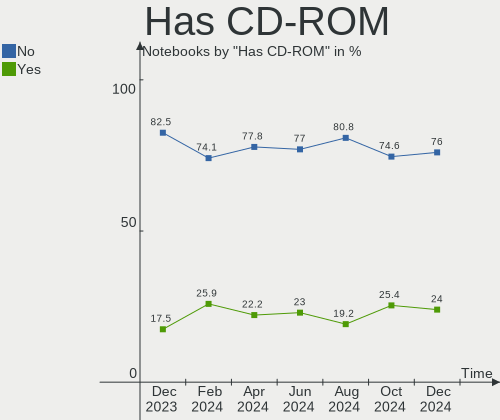

| Presented | Notebooks | Percent |
|-----------|-----------|---------|
| No        | 72        | 74.23%  |
| Yes       | 25        | 25.77%  |

Has Ethernet
------------

Has Ethernet on board

| Presented | Notebooks | Percent |
|-----------|-----------|---------|
| Yes       | 76        | 78.35%  |
| No        | 21        | 21.65%  |

Has WiFi
--------

Has WiFi module

| Presented | Notebooks | Percent |
|-----------|-----------|---------|
| Yes       | 95        | 97.94%  |
| No        | 2         | 2.06%   |

Has Bluetooth
-------------

Has Bluetooth module

| Presented | Notebooks | Percent |
|-----------|-----------|---------|
| Yes       | 76        | 78.35%  |
| No        | 21        | 21.65%  |

Location
--------

Country
-------

Geographic location (country)

| Country | Notebooks | Percent |
|---------|-----------|---------|
| Canada  | 97        | 100%    |

City
----

Geographic location (city)

| City            | Notebooks | Percent |
|-----------------|-----------|---------|
| Toronto         | 16        | 16.49%  |
| Calgary         | 5         | 5.15%   |
| Victoria        | 4         | 4.12%   |
| Québec         | 4         | 4.12%   |
| Ottawa          | 4         | 4.12%   |
| Montreal        | 4         | 4.12%   |
| Winnipeg        | 3         | 3.09%   |
| Kitchener       | 3         | 3.09%   |
| Edmonton        | 3         | 3.09%   |
| Vancouver       | 2         | 2.06%   |
| Surrey          | 2         | 2.06%   |
| Mississauga     | 2         | 2.06%   |
| Halifax         | 2         | 2.06%   |
| Guelph          | 2         | 2.06%   |
| Gatineau        | 2         | 2.06%   |
| Whitehorse      | 1         | 1.03%   |
| West Kelowna    | 1         | 1.03%   |
| Stratford       | 1         | 1.03%   |
| Simcoe          | 1         | 1.03%   |
| Sherbrooke      | 1         | 1.03%   |
| Saskatoon       | 1         | 1.03%   |
| Sarnia          | 1         | 1.03%   |
| Saint John      | 1         | 1.03%   |
| Regina          | 1         | 1.03%   |
| Port Elgin      | 1         | 1.03%   |
| Peterborough    | 1         | 1.03%   |
| Oakville        | 1         | 1.03%   |
| North York      | 1         | 1.03%   |
| North Vancouver | 1         | 1.03%   |
| Mascouche       | 1         | 1.03%   |
| London          | 1         | 1.03%   |
| Little Current  | 1         | 1.03%   |
| Laval           | 1         | 1.03%   |
| LaSalle         | 1         | 1.03%   |
| Langley         | 1         | 1.03%   |
| Kingston        | 1         | 1.03%   |
| Kanata          | 1         | 1.03%   |
| Joliette        | 1         | 1.03%   |
| Jaffray         | 1         | 1.03%   |
| Gravenhurst     | 1         | 1.03%   |

Drives
------

Drive Vendor
------------

Hard drive vendors

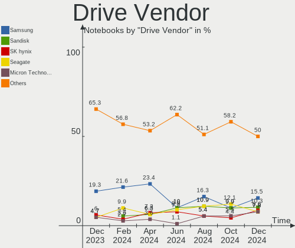

| Vendor                       | Notebooks | Drives | Percent |
|------------------------------|-----------|--------|---------|
| Samsung Electronics          | 22        | 22     | 17.6%   |
| WDC                          | 13        | 13     | 10.4%   |
| Unknown                      | 11        | 12     | 8.8%    |
| Seagate                      | 10        | 10     | 8%      |
| Sandisk                      | 10        | 10     | 8%      |
| Kingston                     | 6         | 6      | 4.8%    |
| Intel                        | 6         | 6      | 4.8%    |
| SK hynix                     | 5         | 5      | 4%      |
| Micron Technology            | 5         | 5      | 4%      |
| Kingston Technology Company  | 5         | 5      | 4%      |
| Phison Electronics           | 4         | 4      | 3.2%    |
| Hitachi                      | 4         | 4      | 3.2%    |
| Crucial                      | 4         | 5      | 3.2%    |
| Toshiba                      | 2         | 2      | 1.6%    |
| KIOXIA                       | 2         | 2      | 1.6%    |
| China                        | 2         | 2      | 1.6%    |
| Apple                        | 2         | 2      | 1.6%    |
| A-DATA Technology            | 2         | 2      | 1.6%    |
| TO Exter                     | 1         | 1      | 0.8%    |
| Timetec                      | 1         | 1      | 0.8%    |
| Shenzhen Longsys Electronics | 1         | 1      | 0.8%    |
| PNY                          | 1         | 1      | 0.8%    |
| MAXIO Technology (Hangzhou)  | 1         | 1      | 0.8%    |
| Lite-On Technology           | 1         | 1      | 0.8%    |
| JetFlash                     | 1         | 1      | 0.8%    |
| HGST                         | 1         | 1      | 0.8%    |
| Fujitsu                      | 1         | 1      | 0.8%    |
| ADATA Technology             | 1         | 1      | 0.8%    |

Drive Model
-----------

Hard drive models

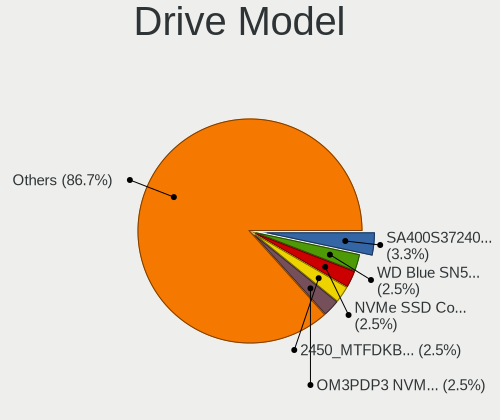

| Model                                               | Notebooks | Percent |
|-----------------------------------------------------|-----------|---------|
| Unknown MMC Card  32GB                              | 3         | 2.36%   |
| Samsung NVMe SSD Controller PM9A1/PM9A3/980PRO 2TB  | 3         | 2.36%   |
| Intel SSDPEKNU512GZ 512GB                           | 3         | 2.36%   |
| Unknown MMC Card  128GB                             | 2         | 1.57%   |
| Seagate ST1000LM024 HN-M101MBB 1TB                  | 2         | 1.57%   |
| Sandisk WD Blue SN550 NVMe SSD 512GB                | 2         | 1.57%   |
| Samsung SSD 860 EVO 1TB                             | 2         | 1.57%   |
| Samsung NVMe SSD Controller SM961/PM961/SM963 256GB | 2         | 1.57%   |
| Phison PS5013 E13 NVMe Controller 512GB             | 2         | 1.57%   |
| Kingston Company SNV2S1000G 1TB                     | 2         | 1.57%   |
| Kingston SA400S37480G 480GB SSD                     | 2         | 1.57%   |
| Kingston SA400S37240G 240GB SSD                     | 2         | 1.57%   |
| China SSD 256GB                                     | 2         | 1.57%   |
| WDC WDS200T1X0E-00AFY0 2TB                          | 1         | 0.79%   |
| WDC WDS100T2B0C-00PXH0 1TB                          | 1         | 0.79%   |
| WDC WD7500BPVX-22JC3T0 752GB                        | 1         | 0.79%   |
| WDC WD7500BPKX-22HPJT0 752GB                        | 1         | 0.79%   |
| WDC WD3200BEKT-75PVMT1 320GB                        | 1         | 0.79%   |
| WDC WD2500BEVT-22A23T0 250GB                        | 1         | 0.79%   |
| WDC WD1600BEVT-75A23T0 160GB                        | 1         | 0.79%   |
| WDC WD10SPZX-24Z10 1TB                              | 1         | 0.79%   |
| WDC WD10JPVX-22JC3T0 1TB                            | 1         | 0.79%   |
| WDC WD10JPCX-24UE4T0 1TB                            | 1         | 0.79%   |
| WDC WD My Passport 264F 1TB                         | 1         | 0.79%   |
| WDC PC SN730 SDBQNTY-512G-1001 512GB                | 1         | 0.79%   |
| WDC PC SN530 SDBPNPZ-1T00-1006 1TB                  | 1         | 0.79%   |
| Unknown SPCC  64GB                                  | 1         | 0.79%   |
| Unknown SD64G  64GB                                 | 1         | 0.79%   |
| Unknown MMC Card  64GB                              | 1         | 0.79%   |
| Unknown MMC Card  512GB                             | 1         | 0.79%   |
| Unknown MMC Card  256GB                             | 1         | 0.79%   |
| Unknown MMC Card  1072GB                            | 1         | 0.79%   |
| Unknown DA4064  64GB                                | 1         | 0.79%   |
| Toshiba MQ04ABF100 1TB                              | 1         | 0.79%   |
| Toshiba MQ01ABD100 1TB                              | 1         | 0.79%   |
| TO Exter nal USB 3.0 1TB                            | 1         | 0.79%   |
| Timetec SD08 512GB                                  | 1         | 0.79%   |
| SK hynix SKHynix_HFS001TEJ9X162N 1TB                | 1         | 0.79%   |
| SK hynix SC210 mSATA 128GB SSD                      | 1         | 0.79%   |
| SK hynix PC401 NVMe 512GB                           | 1         | 0.79%   |

HDD Vendor
----------

Hard disk drive vendors

| Vendor              | Notebooks | Drives | Percent |
|---------------------|-----------|--------|---------|
| Seagate             | 10        | 10     | 35.71%  |
| WDC                 | 8         | 8      | 28.57%  |
| Hitachi             | 4         | 4      | 14.29%  |
| Toshiba             | 2         | 2      | 7.14%   |
| TO Exter            | 1         | 1      | 3.57%   |
| Samsung Electronics | 1         | 1      | 3.57%   |
| HGST                | 1         | 1      | 3.57%   |
| Fujitsu             | 1         | 1      | 3.57%   |

SSD Vendor
----------

Solid state drive vendors

| Vendor              | Notebooks | Drives | Percent |
|---------------------|-----------|--------|---------|
| Samsung Electronics | 7         | 7      | 25%     |
| Kingston            | 5         | 5      | 17.86%  |
| SanDisk             | 3         | 3      | 10.71%  |
| Crucial             | 3         | 3      | 10.71%  |
| China               | 2         | 2      | 7.14%   |
| Apple               | 2         | 2      | 7.14%   |
| Timetec             | 1         | 1      | 3.57%   |
| SK hynix            | 1         | 1      | 3.57%   |
| PNY                 | 1         | 1      | 3.57%   |
| Micron Technology   | 1         | 1      | 3.57%   |
| Intel               | 1         | 1      | 3.57%   |
| A-DATA Technology   | 1         | 1      | 3.57%   |

Drive Kind
----------

HDD or SSD

| Kind    | Notebooks | Drives | Percent |
|---------|-----------|--------|---------|
| NVMe    | 50        | 57     | 43.1%   |
| HDD     | 27        | 28     | 23.28%  |
| SSD     | 26        | 28     | 22.41%  |
| MMC     | 11        | 12     | 9.48%   |
| Unknown | 2         | 2      | 1.72%   |

Drive Connector
---------------

SATA, SAS, NVMe, etc.

| Type | Notebooks | Drives | Percent |
|------|-----------|--------|---------|
| NVMe | 49        | 56     | 43.36%  |
| SATA | 47        | 53     | 41.59%  |
| MMC  | 11        | 12     | 9.73%   |
| SAS  | 6         | 6      | 5.31%   |

Drive Size
----------

Size of hard drive

| Size in TB | Notebooks | Drives | Percent |
|------------|-----------|--------|---------|
| 0.01-0.5   | 31        | 34     | 60.78%  |
| 0.51-1.0   | 17        | 19     | 33.33%  |
| 1.01-2.0   | 2         | 2      | 3.92%   |
| 4.01-10.0  | 1         | 1      | 1.96%   |

Space Total
-----------

Amount of disk space available on the file system

| Size in GB     | Notebooks | Percent |
|----------------|-----------|---------|
| 101-250        | 27        | 27.84%  |
| 251-500        | 26        | 26.8%   |
| 501-1000       | 21        | 21.65%  |
| 1001-2000      | 5         | 5.15%   |
| 1-20           | 5         | 5.15%   |
| 51-100         | 4         | 4.12%   |
| Unknown        | 3         | 3.09%   |
| More than 3000 | 2         | 2.06%   |
| 21-50          | 2         | 2.06%   |
| 2001-3000      | 2         | 2.06%   |

Space Used
----------

Amount of used disk space

| Used GB        | Notebooks | Percent |
|----------------|-----------|---------|
| 1-20           | 36        | 37.11%  |
| 21-50          | 17        | 17.53%  |
| 101-250        | 17        | 17.53%  |
| 51-100         | 11        | 11.34%  |
| 251-500        | 5         | 5.15%   |
| 1001-2000      | 3         | 3.09%   |
| 501-1000       | 3         | 3.09%   |
| Unknown        | 3         | 3.09%   |
| More than 3000 | 1         | 1.03%   |
| 2001-3000      | 1         | 1.03%   |

Malfunc. Drives
---------------

Drive models with a malfunction

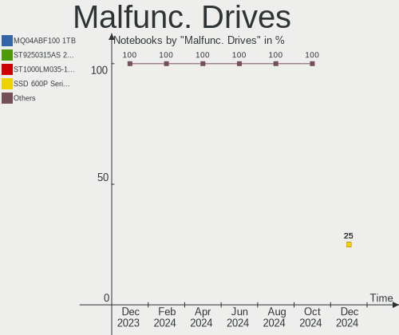

| Model                                  | Notebooks | Drives | Percent |
|----------------------------------------|-----------|--------|---------|
| Timetec SD08 512GB                     | 1         | 1      | 16.67%  |
| SK hynix SC210 mSATA 128GB SSD         | 1         | 1      | 16.67%  |
| SK hynix PC401 NVMe 512GB              | 1         | 1      | 16.67%  |
| HGST HTS545050A7E680 500GB             | 1         | 1      | 16.67%  |
| Fujitsu MHV2080AH 80GB                 | 1         | 1      | 16.67%  |
| A-DATA Technology IM2P33F3A NVMe 256GB | 1         | 1      | 16.67%  |

Malfunc. Drive Vendor
---------------------

Vendors of faulty drives

| Vendor            | Notebooks | Drives | Percent |
|-------------------|-----------|--------|---------|
| SK hynix          | 2         | 2      | 33.33%  |
| Timetec           | 1         | 1      | 16.67%  |
| HGST              | 1         | 1      | 16.67%  |
| Fujitsu           | 1         | 1      | 16.67%  |
| A-DATA Technology | 1         | 1      | 16.67%  |

Malfunc. HDD Vendor
-------------------

Vendors of faulty HDD drives

| Vendor  | Notebooks | Drives | Percent |
|---------|-----------|--------|---------|
| HGST    | 1         | 1      | 50%     |
| Fujitsu | 1         | 1      | 50%     |

Malfunc. Drive Kind
-------------------

Kinds of faulty drives

| Kind | Notebooks | Drives | Percent |
|------|-----------|--------|---------|
| NVMe | 2         | 2      | 33.33%  |
| SSD  | 2         | 2      | 33.33%  |
| HDD  | 2         | 2      | 33.33%  |

Failed Drives
-------------

Failed drive models

| Model                             | Notebooks | Drives | Percent |
|-----------------------------------|-----------|--------|---------|
| Samsung Electronics HM160HC 160GB | 1         | 1      | 100%    |

Failed Drive Vendor
-------------------

Failed drive vendors

| Vendor              | Notebooks | Drives | Percent |
|---------------------|-----------|--------|---------|
| Samsung Electronics | 1         | 1      | 100%    |

Drive Status
------------

Number of failed and malfunc. drives

| Status   | Notebooks | Drives | Percent |
|----------|-----------|--------|---------|
| Detected | 56        | 66     | 50.91%  |
| Works    | 47        | 54     | 42.73%  |
| Malfunc  | 6         | 6      | 5.45%   |
| Failed   | 1         | 1      | 0.91%   |

Storage controller
------------------

Storage Vendor
--------------

Storage controller vendors

| Vendor                       | Notebooks | Percent |
|------------------------------|-----------|---------|
| Intel                        | 50        | 43.86%  |
| Samsung Electronics          | 14        | 12.28%  |
| AMD                          | 12        | 10.53%  |
| SanDisk                      | 10        | 8.77%   |
| Kingston Technology Company  | 6         | 5.26%   |
| SK hynix                     | 4         | 3.51%   |
| Phison Electronics           | 4         | 3.51%   |
| Micron Technology            | 4         | 3.51%   |
| Micron/Crucial Technology    | 2         | 1.75%   |
| KIOXIA                       | 2         | 1.75%   |
| ADATA Technology             | 2         | 1.75%   |
| Shenzhen Longsys Electronics | 1         | 0.88%   |
| MAXIO Technology (Hangzhou)  | 1         | 0.88%   |
| Marvell Technology Group     | 1         | 0.88%   |
| Lite-On Technology           | 1         | 0.88%   |

Storage Model
-------------

Storage controller models

| Model                                                                                  | Notebooks | Percent |
|----------------------------------------------------------------------------------------|-----------|---------|
| Intel 82801 Mobile SATA Controller [RAID mode]                                         | 8         | 6.61%   |
| AMD FCH SATA Controller [AHCI mode]                                                    | 8         | 6.61%   |
| Intel Volume Management Device NVMe RAID Controller                                    | 5         | 4.13%   |
| Intel SSD 670p Series [Keystone Harbor]                                                | 5         | 4.13%   |
| Intel 7 Series Chipset Family 6-port SATA Controller [AHCI mode]                       | 5         | 4.13%   |
| Samsung NVMe SSD Controller PM9A1/PM9A3/980PRO                                         | 4         | 3.31%   |
| Intel Sunrise Point-LP SATA Controller [AHCI mode]                                     | 4         | 3.31%   |
| Intel 6 Series/C200 Series Chipset Family 6 port Mobile SATA AHCI Controller           | 4         | 3.31%   |
| SanDisk Ultra 3D / WD Blue SN550 NVMe SSD                                              | 3         | 2.48%   |
| Samsung NVMe SSD Controller SM961/PM961/SM963                                          | 3         | 2.48%   |
| Samsung NVMe SSD Controller 980 (DRAM-less)                                            | 3         | 2.48%   |
| Intel HM170/QM170 Chipset SATA Controller [AHCI Mode]                                  | 3         | 2.48%   |
| Intel Celeron/Pentium Silver Processor SATA Controller                                 | 3         | 2.48%   |
| AMD SB7x0/SB8x0/SB9x0 SATA Controller [AHCI mode]                                      | 3         | 2.48%   |
| SanDisk WD Black SN770 / PC SN740 256GB / PC SN560 (DRAM-less) NVMe SSD                | 2         | 1.65%   |
| SanDisk Extreme Pro / WD Black SN750 / PC SN730 / Red SN700 NVMe SSD                   | 2         | 1.65%   |
| Samsung NVMe SSD Controller SM981/PM981/PM983                                          | 2         | 1.65%   |
| Phison PS5013-E13 PCIe3 NVMe Controller (DRAM-less)                                    | 2         | 1.65%   |
| Micron 2450 NVMe SSD [HendrixV] (DRAM-less)                                            | 2         | 1.65%   |
| Kingston Company NV2 NVMe SSD SM2267XT                                                 | 2         | 1.65%   |
| Intel Cannon Lake Mobile PCH SATA AHCI Controller                                      | 2         | 1.65%   |
| Intel 82801IBM/IEM (ICH9M/ICH9M-E) 4 port SATA Controller [AHCI mode]                  | 2         | 1.65%   |
| Intel 8 Series/C220 Series Chipset Family 6-port SATA Controller 1 [AHCI mode]         | 2         | 1.65%   |
| Intel 6 Series/C200 Series Chipset Family Mobile SATA Controller (IDE mode, ports 4-5) | 2         | 1.65%   |
| Intel 6 Series/C200 Series Chipset Family Mobile SATA Controller (IDE mode, ports 0-3) | 2         | 1.65%   |
| Intel 5 Series/3400 Series Chipset 4 port SATA AHCI Controller                         | 2         | 1.65%   |
| AMD SB7x0/SB8x0/SB9x0 IDE Controller                                                   | 2         | 1.65%   |
| SK hynix Platinum P41/PC801 NVMe Solid State Drive                                     | 1         | 0.83%   |
| SK hynix PC401 NVMe Solid State Drive 256GB                                            | 1         | 0.83%   |
| SK hynix Gold P31/BC711/PC711 NVMe Solid State Drive                                   | 1         | 0.83%   |
| SK hynix BC511 NVMe SSD                                                                | 1         | 0.83%   |
| Shenzhen Longsys FORESEE P900 BGA NVMe SSD (DRAM-less)                                 | 1         | 0.83%   |
| SanDisk WD PC SN810 / Black SN850 NVMe SSD                                             | 1         | 0.83%   |
| SanDisk WD PC SN540 / Green SN350 NVMe SSD 1 TB (DRAM-less)                            | 1         | 0.83%   |
| SanDisk IX SN530 NVMe SSD (DRAM-less)                                                  | 1         | 0.83%   |
| Samsung S4LN053X01 AHCI SSD Controller(Apple slot)                                     | 1         | 0.83%   |
| Samsung NVMe SSD Controller PM9B1 (DRAM-less)                                          | 1         | 0.83%   |
| Phison PS5021-E21 PCIe4 NVMe Controller (DRAM-less)                                    | 1         | 0.83%   |
| Phison E12 NVMe Controller                                                             | 1         | 0.83%   |
| Micron/Crucial P5 Plus NVMe PCIe SSD                                                   | 1         | 0.83%   |

Storage Kind
------------

Kind of storage controller (IDE, SATA, NVMe, SAS, ...)

| Kind | Notebooks | Percent |
|------|-----------|---------|
| NVMe | 49        | 43.36%  |
| SATA | 44        | 38.94%  |
| RAID | 14        | 12.39%  |
| IDE  | 6         | 5.31%   |

Processor
---------

CPU Vendor
----------

Processor vendors

| Vendor | Notebooks | Percent |
|--------|-----------|---------|
| Intel  | 71        | 73.2%   |
| AMD    | 26        | 26.8%   |

CPU Model
---------

Processor models

| Model                                           | Notebooks | Percent |
|-------------------------------------------------|-----------|---------|
| Intel Core i5-8250U CPU @ 1.60GHz               | 4         | 4.12%   |
| AMD Custom APU 0405                             | 4         | 4.12%   |
| Intel Core i7-10750H CPU @ 2.60GHz              | 3         | 3.09%   |
| AMD Ryzen 5 5625U with Radeon Graphics          | 3         | 3.09%   |
| Intel Core i7-2670QM CPU @ 2.20GHz              | 2         | 2.06%   |
| Intel Core i5-8265U CPU @ 1.60GHz               | 2         | 2.06%   |
| Intel Core i5-3320M CPU @ 2.60GHz               | 2         | 2.06%   |
| Intel Core i5-3210M CPU @ 2.50GHz               | 2         | 2.06%   |
| Intel Core i5-10310U CPU @ 1.70GHz              | 2         | 2.06%   |
| Intel Celeron N4000 CPU @ 1.10GHz               | 2         | 2.06%   |
| Intel Celeron J4125 CPU @ 2.00GHz               | 2         | 2.06%   |
| AMD Ryzen 7 5825U with Radeon Graphics          | 2         | 2.06%   |
| AMD A10-9600P RADEON R5, 10 COMPUTE CORES 4C+6G | 2         | 2.06%   |
| Intel Pentium Silver N5030 CPU @ 1.10GHz        | 1         | 1.03%   |
| Intel Pentium Dual-Core CPU T4400 @ 2.20GHz     | 1         | 1.03%   |
| Intel Core i7-9850H CPU @ 2.60GHz               | 1         | 1.03%   |
| Intel Core i7-8850H CPU @ 2.60GHz               | 1         | 1.03%   |
| Intel Core i7-8650U CPU @ 1.90GHz               | 1         | 1.03%   |
| Intel Core i7-8550U CPU @ 1.80GHz               | 1         | 1.03%   |
| Intel Core i7-7820HQ CPU @ 2.90GHz              | 1         | 1.03%   |
| Intel Core i7-7700HQ CPU @ 2.80GHz              | 1         | 1.03%   |
| Intel Core i7-7560U CPU @ 2.40GHz               | 1         | 1.03%   |
| Intel Core i7-7500U CPU @ 2.70GHz               | 1         | 1.03%   |
| Intel Core i7-6820HQ CPU @ 2.70GHz              | 1         | 1.03%   |
| Intel Core i7-6700HQ CPU @ 2.60GHz              | 1         | 1.03%   |
| Intel Core i7-6600U CPU @ 2.60GHz               | 1         | 1.03%   |
| Intel Core i7-4610M CPU @ 3.00GHz               | 1         | 1.03%   |
| Intel Core i7-3520M CPU @ 2.90GHz               | 1         | 1.03%   |
| Intel Core i7 CPU Q 720 @ 1.60GHz               | 1         | 1.03%   |
| Intel Core i5-8365U CPU @ 1.60GHz               | 1         | 1.03%   |
| Intel Core i5-8300H CPU @ 2.30GHz               | 1         | 1.03%   |
| Intel Core i5-7300HQ CPU @ 2.50GHz              | 1         | 1.03%   |
| Intel Core i5-7200U CPU @ 2.50GHz               | 1         | 1.03%   |
| Intel Core i5-4300M CPU @ 2.60GHz               | 1         | 1.03%   |
| Intel Core i5-4260U CPU @ 1.40GHz               | 1         | 1.03%   |
| Intel Core i5-4258U CPU @ 2.40GHz               | 1         | 1.03%   |
| Intel Core i5-4210H CPU @ 2.90GHz               | 1         | 1.03%   |
| Intel Core i5-3230M CPU @ 2.60GHz               | 1         | 1.03%   |
| Intel Core i5-2520M CPU @ 2.50GHz               | 1         | 1.03%   |
| Intel Core i5-2410M CPU @ 2.30GHz               | 1         | 1.03%   |

CPU Model Family
----------------

Processor model prefix

| Model                   | Notebooks | Percent |
|-------------------------|-----------|---------|
| Intel Core i5           | 25        | 25.77%  |
| Intel Core i7           | 19        | 19.59%  |
| Other                   | 16        | 16.49%  |
| Intel Celeron           | 6         | 6.19%   |
| AMD Ryzen 5             | 6         | 6.19%   |
| AMD Ryzen 7             | 4         | 4.12%   |
| Intel Core i3           | 3         | 3.09%   |
| Intel Core 2 Duo        | 3         | 3.09%   |
| AMD A12                 | 2         | 2.06%   |
| AMD A10                 | 2         | 2.06%   |
| Intel Pentium Silver    | 1         | 1.03%   |
| Intel Pentium Dual-Core | 1         | 1.03%   |
| Intel Atom              | 1         | 1.03%   |
| AMD Turion 64 Mobile    | 1         | 1.03%   |
| AMD Ryzen 9             | 1         | 1.03%   |
| AMD Ryzen 7 PRO         | 1         | 1.03%   |
| AMD Athlon X2           | 1         | 1.03%   |
| AMD Athlon II Neo       | 1         | 1.03%   |
| AMD Athlon II Dual-Core | 1         | 1.03%   |
| AMD Athlon              | 1         | 1.03%   |
| AMD A8                  | 1         | 1.03%   |

CPU Cores
---------

Number of processor cores

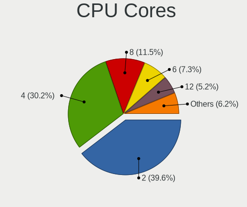

| Number | Notebooks | Percent |
|--------|-----------|---------|
| 2      | 35        | 36.08%  |
| 4      | 34        | 35.05%  |
| 6      | 10        | 10.31%  |
| 8      | 7         | 7.22%   |
| 14     | 3         | 3.09%   |
| 10     | 3         | 3.09%   |
| 1      | 3         | 3.09%   |
| 12     | 2         | 2.06%   |

CPU Sockets
-----------

Number of sockets

| Number | Notebooks | Percent |
|--------|-----------|---------|
| 1      | 97        | 100%    |

CPU Threads
-----------

Threads per core (Hyper-Threading)

| Number | Notebooks | Percent |
|--------|-----------|---------|
| 2      | 76        | 78.35%  |
| 1      | 21        | 21.65%  |

CPU Op-Modes
------------

CPU Operation Modes (32-bit, 64-bit)

| Op mode        | Notebooks | Percent |
|----------------|-----------|---------|
| 32-bit, 64-bit | 97        | 100%    |

CPU Microcode
-------------

Microcode number

| Number     | Notebooks | Percent |
|------------|-----------|---------|
| Unknown    | 56        | 57.73%  |
| 0x0a50000c | 6         | 6.19%   |
| 0x206a7    | 4         | 4.12%   |
| 0x806ec    | 2         | 2.06%   |
| 0x706a8    | 2         | 2.06%   |
| 0x506e3    | 2         | 2.06%   |
| 0x08108109 | 2         | 2.06%   |
| 0xb06a3    | 1         | 1.03%   |
| 0xb06a2    | 1         | 1.03%   |
| 0x906ed    | 1         | 1.03%   |
| 0x906ea    | 1         | 1.03%   |
| 0x906a4    | 1         | 1.03%   |
| 0x806ea    | 1         | 1.03%   |
| 0x806e9    | 1         | 1.03%   |
| 0x806d1    | 1         | 1.03%   |
| 0x806c1    | 1         | 1.03%   |
| 0x306c3    | 1         | 1.03%   |
| 0x306a9    | 1         | 1.03%   |
| 0x106e5    | 1         | 1.03%   |
| 0x106ca    | 1         | 1.03%   |
| 0x1067a    | 1         | 1.03%   |
| 0x10676    | 1         | 1.03%   |
| 0x0a704103 | 1         | 1.03%   |
| 0x0a601203 | 1         | 1.03%   |
| 0x0a50000d | 1         | 1.03%   |
| 0x0a404102 | 1         | 1.03%   |
| 0x08a00006 | 1         | 1.03%   |
| 0x07030105 | 1         | 1.03%   |
| 0x0600611a | 1         | 1.03%   |
| 0x010000c8 | 1         | 1.03%   |

CPU Microarch
-------------

Microarchitecture

| Name             | Notebooks | Percent |
|------------------|-----------|---------|
| KabyLake         | 21        | 21.65%  |
| Unknown          | 10        | 10.31%  |
| Zen 3            | 7         | 7.22%   |
| Alderlake Hybrid | 7         | 7.22%   |
| SandyBridge      | 6         | 6.19%   |
| IvyBridge        | 6         | 6.19%   |
| Goldmont plus    | 6         | 6.19%   |
| Haswell          | 5         | 5.15%   |
| Penryn           | 4         | 4.12%   |
| Excavator        | 4         | 4.12%   |
| Skylake          | 3         | 3.09%   |
| CometLake        | 3         | 3.09%   |
| Zen+             | 2         | 2.06%   |
| Westmere         | 2         | 2.06%   |
| TigerLake        | 2         | 2.06%   |
| K10              | 2         | 2.06%   |
| Silvermont       | 1         | 1.03%   |
| Puma             | 1         | 1.03%   |
| Nehalem          | 1         | 1.03%   |
| K8 Hammer        | 1         | 1.03%   |
| K8 & K10 hybrid  | 1         | 1.03%   |
| Icelake          | 1         | 1.03%   |
| Bonnell          | 1         | 1.03%   |

Graphics
--------

GPU Vendor
----------

Vendors of graphics cards

| Vendor | Notebooks | Percent |
|--------|-----------|---------|
| Intel  | 67        | 57.26%  |
| AMD    | 30        | 25.64%  |
| Nvidia | 20        | 17.09%  |

GPU Model
---------

Graphics card models

| Model                                                                     | Notebooks | Percent |
|---------------------------------------------------------------------------|-----------|---------|
| Intel UHD Graphics 620                                                    | 6         | 5.13%   |
| Intel 3rd Gen Core processor Graphics Controller                          | 6         | 5.13%   |
| Intel GeminiLake [UHD Graphics 600]                                       | 5         | 4.27%   |
| Intel 2nd Generation Core Processor Family Integrated Graphics Controller | 5         | 4.27%   |
| AMD Barcelo                                                               | 5         | 4.27%   |
| AMD Wani [Radeon R5/R6/R7 Graphics]                                       | 4         | 3.42%   |
| AMD VanGogh [AMD Custom GPU 0405]                                         | 4         | 3.42%   |
| Nvidia GA106M [GeForce RTX 3060 Mobile / Max-Q]                           | 3         | 2.56%   |
| Intel WhiskeyLake-U GT2 [UHD Graphics 620]                                | 3         | 2.56%   |
| Intel Raptor Lake-P [Iris Xe Graphics]                                    | 3         | 2.56%   |
| Intel Mobile 4 Series Chipset Integrated Graphics Controller              | 3         | 2.56%   |
| Intel CometLake-U GT2 [UHD Graphics]                                      | 3         | 2.56%   |
| Intel CometLake-H GT2 [UHD Graphics]                                      | 3         | 2.56%   |
| Intel CoffeeLake-H GT2 [UHD Graphics 630]                                 | 3         | 2.56%   |
| Intel 4th Gen Core Processor Integrated Graphics Controller               | 3         | 2.56%   |
| Nvidia GP107M [GeForce GTX 1050 Ti Mobile]                                | 2         | 1.71%   |
| Intel TigerLake-LP GT2 [Iris Xe Graphics]                                 | 2         | 1.71%   |
| Intel HD Graphics 630                                                     | 2         | 1.71%   |
| Intel HD Graphics 620                                                     | 2         | 1.71%   |
| Intel HD Graphics 530                                                     | 2         | 1.71%   |
| Intel Haswell-ULT Integrated Graphics Controller                          | 2         | 1.71%   |
| Intel Core Processor Integrated Graphics Controller                       | 2         | 1.71%   |
| Intel Alder Lake-UP3 GT2 [Iris Xe Graphics]                               | 2         | 1.71%   |
| Intel Alder Lake-P GT2 [Iris Xe Graphics]                                 | 2         | 1.71%   |
| AMD RS880M [Mobility Radeon HD 4225/4250]                                 | 2         | 1.71%   |
| AMD Picasso/Raven 2 [Radeon Vega Series / Radeon Vega Mobile Series]      | 2         | 1.71%   |
| AMD Cezanne [Radeon Vega Series / Radeon Vega Mobile Series]              | 2         | 1.71%   |
| Nvidia TU117GLM [Quadro T2000 Mobile / Max-Q]                             | 1         | 0.85%   |
| Nvidia TU116M [GeForce GTX 1660 Ti Mobile]                                | 1         | 0.85%   |
| Nvidia GP108GLM [Quadro P520]                                             | 1         | 0.85%   |
| Nvidia GP107M [GeForce GTX 1050 Mobile]                                   | 1         | 0.85%   |
| Nvidia GM108M [GeForce 940M]                                              | 1         | 0.85%   |
| Nvidia GM108M [GeForce 940MX]                                             | 1         | 0.85%   |
| Nvidia GM107M [GeForce GTX 960M]                                          | 1         | 0.85%   |
| Nvidia GF108M [GeForce GT 620M/630M/635M/640M LE]                         | 1         | 0.85%   |
| Nvidia GF108M [GeForce GT 525M]                                           | 1         | 0.85%   |
| Nvidia GA107M [GeForce RTX 3050 Ti Mobile]                                | 1         | 0.85%   |
| Nvidia GA107 [GeForce RTX 2050]                                           | 1         | 0.85%   |
| Nvidia G86M [GeForce 8600M GS]                                            | 1         | 0.85%   |
| Nvidia AD107M [GeForce RTX 4060 Max-Q / Mobile]                           | 1         | 0.85%   |

GPU Combo
---------

Combinations of graphics cards

| Name           | Notebooks | Percent |
|----------------|-----------|---------|
| 1 x Intel      | 49        | 50.52%  |
| 1 x AMD        | 25        | 25.77%  |
| Intel + Nvidia | 15        | 15.46%  |
| AMD + Nvidia   | 3         | 3.09%   |
| 1 x Nvidia     | 2         | 2.06%   |
| Intel + AMD    | 2         | 2.06%   |
| 2 x Intel      | 1         | 1.03%   |

GPU Driver
----------

Free vs proprietary

| Driver      | Notebooks | Percent |
|-------------|-----------|---------|
| Free        | 83        | 85.57%  |
| Proprietary | 12        | 12.37%  |
| Unknown     | 2         | 2.06%   |

GPU Memory
----------

Total video memory

| Size in GB | Notebooks | Percent |
|------------|-----------|---------|
| Unknown    | 75        | 77.32%  |
| 0.01-0.5   | 12        | 12.37%  |
| 1.01-2.0   | 4         | 4.12%   |
| 3.01-4.0   | 3         | 3.09%   |
| 0.51-1.0   | 3         | 3.09%   |

Monitor
-------

Monitor Vendor
--------------

Monitor vendors

| Vendor                  | Notebooks | Percent |
|-------------------------|-----------|---------|
| AU Optronics            | 22        | 20.18%  |
| BOE                     | 21        | 19.27%  |
| Chimei Innolux          | 12        | 11.01%  |
| Samsung Electronics     | 10        | 9.17%   |
| LG Display              | 9         | 8.26%   |
| Valve                   | 4         | 3.67%   |
| Sharp                   | 4         | 3.67%   |
| Apple                   | 4         | 3.67%   |
| Goldstar                | 3         | 2.75%   |
| Dell                    | 3         | 2.75%   |
| Acer                    | 3         | 2.75%   |
| LG Philips              | 2         | 1.83%   |
| Chi Mei Optoelectronics | 2         | 1.83%   |
| ViewSonic               | 1         | 0.92%   |
| TMX                     | 1         | 0.92%   |
| Sony                    | 1         | 0.92%   |
| Panasonic               | 1         | 0.92%   |
| Lenovo                  | 1         | 0.92%   |
| Fluid                   | 1         | 0.92%   |
| DPL                     | 1         | 0.92%   |
| CTO                     | 1         | 0.92%   |
| CSO                     | 1         | 0.92%   |
| Ancor Communications    | 1         | 0.92%   |

Monitor Model
-------------

Monitor models

| Model                                                                   | Notebooks | Percent |
|-------------------------------------------------------------------------|-----------|---------|
| Valve ANX7530 U VLV3001 800x1280 100x150mm 7.1-inch                     | 4         | 3.64%   |
| LG Display LCD Monitor LGD0521 1920x1080 309x174mm 14.0-inch            | 2         | 1.82%   |
| Chimei Innolux LCD Monitor CMN15C4 1920x1080 344x193mm 15.5-inch        | 2         | 1.82%   |
| BOE LCD Monitor BOE07B5 1366x768 309x173mm 13.9-inch                    | 2         | 1.82%   |
| BOE LCD Monitor BOE0747 1920x1080 345x195mm 15.6-inch                   | 2         | 1.82%   |
| AU Optronics LCD Monitor AUO106C 1366x768 276x155mm 12.5-inch           | 2         | 1.82%   |
| ViewSonic VA2252 Series VSC7731 1920x1080 476x268mm 21.5-inch           | 1         | 0.91%   |
| TMX LCD Monitor TMX1560 1920x1080 344x194mm 15.5-inch                   | 1         | 0.91%   |
| Sony TV *00 SNY3705 3840x2160 1439x809mm 65.0-inch                      | 1         | 0.91%   |
| Sharp LCD Monitor SHP1515 1920x1200 336x210mm 15.6-inch                 | 1         | 0.91%   |
| Sharp LCD Monitor SHP14BA 1920x1080 344x194mm 15.5-inch                 | 1         | 0.91%   |
| Sharp LCD Monitor SHP148B 3840x2160 294x165mm 13.3-inch                 | 1         | 0.91%   |
| Sharp LCD Monitor SHP144A 3200x1800 294x165mm 13.3-inch                 | 1         | 0.91%   |
| Samsung Electronics LF27T35 SAM707F 1920x1080 598x337mm 27.0-inch       | 1         | 0.91%   |
| Samsung Electronics LCD Monitor SEC4447 1680x1050 365x228mm 16.9-inch   | 1         | 0.91%   |
| Samsung Electronics LCD Monitor SEC3741 1280x800 331x207mm 15.4-inch    | 1         | 0.91%   |
| Samsung Electronics LCD Monitor SEC3451 1366x768 344x194mm 15.5-inch    | 1         | 0.91%   |
| Samsung Electronics LCD Monitor SEC3046 1366x768 344x193mm 15.5-inch    | 1         | 0.91%   |
| Samsung Electronics LCD Monitor SDC5441 1366x768 344x194mm 15.5-inch    | 1         | 0.91%   |
| Samsung Electronics LCD Monitor SDC4178 3200x2000 344x215mm 16.0-inch   | 1         | 0.91%   |
| Samsung Electronics LCD Monitor SDC4171 2880x1800 302x189mm 14.0-inch   | 1         | 0.91%   |
| Samsung Electronics LCD Monitor SDC4161 1920x1080 344x194mm 15.5-inch   | 1         | 0.91%   |
| Samsung Electronics LCD Monitor SAM0FEE 3840x2160 1872x1053mm 84.6-inch | 1         | 0.91%   |
| Panasonic PanasonicTV0 MEIA0C2 1920x1080 698x392mm 31.5-inch            | 1         | 0.91%   |
| LG Philips LCD Monitor LPL1288 1440x900 367x230mm 17.1-inch             | 1         | 0.91%   |
| LG Philips LCD Monitor LPL0140 1440x900 304x190mm 14.1-inch             | 1         | 0.91%   |
| LG Display LCD Monitor LGD0612 1920x1080 344x194mm 15.5-inch            | 1         | 0.91%   |
| LG Display LCD Monitor LGD0609 1920x1080 309x174mm 14.0-inch            | 1         | 0.91%   |
| LG Display LCD Monitor LGD0608 1920x1080 309x174mm 14.0-inch            | 1         | 0.91%   |
| LG Display LCD Monitor LGD0532 1920x1080 344x194mm 15.5-inch            | 1         | 0.91%   |
| LG Display LCD Monitor LGD0362 1600x900 309x174mm 14.0-inch             | 1         | 0.91%   |
| LG Display LCD Monitor LGD02DF 1600x900 310x174mm 14.0-inch             | 1         | 0.91%   |
| LG Display LCD Monitor LGD02DC 1366x768 344x194mm 15.5-inch             | 1         | 0.91%   |
| Lenovo LCD Monitor LEN4053 1680x1050 331x207mm 15.4-inch                | 1         | 0.91%   |
| Goldstar ULTRAWIDE GSM7770 2560x1080 798x334mm 34.1-inch                | 1         | 0.91%   |
| Goldstar ULTRAWIDE GSM76F6 3440x1440 800x335mm 34.1-inch                | 1         | 0.91%   |
| Goldstar FULL HD GSM5B55 1920x1080 480x270mm 21.7-inch                  | 1         | 0.91%   |
| Fluid 8008201A FLU1366 1920x1080 520x290mm 23.4-inch                    | 1         | 0.91%   |
| DPL DP DPL2700 2560x1440 597x336mm 27.0-inch                            | 1         | 0.91%   |
| Dell U2722D DEL422D 2560x1440 597x336mm 27.0-inch                       | 1         | 0.91%   |

Monitor Resolution
------------------

Monitor screen resolution

| Resolution         | Notebooks | Percent |
|--------------------|-----------|---------|
| 1920x1080 (FHD)    | 43        | 40.19%  |
| 1366x768 (WXGA)    | 26        | 24.3%   |
| 3840x2160 (4K)     | 5         | 4.67%   |
| 800x1280           | 4         | 3.74%   |
| 2560x1440 (QHD)    | 4         | 3.74%   |
| 1920x1200 (WUXGA)  | 4         | 3.74%   |
| 2560x1600          | 3         | 2.8%    |
| 1680x1050 (WSXGA+) | 3         | 2.8%    |
| 1600x900 (HD+)     | 3         | 2.8%    |
| 1440x900 (WXGA+)   | 3         | 2.8%    |
| 3200x2000          | 2         | 1.87%   |
| 3440x1440          | 1         | 0.93%   |
| 3200x1800 (QHD+)   | 1         | 0.93%   |
| 2880x1800          | 1         | 0.93%   |
| 2560x1080          | 1         | 0.93%   |
| 1280x800 (WXGA)    | 1         | 0.93%   |
| 1280x1024 (SXGA)   | 1         | 0.93%   |
| 1024x600           | 1         | 0.93%   |

Monitor Diagonal
----------------

Diagonal size in inches

| Inches | Notebooks | Percent |
|--------|-----------|---------|
| 15     | 43        | 39.45%  |
| 13     | 17        | 15.6%   |
| 14     | 10        | 9.17%   |
| 27     | 6         | 5.5%    |
| 17     | 6         | 5.5%    |
| 16     | 5         | 4.59%   |
| 7      | 4         | 3.67%   |
| 23     | 3         | 2.75%   |
| 21     | 2         | 1.83%   |
| 12     | 2         | 1.83%   |
| 11     | 2         | 1.83%   |
| 85     | 1         | 0.92%   |
| 84     | 1         | 0.92%   |
| 40     | 1         | 0.92%   |
| 34     | 1         | 0.92%   |
| 31     | 1         | 0.92%   |
| 24     | 1         | 0.92%   |
| 22     | 1         | 0.92%   |
| 19     | 1         | 0.92%   |
| 10     | 1         | 0.92%   |

Monitor Width
-------------

Physical width

| Width in mm | Notebooks | Percent |
|-------------|-----------|---------|
| 301-350     | 68        | 62.96%  |
| 201-300     | 12        | 11.11%  |
| 501-600     | 8         | 7.41%   |
| 351-400     | 7         | 6.48%   |
| 1-100       | 4         | 3.7%    |
| 401-500     | 3         | 2.78%   |
| 601-700     | 2         | 1.85%   |
| 1501-2000   | 2         | 1.85%   |
| 801-900     | 1         | 0.93%   |
| 701-800     | 1         | 0.93%   |

Aspect Ratio
------------

Proportional relationship between the width and the height

| Ratio | Notebooks | Percent |
|-------|-----------|---------|
| 16/9  | 77        | 76.24%  |
| 16/10 | 18        | 17.82%  |
| 0.67  | 4         | 3.96%   |
| 5/4   | 1         | 0.99%   |
| 21/9  | 1         | 0.99%   |

Monitor Area
------------

Area in inch²

| Area in inch² | Notebooks | Percent |
|----------------|-----------|---------|
| 101-110        | 42        | 38.53%  |
| 81-90          | 22        | 20.18%  |
| 301-350        | 6         | 5.5%    |
| 201-250        | 6         | 5.5%    |
| 111-120        | 6         | 5.5%    |
| 71-80          | 5         | 4.59%   |
| 1-40           | 4         | 3.67%   |
| 121-130        | 4         | 3.67%   |
| More than 1000 | 2         | 1.83%   |
| 61-70          | 2         | 1.83%   |
| 51-60          | 2         | 1.83%   |
| 351-500        | 2         | 1.83%   |
| 151-200        | 2         | 1.83%   |
| 131-140        | 2         | 1.83%   |
| 41-50          | 1         | 0.92%   |
| 501-1000       | 1         | 0.92%   |

Pixel Density
-------------

Pixels per inch

| Density       | Notebooks | Percent |
|---------------|-----------|---------|
| 121-160       | 48        | 44.04%  |
| 101-120       | 31        | 28.44%  |
| 51-100        | 15        | 13.76%  |
| 161-240       | 10        | 9.17%   |
| More than 240 | 5         | 4.59%   |

Multiple Monitors
-----------------

Total monitors connected

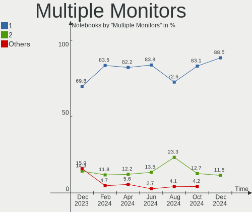

| Total | Notebooks | Percent |
|-------|-----------|---------|
| 1     | 80        | 82.47%  |
| 2     | 11        | 11.34%  |
| 3     | 3         | 3.09%   |
| 0     | 3         | 3.09%   |

Network
-------

Net Controller Vendor
---------------------

Controller vendors

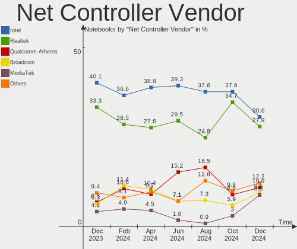

| Vendor                | Notebooks | Percent |
|-----------------------|-----------|---------|
| Realtek Semiconductor | 51        | 33.77%  |
| Intel                 | 51        | 33.77%  |
| Qualcomm Atheros      | 12        | 7.95%   |
| Broadcom              | 9         | 5.96%   |
| MediaTek              | 6         | 3.97%   |
| Broadcom Limited      | 5         | 3.31%   |
| TP-Link               | 4         | 2.65%   |
| Samsung Electronics   | 3         | 1.99%   |
| Sierra Wireless       | 2         | 1.32%   |
| Qualcomm              | 2         | 1.32%   |
| SEGGER                | 1         | 0.66%   |
| NetGear               | 1         | 0.66%   |
| DisplayLink           | 1         | 0.66%   |
| Dell                  | 1         | 0.66%   |
| ASIX Electronics      | 1         | 0.66%   |
| AMD                   | 1         | 0.66%   |

Net Controller Model
--------------------

Controller models

| Model                                                                | Notebooks | Percent |
|----------------------------------------------------------------------|-----------|---------|
| Realtek RTL8111/8168/8411 PCI Express Gigabit Ethernet Controller    | 25        | 13.3%   |
| Realtek RTL8153 Gigabit Ethernet Adapter                             | 8         | 4.26%   |
| Intel 82579LM Gigabit Network Connection (Lewisville)                | 7         | 3.72%   |
| Realtek RTL810xE PCI Express Fast Ethernet controller                | 5         | 2.66%   |
| Realtek RTL8852BE PCIe 802.11ax Wireless Network Controller          | 4         | 2.13%   |
| Realtek RTL8822CE 802.11ac PCIe Wireless Network Adapter             | 4         | 2.13%   |
| Intel Wireless 8265 / 8275                                           | 4         | 2.13%   |
| Intel Wireless 7265                                                  | 4         | 2.13%   |
| Realtek RTL8821CE 802.11ac PCIe Wireless Network Adapter             | 3         | 1.6%    |
| Realtek 802.11ac NIC                                                 | 3         | 1.6%    |
| MediaTek MT7921 802.11ax PCI Express Wireless Network Adapter        | 3         | 1.6%    |
| Intel Ethernet Connection (4) I219-LM                                | 3         | 1.6%    |
| Intel Comet Lake PCH CNVi WiFi                                       | 3         | 1.6%    |
| Intel Centrino Ultimate-N 6300                                       | 3         | 1.6%    |
| Intel Centrino Advanced-N 6205 [Taylor Peak]                         | 3         | 1.6%    |
| Intel Alder Lake-P PCH CNVi WiFi                                     | 3         | 1.6%    |
| TP-Link Archer T2U PLUS [RTL8821AU]                                  | 2         | 1.06%   |
| Samsung GT-I9070 (network tethering, USB debugging enabled)          | 2         | 1.06%   |
| Realtek RTL8821AE 802.11ac PCIe Wireless Network Adapter             | 2         | 1.06%   |
| Qualcomm Atheros QCA9377 802.11ac Wireless Network Adapter           | 2         | 1.06%   |
| Qualcomm Atheros QCA6174 802.11ac Wireless Network Adapter           | 2         | 1.06%   |
| Qualcomm Atheros AR928X Wireless Network Adapter (PCI-Express)       | 2         | 1.06%   |
| Qualcomm Atheros AR9285 Wireless Network Adapter (PCI-Express)       | 2         | 1.06%   |
| Qualcomm Atheros AR8132 Fast Ethernet                                | 2         | 1.06%   |
| Intel Wireless 8260                                                  | 2         | 1.06%   |
| Intel Wireless 7260                                                  | 2         | 1.06%   |
| Intel Wi-Fi 6 AX210/AX211/AX411 160MHz                               | 2         | 1.06%   |
| Intel Wi-Fi 6 AX201                                                  | 2         | 1.06%   |
| Intel Wi-Fi 6 AX200                                                  | 2         | 1.06%   |
| Intel Raptor Lake PCH CNVi WiFi                                      | 2         | 1.06%   |
| Intel Ethernet Connection I217-LM                                    | 2         | 1.06%   |
| Intel Ethernet Connection (10) I219-LM                               | 2         | 1.06%   |
| Intel Comet Lake PCH-LP CNVi WiFi                                    | 2         | 1.06%   |
| Intel Centrino Wireless-N 1030 [Rainbow Peak]                        | 2         | 1.06%   |
| Intel Cannon Point-LP CNVi [Wireless-AC]                             | 2         | 1.06%   |
| Intel Cannon Lake PCH CNVi WiFi                                      | 2         | 1.06%   |
| Intel 82567LM Gigabit Network Connection                             | 2         | 1.06%   |
| Broadcom Limited BCM4360 802.11ac Dual Band Wireless Network Adapter | 2         | 1.06%   |
| Broadcom Limited BCM43224 802.11a/b/g/n                              | 2         | 1.06%   |
| Broadcom BCM43228 802.11a/b/g/n                                      | 2         | 1.06%   |

Wireless Vendor
---------------

Wireless vendors

| Vendor                | Notebooks | Percent |
|-----------------------|-----------|---------|
| Intel                 | 48        | 46.15%  |
| Realtek Semiconductor | 23        | 22.12%  |
| Qualcomm Atheros      | 9         | 8.65%   |
| Broadcom              | 7         | 6.73%   |
| MediaTek              | 6         | 5.77%   |
| Broadcom Limited      | 4         | 3.85%   |
| TP-Link               | 3         | 2.88%   |
| Sierra Wireless       | 2         | 1.92%   |
| Qualcomm              | 1         | 0.96%   |
| NetGear               | 1         | 0.96%   |

Wireless Model
--------------

Wireless models

| Model                                                                | Notebooks | Percent |
|----------------------------------------------------------------------|-----------|---------|
| Realtek RTL8852BE PCIe 802.11ax Wireless Network Controller          | 4         | 3.85%   |
| Realtek RTL8822CE 802.11ac PCIe Wireless Network Adapter             | 4         | 3.85%   |
| Intel Wireless 8265 / 8275                                           | 4         | 3.85%   |
| Intel Wireless 7265                                                  | 4         | 3.85%   |
| Realtek RTL8821CE 802.11ac PCIe Wireless Network Adapter             | 3         | 2.88%   |
| Realtek 802.11ac NIC                                                 | 3         | 2.88%   |
| MediaTek MT7921 802.11ax PCI Express Wireless Network Adapter        | 3         | 2.88%   |
| Intel Comet Lake PCH CNVi WiFi                                       | 3         | 2.88%   |
| Intel Centrino Ultimate-N 6300                                       | 3         | 2.88%   |
| Intel Centrino Advanced-N 6205 [Taylor Peak]                         | 3         | 2.88%   |
| Intel Alder Lake-P PCH CNVi WiFi                                     | 3         | 2.88%   |
| TP-Link Archer T2U PLUS [RTL8821AU]                                  | 2         | 1.92%   |
| Realtek RTL8821AE 802.11ac PCIe Wireless Network Adapter             | 2         | 1.92%   |
| Qualcomm Atheros QCA9377 802.11ac Wireless Network Adapter           | 2         | 1.92%   |
| Qualcomm Atheros QCA6174 802.11ac Wireless Network Adapter           | 2         | 1.92%   |
| Qualcomm Atheros AR928X Wireless Network Adapter (PCI-Express)       | 2         | 1.92%   |
| Qualcomm Atheros AR9285 Wireless Network Adapter (PCI-Express)       | 2         | 1.92%   |
| Intel Wireless 8260                                                  | 2         | 1.92%   |
| Intel Wireless 7260                                                  | 2         | 1.92%   |
| Intel Wi-Fi 6 AX210/AX211/AX411 160MHz                               | 2         | 1.92%   |
| Intel Wi-Fi 6 AX201                                                  | 2         | 1.92%   |
| Intel Wi-Fi 6 AX200                                                  | 2         | 1.92%   |
| Intel Raptor Lake PCH CNVi WiFi                                      | 2         | 1.92%   |
| Intel Comet Lake PCH-LP CNVi WiFi                                    | 2         | 1.92%   |
| Intel Centrino Wireless-N 1030 [Rainbow Peak]                        | 2         | 1.92%   |
| Intel Cannon Point-LP CNVi [Wireless-AC]                             | 2         | 1.92%   |
| Intel Cannon Lake PCH CNVi WiFi                                      | 2         | 1.92%   |
| Broadcom Limited BCM4360 802.11ac Dual Band Wireless Network Adapter | 2         | 1.92%   |
| Broadcom Limited BCM43224 802.11a/b/g/n                              | 2         | 1.92%   |
| Broadcom BCM43228 802.11a/b/g/n                                      | 2         | 1.92%   |
| TP-Link RTL8812AU Archer T4U 802.11ac                                | 1         | 0.96%   |
| Sierra Wireless MC7750                                               | 1         | 0.96%   |
| Sierra Wireless EM7455                                               | 1         | 0.96%   |
| Realtek RTL88x2bu [AC1200 Techkey]                                   | 1         | 0.96%   |
| Realtek RTL8852AE 802.11ax PCIe Wireless Network Adapter             | 1         | 0.96%   |
| Realtek RTL8723BE PCIe Wireless Network Adapter                      | 1         | 0.96%   |
| Realtek RTL8191SU 802.11n WLAN Adapter                               | 1         | 0.96%   |
| Realtek RTL8188EUS 802.11n Wireless Network Adapter                  | 1         | 0.96%   |
| Realtek RTL8188CE 802.11b/g/n WiFi Adapter                           | 1         | 0.96%   |
| Realtek Realtek WLAN controller                                      | 1         | 0.96%   |

Ethernet Vendor
---------------

Ethernet vendors

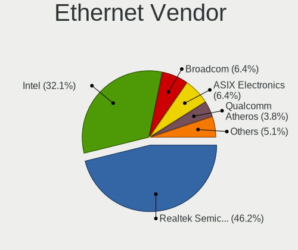

| Vendor                | Notebooks | Percent |
|-----------------------|-----------|---------|
| Realtek Semiconductor | 39        | 50%     |
| Intel                 | 24        | 30.77%  |
| Qualcomm Atheros      | 5         | 6.41%   |
| Broadcom              | 4         | 5.13%   |
| TP-Link               | 1         | 1.28%   |
| Samsung Electronics   | 1         | 1.28%   |
| Qualcomm              | 1         | 1.28%   |
| DisplayLink           | 1         | 1.28%   |
| Broadcom Limited      | 1         | 1.28%   |
| ASIX Electronics      | 1         | 1.28%   |

Ethernet Model
--------------

Ethernet models

| Model                                                             | Notebooks | Percent |
|-------------------------------------------------------------------|-----------|---------|
| Realtek RTL8111/8168/8411 PCI Express Gigabit Ethernet Controller | 25        | 31.65%  |
| Realtek RTL8153 Gigabit Ethernet Adapter                          | 8         | 10.13%  |
| Intel 82579LM Gigabit Network Connection (Lewisville)             | 7         | 8.86%   |
| Realtek RTL810xE PCI Express Fast Ethernet controller             | 5         | 6.33%   |
| Intel Ethernet Connection (4) I219-LM                             | 3         | 3.8%    |
| Qualcomm Atheros AR8132 Fast Ethernet                             | 2         | 2.53%   |
| Intel Ethernet Connection I217-LM                                 | 2         | 2.53%   |
| Intel Ethernet Connection (10) I219-LM                            | 2         | 2.53%   |
| Intel 82567LM Gigabit Network Connection                          | 2         | 2.53%   |
| TP-Link UE300 10/100/1000 LAN (ethernet mode) [Realtek RTL8153]   | 1         | 1.27%   |
| Samsung Galaxy series, misc. (tethering mode)                     | 1         | 1.27%   |
| Realtek RTL8152 Fast Ethernet Adapter                             | 1         | 1.27%   |
| Realtek RTL-8100/8101L/8139 PCI Fast Ethernet Adapter             | 1         | 1.27%   |
| Qualcomm Redmi 9T                                                 | 1         | 1.27%   |
| Qualcomm Atheros Killer E220x Gigabit Ethernet Controller         | 1         | 1.27%   |
| Qualcomm Atheros AR8151 v2.0 Gigabit Ethernet                     | 1         | 1.27%   |
| Qualcomm Atheros AR8151 v1.0 Gigabit Ethernet                     | 1         | 1.27%   |
| Intel Ethernet Connection I219-LM                                 | 1         | 1.27%   |
| Intel Ethernet Connection (7) I219-LM                             | 1         | 1.27%   |
| Intel Ethernet Connection (6) I219-V                              | 1         | 1.27%   |
| Intel Ethernet Connection (6) I219-LM                             | 1         | 1.27%   |
| Intel Ethernet Connection (5) I219-V                              | 1         | 1.27%   |
| Intel Ethernet Connection (4) I219-V                              | 1         | 1.27%   |
| Intel Ethernet Connection (2) I219-LM                             | 1         | 1.27%   |
| Intel 82577LM Gigabit Network Connection                          | 1         | 1.27%   |
| DisplayLink Dell D3100 Docking Station                            | 1         | 1.27%   |
| Broadcom NetXtreme BCM57765 Gigabit Ethernet PCIe                 | 1         | 1.27%   |
| Broadcom NetXtreme BCM57761 Gigabit Ethernet PCIe                 | 1         | 1.27%   |
| Broadcom NetLink BCM57785 Gigabit Ethernet PCIe                   | 1         | 1.27%   |
| Broadcom NetLink BCM57780 Gigabit Ethernet PCIe                   | 1         | 1.27%   |
| Broadcom Limited NetXtreme BCM5761 Gigabit Ethernet PCIe          | 1         | 1.27%   |
| ASIX AX88179 Gigabit Ethernet                                     | 1         | 1.27%   |

Net Controller Kind
-------------------

Ethernet, WiFi or modem

| Kind     | Notebooks | Percent |
|----------|-----------|---------|
| WiFi     | 95        | 53.98%  |
| Ethernet | 76        | 43.18%  |
| Modem    | 5         | 2.84%   |

Used Controller
---------------

Currently used network controller

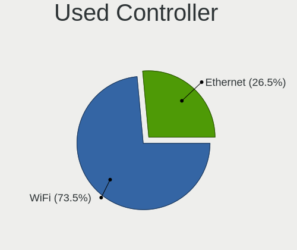

| Kind     | Notebooks | Percent |
|----------|-----------|---------|
| WiFi     | 80        | 76.19%  |
| Ethernet | 25        | 23.81%  |

NICs
----

Total network controllers on board

| Total | Notebooks | Percent |
|-------|-----------|---------|
| 2     | 63        | 64.95%  |
| 1     | 30        | 30.93%  |
| 0     | 4         | 4.12%   |

IPv6
----

IPv6 vs IPv4

| Used | Notebooks | Percent |
|------|-----------|---------|
| No   | 72        | 74.23%  |
| Yes  | 25        | 25.77%  |

Bluetooth
---------

Bluetooth Vendor
----------------

Controller vendors

| Vendor                          | Notebooks | Percent |
|---------------------------------|-----------|---------|
| Intel                           | 38        | 48.1%   |
| Realtek Semiconductor           | 9         | 11.39%  |
| IMC Networks                    | 8         | 10.13%  |
| Foxconn / Hon Hai               | 5         | 6.33%   |
| Broadcom                        | 5         | 6.33%   |
| Hewlett-Packard                 | 4         | 5.06%   |
| Apple                           | 3         | 3.8%    |
| Qualcomm Atheros Communications | 2         | 2.53%   |
| USI                             | 1         | 1.27%   |
| Dell                            | 1         | 1.27%   |
| Cambridge Silicon Radio         | 1         | 1.27%   |
| ASUSTek Computer                | 1         | 1.27%   |
| Alps Electric                   | 1         | 1.27%   |

Bluetooth Model
---------------

Controller models

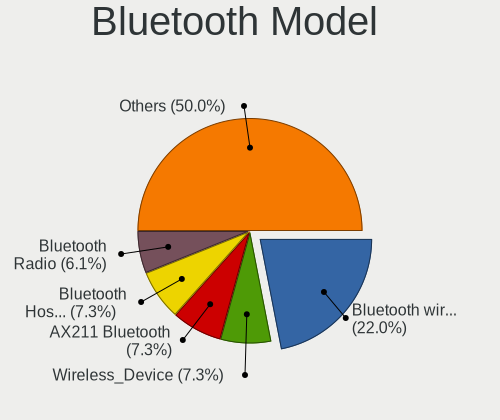

| Model                                               | Notebooks | Percent |
|-----------------------------------------------------|-----------|---------|
| Intel Bluetooth wireless interface                  | 14        | 17.72%  |
| Realtek Bluetooth Radio                             | 8         | 10.13%  |
| Intel AX201 Bluetooth                               | 8         | 10.13%  |
| Intel Bluetooth Device                              | 6         | 7.59%   |
| Intel Bluetooth 9460/9560 Jefferson Peak (JfP)      | 5         | 6.33%   |
| IMC Networks Bluetooth Radio                        | 5         | 6.33%   |
| IMC Networks Wireless_Device                        | 3         | 3.8%    |
| HP Broadcom 2070 Bluetooth Combo                    | 3         | 3.8%    |
| Qualcomm Atheros  Bluetooth Device                  | 2         | 2.53%   |
| Intel AX210 Bluetooth                               | 2         | 2.53%   |
| Intel AX200 Bluetooth                               | 2         | 2.53%   |
| Foxconn / Hon Hai Bluetooth Device                  | 2         | 2.53%   |
| Broadcom BCM20702 Bluetooth 4.0 [ThinkPad]          | 2         | 2.53%   |
| Apple Bluetooth USB Host Controller                 | 2         | 2.53%   |
| USI Bluetooth Device                                | 1         | 1.27%   |
| Realtek  Bluetooth 4.2 Adapter                      | 1         | 1.27%   |
| Intel Centrino Advanced-N 6230 Bluetooth adapter    | 1         | 1.27%   |
| HP Bluetooth 2.0 Interface [Broadcom BCM2045]       | 1         | 1.27%   |
| Foxconn / Hon Hai MediaTek Bluetooth Adapter        | 1         | 1.27%   |
| Foxconn / Hon Hai Bluetooth USB Host Controller     | 1         | 1.27%   |
| Foxconn / Hon Hai Acer Bluetooth module             | 1         | 1.27%   |
| Dell DW375 Bluetooth Module                         | 1         | 1.27%   |
| Cambridge Silicon Radio Bluetooth Dongle (HCI mode) | 1         | 1.27%   |
| Broadcom BCM43142A0 Bluetooth 4.0                   | 1         | 1.27%   |
| Broadcom BCM20702A0 Bluetooth 4.0                   | 1         | 1.27%   |
| Broadcom BCM2045B (BDC-2.1) [Bluetooth Controller]  | 1         | 1.27%   |
| ASUS Broadcom BCM20702A0 Bluetooth                  | 1         | 1.27%   |
| Apple Bluetooth Host Controller                     | 1         | 1.27%   |
| Alps Electric UGNZG                                 | 1         | 1.27%   |

Sound
-----

Sound Vendor
------------

Sound card vendors

| Vendor                | Notebooks | Percent |
|-----------------------|-----------|---------|
| Intel                 | 71        | 60.17%  |
| AMD                   | 28        | 23.73%  |
| Nvidia                | 13        | 11.02%  |
| Realtek Semiconductor | 1         | 0.85%   |
| Razer USA             | 1         | 0.85%   |
| Logitech              | 1         | 0.85%   |
| JMTek                 | 1         | 0.85%   |
| GYROCOM C&C           | 1         | 0.85%   |
| Apple                 | 1         | 0.85%   |

Sound Model
-----------

Sound card models

| Model                                                                      | Notebooks | Percent |
|----------------------------------------------------------------------------|-----------|---------|
| AMD Family 17h/19h HD Audio Controller                                     | 13        | 9.15%   |
| Intel Sunrise Point-LP HD Audio                                            | 10        | 7.04%   |
| AMD Rembrandt Radeon High Definition Audio Controller                      | 7         | 4.93%   |
| Intel Celeron/Pentium Silver Processor High Definition Audio               | 6         | 4.23%   |
| Intel 7 Series/C216 Chipset Family High Definition Audio Controller        | 6         | 4.23%   |
| Intel 6 Series/C200 Series Chipset Family High Definition Audio Controller | 6         | 4.23%   |
| AMD Renoir Radeon High Definition Audio Controller                         | 6         | 4.23%   |
| Intel Alder Lake PCH-P High Definition Audio Controller                    | 5         | 3.52%   |
| AMD Kabini HDMI/DP Audio                                                   | 5         | 3.52%   |
| AMD Family 15h (Models 60h-6fh) Audio Controller                           | 4         | 2.82%   |
| Nvidia GP107GL High Definition Audio Controller                            | 3         | 2.11%   |
| Nvidia GA106 High Definition Audio Controller                              | 3         | 2.11%   |
| Nvidia Audio device                                                        | 3         | 2.11%   |
| Intel Xeon E3-1200 v3/4th Gen Core Processor HD Audio Controller           | 3         | 2.11%   |
| Intel Raptor Lake-P/U/H cAVS                                               | 3         | 2.11%   |
| Intel Comet Lake PCH-LP cAVS                                               | 3         | 2.11%   |
| Intel Comet Lake PCH cAVS                                                  | 3         | 2.11%   |
| Intel Cannon Point-LP High Definition Audio Controller                     | 3         | 2.11%   |
| Intel Cannon Lake PCH cAVS                                                 | 3         | 2.11%   |
| Intel 82801I (ICH9 Family) HD Audio Controller                             | 3         | 2.11%   |
| Intel 8 Series/C220 Series Chipset High Definition Audio Controller        | 3         | 2.11%   |
| Intel 5 Series/3400 Series Chipset High Definition Audio                   | 3         | 2.11%   |
| Intel 100 Series/C230 Series Chipset Family HD Audio Controller            | 3         | 2.11%   |
| AMD SBx00 Azalia (Intel HDA)                                               | 3         | 2.11%   |
| Nvidia GF108 High Definition Audio Controller                              | 2         | 1.41%   |
| Intel Tiger Lake-LP Smart Sound Technology Audio Controller                | 2         | 1.41%   |
| Intel Haswell-ULT HD Audio Controller                                      | 2         | 1.41%   |
| Intel CM238 HD Audio Controller                                            | 2         | 1.41%   |
| Intel 8 Series HD Audio Controller                                         | 2         | 1.41%   |
| AMD RS880 HDMI Audio [Radeon HD 4200 Series]                               | 2         | 1.41%   |
| AMD Raven/Raven2/Fenghuang HDMI/DP Audio Controller                        | 2         | 1.41%   |
| Realtek Semiconductor USB Audio Device                                     | 1         | 0.7%    |
| Realtek Semiconductor USB Audio                                            | 1         | 0.7%    |
| Razer USA RC30-026902, Gaming Headset [Nari Essential, Wireless, Receiver] | 1         | 0.7%    |
| Nvidia TU116 High Definition Audio Controller                              | 1         | 0.7%    |
| Nvidia GM107 High Definition Audio Controller [GeForce 940MX]              | 1         | 0.7%    |
| Logitech Blue Snowball iCE                                                 | 1         | 0.7%    |
| JMTek Speedlink PnP Sound Device                                           | 1         | 0.7%    |
| Intel Tiger Lake-H HD Audio Controller                                     | 1         | 0.7%    |
| Intel NM10/ICH7 Family High Definition Audio Controller                    | 1         | 0.7%    |

Memory
------

Memory Vendor
-------------

Memory module vendors

| Vendor              | Notebooks | Percent |
|---------------------|-----------|---------|
| Samsung Electronics | 17        | 25%     |
| SK hynix            | 15        | 22.06%  |
| Micron Technology   | 12        | 17.65%  |
| Crucial             | 5         | 7.35%   |
| Unknown             | 3         | 4.41%   |
| Kingston            | 3         | 4.41%   |
| Unknown (ABCD)      | 2         | 2.94%   |
| Team                | 2         | 2.94%   |
| G.Skill             | 2         | 2.94%   |
| Nanya Technology    | 1         | 1.47%   |
| ff                  | 1         | 1.47%   |
| Elpida              | 1         | 1.47%   |
| Corsair             | 1         | 1.47%   |
| A-DATA Technology   | 1         | 1.47%   |
| 4ea5                | 1         | 1.47%   |
| 130b                | 1         | 1.47%   |

Memory Model
------------

Memory module models

| Model                                                                     | Notebooks | Percent |
|---------------------------------------------------------------------------|-----------|---------|
| Samsung RAM M471A1K43EB1-CWE 8GB SODIMM DDR4 3200MT/s                     | 3         | 4.17%   |
| Unknown (ABCD) RAM 123456789012345678 2GB SODIMM LPDDR4 2400MT/s          | 2         | 2.78%   |
| Team RAM TEAMGROUP-SD4-3200 16GB SODIMM DDR4 3200MT/s                     | 2         | 2.78%   |
| SK hynix RAM HMAG68EXNSA051N 8GB SODIMM DDR4 3200MT/s                     | 2         | 2.78%   |
| SK hynix RAM HMA81GS6AFR8N-UH 8GB SODIMM DDR4 2667MT/s                    | 2         | 2.78%   |
| Samsung RAM M471A1K43CB1-CRC 8GB SODIMM DDR4 2667MT/s                     | 2         | 2.78%   |
| Samsung RAM M471A1G44BB0-CWE 8GB SODIMM DDR4 3200MT/s                     | 2         | 2.78%   |
| Micron RAM 4ATF1G64HZ-3G2E2 8GB SODIMM DDR4 3200MT/s                      | 2         | 2.78%   |
| G.Skill RAM F4-3200C22-32GRS 32GB SODIMM DDR4 3200MT/s                    | 2         | 2.78%   |
| Unknown RAM Module 2GB SODIMM DDR3 800MT/s                                | 1         | 1.39%   |
| Unknown RAM Module 2GB SODIMM 800MT/s                                     | 1         | 1.39%   |
| Unknown RAM Module 1GB SODIMM DRAM                                        | 1         | 1.39%   |
| SK hynix RAM Module 4GB SODIMM DDR3 1600MT/s                              | 1         | 1.39%   |
| SK hynix RAM Module 16GB SODIMM DDR5 5600MT/s                             | 1         | 1.39%   |
| SK hynix RAM HYMP125S64CP8-S6 2GB SODIMM DDR2 975MT/s                     | 1         | 1.39%   |
| SK hynix RAM HMT351S6CFR8C-PB 4GB SODIMM DDR3 1600MT/s                    | 1         | 1.39%   |
| SK hynix RAM HMCG78AGBSA095N 16GB SODIMM DDR5 5600MT/s                    | 1         | 1.39%   |
| SK hynix RAM HMAA1GS6CJR6N-XN 8GB SODIMM DDR4 3200MT/s                    | 1         | 1.39%   |
| SK hynix RAM HMA851S6CJR6N-XN 4GB SODIMM DDR4 3200MT/s                    | 1         | 1.39%   |
| SK hynix RAM HMA81GS6DJR8N-XN 8GB SODIMM DDR4 3200MT/s                    | 1         | 1.39%   |
| SK hynix RAM H9HCNNN8KUMLHR-NME 1GB LPDDR4 2400MT/s                       | 1         | 1.39%   |
| SK hynix RAM H5AN4G6NBJR-UHC 2GB Row Of Chips DDR4 2400MT/s               | 1         | 1.39%   |
| SK hynix RAM 48594D503132355336344350382D59352020 2GB SODIMM DDR2 667MT/s | 1         | 1.39%   |
| Samsung RAM Module 8GB SODIMM DDR4 3200MT/s                               | 1         | 1.39%   |
| Samsung RAM Module 8GB SODIMM DDR3 1333MT/s                               | 1         | 1.39%   |
| Samsung RAM Module 8192MB SODIMM DDR4 2133MT/s                            | 1         | 1.39%   |
| Samsung RAM Module 4GB Row Of Chips LPDDR3 2133MT/s                       | 1         | 1.39%   |
| Samsung RAM Module 2GB SODIMM DDR3 1600MT/s                               | 1         | 1.39%   |
| Samsung RAM M471A2G44AM0-CWE 16GB SODIMM DDR4 3200MT/s                    | 1         | 1.39%   |
| Samsung RAM M471A1K43DB1-CTD 8GB SODIMM DDR4 2667MT/s                     | 1         | 1.39%   |
| Samsung RAM M471A1K43BB1-CRC 8192MB SODIMM DDR4 2667MT/s                  | 1         | 1.39%   |
| Samsung RAM M471A1G44BB0-CWE 8GB Row Of Chips DDR4 3200MT/s               | 1         | 1.39%   |
| Samsung RAM M425R1GB4BB0-CQKOL 8GB SODIMM 4800MT/s                        | 1         | 1.39%   |
| Samsung RAM K4EBE304EB-EGCG 8GB Row Of Chips LPDDR3 2133MT/s              | 1         | 1.39%   |
| Samsung RAM K3LKCKC0BM-MGCP 8GB SODIMM 6400MT/s                           | 1         | 1.39%   |
| Nanya RAM NT8GA64D88CX3S-JR 8GB SODIMM DDR4 3200MT/s                      | 1         | 1.39%   |
| Micron RAM MTC4C10163S1SC48BA1 8GB SODIMM DDR5 4800MT/s                   | 1         | 1.39%   |
| Micron RAM MT62F4G32D8DV-026 WT 16GB SODIMM LPDDR5 6400MT/s               | 1         | 1.39%   |
| Micron RAM MT52L1G32D4PG-093 8GB Row Of Chips LPDDR3 2133MT/s             | 1         | 1.39%   |
| Micron RAM MT40A1G16TB-062E:F 8GB SODIMM DDR4 3200MT/s                    | 1         | 1.39%   |

Memory Kind
-----------

Memory module kinds

| Kind    | Notebooks | Percent |
|---------|-----------|---------|
| DDR4    | 29        | 51.79%  |
| DDR3    | 11        | 19.64%  |
| DDR5    | 4         | 7.14%   |
| LPDDR4  | 3         | 5.36%   |
| LPDDR3  | 3         | 5.36%   |
| LPDDR5  | 2         | 3.57%   |
| DDR2    | 2         | 3.57%   |
| DRAM    | 1         | 1.79%   |
| Unknown | 1         | 1.79%   |

Memory Form Factor
------------------

Physical design of the memory module

| Name         | Notebooks | Percent |
|--------------|-----------|---------|
| SODIMM       | 51        | 89.47%  |
| Row Of Chips | 5         | 8.77%   |
| Unknown      | 1         | 1.75%   |

Memory Size
-----------

Memory module size

| Size  | Notebooks | Percent |
|-------|-----------|---------|
| 8192  | 32        | 51.61%  |
| 4096  | 9         | 14.52%  |
| 16384 | 7         | 11.29%  |
| 32768 | 6         | 9.68%   |
| 2048  | 6         | 9.68%   |
| 1024  | 2         | 3.23%   |

Memory Speed
------------

Memory module speed

| Speed   | Notebooks | Percent |
|---------|-----------|---------|
| 3200    | 22        | 34.92%  |
| 2400    | 8         | 12.7%   |
| 2667    | 7         | 11.11%  |
| 1600    | 6         | 9.52%   |
| 2133    | 4         | 6.35%   |
| 800     | 3         | 4.76%   |
| 6400    | 2         | 3.17%   |
| 5600    | 2         | 3.17%   |
| 4800    | 2         | 3.17%   |
| 1334    | 2         | 3.17%   |
| 1333    | 2         | 3.17%   |
| 975     | 1         | 1.59%   |
| 667     | 1         | 1.59%   |
| Unknown | 1         | 1.59%   |

Printers & scanners
-------------------

Printer Vendor
--------------

Printer device vendors

| Vendor          | Notebooks | Percent |
|-----------------|-----------|---------|
| Hewlett-Packard | 1         | 33.33%  |
| Dymo-CoStar     | 1         | 33.33%  |
| Canon           | 1         | 33.33%  |

Printer Model
-------------

Printer device models

| Model                       | Notebooks | Percent |
|-----------------------------|-----------|---------|
| HP DeskJet 2700 series      | 1         | 33.33%  |
| Dymo-CoStar LabelWriter 450 | 1         | 33.33%  |
| Canon MF230 Series UFRII LT | 1         | 33.33%  |

Scanner Vendor
--------------

Scanner device vendors

| Vendor | Notebooks | Percent |
|--------|-----------|---------|
| Canon  | 1         | 100%    |

Scanner Model
-------------

Scanner device models

| Model                   | Notebooks | Percent |
|-------------------------|-----------|---------|
| Canon CanoScan LiDE 120 | 1         | 100%    |

Camera
------

Camera Vendor
-------------

Camera device vendors

| Vendor                                 | Notebooks | Percent |
|----------------------------------------|-----------|---------|
| Chicony Electronics                    | 18        | 22.78%  |
| Microdia                               | 10        | 12.66%  |
| IMC Networks                           | 8         | 10.13%  |
| Realtek Semiconductor                  | 5         | 6.33%   |
| Luxvisions Innotech Limited            | 5         | 6.33%   |
| Cheng Uei Precision Industry (Foxlink) | 5         | 6.33%   |
| Bison Electronics                      | 5         | 6.33%   |
| Suyin                                  | 3         | 3.8%    |
| Sunplus Innovation Technology          | 3         | 3.8%    |
| Sonix Technology                       | 2         | 2.53%   |
| Quanta                                 | 2         | 2.53%   |
| Lite-On Technology                     | 2         | 2.53%   |
| icSpring                               | 2         | 2.53%   |
| Apple                                  | 2         | 2.53%   |
| Acer                                   | 2         | 2.53%   |
| WaveRider Communications               | 1         | 1.27%   |
| Syntek                                 | 1         | 1.27%   |
| Logitech                               | 1         | 1.27%   |
| DQYGF0A9IHU4ID                         | 1         | 1.27%   |
| Alcor Micro                            | 1         | 1.27%   |

Camera Model
------------

Camera device models

| Model                                                | Notebooks | Percent |
|------------------------------------------------------|-----------|---------|
| Chicony Integrated Camera                            | 6         | 7.59%   |
| Microdia Integrated_Webcam_HD                        | 5         | 6.33%   |
| IMC Networks USB2.0 HD UVC WebCam                    | 4         | 5.06%   |
| Bison Integrated Camera                              | 4         | 5.06%   |
| Luxvisions Innotech Limited HP Wide Vision HD Camera | 3         | 3.8%    |
| Realtek Integrated_Webcam_HD                         | 2         | 2.53%   |
| Quanta HD User Facing                                | 2         | 2.53%   |
| IMC Networks EasyCamera                              | 2         | 2.53%   |
| icSpring camera                                      | 2         | 2.53%   |
| Chicony HP TrueVision HD                             | 2         | 2.53%   |
| Cheng Uei Precision Industry (Foxlink) HP HD Camera  | 2         | 2.53%   |
| WaveRider USB 2.0 Camera                             | 1         | 1.27%   |
| Syntek EasyCamera                                    | 1         | 1.27%   |
| Suyin HP Webcam-101                                  | 1         | 1.27%   |
| Suyin Acer/Lenovo Webcam [CN0316]                    | 1         | 1.27%   |
| Suyin Acer/HP Integrated Webcam [CN0314]             | 1         | 1.27%   |
| Sunplus Laptop_Integrated_Webcam_FHD                 | 1         | 1.27%   |
| Sunplus Laptop Integrated Webcam FHD                 | 1         | 1.27%   |
| Sunplus HP Wide Vision HD                            | 1         | 1.27%   |
| Sonix USB2.0 HD UVC WebCam                           | 1         | 1.27%   |
| Sonix USB2.0 FHD UVC WebCam                          | 1         | 1.27%   |
| Realtek USB Camera                                   | 1         | 1.27%   |
| Realtek HD WebCam                                    | 1         | 1.27%   |
| Realtek Bluetooth Radio                              | 1         | 1.27%   |
| Microdia Sonix Integrated Webcam                     | 1         | 1.27%   |
| Microdia Laptop_Integrated_Webcam_HD                 | 1         | 1.27%   |
| Microdia Laptop_Integrated_Webcam_E4HD               | 1         | 1.27%   |
| Microdia Integrated Webcam HD                        | 1         | 1.27%   |
| Microdia Integrated Webcam                           | 1         | 1.27%   |
| Luxvisions Innotech Limited Integrated Camera        | 1         | 1.27%   |
| Luxvisions Innotech Limited HP TrueVision HD Camera  | 1         | 1.27%   |
| Logitech C922 Pro Stream Webcam                      | 1         | 1.27%   |
| Lite-On Integrated Camera                            | 1         | 1.27%   |
| Lite-On HP TrueVision HD Camera                      | 1         | 1.27%   |
| IMC Networks USB2.0 VGA UVC WebCam                   | 1         | 1.27%   |
| IMC Networks Integrated Camera                       | 1         | 1.27%   |
| DQYGF0A9IHU4ID HP 5MP Camera                         | 1         | 1.27%   |
| Chicony USB 2.0 Camera                               | 1         | 1.27%   |
| Chicony TOSHIBA Web Camera - MP                      | 1         | 1.27%   |
| Chicony ThinkPad T490 Webcam                         | 1         | 1.27%   |

Security
--------

Fingerprint Vendor
------------------

Fingerprint sensor vendors

| Vendor                             | Notebooks | Percent |
|------------------------------------|-----------|---------|
| Synaptics                          | 6         | 37.5%   |
| Validity Sensors                   | 4         | 25%     |
| Elan Microelectronics              | 4         | 25%     |
| Realtek USB2.0 Finger Print Bridge | 1         | 6.25%   |
| AuthenTec                          | 1         | 6.25%   |

Fingerprint Model
-----------------

Fingerprint sensor models

| Model                                                           | Notebooks | Percent |
|-----------------------------------------------------------------|-----------|---------|
| Elan ELAN:ARM-M4                                                | 3         | 18.75%  |
| Synaptics Prometheus MIS Touch Fingerprint Reader               | 2         | 12.5%   |
| Synaptics Metallica MIS Touch Fingerprint Reader                | 2         | 12.5%   |
| Synaptics FS7604 Touch Fingerprint Sensor with PurePrint        | 2         | 12.5%   |
| Validity Sensors VFS495 Fingerprint Reader                      | 1         | 6.25%   |
| Validity Sensors VFS471 Fingerprint Reader                      | 1         | 6.25%   |
| Validity Sensors VFS301 Fingerprint Reader                      | 1         | 6.25%   |
| Validity Sensors Synaptics WBDI                                 | 1         | 6.25%   |
| Realtek USB2.0 Finger Print Bridge FocalTech Fingerprint Device | 1         | 6.25%   |
| Elan ELAN:Fingerprint                                           | 1         | 6.25%   |
| AuthenTec AES2501 Fingerprint Sensor                            | 1         | 6.25%   |

Chipcard Vendor
---------------

Chipcard module vendors

| Vendor      | Notebooks | Percent |
|-------------|-----------|---------|
| Broadcom    | 5         | 45.45%  |
| Alcor Micro | 3         | 27.27%  |
| Upek        | 1         | 9.09%   |
| O2 Micro    | 1         | 9.09%   |
| Lenovo      | 1         | 9.09%   |

Chipcard Model
--------------

Chipcard module models

| Model                                                                        | Notebooks | Percent |
|------------------------------------------------------------------------------|-----------|---------|
| Alcor Micro AU9540 Smartcard Reader                                          | 3         | 27.27%  |
| Broadcom BCM5880 Secure Applications Processor with fingerprint swipe sensor | 2         | 18.18%  |
| Upek TouchChip Fingerprint Coprocessor (WBF advanced mode)                   | 1         | 9.09%   |
| O2 Micro OZ776 CCID Smartcard Reader                                         | 1         | 9.09%   |
| Lenovo Integrated Smart Card Reader                                          | 1         | 9.09%   |
| Broadcom BCM5880 Secure Applications Processor                               | 1         | 9.09%   |
| Broadcom 5880                                                                | 1         | 9.09%   |
| Broadcom 58200                                                               | 1         | 9.09%   |

Unsupported
-----------

Unsupported Devices
-------------------

Total unsupported devices on board

| Total | Notebooks | Percent |
|-------|-----------|---------|
| 0     | 62        | 63.92%  |
| 1     | 25        | 25.77%  |
| 2     | 9         | 9.28%   |
| 5     | 1         | 1.03%   |

Unsupported Device Types
------------------------

Types of unsupported devices

| Type                     | Notebooks | Percent |
|--------------------------|-----------|---------|
| Fingerprint reader       | 15        | 31.91%  |
| Chipcard                 | 9         | 19.15%  |
| Net/wireless             | 7         | 14.89%  |
| Graphics card            | 7         | 14.89%  |
| Camera                   | 3         | 6.38%   |
| Storage                  | 2         | 4.26%   |
| Multimedia controller    | 2         | 4.26%   |
| Sound                    | 1         | 2.13%   |
| Communication controller | 1         | 2.13%   |

