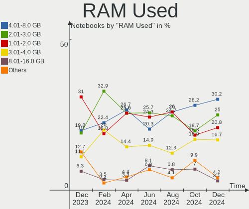
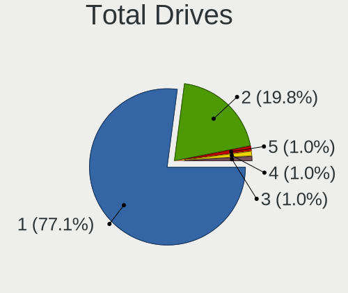
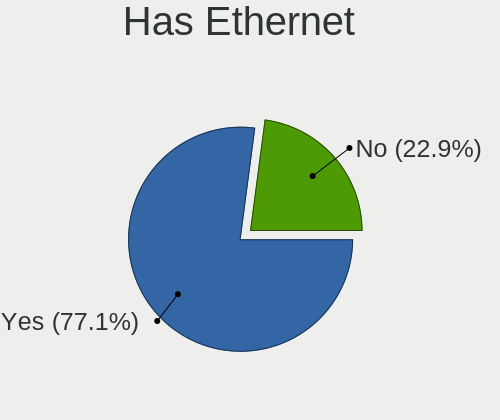
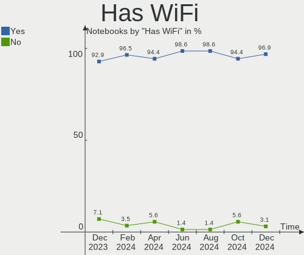
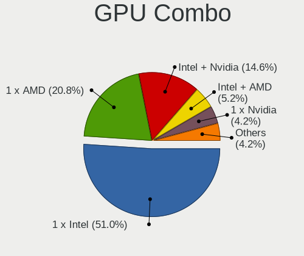
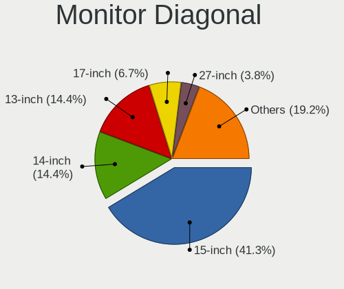
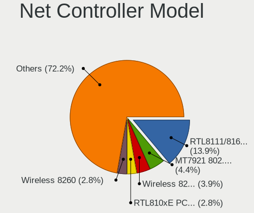

Linux in Canada - Hardware Trends (Notebooks)
---------------------------------------------

A project to identify most popular hardware characteristics and track their change
over time based on data collected by Linux users at https://Linux-Hardware.org.

Anyone can contribute to this report by the [hw-probe](https://github.com/linuxhw/hw-probe) tool:

    sudo -E hw-probe -all -upload

Period: Jan, 2023.

Contents
--------

* [ System ](#system)
  - [ OS                       ](#os)
  - [ OS Family                ](#os-family)
  - [ Kernel                   ](#kernel)
  - [ Kernel Family            ](#kernel-family)
  - [ Kernel Major Ver.        ](#kernel-major-ver)
  - [ Arch                     ](#arch)
  - [ DE                       ](#de)
  - [ Display Server           ](#display-server)
  - [ Display Manager          ](#display-manager)
  - [ OS Lang                  ](#os-lang)
  - [ Boot Mode                ](#boot-mode)
  - [ Filesystem               ](#filesystem)
  - [ Part. scheme             ](#part-scheme)
  - [ Dual Boot with Linux/BSD ](#dual-boot-with-linuxbsd)
  - [ Dual Boot (Win)          ](#dual-boot-win)

* [ Board ](#board)
  - [ Vendor                   ](#vendor)
  - [ Model                    ](#model)
  - [ Model Family             ](#model-family)
  - [ MFG Year                 ](#mfg-year)
  - [ Form Factor              ](#form-factor)
  - [ Secure Boot              ](#secure-boot)
  - [ Coreboot                 ](#coreboot)
  - [ RAM Size                 ](#ram-size)
  - [ RAM Used                 ](#ram-used)
  - [ Total Drives             ](#total-drives)
  - [ Has CD-ROM               ](#has-cd-rom)
  - [ Has Ethernet             ](#has-ethernet)
  - [ Has WiFi                 ](#has-wifi)
  - [ Has Bluetooth            ](#has-bluetooth)

* [ Location ](#location)
  - [ Country                  ](#country)
  - [ City                     ](#city)

* [ Drives ](#drives)
  - [ Drive Vendor             ](#drive-vendor)
  - [ Drive Model              ](#drive-model)
  - [ HDD Vendor               ](#hdd-vendor)
  - [ SSD Vendor               ](#ssd-vendor)
  - [ Drive Kind               ](#drive-kind)
  - [ Drive Connector          ](#drive-connector)
  - [ Drive Size               ](#drive-size)
  - [ Space Total              ](#space-total)
  - [ Space Used               ](#space-used)
  - [ Malfunc. Drives          ](#malfunc-drives)
  - [ Malfunc. Drive Vendor    ](#malfunc-drive-vendor)
  - [ Malfunc. HDD Vendor      ](#malfunc-hdd-vendor)
  - [ Malfunc. Drive Kind      ](#malfunc-drive-kind)
  - [ Failed Drives            ](#failed-drives)
  - [ Failed Drive Vendor      ](#failed-drive-vendor)
  - [ Drive Status             ](#drive-status)

* [ Storage controller ](#storage-controller)
  - [ Storage Vendor           ](#storage-vendor)
  - [ Storage Model            ](#storage-model)
  - [ Storage Kind             ](#storage-kind)

* [ Processor ](#processor)
  - [ CPU Vendor               ](#cpu-vendor)
  - [ CPU Model                ](#cpu-model)
  - [ CPU Model Family         ](#cpu-model-family)
  - [ CPU Cores                ](#cpu-cores)
  - [ CPU Sockets              ](#cpu-sockets)
  - [ CPU Threads              ](#cpu-threads)
  - [ CPU Op-Modes             ](#cpu-op-modes)
  - [ CPU Microcode            ](#cpu-microcode)
  - [ CPU Microarch            ](#cpu-microarch)

* [ Graphics ](#graphics)
  - [ GPU Vendor               ](#gpu-vendor)
  - [ GPU Model                ](#gpu-model)
  - [ GPU Combo                ](#gpu-combo)
  - [ GPU Driver               ](#gpu-driver)
  - [ GPU Memory               ](#gpu-memory)

* [ Monitor ](#monitor)
  - [ Monitor Vendor           ](#monitor-vendor)
  - [ Monitor Model            ](#monitor-model)
  - [ Monitor Resolution       ](#monitor-resolution)
  - [ Monitor Diagonal         ](#monitor-diagonal)
  - [ Monitor Width            ](#monitor-width)
  - [ Aspect Ratio             ](#aspect-ratio)
  - [ Monitor Area             ](#monitor-area)
  - [ Pixel Density            ](#pixel-density)
  - [ Multiple Monitors        ](#multiple-monitors)

* [ Network ](#network)
  - [ Net Controller Vendor    ](#net-controller-vendor)
  - [ Net Controller Model     ](#net-controller-model)
  - [ Wireless Vendor          ](#wireless-vendor)
  - [ Wireless Model           ](#wireless-model)
  - [ Ethernet Vendor          ](#ethernet-vendor)
  - [ Ethernet Model           ](#ethernet-model)
  - [ Net Controller Kind      ](#net-controller-kind)
  - [ Used Controller          ](#used-controller)
  - [ NICs                     ](#nics)
  - [ IPv6                     ](#ipv6)

* [ Bluetooth ](#bluetooth)
  - [ Bluetooth Vendor         ](#bluetooth-vendor)
  - [ Bluetooth Model          ](#bluetooth-model)

* [ Sound ](#sound)
  - [ Sound Vendor             ](#sound-vendor)
  - [ Sound Model              ](#sound-model)

* [ Memory ](#memory)
  - [ Memory Vendor            ](#memory-vendor)
  - [ Memory Model             ](#memory-model)
  - [ Memory Kind              ](#memory-kind)
  - [ Memory Form Factor       ](#memory-form-factor)
  - [ Memory Size              ](#memory-size)
  - [ Memory Speed             ](#memory-speed)

* [ Printers & scanners ](#printers--scanners)
  - [ Printer Vendor           ](#printer-vendor)
  - [ Printer Model            ](#printer-model)
  - [ Scanner Vendor           ](#scanner-vendor)
  - [ Scanner Model            ](#scanner-model)

* [ Camera ](#camera)
  - [ Camera Vendor            ](#camera-vendor)
  - [ Camera Model             ](#camera-model)

* [ Security ](#security)
  - [ Fingerprint Vendor       ](#fingerprint-vendor)
  - [ Fingerprint Model        ](#fingerprint-model)
  - [ Chipcard Vendor          ](#chipcard-vendor)
  - [ Chipcard Model           ](#chipcard-model)

* [ Unsupported ](#unsupported)
  - [ Unsupported Devices      ](#unsupported-devices)
  - [ Unsupported Device Types ](#unsupported-device-types)

System
------

OS
--

Installed operating systems

| Name                | Notebooks | Percent |
|---------------------|-----------|---------|
| OpenMandriva 23.01  | 20        | 18.69%  |
| Ubuntu 22.04        | 19        | 17.76%  |
| Fedora 37           | 10        | 9.35%   |
| Linux Mint 21.1     | 7         | 6.54%   |
| SteamOS 3.4.4       | 6         | 5.61%   |
| Zorin 16            | 5         | 4.67%   |
| Pop!_OS 22.04       | 5         | 4.67%   |
| Linux Mint 20.3     | 4         | 3.74%   |
| Ubuntu 22.10        | 3         | 2.8%    |
| Linux Mint 21       | 3         | 2.8%    |
| Ubuntu 18.04        | 2         | 1.87%   |
| OpenMandriva 4.3    | 2         | 1.87%   |
| ArcoLinux Rolling   | 2         | 1.87%   |
| Arch Rolling        | 2         | 1.87%   |
| Zorin 15            | 1         | 0.93%   |
| Ubuntu 20.04        | 1         | 0.93%   |
| Peppermint 11.1     | 1         | 0.93%   |
| OpenMandriva 4.50   | 1         | 0.93%   |
| OpenMandriva 4.2    | 1         | 0.93%   |
| NixOS 23.05         | 1         | 0.93%   |
| MX 21               | 1         | 0.93%   |
| Manjaro 22.0.1      | 1         | 0.93%   |
| Manjaro             | 1         | 0.93%   |
| Linux Mint 20       | 1         | 0.93%   |
| Kubuntu 22.10       | 1         | 0.93%   |
| Kubuntu 22.04       | 1         | 0.93%   |
| Gentoo 2.9          | 1         | 0.93%   |
| EndeavourOS Rolling | 1         | 0.93%   |
| Debian 11           | 1         | 0.93%   |
| Debian              | 1         | 0.93%   |
| CentOS 9            | 1         | 0.93%   |

OS Family
---------

OS without a version

| Name         | Notebooks | Percent |
|--------------|-----------|---------|
| Ubuntu       | 25        | 23.36%  |
| OpenMandriva | 24        | 22.43%  |
| Linux Mint   | 15        | 14.02%  |
| Fedora       | 10        | 9.35%   |
| Zorin        | 6         | 5.61%   |
| SteamOS      | 6         | 5.61%   |
| Pop!_OS      | 5         | 4.67%   |
| Manjaro      | 2         | 1.87%   |
| Kubuntu      | 2         | 1.87%   |
| Debian       | 2         | 1.87%   |
| ArcoLinux    | 2         | 1.87%   |
| Arch         | 2         | 1.87%   |
| Peppermint   | 1         | 0.93%   |
| NixOS        | 1         | 0.93%   |
| MX           | 1         | 0.93%   |
| Gentoo       | 1         | 0.93%   |
| EndeavourOS  | 1         | 0.93%   |
| CentOS       | 1         | 0.93%   |

Kernel
------

Version of the Linux kernel

| Version                  | Notebooks | Percent |
|--------------------------|-----------|---------|
| 6.1.1-desktop-1omv2290   | 20        | 18.69%  |
| 5.15.0-58-generic        | 16        | 14.95%  |
| 5.13.0-valve36-1-neptune | 6         | 5.61%   |
| 5.15.0-57-generic        | 5         | 4.67%   |
| 5.15.0-56-generic        | 5         | 4.67%   |
| 6.0.12-76060006-generic  | 4         | 3.74%   |
| 5.4.0-137-generic        | 4         | 3.74%   |
| 5.4.0-136-generic        | 3         | 2.8%    |
| 5.19.0-29-generic        | 3         | 2.8%    |
| 6.0.7-301.fc37.x86_64    | 2         | 1.87%   |
| 6.0.15-300.fc37.x86_64   | 2         | 1.87%   |
| 5.10.0-20-amd64          | 2         | 1.87%   |
| 6.1.8-200.fc37.x86_64    | 1         | 0.93%   |
| 6.1.7-200.fc37.x86_64    | 1         | 0.93%   |
| 6.1.7-1-MANJARO          | 1         | 0.93%   |
| 6.1.6-arch1-1            | 1         | 0.93%   |
| 6.1.5-arch2-1            | 1         | 0.93%   |
| 6.1.5-200.fc37.x86_64    | 1         | 0.93%   |
| 6.1.4-arch1-1            | 1         | 0.93%   |
| 6.1.1-1-MANJARO          | 1         | 0.93%   |
| 6.1.1                    | 1         | 0.93%   |
| 6.1.0-1004-oem           | 1         | 0.93%   |
| 6.0.18-300.fc37.x86_64   | 1         | 0.93%   |
| 6.0.17-300.fc37.x86_64   | 1         | 0.93%   |
| 6.0.16-300.fc37.x86_64   | 1         | 0.93%   |
| 6.0.0-6-amd64            | 1         | 0.93%   |
| 6.0.0-1009-oem           | 1         | 0.93%   |
| 6.0.0-060000-generic     | 1         | 0.93%   |
| 5.4.0-135-generic        | 1         | 0.93%   |
| 5.19.5-desktop-1omv4090  | 1         | 0.93%   |
| 5.19.0-28-generic        | 1         | 0.93%   |
| 5.18.12-arch1-1          | 1         | 0.93%   |
| 5.18.10-76051810-generic | 1         | 0.93%   |
| 5.16.7-desktop-1omv4003  | 1         | 0.93%   |
| 5.16.13-desktop-1omv4003 | 1         | 0.93%   |
| 5.15.85-gentoo-dist      | 1         | 0.93%   |
| 5.15.64-1-lts            | 1         | 0.93%   |
| 5.15.0-59-generic        | 1         | 0.93%   |
| 5.15.0-53-generic        | 1         | 0.93%   |
| 5.15.0-43-generic        | 1         | 0.93%   |

Kernel Family
-------------

Linux kernel without a distro release

| Version | Notebooks | Percent |
|---------|-----------|---------|
| 5.15.0  | 31        | 28.97%  |
| 6.1.1   | 22        | 20.56%  |
| 5.4.0   | 8         | 7.48%   |
| 5.13.0  | 7         | 6.54%   |
| 6.0.12  | 4         | 3.74%   |
| 5.19.0  | 4         | 3.74%   |
| 6.0.0   | 3         | 2.8%    |
| 6.1.7   | 2         | 1.87%   |
| 6.1.5   | 2         | 1.87%   |
| 6.0.7   | 2         | 1.87%   |
| 6.0.15  | 2         | 1.87%   |
| 5.10.0  | 2         | 1.87%   |
| 6.1.8   | 1         | 0.93%   |
| 6.1.6   | 1         | 0.93%   |
| 6.1.4   | 1         | 0.93%   |
| 6.1.0   | 1         | 0.93%   |
| 6.0.18  | 1         | 0.93%   |
| 6.0.17  | 1         | 0.93%   |
| 6.0.16  | 1         | 0.93%   |
| 5.19.5  | 1         | 0.93%   |
| 5.18.12 | 1         | 0.93%   |
| 5.18.10 | 1         | 0.93%   |
| 5.16.7  | 1         | 0.93%   |
| 5.16.13 | 1         | 0.93%   |
| 5.15.85 | 1         | 0.93%   |
| 5.15.64 | 1         | 0.93%   |
| 5.14.0  | 1         | 0.93%   |
| 5.10.14 | 1         | 0.93%   |
| 4.15.0  | 1         | 0.93%   |
| Unknown | 1         | 0.93%   |

Kernel Major Ver.
-----------------

Linux kernel major version

| Version | Notebooks | Percent |
|---------|-----------|---------|
| 5.15    | 33        | 30.84%  |
| 6.1     | 30        | 28.04%  |
| 6.0     | 14        | 13.08%  |
| 5.4     | 8         | 7.48%   |
| 5.13    | 7         | 6.54%   |
| 5.19    | 5         | 4.67%   |
| 5.10    | 3         | 2.8%    |
| 5.18    | 2         | 1.87%   |
| 5.16    | 2         | 1.87%   |
| 5.14    | 1         | 0.93%   |
| 4.15    | 1         | 0.93%   |
| Unknown | 1         | 0.93%   |

Arch
----

OS architecture (x86_64, i586, etc.)

| Name   | Notebooks | Percent |
|--------|-----------|---------|
| x86_64 | 105       | 98.13%  |
| i686   | 2         | 1.87%   |

DE
--

Desktop Environment

| Name       | Notebooks | Percent |
|------------|-----------|---------|
| GNOME      | 46        | 42.99%  |
| KDE5       | 38        | 35.51%  |
| X-Cinnamon | 8         | 7.48%   |
| XFCE       | 7         | 6.54%   |
| MATE       | 4         | 3.74%   |
| sway       | 1         | 0.93%   |
| i3         | 1         | 0.93%   |
| Cinnamon   | 1         | 0.93%   |
| Unknown    | 1         | 0.93%   |

Display Server
--------------

X11 or Wayland

| Name    | Notebooks | Percent |
|---------|-----------|---------|
| X11     | 73        | 68.22%  |
| Wayland | 31        | 28.97%  |
| Unknown | 2         | 1.87%   |
| Tty     | 1         | 0.93%   |

Display Manager
---------------

SDDM, LightDM, etc.

| Name    | Notebooks | Percent |
|---------|-----------|---------|
| Unknown | 30        | 28.04%  |
| GDM3    | 29        | 27.1%   |
| SDDM    | 28        | 26.17%  |
| LightDM | 15        | 14.02%  |
| GDM     | 5         | 4.67%   |

OS Lang
-------

Language

| Lang    | Notebooks | Percent |
|---------|-----------|---------|
| en_CA   | 50        | 46.73%  |
| en_US   | 42        | 39.25%  |
| fr_CA   | 7         | 6.54%   |
| fr_FR   | 2         | 1.87%   |
| hr_HR   | 1         | 0.93%   |
| en_IE   | 1         | 0.93%   |
| en_GB   | 1         | 0.93%   |
| en_AU   | 1         | 0.93%   |
| C       | 1         | 0.93%   |
| Unknown | 1         | 0.93%   |

Boot Mode
---------

EFI or BIOS

| Mode | Notebooks | Percent |
|------|-----------|---------|
| BIOS | 55        | 51.4%   |
| EFI  | 52        | 48.6%   |

Filesystem
----------

Type of filesystem

| Type    | Notebooks | Percent |
|---------|-----------|---------|
| Ext4    | 66        | 61.68%  |
| Overlay | 22        | 20.56%  |
| Btrfs   | 17        | 15.89%  |
| Zfs     | 1         | 0.93%   |
| Ext3    | 1         | 0.93%   |

Part. scheme
------------

Scheme of partitioning

| Type    | Notebooks | Percent |
|---------|-----------|---------|
| GPT     | 61        | 57.01%  |
| Unknown | 32        | 29.91%  |
| MBR     | 14        | 13.08%  |

Dual Boot with Linux/BSD
------------------------

Hosting more than one Linux/BSD

| Dual boot | Notebooks | Percent |
|-----------|-----------|---------|
| No        | 88        | 82.24%  |
| Yes       | 19        | 17.76%  |

Dual Boot (Win)
---------------

Hosting Linux and Windows

| Dual boot | Notebooks | Percent |
|-----------|-----------|---------|
| No        | 86        | 80.37%  |
| Yes       | 21        | 19.63%  |

Board
-----

Vendor
------

Motherboard manufacturer

| Name                           | Notebooks | Percent |
|--------------------------------|-----------|---------|
| Lenovo                         | 22        | 20.56%  |
| Dell                           | 22        | 20.56%  |
| ASUSTek Computer               | 16        | 14.95%  |
| Hewlett-Packard                | 12        | 11.21%  |
| Apple                          | 7         | 6.54%   |
| Acer                           | 7         | 6.54%   |
| Valve                          | 6         | 5.61%   |
| Toshiba                        | 2         | 1.87%   |
| Samsung Electronics            | 2         | 1.87%   |
| GPU Company                    | 2         | 1.87%   |
| System76                       | 1         | 0.93%   |
| Razer                          | 1         | 0.93%   |
| Notebook                       | 1         | 0.93%   |
| MSI                            | 1         | 0.93%   |
| Matsushita Electric Industrial | 1         | 0.93%   |
| Intel Client Systems           | 1         | 0.93%   |
| Google                         | 1         | 0.93%   |
| Gigabyte Technology            | 1         | 0.93%   |
| Datto                          | 1         | 0.93%   |

Model
-----

Motherboard model

| Name                                        | Notebooks | Percent |
|---------------------------------------------|-----------|---------|
| Valve Jupiter                               | 6         | 5.61%   |
| HP Notebook                                 | 2         | 1.87%   |
| GPU Company GWNR71517                       | 2         | 1.87%   |
| Dell Latitude E6420                         | 2         | 1.87%   |
| Dell Inspiron 3521                          | 2         | 1.87%   |
| Apple MacBookPro8,1                         | 2         | 1.87%   |
| Apple MacBookPro5,5                         | 2         | 1.87%   |
| Acer Swift SF314-43                         | 2         | 1.87%   |
| Toshiba Satellite L650D                     | 1         | 0.93%   |
| Toshiba Satellite L650                      | 1         | 0.93%   |
| System76 Darter Pro                         | 1         | 0.93%   |
| Samsung 305E4A/305E5A/305E7A                | 1         | 0.93%   |
| Samsung 300E4C/300E5C/300E7C                | 1         | 0.93%   |
| Razer Blade 15 (2022) - RZ09-0421           | 1         | 0.93%   |
| Notebook P9XXEN_EF_ED                       | 1         | 0.93%   |
| MSI GP72 7RDX                               | 1         | 0.93%   |
| Matsushita Electric Industrial CF-18KH2ZXBC | 1         | 0.93%   |
| Lenovo Z50-75 80EC                          | 1         | 0.93%   |
| Lenovo ThinkPad X131e 33723FU               | 1         | 0.93%   |
| Lenovo ThinkPad X1 Carbon Gen 9 20XW003GUS  | 1         | 0.93%   |
| Lenovo ThinkPad W520 4284A24                | 1         | 0.93%   |
| Lenovo ThinkPad T450s 20BX001PUS            | 1         | 0.93%   |
| Lenovo ThinkPad T440s 20AQCTO1WW            | 1         | 0.93%   |
| Lenovo ThinkPad T430 2347G4U                | 1         | 0.93%   |
| Lenovo ThinkPad T420 4236V6S                | 1         | 0.93%   |
| Lenovo ThinkPad T420 4236AK9                | 1         | 0.93%   |
| Lenovo ThinkPad T420 4236A38                | 1         | 0.93%   |
| Lenovo ThinkPad T14 Gen 1 20UES5KT0Y        | 1         | 0.93%   |
| Lenovo ThinkPad P52s 20LBCTO1WW             | 1         | 0.93%   |
| Lenovo ThinkPad P51 20HJS0BR00              | 1         | 0.93%   |
| Lenovo ThinkPad E485 20KUCTO1WW             | 1         | 0.93%   |
| Lenovo ThinkPad E14 Gen 4 21EB0020US        | 1         | 0.93%   |
| Lenovo N22 80S6                             | 1         | 0.93%   |
| Lenovo IdeaPad Yoga 11S 20246               | 1         | 0.93%   |
| Lenovo IdeaPad Slim 7 Carbon 14ACN6 82L1    | 1         | 0.93%   |
| Lenovo IdeaPad 5 15ABA7 82SG                | 1         | 0.93%   |
| Lenovo IdeaPad 3 15ALC6 82KU                | 1         | 0.93%   |
| Lenovo IdeaPad 3 15ADA05 81W1               | 1         | 0.93%   |
| Lenovo G560 0679                            | 1         | 0.93%   |
| Intel Client Systems LAPRC510               | 1         | 0.93%   |

Model Family
------------

Motherboard model prefix

| Name                                        | Notebooks | Percent |
|---------------------------------------------|-----------|---------|
| Lenovo ThinkPad                             | 14        | 13.08%  |
| Dell Latitude                               | 9         | 8.41%   |
| Valve Jupiter                               | 6         | 5.61%   |
| Dell Inspiron                               | 6         | 5.61%   |
| ASUS VivoBook                               | 6         | 5.61%   |
| Lenovo IdeaPad                              | 5         | 4.67%   |
| HP Pavilion                                 | 5         | 4.67%   |
| Acer Aspire                                 | 4         | 3.74%   |
| Dell XPS                                    | 3         | 2.8%    |
| Apple MacBookPro5                           | 3         | 2.8%    |
| Toshiba Satellite                           | 2         | 1.87%   |
| HP Notebook                                 | 2         | 1.87%   |
| HP Laptop                                   | 2         | 1.87%   |
| GPU Company GWNR71517                       | 2         | 1.87%   |
| ASUS Zenbook                                | 2         | 1.87%   |
| ASUS ROG                                    | 2         | 1.87%   |
| ASUS ASUS                                   | 2         | 1.87%   |
| Apple MacBookPro8                           | 2         | 1.87%   |
| Acer Swift                                  | 2         | 1.87%   |
| System76 Darter                             | 1         | 0.93%   |
| Samsung 305E4A                              | 1         | 0.93%   |
| Samsung 300E4C                              | 1         | 0.93%   |
| Razer Blade                                 | 1         | 0.93%   |
| Notebook P9XXEN                             | 1         | 0.93%   |
| MSI GP72                                    | 1         | 0.93%   |
| Matsushita Electric Industrial CF-18KH2ZXBC | 1         | 0.93%   |
| Lenovo Z50-75                               | 1         | 0.93%   |
| Lenovo N22                                  | 1         | 0.93%   |
| Lenovo G560                                 | 1         | 0.93%   |
| Intel Client Systems LAPRC510               | 1         | 0.93%   |
| HP ZBook                                    | 1         | 0.93%   |
| HP ENVY                                     | 1         | 0.93%   |
| HP Elite                                    | 1         | 0.93%   |
| Google Blooglet                             | 1         | 0.93%   |
| Gigabyte X570                               | 1         | 0.93%   |
| Dell Vostro                                 | 1         | 0.93%   |
| Dell Studio                                 | 1         | 0.93%   |
| Dell G5                                     | 1         | 0.93%   |
| Dell G15                                    | 1         | 0.93%   |
| ASUS X555QA                                 | 1         | 0.93%   |

MFG Year
--------

Motherboard manufacture year

| Year | Notebooks | Percent |
|------|-----------|---------|
| 2022 | 20        | 18.69%  |
| 2021 | 13        | 12.15%  |
| 2011 | 10        | 9.35%   |
| 2012 | 9         | 8.41%   |
| 2020 | 7         | 6.54%   |
| 2019 | 7         | 6.54%   |
| 2018 | 6         | 5.61%   |
| 2013 | 6         | 5.61%   |
| 2017 | 5         | 4.67%   |
| 2010 | 4         | 3.74%   |
| 2008 | 4         | 3.74%   |
| 2016 | 3         | 2.8%    |
| 2015 | 3         | 2.8%    |
| 2014 | 3         | 2.8%    |
| 2009 | 3         | 2.8%    |
| 2006 | 3         | 2.8%    |
| 2007 | 1         | 0.93%   |

Form Factor
-----------

Physical design of the computer

| Name     | Notebooks | Percent |
|----------|-----------|---------|
| Notebook | 107       | 100%    |

Secure Boot
-----------

Enabled or disabled

| State    | Notebooks | Percent |
|----------|-----------|---------|
| Disabled | 99        | 92.52%  |
| Enabled  | 8         | 7.48%   |

Coreboot
--------

Have coreboot on board

| Used | Notebooks | Percent |
|------|-----------|---------|
| No   | 105       | 98.13%  |
| Yes  | 2         | 1.87%   |

RAM Size
--------

Total RAM memory

| Size in GB  | Notebooks | Percent |
|-------------|-----------|---------|
| 8.01-16.0   | 30        | 28.04%  |
| 4.01-8.0    | 26        | 24.3%   |
| 3.01-4.0    | 21        | 19.63%  |
| 16.01-24.0  | 17        | 15.89%  |
| 32.01-64.0  | 8         | 7.48%   |
| 1.01-2.0    | 3         | 2.8%    |
| 24.01-32.0  | 1         | 0.93%   |
| 64.01-256.0 | 1         | 0.93%   |

RAM Used
--------

Used RAM memory

| Used GB    | Notebooks | Percent |
|------------|-----------|---------|
| 1.01-2.0   | 35        | 32.71%  |
| 2.01-3.0   | 30        | 28.04%  |
| 4.01-8.0   | 18        | 16.82%  |
| 3.01-4.0   | 15        | 14.02%  |
| 0.51-1.0   | 5         | 4.67%   |
| 8.01-16.0  | 2         | 1.87%   |
| 16.01-24.0 | 1         | 0.93%   |
| 0.01-0.5   | 1         | 0.93%   |

Total Drives
------------

Number of drives on board

| Drives | Notebooks | Percent |
|--------|-----------|---------|
| 1      | 78        | 72.9%   |
| 2      | 23        | 21.5%   |
| 3      | 3         | 2.8%    |
| 4      | 2         | 1.87%   |
| 0      | 1         | 0.93%   |

Has CD-ROM
----------

Has CD-ROM on board

| Presented | Notebooks | Percent |
|-----------|-----------|---------|
| No        | 72        | 67.29%  |
| Yes       | 35        | 32.71%  |

Has Ethernet
------------

Has Ethernet on board

| Presented | Notebooks | Percent |
|-----------|-----------|---------|
| Yes       | 72        | 67.29%  |
| No        | 35        | 32.71%  |

Has WiFi
--------

Has WiFi module

| Presented | Notebooks | Percent |
|-----------|-----------|---------|
| Yes       | 105       | 98.13%  |
| No        | 2         | 1.87%   |

Has Bluetooth
-------------

Has Bluetooth module

| Presented | Notebooks | Percent |
|-----------|-----------|---------|
| Yes       | 84        | 78.5%   |
| No        | 23        | 21.5%   |

Location
--------

Country
-------

Geographic location (country)

| Country | Notebooks | Percent |
|---------|-----------|---------|
| Canada  | 107       | 100%    |

City
----

Geographic location (city)

| City                  | Notebooks | Percent |
|-----------------------|-----------|---------|
| Montreal              | 10        | 9.35%   |
| Toronto               | 6         | 5.61%   |
| Calgary               | 6         | 5.61%   |
| Vancouver             | 5         | 4.67%   |
| Ottawa                | 5         | 4.67%   |
| Edmonton              | 5         | 4.67%   |
| Québec               | 4         | 3.74%   |
| Niagara Falls         | 3         | 2.8%    |
| Winnipeg              | 2         | 1.87%   |
| Scarborough           | 2         | 1.87%   |
| Saint-Jerome          | 2         | 1.87%   |
| Saint-Basile-le-Grand | 2         | 1.87%   |
| Markham               | 2         | 1.87%   |
| Longueuil             | 2         | 1.87%   |
| Conception Bay South  | 2         | 1.87%   |
| Aurora                | 2         | 1.87%   |
| Wyoming               | 1         | 0.93%   |
| Wingham               | 1         | 0.93%   |
| West Kelowna          | 1         | 0.93%   |
| Waterloo              | 1         | 0.93%   |
| Victoria              | 1         | 0.93%   |
| Tweed                 | 1         | 0.93%   |
| Trenton               | 1         | 0.93%   |
| Steinbach             | 1         | 0.93%   |
| St. Claude            | 1         | 0.93%   |
| Sarnia                | 1         | 0.93%   |
| Saint John            | 1         | 0.93%   |
| Roxboro               | 1         | 0.93%   |
| Rimbey                | 1         | 0.93%   |
| Prince George         | 1         | 0.93%   |
| Port Moody            | 1         | 0.93%   |
| Pemberton             | 1         | 0.93%   |
| Owen Sound            | 1         | 0.93%   |
| Oshawa                | 1         | 0.93%   |
| Ormstown              | 1         | 0.93%   |
| North York            | 1         | 0.93%   |
| Nepean                | 1         | 0.93%   |
| Moncton               | 1         | 0.93%   |
| Mississauga           | 1         | 0.93%   |
| Merritt               | 1         | 0.93%   |

Drives
------

Drive Vendor
------------

Hard drive vendors

| Vendor                      | Notebooks | Drives | Percent |
|-----------------------------|-----------|--------|---------|
| Samsung Electronics         | 22        | 28     | 16.18%  |
| WDC                         | 19        | 19     | 13.97%  |
| Unknown                     | 13        | 13     | 9.56%   |
| SanDisk                     | 10        | 10     | 7.35%   |
| Toshiba                     | 8         | 8      | 5.88%   |
| Seagate                     | 7         | 7      | 5.15%   |
| SK hynix                    | 4         | 4      | 2.94%   |
| Micron Technology           | 4         | 4      | 2.94%   |
| Kingston                    | 4         | 4      | 2.94%   |
| Intel                       | 4         | 4      | 2.94%   |
| HGST                        | 4         | 4      | 2.94%   |
| Crucial                     | 4         | 4      | 2.94%   |
| Phison Electronics          | 3         | 3      | 2.21%   |
| KIOXIA                      | 3         | 3      | 2.21%   |
| SPCC                        | 2         | 2      | 1.47%   |
| LITEONIT                    | 2         | 2      | 1.47%   |
| LITEON                      | 2         | 2      | 1.47%   |
| Kingston Technology Company | 2         | 2      | 1.47%   |
| Fujitsu                     | 2         | 2      | 1.47%   |
| External                    | 2         | 2      | 1.47%   |
| Unknown                     | 2         | 2      | 1.47%   |
| Wibtek                      | 1         | 1      | 0.74%   |
| UMIS                        | 1         | 1      | 0.74%   |
| THU SSD                     | 1         | 1      | 0.74%   |
| OYUNKEY                     | 1         | 1      | 0.74%   |
| O2 Micro                    | 1         | 1      | 0.74%   |
| Lenovo                      | 1         | 1      | 0.74%   |
| Kingchuxing                 | 1         | 1      | 0.74%   |
| Inland                      | 1         | 1      | 0.74%   |
| Hitachi                     | 1         | 1      | 0.74%   |
| Fanxiang                    | 1         | 1      | 0.74%   |
| Dogfish                     | 1         | 1      | 0.74%   |
| Apple                       | 1         | 1      | 0.74%   |
| A-DATA Technology           | 1         | 1      | 0.74%   |

Drive Model
-----------

Hard drive models

| Model                                                | Notebooks | Percent |
|------------------------------------------------------|-----------|---------|
| Samsung NVMe SSD Controller PM9A1/PM9A3/980PRO 512GB | 5         | 3.55%   |
| Unknown MMC Card  64GB                               | 3         | 2.13%   |
| Toshiba MQ01ABD100 1TB                               | 3         | 2.13%   |
| Phison PS5013 E13 NVMe Controller 256GB              | 3         | 2.13%   |
| WDC WDBNCE5000PNC 500GB SSD                          | 2         | 1.42%   |
| Unknown MMC Card  512GB                              | 2         | 1.42%   |
| SPCC Solid State Disk 256GB                          | 2         | 1.42%   |
| SK hynix PC601 NVMe 512GB                            | 2         | 1.42%   |
| SanDisk SSD U110 16GB                                | 2         | 1.42%   |
| Samsung SSD 980 1TB                                  | 2         | 1.42%   |
| Kingston Company OM3PDP3 NVMe SSD 512GB              | 2         | 1.42%   |
| Intel SSDPEKNU512GZ 512GB                            | 2         | 1.42%   |
| HGST HTS725050A7E630 500GB                           | 2         | 1.42%   |
| External USB3.0 500GB                                | 2         | 1.42%   |
| Unknown                                              | 2         | 1.42%   |
| Wibtek W800S 512GB                                   | 1         | 0.71%   |
| WDC WDS500G3X0C-00SJG0 500GB                         | 1         | 0.71%   |
| WDC WDS100T2B0A-00SM50 1TB SSD                       | 1         | 0.71%   |
| WDC WDBRPG5000ANC-WRSN 500GB                         | 1         | 0.71%   |
| WDC WD7500BPVX-22JC3T0 752GB                         | 1         | 0.71%   |
| WDC WD3200LPVX-75V0TT0 320GB                         | 1         | 0.71%   |
| WDC WD3200BPVT-24ZEST0 320GB                         | 1         | 0.71%   |
| WDC WD3200BEVT-60ZCT1 320GB                          | 1         | 0.71%   |
| WDC WD3200BEKX-75B7WT0 320GB                         | 1         | 0.71%   |
| WDC WD1600BEVS-00RST0 160GB                          | 1         | 0.71%   |
| WDC WD10JPVX-60JC3T0 1TB                             | 1         | 0.71%   |
| WDC WD10JPVX-22JC3T0 1TB                             | 1         | 0.71%   |
| WDC WD10JPCX-24UE4T0 1TB                             | 1         | 0.71%   |
| WDC WD10EZEX-22MFCA0 1TB                             | 1         | 0.71%   |
| WDC WD Blue SA510 M.2 2280 1000GB                    | 1         | 0.71%   |
| WDC PC SN730 SDBQNTY-1T00-1001 1TB                   | 1         | 0.71%   |
| WDC PC SN530 SDBPNPZ-256G-1006 256GB                 | 1         | 0.71%   |
| WDC PC SN530 SDBPNPZ-1T00-1002 1TB                   | 1         | 0.71%   |
| Unknown TA2964  64GB                                 | 1         | 0.71%   |
| Unknown SD04G  4GB                                   | 1         | 0.71%   |
| Unknown SC200  197GB                                 | 1         | 0.71%   |
| Unknown MMC Card  393GB                              | 1         | 0.71%   |
| Unknown MMC Card  32GB                               | 1         | 0.71%   |
| Unknown MMC Card  260GB                              | 1         | 0.71%   |
| Unknown MMC Card  256GB                              | 1         | 0.71%   |

HDD Vendor
----------

Hard disk drive vendors

| Vendor              | Notebooks | Drives | Percent |
|---------------------|-----------|--------|---------|
| WDC                 | 10        | 10     | 31.25%  |
| Toshiba             | 7         | 7      | 21.88%  |
| Seagate             | 7         | 7      | 21.88%  |
| HGST                | 4         | 4      | 12.5%   |
| Fujitsu             | 2         | 2      | 6.25%   |
| Samsung Electronics | 1         | 1      | 3.13%   |
| Hitachi             | 1         | 1      | 3.13%   |

SSD Vendor
----------

Solid state drive vendors

| Vendor              | Notebooks | Drives | Percent |
|---------------------|-----------|--------|---------|
| Samsung Electronics | 7         | 8      | 20%     |
| SanDisk             | 5         | 5      | 14.29%  |
| WDC                 | 4         | 4      | 11.43%  |
| Crucial             | 3         | 3      | 8.57%   |
| SPCC                | 2         | 2      | 5.71%   |
| LITEONIT            | 2         | 2      | 5.71%   |
| LITEON              | 2         | 2      | 5.71%   |
| Kingston            | 2         | 2      | 5.71%   |
| Wibtek              | 1         | 1      | 2.86%   |
| Toshiba             | 1         | 1      | 2.86%   |
| Micron Technology   | 1         | 1      | 2.86%   |
| Inland              | 1         | 1      | 2.86%   |
| Dogfish             | 1         | 1      | 2.86%   |
| Apple               | 1         | 1      | 2.86%   |
| A-DATA Technology   | 1         | 1      | 2.86%   |
| Unknown             | 1         | 1      | 2.86%   |

Drive Kind
----------

HDD or SSD

| Kind    | Notebooks | Drives | Percent |
|---------|-----------|--------|---------|
| NVMe    | 48        | 55     | 37.21%  |
| SSD     | 34        | 36     | 26.36%  |
| HDD     | 30        | 32     | 23.26%  |
| MMC     | 13        | 15     | 10.08%  |
| Unknown | 4         | 4      | 3.1%    |

Drive Connector
---------------

SATA, SAS, NVMe, etc.

| Type | Notebooks | Drives | Percent |
|------|-----------|--------|---------|
| SATA | 60        | 69     | 48.39%  |
| NVMe | 46        | 53     | 37.1%   |
| MMC  | 13        | 15     | 10.48%  |
| SAS  | 5         | 5      | 4.03%   |

Drive Size
----------

Size of hard drive

| Size in TB | Notebooks | Drives | Percent |
|------------|-----------|--------|---------|
| 0.01-0.5   | 40        | 43     | 62.5%   |
| 0.51-1.0   | 23        | 24     | 35.94%  |
| 3.01-4.0   | 1         | 1      | 1.56%   |

Space Total
-----------

Amount of disk space available on the file system

| Size in GB     | Notebooks | Percent |
|----------------|-----------|---------|
| 251-500        | 33        | 30.84%  |
| 101-250        | 19        | 17.76%  |
| 1-20           | 18        | 16.82%  |
| 501-1000       | 16        | 14.95%  |
| 1001-2000      | 6         | 5.61%   |
| Unknown        | 5         | 4.67%   |
| 51-100         | 4         | 3.74%   |
| More than 3000 | 2         | 1.87%   |
| 21-50          | 2         | 1.87%   |
| 2001-3000      | 2         | 1.87%   |

Space Used
----------

Amount of used disk space

| Used GB   | Notebooks | Percent |
|-----------|-----------|---------|
| 1-20      | 43        | 40.19%  |
| 21-50     | 22        | 20.56%  |
| 51-100    | 15        | 14.02%  |
| 101-250   | 10        | 9.35%   |
| Unknown   | 5         | 4.67%   |
| 251-500   | 4         | 3.74%   |
| 501-1000  | 4         | 3.74%   |
| 1001-2000 | 3         | 2.8%    |
| 2001-3000 | 1         | 0.93%   |

Malfunc. Drives
---------------

Drive models with a malfunction

| Model                              | Notebooks | Drives | Percent |
|------------------------------------|-----------|--------|---------|
| Toshiba MQ01ABD100 1TB             | 2         | 2      | 20%     |
| WDC WD10JPVX-60JC3T0 1TB           | 1         | 1      | 10%     |
| Toshiba MK3261GSYN 320GB           | 1         | 1      | 10%     |
| Toshiba MK3255GSX 320GB            | 1         | 1      | 10%     |
| Seagate ST9320423AS 320GB          | 1         | 1      | 10%     |
| Seagate ST1000LM024 HN-M101MBB 1TB | 1         | 1      | 10%     |
| Samsung Electronics HM160HC 160GB  | 1         | 1      | 10%     |
| HGST HTS725050A7E630 500GB         | 1         | 1      | 10%     |
| Fujitsu MHV2080AH 80GB             | 1         | 1      | 10%     |

Malfunc. Drive Vendor
---------------------

Vendors of faulty drives

| Vendor              | Notebooks | Drives | Percent |
|---------------------|-----------|--------|---------|
| Toshiba             | 4         | 4      | 40%     |
| Seagate             | 2         | 2      | 20%     |
| WDC                 | 1         | 1      | 10%     |
| Samsung Electronics | 1         | 1      | 10%     |
| HGST                | 1         | 1      | 10%     |
| Fujitsu             | 1         | 1      | 10%     |

Malfunc. HDD Vendor
-------------------

Vendors of faulty HDD drives

| Vendor              | Notebooks | Drives | Percent |
|---------------------|-----------|--------|---------|
| Toshiba             | 4         | 4      | 40%     |
| Seagate             | 2         | 2      | 20%     |
| WDC                 | 1         | 1      | 10%     |
| Samsung Electronics | 1         | 1      | 10%     |
| HGST                | 1         | 1      | 10%     |
| Fujitsu             | 1         | 1      | 10%     |

Malfunc. Drive Kind
-------------------

Kinds of faulty drives

| Kind | Notebooks | Drives | Percent |
|------|-----------|--------|---------|
| HDD  | 9         | 10     | 100%    |

Failed Drives
-------------

Failed drive models

Zero info for selected period =(

Failed Drive Vendor
-------------------

Failed drive vendors

Zero info for selected period =(

Drive Status
------------

Number of failed and malfunc. drives

| Status   | Notebooks | Drives | Percent |
|----------|-----------|--------|---------|
| Detected | 60        | 79     | 53.57%  |
| Works    | 43        | 53     | 38.39%  |
| Malfunc  | 9         | 10     | 8.04%   |

Storage controller
------------------

Storage Vendor
--------------

Storage controller vendors

| Vendor                      | Notebooks | Percent |
|-----------------------------|-----------|---------|
| Intel                       | 58        | 45.67%  |
| AMD                         | 22        | 17.32%  |
| Samsung Electronics         | 15        | 11.81%  |
| SanDisk                     | 9         | 7.09%   |
| Kingston Technology Company | 4         | 3.15%   |
| SK hynix                    | 3         | 2.36%   |
| Phison Electronics          | 3         | 2.36%   |
| Nvidia                      | 3         | 2.36%   |
| Micron Technology           | 3         | 2.36%   |
| KIOXIA                      | 3         | 2.36%   |
| Union Memory (Shenzhen)     | 1         | 0.79%   |
| O2 Micro                    | 1         | 0.79%   |
| Micron/Crucial Technology   | 1         | 0.79%   |
| Lenovo                      | 1         | 0.79%   |

Storage Model
-------------

Storage controller models

| Model                                                                            | Notebooks | Percent |
|----------------------------------------------------------------------------------|-----------|---------|
| AMD FCH SATA Controller [AHCI mode]                                              | 19        | 14.29%  |
| Intel 6 Series/C200 Series Chipset Family 6 port Mobile SATA AHCI Controller     | 8         | 6.02%   |
| Samsung NVMe SSD Controller PM9A1/PM9A3/980PRO                                   | 7         | 5.26%   |
| Intel 7 Series Chipset Family 6-port SATA Controller [AHCI mode]                 | 7         | 5.26%   |
| Intel 82801 Mobile SATA Controller [RAID mode]                                   | 5         | 3.76%   |
| Samsung NVMe SSD Controller SM961/PM961/SM963                                    | 4         | 3.01%   |
| Samsung NVMe SSD Controller 980                                                  | 4         | 3.01%   |
| Intel Volume Management Device NVMe RAID Controller                              | 4         | 3.01%   |
| SanDisk WD Blue SN550 NVMe SSD                                                   | 3         | 2.26%   |
| SanDisk WD Black SN750 / PC SN730 NVMe SSD                                       | 3         | 2.26%   |
| Samsung NVMe SSD Controller SM981/PM981/PM983                                    | 3         | 2.26%   |
| Phison PS5013 E13 NVMe Controller                                                | 3         | 2.26%   |
| Nvidia MCP79 AHCI Controller                                                     | 3         | 2.26%   |
| Micron Non-Volatile memory controller                                            | 3         | 2.26%   |
| Kingston Company OM3PDP3 NVMe SSD                                                | 3         | 2.26%   |
| Intel Wildcat Point-LP SATA Controller [AHCI Mode]                               | 3         | 2.26%   |
| Intel Sunrise Point-LP SATA Controller [AHCI mode]                               | 3         | 2.26%   |
| Intel Non-Volatile memory controller                                             | 3         | 2.26%   |
| Intel HM170/QM170 Chipset SATA Controller [AHCI Mode]                            | 3         | 2.26%   |
| Intel 8 Series SATA Controller 1 [AHCI mode]                                     | 3         | 2.26%   |
| Intel 5 Series/3400 Series Chipset 4 port SATA AHCI Controller                   | 3         | 2.26%   |
| SK hynix Non-Volatile memory controller                                          | 2         | 1.5%    |
| KIOXIA Non-Volatile memory controller                                            | 2         | 1.5%    |
| Intel Celeron/Pentium Silver Processor SATA Controller                           | 2         | 1.5%    |
| Intel Cannon Lake Mobile PCH SATA AHCI Controller                                | 2         | 1.5%    |
| Intel Atom/Celeron/Pentium Processor x5-E8000/J3xxx/N3xxx Series SATA Controller | 2         | 1.5%    |
| Intel 5 Series/3400 Series Chipset 6 port SATA AHCI Controller                   | 2         | 1.5%    |
| AMD SB7x0/SB8x0/SB9x0 SATA Controller [AHCI mode]                                | 2         | 1.5%    |
| Union Memory (Shenzhen) AM630 PCIe 4.0 x4 NVMe SSD Controller                    | 1         | 0.75%   |
| SK hynix Gold P31/PC711 NVMe Solid State Drive                                   | 1         | 0.75%   |
| SanDisk WD PC SN810 / Black SN850 NVMe SSD                                       | 1         | 0.75%   |
| SanDisk WD Black 2018/SN750 / PC SN720 NVMe SSD                                  | 1         | 0.75%   |
| Sandisk Non-Volatile memory controller                                           | 1         | 0.75%   |
| O2 Micro Non-Volatile memory controller                                          | 1         | 0.75%   |
| Micron/Crucial P1 NVMe PCIe SSD                                                  | 1         | 0.75%   |
| Lenovo Non-Volatile memory controller                                            | 1         | 0.75%   |
| KIOXIA NVMe SSD Controller BG4                                                   | 1         | 0.75%   |
| Kingston Company SNVS2000G [NV1 NVMe PCIe SSD 2TB]                               | 1         | 0.75%   |
| Intel SSD 660P Series                                                            | 1         | 0.75%   |
| Intel Q170/Q150/B150/H170/H110/Z170/CM236 Chipset SATA Controller [AHCI Mode]    | 1         | 0.75%   |

Storage Kind
------------

Kind of storage controller (IDE, SATA, NVMe, SAS, ...)

| Kind | Notebooks | Percent |
|------|-----------|---------|
| SATA | 67        | 52.34%  |
| NVMe | 46        | 35.94%  |
| RAID | 9         | 7.03%   |
| IDE  | 6         | 4.69%   |

Processor
---------

CPU Vendor
----------

Processor vendors

| Vendor | Notebooks | Percent |
|--------|-----------|---------|
| Intel  | 71        | 66.36%  |
| AMD    | 36        | 33.64%  |

CPU Model
---------

Processor models

| Model                                         | Notebooks | Percent |
|-----------------------------------------------|-----------|---------|
| AMD Ryzen 7 5700U with Radeon Graphics        | 6         | 5.61%   |
| AMD Custom APU 0405                           | 6         | 5.61%   |
| Intel Core i7-7700HQ CPU @ 2.80GHz            | 4         | 3.74%   |
| Intel Core i5-2520M CPU @ 2.50GHz             | 4         | 3.74%   |
| Intel Core i7-10750H CPU @ 2.60GHz            | 3         | 2.8%    |
| AMD Ryzen 5 5625U with Radeon Graphics        | 3         | 2.8%    |
| Intel Core i5-4200U CPU @ 1.60GHz             | 2         | 1.87%   |
| Intel Core i5 CPU M 430 @ 2.27GHz             | 2         | 1.87%   |
| Intel Core 2 Duo CPU T7250 @ 2.00GHz          | 2         | 1.87%   |
| Intel Core 2 Duo CPU P7550 @ 2.26GHz          | 2         | 1.87%   |
| Intel Celeron N4000 CPU @ 1.10GHz             | 2         | 1.87%   |
| Intel Celeron CPU 1017U @ 1.60GHz             | 2         | 1.87%   |
| Intel 12th Gen Core i7-12700H                 | 2         | 1.87%   |
| AMD Ryzen 7 3700U with Radeon Vega Mobile Gfx | 2         | 1.87%   |
| Intel Pentium M processor 1.20GHz             | 1         | 0.93%   |
| Intel Pentium CPU P6200 @ 2.13GHz             | 1         | 0.93%   |
| Intel Pentium CPU N3710 @ 1.60GHz             | 1         | 0.93%   |
| Intel Pentium CPU 2020M @ 2.40GHz             | 1         | 0.93%   |
| Intel Core M-5Y71 CPU @ 1.20GHz               | 1         | 0.93%   |
| Intel Core i7-9750H CPU @ 2.60GHz             | 1         | 0.93%   |
| Intel Core i7-8750H CPU @ 2.20GHz             | 1         | 0.93%   |
| Intel Core i7-8565U CPU @ 1.80GHz             | 1         | 0.93%   |
| Intel Core i7-8550U CPU @ 1.80GHz             | 1         | 0.93%   |
| Intel Core i7-6820HQ CPU @ 2.70GHz            | 1         | 0.93%   |
| Intel Core i7-4600U CPU @ 2.10GHz             | 1         | 0.93%   |
| Intel Core i7-3630QM CPU @ 2.40GHz            | 1         | 0.93%   |
| Intel Core i7-3520M CPU @ 2.90GHz             | 1         | 0.93%   |
| Intel Core i7-2860QM CPU @ 2.50GHz            | 1         | 0.93%   |
| Intel Core i7-2640M CPU @ 2.80GHz             | 1         | 0.93%   |
| Intel Core i7-2620M CPU @ 2.70GHz             | 1         | 0.93%   |
| Intel Core i7-10510U CPU @ 1.80GHz            | 1         | 0.93%   |
| Intel Core i5-7200U CPU @ 2.50GHz             | 1         | 0.93%   |
| Intel Core i5-6200U CPU @ 2.30GHz             | 1         | 0.93%   |
| Intel Core i5-5300U CPU @ 2.30GHz             | 1         | 0.93%   |
| Intel Core i5-5200U CPU @ 2.20GHz             | 1         | 0.93%   |
| Intel Core i5-4310M CPU @ 2.70GHz             | 1         | 0.93%   |
| Intel Core i5-4210Y CPU @ 1.50GHz             | 1         | 0.93%   |
| Intel Core i5-3320M CPU @ 2.60GHz             | 1         | 0.93%   |
| Intel Core i5-2467M CPU @ 1.60GHz             | 1         | 0.93%   |
| Intel Core i5-2415M CPU @ 2.30GHz             | 1         | 0.93%   |

CPU Model Family
----------------

Processor model prefix

| Model                | Notebooks | Percent |
|----------------------|-----------|---------|
| Intel Core i7        | 19        | 17.76%  |
| Intel Core i5        | 19        | 17.76%  |
| Other                | 16        | 14.95%  |
| AMD Ryzen 7          | 13        | 12.15%  |
| Intel Celeron        | 9         | 8.41%   |
| Intel Core 2 Duo     | 5         | 4.67%   |
| AMD Ryzen 5          | 4         | 3.74%   |
| Intel Pentium        | 3         | 2.8%    |
| Intel Core i3        | 3         | 2.8%    |
| AMD A10              | 3         | 2.8%    |
| Intel Pentium M      | 1         | 0.93%   |
| Intel Core M         | 1         | 0.93%   |
| Intel Core 2         | 1         | 0.93%   |
| AMD Turion 64 Mobile | 1         | 0.93%   |
| AMD Ryzen 5 PRO      | 1         | 0.93%   |
| AMD Ryzen 3          | 1         | 0.93%   |
| AMD Phenom II        | 1         | 0.93%   |
| AMD E1               | 1         | 0.93%   |
| AMD C-60             | 1         | 0.93%   |
| AMD Athlon           | 1         | 0.93%   |
| AMD A8               | 1         | 0.93%   |
| AMD A4               | 1         | 0.93%   |
| AMD A12              | 1         | 0.93%   |

CPU Cores
---------

Number of processor cores

| Number | Notebooks | Percent |
|--------|-----------|---------|
| 2      | 53        | 49.53%  |
| 4      | 24        | 22.43%  |
| 8      | 10        | 9.35%   |
| 6      | 9         | 8.41%   |
| 14     | 4         | 3.74%   |
| 1      | 3         | 2.8%    |
| 12     | 2         | 1.87%   |
| 10     | 1         | 0.93%   |
| 3      | 1         | 0.93%   |

CPU Sockets
-----------

Number of sockets

| Number | Notebooks | Percent |
|--------|-----------|---------|
| 1      | 107       | 100%    |

CPU Threads
-----------

Threads per core (Hyper-Threading)

| Number | Notebooks | Percent |
|--------|-----------|---------|
| 2      | 80        | 74.77%  |
| 1      | 26        | 24.3%   |
| 12     | 1         | 0.93%   |

CPU Op-Modes
------------

CPU Operation Modes (32-bit, 64-bit)

| Op mode        | Notebooks | Percent |
|----------------|-----------|---------|
| 32-bit, 64-bit | 106       | 99.07%  |
| 32-bit         | 1         | 0.93%   |

CPU Microcode
-------------

Microcode number

| Number     | Notebooks | Percent |
|------------|-----------|---------|
| Unknown    | 34        | 31.78%  |
| 0x206a7    | 8         | 7.48%   |
| 0x906a3    | 5         | 4.67%   |
| 0x306a9    | 5         | 4.67%   |
| 0x906e9    | 4         | 3.74%   |
| 0x40651    | 4         | 3.74%   |
| 0x0a50000c | 4         | 3.74%   |
| 0x20652    | 3         | 2.8%    |
| 0x08608103 | 3         | 2.8%    |
| 0x08608102 | 3         | 2.8%    |
| 0xa0652    | 2         | 1.87%   |
| 0x806c1    | 2         | 1.87%   |
| 0x6fd      | 2         | 1.87%   |
| 0x08108109 | 2         | 1.87%   |
| 0x06003106 | 2         | 1.87%   |
| 0x05000119 | 2         | 1.87%   |
| 0x906ea    | 1         | 0.93%   |
| 0x906c0    | 1         | 0.93%   |
| 0x906a4    | 1         | 0.93%   |
| 0x806ec    | 1         | 0.93%   |
| 0x806eb    | 1         | 0.93%   |
| 0x806e9    | 1         | 0.93%   |
| 0x706a8    | 1         | 0.93%   |
| 0x706a1    | 1         | 0.93%   |
| 0x6f2      | 1         | 0.93%   |
| 0x6d8      | 1         | 0.93%   |
| 0x506e3    | 1         | 0.93%   |
| 0x406e3    | 1         | 0.93%   |
| 0x406c3    | 1         | 0.93%   |
| 0x306d4    | 1         | 0.93%   |
| 0x20655    | 1         | 0.93%   |
| 0x1067a    | 1         | 0.93%   |
| 0x0a404102 | 1         | 0.93%   |
| 0x0a404101 | 1         | 0.93%   |
| 0x08600106 | 1         | 0.93%   |
| 0x08108102 | 1         | 0.93%   |
| 0x06001119 | 1         | 0.93%   |
| 0x010000b6 | 1         | 0.93%   |

CPU Microarch
-------------

Microarchitecture

| Name             | Notebooks | Percent |
|------------------|-----------|---------|
| Unknown          | 16        | 14.95%  |
| SandyBridge      | 11        | 10.28%  |
| KabyLake         | 11        | 10.28%  |
| IvyBridge        | 6         | 5.61%   |
| Alderlake Hybrid | 6         | 5.61%   |
| Zen+             | 5         | 4.67%   |
| Zen 3            | 5         | 4.67%   |
| Westmere         | 5         | 4.67%   |
| Haswell          | 5         | 4.67%   |
| Broadwell        | 4         | 3.74%   |
| Silvermont       | 3         | 2.8%    |
| Penryn           | 3         | 2.8%    |
| Goldmont plus    | 3         | 2.8%    |
| Core             | 3         | 2.8%    |
| CometLake        | 3         | 2.8%    |
| TigerLake        | 2         | 1.87%   |
| Steamroller      | 2         | 1.87%   |
| Skylake          | 2         | 1.87%   |
| Excavator        | 2         | 1.87%   |
| Bobcat           | 2         | 1.87%   |
| Zen 2            | 1         | 0.93%   |
| Zen              | 1         | 0.93%   |
| Tremont          | 1         | 0.93%   |
| Piledriver       | 1         | 0.93%   |
| P6               | 1         | 0.93%   |
| K8 Hammer        | 1         | 0.93%   |
| K10 Llano        | 1         | 0.93%   |
| K10              | 1         | 0.93%   |

Graphics
--------

GPU Vendor
----------

Vendors of graphics cards

| Vendor | Notebooks | Percent |
|--------|-----------|---------|
| Intel  | 64        | 49.23%  |
| AMD    | 39        | 30%     |
| Nvidia | 27        | 20.77%  |

GPU Model
---------

Graphics card models

| Model                                                                                    | Notebooks | Percent |
|------------------------------------------------------------------------------------------|-----------|---------|
| Intel 2nd Generation Core Processor Family Integrated Graphics Controller                | 11        | 8.33%   |
| Intel Alder Lake-P Integrated Graphics Controller                                        | 6         | 4.55%   |
| Intel 3rd Gen Core processor Graphics Controller                                         | 6         | 4.55%   |
| AMD VanGogh [AMD Custom GPU 0405]                                                        | 6         | 4.55%   |
| AMD Lucienne                                                                             | 6         | 4.55%   |
| AMD Picasso/Raven 2 [Radeon Vega Series / Radeon Vega Mobile Series]                     | 5         | 3.79%   |
| Intel HD Graphics 630                                                                    | 4         | 3.03%   |
| Nvidia C79 [GeForce 9400M]                                                               | 3         | 2.27%   |
| Intel HD Graphics 5500                                                                   | 3         | 2.27%   |
| Intel Haswell-ULT Integrated Graphics Controller                                         | 3         | 2.27%   |
| Intel GeminiLake [UHD Graphics 600]                                                      | 3         | 2.27%   |
| Intel Core Processor Integrated Graphics Controller                                      | 3         | 2.27%   |
| Intel CometLake-H GT2 [UHD Graphics]                                                     | 3         | 2.27%   |
| Intel Atom/Celeron/Pentium Processor x5-E8000/J3xxx/N3xxx Integrated Graphics Controller | 3         | 2.27%   |
| AMD Barcelo                                                                              | 3         | 2.27%   |
| Nvidia TU117M [GeForce GTX 1650 Ti Mobile]                                               | 2         | 1.52%   |
| Nvidia GP107M [GeForce GTX 1050 Mobile]                                                  | 2         | 1.52%   |
| Nvidia GA107M [GeForce RTX 3050 Ti Mobile]                                               | 2         | 1.52%   |
| Intel TigerLake-LP GT2 [Iris Xe Graphics]                                                | 2         | 1.52%   |
| Intel HD Graphics 620                                                                    | 2         | 1.52%   |
| Intel CoffeeLake-H GT2 [UHD Graphics 630]                                                | 2         | 1.52%   |
| AMD Wani [Radeon R5/R6/R7 Graphics]                                                      | 2         | 1.52%   |
| AMD Seymour [Radeon HD 6400M/7400M Series]                                               | 2         | 1.52%   |
| AMD Rembrandt [Radeon 680M]                                                              | 2         | 1.52%   |
| Nvidia TU117M [GeForce MX450]                                                            | 1         | 0.76%   |
| Nvidia TU117M [GeForce GTX 1650 Mobile / Max-Q]                                          | 1         | 0.76%   |
| Nvidia TU116M [GeForce GTX 1660 Ti Mobile]                                               | 1         | 0.76%   |
| Nvidia TU106M [GeForce RTX 2070 Mobile]                                                  | 1         | 0.76%   |
| Nvidia TU106M [GeForce RTX 2060 Mobile]                                                  | 1         | 0.76%   |
| Nvidia GT216M [GeForce GT 230M]                                                          | 1         | 0.76%   |
| Nvidia GP108GLM [Quadro P500 Mobile]                                                     | 1         | 0.76%   |
| Nvidia GP106M [GeForce GTX 1060 Mobile]                                                  | 1         | 0.76%   |
| Nvidia GM204GLM [Quadro M5000M / M5000 SE]                                               | 1         | 0.76%   |
| Nvidia GM107GLM [Quadro M1200 Mobile]                                                    | 1         | 0.76%   |
| Nvidia GF117M [GeForce 610M/710M/810M/820M / GT 620M/625M/630M/720M]                     | 1         | 0.76%   |
| Nvidia GF108M [NVS 5400M]                                                                | 1         | 0.76%   |
| Nvidia GF106GLM [Quadro 2000M]                                                           | 1         | 0.76%   |
| Nvidia GA107M [GeForce RTX 3050 Mobile]                                                  | 1         | 0.76%   |
| Nvidia GA107BM [GeForce RTX 3050 Mobile]                                                 | 1         | 0.76%   |
| Nvidia GA106M [GeForce RTX 3060 Mobile / Max-Q]                                          | 1         | 0.76%   |

GPU Combo
---------

Combinations of graphics cards

| Name           | Notebooks | Percent |
|----------------|-----------|---------|
| 1 x Intel      | 43        | 40.19%  |
| 1 x AMD        | 32        | 29.91%  |
| Intel + Nvidia | 17        | 15.89%  |
| 1 x Nvidia     | 6         | 5.61%   |
| AMD + Nvidia   | 4         | 3.74%   |
| Intel + AMD    | 2         | 1.87%   |
| Other          | 1         | 0.93%   |
| 2 x Intel      | 1         | 0.93%   |
| 2 x AMD        | 1         | 0.93%   |

GPU Driver
----------

Free vs proprietary

| Driver      | Notebooks | Percent |
|-------------|-----------|---------|
| Free        | 100       | 93.46%  |
| Proprietary | 6         | 5.61%   |
| Unknown     | 1         | 0.93%   |

GPU Memory
----------

Total video memory

| Size in GB | Notebooks | Percent |
|------------|-----------|---------|
| Unknown    | 71        | 66.36%  |
| 0.01-0.5   | 13        | 12.15%  |
| 0.51-1.0   | 9         | 8.41%   |
| 3.01-4.0   | 5         | 4.67%   |
| 1.01-2.0   | 5         | 4.67%   |
| 5.01-6.0   | 2         | 1.87%   |
| 7.01-8.0   | 1         | 0.93%   |
| 8.01-16.0  | 1         | 0.93%   |

Monitor
-------

Monitor Vendor
--------------

Monitor vendors

| Vendor                  | Notebooks | Percent |
|-------------------------|-----------|---------|
| AU Optronics            | 22        | 18.33%  |
| LG Display              | 16        | 13.33%  |
| Chimei Innolux          | 13        | 10.83%  |
| BOE                     | 13        | 10.83%  |
| Samsung Electronics     | 9         | 7.5%    |
| Apple                   | 7         | 5.83%   |
| Valve                   | 6         | 5%      |
| PANDA                   | 4         | 3.33%   |
| LG Philips              | 4         | 3.33%   |
| Sharp                   | 3         | 2.5%    |
| Goldstar                | 3         | 2.5%    |
| Chi Mei Optoelectronics | 3         | 2.5%    |
| Lenovo                  | 2         | 1.67%   |
| HKC                     | 2         | 1.67%   |
| Hewlett-Packard         | 2         | 1.67%   |
| Dell                    | 2         | 1.67%   |
| Acer                    | 2         | 1.67%   |
| TMX                     | 1         | 0.83%   |
| Sony                    | 1         | 0.83%   |
| InfoVision              | 1         | 0.83%   |
| CPT                     | 1         | 0.83%   |
| BenQ                    | 1         | 0.83%   |
| ASUSTek Computer        | 1         | 0.83%   |
| Ancor Communications    | 1         | 0.83%   |

Monitor Model
-------------

Monitor models

| Model                                                                 | Notebooks | Percent |
|-----------------------------------------------------------------------|-----------|---------|
| Valve ANX7530 U VLV3001 800x1280 100x150mm 7.1-inch                   | 6         | 5%      |
| LG Display LP156WH2-TLAA LGD0230 1366x768 344x194mm 15.5-inch         | 2         | 1.67%   |
| HKC LCD Monitor HKC3CFB 1920x1080 344x194mm 15.5-inch                 | 2         | 1.67%   |
| AU Optronics LCD Monitor AUO213E 1600x900 309x174mm 14.0-inch         | 2         | 1.67%   |
| Apple Color LCD APP9C9E 1280x800 286x179mm 13.3-inch                  | 2         | 1.67%   |
| TMX TL156MDMP01-0 TMX1560 3200x2000 336x210mm 15.6-inch               | 1         | 0.83%   |
| Sony TV *30 SNYC105 3840x2160 952x535mm 43.0-inch                     | 1         | 0.83%   |
| Sharp LCD Monitor SHP1551 3840x2400 288x180mm 13.4-inch               | 1         | 0.83%   |
| Sharp LCD Monitor SHP1516 3840x2400 336x210mm 15.6-inch               | 1         | 0.83%   |
| Sharp LCD Monitor SHP14D0 3840x2400 336x210mm 15.6-inch               | 1         | 0.83%   |
| Samsung Electronics SyncMaster SAM0320 1680x1050 474x296mm 22.0-inch  | 1         | 0.83%   |
| Samsung Electronics S27R35x SAM1053 1920x1080 598x336mm 27.0-inch     | 1         | 0.83%   |
| Samsung Electronics S22B300 SAM08C8 1920x1080 477x268mm 21.5-inch     | 1         | 0.83%   |
| Samsung Electronics LCD Monitor SEC384A 1366x768 344x194mm 15.5-inch  | 1         | 0.83%   |
| Samsung Electronics LCD Monitor SDC5441 1366x768 293x165mm 13.2-inch  | 1         | 0.83%   |
| Samsung Electronics LCD Monitor SDC4171 2880x1800 302x189mm 14.0-inch | 1         | 0.83%   |
| Samsung Electronics LCD Monitor SDC416D 2880x1800 312x195mm 14.5-inch | 1         | 0.83%   |
| Samsung Electronics LCD Monitor SDC4153 1920x1080 256x144mm 11.6-inch | 1         | 0.83%   |
| Samsung Electronics LCD Monitor SDC4152 2880x1800 302x189mm 14.0-inch | 1         | 0.83%   |
| PANDA LCD Monitor NCP004D 1920x1080 344x194mm 15.5-inch               | 1         | 0.83%   |
| PANDA LCD Monitor NCP0046 1920x1080 344x194mm 15.5-inch               | 1         | 0.83%   |
| PANDA LCD Monitor NCP0035 1920x1080 309x174mm 14.0-inch               | 1         | 0.83%   |
| PANDA LCD Monitor NCP002D 1920x1080 344x194mm 15.5-inch               | 1         | 0.83%   |
| LG Philips LCD Monitor LPL1288 1440x900 367x230mm 17.1-inch           | 1         | 0.83%   |
| LG Philips LCD Monitor LPL0132 1280x800 304x190mm 14.1-inch           | 1         | 0.83%   |
| LG Philips LCD Monitor LPL012B 1280x800 304x190mm 14.1-inch           | 1         | 0.83%   |
| LG Philips LCD Monitor LPL00E5 1440x900 304x190mm 14.1-inch           | 1         | 0.83%   |
| LG Display LP156WH2-TLQ1 LGD021B 1366x768 344x194mm 15.5-inch         | 1         | 0.83%   |
| LG Display LCD Monitor LGD0738 1920x1080 344x194mm 15.5-inch          | 1         | 0.83%   |
| LG Display LCD Monitor LGD0701 1920x1200 345x215mm 16.0-inch          | 1         | 0.83%   |
| LG Display LCD Monitor LGD05FA 1920x1080 309x174mm 14.0-inch          | 1         | 0.83%   |
| LG Display LCD Monitor LGD05E5 1920x1080 344x194mm 15.5-inch          | 1         | 0.83%   |
| LG Display LCD Monitor LGD0563 1920x1080 344x194mm 15.5-inch          | 1         | 0.83%   |
| LG Display LCD Monitor LGD0538 1920x1080 344x194mm 15.5-inch          | 1         | 0.83%   |
| LG Display LCD Monitor LGD04B1 1366x768 310x174mm 14.0-inch           | 1         | 0.83%   |
| LG Display LCD Monitor LGD045C 1366x768 345x194mm 15.6-inch           | 1         | 0.83%   |
| LG Display LCD Monitor LGD0430 1366x768 345x194mm 15.6-inch           | 1         | 0.83%   |
| LG Display LCD Monitor LGD03AB 1366x768 344x194mm 15.5-inch           | 1         | 0.83%   |
| LG Display LCD Monitor LGD0335 1366x768 310x174mm 14.0-inch           | 1         | 0.83%   |
| LG Display LCD Monitor LGD02EB 1366x768 309x174mm 14.0-inch           | 1         | 0.83%   |

Monitor Resolution
------------------

Monitor screen resolution

| Resolution         | Notebooks | Percent |
|--------------------|-----------|---------|
| 1920x1080 (FHD)    | 39        | 33.33%  |
| 1366x768 (WXGA)    | 32        | 27.35%  |
| 1600x900 (HD+)     | 9         | 7.69%   |
| 1280x800 (WXGA)    | 7         | 5.98%   |
| 800x1280           | 6         | 5.13%   |
| 3840x2160 (4K)     | 4         | 3.42%   |
| 3840x2400          | 3         | 2.56%   |
| 2880x1800          | 3         | 2.56%   |
| 2560x1080          | 3         | 2.56%   |
| 1680x1050 (WSXGA+) | 3         | 2.56%   |
| 1440x900 (WXGA+)   | 3         | 2.56%   |
| 1920x1200 (WUXGA)  | 2         | 1.71%   |
| 3200x2000          | 1         | 0.85%   |
| 2880x864           | 1         | 0.85%   |
| 1024x768 (XGA)     | 1         | 0.85%   |

Monitor Diagonal
----------------

Diagonal size in inches

| Inches  | Notebooks | Percent |
|---------|-----------|---------|
| 15      | 47        | 39.17%  |
| 14      | 20        | 16.67%  |
| 13      | 14        | 11.67%  |
| 17      | 7         | 5.83%   |
| 11      | 7         | 5.83%   |
| 7       | 6         | 5%      |
| 27      | 4         | 3.33%   |
| 22      | 3         | 2.5%    |
| 34      | 2         | 1.67%   |
| 24      | 2         | 1.67%   |
| 21      | 2         | 1.67%   |
| 16      | 2         | 1.67%   |
| 55      | 1         | 0.83%   |
| 28      | 1         | 0.83%   |
| 23      | 1         | 0.83%   |
| Unknown | 1         | 0.83%   |

Monitor Width
-------------

Physical width

| Width in mm | Notebooks | Percent |
|-------------|-----------|---------|
| 301-350     | 74        | 61.67%  |
| 201-300     | 15        | 12.5%   |
| 351-400     | 8         | 6.67%   |
| 501-600     | 7         | 5.83%   |
| 1-100       | 6         | 5%      |
| 401-500     | 5         | 4.17%   |
| 701-800     | 2         | 1.67%   |
| 601-700     | 1         | 0.83%   |
| 1001-1500   | 1         | 0.83%   |
| Unknown     | 1         | 0.83%   |

Aspect Ratio
------------

Proportional relationship between the width and the height

| Ratio | Notebooks | Percent |
|-------|-----------|---------|
| 16/9  | 81        | 71.68%  |
| 16/10 | 21        | 18.58%  |
| 0.67  | 6         | 5.31%   |
| 21/9  | 3         | 2.65%   |
| 4/3   | 1         | 0.88%   |
| 3.33  | 1         | 0.88%   |

Monitor Area
------------

Area in inch²

| Area in inch² | Notebooks | Percent |
|----------------|-----------|---------|
| 101-110        | 47        | 39.5%   |
| 81-90          | 28        | 23.53%  |
| 51-60          | 7         | 5.88%   |
| 201-250        | 7         | 5.88%   |
| 1-40           | 6         | 5.04%   |
| 71-80          | 5         | 4.2%    |
| 121-130        | 5         | 4.2%    |
| 301-350        | 4         | 3.36%   |
| 351-500        | 2         | 1.68%   |
| 131-140        | 2         | 1.68%   |
| 111-120        | 2         | 1.68%   |
| More than 1000 | 1         | 0.84%   |
| 251-300        | 1         | 0.84%   |
| 91-100         | 1         | 0.84%   |
| Unknown        | 1         | 0.84%   |

Pixel Density
-------------

Pixels per inch

| Density       | Notebooks | Percent |
|---------------|-----------|---------|
| 121-160       | 47        | 39.83%  |
| 101-120       | 35        | 29.66%  |
| 51-100        | 17        | 14.41%  |
| 161-240       | 10        | 8.47%   |
| More than 240 | 8         | 6.78%   |
| Unknown       | 1         | 0.85%   |

Multiple Monitors
-----------------

Total monitors connected

| Total | Notebooks | Percent |
|-------|-----------|---------|
| 1     | 89        | 83.18%  |
| 2     | 16        | 14.95%  |
| 3     | 1         | 0.93%   |
| 0     | 1         | 0.93%   |

Network
-------

Net Controller Vendor
---------------------

Controller vendors

| Vendor                | Notebooks | Percent |
|-----------------------|-----------|---------|
| Realtek Semiconductor | 52        | 34.21%  |
| Intel                 | 50        | 32.89%  |
| Qualcomm Atheros      | 16        | 10.53%  |
| Broadcom              | 16        | 10.53%  |
| MediaTek              | 7         | 4.61%   |
| Nvidia                | 3         | 1.97%   |
| Broadcom Limited      | 2         | 1.32%   |
| LG Electronics        | 1         | 0.66%   |
| Lenovo                | 1         | 0.66%   |
| Hewlett-Packard       | 1         | 0.66%   |
| DisplayLink           | 1         | 0.66%   |
| ASUSTek Computer      | 1         | 0.66%   |
| AMD                   | 1         | 0.66%   |

Net Controller Model
--------------------

Controller models

| Model                                                             | Notebooks | Percent |
|-------------------------------------------------------------------|-----------|---------|
| Realtek RTL8111/8168/8411 PCI Express Gigabit Ethernet Controller | 24        | 12.83%  |
| Realtek RTL8822CE 802.11ac PCIe Wireless Network Adapter          | 8         | 4.28%   |
| Intel Alder Lake-P PCH CNVi WiFi                                  | 8         | 4.28%   |
| Realtek RTL810xE PCI Express Fast Ethernet controller             | 7         | 3.74%   |
| Intel 82579LM Gigabit Network Connection (Lewisville)             | 7         | 3.74%   |
| Intel Wireless 8265 / 8275                                        | 5         | 2.67%   |
| Intel Wireless 7265                                               | 5         | 2.67%   |
| Realtek RTL8153 Gigabit Ethernet Adapter                          | 4         | 2.14%   |
| MediaTek MT7921 802.11ax PCI Express Wireless Network Adapter     | 4         | 2.14%   |
| Broadcom BCM4313 802.11bgn Wireless Network Adapter               | 4         | 2.14%   |
| Realtek 802.11ac NIC                                              | 3         | 1.6%    |
| Qualcomm Atheros QCA9565 / AR9565 Wireless Network Adapter        | 3         | 1.6%    |
| Qualcomm Atheros QCA6174 802.11ac Wireless Network Adapter        | 3         | 1.6%    |
| Qualcomm Atheros AR9485 Wireless Network Adapter                  | 3         | 1.6%    |
| Nvidia MCP79 Ethernet                                             | 3         | 1.6%    |
| Intel Wireless 7260                                               | 3         | 1.6%    |
| Intel Wireless 3165                                               | 3         | 1.6%    |
| Intel Wi-Fi 6 AX200                                               | 3         | 1.6%    |
| Intel Comet Lake PCH CNVi WiFi                                    | 3         | 1.6%    |
| Intel Centrino Ultimate-N 6300                                    | 3         | 1.6%    |
| Broadcom NetXtreme BCM57765 Gigabit Ethernet PCIe                 | 3         | 1.6%    |
| Broadcom BCM4331 802.11a/b/g/n                                    | 3         | 1.6%    |
| Broadcom BCM4322 802.11a/b/g/n Wireless LAN Controller            | 3         | 1.6%    |
| Realtek RTL8852AE 802.11ax PCIe Wireless Network Adapter          | 2         | 1.07%   |
| Realtek RTL8822BE 802.11a/b/g/n/ac WiFi adapter                   | 2         | 1.07%   |
| Realtek RTL8723BE PCIe Wireless Network Adapter                   | 2         | 1.07%   |
| Realtek RTL8152 Fast Ethernet Adapter                             | 2         | 1.07%   |
| Realtek Realtek Network controller                                | 2         | 1.07%   |
| Qualcomm Atheros AR9285 Wireless Network Adapter (PCI-Express)    | 2         | 1.07%   |
| Qualcomm Atheros AR8152 v1.1 Fast Ethernet                        | 2         | 1.07%   |
| Intel Wi-Fi 6 AX210/AX211/AX411 160MHz                            | 2         | 1.07%   |
| Intel Wi-Fi 6 AX201                                               | 2         | 1.07%   |
| Intel Centrino Advanced-N 6205 [Taylor Peak]                      | 2         | 1.07%   |
| Intel Cannon Lake PCH CNVi WiFi                                   | 2         | 1.07%   |
| Realtek RTL8821AE 802.11ac PCIe Wireless Network Adapter          | 1         | 0.53%   |
| Realtek RTL8723AU 802.11n WLAN Adapter                            | 1         | 0.53%   |
| Realtek RTL8192EE PCIe Wireless Network Adapter                   | 1         | 0.53%   |
| Realtek RTL8191SEvB Wireless LAN Controller                       | 1         | 0.53%   |
| Realtek RTL8188EE Wireless Network Adapter                        | 1         | 0.53%   |
| Realtek RTL8188CE 802.11b/g/n WiFi Adapter                        | 1         | 0.53%   |

Wireless Vendor
---------------

Wireless vendors

| Vendor                | Notebooks | Percent |
|-----------------------|-----------|---------|
| Intel                 | 48        | 44.44%  |
| Realtek Semiconductor | 25        | 23.15%  |
| Qualcomm Atheros      | 13        | 12.04%  |
| Broadcom              | 13        | 12.04%  |
| MediaTek              | 7         | 6.48%   |
| Broadcom Limited      | 1         | 0.93%   |
| ASUSTek Computer      | 1         | 0.93%   |

Wireless Model
--------------

Wireless models

| Model                                                          | Notebooks | Percent |
|----------------------------------------------------------------|-----------|---------|
| Realtek RTL8822CE 802.11ac PCIe Wireless Network Adapter       | 8         | 7.34%   |
| Intel Alder Lake-P PCH CNVi WiFi                               | 8         | 7.34%   |
| Intel Wireless 8265 / 8275                                     | 5         | 4.59%   |
| Intel Wireless 7265                                            | 5         | 4.59%   |
| MediaTek MT7921 802.11ax PCI Express Wireless Network Adapter  | 4         | 3.67%   |
| Broadcom BCM4313 802.11bgn Wireless Network Adapter            | 4         | 3.67%   |
| Realtek 802.11ac NIC                                           | 3         | 2.75%   |
| Qualcomm Atheros QCA9565 / AR9565 Wireless Network Adapter     | 3         | 2.75%   |
| Qualcomm Atheros QCA6174 802.11ac Wireless Network Adapter     | 3         | 2.75%   |
| Qualcomm Atheros AR9485 Wireless Network Adapter               | 3         | 2.75%   |
| Intel Wireless 7260                                            | 3         | 2.75%   |
| Intel Wireless 3165                                            | 3         | 2.75%   |
| Intel Wi-Fi 6 AX200                                            | 3         | 2.75%   |
| Intel Comet Lake PCH CNVi WiFi                                 | 3         | 2.75%   |
| Intel Centrino Ultimate-N 6300                                 | 3         | 2.75%   |
| Broadcom BCM4331 802.11a/b/g/n                                 | 3         | 2.75%   |
| Broadcom BCM4322 802.11a/b/g/n Wireless LAN Controller         | 3         | 2.75%   |
| Realtek RTL8852AE 802.11ax PCIe Wireless Network Adapter       | 2         | 1.83%   |
| Realtek RTL8822BE 802.11a/b/g/n/ac WiFi adapter                | 2         | 1.83%   |
| Realtek RTL8723BE PCIe Wireless Network Adapter                | 2         | 1.83%   |
| Realtek Realtek Network controller                             | 2         | 1.83%   |
| Qualcomm Atheros AR9285 Wireless Network Adapter (PCI-Express) | 2         | 1.83%   |
| Intel Wi-Fi 6 AX210/AX211/AX411 160MHz                         | 2         | 1.83%   |
| Intel Wi-Fi 6 AX201                                            | 2         | 1.83%   |
| Intel Centrino Advanced-N 6205 [Taylor Peak]                   | 2         | 1.83%   |
| Intel Cannon Lake PCH CNVi WiFi                                | 2         | 1.83%   |
| Realtek RTL8821AE 802.11ac PCIe Wireless Network Adapter       | 1         | 0.92%   |
| Realtek RTL8723AU 802.11n WLAN Adapter                         | 1         | 0.92%   |
| Realtek RTL8192EE PCIe Wireless Network Adapter                | 1         | 0.92%   |
| Realtek RTL8191SEvB Wireless LAN Controller                    | 1         | 0.92%   |
| Realtek RTL8188EE Wireless Network Adapter                     | 1         | 0.92%   |
| Realtek RTL8188CE 802.11b/g/n WiFi Adapter                     | 1         | 0.92%   |
| Qualcomm Atheros QCA6164 802.11ac Wireless Network Adapter     | 1         | 0.92%   |
| Qualcomm Atheros AR9462 Wireless Network Adapter               | 1         | 0.92%   |
| MediaTek WLAN controller                                       | 1         | 0.92%   |
| MediaTek MT7922 802.11ax PCI Express Wireless Network Adapter  | 1         | 0.92%   |
| MediaTek MT7630e 802.11bgn Wireless Network Adapter            | 1         | 0.92%   |
| Intel Wireless Gigabit 17265                                   | 1         | 0.92%   |
| Intel Wireless 8260                                            | 1         | 0.92%   |
| Intel PRO/Wireless 2915ABG [Calexico2] Network Connection      | 1         | 0.92%   |

Ethernet Vendor
---------------

Ethernet vendors

| Vendor                | Notebooks | Percent |
|-----------------------|-----------|---------|
| Realtek Semiconductor | 37        | 50%     |
| Intel                 | 17        | 22.97%  |
| Broadcom              | 8         | 10.81%  |
| Qualcomm Atheros      | 4         | 5.41%   |
| Nvidia                | 3         | 4.05%   |
| LG Electronics        | 1         | 1.35%   |
| Lenovo                | 1         | 1.35%   |
| Hewlett-Packard       | 1         | 1.35%   |
| DisplayLink           | 1         | 1.35%   |
| Broadcom Limited      | 1         | 1.35%   |

Ethernet Model
--------------

Ethernet models

| Model                                                             | Notebooks | Percent |
|-------------------------------------------------------------------|-----------|---------|
| Realtek RTL8111/8168/8411 PCI Express Gigabit Ethernet Controller | 24        | 31.17%  |
| Realtek RTL810xE PCI Express Fast Ethernet controller             | 7         | 9.09%   |
| Intel 82579LM Gigabit Network Connection (Lewisville)             | 7         | 9.09%   |
| Realtek RTL8153 Gigabit Ethernet Adapter                          | 4         | 5.19%   |
| Nvidia MCP79 Ethernet                                             | 3         | 3.9%    |
| Broadcom NetXtreme BCM57765 Gigabit Ethernet PCIe                 | 3         | 3.9%    |
| Realtek RTL8152 Fast Ethernet Adapter                             | 2         | 2.6%    |
| Qualcomm Atheros AR8152 v1.1 Fast Ethernet                        | 2         | 2.6%    |
| Realtek RTL8125 2.5GbE Controller                                 | 1         | 1.3%    |
| Realtek RTL-8100/8101L/8139 PCI Fast Ethernet Adapter             | 1         | 1.3%    |
| Realtek Killer E2500 Gigabit Ethernet Controller                  | 1         | 1.3%    |
| Qualcomm Atheros Killer E2400 Gigabit Ethernet Controller         | 1         | 1.3%    |
| Qualcomm Atheros AR8152 v2.0 Fast Ethernet                        | 1         | 1.3%    |
| LG LM-X420xxx/G2 Android Phone (USB tethering mode)               | 1         | 1.3%    |
| Lenovo ThinkPad Lan                                               | 1         | 1.3%    |
| Intel I211 Gigabit Network Connection                             | 1         | 1.3%    |
| Intel Ethernet Connection I218-V                                  | 1         | 1.3%    |
| Intel Ethernet Connection I218-LM                                 | 1         | 1.3%    |
| Intel Ethernet Connection I217-LM                                 | 1         | 1.3%    |
| Intel Ethernet Connection (5) I219-V                              | 1         | 1.3%    |
| Intel Ethernet Connection (4) I219-V                              | 1         | 1.3%    |
| Intel Ethernet Connection (3) I218-V                              | 1         | 1.3%    |
| Intel Ethernet Connection (3) I218-LM                             | 1         | 1.3%    |
| Intel Ethernet Connection (2) I219-LM                             | 1         | 1.3%    |
| Intel Ethernet Connection (16) I219-LM                            | 1         | 1.3%    |
| HP lt4211 Gobi 4G Module                                          | 1         | 1.3%    |
| DisplayLink Dell D3100 Docking Station                            | 1         | 1.3%    |
| Broadcom NetXtreme BCM57786 Gigabit Ethernet PCIe                 | 1         | 1.3%    |
| Broadcom NetXtreme BCM5755M Gigabit Ethernet PCI Express          | 1         | 1.3%    |
| Broadcom NetLink BCM5784M Gigabit Ethernet PCIe                   | 1         | 1.3%    |
| Broadcom NetLink BCM57785 Gigabit Ethernet PCIe                   | 1         | 1.3%    |
| Broadcom Limited NetXtreme BCM5761e Gigabit Ethernet PCIe         | 1         | 1.3%    |
| Broadcom BCM4401-B0 100Base-TX                                    | 1         | 1.3%    |

Net Controller Kind
-------------------

Ethernet, WiFi or modem

| Kind     | Notebooks | Percent |
|----------|-----------|---------|
| WiFi     | 105       | 58.99%  |
| Ethernet | 72        | 40.45%  |
| Modem    | 1         | 0.56%   |

Used Controller
---------------

Currently used network controller

| Kind     | Notebooks | Percent |
|----------|-----------|---------|
| WiFi     | 92        | 83.64%  |
| Ethernet | 18        | 16.36%  |

NICs
----

Total network controllers on board

| Total | Notebooks | Percent |
|-------|-----------|---------|
| 2     | 66        | 61.68%  |
| 1     | 37        | 34.58%  |
| 0     | 3         | 2.8%    |
| 3     | 1         | 0.93%   |

IPv6
----

IPv6 vs IPv4

| Used | Notebooks | Percent |
|------|-----------|---------|
| No   | 78        | 72.9%   |
| Yes  | 29        | 27.1%   |

Bluetooth
---------

Bluetooth Vendor
----------------

Controller vendors

| Vendor                          | Notebooks | Percent |
|---------------------------------|-----------|---------|
| Intel                           | 40        | 47.06%  |
| IMC Networks                    | 10        | 11.76%  |
| Realtek Semiconductor           | 7         | 8.24%   |
| Qualcomm Atheros Communications | 7         | 8.24%   |
| Apple                           | 7         | 8.24%   |
| Broadcom                        | 6         | 7.06%   |
| Foxconn / Hon Hai               | 5         | 5.88%   |
| Lite-On Technology              | 2         | 2.35%   |
| Dell                            | 1         | 1.18%   |

Bluetooth Model
---------------

Controller models

| Model                                          | Notebooks | Percent |
|------------------------------------------------|-----------|---------|
| Intel Bluetooth wireless interface             | 17        | 20%     |
| Intel Bluetooth Device                         | 12        | 14.12%  |
| IMC Networks Bluetooth Radio                   | 9         | 10.59%  |
| Realtek Bluetooth Radio                        | 7         | 8.24%   |
| Apple Bluetooth Host Controller                | 5         | 5.88%   |
| Intel Bluetooth 9460/9560 Jefferson Peak (JfP) | 4         | 4.71%   |
| Qualcomm Atheros QCA61x4 Bluetooth 4.0         | 3         | 3.53%   |
| Intel AX200 Bluetooth                          | 3         | 3.53%   |
| Foxconn / Hon Hai Wireless_Device              | 3         | 3.53%   |
| Broadcom BCM2045B (BDC-2.1)                    | 3         | 3.53%   |
| Qualcomm Atheros AR9462 Bluetooth              | 2         | 2.35%   |
| Lite-On Wireless_Device                        | 2         | 2.35%   |
| Intel AX210 Bluetooth                          | 2         | 2.35%   |
| Qualcomm Atheros  Bluetooth Device             | 1         | 1.18%   |
| Qualcomm Atheros AR3012 Bluetooth 4.0          | 1         | 1.18%   |
| Intel Wireless-AC 3168 Bluetooth               | 1         | 1.18%   |
| Intel Centrino Bluetooth Wireless Transceiver  | 1         | 1.18%   |
| IMC Networks Wireless_Device                   | 1         | 1.18%   |
| Foxconn / Hon Hai BT                           | 1         | 1.18%   |
| Foxconn / Hon Hai Bluetooth Device             | 1         | 1.18%   |
| Dell DW375 Bluetooth Module                    | 1         | 1.18%   |
| Broadcom BCM20702A0 Bluetooth 4.0              | 1         | 1.18%   |
| Broadcom BCM20702A0                            | 1         | 1.18%   |
| Broadcom BCM20702 Bluetooth 4.0 [ThinkPad]     | 1         | 1.18%   |
| Apple Built-in Bluetooth 2.0+EDR HCI           | 1         | 1.18%   |
| Apple Bluetooth USB Host Controller            | 1         | 1.18%   |

Sound
-----

Sound Vendor
------------

Sound card vendors

| Vendor                | Notebooks | Percent |
|-----------------------|-----------|---------|
| Intel                 | 68        | 51.91%  |
| AMD                   | 37        | 28.24%  |
| Nvidia                | 18        | 13.74%  |
| Logitech              | 2         | 1.53%   |
| Realtek Semiconductor | 1         | 0.76%   |
| Plantronics           | 1         | 0.76%   |
| Dell                  | 1         | 0.76%   |
| Creative Technology   | 1         | 0.76%   |
| Blue Microphones      | 1         | 0.76%   |
| ASUSTek Computer      | 1         | 0.76%   |

Sound Model
-----------

Sound card models

| Model                                                                                             | Notebooks | Percent |
|---------------------------------------------------------------------------------------------------|-----------|---------|
| AMD Family 17h/19h HD Audio Controller                                                            | 19        | 11.45%  |
| AMD Renoir Radeon High Definition Audio Controller                                                | 11        | 6.63%   |
| Intel 6 Series/C200 Series Chipset Family High Definition Audio Controller                        | 10        | 6.02%   |
| Intel Alder Lake PCH-P High Definition Audio Controller                                           | 8         | 4.82%   |
| Intel 7 Series/C216 Chipset Family High Definition Audio Controller                               | 7         | 4.22%   |
| AMD Rembrandt Radeon High Definition Audio Controller                                             | 7         | 4.22%   |
| Intel 5 Series/3400 Series Chipset High Definition Audio                                          | 5         | 3.01%   |
| AMD Raven/Raven2/Fenghuang HDMI/DP Audio Controller                                               | 5         | 3.01%   |
| AMD FCH Azalia Controller                                                                         | 5         | 3.01%   |
| Intel Sunrise Point-LP HD Audio                                                                   | 4         | 2.41%   |
| Intel Haswell-ULT HD Audio Controller                                                             | 4         | 2.41%   |
| Intel CM238 HD Audio Controller                                                                   | 4         | 2.41%   |
| Intel Broadwell-U Audio Controller                                                                | 4         | 2.41%   |
| Intel 8 Series HD Audio Controller                                                                | 4         | 2.41%   |
| Nvidia MCP79 High Definition Audio                                                                | 3         | 1.81%   |
| Nvidia Audio device                                                                               | 3         | 1.81%   |
| Intel Wildcat Point-LP High Definition Audio Controller                                           | 3         | 1.81%   |
| Intel Comet Lake PCH cAVS                                                                         | 3         | 1.81%   |
| Intel Celeron/Pentium Silver Processor High Definition Audio                                      | 3         | 1.81%   |
| Intel Atom/Celeron/Pentium Processor x5-E8000/J3xxx/N3xxx Series High Definition Audio Controller | 3         | 1.81%   |
| Nvidia TU107 GeForce GTX 1650 High Definition Audio Controller                                    | 2         | 1.2%    |
| Nvidia TU106 High Definition Audio Controller                                                     | 2         | 1.2%    |
| Intel Tiger Lake-LP Smart Sound Technology Audio Controller                                       | 2         | 1.2%    |
| Intel Cannon Lake PCH cAVS                                                                        | 2         | 1.2%    |
| AMD Wrestler HDMI Audio                                                                           | 2         | 1.2%    |
| AMD SBx00 Azalia (Intel HDA)                                                                      | 2         | 1.2%    |
| AMD Kaveri HDMI/DP Audio Controller                                                               | 2         | 1.2%    |
| AMD Kabini HDMI/DP Audio                                                                          | 2         | 1.2%    |
| AMD Family 15h (Models 60h-6fh) Audio Controller                                                  | 2         | 1.2%    |
| Realtek Semiconductor USB Audio                                                                   | 1         | 0.6%    |
| Plantronics BT600                                                                                 | 1         | 0.6%    |
| Nvidia TU116 High Definition Audio Controller                                                     | 1         | 0.6%    |
| Nvidia GT216 HDMI Audio Controller                                                                | 1         | 0.6%    |
| Nvidia GP106 High Definition Audio Controller                                                     | 1         | 0.6%    |
| Nvidia GM204 High Definition Audio Controller                                                     | 1         | 0.6%    |
| Nvidia GM107 High Definition Audio Controller [GeForce 940MX]                                     | 1         | 0.6%    |
| Nvidia GF108 High Definition Audio Controller                                                     | 1         | 0.6%    |
| Nvidia GF106 High Definition Audio Controller                                                     | 1         | 0.6%    |
| Nvidia GA106 High Definition Audio Controller                                                     | 1         | 0.6%    |
| Logitech [G533 Wireless Headset Dongle]                                                           | 1         | 0.6%    |

Memory
------

Memory Vendor
-------------

Memory module vendors

| Vendor              | Notebooks | Percent |
|---------------------|-----------|---------|
| Samsung Electronics | 19        | 29.69%  |
| SK hynix            | 16        | 25%     |
| Micron Technology   | 7         | 10.94%  |
| Unknown             | 4         | 6.25%   |
| Crucial             | 4         | 6.25%   |
| Kingston            | 3         | 4.69%   |
| Ramaxel Technology  | 2         | 3.13%   |
| Nanya Technology    | 2         | 3.13%   |
| Goldkey             | 2         | 3.13%   |
| Timetec             | 1         | 1.56%   |
| KingFast            | 1         | 1.56%   |
| Corsair             | 1         | 1.56%   |
| A-DATA Technology   | 1         | 1.56%   |
| Unknown             | 1         | 1.56%   |

Memory Model
------------

Memory module models

| Model                                                          | Notebooks | Percent |
|----------------------------------------------------------------|-----------|---------|
| SK hynix RAM HMA81GS6AFR8N-UH 8192MB SODIMM DDR4 2667MT/s      | 4         | 5.88%   |
| SK hynix RAM HMT351S6CFR8C-PB 4096MB SODIMM DDR3 1600MT/s      | 3         | 4.41%   |
| SK hynix RAM HMAA1GS6CJR6N-XN 8GB SODIMM DDR4 3200MT/s         | 2         | 2.94%   |
| SK hynix RAM HMA81GS6JJR8N-VK 8GB SODIMM DDR4 2667MT/s         | 2         | 2.94%   |
| Samsung RAM M471B5173EB0-YK0 4GB SODIMM DDR3 1600MT/s          | 2         | 2.94%   |
| Samsung RAM M471B5173CB0-YK0 4GB SODIMM DDR3 1600MT/s          | 2         | 2.94%   |
| Samsung RAM M471A1K43DB1-CWE 8GB SODIMM DDR4 3200MT/s          | 2         | 2.94%   |
| Samsung RAM K4UBE3D4AA-MGCR 2GB Row Of Chips LPDDR4 4267MT/s   | 2         | 2.94%   |
| Micron RAM 4ATF51264HZ-2G6E1 4GB SODIMM DDR4 2667MT/s          | 2         | 2.94%   |
| Goldkey RAM GKE160SO102408-2666 16GB SODIMM DDR4 2667MT/s      | 2         | 2.94%   |
| Unknown RAM Module 8GB SODIMM DDR4 3200MT/s                    | 1         | 1.47%   |
| Unknown RAM Module 4GB SODIMM DDR4 2400MT/s                    | 1         | 1.47%   |
| Unknown RAM Module 4GB SODIMM DDR3 1067MT/s                    | 1         | 1.47%   |
| Unknown RAM Module 1GB SODIMM DRAM                             | 1         | 1.47%   |
| Timetec RAM SD4-3200 16GB SODIMM DDR4 3200MT/s                 | 1         | 1.47%   |
| SK hynix RAM HYMP125S64CP8-S6 2GB SODIMM DDR 800MT/s           | 1         | 1.47%   |
| SK hynix RAM HMT451S6BFR8A-PB 4096MB SODIMM DDR3 1600MT/s      | 1         | 1.47%   |
| SK hynix RAM HMT41GS6BFR8A-PB 8GB SODIMM DDR3 1600MT/s         | 1         | 1.47%   |
| SK hynix RAM HMAA1GS6CJR6N-XN 8GB Row Of Chips DDR4 3200MT/s   | 1         | 1.47%   |
| SK hynix RAM H9HCNNNCPMMLXR-NEE 8GB SODIMM LPDDR4 4266MT/s     | 1         | 1.47%   |
| Samsung RAM UBE3D4AA-MGCR 2048MB Row Of Chips LPDDR4 4267MT/s  | 1         | 1.47%   |
| Samsung RAM M471B5673EH1-CH9 2GB SODIMM DDR3 1334MT/s          | 1         | 1.47%   |
| Samsung RAM M471B5273DH0-CK0 4GB SODIMM DDR3 1600MT/s          | 1         | 1.47%   |
| Samsung RAM M471B5173QH0-YK0 4GB SODIMM DDR3 1600MT/s          | 1         | 1.47%   |
| Samsung RAM M471B1G73QH0-YK0 8GB SODIMM DDR3 1867MT/s          | 1         | 1.47%   |
| Samsung RAM M471B1G73DB0-YK0 8GB SODIMM DDR3 1600MT/s          | 1         | 1.47%   |
| Samsung RAM M471B1G73BH0-CK0 8GB SODIMM DDR3 1600MT/s          | 1         | 1.47%   |
| Samsung RAM M471A1G44AB0-CWE 8GB SODIMM DDR4 3200MT/s          | 1         | 1.47%   |
| Samsung RAM M425R1GB4BB0-CQKOL 8GB SODIMM DDR5 4800MT/s        | 1         | 1.47%   |
| Samsung RAM M4 70T5663QZ3-CE6 2GB SODIMM DDR 667MT/s           | 1         | 1.47%   |
| Samsung RAM M4 70T2864QZ3-CE6 1GB SODIMM DDR 1639MT/s          | 1         | 1.47%   |
| Samsung RAM K4F6E3S4HM-MGCJ 2GB SODIMM LPDDR4 3733MT/s         | 1         | 1.47%   |
| Samsung RAM K4B8G1646B-MYK0 4GB Chip DDR3 1600MT/s             | 1         | 1.47%   |
| Ramaxel RAM RMT3010KD58E8F1333 2GB SODIMM DDR3 1333MT/s        | 1         | 1.47%   |
| Ramaxel RAM RMSA3260KE78HAF-3200 8GB SODIMM DDR4 3200MT/s      | 1         | 1.47%   |
| Nanya RAM NT2GC64B88G0NS-CG 2GB SODIMM DDR3 1600MT/s           | 1         | 1.47%   |
| Nanya RAM NT2GC64B88B0NS-CG 2GB SODIMM DDR3 1334MT/s           | 1         | 1.47%   |
| Micron RAM MT53E512M32D2NP-046 4GB SODIMM LPDDR4 4266MT/s      | 1         | 1.47%   |
| Micron RAM MT40A512M16TB-062E:R 4GB Row Of Chips DDR4 3200MT/s | 1         | 1.47%   |
| Micron RAM Module 2GB Row Of Chips LPDDR5 6400MT/s             | 1         | 1.47%   |

Memory Kind
-----------

Memory module kinds

| Kind    | Notebooks | Percent |
|---------|-----------|---------|
| DDR3    | 23        | 37.7%   |
| DDR4    | 22        | 36.07%  |
| LPDDR4  | 7         | 11.48%  |
| DDR2    | 3         | 4.92%   |
| SDRAM   | 1         | 1.64%   |
| LPDDR5  | 1         | 1.64%   |
| DRAM    | 1         | 1.64%   |
| DDR5    | 1         | 1.64%   |
| DDR     | 1         | 1.64%   |
| Unknown | 1         | 1.64%   |

Memory Form Factor
------------------

Physical design of the memory module

| Name         | Notebooks | Percent |
|--------------|-----------|---------|
| SODIMM       | 52        | 85.25%  |
| Row Of Chips | 8         | 13.11%  |
| Chip         | 1         | 1.64%   |

Memory Size
-----------

Memory module size

| Size  | Notebooks | Percent |
|-------|-----------|---------|
| 8192  | 28        | 43.08%  |
| 4096  | 23        | 35.38%  |
| 2048  | 7         | 10.77%  |
| 16384 | 5         | 7.69%   |
| 1024  | 2         | 3.08%   |

Memory Speed
------------

Memory module speed

| Speed   | Notebooks | Percent |
|---------|-----------|---------|
| 1600    | 18        | 30%     |
| 2667    | 11        | 18.33%  |
| 3200    | 9         | 15%     |
| 4267    | 4         | 6.67%   |
| 2400    | 3         | 5%      |
| 6400    | 2         | 3.33%   |
| 4266    | 2         | 3.33%   |
| 1334    | 2         | 3.33%   |
| 4800    | 1         | 1.67%   |
| 3733    | 1         | 1.67%   |
| 1639    | 1         | 1.67%   |
| 1333    | 1         | 1.67%   |
| 1067    | 1         | 1.67%   |
| 975     | 1         | 1.67%   |
| 800     | 1         | 1.67%   |
| 667     | 1         | 1.67%   |
| Unknown | 1         | 1.67%   |

Printers & scanners
-------------------

Printer Vendor
--------------

Printer device vendors

Zero info for selected period =(

Printer Model
-------------

Printer device models

Zero info for selected period =(

Scanner Vendor
--------------

Scanner device vendors

Zero info for selected period =(

Scanner Model
-------------

Scanner device models

Zero info for selected period =(

Camera
------

Camera Vendor
-------------

Camera device vendors

| Vendor                                 | Notebooks | Percent |
|----------------------------------------|-----------|---------|
| Chicony Electronics                    | 17        | 20.48%  |
| IMC Networks                           | 12        | 14.46%  |
| Sunplus Innovation Technology          | 7         | 8.43%   |
| Quanta                                 | 7         | 8.43%   |
| Microdia                               | 7         | 8.43%   |
| Apple                                  | 6         | 7.23%   |
| Acer                                   | 6         | 7.23%   |
| Realtek Semiconductor                  | 5         | 6.02%   |
| Suyin                                  | 3         | 3.61%   |
| Silicon Motion                         | 3         | 3.61%   |
| HRY                                    | 2         | 2.41%   |
| Cheng Uei Precision Industry (Foxlink) | 2         | 2.41%   |
| Syntek                                 | 1         | 1.2%    |
| Sonix Technology                       | 1         | 1.2%    |
| Samsung Electronics                    | 1         | 1.2%    |
| Microsoft                              | 1         | 1.2%    |
| Luxvisions Innotech Limited            | 1         | 1.2%    |
| Importek                               | 1         | 1.2%    |

Camera Model
------------

Camera device models

| Model                                                       | Notebooks | Percent |
|-------------------------------------------------------------|-----------|---------|
| Chicony Integrated Camera                                   | 7         | 8.33%   |
| IMC Networks USB2.0 HD UVC WebCam                           | 5         | 5.95%   |
| Microdia Integrated_Webcam_HD                               | 4         | 4.76%   |
| Sunplus Integrated_Webcam_HD                                | 3         | 3.57%   |
| Apple Built-in iSight                                       | 3         | 3.57%   |
| Quanta USB2.0 HD UVC WebCam                                 | 2         | 2.38%   |
| IMC Networks USB2.0 VGA UVC WebCam                          | 2         | 2.38%   |
| IMC Networks Integrated Camera                              | 2         | 2.38%   |
| HRY USB Camera                                              | 2         | 2.38%   |
| Apple FaceTime HD Camera                                    | 2         | 2.38%   |
| Acer Integrated Camera                                      | 2         | 2.38%   |
| Syntek Lenovo EasyCamera                                    | 1         | 1.19%   |
| Suyin HP TrueVision HD Integrated Webcam                    | 1         | 1.19%   |
| Suyin HP Integrated Webcam                                  | 1         | 1.19%   |
| Suyin 1.3M WebCam (notebook emachines E730, Acer sub-brand) | 1         | 1.19%   |
| Sunplus Laptop_Integrated_Webcam_HD                         | 1         | 1.19%   |
| Sunplus Laptop_Integrated_Webcam_FHD                        | 1         | 1.19%   |
| Sunplus Integrated_Webcam_FHD                               | 1         | 1.19%   |
| Sunplus HD WebCam                                           | 1         | 1.19%   |
| Sonix USB2.0 HD UVC WebCam                                  | 1         | 1.19%   |
| Silicon Motion WebCam SC-03FFL11939N                        | 1         | 1.19%   |
| Silicon Motion WebCam SC-0311139N                           | 1         | 1.19%   |
| Silicon Motion HP Webcam                                    | 1         | 1.19%   |
| Samsung Galaxy A5 (MTP)                                     | 1         | 1.19%   |
| Realtek USB Camera                                          | 1         | 1.19%   |
| Realtek Integrated_Webcam_HD                                | 1         | 1.19%   |
| Realtek Integrated Webcam HD                                | 1         | 1.19%   |
| Realtek HP Truevision HD                                    | 1         | 1.19%   |
| Realtek HP "Truevision HD" laptop camera                    | 1         | 1.19%   |
| Quanta HP Wide Vision HD Camera                             | 1         | 1.19%   |
| Quanta HP TrueVision HD Camera                              | 1         | 1.19%   |
| Quanta HD User Facing                                       | 1         | 1.19%   |
| Quanta Chromebook HD Camera                                 | 1         | 1.19%   |
| Quanta ACER HD User Facing                                  | 1         | 1.19%   |
| Microsoft LifeCam HD-3000                                   | 1         | 1.19%   |
| Microdia Laptop_Integrated_Webcam_HD                        | 1         | 1.19%   |
| Microdia Laptop_Integrated_Webcam_2M                        | 1         | 1.19%   |
| Microdia Integrated_Webcam_FHD                              | 1         | 1.19%   |
| Luxvisions Innotech Limited Integrated Camera               | 1         | 1.19%   |
| Importek Laptop Integrated Webcam                           | 1         | 1.19%   |

Security
--------

Fingerprint Vendor
------------------

Fingerprint sensor vendors

| Vendor                     | Notebooks | Percent |
|----------------------------|-----------|---------|
| Validity Sensors           | 6         | 35.29%  |
| Elan Microelectronics      | 3         | 17.65%  |
| Upek                       | 2         | 11.76%  |
| Synaptics                  | 2         | 11.76%  |
| Shenzhen Goodix Technology | 2         | 11.76%  |
| Focal-systems.Corp         | 2         | 11.76%  |

Fingerprint Model
-----------------

Fingerprint sensor models

| Model                                                  | Notebooks | Percent |
|--------------------------------------------------------|-----------|---------|
| Validity Sensors VFS 5011 fingerprint sensor           | 2         | 11.76%  |
| Upek Biometric Touchchip/Touchstrip Fingerprint Sensor | 2         | 11.76%  |
| Focal-systems.Corp FT9201Fingerprint.                  | 2         | 11.76%  |
| Elan ELAN:Fingerprint                                  | 2         | 11.76%  |
| Validity Sensors VFS495 Fingerprint Reader             | 1         | 5.88%   |
| Validity Sensors Synaptics WBDI                        | 1         | 5.88%   |
| Validity Sensors Swipe Fingerprint Sensor              | 1         | 5.88%   |
| Validity Sensors Fingerprint scanner                   | 1         | 5.88%   |
| Synaptics Prometheus MIS Touch Fingerprint Reader      | 1         | 5.88%   |
| Shenzhen Goodix  FingerPrint Device                    | 1         | 5.88%   |
| Shenzhen Goodix FingerPrint                            | 1         | 5.88%   |
| Elan ELAN:ARM-M4                                       | 1         | 5.88%   |
| Unknown                                                | 1         | 5.88%   |

Chipcard Vendor
---------------

Chipcard module vendors

| Vendor      | Notebooks | Percent |
|-------------|-----------|---------|
| O2 Micro    | 2         | 25%     |
| Broadcom    | 2         | 25%     |
| Yubico.com  | 1         | 12.5%   |
| Upek        | 1         | 12.5%   |
| Lenovo      | 1         | 12.5%   |
| Alcor Micro | 1         | 12.5%   |

Chipcard Model
--------------

Chipcard module models

| Model                                                      | Notebooks | Percent |
|------------------------------------------------------------|-----------|---------|
| O2 Micro OZ776 CCID Smartcard Reader                       | 2         | 25%     |
| Broadcom BCM5880 Secure Applications Processor             | 2         | 25%     |
| Yubico.com Yubikey 4/5 U2F+CCID                            | 1         | 12.5%   |
| Upek TouchChip Fingerprint Coprocessor (WBF advanced mode) | 1         | 12.5%   |
| Lenovo Integrated Smart Card Reader                        | 1         | 12.5%   |
| Alcor Micro AU9540 Smartcard Reader                        | 1         | 12.5%   |

Unsupported
-----------

Unsupported Devices
-------------------

Total unsupported devices on board

| Total | Notebooks | Percent |
|-------|-----------|---------|
| 0     | 71        | 66.36%  |
| 1     | 26        | 24.3%   |
| 2     | 9         | 8.41%   |
| 3     | 1         | 0.93%   |

Unsupported Device Types
------------------------

Types of unsupported devices

| Type                  | Notebooks | Percent |
|-----------------------|-----------|---------|
| Fingerprint reader    | 17        | 36.96%  |
| Graphics card         | 10        | 21.74%  |
| Chipcard              | 7         | 15.22%  |
| Net/wireless          | 4         | 8.7%    |
| Multimedia controller | 3         | 6.52%   |
| Storage               | 2         | 4.35%   |
| Card reader           | 1         | 2.17%   |
| Camera                | 1         | 2.17%   |
| Bluetooth             | 1         | 2.17%   |

