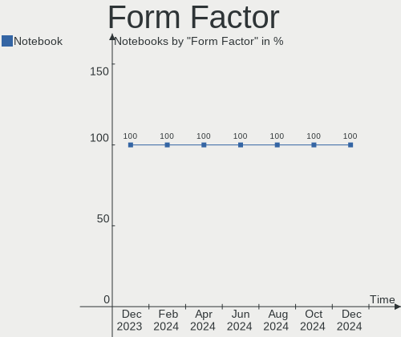
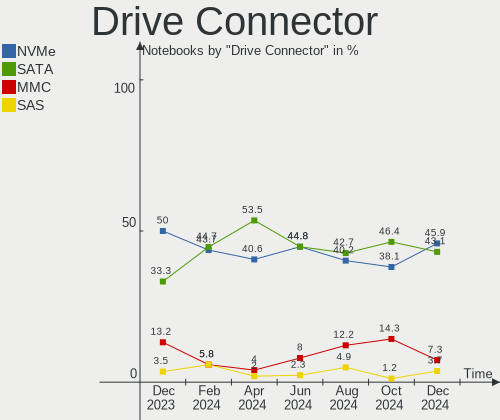
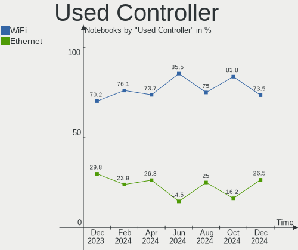
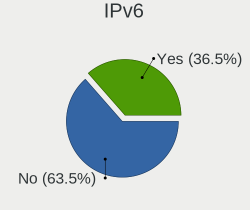
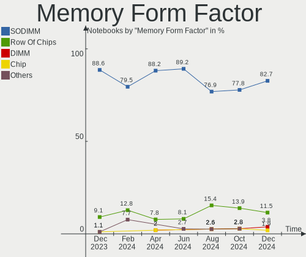
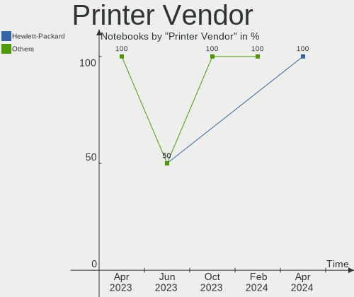

Linux in Canada - Hardware Trends (Notebooks)
---------------------------------------------

A project to identify most popular hardware characteristics and track their change
over time based on data collected by Linux users at https://Linux-Hardware.org.

Anyone can contribute to this report by the [hw-probe](https://github.com/linuxhw/hw-probe) tool:

    sudo -E hw-probe -all -upload

Period: Jul, 2023.

Contents
--------

* [ System ](#system)
  - [ OS                       ](#os)
  - [ OS Family                ](#os-family)
  - [ Kernel                   ](#kernel)
  - [ Kernel Family            ](#kernel-family)
  - [ Kernel Major Ver.        ](#kernel-major-ver)
  - [ Arch                     ](#arch)
  - [ DE                       ](#de)
  - [ Display Server           ](#display-server)
  - [ Display Manager          ](#display-manager)
  - [ OS Lang                  ](#os-lang)
  - [ Boot Mode                ](#boot-mode)
  - [ Filesystem               ](#filesystem)
  - [ Part. scheme             ](#part-scheme)
  - [ Dual Boot with Linux/BSD ](#dual-boot-with-linuxbsd)
  - [ Dual Boot (Win)          ](#dual-boot-win)

* [ Board ](#board)
  - [ Vendor                   ](#vendor)
  - [ Model                    ](#model)
  - [ Model Family             ](#model-family)
  - [ MFG Year                 ](#mfg-year)
  - [ Form Factor              ](#form-factor)
  - [ Secure Boot              ](#secure-boot)
  - [ Coreboot                 ](#coreboot)
  - [ RAM Size                 ](#ram-size)
  - [ RAM Used                 ](#ram-used)
  - [ Total Drives             ](#total-drives)
  - [ Has CD-ROM               ](#has-cd-rom)
  - [ Has Ethernet             ](#has-ethernet)
  - [ Has WiFi                 ](#has-wifi)
  - [ Has Bluetooth            ](#has-bluetooth)

* [ Location ](#location)
  - [ Country                  ](#country)
  - [ City                     ](#city)

* [ Drives ](#drives)
  - [ Drive Vendor             ](#drive-vendor)
  - [ Drive Model              ](#drive-model)
  - [ HDD Vendor               ](#hdd-vendor)
  - [ SSD Vendor               ](#ssd-vendor)
  - [ Drive Kind               ](#drive-kind)
  - [ Drive Connector          ](#drive-connector)
  - [ Drive Size               ](#drive-size)
  - [ Space Total              ](#space-total)
  - [ Space Used               ](#space-used)
  - [ Malfunc. Drives          ](#malfunc-drives)
  - [ Malfunc. Drive Vendor    ](#malfunc-drive-vendor)
  - [ Malfunc. HDD Vendor      ](#malfunc-hdd-vendor)
  - [ Malfunc. Drive Kind      ](#malfunc-drive-kind)
  - [ Failed Drives            ](#failed-drives)
  - [ Failed Drive Vendor      ](#failed-drive-vendor)
  - [ Drive Status             ](#drive-status)

* [ Storage controller ](#storage-controller)
  - [ Storage Vendor           ](#storage-vendor)
  - [ Storage Model            ](#storage-model)
  - [ Storage Kind             ](#storage-kind)

* [ Processor ](#processor)
  - [ CPU Vendor               ](#cpu-vendor)
  - [ CPU Model                ](#cpu-model)
  - [ CPU Model Family         ](#cpu-model-family)
  - [ CPU Cores                ](#cpu-cores)
  - [ CPU Sockets              ](#cpu-sockets)
  - [ CPU Threads              ](#cpu-threads)
  - [ CPU Op-Modes             ](#cpu-op-modes)
  - [ CPU Microcode            ](#cpu-microcode)
  - [ CPU Microarch            ](#cpu-microarch)

* [ Graphics ](#graphics)
  - [ GPU Vendor               ](#gpu-vendor)
  - [ GPU Model                ](#gpu-model)
  - [ GPU Combo                ](#gpu-combo)
  - [ GPU Driver               ](#gpu-driver)
  - [ GPU Memory               ](#gpu-memory)

* [ Monitor ](#monitor)
  - [ Monitor Vendor           ](#monitor-vendor)
  - [ Monitor Model            ](#monitor-model)
  - [ Monitor Resolution       ](#monitor-resolution)
  - [ Monitor Diagonal         ](#monitor-diagonal)
  - [ Monitor Width            ](#monitor-width)
  - [ Aspect Ratio             ](#aspect-ratio)
  - [ Monitor Area             ](#monitor-area)
  - [ Pixel Density            ](#pixel-density)
  - [ Multiple Monitors        ](#multiple-monitors)

* [ Network ](#network)
  - [ Net Controller Vendor    ](#net-controller-vendor)
  - [ Net Controller Model     ](#net-controller-model)
  - [ Wireless Vendor          ](#wireless-vendor)
  - [ Wireless Model           ](#wireless-model)
  - [ Ethernet Vendor          ](#ethernet-vendor)
  - [ Ethernet Model           ](#ethernet-model)
  - [ Net Controller Kind      ](#net-controller-kind)
  - [ Used Controller          ](#used-controller)
  - [ NICs                     ](#nics)
  - [ IPv6                     ](#ipv6)

* [ Bluetooth ](#bluetooth)
  - [ Bluetooth Vendor         ](#bluetooth-vendor)
  - [ Bluetooth Model          ](#bluetooth-model)

* [ Sound ](#sound)
  - [ Sound Vendor             ](#sound-vendor)
  - [ Sound Model              ](#sound-model)

* [ Memory ](#memory)
  - [ Memory Vendor            ](#memory-vendor)
  - [ Memory Model             ](#memory-model)
  - [ Memory Kind              ](#memory-kind)
  - [ Memory Form Factor       ](#memory-form-factor)
  - [ Memory Size              ](#memory-size)
  - [ Memory Speed             ](#memory-speed)

* [ Printers & scanners ](#printers--scanners)
  - [ Printer Vendor           ](#printer-vendor)
  - [ Printer Model            ](#printer-model)
  - [ Scanner Vendor           ](#scanner-vendor)
  - [ Scanner Model            ](#scanner-model)

* [ Camera ](#camera)
  - [ Camera Vendor            ](#camera-vendor)
  - [ Camera Model             ](#camera-model)

* [ Security ](#security)
  - [ Fingerprint Vendor       ](#fingerprint-vendor)
  - [ Fingerprint Model        ](#fingerprint-model)
  - [ Chipcard Vendor          ](#chipcard-vendor)
  - [ Chipcard Model           ](#chipcard-model)

* [ Unsupported ](#unsupported)
  - [ Unsupported Devices      ](#unsupported-devices)
  - [ Unsupported Device Types ](#unsupported-device-types)

System
------

OS
--

Installed operating systems

| Name                 | Notebooks | Percent |
|----------------------|-----------|---------|
| Pop!_OS 22.04        | 9         | 11.54%  |
| Ubuntu 22.04         | 8         | 10.26%  |
| Debian 12            | 8         | 10.26%  |
| Fedora 38            | 7         | 8.97%   |
| Linux Mint 21.1      | 6         | 7.69%   |
| Arch Rolling         | 5         | 6.41%   |
| Ubuntu 23.04         | 3         | 3.85%   |
| OpenMandriva 23.03   | 3         | 3.85%   |
| Linux Mint 21.2      | 2         | 2.56%   |
| Kubuntu 22.04        | 2         | 2.56%   |
| Kali 2023.2          | 2         | 2.56%   |
| Debian 11            | 2         | 2.56%   |
| Xubuntu 22.04        | 1         | 1.28%   |
| Xero Rolling         | 1         | 1.28%   |
| Ubuntu 20.04         | 1         | 1.28%   |
| Parrot 5.3           | 1         | 1.28%   |
| OpenMandriva 4.3     | 1         | 1.28%   |
| OpenMandriva 23.07   | 1         | 1.28%   |
| OpenMandriva 23.06   | 1         | 1.28%   |
| MX 21                | 1         | 1.28%   |
| Manjaro              | 1         | 1.28%   |
| Linux Mint 21        | 1         | 1.28%   |
| Linux Mint 20.3      | 1         | 1.28%   |
| Linux Mint 20.2      | 1         | 1.28%   |
| KDE neon 22.04       | 1         | 1.28%   |
| Gentoo 2.7           | 1         | 1.28%   |
| Garuda Linux Rolling | 1         | 1.28%   |
| Funtoo 2023-07-11    | 1         | 1.28%   |
| Endless 4.0.13       | 1         | 1.28%   |
| Elementary 7         | 1         | 1.28%   |
| Elementary 6.1       | 1         | 1.28%   |
| Debian               | 1         | 1.28%   |
| ArcoLinux Rolling    | 1         | 1.28%   |

OS Family
---------

OS without a version

| Name         | Notebooks | Percent |
|--------------|-----------|---------|
| Ubuntu       | 12        | 15.38%  |
| Linux Mint   | 11        | 14.1%   |
| Debian       | 11        | 14.1%   |
| Pop!_OS      | 9         | 11.54%  |
| Fedora       | 7         | 8.97%   |
| OpenMandriva | 6         | 7.69%   |
| Arch         | 5         | 6.41%   |
| Kubuntu      | 2         | 2.56%   |
| Kali         | 2         | 2.56%   |
| Elementary   | 2         | 2.56%   |
| Xubuntu      | 1         | 1.28%   |
| Xero         | 1         | 1.28%   |
| Parrot       | 1         | 1.28%   |
| MX           | 1         | 1.28%   |
| Manjaro      | 1         | 1.28%   |
| KDE neon     | 1         | 1.28%   |
| Gentoo       | 1         | 1.28%   |
| Garuda Linux | 1         | 1.28%   |
| Funtoo       | 1         | 1.28%   |
| Endless      | 1         | 1.28%   |
| ArcoLinux    | 1         | 1.28%   |

Kernel
------

Version of the Linux kernel

| Version                  | Notebooks | Percent |
|--------------------------|-----------|---------|
| 6.2.6-76060206-generic   | 9         | 11.54%  |
| 5.15.0-76-generic        | 7         | 8.97%   |
| 5.19.0-46-generic        | 6         | 7.69%   |
| 6.2.6-desktop-1omv2390   | 4         | 5.13%   |
| 6.1.0-10-amd64           | 4         | 5.13%   |
| 6.3.11-200.fc38.x86_64   | 3         | 3.85%   |
| 5.15.0-78-generic        | 3         | 3.85%   |
| 6.4.3-arch1-2            | 2         | 2.56%   |
| 6.2.0-26-generic         | 2         | 2.56%   |
| 6.2.0-25-generic         | 2         | 2.56%   |
| 6.1.0-9-amd64            | 2         | 2.56%   |
| 6.4.7-arch1-1            | 1         | 1.28%   |
| 6.4.6-arch1-1            | 1         | 1.28%   |
| 6.4.4-arch1-1            | 1         | 1.28%   |
| 6.4.4-200.fc38.x86_64    | 1         | 1.28%   |
| 6.3.8-200.fc38.x86_64    | 1         | 1.28%   |
| 6.3.5-desktop-3omv2390   | 1         | 1.28%   |
| 6.3.3-arch1-1            | 1         | 1.28%   |
| 6.3.11_p1-debian-sources | 1         | 1.28%   |
| 6.3.0-kali1-amd64        | 1         | 1.28%   |
| 6.3.0-1-amd64            | 1         | 1.28%   |
| 6.2.9-300.fc38.x86_64    | 1         | 1.28%   |
| 6.2.16-3-pve             | 1         | 1.28%   |
| 6.2.16-2-MANJARO         | 1         | 1.28%   |
| 6.2.15-lqx1-1-lqx        | 1         | 1.28%   |
| 6.2.15-300.fc38.x86_64   | 1         | 1.28%   |
| 6.2.0-1008-lowlatency    | 1         | 1.28%   |
| 6.1.38-2-lts             | 1         | 1.28%   |
| 6.1.0-kali7-amd64        | 1         | 1.28%   |
| 6.1.0-1parrot1-amd64     | 1         | 1.28%   |
| 6.1.0-10-686-pae         | 1         | 1.28%   |
| 6.0.0-6mx-amd64          | 1         | 1.28%   |
| 5.4.0-155-generic        | 1         | 1.28%   |
| 5.4.0-153-generic        | 1         | 1.28%   |
| 5.19.0-50-generic        | 1         | 1.28%   |
| 5.19.0-32-generic        | 1         | 1.28%   |
| 5.16.13-desktop-1omv4003 | 1         | 1.28%   |
| 5.15.0-75-generic        | 1         | 1.28%   |
| 5.15.0-72-generic        | 1         | 1.28%   |
| 5.15.0-69-generic        | 1         | 1.28%   |

Kernel Family
-------------

Linux kernel without a distro release

| Version | Notebooks | Percent |
|---------|-----------|---------|
| 5.15.0  | 14        | 17.95%  |
| 6.2.6   | 13        | 16.67%  |
| 6.1.0   | 9         | 11.54%  |
| 5.19.0  | 8         | 10.26%  |
| 6.2.0   | 5         | 6.41%   |
| 6.3.11  | 4         | 5.13%   |
| 6.4.4   | 2         | 2.56%   |
| 6.4.3   | 2         | 2.56%   |
| 6.3.0   | 2         | 2.56%   |
| 6.2.16  | 2         | 2.56%   |
| 6.2.15  | 2         | 2.56%   |
| 5.4.0   | 2         | 2.56%   |
| 5.10.0  | 2         | 2.56%   |
| 6.4.7   | 1         | 1.28%   |
| 6.4.6   | 1         | 1.28%   |
| 6.3.8   | 1         | 1.28%   |
| 6.3.5   | 1         | 1.28%   |
| 6.3.3   | 1         | 1.28%   |
| 6.2.9   | 1         | 1.28%   |
| 6.1.38  | 1         | 1.28%   |
| 6.0.0   | 1         | 1.28%   |
| 5.16.13 | 1         | 1.28%   |
| 5.11.0  | 1         | 1.28%   |
| 5.10.52 | 1         | 1.28%   |

Kernel Major Ver.
-----------------

Linux kernel major version

| Version | Notebooks | Percent |
|---------|-----------|---------|
| 6.2     | 23        | 29.49%  |
| 5.15    | 14        | 17.95%  |
| 6.1     | 10        | 12.82%  |
| 6.3     | 9         | 11.54%  |
| 5.19    | 8         | 10.26%  |
| 6.4     | 6         | 7.69%   |
| 5.10    | 3         | 3.85%   |
| 5.4     | 2         | 2.56%   |
| 6.0     | 1         | 1.28%   |
| 5.16    | 1         | 1.28%   |
| 5.11    | 1         | 1.28%   |

Arch
----

OS architecture (x86_64, i586, etc.)

| Name   | Notebooks | Percent |
|--------|-----------|---------|
| x86_64 | 77        | 98.72%  |
| i686   | 1         | 1.28%   |

DE
--

Desktop Environment

| Name       | Notebooks | Percent |
|------------|-----------|---------|
| GNOME      | 34        | 43.59%  |
| KDE5       | 19        | 24.36%  |
| X-Cinnamon | 10        | 12.82%  |
| XFCE       | 6         | 7.69%   |
| MATE       | 3         | 3.85%   |
| Pantheon   | 2         | 2.56%   |
| Jwm        | 1         | 1.28%   |
| Hyprland   | 1         | 1.28%   |
| DWM        | 1         | 1.28%   |
| Unknown    | 1         | 1.28%   |

Display Server
--------------

X11 or Wayland

| Name    | Notebooks | Percent |
|---------|-----------|---------|
| X11     | 62        | 79.49%  |
| Wayland | 15        | 19.23%  |
| Unknown | 1         | 1.28%   |

Display Manager
---------------

SDDM, LightDM, etc.

| Name    | Notebooks | Percent |
|---------|-----------|---------|
| Unknown | 30        | 38.46%  |
| LightDM | 15        | 19.23%  |
| SDDM    | 14        | 17.95%  |
| GDM3    | 14        | 17.95%  |
| GDM     | 3         | 3.85%   |
| LY-DM   | 1         | 1.28%   |
| LXDM    | 1         | 1.28%   |

OS Lang
-------

Language

| Lang  | Notebooks | Percent |
|-------|-----------|---------|
| en_CA | 42        | 53.85%  |
| en_US | 27        | 34.62%  |
| fr_CA | 8         | 10.26%  |
| C     | 1         | 1.28%   |

Boot Mode
---------

EFI or BIOS

| Mode | Notebooks | Percent |
|------|-----------|---------|
| BIOS | 39        | 50%     |
| EFI  | 39        | 50%     |

Filesystem
----------

Type of filesystem

| Type    | Notebooks | Percent |
|---------|-----------|---------|
| Ext4    | 53        | 67.95%  |
| Btrfs   | 12        | 15.38%  |
| Tmpfs   | 9         | 11.54%  |
| Overlay | 3         | 3.85%   |
| Zfs     | 1         | 1.28%   |

Part. scheme
------------

Scheme of partitioning

| Type    | Notebooks | Percent |
|---------|-----------|---------|
| GPT     | 44        | 56.41%  |
| Unknown | 28        | 35.9%   |
| MBR     | 6         | 7.69%   |

Dual Boot with Linux/BSD
------------------------

Hosting more than one Linux/BSD

| Dual boot | Notebooks | Percent |
|-----------|-----------|---------|
| No        | 71        | 91.03%  |
| Yes       | 7         | 8.97%   |

Dual Boot (Win)
---------------

Hosting Linux and Windows

| Dual boot | Notebooks | Percent |
|-----------|-----------|---------|
| No        | 61        | 78.21%  |
| Yes       | 17        | 21.79%  |

Board
-----

Vendor
------

Motherboard manufacturer

| Name             | Notebooks | Percent |
|------------------|-----------|---------|
| Lenovo           | 21        | 26.92%  |
| Hewlett-Packard  | 15        | 19.23%  |
| ASUSTek Computer | 13        | 16.67%  |
| Dell             | 11        | 14.1%   |
| MSI              | 3         | 3.85%   |
| Acer             | 3         | 3.85%   |
| System76         | 2         | 2.56%   |
| Google           | 2         | 2.56%   |
| Framework        | 2         | 2.56%   |
| Toshiba          | 1         | 1.28%   |
| Panasonic        | 1         | 1.28%   |
| Gateway          | 1         | 1.28%   |
| BOSGAME          | 1         | 1.28%   |
| Apple            | 1         | 1.28%   |
| Alienware        | 1         | 1.28%   |

Model
-----

Motherboard model

| Name                                   | Notebooks | Percent |
|----------------------------------------|-----------|---------|
| Toshiba TECRA R950                     | 1         | 1.28%   |
| System76 Serval WS                     | 1         | 1.28%   |
| System76 Pangolin                      | 1         | 1.28%   |
| Panasonic CF-S10CDHEDM                 | 1         | 1.28%   |
| MSI Katana GF66 11UE                   | 1         | 1.28%   |
| MSI GT72VR 6RD                         | 1         | 1.28%   |
| MSI GF65 Thin 10UE                     | 1         | 1.28%   |
| Lenovo Yoga 14sACH 2021 82MS           | 1         | 1.28%   |
| Lenovo ThinkPad X220 Tablet 42962WU    | 1         | 1.28%   |
| Lenovo ThinkPad T510 4349RK6           | 1         | 1.28%   |
| Lenovo ThinkPad T480s 20L70028US       | 1         | 1.28%   |
| Lenovo ThinkPad T470s W10DG 20JTS0DN00 | 1         | 1.28%   |
| Lenovo ThinkPad T470s 20HGS0DT00       | 1         | 1.28%   |
| Lenovo ThinkPad T450s 20BWS0PJ00       | 1         | 1.28%   |
| Lenovo ThinkPad T430 2347H91           | 1         | 1.28%   |
| Lenovo ThinkPad T420s 417152U          | 1         | 1.28%   |
| Lenovo ThinkPad P53 20QN004BCA         | 1         | 1.28%   |
| Lenovo ThinkPad P50s 20FLCTO1WW        | 1         | 1.28%   |
| Lenovo ThinkPad P15v Gen 1 20TQCTO1WW  | 1         | 1.28%   |
| Lenovo ThinkPad P14s Gen 3 21J6S05H00  | 1         | 1.28%   |
| Lenovo ThinkPad E14 Gen 2 20TA004MUS   | 1         | 1.28%   |
| Lenovo ThinkPad 11e 20DAS0C800         | 1         | 1.28%   |
| Lenovo Legion Pro 7 16IRX8H 82WQ       | 1         | 1.28%   |
| Lenovo Legion 7 16ITHg6 82K6           | 1         | 1.28%   |
| Lenovo IdeaPad Z570 10249UU            | 1         | 1.28%   |
| Lenovo IdeaPad S340-15IIL 81VW         | 1         | 1.28%   |
| Lenovo IdeaPad 3 15ADA05 81W1          | 1         | 1.28%   |
| Lenovo IdeaPad 1 15ADA7 82R1           | 1         | 1.28%   |
| HP ProBook 455R G6                     | 1         | 1.28%   |
| HP ProBook 4540s                       | 1         | 1.28%   |
| HP ProBook 450 G5                      | 1         | 1.28%   |
| HP ProBook 445 G7                      | 1         | 1.28%   |
| HP Pavilion Notebook                   | 1         | 1.28%   |
| HP Pavilion Laptop 17-ar0xx            | 1         | 1.28%   |
| HP Pavilion Gaming Laptop 15-ec2xxx    | 1         | 1.28%   |
| HP Pavilion Gaming Laptop 15-ec0xxx    | 1         | 1.28%   |
| HP Pavilion dv8000 (ET839UA#ABL)       | 1         | 1.28%   |
| HP Pavilion dv7                        | 1         | 1.28%   |
| HP Laptop 15-fc0xxx                    | 1         | 1.28%   |
| HP Laptop 15-db0xxx                    | 1         | 1.28%   |

Model Family
------------

Motherboard model prefix

| Name                   | Notebooks | Percent |
|------------------------|-----------|---------|
| Lenovo ThinkPad        | 14        | 17.95%  |
| Dell Latitude          | 7         | 8.97%   |
| HP Pavilion            | 6         | 7.69%   |
| Lenovo IdeaPad         | 4         | 5.13%   |
| HP ProBook             | 4         | 5.13%   |
| ASUS VivoBook          | 4         | 5.13%   |
| Dell XPS               | 3         | 3.85%   |
| Lenovo Legion          | 2         | 2.56%   |
| HP Laptop              | 2         | 2.56%   |
| HP EliteBook           | 2         | 2.56%   |
| Framework Laptop       | 2         | 2.56%   |
| ASUS ASUS              | 2         | 2.56%   |
| Acer Aspire            | 2         | 2.56%   |
| Toshiba TECRA          | 1         | 1.28%   |
| System76 Serval        | 1         | 1.28%   |
| System76 Pangolin      | 1         | 1.28%   |
| Panasonic CF-S10CDHEDM | 1         | 1.28%   |
| MSI Katana             | 1         | 1.28%   |
| MSI GT72VR             | 1         | 1.28%   |
| MSI GF65               | 1         | 1.28%   |
| Lenovo Yoga            | 1         | 1.28%   |
| HP G60                 | 1         | 1.28%   |
| Google Phaser360       | 1         | 1.28%   |
| Google Droid           | 1         | 1.28%   |
| Gateway NV57H          | 1         | 1.28%   |
| Dell Precision         | 1         | 1.28%   |
| BOSGAME U56            | 1         | 1.28%   |
| ASUS Zenbook           | 1         | 1.28%   |
| ASUS X751LA            | 1         | 1.28%   |
| ASUS TP501UA           | 1         | 1.28%   |
| ASUS T100TAM           | 1         | 1.28%   |
| ASUS ROG               | 1         | 1.28%   |
| ASUS GL703VD           | 1         | 1.28%   |
| ASUS GL502VM           | 1         | 1.28%   |
| Apple MacBookPro11     | 1         | 1.28%   |
| Alienware m17          | 1         | 1.28%   |
| Acer Nitro             | 1         | 1.28%   |

MFG Year
--------

Motherboard manufacture year

| Year | Notebooks | Percent |
|------|-----------|---------|
| 2022 | 10        | 12.82%  |
| 2021 | 10        | 12.82%  |
| 2019 | 9         | 11.54%  |
| 2020 | 7         | 8.97%   |
| 2023 | 6         | 7.69%   |
| 2011 | 6         | 7.69%   |
| 2018 | 5         | 6.41%   |
| 2017 | 5         | 6.41%   |
| 2016 | 4         | 5.13%   |
| 2014 | 4         | 5.13%   |
| 2012 | 4         | 5.13%   |
| 2015 | 2         | 2.56%   |
| 2009 | 2         | 2.56%   |
| 2008 | 2         | 2.56%   |
| 2013 | 1         | 1.28%   |
| 2006 | 1         | 1.28%   |

Form Factor
-----------

Physical design of the computer

| Name     | Notebooks | Percent |
|----------|-----------|---------|
| Notebook | 78        | 100%    |

Secure Boot
-----------

Enabled or disabled

| State    | Notebooks | Percent |
|----------|-----------|---------|
| Disabled | 71        | 91.03%  |
| Enabled  | 7         | 8.97%   |

Coreboot
--------

Have coreboot on board

| Used | Notebooks | Percent |
|------|-----------|---------|
| No   | 75        | 96.15%  |
| Yes  | 3         | 3.85%   |

RAM Size
--------

Total RAM memory

| Size in GB  | Notebooks | Percent |
|-------------|-----------|---------|
| 4.01-8.0    | 19        | 24.36%  |
| 16.01-24.0  | 15        | 19.23%  |
| 32.01-64.0  | 13        | 16.67%  |
| 8.01-16.0   | 13        | 16.67%  |
| 3.01-4.0    | 10        | 12.82%  |
| 24.01-32.0  | 3         | 3.85%   |
| 1.01-2.0    | 3         | 3.85%   |
| 64.01-256.0 | 2         | 2.56%   |

RAM Used
--------

Used RAM memory

| Used GB    | Notebooks | Percent |
|------------|-----------|---------|
| 2.01-3.0   | 22        | 28.21%  |
| 3.01-4.0   | 16        | 20.51%  |
| 1.01-2.0   | 16        | 20.51%  |
| 4.01-8.0   | 11        | 14.1%   |
| 8.01-16.0  | 6         | 7.69%   |
| 0.51-1.0   | 4         | 5.13%   |
| 16.01-24.0 | 2         | 2.56%   |
| 0.01-0.5   | 1         | 1.28%   |

Total Drives
------------

Number of drives on board

| Drives | Notebooks | Percent |
|--------|-----------|---------|
| 1      | 55        | 70.51%  |
| 2      | 16        | 20.51%  |
| 3      | 4         | 5.13%   |
| 4      | 2         | 2.56%   |
| 0      | 1         | 1.28%   |

Has CD-ROM
----------

Has CD-ROM on board

| Presented | Notebooks | Percent |
|-----------|-----------|---------|
| No        | 61        | 78.21%  |
| Yes       | 17        | 21.79%  |

Has Ethernet
------------

Has Ethernet on board

| Presented | Notebooks | Percent |
|-----------|-----------|---------|
| Yes       | 61        | 78.21%  |
| No        | 17        | 21.79%  |

Has WiFi
--------

Has WiFi module

| Presented | Notebooks | Percent |
|-----------|-----------|---------|
| Yes       | 76        | 97.44%  |
| No        | 2         | 2.56%   |

Has Bluetooth
-------------

Has Bluetooth module

| Presented | Notebooks | Percent |
|-----------|-----------|---------|
| Yes       | 66        | 84.62%  |
| No        | 12        | 15.38%  |

Location
--------

Country
-------

Geographic location (country)

| Country | Notebooks | Percent |
|---------|-----------|---------|
| Canada  | 78        | 100%    |

City
----

Geographic location (city)

| City                        | Notebooks | Percent |
|-----------------------------|-----------|---------|
| Toronto                     | 9         | 11.54%  |
| Montreal                    | 8         | 10.26%  |
| Vancouver                   | 6         | 7.69%   |
| Calgary                     | 4         | 5.13%   |
| Winnipeg                    | 2         | 2.56%   |
| Scarborough                 | 2         | 2.56%   |
| Ottawa                      | 2         | 2.56%   |
| Edmonton                    | 2         | 2.56%   |
| Burnaby                     | 2         | 2.56%   |
| Woodstock                   | 1         | 1.28%   |
| Wetaskiwin                  | 1         | 1.28%   |
| Waterloo                    | 1         | 1.28%   |
| Victoria                    | 1         | 1.28%   |
| Vernon                      | 1         | 1.28%   |
| Val-d'Or                    | 1         | 1.28%   |
| Tillsonburg                 | 1         | 1.28%   |
| Sydney                      | 1         | 1.28%   |
| Surrey                      | 1         | 1.28%   |
| Sherbrooke                  | 1         | 1.28%   |
| Salmon Arm                  | 1         | 1.28%   |
| Saint-Edouard-de-Maskinonge | 1         | 1.28%   |
| Quinte West                 | 1         | 1.28%   |
| Québec                     | 1         | 1.28%   |
| Port Coquitlam              | 1         | 1.28%   |
| Pointe-a-la-Croix           | 1         | 1.28%   |
| North Bay                   | 1         | 1.28%   |
| Niagara Falls               | 1         | 1.28%   |
| Mascouche                   | 1         | 1.28%   |
| Maple Ridge                 | 1         | 1.28%   |
| Longueuil                   | 1         | 1.28%   |
| London                      | 1         | 1.28%   |
| Leamington                  | 1         | 1.28%   |
| Laval                       | 1         | 1.28%   |
| L'Epiphanie                 | 1         | 1.28%   |
| Kitchener                   | 1         | 1.28%   |
| Kelowna                     | 1         | 1.28%   |
| Kamloops                    | 1         | 1.28%   |
| Innisfail                   | 1         | 1.28%   |
| Halifax                     | 1         | 1.28%   |
| Greater Sudbury             | 1         | 1.28%   |

Drives
------

Drive Vendor
------------

Hard drive vendors

| Vendor                      | Notebooks | Drives | Percent |
|-----------------------------|-----------|--------|---------|
| Samsung Electronics         | 16        | 17     | 15.69%  |
| Seagate                     | 10        | 12     | 9.8%    |
| Intel                       | 10        | 10     | 9.8%    |
| Unknown                     | 8         | 8      | 7.84%   |
| SanDisk                     | 8         | 8      | 7.84%   |
| SK hynix                    | 7         | 7      | 6.86%   |
| Toshiba                     | 6         | 6      | 5.88%   |
| Kingston                    | 6         | 6      | 5.88%   |
| WDC                         | 5         | 5      | 4.9%    |
| Micron Technology           | 5         | 5      | 4.9%    |
| HGST                        | 3         | 3      | 2.94%   |
| SABRENT                     | 2         | 2      | 1.96%   |
| Kingston Technology Company | 2         | 2      | 1.96%   |
| Timetec                     | 1         | 1      | 0.98%   |
| Team                        | 1         | 1      | 0.98%   |
| SSSTC                       | 1         | 1      | 0.98%   |
| PNY                         | 1         | 1      | 0.98%   |
| Micron/Crucial Technology   | 1         | 1      | 0.98%   |
| KIOXIA                      | 1         | 1      | 0.98%   |
| KingDian                    | 1         | 1      | 0.98%   |
| JMicron Technology          | 1         | 2      | 0.98%   |
| Hitachi                     | 1         | 1      | 0.98%   |
| Fujitsu                     | 1         | 1      | 0.98%   |
| Crucial                     | 1         | 1      | 0.98%   |
| Corsair                     | 1         | 1      | 0.98%   |
| Apple                       | 1         | 1      | 0.98%   |
| ACASIS                      | 1         | 1      | 0.98%   |

Drive Model
-----------

Hard drive models

| Model                                               | Notebooks | Percent |
|-----------------------------------------------------|-----------|---------|
| Intel SSD 660P Series 1024GB                        | 4         | 3.85%   |
| Intel SSDPEKNU512GZ 512GB                           | 3         | 2.88%   |
| Unknown MMC Card  64GB                              | 2         | 1.92%   |
| Samsung NVMe SSD Controller SM981/PM981/PM983 500GB | 2         | 1.92%   |
| Samsung NVMe SSD Controller PM9A1/PM9A3/980PRO 1TB  | 2         | 1.92%   |
| SABRENT Disk 1TB                                    | 2         | 1.92%   |
| HGST HTS541010B7E610 1TB                            | 2         | 1.92%   |
| WDC WDS500G2B0A-00SM50 500GB SSD                    | 1         | 0.96%   |
| WDC WDS100T2G0A-00JH30 1TB SSD                      | 1         | 0.96%   |
| WDC WD5000BPVT-22HXZT3 500GB                        | 1         | 0.96%   |
| WDC WD10SPZX-16Z10T0 1TB                            | 1         | 0.96%   |
| WDC PC SN540 SDDPNPF-512G-1032 512GB                | 1         | 0.96%   |
| Unknown SD04G  4GB                                  | 1         | 0.96%   |
| Unknown SD/MMC/MS PRO 128GB                         | 1         | 0.96%   |
| Unknown MMC Card  1GB                               | 1         | 0.96%   |
| Unknown MMC Card  16GB                              | 1         | 0.96%   |
| Unknown MMC Card  128GB                             | 1         | 0.96%   |
| Unknown DA4064  64GB                                | 1         | 0.96%   |
| Toshiba MQ04ABF100 1TB                              | 1         | 0.96%   |
| Toshiba MQ01ACF050 500GB                            | 1         | 0.96%   |
| Toshiba MQ01ABD100 1TB                              | 1         | 0.96%   |
| Toshiba MK3276GSX 320GB                             | 1         | 0.96%   |
| Toshiba MK1059GSMP 1TB                              | 1         | 0.96%   |
| Toshiba KXG5AZNV256G 256GB                          | 1         | 0.96%   |
| Timetec SD15 2TB SSD                                | 1         | 0.96%   |
| Team T253X2512G 512GB SSD                           | 1         | 0.96%   |
| SSSTC CA6-8D2048-Q11 NVMe 2048GB                    | 1         | 0.96%   |
| SK hynix SKHynix_HFS256GD9TNI-L2B0B 256GB           | 1         | 0.96%   |
| SK hynix PC801 NVMe 512GB                           | 1         | 0.96%   |
| SK hynix HFS256G39TND-N210A 256GB SSD               | 1         | 0.96%   |
| SK hynix HFM001TD3JX016N 1024GB                     | 1         | 0.96%   |
| SK hynix HCG8e  64GB                                | 1         | 0.96%   |
| SK hynix BC711 NVMe 512GB                           | 1         | 0.96%   |
| SK hynix BC501 NVMe Solid State Drive 512GB         | 1         | 0.96%   |
| Seagate ST9250410AS 250GB                           | 1         | 0.96%   |
| Seagate ST750LM022 HN-M750MBB 752GB                 | 1         | 0.96%   |
| Seagate ST500LM030-1RK17D 500GB                     | 1         | 0.96%   |
| Seagate ST500LM021-1KJ152 500GB                     | 1         | 0.96%   |
| Seagate ST320LT000-9VL142 320GB                     | 1         | 0.96%   |
| Seagate ST2000LM015-2E8174 2TB                      | 1         | 0.96%   |

HDD Vendor
----------

Hard disk drive vendors

| Vendor              | Notebooks | Drives | Percent |
|---------------------|-----------|--------|---------|
| Seagate             | 10        | 12     | 38.46%  |
| Toshiba             | 5         | 5      | 19.23%  |
| HGST                | 3         | 3      | 11.54%  |
| WDC                 | 2         | 2      | 7.69%   |
| Unknown             | 1         | 1      | 3.85%   |
| Samsung Electronics | 1         | 1      | 3.85%   |
| JMicron Technology  | 1         | 1      | 3.85%   |
| Hitachi             | 1         | 1      | 3.85%   |
| Fujitsu             | 1         | 1      | 3.85%   |
| ACASIS              | 1         | 1      | 3.85%   |

SSD Vendor
----------

Solid state drive vendors

| Vendor              | Notebooks | Drives | Percent |
|---------------------|-----------|--------|---------|
| Kingston            | 5         | 5      | 22.73%  |
| Samsung Electronics | 3         | 3      | 13.64%  |
| WDC                 | 2         | 2      | 9.09%   |
| Micron Technology   | 2         | 2      | 9.09%   |
| Intel               | 2         | 2      | 9.09%   |
| Timetec             | 1         | 1      | 4.55%   |
| Team                | 1         | 1      | 4.55%   |
| SK hynix            | 1         | 1      | 4.55%   |
| SanDisk             | 1         | 1      | 4.55%   |
| PNY                 | 1         | 1      | 4.55%   |
| KingDian            | 1         | 1      | 4.55%   |
| Crucial             | 1         | 1      | 4.55%   |
| Apple               | 1         | 1      | 4.55%   |

Drive Kind
----------

HDD or SSD

| Kind    | Notebooks | Drives | Percent |
|---------|-----------|--------|---------|
| NVMe    | 43        | 47     | 46.74%  |
| SSD     | 20        | 22     | 21.74%  |
| HDD     | 20        | 28     | 21.74%  |
| MMC     | 8         | 8      | 8.7%    |
| Unknown | 1         | 1      | 1.09%   |

Drive Connector
---------------

SATA, SAS, NVMe, etc.

| Type | Notebooks | Drives | Percent |
|------|-----------|--------|---------|
| NVMe | 41        | 45     | 43.62%  |
| SATA | 38        | 42     | 40.43%  |
| MMC  | 8         | 8      | 8.51%   |
| SAS  | 7         | 11     | 7.45%   |

Drive Size
----------

Size of hard drive

| Size in TB | Notebooks | Drives | Percent |
|------------|-----------|--------|---------|
| 0.01-0.5   | 23        | 26     | 51.11%  |
| 0.51-1.0   | 17        | 18     | 37.78%  |
| 1.01-2.0   | 2         | 2      | 4.44%   |
| 4.01-10.0  | 2         | 3      | 4.44%   |
| 3.01-4.0   | 1         | 1      | 2.22%   |

Space Total
-----------

Amount of disk space available on the file system

| Size in GB     | Notebooks | Percent |
|----------------|-----------|---------|
| 251-500        | 23        | 29.49%  |
| 101-250        | 21        | 26.92%  |
| 501-1000       | 11        | 14.1%   |
| 51-100         | 8         | 10.26%  |
| 1001-2000      | 5         | 6.41%   |
| More than 3000 | 4         | 5.13%   |
| 1-20           | 4         | 5.13%   |
| 2001-3000      | 1         | 1.28%   |
| Unknown        | 1         | 1.28%   |

Space Used
----------

Amount of used disk space

| Used GB        | Notebooks | Percent |
|----------------|-----------|---------|
| 21-50          | 22        | 28.21%  |
| 1-20           | 17        | 21.79%  |
| 51-100         | 14        | 17.95%  |
| 101-250        | 13        | 16.67%  |
| 501-1000       | 5         | 6.41%   |
| 251-500        | 4         | 5.13%   |
| More than 3000 | 2         | 2.56%   |
| Unknown        | 1         | 1.28%   |

Malfunc. Drives
---------------

Drive models with a malfunction

| Model                                 | Notebooks | Drives | Percent |
|---------------------------------------|-----------|--------|---------|
| Samsung Electronics PM9A1 NVMe 2048GB | 1         | 2      | 20%     |
| Samsung Electronics HM160HC 160GB     | 1         | 1      | 20%     |
| Intel SSDSCKKF256G8 SATA 256GB        | 1         | 1      | 20%     |
| HGST HTS541010B7E610 1TB              | 1         | 1      | 20%     |
| Fujitsu MHV2080AH 80GB                | 1         | 1      | 20%     |

Malfunc. Drive Vendor
---------------------

Vendors of faulty drives

| Vendor              | Notebooks | Drives | Percent |
|---------------------|-----------|--------|---------|
| Samsung Electronics | 2         | 3      | 40%     |
| Intel               | 1         | 1      | 20%     |
| HGST                | 1         | 1      | 20%     |
| Fujitsu             | 1         | 1      | 20%     |

Malfunc. HDD Vendor
-------------------

Vendors of faulty HDD drives

| Vendor              | Notebooks | Drives | Percent |
|---------------------|-----------|--------|---------|
| Samsung Electronics | 1         | 1      | 33.33%  |
| HGST                | 1         | 1      | 33.33%  |
| Fujitsu             | 1         | 1      | 33.33%  |

Malfunc. Drive Kind
-------------------

Kinds of faulty drives

| Kind | Notebooks | Drives | Percent |
|------|-----------|--------|---------|
| HDD  | 2         | 3      | 50%     |
| NVMe | 1         | 2      | 25%     |
| SSD  | 1         | 1      | 25%     |

Failed Drives
-------------

Failed drive models

Zero info for selected period =(

Failed Drive Vendor
-------------------

Failed drive vendors

Zero info for selected period =(

Drive Status
------------

Number of failed and malfunc. drives

| Status   | Notebooks | Drives | Percent |
|----------|-----------|--------|---------|
| Detected | 46        | 62     | 56.79%  |
| Works    | 31        | 38     | 38.27%  |
| Malfunc  | 4         | 6      | 4.94%   |

Storage controller
------------------

Storage Vendor
--------------

Storage controller vendors

| Vendor                         | Notebooks | Percent |
|--------------------------------|-----------|---------|
| Intel                          | 45        | 48.91%  |
| Samsung Electronics            | 13        | 14.13%  |
| AMD                            | 9         | 9.78%   |
| SanDisk                        | 8         | 8.7%    |
| SK hynix                       | 5         | 5.43%   |
| Micron Technology              | 3         | 3.26%   |
| Kingston Technology Company    | 3         | 3.26%   |
| Toshiba America Info Systems   | 1         | 1.09%   |
| Solid State Storage Technology | 1         | 1.09%   |
| Phison Electronics             | 1         | 1.09%   |
| Nvidia                         | 1         | 1.09%   |
| Micron/Crucial Technology      | 1         | 1.09%   |
| KIOXIA                         | 1         | 1.09%   |

Storage Model
-------------

Storage controller models

| Model                                                                        | Notebooks | Percent |
|------------------------------------------------------------------------------|-----------|---------|
| AMD FCH SATA Controller [AHCI mode]                                          | 8         | 8.16%   |
| Samsung NVMe SSD Controller SM981/PM981/PM983                                | 5         | 5.1%    |
| Intel Volume Management Device NVMe RAID Controller                          | 5         | 5.1%    |
| Intel Sunrise Point-LP SATA Controller [AHCI mode]                           | 5         | 5.1%    |
| Intel 6 Series/C200 Series Chipset Family 6 port Mobile SATA AHCI Controller | 5         | 5.1%    |
| Samsung NVMe SSD Controller PM9A1/PM9A3/980PRO                               | 4         | 4.08%   |
| Intel SSD 660P Series                                                        | 4         | 4.08%   |
| Intel 82801 Mobile SATA Controller [RAID mode]                               | 4         | 4.08%   |
| Intel 7 Series Chipset Family 6-port SATA Controller [AHCI mode]             | 4         | 4.08%   |
| SanDisk WD Black SN770 / PC SN740 256GB / PC SN560 (DRAM-less) NVMe SSD      | 3         | 3.06%   |
| Intel Tiger Lake SATA AHCI Controller                                        | 3         | 3.06%   |
| Intel SSD 670p Series [Keystone Harbor]                                      | 3         | 3.06%   |
| SK hynix Gold P31/BC711/PC711 NVMe Solid State Drive                         | 2         | 2.04%   |
| Samsung NVMe SSD Controller 980                                              | 2         | 2.04%   |
| Intel Wildcat Point-LP SATA Controller [AHCI Mode]                           | 2         | 2.04%   |
| Intel Tiger Lake-LP SATA Controller                                          | 2         | 2.04%   |
| Intel HM170/QM170 Chipset SATA Controller [AHCI Mode]                        | 2         | 2.04%   |
| Toshiba America Info Systems XG5 NVMe SSD Controller                         | 1         | 1.02%   |
| Solid State Storage Non-Volatile memory controller                           | 1         | 1.02%   |
| SK hynix Platinum P41/PC801 NVMe Solid State Drive                           | 1         | 1.02%   |
| SK hynix PC611 NVMe Solid State Drive                                        | 1         | 1.02%   |
| SK hynix BC501 NVMe Solid State Drive                                        | 1         | 1.02%   |
| SanDisk WD PC SN810 / Black SN850 NVMe SSD                                   | 1         | 1.02%   |
| SanDisk WD Green SN350 NVMe SSD 1 TB (DRAM-less)                             | 1         | 1.02%   |
| SanDisk WD Blue SN570 NVMe SSD 1TB                                           | 1         | 1.02%   |
| SanDisk WD Blue SN550 NVMe SSD                                               | 1         | 1.02%   |
| SanDisk IX SN530 NVMe SSD (DRAM-less)                                        | 1         | 1.02%   |
| Samsung S4LN053X01 AHCI SSD Controller(Apple slot)                           | 1         | 1.02%   |
| Samsung NVMe SSD Controller S4LV008[Pascal]                                  | 1         | 1.02%   |
| Phison E7 NVMe Controller                                                    | 1         | 1.02%   |
| Nvidia MCP78S [GeForce 8200] SATA Controller (non-AHCI mode)                 | 1         | 1.02%   |
| Nvidia MCP78S [GeForce 8200] IDE                                             | 1         | 1.02%   |
| Micron/Crucial P5 Plus NVMe PCIe SSD                                         | 1         | 1.02%   |
| Micron 2450 NVMe SSD [HendrixV] (DRAM-less)                                  | 1         | 1.02%   |
| Micron 2400 NVMe SSD (DRAM-less)                                             | 1         | 1.02%   |
| Micron 2210 NVMe SSD [Cobain]                                                | 1         | 1.02%   |
| KIOXIA NVMe SSD Controller BG5 (DRAM-less)                                   | 1         | 1.02%   |
| Kingston Company Company Non-Volatile memory controller                      | 1         | 1.02%   |
| Kingston Company OM3PDP3 NVMe SSD                                            | 1         | 1.02%   |
| Kingston Company NV1 NVMe SSD                                                | 1         | 1.02%   |

Storage Kind
------------

Kind of storage controller (IDE, SATA, NVMe, SAS, ...)

| Kind | Notebooks | Percent |
|------|-----------|---------|
| SATA | 42        | 44.68%  |
| NVMe | 41        | 43.62%  |
| RAID | 9         | 9.57%   |
| IDE  | 2         | 2.13%   |

Processor
---------

CPU Vendor
----------

Processor vendors

| Vendor | Notebooks | Percent |
|--------|-----------|---------|
| Intel  | 59        | 75.64%  |
| AMD    | 19        | 24.36%  |

CPU Model
---------

Processor models

| Model                                         | Notebooks | Percent |
|-----------------------------------------------|-----------|---------|
| Intel Core i5-2520M CPU @ 2.50GHz             | 3         | 3.85%   |
| Intel 11th Gen Core i5-11400H @ 2.70GHz       | 3         | 3.85%   |
| Intel Core i7-6700HQ CPU @ 2.60GHz            | 2         | 2.56%   |
| Intel Core i7-2670QM CPU @ 2.20GHz            | 2         | 2.56%   |
| Intel Core i5-8250U CPU @ 1.60GHz             | 2         | 2.56%   |
| Intel Core i5-6200U CPU @ 2.30GHz             | 2         | 2.56%   |
| Intel Core i5-3320M CPU @ 2.60GHz             | 2         | 2.56%   |
| Intel Core i5-10300H CPU @ 2.50GHz            | 2         | 2.56%   |
| Intel Celeron N4020 CPU @ 1.10GHz             | 2         | 2.56%   |
| Intel 13th Gen Core i9-13900HX                | 2         | 2.56%   |
| Intel 11th Gen Core i7-1165G7 @ 2.80GHz       | 2         | 2.56%   |
| AMD Ryzen 7 3700U with Radeon Vega Mobile Gfx | 2         | 2.56%   |
| AMD Athlon Silver 3050U with Radeon Graphics  | 2         | 2.56%   |
| Intel Pentium Gold 7505 @ 2.00GHz             | 1         | 1.28%   |
| Intel Genuine CPU U2700 @ 1.30GHz             | 1         | 1.28%   |
| Intel Core i9-10980HK CPU @ 2.40GHz           | 1         | 1.28%   |
| Intel Core i7-9850H CPU @ 2.60GHz             | 1         | 1.28%   |
| Intel Core i7-9750H CPU @ 2.60GHz             | 1         | 1.28%   |
| Intel Core i7-8650U CPU @ 1.90GHz             | 1         | 1.28%   |
| Intel Core i7-7700HQ CPU @ 2.80GHz            | 1         | 1.28%   |
| Intel Core i7-7600U CPU @ 2.80GHz             | 1         | 1.28%   |
| Intel Core i7-6600U CPU @ 2.60GHz             | 1         | 1.28%   |
| Intel Core i7-5600U CPU @ 2.60GHz             | 1         | 1.28%   |
| Intel Core i7-4770HQ CPU @ 2.20GHz            | 1         | 1.28%   |
| Intel Core i7-10750H CPU @ 2.60GHz            | 1         | 1.28%   |
| Intel Core i7-1065G7 CPU @ 1.30GHz            | 1         | 1.28%   |
| Intel Core i7 CPU Q 720 @ 1.60GHz             | 1         | 1.28%   |
| Intel Core i5-8265U CPU @ 1.60GHz             | 1         | 1.28%   |
| Intel Core i5-7300U CPU @ 2.60GHz             | 1         | 1.28%   |
| Intel Core i5-6300U CPU @ 2.40GHz             | 1         | 1.28%   |
| Intel Core i5-4200U CPU @ 1.60GHz             | 1         | 1.28%   |
| Intel Core i5 CPU M 520 @ 2.40GHz             | 1         | 1.28%   |
| Intel Core i3-5010U CPU @ 2.10GHz             | 1         | 1.28%   |
| Intel Core i3-4010U CPU @ 1.70GHz             | 1         | 1.28%   |
| Intel Core i3-2370M CPU @ 2.40GHz             | 1         | 1.28%   |
| Intel Core i3-2328M CPU @ 2.20GHz             | 1         | 1.28%   |
| Intel Core i3-2310M CPU @ 2.10GHz             | 1         | 1.28%   |
| Intel Celeron N4000 CPU @ 1.10GHz             | 1         | 1.28%   |
| Intel Celeron CPU N2940 @ 1.83GHz             | 1         | 1.28%   |
| Intel Atom CPU Z3775 @ 1.46GHz                | 1         | 1.28%   |

CPU Model Family
----------------

Processor model prefix

| Model                | Notebooks | Percent |
|----------------------|-----------|---------|
| Intel Core i5        | 16        | 20.51%  |
| Other                | 15        | 19.23%  |
| Intel Core i7        | 15        | 19.23%  |
| AMD Ryzen 7          | 6         | 7.69%   |
| Intel Core i3        | 5         | 6.41%   |
| Intel Celeron        | 4         | 5.13%   |
| AMD Ryzen 5          | 4         | 5.13%   |
| AMD Athlon           | 2         | 2.56%   |
| Intel Pentium Gold   | 1         | 1.28%   |
| Intel Genuine        | 1         | 1.28%   |
| Intel Core i9        | 1         | 1.28%   |
| Intel Atom           | 1         | 1.28%   |
| AMD Turion 64 Mobile | 1         | 1.28%   |
| AMD Sempron          | 1         | 1.28%   |
| AMD Ryzen 9          | 1         | 1.28%   |
| AMD Ryzen 7 PRO      | 1         | 1.28%   |
| AMD Ryzen 3          | 1         | 1.28%   |
| AMD A6               | 1         | 1.28%   |
| AMD A12              | 1         | 1.28%   |

CPU Cores
---------

Number of processor cores

| Number | Notebooks | Percent |
|--------|-----------|---------|
| 2      | 27        | 34.62%  |
| 4      | 25        | 32.05%  |
| 6      | 9         | 11.54%  |
| 8      | 6         | 7.69%   |
| 14     | 3         | 3.85%   |
| 1      | 3         | 3.85%   |
| 24     | 2         | 2.56%   |
| 16     | 1         | 1.28%   |
| 12     | 1         | 1.28%   |
| 10     | 1         | 1.28%   |

CPU Sockets
-----------

Number of sockets

| Number | Notebooks | Percent |
|--------|-----------|---------|
| 1      | 78        | 100%    |

CPU Threads
-----------

Threads per core (Hyper-Threading)

| Number | Notebooks | Percent |
|--------|-----------|---------|
| 2      | 64        | 82.05%  |
| 1      | 14        | 17.95%  |

CPU Op-Modes
------------

CPU Operation Modes (32-bit, 64-bit)

| Op mode        | Notebooks | Percent |
|----------------|-----------|---------|
| 32-bit, 64-bit | 78        | 100%    |

CPU Microcode
-------------

Microcode number

| Number     | Notebooks | Percent |
|------------|-----------|---------|
| Unknown    | 48        | 61.54%  |
| 0x206a7    | 3         | 3.85%   |
| 0xb06a2    | 2         | 2.56%   |
| 0x406e3    | 2         | 2.56%   |
| 0x306a9    | 2         | 2.56%   |
| 0x08108109 | 2         | 2.56%   |
| 0xb06a3    | 1         | 1.28%   |
| 0x906e9    | 1         | 1.28%   |
| 0x906a3    | 1         | 1.28%   |
| 0x806ec    | 1         | 1.28%   |
| 0x806e9    | 1         | 1.28%   |
| 0x806d1    | 1         | 1.28%   |
| 0x40661    | 1         | 1.28%   |
| 0x306d4    | 1         | 1.28%   |
| 0x30678    | 1         | 1.28%   |
| 0x106e5    | 1         | 1.28%   |
| 0x1067a    | 1         | 1.28%   |
| 0x0a50000d | 1         | 1.28%   |
| 0x0a50000c | 1         | 1.28%   |
| 0x0a50000b | 1         | 1.28%   |
| 0x0a404102 | 1         | 1.28%   |
| 0x08600106 | 1         | 1.28%   |
| 0x08108102 | 1         | 1.28%   |
| 0x06006705 | 1         | 1.28%   |
| 0x0600611a | 1         | 1.28%   |

CPU Microarch
-------------

Microarchitecture

| Name             | Notebooks | Percent |
|------------------|-----------|---------|
| KabyLake         | 9         | 11.54%  |
| SandyBridge      | 8         | 10.26%  |
| Unknown          | 8         | 10.26%  |
| Skylake          | 6         | 7.69%   |
| Zen+             | 5         | 6.41%   |
| Zen 3            | 5         | 6.41%   |
| TigerLake        | 5         | 6.41%   |
| CometLake        | 4         | 5.13%   |
| Alderlake Hybrid | 4         | 5.13%   |
| Icelake          | 3         | 3.85%   |
| Haswell          | 3         | 3.85%   |
| Goldmont plus    | 3         | 3.85%   |
| Silvermont       | 2         | 2.56%   |
| IvyBridge        | 2         | 2.56%   |
| Excavator        | 2         | 2.56%   |
| Broadwell        | 2         | 2.56%   |
| Zen 2            | 1         | 1.28%   |
| Zen              | 1         | 1.28%   |
| Westmere         | 1         | 1.28%   |
| Penryn           | 1         | 1.28%   |
| Nehalem          | 1         | 1.28%   |
| K8 Hammer        | 1         | 1.28%   |
| K8 & K10 hybrid  | 1         | 1.28%   |

Graphics
--------

GPU Vendor
----------

Vendors of graphics cards

| Vendor | Notebooks | Percent |
|--------|-----------|---------|
| Intel  | 55        | 57.89%  |
| Nvidia | 21        | 22.11%  |
| AMD    | 19        | 20%     |

GPU Model
---------

Graphics card models

| Model                                                                     | Notebooks | Percent |
|---------------------------------------------------------------------------|-----------|---------|
| Intel 2nd Generation Core Processor Family Integrated Graphics Controller | 8         | 8.42%   |
| AMD Picasso/Raven 2 [Radeon Vega Series / Radeon Vega Mobile Series]      | 5         | 5.26%   |
| Intel TigerLake-LP GT2 [Iris Xe Graphics]                                 | 4         | 4.21%   |
| Intel Skylake GT2 [HD Graphics 520]                                       | 4         | 4.21%   |
| Intel CometLake-H GT2 [UHD Graphics]                                      | 4         | 4.21%   |
| Nvidia GA106M [GeForce RTX 3060 Mobile / Max-Q]                           | 3         | 3.16%   |
| Intel UHD Graphics 620                                                    | 3         | 3.16%   |
| Intel TigerLake-H GT1 [UHD Graphics]                                      | 3         | 3.16%   |
| Intel Raptor Lake-P [Iris Xe Graphics]                                    | 3         | 3.16%   |
| Intel GeminiLake [UHD Graphics 600]                                       | 3         | 3.16%   |
| AMD Cezanne [Radeon Vega Series / Radeon Vega Mobile Series]              | 3         | 3.16%   |
| Nvidia TU117M [GeForce GTX 1650 Mobile / Max-Q]                           | 2         | 2.11%   |
| Nvidia TU117M                                                             | 2         | 2.11%   |
| Nvidia GP106BM [GeForce GTX 1060 Mobile 6GB]                              | 2         | 2.11%   |
| Nvidia GA107M [GeForce RTX 3050 Ti Mobile]                                | 2         | 2.11%   |
| Nvidia GA104M [GeForce RTX 3080 Mobile / Max-Q 8GB/16GB]                  | 2         | 2.11%   |
| Intel Raptor Lake-S UHD Graphics                                          | 2         | 2.11%   |
| Intel HD Graphics 620                                                     | 2         | 2.11%   |
| Intel HD Graphics 5500                                                    | 2         | 2.11%   |
| Intel Haswell-ULT Integrated Graphics Controller                          | 2         | 2.11%   |
| Intel CoffeeLake-H GT2 [UHD Graphics 630]                                 | 2         | 2.11%   |
| Intel Atom Processor Z36xxx/Z37xxx Series Graphics & Display              | 2         | 2.11%   |
| Intel Alder Lake-P Integrated Graphics Controller                         | 2         | 2.11%   |
| Intel 3rd Gen Core processor Graphics Controller                          | 2         | 2.11%   |
| AMD Rembrandt [Radeon 680M]                                               | 2         | 2.11%   |
| AMD Barcelo                                                               | 2         | 2.11%   |
| Nvidia TU117GLM [Quadro T2000 Mobile / Max-Q]                             | 1         | 1.05%   |
| Nvidia GP107M [GeForce GTX 1050 Mobile]                                   | 1         | 1.05%   |
| Nvidia GP107GLM [Quadro P620]                                             | 1         | 1.05%   |
| Nvidia GA107GLM [RTX A1000 6GB Laptop GPU]                                | 1         | 1.05%   |
| Nvidia C77 [GeForce 8200M G]                                              | 1         | 1.05%   |
| Nvidia AD107M [GeForce RTX 4060 Max-Q / Mobile]                           | 1         | 1.05%   |
| Nvidia AD106M [GeForce RTX 4070 Max-Q / Mobile]                           | 1         | 1.05%   |
| Nvidia AD104M [GeForce RTX 4080 Max-Q / Mobile]                           | 1         | 1.05%   |
| Intel WhiskeyLake-U GT2 [UHD Graphics 620]                                | 1         | 1.05%   |
| Intel Tiger Lake-LP GT2 [UHD Graphics G4]                                 | 1         | 1.05%   |
| Intel Mobile 4 Series Chipset Integrated Graphics Controller              | 1         | 1.05%   |
| Intel Iris Plus Graphics G7                                               | 1         | 1.05%   |
| Intel HD Graphics 630                                                     | 1         | 1.05%   |
| Intel Crystal Well Integrated Graphics Controller                         | 1         | 1.05%   |

GPU Combo
---------

Combinations of graphics cards

| Name           | Notebooks | Percent |
|----------------|-----------|---------|
| 1 x Intel      | 40        | 51.28%  |
| 1 x AMD        | 16        | 20.51%  |
| Intel + Nvidia | 13        | 16.67%  |
| 1 x Nvidia     | 5         | 6.41%   |
| AMD + Nvidia   | 3         | 3.85%   |
| Other          | 1         | 1.28%   |

GPU Driver
----------

Free vs proprietary

| Driver      | Notebooks | Percent |
|-------------|-----------|---------|
| Free        | 62        | 79.49%  |
| Proprietary | 13        | 16.67%  |
| Unknown     | 3         | 3.85%   |

GPU Memory
----------

Total video memory

| Size in GB | Notebooks | Percent |
|------------|-----------|---------|
| Unknown    | 61        | 78.21%  |
| 0.01-0.5   | 7         | 8.97%   |
| 3.01-4.0   | 4         | 5.13%   |
| 5.01-6.0   | 2         | 2.56%   |
| 1.01-2.0   | 2         | 2.56%   |
| 8.01-16.0  | 1         | 1.28%   |
| 0.51-1.0   | 1         | 1.28%   |

Monitor
-------

Monitor Vendor
--------------

Monitor vendors

| Vendor                  | Notebooks | Percent |
|-------------------------|-----------|---------|
| BOE                     | 16        | 17.98%  |
| AU Optronics            | 14        | 15.73%  |
| LG Display              | 11        | 12.36%  |
| Chimei Innolux          | 11        | 12.36%  |
| Samsung Electronics     | 7         | 7.87%   |
| Hewlett-Packard         | 4         | 4.49%   |
| InfoVision              | 3         | 3.37%   |
| Dell                    | 3         | 3.37%   |
| CSO                     | 3         | 3.37%   |
| Sharp                   | 2         | 2.25%   |
| Panasonic               | 2         | 2.25%   |
| Lenovo                  | 2         | 2.25%   |
| Goldstar                | 2         | 2.25%   |
| Sony                    | 1         | 1.12%   |
| Philips                 | 1         | 1.12%   |
| PANDA                   | 1         | 1.12%   |
| LG Philips              | 1         | 1.12%   |
| Chi Mei Optoelectronics | 1         | 1.12%   |
| AVX                     | 1         | 1.12%   |
| Apple                   | 1         | 1.12%   |
| Ancor Communications    | 1         | 1.12%   |
| Acer                    | 1         | 1.12%   |

Monitor Model
-------------

Monitor models

| Model                                                                 | Notebooks | Percent |
|-----------------------------------------------------------------------|-----------|---------|
| Chimei Innolux LCD Monitor CMN1521 1920x1080 344x193mm 15.5-inch      | 4         | 4.4%    |
| InfoVision LCD Monitor IVO057D 1920x1080 309x174mm 14.0-inch          | 2         | 2.2%    |
| BOE LCD Monitor BOE095F 2256x1504 285x190mm 13.5-inch                 | 2         | 2.2%    |
| Sony TV SNY4502 1920x1080                                             | 1         | 1.1%    |
| Sharp LCD Monitor SHP1515 1920x1200 336x210mm 15.6-inch               | 1         | 1.1%    |
| Sharp LCD Monitor SHP14BA 1920x1080 344x194mm 15.5-inch               | 1         | 1.1%    |
| Samsung Electronics QBQ90 SAM7203 3840x2160 1872x1053mm 84.6-inch     | 1         | 1.1%    |
| Samsung Electronics QBQ90 SAM7202 3840x2160 1872x1053mm 84.6-inch     | 1         | 1.1%    |
| Samsung Electronics QBQ90 SAM71FF 3840x2160 1872x1053mm 84.6-inch     | 1         | 1.1%    |
| Samsung Electronics LS32B30 SAM7246 1920x1080 698x393mm 31.5-inch     | 1         | 1.1%    |
| Samsung Electronics LCD Monitor SEC354C 1366x768 353x198mm 15.9-inch  | 1         | 1.1%    |
| Samsung Electronics LCD Monitor SDC5441 1366x768 309x174mm 14.0-inch  | 1         | 1.1%    |
| Samsung Electronics LCD Monitor SDC4A42 1366x768 309x174mm 14.0-inch  | 1         | 1.1%    |
| Samsung Electronics LCD Monitor SDC4171 2880x1800 302x189mm 14.0-inch | 1         | 1.1%    |
| Samsung Electronics LCD Monitor SAM050F 1920x1080                     | 1         | 1.1%    |
| Philips PHL 272P7VU PHL093A 3840x2160 597x336mm 27.0-inch             | 1         | 1.1%    |
| PANDA LCD Monitor NCP004D 1920x1080 344x194mm 15.5-inch               | 1         | 1.1%    |
| Panasonic TV MEIA0AE 1920x540                                         | 1         | 1.1%    |
| Panasonic LCD Monitor MEI96A2 2560x1440 309x173mm 13.9-inch           | 1         | 1.1%    |
| LG Philips LCD Monitor LPL1288 1440x900 367x230mm 17.1-inch           | 1         | 1.1%    |
| LG Display LP156WH3-TLA1 LGD0202 1366x768 345x194mm 15.6-inch         | 1         | 1.1%    |
| LG Display LCD Monitor LGD062E 1920x1080 344x194mm 15.5-inch          | 1         | 1.1%    |
| LG Display LCD Monitor LGD0618 1920x1080 344x194mm 15.5-inch          | 1         | 1.1%    |
| LG Display LCD Monitor LGD0503 1366x768 344x194mm 15.5-inch           | 1         | 1.1%    |
| LG Display LCD Monitor LGD04E8 1920x1080 380x210mm 17.1-inch          | 1         | 1.1%    |
| LG Display LCD Monitor LGD046F 1920x1080 344x194mm 15.5-inch          | 1         | 1.1%    |
| LG Display LCD Monitor LGD046E 1920x1080 382x215mm 17.3-inch          | 1         | 1.1%    |
| LG Display LCD Monitor LGD02EB 1366x768 309x174mm 14.0-inch           | 1         | 1.1%    |
| LG Display LCD Monitor LGD02DC 1366x768 344x194mm 15.5-inch           | 1         | 1.1%    |
| LG Display LCD Monitor LGD02D8 1366x768 277x156mm 12.5-inch           | 1         | 1.1%    |
| LG Display LCD Monitor LGD02AC 1366x768 344x194mm 15.5-inch           | 1         | 1.1%    |
| Lenovo LEN L193pC LEN114F 1280x1024 376x301mm 19.0-inch               | 1         | 1.1%    |
| Lenovo LCD Monitor LEN40B0 1366x768 344x194mm 15.5-inch               | 1         | 1.1%    |
| InfoVision LCD Monitor IVO0489 1366x768 256x144mm 11.6-inch           | 1         | 1.1%    |
| Hewlett-Packard Z27 HPN3535 3840x2160 597x336mm 27.0-inch             | 1         | 1.1%    |
| Hewlett-Packard E231i HWP3151 1920x1080 509x286mm 23.0-inch           | 1         | 1.1%    |
| Hewlett-Packard 2509 HWP283B 1920x1080 553x311mm 25.0-inch            | 1         | 1.1%    |
| Hewlett-Packard 22xi HWP302F 1920x1080 480x270mm 21.7-inch            | 1         | 1.1%    |
| Goldstar W2242 GSM5678 1680x1050 474x296mm 22.0-inch                  | 1         | 1.1%    |
| Goldstar HDR QHD GSM5B95 2560x1440 698x392mm 31.5-inch                | 1         | 1.1%    |

Monitor Resolution
------------------

Monitor screen resolution

| Resolution         | Notebooks | Percent |
|--------------------|-----------|---------|
| 1920x1080 (FHD)    | 34        | 40.96%  |
| 1366x768 (WXGA)    | 23        | 27.71%  |
| 3840x2160 (4K)     | 7         | 8.43%   |
| 2880x1800          | 3         | 3.61%   |
| 1600x900 (HD+)     | 3         | 3.61%   |
| 3440x1440          | 2         | 2.41%   |
| 2560x1440 (QHD)    | 2         | 2.41%   |
| 2256x1504          | 2         | 2.41%   |
| 1920x1200 (WUXGA)  | 2         | 2.41%   |
| 2560x1600          | 1         | 1.2%    |
| 1920x540           | 1         | 1.2%    |
| 1680x1050 (WSXGA+) | 1         | 1.2%    |
| 1440x900 (WXGA+)   | 1         | 1.2%    |
| 1280x1024 (SXGA)   | 1         | 1.2%    |

Monitor Diagonal
----------------

Diagonal size in inches

| Inches  | Notebooks | Percent |
|---------|-----------|---------|
| 15      | 37        | 41.57%  |
| 14      | 11        | 12.36%  |
| 13      | 10        | 11.24%  |
| 17      | 9         | 10.11%  |
| 27      | 4         | 4.49%   |
| 31      | 3         | 3.37%   |
| 34      | 2         | 2.25%   |
| 23      | 2         | 2.25%   |
| 84      | 1         | 1.12%   |
| 72      | 1         | 1.12%   |
| 32      | 1         | 1.12%   |
| 25      | 1         | 1.12%   |
| 24      | 1         | 1.12%   |
| 21      | 1         | 1.12%   |
| 20      | 1         | 1.12%   |
| 16      | 1         | 1.12%   |
| 12      | 1         | 1.12%   |
| 11      | 1         | 1.12%   |
| Unknown | 1         | 1.12%   |

Monitor Width
-------------

Physical width

| Width in mm | Notebooks | Percent |
|-------------|-----------|---------|
| 301-350     | 55        | 61.8%   |
| 351-400     | 11        | 12.36%  |
| 501-600     | 6         | 6.74%   |
| 201-300     | 5         | 5.62%   |
| 601-700     | 4         | 4.49%   |
| 701-800     | 3         | 3.37%   |
| 401-500     | 2         | 2.25%   |
| 1501-2000   | 2         | 2.25%   |
| Unknown     | 1         | 1.12%   |

Aspect Ratio
------------

Proportional relationship between the width and the height

| Ratio | Notebooks | Percent |
|-------|-----------|---------|
| 16/9  | 63        | 82.89%  |
| 16/10 | 7         | 9.21%   |
| 3/2   | 3         | 3.95%   |
| 21/9  | 2         | 2.63%   |
| 5/4   | 1         | 1.32%   |

Monitor Area
------------

Area in inch²

| Area in inch² | Notebooks | Percent |
|----------------|-----------|---------|
| 101-110        | 36        | 40.45%  |
| 81-90          | 20        | 22.47%  |
| 121-130        | 7         | 7.87%   |
| 351-500        | 6         | 6.74%   |
| 301-350        | 4         | 4.49%   |
| 201-250        | 4         | 4.49%   |
| More than 1000 | 2         | 2.25%   |
| 131-140        | 2         | 2.25%   |
| 111-120        | 2         | 2.25%   |
| 71-80          | 1         | 1.12%   |
| 61-70          | 1         | 1.12%   |
| 51-60          | 1         | 1.12%   |
| 251-300        | 1         | 1.12%   |
| 151-200        | 1         | 1.12%   |
| Unknown        | 1         | 1.12%   |

Pixel Density
-------------

Pixels per inch

| Density       | Notebooks | Percent |
|---------------|-----------|---------|
| 121-160       | 35        | 40.23%  |
| 101-120       | 22        | 25.29%  |
| 51-100        | 14        | 16.09%  |
| 161-240       | 9         | 10.34%  |
| More than 240 | 5         | 5.75%   |
| 1-50          | 1         | 1.15%   |
| Unknown       | 1         | 1.15%   |

Multiple Monitors
-----------------

Total monitors connected

| Total | Notebooks | Percent |
|-------|-----------|---------|
| 1     | 59        | 75.64%  |
| 2     | 15        | 19.23%  |
| 0     | 3         | 3.85%   |
| 3     | 1         | 1.28%   |

Network
-------

Net Controller Vendor
---------------------

Controller vendors

| Vendor                 | Notebooks | Percent |
|------------------------|-----------|---------|
| Intel                  | 49        | 41.18%  |
| Realtek Semiconductor  | 40        | 33.61%  |
| Qualcomm Atheros       | 10        | 8.4%    |
| MediaTek               | 6         | 5.04%   |
| Broadcom               | 5         | 4.2%    |
| Samsung Electronics    | 1         | 0.84%   |
| Qualcomm               | 1         | 0.84%   |
| Panasonic (Matsushita) | 1         | 0.84%   |
| Nvidia                 | 1         | 0.84%   |
| NetGear                | 1         | 0.84%   |
| MCS                    | 1         | 0.84%   |
| D-Link                 | 1         | 0.84%   |
| Broadcom Limited       | 1         | 0.84%   |
| AMD                    | 1         | 0.84%   |

Net Controller Model
--------------------

Controller models

| Model                                                             | Notebooks | Percent |
|-------------------------------------------------------------------|-----------|---------|
| Realtek RTL8111/8168/8411 PCI Express Gigabit Ethernet Controller | 27        | 18.24%  |
| Realtek RTL8153 Gigabit Ethernet Adapter                          | 6         | 4.05%   |
| Intel Wireless 8265 / 8275                                        | 6         | 4.05%   |
| Intel 82579LM Gigabit Network Connection (Lewisville)             | 6         | 4.05%   |
| Intel Wi-Fi 6 AX200                                               | 5         | 3.38%   |
| Intel Centrino Advanced-N 6205 [Taylor Peak]                      | 5         | 3.38%   |
| Realtek RTL8821CE 802.11ac PCIe Wireless Network Adapter          | 3         | 2.03%   |
| Qualcomm Atheros QCA6174 802.11ac Wireless Network Adapter        | 3         | 2.03%   |
| Intel Wireless 8260                                               | 3         | 2.03%   |
| Intel Wi-Fi 6 AX201                                               | 3         | 2.03%   |
| Intel Tiger Lake PCH CNVi WiFi                                    | 3         | 2.03%   |
| Intel Raptor Lake PCH CNVi WiFi                                   | 3         | 2.03%   |
| Intel Ethernet Connection (4) I219-LM                             | 3         | 2.03%   |
| Realtek RTL8852BE PCIe 802.11ax Wireless Network Controller       | 2         | 1.35%   |
| Realtek RTL8852AE 802.11ax PCIe Wireless Network Adapter          | 2         | 1.35%   |
| Realtek RTL810xE PCI Express Fast Ethernet controller             | 2         | 1.35%   |
| Qualcomm Atheros AR9462 Wireless Network Adapter                  | 2         | 1.35%   |
| MediaTek MT7922 802.11ax PCI Express Wireless Network Adapter     | 2         | 1.35%   |
| MediaTek MT7921K (RZ608) Wi-Fi 6E 80MHz                           | 2         | 1.35%   |
| MediaTek MT7921 802.11ax PCI Express Wireless Network Adapter     | 2         | 1.35%   |
| Intel Wireless 7265                                               | 2         | 1.35%   |
| Intel Wi-Fi 6 AX210/AX211/AX411 160MHz                            | 2         | 1.35%   |
| Intel Gemini Lake PCH CNVi WiFi                                   | 2         | 1.35%   |
| Intel Ethernet Connection I219-LM                                 | 2         | 1.35%   |
| Intel Ethernet Connection (3) I218-LM                             | 2         | 1.35%   |
| Intel Comet Lake PCH CNVi WiFi                                    | 2         | 1.35%   |
| Intel 700 Series Chipset Family Wi-Fi                             | 2         | 1.35%   |
| Broadcom NetLink BCM57785 Gigabit Ethernet PCIe                   | 2         | 1.35%   |
| Samsung GT-I9070 (network tethering, USB debugging enabled)       | 1         | 0.68%   |
| Realtek USB 10/100/1G/2.5G LAN                                    | 1         | 0.68%   |
| Realtek RTL8822CE 802.11ac PCIe Wireless Network Adapter          | 1         | 0.68%   |
| Realtek RTL8822BE 802.11a/b/g/n/ac WiFi adapter                   | 1         | 0.68%   |
| Realtek RTL8723BE PCIe Wireless Network Adapter                   | 1         | 0.68%   |
| Realtek RTL8125 2.5GbE Controller                                 | 1         | 0.68%   |
| Realtek RTL-8100/8101L/8139 PCI Fast Ethernet Adapter             | 1         | 0.68%   |
| Realtek Killer E2600 Gigabit Ethernet Controller                  | 1         | 0.68%   |
| Qualcomm QCNFA765 Wireless Network Adapter                        | 1         | 0.68%   |
| Qualcomm Atheros QCA9565 / AR9565 Wireless Network Adapter        | 1         | 0.68%   |
| Qualcomm Atheros QCA9377 802.11ac Wireless Network Adapter        | 1         | 0.68%   |
| Qualcomm Atheros Killer E2400 Gigabit Ethernet Controller         | 1         | 0.68%   |

Wireless Vendor
---------------

Wireless vendors

| Vendor                 | Notebooks | Percent |
|------------------------|-----------|---------|
| Intel                  | 45        | 56.96%  |
| Realtek Semiconductor  | 10        | 12.66%  |
| Qualcomm Atheros       | 10        | 12.66%  |
| MediaTek               | 6         | 7.59%   |
| Broadcom               | 3         | 3.8%    |
| Qualcomm               | 1         | 1.27%   |
| Panasonic (Matsushita) | 1         | 1.27%   |
| NetGear                | 1         | 1.27%   |
| D-Link                 | 1         | 1.27%   |
| Broadcom Limited       | 1         | 1.27%   |

Wireless Model
--------------

Wireless models

| Model                                                                                   | Notebooks | Percent |
|-----------------------------------------------------------------------------------------|-----------|---------|
| Intel Wireless 8265 / 8275                                                              | 6         | 7.59%   |
| Intel Wi-Fi 6 AX200                                                                     | 5         | 6.33%   |
| Intel Centrino Advanced-N 6205 [Taylor Peak]                                            | 5         | 6.33%   |
| Realtek RTL8821CE 802.11ac PCIe Wireless Network Adapter                                | 3         | 3.8%    |
| Qualcomm Atheros QCA6174 802.11ac Wireless Network Adapter                              | 3         | 3.8%    |
| Intel Wireless 8260                                                                     | 3         | 3.8%    |
| Intel Wi-Fi 6 AX201                                                                     | 3         | 3.8%    |
| Intel Tiger Lake PCH CNVi WiFi                                                          | 3         | 3.8%    |
| Intel Raptor Lake PCH CNVi WiFi                                                         | 3         | 3.8%    |
| Realtek RTL8852BE PCIe 802.11ax Wireless Network Controller                             | 2         | 2.53%   |
| Realtek RTL8852AE 802.11ax PCIe Wireless Network Adapter                                | 2         | 2.53%   |
| Qualcomm Atheros AR9462 Wireless Network Adapter                                        | 2         | 2.53%   |
| MediaTek MT7922 802.11ax PCI Express Wireless Network Adapter                           | 2         | 2.53%   |
| MediaTek MT7921K (RZ608) Wi-Fi 6E 80MHz                                                 | 2         | 2.53%   |
| MediaTek MT7921 802.11ax PCI Express Wireless Network Adapter                           | 2         | 2.53%   |
| Intel Wireless 7265                                                                     | 2         | 2.53%   |
| Intel Wi-Fi 6 AX210/AX211/AX411 160MHz                                                  | 2         | 2.53%   |
| Intel Gemini Lake PCH CNVi WiFi                                                         | 2         | 2.53%   |
| Intel Comet Lake PCH CNVi WiFi                                                          | 2         | 2.53%   |
| Intel 700 Series Chipset Family Wi-Fi                                                   | 2         | 2.53%   |
| Realtek RTL8822CE 802.11ac PCIe Wireless Network Adapter                                | 1         | 1.27%   |
| Realtek RTL8822BE 802.11a/b/g/n/ac WiFi adapter                                         | 1         | 1.27%   |
| Realtek RTL8723BE PCIe Wireless Network Adapter                                         | 1         | 1.27%   |
| Qualcomm QCNFA765 Wireless Network Adapter                                              | 1         | 1.27%   |
| Qualcomm Atheros QCA9565 / AR9565 Wireless Network Adapter                              | 1         | 1.27%   |
| Qualcomm Atheros QCA9377 802.11ac Wireless Network Adapter                              | 1         | 1.27%   |
| Qualcomm Atheros AR9485 Wireless Network Adapter                                        | 1         | 1.27%   |
| Qualcomm Atheros AR928X Wireless Network Adapter (PCI-Express)                          | 1         | 1.27%   |
| Qualcomm Atheros AR242x / AR542x Wireless Network Adapter (PCI-Express)                 | 1         | 1.27%   |
| Panasonic (Matsushita) N5HBZ0000055 802.11abgn Wireless Adapter [Atheros AR7010+AR9280] | 1         | 1.27%   |
| NetGear Nighthawk A7000 802.11ac Wireless Adapter AC1900 [Realtek 8814AU]               | 1         | 1.27%   |
| Intel Wireless 7260                                                                     | 1         | 1.27%   |
| Intel Dual Band Wireless-AC 3168NGW [Stone Peak]                                        | 1         | 1.27%   |
| Intel Centrino Wireless-N 1000 [Condor Peak]                                            | 1         | 1.27%   |
| Intel Centrino Advanced-N 6235                                                          | 1         | 1.27%   |
| Intel Centrino Advanced-N 6200                                                          | 1         | 1.27%   |
| Intel Cannon Point-LP CNVi [Wireless-AC]                                                | 1         | 1.27%   |
| Intel Alder Lake-P PCH CNVi WiFi                                                        | 1         | 1.27%   |
| D-Link 802.11ac NIC                                                                     | 1         | 1.27%   |
| Broadcom Limited BCM43224 802.11a/b/g/n                                                 | 1         | 1.27%   |

Ethernet Vendor
---------------

Ethernet vendors

| Vendor                | Notebooks | Percent |
|-----------------------|-----------|---------|
| Realtek Semiconductor | 36        | 57.14%  |
| Intel                 | 22        | 34.92%  |
| Qualcomm Atheros      | 2         | 3.17%   |
| Broadcom              | 2         | 3.17%   |
| Nvidia                | 1         | 1.59%   |

Ethernet Model
--------------

Ethernet models

| Model                                                             | Notebooks | Percent |
|-------------------------------------------------------------------|-----------|---------|
| Realtek RTL8111/8168/8411 PCI Express Gigabit Ethernet Controller | 27        | 40.91%  |
| Realtek RTL8153 Gigabit Ethernet Adapter                          | 6         | 9.09%   |
| Intel 82579LM Gigabit Network Connection (Lewisville)             | 6         | 9.09%   |
| Intel Ethernet Connection (4) I219-LM                             | 3         | 4.55%   |
| Realtek RTL810xE PCI Express Fast Ethernet controller             | 2         | 3.03%   |
| Intel Ethernet Connection I219-LM                                 | 2         | 3.03%   |
| Intel Ethernet Connection (3) I218-LM                             | 2         | 3.03%   |
| Broadcom NetLink BCM57785 Gigabit Ethernet PCIe                   | 2         | 3.03%   |
| Realtek USB 10/100/1G/2.5G LAN                                    | 1         | 1.52%   |
| Realtek RTL8125 2.5GbE Controller                                 | 1         | 1.52%   |
| Realtek RTL-8100/8101L/8139 PCI Fast Ethernet Adapter             | 1         | 1.52%   |
| Realtek Killer E2600 Gigabit Ethernet Controller                  | 1         | 1.52%   |
| Qualcomm Atheros Killer E2400 Gigabit Ethernet Controller         | 1         | 1.52%   |
| Qualcomm Atheros AR8131 Gigabit Ethernet                          | 1         | 1.52%   |
| Nvidia MCP77 Ethernet                                             | 1         | 1.52%   |
| Intel Killer E3100X 2.5 Gigabit Ethernet Controller               | 1         | 1.52%   |
| Intel Ethernet Controller I225-V                                  | 1         | 1.52%   |
| Intel Ethernet Controller I219-LM                                 | 1         | 1.52%   |
| Intel Ethernet Connection I218-LM                                 | 1         | 1.52%   |
| Intel Ethernet Connection (7) I219-LM                             | 1         | 1.52%   |
| Intel Ethernet Connection (4) I219-V                              | 1         | 1.52%   |
| Intel Ethernet Connection (13) I219-LM                            | 1         | 1.52%   |
| Intel Ethernet Connection (11) I219-V                             | 1         | 1.52%   |
| Intel 82577LM Gigabit Network Connection                          | 1         | 1.52%   |

Net Controller Kind
-------------------

Ethernet, WiFi or modem

| Kind     | Notebooks | Percent |
|----------|-----------|---------|
| WiFi     | 76        | 54.29%  |
| Ethernet | 61        | 43.57%  |
| Modem    | 3         | 2.14%   |

Used Controller
---------------

Currently used network controller

| Kind     | Notebooks | Percent |
|----------|-----------|---------|
| WiFi     | 63        | 79.75%  |
| Ethernet | 16        | 20.25%  |

NICs
----

Total network controllers on board

| Total | Notebooks | Percent |
|-------|-----------|---------|
| 2     | 58        | 74.36%  |
| 1     | 19        | 24.36%  |
| 0     | 1         | 1.28%   |

IPv6
----

IPv6 vs IPv4

| Used | Notebooks | Percent |
|------|-----------|---------|
| No   | 56        | 71.79%  |
| Yes  | 22        | 28.21%  |

Bluetooth
---------

Bluetooth Vendor
----------------

Controller vendors

| Vendor                          | Notebooks | Percent |
|---------------------------------|-----------|---------|
| Intel                           | 35        | 53.03%  |
| Realtek Semiconductor           | 8         | 12.12%  |
| IMC Networks                    | 7         | 10.61%  |
| Qualcomm Atheros Communications | 4         | 6.06%   |
| Foxconn / Hon Hai               | 4         | 6.06%   |
| Broadcom                        | 3         | 4.55%   |
| USI                             | 1         | 1.52%   |
| MediaTek                        | 1         | 1.52%   |
| Cambridge Silicon Radio         | 1         | 1.52%   |
| Apple                           | 1         | 1.52%   |
| Alps Electric                   | 1         | 1.52%   |

Bluetooth Model
---------------

Controller models

| Model                                               | Notebooks | Percent |
|-----------------------------------------------------|-----------|---------|
| Intel Bluetooth wireless interface                  | 10        | 15.15%  |
| Intel AX201 Bluetooth                               | 7         | 10.61%  |
| Realtek Bluetooth Radio                             | 6         | 9.09%   |
| Intel Bluetooth Device                              | 5         | 7.58%   |
| Intel AX200 Bluetooth                               | 5         | 7.58%   |
| Intel Bluetooth 9460/9560 Jefferson Peak (JfP)      | 4         | 6.06%   |
| IMC Networks Wireless_Device                        | 3         | 4.55%   |
| Realtek  Bluetooth 4.2 Adapter                      | 2         | 3.03%   |
| Qualcomm Atheros  Bluetooth Device                  | 2         | 3.03%   |
| Qualcomm Atheros QCA61x4 Bluetooth 4.0              | 2         | 3.03%   |
| Intel AX210 Bluetooth                               | 2         | 3.03%   |
| IMC Networks Bluetooth Radio                        | 2         | 3.03%   |
| IMC Networks Bluetooth Device                       | 2         | 3.03%   |
| Broadcom BCM2045B (BDC-2.1)                         | 2         | 3.03%   |
| USI Bluetooth Device                                | 1         | 1.52%   |
| MediaTek Wireless_Device                            | 1         | 1.52%   |
| Intel Wireless-AC 3168 Bluetooth                    | 1         | 1.52%   |
| Intel Centrino Bluetooth Wireless Transceiver       | 1         | 1.52%   |
| Foxconn / Hon Hai Wireless_Device                   | 1         | 1.52%   |
| Foxconn / Hon Hai Broadcom Bluetooth 2.1 Device     | 1         | 1.52%   |
| Foxconn / Hon Hai Bluetooth USB Host Controller     | 1         | 1.52%   |
| Foxconn / Hon Hai Bluetooth Device                  | 1         | 1.52%   |
| Cambridge Silicon Radio Bluetooth Dongle (HCI mode) | 1         | 1.52%   |
| Broadcom BCM20702 Bluetooth 4.0 [ThinkPad]          | 1         | 1.52%   |
| Apple Bluetooth Host Controller                     | 1         | 1.52%   |
| Alps Electric UGTZ4 Bluetooth                       | 1         | 1.52%   |

Sound
-----

Sound Vendor
------------

Sound card vendors

| Vendor              | Notebooks | Percent |
|---------------------|-----------|---------|
| Intel               | 58        | 59.18%  |
| AMD                 | 19        | 19.39%  |
| Nvidia              | 16        | 16.33%  |
| C-Media Electronics | 2         | 2.04%   |
| Hewlett-Packard     | 1         | 1.02%   |
| GN Netcom           | 1         | 1.02%   |
| Focusrite-Novation  | 1         | 1.02%   |

Sound Model
-----------

Sound card models

| Model                                                                      | Notebooks | Percent |
|----------------------------------------------------------------------------|-----------|---------|
| AMD Family 17h/19h HD Audio Controller                                     | 15        | 12.82%  |
| Intel Sunrise Point-LP HD Audio                                            | 9         | 7.69%   |
| Intel 6 Series/C200 Series Chipset Family High Definition Audio Controller | 6         | 5.13%   |
| Intel Tiger Lake-LP Smart Sound Technology Audio Controller                | 5         | 4.27%   |
| AMD Renoir Radeon High Definition Audio Controller                         | 5         | 4.27%   |
| AMD Raven/Raven2/Fenghuang HDMI/DP Audio Controller                        | 5         | 4.27%   |
| Nvidia TU107 GeForce GTX 1650 High Definition Audio Controller             | 4         | 3.42%   |
| Nvidia Audio device                                                        | 4         | 3.42%   |
| Intel Tiger Lake-H HD Audio Controller                                     | 4         | 3.42%   |
| Intel Comet Lake PCH cAVS                                                  | 4         | 3.42%   |
| Intel 7 Series/C216 Chipset Family High Definition Audio Controller        | 4         | 3.42%   |
| Nvidia GA106 High Definition Audio Controller                              | 3         | 2.56%   |
| Intel Raptor Lake-P/U/H cAVS                                               | 3         | 2.56%   |
| Intel Celeron/Pentium Silver Processor High Definition Audio               | 3         | 2.56%   |
| Nvidia GP106 High Definition Audio Controller                              | 2         | 1.71%   |
| Nvidia GA104 High Definition Audio Controller                              | 2         | 1.71%   |
| Intel Wildcat Point-LP High Definition Audio Controller                    | 2         | 1.71%   |
| Intel Haswell-ULT HD Audio Controller                                      | 2         | 1.71%   |
| Intel Cannon Lake PCH cAVS                                                 | 2         | 1.71%   |
| Intel Broadwell-U Audio Controller                                         | 2         | 1.71%   |
| Intel Alder Lake PCH-P High Definition Audio Controller                    | 2         | 1.71%   |
| Intel 8 Series HD Audio Controller                                         | 2         | 1.71%   |
| Intel 700 Series Chipset Family Precise Touch and Stylus Port #1           | 2         | 1.71%   |
| Intel 5 Series/3400 Series Chipset High Definition Audio                   | 2         | 1.71%   |
| Intel 100 Series/C230 Series Chipset Family HD Audio Controller            | 2         | 1.71%   |
| AMD Rembrandt Radeon High Definition Audio Controller                      | 2         | 1.71%   |
| AMD Family 15h (Models 60h-6fh) Audio Controller                           | 2         | 1.71%   |
| Nvidia MCP72XE/MCP72P/MCP78U/MCP78S High Definition Audio                  | 1         | 0.85%   |
| Intel Ice Lake-LP Smart Sound Technology Audio Controller                  | 1         | 0.85%   |
| Intel Crystal Well HD Audio Controller                                     | 1         | 0.85%   |
| Intel CM238 HD Audio Controller                                            | 1         | 0.85%   |
| Intel Cannon Point-LP High Definition Audio Controller                     | 1         | 0.85%   |
| Intel Atom Processor Z36xxx/Z37xxx Series High Definition Audio Controller | 1         | 0.85%   |
| Intel 82801I (ICH9 Family) HD Audio Controller                             | 1         | 0.85%   |
| Intel 8 Series/C220 Series Chipset High Definition Audio Controller        | 1         | 0.85%   |
| Hewlett-Packard USB Audio                                                  | 1         | 0.85%   |
| GN Netcom Jabra UC VOICE 550a MS mono                                      | 1         | 0.85%   |
| Focusrite-Novation Scarlett Solo USB                                       | 1         | 0.85%   |
| C-Media Electronics USB Audio Device                                       | 1         | 0.85%   |
| C-Media Electronics Audio Adapter (Unitek Y-247A)                          | 1         | 0.85%   |

Memory
------

Memory Vendor
-------------

Memory module vendors

| Vendor              | Notebooks | Percent |
|---------------------|-----------|---------|
| SK hynix            | 17        | 30.36%  |
| Samsung Electronics | 12        | 21.43%  |
| Micron Technology   | 9         | 16.07%  |
| Unknown             | 3         | 5.36%   |
| Crucial             | 3         | 5.36%   |
| Kingston            | 2         | 3.57%   |
| G.Skill             | 2         | 3.57%   |
| Unknown             | 2         | 3.57%   |
| Team                | 1         | 1.79%   |
| Sesame              | 1         | 1.79%   |
| Ramaxel Technology  | 1         | 1.79%   |
| ff                  | 1         | 1.79%   |
| Elpida              | 1         | 1.79%   |
| 4ea5                | 1         | 1.79%   |

Memory Model
------------

Memory module models

| Model                                                         | Notebooks | Percent |
|---------------------------------------------------------------|-----------|---------|
| Samsung RAM M471A5244CB0-CTD 4GB SODIMM DDR4 3266MT/s         | 2         | 3.51%   |
| Unknown                                                       | 2         | 3.51%   |
| Unknown RAM Module 1GB SODIMM DRAM                            | 1         | 1.75%   |
| Unknown RAM Module 1GB SODIMM DDR3 1066MT/s                   | 1         | 1.75%   |
| Unknown RAM Module 1GB Row Of Chips LPDDR4 4267MT/s           | 1         | 1.75%   |
| Team RAM TEAMGROUP-SD4-3200 16GB SODIMM DDR4 3200MT/s         | 1         | 1.75%   |
| SK hynix RAM Module 4GB SODIMM DDR3 1600MT/s                  | 1         | 1.75%   |
| SK hynix RAM HMT451S6CFR6A-PB 4GB SODIMM DDR3 1600MT/s        | 1         | 1.75%   |
| SK hynix RAM HMT425S6AFR6A-PB 2GB SODIMM DDR3 3200MT/s        | 1         | 1.75%   |
| SK hynix RAM HMT41GS6BFR8A-PB 8GB SODIMM DDR3 1600MT/s        | 1         | 1.75%   |
| SK hynix RAM HMT351S6BFR8C-H9 4GB SODIMM DDR3 1333MT/s        | 1         | 1.75%   |
| SK hynix RAM HMT125S6BFR8C-G7 2GB SODIMM DDR3 1067MT/s        | 1         | 1.75%   |
| SK hynix RAM HMCG78MEBSA095N 16GB SODIMM DDR5 4800MT/s        | 1         | 1.75%   |
| SK hynix RAM HMAB2GS6AMR6N-XN 16GB Row Of Chips DDR4 3200MT/s | 1         | 1.75%   |
| SK hynix RAM HMAA2GS6CJR8N-XN 16GB SODIMM DDR4 3200MT/s       | 1         | 1.75%   |
| SK hynix RAM HMAA1GS6CMR6N-XN 8GB Row Of Chips DDR4 3200MT/s  | 1         | 1.75%   |
| SK hynix RAM HMA851S6AFR6N-UH 4096MB SODIMM DDR4 2667MT/s     | 1         | 1.75%   |
| SK hynix RAM HMA82GS6DJR8N-XN 16GB SODIMM DDR4 3200MT/s       | 1         | 1.75%   |
| SK hynix RAM HMA81GS6DJR8N-XN 8GB SODIMM DDR4 3200MT/s        | 1         | 1.75%   |
| SK hynix RAM HMA81GS6CJR8N-VK 8GB SODIMM DDR4 2667MT/s        | 1         | 1.75%   |
| SK hynix RAM HMA81GS6AFR8N-UH 8GB SODIMM DDR4 2667MT/s        | 1         | 1.75%   |
| SK hynix RAM H9JCNNNFA5MLYR-N6E 8GB SODIMM LPDDR5 6400MT/s    | 1         | 1.75%   |
| SK hynix RAM H9HCNNNCPMMLXR-NEE 8GB SODIMM LPDDR4 4266MT/s    | 1         | 1.75%   |
| SK hynix RAM H9HCNNN8KUMLHR-NME 1GB LPDDR4 2400MT/s           | 1         | 1.75%   |
| Sesame RAM S939A2SGS-ITR 8GB SODIMM DDR3 2667MT/s             | 1         | 1.75%   |
| Samsung RAM Module 8GB SODIMM DDR4 2400MT/s                   | 1         | 1.75%   |
| Samsung RAM Module 16GB SODIMM DDR4 2667MT/s                  | 1         | 1.75%   |
| Samsung RAM M471B5273DH0-CH9 4GB SODIMM DDR3 1334MT/s         | 1         | 1.75%   |
| Samsung RAM M471B5173EB0-YK0 4GB SODIMM DDR3 1600MT/s         | 1         | 1.75%   |
| Samsung RAM M471B5173EB0-YK0 4GB Chip DDR3 1600MT/s           | 1         | 1.75%   |
| Samsung RAM M471B1G73EB0-YK0 8GB SODIMM DDR3 1600MT/s         | 1         | 1.75%   |
| Samsung RAM M471A2K43CB1-CRC 16GB SODIMM DDR4 2667MT/s        | 1         | 1.75%   |
| Samsung RAM M471A1K43CB1-CTD 8GB SODIMM DDR4 2667MT/s         | 1         | 1.75%   |
| Samsung RAM M471A1G43DB0-CPB 8GB SODIMM DDR4 2667MT/s         | 1         | 1.75%   |
| Samsung RAM M425R2GA3BB0-CQKOL 16GB SODIMM DDR5 4800MT/s      | 1         | 1.75%   |
| Ramaxel RAM RMSA3260ME78HAF-2666 8GB SODIMM DDR4 2667MT/s     | 1         | 1.75%   |
| Micron RAM Module 8GB SODIMM DDR3 1600MT/s                    | 1         | 1.75%   |
| Micron RAM 8ATF2G64HZ-3G2E2 16GB SODIMM DDR4 3200MT/s         | 1         | 1.75%   |
| Micron RAM 8ATF1G64HZ-3G2R1 8GB SODIMM DDR4 3200MT/s          | 1         | 1.75%   |
| Micron RAM 8ATF1G64HZ-2G6J1 8192MB SODIMM DDR4 2667MT/s       | 1         | 1.75%   |

Memory Kind
-----------

Memory module kinds

| Kind    | Notebooks | Percent |
|---------|-----------|---------|
| DDR4    | 25        | 55.56%  |
| DDR3    | 10        | 22.22%  |
| LPDDR4  | 4         | 8.89%   |
| DDR5    | 3         | 6.67%   |
| LPDDR5  | 1         | 2.22%   |
| DRAM    | 1         | 2.22%   |
| Unknown | 1         | 2.22%   |

Memory Form Factor
------------------

Physical design of the memory module

| Name         | Notebooks | Percent |
|--------------|-----------|---------|
| SODIMM       | 39        | 86.67%  |
| Row Of Chips | 4         | 8.89%   |
| Chip         | 1         | 2.22%   |
| Unknown      | 1         | 2.22%   |

Memory Size
-----------

Memory module size

| Size  | Notebooks | Percent |
|-------|-----------|---------|
| 8192  | 23        | 45.1%   |
| 16384 | 10        | 19.61%  |
| 4096  | 8         | 15.69%  |
| 1024  | 4         | 7.84%   |
| 32768 | 3         | 5.88%   |
| 2048  | 3         | 5.88%   |

Memory Speed
------------

Memory module speed

| Speed   | Notebooks | Percent |
|---------|-----------|---------|
| 3200    | 12        | 25.53%  |
| 2667    | 11        | 23.4%   |
| 1600    | 5         | 10.64%  |
| 2400    | 4         | 8.51%   |
| 4800    | 3         | 6.38%   |
| 6400    | 2         | 4.26%   |
| 3266    | 2         | 4.26%   |
| 4267    | 1         | 2.13%   |
| 4266    | 1         | 2.13%   |
| 1867    | 1         | 2.13%   |
| 1334    | 1         | 2.13%   |
| 1333    | 1         | 2.13%   |
| 1067    | 1         | 2.13%   |
| 1066    | 1         | 2.13%   |
| Unknown | 1         | 2.13%   |

Printers & scanners
-------------------

Printer Vendor
--------------

Printer device vendors

| Vendor | Notebooks | Percent |
|--------|-----------|---------|
| Canon  | 1         | 100%    |

Printer Model
-------------

Printer device models

| Model              | Notebooks | Percent |
|--------------------|-----------|---------|
| Canon G3060 series | 1         | 100%    |

Scanner Vendor
--------------

Scanner device vendors

Zero info for selected period =(

Scanner Model
-------------

Scanner device models

Zero info for selected period =(

Camera
------

Camera Vendor
-------------

Camera device vendors

| Vendor                        | Notebooks | Percent |
|-------------------------------|-----------|---------|
| Chicony Electronics           | 16        | 23.53%  |
| IMC Networks                  | 12        | 17.65%  |
| Quanta                        | 7         | 10.29%  |
| Microdia                      | 7         | 10.29%  |
| Sunplus Innovation Technology | 4         | 5.88%   |
| Realtek Semiconductor         | 4         | 5.88%   |
| Luxvisions Innotech Limited   | 4         | 5.88%   |
| Lite-On Technology            | 3         | 4.41%   |
| Acer                          | 3         | 4.41%   |
| Sonix Technology              | 2         | 2.94%   |
| Logitech                      | 2         | 2.94%   |
| LG Electronics                | 1         | 1.47%   |
| Bison Electronics             | 1         | 1.47%   |
| Alcor Micro                   | 1         | 1.47%   |
| Unknown                       | 1         | 1.47%   |

Camera Model
------------

Camera device models

| Model                                                 | Notebooks | Percent |
|-------------------------------------------------------|-----------|---------|
| Microdia Integrated_Webcam_HD                         | 4         | 5.88%   |
| IMC Networks USB2.0 HD UVC WebCam                     | 4         | 5.88%   |
| IMC Networks Integrated Camera                        | 4         | 5.88%   |
| Chicony Integrated Camera                             | 4         | 5.88%   |
| Quanta HP TrueVision HD Camera                        | 3         | 4.41%   |
| Lite-On HP HD Camera                                  | 3         | 4.41%   |
| IMC Networks USB2.0 VGA UVC WebCam                    | 3         | 4.41%   |
| Sonix USB2.0 HD UVC WebCam                            | 2         | 2.94%   |
| Realtek Integrated_Webcam_HD                          | 2         | 2.94%   |
| Quanta HD User Facing                                 | 2         | 2.94%   |
| Luxvisions Innotech Limited Integrated Camera         | 2         | 2.94%   |
| Sunplus Laptop_Integrated_Webcam_FHD                  | 1         | 1.47%   |
| Sunplus Integrated_Webcam_FHD                         | 1         | 1.47%   |
| Sunplus HD WebCam                                     | 1         | 1.47%   |
| Sunplus 1080P Webcam                                  | 1         | 1.47%   |
| Realtek Laptop Camera                                 | 1         | 1.47%   |
| Realtek 2SF022                                        | 1         | 1.47%   |
| Quanta HP Wide Vision HD Camera                       | 1         | 1.47%   |
| Quanta HP True Vision FHD Camera                      | 1         | 1.47%   |
| Microdia USB2.0 Camera                                | 1         | 1.47%   |
| Microdia Integrated_Webcam_FHD                        | 1         | 1.47%   |
| Microdia Integrated Webcam                            | 1         | 1.47%   |
| Luxvisions Innotech Limited Integrated RGB Camera     | 1         | 1.47%   |
| Luxvisions Innotech Limited EasyCamera 1M             | 1         | 1.47%   |
| Logitech Webcam C925e                                 | 1         | 1.47%   |
| Logitech BRIO Ultra HD Webcam                         | 1         | 1.47%   |
| LG LM-X420xxx/G2/G3 Android Phone (MTP/download mode) | 1         | 1.47%   |
| IMC Networks Integrated Webcam                        | 1         | 1.47%   |
| Chicony Webcam                                        | 1         | 1.47%   |
| Chicony USB2.0 VGA UVC WebCam                         | 1         | 1.47%   |
| Chicony USB2.0 HD UVC WebCam                          | 1         | 1.47%   |
| Chicony TOSHIBA Web Camera - FHD                      | 1         | 1.47%   |
| Chicony thinkpad t430s camera                         | 1         | 1.47%   |
| Chicony Lenovo Integrated Camera (0.3MP)              | 1         | 1.47%   |
| Chicony Integrated Camera (1280x720@30)               | 1         | 1.47%   |
| Chicony HP Wide Vision HD                             | 1         | 1.47%   |
| Chicony HP HD Webcam                                  | 1         | 1.47%   |
| Chicony HP HD Camera                                  | 1         | 1.47%   |
| Chicony CNF9113                                       | 1         | 1.47%   |
| Chicony 1.3M HD WebCam                                | 1         | 1.47%   |

Security
--------

Fingerprint Vendor
------------------

Fingerprint sensor vendors

| Vendor                     | Notebooks | Percent |
|----------------------------|-----------|---------|
| Validity Sensors           | 5         | 41.67%  |
| Synaptics                  | 4         | 33.33%  |
| Upek                       | 1         | 8.33%   |
| Shenzhen Goodix Technology | 1         | 8.33%   |
| AuthenTec                  | 1         | 8.33%   |

Fingerprint Model
-----------------

Fingerprint sensor models

| Model                                                  | Notebooks | Percent |
|--------------------------------------------------------|-----------|---------|
| Validity Sensors Synaptics WBDI                        | 2         | 16.67%  |
| Synaptics Prometheus MIS Touch Fingerprint Reader      | 2         | 16.67%  |
| Validity Sensors VFS495 Fingerprint Reader             | 1         | 8.33%   |
| Validity Sensors VFS301 Fingerprint Reader             | 1         | 8.33%   |
| Validity Sensors VFS 5011 fingerprint sensor           | 1         | 8.33%   |
| Upek Biometric Touchchip/Touchstrip Fingerprint Sensor | 1         | 8.33%   |
| Synaptics Metallica MIS Touch Fingerprint Reader       | 1         | 8.33%   |
| Synaptics Fingerprint reader [HP G6]                   | 1         | 8.33%   |
| Shenzhen Goodix  Fingerprint Device                    | 1         | 8.33%   |
| AuthenTec Fingerprint Sensor                           | 1         | 8.33%   |

Chipcard Vendor
---------------

Chipcard module vendors

| Vendor   | Notebooks | Percent |
|----------|-----------|---------|
| Broadcom | 3         | 75%     |
| Upek     | 1         | 25%     |

Chipcard Model
--------------

Chipcard module models

| Model                                                      | Notebooks | Percent |
|------------------------------------------------------------|-----------|---------|
| Upek TouchChip Fingerprint Coprocessor (WBF advanced mode) | 1         | 25%     |
| Broadcom BCM5880 Secure Applications Processor             | 1         | 25%     |
| Broadcom 5880                                              | 1         | 25%     |
| Broadcom 58200                                             | 1         | 25%     |

Unsupported
-----------

Unsupported Devices
-------------------

Total unsupported devices on board

| Total | Notebooks | Percent |
|-------|-----------|---------|
| 0     | 53        | 67.95%  |
| 1     | 20        | 25.64%  |
| 2     | 3         | 3.85%   |
| 3     | 2         | 2.56%   |

Unsupported Device Types
------------------------

Types of unsupported devices

| Type                  | Notebooks | Percent |
|-----------------------|-----------|---------|
| Fingerprint reader    | 11        | 35.48%  |
| Graphics card         | 7         | 22.58%  |
| Net/wireless          | 4         | 12.9%   |
| Chipcard              | 4         | 12.9%   |
| Multimedia controller | 3         | 9.68%   |
| Storage               | 1         | 3.23%   |
| Camera                | 1         | 3.23%   |

