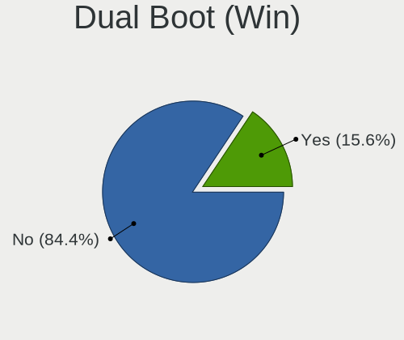
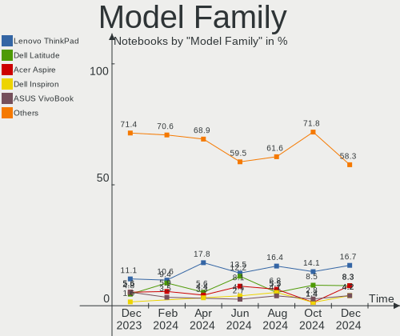
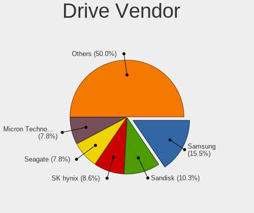
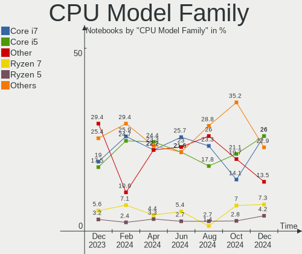
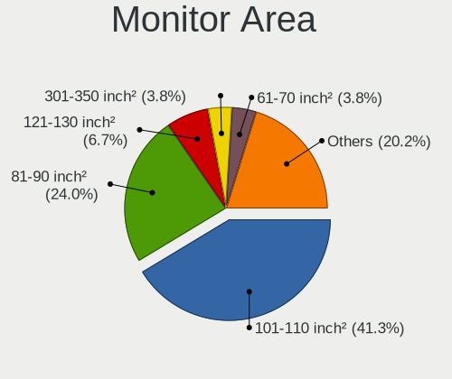
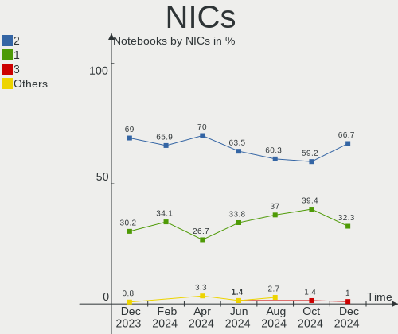
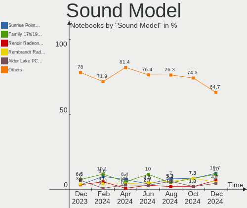
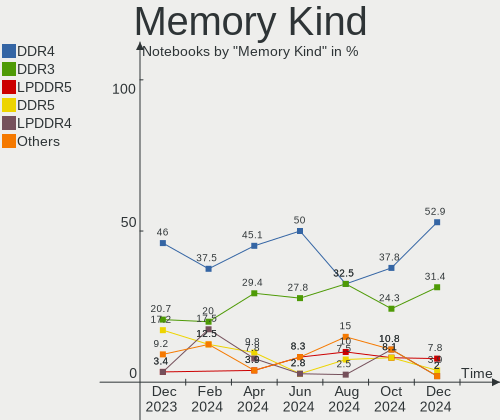
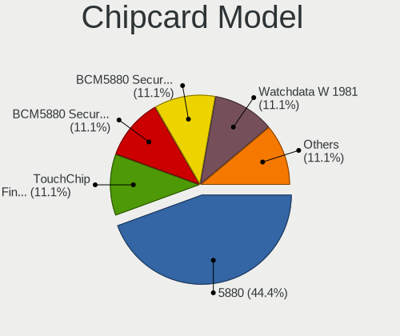

Linux in Canada - Hardware Trends (Notebooks)
---------------------------------------------

A project to identify most popular hardware characteristics and track their change
over time based on data collected by Linux users at https://Linux-Hardware.org.

Anyone can contribute to this report by the [hw-probe](https://github.com/linuxhw/hw-probe) tool:

    sudo -E hw-probe -all -upload

Period: Feb, 2023.

Contents
--------

* [ System ](#system)
  - [ OS                       ](#os)
  - [ OS Family                ](#os-family)
  - [ Kernel                   ](#kernel)
  - [ Kernel Family            ](#kernel-family)
  - [ Kernel Major Ver.        ](#kernel-major-ver)
  - [ Arch                     ](#arch)
  - [ DE                       ](#de)
  - [ Display Server           ](#display-server)
  - [ Display Manager          ](#display-manager)
  - [ OS Lang                  ](#os-lang)
  - [ Boot Mode                ](#boot-mode)
  - [ Filesystem               ](#filesystem)
  - [ Part. scheme             ](#part-scheme)
  - [ Dual Boot with Linux/BSD ](#dual-boot-with-linuxbsd)
  - [ Dual Boot (Win)          ](#dual-boot-win)

* [ Board ](#board)
  - [ Vendor                   ](#vendor)
  - [ Model                    ](#model)
  - [ Model Family             ](#model-family)
  - [ MFG Year                 ](#mfg-year)
  - [ Form Factor              ](#form-factor)
  - [ Secure Boot              ](#secure-boot)
  - [ Coreboot                 ](#coreboot)
  - [ RAM Size                 ](#ram-size)
  - [ RAM Used                 ](#ram-used)
  - [ Total Drives             ](#total-drives)
  - [ Has CD-ROM               ](#has-cd-rom)
  - [ Has Ethernet             ](#has-ethernet)
  - [ Has WiFi                 ](#has-wifi)
  - [ Has Bluetooth            ](#has-bluetooth)

* [ Location ](#location)
  - [ Country                  ](#country)
  - [ City                     ](#city)

* [ Drives ](#drives)
  - [ Drive Vendor             ](#drive-vendor)
  - [ Drive Model              ](#drive-model)
  - [ HDD Vendor               ](#hdd-vendor)
  - [ SSD Vendor               ](#ssd-vendor)
  - [ Drive Kind               ](#drive-kind)
  - [ Drive Connector          ](#drive-connector)
  - [ Drive Size               ](#drive-size)
  - [ Space Total              ](#space-total)
  - [ Space Used               ](#space-used)
  - [ Malfunc. Drives          ](#malfunc-drives)
  - [ Malfunc. Drive Vendor    ](#malfunc-drive-vendor)
  - [ Malfunc. HDD Vendor      ](#malfunc-hdd-vendor)
  - [ Malfunc. Drive Kind      ](#malfunc-drive-kind)
  - [ Failed Drives            ](#failed-drives)
  - [ Failed Drive Vendor      ](#failed-drive-vendor)
  - [ Drive Status             ](#drive-status)

* [ Storage controller ](#storage-controller)
  - [ Storage Vendor           ](#storage-vendor)
  - [ Storage Model            ](#storage-model)
  - [ Storage Kind             ](#storage-kind)

* [ Processor ](#processor)
  - [ CPU Vendor               ](#cpu-vendor)
  - [ CPU Model                ](#cpu-model)
  - [ CPU Model Family         ](#cpu-model-family)
  - [ CPU Cores                ](#cpu-cores)
  - [ CPU Sockets              ](#cpu-sockets)
  - [ CPU Threads              ](#cpu-threads)
  - [ CPU Op-Modes             ](#cpu-op-modes)
  - [ CPU Microcode            ](#cpu-microcode)
  - [ CPU Microarch            ](#cpu-microarch)

* [ Graphics ](#graphics)
  - [ GPU Vendor               ](#gpu-vendor)
  - [ GPU Model                ](#gpu-model)
  - [ GPU Combo                ](#gpu-combo)
  - [ GPU Driver               ](#gpu-driver)
  - [ GPU Memory               ](#gpu-memory)

* [ Monitor ](#monitor)
  - [ Monitor Vendor           ](#monitor-vendor)
  - [ Monitor Model            ](#monitor-model)
  - [ Monitor Resolution       ](#monitor-resolution)
  - [ Monitor Diagonal         ](#monitor-diagonal)
  - [ Monitor Width            ](#monitor-width)
  - [ Aspect Ratio             ](#aspect-ratio)
  - [ Monitor Area             ](#monitor-area)
  - [ Pixel Density            ](#pixel-density)
  - [ Multiple Monitors        ](#multiple-monitors)

* [ Network ](#network)
  - [ Net Controller Vendor    ](#net-controller-vendor)
  - [ Net Controller Model     ](#net-controller-model)
  - [ Wireless Vendor          ](#wireless-vendor)
  - [ Wireless Model           ](#wireless-model)
  - [ Ethernet Vendor          ](#ethernet-vendor)
  - [ Ethernet Model           ](#ethernet-model)
  - [ Net Controller Kind      ](#net-controller-kind)
  - [ Used Controller          ](#used-controller)
  - [ NICs                     ](#nics)
  - [ IPv6                     ](#ipv6)

* [ Bluetooth ](#bluetooth)
  - [ Bluetooth Vendor         ](#bluetooth-vendor)
  - [ Bluetooth Model          ](#bluetooth-model)

* [ Sound ](#sound)
  - [ Sound Vendor             ](#sound-vendor)
  - [ Sound Model              ](#sound-model)

* [ Memory ](#memory)
  - [ Memory Vendor            ](#memory-vendor)
  - [ Memory Model             ](#memory-model)
  - [ Memory Kind              ](#memory-kind)
  - [ Memory Form Factor       ](#memory-form-factor)
  - [ Memory Size              ](#memory-size)
  - [ Memory Speed             ](#memory-speed)

* [ Printers & scanners ](#printers--scanners)
  - [ Printer Vendor           ](#printer-vendor)
  - [ Printer Model            ](#printer-model)
  - [ Scanner Vendor           ](#scanner-vendor)
  - [ Scanner Model            ](#scanner-model)

* [ Camera ](#camera)
  - [ Camera Vendor            ](#camera-vendor)
  - [ Camera Model             ](#camera-model)

* [ Security ](#security)
  - [ Fingerprint Vendor       ](#fingerprint-vendor)
  - [ Fingerprint Model        ](#fingerprint-model)
  - [ Chipcard Vendor          ](#chipcard-vendor)
  - [ Chipcard Model           ](#chipcard-model)

* [ Unsupported ](#unsupported)
  - [ Unsupported Devices      ](#unsupported-devices)
  - [ Unsupported Device Types ](#unsupported-device-types)

System
------

OS
--

Installed operating systems

| Name                 | Notebooks | Percent |
|----------------------|-----------|---------|
| Ubuntu 22.04         | 13        | 21.67%  |
| Fedora 37            | 8         | 13.33%  |
| Zorin 16             | 7         | 11.67%  |
| Linux Mint 21.1      | 5         | 8.33%   |
| SteamOS 3.4.4        | 2         | 3.33%   |
| Pop!_OS 22.04        | 2         | 3.33%   |
| OpenMandriva 23.01   | 2         | 3.33%   |
| Debian 11            | 2         | 3.33%   |
| Arch Rolling         | 2         | 3.33%   |
| Ubuntu 20.04         | 1         | 1.67%   |
| OpenMandriva 4.3     | 1         | 1.67%   |
| MX 21                | 1         | 1.67%   |
| Manjaro              | 1         | 1.67%   |
| LinuxFX 10           | 1         | 1.67%   |
| Linux Mint 21        | 1         | 1.67%   |
| Linux Mint 20.2      | 1         | 1.67%   |
| Linux Mint 19.1      | 1         | 1.67%   |
| Kubuntu 22.04        | 1         | 1.67%   |
| KDE neon 22.04       | 1         | 1.67%   |
| Gentoo 2.13          | 1         | 1.67%   |
| Garuda Linux Soaring | 1         | 1.67%   |
| EndeavourOS Rolling  | 1         | 1.67%   |
| Debian               | 1         | 1.67%   |
| BlackPanther 18.1    | 1         | 1.67%   |
| ArcoLinux Rolling    | 1         | 1.67%   |
| AlmaLinux 9.1        | 1         | 1.67%   |

OS Family
---------

OS without a version

| Name         | Notebooks | Percent |
|--------------|-----------|---------|
| Ubuntu       | 14        | 23.33%  |
| Linux Mint   | 8         | 13.33%  |
| Fedora       | 8         | 13.33%  |
| Zorin        | 7         | 11.67%  |
| OpenMandriva | 3         | 5%      |
| Debian       | 3         | 5%      |
| SteamOS      | 2         | 3.33%   |
| Pop!_OS      | 2         | 3.33%   |
| Arch         | 2         | 3.33%   |
| MX           | 1         | 1.67%   |
| Manjaro      | 1         | 1.67%   |
| LinuxFX      | 1         | 1.67%   |
| Kubuntu      | 1         | 1.67%   |
| KDE neon     | 1         | 1.67%   |
| Gentoo       | 1         | 1.67%   |
| Garuda Linux | 1         | 1.67%   |
| EndeavourOS  | 1         | 1.67%   |
| BlackPanther | 1         | 1.67%   |
| ArcoLinux    | 1         | 1.67%   |
| AlmaLinux    | 1         | 1.67%   |

Kernel
------

Version of the Linux kernel

| Version                      | Notebooks | Percent |
|------------------------------|-----------|---------|
| 5.15.0-60-generic            | 9         | 15%     |
| 5.15.0-58-generic            | 8         | 13.33%  |
| 5.19.0-32-generic            | 3         | 5%      |
| 5.15.0-56-generic            | 3         | 5%      |
| 6.1.9-200.fc37.x86_64        | 2         | 3.33%   |
| 6.1.8-200.fc37.x86_64        | 2         | 3.33%   |
| 6.1.13-200.fc37.x86_64       | 2         | 3.33%   |
| 5.13.0-valve36-1-neptune     | 2         | 3.33%   |
| 5.10.0-21-amd64              | 2         | 3.33%   |
| 6.2.1-060201-generic         | 1         | 1.67%   |
| 6.1.7-200.fc37.x86_64        | 1         | 1.67%   |
| 6.1.4-gentoo-x86_64          | 1         | 1.67%   |
| 6.1.4-desktop-1omv2301       | 1         | 1.67%   |
| 6.1.12-zen1-1-zen            | 1         | 1.67%   |
| 6.1.12-arch1-1               | 1         | 1.67%   |
| 6.1.11-zen1-1-zen            | 1         | 1.67%   |
| 6.1.11-76060111-generic      | 1         | 1.67%   |
| 6.1.11-200.fc37.x86_64       | 1         | 1.67%   |
| 6.1.1-desktop-1omv2290       | 1         | 1.67%   |
| 6.1.0-2-amd64                | 1         | 1.67%   |
| 6.0.12-76060006-generic      | 1         | 1.67%   |
| 5.4.0-72-generic             | 1         | 1.67%   |
| 5.4.0-136-generic            | 1         | 1.67%   |
| 5.17.1-051701-generic        | 1         | 1.67%   |
| 5.16.13-desktop-1omv4003     | 1         | 1.67%   |
| 5.15.94-1-MANJARO            | 1         | 1.67%   |
| 5.15.94-1-lts                | 1         | 1.67%   |
| 5.15.91-1-lts                | 1         | 1.67%   |
| 5.15.0-52-generic            | 1         | 1.67%   |
| 5.15.0-50-generic            | 1         | 1.67%   |
| 5.15.0-43-generic            | 1         | 1.67%   |
| 5.15.0-25-generic            | 1         | 1.67%   |
| 5.14.0-162.12.1.el9_1.x86_64 | 1         | 1.67%   |
| 5.10.142-antix.2-amd64-smp   | 1         | 1.67%   |
| 4.18.16-desktop-1bP          | 1         | 1.67%   |
| 4.15.0-204-generic           | 1         | 1.67%   |

Kernel Family
-------------

Linux kernel without a distro release

| Version  | Notebooks | Percent |
|----------|-----------|---------|
| 5.15.0   | 24        | 40%     |
| 6.1.11   | 3         | 5%      |
| 5.19.0   | 3         | 5%      |
| 6.1.9    | 2         | 3.33%   |
| 6.1.8    | 2         | 3.33%   |
| 6.1.4    | 2         | 3.33%   |
| 6.1.13   | 2         | 3.33%   |
| 6.1.12   | 2         | 3.33%   |
| 5.4.0    | 2         | 3.33%   |
| 5.15.94  | 2         | 3.33%   |
| 5.13.0   | 2         | 3.33%   |
| 5.10.0   | 2         | 3.33%   |
| 6.2.1    | 1         | 1.67%   |
| 6.1.7    | 1         | 1.67%   |
| 6.1.1    | 1         | 1.67%   |
| 6.1.0    | 1         | 1.67%   |
| 6.0.12   | 1         | 1.67%   |
| 5.17.1   | 1         | 1.67%   |
| 5.16.13  | 1         | 1.67%   |
| 5.15.91  | 1         | 1.67%   |
| 5.14.0   | 1         | 1.67%   |
| 5.10.142 | 1         | 1.67%   |
| 4.18.16  | 1         | 1.67%   |
| 4.15.0   | 1         | 1.67%   |

Kernel Major Ver.
-----------------

Linux kernel major version

| Version | Notebooks | Percent |
|---------|-----------|---------|
| 5.15    | 27        | 45%     |
| 6.1     | 16        | 26.67%  |
| 5.19    | 3         | 5%      |
| 5.10    | 3         | 5%      |
| 5.4     | 2         | 3.33%   |
| 5.13    | 2         | 3.33%   |
| 6.2     | 1         | 1.67%   |
| 6.0     | 1         | 1.67%   |
| 5.17    | 1         | 1.67%   |
| 5.16    | 1         | 1.67%   |
| 5.14    | 1         | 1.67%   |
| 4.18    | 1         | 1.67%   |
| 4.15    | 1         | 1.67%   |

Arch
----

OS architecture (x86_64, i586, etc.)

| Name   | Notebooks | Percent |
|--------|-----------|---------|
| x86_64 | 60        | 100%    |

DE
--

Desktop Environment

| Name       | Notebooks | Percent |
|------------|-----------|---------|
| GNOME      | 33        | 55%     |
| KDE5       | 16        | 26.67%  |
| X-Cinnamon | 5         | 8.33%   |
| XFCE       | 2         | 3.33%   |
| LXDE       | 2         | 3.33%   |
| MATE       | 1         | 1.67%   |
| chadwm     | 1         | 1.67%   |

Display Server
--------------

X11 or Wayland

| Name    | Notebooks | Percent |
|---------|-----------|---------|
| X11     | 35        | 58.33%  |
| Wayland | 24        | 40%     |
| Tty     | 1         | 1.67%   |

Display Manager
---------------

SDDM, LightDM, etc.

| Name    | Notebooks | Percent |
|---------|-----------|---------|
| Unknown | 23        | 38.33%  |
| GDM3    | 14        | 23.33%  |
| SDDM    | 11        | 18.33%  |
| GDM     | 7         | 11.67%  |
| LightDM | 3         | 5%      |
| Ly      | 1         | 1.67%   |
| LXDM    | 1         | 1.67%   |

OS Lang
-------

Language

| Lang    | Notebooks | Percent |
|---------|-----------|---------|
| en_CA   | 37        | 61.67%  |
| en_US   | 18        | 30%     |
| fr_CA   | 3         | 5%      |
| C       | 1         | 1.67%   |
| Unknown | 1         | 1.67%   |

Boot Mode
---------

EFI or BIOS

| Mode | Notebooks | Percent |
|------|-----------|---------|
| BIOS | 33        | 55%     |
| EFI  | 27        | 45%     |

Filesystem
----------

Type of filesystem

| Type    | Notebooks | Percent |
|---------|-----------|---------|
| Ext4    | 42        | 70%     |
| Btrfs   | 12        | 20%     |
| Overlay | 3         | 5%      |
| Xfs     | 2         | 3.33%   |
| Ext3    | 1         | 1.67%   |

Part. scheme
------------

Scheme of partitioning

| Type    | Notebooks | Percent |
|---------|-----------|---------|
| GPT     | 29        | 48.33%  |
| Unknown | 22        | 36.67%  |
| MBR     | 9         | 15%     |

Dual Boot with Linux/BSD
------------------------

Hosting more than one Linux/BSD

| Dual boot | Notebooks | Percent |
|-----------|-----------|---------|
| No        | 53        | 88.33%  |
| Yes       | 7         | 11.67%  |

Dual Boot (Win)
---------------

Hosting Linux and Windows

| Dual boot | Notebooks | Percent |
|-----------|-----------|---------|
| No        | 43        | 71.67%  |
| Yes       | 17        | 28.33%  |

Board
-----

Vendor
------

Motherboard manufacturer

| Name             | Notebooks | Percent |
|------------------|-----------|---------|
| Hewlett-Packard  | 15        | 25%     |
| Dell             | 12        | 20%     |
| Lenovo           | 10        | 16.67%  |
| ASUSTek Computer | 7         | 11.67%  |
| Acer             | 4         | 6.67%   |
| Google           | 3         | 5%      |
| Valve            | 2         | 3.33%   |
| Panasonic        | 2         | 3.33%   |
| MSI              | 2         | 3.33%   |
| Toshiba          | 1         | 1.67%   |
| Apple            | 1         | 1.67%   |
| Alienware        | 1         | 1.67%   |

Model
-----

Motherboard model

| Name                                  | Notebooks | Percent |
|---------------------------------------|-----------|---------|
| Valve Jupiter                         | 2         | 3.33%   |
| HP G60                                | 2         | 3.33%   |
| Dell XPS 15 9520                      | 2         | 3.33%   |
| Toshiba Satellite P870                | 1         | 1.67%   |
| Panasonic CF-S10CDHEDM                | 1         | 1.67%   |
| Panasonic CF-C2CCEZXCM                | 1         | 1.67%   |
| MSI Raider GE76 12UGS                 | 1         | 1.67%   |
| MSI GT72 6QE                          | 1         | 1.67%   |
| Lenovo ThinkPad T470 W10DG 20JNS0L300 | 1         | 1.67%   |
| Lenovo ThinkPad T460 20FMS35H02       | 1         | 1.67%   |
| Lenovo ThinkPad T440s 20ARS1VL00      | 1         | 1.67%   |
| Lenovo ThinkPad T16 Gen 1 21CH000FUS  | 1         | 1.67%   |
| Lenovo ThinkPad Edge E540 20C6008SUS  | 1         | 1.67%   |
| Lenovo ThinkBook 13s G4 ARB 21AS      | 1         | 1.67%   |
| Lenovo IdeaPad Yoga 11S 20246         | 1         | 1.67%   |
| Lenovo IdeaPad 3 15ADA05 81W1         | 1         | 1.67%   |
| Lenovo IdeaPad 3 15ABA7 82RN          | 1         | 1.67%   |
| HP ProBook 650 G2                     | 1         | 1.67%   |
| HP Presario V6000 (RN927UA#ABL)       | 1         | 1.67%   |
| HP Pavilion dv8000 (ET839UA#ABL)      | 1         | 1.67%   |
| HP Pavilion dv7                       | 1         | 1.67%   |
| HP Pavilion dv2500                    | 1         | 1.67%   |
| HP Pavilion 13 x360 PC                | 1         | 1.67%   |
| HP Notebook                           | 1         | 1.67%   |
| HP Laptop 14-dq4xxx                   | 1         | 1.67%   |
| HP EliteBook 8460p                    | 1         | 1.67%   |
| HP EliteBook 840 G5                   | 1         | 1.67%   |
| HP EliteBook 830 G5                   | 1         | 1.67%   |
| HP EliteBook 2570p                    | 1         | 1.67%   |
| HP EliteBook 2530p                    | 1         | 1.67%   |
| Google Kefka                          | 1         | 1.67%   |
| Google Droid                          | 1         | 1.67%   |
| Google Coral                          | 1         | 1.67%   |
| Dell XPS 15 9510                      | 1         | 1.67%   |
| Dell Precision M4500                  | 1         | 1.67%   |
| Dell Precision 7710                   | 1         | 1.67%   |
| Dell Latitude E6520                   | 1         | 1.67%   |
| Dell Latitude E5440                   | 1         | 1.67%   |
| Dell Latitude 7490                    | 1         | 1.67%   |
| Dell Latitude 3400                    | 1         | 1.67%   |

Model Family
------------

Motherboard model prefix

| Name                   | Notebooks | Percent |
|------------------------|-----------|---------|
| Lenovo ThinkPad        | 5         | 8.33%   |
| HP EliteBook           | 5         | 8.33%   |
| HP Pavilion            | 4         | 6.67%   |
| Dell Latitude          | 4         | 6.67%   |
| ASUS VivoBook          | 4         | 6.67%   |
| Lenovo IdeaPad         | 3         | 5%      |
| Dell XPS               | 3         | 5%      |
| Dell Inspiron          | 3         | 5%      |
| Acer Aspire            | 3         | 5%      |
| Valve Jupiter          | 2         | 3.33%   |
| HP G60                 | 2         | 3.33%   |
| Dell Precision         | 2         | 3.33%   |
| Toshiba Satellite      | 1         | 1.67%   |
| Panasonic CF-S10CDHEDM | 1         | 1.67%   |
| Panasonic CF-C2CCEZXCM | 1         | 1.67%   |
| MSI Raider             | 1         | 1.67%   |
| MSI GT72               | 1         | 1.67%   |
| Lenovo ThinkBook       | 1         | 1.67%   |
| HP ProBook             | 1         | 1.67%   |
| HP Presario            | 1         | 1.67%   |
| HP Notebook            | 1         | 1.67%   |
| HP Laptop              | 1         | 1.67%   |
| Google Kefka           | 1         | 1.67%   |
| Google Droid           | 1         | 1.67%   |
| Google Coral           | 1         | 1.67%   |
| ASUS ZenBook           | 1         | 1.67%   |
| ASUS X450LD            | 1         | 1.67%   |
| ASUS ASUS              | 1         | 1.67%   |
| Apple MacBook5         | 1         | 1.67%   |
| Alienware x15          | 1         | 1.67%   |
| Acer Switch            | 1         | 1.67%   |
| Unknown                | 1         | 1.67%   |

MFG Year
--------

Motherboard manufacture year

| Year | Notebooks | Percent |
|------|-----------|---------|
| 2022 | 13        | 21.67%  |
| 2018 | 5         | 8.33%   |
| 2016 | 5         | 8.33%   |
| 2020 | 4         | 6.67%   |
| 2013 | 4         | 6.67%   |
| 2011 | 4         | 6.67%   |
| 2008 | 4         | 6.67%   |
| 2021 | 3         | 5%      |
| 2019 | 3         | 5%      |
| 2017 | 3         | 5%      |
| 2014 | 3         | 5%      |
| 2012 | 2         | 3.33%   |
| 2009 | 2         | 3.33%   |
| 2006 | 2         | 3.33%   |
| 2015 | 1         | 1.67%   |
| 2010 | 1         | 1.67%   |
| 2007 | 1         | 1.67%   |

Form Factor
-----------

Physical design of the computer

| Name     | Notebooks | Percent |
|----------|-----------|---------|
| Notebook | 60        | 100%    |

Secure Boot
-----------

Enabled or disabled

| State    | Notebooks | Percent |
|----------|-----------|---------|
| Disabled | 54        | 90%     |
| Enabled  | 6         | 10%     |

Coreboot
--------

Have coreboot on board

| Used | Notebooks | Percent |
|------|-----------|---------|
| No   | 57        | 95%     |
| Yes  | 3         | 5%      |

RAM Size
--------

Total RAM memory

| Size in GB  | Notebooks | Percent |
|-------------|-----------|---------|
| 4.01-8.0    | 21        | 35%     |
| 3.01-4.0    | 11        | 18.33%  |
| 8.01-16.0   | 9         | 15%     |
| 16.01-24.0  | 7         | 11.67%  |
| 32.01-64.0  | 5         | 8.33%   |
| 1.01-2.0    | 4         | 6.67%   |
| 24.01-32.0  | 1         | 1.67%   |
| 64.01-256.0 | 1         | 1.67%   |
| 0.51-1.0    | 1         | 1.67%   |

RAM Used
--------

Used RAM memory

| Used GB   | Notebooks | Percent |
|-----------|-----------|---------|
| 2.01-3.0  | 22        | 36.67%  |
| 1.01-2.0  | 17        | 28.33%  |
| 4.01-8.0  | 9         | 15%     |
| 3.01-4.0  | 6         | 10%     |
| 0.51-1.0  | 3         | 5%      |
| 8.01-16.0 | 2         | 3.33%   |
| 0.01-0.5  | 1         | 1.67%   |

Total Drives
------------

Number of drives on board

| Drives | Notebooks | Percent |
|--------|-----------|---------|
| 1      | 44        | 73.33%  |
| 2      | 13        | 21.67%  |
| 3      | 3         | 5%      |

Has CD-ROM
----------

Has CD-ROM on board

| Presented | Notebooks | Percent |
|-----------|-----------|---------|
| No        | 35        | 58.33%  |
| Yes       | 25        | 41.67%  |

Has Ethernet
------------

Has Ethernet on board

| Presented | Notebooks | Percent |
|-----------|-----------|---------|
| Yes       | 44        | 73.33%  |
| No        | 16        | 26.67%  |

Has WiFi
--------

Has WiFi module

| Presented | Notebooks | Percent |
|-----------|-----------|---------|
| Yes       | 59        | 98.33%  |
| No        | 1         | 1.67%   |

Has Bluetooth
-------------

Has Bluetooth module

| Presented | Notebooks | Percent |
|-----------|-----------|---------|
| Yes       | 46        | 76.67%  |
| No        | 14        | 23.33%  |

Location
--------

Country
-------

Geographic location (country)

| Country | Notebooks | Percent |
|---------|-----------|---------|
| Canada  | 60        | 100%    |

City
----

Geographic location (city)

| City              | Notebooks | Percent |
|-------------------|-----------|---------|
| Montreal          | 8         | 13.33%  |
| Toronto           | 5         | 8.33%   |
| Vancouver         | 4         | 6.67%   |
| Calgary           | 3         | 5%      |
| Windsor           | 2         | 3.33%   |
| Tillsonburg       | 2         | 3.33%   |
| Saint John        | 2         | 3.33%   |
| Regina            | 2         | 3.33%   |
| Mississauga       | 2         | 3.33%   |
| Markham           | 2         | 3.33%   |
| Brampton          | 2         | 3.33%   |
| Winnipeg          | 1         | 1.67%   |
| Victoria          | 1         | 1.67%   |
| Surrey            | 1         | 1.67%   |
| Stoney Creek      | 1         | 1.67%   |
| Sidney            | 1         | 1.67%   |
| Sherwood Park     | 1         | 1.67%   |
| Sherbrooke        | 1         | 1.67%   |
| Saskatoon         | 1         | 1.67%   |
| Sarnia            | 1         | 1.67%   |
| Saint-Jerome      | 1         | 1.67%   |
| Riviere-Bleue     | 1         | 1.67%   |
| Pitt Meadows      | 1         | 1.67%   |
| Ottawa            | 1         | 1.67%   |
| Oshawa            | 1         | 1.67%   |
| Nepean            | 1         | 1.67%   |
| LaSalle           | 1         | 1.67%   |
| Hamilton          | 1         | 1.67%   |
| Guelph            | 1         | 1.67%   |
| Glace Bay         | 1         | 1.67%   |
| Fredericton       | 1         | 1.67%   |
| Frankford         | 1         | 1.67%   |
| Fort Saskatchewan | 1         | 1.67%   |
| Cumberland        | 1         | 1.67%   |
| Coquitlam         | 1         | 1.67%   |
| Barrie            | 1         | 1.67%   |
| Almonte           | 1         | 1.67%   |

Drives
------

Drive Vendor
------------

Hard drive vendors

| Vendor                         | Notebooks | Drives | Percent |
|--------------------------------|-----------|--------|---------|
| Unknown                        | 12        | 12     | 15.38%  |
| Samsung Electronics            | 9         | 10     | 11.54%  |
| WDC                            | 8         | 8      | 10.26%  |
| Toshiba                        | 6         | 6      | 7.69%   |
| Seagate                        | 6         | 6      | 7.69%   |
| SK hynix                       | 4         | 4      | 5.13%   |
| Sandisk                        | 4         | 4      | 5.13%   |
| Kingston                       | 4         | 4      | 5.13%   |
| SPCC                           | 2         | 2      | 2.56%   |
| Solid State Storage Technology | 2         | 2      | 2.56%   |
| Phison Electronics             | 2         | 3      | 2.56%   |
| KIOXIA                         | 2         | 2      | 2.56%   |
| Intel                          | 2         | 2      | 2.56%   |
| Fujitsu                        | 2         | 2      | 2.56%   |
| A-DATA Technology              | 2         | 2      | 2.56%   |
| Timetec                        | 1         | 1      | 1.28%   |
| Super Talent                   | 1         | 1      | 1.28%   |
| sk600                          | 1         | 1      | 1.28%   |
| LITEONIT                       | 1         | 1      | 1.28%   |
| Lenovo                         | 1         | 1      | 1.28%   |
| HS256E                         | 1         | 1      | 1.28%   |
| Hitachi                        | 1         | 1      | 1.28%   |
| HGST                           | 1         | 1      | 1.28%   |
| Fanxiang                       | 1         | 1      | 1.28%   |
| Dogfish                        | 1         | 1      | 1.28%   |
| Crucial                        | 1         | 1      | 1.28%   |

Drive Model
-----------

Hard drive models

| Model                                                | Notebooks | Percent |
|------------------------------------------------------|-----------|---------|
| Unknown MMC Card  64GB                               | 3         | 3.8%    |
| Seagate ST1000LM048-2E7172 1TB                       | 3         | 3.8%    |
| Toshiba MQ01ABD100 1TB                               | 2         | 2.53%   |
| Solid State Storage CA6-8D2048-Q11 NVMe SSSTC 2048GB | 2         | 2.53%   |
| Phison PS5013 E13 NVMe Controller 500GB              | 2         | 2.53%   |
| WDC WDS250G1B0A-00H9H0 250GB SSD                     | 1         | 1.27%   |
| WDC WD7500LPCX-60HWST0 752GB                         | 1         | 1.27%   |
| WDC WD7500BPVX-22JC3T0 752GB                         | 1         | 1.27%   |
| WDC WD1600BEKT-00PVMT0 160GB                         | 1         | 1.27%   |
| WDC WD10SPCX-24HWST1 1TB                             | 1         | 1.27%   |
| WDC WD10JPVX-22JC3T0 1TB                             | 1         | 1.27%   |
| WDC PC SN730 SDBQNTY-256G-1001 256GB                 | 1         | 1.27%   |
| WDC PC SN520 NVMe 256GB                              | 1         | 1.27%   |
| Unknown xD/SD/M.S.                                   | 1         | 1.27%   |
| Unknown SD04G  4GB                                   | 1         | 1.27%   |
| Unknown MMC Card  512GB                              | 1         | 1.27%   |
| Unknown MMC Card  4GB                                | 1         | 1.27%   |
| Unknown MMC Card  32GB                               | 1         | 1.27%   |
| Unknown MMC Card  1GB                                | 1         | 1.27%   |
| Unknown MMC Card  16GB                               | 1         | 1.27%   |
| Unknown MMC Card  128GB                              | 1         | 1.27%   |
| Unknown DA4064  64GB                                 | 1         | 1.27%   |
| Toshiba MQ04ABF100 1TB                               | 1         | 1.27%   |
| Toshiba MK3276GSX 320GB                              | 1         | 1.27%   |
| Toshiba MK2529GSG 250GB                              | 1         | 1.27%   |
| Toshiba KXG5AZNV512G 512GB                           | 1         | 1.27%   |
| Timetec SD08 512GB                                   | 1         | 1.27%   |
| Super Talent FTM56N325H 256GB                        | 1         | 1.27%   |
| SPCC Solid State Disk 480GB                          | 1         | 1.27%   |
| SPCC Solid State Disk 240GB                          | 1         | 1.27%   |
| sk600 128gb SSD                                      | 1         | 1.27%   |
| SK hynix PC401 NVMe Solid State Drive 256GB          | 1         | 1.27%   |
| SK hynix HFM512GDJTNG-8310A 512GB                    | 1         | 1.27%   |
| SK hynix HFM512GD3JX013N 512GB                       | 1         | 1.27%   |
| SK hynix HFM512GD3GX013N 512GB                       | 1         | 1.27%   |
| Seagate ST9500325AS 500GB                            | 1         | 1.27%   |
| Seagate ST500LM012 HN-M500MBB 500GB                  | 1         | 1.27%   |
| Seagate ST2000LM003 HN-M201RAD 2TB                   | 1         | 1.27%   |
| Sandisk WD PC SN735 SDBPNHH-1T00-1002 1024GB         | 1         | 1.27%   |
| Sandisk WD Blue SN570 1TB                            | 1         | 1.27%   |

HDD Vendor
----------

Hard disk drive vendors

| Vendor              | Notebooks | Drives | Percent |
|---------------------|-----------|--------|---------|
| Seagate             | 6         | 6      | 28.57%  |
| WDC                 | 5         | 5      | 23.81%  |
| Toshiba             | 5         | 5      | 23.81%  |
| Fujitsu             | 2         | 2      | 9.52%   |
| Samsung Electronics | 1         | 1      | 4.76%   |
| Hitachi             | 1         | 1      | 4.76%   |
| HGST                | 1         | 1      | 4.76%   |

SSD Vendor
----------

Solid state drive vendors

| Vendor              | Notebooks | Drives | Percent |
|---------------------|-----------|--------|---------|
| Kingston            | 4         | 4      | 22.22%  |
| SPCC                | 2         | 2      | 11.11%  |
| A-DATA Technology   | 2         | 2      | 11.11%  |
| WDC                 | 1         | 1      | 5.56%   |
| Timetec             | 1         | 1      | 5.56%   |
| Super Talent        | 1         | 1      | 5.56%   |
| sk600               | 1         | 1      | 5.56%   |
| Samsung Electronics | 1         | 1      | 5.56%   |
| LITEONIT            | 1         | 1      | 5.56%   |
| Intel               | 1         | 1      | 5.56%   |
| HS256E              | 1         | 1      | 5.56%   |
| Dogfish             | 1         | 1      | 5.56%   |
| Crucial             | 1         | 1      | 5.56%   |

Drive Kind
----------

HDD or SSD

| Kind    | Notebooks | Drives | Percent |
|---------|-----------|--------|---------|
| NVMe    | 24        | 28     | 32%     |
| HDD     | 20        | 21     | 26.67%  |
| SSD     | 18        | 18     | 24%     |
| MMC     | 11        | 11     | 14.67%  |
| Unknown | 2         | 2      | 2.67%   |

Drive Connector
---------------

SATA, SAS, NVMe, etc.

| Type | Notebooks | Drives | Percent |
|------|-----------|--------|---------|
| SATA | 33        | 39     | 47.14%  |
| NVMe | 24        | 28     | 34.29%  |
| MMC  | 11        | 11     | 15.71%  |
| SAS  | 2         | 2      | 2.86%   |

Drive Size
----------

Size of hard drive

| Size in TB | Notebooks | Drives | Percent |
|------------|-----------|--------|---------|
| 0.01-0.5   | 23        | 25     | 65.71%  |
| 0.51-1.0   | 11        | 13     | 31.43%  |
| 1.01-2.0   | 1         | 1      | 2.86%   |

Space Total
-----------

Amount of disk space available on the file system

| Size in GB     | Notebooks | Percent |
|----------------|-----------|---------|
| 251-500        | 16        | 26.67%  |
| 101-250        | 16        | 26.67%  |
| 501-1000       | 9         | 15%     |
| 1001-2000      | 6         | 10%     |
| 21-50          | 4         | 6.67%   |
| 1-20           | 4         | 6.67%   |
| 51-100         | 3         | 5%      |
| More than 3000 | 1         | 1.67%   |
| Unknown        | 1         | 1.67%   |

Space Used
----------

Amount of used disk space

| Used GB   | Notebooks | Percent |
|-----------|-----------|---------|
| 1-20      | 23        | 38.33%  |
| 21-50     | 12        | 20%     |
| 51-100    | 12        | 20%     |
| 251-500   | 5         | 8.33%   |
| 101-250   | 5         | 8.33%   |
| 1001-2000 | 1         | 1.67%   |
| 501-1000  | 1         | 1.67%   |
| Unknown   | 1         | 1.67%   |

Malfunc. Drives
---------------

Drive models with a malfunction

| Model                                 | Notebooks | Drives | Percent |
|---------------------------------------|-----------|--------|---------|
| Samsung Electronics PM9A1 NVMe 1024GB | 1         | 1      | 25%     |
| Samsung Electronics HM160HC 160GB     | 1         | 1      | 25%     |
| HGST HTS725050A7E630 500GB            | 1         | 1      | 25%     |
| Fujitsu MHV2080AH 80GB                | 1         | 1      | 25%     |

Malfunc. Drive Vendor
---------------------

Vendors of faulty drives

| Vendor              | Notebooks | Drives | Percent |
|---------------------|-----------|--------|---------|
| Samsung Electronics | 2         | 2      | 50%     |
| HGST                | 1         | 1      | 25%     |
| Fujitsu             | 1         | 1      | 25%     |

Malfunc. HDD Vendor
-------------------

Vendors of faulty HDD drives

| Vendor              | Notebooks | Drives | Percent |
|---------------------|-----------|--------|---------|
| Samsung Electronics | 1         | 1      | 33.33%  |
| HGST                | 1         | 1      | 33.33%  |
| Fujitsu             | 1         | 1      | 33.33%  |

Malfunc. Drive Kind
-------------------

Kinds of faulty drives

| Kind | Notebooks | Drives | Percent |
|------|-----------|--------|---------|
| HDD  | 2         | 3      | 66.67%  |
| NVMe | 1         | 1      | 33.33%  |

Failed Drives
-------------

Failed drive models

Zero info for selected period =(

Failed Drive Vendor
-------------------

Failed drive vendors

Zero info for selected period =(

Drive Status
------------

Number of failed and malfunc. drives

| Status   | Notebooks | Drives | Percent |
|----------|-----------|--------|---------|
| Detected | 38        | 49     | 60.32%  |
| Works    | 22        | 27     | 34.92%  |
| Malfunc  | 3         | 4      | 4.76%   |

Storage controller
------------------

Storage Vendor
--------------

Storage controller vendors

| Vendor                         | Notebooks | Percent |
|--------------------------------|-----------|---------|
| Intel                          | 33        | 47.14%  |
| AMD                            | 9         | 12.86%  |
| Samsung Electronics            | 7         | 10%     |
| SanDisk                        | 5         | 7.14%   |
| SK hynix                       | 4         | 5.71%   |
| Nvidia                         | 4         | 5.71%   |
| Solid State Storage Technology | 2         | 2.86%   |
| Phison Electronics             | 2         | 2.86%   |
| KIOXIA                         | 2         | 2.86%   |
| Toshiba America Info Systems   | 1         | 1.43%   |
| Lenovo                         | 1         | 1.43%   |

Storage Model
-------------

Storage controller models

| Model                                                                            | Notebooks | Percent |
|----------------------------------------------------------------------------------|-----------|---------|
| AMD FCH SATA Controller [AHCI mode]                                              | 8         | 10.81%  |
| Samsung NVMe SSD Controller PM9A1/PM9A3/980PRO                                   | 4         | 5.41%   |
| Intel Volume Management Device NVMe RAID Controller                              | 4         | 5.41%   |
| Intel Sunrise Point-LP SATA Controller [AHCI mode]                               | 4         | 5.41%   |
| Intel 8 Series SATA Controller 1 [AHCI mode]                                     | 4         | 5.41%   |
| Intel 6 Series/C200 Series Chipset Family 6 port Mobile SATA AHCI Controller     | 4         | 5.41%   |
| Samsung NVMe SSD Controller 980                                                  | 3         | 4.05%   |
| Intel 82801IBM/IEM (ICH9M/ICH9M-E) 4 port SATA Controller [AHCI mode]            | 3         | 4.05%   |
| Solid State Storage Non-Volatile memory controller                               | 2         | 2.7%    |
| SK hynix Gold P31/PC711 NVMe Solid State Drive                                   | 2         | 2.7%    |
| Phison PS5013 E13 NVMe Controller                                                | 2         | 2.7%    |
| Intel HM170/QM170 Chipset SATA Controller [AHCI Mode]                            | 2         | 2.7%    |
| Intel 82801 Mobile SATA Controller [RAID mode]                                   | 2         | 2.7%    |
| Intel 7 Series Chipset Family 6-port SATA Controller [AHCI mode]                 | 2         | 2.7%    |
| Toshiba America Info Systems XG5 NVMe SSD Controller                             | 1         | 1.35%   |
| SK hynix PC401 NVMe Solid State Drive 256GB                                      | 1         | 1.35%   |
| SK hynix BC501 NVMe Solid State Drive                                            | 1         | 1.35%   |
| SanDisk WD Blue SN570 NVMe SSD                                                   | 1         | 1.35%   |
| SanDisk WD Blue SN550 NVMe SSD                                                   | 1         | 1.35%   |
| SanDisk WD Black SN750 / PC SN730 NVMe SSD                                       | 1         | 1.35%   |
| SanDisk PC SN520 NVMe SSD                                                        | 1         | 1.35%   |
| SanDisk Non-Volatile memory controller                                           | 1         | 1.35%   |
| Nvidia MCP79 AHCI Controller                                                     | 1         | 1.35%   |
| Nvidia MCP78S [GeForce 8200] SATA Controller (non-AHCI mode)                     | 1         | 1.35%   |
| Nvidia MCP78S [GeForce 8200] IDE                                                 | 1         | 1.35%   |
| Nvidia MCP67 IDE Controller                                                      | 1         | 1.35%   |
| Nvidia MCP67 AHCI Controller                                                     | 1         | 1.35%   |
| Nvidia MCP51 Serial ATA Controller                                               | 1         | 1.35%   |
| Nvidia MCP51 IDE                                                                 | 1         | 1.35%   |
| Lenovo Non-Volatile memory controller                                            | 1         | 1.35%   |
| KIOXIA NVMe SSD Controller BG4                                                   | 1         | 1.35%   |
| KIOXIA Non-Volatile memory controller                                            | 1         | 1.35%   |
| Intel SSD 660P Series                                                            | 1         | 1.35%   |
| Intel SATA Controller [RAID mode]                                                | 1         | 1.35%   |
| Intel Mobile 4 Series Chipset PT IDER Controller                                 | 1         | 1.35%   |
| Intel Ice Lake-LP SATA Controller [AHCI mode]                                    | 1         | 1.35%   |
| Intel Celeron/Pentium Silver Processor SATA Controller                           | 1         | 1.35%   |
| Intel Cannon Point-LP SATA Controller [AHCI Mode]                                | 1         | 1.35%   |
| Intel Atom/Celeron/Pentium Processor x5-E8000/J3xxx/N3xxx Series SATA Controller | 1         | 1.35%   |
| Intel 8 Series/C220 Series Chipset Family 6-port SATA Controller 1 [AHCI mode]   | 1         | 1.35%   |

Storage Kind
------------

Kind of storage controller (IDE, SATA, NVMe, SAS, ...)

| Kind | Notebooks | Percent |
|------|-----------|---------|
| SATA | 34        | 48.57%  |
| NVMe | 24        | 34.29%  |
| RAID | 7         | 10%     |
| IDE  | 5         | 7.14%   |

Processor
---------

CPU Vendor
----------

Processor vendors

| Vendor | Notebooks | Percent |
|--------|-----------|---------|
| Intel  | 43        | 71.67%  |
| AMD    | 17        | 28.33%  |

CPU Model
---------

Processor models

| Model                                    | Notebooks | Percent |
|------------------------------------------|-----------|---------|
| Intel Core i5-2520M CPU @ 2.50GHz        | 3         | 5%      |
| Intel 12th Gen Core i7-12700H            | 3         | 5%      |
| Intel Core i7-4600U CPU @ 2.10GHz        | 2         | 3.33%   |
| Intel Core i5-8250U CPU @ 1.60GHz        | 2         | 3.33%   |
| Intel Core i5-6300U CPU @ 2.40GHz        | 2         | 3.33%   |
| Intel Celeron N4020 CPU @ 1.10GHz        | 2         | 3.33%   |
| AMD Custom APU 0405                      | 2         | 3.33%   |
| Intel Pentium CPU N3700 @ 1.60GHz        | 1         | 1.67%   |
| Intel Core i7-6920HQ CPU @ 2.90GHz       | 1         | 1.67%   |
| Intel Core i7-6820HQ CPU @ 2.70GHz       | 1         | 1.67%   |
| Intel Core i7-6700HQ CPU @ 2.60GHz       | 1         | 1.67%   |
| Intel Core i7-4500U CPU @ 1.80GHz        | 1         | 1.67%   |
| Intel Core i7-3630QM CPU @ 2.40GHz       | 1         | 1.67%   |
| Intel Core i5-8350U CPU @ 1.70GHz        | 1         | 1.67%   |
| Intel Core i5-8265U CPU @ 1.60GHz        | 1         | 1.67%   |
| Intel Core i5-7300U CPU @ 2.60GHz        | 1         | 1.67%   |
| Intel Core i5-4300U CPU @ 1.90GHz        | 1         | 1.67%   |
| Intel Core i5-4210Y CPU @ 1.50GHz        | 1         | 1.67%   |
| Intel Core i5-4200M CPU @ 2.50GHz        | 1         | 1.67%   |
| Intel Core i5-3320M CPU @ 2.60GHz        | 1         | 1.67%   |
| Intel Core i5-2410M CPU @ 2.30GHz        | 1         | 1.67%   |
| Intel Core i5-1035G1 CPU @ 1.00GHz       | 1         | 1.67%   |
| Intel Core i5 CPU M 540 @ 2.53GHz        | 1         | 1.67%   |
| Intel Core i3-7100U CPU @ 2.40GHz        | 1         | 1.67%   |
| Intel Core i3 CPU M 330 @ 2.13GHz        | 1         | 1.67%   |
| Intel Core 2 Duo CPU T9400 @ 2.53GHz     | 1         | 1.67%   |
| Intel Core 2 Duo CPU T6600 @ 2.20GHz     | 1         | 1.67%   |
| Intel Core 2 Duo CPU P7350 @ 2.00GHz     | 1         | 1.67%   |
| Intel Core 2 Duo CPU L9400 @ 1.86GHz     | 1         | 1.67%   |
| Intel Celeron CPU N3350 @ 1.10GHz        | 1         | 1.67%   |
| Intel Celeron CPU N3060 @ 1.60GHz        | 1         | 1.67%   |
| Intel Atom x5-Z8350 CPU @ 1.44GHz        | 1         | 1.67%   |
| Intel 12th Gen Core i9-12900H            | 1         | 1.67%   |
| Intel 12th Gen Core i7-12650H            | 1         | 1.67%   |
| Intel 11th Gen Core i7-11800H @ 2.30GHz  | 1         | 1.67%   |
| Intel 11th Gen Core i5-1155G7 @ 2.50GHz  | 1         | 1.67%   |
| AMD Turion 64 X2 Mobile Technology TL-50 | 1         | 1.67%   |
| AMD Turion 64 Mobile Technology ML-32    | 1         | 1.67%   |
| AMD Sempron SI-42                        | 1         | 1.67%   |
| AMD Ryzen 7 6800U with Radeon Graphics   | 1         | 1.67%   |

CPU Model Family
----------------

Processor model prefix

| Model                   | Notebooks | Percent |
|-------------------------|-----------|---------|
| Intel Core i5           | 17        | 28.33%  |
| Other                   | 9         | 15%     |
| Intel Core i7           | 7         | 11.67%  |
| Intel Core 2 Duo        | 4         | 6.67%   |
| Intel Celeron           | 4         | 6.67%   |
| AMD Ryzen 7             | 4         | 6.67%   |
| Intel Core i3           | 2         | 3.33%   |
| AMD Ryzen 5             | 2         | 3.33%   |
| Intel Pentium           | 1         | 1.67%   |
| Intel Atom              | 1         | 1.67%   |
| AMD Turion 64 X2 Mobile | 1         | 1.67%   |
| AMD Turion 64 Mobile    | 1         | 1.67%   |
| AMD Sempron             | 1         | 1.67%   |
| AMD Ryzen 5 PRO         | 1         | 1.67%   |
| AMD Ryzen 3             | 1         | 1.67%   |
| AMD Athlon 64 X2        | 1         | 1.67%   |
| AMD Athlon              | 1         | 1.67%   |
| AMD A8                  | 1         | 1.67%   |
| AMD A4                  | 1         | 1.67%   |

CPU Cores
---------

Number of processor cores

| Number | Notebooks | Percent |
|--------|-----------|---------|
| 2      | 29        | 48.33%  |
| 4      | 19        | 31.67%  |
| 14     | 4         | 6.67%   |
| 8      | 3         | 5%      |
| 6      | 2         | 3.33%   |
| 1      | 2         | 3.33%   |
| 10     | 1         | 1.67%   |

CPU Sockets
-----------

Number of sockets

| Number | Notebooks | Percent |
|--------|-----------|---------|
| 1      | 60        | 100%    |

CPU Threads
-----------

Threads per core (Hyper-Threading)

| Number | Notebooks | Percent |
|--------|-----------|---------|
| 2      | 44        | 73.33%  |
| 1      | 16        | 26.67%  |

CPU Op-Modes
------------

CPU Operation Modes (32-bit, 64-bit)

| Op mode        | Notebooks | Percent |
|----------------|-----------|---------|
| 32-bit, 64-bit | 60        | 100%    |

CPU Microcode
-------------

Microcode number

| Number     | Notebooks | Percent |
|------------|-----------|---------|
| Unknown    | 21        | 35%     |
| 0x906a3    | 4         | 6.67%   |
| 0x40651    | 4         | 6.67%   |
| 0x506e3    | 3         | 5%      |
| 0x206a7    | 3         | 5%      |
| 0x806ea    | 2         | 3.33%   |
| 0x706a8    | 2         | 3.33%   |
| 0x406e3    | 2         | 3.33%   |
| 0x406c4    | 2         | 3.33%   |
| 0x306a9    | 2         | 3.33%   |
| 0x20652    | 2         | 3.33%   |
| 0x1067a    | 2         | 3.33%   |
| 0x806d1    | 1         | 1.67%   |
| 0x806c2    | 1         | 1.67%   |
| 0x706e5    | 1         | 1.67%   |
| 0x506c9    | 1         | 1.67%   |
| 0x306c3    | 1         | 1.67%   |
| 0x0a404102 | 1         | 1.67%   |
| 0x0a404101 | 1         | 1.67%   |
| 0x08608103 | 1         | 1.67%   |
| 0x08108102 | 1         | 1.67%   |
| 0x0810100b | 1         | 1.67%   |
| 0x07030104 | 1         | 1.67%   |

CPU Microarch
-------------

Microarchitecture

| Name             | Notebooks | Percent |
|------------------|-----------|---------|
| Unknown          | 7         | 11.67%  |
| KabyLake         | 6         | 10%     |
| Haswell          | 6         | 10%     |
| Skylake          | 5         | 8.33%   |
| SandyBridge      | 4         | 6.67%   |
| Penryn           | 4         | 6.67%   |
| Alderlake Hybrid | 4         | 6.67%   |
| Zen+             | 3         | 5%      |
| Silvermont       | 3         | 5%      |
| K8 Hammer        | 3         | 5%      |
| Westmere         | 2         | 3.33%   |
| IvyBridge        | 2         | 3.33%   |
| IceLake          | 2         | 3.33%   |
| Goldmont plus    | 2         | 3.33%   |
| Zen 3            | 1         | 1.67%   |
| Zen              | 1         | 1.67%   |
| TigerLake        | 1         | 1.67%   |
| Puma             | 1         | 1.67%   |
| K8 & K10 hybrid  | 1         | 1.67%   |
| Goldmont         | 1         | 1.67%   |
| Excavator        | 1         | 1.67%   |

Graphics
--------

GPU Vendor
----------

Vendors of graphics cards

| Vendor | Notebooks | Percent |
|--------|-----------|---------|
| Intel  | 36        | 50%     |
| Nvidia | 18        | 25%     |
| AMD    | 18        | 25%     |

GPU Model
---------

Graphics card models

| Model                                                                                    | Notebooks | Percent |
|------------------------------------------------------------------------------------------|-----------|---------|
| Intel Haswell-ULT Integrated Graphics Controller                                         | 4         | 5.56%   |
| Nvidia GA107M [GeForce RTX 3050 Ti Mobile]                                               | 3         | 4.17%   |
| Intel UHD Graphics 620                                                                   | 3         | 4.17%   |
| Intel Mobile 4 Series Chipset Integrated Graphics Controller                             | 3         | 4.17%   |
| Intel Atom/Celeron/Pentium Processor x5-E8000/J3xxx/N3xxx Integrated Graphics Controller | 3         | 4.17%   |
| Intel Alder Lake-P Integrated Graphics Controller                                        | 3         | 4.17%   |
| AMD Rembrandt [Radeon 680M]                                                              | 3         | 4.17%   |
| AMD Picasso/Raven 2 [Radeon Vega Series / Radeon Vega Mobile Series]                     | 3         | 4.17%   |
| Nvidia GF117M [GeForce 610M/710M/810M/820M / GT 620M/625M/630M/720M]                     | 2         | 2.78%   |
| Intel Skylake GT2 [HD Graphics 520]                                                      | 2         | 2.78%   |
| Intel HD Graphics 620                                                                    | 2         | 2.78%   |
| Intel HD Graphics 530                                                                    | 2         | 2.78%   |
| Intel GeminiLake [UHD Graphics 600]                                                      | 2         | 2.78%   |
| Intel 3rd Gen Core processor Graphics Controller                                         | 2         | 2.78%   |
| Intel 2nd Generation Core Processor Family Integrated Graphics Controller                | 2         | 2.78%   |
| AMD VanGogh [AMD Custom GPU 0405]                                                        | 2         | 2.78%   |
| AMD Seymour [Radeon HD 6400M/7400M Series]                                               | 2         | 2.78%   |
| Nvidia GT216GLM [Quadro FX 880M]                                                         | 1         | 1.39%   |
| Nvidia GP108M [GeForce MX150]                                                            | 1         | 1.39%   |
| Nvidia GM204M [GeForce GTX 980M]                                                         | 1         | 1.39%   |
| Nvidia GM204GLM [Quadro M4000M]                                                          | 1         | 1.39%   |
| Nvidia GF119M [NVS 4200M]                                                                | 1         | 1.39%   |
| Nvidia GF108M [GeForce GT 620M/630M/635M/640M LE]                                        | 1         | 1.39%   |
| Nvidia GA106M [GeForce RTX 3060 Mobile / Max-Q]                                          | 1         | 1.39%   |
| Nvidia GA104M [Geforce RTX 3070 Ti Laptop GPU]                                           | 1         | 1.39%   |
| Nvidia GA104 [Geforce RTX 3070 Ti Laptop GPU]                                            | 1         | 1.39%   |
| Nvidia C79 [GeForce 9400M]                                                               | 1         | 1.39%   |
| Nvidia C77 [GeForce 8200M G]                                                             | 1         | 1.39%   |
| Nvidia C67 [GeForce 7150M / nForce 630M]                                                 | 1         | 1.39%   |
| Nvidia C51 [GeForce Go 6150]                                                             | 1         | 1.39%   |
| Intel WhiskeyLake-U GT2 [UHD Graphics 620]                                               | 1         | 1.39%   |
| Intel TigerLake-LP GT2 [Iris Xe Graphics]                                                | 1         | 1.39%   |
| Intel TigerLake-H GT1 [UHD Graphics]                                                     | 1         | 1.39%   |
| Intel Iris Plus Graphics G1 (Ice Lake)                                                   | 1         | 1.39%   |
| Intel HD Graphics 500                                                                    | 1         | 1.39%   |
| Intel Haswell-ULT High Definition Audio Controller [HD Graphics]                         | 1         | 1.39%   |
| Intel Alder Lake-P GT1 [UHD Graphics]                                                    | 1         | 1.39%   |
| Intel 4th Gen Core Processor Integrated Graphics Controller                              | 1         | 1.39%   |
| AMD Stoney [Radeon R2/R3/R4/R5 Graphics]                                                 | 1         | 1.39%   |
| AMD RV635/M86 [Mobility Radeon HD 3650]                                                  | 1         | 1.39%   |

GPU Combo
---------

Combinations of graphics cards

| Name           | Notebooks | Percent |
|----------------|-----------|---------|
| 1 x Intel      | 23        | 38.33%  |
| 1 x AMD        | 16        | 26.67%  |
| Intel + Nvidia | 10        | 16.67%  |
| 1 x Nvidia     | 8         | 13.33%  |
| Intel + AMD    | 2         | 3.33%   |
| Other          | 1         | 1.67%   |

GPU Driver
----------

Free vs proprietary

| Driver      | Notebooks | Percent |
|-------------|-----------|---------|
| Free        | 52        | 86.67%  |
| Proprietary | 4         | 6.67%   |
| Unknown     | 4         | 6.67%   |

GPU Memory
----------

Total video memory

| Size in GB | Notebooks | Percent |
|------------|-----------|---------|
| Unknown    | 42        | 70%     |
| 1.01-2.0   | 5         | 8.33%   |
| 0.51-1.0   | 5         | 8.33%   |
| 0.01-0.5   | 5         | 8.33%   |
| 7.01-8.0   | 2         | 3.33%   |
| 3.01-4.0   | 1         | 1.67%   |

Monitor
-------

Monitor Vendor
--------------

Monitor vendors

| Vendor                  | Notebooks | Percent |
|-------------------------|-----------|---------|
| AU Optronics            | 12        | 18.46%  |
| Samsung Electronics     | 8         | 12.31%  |
| Chimei Innolux          | 7         | 10.77%  |
| BOE                     | 7         | 10.77%  |
| LG Display              | 6         | 9.23%   |
| Sharp                   | 4         | 6.15%   |
| Dell                    | 3         | 4.62%   |
| Valve                   | 2         | 3.08%   |
| Toshiba                 | 2         | 3.08%   |
| Hewlett-Packard         | 2         | 3.08%   |
| Chi Mei Optoelectronics | 2         | 3.08%   |
| VKK                     | 1         | 1.54%   |
| PANDA                   | 1         | 1.54%   |
| LG Philips              | 1         | 1.54%   |
| Lenovo                  | 1         | 1.54%   |
| InfoVision              | 1         | 1.54%   |
| HKC                     | 1         | 1.54%   |
| Gigabyte Technology     | 1         | 1.54%   |
| CSO                     | 1         | 1.54%   |
| ASUSTek Computer        | 1         | 1.54%   |
| Apple                   | 1         | 1.54%   |

Monitor Model
-------------

Monitor models

| Model                                                                 | Notebooks | Percent |
|-----------------------------------------------------------------------|-----------|---------|
| Valve ANX7530 U VLV3001 800x1280 100x150mm 7.1-inch                   | 2         | 2.94%   |
| Toshiba TV TSB0205 1360x765 886x498mm 40.0-inch                       | 2         | 2.94%   |
| Sharp LCD Monitor SHP1515 1920x1200 336x210mm 15.6-inch               | 2         | 2.94%   |
| VKK VK1160 VKK1160 1920x1080 256x144mm 11.6-inch                      | 1         | 1.47%   |
| Toshiba TV TSB0206 1920x1080 886x498mm 40.0-inch                      | 1         | 1.47%   |
| Sharp LQ173M1JW08 SHP1544 1920x1080 382x215mm 17.3-inch               | 1         | 1.47%   |
| Sharp LCD Monitor SHP14D0 3840x2400 336x210mm 15.6-inch               | 1         | 1.47%   |
| Samsung Electronics LCD Monitor SEC5441 1366x768 293x165mm 13.2-inch  | 1         | 1.47%   |
| Samsung Electronics LCD Monitor SEC504B 1600x900 382x215mm 17.3-inch  | 1         | 1.47%   |
| Samsung Electronics LCD Monitor SEC3859 1366x768 293x165mm 13.2-inch  | 1         | 1.47%   |
| Samsung Electronics LCD Monitor SEC3649 1366x768 309x174mm 14.0-inch  | 1         | 1.47%   |
| Samsung Electronics LCD Monitor SEC354C 1366x768 353x198mm 15.9-inch  | 1         | 1.47%   |
| Samsung Electronics LCD Monitor SEC3451 1366x768 344x194mm 15.5-inch  | 1         | 1.47%   |
| Samsung Electronics LCD Monitor SDC4C48 1920x1080 344x194mm 15.5-inch | 1         | 1.47%   |
| Samsung Electronics LCD Monitor SDC416D 2880x1800 312x195mm 14.5-inch | 1         | 1.47%   |
| Samsung Electronics LCD Monitor SAM0D4B 1366x768 609x347mm 27.6-inch  | 1         | 1.47%   |
| Samsung Electronics LCD Monitor SAM0503 1920x1080                     | 1         | 1.47%   |
| PANDA LCD Monitor NCP0035 1920x1080 344x194mm 15.5-inch               | 1         | 1.47%   |
| LG Philips LCD Monitor LPL1288 1440x900 367x230mm 17.1-inch           | 1         | 1.47%   |
| LG Display LCD Monitor LGD0690 2560x1440 344x194mm 15.5-inch          | 1         | 1.47%   |
| LG Display LCD Monitor LGD0551 1920x1080 309x174mm 14.0-inch          | 1         | 1.47%   |
| LG Display LCD Monitor LGD0469 1920x1080 382x215mm 17.3-inch          | 1         | 1.47%   |
| LG Display LCD Monitor LGD0465 1366x768 344x194mm 15.5-inch           | 1         | 1.47%   |
| LG Display LCD Monitor LGD0404 1366x768 277x156mm 12.5-inch           | 1         | 1.47%   |
| LG Display LCD Monitor LGD038E 1366x768 344x194mm 15.5-inch           | 1         | 1.47%   |
| Lenovo LCD Monitor LEN4053 1680x1050 331x207mm 15.4-inch              | 1         | 1.47%   |
| InfoVision LCD Monitor IVO057F 1920x1080 309x174mm 14.0-inch          | 1         | 1.47%   |
| HKC 24E4 HKC2413 1920x1080 526x296mm 23.8-inch                        | 1         | 1.47%   |
| Hewlett-Packard 23cw HWP3189 1920x1080 509x286mm 23.0-inch            | 1         | 1.47%   |
| Hewlett-Packard 22xi HWP302F 1920x1080 480x270mm 21.7-inch            | 1         | 1.47%   |
| Gigabyte Technology M32Q GBT3203 2560x1440 698x393mm 31.5-inch        | 1         | 1.47%   |
| Dell U2412M DELA07B 1920x1200 518x324mm 24.1-inch                     | 1         | 1.47%   |
| Dell U2412M DELA07A 1920x1200 518x324mm 24.1-inch                     | 1         | 1.47%   |
| Dell S3422DWG DELD128 3440x1440 797x334mm 34.0-inch                   | 1         | 1.47%   |
| CSO LCD Monitor CSO160E 2560x1600 344x215mm 16.0-inch                 | 1         | 1.47%   |
| Chimei Innolux LCD Monitor CMN15F5 1920x1080 344x193mm 15.5-inch      | 1         | 1.47%   |
| Chimei Innolux LCD Monitor CMN153C 1920x1080 344x193mm 15.5-inch      | 1         | 1.47%   |
| Chimei Innolux LCD Monitor CMN14D6 1366x768 309x173mm 13.9-inch       | 1         | 1.47%   |
| Chimei Innolux LCD Monitor CMN14D4 1920x1080 309x173mm 13.9-inch      | 1         | 1.47%   |
| Chimei Innolux LCD Monitor CMN14D3 1920x1080 309x173mm 13.9-inch      | 1         | 1.47%   |

Monitor Resolution
------------------

Monitor screen resolution

| Resolution         | Notebooks | Percent |
|--------------------|-----------|---------|
| 1920x1080 (FHD)    | 23        | 36.51%  |
| 1366x768 (WXGA)    | 18        | 28.57%  |
| 1920x1200 (WUXGA)  | 5         | 7.94%   |
| 2560x1440 (QHD)    | 3         | 4.76%   |
| 1600x900 (HD+)     | 3         | 4.76%   |
| 1280x800 (WXGA)    | 3         | 4.76%   |
| 800x1280           | 2         | 3.17%   |
| 3840x2400          | 1         | 1.59%   |
| 3440x1440          | 1         | 1.59%   |
| 2880x1800          | 1         | 1.59%   |
| 2560x1600          | 1         | 1.59%   |
| 1680x1050 (WSXGA+) | 1         | 1.59%   |
| 1440x900 (WXGA+)   | 1         | 1.59%   |

Monitor Diagonal
----------------

Diagonal size in inches

| Inches  | Notebooks | Percent |
|---------|-----------|---------|
| 15      | 21        | 30.88%  |
| 13      | 10        | 14.71%  |
| 14      | 8         | 11.76%  |
| 17      | 5         | 7.35%   |
| 12      | 3         | 4.41%   |
| 11      | 3         | 4.41%   |
| 72      | 2         | 2.94%   |
| 31      | 2         | 2.94%   |
| 24      | 2         | 2.94%   |
| 23      | 2         | 2.94%   |
| 18      | 2         | 2.94%   |
| 7       | 2         | 2.94%   |
| 74      | 1         | 1.47%   |
| 34      | 1         | 1.47%   |
| 27      | 1         | 1.47%   |
| 21      | 1         | 1.47%   |
| 16      | 1         | 1.47%   |
| Unknown | 1         | 1.47%   |

Monitor Width
-------------

Physical width

| Width in mm | Notebooks | Percent |
|-------------|-----------|---------|
| 301-350     | 34        | 50.75%  |
| 201-300     | 10        | 14.93%  |
| 351-400     | 7         | 10.45%  |
| 501-600     | 5         | 7.46%   |
| 401-500     | 3         | 4.48%   |
| 601-700     | 2         | 2.99%   |
| 1501-2000   | 2         | 2.99%   |
| 1-100       | 2         | 2.99%   |
| 701-800     | 1         | 1.49%   |
| Unknown     | 1         | 1.49%   |

Aspect Ratio
------------

Proportional relationship between the width and the height

| Ratio | Notebooks | Percent |
|-------|-----------|---------|
| 16/9  | 44        | 73.33%  |
| 16/10 | 13        | 21.67%  |
| 0.67  | 2         | 3.33%   |
| 21/9  | 1         | 1.67%   |

Monitor Area
------------

Area in inch

| Area in inch | Notebooks | Percent |
|----------------|-----------|---------|
| 101-110        | 19        | 28.36%  |
| 81-90          | 13        | 19.4%   |
| 71-80          | 4         | 5.97%   |
| 61-70          | 3         | 4.48%   |
| 51-60          | 3         | 4.48%   |
| 351-500        | 3         | 4.48%   |
| 201-250        | 3         | 4.48%   |
| 121-130        | 3         | 4.48%   |
| 111-120        | 3         | 4.48%   |
| More than 1000 | 2         | 2.99%   |
| 1-40           | 2         | 2.99%   |
| 251-300        | 2         | 2.99%   |
| 141-150        | 2         | 2.99%   |
| 131-140        | 2         | 2.99%   |
| 301-350        | 1         | 1.49%   |
| 91-100         | 1         | 1.49%   |
| Unknown        | 1         | 1.49%   |

Pixel Density
-------------

Pixels per inch

| Density       | Notebooks | Percent |
|---------------|-----------|---------|
| 121-160       | 25        | 37.88%  |
| 101-120       | 20        | 30.3%   |
| 51-100        | 9         | 13.64%  |
| 161-240       | 7         | 10.61%  |
| 1-50          | 3         | 4.55%   |
| More than 240 | 1         | 1.52%   |
| Unknown       | 1         | 1.52%   |

Multiple Monitors
-----------------

Total monitors connected

| Total | Notebooks | Percent |
|-------|-----------|---------|
| 1     | 43        | 71.67%  |
| 2     | 14        | 23.33%  |
| 0     | 3         | 5%      |

Network
-------

Net Controller Vendor
---------------------

Controller vendors

| Vendor                          | Notebooks | Percent |
|---------------------------------|-----------|---------|
| Intel                           | 32        | 34.04%  |
| Realtek Semiconductor           | 24        | 25.53%  |
| Qualcomm Atheros                | 13        | 13.83%  |
| Broadcom                        | 5         | 5.32%   |
| Nvidia                          | 4         | 4.26%   |
| Qualcomm Atheros Communications | 2         | 2.13%   |
| Qualcomm                        | 2         | 2.13%   |
| MediaTek                        | 2         | 2.13%   |
| ASIX Electronics                | 2         | 2.13%   |
| Sierra Wireless                 | 1         | 1.06%   |
| Ralink Technology               | 1         | 1.06%   |
| Ralink                          | 1         | 1.06%   |
| NetGear                         | 1         | 1.06%   |
| LG Electronics                  | 1         | 1.06%   |
| Google                          | 1         | 1.06%   |
| Broadcom Limited                | 1         | 1.06%   |
| AMD                             | 1         | 1.06%   |

Net Controller Model
--------------------

Controller models

| Model                                                                   | Notebooks | Percent |
|-------------------------------------------------------------------------|-----------|---------|
| Realtek RTL8111/8168/8411 PCI Express Gigabit Ethernet Controller       | 6         | 5.31%   |
| Realtek RTL810xE PCI Express Fast Ethernet controller                   | 6         | 5.31%   |
| Intel Alder Lake-P PCH CNVi WiFi                                        | 5         | 4.42%   |
| Qualcomm Atheros QCA9377 802.11ac Wireless Network Adapter              | 4         | 3.54%   |
| Intel Wireless 8265 / 8275                                              | 4         | 3.54%   |
| Intel Wireless 7260                                                     | 4         | 3.54%   |
| Intel 82579LM Gigabit Network Connection (Lewisville)                   | 4         | 3.54%   |
| Realtek RTL8153 Gigabit Ethernet Adapter                                | 3         | 2.65%   |
| Intel Wireless 8260                                                     | 3         | 2.65%   |
| Intel Ethernet Connection I218-LM                                       | 3         | 2.65%   |
| Intel Centrino Advanced-N 6205 [Taylor Peak]                            | 3         | 2.65%   |
| Realtek RTL8822CE 802.11ac PCIe Wireless Network Adapter                | 2         | 1.77%   |
| Realtek RTL8821CE 802.11ac PCIe Wireless Network Adapter                | 2         | 1.77%   |
| Realtek Realtek Network controller                                      | 2         | 1.77%   |
| Qualcomm Atheros QCA9565 / AR9565 Wireless Network Adapter              | 2         | 1.77%   |
| Qualcomm Atheros QCA6174 802.11ac Wireless Network Adapter              | 2         | 1.77%   |
| Qualcomm Atheros AR9271 802.11n                                         | 2         | 1.77%   |
| MediaTek MT7922 802.11ax PCI Express Wireless Network Adapter           | 2         | 1.77%   |
| Intel Wireless 7265                                                     | 2         | 1.77%   |
| Intel PRO/Wireless 5100 AGN [Shiloh] Network Connection                 | 2         | 1.77%   |
| Intel Ethernet Connection I219-LM                                       | 2         | 1.77%   |
| Intel Ethernet Connection (4) I219-LM                                   | 2         | 1.77%   |
| Intel Ethernet Connection (2) I219-LM                                   | 2         | 1.77%   |
| Intel 82567LM Gigabit Network Connection                                | 2         | 1.77%   |
| ASIX AX88179 Gigabit Ethernet                                           | 2         | 1.77%   |
| Sierra Wireless EM7455                                                  | 1         | 0.88%   |
| Realtek RTL8723AU 802.11n WLAN Adapter                                  | 1         | 0.88%   |
| Realtek RTL8188EE Wireless Network Adapter                              | 1         | 0.88%   |
| Realtek RTL-8100/8101L/8139 PCI Fast Ethernet Adapter                   | 1         | 0.88%   |
| Realtek Killer E3000 2.5GbE Controller                                  | 1         | 0.88%   |
| Ralink MT7601U Wireless Adapter                                         | 1         | 0.88%   |
| Ralink RT3290 Wireless 802.11n 1T/1R PCIe                               | 1         | 0.88%   |
| Qualcomm Redmi 9T                                                       | 1         | 0.88%   |
| Qualcomm QCNFA765 Wireless Network Adapter                              | 1         | 0.88%   |
| Qualcomm Atheros QCA8171 Gigabit Ethernet                               | 1         | 0.88%   |
| Qualcomm Atheros Killer E2400 Gigabit Ethernet Controller               | 1         | 0.88%   |
| Qualcomm Atheros AR928X Wireless Network Adapter (PCI-Express)          | 1         | 0.88%   |
| Qualcomm Atheros AR9285 Wireless Network Adapter (PCI-Express)          | 1         | 0.88%   |
| Qualcomm Atheros AR8161 Gigabit Ethernet                                | 1         | 0.88%   |
| Qualcomm Atheros AR242x / AR542x Wireless Network Adapter (PCI-Express) | 1         | 0.88%   |

Wireless Vendor
---------------

Wireless vendors

| Vendor                          | Notebooks | Percent |
|---------------------------------|-----------|---------|
| Intel                           | 31        | 48.44%  |
| Qualcomm Atheros                | 11        | 17.19%  |
| Realtek Semiconductor           | 8         | 12.5%   |
| Broadcom                        | 4         | 6.25%   |
| Qualcomm Atheros Communications | 2         | 3.13%   |
| MediaTek                        | 2         | 3.13%   |
| Sierra Wireless                 | 1         | 1.56%   |
| Ralink Technology               | 1         | 1.56%   |
| Ralink                          | 1         | 1.56%   |
| Qualcomm                        | 1         | 1.56%   |
| NetGear                         | 1         | 1.56%   |
| Broadcom Limited                | 1         | 1.56%   |

Wireless Model
--------------

Wireless models

| Model                                                                   | Notebooks | Percent |
|-------------------------------------------------------------------------|-----------|---------|
| Intel Alder Lake-P PCH CNVi WiFi                                        | 5         | 7.81%   |
| Qualcomm Atheros QCA9377 802.11ac Wireless Network Adapter              | 4         | 6.25%   |
| Intel Wireless 8265 / 8275                                              | 4         | 6.25%   |
| Intel Wireless 7260                                                     | 4         | 6.25%   |
| Intel Wireless 8260                                                     | 3         | 4.69%   |
| Intel Centrino Advanced-N 6205 [Taylor Peak]                            | 3         | 4.69%   |
| Realtek RTL8822CE 802.11ac PCIe Wireless Network Adapter                | 2         | 3.13%   |
| Realtek RTL8821CE 802.11ac PCIe Wireless Network Adapter                | 2         | 3.13%   |
| Realtek Realtek Network controller                                      | 2         | 3.13%   |
| Qualcomm Atheros QCA9565 / AR9565 Wireless Network Adapter              | 2         | 3.13%   |
| Qualcomm Atheros QCA6174 802.11ac Wireless Network Adapter              | 2         | 3.13%   |
| Qualcomm Atheros AR9271 802.11n                                         | 2         | 3.13%   |
| MediaTek MT7922 802.11ax PCI Express Wireless Network Adapter           | 2         | 3.13%   |
| Intel Wireless 7265                                                     | 2         | 3.13%   |
| Intel PRO/Wireless 5100 AGN [Shiloh] Network Connection                 | 2         | 3.13%   |
| Sierra Wireless EM7455                                                  | 1         | 1.56%   |
| Realtek RTL8723AU 802.11n WLAN Adapter                                  | 1         | 1.56%   |
| Realtek RTL8188EE Wireless Network Adapter                              | 1         | 1.56%   |
| Ralink MT7601U Wireless Adapter                                         | 1         | 1.56%   |
| Ralink RT3290 Wireless 802.11n 1T/1R PCIe                               | 1         | 1.56%   |
| Qualcomm QCNFA765 Wireless Network Adapter                              | 1         | 1.56%   |
| Qualcomm Atheros AR928X Wireless Network Adapter (PCI-Express)          | 1         | 1.56%   |
| Qualcomm Atheros AR9285 Wireless Network Adapter (PCI-Express)          | 1         | 1.56%   |
| Qualcomm Atheros AR242x / AR542x Wireless Network Adapter (PCI-Express) | 1         | 1.56%   |
| NetGear A6150                                                           | 1         | 1.56%   |
| Intel Wireless 3165                                                     | 1         | 1.56%   |
| Intel Wi-Fi 6 AX200                                                     | 1         | 1.56%   |
| Intel Tiger Lake PCH CNVi WiFi                                          | 1         | 1.56%   |
| Intel Gemini Lake PCH CNVi WiFi                                         | 1         | 1.56%   |
| Intel Centrino Wireless-N 2230                                          | 1         | 1.56%   |
| Intel Centrino Wireless-N 1000 [Condor Peak]                            | 1         | 1.56%   |
| Intel Centrino Ultimate-N 6300                                          | 1         | 1.56%   |
| Intel Cannon Point-LP CNVi [Wireless-AC]                                | 1         | 1.56%   |
| Broadcom Limited BCM4311 802.11b/g WLAN                                 | 1         | 1.56%   |
| Broadcom BCM4322 802.11a/b/g/n Wireless LAN Controller                  | 1         | 1.56%   |
| Broadcom BCM4318 [AirForce One 54g] 802.11g Wireless LAN Controller     | 1         | 1.56%   |
| Broadcom BCM4313 802.11bgn Wireless Network Adapter                     | 1         | 1.56%   |
| Broadcom BCM4311 802.11b/g WLAN                                         | 1         | 1.56%   |

Ethernet Vendor
---------------

Ethernet vendors

| Vendor                | Notebooks | Percent |
|-----------------------|-----------|---------|
| Intel                 | 18        | 37.5%   |
| Realtek Semiconductor | 17        | 35.42%  |
| Nvidia                | 4         | 8.33%   |
| Qualcomm Atheros      | 3         | 6.25%   |
| ASIX Electronics      | 2         | 4.17%   |
| Qualcomm              | 1         | 2.08%   |
| LG Electronics        | 1         | 2.08%   |
| Google                | 1         | 2.08%   |
| Broadcom              | 1         | 2.08%   |

Ethernet Model
--------------

Ethernet models

| Model                                                             | Notebooks | Percent |
|-------------------------------------------------------------------|-----------|---------|
| Realtek RTL8111/8168/8411 PCI Express Gigabit Ethernet Controller | 6         | 12.5%   |
| Realtek RTL810xE PCI Express Fast Ethernet controller             | 6         | 12.5%   |
| Intel 82579LM Gigabit Network Connection (Lewisville)             | 4         | 8.33%   |
| Realtek RTL8153 Gigabit Ethernet Adapter                          | 3         | 6.25%   |
| Intel Ethernet Connection I218-LM                                 | 3         | 6.25%   |
| Intel Ethernet Connection I219-LM                                 | 2         | 4.17%   |
| Intel Ethernet Connection (4) I219-LM                             | 2         | 4.17%   |
| Intel Ethernet Connection (2) I219-LM                             | 2         | 4.17%   |
| Intel 82567LM Gigabit Network Connection                          | 2         | 4.17%   |
| ASIX AX88179 Gigabit Ethernet                                     | 2         | 4.17%   |
| Realtek RTL-8100/8101L/8139 PCI Fast Ethernet Adapter             | 1         | 2.08%   |
| Realtek Killer E3000 2.5GbE Controller                            | 1         | 2.08%   |
| Qualcomm Redmi 9T                                                 | 1         | 2.08%   |
| Qualcomm Atheros QCA8171 Gigabit Ethernet                         | 1         | 2.08%   |
| Qualcomm Atheros Killer E2400 Gigabit Ethernet Controller         | 1         | 2.08%   |
| Qualcomm Atheros AR8161 Gigabit Ethernet                          | 1         | 2.08%   |
| Nvidia MCP79 Ethernet                                             | 1         | 2.08%   |
| Nvidia MCP77 Ethernet                                             | 1         | 2.08%   |
| Nvidia MCP67 Ethernet                                             | 1         | 2.08%   |
| Nvidia MCP51 Ethernet Controller                                  | 1         | 2.08%   |
| LG LM-X420xxx/G2 Android Phone (USB tethering mode)               | 1         | 2.08%   |
| Intel Ethernet Connection (4) I219-V                              | 1         | 2.08%   |
| Intel Ethernet Connection (16) I219-LM                            | 1         | 2.08%   |
| Intel 82577LM Gigabit Network Connection                          | 1         | 2.08%   |
| Google Nexus/Pixel Device (tether+ debug)                         | 1         | 2.08%   |
| Broadcom NetLink BCM57780 Gigabit Ethernet PCIe                   | 1         | 2.08%   |

Net Controller Kind
-------------------

Ethernet, WiFi or modem

| Kind     | Notebooks | Percent |
|----------|-----------|---------|
| WiFi     | 59        | 56.73%  |
| Ethernet | 44        | 42.31%  |
| Modem    | 1         | 0.96%   |

Used Controller
---------------

Currently used network controller

| Kind     | Notebooks | Percent |
|----------|-----------|---------|
| WiFi     | 48        | 80%     |
| Ethernet | 12        | 20%     |

NICs
----

Total network controllers on board

| Total | Notebooks | Percent |
|-------|-----------|---------|
| 2     | 40        | 66.67%  |
| 1     | 18        | 30%     |
| 0     | 2         | 3.33%   |

IPv6
----

IPv6 vs IPv4

| Used | Notebooks | Percent |
|------|-----------|---------|
| No   | 44        | 73.33%  |
| Yes  | 16        | 26.67%  |

Bluetooth
---------

Bluetooth Vendor
----------------

Controller vendors

| Vendor                          | Notebooks | Percent |
|---------------------------------|-----------|---------|
| Intel                           | 24        | 52.17%  |
| Qualcomm Atheros Communications | 6         | 13.04%  |
| IMC Networks                    | 4         | 8.7%    |
| Realtek Semiconductor           | 2         | 4.35%   |
| Lite-On Technology              | 2         | 4.35%   |
| Foxconn / Hon Hai               | 2         | 4.35%   |
| Broadcom                        | 2         | 4.35%   |
| USI                             | 1         | 2.17%   |
| Ralink                          | 1         | 2.17%   |
| Apple                           | 1         | 2.17%   |
| Alps Electric                   | 1         | 2.17%   |

Bluetooth Model
---------------

Controller models

| Model                                              | Notebooks | Percent |
|----------------------------------------------------|-----------|---------|
| Intel Bluetooth wireless interface                 | 14        | 30.43%  |
| Qualcomm Atheros  Bluetooth Device                 | 4         | 8.7%    |
| Intel Bluetooth Device                             | 4         | 8.7%    |
| IMC Networks Bluetooth Radio                       | 4         | 8.7%    |
| Realtek Bluetooth Radio                            | 2         | 4.35%   |
| Qualcomm Atheros QCA61x4 Bluetooth 4.0             | 2         | 4.35%   |
| Lite-On Qualcomm Atheros QCA9377 Bluetooth         | 2         | 4.35%   |
| Intel Bluetooth 9460/9560 Jefferson Peak (JfP)     | 2         | 4.35%   |
| Intel AX201 Bluetooth                              | 2         | 4.35%   |
| Foxconn / Hon Hai Wireless_Device                  | 2         | 4.35%   |
| USI Bluetooth Device                               | 1         | 2.17%   |
| Ralink RT3290 Bluetooth                            | 1         | 2.17%   |
| Intel Centrino Bluetooth Wireless Transceiver      | 1         | 2.17%   |
| Intel AX200 Bluetooth                              | 1         | 2.17%   |
| Broadcom HP Portable SoftSailing                   | 1         | 2.17%   |
| Broadcom BCM2045B (BDC-2.1) [Bluetooth Controller] | 1         | 2.17%   |
| Apple Bluetooth Host Controller                    | 1         | 2.17%   |
| Alps Electric UGTZ4 Bluetooth                      | 1         | 2.17%   |

Sound
-----

Sound Vendor
------------

Sound card vendors

| Vendor                | Notebooks | Percent |
|-----------------------|-----------|---------|
| Intel                 | 41        | 56.16%  |
| AMD                   | 16        | 21.92%  |
| Nvidia                | 12        | 16.44%  |
| Realtek Semiconductor | 2         | 2.74%   |
| Dell                  | 1         | 1.37%   |
| ASUSTek Computer      | 1         | 1.37%   |

Sound Model
-----------

Sound card models

| Model                                                                                             | Notebooks | Percent |
|---------------------------------------------------------------------------------------------------|-----------|---------|
| AMD Family 17h/19h HD Audio Controller                                                            | 9         | 10%     |
| Intel Sunrise Point-LP HD Audio                                                                   | 7         | 7.78%   |
| Intel Haswell-ULT HD Audio Controller                                                             | 5         | 5.56%   |
| Intel Alder Lake PCH-P High Definition Audio Controller                                           | 5         | 5.56%   |
| Intel 8 Series HD Audio Controller                                                                | 5         | 5.56%   |
| AMD Rembrandt Radeon High Definition Audio Controller                                             | 5         | 5.56%   |
| Intel 6 Series/C200 Series Chipset Family High Definition Audio Controller                        | 4         | 4.44%   |
| AMD Raven/Raven2/Fenghuang HDMI/DP Audio Controller                                               | 4         | 4.44%   |
| Intel 82801I (ICH9 Family) HD Audio Controller                                                    | 3         | 3.33%   |
| Intel 100 Series/C230 Series Chipset Family HD Audio Controller                                   | 3         | 3.33%   |
| Realtek Semiconductor USB Audio                                                                   | 2         | 2.22%   |
| Nvidia GM204 High Definition Audio Controller                                                     | 2         | 2.22%   |
| Nvidia GA104 High Definition Audio Controller                                                     | 2         | 2.22%   |
| Intel Celeron/Pentium Silver Processor High Definition Audio                                      | 2         | 2.22%   |
| Intel Atom/Celeron/Pentium Processor x5-E8000/J3xxx/N3xxx Series High Definition Audio Controller | 2         | 2.22%   |
| Intel 7 Series/C216 Chipset Family High Definition Audio Controller                               | 2         | 2.22%   |
| Intel 5 Series/3400 Series Chipset High Definition Audio                                          | 2         | 2.22%   |
| AMD Renoir Radeon High Definition Audio Controller                                                | 2         | 2.22%   |
| Nvidia MCP79 High Definition Audio                                                                | 1         | 1.11%   |
| Nvidia MCP72XE/MCP72P/MCP78U/MCP78S High Definition Audio                                         | 1         | 1.11%   |
| Nvidia MCP67 High Definition Audio                                                                | 1         | 1.11%   |
| Nvidia MCP51 High Definition Audio                                                                | 1         | 1.11%   |
| Nvidia GT216 HDMI Audio Controller                                                                | 1         | 1.11%   |
| Nvidia GF119 HDMI Audio Controller                                                                | 1         | 1.11%   |
| Nvidia GF108 High Definition Audio Controller                                                     | 1         | 1.11%   |
| Nvidia GA106 High Definition Audio Controller                                                     | 1         | 1.11%   |
| Intel Xeon E3-1200 v3/4th Gen Core Processor HD Audio Controller                                  | 1         | 1.11%   |
| Intel Tiger Lake-LP Smart Sound Technology Audio Controller                                       | 1         | 1.11%   |
| Intel Tiger Lake-H HD Audio Controller                                                            | 1         | 1.11%   |
| Intel Ice Lake-LP Smart Sound Technology Audio Controller                                         | 1         | 1.11%   |
| Intel Celeron N3350/Pentium N4200/Atom E3900 Series Audio Cluster                                 | 1         | 1.11%   |
| Intel Cannon Point-LP High Definition Audio Controller                                            | 1         | 1.11%   |
| Intel 8 Series/C220 Series Chipset High Definition Audio Controller                               | 1         | 1.11%   |
| Dell AC511 Sound Bar                                                                              | 1         | 1.11%   |
| ASUSTek Computer C-Media Audio                                                                    | 1         | 1.11%   |
| AMD Redwood HDMI Audio [Radeon HD 5000 Series]                                                    | 1         | 1.11%   |
| AMD Kabini HDMI/DP Audio                                                                          | 1         | 1.11%   |
| AMD IXP SB400 AC'97 Audio Controller                                                              | 1         | 1.11%   |
| AMD High Definition Audio Controller                                                              | 1         | 1.11%   |
| AMD FCH Azalia Controller                                                                         | 1         | 1.11%   |

Memory
------

Memory Vendor
-------------

Memory module vendors

| Vendor                 | Notebooks | Percent |
|------------------------|-----------|---------|
| SK hynix               | 13        | 36.11%  |
| Samsung Electronics    | 8         | 22.22%  |
| Micron Technology      | 4         | 11.11%  |
| Kingston               | 3         | 8.33%   |
| Unknown (000080B30080) | 1         | 2.78%   |
| Unknown                | 1         | 2.78%   |
| Ramaxel Technology     | 1         | 2.78%   |
| ff                     | 1         | 2.78%   |
| Corsair                | 1         | 2.78%   |
| A-DATA Technology      | 1         | 2.78%   |
| 4ea5                   | 1         | 2.78%   |
| Unknown                | 1         | 2.78%   |

Memory Model
------------

Memory module models

| Model                                                                  | Notebooks | Percent |
|------------------------------------------------------------------------|-----------|---------|
| SK hynix RAM HMCG78MEBSA095N 16GB SODIMM DDR5 4800MT/s                 | 2         | 5.13%   |
| SK hynix RAM HMA81GS6AFR8N-UH 8GB SODIMM DDR4 2667MT/s                 | 2         | 5.13%   |
| Samsung RAM M471B5173DB0-YK0 4GB SODIMM DDR3 1600MT/s                  | 2         | 5.13%   |
| Unknown RAM Module 1GB SODIMM DRAM                                     | 1         | 2.56%   |
| Unknown (000080B30080) RAM DDR4 NB 8G 2666 8192MB SODIMM DDR4 2667MT/s | 1         | 2.56%   |
| SK hynix RAM HYMP125S64CP8-S6 2GB SODIMM DDR2 800MT/s                  | 1         | 2.56%   |
| SK hynix RAM HMT451S6BFR8A-PB 4GB SODIMM DDR3 1600MT/s                 | 1         | 2.56%   |
| SK hynix RAM HMT41GS6AFR8A-PB 8GB SODIMM DDR3 1600MT/s                 | 1         | 2.56%   |
| SK hynix RAM HMT351S6EFR8A-PB 4GB SODIMM DDR3 1600MT/s                 | 1         | 2.56%   |
| SK hynix RAM HMA851S6AFR6N-UH 4096MB SODIMM DDR4 2400MT/s              | 1         | 2.56%   |
| SK hynix RAM HMA82GS6MFR8N-TF 16GB SODIMM DDR4 2133MT/s                | 1         | 2.56%   |
| SK hynix RAM HMA81GS6DJR8N-VK 8GB SODIMM DDR4 2667MT/s                 | 1         | 2.56%   |
| SK hynix RAM HMA81GS6AFR8N-UH 8GB SODIMM DDR4 2400MT/s                 | 1         | 2.56%   |
| SK hynix RAM H9JCNNNFA5MLYR-N6E 8GB SODIMM LPDDR5 6400MT/s             | 1         | 2.56%   |
| SK hynix RAM H9HCNNN8KUMLHR-NME 1GB LPDDR4 2400MT/s                    | 1         | 2.56%   |
| Samsung RAM Module 8GB SODIMM DDR4 2400MT/s                            | 1         | 2.56%   |
| Samsung RAM Module 8192MB SODIMM DDR4 2133MT/s                         | 1         | 2.56%   |
| Samsung RAM M471B5173CB0-YK0 4GB SODIMM DDR3 1600MT/s                  | 1         | 2.56%   |
| Samsung RAM M471B1G73QH0-YK0 8GB SODIMM DDR3 1867MT/s                  | 1         | 2.56%   |
| Samsung RAM M471A1G44BB0-CWE 8GB SODIMM DDR4 3200MT/s                  | 1         | 2.56%   |
| Samsung RAM M425R2GA3BB0-CQKOL 16GB SODIMM DDR5 4800MT/s               | 1         | 2.56%   |
| Samsung RAM K4B8G1646B-MYK0 4GB Chip DDR3 1600MT/s                     | 1         | 2.56%   |
| Ramaxel RAM RMT3170MP68F9F1600 4GB SODIMM DDR3 1600MT/s                | 1         | 2.56%   |
| Micron RAM MT62F2G32D8DR-031 16GB Row Of Chips 6400MT/s                | 1         | 2.56%   |
| Micron RAM MT62F1G32D4DR-031 WT 4GB Row Of Chips LPDDR5 6400MT/s       | 1         | 2.56%   |
| Micron RAM Module 8GB SODIMM DDR4 3200MT/s                             | 1         | 2.56%   |
| Micron RAM 4ATF51264HZ-2G6E1 4GB SODIMM DDR4 2667MT/s                  | 1         | 2.56%   |
| Kingston RAM MSI21D4S15HAG/8G 8GB SODIMM DDR4 2133MT/s                 | 1         | 2.56%   |
| Kingston RAM ACR24D4S7S8MB-4 4GB SODIMM DDR4 2400MT/s                  | 1         | 2.56%   |
| Kingston RAM 9905700-017.A00G 8GB SODIMM DDR4 2667MT/s                 | 1         | 2.56%   |
| Kingston RAM 9905624-022.A00G 8GB SODIMM DDR4 2400MT/s                 | 1         | 2.56%   |
| ff RAM H9HCNNN8KUMLHR-NME 1GB LPDDR4 2400MT/s                          | 1         | 2.56%   |
| Corsair RAM CMSX16GX5M1A4800C40 16GB SODIMM DDR5 4800MT/s              | 1         | 2.56%   |
| A-DATA RAM Module 4GB SODIMM DDR3 1333MT/s                             | 1         | 2.56%   |
| 4ea5 RAM H9HCNNN8KUMLHR-NME 1GB LPDDR4 2400MT/s                        | 1         | 2.56%   |
| Unknown                                                                | 1         | 2.56%   |

Memory Kind
-----------

Memory module kinds

| Kind   | Notebooks | Percent |
|--------|-----------|---------|
| DDR4   | 13        | 43.33%  |
| DDR3   | 6         | 20%     |
| DDR5   | 4         | 13.33%  |
| LPDDR5 | 3         | 10%     |
| LPDDR4 | 1         | 3.33%   |
| DRAM   | 1         | 3.33%   |
| DDR2   | 1         | 3.33%   |
| DDR    | 1         | 3.33%   |

Memory Form Factor
------------------

Physical design of the memory module

| Name         | Notebooks | Percent |
|--------------|-----------|---------|
| SODIMM       | 27        | 87.1%   |
| Row Of Chips | 2         | 6.45%   |
| Chip         | 1         | 3.23%   |
| Unknown      | 1         | 3.23%   |

Memory Size
-----------

Memory module size

| Size  | Notebooks | Percent |
|-------|-----------|---------|
| 8192  | 13        | 41.94%  |
| 4096  | 8         | 25.81%  |
| 16384 | 6         | 19.35%  |
| 2048  | 2         | 6.45%   |
| 1024  | 2         | 6.45%   |

Memory Speed
------------

Memory module speed

| Speed   | Notebooks | Percent |
|---------|-----------|---------|
| 2667    | 7         | 21.21%  |
| 2400    | 5         | 15.15%  |
| 1600    | 5         | 15.15%  |
| 4800    | 4         | 12.12%  |
| 6400    | 3         | 9.09%   |
| 2133    | 3         | 9.09%   |
| 3200    | 2         | 6.06%   |
| 1333    | 1         | 3.03%   |
| 800     | 1         | 3.03%   |
| 667     | 1         | 3.03%   |
| Unknown | 1         | 3.03%   |

Printers & scanners
-------------------

Printer Vendor
--------------

Printer device vendors

| Vendor | Notebooks | Percent |
|--------|-----------|---------|
| Canon  | 1         | 100%    |

Printer Model
-------------

Printer device models

| Model               | Notebooks | Percent |
|---------------------|-----------|---------|
| Canon MG2100 series | 1         | 100%    |

Scanner Vendor
--------------

Scanner device vendors

Zero info for selected period =(

Scanner Model
-------------

Scanner device models

Zero info for selected period =(

Camera
------

Camera Vendor
-------------

Camera device vendors

| Vendor                                 | Notebooks | Percent |
|----------------------------------------|-----------|---------|
| Chicony Electronics                    | 12        | 22.64%  |
| Microdia                               | 7         | 13.21%  |
| IMC Networks                           | 7         | 13.21%  |
| Quanta                                 | 4         | 7.55%   |
| Cheng Uei Precision Industry (Foxlink) | 4         | 7.55%   |
| Acer                                   | 3         | 5.66%   |
| Suyin                                  | 2         | 3.77%   |
| Sunplus Innovation Technology          | 2         | 3.77%   |
| Realtek Semiconductor                  | 2         | 3.77%   |
| Luxvisions Innotech Limited            | 2         | 3.77%   |
| Apple                                  | 2         | 3.77%   |
| Sonix Technology                       | 1         | 1.89%   |
| Ricoh                                  | 1         | 1.89%   |
| Logitech                               | 1         | 1.89%   |
| Lenovo                                 | 1         | 1.89%   |
| Importek                               | 1         | 1.89%   |
| Creative Technology                    | 1         | 1.89%   |

Camera Model
------------

Camera device models

| Model                                               | Notebooks | Percent |
|-----------------------------------------------------|-----------|---------|
| Microdia Integrated_Webcam_HD                       | 6         | 11.32%  |
| IMC Networks USB2.0 HD UVC WebCam                   | 3         | 5.66%   |
| Luxvisions Innotech Limited Integrated RGB Camera   | 2         | 3.77%   |
| IMC Networks USB2.0 VGA UVC WebCam                  | 2         | 3.77%   |
| Chicony Webcam                                      | 2         | 3.77%   |
| Chicony Integrated Camera                           | 2         | 3.77%   |
| Cheng Uei Precision Industry (Foxlink) HP HD Camera | 2         | 3.77%   |
| Acer Integrated Camera                              | 2         | 3.77%   |
| Suyin HP TrueVision HD Integrated Webcam            | 1         | 1.89%   |
| Suyin Acer HD Crystal Eye webcam                    | 1         | 1.89%   |
| Sunplus Laptop_Integrated_Webcam_HD                 | 1         | 1.89%   |
| Sunplus Integrated_Webcam_HD                        | 1         | 1.89%   |
| Sonix USB2.0 HD UVC WebCam                          | 1         | 1.89%   |
| Ricoh HD Webcam                                     | 1         | 1.89%   |
| Realtek Integrated_Webcam_HD                        | 1         | 1.89%   |
| Realtek Integrated Camera                           | 1         | 1.89%   |
| Quanta VGA WebCam                                   | 1         | 1.89%   |
| Quanta USB2.0 HD UVC WebCam                         | 1         | 1.89%   |
| Quanta HD Webcam                                    | 1         | 1.89%   |
| Quanta HD User Facing                               | 1         | 1.89%   |
| Microdia Integrated Webcam HD                       | 1         | 1.89%   |
| Logitech BRIO Ultra HD Webcam                       | 1         | 1.89%   |
| Lenovo UVC Camera                                   | 1         | 1.89%   |
| Importek TOSHIBA Web Camera - HD                    | 1         | 1.89%   |
| IMC Networks Integrated Camera                      | 1         | 1.89%   |
| IMC Networks HP TrueVision HD Camera                | 1         | 1.89%   |
| Creative Live! Cam Connect HD VF0750                | 1         | 1.89%   |
| Chicony VGA 30fps UVC Webcam                        | 1         | 1.89%   |
| Chicony USB2.0 HD UVC WebCam                        | 1         | 1.89%   |
| Chicony USB 2.0 Webcam Device                       | 1         | 1.89%   |
| Chicony Lenovo EasyCamera                           | 1         | 1.89%   |
| Chicony Integrated HP HD Webcam                     | 1         | 1.89%   |
| Chicony HP HD Webcam [Fixed]                        | 1         | 1.89%   |
| Chicony HP HD Camera                                | 1         | 1.89%   |
| Chicony CKA7227                                     | 1         | 1.89%   |
| Cheng Uei Precision Industry (Foxlink) Webcam       | 1         | 1.89%   |
| Cheng Uei Precision Industry (Foxlink) HP Webcam    | 1         | 1.89%   |
| Apple iPhone 5/5C/5S/6/SE                           | 1         | 1.89%   |
| Apple Built-in iSight                               | 1         | 1.89%   |
| Acer USB HD Webcam                                  | 1         | 1.89%   |

Security
--------

Fingerprint Vendor
------------------

Fingerprint sensor vendors

| Vendor                | Notebooks | Percent |
|-----------------------|-----------|---------|
| Validity Sensors      | 10        | 66.67%  |
| Elan Microelectronics | 2         | 13.33%  |
| Synaptics             | 1         | 6.67%   |
| LighTuning Technology | 1         | 6.67%   |
| AuthenTec             | 1         | 6.67%   |

Fingerprint Model
-----------------

Fingerprint sensor models

| Model                                                                      | Notebooks | Percent |
|----------------------------------------------------------------------------|-----------|---------|
| Validity Sensors VFS495 Fingerprint Reader                                 | 2         | 13.33%  |
| Validity Sensors VFS 5011 fingerprint sensor                               | 2         | 13.33%  |
| Validity Sensors Synaptics VFS7552 Touch Fingerprint Sensor with PurePrint | 2         | 13.33%  |
| Elan ELAN:Fingerprint                                                      | 2         | 13.33%  |
| Validity Sensors VFS5011 Fingerprint Reader                                | 1         | 6.67%   |
| Validity Sensors VFS471 Fingerprint Reader                                 | 1         | 6.67%   |
| Validity Sensors Synaptics WBDI                                            | 1         | 6.67%   |
| Validity Sensors Fingerprint scanner                                       | 1         | 6.67%   |
| LighTuning Fingerprint Reader                                              | 1         | 6.67%   |
| AuthenTec AES2810                                                          | 1         | 6.67%   |
| Unknown                                                                    | 1         | 6.67%   |

Chipcard Vendor
---------------

Chipcard module vendors

| Vendor   | Notebooks | Percent |
|----------|-----------|---------|
| Broadcom | 3         | 60%     |
| O2 Micro | 1         | 20%     |
| Lenovo   | 1         | 20%     |

Chipcard Model
--------------

Chipcard module models

| Model                                          | Notebooks | Percent |
|------------------------------------------------|-----------|---------|
| Broadcom BCM5880 Secure Applications Processor | 2         | 40%     |
| O2 Micro OZ776 CCID Smartcard Reader           | 1         | 20%     |
| Lenovo Integrated Smart Card Reader            | 1         | 20%     |
| Broadcom 5880                                  | 1         | 20%     |

Unsupported
-----------

Unsupported Devices
-------------------

Total unsupported devices on board

| Total | Notebooks | Percent |
|-------|-----------|---------|
| 0     | 28        | 46.67%  |
| 1     | 26        | 43.33%  |
| 2     | 5         | 8.33%   |
| 7     | 1         | 1.67%   |

Unsupported Device Types
------------------------

Types of unsupported devices

| Type                     | Notebooks | Percent |
|--------------------------|-----------|---------|
| Fingerprint reader       | 15        | 36.59%  |
| Graphics card            | 9         | 21.95%  |
| Chipcard                 | 5         | 12.2%   |
| Net/wireless             | 4         | 9.76%   |
| Multimedia controller    | 2         | 4.88%   |
| Storage                  | 1         | 2.44%   |
| Sound                    | 1         | 2.44%   |
| Firewire controller      | 1         | 2.44%   |
| Communication controller | 1         | 2.44%   |
| Camera                   | 1         | 2.44%   |
| Bluetooth                | 1         | 2.44%   |

