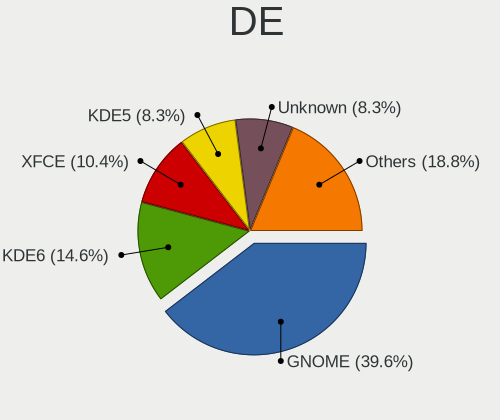
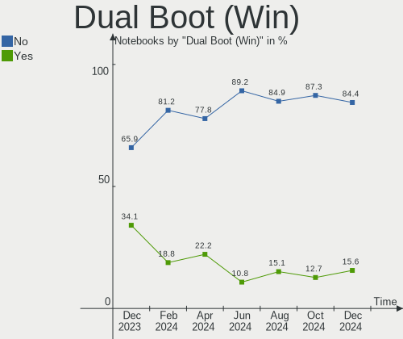
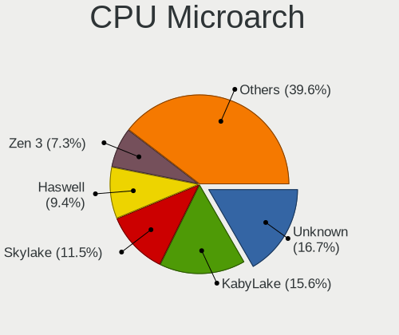
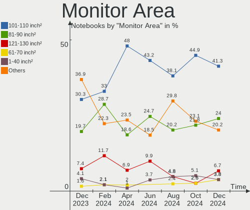
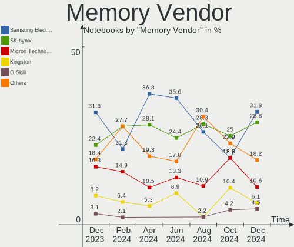

Linux in Canada - Hardware Trends (Notebooks)
---------------------------------------------

A project to identify most popular hardware characteristics and track their change
over time based on data collected by Linux users at https://Linux-Hardware.org.

Anyone can contribute to this report by the [hw-probe](https://github.com/linuxhw/hw-probe) tool:

    sudo -E hw-probe -all -upload

Period: Oct, 2022.

Contents
--------

* [ System ](#system)
  - [ OS                       ](#os)
  - [ OS Family                ](#os-family)
  - [ Kernel                   ](#kernel)
  - [ Kernel Family            ](#kernel-family)
  - [ Kernel Major Ver.        ](#kernel-major-ver)
  - [ Arch                     ](#arch)
  - [ DE                       ](#de)
  - [ Display Server           ](#display-server)
  - [ Display Manager          ](#display-manager)
  - [ OS Lang                  ](#os-lang)
  - [ Boot Mode                ](#boot-mode)
  - [ Filesystem               ](#filesystem)
  - [ Part. scheme             ](#part-scheme)
  - [ Dual Boot with Linux/BSD ](#dual-boot-with-linuxbsd)
  - [ Dual Boot (Win)          ](#dual-boot-win)

* [ Board ](#board)
  - [ Vendor                   ](#vendor)
  - [ Model                    ](#model)
  - [ Model Family             ](#model-family)
  - [ MFG Year                 ](#mfg-year)
  - [ Form Factor              ](#form-factor)
  - [ Secure Boot              ](#secure-boot)
  - [ Coreboot                 ](#coreboot)
  - [ RAM Size                 ](#ram-size)
  - [ RAM Used                 ](#ram-used)
  - [ Total Drives             ](#total-drives)
  - [ Has CD-ROM               ](#has-cd-rom)
  - [ Has Ethernet             ](#has-ethernet)
  - [ Has WiFi                 ](#has-wifi)
  - [ Has Bluetooth            ](#has-bluetooth)

* [ Location ](#location)
  - [ Country                  ](#country)
  - [ City                     ](#city)

* [ Drives ](#drives)
  - [ Drive Vendor             ](#drive-vendor)
  - [ Drive Model              ](#drive-model)
  - [ HDD Vendor               ](#hdd-vendor)
  - [ SSD Vendor               ](#ssd-vendor)
  - [ Drive Kind               ](#drive-kind)
  - [ Drive Connector          ](#drive-connector)
  - [ Drive Size               ](#drive-size)
  - [ Space Total              ](#space-total)
  - [ Space Used               ](#space-used)
  - [ Malfunc. Drives          ](#malfunc-drives)
  - [ Malfunc. Drive Vendor    ](#malfunc-drive-vendor)
  - [ Malfunc. HDD Vendor      ](#malfunc-hdd-vendor)
  - [ Malfunc. Drive Kind      ](#malfunc-drive-kind)
  - [ Failed Drives            ](#failed-drives)
  - [ Failed Drive Vendor      ](#failed-drive-vendor)
  - [ Drive Status             ](#drive-status)

* [ Storage controller ](#storage-controller)
  - [ Storage Vendor           ](#storage-vendor)
  - [ Storage Model            ](#storage-model)
  - [ Storage Kind             ](#storage-kind)

* [ Processor ](#processor)
  - [ CPU Vendor               ](#cpu-vendor)
  - [ CPU Model                ](#cpu-model)
  - [ CPU Model Family         ](#cpu-model-family)
  - [ CPU Cores                ](#cpu-cores)
  - [ CPU Sockets              ](#cpu-sockets)
  - [ CPU Threads              ](#cpu-threads)
  - [ CPU Op-Modes             ](#cpu-op-modes)
  - [ CPU Microcode            ](#cpu-microcode)
  - [ CPU Microarch            ](#cpu-microarch)

* [ Graphics ](#graphics)
  - [ GPU Vendor               ](#gpu-vendor)
  - [ GPU Model                ](#gpu-model)
  - [ GPU Combo                ](#gpu-combo)
  - [ GPU Driver               ](#gpu-driver)
  - [ GPU Memory               ](#gpu-memory)

* [ Monitor ](#monitor)
  - [ Monitor Vendor           ](#monitor-vendor)
  - [ Monitor Model            ](#monitor-model)
  - [ Monitor Resolution       ](#monitor-resolution)
  - [ Monitor Diagonal         ](#monitor-diagonal)
  - [ Monitor Width            ](#monitor-width)
  - [ Aspect Ratio             ](#aspect-ratio)
  - [ Monitor Area             ](#monitor-area)
  - [ Pixel Density            ](#pixel-density)
  - [ Multiple Monitors        ](#multiple-monitors)

* [ Network ](#network)
  - [ Net Controller Vendor    ](#net-controller-vendor)
  - [ Net Controller Model     ](#net-controller-model)
  - [ Wireless Vendor          ](#wireless-vendor)
  - [ Wireless Model           ](#wireless-model)
  - [ Ethernet Vendor          ](#ethernet-vendor)
  - [ Ethernet Model           ](#ethernet-model)
  - [ Net Controller Kind      ](#net-controller-kind)
  - [ Used Controller          ](#used-controller)
  - [ NICs                     ](#nics)
  - [ IPv6                     ](#ipv6)

* [ Bluetooth ](#bluetooth)
  - [ Bluetooth Vendor         ](#bluetooth-vendor)
  - [ Bluetooth Model          ](#bluetooth-model)

* [ Sound ](#sound)
  - [ Sound Vendor             ](#sound-vendor)
  - [ Sound Model              ](#sound-model)

* [ Memory ](#memory)
  - [ Memory Vendor            ](#memory-vendor)
  - [ Memory Model             ](#memory-model)
  - [ Memory Kind              ](#memory-kind)
  - [ Memory Form Factor       ](#memory-form-factor)
  - [ Memory Size              ](#memory-size)
  - [ Memory Speed             ](#memory-speed)

* [ Printers & scanners ](#printers--scanners)
  - [ Printer Vendor           ](#printer-vendor)
  - [ Printer Model            ](#printer-model)
  - [ Scanner Vendor           ](#scanner-vendor)
  - [ Scanner Model            ](#scanner-model)

* [ Camera ](#camera)
  - [ Camera Vendor            ](#camera-vendor)
  - [ Camera Model             ](#camera-model)

* [ Security ](#security)
  - [ Fingerprint Vendor       ](#fingerprint-vendor)
  - [ Fingerprint Model        ](#fingerprint-model)
  - [ Chipcard Vendor          ](#chipcard-vendor)
  - [ Chipcard Model           ](#chipcard-model)

* [ Unsupported ](#unsupported)
  - [ Unsupported Devices      ](#unsupported-devices)
  - [ Unsupported Device Types ](#unsupported-device-types)

System
------

OS
--

Installed operating systems

| Name                 | Notebooks | Percent |
|----------------------|-----------|---------|
| Ubuntu 22.04         | 10        | 15.63%  |
| Pop!_OS 22.04        | 6         | 9.38%   |
| OpenMandriva 4.3     | 6         | 9.38%   |
| Linux Mint 21        | 5         | 7.81%   |
| Zorin 16             | 4         | 6.25%   |
| Kali 2022.3          | 3         | 4.69%   |
| SteamOS 3.4          | 2         | 3.13%   |
| Linux Mint 19.3      | 2         | 3.13%   |
| Gentoo 2.8           | 2         | 3.13%   |
| EndeavourOS Rolling  | 2         | 3.13%   |
| Arch Rolling         | 2         | 3.13%   |
| Zorin 15             | 1         | 1.56%   |
| Xubuntu 22.04        | 1         | 1.56%   |
| Xubuntu 20.04        | 1         | 1.56%   |
| Ubuntu Unity 22.04   | 1         | 1.56%   |
| Ubuntu 22.10         | 1         | 1.56%   |
| Ubuntu 20.04         | 1         | 1.56%   |
| Ubuntu 18.04         | 1         | 1.56%   |
| SteamOS 3.3.2        | 1         | 1.56%   |
| SteamOS 3.3          | 1         | 1.56%   |
| Redcore Rolling      | 1         | 1.56%   |
| OpenMandriva 4.50    | 1         | 1.56%   |
| Nobara 36            | 1         | 1.56%   |
| Lubuntu 18.04        | 1         | 1.56%   |
| Linux Mint 20.3      | 1         | 1.56%   |
| Garuda Linux Soaring | 1         | 1.56%   |
| Fedora 36            | 1         | 1.56%   |
| Elementary 6.1       | 1         | 1.56%   |
| Debian 11            | 1         | 1.56%   |
| Clear Linux 37500    | 1         | 1.56%   |
| Clear Linux 37390    | 1         | 1.56%   |

OS Family
---------

OS without a version

| Name         | Notebooks | Percent |
|--------------|-----------|---------|
| Ubuntu       | 13        | 20.31%  |
| Linux Mint   | 8         | 12.5%   |
| OpenMandriva | 7         | 10.94%  |
| Pop!_OS      | 6         | 9.38%   |
| Zorin        | 5         | 7.81%   |
| SteamOS      | 4         | 6.25%   |
| Kali         | 3         | 4.69%   |
| Xubuntu      | 2         | 3.13%   |
| Gentoo       | 2         | 3.13%   |
| EndeavourOS  | 2         | 3.13%   |
| Clear Linux  | 2         | 3.13%   |
| Arch         | 2         | 3.13%   |
| Ubuntu Unity | 1         | 1.56%   |
| Redcore      | 1         | 1.56%   |
| Nobara       | 1         | 1.56%   |
| Lubuntu      | 1         | 1.56%   |
| Garuda Linux | 1         | 1.56%   |
| Fedora       | 1         | 1.56%   |
| Elementary   | 1         | 1.56%   |
| Debian       | 1         | 1.56%   |

Kernel
------

Version of the Linux kernel

| Version                                      | Notebooks | Percent |
|----------------------------------------------|-----------|---------|
| 5.15.0-52-generic                            | 11        | 17.19%  |
| 5.16.7-desktop-1omv4003                      | 5         | 7.81%   |
| 5.15.0-50-generic                            | 5         | 7.81%   |
| 5.19.0-76051900-generic                      | 4         | 6.25%   |
| 5.15.0-48-generic                            | 4         | 6.25%   |
| 6.0.2-arch1-1                                | 3         | 4.69%   |
| 5.4.0-131-generic                            | 3         | 4.69%   |
| 6.0.2-zen1-1-zen                             | 2         | 3.13%   |
| 5.18.0-kali7-amd64                           | 2         | 3.13%   |
| 5.13.0-valve24-1-neptune                     | 2         | 3.13%   |
| 6.0.3-1202.native                            | 1         | 1.56%   |
| 6.0.2-76060002-generic                       | 1         | 1.56%   |
| 6.0.0-1194.native                            | 1         | 1.56%   |
| 6.0.0-060000-generic                         | 1         | 1.56%   |
| 5.4.0-126-generic                            | 1         | 1.56%   |
| 5.19.5-desktop-1omv4090                      | 1         | 1.56%   |
| 5.19.16-76051916-generic                     | 1         | 1.56%   |
| 5.19.14-201.fsync.fc36.x86_64                | 1         | 1.56%   |
| 5.19.13-200.fc36.x86_64                      | 1         | 1.56%   |
| 5.19.0-kali2-amd64                           | 1         | 1.56%   |
| 5.16.13-desktop-1omv4003                     | 1         | 1.56%   |
| 5.15.71-redcore-lts                          | 1         | 1.56%   |
| 5.15.19-gentoo-x86_64                        | 1         | 1.56%   |
| 5.15.0-46-generic                            | 1         | 1.56%   |
| 5.15.0-43-generic                            | 1         | 1.56%   |
| 5.15.0-41-generic                            | 1         | 1.56%   |
| 5.15.0-33-generic                            | 1         | 1.56%   |
| 5.13.0-valve24-1-neptune-02226-g5b8545e4c5a1 | 1         | 1.56%   |
| 5.13.0-valve21.3-1-neptune                   | 1         | 1.56%   |
| 5.10.61-gentoo-x86_64                        | 1         | 1.56%   |
| 5.10.0-19-amd64                              | 1         | 1.56%   |
| 5.0.0-32-generic                             | 1         | 1.56%   |
| 4.15.0-91-generic                            | 1         | 1.56%   |

Kernel Family
-------------

Linux kernel without a distro release

| Version | Notebooks | Percent |
|---------|-----------|---------|
| 5.15.0  | 24        | 37.5%   |
| 6.0.2   | 6         | 9.38%   |
| 5.19.0  | 5         | 7.81%   |
| 5.16.7  | 5         | 7.81%   |
| 5.4.0   | 4         | 6.25%   |
| 5.13.0  | 4         | 6.25%   |
| 6.0.0   | 2         | 3.13%   |
| 5.18.0  | 2         | 3.13%   |
| 6.0.3   | 1         | 1.56%   |
| 5.19.5  | 1         | 1.56%   |
| 5.19.16 | 1         | 1.56%   |
| 5.19.14 | 1         | 1.56%   |
| 5.19.13 | 1         | 1.56%   |
| 5.16.13 | 1         | 1.56%   |
| 5.15.71 | 1         | 1.56%   |
| 5.15.19 | 1         | 1.56%   |
| 5.10.61 | 1         | 1.56%   |
| 5.10.0  | 1         | 1.56%   |
| 5.0.0   | 1         | 1.56%   |
| 4.15.0  | 1         | 1.56%   |

Kernel Major Ver.
-----------------

Linux kernel major version

| Version | Notebooks | Percent |
|---------|-----------|---------|
| 5.15    | 26        | 40.63%  |
| 6.0     | 9         | 14.06%  |
| 5.19    | 9         | 14.06%  |
| 5.16    | 6         | 9.38%   |
| 5.4     | 4         | 6.25%   |
| 5.13    | 4         | 6.25%   |
| 5.18    | 2         | 3.13%   |
| 5.10    | 2         | 3.13%   |
| 5.0     | 1         | 1.56%   |
| 4.15    | 1         | 1.56%   |

Arch
----

OS architecture (x86_64, i586, etc.)

| Name   | Notebooks | Percent |
|--------|-----------|---------|
| x86_64 | 63        | 98.44%  |
| i686   | 1         | 1.56%   |

DE
--

Desktop Environment

| Name       | Notebooks | Percent |
|------------|-----------|---------|
| GNOME      | 32        | 50%     |
| KDE5       | 13        | 20.31%  |
| X-Cinnamon | 7         | 10.94%  |
| XFCE       | 4         | 6.25%   |
| Unity      | 2         | 3.13%   |
| Unknown    | 2         | 3.13%   |
| xmonad     | 1         | 1.56%   |
| Pantheon   | 1         | 1.56%   |
| MATE       | 1         | 1.56%   |
| LXDE       | 1         | 1.56%   |

Display Server
--------------

X11 or Wayland

| Name    | Notebooks | Percent |
|---------|-----------|---------|
| X11     | 45        | 70.31%  |
| Wayland | 18        | 28.13%  |
| Unknown | 1         | 1.56%   |

Display Manager
---------------

SDDM, LightDM, etc.

| Name    | Notebooks | Percent |
|---------|-----------|---------|
| Unknown | 30        | 46.88%  |
| GDM3    | 16        | 25%     |
| SDDM    | 7         | 10.94%  |
| LightDM | 7         | 10.94%  |
| GDM     | 4         | 6.25%   |

OS Lang
-------

Language

| Lang   | Notebooks | Percent |
|--------|-----------|---------|
| en_CA  | 39        | 60.94%  |
| en_US  | 18        | 28.13%  |
| fr_CA  | 5         | 7.81%   |
| pl_PL  | 1         | 1.56%   |
| C.UTF8 | 1         | 1.56%   |

Boot Mode
---------

EFI or BIOS

| Mode | Notebooks | Percent |
|------|-----------|---------|
| BIOS | 39        | 60.94%  |
| EFI  | 25        | 39.06%  |

Filesystem
----------

Type of filesystem

| Type    | Notebooks | Percent |
|---------|-----------|---------|
| Ext4    | 47        | 73.44%  |
| Btrfs   | 9         | 14.06%  |
| Overlay | 6         | 9.38%   |
| Zfs     | 1         | 1.56%   |
| Ext3    | 1         | 1.56%   |

Part. scheme
------------

Scheme of partitioning

| Type    | Notebooks | Percent |
|---------|-----------|---------|
| Unknown | 28        | 43.75%  |
| GPT     | 25        | 39.06%  |
| MBR     | 11        | 17.19%  |

Dual Boot with Linux/BSD
------------------------

Hosting more than one Linux/BSD

| Dual boot | Notebooks | Percent |
|-----------|-----------|---------|
| No        | 56        | 87.5%   |
| Yes       | 8         | 12.5%   |

Dual Boot (Win)
---------------

Hosting Linux and Windows

| Dual boot | Notebooks | Percent |
|-----------|-----------|---------|
| No        | 55        | 85.94%  |
| Yes       | 9         | 14.06%  |

Board
-----

Vendor
------

Motherboard manufacturer

| Name                | Notebooks | Percent |
|---------------------|-----------|---------|
| Lenovo              | 14        | 21.88%  |
| Hewlett-Packard     | 13        | 20.31%  |
| Dell                | 7         | 10.94%  |
| Apple               | 7         | 10.94%  |
| ASUSTek Computer    | 4         | 6.25%   |
| Acer                | 4         | 6.25%   |
| Valve               | 3         | 4.69%   |
| Samsung Electronics | 2         | 3.13%   |
| MSI                 | 2         | 3.13%   |
| Google              | 2         | 3.13%   |
| Alienware           | 2         | 3.13%   |
| Toshiba             | 1         | 1.56%   |
| Sony                | 1         | 1.56%   |
| Panasonic           | 1         | 1.56%   |
| Fujitsu             | 1         | 1.56%   |

Model
-----

Motherboard model

| Name                                 | Notebooks | Percent |
|--------------------------------------|-----------|---------|
| Valve Jupiter                        | 3         | 4.69%   |
| Apple MacBookPro6,2                  | 2         | 3.13%   |
| Toshiba Satellite A200               | 1         | 1.56%   |
| Sony VPCEH3QFX                       | 1         | 1.56%   |
| Samsung 950XDB/951XDB/950XDY         | 1         | 1.56%   |
| Samsung 305E4A/305E5A/305E7A         | 1         | 1.56%   |
| Panasonic CFSX4-1                    | 1         | 1.56%   |
| MSI Pulse GL76 12UEK                 | 1         | 1.56%   |
| MSI GP66 Leopard 11UH                | 1         | 1.56%   |
| Lenovo ThinkPad T460 20FMS7DA00      | 1         | 1.56%   |
| Lenovo ThinkPad T460 20FMS4U300      | 1         | 1.56%   |
| Lenovo ThinkPad T460 20FMS43J0V      | 1         | 1.56%   |
| Lenovo ThinkPad T440s 20ARS4PR00     | 1         | 1.56%   |
| Lenovo ThinkPad T420 4180DW1         | 1         | 1.56%   |
| Lenovo ThinkPad T16 Gen 1 21BVCTO1WW | 1         | 1.56%   |
| Lenovo ThinkPad R500 2714CTO         | 1         | 1.56%   |
| Lenovo ThinkPad E580 20KSCTO1WW      | 1         | 1.56%   |
| Lenovo IdeaPad Z500 20202            | 1         | 1.56%   |
| Lenovo IdeaPad 510-15IKB 80SV        | 1         | 1.56%   |
| Lenovo IdeaPad 5 15ALC05 82LN        | 1         | 1.56%   |
| Lenovo IdeaPad 330-15IKB 81DE        | 1         | 1.56%   |
| Lenovo IdeaPad 320-15IKB Touch 80XN  | 1         | 1.56%   |
| Lenovo G50-30 80G0                   | 1         | 1.56%   |
| HP Stream Laptop 14-cb1XX            | 1         | 1.56%   |
| HP ProBook 650 G1                    | 1         | 1.56%   |
| HP ProBook 440 G6                    | 1         | 1.56%   |
| HP Pavilion Notebook                 | 1         | 1.56%   |
| HP Pavilion Gaming Laptop 15-ec1xxx  | 1         | 1.56%   |
| HP Pavilion dv8000 (ET839UA#ABL)     | 1         | 1.56%   |
| HP Pavilion dv7                      | 1         | 1.56%   |
| HP Pavilion 17                       | 1         | 1.56%   |
| HP Laptop 15-db0xxx                  | 1         | 1.56%   |
| HP Laptop 15-da2xxx                  | 1         | 1.56%   |
| HP G60                               | 1         | 1.56%   |
| HP ENVY TS 15                        | 1         | 1.56%   |
| HP EliteBook 840 G1                  | 1         | 1.56%   |
| Google Droid                         | 1         | 1.56%   |
| Google Coral                         | 1         | 1.56%   |
| Fujitsu LIFEBOOK E752                | 1         | 1.56%   |
| Dell XPS 9320                        | 1         | 1.56%   |

Model Family
------------

Motherboard model prefix

| Name               | Notebooks | Percent |
|--------------------|-----------|---------|
| Lenovo ThinkPad    | 8         | 12.5%   |
| Lenovo IdeaPad     | 5         | 7.81%   |
| HP Pavilion        | 5         | 7.81%   |
| Valve Jupiter      | 3         | 4.69%   |
| Dell Precision     | 3         | 4.69%   |
| Dell Latitude      | 3         | 4.69%   |
| HP ProBook         | 2         | 3.13%   |
| HP Laptop          | 2         | 3.13%   |
| ASUS ZenBook       | 2         | 3.13%   |
| Apple MacBookPro6  | 2         | 3.13%   |
| Acer Aspire        | 2         | 3.13%   |
| Toshiba Satellite  | 1         | 1.56%   |
| Sony VPCEH3QFX     | 1         | 1.56%   |
| Samsung 950XDB     | 1         | 1.56%   |
| Samsung 305E4A     | 1         | 1.56%   |
| Panasonic CFSX4-1  | 1         | 1.56%   |
| MSI Pulse          | 1         | 1.56%   |
| MSI GP66           | 1         | 1.56%   |
| Lenovo G50-30      | 1         | 1.56%   |
| HP Stream          | 1         | 1.56%   |
| HP G60             | 1         | 1.56%   |
| HP ENVY            | 1         | 1.56%   |
| HP EliteBook       | 1         | 1.56%   |
| Google Droid       | 1         | 1.56%   |
| Google Coral       | 1         | 1.56%   |
| Fujitsu LIFEBOOK   | 1         | 1.56%   |
| Dell XPS           | 1         | 1.56%   |
| ASUS UX430UAR      | 1         | 1.56%   |
| ASUS K53E          | 1         | 1.56%   |
| Apple MacBookPro9  | 1         | 1.56%   |
| Apple MacBookPro8  | 1         | 1.56%   |
| Apple MacBookPro5  | 1         | 1.56%   |
| Apple MacBookPro14 | 1         | 1.56%   |
| Apple MacBookAir5  | 1         | 1.56%   |
| Alienware Area-51m | 1         | 1.56%   |
| Alienware 18       | 1         | 1.56%   |
| Acer TravelMate    | 1         | 1.56%   |
| Acer AOD257        | 1         | 1.56%   |

MFG Year
--------

Motherboard manufacture year

| Year | Notebooks | Percent |
|------|-----------|---------|
| 2022 | 8         | 12.5%   |
| 2013 | 7         | 10.94%  |
| 2011 | 7         | 10.94%  |
| 2019 | 5         | 7.81%   |
| 2016 | 5         | 7.81%   |
| 2021 | 4         | 6.25%   |
| 2017 | 4         | 6.25%   |
| 2012 | 4         | 6.25%   |
| 2008 | 4         | 6.25%   |
| 2020 | 3         | 4.69%   |
| 2018 | 3         | 4.69%   |
| 2015 | 2         | 3.13%   |
| 2014 | 2         | 3.13%   |
| 2010 | 2         | 3.13%   |
| 2009 | 2         | 3.13%   |
| 2007 | 1         | 1.56%   |
| 2006 | 1         | 1.56%   |

Form Factor
-----------

Physical design of the computer

| Name     | Notebooks | Percent |
|----------|-----------|---------|
| Notebook | 64        | 100%    |

Secure Boot
-----------

Enabled or disabled

| State    | Notebooks | Percent |
|----------|-----------|---------|
| Disabled | 61        | 95.31%  |
| Enabled  | 3         | 4.69%   |

Coreboot
--------

Have coreboot on board

| Used | Notebooks | Percent |
|------|-----------|---------|
| No   | 62        | 96.88%  |
| Yes  | 2         | 3.13%   |

RAM Size
--------

Total RAM memory

| Size in GB  | Notebooks | Percent |
|-------------|-----------|---------|
| 4.01-8.0    | 19        | 29.69%  |
| 8.01-16.0   | 14        | 21.88%  |
| 3.01-4.0    | 10        | 15.63%  |
| 16.01-24.0  | 10        | 15.63%  |
| 32.01-64.0  | 4         | 6.25%   |
| 24.01-32.0  | 2         | 3.13%   |
| 1.01-2.0    | 2         | 3.13%   |
| 2.01-3.0    | 1         | 1.56%   |
| 64.01-256.0 | 1         | 1.56%   |
| 0.51-1.0    | 1         | 1.56%   |

RAM Used
--------

Used RAM memory

| Used GB   | Notebooks | Percent |
|-----------|-----------|---------|
| 1.01-2.0  | 19        | 29.69%  |
| 2.01-3.0  | 15        | 23.44%  |
| 3.01-4.0  | 12        | 18.75%  |
| 4.01-8.0  | 10        | 15.63%  |
| 8.01-16.0 | 5         | 7.81%   |
| 0.01-0.5  | 2         | 3.13%   |
| 0.51-1.0  | 1         | 1.56%   |

Total Drives
------------

Number of drives on board

| Drives | Notebooks | Percent |
|--------|-----------|---------|
| 1      | 45        | 70.31%  |
| 2      | 15        | 23.44%  |
| 3      | 3         | 4.69%   |
| 4      | 1         | 1.56%   |

Has CD-ROM
----------

Has CD-ROM on board

| Presented | Notebooks | Percent |
|-----------|-----------|---------|
| No        | 38        | 59.38%  |
| Yes       | 26        | 40.63%  |

Has Ethernet
------------

Has Ethernet on board

| Presented | Notebooks | Percent |
|-----------|-----------|---------|
| Yes       | 51        | 79.69%  |
| No        | 13        | 20.31%  |

Has WiFi
--------

Has WiFi module

| Presented | Notebooks | Percent |
|-----------|-----------|---------|
| Yes       | 64        | 100%    |

Has Bluetooth
-------------

Has Bluetooth module

| Presented | Notebooks | Percent |
|-----------|-----------|---------|
| Yes       | 51        | 79.69%  |
| No        | 13        | 20.31%  |

Location
--------

Country
-------

Geographic location (country)

| Country | Notebooks | Percent |
|---------|-----------|---------|
| Canada  | 64        | 100%    |

City
----

Geographic location (city)

| City                | Notebooks | Percent |
|---------------------|-----------|---------|
| Toronto             | 5         | 7.81%   |
| Montreal            | 4         | 6.25%   |
| Edmonton            | 4         | 6.25%   |
| Victoria            | 3         | 4.69%   |
| Vancouver           | 3         | 4.69%   |
| Ottawa              | 3         | 4.69%   |
| Mississauga         | 3         | 4.69%   |
| Winnipeg            | 2         | 3.13%   |
| Surrey              | 2         | 3.13%   |
| Longueuil           | 2         | 3.13%   |
| Calgary             | 2         | 3.13%   |
| Wallaceburg         | 1         | 1.56%   |
| Vernon              | 1         | 1.56%   |
| Tracadie–Sheila   | 1         | 1.56%   |
| Sorel-Tracy         | 1         | 1.56%   |
| Smiths Falls        | 1         | 1.56%   |
| Simcoe              | 1         | 1.56%   |
| Sherbrooke          | 1         | 1.56%   |
| Saint-Jerome        | 1         | 1.56%   |
| Rouyn-Noranda       | 1         | 1.56%   |
| Richmond            | 1         | 1.56%   |
| Red Deer            | 1         | 1.56%   |
| Quispamsis          | 1         | 1.56%   |
| Québec             | 1         | 1.56%   |
| Orangeville         | 1         | 1.56%   |
| New Westminster     | 1         | 1.56%   |
| Mont-Tremblant      | 1         | 1.56%   |
| Moncton             | 1         | 1.56%   |
| Merritt             | 1         | 1.56%   |
| London              | 1         | 1.56%   |
| Lachine             | 1         | 1.56%   |
| La Prairie          | 1         | 1.56%   |
| Kentville           | 1         | 1.56%   |
| Gatineau            | 1         | 1.56%   |
| Fort McMurray       | 1         | 1.56%   |
| Dollard-des-Ormeaux | 1         | 1.56%   |
| Delta               | 1         | 1.56%   |
| Dartmouth           | 1         | 1.56%   |
| Brantford           | 1         | 1.56%   |
| Blackfalds          | 1         | 1.56%   |

Drives
------

Drive Vendor
------------

Hard drive vendors

| Vendor                      | Notebooks | Drives | Percent |
|-----------------------------|-----------|--------|---------|
| Samsung Electronics         | 13        | 13     | 15.48%  |
| Unknown                     | 11        | 11     | 13.1%   |
| Seagate                     | 8         | 9      | 9.52%   |
| Crucial                     | 7         | 7      | 8.33%   |
| SK hynix                    | 5         | 5      | 5.95%   |
| Intel                       | 5         | 6      | 5.95%   |
| Toshiba                     | 4         | 4      | 4.76%   |
| Kingston                    | 4         | 4      | 4.76%   |
| WDC                         | 3         | 3      | 3.57%   |
| SanDisk                     | 3         | 3      | 3.57%   |
| HGST                        | 3         | 3      | 3.57%   |
| Fujitsu                     | 3         | 3      | 3.57%   |
| Apple                       | 2         | 3      | 2.38%   |
| UMIS                        | 1         | 1      | 1.19%   |
| Super Talent                | 1         | 1      | 1.19%   |
| SUNEAST                     | 1         | 1      | 1.19%   |
| SPCC                        | 1         | 1      | 1.19%   |
| ROG                         | 1         | 1      | 1.19%   |
| Phison Electronics          | 1         | 1      | 1.19%   |
| Patriot                     | 1         | 1      | 1.19%   |
| Micron Technology           | 1         | 1      | 1.19%   |
| KIOXIA                      | 1         | 1      | 1.19%   |
| Kingston Technology Company | 1         | 1      | 1.19%   |
| ASMT                        | 1         | 1      | 1.19%   |
| ADATA Technology            | 1         | 1      | 1.19%   |
| Unknown                     | 1         | 1      | 1.19%   |

Drive Model
-----------

Hard drive models

| Model                                          | Notebooks | Percent |
|------------------------------------------------|-----------|---------|
| Unknown MMC Card  32GB                         | 4         | 4.71%   |
| Intel SSD 660P Series 1024GB                   | 3         | 3.53%   |
| Unknown DA4064  64GB                           | 2         | 2.35%   |
| Toshiba MQ01ABF050 500GB                       | 2         | 2.35%   |
| Seagate ST1000LM035-1RK172 1TB                 | 2         | 2.35%   |
| Seagate ST1000LM014-1EJ164 1TB                 | 2         | 2.35%   |
| HGST HTS541010A9E680 1TB                       | 2         | 2.35%   |
| Crucial M4-CT128M4SSD2 128GB                   | 2         | 2.35%   |
| WDC WDS250G2B0A-00SM50 250GB SSD               | 1         | 1.18%   |
| WDC WD10SPZX-24Z10 1TB                         | 1         | 1.18%   |
| WDC WD10SPSX-60A6WT0 1TB                       | 1         | 1.18%   |
| Unknown SA08G  8GB                             | 1         | 1.18%   |
| Unknown MMC Card  8GB                          | 1         | 1.18%   |
| Unknown MMC Card  64GB                         | 1         | 1.18%   |
| Unknown MMC Card  500GB                        | 1         | 1.18%   |
| Unknown MMC Card  128GB                        | 1         | 1.18%   |
| UMIS RPJTJ512MEE1OWX 512GB                     | 1         | 1.18%   |
| Toshiba THNSNC512GBSJ SSD                      | 1         | 1.18%   |
| Toshiba MK1652GSX 160GB                        | 1         | 1.18%   |
| Super Talent FTM56N325H 256GB                  | 1         | 1.18%   |
| SUNEAST SSD SE800 256GB                        | 1         | 1.18%   |
| SPCC Solid State Disk 256GB                    | 1         | 1.18%   |
| SK hynix PC801 NVMe 1TB                        | 1         | 1.18%   |
| SK hynix HFS512G39TND-N210A 512GB SSD          | 1         | 1.18%   |
| SK hynix HFM512GD3JX013N 512GB                 | 1         | 1.18%   |
| SK hynix BC711 NVMe 256GB                      | 1         | 1.18%   |
| SK hynix BC501 NVMe Solid State Drive 512GB    | 1         | 1.18%   |
| Seagate ST320LT009-9WC142 320GB                | 1         | 1.18%   |
| Seagate ST320LT007-9ZV142 320GB                | 1         | 1.18%   |
| Seagate ST1000LM048-2E7172 1TB                 | 1         | 1.18%   |
| Seagate Portable 2TB                           | 1         | 1.18%   |
| Seagate BUP Slim 2TB                           | 1         | 1.18%   |
| Sandisk WD Black SN850 1TB                     | 1         | 1.18%   |
| Sandisk WD Black SN750 / PC SN730 NVMe SSD 1TB | 1         | 1.18%   |
| SanDisk Extreme SSD 500GB                      | 1         | 1.18%   |
| Samsung SSD 870 EVO 250GB                      | 1         | 1.18%   |
| Samsung SSD 860 QVO 1TB                        | 1         | 1.18%   |
| Samsung SSD 860 PRO 512GB                      | 1         | 1.18%   |
| Samsung SSD 860 EVO 1TB                        | 1         | 1.18%   |
| Samsung SSD 850 EVO 500GB                      | 1         | 1.18%   |

HDD Vendor
----------

Hard disk drive vendors

| Vendor              | Notebooks | Drives | Percent |
|---------------------|-----------|--------|---------|
| Seagate             | 8         | 8      | 40%     |
| Toshiba             | 3         | 3      | 15%     |
| HGST                | 3         | 3      | 15%     |
| Fujitsu             | 3         | 3      | 15%     |
| WDC                 | 2         | 2      | 10%     |
| Samsung Electronics | 1         | 1      | 5%      |

SSD Vendor
----------

Solid state drive vendors

| Vendor              | Notebooks | Drives | Percent |
|---------------------|-----------|--------|---------|
| Samsung Electronics | 8         | 8      | 25.81%  |
| Crucial             | 7         | 7      | 22.58%  |
| Kingston            | 4         | 4      | 12.9%   |
| Intel               | 2         | 2      | 6.45%   |
| WDC                 | 1         | 1      | 3.23%   |
| Toshiba             | 1         | 1      | 3.23%   |
| Super Talent        | 1         | 1      | 3.23%   |
| SUNEAST             | 1         | 1      | 3.23%   |
| SPCC                | 1         | 1      | 3.23%   |
| SK hynix            | 1         | 1      | 3.23%   |
| SanDisk             | 1         | 1      | 3.23%   |
| Patriot             | 1         | 1      | 3.23%   |
| ASMT                | 1         | 1      | 3.23%   |
| Apple               | 1         | 1      | 3.23%   |

Drive Kind
----------

HDD or SSD

| Kind    | Notebooks | Drives | Percent |
|---------|-----------|--------|---------|
| SSD     | 30        | 31     | 37.5%   |
| NVMe    | 18        | 22     | 22.5%   |
| HDD     | 18        | 20     | 22.5%   |
| MMC     | 12        | 12     | 15%     |
| Unknown | 2         | 2      | 2.5%    |

Drive Connector
---------------

SATA, SAS, NVMe, etc.

| Type | Notebooks | Drives | Percent |
|------|-----------|--------|---------|
| SATA | 45        | 48     | 57.69%  |
| NVMe | 18        | 22     | 23.08%  |
| MMC  | 12        | 12     | 15.38%  |
| SAS  | 3         | 5      | 3.85%   |

Drive Size
----------

Size of hard drive

| Size in TB | Notebooks | Drives | Percent |
|------------|-----------|--------|---------|
| 0.01-0.5   | 31        | 32     | 63.27%  |
| 0.51-1.0   | 17        | 18     | 34.69%  |
| 1.01-2.0   | 1         | 1      | 2.04%   |

Space Total
-----------

Amount of disk space available on the file system

| Size in GB     | Notebooks | Percent |
|----------------|-----------|---------|
| 101-250        | 26        | 40.63%  |
| 251-500        | 16        | 25%     |
| 501-1000       | 9         | 14.06%  |
| 1-20           | 5         | 7.81%   |
| 21-50          | 4         | 6.25%   |
| 1001-2000      | 2         | 3.13%   |
| More than 3000 | 1         | 1.56%   |
| 2001-3000      | 1         | 1.56%   |

Space Used
----------

Amount of used disk space

| Used GB  | Notebooks | Percent |
|----------|-----------|---------|
| 1-20     | 21        | 32.81%  |
| 21-50    | 17        | 26.56%  |
| 51-100   | 13        | 20.31%  |
| 101-250  | 6         | 9.38%   |
| 501-1000 | 4         | 6.25%   |
| 251-500  | 3         | 4.69%   |

Malfunc. Drives
---------------

Drive models with a malfunction

| Model                             | Notebooks | Drives | Percent |
|-----------------------------------|-----------|--------|---------|
| Seagate ST320LT007-9ZV142 320GB   | 1         | 1      | 33.33%  |
| Samsung Electronics HM160HC 160GB | 1         | 1      | 33.33%  |
| HGST HTS541010A9E680 1TB          | 1         | 1      | 33.33%  |

Malfunc. Drive Vendor
---------------------

Vendors of faulty drives

| Vendor              | Notebooks | Drives | Percent |
|---------------------|-----------|--------|---------|
| Seagate             | 1         | 1      | 33.33%  |
| Samsung Electronics | 1         | 1      | 33.33%  |
| HGST                | 1         | 1      | 33.33%  |

Malfunc. HDD Vendor
-------------------

Vendors of faulty HDD drives

| Vendor              | Notebooks | Drives | Percent |
|---------------------|-----------|--------|---------|
| Seagate             | 1         | 1      | 33.33%  |
| Samsung Electronics | 1         | 1      | 33.33%  |
| HGST                | 1         | 1      | 33.33%  |

Malfunc. Drive Kind
-------------------

Kinds of faulty drives

| Kind | Notebooks | Drives | Percent |
|------|-----------|--------|---------|
| HDD  | 3         | 3      | 100%    |

Failed Drives
-------------

Failed drive models

Zero info for selected period =(

Failed Drive Vendor
-------------------

Failed drive vendors

Zero info for selected period =(

Drive Status
------------

Number of failed and malfunc. drives

| Status   | Notebooks | Drives | Percent |
|----------|-----------|--------|---------|
| Detected | 44        | 60     | 65.67%  |
| Works    | 20        | 24     | 29.85%  |
| Malfunc  | 3         | 3      | 4.48%   |

Storage controller
------------------

Storage Vendor
--------------

Storage controller vendors

| Vendor                      | Notebooks | Percent |
|-----------------------------|-----------|---------|
| Intel                       | 41        | 60.29%  |
| AMD                         | 9         | 13.24%  |
| SK hynix                    | 4         | 5.88%   |
| Samsung Electronics         | 4         | 5.88%   |
| SanDisk                     | 2         | 2.94%   |
| Union Memory (Shenzhen)     | 1         | 1.47%   |
| Phison Electronics          | 1         | 1.47%   |
| Nvidia                      | 1         | 1.47%   |
| Micron Technology           | 1         | 1.47%   |
| KIOXIA                      | 1         | 1.47%   |
| Kingston Technology Company | 1         | 1.47%   |
| Apple                       | 1         | 1.47%   |
| ADATA Technology            | 1         | 1.47%   |

Storage Model
-------------

Storage controller models

| Model                                                                                  | Notebooks | Percent |
|----------------------------------------------------------------------------------------|-----------|---------|
| AMD FCH SATA Controller [AHCI mode]                                                    | 8         | 10.96%  |
| Intel Sunrise Point-LP SATA Controller [AHCI mode]                                     | 6         | 8.22%   |
| Intel 7 Series Chipset Family 6-port SATA Controller [AHCI mode]                       | 5         | 6.85%   |
| Intel 82801 Mobile SATA Controller [RAID mode]                                         | 4         | 5.48%   |
| Samsung NVMe SSD Controller 980                                                        | 3         | 4.11%   |
| Intel SSD 660P Series                                                                  | 3         | 4.11%   |
| Intel 82801IBM/IEM (ICH9M/ICH9M-E) 4 port SATA Controller [AHCI mode]                  | 3         | 4.11%   |
| Intel 8 Series SATA Controller 1 [AHCI mode]                                           | 3         | 4.11%   |
| Intel 6 Series/C200 Series Chipset Family 6 port Mobile SATA AHCI Controller           | 3         | 4.11%   |
| SK hynix Gold P31 SSD                                                                  | 2         | 2.74%   |
| Intel 8 Series/C220 Series Chipset Family 6-port SATA Controller 1 [AHCI mode]         | 2         | 2.74%   |
| Intel 5 Series/3400 Series Chipset 4 port SATA AHCI Controller                         | 2         | 2.74%   |
| Union Memory (Shenzhen) Non-Volatile memory controller                                 | 1         | 1.37%   |
| SK hynix Non-Volatile memory controller                                                | 1         | 1.37%   |
| SK hynix BC501 NVMe Solid State Drive                                                  | 1         | 1.37%   |
| SanDisk WD PC SN810 / Black SN850 NVMe SSD                                             | 1         | 1.37%   |
| SanDisk WD Black SN750 / PC SN730 NVMe SSD                                             | 1         | 1.37%   |
| Samsung NVMe SSD Controller PM9A1/PM9A3/980PRO                                         | 1         | 1.37%   |
| Phison E12 NVMe Controller                                                             | 1         | 1.37%   |
| Nvidia MCP79 AHCI Controller                                                           | 1         | 1.37%   |
| Micron Non-Volatile memory controller                                                  | 1         | 1.37%   |
| KIOXIA Non-Volatile memory controller                                                  | 1         | 1.37%   |
| Kingston Company OM3PDP3 NVMe SSD                                                      | 1         | 1.37%   |
| Intel Wildcat Point-LP SATA Controller [AHCI Mode]                                     | 1         | 1.37%   |
| Intel Volume Management Device NVMe RAID Controller                                    | 1         | 1.37%   |
| Intel Q170/Q150/B150/H170/H110/Z170/CM236 Chipset SATA Controller [AHCI Mode]          | 1         | 1.37%   |
| Intel NM10/ICH7 Family SATA Controller [AHCI mode]                                     | 1         | 1.37%   |
| Intel Cannon Point-LP SATA Controller [AHCI Mode]                                      | 1         | 1.37%   |
| Intel Cannon Lake PCH SATA AHCI Controller                                             | 1         | 1.37%   |
| Intel Atom Processor E3800 Series SATA AHCI Controller                                 | 1         | 1.37%   |
| Intel Alder Lake-P SATA AHCI Controller                                                | 1         | 1.37%   |
| Intel 82801HM/HEM (ICH8M/ICH8M-E) SATA Controller [AHCI mode]                          | 1         | 1.37%   |
| Intel 82801HM/HEM (ICH8M/ICH8M-E) IDE Controller                                       | 1         | 1.37%   |
| Intel 82801GBM/GHM (ICH7-M Family) SATA Controller [AHCI mode]                         | 1         | 1.37%   |
| Intel 8 Series/C220 Series Chipset Family 2-port SATA Controller 2 [IDE mode]          | 1         | 1.37%   |
| Intel 8 Series Chipset Family 4-port SATA Controller 1 [IDE mode] - Mobile             | 1         | 1.37%   |
| Intel 6 Series/C200 Series Chipset Family Mobile SATA Controller (IDE mode, ports 4-5) | 1         | 1.37%   |
| Intel 6 Series/C200 Series Chipset Family Mobile SATA Controller (IDE mode, ports 0-3) | 1         | 1.37%   |
| Apple S3X NVMe Controller                                                              | 1         | 1.37%   |
| AMD IXP SB4x0 IDE Controller                                                           | 1         | 1.37%   |

Storage Kind
------------

Kind of storage controller (IDE, SATA, NVMe, SAS, ...)

| Kind | Notebooks | Percent |
|------|-----------|---------|
| SATA | 42        | 60.87%  |
| NVMe | 18        | 26.09%  |
| RAID | 5         | 7.25%   |
| IDE  | 4         | 5.8%    |

Processor
---------

CPU Vendor
----------

Processor vendors

| Vendor | Notebooks | Percent |
|--------|-----------|---------|
| Intel  | 52        | 81.25%  |
| AMD    | 12        | 18.75%  |

CPU Model
---------

Processor models

| Model                                       | Notebooks | Percent |
|---------------------------------------------|-----------|---------|
| Intel Core i5-6300U CPU @ 2.40GHz           | 3         | 4.69%   |
| AMD Custom APU 0405                         | 3         | 4.69%   |
| Intel Core i7-8550U CPU @ 1.80GHz           | 2         | 3.13%   |
| Intel Core i7-4810MQ CPU @ 2.80GHz          | 2         | 3.13%   |
| Intel Core 2 Duo CPU P8600 @ 2.40GHz        | 2         | 3.13%   |
| Intel Celeron N4020 CPU @ 1.10GHz           | 2         | 3.13%   |
| Intel 12th Gen Core i7-12700H               | 2         | 3.13%   |
| Intel 11th Gen Core i7-1165G7 @ 2.80GHz     | 2         | 3.13%   |
| Intel Pentium Dual-Core CPU T4300 @ 2.10GHz | 1         | 1.56%   |
| Intel Pentium CPU N3530 @ 2.16GHz           | 1         | 1.56%   |
| Intel Pentium CPU B960 @ 2.20GHz            | 1         | 1.56%   |
| Intel Core i9-9900K CPU @ 3.60GHz           | 1         | 1.56%   |
| Intel Core i7-7700HQ CPU @ 2.80GHz          | 1         | 1.56%   |
| Intel Core i7-4700MQ CPU @ 2.40GHz          | 1         | 1.56%   |
| Intel Core i7-3632QM CPU @ 2.20GHz          | 1         | 1.56%   |
| Intel Core i7-3615QM CPU @ 2.30GHz          | 1         | 1.56%   |
| Intel Core i7-3612QM CPU @ 2.10GHz          | 1         | 1.56%   |
| Intel Core i7 CPU M 620 @ 2.67GHz           | 1         | 1.56%   |
| Intel Core i5-8265U CPU @ 1.60GHz           | 1         | 1.56%   |
| Intel Core i5-7360U CPU @ 2.30GHz           | 1         | 1.56%   |
| Intel Core i5-7200U CPU @ 2.50GHz           | 1         | 1.56%   |
| Intel Core i5-5300U CPU @ 2.30GHz           | 1         | 1.56%   |
| Intel Core i5-4300U CPU @ 1.90GHz           | 1         | 1.56%   |
| Intel Core i5-4300M CPU @ 2.60GHz           | 1         | 1.56%   |
| Intel Core i5-4200U CPU @ 1.60GHz           | 1         | 1.56%   |
| Intel Core i5-3427U CPU @ 1.80GHz           | 1         | 1.56%   |
| Intel Core i5-3340M CPU @ 2.70GHz           | 1         | 1.56%   |
| Intel Core i5-2520M CPU @ 2.50GHz           | 1         | 1.56%   |
| Intel Core i5-2450M CPU @ 2.50GHz           | 1         | 1.56%   |
| Intel Core i5-2415M CPU @ 2.30GHz           | 1         | 1.56%   |
| Intel Core i5-10210U CPU @ 1.60GHz          | 1         | 1.56%   |
| Intel Core i5 CPU M 520 @ 2.40GHz           | 1         | 1.56%   |
| Intel Core i3-8130U CPU @ 2.20GHz           | 1         | 1.56%   |
| Intel Core i3-7100U CPU @ 2.40GHz           | 1         | 1.56%   |
| Intel Core i3-4005U CPU @ 1.70GHz           | 1         | 1.56%   |
| Intel Core 2 Quad CPU Q9000 @ 2.00GHz       | 1         | 1.56%   |
| Intel Core 2 Duo CPU T5450 @ 1.66GHz        | 1         | 1.56%   |
| Intel Core 2 Duo CPU P8700 @ 2.53GHz        | 1         | 1.56%   |
| Intel Celeron N4000 CPU @ 1.10GHz           | 1         | 1.56%   |
| Intel Celeron CPU N3350 @ 1.10GHz           | 1         | 1.56%   |

CPU Model Family
----------------

Processor model prefix

| Model                   | Notebooks | Percent |
|-------------------------|-----------|---------|
| Intel Core i5           | 17        | 26.56%  |
| Other                   | 10        | 15.63%  |
| Intel Core i7           | 10        | 15.63%  |
| Intel Core 2 Duo        | 4         | 6.25%   |
| Intel Celeron           | 4         | 6.25%   |
| Intel Core i3           | 3         | 4.69%   |
| Intel Pentium           | 2         | 3.13%   |
| Intel Atom              | 2         | 3.13%   |
| AMD Ryzen 5             | 2         | 3.13%   |
| AMD A4                  | 2         | 3.13%   |
| AMD A10                 | 2         | 3.13%   |
| Intel Pentium Dual-Core | 1         | 1.56%   |
| Intel Core i9           | 1         | 1.56%   |
| Intel Core 2 Quad       | 1         | 1.56%   |
| AMD Turion 64 Mobile    | 1         | 1.56%   |
| AMD Ryzen 7             | 1         | 1.56%   |
| AMD A6                  | 1         | 1.56%   |

CPU Cores
---------

Number of processor cores

| Number | Notebooks | Percent |
|--------|-----------|---------|
| 2      | 35        | 54.69%  |
| 4      | 19        | 29.69%  |
| 14     | 3         | 4.69%   |
| 8      | 3         | 4.69%   |
| 1      | 2         | 3.13%   |
| 12     | 1         | 1.56%   |
| 6      | 1         | 1.56%   |

CPU Sockets
-----------

Number of sockets

| Number | Notebooks | Percent |
|--------|-----------|---------|
| 1      | 64        | 100%    |

CPU Threads
-----------

Threads per core (Hyper-Threading)

| Number | Notebooks | Percent |
|--------|-----------|---------|
| 2      | 46        | 71.88%  |
| 1      | 18        | 28.13%  |

CPU Op-Modes
------------

CPU Operation Modes (32-bit, 64-bit)

| Op mode        | Notebooks | Percent |
|----------------|-----------|---------|
| 32-bit, 64-bit | 63        | 98.44%  |
| 32-bit         | 1         | 1.56%   |

CPU Microcode
-------------

Microcode number

| Number     | Notebooks | Percent |
|------------|-----------|---------|
| Unknown    | 27        | 42.19%  |
| 0x306a9    | 5         | 7.81%   |
| 0x906a3    | 3         | 4.69%   |
| 0x806e9    | 3         | 4.69%   |
| 0x806ea    | 2         | 3.13%   |
| 0x706a8    | 2         | 3.13%   |
| 0x206a7    | 2         | 3.13%   |
| 0x1067a    | 2         | 3.13%   |
| 0x906e9    | 1         | 1.56%   |
| 0x806ec    | 1         | 1.56%   |
| 0x806c1    | 1         | 1.56%   |
| 0x6fd      | 1         | 1.56%   |
| 0x506c9    | 1         | 1.56%   |
| 0x406e3    | 1         | 1.56%   |
| 0x40651    | 1         | 1.56%   |
| 0x306d4    | 1         | 1.56%   |
| 0x306c3    | 1         | 1.56%   |
| 0x20655    | 1         | 1.56%   |
| 0x20652    | 1         | 1.56%   |
| 0x106ca    | 1         | 1.56%   |
| 0x106c2    | 1         | 1.56%   |
| 0x08608102 | 1         | 1.56%   |
| 0x08108109 | 1         | 1.56%   |
| 0x06006110 | 1         | 1.56%   |
| 0x06001119 | 1         | 1.56%   |
| 0x03000027 | 1         | 1.56%   |

CPU Microarch
-------------

Microarchitecture

| Name             | Notebooks | Percent |
|------------------|-----------|---------|
| KabyLake         | 10        | 15.63%  |
| Haswell          | 7         | 10.94%  |
| Unknown          | 6         | 9.38%   |
| Penryn           | 5         | 7.81%   |
| IvyBridge        | 5         | 7.81%   |
| SandyBridge      | 4         | 6.25%   |
| Skylake          | 3         | 4.69%   |
| Goldmont plus    | 3         | 4.69%   |
| Excavator        | 3         | 4.69%   |
| Alderlake Hybrid | 3         | 4.69%   |
| Westmere         | 2         | 3.13%   |
| TigerLake        | 2         | 3.13%   |
| Bonnell          | 2         | 3.13%   |
| Zen+             | 1         | 1.56%   |
| Zen 2            | 1         | 1.56%   |
| Silvermont       | 1         | 1.56%   |
| Piledriver       | 1         | 1.56%   |
| K8 Hammer        | 1         | 1.56%   |
| K10 Llano        | 1         | 1.56%   |
| Goldmont         | 1         | 1.56%   |
| Core             | 1         | 1.56%   |
| Broadwell        | 1         | 1.56%   |

Graphics
--------

GPU Vendor
----------

Vendors of graphics cards

| Vendor | Notebooks | Percent |
|--------|-----------|---------|
| Intel  | 47        | 61.84%  |
| AMD    | 16        | 21.05%  |
| Nvidia | 13        | 17.11%  |

GPU Model
---------

Graphics card models

| Model                                                                         | Notebooks | Percent |
|-------------------------------------------------------------------------------|-----------|---------|
| Intel 3rd Gen Core processor Graphics Controller                              | 5         | 6.41%   |
| Intel Alder Lake-P Integrated Graphics Controller                             | 4         | 5.13%   |
| Intel 2nd Generation Core Processor Family Integrated Graphics Controller     | 4         | 5.13%   |
| Intel UHD Graphics 620                                                        | 3         | 3.85%   |
| Intel Skylake GT2 [HD Graphics 520]                                           | 3         | 3.85%   |
| Intel Mobile 4 Series Chipset Integrated Graphics Controller                  | 3         | 3.85%   |
| Intel Haswell-ULT Integrated Graphics Controller                              | 3         | 3.85%   |
| Intel GeminiLake [UHD Graphics 600]                                           | 3         | 3.85%   |
| Intel 4th Gen Core Processor Integrated Graphics Controller                   | 3         | 3.85%   |
| AMD VanGogh [AMD Custom GPU 0405]                                             | 3         | 3.85%   |
| Nvidia GT216M [GeForce GT 330M]                                               | 2         | 2.56%   |
| Nvidia GK208M [GeForce GT 740M]                                               | 2         | 2.56%   |
| Intel TigerLake-LP GT2 [Iris Xe Graphics]                                     | 2         | 2.56%   |
| Intel HD Graphics 620                                                         | 2         | 2.56%   |
| Intel Core Processor Integrated Graphics Controller                           | 2         | 2.56%   |
| AMD Stoney [Radeon R2/R3/R4/R5 Graphics]                                      | 2         | 2.56%   |
| Nvidia TU117M                                                                 | 1         | 1.28%   |
| Nvidia TU104BM [GeForce RTX 2080 Mobile]                                      | 1         | 1.28%   |
| Nvidia GM108M [GeForce 940MX]                                                 | 1         | 1.28%   |
| Nvidia GK107M [GeForce GT 650M Mac Edition]                                   | 1         | 1.28%   |
| Nvidia GK106GLM [Quadro K2100M]                                               | 1         | 1.28%   |
| Nvidia GA107GLM [RTX A2000 8GB Laptop GPU]                                    | 1         | 1.28%   |
| Nvidia GA106M [GeForce RTX 3060 Mobile / Max-Q]                               | 1         | 1.28%   |
| Nvidia GA104M [GeForce RTX 3080 Mobile / Max-Q 8GB/16GB]                      | 1         | 1.28%   |
| Nvidia C79 [GeForce 9400M]                                                    | 1         | 1.28%   |
| Intel WhiskeyLake-U GT2 [UHD Graphics 620]                                    | 1         | 1.28%   |
| Intel Mobile 945GSE Express Integrated Graphics Controller                    | 1         | 1.28%   |
| Intel Mobile 945GM/GMS/GME, 943/940GML Express Integrated Graphics Controller | 1         | 1.28%   |
| Intel Iris Plus Graphics 640                                                  | 1         | 1.28%   |
| Intel HD Graphics 630                                                         | 1         | 1.28%   |
| Intel HD Graphics 5500                                                        | 1         | 1.28%   |
| Intel HD Graphics 500                                                         | 1         | 1.28%   |
| Intel CometLake-U GT2 [UHD Graphics]                                          | 1         | 1.28%   |
| Intel CoffeeLake-S GT2 [UHD Graphics 630]                                     | 1         | 1.28%   |
| Intel Atom Processor Z36xxx/Z37xxx Series Graphics & Display                  | 1         | 1.28%   |
| Intel Atom Processor D4xx/D5xx/N4xx/N5xx Integrated Graphics Controller       | 1         | 1.28%   |
| AMD Wani [Radeon R5/R6/R7 Graphics]                                           | 1         | 1.28%   |
| AMD SuperSumo [Radeon HD 6480G]                                               | 1         | 1.28%   |
| AMD Seymour [Radeon HD 6400M/7400M Series]                                    | 1         | 1.28%   |
| AMD RV730/M96 [Mobility Radeon HD 4650/5165]                                  | 1         | 1.28%   |

GPU Combo
---------

Combinations of graphics cards

| Name           | Notebooks | Percent |
|----------------|-----------|---------|
| 1 x Intel      | 34        | 53.13%  |
| 1 x AMD        | 13        | 20.31%  |
| Intel + Nvidia | 9         | 14.06%  |
| 1 x Nvidia     | 3         | 4.69%   |
| 2 x Intel      | 2         | 3.13%   |
| 2 x AMD        | 1         | 1.56%   |
| Intel + AMD    | 1         | 1.56%   |
| AMD + Nvidia   | 1         | 1.56%   |

GPU Driver
----------

Free vs proprietary

| Driver      | Notebooks | Percent |
|-------------|-----------|---------|
| Free        | 57        | 89.06%  |
| Proprietary | 5         | 7.81%   |
| Unknown     | 2         | 3.13%   |

GPU Memory
----------

Total video memory

| Size in GB | Notebooks | Percent |
|------------|-----------|---------|
| Unknown    | 52        | 81.25%  |
| 0.01-0.5   | 6         | 9.38%   |
| 1.01-2.0   | 4         | 6.25%   |
| 7.01-8.0   | 1         | 1.56%   |
| 0.51-1.0   | 1         | 1.56%   |

Monitor
-------

Monitor Vendor
--------------

Monitor vendors

| Vendor                  | Notebooks | Percent |
|-------------------------|-----------|---------|
| LG Display              | 12        | 16%     |
| Samsung Electronics     | 11        | 14.67%  |
| AU Optronics            | 11        | 14.67%  |
| Chimei Innolux          | 8         | 10.67%  |
| BOE                     | 8         | 10.67%  |
| Apple                   | 6         | 8%      |
| Valve                   | 2         | 2.67%   |
| Sharp                   | 2         | 2.67%   |
| Dell                    | 2         | 2.67%   |
| Vizio                   | 1         | 1.33%   |
| ViewSonic               | 1         | 1.33%   |
| SSD                     | 1         | 1.33%   |
| PANDA                   | 1         | 1.33%   |
| LG Philips              | 1         | 1.33%   |
| Lenovo                  | 1         | 1.33%   |
| GreenWood               | 1         | 1.33%   |
| Goldstar                | 1         | 1.33%   |
| Chi Mei Optoelectronics | 1         | 1.33%   |
| BenQ                    | 1         | 1.33%   |
| ASUSTek Computer        | 1         | 1.33%   |
| Analogix                | 1         | 1.33%   |
| Acer                    | 1         | 1.33%   |

Monitor Model
-------------

Monitor models

| Model                                                                 | Notebooks | Percent |
|-----------------------------------------------------------------------|-----------|---------|
| Valve ANX7530 U VLV3001 800x1280 100x150mm 7.1-inch                   | 2         | 2.67%   |
| AU Optronics LCD Monitor AUO70EC 1366x768 344x193mm 15.5-inch         | 2         | 2.67%   |
| Apple LCD Monitor APP9CA3 1440x900 331x207mm 15.4-inch                | 2         | 2.67%   |
| Vizio E370VL VIZ0070 1920x1080 820x461mm 37.0-inch                    | 1         | 1.33%   |
| ViewSonic LCD Monitor VSC732E 1920x1080 520x290mm 23.4-inch           | 1         | 1.33%   |
| SSD HDTV SSD0001 1360x768 708x398mm 32.0-inch                         | 1         | 1.33%   |
| Sharp LQ156M1JW03 SHP155D 1920x1080 344x194mm 15.5-inch               | 1         | 1.33%   |
| Sharp LCD Monitor SHP1551 3840x2400 288x180mm 13.4-inch               | 1         | 1.33%   |
| Samsung Electronics SyncMaster SAM058B 1920x1080 531x298mm 24.0-inch  | 1         | 1.33%   |
| Samsung Electronics S27R35x SAM1053 1920x1080 598x336mm 27.0-inch     | 1         | 1.33%   |
| Samsung Electronics S27R35A SAM7126 1920x1080 598x336mm 27.0-inch     | 1         | 1.33%   |
| Samsung Electronics LCD Monitor SEC384A 1366x768 344x194mm 15.5-inch  | 1         | 1.33%   |
| Samsung Electronics LCD Monitor SEC354C 1366x768 353x198mm 15.9-inch  | 1         | 1.33%   |
| Samsung Electronics LCD Monitor SDC5441 1366x768 309x174mm 14.0-inch  | 1         | 1.33%   |
| Samsung Electronics LCD Monitor SDC4C48 1920x1080 410x230mm 18.5-inch | 1         | 1.33%   |
| Samsung Electronics LCD Monitor SDC4852 1366x768 344x194mm 15.5-inch  | 1         | 1.33%   |
| Samsung Electronics LCD Monitor SDC4159 1920x1080 344x194mm 15.5-inch | 1         | 1.33%   |
| Samsung Electronics LCD Monitor SDC3654 1600x900 382x215mm 17.3-inch  | 1         | 1.33%   |
| Samsung Electronics C34J79x SAM0F1C 3440x1440 797x333mm 34.0-inch     | 1         | 1.33%   |
| PANDA LCD Monitor NCP0035 1920x1080 309x174mm 14.0-inch               | 1         | 1.33%   |
| LG Philips LCD Monitor LPL1288 1440x900 367x230mm 17.1-inch           | 1         | 1.33%   |
| LG Display LCD Monitor LGD06B3 1920x1200 336x210mm 15.6-inch          | 1         | 1.33%   |
| LG Display LCD Monitor LGD05E2 1920x1080 382x215mm 17.3-inch          | 1         | 1.33%   |
| LG Display LCD Monitor LGD0521 1920x1080 309x174mm 14.0-inch          | 1         | 1.33%   |
| LG Display LCD Monitor LGD03D6 1366x768 345x194mm 15.6-inch           | 1         | 1.33%   |
| LG Display LCD Monitor LGD039F 1366x768 345x194mm 15.6-inch           | 1         | 1.33%   |
| LG Display LCD Monitor LGD0372 1600x900 382x215mm 17.3-inch           | 1         | 1.33%   |
| LG Display LCD Monitor LGD033B 1366x768 344x194mm 15.5-inch           | 1         | 1.33%   |
| LG Display LCD Monitor LGD033A 1366x768 344x194mm 15.5-inch           | 1         | 1.33%   |
| LG Display LCD Monitor LGD02E2 1600x900 310x174mm 14.0-inch           | 1         | 1.33%   |
| LG Display LCD Monitor LGD02DC 1366x768 344x194mm 15.5-inch           | 1         | 1.33%   |
| LG Display LCD Monitor LGD0215 1920x1080 345x194mm 15.6-inch          | 1         | 1.33%   |
| LG Display LCD Monitor LGD01DD 1600x900 382x215mm 17.3-inch           | 1         | 1.33%   |
| Lenovo LCD Monitor LEN4050 1280x800 331x207mm 15.4-inch               | 1         | 1.33%   |
| GreenWood ARZOPA GWD1580 1920x1080 350x200mm 15.9-inch                | 1         | 1.33%   |
| Goldstar ULTRAGEAR GSM7765 2560x1440 697x392mm 31.5-inch              | 1         | 1.33%   |
| Dell P2419H DELD0DA 1920x1080 527x296mm 23.8-inch                     | 1         | 1.33%   |
| Dell D2719HGF DELA135 1920x1080 598x336mm 27.0-inch                   | 1         | 1.33%   |
| Chimei Innolux LCD Monitor CMN15F5 1920x1080 344x193mm 15.5-inch      | 1         | 1.33%   |
| Chimei Innolux LCD Monitor CMN15F4 1920x1080 344x193mm 15.5-inch      | 1         | 1.33%   |

Monitor Resolution
------------------

Monitor screen resolution

| Resolution        | Notebooks | Percent |
|-------------------|-----------|---------|
| 1920x1080 (FHD)   | 25        | 35.71%  |
| 1366x768 (WXGA)   | 17        | 24.29%  |
| 1600x900 (HD+)    | 5         | 7.14%   |
| 1440x900 (WXGA+)  | 5         | 7.14%   |
| 1280x800 (WXGA)   | 4         | 5.71%   |
| 800x1280          | 3         | 4.29%   |
| 1024x600          | 2         | 2.86%   |
| 3840x2400         | 1         | 1.43%   |
| 3840x2160 (4K)    | 1         | 1.43%   |
| 3440x1440         | 1         | 1.43%   |
| 2880x1800         | 1         | 1.43%   |
| 2560x1600         | 1         | 1.43%   |
| 2560x1440 (QHD)   | 1         | 1.43%   |
| 1920x515          | 1         | 1.43%   |
| 1920x1200 (WUXGA) | 1         | 1.43%   |
| 1360x768          | 1         | 1.43%   |

Monitor Diagonal
----------------

Diagonal size in inches

| Inches  | Notebooks | Percent |
|---------|-----------|---------|
| 15      | 32        | 43.24%  |
| 13      | 9         | 12.16%  |
| 17      | 6         | 8.11%   |
| 14      | 6         | 8.11%   |
| 27      | 3         | 4.05%   |
| 24      | 3         | 4.05%   |
| 10      | 2         | 2.7%    |
| 7       | 2         | 2.7%    |
| Unknown | 2         | 2.7%    |
| 42      | 1         | 1.35%   |
| 34      | 1         | 1.35%   |
| 32      | 1         | 1.35%   |
| 31      | 1         | 1.35%   |
| 23      | 1         | 1.35%   |
| 21      | 1         | 1.35%   |
| 18      | 1         | 1.35%   |
| 16      | 1         | 1.35%   |
| 11      | 1         | 1.35%   |

Monitor Width
-------------

Physical width

| Width in mm | Notebooks | Percent |
|-------------|-----------|---------|
| 301-350     | 43        | 58.9%   |
| 351-400     | 7         | 9.59%   |
| 201-300     | 7         | 9.59%   |
| 501-600     | 6         | 8.22%   |
| 701-800     | 2         | 2.74%   |
| 401-500     | 2         | 2.74%   |
| 1-100       | 2         | 2.74%   |
| Unknown     | 2         | 2.74%   |
| 601-700     | 1         | 1.37%   |
| 901-1000    | 1         | 1.37%   |

Aspect Ratio
------------

Proportional relationship between the width and the height

| Ratio | Notebooks | Percent |
|-------|-----------|---------|
| 16/9  | 48        | 72.73%  |
| 16/10 | 13        | 19.7%   |
| 0.67  | 2         | 3.03%   |
| 3.73  | 1         | 1.52%   |
| 21/9  | 1         | 1.52%   |
| 0.62  | 1         | 1.52%   |

Monitor Area
------------

Area in inch²

| Area in inch² | Notebooks | Percent |
|----------------|-----------|---------|
| 101-110        | 32        | 43.84%  |
| 81-90          | 13        | 17.81%  |
| 121-130        | 5         | 6.85%   |
| 201-250        | 4         | 5.48%   |
| 351-500        | 3         | 4.11%   |
| 301-350        | 3         | 4.11%   |
| 71-80          | 2         | 2.74%   |
| 41-50          | 2         | 2.74%   |
| 1-40           | 2         | 2.74%   |
| Unknown        | 2         | 2.74%   |
| 51-60          | 1         | 1.37%   |
| 141-150        | 1         | 1.37%   |
| 131-140        | 1         | 1.37%   |
| 111-120        | 1         | 1.37%   |
| 501-1000       | 1         | 1.37%   |

Pixel Density
-------------

Pixels per inch

| Density       | Notebooks | Percent |
|---------------|-----------|---------|
| 101-120       | 26        | 36.62%  |
| 121-160       | 24        | 33.8%   |
| 51-100        | 13        | 18.31%  |
| 161-240       | 3         | 4.23%   |
| More than 240 | 2         | 2.82%   |
| Unknown       | 2         | 2.82%   |
| 1-50          | 1         | 1.41%   |

Multiple Monitors
-----------------

Total monitors connected

| Total | Notebooks | Percent |
|-------|-----------|---------|
| 1     | 50        | 78.13%  |
| 2     | 12        | 18.75%  |
| 3     | 1         | 1.56%   |
| 0     | 1         | 1.56%   |

Network
-------

Net Controller Vendor
---------------------

Controller vendors

| Vendor                | Notebooks | Percent |
|-----------------------|-----------|---------|
| Intel                 | 40        | 40.4%   |
| Realtek Semiconductor | 32        | 32.32%  |
| Broadcom              | 12        | 12.12%  |
| Qualcomm Atheros      | 9         | 9.09%   |
| Broadcom Limited      | 2         | 2.02%   |
| Nvidia                | 1         | 1.01%   |
| MediaTek              | 1         | 1.01%   |
| DisplayLink           | 1         | 1.01%   |
| AMD                   | 1         | 1.01%   |

Net Controller Model
--------------------

Controller models

| Model                                                             | Notebooks | Percent |
|-------------------------------------------------------------------|-----------|---------|
| Realtek RTL8111/8168/8411 PCI Express Gigabit Ethernet Controller | 16        | 13.33%  |
| Realtek RTL810xE PCI Express Fast Ethernet controller             | 6         | 5%      |
| Intel Wireless 7260                                               | 5         | 4.17%   |
| Realtek RTL8822CE 802.11ac PCIe Wireless Network Adapter          | 4         | 3.33%   |
| Realtek RTL8153 Gigabit Ethernet Adapter                          | 4         | 3.33%   |
| Intel Alder Lake-P PCH CNVi WiFi                                  | 4         | 3.33%   |
| Intel Wireless 8260                                               | 3         | 2.5%    |
| Intel Wi-Fi 6 AX200                                               | 3         | 2.5%    |
| Intel Ethernet Connection I219-LM                                 | 3         | 2.5%    |
| Intel Ethernet Connection I218-LM                                 | 3         | 2.5%    |
| Broadcom BCM43224 802.11a/b/g/n                                   | 3         | 2.5%    |
| Realtek RTL8822BE 802.11a/b/g/n/ac WiFi adapter                   | 2         | 1.67%   |
| Qualcomm Atheros QCA6174 802.11ac Wireless Network Adapter        | 2         | 1.67%   |
| Qualcomm Atheros AR9285 Wireless Network Adapter (PCI-Express)    | 2         | 1.67%   |
| Intel Wireless 8265 / 8275                                        | 2         | 1.67%   |
| Intel Wireless 7265                                               | 2         | 1.67%   |
| Intel Wi-Fi 6 AX210/AX211/AX411 160MHz                            | 2         | 1.67%   |
| Intel PRO/Wireless 5100 AGN [Shiloh] Network Connection           | 2         | 1.67%   |
| Intel Gemini Lake PCH CNVi WiFi                                   | 2         | 1.67%   |
| Intel Ethernet Connection I217-LM                                 | 2         | 1.67%   |
| Intel Centrino Wireless-N 2230                                    | 2         | 1.67%   |
| Intel Centrino Advanced-N 6205 [Taylor Peak]                      | 2         | 1.67%   |
| Broadcom NetXtreme BCM57765 Gigabit Ethernet PCIe                 | 2         | 1.67%   |
| Broadcom NetXtreme BCM5764M Gigabit Ethernet PCIe                 | 2         | 1.67%   |
| Broadcom BCM4331 802.11a/b/g/n                                    | 2         | 1.67%   |
| Realtek RTL8821AE 802.11ac PCIe Wireless Network Adapter          | 1         | 0.83%   |
| Realtek RTL8723BE PCIe Wireless Network Adapter                   | 1         | 0.83%   |
| Realtek RTL8125 2.5GbE Controller                                 | 1         | 0.83%   |
| Realtek RTL-8100/8101L/8139 PCI Fast Ethernet Adapter             | 1         | 0.83%   |
| Realtek Killer E3000 2.5GbE Controller                            | 1         | 0.83%   |
| Qualcomm Atheros QCA9565 / AR9565 Wireless Network Adapter        | 1         | 0.83%   |
| Qualcomm Atheros QCA9377 802.11ac Wireless Network Adapter        | 1         | 0.83%   |
| Qualcomm Atheros Killer E220x Gigabit Ethernet Controller         | 1         | 0.83%   |
| Qualcomm Atheros AR9485 Wireless Network Adapter                  | 1         | 0.83%   |
| Qualcomm Atheros AR928X Wireless Network Adapter (PCI-Express)    | 1         | 0.83%   |
| Qualcomm Atheros AR8151 v2.0 Gigabit Ethernet                     | 1         | 0.83%   |
| Qualcomm Atheros AR8132 Fast Ethernet                             | 1         | 0.83%   |
| Nvidia MCP79 Ethernet                                             | 1         | 0.83%   |
| MediaTek MT7612U 802.11a/b/g/n/ac Wireless Adapter                | 1         | 0.83%   |
| Intel PRO/Wireless 4965 AG or AGN [Kedron] Network Connection     | 1         | 0.83%   |

Wireless Vendor
---------------

Wireless vendors

| Vendor                | Notebooks | Percent |
|-----------------------|-----------|---------|
| Intel                 | 36        | 55.38%  |
| Broadcom              | 10        | 15.38%  |
| Realtek Semiconductor | 8         | 12.31%  |
| Qualcomm Atheros      | 8         | 12.31%  |
| Broadcom Limited      | 2         | 3.08%   |
| MediaTek              | 1         | 1.54%   |

Wireless Model
--------------

Wireless models

| Model                                                               | Notebooks | Percent |
|---------------------------------------------------------------------|-----------|---------|
| Intel Wireless 7260                                                 | 5         | 7.69%   |
| Realtek RTL8822CE 802.11ac PCIe Wireless Network Adapter            | 4         | 6.15%   |
| Intel Alder Lake-P PCH CNVi WiFi                                    | 4         | 6.15%   |
| Intel Wireless 8260                                                 | 3         | 4.62%   |
| Intel Wi-Fi 6 AX200                                                 | 3         | 4.62%   |
| Broadcom BCM43224 802.11a/b/g/n                                     | 3         | 4.62%   |
| Realtek RTL8822BE 802.11a/b/g/n/ac WiFi adapter                     | 2         | 3.08%   |
| Qualcomm Atheros QCA6174 802.11ac Wireless Network Adapter          | 2         | 3.08%   |
| Qualcomm Atheros AR9285 Wireless Network Adapter (PCI-Express)      | 2         | 3.08%   |
| Intel Wireless 8265 / 8275                                          | 2         | 3.08%   |
| Intel Wireless 7265                                                 | 2         | 3.08%   |
| Intel Wi-Fi 6 AX210/AX211/AX411 160MHz                              | 2         | 3.08%   |
| Intel PRO/Wireless 5100 AGN [Shiloh] Network Connection             | 2         | 3.08%   |
| Intel Gemini Lake PCH CNVi WiFi                                     | 2         | 3.08%   |
| Intel Centrino Wireless-N 2230                                      | 2         | 3.08%   |
| Intel Centrino Advanced-N 6205 [Taylor Peak]                        | 2         | 3.08%   |
| Broadcom BCM4331 802.11a/b/g/n                                      | 2         | 3.08%   |
| Realtek RTL8821AE 802.11ac PCIe Wireless Network Adapter            | 1         | 1.54%   |
| Realtek RTL8723BE PCIe Wireless Network Adapter                     | 1         | 1.54%   |
| Qualcomm Atheros QCA9565 / AR9565 Wireless Network Adapter          | 1         | 1.54%   |
| Qualcomm Atheros QCA9377 802.11ac Wireless Network Adapter          | 1         | 1.54%   |
| Qualcomm Atheros AR9485 Wireless Network Adapter                    | 1         | 1.54%   |
| Qualcomm Atheros AR928X Wireless Network Adapter (PCI-Express)      | 1         | 1.54%   |
| MediaTek MT7612U 802.11a/b/g/n/ac Wireless Adapter                  | 1         | 1.54%   |
| Intel PRO/Wireless 4965 AG or AGN [Kedron] Network Connection       | 1         | 1.54%   |
| Intel Dual Band Wireless-AC 3168NGW [Stone Peak]                    | 1         | 1.54%   |
| Intel Dual Band Wireless-AC 3165 Plus Bluetooth                     | 1         | 1.54%   |
| Intel Centrino Wireless-N 1000 [Condor Peak]                        | 1         | 1.54%   |
| Intel Centrino Wireless-N 100                                       | 1         | 1.54%   |
| Intel Centrino Advanced-N 6235                                      | 1         | 1.54%   |
| Intel Cannon Point-LP CNVi [Wireless-AC]                            | 1         | 1.54%   |
| Broadcom Limited BCM4352 802.11ac Wireless Network Adapter          | 1         | 1.54%   |
| Broadcom Limited BCM4312 802.11b/g LP-PHY                           | 1         | 1.54%   |
| Broadcom BCM4350 802.11ac Wireless Network Adapter                  | 1         | 1.54%   |
| Broadcom BCM43228 802.11a/b/g/n                                     | 1         | 1.54%   |
| Broadcom BCM4322 802.11a/b/g/n Wireless LAN Controller              | 1         | 1.54%   |
| Broadcom BCM4318 [AirForce One 54g] 802.11g Wireless LAN Controller | 1         | 1.54%   |
| Broadcom BCM43142 802.11b/g/n                                       | 1         | 1.54%   |

Ethernet Vendor
---------------

Ethernet vendors

| Vendor                | Notebooks | Percent |
|-----------------------|-----------|---------|
| Realtek Semiconductor | 28        | 52.83%  |
| Intel                 | 14        | 26.42%  |
| Broadcom              | 6         | 11.32%  |
| Qualcomm Atheros      | 3         | 5.66%   |
| Nvidia                | 1         | 1.89%   |
| DisplayLink           | 1         | 1.89%   |

Ethernet Model
--------------

Ethernet models

| Model                                                             | Notebooks | Percent |
|-------------------------------------------------------------------|-----------|---------|
| Realtek RTL8111/8168/8411 PCI Express Gigabit Ethernet Controller | 16        | 29.63%  |
| Realtek RTL810xE PCI Express Fast Ethernet controller             | 6         | 11.11%  |
| Realtek RTL8153 Gigabit Ethernet Adapter                          | 4         | 7.41%   |
| Intel Ethernet Connection I219-LM                                 | 3         | 5.56%   |
| Intel Ethernet Connection I218-LM                                 | 3         | 5.56%   |
| Intel Ethernet Connection I217-LM                                 | 2         | 3.7%    |
| Broadcom NetXtreme BCM57765 Gigabit Ethernet PCIe                 | 2         | 3.7%    |
| Broadcom NetXtreme BCM5764M Gigabit Ethernet PCIe                 | 2         | 3.7%    |
| Realtek RTL8125 2.5GbE Controller                                 | 1         | 1.85%   |
| Realtek RTL-8100/8101L/8139 PCI Fast Ethernet Adapter             | 1         | 1.85%   |
| Realtek Killer E3000 2.5GbE Controller                            | 1         | 1.85%   |
| Qualcomm Atheros Killer E220x Gigabit Ethernet Controller         | 1         | 1.85%   |
| Qualcomm Atheros AR8151 v2.0 Gigabit Ethernet                     | 1         | 1.85%   |
| Qualcomm Atheros AR8132 Fast Ethernet                             | 1         | 1.85%   |
| Nvidia MCP79 Ethernet                                             | 1         | 1.85%   |
| Intel Ethernet Connection (5) I219-LM                             | 1         | 1.85%   |
| Intel Ethernet Connection (3) I218-LM                             | 1         | 1.85%   |
| Intel Ethernet Connection (16) I219-V                             | 1         | 1.85%   |
| Intel 82579V Gigabit Network Connection                           | 1         | 1.85%   |
| Intel 82579LM Gigabit Network Connection (Lewisville)             | 1         | 1.85%   |
| Intel 82567LM Gigabit Network Connection                          | 1         | 1.85%   |
| DisplayLink Plugable UD-ULTCDL                                    | 1         | 1.85%   |
| Broadcom NetXtreme BCM5761 Gigabit Ethernet PCIe                  | 1         | 1.85%   |
| Broadcom NetLink BCM5787M Gigabit Ethernet PCI Express            | 1         | 1.85%   |

Net Controller Kind
-------------------

Ethernet, WiFi or modem

| Kind     | Notebooks | Percent |
|----------|-----------|---------|
| WiFi     | 64        | 55.17%  |
| Ethernet | 51        | 43.97%  |
| Modem    | 1         | 0.86%   |

Used Controller
---------------

Currently used network controller

| Kind     | Notebooks | Percent |
|----------|-----------|---------|
| WiFi     | 54        | 78.26%  |
| Ethernet | 15        | 21.74%  |

NICs
----

Total network controllers on board

| Total | Notebooks | Percent |
|-------|-----------|---------|
| 2     | 49        | 76.56%  |
| 1     | 15        | 23.44%  |

IPv6
----

IPv6 vs IPv4

| Used | Notebooks | Percent |
|------|-----------|---------|
| No   | 47        | 73.44%  |
| Yes  | 17        | 26.56%  |

Bluetooth
---------

Bluetooth Vendor
----------------

Controller vendors

| Vendor                          | Notebooks | Percent |
|---------------------------------|-----------|---------|
| Intel                           | 28        | 53.85%  |
| Apple                           | 6         | 11.54%  |
| Qualcomm Atheros Communications | 5         | 9.62%   |
| Realtek Semiconductor           | 4         | 7.69%   |
| Broadcom                        | 4         | 7.69%   |
| IMC Networks                    | 3         | 5.77%   |
| Foxconn / Hon Hai               | 1         | 1.92%   |
| Dell                            | 1         | 1.92%   |

Bluetooth Model
---------------

Controller models

| Model                                              | Notebooks | Percent |
|----------------------------------------------------|-----------|---------|
| Intel Bluetooth wireless interface                 | 12        | 23.08%  |
| Apple Bluetooth Host Controller                    | 4         | 7.69%   |
| Intel Centrino Bluetooth Wireless Transceiver      | 3         | 5.77%   |
| Intel Bluetooth Device                             | 3         | 5.77%   |
| Intel Bluetooth 9460/9560 Jefferson Peak (JfP)     | 3         | 5.77%   |
| Intel AX200 Bluetooth                              | 3         | 5.77%   |
| IMC Networks Bluetooth Radio                       | 3         | 5.77%   |
| Qualcomm Atheros  Bluetooth Device                 | 2         | 3.85%   |
| Qualcomm Atheros AR3012 Bluetooth 4.0              | 2         | 3.85%   |
| Intel AX210 Bluetooth                              | 2         | 3.85%   |
| Apple Bluetooth USB Host Controller                | 2         | 3.85%   |
| Realtek RTL8822BE Bluetooth 4.2 Adapter            | 1         | 1.92%   |
| Realtek RTL8821A Bluetooth                         | 1         | 1.92%   |
| Realtek  Bluetooth 4.2 Adapter                     | 1         | 1.92%   |
| Realtek Bluetooth Radio                            | 1         | 1.92%   |
| Qualcomm Atheros QCA61x4 Bluetooth 4.0             | 1         | 1.92%   |
| Intel Wireless-AC 3168 Bluetooth                   | 1         | 1.92%   |
| Intel AX201 Bluetooth                              | 1         | 1.92%   |
| Foxconn / Hon Hai BCM20702A0                       | 1         | 1.92%   |
| Dell Broadcom BCM20702A0 Bluetooth                 | 1         | 1.92%   |
| Broadcom HP Portable Bumble Bee                    | 1         | 1.92%   |
| Broadcom BCM43142A0 Bluetooth 4.0                  | 1         | 1.92%   |
| Broadcom BCM20702A0 Bluetooth 4.0                  | 1         | 1.92%   |
| Broadcom BCM2045B (BDC-2.1) [Bluetooth Controller] | 1         | 1.92%   |

Sound
-----

Sound Vendor
------------

Sound card vendors

| Vendor          | Notebooks | Percent |
|-----------------|-----------|---------|
| Intel           | 51        | 65.38%  |
| AMD             | 16        | 20.51%  |
| Nvidia          | 9         | 11.54%  |
| Hewlett-Packard | 1         | 1.28%   |
| Drop            | 1         | 1.28%   |

Sound Model
-----------

Sound card models

| Model                                                                      | Notebooks | Percent |
|----------------------------------------------------------------------------|-----------|---------|
| Intel Sunrise Point-LP HD Audio                                            | 9         | 9.78%   |
| Intel 7 Series/C216 Chipset Family High Definition Audio Controller        | 5         | 5.43%   |
| Intel Alder Lake PCH-P High Definition Audio Controller                    | 4         | 4.35%   |
| Intel 82801I (ICH9 Family) HD Audio Controller                             | 4         | 4.35%   |
| Intel 8 Series/C220 Series Chipset High Definition Audio Controller        | 4         | 4.35%   |
| Intel 6 Series/C200 Series Chipset Family High Definition Audio Controller | 4         | 4.35%   |
| Intel Xeon E3-1200 v3/4th Gen Core Processor HD Audio Controller           | 3         | 3.26%   |
| Intel Haswell-ULT HD Audio Controller                                      | 3         | 3.26%   |
| Intel Celeron/Pentium Silver Processor High Definition Audio               | 3         | 3.26%   |
| Intel 8 Series HD Audio Controller                                         | 3         | 3.26%   |
| AMD Rembrandt Radeon High Definition Audio Controller                      | 3         | 3.26%   |
| AMD Family 17h/19h HD Audio Controller                                     | 3         | 3.26%   |
| AMD Family 15h (Models 60h-6fh) Audio Controller                           | 3         | 3.26%   |
| Nvidia GT216 HDMI Audio Controller                                         | 2         | 2.17%   |
| Intel Tiger Lake-LP Smart Sound Technology Audio Controller                | 2         | 2.17%   |
| Intel NM10/ICH7 Family High Definition Audio Controller                    | 2         | 2.17%   |
| Intel 5 Series/3400 Series Chipset High Definition Audio                   | 2         | 2.17%   |
| AMD High Definition Audio Controller                                       | 2         | 2.17%   |
| AMD FCH Azalia Controller                                                  | 2         | 2.17%   |
| Nvidia TU107 GeForce GTX 1650 High Definition Audio Controller             | 1         | 1.09%   |
| Nvidia TU104 HD Audio Controller                                           | 1         | 1.09%   |
| Nvidia MCP79 High Definition Audio                                         | 1         | 1.09%   |
| Nvidia GK107 HDMI Audio Controller                                         | 1         | 1.09%   |
| Nvidia GK106 HDMI Audio Controller                                         | 1         | 1.09%   |
| Nvidia GA106 High Definition Audio Controller                              | 1         | 1.09%   |
| Nvidia GA104 High Definition Audio Controller                              | 1         | 1.09%   |
| Intel Wildcat Point-LP High Definition Audio Controller                    | 1         | 1.09%   |
| Intel Tiger Lake-H HD Audio Controller                                     | 1         | 1.09%   |
| Intel Comet Lake PCH-LP cAVS                                               | 1         | 1.09%   |
| Intel CM238 HD Audio Controller                                            | 1         | 1.09%   |
| Intel Celeron N3350/Pentium N4200/Atom E3900 Series Audio Cluster          | 1         | 1.09%   |
| Intel Cannon Point-LP High Definition Audio Controller                     | 1         | 1.09%   |
| Intel Cannon Lake PCH cAVS                                                 | 1         | 1.09%   |
| Intel Broadwell-U Audio Controller                                         | 1         | 1.09%   |
| Intel Atom Processor Z36xxx/Z37xxx Series High Definition Audio Controller | 1         | 1.09%   |
| Intel 82801H (ICH8 Family) HD Audio Controller                             | 1         | 1.09%   |
| Hewlett-Packard USB Audio                                                  | 1         | 1.09%   |
| Drop Planck                                                                | 1         | 1.09%   |
| AMD Trinity HDMI Audio Controller                                          | 1         | 1.09%   |
| AMD RV710/730 HDMI Audio [Radeon HD 4000 series]                           | 1         | 1.09%   |

Memory
------

Memory Vendor
-------------

Memory module vendors

| Vendor              | Notebooks | Percent |
|---------------------|-----------|---------|
| Samsung Electronics | 10        | 27.78%  |
| SK hynix            | 7         | 19.44%  |
| Micron Technology   | 5         | 13.89%  |
| Kingston            | 5         | 13.89%  |
| Unknown             | 3         | 8.33%   |
| Unknown (0x0080)    | 1         | 2.78%   |
| Ramaxel Technology  | 1         | 2.78%   |
| G.Skill             | 1         | 2.78%   |
| Crucial             | 1         | 2.78%   |
| A-DATA Technology   | 1         | 2.78%   |
| Unknown             | 1         | 2.78%   |

Memory Model
------------

Memory module models

| Model                                                       | Notebooks | Percent |
|-------------------------------------------------------------|-----------|---------|
| Unknown RAM Module 8GB SODIMM DDR3 1600MT/s                 | 1         | 2.56%   |
| Unknown RAM Module 2GB SODIMM DDR2 667MT/s                  | 1         | 2.56%   |
| Unknown RAM Module 1GB SODIMM DRAM                          | 1         | 2.56%   |
| Unknown RAM Module 1GB SODIMM DDR2 667MT/s                  | 1         | 2.56%   |
| Unknown (0x0080) RAM Module 4GB SODIMM DDR3 1067MT/s        | 1         | 2.56%   |
| SK hynix RAM Module 4GB SODIMM DDR4 2400MT/s                | 1         | 2.56%   |
| SK hynix RAM Module 2GB SODIMM DDR3 1600MT/s                | 1         | 2.56%   |
| SK hynix RAM HMT851S6AMR6A-PB 4GB Chip DDR3 1600MT/s        | 1         | 2.56%   |
| SK hynix RAM HMT41GS6AFR8A-PB 8GB SODIMM DDR3 1600MT/s      | 1         | 2.56%   |
| SK hynix RAM HMT351S6EFR8A-PB 4GB SODIMM DDR3 1600MT/s      | 1         | 2.56%   |
| SK hynix RAM HMA81GS6AFR8N-UH 8GB SODIMM DDR4 2667MT/s      | 1         | 2.56%   |
| SK hynix RAM H9HCNNN8KUMLHR-NME 1GB LPDDR4 2400MT/s         | 1         | 2.56%   |
| Samsung RAM UBE3D4AA-MGCR 8GB Row Of Chips LPDDR4 4267MT/s  | 1         | 2.56%   |
| Samsung RAM M471B5273DH0-YK0 4GB SODIMM DDR3 1600MT/s       | 1         | 2.56%   |
| Samsung RAM M471B5273DH0-CH9 4GB SODIMM DDR3 1334MT/s       | 1         | 2.56%   |
| Samsung RAM M471B5173EB0-YK0 4GB SODIMM DDR3 1600MT/s       | 1         | 2.56%   |
| Samsung RAM M471B2874EH1-CF8 1GB SODIMM DDR3 1067MT/s       | 1         | 2.56%   |
| Samsung RAM M471B1G73DB0-YK0 8GB SODIMM DDR3 1600MT/s       | 1         | 2.56%   |
| Samsung RAM M471A5244CB0-CWE 4GB Row Of Chips DDR4 3200MT/s | 1         | 2.56%   |
| Samsung RAM M471A5244CB0-CTD 4GB SODIMM DDR4 3266MT/s       | 1         | 2.56%   |
| Samsung RAM M471A2G44BM0-CWE 16GB SODIMM DDR4 3200MT/s      | 1         | 2.56%   |
| Samsung RAM M471A1K43CB1-CTD 8GB SODIMM DDR4 2667MT/s       | 1         | 2.56%   |
| Samsung RAM M471A1G44BB0-CWE 8GB SODIMM DDR4 3200MT/s       | 1         | 2.56%   |
| Samsung RAM M4 70T5663QZ3-CE6 2GB SODIMM DDR2 667MT/s       | 1         | 2.56%   |
| Ramaxel RAM RMT3170EB68E9W1600 4GB SODIMM DDR3 1600MT/s     | 1         | 2.56%   |
| Micron RAM MT53B256M32D1NP 1024MB 2400MT/s                  | 1         | 2.56%   |
| Micron RAM Module 8GB SODIMM DDR4 2667MT/s                  | 1         | 2.56%   |
| Micron RAM Module 4GB SODIMM LPDDR3 2133MT/s                | 1         | 2.56%   |
| Micron RAM 16KTF1G64HZ-1G6E1 8GB SODIMM DDR3 1600MT/s       | 1         | 2.56%   |
| Micron RAM 16JSF25664HZ-1G1F1 2GB SODIMM DDR3 1067MT/s      | 1         | 2.56%   |
| Kingston RAM Module 8192MB SODIMM DDR3 1600MT/s             | 1         | 2.56%   |
| Kingston RAM KNWMX1-ETB 4GB SODIMM DDR3 1600MT/s            | 1         | 2.56%   |
| Kingston RAM KN2M64-ETB 8GB SODIMM DDR3 1600MT/s            | 1         | 2.56%   |
| Kingston RAM HP687515-H66-MCN 4GB SODIMM DDR3 1600MT/s      | 1         | 2.56%   |
| Kingston RAM 99U5428-059.A00LF 8GB SODIMM DDR3 1333MT/s     | 1         | 2.56%   |
| G.Skill RAM Module 4096MB SODIMM DDR3 1067MT/s              | 1         | 2.56%   |
| Crucial RAM CT16G4SFD824A.M16FJ 16GB SODIMM DDR4 2400MT/s   | 1         | 2.56%   |
| A-DATA RAM Module 8192MB SODIMM DDR3 1600MT/s               | 1         | 2.56%   |
| Unknown                                                     | 1         | 2.56%   |

Memory Kind
-----------

Memory module kinds

| Kind    | Notebooks | Percent |
|---------|-----------|---------|
| DDR3    | 15        | 50%     |
| DDR4    | 7         | 23.33%  |
| LPDDR4  | 3         | 10%     |
| DDR2    | 2         | 6.67%   |
| LPDDR3  | 1         | 3.33%   |
| DRAM    | 1         | 3.33%   |
| Unknown | 1         | 3.33%   |

Memory Form Factor
------------------

Physical design of the memory module

| Name         | Notebooks | Percent |
|--------------|-----------|---------|
| SODIMM       | 25        | 80.65%  |
| Row Of Chips | 3         | 9.68%   |
| Unknown      | 2         | 6.45%   |
| Chip         | 1         | 3.23%   |

Memory Size
-----------

Memory module size

| Size  | Notebooks | Percent |
|-------|-----------|---------|
| 4096  | 13        | 37.14%  |
| 8192  | 11        | 31.43%  |
| 1024  | 5         | 14.29%  |
| 2048  | 4         | 11.43%  |
| 16384 | 2         | 5.71%   |

Memory Speed
------------

Memory module speed

| Speed   | Notebooks | Percent |
|---------|-----------|---------|
| 1600    | 11        | 34.38%  |
| 2400    | 4         | 12.5%   |
| 2667    | 3         | 9.38%   |
| 1067    | 3         | 9.38%   |
| 3200    | 2         | 6.25%   |
| 667     | 2         | 6.25%   |
| 6400    | 1         | 3.13%   |
| 4267    | 1         | 3.13%   |
| 3266    | 1         | 3.13%   |
| 2133    | 1         | 3.13%   |
| 1334    | 1         | 3.13%   |
| 1333    | 1         | 3.13%   |
| Unknown | 1         | 3.13%   |

Printers & scanners
-------------------

Printer Vendor
--------------

Printer device vendors

| Vendor | Notebooks | Percent |
|--------|-----------|---------|
| Canon  | 1         | 100%    |

Printer Model
-------------

Printer device models

| Model        | Notebooks | Percent |
|--------------|-----------|---------|
| Canon MF3010 | 1         | 100%    |

Scanner Vendor
--------------

Scanner device vendors

Zero info for selected period =(

Scanner Model
-------------

Scanner device models

Zero info for selected period =(

Camera
------

Camera Vendor
-------------

Camera device vendors

| Vendor                                 | Notebooks | Percent |
|----------------------------------------|-----------|---------|
| Chicony Electronics                    | 15        | 28.85%  |
| Microdia                               | 6         | 11.54%  |
| IMC Networks                           | 6         | 11.54%  |
| Apple                                  | 6         | 11.54%  |
| Acer                                   | 6         | 11.54%  |
| Realtek Semiconductor                  | 3         | 5.77%   |
| Cheng Uei Precision Industry (Foxlink) | 3         | 5.77%   |
| Unknown                                | 1         | 1.92%   |
| Syntek                                 | 1         | 1.92%   |
| Suyin                                  | 1         | 1.92%   |
| Sunplus Innovation Technology          | 1         | 1.92%   |
| Silicon Motion                         | 1         | 1.92%   |
| Quanta                                 | 1         | 1.92%   |
| Lite-On Technology                     | 1         | 1.92%   |

Camera Model
------------

Camera device models

| Model                                                                      | Notebooks | Percent |
|----------------------------------------------------------------------------|-----------|---------|
| IMC Networks USB2.0 HD UVC WebCam                                          | 4         | 7.69%   |
| Chicony integrated camera                                                  | 4         | 7.69%   |
| Apple Built-in iSight                                                      | 3         | 5.77%   |
| Chicony HP TrueVision HD Camera                                            | 2         | 3.85%   |
| Apple FaceTime HD Camera                                                   | 2         | 3.85%   |
| Acer HD Webcam                                                             | 2         | 3.85%   |
| Unknown 720p HD Camera                                                     | 1         | 1.92%   |
| Syntek EasyCamera                                                          | 1         | 1.92%   |
| Suyin WebCam                                                               | 1         | 1.92%   |
| Sunplus Laptop Integrated Webcam HD                                        | 1         | 1.92%   |
| Silicon Motion WebCam SC-0311139N                                          | 1         | 1.92%   |
| Realtek VGA WebCam                                                         | 1         | 1.92%   |
| Realtek Integrated_Webcam_HD                                               | 1         | 1.92%   |
| Realtek HP Truevision HD                                                   | 1         | 1.92%   |
| Quanta HD User Facing                                                      | 1         | 1.92%   |
| Microdia USB Live camera                                                   | 1         | 1.92%   |
| Microdia Sonix USB 2.0 Camera                                              | 1         | 1.92%   |
| Microdia Laptop_Integrated_Webcam_FHD                                      | 1         | 1.92%   |
| Microdia Integrated_Webcam_HD                                              | 1         | 1.92%   |
| Microdia Integrated Webcam                                                 | 1         | 1.92%   |
| Microdia Dell Integrated HD Webcam                                         | 1         | 1.92%   |
| Lite-On HP HD Webcam                                                       | 1         | 1.92%   |
| IMC Networks UVC VGA Webcam                                                | 1         | 1.92%   |
| IMC Networks Integrated Camera                                             | 1         | 1.92%   |
| Chicony Webcam                                                             | 1         | 1.92%   |
| Chicony USB 2.0 Camera                                                     | 1         | 1.92%   |
| Chicony Sony Visual Communication Camera                                   | 1         | 1.92%   |
| Chicony Lenovo EasyCamera                                                  | 1         | 1.92%   |
| Chicony Integrated Camera (1280x720@30)                                    | 1         | 1.92%   |
| Chicony HP Truevision HD                                                   | 1         | 1.92%   |
| Chicony HD User Facing                                                     | 1         | 1.92%   |
| Chicony FJ Camera                                                          | 1         | 1.92%   |
| Chicony EasyCamera                                                         | 1         | 1.92%   |
| Cheng Uei Precision Industry (Foxlink) HP Wide Vision HD Integrated Webcam | 1         | 1.92%   |
| Cheng Uei Precision Industry (Foxlink) HP Webcam                           | 1         | 1.92%   |
| Cheng Uei Precision Industry (Foxlink) HP HD Webcam                        | 1         | 1.92%   |
| Apple FaceTime HD Camera (Built-in)                                        | 1         | 1.92%   |
| Acer USB HD Webcam                                                         | 1         | 1.92%   |
| Acer ThinkPad P50 Integrated Camera                                        | 1         | 1.92%   |
| Acer Lenovo EasyCamera                                                     | 1         | 1.92%   |

Security
--------

Fingerprint Vendor
------------------

Fingerprint sensor vendors

| Vendor                | Notebooks | Percent |
|-----------------------|-----------|---------|
| Validity Sensors      | 3         | 50%     |
| Elan Microelectronics | 2         | 33.33%  |
| Synaptics             | 1         | 16.67%  |

Fingerprint Model
-----------------

Fingerprint sensor models

| Model                                        | Notebooks | Percent |
|----------------------------------------------|-----------|---------|
| Elan ELAN:Fingerprint                        | 2         | 33.33%  |
| Validity Sensors VFS495 Fingerprint Reader   | 1         | 16.67%  |
| Validity Sensors VFS 5011 fingerprint sensor | 1         | 16.67%  |
| Validity Sensors Swipe Fingerprint Sensor    | 1         | 16.67%  |
| Synaptics  WBDI                              | 1         | 16.67%  |

Chipcard Vendor
---------------

Chipcard module vendors

| Vendor      | Notebooks | Percent |
|-------------|-----------|---------|
| Broadcom    | 3         | 50%     |
| Alcor Micro | 2         | 33.33%  |
| O2 Micro    | 1         | 16.67%  |

Chipcard Model
--------------

Chipcard module models

| Model                                                                        | Notebooks | Percent |
|------------------------------------------------------------------------------|-----------|---------|
| Alcor Micro AU9540 Smartcard Reader                                          | 2         | 33.33%  |
| O2 Micro OZ776 CCID Smartcard Reader                                         | 1         | 16.67%  |
| Broadcom BCM5880 Secure Applications Processor with fingerprint swipe sensor | 1         | 16.67%  |
| Broadcom BCM5880 Secure Applications Processor                               | 1         | 16.67%  |
| Broadcom 5880                                                                | 1         | 16.67%  |

Unsupported
-----------

Unsupported Devices
-------------------

Total unsupported devices on board

| Total | Notebooks | Percent |
|-------|-----------|---------|
| 0     | 42        | 65.63%  |
| 1     | 19        | 29.69%  |
| 2     | 3         | 4.69%   |

Unsupported Device Types
------------------------

Types of unsupported devices

| Type                     | Notebooks | Percent |
|--------------------------|-----------|---------|
| Fingerprint reader       | 6         | 24%     |
| Chipcard                 | 6         | 24%     |
| Multimedia controller    | 5         | 20%     |
| Graphics card            | 5         | 20%     |
| Net/ethernet             | 1         | 4%      |
| Communication controller | 1         | 4%      |
| Camera                   | 1         | 4%      |

