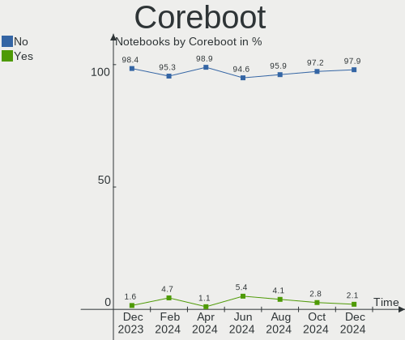
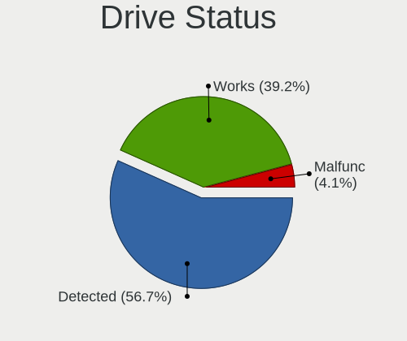
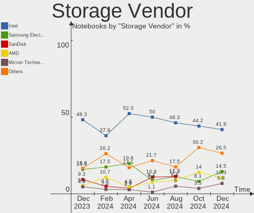
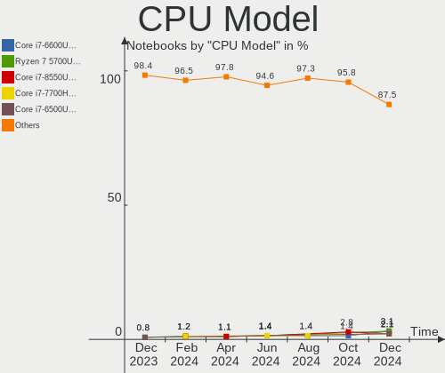

Linux in Canada - Hardware Trends (Notebooks)
---------------------------------------------

A project to identify most popular hardware characteristics and track their change
over time based on data collected by Linux users at https://Linux-Hardware.org.

Anyone can contribute to this report by the [hw-probe](https://github.com/linuxhw/hw-probe) tool:

    sudo -E hw-probe -all -upload

Period: Dec, 2022.

Contents
--------

* [ System ](#system)
  - [ OS                       ](#os)
  - [ OS Family                ](#os-family)
  - [ Kernel                   ](#kernel)
  - [ Kernel Family            ](#kernel-family)
  - [ Kernel Major Ver.        ](#kernel-major-ver)
  - [ Arch                     ](#arch)
  - [ DE                       ](#de)
  - [ Display Server           ](#display-server)
  - [ Display Manager          ](#display-manager)
  - [ OS Lang                  ](#os-lang)
  - [ Boot Mode                ](#boot-mode)
  - [ Filesystem               ](#filesystem)
  - [ Part. scheme             ](#part-scheme)
  - [ Dual Boot with Linux/BSD ](#dual-boot-with-linuxbsd)
  - [ Dual Boot (Win)          ](#dual-boot-win)

* [ Board ](#board)
  - [ Vendor                   ](#vendor)
  - [ Model                    ](#model)
  - [ Model Family             ](#model-family)
  - [ MFG Year                 ](#mfg-year)
  - [ Form Factor              ](#form-factor)
  - [ Secure Boot              ](#secure-boot)
  - [ Coreboot                 ](#coreboot)
  - [ RAM Size                 ](#ram-size)
  - [ RAM Used                 ](#ram-used)
  - [ Total Drives             ](#total-drives)
  - [ Has CD-ROM               ](#has-cd-rom)
  - [ Has Ethernet             ](#has-ethernet)
  - [ Has WiFi                 ](#has-wifi)
  - [ Has Bluetooth            ](#has-bluetooth)

* [ Location ](#location)
  - [ Country                  ](#country)
  - [ City                     ](#city)

* [ Drives ](#drives)
  - [ Drive Vendor             ](#drive-vendor)
  - [ Drive Model              ](#drive-model)
  - [ HDD Vendor               ](#hdd-vendor)
  - [ SSD Vendor               ](#ssd-vendor)
  - [ Drive Kind               ](#drive-kind)
  - [ Drive Connector          ](#drive-connector)
  - [ Drive Size               ](#drive-size)
  - [ Space Total              ](#space-total)
  - [ Space Used               ](#space-used)
  - [ Malfunc. Drives          ](#malfunc-drives)
  - [ Malfunc. Drive Vendor    ](#malfunc-drive-vendor)
  - [ Malfunc. HDD Vendor      ](#malfunc-hdd-vendor)
  - [ Malfunc. Drive Kind      ](#malfunc-drive-kind)
  - [ Failed Drives            ](#failed-drives)
  - [ Failed Drive Vendor      ](#failed-drive-vendor)
  - [ Drive Status             ](#drive-status)

* [ Storage controller ](#storage-controller)
  - [ Storage Vendor           ](#storage-vendor)
  - [ Storage Model            ](#storage-model)
  - [ Storage Kind             ](#storage-kind)

* [ Processor ](#processor)
  - [ CPU Vendor               ](#cpu-vendor)
  - [ CPU Model                ](#cpu-model)
  - [ CPU Model Family         ](#cpu-model-family)
  - [ CPU Cores                ](#cpu-cores)
  - [ CPU Sockets              ](#cpu-sockets)
  - [ CPU Threads              ](#cpu-threads)
  - [ CPU Op-Modes             ](#cpu-op-modes)
  - [ CPU Microcode            ](#cpu-microcode)
  - [ CPU Microarch            ](#cpu-microarch)

* [ Graphics ](#graphics)
  - [ GPU Vendor               ](#gpu-vendor)
  - [ GPU Model                ](#gpu-model)
  - [ GPU Combo                ](#gpu-combo)
  - [ GPU Driver               ](#gpu-driver)
  - [ GPU Memory               ](#gpu-memory)

* [ Monitor ](#monitor)
  - [ Monitor Vendor           ](#monitor-vendor)
  - [ Monitor Model            ](#monitor-model)
  - [ Monitor Resolution       ](#monitor-resolution)
  - [ Monitor Diagonal         ](#monitor-diagonal)
  - [ Monitor Width            ](#monitor-width)
  - [ Aspect Ratio             ](#aspect-ratio)
  - [ Monitor Area             ](#monitor-area)
  - [ Pixel Density            ](#pixel-density)
  - [ Multiple Monitors        ](#multiple-monitors)

* [ Network ](#network)
  - [ Net Controller Vendor    ](#net-controller-vendor)
  - [ Net Controller Model     ](#net-controller-model)
  - [ Wireless Vendor          ](#wireless-vendor)
  - [ Wireless Model           ](#wireless-model)
  - [ Ethernet Vendor          ](#ethernet-vendor)
  - [ Ethernet Model           ](#ethernet-model)
  - [ Net Controller Kind      ](#net-controller-kind)
  - [ Used Controller          ](#used-controller)
  - [ NICs                     ](#nics)
  - [ IPv6                     ](#ipv6)

* [ Bluetooth ](#bluetooth)
  - [ Bluetooth Vendor         ](#bluetooth-vendor)
  - [ Bluetooth Model          ](#bluetooth-model)

* [ Sound ](#sound)
  - [ Sound Vendor             ](#sound-vendor)
  - [ Sound Model              ](#sound-model)

* [ Memory ](#memory)
  - [ Memory Vendor            ](#memory-vendor)
  - [ Memory Model             ](#memory-model)
  - [ Memory Kind              ](#memory-kind)
  - [ Memory Form Factor       ](#memory-form-factor)
  - [ Memory Size              ](#memory-size)
  - [ Memory Speed             ](#memory-speed)

* [ Printers & scanners ](#printers--scanners)
  - [ Printer Vendor           ](#printer-vendor)
  - [ Printer Model            ](#printer-model)
  - [ Scanner Vendor           ](#scanner-vendor)
  - [ Scanner Model            ](#scanner-model)

* [ Camera ](#camera)
  - [ Camera Vendor            ](#camera-vendor)
  - [ Camera Model             ](#camera-model)

* [ Security ](#security)
  - [ Fingerprint Vendor       ](#fingerprint-vendor)
  - [ Fingerprint Model        ](#fingerprint-model)
  - [ Chipcard Vendor          ](#chipcard-vendor)
  - [ Chipcard Model           ](#chipcard-model)

* [ Unsupported ](#unsupported)
  - [ Unsupported Devices      ](#unsupported-devices)
  - [ Unsupported Device Types ](#unsupported-device-types)

System
------

OS
--

Installed operating systems

| Name                         | Notebooks | Percent |
|------------------------------|-----------|---------|
| Ubuntu 22.04                 | 15        | 18.52%  |
| Fedora 37                    | 7         | 8.64%   |
| Pop!_OS 22.04                | 6         | 7.41%   |
| Linux Mint 21                | 6         | 7.41%   |
| Debian 11                    | 5         | 6.17%   |
| Zorin 16                     | 4         | 4.94%   |
| Linux Mint 20.3              | 4         | 4.94%   |
| Ubuntu 22.10                 | 3         | 3.7%    |
| Ubuntu 20.04                 | 3         | 3.7%    |
| openSUSE Tumbleweed-XXXXXXXX | 3         | 3.7%    |
| OpenMandriva 4.3             | 3         | 3.7%    |
| Manjaro 22.0.0               | 2         | 2.47%   |
| Manjaro                      | 2         | 2.47%   |
| Gentoo 2.9                   | 2         | 2.47%   |
| Fedora 36                    | 2         | 2.47%   |
| SteamOS 3.3.3                | 1         | 1.23%   |
| Nobara 36                    | 1         | 1.23%   |
| NixOS 22.11                  | 1         | 1.23%   |
| Nitrux 2.5.1                 | 1         | 1.23%   |
| Lubuntu 22.04                | 1         | 1.23%   |
| Linux Mint 21.1              | 1         | 1.23%   |
| KDE neon 22.04               | 1         | 1.23%   |
| Kali 2022.4                  | 1         | 1.23%   |
| Garuda Linux Rolling         | 1         | 1.23%   |
| Elementary 7                 | 1         | 1.23%   |
| Clear Linux 37780            | 1         | 1.23%   |
| CachyOS Rolling              | 1         | 1.23%   |
| ArcoLinux Rolling            | 1         | 1.23%   |
| Arch Rolling                 | 1         | 1.23%   |

OS Family
---------

OS without a version

| Name         | Notebooks | Percent |
|--------------|-----------|---------|
| Ubuntu       | 21        | 25.93%  |
| Linux Mint   | 11        | 13.58%  |
| Fedora       | 9         | 11.11%  |
| Pop!_OS      | 6         | 7.41%   |
| Debian       | 5         | 6.17%   |
| Zorin        | 4         | 4.94%   |
| Manjaro      | 4         | 4.94%   |
| openSUSE     | 3         | 3.7%    |
| OpenMandriva | 3         | 3.7%    |
| Gentoo       | 2         | 2.47%   |
| SteamOS      | 1         | 1.23%   |
| Nobara       | 1         | 1.23%   |
| NixOS        | 1         | 1.23%   |
| Nitrux       | 1         | 1.23%   |
| Lubuntu      | 1         | 1.23%   |
| KDE neon     | 1         | 1.23%   |
| Kali         | 1         | 1.23%   |
| Garuda Linux | 1         | 1.23%   |
| Elementary   | 1         | 1.23%   |
| Clear Linux  | 1         | 1.23%   |
| CachyOS      | 1         | 1.23%   |
| ArcoLinux    | 1         | 1.23%   |
| Arch         | 1         | 1.23%   |

Kernel
------

Version of the Linux kernel

| Version                    | Notebooks | Percent |
|----------------------------|-----------|---------|
| 5.15.0-56-generic          | 22        | 27.16%  |
| 6.0.6-76060006-generic     | 5         | 6.17%   |
| 5.4.0-135-generic          | 4         | 4.94%   |
| 5.15.0-53-generic          | 4         | 4.94%   |
| 6.0.12-300.fc37.x86_64     | 3         | 3.7%    |
| 5.16.7-desktop-1omv4003    | 3         | 3.7%    |
| 6.0.15-300.fc37.x86_64     | 2         | 2.47%   |
| 6.0.13-300.fc37.x86_64     | 2         | 2.47%   |
| 6.0.12-1-default           | 2         | 2.47%   |
| 6.0.11-200.fc36.x86_64     | 2         | 2.47%   |
| 5.19.0-26-generic          | 2         | 2.47%   |
| 5.15.81-1-MANJARO          | 2         | 2.47%   |
| 5.10.0-20-amd64            | 2         | 2.47%   |
| 5.10.0-19-amd64            | 2         | 2.47%   |
| 6.1.1-1-default            | 1         | 1.23%   |
| 6.1.0-1221.native          | 1         | 1.23%   |
| 6.0.8-1-MANJARO            | 1         | 1.23%   |
| 6.0.12-76060006-generic    | 1         | 1.23%   |
| 6.0.11-arch1-1             | 1         | 1.23%   |
| 6.0.11-1-MANJARO           | 1         | 1.23%   |
| 6.0.11                     | 1         | 1.23%   |
| 6.0.10-201.fc36.x86_64     | 1         | 1.23%   |
| 6.0.10-1-cachyos           | 1         | 1.23%   |
| 6.0.10-1-bore              | 1         | 1.23%   |
| 6.0.0-kali5-amd64          | 1         | 1.23%   |
| 6.0.0-11.2-liquorix-amd64  | 1         | 1.23%   |
| 6.0.0-0.deb11.2-amd64      | 1         | 1.23%   |
| 5.4.0-132-generic          | 1         | 1.23%   |
| 5.19.0-76051900-generic    | 1         | 1.23%   |
| 5.19.0-21-generic          | 1         | 1.23%   |
| 5.17.0-1019-oem            | 1         | 1.23%   |
| 5.15.80-1-lts              | 1         | 1.23%   |
| 5.15.75-gentoo             | 1         | 1.23%   |
| 5.15.41-gentoo             | 1         | 1.23%   |
| 5.15.0-52-generic          | 1         | 1.23%   |
| 5.15.0-47-generic          | 1         | 1.23%   |
| 5.15.0-051500-generic      | 1         | 1.23%   |
| 5.13.0-valve21.3-1-neptune | 1         | 1.23%   |

Kernel Family
-------------

Linux kernel without a distro release

| Version | Notebooks | Percent |
|---------|-----------|---------|
| 5.15.0  | 29        | 35.8%   |
| 6.0.12  | 6         | 7.41%   |
| 6.0.6   | 5         | 6.17%   |
| 6.0.11  | 5         | 6.17%   |
| 5.4.0   | 5         | 6.17%   |
| 5.19.0  | 4         | 4.94%   |
| 5.10.0  | 4         | 4.94%   |
| 6.0.10  | 3         | 3.7%    |
| 6.0.0   | 3         | 3.7%    |
| 5.16.7  | 3         | 3.7%    |
| 6.0.15  | 2         | 2.47%   |
| 6.0.13  | 2         | 2.47%   |
| 5.15.81 | 2         | 2.47%   |
| 6.1.1   | 1         | 1.23%   |
| 6.1.0   | 1         | 1.23%   |
| 6.0.8   | 1         | 1.23%   |
| 5.17.0  | 1         | 1.23%   |
| 5.15.80 | 1         | 1.23%   |
| 5.15.75 | 1         | 1.23%   |
| 5.15.41 | 1         | 1.23%   |
| 5.13.0  | 1         | 1.23%   |

Kernel Major Ver.
-----------------

Linux kernel major version

| Version | Notebooks | Percent |
|---------|-----------|---------|
| 5.15    | 34        | 41.98%  |
| 6.0     | 27        | 33.33%  |
| 5.4     | 5         | 6.17%   |
| 5.19    | 4         | 4.94%   |
| 5.10    | 4         | 4.94%   |
| 5.16    | 3         | 3.7%    |
| 6.1     | 2         | 2.47%   |
| 5.17    | 1         | 1.23%   |
| 5.13    | 1         | 1.23%   |

Arch
----

OS architecture (x86_64, i586, etc.)

| Name   | Notebooks | Percent |
|--------|-----------|---------|
| x86_64 | 81        | 100%    |

DE
--

Desktop Environment

| Name       | Notebooks | Percent |
|------------|-----------|---------|
| GNOME      | 39        | 48.15%  |
| KDE5       | 18        | 22.22%  |
| X-Cinnamon | 9         | 11.11%  |
| XFCE       | 4         | 4.94%   |
| Unknown    | 4         | 4.94%   |
| MATE       | 3         | 3.7%    |
| xmonad     | 1         | 1.23%   |
| Pantheon   | 1         | 1.23%   |
| LXQt       | 1         | 1.23%   |
| Cinnamon   | 1         | 1.23%   |

Display Server
--------------

X11 or Wayland

| Name    | Notebooks | Percent |
|---------|-----------|---------|
| X11     | 59        | 72.84%  |
| Wayland | 17        | 20.99%  |
| Tty     | 2         | 2.47%   |
| Unknown | 2         | 2.47%   |
| Web     | 1         | 1.23%   |

Display Manager
---------------

SDDM, LightDM, etc.

| Name    | Notebooks | Percent |
|---------|-----------|---------|
| Unknown | 30        | 37.04%  |
| GDM3    | 18        | 22.22%  |
| SDDM    | 13        | 16.05%  |
| LightDM | 13        | 16.05%  |
| GDM     | 6         | 7.41%   |
| XDM     | 1         | 1.23%   |

OS Lang
-------

Language

| Lang    | Notebooks | Percent |
|---------|-----------|---------|
| en_CA   | 40        | 49.38%  |
| en_US   | 29        | 35.8%   |
| fr_CA   | 8         | 9.88%   |
| POSIX   | 1         | 1.23%   |
| fr_FR   | 1         | 1.23%   |
| en_IN   | 1         | 1.23%   |
| Unknown | 1         | 1.23%   |

Boot Mode
---------

EFI or BIOS

| Mode | Notebooks | Percent |
|------|-----------|---------|
| EFI  | 41        | 50.62%  |
| BIOS | 40        | 49.38%  |

Filesystem
----------

Type of filesystem

| Type    | Notebooks | Percent |
|---------|-----------|---------|
| Ext4    | 53        | 65.43%  |
| Btrfs   | 18        | 22.22%  |
| Overlay | 4         | 4.94%   |
| Zfs     | 3         | 3.7%    |
| Xfs     | 2         | 2.47%   |
| Ext3    | 1         | 1.23%   |

Part. scheme
------------

Scheme of partitioning

| Type    | Notebooks | Percent |
|---------|-----------|---------|
| GPT     | 45        | 55.56%  |
| Unknown | 26        | 32.1%   |
| MBR     | 10        | 12.35%  |

Dual Boot with Linux/BSD
------------------------

Hosting more than one Linux/BSD

| Dual boot | Notebooks | Percent |
|-----------|-----------|---------|
| No        | 71        | 87.65%  |
| Yes       | 10        | 12.35%  |

Dual Boot (Win)
---------------

Hosting Linux and Windows

| Dual boot | Notebooks | Percent |
|-----------|-----------|---------|
| No        | 62        | 76.54%  |
| Yes       | 19        | 23.46%  |

Board
-----

Vendor
------

Motherboard manufacturer

| Name                 | Notebooks | Percent |
|----------------------|-----------|---------|
| Dell                 | 16        | 19.75%  |
| Lenovo               | 14        | 17.28%  |
| Hewlett-Packard      | 11        | 13.58%  |
| ASUSTek Computer     | 11        | 13.58%  |
| Acer                 | 6         | 7.41%   |
| Apple                | 5         | 6.17%   |
| Toshiba              | 3         | 3.7%    |
| MSI                  | 3         | 3.7%    |
| System76             | 2         | 2.47%   |
| Google               | 2         | 2.47%   |
| Valve                | 1         | 1.23%   |
| Razer                | 1         | 1.23%   |
| Panasonic            | 1         | 1.23%   |
| Intel Client Systems | 1         | 1.23%   |
| Gigabyte Technology  | 1         | 1.23%   |
| Framework            | 1         | 1.23%   |
| EUROCOM              | 1         | 1.23%   |
| Alienware            | 1         | 1.23%   |

Model
-----

Motherboard model

| Name                                        | Notebooks | Percent |
|---------------------------------------------|-----------|---------|
| Valve Jupiter                               | 1         | 1.23%   |
| Toshiba TECRA R940                          | 1         | 1.23%   |
| Toshiba Satellite S50-A                     | 1         | 1.23%   |
| Toshiba Satellite C650D                     | 1         | 1.23%   |
| System76 Pangolin                           | 1         | 1.23%   |
| System76 Gazelle                            | 1         | 1.23%   |
| Razer Blade 15 (2022) - RZ09-0421           | 1         | 1.23%   |
| Panasonic FZ55-2                            | 1         | 1.23%   |
| MSI Pulse GL76 12UEK                        | 1         | 1.23%   |
| MSI GS66 Stealth 11UH                       | 1         | 1.23%   |
| MSI GE72VR 6RF                              | 1         | 1.23%   |
| Lenovo Y70-70 Touch 80DU                    | 1         | 1.23%   |
| Lenovo ThinkPad X1 Carbon Gen 9 20XW004GUS  | 1         | 1.23%   |
| Lenovo ThinkPad X1 Carbon Gen 10 21CBCTO1WW | 1         | 1.23%   |
| Lenovo ThinkPad T500 2055A38                | 1         | 1.23%   |
| Lenovo ThinkPad T500 205545F                | 1         | 1.23%   |
| Lenovo ThinkPad T495 20NKS01W02             | 1         | 1.23%   |
| Lenovo ThinkPad T420 4236V6S                | 1         | 1.23%   |
| Lenovo ThinkPad T15p Gen 3 21DA000QUS       | 1         | 1.23%   |
| Lenovo ThinkPad P15v Gen 1 20TQCTO1WW       | 1         | 1.23%   |
| Lenovo ThinkPad E560 20EV002FUS             | 1         | 1.23%   |
| Lenovo Legion S7 15ACH6 82K8                | 1         | 1.23%   |
| Lenovo IdeaPad Z570 10249UU                 | 1         | 1.23%   |
| Lenovo IdeaPad Gaming 3 15IAH7 82S9         | 1         | 1.23%   |
| Lenovo IdeaPad 330-15ARR 81D2               | 1         | 1.23%   |
| Intel Client Systems LAPRC710               | 1         | 1.23%   |
| HP Stream Notebook PC 13                    | 1         | 1.23%   |
| HP ProBook 4530s                            | 1         | 1.23%   |
| HP Pavilion Gaming Laptop 15-ec0xxx         | 1         | 1.23%   |
| HP Pavilion dv8000 (ET839UA#ABL)            | 1         | 1.23%   |
| HP Pavilion dv7                             | 1         | 1.23%   |
| HP OMEN Laptop 15-en1xxx                    | 1         | 1.23%   |
| HP Laptop 15-dy5xxx                         | 1         | 1.23%   |
| HP G62                                      | 1         | 1.23%   |
| HP EliteBook 820 G3                         | 1         | 1.23%   |
| HP EliteBook 2540p                          | 1         | 1.23%   |
| HP 15                                       | 1         | 1.23%   |
| Google Candy                                | 1         | 1.23%   |
| Google Blorb                                | 1         | 1.23%   |
| Gigabyte X570S AORUS PRO AX                 | 1         | 1.23%   |

Model Family
------------

Motherboard model prefix

| Name                          | Notebooks | Percent |
|-------------------------------|-----------|---------|
| Lenovo ThinkPad               | 9         | 11.11%  |
| Dell Latitude                 | 9         | 11.11%  |
| ASUS VivoBook                 | 5         | 6.17%   |
| Dell Inspiron                 | 4         | 4.94%   |
| Acer Aspire                   | 4         | 4.94%   |
| Lenovo IdeaPad                | 3         | 3.7%    |
| HP Pavilion                   | 3         | 3.7%    |
| Toshiba Satellite             | 2         | 2.47%   |
| HP EliteBook                  | 2         | 2.47%   |
| Dell XPS                      | 2         | 2.47%   |
| Valve Jupiter                 | 1         | 1.23%   |
| Toshiba TECRA                 | 1         | 1.23%   |
| System76 Pangolin             | 1         | 1.23%   |
| System76 Gazelle              | 1         | 1.23%   |
| Razer Blade                   | 1         | 1.23%   |
| Panasonic FZ55-2              | 1         | 1.23%   |
| MSI Pulse                     | 1         | 1.23%   |
| MSI GS66                      | 1         | 1.23%   |
| MSI GE72VR                    | 1         | 1.23%   |
| Lenovo Y70-70                 | 1         | 1.23%   |
| Lenovo Legion                 | 1         | 1.23%   |
| Intel Client Systems LAPRC710 | 1         | 1.23%   |
| HP Stream                     | 1         | 1.23%   |
| HP ProBook                    | 1         | 1.23%   |
| HP OMEN                       | 1         | 1.23%   |
| HP Laptop                     | 1         | 1.23%   |
| HP G62                        | 1         | 1.23%   |
| HP 15                         | 1         | 1.23%   |
| Google Candy                  | 1         | 1.23%   |
| Google Blorb                  | 1         | 1.23%   |
| Gigabyte X570S                | 1         | 1.23%   |
| Framework Laptop              | 1         | 1.23%   |
| EUROCOM SCORPIUS              | 1         | 1.23%   |
| Dell G5                       | 1         | 1.23%   |
| ASUS UL50VT                   | 1         | 1.23%   |
| ASUS TUF                      | 1         | 1.23%   |
| ASUS TP501UA                  | 1         | 1.23%   |
| ASUS Strix                    | 1         | 1.23%   |
| ASUS ROG                      | 1         | 1.23%   |
| ASUS ASUS                     | 1         | 1.23%   |

MFG Year
--------

Motherboard manufacture year

| Year | Notebooks | Percent |
|------|-----------|---------|
| 2022 | 18        | 22.22%  |
| 2021 | 10        | 12.35%  |
| 2020 | 8         | 9.88%   |
| 2016 | 5         | 6.17%   |
| 2015 | 5         | 6.17%   |
| 2013 | 5         | 6.17%   |
| 2010 | 5         | 6.17%   |
| 2018 | 4         | 4.94%   |
| 2014 | 4         | 4.94%   |
| 2011 | 4         | 4.94%   |
| 2008 | 4         | 4.94%   |
| 2019 | 3         | 3.7%    |
| 2012 | 3         | 3.7%    |
| 2006 | 2         | 2.47%   |
| 2009 | 1         | 1.23%   |

Form Factor
-----------

Physical design of the computer

| Name     | Notebooks | Percent |
|----------|-----------|---------|
| Notebook | 81        | 100%    |

Secure Boot
-----------

Enabled or disabled

| State    | Notebooks | Percent |
|----------|-----------|---------|
| Disabled | 74        | 91.36%  |
| Enabled  | 7         | 8.64%   |

Coreboot
--------

Have coreboot on board

| Used | Notebooks | Percent |
|------|-----------|---------|
| No   | 78        | 96.3%   |
| Yes  | 3         | 3.7%    |

RAM Size
--------

Total RAM memory

| Size in GB  | Notebooks | Percent |
|-------------|-----------|---------|
| 4.01-8.0    | 22        | 27.16%  |
| 8.01-16.0   | 18        | 22.22%  |
| 16.01-24.0  | 17        | 20.99%  |
| 3.01-4.0    | 9         | 11.11%  |
| 32.01-64.0  | 8         | 9.88%   |
| 1.01-2.0    | 4         | 4.94%   |
| 64.01-256.0 | 2         | 2.47%   |
| 2.01-3.0    | 1         | 1.23%   |

RAM Used
--------

Used RAM memory

| Used GB   | Notebooks | Percent |
|-----------|-----------|---------|
| 2.01-3.0  | 20        | 24.69%  |
| 1.01-2.0  | 19        | 23.46%  |
| 3.01-4.0  | 16        | 19.75%  |
| 4.01-8.0  | 15        | 18.52%  |
| 8.01-16.0 | 7         | 8.64%   |
| 0.51-1.0  | 3         | 3.7%    |
| 0.01-0.5  | 1         | 1.23%   |

Total Drives
------------

Number of drives on board

| Drives | Notebooks | Percent |
|--------|-----------|---------|
| 1      | 56        | 69.14%  |
| 2      | 22        | 27.16%  |
| 3      | 2         | 2.47%   |
| 5      | 1         | 1.23%   |

Has CD-ROM
----------

Has CD-ROM on board

| Presented | Notebooks | Percent |
|-----------|-----------|---------|
| No        | 58        | 71.6%   |
| Yes       | 23        | 28.4%   |

Has Ethernet
------------

Has Ethernet on board

| Presented | Notebooks | Percent |
|-----------|-----------|---------|
| Yes       | 60        | 74.07%  |
| No        | 21        | 25.93%  |

Has WiFi
--------

Has WiFi module

| Presented | Notebooks | Percent |
|-----------|-----------|---------|
| Yes       | 80        | 98.77%  |
| No        | 1         | 1.23%   |

Has Bluetooth
-------------

Has Bluetooth module

| Presented | Notebooks | Percent |
|-----------|-----------|---------|
| Yes       | 66        | 81.48%  |
| No        | 15        | 18.52%  |

Location
--------

Country
-------

Geographic location (country)

| Country | Notebooks | Percent |
|---------|-----------|---------|
| Canada  | 81        | 100%    |

City
----

Geographic location (city)

| City         | Notebooks | Percent |
|--------------|-----------|---------|
| Toronto      | 7         | 8.64%   |
| Montreal     | 5         | 6.17%   |
| Calgary      | 5         | 6.17%   |
| Victoria     | 3         | 3.7%    |
| Saskatoon    | 3         | 3.7%    |
| Québec      | 3         | 3.7%    |
| Edmonton     | 3         | 3.7%    |
| Chicoutimi   | 3         | 3.7%    |
| Winnipeg     | 2         | 2.47%   |
| North York   | 2         | 2.47%   |
| Moncton      | 2         | 2.47%   |
| Markham      | 2         | 2.47%   |
| London       | 2         | 2.47%   |
| Courtice     | 2         | 2.47%   |
| Courtenay    | 2         | 2.47%   |
| Brampton     | 2         | 2.47%   |
| Yorkton      | 1         | 1.23%   |
| Windsor      | 1         | 1.23%   |
| Whitby       | 1         | 1.23%   |
| Vancouver    | 1         | 1.23%   |
| Thornhill    | 1         | 1.23%   |
| St. Claude   | 1         | 1.23%   |
| Sherbrooke   | 1         | 1.23%   |
| Sarnia       | 1         | 1.23%   |
| Roberval     | 1         | 1.23%   |
| Regina       | 1         | 1.23%   |
| Red Deer     | 1         | 1.23%   |
| Port Perry   | 1         | 1.23%   |
| Peterborough | 1         | 1.23%   |
| Ottawa       | 1         | 1.23%   |
| North Bay    | 1         | 1.23%   |
| Newmarket    | 1         | 1.23%   |
| Newcastle    | 1         | 1.23%   |
| Nanaimo      | 1         | 1.23%   |
| Maple Ridge  | 1         | 1.23%   |
| Longueuil    | 1         | 1.23%   |
| Lethbridge   | 1         | 1.23%   |
| Laval        | 1         | 1.23%   |
| Langenburg   | 1         | 1.23%   |
| Lachine      | 1         | 1.23%   |

Drives
------

Drive Vendor
------------

Hard drive vendors

| Vendor                      | Notebooks | Drives | Percent |
|-----------------------------|-----------|--------|---------|
| Samsung Electronics         | 16        | 17     | 15.09%  |
| Seagate                     | 12        | 13     | 11.32%  |
| WDC                         | 11        | 11     | 10.38%  |
| SanDisk                     | 10        | 10     | 9.43%   |
| Micron Technology           | 8         | 9      | 7.55%   |
| SK hynix                    | 7         | 7      | 6.6%    |
| Unknown                     | 6         | 6      | 5.66%   |
| Intel                       | 5         | 5      | 4.72%   |
| Toshiba                     | 4         | 4      | 3.77%   |
| Kingston                    | 3         | 3      | 2.83%   |
| Union Memory (Shenzhen)     | 2         | 2      | 1.89%   |
| LITEON                      | 2         | 2      | 1.89%   |
| Kingston Technology Company | 2         | 2      | 1.89%   |
| Hitachi                     | 2         | 2      | 1.89%   |
| HGST                        | 2         | 2      | 1.89%   |
| Fujitsu                     | 2         | 2      | 1.89%   |
| Crucial                     | 2         | 4      | 1.89%   |
| T-FORCE                     | 1         | 1      | 0.94%   |
| Phison Electronics          | 1         | 1      | 0.94%   |
| Micron/Crucial Technology   | 1         | 1      | 0.94%   |
| LaCie                       | 1         | 1      | 0.94%   |
| JMicron Technology          | 1         | 1      | 0.94%   |
| External                    | 1         | 1      | 0.94%   |
| Dogfish                     | 1         | 1      | 0.94%   |
| ADATA Technology            | 1         | 1      | 0.94%   |
| A-DATA Technology           | 1         | 1      | 0.94%   |
| Unknown                     | 1         | 1      | 0.94%   |

Drive Model
-----------

Hard drive models

| Model                                               | Notebooks | Percent |
|-----------------------------------------------------|-----------|---------|
| Samsung NVMe SSD Controller SM981/PM981/PM983 500GB | 3         | 2.78%   |
| Samsung NVMe SSD Controller PM9A1/PM9A3/980PRO 2TB  | 3         | 2.78%   |
| Seagate ST9500325AS 500GB                           | 2         | 1.85%   |
| Seagate ST1000LM014-1EJ164 1TB                      | 2         | 1.85%   |
| SanDisk NVMe SSD Drive 1TB                          | 2         | 1.85%   |
| Micron 2450_MTFDKBA512TFK 512GB                     | 2         | 1.85%   |
| Kingston Company OM3PDP3 NVMe SSD 512GB             | 2         | 1.85%   |
| Intel SSDPEKNU512GZ 512GB                           | 2         | 1.85%   |
| WDC WDS100T2B0C-00PXH0 1TB                          | 1         | 0.93%   |
| WDC WD7500BPVX-22JC3T0 752GB                        | 1         | 0.93%   |
| WDC WD5000LPVX-75V0TT0 500GB                        | 1         | 0.93%   |
| WDC WD3200BPVT-22JJ5T0 320GB                        | 1         | 0.93%   |
| WDC WD3200BEVT-22ZCT0 320GB                         | 1         | 0.93%   |
| WDC WD20NPVT-00Z2TT0 2TB                            | 1         | 0.93%   |
| WDC WD1600BEVT-75A23T0 160GB                        | 1         | 0.93%   |
| WDC WD10S21X-24R1BT0-SSHD-8GB                       | 1         | 0.93%   |
| WDC WD1003FZEX-00MK2A0 1TB                          | 1         | 0.93%   |
| WDC WD Blue SA510 2.5 1000GB SSD                    | 1         | 0.93%   |
| WDC PC SN530 SDBPNPZ-512G-1114 512GB                | 1         | 0.93%   |
| Unknown MMC Card  7GB                               | 1         | 0.93%   |
| Unknown MMC Card  64GB                              | 1         | 0.93%   |
| Unknown MMC Card  32GB                              | 1         | 0.93%   |
| Unknown MMC Card  16GB                              | 1         | 0.93%   |
| Unknown MMC Card  128GB                             | 1         | 0.93%   |
| Unknown BGND3R  32GB                                | 1         | 0.93%   |
| Union Memory (Shenzhen) UMIS RPJTJ512MGE1QDY 512GB  | 1         | 0.93%   |
| Union Memory (Shenzhen) UMIS RPETJ1T24MGE2QDQ 1TB   | 1         | 0.93%   |
| Toshiba MK8037GSX 80GB                              | 1         | 0.93%   |
| Toshiba MK3261GSYN 320GB                            | 1         | 0.93%   |
| Toshiba MK1633GSG 160GB                             | 1         | 0.93%   |
| Toshiba KBG4AZNV512G MEMORY 512GB                   | 1         | 0.93%   |
| T-FORCE SSD 2TB                                     | 1         | 0.93%   |
| SK hynix SKHynix_HFS256GDE9X081N 256GB              | 1         | 0.93%   |
| SK hynix SKHynix_HFS256GD9TNI-L2B0B 256GB           | 1         | 0.93%   |
| SK hynix PC711 NVMe 512GB                           | 1         | 0.93%   |
| SK hynix PC601 NVMe 512GB                           | 1         | 0.93%   |
| SK hynix PC401 NVMe Solid State Drive 256GB         | 1         | 0.93%   |
| SK hynix BC711 NVMe 512GB                           | 1         | 0.93%   |
| SK hynix BC501 NVMe Solid State Drive 512GB         | 1         | 0.93%   |
| Seagate ST9500420ASG 500GB                          | 1         | 0.93%   |

HDD Vendor
----------

Hard disk drive vendors

| Vendor              | Notebooks | Drives | Percent |
|---------------------|-----------|--------|---------|
| Seagate             | 11        | 12     | 34.38%  |
| WDC                 | 8         | 8      | 25%     |
| Toshiba             | 3         | 3      | 9.38%   |
| Hitachi             | 2         | 2      | 6.25%   |
| HGST                | 2         | 2      | 6.25%   |
| Fujitsu             | 2         | 2      | 6.25%   |
| Samsung Electronics | 1         | 1      | 3.13%   |
| LaCie               | 1         | 1      | 3.13%   |
| JMicron Technology  | 1         | 1      | 3.13%   |
| External            | 1         | 1      | 3.13%   |

SSD Vendor
----------

Solid state drive vendors

| Vendor              | Notebooks | Drives | Percent |
|---------------------|-----------|--------|---------|
| Samsung Electronics | 7         | 7      | 30.43%  |
| SanDisk             | 3         | 3      | 13.04%  |
| Micron Technology   | 2         | 2      | 8.7%    |
| Kingston            | 2         | 2      | 8.7%    |
| Crucial             | 2         | 4      | 8.7%    |
| WDC                 | 1         | 1      | 4.35%   |
| T-FORCE             | 1         | 1      | 4.35%   |
| Seagate             | 1         | 1      | 4.35%   |
| LITEON              | 1         | 1      | 4.35%   |
| Intel               | 1         | 1      | 4.35%   |
| Dogfish             | 1         | 1      | 4.35%   |
| A-DATA Technology   | 1         | 1      | 4.35%   |

Drive Kind
----------

HDD or SSD

| Kind | Notebooks | Drives | Percent |
|------|-----------|--------|---------|
| NVMe | 41        | 46     | 42.27%  |
| HDD  | 28        | 33     | 28.87%  |
| SSD  | 21        | 25     | 21.65%  |
| MMC  | 7         | 7      | 7.22%   |

Drive Connector
---------------

SATA, SAS, NVMe, etc.

| Type | Notebooks | Drives | Percent |
|------|-----------|--------|---------|
| SATA | 42        | 52     | 43.75%  |
| NVMe | 41        | 46     | 42.71%  |
| MMC  | 7         | 7      | 7.29%   |
| SAS  | 6         | 6      | 6.25%   |

Drive Size
----------

Size of hard drive

| Size in TB | Notebooks | Drives | Percent |
|------------|-----------|--------|---------|
| 0.01-0.5   | 27        | 32     | 54%     |
| 0.51-1.0   | 17        | 18     | 34%     |
| 1.01-2.0   | 4         | 6      | 8%      |
| 3.01-4.0   | 1         | 1      | 2%      |
| 4.01-10.0  | 1         | 1      | 2%      |

Space Total
-----------

Amount of disk space available on the file system

| Size in GB     | Notebooks | Percent |
|----------------|-----------|---------|
| 251-500        | 19        | 23.46%  |
| 101-250        | 17        | 20.99%  |
| 501-1000       | 14        | 17.28%  |
| 1001-2000      | 12        | 14.81%  |
| 1-20           | 7         | 8.64%   |
| More than 3000 | 4         | 4.94%   |
| 51-100         | 3         | 3.7%    |
| Unknown        | 3         | 3.7%    |
| 21-50          | 2         | 2.47%   |

Space Used
----------

Amount of used disk space

| Used GB        | Notebooks | Percent |
|----------------|-----------|---------|
| 1-20           | 22        | 27.16%  |
| 21-50          | 18        | 22.22%  |
| 51-100         | 10        | 12.35%  |
| 101-250        | 9         | 11.11%  |
| 501-1000       | 7         | 8.64%   |
| 251-500        | 6         | 7.41%   |
| 1001-2000      | 5         | 6.17%   |
| Unknown        | 3         | 3.7%    |
| More than 3000 | 1         | 1.23%   |

Malfunc. Drives
---------------

Drive models with a malfunction

| Model                             | Notebooks | Drives | Percent |
|-----------------------------------|-----------|--------|---------|
| WDC WD5000LPVX-75V0TT0 500GB      | 1         | 1      | 10%     |
| Toshiba MK8037GSX 80GB            | 1         | 1      | 10%     |
| Toshiba MK3261GSYN 320GB          | 1         | 1      | 10%     |
| Seagate ST9500420ASG 500GB        | 1         | 1      | 10%     |
| Seagate ST9320423AS 320GB         | 1         | 1      | 10%     |
| Seagate ST1000DM003-1SB102 1TB    | 1         | 1      | 10%     |
| Samsung Electronics HM160HC 160GB | 1         | 1      | 10%     |
| LaCie Rugged Mini USB3 2TB        | 1         | 1      | 10%     |
| Hitachi HTS725050A9A364 500GB     | 1         | 1      | 10%     |
| HGST HTS545050A7E680 500GB        | 1         | 1      | 10%     |

Malfunc. Drive Vendor
---------------------

Vendors of faulty drives

| Vendor              | Notebooks | Drives | Percent |
|---------------------|-----------|--------|---------|
| Seagate             | 3         | 3      | 30%     |
| Toshiba             | 2         | 2      | 20%     |
| WDC                 | 1         | 1      | 10%     |
| Samsung Electronics | 1         | 1      | 10%     |
| LaCie               | 1         | 1      | 10%     |
| Hitachi             | 1         | 1      | 10%     |
| HGST                | 1         | 1      | 10%     |

Malfunc. HDD Vendor
-------------------

Vendors of faulty HDD drives

| Vendor              | Notebooks | Drives | Percent |
|---------------------|-----------|--------|---------|
| Seagate             | 3         | 3      | 30%     |
| Toshiba             | 2         | 2      | 20%     |
| WDC                 | 1         | 1      | 10%     |
| Samsung Electronics | 1         | 1      | 10%     |
| LaCie               | 1         | 1      | 10%     |
| Hitachi             | 1         | 1      | 10%     |
| HGST                | 1         | 1      | 10%     |

Malfunc. Drive Kind
-------------------

Kinds of faulty drives

| Kind | Notebooks | Drives | Percent |
|------|-----------|--------|---------|
| HDD  | 10        | 10     | 100%    |

Failed Drives
-------------

Failed drive models

Zero info for selected period =(

Failed Drive Vendor
-------------------

Failed drive vendors

Zero info for selected period =(

Drive Status
------------

Number of failed and malfunc. drives

| Status   | Notebooks | Drives | Percent |
|----------|-----------|--------|---------|
| Detected | 43        | 58     | 50.59%  |
| Works    | 32        | 43     | 37.65%  |
| Malfunc  | 10        | 10     | 11.76%  |

Storage controller
------------------

Storage Vendor
--------------

Storage controller vendors

| Vendor                      | Notebooks | Percent |
|-----------------------------|-----------|---------|
| Intel                       | 48        | 48%     |
| AMD                         | 11        | 11%     |
| SanDisk                     | 9         | 9%      |
| Samsung Electronics         | 8         | 8%      |
| SK hynix                    | 7         | 7%      |
| Micron Technology           | 7         | 7%      |
| Kingston Technology Company | 3         | 3%      |
| Union Memory (Shenzhen)     | 2         | 2%      |
| Phison Electronics          | 1         | 1%      |
| Micron/Crucial Technology   | 1         | 1%      |
| Lite-On Technology          | 1         | 1%      |
| KIOXIA                      | 1         | 1%      |
| ADATA Technology            | 1         | 1%      |

Storage Model
-------------

Storage controller models

| Model                                                                          | Notebooks | Percent |
|--------------------------------------------------------------------------------|-----------|---------|
| AMD FCH SATA Controller [AHCI mode]                                            | 8         | 7.77%   |
| Micron Non-Volatile memory controller                                          | 7         | 6.8%    |
| Intel Sunrise Point-LP SATA Controller [AHCI mode]                             | 6         | 5.83%   |
| Samsung NVMe SSD Controller PM9A1/PM9A3/980PRO                                 | 5         | 4.85%   |
| Intel 82801 Mobile SATA Controller [RAID mode]                                 | 5         | 4.85%   |
| Intel 6 Series/C200 Series Chipset Family 6 port Mobile SATA AHCI Controller   | 5         | 4.85%   |
| Intel 7 Series Chipset Family 6-port SATA Controller [AHCI mode]               | 4         | 3.88%   |
| SK hynix Gold P31/PC711 NVMe Solid State Drive                                 | 3         | 2.91%   |
| SanDisk WD Blue SN550 NVMe SSD                                                 | 3         | 2.91%   |
| SanDisk Non-Volatile memory controller                                         | 3         | 2.91%   |
| Samsung NVMe SSD Controller SM981/PM981/PM983                                  | 3         | 2.91%   |
| Intel Volume Management Device NVMe RAID Controller                            | 3         | 2.91%   |
| SK hynix Non-Volatile memory controller                                        | 2         | 1.94%   |
| Kingston Company OM3PDP3 NVMe SSD                                              | 2         | 1.94%   |
| Intel Non-Volatile memory controller                                           | 2         | 1.94%   |
| Intel 82801IBM/IEM (ICH9M/ICH9M-E) 4 port SATA Controller [AHCI mode]          | 2         | 1.94%   |
| Intel 8 Series/C220 Series Chipset Family 6-port SATA Controller 1 [AHCI mode] | 2         | 1.94%   |
| Intel 8 Series SATA Controller 1 [AHCI mode]                                   | 2         | 1.94%   |
| Intel 5 Series/3400 Series Chipset 6 port SATA AHCI Controller                 | 2         | 1.94%   |
| Intel 400 Series Chipset Family SATA AHCI Controller                           | 2         | 1.94%   |
| AMD SB7x0/SB8x0/SB9x0 SATA Controller [AHCI mode]                              | 2         | 1.94%   |
| Union Memory (Shenzhen) Non-Volatile memory controller                         | 1         | 0.97%   |
| Union Memory (Shenzhen) AM630 PCIe 4.0 x4 NVMe SSD Controller                  | 1         | 0.97%   |
| SK hynix PC401 NVMe Solid State Drive 256GB                                    | 1         | 0.97%   |
| SK hynix BC501 NVMe Solid State Drive                                          | 1         | 0.97%   |
| SanDisk WD PC SN810 / Black SN850 NVMe SSD                                     | 1         | 0.97%   |
| SanDisk WD Blue SN570 NVMe SSD                                                 | 1         | 0.97%   |
| SanDisk WD Black SN750 / PC SN730 NVMe SSD                                     | 1         | 0.97%   |
| Samsung NVMe SSD Controller 980                                                | 1         | 0.97%   |
| Phison E12 NVMe Controller                                                     | 1         | 0.97%   |
| Micron/Crucial P2 NVMe PCIe SSD                                                | 1         | 0.97%   |
| Lite-On NVMe Controller                                                        | 1         | 0.97%   |
| KIOXIA NVMe SSD Controller BG4                                                 | 1         | 0.97%   |
| Kingston Company Company Non-Volatile memory controller                        | 1         | 0.97%   |
| Intel Wildcat Point-LP SATA Controller [AHCI Mode]                             | 1         | 0.97%   |
| Intel Tiger Lake-LP SATA Controller                                            | 1         | 0.97%   |
| Intel SSD 660P Series                                                          | 1         | 0.97%   |
| Intel SSD 600P Series                                                          | 1         | 0.97%   |
| Intel Jasper Lake SATA AHCI Controller                                         | 1         | 0.97%   |
| Intel Ice Lake-LP SATA Controller [AHCI mode]                                  | 1         | 0.97%   |

Storage Kind
------------

Kind of storage controller (IDE, SATA, NVMe, SAS, ...)

| Kind | Notebooks | Percent |
|------|-----------|---------|
| SATA | 45        | 45.92%  |
| NVMe | 41        | 41.84%  |
| RAID | 8         | 8.16%   |
| IDE  | 4         | 4.08%   |

Processor
---------

CPU Vendor
----------

Processor vendors

| Vendor | Notebooks | Percent |
|--------|-----------|---------|
| Intel  | 61        | 75.31%  |
| AMD    | 20        | 24.69%  |

CPU Model
---------

Processor models

| Model                                         | Notebooks | Percent |
|-----------------------------------------------|-----------|---------|
| Intel Core i7-10750H CPU @ 2.60GHz            | 3         | 3.7%    |
| Intel Core i5-6200U CPU @ 2.30GHz             | 3         | 3.7%    |
| Intel 12th Gen Core i7-12800H                 | 2         | 2.47%   |
| AMD Ryzen 9 5900HX with Radeon Graphics       | 2         | 2.47%   |
| AMD Ryzen 7 6800H with Radeon Graphics        | 2         | 2.47%   |
| AMD Ryzen 7 3750H with Radeon Vega Mobile Gfx | 2         | 2.47%   |
| Intel Genuine CPU U7300 @ 1.30GHz             | 1         | 1.23%   |
| Intel Core i7-8750H CPU @ 2.20GHz             | 1         | 1.23%   |
| Intel Core i7-8565U CPU @ 1.80GHz             | 1         | 1.23%   |
| Intel Core i7-6700HQ CPU @ 2.60GHz            | 1         | 1.23%   |
| Intel Core i7-6600U CPU @ 2.60GHz             | 1         | 1.23%   |
| Intel Core i7-5600U CPU @ 2.60GHz             | 1         | 1.23%   |
| Intel Core i7-4810MQ CPU @ 2.80GHz            | 1         | 1.23%   |
| Intel Core i7-4750HQ CPU @ 2.00GHz            | 1         | 1.23%   |
| Intel Core i7-4710HQ CPU @ 2.50GHz            | 1         | 1.23%   |
| Intel Core i7-4500U CPU @ 1.80GHz             | 1         | 1.23%   |
| Intel Core i7-3740QM CPU @ 2.70GHz            | 1         | 1.23%   |
| Intel Core i7-3615QM CPU @ 2.30GHz            | 1         | 1.23%   |
| Intel Core i7-3540M CPU @ 3.00GHz             | 1         | 1.23%   |
| Intel Core i7-2670QM CPU @ 2.20GHz            | 1         | 1.23%   |
| Intel Core i7-2635QM CPU @ 2.00GHz            | 1         | 1.23%   |
| Intel Core i7-2630QM CPU @ 2.00GHz            | 1         | 1.23%   |
| Intel Core i7-10610U CPU @ 1.80GHz            | 1         | 1.23%   |
| Intel Core i7 CPU L 640 @ 2.13GHz             | 1         | 1.23%   |
| Intel Core i5-8250U CPU @ 1.60GHz             | 1         | 1.23%   |
| Intel Core i5-7200U CPU @ 2.50GHz             | 1         | 1.23%   |
| Intel Core i5-4310U CPU @ 2.00GHz             | 1         | 1.23%   |
| Intel Core i5-3337U CPU @ 1.80GHz             | 1         | 1.23%   |
| Intel Core i5-2520M CPU @ 2.50GHz             | 1         | 1.23%   |
| Intel Core i5-2410M CPU @ 2.30GHz             | 1         | 1.23%   |
| Intel Core i5-1035G1 CPU @ 1.00GHz            | 1         | 1.23%   |
| Intel Core i5-10300H CPU @ 2.50GHz            | 1         | 1.23%   |
| Intel Core i5 CPU M 580 @ 2.67GHz             | 1         | 1.23%   |
| Intel Core i5 CPU M 560 @ 2.67GHz             | 1         | 1.23%   |
| Intel Core i5 CPU M 540 @ 2.53GHz             | 1         | 1.23%   |
| Intel Core i3-7100U CPU @ 2.40GHz             | 1         | 1.23%   |
| Intel Core i3-4030U CPU @ 1.90GHz             | 1         | 1.23%   |
| Intel Core i3-1005G1 CPU @ 1.20GHz            | 1         | 1.23%   |
| Intel Core 2 Duo CPU T9600 @ 2.80GHz          | 1         | 1.23%   |
| Intel Core 2 Duo CPU T9400 @ 2.53GHz          | 1         | 1.23%   |

CPU Model Family
----------------

Processor model prefix

| Model                | Notebooks | Percent |
|----------------------|-----------|---------|
| Intel Core i7        | 20        | 24.69%  |
| Other                | 16        | 19.75%  |
| Intel Core i5        | 14        | 17.28%  |
| AMD Ryzen 7          | 7         | 8.64%   |
| Intel Celeron        | 4         | 4.94%   |
| Intel Core i3        | 3         | 3.7%    |
| Intel Core 2 Duo     | 3         | 3.7%    |
| AMD Ryzen 5          | 3         | 3.7%    |
| AMD Ryzen 9          | 2         | 2.47%   |
| Intel Genuine        | 1         | 1.23%   |
| Intel Core 2         | 1         | 1.23%   |
| AMD Turion 64 Mobile | 1         | 1.23%   |
| AMD Ryzen 5 PRO      | 1         | 1.23%   |
| AMD Ryzen 3          | 1         | 1.23%   |
| AMD E2               | 1         | 1.23%   |
| AMD E                | 1         | 1.23%   |
| AMD C-70             | 1         | 1.23%   |
| AMD Athlon II        | 1         | 1.23%   |

CPU Cores
---------

Number of processor cores

| Number | Notebooks | Percent |
|--------|-----------|---------|
| 2      | 32        | 39.51%  |
| 4      | 21        | 25.93%  |
| 8      | 9         | 11.11%  |
| 6      | 7         | 8.64%   |
| 14     | 4         | 4.94%   |
| 12     | 4         | 4.94%   |
| 10     | 3         | 3.7%    |
| 1      | 1         | 1.23%   |

CPU Sockets
-----------

Number of sockets

| Number | Notebooks | Percent |
|--------|-----------|---------|
| 1      | 81        | 100%    |

CPU Threads
-----------

Threads per core (Hyper-Threading)

| Number | Notebooks | Percent |
|--------|-----------|---------|
| 2      | 64        | 79.01%  |
| 1      | 17        | 20.99%  |

CPU Op-Modes
------------

CPU Operation Modes (32-bit, 64-bit)

| Op mode        | Notebooks | Percent |
|----------------|-----------|---------|
| 32-bit, 64-bit | 81        | 100%    |

CPU Microcode
-------------

Microcode number

| Number     | Notebooks | Percent |
|------------|-----------|---------|
| Unknown    | 28        | 34.57%  |
| 0x906a3    | 6         | 7.41%   |
| 0x206a7    | 5         | 6.17%   |
| 0x406e3    | 4         | 4.94%   |
| 0xa0652    | 3         | 3.7%    |
| 0x906a4    | 3         | 3.7%    |
| 0x306a9    | 3         | 3.7%    |
| 0x20655    | 3         | 3.7%    |
| 0x806c1    | 2         | 2.47%   |
| 0x40651    | 2         | 2.47%   |
| 0x10676    | 2         | 2.47%   |
| 0x0a404101 | 2         | 2.47%   |
| 0x906c0    | 1         | 1.23%   |
| 0x806ec    | 1         | 1.23%   |
| 0x806eb    | 1         | 1.23%   |
| 0x806ea    | 1         | 1.23%   |
| 0x806e9    | 1         | 1.23%   |
| 0x806d1    | 1         | 1.23%   |
| 0x706a1    | 1         | 1.23%   |
| 0x6f6      | 1         | 1.23%   |
| 0x506e3    | 1         | 1.23%   |
| 0x406c3    | 1         | 1.23%   |
| 0x306c3    | 1         | 1.23%   |
| 0x30678    | 1         | 1.23%   |
| 0x1067a    | 1         | 1.23%   |
| 0x0a50000c | 1         | 1.23%   |
| 0x08600104 | 1         | 1.23%   |
| 0x08600102 | 1         | 1.23%   |
| 0x05000119 | 1         | 1.23%   |
| 0x010000c8 | 1         | 1.23%   |

CPU Microarch
-------------

Microarchitecture

| Name             | Notebooks | Percent |
|------------------|-----------|---------|
| Alderlake Hybrid | 9         | 11.11%  |
| Unknown          | 7         | 8.64%   |
| KabyLake         | 6         | 7.41%   |
| Haswell          | 6         | 7.41%   |
| Skylake          | 5         | 6.17%   |
| SandyBridge      | 5         | 6.17%   |
| Zen 3            | 4         | 4.94%   |
| Westmere         | 4         | 4.94%   |
| Penryn           | 4         | 4.94%   |
| IvyBridge        | 4         | 4.94%   |
| CometLake        | 4         | 4.94%   |
| Zen+             | 3         | 3.7%    |
| Zen 2            | 3         | 3.7%    |
| IceLake          | 3         | 3.7%    |
| TigerLake        | 2         | 2.47%   |
| Silvermont       | 2         | 2.47%   |
| Bobcat           | 2         | 2.47%   |
| Zen              | 1         | 1.23%   |
| Tremont          | 1         | 1.23%   |
| Puma             | 1         | 1.23%   |
| K8 Hammer        | 1         | 1.23%   |
| K10              | 1         | 1.23%   |
| Goldmont plus    | 1         | 1.23%   |
| Core             | 1         | 1.23%   |
| Broadwell        | 1         | 1.23%   |

Graphics
--------

GPU Vendor
----------

Vendors of graphics cards

| Vendor | Notebooks | Percent |
|--------|-----------|---------|
| Intel  | 57        | 53.27%  |
| Nvidia | 27        | 25.23%  |
| AMD    | 23        | 21.5%   |

GPU Model
---------

Graphics card models

| Model                                                                     | Notebooks | Percent |
|---------------------------------------------------------------------------|-----------|---------|
| Intel Alder Lake-P Integrated Graphics Controller                         | 8         | 7.27%   |
| Intel 2nd Generation Core Processor Family Integrated Graphics Controller | 5         | 4.55%   |
| Intel Skylake GT2 [HD Graphics 520]                                       | 4         | 3.64%   |
| Intel Core Processor Integrated Graphics Controller                       | 4         | 3.64%   |
| Intel CometLake-H GT2 [UHD Graphics]                                      | 4         | 3.64%   |
| AMD Cezanne [Radeon Vega Series / Radeon Vega Mobile Series]              | 4         | 3.64%   |
| Nvidia GA106M [GeForce RTX 3060 Mobile / Max-Q]                           | 3         | 2.73%   |
| Intel Haswell-ULT Integrated Graphics Controller                          | 3         | 2.73%   |
| Intel 3rd Gen Core processor Graphics Controller                          | 3         | 2.73%   |
| AMD Picasso/Raven 2 [Radeon Vega Series / Radeon Vega Mobile Series]      | 3         | 2.73%   |
| Nvidia TU117M [GeForce GTX 1650 Mobile / Max-Q]                           | 2         | 1.82%   |
| Nvidia GA107M [GeForce RTX 3050 Ti Mobile]                                | 2         | 1.82%   |
| Nvidia GA104M [GeForce RTX 3070 Mobile / Max-Q]                           | 2         | 1.82%   |
| Intel TigerLake-LP GT2 [Iris Xe Graphics]                                 | 2         | 1.82%   |
| Intel TigerLake-H GT1 [UHD Graphics]                                      | 2         | 1.82%   |
| Intel Mobile 4 Series Chipset Integrated Graphics Controller              | 2         | 1.82%   |
| Intel Iris Plus Graphics G1 (Ice Lake)                                    | 2         | 1.82%   |
| Intel HD Graphics 620                                                     | 2         | 1.82%   |
| Intel Alder Lake-UP3 GT2 [Iris Xe Graphics]                               | 2         | 1.82%   |
| AMD RV635/M86 [Mobility Radeon HD 3650]                                   | 2         | 1.82%   |
| AMD Renoir                                                                | 2         | 1.82%   |
| AMD Rembrandt [Radeon 680M]                                               | 2         | 1.82%   |
| Nvidia TU117M                                                             | 1         | 0.91%   |
| Nvidia TU117 [GeForce GTX 1650]                                           | 1         | 0.91%   |
| Nvidia TU116M [GeForce GTX 1660 Ti Mobile]                                | 1         | 0.91%   |
| Nvidia GT218M [GeForce G210M]                                             | 1         | 0.91%   |
| Nvidia GT216M [GeForce GT 330M]                                           | 1         | 0.91%   |
| Nvidia GP107M [GeForce GTX 1050 Ti Mobile]                                | 1         | 0.91%   |
| Nvidia GP107GLM [Quadro P620]                                             | 1         | 0.91%   |
| Nvidia GP106M [GeForce GTX 1060 Mobile]                                   | 1         | 0.91%   |
| Nvidia GM108M [GeForce 840M]                                              | 1         | 0.91%   |
| Nvidia GM107M [GeForce GTX 860M]                                          | 1         | 0.91%   |
| Nvidia GK208M [GeForce GT 740M]                                           | 1         | 0.91%   |
| Nvidia GK107M [GeForce GT 750M]                                           | 1         | 0.91%   |
| Nvidia GK107M [GeForce GT 650M Mac Edition]                               | 1         | 0.91%   |
| Nvidia GK104M [GeForce GTX 680M]                                          | 1         | 0.91%   |
| Nvidia GA107M [GeForce RTX 3050 Mobile]                                   | 1         | 0.91%   |
| Nvidia GA104M [GeForce RTX 3080 Mobile / Max-Q 8GB/16GB]                  | 1         | 0.91%   |
| Nvidia GA104 [GeForce RTX 3060 Ti]                                        | 1         | 0.91%   |
| Nvidia GA103M [GeForce RTX 3080 Ti Mobile]                                | 1         | 0.91%   |

GPU Combo
---------

Combinations of graphics cards

| Name           | Notebooks | Percent |
|----------------|-----------|---------|
| 1 x Intel      | 38        | 46.91%  |
| Intel + Nvidia | 16        | 19.75%  |
| 1 x AMD        | 13        | 16.05%  |
| AMD + Nvidia   | 7         | 8.64%   |
| 1 x Nvidia     | 2         | 2.47%   |
| Intel + AMD    | 2         | 2.47%   |
| Other          | 1         | 1.23%   |
| 2 x Nvidia     | 1         | 1.23%   |
| 2 x AMD        | 1         | 1.23%   |

GPU Driver
----------

Free vs proprietary

| Driver      | Notebooks | Percent |
|-------------|-----------|---------|
| Free        | 62        | 76.54%  |
| Proprietary | 18        | 22.22%  |
| Unknown     | 1         | 1.23%   |

GPU Memory
----------

Total video memory

| Size in GB | Notebooks | Percent |
|------------|-----------|---------|
| Unknown    | 64        | 79.01%  |
| 0.01-0.5   | 8         | 9.88%   |
| 7.01-8.0   | 2         | 2.47%   |
| 5.01-6.0   | 2         | 2.47%   |
| 3.01-4.0   | 2         | 2.47%   |
| 0.51-1.0   | 2         | 2.47%   |
| 8.01-16.0  | 1         | 1.23%   |

Monitor
-------

Monitor Vendor
--------------

Monitor vendors

| Vendor                  | Notebooks | Percent |
|-------------------------|-----------|---------|
| AU Optronics            | 16        | 17.39%  |
| Chimei Innolux          | 11        | 11.96%  |
| BOE                     | 11        | 11.96%  |
| LG Display              | 10        | 10.87%  |
| Samsung Electronics     | 7         | 7.61%   |
| Apple                   | 5         | 5.43%   |
| Sharp                   | 4         | 4.35%   |
| PANDA                   | 3         | 3.26%   |
| Dell                    | 3         | 3.26%   |
| TMX                     | 2         | 2.17%   |
| Lenovo                  | 2         | 2.17%   |
| ViewSonic               | 1         | 1.09%   |
| Toshiba                 | 1         | 1.09%   |
| LG Philips              | 1         | 1.09%   |
| InnoLux Display         | 1         | 1.09%   |
| InfoVision              | 1         | 1.09%   |
| IBM                     | 1         | 1.09%   |
| HKC                     | 1         | 1.09%   |
| Hewlett-Packard         | 1         | 1.09%   |
| Goldstar                | 1         | 1.09%   |
| Gigabyte Technology     | 1         | 1.09%   |
| CSO                     | 1         | 1.09%   |
| Chi Mei Optoelectronics | 1         | 1.09%   |
| BenQ                    | 1         | 1.09%   |
| ASUSTek Computer        | 1         | 1.09%   |
| AOC                     | 1         | 1.09%   |
| Ancor Communications    | 1         | 1.09%   |
| Analogix                | 1         | 1.09%   |
| Acer                    | 1         | 1.09%   |

Monitor Model
-------------

Monitor models

| Model                                                                 | Notebooks | Percent |
|-----------------------------------------------------------------------|-----------|---------|
| TMX TL156MDMP01-0 TMX1560 3200x2000 336x210mm 15.6-inch               | 2         | 2.13%   |
| LG Display LCD Monitor LGD0469 1920x1080 382x215mm 17.3-inch          | 2         | 2.13%   |
| AU Optronics LCD Monitor AUO61ED 1920x1080 344x194mm 15.5-inch        | 2         | 2.13%   |
| ViewSonic VA2446 Series VSC732E 1920x1080 521x293mm 23.5-inch         | 1         | 1.06%   |
| Toshiba LCD Monitor LCD1309 1600x900 295x166mm 13.3-inch              | 1         | 1.06%   |
| Sharp LQ173M1JW08 SHP1544 1920x1080 382x215mm 17.3-inch               | 1         | 1.06%   |
| Sharp LCD Monitor SHP14D0 3840x2400 336x210mm 15.6-inch               | 1         | 1.06%   |
| Sharp LCD Monitor SHP14A1 3840x2160 344x194mm 15.5-inch               | 1         | 1.06%   |
| Sharp LCD Monitor SHP1449 1920x1080 294x165mm 13.3-inch               | 1         | 1.06%   |
| Samsung Electronics Q90A SAM713C 3840x2160 1872x1053mm 84.6-inch      | 1         | 1.06%   |
| Samsung Electronics LF27T35 SAM707F 1920x1080 598x337mm 27.0-inch     | 1         | 1.06%   |
| Samsung Electronics LCD Monitor SEC5441 1366x768 344x194mm 15.5-inch  | 1         | 1.06%   |
| Samsung Electronics LCD Monitor SEC4351 1366x768 344x194mm 15.5-inch  | 1         | 1.06%   |
| Samsung Electronics LCD Monitor SEC3255 1920x1200 331x207mm 15.4-inch | 1         | 1.06%   |
| Samsung Electronics LCD Monitor SDC4C48 1920x1080 239x134mm 10.8-inch | 1         | 1.06%   |
| Samsung Electronics LCD Monitor SDC416D 2880x1800 312x195mm 14.5-inch | 1         | 1.06%   |
| Samsung Electronics LCD Monitor SDC4161 1920x1080 344x194mm 15.5-inch | 1         | 1.06%   |
| PANDA LCD Monitor NCP0063 1920x1080 344x194mm 15.5-inch               | 1         | 1.06%   |
| PANDA LCD Monitor NCP004D 1920x1080 344x194mm 15.5-inch               | 1         | 1.06%   |
| PANDA LCD Monitor NCP002D 1920x1080 344x194mm 15.5-inch               | 1         | 1.06%   |
| LG Philips LCD Monitor LPL1288 1440x900 367x230mm 17.1-inch           | 1         | 1.06%   |
| LG Display LP156WH2-TLAA LGD0230 1366x768 344x194mm 15.5-inch         | 1         | 1.06%   |
| LG Display LCD Monitor LGD068D 1920x1080 309x174mm 14.0-inch          | 1         | 1.06%   |
| LG Display LCD Monitor LGD062E 1920x1080 344x194mm 15.5-inch          | 1         | 1.06%   |
| LG Display LCD Monitor LGD05FE 1920x1080 344x194mm 15.5-inch          | 1         | 1.06%   |
| LG Display LCD Monitor LGD048A 1920x1080 276x156mm 12.5-inch          | 1         | 1.06%   |
| LG Display LCD Monitor LGD046D 1920x1080 309x174mm 14.0-inch          | 1         | 1.06%   |
| LG Display LCD Monitor LGD02DC 1366x768 344x194mm 15.5-inch           | 1         | 1.06%   |
| LG Display LCD Monitor LGD024F 1280x800 260x160mm 12.0-inch           | 1         | 1.06%   |
| Lenovo LEN L24q-30 LEN65FB 2560x1440 527x296mm 23.8-inch              | 1         | 1.06%   |
| Lenovo LCD Monitor LEN4053 1680x1050 331x207mm 15.4-inch              | 1         | 1.06%   |
| InnoLux Display BT156GW01 INL0007 1366x768 344x194mm 15.5-inch        | 1         | 1.06%   |
| InfoVision LCD Monitor IVO057D 1920x1080 309x174mm 14.0-inch          | 1         | 1.06%   |
| IBM LCD Monitor IBM2887 1680x1050 331x207mm 15.4-inch                 | 1         | 1.06%   |
| HKC TV HKC3393 1360x768 890x500mm 40.2-inch                           | 1         | 1.06%   |
| Hewlett-Packard Z27 HPN3538 1920x1200 600x340mm 27.2-inch             | 1         | 1.06%   |
| Goldstar ULTRAGEAR GSM774A 3440x1440 800x335mm 34.1-inch              | 1         | 1.06%   |
| Gigabyte Technology M27Q GBT270D 2560x1440 596x335mm 26.9-inch        | 1         | 1.06%   |
| Dell P2414H DELA09A 1920x1080 530x300mm 24.0-inch                     | 1         | 1.06%   |
| Dell P2412H DELA07D 1920x1080 530x300mm 24.0-inch                     | 1         | 1.06%   |

Monitor Resolution
------------------

Monitor screen resolution

| Resolution         | Notebooks | Percent |
|--------------------|-----------|---------|
| 1920x1080 (FHD)    | 38        | 44.19%  |
| 1366x768 (WXGA)    | 18        | 20.93%  |
| 1920x1200 (WUXGA)  | 5         | 5.81%   |
| 3840x2160 (4K)     | 4         | 4.65%   |
| 2880x1800          | 3         | 3.49%   |
| 1440x900 (WXGA+)   | 3         | 3.49%   |
| 3200x2000          | 2         | 2.33%   |
| 2560x1440 (QHD)    | 2         | 2.33%   |
| 1680x1050 (WSXGA+) | 2         | 2.33%   |
| 1600x900 (HD+)     | 2         | 2.33%   |
| 1280x800 (WXGA)    | 2         | 2.33%   |
| 800x1280           | 1         | 1.16%   |
| 3840x2400          | 1         | 1.16%   |
| 3440x1440          | 1         | 1.16%   |
| 2256x1504          | 1         | 1.16%   |
| 1360x768           | 1         | 1.16%   |

Monitor Diagonal
----------------

Diagonal size in inches

| Inches  | Notebooks | Percent |
|---------|-----------|---------|
| 15      | 46        | 49.46%  |
| 13      | 10        | 10.75%  |
| 14      | 8         | 8.6%    |
| 17      | 7         | 7.53%   |
| 24      | 5         | 5.38%   |
| 23      | 3         | 3.23%   |
| 27      | 2         | 2.15%   |
| 12      | 2         | 2.15%   |
| 11      | 2         | 2.15%   |
| 84      | 1         | 1.08%   |
| 40      | 1         | 1.08%   |
| 34      | 1         | 1.08%   |
| 31      | 1         | 1.08%   |
| 21      | 1         | 1.08%   |
| 19      | 1         | 1.08%   |
| 18      | 1         | 1.08%   |
| Unknown | 1         | 1.08%   |

Monitor Width
-------------

Physical width

| Width in mm | Notebooks | Percent |
|-------------|-----------|---------|
| 301-350     | 57        | 61.96%  |
| 201-300     | 10        | 10.87%  |
| 501-600     | 9         | 9.78%   |
| 351-400     | 8         | 8.7%    |
| 401-500     | 3         | 3.26%   |
| 801-900     | 1         | 1.09%   |
| 701-800     | 1         | 1.09%   |
| 601-700     | 1         | 1.09%   |
| 1501-2000   | 1         | 1.09%   |
| Unknown     | 1         | 1.09%   |

Aspect Ratio
------------

Proportional relationship between the width and the height

| Ratio | Notebooks | Percent |
|-------|-----------|---------|
| 16/9  | 62        | 74.7%   |
| 16/10 | 18        | 21.69%  |
| 3/2   | 1         | 1.2%    |
| 21/9  | 1         | 1.2%    |
| 0.62  | 1         | 1.2%    |

Monitor Area
------------

Area in inch²

| Area in inch² | Notebooks | Percent |
|----------------|-----------|---------|
| 101-110        | 46        | 50%     |
| 81-90          | 13        | 14.13%  |
| 201-250        | 7         | 7.61%   |
| 71-80          | 4         | 4.35%   |
| 121-130        | 4         | 4.35%   |
| 131-140        | 3         | 3.26%   |
| 61-70          | 2         | 2.17%   |
| 51-60          | 2         | 2.17%   |
| 351-500        | 2         | 2.17%   |
| 301-350        | 2         | 2.17%   |
| More than 1000 | 1         | 1.09%   |
| 251-300        | 1         | 1.09%   |
| 151-200        | 1         | 1.09%   |
| 141-150        | 1         | 1.09%   |
| 501-1000       | 1         | 1.09%   |
| 91-100         | 1         | 1.09%   |
| Unknown        | 1         | 1.09%   |

Pixel Density
-------------

Pixels per inch

| Density       | Notebooks | Percent |
|---------------|-----------|---------|
| 121-160       | 41        | 46.07%  |
| 101-120       | 20        | 22.47%  |
| 51-100        | 12        | 13.48%  |
| 161-240       | 9         | 10.11%  |
| More than 240 | 5         | 5.62%   |
| 1-50          | 1         | 1.12%   |
| Unknown       | 1         | 1.12%   |

Multiple Monitors
-----------------

Total monitors connected

| Total | Notebooks | Percent |
|-------|-----------|---------|
| 1     | 65        | 80.25%  |
| 2     | 9         | 11.11%  |
| 3     | 4         | 4.94%   |
| 0     | 3         | 3.7%    |

Network
-------

Net Controller Vendor
---------------------

Controller vendors

| Vendor                   | Notebooks | Percent |
|--------------------------|-----------|---------|
| Intel                    | 50        | 40%     |
| Realtek Semiconductor    | 36        | 28.8%   |
| Qualcomm Atheros         | 12        | 9.6%    |
| Broadcom                 | 10        | 8%      |
| MediaTek                 | 7         | 5.6%    |
| Lenovo                   | 2         | 1.6%    |
| Broadcom Limited         | 2         | 1.6%    |
| Ralink                   | 1         | 0.8%    |
| Microsoft                | 1         | 0.8%    |
| Marvell Technology Group | 1         | 0.8%    |
| Dresden Elektronik       | 1         | 0.8%    |
| D-Link                   | 1         | 0.8%    |
| AMD                      | 1         | 0.8%    |

Net Controller Model
--------------------

Controller models

| Model                                                                   | Notebooks | Percent |
|-------------------------------------------------------------------------|-----------|---------|
| Realtek RTL8111/8168/8411 PCI Express Gigabit Ethernet Controller       | 23        | 15.54%  |
| Intel Alder Lake-P PCH CNVi WiFi                                        | 7         | 4.73%   |
| Intel Wi-Fi 6 AX200                                                     | 6         | 4.05%   |
| Realtek RTL810xE PCI Express Fast Ethernet controller                   | 5         | 3.38%   |
| MediaTek MT7921 802.11ax PCI Express Wireless Network Adapter           | 4         | 2.7%    |
| Intel Wireless 7260                                                     | 4         | 2.7%    |
| Intel Comet Lake PCH CNVi WiFi                                          | 4         | 2.7%    |
| Realtek RTL8822CE 802.11ac PCIe Wireless Network Adapter                | 3         | 2.03%   |
| Intel Wi-Fi 6 AX210/AX211/AX411 160MHz                                  | 3         | 2.03%   |
| Intel 82577LM Gigabit Network Connection                                | 3         | 2.03%   |
| Realtek RTL8153 Gigabit Ethernet Adapter                                | 2         | 1.35%   |
| Qualcomm Atheros QCA9565 / AR9565 Wireless Network Adapter              | 2         | 1.35%   |
| Qualcomm Atheros AR9462 Wireless Network Adapter                        | 2         | 1.35%   |
| Intel Wireless 8265 / 8275                                              | 2         | 1.35%   |
| Intel Wireless 3165                                                     | 2         | 1.35%   |
| Intel Wi-Fi 6 AX201                                                     | 2         | 1.35%   |
| Intel Ice Lake-LP PCH CNVi WiFi                                         | 2         | 1.35%   |
| Intel 82579LM Gigabit Network Connection (Lewisville)                   | 2         | 1.35%   |
| Intel 82567LM Gigabit Network Connection                                | 2         | 1.35%   |
| Broadcom BCM43224 802.11a/b/g/n                                         | 2         | 1.35%   |
| Realtek RTL8821CE 802.11ac PCIe Wireless Network Adapter                | 1         | 0.68%   |
| Realtek RTL8723BE PCIe Wireless Network Adapter                         | 1         | 0.68%   |
| Realtek RTL8188FTV 802.11b/g/n 1T1R 2.4G WLAN Adapter                   | 1         | 0.68%   |
| Realtek RTL8188EE Wireless Network Adapter                              | 1         | 0.68%   |
| Realtek RTL8188CE 802.11b/g/n WiFi Adapter                              | 1         | 0.68%   |
| Realtek RTL-8100/8101L/8139 PCI Fast Ethernet Adapter                   | 1         | 0.68%   |
| Realtek Realtek Network controller                                      | 1         | 0.68%   |
| Realtek Killer E3000 2.5GbE Controller                                  | 1         | 0.68%   |
| Realtek Killer E2600 Gigabit Ethernet Controller                        | 1         | 0.68%   |
| Ralink RT3290 Wireless 802.11n 1T/1R PCIe                               | 1         | 0.68%   |
| Qualcomm Atheros QCA9377 802.11ac Wireless Network Adapter              | 1         | 0.68%   |
| Qualcomm Atheros QCA8171 Gigabit Ethernet                               | 1         | 0.68%   |
| Qualcomm Atheros Killer E2400 Gigabit Ethernet Controller               | 1         | 0.68%   |
| Qualcomm Atheros Killer E220x Gigabit Ethernet Controller               | 1         | 0.68%   |
| Qualcomm Atheros AR9485 Wireless Network Adapter                        | 1         | 0.68%   |
| Qualcomm Atheros AR9285 Wireless Network Adapter (PCI-Express)          | 1         | 0.68%   |
| Qualcomm Atheros AR8152 v2.0 Fast Ethernet                              | 1         | 0.68%   |
| Qualcomm Atheros AR8131 Gigabit Ethernet                                | 1         | 0.68%   |
| Qualcomm Atheros AR242x / AR542x Wireless Network Adapter (PCI-Express) | 1         | 0.68%   |
| Microsoft Xbox 360 Wireless Adapter                                     | 1         | 0.68%   |

Wireless Vendor
---------------

Wireless vendors

| Vendor                | Notebooks | Percent |
|-----------------------|-----------|---------|
| Intel                 | 47        | 57.32%  |
| Realtek Semiconductor | 9         | 10.98%  |
| Qualcomm Atheros      | 8         | 9.76%   |
| Broadcom              | 7         | 8.54%   |
| MediaTek              | 6         | 7.32%   |
| Broadcom Limited      | 2         | 2.44%   |
| Ralink                | 1         | 1.22%   |
| Microsoft             | 1         | 1.22%   |
| D-Link                | 1         | 1.22%   |

Wireless Model
--------------

Wireless models

| Model                                                                   | Notebooks | Percent |
|-------------------------------------------------------------------------|-----------|---------|
| Intel Alder Lake-P PCH CNVi WiFi                                        | 7         | 8.54%   |
| Intel Wi-Fi 6 AX200                                                     | 6         | 7.32%   |
| MediaTek MT7921 802.11ax PCI Express Wireless Network Adapter           | 4         | 4.88%   |
| Intel Wireless 7260                                                     | 4         | 4.88%   |
| Intel Comet Lake PCH CNVi WiFi                                          | 4         | 4.88%   |
| Realtek RTL8822CE 802.11ac PCIe Wireless Network Adapter                | 3         | 3.66%   |
| Intel Wi-Fi 6 AX210/AX211/AX411 160MHz                                  | 3         | 3.66%   |
| Qualcomm Atheros QCA9565 / AR9565 Wireless Network Adapter              | 2         | 2.44%   |
| Qualcomm Atheros AR9462 Wireless Network Adapter                        | 2         | 2.44%   |
| Intel Wireless 8265 / 8275                                              | 2         | 2.44%   |
| Intel Wireless 3165                                                     | 2         | 2.44%   |
| Intel Wi-Fi 6 AX201                                                     | 2         | 2.44%   |
| Intel Ice Lake-LP PCH CNVi WiFi                                         | 2         | 2.44%   |
| Broadcom BCM43224 802.11a/b/g/n                                         | 2         | 2.44%   |
| Realtek RTL8821CE 802.11ac PCIe Wireless Network Adapter                | 1         | 1.22%   |
| Realtek RTL8723BE PCIe Wireless Network Adapter                         | 1         | 1.22%   |
| Realtek RTL8188FTV 802.11b/g/n 1T1R 2.4G WLAN Adapter                   | 1         | 1.22%   |
| Realtek RTL8188EE Wireless Network Adapter                              | 1         | 1.22%   |
| Realtek RTL8188CE 802.11b/g/n WiFi Adapter                              | 1         | 1.22%   |
| Realtek Realtek Network controller                                      | 1         | 1.22%   |
| Ralink RT3290 Wireless 802.11n 1T/1R PCIe                               | 1         | 1.22%   |
| Qualcomm Atheros QCA9377 802.11ac Wireless Network Adapter              | 1         | 1.22%   |
| Qualcomm Atheros AR9485 Wireless Network Adapter                        | 1         | 1.22%   |
| Qualcomm Atheros AR9285 Wireless Network Adapter (PCI-Express)          | 1         | 1.22%   |
| Qualcomm Atheros AR242x / AR542x Wireless Network Adapter (PCI-Express) | 1         | 1.22%   |
| Microsoft Xbox 360 Wireless Adapter                                     | 1         | 1.22%   |
| MediaTek MT7922 802.11ax PCI Express Wireless Network Adapter           | 1         | 1.22%   |
| MediaTek MT7921K (RZ608) Wi-Fi 6E 80MHz                                 | 1         | 1.22%   |
| Intel Wireless-AC 9260                                                  | 1         | 1.22%   |
| Intel Wireless 8260                                                     | 1         | 1.22%   |
| Intel Wireless 7265                                                     | 1         | 1.22%   |
| Intel Tiger Lake PCH CNVi WiFi                                          | 1         | 1.22%   |
| Intel PRO/Wireless 5100 AGN [Shiloh] Network Connection                 | 1         | 1.22%   |
| Intel PRO/Wireless 3945ABG [Golan] Network Connection                   | 1         | 1.22%   |
| Intel Gemini Lake PCH CNVi WiFi                                         | 1         | 1.22%   |
| Intel Dual Band Wireless-AC 3165 Plus Bluetooth                         | 1         | 1.22%   |
| Intel Comet Lake PCH-LP CNVi WiFi                                       | 1         | 1.22%   |
| Intel Centrino Wireless-N 1000 [Condor Peak]                            | 1         | 1.22%   |
| Intel Centrino Advanced-N 6235                                          | 1         | 1.22%   |
| Intel Centrino Advanced-N 6230 [Rainbow Peak]                           | 1         | 1.22%   |

Ethernet Vendor
---------------

Ethernet vendors

| Vendor                   | Notebooks | Percent |
|--------------------------|-----------|---------|
| Realtek Semiconductor    | 32        | 50.79%  |
| Intel                    | 18        | 28.57%  |
| Qualcomm Atheros         | 5         | 7.94%   |
| Broadcom                 | 4         | 6.35%   |
| Lenovo                   | 2         | 3.17%   |
| MediaTek                 | 1         | 1.59%   |
| Marvell Technology Group | 1         | 1.59%   |

Ethernet Model
--------------

Ethernet models

| Model                                                             | Notebooks | Percent |
|-------------------------------------------------------------------|-----------|---------|
| Realtek RTL8111/8168/8411 PCI Express Gigabit Ethernet Controller | 23        | 35.94%  |
| Realtek RTL810xE PCI Express Fast Ethernet controller             | 5         | 7.81%   |
| Intel 82577LM Gigabit Network Connection                          | 3         | 4.69%   |
| Realtek RTL8153 Gigabit Ethernet Adapter                          | 2         | 3.13%   |
| Intel 82579LM Gigabit Network Connection (Lewisville)             | 2         | 3.13%   |
| Intel 82567LM Gigabit Network Connection                          | 2         | 3.13%   |
| Realtek RTL-8100/8101L/8139 PCI Fast Ethernet Adapter             | 1         | 1.56%   |
| Realtek Killer E3000 2.5GbE Controller                            | 1         | 1.56%   |
| Realtek Killer E2600 Gigabit Ethernet Controller                  | 1         | 1.56%   |
| Qualcomm Atheros QCA8171 Gigabit Ethernet                         | 1         | 1.56%   |
| Qualcomm Atheros Killer E2400 Gigabit Ethernet Controller         | 1         | 1.56%   |
| Qualcomm Atheros Killer E220x Gigabit Ethernet Controller         | 1         | 1.56%   |
| Qualcomm Atheros AR8152 v2.0 Fast Ethernet                        | 1         | 1.56%   |
| Qualcomm Atheros AR8131 Gigabit Ethernet                          | 1         | 1.56%   |
| MediaTek TECNO CAMON 18P                                          | 1         | 1.56%   |
| Marvell Group 88E8058 PCI-E Gigabit Ethernet Controller           | 1         | 1.56%   |
| Lenovo ThinkPad TBT 3 Dock                                        | 1         | 1.56%   |
| Lenovo ThinkPad Lan                                               | 1         | 1.56%   |
| Intel Ethernet Controller I225-V                                  | 1         | 1.56%   |
| Intel Ethernet Connection I219-V                                  | 1         | 1.56%   |
| Intel Ethernet Connection I219-LM                                 | 1         | 1.56%   |
| Intel Ethernet Connection I218-LM                                 | 1         | 1.56%   |
| Intel Ethernet Connection (4) I219-LM                             | 1         | 1.56%   |
| Intel Ethernet Connection (3) I218-LM                             | 1         | 1.56%   |
| Intel Ethernet Connection (16) I219-LM                            | 1         | 1.56%   |
| Intel Ethernet Connection (14) I219-LM                            | 1         | 1.56%   |
| Intel Ethernet Connection (13) I219-LM                            | 1         | 1.56%   |
| Intel Ethernet Connection (11) I219-V                             | 1         | 1.56%   |
| Intel Ethernet Connection (10) I219-LM                            | 1         | 1.56%   |
| Broadcom NetXtreme BCM57786 Gigabit Ethernet PCIe                 | 1         | 1.56%   |
| Broadcom NetXtreme BCM57765 Gigabit Ethernet PCIe                 | 1         | 1.56%   |
| Broadcom NetXtreme BCM5764M Gigabit Ethernet PCIe                 | 1         | 1.56%   |
| Broadcom NetXtreme BCM5752 Gigabit Ethernet PCI Express           | 1         | 1.56%   |

Net Controller Kind
-------------------

Ethernet, WiFi or modem

| Kind     | Notebooks | Percent |
|----------|-----------|---------|
| WiFi     | 80        | 56.34%  |
| Ethernet | 60        | 42.25%  |
| Modem    | 2         | 1.41%   |

Used Controller
---------------

Currently used network controller

| Kind     | Notebooks | Percent |
|----------|-----------|---------|
| WiFi     | 71        | 80.68%  |
| Ethernet | 17        | 19.32%  |

NICs
----

Total network controllers on board

| Total | Notebooks | Percent |
|-------|-----------|---------|
| 2     | 54        | 66.67%  |
| 1     | 25        | 30.86%  |
| 3     | 2         | 2.47%   |

IPv6
----

IPv6 vs IPv4

| Used | Notebooks | Percent |
|------|-----------|---------|
| No   | 65        | 80.25%  |
| Yes  | 16        | 19.75%  |

Bluetooth
---------

Bluetooth Vendor
----------------

Controller vendors

| Vendor                          | Notebooks | Percent |
|---------------------------------|-----------|---------|
| Intel                           | 40        | 58.82%  |
| IMC Networks                    | 6         | 8.82%   |
| Realtek Semiconductor           | 4         | 5.88%   |
| Apple                           | 4         | 5.88%   |
| Qualcomm Atheros Communications | 3         | 4.41%   |
| Broadcom                        | 3         | 4.41%   |
| Lite-On Technology              | 2         | 2.94%   |
| Foxconn / Hon Hai               | 2         | 2.94%   |
| TP-Link                         | 1         | 1.47%   |
| Ralink                          | 1         | 1.47%   |
| MediaTek                        | 1         | 1.47%   |
| Cambridge Silicon Radio         | 1         | 1.47%   |

Bluetooth Model
---------------

Controller models

| Model                                               | Notebooks | Percent |
|-----------------------------------------------------|-----------|---------|
| Intel Bluetooth wireless interface                  | 10        | 14.71%  |
| Intel AX201 Bluetooth                               | 10        | 14.71%  |
| Intel AX200 Bluetooth                               | 6         | 8.82%   |
| Intel Bluetooth Device                              | 5         | 7.35%   |
| Realtek Bluetooth Radio                             | 4         | 5.88%   |
| Intel Bluetooth 9460/9560 Jefferson Peak (JfP)      | 3         | 4.41%   |
| Intel AX210 Bluetooth                               | 3         | 4.41%   |
| IMC Networks Wireless_Device                        | 3         | 4.41%   |
| Apple Bluetooth Host Controller                     | 3         | 4.41%   |
| Qualcomm Atheros  Bluetooth Device                  | 2         | 2.94%   |
| IMC Networks Bluetooth Radio                        | 2         | 2.94%   |
| Broadcom BCM2045B (BDC-2.1) [Bluetooth Controller]  | 2         | 2.94%   |
| TP-Link UB500 Adapter                               | 1         | 1.47%   |
| Ralink RT3290 Bluetooth                             | 1         | 1.47%   |
| Qualcomm Atheros AR3012 Bluetooth 4.0               | 1         | 1.47%   |
| MediaTek Wireless_Device                            | 1         | 1.47%   |
| Lite-On Wireless_Device                             | 1         | 1.47%   |
| Lite-On Atheros AR3012 Bluetooth                    | 1         | 1.47%   |
| Intel Wireless-AC 9260 Bluetooth Adapter            | 1         | 1.47%   |
| Intel Centrino Bluetooth Wireless Transceiver       | 1         | 1.47%   |
| Intel Centrino Advanced-N 6230 Bluetooth adapter    | 1         | 1.47%   |
| IMC Networks Bluetooth Device                       | 1         | 1.47%   |
| Foxconn / Hon Hai Wireless_Device                   | 1         | 1.47%   |
| Foxconn / Hon Hai BCM20702A0                        | 1         | 1.47%   |
| Cambridge Silicon Radio Bluetooth Dongle (HCI mode) | 1         | 1.47%   |
| Broadcom BCM2045A0                                  | 1         | 1.47%   |
| Apple Bluetooth HCI                                 | 1         | 1.47%   |

Sound
-----

Sound Vendor
------------

Sound card vendors

| Vendor                 | Notebooks | Percent |
|------------------------|-----------|---------|
| Intel                  | 61        | 57.01%  |
| AMD                    | 20        | 18.69%  |
| Nvidia                 | 19        | 17.76%  |
| Realtek Semiconductor  | 1         | 0.93%   |
| Panasonic (Matsushita) | 1         | 0.93%   |
| Lenovo                 | 1         | 0.93%   |
| Focusrite-Novation     | 1         | 0.93%   |
| C-Media Electronics    | 1         | 0.93%   |
| ASUSTek Computer       | 1         | 0.93%   |
| Anlya.cn               | 1         | 0.93%   |

Sound Model
-----------

Sound card models

| Model                                                                      | Notebooks | Percent |
|----------------------------------------------------------------------------|-----------|---------|
| AMD Family 17h/19h HD Audio Controller                                     | 12        | 9.52%   |
| Intel Alder Lake PCH-P High Definition Audio Controller                    | 11        | 8.73%   |
| Intel Sunrise Point-LP HD Audio                                            | 7         | 5.56%   |
| Intel 6 Series/C200 Series Chipset Family High Definition Audio Controller | 5         | 3.97%   |
| Nvidia TU107 GeForce GTX 1650 High Definition Audio Controller             | 4         | 3.17%   |
| Nvidia GA104 High Definition Audio Controller                              | 4         | 3.17%   |
| Intel Comet Lake PCH cAVS                                                  | 4         | 3.17%   |
| Intel 7 Series/C216 Chipset Family High Definition Audio Controller        | 4         | 3.17%   |
| Intel 5 Series/3400 Series Chipset High Definition Audio                   | 4         | 3.17%   |
| AMD Renoir Radeon High Definition Audio Controller                         | 4         | 3.17%   |
| Nvidia GA106 High Definition Audio Controller                              | 3         | 2.38%   |
| Nvidia Audio device                                                        | 3         | 2.38%   |
| Intel Haswell-ULT HD Audio Controller                                      | 3         | 2.38%   |
| Intel 82801I (ICH9 Family) HD Audio Controller                             | 3         | 2.38%   |
| Intel 8 Series/C220 Series Chipset High Definition Audio Controller        | 3         | 2.38%   |
| Intel 8 Series HD Audio Controller                                         | 3         | 2.38%   |
| Intel Tiger Lake-LP Smart Sound Technology Audio Controller                | 2         | 1.59%   |
| Intel Tiger Lake-H HD Audio Controller                                     | 2         | 1.59%   |
| Intel Ice Lake-LP Smart Sound Technology Audio Controller                  | 2         | 1.59%   |
| AMD SBx00 Azalia (Intel HDA)                                               | 2         | 1.59%   |
| AMD Rembrandt Radeon High Definition Audio Controller                      | 2         | 1.59%   |
| AMD Raven/Raven2/Fenghuang HDMI/DP Audio Controller                        | 2         | 1.59%   |
| AMD FCH Azalia Controller                                                  | 2         | 1.59%   |
| Realtek Semiconductor USB Audio                                            | 1         | 0.79%   |
| Panasonic (Matsushita) USB Audio 2                                         | 1         | 0.79%   |
| Nvidia TU116 High Definition Audio Controller                              | 1         | 0.79%   |
| Nvidia stereo controller                                                   | 1         | 0.79%   |
| Nvidia High Definition Audio Controller                                    | 1         | 0.79%   |
| Nvidia GT216 HDMI Audio Controller                                         | 1         | 0.79%   |
| Nvidia GP106 High Definition Audio Controller                              | 1         | 0.79%   |
| Nvidia GK107 HDMI Audio Controller                                         | 1         | 0.79%   |
| Nvidia GK104 HDMI Audio Controller                                         | 1         | 0.79%   |
| Lenovo ThinkPad Thunderbolt 3 Dock USB Audio                               | 1         | 0.79%   |
| Intel Xeon E3-1200 v3/4th Gen Core Processor HD Audio Controller           | 1         | 0.79%   |
| Intel Wildcat Point-LP High Definition Audio Controller                    | 1         | 0.79%   |
| Intel NM10/ICH7 Family High Definition Audio Controller                    | 1         | 0.79%   |
| Intel Jasper Lake HD Audio                                                 | 1         | 0.79%   |
| Intel Crystal Well HD Audio Controller                                     | 1         | 0.79%   |
| Intel Comet Lake PCH-LP cAVS                                               | 1         | 0.79%   |
| Intel Celeron/Pentium Silver Processor High Definition Audio               | 1         | 0.79%   |

Memory
------

Memory Vendor
-------------

Memory module vendors

| Vendor                     | Notebooks | Percent |
|----------------------------|-----------|---------|
| SK hynix                   | 16        | 30.19%  |
| Samsung Electronics        | 11        | 20.75%  |
| Micron Technology          | 7         | 13.21%  |
| Crucial                    | 3         | 5.66%   |
| Ramaxel Technology         | 2         | 3.77%   |
| Kingston                   | 2         | 3.77%   |
| Unknown (7F7F7F94FFFFFFFF) | 1         | 1.89%   |
| Unknown                    | 1         | 1.89%   |
| Timetec                    | 1         | 1.89%   |
| Sesame                     | 1         | 1.89%   |
| Patriot                    | 1         | 1.89%   |
| OCZ                        | 1         | 1.89%   |
| Nanya Technology           | 1         | 1.89%   |
| Goldkey                    | 1         | 1.89%   |
| G.Skill                    | 1         | 1.89%   |
| ff                         | 1         | 1.89%   |
| 4ea5                       | 1         | 1.89%   |
| Unknown                    | 1         | 1.89%   |

Memory Model
------------

Memory module models

| Model                                                                    | Notebooks | Percent |
|--------------------------------------------------------------------------|-----------|---------|
| SK hynix RAM HMCG78MEBSA092N 16GB SODIMM DDR5 4800MT/s                   | 2         | 3.64%   |
| Samsung RAM M471A5244CB0-CWE 4GB SODIMM DDR4 3200MT/s                    | 2         | 3.64%   |
| Samsung RAM M471A1G44BB0-CWE 8GB SODIMM DDR4 3200MT/s                    | 2         | 3.64%   |
| Crucial RAM CT102464BF160B.M16 8GB SODIMM DDR3 1600MT/s                  | 2         | 3.64%   |
| Unknown RAM Module 1GB SODIMM DRAM                                       | 1         | 1.82%   |
| Unknown (7F7F7F94FFFFFFFF) RAM 991559 (996559) 2048MB SODIMM DDR 667MT/s | 1         | 1.82%   |
| Timetec RAM SD3-1600 8GB SODIMM DDR3 1600MT/s                            | 1         | 1.82%   |
| SK hynix RAM Module 4GB SODIMM DDR3 1600MT/s                             | 1         | 1.82%   |
| SK hynix RAM Module 2GB Row Of Chips DDR3 1600MT/s                       | 1         | 1.82%   |
| SK hynix RAM HMT451S6CFR6A-PB 4GB SODIMM DDR3 1600MT/s                   | 1         | 1.82%   |
| SK hynix RAM HMT425S6AFR6A-PB 2GB SODIMM DDR3 3200MT/s                   | 1         | 1.82%   |
| SK hynix RAM HMT41GS6BFR8A-PB 8GB SODIMM DDR3 1600MT/s                   | 1         | 1.82%   |
| SK hynix RAM HMT351S6EFR8C-PB 4GB SODIMM DDR3 1600MT/s                   | 1         | 1.82%   |
| SK hynix RAM HMT325S6EFR8A-PB 2GB SODIMM DDR3 1600MT/s                   | 1         | 1.82%   |
| SK hynix RAM HMT125S6BFR8C-G7 2GB SODIMM DDR3 1333MT/s                   | 1         | 1.82%   |
| SK hynix RAM HMCG66MEBSA092N 8GB SODIMM DDR5 4800MT/s                    | 1         | 1.82%   |
| SK hynix RAM HMAA1GS6CJR6N-XN 8GB SODIMM DDR4 3200MT/s                   | 1         | 1.82%   |
| SK hynix RAM HMA851S6AFR6N-UH 2GB SODIMM LPDDR4 2667MT/s                 | 1         | 1.82%   |
| SK hynix RAM HMA81GS6AFR8N-UH 8GB SODIMM DDR4 2667MT/s                   | 1         | 1.82%   |
| SK hynix RAM HMA425S6AFR6N-UH 2GB SODIMM DDR4 2400MT/s                   | 1         | 1.82%   |
| SK hynix RAM H9HCNNN8KUMLHR-NME 1GB LPDDR4 2400MT/s                      | 1         | 1.82%   |
| SK hynix RAM H9CCNNNBJTMLAR-NUD 4GB Chip LPDDR3 1867MT/s                 | 1         | 1.82%   |
| Sesame RAM S939A2SGS-ITR 8GB SODIMM DDR3 2667MT/s                        | 1         | 1.82%   |
| Samsung RAM Module 8GB SODIMM DDR4 2133MT/s                              | 1         | 1.82%   |
| Samsung RAM M471B5673DZ1-CF8 2048MB SODIMM DDR3 1067MT/s                 | 1         | 1.82%   |
| Samsung RAM M471B5173EB0-YK0 4GB SODIMM DDR3 1600MT/s                    | 1         | 1.82%   |
| Samsung RAM M471B5173DB0-YK0 4GB SODIMM DDR3 1600MT/s                    | 1         | 1.82%   |
| Samsung RAM M471A2G43AB2-CWE 16GB SODIMM DDR4 3200MT/s                   | 1         | 1.82%   |
| Samsung RAM M471A1K43EB1-CWE 8GB SODIMM DDR4 3200MT/s                    | 1         | 1.82%   |
| Samsung RAM M471A1G44AB0-CWE 8GB SODIMM DDR4 3200MT/s                    | 1         | 1.82%   |
| Samsung RAM K4F6E3S4HM-MGCJ 4096MB SODIMM LPDDR4 3733MT/s                | 1         | 1.82%   |
| Ramaxel RAM RMT3170ME68F9F1600 4GB SODIMM DDR3 1600MT/s                  | 1         | 1.82%   |
| Ramaxel RAM RMT3010KD58E8F1333 2GB SODIMM DDR3 1333MT/s                  | 1         | 1.82%   |
| Patriot RAM 2400 C15 Series 16GB SODIMM DDR4 2667MT/s                    | 1         | 1.82%   |
| OCZ RAM Module 2GB SODIMM DDR2 667MT/s                                   | 1         | 1.82%   |
| Nanya RAM Module 1GB SODIMM DDR2 667MT/s                                 | 1         | 1.82%   |
| Micron RAM Module 2GB Row Of Chips LPDDR5 6400MT/s                       | 1         | 1.82%   |
| Micron RAM MICRON/MT60B1G16HC-4 8GB SODIMM DDR5 4800MT/s                 | 1         | 1.82%   |
| Micron RAM 8ATF1G64HZ-2G3B1 8GB SODIMM DDR4 2400MT/s                     | 1         | 1.82%   |
| Micron RAM 53E1G32D2NP-046 2GB Row Of Chips LPDDR4 4267MT/s              | 1         | 1.82%   |

Memory Kind
-----------

Memory module kinds

| Kind   | Notebooks | Percent |
|--------|-----------|---------|
| DDR4   | 18        | 39.13%  |
| DDR3   | 16        | 34.78%  |
| LPDDR4 | 4         | 8.7%    |
| DDR5   | 3         | 6.52%   |
| LPDDR5 | 1         | 2.17%   |
| LPDDR3 | 1         | 2.17%   |
| DRAM   | 1         | 2.17%   |
| DDR2   | 1         | 2.17%   |
| DDR    | 1         | 2.17%   |

Memory Form Factor
------------------

Physical design of the memory module

| Name         | Notebooks | Percent |
|--------------|-----------|---------|
| SODIMM       | 39        | 86.67%  |
| Row Of Chips | 4         | 8.89%   |
| Chip         | 1         | 2.22%   |
| Unknown      | 1         | 2.22%   |

Memory Size
-----------

Memory module size

| Size  | Notebooks | Percent |
|-------|-----------|---------|
| 8192  | 17        | 35.42%  |
| 2048  | 11        | 22.92%  |
| 4096  | 10        | 20.83%  |
| 16384 | 5         | 10.42%  |
| 1024  | 3         | 6.25%   |
| 32768 | 2         | 4.17%   |

Memory Speed
------------

Memory module speed

| Speed   | Notebooks | Percent |
|---------|-----------|---------|
| 3200    | 12        | 25.53%  |
| 1600    | 10        | 21.28%  |
| 2667    | 4         | 8.51%   |
| 2400    | 4         | 8.51%   |
| 4800    | 3         | 6.38%   |
| 1333    | 3         | 6.38%   |
| 667     | 2         | 4.26%   |
| 6400    | 1         | 2.13%   |
| 4267    | 1         | 2.13%   |
| 3733    | 1         | 2.13%   |
| 2933    | 1         | 2.13%   |
| 2133    | 1         | 2.13%   |
| 1867    | 1         | 2.13%   |
| 1334    | 1         | 2.13%   |
| 1067    | 1         | 2.13%   |
| Unknown | 1         | 2.13%   |

Printers & scanners
-------------------

Printer Vendor
--------------

Printer device vendors

| Vendor          | Notebooks | Percent |
|-----------------|-----------|---------|
| Hewlett-Packard | 1         | 100%    |

Printer Model
-------------

Printer device models

| Model                              | Notebooks | Percent |
|------------------------------------|-----------|---------|
| HP DeskJet 2620 All-in-One Printer | 1         | 100%    |

Scanner Vendor
--------------

Scanner device vendors

| Vendor | Notebooks | Percent |
|--------|-----------|---------|
| Canon  | 1         | 100%    |

Scanner Model
-------------

Scanner device models

| Model                   | Notebooks | Percent |
|-------------------------|-----------|---------|
| Canon CanoScan LiDE 120 | 1         | 100%    |

Camera
------

Camera Vendor
-------------

Camera device vendors

| Vendor                                 | Notebooks | Percent |
|----------------------------------------|-----------|---------|
| Chicony Electronics                    | 12        | 16.67%  |
| Acer                                   | 10        | 13.89%  |
| IMC Networks                           | 9         | 12.5%   |
| Microdia                               | 8         | 11.11%  |
| Suyin                                  | 5         | 6.94%   |
| Sunplus Innovation Technology          | 4         | 5.56%   |
| Realtek Semiconductor                  | 4         | 5.56%   |
| Quanta                                 | 4         | 5.56%   |
| Logitech                               | 3         | 4.17%   |
| Cheng Uei Precision Industry (Foxlink) | 3         | 4.17%   |
| Apple                                  | 3         | 4.17%   |
| Sonix Technology                       | 2         | 2.78%   |
| Syntek                                 | 1         | 1.39%   |
| Primax Electronics                     | 1         | 1.39%   |
| Lite-On Technology                     | 1         | 1.39%   |
| Lenovo                                 | 1         | 1.39%   |
| Alcor Micro                            | 1         | 1.39%   |

Camera Model
------------

Camera device models

| Model                                                           | Notebooks | Percent |
|-----------------------------------------------------------------|-----------|---------|
| IMC Networks USB2.0 HD UVC WebCam                               | 5         | 6.94%   |
| Chicony Integrated Camera                                       | 5         | 6.94%   |
| Microdia Integrated_Webcam_HD                                   | 4         | 5.56%   |
| Realtek Integrated_Webcam_HD                                    | 3         | 4.17%   |
| Quanta HD User Facing                                           | 3         | 4.17%   |
| Sunplus Integrated_Webcam_HD                                    | 2         | 2.78%   |
| Sonix USB2.0 HD UVC WebCam                                      | 2         | 2.78%   |
| Chicony HD User Facing                                          | 2         | 2.78%   |
| Acer BisonCam,NB Pro                                            | 2         | 2.78%   |
| Acer BisonCam, NB Pro                                           | 2         | 2.78%   |
| Syntek Integrated Camera                                        | 1         | 1.39%   |
| Suyin USB 2.0 Camera                                            | 1         | 1.39%   |
| Suyin Integrated_Webcam_HD                                      | 1         | 1.39%   |
| Suyin HP TrueVision HD Integrated Webcam                        | 1         | 1.39%   |
| Suyin HP Truevision HD                                          | 1         | 1.39%   |
| Suyin HD WebCam                                                 | 1         | 1.39%   |
| Sunplus SPCA2650 AV Camera                                      | 1         | 1.39%   |
| Sunplus HP HD Webcam [Fixed]                                    | 1         | 1.39%   |
| Realtek Laptop Camera                                           | 1         | 1.39%   |
| Quanta HP TrueVision HD Camera                                  | 1         | 1.39%   |
| Primax Dell Laptop Integrated Webcam 2Mpix                      | 1         | 1.39%   |
| Microdia USB 2.0 Camera                                         | 1         | 1.39%   |
| Microdia Laptop_Integrated_Webcam_FHD                           | 1         | 1.39%   |
| Microdia Integrated Webcam HD                                   | 1         | 1.39%   |
| Microdia Integrated Webcam                                      | 1         | 1.39%   |
| Logitech HD Pro Webcam C920                                     | 1         | 1.39%   |
| Logitech C922 Pro Stream Webcam                                 | 1         | 1.39%   |
| Logitech C920 PRO HD Webcam                                     | 1         | 1.39%   |
| Lite-On HP HD Webcam                                            | 1         | 1.39%   |
| Lenovo UVC Camera                                               | 1         | 1.39%   |
| IMC Networks USB2.0 VGA UVC WebCam                              | 1         | 1.39%   |
| IMC Networks Integrated RGB Camera                              | 1         | 1.39%   |
| IMC Networks Integrated Camera                                  | 1         | 1.39%   |
| IMC Networks EasyCamera                                         | 1         | 1.39%   |
| Chicony Webcam-101                                              | 1         | 1.39%   |
| Chicony USB2.0 VGA UVC WebCam                                   | 1         | 1.39%   |
| Chicony TOSHIBA Web Camera - FHD                                | 1         | 1.39%   |
| Chicony HP Webcam [2 MP Macro]                                  | 1         | 1.39%   |
| Chicony HD WebCam                                               | 1         | 1.39%   |
| Cheng Uei Precision Industry (Foxlink) HP Wide Vision HD Camera | 1         | 1.39%   |

Security
--------

Fingerprint Vendor
------------------

Fingerprint sensor vendors

| Vendor                             | Notebooks | Percent |
|------------------------------------|-----------|---------|
| Validity Sensors                   | 3         | 23.08%  |
| Synaptics                          | 3         | 23.08%  |
| AuthenTec                          | 3         | 23.08%  |
| Upek                               | 1         | 7.69%   |
| Shenzhen Goodix Technology         | 1         | 7.69%   |
| Realtek USB2.0 Finger Print Bridge | 1         | 7.69%   |
| Elan Microelectronics              | 1         | 7.69%   |

Fingerprint Model
-----------------

Fingerprint sensor models

| Model                                                           | Notebooks | Percent |
|-----------------------------------------------------------------|-----------|---------|
| Synaptics Prometheus MIS Touch Fingerprint Reader               | 3         | 23.08%  |
| AuthenTec AES2810                                               | 2         | 15.38%  |
| Validity Sensors VFS5011 Fingerprint Reader                     | 1         | 7.69%   |
| Validity Sensors VFS495 Fingerprint Reader                      | 1         | 7.69%   |
| Validity Sensors Fingerprint scanner                            | 1         | 7.69%   |
| Upek Biometric Touchchip/Touchstrip Fingerprint Sensor          | 1         | 7.69%   |
| Shenzhen Goodix FingerPrint                                     | 1         | 7.69%   |
| Realtek USB2.0 Finger Print Bridge FocalTech Fingerprint Device | 1         | 7.69%   |
| Elan ELAN:Fingerprint                                           | 1         | 7.69%   |
| AuthenTec Fingerprint Sensor                                    | 1         | 7.69%   |

Chipcard Vendor
---------------

Chipcard module vendors

| Vendor                | Notebooks | Percent |
|-----------------------|-----------|---------|
| Broadcom              | 4         | 57.14%  |
| O2 Micro              | 1         | 14.29%  |
| Lenovo                | 1         | 14.29%  |
| Gemalto (was Gemplus) | 1         | 14.29%  |

Chipcard Model
--------------

Chipcard module models

| Model                                                                        | Notebooks | Percent |
|------------------------------------------------------------------------------|-----------|---------|
| Broadcom BCM5880 Secure Applications Processor                               | 2         | 28.57%  |
| O2 Micro Oz776 SmartCard Reader                                              | 1         | 14.29%  |
| Lenovo Integrated Smart Card Reader                                          | 1         | 14.29%  |
| Gemalto (was Gemplus) GemPC Twin SmartCard Reader                            | 1         | 14.29%  |
| Broadcom BCM5880 Secure Applications Processor with fingerprint swipe sensor | 1         | 14.29%  |
| Broadcom 58200                                                               | 1         | 14.29%  |

Unsupported
-----------

Unsupported Devices
-------------------

Total unsupported devices on board

| Total | Notebooks | Percent |
|-------|-----------|---------|
| 0     | 49        | 60.49%  |
| 1     | 26        | 32.1%   |
| 2     | 5         | 6.17%   |
| 3     | 1         | 1.23%   |

Unsupported Device Types
------------------------

Types of unsupported devices

| Type                     | Notebooks | Percent |
|--------------------------|-----------|---------|
| Fingerprint reader       | 13        | 33.33%  |
| Chipcard                 | 7         | 17.95%  |
| Graphics card            | 6         | 15.38%  |
| Multimedia controller    | 3         | 7.69%   |
| Net/wireless             | 2         | 5.13%   |
| Communication controller | 2         | 5.13%   |
| Camera                   | 2         | 5.13%   |
| Bluetooth                | 2         | 5.13%   |
| Net/ethernet             | 1         | 2.56%   |
| Card reader              | 1         | 2.56%   |

