Linux in Canada - Hardware Trends (Notebooks)
---------------------------------------------

A project to identify most popular hardware characteristics and track their change
over time based on data collected by Linux users at https://Linux-Hardware.org.

Anyone can contribute to this report by the [hw-probe](https://github.com/linuxhw/hw-probe) tool:

    sudo -E hw-probe -all -upload

Period: May, 2023.

Contents
--------

* [ System ](#system)
  - [ OS                       ](#os)
  - [ OS Family                ](#os-family)
  - [ Kernel                   ](#kernel)
  - [ Kernel Family            ](#kernel-family)
  - [ Kernel Major Ver.        ](#kernel-major-ver)
  - [ Arch                     ](#arch)
  - [ DE                       ](#de)
  - [ Display Server           ](#display-server)
  - [ Display Manager          ](#display-manager)
  - [ OS Lang                  ](#os-lang)
  - [ Boot Mode                ](#boot-mode)
  - [ Filesystem               ](#filesystem)
  - [ Part. scheme             ](#part-scheme)
  - [ Dual Boot with Linux/BSD ](#dual-boot-with-linuxbsd)
  - [ Dual Boot (Win)          ](#dual-boot-win)

* [ Board ](#board)
  - [ Vendor                   ](#vendor)
  - [ Model                    ](#model)
  - [ Model Family             ](#model-family)
  - [ MFG Year                 ](#mfg-year)
  - [ Form Factor              ](#form-factor)
  - [ Secure Boot              ](#secure-boot)
  - [ Coreboot                 ](#coreboot)
  - [ RAM Size                 ](#ram-size)
  - [ RAM Used                 ](#ram-used)
  - [ Total Drives             ](#total-drives)
  - [ Has CD-ROM               ](#has-cd-rom)
  - [ Has Ethernet             ](#has-ethernet)
  - [ Has WiFi                 ](#has-wifi)
  - [ Has Bluetooth            ](#has-bluetooth)

* [ Location ](#location)
  - [ Country                  ](#country)
  - [ City                     ](#city)

* [ Drives ](#drives)
  - [ Drive Vendor             ](#drive-vendor)
  - [ Drive Model              ](#drive-model)
  - [ HDD Vendor               ](#hdd-vendor)
  - [ SSD Vendor               ](#ssd-vendor)
  - [ Drive Kind               ](#drive-kind)
  - [ Drive Connector          ](#drive-connector)
  - [ Drive Size               ](#drive-size)
  - [ Space Total              ](#space-total)
  - [ Space Used               ](#space-used)
  - [ Malfunc. Drives          ](#malfunc-drives)
  - [ Malfunc. Drive Vendor    ](#malfunc-drive-vendor)
  - [ Malfunc. HDD Vendor      ](#malfunc-hdd-vendor)
  - [ Malfunc. Drive Kind      ](#malfunc-drive-kind)
  - [ Failed Drives            ](#failed-drives)
  - [ Failed Drive Vendor      ](#failed-drive-vendor)
  - [ Drive Status             ](#drive-status)

* [ Storage controller ](#storage-controller)
  - [ Storage Vendor           ](#storage-vendor)
  - [ Storage Model            ](#storage-model)
  - [ Storage Kind             ](#storage-kind)

* [ Processor ](#processor)
  - [ CPU Vendor               ](#cpu-vendor)
  - [ CPU Model                ](#cpu-model)
  - [ CPU Model Family         ](#cpu-model-family)
  - [ CPU Cores                ](#cpu-cores)
  - [ CPU Sockets              ](#cpu-sockets)
  - [ CPU Threads              ](#cpu-threads)
  - [ CPU Op-Modes             ](#cpu-op-modes)
  - [ CPU Microcode            ](#cpu-microcode)
  - [ CPU Microarch            ](#cpu-microarch)

* [ Graphics ](#graphics)
  - [ GPU Vendor               ](#gpu-vendor)
  - [ GPU Model                ](#gpu-model)
  - [ GPU Combo                ](#gpu-combo)
  - [ GPU Driver               ](#gpu-driver)
  - [ GPU Memory               ](#gpu-memory)

* [ Monitor ](#monitor)
  - [ Monitor Vendor           ](#monitor-vendor)
  - [ Monitor Model            ](#monitor-model)
  - [ Monitor Resolution       ](#monitor-resolution)
  - [ Monitor Diagonal         ](#monitor-diagonal)
  - [ Monitor Width            ](#monitor-width)
  - [ Aspect Ratio             ](#aspect-ratio)
  - [ Monitor Area             ](#monitor-area)
  - [ Pixel Density            ](#pixel-density)
  - [ Multiple Monitors        ](#multiple-monitors)

* [ Network ](#network)
  - [ Net Controller Vendor    ](#net-controller-vendor)
  - [ Net Controller Model     ](#net-controller-model)
  - [ Wireless Vendor          ](#wireless-vendor)
  - [ Wireless Model           ](#wireless-model)
  - [ Ethernet Vendor          ](#ethernet-vendor)
  - [ Ethernet Model           ](#ethernet-model)
  - [ Net Controller Kind      ](#net-controller-kind)
  - [ Used Controller          ](#used-controller)
  - [ NICs                     ](#nics)
  - [ IPv6                     ](#ipv6)

* [ Bluetooth ](#bluetooth)
  - [ Bluetooth Vendor         ](#bluetooth-vendor)
  - [ Bluetooth Model          ](#bluetooth-model)

* [ Sound ](#sound)
  - [ Sound Vendor             ](#sound-vendor)
  - [ Sound Model              ](#sound-model)

* [ Memory ](#memory)
  - [ Memory Vendor            ](#memory-vendor)
  - [ Memory Model             ](#memory-model)
  - [ Memory Kind              ](#memory-kind)
  - [ Memory Form Factor       ](#memory-form-factor)
  - [ Memory Size              ](#memory-size)
  - [ Memory Speed             ](#memory-speed)

* [ Printers & scanners ](#printers--scanners)
  - [ Printer Vendor           ](#printer-vendor)
  - [ Printer Model            ](#printer-model)
  - [ Scanner Vendor           ](#scanner-vendor)
  - [ Scanner Model            ](#scanner-model)

* [ Camera ](#camera)
  - [ Camera Vendor            ](#camera-vendor)
  - [ Camera Model             ](#camera-model)

* [ Security ](#security)
  - [ Fingerprint Vendor       ](#fingerprint-vendor)
  - [ Fingerprint Model        ](#fingerprint-model)
  - [ Chipcard Vendor          ](#chipcard-vendor)
  - [ Chipcard Model           ](#chipcard-model)

* [ Unsupported ](#unsupported)
  - [ Unsupported Devices      ](#unsupported-devices)
  - [ Unsupported Device Types ](#unsupported-device-types)

System
------

OS
--

Installed operating systems

| Name                | Notebooks | Percent |
|---------------------|-----------|---------|
| Ubuntu 22.04        | 13        | 17.33%  |
| Linux Mint 21.1     | 9         | 12%     |
| Fedora 38           | 9         | 12%     |
| Zorin 16            | 7         | 9.33%   |
| Pop!_OS 22.04       | 5         | 6.67%   |
| Debian 11           | 4         | 5.33%   |
| Xubuntu 22.04       | 2         | 2.67%   |
| Ubuntu 20.04        | 2         | 2.67%   |
| SteamOS 3.4.6       | 2         | 2.67%   |
| OpenMandriva 23.03  | 2         | 2.67%   |
| Manjaro             | 2         | 2.67%   |
| Gentoo 2.13         | 2         | 2.67%   |
| EndeavourOS Rolling | 2         | 2.67%   |
| Xero Rolling        | 1         | 1.33%   |
| Ubuntu 23.04        | 1         | 1.33%   |
| Ubuntu 22.10        | 1         | 1.33%   |
| SteamOS 3.4.8       | 1         | 1.33%   |
| Parrot 5.3          | 1         | 1.33%   |
| OpenMandriva 4.3    | 1         | 1.33%   |
| Nobara 37           | 1         | 1.33%   |
| MX 21               | 1         | 1.33%   |
| Lubuntu 22.04       | 1         | 1.33%   |
| Linux Mint 20.3     | 1         | 1.33%   |
| Kubuntu 23.04       | 1         | 1.33%   |
| Fedora 37           | 1         | 1.33%   |
| ArcoLinux Rolling   | 1         | 1.33%   |
| Arch Rolling        | 1         | 1.33%   |

OS Family
---------

OS without a version

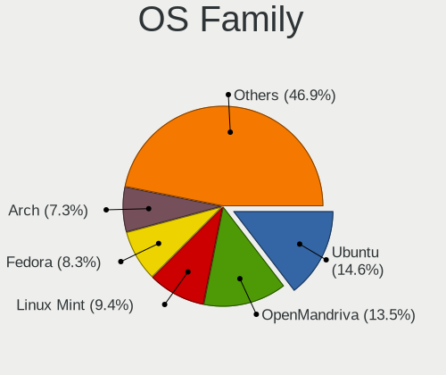

| Name         | Notebooks | Percent |
|--------------|-----------|---------|
| Ubuntu       | 17        | 22.67%  |
| Linux Mint   | 10        | 13.33%  |
| Fedora       | 10        | 13.33%  |
| Zorin        | 7         | 9.33%   |
| Pop!_OS      | 5         | 6.67%   |
| Debian       | 4         | 5.33%   |
| SteamOS      | 3         | 4%      |
| OpenMandriva | 3         | 4%      |
| Xubuntu      | 2         | 2.67%   |
| Manjaro      | 2         | 2.67%   |
| Gentoo       | 2         | 2.67%   |
| EndeavourOS  | 2         | 2.67%   |
| Xero         | 1         | 1.33%   |
| Parrot       | 1         | 1.33%   |
| Nobara       | 1         | 1.33%   |
| MX           | 1         | 1.33%   |
| Lubuntu      | 1         | 1.33%   |
| Kubuntu      | 1         | 1.33%   |
| ArcoLinux    | 1         | 1.33%   |
| Arch         | 1         | 1.33%   |

Kernel
------

Version of the Linux kernel

| Version                      | Notebooks | Percent |
|------------------------------|-----------|---------|
| 5.15.0-71-generic            | 14        | 18.67%  |
| 5.19.0-41-generic            | 8         | 10.67%  |
| 6.2.6-76060206-generic       | 5         | 6.67%   |
| 6.2.15-300.fc38.x86_64       | 4         | 5.33%   |
| 5.19.0-42-generic            | 4         | 5.33%   |
| 5.15.0-72-generic            | 4         | 5.33%   |
| 5.13.0-valve36-1-neptune     | 3         | 4%      |
| 6.3.4-arch1-1                | 2         | 2.67%   |
| 6.2.9-300.fc38.x86_64        | 2         | 2.67%   |
| 6.2.6-desktop-1omv2390       | 2         | 2.67%   |
| 6.2.14-300.fc38.x86_64       | 2         | 2.67%   |
| 6.2.0-20-generic             | 2         | 2.67%   |
| 5.10.0-23-amd64              | 2         | 2.67%   |
| 6.3.4-060304-generic         | 1         | 1.33%   |
| 6.3.3-zen1-1-zen             | 1         | 1.33%   |
| 6.3.1-zen1-1-zen             | 1         | 1.33%   |
| 6.3.0                        | 1         | 1.33%   |
| 6.2.15-200.fc37.x86_64       | 1         | 1.33%   |
| 6.2.14-300.fsync.fc37.x86_64 | 1         | 1.33%   |
| 6.2.13-300.fc38.x86_64       | 1         | 1.33%   |
| 6.1.28-1-lts                 | 1         | 1.33%   |
| 6.1.25-1-MANJARO             | 1         | 1.33%   |
| 6.1.24-gentoo-dist           | 1         | 1.33%   |
| 6.1.0-1parrot1-amd64         | 1         | 1.33%   |
| 6.0.0-6mx-amd64              | 1         | 1.33%   |
| 5.4.0-148-generic            | 1         | 1.33%   |
| 5.19.0-40-generic            | 1         | 1.33%   |
| 5.16.7-desktop-1omv4003      | 1         | 1.33%   |
| 5.15.108-1-MANJARO           | 1         | 1.33%   |
| 5.15.0-69-generic            | 1         | 1.33%   |
| 5.15.0-67-generic            | 1         | 1.33%   |
| 5.15.0-46-generic            | 1         | 1.33%   |
| 5.10.0-22-amd64              | 1         | 1.33%   |
| 5.10.0-18-amd64              | 1         | 1.33%   |

Kernel Family
-------------

Linux kernel without a distro release

| Version  | Notebooks | Percent |
|----------|-----------|---------|
| 5.15.0   | 21        | 28%     |
| 5.19.0   | 13        | 17.33%  |
| 6.2.6    | 7         | 9.33%   |
| 6.2.15   | 5         | 6.67%   |
| 5.10.0   | 4         | 5.33%   |
| 6.3.4    | 3         | 4%      |
| 6.2.14   | 3         | 4%      |
| 5.13.0   | 3         | 4%      |
| 6.2.9    | 2         | 2.67%   |
| 6.2.0    | 2         | 2.67%   |
| 6.3.3    | 1         | 1.33%   |
| 6.3.1    | 1         | 1.33%   |
| 6.3.0    | 1         | 1.33%   |
| 6.2.13   | 1         | 1.33%   |
| 6.1.28   | 1         | 1.33%   |
| 6.1.25   | 1         | 1.33%   |
| 6.1.24   | 1         | 1.33%   |
| 6.1.0    | 1         | 1.33%   |
| 6.0.0    | 1         | 1.33%   |
| 5.4.0    | 1         | 1.33%   |
| 5.16.7   | 1         | 1.33%   |
| 5.15.108 | 1         | 1.33%   |

Kernel Major Ver.
-----------------

Linux kernel major version

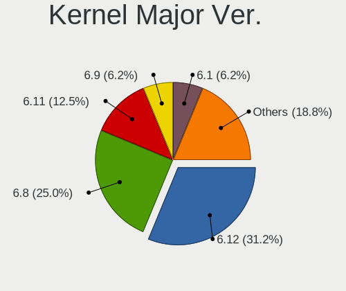

| Version | Notebooks | Percent |
|---------|-----------|---------|
| 5.15    | 22        | 29.33%  |
| 6.2     | 20        | 26.67%  |
| 5.19    | 13        | 17.33%  |
| 6.3     | 6         | 8%      |
| 6.1     | 4         | 5.33%   |
| 5.10    | 4         | 5.33%   |
| 5.13    | 3         | 4%      |
| 6.0     | 1         | 1.33%   |
| 5.4     | 1         | 1.33%   |
| 5.16    | 1         | 1.33%   |

Arch
----

OS architecture (x86_64, i586, etc.)

| Name   | Notebooks | Percent |
|--------|-----------|---------|
| x86_64 | 75        | 100%    |

DE
--

Desktop Environment

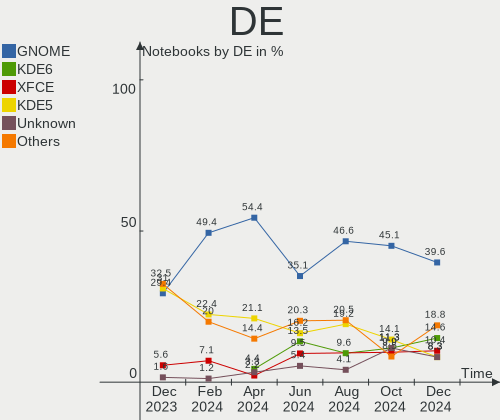

| Name       | Notebooks | Percent |
|------------|-----------|---------|
| GNOME      | 38        | 50.67%  |
| KDE5       | 15        | 20%     |
| X-Cinnamon | 8         | 10.67%  |
| XFCE       | 7         | 9.33%   |
| MATE       | 3         | 4%      |
| Unknown    | 2         | 2.67%   |
| LXQt       | 1         | 1.33%   |
| awesome    | 1         | 1.33%   |

Display Server
--------------

X11 or Wayland

| Name    | Notebooks | Percent |
|---------|-----------|---------|
| X11     | 54        | 72%     |
| Wayland | 19        | 25.33%  |
| Unknown | 2         | 2.67%   |

Display Manager
---------------

SDDM, LightDM, etc.

| Name    | Notebooks | Percent |
|---------|-----------|---------|
| Unknown | 31        | 41.33%  |
| LightDM | 13        | 17.33%  |
| GDM3    | 12        | 16%     |
| SDDM    | 10        | 13.33%  |
| GDM     | 8         | 10.67%  |
| LXDM    | 1         | 1.33%   |

OS Lang
-------

Language

| Lang    | Notebooks | Percent |
|---------|-----------|---------|
| en_CA   | 44        | 58.67%  |
| en_US   | 20        | 26.67%  |
| fr_CA   | 8         | 10.67%  |
| pl_PL   | 1         | 1.33%   |
| hu_HU   | 1         | 1.33%   |
| Unknown | 1         | 1.33%   |

Boot Mode
---------

EFI or BIOS

| Mode | Notebooks | Percent |
|------|-----------|---------|
| EFI  | 41        | 54.67%  |
| BIOS | 34        | 45.33%  |

Filesystem
----------

Type of filesystem

| Type    | Notebooks | Percent |
|---------|-----------|---------|
| Ext4    | 42        | 56%     |
| Btrfs   | 19        | 25.33%  |
| Tmpfs   | 8         | 10.67%  |
| Overlay | 3         | 4%      |
| Xfs     | 2         | 2.67%   |
| F2fs    | 1         | 1.33%   |

Part. scheme
------------

Scheme of partitioning

| Type    | Notebooks | Percent |
|---------|-----------|---------|
| GPT     | 42        | 56%     |
| Unknown | 29        | 38.67%  |
| MBR     | 4         | 5.33%   |

Dual Boot with Linux/BSD
------------------------

Hosting more than one Linux/BSD

| Dual boot | Notebooks | Percent |
|-----------|-----------|---------|
| No        | 67        | 89.33%  |
| Yes       | 8         | 10.67%  |

Dual Boot (Win)
---------------

Hosting Linux and Windows

| Dual boot | Notebooks | Percent |
|-----------|-----------|---------|
| No        | 60        | 80%     |
| Yes       | 15        | 20%     |

Board
-----

Vendor
------

Motherboard manufacturer

| Name                | Notebooks | Percent |
|---------------------|-----------|---------|
| Lenovo              | 16        | 21.33%  |
| Hewlett-Packard     | 14        | 18.67%  |
| ASUSTek Computer    | 10        | 13.33%  |
| Dell                | 9         | 12%     |
| Acer                | 7         | 9.33%   |
| Apple               | 4         | 5.33%   |
| Valve               | 3         | 4%      |
| Google              | 3         | 4%      |
| Samsung Electronics | 2         | 2.67%   |
| Alienware           | 2         | 2.67%   |
| System76            | 1         | 1.33%   |
| Sony                | 1         | 1.33%   |
| Panasonic           | 1         | 1.33%   |
| MSI                 | 1         | 1.33%   |
| BOSGAME             | 1         | 1.33%   |

Model
-----

Motherboard model

| Name                                       | Notebooks | Percent |
|--------------------------------------------|-----------|---------|
| Valve Jupiter                              | 3         | 4%      |
| System76 Gazelle                           | 1         | 1.33%   |
| Sony VPCF120FD                             | 1         | 1.33%   |
| Samsung R430/R480                          | 1         | 1.33%   |
| Samsung 910S3G/910S3T                      | 1         | 1.33%   |
| Panasonic CF-19-8                          | 1         | 1.33%   |
| MSI GF65 Thin 10UE                         | 1         | 1.33%   |
| Lenovo ThinkPad X230 23252UU               | 1         | 1.33%   |
| Lenovo ThinkPad X1 Carbon Gen 8 20U9001PUS | 1         | 1.33%   |
| Lenovo ThinkPad X1 Carbon 5th 20HRCTO1WW   | 1         | 1.33%   |
| Lenovo ThinkPad X1 Carbon 5th 20HQS3DV00   | 1         | 1.33%   |
| Lenovo ThinkPad X1 Carbon 3rd 20BTS41M00   | 1         | 1.33%   |
| Lenovo ThinkPad X1 Carbon 2nd 20A8S0ET00   | 1         | 1.33%   |
| Lenovo ThinkPad W500 4058CTO               | 1         | 1.33%   |
| Lenovo ThinkPad T580 20L9CTO1WW            | 1         | 1.33%   |
| Lenovo ThinkPad T540p 20BF001NUS           | 1         | 1.33%   |
| Lenovo ThinkPad T490 20N3S4VV00            | 1         | 1.33%   |
| Lenovo ThinkPad T420 4236N79               | 1         | 1.33%   |
| Lenovo Legion Y530-15ICH 81FV              | 1         | 1.33%   |
| Lenovo IdeaPad 320-17IKB 80XM              | 1         | 1.33%   |
| Lenovo IdeaPad 320-15IKB 80XL              | 1         | 1.33%   |
| Lenovo G505s 20255                         | 1         | 1.33%   |
| HP ProBook 450 G2                          | 1         | 1.33%   |
| HP Pavilion dv6                            | 1         | 1.33%   |
| HP Pavilion Aero Laptop 13-be0xxx          | 1         | 1.33%   |
| HP Pavilion 15                             | 1         | 1.33%   |
| HP Laptop 17-by2xxx                        | 1         | 1.33%   |
| HP Laptop 15                               | 1         | 1.33%   |
| HP HDX18                                   | 1         | 1.33%   |
| HP ENVY TS 17                              | 1         | 1.33%   |
| HP ENVY Laptop 14-eb0xxx                   | 1         | 1.33%   |
| HP EliteBook 8760w                         | 1         | 1.33%   |
| HP EliteBook 8570w                         | 1         | 1.33%   |
| HP EliteBook 840 G5                        | 1         | 1.33%   |
| HP EliteBook 840 G3                        | 1         | 1.33%   |
| HP EliteBook 840 G2                        | 1         | 1.33%   |
| Google Kled                                | 1         | 1.33%   |
| Google Kip                                 | 1         | 1.33%   |
| Google Edgar                               | 1         | 1.33%   |
| Dell XPS 15 9570                           | 1         | 1.33%   |

Model Family
------------

Motherboard model prefix

| Name               | Notebooks | Percent |
|--------------------|-----------|---------|
| Lenovo ThinkPad    | 11        | 14.67%  |
| Acer Aspire        | 6         | 8%      |
| HP EliteBook       | 5         | 6.67%   |
| Dell Latitude      | 5         | 6.67%   |
| Valve Jupiter      | 3         | 4%      |
| HP Pavilion        | 3         | 4%      |
| ASUS ZenBook       | 3         | 4%      |
| Lenovo IdeaPad     | 2         | 2.67%   |
| HP Laptop          | 2         | 2.67%   |
| HP ENVY            | 2         | 2.67%   |
| Dell XPS           | 2         | 2.67%   |
| ASUS VivoBook      | 2         | 2.67%   |
| ASUS ROG           | 2         | 2.67%   |
| System76 Gazelle   | 1         | 1.33%   |
| Sony VPCF120FD     | 1         | 1.33%   |
| Samsung R430       | 1         | 1.33%   |
| Samsung 910S3G     | 1         | 1.33%   |
| Panasonic CF-19-8  | 1         | 1.33%   |
| MSI GF65           | 1         | 1.33%   |
| Lenovo Legion      | 1         | 1.33%   |
| Lenovo G505s       | 1         | 1.33%   |
| HP ProBook         | 1         | 1.33%   |
| HP HDX18           | 1         | 1.33%   |
| Google Kled        | 1         | 1.33%   |
| Google Kip         | 1         | 1.33%   |
| Google Edgar       | 1         | 1.33%   |
| Dell Precision     | 1         | 1.33%   |
| Dell Inspiron      | 1         | 1.33%   |
| BOSGAME B95        | 1         | 1.33%   |
| ASUS UX430UAR      | 1         | 1.33%   |
| ASUS K53TK         | 1         | 1.33%   |
| ASUS ASUS          | 1         | 1.33%   |
| Apple MacBookPro9  | 1         | 1.33%   |
| Apple MacBookPro5  | 1         | 1.33%   |
| Apple MacBookPro16 | 1         | 1.33%   |
| Apple MacBookAir4  | 1         | 1.33%   |
| Alienware m17      | 1         | 1.33%   |
| Alienware 17       | 1         | 1.33%   |
| Acer Swift         | 1         | 1.33%   |
| Unknown            | 1         | 1.33%   |

MFG Year
--------

Motherboard manufacture year

| Year | Notebooks | Percent |
|------|-----------|---------|
| 2022 | 8         | 10.67%  |
| 2019 | 8         | 10.67%  |
| 2012 | 8         | 10.67%  |
| 2018 | 6         | 8%      |
| 2017 | 6         | 8%      |
| 2013 | 6         | 8%      |
| 2023 | 5         | 6.67%   |
| 2021 | 5         | 6.67%   |
| 2020 | 4         | 5.33%   |
| 2014 | 4         | 5.33%   |
| 2011 | 4         | 5.33%   |
| 2016 | 3         | 4%      |
| 2015 | 2         | 2.67%   |
| 2010 | 2         | 2.67%   |
| 2009 | 2         | 2.67%   |
| 2008 | 2         | 2.67%   |

Form Factor
-----------

Physical design of the computer

| Name     | Notebooks | Percent |
|----------|-----------|---------|
| Notebook | 75        | 100%    |

Secure Boot
-----------

Enabled or disabled

| State    | Notebooks | Percent |
|----------|-----------|---------|
| Disabled | 67        | 89.33%  |
| Enabled  | 8         | 10.67%  |

Coreboot
--------

Have coreboot on board

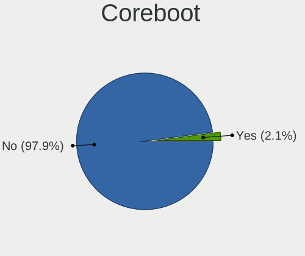

| Used | Notebooks | Percent |
|------|-----------|---------|
| No   | 71        | 94.67%  |
| Yes  | 4         | 5.33%   |

RAM Size
--------

Total RAM memory

| Size in GB  | Notebooks | Percent |
|-------------|-----------|---------|
| 4.01-8.0    | 25        | 33.33%  |
| 8.01-16.0   | 17        | 22.67%  |
| 16.01-24.0  | 15        | 20%     |
| 3.01-4.0    | 8         | 10.67%  |
| 32.01-64.0  | 4         | 5.33%   |
| 1.01-2.0    | 3         | 4%      |
| 64.01-256.0 | 2         | 2.67%   |
| 24.01-32.0  | 1         | 1.33%   |

RAM Used
--------

Used RAM memory

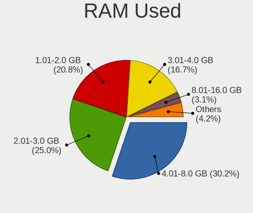

| Used GB    | Notebooks | Percent |
|------------|-----------|---------|
| 4.01-8.0   | 21        | 28%     |
| 1.01-2.0   | 19        | 25.33%  |
| 2.01-3.0   | 17        | 22.67%  |
| 3.01-4.0   | 13        | 17.33%  |
| 16.01-24.0 | 2         | 2.67%   |
| 8.01-16.0  | 2         | 2.67%   |
| 0.51-1.0   | 1         | 1.33%   |

Total Drives
------------

Number of drives on board

| Drives | Notebooks | Percent |
|--------|-----------|---------|
| 1      | 63        | 84%     |
| 2      | 9         | 12%     |
| 3      | 3         | 4%      |

Has CD-ROM
----------

Has CD-ROM on board

| Presented | Notebooks | Percent |
|-----------|-----------|---------|
| No        | 52        | 69.33%  |
| Yes       | 23        | 30.67%  |

Has Ethernet
------------

Has Ethernet on board

| Presented | Notebooks | Percent |
|-----------|-----------|---------|
| Yes       | 56        | 74.67%  |
| No        | 19        | 25.33%  |

Has WiFi
--------

Has WiFi module

| Presented | Notebooks | Percent |
|-----------|-----------|---------|
| Yes       | 75        | 100%    |

Has Bluetooth
-------------

Has Bluetooth module

| Presented | Notebooks | Percent |
|-----------|-----------|---------|
| Yes       | 69        | 92%     |
| No        | 6         | 8%      |

Location
--------

Country
-------

Geographic location (country)

| Country | Notebooks | Percent |
|---------|-----------|---------|
| Canada  | 75        | 100%    |

City
----

Geographic location (city)

| City                  | Notebooks | Percent |
|-----------------------|-----------|---------|
| Toronto               | 12        | 16%     |
| Montreal              | 6         | 8%      |
| Calgary               | 5         | 6.67%   |
| Ottawa                | 3         | 4%      |
| London                | 3         | 4%      |
| Winnipeg              | 2         | 2.67%   |
| Windsor               | 2         | 2.67%   |
| Surrey                | 2         | 2.67%   |
| Sherbrooke            | 2         | 2.67%   |
| Québec               | 2         | 2.67%   |
| New Westminster       | 2         | 2.67%   |
| Edmonton              | 2         | 2.67%   |
| Winlaw                | 1         | 1.33%   |
| Vancouver             | 1         | 1.33%   |
| Stratford             | 1         | 1.33%   |
| St. Catharines        | 1         | 1.33%   |
| St. Albert            | 1         | 1.33%   |
| Scarborough           | 1         | 1.33%   |
| Saskatoon             | 1         | 1.33%   |
| Sarnia                | 1         | 1.33%   |
| Richmond              | 1         | 1.33%   |
| Prescott              | 1         | 1.33%   |
| Port Coquitlam        | 1         | 1.33%   |
| Notre Dame de Lourdes | 1         | 1.33%   |
| Nepean                | 1         | 1.33%   |
| Nanton                | 1         | 1.33%   |
| Massey                | 1         | 1.33%   |
| Laval                 | 1         | 1.33%   |
| Jonquiere             | 1         | 1.33%   |
| Hamilton              | 1         | 1.33%   |
| Halifax               | 1         | 1.33%   |
| Guelph                | 1         | 1.33%   |
| Greater Sudbury       | 1         | 1.33%   |
| Fort McMurray         | 1         | 1.33%   |
| Devon                 | 1         | 1.33%   |
| Czar                  | 1         | 1.33%   |
| Chicoutimi            | 1         | 1.33%   |
| Burlington            | 1         | 1.33%   |
| Bryson                | 1         | 1.33%   |
| Brampton              | 1         | 1.33%   |

Drives
------

Drive Vendor
------------

Hard drive vendors

| Vendor                    | Notebooks | Drives | Percent |
|---------------------------|-----------|--------|---------|
| Samsung Electronics       | 15        | 15     | 17.24%  |
| WDC                       | 10        | 10     | 11.49%  |
| Unknown                   | 6         | 6      | 6.9%    |
| SK hynix                  | 6         | 6      | 6.9%    |
| Sandisk                   | 6         | 6      | 6.9%    |
| Seagate                   | 5         | 5      | 5.75%   |
| Toshiba                   | 4         | 4      | 4.6%    |
| HGST                      | 4         | 4      | 4.6%    |
| Intel                     | 3         | 3      | 3.45%   |
| Crucial                   | 3         | 4      | 3.45%   |
| A-DATA Technology         | 3         | 3      | 3.45%   |
| SPCC                      | 2         | 2      | 2.3%    |
| Micron Technology         | 2         | 2      | 2.3%    |
| KIOXIA                    | 2         | 2      | 2.3%    |
| Kingston                  | 2         | 2      | 2.3%    |
| Hitachi                   | 2         | 2      | 2.3%    |
| Apple                     | 2         | 2      | 2.3%    |
| Zheino                    | 1         | 1      | 1.15%   |
| PNY                       | 1         | 1      | 1.15%   |
| Phison Electronics        | 1         | 1      | 1.15%   |
| O2 Micro                  | 1         | 1      | 1.15%   |
| Mushkin                   | 1         | 1      | 1.15%   |
| Micron/Crucial Technology | 1         | 1      | 1.15%   |
| LITEONIT                  | 1         | 1      | 1.15%   |
| CT2000MX                  | 1         | 1      | 1.15%   |
| China                     | 1         | 1      | 1.15%   |
| Advantech                 | 1         | 1      | 1.15%   |

Drive Model
-----------

Hard drive models

| Model                                               | Notebooks | Percent |
|-----------------------------------------------------|-----------|---------|
| Seagate ST1000LM035-1RK172 1TB                      | 2         | 2.27%   |
| Samsung NVMe SSD Controller SM961/PM961/SM963 256GB | 2         | 2.27%   |
| Intel SSDPEKNU512GZ 512GB                           | 2         | 2.27%   |
| HGST HTS725050A7E630 500GB                          | 2         | 2.27%   |
| Zheino CHN-25SATAC3-120 120GB SSD                   | 1         | 1.14%   |
| WDC WDS500G2B0B-00YS70 500GB SSD                    | 1         | 1.14%   |
| WDC WDS100T2B0B-00YS70 1TB SSD                      | 1         | 1.14%   |
| WDC WD7500BPVT-22HXZT3 752GB                        | 1         | 1.14%   |
| WDC WD6400BPVT-16HXZT1 640GB                        | 1         | 1.14%   |
| WDC WD3200BEKT-08PVMT1 320GB                        | 1         | 1.14%   |
| WDC WD10SPZX-60Z10T0 1TB                            | 1         | 1.14%   |
| WDC WD10JPVX-00JC3T0 1TB                            | 1         | 1.14%   |
| WDC WD10JPLX-00MBPT1 1TB                            | 1         | 1.14%   |
| WDC PC SN730 SDBQNTY-512G-1001 512GB                | 1         | 1.14%   |
| WDC PC SN530 SDBPNPZ-512G-1114 512GB                | 1         | 1.14%   |
| Unknown MMC Card  512GB                             | 1         | 1.14%   |
| Unknown MMC Card  32GB                              | 1         | 1.14%   |
| Unknown MMC Card  250GB                             | 1         | 1.14%   |
| Unknown MMC Card  16GB                              | 1         | 1.14%   |
| Unknown MMC Card  128GB                             | 1         | 1.14%   |
| Unknown DA4128  128GB                               | 1         | 1.14%   |
| Toshiba MQ01ABD100 1TB                              | 1         | 1.14%   |
| Toshiba MK6476GSX 640GB                             | 1         | 1.14%   |
| Toshiba MK2555GSX 250GB                             | 1         | 1.14%   |
| Toshiba KSG60ZMV256G M.2 2280 256GB SSD             | 1         | 1.14%   |
| SPCC Solid State Disk 512GB                         | 1         | 1.14%   |
| SPCC Solid State Disk 256GB                         | 1         | 1.14%   |
| SK hynix PC401 NVMe Solid State Drive 256GB         | 1         | 1.14%   |
| SK hynix HFS256G39TND-N210A 256GB SSD               | 1         | 1.14%   |
| SK hynix HFM001TD3JX013N 1TB                        | 1         | 1.14%   |
| SK hynix BC711 HFM512GD3JX013N 512GB                | 1         | 1.14%   |
| SK hynix BC501 NVMe Solid State Drive 512GB         | 1         | 1.14%   |
| SK hynix BC501 HFM256GDJTNG-8310A 256GB             | 1         | 1.14%   |
| Seagate ST1000LM049-2GH172 1TB                      | 1         | 1.14%   |
| Seagate ST1000LM014-1EJ164-SSHD 1TB                 | 1         | 1.14%   |
| Seagate Portable 2TB                                | 1         | 1.14%   |
| Sandisk WD PC SN735 SDBPNHH-1T00-1002 1TB           | 1         | 1.14%   |
| Sandisk WD Blue SN550 NVMe SSD 512GB                | 1         | 1.14%   |
| SanDisk SD9SN8W128G1102 128GB SSD                   | 1         | 1.14%   |
| SanDisk SD8SN8U-256G-1006 256GB SSD                 | 1         | 1.14%   |

HDD Vendor
----------

Hard disk drive vendors

| Vendor  | Notebooks | Drives | Percent |
|---------|-----------|--------|---------|
| WDC     | 6         | 6      | 31.58%  |
| Seagate | 4         | 4      | 21.05%  |
| HGST    | 4         | 4      | 21.05%  |
| Toshiba | 3         | 3      | 15.79%  |
| Hitachi | 2         | 2      | 10.53%  |

SSD Vendor
----------

Solid state drive vendors

| Vendor              | Notebooks | Drives | Percent |
|---------------------|-----------|--------|---------|
| Samsung Electronics | 7         | 7      | 23.33%  |
| A-DATA Technology   | 3         | 3      | 10%     |
| WDC                 | 2         | 2      | 6.67%   |
| SPCC                | 2         | 2      | 6.67%   |
| SanDisk             | 2         | 2      | 6.67%   |
| Crucial             | 2         | 2      | 6.67%   |
| Zheino              | 1         | 1      | 3.33%   |
| Toshiba             | 1         | 1      | 3.33%   |
| SK hynix            | 1         | 1      | 3.33%   |
| PNY                 | 1         | 1      | 3.33%   |
| Mushkin             | 1         | 1      | 3.33%   |
| LITEONIT            | 1         | 1      | 3.33%   |
| Kingston            | 1         | 1      | 3.33%   |
| Intel               | 1         | 1      | 3.33%   |
| CT2000MX            | 1         | 1      | 3.33%   |
| China               | 1         | 1      | 3.33%   |
| Apple               | 1         | 1      | 3.33%   |
| Advantech           | 1         | 1      | 3.33%   |

Drive Kind
----------

HDD or SSD

| Kind    | Notebooks | Drives | Percent |
|---------|-----------|--------|---------|
| NVMe    | 31        | 32     | 36.47%  |
| SSD     | 28        | 30     | 32.94%  |
| HDD     | 19        | 19     | 22.35%  |
| MMC     | 6         | 6      | 7.06%   |
| Unknown | 1         | 1      | 1.18%   |

Drive Connector
---------------

SATA, SAS, NVMe, etc.

| Type | Notebooks | Drives | Percent |
|------|-----------|--------|---------|
| SATA | 43        | 47     | 51.81%  |
| NVMe | 31        | 32     | 37.35%  |
| MMC  | 6         | 6      | 7.23%   |
| SAS  | 3         | 3      | 3.61%   |

Drive Size
----------

Size of hard drive

| Size in TB | Notebooks | Drives | Percent |
|------------|-----------|--------|---------|
| 0.01-0.5   | 26        | 28     | 56.52%  |
| 0.51-1.0   | 17        | 18     | 36.96%  |
| 1.01-2.0   | 3         | 3      | 6.52%   |

Space Total
-----------

Amount of disk space available on the file system

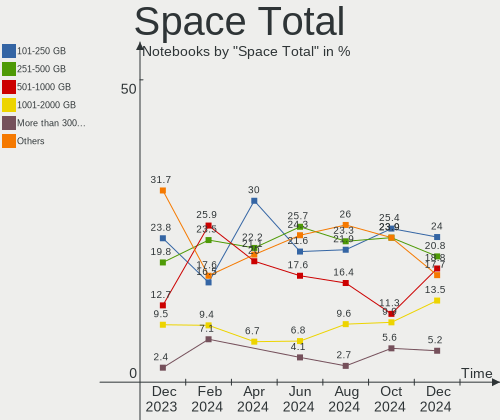

| Size in GB     | Notebooks | Percent |
|----------------|-----------|---------|
| 101-250        | 19        | 25.33%  |
| 501-1000       | 17        | 22.67%  |
| 251-500        | 16        | 21.33%  |
| 1001-2000      | 8         | 10.67%  |
| 1-20           | 6         | 8%      |
| 51-100         | 4         | 5.33%   |
| 21-50          | 2         | 2.67%   |
| Unknown        | 2         | 2.67%   |
| More than 3000 | 1         | 1.33%   |

Space Used
----------

Amount of used disk space

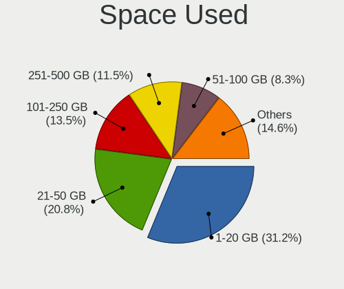

| Used GB   | Notebooks | Percent |
|-----------|-----------|---------|
| 1-20      | 26        | 34.67%  |
| 21-50     | 14        | 18.67%  |
| 51-100    | 12        | 16%     |
| 251-500   | 9         | 12%     |
| 101-250   | 9         | 12%     |
| 501-1000  | 2         | 2.67%   |
| Unknown   | 2         | 2.67%   |
| 1001-2000 | 1         | 1.33%   |

Malfunc. Drives
---------------

Drive models with a malfunction

| Model                                        | Notebooks | Drives | Percent |
|----------------------------------------------|-----------|--------|---------|
| WDC WD10JPLX-00MBPT1 1TB                     | 1         | 1      | 20%     |
| Toshiba MK2555GSX 250GB                      | 1         | 1      | 20%     |
| Samsung Electronics SSD 840 PRO Series 256GB | 1         | 1      | 20%     |
| Intel SSDSC2BF180A5L 180GB                   | 1         | 1      | 20%     |
| Hitachi HTS725050A9A364 500GB                | 1         | 1      | 20%     |

Malfunc. Drive Vendor
---------------------

Vendors of faulty drives

| Vendor              | Notebooks | Drives | Percent |
|---------------------|-----------|--------|---------|
| WDC                 | 1         | 1      | 20%     |
| Toshiba             | 1         | 1      | 20%     |
| Samsung Electronics | 1         | 1      | 20%     |
| Intel               | 1         | 1      | 20%     |
| Hitachi             | 1         | 1      | 20%     |

Malfunc. HDD Vendor
-------------------

Vendors of faulty HDD drives

| Vendor  | Notebooks | Drives | Percent |
|---------|-----------|--------|---------|
| WDC     | 1         | 1      | 33.33%  |
| Toshiba | 1         | 1      | 33.33%  |
| Hitachi | 1         | 1      | 33.33%  |

Malfunc. Drive Kind
-------------------

Kinds of faulty drives

| Kind | Notebooks | Drives | Percent |
|------|-----------|--------|---------|
| HDD  | 3         | 3      | 60%     |
| SSD  | 2         | 2      | 40%     |

Failed Drives
-------------

Failed drive models

Zero info for selected period =(

Failed Drive Vendor
-------------------

Failed drive vendors

Zero info for selected period =(

Drive Status
------------

Number of failed and malfunc. drives

| Status   | Notebooks | Drives | Percent |
|----------|-----------|--------|---------|
| Detected | 43        | 50     | 55.84%  |
| Works    | 29        | 33     | 37.66%  |
| Malfunc  | 5         | 5      | 6.49%   |

Storage controller
------------------

Storage Vendor
--------------

Storage controller vendors

| Vendor                       | Notebooks | Percent |
|------------------------------|-----------|---------|
| Intel                        | 47        | 55.29%  |
| Samsung Electronics          | 8         | 9.41%   |
| AMD                          | 8         | 9.41%   |
| SanDisk                      | 6         | 7.06%   |
| SK hynix                     | 5         | 5.88%   |
| Micron/Crucial Technology    | 2         | 2.35%   |
| Micron Technology            | 2         | 2.35%   |
| Toshiba America Info Systems | 1         | 1.18%   |
| Phison Electronics           | 1         | 1.18%   |
| O2 Micro                     | 1         | 1.18%   |
| Nvidia                       | 1         | 1.18%   |
| KIOXIA                       | 1         | 1.18%   |
| Kingston Technology Company  | 1         | 1.18%   |
| Apple                        | 1         | 1.18%   |

Storage Model
-------------

Storage controller models

| Model                                                                                  | Notebooks | Percent |
|----------------------------------------------------------------------------------------|-----------|---------|
| Intel 7 Series Chipset Family 6-port SATA Controller [AHCI mode]                       | 8         | 9.09%   |
| AMD FCH SATA Controller [AHCI mode]                                                    | 8         | 9.09%   |
| Intel 82801 Mobile SATA Controller [RAID mode]                                         | 7         | 7.95%   |
| Intel Volume Management Device NVMe RAID Controller                                    | 4         | 4.55%   |
| Intel Cannon Lake Mobile PCH SATA AHCI Controller                                      | 4         | 4.55%   |
| Intel 8 Series SATA Controller 1 [AHCI mode]                                           | 4         | 4.55%   |
| Samsung NVMe SSD Controller 980                                                        | 3         | 3.41%   |
| Intel Sunrise Point-LP SATA Controller [AHCI mode]                                     | 3         | 3.41%   |
| SK hynix Gold P31/PC711 NVMe Solid State Drive                                         | 2         | 2.27%   |
| SK hynix BC501 NVMe Solid State Drive                                                  | 2         | 2.27%   |
| SanDisk WD Blue SN550 NVMe SSD                                                         | 2         | 2.27%   |
| Samsung NVMe SSD Controller SM981/PM981/PM983                                          | 2         | 2.27%   |
| Samsung NVMe SSD Controller SM961/PM961/SM963                                          | 2         | 2.27%   |
| Micron/Crucial P2 NVMe PCIe SSD                                                        | 2         | 2.27%   |
| Micron NVMe Storage Controller                                                         | 2         | 2.27%   |
| Intel Wildcat Point-LP SATA Controller [AHCI Mode]                                     | 2         | 2.27%   |
| Intel Non-Volatile memory controller                                                   | 2         | 2.27%   |
| Intel 82801IBM/IEM (ICH9M/ICH9M-E) 4 port SATA Controller [AHCI mode]                  | 2         | 2.27%   |
| Intel 8 Series/C220 Series Chipset Family 6-port SATA Controller 1 [AHCI mode]         | 2         | 2.27%   |
| Intel 6 Series/C200 Series Chipset Family Mobile SATA Controller (IDE mode, ports 4-5) | 2         | 2.27%   |
| Intel 6 Series/C200 Series Chipset Family Mobile SATA Controller (IDE mode, ports 0-3) | 2         | 2.27%   |
| Intel 6 Series/C200 Series Chipset Family 6 port Mobile SATA AHCI Controller           | 2         | 2.27%   |
| Intel 5 Series/3400 Series Chipset 4 port SATA AHCI Controller                         | 2         | 2.27%   |
| Toshiba America Info Systems XG6 NVMe SSD Controller                                   | 1         | 1.14%   |
| SK hynix PC401 NVMe Solid State Drive 256GB                                            | 1         | 1.14%   |
| Sandisk Western Digital WD Black SN850X NVMe SSD                                       | 1         | 1.14%   |
| SanDisk WD Black SN750 / PC SN730 NVMe SSD                                             | 1         | 1.14%   |
| SanDisk PC SN520 NVMe SSD                                                              | 1         | 1.14%   |
| SanDisk Non-Volatile memory controller                                                 | 1         | 1.14%   |
| Samsung NVMe SSD Controller PM9A1/PM9A3/980PRO                                         | 1         | 1.14%   |
| Phison PS5013 E13 NVMe Controller                                                      | 1         | 1.14%   |
| O2 Micro Non-Volatile memory controller                                                | 1         | 1.14%   |
| Nvidia MCP79 AHCI Controller                                                           | 1         | 1.14%   |
| KIOXIA NVMe SSD Controller BG4                                                         | 1         | 1.14%   |
| Kingston Company Company Non-Volatile memory controller                                | 1         | 1.14%   |
| Intel SATA controller                                                                  | 1         | 1.14%   |
| Intel Cannon Point-LP SATA Controller [AHCI Mode]                                      | 1         | 1.14%   |
| Intel 500 Series Chipset Family SATA AHCI Controller                                   | 1         | 1.14%   |
| Intel 5 Series/3400 Series Chipset 6 port SATA AHCI Controller                         | 1         | 1.14%   |
| Apple ANS2 NVMe Controller                                                             | 1         | 1.14%   |

Storage Kind
------------

Kind of storage controller (IDE, SATA, NVMe, SAS, ...)

| Kind | Notebooks | Percent |
|------|-----------|---------|
| SATA | 42        | 48.84%  |
| NVMe | 31        | 36.05%  |
| RAID | 11        | 12.79%  |
| IDE  | 2         | 2.33%   |

Processor
---------

CPU Vendor
----------

Processor vendors

| Vendor | Notebooks | Percent |
|--------|-----------|---------|
| Intel  | 58        | 77.33%  |
| AMD    | 17        | 22.67%  |

CPU Model
---------

Processor models

| Model                                         | Notebooks | Percent |
|-----------------------------------------------|-----------|---------|
| AMD Custom APU 0405                           | 3         | 4%      |
| Intel Core i7-9850H CPU @ 2.60GHz             | 2         | 2.67%   |
| Intel Core i7-8650U CPU @ 1.90GHz             | 2         | 2.67%   |
| Intel Core i5-8250U CPU @ 1.60GHz             | 2         | 2.67%   |
| Intel Core i5-3320M CPU @ 2.60GHz             | 2         | 2.67%   |
| Intel Core i5-10210U CPU @ 1.60GHz            | 2         | 2.67%   |
| Intel 11th Gen Core i5-1135G7 @ 2.40GHz       | 2         | 2.67%   |
| AMD Ryzen 5 3500U with Radeon Vega Mobile Gfx | 2         | 2.67%   |
| Intel N95                                     | 1         | 1.33%   |
| Intel Core i7-8750H CPU @ 2.20GHz             | 1         | 1.33%   |
| Intel Core i7-8565U CPU @ 1.80GHz             | 1         | 1.33%   |
| Intel Core i7-7600U CPU @ 2.80GHz             | 1         | 1.33%   |
| Intel Core i7-7500U CPU @ 2.70GHz             | 1         | 1.33%   |
| Intel Core i7-6700HQ CPU @ 2.60GHz            | 1         | 1.33%   |
| Intel Core i7-4710MQ CPU @ 2.50GHz            | 1         | 1.33%   |
| Intel Core i7-4600U CPU @ 2.10GHz             | 1         | 1.33%   |
| Intel Core i7-4510U CPU @ 2.00GHz             | 1         | 1.33%   |
| Intel Core i7-3615QM CPU @ 2.30GHz            | 1         | 1.33%   |
| Intel Core i7-3520M CPU @ 2.90GHz             | 1         | 1.33%   |
| Intel Core i7-3517U CPU @ 1.90GHz             | 1         | 1.33%   |
| Intel Core i7-10750H CPU @ 2.60GHz            | 1         | 1.33%   |
| Intel Core i5-8365U CPU @ 1.60GHz             | 1         | 1.33%   |
| Intel Core i5-8300H CPU @ 2.30GHz             | 1         | 1.33%   |
| Intel Core i5-8265U CPU @ 1.60GHz             | 1         | 1.33%   |
| Intel Core i5-7300HQ CPU @ 2.50GHz            | 1         | 1.33%   |
| Intel Core i5-7200U CPU @ 2.50GHz             | 1         | 1.33%   |
| Intel Core i5-6200U CPU @ 2.30GHz             | 1         | 1.33%   |
| Intel Core i5-5300U CPU @ 2.30GHz             | 1         | 1.33%   |
| Intel Core i5-5200U CPU @ 2.20GHz             | 1         | 1.33%   |
| Intel Core i5-4300M CPU @ 2.60GHz             | 1         | 1.33%   |
| Intel Core i5-4200U CPU @ 1.60GHz             | 1         | 1.33%   |
| Intel Core i5-3610ME CPU @ 2.70GHz            | 1         | 1.33%   |
| Intel Core i5-3360M CPU @ 2.80GHz             | 1         | 1.33%   |
| Intel Core i5-3337U CPU @ 1.80GHz             | 1         | 1.33%   |
| Intel Core i5-3230M CPU @ 2.60GHz             | 1         | 1.33%   |
| Intel Core i5-2540M CPU @ 2.60GHz             | 1         | 1.33%   |
| Intel Core i5-2520M CPU @ 2.50GHz             | 1         | 1.33%   |
| Intel Core i5-2467M CPU @ 1.60GHz             | 1         | 1.33%   |
| Intel Core i5-1038NG7 CPU @ 2.00GHz           | 1         | 1.33%   |
| Intel Core i5 CPU M 460 @ 2.53GHz             | 1         | 1.33%   |

CPU Model Family
----------------

Processor model prefix

| Model             | Notebooks | Percent |
|-------------------|-----------|---------|
| Intel Core i5     | 26        | 34.67%  |
| Intel Core i7     | 16        | 21.33%  |
| Other             | 9         | 12%     |
| Intel Core i3     | 5         | 6.67%   |
| AMD Ryzen 5       | 5         | 6.67%   |
| Intel Core 2 Duo  | 2         | 2.67%   |
| Intel Celeron     | 2         | 2.67%   |
| AMD Ryzen 9       | 2         | 2.67%   |
| AMD Ryzen 7       | 2         | 2.67%   |
| Intel Core 2 Quad | 1         | 1.33%   |
| AMD A8            | 1         | 1.33%   |
| AMD A6            | 1         | 1.33%   |
| AMD A4            | 1         | 1.33%   |
| AMD A12           | 1         | 1.33%   |
| AMD A10           | 1         | 1.33%   |

CPU Cores
---------

Number of processor cores

| Number | Notebooks | Percent |
|--------|-----------|---------|
| 2      | 34        | 45.33%  |
| 4      | 29        | 38.67%  |
| 8      | 6         | 8%      |
| 6      | 6         | 8%      |

CPU Sockets
-----------

Number of sockets

| Number | Notebooks | Percent |
|--------|-----------|---------|
| 1      | 75        | 100%    |

CPU Threads
-----------

Threads per core (Hyper-Threading)

| Number | Notebooks | Percent |
|--------|-----------|---------|
| 2      | 65        | 86.67%  |
| 1      | 10        | 13.33%  |

CPU Op-Modes
------------

CPU Operation Modes (32-bit, 64-bit)

| Op mode        | Notebooks | Percent |
|----------------|-----------|---------|
| 32-bit, 64-bit | 75        | 100%    |

CPU Microcode
-------------

Microcode number

| Number     | Notebooks | Percent |
|------------|-----------|---------|
| Unknown    | 40        | 53.33%  |
| 0x806ec    | 5         | 6.67%   |
| 0x306a9    | 4         | 5.33%   |
| 0x806c1    | 3         | 4%      |
| 0x906ed    | 2         | 2.67%   |
| 0x806e9    | 2         | 2.67%   |
| 0x206a7    | 2         | 2.67%   |
| 0x1067a    | 2         | 2.67%   |
| 0x0a50000c | 2         | 2.67%   |
| 0x906ea    | 1         | 1.33%   |
| 0x906e9    | 1         | 1.33%   |
| 0x806ea    | 1         | 1.33%   |
| 0x506e3    | 1         | 1.33%   |
| 0x406e3    | 1         | 1.33%   |
| 0x40651    | 1         | 1.33%   |
| 0x30678    | 1         | 1.33%   |
| 0x0a404102 | 1         | 1.33%   |
| 0x08108109 | 1         | 1.33%   |
| 0x07030105 | 1         | 1.33%   |
| 0x0600611a | 1         | 1.33%   |
| 0x06001119 | 1         | 1.33%   |
| 0x06001116 | 1         | 1.33%   |

CPU Microarch
-------------

Microarchitecture

| Name             | Notebooks | Percent |
|------------------|-----------|---------|
| KabyLake         | 19        | 25.33%  |
| IvyBridge        | 9         | 12%     |
| Unknown          | 8         | 10.67%  |
| Haswell          | 6         | 8%      |
| SandyBridge      | 4         | 5.33%   |
| Zen 3            | 3         | 4%      |
| Westmere         | 3         | 4%      |
| TigerLake        | 3         | 4%      |
| Penryn           | 3         | 4%      |
| Zen+             | 2         | 2.67%   |
| Skylake          | 2         | 2.67%   |
| Silvermont       | 2         | 2.67%   |
| Piledriver       | 2         | 2.67%   |
| Broadwell        | 2         | 2.67%   |
| Zen              | 1         | 1.33%   |
| Puma             | 1         | 1.33%   |
| K10 Llano        | 1         | 1.33%   |
| IceLake          | 1         | 1.33%   |
| Excavator        | 1         | 1.33%   |
| CometLake        | 1         | 1.33%   |
| Alderlake Hybrid | 1         | 1.33%   |

Graphics
--------

GPU Vendor
----------

Vendors of graphics cards

| Vendor | Notebooks | Percent |
|--------|-----------|---------|
| Intel  | 51        | 57.3%   |
| AMD    | 20        | 22.47%  |
| Nvidia | 18        | 20.22%  |

GPU Model
---------

Graphics card models

| Model                                                                                    | Notebooks | Percent |
|------------------------------------------------------------------------------------------|-----------|---------|
| Intel 3rd Gen Core processor Graphics Controller                                         | 7         | 7.61%   |
| Intel UHD Graphics 620                                                                   | 4         | 4.35%   |
| Intel HD Graphics 620                                                                    | 4         | 4.35%   |
| Intel CoffeeLake-H GT2 [UHD Graphics 630]                                                | 4         | 4.35%   |
| Intel WhiskeyLake-U GT2 [UHD Graphics 620]                                               | 3         | 3.26%   |
| Intel TigerLake-LP GT2 [Iris Xe Graphics]                                                | 3         | 3.26%   |
| Intel Haswell-ULT Integrated Graphics Controller                                         | 3         | 3.26%   |
| Intel CometLake-U GT2 [UHD Graphics]                                                     | 3         | 3.26%   |
| Intel 2nd Generation Core Processor Family Integrated Graphics Controller                | 3         | 3.26%   |
| AMD VanGogh [AMD Custom GPU 0405]                                                        | 3         | 3.26%   |
| AMD Rembrandt [Radeon 680M]                                                              | 3         | 3.26%   |
| Nvidia GP107M [GeForce GTX 1050 Mobile]                                                  | 2         | 2.17%   |
| Nvidia GA106M [GeForce RTX 3060 Mobile / Max-Q]                                          | 2         | 2.17%   |
| Intel HD Graphics 5500                                                                   | 2         | 2.17%   |
| Intel Core Processor Integrated Graphics Controller                                      | 2         | 2.17%   |
| Intel 4th Gen Core Processor Integrated Graphics Controller                              | 2         | 2.17%   |
| AMD Picasso/Raven 2 [Radeon Vega Series / Radeon Vega Mobile Series]                     | 2         | 2.17%   |
| AMD Cezanne [Radeon Vega Series / Radeon Vega Mobile Series]                             | 2         | 2.17%   |
| Nvidia TU117M                                                                            | 1         | 1.09%   |
| Nvidia TU117GLM [Quadro T2000 Mobile / Max-Q]                                            | 1         | 1.09%   |
| Nvidia GT218M [GeForce 310M]                                                             | 1         | 1.09%   |
| Nvidia GP108BM [GeForce MX250]                                                           | 1         | 1.09%   |
| Nvidia GP107M [GeForce GTX 1050 Ti Mobile]                                               | 1         | 1.09%   |
| Nvidia GP106 [GeForce GTX 1060 6GB]                                                      | 1         | 1.09%   |
| Nvidia GM204M [GeForce GTX 960 OEM / 970M]                                               | 1         | 1.09%   |
| Nvidia GM108M [GeForce 840M]                                                             | 1         | 1.09%   |
| Nvidia GK107M [GeForce GT 650M Mac Edition]                                              | 1         | 1.09%   |
| Nvidia GK107GLM [Quadro K2000M]                                                          | 1         | 1.09%   |
| Nvidia GF108GLM [NVS 5200M]                                                              | 1         | 1.09%   |
| Nvidia GA107M [GeForce RTX 3050 Mobile]                                                  | 1         | 1.09%   |
| Nvidia G96CM [GeForce GT 130M]                                                           | 1         | 1.09%   |
| Nvidia C79 [GeForce 9400M]                                                               | 1         | 1.09%   |
| Intel TigerLake-H GT1 [UHD Graphics]                                                     | 1         | 1.09%   |
| Intel Skylake GT2 [HD Graphics 520]                                                      | 1         | 1.09%   |
| Intel Iris Plus Graphics G7                                                              | 1         | 1.09%   |
| Intel HD Graphics 630                                                                    | 1         | 1.09%   |
| Intel HD Graphics 530                                                                    | 1         | 1.09%   |
| Intel Haswell-ULT Integrated Graphics Controller [HD Graphics]                           | 1         | 1.09%   |
| Intel CometLake-H GT2 [UHD Graphics]                                                     | 1         | 1.09%   |
| Intel Atom/Celeron/Pentium Processor x5-E8000/J3xxx/N3xxx Integrated Graphics Controller | 1         | 1.09%   |

GPU Combo
---------

Combinations of graphics cards

| Name           | Notebooks | Percent |
|----------------|-----------|---------|
| 1 x Intel      | 38        | 50.67%  |
| 1 x AMD        | 15        | 20%     |
| Intel + Nvidia | 12        | 16%     |
| 1 x Nvidia     | 5         | 6.67%   |
| 2 x AMD        | 3         | 4%      |
| Intel + AMD    | 1         | 1.33%   |
| AMD + Nvidia   | 1         | 1.33%   |

GPU Driver
----------

Free vs proprietary

| Driver      | Notebooks | Percent |
|-------------|-----------|---------|
| Free        | 63        | 84%     |
| Proprietary | 11        | 14.67%  |
| Unknown     | 1         | 1.33%   |

GPU Memory
----------

Total video memory

| Size in GB | Notebooks | Percent |
|------------|-----------|---------|
| Unknown    | 58        | 77.33%  |
| 0.51-1.0   | 5         | 6.67%   |
| 0.01-0.5   | 5         | 6.67%   |
| 3.01-4.0   | 2         | 2.67%   |
| 1.01-2.0   | 2         | 2.67%   |
| 5.01-6.0   | 1         | 1.33%   |
| 2.01-3.0   | 1         | 1.33%   |
| 8.01-16.0  | 1         | 1.33%   |

Monitor
-------

Monitor Vendor
--------------

Monitor vendors

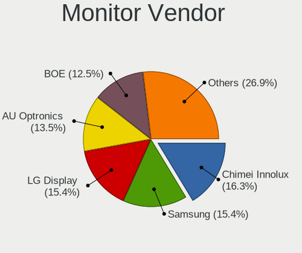

| Vendor                  | Notebooks | Percent |
|-------------------------|-----------|---------|
| AU Optronics            | 19        | 21.11%  |
| Samsung Electronics     | 11        | 12.22%  |
| Chimei Innolux          | 10        | 11.11%  |
| LG Display              | 9         | 10%     |
| BOE                     | 9         | 10%     |
| Dell                    | 4         | 4.44%   |
| Apple                   | 4         | 4.44%   |
| Valve                   | 3         | 3.33%   |
| Sharp                   | 3         | 3.33%   |
| PANDA                   | 3         | 3.33%   |
| Toshiba                 | 2         | 2.22%   |
| Lenovo                  | 2         | 2.22%   |
| Chi Mei Optoelectronics | 2         | 2.22%   |
| ASUSTek Computer        | 2         | 2.22%   |
| ViewSonic               | 1         | 1.11%   |
| TMX                     | 1         | 1.11%   |
| Sony                    | 1         | 1.11%   |
| InfoVision              | 1         | 1.11%   |
| Hewlett-Packard         | 1         | 1.11%   |
| Goldstar                | 1         | 1.11%   |
| Acer                    | 1         | 1.11%   |

Monitor Model
-------------

Monitor models

| Model                                                                   | Notebooks | Percent |
|-------------------------------------------------------------------------|-----------|---------|
| Valve ANX7530 U VLV3001 800x1280 100x150mm 7.1-inch                     | 3         | 3.3%    |
| LG Display LCD Monitor LGD058B 2560x1440 309x174mm 14.0-inch            | 2         | 2.2%    |
| ViewSonic VX2776 Series VSC3E32 1920x1080 598x336mm 27.0-inch           | 1         | 1.1%    |
| Toshiba TV TSB0205 1360x768 886x498mm 40.0-inch                         | 1         | 1.1%    |
| Toshiba ScreenXpert TSB8888 1080x2160                                   | 1         | 1.1%    |
| TMX TL140ADXP01 TMX1481 2560x1600 301x188mm 14.0-inch                   | 1         | 1.1%    |
| Sony Nvidia Defaul t Flat Panel SNY06FA 1600x900 360x200mm 16.2-inch    | 1         | 1.1%    |
| Sharp LCD Monitor SHP14BA 1920x1080 344x194mm 15.5-inch                 | 1         | 1.1%    |
| Sharp LCD Monitor SHP148D 3840x2160 344x194mm 15.5-inch                 | 1         | 1.1%    |
| Sharp LCD Monitor SHP1476 3840x2160 346x194mm 15.6-inch                 | 1         | 1.1%    |
| Samsung Electronics SMS27A550H SAM07CC 1920x1080 600x340mm 27.2-inch    | 1         | 1.1%    |
| Samsung Electronics S34J55x SAM0F72 3440x1440 797x333mm 34.0-inch       | 1         | 1.1%    |
| Samsung Electronics S27R35x SAM1053 1920x1080 598x336mm 27.0-inch       | 1         | 1.1%    |
| Samsung Electronics S24B350 SAM08D8 1920x1080 521x293mm 23.5-inch       | 1         | 1.1%    |
| Samsung Electronics LCD Monitor SEC4542 1366x768 309x174mm 14.0-inch    | 1         | 1.1%    |
| Samsung Electronics LCD Monitor SEC3651 1366x768 344x194mm 15.5-inch    | 1         | 1.1%    |
| Samsung Electronics LCD Monitor SEC314A 1920x1080 408x230mm 18.4-inch   | 1         | 1.1%    |
| Samsung Electronics LCD Monitor SDC4C48 1920x1080 239x134mm 10.8-inch   | 1         | 1.1%    |
| Samsung Electronics LCD Monitor SDC4171 2880x1800 302x189mm 14.0-inch   | 1         | 1.1%    |
| Samsung Electronics LCD Monitor SDC416D 2880x1800 312x195mm 14.5-inch   | 1         | 1.1%    |
| Samsung Electronics LCD Monitor SAM0F17 3840x2160 1872x1053mm 84.6-inch | 1         | 1.1%    |
| Samsung Electronics LC27T55 SAM701E 1920x1080 609x349mm 27.6-inch       | 1         | 1.1%    |
| PANDA LCD Monitor NCP004D 1920x1080 344x194mm 15.5-inch                 | 1         | 1.1%    |
| PANDA LCD Monitor NCP003D 1920x1080 344x194mm 15.5-inch                 | 1         | 1.1%    |
| PANDA LCD Monitor NCP0035 1920x1080 309x174mm 14.0-inch                 | 1         | 1.1%    |
| LG Display LCD Monitor LGD0609 1920x1080 309x174mm 14.0-inch            | 1         | 1.1%    |
| LG Display LCD Monitor LGD05E5 1920x1080 344x194mm 15.5-inch            | 1         | 1.1%    |
| LG Display LCD Monitor LGD04F0 2560x1440 310x174mm 14.0-inch            | 1         | 1.1%    |
| LG Display LCD Monitor LGD0430 1366x768 345x194mm 15.6-inch             | 1         | 1.1%    |
| LG Display LCD Monitor LGD0384 1366x768 344x194mm 15.5-inch             | 1         | 1.1%    |
| LG Display LCD Monitor LGD033B 1366x768 344x194mm 15.5-inch             | 1         | 1.1%    |
| LG Display LCD Monitor LGD02DC 1366x768 344x194mm 15.5-inch             | 1         | 1.1%    |
| Lenovo LCD Monitor LEN40BA 1920x1080 344x194mm 15.5-inch                | 1         | 1.1%    |
| Lenovo LCD Monitor LEN4055 1920x1200 331x207mm 15.4-inch                | 1         | 1.1%    |
| InfoVision LCD Monitor IVO057F 1920x1080 309x174mm 14.0-inch            | 1         | 1.1%    |
| Hewlett-Packard 22bw HWP3048 1920x1080 480x270mm 21.7-inch              | 1         | 1.1%    |
| Goldstar FULL HD GSM5B55 1920x1080 480x270mm 21.7-inch                  | 1         | 1.1%    |
| Dell U2722D DEL422F 2560x1440 597x336mm 27.0-inch                       | 1         | 1.1%    |
| Dell U2520D DELA14E 2560x1440 553x311mm 25.0-inch                       | 1         | 1.1%    |
| Dell P2417H DELA0DC 1920x1080 527x296mm 23.8-inch                       | 1         | 1.1%    |

Monitor Resolution
------------------

Monitor screen resolution

| Resolution         | Notebooks | Percent |
|--------------------|-----------|---------|
| 1920x1080 (FHD)    | 31        | 36.47%  |
| 1366x768 (WXGA)    | 22        | 25.88%  |
| 1600x900 (HD+)     | 6         | 7.06%   |
| 3840x2160 (4K)     | 5         | 5.88%   |
| 2560x1440 (QHD)    | 5         | 5.88%   |
| 800x1280           | 3         | 3.53%   |
| 2560x1600          | 3         | 3.53%   |
| 2880x1800          | 2         | 2.35%   |
| 1920x1200 (WUXGA)  | 2         | 2.35%   |
| 3440x1440          | 1         | 1.18%   |
| 2256x1504          | 1         | 1.18%   |
| 1680x1050 (WSXGA+) | 1         | 1.18%   |
| 1440x900 (WXGA+)   | 1         | 1.18%   |
| 1280x800 (WXGA)    | 1         | 1.18%   |
| 1280x1024 (SXGA)   | 1         | 1.18%   |

Monitor Diagonal
----------------

Diagonal size in inches

| Inches | Notebooks | Percent |
|--------|-----------|---------|
| 15     | 33        | 36.67%  |
| 14     | 14        | 15.56%  |
| 13     | 12        | 13.33%  |
| 17     | 7         | 7.78%   |
| 27     | 5         | 5.56%   |
| 7      | 3         | 3.33%   |
| 21     | 2         | 2.22%   |
| 18     | 2         | 2.22%   |
| 84     | 1         | 1.11%   |
| 72     | 1         | 1.11%   |
| 34     | 1         | 1.11%   |
| 26     | 1         | 1.11%   |
| 25     | 1         | 1.11%   |
| 24     | 1         | 1.11%   |
| 23     | 1         | 1.11%   |
| 22     | 1         | 1.11%   |
| 20     | 1         | 1.11%   |
| 16     | 1         | 1.11%   |
| 12     | 1         | 1.11%   |
| 11     | 1         | 1.11%   |

Monitor Width
-------------

Physical width

| Width in mm | Notebooks | Percent |
|-------------|-----------|---------|
| 301-350     | 52        | 58.43%  |
| 501-600     | 8         | 8.99%   |
| 351-400     | 8         | 8.99%   |
| 201-300     | 8         | 8.99%   |
| 401-500     | 6         | 6.74%   |
| 1-100       | 3         | 3.37%   |
| 1501-2000   | 2         | 2.25%   |
| 701-800     | 1         | 1.12%   |
| 601-700     | 1         | 1.12%   |

Aspect Ratio
------------

Proportional relationship between the width and the height

| Ratio | Notebooks | Percent |
|-------|-----------|---------|
| 16/9  | 60        | 77.92%  |
| 16/10 | 11        | 14.29%  |
| 0.67  | 3         | 3.9%    |
| 4/3   | 1         | 1.3%    |
| 3/2   | 1         | 1.3%    |
| 21/9  | 1         | 1.3%    |

Monitor Area
------------

Area in inch²

| Area in inch² | Notebooks | Percent |
|----------------|-----------|---------|
| 101-110        | 34        | 37.78%  |
| 81-90          | 20        | 22.22%  |
| 121-130        | 7         | 7.78%   |
| 301-350        | 6         | 6.67%   |
| 71-80          | 5         | 5.56%   |
| 201-250        | 5         | 5.56%   |
| 1-40           | 3         | 3.33%   |
| More than 1000 | 2         | 2.22%   |
| 141-150        | 2         | 2.22%   |
| 61-70          | 1         | 1.11%   |
| 51-60          | 1         | 1.11%   |
| 351-500        | 1         | 1.11%   |
| 251-300        | 1         | 1.11%   |
| 151-200        | 1         | 1.11%   |
| 91-100         | 1         | 1.11%   |

Pixel Density
-------------

Pixels per inch

| Density       | Notebooks | Percent |
|---------------|-----------|---------|
| 121-160       | 29        | 33.33%  |
| 101-120       | 28        | 32.18%  |
| 51-100        | 13        | 14.94%  |
| 161-240       | 12        | 13.79%  |
| More than 240 | 4         | 4.6%    |
| 1-50          | 1         | 1.15%   |

Multiple Monitors
-----------------

Total monitors connected

| Total | Notebooks | Percent |
|-------|-----------|---------|
| 1     | 60        | 80%     |
| 2     | 11        | 14.67%  |
| 3     | 2         | 2.67%   |
| 4     | 1         | 1.33%   |
| 0     | 1         | 1.33%   |

Network
-------

Net Controller Vendor
---------------------

Controller vendors

| Vendor                   | Notebooks | Percent |
|--------------------------|-----------|---------|
| Intel                    | 44        | 40.37%  |
| Realtek Semiconductor    | 25        | 22.94%  |
| Qualcomm Atheros         | 17        | 15.6%   |
| Broadcom                 | 8         | 7.34%   |
| MediaTek                 | 4         | 3.67%   |
| ASIX Electronics         | 3         | 2.75%   |
| Marvell Technology Group | 2         | 1.83%   |
| TP-Link                  | 1         | 0.92%   |
| Sierra Wireless          | 1         | 0.92%   |
| Samsung Electronics      | 1         | 0.92%   |
| Ralink                   | 1         | 0.92%   |
| Nvidia                   | 1         | 0.92%   |
| Lenovo                   | 1         | 0.92%   |

Net Controller Model
--------------------

Controller models

| Model                                                             | Notebooks | Percent |
|-------------------------------------------------------------------|-----------|---------|
| Realtek RTL8111/8168/8411 PCI Express Gigabit Ethernet Controller | 16        | 11.68%  |
| Intel 82579LM Gigabit Network Connection (Lewisville)             | 8         | 5.84%   |
| Intel Wireless 8265 / 8275                                        | 7         | 5.11%   |
| Qualcomm Atheros QCA9565 / AR9565 Wireless Network Adapter        | 5         | 3.65%   |
| Realtek RTL8822CE 802.11ac PCIe Wireless Network Adapter          | 4         | 2.92%   |
| Qualcomm Atheros QCA9377 802.11ac Wireless Network Adapter        | 4         | 2.92%   |
| Qualcomm Atheros QCA6174 802.11ac Wireless Network Adapter        | 4         | 2.92%   |
| Intel Wireless 7260                                               | 4         | 2.92%   |
| Intel Centrino Advanced-N 6205 [Taylor Peak]                      | 4         | 2.92%   |
| MediaTek MT7922 802.11ax PCI Express Wireless Network Adapter     | 3         | 2.19%   |
| Intel Wireless 7265                                               | 3         | 2.19%   |
| Intel Wi-Fi 6 AX201                                               | 3         | 2.19%   |
| Intel Wi-Fi 6 AX200                                               | 3         | 2.19%   |
| Intel Ethernet Connection (4) I219-LM                             | 3         | 2.19%   |
| ASIX AX88179 Gigabit Ethernet                                     | 3         | 2.19%   |
| Realtek RTL8153 Gigabit Ethernet Adapter                          | 2         | 1.46%   |
| Realtek RTL810xE PCI Express Fast Ethernet controller             | 2         | 1.46%   |
| Qualcomm Atheros AR9285 Wireless Network Adapter (PCI-Express)    | 2         | 1.46%   |
| Intel Ethernet Connection (4) I219-V                              | 2         | 1.46%   |
| Intel Ethernet Connection (3) I218-LM                             | 2         | 1.46%   |
| Intel Dual Band Wireless-AC 3165 Plus Bluetooth                   | 2         | 1.46%   |
| Intel Comet Lake PCH-LP CNVi WiFi                                 | 2         | 1.46%   |
| Intel Cannon Point-LP CNVi [Wireless-AC]                          | 2         | 1.46%   |
| Broadcom NetXtreme BCM57786 Gigabit Ethernet PCIe                 | 2         | 1.46%   |
| TP-Link TL-WN823N v2/v3 [Realtek RTL8192EU]                       | 1         | 0.73%   |
| Sierra Wireless EM7345 4G LTE                                     | 1         | 0.73%   |
| Samsung GT-I9070 (network tethering, USB debugging enabled)       | 1         | 0.73%   |
| Realtek RTL8852AE WiFi 6 802.11ax PCIe Adapter                    | 1         | 0.73%   |
| Realtek RTL8822BE 802.11a/b/g/n/ac WiFi adapter                   | 1         | 0.73%   |
| Realtek RTL8125 2.5GbE Controller                                 | 1         | 0.73%   |
| Realtek 802.11n NIC                                               | 1         | 0.73%   |
| Ralink RT3290 Wireless 802.11n 1T/1R PCIe                         | 1         | 0.73%   |
| Qualcomm Atheros QCA8172 Fast Ethernet                            | 1         | 0.73%   |
| Qualcomm Atheros Killer E2400 Gigabit Ethernet Controller         | 1         | 0.73%   |
| Qualcomm Atheros AR9462 Wireless Network Adapter                  | 1         | 0.73%   |
| Qualcomm Atheros AR9287 Wireless Network Adapter (PCI-Express)    | 1         | 0.73%   |
| Qualcomm Atheros AR8151 v2.0 Gigabit Ethernet                     | 1         | 0.73%   |
| Nvidia MCP79 Ethernet                                             | 1         | 0.73%   |
| MediaTek MT7921 802.11ax PCI Express Wireless Network Adapter     | 1         | 0.73%   |
| Marvell Group 88E8057 PCI-E Gigabit Ethernet Controller           | 1         | 0.73%   |

Wireless Vendor
---------------

Wireless vendors

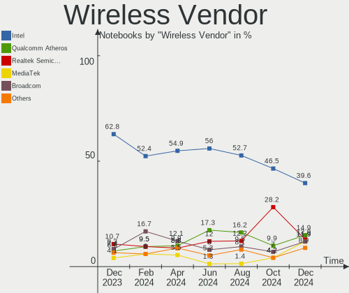

| Vendor                | Notebooks | Percent |
|-----------------------|-----------|---------|
| Intel                 | 41        | 52.56%  |
| Qualcomm Atheros      | 17        | 21.79%  |
| Realtek Semiconductor | 7         | 8.97%   |
| Broadcom              | 6         | 7.69%   |
| MediaTek              | 4         | 5.13%   |
| TP-Link               | 1         | 1.28%   |
| Sierra Wireless       | 1         | 1.28%   |
| Ralink                | 1         | 1.28%   |

Wireless Model
--------------

Wireless models

| Model                                                          | Notebooks | Percent |
|----------------------------------------------------------------|-----------|---------|
| Intel Wireless 8265 / 8275                                     | 7         | 8.97%   |
| Qualcomm Atheros QCA9565 / AR9565 Wireless Network Adapter     | 5         | 6.41%   |
| Realtek RTL8822CE 802.11ac PCIe Wireless Network Adapter       | 4         | 5.13%   |
| Qualcomm Atheros QCA9377 802.11ac Wireless Network Adapter     | 4         | 5.13%   |
| Qualcomm Atheros QCA6174 802.11ac Wireless Network Adapter     | 4         | 5.13%   |
| Intel Wireless 7260                                            | 4         | 5.13%   |
| Intel Centrino Advanced-N 6205 [Taylor Peak]                   | 4         | 5.13%   |
| MediaTek MT7922 802.11ax PCI Express Wireless Network Adapter  | 3         | 3.85%   |
| Intel Wireless 7265                                            | 3         | 3.85%   |
| Intel Wi-Fi 6 AX201                                            | 3         | 3.85%   |
| Intel Wi-Fi 6 AX200                                            | 3         | 3.85%   |
| Qualcomm Atheros AR9285 Wireless Network Adapter (PCI-Express) | 2         | 2.56%   |
| Intel Dual Band Wireless-AC 3165 Plus Bluetooth                | 2         | 2.56%   |
| Intel Comet Lake PCH-LP CNVi WiFi                              | 2         | 2.56%   |
| Intel Cannon Point-LP CNVi [Wireless-AC]                       | 2         | 2.56%   |
| TP-Link TL-WN823N v2/v3 [Realtek RTL8192EU]                    | 1         | 1.28%   |
| Sierra Wireless EM7345 4G LTE                                  | 1         | 1.28%   |
| Realtek RTL8852AE WiFi 6 802.11ax PCIe Adapter                 | 1         | 1.28%   |
| Realtek RTL8822BE 802.11a/b/g/n/ac WiFi adapter                | 1         | 1.28%   |
| Realtek 802.11n NIC                                            | 1         | 1.28%   |
| Ralink RT3290 Wireless 802.11n 1T/1R PCIe                      | 1         | 1.28%   |
| Qualcomm Atheros AR9462 Wireless Network Adapter               | 1         | 1.28%   |
| Qualcomm Atheros AR9287 Wireless Network Adapter (PCI-Express) | 1         | 1.28%   |
| MediaTek MT7921 802.11ax PCI Express Wireless Network Adapter  | 1         | 1.28%   |
| Intel Wireless 8260                                            | 1         | 1.28%   |
| Intel Wireless 3160                                            | 1         | 1.28%   |
| Intel Wi-Fi 6 AX210/AX211/AX411 160MHz                         | 1         | 1.28%   |
| Intel Ultimate N WiFi Link 5300                                | 1         | 1.28%   |
| Intel Tiger Lake PCH CNVi WiFi                                 | 1         | 1.28%   |
| Intel PRO/Wireless 5100 AGN [Shiloh] Network Connection        | 1         | 1.28%   |
| Intel Comet Lake PCH CNVi WiFi                                 | 1         | 1.28%   |
| Intel Centrino Wireless-N 1000 [Condor Peak]                   | 1         | 1.28%   |
| Intel Centrino Ultimate-N 6300                                 | 1         | 1.28%   |
| Intel Centrino Advanced-N 6235                                 | 1         | 1.28%   |
| Intel Alder Lake-P PCH CNVi WiFi                               | 1         | 1.28%   |
| Broadcom BCM4364 802.11ac Wireless Network Adapter             | 1         | 1.28%   |
| Broadcom BCM4331 802.11a/b/g/n                                 | 1         | 1.28%   |
| Broadcom BCM43228 802.11a/b/g/n                                | 1         | 1.28%   |
| Broadcom BCM43224 802.11a/b/g/n                                | 1         | 1.28%   |
| Broadcom BCM4322 802.11a/b/g/n Wireless LAN Controller         | 1         | 1.28%   |

Ethernet Vendor
---------------

Ethernet vendors

| Vendor                   | Notebooks | Percent |
|--------------------------|-----------|---------|
| Intel                    | 24        | 41.38%  |
| Realtek Semiconductor    | 21        | 36.21%  |
| Qualcomm Atheros         | 3         | 5.17%   |
| Broadcom                 | 3         | 5.17%   |
| ASIX Electronics         | 3         | 5.17%   |
| Marvell Technology Group | 2         | 3.45%   |
| Nvidia                   | 1         | 1.72%   |
| Lenovo                   | 1         | 1.72%   |

Ethernet Model
--------------

Ethernet models

| Model                                                             | Notebooks | Percent |
|-------------------------------------------------------------------|-----------|---------|
| Realtek RTL8111/8168/8411 PCI Express Gigabit Ethernet Controller | 16        | 27.59%  |
| Intel 82579LM Gigabit Network Connection (Lewisville)             | 8         | 13.79%  |
| Intel Ethernet Connection (4) I219-LM                             | 3         | 5.17%   |
| ASIX AX88179 Gigabit Ethernet                                     | 3         | 5.17%   |
| Realtek RTL8153 Gigabit Ethernet Adapter                          | 2         | 3.45%   |
| Realtek RTL810xE PCI Express Fast Ethernet controller             | 2         | 3.45%   |
| Intel Ethernet Connection (4) I219-V                              | 2         | 3.45%   |
| Intel Ethernet Connection (3) I218-LM                             | 2         | 3.45%   |
| Broadcom NetXtreme BCM57786 Gigabit Ethernet PCIe                 | 2         | 3.45%   |
| Realtek RTL8125 2.5GbE Controller                                 | 1         | 1.72%   |
| Qualcomm Atheros QCA8172 Fast Ethernet                            | 1         | 1.72%   |
| Qualcomm Atheros Killer E2400 Gigabit Ethernet Controller         | 1         | 1.72%   |
| Qualcomm Atheros AR8151 v2.0 Gigabit Ethernet                     | 1         | 1.72%   |
| Nvidia MCP79 Ethernet                                             | 1         | 1.72%   |
| Marvell Group 88E8057 PCI-E Gigabit Ethernet Controller           | 1         | 1.72%   |
| Marvell Group 88E8040 PCI-E Fast Ethernet Controller              | 1         | 1.72%   |
| Lenovo RTL8153 Gigabit Ethernet [ThinkPad OneLink Pro Dock]       | 1         | 1.72%   |
| Intel Ethernet Controller I225-V                                  | 1         | 1.72%   |
| Intel Ethernet Connection I219-V                                  | 1         | 1.72%   |
| Intel Ethernet Connection I218-LM                                 | 1         | 1.72%   |
| Intel Ethernet Connection I217-LM                                 | 1         | 1.72%   |
| Intel Ethernet Connection (7) I219-LM                             | 1         | 1.72%   |
| Intel Ethernet Connection (6) I219-LM                             | 1         | 1.72%   |
| Intel Ethernet Connection (16) I219-LM                            | 1         | 1.72%   |
| Intel Ethernet Connection (10) I219-V                             | 1         | 1.72%   |
| Intel 82567LF Gigabit Network Connection                          | 1         | 1.72%   |
| Broadcom NetXtreme BCM57765 Gigabit Ethernet PCIe                 | 1         | 1.72%   |

Net Controller Kind
-------------------

Ethernet, WiFi or modem

| Kind     | Notebooks | Percent |
|----------|-----------|---------|
| WiFi     | 75        | 56.82%  |
| Ethernet | 56        | 42.42%  |
| Modem    | 1         | 0.76%   |

Used Controller
---------------

Currently used network controller

| Kind     | Notebooks | Percent |
|----------|-----------|---------|
| WiFi     | 67        | 87.01%  |
| Ethernet | 10        | 12.99%  |

NICs
----

Total network controllers on board

| Total | Notebooks | Percent |
|-------|-----------|---------|
| 2     | 52        | 69.33%  |
| 1     | 23        | 30.67%  |

IPv6
----

IPv6 vs IPv4

| Used | Notebooks | Percent |
|------|-----------|---------|
| No   | 53        | 70.67%  |
| Yes  | 22        | 29.33%  |

Bluetooth
---------

Bluetooth Vendor
----------------

Controller vendors

| Vendor                          | Notebooks | Percent |
|---------------------------------|-----------|---------|
| Intel                           | 33        | 47.14%  |
| Qualcomm Atheros Communications | 9         | 12.86%  |
| IMC Networks                    | 6         | 8.57%   |
| Lite-On Technology              | 5         | 7.14%   |
| Foxconn / Hon Hai               | 4         | 5.71%   |
| Broadcom                        | 4         | 5.71%   |
| Apple                           | 3         | 4.29%   |
| Realtek Semiconductor           | 2         | 2.86%   |
| Hewlett-Packard                 | 2         | 2.86%   |
| Ralink                          | 1         | 1.43%   |
| Dell                            | 1         | 1.43%   |

Bluetooth Model
---------------

Controller models

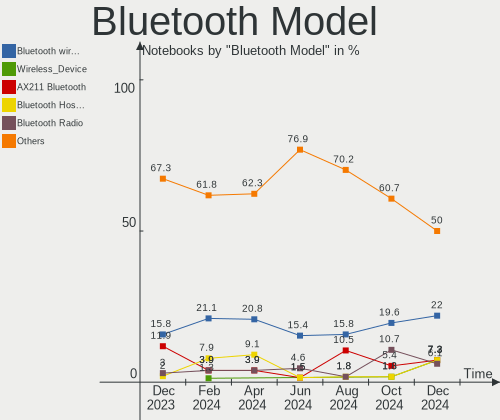

| Model                                                                               | Notebooks | Percent |
|-------------------------------------------------------------------------------------|-----------|---------|
| Intel Bluetooth wireless interface                                                  | 18        | 25.71%  |
| Intel AX201 Bluetooth                                                               | 8         | 11.43%  |
| Qualcomm Atheros  Bluetooth Device                                                  | 5         | 7.14%   |
| IMC Networks Bluetooth Radio                                                        | 4         | 5.71%   |
| Lite-On Qualcomm Atheros QCA9377 Bluetooth                                          | 3         | 4.29%   |
| Intel AX200 Bluetooth                                                               | 3         | 4.29%   |
| Realtek Bluetooth Radio                                                             | 2         | 2.86%   |
| Qualcomm Atheros AR3012 Bluetooth 4.0                                               | 2         | 2.86%   |
| Lite-On Atheros AR3012 Bluetooth                                                    | 2         | 2.86%   |
| Intel Bluetooth 9460/9560 Jefferson Peak (JfP)                                      | 2         | 2.86%   |
| IMC Networks Wireless_Device                                                        | 2         | 2.86%   |
| Foxconn / Hon Hai Wireless_Device                                                   | 2         | 2.86%   |
| Ralink RT3290 Bluetooth                                                             | 1         | 1.43%   |
| Qualcomm Atheros AR9462 Bluetooth                                                   | 1         | 1.43%   |
| Qualcomm Atheros AR3011 Bluetooth                                                   | 1         | 1.43%   |
| Intel Centrino Bluetooth Wireless Transceiver                                       | 1         | 1.43%   |
| Intel AX210 Bluetooth                                                               | 1         | 1.43%   |
| HP Broadcom 2070 Bluetooth Combo                                                    | 1         | 1.43%   |
| HP Bluetooth 2.0 Interface [Broadcom BCM2045]                                       | 1         | 1.43%   |
| Foxconn / Hon Hai Foxconn T77H114 BCM2070 [Single-Chip Bluetooth 2.1 + EDR Adapter] | 1         | 1.43%   |
| Foxconn / Hon Hai Bluetooth Device                                                  | 1         | 1.43%   |
| Dell Wireless 370 Bluetooth Mini-card                                               | 1         | 1.43%   |
| Broadcom HP Portable SoftSailing                                                    | 1         | 1.43%   |
| Broadcom BCM20702 Bluetooth 4.0 [ThinkPad]                                          | 1         | 1.43%   |
| Broadcom BCM2045B (BDC-2.1) [Bluetooth Controller]                                  | 1         | 1.43%   |
| Broadcom BCM2045B (BDC-2.1)                                                         | 1         | 1.43%   |
| Apple Built-in Bluetooth 2.0+EDR HCI                                                | 1         | 1.43%   |
| Apple Bluetooth USB Host Controller                                                 | 1         | 1.43%   |
| Apple Bluetooth Host Controller                                                     | 1         | 1.43%   |

Sound
-----

Sound Vendor
------------

Sound card vendors

| Vendor              | Notebooks | Percent |
|---------------------|-----------|---------|
| Intel               | 57        | 58.76%  |
| AMD                 | 19        | 19.59%  |
| Nvidia              | 11        | 11.34%  |
| C-Media Electronics | 2         | 2.06%   |
| Razer USA           | 1         | 1.03%   |
| Logitech            | 1         | 1.03%   |
| Kingston Technology | 1         | 1.03%   |
| Focusrite-Novation  | 1         | 1.03%   |
| Corsair             | 1         | 1.03%   |
| CMX Systems         | 1         | 1.03%   |
| ASUSTek Computer    | 1         | 1.03%   |
| Apple               | 1         | 1.03%   |

Sound Model
-----------

Sound card models

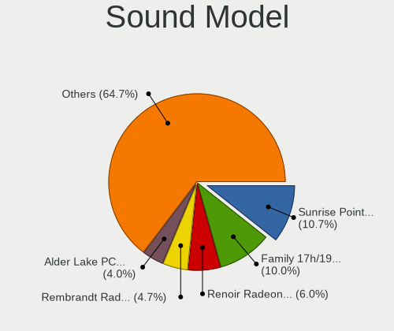

| Model                                                                      | Notebooks | Percent |
|----------------------------------------------------------------------------|-----------|---------|
| Intel Sunrise Point-LP HD Audio                                            | 9         | 7.38%   |
| Intel 7 Series/C216 Chipset Family High Definition Audio Controller        | 9         | 7.38%   |
| AMD Family 17h/19h HD Audio Controller                                     | 9         | 7.38%   |
| AMD Rembrandt Radeon High Definition Audio Controller                      | 6         | 4.92%   |
| Intel Haswell-ULT HD Audio Controller                                      | 4         | 3.28%   |
| Intel Cannon Lake PCH cAVS                                                 | 4         | 3.28%   |
| Intel 8 Series HD Audio Controller                                         | 4         | 3.28%   |
| Intel 6 Series/C200 Series Chipset Family High Definition Audio Controller | 4         | 3.28%   |
| AMD FCH Azalia Controller                                                  | 4         | 3.28%   |
| Intel Tiger Lake-LP Smart Sound Technology Audio Controller                | 3         | 2.46%   |
| Intel Comet Lake PCH-LP cAVS                                               | 3         | 2.46%   |
| Intel Cannon Point-LP High Definition Audio Controller                     | 3         | 2.46%   |
| Intel 5 Series/3400 Series Chipset High Definition Audio                   | 3         | 2.46%   |
| AMD Renoir Radeon High Definition Audio Controller                         | 3         | 2.46%   |
| AMD Raven/Raven2/Fenghuang HDMI/DP Audio Controller                        | 3         | 2.46%   |
| Nvidia GK107 HDMI Audio Controller                                         | 2         | 1.64%   |
| Nvidia GA106 High Definition Audio Controller                              | 2         | 1.64%   |
| Intel Xeon E3-1200 v3/4th Gen Core Processor HD Audio Controller           | 2         | 1.64%   |
| Intel Wildcat Point-LP High Definition Audio Controller                    | 2         | 1.64%   |
| Intel Broadwell-U Audio Controller                                         | 2         | 1.64%   |
| Intel 82801I (ICH9 Family) HD Audio Controller                             | 2         | 1.64%   |
| Intel 8 Series/C220 Series Chipset High Definition Audio Controller        | 2         | 1.64%   |
| AMD Trinity HDMI Audio Controller                                          | 2         | 1.64%   |
| AMD Navi 21/23 HDMI/DP Audio Controller                                    | 2         | 1.64%   |
| AMD Kabini HDMI/DP Audio                                                   | 2         | 1.64%   |
| Razer USA USB Audio                                                        | 1         | 0.82%   |
| Nvidia MCP79 High Definition Audio                                         | 1         | 0.82%   |
| Nvidia High Definition Audio Controller                                    | 1         | 0.82%   |
| Nvidia GP107GL High Definition Audio Controller                            | 1         | 0.82%   |
| Nvidia GP106 High Definition Audio Controller                              | 1         | 0.82%   |
| Nvidia GM204 High Definition Audio Controller                              | 1         | 0.82%   |
| Nvidia GF108 High Definition Audio Controller                              | 1         | 0.82%   |
| Nvidia Audio device                                                        | 1         | 0.82%   |
| Logitech V20 portable speakers (USB powered)                               | 1         | 0.82%   |
| Kingston Technology HyperX 7.1 Audio                                       | 1         | 0.82%   |
| Intel USB PnP Sound Device                                                 | 1         | 0.82%   |
| Intel Tiger Lake-H HD Audio Controller                                     | 1         | 0.82%   |
| Intel Smart Sound Technology Audio Controller                              | 1         | 0.82%   |
| Intel Comet Lake PCH cAVS                                                  | 1         | 0.82%   |
| Intel CM238 HD Audio Controller                                            | 1         | 0.82%   |

Memory
------

Memory Vendor
-------------

Memory module vendors

| Vendor              | Notebooks | Percent |
|---------------------|-----------|---------|
| Samsung Electronics | 15        | 39.47%  |
| SK hynix            | 7         | 18.42%  |
| Micron Technology   | 3         | 7.89%   |
| Kingston            | 3         | 7.89%   |
| G.Skill             | 3         | 7.89%   |
| Crucial             | 3         | 7.89%   |
| Unknown             | 1         | 2.63%   |
| Ramaxel Technology  | 1         | 2.63%   |
| Elpida              | 1         | 2.63%   |
| Corsair             | 1         | 2.63%   |

Memory Model
------------

Memory module models

| Model                                                          | Notebooks | Percent |
|----------------------------------------------------------------|-----------|---------|
| SK hynix RAM HMA81GS6AFR8N-UH 8GB SODIMM DDR4 2667MT/s         | 2         | 5.26%   |
| Samsung RAM M471B1G73DB0-YK0 8GB SODIMM DDR3 1600MT/s          | 2         | 5.26%   |
| Samsung RAM M471A5244CB0-CTD 4GB SODIMM DDR4 3266MT/s          | 2         | 5.26%   |
| Samsung RAM K4EBE304EB-EGCF 8GB Row Of Chips LPDDR3 1867MT/s   | 2         | 5.26%   |
| Unknown RAM Module 4096MB SODIMM DDR4 2667MT/s                 | 1         | 2.63%   |
| SK hynix RAM HMT41GS6BFR8A-PB 8GB SODIMM DDR3 1600MT/s         | 1         | 2.63%   |
| SK hynix RAM HMT325S6CFR8C-H9 2048MB SODIMM 1334MT/s           | 1         | 2.63%   |
| SK hynix RAM HMA82GS6DJR8N-VK 16GB SODIMM DDR4 2667MT/s        | 1         | 2.63%   |
| SK hynix RAM HCNNNCPMBLHR-NEE 2GB Row Of Chips LPDDR4 4267MT/s | 1         | 2.63%   |
| SK hynix RAM H9HCNNNCPMMLXR-NEE 8GB SODIMM LPDDR4 4266MT/s     | 1         | 2.63%   |
| Samsung RAM Module 8192MB Row Of Chips LPDDR3 2133MT/s         | 1         | 2.63%   |
| Samsung RAM M471B5674QH0-YK0 2GB SODIMM DDR3 1600MT/s          | 1         | 2.63%   |
| Samsung RAM M471B5674-H0-YK0--- 4GB Chip DDR3 1600MT/s         | 1         | 2.63%   |
| Samsung RAM M471B5273DH0-CH9 4GB SODIMM DDR3 1334MT/s          | 1         | 2.63%   |
| Samsung RAM M471B1G73BH0-YK0 8GB SODIMM DDR3 1600MT/s          | 1         | 2.63%   |
| Samsung RAM M471A1K43DB1-CTD 8GB SODIMM DDR4 2667MT/s          | 1         | 2.63%   |
| Samsung RAM K4UBE3D4AA-MGCL 8GB Row Of Chips LPDDR4 4267MT/s   | 1         | 2.63%   |
| Samsung RAM K4E6E304EB-EGCG 4GB Row Of Chips LPDDR3 2133MT/s   | 1         | 2.63%   |
| Samsung RAM K4AAG165WA-BCWE 8GB Row Of Chips DDR4 3200MT/s     | 1         | 2.63%   |
| Ramaxel RAM RMSA3260NA78HAF-2666 8GB SODIMM DDR4 2667MT/s      | 1         | 2.63%   |
| Micron RAM 8ATF1G64HZ-3G2R1 8GB SODIMM DDR4 3200MT/s           | 1         | 2.63%   |
| Micron RAM 4ATS1G64HZ-2G6E1 8GB SODIMM DDR4 2667MT/s           | 1         | 2.63%   |
| Micron RAM 16JTF51264HZ-1G6M1 4GB SODIMM DDR3 1600MT/s         | 1         | 2.63%   |
| Kingston RAM KX830D-HYC 4GB SODIMM DDR3 1333MT/s               | 1         | 2.63%   |
| Kingston RAM ACR16D3LS1KBG/8G 8GB SODIMM DDR3 1600MT/s         | 1         | 2.63%   |
| Kingston RAM 9905428-093.A00LF 8GB SODIMM DDR3 1333MT/s        | 1         | 2.63%   |
| G.Skill RAM F4-2666C19-16GRS 16GB SODIMM DDR4 2667MT/s         | 1         | 2.63%   |
| G.Skill RAM F3-1600C9-8GRSL 8GB SODIMM DDR3 1600MT/s           | 1         | 2.63%   |
| G.Skill RAM F3-1600C11-8GRSL 8GB SODIMM DDR3 1600MT/s          | 1         | 2.63%   |
| Elpida RAM EBJ41UF8BDU0-GN-F 4GB SODIMM DDR3 1600MT/s          | 1         | 2.63%   |
| Crucial RAM CT51264BF160B.C16F 4GB SODIMM DDR3 1600MT/s        | 1         | 2.63%   |
| Crucial RAM CT32G48C40S5.M16A1 32GB SODIMM DDR5 4800MT/s       | 1         | 2.63%   |
| Crucial RAM CT16G4SFD8213.C16FER 16GB SODIMM DDR4 2133MT/s     | 1         | 2.63%   |
| Corsair RAM CMSX32GX4M2A2400C16 16GB SODIMM DDR4 2400MT/s      | 1         | 2.63%   |

Memory Kind
-----------

Memory module kinds

| Kind   | Notebooks | Percent |
|--------|-----------|---------|
| DDR3   | 14        | 40%     |
| DDR4   | 13        | 37.14%  |
| LPDDR3 | 4         | 11.43%  |
| LPDDR4 | 3         | 8.57%   |
| DDR5   | 1         | 2.86%   |

Memory Form Factor
------------------

Physical design of the memory module

| Name         | Notebooks | Percent |
|--------------|-----------|---------|
| SODIMM       | 27        | 77.14%  |
| Row Of Chips | 7         | 20%     |
| Chip         | 1         | 2.86%   |

Memory Size
-----------

Memory module size

| Size  | Notebooks | Percent |
|-------|-----------|---------|
| 8192  | 19        | 54.29%  |
| 4096  | 9         | 25.71%  |
| 16384 | 4         | 11.43%  |
| 2048  | 2         | 5.71%   |
| 32768 | 1         | 2.86%   |

Memory Speed
------------

Memory module speed

| Speed | Notebooks | Percent |
|-------|-----------|---------|
| 1600  | 11        | 30.56%  |
| 2667  | 7         | 19.44%  |
| 2133  | 3         | 8.33%   |
| 4267  | 2         | 5.56%   |
| 3266  | 2         | 5.56%   |
| 3200  | 2         | 5.56%   |
| 1867  | 2         | 5.56%   |
| 1334  | 2         | 5.56%   |
| 1333  | 2         | 5.56%   |
| 4800  | 1         | 2.78%   |
| 4266  | 1         | 2.78%   |
| 2400  | 1         | 2.78%   |

Printers & scanners
-------------------

Printer Vendor
--------------

Printer device vendors

| Vendor              | Notebooks | Percent |
|---------------------|-----------|---------|
| Xerox               | 1         | 50%     |
| QinHeng Electronics | 1         | 50%     |

Printer Model
-------------

Printer device models

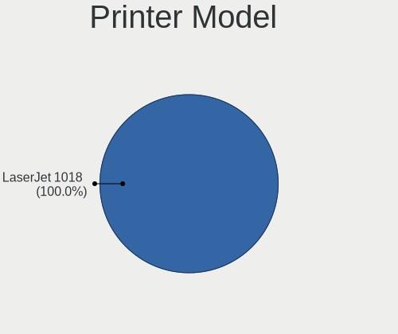

| Model          | Notebooks | Percent |
|----------------|-----------|---------|
| Xerox B210     | 1         | 50%     |
| QinHeng CH340S | 1         | 50%     |

Scanner Vendor
--------------

Scanner device vendors

| Vendor | Notebooks | Percent |
|--------|-----------|---------|
| Canon  | 1         | 100%    |

Scanner Model
-------------

Scanner device models

| Model                   | Notebooks | Percent |
|-------------------------|-----------|---------|
| Canon CanoScan LiDE 120 | 1         | 100%    |

Camera
------

Camera Vendor
-------------

Camera device vendors

| Vendor                                 | Notebooks | Percent |
|----------------------------------------|-----------|---------|
| Chicony Electronics                    | 13        | 18.84%  |
| IMC Networks                           | 9         | 13.04%  |
| Microdia                               | 7         | 10.14%  |
| Realtek Semiconductor                  | 6         | 8.7%    |
| Quanta                                 | 6         | 8.7%    |
| Lite-On Technology                     | 4         | 5.8%    |
| Bison Electronics                      | 4         | 5.8%    |
| Sunplus Innovation Technology          | 3         | 4.35%   |
| Apple                                  | 3         | 4.35%   |
| Luxvisions Innotech Limited            | 2         | 2.9%    |
| Acer                                   | 2         | 2.9%    |
| Z-Star Microelectronics                | 1         | 1.45%   |
| Sonix Technology                       | 1         | 1.45%   |
| Silicon Motion                         | 1         | 1.45%   |
| Ricoh                                  | 1         | 1.45%   |
| Microsoft                              | 1         | 1.45%   |
| MacroSilicon                           | 1         | 1.45%   |
| Logitech                               | 1         | 1.45%   |
| Lenovo                                 | 1         | 1.45%   |
| HD WEBCAM                              | 1         | 1.45%   |
| Cheng Uei Precision Industry (Foxlink) | 1         | 1.45%   |

Camera Model
------------

Camera device models

| Model                                                | Notebooks | Percent |
|------------------------------------------------------|-----------|---------|
| IMC Networks USB2.0 HD UVC WebCam                    | 5         | 7.14%   |
| Chicony Integrated Camera                            | 5         | 7.14%   |
| Microdia Integrated_Webcam_HD                        | 4         | 5.71%   |
| Lite-On Integrated Camera                            | 3         | 4.29%   |
| Quanta VGA WebCam                                    | 2         | 2.86%   |
| Quanta HD User Facing                                | 2         | 2.86%   |
| Chicony HP HD Webcam                                 | 2         | 2.86%   |
| Chicony HD WebCam                                    | 2         | 2.86%   |
| Z-Star WebCam SCB-1900N                              | 1         | 1.43%   |
| Sunplus Laptop Integrated Webcam FHD                 | 1         | 1.43%   |
| Sunplus Integrated_Webcam_HD                         | 1         | 1.43%   |
| Sunplus HP HD Webcam [Fixed]                         | 1         | 1.43%   |
| Sonix USB2.0 HD UVC WebCam                           | 1         | 1.43%   |
| Silicon Motion WebCam SC-10HDD13335N                 | 1         | 1.43%   |
| Ricoh Sony Visual Communication Camera               | 1         | 1.43%   |
| Realtek Lenovo EasyCamera                            | 1         | 1.43%   |
| Realtek Integrated_Webcam_HD                         | 1         | 1.43%   |
| Realtek Integrated Webcam HD                         | 1         | 1.43%   |
| Realtek HP Truevision HD                             | 1         | 1.43%   |
| Realtek HD WebCam                                    | 1         | 1.43%   |
| Realtek Acer 640 x 480 laptop camera                 | 1         | 1.43%   |
| Quanta HP Wide Vision HD Camera                      | 1         | 1.43%   |
| Quanta HP Webcam                                     | 1         | 1.43%   |
| Microsoft LifeCam Cinema                             | 1         | 1.43%   |
| Microdia Laptop_Integrated_Webcam_E4HD               | 1         | 1.43%   |
| Microdia Integrated Webcam                           | 1         | 1.43%   |
| Microdia Dell Laptop Integrated Webcam HD            | 1         | 1.43%   |
| MacroSilicon usb video                               | 1         | 1.43%   |
| Luxvisions Innotech Limited HP Wide Vision HD Camera | 1         | 1.43%   |
| Luxvisions Innotech Limited HP TrueVision HD Camera  | 1         | 1.43%   |
| Logitech C922 Pro Stream Webcam                      | 1         | 1.43%   |
| Lite-On HP HD Camera                                 | 1         | 1.43%   |
| Lenovo UVC Camera                                    | 1         | 1.43%   |
| IMC Networks VGA UVC WebCam                          | 1         | 1.43%   |
| IMC Networks USB2.0 HD IR UVC WebCam                 | 1         | 1.43%   |
| IMC Networks HP TrueVision HD Camera                 | 1         | 1.43%   |
| IMC Networks EasyCamera                              | 1         | 1.43%   |
| HD WEBCAM Web Camera                                 | 1         | 1.43%   |
| Chicony ThinkPad T490 Webcam                         | 1         | 1.43%   |
| Chicony Integrated IR Camera                         | 1         | 1.43%   |

Security
--------

Fingerprint Vendor
------------------

Fingerprint sensor vendors

| Vendor                | Notebooks | Percent |
|-----------------------|-----------|---------|
| Validity Sensors      | 11        | 61.11%  |
| Elan Microelectronics | 4         | 22.22%  |
| Synaptics             | 3         | 16.67%  |

Fingerprint Model
-----------------

Fingerprint sensor models

| Model                                             | Notebooks | Percent |
|---------------------------------------------------|-----------|---------|
| Elan ELAN:Fingerprint                             | 3         | 16.67%  |
| Validity Sensors VFS495 Fingerprint Reader        | 2         | 11.11%  |
| Validity Sensors VFS 5011 fingerprint sensor      | 2         | 11.11%  |
| Validity Sensors Synaptics WBDI                   | 2         | 11.11%  |
| Synaptics Prometheus MIS Touch Fingerprint Reader | 2         | 11.11%  |
| Validity Sensors VFS7552 Touch Fingerprint Sensor | 1         | 5.56%   |
| Validity Sensors VFS471 Fingerprint Reader        | 1         | 5.56%   |
| Validity Sensors VFS301 Fingerprint Reader        | 1         | 5.56%   |
| Validity Sensors VFS101 Fingerprint Reader        | 1         | 5.56%   |
| Validity Sensors Swipe Fingerprint Sensor         | 1         | 5.56%   |
| Synaptics  WBDI                                   | 1         | 5.56%   |
| Elan ELAN:ARM-M4                                  | 1         | 5.56%   |

Chipcard Vendor
---------------

Chipcard module vendors

| Vendor   | Notebooks | Percent |
|----------|-----------|---------|
| Broadcom | 3         | 75%     |
| Upek     | 1         | 25%     |

Chipcard Model
--------------

Chipcard module models

| Model                                                                        | Notebooks | Percent |
|------------------------------------------------------------------------------|-----------|---------|
| Upek TouchChip Fingerprint Coprocessor (WBF advanced mode)                   | 1         | 25%     |
| Broadcom BCM5880 Secure Applications Processor with fingerprint swipe sensor | 1         | 25%     |
| Broadcom BCM5880 Secure Applications Processor                               | 1         | 25%     |
| Broadcom 5880                                                                | 1         | 25%     |

Unsupported
-----------

Unsupported Devices
-------------------

Total unsupported devices on board

| Total | Notebooks | Percent |
|-------|-----------|---------|
| 0     | 47        | 62.67%  |
| 1     | 26        | 34.67%  |
| 2     | 2         | 2.67%   |

Unsupported Device Types
------------------------

Types of unsupported devices

| Type                  | Notebooks | Percent |
|-----------------------|-----------|---------|
| Fingerprint reader    | 18        | 60%     |
| Chipcard              | 3         | 10%     |
| Multimedia controller | 2         | 6.67%   |
| Storage               | 1         | 3.33%   |
| Sound                 | 1         | 3.33%   |
| Net/wireless          | 1         | 3.33%   |
| Modem                 | 1         | 3.33%   |
| Graphics card         | 1         | 3.33%   |
| Camera                | 1         | 3.33%   |
| Bluetooth             | 1         | 3.33%   |

