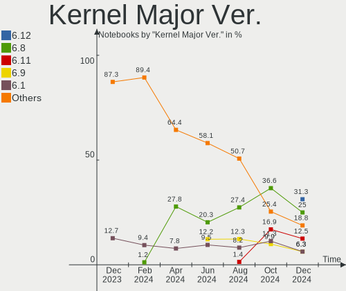
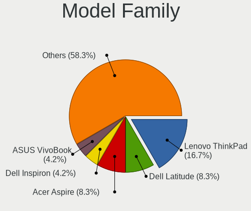
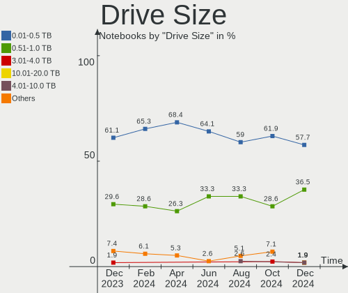
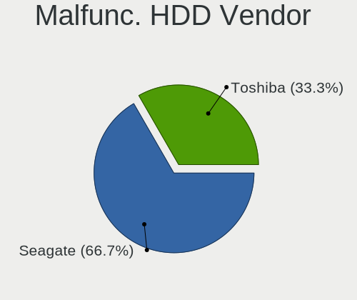
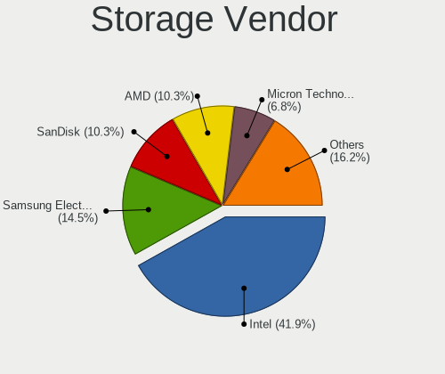
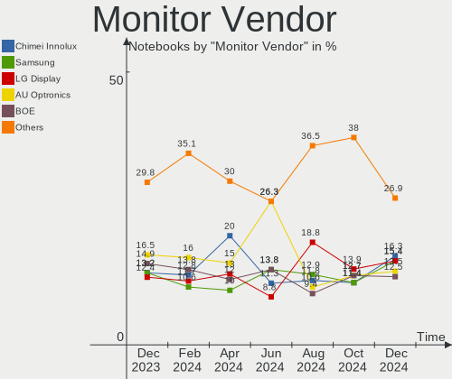
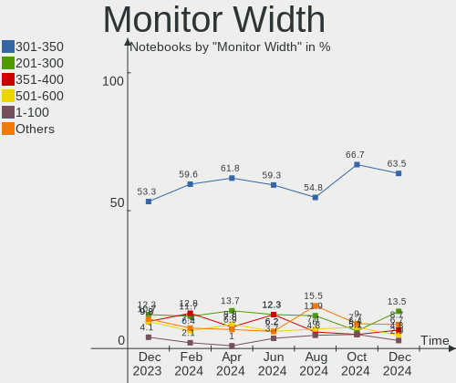
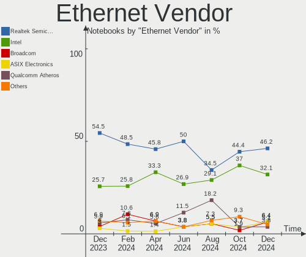
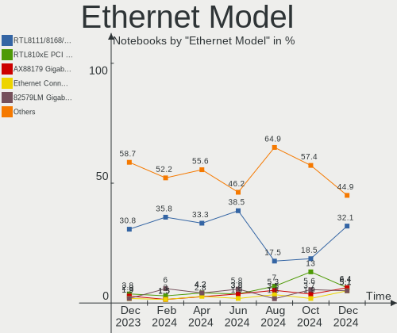

Linux in Canada - Hardware Trends (Notebooks)
---------------------------------------------

A project to identify most popular hardware characteristics and track their change
over time based on data collected by Linux users at https://Linux-Hardware.org.

Anyone can contribute to this report by the [hw-probe](https://github.com/linuxhw/hw-probe) tool:

    sudo -E hw-probe -all -upload

Period: Dec, 2024.

Contents
--------

* [ System ](#system)
  - [ OS                       ](#os)
  - [ OS Family                ](#os-family)
  - [ Kernel                   ](#kernel)
  - [ Kernel Family            ](#kernel-family)
  - [ Kernel Major Ver.        ](#kernel-major-ver)
  - [ Arch                     ](#arch)
  - [ DE                       ](#de)
  - [ Display Server           ](#display-server)
  - [ Display Manager          ](#display-manager)
  - [ OS Lang                  ](#os-lang)
  - [ Boot Mode                ](#boot-mode)
  - [ Filesystem               ](#filesystem)
  - [ Part. scheme             ](#part-scheme)
  - [ Dual Boot with Linux/BSD ](#dual-boot-with-linuxbsd)
  - [ Dual Boot (Win)          ](#dual-boot-win)

* [ Board ](#board)
  - [ Vendor                   ](#vendor)
  - [ Model                    ](#model)
  - [ Model Family             ](#model-family)
  - [ MFG Year                 ](#mfg-year)
  - [ Form Factor              ](#form-factor)
  - [ Secure Boot              ](#secure-boot)
  - [ Coreboot                 ](#coreboot)
  - [ RAM Size                 ](#ram-size)
  - [ RAM Used                 ](#ram-used)
  - [ Total Drives             ](#total-drives)
  - [ Has CD-ROM               ](#has-cd-rom)
  - [ Has Ethernet             ](#has-ethernet)
  - [ Has WiFi                 ](#has-wifi)
  - [ Has Bluetooth            ](#has-bluetooth)

* [ Location ](#location)
  - [ Country                  ](#country)
  - [ City                     ](#city)

* [ Drives ](#drives)
  - [ Drive Vendor             ](#drive-vendor)
  - [ Drive Model              ](#drive-model)
  - [ HDD Vendor               ](#hdd-vendor)
  - [ SSD Vendor               ](#ssd-vendor)
  - [ Drive Kind               ](#drive-kind)
  - [ Drive Connector          ](#drive-connector)
  - [ Drive Size               ](#drive-size)
  - [ Space Total              ](#space-total)
  - [ Space Used               ](#space-used)
  - [ Malfunc. Drives          ](#malfunc-drives)
  - [ Malfunc. Drive Vendor    ](#malfunc-drive-vendor)
  - [ Malfunc. HDD Vendor      ](#malfunc-hdd-vendor)
  - [ Malfunc. Drive Kind      ](#malfunc-drive-kind)
  - [ Failed Drives            ](#failed-drives)
  - [ Failed Drive Vendor      ](#failed-drive-vendor)
  - [ Drive Status             ](#drive-status)

* [ Storage controller ](#storage-controller)
  - [ Storage Vendor           ](#storage-vendor)
  - [ Storage Model            ](#storage-model)
  - [ Storage Kind             ](#storage-kind)

* [ Processor ](#processor)
  - [ CPU Vendor               ](#cpu-vendor)
  - [ CPU Model                ](#cpu-model)
  - [ CPU Model Family         ](#cpu-model-family)
  - [ CPU Cores                ](#cpu-cores)
  - [ CPU Sockets              ](#cpu-sockets)
  - [ CPU Threads              ](#cpu-threads)
  - [ CPU Op-Modes             ](#cpu-op-modes)
  - [ CPU Microcode            ](#cpu-microcode)
  - [ CPU Microarch            ](#cpu-microarch)

* [ Graphics ](#graphics)
  - [ GPU Vendor               ](#gpu-vendor)
  - [ GPU Model                ](#gpu-model)
  - [ GPU Combo                ](#gpu-combo)
  - [ GPU Driver               ](#gpu-driver)
  - [ GPU Memory               ](#gpu-memory)

* [ Monitor ](#monitor)
  - [ Monitor Vendor           ](#monitor-vendor)
  - [ Monitor Model            ](#monitor-model)
  - [ Monitor Resolution       ](#monitor-resolution)
  - [ Monitor Diagonal         ](#monitor-diagonal)
  - [ Monitor Width            ](#monitor-width)
  - [ Aspect Ratio             ](#aspect-ratio)
  - [ Monitor Area             ](#monitor-area)
  - [ Pixel Density            ](#pixel-density)
  - [ Multiple Monitors        ](#multiple-monitors)

* [ Network ](#network)
  - [ Net Controller Vendor    ](#net-controller-vendor)
  - [ Net Controller Model     ](#net-controller-model)
  - [ Wireless Vendor          ](#wireless-vendor)
  - [ Wireless Model           ](#wireless-model)
  - [ Ethernet Vendor          ](#ethernet-vendor)
  - [ Ethernet Model           ](#ethernet-model)
  - [ Net Controller Kind      ](#net-controller-kind)
  - [ Used Controller          ](#used-controller)
  - [ NICs                     ](#nics)
  - [ IPv6                     ](#ipv6)

* [ Bluetooth ](#bluetooth)
  - [ Bluetooth Vendor         ](#bluetooth-vendor)
  - [ Bluetooth Model          ](#bluetooth-model)

* [ Sound ](#sound)
  - [ Sound Vendor             ](#sound-vendor)
  - [ Sound Model              ](#sound-model)

* [ Memory ](#memory)
  - [ Memory Vendor            ](#memory-vendor)
  - [ Memory Model             ](#memory-model)
  - [ Memory Kind              ](#memory-kind)
  - [ Memory Form Factor       ](#memory-form-factor)
  - [ Memory Size              ](#memory-size)
  - [ Memory Speed             ](#memory-speed)

* [ Printers & scanners ](#printers--scanners)
  - [ Printer Vendor           ](#printer-vendor)
  - [ Printer Model            ](#printer-model)
  - [ Scanner Vendor           ](#scanner-vendor)
  - [ Scanner Model            ](#scanner-model)

* [ Camera ](#camera)
  - [ Camera Vendor            ](#camera-vendor)
  - [ Camera Model             ](#camera-model)

* [ Security ](#security)
  - [ Fingerprint Vendor       ](#fingerprint-vendor)
  - [ Fingerprint Model        ](#fingerprint-model)
  - [ Chipcard Vendor          ](#chipcard-vendor)
  - [ Chipcard Model           ](#chipcard-model)

* [ Unsupported ](#unsupported)
  - [ Unsupported Devices      ](#unsupported-devices)
  - [ Unsupported Device Types ](#unsupported-device-types)

System
------

OS
--

Installed operating systems

| Name                         | Notebooks | Percent |
|------------------------------|-----------|---------|
| Ubuntu 24.04                 | 11        | 11.46%  |
| OpenMandriva 24.12           | 9         | 9.38%   |
| Fedora 41                    | 8         | 8.33%   |
| Arch Rolling                 | 7         | 7.29%   |
| Pop!_OS 22.04                | 6         | 6.25%   |
| Zorin 17                     | 5         | 5.21%   |
| Debian 12                    | 5         | 5.21%   |
| SteamOS 3.6.20               | 3         | 3.13%   |
| Manjaro                      | 3         | 3.13%   |
| Linux Mint 22                | 3         | 3.13%   |
| Linux Mint 21.3              | 3         | 3.13%   |
| ArcoLinux Rolling            | 3         | 3.13%   |
| Ubuntu 22.04                 | 2         | 2.08%   |
| openSUSE Tumbleweed-XXXXXXXX | 2         | 2.08%   |
| OpenMandriva 5.0             | 2         | 2.08%   |
| Ubuntu Studio 24.04          | 1         | 1.04%   |
| Ubuntu 24.10                 | 1         | 1.04%   |
| TUXEDO OS 24.04              | 1         | 1.04%   |
| ROSA 12.3                    | 1         | 1.04%   |
| OpenMandriva 24.07           | 1         | 1.04%   |
| OpenMandriva 23.09           | 1         | 1.04%   |
| MX 23                        | 1         | 1.04%   |
| Manjaro 24.2.1               | 1         | 1.04%   |
| Lubuntu 22.04                | 1         | 1.04%   |
| LMDE 6                       | 1         | 1.04%   |
| Linux Mint 22.1              | 1         | 1.04%   |
| Linux Mint 21.1              | 1         | 1.04%   |
| Linux Mint 21                | 1         | 1.04%   |
| Lilidog 24                   | 1         | 1.04%   |
| Kubuntu 24.10                | 1         | 1.04%   |
| Kubuntu 24.04                | 1         | 1.04%   |
| Elementary 8                 | 1         | 1.04%   |
| CachyOS Rolling              | 1         | 1.04%   |
| CachyOS                      | 1         | 1.04%   |
| BunsenLabs 12                | 1         | 1.04%   |
| Bluefin 40                   | 1         | 1.04%   |
| Aurora 41                    | 1         | 1.04%   |
| Artix Rolling                | 1         | 1.04%   |
| Alpine 3.21.0                | 1         | 1.04%   |

OS Family
---------

OS without a version

| Name          | Notebooks | Percent |
|---------------|-----------|---------|
| Ubuntu        | 14        | 14.58%  |
| OpenMandriva  | 13        | 13.54%  |
| Linux Mint    | 9         | 9.38%   |
| Fedora        | 8         | 8.33%   |
| Arch          | 7         | 7.29%   |
| Pop!_OS       | 6         | 6.25%   |
| Zorin         | 5         | 5.21%   |
| Debian        | 5         | 5.21%   |
| Manjaro       | 4         | 4.17%   |
| SteamOS       | 3         | 3.13%   |
| ArcoLinux     | 3         | 3.13%   |
| openSUSE      | 2         | 2.08%   |
| Kubuntu       | 2         | 2.08%   |
| CachyOS       | 2         | 2.08%   |
| Ubuntu Studio | 1         | 1.04%   |
| TUXEDO OS     | 1         | 1.04%   |
| ROSA          | 1         | 1.04%   |
| MX            | 1         | 1.04%   |
| Lubuntu       | 1         | 1.04%   |
| LMDE          | 1         | 1.04%   |
| Lilidog       | 1         | 1.04%   |
| Elementary    | 1         | 1.04%   |
| BunsenLabs    | 1         | 1.04%   |
| Bluefin       | 1         | 1.04%   |
| Aurora        | 1         | 1.04%   |
| Artix         | 1         | 1.04%   |
| Alpine        | 1         | 1.04%   |

Kernel
------

Version of the Linux kernel

| Version                                  | Notebooks | Percent |
|------------------------------------------|-----------|---------|
| 6.8.0-49-generic                         | 11        | 11.46%  |
| 6.12.1-desktop-1omv2490                  | 8         | 8.33%   |
| 6.9.3-76060903-generic                   | 6         | 6.25%   |
| 6.8.0-51-generic                         | 5         | 5.21%   |
| 6.1.0-28-amd64                           | 5         | 5.21%   |
| 6.12.4-200.fc41.x86_64                   | 4         | 4.17%   |
| 6.8.0-50-generic                         | 3         | 3.13%   |
| 6.5.0-valve22-1-neptune-65-g9a338ed8a75e | 3         | 3.13%   |
| 6.12.4-1-MANJARO                         | 3         | 3.13%   |
| 5.15.0-126-generic                       | 3         | 3.13%   |
| 6.6.63-1-lts                             | 2         | 2.08%   |
| 6.6.2-desktop-1omv2390                   | 2         | 2.08%   |
| 6.12.4-arch1-1                           | 2         | 2.08%   |
| 6.11.5+bpo-amd64                         | 2         | 2.08%   |
| 6.11.11-300.fc41.x86_64                  | 2         | 2.08%   |
| 6.11.0-13-generic                        | 2         | 2.08%   |
| 6.8.0-50-lowlatency                      | 1         | 1.04%   |
| 6.8.0-45-generic                         | 1         | 1.04%   |
| 6.8.0-40-generic                         | 1         | 1.04%   |
| 6.8.0-31-generic                         | 1         | 1.04%   |
| 6.8.0-19-generic                         | 1         | 1.04%   |
| 6.5.5-desktop-1omv2390                   | 1         | 1.04%   |
| 6.5.0-27-generic                         | 1         | 1.04%   |
| 6.12.7-zen1-1-zen                        | 1         | 1.04%   |
| 6.12.7-arch1-1                           | 1         | 1.04%   |
| 6.12.6-desktop-1omv2490                  | 1         | 1.04%   |
| 6.12.6-273-linux-tkg                     | 1         | 1.04%   |
| 6.12.6-2-cachyos                         | 1         | 1.04%   |
| 6.12.6-1-default                         | 1         | 1.04%   |
| 6.12.6-0-lts                             | 1         | 1.04%   |
| 6.12.5-200.fc41.x86_64                   | 1         | 1.04%   |
| 6.12.4-zen1-1-zen                        | 1         | 1.04%   |
| 6.12.4-artix1-1                          | 1         | 1.04%   |
| 6.12.3-1-cachyos                         | 1         | 1.04%   |
| 6.12.1-arch1-1.1-g14                     | 1         | 1.04%   |
| 6.12.1-1-cachyos-bore                    | 1         | 1.04%   |
| 6.11.8-300.fc41.x86_64                   | 1         | 1.04%   |
| 6.11.8-1-default                         | 1         | 1.04%   |
| 6.11.3-200.fc40.x86_64                   | 1         | 1.04%   |
| 6.11.11-200.fc40.x86_64                  | 1         | 1.04%   |

Kernel Family
-------------

Linux kernel without a distro release

| Version | Notebooks | Percent |
|---------|-----------|---------|
| 6.8.0   | 24        | 25%     |
| 6.12.4  | 11        | 11.46%  |
| 6.12.1  | 10        | 10.42%  |
| 6.9.3   | 6         | 6.25%   |
| 6.1.0   | 6         | 6.25%   |
| 6.12.6  | 5         | 5.21%   |
| 5.15.0  | 5         | 5.21%   |
| 6.5.0   | 4         | 4.17%   |
| 6.11.11 | 3         | 3.13%   |
| 6.11.0  | 3         | 3.13%   |
| 6.6.63  | 2         | 2.08%   |
| 6.6.2   | 2         | 2.08%   |
| 6.12.7  | 2         | 2.08%   |
| 6.11.8  | 2         | 2.08%   |
| 6.11.5  | 2         | 2.08%   |
| 6.5.5   | 1         | 1.04%   |
| 6.12.5  | 1         | 1.04%   |
| 6.12.3  | 1         | 1.04%   |
| 6.11.3  | 1         | 1.04%   |
| 6.11.10 | 1         | 1.04%   |
| 6.10.10 | 1         | 1.04%   |
| 6.10.0  | 1         | 1.04%   |
| 5.19.0  | 1         | 1.04%   |
| 5.15.75 | 1         | 1.04%   |

Kernel Major Ver.
-----------------

Linux kernel major version

| Version | Notebooks | Percent |
|---------|-----------|---------|
| 6.12    | 30        | 31.25%  |
| 6.8     | 24        | 25%     |
| 6.11    | 12        | 12.5%   |
| 6.9     | 6         | 6.25%   |
| 6.1     | 6         | 6.25%   |
| 5.15    | 6         | 6.25%   |
| 6.5     | 5         | 5.21%   |
| 6.6     | 4         | 4.17%   |
| 6.10    | 2         | 2.08%   |
| 5.19    | 1         | 1.04%   |

Arch
----

OS architecture (x86_64, i586, etc.)

| Name   | Notebooks | Percent |
|--------|-----------|---------|
| x86_64 | 96        | 100%    |

DE
--

Desktop Environment

| Name       | Notebooks | Percent |
|------------|-----------|---------|
| GNOME      | 38        | 39.58%  |
| KDE6       | 14        | 14.58%  |
| XFCE       | 10        | 10.42%  |
| KDE5       | 8         | 8.33%   |
| Unknown    | 8         | 8.33%   |
| X-Cinnamon | 6         | 6.25%   |
| LXQt       | 5         | 5.21%   |
| KDE        | 2         | 2.08%   |
| Pantheon   | 1         | 1.04%   |
| openbox    | 1         | 1.04%   |
| MATE       | 1         | 1.04%   |
| i3         | 1         | 1.04%   |
| BunsenLabs | 1         | 1.04%   |

Display Server
--------------

X11 or Wayland

| Name    | Notebooks | Percent |
|---------|-----------|---------|
| X11     | 48        | 50%     |
| Wayland | 44        | 45.83%  |
| Tty     | 3         | 3.13%   |
| Unknown | 1         | 1.04%   |

Display Manager
---------------

SDDM, LightDM, etc.

| Name    | Notebooks | Percent |
|---------|-----------|---------|
| Unknown | 40        | 41.67%  |
| SDDM    | 22        | 22.92%  |
| LightDM | 15        | 15.63%  |
| GDM3    | 14        | 14.58%  |
| GDM     | 5         | 5.21%   |

OS Lang
-------

Language

| Lang  | Notebooks | Percent |
|-------|-----------|---------|
| en_CA | 50        | 52.08%  |
| en_US | 39        | 40.63%  |
| fr_CA | 2         | 2.08%   |
| C     | 2         | 2.08%   |
| fr_FR | 1         | 1.04%   |
| en_GB | 1         | 1.04%   |
| da_DK | 1         | 1.04%   |

Boot Mode
---------

EFI or BIOS

| Mode | Notebooks | Percent |
|------|-----------|---------|
| BIOS | 51        | 53.13%  |
| EFI  | 45        | 46.88%  |

Filesystem
----------

Type of filesystem

| Type     | Notebooks | Percent |
|----------|-----------|---------|
| Ext4     | 58        | 60.42%  |
| Btrfs    | 19        | 19.79%  |
| Tmpfs    | 11        | 11.46%  |
| Overlay  | 7         | 7.29%   |
| Bcachefs | 1         | 1.04%   |

Part. scheme
------------

Scheme of partitioning

| Type    | Notebooks | Percent |
|---------|-----------|---------|
| GPT     | 52        | 54.17%  |
| Unknown | 36        | 37.5%   |
| MBR     | 8         | 8.33%   |

Dual Boot with Linux/BSD
------------------------

Hosting more than one Linux/BSD

| Dual boot | Notebooks | Percent |
|-----------|-----------|---------|
| No        | 81        | 84.38%  |
| Yes       | 15        | 15.63%  |

Dual Boot (Win)
---------------

Hosting Linux and Windows

| Dual boot | Notebooks | Percent |
|-----------|-----------|---------|
| No        | 81        | 84.38%  |
| Yes       | 15        | 15.63%  |

Board
-----

Vendor
------

Motherboard manufacturer

| Name                   | Notebooks | Percent |
|------------------------|-----------|---------|
| Lenovo                 | 20        | 20.83%  |
| ASUSTek Computer       | 18        | 18.75%  |
| Acer                   | 13        | 13.54%  |
| Dell                   | 12        | 12.5%   |
| Apple                  | 10        | 10.42%  |
| Hewlett-Packard        | 8         | 8.33%   |
| Valve                  | 3         | 3.13%   |
| MSI                    | 2         | 2.08%   |
| Framework              | 2         | 2.08%   |
| Toshiba                | 1         | 1.04%   |
| System76               | 1         | 1.04%   |
| Panasonic              | 1         | 1.04%   |
| ONE-NETBOOK TECHNOLOGY | 1         | 1.04%   |
| Morshow                | 1         | 1.04%   |
| LG Electronics         | 1         | 1.04%   |
| Google                 | 1         | 1.04%   |
| Gigabyte Technology    | 1         | 1.04%   |

Model
-----

Motherboard model

| Name                                        | Notebooks | Percent |
|---------------------------------------------|-----------|---------|
| Acer Aspire A515-57                         | 3         | 3.13%   |
| Valve Galileo                               | 2         | 2.08%   |
| Dell Latitude 5480                          | 2         | 2.08%   |
| Apple MacBookPro9,2                         | 2         | 2.08%   |
| Apple MacBookPro12,1                        | 2         | 2.08%   |
| Apple MacBookPro11,3                        | 2         | 2.08%   |
| Valve Jupiter                               | 1         | 1.04%   |
| Toshiba Satellite P70-A                     | 1         | 1.04%   |
| System76 Oryx Pro                           | 1         | 1.04%   |
| Panasonic CF-191DCSG1M                      | 1         | 1.04%   |
| ONE-NETBOOK TECHNOLOGY ONEMIX5              | 1         | 1.04%   |
| MSI GT73EVR 7RD                             | 1         | 1.04%   |
| MSI GS66 Stealth 10SE                       | 1         | 1.04%   |
| Morshow CB01                                | 1         | 1.04%   |
| LG 17Z90R-K.AA78A9                          | 1         | 1.04%   |
| Lenovo ThinkPad X270 W10DG 20K5S1L100       | 1         | 1.04%   |
| Lenovo ThinkPad X270 20HN001HUS             | 1         | 1.04%   |
| Lenovo ThinkPad X230 2324DL5                | 1         | 1.04%   |
| Lenovo ThinkPad X1 Extreme Gen2 20QVCT01WW  | 1         | 1.04%   |
| Lenovo ThinkPad X1 Extreme Gen 3 20TK001EUS | 1         | 1.04%   |
| Lenovo ThinkPad X1 Carbon 2nd 20A8S0ET00    | 1         | 1.04%   |
| Lenovo ThinkPad T480 20L6S6WQ00             | 1         | 1.04%   |
| Lenovo ThinkPad T470p 20J6003KUS            | 1         | 1.04%   |
| Lenovo ThinkPad T470 W10DG 20JNS1XT00       | 1         | 1.04%   |
| Lenovo ThinkPad T420s 417152U               | 1         | 1.04%   |
| Lenovo ThinkPad T16 Gen 3 21MN005RUS        | 1         | 1.04%   |
| Lenovo ThinkPad P14s Gen 2a 21A0003LUS      | 1         | 1.04%   |
| Lenovo ThinkPad L15 Gen 2a 20X70057US       | 1         | 1.04%   |
| Lenovo ThinkPad Edge 031925U                | 1         | 1.04%   |
| Lenovo ThinkPad E580 20KS003NUS             | 1         | 1.04%   |
| Lenovo ThinkPad E15 20RD005HUS              | 1         | 1.04%   |
| Lenovo ThinkBook 14 G6 ABP 21KJ             | 1         | 1.04%   |
| Lenovo ThinkBook 14 G3 ACL 21A2             | 1         | 1.04%   |
| Lenovo Slim 7 14IMH9 83D8                   | 1         | 1.04%   |
| Lenovo G585 20137                           | 1         | 1.04%   |
| HP Stream Notebook PC 13                    | 1         | 1.04%   |
| HP ProBook 640 G2                           | 1         | 1.04%   |
| HP ProBook 450 G1                           | 1         | 1.04%   |
| HP Pavilion Notebook                        | 1         | 1.04%   |
| HP Laptop 15-fd0xxx                         | 1         | 1.04%   |

Model Family
------------

Motherboard model prefix

| Name                           | Notebooks | Percent |
|--------------------------------|-----------|---------|
| Lenovo ThinkPad                | 16        | 16.67%  |
| Dell Latitude                  | 8         | 8.33%   |
| Acer Aspire                    | 8         | 8.33%   |
| Dell Inspiron                  | 4         | 4.17%   |
| ASUS VivoBook                  | 4         | 4.17%   |
| Acer Nitro                     | 3         | 3.13%   |
| Valve Galileo                  | 2         | 2.08%   |
| Lenovo ThinkBook               | 2         | 2.08%   |
| HP ProBook                     | 2         | 2.08%   |
| HP Laptop                      | 2         | 2.08%   |
| Framework Laptop               | 2         | 2.08%   |
| Apple MacBookPro9              | 2         | 2.08%   |
| Apple MacBookPro12             | 2         | 2.08%   |
| Apple MacBookPro11             | 2         | 2.08%   |
| Valve Jupiter                  | 1         | 1.04%   |
| Toshiba Satellite              | 1         | 1.04%   |
| System76 Oryx                  | 1         | 1.04%   |
| Panasonic CF-191DCSG1M         | 1         | 1.04%   |
| ONE-NETBOOK TECHNOLOGY ONEMIX5 | 1         | 1.04%   |
| MSI GT73EVR                    | 1         | 1.04%   |
| MSI GS66                       | 1         | 1.04%   |
| Morshow CB01                   | 1         | 1.04%   |
| LG 17Z90R-K.AA78A9             | 1         | 1.04%   |
| Lenovo Slim                    | 1         | 1.04%   |
| Lenovo G585                    | 1         | 1.04%   |
| HP Stream                      | 1         | 1.04%   |
| HP Pavilion                    | 1         | 1.04%   |
| HP EliteBook                   | 1         | 1.04%   |
| HP 2000                        | 1         | 1.04%   |
| Google Voxel                   | 1         | 1.04%   |
| Gigabyte X570S                 | 1         | 1.04%   |
| ASUS Zenbook                   | 1         | 1.04%   |
| ASUS X555QA                    | 1         | 1.04%   |
| ASUS UX305CA                   | 1         | 1.04%   |
| ASUS Strix                     | 1         | 1.04%   |
| ASUS S451LA                    | 1         | 1.04%   |
| ASUS ROG                       | 1         | 1.04%   |
| ASUS Pro                       | 1         | 1.04%   |
| ASUS N550JV                    | 1         | 1.04%   |
| ASUS K56CA                     | 1         | 1.04%   |

MFG Year
--------

Motherboard manufacture year

| Year | Notebooks | Percent |
|------|-----------|---------|
| 2017 | 11        | 11.46%  |
| 2021 | 10        | 10.42%  |
| 2023 | 9         | 9.38%   |
| 2022 | 9         | 9.38%   |
| 2012 | 8         | 8.33%   |
| 2018 | 7         | 7.29%   |
| 2013 | 7         | 7.29%   |
| 2024 | 6         | 6.25%   |
| 2015 | 5         | 5.21%   |
| 2011 | 5         | 5.21%   |
| 2020 | 4         | 4.17%   |
| 2016 | 4         | 4.17%   |
| 2014 | 3         | 3.13%   |
| 2019 | 2         | 2.08%   |
| 2010 | 2         | 2.08%   |
| 2009 | 2         | 2.08%   |
| 2008 | 2         | 2.08%   |

Form Factor
-----------

Physical design of the computer

| Name     | Notebooks | Percent |
|----------|-----------|---------|
| Notebook | 96        | 100%    |

Secure Boot
-----------

Enabled or disabled

| State    | Notebooks | Percent |
|----------|-----------|---------|
| Disabled | 94        | 97.92%  |
| Enabled  | 2         | 2.08%   |

Coreboot
--------

Have coreboot on board

| Used | Notebooks | Percent |
|------|-----------|---------|
| No   | 94        | 97.92%  |
| Yes  | 2         | 2.08%   |

RAM Size
--------

Total RAM memory

| Size in GB  | Notebooks | Percent |
|-------------|-----------|---------|
| 16.01-24.0  | 28        | 29.17%  |
| 4.01-8.0    | 26        | 27.08%  |
| 8.01-16.0   | 22        | 22.92%  |
| 32.01-64.0  | 7         | 7.29%   |
| 3.01-4.0    | 6         | 6.25%   |
| 64.01-256.0 | 3         | 3.13%   |
| 2.01-3.0    | 2         | 2.08%   |
| 24.01-32.0  | 1         | 1.04%   |
| 1.01-2.0    | 1         | 1.04%   |

RAM Used
--------

Used RAM memory

| Used GB   | Notebooks | Percent |
|-----------|-----------|---------|
| 4.01-8.0  | 29        | 30.21%  |
| 2.01-3.0  | 24        | 25%     |
| 1.01-2.0  | 20        | 20.83%  |
| 3.01-4.0  | 16        | 16.67%  |
| 8.01-16.0 | 3         | 3.13%   |
| 0.51-1.0  | 3         | 3.13%   |
| 0.01-0.5  | 1         | 1.04%   |

Total Drives
------------

Number of drives on board

| Drives | Notebooks | Percent |
|--------|-----------|---------|
| 1      | 74        | 77.08%  |
| 2      | 19        | 19.79%  |
| 5      | 1         | 1.04%   |
| 4      | 1         | 1.04%   |
| 3      | 1         | 1.04%   |

Has CD-ROM
----------

Has CD-ROM on board

| Presented | Notebooks | Percent |
|-----------|-----------|---------|
| No        | 73        | 76.04%  |
| Yes       | 23        | 23.96%  |

Has Ethernet
------------

Has Ethernet on board

| Presented | Notebooks | Percent |
|-----------|-----------|---------|
| Yes       | 74        | 77.08%  |
| No        | 22        | 22.92%  |

Has WiFi
--------

Has WiFi module

| Presented | Notebooks | Percent |
|-----------|-----------|---------|
| Yes       | 93        | 96.88%  |
| No        | 3         | 3.13%   |

Has Bluetooth
-------------

Has Bluetooth module

| Presented | Notebooks | Percent |
|-----------|-----------|---------|
| Yes       | 81        | 84.38%  |
| No        | 15        | 15.63%  |

Location
--------

Country
-------

Geographic location (country)

| Country | Notebooks | Percent |
|---------|-----------|---------|
| Canada  | 96        | 100%    |

City
----

Geographic location (city)

| City               | Notebooks | Percent |
|--------------------|-----------|---------|
| Toronto            | 13        | 13.54%  |
| Montreal           | 6         | 6.25%   |
| Richmond           | 4         | 4.17%   |
| Vancouver          | 3         | 3.13%   |
| Mississauga        | 3         | 3.13%   |
| Hamilton           | 3         | 3.13%   |
| Edmonton           | 3         | 3.13%   |
| Barrie             | 3         | 3.13%   |
| Whitby             | 2         | 2.08%   |
| Thornhill          | 2         | 2.08%   |
| Saskatoon          | 2         | 2.08%   |
| Richmond Hill      | 2         | 2.08%   |
| Ottawa             | 2         | 2.08%   |
| London             | 2         | 2.08%   |
| Chateauguay        | 2         | 2.08%   |
| Calgary            | 2         | 2.08%   |
| Waterdown          | 1         | 1.04%   |
| Vaudreuil-Dorion   | 1         | 1.04%   |
| Uxbridge           | 1         | 1.04%   |
| Tottenham          | 1         | 1.04%   |
| Three Hills        | 1         | 1.04%   |
| Terrebonne         | 1         | 1.04%   |
| Temiskaming Shores | 1         | 1.04%   |
| Surrey             | 1         | 1.04%   |
| St. Paul           | 1         | 1.04%   |
| St. Albert         | 1         | 1.04%   |
| Sherwood Park      | 1         | 1.04%   |
| Scarborough        | 1         | 1.04%   |
| Sainte-Therese     | 1         | 1.04%   |
| Québec            | 1         | 1.04%   |
| Port Moody         | 1         | 1.04%   |
| Penticton          | 1         | 1.04%   |
| Paradise           | 1         | 1.04%   |
| Osoyoos            | 1         | 1.04%   |
| Newmarket          | 1         | 1.04%   |
| Nanaimo            | 1         | 1.04%   |
| Mount Hope         | 1         | 1.04%   |
| Moose Jaw          | 1         | 1.04%   |
| Mandeville         | 1         | 1.04%   |
| Longueuil          | 1         | 1.04%   |

Drives
------

Drive Vendor
------------

Hard drive vendors

| Vendor                      | Notebooks | Drives | Percent |
|-----------------------------|-----------|--------|---------|
| Samsung Electronics         | 18        | 19     | 15.52%  |
| Sandisk                     | 12        | 14     | 10.34%  |
| SK hynix                    | 10        | 10     | 8.62%   |
| Seagate                     | 9         | 10     | 7.76%   |
| Micron Technology           | 9         | 9      | 7.76%   |
| WDC                         | 7         | 7      | 6.03%   |
| Kingston                    | 7         | 7      | 6.03%   |
| Unknown                     | 5         | 5      | 4.31%   |
| Toshiba                     | 4         | 4      | 3.45%   |
| HGST                        | 4         | 4      | 3.45%   |
| Crucial                     | 4         | 4      | 3.45%   |
| Apple                       | 4         | 4      | 3.45%   |
| Kingston Technology Company | 3         | 4      | 2.59%   |
| Intel                       | 3         | 3      | 2.59%   |
| Patriot                     | 2         | 2      | 1.72%   |
| FIKWOT                      | 2         | 2      | 1.72%   |
| T-FORCE                     | 1         | 1      | 0.86%   |
| Silicon Motion              | 1         | 1      | 0.86%   |
| Phison Electronics          | 1         | 1      | 0.86%   |
| Micron/Crucial Technology   | 1         | 1      | 0.86%   |
| MAXIO Technology (Hangzhou) | 1         | 1      | 0.86%   |
| LITEONIT                    | 1         | 1      | 0.86%   |
| LITEON                      | 1         | 1      | 0.86%   |
| Lenovo                      | 1         | 1      | 0.86%   |
| Hitachi                     | 1         | 1      | 0.86%   |
| FRMW                        | 1         | 1      | 0.86%   |
| China                       | 1         | 1      | 0.86%   |
| Biwin Storage Technology    | 1         | 1      | 0.86%   |
| Unknown                     | 1         | 1      | 0.86%   |

Drive Model
-----------

Hard drive models

| Model                                                 | Notebooks | Percent |
|-------------------------------------------------------|-----------|---------|
| Kingston SA400S37240G 240GB SSD                       | 4         | 3.33%   |
| Sandisk WD Blue SN550 NVMe SSD 256GB                  | 3         | 2.5%    |
| Samsung NVMe SSD Controller SM961/PM961/SM963 256GB   | 3         | 2.5%    |
| Micron 2450_MTFDKBA512TFK 512GB                       | 3         | 2.5%    |
| Kingston Company OM3PDP3 NVMe SSD 512GB               | 3         | 2.5%    |
| Seagate ST1000LM035-1RK172 1TB                        | 2         | 1.67%   |
| HGST HTS721010A9E630 1TB                              | 2         | 1.67%   |
| Crucial CT500MX500SSD1 500GB                          | 2         | 1.67%   |
| Apple SSD SM1024F 1TB                                 | 2         | 1.67%   |
| WDC WDS500G2B0A-00SM50 500GB SSD                      | 1         | 0.83%   |
| WDC WDS100T2B0A-00SM50 1TB SSD                        | 1         | 0.83%   |
| WDC WD3200BEVT-22ZCT0 320GB                           | 1         | 0.83%   |
| WDC WD10 JPVX-22JC3T0 1TB                             | 1         | 0.83%   |
| WDC SDINFDO4-128G SSD                                 | 1         | 0.83%   |
| WDC PC SN530 SDBPNPZ-1T00-1114 1TB                    | 1         | 0.83%   |
| WDC PC SN520 NVMe 256GB                               | 1         | 0.83%   |
| Unknown SLD64G  64GB                                  | 1         | 0.83%   |
| Unknown SD32G  32GB                                   | 1         | 0.83%   |
| Unknown MMC Card  8GB                                 | 1         | 0.83%   |
| Unknown MMC Card  32GB                                | 1         | 0.83%   |
| Unknown MMC Card  128GB                               | 1         | 0.83%   |
| Toshiba XG4 NVMe SSD Controller 512GB                 | 1         | 0.83%   |
| Toshiba MQ04ABF100 1TB                                | 1         | 0.83%   |
| Toshiba MQ01ABF050 500GB                              | 1         | 0.83%   |
| Toshiba MQ01ABD100 1TB                                | 1         | 0.83%   |
| T-FORCE 1TB                                           | 1         | 0.83%   |
| SK hynix SKHynix_HFS512GEJ9X162N 512GB                | 1         | 0.83%   |
| SK hynix SKHynix_HFS512GD9TNI-L2B0B 512GB             | 1         | 0.83%   |
| SK hynix SKHynix_HFS256GDE9X081N 256GB                | 1         | 0.83%   |
| SK hynix SKHynix_HFS001TEJ9X115N 1TB                  | 1         | 0.83%   |
| SK hynix SC311 SATA 512GB SSD                         | 1         | 0.83%   |
| SK hynix SC311 SATA 128GB SSD                         | 1         | 0.83%   |
| SK hynix SC300 SATA 512GB SSD                         | 1         | 0.83%   |
| SK hynix HFM512GD3JX016N 512GB                        | 1         | 0.83%   |
| SK hynix HFM256GD3JX016N 256GB                        | 1         | 0.83%   |
| SK hynix HBG4e  32GB                                  | 1         | 0.83%   |
| Silicon Motion SM2263EN/SM2263XT SSD Controller 256GB | 1         | 0.83%   |
| Seagate ST9500420AS 500GB                             | 1         | 0.83%   |
| Seagate ST9250315AS 250GB                             | 1         | 0.83%   |
| Seagate ST6000DM003-2CY186 6TB                        | 1         | 0.83%   |

HDD Vendor
----------

Hard disk drive vendors

| Vendor  | Notebooks | Drives | Percent |
|---------|-----------|--------|---------|
| Seagate | 8         | 9      | 44.44%  |
| HGST    | 4         | 4      | 22.22%  |
| Toshiba | 3         | 3      | 16.67%  |
| WDC     | 2         | 2      | 11.11%  |
| Hitachi | 1         | 1      | 5.56%   |

SSD Vendor
----------

Solid state drive vendors

| Vendor              | Notebooks | Drives | Percent |
|---------------------|-----------|--------|---------|
| Samsung Electronics | 6         | 6      | 17.14%  |
| Kingston            | 6         | 6      | 17.14%  |
| Crucial             | 4         | 4      | 11.43%  |
| Apple               | 4         | 4      | 11.43%  |
| WDC                 | 3         | 3      | 8.57%   |
| SK hynix            | 3         | 3      | 8.57%   |
| Patriot             | 2         | 2      | 5.71%   |
| Intel               | 2         | 2      | 5.71%   |
| SanDisk             | 1         | 1      | 2.86%   |
| Micron Technology   | 1         | 1      | 2.86%   |
| LITEONIT            | 1         | 1      | 2.86%   |
| LITEON              | 1         | 1      | 2.86%   |
| FIKWOT              | 1         | 1      | 2.86%   |

Drive Kind
----------

HDD or SSD

| Kind    | Notebooks | Drives | Percent |
|---------|-----------|--------|---------|
| NVMe    | 50        | 55     | 43.48%  |
| SSD     | 35        | 35     | 30.43%  |
| HDD     | 18        | 19     | 15.65%  |
| MMC     | 8         | 8      | 6.96%   |
| Unknown | 4         | 4      | 3.48%   |

Drive Connector
---------------

SATA, SAS, NVMe, etc.

| Type | Notebooks | Drives | Percent |
|------|-----------|--------|---------|
| NVMe | 50        | 55     | 45.87%  |
| SATA | 47        | 54     | 43.12%  |
| MMC  | 8         | 8      | 7.34%   |
| SAS  | 4         | 4      | 3.67%   |

Drive Size
----------

Size of hard drive

| Size in TB | Notebooks | Drives | Percent |
|------------|-----------|--------|---------|
| 0.01-0.5   | 30        | 30     | 57.69%  |
| 0.51-1.0   | 19        | 20     | 36.54%  |
| 3.01-4.0   | 1         | 2      | 1.92%   |
| 10.01-20.0 | 1         | 1      | 1.92%   |
| 4.01-10.0  | 1         | 1      | 1.92%   |

Space Total
-----------

Amount of disk space available on the file system

| Size in GB     | Notebooks | Percent |
|----------------|-----------|---------|
| 101-250        | 23        | 23.96%  |
| 251-500        | 20        | 20.83%  |
| 501-1000       | 18        | 18.75%  |
| 1001-2000      | 13        | 13.54%  |
| More than 3000 | 5         | 5.21%   |
| 1-20           | 5         | 5.21%   |
| 2001-3000      | 4         | 4.17%   |
| 51-100         | 4         | 4.17%   |
| 21-50          | 2         | 2.08%   |
| Unknown        | 2         | 2.08%   |

Space Used
----------

Amount of used disk space

| Used GB        | Notebooks | Percent |
|----------------|-----------|---------|
| 1-20           | 30        | 31.25%  |
| 21-50          | 20        | 20.83%  |
| 101-250        | 13        | 13.54%  |
| 251-500        | 11        | 11.46%  |
| 51-100         | 8         | 8.33%   |
| 1001-2000      | 5         | 5.21%   |
| 501-1000       | 5         | 5.21%   |
| More than 3000 | 2         | 2.08%   |
| Unknown        | 2         | 2.08%   |

Malfunc. Drives
---------------

Drive models with a malfunction

| Model                          | Notebooks | Drives | Percent |
|--------------------------------|-----------|--------|---------|
| Toshiba MQ04ABF100 1TB         | 1         | 1      | 25%     |
| Seagate ST9250315AS 250GB      | 1         | 1      | 25%     |
| Seagate ST1000LM035-1RK172 1TB | 1         | 1      | 25%     |
| Intel SSD 600P Series 256GB    | 1         | 1      | 25%     |

Malfunc. Drive Vendor
---------------------

Vendors of faulty drives

| Vendor  | Notebooks | Drives | Percent |
|---------|-----------|--------|---------|
| Seagate | 2         | 2      | 50%     |
| Toshiba | 1         | 1      | 25%     |
| Intel   | 1         | 1      | 25%     |

Malfunc. HDD Vendor
-------------------

Vendors of faulty HDD drives

| Vendor  | Notebooks | Drives | Percent |
|---------|-----------|--------|---------|
| Seagate | 2         | 2      | 66.67%  |
| Toshiba | 1         | 1      | 33.33%  |

Malfunc. Drive Kind
-------------------

Kinds of faulty drives

| Kind | Notebooks | Drives | Percent |
|------|-----------|--------|---------|
| HDD  | 3         | 3      | 75%     |
| NVMe | 1         | 1      | 25%     |

Failed Drives
-------------

Failed drive models

Zero info for selected period =(

Failed Drive Vendor
-------------------

Failed drive vendors

Zero info for selected period =(

Drive Status
------------

Number of failed and malfunc. drives

| Status   | Notebooks | Drives | Percent |
|----------|-----------|--------|---------|
| Detected | 55        | 69     | 56.7%   |
| Works    | 38        | 48     | 39.18%  |
| Malfunc  | 4         | 4      | 4.12%   |

Storage controller
------------------

Storage Vendor
--------------

Storage controller vendors

| Vendor                       | Notebooks | Percent |
|------------------------------|-----------|---------|
| Intel                        | 49        | 41.88%  |
| Samsung Electronics          | 17        | 14.53%  |
| SanDisk                      | 12        | 10.26%  |
| AMD                          | 12        | 10.26%  |
| Micron Technology            | 8         | 6.84%   |
| SK hynix                     | 6         | 5.13%   |
| Kingston Technology Company  | 4         | 3.42%   |
| Toshiba America Info Systems | 1         | 0.85%   |
| Silicon Motion               | 1         | 0.85%   |
| Seagate Technology           | 1         | 0.85%   |
| Phison Electronics           | 1         | 0.85%   |
| Nvidia                       | 1         | 0.85%   |
| Micron/Crucial Technology    | 1         | 0.85%   |
| MAXIO Technology (Hangzhou)  | 1         | 0.85%   |
| Lenovo                       | 1         | 0.85%   |
| Biwin Storage Technology     | 1         | 0.85%   |

Storage Model
-------------

Storage controller models

| Model                                                                          | Notebooks | Percent |
|--------------------------------------------------------------------------------|-----------|---------|
| Intel Sunrise Point-LP SATA Controller [AHCI mode]                             | 10        | 8.06%   |
| AMD FCH SATA Controller [AHCI mode]                                            | 10        | 8.06%   |
| Intel Volume Management Device NVMe RAID Controller                            | 7         | 5.65%   |
| Intel 7 Series Chipset Family 6-port SATA Controller [AHCI mode]               | 6         | 4.84%   |
| Intel 82801 Mobile SATA Controller [RAID mode]                                 | 5         | 4.03%   |
| SanDisk Ultra 3D / WD PC SN530, IX SN530, Blue SN550 NVMe SSD (DRAM-less)      | 4         | 3.23%   |
| Samsung NVMe SSD Controller SM961/PM961/SM963                                  | 4         | 3.23%   |
| Micron 2450 NVMe SSD [HendrixV] (DRAM-less)                                    | 4         | 3.23%   |
| Intel 8 Series/C220 Series Chipset Family 6-port SATA Controller 1 [AHCI mode] | 4         | 3.23%   |
| SK hynix Gold P31/BC711/PC711 NVMe Solid State Drive                           | 3         | 2.42%   |
| Kingston Company OM3PDP3 NVMe SSD                                              | 3         | 2.42%   |
| Intel Alder Lake-P SATA AHCI Controller                                        | 3         | 2.42%   |
| Intel 400 Series Chipset Family SATA AHCI Controller                           | 3         | 2.42%   |
| SK hynix Platinum P41/PC801 NVMe Solid State Drive                             | 2         | 1.61%   |
| SanDisk WD Black SN770 / PC SN740 256GB / PC SN560 (DRAM-less) NVMe SSD        | 2         | 1.61%   |
| Samsung S4LN058A01[SSUBX] AHCI SSD Controller (Apple slot)                     | 2         | 1.61%   |
| Samsung S4LN053X01 AHCI SSD Controller(Apple slot)                             | 2         | 1.61%   |
| Samsung NVMe SSD Controller SM981/PM981/PM983                                  | 2         | 1.61%   |
| Samsung NVMe SSD Controller S4LV008[Pascal]                                    | 2         | 1.61%   |
| Samsung NVMe SSD Controller 980 (DRAM-less)                                    | 2         | 1.61%   |
| Micron 2210 NVMe SSD [Cobain]                                                  | 2         | 1.61%   |
| Intel 8 Series SATA Controller 1 [AHCI mode]                                   | 2         | 1.61%   |
| Intel 6 Series/C200 Series Chipset Family 6 port Mobile SATA AHCI Controller   | 2         | 1.61%   |
| Intel 5 Series/3400 Series Chipset 4 port SATA AHCI Controller                 | 2         | 1.61%   |
| AMD SB7x0/SB8x0/SB9x0 SATA Controller [AHCI mode]                              | 2         | 1.61%   |
| Toshiba America Info Systems XG4 NVMe SSD Controller                           | 1         | 0.81%   |
| SK hynix PC611 NVMe Solid State Drive                                          | 1         | 0.81%   |
| Silicon Motion SM2263EN/SM2263XT (DRAM-less) NVMe SSD Controllers              | 1         | 0.81%   |
| Seagate E18 PCIe SSD                                                           | 1         | 0.81%   |
| Sandisk WD PC SN740 NVMe SSD 512GB (DRAM-less)                                 | 1         | 0.81%   |
| SanDisk WD Blue SN500 / PC SN520 x2 M.2 2280 NVMe SSD                          | 1         | 0.81%   |
| Sandisk WD Black SN850X NVMe SSD                                               | 1         | 0.81%   |
| Sandisk PC SN740 NVMe SSD (DRAM-less)                                          | 1         | 0.81%   |
| SanDisk PC SN735 / WD_BLACK SN750 SE NVMe SSD (DRAM-less)                      | 1         | 0.81%   |
| SanDisk PC SN520 x2 M.2 2230 NVMe SSD                                          | 1         | 0.81%   |
| SanDisk Extreme Pro / WD Black SN750 / PC SN730 / Red SN700 NVMe SSD           | 1         | 0.81%   |
| SanDisk Extreme Pro / WD Black 2018/SN750/PC SN720 NVMe SSD                    | 1         | 0.81%   |
| Samsung NVMe SSD Controller PM9C1a (DRAM-less)                                 | 1         | 0.81%   |
| Samsung NVMe SSD Controller PM9B1 (DRAM-less)                                  | 1         | 0.81%   |
| Samsung NVMe SSD Controller PM9A1/PM9A3/980PRO                                 | 1         | 0.81%   |

Storage Kind
------------

Kind of storage controller (IDE, SATA, NVMe, SAS, ...)

| Kind | Notebooks | Percent |
|------|-----------|---------|
| SATA | 56        | 47.06%  |
| NVMe | 50        | 42.02%  |
| RAID | 13        | 10.92%  |

Processor
---------

CPU Vendor
----------

Processor vendors

| Vendor | Notebooks | Percent |
|--------|-----------|---------|
| Intel  | 72        | 75%     |
| AMD    | 24        | 25%     |

CPU Model
---------

Processor models

| Model                                  | Notebooks | Percent |
|----------------------------------------|-----------|---------|
| Intel Core i7-6600U CPU @ 2.60GHz      | 3         | 3.13%   |
| AMD Ryzen 7 5700U with Radeon Graphics | 3         | 3.13%   |
| Intel Core i7-8550U CPU @ 1.80GHz      | 2         | 2.08%   |
| Intel Core i7-7700HQ CPU @ 2.80GHz     | 2         | 2.08%   |
| Intel Core i7-6500U CPU @ 2.50GHz      | 2         | 2.08%   |
| Intel Core i7-4960HQ CPU @ 2.60GHz     | 2         | 2.08%   |
| Intel Core i7-4600U CPU @ 2.10GHz      | 2         | 2.08%   |
| Intel Core i7-10750H CPU @ 2.60GHz     | 2         | 2.08%   |
| Intel Core i5-7440HQ CPU @ 2.80GHz     | 2         | 2.08%   |
| Intel Core i5-6300U CPU @ 2.40GHz      | 2         | 2.08%   |
| Intel Core i5-3210M CPU @ 2.50GHz      | 2         | 2.08%   |
| Intel Core i5-10300H CPU @ 2.50GHz     | 2         | 2.08%   |
| Intel 12th Gen Core i5-12500H          | 2         | 2.08%   |
| AMD Custom APU 0932                    | 2         | 2.08%   |
| Intel Pentium Dual CPU T3200 @ 2.00GHz | 1         | 1.04%   |
| Intel Pentium CPU N3530 @ 2.16GHz      | 1         | 1.04%   |
| Intel N100                             | 1         | 1.04%   |
| Intel Core Ultra 7 155H                | 1         | 1.04%   |
| Intel Core Ultra 5 135U                | 1         | 1.04%   |
| Intel Core m3-6Y30 CPU @ 0.90GHz       | 1         | 1.04%   |
| Intel Core i7-9750H CPU @ 2.60GHz      | 1         | 1.04%   |
| Intel Core i7-8750H CPU @ 2.20GHz      | 1         | 1.04%   |
| Intel Core i7-8650U CPU @ 1.90GHz      | 1         | 1.04%   |
| Intel Core i7-7820HQ CPU @ 2.90GHz     | 1         | 1.04%   |
| Intel Core i7-7500U CPU @ 2.70GHz      | 1         | 1.04%   |
| Intel Core i7-6700HQ CPU @ 2.60GHz     | 1         | 1.04%   |
| Intel Core i7-4710HQ CPU @ 2.50GHz     | 1         | 1.04%   |
| Intel Core i7-4700MQ CPU @ 2.40GHz     | 1         | 1.04%   |
| Intel Core i7-4700HQ CPU @ 2.40GHz     | 1         | 1.04%   |
| Intel Core i7-10875H CPU @ 2.30GHz     | 1         | 1.04%   |
| Intel Core i5-9300H CPU @ 2.40GHz      | 1         | 1.04%   |
| Intel Core i5-8350U CPU @ 1.70GHz      | 1         | 1.04%   |
| Intel Core i5-7200U CPU @ 2.50GHz      | 1         | 1.04%   |
| Intel Core i5-6200U CPU @ 2.30GHz      | 1         | 1.04%   |
| Intel Core i5-5287U CPU @ 2.90GHz      | 1         | 1.04%   |
| Intel Core i5-5257U CPU @ 2.70GHz      | 1         | 1.04%   |
| Intel Core i5-4200U CPU @ 1.60GHz      | 1         | 1.04%   |
| Intel Core i5-4200M CPU @ 2.50GHz      | 1         | 1.04%   |
| Intel Core i5-3337U CPU @ 1.80GHz      | 1         | 1.04%   |
| Intel Core i5-3320M CPU @ 2.60GHz      | 1         | 1.04%   |

CPU Model Family
----------------

Processor model prefix

| Model              | Notebooks | Percent |
|--------------------|-----------|---------|
| Intel Core i7      | 25        | 26.04%  |
| Intel Core i5      | 25        | 26.04%  |
| Other              | 13        | 13.54%  |
| AMD Ryzen 7        | 7         | 7.29%   |
| AMD Ryzen 5        | 4         | 4.17%   |
| Intel Core i3      | 3         | 3.13%   |
| Intel Core         | 2         | 2.08%   |
| Intel Celeron      | 2         | 2.08%   |
| AMD Ryzen 9        | 2         | 2.08%   |
| AMD E              | 2         | 2.08%   |
| Intel Pentium Dual | 1         | 1.04%   |
| Intel Pentium      | 1         | 1.04%   |
| Intel Core m3      | 1         | 1.04%   |
| Intel Core 2 Duo   | 1         | 1.04%   |
| Intel Atom         | 1         | 1.04%   |
| AMD Ryzen 7 PRO    | 1         | 1.04%   |
| AMD Ryzen 3 PRO    | 1         | 1.04%   |
| AMD Ryzen 3        | 1         | 1.04%   |
| AMD Athlon 64 X2   | 1         | 1.04%   |
| AMD A6             | 1         | 1.04%   |
| AMD A10            | 1         | 1.04%   |

CPU Cores
---------

Number of processor cores

| Number | Notebooks | Percent |
|--------|-----------|---------|
| 2      | 38        | 39.58%  |
| 4      | 29        | 30.21%  |
| 8      | 11        | 11.46%  |
| 6      | 7         | 7.29%   |
| 12     | 5         | 5.21%   |
| 10     | 3         | 3.13%   |
| 14     | 2         | 2.08%   |
| 16     | 1         | 1.04%   |

CPU Sockets
-----------

Number of sockets

| Number | Notebooks | Percent |
|--------|-----------|---------|
| 1      | 96        | 100%    |

CPU Threads
-----------

Threads per core (Hyper-Threading)

| Number | Notebooks | Percent |
|--------|-----------|---------|
| 2      | 82        | 85.42%  |
| 1      | 14        | 14.58%  |

CPU Op-Modes
------------

CPU Operation Modes (32-bit, 64-bit)

| Op mode        | Notebooks | Percent |
|----------------|-----------|---------|
| 32-bit, 64-bit | 96        | 100%    |

CPU Microcode
-------------

Microcode number

| Number     | Notebooks | Percent |
|------------|-----------|---------|
| Unknown    | 87        | 90.63%  |
| 0x906e9    | 1         | 1.04%   |
| 0x906a4    | 1         | 1.04%   |
| 0x906a3    | 1         | 1.04%   |
| 0x6fd      | 1         | 1.04%   |
| 0x406e3    | 1         | 1.04%   |
| 0x406c4    | 1         | 1.04%   |
| 0x30678    | 1         | 1.04%   |
| 0x0a50000d | 1         | 1.04%   |
| 0x0600611a | 1         | 1.04%   |

CPU Microarch
-------------

Microarchitecture

| Name              | Notebooks | Percent |
|-------------------|-----------|---------|
| Unknown           | 16        | 16.67%  |
| KabyLake          | 15        | 15.63%  |
| Skylake           | 11        | 11.46%  |
| Haswell           | 9         | 9.38%   |
| Zen 3             | 7         | 7.29%   |
| IvyBridge         | 5         | 5.21%   |
| CometLake         | 5         | 5.21%   |
| Alderlake Hybrid  | 5         | 5.21%   |
| Silvermont        | 4         | 4.17%   |
| SandyBridge       | 4         | 4.17%   |
| Westmere          | 2         | 2.08%   |
| Broadwell         | 2         | 2.08%   |
| Bobcat            | 2         | 2.08%   |
| Zen+              | 1         | 1.04%   |
| TigerLake         | 1         | 1.04%   |
| Penryn            | 1         | 1.04%   |
| Meteorlake Hybrid | 1         | 1.04%   |
| K8 Hammer         | 1         | 1.04%   |
| K10 Llano         | 1         | 1.04%   |
| Gracemont         | 1         | 1.04%   |
| Excavator         | 1         | 1.04%   |
| Core              | 1         | 1.04%   |

Graphics
--------

GPU Vendor
----------

Vendors of graphics cards

| Vendor | Notebooks | Percent |
|--------|-----------|---------|
| Intel  | 68        | 58.12%  |
| AMD    | 29        | 24.79%  |
| Nvidia | 20        | 17.09%  |

GPU Model
---------

Graphics card models

| Model                                                                                    | Notebooks | Percent |
|------------------------------------------------------------------------------------------|-----------|---------|
| Intel Skylake GT2 [HD Graphics 520]                                                      | 9         | 7.56%   |
| Intel CometLake-H GT2 [UHD Graphics]                                                     | 5         | 4.2%    |
| Intel 3rd Gen Core processor Graphics Controller                                         | 5         | 4.2%    |
| Intel UHD Graphics 620                                                                   | 4         | 3.36%   |
| Intel HD Graphics 630                                                                    | 4         | 3.36%   |
| Intel Alder Lake-P GT2 [Iris Xe Graphics]                                                | 4         | 3.36%   |
| Intel 4th Gen Core Processor Integrated Graphics Controller                              | 4         | 3.36%   |
| Intel 2nd Generation Core Processor Family Integrated Graphics Controller                | 4         | 3.36%   |
| AMD Lucienne                                                                             | 4         | 3.36%   |
| AMD Cezanne [Radeon Vega Series / Radeon Vega Mobile Series]                             | 4         | 3.36%   |
| Nvidia TU117M [GeForce GTX 1650 Mobile / Max-Q]                                          | 3         | 2.52%   |
| Intel Haswell-ULT Integrated Graphics Controller                                         | 3         | 2.52%   |
| Intel CoffeeLake-H GT2 [UHD Graphics 630]                                                | 3         | 2.52%   |
| Nvidia TU106M [GeForce RTX 2060 Mobile]                                                  | 2         | 1.68%   |
| Nvidia GK107M [GeForce GT 750M Mac Edition]                                              | 2         | 1.68%   |
| Intel Iris Graphics 6100                                                                 | 2         | 1.68%   |
| Intel HD Graphics 620                                                                    | 2         | 1.68%   |
| Intel Core Processor Integrated Graphics Controller                                      | 2         | 1.68%   |
| Intel Atom/Celeron/Pentium Processor x5-E8000/J3xxx/N3xxx Integrated Graphics Controller | 2         | 1.68%   |
| Intel Atom Processor Z36xxx/Z37xxx Series Graphics & Display                             | 2         | 1.68%   |
| AMD Wrestler [Radeon HD 6310]                                                            | 2         | 1.68%   |
| AMD Sephiroth [AMD Custom GPU 0405]                                                      | 2         | 1.68%   |
| AMD Phoenix1                                                                             | 2         | 1.68%   |
| AMD Barcelo                                                                              | 2         | 1.68%   |
| AMD Baffin [Radeon RX 460/560D / Pro 450/455/460/555/555X/560/560X]                      | 2         | 1.68%   |
| Nvidia TU117M [GeForce GTX 1650 Ti Mobile]                                               | 1         | 0.84%   |
| Nvidia GP107M [GeForce GTX 1050 Ti Mobile]                                               | 1         | 0.84%   |
| Nvidia GP107M [GeForce GTX 1050 3 GB Max-Q]                                              | 1         | 0.84%   |
| Nvidia GP106BM [GeForce GTX 1060 Mobile 6GB]                                             | 1         | 0.84%   |
| Nvidia GM108M [GeForce 940MX]                                                            | 1         | 0.84%   |
| Nvidia GM107M [GeForce GTX 860M]                                                         | 1         | 0.84%   |
| Nvidia GM107M [GeForce 940M]                                                             | 1         | 0.84%   |
| Nvidia GK208M [GeForce GT 740M]                                                          | 1         | 0.84%   |
| Nvidia GF119M [NVS 4200M]                                                                | 1         | 0.84%   |
| Nvidia GF108M [GeForce GT 635M]                                                          | 1         | 0.84%   |
| Nvidia GA107M [GeForce RTX 3050 Ti Mobile]                                               | 1         | 0.84%   |
| Nvidia GA104 [Geforce RTX 3070 Ti Laptop GPU]                                            | 1         | 0.84%   |
| Nvidia C79 [GeForce 9400M]                                                               | 1         | 0.84%   |
| Intel TigerLake-LP GT2 [Iris Xe Graphics]                                                | 1         | 0.84%   |
| Intel Raptor Lake-P [Iris Xe Graphics]                                                   | 1         | 0.84%   |

GPU Combo
---------

Combinations of graphics cards

| Name           | Notebooks | Percent |
|----------------|-----------|---------|
| 1 x Intel      | 49        | 51.04%  |
| 1 x AMD        | 20        | 20.83%  |
| Intel + Nvidia | 14        | 14.58%  |
| Intel + AMD    | 5         | 5.21%   |
| 1 x Nvidia     | 4         | 4.17%   |
| 2 x AMD        | 2         | 2.08%   |
| AMD + Nvidia   | 2         | 2.08%   |

GPU Driver
----------

Free vs proprietary

| Driver      | Notebooks | Percent |
|-------------|-----------|---------|
| Free        | 79        | 82.29%  |
| Proprietary | 10        | 10.42%  |
| Unknown     | 7         | 7.29%   |

GPU Memory
----------

Total video memory

| Size in GB | Notebooks | Percent |
|------------|-----------|---------|
| Unknown    | 78        | 81.25%  |
| 0.01-0.5   | 8         | 8.33%   |
| 1.01-2.0   | 5         | 5.21%   |
| 7.01-8.0   | 1         | 1.04%   |
| 5.01-6.0   | 1         | 1.04%   |
| 2.01-3.0   | 1         | 1.04%   |
| 8.01-16.0  | 1         | 1.04%   |
| 0.51-1.0   | 1         | 1.04%   |

Monitor
-------

Monitor Vendor
--------------

Monitor vendors

| Vendor                  | Notebooks | Percent |
|-------------------------|-----------|---------|
| Chimei Innolux          | 17        | 16.35%  |
| Samsung Electronics     | 16        | 15.38%  |
| LG Display              | 16        | 15.38%  |
| AU Optronics            | 14        | 13.46%  |
| BOE                     | 13        | 12.5%   |
| Apple                   | 10        | 9.62%   |
| Valve                   | 3         | 2.88%   |
| Insignia                | 3         | 2.88%   |
| Chi Mei Optoelectronics | 2         | 1.92%   |
| Sony                    | 1         | 0.96%   |
| Sharp                   | 1         | 0.96%   |
| Philips                 | 1         | 0.96%   |
| PANDA                   | 1         | 0.96%   |
| LG Philips              | 1         | 0.96%   |
| Lenovo                  | 1         | 0.96%   |
| InfoVision              | 1         | 0.96%   |
| Goldstar                | 1         | 0.96%   |
| Gigabyte Technology     | 1         | 0.96%   |
| ASUSTek Computer        | 1         | 0.96%   |

Monitor Model
-------------

Monitor models

| Model                                                                   | Notebooks | Percent |
|-------------------------------------------------------------------------|-----------|---------|
| LG Display LCD Monitor LGD0521 1920x1080 309x174mm 14.0-inch            | 3         | 2.88%   |
| Chimei Innolux LCD Monitor CMN15E7 1920x1080 344x193mm 15.5-inch        | 3         | 2.88%   |
| Valve ANX7530 U VLV3003 800x1280 100x160mm 7.4-inch                     | 2         | 1.92%   |
| Samsung Electronics LCD Monitor SDC416D 2880x1800 312x195mm 14.5-inch   | 2         | 1.92%   |
| Insignia NS-19E310A13 BBY0032 1680x1050 640x384mm 29.4-inch             | 2         | 1.92%   |
| Chimei Innolux LCD Monitor CMN15F5 1920x1080 344x193mm 15.5-inch        | 2         | 1.92%   |
| Chimei Innolux LCD Monitor CMN1521 1920x1080 344x193mm 15.5-inch        | 2         | 1.92%   |
| Apple LCD Monitor APP9CC5 1280x800 286x179mm 13.3-inch                  | 2         | 1.92%   |
| Apple Color LCD APPA030 2880x1800 331x207mm 15.4-inch                   | 2         | 1.92%   |
| Apple Color LCD APPA019 2880x1800 331x207mm 15.4-inch                   | 2         | 1.92%   |
| Valve ANX7530 U VLV3001 800x1280 100x150mm 7.1-inch                     | 1         | 0.96%   |
| Sony BW8 MS_9001 2560x1600                                              | 1         | 0.96%   |
| Sharp LQ156M1JW03 SHP14C5 1920x1080 344x194mm 15.5-inch                 | 1         | 0.96%   |
| Samsung Electronics S24F350 SAM0D20 1920x1080 521x293mm 23.5-inch       | 1         | 0.96%   |
| Samsung Electronics S22B350 SAM08D4 1920x1080 477x268mm 21.5-inch       | 1         | 0.96%   |
| Samsung Electronics LS27C33xG SAM7437 1920x1080 598x336mm 27.0-inch     | 1         | 0.96%   |
| Samsung Electronics LS27AG30x SAM717A 1920x1080 597x336mm 27.0-inch     | 1         | 0.96%   |
| Samsung Electronics LCD Monitor SEC4251 1366x768 344x194mm 15.5-inch    | 1         | 0.96%   |
| Samsung Electronics LCD Monitor SEC3859 1366x768 293x165mm 13.2-inch    | 1         | 0.96%   |
| Samsung Electronics LCD Monitor SEC3649 1366x768 309x174mm 14.0-inch    | 1         | 0.96%   |
| Samsung Electronics LCD Monitor SEC3047 1366x768 277x156mm 12.5-inch    | 1         | 0.96%   |
| Samsung Electronics LCD Monitor SEC3046 1366x768 344x193mm 15.5-inch    | 1         | 0.96%   |
| Samsung Electronics LCD Monitor SDC4187 1920x1200 302x189mm 14.0-inch   | 1         | 0.96%   |
| Samsung Electronics LCD Monitor SDC4171 2880x1800 302x189mm 14.0-inch   | 1         | 0.96%   |
| Samsung Electronics LCD Monitor SDC324C 1920x1080 344x194mm 15.5-inch   | 1         | 0.96%   |
| Samsung Electronics LCD Monitor SAM0D43 3840x2160 1872x1053mm 84.6-inch | 1         | 0.96%   |
| Samsung Electronics LC32G5xT SAM7088 2560x1440 698x393mm 31.5-inch      | 1         | 0.96%   |
| Philips PHL 276E8V PHLC18F 3840x2160 600x340mm 27.2-inch                | 1         | 0.96%   |
| PANDA LCD Monitor NCP004B 1920x1080 344x194mm 15.5-inch                 | 1         | 0.96%   |
| LG Philips LCD Monitor LPL3B01 1280x800 331x207mm 15.4-inch             | 1         | 0.96%   |
| LG Display LCD Monitor LGD0738 1920x1080 344x194mm 15.5-inch            | 1         | 0.96%   |
| LG Display LCD Monitor LGD06EA 2560x1600 366x229mm 17.0-inch            | 1         | 0.96%   |
| LG Display LCD Monitor LGD0674 1920x1080 344x194mm 15.5-inch            | 1         | 0.96%   |
| LG Display LCD Monitor LGD0671 1920x1080 382x215mm 17.3-inch            | 1         | 0.96%   |
| LG Display LCD Monitor LGD0546 1920x1080 344x194mm 15.5-inch            | 1         | 0.96%   |
| LG Display LCD Monitor LGD04F0 2560x1440 310x174mm 14.0-inch            | 1         | 0.96%   |
| LG Display LCD Monitor LGD046C 1920x1080 382x215mm 17.3-inch            | 1         | 0.96%   |
| LG Display LCD Monitor LGD03EA 1920x1080 309x174mm 14.0-inch            | 1         | 0.96%   |
| LG Display LCD Monitor LGD0396 1600x900 382x215mm 17.3-inch             | 1         | 0.96%   |
| LG Display LCD Monitor LGD038E 1366x768 344x194mm 15.5-inch             | 1         | 0.96%   |

Monitor Resolution
------------------

Monitor screen resolution

| Resolution        | Notebooks | Percent |
|-------------------|-----------|---------|
| 1920x1080 (FHD)   | 43        | 42.57%  |
| 1366x768 (WXGA)   | 22        | 21.78%  |
| 2880x1800         | 8         | 7.92%   |
| 2560x1600         | 5         | 4.95%   |
| 1280x800 (WXGA)   | 5         | 4.95%   |
| 2560x1440 (QHD)   | 4         | 3.96%   |
| 800x1280          | 3         | 2.97%   |
| 3840x2160 (4K)    | 3         | 2.97%   |
| 2256x1504         | 2         | 1.98%   |
| 1920x540          | 2         | 1.98%   |
| 1920x1200 (WUXGA) | 2         | 1.98%   |
| 1600x900 (HD+)    | 2         | 1.98%   |

Monitor Diagonal
----------------

Diagonal size in inches

| Inches | Notebooks | Percent |
|--------|-----------|---------|
| 15     | 43        | 41.35%  |
| 14     | 15        | 14.42%  |
| 13     | 15        | 14.42%  |
| 17     | 7         | 6.73%   |
| 27     | 4         | 3.85%   |
| 12     | 4         | 3.85%   |
| 16     | 3         | 2.88%   |
| 7      | 3         | 2.88%   |
| 48     | 2         | 1.92%   |
| 31     | 2         | 1.92%   |
| 21     | 2         | 1.92%   |
| 84     | 1         | 0.96%   |
| 34     | 1         | 0.96%   |
| 23     | 1         | 0.96%   |
| 8      | 1         | 0.96%   |

Monitor Width
-------------

Physical width

| Width in mm | Notebooks | Percent |
|-------------|-----------|---------|
| 301-350     | 66        | 63.46%  |
| 201-300     | 14        | 13.46%  |
| 351-400     | 7         | 6.73%   |
| 501-600     | 5         | 4.81%   |
| 1-100       | 3         | 2.88%   |
| 601-700     | 2         | 1.92%   |
| 401-500     | 2         | 1.92%   |
| 1001-1500   | 2         | 1.92%   |
| 701-800     | 1         | 0.96%   |
| 1501-2000   | 1         | 0.96%   |
| 101-200     | 1         | 0.96%   |

Aspect Ratio
------------

Proportional relationship between the width and the height

| Ratio | Notebooks | Percent |
|-------|-----------|---------|
| 16/9  | 70        | 72.16%  |
| 16/10 | 19        | 19.59%  |
| 0.62  | 3         | 3.09%   |
| 3/2   | 2         | 2.06%   |
| 1.96  | 2         | 2.06%   |
| 0.67  | 1         | 1.03%   |

Monitor Area
------------

Area in inch²

| Area in inch² | Notebooks | Percent |
|----------------|-----------|---------|
| 101-110        | 43        | 41.35%  |
| 81-90          | 25        | 24.04%  |
| 121-130        | 7         | 6.73%   |
| 61-70          | 4         | 3.85%   |
| 1-40           | 4         | 3.85%   |
| 301-350        | 4         | 3.85%   |
| 71-80          | 3         | 2.88%   |
| 201-250        | 3         | 2.88%   |
| 111-120        | 3         | 2.88%   |
| 501-1000       | 3         | 2.88%   |
| 351-500        | 2         | 1.92%   |
| 91-100         | 2         | 1.92%   |
| More than 1000 | 1         | 0.96%   |

Pixel Density
-------------

Pixels per inch

| Density       | Notebooks | Percent |
|---------------|-----------|---------|
| 121-160       | 43        | 42.16%  |
| 101-120       | 24        | 23.53%  |
| 161-240       | 21        | 20.59%  |
| 51-100        | 9         | 8.82%   |
| 1-50          | 3         | 2.94%   |
| More than 240 | 2         | 1.96%   |

Multiple Monitors
-----------------

Total monitors connected

| Total | Notebooks | Percent |
|-------|-----------|---------|
| 1     | 85        | 88.54%  |
| 2     | 11        | 11.46%  |

Network
-------

Net Controller Vendor
---------------------

Controller vendors

| Vendor                | Notebooks | Percent |
|-----------------------|-----------|---------|
| Intel                 | 45        | 30.61%  |
| Realtek Semiconductor | 41        | 27.89%  |
| Qualcomm Atheros      | 16        | 10.88%  |
| Broadcom              | 14        | 9.52%   |
| MediaTek              | 13        | 8.84%   |
| ASIX Electronics      | 5         | 3.4%    |
| Qualcomm              | 2         | 1.36%   |
| Lenovo                | 2         | 1.36%   |
| ASUSTek Computer      | 2         | 1.36%   |
| Sierra Wireless       | 1         | 0.68%   |
| Samsung Electronics   | 1         | 0.68%   |
| Ralink Technology     | 1         | 0.68%   |
| Nvidia                | 1         | 0.68%   |
| Microsoft             | 1         | 0.68%   |
| D-Link System         | 1         | 0.68%   |
| Broadcom Limited      | 1         | 0.68%   |

Net Controller Model
--------------------

Controller models

| Model                                                                  | Notebooks | Percent |
|------------------------------------------------------------------------|-----------|---------|
| Realtek RTL8111/8168/8211/8411 PCI Express Gigabit Ethernet Controller | 25        | 13.89%  |
| MediaTek MT7921 802.11ax PCI Express Wireless Network Adapter          | 8         | 4.44%   |
| Intel Wireless 8265 / 8275                                             | 7         | 3.89%   |
| Realtek RTL810xE PCI Express Fast Ethernet controller                  | 5         | 2.78%   |
| Intel Wireless 8260                                                    | 5         | 2.78%   |
| ASIX AX88179 Gigabit Ethernet                                          | 5         | 2.78%   |
| Intel Ethernet Connection I219-LM                                      | 4         | 2.22%   |
| Intel Comet Lake PCH CNVi WiFi                                         | 4         | 2.22%   |
| Intel Alder Lake-P PCH CNVi WiFi                                       | 4         | 2.22%   |
| Intel 82579LM Gigabit Network Connection (Lewisville)                  | 4         | 2.22%   |
| Broadcom BCM43602 802.11ac Wireless LAN SoC                            | 4         | 2.22%   |
| Realtek RTL8153 Gigabit Ethernet Adapter                               | 3         | 1.67%   |
| Qualcomm Atheros QCA9565 / AR9565 Wireless Network Adapter             | 3         | 1.67%   |
| Qualcomm Atheros QCA6174 802.11ac Wireless Network Adapter             | 3         | 1.67%   |
| Qualcomm Atheros AR9485 Wireless Network Adapter                       | 3         | 1.67%   |
| Intel Ethernet Connection (5) I219-LM                                  | 3         | 1.67%   |
| Intel Ethernet Connection (4) I219-LM                                  | 3         | 1.67%   |
| Broadcom NetXtreme BCM57765 Gigabit Ethernet PCIe                      | 3         | 1.67%   |
| Broadcom BCM4331 802.11a/b/g/n                                         | 3         | 1.67%   |
| Realtek RTL8852AE 802.11ax PCIe Wireless Network Adapter               | 2         | 1.11%   |
| Realtek RTL8822CE 802.11ac PCIe Wireless Network Adapter               | 2         | 1.11%   |
| Realtek RTL8821CE 802.11ac PCIe Wireless Network Adapter               | 2         | 1.11%   |
| Realtek RTL8188CE 802.11b/g/n WiFi Adapter                             | 2         | 1.11%   |
| Realtek Killer E2600 GbE Controller                                    | 2         | 1.11%   |
| Realtek 802.11ac NIC                                                   | 2         | 1.11%   |
| Qualcomm QCNFA765 Wireless Network Adapter                             | 2         | 1.11%   |
| Qualcomm Atheros QCA9377 802.11ac Wireless Network Adapter             | 2         | 1.11%   |
| Qualcomm Atheros AR9285 Wireless Network Adapter (PCI-Express)         | 2         | 1.11%   |
| MediaTek MT7922 802.11ax PCI Express Wireless Network Adapter          | 2         | 1.11%   |
| Intel Wireless 7260                                                    | 2         | 1.11%   |
| Intel Wireless 3165                                                    | 2         | 1.11%   |
| Intel Wi-Fi 6E(802.11ax) AX210/AX1675* 2x2 [Typhoon Peak]              | 2         | 1.11%   |
| Intel Meteor Lake PCH CNVi WiFi                                        | 2         | 1.11%   |
| Intel Ethernet Connection I218-LM                                      | 2         | 1.11%   |
| Intel Ethernet Connection (4) I219-V                                   | 2         | 1.11%   |
| Intel Centrino Advanced-N 6235                                         | 2         | 1.11%   |
| Intel Centrino Advanced-N 6205 [Taylor Peak]                           | 2         | 1.11%   |
| Intel Cannon Lake PCH CNVi WiFi                                        | 2         | 1.11%   |
| Broadcom BCM4360 802.11ac Dual Band Wireless Network Adapter           | 2         | 1.11%   |
| Sierra Wireless MC8305 Modem                                           | 1         | 0.56%   |

Wireless Vendor
---------------

Wireless vendors

| Vendor                | Notebooks | Percent |
|-----------------------|-----------|---------|
| Intel                 | 40        | 39.6%   |
| Qualcomm Atheros      | 15        | 14.85%  |
| Realtek Semiconductor | 13        | 12.87%  |
| MediaTek              | 12        | 11.88%  |
| Broadcom              | 12        | 11.88%  |
| Qualcomm              | 2         | 1.98%   |
| ASUSTek Computer      | 2         | 1.98%   |
| Sierra Wireless       | 1         | 0.99%   |
| Ralink Technology     | 1         | 0.99%   |
| Microsoft             | 1         | 0.99%   |
| D-Link System         | 1         | 0.99%   |
| Broadcom Limited      | 1         | 0.99%   |

Wireless Model
--------------

Wireless models

| Model                                                          | Notebooks | Percent |
|----------------------------------------------------------------|-----------|---------|
| MediaTek MT7921 802.11ax PCI Express Wireless Network Adapter  | 8         | 7.92%   |
| Intel Wireless 8265 / 8275                                     | 7         | 6.93%   |
| Intel Wireless 8260                                            | 5         | 4.95%   |
| Intel Comet Lake PCH CNVi WiFi                                 | 4         | 3.96%   |
| Intel Alder Lake-P PCH CNVi WiFi                               | 4         | 3.96%   |
| Broadcom BCM43602 802.11ac Wireless LAN SoC                    | 4         | 3.96%   |
| Qualcomm Atheros QCA9565 / AR9565 Wireless Network Adapter     | 3         | 2.97%   |
| Qualcomm Atheros QCA6174 802.11ac Wireless Network Adapter     | 3         | 2.97%   |
| Qualcomm Atheros AR9485 Wireless Network Adapter               | 3         | 2.97%   |
| Broadcom BCM4331 802.11a/b/g/n                                 | 3         | 2.97%   |
| Realtek RTL8852AE 802.11ax PCIe Wireless Network Adapter       | 2         | 1.98%   |
| Realtek RTL8822CE 802.11ac PCIe Wireless Network Adapter       | 2         | 1.98%   |
| Realtek RTL8821CE 802.11ac PCIe Wireless Network Adapter       | 2         | 1.98%   |
| Realtek RTL8188CE 802.11b/g/n WiFi Adapter                     | 2         | 1.98%   |
| Realtek 802.11ac NIC                                           | 2         | 1.98%   |
| Qualcomm QCNFA765 Wireless Network Adapter                     | 2         | 1.98%   |
| Qualcomm Atheros QCA9377 802.11ac Wireless Network Adapter     | 2         | 1.98%   |
| Qualcomm Atheros AR9285 Wireless Network Adapter (PCI-Express) | 2         | 1.98%   |
| Intel Wireless 7260                                            | 2         | 1.98%   |
| Intel Wireless 3165                                            | 2         | 1.98%   |
| Intel Wi-Fi 6E(802.11ax) AX210/AX1675* 2x2 [Typhoon Peak]      | 2         | 1.98%   |
| Intel Meteor Lake PCH CNVi WiFi                                | 2         | 1.98%   |
| Intel Centrino Advanced-N 6235                                 | 2         | 1.98%   |
| Intel Centrino Advanced-N 6205 [Taylor Peak]                   | 2         | 1.98%   |
| Intel Cannon Lake PCH CNVi WiFi                                | 2         | 1.98%   |
| Broadcom BCM4360 802.11ac Dual Band Wireless Network Adapter   | 2         | 1.98%   |
| Sierra Wireless MC8305 Modem                                   | 1         | 0.99%   |
| Realtek RTL8852BE PCIe 802.11ax Wireless Network Controller    | 1         | 0.99%   |
| Realtek RTL8852AE WiFi 6 802.11ax PCIe Adapter                 | 1         | 0.99%   |
| Realtek RTL8821AE 802.11ac PCIe Wireless Network Adapter       | 1         | 0.99%   |
| Ralink MT7601U Wireless Adapter                                | 1         | 0.99%   |
| Qualcomm Atheros AR928X Wireless Network Adapter (PCI-Express) | 1         | 0.99%   |
| Qualcomm Atheros AR9287 Wireless Network Adapter (PCI-Express) | 1         | 0.99%   |
| Microsoft Xbox Wireless Adapter for Windows                    | 1         | 0.99%   |
| MediaTek Wi-Fi 6E MT7902 Wireless Network Adapter              | 1         | 0.99%   |
| MediaTek MT7922 802.11ax PCI Express Wireless Network Adapter  | 1         | 0.99%   |
| MediaTek MT7921K (RZ608) Wi-Fi 6E 80MHz                        | 1         | 0.99%   |
| MediaTek MT7630e 802.11bgn Wireless Network Adapter            | 1         | 0.99%   |
| Intel Wireless 7265                                            | 1         | 0.99%   |
| Intel Wireless 3160                                            | 1         | 0.99%   |

Ethernet Vendor
---------------

Ethernet vendors

| Vendor                | Notebooks | Percent |
|-----------------------|-----------|---------|
| Realtek Semiconductor | 36        | 46.15%  |
| Intel                 | 25        | 32.05%  |
| Broadcom              | 5         | 6.41%   |
| ASIX Electronics      | 5         | 6.41%   |
| Qualcomm Atheros      | 3         | 3.85%   |
| Lenovo                | 2         | 2.56%   |
| Nvidia                | 1         | 1.28%   |
| MediaTek              | 1         | 1.28%   |

Ethernet Model
--------------

Ethernet models

| Model                                                                  | Notebooks | Percent |
|------------------------------------------------------------------------|-----------|---------|
| Realtek RTL8111/8168/8211/8411 PCI Express Gigabit Ethernet Controller | 25        | 32.05%  |
| Realtek RTL810xE PCI Express Fast Ethernet controller                  | 5         | 6.41%   |
| ASIX AX88179 Gigabit Ethernet                                          | 5         | 6.41%   |
| Intel Ethernet Connection I219-LM                                      | 4         | 5.13%   |
| Intel 82579LM Gigabit Network Connection (Lewisville)                  | 4         | 5.13%   |
| Realtek RTL8153 Gigabit Ethernet Adapter                               | 3         | 3.85%   |
| Intel Ethernet Connection (5) I219-LM                                  | 3         | 3.85%   |
| Intel Ethernet Connection (4) I219-LM                                  | 3         | 3.85%   |
| Broadcom NetXtreme BCM57765 Gigabit Ethernet PCIe                      | 3         | 3.85%   |
| Realtek Killer E2600 GbE Controller                                    | 2         | 2.56%   |
| Intel Ethernet Connection I218-LM                                      | 2         | 2.56%   |
| Intel Ethernet Connection (4) I219-V                                   | 2         | 2.56%   |
| Realtek RTL8125 2.5GbE Controller                                      | 1         | 1.28%   |
| Qualcomm Atheros Killer E2400 Gigabit Ethernet Controller              | 1         | 1.28%   |
| Qualcomm Atheros AR8161 Gigabit Ethernet                               | 1         | 1.28%   |
| Qualcomm Atheros AR8132 Fast Ethernet                                  | 1         | 1.28%   |
| Nvidia MCP79 Ethernet                                                  | 1         | 1.28%   |
| MediaTek MT7922 802.11ax PCI Express Wireless Network Adapter          | 1         | 1.28%   |
| Lenovo USB-C Dock Ethernet                                             | 1         | 1.28%   |
| Lenovo RTL8153 Gigabit Ethernet [ThinkPad OneLink Pro Dock]            | 1         | 1.28%   |
| Intel Killer E3100 2.5 Gigabit Ethernet Controller                     | 1         | 1.28%   |
| Intel Ethernet Controller I225-V                                       | 1         | 1.28%   |
| Intel Ethernet Controller I225-LM                                      | 1         | 1.28%   |
| Intel Ethernet Controller I219-V                                       | 1         | 1.28%   |
| Intel Ethernet Controller I219-LM                                      | 1         | 1.28%   |
| Intel Ethernet Connection I219-V                                       | 1         | 1.28%   |
| Intel Ethernet Connection (7) I219-V                                   | 1         | 1.28%   |
| Broadcom NetXtreme BCM5764M Gigabit Ethernet PCIe                      | 1         | 1.28%   |
| Broadcom NetLink BCM57780 Gigabit Ethernet PCIe                        | 1         | 1.28%   |

Net Controller Kind
-------------------

Ethernet, WiFi or modem

| Kind     | Notebooks | Percent |
|----------|-----------|---------|
| WiFi     | 93        | 55.69%  |
| Ethernet | 73        | 43.71%  |
| Modem    | 1         | 0.6%    |

Used Controller
---------------

Currently used network controller

| Kind     | Notebooks | Percent |
|----------|-----------|---------|
| WiFi     | 75        | 73.53%  |
| Ethernet | 27        | 26.47%  |

NICs
----

Total network controllers on board

| Total | Notebooks | Percent |
|-------|-----------|---------|
| 2     | 64        | 66.67%  |
| 1     | 31        | 32.29%  |
| 3     | 1         | 1.04%   |

IPv6
----

IPv6 vs IPv4

| Used | Notebooks | Percent |
|------|-----------|---------|
| No   | 61        | 63.54%  |
| Yes  | 35        | 36.46%  |

Bluetooth
---------

Bluetooth Vendor
----------------

Controller vendors

| Vendor                          | Notebooks | Percent |
|---------------------------------|-----------|---------|
| Intel                           | 37        | 45.12%  |
| IMC Networks                    | 8         | 9.76%   |
| Apple                           | 8         | 9.76%   |
| Lite-On Technology              | 7         | 8.54%   |
| Realtek Semiconductor           | 6         | 7.32%   |
| Qualcomm Atheros Communications | 5         | 6.1%    |
| Broadcom                        | 4         | 4.88%   |
| Foxconn / Hon Hai               | 3         | 3.66%   |
| MediaTek                        | 2         | 2.44%   |
| Toshiba                         | 1         | 1.22%   |
| Dell                            | 1         | 1.22%   |

Bluetooth Model
---------------

Controller models

| Model                                             | Notebooks | Percent |
|---------------------------------------------------|-----------|---------|
| Intel Bluetooth wireless interface                | 18        | 21.95%  |
| Lite-On Wireless_Device                           | 6         | 7.32%   |
| Intel AX211 Bluetooth                             | 6         | 7.32%   |
| Apple Bluetooth Host Controller                   | 6         | 7.32%   |
| Realtek Bluetooth Radio                           | 5         | 6.1%    |
| Intel AX201 Bluetooth                             | 5         | 6.1%    |
| IMC Networks Bluetooth Radio                      | 3         | 3.66%   |
| Qualcomm Atheros  Bluetooth Device                | 2         | 2.44%   |
| Qualcomm Atheros QCA61x4 Bluetooth 4.0            | 2         | 2.44%   |
| MediaTek Wireless_Device                          | 2         | 2.44%   |
| Intel Centrino Bluetooth Wireless Transceiver     | 2         | 2.44%   |
| Intel Bluetooth 9460/9560 Jefferson Peak (JfP)    | 2         | 2.44%   |
| Intel AX210 Bluetooth                             | 2         | 2.44%   |
| IMC Networks Wireless_Device                      | 2         | 2.44%   |
| IMC Networks Atheros AR3012 Bluetooth 4.0 Adapter | 2         | 2.44%   |
| Apple Bluetooth USB Host Controller               | 2         | 2.44%   |
| Toshiba Bluetooth Device                          | 1         | 1.22%   |
| Realtek 802.11ac WLAN Adapter                     | 1         | 1.22%   |
| Qualcomm Atheros AR3012 Bluetooth                 | 1         | 1.22%   |
| Lite-On Qualcomm Atheros QCA9377 Bluetooth        | 1         | 1.22%   |
| Intel Wireless-AC 3168 Bluetooth                  | 1         | 1.22%   |
| Intel AX200 Bluetooth                             | 1         | 1.22%   |
| IMC Networks Bluetooth Device                     | 1         | 1.22%   |
| Foxconn / Hon Hai Wireless_Device                 | 1         | 1.22%   |
| Foxconn / Hon Hai MediaTek Bluetooth Adapter      | 1         | 1.22%   |
| Foxconn / Hon Hai BT                              | 1         | 1.22%   |
| Dell DW375 Bluetooth Module                       | 1         | 1.22%   |
| Broadcom BCM92046DG-CL1ROM Bluetooth 2.1 Adapter  | 1         | 1.22%   |
| Broadcom BCM43142A0 Bluetooth Device              | 1         | 1.22%   |
| Broadcom BCM20702A0 Bluetooth 4.0                 | 1         | 1.22%   |
| Broadcom BCM20702 Bluetooth 4.0 [ThinkPad]        | 1         | 1.22%   |

Sound
-----

Sound Vendor
------------

Sound card vendors

| Vendor                 | Notebooks | Percent |
|------------------------|-----------|---------|
| Intel                  | 70        | 56.91%  |
| AMD                    | 27        | 21.95%  |
| Nvidia                 | 16        | 13.01%  |
| Razer USA              | 2         | 1.63%   |
| JMTek                  | 2         | 1.63%   |
| C-Media Electronics    | 2         | 1.63%   |
| Sony                   | 1         | 0.81%   |
| Lenovo                 | 1         | 0.81%   |
| Generalplus Technology | 1         | 0.81%   |
| Apple                  | 1         | 0.81%   |

Sound Model
-----------

Sound card models

| Model                                                                      | Notebooks | Percent |
|----------------------------------------------------------------------------|-----------|---------|
| Intel Sunrise Point-LP HD Audio                                            | 16        | 10.67%  |
| AMD Family 17h/19h/1ah HD Audio Controller                                 | 15        | 10%     |
| AMD Renoir Radeon High Definition Audio Controller                         | 9         | 6%      |
| AMD Rembrandt Radeon High Definition Audio Controller                      | 7         | 4.67%   |
| Intel Alder Lake PCH-P High Definition Audio Controller                    | 6         | 4%      |
| Intel 8 Series/C220 Series Chipset High Definition Audio Controller        | 6         | 4%      |
| Intel 7 Series/C216 Chipset Family High Definition Audio Controller        | 6         | 4%      |
| Intel Comet Lake PCH cAVS                                                  | 5         | 3.33%   |
| Nvidia TU107 GeForce GTX 1650 High Definition Audio Controller             | 4         | 2.67%   |
| Intel Xeon E3-1200 v3/4th Gen Core Processor HD Audio Controller           | 4         | 2.67%   |
| Intel CM238 HD Audio Controller                                            | 4         | 2.67%   |
| Intel Haswell-ULT HD Audio Controller                                      | 3         | 2%      |
| Intel Cannon Lake PCH cAVS                                                 | 3         | 2%      |
| Intel 8 Series HD Audio Controller                                         | 3         | 2%      |
| Intel 6 Series/C200 Series Chipset Family High Definition Audio Controller | 3         | 2%      |
| Nvidia TU106 High Definition Audio Controller                              | 2         | 1.33%   |
| Nvidia GK107 HDMI Audio Controller                                         | 2         | 1.33%   |
| JMTek USB PnP Audio Device                                                 | 2         | 1.33%   |
| Intel Wildcat Point-LP High Definition Audio Controller                    | 2         | 1.33%   |
| Intel Meteor Lake-P HD Audio Controller                                    | 2         | 1.33%   |
| Intel Broadwell-U Audio Controller                                         | 2         | 1.33%   |
| Intel Atom Processor Z36xxx/Z37xxx Series High Definition Audio Controller | 2         | 1.33%   |
| Intel 5 Series/3400 Series Chipset High Definition Audio                   | 2         | 1.33%   |
| Intel 100 Series/C230 Series Chipset Family HD Audio Controller            | 2         | 1.33%   |
| AMD SBx00 Azalia (Intel HDA)                                               | 2         | 1.33%   |
| AMD Navi 21/23 HDMI/DP Audio Controller                                    | 2         | 1.33%   |
| AMD FCH Azalia Controller                                                  | 2         | 1.33%   |
| AMD Baffin HDMI/DP Audio [Radeon RX 550 640SP / RX 560/560X]               | 2         | 1.33%   |
| Sony DualShock 4 [CUH-ZCT2x]                                               | 1         | 0.67%   |
| Razer USA RC30-026902, Gaming Headset [Nari Essential, Wireless, Receiver] | 1         | 0.67%   |
| Razer USA Razer Seiren Mini                                                | 1         | 0.67%   |
| Nvidia MCP79 High Definition Audio                                         | 1         | 0.67%   |
| Nvidia GP107GL High Definition Audio Controller                            | 1         | 0.67%   |
| Nvidia GP106 High Definition Audio Controller                              | 1         | 0.67%   |
| Nvidia GM107 High Definition Audio Controller [GeForce 940MX]              | 1         | 0.67%   |
| Nvidia GF119 HDMI Audio Controller                                         | 1         | 0.67%   |
| Nvidia GF108 High Definition Audio Controller                              | 1         | 0.67%   |
| Nvidia GA107 High Definition Audio Controller                              | 1         | 0.67%   |
| Nvidia GA104 High Definition Audio Controller                              | 1         | 0.67%   |
| Lenovo ThinkPad USB-C Dock Gen2 USB Audio                                  | 1         | 0.67%   |

Memory
------

Memory Vendor
-------------

Memory module vendors

| Vendor              | Notebooks | Percent |
|---------------------|-----------|---------|
| Samsung Electronics | 21        | 31.82%  |
| SK hynix            | 19        | 28.79%  |
| Micron Technology   | 7         | 10.61%  |
| Kingston            | 4         | 6.06%   |
| G.Skill             | 3         | 4.55%   |
| Elpida              | 3         | 4.55%   |
| Unknown             | 2         | 3.03%   |
| Timetec             | 1         | 1.52%   |
| Ramaxel Technology  | 1         | 1.52%   |
| Patriot             | 1         | 1.52%   |
| Nanya Technology    | 1         | 1.52%   |
| Crucial             | 1         | 1.52%   |
| Corsair             | 1         | 1.52%   |
| A-DATA Technology   | 1         | 1.52%   |

Memory Model
------------

Memory module models

| Model                                                            | Notebooks | Percent |
|------------------------------------------------------------------|-----------|---------|
| Samsung RAM M471A1K43EB1-CWE 8GB SODIMM DDR4 3200MT/s            | 4         | 5.88%   |
| SK hynix RAM HMA81GS6AFR8N-UH 8GB SODIMM DDR4 2667MT/s           | 3         | 4.41%   |
| SK hynix RAM Module 8GB SODIMM DDR3 1600MT/s                     | 2         | 2.94%   |
| Samsung RAM M471A1G44BB0-CWE 8GB SODIMM DDR4 3200MT/s            | 2         | 2.94%   |
| Unknown RAM Module 8GB SODIMM DDR4 2133MT/s                      | 1         | 1.47%   |
| Unknown RAM Module 2GB SODIMM DDR3 1600MT/s                      | 1         | 1.47%   |
| Timetec RAM S8G-1600 8GB SODIMM DDR3 1600MT/s                    | 1         | 1.47%   |
| SK hynix RAM Module 8GB SODIMM DDR3 1333MT/s                     | 1         | 1.47%   |
| SK hynix RAM Module 4GB DIMM DDR3 1066MT/s                       | 1         | 1.47%   |
| SK hynix RAM HYMP112S64CP6-Y5 1GB SODIMM DDR2 667MT/s            | 1         | 1.47%   |
| SK hynix RAM HMT425S6AFR6A-PB 2GB SODIMM DDR3 3200MT/s           | 1         | 1.47%   |
| SK hynix RAM HMT425S6AFR6A-PB 2GB SODIMM DDR3 1600MT/s           | 1         | 1.47%   |
| SK hynix RAM HMT325S6BFR8C-H9 2048MB SODIMM DDR3 1600MT/s        | 1         | 1.47%   |
| SK hynix RAM HMAA1GS6CJR6N-XN 8GB SODIMM DDR4 3200MT/s           | 1         | 1.47%   |
| SK hynix RAM HMAA1GS6CJR6N-XN 8GB Row Of Chips DDR4 3200MT/s     | 1         | 1.47%   |
| SK hynix RAM HMA851S6AFR6N-UH 4GB SODIMM DDR4 2400MT/s           | 1         | 1.47%   |
| SK hynix RAM HMA81GS6JJR8N-VK 8GB SODIMM DDR4 2667MT/s           | 1         | 1.47%   |
| SK hynix RAM HMA81GS6CJR8N-VK 8GB SODIMM DDR4 2667MT/s           | 1         | 1.47%   |
| SK hynix RAM HMA451S6AFR8N-TF 4GB SODIMM DDR4 2133MT/s           | 1         | 1.47%   |
| SK hynix RAM H9JCNNNCP3MLYR-N6E 2GB Row Of Chips LPDDR5 6400MT/s | 1         | 1.47%   |
| SK hynix RAM H9JCNNNBK3MLYR-N6E 1GB Row Of Chips LPDDR5 6400MT/s | 1         | 1.47%   |
| Samsung RAM Module 8GB SODIMM DDR4 2133MT/s                      | 1         | 1.47%   |
| Samsung RAM Module 4GB SODIMM DDR3 1867MT/s                      | 1         | 1.47%   |
| Samsung RAM Module 4GB Row Of Chips LPDDR5 6400MT/s              | 1         | 1.47%   |
| Samsung RAM Module 1GB Row Of Chips LPDDR4 2667MT/s              | 1         | 1.47%   |
| Samsung RAM M471B5674-H0-YK0--- 4GB Chip DDR3 1600MT/s           | 1         | 1.47%   |
| Samsung RAM M471B5273CH0-CH9 4GB SODIMM DDR3 1334MT/s            | 1         | 1.47%   |
| Samsung RAM M471B1G73DB0-YK0 8GB SODIMM DDR3 1600MT/s            | 1         | 1.47%   |
| Samsung RAM M471A5244GB0-CWE 4GB SODIMM DDR4 3200MT/s            | 1         | 1.47%   |
| Samsung RAM M471A5244CB0-CWE 4096MB SODIMM DDR4 3200MT/s         | 1         | 1.47%   |
| Samsung RAM M471A5244BB0-CWE 4GB SODIMM DDR4 3200MT/s            | 1         | 1.47%   |
| Samsung RAM M471A5143DB0-CPB 4GB SODIMM DDR4 2133MT/s            | 1         | 1.47%   |
| Samsung RAM M471A2K43DB1-CWE 16GB SODIMM DDR4 3200MT/s           | 1         | 1.47%   |
| Samsung RAM M471A1K43DB1-CTD 8GB SODIMM DDR4 2667MT/s            | 1         | 1.47%   |
| Samsung RAM M471A1K43BB0-CPB 8GB SODIMM DDR4 2133MT/s            | 1         | 1.47%   |
| Samsung RAM M471A1G44AB0-CWE 8GB SODIMM DDR4 3200MT/s            | 1         | 1.47%   |
| Samsung RAM M4 70T5663QZ3-CE6 2GB SODIMM DDR2 667MT/s            | 1         | 1.47%   |
| Samsung RAM K4A8G085WB-BCPB 8GB SODIMM DDR4 2133MT/s             | 1         | 1.47%   |
| Ramaxel RAM RMSA3230KE68H9F2133 4GB SODIMM DDR4 2133MT/s         | 1         | 1.47%   |
| Patriot RAM PSD416G320081S 16GB SODIMM DDR4 3200MT/s             | 1         | 1.47%   |

Memory Kind
-----------

Memory module kinds

| Kind   | Notebooks | Percent |
|--------|-----------|---------|
| DDR4   | 27        | 52.94%  |
| DDR3   | 16        | 31.37%  |
| LPDDR5 | 4         | 7.84%   |
| DDR5   | 2         | 3.92%   |
| LPDDR4 | 1         | 1.96%   |
| DDR2   | 1         | 1.96%   |

Memory Form Factor
------------------

Physical design of the memory module

| Name         | Notebooks | Percent |
|--------------|-----------|---------|
| SODIMM       | 43        | 82.69%  |
| Row Of Chips | 6         | 11.54%  |
| DIMM         | 2         | 3.85%   |
| Chip         | 1         | 1.92%   |

Memory Size
-----------

Memory module size

| Size  | Notebooks | Percent |
|-------|-----------|---------|
| 8192  | 28        | 48.28%  |
| 4096  | 15        | 25.86%  |
| 2048  | 7         | 12.07%  |
| 16384 | 4         | 6.9%    |
| 32768 | 2         | 3.45%   |
| 1024  | 2         | 3.45%   |

Memory Speed
------------

Memory module speed

| Speed | Notebooks | Percent |
|-------|-----------|---------|
| 3200  | 16        | 29.09%  |
| 1600  | 11        | 20%     |
| 2667  | 7         | 12.73%  |
| 2133  | 5         | 9.09%   |
| 6400  | 4         | 7.27%   |
| 5600  | 2         | 3.64%   |
| 2400  | 2         | 3.64%   |
| 1334  | 2         | 3.64%   |
| 3800  | 1         | 1.82%   |
| 1867  | 1         | 1.82%   |
| 1333  | 1         | 1.82%   |
| 1067  | 1         | 1.82%   |
| 1066  | 1         | 1.82%   |
| 667   | 1         | 1.82%   |

Printers & scanners
-------------------

Printer Vendor
--------------

Printer device vendors

Zero info for selected period =(

Printer Model
-------------

Printer device models

Zero info for selected period =(

Scanner Vendor
--------------

Scanner device vendors

Zero info for selected period =(

Scanner Model
-------------

Scanner device models

Zero info for selected period =(

Camera
------

Camera Vendor
-------------

Camera device vendors

| Vendor                                 | Notebooks | Percent |
|----------------------------------------|-----------|---------|
| Chicony Electronics                    | 25        | 29.76%  |
| IMC Networks                           | 12        | 14.29%  |
| Quanta                                 | 7         | 8.33%   |
| Apple                                  | 7         | 8.33%   |
| Sunplus Innovation Technology          | 4         | 4.76%   |
| Microdia                               | 4         | 4.76%   |
| Realtek Semiconductor                  | 3         | 3.57%   |
| Suyin                                  | 2         | 2.38%   |
| Samsung Electronics                    | 2         | 2.38%   |
| Luxvisions Innotech Limited            | 2         | 2.38%   |
| Lite-On Technology                     | 2         | 2.38%   |
| Bison Electronics                      | 2         | 2.38%   |
| Acer                                   | 2         | 2.38%   |
| Z-Star Microelectronics                | 1         | 1.19%   |
| Syntek                                 | 1         | 1.19%   |
| Sonix Technology                       | 1         | 1.19%   |
| Ricoh                                  | 1         | 1.19%   |
| Microsoft                              | 1         | 1.19%   |
| Logitech                               | 1         | 1.19%   |
| Lenovo                                 | 1         | 1.19%   |
| Cheng Uei Precision Industry (Foxlink) | 1         | 1.19%   |
| AVerMedia Technologies                 | 1         | 1.19%   |
| Alcor Micro                            | 1         | 1.19%   |

Camera Model
------------

Camera device models

| Model                                               | Notebooks | Percent |
|-----------------------------------------------------|-----------|---------|
| Chicony Integrated Camera                           | 8         | 9.52%   |
| IMC Networks USB2.0 HD UVC WebCam                   | 6         | 7.14%   |
| Sunplus Integrated_Webcam_HD                        | 4         | 4.76%   |
| Quanta ACER HD User Facing                          | 4         | 4.76%   |
| Microdia Integrated_Webcam_HD                       | 3         | 3.57%   |
| Chicony HD User Facing                              | 3         | 3.57%   |
| Apple FaceTime HD Camera                            | 3         | 3.57%   |
| Samsung Galaxy series, misc. (MTP mode)             | 2         | 2.38%   |
| Realtek Integrated_Webcam_HD                        | 2         | 2.38%   |
| Quanta HD User Facing                               | 2         | 2.38%   |
| IMC Networks USB Camera                             | 2         | 2.38%   |
| IMC Networks Integrated Camera                      | 2         | 2.38%   |
| Chicony USB2.0 VGA UVC WebCam                       | 2         | 2.38%   |
| Chicony Integrated Camera (1280x720@30)             | 2         | 2.38%   |
| Chicony HD WebCam (Asus N-series)                   | 2         | 2.38%   |
| Apple iPhone 5/5C/5S/6/SE/7/8/X/XR                  | 2         | 2.38%   |
| Z-Star 338 Camera                                   | 1         | 1.19%   |
| Syntek Integrated Camera                            | 1         | 1.19%   |
| Suyin Asus Integrated Webcam                        | 1         | 1.19%   |
| Suyin Acer/HP Integrated Webcam [CN0314]            | 1         | 1.19%   |
| Sonix USB2.0 HD UVC WebCam                          | 1         | 1.19%   |
| Ricoh Laptop_Integrated_Webcam_FHD                  | 1         | 1.19%   |
| Realtek Integrated Camera                           | 1         | 1.19%   |
| Quanta VGA WebCam                                   | 1         | 1.19%   |
| Microsoft Microsoft LifeCam Studio                | 1         | 1.19%   |
| Microdia Integrated Webcam                          | 1         | 1.19%   |
| Luxvisions Innotech Limited LGE Camera              | 1         | 1.19%   |
| Luxvisions Innotech Limited HP TrueVision HD Camera | 1         | 1.19%   |
| Logitech Logitech Webcam C925e                      | 1         | 1.19%   |
| Lite-On Integrated Camera                           | 1         | 1.19%   |
| Lite-On HP HD Webcam                                | 1         | 1.19%   |
| Lenovo Integrated Webcam [R5U877]                   | 1         | 1.19%   |
| IMC Networks VGA UVC WebCam                         | 1         | 1.19%   |
| IMC Networks TOSHIBA Web Camera - HD                | 1         | 1.19%   |
| Chicony USB2.0 HD UVC WebCam                        | 1         | 1.19%   |
| Chicony Lenovo EasyCamera                           | 1         | 1.19%   |
| Chicony Integrated Camera [ThinkPad]                | 1         | 1.19%   |
| Chicony HP Truevision HD                            | 1         | 1.19%   |
| Chicony HP True Vision HD Camera                    | 1         | 1.19%   |
| Chicony HP Integrated Webcam                        | 1         | 1.19%   |

Security
--------

Fingerprint Vendor
------------------

Fingerprint sensor vendors

| Vendor                     | Notebooks | Percent |
|----------------------------|-----------|---------|
| Validity Sensors           | 6         | 37.5%   |
| Synaptics                  | 6         | 37.5%   |
| Shenzhen Goodix Technology | 2         | 12.5%   |
| Elan Microelectronics      | 2         | 12.5%   |

Fingerprint Model
-----------------

Fingerprint sensor models

| Model                                             | Notebooks | Percent |
|---------------------------------------------------|-----------|---------|
| Validity Sensors Synaptics WBDI                   | 3         | 18.75%  |
| Synaptics Prometheus MIS Touch Fingerprint Reader | 3         | 18.75%  |
| Validity Sensors VFS495 Fingerprint Reader        | 2         | 12.5%   |
| Shenzhen Goodix  FingerPrint Device               | 2         | 12.5%   |
| Validity Sensors VFS 5011 fingerprint sensor      | 1         | 6.25%   |
| Synaptics UWP WBDI Device                         | 1         | 6.25%   |
| Synaptics Metallica MOH Touch Fingerprint Reader  | 1         | 6.25%   |
| Synaptics Metallica MIS Touch Fingerprint Reader  | 1         | 6.25%   |
| Elan ELAN:Fingerprint                             | 1         | 6.25%   |
| Elan ELAN:ARM-M4                                  | 1         | 6.25%   |

Chipcard Vendor
---------------

Chipcard module vendors

| Vendor                | Notebooks | Percent |
|-----------------------|-----------|---------|
| Broadcom              | 6         | 66.67%  |
| Upek                  | 1         | 11.11%  |
| Alcor Micro           | 1         | 11.11%  |
| Advanced Card Systems | 1         | 11.11%  |

Chipcard Model
--------------

Chipcard module models

| Model                                                                        | Notebooks | Percent |
|------------------------------------------------------------------------------|-----------|---------|
| Broadcom 5880                                                                | 4         | 44.44%  |
| Upek TouchChip Fingerprint Coprocessor (WBF advanced mode)                   | 1         | 11.11%  |
| Broadcom BCM5880 Secure Applications Processor with fingerprint swipe sensor | 1         | 11.11%  |
| Broadcom BCM5880 Secure Applications Processor                               | 1         | 11.11%  |
| Alcor Micro Watchdata W 1981                                                 | 1         | 11.11%  |
| Advanced Card Systems ACR122U                                                | 1         | 11.11%  |

Unsupported
-----------

Unsupported Devices
-------------------

Total unsupported devices on board

| Total | Notebooks | Percent |
|-------|-----------|---------|
| 0     | 60        | 62.5%   |
| 1     | 30        | 31.25%  |
| 2     | 6         | 6.25%   |

Unsupported Device Types
------------------------

Types of unsupported devices

| Type                     | Notebooks | Percent |
|--------------------------|-----------|---------|
| Fingerprint reader       | 16        | 38.1%   |
| Chipcard                 | 8         | 19.05%  |
| Multimedia controller    | 6         | 14.29%  |
| Graphics card            | 6         | 14.29%  |
| Storage                  | 2         | 4.76%   |
| Communication controller | 1         | 2.38%   |
| Card reader              | 1         | 2.38%   |
| Camera                   | 1         | 2.38%   |
| Bluetooth                | 1         | 2.38%   |

