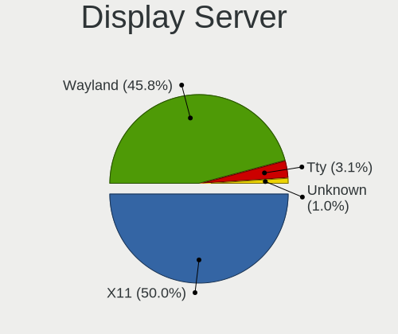
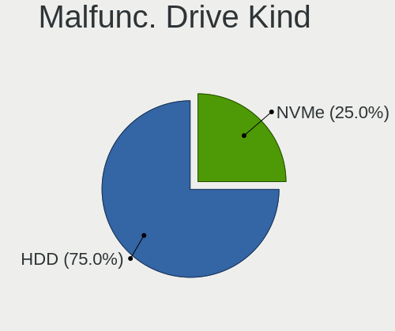
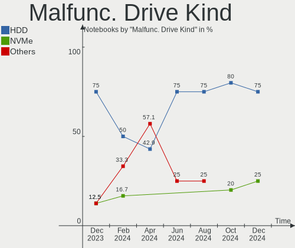
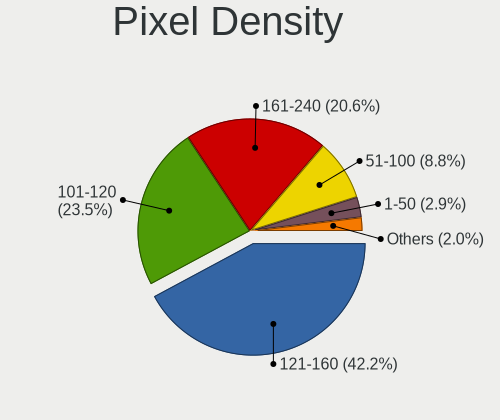
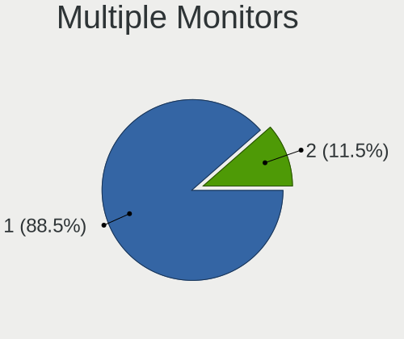
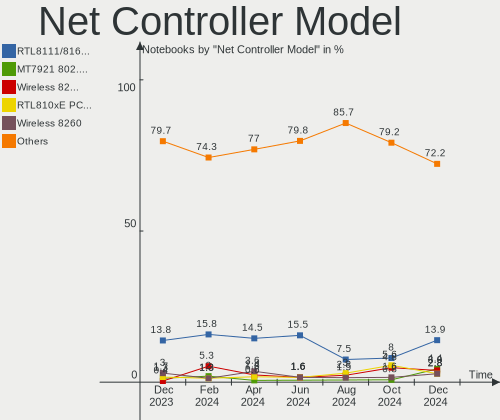
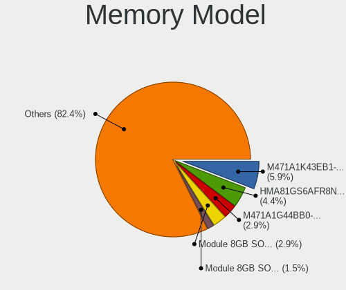
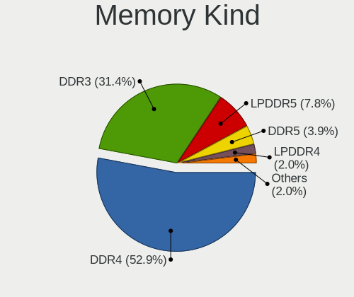
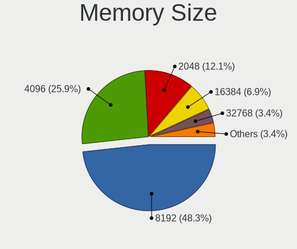
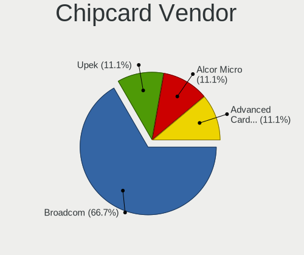

Linux in Canada - Hardware Trends (Notebooks)
---------------------------------------------

A project to identify most popular hardware characteristics and track their change
over time based on data collected by Linux users at https://Linux-Hardware.org.

Anyone can contribute to this report by the [hw-probe](https://github.com/linuxhw/hw-probe) tool:

    sudo -E hw-probe -all -upload

Period: Apr, 2023.

Contents
--------

* [ System ](#system)
  - [ OS                       ](#os)
  - [ OS Family                ](#os-family)
  - [ Kernel                   ](#kernel)
  - [ Kernel Family            ](#kernel-family)
  - [ Kernel Major Ver.        ](#kernel-major-ver)
  - [ Arch                     ](#arch)
  - [ DE                       ](#de)
  - [ Display Server           ](#display-server)
  - [ Display Manager          ](#display-manager)
  - [ OS Lang                  ](#os-lang)
  - [ Boot Mode                ](#boot-mode)
  - [ Filesystem               ](#filesystem)
  - [ Part. scheme             ](#part-scheme)
  - [ Dual Boot with Linux/BSD ](#dual-boot-with-linuxbsd)
  - [ Dual Boot (Win)          ](#dual-boot-win)

* [ Board ](#board)
  - [ Vendor                   ](#vendor)
  - [ Model                    ](#model)
  - [ Model Family             ](#model-family)
  - [ MFG Year                 ](#mfg-year)
  - [ Form Factor              ](#form-factor)
  - [ Secure Boot              ](#secure-boot)
  - [ Coreboot                 ](#coreboot)
  - [ RAM Size                 ](#ram-size)
  - [ RAM Used                 ](#ram-used)
  - [ Total Drives             ](#total-drives)
  - [ Has CD-ROM               ](#has-cd-rom)
  - [ Has Ethernet             ](#has-ethernet)
  - [ Has WiFi                 ](#has-wifi)
  - [ Has Bluetooth            ](#has-bluetooth)

* [ Location ](#location)
  - [ Country                  ](#country)
  - [ City                     ](#city)

* [ Drives ](#drives)
  - [ Drive Vendor             ](#drive-vendor)
  - [ Drive Model              ](#drive-model)
  - [ HDD Vendor               ](#hdd-vendor)
  - [ SSD Vendor               ](#ssd-vendor)
  - [ Drive Kind               ](#drive-kind)
  - [ Drive Connector          ](#drive-connector)
  - [ Drive Size               ](#drive-size)
  - [ Space Total              ](#space-total)
  - [ Space Used               ](#space-used)
  - [ Malfunc. Drives          ](#malfunc-drives)
  - [ Malfunc. Drive Vendor    ](#malfunc-drive-vendor)
  - [ Malfunc. HDD Vendor      ](#malfunc-hdd-vendor)
  - [ Malfunc. Drive Kind      ](#malfunc-drive-kind)
  - [ Failed Drives            ](#failed-drives)
  - [ Failed Drive Vendor      ](#failed-drive-vendor)
  - [ Drive Status             ](#drive-status)

* [ Storage controller ](#storage-controller)
  - [ Storage Vendor           ](#storage-vendor)
  - [ Storage Model            ](#storage-model)
  - [ Storage Kind             ](#storage-kind)

* [ Processor ](#processor)
  - [ CPU Vendor               ](#cpu-vendor)
  - [ CPU Model                ](#cpu-model)
  - [ CPU Model Family         ](#cpu-model-family)
  - [ CPU Cores                ](#cpu-cores)
  - [ CPU Sockets              ](#cpu-sockets)
  - [ CPU Threads              ](#cpu-threads)
  - [ CPU Op-Modes             ](#cpu-op-modes)
  - [ CPU Microcode            ](#cpu-microcode)
  - [ CPU Microarch            ](#cpu-microarch)

* [ Graphics ](#graphics)
  - [ GPU Vendor               ](#gpu-vendor)
  - [ GPU Model                ](#gpu-model)
  - [ GPU Combo                ](#gpu-combo)
  - [ GPU Driver               ](#gpu-driver)
  - [ GPU Memory               ](#gpu-memory)

* [ Monitor ](#monitor)
  - [ Monitor Vendor           ](#monitor-vendor)
  - [ Monitor Model            ](#monitor-model)
  - [ Monitor Resolution       ](#monitor-resolution)
  - [ Monitor Diagonal         ](#monitor-diagonal)
  - [ Monitor Width            ](#monitor-width)
  - [ Aspect Ratio             ](#aspect-ratio)
  - [ Monitor Area             ](#monitor-area)
  - [ Pixel Density            ](#pixel-density)
  - [ Multiple Monitors        ](#multiple-monitors)

* [ Network ](#network)
  - [ Net Controller Vendor    ](#net-controller-vendor)
  - [ Net Controller Model     ](#net-controller-model)
  - [ Wireless Vendor          ](#wireless-vendor)
  - [ Wireless Model           ](#wireless-model)
  - [ Ethernet Vendor          ](#ethernet-vendor)
  - [ Ethernet Model           ](#ethernet-model)
  - [ Net Controller Kind      ](#net-controller-kind)
  - [ Used Controller          ](#used-controller)
  - [ NICs                     ](#nics)
  - [ IPv6                     ](#ipv6)

* [ Bluetooth ](#bluetooth)
  - [ Bluetooth Vendor         ](#bluetooth-vendor)
  - [ Bluetooth Model          ](#bluetooth-model)

* [ Sound ](#sound)
  - [ Sound Vendor             ](#sound-vendor)
  - [ Sound Model              ](#sound-model)

* [ Memory ](#memory)
  - [ Memory Vendor            ](#memory-vendor)
  - [ Memory Model             ](#memory-model)
  - [ Memory Kind              ](#memory-kind)
  - [ Memory Form Factor       ](#memory-form-factor)
  - [ Memory Size              ](#memory-size)
  - [ Memory Speed             ](#memory-speed)

* [ Printers & scanners ](#printers--scanners)
  - [ Printer Vendor           ](#printer-vendor)
  - [ Printer Model            ](#printer-model)
  - [ Scanner Vendor           ](#scanner-vendor)
  - [ Scanner Model            ](#scanner-model)

* [ Camera ](#camera)
  - [ Camera Vendor            ](#camera-vendor)
  - [ Camera Model             ](#camera-model)

* [ Security ](#security)
  - [ Fingerprint Vendor       ](#fingerprint-vendor)
  - [ Fingerprint Model        ](#fingerprint-model)
  - [ Chipcard Vendor          ](#chipcard-vendor)
  - [ Chipcard Model           ](#chipcard-model)

* [ Unsupported ](#unsupported)
  - [ Unsupported Devices      ](#unsupported-devices)
  - [ Unsupported Device Types ](#unsupported-device-types)

System
------

OS
--

Installed operating systems

| Name                      | Notebooks | Percent |
|---------------------------|-----------|---------|
| OpenMandriva 23.03        | 9         | 13.64%  |
| Ubuntu 22.04              | 7         | 10.61%  |
| Linux Mint 21.1           | 6         | 9.09%   |
| Arch Rolling              | 6         | 9.09%   |
| Fedora 37                 | 5         | 7.58%   |
| Pop!_OS 22.04             | 4         | 6.06%   |
| Gentoo 2.13               | 4         | 6.06%   |
| Fedora 38                 | 3         | 4.55%   |
| EndeavourOS Rolling       | 3         | 4.55%   |
| Ubuntu 22.10              | 2         | 3.03%   |
| Linux Mint 21             | 2         | 3.03%   |
| Elementary 6.1            | 2         | 3.03%   |
| Zorin 16                  | 1         | 1.52%   |
| Xubuntu 22.04             | 1         | 1.52%   |
| Void Linux Rolling        | 1         | 1.52%   |
| Ubuntu 23.04              | 1         | 1.52%   |
| Ubuntu 20.04              | 1         | 1.52%   |
| SteamOS 3.4.6             | 1         | 1.52%   |
| openSUSE Microos-XXXXXXXX | 1         | 1.52%   |
| OpenMandriva 4.3          | 1         | 1.52%   |
| Manjaro 22.1.0            | 1         | 1.52%   |
| Linux Mint 20.3           | 1         | 1.52%   |
| KDE neon 22.04            | 1         | 1.52%   |
| Debian 11                 | 1         | 1.52%   |
| ArcoLinux Rolling         | 1         | 1.52%   |

OS Family
---------

OS without a version

| Name         | Notebooks | Percent |
|--------------|-----------|---------|
| Ubuntu       | 11        | 16.67%  |
| OpenMandriva | 10        | 15.15%  |
| Linux Mint   | 9         | 13.64%  |
| Fedora       | 8         | 12.12%  |
| Arch         | 6         | 9.09%   |
| Pop!_OS      | 4         | 6.06%   |
| Gentoo       | 4         | 6.06%   |
| EndeavourOS  | 3         | 4.55%   |
| Elementary   | 2         | 3.03%   |
| Zorin        | 1         | 1.52%   |
| Xubuntu      | 1         | 1.52%   |
| Void Linux   | 1         | 1.52%   |
| SteamOS      | 1         | 1.52%   |
| openSUSE     | 1         | 1.52%   |
| Manjaro      | 1         | 1.52%   |
| KDE neon     | 1         | 1.52%   |
| Debian       | 1         | 1.52%   |
| ArcoLinux    | 1         | 1.52%   |

Kernel
------

Version of the Linux kernel

| Version                  | Notebooks | Percent |
|--------------------------|-----------|---------|
| 5.15.0-69-generic        | 10        | 15.15%  |
| 6.2.6-desktop-1omv2390   | 9         | 13.64%  |
| 5.19.0-38-generic        | 7         | 10.61%  |
| 6.2.10-arch1-1           | 5         | 7.58%   |
| 6.2.8-200.fc37.x86_64    | 2         | 3.03%   |
| 6.2.6-76060206-generic   | 2         | 3.03%   |
| 6.2.11-arch1-1           | 2         | 3.03%   |
| 6.2.11-300.fc38.x86_64   | 2         | 3.03%   |
| 6.2.10-200.fc37.x86_64   | 2         | 3.03%   |
| 6.1.19-gentoo-x86_64     | 2         | 3.03%   |
| 5.15.0-70-generic        | 2         | 3.03%   |
| 6.2.9-zen1-1-zen         | 1         | 1.52%   |
| 6.2.9-arch1-1            | 1         | 1.52%   |
| 6.2.9-300.fc38.x86_64    | 1         | 1.52%   |
| 6.2.9-200.fc37.x86_64    | 1         | 1.52%   |
| 6.2.8_1                  | 1         | 1.52%   |
| 6.2.12-arch1-1           | 1         | 1.52%   |
| 6.2.11-gentoo-dist       | 1         | 1.52%   |
| 6.2.10-1-MANJARO         | 1         | 1.52%   |
| 6.2.10-1-default         | 1         | 1.52%   |
| 6.2.10-060210-generic    | 1         | 1.52%   |
| 6.2.0-20-generic         | 1         | 1.52%   |
| 6.1.22-gentoo-dist       | 1         | 1.52%   |
| 6.0.6-76060006-generic   | 1         | 1.52%   |
| 5.19.0-40-generic        | 1         | 1.52%   |
| 5.19.0-21-generic        | 1         | 1.52%   |
| 5.16.7-desktop-1omv4003  | 1         | 1.52%   |
| 5.15.0-71-generic        | 1         | 1.52%   |
| 5.15.0-67-generic        | 1         | 1.52%   |
| 5.15.0-60-generic        | 1         | 1.52%   |
| 5.13.0-valve36-1-neptune | 1         | 1.52%   |
| 5.10.0-21-amd64          | 1         | 1.52%   |

Kernel Family
-------------

Linux kernel without a distro release

| Version | Notebooks | Percent |
|---------|-----------|---------|
| 5.15.0  | 15        | 22.73%  |
| 6.2.6   | 11        | 16.67%  |
| 6.2.10  | 10        | 15.15%  |
| 5.19.0  | 9         | 13.64%  |
| 6.2.11  | 5         | 7.58%   |
| 6.2.9   | 4         | 6.06%   |
| 6.2.8   | 3         | 4.55%   |
| 6.1.19  | 2         | 3.03%   |
| 6.2.12  | 1         | 1.52%   |
| 6.2.0   | 1         | 1.52%   |
| 6.1.22  | 1         | 1.52%   |
| 6.0.6   | 1         | 1.52%   |
| 5.16.7  | 1         | 1.52%   |
| 5.13.0  | 1         | 1.52%   |
| 5.10.0  | 1         | 1.52%   |

Kernel Major Ver.
-----------------

Linux kernel major version

| Version | Notebooks | Percent |
|---------|-----------|---------|
| 6.2     | 35        | 53.03%  |
| 5.15    | 15        | 22.73%  |
| 5.19    | 9         | 13.64%  |
| 6.1     | 3         | 4.55%   |
| 6.0     | 1         | 1.52%   |
| 5.16    | 1         | 1.52%   |
| 5.13    | 1         | 1.52%   |
| 5.10    | 1         | 1.52%   |

Arch
----

OS architecture (x86_64, i586, etc.)

| Name   | Notebooks | Percent |
|--------|-----------|---------|
| x86_64 | 66        | 100%    |

DE
--

Desktop Environment

| Name          | Notebooks | Percent |
|---------------|-----------|---------|
| GNOME         | 23        | 34.85%  |
| KDE5          | 20        | 30.3%   |
| X-Cinnamon    | 5         | 7.58%   |
| XFCE          | 4         | 6.06%   |
| MATE          | 4         | 6.06%   |
| Pantheon      | 2         | 3.03%   |
| Cinnamon      | 2         | 3.03%   |
| sway          | 1         | 1.52%   |
| Jwm           | 1         | 1.52%   |
| Hyprland      | 1         | 1.52%   |
| GNOME-Classic | 1         | 1.52%   |
| chadwm        | 1         | 1.52%   |
| Unknown       | 1         | 1.52%   |

Display Server
--------------

X11 or Wayland

| Name    | Notebooks | Percent |
|---------|-----------|---------|
| X11     | 42        | 63.64%  |
| Wayland | 21        | 31.82%  |
| Tty     | 3         | 4.55%   |

Display Manager
---------------

SDDM, LightDM, etc.

| Name    | Notebooks | Percent |
|---------|-----------|---------|
| Unknown | 22        | 33.33%  |
| SDDM    | 17        | 25.76%  |
| LightDM | 12        | 18.18%  |
| GDM3    | 11        | 16.67%  |
| GDM     | 2         | 3.03%   |
| Ly      | 1         | 1.52%   |
| LXDM    | 1         | 1.52%   |

OS Lang
-------

Language

| Lang    | Notebooks | Percent |
|---------|-----------|---------|
| en_CA   | 33        | 50%     |
| en_US   | 21        | 31.82%  |
| fr_CA   | 6         | 9.09%   |
| C       | 3         | 4.55%   |
| Unknown | 2         | 3.03%   |
| C.UTF8  | 1         | 1.52%   |

Boot Mode
---------

EFI or BIOS

| Mode | Notebooks | Percent |
|------|-----------|---------|
| EFI  | 37        | 56.06%  |
| BIOS | 29        | 43.94%  |

Filesystem
----------

Type of filesystem

| Type    | Notebooks | Percent |
|---------|-----------|---------|
| Ext4    | 42        | 63.64%  |
| Btrfs   | 13        | 19.7%   |
| Overlay | 6         | 9.09%   |
| Zfs     | 2         | 3.03%   |
| Tmpfs   | 2         | 3.03%   |
| Xfs     | 1         | 1.52%   |

Part. scheme
------------

Scheme of partitioning

| Type    | Notebooks | Percent |
|---------|-----------|---------|
| GPT     | 39        | 59.09%  |
| Unknown | 20        | 30.3%   |
| MBR     | 7         | 10.61%  |

Dual Boot with Linux/BSD
------------------------

Hosting more than one Linux/BSD

| Dual boot | Notebooks | Percent |
|-----------|-----------|---------|
| No        | 56        | 84.85%  |
| Yes       | 10        | 15.15%  |

Dual Boot (Win)
---------------

Hosting Linux and Windows

| Dual boot | Notebooks | Percent |
|-----------|-----------|---------|
| No        | 57        | 86.36%  |
| Yes       | 9         | 13.64%  |

Board
-----

Vendor
------

Motherboard manufacturer

| Name                | Notebooks | Percent |
|---------------------|-----------|---------|
| Lenovo              | 16        | 24.24%  |
| Hewlett-Packard     | 10        | 15.15%  |
| Dell                | 10        | 15.15%  |
| ASUSTek Computer    | 9         | 13.64%  |
| Acer                | 5         | 7.58%   |
| MSI                 | 4         | 6.06%   |
| Apple               | 4         | 6.06%   |
| Toshiba             | 2         | 3.03%   |
| Valve               | 1         | 1.52%   |
| Google              | 1         | 1.52%   |
| Gigabyte Technology | 1         | 1.52%   |
| Gateway             | 1         | 1.52%   |
| Framework           | 1         | 1.52%   |
| Alienware           | 1         | 1.52%   |

Model
-----

Motherboard model

| Name                                        | Notebooks | Percent |
|---------------------------------------------|-----------|---------|
| HP Pavilion dv7                             | 3         | 4.55%   |
| Lenovo ThinkPad X1 Carbon Gen 10 21CBCTO1WW | 2         | 3.03%   |
| Apple MacBookPro8,1                         | 2         | 3.03%   |
| Valve Jupiter                               | 1         | 1.52%   |
| Toshiba Satellite L850                      | 1         | 1.52%   |
| Toshiba Satellite L300D                     | 1         | 1.52%   |
| MSI Modern 14 B10MW                         | 1         | 1.52%   |
| MSI GP72 7RDX                               | 1         | 1.52%   |
| MSI GP60 2QE                                | 1         | 1.52%   |
| MSI GF75 Thin 9SC                           | 1         | 1.52%   |
| Lenovo ThinkPad X1 Carbon 7th 20QDS3B200    | 1         | 1.52%   |
| Lenovo ThinkPad X1 Carbon 6th 20KH002KUS    | 1         | 1.52%   |
| Lenovo ThinkPad T550 20CKA00ECD             | 1         | 1.52%   |
| Lenovo ThinkPad T480s 20L8S0ER00            | 1         | 1.52%   |
| Lenovo ThinkPad T470s W10DG 20JTS1FA00      | 1         | 1.52%   |
| Lenovo ThinkPad T470s W10DG 20JTS0DN00      | 1         | 1.52%   |
| Lenovo ThinkPad Edge 031946U                | 1         | 1.52%   |
| Lenovo ThinkPad E15 Gen 4 21E6007GUS        | 1         | 1.52%   |
| Lenovo ThinkBook 15 G4 IAP 21DJ             | 1         | 1.52%   |
| Lenovo Legion 5 17ACH6H 82JY                | 1         | 1.52%   |
| Lenovo IdeaPad 330-15ARR 81D2               | 1         | 1.52%   |
| Lenovo IdeaPad 3 15IGL05 81WQ               | 1         | 1.52%   |
| Lenovo IdeaPad 3 15ALC6 82KU                | 1         | 1.52%   |
| Lenovo B575 1450ABU                         | 1         | 1.52%   |
| HP Pavilion dv8000 (ET839UA#ABL)            | 1         | 1.52%   |
| HP G62                                      | 1         | 1.52%   |
| HP ENVY Laptop 13-ba1xxx                    | 1         | 1.52%   |
| HP EliteBook 8440p                          | 1         | 1.52%   |
| HP EliteBook 840 G5                         | 1         | 1.52%   |
| HP EliteBook 840 G3                         | 1         | 1.52%   |
| HP EliteBook 2560p                          | 1         | 1.52%   |
| Google Kefka                                | 1         | 1.52%   |
| Gigabyte AERO 15-X9                         | 1         | 1.52%   |
| Gateway NE56R                               | 1         | 1.52%   |
| Framework Laptop (12th Gen Intel Core)      | 1         | 1.52%   |
| Dell XPS 13 9343                            | 1         | 1.52%   |
| Dell Precision 7670                         | 1         | 1.52%   |
| Dell Latitude E7240                         | 1         | 1.52%   |
| Dell Latitude E6430s                        | 1         | 1.52%   |
| Dell Latitude E6420                         | 1         | 1.52%   |

Model Family
------------

Motherboard model prefix

| Name               | Notebooks | Percent |
|--------------------|-----------|---------|
| Lenovo ThinkPad    | 10        | 15.15%  |
| Dell Latitude      | 7         | 10.61%  |
| ASUS VivoBook      | 5         | 7.58%   |
| HP Pavilion        | 4         | 6.06%   |
| HP EliteBook       | 4         | 6.06%   |
| Lenovo IdeaPad     | 3         | 4.55%   |
| Toshiba Satellite  | 2         | 3.03%   |
| Apple MacBookPro8  | 2         | 3.03%   |
| Acer Aspire        | 2         | 3.03%   |
| Valve Jupiter      | 1         | 1.52%   |
| MSI Modern         | 1         | 1.52%   |
| MSI GP72           | 1         | 1.52%   |
| MSI GP60           | 1         | 1.52%   |
| MSI GF75           | 1         | 1.52%   |
| Lenovo ThinkBook   | 1         | 1.52%   |
| Lenovo Legion      | 1         | 1.52%   |
| Lenovo B575        | 1         | 1.52%   |
| HP G62             | 1         | 1.52%   |
| HP ENVY            | 1         | 1.52%   |
| Google Kefka       | 1         | 1.52%   |
| Gigabyte AERO      | 1         | 1.52%   |
| Gateway NE56R      | 1         | 1.52%   |
| Framework Laptop   | 1         | 1.52%   |
| Dell XPS           | 1         | 1.52%   |
| Dell Precision     | 1         | 1.52%   |
| Dell Inspiron      | 1         | 1.52%   |
| ASUS X510UAR       | 1         | 1.52%   |
| ASUS ROG           | 1         | 1.52%   |
| ASUS N550JX        | 1         | 1.52%   |
| ASUS ASUS          | 1         | 1.52%   |
| Apple MacBookPro5  | 1         | 1.52%   |
| Apple MacBookPro11 | 1         | 1.52%   |
| Alienware 13       | 1         | 1.52%   |
| Acer Swift         | 1         | 1.52%   |
| Acer Predator      | 1         | 1.52%   |
| Acer Nitro         | 1         | 1.52%   |

MFG Year
--------

Motherboard manufacture year

| Year | Notebooks | Percent |
|------|-----------|---------|
| 2022 | 8         | 12.12%  |
| 2018 | 7         | 10.61%  |
| 2020 | 6         | 9.09%   |
| 2019 | 6         | 9.09%   |
| 2021 | 5         | 7.58%   |
| 2015 | 5         | 7.58%   |
| 2011 | 5         | 7.58%   |
| 2017 | 4         | 6.06%   |
| 2012 | 4         | 6.06%   |
| 2008 | 4         | 6.06%   |
| 2014 | 3         | 4.55%   |
| 2010 | 3         | 4.55%   |
| 2013 | 2         | 3.03%   |
| 2023 | 1         | 1.52%   |
| 2016 | 1         | 1.52%   |
| 2009 | 1         | 1.52%   |
| 2006 | 1         | 1.52%   |

Form Factor
-----------

Physical design of the computer

| Name     | Notebooks | Percent |
|----------|-----------|---------|
| Notebook | 66        | 100%    |

Secure Boot
-----------

Enabled or disabled

| State    | Notebooks | Percent |
|----------|-----------|---------|
| Disabled | 59        | 89.39%  |
| Enabled  | 7         | 10.61%  |

Coreboot
--------

Have coreboot on board

| Used | Notebooks | Percent |
|------|-----------|---------|
| No   | 65        | 98.48%  |
| Yes  | 1         | 1.52%   |

RAM Size
--------

Total RAM memory

| Size in GB  | Notebooks | Percent |
|-------------|-----------|---------|
| 16.01-24.0  | 18        | 27.27%  |
| 4.01-8.0    | 16        | 24.24%  |
| 3.01-4.0    | 13        | 19.7%   |
| 8.01-16.0   | 12        | 18.18%  |
| 32.01-64.0  | 4         | 6.06%   |
| 24.01-32.0  | 1         | 1.52%   |
| 64.01-256.0 | 1         | 1.52%   |
| 1.01-2.0    | 1         | 1.52%   |

RAM Used
--------

Used RAM memory

| Used GB    | Notebooks | Percent |
|------------|-----------|---------|
| 2.01-3.0   | 20        | 30.3%   |
| 1.01-2.0   | 20        | 30.3%   |
| 4.01-8.0   | 13        | 19.7%   |
| 3.01-4.0   | 8         | 12.12%  |
| 0.51-1.0   | 2         | 3.03%   |
| 16.01-24.0 | 1         | 1.52%   |
| 8.01-16.0  | 1         | 1.52%   |
| 0.01-0.5   | 1         | 1.52%   |

Total Drives
------------

Number of drives on board

| Drives | Notebooks | Percent |
|--------|-----------|---------|
| 1      | 53        | 80.3%   |
| 2      | 11        | 16.67%  |
| 3      | 2         | 3.03%   |

Has CD-ROM
----------

Has CD-ROM on board

| Presented | Notebooks | Percent |
|-----------|-----------|---------|
| No        | 45        | 68.18%  |
| Yes       | 21        | 31.82%  |

Has Ethernet
------------

Has Ethernet on board

| Presented | Notebooks | Percent |
|-----------|-----------|---------|
| Yes       | 47        | 71.21%  |
| No        | 19        | 28.79%  |

Has WiFi
--------

Has WiFi module

| Presented | Notebooks | Percent |
|-----------|-----------|---------|
| Yes       | 66        | 100%    |

Has Bluetooth
-------------

Has Bluetooth module

| Presented | Notebooks | Percent |
|-----------|-----------|---------|
| Yes       | 51        | 77.27%  |
| No        | 15        | 22.73%  |

Location
--------

Country
-------

Geographic location (country)

| Country | Notebooks | Percent |
|---------|-----------|---------|
| Canada  | 66        | 100%    |

City
----

Geographic location (city)

| City                 | Notebooks | Percent |
|----------------------|-----------|---------|
| Montreal             | 8         | 12.12%  |
| Mississauga          | 4         | 6.06%   |
| Calgary              | 4         | 6.06%   |
| Winnipeg             | 3         | 4.55%   |
| Edmonton             | 3         | 4.55%   |
| Verdun               | 2         | 3.03%   |
| Sutton               | 2         | 3.03%   |
| North York           | 2         | 3.03%   |
| New Westminster      | 2         | 3.03%   |
| Moncton              | 2         | 3.03%   |
| Kippens              | 2         | 3.03%   |
| Burnaby              | 2         | 3.03%   |
| Brampton             | 2         | 3.03%   |
| Wynyard              | 1         | 1.52%   |
| Toronto              | 1         | 1.52%   |
| St. John's           | 1         | 1.52%   |
| St. Jean Baptiste    | 1         | 1.52%   |
| Simcoe               | 1         | 1.52%   |
| Sherwood Park        | 1         | 1.52%   |
| Scarborough          | 1         | 1.52%   |
| Sault Ste. Marie     | 1         | 1.52%   |
| Saint-Jerome         | 1         | 1.52%   |
| Richmond Hill        | 1         | 1.52%   |
| Québec              | 1         | 1.52%   |
| Port Coquitlam       | 1         | 1.52%   |
| Ottawa               | 1         | 1.52%   |
| Orleans              | 1         | 1.52%   |
| Nepean               | 1         | 1.52%   |
| Mascouche            | 1         | 1.52%   |
| Maple Ridge          | 1         | 1.52%   |
| Kingston             | 1         | 1.52%   |
| Kelowna              | 1         | 1.52%   |
| Gatineau             | 1         | 1.52%   |
| Farnham              | 1         | 1.52%   |
| Falher               | 1         | 1.52%   |
| Etobicoke            | 1         | 1.52%   |
| Drummondville        | 1         | 1.52%   |
| Coteau-du-Lac        | 1         | 1.52%   |
| Conception Bay South | 1         | 1.52%   |
| Bedford              | 1         | 1.52%   |

Drives
------

Drive Vendor
------------

Hard drive vendors

| Vendor                    | Notebooks | Drives | Percent |
|---------------------------|-----------|--------|---------|
| Samsung Electronics       | 20        | 20     | 25.64%  |
| SanDisk                   | 8         | 9      | 10.26%  |
| Seagate                   | 6         | 6      | 7.69%   |
| WDC                       | 5         | 5      | 6.41%   |
| Unknown                   | 5         | 5      | 6.41%   |
| Kingston                  | 5         | 5      | 6.41%   |
| SK hynix                  | 4         | 4      | 5.13%   |
| Hitachi                   | 4         | 4      | 5.13%   |
| Toshiba                   | 3         | 3      | 3.85%   |
| Intel                     | 2         | 2      | 2.56%   |
| Crucial                   | 2         | 2      | 2.56%   |
| Union Memory              | 1         | 1      | 1.28%   |
| SPCC                      | 1         | 1      | 1.28%   |
| Phison Electronics        | 1         | 1      | 1.28%   |
| OWC                       | 1         | 1      | 1.28%   |
| Micron/Crucial Technology | 1         | 1      | 1.28%   |
| Micron Technology         | 1         | 1      | 1.28%   |
| LITEONIT                  | 1         | 1      | 1.28%   |
| KingSpec                  | 1         | 1      | 1.28%   |
| KingFast                  | 1         | 1      | 1.28%   |
| JMicron Technology        | 1         | 1      | 1.28%   |
| HGST                      | 1         | 1      | 1.28%   |
| Fujitsu                   | 1         | 1      | 1.28%   |
| A-DATA Technology         | 1         | 1      | 1.28%   |
| Unknown                   | 1         | 1      | 1.28%   |

Drive Model
-----------

Hard drive models

| Model                                                 | Notebooks | Percent |
|-------------------------------------------------------|-----------|---------|
| Samsung NVMe SSD Controller SM981/PM981/PM983 1TB     | 3         | 3.8%    |
| Samsung SSD 860 EVO 500GB                             | 2         | 2.53%   |
| Samsung NVMe SSD Controller PM9A1/PM9A3/980PRO 2TB    | 2         | 2.53%   |
| Samsung MZALQ512HBLU-00BL2 512GB                      | 2         | 2.53%   |
| Kingston SA400S37480G 480GB SSD                       | 2         | 2.53%   |
| Intel SSDPEKNU512GZ 512GB                             | 2         | 2.53%   |
| WDC WDS100T2B0A-00SM50 1TB SSD                        | 1         | 1.27%   |
| WDC WD7500BPVX-22JC3T0 752GB                          | 1         | 1.27%   |
| WDC WD7500BPVT-22HXZT3 752GB                          | 1         | 1.27%   |
| WDC WD5000LPLX-75ZNTT0 500GB                          | 1         | 1.27%   |
| WDC WD5000BEVT-11A03T0 500GB                          | 1         | 1.27%   |
| Unknown SD04G  4GB                                    | 1         | 1.27%   |
| Unknown MMC Card  64GB                                | 1         | 1.27%   |
| Unknown MMC Card  16GB                                | 1         | 1.27%   |
| Unknown G1J38E  64GB                                  | 1         | 1.27%   |
| Unknown 00000  16GB                                   | 1         | 1.27%   |
| Union Memory UMIS RPJTJ256MEE1OWX 256GB               | 1         | 1.27%   |
| Toshiba MQ01ABF050 500GB                              | 1         | 1.27%   |
| Toshiba MK5056GSY 500GB                               | 1         | 1.27%   |
| Toshiba KXG5AZNV512G 512GB                            | 1         | 1.27%   |
| SPCC Solid State Disk 256GB                           | 1         | 1.27%   |
| SK hynix SKHynix_HFS512GEJ9X115N 512GB                | 1         | 1.27%   |
| SK hynix SC313 SATA 512GB SSD                         | 1         | 1.27%   |
| SK hynix PC801 NVMe 1TB                               | 1         | 1.27%   |
| SK hynix HFM512GDJTNI-82A0A 512GB                     | 1         | 1.27%   |
| Seagate ST9500325ASG 500GB                            | 1         | 1.27%   |
| Seagate ST500LT012-1DG142 500GB                       | 1         | 1.27%   |
| Seagate ST1000LM048-2E7172 1TB                        | 1         | 1.27%   |
| Seagate ST1000LM035-1RK172 970GB                      | 1         | 1.27%   |
| Seagate ST1000LM024 HN-M101MBB 1TB                    | 1         | 1.27%   |
| Seagate BUP Portable 5TB                              | 1         | 1.27%   |
| Sandisk WD_BLACK SN770 1TB                            | 1         | 1.27%   |
| Sandisk WD PC SN740 SDDQMQD-512G-1001 512GB           | 1         | 1.27%   |
| Sandisk WD Blue SN550 NVMe SSD 1024GB                 | 1         | 1.27%   |
| Sandisk WD Blue SN500 / PC SN520 NVMe SSD 512GB       | 1         | 1.27%   |
| Sandisk WD Black SN850 1TB                            | 1         | 1.27%   |
| Sandisk WD Black 2018/SN750 / PC SN720 NVMe SSD 500GB | 1         | 1.27%   |
| SanDisk SDSSDH3512G 512GB                             | 1         | 1.27%   |
| SanDisk SD8SN8U256G1002 256GB SSD                     | 1         | 1.27%   |
| SanDisk SD8SN8U-256G-1006 256GB SSD                   | 1         | 1.27%   |

HDD Vendor
----------

Hard disk drive vendors

| Vendor              | Notebooks | Drives | Percent |
|---------------------|-----------|--------|---------|
| Seagate             | 6         | 6      | 30%     |
| WDC                 | 4         | 4      | 20%     |
| Hitachi             | 4         | 4      | 20%     |
| Toshiba             | 2         | 2      | 10%     |
| Samsung Electronics | 1         | 1      | 5%      |
| JMicron Technology  | 1         | 1      | 5%      |
| HGST                | 1         | 1      | 5%      |
| Fujitsu             | 1         | 1      | 5%      |

SSD Vendor
----------

Solid state drive vendors

| Vendor              | Notebooks | Drives | Percent |
|---------------------|-----------|--------|---------|
| Samsung Electronics | 6         | 6      | 27.27%  |
| SanDisk             | 3         | 3      | 13.64%  |
| Kingston            | 3         | 3      | 13.64%  |
| Crucial             | 2         | 2      | 9.09%   |
| WDC                 | 1         | 1      | 4.55%   |
| SPCC                | 1         | 1      | 4.55%   |
| SK hynix            | 1         | 1      | 4.55%   |
| OWC                 | 1         | 1      | 4.55%   |
| LITEONIT            | 1         | 1      | 4.55%   |
| KingSpec            | 1         | 1      | 4.55%   |
| KingFast            | 1         | 1      | 4.55%   |
| A-DATA Technology   | 1         | 1      | 4.55%   |

Drive Kind
----------

HDD or SSD

| Kind | Notebooks | Drives | Percent |
|------|-----------|--------|---------|
| NVMe | 29        | 31     | 39.73%  |
| SSD  | 21        | 22     | 28.77%  |
| HDD  | 17        | 20     | 23.29%  |
| MMC  | 6         | 6      | 8.22%   |

Drive Connector
---------------

SATA, SAS, NVMe, etc.

| Type | Notebooks | Drives | Percent |
|------|-----------|--------|---------|
| SATA | 36        | 40     | 49.32%  |
| NVMe | 29        | 31     | 39.73%  |
| MMC  | 6         | 6      | 8.22%   |
| SAS  | 2         | 2      | 2.74%   |

Drive Size
----------

Size of hard drive

| Size in TB | Notebooks | Drives | Percent |
|------------|-----------|--------|---------|
| 0.01-0.5   | 26        | 30     | 68.42%  |
| 0.51-1.0   | 11        | 11     | 28.95%  |
| 4.01-10.0  | 1         | 1      | 2.63%   |

Space Total
-----------

Amount of disk space available on the file system

| Size in GB     | Notebooks | Percent |
|----------------|-----------|---------|
| 251-500        | 22        | 33.33%  |
| 101-250        | 12        | 18.18%  |
| 501-1000       | 12        | 18.18%  |
| 1001-2000      | 7         | 10.61%  |
| 1-20           | 5         | 7.58%   |
| 51-100         | 5         | 7.58%   |
| Unknown        | 2         | 3.03%   |
| More than 3000 | 1         | 1.52%   |

Space Used
----------

Amount of used disk space

| Used GB        | Notebooks | Percent |
|----------------|-----------|---------|
| 1-20           | 23        | 34.85%  |
| 21-50          | 10        | 15.15%  |
| 51-100         | 10        | 15.15%  |
| 251-500        | 9         | 13.64%  |
| 101-250        | 6         | 9.09%   |
| 501-1000       | 4         | 6.06%   |
| Unknown        | 2         | 3.03%   |
| More than 3000 | 1         | 1.52%   |
| 1001-2000      | 1         | 1.52%   |

Malfunc. Drives
---------------

Drive models with a malfunction

| Model                              | Notebooks | Drives | Percent |
|------------------------------------|-----------|--------|---------|
| Toshiba MK5056GSY 500GB            | 1         | 1      | 20%     |
| Seagate ST1000LM024 HN-M101MBB 1TB | 1         | 1      | 20%     |
| Samsung Electronics HM160HC 160GB  | 1         | 1      | 20%     |
| KingSpec Q-360 360GB SSD           | 1         | 1      | 20%     |
| Fujitsu MHV2080AH 80GB             | 1         | 1      | 20%     |

Malfunc. Drive Vendor
---------------------

Vendors of faulty drives

| Vendor              | Notebooks | Drives | Percent |
|---------------------|-----------|--------|---------|
| Toshiba             | 1         | 1      | 20%     |
| Seagate             | 1         | 1      | 20%     |
| Samsung Electronics | 1         | 1      | 20%     |
| KingSpec            | 1         | 1      | 20%     |
| Fujitsu             | 1         | 1      | 20%     |

Malfunc. HDD Vendor
-------------------

Vendors of faulty HDD drives

| Vendor              | Notebooks | Drives | Percent |
|---------------------|-----------|--------|---------|
| Toshiba             | 1         | 1      | 25%     |
| Seagate             | 1         | 1      | 25%     |
| Samsung Electronics | 1         | 1      | 25%     |
| Fujitsu             | 1         | 1      | 25%     |

Malfunc. Drive Kind
-------------------

Kinds of faulty drives

| Kind | Notebooks | Drives | Percent |
|------|-----------|--------|---------|
| HDD  | 3         | 4      | 75%     |
| SSD  | 1         | 1      | 25%     |

Failed Drives
-------------

Failed drive models

Zero info for selected period =(

Failed Drive Vendor
-------------------

Failed drive vendors

Zero info for selected period =(

Drive Status
------------

Number of failed and malfunc. drives

| Status   | Notebooks | Drives | Percent |
|----------|-----------|--------|---------|
| Detected | 35        | 40     | 50.72%  |
| Works    | 30        | 34     | 43.48%  |
| Malfunc  | 4         | 5      | 5.8%    |

Storage controller
------------------

Storage Vendor
--------------

Storage controller vendors

| Vendor                       | Notebooks | Percent |
|------------------------------|-----------|---------|
| Intel                        | 37        | 48.05%  |
| Samsung Electronics          | 13        | 16.88%  |
| AMD                          | 10        | 12.99%  |
| SanDisk                      | 5         | 6.49%   |
| SK hynix                     | 3         | 3.9%    |
| Kingston Technology Company  | 2         | 2.6%    |
| Union Memory (Shenzhen)      | 1         | 1.3%    |
| Toshiba America Info Systems | 1         | 1.3%    |
| Phison Electronics           | 1         | 1.3%    |
| Nvidia                       | 1         | 1.3%    |
| Micron/Crucial Technology    | 1         | 1.3%    |
| Micron Technology            | 1         | 1.3%    |
| Marvell Technology Group     | 1         | 1.3%    |

Storage Model
-------------

Storage controller models

| Model                                                                          | Notebooks | Percent |
|--------------------------------------------------------------------------------|-----------|---------|
| AMD FCH SATA Controller [AHCI mode]                                            | 6         | 7.23%   |
| Samsung NVMe SSD Controller SM981/PM981/PM983                                  | 5         | 6.02%   |
| Samsung NVMe SSD Controller 980                                                | 5         | 6.02%   |
| Intel Volume Management Device NVMe RAID Controller                            | 5         | 6.02%   |
| Intel Sunrise Point-LP SATA Controller [AHCI mode]                             | 5         | 6.02%   |
| Intel 6 Series/C200 Series Chipset Family 6 port Mobile SATA AHCI Controller   | 5         | 6.02%   |
| Samsung NVMe SSD Controller PM9A1/PM9A3/980PRO                                 | 3         | 3.61%   |
| Intel Celeron/Pentium Silver Processor SATA Controller                         | 3         | 3.61%   |
| Intel 82801 Mobile SATA Controller [RAID mode]                                 | 3         | 3.61%   |
| Intel 7 Series Chipset Family 6-port SATA Controller [AHCI mode]               | 3         | 3.61%   |
| SK hynix Platinum P41 NVMe Solid State Drive 2TB                               | 2         | 2.41%   |
| Intel Wildcat Point-LP SATA Controller [AHCI Mode]                             | 2         | 2.41%   |
| Intel Non-Volatile memory controller                                           | 2         | 2.41%   |
| Intel Cannon Lake Mobile PCH SATA AHCI Controller                              | 2         | 2.41%   |
| Intel 8 Series/C220 Series Chipset Family 6-port SATA Controller 1 [AHCI mode] | 2         | 2.41%   |
| Intel 5 Series/3400 Series Chipset 4 port SATA AHCI Controller                 | 2         | 2.41%   |
| AMD SB7x0/SB8x0/SB9x0 SATA Controller [AHCI mode]                              | 2         | 2.41%   |
| Union Memory (Shenzhen) Non-Volatile memory controller                         | 1         | 1.2%    |
| Toshiba America Info Systems XG5 NVMe SSD Controller                           | 1         | 1.2%    |
| SK hynix BC511                                                                 | 1         | 1.2%    |
| SanDisk WD PC SN810 / Black SN850 NVMe SSD                                     | 1         | 1.2%    |
| SanDisk WD Blue SN550 NVMe SSD                                                 | 1         | 1.2%    |
| SanDisk WD Blue SN500 / PC SN520 NVMe SSD                                      | 1         | 1.2%    |
| SanDisk WD Black SN770 NVMe SSD                                                | 1         | 1.2%    |
| SanDisk WD Black 2018/SN750 / PC SN720 NVMe SSD                                | 1         | 1.2%    |
| Sandisk Non-Volatile memory controller                                         | 1         | 1.2%    |
| Phison E12 NVMe Controller                                                     | 1         | 1.2%    |
| Nvidia MCP79 AHCI Controller                                                   | 1         | 1.2%    |
| Micron/Crucial P2 NVMe PCIe SSD                                                | 1         | 1.2%    |
| Micron NVMe Storage Controller                                                 | 1         | 1.2%    |
| Marvell Group 88SE9230 PCIe 2.0 x2 4-port SATA 6 Gb/s RAID Controller          | 1         | 1.2%    |
| Kingston Company Company Non-Volatile memory controller                        | 1         | 1.2%    |
| Kingston Company OM3PDP3 NVMe SSD                                              | 1         | 1.2%    |
| Intel Tiger Lake-LP SATA Controller                                            | 1         | 1.2%    |
| Intel HM170/QM170 Chipset SATA Controller [AHCI Mode]                          | 1         | 1.2%    |
| Intel Atom Processor E3800 Series SATA AHCI Controller                         | 1         | 1.2%    |
| Intel 82801IBM/IEM (ICH9M/ICH9M-E) 4 port SATA Controller [AHCI mode]          | 1         | 1.2%    |
| Intel 8 Series SATA Controller 1 [AHCI mode]                                   | 1         | 1.2%    |
| Intel 500 Series Chipset Family SATA AHCI Controller                           | 1         | 1.2%    |
| Intel 5 Series/3400 Series Chipset 6 port SATA AHCI Controller                 | 1         | 1.2%    |

Storage Kind
------------

Kind of storage controller (IDE, SATA, NVMe, SAS, ...)

| Kind | Notebooks | Percent |
|------|-----------|---------|
| SATA | 42        | 51.85%  |
| NVMe | 29        | 35.8%   |
| RAID | 8         | 9.88%   |
| IDE  | 2         | 2.47%   |

Processor
---------

CPU Vendor
----------

Processor vendors

| Vendor | Notebooks | Percent |
|--------|-----------|---------|
| Intel  | 54        | 81.82%  |
| AMD    | 12        | 18.18%  |

CPU Model
---------

Processor models

| Model                                   | Notebooks | Percent |
|-----------------------------------------|-----------|---------|
| Intel Core i7-8650U CPU @ 1.90GHz       | 4         | 6.06%   |
| Intel Celeron N4020 CPU @ 1.10GHz       | 3         | 4.55%   |
| Intel Core i7-8550U CPU @ 1.80GHz       | 2         | 3.03%   |
| Intel Core i7-6600U CPU @ 2.60GHz       | 2         | 3.03%   |
| Intel Core i7-4720HQ CPU @ 2.60GHz      | 2         | 3.03%   |
| Intel Core i5-5200U CPU @ 2.20GHz       | 2         | 3.03%   |
| Intel Core i5-2520M CPU @ 2.50GHz       | 2         | 3.03%   |
| Intel 12th Gen Core i7-1260P            | 2         | 3.03%   |
| Intel 12th Gen Core i7-1255U            | 2         | 3.03%   |
| Intel 11th Gen Core i7-1165G7 @ 2.80GHz | 2         | 3.03%   |
| AMD Ryzen 7 5800H with Radeon Graphics  | 2         | 3.03%   |
| Intel Pentium CPU N3530 @ 2.16GHz       | 1         | 1.52%   |
| Intel Pentium CPU B960 @ 2.20GHz        | 1         | 1.52%   |
| Intel Core i7-9750H CPU @ 2.60GHz       | 1         | 1.52%   |
| Intel Core i7-8750H CPU @ 2.20GHz       | 1         | 1.52%   |
| Intel Core i7-7700HQ CPU @ 2.80GHz      | 1         | 1.52%   |
| Intel Core i7-6500U CPU @ 2.50GHz       | 1         | 1.52%   |
| Intel Core i7 CPU Q 720 @ 1.60GHz       | 1         | 1.52%   |
| Intel Core i5-9300H CPU @ 2.40GHz       | 1         | 1.52%   |
| Intel Core i5-8365U CPU @ 1.60GHz       | 1         | 1.52%   |
| Intel Core i5-8350U CPU @ 1.70GHz       | 1         | 1.52%   |
| Intel Core i5-6200U CPU @ 2.30GHz       | 1         | 1.52%   |
| Intel Core i5-5300U CPU @ 2.30GHz       | 1         | 1.52%   |
| Intel Core i5-4300U CPU @ 1.90GHz       | 1         | 1.52%   |
| Intel Core i5-4258U CPU @ 2.40GHz       | 1         | 1.52%   |
| Intel Core i5-3320M CPU @ 2.60GHz       | 1         | 1.52%   |
| Intel Core i5-2435M CPU @ 2.40GHz       | 1         | 1.52%   |
| Intel Core i5-2415M CPU @ 2.30GHz       | 1         | 1.52%   |
| Intel Core i5-2410M CPU @ 2.30GHz       | 1         | 1.52%   |
| Intel Core i5 CPU M 520 @ 2.40GHz       | 1         | 1.52%   |
| Intel Core i3-2370M CPU @ 2.40GHz       | 1         | 1.52%   |
| Intel Core i3-2328M CPU @ 2.20GHz       | 1         | 1.52%   |
| Intel Core i3-10110U CPU @ 2.10GHz      | 1         | 1.52%   |
| Intel Core i3 CPU M 380 @ 2.53GHz       | 1         | 1.52%   |
| Intel Core 2 Duo CPU P7550 @ 2.26GHz    | 1         | 1.52%   |
| Intel Core 2 Duo CPU P7350 @ 2.00GHz    | 1         | 1.52%   |
| Intel Celeron CPU N3060 @ 1.60GHz       | 1         | 1.52%   |
| Intel 12th Gen Core i7-12850HX          | 1         | 1.52%   |
| Intel 12th Gen Core i7-1280P            | 1         | 1.52%   |
| Intel 12th Gen Core i5-12450H           | 1         | 1.52%   |

CPU Model Family
----------------

Processor model prefix

| Model                | Notebooks | Percent |
|----------------------|-----------|---------|
| Intel Core i5        | 16        | 24.24%  |
| Intel Core i7        | 15        | 22.73%  |
| Other                | 12        | 18.18%  |
| Intel Core i3        | 4         | 6.06%   |
| Intel Celeron        | 4         | 6.06%   |
| AMD Ryzen 7          | 3         | 4.55%   |
| Intel Pentium        | 2         | 3.03%   |
| Intel Core 2 Duo     | 2         | 3.03%   |
| AMD Ryzen 5          | 2         | 3.03%   |
| AMD Turion 64 Mobile | 1         | 1.52%   |
| AMD Ryzen 9          | 1         | 1.52%   |
| AMD E                | 1         | 1.52%   |
| AMD Athlon II        | 1         | 1.52%   |
| AMD Athlon 64 X2     | 1         | 1.52%   |
| AMD A6               | 1         | 1.52%   |

CPU Cores
---------

Number of processor cores

| Number | Notebooks | Percent |
|--------|-----------|---------|
| 2      | 30        | 45.45%  |
| 4      | 20        | 30.3%   |
| 8      | 6         | 9.09%   |
| 12     | 2         | 3.03%   |
| 10     | 2         | 3.03%   |
| 6      | 2         | 3.03%   |
| 1      | 2         | 3.03%   |
| 16     | 1         | 1.52%   |
| 14     | 1         | 1.52%   |

CPU Sockets
-----------

Number of sockets

| Number | Notebooks | Percent |
|--------|-----------|---------|
| 1      | 66        | 100%    |

CPU Threads
-----------

Threads per core (Hyper-Threading)

| Number | Notebooks | Percent |
|--------|-----------|---------|
| 2      | 53        | 80.3%   |
| 1      | 13        | 19.7%   |

CPU Op-Modes
------------

CPU Operation Modes (32-bit, 64-bit)

| Op mode        | Notebooks | Percent |
|----------------|-----------|---------|
| 32-bit, 64-bit | 66        | 100%    |

CPU Microcode
-------------

Microcode number

| Number     | Notebooks | Percent |
|------------|-----------|---------|
| Unknown    | 43        | 65.15%  |
| 0x906a3    | 2         | 3.03%   |
| 0x806ea    | 2         | 3.03%   |
| 0x406e3    | 2         | 3.03%   |
| 0x206a7    | 2         | 3.03%   |
| 0x0a50000c | 2         | 3.03%   |
| 0x906a4    | 1         | 1.52%   |
| 0x90672    | 1         | 1.52%   |
| 0x806ec    | 1         | 1.52%   |
| 0x40651    | 1         | 1.52%   |
| 0x306d4    | 1         | 1.52%   |
| 0x30678    | 1         | 1.52%   |
| 0x106e5    | 1         | 1.52%   |
| 0x10676    | 1         | 1.52%   |
| 0x08600104 | 1         | 1.52%   |
| 0x08108109 | 1         | 1.52%   |
| 0x08101007 | 1         | 1.52%   |
| 0x06001119 | 1         | 1.52%   |
| 0x05000101 | 1         | 1.52%   |

CPU Microarch
-------------

Microarchitecture

| Name             | Notebooks | Percent |
|------------------|-----------|---------|
| KabyLake         | 13        | 19.7%   |
| SandyBridge      | 8         | 12.12%  |
| Alderlake Hybrid | 7         | 10.61%  |
| Skylake          | 4         | 6.06%   |
| Haswell          | 4         | 6.06%   |
| TigerLake        | 3         | 4.55%   |
| Goldmont plus    | 3         | 4.55%   |
| Broadwell        | 3         | 4.55%   |
| Zen 3            | 2         | 3.03%   |
| Westmere         | 2         | 3.03%   |
| Silvermont       | 2         | 3.03%   |
| Penryn           | 2         | 3.03%   |
| K8 Hammer        | 2         | 3.03%   |
| Unknown          | 2         | 3.03%   |
| Zen+             | 1         | 1.52%   |
| Zen 2            | 1         | 1.52%   |
| Zen              | 1         | 1.52%   |
| Piledriver       | 1         | 1.52%   |
| Nehalem          | 1         | 1.52%   |
| K10              | 1         | 1.52%   |
| IvyBridge        | 1         | 1.52%   |
| Icelake          | 1         | 1.52%   |
| Bobcat           | 1         | 1.52%   |

Graphics
--------

GPU Vendor
----------

Vendors of graphics cards

| Vendor | Notebooks | Percent |
|--------|-----------|---------|
| Intel  | 50        | 62.5%   |
| AMD    | 16        | 20%     |
| Nvidia | 14        | 17.5%   |

GPU Model
---------

Graphics card models

| Model                                                                                    | Notebooks | Percent |
|------------------------------------------------------------------------------------------|-----------|---------|
| Intel 2nd Generation Core Processor Family Integrated Graphics Controller                | 8         | 10%     |
| Intel UHD Graphics 620                                                                   | 7         | 8.75%   |
| Intel Skylake GT2 [HD Graphics 520]                                                      | 4         | 5%      |
| Intel TigerLake-LP GT2 [Iris Xe Graphics]                                                | 3         | 3.75%   |
| Intel HD Graphics 5500                                                                   | 3         | 3.75%   |
| Intel GeminiLake [UHD Graphics 600]                                                      | 3         | 3.75%   |
| Intel CoffeeLake-H GT2 [UHD Graphics 630]                                                | 3         | 3.75%   |
| Intel Alder Lake-P Integrated Graphics Controller                                        | 3         | 3.75%   |
| Nvidia TU117M [GeForce GTX 1650 Mobile / Max-Q]                                          | 2         | 2.5%    |
| Nvidia GM108M [GeForce 940M]                                                             | 2         | 2.5%    |
| Nvidia GA106M [GeForce RTX 3060 Mobile / Max-Q]                                          | 2         | 2.5%    |
| Intel Haswell-ULT Integrated Graphics Controller                                         | 2         | 2.5%    |
| Intel Core Processor Integrated Graphics Controller                                      | 2         | 2.5%    |
| Intel Alder Lake-UP3 GT2 [Iris Xe Graphics]                                              | 2         | 2.5%    |
| Intel 4th Gen Core Processor Integrated Graphics Controller                              | 2         | 2.5%    |
| AMD Cezanne [Radeon Vega Series / Radeon Vega Mobile Series]                             | 2         | 2.5%    |
| Nvidia TU106M [GeForce RTX 2070 Mobile]                                                  | 1         | 1.25%   |
| Nvidia TU106M [GeForce RTX 2060 Max-Q]                                                   | 1         | 1.25%   |
| Nvidia GP107M [GeForce GTX 1050 Mobile]                                                  | 1         | 1.25%   |
| Nvidia GM107M [GeForce GTX 950M]                                                         | 1         | 1.25%   |
| Nvidia GF119M [NVS 4200M]                                                                | 1         | 1.25%   |
| Nvidia GA107GLM [RTX A1000 Laptop GPU]                                                   | 1         | 1.25%   |
| Nvidia G96CM [GeForce 9600M GT]                                                          | 1         | 1.25%   |
| Nvidia C79 [GeForce 9400M]                                                               | 1         | 1.25%   |
| Intel WhiskeyLake-U GT2 [UHD Graphics 620]                                               | 1         | 1.25%   |
| Intel TigerLake-H GT1 [UHD Graphics]                                                     | 1         | 1.25%   |
| Intel HD Graphics 630                                                                    | 1         | 1.25%   |
| Intel CometLake-U GT2 [UHD Graphics]                                                     | 1         | 1.25%   |
| Intel Atom/Celeron/Pentium Processor x5-E8000/J3xxx/N3xxx Integrated Graphics Controller | 1         | 1.25%   |
| Intel Atom Processor Z36xxx/Z37xxx Series Graphics & Display                             | 1         | 1.25%   |
| Intel Alder Lake-P GT1 [UHD Graphics]                                                    | 1         | 1.25%   |
| Intel 3rd Gen Core processor Graphics Controller                                         | 1         | 1.25%   |
| AMD Wrestler [Radeon HD 6320]                                                            | 1         | 1.25%   |
| AMD VanGogh [AMD Custom GPU 0405]                                                        | 1         | 1.25%   |
| AMD Topaz XT [Radeon R7 M260/M265 / M340/M360 / M440/M445 / 530/535 / 620/625 Mobile]    | 1         | 1.25%   |
| AMD Seymour [Radeon HD 6400M/7400M Series]                                               | 1         | 1.25%   |
| AMD RS880M [Mobility Radeon HD 4225/4250]                                                | 1         | 1.25%   |
| AMD RS690M [Radeon Xpress 1200/1250/1270]                                                | 1         | 1.25%   |
| AMD RS480M [Mobility Radeon Xpress 200]                                                  | 1         | 1.25%   |
| AMD Richland [Radeon HD 8450G]                                                           | 1         | 1.25%   |

GPU Combo
---------

Combinations of graphics cards

| Name           | Notebooks | Percent |
|----------------|-----------|---------|
| 1 x Intel      | 38        | 57.58%  |
| 1 x AMD        | 11        | 16.67%  |
| Intel + Nvidia | 9         | 13.64%  |
| 1 x Nvidia     | 3         | 4.55%   |
| Intel + AMD    | 3         | 4.55%   |
| AMD + Nvidia   | 2         | 3.03%   |

GPU Driver
----------

Free vs proprietary

| Driver      | Notebooks | Percent |
|-------------|-----------|---------|
| Free        | 59        | 89.39%  |
| Proprietary | 7         | 10.61%  |

GPU Memory
----------

Total video memory

| Size in GB | Notebooks | Percent |
|------------|-----------|---------|
| Unknown    | 50        | 75.76%  |
| 0.01-0.5   | 7         | 10.61%  |
| 1.01-2.0   | 4         | 6.06%   |
| 3.01-4.0   | 2         | 3.03%   |
| 7.01-8.0   | 1         | 1.52%   |
| 5.01-6.0   | 1         | 1.52%   |
| 0.51-1.0   | 1         | 1.52%   |

Monitor
-------

Monitor Vendor
--------------

Monitor vendors

| Vendor                  | Notebooks | Percent |
|-------------------------|-----------|---------|
| AU Optronics            | 16        | 21.92%  |
| Chimei Innolux          | 10        | 13.7%   |
| BOE                     | 10        | 13.7%   |
| LG Display              | 8         | 10.96%  |
| Samsung Electronics     | 5         | 6.85%   |
| Apple                   | 4         | 5.48%   |
| Hewlett-Packard         | 3         | 4.11%   |
| Chi Mei Optoelectronics | 3         | 4.11%   |
| Sharp                   | 2         | 2.74%   |
| CSO                     | 2         | 2.74%   |
| Ancor Communications    | 2         | 2.74%   |
| Valve                   | 1         | 1.37%   |
| Toshiba                 | 1         | 1.37%   |
| PANDA                   | 1         | 1.37%   |
| LG Philips              | 1         | 1.37%   |
| Lenovo                  | 1         | 1.37%   |
| InfoVision              | 1         | 1.37%   |
| Dell                    | 1         | 1.37%   |
| Acer                    | 1         | 1.37%   |

Monitor Model
-------------

Monitor models

| Model                                                                    | Notebooks | Percent |
|--------------------------------------------------------------------------|-----------|---------|
| CSO LCD Monitor CSO1404 1920x1200 302x189mm 14.0-inch                    | 2         | 2.74%   |
| BOE LCD Monitor BOE095F 2256x1504 285x190mm 13.5-inch                    | 2         | 2.74%   |
| AU Optronics LCD Monitor AUO26EC 1366x768 344x193mm 15.5-inch            | 2         | 2.74%   |
| Valve ANX7530 U VLV3001 800x1280 100x150mm 7.1-inch                      | 1         | 1.37%   |
| Toshiba TV TSB0206 1920x1080 886x498mm 40.0-inch                         | 1         | 1.37%   |
| Sharp LCD Monitor SHP1421 3200x1800 294x165mm 13.3-inch                  | 1         | 1.37%   |
| Sharp LCD Monitor SHP1420 1920x1080 294x165mm 13.3-inch                  | 1         | 1.37%   |
| Samsung Electronics LCD Monitor SEC544B 1600x900 310x174mm 14.0-inch     | 1         | 1.37%   |
| Samsung Electronics LCD Monitor SEC4149 1366x768 292x174mm 13.4-inch     | 1         | 1.37%   |
| Samsung Electronics LCD Monitor SEC334B 1440x900 367x230mm 17.1-inch     | 1         | 1.37%   |
| Samsung Electronics LCD Monitor SDC324C 1920x1080 344x194mm 15.5-inch    | 1         | 1.37%   |
| Samsung Electronics LCD Monitor SAM0503 1920x1080                        | 1         | 1.37%   |
| PANDA LCD Monitor NCP005E 1920x1080 309x174mm 14.0-inch                  | 1         | 1.37%   |
| LG Philips LCD Monitor LPL1288 1440x900 367x230mm 17.1-inch              | 1         | 1.37%   |
| LG Display LCD Monitor LGD06ED 1920x1200 302x188mm 14.0-inch             | 1         | 1.37%   |
| LG Display LCD Monitor LGD05C0 1920x1080 344x194mm 15.5-inch             | 1         | 1.37%   |
| LG Display LCD Monitor LGD058B 2560x1440 309x174mm 14.0-inch             | 1         | 1.37%   |
| LG Display LCD Monitor LGD0557 1920x1080 309x174mm 14.0-inch             | 1         | 1.37%   |
| LG Display LCD Monitor LGD046F 1920x1080 345x194mm 15.6-inch             | 1         | 1.37%   |
| LG Display LCD Monitor LGD03AB 1366x768 344x194mm 15.5-inch              | 1         | 1.37%   |
| LG Display LCD Monitor LGD033E 1366x768 309x174mm 14.0-inch              | 1         | 1.37%   |
| LG Display LCD Monitor LGD033A 1366x768 344x194mm 15.5-inch              | 1         | 1.37%   |
| Lenovo LCD Monitor LEN40B0 1366x768 345x194mm 15.6-inch                  | 1         | 1.37%   |
| InfoVision LCD Monitor IVO057D 1920x1080 309x174mm 14.0-inch             | 1         | 1.37%   |
| Hewlett-Packard vs17 HWP2647 1280x1024 337x270mm 17.0-inch               | 1         | 1.37%   |
| Hewlett-Packard LA2006 HWP2943 1600x900 443x249mm 20.0-inch              | 1         | 1.37%   |
| Hewlett-Packard 27er HWP3325 1920x1080 598x336mm 27.0-inch               | 1         | 1.37%   |
| Dell U2415 DELA0B8 1920x1080 518x324mm 24.1-inch                         | 1         | 1.37%   |
| Chimei Innolux LCD Monitor CMN175C 1920x1080 381x214mm 17.2-inch         | 1         | 1.37%   |
| Chimei Innolux LCD Monitor CMN1735 1920x1080 381x214mm 17.2-inch         | 1         | 1.37%   |
| Chimei Innolux LCD Monitor CMN15DB 1366x768 344x193mm 15.5-inch          | 1         | 1.37%   |
| Chimei Innolux LCD Monitor CMN15C3 1920x1080 344x193mm 15.5-inch         | 1         | 1.37%   |
| Chimei Innolux LCD Monitor CMN153C 1920x1080 344x193mm 15.5-inch         | 1         | 1.37%   |
| Chimei Innolux LCD Monitor CMN14FF 1920x1080 309x173mm 13.9-inch         | 1         | 1.37%   |
| Chimei Innolux LCD Monitor CMN14D4 1920x1080 309x173mm 13.9-inch         | 1         | 1.37%   |
| Chimei Innolux LCD Monitor CMN14C0 1920x1080 308x173mm 13.9-inch         | 1         | 1.37%   |
| Chimei Innolux LCD Monitor CMN1382 1920x1080 293x165mm 13.2-inch         | 1         | 1.37%   |
| Chimei Innolux LCD Monitor CMN1132 1366x768 256x144mm 11.6-inch          | 1         | 1.37%   |
| Chi Mei Optoelectronics LCD Monitor CMO1719 1600x900 382x215mm 17.3-inch | 1         | 1.37%   |
| Chi Mei Optoelectronics LCD Monitor CMO15A3 1366x768 344x193mm 15.5-inch | 1         | 1.37%   |

Monitor Resolution
------------------

Monitor screen resolution

| Resolution        | Notebooks | Percent |
|-------------------|-----------|---------|
| 1920x1080 (FHD)   | 30        | 43.48%  |
| 1366x768 (WXGA)   | 17        | 24.64%  |
| 1920x1200 (WUXGA) | 4         | 5.8%    |
| 1600x900 (HD+)    | 4         | 5.8%    |
| 1280x800 (WXGA)   | 4         | 5.8%    |
| 2256x1504         | 2         | 2.9%    |
| 1440x900 (WXGA+)  | 2         | 2.9%    |
| 800x1280          | 1         | 1.45%   |
| 3840x2160 (4K)    | 1         | 1.45%   |
| 3200x1800 (QHD+)  | 1         | 1.45%   |
| 2560x1600         | 1         | 1.45%   |
| 2560x1440 (QHD)   | 1         | 1.45%   |
| 1280x1024 (SXGA)  | 1         | 1.45%   |

Monitor Diagonal
----------------

Diagonal size in inches

| Inches  | Notebooks | Percent |
|---------|-----------|---------|
| 15      | 23        | 31.94%  |
| 13      | 15        | 20.83%  |
| 14      | 12        | 16.67%  |
| 17      | 8         | 11.11%  |
| 24      | 2         | 2.78%   |
| 20      | 2         | 2.78%   |
| 16      | 2         | 2.78%   |
| 11      | 2         | 2.78%   |
| 74      | 1         | 1.39%   |
| 27      | 1         | 1.39%   |
| 23      | 1         | 1.39%   |
| 12      | 1         | 1.39%   |
| 7       | 1         | 1.39%   |
| Unknown | 1         | 1.39%   |

Monitor Width
-------------

Physical width

| Width in mm | Notebooks | Percent |
|-------------|-----------|---------|
| 301-350     | 42        | 58.33%  |
| 201-300     | 14        | 19.44%  |
| 351-400     | 7         | 9.72%   |
| 501-600     | 4         | 5.56%   |
| 401-500     | 2         | 2.78%   |
| 1501-2000   | 1         | 1.39%   |
| 1-100       | 1         | 1.39%   |
| Unknown     | 1         | 1.39%   |

Aspect Ratio
------------

Proportional relationship between the width and the height

| Ratio | Notebooks | Percent |
|-------|-----------|---------|
| 16/9  | 51        | 76.12%  |
| 16/10 | 12        | 17.91%  |
| 3/2   | 2         | 2.99%   |
| 5/4   | 1         | 1.49%   |
| 0.67  | 1         | 1.49%   |

Monitor Area
------------

Area in inch²

| Area in inch² | Notebooks | Percent |
|----------------|-----------|---------|
| 101-110        | 23        | 31.94%  |
| 81-90          | 19        | 26.39%  |
| 71-80          | 8         | 11.11%  |
| 121-130        | 4         | 5.56%   |
| 131-140        | 3         | 4.17%   |
| 51-60          | 2         | 2.78%   |
| 201-250        | 2         | 2.78%   |
| 151-200        | 2         | 2.78%   |
| 111-120        | 2         | 2.78%   |
| More than 1000 | 1         | 1.39%   |
| 61-70          | 1         | 1.39%   |
| 1-40           | 1         | 1.39%   |
| 301-350        | 1         | 1.39%   |
| 251-300        | 1         | 1.39%   |
| 141-150        | 1         | 1.39%   |
| Unknown        | 1         | 1.39%   |

Pixel Density
-------------

Pixels per inch

| Density       | Notebooks | Percent |
|---------------|-----------|---------|
| 121-160       | 30        | 41.67%  |
| 101-120       | 17        | 23.61%  |
| 51-100        | 12        | 16.67%  |
| 161-240       | 9         | 12.5%   |
| More than 240 | 2         | 2.78%   |
| 1-50          | 1         | 1.39%   |
| Unknown       | 1         | 1.39%   |

Multiple Monitors
-----------------

Total monitors connected

| Total | Notebooks | Percent |
|-------|-----------|---------|
| 1     | 59        | 89.39%  |
| 2     | 7         | 10.61%  |

Network
-------

Net Controller Vendor
---------------------

Controller vendors

| Vendor                | Notebooks | Percent |
|-----------------------|-----------|---------|
| Intel                 | 39        | 42.86%  |
| Realtek Semiconductor | 22        | 24.18%  |
| Qualcomm Atheros      | 11        | 12.09%  |
| Broadcom              | 9         | 9.89%   |
| Broadcom Limited      | 3         | 3.3%    |
| Samsung Electronics   | 1         | 1.1%    |
| Ralink                | 1         | 1.1%    |
| Nvidia                | 1         | 1.1%    |
| MediaTek              | 1         | 1.1%    |
| Linksys               | 1         | 1.1%    |
| D-Link                | 1         | 1.1%    |
| AMD                   | 1         | 1.1%    |

Net Controller Model
--------------------

Controller models

| Model                                                                   | Notebooks | Percent |
|-------------------------------------------------------------------------|-----------|---------|
| Realtek RTL8111/8168/8411 PCI Express Gigabit Ethernet Controller       | 12        | 10.26%  |
| Intel Wireless 8265 / 8275                                              | 7         | 5.98%   |
| Intel Ethernet Connection (4) I219-LM                                   | 5         | 4.27%   |
| Intel Alder Lake-P PCH CNVi WiFi                                        | 4         | 3.42%   |
| Realtek RTL8821CE 802.11ac PCIe Wireless Network Adapter                | 3         | 2.56%   |
| Qualcomm Atheros QCA6174 802.11ac Wireless Network Adapter              | 3         | 2.56%   |
| Intel Wireless 8260                                                     | 3         | 2.56%   |
| Intel Wireless 7265                                                     | 3         | 2.56%   |
| Intel Cannon Lake PCH CNVi WiFi                                         | 3         | 2.56%   |
| Intel 82579LM Gigabit Network Connection (Lewisville)                   | 3         | 2.56%   |
| Realtek RTL8188CE 802.11b/g/n WiFi Adapter                              | 2         | 1.71%   |
| Realtek RTL810xE PCI Express Fast Ethernet controller                   | 2         | 1.71%   |
| Qualcomm Atheros Killer E2400 Gigabit Ethernet Controller               | 2         | 1.71%   |
| Qualcomm Atheros AR9485 Wireless Network Adapter                        | 2         | 1.71%   |
| Intel Wireless 7260                                                     | 2         | 1.71%   |
| Intel Wi-Fi 6 AX201                                                     | 2         | 1.71%   |
| Intel Ethernet Connection I219-LM                                       | 2         | 1.71%   |
| Intel Ethernet Connection (16) I219-V                                   | 2         | 1.71%   |
| Broadcom NetXtreme BCM57765 Gigabit Ethernet PCIe                       | 2         | 1.71%   |
| Broadcom NetLink BCM57785 Gigabit Ethernet PCIe                         | 2         | 1.71%   |
| Broadcom BCM4331 802.11a/b/g/n                                          | 2         | 1.71%   |
| Broadcom BCM4322 802.11a/b/g/n Wireless LAN Controller                  | 2         | 1.71%   |
| Broadcom BCM4313 802.11bgn Wireless Network Adapter                     | 2         | 1.71%   |
| Samsung Galaxy series, misc. (tethering mode)                           | 1         | 0.85%   |
| Realtek RTL8852BE PCIe 802.11ax Wireless Network Controller             | 1         | 0.85%   |
| Realtek RTL8852AE 802.11ax PCIe Wireless Network Adapter                | 1         | 0.85%   |
| Realtek RTL8822CE 802.11ac PCIe Wireless Network Adapter                | 1         | 0.85%   |
| Realtek RTL8153 Gigabit Ethernet Adapter                                | 1         | 0.85%   |
| Realtek RTL-8100/8101L/8139 PCI Fast Ethernet Adapter                   | 1         | 0.85%   |
| Realtek Killer E2600 Gigabit Ethernet Controller                        | 1         | 0.85%   |
| Ralink RT3090 Wireless 802.11n 1T/1R PCIe                               | 1         | 0.85%   |
| Qualcomm Atheros QCA9377 802.11ac Wireless Network Adapter              | 1         | 0.85%   |
| Qualcomm Atheros QCA8171 Gigabit Ethernet                               | 1         | 0.85%   |
| Qualcomm Atheros Killer E2500 Gigabit Ethernet Controller               | 1         | 0.85%   |
| Qualcomm Atheros Killer E220x Gigabit Ethernet Controller               | 1         | 0.85%   |
| Qualcomm Atheros AR9462 Wireless Network Adapter                        | 1         | 0.85%   |
| Qualcomm Atheros AR242x / AR542x Wireless Network Adapter (PCI-Express) | 1         | 0.85%   |
| Nvidia MCP79 Ethernet                                                   | 1         | 0.85%   |
| MediaTek MT7921 802.11ax PCI Express Wireless Network Adapter           | 1         | 0.85%   |
| Linksys AE6000 802.11a/b/g/n/ac Wireless Adapter [MediaTek MT7610U]     | 1         | 0.85%   |

Wireless Vendor
---------------

Wireless vendors

| Vendor                | Notebooks | Percent |
|-----------------------|-----------|---------|
| Intel                 | 37        | 54.41%  |
| Realtek Semiconductor | 8         | 11.76%  |
| Qualcomm Atheros      | 8         | 11.76%  |
| Broadcom              | 8         | 11.76%  |
| Broadcom Limited      | 3         | 4.41%   |
| Ralink                | 1         | 1.47%   |
| MediaTek              | 1         | 1.47%   |
| Linksys               | 1         | 1.47%   |
| D-Link                | 1         | 1.47%   |

Wireless Model
--------------

Wireless models

| Model                                                                   | Notebooks | Percent |
|-------------------------------------------------------------------------|-----------|---------|
| Intel Wireless 8265 / 8275                                              | 7         | 10.29%  |
| Intel Alder Lake-P PCH CNVi WiFi                                        | 4         | 5.88%   |
| Realtek RTL8821CE 802.11ac PCIe Wireless Network Adapter                | 3         | 4.41%   |
| Qualcomm Atheros QCA6174 802.11ac Wireless Network Adapter              | 3         | 4.41%   |
| Intel Wireless 8260                                                     | 3         | 4.41%   |
| Intel Wireless 7265                                                     | 3         | 4.41%   |
| Intel Cannon Lake PCH CNVi WiFi                                         | 3         | 4.41%   |
| Realtek RTL8188CE 802.11b/g/n WiFi Adapter                              | 2         | 2.94%   |
| Qualcomm Atheros AR9485 Wireless Network Adapter                        | 2         | 2.94%   |
| Intel Wireless 7260                                                     | 2         | 2.94%   |
| Intel Wi-Fi 6 AX201                                                     | 2         | 2.94%   |
| Broadcom BCM4331 802.11a/b/g/n                                          | 2         | 2.94%   |
| Broadcom BCM4322 802.11a/b/g/n Wireless LAN Controller                  | 2         | 2.94%   |
| Broadcom BCM4313 802.11bgn Wireless Network Adapter                     | 2         | 2.94%   |
| Realtek RTL8852BE PCIe 802.11ax Wireless Network Controller             | 1         | 1.47%   |
| Realtek RTL8852AE 802.11ax PCIe Wireless Network Adapter                | 1         | 1.47%   |
| Realtek RTL8822CE 802.11ac PCIe Wireless Network Adapter                | 1         | 1.47%   |
| Ralink RT3090 Wireless 802.11n 1T/1R PCIe                               | 1         | 1.47%   |
| Qualcomm Atheros QCA9377 802.11ac Wireless Network Adapter              | 1         | 1.47%   |
| Qualcomm Atheros AR9462 Wireless Network Adapter                        | 1         | 1.47%   |
| Qualcomm Atheros AR242x / AR542x Wireless Network Adapter (PCI-Express) | 1         | 1.47%   |
| MediaTek MT7921 802.11ax PCI Express Wireless Network Adapter           | 1         | 1.47%   |
| Linksys AE6000 802.11a/b/g/n/ac Wireless Adapter [MediaTek MT7610U]     | 1         | 1.47%   |
| Intel Wireless 3160                                                     | 1         | 1.47%   |
| Intel Wi-Fi 6 AX210/AX211/AX411 160MHz                                  | 1         | 1.47%   |
| Intel Wi-Fi 6 AX200                                                     | 1         | 1.47%   |
| Intel Tiger Lake PCH CNVi WiFi                                          | 1         | 1.47%   |
| Intel Gemini Lake PCH CNVi WiFi                                         | 1         | 1.47%   |
| Intel Dual Band Wireless-AC 3168NGW [Stone Peak]                        | 1         | 1.47%   |
| Intel Comet Lake PCH-LP CNVi WiFi                                       | 1         | 1.47%   |
| Intel Centrino Wireless-N 1000 [Condor Peak]                            | 1         | 1.47%   |
| Intel Centrino Ultimate-N 6300                                          | 1         | 1.47%   |
| Intel Centrino Advanced-N 6205 [Taylor Peak]                            | 1         | 1.47%   |
| Intel Centrino Advanced-N 6200                                          | 1         | 1.47%   |
| Intel Cannon Point-LP CNVi [Wireless-AC]                                | 1         | 1.47%   |
| Intel Alder Lake-S PCH CNVi WiFi                                        | 1         | 1.47%   |
| D-Link 802.11ac NIC                                                     | 1         | 1.47%   |
| Broadcom Limited BCM4360 802.11ac Wireless Network Adapter              | 1         | 1.47%   |
| Broadcom Limited BCM4352 802.11ac Wireless Network Adapter              | 1         | 1.47%   |
| Broadcom Limited BCM43224 802.11a/b/g/n                                 | 1         | 1.47%   |

Ethernet Vendor
---------------

Ethernet vendors

| Vendor                | Notebooks | Percent |
|-----------------------|-----------|---------|
| Intel                 | 20        | 41.67%  |
| Realtek Semiconductor | 17        | 35.42%  |
| Qualcomm Atheros      | 5         | 10.42%  |
| Broadcom              | 4         | 8.33%   |
| Samsung Electronics   | 1         | 2.08%   |
| Nvidia                | 1         | 2.08%   |

Ethernet Model
--------------

Ethernet models

| Model                                                             | Notebooks | Percent |
|-------------------------------------------------------------------|-----------|---------|
| Realtek RTL8111/8168/8411 PCI Express Gigabit Ethernet Controller | 12        | 25%     |
| Intel Ethernet Connection (4) I219-LM                             | 5         | 10.42%  |
| Intel 82579LM Gigabit Network Connection (Lewisville)             | 3         | 6.25%   |
| Realtek RTL810xE PCI Express Fast Ethernet controller             | 2         | 4.17%   |
| Qualcomm Atheros Killer E2400 Gigabit Ethernet Controller         | 2         | 4.17%   |
| Intel Ethernet Connection I219-LM                                 | 2         | 4.17%   |
| Intel Ethernet Connection (16) I219-V                             | 2         | 4.17%   |
| Broadcom NetXtreme BCM57765 Gigabit Ethernet PCIe                 | 2         | 4.17%   |
| Broadcom NetLink BCM57785 Gigabit Ethernet PCIe                   | 2         | 4.17%   |
| Samsung Galaxy series, misc. (tethering mode)                     | 1         | 2.08%   |
| Realtek RTL8153 Gigabit Ethernet Adapter                          | 1         | 2.08%   |
| Realtek RTL-8100/8101L/8139 PCI Fast Ethernet Adapter             | 1         | 2.08%   |
| Realtek Killer E2600 Gigabit Ethernet Controller                  | 1         | 2.08%   |
| Qualcomm Atheros QCA8171 Gigabit Ethernet                         | 1         | 2.08%   |
| Qualcomm Atheros Killer E2500 Gigabit Ethernet Controller         | 1         | 2.08%   |
| Qualcomm Atheros Killer E220x Gigabit Ethernet Controller         | 1         | 2.08%   |
| Nvidia MCP79 Ethernet                                             | 1         | 2.08%   |
| Intel I210 Gigabit Network Connection                             | 1         | 2.08%   |
| Intel Ethernet Connection I219-V                                  | 1         | 2.08%   |
| Intel Ethernet Connection (6) I219-LM                             | 1         | 2.08%   |
| Intel Ethernet Connection (3) I218-V                              | 1         | 2.08%   |
| Intel Ethernet Connection (3) I218-LM                             | 1         | 2.08%   |
| Intel Ethernet Connection (17) I219-LM                            | 1         | 2.08%   |
| Intel Ethernet Connection (16) I219-LM                            | 1         | 2.08%   |
| Intel 82577LM Gigabit Network Connection                          | 1         | 2.08%   |

Net Controller Kind
-------------------

Ethernet, WiFi or modem

| Kind     | Notebooks | Percent |
|----------|-----------|---------|
| WiFi     | 66        | 57.89%  |
| Ethernet | 47        | 41.23%  |
| Modem    | 1         | 0.88%   |

Used Controller
---------------

Currently used network controller

| Kind     | Notebooks | Percent |
|----------|-----------|---------|
| WiFi     | 58        | 84.06%  |
| Ethernet | 11        | 15.94%  |

NICs
----

Total network controllers on board

| Total | Notebooks | Percent |
|-------|-----------|---------|
| 2     | 45        | 68.18%  |
| 1     | 21        | 31.82%  |

IPv6
----

IPv6 vs IPv4

| Used | Notebooks | Percent |
|------|-----------|---------|
| No   | 49        | 74.24%  |
| Yes  | 17        | 25.76%  |

Bluetooth
---------

Bluetooth Vendor
----------------

Controller vendors

| Vendor                          | Notebooks | Percent |
|---------------------------------|-----------|---------|
| Intel                           | 32        | 61.54%  |
| IMC Networks                    | 5         | 9.62%   |
| Qualcomm Atheros Communications | 4         | 7.69%   |
| Apple                           | 4         | 7.69%   |
| Realtek Semiconductor           | 2         | 3.85%   |
| Broadcom                        | 2         | 3.85%   |
| Lite-On Technology              | 1         | 1.92%   |
| Hewlett-Packard                 | 1         | 1.92%   |
| Cambridge Silicon Radio         | 1         | 1.92%   |

Bluetooth Model
---------------

Controller models

| Model                                               | Notebooks | Percent |
|-----------------------------------------------------|-----------|---------|
| Intel Bluetooth wireless interface                  | 16        | 30.77%  |
| Intel Bluetooth 9460/9560 Jefferson Peak (JfP)      | 5         | 9.62%   |
| Qualcomm Atheros  Bluetooth Device                  | 4         | 7.69%   |
| Intel Bluetooth Device                              | 4         | 7.69%   |
| Intel AX201 Bluetooth                               | 4         | 7.69%   |
| IMC Networks Bluetooth Radio                        | 4         | 7.69%   |
| Apple Bluetooth Host Controller                     | 4         | 7.69%   |
| Realtek Bluetooth Radio                             | 2         | 3.85%   |
| Lite-On Bluetooth Device                            | 1         | 1.92%   |
| Intel Wireless-AC 3168 Bluetooth                    | 1         | 1.92%   |
| Intel AX210 Bluetooth                               | 1         | 1.92%   |
| Intel AX200 Bluetooth                               | 1         | 1.92%   |
| IMC Networks Wireless_Device                        | 1         | 1.92%   |
| HP Broadcom 2070 Bluetooth Combo                    | 1         | 1.92%   |
| Cambridge Silicon Radio Bluetooth Dongle (HCI mode) | 1         | 1.92%   |
| Broadcom BCM20702A0 Bluetooth                       | 1         | 1.92%   |
| Broadcom BCM2045B (BDC-2.1)                         | 1         | 1.92%   |

Sound
-----

Sound Vendor
------------

Sound card vendors

| Vendor              | Notebooks | Percent |
|---------------------|-----------|---------|
| Intel               | 53        | 64.63%  |
| AMD                 | 14        | 17.07%  |
| Nvidia              | 8         | 9.76%   |
| BR25                | 2         | 2.44%   |
| No brand            | 1         | 1.22%   |
| Logitech            | 1         | 1.22%   |
| Kingston Technology | 1         | 1.22%   |
| Hewlett-Packard     | 1         | 1.22%   |
| ASUSTek Computer    | 1         | 1.22%   |

Sound Model
-----------

Sound card models

| Model                                                                                             | Notebooks | Percent |
|---------------------------------------------------------------------------------------------------|-----------|---------|
| Intel Sunrise Point-LP HD Audio                                                                   | 11        | 11.34%  |
| Intel Alder Lake PCH-P High Definition Audio Controller                                           | 6         | 6.19%   |
| AMD Family 17h/19h HD Audio Controller                                                            | 6         | 6.19%   |
| Intel 6 Series/C200 Series Chipset Family High Definition Audio Controller                        | 5         | 5.15%   |
| Intel 7 Series/C216 Chipset Family High Definition Audio Controller                               | 4         | 4.12%   |
| Intel Wildcat Point-LP High Definition Audio Controller                                           | 3         | 3.09%   |
| Intel Tiger Lake-LP Smart Sound Technology Audio Controller                                       | 3         | 3.09%   |
| Intel Celeron/Pentium Silver Processor High Definition Audio                                      | 3         | 3.09%   |
| Intel Cannon Lake PCH cAVS                                                                        | 3         | 3.09%   |
| Intel Broadwell-U Audio Controller                                                                | 3         | 3.09%   |
| Intel 5 Series/3400 Series Chipset High Definition Audio                                          | 3         | 3.09%   |
| AMD SBx00 Azalia (Intel HDA)                                                                      | 3         | 3.09%   |
| AMD Renoir Radeon High Definition Audio Controller                                                | 3         | 3.09%   |
| Nvidia TU106 High Definition Audio Controller                                                     | 2         | 2.06%   |
| Nvidia GA106 High Definition Audio Controller                                                     | 2         | 2.06%   |
| Intel Xeon E3-1200 v3/4th Gen Core Processor HD Audio Controller                                  | 2         | 2.06%   |
| Intel Haswell-ULT HD Audio Controller                                                             | 2         | 2.06%   |
| Intel 8 Series/C220 Series Chipset High Definition Audio Controller                               | 2         | 2.06%   |
| Intel 8 Series HD Audio Controller                                                                | 2         | 2.06%   |
| BR25 USB Composite Device                                                                         | 2         | 2.06%   |
| AMD Raven/Raven2/Fenghuang HDMI/DP Audio Controller                                               | 2         | 2.06%   |
| Nvidia TU107 GeForce GTX 1650 High Definition Audio Controller                                    | 1         | 1.03%   |
| Nvidia MCP79 High Definition Audio                                                                | 1         | 1.03%   |
| Nvidia GF119 HDMI Audio Controller                                                                | 1         | 1.03%   |
| Nvidia Audio device                                                                               | 1         | 1.03%   |
| No brand Thunderbolt 3 Audio                                                                      | 1         | 1.03%   |
| Logitech Logi USB Headset                                                                         | 1         | 1.03%   |
| Kingston Technology HyperX 7.1 Audio                                                              | 1         | 1.03%   |
| Intel Tiger Lake-H HD Audio Controller                                                            | 1         | 1.03%   |
| Intel Comet Lake PCH-LP cAVS                                                                      | 1         | 1.03%   |
| Intel CM238 HD Audio Controller                                                                   | 1         | 1.03%   |
| Intel Cannon Point-LP High Definition Audio Controller                                            | 1         | 1.03%   |
| Intel Atom/Celeron/Pentium Processor x5-E8000/J3xxx/N3xxx Series High Definition Audio Controller | 1         | 1.03%   |
| Intel Atom Processor Z36xxx/Z37xxx Series High Definition Audio Controller                        | 1         | 1.03%   |
| Intel Alder Lake-S HD Audio Controller                                                            | 1         | 1.03%   |
| Intel 82801I (ICH9 Family) HD Audio Controller                                                    | 1         | 1.03%   |
| Hewlett-Packard USB Audio                                                                         | 1         | 1.03%   |
| ASUSTek Computer C-Media Audio                                                                    | 1         | 1.03%   |
| AMD Wrestler HDMI Audio                                                                           | 1         | 1.03%   |
| AMD Trinity HDMI Audio Controller                                                                 | 1         | 1.03%   |

Memory
------

Memory Vendor
-------------

Memory module vendors

| Vendor                                           | Notebooks | Percent |
|--------------------------------------------------|-----------|---------|
| Samsung Electronics                              | 18        | 38.3%   |
| SK hynix                                         | 12        | 25.53%  |
| Micron Technology                                | 6         | 12.77%  |
| Kingston                                         | 2         | 4.26%   |
| G.Skill                                          | 2         | 4.26%   |
| Unknown (0x48594D503132355336344350382D53362020) | 1         | 2.13%   |
| Unknown                                          | 1         | 2.13%   |
| Qumo                                             | 1         | 2.13%   |
| Elpida                                           | 1         | 2.13%   |
| Crucial                                          | 1         | 2.13%   |
| A-DATA Technology                                | 1         | 2.13%   |
| 8CFD000080AD                                     | 1         | 2.13%   |

Memory Model
------------

Memory module models

| Model                                                                              | Notebooks | Percent |
|------------------------------------------------------------------------------------|-----------|---------|
| SK hynix RAM H9JCNNNFA5MLYR-N6E 4096MB Row Of Chips 6400MT/s                       | 2         | 4%      |
| Samsung RAM M471A1K43CB1-CRC 8GB SODIMM DDR4 2667MT/s                              | 2         | 4%      |
| Samsung RAM M471A1K43BB1-CRC 8GB SODIMM DDR4 2667MT/s                              | 2         | 4%      |
| Unknown RAM Module 1GB SODIMM DRAM                                                 | 1         | 2%      |
| Unknown (0x48594D503132355336344350382D53362020) RAM Module 2GB SODIMM DDR 667MT/s | 1         | 2%      |
| SK hynix RAM Module 8GB Row Of Chips LPDDR3 2133MT/s                               | 1         | 2%      |
| SK hynix RAM HMT41GS6BFR8A-PB 8GB SODIMM DDR3 1600MT/s                             | 1         | 2%      |
| SK hynix RAM HMT325S6BFR8C-H9 2GB SODIMM DDR3 1334MT/s                             | 1         | 2%      |
| SK hynix RAM HMAA1GS6CJR6N-XN 8GB SODIMM DDR4 3200MT/s                             | 1         | 2%      |
| SK hynix RAM HMAA1GS6CJR6N-XN 8GB Row Of Chips DDR4 3200MT/s                       | 1         | 2%      |
| SK hynix RAM HMA851S6CJR6N-XN 4GB SODIMM DDR4 3200MT/s                             | 1         | 2%      |
| SK hynix RAM HMA851S6AFR6N-UH 4GB SODIMM DDR4 2667MT/s                             | 1         | 2%      |
| SK hynix RAM HMA851S6AFR6N-UH 4GB SODIMM DDR4 2400MT/s                             | 1         | 2%      |
| SK hynix RAM HMA82GS6DJR8N-VK 16GB SODIMM DDR4 2667MT/s                            | 1         | 2%      |
| SK hynix RAM HCNNNBKMMLXR-NEE 1GB Row Of Chips LPDDR4 4267MT/s                     | 1         | 2%      |
| Samsung RAM M471B5673FH0-CH9 2GB SODIMM DDR3 1334MT/s                              | 1         | 2%      |
| Samsung RAM M471B5173BH0-CK0 4GB SODIMM DDR3 1600MT/s                              | 1         | 2%      |
| Samsung RAM M471B1G73QH0-YK0 8GB SODIMM DDR3 1867MT/s                              | 1         | 2%      |
| Samsung RAM M471A5244CB0-CWE 4GB SODIMM DDR4 3200MT/s                              | 1         | 2%      |
| Samsung RAM M471A5244CB0-CTD 4GB SODIMM DDR4 3266MT/s                              | 1         | 2%      |
| Samsung RAM M471A5244CB0-CRC 4GB SODIMM DDR4 2667MT/s                              | 1         | 2%      |
| Samsung RAM M471A5244BB0-CWE 4GB SODIMM DDR4 3200MT/s                              | 1         | 2%      |
| Samsung RAM M471A5244BB0-CRC 4GB SODIMM DDR4 2667MT/s                              | 1         | 2%      |
| Samsung RAM M471A2K43DB1-CTD 16GB SODIMM DDR4 2667MT/s                             | 1         | 2%      |
| Samsung RAM M471A2K43CB1-CTD 16384MB SODIMM DDR4 8400MT/s                          | 1         | 2%      |
| Samsung RAM M471A2K43BB1-CRC 16GB SODIMM DDR4 2400MT/s                             | 1         | 2%      |
| Samsung RAM M471A1K43EB1-CWE 8GB SODIMM DDR4 3200MT/s                              | 1         | 2%      |
| Samsung RAM M471A1G44BB0-CWE 8GB SODIMM DDR4 3200MT/s                              | 1         | 2%      |
| Samsung RAM M471A1G44AB0-CWE 8GB SODIMM DDR4 3200MT/s                              | 1         | 2%      |
| Samsung RAM K4AAG165WA-BCWE 8GB SODIMM DDR4 3200MT/s                               | 1         | 2%      |
| Samsung RAM 4D34373142353237 4GB SODIMM DDR3 1333MT/s                              | 1         | 2%      |
| Qumo RAM Module 4GB SODIMM DDR3 1333MT/s                                           | 1         | 2%      |
| Micron RAM MT62F1G32D4DR-031 2GB Row Of Chips LPDDR5 6400MT/s                      | 1         | 2%      |
| Micron RAM MT52L1G32D4PG-093 8GB Row Of Chips LPDDR3 2133MT/s                      | 1         | 2%      |
| Micron RAM MT40A512M16TB-062E:R 4GB Row Of Chips DDR4 3200MT/s                     | 1         | 2%      |
| Micron RAM 8ATF2G64HZ-3G2F1 16GB SODIMM DDR4 3200MT/s                              | 1         | 2%      |
| Micron RAM 4ATF51264HZ-3G2J1 4GB SODIMM DDR4 3200MT/s                              | 1         | 2%      |
| Micron RAM 4ATF1G64HZ-3G2F1 8GB SODIMM DDR4 3200MT/s                               | 1         | 2%      |
| Micron RAM 4ATF1G64HZ-3G2E2 8GB SODIMM DDR4 3200MT/s                               | 1         | 2%      |
| Kingston RAM MSI26D4S9S8ME-8 8GB SODIMM DDR4 2667MT/s                              | 1         | 2%      |

Memory Kind
-----------

Memory module kinds

| Kind   | Notebooks | Percent |
|--------|-----------|---------|
| DDR4   | 21        | 55.26%  |
| DDR3   | 8         | 21.05%  |
| LPDDR5 | 2         | 5.26%   |
| LPDDR4 | 2         | 5.26%   |
| LPDDR3 | 2         | 5.26%   |
| DRAM   | 1         | 2.63%   |
| DDR5   | 1         | 2.63%   |
| DDR    | 1         | 2.63%   |

Memory Form Factor
------------------

Physical design of the memory module

| Name            | Notebooks | Percent |
|-----------------|-----------|---------|
| SODIMM          | 31        | 79.49%  |
| Row Of Chips    | 7         | 17.95%  |
| Proprietary Car | 1         | 2.56%   |

Memory Size
-----------

Memory module size

| Size  | Notebooks | Percent |
|-------|-----------|---------|
| 8192  | 17        | 38.64%  |
| 4096  | 10        | 22.73%  |
| 16384 | 9         | 20.45%  |
| 2048  | 5         | 11.36%  |
| 65536 | 1         | 2.27%   |
| 32768 | 1         | 2.27%   |
| 1024  | 1         | 2.27%   |

Memory Speed
------------

Memory module speed

| Speed   | Notebooks | Percent |
|---------|-----------|---------|
| 3200    | 12        | 31.58%  |
| 2667    | 7         | 18.42%  |
| 1600    | 4         | 10.53%  |
| 6400    | 2         | 5.26%   |
| 2400    | 2         | 5.26%   |
| 2133    | 2         | 5.26%   |
| 1334    | 2         | 5.26%   |
| 8400    | 1         | 2.63%   |
| 4800    | 1         | 2.63%   |
| 4267    | 1         | 2.63%   |
| 3266    | 1         | 2.63%   |
| 1333    | 1         | 2.63%   |
| 667     | 1         | 2.63%   |
| Unknown | 1         | 2.63%   |

Printers & scanners
-------------------

Printer Vendor
--------------

Printer device vendors

| Vendor             | Notebooks | Percent |
|--------------------|-----------|---------|
| Brother Industries | 1         | 100%    |

Printer Model
-------------

Printer device models

| Model              | Notebooks | Percent |
|--------------------|-----------|---------|
| Brother Printer    | 1         | 50%     |
| Brother MFC-J480DW | 1         | 50%     |

Scanner Vendor
--------------

Scanner device vendors

Zero info for selected period =(

Scanner Model
-------------

Scanner device models

Zero info for selected period =(

Camera
------

Camera Vendor
-------------

Camera device vendors

| Vendor                        | Notebooks | Percent |
|-------------------------------|-----------|---------|
| Chicony Electronics           | 13        | 21.31%  |
| Microdia                      | 6         | 9.84%   |
| IMC Networks                  | 6         | 9.84%   |
| Sunplus Innovation Technology | 5         | 8.2%    |
| Logitech                      | 5         | 8.2%    |
| Bison Electronics             | 5         | 8.2%    |
| Apple                         | 5         | 8.2%    |
| Realtek Semiconductor         | 4         | 6.56%   |
| Lite-On Technology            | 3         | 4.92%   |
| Sonix Technology              | 2         | 3.28%   |
| Acer                          | 2         | 3.28%   |
| Syntek                        | 1         | 1.64%   |
| Suyin                         | 1         | 1.64%   |
| Quanta                        | 1         | 1.64%   |
| Luxvisions Innotech Limited   | 1         | 1.64%   |
| Generalplus Technology        | 1         | 1.64%   |

Camera Model
------------

Camera device models

| Model                                         | Notebooks | Percent |
|-----------------------------------------------|-----------|---------|
| Chicony Integrated Camera                     | 7         | 11.29%  |
| Sunplus HD Webcam                             | 3         | 4.84%   |
| Realtek Integrated_Webcam_HD                  | 3         | 4.84%   |
| IMC Networks USB2.0 VGA UVC WebCam            | 3         | 4.84%   |
| Sonix USB2.0 HD UVC WebCam                    | 2         | 3.23%   |
| Microdia Integrated_Webcam_FHD                | 2         | 3.23%   |
| Logitech C922 Pro Stream Webcam               | 2         | 3.23%   |
| Lite-On HP HD Camera                          | 2         | 3.23%   |
| Bison Lenovo Integrated Webcam                | 2         | 3.23%   |
| Bison HD Webcam                               | 2         | 3.23%   |
| Apple iPhone 5/5C/5S/6/SE/7/8/X               | 2         | 3.23%   |
| Apple FaceTime HD Camera                      | 2         | 3.23%   |
| Acer Integrated Camera                        | 2         | 3.23%   |
| Syntek EasyCamera                             | 1         | 1.61%   |
| Suyin HP TrueVision HD Integrated Webcam      | 1         | 1.61%   |
| Sunplus Integrated_Webcam_HD                  | 1         | 1.61%   |
| Sunplus HP HD Webcam [Fixed]                  | 1         | 1.61%   |
| Realtek 2SF022                                | 1         | 1.61%   |
| Quanta HD User Facing                         | 1         | 1.61%   |
| Microdia Laptop_Integrated_Webcam_1.3M        | 1         | 1.61%   |
| Microdia Integrated_Webcam_HD                 | 1         | 1.61%   |
| Microdia Integrated Webcam HD                 | 1         | 1.61%   |
| Microdia Dell Laptop Integrated Webcam HD     | 1         | 1.61%   |
| Luxvisions Innotech Limited Integrated Camera | 1         | 1.61%   |
| Logitech HP Webcam                            | 1         | 1.61%   |
| Logitech HD Webcam C615                       | 1         | 1.61%   |
| Logitech C920 PRO HD Webcam                   | 1         | 1.61%   |
| Lite-On Integrated Camera                     | 1         | 1.61%   |
| IMC Networks VGA UVC WebCam                   | 1         | 1.61%   |
| IMC Networks USB2.0 HD UVC WebCam             | 1         | 1.61%   |
| IMC Networks Integrated Camera                | 1         | 1.61%   |
| Generalplus WEB CAM                           | 1         | 1.61%   |
| Chicony Webcam-101                            | 1         | 1.61%   |
| Chicony TOSHIBA Web Camera - HD               | 1         | 1.61%   |
| Chicony Integrated IR Camera                  | 1         | 1.61%   |
| Chicony Integrated Camera (1280x720@30)       | 1         | 1.61%   |
| Chicony HP Webcam [2 MP Macro]                | 1         | 1.61%   |
| Chicony HD WebCam                             | 1         | 1.61%   |
| Chicony HD User Facing                        | 1         | 1.61%   |
| Bison BisonCam, NB Pro                        | 1         | 1.61%   |

Security
--------

Fingerprint Vendor
------------------

Fingerprint sensor vendors

| Vendor                | Notebooks | Percent |
|-----------------------|-----------|---------|
| Validity Sensors      | 8         | 53.33%  |
| Synaptics             | 4         | 26.67%  |
| Elan Microelectronics | 2         | 13.33%  |
| LighTuning Technology | 1         | 6.67%   |

Fingerprint Model
-----------------

Fingerprint sensor models

| Model                                             | Notebooks | Percent |
|---------------------------------------------------|-----------|---------|
| Validity Sensors Synaptics WBDI                   | 2         | 13.33%  |
| Synaptics Metallica MIS Touch Fingerprint Reader  | 2         | 13.33%  |
| Elan ELAN:Fingerprint                             | 2         | 13.33%  |
| Validity Sensors VFS495 Fingerprint Reader        | 1         | 6.67%   |
| Validity Sensors VFS471 Fingerprint Reader        | 1         | 6.67%   |
| Validity Sensors VFS451 Fingerprint Reader        | 1         | 6.67%   |
| Validity Sensors VFS301 Fingerprint Reader        | 1         | 6.67%   |
| Validity Sensors VFS 5011 fingerprint sensor      | 1         | 6.67%   |
| Validity Sensors Fingerprint scanner              | 1         | 6.67%   |
| Synaptics UWP WBDI                                | 1         | 6.67%   |
| Synaptics Prometheus MIS Touch Fingerprint Reader | 1         | 6.67%   |
| LighTuning ES603 Swipe Fingerprint Sensor         | 1         | 6.67%   |

Chipcard Vendor
---------------

Chipcard module vendors

| Vendor   | Notebooks | Percent |
|----------|-----------|---------|
| Broadcom | 2         | 100%    |

Chipcard Model
--------------

Chipcard module models

| Model                                          | Notebooks | Percent |
|------------------------------------------------|-----------|---------|
| Broadcom BCM5880 Secure Applications Processor | 2         | 100%    |

Unsupported
-----------

Unsupported Devices
-------------------

Total unsupported devices on board

| Total | Notebooks | Percent |
|-------|-----------|---------|
| 0     | 44        | 66.67%  |
| 1     | 17        | 25.76%  |
| 2     | 3         | 4.55%   |
| 3     | 2         | 3.03%   |

Unsupported Device Types
------------------------

Types of unsupported devices

| Type                  | Notebooks | Percent |
|-----------------------|-----------|---------|
| Fingerprint reader    | 15        | 55.56%  |
| Graphics card         | 5         | 18.52%  |
| Multimedia controller | 2         | 7.41%   |
| Chipcard              | 2         | 7.41%   |
| Storage               | 1         | 3.7%    |
| Net/wireless          | 1         | 3.7%    |
| Camera                | 1         | 3.7%    |

