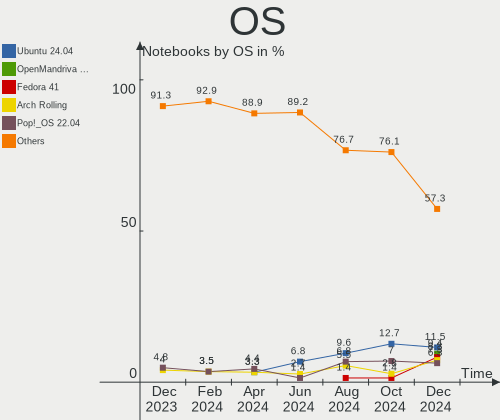
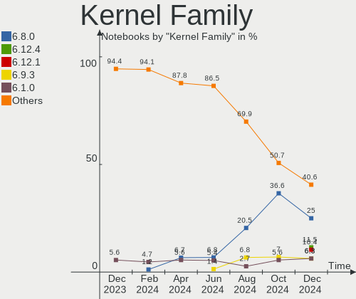
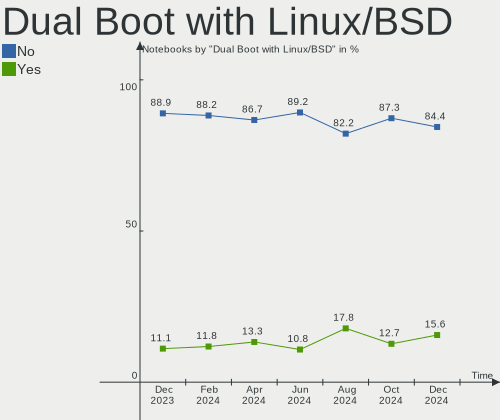
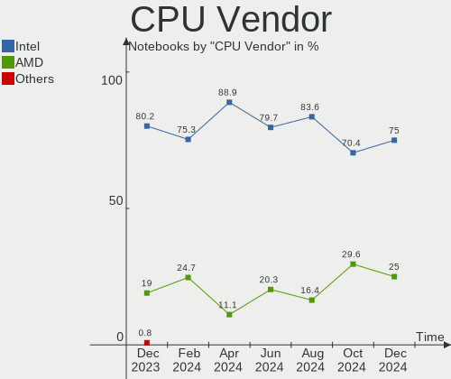
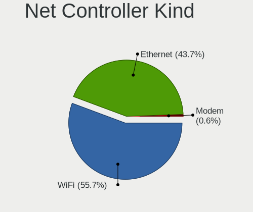
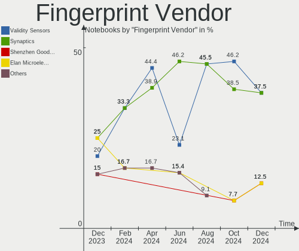
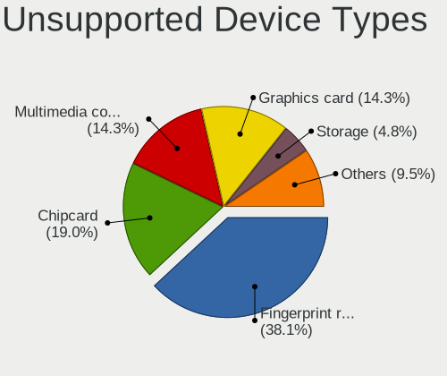

Linux in Canada - Hardware Trends (Notebooks)
---------------------------------------------

A project to identify most popular hardware characteristics and track their change
over time based on data collected by Linux users at https://Linux-Hardware.org.

Anyone can contribute to this report by the [hw-probe](https://github.com/linuxhw/hw-probe) tool:

    sudo -E hw-probe -all -upload

Period: Nov, 2022.

Contents
--------

* [ System ](#system)
  - [ OS                       ](#os)
  - [ OS Family                ](#os-family)
  - [ Kernel                   ](#kernel)
  - [ Kernel Family            ](#kernel-family)
  - [ Kernel Major Ver.        ](#kernel-major-ver)
  - [ Arch                     ](#arch)
  - [ DE                       ](#de)
  - [ Display Server           ](#display-server)
  - [ Display Manager          ](#display-manager)
  - [ OS Lang                  ](#os-lang)
  - [ Boot Mode                ](#boot-mode)
  - [ Filesystem               ](#filesystem)
  - [ Part. scheme             ](#part-scheme)
  - [ Dual Boot with Linux/BSD ](#dual-boot-with-linuxbsd)
  - [ Dual Boot (Win)          ](#dual-boot-win)

* [ Board ](#board)
  - [ Vendor                   ](#vendor)
  - [ Model                    ](#model)
  - [ Model Family             ](#model-family)
  - [ MFG Year                 ](#mfg-year)
  - [ Form Factor              ](#form-factor)
  - [ Secure Boot              ](#secure-boot)
  - [ Coreboot                 ](#coreboot)
  - [ RAM Size                 ](#ram-size)
  - [ RAM Used                 ](#ram-used)
  - [ Total Drives             ](#total-drives)
  - [ Has CD-ROM               ](#has-cd-rom)
  - [ Has Ethernet             ](#has-ethernet)
  - [ Has WiFi                 ](#has-wifi)
  - [ Has Bluetooth            ](#has-bluetooth)

* [ Location ](#location)
  - [ Country                  ](#country)
  - [ City                     ](#city)

* [ Drives ](#drives)
  - [ Drive Vendor             ](#drive-vendor)
  - [ Drive Model              ](#drive-model)
  - [ HDD Vendor               ](#hdd-vendor)
  - [ SSD Vendor               ](#ssd-vendor)
  - [ Drive Kind               ](#drive-kind)
  - [ Drive Connector          ](#drive-connector)
  - [ Drive Size               ](#drive-size)
  - [ Space Total              ](#space-total)
  - [ Space Used               ](#space-used)
  - [ Malfunc. Drives          ](#malfunc-drives)
  - [ Malfunc. Drive Vendor    ](#malfunc-drive-vendor)
  - [ Malfunc. HDD Vendor      ](#malfunc-hdd-vendor)
  - [ Malfunc. Drive Kind      ](#malfunc-drive-kind)
  - [ Failed Drives            ](#failed-drives)
  - [ Failed Drive Vendor      ](#failed-drive-vendor)
  - [ Drive Status             ](#drive-status)

* [ Storage controller ](#storage-controller)
  - [ Storage Vendor           ](#storage-vendor)
  - [ Storage Model            ](#storage-model)
  - [ Storage Kind             ](#storage-kind)

* [ Processor ](#processor)
  - [ CPU Vendor               ](#cpu-vendor)
  - [ CPU Model                ](#cpu-model)
  - [ CPU Model Family         ](#cpu-model-family)
  - [ CPU Cores                ](#cpu-cores)
  - [ CPU Sockets              ](#cpu-sockets)
  - [ CPU Threads              ](#cpu-threads)
  - [ CPU Op-Modes             ](#cpu-op-modes)
  - [ CPU Microcode            ](#cpu-microcode)
  - [ CPU Microarch            ](#cpu-microarch)

* [ Graphics ](#graphics)
  - [ GPU Vendor               ](#gpu-vendor)
  - [ GPU Model                ](#gpu-model)
  - [ GPU Combo                ](#gpu-combo)
  - [ GPU Driver               ](#gpu-driver)
  - [ GPU Memory               ](#gpu-memory)

* [ Monitor ](#monitor)
  - [ Monitor Vendor           ](#monitor-vendor)
  - [ Monitor Model            ](#monitor-model)
  - [ Monitor Resolution       ](#monitor-resolution)
  - [ Monitor Diagonal         ](#monitor-diagonal)
  - [ Monitor Width            ](#monitor-width)
  - [ Aspect Ratio             ](#aspect-ratio)
  - [ Monitor Area             ](#monitor-area)
  - [ Pixel Density            ](#pixel-density)
  - [ Multiple Monitors        ](#multiple-monitors)

* [ Network ](#network)
  - [ Net Controller Vendor    ](#net-controller-vendor)
  - [ Net Controller Model     ](#net-controller-model)
  - [ Wireless Vendor          ](#wireless-vendor)
  - [ Wireless Model           ](#wireless-model)
  - [ Ethernet Vendor          ](#ethernet-vendor)
  - [ Ethernet Model           ](#ethernet-model)
  - [ Net Controller Kind      ](#net-controller-kind)
  - [ Used Controller          ](#used-controller)
  - [ NICs                     ](#nics)
  - [ IPv6                     ](#ipv6)

* [ Bluetooth ](#bluetooth)
  - [ Bluetooth Vendor         ](#bluetooth-vendor)
  - [ Bluetooth Model          ](#bluetooth-model)

* [ Sound ](#sound)
  - [ Sound Vendor             ](#sound-vendor)
  - [ Sound Model              ](#sound-model)

* [ Memory ](#memory)
  - [ Memory Vendor            ](#memory-vendor)
  - [ Memory Model             ](#memory-model)
  - [ Memory Kind              ](#memory-kind)
  - [ Memory Form Factor       ](#memory-form-factor)
  - [ Memory Size              ](#memory-size)
  - [ Memory Speed             ](#memory-speed)

* [ Printers & scanners ](#printers--scanners)
  - [ Printer Vendor           ](#printer-vendor)
  - [ Printer Model            ](#printer-model)
  - [ Scanner Vendor           ](#scanner-vendor)
  - [ Scanner Model            ](#scanner-model)

* [ Camera ](#camera)
  - [ Camera Vendor            ](#camera-vendor)
  - [ Camera Model             ](#camera-model)

* [ Security ](#security)
  - [ Fingerprint Vendor       ](#fingerprint-vendor)
  - [ Fingerprint Model        ](#fingerprint-model)
  - [ Chipcard Vendor          ](#chipcard-vendor)
  - [ Chipcard Model           ](#chipcard-model)

* [ Unsupported ](#unsupported)
  - [ Unsupported Devices      ](#unsupported-devices)
  - [ Unsupported Device Types ](#unsupported-device-types)

System
------

OS
--

Installed operating systems

| Name                         | Notebooks | Percent |
|------------------------------|-----------|---------|
| Linux Mint 21                | 9         | 15.79%  |
| Ubuntu 22.10                 | 7         | 12.28%  |
| Ubuntu 22.04                 | 7         | 12.28%  |
| Arch Rolling                 | 5         | 8.77%   |
| Pop!_OS 22.04                | 3         | 5.26%   |
| Debian 11                    | 3         | 5.26%   |
| KDE neon 22.04               | 2         | 3.51%   |
| Kali 2022.3                  | 2         | 3.51%   |
| Fedora 37                    | 2         | 3.51%   |
| EndeavourOS Rolling          | 2         | 3.51%   |
| Zorin 16                     | 1         | 1.75%   |
| Ubuntu 23.04                 | 1         | 1.75%   |
| Ubuntu 21.04                 | 1         | 1.75%   |
| Ubuntu 18.04                 | 1         | 1.75%   |
| Redcore Rolling              | 1         | 1.75%   |
| Parrot 5.1                   | 1         | 1.75%   |
| openSUSE Tumbleweed-XXXXXXXX | 1         | 1.75%   |
| OpenMandriva 4.3             | 1         | 1.75%   |
| Lubuntu 22.10                | 1         | 1.75%   |
| Lubuntu 22.04                | 1         | 1.75%   |
| Linux Mint 20.3              | 1         | 1.75%   |
| Gentoo 2.9                   | 1         | 1.75%   |
| Elementary 6.1               | 1         | 1.75%   |
| Debian                       | 1         | 1.75%   |
| ArcoLinux Rolling            | 1         | 1.75%   |

OS Family
---------

OS without a version

| Name         | Notebooks | Percent |
|--------------|-----------|---------|
| Ubuntu       | 17        | 29.82%  |
| Linux Mint   | 10        | 17.54%  |
| Arch         | 5         | 8.77%   |
| Debian       | 4         | 7.02%   |
| Pop!_OS      | 3         | 5.26%   |
| Lubuntu      | 2         | 3.51%   |
| KDE neon     | 2         | 3.51%   |
| Kali         | 2         | 3.51%   |
| Fedora       | 2         | 3.51%   |
| EndeavourOS  | 2         | 3.51%   |
| Zorin        | 1         | 1.75%   |
| Redcore      | 1         | 1.75%   |
| Parrot       | 1         | 1.75%   |
| openSUSE     | 1         | 1.75%   |
| OpenMandriva | 1         | 1.75%   |
| Gentoo       | 1         | 1.75%   |
| Elementary   | 1         | 1.75%   |
| ArcoLinux    | 1         | 1.75%   |

Kernel
------

Version of the Linux kernel

| Version                 | Notebooks | Percent |
|-------------------------|-----------|---------|
| 5.15.0-52-generic       | 12        | 21.05%  |
| 5.19.0-23-generic       | 7         | 12.28%  |
| 5.15.0-53-generic       | 6         | 10.53%  |
| 6.0.6-76060006-generic  | 3         | 5.26%   |
| 5.10.0-19-amd64         | 3         | 5.26%   |
| 6.0.9-300.fc37.x86_64   | 2         | 3.51%   |
| 6.0.8-zen1-1-zen        | 2         | 3.51%   |
| 6.0.9-gentoo-x86_64     | 1         | 1.75%   |
| 6.0.9-arch1-1           | 1         | 1.75%   |
| 6.0.8-1-default         | 1         | 1.75%   |
| 6.0.7-arch1-1           | 1         | 1.75%   |
| 6.0.6-zen1-1-zen        | 1         | 1.75%   |
| 6.0.6-arch1-1           | 1         | 1.75%   |
| 6.0.5-zen1-1-zen        | 1         | 1.75%   |
| 6.0.10-1-cachyos        | 1         | 1.75%   |
| 6.0.0-4-amd64           | 1         | 1.75%   |
| 6.0.0-2parrot1-amd64    | 1         | 1.75%   |
| 5.4.0-132-generic       | 1         | 1.75%   |
| 5.19.0-kali2-amd64      | 1         | 1.75%   |
| 5.19.0-24-generic       | 1         | 1.75%   |
| 5.19.0-21-generic       | 1         | 1.75%   |
| 5.18.0-kali5-amd64      | 1         | 1.75%   |
| 5.16.7-desktop-1omv4003 | 1         | 1.75%   |
| 5.15.71-redcore-lts     | 1         | 1.75%   |
| 5.15.0-43-generic       | 1         | 1.75%   |
| 5.15.0-41-generic       | 1         | 1.75%   |
| 5.11.0-49-generic       | 1         | 1.75%   |
| 5.11.0-43-generic       | 1         | 1.75%   |
| 4.15.0-197-generic      | 1         | 1.75%   |

Kernel Family
-------------

Linux kernel without a distro release

| Version | Notebooks | Percent |
|---------|-----------|---------|
| 5.15.0  | 20        | 35.09%  |
| 5.19.0  | 10        | 17.54%  |
| 6.0.6   | 5         | 8.77%   |
| 6.0.9   | 4         | 7.02%   |
| 6.0.8   | 3         | 5.26%   |
| 5.10.0  | 3         | 5.26%   |
| 6.0.0   | 2         | 3.51%   |
| 5.11.0  | 2         | 3.51%   |
| 6.0.7   | 1         | 1.75%   |
| 6.0.5   | 1         | 1.75%   |
| 6.0.10  | 1         | 1.75%   |
| 5.4.0   | 1         | 1.75%   |
| 5.18.0  | 1         | 1.75%   |
| 5.16.7  | 1         | 1.75%   |
| 5.15.71 | 1         | 1.75%   |
| 4.15.0  | 1         | 1.75%   |

Kernel Major Ver.
-----------------

Linux kernel major version

| Version | Notebooks | Percent |
|---------|-----------|---------|
| 5.15    | 21        | 36.84%  |
| 6.0     | 17        | 29.82%  |
| 5.19    | 10        | 17.54%  |
| 5.10    | 3         | 5.26%   |
| 5.11    | 2         | 3.51%   |
| 5.4     | 1         | 1.75%   |
| 5.18    | 1         | 1.75%   |
| 5.16    | 1         | 1.75%   |
| 4.15    | 1         | 1.75%   |

Arch
----

OS architecture (x86_64, i586, etc.)

| Name   | Notebooks | Percent |
|--------|-----------|---------|
| x86_64 | 56        | 98.25%  |
| i686   | 1         | 1.75%   |

DE
--

Desktop Environment

| Name       | Notebooks | Percent |
|------------|-----------|---------|
| GNOME      | 27        | 47.37%  |
| KDE5       | 11        | 19.3%   |
| X-Cinnamon | 7         | 12.28%  |
| XFCE       | 3         | 5.26%   |
| MATE       | 2         | 3.51%   |
| LXQt       | 2         | 3.51%   |
| xmonad     | 1         | 1.75%   |
| Pantheon   | 1         | 1.75%   |
| Hyprland   | 1         | 1.75%   |
| Deepin     | 1         | 1.75%   |
| Unknown    | 1         | 1.75%   |

Display Server
--------------

X11 or Wayland

| Name    | Notebooks | Percent |
|---------|-----------|---------|
| X11     | 36        | 63.16%  |
| Wayland | 20        | 35.09%  |
| Tty     | 1         | 1.75%   |

Display Manager
---------------

SDDM, LightDM, etc.

| Name    | Notebooks | Percent |
|---------|-----------|---------|
| Unknown | 18        | 31.58%  |
| GDM3    | 15        | 26.32%  |
| LightDM | 10        | 17.54%  |
| SDDM    | 8         | 14.04%  |
| Ly      | 3         | 5.26%   |
| GDM     | 3         | 5.26%   |

OS Lang
-------

Language

| Lang    | Notebooks | Percent |
|---------|-----------|---------|
| en_CA   | 32        | 56.14%  |
| en_US   | 17        | 29.82%  |
| fr_CA   | 6         | 10.53%  |
| en_GB   | 1         | 1.75%   |
| Unknown | 1         | 1.75%   |

Boot Mode
---------

EFI or BIOS

| Mode | Notebooks | Percent |
|------|-----------|---------|
| EFI  | 32        | 56.14%  |
| BIOS | 25        | 43.86%  |

Filesystem
----------

Type of filesystem

| Type    | Notebooks | Percent |
|---------|-----------|---------|
| Ext4    | 47        | 82.46%  |
| Btrfs   | 6         | 10.53%  |
| Overlay | 2         | 3.51%   |
| Xfs     | 1         | 1.75%   |
| Ext3    | 1         | 1.75%   |

Part. scheme
------------

Scheme of partitioning

| Type    | Notebooks | Percent |
|---------|-----------|---------|
| GPT     | 36        | 63.16%  |
| Unknown | 17        | 29.82%  |
| MBR     | 4         | 7.02%   |

Dual Boot with Linux/BSD
------------------------

Hosting more than one Linux/BSD

| Dual boot | Notebooks | Percent |
|-----------|-----------|---------|
| No        | 52        | 91.23%  |
| Yes       | 5         | 8.77%   |

Dual Boot (Win)
---------------

Hosting Linux and Windows

| Dual boot | Notebooks | Percent |
|-----------|-----------|---------|
| No        | 43        | 75.44%  |
| Yes       | 14        | 24.56%  |

Board
-----

Vendor
------

Motherboard manufacturer

| Name                | Notebooks | Percent |
|---------------------|-----------|---------|
| Hewlett-Packard     | 11        | 19.3%   |
| Dell                | 10        | 17.54%  |
| Lenovo              | 9         | 15.79%  |
| ASUSTek Computer    | 8         | 14.04%  |
| Acer                | 4         | 7.02%   |
| Toshiba             | 3         | 5.26%   |
| Apple               | 3         | 5.26%   |
| Google              | 2         | 3.51%   |
| Timi                | 1         | 1.75%   |
| Sony                | 1         | 1.75%   |
| Razer               | 1         | 1.75%   |
| MSI                 | 1         | 1.75%   |
| Gigabyte Technology | 1         | 1.75%   |
| AZW                 | 1         | 1.75%   |
| Alienware           | 1         | 1.75%   |

Model
-----

Motherboard model

| Name                                 | Notebooks | Percent |
|--------------------------------------|-----------|---------|
| Toshiba TECRA R940                   | 1         | 1.75%   |
| Toshiba Satellite A200               | 1         | 1.75%   |
| Toshiba PORTEGE R930                 | 1         | 1.75%   |
| Timi RedmiBook Pro 15                | 1         | 1.75%   |
| Sony VGN-NS110E                      | 1         | 1.75%   |
| Razer Blade Stealth                  | 1         | 1.75%   |
| MSI GF75 Thin 9SC                    | 1         | 1.75%   |
| Lenovo Y520-15IKBA 80WY              | 1         | 1.75%   |
| Lenovo ThinkPad T495 20NKS01W02      | 1         | 1.75%   |
| Lenovo ThinkPad T480 20L6S09E00      | 1         | 1.75%   |
| Lenovo ThinkPad T470p 20J6CTO1WW     | 1         | 1.75%   |
| Lenovo ThinkPad T420 4236V6S         | 1         | 1.75%   |
| Lenovo ThinkPad T14 Gen 1 20UDCTO1WW | 1         | 1.75%   |
| Lenovo ThinkPad L490 20Q5CTO1WW      | 1         | 1.75%   |
| Lenovo Legion 5 Pro 16ACH6H 82JQ     | 1         | 1.75%   |
| Lenovo IdeaPad 5 15ALC05 82LN        | 1         | 1.75%   |
| HP ZBook 15 G4                       | 1         | 1.75%   |
| HP Victus by Laptop 16-d0xxx         | 1         | 1.75%   |
| HP ProBook 650 G1                    | 1         | 1.75%   |
| HP ProBook 450 G8                    | 1         | 1.75%   |
| HP Pavilion dv8000 (ET839UA#ABL)     | 1         | 1.75%   |
| HP Pavilion dv5                      | 1         | 1.75%   |
| HP Laptop 15-dw3xxx                  | 1         | 1.75%   |
| HP Laptop 15-db0xxx                  | 1         | 1.75%   |
| HP ENVY 17                           | 1         | 1.75%   |
| HP EliteBook Folio 9480m             | 1         | 1.75%   |
| HP Elite x2 1011 G1 Tablet           | 1         | 1.75%   |
| Google Droid                         | 1         | 1.75%   |
| Google Cyan                          | 1         | 1.75%   |
| Gigabyte AORUS 5 SE                  | 1         | 1.75%   |
| Dell XPS 15 9520                     | 1         | 1.75%   |
| Dell XPS 15 7590                     | 1         | 1.75%   |
| Dell Latitude E6530                  | 1         | 1.75%   |
| Dell Latitude E6520                  | 1         | 1.75%   |
| Dell Latitude 7480                   | 1         | 1.75%   |
| Dell Latitude 5285                   | 1         | 1.75%   |
| Dell Inspiron 7520                   | 1         | 1.75%   |
| Dell Inspiron 5567                   | 1         | 1.75%   |
| Dell Inspiron 15-3552                | 1         | 1.75%   |
| Dell G3 3590                         | 1         | 1.75%   |

Model Family
------------

Motherboard model prefix

| Name               | Notebooks | Percent |
|--------------------|-----------|---------|
| Lenovo ThinkPad    | 6         | 10.53%  |
| Dell Latitude      | 4         | 7.02%   |
| Dell Inspiron      | 3         | 5.26%   |
| HP ProBook         | 2         | 3.51%   |
| HP Pavilion        | 2         | 3.51%   |
| HP Laptop          | 2         | 3.51%   |
| Dell XPS           | 2         | 3.51%   |
| ASUS ZenBook       | 2         | 3.51%   |
| Acer Aspire        | 2         | 3.51%   |
| Toshiba TECRA      | 1         | 1.75%   |
| Toshiba Satellite  | 1         | 1.75%   |
| Toshiba PORTEGE    | 1         | 1.75%   |
| Timi RedmiBook     | 1         | 1.75%   |
| Sony VGN-NS110E    | 1         | 1.75%   |
| Razer Blade        | 1         | 1.75%   |
| MSI GF75           | 1         | 1.75%   |
| Lenovo Y520-15IKBA | 1         | 1.75%   |
| Lenovo Legion      | 1         | 1.75%   |
| Lenovo IdeaPad     | 1         | 1.75%   |
| HP ZBook           | 1         | 1.75%   |
| HP Victus          | 1         | 1.75%   |
| HP ENVY            | 1         | 1.75%   |
| HP EliteBook       | 1         | 1.75%   |
| HP Elite           | 1         | 1.75%   |
| Google Droid       | 1         | 1.75%   |
| Google Cyan        | 1         | 1.75%   |
| Gigabyte AORUS     | 1         | 1.75%   |
| Dell G3            | 1         | 1.75%   |
| AZW BT3            | 1         | 1.75%   |
| ASUS VivoBook      | 1         | 1.75%   |
| ASUS T100TA        | 1         | 1.75%   |
| ASUS ROG           | 1         | 1.75%   |
| ASUS GL552VW       | 1         | 1.75%   |
| ASUS G73Jh         | 1         | 1.75%   |
| ASUS ASUS          | 1         | 1.75%   |
| Apple MacBookPro9  | 1         | 1.75%   |
| Apple MacBookPro8  | 1         | 1.75%   |
| Apple MacBookPro5  | 1         | 1.75%   |
| Alienware m17      | 1         | 1.75%   |
| Acer Swift         | 1         | 1.75%   |

MFG Year
--------

Motherboard manufacture year

| Year | Notebooks | Percent |
|------|-----------|---------|
| 2019 | 10        | 17.54%  |
| 2020 | 6         | 10.53%  |
| 2012 | 6         | 10.53%  |
| 2022 | 5         | 8.77%   |
| 2021 | 5         | 8.77%   |
| 2017 | 5         | 8.77%   |
| 2018 | 3         | 5.26%   |
| 2015 | 3         | 5.26%   |
| 2014 | 2         | 3.51%   |
| 2013 | 2         | 3.51%   |
| 2011 | 2         | 3.51%   |
| 2010 | 2         | 3.51%   |
| 2009 | 2         | 3.51%   |
| 2016 | 1         | 1.75%   |
| 2008 | 1         | 1.75%   |
| 2007 | 1         | 1.75%   |
| 2006 | 1         | 1.75%   |

Form Factor
-----------

Physical design of the computer

| Name     | Notebooks | Percent |
|----------|-----------|---------|
| Notebook | 57        | 100%    |

Secure Boot
-----------

Enabled or disabled

| State    | Notebooks | Percent |
|----------|-----------|---------|
| Disabled | 50        | 87.72%  |
| Enabled  | 7         | 12.28%  |

Coreboot
--------

Have coreboot on board

| Used | Notebooks | Percent |
|------|-----------|---------|
| No   | 55        | 96.49%  |
| Yes  | 2         | 3.51%   |

RAM Size
--------

Total RAM memory

| Size in GB | Notebooks | Percent |
|------------|-----------|---------|
| 16.01-24.0 | 17        | 29.82%  |
| 4.01-8.0   | 16        | 28.07%  |
| 8.01-16.0  | 10        | 17.54%  |
| 3.01-4.0   | 8         | 14.04%  |
| 32.01-64.0 | 3         | 5.26%   |
| 1.01-2.0   | 2         | 3.51%   |
| 2.01-3.0   | 1         | 1.75%   |

RAM Used
--------

Used RAM memory

| Used GB   | Notebooks | Percent |
|-----------|-----------|---------|
| 2.01-3.0  | 20        | 35.09%  |
| 4.01-8.0  | 14        | 24.56%  |
| 1.01-2.0  | 13        | 22.81%  |
| 3.01-4.0  | 6         | 10.53%  |
| 8.01-16.0 | 3         | 5.26%   |
| 0.51-1.0  | 1         | 1.75%   |

Total Drives
------------

Number of drives on board

| Drives | Notebooks | Percent |
|--------|-----------|---------|
| 1      | 39        | 68.42%  |
| 2      | 16        | 28.07%  |
| 3      | 1         | 1.75%   |
| 0      | 1         | 1.75%   |

Has CD-ROM
----------

Has CD-ROM on board

| Presented | Notebooks | Percent |
|-----------|-----------|---------|
| No        | 39        | 68.42%  |
| Yes       | 18        | 31.58%  |

Has Ethernet
------------

Has Ethernet on board

| Presented | Notebooks | Percent |
|-----------|-----------|---------|
| Yes       | 45        | 78.95%  |
| No        | 12        | 21.05%  |

Has WiFi
--------

Has WiFi module

| Presented | Notebooks | Percent |
|-----------|-----------|---------|
| Yes       | 55        | 96.49%  |
| No        | 2         | 3.51%   |

Has Bluetooth
-------------

Has Bluetooth module

| Presented | Notebooks | Percent |
|-----------|-----------|---------|
| Yes       | 48        | 84.21%  |
| No        | 9         | 15.79%  |

Location
--------

Country
-------

Geographic location (country)

| Country | Notebooks | Percent |
|---------|-----------|---------|
| Canada  | 57        | 100%    |

City
----

Geographic location (city)

| City                      | Notebooks | Percent |
|---------------------------|-----------|---------|
| Montreal                  | 6         | 10.53%  |
| Toronto                   | 4         | 7.02%   |
| Richmond Hill             | 2         | 3.51%   |
| London                    | 2         | 3.51%   |
| Lachine                   | 2         | 3.51%   |
| Kitchener                 | 2         | 3.51%   |
| Gatineau                  | 2         | 3.51%   |
| Edmonton                  | 2         | 3.51%   |
| Burlington                | 2         | 3.51%   |
| Blainville                | 2         | 3.51%   |
| Winnipeg                  | 1         | 1.75%   |
| Victoria                  | 1         | 1.75%   |
| Trenton                   | 1         | 1.75%   |
| Tillsonburg               | 1         | 1.75%   |
| Sherbrooke                | 1         | 1.75%   |
| Saskatoon                 | 1         | 1.75%   |
| Saint-Raymond-de-Portneuf | 1         | 1.75%   |
| Saguenay                  | 1         | 1.75%   |
| Sackville                 | 1         | 1.75%   |
| Regina                    | 1         | 1.75%   |
| Rawdon                    | 1         | 1.75%   |
| Port Coquitlam            | 1         | 1.75%   |
| Penticton                 | 1         | 1.75%   |
| Oyen                      | 1         | 1.75%   |
| Ottawa                    | 1         | 1.75%   |
| Oakville                  | 1         | 1.75%   |
| North Vancouver           | 1         | 1.75%   |
| New Westminster           | 1         | 1.75%   |
| Moncton                   | 1         | 1.75%   |
| Longueuil                 | 1         | 1.75%   |
| Laval                     | 1         | 1.75%   |
| L'Assomption              | 1         | 1.75%   |
| Halifax                   | 1         | 1.75%   |
| Guelph                    | 1         | 1.75%   |
| Dartmouth                 | 1         | 1.75%   |
| Cambridge                 | 1         | 1.75%   |
| Calgary                   | 1         | 1.75%   |
| Caledonia                 | 1         | 1.75%   |
| Brampton                  | 1         | 1.75%   |
| Beloeil                   | 1         | 1.75%   |

Drives
------

Drive Vendor
------------

Hard drive vendors

| Vendor                      | Notebooks | Drives | Percent |
|-----------------------------|-----------|--------|---------|
| Seagate                     | 11        | 11     | 15.49%  |
| Samsung Electronics         | 11        | 11     | 15.49%  |
| SanDisk                     | 9         | 10     | 12.68%  |
| WDC                         | 5         | 5      | 7.04%   |
| Unknown                     | 5         | 5      | 7.04%   |
| Toshiba                     | 5         | 5      | 7.04%   |
| Intel                       | 5         | 5      | 7.04%   |
| SK hynix                    | 2         | 2      | 2.82%   |
| Kingston Technology Company | 2         | 2      | 2.82%   |
| Fujitsu                     | 2         | 2      | 2.82%   |
| Yangtze Memory Technologies | 1         | 1      | 1.41%   |
| UMIS                        | 1         | 1      | 1.41%   |
| Super Talent                | 1         | 1      | 1.41%   |
| SSSTC                       | 1         | 1      | 1.41%   |
| SPCC                        | 1         | 1      | 1.41%   |
| Silicon Motion              | 1         | 1      | 1.41%   |
| PNY                         | 1         | 1      | 1.41%   |
| NGFF                        | 1         | 1      | 1.41%   |
| LITEON                      | 1         | 1      | 1.41%   |
| Kingston                    | 1         | 1      | 1.41%   |
| Hitachi                     | 1         | 1      | 1.41%   |
| Crucial                     | 1         | 1      | 1.41%   |
| China                       | 1         | 2      | 1.41%   |
| Unknown                     | 1         | 1      | 1.41%   |

Drive Model
-----------

Hard drive models

| Model                                                 | Notebooks | Percent |
|-------------------------------------------------------|-----------|---------|
| Samsung NVMe SSD Controller SM981/PM981/PM983 1TB     | 3         | 4.23%   |
| Toshiba MQ01ABD100 1TB                                | 2         | 2.82%   |
| Seagate ST1000LX015-1U7172 1TB                        | 2         | 2.82%   |
| Sandisk WD Black SN750 / PC SN730 NVMe SSD 1024GB     | 2         | 2.82%   |
| Kingston Company A2000 NVMe SSD 500GB                 | 2         | 2.82%   |
| Intel SSDPEKNW010T8 1TB                               | 2         | 2.82%   |
| Intel SSD 660P Series 512GB                           | 2         | 2.82%   |
| Yangtze Memory YMTC PC005 512GB                       | 1         | 1.41%   |
| WDC WDS480G2G0A-00JH30 480GB SSD                      | 1         | 1.41%   |
| WDC WD5000LPLX-08ZNTT0 500GB                          | 1         | 1.41%   |
| WDC WD10SPZX-60Z10T1 1TB                              | 1         | 1.41%   |
| WDC WD10SPZX-21Z10T0 1TB                              | 1         | 1.41%   |
| WDC WD10JPLX-00MBPT1 1TB                              | 1         | 1.41%   |
| Unknown SS32G  32GB                                   | 1         | 1.41%   |
| Unknown MMC Card  7GB                                 | 1         | 1.41%   |
| Unknown MMC Card  64GB                                | 1         | 1.41%   |
| Unknown ED2S5  128GB                                  | 1         | 1.41%   |
| Unknown DA4064  64GB                                  | 1         | 1.41%   |
| UMIS RPJTJ128MED1MWX 128GB                            | 1         | 1.41%   |
| Toshiba RD400 256GB                                   | 1         | 1.41%   |
| Toshiba MQ01ABF050 500GB                              | 1         | 1.41%   |
| Toshiba MK1652GSX 160GB                               | 1         | 1.41%   |
| Super Talent FTM56N325H 256GB SSD                     | 1         | 1.41%   |
| SSSTC CA6-8D2048-Q11 NVMe 2048GB                      | 1         | 1.41%   |
| SPCC Solid State Disk 512GB                           | 1         | 1.41%   |
| SK hynix HFM512GD3JX013N 512GB                        | 1         | 1.41%   |
| SK hynix HCG8e  64GB                                  | 1         | 1.41%   |
| Silicon Motion SM2263EN/SM2263XT SSD Controller 128GB | 1         | 1.41%   |
| Seagate ST9500420AS 500GB                             | 1         | 1.41%   |
| Seagate ST9320423AS 320GB                             | 1         | 1.41%   |
| Seagate ST500LT012-9WS142 500GB                       | 1         | 1.41%   |
| Seagate ST250LT012-9WS141 250GB                       | 1         | 1.41%   |
| Seagate ST1000LM048-2E7172 1TB                        | 1         | 1.41%   |
| Seagate ST1000LM035-1RK172 1TB                        | 1         | 1.41%   |
| Seagate ST1000LM024 HN-M101MBB 1TB                    | 1         | 1.41%   |
| Seagate ST1000LM014-1EJ164 1TB                        | 1         | 1.41%   |
| Seagate ST1000DM 003-1ER162 1TB                       | 1         | 1.41%   |
| Sandisk WDC WDS500G2B0C-00PXH0 500GB                  | 1         | 1.41%   |
| Sandisk WD Blue SN550 NVMe SSD 1TB                    | 1         | 1.41%   |
| SanDisk SSD PLUS 1000GB                               | 1         | 1.41%   |

HDD Vendor
----------

Hard disk drive vendors

| Vendor              | Notebooks | Drives | Percent |
|---------------------|-----------|--------|---------|
| Seagate             | 11        | 11     | 47.83%  |
| WDC                 | 4         | 4      | 17.39%  |
| Toshiba             | 4         | 4      | 17.39%  |
| Fujitsu             | 2         | 2      | 8.7%    |
| Samsung Electronics | 1         | 1      | 4.35%   |
| Hitachi             | 1         | 1      | 4.35%   |

SSD Vendor
----------

Solid state drive vendors

| Vendor              | Notebooks | Drives | Percent |
|---------------------|-----------|--------|---------|
| SanDisk             | 3         | 3      | 18.75%  |
| Samsung Electronics | 3         | 3      | 18.75%  |
| WDC                 | 1         | 1      | 6.25%   |
| Super Talent        | 1         | 1      | 6.25%   |
| SPCC                | 1         | 1      | 6.25%   |
| PNY                 | 1         | 1      | 6.25%   |
| NGFF                | 1         | 1      | 6.25%   |
| LITEON              | 1         | 1      | 6.25%   |
| Kingston            | 1         | 1      | 6.25%   |
| Intel               | 1         | 1      | 6.25%   |
| Crucial             | 1         | 1      | 6.25%   |
| China               | 1         | 2      | 6.25%   |

Drive Kind
----------

HDD or SSD

| Kind | Notebooks | Drives | Percent |
|------|-----------|--------|---------|
| NVMe | 22        | 25     | 33.85%  |
| HDD  | 22        | 23     | 33.85%  |
| SSD  | 14        | 17     | 21.54%  |
| MMC  | 7         | 8      | 10.77%  |

Drive Connector
---------------

SATA, SAS, NVMe, etc.

| Type | Notebooks | Drives | Percent |
|------|-----------|--------|---------|
| SATA | 32        | 38     | 50.79%  |
| NVMe | 22        | 25     | 34.92%  |
| MMC  | 7         | 8      | 11.11%  |
| SAS  | 2         | 2      | 3.17%   |

Drive Size
----------

Size of hard drive

| Size in TB | Notebooks | Drives | Percent |
|------------|-----------|--------|---------|
| 0.01-0.5   | 20        | 21     | 55.56%  |
| 0.51-1.0   | 16        | 19     | 44.44%  |

Space Total
-----------

Amount of disk space available on the file system

| Size in GB     | Notebooks | Percent |
|----------------|-----------|---------|
| 251-500        | 15        | 26.32%  |
| 101-250        | 14        | 24.56%  |
| 501-1000       | 14        | 24.56%  |
| 21-50          | 3         | 5.26%   |
| 51-100         | 3         | 5.26%   |
| Unknown        | 3         | 5.26%   |
| 2001-3000      | 2         | 3.51%   |
| More than 3000 | 1         | 1.75%   |
| 1001-2000      | 1         | 1.75%   |
| 1-20           | 1         | 1.75%   |

Space Used
----------

Amount of used disk space

| Used GB   | Notebooks | Percent |
|-----------|-----------|---------|
| 1-20      | 16        | 28.07%  |
| 21-50     | 11        | 19.3%   |
| 101-250   | 9         | 15.79%  |
| 251-500   | 8         | 14.04%  |
| 51-100    | 5         | 8.77%   |
| Unknown   | 3         | 5.26%   |
| 1001-2000 | 2         | 3.51%   |
| 501-1000  | 2         | 3.51%   |
| 2001-3000 | 1         | 1.75%   |

Malfunc. Drives
---------------

Drive models with a malfunction

| Model                                             | Notebooks | Drives | Percent |
|---------------------------------------------------|-----------|--------|---------|
| WDC WD10JPLX-00MBPT1 1TB                          | 1         | 1      | 11.11%  |
| Super Talent FTM56N325H 256GB SSD                 | 1         | 1      | 11.11%  |
| Seagate ST9320423AS 320GB                         | 1         | 1      | 11.11%  |
| Seagate ST500LT012-9WS142 500GB                   | 1         | 1      | 11.11%  |
| Seagate ST250LT012-9WS141 250GB                   | 1         | 1      | 11.11%  |
| Seagate ST1000LM035-1RK172 1TB                    | 1         | 1      | 11.11%  |
| Seagate ST1000LM014-1EJ164 1TB                    | 1         | 1      | 11.11%  |
| Sandisk WD Black SN750 / PC SN730 NVMe SSD 1024GB | 1         | 1      | 11.11%  |
| Samsung Electronics HM160HC 160GB                 | 1         | 1      | 11.11%  |

Malfunc. Drive Vendor
---------------------

Vendors of faulty drives

| Vendor              | Notebooks | Drives | Percent |
|---------------------|-----------|--------|---------|
| Seagate             | 5         | 5      | 55.56%  |
| WDC                 | 1         | 1      | 11.11%  |
| Super Talent        | 1         | 1      | 11.11%  |
| Sandisk             | 1         | 1      | 11.11%  |
| Samsung Electronics | 1         | 1      | 11.11%  |

Malfunc. HDD Vendor
-------------------

Vendors of faulty HDD drives

| Vendor              | Notebooks | Drives | Percent |
|---------------------|-----------|--------|---------|
| Seagate             | 5         | 5      | 71.43%  |
| WDC                 | 1         | 1      | 14.29%  |
| Samsung Electronics | 1         | 1      | 14.29%  |

Malfunc. Drive Kind
-------------------

Kinds of faulty drives

| Kind | Notebooks | Drives | Percent |
|------|-----------|--------|---------|
| HDD  | 7         | 7      | 77.78%  |
| NVMe | 1         | 1      | 11.11%  |
| SSD  | 1         | 1      | 11.11%  |

Failed Drives
-------------

Failed drive models

Zero info for selected period =(

Failed Drive Vendor
-------------------

Failed drive vendors

Zero info for selected period =(

Drive Status
------------

Number of failed and malfunc. drives

| Status   | Notebooks | Drives | Percent |
|----------|-----------|--------|---------|
| Detected | 32        | 42     | 54.24%  |
| Works    | 18        | 22     | 30.51%  |
| Malfunc  | 9         | 9      | 15.25%  |

Storage controller
------------------

Storage Vendor
--------------

Storage controller vendors

| Vendor                         | Notebooks | Percent |
|--------------------------------|-----------|---------|
| Intel                          | 37        | 56.92%  |
| Samsung Electronics            | 7         | 10.77%  |
| AMD                            | 7         | 10.77%  |
| SanDisk                        | 5         | 7.69%   |
| Kingston Technology Company    | 2         | 3.08%   |
| Yangtze Memory Technologies    | 1         | 1.54%   |
| Union Memory (Shenzhen)        | 1         | 1.54%   |
| Solid State Storage Technology | 1         | 1.54%   |
| SK hynix                       | 1         | 1.54%   |
| Silicon Motion                 | 1         | 1.54%   |
| OCZ Technology Group           | 1         | 1.54%   |
| Nvidia                         | 1         | 1.54%   |

Storage Model
-------------

Storage controller models

| Model                                                                                  | Notebooks | Percent |
|----------------------------------------------------------------------------------------|-----------|---------|
| AMD FCH SATA Controller [AHCI mode]                                                    | 6         | 8.57%   |
| Intel Volume Management Device NVMe RAID Controller                                    | 4         | 5.71%   |
| Intel SSD 660P Series                                                                  | 4         | 5.71%   |
| Intel Cannon Lake Mobile PCH SATA AHCI Controller                                      | 4         | 5.71%   |
| Intel 7 Series Chipset Family 6-port SATA Controller [AHCI mode]                       | 4         | 5.71%   |
| Samsung NVMe SSD Controller SM981/PM981/PM983                                          | 3         | 4.29%   |
| Intel HM170/QM170 Chipset SATA Controller [AHCI Mode]                                  | 3         | 4.29%   |
| Intel 82801 Mobile SATA Controller [RAID mode]                                         | 3         | 4.29%   |
| SanDisk WD Black SN750 / PC SN730 NVMe SSD                                             | 2         | 2.86%   |
| SanDisk Non-Volatile memory controller                                                 | 2         | 2.86%   |
| Samsung NVMe SSD Controller SM961/PM961/SM963                                          | 2         | 2.86%   |
| Kingston Company A2000 NVMe SSD                                                        | 2         | 2.86%   |
| Intel Sunrise Point-LP SATA Controller [AHCI mode]                                     | 2         | 2.86%   |
| Intel 82801IBM/IEM (ICH9M/ICH9M-E) 4 port SATA Controller [AHCI mode]                  | 2         | 2.86%   |
| Intel 8 Series SATA Controller 1 [AHCI mode]                                           | 2         | 2.86%   |
| Intel 6 Series/C200 Series Chipset Family 6 port Mobile SATA AHCI Controller           | 2         | 2.86%   |
| Yangtze Memory Non-Volatile memory controller                                          | 1         | 1.43%   |
| Union Memory (Shenzhen) Non-Volatile memory controller                                 | 1         | 1.43%   |
| Solid State Storage Non-Volatile memory controller                                     | 1         | 1.43%   |
| SK hynix Gold P31/PC711 NVMe Solid State Drive                                         | 1         | 1.43%   |
| Silicon Motion SM2263EN/SM2263XT SSD Controller                                        | 1         | 1.43%   |
| SanDisk WD Blue SN550 NVMe SSD                                                         | 1         | 1.43%   |
| Samsung NVMe SSD Controller PM9A1/PM9A3/980PRO                                         | 1         | 1.43%   |
| Samsung NVMe SSD Controller 980                                                        | 1         | 1.43%   |
| OCZ Group RD400/400A SSD                                                               | 1         | 1.43%   |
| Nvidia MCP79 AHCI Controller                                                           | 1         | 1.43%   |
| Intel Wildcat Point-LP SATA Controller [AHCI Mode]                                     | 1         | 1.43%   |
| Intel Tiger Lake-LP SATA Controller                                                    | 1         | 1.43%   |
| Intel Q170/Q150/B150/H170/H110/Z170/CM236 Chipset SATA Controller [AHCI Mode]          | 1         | 1.43%   |
| Intel Atom/Celeron/Pentium Processor x5-E8000/J3xxx/N3xxx Series SATA Controller       | 1         | 1.43%   |
| Intel 82801HM/HEM (ICH8M/ICH8M-E) SATA Controller [AHCI mode]                          | 1         | 1.43%   |
| Intel 82801HM/HEM (ICH8M/ICH8M-E) IDE Controller                                       | 1         | 1.43%   |
| Intel 8 Series/C220 Series Chipset Family 6-port SATA Controller 1 [AHCI mode]         | 1         | 1.43%   |
| Intel 8 Series/C220 Series Chipset Family 2-port SATA Controller 2 [IDE mode]          | 1         | 1.43%   |
| Intel 8 Series Chipset Family 4-port SATA Controller 1 [IDE mode] - Mobile             | 1         | 1.43%   |
| Intel 6 Series/C200 Series Chipset Family Mobile SATA Controller (IDE mode, ports 4-5) | 1         | 1.43%   |
| Intel 6 Series/C200 Series Chipset Family Mobile SATA Controller (IDE mode, ports 0-3) | 1         | 1.43%   |
| Intel 5 Series/3400 Series Chipset 4 port SATA AHCI Controller                         | 1         | 1.43%   |
| AMD IXP SB4x0 IDE Controller                                                           | 1         | 1.43%   |

Storage Kind
------------

Kind of storage controller (IDE, SATA, NVMe, SAS, ...)

| Kind | Notebooks | Percent |
|------|-----------|---------|
| SATA | 33        | 50%     |
| NVMe | 22        | 33.33%  |
| RAID | 7         | 10.61%  |
| IDE  | 4         | 6.06%   |

Processor
---------

CPU Vendor
----------

Processor vendors

| Vendor | Notebooks | Percent |
|--------|-----------|---------|
| Intel  | 47        | 82.46%  |
| AMD    | 10        | 17.54%  |

CPU Model
---------

Processor models

| Model                                   | Notebooks | Percent |
|-----------------------------------------|-----------|---------|
| Intel Core i7-9750H CPU @ 2.60GHz       | 2         | 3.51%   |
| Intel Core i7-7700HQ CPU @ 2.80GHz      | 2         | 3.51%   |
| Intel Core i7-3520M CPU @ 2.90GHz       | 2         | 3.51%   |
| Intel Core i5-7300U CPU @ 2.60GHz       | 2         | 3.51%   |
| Intel 12th Gen Core i7-12700H           | 2         | 3.51%   |
| Intel 11th Gen Core i7-1165G7 @ 2.80GHz | 2         | 3.51%   |
| Intel 11th Gen Core i5-1135G7 @ 2.40GHz | 2         | 3.51%   |
| Intel Pentium Dual CPU T3200 @ 2.00GHz  | 1         | 1.75%   |
| Intel Pentium CPU N3710 @ 1.60GHz       | 1         | 1.75%   |
| Intel Pentium 3556U @ 1.70GHz           | 1         | 1.75%   |
| Intel Core M-5Y71 CPU @ 1.20GHz         | 1         | 1.75%   |
| Intel Core i7-8750H CPU @ 2.20GHz       | 1         | 1.75%   |
| Intel Core i7-8665U CPU @ 1.90GHz       | 1         | 1.75%   |
| Intel Core i7-8550U CPU @ 1.80GHz       | 1         | 1.75%   |
| Intel Core i7-7500U CPU @ 2.70GHz       | 1         | 1.75%   |
| Intel Core i7-6700HQ CPU @ 2.60GHz      | 1         | 1.75%   |
| Intel Core i7-4700MQ CPU @ 2.40GHz      | 1         | 1.75%   |
| Intel Core i7-3632QM CPU @ 2.20GHz      | 1         | 1.75%   |
| Intel Core i7-3540M CPU @ 3.00GHz       | 1         | 1.75%   |
| Intel Core i7-2675QM CPU @ 2.20GHz      | 1         | 1.75%   |
| Intel Core i7-1065G7 CPU @ 1.30GHz      | 1         | 1.75%   |
| Intel Core i7 CPU Q 740 @ 1.73GHz       | 1         | 1.75%   |
| Intel Core i5-9300H CPU @ 2.40GHz       | 1         | 1.75%   |
| Intel Core i5-8350U CPU @ 1.70GHz       | 1         | 1.75%   |
| Intel Core i5-7300HQ CPU @ 2.50GHz      | 1         | 1.75%   |
| Intel Core i5-4310U CPU @ 2.00GHz       | 1         | 1.75%   |
| Intel Core i5-4300M CPU @ 2.60GHz       | 1         | 1.75%   |
| Intel Core i5-3230M CPU @ 2.60GHz       | 1         | 1.75%   |
| Intel Core i5-2520M CPU @ 2.50GHz       | 1         | 1.75%   |
| Intel Core i3-8145U CPU @ 2.10GHz       | 1         | 1.75%   |
| Intel Core i3-2330M CPU @ 2.20GHz       | 1         | 1.75%   |
| Intel Core 2 Duo CPU T5800 @ 2.00GHz    | 1         | 1.75%   |
| Intel Core 2 Duo CPU T5450 @ 1.66GHz    | 1         | 1.75%   |
| Intel Core 2 Duo CPU P8700 @ 2.53GHz    | 1         | 1.75%   |
| Intel Celeron N4020 CPU @ 1.10GHz       | 1         | 1.75%   |
| Intel Celeron CPU N3160 @ 1.60GHz       | 1         | 1.75%   |
| Intel Atom x5-Z8350 CPU @ 1.44GHz       | 1         | 1.75%   |
| Intel Atom CPU Z3775 @ 1.46GHz          | 1         | 1.75%   |
| Intel 11th Gen Core i7-11800H @ 2.30GHz | 1         | 1.75%   |
| Intel 11th Gen Core i7-11370H @ 3.30GHz | 1         | 1.75%   |

CPU Model Family
----------------

Processor model prefix

| Model                | Notebooks | Percent |
|----------------------|-----------|---------|
| Intel Core i7        | 17        | 29.82%  |
| Other                | 9         | 15.79%  |
| Intel Core i5        | 9         | 15.79%  |
| AMD Ryzen 7          | 4         | 7.02%   |
| Intel Core 2 Duo     | 3         | 5.26%   |
| Intel Pentium        | 2         | 3.51%   |
| Intel Core i3        | 2         | 3.51%   |
| Intel Celeron        | 2         | 3.51%   |
| Intel Atom           | 2         | 3.51%   |
| Intel Pentium Dual   | 1         | 1.75%   |
| Intel Core M         | 1         | 1.75%   |
| AMD Turion 64 Mobile | 1         | 1.75%   |
| AMD Ryzen 9          | 1         | 1.75%   |
| AMD Ryzen 7 PRO      | 1         | 1.75%   |
| AMD Ryzen 5 PRO      | 1         | 1.75%   |
| AMD A4               | 1         | 1.75%   |

CPU Cores
---------

Number of processor cores

| Number | Notebooks | Percent |
|--------|-----------|---------|
| 4      | 23        | 40.35%  |
| 2      | 20        | 35.09%  |
| 8      | 7         | 12.28%  |
| 6      | 3         | 5.26%   |
| 14     | 2         | 3.51%   |
| 1      | 2         | 3.51%   |

CPU Sockets
-----------

Number of sockets

| Number | Notebooks | Percent |
|--------|-----------|---------|
| 1      | 57        | 100%    |

CPU Threads
-----------

Threads per core (Hyper-Threading)

| Number | Notebooks | Percent |
|--------|-----------|---------|
| 2      | 40        | 70.18%  |
| 1      | 17        | 29.82%  |

CPU Op-Modes
------------

CPU Operation Modes (32-bit, 64-bit)

| Op mode        | Notebooks | Percent |
|----------------|-----------|---------|
| 32-bit, 64-bit | 57        | 100%    |

CPU Microcode
-------------

Microcode number

| Number     | Notebooks | Percent |
|------------|-----------|---------|
| Unknown    | 23        | 40.35%  |
| 0x806e9    | 3         | 5.26%   |
| 0x906ea    | 2         | 3.51%   |
| 0x906e9    | 2         | 3.51%   |
| 0x806ec    | 2         | 3.51%   |
| 0x6fd      | 2         | 3.51%   |
| 0x406c4    | 2         | 3.51%   |
| 0x40651    | 2         | 3.51%   |
| 0x306a9    | 2         | 3.51%   |
| 0x206a7    | 2         | 3.51%   |
| 0x906a3    | 1         | 1.75%   |
| 0x806ea    | 1         | 1.75%   |
| 0x806d1    | 1         | 1.75%   |
| 0x806c1    | 1         | 1.75%   |
| 0x706e5    | 1         | 1.75%   |
| 0x706a8    | 1         | 1.75%   |
| 0x306c3    | 1         | 1.75%   |
| 0x30678    | 1         | 1.75%   |
| 0x1067a    | 1         | 1.75%   |
| 0x0a50000c | 1         | 1.75%   |
| 0x0a404101 | 1         | 1.75%   |
| 0x08608102 | 1         | 1.75%   |
| 0x08600106 | 1         | 1.75%   |
| 0x08108109 | 1         | 1.75%   |
| 0x06006705 | 1         | 1.75%   |

CPU Microarch
-------------

Microarchitecture

| Name             | Notebooks | Percent |
|------------------|-----------|---------|
| KabyLake         | 14        | 24.56%  |
| TigerLake        | 5         | 8.77%   |
| IvyBridge        | 5         | 8.77%   |
| Silvermont       | 4         | 7.02%   |
| Haswell          | 4         | 7.02%   |
| Unknown          | 4         | 7.02%   |
| Zen 2            | 3         | 5.26%   |
| SandyBridge      | 3         | 5.26%   |
| Core             | 3         | 5.26%   |
| Excavator        | 2         | 3.51%   |
| Zen+             | 1         | 1.75%   |
| Zen 3            | 1         | 1.75%   |
| Skylake          | 1         | 1.75%   |
| Penryn           | 1         | 1.75%   |
| Nehalem          | 1         | 1.75%   |
| K8 Hammer        | 1         | 1.75%   |
| IceLake          | 1         | 1.75%   |
| Goldmont plus    | 1         | 1.75%   |
| Broadwell        | 1         | 1.75%   |
| Alderlake Hybrid | 1         | 1.75%   |

Graphics
--------

GPU Vendor
----------

Vendors of graphics cards

| Vendor | Notebooks | Percent |
|--------|-----------|---------|
| Intel  | 42        | 56.76%  |
| Nvidia | 16        | 21.62%  |
| AMD    | 16        | 21.62%  |

GPU Model
---------

Graphics card models

| Model                                                                                    | Notebooks | Percent |
|------------------------------------------------------------------------------------------|-----------|---------|
| Intel TigerLake-LP GT2 [Iris Xe Graphics]                                                | 5         | 6.76%   |
| Intel CoffeeLake-H GT2 [UHD Graphics 630]                                                | 4         | 5.41%   |
| Intel 3rd Gen Core processor Graphics Controller                                         | 4         | 5.41%   |
| Intel HD Graphics 620                                                                    | 3         | 4.05%   |
| Intel Atom/Celeron/Pentium Processor x5-E8000/J3xxx/N3xxx Integrated Graphics Controller | 3         | 4.05%   |
| Intel 2nd Generation Core Processor Family Integrated Graphics Controller                | 3         | 4.05%   |
| AMD Renoir                                                                               | 3         | 4.05%   |
| Nvidia TU117M [GeForce GTX 1650 Mobile / Max-Q]                                          | 2         | 2.7%    |
| Nvidia GA106M [GeForce RTX 3060 Mobile / Max-Q]                                          | 2         | 2.7%    |
| Intel WhiskeyLake-U GT2 [UHD Graphics 620]                                               | 2         | 2.7%    |
| Intel UHD Graphics 620                                                                   | 2         | 2.7%    |
| Intel Mobile 4 Series Chipset Integrated Graphics Controller                             | 2         | 2.7%    |
| Intel HD Graphics 630                                                                    | 2         | 2.7%    |
| Intel Haswell-ULT Integrated Graphics Controller                                         | 2         | 2.7%    |
| Intel Alder Lake-P Integrated Graphics Controller                                        | 2         | 2.7%    |
| Intel 4th Gen Core Processor Integrated Graphics Controller                              | 2         | 2.7%    |
| AMD Stoney [Radeon R2/R3/R4/R5 Graphics]                                                 | 2         | 2.7%    |
| Nvidia TU106M [GeForce RTX 2060 Mobile]                                                  | 1         | 1.35%   |
| Nvidia TU106M [GeForce RTX 2060 Max-Q]                                                   | 1         | 1.35%   |
| Nvidia TU104M [GeForce RTX 2080 Mobile]                                                  | 1         | 1.35%   |
| Nvidia GP107M [GeForce GTX 1050 3 GB Max-Q]                                              | 1         | 1.35%   |
| Nvidia GM108M [GeForce 940MX]                                                            | 1         | 1.35%   |
| Nvidia GM107M [GeForce GTX 960M]                                                         | 1         | 1.35%   |
| Nvidia GM107GLM [Quadro M620 Mobile]                                                     | 1         | 1.35%   |
| Nvidia GK208M [GeForce GT 740M]                                                          | 1         | 1.35%   |
| Nvidia GF108GLM [NVS 5200M]                                                              | 1         | 1.35%   |
| Nvidia GA107M [GeForce RTX 3050 Ti Mobile]                                               | 1         | 1.35%   |
| Nvidia GA104M [GeForce RTX 3070 Mobile / Max-Q]                                          | 1         | 1.35%   |
| Nvidia C79 [GeForce 9400M]                                                               | 1         | 1.35%   |
| Intel TigerLake-H GT1 [UHD Graphics]                                                     | 1         | 1.35%   |
| Intel Iris Plus Graphics G7                                                              | 1         | 1.35%   |
| Intel HD Graphics 5300                                                                   | 1         | 1.35%   |
| Intel HD Graphics 530                                                                    | 1         | 1.35%   |
| Intel GeminiLake [UHD Graphics 600]                                                      | 1         | 1.35%   |
| Intel Atom Processor Z36xxx/Z37xxx Series Graphics & Display                             | 1         | 1.35%   |
| AMD Topaz XT [Radeon R7 M260/M265 / M340/M360 / M440/M445 / 530/535 / 620/625 Mobile]    | 1         | 1.35%   |
| AMD RV610/M72-S [Mobility Radeon HD 2400]                                                | 1         | 1.35%   |
| AMD RS480M [Mobility Radeon Xpress 200]                                                  | 1         | 1.35%   |
| AMD Rembrandt [Radeon 680M]                                                              | 1         | 1.35%   |
| AMD Picasso/Raven 2 [Radeon Vega Series / Radeon Vega Mobile Series]                     | 1         | 1.35%   |

GPU Combo
---------

Combinations of graphics cards

| Name           | Notebooks | Percent |
|----------------|-----------|---------|
| 1 x Intel      | 29        | 50.88%  |
| Intel + Nvidia | 10        | 17.54%  |
| 1 x AMD        | 9         | 15.79%  |
| 1 x Nvidia     | 3         | 5.26%   |
| Intel + AMD    | 3         | 5.26%   |
| AMD + Nvidia   | 3         | 5.26%   |

GPU Driver
----------

Free vs proprietary

| Driver      | Notebooks | Percent |
|-------------|-----------|---------|
| Free        | 47        | 82.46%  |
| Proprietary | 9         | 15.79%  |
| Unknown     | 1         | 1.75%   |

GPU Memory
----------

Total video memory

| Size in GB | Notebooks | Percent |
|------------|-----------|---------|
| Unknown    | 46        | 80.7%   |
| 1.01-2.0   | 5         | 8.77%   |
| 0.01-0.5   | 3         | 5.26%   |
| 3.01-4.0   | 2         | 3.51%   |
| 0.51-1.0   | 1         | 1.75%   |

Monitor
-------

Monitor Vendor
--------------

Monitor vendors

| Vendor                  | Notebooks | Percent |
|-------------------------|-----------|---------|
| AU Optronics            | 16        | 25%     |
| BOE                     | 10        | 15.63%  |
| Sharp                   | 5         | 7.81%   |
| Chimei Innolux          | 5         | 7.81%   |
| Samsung Electronics     | 3         | 4.69%   |
| LG Display              | 3         | 4.69%   |
| Goldstar                | 3         | 4.69%   |
| Dell                    | 3         | 4.69%   |
| Apple                   | 3         | 4.69%   |
| PANDA                   | 2         | 3.13%   |
| ASUSTek Computer        | 2         | 3.13%   |
| TMX                     | 1         | 1.56%   |
| SSD                     | 1         | 1.56%   |
| Philips                 | 1         | 1.56%   |
| LG Philips              | 1         | 1.56%   |
| InfoVision              | 1         | 1.56%   |
| CSO                     | 1         | 1.56%   |
| Chi Mei Optoelectronics | 1         | 1.56%   |
| BenQ                    | 1         | 1.56%   |
| Ancor Communications    | 1         | 1.56%   |

Monitor Model
-------------

Monitor models

| Model                                                                    | Notebooks | Percent |
|--------------------------------------------------------------------------|-----------|---------|
| AU Optronics LCD Monitor AUO403D 1920x1080 309x173mm 13.9-inch           | 2         | 3.13%   |
| TMX TL156VDXP01 TMX1560 1920x1080 344x194mm 15.5-inch                    | 1         | 1.56%   |
| SSD HDTV SSD0001 1360x768 708x398mm 32.0-inch                            | 1         | 1.56%   |
| Sharp LQ156M1JW30 SHP153F 1920x1080 344x194mm 15.5-inch                  | 1         | 1.56%   |
| Sharp LQ133Z1JW26 SHP1493 3200x1800 294x165mm 13.3-inch                  | 1         | 1.56%   |
| Sharp LCD Monitor SHP1515 1920x1200 336x210mm 15.6-inch                  | 1         | 1.56%   |
| Sharp LCD Monitor SHP14BA 1920x1080 344x194mm 15.5-inch                  | 1         | 1.56%   |
| Sharp LCD Monitor SHP1479 1920x1280 259x173mm 12.3-inch                  | 1         | 1.56%   |
| Samsung Electronics LCD Monitor SEC5448 1920x1080 344x194mm 15.5-inch    | 1         | 1.56%   |
| Samsung Electronics LCD Monitor SDC416D 2880x1800 312x195mm 14.5-inch    | 1         | 1.56%   |
| Samsung Electronics LCD Monitor SDC4153 1920x1080 256x144mm 11.6-inch    | 1         | 1.56%   |
| Philips PHL 246V5 PHLC0C5 1920x1080 531x299mm 24.0-inch                  | 1         | 1.56%   |
| PANDA LCD Monitor NCP0050 1920x1080 309x174mm 14.0-inch                  | 1         | 1.56%   |
| PANDA LCD Monitor NCP004D 1920x1080 344x194mm 15.5-inch                  | 1         | 1.56%   |
| LG Philips LCD Monitor LPL1288 1440x900 367x230mm 17.1-inch              | 1         | 1.56%   |
| LG Display LCD Monitor LGD0456 1366x768 344x194mm 15.5-inch              | 1         | 1.56%   |
| LG Display LCD Monitor LGD0421 1920x1080 345x194mm 15.6-inch             | 1         | 1.56%   |
| LG Display LCD Monitor LGD033B 1366x768 344x194mm 15.5-inch              | 1         | 1.56%   |
| InfoVision LCD Monitor IVO057D 1920x1080 309x174mm 14.0-inch             | 1         | 1.56%   |
| Goldstar Ultra HD GSM5B09 3840x2160 600x340mm 27.2-inch                  | 1         | 1.56%   |
| Goldstar LG ULTRAWIDE GSM59F1 2560x1080 670x280mm 28.6-inch              | 1         | 1.56%   |
| Goldstar E2250 GSM578E 1920x1080 477x268mm 21.5-inch                     | 1         | 1.56%   |
| Dell S2721D DELA19A 2560x1440 590x330mm 26.6-inch                        | 1         | 1.56%   |
| Dell E207WFP DELD010 1680x1050 430x270mm 20.0-inch                       | 1         | 1.56%   |
| Dell 2208WFP DEL403C 1680x1050 473x296mm 22.0-inch                       | 1         | 1.56%   |
| CSO LCD Monitor CSO1609 2560x1600 345x215mm 16.0-inch                    | 1         | 1.56%   |
| Chimei Innolux LCD Monitor CMN15C3 1920x1080 344x193mm 15.5-inch         | 1         | 1.56%   |
| Chimei Innolux LCD Monitor CMN1512 1920x1080 344x193mm 15.5-inch         | 1         | 1.56%   |
| Chimei Innolux LCD Monitor CMN14D5 1920x1080 309x173mm 13.9-inch         | 1         | 1.56%   |
| Chimei Innolux LCD Monitor CMN14D3 1920x1080 309x173mm 13.9-inch         | 1         | 1.56%   |
| Chimei Innolux LCD Monitor CMN1484 1600x900 310x174mm 14.0-inch          | 1         | 1.56%   |
| Chi Mei Optoelectronics LCD Monitor CMO15A3 1366x768 344x193mm 15.5-inch | 1         | 1.56%   |
| BOE LCD Monitor BOE09E5 2560x1440 355x200mm 16.0-inch                    | 1         | 1.56%   |
| BOE LCD Monitor BOE0949 1366x768 344x194mm 15.5-inch                     | 1         | 1.56%   |
| BOE LCD Monitor BOE0921 1920x515                                         | 1         | 1.56%   |
| BOE LCD Monitor BOE08E2 1920x1080 344x194mm 15.5-inch                    | 1         | 1.56%   |
| BOE LCD Monitor BOE0819 1920x1080 344x194mm 15.5-inch                    | 1         | 1.56%   |
| BOE LCD Monitor BOE07DB 1920x1080 309x174mm 14.0-inch                    | 1         | 1.56%   |
| BOE LCD Monitor BOE07CE 1366x768 344x193mm 15.5-inch                     | 1         | 1.56%   |
| BOE LCD Monitor BOE075A 1366x768 309x173mm 13.9-inch                     | 1         | 1.56%   |

Monitor Resolution
------------------

Monitor screen resolution

| Resolution         | Notebooks | Percent |
|--------------------|-----------|---------|
| 1920x1080 (FHD)    | 24        | 40.68%  |
| 1366x768 (WXGA)    | 10        | 16.95%  |
| 2560x1440 (QHD)    | 4         | 6.78%   |
| 1680x1050 (WSXGA+) | 3         | 5.08%   |
| 1600x900 (HD+)     | 3         | 5.08%   |
| 1280x800 (WXGA)    | 3         | 5.08%   |
| 1440x900 (WXGA+)   | 2         | 3.39%   |
| 3840x2160 (4K)     | 1         | 1.69%   |
| 3200x2000          | 1         | 1.69%   |
| 3200x1800 (QHD+)   | 1         | 1.69%   |
| 2880x1800          | 1         | 1.69%   |
| 2560x1600          | 1         | 1.69%   |
| 2560x1080          | 1         | 1.69%   |
| 1920x515           | 1         | 1.69%   |
| 1920x1280          | 1         | 1.69%   |
| 1920x1200 (WUXGA)  | 1         | 1.69%   |
| 1360x768           | 1         | 1.69%   |

Monitor Diagonal
----------------

Diagonal size in inches

| Inches  | Notebooks | Percent |
|---------|-----------|---------|
| 15      | 23        | 35.94%  |
| 14      | 9         | 14.06%  |
| 13      | 8         | 12.5%   |
| 17      | 6         | 9.38%   |
| 27      | 4         | 6.25%   |
| 24      | 3         | 4.69%   |
| 16      | 2         | 3.13%   |
| 34      | 1         | 1.56%   |
| 32      | 1         | 1.56%   |
| 22      | 1         | 1.56%   |
| 21      | 1         | 1.56%   |
| 20      | 1         | 1.56%   |
| 18      | 1         | 1.56%   |
| 12      | 1         | 1.56%   |
| 11      | 1         | 1.56%   |
| Unknown | 1         | 1.56%   |

Monitor Width
-------------

Physical width

| Width in mm | Notebooks | Percent |
|-------------|-----------|---------|
| 301-350     | 38        | 59.38%  |
| 351-400     | 7         | 10.94%  |
| 501-600     | 6         | 9.38%   |
| 201-300     | 5         | 7.81%   |
| 401-500     | 4         | 6.25%   |
| 701-800     | 2         | 3.13%   |
| 601-700     | 1         | 1.56%   |
| Unknown     | 1         | 1.56%   |

Aspect Ratio
------------

Proportional relationship between the width and the height

| Ratio | Notebooks | Percent |
|-------|-----------|---------|
| 16/9  | 41        | 71.93%  |
| 16/10 | 13        | 22.81%  |
| 3/2   | 1         | 1.75%   |
| 3.73  | 1         | 1.75%   |
| 21/9  | 1         | 1.75%   |

Monitor Area
------------

Area in inch

| Area in inch | Notebooks | Percent |
|----------------|-----------|---------|
| 101-110        | 23        | 35.94%  |
| 81-90          | 14        | 21.88%  |
| 201-250        | 5         | 7.81%   |
| 121-130        | 5         | 7.81%   |
| 301-350        | 4         | 6.25%   |
| 71-80          | 2         | 3.13%   |
| 351-500        | 2         | 3.13%   |
| 111-120        | 2         | 3.13%   |
| 61-70          | 1         | 1.56%   |
| 51-60          | 1         | 1.56%   |
| 151-200        | 1         | 1.56%   |
| 141-150        | 1         | 1.56%   |
| 131-140        | 1         | 1.56%   |
| 91-100         | 1         | 1.56%   |
| Unknown        | 1         | 1.56%   |

Pixel Density
-------------

Pixels per inch

| Density       | Notebooks | Percent |
|---------------|-----------|---------|
| 121-160       | 25        | 39.06%  |
| 101-120       | 17        | 26.56%  |
| 51-100        | 12        | 18.75%  |
| 161-240       | 6         | 9.38%   |
| More than 240 | 2         | 3.13%   |
| 1-50          | 1         | 1.56%   |
| Unknown       | 1         | 1.56%   |

Multiple Monitors
-----------------

Total monitors connected

| Total | Notebooks | Percent |
|-------|-----------|---------|
| 1     | 42        | 73.68%  |
| 2     | 12        | 21.05%  |
| 0     | 3         | 5.26%   |

Network
-------

Net Controller Vendor
---------------------

Controller vendors

| Vendor                          | Notebooks | Percent |
|---------------------------------|-----------|---------|
| Intel                           | 35        | 40.23%  |
| Realtek Semiconductor           | 23        | 26.44%  |
| Qualcomm Atheros                | 10        | 11.49%  |
| Broadcom                        | 7         | 8.05%   |
| ASIX Electronics                | 3         | 3.45%   |
| MediaTek                        | 2         | 2.3%    |
| Qualcomm Atheros Communications | 1         | 1.15%   |
| Nvidia                          | 1         | 1.15%   |
| Marvell Technology Group        | 1         | 1.15%   |
| Hewlett-Packard                 | 1         | 1.15%   |
| Dell                            | 1         | 1.15%   |
| Broadcom Limited                | 1         | 1.15%   |
| AMD                             | 1         | 1.15%   |

Net Controller Model
--------------------

Controller models

| Model                                                             | Notebooks | Percent |
|-------------------------------------------------------------------|-----------|---------|
| Realtek RTL8111/8168/8411 PCI Express Gigabit Ethernet Controller | 17        | 15.89%  |
| Intel Wireless 8265 / 8275                                        | 5         | 4.67%   |
| Intel Wi-Fi 6 AX201                                               | 4         | 3.74%   |
| Intel Wi-Fi 6 AX200                                               | 4         | 3.74%   |
| Intel 82579LM Gigabit Network Connection (Lewisville)             | 4         | 3.74%   |
| Realtek RTL810xE PCI Express Fast Ethernet controller             | 3         | 2.8%    |
| Qualcomm Atheros QCA9377 802.11ac Wireless Network Adapter        | 3         | 2.8%    |
| Intel Wireless 7265                                               | 3         | 2.8%    |
| Intel Centrino Advanced-N 6235                                    | 3         | 2.8%    |
| ASIX AX88179 Gigabit Ethernet                                     | 3         | 2.8%    |
| Realtek RTL8153 Gigabit Ethernet Adapter                          | 2         | 1.87%   |
| Qualcomm Atheros QCA9565 / AR9565 Wireless Network Adapter        | 2         | 1.87%   |
| Qualcomm Atheros QCA6174 802.11ac Wireless Network Adapter        | 2         | 1.87%   |
| Intel Wireless-AC 9260                                            | 2         | 1.87%   |
| Intel Ethernet Connection (4) I219-LM                             | 2         | 1.87%   |
| Intel Centrino Advanced-N 6205 [Taylor Peak]                      | 2         | 1.87%   |
| Intel Alder Lake-P PCH CNVi WiFi                                  | 2         | 1.87%   |
| Broadcom NetXtreme BCM57765 Gigabit Ethernet PCIe                 | 2         | 1.87%   |
| Broadcom BCM4331 802.11a/b/g/n                                    | 2         | 1.87%   |
| Realtek RTL8822CE 802.11ac PCIe Wireless Network Adapter          | 1         | 0.93%   |
| Realtek RTL8821CE 802.11ac PCIe Wireless Network Adapter          | 1         | 0.93%   |
| Realtek RTL8125 2.5GbE Controller                                 | 1         | 0.93%   |
| Realtek RTL-8100/8101L/8139 PCI Fast Ethernet Adapter             | 1         | 0.93%   |
| Realtek 802.11n WLAN Adapter                                      | 1         | 0.93%   |
| Qualcomm Atheros Killer E2500 Gigabit Ethernet Controller         | 1         | 0.93%   |
| Qualcomm Atheros AR9271 802.11n                                   | 1         | 0.93%   |
| Qualcomm Atheros AR9485 Wireless Network Adapter                  | 1         | 0.93%   |
| Qualcomm Atheros AR928X Wireless Network Adapter (PCI-Express)    | 1         | 0.93%   |
| Qualcomm Atheros AR9285 Wireless Network Adapter (PCI-Express)    | 1         | 0.93%   |
| Qualcomm Atheros AR8131 Gigabit Ethernet                          | 1         | 0.93%   |
| Nvidia MCP79 Ethernet                                             | 1         | 0.93%   |
| MediaTek MT7922 802.11ax PCI Express Wireless Network Adapter     | 1         | 0.93%   |
| MediaTek MT7921 802.11ax PCI Express Wireless Network Adapter     | 1         | 0.93%   |
| Marvell Group 88E8055 PCI-E Gigabit Ethernet Controller           | 1         | 0.93%   |
| Intel Wireless Gigabit 17265                                      | 1         | 0.93%   |
| Intel Wireless 7260                                               | 1         | 0.93%   |
| Intel Wireless 3165                                               | 1         | 0.93%   |
| Intel Wireless 3160                                               | 1         | 0.93%   |
| Intel Tiger Lake PCH CNVi WiFi                                    | 1         | 0.93%   |
| Intel PRO/Wireless 4965 AG or AGN [Kedron] Network Connection     | 1         | 0.93%   |

Wireless Vendor
---------------

Wireless vendors

| Vendor                          | Notebooks | Percent |
|---------------------------------|-----------|---------|
| Intel                           | 34        | 58.62%  |
| Qualcomm Atheros                | 10        | 17.24%  |
| Broadcom                        | 6         | 10.34%  |
| Realtek Semiconductor           | 3         | 5.17%   |
| MediaTek                        | 2         | 3.45%   |
| Qualcomm Atheros Communications | 1         | 1.72%   |
| Dell                            | 1         | 1.72%   |
| Broadcom Limited                | 1         | 1.72%   |

Wireless Model
--------------

Wireless models

| Model                                                               | Notebooks | Percent |
|---------------------------------------------------------------------|-----------|---------|
| Intel Wireless 8265 / 8275                                          | 5         | 8.47%   |
| Intel Wi-Fi 6 AX201                                                 | 4         | 6.78%   |
| Intel Wi-Fi 6 AX200                                                 | 4         | 6.78%   |
| Qualcomm Atheros QCA9377 802.11ac Wireless Network Adapter          | 3         | 5.08%   |
| Intel Wireless 7265                                                 | 3         | 5.08%   |
| Intel Centrino Advanced-N 6235                                      | 3         | 5.08%   |
| Qualcomm Atheros QCA9565 / AR9565 Wireless Network Adapter          | 2         | 3.39%   |
| Qualcomm Atheros QCA6174 802.11ac Wireless Network Adapter          | 2         | 3.39%   |
| Intel Wireless-AC 9260                                              | 2         | 3.39%   |
| Intel Centrino Advanced-N 6205 [Taylor Peak]                        | 2         | 3.39%   |
| Intel Alder Lake-P PCH CNVi WiFi                                    | 2         | 3.39%   |
| Broadcom BCM4331 802.11a/b/g/n                                      | 2         | 3.39%   |
| Realtek RTL8822CE 802.11ac PCIe Wireless Network Adapter            | 1         | 1.69%   |
| Realtek RTL8821CE 802.11ac PCIe Wireless Network Adapter            | 1         | 1.69%   |
| Realtek 802.11n WLAN Adapter                                        | 1         | 1.69%   |
| Qualcomm Atheros AR9271 802.11n                                     | 1         | 1.69%   |
| Qualcomm Atheros AR9485 Wireless Network Adapter                    | 1         | 1.69%   |
| Qualcomm Atheros AR928X Wireless Network Adapter (PCI-Express)      | 1         | 1.69%   |
| Qualcomm Atheros AR9285 Wireless Network Adapter (PCI-Express)      | 1         | 1.69%   |
| MediaTek MT7922 802.11ax PCI Express Wireless Network Adapter       | 1         | 1.69%   |
| MediaTek MT7921 802.11ax PCI Express Wireless Network Adapter       | 1         | 1.69%   |
| Intel Wireless Gigabit 17265                                        | 1         | 1.69%   |
| Intel Wireless 7260                                                 | 1         | 1.69%   |
| Intel Wireless 3165                                                 | 1         | 1.69%   |
| Intel Wireless 3160                                                 | 1         | 1.69%   |
| Intel Tiger Lake PCH CNVi WiFi                                      | 1         | 1.69%   |
| Intel PRO/Wireless 4965 AG or AGN [Kedron] Network Connection       | 1         | 1.69%   |
| Intel Ice Lake-LP PCH CNVi WiFi                                     | 1         | 1.69%   |
| Intel Gemini Lake PCH CNVi WiFi                                     | 1         | 1.69%   |
| Intel Dual Band Wireless-AC 3165 Plus Bluetooth                     | 1         | 1.69%   |
| Intel Cannon Lake PCH CNVi WiFi                                     | 1         | 1.69%   |
| Dell DW5811e Snapdragon X7 LTE                                | 1         | 1.69%   |
| Broadcom Limited BCM4352 802.11ac Wireless Network Adapter          | 1         | 1.69%   |
| Broadcom BCM43228 802.11a/b/g/n                                     | 1         | 1.69%   |
| Broadcom BCM4322 802.11a/b/g/n Wireless LAN Controller              | 1         | 1.69%   |
| Broadcom BCM4318 [AirForce One 54g] 802.11g Wireless LAN Controller | 1         | 1.69%   |
| Broadcom BCM4312 802.11b/g LP-PHY                                   | 1         | 1.69%   |

Ethernet Vendor
---------------

Ethernet vendors

| Vendor                   | Notebooks | Percent |
|--------------------------|-----------|---------|
| Realtek Semiconductor    | 22        | 48.89%  |
| Intel                    | 12        | 26.67%  |
| Broadcom                 | 3         | 6.67%   |
| ASIX Electronics         | 3         | 6.67%   |
| Qualcomm Atheros         | 2         | 4.44%   |
| Nvidia                   | 1         | 2.22%   |
| Marvell Technology Group | 1         | 2.22%   |
| Hewlett-Packard          | 1         | 2.22%   |

Ethernet Model
--------------

Ethernet models

| Model                                                             | Notebooks | Percent |
|-------------------------------------------------------------------|-----------|---------|
| Realtek RTL8111/8168/8411 PCI Express Gigabit Ethernet Controller | 17        | 36.17%  |
| Intel 82579LM Gigabit Network Connection (Lewisville)             | 4         | 8.51%   |
| Realtek RTL810xE PCI Express Fast Ethernet controller             | 3         | 6.38%   |
| ASIX AX88179 Gigabit Ethernet                                     | 3         | 6.38%   |
| Realtek RTL8153 Gigabit Ethernet Adapter                          | 2         | 4.26%   |
| Intel Ethernet Connection (4) I219-LM                             | 2         | 4.26%   |
| Broadcom NetXtreme BCM57765 Gigabit Ethernet PCIe                 | 2         | 4.26%   |
| Realtek RTL8125 2.5GbE Controller                                 | 1         | 2.13%   |
| Realtek RTL-8100/8101L/8139 PCI Fast Ethernet Adapter             | 1         | 2.13%   |
| Qualcomm Atheros Killer E2500 Gigabit Ethernet Controller         | 1         | 2.13%   |
| Qualcomm Atheros AR8131 Gigabit Ethernet                          | 1         | 2.13%   |
| Nvidia MCP79 Ethernet                                             | 1         | 2.13%   |
| Marvell Group 88E8055 PCI-E Gigabit Ethernet Controller           | 1         | 2.13%   |
| Intel Ethernet Connection I218-LM                                 | 1         | 2.13%   |
| Intel Ethernet Connection I217-LM                                 | 1         | 2.13%   |
| Intel Ethernet Connection (6) I219-LM                             | 1         | 2.13%   |
| Intel Ethernet Connection (5) I219-V                              | 1         | 2.13%   |
| Intel Ethernet Connection (2) I219-LM                             | 1         | 2.13%   |
| Intel 82579V Gigabit Network Connection                           | 1         | 2.13%   |
| HP lt4211 Gobi 4G Module                                          | 1         | 2.13%   |
| Broadcom NetXtreme BCM57786 Gigabit Ethernet PCIe                 | 1         | 2.13%   |

Net Controller Kind
-------------------

Ethernet, WiFi or modem

| Kind     | Notebooks | Percent |
|----------|-----------|---------|
| WiFi     | 55        | 54.46%  |
| Ethernet | 45        | 44.55%  |
| Modem    | 1         | 0.99%   |

Used Controller
---------------

Currently used network controller

| Kind     | Notebooks | Percent |
|----------|-----------|---------|
| WiFi     | 46        | 75.41%  |
| Ethernet | 15        | 24.59%  |

NICs
----

Total network controllers on board

| Total | Notebooks | Percent |
|-------|-----------|---------|
| 2     | 39        | 68.42%  |
| 1     | 15        | 26.32%  |
| 3     | 2         | 3.51%   |
| 0     | 1         | 1.75%   |

IPv6
----

IPv6 vs IPv4

| Used | Notebooks | Percent |
|------|-----------|---------|
| No   | 47        | 82.46%  |
| Yes  | 10        | 17.54%  |

Bluetooth
---------

Bluetooth Vendor
----------------

Controller vendors

| Vendor                          | Notebooks | Percent |
|---------------------------------|-----------|---------|
| Intel                           | 31        | 64.58%  |
| Qualcomm Atheros Communications | 5         | 10.42%  |
| Lite-On Technology              | 3         | 6.25%   |
| Foxconn / Hon Hai               | 3         | 6.25%   |
| Apple                           | 3         | 6.25%   |
| Realtek Semiconductor           | 1         | 2.08%   |
| IMC Networks                    | 1         | 2.08%   |
| Cambridge Silicon Radio         | 1         | 2.08%   |

Bluetooth Model
---------------

Controller models

| Model                                               | Notebooks | Percent |
|-----------------------------------------------------|-----------|---------|
| Intel Bluetooth wireless interface                  | 12        | 25%     |
| Intel AX201 Bluetooth                               | 5         | 10.42%  |
| Intel AX200 Bluetooth                               | 4         | 8.33%   |
| Qualcomm Atheros  Bluetooth Device                  | 3         | 6.25%   |
| Intel Centrino Bluetooth Wireless Transceiver       | 3         | 6.25%   |
| Intel Bluetooth 9460/9560 Jefferson Peak (JfP)      | 3         | 6.25%   |
| Lite-On Qualcomm Atheros QCA9377 Bluetooth          | 2         | 4.17%   |
| Intel Wireless-AC 9260 Bluetooth Adapter            | 2         | 4.17%   |
| Intel Bluetooth Device                              | 2         | 4.17%   |
| Foxconn / Hon Hai Wireless_Device                   | 2         | 4.17%   |
| Apple Bluetooth Host Controller                     | 2         | 4.17%   |
| Realtek  Bluetooth 4.2 Adapter                      | 1         | 2.08%   |
| Qualcomm Atheros QCA61x4 Bluetooth 4.0              | 1         | 2.08%   |
| Qualcomm Atheros Bluetooth USB Host Controller      | 1         | 2.08%   |
| Lite-On Atheros AR3012 Bluetooth                    | 1         | 2.08%   |
| IMC Networks Bluetooth Radio                        | 1         | 2.08%   |
| Foxconn / Hon Hai BCM20702A0                        | 1         | 2.08%   |
| Cambridge Silicon Radio Bluetooth Dongle (HCI mode) | 1         | 2.08%   |
| Apple Bluetooth USB Host Controller                 | 1         | 2.08%   |

Sound
-----

Sound Vendor
------------

Sound card vendors

| Vendor              | Notebooks | Percent |
|---------------------|-----------|---------|
| Intel               | 44        | 61.97%  |
| AMD                 | 13        | 18.31%  |
| Nvidia              | 10        | 14.08%  |
| C-Media Electronics | 2         | 2.82%   |
| JMTek               | 1         | 1.41%   |
| Corsair             | 1         | 1.41%   |

Sound Model
-----------

Sound card models

| Model                                                                                             | Notebooks | Percent |
|---------------------------------------------------------------------------------------------------|-----------|---------|
| AMD Family 17h/19h HD Audio Controller                                                            | 7         | 8.43%   |
| Intel Tiger Lake-LP Smart Sound Technology Audio Controller                                       | 5         | 6.02%   |
| Intel Sunrise Point-LP HD Audio                                                                   | 5         | 6.02%   |
| Intel 7 Series/C216 Chipset Family High Definition Audio Controller                               | 5         | 6.02%   |
| Intel Cannon Lake PCH cAVS                                                                        | 4         | 4.82%   |
| AMD Renoir Radeon High Definition Audio Controller                                                | 4         | 4.82%   |
| Intel CM238 HD Audio Controller                                                                   | 3         | 3.61%   |
| Intel 6 Series/C200 Series Chipset Family High Definition Audio Controller                        | 3         | 3.61%   |
| Nvidia TU106 High Definition Audio Controller                                                     | 2         | 2.41%   |
| Nvidia GA106 High Definition Audio Controller                                                     | 2         | 2.41%   |
| Intel Xeon E3-1200 v3/4th Gen Core Processor HD Audio Controller                                  | 2         | 2.41%   |
| Intel Haswell-ULT HD Audio Controller                                                             | 2         | 2.41%   |
| Intel Cannon Point-LP High Definition Audio Controller                                            | 2         | 2.41%   |
| Intel Atom/Celeron/Pentium Processor x5-E8000/J3xxx/N3xxx Series High Definition Audio Controller | 2         | 2.41%   |
| Intel Alder Lake PCH-P High Definition Audio Controller                                           | 2         | 2.41%   |
| Intel 82801I (ICH9 Family) HD Audio Controller                                                    | 2         | 2.41%   |
| Intel 8 Series/C220 Series Chipset High Definition Audio Controller                               | 2         | 2.41%   |
| Intel 8 Series HD Audio Controller                                                                | 2         | 2.41%   |
| AMD High Definition Audio Controller                                                              | 2         | 2.41%   |
| AMD Family 15h (Models 60h-6fh) Audio Controller                                                  | 2         | 2.41%   |
| Nvidia TU104 HD Audio Controller                                                                  | 1         | 1.2%    |
| Nvidia MCP79 High Definition Audio                                                                | 1         | 1.2%    |
| Nvidia GP107GL High Definition Audio Controller                                                   | 1         | 1.2%    |
| Nvidia GM107 High Definition Audio Controller [GeForce 940MX]                                     | 1         | 1.2%    |
| Nvidia GF108 High Definition Audio Controller                                                     | 1         | 1.2%    |
| Nvidia GA104 High Definition Audio Controller                                                     | 1         | 1.2%    |
| JMTek USB PnP Audio Device                                                                        | 1         | 1.2%    |
| Intel Tiger Lake-H HD Audio Controller                                                            | 1         | 1.2%    |
| Intel Ice Lake-LP Smart Sound Technology Audio Controller                                         | 1         | 1.2%    |
| Intel Celeron/Pentium Silver Processor High Definition Audio                                      | 1         | 1.2%    |
| Intel Broadwell-U Audio Controller                                                                | 1         | 1.2%    |
| Intel Atom/Celeron/Pentium Processor x5-E8000/J3xxx/N3xxx Series Low Power Engine Audio           | 1         | 1.2%    |
| Intel 82801H (ICH8 Family) HD Audio Controller                                                    | 1         | 1.2%    |
| Intel 100 Series/C230 Series Chipset Family HD Audio Controller                                   | 1         | 1.2%    |
| Corsair Vengeance 1100                                                                            | 1         | 1.2%    |
| C-Media Electronics CM106 Like Sound Device                                                       | 1         | 1.2%    |
| C-Media Electronics Audio Adapter (Unitek Y-247A)                                                 | 1         | 1.2%    |
| AMD RV610 HDMI Audio [Radeon HD 2350 PRO / 2400 PRO/XT / HD 3410]                                 | 1         | 1.2%    |
| AMD Rembrandt Radeon High Definition Audio Controller                                             | 1         | 1.2%    |
| AMD Raven/Raven2/Fenghuang HDMI/DP Audio Controller                                               | 1         | 1.2%    |

Memory
------

Memory Vendor
-------------

Memory module vendors

| Vendor              | Notebooks | Percent |
|---------------------|-----------|---------|
| SK hynix            | 14        | 32.56%  |
| Samsung Electronics | 11        | 25.58%  |
| Micron Technology   | 6         | 13.95%  |
| Unknown             | 4         | 9.3%    |
| Kingston            | 3         | 6.98%   |
| Ramaxel Technology  | 2         | 4.65%   |
| G.Skill             | 2         | 4.65%   |
| A-DATA Technology   | 1         | 2.33%   |

Memory Model
------------

Memory module models

| Model                                                                     | Notebooks | Percent |
|---------------------------------------------------------------------------|-----------|---------|
| SK hynix RAM HMA81GS6AFR8N-UH 8GB SODIMM DDR4 2667MT/s                    | 2         | 4.44%   |
| Unknown RAM Module 4GB Row Of Chips LPDDR3 1867MT/s                       | 1         | 2.22%   |
| Unknown RAM Module 2GB SODIMM DDR2 667MT/s                                | 1         | 2.22%   |
| Unknown RAM Module 1GB SODIMM DRAM                                        | 1         | 2.22%   |
| Unknown RAM Module 1GB SODIMM DDR3 1066MT/s                               | 1         | 2.22%   |
| Unknown RAM Module 1GB SODIMM DDR2 667MT/s                                | 1         | 2.22%   |
| SK hynix RAM Module 8GB SODIMM DDR4 2400MT/s                              | 1         | 2.22%   |
| SK hynix RAM Module 8GB SODIMM DDR3 1600MT/s                              | 1         | 2.22%   |
| SK hynix RAM Module 4GB SODIMM DDR3 1066MT/s                              | 1         | 2.22%   |
| SK hynix RAM Module 4GB Row Of Chips LPDDR4 3733MT/s                      | 1         | 2.22%   |
| SK hynix RAM Module 16GB SODIMM DDR4 2667MT/s                             | 1         | 2.22%   |
| SK hynix RAM HMT41GS6BFR8A-PB 8GB SODIMM DDR3 1600MT/s                    | 1         | 2.22%   |
| SK hynix RAM HMT351S6EFR8A-PB 4GB SODIMM DDR3 1600MT/s                    | 1         | 2.22%   |
| SK hynix RAM HMCG78MEBSA095N 16GB SODIMM DDR5 4800MT/s                    | 1         | 2.22%   |
| SK hynix RAM HMCG66MEBSA092N 8GB SODIMM DDR5 4800MT/s                     | 1         | 2.22%   |
| SK hynix RAM HMAB2GS6AMR6N-XN 16GB SODIMM DDR4 3200MT/s                   | 1         | 2.22%   |
| SK hynix RAM H9HCNNN8KUMLHR-NME 1GB LPDDR4 2400MT/s                       | 1         | 2.22%   |
| SK hynix RAM 595959595959595959595959595959595959 2GB SODIMM DDR2 800MT/s | 1         | 2.22%   |
| SK hynix RAM 575757575757575757575757575757575757 2GB SODIMM DDR2 800MT/s | 1         | 2.22%   |
| Samsung RAM Module 8GB SODIMM DDR3 1600MT/s                               | 1         | 2.22%   |
| Samsung RAM M471B5674EB0-YK0 2GB SODIMM DDR3 1600MT/s                     | 1         | 2.22%   |
| Samsung RAM M471B5273CH0-YK0 4GB SODIMM DDR3 1600MT/s                     | 1         | 2.22%   |
| Samsung RAM M471B5273CH0-CH9 4GB SODIMM DDR3 1334MT/s                     | 1         | 2.22%   |
| Samsung RAM M471B5173DB0-YK0 4096MB SODIMM DDR3 1600MT/s                  | 1         | 2.22%   |
| Samsung RAM M471B1G73DB0-YK0 8GB SODIMM DDR3 1600MT/s                     | 1         | 2.22%   |
| Samsung RAM M471A5244CB0-CWE 4GB Row Of Chips DDR4 3200MT/s               | 1         | 2.22%   |
| Samsung RAM M471A5244CB0-CTD 4GB SODIMM DDR4 3266MT/s                     | 1         | 2.22%   |
| Samsung RAM M471A2K43CB1-CTD 16GB SODIMM DDR4 8400MT/s                    | 1         | 2.22%   |
| Samsung RAM M471A1K43CB1-CRC 8GB SODIMM DDR4 2667MT/s                     | 1         | 2.22%   |
| Samsung RAM M471A1G44AB0-CWE 8GB Row Of Chips DDR4 3200MT/s               | 1         | 2.22%   |
| Ramaxel RAM RMT3010KD58E8F1333 2GB SODIMM DDR3 1333MT/s                   | 1         | 2.22%   |
| Ramaxel RAM RMSA3270ME86H9F-2666 4GB SODIMM DDR4 2667MT/s                 | 1         | 2.22%   |
| Micron RAM MT52L1G32D4PG-093 8GB Row Of Chips LPDDR3 2133MT/s             | 1         | 2.22%   |
| Micron RAM MICRON/MT60B1G16HC-4 8GB SODIMM DDR5 4800MT/s                  | 1         | 2.22%   |
| Micron RAM 8KTF51264HZ-1G6E1 4GB SODIMM DDR3 1600MT/s                     | 1         | 2.22%   |
| Micron RAM 8ATF1G64HZ-3G2J1 8GB SODIMM DDR4 3200MT/s                      | 1         | 2.22%   |
| Micron RAM 8ATF1G64HZ-2G3H1R 8GB SODIMM DDR4 2400MT/s                     | 1         | 2.22%   |
| Micron RAM 4ATF1G64HZ-3G2E2 8GB SODIMM DDR4 3200MT/s                      | 1         | 2.22%   |
| Kingston RAM MSI26D4S9S8ME-8 8GB SODIMM DDR4 2667MT/s                     | 1         | 2.22%   |
| Kingston RAM ACR16D3LS1NBG/4G 4GB SODIMM DDR3 1600MT/s                    | 1         | 2.22%   |

Memory Kind
-----------

Memory module kinds

| Kind   | Notebooks | Percent |
|--------|-----------|---------|
| DDR4   | 16        | 47.06%  |
| DDR3   | 9         | 26.47%  |
| LPDDR4 | 2         | 5.88%   |
| LPDDR3 | 2         | 5.88%   |
| DDR5   | 2         | 5.88%   |
| DDR2   | 2         | 5.88%   |
| DRAM   | 1         | 2.94%   |

Memory Form Factor
------------------

Physical design of the memory module

| Name         | Notebooks | Percent |
|--------------|-----------|---------|
| SODIMM       | 28        | 82.35%  |
| Row Of Chips | 5         | 14.71%  |
| Unknown      | 1         | 2.94%   |

Memory Size
-----------

Memory module size

| Size  | Notebooks | Percent |
|-------|-----------|---------|
| 8192  | 14        | 38.89%  |
| 4096  | 9         | 25%     |
| 16384 | 5         | 13.89%  |
| 2048  | 4         | 11.11%  |
| 1024  | 4         | 11.11%  |

Memory Speed
------------

Memory module speed

| Speed   | Notebooks | Percent |
|---------|-----------|---------|
| 3200    | 6         | 16.22%  |
| 2667    | 6         | 16.22%  |
| 1600    | 6         | 16.22%  |
| 2400    | 5         | 13.51%  |
| 4800    | 2         | 5.41%   |
| 1066    | 2         | 5.41%   |
| 8400    | 1         | 2.7%    |
| 3733    | 1         | 2.7%    |
| 3266    | 1         | 2.7%    |
| 2133    | 1         | 2.7%    |
| 1867    | 1         | 2.7%    |
| 1334    | 1         | 2.7%    |
| 1333    | 1         | 2.7%    |
| 800     | 1         | 2.7%    |
| 667     | 1         | 2.7%    |
| Unknown | 1         | 2.7%    |

Printers & scanners
-------------------

Printer Vendor
--------------

Printer device vendors

Zero info for selected period =(

Printer Model
-------------

Printer device models

Zero info for selected period =(

Scanner Vendor
--------------

Scanner device vendors

Zero info for selected period =(

Scanner Model
-------------

Scanner device models

Zero info for selected period =(

Camera
------

Camera Vendor
-------------

Camera device vendors

| Vendor                                 | Notebooks | Percent |
|----------------------------------------|-----------|---------|
| Chicony Electronics                    | 11        | 23.4%   |
| Sunplus Innovation Technology          | 5         | 10.64%  |
| Microdia                               | 5         | 10.64%  |
| IMC Networks                           | 5         | 10.64%  |
| Realtek Semiconductor                  | 4         | 8.51%   |
| Quanta                                 | 3         | 6.38%   |
| Acer                                   | 3         | 6.38%   |
| Luxvisions Innotech Limited            | 2         | 4.26%   |
| Lite-On Technology                     | 2         | 4.26%   |
| Cheng Uei Precision Industry (Foxlink) | 2         | 4.26%   |
| Apple                                  | 2         | 4.26%   |
| Samsung Electronics                    | 1         | 2.13%   |
| Logitech                               | 1         | 2.13%   |
| DJKANA19IDX53W                         | 1         | 2.13%   |

Camera Model
------------

Camera device models

| Model                                                        | Notebooks | Percent |
|--------------------------------------------------------------|-----------|---------|
| IMC Networks USB2.0 HD UVC WebCam                            | 4         | 8.33%   |
| Chicony integrated camera                                    | 3         | 6.25%   |
| Realtek Integrated_Webcam_HD                                 | 2         | 4.17%   |
| Microdia Integrated_Webcam_HD                                | 2         | 4.17%   |
| Lite-On HP HD Webcam                                         | 2         | 4.17%   |
| Chicony HD WebCam                                            | 2         | 4.17%   |
| Acer SunplusIT Integrated Camera                             | 2         | 4.17%   |
| Sunplus USB Camera                                           | 1         | 2.08%   |
| Sunplus MYPIN HD Capture                                     | 1         | 2.08%   |
| Sunplus Laptop Integrated Webcam FHD                         | 1         | 2.08%   |
| Sunplus Integrated_Webcam_FHD                                | 1         | 2.08%   |
| Sunplus HD WebCam                                            | 1         | 2.08%   |
| Samsung Galaxy series, misc. (MTP mode)                      | 1         | 2.08%   |
| Realtek USB2.0 HD UVC WebCam                                 | 1         | 2.08%   |
| Realtek Integrated Camera                                    | 1         | 2.08%   |
| Quanta VGA WebCam                                            | 1         | 2.08%   |
| Quanta USB2.0 HD UVC WebCam                                  | 1         | 2.08%   |
| Quanta HD User Facing                                        | 1         | 2.08%   |
| Microdia USB 2.0 Camera                                      | 1         | 2.08%   |
| Microdia Laptop_Integrated_Webcam_HD                         | 1         | 2.08%   |
| Microdia Integrated Webcam                                   | 1         | 2.08%   |
| Luxvisions Innotech Limited HP TrueVision HD Camera          | 1         | 2.08%   |
| Luxvisions Innotech Limited HP HD Camera                     | 1         | 2.08%   |
| Logitech Webcam C270                                         | 1         | 2.08%   |
| IMC Networks Integrated Camera                               | 1         | 2.08%   |
| DJKANA19IDX53W HP Wide Vision HD Camera                      | 1         | 2.08%   |
| Chicony VGA WebCam                                           | 1         | 2.08%   |
| Chicony USB 2.0 Camera                                       | 1         | 2.08%   |
| Chicony TOSHIBA Web Camera - HD                              | 1         | 2.08%   |
| Chicony TOSHIBA Web Camera - FHD                             | 1         | 2.08%   |
| Chicony HP Truevision HD                                     | 1         | 2.08%   |
| Chicony HP HD Camera                                         | 1         | 2.08%   |
| Cheng Uei Precision Industry (Foxlink) XiaoMi USB 2.0 Webcam | 1         | 2.08%   |
| Cheng Uei Precision Industry (Foxlink) HP Full HD Camera     | 1         | 2.08%   |
| Cheng Uei Precision Industry (Foxlink) HP 5MP Camera         | 1         | 2.08%   |
| Apple FaceTime HD Camera                                     | 1         | 2.08%   |
| Apple Built-in iSight                                        | 1         | 2.08%   |
| Acer EasyCamera                                              | 1         | 2.08%   |

Security
--------

Fingerprint Vendor
------------------

Fingerprint sensor vendors

| Vendor                     | Notebooks | Percent |
|----------------------------|-----------|---------|
| Validity Sensors           | 5         | 35.71%  |
| Synaptics                  | 3         | 21.43%  |
| Shenzhen Goodix Technology | 2         | 14.29%  |
| AuthenTec                  | 2         | 14.29%  |
| Upek                       | 1         | 7.14%   |
| LighTuning Technology      | 1         | 7.14%   |

Fingerprint Model
-----------------

Fingerprint sensor models

| Model                                                  | Notebooks | Percent |
|--------------------------------------------------------|-----------|---------|
| Validity Sensors VFS495 Fingerprint Reader             | 2         | 14.29%  |
| Synaptics Prometheus MIS Touch Fingerprint Reader      | 2         | 14.29%  |
| AuthenTec Fingerprint Sensor                           | 2         | 14.29%  |
| Validity Sensors VFS491                                | 1         | 7.14%   |
| Validity Sensors Synaptics WBDI                        | 1         | 7.14%   |
| Validity Sensors Swipe Fingerprint Sensor              | 1         | 7.14%   |
| Upek Biometric Touchchip/Touchstrip Fingerprint Sensor | 1         | 7.14%   |
| Synaptics Metallica MIS Touch Fingerprint Reader       | 1         | 7.14%   |
| Shenzhen Goodix  FingerPrint Device                    | 1         | 7.14%   |
| Shenzhen Goodix Fingerprint Reader                     | 1         | 7.14%   |
| LighTuning EgisTec Touch Fingerprint Sensor            | 1         | 7.14%   |

Chipcard Vendor
---------------

Chipcard module vendors

| Vendor      | Notebooks | Percent |
|-------------|-----------|---------|
| Broadcom    | 2         | 40%     |
| Alcor Micro | 2         | 40%     |
| Lenovo      | 1         | 20%     |

Chipcard Model
--------------

Chipcard module models

| Model                                          | Notebooks | Percent |
|------------------------------------------------|-----------|---------|
| Alcor Micro AU9540 Smartcard Reader            | 2         | 40%     |
| Lenovo Integrated Smart Card Reader            | 1         | 20%     |
| Broadcom BCM5880 Secure Applications Processor | 1         | 20%     |
| Broadcom 5880                                  | 1         | 20%     |

Unsupported
-----------

Unsupported Devices
-------------------

Total unsupported devices on board

| Total | Notebooks | Percent |
|-------|-----------|---------|
| 0     | 27        | 47.37%  |
| 1     | 22        | 38.6%   |
| 2     | 8         | 14.04%  |

Unsupported Device Types
------------------------

Types of unsupported devices

| Type                  | Notebooks | Percent |
|-----------------------|-----------|---------|
| Fingerprint reader    | 14        | 36.84%  |
| Graphics card         | 8         | 21.05%  |
| Chipcard              | 4         | 10.53%  |
| Multimedia controller | 3         | 7.89%   |
| Camera                | 3         | 7.89%   |
| Net/wireless          | 2         | 5.26%   |
| Storage               | 1         | 2.63%   |
| Sound                 | 1         | 2.63%   |
| Net/ethernet          | 1         | 2.63%   |
| Dvb card              | 1         | 2.63%   |

