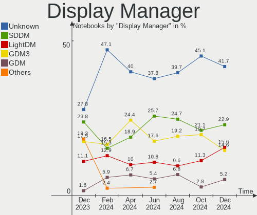
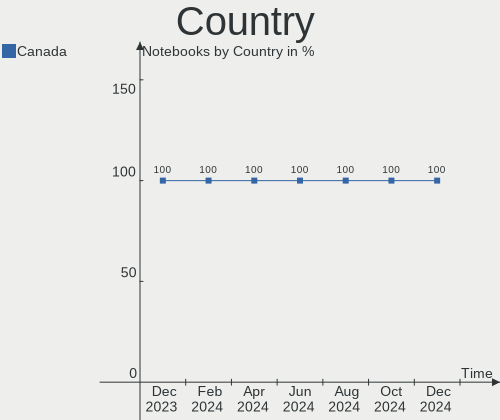
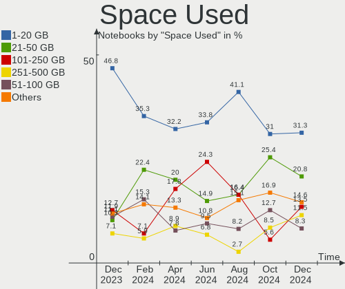
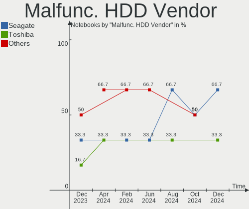
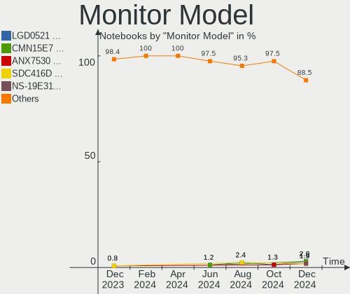
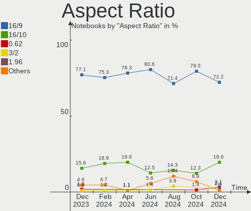

Linux in Canada - Hardware Trends (Notebooks)
---------------------------------------------

A project to identify most popular hardware characteristics and track their change
over time based on data collected by Linux users at https://Linux-Hardware.org.

Anyone can contribute to this report by the [hw-probe](https://github.com/linuxhw/hw-probe) tool:

    sudo -E hw-probe -all -upload

Contents
--------

* [ System ](#system)
  - [ OS                       ](#os)
  - [ OS Family                ](#os-family)
  - [ Kernel                   ](#kernel)
  - [ Kernel Family            ](#kernel-family)
  - [ Kernel Major Ver.        ](#kernel-major-ver)
  - [ Arch                     ](#arch)
  - [ DE                       ](#de)
  - [ Display Server           ](#display-server)
  - [ Display Manager          ](#display-manager)
  - [ OS Lang                  ](#os-lang)
  - [ Boot Mode                ](#boot-mode)
  - [ Filesystem               ](#filesystem)
  - [ Part. scheme             ](#part-scheme)
  - [ Dual Boot with Linux/BSD ](#dual-boot-with-linuxbsd)
  - [ Dual Boot (Win)          ](#dual-boot-win)

* [ Board ](#board)
  - [ Vendor                   ](#vendor)
  - [ Model                    ](#model)
  - [ Model Family             ](#model-family)
  - [ MFG Year                 ](#mfg-year)
  - [ Form Factor              ](#form-factor)
  - [ Secure Boot              ](#secure-boot)
  - [ Coreboot                 ](#coreboot)
  - [ RAM Size                 ](#ram-size)
  - [ RAM Used                 ](#ram-used)
  - [ Total Drives             ](#total-drives)
  - [ Has CD-ROM               ](#has-cd-rom)
  - [ Has Ethernet             ](#has-ethernet)
  - [ Has WiFi                 ](#has-wifi)
  - [ Has Bluetooth            ](#has-bluetooth)

* [ Location ](#location)
  - [ Country                  ](#country)
  - [ City                     ](#city)

* [ Drives ](#drives)
  - [ Drive Vendor             ](#drive-vendor)
  - [ Drive Model              ](#drive-model)
  - [ HDD Vendor               ](#hdd-vendor)
  - [ SSD Vendor               ](#ssd-vendor)
  - [ Drive Kind               ](#drive-kind)
  - [ Drive Connector          ](#drive-connector)
  - [ Drive Size               ](#drive-size)
  - [ Space Total              ](#space-total)
  - [ Space Used               ](#space-used)
  - [ Malfunc. Drives          ](#malfunc-drives)
  - [ Malfunc. Drive Vendor    ](#malfunc-drive-vendor)
  - [ Malfunc. HDD Vendor      ](#malfunc-hdd-vendor)
  - [ Malfunc. Drive Kind      ](#malfunc-drive-kind)
  - [ Failed Drives            ](#failed-drives)
  - [ Failed Drive Vendor      ](#failed-drive-vendor)
  - [ Drive Status             ](#drive-status)

* [ Storage controller ](#storage-controller)
  - [ Storage Vendor           ](#storage-vendor)
  - [ Storage Model            ](#storage-model)
  - [ Storage Kind             ](#storage-kind)

* [ Processor ](#processor)
  - [ CPU Vendor               ](#cpu-vendor)
  - [ CPU Model                ](#cpu-model)
  - [ CPU Model Family         ](#cpu-model-family)
  - [ CPU Cores                ](#cpu-cores)
  - [ CPU Sockets              ](#cpu-sockets)
  - [ CPU Threads              ](#cpu-threads)
  - [ CPU Op-Modes             ](#cpu-op-modes)
  - [ CPU Microcode            ](#cpu-microcode)
  - [ CPU Microarch            ](#cpu-microarch)

* [ Graphics ](#graphics)
  - [ GPU Vendor               ](#gpu-vendor)
  - [ GPU Model                ](#gpu-model)
  - [ GPU Combo                ](#gpu-combo)
  - [ GPU Driver               ](#gpu-driver)
  - [ GPU Memory               ](#gpu-memory)

* [ Monitor ](#monitor)
  - [ Monitor Vendor           ](#monitor-vendor)
  - [ Monitor Model            ](#monitor-model)
  - [ Monitor Resolution       ](#monitor-resolution)
  - [ Monitor Diagonal         ](#monitor-diagonal)
  - [ Monitor Width            ](#monitor-width)
  - [ Aspect Ratio             ](#aspect-ratio)
  - [ Monitor Area             ](#monitor-area)
  - [ Pixel Density            ](#pixel-density)
  - [ Multiple Monitors        ](#multiple-monitors)

* [ Network ](#network)
  - [ Net Controller Vendor    ](#net-controller-vendor)
  - [ Net Controller Model     ](#net-controller-model)
  - [ Wireless Vendor          ](#wireless-vendor)
  - [ Wireless Model           ](#wireless-model)
  - [ Ethernet Vendor          ](#ethernet-vendor)
  - [ Ethernet Model           ](#ethernet-model)
  - [ Net Controller Kind      ](#net-controller-kind)
  - [ Used Controller          ](#used-controller)
  - [ NICs                     ](#nics)
  - [ IPv6                     ](#ipv6)

* [ Bluetooth ](#bluetooth)
  - [ Bluetooth Vendor         ](#bluetooth-vendor)
  - [ Bluetooth Model          ](#bluetooth-model)

* [ Sound ](#sound)
  - [ Sound Vendor             ](#sound-vendor)
  - [ Sound Model              ](#sound-model)

* [ Memory ](#memory)
  - [ Memory Vendor            ](#memory-vendor)
  - [ Memory Model             ](#memory-model)
  - [ Memory Kind              ](#memory-kind)
  - [ Memory Form Factor       ](#memory-form-factor)
  - [ Memory Size              ](#memory-size)
  - [ Memory Speed             ](#memory-speed)

* [ Printers & scanners ](#printers--scanners)
  - [ Printer Vendor           ](#printer-vendor)
  - [ Printer Model            ](#printer-model)
  - [ Scanner Vendor           ](#scanner-vendor)
  - [ Scanner Model            ](#scanner-model)

* [ Camera ](#camera)
  - [ Camera Vendor            ](#camera-vendor)
  - [ Camera Model             ](#camera-model)

* [ Security ](#security)
  - [ Fingerprint Vendor       ](#fingerprint-vendor)
  - [ Fingerprint Model        ](#fingerprint-model)
  - [ Chipcard Vendor          ](#chipcard-vendor)
  - [ Chipcard Model           ](#chipcard-model)

* [ Unsupported ](#unsupported)
  - [ Unsupported Devices      ](#unsupported-devices)
  - [ Unsupported Device Types ](#unsupported-device-types)

System
------

OS
--

Installed operating systems

| Name                | Notebooks | Percent |
|---------------------|-----------|---------|
| Ubuntu 20.04        | 11        | 14.47%  |
| Fedora 35           | 6         | 7.89%   |
| Linux Mint 20.3     | 5         | 6.58%   |
| Pop!_OS 21.10       | 4         | 5.26%   |
| Ubuntu 22.04        | 3         | 3.95%   |
| Ubuntu 21.10        | 3         | 3.95%   |
| OpenMandriva 4.3    | 3         | 3.95%   |
| MX 21               | 3         | 3.95%   |
| Manjaro             | 3         | 3.95%   |
| KDE neon 20.04      | 3         | 3.95%   |
| Ubuntu 18.04        | 2         | 2.63%   |
| Pop!_OS 21.04       | 2         | 2.63%   |
| Manjaro 21.2.6      | 2         | 2.63%   |
| Kali 2022.1         | 2         | 2.63%   |
| EndeavourOS Rolling | 2         | 2.63%   |
| Debian 11           | 2         | 2.63%   |
| Zorin 16            | 1         | 1.32%   |
| Zorin 15            | 1         | 1.32%   |
| Xubuntu 18.04       | 1         | 1.32%   |
| Slackware 15.0      | 1         | 1.32%   |
| Reborn OS           | 1         | 1.32%   |
| Pop!_OS 22.04       | 1         | 1.32%   |
| Parrot 5.0          | 1         | 1.32%   |
| Manjaro 21.2.5      | 1         | 1.32%   |
| Lubuntu 22.04       | 1         | 1.32%   |
| Lubuntu 21.10       | 1         | 1.32%   |
| LMDE 5              | 1         | 1.32%   |
| Linux Mint 19.3     | 1         | 1.32%   |
| Kubuntu 20.04       | 1         | 1.32%   |
| Kali 2022.2         | 1         | 1.32%   |
| Kali 2021.4         | 1         | 1.32%   |
| Endless 4.0.4       | 1         | 1.32%   |
| Elementary 5.1.7    | 1         | 1.32%   |
| Debian 10           | 1         | 1.32%   |
| ArcoLinux           | 1         | 1.32%   |
| Arch Rolling        | 1         | 1.32%   |

OS Family
---------

OS without a version

| Name         | Notebooks | Percent |
|--------------|-----------|---------|
| Ubuntu       | 19        | 25%     |
| Pop!_OS      | 7         | 9.21%   |
| Manjaro      | 6         | 7.89%   |
| Linux Mint   | 6         | 7.89%   |
| Fedora       | 6         | 7.89%   |
| Kali         | 4         | 5.26%   |
| OpenMandriva | 3         | 3.95%   |
| MX           | 3         | 3.95%   |
| KDE neon     | 3         | 3.95%   |
| Debian       | 3         | 3.95%   |
| Zorin        | 2         | 2.63%   |
| Lubuntu      | 2         | 2.63%   |
| EndeavourOS  | 2         | 2.63%   |
| Xubuntu      | 1         | 1.32%   |
| Slackware    | 1         | 1.32%   |
| Reborn OS    | 1         | 1.32%   |
| Parrot       | 1         | 1.32%   |
| LMDE         | 1         | 1.32%   |
| Kubuntu      | 1         | 1.32%   |
| Endless      | 1         | 1.32%   |
| Elementary   | 1         | 1.32%   |
| ArcoLinux    | 1         | 1.32%   |
| Arch         | 1         | 1.32%   |

Kernel
------

Version of the Linux kernel

| Version                   | Notebooks | Percent |
|---------------------------|-----------|---------|
| 5.4.0-107-generic         | 10        | 13.16%  |
| 5.13.0-39-generic         | 10        | 13.16%  |
| 5.16.18-200.fc35.x86_64   | 3         | 3.95%   |
| 5.16.15-76051615-generic  | 3         | 3.95%   |
| 5.15.0-25-generic         | 3         | 3.95%   |
| 5.13.0-40-generic         | 3         | 3.95%   |
| 5.10.0-13-amd64           | 3         | 3.95%   |
| 5.16.7-desktop-1omv4003   | 2         | 2.63%   |
| 5.16.19-76051619-generic  | 2         | 2.63%   |
| 5.16.0-kali7-amd64        | 2         | 2.63%   |
| 5.15.33-1-lts             | 2         | 2.63%   |
| 5.15.32-1-MANJARO         | 2         | 2.63%   |
| 5.15.28-1-MANJARO         | 2         | 2.63%   |
| 5.4.0-91-generic          | 1         | 1.32%   |
| 5.4.0-109-generic         | 1         | 1.32%   |
| 5.4.0-104-generic         | 1         | 1.32%   |
| 5.17.4-arch1-1            | 1         | 1.32%   |
| 5.17.1-zen1-1-zen         | 1         | 1.32%   |
| 5.17.1                    | 1         | 1.32%   |
| 5.17.0-2.1-liquorix-amd64 | 1         | 1.32%   |
| 5.17.0-1-amd64            | 1         | 1.32%   |
| 5.16.9-arch1-1            | 1         | 1.32%   |
| 5.16.20-200.fc35.x86_64   | 1         | 1.32%   |
| 5.16.19-200.fc35.x86_64   | 1         | 1.32%   |
| 5.16.18-1-MANJARO         | 1         | 1.32%   |
| 5.16.14-1-MANJARO         | 1         | 1.32%   |
| 5.16.13-desktop-1omv4003  | 1         | 1.32%   |
| 5.16.0-4mx-amd64          | 1         | 1.32%   |
| 5.16.0-12parrot1-amd64    | 1         | 1.32%   |
| 5.15.16-200.fc35.x86_64   | 1         | 1.32%   |
| 5.15.11-76051511-generic  | 1         | 1.32%   |
| 5.15.0-kali3-amd64        | 1         | 1.32%   |
| 5.15.0-kali3-686-pae      | 1         | 1.32%   |
| 5.15.0-3mx-amd64          | 1         | 1.32%   |
| 5.15.0-23-generic         | 1         | 1.32%   |
| 5.14.0-1032-oem           | 1         | 1.32%   |
| 5.13.0-7614-generic       | 1         | 1.32%   |
| 5.13.0-35-generic         | 1         | 1.32%   |
| 5.13.0-27-generic         | 1         | 1.32%   |
| 5.13.0-19-generic         | 1         | 1.32%   |
| 5.13.0-1021-oracle        | 1         | 1.32%   |
| 5.11.0-35-generic         | 1         | 1.32%   |

Kernel Family
-------------

Linux kernel without a distro release

| Version | Notebooks | Percent |
|---------|-----------|---------|
| 5.13.0  | 18        | 23.68%  |
| 5.4.0   | 13        | 17.11%  |
| 5.15.0  | 7         | 9.21%   |
| 5.16.18 | 4         | 5.26%   |
| 5.16.0  | 4         | 5.26%   |
| 5.16.19 | 3         | 3.95%   |
| 5.16.15 | 3         | 3.95%   |
| 5.10.0  | 3         | 3.95%   |
| 5.17.1  | 2         | 2.63%   |
| 5.17.0  | 2         | 2.63%   |
| 5.16.7  | 2         | 2.63%   |
| 5.15.33 | 2         | 2.63%   |
| 5.15.32 | 2         | 2.63%   |
| 5.15.28 | 2         | 2.63%   |
| 5.17.4  | 1         | 1.32%   |
| 5.16.9  | 1         | 1.32%   |
| 5.16.20 | 1         | 1.32%   |
| 5.16.14 | 1         | 1.32%   |
| 5.16.13 | 1         | 1.32%   |
| 5.15.16 | 1         | 1.32%   |
| 5.15.11 | 1         | 1.32%   |
| 5.14.0  | 1         | 1.32%   |
| 5.11.0  | 1         | 1.32%   |

Kernel Major Ver.
-----------------

Linux kernel major version

| Version | Notebooks | Percent |
|---------|-----------|---------|
| 5.16    | 20        | 26.32%  |
| 5.13    | 18        | 23.68%  |
| 5.15    | 15        | 19.74%  |
| 5.4     | 13        | 17.11%  |
| 5.17    | 5         | 6.58%   |
| 5.10    | 3         | 3.95%   |
| 5.14    | 1         | 1.32%   |
| 5.11    | 1         | 1.32%   |

Arch
----

OS architecture (x86_64, i586, etc.)

| Name   | Notebooks | Percent |
|--------|-----------|---------|
| x86_64 | 72        | 94.74%  |
| i686   | 4         | 5.26%   |

DE
--

Desktop Environment

| Name       | Notebooks | Percent |
|------------|-----------|---------|
| GNOME      | 32        | 42.11%  |
| KDE5       | 17        | 22.37%  |
| XFCE       | 10        | 13.16%  |
| X-Cinnamon | 7         | 9.21%   |
| Unknown    | 4         | 5.26%   |
| LXQt       | 2         | 2.63%   |
| i3         | 2         | 2.63%   |
| Pantheon   | 1         | 1.32%   |
| Cinnamon   | 1         | 1.32%   |

Display Server
--------------

X11 or Wayland

| Name    | Notebooks | Percent |
|---------|-----------|---------|
| X11     | 64        | 84.21%  |
| Wayland | 11        | 14.47%  |
| Unknown | 1         | 1.32%   |

Display Manager
---------------

SDDM, LightDM, etc.

| Name    | Notebooks | Percent |
|---------|-----------|---------|
| Unknown | 32        | 42.11%  |
| GDM     | 15        | 19.74%  |
| LightDM | 12        | 15.79%  |
| SDDM    | 11        | 14.47%  |
| GDM3    | 6         | 7.89%   |

OS Lang
-------

Language

| Lang    | Notebooks | Percent |
|---------|-----------|---------|
| en_CA   | 37        | 48.68%  |
| en_US   | 28        | 36.84%  |
| fr_CA   | 6         | 7.89%   |
| Unknown | 2         | 2.63%   |
| ro_RO   | 1         | 1.32%   |
| es_CL   | 1         | 1.32%   |
| C       | 1         | 1.32%   |

Boot Mode
---------

EFI or BIOS

| Mode | Notebooks | Percent |
|------|-----------|---------|
| EFI  | 43        | 56.58%  |
| BIOS | 33        | 43.42%  |

Filesystem
----------

Type of filesystem

| Type    | Notebooks | Percent |
|---------|-----------|---------|
| Ext4    | 64        | 84.21%  |
| Btrfs   | 8         | 10.53%  |
| Overlay | 3         | 3.95%   |
| Xfs     | 1         | 1.32%   |

Part. scheme
------------

Scheme of partitioning

| Type    | Notebooks | Percent |
|---------|-----------|---------|
| Unknown | 40        | 52.63%  |
| GPT     | 31        | 40.79%  |
| MBR     | 5         | 6.58%   |

Dual Boot with Linux/BSD
------------------------

Hosting more than one Linux/BSD

| Dual boot | Notebooks | Percent |
|-----------|-----------|---------|
| No        | 68        | 89.47%  |
| Yes       | 8         | 10.53%  |

Dual Boot (Win)
---------------

Hosting Linux and Windows

| Dual boot | Notebooks | Percent |
|-----------|-----------|---------|
| No        | 64        | 84.21%  |
| Yes       | 12        | 15.79%  |

Board
-----

Vendor
------

Motherboard manufacturer

| Name             | Notebooks | Percent |
|------------------|-----------|---------|
| Lenovo           | 17        | 22.37%  |
| Dell             | 16        | 21.05%  |
| Hewlett-Packard  | 13        | 17.11%  |
| ASUSTek Computer | 11        | 14.47%  |
| Acer             | 8         | 10.53%  |
| System76         | 2         | 2.63%   |
| Toshiba          | 1         | 1.32%   |
| RCA              | 1         | 1.32%   |
| Panasonic        | 1         | 1.32%   |
| MSI              | 1         | 1.32%   |
| Mediacom         | 1         | 1.32%   |
| HUAWEI           | 1         | 1.32%   |
| Apple            | 1         | 1.32%   |
| Alienware        | 1         | 1.32%   |
| Unknown          | 1         | 1.32%   |

Model
-----

Motherboard model

| Name                                   | Notebooks | Percent |
|----------------------------------------|-----------|---------|
| Dell XPS 15 9560                       | 2         | 2.63%   |
| Dell XPS 15 7590                       | 2         | 2.63%   |
| Unknown                                | 2         | 2.63%   |
| Toshiba Satellite L655                 | 1         | 1.32%   |
| System76 Pangolin                      | 1         | 1.32%   |
| System76 Oryx Pro                      | 1         | 1.32%   |
| RCA W101SA23T1                         | 1         | 1.32%   |
| Panasonic CF-31SBLJGDM                 | 1         | 1.32%   |
| MSI GP72 6QF                           | 1         | 1.32%   |
| Mediacom GTZS                          | 1         | 1.32%   |
| Lenovo ThinkPad X200 Tablet 744945F    | 1         | 1.32%   |
| Lenovo ThinkPad T450s 20BWS19E02       | 1         | 1.32%   |
| Lenovo ThinkPad P70 20ERCTO1WW         | 1         | 1.32%   |
| Lenovo ThinkPad P53s 20N6CTO1WW        | 1         | 1.32%   |
| Lenovo ThinkPad P53 20QNS00Y00         | 1         | 1.32%   |
| Lenovo ThinkPad P14s Gen 2a 21A0003HUS | 1         | 1.32%   |
| Lenovo ThinkPad L430 2465D16           | 1         | 1.32%   |
| Lenovo ThinkPad Edge E540 20C600AAUS   | 1         | 1.32%   |
| Lenovo ThinkPad Edge E530 62724FU      | 1         | 1.32%   |
| Lenovo ThinkPad E520 11433BU           | 1         | 1.32%   |
| Lenovo ThinkPad E485 20KUCTO1WW        | 1         | 1.32%   |
| Lenovo ThinkPad E15 Gen 3 20YG003JUS   | 1         | 1.32%   |
| Lenovo Legion Y540-15IRH 81SX          | 1         | 1.32%   |
| Lenovo Legion 7 15IMH05 81YT           | 1         | 1.32%   |
| Lenovo IdeaPad Y550 4186               | 1         | 1.32%   |
| Lenovo IdeaPad 110-15AST 80TR          | 1         | 1.32%   |
| Lenovo G50-80 80E5                     | 1         | 1.32%   |
| HUAWEI MACH-WX9                        | 1         | 1.32%   |
| HP Victus by Laptop 16-d0xxx           | 1         | 1.32%   |
| HP ProBook 4535s                       | 1         | 1.32%   |
| HP ProBook 450 G8 Notebook PC          | 1         | 1.32%   |
| HP Pavilion Laptop 15-eh1xxx           | 1         | 1.32%   |
| HP Pavilion dv4                        | 1         | 1.32%   |
| HP Laptop 15-dw0xxx                    | 1         | 1.32%   |
| HP Laptop 14-cf0xxx                    | 1         | 1.32%   |
| HP ENVY Laptop 15-ep1xxx               | 1         | 1.32%   |
| HP EliteBook 8770w                     | 1         | 1.32%   |
| HP EliteBook 8470p                     | 1         | 1.32%   |
| HP EliteBook 830 G5                    | 1         | 1.32%   |
| HP 2000                                | 1         | 1.32%   |
| Dell XPS 15 9500                       | 1         | 1.32%   |
| Dell Vostro 3500                       | 1         | 1.32%   |
| Dell Precision M4700                   | 1         | 1.32%   |
| Dell Latitude E7250                    | 1         | 1.32%   |
| Dell Latitude E6430                    | 1         | 1.32%   |
| Dell Latitude E6410                    | 1         | 1.32%   |
| Dell Latitude E5500                    | 1         | 1.32%   |
| Dell Latitude D830                     | 1         | 1.32%   |
| Dell Inspiron 7570                     | 1         | 1.32%   |
| Dell Inspiron 5577                     | 1         | 1.32%   |
| Dell Inspiron 5515                     | 1         | 1.32%   |
| Dell Inspiron 15-3567                  | 1         | 1.32%   |
| ASUS ZenBook UX434FL_UX434FL           | 1         | 1.32%   |
| ASUS X555QA                            | 1         | 1.32%   |
| ASUS X541UAK                           | 1         | 1.32%   |
| ASUS VivoBook_ASUSLaptop X509DA_M509DA | 1         | 1.32%   |
| ASUS ROG Zephyrus G15 GA502IV_GA502IV  | 1         | 1.32%   |
| ASUS ROG Strix G513QC_G513QC           | 1         | 1.32%   |
| ASUS PU401LAC                          | 1         | 1.32%   |
| ASUS K55A                              | 1         | 1.32%   |

Model Family
------------

Motherboard model prefix

| Name                   | Notebooks | Percent |
|------------------------|-----------|---------|
| Lenovo ThinkPad        | 12        | 15.79%  |
| Dell XPS               | 5         | 6.58%   |
| Dell Latitude          | 5         | 6.58%   |
| Acer Aspire            | 5         | 6.58%   |
| Dell Inspiron          | 4         | 5.26%   |
| HP EliteBook           | 3         | 3.95%   |
| Lenovo Legion          | 2         | 2.63%   |
| Lenovo IdeaPad         | 2         | 2.63%   |
| HP ProBook             | 2         | 2.63%   |
| HP Pavilion            | 2         | 2.63%   |
| HP Laptop              | 2         | 2.63%   |
| ASUS ROG               | 2         | 2.63%   |
| Acer Swift             | 2         | 2.63%   |
| Unknown                | 2         | 2.63%   |
| Toshiba Satellite      | 1         | 1.32%   |
| System76 Pangolin      | 1         | 1.32%   |
| System76 Oryx          | 1         | 1.32%   |
| RCA W101SA23T1         | 1         | 1.32%   |
| Panasonic CF-31SBLJGDM | 1         | 1.32%   |
| MSI GP72               | 1         | 1.32%   |
| Mediacom GTZS          | 1         | 1.32%   |
| Lenovo G50-80          | 1         | 1.32%   |
| HUAWEI MACH-WX9        | 1         | 1.32%   |
| HP Victus              | 1         | 1.32%   |
| HP ENVY                | 1         | 1.32%   |
| HP 2000                | 1         | 1.32%   |
| Dell Vostro            | 1         | 1.32%   |
| Dell Precision         | 1         | 1.32%   |
| ASUS ZenBook           | 1         | 1.32%   |
| ASUS X555QA            | 1         | 1.32%   |
| ASUS X541UAK           | 1         | 1.32%   |
| ASUS VivoBook          | 1         | 1.32%   |
| ASUS PU401LAC          | 1         | 1.32%   |
| ASUS K55A              | 1         | 1.32%   |
| ASUS K53Z              | 1         | 1.32%   |
| ASUS GL502VT           | 1         | 1.32%   |
| ASUS G55VW             | 1         | 1.32%   |
| Apple MacBookPro6      | 1         | 1.32%   |
| Alienware m15          | 1         | 1.32%   |
| Acer Nitro             | 1         | 1.32%   |

MFG Year
--------

Motherboard manufacture year

| Year | Notebooks | Percent |
|------|-----------|---------|
| 2019 | 10        | 13.16%  |
| 2020 | 9         | 11.84%  |
| 2012 | 9         | 11.84%  |
| 2021 | 8         | 10.53%  |
| 2017 | 6         | 7.89%   |
| 2015 | 6         | 7.89%   |
| 2011 | 6         | 7.89%   |
| 2018 | 5         | 6.58%   |
| 2016 | 5         | 6.58%   |
| 2010 | 3         | 3.95%   |
| 2008 | 3         | 3.95%   |
| 2009 | 2         | 2.63%   |
| 2022 | 1         | 1.32%   |
| 2014 | 1         | 1.32%   |
| 2013 | 1         | 1.32%   |
| 2007 | 1         | 1.32%   |

Form Factor
-----------

Physical design of the computer

| Name     | Notebooks | Percent |
|----------|-----------|---------|
| Notebook | 76        | 100%    |

Secure Boot
-----------

Enabled or disabled

| State    | Notebooks | Percent |
|----------|-----------|---------|
| Disabled | 70        | 92.11%  |
| Enabled  | 6         | 7.89%   |

Coreboot
--------

Have coreboot on board

| Used | Notebooks | Percent |
|------|-----------|---------|
| No   | 76        | 100%    |

RAM Size
--------

Total RAM memory

| Size in GB  | Notebooks | Percent |
|-------------|-----------|---------|
| 4.01-8.0    | 19        | 25%     |
| 16.01-24.0  | 19        | 25%     |
| 3.01-4.0    | 12        | 15.79%  |
| 8.01-16.0   | 11        | 14.47%  |
| 32.01-64.0  | 9         | 11.84%  |
| 24.01-32.0  | 2         | 2.63%   |
| 1.01-2.0    | 2         | 2.63%   |
| 2.01-3.0    | 1         | 1.32%   |
| 64.01-256.0 | 1         | 1.32%   |

RAM Used
--------

Used RAM memory

| Used GB   | Notebooks | Percent |
|-----------|-----------|---------|
| 1.01-2.0  | 22        | 28.95%  |
| 2.01-3.0  | 18        | 23.68%  |
| 4.01-8.0  | 17        | 22.37%  |
| 3.01-4.0  | 10        | 13.16%  |
| 0.51-1.0  | 5         | 6.58%   |
| 8.01-16.0 | 4         | 5.26%   |

Total Drives
------------

Number of drives on board

| Drives | Notebooks | Percent |
|--------|-----------|---------|
| 1      | 51        | 67.11%  |
| 2      | 19        | 25%     |
| 3      | 5         | 6.58%   |
| 0      | 1         | 1.32%   |

Has CD-ROM
----------

Has CD-ROM on board

| Presented | Notebooks | Percent |
|-----------|-----------|---------|
| No        | 46        | 60.53%  |
| Yes       | 30        | 39.47%  |

Has Ethernet
------------

Has Ethernet on board

| Presented | Notebooks | Percent |
|-----------|-----------|---------|
| Yes       | 65        | 85.53%  |
| No        | 11        | 14.47%  |

Has WiFi
--------

Has WiFi module

| Presented | Notebooks | Percent |
|-----------|-----------|---------|
| Yes       | 73        | 96.05%  |
| No        | 3         | 3.95%   |

Has Bluetooth
-------------

Has Bluetooth module

| Presented | Notebooks | Percent |
|-----------|-----------|---------|
| Yes       | 56        | 73.68%  |
| No        | 20        | 26.32%  |

Location
--------

Country
-------

Geographic location (country)

| Country | Notebooks | Percent |
|---------|-----------|---------|
| Canada  | 76        | 100%    |

City
----

Geographic location (city)

| City                   | Notebooks | Percent |
|------------------------|-----------|---------|
| Toronto                | 7         | 9.21%   |
| Montreal               | 6         | 7.89%   |
| Calgary                | 6         | 7.89%   |
| Vancouver              | 3         | 3.95%   |
| Regina                 | 3         | 3.95%   |
| Kitchener              | 3         | 3.95%   |
| Winnipeg               | 2         | 2.63%   |
| Surrey                 | 2         | 2.63%   |
| Québec                | 2         | 2.63%   |
| Ottawa                 | 2         | 2.63%   |
| North Bay              | 2         | 2.63%   |
| Mount Pearl            | 2         | 2.63%   |
| Edmonton               | 2         | 2.63%   |
| Winkler                | 1         | 1.32%   |
| Windsor                | 1         | 1.32%   |
| Whitehorse             | 1         | 1.32%   |
| Weyburn                | 1         | 1.32%   |
| Victoria               | 1         | 1.32%   |
| Tillsonburg            | 1         | 1.32%   |
| Stony Plain            | 1         | 1.32%   |
| St. John's             | 1         | 1.32%   |
| Sherbrooke             | 1         | 1.32%   |
| Sechelt                | 1         | 1.32%   |
| Scarborough            | 1         | 1.32%   |
| Saint-Joseph-de-Beauce | 1         | 1.32%   |
| Saint-Jerome           | 1         | 1.32%   |
| Saint-Constant         | 1         | 1.32%   |
| Rimouski               | 1         | 1.32%   |
| Ridgeway               | 1         | 1.32%   |
| Richmond Hill          | 1         | 1.32%   |
| Oakville               | 1         | 1.32%   |
| Moncton                | 1         | 1.32%   |
| Miramichi              | 1         | 1.32%   |
| London                 | 1         | 1.32%   |
| Listowel               | 1         | 1.32%   |
| Leduc                  | 1         | 1.32%   |
| Laval                  | 1         | 1.32%   |
| Lake Country           | 1         | 1.32%   |
| Kootenay Bay           | 1         | 1.32%   |
| Hamilton               | 1         | 1.32%   |
| Halifax                | 1         | 1.32%   |
| Granby                 | 1         | 1.32%   |
| Delhi                  | 1         | 1.32%   |
| Creston                | 1         | 1.32%   |
| Cochrane               | 1         | 1.32%   |
| Chandler               | 1         | 1.32%   |
| Chambly                | 1         | 1.32%   |

Drives
------

Drive Vendor
------------

Hard drive vendors

| Vendor                    | Notebooks | Drives | Percent |
|---------------------------|-----------|--------|---------|
| Samsung Electronics       | 21        | 23     | 21.88%  |
| WDC                       | 15        | 16     | 15.63%  |
| Seagate                   | 12        | 13     | 12.5%   |
| Toshiba                   | 6         | 6      | 6.25%   |
| SanDisk                   | 5         | 5      | 5.21%   |
| Hitachi                   | 5         | 5      | 5.21%   |
| SK Hynix                  | 4         | 4      | 4.17%   |
| Intel                     | 4         | 4      | 4.17%   |
| Crucial                   | 4         | 4      | 4.17%   |
| Unknown                   | 3         | 3      | 3.13%   |
| HGST                      | 3         | 3      | 3.13%   |
| Kingston                  | 2         | 2      | 2.08%   |
| TYPEC 1T                  | 1         | 1      | 1.04%   |
| Micron/Crucial Technology | 1         | 1      | 1.04%   |
| LITEON                    | 1         | 1      | 1.04%   |
| Lenovo                    | 1         | 1      | 1.04%   |
| KIOXIA                    | 1         | 1      | 1.04%   |
| KingSpec                  | 1         | 1      | 1.04%   |
| KingFast                  | 1         | 1      | 1.04%   |
| INTEL SS                  | 1         | 1      | 1.04%   |
| Fujitsu                   | 1         | 1      | 1.04%   |
| Dogfish                   | 1         | 1      | 1.04%   |
| Corsair                   | 1         | 1      | 1.04%   |
| A-DATA Technology         | 1         | 1      | 1.04%   |

Drive Model
-----------

Hard drive models

| Model                                | Notebooks | Percent |
|--------------------------------------|-----------|---------|
| Seagate ST9500325AS 500GB            | 3         | 3.03%   |
| WDC WDS100T2B0A-00SM50 1TB SSD       | 2         | 2.02%   |
| Toshiba MQ01ABD100 1TB               | 2         | 2.02%   |
| Seagate ST1000LM035-1RK172 1TB       | 2         | 2.02%   |
| Sandisk NVMe SSD Drive 500GB         | 2         | 2.02%   |
| Samsung SSD 870 EVO 1TB              | 2         | 2.02%   |
| Intel NVMe SSD Drive 512GB           | 2         | 2.02%   |
| Hitachi HTS547575A9E384 752GB        | 2         | 2.02%   |
| Crucial CT1000MX500SSD1 1TB          | 2         | 2.02%   |
| WDC WDS500G2B0C 500GB                | 1         | 1.01%   |
| WDC WDS100T2B0B-00YS70 1TB SSD       | 1         | 1.01%   |
| WDC WD5000LPLX-08ZNTT0 500GB         | 1         | 1.01%   |
| WDC WD5000BPKT-75PK4T0 500GB         | 1         | 1.01%   |
| WDC WD3200LPVX-60V0TT0 320GB         | 1         | 1.01%   |
| WDC WD3200BPVT-22JJ5T0 320GB         | 1         | 1.01%   |
| WDC WD3200BEKT-08PVMT1 320GB         | 1         | 1.01%   |
| WDC WD2500BEVT-00ZCT0 250GB          | 1         | 1.01%   |
| WDC WD1600BEVT-75ZCT2 160GB          | 1         | 1.01%   |
| WDC WD1600BEVT-22ZCT0 160GB          | 1         | 1.01%   |
| WDC WD10JPCX-24UE4T0 1TB             | 1         | 1.01%   |
| WDC PC SN730 NVMe 512GB              | 1         | 1.01%   |
| WDC PC SN530 SDBPNPZ-1T00-1032 1TB   | 1         | 1.01%   |
| WDC PC SN520 SDAPNUW-512G-1014 512GB | 1         | 1.01%   |
| Unknown SN128  128GB                 | 1         | 1.01%   |
| Unknown MMC Card  16GB               | 1         | 1.01%   |
| Unknown MMC Card  128GB              | 1         | 1.01%   |
| TYPEC 1T B PSSD 1TB                  | 1         | 1.01%   |
| Toshiba THNSN51T02DUK NVMe 1024GB    | 1         | 1.01%   |
| Toshiba NVMe SSD Drive 256GB         | 1         | 1.01%   |
| Toshiba MK1676GSX 160GB              | 1         | 1.01%   |
| Toshiba KBG40ZNT512G MEMORY 512GB    | 1         | 1.01%   |
| SK Hynix SC210 mSATA 256GB SSD       | 1         | 1.01%   |
| SK Hynix PC601 NVMe 512GB            | 1         | 1.01%   |
| SK Hynix HFM512GDJTNI-82A0A 512GB    | 1         | 1.01%   |
| SK Hynix HBG4e  32GB                 | 1         | 1.01%   |
| Seagate ST500LT012-1DG142 500GB      | 1         | 1.01%   |
| Seagate ST500LM021-1KJ152 500GB      | 1         | 1.01%   |
| Seagate ST500LM000-1EJ162-SSHD 500GB | 1         | 1.01%   |
| Seagate ST2000LM015-2E8174 2TB       | 1         | 1.01%   |
| Seagate ST1000LM049-2GH172 1TB       | 1         | 1.01%   |
| Seagate ST1000LM024 HN-M101MBB 1TB   | 1         | 1.01%   |
| Seagate BUP Portable 5TB             | 1         | 1.01%   |
| Seagate Backup+ Desktop 4TB          | 1         | 1.01%   |
| SanDisk SD6SB1M-128G-1006 128GB SSD  | 1         | 1.01%   |
| Sandisk NVMe SSD Drive 512GB         | 1         | 1.01%   |
| SanDisk DF4032  32GB                 | 1         | 1.01%   |
| Samsung SSD PM871b M.2 2280 128GB    | 1         | 1.01%   |
| Samsung SSD PM871b 2.5 7mm 256GB     | 1         | 1.01%   |
| Samsung SSD 980 1TB                  | 1         | 1.01%   |
| Samsung SSD 970 EVO Plus 2TB         | 1         | 1.01%   |
| Samsung SSD 970 EVO Plus 250GB       | 1         | 1.01%   |
| Samsung SSD 970 EVO Plus 1TB         | 1         | 1.01%   |
| Samsung SSD 860 EVO mSATA 500GB      | 1         | 1.01%   |
| Samsung SSD 860 EVO M.2 1TB          | 1         | 1.01%   |
| Samsung SSD 860 EVO 500GB            | 1         | 1.01%   |
| Samsung SSD 860 EVO 250GB            | 1         | 1.01%   |
| Samsung PM9A1 NVMe 512GB             | 1         | 1.01%   |
| Samsung NVMe SSD Drive 256GB         | 1         | 1.01%   |
| Samsung NVMe SSD Drive 1TB           | 1         | 1.01%   |
| Samsung NVMe SSD Drive 1024GB        | 1         | 1.01%   |

HDD Vendor
----------

Hard disk drive vendors

| Vendor              | Notebooks | Drives | Percent |
|---------------------|-----------|--------|---------|
| Seagate             | 12        | 12     | 35.29%  |
| WDC                 | 9         | 9      | 26.47%  |
| Hitachi             | 5         | 5      | 14.71%  |
| Toshiba             | 3         | 3      | 8.82%   |
| HGST                | 3         | 3      | 8.82%   |
| Samsung Electronics | 1         | 1      | 2.94%   |
| Fujitsu             | 1         | 1      | 2.94%   |

SSD Vendor
----------

Solid state drive vendors

| Vendor              | Notebooks | Drives | Percent |
|---------------------|-----------|--------|---------|
| Samsung Electronics | 8         | 10     | 34.78%  |
| Crucial             | 4         | 4      | 17.39%  |
| WDC                 | 3         | 3      | 13.04%  |
| TYPEC 1T            | 1         | 1      | 4.35%   |
| SK Hynix            | 1         | 1      | 4.35%   |
| SanDisk             | 1         | 1      | 4.35%   |
| Kingston            | 1         | 1      | 4.35%   |
| KingSpec            | 1         | 1      | 4.35%   |
| INTEL SS            | 1         | 1      | 4.35%   |
| Dogfish             | 1         | 1      | 4.35%   |
| A-DATA Technology   | 1         | 1      | 4.35%   |

Drive Kind
----------

HDD or SSD

| Kind    | Notebooks | Drives | Percent |
|---------|-----------|--------|---------|
| HDD     | 34        | 34     | 36.96%  |
| NVMe    | 30        | 34     | 32.61%  |
| SSD     | 21        | 25     | 22.83%  |
| MMC     | 5         | 5      | 5.43%   |
| Unknown | 2         | 2      | 2.17%   |

Drive Connector
---------------

SATA, SAS, NVMe, etc.

| Type | Notebooks | Drives | Percent |
|------|-----------|--------|---------|
| SATA | 49        | 57     | 55.68%  |
| NVMe | 30        | 34     | 34.09%  |
| MMC  | 5         | 5      | 5.68%   |
| SAS  | 4         | 4      | 4.55%   |

Drive Size
----------

Size of hard drive

| Size in TB | Notebooks | Drives | Percent |
|------------|-----------|--------|---------|
| 0.01-0.5   | 33        | 34     | 58.93%  |
| 0.51-1.0   | 21        | 23     | 37.5%   |
| 1.01-2.0   | 1         | 1      | 1.79%   |
| 4.01-10.0  | 1         | 1      | 1.79%   |

Space Total
-----------

Amount of disk space available on the file system

| Size in GB     | Notebooks | Percent |
|----------------|-----------|---------|
| 251-500        | 25        | 32.89%  |
| 501-1000       | 18        | 23.68%  |
| 101-250        | 14        | 18.42%  |
| 1001-2000      | 6         | 7.89%   |
| 21-50          | 3         | 3.95%   |
| 1-20           | 3         | 3.95%   |
| 51-100         | 3         | 3.95%   |
| Unknown        | 3         | 3.95%   |
| More than 3000 | 1         | 1.32%   |

Space Used
----------

Amount of used disk space

| Used GB        | Notebooks | Percent |
|----------------|-----------|---------|
| 1-20           | 22        | 28.95%  |
| 101-250        | 18        | 23.68%  |
| 21-50          | 13        | 17.11%  |
| 51-100         | 9         | 11.84%  |
| 251-500        | 7         | 9.21%   |
| 501-1000       | 3         | 3.95%   |
| Unknown        | 3         | 3.95%   |
| More than 3000 | 1         | 1.32%   |

Malfunc. Drives
---------------

Drive models with a malfunction

| Model                               | Notebooks | Drives | Percent |
|-------------------------------------|-----------|--------|---------|
| Seagate ST9500325AS 500GB           | 2         | 2      | 28.57%  |
| Seagate ST1000LM024 HN-M101MBB 1TB  | 1         | 1      | 14.29%  |
| Samsung Electronics SSD 870 EVO 1TB | 1         | 1      | 14.29%  |
| HGST HTS721010A9E630 1TB            | 1         | 1      | 14.29%  |
| HGST HTS541010A9E680 1TB            | 1         | 1      | 14.29%  |
| A-DATA Technology SX900 256GB SSD   | 1         | 1      | 14.29%  |

Malfunc. Drive Vendor
---------------------

Vendors of faulty drives

| Vendor              | Notebooks | Drives | Percent |
|---------------------|-----------|--------|---------|
| Seagate             | 3         | 3      | 42.86%  |
| HGST                | 2         | 2      | 28.57%  |
| Samsung Electronics | 1         | 1      | 14.29%  |
| A-DATA Technology   | 1         | 1      | 14.29%  |

Malfunc. HDD Vendor
-------------------

Vendors of faulty HDD drives

| Vendor  | Notebooks | Drives | Percent |
|---------|-----------|--------|---------|
| Seagate | 3         | 3      | 60%     |
| HGST    | 2         | 2      | 40%     |

Malfunc. Drive Kind
-------------------

Kinds of faulty drives

| Kind | Notebooks | Drives | Percent |
|------|-----------|--------|---------|
| HDD  | 5         | 5      | 71.43%  |
| SSD  | 2         | 2      | 28.57%  |

Failed Drives
-------------

Failed drive models

| Model                  | Notebooks | Drives | Percent |
|------------------------|-----------|--------|---------|
| LITEON CA3-8D512 512GB | 1         | 1      | 100%    |

Failed Drive Vendor
-------------------

Failed drive vendors

| Vendor | Notebooks | Drives | Percent |
|--------|-----------|--------|---------|
| LITEON | 1         | 1      | 100%    |

Drive Status
------------

Number of failed and malfunc. drives

| Status   | Notebooks | Drives | Percent |
|----------|-----------|--------|---------|
| Detected | 44        | 55     | 53.66%  |
| Works    | 30        | 37     | 36.59%  |
| Malfunc  | 7         | 7      | 8.54%   |
| Failed   | 1         | 1      | 1.22%   |

Storage controller
------------------

Storage Vendor
--------------

Storage controller vendors

| Vendor                       | Notebooks | Percent |
|------------------------------|-----------|---------|
| Intel                        | 55        | 56.12%  |
| AMD                          | 13        | 13.27%  |
| Samsung Electronics          | 12        | 12.24%  |
| Sandisk                      | 6         | 6.12%   |
| Toshiba America Info Systems | 3         | 3.06%   |
| SK Hynix                     | 2         | 2.04%   |
| Phison Electronics           | 1         | 1.02%   |
| Micron/Crucial Technology    | 1         | 1.02%   |
| Lite-On Technology           | 1         | 1.02%   |
| Lenovo                       | 1         | 1.02%   |
| KIOXIA                       | 1         | 1.02%   |
| Kingston Technology Company  | 1         | 1.02%   |
| JMicron Technology           | 1         | 1.02%   |

Storage Model
-------------

Storage controller models

| Model                                                                            | Notebooks | Percent |
|----------------------------------------------------------------------------------|-----------|---------|
| AMD FCH SATA Controller [AHCI mode]                                              | 12        | 11.76%  |
| Samsung NVMe SSD Controller SM981/PM981/PM983                                    | 8         | 7.84%   |
| Intel 7 Series Chipset Family 6-port SATA Controller [AHCI mode]                 | 8         | 7.84%   |
| Intel 82801 Mobile SATA Controller [RAID mode]                                   | 7         | 6.86%   |
| Intel Cannon Lake Mobile PCH SATA AHCI Controller                                | 5         | 4.9%    |
| Intel HM170/QM170 Chipset SATA Controller [AHCI Mode]                            | 4         | 3.92%   |
| Intel 82801IBM/IEM (ICH9M/ICH9M-E) 4 port SATA Controller [AHCI mode]            | 4         | 3.92%   |
| Samsung NVMe SSD Controller 980                                                  | 3         | 2.94%   |
| Intel Volume Management Device NVMe RAID Controller                              | 3         | 2.94%   |
| Intel Sunrise Point-LP SATA Controller [AHCI mode]                               | 3         | 2.94%   |
| Sandisk WD Blue SN550 NVMe SSD                                                   | 2         | 1.96%   |
| Sandisk WD Blue SN500 / PC SN520 NVMe SSD                                        | 2         | 1.96%   |
| Sandisk WD Black SN750 / PC SN730 NVMe SSD                                       | 2         | 1.96%   |
| Intel Wildcat Point-LP SATA Controller [AHCI Mode]                               | 2         | 1.96%   |
| Intel SSD 660P Series                                                            | 2         | 1.96%   |
| Intel 6 Series/C200 Series Chipset Family 6 port Mobile SATA AHCI Controller     | 2         | 1.96%   |
| Intel 5 Series/3400 Series Chipset 4 port SATA AHCI Controller                   | 2         | 1.96%   |
| Toshiba America Info Systems XG6 NVMe SSD Controller                             | 1         | 0.98%   |
| Toshiba America Info Systems XG4 NVMe SSD Controller                             | 1         | 0.98%   |
| Toshiba America Info Systems BG3 NVMe SSD Controller                             | 1         | 0.98%   |
| SK Hynix Non-Volatile memory controller                                          | 1         | 0.98%   |
| SK Hynix BC511                                                                   | 1         | 0.98%   |
| Sandisk Non-Volatile memory controller                                           | 1         | 0.98%   |
| Samsung NVMe SSD Controller PM9A1/PM9A3/980PRO                                   | 1         | 0.98%   |
| Phison E12 NVMe Controller                                                       | 1         | 0.98%   |
| Micron/Crucial NVMe Controller                                                   | 1         | 0.98%   |
| Lite-On Non-Volatile memory controller                                           | 1         | 0.98%   |
| Lenovo Non-Volatile memory controller                                            | 1         | 0.98%   |
| KIOXIA Non-Volatile memory controller                                            | 1         | 0.98%   |
| Kingston Company A2000 NVMe SSD                                                  | 1         | 0.98%   |
| JMicron JMB360 AHCI Controller                                                   | 1         | 0.98%   |
| Intel SSD 600P Series                                                            | 1         | 0.98%   |
| Intel Q170/Q150/B150/H170/H110/Z170/CM236 Chipset SATA Controller [AHCI Mode]    | 1         | 0.98%   |
| Intel Non-Volatile memory controller                                             | 1         | 0.98%   |
| Intel Celeron N3350/Pentium N4200/Atom E3900 Series SATA AHCI Controller         | 1         | 0.98%   |
| Intel Cannon Point-LP SATA Controller [AHCI Mode]                                | 1         | 0.98%   |
| Intel Cannon Lake PCH SATA AHCI Controller                                       | 1         | 0.98%   |
| Intel Atom/Celeron/Pentium Processor x5-E8000/J3xxx/N3xxx Series SATA Controller | 1         | 0.98%   |
| Intel 82801IBM/IEM (ICH9M/ICH9M-E) 2 port SATA Controller [IDE mode]             | 1         | 0.98%   |
| Intel 82801HM/HEM (ICH8M/ICH8M-E) SATA Controller [IDE mode]                     | 1         | 0.98%   |
| Intel 82801HM/HEM (ICH8M/ICH8M-E) IDE Controller                                 | 1         | 0.98%   |
| Intel 8 Series/C220 Series Chipset Family 6-port SATA Controller 1 [AHCI mode]   | 1         | 0.98%   |
| Intel 8 Series SATA Controller 1 [AHCI mode]                                     | 1         | 0.98%   |
| Intel 7 Series Chipset Family 4-port SATA Controller [IDE mode]                  | 1         | 0.98%   |
| Intel 7 Series Chipset Family 2-port SATA Controller [IDE mode]                  | 1         | 0.98%   |
| Intel 5 Series/3400 Series Chipset 6 port SATA AHCI Controller                   | 1         | 0.98%   |
| Intel 400 Series Chipset Family SATA AHCI Controller                             | 1         | 0.98%   |
| AMD SB7x0/SB8x0/SB9x0 SATA Controller [AHCI mode]                                | 1         | 0.98%   |

Storage Kind
------------

Kind of storage controller (IDE, SATA, NVMe, SAS, ...)

| Kind | Notebooks | Percent |
|------|-----------|---------|
| SATA | 52        | 54.74%  |
| NVMe | 30        | 31.58%  |
| RAID | 10        | 10.53%  |
| IDE  | 3         | 3.16%   |

Processor
---------

CPU Vendor
----------

Processor vendors

| Vendor | Notebooks | Percent |
|--------|-----------|---------|
| Intel  | 60        | 78.95%  |
| AMD    | 16        | 21.05%  |

CPU Model
---------

Processor models

| Model                                           | Notebooks | Percent |
|-------------------------------------------------|-----------|---------|
| Intel Core i7-9750H CPU @ 2.60GHz               | 5         | 6.58%   |
| Intel Core i7-8550U CPU @ 1.80GHz               | 3         | 3.95%   |
| Intel Core i7-6700HQ CPU @ 2.60GHz              | 3         | 3.95%   |
| Intel Core i7-10750H CPU @ 2.60GHz              | 3         | 3.95%   |
| Intel Core i7-7700HQ CPU @ 2.80GHz              | 2         | 2.63%   |
| Intel Core i7-3630QM CPU @ 2.40GHz              | 2         | 2.63%   |
| Intel Core i5-2450M CPU @ 2.50GHz               | 2         | 2.63%   |
| Intel Core i3-3120M CPU @ 2.50GHz               | 2         | 2.63%   |
| AMD Ryzen 7 5700U with Radeon Graphics          | 2         | 2.63%   |
| AMD Ryzen 5 5500U with Radeon Graphics          | 2         | 2.63%   |
| Intel Pentium Dual CPU T3200 @ 2.00GHz          | 1         | 1.32%   |
| Intel Core i9-9880H CPU @ 2.30GHz               | 1         | 1.32%   |
| Intel Core i9-8950HK CPU @ 2.90GHz              | 1         | 1.32%   |
| Intel Core i7-8665U CPU @ 1.90GHz               | 1         | 1.32%   |
| Intel Core i7-8565U CPU @ 1.80GHz               | 1         | 1.32%   |
| Intel Core i7-5600U CPU @ 2.60GHz               | 1         | 1.32%   |
| Intel Core i7-3840QM CPU @ 2.80GHz              | 1         | 1.32%   |
| Intel Core i7-3520M CPU @ 2.90GHz               | 1         | 1.32%   |
| Intel Core i7-1065G7 CPU @ 1.30GHz              | 1         | 1.32%   |
| Intel Core i5-8265U CPU @ 1.60GHz               | 1         | 1.32%   |
| Intel Core i5-8250U CPU @ 1.60GHz               | 1         | 1.32%   |
| Intel Core i5-7300HQ CPU @ 2.50GHz              | 1         | 1.32%   |
| Intel Core i5-7200U CPU @ 2.50GHz               | 1         | 1.32%   |
| Intel Core i5-5300U CPU @ 2.30GHz               | 1         | 1.32%   |
| Intel Core i5-5200U CPU @ 2.20GHz               | 1         | 1.32%   |
| Intel Core i5-4210U CPU @ 1.70GHz               | 1         | 1.32%   |
| Intel Core i5-3320M CPU @ 2.60GHz               | 1         | 1.32%   |
| Intel Core i5-2410M CPU @ 2.30GHz               | 1         | 1.32%   |
| Intel Core i5 CPU M 560 @ 2.67GHz               | 1         | 1.32%   |
| Intel Core i5 CPU M 540 @ 2.53GHz               | 1         | 1.32%   |
| Intel Core i3-6006U CPU @ 2.00GHz               | 1         | 1.32%   |
| Intel Core i3-4000M CPU @ 2.40GHz               | 1         | 1.32%   |
| Intel Core i3-3110M CPU @ 2.40GHz               | 1         | 1.32%   |
| Intel Core i3-2310M CPU @ 2.10GHz               | 1         | 1.32%   |
| Intel Core i3 CPU M 380 @ 2.53GHz               | 1         | 1.32%   |
| Intel Core i3 CPU M 370 @ 2.40GHz               | 1         | 1.32%   |
| Intel Core 2 Duo CPU T9300 @ 2.50GHz            | 1         | 1.32%   |
| Intel Core 2 Duo CPU T6600 @ 2.20GHz            | 1         | 1.32%   |
| Intel Core 2 Duo CPU T6400 @ 2.00GHz            | 1         | 1.32%   |
| Intel Core 2 Duo CPU P8400 @ 2.26GHz            | 1         | 1.32%   |
| Intel Core 2 Duo CPU L9600 @ 2.13GHz            | 1         | 1.32%   |
| Intel Celeron CPU N3050 @ 1.60GHz               | 1         | 1.32%   |
| Intel Celeron CPU J3455 @ 1.50GHz               | 1         | 1.32%   |
| Intel Atom CPU Z3735F @ 1.33GHz                 | 1         | 1.32%   |
| Intel 12th Gen Core i7-12700H                   | 1         | 1.32%   |
| Intel 11th Gen Core i9-11900H @ 2.50GHz         | 1         | 1.32%   |
| Intel 11th Gen Core i7-11800H @ 2.30GHz         | 1         | 1.32%   |
| Intel 11th Gen Core i5-1135G7 @ 2.40GHz         | 1         | 1.32%   |
| AMD Ryzen 9 5900HX with Radeon Graphics         | 1         | 1.32%   |
| AMD Ryzen 7 4800HS with Radeon Graphics         | 1         | 1.32%   |
| AMD Ryzen 7 4700U with Radeon Graphics          | 1         | 1.32%   |
| AMD Ryzen 7 3700U with Radeon Vega Mobile Gfx   | 1         | 1.32%   |
| AMD Ryzen 7 2700U with Radeon Vega Mobile Gfx   | 1         | 1.32%   |
| AMD Ryzen 5 PRO 5650U with Radeon Graphics      | 1         | 1.32%   |
| AMD E2-3000M APU with Radeon HD Graphics        | 1         | 1.32%   |
| AMD E-350 Processor                             | 1         | 1.32%   |
| AMD A9-9400 RADEON R5, 5 COMPUTE CORES 2C+3G    | 1         | 1.32%   |
| AMD A6-7310 APU with AMD Radeon R4 Graphics     | 1         | 1.32%   |
| AMD A6-3420M APU with Radeon HD Graphics        | 1         | 1.32%   |
| AMD A10-9620P RADEON R5, 10 COMPUTE CORES 4C+6G | 1         | 1.32%   |

CPU Model Family
----------------

Processor model prefix

| Model              | Notebooks | Percent |
|--------------------|-----------|---------|
| Intel Core i7      | 24        | 31.58%  |
| Intel Core i5      | 13        | 17.11%  |
| Intel Core i3      | 8         | 10.53%  |
| AMD Ryzen 7        | 6         | 7.89%   |
| Other              | 5         | 6.58%   |
| Intel Core 2 Duo   | 5         | 6.58%   |
| Intel Core i9      | 2         | 2.63%   |
| Intel Celeron      | 2         | 2.63%   |
| AMD Ryzen 5        | 2         | 2.63%   |
| AMD A6             | 2         | 2.63%   |
| Intel Pentium Dual | 1         | 1.32%   |
| Intel Atom         | 1         | 1.32%   |
| AMD Ryzen 9        | 1         | 1.32%   |
| AMD Ryzen 5 PRO    | 1         | 1.32%   |
| AMD E2             | 1         | 1.32%   |
| AMD E              | 1         | 1.32%   |
| AMD A10            | 1         | 1.32%   |

CPU Cores
---------

Number of processor cores

| Number | Notebooks | Percent |
|--------|-----------|---------|
| 2      | 31        | 40.79%  |
| 4      | 24        | 31.58%  |
| 6      | 12        | 15.79%  |
| 8      | 8         | 10.53%  |
| 14     | 1         | 1.32%   |

CPU Sockets
-----------

Number of sockets

| Number | Notebooks | Percent |
|--------|-----------|---------|
| 1      | 76        | 100%    |

CPU Threads
-----------

Threads per core (Hyper-Threading)

| Number | Notebooks | Percent |
|--------|-----------|---------|
| 2      | 60        | 78.95%  |
| 1      | 16        | 21.05%  |

CPU Op-Modes
------------

CPU Operation Modes (32-bit, 64-bit)

| Op mode        | Notebooks | Percent |
|----------------|-----------|---------|
| 32-bit, 64-bit | 76        | 100%    |

CPU Microcode
-------------

Microcode number

| Number     | Notebooks | Percent |
|------------|-----------|---------|
| Unknown    | 20        | 26.32%  |
| 0x906ea    | 6         | 7.89%   |
| 0x306a9    | 5         | 6.58%   |
| 0x1067a    | 4         | 5.26%   |
| 0xa0652    | 3         | 3.95%   |
| 0x206a7    | 3         | 3.95%   |
| 0x08608103 | 3         | 3.95%   |
| 0x906e9    | 2         | 2.63%   |
| 0x806ec    | 2         | 2.63%   |
| 0x806ea    | 2         | 2.63%   |
| 0x506e3    | 2         | 2.63%   |
| 0x20655    | 2         | 2.63%   |
| 0x0a50000c | 2         | 2.63%   |
| 0x906ed    | 1         | 1.32%   |
| 0x906a3    | 1         | 1.32%   |
| 0x806e9    | 1         | 1.32%   |
| 0x806c1    | 1         | 1.32%   |
| 0x706e5    | 1         | 1.32%   |
| 0x6fd      | 1         | 1.32%   |
| 0x506c9    | 1         | 1.32%   |
| 0x406e3    | 1         | 1.32%   |
| 0x406c3    | 1         | 1.32%   |
| 0x40651    | 1         | 1.32%   |
| 0x306c3    | 1         | 1.32%   |
| 0x30678    | 1         | 1.32%   |
| 0x10676    | 1         | 1.32%   |
| 0x08600104 | 1         | 1.32%   |
| 0x08600102 | 1         | 1.32%   |
| 0x07030105 | 1         | 1.32%   |
| 0x06006704 | 1         | 1.32%   |
| 0x06006118 | 1         | 1.32%   |
| 0x05000028 | 1         | 1.32%   |
| 0x03000027 | 1         | 1.32%   |

CPU Microarch
-------------

Microarchitecture

| Name             | Notebooks | Percent |
|------------------|-----------|---------|
| KabyLake         | 18        | 23.68%  |
| IvyBridge        | 8         | 10.53%  |
| Unknown          | 6         | 7.89%   |
| Penryn           | 5         | 6.58%   |
| Westmere         | 4         | 5.26%   |
| Skylake          | 4         | 5.26%   |
| SandyBridge      | 4         | 5.26%   |
| CometLake        | 3         | 3.95%   |
| Broadwell        | 3         | 3.95%   |
| Zen 3            | 2         | 2.63%   |
| Zen 2            | 2         | 2.63%   |
| Silvermont       | 2         | 2.63%   |
| K10 Llano        | 2         | 2.63%   |
| Haswell          | 2         | 2.63%   |
| Excavator        | 2         | 2.63%   |
| Zen+             | 1         | 1.32%   |
| Zen              | 1         | 1.32%   |
| TigerLake        | 1         | 1.32%   |
| Puma             | 1         | 1.32%   |
| IceLake          | 1         | 1.32%   |
| Goldmont         | 1         | 1.32%   |
| Core             | 1         | 1.32%   |
| Bobcat           | 1         | 1.32%   |
| Alderlake Hybrid | 1         | 1.32%   |

Graphics
--------

GPU Vendor
----------

Vendors of graphics cards

| Vendor | Notebooks | Percent |
|--------|-----------|---------|
| Intel  | 52        | 52.53%  |
| Nvidia | 28        | 28.28%  |
| AMD    | 19        | 19.19%  |

GPU Model
---------

Graphics card models

| Model                                                                                    | Notebooks | Percent |
|------------------------------------------------------------------------------------------|-----------|---------|
| Intel Mobile 4 Series Chipset Integrated Graphics Controller                             | 5         | 5.05%   |
| Intel CoffeeLake-H GT2 [UHD Graphics 630]                                                | 5         | 5.05%   |
| Nvidia TU117M [GeForce GTX 1650 Mobile / Max-Q]                                          | 4         | 4.04%   |
| Intel UHD Graphics 620                                                                   | 4         | 4.04%   |
| Intel Core Processor Integrated Graphics Controller                                      | 4         | 4.04%   |
| Intel 3rd Gen Core processor Graphics Controller                                         | 4         | 4.04%   |
| Intel 2nd Generation Core Processor Family Integrated Graphics Controller                | 4         | 4.04%   |
| AMD Lucienne                                                                             | 4         | 4.04%   |
| Nvidia GP107M [GeForce GTX 1050 Mobile]                                                  | 3         | 3.03%   |
| Intel WhiskeyLake-U GT2 [UHD Graphics 620]                                               | 3         | 3.03%   |
| Intel HD Graphics 630                                                                    | 3         | 3.03%   |
| Intel HD Graphics 5500                                                                   | 3         | 3.03%   |
| Intel HD Graphics 530                                                                    | 3         | 3.03%   |
| Nvidia GA106M [GeForce RTX 3060 Mobile / Max-Q]                                          | 2         | 2.02%   |
| Intel TigerLake-H GT1 [UHD Graphics]                                                     | 2         | 2.02%   |
| Intel CometLake-H GT2 [UHD Graphics]                                                     | 2         | 2.02%   |
| AMD Renoir                                                                               | 2         | 2.02%   |
| AMD Chelsea XT GL [FirePro M4000]                                                        | 2         | 2.02%   |
| AMD Cezanne                                                                              | 2         | 2.02%   |
| Nvidia TU117M [GeForce GTX 1650 Ti Mobile]                                               | 1         | 1.01%   |
| Nvidia TU117M                                                                            | 1         | 1.01%   |
| Nvidia TU116M [GeForce GTX 1660 Ti Mobile]                                               | 1         | 1.01%   |
| Nvidia TU106M [GeForce RTX 2070 Mobile]                                                  | 1         | 1.01%   |
| Nvidia TU106M [GeForce RTX 2060 Max-Q]                                                   | 1         | 1.01%   |
| Nvidia TU106BM [GeForce RTX 2070 Mobile]                                                 | 1         | 1.01%   |
| Nvidia TU104GLM [Quadro RTX 4000 Mobile / Max-Q]                                         | 1         | 1.01%   |
| Nvidia GT216M [GeForce GT 330M]                                                          | 1         | 1.01%   |
| Nvidia GP108M [GeForce MX150]                                                            | 1         | 1.01%   |
| Nvidia GP108GLM [Quadro P520]                                                            | 1         | 1.01%   |
| Nvidia GP108BM [GeForce MX250]                                                           | 1         | 1.01%   |
| Nvidia GM204M [GeForce GTX 970M]                                                         | 1         | 1.01%   |
| Nvidia GM108M [GeForce MX130]                                                            | 1         | 1.01%   |
| Nvidia GM107M [GeForce GTX 960M]                                                         | 1         | 1.01%   |
| Nvidia GM107GLM [Quadro M600M]                                                           | 1         | 1.01%   |
| Nvidia GK107M [GeForce GTX 660M]                                                         | 1         | 1.01%   |
| Nvidia GA107M [GeForce RTX 3050 Mobile]                                                  | 1         | 1.01%   |
| Nvidia GA107BM [GeForce RTX 3050 Ti Mobile]                                              | 1         | 1.01%   |
| Nvidia G86M [Quadro NVS 140M]                                                            | 1         | 1.01%   |
| Intel TigerLake-LP GT2 [Iris Xe Graphics]                                                | 1         | 1.01%   |
| Intel Skylake GT2 [HD Graphics 520]                                                      | 1         | 1.01%   |
| Intel Iris Plus Graphics G7                                                              | 1         | 1.01%   |
| Intel HD Graphics 620                                                                    | 1         | 1.01%   |
| Intel HD Graphics 500                                                                    | 1         | 1.01%   |
| Intel Haswell-ULT Integrated Graphics Controller                                         | 1         | 1.01%   |
| Intel Atom/Celeron/Pentium Processor x5-E8000/J3xxx/N3xxx Integrated Graphics Controller | 1         | 1.01%   |
| Intel Atom Processor Z36xxx/Z37xxx Series Graphics & Display                             | 1         | 1.01%   |
| Intel Alder Lake-P Integrated Graphics Controller                                        | 1         | 1.01%   |
| Intel 4th Gen Core Processor Integrated Graphics Controller                              | 1         | 1.01%   |
| AMD Wrestler [Radeon HD 6310]                                                            | 1         | 1.01%   |
| AMD Wani [Radeon R5/R6/R7 Graphics]                                                      | 1         | 1.01%   |
| AMD Thames [Radeon HD 7550M/7570M/7650M]                                                 | 1         | 1.01%   |
| AMD SuperSumo [Radeon HD 6380G]                                                          | 1         | 1.01%   |
| AMD Sumo [Radeon HD 6520G]                                                               | 1         | 1.01%   |
| AMD Stoney [Radeon R2/R3/R4/R5 Graphics]                                                 | 1         | 1.01%   |
| AMD Raven Ridge [Radeon Vega Series / Radeon Vega Mobile Series]                         | 1         | 1.01%   |
| AMD Picasso/Raven 2 [Radeon Vega Series / Radeon Vega Mobile Series]                     | 1         | 1.01%   |
| AMD Mullins [Radeon R4/R5 Graphics]                                                      | 1         | 1.01%   |

GPU Combo
---------

Combinations of graphics cards

| Name           | Notebooks | Percent |
|----------------|-----------|---------|
| 1 x Intel      | 31        | 40.79%  |
| Intel + Nvidia | 21        | 27.63%  |
| 1 x AMD        | 17        | 22.37%  |
| 1 x Nvidia     | 5         | 6.58%   |
| AMD + Nvidia   | 2         | 2.63%   |

GPU Driver
----------

Free vs proprietary

| Driver      | Notebooks | Percent |
|-------------|-----------|---------|
| Free        | 55        | 72.37%  |
| Proprietary | 20        | 26.32%  |
| Unknown     | 1         | 1.32%   |

GPU Memory
----------

Total video memory

| Size in GB | Notebooks | Percent |
|------------|-----------|---------|
| Unknown    | 52        | 68.42%  |
| 0.01-0.5   | 9         | 11.84%  |
| 3.01-4.0   | 7         | 9.21%   |
| 0.51-1.0   | 3         | 3.95%   |
| 7.01-8.0   | 2         | 2.63%   |
| 5.01-6.0   | 2         | 2.63%   |
| 1.01-2.0   | 1         | 1.32%   |

Monitor
-------

Monitor Vendor
--------------

Monitor vendors

| Vendor                  | Notebooks | Percent |
|-------------------------|-----------|---------|
| LG Display              | 14        | 15.56%  |
| AU Optronics            | 12        | 13.33%  |
| Samsung Electronics     | 11        | 12.22%  |
| Chimei Innolux          | 10        | 11.11%  |
| BOE                     | 9         | 10%     |
| Sharp                   | 7         | 7.78%   |
| Dell                    | 5         | 5.56%   |
| PANDA                   | 4         | 4.44%   |
| Goldstar                | 2         | 2.22%   |
| Chi Mei Optoelectronics | 2         | 2.22%   |
| ASUSTek Computer        | 2         | 2.22%   |
| YTH                     | 1         | 1.11%   |
| Toshiba                 | 1         | 1.11%   |
| Seiko/Epson             | 1         | 1.11%   |
| MSI                     | 1         | 1.11%   |
| Lenovo                  | 1         | 1.11%   |
| JDI                     | 1         | 1.11%   |
| InfoVision              | 1         | 1.11%   |
| Gigabyte Technology     | 1         | 1.11%   |
| BenQ                    | 1         | 1.11%   |
| Apple                   | 1         | 1.11%   |
| Ancor Communications    | 1         | 1.11%   |
| Acer                    | 1         | 1.11%   |

Monitor Model
-------------

Monitor models

| Model                                                                    | Notebooks | Percent |
|--------------------------------------------------------------------------|-----------|---------|
| Sharp LCD Monitor SHP14BA 1920x1080 344x194mm 15.5-inch                  | 2         | 2.2%    |
| Sharp LCD Monitor SHP1476 3840x2160 346x194mm 15.6-inch                  | 2         | 2.2%    |
| Samsung Electronics LCD Monitor SEC4351 1366x768 344x194mm 15.5-inch     | 2         | 2.2%    |
| YTH YTH156KC YTH1560 3840x2160 600x330mm 27.0-inch                       | 1         | 1.1%    |
| Toshiba ScreenXpert TSB8888 1080x2160                                    | 1         | 1.1%    |
| Sharp LQ156M1JW16 SHP14F4 1920x1080 344x194mm 15.5-inch                  | 1         | 1.1%    |
| Sharp LCD Monitor SHP14D1 1920x1200 336x210mm 15.6-inch                  | 1         | 1.1%    |
| Sharp HDMI SHP0FCB 1920x1080 820x460mm 37.0-inch                         | 1         | 1.1%    |
| Seiko/Epson LCD Monitor 1680x1050                                        | 1         | 1.1%    |
| Samsung Electronics S22E450 SAM0C91 1920x1080 477x268mm 21.5-inch        | 1         | 1.1%    |
| Samsung Electronics LU28R55 SAM1017 3840x2160 632x360mm 28.6-inch        | 1         | 1.1%    |
| Samsung Electronics LCD Monitor SEC5541 1366x768 344x193mm 15.5-inch     | 1         | 1.1%    |
| Samsung Electronics LCD Monitor SEC5441 1366x768 309x174mm 14.0-inch     | 1         | 1.1%    |
| Samsung Electronics LCD Monitor SEC5142 1280x800 303x190mm 14.1-inch     | 1         | 1.1%    |
| Samsung Electronics LCD Monitor SEC314C 1920x1080 340x190mm 15.3-inch    | 1         | 1.1%    |
| Samsung Electronics LCD Monitor SEC304C 1366x768 353x198mm 15.9-inch     | 1         | 1.1%    |
| Samsung Electronics LCD Monitor SDC4145 3840x2160 344x194mm 15.5-inch    | 1         | 1.1%    |
| Samsung Electronics LCD Monitor SDC324C 1920x1080 344x194mm 15.5-inch    | 1         | 1.1%    |
| PANDA LM156LF9L02 NCP002F 1920x1080 344x194mm 15.5-inch                  | 1         | 1.1%    |
| PANDA LCD Monitor NCP004D 1920x1080 344x194mm 15.5-inch                  | 1         | 1.1%    |
| PANDA LCD Monitor NCP0036 1920x1080 344x194mm 15.5-inch                  | 1         | 1.1%    |
| PANDA LCD Monitor NCP0021 1920x1080 344x194mm 15.5-inch                  | 1         | 1.1%    |
| MSI MAG341CQ MSI1462 3440x1440 797x333mm 34.0-inch                       | 1         | 1.1%    |
| LG Display LP156WH1-TLA1 LGD6301 1366x768 344x194mm 15.5-inch            | 1         | 1.1%    |
| LG Display LCD Monitor LGD8C01 1366x768 344x194mm 15.5-inch              | 1         | 1.1%    |
| LG Display LCD Monitor LGD06E2 1920x1080 344x194mm 15.5-inch             | 1         | 1.1%    |
| LG Display LCD Monitor LGD0684 1920x1080 344x194mm 15.5-inch             | 1         | 1.1%    |
| LG Display LCD Monitor LGD064C 1920x1080 344x194mm 15.5-inch             | 1         | 1.1%    |
| LG Display LCD Monitor LGD05D1 1920x1080 344x194mm 15.5-inch             | 1         | 1.1%    |
| LG Display LCD Monitor LGD0450 1366x768 277x156mm 12.5-inch              | 1         | 1.1%    |
| LG Display LCD Monitor LGD033E 1366x768 309x174mm 14.0-inch              | 1         | 1.1%    |
| LG Display LCD Monitor LGD033B 1366x768 344x194mm 15.5-inch              | 1         | 1.1%    |
| LG Display LCD Monitor LGD032C 1920x1080 344x194mm 15.5-inch             | 1         | 1.1%    |
| LG Display LCD Monitor LGD0306 1600x900 310x174mm 14.0-inch              | 1         | 1.1%    |
| LG Display LCD Monitor LGD02F2 1366x768 344x194mm 15.5-inch              | 1         | 1.1%    |
| LG Display LCD Monitor LGD02E3 1366x768 344x194mm 15.5-inch              | 1         | 1.1%    |
| LG Display LCD Monitor LGD02DC 1366x768 344x194mm 15.5-inch              | 1         | 1.1%    |
| Lenovo LCD Monitor LEN4011 1280x800 261x163mm 12.1-inch                  | 1         | 1.1%    |
| JDI LCD Monitor JDI422A 3000x2000 293x196mm 13.9-inch                    | 1         | 1.1%    |
| InfoVision LCD Monitor IVO0535 1920x1080 294x165mm 13.3-inch             | 1         | 1.1%    |
| Goldstar TV GSM0002 1920x1080 1150x650mm 52.0-inch                       | 1         | 1.1%    |
| Goldstar LG ULTRAWIDE GSM59F1 2560x1080 800x340mm 34.2-inch              | 1         | 1.1%    |
| Gigabyte Technology M27Q GBT270D 2560x1440 596x335mm 26.9-inch           | 1         | 1.1%    |
| Dell U2719D DEL415F 2560x1440 597x336mm 27.0-inch                        | 1         | 1.1%    |
| Dell P2717H DEL40F6 1920x1080 598x336mm 27.0-inch                        | 1         | 1.1%    |
| Dell P2418D DELD0C2 2560x1440 530x300mm 24.0-inch                        | 1         | 1.1%    |
| Dell P2213 DELF043 1680x1050 473x296mm 22.0-inch                         | 1         | 1.1%    |
| Dell P2213 DELF042 1680x1050 473x296mm 22.0-inch                         | 1         | 1.1%    |
| Dell P190S DEL405A 1280x1024 376x301mm 19.0-inch                         | 1         | 1.1%    |
| Chimei Innolux LCD Monitor CMN1735 1920x1080 382x215mm 17.3-inch         | 1         | 1.1%    |
| Chimei Innolux LCD Monitor CMN1732 1600x900 382x215mm 17.3-inch          | 1         | 1.1%    |
| Chimei Innolux LCD Monitor CMN1602 1920x1080 355x199mm 16.0-inch         | 1         | 1.1%    |
| Chimei Innolux LCD Monitor CMN15E6 1366x768 344x193mm 15.5-inch          | 1         | 1.1%    |
| Chimei Innolux LCD Monitor CMN15CA 1366x768 344x193mm 15.5-inch          | 1         | 1.1%    |
| Chimei Innolux LCD Monitor CMN15B7 1366x768 344x193mm 15.5-inch          | 1         | 1.1%    |
| Chimei Innolux LCD Monitor CMN15B4 1366x768 344x193mm 15.5-inch          | 1         | 1.1%    |
| Chimei Innolux LCD Monitor CMN151E 1920x1080 344x193mm 15.5-inch         | 1         | 1.1%    |
| Chimei Innolux LCD Monitor CMN1502 1920x1080 344x193mm 15.5-inch         | 1         | 1.1%    |
| Chimei Innolux LCD Monitor CMN14D4 1920x1080 309x173mm 13.9-inch         | 1         | 1.1%    |
| Chi Mei Optoelectronics LCD Monitor CMO15A7 1366x768 344x193mm 15.5-inch | 1         | 1.1%    |

Monitor Resolution
------------------

Monitor screen resolution

| Resolution         | Notebooks | Percent |
|--------------------|-----------|---------|
| 1920x1080 (FHD)    | 32        | 37.21%  |
| 1366x768 (WXGA)    | 26        | 30.23%  |
| 3840x2160 (4K)     | 8         | 9.3%    |
| 2560x1440 (QHD)    | 6         | 6.98%   |
| 1280x800 (WXGA)    | 3         | 3.49%   |
| 1920x1200 (WUXGA)  | 2         | 2.33%   |
| 1680x1050 (WSXGA+) | 2         | 2.33%   |
| 1600x900 (HD+)     | 2         | 2.33%   |
| 3440x1440          | 1         | 1.16%   |
| 3000x2000          | 1         | 1.16%   |
| 2560x1080          | 1         | 1.16%   |
| 2288x1287          | 1         | 1.16%   |
| 1280x1024 (SXGA)   | 1         | 1.16%   |

Monitor Diagonal
----------------

Diagonal size in inches

| Inches  | Notebooks | Percent |
|---------|-----------|---------|
| 15      | 47        | 52.22%  |
| 14      | 7         | 7.78%   |
| 13      | 7         | 7.78%   |
| 27      | 6         | 6.67%   |
| 17      | 4         | 4.44%   |
| 34      | 2         | 2.22%   |
| 16      | 2         | 2.22%   |
| 12      | 2         | 2.22%   |
| 52      | 1         | 1.11%   |
| 37      | 1         | 1.11%   |
| 32      | 1         | 1.11%   |
| 31      | 1         | 1.11%   |
| 28      | 1         | 1.11%   |
| 26      | 1         | 1.11%   |
| 25      | 1         | 1.11%   |
| 24      | 1         | 1.11%   |
| 22      | 1         | 1.11%   |
| 21      | 1         | 1.11%   |
| 19      | 1         | 1.11%   |
| 11      | 1         | 1.11%   |
| Unknown | 1         | 1.11%   |

Monitor Width
-------------

Physical width

| Width in mm | Notebooks | Percent |
|-------------|-----------|---------|
| 301-350     | 56        | 62.92%  |
| 351-400     | 10        | 11.24%  |
| 501-600     | 7         | 7.87%   |
| 201-300     | 5         | 5.62%   |
| 701-800     | 3         | 3.37%   |
| 601-700     | 3         | 3.37%   |
| 401-500     | 2         | 2.25%   |
| 801-900     | 1         | 1.12%   |
| 1001-1500   | 1         | 1.12%   |
| Unknown     | 1         | 1.12%   |

Aspect Ratio
------------

Proportional relationship between the width and the height

| Ratio   | Notebooks | Percent |
|---------|-----------|---------|
| 16/9    | 67        | 84.81%  |
| 16/10   | 5         | 6.33%   |
| 3/2     | 2         | 2.53%   |
| 21/9    | 2         | 2.53%   |
| 5/4     | 1         | 1.27%   |
| 4/3     | 1         | 1.27%   |
| Unknown | 1         | 1.27%   |

Monitor Area
------------

Area in inch²

| Area in inch² | Notebooks | Percent |
|----------------|-----------|---------|
| 101-110        | 48        | 53.93%  |
| 81-90          | 13        | 14.61%  |
| 301-350        | 6         | 6.74%   |
| 351-500        | 5         | 5.62%   |
| 121-130        | 3         | 3.37%   |
| 61-70          | 2         | 2.25%   |
| 201-250        | 2         | 2.25%   |
| 151-200        | 2         | 2.25%   |
| More than 1000 | 1         | 1.12%   |
| 71-80          | 1         | 1.12%   |
| 51-60          | 1         | 1.12%   |
| 251-300        | 1         | 1.12%   |
| 131-140        | 1         | 1.12%   |
| 501-1000       | 1         | 1.12%   |
| 91-100         | 1         | 1.12%   |
| Unknown        | 1         | 1.12%   |

Pixel Density
-------------

Pixels per inch

| Density       | Notebooks | Percent |
|---------------|-----------|---------|
| 121-160       | 35        | 40.7%   |
| 101-120       | 28        | 32.56%  |
| 51-100        | 13        | 15.12%  |
| More than 240 | 6         | 6.98%   |
| 161-240       | 2         | 2.33%   |
| 1-50          | 1         | 1.16%   |
| Unknown       | 1         | 1.16%   |

Multiple Monitors
-----------------

Total monitors connected

| Total | Notebooks | Percent |
|-------|-----------|---------|
| 1     | 58        | 76.32%  |
| 2     | 15        | 19.74%  |
| 3     | 2         | 2.63%   |
| 0     | 1         | 1.32%   |

Network
-------

Net Controller Vendor
---------------------

Controller vendors

| Vendor                   | Notebooks | Percent |
|--------------------------|-----------|---------|
| Realtek Semiconductor    | 48        | 39.34%  |
| Intel                    | 45        | 36.89%  |
| Qualcomm Atheros         | 11        | 9.02%   |
| Broadcom                 | 6         | 4.92%   |
| TP-Link                  | 1         | 0.82%   |
| Sierra Wireless          | 1         | 0.82%   |
| Samsung Electronics      | 1         | 0.82%   |
| Ralink                   | 1         | 0.82%   |
| Qualcomm                 | 1         | 0.82%   |
| MEDIATEK                 | 1         | 0.82%   |
| Marvell Technology Group | 1         | 0.82%   |
| Lenovo                   | 1         | 0.82%   |
| DisplayLink              | 1         | 0.82%   |
| Broadcom Limited         | 1         | 0.82%   |
| ASUSTek Computer         | 1         | 0.82%   |
| Apple                    | 1         | 0.82%   |

Net Controller Model
--------------------

Controller models

| Model                                                             | Notebooks | Percent |
|-------------------------------------------------------------------|-----------|---------|
| Realtek RTL8111/8168/8411 PCI Express Gigabit Ethernet Controller | 32        | 21.62%  |
| Intel Wi-Fi 6 AX200                                               | 7         | 4.73%   |
| Realtek RTL810xE PCI Express Fast Ethernet controller             | 5         | 3.38%   |
| Intel 82579LM Gigabit Network Connection (Lewisville)             | 5         | 3.38%   |
| Realtek RTL8153 Gigabit Ethernet Adapter                          | 4         | 2.7%    |
| Intel Wireless 3165                                               | 4         | 2.7%    |
| Realtek RTL8188CE 802.11b/g/n WiFi Adapter                        | 3         | 2.03%   |
| Qualcomm Atheros AR9485 Wireless Network Adapter                  | 3         | 2.03%   |
| Intel Wireless 8265 / 8275                                        | 3         | 2.03%   |
| Intel Wireless 7265                                               | 3         | 2.03%   |
| Intel Comet Lake PCH CNVi WiFi                                    | 3         | 2.03%   |
| Realtek RTL8852AE 802.11ax PCIe Wireless Network Adapter          | 2         | 1.35%   |
| Realtek RTL8821CE 802.11ac PCIe Wireless Network Adapter          | 2         | 1.35%   |
| Realtek RTL8821AE 802.11ac PCIe Wireless Network Adapter          | 2         | 1.35%   |
| Qualcomm Atheros QCA9377 802.11ac Wireless Network Adapter        | 2         | 1.35%   |
| Qualcomm Atheros QCA6174 802.11ac Wireless Network Adapter        | 2         | 1.35%   |
| Intel Wireless 8260                                               | 2         | 1.35%   |
| Intel Tiger Lake PCH CNVi WiFi                                    | 2         | 1.35%   |
| Intel PRO/Wireless 5100 AGN [Shiloh] Network Connection           | 2         | 1.35%   |
| Intel Ethernet Connection (3) I218-LM                             | 2         | 1.35%   |
| Intel Centrino Wireless-N 2230                                    | 2         | 1.35%   |
| Intel Centrino Ultimate-N 6300                                    | 2         | 1.35%   |
| Intel Centrino Advanced-N 6235                                    | 2         | 1.35%   |
| Intel Cannon Point-LP CNVi [Wireless-AC]                          | 2         | 1.35%   |
| Intel Cannon Lake PCH CNVi WiFi                                   | 2         | 1.35%   |
| Broadcom BCM4313 802.11bgn Wireless Network Adapter               | 2         | 1.35%   |
| TP-Link Archer T3U [Realtek RTL8812BU]                            | 1         | 0.68%   |
| Sierra Wireless MC7700                                            | 1         | 0.68%   |
| Samsung GT-I9070 (network tethering, USB debugging enabled)       | 1         | 0.68%   |
| Realtek RTL88x2bu [AC1200 Techkey]                                | 1         | 0.68%   |
| Realtek RTL8822BE 802.11a/b/g/n/ac WiFi adapter                   | 1         | 0.68%   |
| Realtek RTL8814AU 802.11a/b/g/n/ac Wireless Adapter               | 1         | 0.68%   |
| Realtek RTL8723BE PCIe Wireless Network Adapter                   | 1         | 0.68%   |
| Realtek RTL8191SEvB Wireless LAN Controller                       | 1         | 0.68%   |
| Realtek RTL8152 Fast Ethernet Adapter                             | 1         | 0.68%   |
| Realtek Killer E2600 Gigabit Ethernet Controller                  | 1         | 0.68%   |
| Realtek 802.11ac NIC                                              | 1         | 0.68%   |
| Ralink RT5390 Wireless 802.11n 1T/1R PCIe                         | 1         | 0.68%   |
| Qualcomm QCNFA765 Wireless Network Adapter                        | 1         | 0.68%   |
| Qualcomm Atheros QCA8171 Gigabit Ethernet                         | 1         | 0.68%   |
| Qualcomm Atheros Killer E2400 Gigabit Ethernet Controller         | 1         | 0.68%   |
| Qualcomm Atheros AR928X Wireless Network Adapter (PCI-Express)    | 1         | 0.68%   |
| Qualcomm Atheros AR9285 Wireless Network Adapter (PCI-Express)    | 1         | 0.68%   |
| Qualcomm Atheros AR8152 v1.1 Fast Ethernet                        | 1         | 0.68%   |
| Qualcomm Atheros AR8151 v2.0 Gigabit Ethernet                     | 1         | 0.68%   |
| MEDIATEK MT7921 802.11ax PCI Express Wireless Network Adapter     | 1         | 0.68%   |
| Marvell Group 88E8071 PCI-E Gigabit Ethernet Controller           | 1         | 0.68%   |
| Lenovo ThinkPad TBT 3 Dock                                        | 1         | 0.68%   |
| Intel Wireless 7260                                               | 1         | 0.68%   |
| Intel Wireless 3160                                               | 1         | 0.68%   |
| Intel Wi-Fi 6 AX210/AX211/AX411 160MHz                            | 1         | 0.68%   |
| Intel PRO/Wireless 4965 AG or AGN [Kedron] Network Connection     | 1         | 0.68%   |
| Intel Ice Lake-LP PCH CNVi WiFi                                   | 1         | 0.68%   |
| Intel Ethernet Connection (7) I219-LM                             | 1         | 0.68%   |
| Intel Ethernet Connection (6) I219-LM                             | 1         | 0.68%   |
| Intel Ethernet Connection (4) I219-V                              | 1         | 0.68%   |
| Intel Ethernet Connection (2) I219-V                              | 1         | 0.68%   |
| Intel Centrino Advanced-N 6205 [Taylor Peak]                      | 1         | 0.68%   |
| Intel Alder Lake-P PCH CNVi WiFi                                  | 1         | 0.68%   |
| Intel 82577LM Gigabit Network Connection                          | 1         | 0.68%   |

Wireless Vendor
---------------

Wireless vendors

| Vendor                | Notebooks | Percent |
|-----------------------|-----------|---------|
| Intel                 | 43        | 55.13%  |
| Realtek Semiconductor | 15        | 19.23%  |
| Qualcomm Atheros      | 9         | 11.54%  |
| Broadcom              | 5         | 6.41%   |
| TP-Link               | 1         | 1.28%   |
| Sierra Wireless       | 1         | 1.28%   |
| Ralink                | 1         | 1.28%   |
| Qualcomm              | 1         | 1.28%   |
| MEDIATEK              | 1         | 1.28%   |
| ASUSTek Computer      | 1         | 1.28%   |

Wireless Model
--------------

Wireless models

| Model                                                          | Notebooks | Percent |
|----------------------------------------------------------------|-----------|---------|
| Intel Wi-Fi 6 AX200                                            | 7         | 8.97%   |
| Intel Wireless 3165                                            | 4         | 5.13%   |
| Realtek RTL8188CE 802.11b/g/n WiFi Adapter                     | 3         | 3.85%   |
| Qualcomm Atheros AR9485 Wireless Network Adapter               | 3         | 3.85%   |
| Intel Wireless 8265 / 8275                                     | 3         | 3.85%   |
| Intel Wireless 7265                                            | 3         | 3.85%   |
| Intel Comet Lake PCH CNVi WiFi                                 | 3         | 3.85%   |
| Realtek RTL8852AE 802.11ax PCIe Wireless Network Adapter       | 2         | 2.56%   |
| Realtek RTL8821CE 802.11ac PCIe Wireless Network Adapter       | 2         | 2.56%   |
| Realtek RTL8821AE 802.11ac PCIe Wireless Network Adapter       | 2         | 2.56%   |
| Qualcomm Atheros QCA9377 802.11ac Wireless Network Adapter     | 2         | 2.56%   |
| Qualcomm Atheros QCA6174 802.11ac Wireless Network Adapter     | 2         | 2.56%   |
| Intel Wireless 8260                                            | 2         | 2.56%   |
| Intel Tiger Lake PCH CNVi WiFi                                 | 2         | 2.56%   |
| Intel PRO/Wireless 5100 AGN [Shiloh] Network Connection        | 2         | 2.56%   |
| Intel Centrino Wireless-N 2230                                 | 2         | 2.56%   |
| Intel Centrino Ultimate-N 6300                                 | 2         | 2.56%   |
| Intel Centrino Advanced-N 6235                                 | 2         | 2.56%   |
| Intel Cannon Point-LP CNVi [Wireless-AC]                       | 2         | 2.56%   |
| Intel Cannon Lake PCH CNVi WiFi                                | 2         | 2.56%   |
| Broadcom BCM4313 802.11bgn Wireless Network Adapter            | 2         | 2.56%   |
| TP-Link Archer T3U [Realtek RTL8812BU]                         | 1         | 1.28%   |
| Sierra Wireless MC7700                                         | 1         | 1.28%   |
| Realtek RTL88x2bu [AC1200 Techkey]                             | 1         | 1.28%   |
| Realtek RTL8822BE 802.11a/b/g/n/ac WiFi adapter                | 1         | 1.28%   |
| Realtek RTL8814AU 802.11a/b/g/n/ac Wireless Adapter            | 1         | 1.28%   |
| Realtek RTL8723BE PCIe Wireless Network Adapter                | 1         | 1.28%   |
| Realtek RTL8191SEvB Wireless LAN Controller                    | 1         | 1.28%   |
| Realtek 802.11ac NIC                                           | 1         | 1.28%   |
| Ralink RT5390 Wireless 802.11n 1T/1R PCIe                      | 1         | 1.28%   |
| Qualcomm QCNFA765 Wireless Network Adapter                     | 1         | 1.28%   |
| Qualcomm Atheros AR928X Wireless Network Adapter (PCI-Express) | 1         | 1.28%   |
| Qualcomm Atheros AR9285 Wireless Network Adapter (PCI-Express) | 1         | 1.28%   |
| MEDIATEK MT7921 802.11ax PCI Express Wireless Network Adapter  | 1         | 1.28%   |
| Intel Wireless 7260                                            | 1         | 1.28%   |
| Intel Wireless 3160                                            | 1         | 1.28%   |
| Intel Wi-Fi 6 AX210/AX211/AX411 160MHz                         | 1         | 1.28%   |
| Intel PRO/Wireless 4965 AG or AGN [Kedron] Network Connection  | 1         | 1.28%   |
| Intel Ice Lake-LP PCH CNVi WiFi                                | 1         | 1.28%   |
| Intel Centrino Advanced-N 6205 [Taylor Peak]                   | 1         | 1.28%   |
| Intel Alder Lake-P PCH CNVi WiFi                               | 1         | 1.28%   |
| Broadcom BCM43228 802.11a/b/g/n                                | 1         | 1.28%   |
| Broadcom BCM43224 802.11a/b/g/n                                | 1         | 1.28%   |
| Broadcom BCM4322 802.11a/b/g/n Wireless LAN Controller         | 1         | 1.28%   |
| ASUS 802.11ac NIC                                              | 1         | 1.28%   |

Ethernet Vendor
---------------

Ethernet vendors

| Vendor                   | Notebooks | Percent |
|--------------------------|-----------|---------|
| Realtek Semiconductor    | 42        | 60.87%  |
| Intel                    | 13        | 18.84%  |
| Qualcomm Atheros         | 4         | 5.8%    |
| Broadcom                 | 4         | 5.8%    |
| Samsung Electronics      | 1         | 1.45%   |
| Marvell Technology Group | 1         | 1.45%   |
| Lenovo                   | 1         | 1.45%   |
| DisplayLink              | 1         | 1.45%   |
| Broadcom Limited         | 1         | 1.45%   |
| Apple                    | 1         | 1.45%   |

Ethernet Model
--------------

Ethernet models

| Model                                                             | Notebooks | Percent |
|-------------------------------------------------------------------|-----------|---------|
| Realtek RTL8111/8168/8411 PCI Express Gigabit Ethernet Controller | 32        | 45.71%  |
| Realtek RTL810xE PCI Express Fast Ethernet controller             | 5         | 7.14%   |
| Intel 82579LM Gigabit Network Connection (Lewisville)             | 5         | 7.14%   |
| Realtek RTL8153 Gigabit Ethernet Adapter                          | 4         | 5.71%   |
| Intel Ethernet Connection (3) I218-LM                             | 2         | 2.86%   |
| Samsung GT-I9070 (network tethering, USB debugging enabled)       | 1         | 1.43%   |
| Realtek RTL8152 Fast Ethernet Adapter                             | 1         | 1.43%   |
| Realtek Killer E2600 Gigabit Ethernet Controller                  | 1         | 1.43%   |
| Qualcomm Atheros QCA8171 Gigabit Ethernet                         | 1         | 1.43%   |
| Qualcomm Atheros Killer E2400 Gigabit Ethernet Controller         | 1         | 1.43%   |
| Qualcomm Atheros AR8152 v1.1 Fast Ethernet                        | 1         | 1.43%   |
| Qualcomm Atheros AR8151 v2.0 Gigabit Ethernet                     | 1         | 1.43%   |
| Marvell Group 88E8071 PCI-E Gigabit Ethernet Controller           | 1         | 1.43%   |
| Lenovo ThinkPad TBT 3 Dock                                        | 1         | 1.43%   |
| Intel Ethernet Connection (7) I219-LM                             | 1         | 1.43%   |
| Intel Ethernet Connection (6) I219-LM                             | 1         | 1.43%   |
| Intel Ethernet Connection (4) I219-V                              | 1         | 1.43%   |
| Intel Ethernet Connection (2) I219-V                              | 1         | 1.43%   |
| Intel 82577LM Gigabit Network Connection                          | 1         | 1.43%   |
| Intel 82567LM Gigabit Network Connection                          | 1         | 1.43%   |
| DisplayLink Dell Universal Dock D6000                             | 1         | 1.43%   |
| Broadcom NetXtreme BCM5764M Gigabit Ethernet PCIe                 | 1         | 1.43%   |
| Broadcom NetXtreme BCM5761e Gigabit Ethernet PCIe                 | 1         | 1.43%   |
| Broadcom NetLink BCM5784M Gigabit Ethernet PCIe                   | 1         | 1.43%   |
| Broadcom NetLink BCM57785 Gigabit Ethernet PCIe                   | 1         | 1.43%   |
| Broadcom Limited NetXtreme BCM5755M Gigabit Ethernet PCI Express  | 1         | 1.43%   |
| Apple iPad 4/Mini1                                                | 1         | 1.43%   |

Net Controller Kind
-------------------

Ethernet, WiFi or modem

| Kind     | Notebooks | Percent |
|----------|-----------|---------|
| WiFi     | 73        | 52.9%   |
| Ethernet | 65        | 47.1%   |

Used Controller
---------------

Currently used network controller

| Kind     | Notebooks | Percent |
|----------|-----------|---------|
| WiFi     | 66        | 79.52%  |
| Ethernet | 17        | 20.48%  |

NICs
----

Total network controllers on board

| Total | Notebooks | Percent |
|-------|-----------|---------|
| 2     | 58        | 76.32%  |
| 1     | 15        | 19.74%  |
| 0     | 2         | 2.63%   |
| 3     | 1         | 1.32%   |

IPv6
----

IPv6 vs IPv4

| Used | Notebooks | Percent |
|------|-----------|---------|
| No   | 57        | 75%     |
| Yes  | 19        | 25%     |

Bluetooth
---------

Bluetooth Vendor
----------------

Controller vendors

| Vendor                          | Notebooks | Percent |
|---------------------------------|-----------|---------|
| Intel                           | 34        | 60.71%  |
| Realtek Semiconductor           | 5         | 8.93%   |
| IMC Networks                    | 4         | 7.14%   |
| Broadcom                        | 4         | 7.14%   |
| Qualcomm Atheros Communications | 3         | 5.36%   |
| Foxconn / Hon Hai               | 3         | 5.36%   |
| Lite-On Technology              | 1         | 1.79%   |
| Dell                            | 1         | 1.79%   |
| Apple                           | 1         | 1.79%   |

Bluetooth Model
---------------

Controller models

| Model                                             | Notebooks | Percent |
|---------------------------------------------------|-----------|---------|
| Intel Bluetooth wireless interface                | 13        | 23.21%  |
| Intel AX200 Bluetooth                             | 7         | 12.5%   |
| Intel AX201 Bluetooth                             | 6         | 10.71%  |
| Intel Bluetooth 9460/9560 Jefferson Peak (JfP)    | 4         | 7.14%   |
| Realtek Bluetooth Radio                           | 3         | 5.36%   |
| Intel Centrino Bluetooth Wireless Transceiver     | 3         | 5.36%   |
| Qualcomm Atheros  Bluetooth Device                | 2         | 3.57%   |
| Foxconn / Hon Hai Bluetooth Device                | 2         | 3.57%   |
| Broadcom HP Portable SoftSailing                  | 2         | 3.57%   |
| Broadcom BCM20702A0 Bluetooth 4.0                 | 2         | 3.57%   |
| Realtek RTL8821A Bluetooth                        | 1         | 1.79%   |
| Realtek  Bluetooth 4.2 Adapter                    | 1         | 1.79%   |
| Qualcomm Atheros AR3011 Bluetooth                 | 1         | 1.79%   |
| Lite-On Bluetooth Device                          | 1         | 1.79%   |
| Intel Bluetooth Device                            | 1         | 1.79%   |
| IMC Networks Wireless_Device                      | 1         | 1.79%   |
| IMC Networks Bluetooth USB Host Controller        | 1         | 1.79%   |
| IMC Networks Bluetooth Radio                      | 1         | 1.79%   |
| IMC Networks Atheros AR3012 Bluetooth 4.0 Adapter | 1         | 1.79%   |
| Foxconn / Hon Hai BCM20702A0                      | 1         | 1.79%   |
| Dell Wireless 360 Bluetooth                       | 1         | 1.79%   |
| Apple Bluetooth Host Controller                   | 1         | 1.79%   |

Sound
-----

Sound Vendor
------------

Sound card vendors

| Vendor                | Notebooks | Percent |
|-----------------------|-----------|---------|
| Intel                 | 59        | 56.73%  |
| AMD                   | 19        | 18.27%  |
| Nvidia                | 15        | 14.42%  |
| GN Netcom             | 4         | 3.85%   |
| Sony                  | 1         | 0.96%   |
| RODE Microphones      | 1         | 0.96%   |
| Realtek Semiconductor | 1         | 0.96%   |
| Plantronics           | 1         | 0.96%   |
| Lenovo                | 1         | 0.96%   |
| Creative Technology   | 1         | 0.96%   |
| C-Media Electronics   | 1         | 0.96%   |

Sound Model
-----------

Sound card models

| Model                                                                                             | Notebooks | Percent |
|---------------------------------------------------------------------------------------------------|-----------|---------|
| Intel 7 Series/C216 Chipset Family High Definition Audio Controller                               | 10        | 8.06%   |
| AMD Family 17h/19h HD Audio Controller                                                            | 10        | 8.06%   |
| AMD Renoir Radeon High Definition Audio Controller                                                | 8         | 6.45%   |
| Intel Cannon Lake PCH cAVS                                                                        | 7         | 5.65%   |
| Intel Sunrise Point-LP HD Audio                                                                   | 6         | 4.84%   |
| Intel 82801I (ICH9 Family) HD Audio Controller                                                    | 5         | 4.03%   |
| Nvidia Audio device                                                                               | 4         | 3.23%   |
| Intel 5 Series/3400 Series Chipset High Definition Audio                                          | 4         | 3.23%   |
| Nvidia TU107 GeForce GTX 1650 High Definition Audio Controller                                    | 3         | 2.42%   |
| Nvidia TU106 High Definition Audio Controller                                                     | 3         | 2.42%   |
| Intel Wildcat Point-LP High Definition Audio Controller                                           | 3         | 2.42%   |
| Intel Comet Lake PCH cAVS                                                                         | 3         | 2.42%   |
| Intel CM238 HD Audio Controller                                                                   | 3         | 2.42%   |
| Intel Cannon Point-LP High Definition Audio Controller                                            | 3         | 2.42%   |
| Intel Broadwell-U Audio Controller                                                                | 3         | 2.42%   |
| Intel 100 Series/C230 Series Chipset Family HD Audio Controller                                   | 3         | 2.42%   |
| AMD FCH Azalia Controller                                                                         | 3         | 2.42%   |
| Intel Tiger Lake-H HD Audio Controller                                                            | 2         | 1.61%   |
| Intel 6 Series/C200 Series Chipset Family High Definition Audio Controller                        | 2         | 1.61%   |
| GN Netcom Jabra Link 370                                                                          | 2         | 1.61%   |
| AMD Raven/Raven2/Fenghuang HDMI/DP Audio Controller                                               | 2         | 1.61%   |
| AMD Oland/Hainan/Cape Verde/Pitcairn HDMI Audio [Radeon HD 7000 Series]                           | 2         | 1.61%   |
| AMD Kabini HDMI/DP Audio                                                                          | 2         | 1.61%   |
| AMD Family 15h (Models 60h-6fh) Audio Controller                                                  | 2         | 1.61%   |
| AMD BeaverCreek HDMI Audio [Radeon HD 6500D and 6400G-6600G series]                               | 2         | 1.61%   |
| Sony DualShock 4 [CUH-ZCT2x]                                                                      | 1         | 0.81%   |
| RODE Microphones RODE NT-USB Mini                                                                 | 1         | 0.81%   |
| Realtek Semiconductor USB Audio                                                                   | 1         | 0.81%   |
| Plantronics BT600                                                                                 | 1         | 0.81%   |
| Nvidia TU116 High Definition Audio Controller                                                     | 1         | 0.81%   |
| Nvidia TU104 HD Audio Controller                                                                  | 1         | 0.81%   |
| Nvidia GT216 HDMI Audio Controller                                                                | 1         | 0.81%   |
| Nvidia GM107 High Definition Audio Controller [GeForce 940MX]                                     | 1         | 0.81%   |
| Nvidia GK107 HDMI Audio Controller                                                                | 1         | 0.81%   |
| Lenovo ThinkPad Thunderbolt 3 Dock USB Audio                                                      | 1         | 0.81%   |
| Intel Xeon E3-1200 v3/4th Gen Core Processor HD Audio Controller                                  | 1         | 0.81%   |
| Intel Tiger Lake-LP Smart Sound Technology Audio Controller                                       | 1         | 0.81%   |
| Intel Ice Lake-LP Smart Sound Technology Audio Controller                                         | 1         | 0.81%   |
| Intel Haswell-ULT HD Audio Controller                                                             | 1         | 0.81%   |
| Intel Celeron N3350/Pentium N4200/Atom E3900 Series Audio Cluster                                 | 1         | 0.81%   |
| Intel Atom/Celeron/Pentium Processor x5-E8000/J3xxx/N3xxx Series High Definition Audio Controller | 1         | 0.81%   |
| Intel Alder Lake PCH-P High Definition Audio Controller                                           | 1         | 0.81%   |
| Intel 82801H (ICH8 Family) HD Audio Controller                                                    | 1         | 0.81%   |
| Intel 8 Series/C220 Series Chipset High Definition Audio Controller                               | 1         | 0.81%   |
| Intel 8 Series HD Audio Controller                                                                | 1         | 0.81%   |
| GN Netcom Jabra PRO 9470                                                                          | 1         | 0.81%   |
| GN Netcom Jabra Evolve 65                                                                         | 1         | 0.81%   |
| Creative Technology SB X-Fi Surround 5.1 Pro                                                      | 1         | 0.81%   |
| C-Media Electronics Blue Snowball                                                                 | 1         | 0.81%   |
| AMD Turks HDMI Audio [Radeon HD 6500/6600 / 6700M Series]                                         | 1         | 0.81%   |
| AMD SBx00 Azalia (Intel HDA)                                                                      | 1         | 0.81%   |
| AMD High Definition Audio Controller                                                              | 1         | 0.81%   |

Memory
------

Memory Vendor
-------------

Memory module vendors

| Vendor                     | Notebooks | Percent |
|----------------------------|-----------|---------|
| SK Hynix                   | 16        | 29.09%  |
| Samsung Electronics        | 11        | 20%     |
| Micron Technology          | 6         | 10.91%  |
| Crucial                    | 5         | 9.09%   |
| Kingston                   | 3         | 5.45%   |
| Unknown                    | 2         | 3.64%   |
| Nanya Technology           | 2         | 3.64%   |
| G.Skill                    | 2         | 3.64%   |
| Unknown (ABCD)             | 1         | 1.82%   |
| Unknown (7F7F7F94FFFFFFFF) | 1         | 1.82%   |
| Goldkey                    | 1         | 1.82%   |
| Elpida                     | 1         | 1.82%   |
| CSX                        | 1         | 1.82%   |
| Corsair                    | 1         | 1.82%   |
| A-DATA Technology          | 1         | 1.82%   |
| Unknown                    | 1         | 1.82%   |

Memory Model
------------

Memory module models

| Model                                                                 | Notebooks | Percent |
|-----------------------------------------------------------------------|-----------|---------|
| SK Hynix RAM HMA81GS6DJR8N-XN 8GB SODIMM DDR4 3200MT/s                | 3         | 5.08%   |
| SK Hynix RAM HYMP125S64CP8-S6 2GB SODIMM DDR 975MT/s                  | 2         | 3.39%   |
| SK Hynix RAM HMT351S6CFR8C-PB 4GB SODIMM DDR3 1600MT/s                | 2         | 3.39%   |
| SK Hynix RAM HMA81GS6JJR8N-VK 8GB SODIMM DDR4 2667MT/s                | 2         | 3.39%   |
| Samsung RAM M471A1K43DB1-CTD 8GB SODIMM DDR4 2667MT/s                 | 2         | 3.39%   |
| Micron RAM 8ATF1G64HZ-2G6E1 8192MB SODIMM DDR4 2667MT/s               | 2         | 3.39%   |
| Unknown RAM Module 2GB DIMM DDR3 1600MT/s                             | 1         | 1.69%   |
| Unknown RAM Module 2GB DIMM DDR3 1333MT/s                             | 1         | 1.69%   |
| Unknown (ABCD) RAM 123456789012345678 8GB DIMM DDR4 2400MT/s          | 1         | 1.69%   |
| Unknown (7F7F7F94FFFFFFFF) RAM 991559 (996559) 2GB SODIMM DDR 667MT/s | 1         | 1.69%   |
| SK Hynix RAM HMT351S6CFR8C-H9 4GB SODIMM DDR3 1333MT/s                | 1         | 1.69%   |
| SK Hynix RAM HMT351S6CFR8C-H9 4096MB SODIMM DDR3 1333MT/s             | 1         | 1.69%   |
| SK Hynix RAM HMT351S6BFR8C-H9 4GB SODIMM DDR3 1333MT/s                | 1         | 1.69%   |
| SK Hynix RAM HMCG66MEBSA095N 8GB SODIMM 4800MT/s                      | 1         | 1.69%   |
| SK Hynix RAM HMAA1GS6CJR6N-XN 8GB SODIMM DDR4 3200MT/s                | 1         | 1.69%   |
| SK Hynix RAM HMA851S6DJR6N-XN 4GB SODIMM DDR4 3200MT/s                | 1         | 1.69%   |
| SK Hynix RAM HMA81GS6MFR8N-UH 8192MB SODIMM DDR4 2400MT/s             | 1         | 1.69%   |
| SK Hynix RAM HMA81GS6AFR8N-UH 8GB SODIMM DDR4 2667MT/s                | 1         | 1.69%   |
| SK Hynix RAM H9HCNNNCPUMLHR-NME 4096MB SODIMM LPDDR4 3733MT/s         | 1         | 1.69%   |
| SK Hynix RAM 8ATF1G64HZ-2G3B1 8192MB SODIMM DDR4 2400MT/s             | 1         | 1.69%   |
| Samsung RAM M471B5173CB0-YK0 4GB SODIMM DDR3 1600MT/s                 | 1         | 1.69%   |
| Samsung RAM M471A5244CB0-CWE 4GB SODIMM DDR4 3200MT/s                 | 1         | 1.69%   |
| Samsung RAM M471A2K43DB1-CTD 16GB SODIMM DDR4 2667MT/s                | 1         | 1.69%   |
| Samsung RAM M471A2G44AM0-CTD 16GB SODIMM DDR4 2667MT/s                | 1         | 1.69%   |
| Samsung RAM M471A1K43EB1-CWE 8192MB SODIMM DDR4 3200MT/s              | 1         | 1.69%   |
| Samsung RAM M471A1K43BB1-CRC 8GB SODIMM DDR4 2667MT/s                 | 1         | 1.69%   |
| Samsung RAM M471A1K43BB0-CPB 8GB SODIMM DDR4 2133MT/s                 | 1         | 1.69%   |
| Samsung RAM M471A1G44AB0-CWE 8GB SODIMM DDR4 3200MT/s                 | 1         | 1.69%   |
| Samsung RAM K4A8G085WB-BCPB 8192MB SODIMM DDR4 2133MT/s               | 1         | 1.69%   |
| Nanya RAM NT4GC64C88B1NS-DI 4096MB SODIMM DDR3 1600MT/s               | 1         | 1.69%   |
| Nanya RAM NT2GT64U8HD0BN-AD 2GB SODIMM DDR2 2048MT/s                  | 1         | 1.69%   |
| Micron RAM MT52L1G32D4PG-093 8GB Row Of Chips LPDDR3 2133MT/s         | 1         | 1.69%   |
| Micron RAM 8ATF1G64HZ-3G2J1 8192MB SODIMM DDR4 3200MT/s               | 1         | 1.69%   |
| Micron RAM 4ATS2G64HZ-3G2B1 16GB SODIMM DDR4 3200MT/s                 | 1         | 1.69%   |
| Micron RAM 16JSF25664HZ-1G1F1 2GB SODIMM DDR3                         | 1         | 1.69%   |
| Kingston RAM KHX2400C14S4/16G 16GB SODIMM DDR4 2667MT/s               | 1         | 1.69%   |
| Kingston RAM K821PJ-MIB 16384MB SODIMM DDR4 2400MT/s                  | 1         | 1.69%   |
| Kingston RAM ACR256X64D3S1333C9 2048MB SODIMM DDR3 1334MT/s           | 1         | 1.69%   |
| Goldkey RAM GKE160SO102408-2666 16GB SODIMM DDR4 2667MT/s             | 1         | 1.69%   |
| G.Skill RAM F4-3200C22-32GRS 32GB SODIMM DDR4 3200MT/s                | 1         | 1.69%   |
| G.Skill RAM F4-2800C18-16GRS 16GB SODIMM DDR4 2133MT/s                | 1         | 1.69%   |
| Elpida RAM EBJ40UG8EFU0-GN-F 4GB SODIMM DDR3 1600MT/s                 | 1         | 1.69%   |
| CSX RAM V01L3SF8GB52852816 8GB SODIMM DDR3 1600MT/s                   | 1         | 1.69%   |
| Crucial RAM CT8G4SFS8266.C8FP 8GB SODIMM DDR4 2666MT/s                | 1         | 1.69%   |
| Crucial RAM CT4G3S160BM.M16FKD 4GB SODIMM DDR3 1600MT/s               | 1         | 1.69%   |
| Crucial RAM CT16G4SFRA32A.M16FRS 16384MB SODIMM DDR4 3200MT/s         | 1         | 1.69%   |
| Crucial RAM CT16G4SFRA32A.C16FN 16GB SODIMM DDR4 3200MT/s             | 1         | 1.69%   |
| Crucial RAM CT102464BF160B.M16 8GB SODIMM DDR3 1600MT/s               | 1         | 1.69%   |
| Crucial RAM BL8G32C16S4B.8FE 8GB SODIMM DDR4 2667MT/s                 | 1         | 1.69%   |
| Corsair RAM CMSX64GX4M2A2666C18 32GB SODIMM DDR4 2667MT/s             | 1         | 1.69%   |
| A-DATA RAM AO1P24HC8T1-BSFS 8192MB SODIMM DDR4 2400MT/s               | 1         | 1.69%   |
| Unknown                                                               | 1         | 1.69%   |

Memory Kind
-----------

Memory module kinds

| Kind    | Notebooks | Percent |
|---------|-----------|---------|
| DDR4    | 27        | 60%     |
| DDR3    | 10        | 22.22%  |
| LPDDR4  | 2         | 4.44%   |
| DDR2    | 2         | 4.44%   |
| SDRAM   | 1         | 2.22%   |
| LPDDR3  | 1         | 2.22%   |
| DDR     | 1         | 2.22%   |
| Unknown | 1         | 2.22%   |

Memory Form Factor
------------------

Physical design of the memory module

| Name         | Notebooks | Percent |
|--------------|-----------|---------|
| SODIMM       | 39        | 92.86%  |
| DIMM         | 2         | 4.76%   |
| Row Of Chips | 1         | 2.38%   |

Memory Size
-----------

Memory module size

| Size  | Notebooks | Percent |
|-------|-----------|---------|
| 8192  | 24        | 48.98%  |
| 4096  | 9         | 18.37%  |
| 16384 | 8         | 16.33%  |
| 2048  | 6         | 12.24%  |
| 32768 | 2         | 4.08%   |

Memory Speed
------------

Memory module speed

| Speed | Notebooks | Percent |
|-------|-----------|---------|
| 2667  | 13        | 26.53%  |
| 3200  | 9         | 18.37%  |
| 1600  | 6         | 12.24%  |
| 2400  | 4         | 8.16%   |
| 2133  | 4         | 8.16%   |
| 1333  | 4         | 8.16%   |
| 975   | 2         | 4.08%   |
| 4800  | 1         | 2.04%   |
| 3733  | 1         | 2.04%   |
| 2666  | 1         | 2.04%   |
| 2048  | 1         | 2.04%   |
| 1334  | 1         | 2.04%   |
| 1067  | 1         | 2.04%   |
| 667   | 1         | 2.04%   |

Printers & scanners
-------------------

Printer Vendor
--------------

Printer device vendors

Zero info for selected period =(

Printer Model
-------------

Printer device models

Zero info for selected period =(

Scanner Vendor
--------------

Scanner device vendors

Zero info for selected period =(

Scanner Model
-------------

Scanner device models

Zero info for selected period =(

Camera
------

Camera Vendor
-------------

Camera device vendors

| Vendor                                 | Notebooks | Percent |
|----------------------------------------|-----------|---------|
| Chicony Electronics                    | 12        | 17.39%  |
| Microdia                               | 8         | 11.59%  |
| Acer                                   | 8         | 11.59%  |
| Sunplus Innovation Technology          | 6         | 8.7%    |
| IMC Networks                           | 6         | 8.7%    |
| Realtek Semiconductor                  | 4         | 5.8%    |
| Quanta                                 | 4         | 5.8%    |
| Logitech                               | 3         | 4.35%   |
| Syntek                                 | 2         | 2.9%    |
| Primax Electronics                     | 2         | 2.9%    |
| Luxvisions Innotech Limited            | 2         | 2.9%    |
| Cheng Uei Precision Industry (Foxlink) | 2         | 2.9%    |
| Alcor Micro                            | 2         | 2.9%    |
| USB Camera                             | 1         | 1.45%   |
| Suyin                                  | 1         | 1.45%   |
| Silicon Motion                         | 1         | 1.45%   |
| Microsoft                              | 1         | 1.45%   |
| Lenovo                                 | 1         | 1.45%   |
| Intel                                  | 1         | 1.45%   |
| Importek                               | 1         | 1.45%   |
| Apple                                  | 1         | 1.45%   |

Camera Model
------------

Camera device models

| Model                                                | Notebooks | Percent |
|------------------------------------------------------|-----------|---------|
| Microdia Integrated_Webcam_HD                        | 5         | 7.25%   |
| Sunplus Integrated_Webcam_HD                         | 3         | 4.35%   |
| Chicony Integrated Camera                            | 3         | 4.35%   |
| Quanta HD User Facing                                | 2         | 2.9%    |
| Primax HP HD Webcam [Fixed]                          | 2         | 2.9%    |
| Logitech C920 PRO HD Webcam                          | 2         | 2.9%    |
| IMC Networks Integrated Camera                       | 2         | 2.9%    |
| Chicony Integrated HP HD Webcam                      | 2         | 2.9%    |
| Acer Integrated Camera                               | 2         | 2.9%    |
| Acer BisonCam,NB Pro                                 | 2         | 2.9%    |
| USB Camera USB Camera                                | 1         | 1.45%   |
| Syntek USB Camera Device                             | 1         | 1.45%   |
| Syntek Integrated Camera                             | 1         | 1.45%   |
| Suyin Acer/HP Integrated Webcam [CN0314]             | 1         | 1.45%   |
| Sunplus Laptop Integrated Webcam HD                  | 1         | 1.45%   |
| Sunplus HD Webcam                                    | 1         | 1.45%   |
| Sunplus ASUS Webcam                                  | 1         | 1.45%   |
| Silicon Motion Lenovo EasyCamera                     | 1         | 1.45%   |
| Realtek USB2.0 HD UVC WebCam                         | 1         | 1.45%   |
| Realtek Integrated_Webcam_HD                         | 1         | 1.45%   |
| Realtek Integrated Webcam                            | 1         | 1.45%   |
| Realtek HD Webcam - Realtek                          | 1         | 1.45%   |
| Quanta HP TrueVision HD Camera                       | 1         | 1.45%   |
| Quanta HD Webcam                                     | 1         | 1.45%   |
| Microsoft LifeCam VX-2000                            | 1         | 1.45%   |
| Microdia Laptop_Integrated_Webcam_2M                 | 1         | 1.45%   |
| Microdia Integrated Webcam                           | 1         | 1.45%   |
| Microdia Dell Integrated HD Webcam                   | 1         | 1.45%   |
| Luxvisions Innotech Limited HP Wide Vision HD Camera | 1         | 1.45%   |
| Luxvisions Innotech Limited HP HD Camera             | 1         | 1.45%   |
| Logitech HD Pro Webcam C920                          | 1         | 1.45%   |
| Lenovo Integrated Webcam                             | 1         | 1.45%   |
| Intel RealSense Depth Camera 455                     | 1         | 1.45%   |
| Importek Laptop Integrated Webcam                    | 1         | 1.45%   |
| IMC Networks USB2.0 VGA UVC WebCam                   | 1         | 1.45%   |
| IMC Networks USB2.0 UVC HD Webcam                    | 1         | 1.45%   |
| IMC Networks USB2.0 HD IR UVC WebCam                 | 1         | 1.45%   |
| IMC Networks Lenovo EasyCamera                       | 1         | 1.45%   |
| Chicony VGA Webcam                                   | 1         | 1.45%   |
| Chicony USB2.0 VGA UVC WebCam                        | 1         | 1.45%   |
| Chicony ThinkPad T490 Webcam                         | 1         | 1.45%   |
| Chicony Integrated Camera [ThinkPad]                 | 1         | 1.45%   |
| Chicony HP Wide Vision HD Camera                     | 1         | 1.45%   |
| Chicony HP TrueVision HD Camera                      | 1         | 1.45%   |
| Chicony HD WebCam                                    | 1         | 1.45%   |
| Cheng Uei Precision Industry (Foxlink) HP HD Camera  | 1         | 1.45%   |
| Cheng Uei Precision Industry (Foxlink) HD Camera     | 1         | 1.45%   |
| Apple Built-in iSight                                | 1         | 1.45%   |
| Alcor Micro ASUS USB2.0 WebCam                       | 1         | 1.45%   |
| Alcor Micro Asus Integrated Webcam                   | 1         | 1.45%   |
| Acer ThinkPad Integrated Camera                      | 1         | 1.45%   |
| Acer SunplusIT Integrated Camera                     | 1         | 1.45%   |
| Acer EasyCamera                                      | 1         | 1.45%   |
| Acer BisonCam, NB Pro                                | 1         | 1.45%   |

Security
--------

Fingerprint Vendor
------------------

Fingerprint sensor vendors

| Vendor                     | Notebooks | Percent |
|----------------------------|-----------|---------|
| Validity Sensors           | 6         | 37.5%   |
| Synaptics                  | 3         | 18.75%  |
| LighTuning Technology      | 2         | 12.5%   |
| Upek                       | 1         | 6.25%   |
| STMicroelectronics         | 1         | 6.25%   |
| Shenzhen Goodix Technology | 1         | 6.25%   |
| Elan Microelectronics      | 1         | 6.25%   |
| AuthenTec                  | 1         | 6.25%   |

Fingerprint Model
-----------------

Fingerprint sensor models

| Model                                                                      | Notebooks | Percent |
|----------------------------------------------------------------------------|-----------|---------|
| Synaptics Prometheus MIS Touch Fingerprint Reader                          | 2         | 12.5%   |
| LighTuning EgisTec Touch Fingerprint Sensor                                | 2         | 12.5%   |
| Validity Sensors VFS7500 Touch Fingerprint Sensor                          | 1         | 6.25%   |
| Validity Sensors VFS5011 Fingerprint Reader                                | 1         | 6.25%   |
| Validity Sensors VFS491                                                    | 1         | 6.25%   |
| Validity Sensors VFS471 Fingerprint Reader                                 | 1         | 6.25%   |
| Validity Sensors VFS Fingerprint sensor                                    | 1         | 6.25%   |
| Validity Sensors Synaptics VFS7552 Touch Fingerprint Sensor with PurePrint | 1         | 6.25%   |
| Upek Biometric Touchchip/Touchstrip Fingerprint Sensor                     | 1         | 6.25%   |
| STMicroelectronics Fingerprint Reader                                      | 1         | 6.25%   |
| Shenzhen Goodix FingerPrint                                                | 1         | 6.25%   |
| Elan ELAN:ARM-M4                                                           | 1         | 6.25%   |
| AuthenTec AES2810                                                          | 1         | 6.25%   |
| Unknown                                                                    | 1         | 6.25%   |

Chipcard Vendor
---------------

Chipcard module vendors

| Vendor      | Notebooks | Percent |
|-------------|-----------|---------|
| Broadcom    | 2         | 50%     |
| O2 Micro    | 1         | 25%     |
| Alcor Micro | 1         | 25%     |

Chipcard Model
--------------

Chipcard module models

| Model                                                                        | Notebooks | Percent |
|------------------------------------------------------------------------------|-----------|---------|
| O2 Micro OZ776 CCID Smartcard Reader                                         | 1         | 25%     |
| Broadcom BCM5880 Secure Applications Processor with fingerprint swipe sensor | 1         | 25%     |
| Broadcom BCM5880 Secure Applications Processor                               | 1         | 25%     |
| Alcor Micro AU9540 Smartcard Reader                                          | 1         | 25%     |

Unsupported
-----------

Unsupported Devices
-------------------

Total unsupported devices on board

| Total | Notebooks | Percent |
|-------|-----------|---------|
| 0     | 52        | 68.42%  |
| 1     | 21        | 27.63%  |
| 2     | 3         | 3.95%   |

Unsupported Device Types
------------------------

Types of unsupported devices

| Type               | Notebooks | Percent |
|--------------------|-----------|---------|
| Fingerprint reader | 16        | 59.26%  |
| Graphics card      | 5         | 18.52%  |
| Chipcard           | 4         | 14.81%  |
| Net/wireless       | 2         | 7.41%   |

