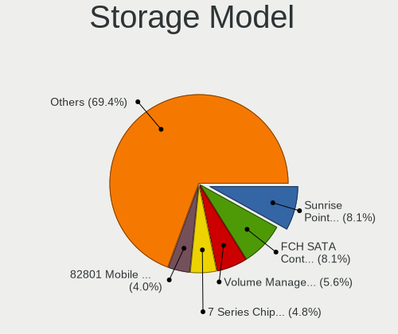
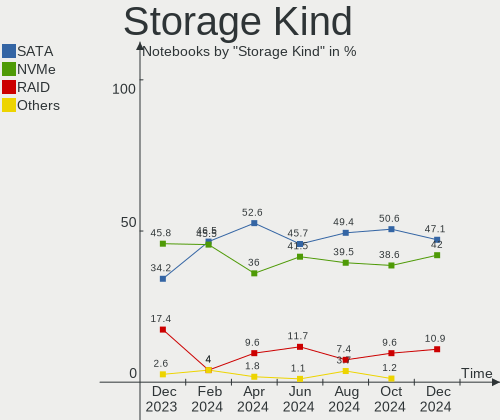
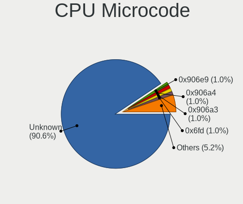
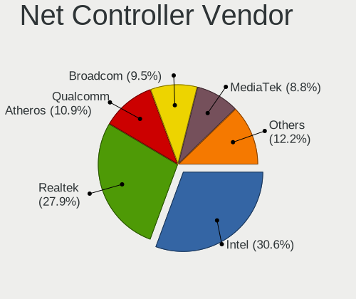

Linux in Canada - Hardware Trends (Notebooks)
---------------------------------------------

A project to identify most popular hardware characteristics and track their change
over time based on data collected by Linux users at https://Linux-Hardware.org.

Anyone can contribute to this report by the [hw-probe](https://github.com/linuxhw/hw-probe) tool:

    sudo -E hw-probe -all -upload

Period: Sep, 2023.

Contents
--------

* [ System ](#system)
  - [ OS                       ](#os)
  - [ OS Family                ](#os-family)
  - [ Kernel                   ](#kernel)
  - [ Kernel Family            ](#kernel-family)
  - [ Kernel Major Ver.        ](#kernel-major-ver)
  - [ Arch                     ](#arch)
  - [ DE                       ](#de)
  - [ Display Server           ](#display-server)
  - [ Display Manager          ](#display-manager)
  - [ OS Lang                  ](#os-lang)
  - [ Boot Mode                ](#boot-mode)
  - [ Filesystem               ](#filesystem)
  - [ Part. scheme             ](#part-scheme)
  - [ Dual Boot with Linux/BSD ](#dual-boot-with-linuxbsd)
  - [ Dual Boot (Win)          ](#dual-boot-win)

* [ Board ](#board)
  - [ Vendor                   ](#vendor)
  - [ Model                    ](#model)
  - [ Model Family             ](#model-family)
  - [ MFG Year                 ](#mfg-year)
  - [ Form Factor              ](#form-factor)
  - [ Secure Boot              ](#secure-boot)
  - [ Coreboot                 ](#coreboot)
  - [ RAM Size                 ](#ram-size)
  - [ RAM Used                 ](#ram-used)
  - [ Total Drives             ](#total-drives)
  - [ Has CD-ROM               ](#has-cd-rom)
  - [ Has Ethernet             ](#has-ethernet)
  - [ Has WiFi                 ](#has-wifi)
  - [ Has Bluetooth            ](#has-bluetooth)

* [ Location ](#location)
  - [ Country                  ](#country)
  - [ City                     ](#city)

* [ Drives ](#drives)
  - [ Drive Vendor             ](#drive-vendor)
  - [ Drive Model              ](#drive-model)
  - [ HDD Vendor               ](#hdd-vendor)
  - [ SSD Vendor               ](#ssd-vendor)
  - [ Drive Kind               ](#drive-kind)
  - [ Drive Connector          ](#drive-connector)
  - [ Drive Size               ](#drive-size)
  - [ Space Total              ](#space-total)
  - [ Space Used               ](#space-used)
  - [ Malfunc. Drives          ](#malfunc-drives)
  - [ Malfunc. Drive Vendor    ](#malfunc-drive-vendor)
  - [ Malfunc. HDD Vendor      ](#malfunc-hdd-vendor)
  - [ Malfunc. Drive Kind      ](#malfunc-drive-kind)
  - [ Failed Drives            ](#failed-drives)
  - [ Failed Drive Vendor      ](#failed-drive-vendor)
  - [ Drive Status             ](#drive-status)

* [ Storage controller ](#storage-controller)
  - [ Storage Vendor           ](#storage-vendor)
  - [ Storage Model            ](#storage-model)
  - [ Storage Kind             ](#storage-kind)

* [ Processor ](#processor)
  - [ CPU Vendor               ](#cpu-vendor)
  - [ CPU Model                ](#cpu-model)
  - [ CPU Model Family         ](#cpu-model-family)
  - [ CPU Cores                ](#cpu-cores)
  - [ CPU Sockets              ](#cpu-sockets)
  - [ CPU Threads              ](#cpu-threads)
  - [ CPU Op-Modes             ](#cpu-op-modes)
  - [ CPU Microcode            ](#cpu-microcode)
  - [ CPU Microarch            ](#cpu-microarch)

* [ Graphics ](#graphics)
  - [ GPU Vendor               ](#gpu-vendor)
  - [ GPU Model                ](#gpu-model)
  - [ GPU Combo                ](#gpu-combo)
  - [ GPU Driver               ](#gpu-driver)
  - [ GPU Memory               ](#gpu-memory)

* [ Monitor ](#monitor)
  - [ Monitor Vendor           ](#monitor-vendor)
  - [ Monitor Model            ](#monitor-model)
  - [ Monitor Resolution       ](#monitor-resolution)
  - [ Monitor Diagonal         ](#monitor-diagonal)
  - [ Monitor Width            ](#monitor-width)
  - [ Aspect Ratio             ](#aspect-ratio)
  - [ Monitor Area             ](#monitor-area)
  - [ Pixel Density            ](#pixel-density)
  - [ Multiple Monitors        ](#multiple-monitors)

* [ Network ](#network)
  - [ Net Controller Vendor    ](#net-controller-vendor)
  - [ Net Controller Model     ](#net-controller-model)
  - [ Wireless Vendor          ](#wireless-vendor)
  - [ Wireless Model           ](#wireless-model)
  - [ Ethernet Vendor          ](#ethernet-vendor)
  - [ Ethernet Model           ](#ethernet-model)
  - [ Net Controller Kind      ](#net-controller-kind)
  - [ Used Controller          ](#used-controller)
  - [ NICs                     ](#nics)
  - [ IPv6                     ](#ipv6)

* [ Bluetooth ](#bluetooth)
  - [ Bluetooth Vendor         ](#bluetooth-vendor)
  - [ Bluetooth Model          ](#bluetooth-model)

* [ Sound ](#sound)
  - [ Sound Vendor             ](#sound-vendor)
  - [ Sound Model              ](#sound-model)

* [ Memory ](#memory)
  - [ Memory Vendor            ](#memory-vendor)
  - [ Memory Model             ](#memory-model)
  - [ Memory Kind              ](#memory-kind)
  - [ Memory Form Factor       ](#memory-form-factor)
  - [ Memory Size              ](#memory-size)
  - [ Memory Speed             ](#memory-speed)

* [ Printers & scanners ](#printers--scanners)
  - [ Printer Vendor           ](#printer-vendor)
  - [ Printer Model            ](#printer-model)
  - [ Scanner Vendor           ](#scanner-vendor)
  - [ Scanner Model            ](#scanner-model)

* [ Camera ](#camera)
  - [ Camera Vendor            ](#camera-vendor)
  - [ Camera Model             ](#camera-model)

* [ Security ](#security)
  - [ Fingerprint Vendor       ](#fingerprint-vendor)
  - [ Fingerprint Model        ](#fingerprint-model)
  - [ Chipcard Vendor          ](#chipcard-vendor)
  - [ Chipcard Model           ](#chipcard-model)

* [ Unsupported ](#unsupported)
  - [ Unsupported Devices      ](#unsupported-devices)
  - [ Unsupported Device Types ](#unsupported-device-types)

System
------

OS
--

Installed operating systems

| Name                         | Notebooks | Percent |
|------------------------------|-----------|---------|
| Fedora 38                    | 11        | 12.64%  |
| Ubuntu 22.04                 | 10        | 11.49%  |
| OpenMandriva 23.08           | 8         | 9.2%    |
| Linux Mint 21.2              | 6         | 6.9%    |
| Ubuntu 23.04                 | 5         | 5.75%   |
| openSUSE Tumbleweed-XXXXXXXX | 3         | 3.45%   |
| EndeavourOS Rolling          | 3         | 3.45%   |
| Debian 12                    | 3         | 3.45%   |
| Zorin 16                     | 2         | 2.3%    |
| Xero Rolling                 | 2         | 2.3%    |
| Ubuntu 20.04                 | 2         | 2.3%    |
| MX 23                        | 2         | 2.3%    |
| Manjaro                      | 2         | 2.3%    |
| Kubuntu 22.04                | 2         | 2.3%    |
| Kali 2023.3                  | 2         | 2.3%    |
| Clear Linux 39960            | 2         | 2.3%    |
| ArcoLinux Rolling            | 2         | 2.3%    |
| Arch Rolling                 | 2         | 2.3%    |
| Xubuntu 22.04                | 1         | 1.15%   |
| Ubuntu 22.10                 | 1         | 1.15%   |
| SteamOS Rolling              | 1         | 1.15%   |
| SteamOS 3.4.10               | 1         | 1.15%   |
| Pop!_OS 22.04                | 1         | 1.15%   |
| Parrot 5.3                   | 1         | 1.15%   |
| OpenMandriva 4.3             | 1         | 1.15%   |
| Manjaro 23.0.1               | 1         | 1.15%   |
| Linux Mint 21                | 1         | 1.15%   |
| Linux Mint 20.3              | 1         | 1.15%   |
| Kubuntu 23.04                | 1         | 1.15%   |
| KDE neon 22.04               | 1         | 1.15%   |
| Gentoo 2.14                  | 1         | 1.15%   |
| Garuda Linux Rolling         | 1         | 1.15%   |
| BlackPanther 18.1            | 1         | 1.15%   |
| Athena Stable                | 1         | 1.15%   |
| Alpine 3.18.3                | 1         | 1.15%   |
| Alpine 3.15.4                | 1         | 1.15%   |

OS Family
---------

OS without a version

| Name         | Notebooks | Percent |
|--------------|-----------|---------|
| Ubuntu       | 18        | 20.69%  |
| Fedora       | 11        | 12.64%  |
| OpenMandriva | 9         | 10.34%  |
| Linux Mint   | 8         | 9.2%    |
| openSUSE     | 3         | 3.45%   |
| Manjaro      | 3         | 3.45%   |
| Kubuntu      | 3         | 3.45%   |
| EndeavourOS  | 3         | 3.45%   |
| Debian       | 3         | 3.45%   |
| Zorin        | 2         | 2.3%    |
| Xero         | 2         | 2.3%    |
| SteamOS      | 2         | 2.3%    |
| MX           | 2         | 2.3%    |
| Kali         | 2         | 2.3%    |
| Clear Linux  | 2         | 2.3%    |
| ArcoLinux    | 2         | 2.3%    |
| Arch         | 2         | 2.3%    |
| Alpine       | 2         | 2.3%    |
| Xubuntu      | 1         | 1.15%   |
| Pop!_OS      | 1         | 1.15%   |
| Parrot       | 1         | 1.15%   |
| KDE neon     | 1         | 1.15%   |
| Gentoo       | 1         | 1.15%   |
| Garuda Linux | 1         | 1.15%   |
| BlackPanther | 1         | 1.15%   |
| Athena       | 1         | 1.15%   |

Kernel
------

Version of the Linux kernel

| Version                                                | Notebooks | Percent |
|--------------------------------------------------------|-----------|---------|
| 6.2.0-32-generic                                       | 8         | 9.2%    |
| 6.4.11-desktop-1omv2390                                | 7         | 8.05%   |
| 6.2.0-33-generic                                       | 7         | 8.05%   |
| 6.4.15-200.fc38.x86_64                                 | 4         | 4.6%    |
| 6.4.12-arch1-1                                         | 3         | 3.45%   |
| 5.15.0-84-generic                                      | 3         | 3.45%   |
| 5.15.0-83-generic                                      | 3         | 3.45%   |
| 6.5.4-arch2-1                                          | 2         | 2.3%    |
| 6.4.14-200.fc38.x86_64                                 | 2         | 2.3%    |
| 6.2.9-300.fc38.x86_64                                  | 2         | 2.3%    |
| 6.2.0-26-generic                                       | 2         | 2.3%    |
| 6.1.0-10-amd64                                         | 2         | 2.3%    |
| 5.15.0-82-generic                                      | 2         | 2.3%    |
| 5.15.0-76-generic                                      | 2         | 2.3%    |
| 6.6.0-0.rc1.20230913gt3669558b.214.vanilla.fc38.x86_64 | 1         | 1.15%   |
| 6.5.5-x64v3-xanmod1                                    | 1         | 1.15%   |
| 6.5.3-zen1-1-zen                                       | 1         | 1.15%   |
| 6.5.3-1358.native                                      | 1         | 1.15%   |
| 6.5.3-1-MANJARO                                        | 1         | 1.15%   |
| 6.5.3-1-default                                        | 1         | 1.15%   |
| 6.5.2-zen1-1-zen                                       | 1         | 1.15%   |
| 6.5.2-gentoo                                           | 1         | 1.15%   |
| 6.5.2-arch1-1                                          | 1         | 1.15%   |
| 6.5.1-1-MANJARO                                        | 1         | 1.15%   |
| 6.5.1-060501-generic                                   | 1         | 1.15%   |
| 6.5.0-kali1-amd64                                      | 1         | 1.15%   |
| 6.5.0-1-MANJARO                                        | 1         | 1.15%   |
| 6.4.8-desktop-2omv2390                                 | 1         | 1.15%   |
| 6.4.15-2-liquorix-amd64                                | 1         | 1.15%   |
| 6.4.13-200.fc38.x86_64                                 | 1         | 1.15%   |
| 6.4.12-zen1-1-zen                                      | 1         | 1.15%   |
| 6.4.12-1-default                                       | 1         | 1.15%   |
| 6.4.11-1-default                                       | 1         | 1.15%   |
| 6.4.10-200.fc38.x86_64                                 | 1         | 1.15%   |
| 6.4.0-kali3-amd64                                      | 1         | 1.15%   |
| 6.2.0-34-generic                                       | 1         | 1.15%   |
| 6.1.52-valve2-1-neptune-61                             | 1         | 1.15%   |
| 6.1.52-1-lts                                           | 1         | 1.15%   |
| 6.1.51-1-lts                                           | 1         | 1.15%   |
| 6.1.1-1228.native                                      | 1         | 1.15%   |

Kernel Family
-------------

Linux kernel without a distro release

| Version | Notebooks | Percent |
|---------|-----------|---------|
| 6.2.0   | 18        | 20.69%  |
| 5.15.0  | 12        | 13.79%  |
| 6.4.11  | 8         | 9.2%    |
| 6.1.0   | 6         | 6.9%    |
| 6.4.15  | 5         | 5.75%   |
| 6.4.12  | 5         | 5.75%   |
| 6.5.3   | 4         | 4.6%    |
| 6.5.2   | 3         | 3.45%   |
| 6.5.4   | 2         | 2.3%    |
| 6.5.1   | 2         | 2.3%    |
| 6.5.0   | 2         | 2.3%    |
| 6.4.14  | 2         | 2.3%    |
| 6.2.9   | 2         | 2.3%    |
| 6.1.52  | 2         | 2.3%    |
| 5.19.0  | 2         | 2.3%    |
| 6.6.0   | 1         | 1.15%   |
| 6.5.5   | 1         | 1.15%   |
| 6.4.8   | 1         | 1.15%   |
| 6.4.13  | 1         | 1.15%   |
| 6.4.10  | 1         | 1.15%   |
| 6.4.0   | 1         | 1.15%   |
| 6.1.51  | 1         | 1.15%   |
| 6.1.1   | 1         | 1.15%   |
| 5.6.14  | 1         | 1.15%   |
| 5.16.7  | 1         | 1.15%   |
| 5.13.0  | 1         | 1.15%   |
| 3.18.24 | 1         | 1.15%   |

Kernel Major Ver.
-----------------

Linux kernel major version

| Version | Notebooks | Percent |
|---------|-----------|---------|
| 6.4     | 24        | 27.59%  |
| 6.2     | 20        | 22.99%  |
| 6.5     | 14        | 16.09%  |
| 5.15    | 12        | 13.79%  |
| 6.1     | 10        | 11.49%  |
| 5.19    | 2         | 2.3%    |
| 6.6     | 1         | 1.15%   |
| 5.6     | 1         | 1.15%   |
| 5.16    | 1         | 1.15%   |
| 5.13    | 1         | 1.15%   |
| 3.18    | 1         | 1.15%   |

Arch
----

OS architecture (x86_64, i586, etc.)

| Name   | Notebooks | Percent |
|--------|-----------|---------|
| x86_64 | 86        | 98.85%  |
| armv7l | 1         | 1.15%   |

DE
--

Desktop Environment

| Name       | Notebooks | Percent |
|------------|-----------|---------|
| GNOME      | 33        | 37.93%  |
| KDE5       | 30        | 34.48%  |
| XFCE       | 8         | 9.2%    |
| X-Cinnamon | 7         | 8.05%   |
| Unknown    | 4         | 4.6%    |
| MATE       | 2         | 2.3%    |
| LXQt       | 1         | 1.15%   |
| KDE        | 1         | 1.15%   |
| Jwm        | 1         | 1.15%   |

Display Server
--------------

X11 or Wayland

| Name    | Notebooks | Percent |
|---------|-----------|---------|
| X11     | 49        | 56.32%  |
| Wayland | 32        | 36.78%  |
| Unknown | 4         | 4.6%    |
| Tty     | 2         | 2.3%    |

Display Manager
---------------

SDDM, LightDM, etc.

| Name    | Notebooks | Percent |
|---------|-----------|---------|
| Unknown | 31        | 35.63%  |
| SDDM    | 23        | 26.44%  |
| GDM3    | 16        | 18.39%  |
| LightDM | 9         | 10.34%  |
| GDM     | 7         | 8.05%   |
| LXDM    | 1         | 1.15%   |

OS Lang
-------

Language

| Lang    | Notebooks | Percent |
|---------|-----------|---------|
| en_CA   | 38        | 43.68%  |
| en_US   | 32        | 36.78%  |
| fr_CA   | 4         | 4.6%    |
| C       | 4         | 4.6%    |
| fr_FR   | 3         | 3.45%   |
| Unknown | 3         | 3.45%   |
| en_GB   | 1         | 1.15%   |
| en_DK   | 1         | 1.15%   |
| C.UTF8  | 1         | 1.15%   |

Boot Mode
---------

EFI or BIOS

| Mode | Notebooks | Percent |
|------|-----------|---------|
| EFI  | 49        | 56.32%  |
| BIOS | 38        | 43.68%  |

Filesystem
----------

Type of filesystem

| Type    | Notebooks | Percent |
|---------|-----------|---------|
| Ext4    | 47        | 54.02%  |
| Btrfs   | 23        | 26.44%  |
| Tmpfs   | 11        | 12.64%  |
| Overlay | 5         | 5.75%   |
| Xfs     | 1         | 1.15%   |

Part. scheme
------------

Scheme of partitioning

| Type    | Notebooks | Percent |
|---------|-----------|---------|
| GPT     | 51        | 58.62%  |
| Unknown | 27        | 31.03%  |
| MBR     | 9         | 10.34%  |

Dual Boot with Linux/BSD
------------------------

Hosting more than one Linux/BSD

| Dual boot | Notebooks | Percent |
|-----------|-----------|---------|
| No        | 76        | 87.36%  |
| Yes       | 11        | 12.64%  |

Dual Boot (Win)
---------------

Hosting Linux and Windows

| Dual boot | Notebooks | Percent |
|-----------|-----------|---------|
| No        | 69        | 79.31%  |
| Yes       | 18        | 20.69%  |

Board
-----

Vendor
------

Motherboard manufacturer

| Name                           | Notebooks | Percent |
|--------------------------------|-----------|---------|
| Lenovo                         | 19        | 21.84%  |
| Hewlett-Packard                | 14        | 16.09%  |
| ASUSTek Computer               | 14        | 16.09%  |
| Apple                          | 11        | 12.64%  |
| Dell                           | 9         | 10.34%  |
| Acer                           | 5         | 5.75%   |
| Google                         | 4         | 4.6%    |
| Valve                          | 2         | 2.3%    |
| Toshiba                        | 2         | 2.3%    |
| Unknown                        | 2         | 2.3%    |
| Sony                           | 1         | 1.15%   |
| MSI                            | 1         | 1.15%   |
| Matsushita Electric Industrial | 1         | 1.15%   |
| Fujitsu                        | 1         | 1.15%   |
| Alienware                      | 1         | 1.15%   |

Model
-----

Motherboard model

| Name                                        | Notebooks | Percent |
|---------------------------------------------|-----------|---------|
| Valve Jupiter                               | 2         | 2.3%    |
| Lenovo IdeaPad 320-15IKB 81BG               | 2         | 2.3%    |
| HP EliteBook 850 G1                         | 2         | 2.3%    |
| Dell Latitude E6410                         | 2         | 2.3%    |
| Unknown                                     | 2         | 2.3%    |
| Toshiba Satellite C70-B                     | 1         | 1.15%   |
| Toshiba Satellite C650                      | 1         | 1.15%   |
| Sony VPCEB27FX                              | 1         | 1.15%   |
| MSI GP75 Leopard 10SEK                      | 1         | 1.15%   |
| Matsushita Electric Industrial CF-74JCJBDAM | 1         | 1.15%   |
| Lenovo ThinkPad X1C 5th W10DG 20K4S0E900    | 1         | 1.15%   |
| Lenovo ThinkPad X1 Carbon 6th 20KGS0AB00    | 1         | 1.15%   |
| Lenovo ThinkPad W540 20BG0016US             | 1         | 1.15%   |
| Lenovo ThinkPad W540 20BG0014US             | 1         | 1.15%   |
| Lenovo ThinkPad W510 438923U                | 1         | 1.15%   |
| Lenovo ThinkPad T60 2623DAU                 | 1         | 1.15%   |
| Lenovo ThinkPad T550 20CKA00ECD             | 1         | 1.15%   |
| Lenovo ThinkPad T470s 20HFCTO1WW            | 1         | 1.15%   |
| Lenovo ThinkPad T440s 20AQ005QUS            | 1         | 1.15%   |
| Lenovo ThinkPad P15 Gen 1 20ST004DUS        | 1         | 1.15%   |
| Lenovo ThinkBook 15 G3 ACL 21A4             | 1         | 1.15%   |
| Lenovo Slim 7 14IRP8 83A4                   | 1         | 1.15%   |
| Lenovo Legion 5 17ACH6H 82JY                | 1         | 1.15%   |
| Lenovo IdeaPad 330S-14IKB 81F4              | 1         | 1.15%   |
| Lenovo IdeaPad 3 15ITL05 81X8               | 1         | 1.15%   |
| Lenovo IdeaPad 3 15IAU7 82RK                | 1         | 1.15%   |
| Lenovo G570 20079                           | 1         | 1.15%   |
| HP ZBook 15 G2                              | 1         | 1.15%   |
| HP ProBook 6570b                            | 1         | 1.15%   |
| HP ProBook 650 G2                           | 1         | 1.15%   |
| HP Pavilion g6                              | 1         | 1.15%   |
| HP Pavilion dv8000 (ET839UA#ABL)            | 1         | 1.15%   |
| HP Pavilion dv7                             | 1         | 1.15%   |
| HP Laptop 15-fd0xxx                         | 1         | 1.15%   |
| HP Laptop 15-ef1xxx                         | 1         | 1.15%   |
| HP Laptop 15-dy1xxx                         | 1         | 1.15%   |
| HP Laptop 15-da0xxx                         | 1         | 1.15%   |
| HP ENVY Laptop 13-ba1xxx                    | 1         | 1.15%   |
| HP EliteBook 840 G8 Notebook PC             | 1         | 1.15%   |
| Google Terra                                | 1         | 1.15%   |

Model Family
------------

Motherboard model prefix

| Name                                        | Notebooks | Percent |
|---------------------------------------------|-----------|---------|
| Lenovo ThinkPad                             | 10        | 11.49%  |
| Dell Latitude                               | 6         | 6.9%    |
| Lenovo IdeaPad                              | 5         | 5.75%   |
| ASUS VivoBook                               | 5         | 5.75%   |
| HP Laptop                                   | 4         | 4.6%    |
| HP Pavilion                                 | 3         | 3.45%   |
| HP EliteBook                                | 3         | 3.45%   |
| ASUS ASUS                                   | 3         | 3.45%   |
| Acer Aspire                                 | 3         | 3.45%   |
| Valve Jupiter                               | 2         | 2.3%    |
| Toshiba Satellite                           | 2         | 2.3%    |
| HP ProBook                                  | 2         | 2.3%    |
| Dell XPS                                    | 2         | 2.3%    |
| ASUS ROG                                    | 2         | 2.3%    |
| Apple MacBookPro9                           | 2         | 2.3%    |
| Apple MacBookPro8                           | 2         | 2.3%    |
| Apple MacBookPro5                           | 2         | 2.3%    |
| Apple MacBookPro11                          | 2         | 2.3%    |
| Acer Swift                                  | 2         | 2.3%    |
| Unknown                                     | 2         | 2.3%    |
| Sony VPCEB27FX                              | 1         | 1.15%   |
| MSI GP75                                    | 1         | 1.15%   |
| Matsushita Electric Industrial CF-74JCJBDAM | 1         | 1.15%   |
| Lenovo ThinkBook                            | 1         | 1.15%   |
| Lenovo Slim                                 | 1         | 1.15%   |
| Lenovo Legion                               | 1         | 1.15%   |
| Lenovo G570                                 | 1         | 1.15%   |
| HP ZBook                                    | 1         | 1.15%   |
| HP ENVY                                     | 1         | 1.15%   |
| Google Terra                                | 1         | 1.15%   |
| Google Droid                                | 1         | 1.15%   |
| Google Blooguard                            | 1         | 1.15%   |
| Google Asuka                                | 1         | 1.15%   |
| Fujitsu STYLISTIC                           | 1         | 1.15%   |
| Dell Precision                              | 1         | 1.15%   |
| ASUS Zenbook                                | 1         | 1.15%   |
| ASUS X541UVK                                | 1         | 1.15%   |
| ASUS X505BA                                 | 1         | 1.15%   |
| ASUS GL502VM                                | 1         | 1.15%   |
| Apple MacBookPro7                           | 1         | 1.15%   |

MFG Year
--------

Motherboard manufacture year

| Year    | Notebooks | Percent |
|---------|-----------|---------|
| 2020    | 11        | 12.64%  |
| 2023    | 8         | 9.2%    |
| 2022    | 7         | 8.05%   |
| 2017    | 7         | 8.05%   |
| 2014    | 7         | 8.05%   |
| 2012    | 7         | 8.05%   |
| 2021    | 6         | 6.9%    |
| 2018    | 6         | 6.9%    |
| 2010    | 6         | 6.9%    |
| 2019    | 4         | 4.6%    |
| 2015    | 3         | 3.45%   |
| 2013    | 3         | 3.45%   |
| 2011    | 3         | 3.45%   |
| 2008    | 3         | 3.45%   |
| 2009    | 2         | 2.3%    |
| 2006    | 2         | 2.3%    |
| 2016    | 1         | 1.15%   |
| Unknown | 1         | 1.15%   |

Form Factor
-----------

Physical design of the computer

| Name     | Notebooks | Percent |
|----------|-----------|---------|
| Notebook | 87        | 100%    |

Secure Boot
-----------

Enabled or disabled

| State    | Notebooks | Percent |
|----------|-----------|---------|
| Disabled | 78        | 89.66%  |
| Enabled  | 9         | 10.34%  |

Coreboot
--------

Have coreboot on board

| Used | Notebooks | Percent |
|------|-----------|---------|
| No   | 82        | 94.25%  |
| Yes  | 5         | 5.75%   |

RAM Size
--------

Total RAM memory

| Size in GB  | Notebooks | Percent |
|-------------|-----------|---------|
| 4.01-8.0    | 22        | 25.29%  |
| 8.01-16.0   | 22        | 25.29%  |
| 16.01-24.0  | 18        | 20.69%  |
| 3.01-4.0    | 13        | 14.94%  |
| 32.01-64.0  | 8         | 9.2%    |
| 1.01-2.0    | 2         | 2.3%    |
| 24.01-32.0  | 1         | 1.15%   |
| 64.01-256.0 | 1         | 1.15%   |

RAM Used
--------

Used RAM memory

| Used GB   | Notebooks | Percent |
|-----------|-----------|---------|
| 1.01-2.0  | 28        | 32.18%  |
| 2.01-3.0  | 23        | 26.44%  |
| 4.01-8.0  | 14        | 16.09%  |
| 3.01-4.0  | 14        | 16.09%  |
| 0.51-1.0  | 6         | 6.9%    |
| 8.01-16.0 | 2         | 2.3%    |

Total Drives
------------

Number of drives on board

| Drives | Notebooks | Percent |
|--------|-----------|---------|
| 1      | 67        | 77.01%  |
| 2      | 17        | 19.54%  |
| 3      | 3         | 3.45%   |

Has CD-ROM
----------

Has CD-ROM on board

| Presented | Notebooks | Percent |
|-----------|-----------|---------|
| No        | 63        | 72.41%  |
| Yes       | 24        | 27.59%  |

Has Ethernet
------------

Has Ethernet on board

| Presented | Notebooks | Percent |
|-----------|-----------|---------|
| Yes       | 58        | 66.67%  |
| No        | 29        | 33.33%  |

Has WiFi
--------

Has WiFi module

| Presented | Notebooks | Percent |
|-----------|-----------|---------|
| Yes       | 86        | 98.85%  |
| No        | 1         | 1.15%   |

Has Bluetooth
-------------

Has Bluetooth module

| Presented | Notebooks | Percent |
|-----------|-----------|---------|
| Yes       | 76        | 87.36%  |
| No        | 11        | 12.64%  |

Location
--------

Country
-------

Geographic location (country)

| Country | Notebooks | Percent |
|---------|-----------|---------|
| Canada  | 87        | 100%    |

City
----

Geographic location (city)

| City                     | Notebooks | Percent |
|--------------------------|-----------|---------|
| Toronto                  | 8         | 9.2%    |
| Vancouver                | 5         | 5.75%   |
| Montreal                 | 5         | 5.75%   |
| Calgary                  | 5         | 5.75%   |
| Surrey                   | 4         | 4.6%    |
| Woodbridge               | 2         | 2.3%    |
| Victoria                 | 2         | 2.3%    |
| Thornhill                | 2         | 2.3%    |
| Edmonton                 | 2         | 2.3%    |
| Burnaby                  | 2         | 2.3%    |
| Brampton                 | 2         | 2.3%    |
| Barrie                   | 2         | 2.3%    |
| Woodstock                | 1         | 1.15%   |
| Sydney                   | 1         | 1.15%   |
| Stoney Creek             | 1         | 1.15%   |
| Simcoe                   | 1         | 1.15%   |
| Sidney                   | 1         | 1.15%   |
| Sherbrooke               | 1         | 1.15%   |
| Scarborough              | 1         | 1.15%   |
| Saskatoon                | 1         | 1.15%   |
| Sarnia                   | 1         | 1.15%   |
| Salaberry-de-Valleyfield | 1         | 1.15%   |
| Sainte-Melanie           | 1         | 1.15%   |
| Saint-Georges            | 1         | 1.15%   |
| Rivière-du-Loup         | 1         | 1.15%   |
| Rimouski                 | 1         | 1.15%   |
| Red Lake                 | 1         | 1.15%   |
| Red Deer                 | 1         | 1.15%   |
| Quinte West              | 1         | 1.15%   |
| Port Coquitlam           | 1         | 1.15%   |
| Pierrefonds              | 1         | 1.15%   |
| Penticton                | 1         | 1.15%   |
| Ottawa                   | 1         | 1.15%   |
| Oshawa                   | 1         | 1.15%   |
| Newmarket                | 1         | 1.15%   |
| Nepean                   | 1         | 1.15%   |
| Mississauga              | 1         | 1.15%   |
| Milton                   | 1         | 1.15%   |
| Longueuil                | 1         | 1.15%   |
| Lloydminster             | 1         | 1.15%   |

Drives
------

Drive Vendor
------------

Hard drive vendors

| Vendor                    | Notebooks | Drives | Percent |
|---------------------------|-----------|--------|---------|
| Samsung Electronics       | 17        | 17     | 15.74%  |
| Unknown                   | 12        | 12     | 11.11%  |
| Micron Technology         | 8         | 8      | 7.41%   |
| Sandisk                   | 7         | 7      | 6.48%   |
| WDC                       | 6         | 7      | 5.56%   |
| Crucial                   | 6         | 7      | 5.56%   |
| Toshiba                   | 5         | 5      | 4.63%   |
| SK hynix                  | 5         | 5      | 4.63%   |
| Kingston                  | 4         | 4      | 3.7%    |
| SPCC                      | 3         | 3      | 2.78%   |
| Intel                     | 3         | 3      | 2.78%   |
| Hitachi                   | 3         | 3      | 2.78%   |
| A-DATA Technology         | 3         | 3      | 2.78%   |
| Silicon Motion            | 2         | 2      | 1.85%   |
| Micron/Crucial Technology | 2         | 2      | 1.85%   |
| KIOXIA                    | 2         | 2      | 1.85%   |
| Apple                     | 2         | 2      | 1.85%   |
| Vaseky                    | 1         | 1      | 0.93%   |
| Timetec                   | 1         | 1      | 0.93%   |
| Super Talent              | 1         | 1      | 0.93%   |
| StoreJet                  | 1         | 1      | 0.93%   |
| Solid State Storage       | 1         | 1      | 0.93%   |
| Seagate                   | 1         | 1      | 0.93%   |
| SABRENT                   | 1         | 1      | 0.93%   |
| Realtek Semiconductor     | 1         | 1      | 0.93%   |
| Plextor                   | 1         | 1      | 0.93%   |
| Phison Electronics        | 1         | 1      | 0.93%   |
| Patriot                   | 1         | 1      | 0.93%   |
| JetFlash                  | 1         | 1      | 0.93%   |
| Hewlett-Packard           | 1         | 1      | 0.93%   |
| Fujitsu                   | 1         | 1      | 0.93%   |
| Dogfish                   | 1         | 1      | 0.93%   |
| CT2000MX                  | 1         | 1      | 0.93%   |
| Biwin Storage Technology  | 1         | 1      | 0.93%   |
| Unknown                   | 1         | 1      | 0.93%   |

Drive Model
-----------

Hard drive models

| Model                                               | Notebooks | Percent |
|-----------------------------------------------------|-----------|---------|
| WDC WD10JPVX-22JC3T0 1TB                            | 2         | 1.83%   |
| Unknown MMC Card  32GB                              | 2         | 1.83%   |
| Toshiba MQ04ABF100 1TB                              | 2         | 1.83%   |
| SPCC Solid State Disk 1TB                           | 2         | 1.83%   |
| Silicon Motion SM2262/SM2262EN SSD Controller 500GB | 2         | 1.83%   |
| Samsung NVMe SSD Controller SM981/PM981/PM983 256GB | 2         | 1.83%   |
| Crucial CT250MX500SSD1 250GB                        | 2         | 1.83%   |
| WDC WDS100T2G0A-00JH30 1TB SSD                      | 1         | 0.92%   |
| WDC WD5000LPLX-75ZNTT0 500GB                        | 1         | 0.92%   |
| WDC WD1600BEVS-22RST0 160GB                         | 1         | 0.92%   |
| WDC WD Blue SA510 2.5 500GB                         | 1         | 0.92%   |
| Vaseky V820/128G 128GB SSD                          | 1         | 0.92%   |
| Unknown SD64G  64GB                                 | 1         | 0.92%   |
| Unknown SD04G  4GB                                  | 1         | 0.92%   |
| Unknown MMC Card  64GB                              | 1         | 0.92%   |
| Unknown MMC Card  512GB                             | 1         | 0.92%   |
| Unknown MMC Card  256GB                             | 1         | 0.92%   |
| Unknown MMC Card  128GB                             | 1         | 0.92%   |
| Unknown MMC Card                                    | 1         | 0.92%   |
| Unknown hB8aP  32GB                                 | 1         | 0.92%   |
| Unknown DA4128  128GB                               | 1         | 0.92%   |
| Unknown DA4064  64GB                                | 1         | 0.92%   |
| Toshiba THNSFJ256GCSU 256GB SSD                     | 1         | 0.92%   |
| Toshiba MQ03ABB200 2TB                              | 1         | 0.92%   |
| Toshiba MQ01ABD100 1TB                              | 1         | 0.92%   |
| Timetec SD08 512GB SSD                              | 1         | 0.92%   |
| Super Talent FTM25N325H 250GB                       | 1         | 0.92%   |
| StoreJet Transcend 320GB                            | 1         | 0.92%   |
| SPCC Solid State Disk 240GB                         | 1         | 0.92%   |
| Solid State Storage SSSTC CL1-8D512 512GB           | 1         | 0.92%   |
| SK hynix SKHynix_HFS512GD9TNI-L2B0B 512GB           | 1         | 0.92%   |
| SK hynix HFS256G39TND-N210A 256GB SSD               | 1         | 0.92%   |
| SK hynix HFM512GDJTNI-82A0A 512GB                   | 1         | 0.92%   |
| SK hynix BC711 HFM512GD3JX013N 512GB                | 1         | 0.92%   |
| SK hynix BC501 NVMe Solid State Drive 512GB         | 1         | 0.92%   |
| Seagate One Touch HDD 2TB                           | 1         | 0.92%   |
| Sandisk WDC PC SN530 SDBPMPZ-256G-1101 256GB        | 1         | 0.92%   |
| Sandisk WD Black SN750 / PC SN730 NVMe SSD 512GB    | 1         | 0.92%   |
| SanDisk SSD U110 16GB                               | 1         | 0.92%   |
| SanDisk SD8TB8U256G1001 256GB SSD                   | 1         | 0.92%   |

HDD Vendor
----------

Hard disk drive vendors

| Vendor              | Notebooks | Drives | Percent |
|---------------------|-----------|--------|---------|
| WDC                 | 4         | 4      | 26.67%  |
| Toshiba             | 4         | 4      | 26.67%  |
| Hitachi             | 3         | 3      | 20%     |
| Seagate             | 1         | 1      | 6.67%   |
| Samsung Electronics | 1         | 1      | 6.67%   |
| SABRENT             | 1         | 1      | 6.67%   |
| Fujitsu             | 1         | 1      | 6.67%   |

SSD Vendor
----------

Solid state drive vendors

| Vendor              | Notebooks | Drives | Percent |
|---------------------|-----------|--------|---------|
| Crucial             | 6         | 6      | 15.79%  |
| Samsung Electronics | 4         | 4      | 10.53%  |
| SPCC                | 3         | 3      | 7.89%   |
| Kingston            | 3         | 3      | 7.89%   |
| WDC                 | 2         | 3      | 5.26%   |
| SanDisk             | 2         | 2      | 5.26%   |
| Intel               | 2         | 2      | 5.26%   |
| A-DATA Technology   | 2         | 2      | 5.26%   |
| Vaseky              | 1         | 1      | 2.63%   |
| Toshiba             | 1         | 1      | 2.63%   |
| Timetec             | 1         | 1      | 2.63%   |
| Super Talent        | 1         | 1      | 2.63%   |
| StoreJet            | 1         | 1      | 2.63%   |
| SK hynix            | 1         | 1      | 2.63%   |
| Plextor             | 1         | 1      | 2.63%   |
| Patriot             | 1         | 1      | 2.63%   |
| Micron Technology   | 1         | 1      | 2.63%   |
| Hewlett-Packard     | 1         | 1      | 2.63%   |
| Dogfish             | 1         | 1      | 2.63%   |
| CT2000MX            | 1         | 1      | 2.63%   |
| Apple               | 1         | 1      | 2.63%   |
| Unknown             | 1         | 1      | 2.63%   |

Drive Kind
----------

HDD or SSD

| Kind    | Notebooks | Drives | Percent |
|---------|-----------|--------|---------|
| NVMe    | 40        | 42     | 39.22%  |
| SSD     | 34        | 39     | 33.33%  |
| HDD     | 14        | 15     | 13.73%  |
| MMC     | 13        | 13     | 12.75%  |
| Unknown | 1         | 1      | 0.98%   |

Drive Connector
---------------

SATA, SAS, NVMe, etc.

| Type | Notebooks | Drives | Percent |
|------|-----------|--------|---------|
| SATA | 44        | 49     | 42.72%  |
| NVMe | 40        | 42     | 38.83%  |
| MMC  | 13        | 13     | 12.62%  |
| SAS  | 6         | 6      | 5.83%   |

Drive Size
----------

Size of hard drive

| Size in TB | Notebooks | Drives | Percent |
|------------|-----------|--------|---------|
| 0.01-0.5   | 31        | 34     | 64.58%  |
| 0.51-1.0   | 14        | 16     | 29.17%  |
| 1.01-2.0   | 3         | 4      | 6.25%   |

Space Total
-----------

Amount of disk space available on the file system

| Size in GB     | Notebooks | Percent |
|----------------|-----------|---------|
| 251-500        | 18        | 20.69%  |
| 101-250        | 18        | 20.69%  |
| 501-1000       | 18        | 20.69%  |
| 1001-2000      | 9         | 10.34%  |
| Unknown        | 7         | 8.05%   |
| More than 3000 | 5         | 5.75%   |
| 51-100         | 5         | 5.75%   |
| 1-20           | 4         | 4.6%    |
| 21-50          | 3         | 3.45%   |

Space Used
----------

Amount of used disk space

| Used GB        | Notebooks | Percent |
|----------------|-----------|---------|
| 1-20           | 26        | 29.89%  |
| 21-50          | 16        | 18.39%  |
| 51-100         | 14        | 16.09%  |
| 101-250        | 9         | 10.34%  |
| Unknown        | 7         | 8.05%   |
| 251-500        | 6         | 6.9%    |
| 501-1000       | 5         | 5.75%   |
| 1001-2000      | 3         | 3.45%   |
| More than 3000 | 1         | 1.15%   |

Malfunc. Drives
---------------

Drive models with a malfunction

| Model                                 | Notebooks | Drives | Percent |
|---------------------------------------|-----------|--------|---------|
| WDC WD1600BEVS-22RST0 160GB           | 1         | 1      | 16.67%  |
| WDC WD Blue SA510 2.5 500GB           | 1         | 2      | 16.67%  |
| Timetec SD08 512GB SSD                | 1         | 1      | 16.67%  |
| Samsung Electronics SSD 870 EVO 250GB | 1         | 1      | 16.67%  |
| Hitachi HTS545032B9A300 320GB         | 1         | 1      | 16.67%  |
| Fujitsu MHV2080AH 80GB                | 1         | 1      | 16.67%  |

Malfunc. Drive Vendor
---------------------

Vendors of faulty drives

| Vendor              | Notebooks | Drives | Percent |
|---------------------|-----------|--------|---------|
| WDC                 | 2         | 3      | 33.33%  |
| Timetec             | 1         | 1      | 16.67%  |
| Samsung Electronics | 1         | 1      | 16.67%  |
| Hitachi             | 1         | 1      | 16.67%  |
| Fujitsu             | 1         | 1      | 16.67%  |

Malfunc. HDD Vendor
-------------------

Vendors of faulty HDD drives

| Vendor  | Notebooks | Drives | Percent |
|---------|-----------|--------|---------|
| WDC     | 1         | 1      | 33.33%  |
| Hitachi | 1         | 1      | 33.33%  |
| Fujitsu | 1         | 1      | 33.33%  |

Malfunc. Drive Kind
-------------------

Kinds of faulty drives

| Kind | Notebooks | Drives | Percent |
|------|-----------|--------|---------|
| SSD  | 3         | 4      | 50%     |
| HDD  | 3         | 3      | 50%     |

Failed Drives
-------------

Failed drive models

| Model                             | Notebooks | Drives | Percent |
|-----------------------------------|-----------|--------|---------|
| Samsung Electronics HM160HC 160GB | 1         | 1      | 100%    |

Failed Drive Vendor
-------------------

Failed drive vendors

| Vendor              | Notebooks | Drives | Percent |
|---------------------|-----------|--------|---------|
| Samsung Electronics | 1         | 1      | 100%    |

Drive Status
------------

Number of failed and malfunc. drives

| Status   | Notebooks | Drives | Percent |
|----------|-----------|--------|---------|
| Detected | 52        | 62     | 54.74%  |
| Works    | 36        | 40     | 37.89%  |
| Malfunc  | 6         | 7      | 6.32%   |
| Failed   | 1         | 1      | 1.05%   |

Storage controller
------------------

Storage Vendor
--------------

Storage controller vendors

| Vendor                         | Notebooks | Percent |
|--------------------------------|-----------|---------|
| Intel                          | 52        | 49.06%  |
| Samsung Electronics            | 12        | 11.32%  |
| AMD                            | 8         | 7.55%   |
| Micron Technology              | 7         | 6.6%    |
| SK hynix                       | 4         | 3.77%   |
| SanDisk                        | 4         | 3.77%   |
| Nvidia                         | 3         | 2.83%   |
| Micron/Crucial Technology      | 3         | 2.83%   |
| Silicon Motion                 | 2         | 1.89%   |
| KIOXIA                         | 2         | 1.89%   |
| Toshiba America Info Systems   | 1         | 0.94%   |
| Solid State Storage Technology | 1         | 0.94%   |
| Realtek Semiconductor          | 1         | 0.94%   |
| Phison Electronics             | 1         | 0.94%   |
| Marvell Technology Group       | 1         | 0.94%   |
| Kingston Technology Company    | 1         | 0.94%   |
| Biwin Storage Technology       | 1         | 0.94%   |
| Apple                          | 1         | 0.94%   |
| ADATA Technology               | 1         | 0.94%   |

Storage Model
-------------

Storage controller models

| Model                                                                          | Notebooks | Percent |
|--------------------------------------------------------------------------------|-----------|---------|
| Intel Volume Management Device NVMe RAID Controller                            | 7         | 6.36%   |
| Intel 82801 Mobile SATA Controller [RAID mode]                                 | 7         | 6.36%   |
| AMD FCH SATA Controller [AHCI mode]                                            | 7         | 6.36%   |
| Intel 6 Series/C200 Series Chipset Family 6 port Mobile SATA AHCI Controller   | 6         | 5.45%   |
| Samsung NVMe SSD Controller SM981/PM981/PM983                                  | 5         | 4.55%   |
| Samsung NVMe SSD Controller 980                                                | 5         | 4.55%   |
| Intel Sunrise Point-LP SATA Controller [AHCI mode]                             | 4         | 3.64%   |
| Intel 8 Series/C220 Series Chipset Family 6-port SATA Controller 1 [AHCI mode] | 4         | 3.64%   |
| Intel 7 Series Chipset Family 6-port SATA Controller [AHCI mode]               | 4         | 3.64%   |
| Intel Wildcat Point-LP SATA Controller [AHCI Mode]                             | 3         | 2.73%   |
| Silicon Motion SM2262/SM2262EN SSD Controller                                  | 2         | 1.82%   |
| Nvidia MCP79 AHCI Controller                                                   | 2         | 1.82%   |
| Micron/Crucial P5 Plus NVMe PCIe SSD                                           | 2         | 1.82%   |
| Micron 2450 NVMe SSD [HendrixV] (DRAM-less)                                    | 2         | 1.82%   |
| Micron 2400 NVMe SSD (DRAM-less)                                               | 2         | 1.82%   |
| Micron 2200S NVMe SSD [Cassandra]                                              | 2         | 1.82%   |
| Intel Tiger Lake-LP SATA Controller                                            | 2         | 1.82%   |
| Intel HM170/QM170 Chipset SATA Controller [AHCI Mode]                          | 2         | 1.82%   |
| Intel Cannon Lake Mobile PCH SATA AHCI Controller                              | 2         | 1.82%   |
| Intel 82801IBM/IEM (ICH9M/ICH9M-E) 4 port SATA Controller [AHCI mode]          | 2         | 1.82%   |
| Intel 8 Series SATA Controller 1 [AHCI mode]                                   | 2         | 1.82%   |
| Intel 5 Series/3400 Series Chipset 6 port SATA AHCI Controller                 | 2         | 1.82%   |
| Intel 400 Series Chipset Family SATA AHCI Controller                           | 2         | 1.82%   |
| Toshiba America Info Systems Toshiba America Info SATA controller              | 1         | 0.91%   |
| Solid State Storage CL1-3D256-Q11 NVMe SSD M.2                                 | 1         | 0.91%   |
| SK hynix PC611 NVMe Solid State Drive                                          | 1         | 0.91%   |
| SK hynix Gold P31/BC711/PC711 NVMe Solid State Drive                           | 1         | 0.91%   |
| SK hynix BC511 NVMe SSD                                                        | 1         | 0.91%   |
| SK hynix BC501 NVMe Solid State Drive                                          | 1         | 0.91%   |
| SanDisk WD Black SN770 / PC SN740 256GB / PC SN560 (DRAM-less) NVMe SSD        | 1         | 0.91%   |
| SanDisk WD Black SN750 / PC SN730 NVMe SSD                                     | 1         | 0.91%   |
| SanDisk PC SN530 NVMe SSD (DRAM-less)                                          | 1         | 0.91%   |
| SanDisk IX SN530 NVMe SSD (DRAM-less)                                          | 1         | 0.91%   |
| Samsung NVMe SSD Controller S4LV008[Pascal]                                    | 1         | 0.91%   |
| Samsung NVMe SSD Controller PM9B1                                              | 1         | 0.91%   |
| Realtek RTS5763DL NVMe SSD Controller (DRAM-less)                              | 1         | 0.91%   |
| Phison E12 NVMe Controller                                                     | 1         | 0.91%   |
| Nvidia MCP89 SATA Controller (AHCI mode)                                       | 1         | 0.91%   |
| Micron/Crucial P2 [Nick P2] / P3 / P3 Plus NVMe PCIe SSD (DRAM-less)           | 1         | 0.91%   |
| Micron 2210 NVMe SSD [Cobain]                                                  | 1         | 0.91%   |

Storage Kind
------------

Kind of storage controller (IDE, SATA, NVMe, SAS, ...)

| Kind | Notebooks | Percent |
|------|-----------|---------|
| SATA | 50        | 46.3%   |
| NVMe | 40        | 37.04%  |
| RAID | 15        | 13.89%  |
| IDE  | 3         | 2.78%   |

Processor
---------

CPU Vendor
----------

Processor vendors

| Vendor | Notebooks | Percent |
|--------|-----------|---------|
| Intel  | 73        | 83.91%  |
| AMD    | 13        | 14.94%  |
| ARM    | 1         | 1.15%   |

CPU Model
---------

Processor models

| Model                                   | Notebooks | Percent |
|-----------------------------------------|-----------|---------|
| Intel Core i5-8250U CPU @ 1.60GHz       | 6         | 6.9%    |
| Intel Celeron N4020 CPU @ 1.10GHz       | 3         | 3.45%   |
| Intel 11th Gen Core i7-1165G7 @ 2.80GHz | 3         | 3.45%   |
| Intel Core i7-7500U CPU @ 2.70GHz       | 2         | 2.3%    |
| Intel Core i7-4800MQ CPU @ 2.70GHz      | 2         | 2.3%    |
| Intel Core i7-4600U CPU @ 2.10GHz       | 2         | 2.3%    |
| Intel Core i7-10750H CPU @ 2.60GHz      | 2         | 2.3%    |
| Intel Core i5-5200U CPU @ 2.20GHz       | 2         | 2.3%    |
| Intel Core i5 CPU M 520 @ 2.40GHz       | 2         | 2.3%    |
| Intel Core i3-2350M CPU @ 2.30GHz       | 2         | 2.3%    |
| Intel Core 2 Duo CPU P8600 @ 2.40GHz    | 2         | 2.3%    |
| Intel Celeron CPU N3060 @ 1.60GHz       | 2         | 2.3%    |
| AMD Custom APU 0405                     | 2         | 2.3%    |
| Intel N100                              | 1         | 1.15%   |
| Intel Core i7-9850H CPU @ 2.60GHz       | 1         | 1.15%   |
| Intel Core i7-9750H CPU @ 2.60GHz       | 1         | 1.15%   |
| Intel Core i7-8750H CPU @ 2.20GHz       | 1         | 1.15%   |
| Intel Core i7-8550U CPU @ 1.80GHz       | 1         | 1.15%   |
| Intel Core i7-6820HQ CPU @ 2.70GHz      | 1         | 1.15%   |
| Intel Core i7-6700HQ CPU @ 2.60GHz      | 1         | 1.15%   |
| Intel Core i7-4810MQ CPU @ 2.80GHz      | 1         | 1.15%   |
| Intel Core i7-4750HQ CPU @ 2.00GHz      | 1         | 1.15%   |
| Intel Core i7-3720QM CPU @ 2.60GHz      | 1         | 1.15%   |
| Intel Core i7-2670QM CPU @ 2.20GHz      | 1         | 1.15%   |
| Intel Core i7-2635QM CPU @ 2.00GHz      | 1         | 1.15%   |
| Intel Core i7-10875H CPU @ 2.30GHz      | 1         | 1.15%   |
| Intel Core i7-10610U CPU @ 1.80GHz      | 1         | 1.15%   |
| Intel Core i7 CPU Q 820 @ 1.73GHz       | 1         | 1.15%   |
| Intel Core i5-6300U CPU @ 2.40GHz       | 1         | 1.15%   |
| Intel Core i5-5300U CPU @ 2.30GHz       | 1         | 1.15%   |
| Intel Core i5-4300U CPU @ 1.90GHz       | 1         | 1.15%   |
| Intel Core i5-4288U CPU @ 2.60GHz       | 1         | 1.15%   |
| Intel Core i5-4260U CPU @ 1.40GHz       | 1         | 1.15%   |
| Intel Core i5-3230M CPU @ 2.60GHz       | 1         | 1.15%   |
| Intel Core i5-3210M CPU @ 2.50GHz       | 1         | 1.15%   |
| Intel Core i5-2435M CPU @ 2.40GHz       | 1         | 1.15%   |
| Intel Core i5-10300H CPU @ 2.50GHz      | 1         | 1.15%   |
| Intel Core i5 CPU M 430 @ 2.27GHz       | 1         | 1.15%   |
| Intel Core i3-5005U CPU @ 2.00GHz       | 1         | 1.15%   |
| Intel Core i3-3217U CPU @ 1.80GHz       | 1         | 1.15%   |

CPU Model Family
----------------

Processor model prefix

| Model                | Notebooks | Percent |
|----------------------|-----------|---------|
| Intel Core i7        | 22        | 25.29%  |
| Intel Core i5        | 20        | 22.99%  |
| Other                | 16        | 18.39%  |
| Intel Celeron        | 7         | 8.05%   |
| Intel Core i3        | 5         | 5.75%   |
| Intel Core 2 Duo     | 5         | 5.75%   |
| AMD Ryzen 7          | 4         | 4.6%    |
| AMD Ryzen 5          | 2         | 2.3%    |
| Intel Core 2         | 1         | 1.15%   |
| ARM ARMv7            | 1         | 1.15%   |
| AMD Turion 64 Mobile | 1         | 1.15%   |
| AMD Ryzen 9          | 1         | 1.15%   |
| AMD Ryzen 3          | 1         | 1.15%   |
| AMD A4               | 1         | 1.15%   |

CPU Cores
---------

Number of processor cores

| Number  | Notebooks | Percent |
|---------|-----------|---------|
| 2       | 39        | 44.83%  |
| 4       | 28        | 32.18%  |
| 8       | 6         | 6.9%    |
| 6       | 6         | 6.9%    |
| 12      | 3         | 3.45%   |
| 10      | 2         | 2.3%    |
| 14      | 1         | 1.15%   |
| 1       | 1         | 1.15%   |
| Unknown | 1         | 1.15%   |

CPU Sockets
-----------

Number of sockets

| Number  | Notebooks | Percent |
|---------|-----------|---------|
| 1       | 86        | 98.85%  |
| Unknown | 1         | 1.15%   |

CPU Threads
-----------

Threads per core (Hyper-Threading)

| Number  | Notebooks | Percent |
|---------|-----------|---------|
| 2       | 64        | 73.56%  |
| 1       | 22        | 25.29%  |
| Unknown | 1         | 1.15%   |

CPU Op-Modes
------------

CPU Operation Modes (32-bit, 64-bit)

| Op mode        | Notebooks | Percent |
|----------------|-----------|---------|
| 32-bit, 64-bit | 86        | 98.85%  |
| Unknown        | 1         | 1.15%   |

CPU Microcode
-------------

Microcode number

| Number     | Notebooks | Percent |
|------------|-----------|---------|
| Unknown    | 63        | 72.41%  |
| 0x08108109 | 2         | 2.3%    |
| 0x06006705 | 2         | 2.3%    |
| 0xb06a2    | 1         | 1.15%   |
| 0xa0652    | 1         | 1.15%   |
| 0x906ed    | 1         | 1.15%   |
| 0x906ea    | 1         | 1.15%   |
| 0x906a3    | 1         | 1.15%   |
| 0x806ec    | 1         | 1.15%   |
| 0x806ea    | 1         | 1.15%   |
| 0x706a8    | 1         | 1.15%   |
| 0x6fd      | 1         | 1.15%   |
| 0x6f6      | 1         | 1.15%   |
| 0x506e3    | 1         | 1.15%   |
| 0x306a9    | 1         | 1.15%   |
| 0x206a7    | 1         | 1.15%   |
| 0x20655    | 1         | 1.15%   |
| 0x1067a    | 1         | 1.15%   |
| 0x0a704101 | 1         | 1.15%   |
| 0x0a50000c | 1         | 1.15%   |
| 0x08900201 | 1         | 1.15%   |
| 0x08600104 | 1         | 1.15%   |
| 0x08600102 | 1         | 1.15%   |

CPU Microarch
-------------

Microarchitecture

| Name             | Notebooks | Percent |
|------------------|-----------|---------|
| KabyLake         | 13        | 14.94%  |
| Haswell          | 9         | 10.34%  |
| Unknown          | 7         | 8.05%   |
| TigerLake        | 6         | 6.9%    |
| SandyBridge      | 6         | 6.9%    |
| Skylake          | 4         | 4.6%    |
| Penryn           | 4         | 4.6%    |
| IvyBridge        | 4         | 4.6%    |
| CometLake        | 4         | 4.6%    |
| Broadwell        | 4         | 4.6%    |
| Zen 2            | 3         | 3.45%   |
| Westmere         | 3         | 3.45%   |
| Goldmont plus    | 3         | 3.45%   |
| Alderlake Hybrid | 3         | 3.45%   |
| Zen+             | 2         | 2.3%    |
| Zen 3            | 2         | 2.3%    |
| Silvermont       | 2         | 2.3%    |
| Excavator        | 2         | 2.3%    |
| Core             | 2         | 2.3%    |
| Nehalem          | 1         | 1.15%   |
| K8 Hammer        | 1         | 1.15%   |
| IceLake          | 1         | 1.15%   |
| Gracemont        | 1         | 1.15%   |

Graphics
--------

GPU Vendor
----------

Vendors of graphics cards

| Vendor | Notebooks | Percent |
|--------|-----------|---------|
| Intel  | 62        | 59.05%  |
| Nvidia | 24        | 22.86%  |
| AMD    | 19        | 18.1%   |

GPU Model
---------

Graphics card models

| Model                                                                                    | Notebooks | Percent |
|------------------------------------------------------------------------------------------|-----------|---------|
| Intel UHD Graphics 620                                                                   | 7         | 6.6%    |
| Intel 2nd Generation Core Processor Family Integrated Graphics Controller                | 6         | 5.66%   |
| Intel TigerLake-LP GT2 [Iris Xe Graphics]                                                | 5         | 4.72%   |
| Intel Haswell-ULT Integrated Graphics Controller                                         | 5         | 4.72%   |
| Intel HD Graphics 5500                                                                   | 4         | 3.77%   |
| Intel 3rd Gen Core processor Graphics Controller                                         | 4         | 3.77%   |
| Intel Raptor Lake-P [Iris Xe Graphics]                                                   | 3         | 2.83%   |
| Intel GeminiLake [UHD Graphics 600]                                                      | 3         | 2.83%   |
| Intel CometLake-H GT2 [UHD Graphics]                                                     | 3         | 2.83%   |
| AMD Renoir                                                                               | 3         | 2.83%   |
| Nvidia TU117GLM [Quadro T2000 Mobile / Max-Q]                                            | 2         | 1.89%   |
| Nvidia TU106M [GeForce RTX 2060 Mobile]                                                  | 2         | 1.89%   |
| Nvidia GK106GLM [Quadro K2100M]                                                          | 2         | 1.89%   |
| Nvidia C79 [GeForce 9400M]                                                               | 2         | 1.89%   |
| Nvidia AD107M [GeForce RTX 4060 Max-Q / Mobile]                                          | 2         | 1.89%   |
| Intel Mobile 4 Series Chipset Integrated Graphics Controller                             | 2         | 1.89%   |
| Intel HD Graphics 620                                                                    | 2         | 1.89%   |
| Intel CoffeeLake-H GT2 [UHD Graphics 630]                                                | 2         | 1.89%   |
| Intel Atom/Celeron/Pentium Processor x5-E8000/J3xxx/N3xxx Integrated Graphics Controller | 2         | 1.89%   |
| Intel 4th Gen Core Processor Integrated Graphics Controller                              | 2         | 1.89%   |
| AMD VanGogh [AMD Custom GPU 0405]                                                        | 2         | 1.89%   |
| AMD Stoney [Radeon R2/R3/R4/R5 Graphics]                                                 | 2         | 1.89%   |
| AMD Picasso/Raven 2 [Radeon Vega Series / Radeon Vega Mobile Series]                     | 2         | 1.89%   |
| Nvidia TU117M [GeForce GTX 1650 Mobile / Max-Q]                                          | 1         | 0.94%   |
| Nvidia TU117M                                                                            | 1         | 0.94%   |
| Nvidia TU116M [GeForce GTX 1660 Ti Mobile]                                               | 1         | 0.94%   |
| Nvidia TU104BM [GeForce RTX 2070 SUPER Mobile / Max-Q]                                   | 1         | 0.94%   |
| Nvidia MCP89 [GeForce 320M]                                                              | 1         | 0.94%   |
| Nvidia GT218M [NVS 3100M]                                                                | 1         | 0.94%   |
| Nvidia GT216GLM [Quadro FX 880M]                                                         | 1         | 0.94%   |
| Nvidia GP106BM [GeForce GTX 1060 Mobile 6GB]                                             | 1         | 0.94%   |
| Nvidia GM206 [GeForce GTX 960]                                                           | 1         | 0.94%   |
| Nvidia GM108M [GeForce 940M]                                                             | 1         | 0.94%   |
| Nvidia GM108M [GeForce 920MX]                                                            | 1         | 0.94%   |
| Nvidia GK107M [GeForce GT 650M Mac Edition]                                              | 1         | 0.94%   |
| Nvidia GK107GLM [Quadro K1100M]                                                          | 1         | 0.94%   |
| Nvidia GA106M [GeForce RTX 3060 Mobile / Max-Q]                                          | 1         | 0.94%   |
| Nvidia G96CM [GeForce 9600M GT]                                                          | 1         | 0.94%   |
| Intel Tiger Lake-LP GT2 [UHD Graphics G4]                                                | 1         | 0.94%   |
| Intel Skylake GT2 [HD Graphics 520]                                                      | 1         | 0.94%   |

GPU Combo
---------

Combinations of graphics cards

| Name           | Notebooks | Percent |
|----------------|-----------|---------|
| 1 x Intel      | 47        | 54.02%  |
| 1 x AMD        | 12        | 13.79%  |
| Intel + Nvidia | 10        | 11.49%  |
| 1 x Nvidia     | 8         | 9.2%    |
| AMD + Nvidia   | 4         | 4.6%    |
| Intel + AMD    | 3         | 3.45%   |
| Other          | 1         | 1.15%   |
| 2 x Nvidia     | 1         | 1.15%   |
| 2 x Intel      | 1         | 1.15%   |

GPU Driver
----------

Free vs proprietary

| Driver      | Notebooks | Percent |
|-------------|-----------|---------|
| Free        | 75        | 86.21%  |
| Proprietary | 8         | 9.2%    |
| Unknown     | 4         | 4.6%    |

GPU Memory
----------

Total video memory

| Size in GB | Notebooks | Percent |
|------------|-----------|---------|
| Unknown    | 67        | 77.01%  |
| 0.01-0.5   | 10        | 11.49%  |
| 1.01-2.0   | 4         | 4.6%    |
| 0.51-1.0   | 3         | 3.45%   |
| 3.01-4.0   | 2         | 2.3%    |
| 7.01-8.0   | 1         | 1.15%   |

Monitor
-------

Monitor Vendor
--------------

Monitor vendors

| Vendor                  | Notebooks | Percent |
|-------------------------|-----------|---------|
| BOE                     | 15        | 15.15%  |
| AU Optronics            | 14        | 14.14%  |
| Chimei Innolux          | 11        | 11.11%  |
| Apple                   | 11        | 11.11%  |
| LG Display              | 9         | 9.09%   |
| Samsung Electronics     | 6         | 6.06%   |
| Lenovo                  | 4         | 4.04%   |
| Sony                    | 3         | 3.03%   |
| Acer                    | 3         | 3.03%   |
| Valve                   | 2         | 2.02%   |
| Sharp                   | 2         | 2.02%   |
| PANDA                   | 2         | 2.02%   |
| LG Philips              | 2         | 2.02%   |
| Hewlett-Packard         | 2         | 2.02%   |
| Chi Mei Optoelectronics | 2         | 2.02%   |
| TMX                     | 1         | 1.01%   |
| Planar                  | 1         | 1.01%   |
| Panasonic               | 1         | 1.01%   |
| InfoVision              | 1         | 1.01%   |
| Hitachi                 | 1         | 1.01%   |
| Element                 | 1         | 1.01%   |
| Dell                    | 1         | 1.01%   |
| BenQ                    | 1         | 1.01%   |
| ASUSTek Computer        | 1         | 1.01%   |
| Aosiman                 | 1         | 1.01%   |
| Ancor Communications    | 1         | 1.01%   |

Monitor Model
-------------

Monitor models

| Model                                                                 | Notebooks | Percent |
|-----------------------------------------------------------------------|-----------|---------|
| Valve ANX7530 U VLV3001 800x1280 100x150mm 7.1-inch                   | 2         | 2%      |
| Sharp LCD Monitor SHP14BA 1920x1080 344x194mm 15.5-inch               | 2         | 2%      |
| LG Display LCD Monitor LGD046F 1920x1080 345x194mm 15.6-inch          | 2         | 2%      |
| BOE LCD Monitor BOE075A 1366x768 309x173mm 13.9-inch                  | 2         | 2%      |
| BOE LCD Monitor BOE0675 1366x768 344x194mm 15.5-inch                  | 2         | 2%      |
| AU Optronics LCD Monitor AUO34ED 1920x1080 344x193mm 15.5-inch        | 2         | 2%      |
| TMX TL140ADXP02-0 TMX1401 2560x1600 301x188mm 14.0-inch               | 1         | 1%      |
| Sony TV SNY4C03 1920x1080 1063x598mm 48.0-inch                        | 1         | 1%      |
| Sony LCD Monitor SNY05FA 1366x768 340x190mm 15.3-inch                 | 1         | 1%      |
| Sony BW8 MS_9001 2560x1600                                            | 1         | 1%      |
| Samsung Electronics U32J59x SAM0F52 3840x2160 697x392mm 31.5-inch     | 1         | 1%      |
| Samsung Electronics LCD Monitor SEC504B 1600x900 382x215mm 17.3-inch  | 1         | 1%      |
| Samsung Electronics LCD Monitor SEC3150 1366x768 344x193mm 15.5-inch  | 1         | 1%      |
| Samsung Electronics LCD Monitor SDC4178 3200x2000 344x215mm 16.0-inch | 1         | 1%      |
| Samsung Electronics LCD Monitor SDC4171 2880x1800 302x189mm 14.0-inch | 1         | 1%      |
| Samsung Electronics LCD Monitor SAM094E 1920x1080 700x390mm 31.5-inch | 1         | 1%      |
| Planar PLN2200 PLN2200 1920x1080 477x268mm 21.5-inch                  | 1         | 1%      |
| PANDA LCD Monitor NCP0050 1920x1080 309x174mm 14.0-inch               | 1         | 1%      |
| PANDA LCD Monitor NCP004D 1920x1080 344x194mm 15.5-inch               | 1         | 1%      |
| Panasonic LCD Monitor MEI96A2 2880x1620 344x193mm 15.5-inch           | 1         | 1%      |
| LG Philips LCD Monitor LPL1288 1440x900 367x230mm 17.1-inch           | 1         | 1%      |
| LG Philips LCD Monitor LPL012B 1280x800 304x190mm 14.1-inch           | 1         | 1%      |
| LG Display LCD Monitor LGD068D 1920x1080 309x174mm 14.0-inch          | 1         | 1%      |
| LG Display LCD Monitor LGD05F6 1920x1080 309x174mm 14.0-inch          | 1         | 1%      |
| LG Display LCD Monitor LGD058B 2560x1440 309x174mm 14.0-inch          | 1         | 1%      |
| LG Display LCD Monitor LGD0456 1366x768 344x194mm 15.5-inch           | 1         | 1%      |
| LG Display LCD Monitor LGD0395 1366x768 344x194mm 15.5-inch           | 1         | 1%      |
| LG Display LCD Monitor LGD038C 1366x768 256x144mm 11.6-inch           | 1         | 1%      |
| LG Display LCD Monitor LGD02DC 1366x768 344x194mm 15.5-inch           | 1         | 1%      |
| Lenovo YOGA Pad Pro LNV060F 2160x1350 280x175mm 13.0-inch             | 1         | 1%      |
| Lenovo P24q-10 LEN61A5 2560x1440 527x296mm 23.8-inch                  | 1         | 1%      |
| Lenovo LCD Monitor LEN40B1 1600x900 345x194mm 15.6-inch               | 1         | 1%      |
| Lenovo LCD Monitor LEN4053 1680x1050 330x210mm 15.4-inch              | 1         | 1%      |
| Lenovo LCD Monitor LEN4040 1024x768 304x228mm 15.0-inch               | 1         | 1%      |
| InfoVision LCD Monitor IVO8C78 1920x1080 309x174mm 14.0-inch          | 1         | 1%      |
| Hitachi HISENSE HEC002F 3840x2160 1872x1053mm 84.6-inch               | 1         | 1%      |
| Hewlett-Packard Z27 HPN3535 3840x2160 597x336mm 27.0-inch             | 1         | 1%      |
| Hewlett-Packard LA2206 HWP2948 1920x1080 476x268mm 21.5-inch          | 1         | 1%      |
| Element ELCFW329 ELE1366 1366x768 700x390mm 31.5-inch                 | 1         | 1%      |
| Dell P2312H DEL4077 1920x1080 510x287mm 23.0-inch                     | 1         | 1%      |

Monitor Resolution
------------------

Monitor screen resolution

| Resolution         | Notebooks | Percent |
|--------------------|-----------|---------|
| 1920x1080 (FHD)    | 33        | 35.87%  |
| 1366x768 (WXGA)    | 23        | 25%     |
| 1280x800 (WXGA)    | 7         | 7.61%   |
| 3840x2160 (4K)     | 5         | 5.43%   |
| 1600x900 (HD+)     | 5         | 5.43%   |
| 2880x1800          | 4         | 4.35%   |
| 2560x1600          | 3         | 3.26%   |
| 1440x900 (WXGA+)   | 3         | 3.26%   |
| 800x1280           | 2         | 2.17%   |
| 2560x1440 (QHD)    | 2         | 2.17%   |
| 1680x1050 (WSXGA+) | 2         | 2.17%   |
| 3200x2000          | 1         | 1.09%   |
| 2160x1350          | 1         | 1.09%   |
| 1024x768 (XGA)     | 1         | 1.09%   |

Monitor Diagonal
----------------

Diagonal size in inches

| Inches | Notebooks | Percent |
|--------|-----------|---------|
| 15     | 38        | 38.38%  |
| 14     | 17        | 17.17%  |
| 13     | 14        | 14.14%  |
| 17     | 7         | 7.07%   |
| 27     | 4         | 4.04%   |
| 21     | 3         | 3.03%   |
| 11     | 3         | 3.03%   |
| 24     | 2         | 2.02%   |
| 23     | 2         | 2.02%   |
| 7      | 2         | 2.02%   |
| 84     | 1         | 1.01%   |
| 72     | 1         | 1.01%   |
| 54     | 1         | 1.01%   |
| 48     | 1         | 1.01%   |
| 31     | 1         | 1.01%   |
| 16     | 1         | 1.01%   |
| 8      | 1         | 1.01%   |

Monitor Width
-------------

Physical width

| Width in mm | Notebooks | Percent |
|-------------|-----------|---------|
| 301-350     | 61        | 62.24%  |
| 201-300     | 11        | 11.22%  |
| 501-600     | 8         | 8.16%   |
| 351-400     | 7         | 7.14%   |
| 401-500     | 3         | 3.06%   |
| 1501-2000   | 2         | 2.04%   |
| 1001-1500   | 2         | 2.04%   |
| 1-100       | 2         | 2.04%   |
| 601-700     | 1         | 1.02%   |
| 101-200     | 1         | 1.02%   |

Aspect Ratio
------------

Proportional relationship between the width and the height

| Ratio | Notebooks | Percent |
|-------|-----------|---------|
| 16/9  | 62        | 72.09%  |
| 16/10 | 20        | 23.26%  |
| 0.67  | 2         | 2.33%   |
| 4/3   | 1         | 1.16%   |
| 0.62  | 1         | 1.16%   |

Monitor Area
------------

Area in inch²

| Area in inch² | Notebooks | Percent |
|----------------|-----------|---------|
| 101-110        | 37        | 37.37%  |
| 81-90          | 25        | 25.25%  |
| 71-80          | 6         | 6.06%   |
| 121-130        | 6         | 6.06%   |
| 201-250        | 5         | 5.05%   |
| 301-350        | 4         | 4.04%   |
| More than 1000 | 3         | 3.03%   |
| 51-60          | 3         | 3.03%   |
| 1-40           | 3         | 3.03%   |
| 151-200        | 2         | 2.02%   |
| 351-500        | 1         | 1.01%   |
| 131-140        | 1         | 1.01%   |
| 111-120        | 1         | 1.01%   |
| 501-1000       | 1         | 1.01%   |
| 91-100         | 1         | 1.01%   |

Pixel Density
-------------

Pixels per inch

| Density       | Notebooks | Percent |
|---------------|-----------|---------|
| 121-160       | 36        | 36.73%  |
| 101-120       | 33        | 33.67%  |
| 161-240       | 11        | 11.22%  |
| 51-100        | 10        | 10.2%   |
| More than 240 | 5         | 5.1%    |
| 1-50          | 3         | 3.06%   |

Multiple Monitors
-----------------

Total monitors connected

| Total | Notebooks | Percent |
|-------|-----------|---------|
| 1     | 65        | 74.71%  |
| 2     | 17        | 19.54%  |
| 0     | 4         | 4.6%    |
| 3     | 1         | 1.15%   |

Network
-------

Net Controller Vendor
---------------------

Controller vendors

| Vendor                   | Notebooks | Percent |
|--------------------------|-----------|---------|
| Intel                    | 52        | 41.94%  |
| Realtek Semiconductor    | 32        | 25.81%  |
| Broadcom                 | 10        | 8.06%   |
| Qualcomm Atheros         | 8         | 6.45%   |
| ASIX Electronics         | 5         | 4.03%   |
| MediaTek                 | 4         | 3.23%   |
| Broadcom Limited         | 3         | 2.42%   |
| TP-Link                  | 2         | 1.61%   |
| Nvidia                   | 2         | 1.61%   |
| Sierra Wireless          | 1         | 0.81%   |
| Samsung Electronics      | 1         | 0.81%   |
| Marvell Technology Group | 1         | 0.81%   |
| DisplayLink              | 1         | 0.81%   |
| ASUSTek Computer         | 1         | 0.81%   |
| AMD                      | 1         | 0.81%   |

Net Controller Model
--------------------

Controller models

| Model                                                             | Notebooks | Percent |
|-------------------------------------------------------------------|-----------|---------|
| Realtek RTL8111/8168/8411 PCI Express Gigabit Ethernet Controller | 16        | 10.19%  |
| Realtek RTL8822CE 802.11ac PCIe Wireless Network Adapter          | 6         | 3.82%   |
| Intel Wireless 7260                                               | 6         | 3.82%   |
| Intel Wi-Fi 6 AX201                                               | 6         | 3.82%   |
| Intel Wi-Fi 6 AX200                                               | 6         | 3.82%   |
| Intel Wireless 7265                                               | 4         | 2.55%   |
| Broadcom NetXtreme BCM57765 Gigabit Ethernet PCIe                 | 4         | 2.55%   |
| Broadcom BCM4331 802.11a/b/g/n                                    | 4         | 2.55%   |
| ASIX AX88179 Gigabit Ethernet                                     | 4         | 2.55%   |
| Realtek RTL8821CE 802.11ac PCIe Wireless Network Adapter          | 3         | 1.91%   |
| Qualcomm Atheros QCA9377 802.11ac Wireless Network Adapter        | 3         | 1.91%   |
| Intel Wireless 8260                                               | 3         | 1.91%   |
| Intel Raptor Lake PCH CNVi WiFi                                   | 3         | 1.91%   |
| Intel Ethernet Connection I218-LM                                 | 3         | 1.91%   |
| Intel Ethernet Connection I217-LM                                 | 3         | 1.91%   |
| Intel Alder Lake-P PCH CNVi WiFi                                  | 3         | 1.91%   |
| Intel 82577LM Gigabit Network Connection                          | 3         | 1.91%   |
| Realtek USB 10/100/1G/2.5G LAN                                    | 2         | 1.27%   |
| Realtek RTL8153 Gigabit Ethernet Adapter                          | 2         | 1.27%   |
| Realtek RTL810xE PCI Express Fast Ethernet controller             | 2         | 1.27%   |
| Qualcomm Atheros AR8152 v2.0 Fast Ethernet                        | 2         | 1.27%   |
| Nvidia MCP79 Ethernet                                             | 2         | 1.27%   |
| MediaTek MT7922 802.11ax PCI Express Wireless Network Adapter     | 2         | 1.27%   |
| Intel Wi-Fi 6 AX210/AX211/AX411 160MHz                            | 2         | 1.27%   |
| Intel Ethernet Connection (4) I219-V                              | 2         | 1.27%   |
| Intel Dual Band Wireless-AC 3168NGW [Stone Peak]                  | 2         | 1.27%   |
| Intel Comet Lake PCH CNVi WiFi                                    | 2         | 1.27%   |
| Intel Centrino Wireless-N 1030 [Rainbow Peak]                     | 2         | 1.27%   |
| Intel Centrino Advanced-N 6200                                    | 2         | 1.27%   |
| Broadcom Limited BCM4360 802.11ac Wireless Network Adapter        | 2         | 1.27%   |
| Broadcom BCM4322 802.11a/b/g/n Wireless LAN Controller            | 2         | 1.27%   |
| TP-Link TL-WN722N v2/v3 [Realtek RTL8188EUS]                      | 1         | 0.64%   |
| TP-Link AC600 wireless Realtek RTL8811AU [Archer T2U Nano]        | 1         | 0.64%   |
| Sierra Wireless EM7455                                            | 1         | 0.64%   |
| Samsung Galaxy series, misc. (tethering mode)                     | 1         | 0.64%   |
| Realtek RTL8852BE PCIe 802.11ax Wireless Network Controller       | 1         | 0.64%   |
| Realtek RTL8852AE 802.11ax PCIe Wireless Network Adapter          | 1         | 0.64%   |
| Realtek RTL8821AE 802.11ac PCIe Wireless Network Adapter          | 1         | 0.64%   |
| Realtek RTL8192EU 802.11b/g/n WLAN Adapter                        | 1         | 0.64%   |
| Realtek RTL8188EUS 802.11n Wireless Network Adapter               | 1         | 0.64%   |

Wireless Vendor
---------------

Wireless vendors

| Vendor                | Notebooks | Percent |
|-----------------------|-----------|---------|
| Intel                 | 50        | 54.95%  |
| Realtek Semiconductor | 15        | 16.48%  |
| Broadcom              | 10        | 10.99%  |
| Qualcomm Atheros      | 6         | 6.59%   |
| MediaTek              | 4         | 4.4%    |
| TP-Link               | 2         | 2.2%    |
| Broadcom Limited      | 2         | 2.2%    |
| Sierra Wireless       | 1         | 1.1%    |
| ASUSTek Computer      | 1         | 1.1%    |

Wireless Model
--------------

Wireless models

| Model                                                          | Notebooks | Percent |
|----------------------------------------------------------------|-----------|---------|
| Realtek RTL8822CE 802.11ac PCIe Wireless Network Adapter       | 6         | 6.59%   |
| Intel Wireless 7260                                            | 6         | 6.59%   |
| Intel Wi-Fi 6 AX201                                            | 6         | 6.59%   |
| Intel Wi-Fi 6 AX200                                            | 6         | 6.59%   |
| Intel Wireless 7265                                            | 4         | 4.4%    |
| Broadcom BCM4331 802.11a/b/g/n                                 | 4         | 4.4%    |
| Realtek RTL8821CE 802.11ac PCIe Wireless Network Adapter       | 3         | 3.3%    |
| Qualcomm Atheros QCA9377 802.11ac Wireless Network Adapter     | 3         | 3.3%    |
| Intel Wireless 8260                                            | 3         | 3.3%    |
| Intel Raptor Lake PCH CNVi WiFi                                | 3         | 3.3%    |
| Intel Alder Lake-P PCH CNVi WiFi                               | 3         | 3.3%    |
| MediaTek MT7922 802.11ax PCI Express Wireless Network Adapter  | 2         | 2.2%    |
| Intel Wi-Fi 6 AX210/AX211/AX411 160MHz                         | 2         | 2.2%    |
| Intel Dual Band Wireless-AC 3168NGW [Stone Peak]               | 2         | 2.2%    |
| Intel Comet Lake PCH CNVi WiFi                                 | 2         | 2.2%    |
| Intel Centrino Wireless-N 1030 [Rainbow Peak]                  | 2         | 2.2%    |
| Intel Centrino Advanced-N 6200                                 | 2         | 2.2%    |
| Broadcom Limited BCM4360 802.11ac Wireless Network Adapter     | 2         | 2.2%    |
| Broadcom BCM4322 802.11a/b/g/n Wireless LAN Controller         | 2         | 2.2%    |
| TP-Link TL-WN722N v2/v3 [Realtek RTL8188EUS]                   | 1         | 1.1%    |
| TP-Link AC600 wireless Realtek RTL8811AU [Archer T2U Nano]     | 1         | 1.1%    |
| Sierra Wireless EM7455                                         | 1         | 1.1%    |
| Realtek RTL8852BE PCIe 802.11ax Wireless Network Controller    | 1         | 1.1%    |
| Realtek RTL8852AE 802.11ax PCIe Wireless Network Adapter       | 1         | 1.1%    |
| Realtek RTL8821AE 802.11ac PCIe Wireless Network Adapter       | 1         | 1.1%    |
| Realtek RTL8192EU 802.11b/g/n WLAN Adapter                     | 1         | 1.1%    |
| Realtek RTL8188EUS 802.11n Wireless Network Adapter            | 1         | 1.1%    |
| Realtek RTL8188CE 802.11b/g/n WiFi Adapter                     | 1         | 1.1%    |
| Qualcomm Atheros QCA6174 802.11ac Wireless Network Adapter     | 1         | 1.1%    |
| Qualcomm Atheros AR93xx Wireless Network Adapter               | 1         | 1.1%    |
| Qualcomm Atheros AR9285 Wireless Network Adapter (PCI-Express) | 1         | 1.1%    |
| MediaTek MT7921 802.11ax PCI Express Wireless Network Adapter  | 1         | 1.1%    |
| MediaTek MT7612U 802.11a/b/g/n/ac Wireless Adapter             | 1         | 1.1%    |
| Intel Wireless-AC 9260                                         | 1         | 1.1%    |
| Intel Wireless 8265 / 8275                                     | 1         | 1.1%    |
| Intel Wireless 3160                                            | 1         | 1.1%    |
| Intel WiFi Link 5100                                           | 1         | 1.1%    |
| Intel PRO/Wireless 3945ABG [Golan] Network Connection          | 1         | 1.1%    |
| Intel Gemini Lake PCH CNVi WiFi                                | 1         | 1.1%    |
| Intel Comet Lake PCH-LP CNVi WiFi                              | 1         | 1.1%    |

Ethernet Vendor
---------------

Ethernet vendors

| Vendor                   | Notebooks | Percent |
|--------------------------|-----------|---------|
| Intel                    | 23        | 36.51%  |
| Realtek Semiconductor    | 22        | 34.92%  |
| Broadcom                 | 5         | 7.94%   |
| ASIX Electronics         | 5         | 7.94%   |
| Qualcomm Atheros         | 2         | 3.17%   |
| Nvidia                   | 2         | 3.17%   |
| Samsung Electronics      | 1         | 1.59%   |
| Marvell Technology Group | 1         | 1.59%   |
| DisplayLink              | 1         | 1.59%   |
| Broadcom Limited         | 1         | 1.59%   |

Ethernet Model
--------------

Ethernet models

| Model                                                                          | Notebooks | Percent |
|--------------------------------------------------------------------------------|-----------|---------|
| Realtek RTL8111/8168/8411 PCI Express Gigabit Ethernet Controller              | 16        | 24.62%  |
| Broadcom NetXtreme BCM57765 Gigabit Ethernet PCIe                              | 4         | 6.15%   |
| ASIX AX88179 Gigabit Ethernet                                                  | 4         | 6.15%   |
| Intel Ethernet Connection I218-LM                                              | 3         | 4.62%   |
| Intel Ethernet Connection I217-LM                                              | 3         | 4.62%   |
| Intel 82577LM Gigabit Network Connection                                       | 3         | 4.62%   |
| Realtek USB 10/100/1G/2.5G LAN                                                 | 2         | 3.08%   |
| Realtek RTL8153 Gigabit Ethernet Adapter                                       | 2         | 3.08%   |
| Realtek RTL810xE PCI Express Fast Ethernet controller                          | 2         | 3.08%   |
| Qualcomm Atheros AR8152 v2.0 Fast Ethernet                                     | 2         | 3.08%   |
| Nvidia MCP79 Ethernet                                                          | 2         | 3.08%   |
| Intel Ethernet Connection (4) I219-V                                           | 2         | 3.08%   |
| Samsung Galaxy series, misc. (tethering mode)                                  | 1         | 1.54%   |
| Realtek RTL-8100/8101L/8139 PCI Fast Ethernet Adapter                          | 1         | 1.54%   |
| Realtek Killer E3000 2.5GbE Controller                                         | 1         | 1.54%   |
| Marvell Group Yukon Optima 88E8059 [PCIe Gigabit Ethernet Controller with AVB] | 1         | 1.54%   |
| Intel Ethernet Connection I219-LM                                              | 1         | 1.54%   |
| Intel Ethernet Connection (4) I219-LM                                          | 1         | 1.54%   |
| Intel Ethernet Connection (3) I218-V                                           | 1         | 1.54%   |
| Intel Ethernet Connection (3) I218-LM                                          | 1         | 1.54%   |
| Intel Ethernet Connection (2) I219-LM                                          | 1         | 1.54%   |
| Intel Ethernet Connection (13) I219-V                                          | 1         | 1.54%   |
| Intel Ethernet Connection (13) I219-LM                                         | 1         | 1.54%   |
| Intel Ethernet Connection (11) I219-V                                          | 1         | 1.54%   |
| Intel 82579V Gigabit Network Connection                                        | 1         | 1.54%   |
| Intel 82579LM Gigabit Network Connection (Lewisville)                          | 1         | 1.54%   |
| Intel 82573L Gigabit Ethernet Controller                                       | 1         | 1.54%   |
| Intel 82567LM Gigabit Network Connection                                       | 1         | 1.54%   |
| DisplayLink USB3.0 dock                                                        | 1         | 1.54%   |
| Broadcom NetXtreme BCM5764M Gigabit Ethernet PCIe                              | 1         | 1.54%   |
| Broadcom Limited NetXtreme BCM5761e Gigabit Ethernet PCIe                      | 1         | 1.54%   |
| ASIX AX88772                                                                   | 1         | 1.54%   |

Net Controller Kind
-------------------

Ethernet, WiFi or modem

| Kind     | Notebooks | Percent |
|----------|-----------|---------|
| WiFi     | 86        | 59.31%  |
| Ethernet | 58        | 40%     |
| Modem    | 1         | 0.69%   |

Used Controller
---------------

Currently used network controller

| Kind     | Notebooks | Percent |
|----------|-----------|---------|
| WiFi     | 71        | 79.78%  |
| Ethernet | 18        | 20.22%  |

NICs
----

Total network controllers on board

| Total | Notebooks | Percent |
|-------|-----------|---------|
| 2     | 51        | 58.62%  |
| 1     | 35        | 40.23%  |
| 0     | 1         | 1.15%   |

IPv6
----

IPv6 vs IPv4

| Used | Notebooks | Percent |
|------|-----------|---------|
| No   | 60        | 68.97%  |
| Yes  | 27        | 31.03%  |

Bluetooth
---------

Bluetooth Vendor
----------------

Controller vendors

| Vendor                          | Notebooks | Percent |
|---------------------------------|-----------|---------|
| Intel                           | 41        | 52.56%  |
| Apple                           | 10        | 12.82%  |
| IMC Networks                    | 8         | 10.26%  |
| Realtek Semiconductor           | 7         | 8.97%   |
| Foxconn / Hon Hai               | 3         | 3.85%   |
| Qualcomm Atheros Communications | 2         | 2.56%   |
| Broadcom                        | 2         | 2.56%   |
| Toshiba                         | 1         | 1.28%   |
| Lite-On Technology              | 1         | 1.28%   |
| Dell                            | 1         | 1.28%   |
| ASUSTek Computer                | 1         | 1.28%   |
| Alps Electric                   | 1         | 1.28%   |

Bluetooth Model
---------------

Controller models

| Model                                                                               | Notebooks | Percent |
|-------------------------------------------------------------------------------------|-----------|---------|
| Intel Bluetooth wireless interface                                                  | 14        | 17.95%  |
| Intel AX201 Bluetooth                                                               | 10        | 12.82%  |
| Realtek Bluetooth Radio                                                             | 7         | 8.97%   |
| Intel AX200 Bluetooth                                                               | 6         | 7.69%   |
| Apple Bluetooth Host Controller                                                     | 6         | 7.69%   |
| IMC Networks Bluetooth Radio                                                        | 5         | 6.41%   |
| Intel Bluetooth Device                                                              | 4         | 5.13%   |
| Apple Bluetooth USB Host Controller                                                 | 4         | 5.13%   |
| Qualcomm Atheros  Bluetooth Device                                                  | 2         | 2.56%   |
| Intel Wireless-AC 3168 Bluetooth                                                    | 2         | 2.56%   |
| Intel Centrino Advanced-N 6230 Bluetooth adapter                                    | 2         | 2.56%   |
| Intel AX210 Bluetooth                                                               | 2         | 2.56%   |
| IMC Networks Wireless_Device                                                        | 2         | 2.56%   |
| Toshiba BCM43142A0                                                                  | 1         | 1.28%   |
| Lite-On Qualcomm Atheros QCA9377 Bluetooth                                          | 1         | 1.28%   |
| Intel Bluetooth 9460/9560 Jefferson Peak (JfP)                                      | 1         | 1.28%   |
| IMC Networks Bluetooth Device                                                       | 1         | 1.28%   |
| Foxconn / Hon Hai Wireless_Device                                                   | 1         | 1.28%   |
| Foxconn / Hon Hai Foxconn T77H114 BCM2070 [Single-Chip Bluetooth 2.1 + EDR Adapter] | 1         | 1.28%   |
| Foxconn / Hon Hai BCM20702A0                                                        | 1         | 1.28%   |
| Dell DW375 Bluetooth Module                                                         | 1         | 1.28%   |
| Broadcom Bluetooth Device                                                           | 1         | 1.28%   |
| Broadcom BCM2045B (BDC-2.1)                                                         | 1         | 1.28%   |
| ASUS ASUS USB-BT500                                                                 | 1         | 1.28%   |
| Alps Electric UGTZ4 Bluetooth                                                       | 1         | 1.28%   |

Sound
-----

Sound Vendor
------------

Sound card vendors

| Vendor                 | Notebooks | Percent |
|------------------------|-----------|---------|
| Intel                  | 69        | 59.48%  |
| Nvidia                 | 20        | 17.24%  |
| AMD                    | 17        | 14.66%  |
| Plantronics            | 2         | 1.72%   |
| Realtek Semiconductor  | 1         | 0.86%   |
| Microsoft              | 1         | 0.86%   |
| Logitech               | 1         | 0.86%   |
| Generalplus Technology | 1         | 0.86%   |
| DCMT Technology        | 1         | 0.86%   |
| C-Media Electronics    | 1         | 0.86%   |
| Applied Microsystems   | 1         | 0.86%   |
| Apple                  | 1         | 0.86%   |

Sound Model
-----------

Sound card models

| Model                                                                                             | Notebooks | Percent |
|---------------------------------------------------------------------------------------------------|-----------|---------|
| Intel Sunrise Point-LP HD Audio                                                                   | 11        | 7.97%   |
| AMD Family 17h/19h HD Audio Controller                                                            | 8         | 5.8%    |
| Intel Tiger Lake-LP Smart Sound Technology Audio Controller                                       | 6         | 4.35%   |
| Intel 6 Series/C200 Series Chipset Family High Definition Audio Controller                        | 6         | 4.35%   |
| Intel Haswell-ULT HD Audio Controller                                                             | 5         | 3.62%   |
| Intel 8 Series/C220 Series Chipset High Definition Audio Controller                               | 5         | 3.62%   |
| Intel 8 Series HD Audio Controller                                                                | 5         | 3.62%   |
| Intel Wildcat Point-LP High Definition Audio Controller                                           | 4         | 2.9%    |
| Intel Comet Lake PCH cAVS                                                                         | 4         | 2.9%    |
| Intel Broadwell-U Audio Controller                                                                | 4         | 2.9%    |
| Intel 7 Series/C216 Chipset Family High Definition Audio Controller                               | 4         | 2.9%    |
| Intel 5 Series/3400 Series Chipset High Definition Audio                                          | 4         | 2.9%    |
| AMD Renoir Radeon High Definition Audio Controller                                                | 4         | 2.9%    |
| Intel Raptor Lake-P/U/H cAVS                                                                      | 3         | 2.17%   |
| Intel Celeron/Pentium Silver Processor High Definition Audio                                      | 3         | 2.17%   |
| AMD Rembrandt Radeon High Definition Audio Controller                                             | 3         | 2.17%   |
| Nvidia TU107 GeForce GTX 1650 High Definition Audio Controller                                    | 2         | 1.45%   |
| Nvidia TU106 High Definition Audio Controller                                                     | 2         | 1.45%   |
| Nvidia MCP79 High Definition Audio                                                                | 2         | 1.45%   |
| Nvidia GK107 HDMI Audio Controller                                                                | 2         | 1.45%   |
| Nvidia GK106 HDMI Audio Controller                                                                | 2         | 1.45%   |
| Nvidia Audio device                                                                               | 2         | 1.45%   |
| Intel Xeon E3-1200 v3/4th Gen Core Processor HD Audio Controller                                  | 2         | 1.45%   |
| Intel Cannon Lake PCH cAVS                                                                        | 2         | 1.45%   |
| Intel Atom/Celeron/Pentium Processor x5-E8000/J3xxx/N3xxx Series High Definition Audio Controller | 2         | 1.45%   |
| Intel Alder Lake PCH-P High Definition Audio Controller                                           | 2         | 1.45%   |
| Intel 82801I (ICH9 Family) HD Audio Controller                                                    | 2         | 1.45%   |
| Intel 100 Series/C230 Series Chipset Family HD Audio Controller                                   | 2         | 1.45%   |
| AMD Raven/Raven2/Fenghuang HDMI/DP Audio Controller                                               | 2         | 1.45%   |
| AMD High Definition Audio Controller                                                              | 2         | 1.45%   |
| AMD Family 15h (Models 60h-6fh) Audio Controller                                                  | 2         | 1.45%   |
| Realtek Semiconductor USB Audio                                                                   | 1         | 0.72%   |
| Plantronics USB DSP v4 Audio Interface                                                            | 1         | 0.72%   |
| Plantronics C320-M                                                                                | 1         | 0.72%   |
| Nvidia TU116 High Definition Audio Controller                                                     | 1         | 0.72%   |
| Nvidia TU104 HD Audio Controller                                                                  | 1         | 0.72%   |
| Nvidia MCP89 High Definition Audio                                                                | 1         | 0.72%   |
| Nvidia High Definition Audio Controller                                                           | 1         | 0.72%   |
| Nvidia GT216 HDMI Audio Controller                                                                | 1         | 0.72%   |
| Nvidia GP106 High Definition Audio Controller                                                     | 1         | 0.72%   |

Memory
------

Memory Vendor
-------------

Memory module vendors

| Vendor              | Notebooks | Percent |
|---------------------|-----------|---------|
| Samsung Electronics | 20        | 31.25%  |
| Micron Technology   | 13        | 20.31%  |
| SK hynix            | 7         | 10.94%  |
| Unknown             | 5         | 7.81%   |
| Kingston            | 4         | 6.25%   |
| Crucial             | 3         | 4.69%   |
| ff                  | 2         | 3.13%   |
| Corsair             | 2         | 3.13%   |
| 4ea5                | 2         | 3.13%   |
| Timetec             | 1         | 1.56%   |
| Nanya Technology    | 1         | 1.56%   |
| G.Skill             | 1         | 1.56%   |
| Elpida              | 1         | 1.56%   |
| A-DATA Technology   | 1         | 1.56%   |
| Unknown             | 1         | 1.56%   |

Memory Model
------------

Memory module models

| Model                                                         | Notebooks | Percent |
|---------------------------------------------------------------|-----------|---------|
| Unknown RAM Module 8GB SODIMM LPDDR4 4266MT/s                 | 1         | 1.49%   |
| Unknown RAM Module 4GB SODIMM DDR3                            | 1         | 1.49%   |
| Unknown RAM Module 2GB SODIMM DDR3 1600MT/s                   | 1         | 1.49%   |
| Unknown RAM Module 2GB SODIMM DDR2                            | 1         | 1.49%   |
| Unknown RAM Module 1GB SODIMM DRAM                            | 1         | 1.49%   |
| Timetec RAM SD4-3200 16GB SODIMM DDR4 3200MT/s                | 1         | 1.49%   |
| SK hynix RAM Module 8GB SODIMM DDR3 1333MT/s                  | 1         | 1.49%   |
| SK hynix RAM HMT41GS6AFR8A-PB 8GB SODIMM DDR3 1600MT/s        | 1         | 1.49%   |
| SK hynix RAM HMA851S6CJR6N-XN 4GB SODIMM DDR4 3200MT/s        | 1         | 1.49%   |
| SK hynix RAM HMA851S6CJR6N-VK 4096MB SODIMM DDR4 2667MT/s     | 1         | 1.49%   |
| SK hynix RAM HMA851S6AFR6N-UH 4GB SODIMM DDR4 2667MT/s        | 1         | 1.49%   |
| SK hynix RAM HMA851S6AFR6N-UH 4GB SODIMM DDR4 2400MT/s        | 1         | 1.49%   |
| SK hynix RAM HMA81GS6AFR8N-UH 8GB SODIMM DDR4 2400MT/s        | 1         | 1.49%   |
| SK hynix RAM H9HCNNN8KUMLHR-NME 1GB LPDDR4 2400MT/s           | 1         | 1.49%   |
| Samsung RAM Module 8192MB SODIMM DDR4 2133MT/s                | 1         | 1.49%   |
| Samsung RAM Module 4GB SODIMM DDR3 1600MT/s                   | 1         | 1.49%   |
| Samsung RAM Module 2GB SODIMM DDR3 1600MT/s                   | 1         | 1.49%   |
| Samsung RAM M471B5773CHS-CH9 2GB SODIMM DDR3 4199MT/s         | 1         | 1.49%   |
| Samsung RAM M471B5173EB0-YK0 4GB SODIMM DDR3 1600MT/s         | 1         | 1.49%   |
| Samsung RAM M471B5173DB0-YK0 4GB SODIMM DDR3 1600MT/s         | 1         | 1.49%   |
| Samsung RAM M471B5173BH0-YK0 4GB SODIMM DDR3 1600MT/s         | 1         | 1.49%   |
| Samsung RAM M471B1G73DB0-YK0 8GB SODIMM DDR3 1600MT/s         | 1         | 1.49%   |
| Samsung RAM M471A5244CB0-CRC 4GB SODIMM DDR4 2667MT/s         | 1         | 1.49%   |
| Samsung RAM M471A2K43DB1-CWE 16384MB SODIMM DDR4 3200MT/s     | 1         | 1.49%   |
| Samsung RAM M471A1K43DB1-CTD 8GB SODIMM DDR4 2667MT/s         | 1         | 1.49%   |
| Samsung RAM M471A1K43BB0-CPB 8GB SODIMM DDR4 2133MT/s         | 1         | 1.49%   |
| Samsung RAM M471A1G44BB0-CWE 8GB Row Of Chips DDR4 3200MT/s   | 1         | 1.49%   |
| Samsung RAM M425R1GB4BB0-CQKOL 8GB SODIMM DDR5 4800MT/s       | 1         | 1.49%   |
| Samsung RAM K4UBE3D4AA-MGCR 8GB SODIMM LPDDR4 4266MT/s        | 1         | 1.49%   |
| Samsung RAM K4F8E3S4HD-MGCL 1GB LPDDR4 2400MT/s               | 1         | 1.49%   |
| Samsung RAM K4EBE304EB-EGCG 8GB Row Of Chips LPDDR3 2133MT/s  | 1         | 1.49%   |
| Samsung RAM K4E8E324EB-EGCF 2GB LPDDR3 1867MT/s               | 1         | 1.49%   |
| Samsung RAM K4E6E304EB-EGCF 4GB Row Of Chips LPDDR3 1867MT/s  | 1         | 1.49%   |
| Samsung RAM K4AAG165WA-BCWE 8GB SODIMM DDR4 3200MT/s          | 1         | 1.49%   |
| Samsung RAM K3LK7K70BM-BGCP000 4GB SODIMM LPDDR5 4266MT/s     | 1         | 1.49%   |
| Nanya RAM NT4GC64C88B1NS-DI 4GB SODIMM DDR3 1600MT/s          | 1         | 1.49%   |
| Micron RAM MTC8C1084S1SC48BA1 16GB SODIMM DDR5 4800MT/s       | 1         | 1.49%   |
| Micron RAM MTC4C10163S1SC48BA1 8GB SODIMM DDR5 4800MT/s       | 1         | 1.49%   |
| Micron RAM MT62F1G32D4DR-031 8GB Row Of Chips LPDDR5 6400MT/s | 1         | 1.49%   |
| Micron RAM MT53E1G32D2NP-046 2GB Row Of Chips LPDDR4 4267MT/s | 1         | 1.49%   |

Memory Kind
-----------

Memory module kinds

| Kind    | Notebooks | Percent |
|---------|-----------|---------|
| DDR4    | 20        | 39.22%  |
| DDR3    | 13        | 25.49%  |
| LPDDR4  | 6         | 11.76%  |
| LPDDR3  | 3         | 5.88%   |
| LPDDR5  | 2         | 3.92%   |
| DDR5    | 2         | 3.92%   |
| DDR2    | 2         | 3.92%   |
| SDRAM   | 1         | 1.96%   |
| DRAM    | 1         | 1.96%   |
| Unknown | 1         | 1.96%   |

Memory Form Factor
------------------

Physical design of the memory module

| Name         | Notebooks | Percent |
|--------------|-----------|---------|
| SODIMM       | 40        | 80%     |
| Row Of Chips | 6         | 12%     |
| Unknown      | 3         | 6%      |
| DIMM         | 1         | 2%      |

Memory Size
-----------

Memory module size

| Size  | Notebooks | Percent |
|-------|-----------|---------|
| 8192  | 21        | 37.5%   |
| 4096  | 15        | 26.79%  |
| 16384 | 9         | 16.07%  |
| 2048  | 5         | 8.93%   |
| 32768 | 3         | 5.36%   |
| 1024  | 3         | 5.36%   |

Memory Speed
------------

Memory module speed

| Speed   | Notebooks | Percent |
|---------|-----------|---------|
| 3200    | 12        | 22.22%  |
| 1600    | 11        | 20.37%  |
| 2667    | 6         | 11.11%  |
| 2400    | 6         | 11.11%  |
| 4266    | 3         | 5.56%   |
| 2133    | 3         | 5.56%   |
| Unknown | 3         | 5.56%   |
| 6400    | 2         | 3.7%    |
| 4800    | 2         | 3.7%    |
| 1867    | 2         | 3.7%    |
| 4267    | 1         | 1.85%   |
| 4199    | 1         | 1.85%   |
| 1333    | 1         | 1.85%   |
| 800     | 1         | 1.85%   |

Printers & scanners
-------------------

Printer Vendor
--------------

Printer device vendors

| Vendor          | Notebooks | Percent |
|-----------------|-----------|---------|
| Hewlett-Packard | 1         | 100%    |

Printer Model
-------------

Printer device models

| Model            | Notebooks | Percent |
|------------------|-----------|---------|
| HP Deskjet 3050A | 1         | 100%    |

Scanner Vendor
--------------

Scanner device vendors

| Vendor | Notebooks | Percent |
|--------|-----------|---------|
| Canon  | 1         | 100%    |

Scanner Model
-------------

Scanner device models

| Model                   | Notebooks | Percent |
|-------------------------|-----------|---------|
| Canon CanoScan LiDE 120 | 1         | 100%    |

Camera
------

Camera Vendor
-------------

Camera device vendors

| Vendor                                 | Notebooks | Percent |
|----------------------------------------|-----------|---------|
| IMC Networks                           | 14        | 20.9%   |
| Chicony Electronics                    | 7         | 10.45%  |
| Apple                                  | 7         | 10.45%  |
| Bison Electronics                      | 6         | 8.96%   |
| Cheng Uei Precision Industry (Foxlink) | 5         | 7.46%   |
| Sonix Technology                       | 4         | 5.97%   |
| Realtek Semiconductor                  | 4         | 5.97%   |
| Quanta                                 | 4         | 5.97%   |
| Microdia                               | 3         | 4.48%   |
| Logitech                               | 3         | 4.48%   |
| Sunplus Innovation Technology          | 2         | 2.99%   |
| Lite-On Technology                     | 2         | 2.99%   |
| Importek                               | 2         | 2.99%   |
| SunplusIT                              | 1         | 1.49%   |
| Primax Electronics                     | 1         | 1.49%   |
| Luxvisions Innotech Limited            | 1         | 1.49%   |
| Alcor Micro                            | 1         | 1.49%   |

Camera Model
------------

Camera device models

| Model                                                          | Notebooks | Percent |
|----------------------------------------------------------------|-----------|---------|
| IMC Networks USB2.0 HD UVC WebCam                              | 5         | 7.46%   |
| Chicony Integrated Camera                                      | 5         | 7.46%   |
| IMC Networks USB2.0 VGA UVC WebCam                             | 4         | 5.97%   |
| Bison Integrated Camera                                        | 4         | 5.97%   |
| Apple FaceTime HD Camera                                       | 4         | 5.97%   |
| Sonix USB2.0 FHD UVC WebCam                                    | 3         | 4.48%   |
| Apple Built-in iSight                                          | 3         | 4.48%   |
| Sunplus Integrated_Webcam_HD                                   | 2         | 2.99%   |
| Realtek Integrated_Webcam_HD                                   | 2         | 2.99%   |
| Realtek HD WebCam                                              | 2         | 2.99%   |
| Microdia Integrated_Webcam_HD                                  | 2         | 2.99%   |
| Lite-On Integrated Camera                                      | 2         | 2.99%   |
| IMC Networks EasyCamera                                        | 2         | 2.99%   |
| Cheng Uei Precision Industry (Foxlink) HP HD Webcam            | 2         | 2.99%   |
| SunplusIT HP True Vision HD Camera                             | 1         | 1.49%   |
| Sonix USB2.0 HD UVC WebCam                                     | 1         | 1.49%   |
| Quanta VGA WebCam                                              | 1         | 1.49%   |
| Quanta HP Wide Vision HD Camera                                | 1         | 1.49%   |
| Quanta HP TrueVision HD Camera                                 | 1         | 1.49%   |
| Quanta HD User Facing                                          | 1         | 1.49%   |
| Primax HP HD Webcam [Fixed]                                    | 1         | 1.49%   |
| Microdia Webcam                                                | 1         | 1.49%   |
| Luxvisions Innotech Limited HP HD Camera                       | 1         | 1.49%   |
| Logitech Webcam C170                                           | 1         | 1.49%   |
| Logitech HD Pro Webcam C920                                    | 1         | 1.49%   |
| Logitech BRIO                                                  | 1         | 1.49%   |
| Importek TOSHIBA Web Camera - HD                               | 1         | 1.49%   |
| Importek TOSHIBA Web Camera                                    | 1         | 1.49%   |
| IMC Networks VGA UVC WebCam                                    | 1         | 1.49%   |
| IMC Networks SunplusIT Integrated Camera                       | 1         | 1.49%   |
| IMC Networks Integrated Camera                                 | 1         | 1.49%   |
| Chicony HP HD Camera                                           | 1         | 1.49%   |
| Chicony FJ Camera                                              | 1         | 1.49%   |
| Cheng Uei Precision Industry (Foxlink) HP TrueVision HD Camera | 1         | 1.49%   |
| Cheng Uei Precision Industry (Foxlink) HP HD Camera            | 1         | 1.49%   |
| Cheng Uei Precision Industry (Foxlink) FJ 5M Camera            | 1         | 1.49%   |
| Bison Lenovo Integrated Webcam                                 | 1         | 1.49%   |
| Bison HD Webcam                                                | 1         | 1.49%   |
| Alcor Micro HP Webcam-101                                      | 1         | 1.49%   |

Security
--------

Fingerprint Vendor
------------------

Fingerprint sensor vendors

| Vendor                     | Notebooks | Percent |
|----------------------------|-----------|---------|
| Validity Sensors           | 10        | 50%     |
| Synaptics                  | 5         | 25%     |
| Upek                       | 1         | 5%      |
| STMicroelectronics         | 1         | 5%      |
| Shenzhen Goodix Technology | 1         | 5%      |
| Elan Microelectronics      | 1         | 5%      |
| AuthenTec                  | 1         | 5%      |

Fingerprint Model
-----------------

Fingerprint sensor models

| Model                                                     | Notebooks | Percent |
|-----------------------------------------------------------|-----------|---------|
| Validity Sensors VFS 5011 fingerprint sensor              | 4         | 20%     |
| Validity Sensors VFS495 Fingerprint Reader                | 3         | 15%     |
| Validity Sensors VFS491                                   | 1         | 5%      |
| Validity Sensors Synaptics WBDI                           | 1         | 5%      |
| Validity Sensors Fingerprint scanner                      | 1         | 5%      |
| Upek Biometric Touchchip/Touchstrip Fingerprint Sensor    | 1         | 5%      |
| Synaptics UWP WBDI                                        | 1         | 5%      |
| Synaptics  FS7604 Touch Fingerprint Sensor with PurePrint | 1         | 5%      |
| Synaptics Prometheus MIS Touch Fingerprint Reader         | 1         | 5%      |
| Synaptics Metallica MIS Touch Fingerprint Reader          | 1         | 5%      |
| Synaptics FS7604 Touch Fingerprint Sensor with PurePrint  | 1         | 5%      |
| STMicroelectronics Fingerprint Reader                     | 1         | 5%      |
| Shenzhen Goodix Fingerprint Reader                        | 1         | 5%      |
| Elan ELAN:Fingerprint                                     | 1         | 5%      |
| AuthenTec Fingerprint Sensor                              | 1         | 5%      |

Chipcard Vendor
---------------

Chipcard module vendors

| Vendor      | Notebooks | Percent |
|-------------|-----------|---------|
| Broadcom    | 4         | 66.67%  |
| Alcor Micro | 2         | 33.33%  |

Chipcard Model
--------------

Chipcard module models

| Model                                          | Notebooks | Percent |
|------------------------------------------------|-----------|---------|
| Broadcom BCM5880 Secure Applications Processor | 3         | 50%     |
| Alcor Micro AU9540 Smartcard Reader            | 2         | 33.33%  |
| Broadcom 58200                                 | 1         | 16.67%  |

Unsupported
-----------

Unsupported Devices
-------------------

Total unsupported devices on board

| Total | Notebooks | Percent |
|-------|-----------|---------|
| 0     | 50        | 57.47%  |
| 1     | 30        | 34.48%  |
| 2     | 4         | 4.6%    |
| 3     | 2         | 2.3%    |
| 4     | 1         | 1.15%   |

Unsupported Device Types
------------------------

Types of unsupported devices

| Type                  | Notebooks | Percent |
|-----------------------|-----------|---------|
| Fingerprint reader    | 20        | 46.51%  |
| Graphics card         | 9         | 20.93%  |
| Chipcard              | 5         | 11.63%  |
| Multimedia controller | 4         | 9.3%    |
| Net/wireless          | 3         | 6.98%   |
| Sound                 | 1         | 2.33%   |
| Bluetooth             | 1         | 2.33%   |

