Linux in Canada - Hardware Trends
---------------------------------

A project to identify most popular hardware characteristics and track their change
over time based on data collected by Linux users at https://Linux-Hardware.org.

Anyone can contribute to this report by the [hw-probe](https://github.com/linuxhw/hw-probe) tool:

    sudo -E hw-probe -all -upload

This is a report for all computer types. See also reports for [desktops](/Location/Canada/Desktop/README.md) and [notebooks](/Location/Canada/Notebook/README.md).

Period: Dec, 2025.

Contents
--------

* [ System ](#system)
  - [ OS                       ](#os)
  - [ OS Family                ](#os-family)
  - [ Kernel                   ](#kernel)
  - [ Kernel Family            ](#kernel-family)
  - [ Kernel Major Ver.        ](#kernel-major-ver)
  - [ Arch                     ](#arch)
  - [ DE                       ](#de)
  - [ Display Server           ](#display-server)
  - [ Display Manager          ](#display-manager)
  - [ OS Lang                  ](#os-lang)
  - [ Boot Mode                ](#boot-mode)
  - [ Filesystem               ](#filesystem)
  - [ Part. scheme             ](#part-scheme)
  - [ Dual Boot with Linux/BSD ](#dual-boot-with-linuxbsd)
  - [ Dual Boot (Win)          ](#dual-boot-win)

* [ Board ](#board)
  - [ Vendor                   ](#vendor)
  - [ Model                    ](#model)
  - [ Model Family             ](#model-family)
  - [ MFG Year                 ](#mfg-year)
  - [ Form Factor              ](#form-factor)
  - [ Secure Boot              ](#secure-boot)
  - [ Coreboot                 ](#coreboot)
  - [ RAM Size                 ](#ram-size)
  - [ RAM Used                 ](#ram-used)
  - [ Total Drives             ](#total-drives)
  - [ Has CD-ROM               ](#has-cd-rom)
  - [ Has Ethernet             ](#has-ethernet)
  - [ Has WiFi                 ](#has-wifi)
  - [ Has Bluetooth            ](#has-bluetooth)

* [ Location ](#location)
  - [ Country                  ](#country)
  - [ City                     ](#city)

* [ Drives ](#drives)
  - [ Drive Vendor             ](#drive-vendor)
  - [ Drive Model              ](#drive-model)
  - [ HDD Vendor               ](#hdd-vendor)
  - [ SSD Vendor               ](#ssd-vendor)
  - [ Drive Kind               ](#drive-kind)
  - [ Drive Connector          ](#drive-connector)
  - [ Drive Size               ](#drive-size)
  - [ Space Total              ](#space-total)
  - [ Space Used               ](#space-used)
  - [ Malfunc. Drives          ](#malfunc-drives)
  - [ Malfunc. Drive Vendor    ](#malfunc-drive-vendor)
  - [ Malfunc. HDD Vendor      ](#malfunc-hdd-vendor)
  - [ Malfunc. Drive Kind      ](#malfunc-drive-kind)
  - [ Failed Drives            ](#failed-drives)
  - [ Failed Drive Vendor      ](#failed-drive-vendor)
  - [ Drive Status             ](#drive-status)

* [ Storage controller ](#storage-controller)
  - [ Storage Vendor           ](#storage-vendor)
  - [ Storage Model            ](#storage-model)
  - [ Storage Kind             ](#storage-kind)

* [ Processor ](#processor)
  - [ CPU Vendor               ](#cpu-vendor)
  - [ CPU Model                ](#cpu-model)
  - [ CPU Model Family         ](#cpu-model-family)
  - [ CPU Cores                ](#cpu-cores)
  - [ CPU Sockets              ](#cpu-sockets)
  - [ CPU Threads              ](#cpu-threads)
  - [ CPU Op-Modes             ](#cpu-op-modes)
  - [ CPU Microcode            ](#cpu-microcode)
  - [ CPU Microarch            ](#cpu-microarch)

* [ Graphics ](#graphics)
  - [ GPU Vendor               ](#gpu-vendor)
  - [ GPU Model                ](#gpu-model)
  - [ GPU Combo                ](#gpu-combo)
  - [ GPU Driver               ](#gpu-driver)
  - [ GPU Memory               ](#gpu-memory)

* [ Monitor ](#monitor)
  - [ Monitor Vendor           ](#monitor-vendor)
  - [ Monitor Model            ](#monitor-model)
  - [ Monitor Resolution       ](#monitor-resolution)
  - [ Monitor Diagonal         ](#monitor-diagonal)
  - [ Monitor Width            ](#monitor-width)
  - [ Aspect Ratio             ](#aspect-ratio)
  - [ Monitor Area             ](#monitor-area)
  - [ Pixel Density            ](#pixel-density)
  - [ Multiple Monitors        ](#multiple-monitors)

* [ Network ](#network)
  - [ Net Controller Vendor    ](#net-controller-vendor)
  - [ Net Controller Model     ](#net-controller-model)
  - [ Wireless Vendor          ](#wireless-vendor)
  - [ Wireless Model           ](#wireless-model)
  - [ Ethernet Vendor          ](#ethernet-vendor)
  - [ Ethernet Model           ](#ethernet-model)
  - [ Net Controller Kind      ](#net-controller-kind)
  - [ Used Controller          ](#used-controller)
  - [ NICs                     ](#nics)
  - [ IPv6                     ](#ipv6)

* [ Bluetooth ](#bluetooth)
  - [ Bluetooth Vendor         ](#bluetooth-vendor)
  - [ Bluetooth Model          ](#bluetooth-model)

* [ Sound ](#sound)
  - [ Sound Vendor             ](#sound-vendor)
  - [ Sound Model              ](#sound-model)

* [ Memory ](#memory)
  - [ Memory Vendor            ](#memory-vendor)
  - [ Memory Model             ](#memory-model)
  - [ Memory Kind              ](#memory-kind)
  - [ Memory Form Factor       ](#memory-form-factor)
  - [ Memory Size              ](#memory-size)
  - [ Memory Speed             ](#memory-speed)

* [ Printers & scanners ](#printers--scanners)
  - [ Printer Vendor           ](#printer-vendor)
  - [ Printer Model            ](#printer-model)
  - [ Scanner Vendor           ](#scanner-vendor)
  - [ Scanner Model            ](#scanner-model)

* [ Camera ](#camera)
  - [ Camera Vendor            ](#camera-vendor)
  - [ Camera Model             ](#camera-model)

* [ Security ](#security)
  - [ Fingerprint Vendor       ](#fingerprint-vendor)
  - [ Fingerprint Model        ](#fingerprint-model)
  - [ Chipcard Vendor          ](#chipcard-vendor)
  - [ Chipcard Model           ](#chipcard-model)

* [ Unsupported ](#unsupported)
  - [ Unsupported Devices      ](#unsupported-devices)
  - [ Unsupported Device Types ](#unsupported-device-types)

System
------

OS
--

Installed operating systems

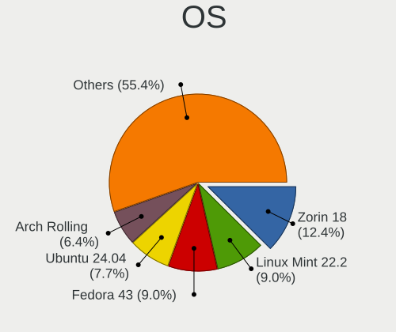

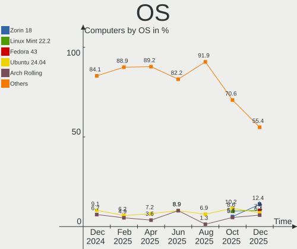

| Name                | Computers | Percent |
|---------------------|-----------|---------|
| Zorin 18            | 29        | 12.45%  |
| Linux Mint 22.2     | 21        | 9.01%   |
| Fedora 43           | 21        | 9.01%   |
| Ubuntu 24.04        | 18        | 7.73%   |
| Arch Rolling        | 15        | 6.44%   |
| Debian 13           | 11        | 4.72%   |
| Bazzite 43          | 10        | 4.29%   |
| Pop!_OS 24.04       | 9         | 3.86%   |
| CachyOS Rolling     | 8         | 3.43%   |
| Zorin 17            | 7         | 3%      |
| Pop!_OS 22.04       | 7         | 3%      |
| OpenMandriva 25.11  | 7         | 3%      |
| OpenMandriva 6.0    | 5         | 2.15%   |
| Ubuntu 25.10        | 4         | 1.72%   |
| OpenMandriva 25.90  | 4         | 1.72%   |
| Linux Mint 22.1     | 4         | 1.72%   |
| CachyOS             | 4         | 1.72%   |
| Gentoo 2.18         | 3         | 1.29%   |
| Bazzite 42          | 3         | 1.29%   |
| Nobara 43           | 2         | 0.86%   |
| NixOS 25.11         | 2         | 0.86%   |
| Manjaro             | 2         | 0.86%   |
| LMDE 7              | 2         | 0.86%   |
| Fedora 42           | 2         | 0.86%   |
| Xubuntu 25.10       | 1         | 0.43%   |
| Xubuntu 24.04       | 1         | 0.43%   |
| Void Linux Rolling  | 1         | 0.43%   |
| Ultramarine 43      | 1         | 0.43%   |
| Ubuntu-luna home    | 1         | 0.43%   |
| Ubuntu Unity 24.04  | 1         | 0.43%   |
| Ubuntu MATE 25.10   | 1         | 0.43%   |
| Ubuntu Budgie 24.04 | 1         | 0.43%   |
| Ubuntu 22.04        | 1         | 0.43%   |
| SteamOS Rolling     | 1         | 0.43%   |
| SteamOS 3.7.17      | 1         | 0.43%   |
| ROSA 13.1           | 1         | 0.43%   |
| Rocky Linux 8.10    | 1         | 0.43%   |
| openSUSE Leap-16.0  | 1         | 0.43%   |
| NixOS 26.05         | 1         | 0.43%   |
| NixOS 25.05         | 1         | 0.43%   |

OS Family
---------

OS without a version

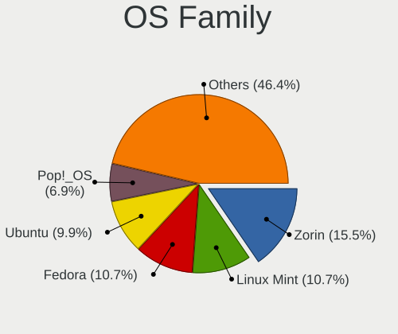

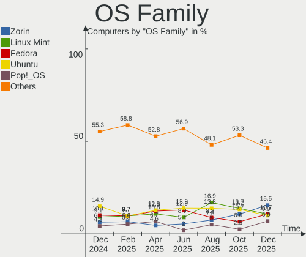

| Name             | Computers | Percent |
|------------------|-----------|---------|
| Zorin            | 36        | 15.45%  |
| Linux Mint       | 25        | 10.73%  |
| Fedora           | 25        | 10.73%  |
| Ubuntu           | 23        | 9.87%   |
| Pop!_OS          | 16        | 6.87%   |
| OpenMandriva     | 16        | 6.87%   |
| Arch             | 15        | 6.44%   |
| Bazzite          | 13        | 5.58%   |
| CachyOS          | 12        | 5.15%   |
| Debian           | 11        | 4.72%   |
| NixOS            | 4         | 1.72%   |
| Kubuntu          | 3         | 1.29%   |
| Gentoo           | 3         | 1.29%   |
| Xubuntu          | 2         | 0.86%   |
| SteamOS          | 2         | 0.86%   |
| Nobara           | 2         | 0.86%   |
| Manjaro          | 2         | 0.86%   |
| LMDE             | 2         | 0.86%   |
| Garuda Linux     | 2         | 0.86%   |
| Artix            | 2         | 0.86%   |
| Void Linux       | 1         | 0.43%   |
| Ultramarine      | 1         | 0.43%   |
| Ubuntu-luna home | 1         | 0.43%   |
| Ubuntu Unity     | 1         | 0.43%   |
| Ubuntu MATE      | 1         | 0.43%   |
| Ubuntu Budgie    | 1         | 0.43%   |
| ROSA             | 1         | 0.43%   |
| Rocky Linux      | 1         | 0.43%   |
| openSUSE         | 1         | 0.43%   |
| MX               | 1         | 0.43%   |
| Lubuntu          | 1         | 0.43%   |
| Linux Lite       | 1         | 0.43%   |
| KDE neon         | 1         | 0.43%   |
| EndeavourOS      | 1         | 0.43%   |
| Elementary       | 1         | 0.43%   |
| Aurora           | 1         | 0.43%   |
| Arch ARM         | 1         | 0.43%   |

Kernel
------

Version of the Linux kernel

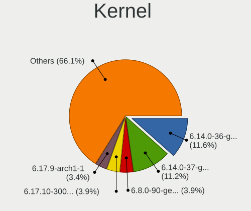

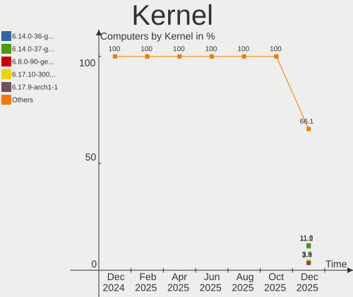

| Version                                     | Computers | Percent |
|---------------------------------------------|-----------|---------|
| 6.14.0-36-generic                           | 27        | 11.59%  |
| 6.14.0-37-generic                           | 26        | 11.16%  |
| 6.8.0-90-generic                            | 9         | 3.86%   |
| 6.17.10-300.fc43.x86_64                     | 9         | 3.86%   |
| 6.17.9-arch1-1                              | 8         | 3.43%   |
| 6.17.9-76061709-generic                     | 8         | 3.43%   |
| 6.17.4-76061704-generic                     | 8         | 3.43%   |
| 6.14.2-desktop-3omv2590                     | 8         | 3.43%   |
| 6.12.57+deb13-amd64                         | 8         | 3.43%   |
| 6.17.7-ba20.fc43.x86_64                     | 6         | 2.58%   |
| 6.8.0-87-generic                            | 5         | 2.15%   |
| 6.18.0-desktop-1omv2590                     | 5         | 2.15%   |
| 6.8.0-88-generic                            | 4         | 1.72%   |
| 6.17.12-300.fc43.x86_64                     | 4         | 1.72%   |
| 6.17.1-300.fc43.x86_64                      | 4         | 1.72%   |
| 6.17.0-7-generic                            | 4         | 1.72%   |
| 6.14.0-33-generic                           | 4         | 1.72%   |
| 6.18.2-2-cachyos                            | 3         | 1.29%   |
| 6.17.7-ba19.fc43.x86_64                     | 3         | 1.29%   |
| 6.17.11-300.fc43.x86_64                     | 3         | 1.29%   |
| 6.16.4-116.bazzite.fc42.x86_64              | 3         | 1.29%   |
| 6.14.0-35-generic                           | 3         | 1.29%   |
| 6.14.0-29-generic                           | 3         | 1.29%   |
| 6.14.0-27-generic                           | 3         | 1.29%   |
| 6.18.2-arch2-1                              | 2         | 0.86%   |
| 6.18.0-2-cachyos                            | 2         | 0.86%   |
| 6.17.9-zen1-1-zen                           | 2         | 0.86%   |
| 6.17.9-2-cachyos                            | 2         | 0.86%   |
| 6.17.7-desktop-1omv2590                     | 2         | 0.86%   |
| 6.17.0-8-generic                            | 2         | 0.86%   |
| 6.11.11-valve24-2-neptune-611-gfd0dd251480d | 2         | 0.86%   |
| 6.8.0-88-lowlatency                         | 1         | 0.43%   |
| 6.8.0-71-generic                            | 1         | 0.43%   |
| 6.8.0-63-generic                            | 1         | 0.43%   |
| 6.5.12-100.fc37.x86_64                      | 1         | 0.43%   |
| 6.2.0-39-generic                            | 1         | 0.43%   |
| 6.18.2-zen2-1-zen                           | 1         | 0.43%   |
| 6.18.2-200.nobara.fc43.x86_64               | 1         | 0.43%   |
| 6.18.1-arch1-2                              | 1         | 0.43%   |
| 6.18.1-2-cachyos                            | 1         | 0.43%   |

Kernel Family
-------------

Linux kernel without a distro release

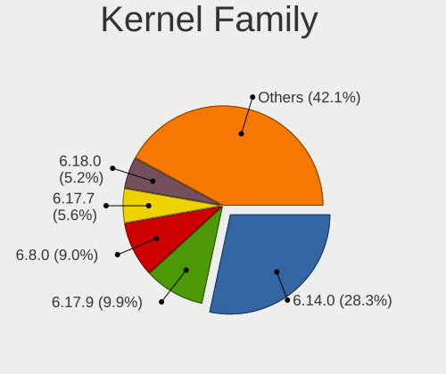

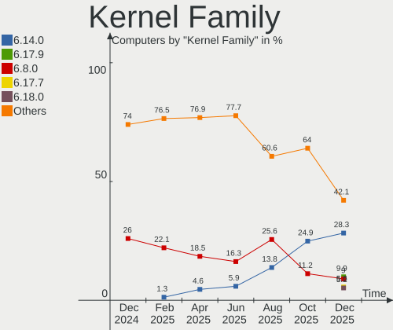

| Version  | Computers | Percent |
|----------|-----------|---------|
| 6.14.0   | 66        | 28.33%  |
| 6.17.9   | 23        | 9.87%   |
| 6.8.0    | 21        | 9.01%   |
| 6.17.7   | 13        | 5.58%   |
| 6.18.0   | 12        | 5.15%   |
| 6.17.10  | 11        | 4.72%   |
| 6.17.4   | 10        | 4.29%   |
| 6.17.8   | 8         | 3.43%   |
| 6.14.2   | 8         | 3.43%   |
| 6.12.57  | 8         | 3.43%   |
| 6.18.2   | 7         | 3%      |
| 6.17.0   | 7         | 3%      |
| 6.17.12  | 5         | 2.15%   |
| 6.17.1   | 5         | 2.15%   |
| 6.18.1   | 3         | 1.29%   |
| 6.17.11  | 3         | 1.29%   |
| 6.16.4   | 3         | 1.29%   |
| 6.12.62  | 2         | 0.86%   |
| 6.12.58  | 2         | 0.86%   |
| 6.12.47  | 2         | 0.86%   |
| 6.11.11  | 2         | 0.86%   |
| 6.5.12   | 1         | 0.43%   |
| 6.2.0    | 1         | 0.43%   |
| 6.12.63  | 1         | 0.43%   |
| 6.12.61  | 1         | 0.43%   |
| 6.12.56  | 1         | 0.43%   |
| 6.12.48  | 1         | 0.43%   |
| 6.12.0   | 1         | 0.43%   |
| 6.1.0    | 1         | 0.43%   |
| 5.19.14  | 1         | 0.43%   |
| 5.15.0   | 1         | 0.43%   |
| 5.10.160 | 1         | 0.43%   |
| 4.18.0   | 1         | 0.43%   |

Kernel Major Ver.
-----------------

Linux kernel major version

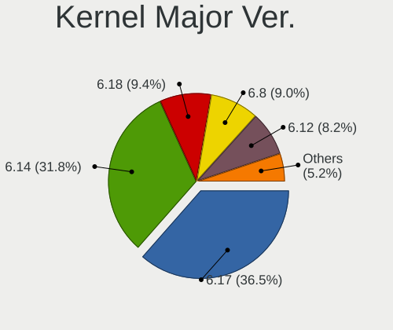

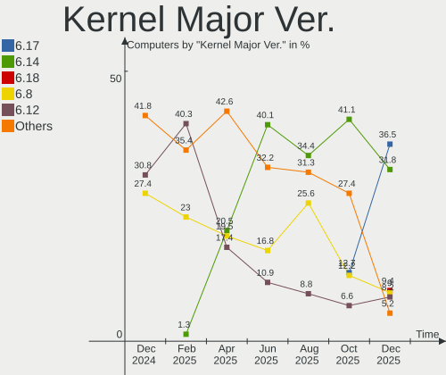

| Version | Computers | Percent |
|---------|-----------|---------|
| 6.17    | 85        | 36.48%  |
| 6.14    | 74        | 31.76%  |
| 6.18    | 22        | 9.44%   |
| 6.8     | 21        | 9.01%   |
| 6.12    | 19        | 8.15%   |
| 6.16    | 3         | 1.29%   |
| 6.11    | 2         | 0.86%   |
| 6.5     | 1         | 0.43%   |
| 6.2     | 1         | 0.43%   |
| 6.1     | 1         | 0.43%   |
| 5.19    | 1         | 0.43%   |
| 5.15    | 1         | 0.43%   |
| 5.10    | 1         | 0.43%   |
| 4.18    | 1         | 0.43%   |

Arch
----

OS architecture (x86_64, i586, etc.)

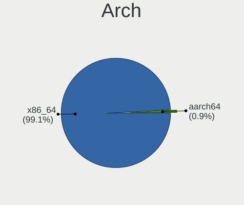

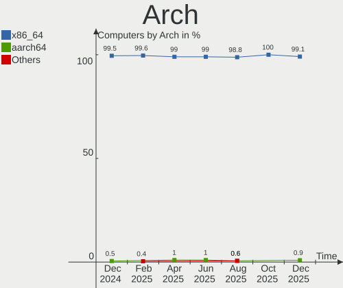

| Name    | Computers | Percent |
|---------|-----------|---------|
| x86_64  | 231       | 99.14%  |
| aarch64 | 2         | 0.86%   |

DE
--

Desktop Environment

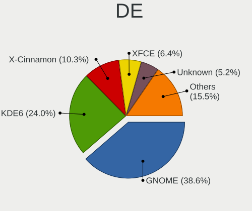

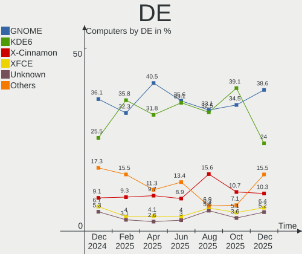

| Name          | Computers | Percent |
|---------------|-----------|---------|
| GNOME         | 90        | 38.63%  |
| KDE6          | 56        | 24.03%  |
| X-Cinnamon    | 24        | 10.3%   |
| XFCE          | 15        | 6.44%   |
| Unknown       | 12        | 5.15%   |
| COSMIC        | 10        | 4.29%   |
| Hyprland      | 6         | 2.58%   |
| KDE           | 3         | 1.29%   |
| Budgie        | 3         | 1.29%   |
| MATE          | 2         | 0.86%   |
| LXQt          | 2         | 0.86%   |
| KDE5          | 2         | 0.86%   |
| Unity         | 1         | 0.43%   |
| sway          | 1         | 0.43%   |
| qtile         | 1         | 0.43%   |
| Pantheon      | 1         | 0.43%   |
| labwc:wlroots | 1         | 0.43%   |
| KDE4          | 1         | 0.43%   |
| i3            | 1         | 0.43%   |
| GNOME Classic | 1         | 0.43%   |

Display Server
--------------

X11 or Wayland

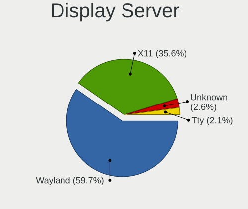

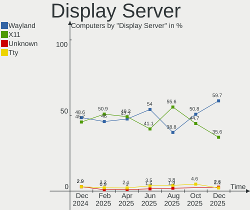

| Name    | Computers | Percent |
|---------|-----------|---------|
| Wayland | 139       | 59.66%  |
| X11     | 83        | 35.62%  |
| Unknown | 6         | 2.58%   |
| Tty     | 5         | 2.15%   |

Display Manager
---------------

SDDM, LightDM, etc.

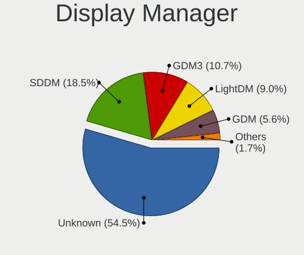

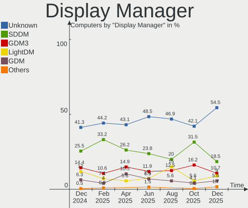

| Name                  | Computers | Percent |
|-----------------------|-----------|---------|
| Unknown               | 127       | 54.51%  |
| SDDM                  | 43        | 18.45%  |
| GDM3                  | 25        | 10.73%  |
| LightDM               | 21        | 9.01%   |
| GDM                   | 13        | 5.58%   |
| GREETD                | 3         | 1.29%   |
| DISPLAY-MANAGER-START | 1         | 0.43%   |

OS Lang
-------

Language

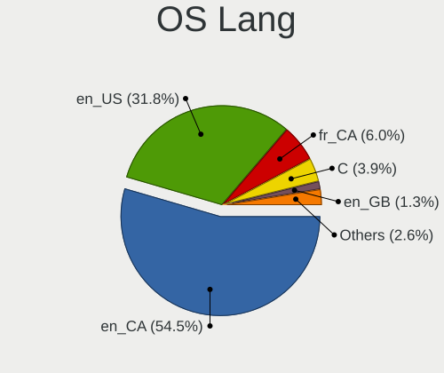

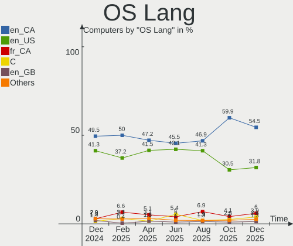

| Lang    | Computers | Percent |
|---------|-----------|---------|
| en_CA   | 127       | 54.51%  |
| en_US   | 74        | 31.76%  |
| fr_CA   | 14        | 6.01%   |
| C       | 9         | 3.86%   |
| en_GB   | 3         | 1.29%   |
| fr_FR   | 2         | 0.86%   |
| Unknown | 2         | 0.86%   |
| zh_HK   | 1         | 0.43%   |
| es_ES   | 1         | 0.43%   |

Boot Mode
---------

EFI or BIOS

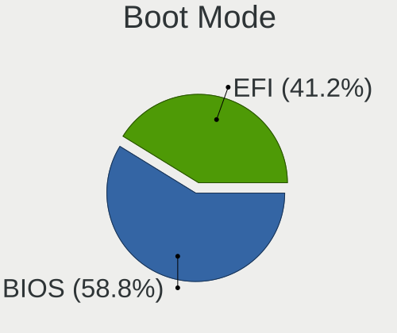

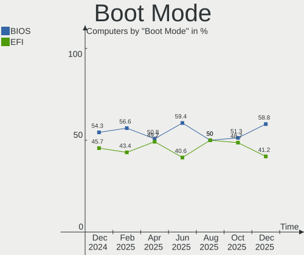

| Mode | Computers | Percent |
|------|-----------|---------|
| BIOS | 137       | 58.8%   |
| EFI  | 96        | 41.2%   |

Filesystem
----------

Type of filesystem

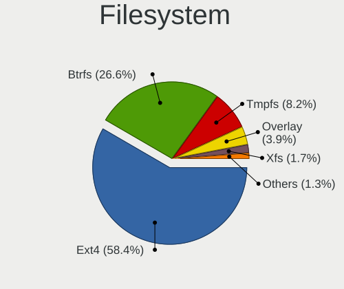

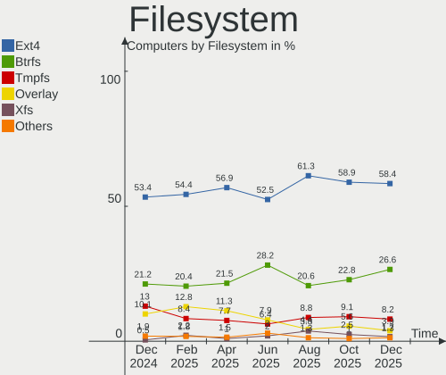

| Type    | Computers | Percent |
|---------|-----------|---------|
| Ext4    | 136       | 58.37%  |
| Btrfs   | 62        | 26.61%  |
| Tmpfs   | 19        | 8.15%   |
| Overlay | 9         | 3.86%   |
| Xfs     | 4         | 1.72%   |
| Zfs     | 2         | 0.86%   |
| Ext3    | 1         | 0.43%   |

Part. scheme
------------

Scheme of partitioning

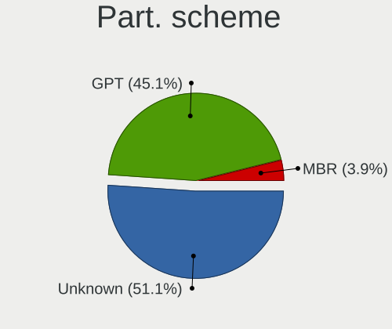

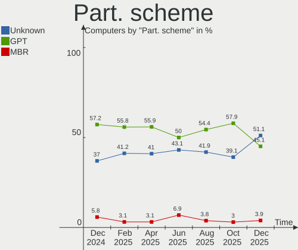

| Type    | Computers | Percent |
|---------|-----------|---------|
| Unknown | 119       | 51.07%  |
| GPT     | 105       | 45.06%  |
| MBR     | 9         | 3.86%   |

Dual Boot with Linux/BSD
------------------------

Hosting more than one Linux/BSD

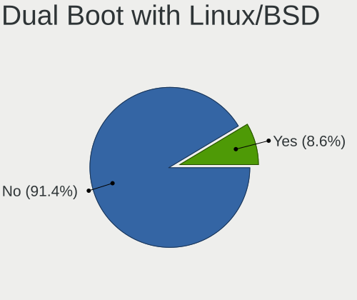

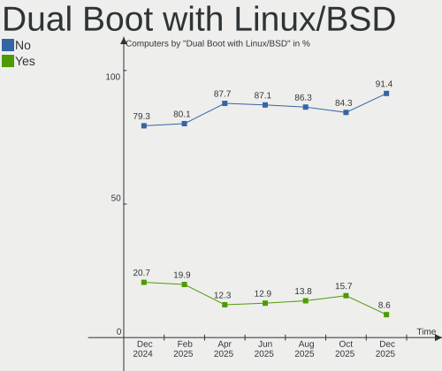

| Dual boot | Computers | Percent |
|-----------|-----------|---------|
| No        | 213       | 91.42%  |
| Yes       | 20        | 8.58%   |

Dual Boot (Win)
---------------

Hosting Linux and Windows

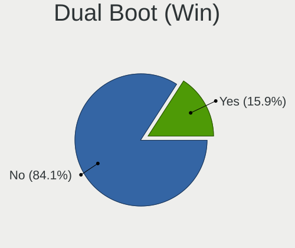

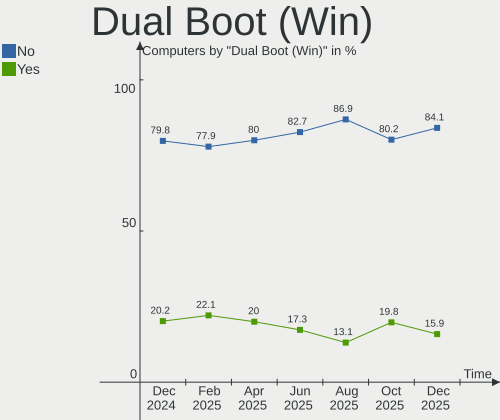

| Dual boot | Computers | Percent |
|-----------|-----------|---------|
| No        | 196       | 84.12%  |
| Yes       | 37        | 15.88%  |

Board
-----

Vendor
------

Motherboard manufacturer

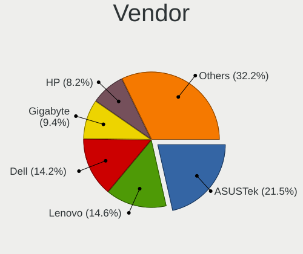

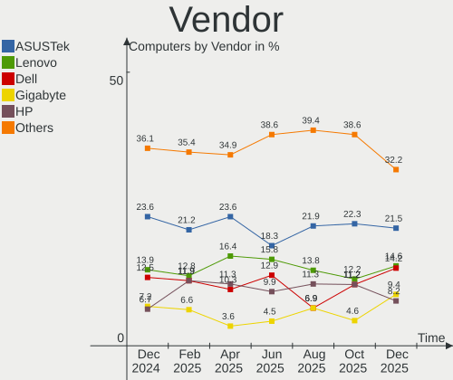

| Name                                 | Computers | Percent |
|--------------------------------------|-----------|---------|
| ASUSTek Computer                     | 50        | 21.46%  |
| Lenovo                               | 34        | 14.59%  |
| Dell                                 | 33        | 14.16%  |
| Gigabyte Technology                  | 22        | 9.44%   |
| Hewlett-Packard                      | 19        | 8.15%   |
| MSI                                  | 14        | 6.01%   |
| Acer                                 | 10        | 4.29%   |
| Apple                                | 9         | 3.86%   |
| ASRock                               | 8         | 3.43%   |
| Alienware                            | 4         | 1.72%   |
| Microsoft                            | 3         | 1.29%   |
| AZW                                  | 3         | 1.29%   |
| Unknown                              | 3         | 1.29%   |
| Valve                                | 2         | 0.86%   |
| Pegatron                             | 2         | 0.86%   |
| Intel                                | 2         | 0.86%   |
| Framework                            | 2         | 0.86%   |
| SZ ReachingTech Limited              | 1         | 0.43%   |
| Supermicro                           | 1         | 0.43%   |
| Star Labs                            | 1         | 0.43%   |
| Shenzhen Meigao Electronic Equipment | 1         | 0.43%   |
| Shenzhen Anxin Taihe Technology      | 1         | 0.43%   |
| Raspberry Pi Foundation              | 1         | 0.43%   |
| MACHINIST                            | 1         | 0.43%   |
| LG Electronics                       | 1         | 0.43%   |
| JINGSHA                              | 1         | 0.43%   |
| IBM                                  | 1         | 0.43%   |
| Google                               | 1         | 0.43%   |
| Gateway                              | 1         | 0.43%   |
| Chuwi                                | 1         | 0.43%   |

Model
-----

Motherboard model

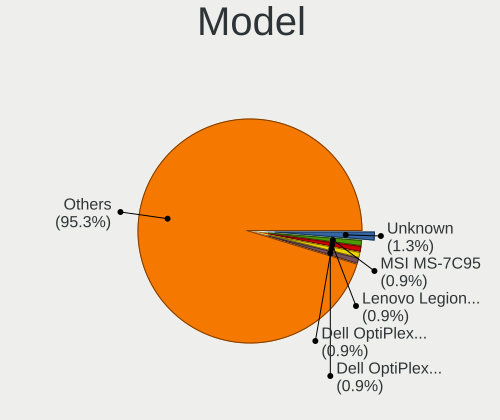

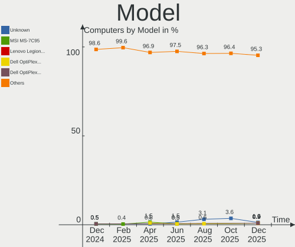

| Name                                                  | Computers | Percent |
|-------------------------------------------------------|-----------|---------|
| Unknown                                               | 3         | 1.29%   |
| MSI MS-7C95                                           | 2         | 0.86%   |
| Lenovo Legion Pro 7 16AFR10H 83RU                     | 2         | 0.86%   |
| Dell OptiPlex 7010                                    | 2         | 0.86%   |
| Dell OptiPlex 5040                                    | 2         | 0.86%   |
| AZW SER                                               | 2         | 0.86%   |
| ASUS TUF Gaming B850-PLUS WIFI                        | 2         | 0.86%   |
| ASUS PRIME B550M-A WIFI II                            | 2         | 0.86%   |
| ASUS PRIME B450M-A II                                 | 2         | 0.86%   |
| Apple MacBookPro11,5                                  | 2         | 0.86%   |
| Valve Jupiter                                         | 1         | 0.43%   |
| Valve Galileo                                         | 1         | 0.43%   |
| SZ ReachingTech Limited DQ05proplus                   | 1         | 0.43%   |
| Supermicro X8SAX                                      | 1         | 0.43%   |
| Star Labs StarLite                                    | 1         | 0.43%   |
| Shenzhen Meigao Electronic Equipment EliteMini Series | 1         | 0.43%   |
| Shenzhen Anxin Taihe KSM1                             | 1         | 0.43%   |
| RPi Raspberry Pi 5 Model B Rev 1.0                    | 1         | 0.43%   |
| Pegatron NY428AA-A2L p6110f                           | 1         | 0.43%   |
| Pegatron FQ516AA-A2L a6648f                           | 1         | 0.43%   |
| MSI US Desktop Aegis R                                | 1         | 0.43%   |
| MSI Summit E14Evo A12M                                | 1         | 0.43%   |
| MSI MS-7E56                                           | 1         | 0.43%   |
| MSI MS-7E26                                           | 1         | 0.43%   |
| MSI MS-7D25                                           | 1         | 0.43%   |
| MSI MS-7C91                                           | 1         | 0.43%   |
| MSI MS-7C84                                           | 1         | 0.43%   |
| MSI MS-7C56                                           | 1         | 0.43%   |
| MSI MS-7A67                                           | 1         | 0.43%   |
| MSI MS-7971                                           | 1         | 0.43%   |
| MSI Katana GF66 11UE                                  | 1         | 0.43%   |
| MSI Katana 17 B13VFK                                  | 1         | 0.43%   |
| Microsoft Surface Pro 7                               | 1         | 0.43%   |
| Microsoft Surface Pro                                 | 1         | 0.43%   |
| Microsoft Surface Laptop Go                           | 1         | 0.43%   |
| MACHINIST X99-MR9A-PRO V3.0                           | 1         | 0.43%   |
| LG 16Z90S-H.ADB9U1                                    | 1         | 0.43%   |
| Lenovo Y50-70 20378                                   | 1         | 0.43%   |
| Lenovo Y50-70 15IKB 80V5                              | 1         | 0.43%   |
| Lenovo ThinkPad Yoga 260 20FES0A80E                   | 1         | 0.43%   |

Model Family
------------

Motherboard model prefix

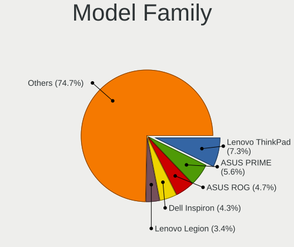

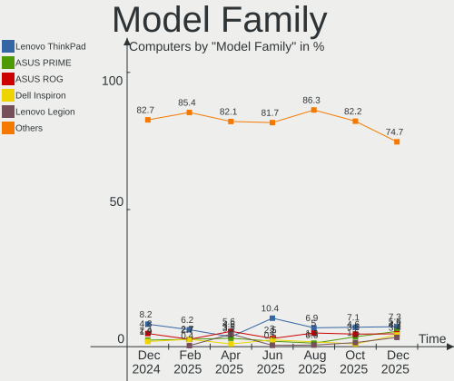

| Name                                           | Computers | Percent |
|------------------------------------------------|-----------|---------|
| Lenovo ThinkPad                                | 17        | 7.3%    |
| ASUS PRIME                                     | 13        | 5.58%   |
| ASUS ROG                                       | 11        | 4.72%   |
| Dell Inspiron                                  | 10        | 4.29%   |
| Lenovo Legion                                  | 8         | 3.43%   |
| Acer Aspire                                    | 8         | 3.43%   |
| Dell OptiPlex                                  | 6         | 2.58%   |
| Dell Latitude                                  | 5         | 2.15%   |
| ASUS TUF                                       | 5         | 2.15%   |
| ASUS Vivobook                                  | 4         | 1.72%   |
| Apple MacBookPro11                             | 4         | 1.72%   |
| Microsoft Surface                              | 3         | 1.29%   |
| Lenovo ThinkCentre                             | 3         | 1.29%   |
| HP ProBook                                     | 3         | 1.29%   |
| Dell Precision                                 | 3         | 1.29%   |
| Unknown                                        | 3         | 1.29%   |
| MSI MS-7C95                                    | 2         | 0.86%   |
| MSI Katana                                     | 2         | 0.86%   |
| Lenovo Y50-70                                  | 2         | 0.86%   |
| HP ProDesk                                     | 2         | 0.86%   |
| HP Pavilion                                    | 2         | 0.86%   |
| HP Laptop                                      | 2         | 0.86%   |
| HP Compaq                                      | 2         | 0.86%   |
| Gigabyte Z390                                  | 2         | 0.86%   |
| Gigabyte X870E                                 | 2         | 0.86%   |
| Framework Laptop                               | 2         | 0.86%   |
| Dell XPS                                       | 2         | 0.86%   |
| Dell Studio                                    | 2         | 0.86%   |
| AZW SER                                        | 2         | 0.86%   |
| ASUS P8P67                                     | 2         | 0.86%   |
| ASRock B450M                                   | 2         | 0.86%   |
| Alienware Aurora                               | 2         | 0.86%   |
| Valve Jupiter                                  | 1         | 0.43%   |
| Valve Galileo                                  | 1         | 0.43%   |
| SZ ReachingTech Limited DQ05proplus            | 1         | 0.43%   |
| Supermicro X8SAX                               | 1         | 0.43%   |
| Star Labs StarLite                             | 1         | 0.43%   |
| Shenzhen Meigao Electronic Equipment EliteMini | 1         | 0.43%   |
| Shenzhen Anxin Taihe KSM1                      | 1         | 0.43%   |
| RPi Raspberry                                  | 1         | 0.43%   |

MFG Year
--------

Motherboard manufacture year

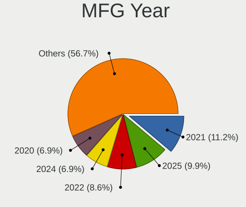

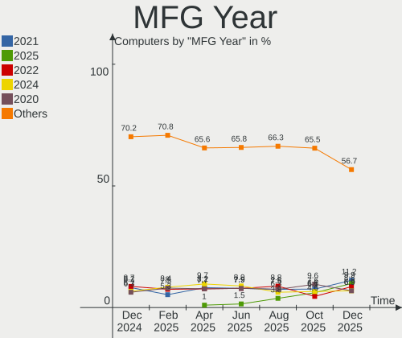

| Year    | Computers | Percent |
|---------|-----------|---------|
| 2021    | 26        | 11.16%  |
| 2025    | 23        | 9.87%   |
| 2022    | 20        | 8.58%   |
| 2024    | 16        | 6.87%   |
| 2020    | 16        | 6.87%   |
| 2018    | 15        | 6.44%   |
| 2019    | 14        | 6.01%   |
| 2016    | 12        | 5.15%   |
| 2015    | 12        | 5.15%   |
| 2012    | 12        | 5.15%   |
| 2017    | 11        | 4.72%   |
| 2013    | 10        | 4.29%   |
| 2023    | 9         | 3.86%   |
| 2011    | 9         | 3.86%   |
| 2009    | 8         | 3.43%   |
| 2014    | 7         | 3%      |
| 2010    | 6         | 2.58%   |
| 2006    | 3         | 1.29%   |
| Unknown | 3         | 1.29%   |
| 2007    | 1         | 0.43%   |

Form Factor
-----------

Physical design of the computer

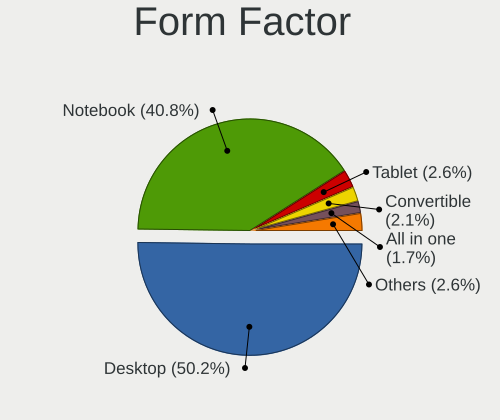

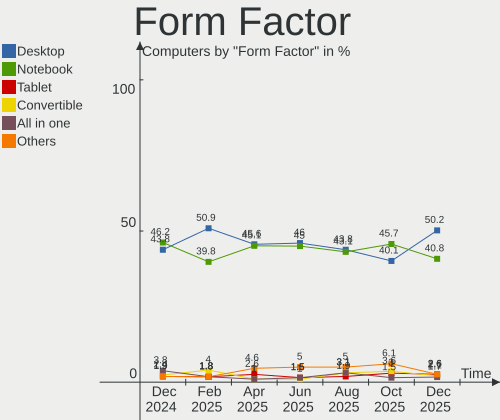

| Name           | Computers | Percent |
|----------------|-----------|---------|
| Desktop        | 117       | 50.21%  |
| Notebook       | 95        | 40.77%  |
| Tablet         | 6         | 2.58%   |
| Convertible    | 5         | 2.15%   |
| All in one     | 4         | 1.72%   |
| Mini pc        | 3         | 1.29%   |
| System on chip | 2         | 0.86%   |
| Server         | 1         | 0.43%   |

Secure Boot
-----------

Enabled or disabled

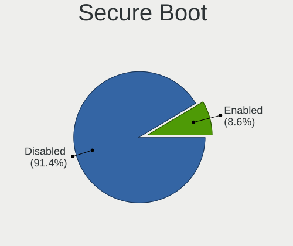

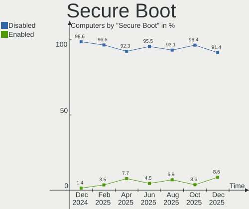

| State    | Computers | Percent |
|----------|-----------|---------|
| Disabled | 213       | 91.42%  |
| Enabled  | 20        | 8.58%   |

Coreboot
--------

Have coreboot on board

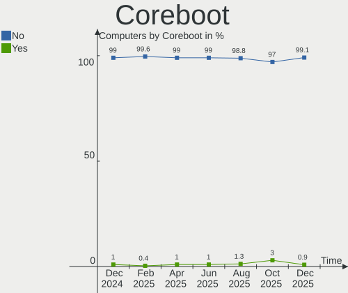

| Used | Computers | Percent |
|------|-----------|---------|
| No   | 231       | 99.14%  |
| Yes  | 2         | 0.86%   |

RAM Size
--------

Total RAM memory

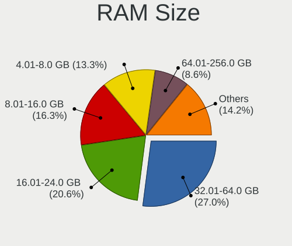

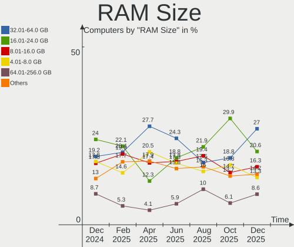

| Size in GB  | Computers | Percent |
|-------------|-----------|---------|
| 32.01-64.0  | 63        | 27.04%  |
| 16.01-24.0  | 48        | 20.6%   |
| 8.01-16.0   | 38        | 16.31%  |
| 4.01-8.0    | 31        | 13.3%   |
| 64.01-256.0 | 20        | 8.58%   |
| 24.01-32.0  | 19        | 8.15%   |
| 3.01-4.0    | 11        | 4.72%   |
| 0.51-1.0    | 2         | 0.86%   |
| 1.01-2.0    | 1         | 0.43%   |

RAM Used
--------

Used RAM memory

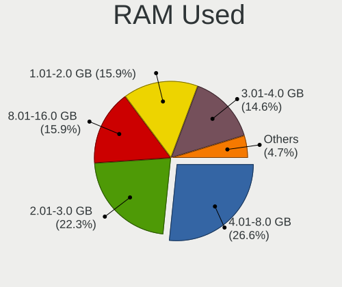

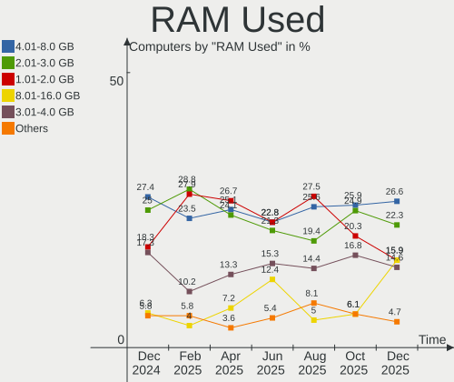

| Used GB     | Computers | Percent |
|-------------|-----------|---------|
| 4.01-8.0    | 62        | 26.61%  |
| 2.01-3.0    | 52        | 22.32%  |
| 1.01-2.0    | 37        | 15.88%  |
| 8.01-16.0   | 37        | 15.88%  |
| 3.01-4.0    | 34        | 14.59%  |
| 16.01-24.0  | 4         | 1.72%   |
| 0.51-1.0    | 2         | 0.86%   |
| 0.01-0.5    | 2         | 0.86%   |
| 32.01-64.0  | 1         | 0.43%   |
| 24.01-32.0  | 1         | 0.43%   |
| 64.01-256.0 | 1         | 0.43%   |

Total Drives
------------

Number of drives on board

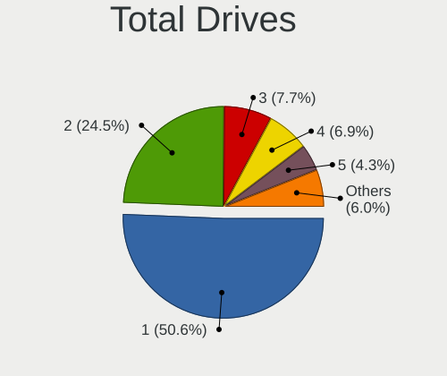

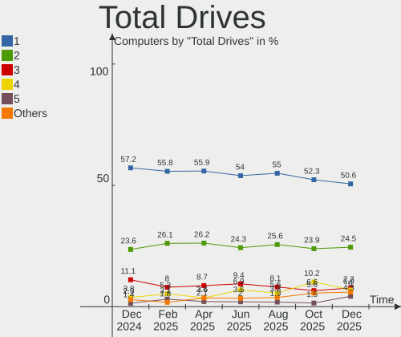

| Drives | Computers | Percent |
|--------|-----------|---------|
| 1      | 118       | 50.64%  |
| 2      | 57        | 24.46%  |
| 3      | 18        | 7.73%   |
| 4      | 16        | 6.87%   |
| 5      | 10        | 4.29%   |
| 6      | 6         | 2.58%   |
| 8      | 3         | 1.29%   |
| 7      | 2         | 0.86%   |
| 18     | 1         | 0.43%   |
| 12     | 1         | 0.43%   |
| 0      | 1         | 0.43%   |

Has CD-ROM
----------

Has CD-ROM on board

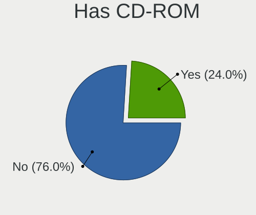

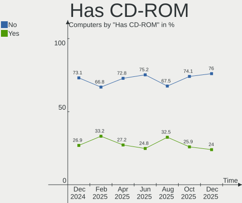

| Presented | Computers | Percent |
|-----------|-----------|---------|
| No        | 177       | 75.97%  |
| Yes       | 56        | 24.03%  |

Has Ethernet
------------

Has Ethernet on board

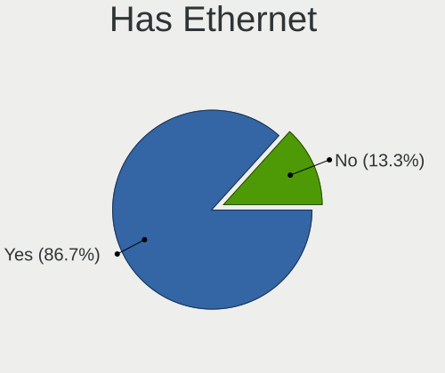

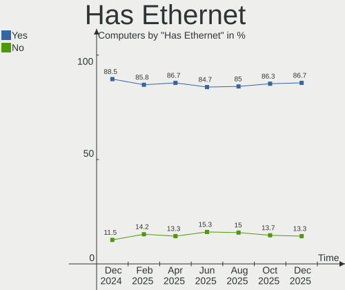

| Presented | Computers | Percent |
|-----------|-----------|---------|
| Yes       | 202       | 86.7%   |
| No        | 31        | 13.3%   |

Has WiFi
--------

Has WiFi module

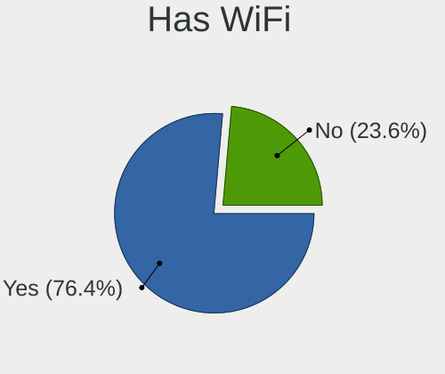

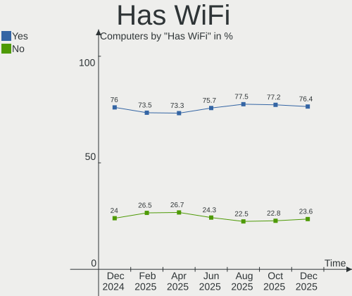

| Presented | Computers | Percent |
|-----------|-----------|---------|
| Yes       | 178       | 76.39%  |
| No        | 55        | 23.61%  |

Has Bluetooth
-------------

Has Bluetooth module

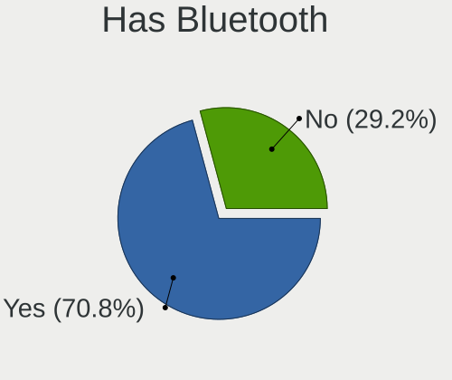

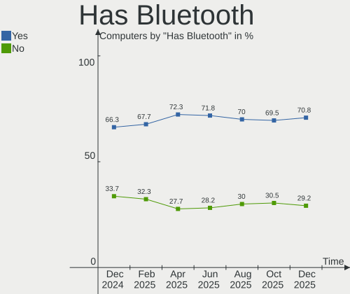

| Presented | Computers | Percent |
|-----------|-----------|---------|
| Yes       | 165       | 70.82%  |
| No        | 68        | 29.18%  |

Location
--------

Country
-------

Geographic location (country)

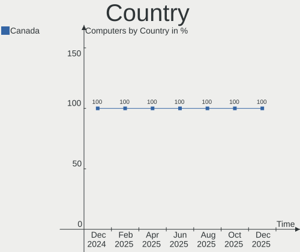

| Country | Computers | Percent |
|---------|-----------|---------|
| Canada  | 233       | 100%    |

City
----

Geographic location (city)

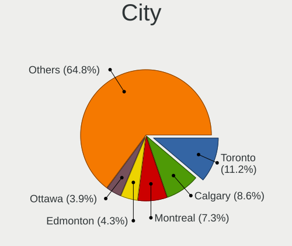

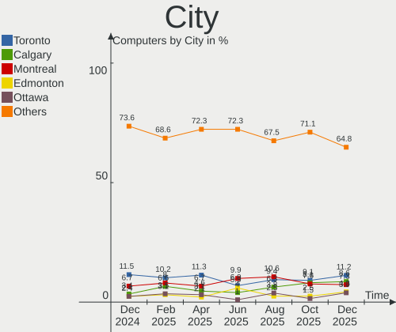

| City           | Computers | Percent |
|----------------|-----------|---------|
| Toronto        | 26        | 11.16%  |
| Calgary        | 20        | 8.58%   |
| Montreal       | 17        | 7.3%    |
| Edmonton       | 10        | 4.29%   |
| Ottawa         | 9         | 3.86%   |
| Vancouver      | 5         | 2.15%   |
| Peterborough   | 5         | 2.15%   |
| Kitchener      | 5         | 2.15%   |
| Québec        | 4         | 1.72%   |
| Nepean         | 4         | 1.72%   |
| Markham        | 4         | 1.72%   |
| London         | 4         | 1.72%   |
| Scarborough    | 3         | 1.29%   |
| Pickering      | 3         | 1.29%   |
| Oshawa         | 3         | 1.29%   |
| Laval          | 3         | 1.29%   |
| Langley        | 3         | 1.29%   |
| Halifax        | 3         | 1.29%   |
| Grande Prairie | 3         | 1.29%   |
| Chilliwack     | 3         | 1.29%   |
| Woodbridge     | 2         | 0.86%   |
| Winnipeg       | 2         | 0.86%   |
| Surrey         | 2         | 0.86%   |
| Regina         | 2         | 0.86%   |
| Prince George  | 2         | 0.86%   |
| Nanaimo        | 2         | 0.86%   |
| Maple          | 2         | 0.86%   |
| Leduc          | 2         | 0.86%   |
| Hamilton       | 2         | 0.86%   |
| Delta          | 2         | 0.86%   |
| Caledon        | 2         | 0.86%   |
| Burnaby        | 2         | 0.86%   |
| Burlington     | 2         | 0.86%   |
| Winkler        | 1         | 0.43%   |
| Windsor        | 1         | 0.43%   |
| Whitehorse     | 1         | 0.43%   |
| Wetaskiwin     | 1         | 0.43%   |
| West Kelowna   | 1         | 0.43%   |
| Victoria       | 1         | 0.43%   |
| Verdun         | 1         | 0.43%   |

Drives
------

Drive Vendor
------------

Hard drive vendors

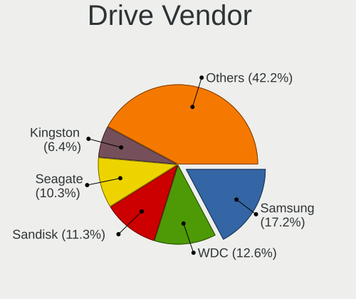

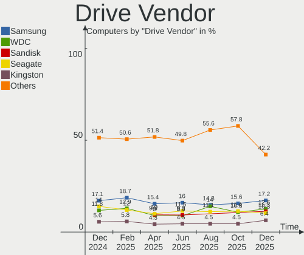

| Vendor                       | Computers | Drives | Percent |
|------------------------------|-----------|--------|---------|
| Samsung Electronics          | 67        | 90     | 17.22%  |
| WDC                          | 49        | 80     | 12.6%   |
| Sandisk                      | 44        | 51     | 11.31%  |
| Seagate                      | 40        | 57     | 10.28%  |
| Kingston                     | 25        | 28     | 6.43%   |
| SK hynix                     | 23        | 25     | 5.91%   |
| Crucial                      | 11        | 12     | 2.83%   |
| Unknown                      | 10        | 13     | 2.57%   |
| A-DATA Technology            | 10        | 12     | 2.57%   |
| Apple                        | 9         | 10     | 2.31%   |
| Toshiba                      | 8         | 8      | 2.06%   |
| Intel                        | 7         | 8      | 1.8%    |
| Phison Electronics           | 6         | 6      | 1.54%   |
| Micron/Crucial Technology    | 6         | 7      | 1.54%   |
| Micron Technology            | 6         | 6      | 1.54%   |
| MAXIO Technology (Hangzhou)  | 5         | 6      | 1.29%   |
| KIOXIA                       | 5         | 5      | 1.29%   |
| Kingston Technology Company  | 4         | 4      | 1.03%   |
| Hitachi                      | 4         | 5      | 1.03%   |
| China                        | 4         | 4      | 1.03%   |
| SPCC                         | 3         | 3      | 0.77%   |
| KingSpec                     | 3         | 3      | 0.77%   |
| JMicron Technology           | 3         | 3      | 0.77%   |
| HGST                         | 3         | 3      | 0.77%   |
| Shenzhen Longsys Electronics | 2         | 2      | 0.51%   |
| SABRENT                      | 2         | 5      | 0.51%   |
| PNY                          | 2         | 2      | 0.51%   |
| Hewlett-Packard              | 2         | 19     | 0.51%   |
| Fanxiang                     | 2         | 2      | 0.51%   |
| EDILOCA                      | 2         | 2      | 0.51%   |
| Corsair                      | 2         | 2      | 0.51%   |
| Unknown                      | 2         | 2      | 0.51%   |
| USB 3.1                      | 1         | 2      | 0.26%   |
| Transcend                    | 1         | 1      | 0.26%   |
| Timetec                      | 1         | 1      | 0.26%   |
| T-FORCE                      | 1         | 1      | 0.26%   |
| Seagate Technology           | 1         | 1      | 0.26%   |
| Realtek Semiconductor        | 1         | 1      | 0.26%   |
| Realtek                      | 1         | 2      | 0.26%   |
| Phison                       | 1         | 2      | 0.26%   |

Drive Model
-----------

Hard drive models

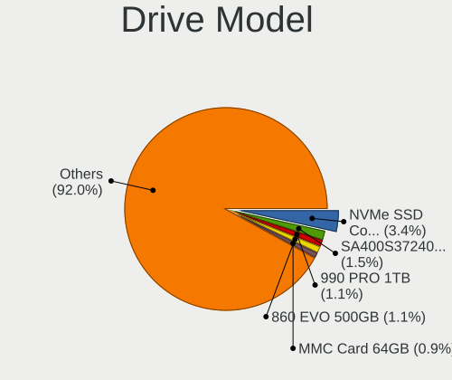

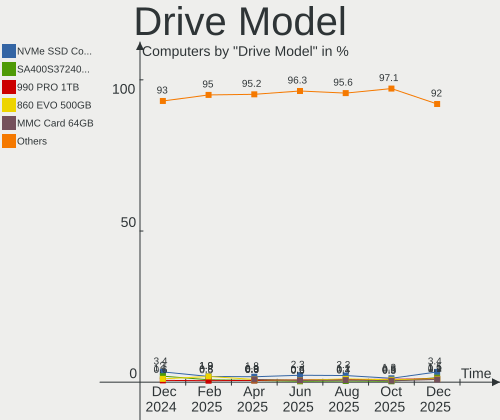

| Model                                                  | Computers | Percent |
|--------------------------------------------------------|-----------|---------|
| Samsung NVMe SSD Controller SM981/PM981/PM983 1TB      | 16        | 3.45%   |
| Kingston SA400S37240G 240GB SSD                        | 7         | 1.51%   |
| Samsung SSD 990 PRO 1TB                                | 5         | 1.08%   |
| Samsung SSD 860 EVO 500GB                              | 5         | 1.08%   |
| Unknown MMC Card  64GB                                 | 4         | 0.86%   |
| Seagate ST8000DM004-2U9188 8TB                         | 4         | 0.86%   |
| Seagate ST4000DM004-2CV104 4TB                         | 4         | 0.86%   |
| Seagate ST2000DM008-2FR102 2TB                         | 4         | 0.86%   |
| Seagate ST1000DM010-2EP102 1TB                         | 4         | 0.86%   |
| SanDisk NVMe SSD Drive 1TB                             | 4         | 0.86%   |
| Micron/Crucial P2 NVMe PCIe SSD 2TB                    | 4         | 0.86%   |
| MAXIO (Hangzhou) NVMe SSD Controller MAP1202 2TB       | 4         | 0.86%   |
| WDC WDS500G2B0A-00SM50 500GB                           | 3         | 0.65%   |
| WDC WD Blue SA510 2.5 1000GB SSD                       | 3         | 0.65%   |
| SK hynix Platinum P41/PC801 NVMe Solid State Drive 1TB | 3         | 0.65%   |
| Sandisk WD Black SN750 / PC SN730 NVMe SSD 500GB       | 3         | 0.65%   |
| Samsung SSD 870 EVO 500GB                              | 3         | 0.65%   |
| Samsung SSD 870 EVO 1TB                                | 3         | 0.65%   |
| Samsung SSD 860 EVO 1TB                                | 3         | 0.65%   |
| Samsung SSD 850 EVO 250GB                              | 3         | 0.65%   |
| Kingston SA400S37960G 960GB SSD                        | 3         | 0.65%   |
| JMicron Tech 250GB                                     | 3         | 0.65%   |
| Intel SSDPEKNU512GZ 512GB                              | 3         | 0.65%   |
| WDC WDS100T2B0A-00SM50 1TB SSD                         | 2         | 0.43%   |
| WDC WDBNCE0010PNC 1TB SSD                              | 2         | 0.43%   |
| WDC WD60EZRZ-00GZ5B1 6TB                               | 2         | 0.43%   |
| WDC WD10JPVX-22JC3T0 1TB                               | 2         | 0.43%   |
| WDC WD10EZEX-75WN4A0 1TB                               | 2         | 0.43%   |
| WDC WD Blue SA510 2.5 4TB SSD                          | 2         | 0.43%   |
| Unknown SD/MMC/MS PRO 2GB                              | 2         | 0.43%   |
| Unknown MMC Card  128GB                                | 2         | 0.43%   |
| Toshiba DT01ACA200 2TB                                 | 2         | 0.43%   |
| SK hynix PC401 NVMe Solid State Drive 256GB            | 2         | 0.43%   |
| SK hynix BC501 NVMe Solid State Drive 512GB            | 2         | 0.43%   |
| Seagate ST31000528AS 1TB                               | 2         | 0.43%   |
| Seagate ST2000DM006-2DM164 2TB                         | 2         | 0.43%   |
| Seagate ST1000LM035-1RK172 1TB                         | 2         | 0.43%   |
| Seagate ST1000LM024 HN-M101MBB 1TB                     | 2         | 0.43%   |
| Seagate Expansion HDD 4TB                              | 2         | 0.43%   |
| Seagate Expansion Desk 4TB                             | 2         | 0.43%   |

HDD Vendor
----------

Hard disk drive vendors

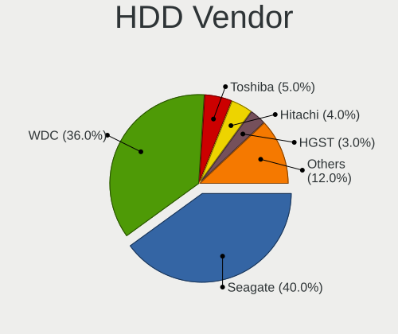

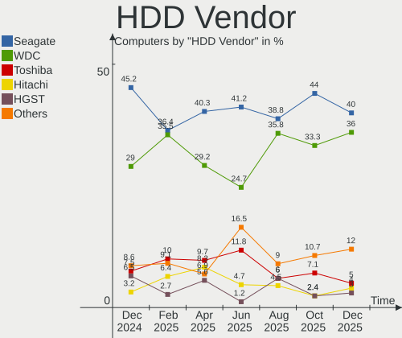

| Vendor              | Computers | Drives | Percent |
|---------------------|-----------|--------|---------|
| Seagate             | 40        | 57     | 40%     |
| WDC                 | 36        | 57     | 36%     |
| Toshiba             | 5         | 5      | 5%      |
| Hitachi             | 4         | 5      | 4%      |
| HGST                | 3         | 3      | 3%      |
| Apple               | 3         | 4      | 3%      |
| Unknown             | 2         | 2      | 2%      |
| Samsung Electronics | 2         | 2      | 2%      |
| USB 3.1             | 1         | 1      | 1%      |
| SABRENT             | 1         | 3      | 1%      |
| Hewlett-Packard     | 1         | 18     | 1%      |
| Fujitsu             | 1         | 1      | 1%      |
| ASMT                | 1         | 2      | 1%      |

SSD Vendor
----------

Solid state drive vendors

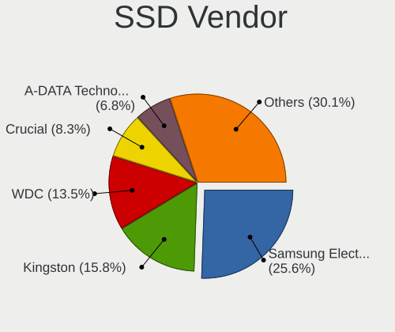

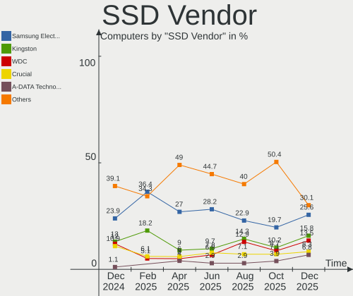

| Vendor              | Computers | Drives | Percent |
|---------------------|-----------|--------|---------|
| Samsung Electronics | 34        | 38     | 25.56%  |
| Kingston            | 21        | 23     | 15.79%  |
| WDC                 | 18        | 20     | 13.53%  |
| Crucial             | 11        | 12     | 8.27%   |
| A-DATA Technology   | 9         | 11     | 6.77%   |
| SanDisk             | 6         | 6      | 4.51%   |
| Apple               | 5         | 5      | 3.76%   |
| China               | 4         | 4      | 3.01%   |
| SPCC                | 3         | 3      | 2.26%   |
| SK hynix            | 2         | 2      | 1.5%    |
| SABRENT             | 2         | 2      | 1.5%    |
| PNY                 | 2         | 2      | 1.5%    |
| Micron Technology   | 2         | 2      | 1.5%    |
| KingSpec            | 2         | 2      | 1.5%    |
| Fanxiang            | 2         | 2      | 1.5%    |
| Transcend           | 1         | 1      | 0.75%   |
| Timetec             | 1         | 1      | 0.75%   |
| T-FORCE             | 1         | 1      | 0.75%   |
| Patriot             | 1         | 1      | 0.75%   |
| Mushkin             | 1         | 1      | 0.75%   |
| LITEONIT            | 1         | 1      | 0.75%   |
| Intel               | 1         | 1      | 0.75%   |
| Hewlett-Packard     | 1         | 1      | 0.75%   |
| EDILOCA             | 1         | 1      | 0.75%   |
| Colorful            | 1         | 1      | 0.75%   |

Drive Kind
----------

HDD or SSD

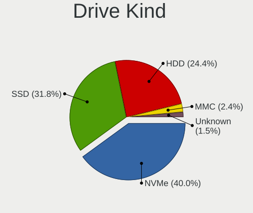

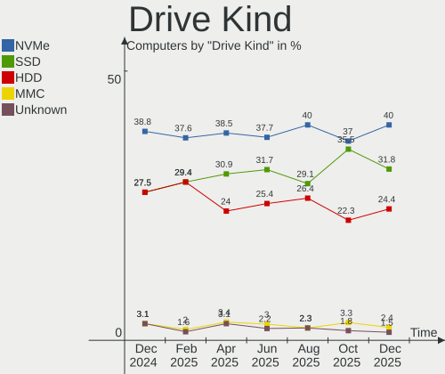

| Kind    | Computers | Drives | Percent |
|---------|-----------|--------|---------|
| NVMe    | 136       | 188    | 40%     |
| SSD     | 108       | 144    | 31.76%  |
| HDD     | 83        | 160    | 24.41%  |
| MMC     | 8         | 11     | 2.35%   |
| Unknown | 5         | 5      | 1.47%   |

Drive Connector
---------------

SATA, SAS, NVMe, etc.

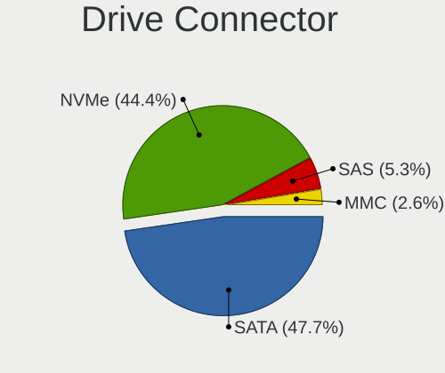

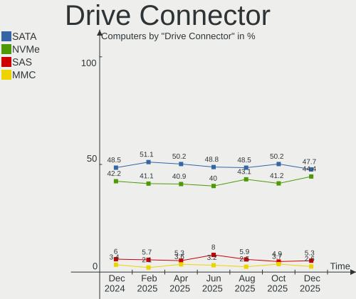

| Type | Computers | Drives | Percent |
|------|-----------|--------|---------|
| SATA | 145       | 285    | 47.7%   |
| NVMe | 135       | 184    | 44.41%  |
| SAS  | 16        | 28     | 5.26%   |
| MMC  | 8         | 11     | 2.63%   |

Drive Size
----------

Size of hard drive

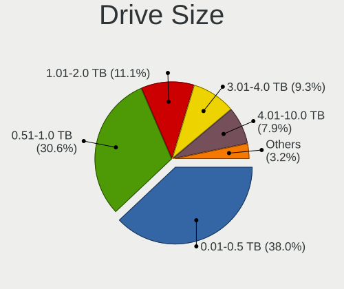

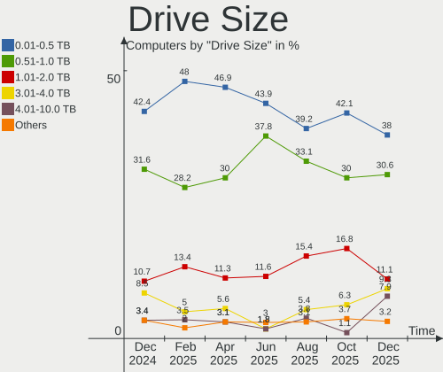

| Size in TB | Computers | Drives | Percent |
|------------|-----------|--------|---------|
| 0.01-0.5   | 82        | 112    | 37.96%  |
| 0.51-1.0   | 66        | 94     | 30.56%  |
| 1.01-2.0   | 24        | 28     | 11.11%  |
| 3.01-4.0   | 20        | 35     | 9.26%   |
| 4.01-10.0  | 17        | 17     | 7.87%   |
| 10.01-20.0 | 4         | 4      | 1.85%   |
| 2.01-3.0   | 3         | 14     | 1.39%   |

Space Total
-----------

Amount of disk space available on the file system

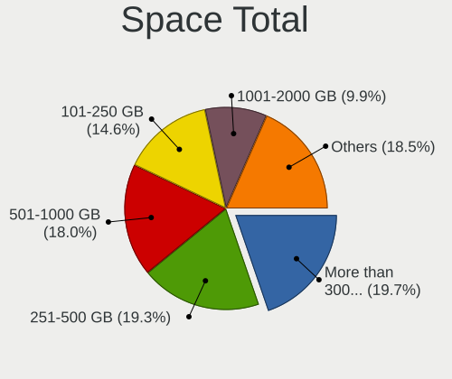

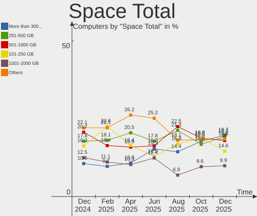

| Size in GB     | Computers | Percent |
|----------------|-----------|---------|
| More than 3000 | 46        | 19.74%  |
| 251-500        | 45        | 19.31%  |
| 501-1000       | 42        | 18.03%  |
| 101-250        | 34        | 14.59%  |
| 1001-2000      | 23        | 9.87%   |
| 51-100         | 12        | 5.15%   |
| 1-20           | 11        | 4.72%   |
| Unknown        | 10        | 4.29%   |
| 2001-3000      | 8         | 3.43%   |
| 21-50          | 2         | 0.86%   |

Space Used
----------

Amount of used disk space

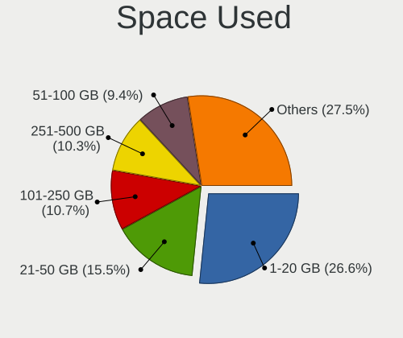

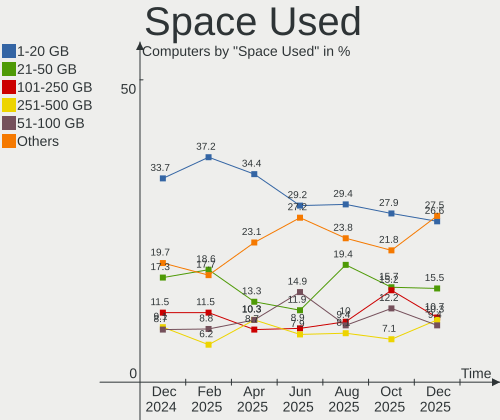

| Used GB        | Computers | Percent |
|----------------|-----------|---------|
| 1-20           | 62        | 26.61%  |
| 21-50          | 36        | 15.45%  |
| 101-250        | 25        | 10.73%  |
| 251-500        | 24        | 10.3%   |
| 51-100         | 22        | 9.44%   |
| More than 3000 | 15        | 6.44%   |
| 1001-2000      | 14        | 6.01%   |
| 501-1000       | 13        | 5.58%   |
| 2001-3000      | 10        | 4.29%   |
| Unknown        | 10        | 4.29%   |
| 0              | 2         | 0.86%   |

Malfunc. Drives
---------------

Drive models with a malfunction

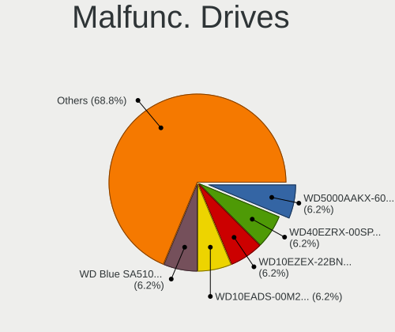

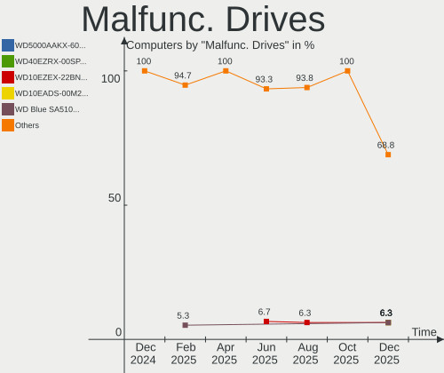

| Model                             | Computers | Drives | Percent |
|-----------------------------------|-----------|--------|---------|
| WDC WD5000AAKX-60U6AA0 500GB      | 1         | 1      | 6.25%   |
| WDC WD40EZRX-00SPEB0 4TB          | 1         | 1      | 6.25%   |
| WDC WD10EZEX-22BN5A0 1TB          | 1         | 1      | 6.25%   |
| WDC WD10EADS-00M2B0 1TB           | 1         | 1      | 6.25%   |
| WDC WD Blue SA510 2.5 1000GB SSD  | 1         | 1      | 6.25%   |
| Toshiba MQ02ABF100 1TB            | 1         | 1      | 6.25%   |
| Seagate ST3500418AS 500GB         | 1         | 1      | 6.25%   |
| Seagate ST31000524AS 1TB          | 1         | 1      | 6.25%   |
| Kingston SUV400S37240G 240GB SSD  | 1         | 1      | 6.25%   |
| Intel SSDSA2M160G2GC 160GB        | 1         | 1      | 6.25%   |
| Hitachi HTS547575A9E384 752GB     | 1         | 1      | 6.25%   |
| HGST HTS725050A7E630 500GB        | 1         | 1      | 6.25%   |
| Apple HDD HTS547550A9E384 500GB   | 1         | 1      | 6.25%   |
| A-DATA Technology SX900 256GB SSD | 1         | 1      | 6.25%   |
| A-DATA Technology SX8100NP 2TB    | 1         | 1      | 6.25%   |
| A-DATA Technology SU800 128GB SSD | 1         | 1      | 6.25%   |

Malfunc. Drive Vendor
---------------------

Vendors of faulty drives

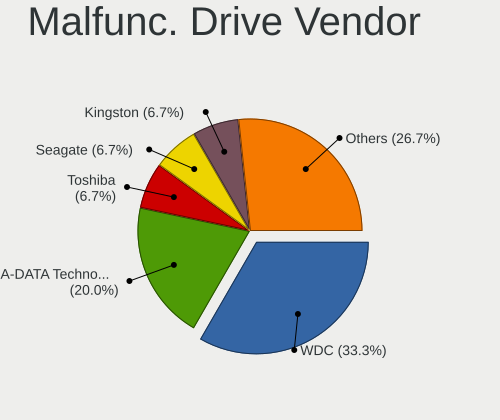

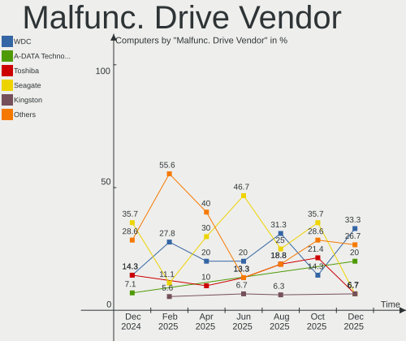

| Vendor            | Computers | Drives | Percent |
|-------------------|-----------|--------|---------|
| WDC               | 5         | 5      | 33.33%  |
| A-DATA Technology | 3         | 3      | 20%     |
| Toshiba           | 1         | 1      | 6.67%   |
| Seagate           | 1         | 2      | 6.67%   |
| Kingston          | 1         | 1      | 6.67%   |
| Intel             | 1         | 1      | 6.67%   |
| Hitachi           | 1         | 1      | 6.67%   |
| HGST              | 1         | 1      | 6.67%   |
| Apple             | 1         | 1      | 6.67%   |

Malfunc. HDD Vendor
-------------------

Vendors of faulty HDD drives

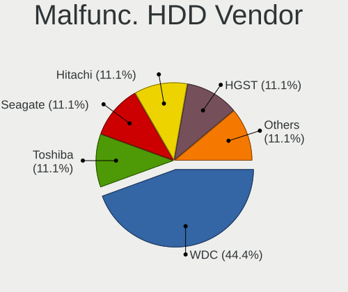

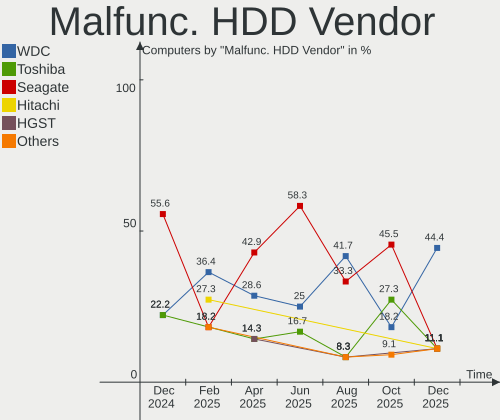

| Vendor  | Computers | Drives | Percent |
|---------|-----------|--------|---------|
| WDC     | 4         | 4      | 44.44%  |
| Toshiba | 1         | 1      | 11.11%  |
| Seagate | 1         | 2      | 11.11%  |
| Hitachi | 1         | 1      | 11.11%  |
| HGST    | 1         | 1      | 11.11%  |
| Apple   | 1         | 1      | 11.11%  |

Malfunc. Drive Kind
-------------------

Kinds of faulty drives

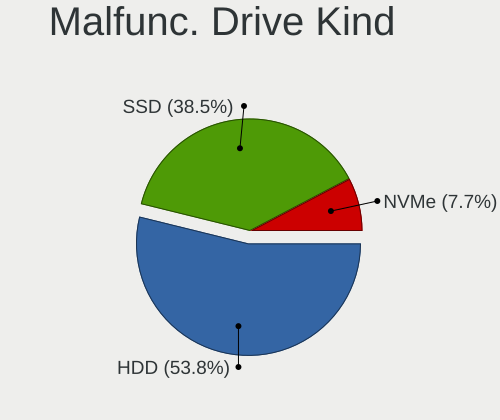

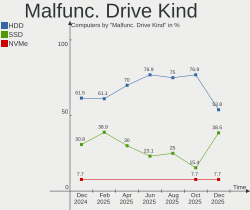

| Kind | Computers | Drives | Percent |
|------|-----------|--------|---------|
| HDD  | 7         | 10     | 53.85%  |
| SSD  | 5         | 5      | 38.46%  |
| NVMe | 1         | 1      | 7.69%   |

Failed Drives
-------------

Failed drive models

Zero info for selected period =(

Failed Drive Vendor
-------------------

Failed drive vendors

Zero info for selected period =(

Drive Status
------------

Number of failed and malfunc. drives

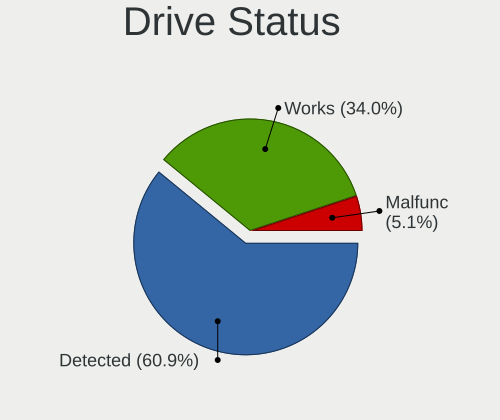

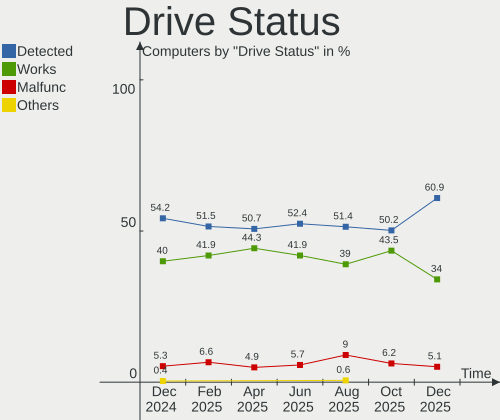

| Status   | Computers | Drives | Percent |
|----------|-----------|--------|---------|
| Detected | 156       | 331    | 60.94%  |
| Works    | 87        | 161    | 33.98%  |
| Malfunc  | 13        | 16     | 5.08%   |

Storage controller
------------------

Storage Vendor
--------------

Storage controller vendors

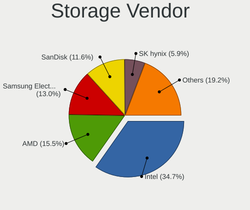

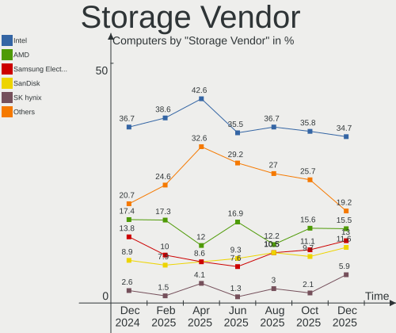

| Vendor                       | Computers | Percent |
|------------------------------|-----------|---------|
| Intel                        | 123       | 34.75%  |
| AMD                          | 55        | 15.54%  |
| Samsung Electronics          | 46        | 12.99%  |
| SanDisk                      | 41        | 11.58%  |
| SK hynix                     | 21        | 5.93%   |
| Kingston Technology Company  | 9         | 2.54%   |
| Phison Electronics           | 8         | 2.26%   |
| MAXIO Technology (Hangzhou)  | 7         | 1.98%   |
| Micron/Crucial Technology    | 6         | 1.69%   |
| ASMedia Technology           | 6         | 1.69%   |
| Marvell Technology Group     | 5         | 1.41%   |
| KIOXIA                       | 5         | 1.41%   |
| Micron Technology            | 4         | 1.13%   |
| Toshiba America Info Systems | 3         | 0.85%   |
| Shenzhen Longsys Electronics | 3         | 0.85%   |
| Realtek Semiconductor        | 2         | 0.56%   |
| INNOGRIT                     | 2         | 0.56%   |
| VIA Technologies             | 1         | 0.28%   |
| Seagate Technology           | 1         | 0.28%   |
| LSI Logic / Symbios Logic    | 1         | 0.28%   |
| JMicron Technology           | 1         | 0.28%   |
| Hewlett-Packard              | 1         | 0.28%   |
| Corsair Memory               | 1         | 0.28%   |
| Broadcom / LSI               | 1         | 0.28%   |
| Apple                        | 1         | 0.28%   |

Storage Model
-------------

Storage controller models

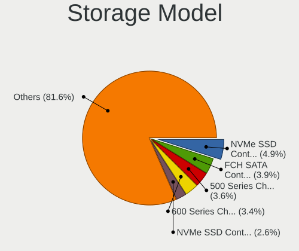

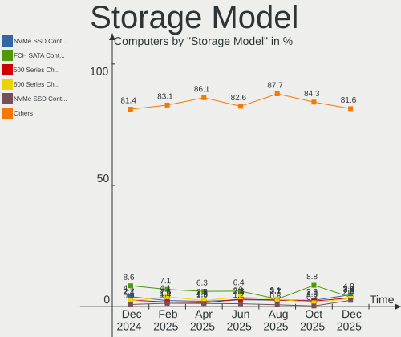

| Model                                                                          | Computers | Percent |
|--------------------------------------------------------------------------------|-----------|---------|
| Samsung NVMe SSD Controller SM981/PM981/PM983                                  | 19        | 4.94%   |
| AMD FCH SATA Controller [AHCI mode]                                            | 15        | 3.9%    |
| AMD 500 Series Chipset SATA Controller                                         | 14        | 3.64%   |
| AMD 600 Series Chipset SATA Controller                                         | 13        | 3.38%   |
| Samsung NVMe SSD Controller S4LV008[Pascal]                                    | 10        | 2.6%    |
| SanDisk WD SN560/SN740/SN770/SN5000 NVMe SSD                                   | 9         | 2.34%   |
| Intel Sunrise Point-LP SATA Controller [AHCI mode]                             | 9         | 2.34%   |
| Intel 8 Series/C220 Series Chipset Family 6-port SATA Controller 1 [AHCI mode] | 9         | 2.34%   |
| Intel SATA Controller [RAID mode]                                              | 8         | 2.08%   |
| AMD 400 Series Chipset SATA Controller                                         | 8         | 2.08%   |
| Intel Q170/Q150/B150/H170/H110/Z170/CM236 Chipset SATA Controller [AHCI Mode]  | 7         | 1.82%   |
| Intel 7 Series Chipset Family 6-port SATA Controller [AHCI mode]               | 7         | 1.82%   |
| Sandisk WD Black SN850X NVMe SSD                                               | 6         | 1.56%   |
| Samsung NVMe SSD Controller PM9C1a (DRAM-less)                                 | 6         | 1.56%   |
| Intel SSD 670p Series [Keystone Harbor]                                        | 6         | 1.56%   |
| SK hynix Gold P31/BC711/PC711 NVMe Solid State Drive                           | 5         | 1.3%    |
| MAXIO (Hangzhou) NVMe SSD Controller MAP1202 (DRAM-less)                       | 5         | 1.3%    |
| Intel Cannon Lake PCH SATA AHCI Controller                                     | 5         | 1.3%    |
| Intel 7 Series/C210 Series Chipset Family 6-port SATA Controller [AHCI mode]   | 5         | 1.3%    |
| SanDisk Ultra 3D / WD PC SN530, IX SN530, Blue SN550 NVMe SSD (DRAM-less)      | 4         | 1.04%   |
| SanDisk Extreme Pro / WD Black SN750 / PC SN730 / Red SN700 NVMe SSD           | 4         | 1.04%   |
| Samsung NVMe SSD Controller 980 (DRAM-less)                                    | 4         | 1.04%   |
| Micron/Crucial P2 [Nick P2] / P3 / P3 Plus NVMe PCIe SSD (DRAM-less)           | 4         | 1.04%   |
| Intel Volume Management Device NVMe RAID Controller                            | 4         | 1.04%   |
| Intel SATA controller                                                          | 4         | 1.04%   |
| Intel 6 Series/C200 Series Chipset Family 6 port Mobile SATA AHCI Controller   | 4         | 1.04%   |
| Intel 6 Series/C200 Series Chipset Family 6 port Desktop SATA AHCI Controller  | 4         | 1.04%   |
| AMD SB7x0/SB8x0/SB9x0 SATA Controller [AHCI mode]                              | 4         | 1.04%   |
| AMD SB7x0/SB8x0/SB9x0 IDE Controller                                           | 4         | 1.04%   |
| SK hynix Platinum P41/PC801 NVMe Solid State Drive                             | 3         | 0.78%   |
| SK hynix PC611 NVMe Solid State Drive                                          | 3         | 0.78%   |
| Shenzhen Longsys Lexar NM790 / Patriot Viper VP4300 Lite NVMe SSD (DRAM-less)  | 3         | 0.78%   |
| SanDisk PC SN735 / WD_BLACK SN750 SE NVMe SSD (DRAM-less)                      | 3         | 0.78%   |
| Samsung NVMe SSD Controller SM961/PM961/SM963                                  | 3         | 0.78%   |
| Kingston Company NV2 NVMe SSD [SM2267XT] (DRAM-less)                           | 3         | 0.78%   |
| Intel Wildcat Point-LP SATA Controller [AHCI Mode]                             | 3         | 0.78%   |
| Intel RST Volume Management Device Controller                                  | 3         | 0.78%   |
| Intel Raptor Lake SATA AHCI Controller                                         | 3         | 0.78%   |
| Intel Comet Lake SATA AHCI Controller                                          | 3         | 0.78%   |
| Intel Cannon Point-LP SATA Controller [AHCI Mode]                              | 3         | 0.78%   |

Storage Kind
------------

Kind of storage controller (IDE, SATA, NVMe, SAS, ...)

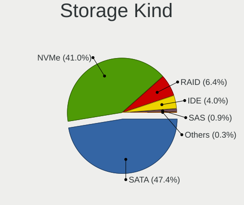

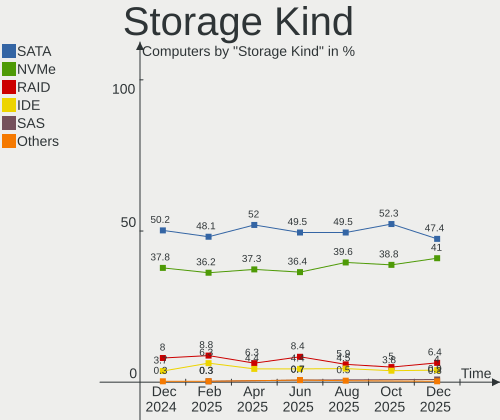

| Kind | Computers | Percent |
|------|-----------|---------|
| SATA | 156       | 47.42%  |
| NVMe | 135       | 41.03%  |
| RAID | 21        | 6.38%   |
| IDE  | 13        | 3.95%   |
| SAS  | 3         | 0.91%   |
| SCSI | 1         | 0.3%    |

Processor
---------

CPU Vendor
----------

Processor vendors

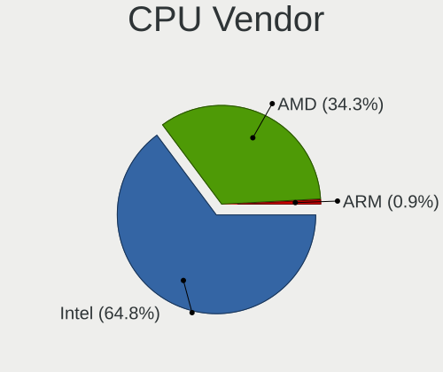

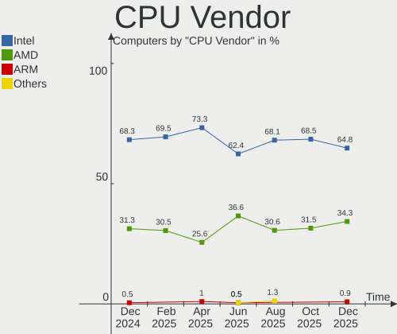

| Vendor | Computers | Percent |
|--------|-----------|---------|
| Intel  | 151       | 64.81%  |
| AMD    | 80        | 34.33%  |
| ARM    | 2         | 0.86%   |

CPU Model
---------

Processor models

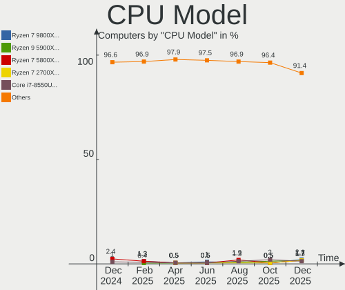

| Model                                       | Computers | Percent |
|---------------------------------------------|-----------|---------|
| AMD Ryzen 7 9800X3D 8-Core Processor        | 5         | 2.15%   |
| AMD Ryzen 9 5900X 12-Core Processor         | 4         | 1.72%   |
| AMD Ryzen 7 5800X 8-Core Processor          | 4         | 1.72%   |
| AMD Ryzen 7 2700X Eight-Core Processor      | 4         | 1.72%   |
| Intel Core i7-8550U CPU @ 1.80GHz           | 3         | 1.29%   |
| Intel Core i7-6700 CPU @ 3.40GHz            | 3         | 1.29%   |
| Intel Core i5-6500 CPU @ 3.20GHz            | 3         | 1.29%   |
| AMD Ryzen 5 5600X 6-Core Processor          | 3         | 1.29%   |
| Intel Xeon CPU E5-2680 v4 @ 2.40GHz         | 2         | 0.86%   |
| Intel Core Ultra 9 285K                     | 2         | 0.86%   |
| Intel Core Ultra 9 275HX                    | 2         | 0.86%   |
| Intel Core i7-9750H CPU @ 2.60GHz           | 2         | 0.86%   |
| Intel Core i7-7500U CPU @ 2.70GHz           | 2         | 0.86%   |
| Intel Core i7-4870HQ CPU @ 2.50GHz          | 2         | 0.86%   |
| Intel Core i7-4770K CPU @ 3.50GHz           | 2         | 0.86%   |
| Intel Core i7-3630QM CPU @ 2.40GHz          | 2         | 0.86%   |
| Intel Core i7 CPU 920 @ 2.67GHz             | 2         | 0.86%   |
| Intel Core i5-8265U CPU @ 1.60GHz           | 2         | 0.86%   |
| Intel Core i5-5300U CPU @ 2.30GHz           | 2         | 0.86%   |
| Intel Core i5-4670 CPU @ 3.40GHz            | 2         | 0.86%   |
| Intel Core i5-1035G1 CPU @ 1.00GHz          | 2         | 0.86%   |
| Intel Core i3-3110M CPU @ 2.40GHz           | 2         | 0.86%   |
| Intel 12th Gen Core i7-1260P                | 2         | 0.86%   |
| Intel 11th Gen Core i5-11400H @ 2.70GHz     | 2         | 0.86%   |
| ARM Processor                               | 2         | 0.86%   |
| AMD Ryzen 9 9955HX 16-Core Processor        | 2         | 0.86%   |
| AMD Ryzen 9 7950X 16-Core Processor         | 2         | 0.86%   |
| AMD Ryzen 7 5800X3D 8-Core Processor        | 2         | 0.86%   |
| AMD Ryzen 5 5500                            | 2         | 0.86%   |
| Intel Xeon CPU W3530 @ 2.80GHz              | 1         | 0.43%   |
| Intel Xeon CPU E5620 @ 2.40GHz              | 1         | 0.43%   |
| Intel Xeon CPU E5-2699 v4 @ 2.20GHz         | 1         | 0.43%   |
| Intel Xeon CPU E5-2697 v3 @ 2.60GHz         | 1         | 0.43%   |
| Intel Xeon CPU E5-2690 v4 @ 2.60GHz         | 1         | 0.43%   |
| Intel Xeon CPU E5-2687W 0 @ 3.10GHz         | 1         | 0.43%   |
| Intel Pentium Silver N6000 @ 1.10GHz        | 1         | 0.43%   |
| Intel Pentium Silver J5040 CPU @ 2.00GHz    | 1         | 0.43%   |
| Intel Pentium Dual-Core CPU E5300 @ 2.60GHz | 1         | 0.43%   |
| Intel Pentium CPU N4200 @ 1.10GHz           | 1         | 0.43%   |
| Intel Pentium CPU J2900 @ 2.41GHz           | 1         | 0.43%   |

CPU Model Family
----------------

Processor model prefix

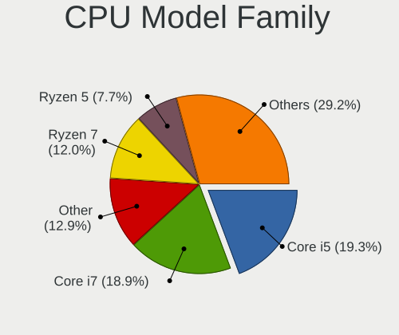

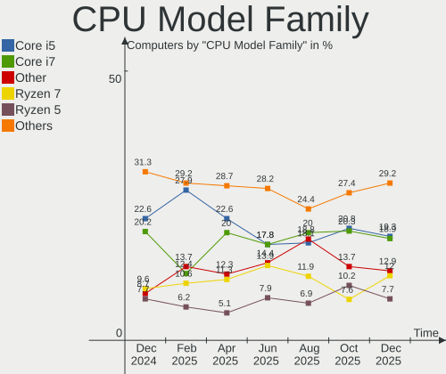

| Model                   | Computers | Percent |
|-------------------------|-----------|---------|
| Intel Core i5           | 45        | 19.31%  |
| Intel Core i7           | 44        | 18.88%  |
| Other                   | 30        | 12.88%  |
| AMD Ryzen 7             | 28        | 12.02%  |
| AMD Ryzen 5             | 18        | 7.73%   |
| AMD Ryzen 9             | 14        | 6.01%   |
| Intel Core              | 11        | 4.72%   |
| Intel Xeon              | 8         | 3.43%   |
| Intel Core i3           | 5         | 2.15%   |
| Intel Pentium           | 3         | 1.29%   |
| Intel Celeron           | 3         | 1.29%   |
| AMD FX                  | 3         | 1.29%   |
| Intel Pentium Silver    | 2         | 0.86%   |
| Intel Core 2 Quad       | 2         | 0.86%   |
| Intel Core 2 Duo        | 2         | 0.86%   |
| AMD Ryzen 3             | 2         | 0.86%   |
| AMD A4                  | 2         | 0.86%   |
| Intel Pentium Dual-Core | 1         | 0.43%   |
| Intel Pentium 4         | 1         | 0.43%   |
| Intel Core m5           | 1         | 0.43%   |
| Intel Core i9           | 1         | 0.43%   |
| Intel Atom              | 1         | 0.43%   |
| AMD Turion 64 X2 Mobile | 1         | 0.43%   |
| AMD Turion 64 Mobile    | 1         | 0.43%   |
| AMD Ryzen 7 PRO         | 1         | 0.43%   |
| AMD Phenom II X6        | 1         | 0.43%   |
| AMD Phenom II X4        | 1         | 0.43%   |
| AMD Athlon II Dual-Core | 1         | 0.43%   |

CPU Cores
---------

Number of processor cores

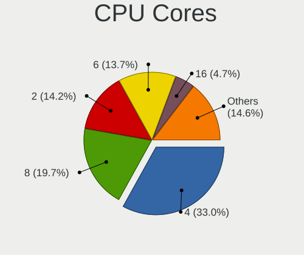

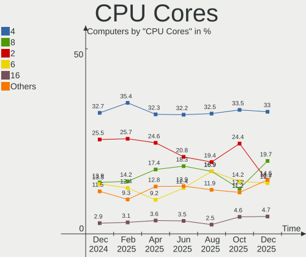

| Number  | Computers | Percent |
|---------|-----------|---------|
| 4       | 77        | 33.05%  |
| 8       | 46        | 19.74%  |
| 2       | 33        | 14.16%  |
| 6       | 32        | 13.73%  |
| 16      | 11        | 4.72%   |
| 12      | 11        | 4.72%   |
| 10      | 6         | 2.58%   |
| 14      | 5         | 2.15%   |
| 24      | 4         | 1.72%   |
| 20      | 3         | 1.29%   |
| 1       | 2         | 0.86%   |
| 44      | 1         | 0.43%   |
| 28      | 1         | 0.43%   |
| Unknown | 1         | 0.43%   |

CPU Sockets
-----------

Number of sockets

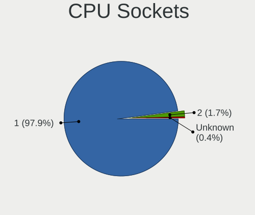

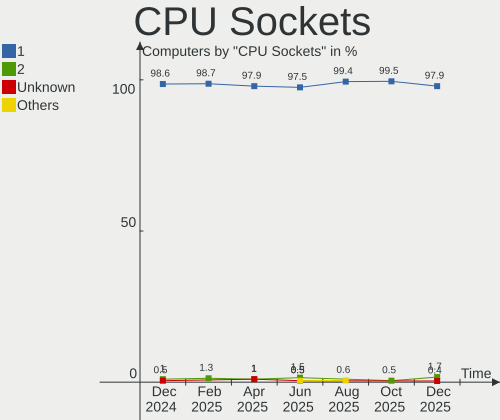

| Number  | Computers | Percent |
|---------|-----------|---------|
| 1       | 228       | 97.85%  |
| 2       | 4         | 1.72%   |
| Unknown | 1         | 0.43%   |

CPU Threads
-----------

Threads per core (Hyper-Threading)

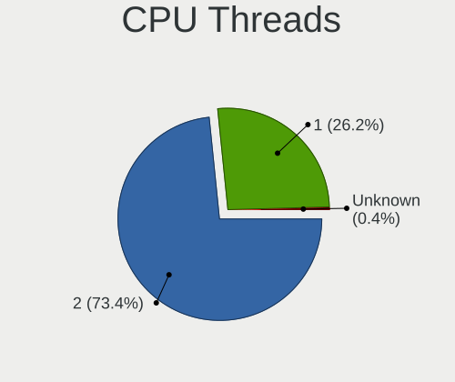

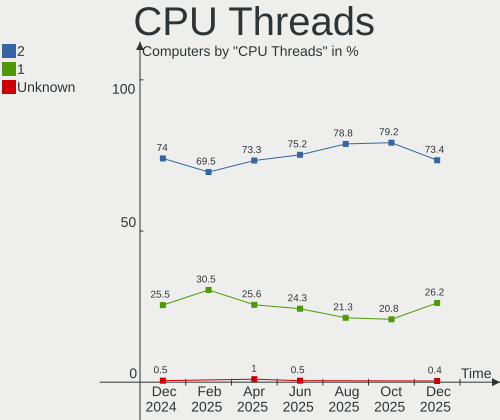

| Number  | Computers | Percent |
|---------|-----------|---------|
| 2       | 171       | 73.39%  |
| 1       | 61        | 26.18%  |
| Unknown | 1         | 0.43%   |

CPU Op-Modes
------------

CPU Operation Modes (32-bit, 64-bit)

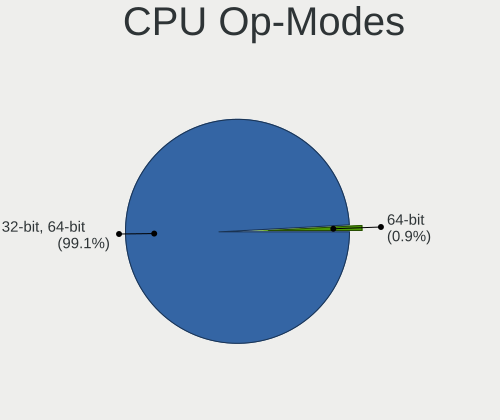

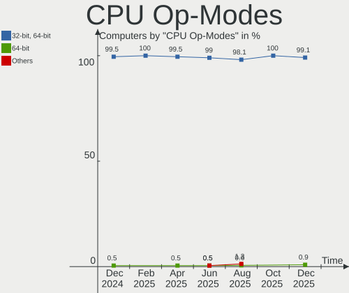

| Op mode        | Computers | Percent |
|----------------|-----------|---------|
| 32-bit, 64-bit | 231       | 99.14%  |
| 64-bit         | 2         | 0.86%   |

CPU Microcode
-------------

Microcode number

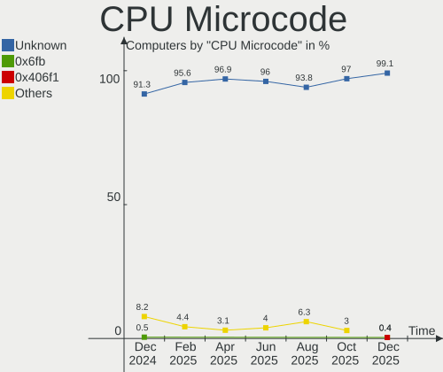

| Number  | Computers | Percent |
|---------|-----------|---------|
| Unknown | 231       | 99.14%  |
| 0x6fb   | 1         | 0.43%   |
| 0x406f1 | 1         | 0.43%   |

CPU Microarch
-------------

Microarchitecture

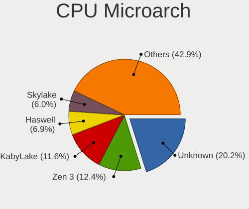

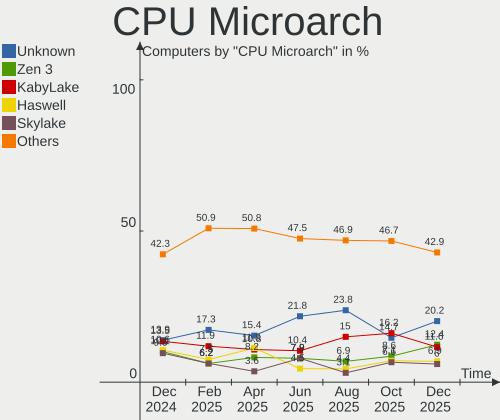

| Name              | Computers | Percent |
|-------------------|-----------|---------|
| Unknown           | 47        | 20.17%  |
| Zen 3             | 29        | 12.45%  |
| KabyLake          | 27        | 11.59%  |
| Haswell           | 16        | 6.87%   |
| Skylake           | 14        | 6.01%   |
| IvyBridge         | 11        | 4.72%   |
| SandyBridge       | 10        | 4.29%   |
| IceLake           | 7         | 3%      |
| Broadwell         | 7         | 3%      |
| CometLake         | 6         | 2.58%   |
| Alderlake Hybrid  | 6         | 2.58%   |
| Zen+              | 5         | 2.15%   |
| Lunarlake Hybrid  | 5         | 2.15%   |
| Zen 2             | 4         | 1.72%   |
| Nehalem           | 4         | 1.72%   |
| Zen               | 3         | 1.29%   |
| Silvermont        | 3         | 1.29%   |
| Piledriver        | 3         | 1.29%   |
| Penryn            | 3         | 1.29%   |
| Meteorlake Hybrid | 3         | 1.29%   |
| K10               | 3         | 1.29%   |
| Westmere          | 2         | 0.86%   |
| TigerLake         | 2         | 0.86%   |
| K8 Hammer         | 2         | 0.86%   |
| Gracemont         | 2         | 0.86%   |
| Core              | 2         | 0.86%   |
| Tremont           | 1         | 0.43%   |
| Puma              | 1         | 0.43%   |
| NetBurst          | 1         | 0.43%   |
| K10 Llano         | 1         | 0.43%   |
| Goldmont plus     | 1         | 0.43%   |
| Goldmont          | 1         | 0.43%   |
| Bonnell           | 1         | 0.43%   |

Graphics
--------

GPU Vendor
----------

Vendors of graphics cards

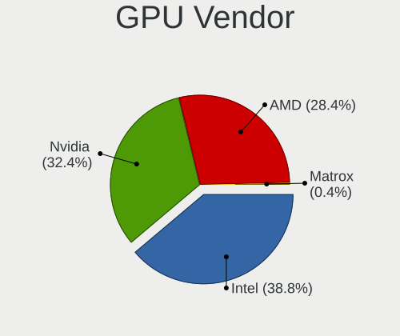

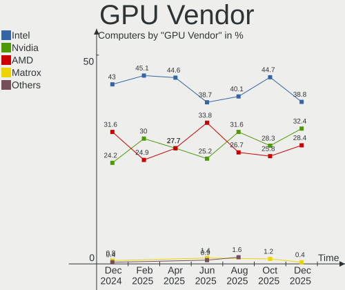

| Vendor                     | Computers | Percent |
|----------------------------|-----------|---------|
| Intel                      | 108       | 38.85%  |
| Nvidia                     | 90        | 32.37%  |
| AMD                        | 79        | 28.42%  |
| Matrox Electronics Systems | 1         | 0.36%   |

GPU Model
---------

Graphics card models

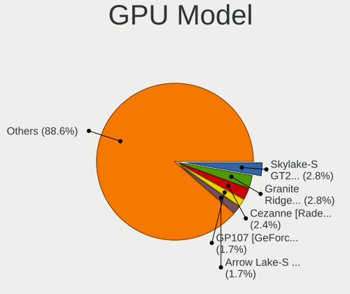

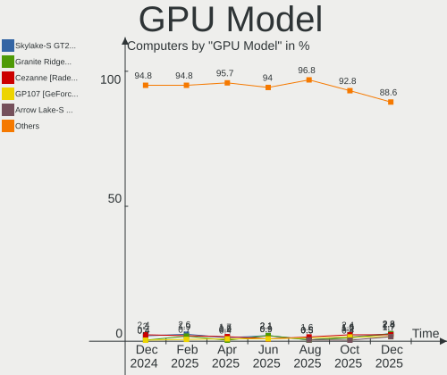

| Model                                                                       | Computers | Percent |
|-----------------------------------------------------------------------------|-----------|---------|
| Intel Skylake-S GT2 [HD Graphics 530]                                       | 8         | 2.77%   |
| AMD Granite Ridge [Radeon Graphics]                                         | 8         | 2.77%   |
| AMD Cezanne [Radeon Vega Series / Radeon Vega Mobile Series]                | 7         | 2.42%   |
| Nvidia GP107 [GeForce GTX 1050 Ti]                                          | 5         | 1.73%   |
| Intel Arrow Lake-S [Intel Graphics]                                         | 5         | 1.73%   |
| Intel 3rd Gen Core processor Graphics Controller                            | 5         | 1.73%   |
| AMD Raphael                                                                 | 5         | 1.73%   |
| AMD Navi 31 [Radeon RX 7900 XT/7900 XTX/7900 GRE/7900M]                     | 5         | 1.73%   |
| Nvidia GA106M [GeForce RTX 3060 Mobile / Max-Q]                             | 4         | 1.38%   |
| Intel Kaby Lake-U GT2 [HD Graphics 620]                                     | 4         | 1.38%   |
| Intel Kaby Lake-R GT2 [UHD Graphics 620]                                    | 4         | 1.38%   |
| Intel 2nd Generation Core Processor Family Integrated Graphics Controller   | 4         | 1.38%   |
| AMD Navi 48 [Radeon RX 9070/9070 XT/9070 GRE]                               | 4         | 1.38%   |
| Nvidia TU106 [GeForce RTX 2060 12GB]                                        | 3         | 1.04%   |
| Nvidia GP106 [GeForce GTX 1060 6GB]                                         | 3         | 1.04%   |
| Nvidia GB205M [GeForce RTX 5070 Ti Mobile]                                  | 3         | 1.04%   |
| Intel Xeon E3-1200 v3/4th Gen Core Processor Integrated Graphics Controller | 3         | 1.04%   |
| Intel Xeon E3-1200 v2/3rd Gen Core processor Graphics Controller            | 3         | 1.04%   |
| Intel WhiskeyLake-U GT2 [UHD Graphics 620]                                  | 3         | 1.04%   |
| Intel Skylake-U GT2 [HD Graphics 520]                                       | 3         | 1.04%   |
| Intel Iris Plus Graphics G1 (Ice Lake)                                      | 3         | 1.04%   |
| Intel Crystal Well Integrated Graphics Controller                           | 3         | 1.04%   |
| Intel CoffeeLake-H GT2 [UHD Graphics 630]                                   | 3         | 1.04%   |
| Intel Broadwell-U GT2 [HD Graphics 5500]                                    | 3         | 1.04%   |
| Intel Atom Processor Z36xxx/Z37xxx Series Graphics & Display                | 3         | 1.04%   |
| Intel Alder Lake-P GT2 [Iris Xe Graphics]                                   | 3         | 1.04%   |
| Intel 4th Gen Core Processor Integrated Graphics Controller                 | 3         | 1.04%   |
| AMD Rembrandt [Radeon 680M]                                                 | 3         | 1.04%   |
| AMD Navi 22 [Radeon RX 6700/6700 XT/6750 XT / 6800M/6850M XT]               | 3         | 1.04%   |
| AMD Navi 21 [Radeon RX 6800/6800 XT / 6900 XT]                              | 3         | 1.04%   |
| AMD Barcelo                                                                 | 3         | 1.04%   |
| Nvidia TU117M [GeForce GTX 1650 Mobile / Max-Q]                             | 2         | 0.69%   |
| Nvidia TU116 [GeForce GTX 1660 SUPER]                                       | 2         | 0.69%   |
| Nvidia TU104 [GeForce RTX 2070 SUPER]                                       | 2         | 0.69%   |
| Nvidia GP104 [GeForce GTX 1070 Ti]                                          | 2         | 0.69%   |
| Nvidia GM206 [GeForce GTX 960]                                              | 2         | 0.69%   |
| Nvidia GM107 [GeForce GTX 750 Ti]                                           | 2         | 0.69%   |
| Nvidia GA106 [GeForce RTX 3060 Lite Hash Rate]                              | 2         | 0.69%   |
| Nvidia GA104 [GeForce RTX 3070 Ti]                                          | 2         | 0.69%   |
| Nvidia GA104 [GeForce RTX 3060]                                             | 2         | 0.69%   |

GPU Combo
---------

Combinations of graphics cards

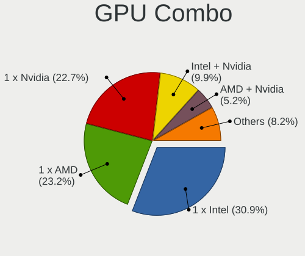

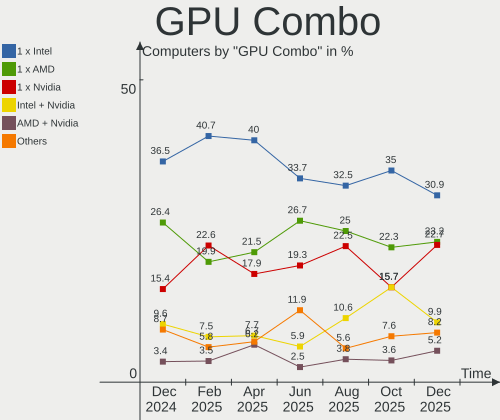

| Name               | Computers | Percent |
|--------------------|-----------|---------|
| 1 x Intel          | 72        | 30.9%   |
| 1 x AMD            | 54        | 23.18%  |
| 1 x Nvidia         | 53        | 22.75%  |
| Intel + Nvidia     | 23        | 9.87%   |
| AMD + Nvidia       | 12        | 5.15%   |
| 2 x AMD            | 7         | 3%      |
| Intel + AMD        | 5         | 2.15%   |
| Other              | 2         | 0.86%   |
| 2 x Intel          | 2         | 0.86%   |
| 2 x Nvidia         | 1         | 0.43%   |
| 1 x Matrox         | 1         | 0.43%   |
| Intel + 2 x Nvidia | 1         | 0.43%   |

GPU Driver
----------

Free vs proprietary

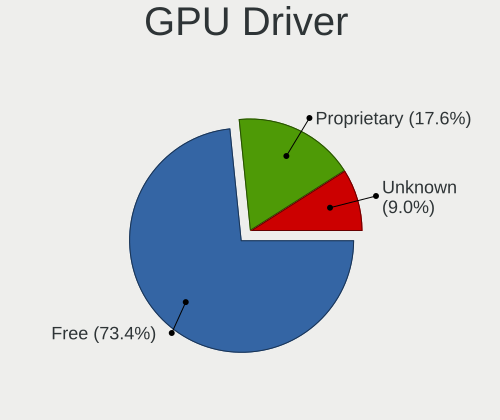

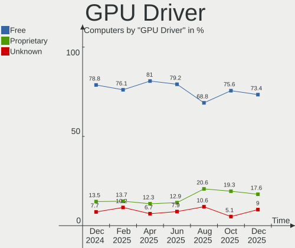

| Driver      | Computers | Percent |
|-------------|-----------|---------|
| Free        | 171       | 73.39%  |
| Proprietary | 41        | 17.6%   |
| Unknown     | 21        | 9.01%   |

GPU Memory
----------

Total video memory

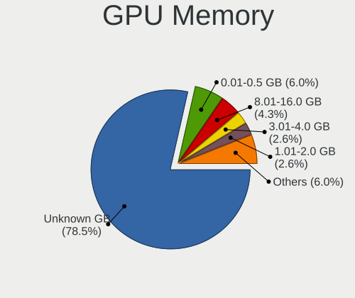

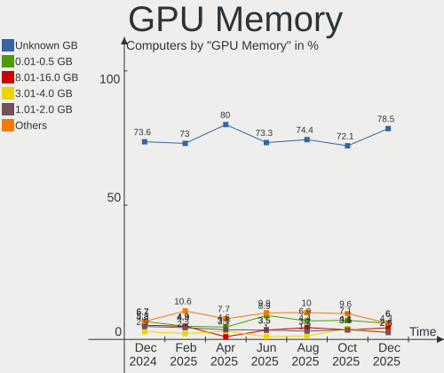

| Size in GB | Computers | Percent |
|------------|-----------|---------|
| Unknown    | 183       | 78.54%  |
| 0.01-0.5   | 14        | 6.01%   |
| 8.01-16.0  | 10        | 4.29%   |
| 3.01-4.0   | 6         | 2.58%   |
| 1.01-2.0   | 6         | 2.58%   |
| 5.01-6.0   | 5         | 2.15%   |
| 7.01-8.0   | 4         | 1.72%   |
| 0.51-1.0   | 3         | 1.29%   |
| 2.01-3.0   | 1         | 0.43%   |
| 16.01-24.0 | 1         | 0.43%   |

Monitor
-------

Monitor Vendor
--------------

Monitor vendors

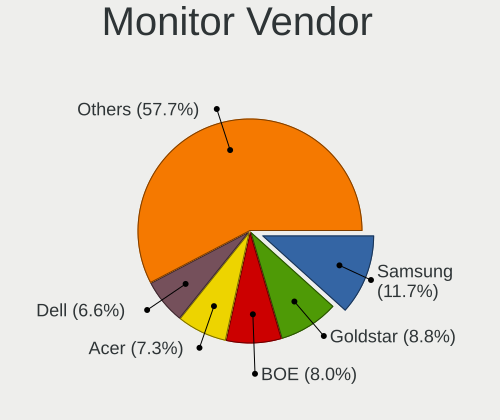

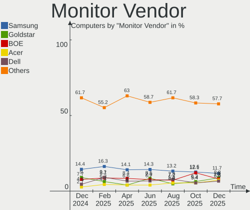

| Vendor                  | Computers | Percent |
|-------------------------|-----------|---------|
| Samsung Electronics     | 32        | 11.68%  |
| Goldstar                | 24        | 8.76%   |
| BOE                     | 22        | 8.03%   |
| Acer                    | 20        | 7.3%    |
| Dell                    | 18        | 6.57%   |
| AU Optronics            | 17        | 6.2%    |
| LG Display              | 16        | 5.84%   |
| Chimei Innolux          | 16        | 5.84%   |
| BenQ                    | 10        | 3.65%   |
| Apple                   | 10        | 3.65%   |
| Ancor Communications    | 10        | 3.65%   |
| Hewlett-Packard         | 9         | 3.28%   |
| ASUSTek Computer        | 9         | 3.28%   |
| MSI                     | 8         | 2.92%   |
| Lenovo                  | 6         | 2.19%   |
| Toshiba                 | 3         | 1.09%   |
| Philips                 | 3         | 1.09%   |
| NEC Computers           | 3         | 1.09%   |
| HKC                     | 3         | 1.09%   |
| Gigabyte Technology     | 3         | 1.09%   |
| Chi Mei Optoelectronics | 3         | 1.09%   |
| ViewSonic               | 2         | 0.73%   |
| Valve                   | 2         | 0.73%   |
| Sony                    | 2         | 0.73%   |
| PANDA                   | 2         | 0.73%   |
| Hitachi                 | 2         | 0.73%   |
| CSW                     | 2         | 0.73%   |
| CSOT                    | 2         | 0.73%   |
| Vizio                   | 1         | 0.36%   |
| Viotek                  | 1         | 0.36%   |
| Unknown                 | 1         | 0.36%   |
| Skyworth                | 1         | 0.36%   |
| SKG                     | 1         | 0.36%   |
| Sharp                   | 1         | 0.36%   |
| Sceptre Tech            | 1         | 0.36%   |
| MStar                   | 1         | 0.36%   |
| MiTAC                   | 1         | 0.36%   |
| LG Philips              | 1         | 0.36%   |
| Insignia                | 1         | 0.36%   |
| InnoLux Display         | 1         | 0.36%   |

Monitor Model
-------------

Monitor models

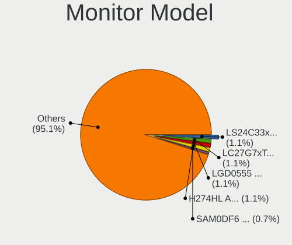

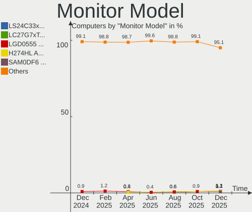

| Model                                                                 | Computers | Percent |
|-----------------------------------------------------------------------|-----------|---------|
| Samsung Electronics LS24C33xG SAM7435 1920x1080 527x296mm 23.8-inch   | 3         | 1.06%   |
| Samsung Electronics LC27G7xT SAM105C 2560x1440 597x336mm 27.0-inch    | 3         | 1.06%   |
| LG Display LCD Monitor LGD0555 2736x1824 260x173mm 12.3-inch          | 3         | 1.06%   |
| Acer H274HL ACR0264 1920x1080 598x336mm 27.0-inch                     | 3         | 1.06%   |
| Samsung Electronics LCD Monitor SAM0DF6 3840x2160 890x500mm 40.2-inch | 2         | 0.7%    |
| Samsung Electronics ATNA60HU02-0  SDC421B                             | 2         | 0.7%    |
| Goldstar FULL HD GSM5B55 1920x1080 480x270mm 21.7-inch                | 2         | 0.7%    |
| Goldstar FHD GSM5CD6 1920x1080 530x300mm 24.0-inch                    | 2         | 0.7%    |
| Dell U2417H DEL40E8 1920x1080 530x300mm 24.0-inch                     | 2         | 0.7%    |
| Dell P2214H DELA097 1920x1080 477x268mm 21.5-inch                     | 2         | 0.7%    |
| Chimei Innolux LCD Monitor CMN15F5 1920x1080 344x193mm 15.5-inch      | 2         | 0.7%    |
| AU Optronics LCD Monitor AUO303E 1600x900 309x174mm 14.0-inch         | 2         | 0.7%    |
| AU Optronics LCD Monitor AUO22EC 1366x768 344x193mm 15.5-inch         | 2         | 0.7%    |
| AU Optronics LCD Monitor AUO21ED 1920x1080 344x193mm 15.5-inch        | 2         | 0.7%    |
| AU Optronics LCD Monitor AUO10EC 1366x768 344x193mm 15.5-inch         | 2         | 0.7%    |
| Apple Color LCD APPA02E 2880x1800 331x207mm 15.4-inch                 | 2         | 0.7%    |
| Ancor Communications VE247 ACI2493 1920x1080 530x300mm 24.0-inch      | 2         | 0.7%    |
| Acer ED320QR S ACR0805 1920x1080 609x348mm 27.6-inch                  | 2         | 0.7%    |
| Vizio V405-G9 VIZ1033 3840x2160 1096x616mm 49.5-inch                  | 1         | 0.35%   |
| Viotek GNV30CB VTK3000 2560x1080 690x291mm 29.5-inch                  | 1         | 0.35%   |
| ViewSonic VA2231 Series VSCBB25 1920x1080 477x268mm 21.5-inch         | 1         | 0.35%   |
| ViewSonic E771-4 VSC5941 1280x1024 300x225mm 14.8-inch                | 1         | 0.35%   |
| Valve ANX7530 U VLV3003 800x1280 100x160mm 7.4-inch                   | 1         | 0.35%   |
| Valve ANX7530 U VLV3001 800x1280 100x150mm 7.1-inch                   | 1         | 0.35%   |
| Unknown LCD Monitor FFFF 2288x1287 2550x2550mm 142.0-inch             | 1         | 0.35%   |
| Toshiba TV TSB1011 1920x1080 930x523mm 42.0-inch                      | 1         | 0.35%   |
| Toshiba TV TSB0206 1920x1080                                          | 1         | 0.35%   |
| Toshiba TV TSB0205 1360x765                                           | 1         | 0.35%   |
| Sony TV SNYEA01 1920x1080                                             | 1         | 0.35%   |
| Sony TV *30 SNYB905 3840x2160 1439x809mm 65.0-inch                    | 1         | 0.35%   |
| Skyworth TV MONITOR SKY0030 1920x1080 1430x800mm 64.5-inch            | 1         | 0.35%   |
| SKG H34S18S SKG3403 3440x1440 797x334mm 34.0-inch                     | 1         | 0.35%   |
| Sharp LCD Monitor SHP1593 1920x1200 288x180mm 13.4-inch               | 1         | 0.35%   |
| Sceptre Tech X246W-1080p SPT2303 1920x1080 521x293mm 23.5-inch        | 1         | 0.35%   |
| Samsung Electronics SyncMaster SAM0657 1920x1080                      | 1         | 0.35%   |
| Samsung Electronics SyncMaster SAM01AD 1600x1200 408x306mm 20.1-inch  | 1         | 0.35%   |
| Samsung Electronics SMB2430HD SAM0713 1920x1080 531x299mm 24.0-inch   | 1         | 0.35%   |
| Samsung Electronics SA300/SA350 SAM078F 1920x1080 477x268mm 21.5-inch | 1         | 0.35%   |
| Samsung Electronics S32E590C SAM0C5A 1920x1080 698x392mm 31.5-inch    | 1         | 0.35%   |
| Samsung Electronics S27R35x SAM1053 1920x1080 598x336mm 27.0-inch     | 1         | 0.35%   |

Monitor Resolution
------------------

Monitor screen resolution

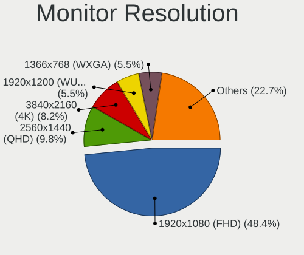

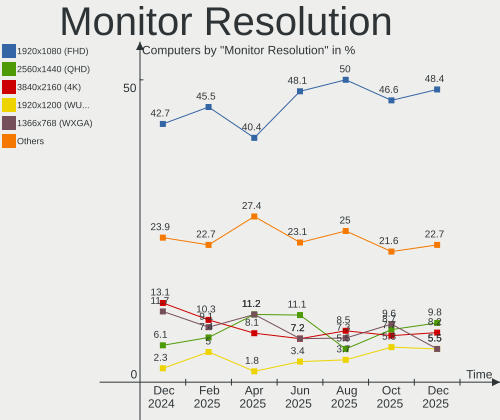

| Resolution         | Computers | Percent |
|--------------------|-----------|---------|
| 1920x1080 (FHD)    | 124       | 48.44%  |
| 2560x1440 (QHD)    | 25        | 9.77%   |
| 3840x2160 (4K)     | 21        | 8.2%    |
| 1920x1200 (WUXGA)  | 14        | 5.47%   |
| 1366x768 (WXGA)    | 14        | 5.47%   |
| 3440x1440          | 7         | 2.73%   |
| 2560x1080          | 6         | 2.34%   |
| 1600x900 (HD+)     | 5         | 1.95%   |
| Unknown            | 5         | 1.95%   |
| 2880x1920          | 4         | 1.56%   |
| 2880x1800          | 4         | 1.56%   |
| 2560x1600          | 4         | 1.56%   |
| 800x1280           | 2         | 0.78%   |
| 2560x2880          | 2         | 0.78%   |
| 2160x1440          | 2         | 0.78%   |
| 1680x1050 (WSXGA+) | 2         | 0.78%   |
| 1440x900 (WXGA+)   | 2         | 0.78%   |
| 1280x800 (WXGA)    | 2         | 0.78%   |
| 1280x1024 (SXGA)   | 2         | 0.78%   |
| 3840x2400          | 1         | 0.39%   |
| 3840x1080          | 1         | 0.39%   |
| 3072x1920          | 1         | 0.39%   |
| 2288x1287          | 1         | 0.39%   |
| 2256x1504          | 1         | 0.39%   |
| 1920x540           | 1         | 0.39%   |
| 1600x1200          | 1         | 0.39%   |
| 1360x768           | 1         | 0.39%   |
| 1280x960           | 1         | 0.39%   |

Monitor Diagonal
----------------

Diagonal size in inches

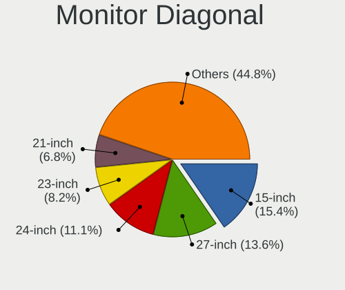

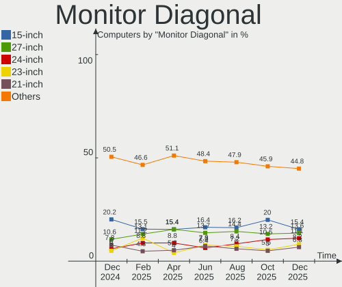

| Inches  | Computers | Percent |
|---------|-----------|---------|
| 15      | 43        | 15.41%  |
| 27      | 38        | 13.62%  |
| 24      | 31        | 11.11%  |
| 23      | 23        | 8.24%   |
| 21      | 19        | 6.81%   |
| 31      | 18        | 6.45%   |
| 13      | 16        | 5.73%   |
| 14      | 15        | 5.38%   |
| 34      | 10        | 3.58%   |
| 16      | 10        | 3.58%   |
| 17      | 8         | 2.87%   |
| Unknown | 7         | 2.51%   |
| 84      | 3         | 1.08%   |
| 32      | 3         | 1.08%   |
| 26      | 3         | 1.08%   |
| 20      | 3         | 1.08%   |
| 18      | 3         | 1.08%   |
| 12      | 3         | 1.08%   |
| 74      | 2         | 0.72%   |
| 72      | 2         | 0.72%   |
| 40      | 2         | 0.72%   |
| 29      | 2         | 0.72%   |
| 22      | 2         | 0.72%   |
| 19      | 2         | 0.72%   |
| 7       | 2         | 0.72%   |
| 142     | 1         | 0.36%   |
| 85      | 1         | 0.36%   |
| 64      | 1         | 0.36%   |
| 54      | 1         | 0.36%   |
| 49      | 1         | 0.36%   |
| 48      | 1         | 0.36%   |
| 42      | 1         | 0.36%   |
| 36      | 1         | 0.36%   |
| 8       | 1         | 0.36%   |

Monitor Width
-------------

Physical width

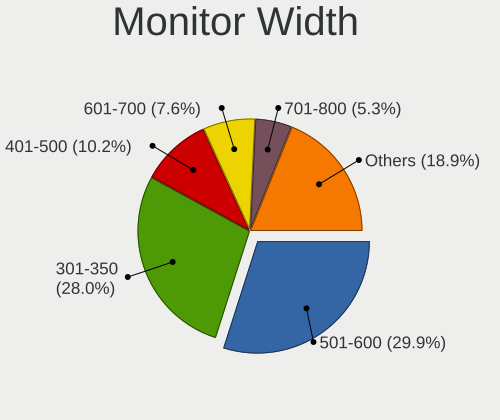

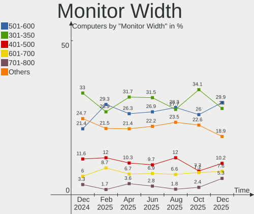

| Width in mm    | Computers | Percent |
|----------------|-----------|---------|
| 501-600        | 79        | 29.92%  |
| 301-350        | 74        | 28.03%  |
| 401-500        | 27        | 10.23%  |
| 601-700        | 20        | 7.58%   |
| 701-800        | 14        | 5.3%    |
| 201-300        | 14        | 5.3%    |
| 351-400        | 10        | 3.79%   |
| 1501-2000      | 8         | 3.03%   |
| Unknown        | 7         | 2.65%   |
| 1001-1500      | 4         | 1.52%   |
| 901-1000       | 2         | 0.76%   |
| 1-100          | 2         | 0.76%   |
| More than 2000 | 1         | 0.38%   |
| 801-900        | 1         | 0.38%   |
| 101-200        | 1         | 0.38%   |

Aspect Ratio
------------

Proportional relationship between the width and the height

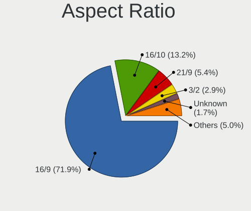

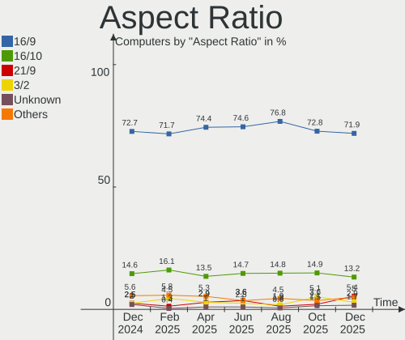

| Ratio   | Computers | Percent |
|---------|-----------|---------|
| 16/9    | 174       | 71.9%   |
| 16/10   | 32        | 13.22%  |
| 21/9    | 13        | 5.37%   |
| 3/2     | 7         | 2.89%   |
| Unknown | 4         | 1.65%   |
| 5/4     | 3         | 1.24%   |
| 4/3     | 2         | 0.83%   |
| 0.89    | 2         | 0.83%   |
| 32/9    | 1         | 0.41%   |
| 1.96    | 1         | 0.41%   |
| 1.00    | 1         | 0.41%   |
| 0.67    | 1         | 0.41%   |
| 0.62    | 1         | 0.41%   |

Monitor Area
------------

Area in inch²

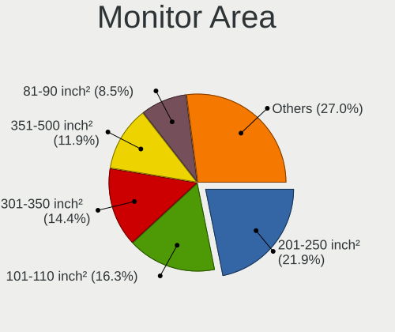

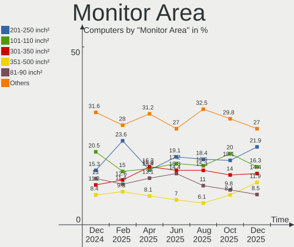

| Area in inch² | Computers | Percent |
|----------------|-----------|---------|
| 201-250        | 59        | 21.85%  |
| 101-110        | 44        | 16.3%   |
| 301-350        | 39        | 14.44%  |
| 351-500        | 32        | 11.85%  |
| 81-90          | 23        | 8.52%   |
| More than 1000 | 12        | 4.44%   |
| 111-120        | 10        | 3.7%    |
| 151-200        | 9         | 3.33%   |
| 71-80          | 7         | 2.59%   |
| 251-300        | 7         | 2.59%   |
| 121-130        | 7         | 2.59%   |
| Unknown        | 7         | 2.59%   |
| 501-1000       | 5         | 1.85%   |
| 1-40           | 3         | 1.11%   |
| 141-150        | 3         | 1.11%   |
| 61-70          | 2         | 0.74%   |
| 91-100         | 1         | 0.37%   |

Pixel Density
-------------

Pixels per inch

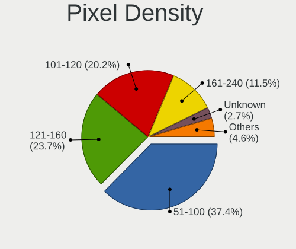

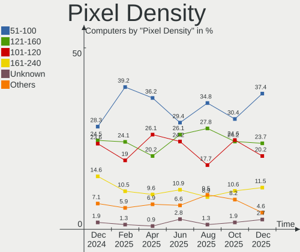

| Density       | Computers | Percent |
|---------------|-----------|---------|
| 51-100        | 98        | 37.4%   |
| 121-160       | 62        | 23.66%  |
| 101-120       | 53        | 20.23%  |
| 161-240       | 30        | 11.45%  |
| Unknown       | 7         | 2.67%   |
| More than 240 | 6         | 2.29%   |
| 1-50          | 6         | 2.29%   |

Multiple Monitors
-----------------

Total monitors connected

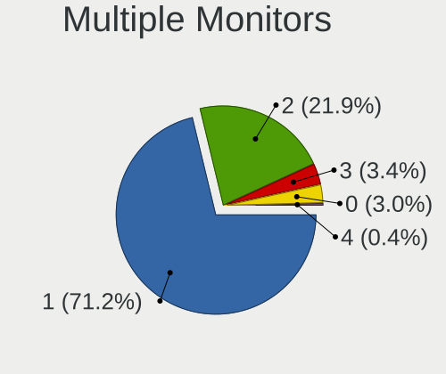

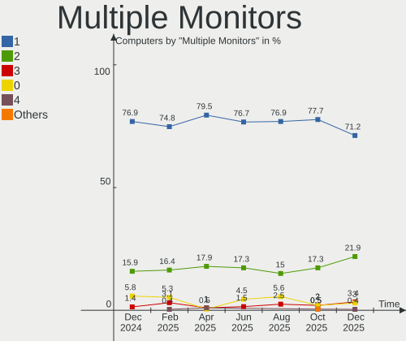

| Total | Computers | Percent |
|-------|-----------|---------|
| 1     | 166       | 71.24%  |
| 2     | 51        | 21.89%  |
| 3     | 8         | 3.43%   |
| 0     | 7         | 3%      |
| 4     | 1         | 0.43%   |

Network
-------

Net Controller Vendor
---------------------

Controller vendors

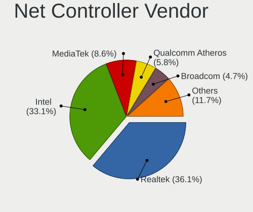

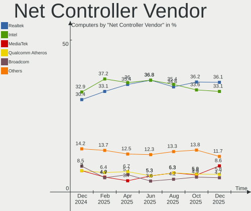

| Vendor                     | Computers | Percent |
|----------------------------|-----------|---------|
| Realtek Semiconductor      | 130       | 36.11%  |
| Intel                      | 119       | 33.06%  |
| MediaTek                   | 31        | 8.61%   |
| Qualcomm Atheros           | 21        | 5.83%   |
| Broadcom                   | 17        | 4.72%   |
| Broadcom Limited           | 5         | 1.39%   |
| ASIX Electronics           | 5         | 1.39%   |
| TP-Link                    | 4         | 1.11%   |
| Google                     | 3         | 0.83%   |
| Ralink                     | 2         | 0.56%   |
| Qualcomm Technologies      | 2         | 0.56%   |
| NetGear                    | 2         | 0.56%   |
| Motorola PCS               | 2         | 0.56%   |
| Microsoft                  | 2         | 0.56%   |
| Marvell Technology Group   | 2         | 0.56%   |
| DisplayLink                | 2         | 0.56%   |
| Aquantia                   | 2         | 0.56%   |
| Sierra Wireless            | 1         | 0.28%   |
| Samsung Electronics        | 1         | 0.28%   |
| Raspberry Pi               | 1         | 0.28%   |
| Quectel Wireless Solutions | 1         | 0.28%   |
| Qualcomm                   | 1         | 0.28%   |
| Leo Bodnar Electronics     | 1         | 0.28%   |
| D-Link                     | 1         | 0.28%   |
| Apple                      | 1         | 0.28%   |
| aicsemi                    | 1         | 0.28%   |

Net Controller Model
--------------------

Controller models

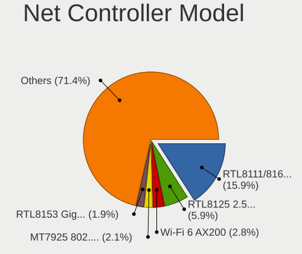

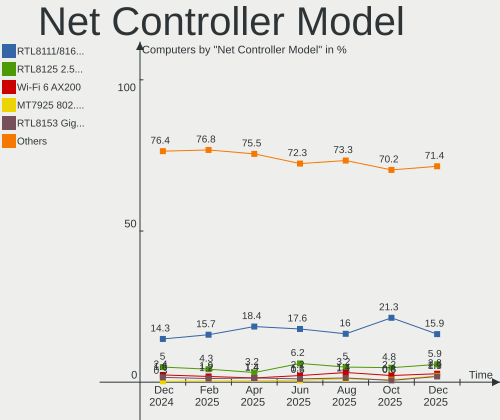

| Model                                                                           | Computers | Percent |
|---------------------------------------------------------------------------------|-----------|---------|
| Realtek RTL8111/8168/8211/8411 PCI Express Gigabit Ethernet Controller          | 68        | 15.93%  |
| Realtek RTL8125 2.5GbE Controller                                               | 25        | 5.85%   |
| Intel Wi-Fi 6 AX200                                                             | 12        | 2.81%   |
| MediaTek MT7925 802.11be 160MHz 2x2 PCIe Wireless Network Adapter [Filogic 360] | 9         | 2.11%   |
| Realtek RTL8153 Gigabit Ethernet Adapter                                        | 8         | 1.87%   |
| Realtek RTL810xE PCI Express Fast Ethernet controller                           | 8         | 1.87%   |
| MediaTek MT7922 802.11ax PCI Express Wireless Network Adapter                   | 8         | 1.87%   |
| Intel Wireless 8265 / 8275                                                      | 8         | 1.87%   |
| Intel Ethernet Controller I225-V                                                | 8         | 1.87%   |
| Intel 82579LM Gigabit Network Connection (Lewisville)                           | 7         | 1.64%   |
| Intel I211 Gigabit Network Connection                                           | 6         | 1.41%   |
| Intel Cannon Lake PCH CNVi WiFi                                                 | 6         | 1.41%   |
| Realtek USB 10/100/1G/2.5 LAN                                                   | 5         | 1.17%   |
| Qualcomm Atheros AR9485 Wireless Network Adapter                                | 5         | 1.17%   |
| Intel Wireless 8260                                                             | 5         | 1.17%   |
| Intel Wireless 7265                                                             | 5         | 1.17%   |
| Intel Ethernet Connection (7) I219-V                                            | 5         | 1.17%   |
| Intel Dual Band Wireless-AC 3168NGW [Stone Peak]                                | 5         | 1.17%   |
| ASIX AX88179 Gigabit Ethernet                                                   | 5         | 1.17%   |
| Realtek RTL8852BE PCIe 802.11ax Wireless Network Controller                     | 4         | 0.94%   |
| Realtek RTL8822CE 802.11ac PCIe Wireless Network Adapter                        | 4         | 0.94%   |
| Realtek Killer E2600 GbE Controller                                             | 4         | 0.94%   |
| MediaTek MT7921 802.11ax PCIe Wireless Network Adapter [Filogic 330]            | 4         | 0.94%   |
| MediaTek MT7902 802.11ax PCIe Wireless Network Adapter [Filogic 310]            | 4         | 0.94%   |
| Intel Wi-Fi 6E(802.11ax) AX210/AX1675* 2x2 [Typhoon Peak]                       | 4         | 0.94%   |
| Intel Ethernet Connection I217-LM                                               | 4         | 0.94%   |
| Intel Comet Lake PCH CNVi WiFi                                                  | 4         | 0.94%   |
| Intel Alder Lake-P PCH CNVi WiFi                                                | 4         | 0.94%   |
| Broadcom BCM4360 802.11ac Dual Band Wireless Network Adapter                    | 4         | 0.94%   |
| Realtek RTL8852CE PCIe 802.11ax Wireless Network Controller                     | 3         | 0.7%    |
| Realtek RTL8821CE 802.11ac PCIe Wireless Network Adapter                        | 3         | 0.7%    |
| Realtek 802.11ac NIC                                                            | 3         | 0.7%    |
| Qualcomm Atheros QCA9377 802.11ac Wireless Network Adapter                      | 3         | 0.7%    |
| Qualcomm Atheros QCA6174 802.11ac Wireless Network Adapter                      | 3         | 0.7%    |
| Qualcomm Atheros AR9285 Wireless Network Adapter (PCI-Express)                  | 3         | 0.7%    |
| Intel Wi-Fi 5(802.11ac) Wireless-AC 9x6x [Thunder Peak]                         | 3         | 0.7%    |
| Intel Tiger Lake PCH CNVi WiFi                                                  | 3         | 0.7%    |
| Intel Raptor Lake PCH CNVi WiFi                                                 | 3         | 0.7%    |
| Intel Ice Lake-LP PCH CNVi WiFi                                                 | 3         | 0.7%    |
| Intel Ethernet Connection I219-LM                                               | 3         | 0.7%    |

Wireless Vendor
---------------

Wireless vendors

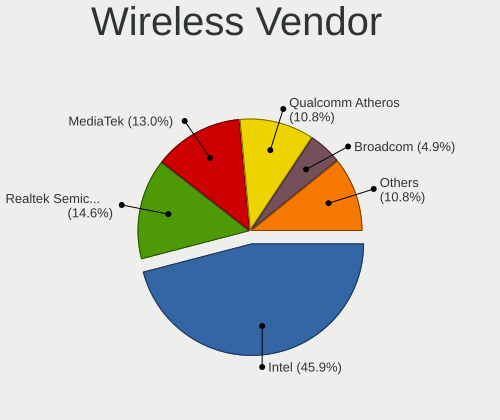

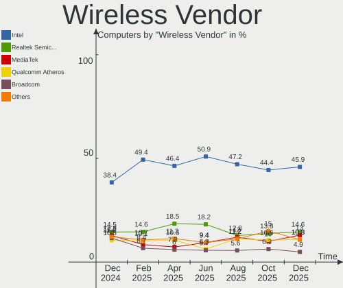

| Vendor                   | Computers | Percent |
|--------------------------|-----------|---------|
| Intel                    | 85        | 45.95%  |
| Realtek Semiconductor    | 27        | 14.59%  |
| MediaTek                 | 24        | 12.97%  |
| Qualcomm Atheros         | 20        | 10.81%  |
| Broadcom                 | 9         | 4.86%   |
| Broadcom Limited         | 5         | 2.7%    |
| TP-Link                  | 4         | 2.16%   |
| Ralink                   | 2         | 1.08%   |
| NetGear                  | 2         | 1.08%   |
| Microsoft                | 2         | 1.08%   |
| Sierra Wireless          | 1         | 0.54%   |
| Qualcomm Technologies    | 1         | 0.54%   |
| Qualcomm                 | 1         | 0.54%   |
| Marvell Technology Group | 1         | 0.54%   |
| D-Link                   | 1         | 0.54%   |

Wireless Model
--------------

Wireless models

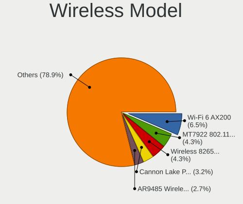

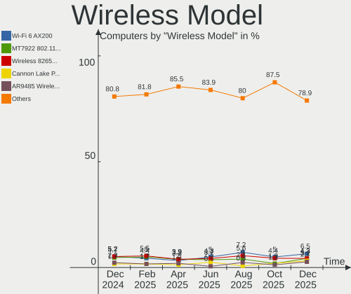

| Model                                                                           | Computers | Percent |
|---------------------------------------------------------------------------------|-----------|---------|
| Intel Wi-Fi 6 AX200                                                             | 12        | 6.49%   |
| MediaTek MT7922 802.11ax PCI Express Wireless Network Adapter                   | 8         | 4.32%   |
| Intel Wireless 8265 / 8275                                                      | 8         | 4.32%   |
| Intel Cannon Lake PCH CNVi WiFi                                                 | 6         | 3.24%   |
| Qualcomm Atheros AR9485 Wireless Network Adapter                                | 5         | 2.7%    |
| Intel Wireless 8260                                                             | 5         | 2.7%    |
| Intel Wireless 7265                                                             | 5         | 2.7%    |
| Intel Dual Band Wireless-AC 3168NGW [Stone Peak]                                | 5         | 2.7%    |
| Realtek RTL8822CE 802.11ac PCIe Wireless Network Adapter                        | 4         | 2.16%   |
| MediaTek MT7925 802.11be 160MHz 2x2 PCIe Wireless Network Adapter [Filogic 360] | 4         | 2.16%   |
| MediaTek MT7921 802.11ax PCIe Wireless Network Adapter [Filogic 330]            | 4         | 2.16%   |
| MediaTek MT7902 802.11ax PCIe Wireless Network Adapter [Filogic 310]            | 4         | 2.16%   |
| Intel Wi-Fi 6E(802.11ax) AX210/AX1675* 2x2 [Typhoon Peak]                       | 4         | 2.16%   |
| Intel Comet Lake PCH CNVi WiFi                                                  | 4         | 2.16%   |
| Broadcom BCM4360 802.11ac Dual Band Wireless Network Adapter                    | 4         | 2.16%   |
| Realtek RTL8852BE PCIe 802.11ax Wireless Network Controller                     | 3         | 1.62%   |
| Realtek RTL8821CE 802.11ac PCIe Wireless Network Adapter                        | 3         | 1.62%   |
| Realtek 802.11ac NIC                                                            | 3         | 1.62%   |
| Qualcomm Atheros QCA9377 802.11ac Wireless Network Adapter                      | 3         | 1.62%   |
| Qualcomm Atheros QCA6174 802.11ac Wireless Network Adapter                      | 3         | 1.62%   |
| Qualcomm Atheros AR9285 Wireless Network Adapter (PCI-Express)                  | 3         | 1.62%   |
| Intel Wi-Fi 5(802.11ac) Wireless-AC 9x6x [Thunder Peak]                         | 3         | 1.62%   |
| Intel Tiger Lake PCH CNVi WiFi                                                  | 3         | 1.62%   |
| Intel Raptor Lake PCH CNVi WiFi                                                 | 3         | 1.62%   |
| Intel Ice Lake-LP PCH CNVi WiFi                                                 | 3         | 1.62%   |
| Intel Centrino Wireless-N 2230                                                  | 3         | 1.62%   |
| Intel Alder Lake-P PCH CNVi WiFi                                                | 3         | 1.62%   |
| Realtek RTL88x2bu [AC1200 Techkey]                                              | 2         | 1.08%   |
| Realtek RTL8852CE PCIe 802.11ax Wireless Network Controller                     | 2         | 1.08%   |
| Realtek RTL8851BE PCIe 802.11ax Wireless Network Controller                     | 2         | 1.08%   |
| Qualcomm Atheros AR9462 Wireless Network Adapter                                | 2         | 1.08%   |
| NetGear A6150                                                                   | 2         | 1.08%   |
| Microsoft Xbox Wireless Adapter for Windows                                     | 2         | 1.08%   |
| MediaTek MT7921K (RZ608) Wi-Fi 6E 80MHz                                         | 2         | 1.08%   |
| Intel Wi-Fi 6 AX201                                                             | 2         | 1.08%   |
| Intel Comet Lake PCH-LP CNVi WiFi                                               | 2         | 1.08%   |
| Intel Centrino Advanced-N 6205 [Taylor Peak]                                    | 2         | 1.08%   |
| Intel Cannon Point-LP CNVi [Wireless-AC]                                        | 2         | 1.08%   |
| Intel BE201 320MHz                                                              | 2         | 1.08%   |
| Broadcom Limited BCM4352 802.11ac Dual Band Wireless Network Adapter            | 2         | 1.08%   |

Ethernet Vendor
---------------

Ethernet vendors

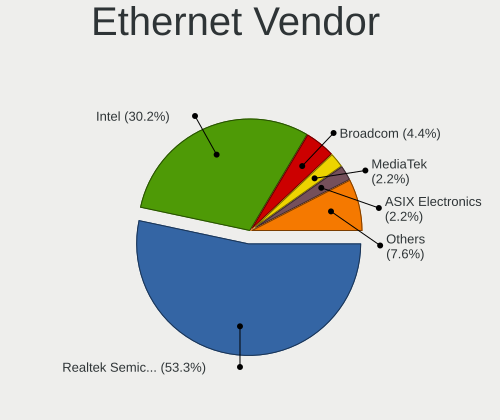

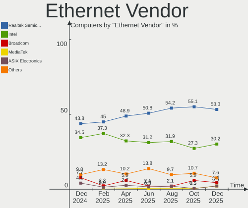

| Vendor                   | Computers | Percent |
|--------------------------|-----------|---------|
| Realtek Semiconductor    | 120       | 53.33%  |
| Intel                    | 68        | 30.22%  |
| Broadcom                 | 10        | 4.44%   |
| MediaTek                 | 5         | 2.22%   |
| ASIX Electronics         | 5         | 2.22%   |
| Qualcomm Atheros         | 3         | 1.33%   |
| Google                   | 3         | 1.33%   |
| Motorola PCS             | 2         | 0.89%   |
| DisplayLink              | 2         | 0.89%   |
| Aquantia                 | 2         | 0.89%   |
| Samsung Electronics      | 1         | 0.44%   |
| Raspberry Pi             | 1         | 0.44%   |
| Qualcomm Technologies    | 1         | 0.44%   |
| Marvell Technology Group | 1         | 0.44%   |
| Apple                    | 1         | 0.44%   |

Ethernet Model
--------------

Ethernet models

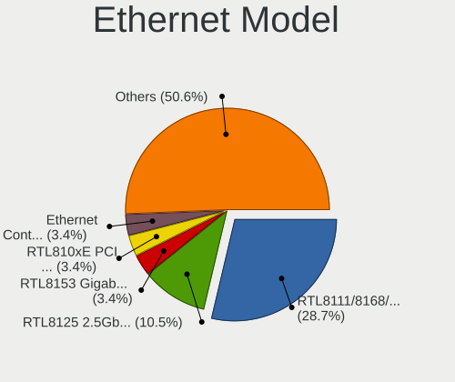

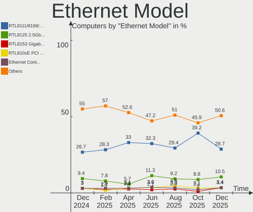

| Model                                                                           | Computers | Percent |
|---------------------------------------------------------------------------------|-----------|---------|
| Realtek RTL8111/8168/8211/8411 PCI Express Gigabit Ethernet Controller          | 68        | 28.69%  |
| Realtek RTL8125 2.5GbE Controller                                               | 25        | 10.55%  |
| Realtek RTL8153 Gigabit Ethernet Adapter                                        | 8         | 3.38%   |
| Realtek RTL810xE PCI Express Fast Ethernet controller                           | 8         | 3.38%   |
| Intel Ethernet Controller I225-V                                                | 8         | 3.38%   |
| Intel 82579LM Gigabit Network Connection (Lewisville)                           | 7         | 2.95%   |
| Intel I211 Gigabit Network Connection                                           | 6         | 2.53%   |
| Realtek USB 10/100/1G/2.5 LAN                                                   | 5         | 2.11%   |
| MediaTek MT7925 802.11be 160MHz 2x2 PCIe Wireless Network Adapter [Filogic 360] | 5         | 2.11%   |
| Intel Ethernet Connection (7) I219-V                                            | 5         | 2.11%   |
| ASIX AX88179 Gigabit Ethernet                                                   | 5         | 2.11%   |
| Realtek Killer E2600 GbE Controller                                             | 4         | 1.69%   |
| Intel Ethernet Connection I217-LM                                               | 4         | 1.69%   |
| Intel Ethernet Connection I219-LM                                               | 3         | 1.27%   |
| Intel Ethernet Connection I217-V                                                | 3         | 1.27%   |
| Intel Ethernet Connection (2) I219-V                                            | 3         | 1.27%   |
| Google Pixel 9a                                                                 | 3         | 1.27%   |
| Realtek RTL8126 5GbE Controller                                                 | 2         | 0.84%   |
| Realtek Killer E3000 2.5GbE Controller                                          | 2         | 0.84%   |
| Qualcomm Atheros AR8151 v2.0 Gigabit Ethernet                                   | 2         | 0.84%   |
| Motorola PCS moto g100 pro                                                      | 2         | 0.84%   |
| Intel Ethernet Controller I226-V                                                | 2         | 0.84%   |
| Intel Ethernet Connection (5) I219-LM                                           | 2         | 0.84%   |
| Intel Ethernet Connection (4) I219-V                                            | 2         | 0.84%   |
| Intel Ethernet Connection (4) I219-LM                                           | 2         | 0.84%   |
| Intel Ethernet Connection (3) I218-LM                                           | 2         | 0.84%   |
| Intel 82574L Gigabit Network Connection                                         | 2         | 0.84%   |
| Broadcom NetXtreme BCM57765 Gigabit Ethernet PCIe                               | 2         | 0.84%   |
| Broadcom NetLink BCM57785 Gigabit Ethernet PCIe                                 | 2         | 0.84%   |
| Samsung Galaxy series, misc. (tethering mode)                                   | 1         | 0.42%   |
| Realtek RTL8922AE 802.11be PCIe Wireless Network Adapter                        | 1         | 0.42%   |
| Realtek RTL8852CE PCIe 802.11ax Wireless Network Controller                     | 1         | 0.42%   |
| Realtek RTL8852BE PCIe 802.11ax Wireless Network Controller                     | 1         | 0.42%   |
| Realtek RTL8152 Fast Ethernet Adapter                                           | 1         | 0.42%   |
| Realtek RTL8111/8168/8411 PCI Express Gigabit Ethernet Controller               | 1         | 0.42%   |
| Realtek RTL-8100/8101L/8139 PCI Fast Ethernet Adapter                           | 1         | 0.42%   |
| Realtek Killer E5000 5GbE Controller                                            | 1         | 0.42%   |
| Raspberry Pi RP1 PCIe 2.0 South Bridge                                          | 1         | 0.42%   |
| Qualcomm WCN785x Wi-Fi 7(802.11be) 320MHz 2x2 [FastConnect 7800]                | 1         | 0.42%   |
| Qualcomm Atheros Killer E2400 Gigabit Ethernet Controller                       | 1         | 0.42%   |

Net Controller Kind
-------------------

Ethernet, WiFi or modem

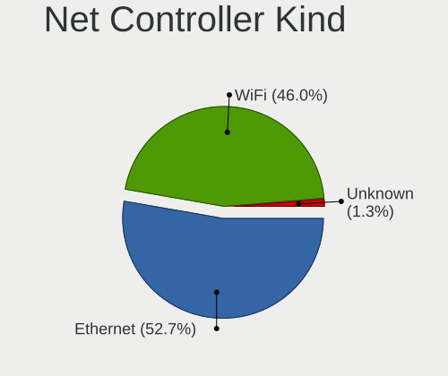

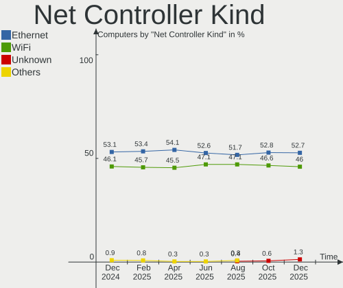

| Kind     | Computers | Percent |
|----------|-----------|---------|
| Ethernet | 202       | 52.74%  |
| WiFi     | 176       | 45.95%  |
| Unknown  | 5         | 1.31%   |

Used Controller
---------------

Currently used network controller

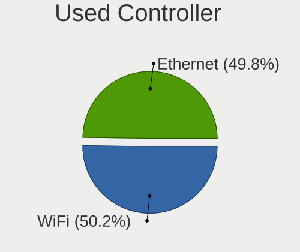

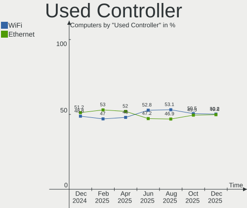

| Kind     | Computers | Percent |
|----------|-----------|---------|
| WiFi     | 123       | 50.2%   |
| Ethernet | 122       | 49.8%   |

NICs
----

Total network controllers on board

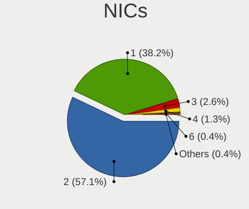

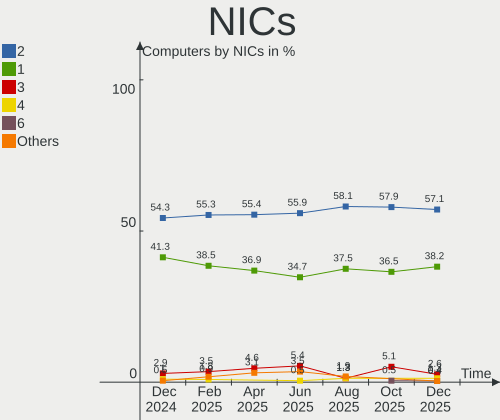

| Total | Computers | Percent |
|-------|-----------|---------|
| 2     | 133       | 57.08%  |
| 1     | 89        | 38.2%   |
| 3     | 6         | 2.58%   |
| 4     | 3         | 1.29%   |
| 6     | 1         | 0.43%   |
| 0     | 1         | 0.43%   |

IPv6
----

IPv6 vs IPv4

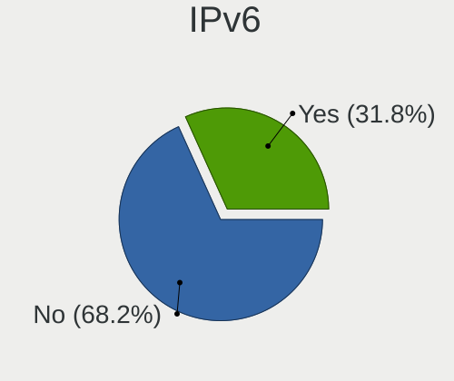

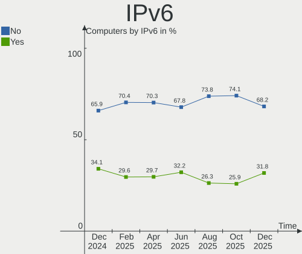

| Used | Computers | Percent |
|------|-----------|---------|
| No   | 159       | 68.24%  |
| Yes  | 74        | 31.76%  |

Bluetooth
---------

Bluetooth Vendor
----------------

Controller vendors

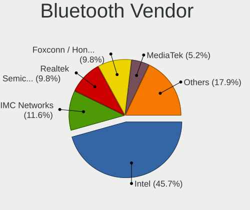

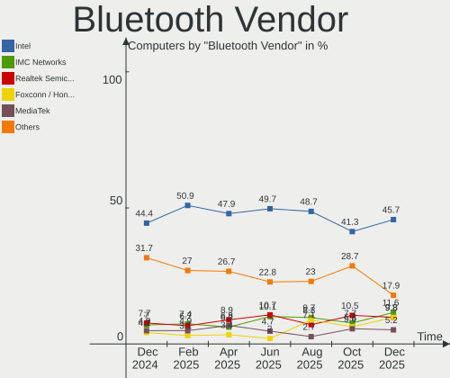

| Vendor                          | Computers | Percent |
|---------------------------------|-----------|---------|
| Intel                           | 79        | 45.66%  |
| IMC Networks                    | 20        | 11.56%  |
| Realtek Semiconductor           | 17        | 9.83%   |
| Foxconn / Hon Hai               | 17        | 9.83%   |
| MediaTek                        | 9         | 5.2%    |
| Qualcomm Atheros Communications | 7         | 4.05%   |
| Apple                           | 7         | 4.05%   |
| Broadcom                        | 4         | 2.31%   |
| Cambridge Silicon Radio         | 3         | 1.73%   |
| ASUSTek Computer                | 3         | 1.73%   |
| Unknown                         | 2         | 1.16%   |
| TP-Link                         | 1         | 0.58%   |
| Marvell Semiconductor           | 1         | 0.58%   |
| Lite-On Technology              | 1         | 0.58%   |
| Edimax Technology               | 1         | 0.58%   |
| AICSemi                         | 1         | 0.58%   |

Bluetooth Model
---------------

Controller models

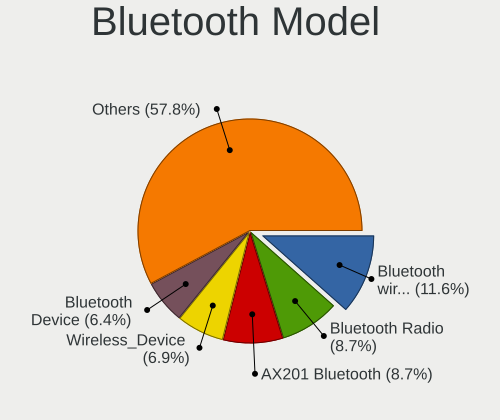

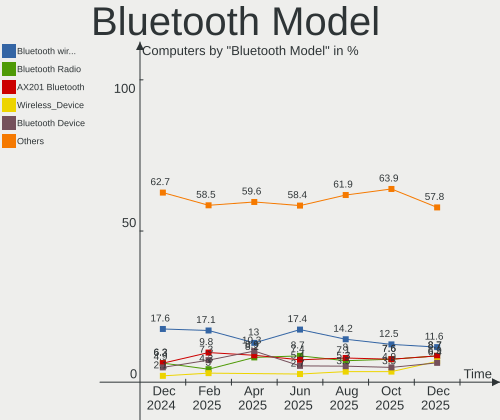

| Model                                               | Computers | Percent |
|-----------------------------------------------------|-----------|---------|
| Intel Bluetooth wireless interface                  | 20        | 11.56%  |
| Realtek Bluetooth Radio                             | 15        | 8.67%   |
| Intel AX201 Bluetooth                               | 15        | 8.67%   |
| IMC Networks Wireless_Device                        | 12        | 6.94%   |
| Intel Bluetooth Device                              | 11        | 6.36%   |
| Intel AX200 Bluetooth                               | 11        | 6.36%   |
| Foxconn / Hon Hai Wireless_Device                   | 10        | 5.78%   |
| MediaTek Wireless_Device                            | 9         | 5.2%    |
| Intel Bluetooth 9460/9560 Jefferson Peak (JfP)      | 9         | 5.2%    |
| Qualcomm Atheros  Bluetooth Device                  | 5         | 2.89%   |
| IMC Networks Bluetooth Radio                        | 5         | 2.89%   |
| Intel Wireless-AC 3168 Bluetooth                    | 4         | 2.31%   |
| Foxconn / Hon Hai Bluetooth Device                  | 4         | 2.31%   |
| Apple Bluetooth Host Controller                     | 4         | 2.31%   |
| Intel Centrino Bluetooth Wireless Transceiver       | 3         | 1.73%   |
| Intel AX210 Bluetooth                               | 3         | 1.73%   |
| IMC Networks Atheros AR3012 Bluetooth 4.0 Adapter   | 3         | 1.73%   |
| Cambridge Silicon Radio Bluetooth Dongle (HCI mode) | 3         | 1.73%   |
| Realtek Bluetooth 5.4 Radio                         | 2         | 1.16%   |
| Intel Wireless-AC 9260 Bluetooth Adapter            | 2         | 1.16%   |
| Broadcom BCM2045B (BDC-2.1)                         | 2         | 1.16%   |
| ASUS ASUS USB-BT500                                 | 2         | 1.16%   |
| Apple Bluetooth USB Host Controller                 | 2         | 1.16%   |
| Unknown                                             | 2         | 1.16%   |
| TP-Link TP-T@- UB500 Adapter                        | 1         | 0.58%   |
| Qualcomm Atheros QCA61x4 Bluetooth 4.0              | 1         | 0.58%   |
| Qualcomm Atheros AR3011 Bluetooth                   | 1         | 0.58%   |
| Marvell Bluetooth and Wireless LAN Composite        | 1         | 0.58%   |
| Lite-On Bluetooth Device                            | 1         | 0.58%   |
| Intel Bluetooth                                     | 1         | 0.58%   |
| Foxconn / Hon Hai MediaTek Bluetooth Adapter        | 1         | 0.58%   |
| Foxconn / Hon Hai Broadcom BCM20702A1 Bluetooth     | 1         | 0.58%   |
| Foxconn / Hon Hai Bluetooth Radio                   | 1         | 0.58%   |
| Edimax Bluetooth Device                             | 1         | 0.58%   |
| Broadcom BCM20702A0 Bluetooth 4.0                   | 1         | 0.58%   |
| Broadcom BCM20702A0 Bluetooth                       | 1         | 0.58%   |
| ASUS Bluetooth Radio                                | 1         | 0.58%   |
| Apple Built-in Bluetooth 2.0+EDR HCI                | 1         | 0.58%   |
| AICSemi AIC 8800D80                                 | 1         | 0.58%   |

Sound
-----

Sound Vendor
------------

Sound card vendors

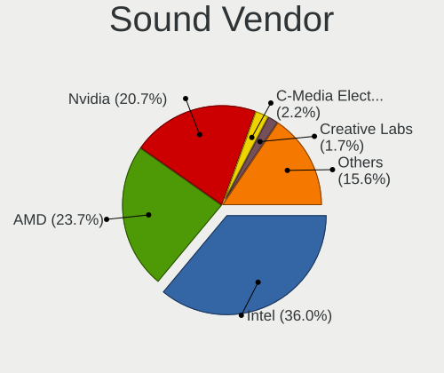

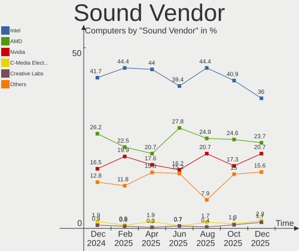

| Vendor                                       | Computers | Percent |
|----------------------------------------------|-----------|---------|
| Intel                                        | 146       | 36.05%  |
| AMD                                          | 96        | 23.7%   |
| Nvidia                                       | 84        | 20.74%  |
| C-Media Electronics                          | 9         | 2.22%   |
| Creative Labs                                | 7         | 1.73%   |
| Logitech                                     | 6         | 1.48%   |
| Realtek Semiconductor                        | 5         | 1.23%   |
| Texas Instruments                            | 3         | 0.74%   |
| SteelSeries ApS                              | 3         | 0.74%   |
| Razer USA                                    | 3         | 0.74%   |
| Hewlett-Packard                              | 3         | 0.74%   |
| ASUSTek Computer                             | 3         | 0.74%   |
| Apple                                        | 3         | 0.74%   |
| Jieli Technology                             | 2         | 0.49%   |
| Focusrite-Novation                           | 2         | 0.49%   |
| FiiO Electronics Technology                  | 2         | 0.49%   |
| Zoran Co. Personal Media Division (Nogatech) | 1         | 0.25%   |
| Yamaha                                       | 1         | 0.25%   |
| XMOS                                         | 1         | 0.25%   |
| VIA Technologies                             | 1         | 0.25%   |
| Valve Software                               | 1         | 0.25%   |
| Samson Technologies                          | 1         | 0.25%   |
| PreSonus Audio Electronics                   | 1         | 0.25%   |
| Plantronics                                  | 1         | 0.25%   |
| ONN                                          | 1         | 0.25%   |
| Nordic Semiconductor ASA                     | 1         | 0.25%   |
| MV-SILICON                                   | 1         | 0.25%   |
| Medeli Electronics                           | 1         | 0.25%   |
| Lynx Studio Technology                       | 1         | 0.25%   |
| LE XIAN                                      | 1         | 0.25%   |
| KTMicro                                      | 1         | 0.25%   |
| JMTek                                        | 1         | 0.25%   |
| GYROCOM C&C                                  | 1         | 0.25%   |
| Giga-Byte Technology                         | 1         | 0.25%   |
| Generalplus Technology                       | 1         | 0.25%   |
| DSEA A/S                                     | 1         | 0.25%   |
| Creative Technology                          | 1         | 0.25%   |
| Corsair                                      | 1         | 0.25%   |
| Blue Microphones                             | 1         | 0.25%   |
| Bigscreen                                    | 1         | 0.25%   |

Sound Model
-----------

Sound card models

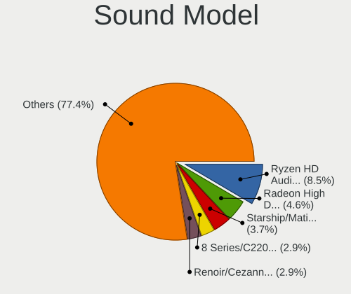

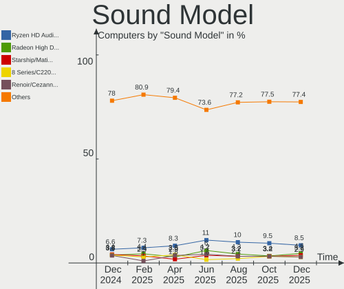

| Model                                                                                           | Computers | Percent |
|-------------------------------------------------------------------------------------------------|-----------|---------|
| AMD Ryzen HD Audio Controller                                                                   | 41        | 8.49%   |
| AMD Radeon High Definition Audio Controller                                                     | 22        | 4.55%   |
| AMD Starship/Matisse HD Audio Controller                                                        | 18        | 3.73%   |
| Intel 8 Series/C220 Series Chipset High Definition Audio Controller                             | 14        | 2.9%    |
| AMD Renoir/Cezanne HDMI/DP Audio Controller                                                     | 14        | 2.9%    |
| Intel Sunrise Point-LP HD Audio                                                                 | 13        | 2.69%   |
| Intel 7 Series/C216 Chipset Family High Definition Audio Controller                             | 12        | 2.48%   |
| Intel Cannon Lake PCH cAVS                                                                      | 8         | 1.66%   |
| Intel 6 Series/C200 Series Chipset Family High Definition Audio Controller                      | 8         | 1.66%   |
| Intel 100 Series/C230 Series Chipset Family HD Audio Controller                                 | 8         | 1.66%   |
| AMD Navi 31 HDMI/DP Audio                                                                       | 8         | 1.66%   |
| AMD Navi 21/23 HDMI/DP Audio Controller                                                         | 8         | 1.66%   |
| AMD SBx00 Azalia (Intel HDA)                                                                    | 7         | 1.45%   |
| Nvidia TU106 High Definition Audio Controller                                                   | 6         | 1.24%   |
| Nvidia GA106 High Definition Audio Controller                                                   | 6         | 1.24%   |
| Intel Xeon E3-1200 v3/4th Gen Core Processor HD Audio Controller                                | 6         | 1.24%   |
| AMD Navi 48 HDMI/DP Audio Controller                                                            | 6         | 1.24%   |
| Nvidia TU116 High Definition Audio Controller                                                   | 5         | 1.04%   |
| Nvidia GP107GL High Definition Audio Controller                                                 | 5         | 1.04%   |
| Nvidia GP106 High Definition Audio Controller                                                   | 5         | 1.04%   |
| Nvidia GA104 High Definition Audio Controller                                                   | 5         | 1.04%   |
| Intel Tiger Lake-H HD Audio Controller                                                          | 5         | 1.04%   |
| Intel Alder Lake PCH-P High Definition Audio Controller                                         | 5         | 1.04%   |
| Intel 82801I (ICH9 Family) HD Audio Controller                                                  | 5         | 1.04%   |
| Intel 800 Series ACE (Audio Context Engine)                                                     | 5         | 1.04%   |
| Creative Labs CA0132 Sound Core3D [Sound Blaster Recon3D / Z-Series / Sound BlasterX AE-5 Plus] | 5         | 1.04%   |
| AMD Family 17h (Models 00h-0fh) HD Audio Controller                                             | 5         | 1.04%   |
| Nvidia TU104 HD Audio Controller                                                                | 4         | 0.83%   |
| Nvidia GA102 High Definition Audio Controller                                                   | 4         | 0.83%   |
| Nvidia AD107 High Definition Audio Controller                                                   | 4         | 0.83%   |
| Intel Raptor Lake High Definition Audio Controller                                              | 4         | 0.83%   |
| Intel Ice Lake-LP Smart Sound Technology Audio Controller                                       | 4         | 0.83%   |
| Intel Crystal Well HD Audio Controller                                                          | 4         | 0.83%   |
| Intel Cannon Point-LP High Definition Audio Controller                                          | 4         | 0.83%   |
| Intel 82801JI (ICH10 Family) HD Audio Controller                                                | 4         | 0.83%   |
| Nvidia TU107 GeForce GTX 1650 High Definition Audio Controller                                  | 3         | 0.62%   |
| Nvidia GM206 High Definition Audio Controller                                                   | 3         | 0.62%   |
| Nvidia GM107 High Definition Audio Controller [GeForce 940MX]                                   | 3         | 0.62%   |
| Nvidia GK107 HDMI Audio Controller                                                              | 3         | 0.62%   |
| Nvidia GB205 High Definition Audio Controller                                                   | 3         | 0.62%   |

Memory
------

Memory Vendor
-------------

Memory module vendors

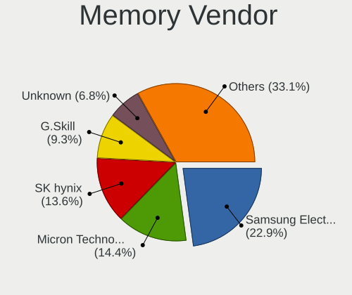

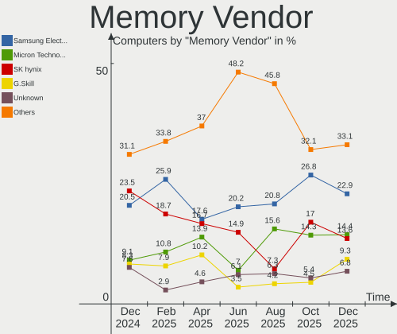

| Vendor              | Computers | Percent |
|---------------------|-----------|---------|
| Samsung Electronics | 27        | 22.88%  |
| Micron Technology   | 17        | 14.41%  |
| SK hynix            | 16        | 13.56%  |
| G.Skill             | 11        | 9.32%   |
| Unknown             | 8         | 6.78%   |
| Corsair             | 8         | 6.78%   |
| Kingston            | 7         | 5.93%   |
| Unknown             | 6         | 5.08%   |
| Crucial             | 4         | 3.39%   |
| Team                | 3         | 2.54%   |
| A-DATA Technology   | 3         | 2.54%   |
| Timetec             | 1         | 0.85%   |
| Patriot             | 1         | 0.85%   |
| Nanya Technology    | 1         | 0.85%   |
| Hewlett-Packard     | 1         | 0.85%   |
| Golden Empire       | 1         | 0.85%   |
| GeIL                | 1         | 0.85%   |
| Atermiter           | 1         | 0.85%   |
| ASint Technology    | 1         | 0.85%   |

Memory Model
------------

Memory module models

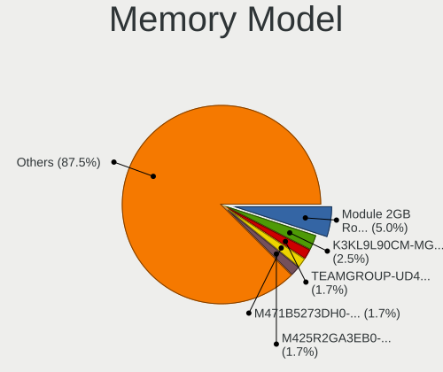

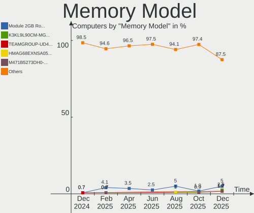

| Model                                                            | Computers | Percent |
|------------------------------------------------------------------|-----------|---------|
| Unknown                                                          | 6         | 5%      |
| Samsung RAM K3KL9L90CM-MGCT 4GB Row Of Chips LPDDR5 7500MT/s     | 3         | 2.5%    |
| Team RAM TEAMGROUP-UD4-3600 16GB DIMM DDR4 4000MT/s              | 2         | 1.67%   |
| SK hynix RAM HMAG68EXNSA051N 8GB SODIMM DDR4 3200MT/s            | 2         | 1.67%   |
| Samsung RAM M471B5273DH0-CH9 4GB SODIMM DDR3 1600MT/s            | 2         | 1.67%   |
| Samsung RAM M425R2GA3EB0-CWMOL 16GB SODIMM DDR5 5600MT/s         | 2         | 1.67%   |
| Micron RAM 4ATF1G64HZ-3G2F1 8GB SODIMM DDR4 3200MT/s             | 2         | 1.67%   |
| G.Skill RAM F4-3600C16-16GTZNC 16GiB DIMM DDR4 3600MT/s          | 2         | 1.67%   |
| Corsair RAM CMW32GX4M2E3200C16 16GB DIMM DDR4 3200MT/s           | 2         | 1.67%   |
| A-DATA RAM DDR4 3200 16GB DIMM DDR4 3600MT/s                     | 2         | 1.67%   |
| Unknown RAM Module 8GB DIMM 1333MT/s                             | 1         | 0.83%   |
| Unknown RAM Module 512MB SODIMM DDR2                             | 1         | 0.83%   |
| Unknown RAM Module 4GB DIMM 1333MT/s                             | 1         | 0.83%   |
| Unknown RAM Module 2GB SODIMM DDR3 800MT/s                       | 1         | 0.83%   |
| Unknown RAM Module 2GB SODIMM DDR3 1333MT/s                      | 1         | 0.83%   |
| Unknown RAM Module 2GB SODIMM DDR2 667MT/s                       | 1         | 0.83%   |
| Unknown RAM Module 16GB DIMM DDR4 2400MT/s                       | 1         | 0.83%   |
| Unknown RAM DDR4 NB 16G 2666 16384MB SODIMM DDR4 2667MT/s        | 1         | 0.83%   |
| Timetec RAM U8G-1600 8GB DIMM DDR3 1600MT/s                      | 1         | 0.83%   |
| Team RAM TEAMGROUP-SD4-3200 16GB SODIMM DDR4 3200MT/s            | 1         | 0.83%   |
| SK hynix RAM Module 2GB SODIMM DDR3 1600MT/s                     | 1         | 0.83%   |
| SK hynix RAM HYMP112U64CP8-S6 1GB DIMM DDR2 800MT/s              | 1         | 0.83%   |
| SK hynix RAM HMT451U6AFR8C-PB 4GB DIMM DDR3 1600MT/s             | 1         | 0.83%   |
| SK hynix RAM HMT451S6BFR8A-PB 4GB SODIMM DDR3 1600MT/s           | 1         | 0.83%   |
| SK hynix RAM HMT41GU6DFR8A-PB 8GB DIMM DDR3 1600MT/s             | 1         | 0.83%   |
| SK hynix RAM HMT351S6CFR8A-PB 4GB SODIMM DDR3 1600MT/s           | 1         | 0.83%   |
| SK hynix RAM HMCG88AGBSA095N 32GB SODIMM DDR5 5600MT/s           | 1         | 0.83%   |
| SK hynix RAM HMAA2GU6AJR8N-XN 16GB DIMM DDR4 3200MT/s            | 1         | 0.83%   |
| SK hynix RAM HMAA2GU6AJR8N-XN 16GB DIMM DDR4 2400MT/s            | 1         | 0.83%   |
| SK hynix RAM HMAA1GS6CJR6N-XN 8GB SODIMM DDR4 3200MT/s           | 1         | 0.83%   |
| SK hynix RAM HMA84GL7MMR4N-TF 32GB RIMM DDR4 2133MT/s            | 1         | 0.83%   |
| SK hynix RAM H9JCNNNCP3MLYR-N6E 2GB Row Of Chips LPDDR5 6400MT/s | 1         | 0.83%   |
| SK hynix RAM H9CCNNNBJTALAR-NUD 4GB Row Of Chips LPDDR3 1867MT/s | 1         | 0.83%   |
| SK hynix RAM H58G66CK8BX147 16GB Row Of Chips LPDDR5 8533MT/s    | 1         | 0.83%   |
| Samsung RAM UBE3D4AA-MGCR 2GB Row Of Chips LPDDR4 4267MT/s       | 1         | 0.83%   |
| Samsung RAM Module 8GB Row Of Chips LPDDR3 2133MT/s              | 1         | 0.83%   |
| Samsung RAM Module 3GB Row Of Chips LPDDR5 6400MT/s              | 1         | 0.83%   |
| Samsung RAM Module 16GB SODIMM DDR4 3200MT/s                     | 1         | 0.83%   |
| Samsung RAM M471B5173QH0-YK0 4GB SODIMM DDR3 1600MT/s            | 1         | 0.83%   |
| Samsung RAM M471A5244CB0-CWE 4GB SODIMM DDR4 3200MT/s            | 1         | 0.83%   |

Memory Kind
-----------

Memory module kinds

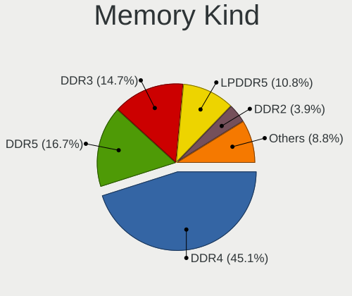

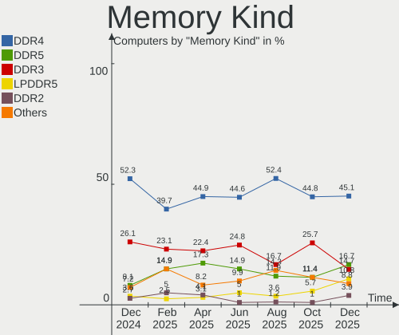

| Kind    | Computers | Percent |
|---------|-----------|---------|
| DDR4    | 46        | 45.1%   |
| DDR5    | 17        | 16.67%  |
| DDR3    | 15        | 14.71%  |
| LPDDR5  | 11        | 10.78%  |
| DDR2    | 4         | 3.92%   |
| LPDDR3  | 3         | 2.94%   |
| LPDDR4  | 2         | 1.96%   |
| Unknown | 2         | 1.96%   |
| SDRAM   | 1         | 0.98%   |
| DDR     | 1         | 0.98%   |

Memory Form Factor
------------------

Physical design of the memory module

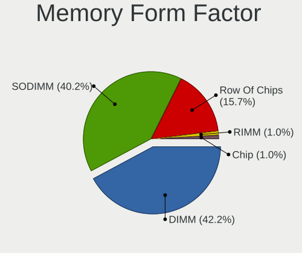

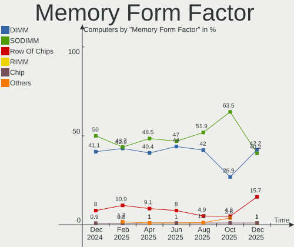

| Name         | Computers | Percent |
|--------------|-----------|---------|
| DIMM         | 43        | 42.16%  |
| SODIMM       | 41        | 40.2%   |
| Row Of Chips | 16        | 15.69%  |
| RIMM         | 1         | 0.98%   |
| Chip         | 1         | 0.98%   |

Memory Size
-----------

Memory module size

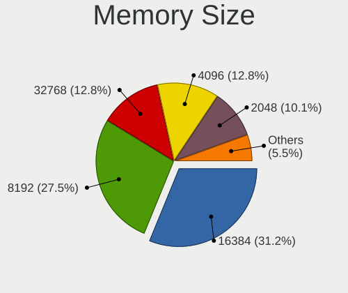

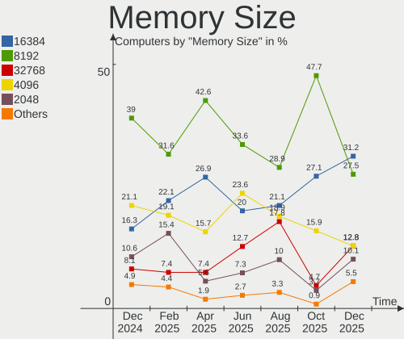

| Size  | Computers | Percent |
|-------|-----------|---------|
| 16384 | 34        | 31.19%  |
| 8192  | 30        | 27.52%  |
| 32768 | 14        | 12.84%  |
| 4096  | 14        | 12.84%  |
| 2048  | 11        | 10.09%  |
| 49152 | 2         | 1.83%   |
| 1024  | 2         | 1.83%   |
| 3072  | 1         | 0.92%   |
| 512   | 1         | 0.92%   |

Memory Speed
------------

Memory module speed

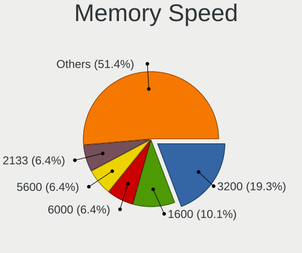

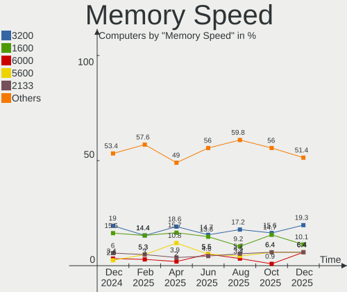

| Speed   | Computers | Percent |
|---------|-----------|---------|
| 3200    | 21        | 19.27%  |
| 1600    | 11        | 10.09%  |
| 6000    | 7         | 6.42%   |
| 5600    | 7         | 6.42%   |
| 2133    | 7         | 6.42%   |
| 3600    | 6         | 5.5%    |
| 2667    | 5         | 4.59%   |
| 2400    | 5         | 4.59%   |
| 1333    | 5         | 4.59%   |
| 8533    | 3         | 2.75%   |
| 7500    | 3         | 2.75%   |
| 6400    | 3         | 2.75%   |
| 5200    | 3         | 2.75%   |
| 800     | 3         | 2.75%   |
| 4267    | 2         | 1.83%   |
| 4000    | 2         | 1.83%   |
| 3866    | 2         | 1.83%   |
| 8400    | 1         | 0.92%   |
| 4800    | 1         | 0.92%   |
| 4266    | 1         | 0.92%   |
| 3800    | 1         | 0.92%   |
| 3466    | 1         | 0.92%   |
| 3400    | 1         | 0.92%   |
| 3066    | 1         | 0.92%   |
| 1867    | 1         | 0.92%   |
| 1639    | 1         | 0.92%   |
| 1334    | 1         | 0.92%   |
| 1066    | 1         | 0.92%   |
| 667     | 1         | 0.92%   |
| 533     | 1         | 0.92%   |
| Unknown | 1         | 0.92%   |

Printers & scanners
-------------------

Printer Vendor
--------------

Printer device vendors

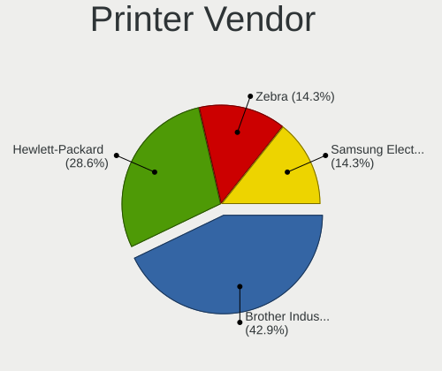

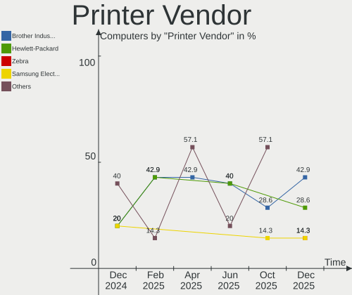

| Vendor              | Computers | Percent |
|---------------------|-----------|---------|
| Brother Industries  | 3         | 42.86%  |
| Hewlett-Packard     | 2         | 28.57%  |
| Zebra               | 1         | 14.29%  |
| Samsung Electronics | 1         | 14.29%  |

Printer Model
-------------

Printer device models

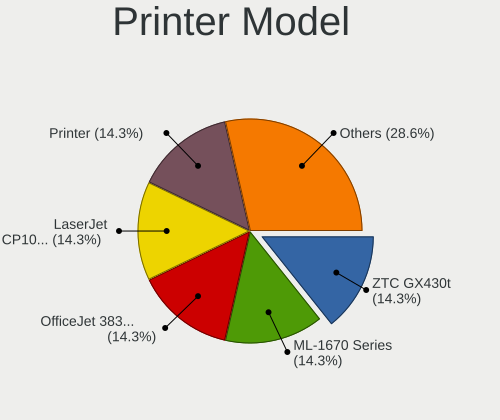

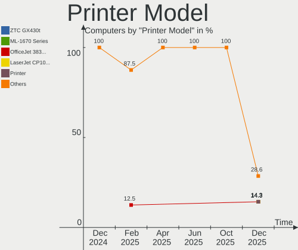

| Model                    | Computers | Percent |
|--------------------------|-----------|---------|
| Zebra ZTC GX430t         | 1         | 14.29%  |
| Samsung ML-1670 Series   | 1         | 14.29%  |
| HP OfficeJet 3830 series | 1         | 14.29%  |
| HP LaserJet CP1025nw     | 1         | 14.29%  |
| Brother Printer          | 1         | 14.29%  |
| Brother MFC-J435W        | 1         | 14.29%  |
| Brother HL-5370DW series | 1         | 14.29%  |

Scanner Vendor
--------------

Scanner device vendors

Zero info for selected period =(

Scanner Model
-------------

Scanner device models

Zero info for selected period =(

Camera
------

Camera Vendor
-------------

Camera device vendors

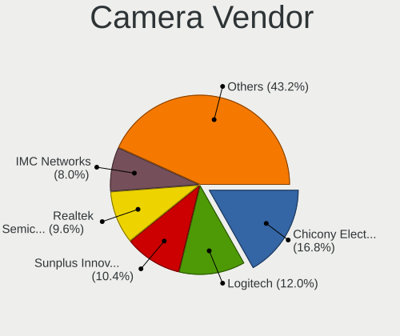

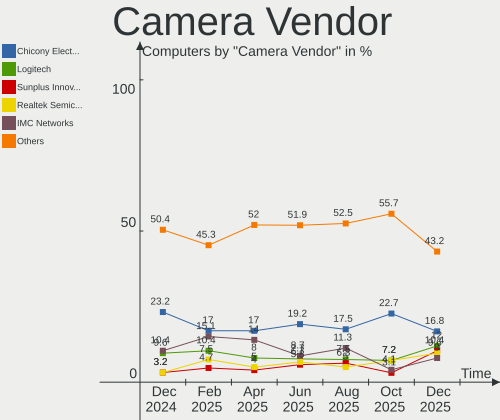

| Vendor                        | Computers | Percent |
|-------------------------------|-----------|---------|
| Chicony Electronics           | 21        | 16.8%   |
| Logitech                      | 15        | 12%     |
| Sunplus Innovation Technology | 13        | 10.4%   |
| Realtek Semiconductor         | 12        | 9.6%    |
| IMC Networks                  | 10        | 8%      |
| Bison Electronics             | 7         | 5.6%    |
| Apple                         | 7         | 5.6%    |
| Microdia                      | 6         | 4.8%    |
| Luxvisions Innotech Limited   | 6         | 4.8%    |
| Syntek                        | 5         | 4%      |
| Quanta                        | 5         | 4%      |
| Microsoft                     | 3         | 2.4%    |
| Alcor Micro                   | 2         | 1.6%    |
| Suyin                         | 1         | 0.8%    |
| ShineTech                     | 1         | 0.8%    |
| Samsung Electronics           | 1         | 0.8%    |
| Remo Tech                     | 1         | 0.8%    |
| MacroSilicon                  | 1         | 0.8%    |
| KYE Systems (Mouse Systems)   | 1         | 0.8%    |
| Huawei Technologies           | 1         | 0.8%    |
| GoPro                         | 1         | 0.8%    |
| Framework                     | 1         | 0.8%    |
| Creative Technology           | 1         | 0.8%    |
| BillionPixels                 | 1         | 0.8%    |
| Anker PowerConf C200          | 1         | 0.8%    |
| Anker Innovations Limited     | 1         | 0.8%    |

Camera Model
------------

Camera device models

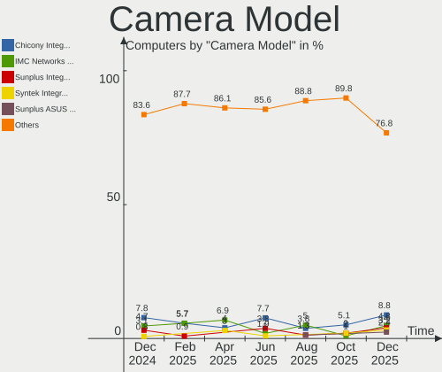

| Model                                         | Computers | Percent |
|-----------------------------------------------|-----------|---------|
| Chicony Integrated Camera                     | 11        | 8.8%    |
| IMC Networks USB2.0 HD UVC WebCam             | 6         | 4.8%    |
| Sunplus Integrated_Webcam_HD                  | 5         | 4%      |
| Syntek Integrated Camera                      | 4         | 3.2%    |
| Sunplus ASUS Webcam                           | 3         | 2.4%    |
| Realtek Integrated_Webcam_FHD                 | 3         | 2.4%    |
| Luxvisions Innotech Limited Integrated Camera | 3         | 2.4%    |
| Logitech Webcam C270                          | 3         | 2.4%    |
| Logitech HD Pro Webcam C920                   | 3         | 2.4%    |
| Logitech C920 PRO HD Webcam                   | 3         | 2.4%    |
| Apple FaceTime HD Camera (Built-in)           | 3         | 2.4%    |
| Realtek USB Camera                            | 2         | 1.6%    |
| Realtek Integrated_Webcam_HD                  | 2         | 1.6%    |
| Quanta HP HD Camera                           | 2         | 1.6%    |
| Quanta HD User Facing                         | 2         | 1.6%    |
| Microsoft LifeCam HD-5000                     | 2         | 1.6%    |
| Microdia USB 2.0 Camera                       | 2         | 1.6%    |
| Microdia Integrated_Webcam_FHD                | 2         | 1.6%    |
| IMC Networks Integrated Camera                | 2         | 1.6%    |
| Bison SunplusIT Integrated Camera             | 2         | 1.6%    |
| Bison Integrated Camera                       | 2         | 1.6%    |
| Syntek Integrated RGB Camera                  | 1         | 0.8%    |
| Suyin HP Webcam-101                           | 1         | 0.8%    |
| Sunplus USB 2.0 Camera                        | 1         | 0.8%    |
| Sunplus SPCA2281 Web Camera                   | 1         | 0.8%    |
| Sunplus HD WebCam                             | 1         | 0.8%    |
| Sunplus FULL HD webcam                        | 1         | 0.8%    |
| Sunplus Dell Integrated Webcam                | 1         | 0.8%    |
| ShineTech USB2.0 HD UVC WebCam                | 1         | 0.8%    |
| Samsung Galaxy series, misc. (MTP mode)       | 1         | 0.8%    |
| Remo Tech OBSBOT Meet SE                      | 1         | 0.8%    |
| Realtek USB2.0 camera                         | 1         | 0.8%    |
| Realtek Integrated Camera                     | 1         | 0.8%    |
| Realtek HP Truevision HD                      | 1         | 0.8%    |
| Realtek EasyCamera                            | 1         | 0.8%    |
| Realtek Bluetooth Radio                       | 1         | 0.8%    |
| Quanta HD Camera                              | 1         | 0.8%    |
| Microsoft LifeCam VX-2000                     | 1         | 0.8%    |
| Microdia Webcam Vitade AF                     | 1         | 0.8%    |
| Microdia Integrated_Webcam_HD                 | 1         | 0.8%    |

Security
--------

Fingerprint Vendor
------------------

Fingerprint sensor vendors

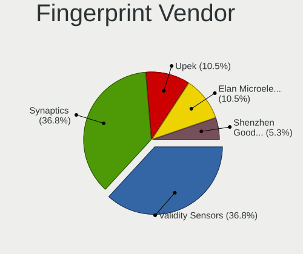

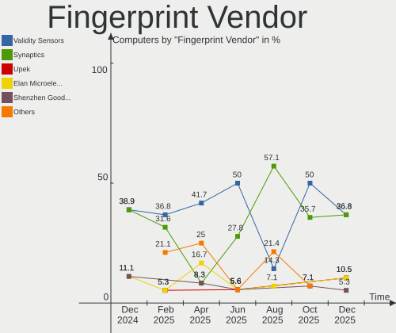

| Vendor                     | Computers | Percent |
|----------------------------|-----------|---------|
| Validity Sensors           | 7         | 36.84%  |
| Synaptics                  | 7         | 36.84%  |
| Upek                       | 2         | 10.53%  |
| Elan Microelectronics      | 2         | 10.53%  |
| Shenzhen Goodix Technology | 1         | 5.26%   |

Fingerprint Model
-----------------

Fingerprint sensor models

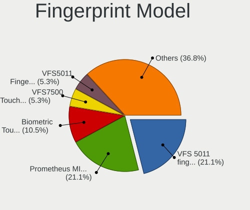

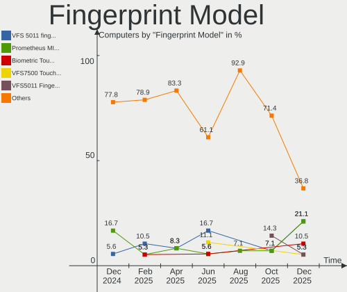

| Model                                                  | Computers | Percent |
|--------------------------------------------------------|-----------|---------|
| Validity Sensors VFS 5011 fingerprint sensor           | 4         | 21.05%  |
| Synaptics Prometheus MIS Touch Fingerprint Reader      | 4         | 21.05%  |
| Upek Biometric Touchchip/Touchstrip Fingerprint Sensor | 2         | 10.53%  |
| Validity Sensors VFS7500 Touch Fingerprint Sensor      | 1         | 5.26%   |
| Validity Sensors VFS5011 Fingerprint Reader            | 1         | 5.26%   |
| Validity Sensors Synaptics WBDI                        | 1         | 5.26%   |
| Synaptics  WBDI                                        | 1         | 5.26%   |
| Synaptics Prometheus Fingerprint Reader                | 1         | 5.26%   |
| Synaptics Fingerprint reader [HP G6]                   | 1         | 5.26%   |
| Shenzhen Goodix  FingerPrint Device                    | 1         | 5.26%   |
| Elan ELAN:Fingerprint                                  | 1         | 5.26%   |
| Elan ELAN:ARM-M4                                       | 1         | 5.26%   |

Chipcard Vendor
---------------

Chipcard module vendors

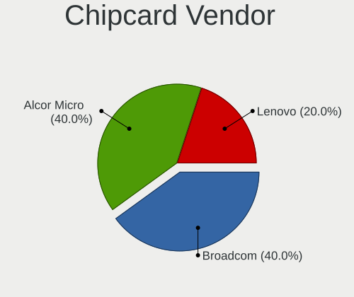

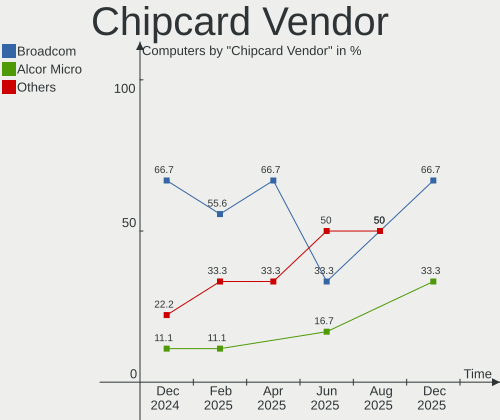

| Vendor      | Computers | Percent |
|-------------|-----------|---------|
| Broadcom    | 2         | 66.67%  |
| Alcor Micro | 1         | 33.33%  |

Chipcard Model
--------------

Chipcard module models

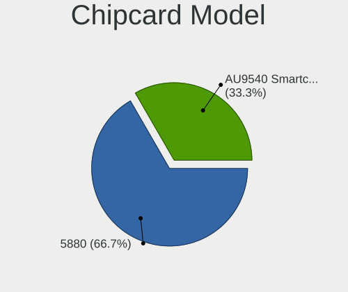

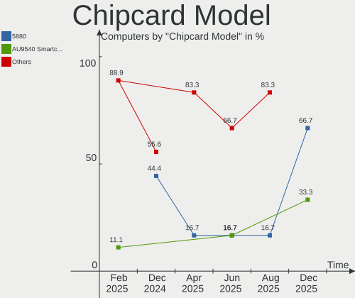

| Model                               | Computers | Percent |
|-------------------------------------|-----------|---------|
| Broadcom 5880                       | 2         | 66.67%  |
| Alcor Micro AU9540 Smartcard Reader | 1         | 33.33%  |

Unsupported
-----------

Unsupported Devices
-------------------

Total unsupported devices on board

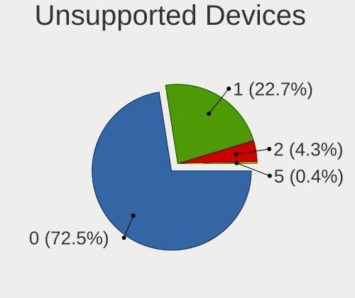

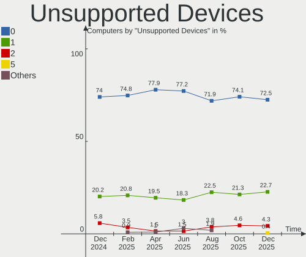

| Total | Computers | Percent |
|-------|-----------|---------|
| 0     | 169       | 72.53%  |
| 1     | 53        | 22.75%  |
| 2     | 10        | 4.29%   |
| 5     | 1         | 0.43%   |

Unsupported Device Types
------------------------

Types of unsupported devices

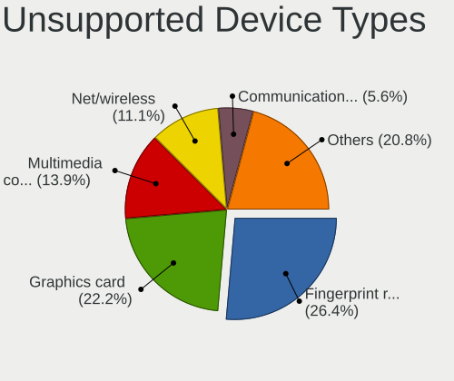

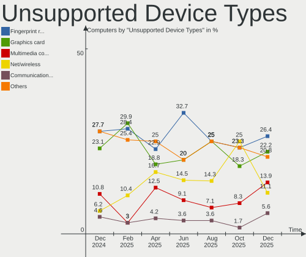

| Type                     | Computers | Percent |
|--------------------------|-----------|---------|
| Fingerprint reader       | 19        | 26.39%  |
| Graphics card            | 16        | 22.22%  |
| Multimedia controller    | 10        | 13.89%  |
| Net/wireless             | 8         | 11.11%  |
| Communication controller | 4         | 5.56%   |
| Unassigned class         | 3         | 4.17%   |
| Chipcard                 | 3         | 4.17%   |
| Network                  | 2         | 2.78%   |
| Camera                   | 2         | 2.78%   |
| Storage/raid             | 1         | 1.39%   |
| Storage                  | 1         | 1.39%   |
| Sound                    | 1         | 1.39%   |
| Flash memory             | 1         | 1.39%   |
| Dvb card                 | 1         | 1.39%   |

