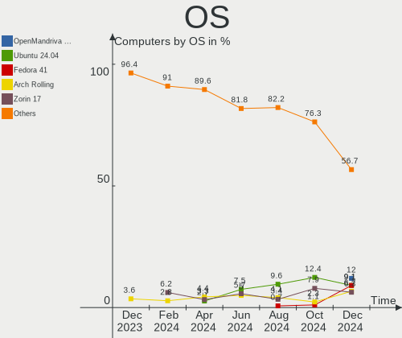
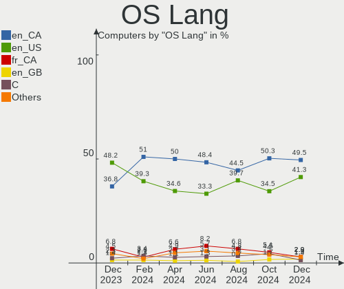
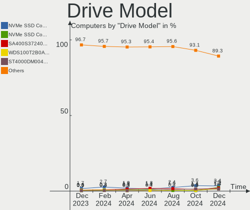
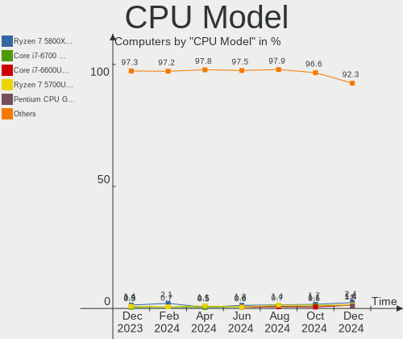
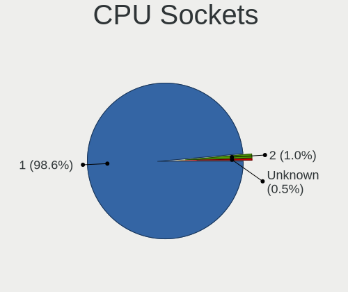
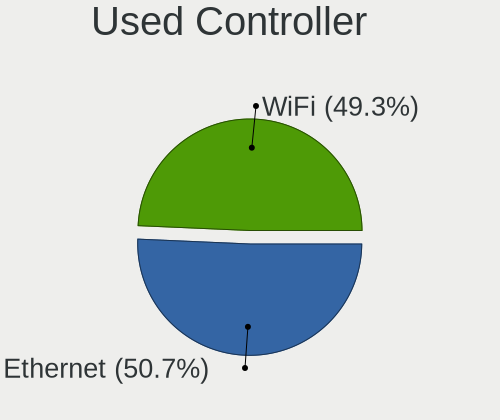
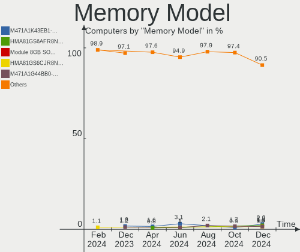
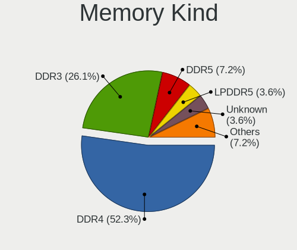
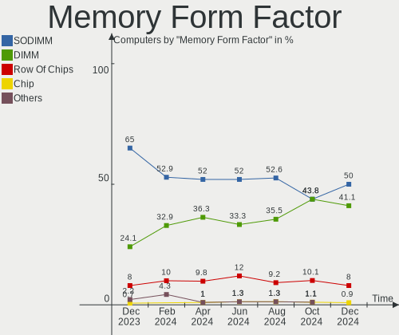

Linux in Canada - Hardware Trends
---------------------------------

A project to identify most popular hardware characteristics and track their change
over time based on data collected by Linux users at https://Linux-Hardware.org.

Anyone can contribute to this report by the [hw-probe](https://github.com/linuxhw/hw-probe) tool:

    sudo -E hw-probe -all -upload

This is a report for all computer types. See also reports for [desktops](/Location/Canada/Desktop/README.md) and [notebooks](/Location/Canada/Notebook/README.md).

Period: May, 2023.

Contents
--------

* [ System ](#system)
  - [ OS                       ](#os)
  - [ OS Family                ](#os-family)
  - [ Kernel                   ](#kernel)
  - [ Kernel Family            ](#kernel-family)
  - [ Kernel Major Ver.        ](#kernel-major-ver)
  - [ Arch                     ](#arch)
  - [ DE                       ](#de)
  - [ Display Server           ](#display-server)
  - [ Display Manager          ](#display-manager)
  - [ OS Lang                  ](#os-lang)
  - [ Boot Mode                ](#boot-mode)
  - [ Filesystem               ](#filesystem)
  - [ Part. scheme             ](#part-scheme)
  - [ Dual Boot with Linux/BSD ](#dual-boot-with-linuxbsd)
  - [ Dual Boot (Win)          ](#dual-boot-win)

* [ Board ](#board)
  - [ Vendor                   ](#vendor)
  - [ Model                    ](#model)
  - [ Model Family             ](#model-family)
  - [ MFG Year                 ](#mfg-year)
  - [ Form Factor              ](#form-factor)
  - [ Secure Boot              ](#secure-boot)
  - [ Coreboot                 ](#coreboot)
  - [ RAM Size                 ](#ram-size)
  - [ RAM Used                 ](#ram-used)
  - [ Total Drives             ](#total-drives)
  - [ Has CD-ROM               ](#has-cd-rom)
  - [ Has Ethernet             ](#has-ethernet)
  - [ Has WiFi                 ](#has-wifi)
  - [ Has Bluetooth            ](#has-bluetooth)

* [ Location ](#location)
  - [ Country                  ](#country)
  - [ City                     ](#city)

* [ Drives ](#drives)
  - [ Drive Vendor             ](#drive-vendor)
  - [ Drive Model              ](#drive-model)
  - [ HDD Vendor               ](#hdd-vendor)
  - [ SSD Vendor               ](#ssd-vendor)
  - [ Drive Kind               ](#drive-kind)
  - [ Drive Connector          ](#drive-connector)
  - [ Drive Size               ](#drive-size)
  - [ Space Total              ](#space-total)
  - [ Space Used               ](#space-used)
  - [ Malfunc. Drives          ](#malfunc-drives)
  - [ Malfunc. Drive Vendor    ](#malfunc-drive-vendor)
  - [ Malfunc. HDD Vendor      ](#malfunc-hdd-vendor)
  - [ Malfunc. Drive Kind      ](#malfunc-drive-kind)
  - [ Failed Drives            ](#failed-drives)
  - [ Failed Drive Vendor      ](#failed-drive-vendor)
  - [ Drive Status             ](#drive-status)

* [ Storage controller ](#storage-controller)
  - [ Storage Vendor           ](#storage-vendor)
  - [ Storage Model            ](#storage-model)
  - [ Storage Kind             ](#storage-kind)

* [ Processor ](#processor)
  - [ CPU Vendor               ](#cpu-vendor)
  - [ CPU Model                ](#cpu-model)
  - [ CPU Model Family         ](#cpu-model-family)
  - [ CPU Cores                ](#cpu-cores)
  - [ CPU Sockets              ](#cpu-sockets)
  - [ CPU Threads              ](#cpu-threads)
  - [ CPU Op-Modes             ](#cpu-op-modes)
  - [ CPU Microcode            ](#cpu-microcode)
  - [ CPU Microarch            ](#cpu-microarch)

* [ Graphics ](#graphics)
  - [ GPU Vendor               ](#gpu-vendor)
  - [ GPU Model                ](#gpu-model)
  - [ GPU Combo                ](#gpu-combo)
  - [ GPU Driver               ](#gpu-driver)
  - [ GPU Memory               ](#gpu-memory)

* [ Monitor ](#monitor)
  - [ Monitor Vendor           ](#monitor-vendor)
  - [ Monitor Model            ](#monitor-model)
  - [ Monitor Resolution       ](#monitor-resolution)
  - [ Monitor Diagonal         ](#monitor-diagonal)
  - [ Monitor Width            ](#monitor-width)
  - [ Aspect Ratio             ](#aspect-ratio)
  - [ Monitor Area             ](#monitor-area)
  - [ Pixel Density            ](#pixel-density)
  - [ Multiple Monitors        ](#multiple-monitors)

* [ Network ](#network)
  - [ Net Controller Vendor    ](#net-controller-vendor)
  - [ Net Controller Model     ](#net-controller-model)
  - [ Wireless Vendor          ](#wireless-vendor)
  - [ Wireless Model           ](#wireless-model)
  - [ Ethernet Vendor          ](#ethernet-vendor)
  - [ Ethernet Model           ](#ethernet-model)
  - [ Net Controller Kind      ](#net-controller-kind)
  - [ Used Controller          ](#used-controller)
  - [ NICs                     ](#nics)
  - [ IPv6                     ](#ipv6)

* [ Bluetooth ](#bluetooth)
  - [ Bluetooth Vendor         ](#bluetooth-vendor)
  - [ Bluetooth Model          ](#bluetooth-model)

* [ Sound ](#sound)
  - [ Sound Vendor             ](#sound-vendor)
  - [ Sound Model              ](#sound-model)

* [ Memory ](#memory)
  - [ Memory Vendor            ](#memory-vendor)
  - [ Memory Model             ](#memory-model)
  - [ Memory Kind              ](#memory-kind)
  - [ Memory Form Factor       ](#memory-form-factor)
  - [ Memory Size              ](#memory-size)
  - [ Memory Speed             ](#memory-speed)

* [ Printers & scanners ](#printers--scanners)
  - [ Printer Vendor           ](#printer-vendor)
  - [ Printer Model            ](#printer-model)
  - [ Scanner Vendor           ](#scanner-vendor)
  - [ Scanner Model            ](#scanner-model)

* [ Camera ](#camera)
  - [ Camera Vendor            ](#camera-vendor)
  - [ Camera Model             ](#camera-model)

* [ Security ](#security)
  - [ Fingerprint Vendor       ](#fingerprint-vendor)
  - [ Fingerprint Model        ](#fingerprint-model)
  - [ Chipcard Vendor          ](#chipcard-vendor)
  - [ Chipcard Model           ](#chipcard-model)

* [ Unsupported ](#unsupported)
  - [ Unsupported Devices      ](#unsupported-devices)
  - [ Unsupported Device Types ](#unsupported-device-types)

System
------

OS
--

Installed operating systems

| Name                         | Computers | Percent |
|------------------------------|-----------|---------|
| Ubuntu 22.04                 | 28        | 15.05%  |
| Linux Mint 21.1              | 16        | 8.6%    |
| Fedora 38                    | 16        | 8.6%    |
| Pop!_OS 22.04                | 13        | 6.99%   |
| Ubuntu 23.04                 | 12        | 6.45%   |
| Zorin 16                     | 10        | 5.38%   |
| OpenMandriva 23.03           | 10        | 5.38%   |
| Debian 11                    | 9         | 4.84%   |
| Arch Rolling                 | 9         | 4.84%   |
| ArcoLinux Rolling            | 8         | 4.3%    |
| EndeavourOS Rolling          | 6         | 3.23%   |
| Linux Mint 20.3              | 4         | 2.15%   |
| Xubuntu 22.04                | 3         | 1.61%   |
| Manjaro                      | 3         | 1.61%   |
| Gentoo 2.13                  | 3         | 1.61%   |
| Xubuntu 23.04                | 2         | 1.08%   |
| Ubuntu 20.04                 | 2         | 1.08%   |
| SteamOS 3.4.6                | 2         | 1.08%   |
| MX 21                        | 2         | 1.08%   |
| Kubuntu 22.04                | 2         | 1.08%   |
| KDE neon 22.04               | 2         | 1.08%   |
| Xero Rolling                 | 1         | 0.54%   |
| Ubuntu 22.10                 | 1         | 0.54%   |
| SteamOS 3.4.8                | 1         | 0.54%   |
| Rocky Linux 8.7              | 1         | 0.54%   |
| RHEL 9                       | 1         | 0.54%   |
| Parrot 5.3                   | 1         | 0.54%   |
| Parrot 4.11                  | 1         | 0.54%   |
| openSUSE Tumbleweed-XXXXXXXX | 1         | 0.54%   |
| OpenMandriva 4.50            | 1         | 0.54%   |
| OpenMandriva 4.3             | 1         | 0.54%   |
| OpenMandriva 23.01           | 1         | 0.54%   |
| Nobara 37                    | 1         | 0.54%   |
| Manjaro 23.0.0               | 1         | 0.54%   |
| Manjaro 22.1.1               | 1         | 0.54%   |
| Lubuntu 22.04                | 1         | 0.54%   |
| Kubuntu 23.04                | 1         | 0.54%   |
| Kubuntu 22.10                | 1         | 0.54%   |
| Kali 2023.1                  | 1         | 0.54%   |
| Garuda Linux Soaring         | 1         | 0.54%   |

OS Family
---------

OS without a version

| Name         | Computers | Percent |
|--------------|-----------|---------|
| Ubuntu       | 43        | 23.12%  |
| Linux Mint   | 20        | 10.75%  |
| Fedora       | 17        | 9.14%   |
| Pop!_OS      | 13        | 6.99%   |
| OpenMandriva | 13        | 6.99%   |
| Zorin        | 10        | 5.38%   |
| Debian       | 10        | 5.38%   |
| Arch         | 9         | 4.84%   |
| ArcoLinux    | 8         | 4.3%    |
| EndeavourOS  | 6         | 3.23%   |
| Xubuntu      | 5         | 2.69%   |
| Manjaro      | 5         | 2.69%   |
| Kubuntu      | 4         | 2.15%   |
| SteamOS      | 3         | 1.61%   |
| Gentoo       | 3         | 1.61%   |
| Parrot       | 2         | 1.08%   |
| MX           | 2         | 1.08%   |
| KDE neon     | 2         | 1.08%   |
| AlmaLinux    | 2         | 1.08%   |
| Xero         | 1         | 0.54%   |
| Rocky Linux  | 1         | 0.54%   |
| RHEL         | 1         | 0.54%   |
| openSUSE     | 1         | 0.54%   |
| Nobara       | 1         | 0.54%   |
| Lubuntu      | 1         | 0.54%   |
| Kali         | 1         | 0.54%   |
| Garuda Linux | 1         | 0.54%   |
| ChimeraOS    | 1         | 0.54%   |

Kernel
------

Version of the Linux kernel

| Version                      | Computers | Percent |
|------------------------------|-----------|---------|
| 5.15.0-71-generic            | 22        | 11.83%  |
| 5.19.0-41-generic            | 19        | 10.22%  |
| 6.2.0-20-generic             | 14        | 7.53%   |
| 6.2.6-desktop-1omv2390       | 10        | 5.38%   |
| 6.2.6-76060206-generic       | 10        | 5.38%   |
| 5.15.0-72-generic            | 8         | 4.3%    |
| 6.2.15-300.fc38.x86_64       | 6         | 3.23%   |
| 5.19.0-42-generic            | 5         | 2.69%   |
| 6.3.2-arch1-1                | 4         | 2.15%   |
| 6.2.9-300.fc38.x86_64        | 4         | 2.15%   |
| 6.2.14-300.fc38.x86_64       | 4         | 2.15%   |
| 5.10.0-23-amd64              | 4         | 2.15%   |
| 6.3.4-arch1-1                | 3         | 1.61%   |
| 6.3.1-zen1-1-zen             | 3         | 1.61%   |
| 5.13.0-valve36-1-neptune     | 3         | 1.61%   |
| 6.3.3-zen1-1-zen             | 2         | 1.08%   |
| 6.2.13-arch1-1               | 2         | 1.08%   |
| 6.2.13-300.fc38.x86_64       | 2         | 1.08%   |
| 6.2.13-1-MANJARO             | 2         | 1.08%   |
| 6.1.0-1parrot1-amd64         | 2         | 1.08%   |
| 5.4.0-148-generic            | 2         | 1.08%   |
| 5.10.0-22-amd64              | 2         | 1.08%   |
| 6.3.5-arch1-1                | 1         | 0.54%   |
| 6.3.4-x64v1-xanmod1          | 1         | 0.54%   |
| 6.3.4-arch2-1                | 1         | 0.54%   |
| 6.3.4-060304-generic         | 1         | 0.54%   |
| 6.3.3-arch1-1                | 1         | 0.54%   |
| 6.3.2-zen1-1-zen             | 1         | 0.54%   |
| 6.3.2-1-default              | 1         | 0.54%   |
| 6.3.2-060302-generic         | 1         | 0.54%   |
| 6.3.1-zen2-1-zen             | 1         | 0.54%   |
| 6.3.1-x64v2-xanmod1          | 1         | 0.54%   |
| 6.3.1-arch1-1                | 1         | 0.54%   |
| 6.3.1-alderlake-xanmod1-1    | 1         | 0.54%   |
| 6.3.1-3-MANJARO              | 1         | 0.54%   |
| 6.3.0-2.el9.elrepo.x86_64    | 1         | 0.54%   |
| 6.3.0                        | 1         | 0.54%   |
| 6.2.9-arch1-1                | 1         | 0.54%   |
| 6.2.15-200.fc37.x86_64       | 1         | 0.54%   |
| 6.2.14-300.fsync.fc37.x86_64 | 1         | 0.54%   |

Kernel Family
-------------

Linux kernel without a distro release

| Version  | Computers | Percent |
|----------|-----------|---------|
| 5.15.0   | 36        | 19.35%  |
| 5.19.0   | 27        | 14.52%  |
| 6.2.6    | 20        | 10.75%  |
| 6.2.0    | 15        | 8.06%   |
| 6.3.1    | 8         | 4.3%    |
| 6.2.13   | 8         | 4.3%    |
| 5.10.0   | 8         | 4.3%    |
| 6.3.2    | 7         | 3.76%   |
| 6.2.15   | 7         | 3.76%   |
| 6.3.4    | 6         | 3.23%   |
| 6.2.14   | 6         | 3.23%   |
| 6.2.9    | 5         | 2.69%   |
| 6.1.0    | 4         | 2.15%   |
| 5.4.0    | 4         | 2.15%   |
| 6.3.3    | 3         | 1.61%   |
| 5.13.0   | 3         | 1.61%   |
| 6.3.0    | 2         | 1.08%   |
| 4.18.0   | 2         | 1.08%   |
| 6.3.5    | 1         | 0.54%   |
| 6.1.28   | 1         | 0.54%   |
| 6.1.27   | 1         | 0.54%   |
| 6.1.25   | 1         | 0.54%   |
| 6.1.24   | 1         | 0.54%   |
| 6.1.21   | 1         | 0.54%   |
| 6.1.1    | 1         | 0.54%   |
| 6.0.2    | 1         | 0.54%   |
| 6.0.0    | 1         | 0.54%   |
| 5.16.7   | 1         | 0.54%   |
| 5.15.20  | 1         | 0.54%   |
| 5.15.108 | 1         | 0.54%   |
| 5.14.0   | 1         | 0.54%   |
| 5.12.4   | 1         | 0.54%   |
| 5.10.110 | 1         | 0.54%   |

Kernel Major Ver.
-----------------

Linux kernel major version

| Version | Computers | Percent |
|---------|-----------|---------|
| 6.2     | 61        | 32.8%   |
| 5.15    | 38        | 20.43%  |
| 6.3     | 27        | 14.52%  |
| 5.19    | 27        | 14.52%  |
| 6.1     | 10        | 5.38%   |
| 5.10    | 9         | 4.84%   |
| 5.4     | 4         | 2.15%   |
| 5.13    | 3         | 1.61%   |
| 6.0     | 2         | 1.08%   |
| 4.18    | 2         | 1.08%   |
| 5.16    | 1         | 0.54%   |
| 5.14    | 1         | 0.54%   |
| 5.12    | 1         | 0.54%   |

Arch
----

OS architecture (x86_64, i586, etc.)

| Name    | Computers | Percent |
|---------|-----------|---------|
| x86_64  | 185       | 99.46%  |
| aarch64 | 1         | 0.54%   |

DE
--

Desktop Environment

| Name       | Computers | Percent |
|------------|-----------|---------|
| GNOME      | 87        | 46.77%  |
| KDE5       | 42        | 22.58%  |
| X-Cinnamon | 18        | 9.68%   |
| XFCE       | 16        | 8.6%    |
| Unknown    | 12        | 6.45%   |
| MATE       | 6         | 3.23%   |
| i3         | 2         | 1.08%   |
| LXQt       | 1         | 0.54%   |
| Hyprland   | 1         | 0.54%   |
| awesome    | 1         | 0.54%   |

Display Server
--------------

X11 or Wayland

| Name    | Computers | Percent |
|---------|-----------|---------|
| X11     | 127       | 68.28%  |
| Wayland | 45        | 24.19%  |
| Unknown | 8         | 4.3%    |
| Tty     | 6         | 3.23%   |

Display Manager
---------------

SDDM, LightDM, etc.

| Name    | Computers | Percent |
|---------|-----------|---------|
| Unknown | 74        | 39.78%  |
| GDM3    | 37        | 19.89%  |
| SDDM    | 34        | 18.28%  |
| LightDM | 27        | 14.52%  |
| GDM     | 13        | 6.99%   |
| LXDM    | 1         | 0.54%   |

OS Lang
-------

Language

| Lang    | Computers | Percent |
|---------|-----------|---------|
| en_CA   | 110       | 59.14%  |
| en_US   | 58        | 31.18%  |
| fr_CA   | 14        | 7.53%   |
| pl_PL   | 1         | 0.54%   |
| hu_HU   | 1         | 0.54%   |
| C       | 1         | 0.54%   |
| Unknown | 1         | 0.54%   |

Boot Mode
---------

EFI or BIOS

| Mode | Computers | Percent |
|------|-----------|---------|
| EFI  | 96        | 51.61%  |
| BIOS | 90        | 48.39%  |

Filesystem
----------

Type of filesystem

| Type    | Computers | Percent |
|---------|-----------|---------|
| Ext4    | 104       | 55.91%  |
| Btrfs   | 37        | 19.89%  |
| Tmpfs   | 26        | 13.98%  |
| Overlay | 11        | 5.91%   |
| Xfs     | 7         | 3.76%   |
| F2fs    | 1         | 0.54%   |

Part. scheme
------------

Scheme of partitioning

| Type    | Computers | Percent |
|---------|-----------|---------|
| GPT     | 104       | 55.91%  |
| Unknown | 64        | 34.41%  |
| MBR     | 18        | 9.68%   |

Dual Boot with Linux/BSD
------------------------

Hosting more than one Linux/BSD

| Dual boot | Computers | Percent |
|-----------|-----------|---------|
| No        | 149       | 80.11%  |
| Yes       | 37        | 19.89%  |

Dual Boot (Win)
---------------

Hosting Linux and Windows

| Dual boot | Computers | Percent |
|-----------|-----------|---------|
| No        | 144       | 77.42%  |
| Yes       | 42        | 22.58%  |

Board
-----

Vendor
------

Motherboard manufacturer

| Name                | Computers | Percent |
|---------------------|-----------|---------|
| ASUSTek Computer    | 36        | 19.35%  |
| Lenovo              | 25        | 13.44%  |
| Hewlett-Packard     | 24        | 12.9%   |
| Dell                | 21        | 11.29%  |
| Gigabyte Technology | 13        | 6.99%   |
| MSI                 | 10        | 5.38%   |
| ASRock              | 10        | 5.38%   |
| Acer                | 10        | 5.38%   |
| Apple               | 6         | 3.23%   |
| Intel               | 4         | 2.15%   |
| Valve               | 3         | 1.61%   |
| Google              | 3         | 1.61%   |
| Alienware           | 3         | 1.61%   |
| Samsung Electronics | 2         | 1.08%   |
| Microsoft           | 2         | 1.08%   |
| ASRockRack          | 2         | 1.08%   |
| System76            | 1         | 0.54%   |
| Supermicro          | 1         | 0.54%   |
| Sony                | 1         | 0.54%   |
| Rockchip            | 1         | 0.54%   |
| Pegatron            | 1         | 0.54%   |
| Panasonic           | 1         | 0.54%   |
| GPD                 | 1         | 0.54%   |
| Fanless Mini PC     | 1         | 0.54%   |
| EVGA                | 1         | 0.54%   |
| Datto               | 1         | 0.54%   |
| BOSGAME             | 1         | 0.54%   |
| Unknown             | 1         | 0.54%   |

Model
-----

Motherboard model

| Name                                       | Computers | Percent |
|--------------------------------------------|-----------|---------|
| Valve Jupiter                              | 3         | 1.61%   |
| Microsoft Surface Laptop Go                | 2         | 1.08%   |
| Gigabyte X570 AORUS ELITE                  | 2         | 1.08%   |
| Dell Precision WorkStation T3500           | 2         | 1.08%   |
| ASUS TUF Gaming X570-PLUS                  | 2         | 1.08%   |
| ASUS ROG CROSSHAIR VIII HERO               | 2         | 1.08%   |
| ASUS PRIME B550-PLUS                       | 2         | 1.08%   |
| ASRock B450M Pro4                          | 2         | 1.08%   |
| Unknown                                    | 2         | 1.08%   |
| System76 Gazelle                           | 1         | 0.54%   |
| Supermicro AS -2124US-TNRP                 | 1         | 0.54%   |
| Sony VPCF120FD                             | 1         | 0.54%   |
| Samsung R430/R480                          | 1         | 0.54%   |
| Samsung 910S3G/910S3T                      | 1         | 0.54%   |
| Rockchip Orange Pi 5                       | 1         | 0.54%   |
| Pegatron NP267AA-A2L e9180f                | 1         | 0.54%   |
| Panasonic CF-19-8                          | 1         | 0.54%   |
| MSI Pro 3000/3080                          | 1         | 0.54%   |
| MSI MS-7D69                                | 1         | 0.54%   |
| MSI MS-7C95                                | 1         | 0.54%   |
| MSI MS-7C91                                | 1         | 0.54%   |
| MSI MS-7C84                                | 1         | 0.54%   |
| MSI MS-7C35                                | 1         | 0.54%   |
| MSI MS-7B33                                | 1         | 0.54%   |
| MSI MS-7A39                                | 1         | 0.54%   |
| MSI MEG Z590 Aegis Ti5 (MS-B931)           | 1         | 0.54%   |
| MSI GF65 Thin 10UE                         | 1         | 0.54%   |
| Lenovo Yoga 7 16IAP7 82QG                  | 1         | 0.54%   |
| Lenovo Yoga 7 16IAH7 82UF                  | 1         | 0.54%   |
| Lenovo ThinkPad X230 23252UU               | 1         | 0.54%   |
| Lenovo ThinkPad X1 Carbon Gen 8 20U9001PUS | 1         | 0.54%   |
| Lenovo ThinkPad X1 Carbon 5th 20HRCTO1WW   | 1         | 0.54%   |
| Lenovo ThinkPad X1 Carbon 5th 20HQS3DV00   | 1         | 0.54%   |
| Lenovo ThinkPad X1 Carbon 3rd 20BTS41M00   | 1         | 0.54%   |
| Lenovo ThinkPad X1 Carbon 2nd 20A8S0ET00   | 1         | 0.54%   |
| Lenovo ThinkPad W500 4058CTO               | 1         | 0.54%   |
| Lenovo ThinkPad T580 20L9CTO1WW            | 1         | 0.54%   |
| Lenovo ThinkPad T540p 20BF001NUS           | 1         | 0.54%   |
| Lenovo ThinkPad T490 20N3S4VV00            | 1         | 0.54%   |
| Lenovo ThinkPad T420 4236N79               | 1         | 0.54%   |

Model Family
------------

Motherboard model prefix

| Name                 | Computers | Percent |
|----------------------|-----------|---------|
| Lenovo ThinkPad      | 11        | 5.91%   |
| ASUS ROG             | 10        | 5.38%   |
| Acer Aspire          | 9         | 4.84%   |
| Lenovo ThinkCentre   | 6         | 3.23%   |
| HP EliteBook         | 5         | 2.69%   |
| Dell Latitude        | 5         | 2.69%   |
| ASUS PRIME           | 5         | 2.69%   |
| HP Compaq            | 4         | 2.15%   |
| Dell XPS             | 4         | 2.15%   |
| Dell Precision       | 4         | 2.15%   |
| Dell OptiPlex        | 4         | 2.15%   |
| Valve Jupiter        | 3         | 1.61%   |
| HP Pavilion          | 3         | 1.61%   |
| Gigabyte X570        | 3         | 1.61%   |
| ASUS ZenBook         | 3         | 1.61%   |
| Microsoft Surface    | 2         | 1.08%   |
| Lenovo Yoga          | 2         | 1.08%   |
| Lenovo IdeaPad       | 2         | 1.08%   |
| HP ProDesk           | 2         | 1.08%   |
| HP Laptop            | 2         | 1.08%   |
| HP ENVY              | 2         | 1.08%   |
| Gigabyte Z390        | 2         | 1.08%   |
| Dell Inspiron        | 2         | 1.08%   |
| ASUS VivoBook        | 2         | 1.08%   |
| ASUS TUF             | 2         | 1.08%   |
| ASUS ASUS            | 2         | 1.08%   |
| ASRock Z97           | 2         | 1.08%   |
| ASRock B450M         | 2         | 1.08%   |
| Unknown              | 2         | 1.08%   |
| System76 Gazelle     | 1         | 0.54%   |
| Supermicro AS        | 1         | 0.54%   |
| Sony VPCF120FD       | 1         | 0.54%   |
| Samsung R430         | 1         | 0.54%   |
| Samsung 910S3G       | 1         | 0.54%   |
| Rockchip Orange      | 1         | 0.54%   |
| Pegatron NP267AA-A2L | 1         | 0.54%   |
| Panasonic CF-19-8    | 1         | 0.54%   |
| MSI Pro              | 1         | 0.54%   |
| MSI MS-7D69          | 1         | 0.54%   |
| MSI MS-7C95          | 1         | 0.54%   |

MFG Year
--------

Motherboard manufacture year

| Year    | Computers | Percent |
|---------|-----------|---------|
| 2022    | 21        | 11.29%  |
| 2018    | 19        | 10.22%  |
| 2019    | 18        | 9.68%   |
| 2020    | 15        | 8.06%   |
| 2013    | 14        | 7.53%   |
| 2012    | 14        | 7.53%   |
| 2021    | 13        | 6.99%   |
| 2017    | 10        | 5.38%   |
| 2014    | 10        | 5.38%   |
| 2011    | 10        | 5.38%   |
| 2016    | 8         | 4.3%    |
| 2010    | 8         | 4.3%    |
| 2023    | 7         | 3.76%   |
| 2015    | 6         | 3.23%   |
| 2009    | 6         | 3.23%   |
| 2008    | 5         | 2.69%   |
| 2007    | 1         | 0.54%   |
| Unknown | 1         | 0.54%   |

Form Factor
-----------

Physical design of the computer

| Name           | Computers | Percent |
|----------------|-----------|---------|
| Desktop        | 92        | 49.46%  |
| Notebook       | 75        | 40.32%  |
| All in one     | 5         | 2.69%   |
| Convertible    | 4         | 2.15%   |
| Mini pc        | 4         | 2.15%   |
| Server         | 3         | 1.61%   |
| Tablet         | 2         | 1.08%   |
| System on chip | 1         | 0.54%   |

Secure Boot
-----------

Enabled or disabled

| State    | Computers | Percent |
|----------|-----------|---------|
| Disabled | 175       | 94.09%  |
| Enabled  | 11        | 5.91%   |

Coreboot
--------

Have coreboot on board

| Used | Computers | Percent |
|------|-----------|---------|
| No   | 182       | 97.85%  |
| Yes  | 4         | 2.15%   |

RAM Size
--------

Total RAM memory

| Size in GB      | Computers | Percent |
|-----------------|-----------|---------|
| 16.01-24.0      | 42        | 22.58%  |
| 4.01-8.0        | 36        | 19.35%  |
| 32.01-64.0      | 36        | 19.35%  |
| 8.01-16.0       | 31        | 16.67%  |
| 3.01-4.0        | 19        | 10.22%  |
| 64.01-256.0     | 9         | 4.84%   |
| 1.01-2.0        | 6         | 3.23%   |
| 24.01-32.0      | 4         | 2.15%   |
| More than 256.0 | 3         | 1.61%   |

RAM Used
--------

Used RAM memory

| Used GB         | Computers | Percent |
|-----------------|-----------|---------|
| 4.01-8.0        | 47        | 25.27%  |
| 2.01-3.0        | 43        | 23.12%  |
| 1.01-2.0        | 41        | 22.04%  |
| 3.01-4.0        | 31        | 16.67%  |
| 8.01-16.0       | 12        | 6.45%   |
| 16.01-24.0      | 4         | 2.15%   |
| 0.51-1.0        | 3         | 1.61%   |
| 32.01-64.0      | 2         | 1.08%   |
| 0.01-0.5        | 2         | 1.08%   |
| More than 256.0 | 1         | 0.54%   |

Total Drives
------------

Number of drives on board

| Drives | Computers | Percent |
|--------|-----------|---------|
| 1      | 105       | 56.45%  |
| 2      | 36        | 19.35%  |
| 3      | 18        | 9.68%   |
| 5      | 8         | 4.3%    |
| 4      | 8         | 4.3%    |
| 6      | 6         | 3.23%   |
| 8      | 3         | 1.61%   |
| 12     | 1         | 0.54%   |
| 11     | 1         | 0.54%   |

Has CD-ROM
----------

Has CD-ROM on board

| Presented | Computers | Percent |
|-----------|-----------|---------|
| No        | 126       | 67.74%  |
| Yes       | 60        | 32.26%  |

Has Ethernet
------------

Has Ethernet on board

| Presented | Computers | Percent |
|-----------|-----------|---------|
| Yes       | 162       | 87.1%   |
| No        | 24        | 12.9%   |

Has WiFi
--------

Has WiFi module

| Presented | Computers | Percent |
|-----------|-----------|---------|
| Yes       | 144       | 77.42%  |
| No        | 42        | 22.58%  |

Has Bluetooth
-------------

Has Bluetooth module

| Presented | Computers | Percent |
|-----------|-----------|---------|
| Yes       | 135       | 72.58%  |
| No        | 51        | 27.42%  |

Location
--------

Country
-------

Geographic location (country)

| Country | Computers | Percent |
|---------|-----------|---------|
| Canada  | 186       | 100%    |

City
----

Geographic location (city)

| City                      | Computers | Percent |
|---------------------------|-----------|---------|
| Montreal                  | 23        | 12.37%  |
| Toronto                   | 19        | 10.22%  |
| Calgary                   | 11        | 5.91%   |
| Ottawa                    | 7         | 3.76%   |
| Edmonton                  | 6         | 3.23%   |
| Winnipeg                  | 5         | 2.69%   |
| Windsor                   | 4         | 2.15%   |
| Scarborough               | 4         | 2.15%   |
| Québec                   | 4         | 2.15%   |
| London                    | 4         | 2.15%   |
| Vancouver                 | 3         | 1.61%   |
| Surrey                    | 3         | 1.61%   |
| Brampton                  | 3         | 1.61%   |
| Alliston                  | 3         | 1.61%   |
| Weston                    | 2         | 1.08%   |
| Sherbrooke                | 2         | 1.08%   |
| Sarnia                    | 2         | 1.08%   |
| Port Coquitlam            | 2         | 1.08%   |
| Oshawa                    | 2         | 1.08%   |
| New Westminster           | 2         | 1.08%   |
| Nepean                    | 2         | 1.08%   |
| Longueuil                 | 2         | 1.08%   |
| Laval                     | 2         | 1.08%   |
| Hamilton                  | 2         | 1.08%   |
| Halifax                   | 2         | 1.08%   |
| Gatineau                  | 2         | 1.08%   |
| Ajax                      | 2         | 1.08%   |
| Winlaw                    | 1         | 0.54%   |
| Whitby                    | 1         | 0.54%   |
| Waterloo                  | 1         | 0.54%   |
| Vankleek Hill             | 1         | 0.54%   |
| Tillsonburg               | 1         | 0.54%   |
| Temiskaming Shores        | 1         | 0.54%   |
| Sydney                    | 1         | 0.54%   |
| Stratford                 | 1         | 0.54%   |
| Stoney Creek              | 1         | 0.54%   |
| St. Catharines            | 1         | 0.54%   |
| St. Albert                | 1         | 0.54%   |
| Saskatoon                 | 1         | 0.54%   |
| Saint-Raymond-de-Portneuf | 1         | 0.54%   |

Drives
------

Drive Vendor
------------

Hard drive vendors

| Vendor                       | Computers | Drives | Percent |
|------------------------------|-----------|--------|---------|
| Samsung Electronics          | 55        | 81     | 18.39%  |
| Seagate                      | 48        | 67     | 16.05%  |
| WDC                          | 42        | 60     | 14.05%  |
| Sandisk                      | 25        | 28     | 8.36%   |
| Unknown                      | 11        | 11     | 3.68%   |
| Intel                        | 11        | 11     | 3.68%   |
| Kingston                     | 10        | 10     | 3.34%   |
| Crucial                      | 9         | 17     | 3.01%   |
| A-DATA Technology            | 9         | 9      | 3.01%   |
| Toshiba                      | 8         | 8      | 2.68%   |
| SK hynix                     | 7         | 7      | 2.34%   |
| HGST                         | 7         | 7      | 2.34%   |
| Micron Technology            | 5         | 6      | 1.67%   |
| PNY                          | 4         | 4      | 1.34%   |
| Phison                       | 3         | 3      | 1%      |
| Micron/Crucial Technology    | 3         | 3      | 1%      |
| KIOXIA                       | 3         | 3      | 1%      |
| Hitachi                      | 3         | 3      | 1%      |
| Apple                        | 3         | 3      | 1%      |
| Team                         | 2         | 2      | 0.67%   |
| SPCC                         | 2         | 2      | 0.67%   |
| Phison Electronics           | 2         | 2      | 0.67%   |
| Mushkin                      | 2         | 2      | 0.67%   |
| KingFast                     | 2         | 2      | 0.67%   |
| JMicron Technology           | 2         | 2      | 0.67%   |
| Zheino                       | 1         | 1      | 0.33%   |
| WDC WDS2                     | 1         | 1      | 0.33%   |
| TO Exter                     | 1         | 1      | 0.33%   |
| Timetec                      | 1         | 1      | 0.33%   |
| T-FORCE                      | 1         | 1      | 0.33%   |
| Silicon Motion               | 1         | 2      | 0.33%   |
| Shenzhen Longsys Electronics | 1         | 1      | 0.33%   |
| Realtek                      | 1         | 1      | 0.33%   |
| O2 Micro                     | 1         | 1      | 0.33%   |
| LITEONIT                     | 1         | 1      | 0.33%   |
| Lexar                        | 1         | 1      | 0.33%   |
| KingSpec                     | 1         | 1      | 0.33%   |
| Hewlett-Packard              | 1         | 1      | 0.33%   |
| DellEMC                      | 1         | 8      | 0.33%   |
| CT2000MX                     | 1         | 1      | 0.33%   |

Drive Model
-----------

Hard drive models

| Model                                               | Computers | Percent |
|-----------------------------------------------------|-----------|---------|
| Samsung NVMe SSD Controller PM9A1/PM9A3/980PRO 1TB  | 9         | 2.62%   |
| Samsung NVMe SSD Controller SM981/PM981/PM983 256GB | 8         | 2.33%   |
| Seagate ST4000DM004-2CV104 4TB                      | 5         | 1.46%   |
| Seagate ST31000524AS 1TB                            | 3         | 0.87%   |
| Seagate ST1000LM035-1RK172 1TB                      | 3         | 0.87%   |
| Seagate Expansion Desk 4TB                          | 3         | 0.87%   |
| Sandisk WD Black SN750 / PC SN730 NVMe SSD 256GB    | 3         | 0.87%   |
| SanDisk NVMe SSD Drive 1TB                          | 3         | 0.87%   |
| Samsung SSD 980 1TB                                 | 3         | 0.87%   |
| Samsung SSD 860 EVO 500GB                           | 3         | 0.87%   |
| Samsung SSD 860 EVO 1TB                             | 3         | 0.87%   |
| Micron/Crucial P2 NVMe PCIe SSD 1TB                 | 3         | 0.87%   |
| Intel SSDPEKNU512GZ 512GB                           | 3         | 0.87%   |
| HGST HTS725050A7E630 500GB                          | 3         | 0.87%   |
| WDC WD1002FAEX-00Z3A0 1TB                           | 2         | 0.58%   |
| Unknown SD/MMC/MS PRO 64GB                          | 2         | 0.58%   |
| Unknown MMC Card  128GB                             | 2         | 0.58%   |
| Toshiba KSG60ZMV256G M.2 2280 256GB SSD             | 2         | 0.58%   |
| Seagate ST2000DM008-2FR102 2TB                      | 2         | 0.58%   |
| Seagate ST2000DM006-2DM164 2TB                      | 2         | 0.58%   |
| Seagate ST2000DM001-1ER164 2TB                      | 2         | 0.58%   |
| Seagate ST1000DM003-1ER162 1TB                      | 2         | 0.58%   |
| Sandisk WD_BLACK SN770 1TB                          | 2         | 0.58%   |
| Sandisk WD Blue SN550 NVMe SSD 512GB                | 2         | 0.58%   |
| Samsung SSD 970 EVO Plus 2TB                        | 2         | 0.58%   |
| Samsung SSD 870 EVO 500GB                           | 2         | 0.58%   |
| Samsung SSD 870 EVO 2TB                             | 2         | 0.58%   |
| Samsung SSD 870 EVO 1TB                             | 2         | 0.58%   |
| Samsung SSD 850 EVO 250GB                           | 2         | 0.58%   |
| Samsung NVMe SSD Controller SM961/PM961/SM963 256GB | 2         | 0.58%   |
| Phison PS5013 E13 NVMe Controller 512GB             | 2         | 0.58%   |
| Kingston SV300S37A120G 120GB SSD                    | 2         | 0.58%   |
| Kingston SA400S37240G 240GB SSD                     | 2         | 0.58%   |
| KingFast 512GB                                      | 2         | 0.58%   |
| JMicron Tech 250GB                                  | 2         | 0.58%   |
| Crucial CT480M500SSD1 480GB                         | 2         | 0.58%   |
| Crucial CT1000MX500SSD1 1TB                         | 2         | 0.58%   |
| A-DATA SX900 128GB SSD                              | 2         | 0.58%   |
| Zheino CHN-25SATAC3-120 120GB SSD                   | 1         | 0.29%   |
| WDC WDS500G2B0B-00YS70 500GB SSD                    | 1         | 0.29%   |

HDD Vendor
----------

Hard disk drive vendors

| Vendor              | Computers | Drives | Percent |
|---------------------|-----------|--------|---------|
| Seagate             | 45        | 59     | 43.69%  |
| WDC                 | 37        | 54     | 35.92%  |
| HGST                | 7         | 7      | 6.8%    |
| Toshiba             | 6         | 6      | 5.83%   |
| Hitachi             | 3         | 3      | 2.91%   |
| Unknown             | 2         | 2      | 1.94%   |
| Samsung Electronics | 2         | 2      | 1.94%   |
| DellEMC             | 1         | 8      | 0.97%   |

SSD Vendor
----------

Solid state drive vendors

| Vendor              | Computers | Drives | Percent |
|---------------------|-----------|--------|---------|
| Samsung Electronics | 27        | 37     | 28.42%  |
| Crucial             | 8         | 15     | 8.42%   |
| A-DATA Technology   | 8         | 8      | 8.42%   |
| Kingston            | 7         | 7      | 7.37%   |
| Intel               | 6         | 6      | 6.32%   |
| SanDisk             | 5         | 6      | 5.26%   |
| WDC                 | 4         | 4      | 4.21%   |
| PNY                 | 4         | 4      | 4.21%   |
| Toshiba             | 2         | 2      | 2.11%   |
| Team                | 2         | 2      | 2.11%   |
| SPCC                | 2         | 2      | 2.11%   |
| Seagate             | 2         | 2      | 2.11%   |
| Mushkin             | 2         | 2      | 2.11%   |
| Apple               | 2         | 2      | 2.11%   |
| Zheino              | 1         | 1      | 1.05%   |
| WDC WDS2            | 1         | 1      | 1.05%   |
| TO Exter            | 1         | 1      | 1.05%   |
| Timetec             | 1         | 1      | 1.05%   |
| SK hynix            | 1         | 1      | 1.05%   |
| Micron Technology   | 1         | 2      | 1.05%   |
| LITEONIT            | 1         | 1      | 1.05%   |
| Lexar               | 1         | 1      | 1.05%   |
| KingSpec            | 1         | 1      | 1.05%   |
| Hewlett-Packard     | 1         | 1      | 1.05%   |
| CT2000MX            | 1         | 1      | 1.05%   |
| China               | 1         | 1      | 1.05%   |
| Advantech           | 1         | 1      | 1.05%   |
| ADROITLARK          | 1         | 1      | 1.05%   |

Drive Kind
----------

HDD or SSD

| Kind    | Computers | Drives | Percent |
|---------|-----------|--------|---------|
| SSD     | 84        | 114    | 31.94%  |
| HDD     | 82        | 141    | 31.18%  |
| NVMe    | 81        | 110    | 30.8%   |
| MMC     | 8         | 8      | 3.04%   |
| Unknown | 8         | 9      | 3.04%   |

Drive Connector
---------------

SATA, SAS, NVMe, etc.

| Type | Computers | Drives | Percent |
|------|-----------|--------|---------|
| SATA | 127       | 241    | 54.27%  |
| NVMe | 81        | 109    | 34.62%  |
| SAS  | 18        | 24     | 7.69%   |
| MMC  | 8         | 8      | 3.42%   |

Drive Size
----------

Size of hard drive

| Size in TB | Computers | Drives | Percent |
|------------|-----------|--------|---------|
| 0.01-0.5   | 76        | 99     | 41.08%  |
| 0.51-1.0   | 58        | 83     | 31.35%  |
| 1.01-2.0   | 24        | 37     | 12.97%  |
| 3.01-4.0   | 16        | 21     | 8.65%   |
| 2.01-3.0   | 5         | 5      | 2.7%    |
| 10.01-20.0 | 4         | 6      | 2.16%   |
| 4.01-10.0  | 2         | 4      | 1.08%   |

Space Total
-----------

Amount of disk space available on the file system

| Size in GB     | Computers | Percent |
|----------------|-----------|---------|
| 501-1000       | 36        | 19.35%  |
| 251-500        | 35        | 18.82%  |
| 101-250        | 31        | 16.67%  |
| More than 3000 | 28        | 15.05%  |
| 1001-2000      | 19        | 10.22%  |
| 1-20           | 12        | 6.45%   |
| 2001-3000      | 8         | 4.3%    |
| Unknown        | 7         | 3.76%   |
| 21-50          | 5         | 2.69%   |
| 51-100         | 5         | 2.69%   |

Space Used
----------

Amount of used disk space

| Used GB        | Computers | Percent |
|----------------|-----------|---------|
| 1-20           | 47        | 25.27%  |
| 21-50          | 32        | 17.2%   |
| 51-100         | 24        | 12.9%   |
| 101-250        | 20        | 10.75%  |
| 251-500        | 19        | 10.22%  |
| 1001-2000      | 11        | 5.91%   |
| 501-1000       | 11        | 5.91%   |
| More than 3000 | 9         | 4.84%   |
| Unknown        | 7         | 3.76%   |
| 2001-3000      | 6         | 3.23%   |

Malfunc. Drives
---------------

Drive models with a malfunction

| Model                                                           | Computers | Drives | Percent |
|-----------------------------------------------------------------|-----------|--------|---------|
| WDC WD20EADS-14R6B0 2TB                                         | 1         | 1      | 4.76%   |
| WDC WD15EADS-22P8B0 1TB                                         | 1         | 1      | 4.76%   |
| WDC WD10JPLX-00MBPT1 1TB                                        | 1         | 1      | 4.76%   |
| WDC WD1003FBYZ-010FB0 1TB                                       | 1         | 2      | 4.76%   |
| Toshiba MK2555GSX 250GB                                         | 1         | 1      | 4.76%   |
| Seagate ST500LM021-1KJ152 500GB                                 | 1         | 1      | 4.76%   |
| Seagate ST3320813AS 320GB                                       | 1         | 1      | 4.76%   |
| Seagate ST3250310AS 250GB                                       | 1         | 2      | 4.76%   |
| Seagate ST3160815AS 160GB                                       | 1         | 1      | 4.76%   |
| Seagate ST31000528AS 1TB                                        | 1         | 1      | 4.76%   |
| Seagate ST2000DM008-2FR102 2TB                                  | 1         | 1      | 4.76%   |
| Seagate ST2000DM001-1ER164 2TB                                  | 1         | 1      | 4.76%   |
| Seagate ST14000NM0018-2H4101 14TB                               | 1         | 1      | 4.76%   |
| Samsung Electronics SSD 960 EVO 250GB                           | 1         | 1      | 4.76%   |
| Samsung Electronics SSD 860 EVO 1TB                             | 1         | 1      | 4.76%   |
| Samsung Electronics SSD 840 PRO Series 256GB                    | 1         | 1      | 4.76%   |
| Samsung Electronics NVMe SSD Controller SM981/PM981/PM983 256GB | 1         | 1      | 4.76%   |
| Kingston SV300S37A120G 120GB SSD                                | 1         | 1      | 4.76%   |
| Intel SSDSC2BF180A5L 180GB                                      | 1         | 1      | 4.76%   |
| Hitachi HTS725050A9A364 500GB                                   | 1         | 1      | 4.76%   |
| HGST HTS725050A7E630 500GB                                      | 1         | 1      | 4.76%   |

Malfunc. Drive Vendor
---------------------

Vendors of faulty drives

| Vendor              | Computers | Drives | Percent |
|---------------------|-----------|--------|---------|
| Seagate             | 8         | 9      | 40%     |
| WDC                 | 4         | 5      | 20%     |
| Samsung Electronics | 3         | 4      | 15%     |
| Toshiba             | 1         | 1      | 5%      |
| Kingston            | 1         | 1      | 5%      |
| Intel               | 1         | 1      | 5%      |
| Hitachi             | 1         | 1      | 5%      |
| HGST                | 1         | 1      | 5%      |

Malfunc. HDD Vendor
-------------------

Vendors of faulty HDD drives

| Vendor  | Computers | Drives | Percent |
|---------|-----------|--------|---------|
| Seagate | 8         | 9      | 53.33%  |
| WDC     | 4         | 5      | 26.67%  |
| Toshiba | 1         | 1      | 6.67%   |
| Hitachi | 1         | 1      | 6.67%   |
| HGST    | 1         | 1      | 6.67%   |

Malfunc. Drive Kind
-------------------

Kinds of faulty drives

| Kind | Computers | Drives | Percent |
|------|-----------|--------|---------|
| HDD  | 15        | 17     | 71.43%  |
| SSD  | 4         | 4      | 19.05%  |
| NVMe | 2         | 2      | 9.52%   |

Failed Drives
-------------

Failed drive models

Zero info for selected period =(

Failed Drive Vendor
-------------------

Failed drive vendors

Zero info for selected period =(

Drive Status
------------

Number of failed and malfunc. drives

| Status   | Computers | Drives | Percent |
|----------|-----------|--------|---------|
| Detected | 112       | 200    | 54.63%  |
| Works    | 73        | 159    | 35.61%  |
| Malfunc  | 20        | 23     | 9.76%   |

Storage controller
------------------

Storage Vendor
--------------

Storage controller vendors

| Vendor                       | Computers | Percent |
|------------------------------|-----------|---------|
| Intel                        | 111       | 42.05%  |
| AMD                          | 46        | 17.42%  |
| Samsung Electronics          | 35        | 13.26%  |
| SanDisk                      | 22        | 8.33%   |
| ASMedia Technology           | 8         | 3.03%   |
| SK hynix                     | 6         | 2.27%   |
| Phison Electronics           | 5         | 1.89%   |
| Micron/Crucial Technology    | 4         | 1.52%   |
| Micron Technology            | 4         | 1.52%   |
| Kingston Technology Company  | 3         | 1.14%   |
| JMicron Technology           | 3         | 1.14%   |
| VIA Technologies             | 2         | 0.76%   |
| KIOXIA                       | 2         | 0.76%   |
| Broadcom / LSI               | 2         | 0.76%   |
| ADATA Technology             | 2         | 0.76%   |
| Toshiba America Info Systems | 1         | 0.38%   |
| Silicon Motion               | 1         | 0.38%   |
| Shenzhen Longsys Electronics | 1         | 0.38%   |
| Seagate Technology           | 1         | 0.38%   |
| O2 Micro                     | 1         | 0.38%   |
| Nvidia                       | 1         | 0.38%   |
| LSI Logic / Symbios Logic    | 1         | 0.38%   |
| Biwin Storage Technology     | 1         | 0.38%   |
| Apple                        | 1         | 0.38%   |

Storage Model
-------------

Storage controller models

| Model                                                                          | Computers | Percent |
|--------------------------------------------------------------------------------|-----------|---------|
| AMD FCH SATA Controller [AHCI mode]                                            | 36        | 12%     |
| Samsung NVMe SSD Controller SM981/PM981/PM983                                  | 13        | 4.33%   |
| Samsung NVMe SSD Controller PM9A1/PM9A3/980PRO                                 | 10        | 3.33%   |
| Samsung NVMe SSD Controller 980                                                | 9         | 3%      |
| Intel SATA Controller [RAID mode]                                              | 9         | 3%      |
| Intel 8 Series/C220 Series Chipset Family 6-port SATA Controller 1 [AHCI mode] | 9         | 3%      |
| Intel 82801 Mobile SATA Controller [RAID mode]                                 | 8         | 2.67%   |
| Intel 7 Series Chipset Family 6-port SATA Controller [AHCI mode]               | 8         | 2.67%   |
| ASMedia ASM1062 Serial ATA Controller                                          | 7         | 2.33%   |
| Intel Volume Management Device NVMe RAID Controller                            | 6         | 2%      |
| AMD 500 Series Chipset SATA Controller                                         | 6         | 2%      |
| SanDisk WD Black SN770 NVMe SSD                                                | 5         | 1.67%   |
| Intel 7 Series/C210 Series Chipset Family 6-port SATA Controller [AHCI mode]   | 5         | 1.67%   |
| SanDisk WD Blue SN570 NVMe SSD 1TB                                             | 4         | 1.33%   |
| SanDisk WD Black SN750 / PC SN730 NVMe SSD                                     | 4         | 1.33%   |
| Samsung NVMe SSD Controller SM961/PM961/SM963                                  | 4         | 1.33%   |
| Micron/Crucial P2 NVMe PCIe SSD                                                | 4         | 1.33%   |
| Intel Wildcat Point-LP SATA Controller [AHCI Mode]                             | 4         | 1.33%   |
| Intel Cannon Lake Mobile PCH SATA AHCI Controller                              | 4         | 1.33%   |
| Intel Alder Lake-S PCH SATA Controller [AHCI Mode]                             | 4         | 1.33%   |
| Intel 8 Series SATA Controller 1 [AHCI mode]                                   | 4         | 1.33%   |
| Intel 4 Series Chipset PT IDER Controller                                      | 4         | 1.33%   |
| AMD 400 Series Chipset SATA Controller                                         | 4         | 1.33%   |
| SanDisk WD Blue SN550 NVMe SSD                                                 | 3         | 1%      |
| SanDisk Non-Volatile memory controller                                         | 3         | 1%      |
| Micron NVMe Storage Controller                                                 | 3         | 1%      |
| Intel Sunrise Point-LP SATA Controller [AHCI mode]                             | 3         | 1%      |
| Intel Non-Volatile memory controller                                           | 3         | 1%      |
| Intel 9 Series Chipset Family SATA Controller [AHCI Mode]                      | 3         | 1%      |
| Intel 82801JD/DO (ICH10 Family) SATA AHCI Controller                           | 3         | 1%      |
| Intel 6 Series/C200 Series Chipset Family 6 port Desktop SATA AHCI Controller  | 3         | 1%      |
| Intel 500 Series Chipset Family SATA AHCI Controller                           | 3         | 1%      |
| Intel 5 Series/3400 Series Chipset 6 port SATA AHCI Controller                 | 3         | 1%      |
| VIA VT6415 PATA IDE Host Controller                                            | 2         | 0.67%   |
| SK hynix Gold P31/PC711 NVMe Solid State Drive                                 | 2         | 0.67%   |
| SK hynix BC501 NVMe Solid State Drive                                          | 2         | 0.67%   |
| Phison PS5013 E13 NVMe Controller                                              | 2         | 0.67%   |
| KIOXIA NVMe SSD Controller BG4                                                 | 2         | 0.67%   |
| Kingston Company Company Non-Volatile memory controller                        | 2         | 0.67%   |
| Intel Q170/Q150/B150/H170/H110/Z170/CM236 Chipset SATA Controller [AHCI Mode]  | 2         | 0.67%   |

Storage Kind
------------

Kind of storage controller (IDE, SATA, NVMe, SAS, ...)

| Kind | Computers | Percent |
|------|-----------|---------|
| SATA | 127       | 50.2%   |
| NVMe | 81        | 32.02%  |
| RAID | 26        | 10.28%  |
| IDE  | 16        | 6.32%   |
| SAS  | 3         | 1.19%   |

Processor
---------

CPU Vendor
----------

Processor vendors

| Vendor | Computers | Percent |
|--------|-----------|---------|
| Intel  | 129       | 69.35%  |
| AMD    | 56        | 30.11%  |
| ARM    | 1         | 0.54%   |

CPU Model
---------

Processor models

| Model                                         | Computers | Percent |
|-----------------------------------------------|-----------|---------|
| Intel Core 2 Duo CPU E8400 @ 3.00GHz          | 4         | 2.15%   |
| AMD Ryzen 7 3700X 8-Core Processor            | 4         | 2.15%   |
| Intel Core i5-8250U CPU @ 1.60GHz             | 3         | 1.61%   |
| Intel Core i5-4570 CPU @ 3.20GHz              | 3         | 1.61%   |
| Intel 11th Gen Core i5-1135G7 @ 2.40GHz       | 3         | 1.61%   |
| AMD Ryzen 5 5600X 6-Core Processor            | 3         | 1.61%   |
| AMD Custom APU 0405                           | 3         | 1.61%   |
| Intel Core i7-9850H CPU @ 2.60GHz             | 2         | 1.08%   |
| Intel Core i7-8650U CPU @ 1.90GHz             | 2         | 1.08%   |
| Intel Core i7-6700K CPU @ 4.00GHz             | 2         | 1.08%   |
| Intel Core i7-4790K CPU @ 4.00GHz             | 2         | 1.08%   |
| Intel Core i7-4790 CPU @ 3.60GHz              | 2         | 1.08%   |
| Intel Core i5-4590 CPU @ 3.30GHz              | 2         | 1.08%   |
| Intel Core i5-3320M CPU @ 2.60GHz             | 2         | 1.08%   |
| Intel Core i5-1035G1 CPU @ 1.00GHz            | 2         | 1.08%   |
| Intel Core i5-10210U CPU @ 1.60GHz            | 2         | 1.08%   |
| Intel Core i3-2100 CPU @ 3.10GHz              | 2         | 1.08%   |
| Intel 12th Gen Core i5-12400                  | 2         | 1.08%   |
| AMD Ryzen 9 5900X 12-Core Processor           | 2         | 1.08%   |
| AMD Ryzen 7 5700G with Radeon Graphics        | 2         | 1.08%   |
| AMD Ryzen 7 3800X 8-Core Processor            | 2         | 1.08%   |
| AMD Ryzen 5 7600X 6-Core Processor            | 2         | 1.08%   |
| AMD Ryzen 5 3500U with Radeon Vega Mobile Gfx | 2         | 1.08%   |
| AMD Ryzen 5 2600 Six-Core Processor           | 2         | 1.08%   |
| Intel Xeon Gold 6230R CPU @ 2.10GHz           | 1         | 0.54%   |
| Intel Xeon CPU W3680 @ 3.33GHz                | 1         | 0.54%   |
| Intel Xeon CPU W3530 @ 2.80GHz                | 1         | 0.54%   |
| Intel Xeon CPU E5620 @ 2.40GHz                | 1         | 0.54%   |
| Intel Xeon CPU E5520 @ 2.27GHz                | 1         | 0.54%   |
| Intel Xeon CPU E5-2643 0 @ 3.30GHz            | 1         | 0.54%   |
| Intel Xeon CPU E5-1607 v4 @ 3.10GHz           | 1         | 0.54%   |
| Intel N95                                     | 1         | 0.54%   |
| Intel Core i9-9900K CPU @ 3.60GHz             | 1         | 0.54%   |
| Intel Core i9-10850K CPU @ 3.60GHz            | 1         | 0.54%   |
| Intel Core i7-9700K CPU @ 3.60GHz             | 1         | 0.54%   |
| Intel Core i7-8809G CPU @ 3.10GHz             | 1         | 0.54%   |
| Intel Core i7-8750H CPU @ 2.20GHz             | 1         | 0.54%   |
| Intel Core i7-8565U CPU @ 1.80GHz             | 1         | 0.54%   |
| Intel Core i7-8559U CPU @ 2.70GHz             | 1         | 0.54%   |
| Intel Core i7-7700K CPU @ 4.20GHz             | 1         | 0.54%   |

CPU Model Family
----------------

Processor model prefix

| Model                  | Computers | Percent |
|------------------------|-----------|---------|
| Intel Core i5          | 44        | 23.66%  |
| Intel Core i7          | 35        | 18.82%  |
| Other                  | 19        | 10.22%  |
| AMD Ryzen 5            | 17        | 9.14%   |
| Intel Core i3          | 14        | 7.53%   |
| AMD Ryzen 7            | 14        | 7.53%   |
| Intel Core 2 Duo       | 8         | 4.3%    |
| AMD Ryzen 9            | 8         | 4.3%    |
| Intel Xeon             | 6         | 3.23%   |
| Intel Celeron          | 3         | 1.61%   |
| AMD A8                 | 3         | 1.61%   |
| Intel Core i9          | 2         | 1.08%   |
| AMD Phenom II X4       | 2         | 1.08%   |
| AMD EPYC               | 2         | 1.08%   |
| AMD A6                 | 2         | 1.08%   |
| Intel Xeon Gold        | 1         | 0.54%   |
| Intel Core 2 Quad      | 1         | 0.54%   |
| AMD Ryzen Threadripper | 1         | 0.54%   |
| AMD FX                 | 1         | 0.54%   |
| AMD A4                 | 1         | 0.54%   |
| AMD A12                | 1         | 0.54%   |
| AMD A10                | 1         | 0.54%   |

CPU Cores
---------

Number of processor cores

| Number | Computers | Percent |
|--------|-----------|---------|
| 4      | 70        | 37.63%  |
| 2      | 49        | 26.34%  |
| 8      | 26        | 13.98%  |
| 6      | 25        | 13.44%  |
| 12     | 6         | 3.23%   |
| 16     | 4         | 2.15%   |
| 3      | 2         | 1.08%   |
| 128    | 1         | 0.54%   |
| 52     | 1         | 0.54%   |
| 14     | 1         | 0.54%   |
| 10     | 1         | 0.54%   |

CPU Sockets
-----------

Number of sockets

| Number | Computers | Percent |
|--------|-----------|---------|
| 1      | 180       | 96.77%  |
| 2      | 5         | 2.69%   |
| 3      | 1         | 0.54%   |

CPU Threads
-----------

Threads per core (Hyper-Threading)

| Number | Computers | Percent |
|--------|-----------|---------|
| 2      | 145       | 77.96%  |
| 1      | 41        | 22.04%  |

CPU Op-Modes
------------

CPU Operation Modes (32-bit, 64-bit)

| Op mode        | Computers | Percent |
|----------------|-----------|---------|
| 32-bit, 64-bit | 186       | 100%    |

CPU Microcode
-------------

Microcode number

| Number     | Computers | Percent |
|------------|-----------|---------|
| Unknown    | 110       | 59.14%  |
| 0x806ec    | 5         | 2.69%   |
| 0x306a9    | 5         | 2.69%   |
| 0x0a601203 | 5         | 2.69%   |
| 0x306c3    | 4         | 2.15%   |
| 0x806c1    | 3         | 1.61%   |
| 0x206a7    | 3         | 1.61%   |
| 0x0a50000d | 3         | 1.61%   |
| 0x906ed    | 2         | 1.08%   |
| 0x906e9    | 2         | 1.08%   |
| 0x806ea    | 2         | 1.08%   |
| 0x806e9    | 2         | 1.08%   |
| 0x1067a    | 2         | 1.08%   |
| 0x0a50000c | 2         | 1.08%   |
| 0x0a404102 | 2         | 1.08%   |
| 0x0a20120a | 2         | 1.08%   |
| 0x0a201025 | 2         | 1.08%   |
| 0x08701030 | 2         | 1.08%   |
| 0x08701021 | 2         | 1.08%   |
| 0x08001138 | 2         | 1.08%   |
| 0x07030105 | 2         | 1.08%   |
| 0x906eb    | 1         | 0.54%   |
| 0x906ea    | 1         | 0.54%   |
| 0x6fd      | 1         | 0.54%   |
| 0x506e3    | 1         | 0.54%   |
| 0x406f1    | 1         | 0.54%   |
| 0x406e3    | 1         | 0.54%   |
| 0x40651    | 1         | 0.54%   |
| 0x30678    | 1         | 0.54%   |
| 0x206c2    | 1         | 0.54%   |
| 0x106e5    | 1         | 0.54%   |
| 0x106a4    | 1         | 0.54%   |
| 0x0a201016 | 1         | 0.54%   |
| 0x0a001173 | 1         | 0.54%   |
| 0x08701013 | 1         | 0.54%   |
| 0x08301055 | 1         | 0.54%   |
| 0x08108109 | 1         | 0.54%   |
| 0x0800820c | 1         | 0.54%   |
| 0x0600611a | 1         | 0.54%   |
| 0x06001119 | 1         | 0.54%   |

CPU Microarch
-------------

Microarchitecture

| Name             | Computers | Percent |
|------------------|-----------|---------|
| KabyLake         | 28        | 15.05%  |
| Unknown          | 19        | 10.22%  |
| Haswell          | 18        | 9.68%   |
| IvyBridge        | 14        | 7.53%   |
| Zen 3            | 13        | 6.99%   |
| Zen 2            | 10        | 5.38%   |
| SandyBridge      | 10        | 5.38%   |
| Penryn           | 8         | 4.3%    |
| Broadwell        | 7         | 3.76%   |
| Zen+             | 6         | 3.23%   |
| Westmere         | 6         | 3.23%   |
| Nehalem          | 6         | 3.23%   |
| Skylake          | 5         | 2.69%   |
| IceLake          | 5         | 2.69%   |
| Alderlake Hybrid | 5         | 2.69%   |
| TigerLake        | 4         | 2.15%   |
| Piledriver       | 4         | 2.15%   |
| CometLake        | 4         | 2.15%   |
| Zen              | 3         | 1.61%   |
| Silvermont       | 2         | 1.08%   |
| Puma             | 2         | 1.08%   |
| K10 Llano        | 2         | 1.08%   |
| K10              | 2         | 1.08%   |
| Goldmont plus    | 1         | 0.54%   |
| Excavator        | 1         | 0.54%   |
| Core             | 1         | 0.54%   |

Graphics
--------

GPU Vendor
----------

Vendors of graphics cards

| Vendor                     | Computers | Percent |
|----------------------------|-----------|---------|
| Intel                      | 94        | 44.55%  |
| AMD                        | 58        | 27.49%  |
| Nvidia                     | 55        | 26.07%  |
| ASPEED Technology          | 3         | 1.42%   |
| Matrox Electronics Systems | 1         | 0.47%   |

GPU Model
---------

Graphics card models

| Model                                                                       | Computers | Percent |
|-----------------------------------------------------------------------------|-----------|---------|
| Intel Xeon E3-1200 v3/4th Gen Core Processor Integrated Graphics Controller | 9         | 4.07%   |
| Intel 3rd Gen Core processor Graphics Controller                            | 7         | 3.17%   |
| Intel 2nd Generation Core Processor Family Integrated Graphics Controller   | 7         | 3.17%   |
| AMD Ellesmere [Radeon RX 470/480/570/570X/580/580X/590]                     | 6         | 2.71%   |
| Intel UHD Graphics 620                                                      | 5         | 2.26%   |
| AMD Cezanne [Radeon Vega Series / Radeon Vega Mobile Series]                | 5         | 2.26%   |
| Nvidia GP107 [GeForce GTX 1050 Ti]                                          | 4         | 1.81%   |
| Nvidia GP104 [GeForce GTX 1070]                                             | 4         | 1.81%   |
| Intel TigerLake-LP GT2 [Iris Xe Graphics]                                   | 4         | 1.81%   |
| Intel HD Graphics 620                                                       | 4         | 1.81%   |
| Intel HD Graphics 5500                                                      | 4         | 1.81%   |
| Intel CoffeeLake-H GT2 [UHD Graphics 630]                                   | 4         | 1.81%   |
| Intel 4 Series Chipset Integrated Graphics Controller                       | 4         | 1.81%   |
| AMD Rembrandt [Radeon 680M]                                                 | 4         | 1.81%   |
| AMD Raphael                                                                 | 4         | 1.81%   |
| AMD Navi 22 [Radeon RX 6700/6700 XT/6750 XT / 6800M/6850M XT]               | 4         | 1.81%   |
| AMD Navi 21 [Radeon RX 6800/6800 XT / 6900 XT]                              | 4         | 1.81%   |
| Nvidia GK208B [GeForce GT 710]                                              | 3         | 1.36%   |
| Nvidia GA106 [GeForce RTX 3060 Lite Hash Rate]                              | 3         | 1.36%   |
| Intel WhiskeyLake-U GT2 [UHD Graphics 620]                                  | 3         | 1.36%   |
| Intel Haswell-ULT Integrated Graphics Controller                            | 3         | 1.36%   |
| Intel Core Processor Integrated Graphics Controller                         | 3         | 1.36%   |
| Intel CometLake-U GT2 [UHD Graphics]                                        | 3         | 1.36%   |
| ASPEED Technology ASPEED Graphics Family                                    | 3         | 1.36%   |
| AMD VanGogh [AMD Custom GPU 0405]                                           | 3         | 1.36%   |
| Nvidia TU104 [GeForce RTX 2070 SUPER]                                       | 2         | 0.9%    |
| Nvidia GP107M [GeForce GTX 1050 Mobile]                                     | 2         | 0.9%    |
| Nvidia GA106M [GeForce RTX 3060 Mobile / Max-Q]                             | 2         | 0.9%    |
| Nvidia AD104 [GeForce RTX 4070]                                             | 2         | 0.9%    |
| Intel Xeon E3-1200 v2/3rd Gen Core processor Graphics Controller            | 2         | 0.9%    |
| Intel IvyBridge GT2 [HD Graphics 4000]                                      | 2         | 0.9%    |
| Intel Iris Plus Graphics G7                                                 | 2         | 0.9%    |
| Intel Iris Plus Graphics G1 (Ice Lake)                                      | 2         | 0.9%    |
| Intel HD Graphics 630                                                       | 2         | 0.9%    |
| Intel CoffeeLake-S GT2 [UHD Graphics 630]                                   | 2         | 0.9%    |
| Intel Alder Lake-P Integrated Graphics Controller                           | 2         | 0.9%    |
| Intel 4th Generation Core Processor Family Integrated Graphics Controller   | 2         | 0.9%    |
| Intel 4th Gen Core Processor Integrated Graphics Controller                 | 2         | 0.9%    |
| AMD Picasso/Raven 2 [Radeon Vega Series / Radeon Vega Mobile Series]        | 2         | 0.9%    |
| AMD Navi 24 [Radeon RX 6400/6500 XT/6500M]                                  | 2         | 0.9%    |

GPU Combo
---------

Combinations of graphics cards

| Name             | Computers | Percent |
|------------------|-----------|---------|
| 1 x Intel        | 67        | 36.02%  |
| 1 x AMD          | 45        | 24.19%  |
| 1 x Nvidia       | 35        | 18.82%  |
| Intel + Nvidia   | 15        | 8.06%   |
| 2 x AMD          | 6         | 3.23%   |
| 2 x Intel        | 5         | 2.69%   |
| Intel + AMD      | 3         | 1.61%   |
| AMD + Nvidia     | 3         | 1.61%   |
| 1 x ASPEED       | 2         | 1.08%   |
| Other            | 1         | 0.54%   |
| 2 x Nvidia       | 1         | 0.54%   |
| 1 x Matrox       | 1         | 0.54%   |
| Intel + ASPEED   | 1         | 0.54%   |
| AMD + 2 x Nvidia | 1         | 0.54%   |

GPU Driver
----------

Free vs proprietary

| Driver      | Computers | Percent |
|-------------|-----------|---------|
| Free        | 142       | 76.34%  |
| Proprietary | 38        | 20.43%  |
| Unknown     | 6         | 3.23%   |

GPU Memory
----------

Total video memory

| Size in GB | Computers | Percent |
|------------|-----------|---------|
| Unknown    | 124       | 66.67%  |
| 0.51-1.0   | 11        | 5.91%   |
| 8.01-16.0  | 10        | 5.38%   |
| 0.01-0.5   | 10        | 5.38%   |
| 7.01-8.0   | 9         | 4.84%   |
| 3.01-4.0   | 9         | 4.84%   |
| 1.01-2.0   | 8         | 4.3%    |
| 2.01-3.0   | 2         | 1.08%   |
| 5.01-6.0   | 1         | 0.54%   |
| 4.01-5.0   | 1         | 0.54%   |
| 16.01-24.0 | 1         | 0.54%   |

Monitor
-------

Monitor Vendor
--------------

Monitor vendors

| Vendor                  | Computers | Percent |
|-------------------------|-----------|---------|
| AU Optronics            | 20        | 9.76%   |
| Samsung Electronics     | 18        | 8.78%   |
| Goldstar                | 16        | 7.8%    |
| Dell                    | 16        | 7.8%    |
| Acer                    | 14        | 6.83%   |
| Chimei Innolux          | 12        | 5.85%   |
| LG Display              | 11        | 5.37%   |
| Hewlett-Packard         | 10        | 4.88%   |
| BOE                     | 10        | 4.88%   |
| ASUSTek Computer        | 9         | 4.39%   |
| Apple                   | 6         | 2.93%   |
| Lenovo                  | 5         | 2.44%   |
| Ancor Communications    | 5         | 2.44%   |
| ViewSonic               | 4         | 1.95%   |
| Sharp                   | 4         | 1.95%   |
| Seiki                   | 4         | 1.95%   |
| BenQ                    | 4         | 1.95%   |
| Valve                   | 3         | 1.46%   |
| Sceptre Tech            | 3         | 1.46%   |
| PANDA                   | 3         | 1.46%   |
| Gigabyte Technology     | 3         | 1.46%   |
| Toshiba                 | 2         | 0.98%   |
| MSI                     | 2         | 0.98%   |
| Chi Mei Optoelectronics | 2         | 0.98%   |
| Unknown                 | 2         | 0.98%   |
| Westinghouse            | 1         | 0.49%   |
| Wacom                   | 1         | 0.49%   |
| Unknown (XXX)           | 1         | 0.49%   |
| Unknown                 | 1         | 0.49%   |
| TMX                     | 1         | 0.49%   |
| Sony                    | 1         | 0.49%   |
| RTK                     | 1         | 0.49%   |
| Pixio                   | 1         | 0.49%   |
| Philips                 | 1         | 0.49%   |
| Onkyo                   | 1         | 0.49%   |
| JVC                     | 1         | 0.49%   |
| Insignia                | 1         | 0.49%   |
| InfoVision              | 1         | 0.49%   |
| GPD                     | 1         | 0.49%   |
| CNC                     | 1         | 0.49%   |

Monitor Model
-------------

Monitor models

| Model                                                                 | Computers | Percent |
|-----------------------------------------------------------------------|-----------|---------|
| Seiki SE20HY SEK0CA8 1360x768 440x250mm 19.9-inch                     | 4         | 1.87%   |
| Valve ANX7530 U VLV3001 800x1280 100x150mm 7.1-inch                   | 3         | 1.4%    |
| LG Display LCD Monitor LGD058B 2560x1440 309x174mm 14.0-inch          | 2         | 0.93%   |
| LG Display LCD Monitor LGD0555 1536x1024 263x175mm 12.4-inch          | 2         | 0.93%   |
| Goldstar HDR 4K GSM7707 3840x2160 600x340mm 27.2-inch                 | 2         | 0.93%   |
| Goldstar FULL HD GSM5B55 1920x1080 480x270mm 21.7-inch                | 2         | 0.93%   |
| Dell U2412M DELA07A 1920x1200 518x324mm 24.1-inch                     | 2         | 0.93%   |
| ASUSTek Computer VG245 AUS24A1 1920x1080 531x299mm 24.0-inch          | 2         | 0.93%   |
| Unknown                                                               | 2         | 0.93%   |
| Westinghouse VR-3225 WDT6400 1920x1080 710x400mm 32.1-inch            | 1         | 0.47%   |
| Wacom Cintiq 16 WAC1071 1920x1080 344x193mm 15.5-inch                 | 1         | 0.47%   |
| ViewSonic VX3211-2K VSCF634 2560x1440 698x392mm 31.5-inch             | 1         | 0.47%   |
| ViewSonic VX2776 Series VSC3E32 1920x1080 598x336mm 27.0-inch         | 1         | 0.47%   |
| ViewSonic VX2703 SERIES VSCF62B 1920x1080 597x336mm 27.0-inch         | 1         | 0.47%   |
| ViewSonic VX2233wm-1 VSC1D22 1920x1080 477x268mm 21.5-inch            | 1         | 0.47%   |
| Unknown LCD Monitor FFFF 2288x1287 2550x2550mm 142.0-inch             | 1         | 0.47%   |
| Unknown (XXX) Beyond TV XXX9615 3840x2160 1210x680mm 54.6-inch        | 1         | 0.47%   |
| Toshiba TV TSB0205 1360x768 886x498mm 40.0-inch                       | 1         | 0.47%   |
| Toshiba ScreenXpert TSB8888 1080x2160                                 | 1         | 0.47%   |
| TMX TL140ADXP01 TMX1481 2560x1600 301x188mm 14.0-inch                 | 1         | 0.47%   |
| Sony Nvidia Defaul t Flat Panel SNY06FA 1600x900 360x200mm 16.2-inch  | 1         | 0.47%   |
| Sharp LCD Monitor SHP14BA 1920x1080 344x194mm 15.5-inch               | 1         | 0.47%   |
| Sharp LCD Monitor SHP14AF 1920x1200 288x180mm 13.4-inch               | 1         | 0.47%   |
| Sharp LCD Monitor SHP148D 3840x2160 344x194mm 15.5-inch               | 1         | 0.47%   |
| Sharp LCD Monitor SHP1476 3840x2160 346x194mm 15.6-inch               | 1         | 0.47%   |
| Sceptre Tech X246W-1080p SPT2303 1920x1080 521x293mm 23.5-inch        | 1         | 0.47%   |
| Sceptre Tech Sceptre M27 SPT0ACD 1920x1080 598x336mm 27.0-inch        | 1         | 0.47%   |
| Sceptre Tech Sceptre E20 SPT080D 1600x900 410x280mm 19.5-inch         | 1         | 0.47%   |
| Samsung Electronics SyncMaster SAM0657 1920x1080                      | 1         | 0.47%   |
| Samsung Electronics SyncMaster SAM043F 1920x1200 518x324mm 24.1-inch  | 1         | 0.47%   |
| Samsung Electronics SyncMaster SAM010F 1280x1024 376x301mm 19.0-inch  | 1         | 0.47%   |
| Samsung Electronics SMS27A550H SAM07CC 1920x1080 600x340mm 27.2-inch  | 1         | 0.47%   |
| Samsung Electronics S34J55x SAM0F72 3440x1440 797x333mm 34.0-inch     | 1         | 0.47%   |
| Samsung Electronics S27R35x SAM1053 1920x1080 598x336mm 27.0-inch     | 1         | 0.47%   |
| Samsung Electronics S24B350 SAM08D8 1920x1080 521x293mm 23.5-inch     | 1         | 0.47%   |
| Samsung Electronics LCD Monitor SEC4542 1366x768 309x174mm 14.0-inch  | 1         | 0.47%   |
| Samsung Electronics LCD Monitor SEC3651 1366x768 344x194mm 15.5-inch  | 1         | 0.47%   |
| Samsung Electronics LCD Monitor SEC314A 1920x1080 408x230mm 18.4-inch | 1         | 0.47%   |
| Samsung Electronics LCD Monitor SDC4C48 1920x1080 239x134mm 10.8-inch | 1         | 0.47%   |
| Samsung Electronics LCD Monitor SDC4171 2880x1800 302x189mm 14.0-inch | 1         | 0.47%   |

Monitor Resolution
------------------

Monitor screen resolution

| Resolution         | Computers | Percent |
|--------------------|-----------|---------|
| 1920x1080 (FHD)    | 76        | 38.19%  |
| 1366x768 (WXGA)    | 23        | 11.56%  |
| 2560x1440 (QHD)    | 20        | 10.05%  |
| 3840x2160 (4K)     | 17        | 8.54%   |
| 1600x900 (HD+)     | 12        | 6.03%   |
| 2560x1600          | 6         | 3.02%   |
| 1920x1200 (WUXGA)  | 6         | 3.02%   |
| 1680x1050 (WSXGA+) | 6         | 3.02%   |
| 1360x768           | 6         | 3.02%   |
| 2560x1080          | 4         | 2.01%   |
| 800x1280           | 3         | 1.51%   |
| 3440x1440          | 3         | 1.51%   |
| 3840x1080          | 2         | 1.01%   |
| 2880x1800          | 2         | 1.01%   |
| 2736x1824          | 2         | 1.01%   |
| 1920x540           | 2         | 1.01%   |
| 1440x900 (WXGA+)   | 2         | 1.01%   |
| 1280x1024 (SXGA)   | 2         | 1.01%   |
| 2560x2880          | 1         | 0.5%    |
| 2288x1287          | 1         | 0.5%    |
| 2256x1504          | 1         | 0.5%    |
| 1280x800 (WXGA)    | 1         | 0.5%    |
| Unknown            | 1         | 0.5%    |

Monitor Diagonal
----------------

Diagonal size in inches

| Inches  | Computers | Percent |
|---------|-----------|---------|
| 15      | 35        | 17.07%  |
| 27      | 31        | 15.12%  |
| 13      | 15        | 7.32%   |
| 24      | 14        | 6.83%   |
| 14      | 14        | 6.83%   |
| 31      | 11        | 5.37%   |
| 21      | 10        | 4.88%   |
| Unknown | 9         | 4.39%   |
| 23      | 7         | 3.41%   |
| 17      | 7         | 3.41%   |
| 34      | 6         | 2.93%   |
| 20      | 5         | 2.44%   |
| 39      | 4         | 1.95%   |
| 22      | 4         | 1.95%   |
| 19      | 4         | 1.95%   |
| 84      | 3         | 1.46%   |
| 26      | 3         | 1.46%   |
| 18      | 3         | 1.46%   |
| 16      | 3         | 1.46%   |
| 12      | 3         | 1.46%   |
| 7       | 3         | 1.46%   |
| 48      | 2         | 0.98%   |
| 142     | 1         | 0.49%   |
| 72      | 1         | 0.49%   |
| 54      | 1         | 0.49%   |
| 49      | 1         | 0.49%   |
| 32      | 1         | 0.49%   |
| 29      | 1         | 0.49%   |
| 28      | 1         | 0.49%   |
| 25      | 1         | 0.49%   |
| 11      | 1         | 0.49%   |

Monitor Width
-------------

Physical width

| Width in mm    | Computers | Percent |
|----------------|-----------|---------|
| 301-350        | 58        | 28.71%  |
| 501-600        | 49        | 24.26%  |
| 401-500        | 27        | 13.37%  |
| 601-700        | 16        | 7.92%   |
| 201-300        | 11        | 5.45%   |
| 351-400        | 9         | 4.46%   |
| Unknown        | 9         | 4.46%   |
| 701-800        | 7         | 3.47%   |
| 801-900        | 4         | 1.98%   |
| 1501-2000      | 4         | 1.98%   |
| 1001-1500      | 4         | 1.98%   |
| 1-100          | 3         | 1.49%   |
| More than 2000 | 1         | 0.5%    |

Aspect Ratio
------------

Proportional relationship between the width and the height

| Ratio   | Computers | Percent |
|---------|-----------|---------|
| 16/9    | 129       | 72.07%  |
| 16/10   | 25        | 13.97%  |
| 21/9    | 7         | 3.91%   |
| 3/2     | 4         | 2.23%   |
| Unknown | 4         | 2.23%   |
| 0.67    | 3         | 1.68%   |
| 32/9    | 2         | 1.12%   |
| 5/4     | 1         | 0.56%   |
| 4/3     | 1         | 0.56%   |
| 1.96    | 1         | 0.56%   |
| 1.00    | 1         | 0.56%   |
| 0.89    | 1         | 0.56%   |

Monitor Area
------------

Area in inch²

| Area in inch² | Computers | Percent |
|----------------|-----------|---------|
| 101-110        | 36        | 17.65%  |
| 301-350        | 33        | 16.18%  |
| 201-250        | 28        | 13.73%  |
| 81-90          | 22        | 10.78%  |
| 351-500        | 18        | 8.82%   |
| 151-200        | 13        | 6.37%   |
| Unknown        | 9         | 4.41%   |
| 71-80          | 8         | 3.92%   |
| More than 1000 | 7         | 3.43%   |
| 121-130        | 7         | 3.43%   |
| 251-300        | 6         | 2.94%   |
| 501-1000       | 6         | 2.94%   |
| 1-40           | 3         | 1.47%   |
| 141-150        | 3         | 1.47%   |
| 111-120        | 2         | 0.98%   |
| 61-70          | 1         | 0.49%   |
| 51-60          | 1         | 0.49%   |
| 91-100         | 1         | 0.49%   |

Pixel Density
-------------

Pixels per inch

| Density       | Computers | Percent |
|---------------|-----------|---------|
| 51-100        | 64        | 33.16%  |
| 101-120       | 48        | 24.87%  |
| 121-160       | 39        | 20.21%  |
| 161-240       | 19        | 9.84%   |
| 1-50          | 10        | 5.18%   |
| Unknown       | 9         | 4.66%   |
| More than 240 | 4         | 2.07%   |

Multiple Monitors
-----------------

Total monitors connected

| Total | Computers | Percent |
|-------|-----------|---------|
| 1     | 137       | 73.66%  |
| 2     | 29        | 15.59%  |
| 0     | 11        | 5.91%   |
| 3     | 6         | 3.23%   |
| 4     | 3         | 1.61%   |

Network
-------

Net Controller Vendor
---------------------

Controller vendors

| Vendor                   | Computers | Percent |
|--------------------------|-----------|---------|
| Intel                    | 108       | 39.85%  |
| Realtek Semiconductor    | 76        | 28.04%  |
| Qualcomm Atheros         | 29        | 10.7%   |
| Broadcom                 | 15        | 5.54%   |
| MediaTek                 | 8         | 2.95%   |
| Linksys                  | 4         | 1.48%   |
| D-Link                   | 4         | 1.48%   |
| ASIX Electronics         | 4         | 1.48%   |
| Ralink                   | 3         | 1.11%   |
| TP-Link                  | 2         | 0.74%   |
| Samsung Electronics      | 2         | 0.74%   |
| Marvell Technology Group | 2         | 0.74%   |
| DisplayLink              | 2         | 0.74%   |
| Wacom                    | 1         | 0.37%   |
| STMicroelectronics       | 1         | 0.37%   |
| Sierra Wireless          | 1         | 0.37%   |
| Ralink Technology        | 1         | 0.37%   |
| Nvidia                   | 1         | 0.37%   |
| Microsoft                | 1         | 0.37%   |
| Micro Star International | 1         | 0.37%   |
| Lenovo                   | 1         | 0.37%   |
| Dell                     | 1         | 0.37%   |
| Broadcom Limited         | 1         | 0.37%   |
| Aquantia                 | 1         | 0.37%   |
| American Megatrends      | 1         | 0.37%   |

Net Controller Model
--------------------

Controller models

| Model                                                             | Computers | Percent |
|-------------------------------------------------------------------|-----------|---------|
| Realtek RTL8111/8168/8411 PCI Express Gigabit Ethernet Controller | 52        | 15.16%  |
| Intel 82579LM Gigabit Network Connection (Lewisville)             | 14        | 4.08%   |
| Realtek RTL8125 2.5GbE Controller                                 | 11        | 3.21%   |
| Intel Wi-Fi 6 AX200                                               | 10        | 2.92%   |
| Intel Wi-Fi 6 AX210/AX211/AX411 160MHz                            | 9         | 2.62%   |
| Intel Wireless 8265 / 8275                                        | 8         | 2.33%   |
| Intel Ethernet Controller I225-V                                  | 8         | 2.33%   |
| Intel Ethernet Connection I217-LM                                 | 8         | 2.33%   |
| Qualcomm Atheros QCA9377 802.11ac Wireless Network Adapter        | 7         | 2.04%   |
| Intel I211 Gigabit Network Connection                             | 7         | 2.04%   |
| Qualcomm Atheros QCA9565 / AR9565 Wireless Network Adapter        | 6         | 1.75%   |
| MediaTek MT7922 802.11ax PCI Express Wireless Network Adapter     | 6         | 1.75%   |
| Realtek RTL8153 Gigabit Ethernet Adapter                          | 5         | 1.46%   |
| Realtek RTL8822CE 802.11ac PCIe Wireless Network Adapter          | 4         | 1.17%   |
| Qualcomm Atheros QCA6174 802.11ac Wireless Network Adapter        | 4         | 1.17%   |
| Intel Wireless 7260                                               | 4         | 1.17%   |
| Intel Wi-Fi 6 AX201                                               | 4         | 1.17%   |
| Intel Centrino Advanced-N 6205 [Taylor Peak]                      | 4         | 1.17%   |
| Intel Alder Lake-S PCH CNVi WiFi                                  | 4         | 1.17%   |
| Intel 82567LM-3 Gigabit Network Connection                        | 4         | 1.17%   |
| ASIX AX88179 Gigabit Ethernet                                     | 4         | 1.17%   |
| Intel Wireless-AC 9260                                            | 3         | 0.87%   |
| Intel Wireless 7265                                               | 3         | 0.87%   |
| Intel Ice Lake-LP PCH CNVi WiFi                                   | 3         | 0.87%   |
| Intel I210 Gigabit Network Connection                             | 3         | 0.87%   |
| Intel Ethernet Connection (4) I219-LM                             | 3         | 0.87%   |
| Intel Ethernet Connection (2) I219-V                              | 3         | 0.87%   |
| Intel Ethernet Connection (2) I218-V                              | 3         | 0.87%   |
| Intel Ethernet Connection (10) I219-V                             | 3         | 0.87%   |
| Intel Comet Lake PCH-LP CNVi WiFi                                 | 3         | 0.87%   |
| Intel Cannon Point-LP CNVi [Wireless-AC]                          | 3         | 0.87%   |
| Intel Alder Lake-P PCH CNVi WiFi                                  | 3         | 0.87%   |
| D-Link 802.11ac WLAN Adapter                                      | 3         | 0.87%   |
| TP-Link TL-WN823N v2/v3 [Realtek RTL8192EU]                       | 2         | 0.58%   |
| Realtek RTL8822BE 802.11a/b/g/n/ac WiFi adapter                   | 2         | 0.58%   |
| Realtek RTL8812AU 802.11a/b/g/n/ac 2T2R DB WLAN Adapter           | 2         | 0.58%   |
| Realtek RTL810xE PCI Express Fast Ethernet controller             | 2         | 0.58%   |
| Realtek 802.11ac NIC                                              | 2         | 0.58%   |
| Qualcomm Atheros Killer E2400 Gigabit Ethernet Controller         | 2         | 0.58%   |
| Qualcomm Atheros AR9485 Wireless Network Adapter                  | 2         | 0.58%   |

Wireless Vendor
---------------

Wireless vendors

| Vendor                   | Computers | Percent |
|--------------------------|-----------|---------|
| Intel                    | 78        | 50.65%  |
| Qualcomm Atheros         | 27        | 17.53%  |
| Realtek Semiconductor    | 15        | 9.74%   |
| MediaTek                 | 8         | 5.19%   |
| Broadcom                 | 8         | 5.19%   |
| Linksys                  | 4         | 2.6%    |
| D-Link                   | 4         | 2.6%    |
| Ralink                   | 3         | 1.95%   |
| TP-Link                  | 2         | 1.3%    |
| Wacom                    | 1         | 0.65%   |
| Sierra Wireless          | 1         | 0.65%   |
| Ralink Technology        | 1         | 0.65%   |
| Microsoft                | 1         | 0.65%   |
| Micro Star International | 1         | 0.65%   |

Wireless Model
--------------

Wireless models

| Model                                                          | Computers | Percent |
|----------------------------------------------------------------|-----------|---------|
| Intel Wi-Fi 6 AX200                                            | 10        | 6.41%   |
| Intel Wi-Fi 6 AX210/AX211/AX411 160MHz                         | 9         | 5.77%   |
| Intel Wireless 8265 / 8275                                     | 8         | 5.13%   |
| Qualcomm Atheros QCA9377 802.11ac Wireless Network Adapter     | 7         | 4.49%   |
| Qualcomm Atheros QCA9565 / AR9565 Wireless Network Adapter     | 6         | 3.85%   |
| MediaTek MT7922 802.11ax PCI Express Wireless Network Adapter  | 6         | 3.85%   |
| Realtek RTL8822CE 802.11ac PCIe Wireless Network Adapter       | 4         | 2.56%   |
| Qualcomm Atheros QCA6174 802.11ac Wireless Network Adapter     | 4         | 2.56%   |
| Intel Wireless 7260                                            | 4         | 2.56%   |
| Intel Wi-Fi 6 AX201                                            | 4         | 2.56%   |
| Intel Centrino Advanced-N 6205 [Taylor Peak]                   | 4         | 2.56%   |
| Intel Alder Lake-S PCH CNVi WiFi                               | 4         | 2.56%   |
| Intel Wireless-AC 9260                                         | 3         | 1.92%   |
| Intel Wireless 7265                                            | 3         | 1.92%   |
| Intel Ice Lake-LP PCH CNVi WiFi                                | 3         | 1.92%   |
| Intel Comet Lake PCH-LP CNVi WiFi                              | 3         | 1.92%   |
| Intel Cannon Point-LP CNVi [Wireless-AC]                       | 3         | 1.92%   |
| Intel Alder Lake-P PCH CNVi WiFi                               | 3         | 1.92%   |
| D-Link 802.11ac WLAN Adapter                                   | 3         | 1.92%   |
| TP-Link TL-WN823N v2/v3 [Realtek RTL8192EU]                    | 2         | 1.28%   |
| Realtek RTL8822BE 802.11a/b/g/n/ac WiFi adapter                | 2         | 1.28%   |
| Realtek RTL8812AU 802.11a/b/g/n/ac 2T2R DB WLAN Adapter        | 2         | 1.28%   |
| Realtek 802.11ac NIC                                           | 2         | 1.28%   |
| Qualcomm Atheros AR9485 Wireless Network Adapter               | 2         | 1.28%   |
| Qualcomm Atheros AR928X Wireless Network Adapter (PCI-Express) | 2         | 1.28%   |
| Qualcomm Atheros AR9285 Wireless Network Adapter (PCI-Express) | 2         | 1.28%   |
| Linksys AE1200 802.11bgn Wireless Adapter [Broadcom BCM43235]  | 2         | 1.28%   |
| Intel Wireless 3160                                            | 2         | 1.28%   |
| Intel Tiger Lake PCH CNVi WiFi                                 | 2         | 1.28%   |
| Intel Dual Band Wireless-AC 3168NGW [Stone Peak]               | 2         | 1.28%   |
| Intel Dual Band Wireless-AC 3165 Plus Bluetooth                | 2         | 1.28%   |
| D-Link 802.11ac NIC                                            | 2         | 1.28%   |
| Broadcom BCM43228 802.11a/b/g/n                                | 2         | 1.28%   |
| Wacom ACK-40401 [Wireless Accessory Kit]                       | 1         | 0.64%   |
| Sierra Wireless EM7345 4G LTE                                  | 1         | 0.64%   |
| Realtek RTL8852BE PCIe 802.11ax Wireless Network Controller    | 1         | 0.64%   |
| Realtek RTL8852AE WiFi 6 802.11ax PCIe Adapter                 | 1         | 0.64%   |
| Realtek RTL8723BE PCIe Wireless Network Adapter                | 1         | 0.64%   |
| Realtek RTL8192EU 802.11b/g/n WLAN Adapter                     | 1         | 0.64%   |
| Realtek 802.11n NIC                                            | 1         | 0.64%   |

Ethernet Vendor
---------------

Ethernet vendors

| Vendor                   | Computers | Percent |
|--------------------------|-----------|---------|
| Intel                    | 76        | 43.43%  |
| Realtek Semiconductor    | 68        | 38.86%  |
| Broadcom                 | 9         | 5.14%   |
| Qualcomm Atheros         | 7         | 4%      |
| ASIX Electronics         | 4         | 2.29%   |
| Marvell Technology Group | 2         | 1.14%   |
| DisplayLink              | 2         | 1.14%   |
| Samsung Electronics      | 1         | 0.57%   |
| Nvidia                   | 1         | 0.57%   |
| Lenovo                   | 1         | 0.57%   |
| Dell                     | 1         | 0.57%   |
| Broadcom Limited         | 1         | 0.57%   |
| Aquantia                 | 1         | 0.57%   |
| American Megatrends      | 1         | 0.57%   |

Ethernet Model
--------------

Ethernet models

| Model                                                             | Computers | Percent |
|-------------------------------------------------------------------|-----------|---------|
| Realtek RTL8111/8168/8411 PCI Express Gigabit Ethernet Controller | 52        | 28.11%  |
| Intel 82579LM Gigabit Network Connection (Lewisville)             | 14        | 7.57%   |
| Realtek RTL8125 2.5GbE Controller                                 | 11        | 5.95%   |
| Intel Ethernet Controller I225-V                                  | 8         | 4.32%   |
| Intel Ethernet Connection I217-LM                                 | 8         | 4.32%   |
| Intel I211 Gigabit Network Connection                             | 7         | 3.78%   |
| Realtek RTL8153 Gigabit Ethernet Adapter                          | 5         | 2.7%    |
| Intel 82567LM-3 Gigabit Network Connection                        | 4         | 2.16%   |
| ASIX AX88179 Gigabit Ethernet                                     | 4         | 2.16%   |
| Intel I210 Gigabit Network Connection                             | 3         | 1.62%   |
| Intel Ethernet Connection (4) I219-LM                             | 3         | 1.62%   |
| Intel Ethernet Connection (2) I219-V                              | 3         | 1.62%   |
| Intel Ethernet Connection (2) I218-V                              | 3         | 1.62%   |
| Intel Ethernet Connection (10) I219-V                             | 3         | 1.62%   |
| Realtek RTL810xE PCI Express Fast Ethernet controller             | 2         | 1.08%   |
| Qualcomm Atheros Killer E2400 Gigabit Ethernet Controller         | 2         | 1.08%   |
| Intel Ethernet Controller X550                                    | 2         | 1.08%   |
| Intel Ethernet Connection I219-V                                  | 2         | 1.08%   |
| Intel Ethernet Connection (4) I219-V                              | 2         | 1.08%   |
| Intel Ethernet Connection (3) I218-LM                             | 2         | 1.08%   |
| Broadcom NetXtreme BCM57786 Gigabit Ethernet PCIe                 | 2         | 1.08%   |
| Broadcom NetXtreme BCM5764M Gigabit Ethernet PCIe                 | 2         | 1.08%   |
| Broadcom NetXtreme BCM5761 Gigabit Ethernet PCIe                  | 2         | 1.08%   |
| Samsung Galaxy series, misc. (tethering mode)                     | 1         | 0.54%   |
| Qualcomm Atheros QCA8172 Fast Ethernet                            | 1         | 0.54%   |
| Qualcomm Atheros Killer E2500 Gigabit Ethernet Controller         | 1         | 0.54%   |
| Qualcomm Atheros Killer E220x Gigabit Ethernet Controller         | 1         | 0.54%   |
| Qualcomm Atheros Attansic L1 Gigabit Ethernet                     | 1         | 0.54%   |
| Qualcomm Atheros AR8151 v2.0 Gigabit Ethernet                     | 1         | 0.54%   |
| Nvidia MCP79 Ethernet                                             | 1         | 0.54%   |
| Marvell Group 88E8057 PCI-E Gigabit Ethernet Controller           | 1         | 0.54%   |
| Marvell Group 88E8040 PCI-E Fast Ethernet Controller              | 1         | 0.54%   |
| Lenovo RTL8153 Gigabit Ethernet [ThinkPad OneLink Pro Dock]       | 1         | 0.54%   |
| Intel I350 Gigabit Network Connection                             | 1         | 0.54%   |
| Intel Ethernet Controller X710 for 10GBASE-T                      | 1         | 0.54%   |
| Intel Ethernet Controller X710 for 10 Gigabit SFP+                | 1         | 0.54%   |
| Intel Ethernet Connection I218-LM                                 | 1         | 0.54%   |
| Intel Ethernet Connection I217-V                                  | 1         | 0.54%   |
| Intel Ethernet Connection (7) I219-V                              | 1         | 0.54%   |
| Intel Ethernet Connection (7) I219-LM                             | 1         | 0.54%   |

Net Controller Kind
-------------------

Ethernet, WiFi or modem

| Kind     | Computers | Percent |
|----------|-----------|---------|
| Ethernet | 162       | 52.6%   |
| WiFi     | 144       | 46.75%  |
| Modem    | 2         | 0.65%   |

Used Controller
---------------

Currently used network controller

| Kind     | Computers | Percent |
|----------|-----------|---------|
| WiFi     | 102       | 52.85%  |
| Ethernet | 91        | 47.15%  |

NICs
----

Total network controllers on board

| Total | Computers | Percent |
|-------|-----------|---------|
| 2     | 103       | 55.38%  |
| 1     | 70        | 37.63%  |
| 3     | 9         | 4.84%   |
| 4     | 2         | 1.08%   |
| 8     | 1         | 0.54%   |
| 0     | 1         | 0.54%   |

IPv6
----

IPv6 vs IPv4

| Used | Computers | Percent |
|------|-----------|---------|
| No   | 146       | 78.49%  |
| Yes  | 40        | 21.51%  |

Bluetooth
---------

Bluetooth Vendor
----------------

Controller vendors

| Vendor                          | Computers | Percent |
|---------------------------------|-----------|---------|
| Intel                           | 70        | 50.36%  |
| Qualcomm Atheros Communications | 13        | 9.35%   |
| IMC Networks                    | 8         | 5.76%   |
| Cambridge Silicon Radio         | 8         | 5.76%   |
| Realtek Semiconductor           | 6         | 4.32%   |
| Lite-On Technology              | 6         | 4.32%   |
| Broadcom                        | 5         | 3.6%    |
| Apple                           | 5         | 3.6%    |
| MediaTek                        | 4         | 2.88%   |
| Foxconn / Hon Hai               | 4         | 2.88%   |
| ASUSTek Computer                | 3         | 2.16%   |
| Hewlett-Packard                 | 2         | 1.44%   |
| TP-Link                         | 1         | 0.72%   |
| Ralink                          | 1         | 0.72%   |
| Micro Star International        | 1         | 0.72%   |
| Dynex                           | 1         | 0.72%   |
| Dell                            | 1         | 0.72%   |

Bluetooth Model
---------------

Controller models

| Model                                                                               | Computers | Percent |
|-------------------------------------------------------------------------------------|-----------|---------|
| Intel Bluetooth wireless interface                                                  | 20        | 14.39%  |
| Intel AX201 Bluetooth                                                               | 17        | 12.23%  |
| Intel AX200 Bluetooth                                                               | 10        | 7.19%   |
| Intel AX210 Bluetooth                                                               | 9         | 6.47%   |
| Cambridge Silicon Radio Bluetooth Dongle (HCI mode)                                 | 8         | 5.76%   |
| Qualcomm Atheros  Bluetooth Device                                                  | 7         | 5.04%   |
| Realtek Bluetooth Radio                                                             | 6         | 4.32%   |
| IMC Networks Bluetooth Radio                                                        | 5         | 3.6%    |
| MediaTek Wireless_Device                                                            | 4         | 2.88%   |
| Lite-On Qualcomm Atheros QCA9377 Bluetooth                                          | 4         | 2.88%   |
| Intel Bluetooth 9460/9560 Jefferson Peak (JfP)                                      | 4         | 2.88%   |
| Intel Wireless-AC 9260 Bluetooth Adapter                                            | 3         | 2.16%   |
| Intel Bluetooth Device                                                              | 3         | 2.16%   |
| Qualcomm Atheros Bluetooth USB Host Controller                                      | 2         | 1.44%   |
| Qualcomm Atheros AR3012 Bluetooth 4.0                                               | 2         | 1.44%   |
| Lite-On Atheros AR3012 Bluetooth                                                    | 2         | 1.44%   |
| Intel Wireless-AC 3168 Bluetooth                                                    | 2         | 1.44%   |
| Intel Centrino Bluetooth Wireless Transceiver                                       | 2         | 1.44%   |
| IMC Networks Wireless_Device                                                        | 2         | 1.44%   |
| Foxconn / Hon Hai Wireless_Device                                                   | 2         | 1.44%   |
| Apple Built-in Bluetooth 2.0+EDR HCI                                                | 2         | 1.44%   |
| Apple Bluetooth Host Controller                                                     | 2         | 1.44%   |
| TP-Link UB500 Adapter                                                               | 1         | 0.72%   |
| Ralink RT3290 Bluetooth                                                             | 1         | 0.72%   |
| Qualcomm Atheros AR9462 Bluetooth                                                   | 1         | 0.72%   |
| Qualcomm Atheros AR3011 Bluetooth                                                   | 1         | 0.72%   |
| Micro Star International Bluetooth Device                                           | 1         | 0.72%   |
| IMC Networks Bluetooth Device                                                       | 1         | 0.72%   |
| HP Broadcom 2070 Bluetooth Combo                                                    | 1         | 0.72%   |
| HP Bluetooth 2.0 Interface [Broadcom BCM2045]                                       | 1         | 0.72%   |
| Foxconn / Hon Hai Foxconn T77H114 BCM2070 [Single-Chip Bluetooth 2.1 + EDR Adapter] | 1         | 0.72%   |
| Foxconn / Hon Hai Bluetooth Device                                                  | 1         | 0.72%   |
| Dynex Bluetooth 4.0 Adapter [Broadcom, 1.12, BCM20702A0]                            | 1         | 0.72%   |
| Dell Wireless 370 Bluetooth Mini-card                                               | 1         | 0.72%   |
| Broadcom HP Portable SoftSailing                                                    | 1         | 0.72%   |
| Broadcom BCM20702 Bluetooth 4.0 [ThinkPad]                                          | 1         | 0.72%   |
| Broadcom BCM2045B (BDC-2.1) [Bluetooth Controller]                                  | 1         | 0.72%   |
| Broadcom BCM2045B (BDC-2.1)                                                         | 1         | 0.72%   |
| Broadcom 2045 Bluetooth 2.0 USB-UHE Device with trace filter                        | 1         | 0.72%   |
| ASUS Broadcom BCM20702A0 Bluetooth                                                  | 1         | 0.72%   |

Sound
-----

Sound Vendor
------------

Sound card vendors

| Vendor                                        | Computers | Percent |
|-----------------------------------------------|-----------|---------|
| Intel                                         | 124       | 42.76%  |
| AMD                                           | 70        | 24.14%  |
| Nvidia                                        | 47        | 16.21%  |
| C-Media Electronics                           | 9         | 3.1%    |
| Logitech                                      | 5         | 1.72%   |
| SteelSeries ApS                               | 3         | 1.03%   |
| Creative Labs                                 | 3         | 1.03%   |
| Corsair                                       | 3         | 1.03%   |
| ASUSTek Computer                              | 3         | 1.03%   |
| Razer USA                                     | 2         | 0.69%   |
| Kingston Technology                           | 2         | 0.69%   |
| Focusrite-Novation                            | 2         | 0.69%   |
| Creative Technology                           | 2         | 0.69%   |
| XMOS                                          | 1         | 0.34%   |
| VIA Technologies                              | 1         | 0.34%   |
| Texas Instruments                             | 1         | 0.34%   |
| Realtek Semiconductor                         | 1         | 0.34%   |
| Micro Star International                      | 1         | 0.34%   |
| Medeli Electronics                            | 1         | 0.34%   |
| M-Audio                                       | 1         | 0.34%   |
| JMTek                                         | 1         | 0.34%   |
| Hewlett-Packard                               | 1         | 0.34%   |
| GN Netcom                                     | 1         | 0.34%   |
| Ensoniq                                       | 1         | 0.34%   |
| DSEA A/S                                      | 1         | 0.34%   |
| CMX Systems                                   | 1         | 0.34%   |
| Beijing Chushifengmang Technology Development | 1         | 0.34%   |
| Apple                                         | 1         | 0.34%   |

Sound Model
-----------

Sound card models

| Model                                                                      | Computers | Percent |
|----------------------------------------------------------------------------|-----------|---------|
| AMD Family 17h/19h HD Audio Controller                                     | 18        | 5.07%   |
| Intel 7 Series/C216 Chipset Family High Definition Audio Controller        | 15        | 4.23%   |
| AMD Starship/Matisse HD Audio Controller                                   | 15        | 4.23%   |
| AMD Navi 21/23 HDMI/DP Audio Controller                                    | 12        | 3.38%   |
| Intel Xeon E3-1200 v3/4th Gen Core Processor HD Audio Controller           | 11        | 3.1%    |
| Intel 8 Series/C220 Series Chipset High Definition Audio Controller        | 11        | 3.1%    |
| AMD Rembrandt Radeon High Definition Audio Controller                      | 11        | 3.1%    |
| Intel Sunrise Point-LP HD Audio                                            | 10        | 2.82%   |
| Intel Cannon Lake PCH cAVS                                                 | 7         | 1.97%   |
| Intel 6 Series/C200 Series Chipset Family High Definition Audio Controller | 7         | 1.97%   |
| Intel 5 Series/3400 Series Chipset High Definition Audio                   | 7         | 1.97%   |
| AMD FCH Azalia Controller                                                  | 7         | 1.97%   |
| AMD Renoir Radeon High Definition Audio Controller                         | 6         | 1.69%   |
| AMD Family 17h (Models 00h-0fh) HD Audio Controller                        | 6         | 1.69%   |
| AMD Ellesmere HDMI Audio [Radeon RX 470/480 / 570/580/590]                 | 6         | 1.69%   |
| Nvidia GP107GL High Definition Audio Controller                            | 5         | 1.41%   |
| Nvidia GP104 High Definition Audio Controller                              | 5         | 1.41%   |
| Nvidia GA106 High Definition Audio Controller                              | 5         | 1.41%   |
| Intel Broadwell-U Audio Controller                                         | 5         | 1.41%   |
| Intel 82801JI (ICH10 Family) HD Audio Controller                           | 5         | 1.41%   |
| Nvidia GK208 HDMI/DP Audio Controller                                      | 4         | 1.13%   |
| Intel Tiger Lake-LP Smart Sound Technology Audio Controller                | 4         | 1.13%   |
| Intel Haswell-ULT HD Audio Controller                                      | 4         | 1.13%   |
| Intel Comet Lake PCH-LP cAVS                                               | 4         | 1.13%   |
| Intel Cannon Point-LP High Definition Audio Controller                     | 4         | 1.13%   |
| Intel Alder Lake-S HD Audio Controller                                     | 4         | 1.13%   |
| Intel 9 Series Chipset Family HD Audio Controller                          | 4         | 1.13%   |
| Intel 82801JD/DO (ICH10 Family) HD Audio Controller                        | 4         | 1.13%   |
| Intel 8 Series HD Audio Controller                                         | 4         | 1.13%   |
| C-Media Electronics USB Audio Device                                       | 4         | 1.13%   |
| SteelSeries ApS SteelSeries Arctis 7                                       | 3         | 0.85%   |
| Nvidia TU104 HD Audio Controller                                           | 3         | 0.85%   |
| Nvidia GK107 HDMI Audio Controller                                         | 3         | 0.85%   |
| Nvidia Audio device                                                        | 3         | 0.85%   |
| Intel Wildcat Point-LP High Definition Audio Controller                    | 3         | 0.85%   |
| Intel Tiger Lake-H HD Audio Controller                                     | 3         | 0.85%   |
| Intel Ice Lake-LP Smart Sound Technology Audio Controller                  | 3         | 0.85%   |
| Intel Alder Lake PCH-P High Definition Audio Controller                    | 3         | 0.85%   |
| Intel 100 Series/C230 Series Chipset Family HD Audio Controller            | 3         | 0.85%   |
| AMD SBx00 Azalia (Intel HDA)                                               | 3         | 0.85%   |

Memory
------

Memory Vendor
-------------

Memory module vendors

| Vendor              | Computers | Percent |
|---------------------|-----------|---------|
| Samsung Electronics | 26        | 26.26%  |
| SK hynix            | 14        | 14.14%  |
| G.Skill             | 13        | 13.13%  |
| Corsair             | 12        | 12.12%  |
| Micron Technology   | 8         | 8.08%   |
| Kingston            | 8         | 8.08%   |
| Unknown             | 5         | 5.05%   |
| Crucial             | 4         | 4.04%   |
| Ramaxel Technology  | 2         | 2.02%   |
| Elpida              | 2         | 2.02%   |
| Team                | 1         | 1.01%   |
| Patriot             | 1         | 1.01%   |
| ASint Technology    | 1         | 1.01%   |
| A-DATA Technology   | 1         | 1.01%   |
| Unknown             | 1         | 1.01%   |

Memory Model
------------

Memory module models

| Model                                                             | Computers | Percent |
|-------------------------------------------------------------------|-----------|---------|
| G.Skill RAM F4-3200C16-8GVKB 8GB DIMM DDR4 3866MT/s               | 3         | 2.88%   |
| SK hynix RAM HMA81GS6AFR8N-UH 8GB SODIMM DDR4 2667MT/s            | 2         | 1.92%   |
| Samsung RAM M471B1G73DB0-YK0 8GB SODIMM DDR3 1600MT/s             | 2         | 1.92%   |
| Samsung RAM M471A5244CB0-CTD 4GB SODIMM DDR4 3266MT/s             | 2         | 1.92%   |
| Samsung RAM K4UBE3D4AA-MGCL 8GB Row Of Chips LPDDR4 4267MT/s      | 2         | 1.92%   |
| Samsung RAM K4EBE304EB-EGCF 8GB Row Of Chips LPDDR3 1867MT/s      | 2         | 1.92%   |
| Corsair RAM CMK16GX4M2B3200C16 8GB DIMM DDR4 3600MT/s             | 2         | 1.92%   |
| Unknown RAM Module 4GB DIMM DDR3 1066MT/s                         | 1         | 0.96%   |
| Unknown RAM Module 4096MB SODIMM DDR4 2667MT/s                    | 1         | 0.96%   |
| Unknown RAM Module 2GB DIMM DDR3 1066MT/s                         | 1         | 0.96%   |
| Unknown RAM Module 2GB DIMM DDR2 1067MT/s                         | 1         | 0.96%   |
| Unknown RAM Module 2GB DIMM DDR 1333MT/s                          | 1         | 0.96%   |
| Unknown RAM Module 1GB DIMM DDR2 667MT/s                          | 1         | 0.96%   |
| Team RAM TEAMGROUP-UD4-3600 8GB DIMM DDR4 3600MT/s                | 1         | 0.96%   |
| SK hynix RAM HYMP125U64CP8-S6 2GB DIMM DDR2 49926MT/s             | 1         | 0.96%   |
| SK hynix RAM HMT451U6BFR8A-PB 4096MB DIMM DDR3 1648MT/s           | 1         | 0.96%   |
| SK hynix RAM HMT41GU6AFR8C-PB 8GB DIMM DDR3 1600MT/s              | 1         | 0.96%   |
| SK hynix RAM HMT41GS6BFR8A-PB 8GB SODIMM DDR3 1600MT/s            | 1         | 0.96%   |
| SK hynix RAM HMT325U7EFR8C-PB 2GB DIMM DDR3 1600MT/s              | 1         | 0.96%   |
| SK hynix RAM HMT325U7CFR8C-PB 2GB DIMM DDR3 1600MT/s              | 1         | 0.96%   |
| SK hynix RAM HMT325S6CFR8C-H9 2048MB SODIMM 1334MT/s              | 1         | 0.96%   |
| SK hynix RAM HMAA4GR7CJR8N-XN 32GB DIMM DDR4 3200MT/s             | 1         | 0.96%   |
| SK hynix RAM HMA82GS6DJR8N-VK 16GB SODIMM DDR4 2667MT/s           | 1         | 0.96%   |
| SK hynix RAM HCNNNCPMBLHR-NEE 2GB Row Of Chips LPDDR4 4267MT/s    | 1         | 0.96%   |
| SK hynix RAM H9JCNNNCP3MLCR-N6E 4GB DIMM LPDDR5 6400MT/s          | 1         | 0.96%   |
| SK hynix RAM H9HCNNNFAMALTR-NEE 16GB Row Of Chips LPDDR4 3733MT/s | 1         | 0.96%   |
| SK hynix RAM H9HCNNNCPMMLXR-NEE 8GB SODIMM LPDDR4 4266MT/s        | 1         | 0.96%   |
| Samsung RAM Module 8192MB Row Of Chips LPDDR3 2133MT/s            | 1         | 0.96%   |
| Samsung RAM Module 2GB DIMM DDR3 1333MT/s                         | 1         | 0.96%   |
| Samsung RAM M471B5674QH0-YK0 2GB SODIMM DDR3 1600MT/s             | 1         | 0.96%   |
| Samsung RAM M471B5674-H0-YK0--- 4GB Chip DDR3 1600MT/s            | 1         | 0.96%   |
| Samsung RAM M471B5273DH0-CH9 4GB SODIMM DDR3 1334MT/s             | 1         | 0.96%   |
| Samsung RAM M471B1G73BH0-YK0 8GB SODIMM DDR3 1600MT/s             | 1         | 0.96%   |
| Samsung RAM M471A5244CB0-CWE 4GB SODIMM DDR4 3200MT/s             | 1         | 0.96%   |
| Samsung RAM M471A1K43DB1-CTD 8GB SODIMM DDR4 2667MT/s             | 1         | 0.96%   |
| Samsung RAM M4 70T2864QZ3-CF7 1GB DIMM DDR2 800MT/s               | 1         | 0.96%   |
| Samsung RAM M393B1K70DH0-CH9 8GB DIMM 1333MT/s                    | 1         | 0.96%   |
| Samsung RAM M391B5773CH0-YH9 2GB DIMM DDR3 1333MT/s               | 1         | 0.96%   |
| Samsung RAM M378B5773DH0-CH9 2GB DIMM DDR3 1333MT/s               | 1         | 0.96%   |
| Samsung RAM M378B5673FH0-CF8 2GB DIMM DDR3 1067MT/s               | 1         | 0.96%   |

Memory Kind
-----------

Memory module kinds

| Kind    | Computers | Percent |
|---------|-----------|---------|
| DDR4    | 38        | 41.3%   |
| DDR3    | 29        | 31.52%  |
| DDR5    | 6         | 6.52%   |
| LPDDR4  | 5         | 5.43%   |
| LPDDR3  | 4         | 4.35%   |
| DDR2    | 4         | 4.35%   |
| LPDDR5  | 3         | 3.26%   |
| SDRAM   | 1         | 1.09%   |
| DDR     | 1         | 1.09%   |
| Unknown | 1         | 1.09%   |

Memory Form Factor
------------------

Physical design of the memory module

| Name         | Computers | Percent |
|--------------|-----------|---------|
| DIMM         | 49        | 53.26%  |
| SODIMM       | 31        | 33.7%   |
| Row Of Chips | 11        | 11.96%  |
| Chip         | 1         | 1.09%   |

Memory Size
-----------

Memory module size

| Size  | Computers | Percent |
|-------|-----------|---------|
| 8192  | 38        | 40%     |
| 16384 | 16        | 16.84%  |
| 4096  | 15        | 15.79%  |
| 2048  | 15        | 15.79%  |
| 32768 | 7         | 7.37%   |
| 1024  | 3         | 3.16%   |
| 65536 | 1         | 1.05%   |

Memory Speed
------------

Memory module speed

| Speed | Computers | Percent |
|-------|-----------|---------|
| 1600  | 16        | 16.33%  |
| 1333  | 10        | 10.2%   |
| 3200  | 9         | 9.18%   |
| 2667  | 8         | 8.16%   |
| 4800  | 4         | 4.08%   |
| 3600  | 4         | 4.08%   |
| 2133  | 4         | 4.08%   |
| 1867  | 4         | 4.08%   |
| 6400  | 3         | 3.06%   |
| 4267  | 3         | 3.06%   |
| 3866  | 3         | 3.06%   |
| 3733  | 3         | 3.06%   |
| 3266  | 3         | 3.06%   |
| 2400  | 3         | 3.06%   |
| 1334  | 2         | 2.04%   |
| 1067  | 2         | 2.04%   |
| 1066  | 2         | 2.04%   |
| 49926 | 1         | 1.02%   |
| 6000  | 1         | 1.02%   |
| 5800  | 1         | 1.02%   |
| 4266  | 1         | 1.02%   |
| 4000  | 1         | 1.02%   |
| 3666  | 1         | 1.02%   |
| 3534  | 1         | 1.02%   |
| 3466  | 1         | 1.02%   |
| 3100  | 1         | 1.02%   |
| 2933  | 1         | 1.02%   |
| 2800  | 1         | 1.02%   |
| 2132  | 1         | 1.02%   |
| 1648  | 1         | 1.02%   |
| 800   | 1         | 1.02%   |
| 667   | 1         | 1.02%   |

Printers & scanners
-------------------

Printer Vendor
--------------

Printer device vendors

| Vendor              | Computers | Percent |
|---------------------|-----------|---------|
| Samsung Electronics | 3         | 37.5%   |
| Hewlett-Packard     | 2         | 25%     |
| Xerox               | 1         | 12.5%   |
| Seiko Epson         | 1         | 12.5%   |
| QinHeng Electronics | 1         | 12.5%   |

Printer Model
-------------

Printer device models

| Model                                | Computers | Percent |
|--------------------------------------|-----------|---------|
| Xerox B210                           | 1         | 12.5%   |
| Seiko Epson ET-2800 Series           | 1         | 12.5%   |
| Samsung SCX-4500 Laser Printer       | 1         | 12.5%   |
| Samsung ML-2850 Series               | 1         | 12.5%   |
| Samsung ML-216x Series Laser Printer | 1         | 12.5%   |
| QinHeng CH340S                       | 1         | 12.5%   |
| HP LaserJet 1020                     | 1         | 12.5%   |
| HP ENVY Pro 6400 series              | 1         | 12.5%   |

Scanner Vendor
--------------

Scanner device vendors

| Vendor          | Computers | Percent |
|-----------------|-----------|---------|
| Hewlett-Packard | 1         | 50%     |
| Canon           | 1         | 50%     |

Scanner Model
-------------

Scanner device models

| Model                   | Computers | Percent |
|-------------------------|-----------|---------|
| HP ScanJet 82x0C        | 1         | 50%     |
| Canon CanoScan LiDE 120 | 1         | 50%     |

Camera
------

Camera Vendor
-------------

Camera device vendors

| Vendor                                 | Computers | Percent |
|----------------------------------------|-----------|---------|
| Chicony Electronics                    | 14        | 14.58%  |
| IMC Networks                           | 9         | 9.38%   |
| Quanta                                 | 8         | 8.33%   |
| Microdia                               | 8         | 8.33%   |
| Apple                                  | 7         | 7.29%   |
| Realtek Semiconductor                  | 6         | 6.25%   |
| Logitech                               | 6         | 6.25%   |
| Bison Electronics                      | 5         | 5.21%   |
| Sunplus Innovation Technology          | 4         | 4.17%   |
| Lite-On Technology                     | 4         | 4.17%   |
| Luxvisions Innotech Limited            | 3         | 3.13%   |
| Acer                                   | 3         | 3.13%   |
| MacroSilicon                           | 2         | 2.08%   |
| Generalplus Technology                 | 2         | 2.08%   |
| AVerMedia Technologies                 | 2         | 2.08%   |
| Z-Star Microelectronics                | 1         | 1.04%   |
| webcam                                 | 1         | 1.04%   |
| Sonix Technology                       | 1         | 1.04%   |
| Silicon Motion                         | 1         | 1.04%   |
| Samsung Electronics                    | 1         | 1.04%   |
| Ricoh                                  | 1         | 1.04%   |
| Pixart Imaging                         | 1         | 1.04%   |
| Microsoft                              | 1         | 1.04%   |
| Lenovo                                 | 1         | 1.04%   |
| Intel                                  | 1         | 1.04%   |
| HD WEBCAM                              | 1         | 1.04%   |
| Cheng Uei Precision Industry (Foxlink) | 1         | 1.04%   |
| A4Tech                                 | 1         | 1.04%   |

Camera Model
------------

Camera device models

| Model                                     | Computers | Percent |
|-------------------------------------------|-----------|---------|
| IMC Networks USB2.0 HD UVC WebCam         | 5         | 5.1%    |
| Chicony Integrated Camera                 | 5         | 5.1%    |
| Microdia Integrated_Webcam_HD             | 4         | 4.08%   |
| Lite-On Integrated Camera                 | 3         | 3.06%   |
| Quanta VGA WebCam                         | 2         | 2.04%   |
| Quanta HD User Facing                     | 2         | 2.04%   |
| Quanta HD Camera                          | 2         | 2.04%   |
| MacroSilicon usb video                    | 2         | 2.04%   |
| Logitech Webcam C270                      | 2         | 2.04%   |
| Logitech HD Pro Webcam C920               | 2         | 2.04%   |
| Chicony HP HD Webcam                      | 2         | 2.04%   |
| Chicony HD WebCam                         | 2         | 2.04%   |
| Bison Integrated Camera                   | 2         | 2.04%   |
| AVerMedia Live Streamer CAM 313           | 2         | 2.04%   |
| Apple iPhone 5/5C/5S/6/SE/7/8/X           | 2         | 2.04%   |
| Apple Built-in iSight                     | 2         | 2.04%   |
| Z-Star WebCam SCB-1900N                   | 1         | 1.02%   |
| webcam webcam                             | 1         | 1.02%   |
| Sunplus Laptop Integrated Webcam FHD      | 1         | 1.02%   |
| Sunplus Integrated_Webcam_HD              | 1         | 1.02%   |
| Sunplus HP HD Webcam [Fixed]              | 1         | 1.02%   |
| Sunplus Aoni FHD Camera                   | 1         | 1.02%   |
| Sonix USB2.0 HD UVC WebCam                | 1         | 1.02%   |
| Silicon Motion WebCam SC-10HDD13335N      | 1         | 1.02%   |
| Samsung Galaxy series, misc. (MTP mode)   | 1         | 1.02%   |
| Ricoh Sony Visual Communication Camera    | 1         | 1.02%   |
| Realtek Lenovo EasyCamera                 | 1         | 1.02%   |
| Realtek Integrated_Webcam_HD              | 1         | 1.02%   |
| Realtek Integrated Webcam HD              | 1         | 1.02%   |
| Realtek HP Truevision HD                  | 1         | 1.02%   |
| Realtek HD WebCam                         | 1         | 1.02%   |
| Realtek Acer 640 x 480 laptop camera      | 1         | 1.02%   |
| Quanta HP Wide Vision HD Camera           | 1         | 1.02%   |
| Quanta HP Webcam                          | 1         | 1.02%   |
| Pixart Imaging GE 1.3 MP MiniCam Pro      | 1         | 1.02%   |
| Microsoft LifeCam Cinema                  | 1         | 1.02%   |
| Microdia Laptop_Integrated_Webcam_E4HD    | 1         | 1.02%   |
| Microdia Integrated_Webcam_FHD            | 1         | 1.02%   |
| Microdia Integrated Webcam                | 1         | 1.02%   |
| Microdia Dell Laptop Integrated Webcam HD | 1         | 1.02%   |

Security
--------

Fingerprint Vendor
------------------

Fingerprint sensor vendors

| Vendor                     | Computers | Percent |
|----------------------------|-----------|---------|
| Validity Sensors           | 11        | 50%     |
| Synaptics                  | 4         | 18.18%  |
| Elan Microelectronics      | 4         | 18.18%  |
| Shenzhen Goodix Technology | 2         | 9.09%   |
| Focal-systems.Corp         | 1         | 4.55%   |

Fingerprint Model
-----------------

Fingerprint sensor models

| Model                                             | Computers | Percent |
|---------------------------------------------------|-----------|---------|
| Elan ELAN:Fingerprint                             | 3         | 13.64%  |
| Validity Sensors VFS495 Fingerprint Reader        | 2         | 9.09%   |
| Validity Sensors VFS 5011 fingerprint sensor      | 2         | 9.09%   |
| Validity Sensors Synaptics WBDI                   | 2         | 9.09%   |
| Synaptics Prometheus MIS Touch Fingerprint Reader | 2         | 9.09%   |
| Shenzhen Goodix Fingerprint Reader                | 2         | 9.09%   |
| Validity Sensors VFS7552 Touch Fingerprint Sensor | 1         | 4.55%   |
| Validity Sensors VFS471 Fingerprint Reader        | 1         | 4.55%   |
| Validity Sensors VFS301 Fingerprint Reader        | 1         | 4.55%   |
| Validity Sensors VFS101 Fingerprint Reader        | 1         | 4.55%   |
| Validity Sensors Swipe Fingerprint Sensor         | 1         | 4.55%   |
| Synaptics WBDI                                    | 1         | 4.55%   |
| Synaptics  WBDI                                   | 1         | 4.55%   |
| Focal-systems.Corp FT9201Fingerprint.             | 1         | 4.55%   |
| Elan ELAN:ARM-M4                                  | 1         | 4.55%   |

Chipcard Vendor
---------------

Chipcard module vendors

| Vendor      | Computers | Percent |
|-------------|-----------|---------|
| Broadcom    | 3         | 60%     |
| Upek        | 1         | 20%     |
| Alcor Micro | 1         | 20%     |

Chipcard Model
--------------

Chipcard module models

| Model                                                                        | Computers | Percent |
|------------------------------------------------------------------------------|-----------|---------|
| Upek TouchChip Fingerprint Coprocessor (WBF advanced mode)                   | 1         | 20%     |
| Broadcom BCM5880 Secure Applications Processor with fingerprint swipe sensor | 1         | 20%     |
| Broadcom BCM5880 Secure Applications Processor                               | 1         | 20%     |
| Broadcom 5880                                                                | 1         | 20%     |
| Alcor Micro Watchdata W 1981                                                 | 1         | 20%     |

Unsupported
-----------

Unsupported Devices
-------------------

Total unsupported devices on board

| Total | Computers | Percent |
|-------|-----------|---------|
| 0     | 135       | 72.58%  |
| 1     | 43        | 23.12%  |
| 2     | 4         | 2.15%   |
| 3     | 3         | 1.61%   |
| 4     | 1         | 0.54%   |

Unsupported Device Types
------------------------

Types of unsupported devices

| Type                     | Computers | Percent |
|--------------------------|-----------|---------|
| Fingerprint reader       | 22        | 34.92%  |
| Graphics card            | 10        | 15.87%  |
| Net/wireless             | 7         | 11.11%  |
| Multimedia controller    | 4         | 6.35%   |
| Chipcard                 | 4         | 6.35%   |
| Unassigned class         | 3         | 4.76%   |
| Bluetooth                | 3         | 4.76%   |
| Modem                    | 2         | 3.17%   |
| Communication controller | 2         | 3.17%   |
| Camera                   | 2         | 3.17%   |
| Tv card                  | 1         | 1.59%   |
| Storage                  | 1         | 1.59%   |
| Sound                    | 1         | 1.59%   |
| Dvb card                 | 1         | 1.59%   |

