Linux in Canada - Hardware Trends
---------------------------------

A project to identify most popular hardware characteristics and track their change
over time based on data collected by Linux users at https://Linux-Hardware.org.

Anyone can contribute to this report by the [hw-probe](https://github.com/linuxhw/hw-probe) tool:

    sudo -E hw-probe -all -upload

This is a report for all computer types. See also reports for [desktops](/Location/Canada/Desktop/README.md) and [notebooks](/Location/Canada/Notebook/README.md).

Contents
--------

* [ System ](#system)
  - [ OS                       ](#os)
  - [ OS Family                ](#os-family)
  - [ Kernel                   ](#kernel)
  - [ Kernel Family            ](#kernel-family)
  - [ Kernel Major Ver.        ](#kernel-major-ver)
  - [ Arch                     ](#arch)
  - [ DE                       ](#de)
  - [ Display Server           ](#display-server)
  - [ Display Manager          ](#display-manager)
  - [ OS Lang                  ](#os-lang)
  - [ Boot Mode                ](#boot-mode)
  - [ Filesystem               ](#filesystem)
  - [ Part. scheme             ](#part-scheme)
  - [ Dual Boot with Linux/BSD ](#dual-boot-with-linuxbsd)
  - [ Dual Boot (Win)          ](#dual-boot-win)

* [ Board ](#board)
  - [ Vendor                   ](#vendor)
  - [ Model                    ](#model)
  - [ Model Family             ](#model-family)
  - [ MFG Year                 ](#mfg-year)
  - [ Form Factor              ](#form-factor)
  - [ Secure Boot              ](#secure-boot)
  - [ Coreboot                 ](#coreboot)
  - [ RAM Size                 ](#ram-size)
  - [ RAM Used                 ](#ram-used)
  - [ Total Drives             ](#total-drives)
  - [ Has CD-ROM               ](#has-cd-rom)
  - [ Has Ethernet             ](#has-ethernet)
  - [ Has WiFi                 ](#has-wifi)
  - [ Has Bluetooth            ](#has-bluetooth)

* [ Location ](#location)
  - [ Country                  ](#country)
  - [ City                     ](#city)

* [ Drives ](#drives)
  - [ Drive Vendor             ](#drive-vendor)
  - [ Drive Model              ](#drive-model)
  - [ HDD Vendor               ](#hdd-vendor)
  - [ SSD Vendor               ](#ssd-vendor)
  - [ Drive Kind               ](#drive-kind)
  - [ Drive Connector          ](#drive-connector)
  - [ Drive Size               ](#drive-size)
  - [ Space Total              ](#space-total)
  - [ Space Used               ](#space-used)
  - [ Malfunc. Drives          ](#malfunc-drives)
  - [ Malfunc. Drive Vendor    ](#malfunc-drive-vendor)
  - [ Malfunc. HDD Vendor      ](#malfunc-hdd-vendor)
  - [ Malfunc. Drive Kind      ](#malfunc-drive-kind)
  - [ Failed Drives            ](#failed-drives)
  - [ Failed Drive Vendor      ](#failed-drive-vendor)
  - [ Drive Status             ](#drive-status)

* [ Storage controller ](#storage-controller)
  - [ Storage Vendor           ](#storage-vendor)
  - [ Storage Model            ](#storage-model)
  - [ Storage Kind             ](#storage-kind)

* [ Processor ](#processor)
  - [ CPU Vendor               ](#cpu-vendor)
  - [ CPU Model                ](#cpu-model)
  - [ CPU Model Family         ](#cpu-model-family)
  - [ CPU Cores                ](#cpu-cores)
  - [ CPU Sockets              ](#cpu-sockets)
  - [ CPU Threads              ](#cpu-threads)
  - [ CPU Op-Modes             ](#cpu-op-modes)
  - [ CPU Microcode            ](#cpu-microcode)
  - [ CPU Microarch            ](#cpu-microarch)

* [ Graphics ](#graphics)
  - [ GPU Vendor               ](#gpu-vendor)
  - [ GPU Model                ](#gpu-model)
  - [ GPU Combo                ](#gpu-combo)
  - [ GPU Driver               ](#gpu-driver)
  - [ GPU Memory               ](#gpu-memory)

* [ Monitor ](#monitor)
  - [ Monitor Vendor           ](#monitor-vendor)
  - [ Monitor Model            ](#monitor-model)
  - [ Monitor Resolution       ](#monitor-resolution)
  - [ Monitor Diagonal         ](#monitor-diagonal)
  - [ Monitor Width            ](#monitor-width)
  - [ Aspect Ratio             ](#aspect-ratio)
  - [ Monitor Area             ](#monitor-area)
  - [ Pixel Density            ](#pixel-density)
  - [ Multiple Monitors        ](#multiple-monitors)

* [ Network ](#network)
  - [ Net Controller Vendor    ](#net-controller-vendor)
  - [ Net Controller Model     ](#net-controller-model)
  - [ Wireless Vendor          ](#wireless-vendor)
  - [ Wireless Model           ](#wireless-model)
  - [ Ethernet Vendor          ](#ethernet-vendor)
  - [ Ethernet Model           ](#ethernet-model)
  - [ Net Controller Kind      ](#net-controller-kind)
  - [ Used Controller          ](#used-controller)
  - [ NICs                     ](#nics)
  - [ IPv6                     ](#ipv6)

* [ Bluetooth ](#bluetooth)
  - [ Bluetooth Vendor         ](#bluetooth-vendor)
  - [ Bluetooth Model          ](#bluetooth-model)

* [ Sound ](#sound)
  - [ Sound Vendor             ](#sound-vendor)
  - [ Sound Model              ](#sound-model)

* [ Memory ](#memory)
  - [ Memory Vendor            ](#memory-vendor)
  - [ Memory Model             ](#memory-model)
  - [ Memory Kind              ](#memory-kind)
  - [ Memory Form Factor       ](#memory-form-factor)
  - [ Memory Size              ](#memory-size)
  - [ Memory Speed             ](#memory-speed)

* [ Printers & scanners ](#printers--scanners)
  - [ Printer Vendor           ](#printer-vendor)
  - [ Printer Model            ](#printer-model)
  - [ Scanner Vendor           ](#scanner-vendor)
  - [ Scanner Model            ](#scanner-model)

* [ Camera ](#camera)
  - [ Camera Vendor            ](#camera-vendor)
  - [ Camera Model             ](#camera-model)

* [ Security ](#security)
  - [ Fingerprint Vendor       ](#fingerprint-vendor)
  - [ Fingerprint Model        ](#fingerprint-model)
  - [ Chipcard Vendor          ](#chipcard-vendor)
  - [ Chipcard Model           ](#chipcard-model)

* [ Unsupported ](#unsupported)
  - [ Unsupported Devices      ](#unsupported-devices)
  - [ Unsupported Device Types ](#unsupported-device-types)

System
------

OS
--

Installed operating systems

| Name                         | Computers | Percent |
|------------------------------|-----------|---------|
| Ubuntu 20.04                 | 32        | 16.41%  |
| Fedora 35                    | 16        | 8.21%   |
| Ubuntu 21.10                 | 13        | 6.67%   |
| Linux Mint 20.3              | 13        | 6.67%   |
| Pop!_OS 21.10                | 10        | 5.13%   |
| OpenMandriva 4.3             | 9         | 4.62%   |
| Ubuntu 22.04                 | 8         | 4.1%    |
| KDE neon 20.04               | 7         | 3.59%   |
| Zorin 16                     | 6         | 3.08%   |
| Manjaro                      | 5         | 2.56%   |
| Debian 11                    | 5         | 2.56%   |
| Arch Rolling                 | 5         | 2.56%   |
| Ubuntu 18.04                 | 4         | 2.05%   |
| Manjaro 21.2.5               | 4         | 2.05%   |
| EndeavourOS Rolling          | 4         | 2.05%   |
| Pop!_OS 22.04                | 3         | 1.54%   |
| MX 21                        | 3         | 1.54%   |
| Slackware 15.0               | 2         | 1.03%   |
| Pop!_OS 21.04                | 2         | 1.03%   |
| openSUSE Tumbleweed-20220413 | 2         | 1.03%   |
| Manjaro 21.2.6               | 2         | 1.03%   |
| Lubuntu 21.10                | 2         | 1.03%   |
| Linux Mint 20.1              | 2         | 1.03%   |
| Kali 2022.1                  | 2         | 1.03%   |
| Fedora 34                    | 2         | 1.03%   |
| Elementary 6.1               | 2         | 1.03%   |
| ArcoLinux Rolling            | 2         | 1.03%   |
| Zorin 15                     | 1         | 0.51%   |
| Xubuntu 20.04                | 1         | 0.51%   |
| Xubuntu 18.04                | 1         | 0.51%   |
| Ubuntu MATE 22.04            | 1         | 0.51%   |
| Ubuntu 16.04                 | 1         | 0.51%   |
| Solus 4.3                    | 1         | 0.51%   |
| Reborn OS                    | 1         | 0.51%   |
| Pop!_OS 20.04                | 1         | 0.51%   |
| Parrot 5.0                   | 1         | 0.51%   |
| NixOS 21.11                  | 1         | 0.51%   |
| MX 19                        | 1         | 0.51%   |
| Manjaro-ARM 22.03            | 1         | 0.51%   |
| Lubuntu 22.04                | 1         | 0.51%   |
| Lubuntu 21.04                | 1         | 0.51%   |
| Lubuntu 18.04                | 1         | 0.51%   |
| LMDE 5                       | 1         | 0.51%   |
| Linux Mint 19.3              | 1         | 0.51%   |
| Kubuntu 21.10                | 1         | 0.51%   |
| Kubuntu 20.04                | 1         | 0.51%   |
| Kali 2022.2                  | 1         | 0.51%   |
| Kali 2021.4                  | 1         | 0.51%   |
| Gentoo 2.8                   | 1         | 0.51%   |
| Fedora 36                    | 1         | 0.51%   |
| Endless 4.0.4                | 1         | 0.51%   |
| Elementary 5.1.7             | 1         | 0.51%   |
| Debian Testing               | 1         | 0.51%   |
| Debian 10                    | 1         | 0.51%   |
| ArcoLinux                    | 1         | 0.51%   |

OS Family
---------

OS without a version

| Name         | Computers | Percent |
|--------------|-----------|---------|
| Ubuntu       | 58        | 29.74%  |
| Fedora       | 19        | 9.74%   |
| Pop!_OS      | 16        | 8.21%   |
| Linux Mint   | 16        | 8.21%   |
| Manjaro      | 11        | 5.64%   |
| OpenMandriva | 9         | 4.62%   |
| Zorin        | 7         | 3.59%   |
| KDE neon     | 7         | 3.59%   |
| Debian       | 7         | 3.59%   |
| Lubuntu      | 5         | 2.56%   |
| Arch         | 5         | 2.56%   |
| MX           | 4         | 2.05%   |
| Kali         | 4         | 2.05%   |
| EndeavourOS  | 4         | 2.05%   |
| Elementary   | 3         | 1.54%   |
| ArcoLinux    | 3         | 1.54%   |
| Xubuntu      | 2         | 1.03%   |
| Slackware    | 2         | 1.03%   |
| openSUSE     | 2         | 1.03%   |
| Kubuntu      | 2         | 1.03%   |
| Ubuntu MATE  | 1         | 0.51%   |
| Solus        | 1         | 0.51%   |
| Reborn OS    | 1         | 0.51%   |
| Parrot       | 1         | 0.51%   |
| NixOS        | 1         | 0.51%   |
| Manjaro-ARM  | 1         | 0.51%   |
| LMDE         | 1         | 0.51%   |
| Gentoo       | 1         | 0.51%   |
| Endless      | 1         | 0.51%   |

Kernel
------

Version of the Linux kernel

| Version                     | Computers | Percent |
|-----------------------------|-----------|---------|
| 5.13.0-39-generic           | 33        | 16.92%  |
| 5.4.0-107-generic           | 21        | 10.77%  |
| 5.16.7-desktop-1omv4003     | 8         | 4.1%    |
| 5.16.18-200.fc35.x86_64     | 8         | 4.1%    |
| 5.4.0-109-generic           | 7         | 3.59%   |
| 5.16.15-76051615-generic    | 6         | 3.08%   |
| 5.15.0-25-generic           | 6         | 3.08%   |
| 5.16.19-76051619-generic    | 5         | 2.56%   |
| 5.13.0-40-generic           | 5         | 2.56%   |
| 5.10.0-13-amd64             | 4         | 2.05%   |
| 5.17.4-200.fc35.x86_64      | 3         | 1.54%   |
| 5.17.1-arch1-1              | 3         | 1.54%   |
| 5.13.0-37-generic           | 3         | 1.54%   |
| 5.17.4-arch1-1              | 2         | 1.03%   |
| 5.17.2-1-default            | 2         | 1.03%   |
| 5.17.1-zen1-1-zen           | 2         | 1.03%   |
| 5.16.20-200.fc35.x86_64     | 2         | 1.03%   |
| 5.16.19-200.fc35.x86_64     | 2         | 1.03%   |
| 5.16.11-76051611-generic    | 2         | 1.03%   |
| 5.16.0-kali7-amd64          | 2         | 1.03%   |
| 5.16.0-0.bpo.4-amd64        | 2         | 1.03%   |
| 5.15.33-1-lts               | 2         | 1.03%   |
| 5.15.32-1-MANJARO           | 2         | 1.03%   |
| 5.15.28-1-MANJARO           | 2         | 1.03%   |
| 5.15.0-27-generic           | 2         | 1.03%   |
| 5.13.0-35-generic           | 2         | 1.03%   |
| 5.13.0-27-generic           | 2         | 1.03%   |
| 5.13.0-19-generic           | 2         | 1.03%   |
| 5.10.105-1-MANJARO          | 2         | 1.03%   |
| 5.4.0-97-generic            | 1         | 0.51%   |
| 5.4.0-91-generic            | 1         | 0.51%   |
| 5.4.0-104-generic           | 1         | 0.51%   |
| 5.18.0-rc2-2-MANJARO-ARM-RC | 1         | 0.51%   |
| 5.17.2-zen3-1-zen           | 1         | 0.51%   |
| 5.17.1-300.fc36.x86_64      | 1         | 0.51%   |
| 5.17.1-051701-generic       | 1         | 0.51%   |
| 5.17.1                      | 1         | 0.51%   |
| 5.17.0-2.1-liquorix-amd64   | 1         | 0.51%   |
| 5.17.0-1003-oem             | 1         | 0.51%   |
| 5.17.0-1-amd64              | 1         | 0.51%   |
| 5.16.9-arch1-1              | 1         | 0.51%   |
| 5.16.2-2-rt19-MANJARO       | 1         | 0.51%   |
| 5.16.18-100.fc34.x86_64     | 1         | 0.51%   |
| 5.16.18-1-MANJARO           | 1         | 0.51%   |
| 5.16.18                     | 1         | 0.51%   |
| 5.16.16-arch1-1-surface     | 1         | 0.51%   |
| 5.16.14-1-MANJARO           | 1         | 0.51%   |
| 5.16.13-desktop-1omv4003    | 1         | 0.51%   |
| 5.16.0-6-amd64              | 1         | 0.51%   |
| 5.16.0-4mx-amd64            | 1         | 0.51%   |
| 5.16.0-12parrot1-amd64      | 1         | 0.51%   |
| 5.15.32-213.current         | 1         | 0.51%   |
| 5.15.25-sunxi               | 1         | 0.51%   |
| 5.15.25-rockchip            | 1         | 0.51%   |
| 5.15.16-200.fc35.x86_64     | 1         | 0.51%   |
| 5.15.15-76051515-generic    | 1         | 0.51%   |
| 5.15.11-76051511-generic    | 1         | 0.51%   |
| 5.15.10-arch1-1             | 1         | 0.51%   |
| 5.15.0-kali3-amd64          | 1         | 0.51%   |
| 5.15.0-kali3-686-pae        | 1         | 0.51%   |

Kernel Family
-------------

Linux kernel without a distro release

| Version  | Computers | Percent |
|----------|-----------|---------|
| 5.13.0   | 51        | 26.15%  |
| 5.4.0    | 31        | 15.9%   |
| 5.15.0   | 12        | 6.15%   |
| 5.16.18  | 11        | 5.64%   |
| 5.17.1   | 8         | 4.1%    |
| 5.16.7   | 8         | 4.1%    |
| 5.16.19  | 7         | 3.59%   |
| 5.16.0   | 7         | 3.59%   |
| 5.16.15  | 6         | 3.08%   |
| 5.17.4   | 5         | 2.56%   |
| 5.11.0   | 4         | 2.05%   |
| 5.10.0   | 4         | 2.05%   |
| 5.17.2   | 3         | 1.54%   |
| 5.17.0   | 3         | 1.54%   |
| 5.15.32  | 3         | 1.54%   |
| 5.16.20  | 2         | 1.03%   |
| 5.16.11  | 2         | 1.03%   |
| 5.15.33  | 2         | 1.03%   |
| 5.15.28  | 2         | 1.03%   |
| 5.15.25  | 2         | 1.03%   |
| 5.10.105 | 2         | 1.03%   |
| 4.15.0   | 2         | 1.03%   |
| 5.18.0   | 1         | 0.51%   |
| 5.16.9   | 1         | 0.51%   |
| 5.16.2   | 1         | 0.51%   |
| 5.16.16  | 1         | 0.51%   |
| 5.16.14  | 1         | 0.51%   |
| 5.16.13  | 1         | 0.51%   |
| 5.15.16  | 1         | 0.51%   |
| 5.15.15  | 1         | 0.51%   |
| 5.15.11  | 1         | 0.51%   |
| 5.15.10  | 1         | 0.51%   |
| 5.14.9   | 1         | 0.51%   |
| 5.14.21  | 1         | 0.51%   |
| 5.14.13  | 1         | 0.51%   |
| 5.14.0   | 1         | 0.51%   |
| 5.13.19  | 1         | 0.51%   |
| 5.10.96  | 1         | 0.51%   |
| 4.9.253  | 1         | 0.51%   |
| 4.19.0   | 1         | 0.51%   |

Kernel Major Ver.
-----------------

Linux kernel major version

| Version | Computers | Percent |
|---------|-----------|---------|
| 5.13    | 52        | 26.67%  |
| 5.16    | 48        | 24.62%  |
| 5.4     | 31        | 15.9%   |
| 5.15    | 25        | 12.82%  |
| 5.17    | 19        | 9.74%   |
| 5.10    | 7         | 3.59%   |
| 5.14    | 4         | 2.05%   |
| 5.11    | 4         | 2.05%   |
| 4.15    | 2         | 1.03%   |
| 5.18    | 1         | 0.51%   |
| 4.9     | 1         | 0.51%   |
| 4.19    | 1         | 0.51%   |

Arch
----

OS architecture (x86_64, i586, etc.)

| Name    | Computers | Percent |
|---------|-----------|---------|
| x86_64  | 185       | 94.87%  |
| i686    | 5         | 2.56%   |
| aarch64 | 3         | 1.54%   |
| armv7l  | 2         | 1.03%   |

DE
--

Desktop Environment

| Name       | Computers | Percent |
|------------|-----------|---------|
| GNOME      | 90        | 46.15%  |
| KDE5       | 37        | 18.97%  |
| XFCE       | 19        | 9.74%   |
| X-Cinnamon | 13        | 6.67%   |
| Unknown    | 11        | 5.64%   |
| MATE       | 5         | 2.56%   |
| LXQt       | 4         | 2.05%   |
| Unity      | 3         | 1.54%   |
| Pantheon   | 3         | 1.54%   |
| i3         | 2         | 1.03%   |
| Cinnamon   | 2         | 1.03%   |
| Budgie     | 2         | 1.03%   |
| LXDE       | 1         | 0.51%   |
| kde        | 1         | 0.51%   |
| DWM        | 1         | 0.51%   |
| Deepin     | 1         | 0.51%   |

Display Server
--------------

X11 or Wayland

| Name    | Computers | Percent |
|---------|-----------|---------|
| X11     | 153       | 78.46%  |
| Wayland | 33        | 16.92%  |
| Tty     | 5         | 2.56%   |
| Unknown | 4         | 2.05%   |

Display Manager
---------------

SDDM, LightDM, etc.

| Name    | Computers | Percent |
|---------|-----------|---------|
| Unknown | 74        | 37.95%  |
| GDM     | 40        | 20.51%  |
| LightDM | 36        | 18.46%  |
| SDDM    | 25        | 12.82%  |
| GDM3    | 20        | 10.26%  |

OS Lang
-------

Language

| Lang    | Computers | Percent |
|---------|-----------|---------|
| en_CA   | 110       | 56.41%  |
| en_US   | 59        | 30.26%  |
| fr_CA   | 14        | 7.18%   |
| Unknown | 7         | 3.59%   |
| C       | 2         | 1.03%   |
| ro_RO   | 1         | 0.51%   |
| es_CL   | 1         | 0.51%   |
| en_GB   | 1         | 0.51%   |

Boot Mode
---------

EFI or BIOS

| Mode | Computers | Percent |
|------|-----------|---------|
| EFI  | 113       | 57.95%  |
| BIOS | 82        | 42.05%  |

Filesystem
----------

Type of filesystem

| Type    | Computers | Percent |
|---------|-----------|---------|
| Ext4    | 153       | 78.46%  |
| Btrfs   | 24        | 12.31%  |
| Overlay | 11        | 5.64%   |
| Zfs     | 3         | 1.54%   |
| XXX4    | 1         | 0.51%   |
| Xfs     | 1         | 0.51%   |
| Ext3    | 1         | 0.51%   |
| Unknown | 1         | 0.51%   |

Part. scheme
------------

Scheme of partitioning

| Type    | Computers | Percent |
|---------|-----------|---------|
| Unknown | 90        | 46.15%  |
| GPT     | 84        | 43.08%  |
| MBR     | 21        | 10.77%  |

Dual Boot with Linux/BSD
------------------------

Hosting more than one Linux/BSD

| Dual boot | Computers | Percent |
|-----------|-----------|---------|
| No        | 175       | 89.74%  |
| Yes       | 20        | 10.26%  |

Dual Boot (Win)
---------------

Hosting Linux and Windows

| Dual boot | Computers | Percent |
|-----------|-----------|---------|
| No        | 152       | 77.95%  |
| Yes       | 43        | 22.05%  |

Board
-----

Vendor
------

Motherboard manufacturer

| Name                    | Computers | Percent |
|-------------------------|-----------|---------|
| ASUSTek Computer        | 43        | 22.05%  |
| Lenovo                  | 29        | 14.87%  |
| Hewlett-Packard         | 27        | 13.85%  |
| Dell                    | 27        | 13.85%  |
| MSI                     | 15        | 7.69%   |
| Acer                    | 11        | 5.64%   |
| Gigabyte Technology     | 10        | 5.13%   |
| Apple                   | 6         | 3.08%   |
| ASRock                  | 5         | 2.56%   |
| Unknown                 | 4         | 2.05%   |
| System76                | 2         | 1.03%   |
| Alienware               | 2         | 1.03%   |
| Toshiba                 | 1         | 0.51%   |
| Supermicro              | 1         | 0.51%   |
| sunxi                   | 1         | 0.51%   |
| Rockchip                | 1         | 0.51%   |
| RCA                     | 1         | 0.51%   |
| Raspberry Pi Foundation | 1         | 0.51%   |
| Panasonic               | 1         | 0.51%   |
| Nvidia                  | 1         | 0.51%   |
| Microsoft               | 1         | 0.51%   |
| Mediacom                | 1         | 0.51%   |
| Intel                   | 1         | 0.51%   |
| HUAWEI                  | 1         | 0.51%   |
| Gateway                 | 1         | 0.51%   |
| Fanless Mini PC         | 1         | 0.51%   |

Model
-----

Motherboard model

| Name                                       | Computers | Percent |
|--------------------------------------------|-----------|---------|
| Unknown                                    | 5         | 2.56%   |
| ASUS All Series                            | 3         | 1.54%   |
| MSI MS-7C37                                | 2         | 1.03%   |
| MSI MS-7A38                                | 2         | 1.03%   |
| Dell XPS 15 9560                           | 2         | 1.03%   |
| Dell XPS 15 7590                           | 2         | 1.03%   |
| Dell OptiPlex 790                          | 2         | 1.03%   |
| ASUS TUF Gaming X570-PLUS                  | 2         | 1.03%   |
| ASUS P5GC-MX                               | 2         | 1.03%   |
| Toshiba Satellite L655                     | 1         | 0.51%   |
| System76 Pangolin                          | 1         | 0.51%   |
| System76 Oryx Pro                          | 1         | 0.51%   |
| Supermicro X8DTU-6+                        | 1         | 0.51%   |
| sunxi FriendlyARM NanoPi NEO Air           | 1         | 0.51%   |
| Rockchip RK3288 Asus Tinker Board S        | 1         | 0.51%   |
| RCA W101SA23T1                             | 1         | 0.51%   |
| RPi Raspberry Pi                           | 1         | 0.51%   |
| Panasonic CF-31SBLJGDM                     | 1         | 0.51%   |
| Nvidia Tegra                               | 1         | 0.51%   |
| MSI MS-7D41                                | 1         | 0.51%   |
| MSI MS-7D32                                | 1         | 0.51%   |
| MSI MS-7C91                                | 1         | 0.51%   |
| MSI MS-7C56                                | 1         | 0.51%   |
| MSI MS-7C02                                | 1         | 0.51%   |
| MSI MS-7B85                                | 1         | 0.51%   |
| MSI MS-7B79                                | 1         | 0.51%   |
| MSI MS-7760                                | 1         | 0.51%   |
| MSI MS-7751                                | 1         | 0.51%   |
| MSI MS-7693                                | 1         | 0.51%   |
| MSI GP72 6QF                               | 1         | 0.51%   |
| Microsoft Surface Laptop 3                 | 1         | 0.51%   |
| Mediacom GTZS                              | 1         | 0.51%   |
| Lenovo Yoga 920-13IKB 80Y7                 | 1         | 0.51%   |
| Lenovo ThinkStation XXXX 415852U           | 1         | 0.51%   |
| Lenovo ThinkPad X380 Yoga 20LJS15L0E       | 1         | 0.51%   |
| Lenovo ThinkPad X200 Tablet 744945F        | 1         | 0.51%   |
| Lenovo ThinkPad X13 Yoga Gen 2 20W8001UUS  | 1         | 0.51%   |
| Lenovo ThinkPad X1 Yoga 3rd 20LES40B0R     | 1         | 0.51%   |
| Lenovo ThinkPad X1 Tablet Gen 2 20JCS1470B | 1         | 0.51%   |
| Lenovo ThinkPad T450s 20BWS19E02           | 1         | 0.51%   |
| Lenovo ThinkPad P70 20ERCTO1WW             | 1         | 0.51%   |
| Lenovo ThinkPad P53s 20N6CTO1WW            | 1         | 0.51%   |
| Lenovo ThinkPad P53 20QNS00Y00             | 1         | 0.51%   |
| Lenovo ThinkPad P14s Gen 2a 21A0003HUS     | 1         | 0.51%   |
| Lenovo ThinkPad L430 2465D16               | 1         | 0.51%   |
| Lenovo ThinkPad Edge E540 20C600AAUS       | 1         | 0.51%   |
| Lenovo ThinkPad Edge E530 62724FU          | 1         | 0.51%   |
| Lenovo ThinkPad E520 11433BU               | 1         | 0.51%   |
| Lenovo ThinkPad E485 20KUCTO1WW            | 1         | 0.51%   |
| Lenovo ThinkPad E15 Gen 3 20YG003JUS       | 1         | 0.51%   |
| Lenovo ThinkCentre M93p 10AAS02P07         | 1         | 0.51%   |
| Lenovo ThinkCentre M90p 5536A76            | 1         | 0.51%   |
| Lenovo ThinkCentre M83 10ANS05500          | 1         | 0.51%   |
| Lenovo ThinkCentre M710q 10MR0004US        | 1         | 0.51%   |
| Lenovo ThinkCentre M58p 7484ANU            | 1         | 0.51%   |
| Lenovo Legion Y540-15IRH 81SX              | 1         | 0.51%   |
| Lenovo Legion 7 15IMH05 81YT               | 1         | 0.51%   |
| Lenovo IdeaPadFlex 5 15ALC05 82HV          | 1         | 0.51%   |
| Lenovo IdeaPad Y550 4186                   | 1         | 0.51%   |
| Lenovo IdeaPad 110-15AST 80TR              | 1         | 0.51%   |

Model Family
------------

Motherboard model prefix

| Name                   | Computers | Percent |
|------------------------|-----------|---------|
| Lenovo ThinkPad        | 16        | 8.21%   |
| ASUS PRIME             | 8         | 4.1%    |
| Dell XPS               | 6         | 3.08%   |
| Acer Aspire            | 6         | 3.08%   |
| Lenovo ThinkCentre     | 5         | 2.56%   |
| Dell OptiPlex          | 5         | 2.56%   |
| Dell Latitude          | 5         | 2.56%   |
| Dell Inspiron          | 5         | 2.56%   |
| ASUS TUF               | 5         | 2.56%   |
| ASUS ROG               | 5         | 2.56%   |
| Unknown                | 5         | 2.56%   |
| HP Pavilion            | 4         | 2.05%   |
| HP ENVY                | 4         | 2.05%   |
| HP EliteBook           | 3         | 1.54%   |
| HP Compaq              | 3         | 1.54%   |
| Dell Precision         | 3         | 1.54%   |
| ASUS All               | 3         | 1.54%   |
| MSI MS-7C37            | 2         | 1.03%   |
| MSI MS-7A38            | 2         | 1.03%   |
| Lenovo Legion          | 2         | 1.03%   |
| Lenovo IdeaPad         | 2         | 1.03%   |
| HP Spectre             | 2         | 1.03%   |
| HP ProBook             | 2         | 1.03%   |
| HP Laptop              | 2         | 1.03%   |
| HP EliteDesk           | 2         | 1.03%   |
| Gigabyte B450          | 2         | 1.03%   |
| Dell Vostro            | 2         | 1.03%   |
| ASUS VivoBook          | 2         | 1.03%   |
| ASUS P5GC-MX           | 2         | 1.03%   |
| ASUS CROSSHAIR         | 2         | 1.03%   |
| Acer Swift             | 2         | 1.03%   |
| Acer Nitro             | 2         | 1.03%   |
| Toshiba Satellite      | 1         | 0.51%   |
| System76 Pangolin      | 1         | 0.51%   |
| System76 Oryx          | 1         | 0.51%   |
| Supermicro X8DTU-6+    | 1         | 0.51%   |
| sunxi FriendlyARM      | 1         | 0.51%   |
| Rockchip RK3288        | 1         | 0.51%   |
| RCA W101SA23T1         | 1         | 0.51%   |
| RPi Raspberry          | 1         | 0.51%   |
| Panasonic CF-31SBLJGDM | 1         | 0.51%   |
| Nvidia Tegra           | 1         | 0.51%   |
| MSI MS-7D41            | 1         | 0.51%   |
| MSI MS-7D32            | 1         | 0.51%   |
| MSI MS-7C91            | 1         | 0.51%   |
| MSI MS-7C56            | 1         | 0.51%   |
| MSI MS-7C02            | 1         | 0.51%   |
| MSI MS-7B85            | 1         | 0.51%   |
| MSI MS-7B79            | 1         | 0.51%   |
| MSI MS-7760            | 1         | 0.51%   |
| MSI MS-7751            | 1         | 0.51%   |
| MSI MS-7693            | 1         | 0.51%   |
| MSI GP72               | 1         | 0.51%   |
| Microsoft Surface      | 1         | 0.51%   |
| Mediacom GTZS          | 1         | 0.51%   |
| Lenovo Yoga            | 1         | 0.51%   |
| Lenovo ThinkStation    | 1         | 0.51%   |
| Lenovo IdeaPadFlex     | 1         | 0.51%   |
| Lenovo G50-80          | 1         | 0.51%   |
| Intel NUC5i5RYB        | 1         | 0.51%   |

MFG Year
--------

Motherboard manufacture year

| Year    | Computers | Percent |
|---------|-----------|---------|
| 2019    | 25        | 12.82%  |
| 2020    | 23        | 11.79%  |
| 2021    | 20        | 10.26%  |
| 2018    | 18        | 9.23%   |
| 2012    | 15        | 7.69%   |
| 2017    | 12        | 6.15%   |
| 2013    | 12        | 6.15%   |
| 2011    | 12        | 6.15%   |
| 2016    | 10        | 5.13%   |
| 2015    | 9         | 4.62%   |
| 2014    | 9         | 4.62%   |
| 2010    | 7         | 3.59%   |
| 2008    | 6         | 3.08%   |
| Unknown | 6         | 3.08%   |
| 2009    | 5         | 2.56%   |
| 2007    | 4         | 2.05%   |
| 2022    | 1         | 0.51%   |
| 2006    | 1         | 0.51%   |

Form Factor
-----------

Physical design of the computer

| Name           | Computers | Percent |
|----------------|-----------|---------|
| Desktop        | 91        | 46.67%  |
| Notebook       | 76        | 38.97%  |
| Convertible    | 11        | 5.64%   |
| System on chip | 5         | 2.56%   |
| All in one     | 5         | 2.56%   |
| Mini pc        | 4         | 2.05%   |
| Tablet         | 2         | 1.03%   |
| Server         | 1         | 0.51%   |

Secure Boot
-----------

Enabled or disabled

| State    | Computers | Percent |
|----------|-----------|---------|
| Disabled | 181       | 92.82%  |
| Enabled  | 14        | 7.18%   |

Coreboot
--------

Have coreboot on board

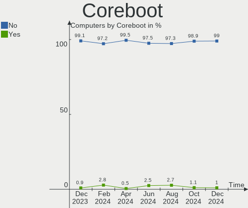

| Used | Computers | Percent |
|------|-----------|---------|
| No   | 195       | 100%    |

RAM Size
--------

Total RAM memory

| Size in GB  | Computers | Percent |
|-------------|-----------|---------|
| 16.01-24.0  | 46        | 23.59%  |
| 4.01-8.0    | 42        | 21.54%  |
| 32.01-64.0  | 35        | 17.95%  |
| 3.01-4.0    | 24        | 12.31%  |
| 8.01-16.0   | 22        | 11.28%  |
| 64.01-256.0 | 8         | 4.1%    |
| 24.01-32.0  | 7         | 3.59%   |
| 1.01-2.0    | 6         | 3.08%   |
| 2.01-3.0    | 3         | 1.54%   |
| 0.01-0.5    | 1         | 0.51%   |
| Unknown     | 1         | 0.51%   |

RAM Used
--------

Used RAM memory

| Used GB    | Computers | Percent |
|------------|-----------|---------|
| 1.01-2.0   | 54        | 27.69%  |
| 4.01-8.0   | 45        | 23.08%  |
| 2.01-3.0   | 36        | 18.46%  |
| 3.01-4.0   | 27        | 13.85%  |
| 8.01-16.0  | 14        | 7.18%   |
| 0.51-1.0   | 14        | 7.18%   |
| 32.01-64.0 | 2         | 1.03%   |
| 24.01-32.0 | 1         | 0.51%   |
| 0.01-0.5   | 1         | 0.51%   |
| Unknown    | 1         | 0.51%   |

Total Drives
------------

Number of drives on board

| Drives | Computers | Percent |
|--------|-----------|---------|
| 1      | 106       | 54.36%  |
| 2      | 43        | 22.05%  |
| 3      | 20        | 10.26%  |
| 4      | 8         | 4.1%    |
| 5      | 6         | 3.08%   |
| 0      | 5         | 2.56%   |
| 8      | 3         | 1.54%   |
| 6      | 2         | 1.03%   |
| 10     | 1         | 0.51%   |
| 7      | 1         | 0.51%   |

Has CD-ROM
----------

Has CD-ROM on board

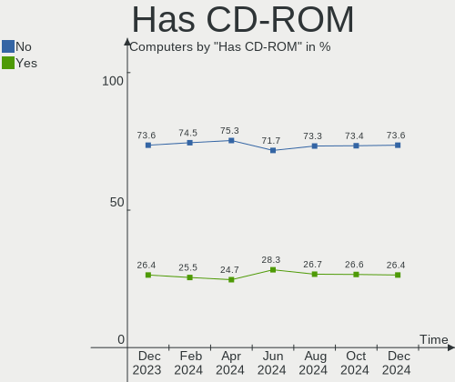

| Presented | Computers | Percent |
|-----------|-----------|---------|
| No        | 126       | 64.62%  |
| Yes       | 69        | 35.38%  |

Has Ethernet
------------

Has Ethernet on board

| Presented | Computers | Percent |
|-----------|-----------|---------|
| Yes       | 169       | 86.67%  |
| No        | 26        | 13.33%  |

Has WiFi
--------

Has WiFi module

| Presented | Computers | Percent |
|-----------|-----------|---------|
| Yes       | 133       | 68.21%  |
| No        | 62        | 31.79%  |

Has Bluetooth
-------------

Has Bluetooth module

| Presented | Computers | Percent |
|-----------|-----------|---------|
| Yes       | 108       | 55.38%  |
| No        | 87        | 44.62%  |

Location
--------

Country
-------

Geographic location (country)

| Country | Computers | Percent |
|---------|-----------|---------|
| Canada  | 195       | 100%    |

City
----

Geographic location (city)

| City                   | Computers | Percent |
|------------------------|-----------|---------|
| Toronto                | 26        | 13.33%  |
| Montreal               | 14        | 7.18%   |
| Calgary                | 12        | 6.15%   |
| Vancouver              | 8         | 4.1%    |
| Edmonton               | 8         | 4.1%    |
| Ottawa                 | 6         | 3.08%   |
| Surrey                 | 5         | 2.56%   |
| Regina                 | 5         | 2.56%   |
| Winnipeg               | 4         | 2.05%   |
| Kitchener              | 4         | 2.05%   |
| Québec                | 3         | 1.54%   |
| Oakville               | 3         | 1.54%   |
| North Bay              | 3         | 1.54%   |
| Laval                  | 3         | 1.54%   |
| Halifax                | 3         | 1.54%   |
| Brampton               | 3         | 1.54%   |
| Terrebonne             | 2         | 1.03%   |
| St. John's             | 2         | 1.03%   |
| Oshawa                 | 2         | 1.03%   |
| Mount Pearl            | 2         | 1.03%   |
| Miramichi              | 2         | 1.03%   |
| Kirkland               | 2         | 1.03%   |
| Greater Sudbury        | 2         | 1.03%   |
| Gatineau               | 2         | 1.03%   |
| Chambly                | 2         | 1.03%   |
| Burnaby                | 2         | 1.03%   |
| Winkler                | 1         | 0.51%   |
| Windsor                | 1         | 0.51%   |
| Whitehorse             | 1         | 0.51%   |
| Weyburn                | 1         | 0.51%   |
| Waterloo               | 1         | 0.51%   |
| Wakefield              | 1         | 0.51%   |
| Vulcan                 | 1         | 0.51%   |
| Victoriaville          | 1         | 0.51%   |
| Victoria               | 1         | 0.51%   |
| Utopia                 | 1         | 0.51%   |
| Trois-Rivières        | 1         | 0.51%   |
| Tillsonburg            | 1         | 0.51%   |
| Terrace                | 1         | 0.51%   |
| Stony Plain            | 1         | 0.51%   |
| Spruce Grove           | 1         | 0.51%   |
| Sooke                  | 1         | 0.51%   |
| Sherbrooke             | 1         | 0.51%   |
| Sechelt                | 1         | 0.51%   |
| Scarborough            | 1         | 0.51%   |
| Saint-Joseph-de-Beauce | 1         | 0.51%   |
| Saint-Jerome           | 1         | 0.51%   |
| Saint-Constant         | 1         | 0.51%   |
| Saint John             | 1         | 0.51%   |
| Ross                   | 1         | 0.51%   |
| Rimouski               | 1         | 0.51%   |
| Ridgeway               | 1         | 0.51%   |
| Richmond Hill          | 1         | 0.51%   |
| Richmond               | 1         | 0.51%   |
| Rawdon                 | 1         | 0.51%   |
| Prince Rupert          | 1         | 0.51%   |
| Prince George          | 1         | 0.51%   |
| Port Moody             | 1         | 0.51%   |
| North Vancouver        | 1         | 0.51%   |
| Niagara Falls          | 1         | 0.51%   |

Drives
------

Drive Vendor
------------

Hard drive vendors

| Vendor                    | Computers | Drives | Percent |
|---------------------------|-----------|--------|---------|
| WDC                       | 58        | 83     | 19.86%  |
| Samsung Electronics       | 52        | 64     | 17.81%  |
| Seagate                   | 50        | 72     | 17.12%  |
| Toshiba                   | 11        | 11     | 3.77%   |
| Sandisk                   | 11        | 11     | 3.77%   |
| Intel                     | 11        | 12     | 3.77%   |
| Hitachi                   | 11        | 12     | 3.77%   |
| Crucial                   | 11        | 12     | 3.77%   |
| Unknown                   | 10        | 13     | 3.42%   |
| SK Hynix                  | 9         | 9      | 3.08%   |
| Kingston                  | 9         | 10     | 3.08%   |
| A-DATA Technology         | 9         | 12     | 3.08%   |
| Micron Technology         | 4         | 4      | 1.37%   |
| Lenovo                    | 3         | 3      | 1.03%   |
| HGST                      | 3         | 3      | 1.03%   |
| LITEON                    | 2         | 2      | 0.68%   |
| KIOXIA                    | 2         | 2      | 0.68%   |
| Dogfish                   | 2         | 2      | 0.68%   |
| Corsair                   | 2         | 2      | 0.68%   |
| Value                     | 1         | 1      | 0.34%   |
| USB3.1                    | 1         | 1      | 0.34%   |
| USB 3.0                   | 1         | 1      | 0.34%   |
| Unknown (1GB)             | 1         | 1      | 0.34%   |
| TYPEC 1T                  | 1         | 1      | 0.34%   |
| SPCC                      | 1         | 1      | 0.34%   |
| Silicon Motion            | 1         | 1      | 0.34%   |
| SABRENT                   | 1         | 1      | 0.34%   |
| Realtek Semiconductor     | 1         | 1      | 0.34%   |
| PLEXTOR                   | 1         | 1      | 0.34%   |
| Phison                    | 1         | 1      | 0.34%   |
| OWC                       | 1         | 1      | 0.34%   |
| Micron/Crucial Technology | 1         | 1      | 0.34%   |
| KingSpec                  | 1         | 1      | 0.34%   |
| KingFast                  | 1         | 1      | 0.34%   |
| INTEL SS                  | 1         | 1      | 0.34%   |
| Galaird                   | 1         | 1      | 0.34%   |
| Fujitsu                   | 1         | 1      | 0.34%   |
| DAS                       | 1         | 3      | 0.34%   |
| Apple                     | 1         | 1      | 0.34%   |
| AMicro                    | 1         | 1      | 0.34%   |
| ADATA Technology          | 1         | 1      | 0.34%   |

Drive Model
-----------

Hard drive models

| Model                            | Computers | Percent |
|----------------------------------|-----------|---------|
| Seagate ST2000DM001-1ER164 2TB   | 5         | 1.48%   |
| Samsung SSD 860 EVO 500GB        | 5         | 1.48%   |
| Sandisk NVMe SSD Drive 500GB     | 4         | 1.19%   |
| Samsung NVMe SSD Drive 250GB     | 4         | 1.19%   |
| WDC WDS100T2B0A-00SM50 1TB SSD   | 3         | 0.89%   |
| Toshiba MQ01ABD100 1TB           | 3         | 0.89%   |
| Seagate ST9500325AS 500GB        | 3         | 0.89%   |
| Seagate ST500DM002-1BD142 500GB  | 3         | 0.89%   |
| Seagate ST4000DM004-2CV104 4TB   | 3         | 0.89%   |
| Seagate ST2000DM008-2FR102 2TB   | 3         | 0.89%   |
| Samsung SSD 970 EVO Plus 1TB     | 3         | 0.89%   |
| Samsung SSD 860 EVO 1TB          | 3         | 0.89%   |
| Samsung SSD 850 EVO 500GB        | 3         | 0.89%   |
| Samsung NVMe SSD Drive 1TB       | 3         | 0.89%   |
| Lenovo NVMe SSD Drive 256GB      | 3         | 0.89%   |
| Kingston SA400S37240G 240GB SSD  | 3         | 0.89%   |
| Crucial CT1000MX500SSD1 1TB      | 3         | 0.89%   |
| WDC WDS100T2B0C-00PXH0 1TB       | 2         | 0.59%   |
| WDC WD40EZRZ-00GXCB0 4TB         | 2         | 0.59%   |
| WDC WD40EZAZ-00SF3B0 4TB         | 2         | 0.59%   |
| WDC WD10EZEX-08WN4A0 1TB         | 2         | 0.59%   |
| WDC WD10EZEX-00BN5A0 1TB         | 2         | 0.59%   |
| WDC WD10EADS-00L5B1 1TB          | 2         | 0.59%   |
| Unknown SN128  128GB             | 2         | 0.59%   |
| Toshiba DT01ACA200 2TB           | 2         | 0.59%   |
| SK Hynix NVMe SSD Drive 256GB    | 2         | 0.59%   |
| Seagate ST31000528AS 1TB         | 2         | 0.59%   |
| Seagate ST1000LM035-1RK172 1TB   | 2         | 0.59%   |
| Seagate ST1000LM014-1EJ164 1TB   | 2         | 0.59%   |
| Seagate ST1000DM003-1ER162 1TB   | 2         | 0.59%   |
| Seagate BUP Slim 2TB             | 2         | 0.59%   |
| Seagate BUP Portable 5TB         | 2         | 0.59%   |
| Sandisk NVMe SSD Drive 1TB       | 2         | 0.59%   |
| Samsung SSD 980 1TB              | 2         | 0.59%   |
| Samsung SSD 870 QVO 2TB          | 2         | 0.59%   |
| Samsung SSD 870 EVO 500GB        | 2         | 0.59%   |
| Samsung SSD 870 EVO 1TB          | 2         | 0.59%   |
| Samsung SSD 860 EVO 250GB        | 2         | 0.59%   |
| Samsung PSSD T7 500GB            | 2         | 0.59%   |
| Samsung NVMe SSD Drive 1024GB    | 2         | 0.59%   |
| Kingston SA400S37120G 120GB SSD  | 2         | 0.59%   |
| Intel NVMe SSD Drive 512GB       | 2         | 0.59%   |
| Hitachi HTS547575A9E384 752GB    | 2         | 0.59%   |
| Dogfish SSD 256GB                | 2         | 0.59%   |
| Crucial CT120BX500SSD1 120GB     | 2         | 0.59%   |
| A-DATA SU800 128GB SSD           | 2         | 0.59%   |
| A-DATA SU760 512GB SSD           | 2         | 0.59%   |
| WDC WDS500G2B0C 500GB            | 1         | 0.3%    |
| WDC WDS500G2B0A-00SM50 500GB SSD | 1         | 0.3%    |
| WDC WDS250G1B0A-00H9H0 250GB SSD | 1         | 0.3%    |
| WDC WDS240G2G0B-00EPW0 240GB SSD | 1         | 0.3%    |
| WDC WDS200T2B0B-00YS70 2TB SSD   | 1         | 0.3%    |
| WDC WDS100T3X0C-00SJG0 1TB       | 1         | 0.3%    |
| WDC WDS100T2G0A-00JH30 1TB SSD   | 1         | 0.3%    |
| WDC WDS100T2B0B-00YS70 1TB SSD   | 1         | 0.3%    |
| WDC WDBNCE2500PNC 250GB SSD      | 1         | 0.3%    |
| WDC WD800JD-75MSA3 80GB          | 1         | 0.3%    |
| WDC WD800JD-22LSA0 80GB          | 1         | 0.3%    |
| WDC WD7502AAEX-00Y9A0 752GB      | 1         | 0.3%    |
| WDC WD740GD-00FLC0 74GB          | 1         | 0.3%    |

HDD Vendor
----------

Hard disk drive vendors

| Vendor              | Computers | Drives | Percent |
|---------------------|-----------|--------|---------|
| Seagate             | 50        | 70     | 42.02%  |
| WDC                 | 43        | 65     | 36.13%  |
| Hitachi             | 11        | 12     | 9.24%   |
| Toshiba             | 7         | 7      | 5.88%   |
| HGST                | 3         | 3      | 2.52%   |
| USB 3.0             | 1         | 1      | 0.84%   |
| Samsung Electronics | 1         | 1      | 0.84%   |
| SABRENT             | 1         | 1      | 0.84%   |
| Fujitsu             | 1         | 1      | 0.84%   |
| DAS                 | 1         | 3      | 0.84%   |

SSD Vendor
----------

Solid state drive vendors

| Vendor              | Computers | Drives | Percent |
|---------------------|-----------|--------|---------|
| Samsung Electronics | 25        | 33     | 30.12%  |
| WDC                 | 10        | 10     | 12.05%  |
| Crucial             | 10        | 11     | 12.05%  |
| A-DATA Technology   | 9         | 11     | 10.84%  |
| Kingston            | 7         | 8      | 8.43%   |
| Intel               | 4         | 4      | 4.82%   |
| SK Hynix            | 2         | 2      | 2.41%   |
| SanDisk             | 2         | 2      | 2.41%   |
| Micron Technology   | 2         | 2      | 2.41%   |
| Dogfish             | 2         | 2      | 2.41%   |
| Value               | 1         | 1      | 1.2%    |
| TYPEC 1T            | 1         | 1      | 1.2%    |
| SPCC                | 1         | 1      | 1.2%    |
| PLEXTOR             | 1         | 1      | 1.2%    |
| OWC                 | 1         | 1      | 1.2%    |
| LITEON              | 1         | 1      | 1.2%    |
| KingSpec            | 1         | 1      | 1.2%    |
| INTEL SS            | 1         | 1      | 1.2%    |
| Corsair             | 1         | 1      | 1.2%    |
| Apple               | 1         | 1      | 1.2%    |

Drive Kind
----------

HDD or SSD

| Kind    | Computers | Drives | Percent |
|---------|-----------|--------|---------|
| HDD     | 100       | 164    | 37.74%  |
| SSD     | 74        | 95     | 27.92%  |
| NVMe    | 72        | 82     | 27.17%  |
| MMC     | 11        | 12     | 4.15%   |
| Unknown | 8         | 10     | 3.02%   |

Drive Connector
---------------

SATA, SAS, NVMe, etc.

| Type | Computers | Drives | Percent |
|------|-----------|--------|---------|
| SATA | 137       | 241    | 57.32%  |
| NVMe | 72        | 82     | 30.13%  |
| SAS  | 19        | 28     | 7.95%   |
| MMC  | 11        | 12     | 4.6%    |

Drive Size
----------

Size of hard drive

| Size in TB | Computers | Drives | Percent |
|------------|-----------|--------|---------|
| 0.01-0.5   | 89        | 103    | 46.35%  |
| 0.51-1.0   | 56        | 79     | 29.17%  |
| 1.01-2.0   | 26        | 41     | 13.54%  |
| 3.01-4.0   | 10        | 18     | 5.21%   |
| 4.01-10.0  | 8         | 13     | 4.17%   |
| 2.01-3.0   | 3         | 5      | 1.56%   |

Space Total
-----------

Amount of disk space available on the file system

| Size in GB     | Computers | Percent |
|----------------|-----------|---------|
| 101-250        | 40        | 20.51%  |
| 251-500        | 39        | 20%     |
| 501-1000       | 30        | 15.38%  |
| More than 3000 | 22        | 11.28%  |
| 1001-2000      | 15        | 7.69%   |
| Unknown        | 14        | 7.18%   |
| 1-20           | 11        | 5.64%   |
| 2001-3000      | 10        | 5.13%   |
| 21-50          | 7         | 3.59%   |
| 51-100         | 7         | 3.59%   |

Space Used
----------

Amount of used disk space

| Used GB        | Computers | Percent |
|----------------|-----------|---------|
| 1-20           | 54        | 27.69%  |
| 21-50          | 29        | 14.87%  |
| 101-250        | 28        | 14.36%  |
| 51-100         | 20        | 10.26%  |
| 501-1000       | 14        | 7.18%   |
| Unknown        | 14        | 7.18%   |
| 251-500        | 13        | 6.67%   |
| More than 3000 | 11        | 5.64%   |
| 1001-2000      | 9         | 4.62%   |
| 2001-3000      | 3         | 1.54%   |

Malfunc. Drives
---------------

Drive models with a malfunction

| Model                                        | Computers | Drives | Percent |
|----------------------------------------------|-----------|--------|---------|
| Seagate ST9500325AS 500GB                    | 2         | 2      | 10%     |
| WDC WD800JD-22LSA0 80GB                      | 1         | 1      | 5%      |
| WDC WD10EZEX-00BN5A0 1TB                     | 1         | 1      | 5%      |
| WDC WD10EADS-00P8B0 1TB                      | 1         | 1      | 5%      |
| WDC WD10EADS-00L5B1 1TB                      | 1         | 1      | 5%      |
| Seagate ST500LT012-9WS142 500GB              | 1         | 1      | 5%      |
| Seagate ST500DM002-1BD142 500GB              | 1         | 1      | 5%      |
| Seagate ST1000LM024 HN-M101MBB 1TB           | 1         | 1      | 5%      |
| Seagate ST1000DM003-1ER162 1TB               | 1         | 1      | 5%      |
| Samsung Electronics SSD 870 EVO 1TB          | 1         | 1      | 5%      |
| Samsung Electronics SSD 840 PRO Series 256GB | 1         | 1      | 5%      |
| Hitachi HUA723020ALA641 2TB                  | 1         | 1      | 5%      |
| Hitachi HDT725050VLA380 500GB                | 1         | 1      | 5%      |
| HGST HTS721010A9E630 1TB                     | 1         | 1      | 5%      |
| HGST HTS541010A9E680 1TB                     | 1         | 1      | 5%      |
| DAS TerraMaster 4TB                          | 1         | 3      | 5%      |
| Crucial CT240M500SSD1 240GB                  | 1         | 1      | 5%      |
| A-DATA Technology SX900 256GB SSD            | 1         | 1      | 5%      |
| A-DATA Technology SU800 512GB SSD            | 1         | 1      | 5%      |

Malfunc. Drive Vendor
---------------------

Vendors of faulty drives

| Vendor              | Computers | Drives | Percent |
|---------------------|-----------|--------|---------|
| Seagate             | 6         | 6      | 30%     |
| WDC                 | 4         | 4      | 20%     |
| Samsung Electronics | 2         | 2      | 10%     |
| Hitachi             | 2         | 2      | 10%     |
| HGST                | 2         | 2      | 10%     |
| A-DATA Technology   | 2         | 2      | 10%     |
| DAS                 | 1         | 3      | 5%      |
| Crucial             | 1         | 1      | 5%      |

Malfunc. HDD Vendor
-------------------

Vendors of faulty HDD drives

| Vendor  | Computers | Drives | Percent |
|---------|-----------|--------|---------|
| Seagate | 6         | 6      | 40%     |
| WDC     | 4         | 4      | 26.67%  |
| Hitachi | 2         | 2      | 13.33%  |
| HGST    | 2         | 2      | 13.33%  |
| DAS     | 1         | 3      | 6.67%   |

Malfunc. Drive Kind
-------------------

Kinds of faulty drives

| Kind | Computers | Drives | Percent |
|------|-----------|--------|---------|
| HDD  | 13        | 17     | 72.22%  |
| SSD  | 5         | 5      | 27.78%  |

Failed Drives
-------------

Failed drive models

| Model                      | Computers | Drives | Percent |
|----------------------------|-----------|--------|---------|
| LITEON CA3-8D512 512GB     | 1         | 1      | 50%     |
| Intel SSDSA1M160G2HP 160GB | 1         | 1      | 50%     |

Failed Drive Vendor
-------------------

Failed drive vendors

| Vendor | Computers | Drives | Percent |
|--------|-----------|--------|---------|
| LITEON | 1         | 1      | 50%     |
| Intel  | 1         | 1      | 50%     |

Drive Status
------------

Number of failed and malfunc. drives

| Status   | Computers | Drives | Percent |
|----------|-----------|--------|---------|
| Detected | 110       | 192    | 51.89%  |
| Works    | 82        | 147    | 38.68%  |
| Malfunc  | 18        | 22     | 8.49%   |
| Failed   | 2         | 2      | 0.94%   |

Storage controller
------------------

Storage Vendor
--------------

Storage controller vendors

| Vendor                       | Computers | Percent |
|------------------------------|-----------|---------|
| Intel                        | 120       | 45.63%  |
| AMD                          | 51        | 19.39%  |
| Samsung Electronics          | 30        | 11.41%  |
| Sandisk                      | 15        | 5.7%    |
| ASMedia Technology           | 8         | 3.04%   |
| SK Hynix                     | 6         | 2.28%   |
| Toshiba America Info Systems | 4         | 1.52%   |
| Marvell Technology Group     | 3         | 1.14%   |
| Lenovo                       | 3         | 1.14%   |
| Phison Electronics           | 2         | 0.76%   |
| Nvidia                       | 2         | 0.76%   |
| Micron/Crucial Technology    | 2         | 0.76%   |
| Micron Technology            | 2         | 0.76%   |
| LSI Logic / Symbios Logic    | 2         | 0.76%   |
| KIOXIA                       | 2         | 0.76%   |
| Kingston Technology Company  | 2         | 0.76%   |
| Broadcom / LSI               | 2         | 0.76%   |
| ADATA Technology             | 2         | 0.76%   |
| Silicon Motion               | 1         | 0.38%   |
| Realtek Semiconductor        | 1         | 0.38%   |
| Lite-On Technology           | 1         | 0.38%   |
| JMicron Technology           | 1         | 0.38%   |
| Apple                        | 1         | 0.38%   |

Storage Model
-------------

Storage controller models

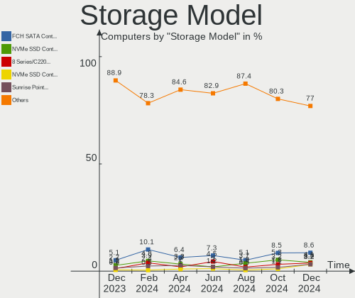

| Model                                                                          | Computers | Percent |
|--------------------------------------------------------------------------------|-----------|---------|
| AMD FCH SATA Controller [AHCI mode]                                            | 34        | 11.45%  |
| Samsung NVMe SSD Controller SM981/PM981/PM983                                  | 17        | 5.72%   |
| AMD 400 Series Chipset SATA Controller                                         | 10        | 3.37%   |
| Intel 82801 Mobile SATA Controller [RAID mode]                                 | 9         | 3.03%   |
| Intel 8 Series/C220 Series Chipset Family 6-port SATA Controller 1 [AHCI mode] | 9         | 3.03%   |
| Intel 7 Series Chipset Family 6-port SATA Controller [AHCI mode]               | 8         | 2.69%   |
| ASMedia ASM1062 Serial ATA Controller                                          | 7         | 2.36%   |
| Samsung NVMe SSD Controller 980                                                | 6         | 2.02%   |
| Intel Volume Management Device NVMe RAID Controller                            | 6         | 2.02%   |
| Intel 200 Series PCH SATA controller [AHCI mode]                               | 6         | 2.02%   |
| AMD SB7x0/SB8x0/SB9x0 SATA Controller [AHCI mode]                              | 6         | 2.02%   |
| Sandisk WD Blue SN550 NVMe SSD                                                 | 5         | 1.68%   |
| Intel Cannon Lake Mobile PCH SATA AHCI Controller                              | 5         | 1.68%   |
| AMD 500 Series Chipset SATA Controller                                         | 5         | 1.68%   |
| Sandisk WD Black SN750 / PC SN730 NVMe SSD                                     | 4         | 1.35%   |
| Intel Sunrise Point-LP SATA Controller [AHCI mode]                             | 4         | 1.35%   |
| Intel SSD 660P Series                                                          | 4         | 1.35%   |
| Intel NM10/ICH7 Family SATA Controller [IDE mode]                              | 4         | 1.35%   |
| Intel HM170/QM170 Chipset SATA Controller [AHCI Mode]                          | 4         | 1.35%   |
| Intel Cannon Lake PCH SATA AHCI Controller                                     | 4         | 1.35%   |
| Intel 9 Series Chipset Family SATA Controller [AHCI Mode]                      | 4         | 1.35%   |
| Intel 82801IBM/IEM (ICH9M/ICH9M-E) 4 port SATA Controller [AHCI mode]          | 4         | 1.35%   |
| Intel 7 Series/C210 Series Chipset Family 6-port SATA Controller [AHCI mode]   | 4         | 1.35%   |
| Intel 6 Series/C200 Series Chipset Family 6 port Desktop SATA AHCI Controller  | 4         | 1.35%   |
| Sandisk WD Blue SN500 / PC SN520 NVMe SSD                                      | 3         | 1.01%   |
| Samsung NVMe SSD Controller SM961/PM961/SM963                                  | 3         | 1.01%   |
| Samsung NVMe SSD Controller PM9A1/PM9A3/980PRO                                 | 3         | 1.01%   |
| Lenovo Non-Volatile memory controller                                          | 3         | 1.01%   |
| Intel Wildcat Point-LP SATA Controller [AHCI Mode]                             | 3         | 1.01%   |
| Intel Alder Lake-S PCH SATA Controller [AHCI Mode]                             | 3         | 1.01%   |
| Intel 82801JI (ICH10 Family) SATA AHCI Controller                              | 3         | 1.01%   |
| Intel 82801G (ICH7 Family) IDE Controller                                      | 3         | 1.01%   |
| Intel 500 Series Chipset Family SATA AHCI Controller                           | 3         | 1.01%   |
| Toshiba America Info Systems BG3 NVMe SSD Controller                           | 2         | 0.67%   |
| SK Hynix Gold P31 SSD                                                          | 2         | 0.67%   |
| SK Hynix BC501 NVMe Solid State Drive                                          | 2         | 0.67%   |
| Sandisk Non-Volatile memory controller                                         | 2         | 0.67%   |
| Phison E12 NVMe Controller                                                     | 2         | 0.67%   |
| Micron Non-Volatile memory controller                                          | 2         | 0.67%   |
| LSI Logic / Symbios Logic SAS2008 PCI-Express Fusion-MPT SAS-2 [Falcon]        | 2         | 0.67%   |
| KIOXIA Non-Volatile memory controller                                          | 2         | 0.67%   |
| Kingston Company A2000 NVMe SSD                                                | 2         | 0.67%   |
| Intel SATA Controller [RAID mode]                                              | 2         | 0.67%   |
| Intel Q170/Q150/B150/H170/H110/Z170/CM236 Chipset SATA Controller [AHCI Mode]  | 2         | 0.67%   |
| Intel Non-Volatile memory controller                                           | 2         | 0.67%   |
| Intel Celeron N3350/Pentium N4200/Atom E3900 Series SATA AHCI Controller       | 2         | 0.67%   |
| Intel 82801HM/HEM (ICH8M/ICH8M-E) IDE Controller                               | 2         | 0.67%   |
| Intel 6 Series/C200 Series Chipset Family 6 port Mobile SATA AHCI Controller   | 2         | 0.67%   |
| Intel 5 Series/3400 Series Chipset 6 port SATA AHCI Controller                 | 2         | 0.67%   |
| Intel 5 Series/3400 Series Chipset 4 port SATA AHCI Controller                 | 2         | 0.67%   |
| AMD SB7x0/SB8x0/SB9x0 SATA Controller [IDE mode]                               | 2         | 0.67%   |
| AMD SB7x0/SB8x0/SB9x0 IDE Controller                                           | 2         | 0.67%   |
| AMD 300 Series Chipset SATA Controller                                         | 2         | 0.67%   |
| Toshiba America Info Systems XG6 NVMe SSD Controller                           | 1         | 0.34%   |
| Toshiba America Info Systems XG4 NVMe SSD Controller                           | 1         | 0.34%   |
| SK Hynix Non-Volatile memory controller                                        | 1         | 0.34%   |
| SK Hynix BC511                                                                 | 1         | 0.34%   |
| Silicon Motion SM2262/SM2262EN SSD Controller                                  | 1         | 0.34%   |
| Sandisk WD PC SN810 / Black SN850 NVMe SSD                                     | 1         | 0.34%   |
| Sandisk WD Black 2018/SN750 / PC SN720 NVMe SSD                                | 1         | 0.34%   |

Storage Kind
------------

Kind of storage controller (IDE, SATA, NVMe, SAS, ...)

| Kind | Computers | Percent |
|------|-----------|---------|
| SATA | 142       | 55.25%  |
| NVMe | 72        | 28.02%  |
| RAID | 24        | 9.34%   |
| IDE  | 17        | 6.61%   |
| SAS  | 2         | 0.78%   |

Processor
---------

CPU Vendor
----------

Processor vendors

| Vendor  | Computers | Percent |
|---------|-----------|---------|
| Intel   | 132       | 67.69%  |
| AMD     | 57        | 29.23%  |
| ARM     | 5         | 2.56%   |
| Unknown | 1         | 0.51%   |

CPU Model
---------

Processor models

| Model                                       | Computers | Percent |
|---------------------------------------------|-----------|---------|
| Intel Core i7-9750H CPU @ 2.60GHz           | 5         | 2.56%   |
| AMD Ryzen 7 3700X 8-Core Processor          | 5         | 2.56%   |
| Intel Core i7-8550U CPU @ 1.80GHz           | 4         | 2.05%   |
| Intel Core i7-6700HQ CPU @ 2.60GHz          | 3         | 1.54%   |
| Intel Core i7-10750H CPU @ 2.60GHz          | 3         | 1.54%   |
| Intel 11th Gen Core i5-1135G7 @ 2.40GHz     | 3         | 1.54%   |
| ARM Processor                               | 3         | 1.54%   |
| AMD Ryzen 7 5700U with Radeon Graphics      | 3         | 1.54%   |
| AMD Ryzen 5 2400G with Radeon Vega Graphics | 3         | 1.54%   |
| Intel Xeon CPU E3-1231 v3 @ 3.40GHz         | 2         | 1.03%   |
| Intel Core i7-8565U CPU @ 1.80GHz           | 2         | 1.03%   |
| Intel Core i7-7700HQ CPU @ 2.80GHz          | 2         | 1.03%   |
| Intel Core i7-6700 CPU @ 3.40GHz            | 2         | 1.03%   |
| Intel Core i7-3630QM CPU @ 2.40GHz          | 2         | 1.03%   |
| Intel Core i7-1065G7 CPU @ 1.30GHz          | 2         | 1.03%   |
| Intel Core i5-3570 CPU @ 3.40GHz            | 2         | 1.03%   |
| Intel Core i5-2450M CPU @ 2.50GHz           | 2         | 1.03%   |
| Intel Core i5-2400 CPU @ 3.10GHz            | 2         | 1.03%   |
| Intel Core i5-10400F CPU @ 2.90GHz          | 2         | 1.03%   |
| Intel Core i3-4130 CPU @ 3.40GHz            | 2         | 1.03%   |
| Intel Core i3-3120M CPU @ 2.50GHz           | 2         | 1.03%   |
| Intel Celeron CPU J3455 @ 1.50GHz           | 2         | 1.03%   |
| Intel 12th Gen Core i5-12600K               | 2         | 1.03%   |
| AMD Ryzen 7 3800X 8-Core Processor          | 2         | 1.03%   |
| AMD Ryzen 7 2700X Eight-Core Processor      | 2         | 1.03%   |
| AMD Ryzen 7 2700 Eight-Core Processor       | 2         | 1.03%   |
| AMD Ryzen 5 5500U with Radeon Graphics      | 2         | 1.03%   |
| AMD FX-8350 Eight-Core Processor            | 2         | 1.03%   |
| Intel Xeon W-2225 CPU @ 4.10GHz             | 1         | 0.51%   |
| Intel Xeon CPU X5650 @ 2.67GHz              | 1         | 0.51%   |
| Intel Xeon CPU E5645 @ 2.40GHz              | 1         | 0.51%   |
| Intel Xeon CPU E5540 @ 2.53GHz              | 1         | 0.51%   |
| Intel Xeon CPU E5462 @ 2.80GHz              | 1         | 0.51%   |
| Intel Xeon CPU E5-1650 v3 @ 3.50GHz         | 1         | 0.51%   |
| Intel Pentium Dual-Core CPU E5400 @ 2.70GHz | 1         | 0.51%   |
| Intel Pentium Dual CPU T3200 @ 2.00GHz      | 1         | 0.51%   |
| Intel Pentium Dual CPU E2140 @ 1.60GHz      | 1         | 0.51%   |
| Intel Pentium D CPU 2.80GHz                 | 1         | 0.51%   |
| Intel Pentium CPU J2900 @ 2.41GHz           | 1         | 0.51%   |
| Intel Core i9-9900KS CPU @ 4.00GHz          | 1         | 0.51%   |
| Intel Core i9-9880H CPU @ 2.30GHz           | 1         | 0.51%   |
| Intel Core i9-8950HK CPU @ 2.90GHz          | 1         | 0.51%   |
| Intel Core i7-8700K CPU @ 3.70GHz           | 1         | 0.51%   |
| Intel Core i7-8700 CPU @ 3.20GHz            | 1         | 0.51%   |
| Intel Core i7-8665U CPU @ 1.90GHz           | 1         | 0.51%   |
| Intel Core i7-8650U CPU @ 1.90GHz           | 1         | 0.51%   |
| Intel Core i7-7700K CPU @ 4.20GHz           | 1         | 0.51%   |
| Intel Core i7-6500U CPU @ 2.50GHz           | 1         | 0.51%   |
| Intel Core i7-5600U CPU @ 2.60GHz           | 1         | 0.51%   |
| Intel Core i7-4790K CPU @ 4.00GHz           | 1         | 0.51%   |
| Intel Core i7-4790 CPU @ 3.60GHz            | 1         | 0.51%   |
| Intel Core i7-4770S CPU @ 3.10GHz           | 1         | 0.51%   |
| Intel Core i7-4770K CPU @ 3.50GHz           | 1         | 0.51%   |
| Intel Core i7-3840QM CPU @ 2.80GHz          | 1         | 0.51%   |
| Intel Core i7-3820 CPU @ 3.60GHz            | 1         | 0.51%   |
| Intel Core i7-3770K CPU @ 3.50GHz           | 1         | 0.51%   |
| Intel Core i7-3520M CPU @ 2.90GHz           | 1         | 0.51%   |
| Intel Core i7-2600K CPU @ 3.40GHz           | 1         | 0.51%   |
| Intel Core i7-10510U CPU @ 1.80GHz          | 1         | 0.51%   |
| Intel Core i5-9600K CPU @ 3.70GHz           | 1         | 0.51%   |

CPU Model Family
----------------

Processor model prefix

| Model                   | Computers | Percent |
|-------------------------|-----------|---------|
| Intel Core i7           | 42        | 21.54%  |
| Intel Core i5           | 36        | 18.46%  |
| AMD Ryzen 7             | 22        | 11.28%  |
| Other                   | 17        | 8.72%   |
| Intel Core i3           | 13        | 6.67%   |
| AMD Ryzen 5             | 10        | 5.13%   |
| Intel Core 2 Duo        | 9         | 4.62%   |
| Intel Xeon              | 8         | 4.1%    |
| Intel Celeron           | 4         | 2.05%   |
| AMD FX                  | 4         | 2.05%   |
| Intel Core i9           | 3         | 1.54%   |
| AMD Ryzen 9             | 3         | 1.54%   |
| AMD A6                  | 3         | 1.54%   |
| AMD A10                 | 3         | 1.54%   |
| Intel Pentium Dual      | 2         | 1.03%   |
| AMD Ryzen 3             | 2         | 1.03%   |
| Intel Pentium Dual-Core | 1         | 0.51%   |
| Intel Pentium D         | 1         | 0.51%   |
| Intel Pentium           | 1         | 0.51%   |
| Intel Atom              | 1         | 0.51%   |
| ARM Allwinner           | 1         | 0.51%   |
| AMD Ryzen 5 PRO         | 1         | 0.51%   |
| AMD Phenom II X6        | 1         | 0.51%   |
| AMD Phenom II X4        | 1         | 0.51%   |
| AMD G                   | 1         | 0.51%   |
| AMD E2                  | 1         | 0.51%   |
| AMD E                   | 1         | 0.51%   |
| AMD Athlon II X4        | 1         | 0.51%   |
| AMD Athlon II X2        | 1         | 0.51%   |
| AMD Athlon 64 X2        | 1         | 0.51%   |

CPU Cores
---------

Number of processor cores

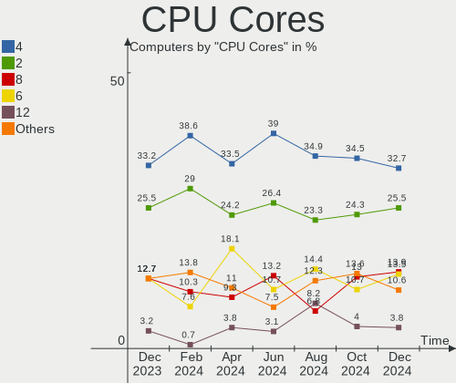

| Number  | Computers | Percent |
|---------|-----------|---------|
| 4       | 78        | 40%     |
| 2       | 54        | 27.69%  |
| 8       | 29        | 14.87%  |
| 6       | 25        | 12.82%  |
| 12      | 3         | 1.54%   |
| 10      | 2         | 1.03%   |
| Unknown | 2         | 1.03%   |
| 16      | 1         | 0.51%   |
| 14      | 1         | 0.51%   |

CPU Sockets
-----------

Number of sockets

| Number  | Computers | Percent |
|---------|-----------|---------|
| 1       | 190       | 97.44%  |
| 2       | 3         | 1.54%   |
| Unknown | 2         | 1.03%   |

CPU Threads
-----------

Threads per core (Hyper-Threading)

| Number  | Computers | Percent |
|---------|-----------|---------|
| 2       | 138       | 70.77%  |
| 1       | 55        | 28.21%  |
| Unknown | 2         | 1.03%   |

CPU Op-Modes
------------

CPU Operation Modes (32-bit, 64-bit)

| Op mode        | Computers | Percent |
|----------------|-----------|---------|
| 32-bit, 64-bit | 190       | 97.44%  |
| Unknown        | 5         | 2.56%   |

CPU Microcode
-------------

Microcode number

| Number     | Computers | Percent |
|------------|-----------|---------|
| Unknown    | 48        | 24.62%  |
| 0x306a9    | 10        | 5.13%   |
| 0x906ea    | 9         | 4.62%   |
| 0x306c3    | 9         | 4.62%   |
| 0x206a7    | 8         | 4.1%    |
| 0x08701021 | 7         | 3.59%   |
| 0x1067a    | 6         | 3.08%   |
| 0x906e9    | 5         | 2.56%   |
| 0x706e5    | 4         | 2.05%   |
| 0x08608103 | 4         | 2.05%   |
| 0xa0653    | 3         | 1.54%   |
| 0xa0652    | 3         | 1.54%   |
| 0x906ed    | 3         | 1.54%   |
| 0x90672    | 3         | 1.54%   |
| 0x806ec    | 3         | 1.54%   |
| 0x806ea    | 3         | 1.54%   |
| 0x6fd      | 3         | 1.54%   |
| 0x506e3    | 3         | 1.54%   |
| 0x20655    | 3         | 1.54%   |
| 0x0a50000c | 3         | 1.54%   |
| 0x0800820d | 3         | 1.54%   |
| 0x806e9    | 2         | 1.03%   |
| 0x806c1    | 2         | 1.03%   |
| 0x506c9    | 2         | 1.03%   |
| 0x406e3    | 2         | 1.03%   |
| 0x206c2    | 2         | 1.03%   |
| 0x10676    | 2         | 1.03%   |
| 0x0810100b | 2         | 1.03%   |
| 0xf47      | 1         | 0.51%   |
| 0x906a3    | 1         | 0.51%   |
| 0x806eb    | 1         | 0.51%   |
| 0x706a8    | 1         | 0.51%   |
| 0x50657    | 1         | 0.51%   |
| 0x406c3    | 1         | 0.51%   |
| 0x40671    | 1         | 0.51%   |
| 0x40651    | 1         | 0.51%   |
| 0x306f2    | 1         | 0.51%   |
| 0x306d4    | 1         | 0.51%   |
| 0x30678    | 1         | 0.51%   |
| 0x206d7    | 1         | 0.51%   |
| 0x106a5    | 1         | 0.51%   |
| 0x0a201204 | 1         | 0.51%   |
| 0x0a201016 | 1         | 0.51%   |
| 0x0a201009 | 1         | 0.51%   |
| 0x08701013 | 1         | 0.51%   |
| 0x08600104 | 1         | 0.51%   |
| 0x08600102 | 1         | 0.51%   |
| 0x08108109 | 1         | 0.51%   |
| 0x08108102 | 1         | 0.51%   |
| 0x08101016 | 1         | 0.51%   |
| 0x0800820b | 1         | 0.51%   |
| 0x08001136 | 1         | 0.51%   |
| 0x07030105 | 1         | 0.51%   |
| 0x07000106 | 1         | 0.51%   |
| 0x06006704 | 1         | 0.51%   |
| 0x06006118 | 1         | 0.51%   |
| 0x06001119 | 1         | 0.51%   |
| 0x06000852 | 1         | 0.51%   |
| 0x0600081f | 1         | 0.51%   |
| 0x06000613 | 1         | 0.51%   |

CPU Microarch
-------------

Microarchitecture

| Name             | Computers | Percent |
|------------------|-----------|---------|
| KabyLake         | 32        | 16.41%  |
| Haswell          | 16        | 8.21%   |
| Unknown          | 15        | 7.69%   |
| Zen 2            | 13        | 6.67%   |
| IvyBridge        | 13        | 6.67%   |
| SandyBridge      | 10        | 5.13%   |
| Penryn           | 10        | 5.13%   |
| Skylake          | 8         | 4.1%    |
| Zen+             | 7         | 3.59%   |
| Zen              | 7         | 3.59%   |
| Westmere         | 7         | 3.59%   |
| Zen 3            | 6         | 3.08%   |
| CometLake        | 6         | 3.08%   |
| Broadwell        | 5         | 2.56%   |
| Piledriver       | 4         | 2.05%   |
| K10              | 4         | 2.05%   |
| Alderlake Hybrid | 4         | 2.05%   |
| TigerLake        | 3         | 1.54%   |
| Silvermont       | 3         | 1.54%   |
| IceLake          | 3         | 1.54%   |
| Excavator        | 3         | 1.54%   |
| Core             | 3         | 1.54%   |
| K10 Llano        | 2         | 1.03%   |
| Goldmont         | 2         | 1.03%   |
| Bobcat           | 2         | 1.03%   |
| Puma             | 1         | 0.51%   |
| NetBurst         | 1         | 0.51%   |
| Nehalem          | 1         | 0.51%   |
| K8 Hammer        | 1         | 0.51%   |
| Jaguar           | 1         | 0.51%   |
| Goldmont plus    | 1         | 0.51%   |
| Bulldozer        | 1         | 0.51%   |

Graphics
--------

GPU Vendor
----------

Vendors of graphics cards

| Vendor                     | Computers | Percent |
|----------------------------|-----------|---------|
| Intel                      | 99        | 45.62%  |
| Nvidia                     | 65        | 29.95%  |
| AMD                        | 52        | 23.96%  |
| Matrox Electronics Systems | 1         | 0.46%   |

GPU Model
---------

Graphics card models

| Model                                                                       | Computers | Percent |
|-----------------------------------------------------------------------------|-----------|---------|
| Intel UHD Graphics 620                                                      | 7         | 3.2%    |
| Intel 2nd Generation Core Processor Family Integrated Graphics Controller   | 7         | 3.2%    |
| Intel Xeon E3-1200 v3/4th Gen Core Processor Integrated Graphics Controller | 6         | 2.74%   |
| Intel Mobile 4 Series Chipset Integrated Graphics Controller                | 5         | 2.28%   |
| Intel HD Graphics 630                                                       | 5         | 2.28%   |
| Intel Core Processor Integrated Graphics Controller                         | 5         | 2.28%   |
| Intel CoffeeLake-H GT2 [UHD Graphics 630]                                   | 5         | 2.28%   |
| AMD Raven Ridge [Radeon Vega Series / Radeon Vega Mobile Series]            | 5         | 2.28%   |
| AMD Lucienne                                                                | 5         | 2.28%   |
| AMD Ellesmere [Radeon RX 470/480/570/570X/580/580X/590]                     | 5         | 2.28%   |
| Nvidia TU117M [GeForce GTX 1650 Mobile / Max-Q]                             | 4         | 1.83%   |
| Nvidia GK208B [GeForce GT 710]                                              | 4         | 1.83%   |
| Intel WhiskeyLake-U GT2 [UHD Graphics 620]                                  | 4         | 1.83%   |
| Intel HD Graphics 530                                                       | 4         | 1.83%   |
| Intel 3rd Gen Core processor Graphics Controller                            | 4         | 1.83%   |
| Nvidia GP107M [GeForce GTX 1050 Mobile]                                     | 3         | 1.37%   |
| Nvidia GM204 [GeForce GTX 970]                                              | 3         | 1.37%   |
| Intel Xeon E3-1200 v2/3rd Gen Core processor Graphics Controller            | 3         | 1.37%   |
| Intel TigerLake-LP GT2 [Iris Xe Graphics]                                   | 3         | 1.37%   |
| Intel Iris Plus Graphics G7                                                 | 3         | 1.37%   |
| Intel HD Graphics 5500                                                      | 3         | 1.37%   |
| Intel AlderLake-S GT1                                                       | 3         | 1.37%   |
| AMD Picasso/Raven 2 [Radeon Vega Series / Radeon Vega Mobile Series]        | 3         | 1.37%   |
| AMD Cezanne                                                                 | 3         | 1.37%   |
| AMD Cedar [Radeon HD 5000/6000/7350/8350 Series]                            | 3         | 1.37%   |
| Nvidia TU117 [GeForce GTX 1650]                                             | 2         | 0.91%   |
| Nvidia GP107 [GeForce GTX 1050 Ti]                                          | 2         | 0.91%   |
| Nvidia GP104 [GeForce GTX 1070]                                             | 2         | 0.91%   |
| Nvidia GA106M [GeForce RTX 3060 Mobile / Max-Q]                             | 2         | 0.91%   |
| Intel TigerLake-H GT1 [UHD Graphics]                                        | 2         | 0.91%   |
| Intel Skylake GT2 [HD Graphics 520]                                         | 2         | 0.91%   |
| Intel HD Graphics 500                                                       | 2         | 0.91%   |
| Intel CometLake-H GT2 [UHD Graphics]                                        | 2         | 0.91%   |
| Intel CoffeeLake-S GT2 [UHD Graphics 630]                                   | 2         | 0.91%   |
| Intel Atom Processor Z36xxx/Z37xxx Series Graphics & Display                | 2         | 0.91%   |
| Intel 82945G/GZ Integrated Graphics Controller                              | 2         | 0.91%   |
| Intel 4th Generation Core Processor Family Integrated Graphics Controller   | 2         | 0.91%   |
| Intel 4 Series Chipset Integrated Graphics Controller                       | 2         | 0.91%   |
| AMD Wani [Radeon R5/R6/R7 Graphics]                                         | 2         | 0.91%   |
| AMD Renoir                                                                  | 2         | 0.91%   |
| AMD Navi 22 [Radeon RX 6700/6700 XT/6750 XT / 6800M]                        | 2         | 0.91%   |
| AMD Navi 21 [Radeon RX 6800/6800 XT / 6900 XT]                              | 2         | 0.91%   |
| AMD Navi 10 [Radeon RX 5600 OEM/5600 XT / 5700/5700 XT]                     | 2         | 0.91%   |
| AMD Chelsea XT GL [FirePro M4000]                                           | 2         | 0.91%   |
| Nvidia TU117M [GeForce GTX 1650 Ti Mobile]                                  | 1         | 0.46%   |
| Nvidia TU117M                                                               | 1         | 0.46%   |
| Nvidia TU116M [GeForce GTX 1660 Ti Mobile]                                  | 1         | 0.46%   |
| Nvidia TU106M [GeForce RTX 2070 Mobile]                                     | 1         | 0.46%   |
| Nvidia TU106M [GeForce RTX 2060 Max-Q]                                      | 1         | 0.46%   |
| Nvidia TU106BM [GeForce RTX 2070 Mobile]                                    | 1         | 0.46%   |
| Nvidia TU106 [GeForce RTX 2070]                                             | 1         | 0.46%   |
| Nvidia TU104GLM [Quadro RTX 4000 Mobile / Max-Q]                            | 1         | 0.46%   |
| Nvidia TU104 [GeForce RTX 2070 SUPER]                                       | 1         | 0.46%   |
| Nvidia GT218 [GeForce 8400 GS Rev. 3]                                       | 1         | 0.46%   |
| Nvidia GT218 [GeForce 210]                                                  | 1         | 0.46%   |
| Nvidia GT216M [GeForce GT 330M]                                             | 1         | 0.46%   |
| Nvidia GP108M [GeForce MX330]                                               | 1         | 0.46%   |
| Nvidia GP108M [GeForce MX150]                                               | 1         | 0.46%   |
| Nvidia GP108GLM [Quadro P520]                                               | 1         | 0.46%   |
| Nvidia GP108BM [GeForce MX250]                                              | 1         | 0.46%   |

GPU Combo
---------

Combinations of graphics cards

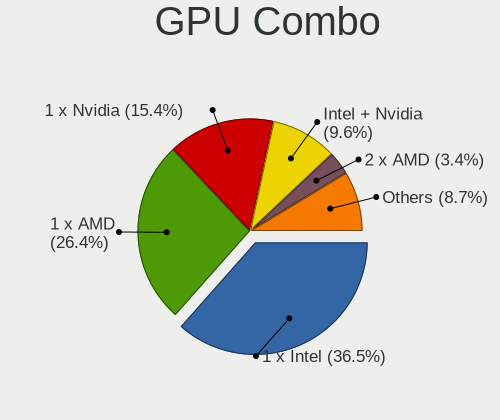

| Name           | Computers | Percent |
|----------------|-----------|---------|
| 1 x Intel      | 73        | 37.44%  |
| 1 x AMD        | 49        | 25.13%  |
| 1 x Nvidia     | 38        | 19.49%  |
| Intel + Nvidia | 25        | 12.82%  |
| Other          | 6         | 3.08%   |
| AMD + Nvidia   | 2         | 1.03%   |
| 2 x AMD        | 1         | 0.51%   |
| 1 x Matrox     | 1         | 0.51%   |

GPU Driver
----------

Free vs proprietary

| Driver      | Computers | Percent |
|-------------|-----------|---------|
| Free        | 139       | 71.28%  |
| Proprietary | 45        | 23.08%  |
| Unknown     | 11        | 5.64%   |

GPU Memory
----------

Total video memory

| Size in GB | Computers | Percent |
|------------|-----------|---------|
| Unknown    | 119       | 61.03%  |
| 1.01-2.0   | 17        | 8.72%   |
| 3.01-4.0   | 16        | 8.21%   |
| 0.51-1.0   | 12        | 6.15%   |
| 0.01-0.5   | 12        | 6.15%   |
| 7.01-8.0   | 10        | 5.13%   |
| 5.01-6.0   | 4         | 2.05%   |
| 8.01-16.0  | 4         | 2.05%   |
| 2.01-3.0   | 1         | 0.51%   |

Monitor
-------

Monitor Vendor
--------------

Monitor vendors

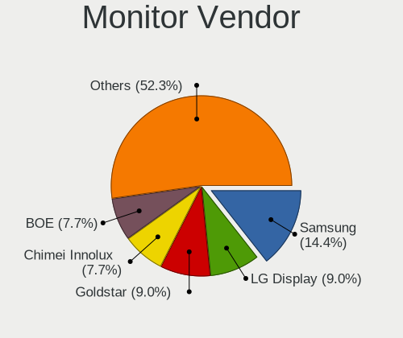

| Vendor                  | Computers | Percent |
|-------------------------|-----------|---------|
| Samsung Electronics     | 29        | 13.43%  |
| Dell                    | 22        | 10.19%  |
| AU Optronics            | 18        | 8.33%   |
| LG Display              | 15        | 6.94%   |
| Chimei Innolux          | 12        | 5.56%   |
| Hewlett-Packard         | 11        | 5.09%   |
| Goldstar                | 11        | 5.09%   |
| BOE                     | 11        | 5.09%   |
| Sharp                   | 9         | 4.17%   |
| BenQ                    | 9         | 4.17%   |
| Acer                    | 8         | 3.7%    |
| Ancor Communications    | 7         | 3.24%   |
| ViewSonic               | 5         | 2.31%   |
| PANDA                   | 4         | 1.85%   |
| Lenovo                  | 4         | 1.85%   |
| Apple                   | 4         | 1.85%   |
| Toshiba                 | 3         | 1.39%   |
| Sony                    | 3         | 1.39%   |
| LG Electronics          | 3         | 1.39%   |
| ASUSTek Computer        | 3         | 1.39%   |
| Philips                 | 2         | 0.93%   |
| Insignia                | 2         | 0.93%   |
| InfoVision              | 2         | 0.93%   |
| Gigabyte Technology     | 2         | 0.93%   |
| Chi Mei Optoelectronics | 2         | 0.93%   |
| AOC                     | 2         | 0.93%   |
| YTH                     | 1         | 0.46%   |
| Valve                   | 1         | 0.46%   |
| UGD                     | 1         | 0.46%   |
| Seiko/Epson             | 1         | 0.46%   |
| Ruijiang                | 1         | 0.46%   |
| OOO                     | 1         | 0.46%   |
| NEC Computers           | 1         | 0.46%   |
| MSI                     | 1         | 0.46%   |
| JDI                     | 1         | 0.46%   |
| HKC                     | 1         | 0.46%   |
| DENON                   | 1         | 0.46%   |
| CEX                     | 1         | 0.46%   |
| Unknown                 | 1         | 0.46%   |

Monitor Model
-------------

Monitor models

| Model                                                                   | Computers | Percent |
|-------------------------------------------------------------------------|-----------|---------|
| ViewSonic VA1948 SERIES VSCE827 1440x900 408x255mm 18.9-inch            | 2         | 0.88%   |
| Toshiba TV TSB0206 1920x1080 700x390mm 31.5-inch                        | 2         | 0.88%   |
| Sharp LCD Monitor SHP14BA 1920x1080 344x194mm 15.5-inch                 | 2         | 0.88%   |
| Sharp LCD Monitor SHP1476 3840x2160 346x194mm 15.6-inch                 | 2         | 0.88%   |
| Samsung Electronics LU28R55 SAM1017 3840x2160 632x360mm 28.6-inch       | 2         | 0.88%   |
| Samsung Electronics LCD Monitor SEC4351 1366x768 344x194mm 15.5-inch    | 2         | 0.88%   |
| Samsung Electronics LCD Monitor SAM7003 3840x2160 1872x1053mm 84.6-inch | 2         | 0.88%   |
| Lenovo P24q-10 LEN61A5 2560x1440 527x296mm 23.8-inch                    | 2         | 0.88%   |
| Hewlett-Packard w2007 HWP26A6 1680x1050 433x271mm 20.1-inch             | 2         | 0.88%   |
| Dell ST2410 DELA05D 1920x1080 531x299mm 24.0-inch                       | 2         | 0.88%   |
| Dell S2721QS DELA198 3840x2160 597x336mm 27.0-inch                      | 2         | 0.88%   |
| Chimei Innolux LCD Monitor CMN14D4 1920x1080 309x173mm 13.9-inch        | 2         | 0.88%   |
| BenQ PD2500Q BNQ802A 2560x1440 553x311mm 25.0-inch                      | 2         | 0.88%   |
| BenQ EX3501R BNQ7F5E 3440x1440 819x346mm 35.0-inch                      | 2         | 0.88%   |
| YTH YTH156KC YTH1560 3840x2160 600x330mm 27.0-inch                      | 1         | 0.44%   |
| ViewSonic VX2457 VSCB931 1920x1080 521x293mm 23.5-inch                  | 1         | 0.44%   |
| ViewSonic VS2210-FHD VSC1939 1920x1080 480x270mm 21.7-inch              | 1         | 0.44%   |
| ViewSonic LCD Monitor VSC3136 1920x1080 480x270mm 21.7-inch             | 1         | 0.44%   |
| Valve Index HMD VLV91A8                                                 | 1         | 0.44%   |
| UGD ID160F UGD1505 1920x1080 344x193mm 15.5-inch                        | 1         | 0.44%   |
| Toshiba ScreenXpert TSB8888 1080x2160                                   | 1         | 0.44%   |
| Sony TV XV SNY6001 1920x1080                                            | 1         | 0.44%   |
| Sony TV SNY9C01 1920x1080                                               | 1         | 0.44%   |
| Sony TV SNY1603 1920x1080                                               | 1         | 0.44%   |
| Sharp LQ156M1JW16 SHP14F4 1920x1080 344x194mm 15.5-inch                 | 1         | 0.44%   |
| Sharp LQ135P1JX51 SHP14B3 2256x1504 285x190mm 13.5-inch                 | 1         | 0.44%   |
| Sharp LCD Monitor SHP14D1 1920x1200 336x210mm 15.6-inch                 | 1         | 0.44%   |
| Sharp LC-32LB480U SHP3263 1920x1080 698x392mm 31.5-inch                 | 1         | 0.44%   |
| Sharp HDMI SHP0FCB 1920x1080 820x460mm 37.0-inch                        | 1         | 0.44%   |
| Seiko/Epson LCD Monitor 1680x1050                                       | 1         | 0.44%   |
| Samsung Electronics U28E850 SAM0CCE 3840x2160 610x350mm 27.7-inch       | 1         | 0.44%   |
| Samsung Electronics U28E590 SAM0C4E 3840x2160 608x345mm 27.5-inch       | 1         | 0.44%   |
| Samsung Electronics SyncMaster SAM044C 1680x1050 474x296mm 22.0-inch    | 1         | 0.44%   |
| Samsung Electronics SyncMaster SAM01E7 1920x1200 518x324mm 24.1-inch    | 1         | 0.44%   |
| Samsung Electronics SMS22A100 SAM0868 1920x1080 477x268mm 21.5-inch     | 1         | 0.44%   |
| Samsung Electronics SMB2440 SAM06B0 1920x1080 477x268mm 21.5-inch       | 1         | 0.44%   |
| Samsung Electronics S27H85x SAM0E0E 2560x1440 597x336mm 27.0-inch       | 1         | 0.44%   |
| Samsung Electronics S24R35x SAM100E 1920x1080 527x296mm 23.8-inch       | 1         | 0.44%   |
| Samsung Electronics S24C300 SAM0A2A 1920x1080 521x293mm 23.5-inch       | 1         | 0.44%   |
| Samsung Electronics S22E450 SAM0C91 1920x1080 477x268mm 21.5-inch       | 1         | 0.44%   |
| Samsung Electronics S22D390 SAM0B63 1920x1080 477x268mm 21.5-inch       | 1         | 0.44%   |
| Samsung Electronics LCD Monitor SEC5541 1366x768 344x193mm 15.5-inch    | 1         | 0.44%   |
| Samsung Electronics LCD Monitor SEC5441 1366x768 309x174mm 14.0-inch    | 1         | 0.44%   |
| Samsung Electronics LCD Monitor SEC5142 1280x800 303x190mm 14.1-inch    | 1         | 0.44%   |
| Samsung Electronics LCD Monitor SEC314C 1920x1080 340x190mm 15.3-inch   | 1         | 0.44%   |
| Samsung Electronics LCD Monitor SEC304C 1366x768 353x198mm 15.9-inch    | 1         | 0.44%   |
| Samsung Electronics LCD Monitor SDC4244 2160x1440 254x169mm 12.0-inch   | 1         | 0.44%   |
| Samsung Electronics LCD Monitor SDC4145 3840x2160 344x194mm 15.5-inch   | 1         | 0.44%   |
| Samsung Electronics LCD Monitor SDC324C 1920x1080 344x194mm 15.5-inch   | 1         | 0.44%   |
| Samsung Electronics LCD Monitor SAM71B4 3840x2160 950x540mm 43.0-inch   | 1         | 0.44%   |
| Samsung Electronics LCD Monitor SAM0F9F 3840x2160 1872x1053mm 84.6-inch | 1         | 0.44%   |
| Samsung Electronics LCD Monitor SAM0503 1920x1080                       | 1         | 0.44%   |
| Samsung Electronics LC32G5xT SAM7088 2560x1440 698x393mm 31.5-inch      | 1         | 0.44%   |
| Ruijiang RJT-FH RJT00A8 1920x1080 1920x1080mm 86.7-inch                 | 1         | 0.44%   |
| Philips PHL 328B6Q PHL0920 2560x1440 700x390mm 31.5-inch                | 1         | 0.44%   |
| Philips PHL 272P7VU PHL093A 3840x2160 597x336mm 27.0-inch               | 1         | 0.44%   |
| PANDA LM156LF9L02 NCP002F 1920x1080 344x194mm 15.5-inch                 | 1         | 0.44%   |
| PANDA LCD Monitor NCP004D 1920x1080 344x194mm 15.5-inch                 | 1         | 0.44%   |
| PANDA LCD Monitor NCP0036 1920x1080 344x194mm 15.5-inch                 | 1         | 0.44%   |
| PANDA LCD Monitor NCP0021 1920x1080 344x194mm 15.5-inch                 | 1         | 0.44%   |

Monitor Resolution
------------------

Monitor screen resolution

| Resolution         | Computers | Percent |
|--------------------|-----------|---------|
| 1920x1080 (FHD)    | 93        | 44.5%   |
| 1366x768 (WXGA)    | 27        | 12.92%  |
| 3840x2160 (4K)     | 24        | 11.48%  |
| 2560x1440 (QHD)    | 18        | 8.61%   |
| 1680x1050 (WSXGA+) | 8         | 3.83%   |
| 1920x1200 (WUXGA)  | 7         | 3.35%   |
| 3440x1440          | 5         | 2.39%   |
| 1600x900 (HD+)     | 4         | 1.91%   |
| 1440x900 (WXGA+)   | 4         | 1.91%   |
| Unknown            | 4         | 1.91%   |
| 1280x800 (WXGA)    | 3         | 1.44%   |
| 1280x1024 (SXGA)   | 3         | 1.44%   |
| 7680x2160          | 1         | 0.48%   |
| 3840x1080          | 1         | 0.48%   |
| 3000x2000          | 1         | 0.48%   |
| 2560x1600          | 1         | 0.48%   |
| 2560x1080          | 1         | 0.48%   |
| 2288x1287          | 1         | 0.48%   |
| 2256x1504          | 1         | 0.48%   |
| 2160x1440          | 1         | 0.48%   |
| 1360x768           | 1         | 0.48%   |

Monitor Diagonal
----------------

Diagonal size in inches

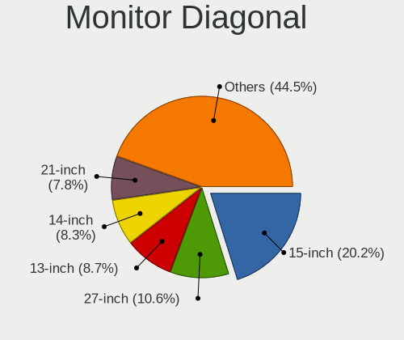

| Inches  | Computers | Percent |
|---------|-----------|---------|
| 15      | 52        | 24.3%   |
| 27      | 28        | 13.08%  |
| 24      | 23        | 10.75%  |
| 13      | 13        | 6.07%   |
| 21      | 12        | 5.61%   |
| Unknown | 11        | 5.14%   |
| 14      | 9         | 4.21%   |
| 23      | 7         | 3.27%   |
| 19      | 7         | 3.27%   |
| 84      | 5         | 2.34%   |
| 31      | 5         | 2.34%   |
| 17      | 5         | 2.34%   |
| 22      | 4         | 1.87%   |
| 20      | 4         | 1.87%   |
| 72      | 3         | 1.4%    |
| 34      | 3         | 1.4%    |
| 12      | 3         | 1.4%    |
| 74      | 2         | 0.93%   |
| 40      | 2         | 0.93%   |
| 35      | 2         | 0.93%   |
| 28      | 2         | 0.93%   |
| 25      | 2         | 0.93%   |
| 16      | 2         | 0.93%   |
| 86      | 1         | 0.47%   |
| 52      | 1         | 0.47%   |
| 38      | 1         | 0.47%   |
| 37      | 1         | 0.47%   |
| 32      | 1         | 0.47%   |
| 26      | 1         | 0.47%   |
| 18      | 1         | 0.47%   |
| 11      | 1         | 0.47%   |

Monitor Width
-------------

Physical width

| Width in mm | Computers | Percent |
|-------------|-----------|---------|
| 301-350     | 67        | 31.75%  |
| 501-600     | 54        | 25.59%  |
| 401-500     | 26        | 12.32%  |
| 351-400     | 11        | 5.21%   |
| 1501-2000   | 11        | 5.21%   |
| Unknown     | 11        | 5.21%   |
| 601-700     | 10        | 4.74%   |
| 201-300     | 10        | 4.74%   |
| 801-900     | 6         | 2.84%   |
| 701-800     | 4         | 1.9%    |
| 1001-1500   | 1         | 0.47%   |

Aspect Ratio
------------

Proportional relationship between the width and the height

| Ratio   | Computers | Percent |
|---------|-----------|---------|
| 16/9    | 146       | 75.65%  |
| 16/10   | 24        | 12.44%  |
| Unknown | 10        | 5.18%   |
| 21/9    | 5         | 2.59%   |
| 3/2     | 4         | 2.07%   |
| 5/4     | 3         | 1.55%   |
| 4/3     | 1         | 0.52%   |

Monitor Area
------------

Area in inch²

| Area in inch² | Computers | Percent |
|----------------|-----------|---------|
| 101-110        | 53        | 24.65%  |
| 201-250        | 38        | 17.67%  |
| 301-350        | 28        | 13.02%  |
| 81-90          | 19        | 8.84%   |
| 151-200        | 15        | 6.98%   |
| 351-500        | 13        | 6.05%   |
| More than 1000 | 12        | 5.58%   |
| Unknown        | 11        | 5.12%   |
| 251-300        | 7         | 3.26%   |
| 71-80          | 4         | 1.86%   |
| 501-1000       | 4         | 1.86%   |
| 61-70          | 3         | 1.4%    |
| 121-130        | 3         | 1.4%    |
| 141-150        | 2         | 0.93%   |
| 51-60          | 1         | 0.47%   |
| 131-140        | 1         | 0.47%   |
| 91-100         | 1         | 0.47%   |

Pixel Density
-------------

Pixels per inch

| Density       | Computers | Percent |
|---------------|-----------|---------|
| 51-100        | 74        | 35.41%  |
| 121-160       | 48        | 22.97%  |
| 101-120       | 48        | 22.97%  |
| 161-240       | 13        | 6.22%   |
| Unknown       | 11        | 5.26%   |
| 1-50          | 8         | 3.83%   |
| More than 240 | 7         | 3.35%   |

Multiple Monitors
-----------------

Total monitors connected

| Total | Computers | Percent |
|-------|-----------|---------|
| 1     | 149       | 76.41%  |
| 2     | 29        | 14.87%  |
| 0     | 9         | 4.62%   |
| 3     | 7         | 3.59%   |
| 4     | 1         | 0.51%   |

Network
-------

Net Controller Vendor
---------------------

Controller vendors

| Vendor                   | Computers | Percent |
|--------------------------|-----------|---------|
| Intel                    | 113       | 40.07%  |
| Realtek Semiconductor    | 102       | 36.17%  |
| Qualcomm Atheros         | 22        | 7.8%    |
| Broadcom                 | 13        | 4.61%   |
| Ralink                   | 3         | 1.06%   |
| Marvell Technology Group | 3         | 1.06%   |
| Broadcom Limited         | 3         | 1.06%   |
| TP-Link                  | 2         | 0.71%   |
| Nvidia                   | 2         | 0.71%   |
| DisplayLink              | 2         | 0.71%   |
| D-Link System            | 2         | 0.71%   |
| ASUSTek Computer         | 2         | 0.71%   |
| ASIX Electronics         | 2         | 0.71%   |
| Sierra Wireless          | 1         | 0.35%   |
| Samsung Electronics      | 1         | 0.35%   |
| Ralink Technology        | 1         | 0.35%   |
| Qualcomm                 | 1         | 0.35%   |
| NetGear                  | 1         | 0.35%   |
| Microsoft                | 1         | 0.35%   |
| MEDIATEK                 | 1         | 0.35%   |
| Lenovo                   | 1         | 0.35%   |
| D-Link                   | 1         | 0.35%   |
| Arduino SA               | 1         | 0.35%   |
| Apple                    | 1         | 0.35%   |

Net Controller Model
--------------------

Controller models

| Model                                                             | Computers | Percent |
|-------------------------------------------------------------------|-----------|---------|
| Realtek RTL8111/8168/8411 PCI Express Gigabit Ethernet Controller | 69        | 21.1%   |
| Intel Wi-Fi 6 AX200                                               | 12        | 3.67%   |
| Intel 82579LM Gigabit Network Connection (Lewisville)             | 11        | 3.36%   |
| Realtek RTL8153 Gigabit Ethernet Adapter                          | 10        | 3.06%   |
| Intel Wireless 8265 / 8275                                        | 8         | 2.45%   |
| Intel Wireless 7265                                               | 6         | 1.83%   |
| Intel I211 Gigabit Network Connection                             | 6         | 1.83%   |
| Intel Ethernet Connection I217-LM                                 | 6         | 1.83%   |
| Realtek RTL810xE PCI Express Fast Ethernet controller             | 5         | 1.53%   |
| Intel Wireless 3165                                               | 5         | 1.53%   |
| Intel Ethernet Connection (2) I219-V                              | 5         | 1.53%   |
| Realtek RTL8822BE 802.11a/b/g/n/ac WiFi adapter                   | 4         | 1.22%   |
| Realtek RTL8125 2.5GbE Controller                                 | 4         | 1.22%   |
| Intel Wireless-AC 9260                                            | 4         | 1.22%   |
| Intel Ethernet Controller I225-V                                  | 4         | 1.22%   |
| Intel Comet Lake PCH CNVi WiFi                                    | 4         | 1.22%   |
| Realtek RTL8852AE 802.11ax PCIe Wireless Network Adapter          | 3         | 0.92%   |
| Realtek RTL8188CE 802.11b/g/n WiFi Adapter                        | 3         | 0.92%   |
| Qualcomm Atheros QCA9377 802.11ac Wireless Network Adapter        | 3         | 0.92%   |
| Qualcomm Atheros QCA6174 802.11ac Wireless Network Adapter        | 3         | 0.92%   |
| Qualcomm Atheros AR9485 Wireless Network Adapter                  | 3         | 0.92%   |
| Qualcomm Atheros AR9462 Wireless Network Adapter                  | 3         | 0.92%   |
| Intel Wireless 7260                                               | 3         | 0.92%   |
| Intel Ethernet Connection (14) I219-V                             | 3         | 0.92%   |
| Intel Cannon Point-LP CNVi [Wireless-AC]                          | 3         | 0.92%   |
| Intel Alder Lake-S PCH CNVi WiFi                                  | 3         | 0.92%   |
| Intel 82579V Gigabit Network Connection                           | 3         | 0.92%   |
| Realtek RTL88x2bu [AC1200 Techkey]                                | 2         | 0.61%   |
| Realtek RTL8821CE 802.11ac PCIe Wireless Network Adapter          | 2         | 0.61%   |
| Realtek RTL8821AE 802.11ac PCIe Wireless Network Adapter          | 2         | 0.61%   |
| Realtek RTL8814AU 802.11a/b/g/n/ac Wireless Adapter               | 2         | 0.61%   |
| Realtek RTL8188EUS 802.11n Wireless Network Adapter               | 2         | 0.61%   |
| Qualcomm Atheros Killer E220x Gigabit Ethernet Controller         | 2         | 0.61%   |
| Qualcomm Atheros Attansic L2 Fast Ethernet                        | 2         | 0.61%   |
| Intel Wireless 8260                                               | 2         | 0.61%   |
| Intel Wireless 3160                                               | 2         | 0.61%   |
| Intel Wi-Fi 6 AX210/AX211/AX411 160MHz                            | 2         | 0.61%   |
| Intel Wi-Fi 6 AX201                                               | 2         | 0.61%   |
| Intel Tiger Lake PCH CNVi WiFi                                    | 2         | 0.61%   |
| Intel PRO/Wireless 5100 AGN [Shiloh] Network Connection           | 2         | 0.61%   |
| Intel Ice Lake-LP PCH CNVi WiFi                                   | 2         | 0.61%   |
| Intel Ethernet Connection (7) I219-V                              | 2         | 0.61%   |
| Intel Ethernet Connection (5) I219-LM                             | 2         | 0.61%   |
| Intel Ethernet Connection (4) I219-LM                             | 2         | 0.61%   |
| Intel Ethernet Connection (3) I218-LM                             | 2         | 0.61%   |
| Intel Ethernet Connection (2) I218-V                              | 2         | 0.61%   |
| Intel Centrino Wireless-N 2230                                    | 2         | 0.61%   |
| Intel Centrino Ultimate-N 6300                                    | 2         | 0.61%   |
| Intel Centrino Advanced-N 6235                                    | 2         | 0.61%   |
| Intel Cannon Lake PCH CNVi WiFi                                   | 2         | 0.61%   |
| Broadcom NetXtreme BCM57766 Gigabit Ethernet PCIe                 | 2         | 0.61%   |
| Broadcom NetLink BCM57781 Gigabit Ethernet PCIe                   | 2         | 0.61%   |
| Broadcom BCM4322 802.11a/b/g/n Wireless LAN Controller            | 2         | 0.61%   |
| Broadcom BCM4313 802.11bgn Wireless Network Adapter               | 2         | 0.61%   |
| ASUS 802.11ac NIC                                                 | 2         | 0.61%   |
| ASIX AX88179 Gigabit Ethernet                                     | 2         | 0.61%   |
| TP-Link UE300 10/100/1000 LAN (ethernet mode) [Realtek RTL8153]   | 1         | 0.31%   |
| TP-Link Archer T3U [Realtek RTL8812BU]                            | 1         | 0.31%   |
| Sierra Wireless MC7700                                            | 1         | 0.31%   |
| Samsung GT-I9070 (network tethering, USB debugging enabled)       | 1         | 0.31%   |

Wireless Vendor
---------------

Wireless vendors

| Vendor                | Computers | Percent |
|-----------------------|-----------|---------|
| Intel                 | 75        | 53.57%  |
| Realtek Semiconductor | 24        | 17.14%  |
| Qualcomm Atheros      | 17        | 12.14%  |
| Broadcom              | 8         | 5.71%   |
| Ralink                | 3         | 2.14%   |
| D-Link System         | 2         | 1.43%   |
| ASUSTek Computer      | 2         | 1.43%   |
| TP-Link               | 1         | 0.71%   |
| Sierra Wireless       | 1         | 0.71%   |
| Ralink Technology     | 1         | 0.71%   |
| Qualcomm              | 1         | 0.71%   |
| NetGear               | 1         | 0.71%   |
| Microsoft             | 1         | 0.71%   |
| MEDIATEK              | 1         | 0.71%   |
| D-Link                | 1         | 0.71%   |
| Broadcom Limited      | 1         | 0.71%   |

Wireless Model
--------------

Wireless models

| Model                                                                                       | Computers | Percent |
|---------------------------------------------------------------------------------------------|-----------|---------|
| Intel Wi-Fi 6 AX200                                                                         | 12        | 8.57%   |
| Intel Wireless 8265 / 8275                                                                  | 8         | 5.71%   |
| Intel Wireless 7265                                                                         | 6         | 4.29%   |
| Intel Wireless 3165                                                                         | 5         | 3.57%   |
| Realtek RTL8822BE 802.11a/b/g/n/ac WiFi adapter                                             | 4         | 2.86%   |
| Intel Wireless-AC 9260                                                                      | 4         | 2.86%   |
| Intel Comet Lake PCH CNVi WiFi                                                              | 4         | 2.86%   |
| Realtek RTL8852AE 802.11ax PCIe Wireless Network Adapter                                    | 3         | 2.14%   |
| Realtek RTL8188CE 802.11b/g/n WiFi Adapter                                                  | 3         | 2.14%   |
| Qualcomm Atheros QCA9377 802.11ac Wireless Network Adapter                                  | 3         | 2.14%   |
| Qualcomm Atheros QCA6174 802.11ac Wireless Network Adapter                                  | 3         | 2.14%   |
| Qualcomm Atheros AR9485 Wireless Network Adapter                                            | 3         | 2.14%   |
| Qualcomm Atheros AR9462 Wireless Network Adapter                                            | 3         | 2.14%   |
| Intel Wireless 7260                                                                         | 3         | 2.14%   |
| Intel Cannon Point-LP CNVi [Wireless-AC]                                                    | 3         | 2.14%   |
| Intel Alder Lake-S PCH CNVi WiFi                                                            | 3         | 2.14%   |
| Realtek RTL88x2bu [AC1200 Techkey]                                                          | 2         | 1.43%   |
| Realtek RTL8821CE 802.11ac PCIe Wireless Network Adapter                                    | 2         | 1.43%   |
| Realtek RTL8821AE 802.11ac PCIe Wireless Network Adapter                                    | 2         | 1.43%   |
| Realtek RTL8814AU 802.11a/b/g/n/ac Wireless Adapter                                         | 2         | 1.43%   |
| Realtek RTL8188EUS 802.11n Wireless Network Adapter                                         | 2         | 1.43%   |
| Intel Wireless 8260                                                                         | 2         | 1.43%   |
| Intel Wireless 3160                                                                         | 2         | 1.43%   |
| Intel Wi-Fi 6 AX210/AX211/AX411 160MHz                                                      | 2         | 1.43%   |
| Intel Wi-Fi 6 AX201                                                                         | 2         | 1.43%   |
| Intel Tiger Lake PCH CNVi WiFi                                                              | 2         | 1.43%   |
| Intel PRO/Wireless 5100 AGN [Shiloh] Network Connection                                     | 2         | 1.43%   |
| Intel Ice Lake-LP PCH CNVi WiFi                                                             | 2         | 1.43%   |
| Intel Centrino Wireless-N 2230                                                              | 2         | 1.43%   |
| Intel Centrino Ultimate-N 6300                                                              | 2         | 1.43%   |
| Intel Centrino Advanced-N 6235                                                              | 2         | 1.43%   |
| Intel Cannon Lake PCH CNVi WiFi                                                             | 2         | 1.43%   |
| Broadcom BCM4322 802.11a/b/g/n Wireless LAN Controller                                      | 2         | 1.43%   |
| Broadcom BCM4313 802.11bgn Wireless Network Adapter                                         | 2         | 1.43%   |
| ASUS 802.11ac NIC                                                                           | 2         | 1.43%   |
| TP-Link Archer T3U [Realtek RTL8812BU]                                                      | 1         | 0.71%   |
| Sierra Wireless MC7700                                                                      | 1         | 0.71%   |
| Realtek RTL8812AE 802.11ac PCIe Wireless Network Adapter                                    | 1         | 0.71%   |
| Realtek RTL8723BE PCIe Wireless Network Adapter                                             | 1         | 0.71%   |
| Realtek RTL8191SEvB Wireless LAN Controller                                                 | 1         | 0.71%   |
| Realtek 802.11ac NIC                                                                        | 1         | 0.71%   |
| Ralink RT5572 Wireless Adapter                                                              | 1         | 0.71%   |
| Ralink RT5392 PCIe Wireless Network Adapter                                                 | 1         | 0.71%   |
| Ralink RT5390 Wireless 802.11n 1T/1R PCIe                                                   | 1         | 0.71%   |
| Ralink RT2790 Wireless 802.11n 1T/2R PCIe                                                   | 1         | 0.71%   |
| Qualcomm QCNFA765 Wireless Network Adapter                                                  | 1         | 0.71%   |
| Qualcomm Atheros QCA9565 / AR9565 Wireless Network Adapter                                  | 1         | 0.71%   |
| Qualcomm Atheros AR928X Wireless Network Adapter (PCI-Express)                              | 1         | 0.71%   |
| Qualcomm Atheros AR9285 Wireless Network Adapter (PCI-Express)                              | 1         | 0.71%   |
| Qualcomm Atheros AR5418 Wireless Network Adapter [AR5008E 802.11(a)bgn] (PCI-Express)       | 1         | 0.71%   |
| Qualcomm Atheros AR5212/5213/2414 Wireless Network Adapter                                  | 1         | 0.71%   |
| NetGear WNDA3100v2 802.11abgn [Broadcom BCM4323]                                            | 1         | 0.71%   |
| Microsoft Wireless XBox Controller Dongle                                                   | 1         | 0.71%   |
| MEDIATEK MT7921 802.11ax PCI Express Wireless Network Adapter                               | 1         | 0.71%   |
| Intel PRO/Wireless 4965 AG or AGN [Kedron] Network Connection                               | 1         | 0.71%   |
| Intel Dual Band Wireless-AC 3168NGW [Stone Peak]                                            | 1         | 0.71%   |
| Intel Comet Lake PCH-LP CNVi WiFi                                                           | 1         | 0.71%   |
| Intel Centrino Advanced-N 6205 [Taylor Peak]                                                | 1         | 0.71%   |
| Intel Alder Lake-P PCH CNVi WiFi                                                            | 1         | 0.71%   |
| D-Link System DWA-160 802.11abgn Xtreme N Dual Band Adapter(rev.A2) [Atheros AR9170+AR9104] | 1         | 0.71%   |

Ethernet Vendor
---------------

Ethernet vendors

| Vendor                   | Computers | Percent |
|--------------------------|-----------|---------|
| Realtek Semiconductor    | 90        | 48.91%  |
| Intel                    | 62        | 33.7%   |
| Broadcom                 | 9         | 4.89%   |
| Qualcomm Atheros         | 8         | 4.35%   |
| Marvell Technology Group | 3         | 1.63%   |
| Nvidia                   | 2         | 1.09%   |
| DisplayLink              | 2         | 1.09%   |
| Broadcom Limited         | 2         | 1.09%   |
| ASIX Electronics         | 2         | 1.09%   |
| TP-Link                  | 1         | 0.54%   |
| Samsung Electronics      | 1         | 0.54%   |
| Lenovo                   | 1         | 0.54%   |
| Apple                    | 1         | 0.54%   |

Ethernet Model
--------------

Ethernet models

| Model                                                             | Computers | Percent |
|-------------------------------------------------------------------|-----------|---------|
| Realtek RTL8111/8168/8411 PCI Express Gigabit Ethernet Controller | 69        | 37.1%   |
| Intel 82579LM Gigabit Network Connection (Lewisville)             | 11        | 5.91%   |
| Realtek RTL8153 Gigabit Ethernet Adapter                          | 10        | 5.38%   |
| Intel I211 Gigabit Network Connection                             | 6         | 3.23%   |
| Intel Ethernet Connection I217-LM                                 | 6         | 3.23%   |
| Realtek RTL810xE PCI Express Fast Ethernet controller             | 5         | 2.69%   |
| Intel Ethernet Connection (2) I219-V                              | 5         | 2.69%   |
| Realtek RTL8125 2.5GbE Controller                                 | 4         | 2.15%   |
| Intel Ethernet Controller I225-V                                  | 4         | 2.15%   |
| Intel Ethernet Connection (14) I219-V                             | 3         | 1.61%   |
| Intel 82579V Gigabit Network Connection                           | 3         | 1.61%   |
| Qualcomm Atheros Killer E220x Gigabit Ethernet Controller         | 2         | 1.08%   |
| Qualcomm Atheros Attansic L2 Fast Ethernet                        | 2         | 1.08%   |
| Intel Ethernet Connection (7) I219-V                              | 2         | 1.08%   |
| Intel Ethernet Connection (5) I219-LM                             | 2         | 1.08%   |
| Intel Ethernet Connection (4) I219-LM                             | 2         | 1.08%   |
| Intel Ethernet Connection (3) I218-LM                             | 2         | 1.08%   |
| Intel Ethernet Connection (2) I218-V                              | 2         | 1.08%   |
| Broadcom NetXtreme BCM57766 Gigabit Ethernet PCIe                 | 2         | 1.08%   |
| Broadcom NetLink BCM57781 Gigabit Ethernet PCIe                   | 2         | 1.08%   |
| ASIX AX88179 Gigabit Ethernet                                     | 2         | 1.08%   |
| TP-Link UE300 10/100/1000 LAN (ethernet mode) [Realtek RTL8153]   | 1         | 0.54%   |
| Samsung GT-I9070 (network tethering, USB debugging enabled)       | 1         | 0.54%   |
| Realtek RTL8152 Fast Ethernet Adapter                             | 1         | 0.54%   |
| Realtek Killer E3000 2.5GbE Controller                            | 1         | 0.54%   |
| Realtek Killer E2600 Gigabit Ethernet Controller                  | 1         | 0.54%   |
| Qualcomm Atheros QCA8171 Gigabit Ethernet                         | 1         | 0.54%   |
| Qualcomm Atheros Killer E2400 Gigabit Ethernet Controller         | 1         | 0.54%   |
| Qualcomm Atheros AR8152 v1.1 Fast Ethernet                        | 1         | 0.54%   |
| Qualcomm Atheros AR8151 v2.0 Gigabit Ethernet                     | 1         | 0.54%   |
| Nvidia MCP77 Ethernet                                             | 1         | 0.54%   |
| Nvidia MCP61 Ethernet                                             | 1         | 0.54%   |
| Marvell Group 88E8071 PCI-E Gigabit Ethernet Controller           | 1         | 0.54%   |
| Marvell Group 88E8058 PCI-E Gigabit Ethernet Controller           | 1         | 0.54%   |
| Marvell Group 88E8056 PCI-E Gigabit Ethernet Controller           | 1         | 0.54%   |
| Lenovo ThinkPad TBT 3 Dock                                        | 1         | 0.54%   |
| Intel NM10/ICH7 Family LAN Controller                             | 1         | 0.54%   |
| Intel Ethernet Connection I217-V                                  | 1         | 0.54%   |
| Intel Ethernet Connection (7) I219-LM                             | 1         | 0.54%   |
| Intel Ethernet Connection (6) I219-LM                             | 1         | 0.54%   |
| Intel Ethernet Connection (4) I219-V                              | 1         | 0.54%   |
| Intel Ethernet Connection (3) I218-V                              | 1         | 0.54%   |
| Intel 82583V Gigabit Network Connection                           | 1         | 0.54%   |
| Intel 82578DM Gigabit Network Connection                          | 1         | 0.54%   |
| Intel 82577LM Gigabit Network Connection                          | 1         | 0.54%   |
| Intel 82576 Gigabit Network Connection                            | 1         | 0.54%   |
| Intel 82574L Gigabit Network Connection                           | 1         | 0.54%   |
| Intel 82567LM-3 Gigabit Network Connection                        | 1         | 0.54%   |
| Intel 82567LM Gigabit Network Connection                          | 1         | 0.54%   |
| Intel 82566DM-2 Gigabit Network Connection                        | 1         | 0.54%   |
| Intel 80003ES2LAN Gigabit Ethernet Controller (Copper)            | 1         | 0.54%   |
| DisplayLink dynadock U3.0                                         | 1         | 0.54%   |
| DisplayLink Dell Universal Dock D6000                             | 1         | 0.54%   |
| Broadcom NetXtreme BCM5764M Gigabit Ethernet PCIe                 | 1         | 0.54%   |
| Broadcom NetXtreme BCM5761e Gigabit Ethernet PCIe                 | 1         | 0.54%   |
| Broadcom NetXtreme BCM5754 Gigabit Ethernet PCI Express           | 1         | 0.54%   |
| Broadcom NetLink BCM5784M Gigabit Ethernet PCIe                   | 1         | 0.54%   |
| Broadcom NetLink BCM57785 Gigabit Ethernet PCIe                   | 1         | 0.54%   |
| Broadcom Limited NetXtreme BCM5755M Gigabit Ethernet PCI Express  | 1         | 0.54%   |
| Broadcom Limited NetXtreme BCM5755 Gigabit Ethernet PCI Express   | 1         | 0.54%   |

Net Controller Kind
-------------------

Ethernet, WiFi or modem

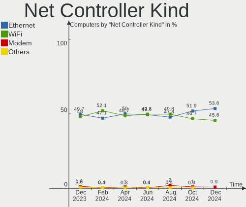

| Kind     | Computers | Percent |
|----------|-----------|---------|
| Ethernet | 170       | 55.92%  |
| WiFi     | 133       | 43.75%  |
| Modem    | 1         | 0.33%   |

Used Controller
---------------

Currently used network controller

| Kind     | Computers | Percent |
|----------|-----------|---------|
| WiFi     | 105       | 51.22%  |
| Ethernet | 100       | 48.78%  |

NICs
----

Total network controllers on board

| Total | Computers | Percent |
|-------|-----------|---------|
| 2     | 98        | 50.26%  |
| 1     | 83        | 42.56%  |
| 0     | 9         | 4.62%   |
| 3     | 5         | 2.56%   |

IPv6
----

IPv6 vs IPv4

| Used | Computers | Percent |
|------|-----------|---------|
| No   | 148       | 75.9%   |
| Yes  | 47        | 24.1%   |

Bluetooth
---------

Bluetooth Vendor
----------------

Controller vendors

| Vendor                          | Computers | Percent |
|---------------------------------|-----------|---------|
| Intel                           | 61        | 56.48%  |
| Realtek Semiconductor           | 10        | 9.26%   |
| Qualcomm Atheros Communications | 8         | 7.41%   |
| Cambridge Silicon Radio         | 5         | 4.63%   |
| Broadcom                        | 5         | 4.63%   |
| Apple                           | 5         | 4.63%   |
| IMC Networks                    | 4         | 3.7%    |
| Lite-On Technology              | 3         | 2.78%   |
| Foxconn / Hon Hai               | 3         | 2.78%   |
| Dynex                           | 2         | 1.85%   |
| Dell                            | 1         | 0.93%   |
| ASUSTek Computer                | 1         | 0.93%   |

Bluetooth Model
---------------

Controller models

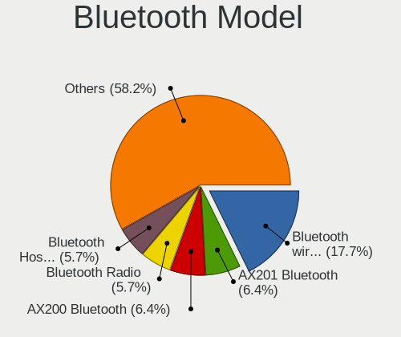

| Model                                                    | Computers | Percent |
|----------------------------------------------------------|-----------|---------|
| Intel Bluetooth wireless interface                       | 24        | 22.22%  |
| Intel AX201 Bluetooth                                    | 11        | 10.19%  |
| Intel AX200 Bluetooth                                    | 11        | 10.19%  |
| Realtek Bluetooth Radio                                  | 5         | 4.63%   |
| Intel Bluetooth 9460/9560 Jefferson Peak (JfP)           | 5         | 4.63%   |
| Cambridge Silicon Radio Bluetooth Dongle (HCI mode)      | 5         | 4.63%   |
| Realtek  Bluetooth 4.2 Adapter                           | 4         | 3.7%    |
| Qualcomm Atheros  Bluetooth Device                       | 4         | 3.7%    |
| Intel Wireless-AC 9260 Bluetooth Adapter                 | 4         | 3.7%    |
| Lite-On Bluetooth Device                                 | 3         | 2.78%   |
| Intel Centrino Bluetooth Wireless Transceiver            | 3         | 2.78%   |
| Broadcom BCM20702A0 Bluetooth 4.0                        | 3         | 2.78%   |
| Qualcomm Atheros AR3011 Bluetooth                        | 2         | 1.85%   |
| Foxconn / Hon Hai Bluetooth Device                       | 2         | 1.85%   |
| Dynex Bluetooth 4.0 Adapter [Broadcom, 1.12, BCM20702A0] | 2         | 1.85%   |
| Broadcom HP Portable SoftSailing                         | 2         | 1.85%   |
| Apple Bluetooth HCI                                      | 2         | 1.85%   |
| Realtek RTL8821A Bluetooth                               | 1         | 0.93%   |
| Qualcomm Atheros QCA61x4 Bluetooth 4.0                   | 1         | 0.93%   |
| Qualcomm Atheros AR3012 Bluetooth 4.0                    | 1         | 0.93%   |
| Intel Wireless-AC 3168 Bluetooth                         | 1         | 0.93%   |
| Intel Bluetooth Device                                   | 1         | 0.93%   |
| Intel AX210 Bluetooth                                    | 1         | 0.93%   |
| IMC Networks Wireless_Device                             | 1         | 0.93%   |
| IMC Networks Bluetooth USB Host Controller               | 1         | 0.93%   |
| IMC Networks Bluetooth Radio                             | 1         | 0.93%   |
| IMC Networks Atheros AR3012 Bluetooth 4.0 Adapter        | 1         | 0.93%   |
| Foxconn / Hon Hai BCM20702A0                             | 1         | 0.93%   |
| Dell Wireless 360 Bluetooth                              | 1         | 0.93%   |
| ASUS Broadcom BCM20702A0 Bluetooth                       | 1         | 0.93%   |
| Apple Built-in Bluetooth 2.0+EDR HCI                     | 1         | 0.93%   |
| Apple Bluetooth USB Host Controller                      | 1         | 0.93%   |
| Apple Bluetooth Host Controller                          | 1         | 0.93%   |

Sound
-----

Sound Vendor
------------

Sound card vendors

| Vendor                   | Computers | Percent |
|--------------------------|-----------|---------|
| Intel                    | 129       | 45.1%   |
| AMD                      | 67        | 23.43%  |
| Nvidia                   | 50        | 17.48%  |
| GN Netcom                | 4         | 1.4%    |
| C-Media Electronics      | 4         | 1.4%    |
| Realtek Semiconductor    | 3         | 1.05%   |
| Focusrite-Novation       | 3         | 1.05%   |
| Creative Technology      | 3         | 1.05%   |
| SteelSeries ApS          | 2         | 0.7%    |
| Sony                     | 2         | 0.7%    |
| NAD Electronics          | 2         | 0.7%    |
| M-Audio                  | 2         | 0.7%    |
| Corsair                  | 2         | 0.7%    |
| Blue Microphones         | 2         | 0.7%    |
| Valve Software           | 1         | 0.35%   |
| Shure                    | 1         | 0.35%   |
| Roland                   | 1         | 0.35%   |
| RODE Microphones         | 1         | 0.35%   |
| Plantronics              | 1         | 0.35%   |
| Micro Star International | 1         | 0.35%   |
| Logitech                 | 1         | 0.35%   |
| Lenovo                   | 1         | 0.35%   |
| Generalplus Technology   | 1         | 0.35%   |
| DCMT Technology          | 1         | 0.35%   |
| Audio-Technica           | 1         | 0.35%   |

Sound Model
-----------

Sound card models

| Model                                                                      | Computers | Percent |
|----------------------------------------------------------------------------|-----------|---------|
| AMD Family 17h/19h HD Audio Controller                                     | 18        | 5.29%   |
| Intel 7 Series/C216 Chipset Family High Definition Audio Controller        | 14        | 4.12%   |
| AMD Starship/Matisse HD Audio Controller                                   | 14        | 4.12%   |
| Intel Sunrise Point-LP HD Audio                                            | 11        | 3.24%   |
| Intel Cannon Lake PCH cAVS                                                 | 10        | 2.94%   |
| Intel 8 Series/C220 Series Chipset High Definition Audio Controller        | 10        | 2.94%   |
| AMD Renoir Radeon High Definition Audio Controller                         | 10        | 2.94%   |
| Intel Xeon E3-1200 v3/4th Gen Core Processor HD Audio Controller           | 9         | 2.65%   |
| AMD SBx00 Azalia (Intel HDA)                                               | 9         | 2.65%   |
| Intel 6 Series/C200 Series Chipset Family High Definition Audio Controller | 8         | 2.35%   |
| AMD Raven/Raven2/Fenghuang HDMI/DP Audio Controller                        | 8         | 2.35%   |
| Intel 200 Series PCH HD Audio                                              | 7         | 2.06%   |
| Intel 82801I (ICH9 Family) HD Audio Controller                             | 6         | 1.76%   |
| AMD Navi 21/23 HDMI/DP Audio Controller                                    | 6         | 1.76%   |
| AMD Family 17h (Models 00h-0fh) HD Audio Controller                        | 6         | 1.76%   |
| Nvidia TU107 GeForce GTX 1650 High Definition Audio Controller             | 5         | 1.47%   |
| Intel Broadwell-U Audio Controller                                         | 5         | 1.47%   |
| Intel 9 Series Chipset Family HD Audio Controller                          | 5         | 1.47%   |
| Intel 5 Series/3400 Series Chipset High Definition Audio                   | 5         | 1.47%   |
| AMD Oland/Hainan/Cape Verde/Pitcairn HDMI Audio [Radeon HD 7000 Series]    | 5         | 1.47%   |
| AMD FCH Azalia Controller                                                  | 5         | 1.47%   |
| AMD Ellesmere HDMI Audio [Radeon RX 470/480 / 570/580/590]                 | 5         | 1.47%   |
| Nvidia TU106 High Definition Audio Controller                              | 4         | 1.18%   |
| Nvidia GP104 High Definition Audio Controller                              | 4         | 1.18%   |
| Nvidia GK208 HDMI/DP Audio Controller                                      | 4         | 1.18%   |
| Nvidia Audio device                                                        | 4         | 1.18%   |
| Intel Wildcat Point-LP High Definition Audio Controller                    | 4         | 1.18%   |
| Intel NM10/ICH7 Family High Definition Audio Controller                    | 4         | 1.18%   |
| Intel Comet Lake PCH cAVS                                                  | 4         | 1.18%   |
| Intel Cannon Point-LP High Definition Audio Controller                     | 4         | 1.18%   |
| Intel 100 Series/C230 Series Chipset Family HD Audio Controller            | 4         | 1.18%   |
| AMD Kabini HDMI/DP Audio                                                   | 4         | 1.18%   |
| Realtek Semiconductor USB Audio                                            | 3         | 0.88%   |
| Nvidia GP107GL High Definition Audio Controller                            | 3         | 0.88%   |
| Nvidia GM204 High Definition Audio Controller                              | 3         | 0.88%   |
| Nvidia GM107 High Definition Audio Controller [GeForce 940MX]              | 3         | 0.88%   |
| Nvidia GA102 High Definition Audio Controller                              | 3         | 0.88%   |
| Intel Tiger Lake-LP Smart Sound Technology Audio Controller                | 3         | 0.88%   |
| Intel Tiger Lake-H HD Audio Controller                                     | 3         | 0.88%   |
| Intel Ice Lake-LP Smart Sound Technology Audio Controller                  | 3         | 0.88%   |
| Intel CM238 HD Audio Controller                                            | 3         | 0.88%   |
| Intel Audio device                                                         | 3         | 0.88%   |
| AMD Family 15h (Models 60h-6fh) Audio Controller                           | 3         | 0.88%   |
| AMD Cedar HDMI Audio [Radeon HD 5400/6300/7300 Series]                     | 3         | 0.88%   |
| Nvidia TU104 HD Audio Controller                                           | 2         | 0.59%   |
| Nvidia High Definition Audio Controller                                    | 2         | 0.59%   |
| Nvidia GM206 High Definition Audio Controller                              | 2         | 0.59%   |
| Nvidia GK107 HDMI Audio Controller                                         | 2         | 0.59%   |
| Nvidia GK104 HDMI Audio Controller                                         | 2         | 0.59%   |
| NAD Electronics USB Audio                                                  | 2         | 0.59%   |
| Intel Celeron N3350/Pentium N4200/Atom E3900 Series Audio Cluster          | 2         | 0.59%   |
| Intel Alder Lake-S HD Audio Controller                                     | 2         | 0.59%   |
| Intel 82801JI (ICH10 Family) HD Audio Controller                           | 2         | 0.59%   |
| Intel 82801H (ICH8 Family) HD Audio Controller                             | 2         | 0.59%   |
| GN Netcom Jabra Link 370                                                   | 2         | 0.59%   |
| Focusrite-Novation Scarlett Solo USB                                       | 2         | 0.59%   |
| C-Media Electronics Audio Adapter (Unitek Y-247A)                          | 2         | 0.59%   |
| Blue Microphones Yeti Stereo Microphone                                    | 2         | 0.59%   |
| AMD Navi 10 HDMI Audio                                                     | 2         | 0.59%   |
| AMD BeaverCreek HDMI Audio [Radeon HD 6500D and 6400G-6600G series]        | 2         | 0.59%   |

Memory
------

Memory Vendor
-------------

Memory module vendors

| Vendor                     | Computers | Percent |
|----------------------------|-----------|---------|
| SK Hynix                   | 24        | 17.27%  |
| Kingston                   | 21        | 15.11%  |
| Samsung Electronics        | 19        | 13.67%  |
| Micron Technology          | 14        | 10.07%  |
| G.Skill                    | 14        | 10.07%  |
| Crucial                    | 11        | 7.91%   |
| Corsair                    | 10        | 7.19%   |
| Unknown                    | 7         | 5.04%   |
| Nanya Technology           | 5         | 3.6%    |
| Unknown (ABCD)             | 2         | 1.44%   |
| Ramaxel Technology         | 2         | 1.44%   |
| A-DATA Technology          | 2         | 1.44%   |
| Unknown                    | 2         | 1.44%   |
| Unknown (7F7F7F94FFFFFFFF) | 1         | 0.72%   |
| Team                       | 1         | 0.72%   |
| Goldkey                    | 1         | 0.72%   |
| Elpida                     | 1         | 0.72%   |
| CSX                        | 1         | 0.72%   |
| AMD                        | 1         | 0.72%   |

Memory Model
------------

Memory module models

| Model                                                                 | Computers | Percent |
|-----------------------------------------------------------------------|-----------|---------|
| Kingston RAM KHX1600C10D3/8G 8GB DIMM DDR3 1600MT/s                   | 4         | 2.72%   |
| SK Hynix RAM HMA81GS6DJR8N-XN 8GB SODIMM DDR4 3200MT/s                | 3         | 2.04%   |
| Micron RAM 8ATF1G64HZ-2G6E1 8192MB SODIMM DDR4 2667MT/s               | 3         | 2.04%   |
| Unknown RAM Module 4GB DIMM DDR3 1333MT/s                             | 2         | 1.36%   |
| Unknown (ABCD) RAM 123456789012345678 8GB DIMM DDR4 2400MT/s          | 2         | 1.36%   |
| SK Hynix RAM HYMP125S64CP8-S6 2GB SODIMM DDR 975MT/s                  | 2         | 1.36%   |
| SK Hynix RAM HMT351S6CFR8C-PB 4GB SODIMM DDR3 1600MT/s                | 2         | 1.36%   |
| SK Hynix RAM HMA81GS6JJR8N-VK 8GB SODIMM DDR4 2667MT/s                | 2         | 1.36%   |
| Samsung RAM M471A1K43DB1-CTD 8GB SODIMM DDR4 2667MT/s                 | 2         | 1.36%   |
| Micron RAM 8ATF1G64HZ-3G2J1 8192MB SODIMM DDR4 3200MT/s               | 2         | 1.36%   |
| Kingston RAM KF3200C16D4/32GX 32GB DIMM DDR4 3200MT/s                 | 2         | 1.36%   |
| G.Skill RAM F4-3600C18-8GTZRX 8192MB DIMM DDR4 3600MT/s               | 2         | 1.36%   |
| G.Skill RAM F4-3200C16-16GVK 16GB DIMM DDR4 3600MT/s                  | 2         | 1.36%   |
| Corsair RAM CMK32GX4M2E3200C16 16384MB DIMM DDR4 3200MT/s             | 2         | 1.36%   |
| Unknown                                                               | 2         | 1.36%   |
| Unknown RAM Module 4GB DIMM DDR2 800MT/s                              | 1         | 0.68%   |
| Unknown RAM Module 2GB DIMM DDR3 1600MT/s                             | 1         | 0.68%   |
| Unknown RAM Module 2GB DIMM DDR3 1333MT/s                             | 1         | 0.68%   |
| Unknown RAM Module 2GB DIMM DDR2 1067MT/s                             | 1         | 0.68%   |
| Unknown RAM Module 2048MB DIMM DDR2 333MT/s                           | 1         | 0.68%   |
| Unknown (7F7F7F94FFFFFFFF) RAM 991559 (996559) 2GB SODIMM DDR 667MT/s | 1         | 0.68%   |
| Team RAM TEAMGROUP-UD4-3000 8GB DIMM DDR4 3067MT/s                    | 1         | 0.68%   |
| SK Hynix RAM Module 4096MB DIMM DDR4 2133MT/s                         | 1         | 0.68%   |
| SK Hynix RAM Module 4096MB DIMM DDR3 1333MT/s                         | 1         | 0.68%   |
| SK Hynix RAM HMT451U6BFR8A-PB 4GB DIMM DDR3 1600MT/s                  | 1         | 0.68%   |
| SK Hynix RAM HMT451U6AFR8A-PB 4GB DIMM DDR3 1600MT/s                  | 1         | 0.68%   |
| SK Hynix RAM HMT425S6CFR6A-PB 2GB SODIMM DDR3 1600MT/s                | 1         | 0.68%   |
| SK Hynix RAM HMT351U6EFR8C-PB 4096MB DIMM DDR3 1800MT/s               | 1         | 0.68%   |
| SK Hynix RAM HMT351S6CFR8C-H9 4GB SODIMM DDR3 1333MT/s                | 1         | 0.68%   |
| SK Hynix RAM HMT351S6CFR8C-H9 4096MB SODIMM DDR3 1333MT/s             | 1         | 0.68%   |
| SK Hynix RAM HMT351S6BFR8C-H9 4GB SODIMM DDR3 1333MT/s                | 1         | 0.68%   |
| SK Hynix RAM HMT325U6CFR8C-PB 2GB DIMM DDR3 1600MT/s                  | 1         | 0.68%   |
| SK Hynix RAM HMT325U6CFR8C-H9 2048MB DIMM DDR3 1333MT/s               | 1         | 0.68%   |
| SK Hynix RAM HMCG66MEBSA095N 8GB SODIMM 4800MT/s                      | 1         | 0.68%   |
| SK Hynix RAM HMAA1GS6CJR6N-XN 8GB SODIMM DDR4 3200MT/s                | 1         | 0.68%   |
| SK Hynix RAM HMA851S6DJR6N-XN 4GB SODIMM DDR4 3200MT/s                | 1         | 0.68%   |
| SK Hynix RAM HMA82GR7JJR8N-WM 16GB DIMM DDR4 2933MT/s                 | 1         | 0.68%   |
| SK Hynix RAM HMA81GS6MFR8N-UH 8192MB SODIMM DDR4 2400MT/s             | 1         | 0.68%   |
| SK Hynix RAM HMA81GS6AFR8N-UH 8GB SODIMM DDR4 2667MT/s                | 1         | 0.68%   |
| SK Hynix RAM H9HCNNNCPUMLHR-NME 4096MB SODIMM LPDDR4 3733MT/s         | 1         | 0.68%   |
| SK Hynix RAM H5ANAG6NCMR-XNC 8GB SODIMM DDR4 3200MT/s                 | 1         | 0.68%   |
| SK Hynix RAM 8ATF1G64HZ-2G3B1 8192MB SODIMM DDR4 2400MT/s             | 1         | 0.68%   |
| Samsung RAM Module 4GB SODIMM DDR3 1867MT/s                           | 1         | 0.68%   |
| Samsung RAM Module 4096MB DIMM DDR4 2133MT/s                          | 1         | 0.68%   |
| Samsung RAM M471B5173CB0-YK0 4GB SODIMM DDR3 1600MT/s                 | 1         | 0.68%   |
| Samsung RAM M471A5244CB0-CWE 4GB SODIMM DDR4 3200MT/s                 | 1         | 0.68%   |
| Samsung RAM M471A5244CB0-CTD 4GB SODIMM DDR4 3266MT/s                 | 1         | 0.68%   |
| Samsung RAM M471A2K43DB1-CTD 16GB SODIMM DDR4 2667MT/s                | 1         | 0.68%   |
| Samsung RAM M471A2G44AM0-CTD 16GB SODIMM DDR4 2667MT/s                | 1         | 0.68%   |
| Samsung RAM M471A1K43EB1-CWE 8192MB SODIMM DDR4 3200MT/s              | 1         | 0.68%   |
| Samsung RAM M471A1K43CB1-CTD 8GB SODIMM DDR4 2667MT/s                 | 1         | 0.68%   |
| Samsung RAM M471A1K43BB1-CRC 8GB SODIMM DDR4 2667MT/s                 | 1         | 0.68%   |
| Samsung RAM M471A1K43BB0-CPB 8GB SODIMM DDR4 2133MT/s                 | 1         | 0.68%   |
| Samsung RAM M471A1G44AB0-CWE 8GB SODIMM DDR4 3200MT/s                 | 1         | 0.68%   |
| Samsung RAM M393B2K70DMB-YH9 16384MB DIMM DDR3 1333MT/s               | 1         | 0.68%   |
| Samsung RAM M378B5673FH0-CF8 2GB DIMM DDR3 1067MT/s                   | 1         | 0.68%   |
| Samsung RAM M378A1K43CB2-CTD 8GB DIMM DDR4 3200MT/s                   | 1         | 0.68%   |
| Samsung RAM K4U6E3S4AA-MGCL 2GB Row Of Chips LPDDR4 4267MT/s          | 1         | 0.68%   |
| Samsung RAM K4A8G085WB-BCPB 8192MB SODIMM DDR4 2133MT/s               | 1         | 0.68%   |
| Ramaxel RAM RMR1870ED48E8F1333 2048MB DIMM DDR3 1333MT/s              | 1         | 0.68%   |

Memory Kind
-----------

Memory module kinds

| Kind    | Computers | Percent |
|---------|-----------|---------|
| DDR4    | 66        | 58.93%  |
| DDR3    | 32        | 28.57%  |
| DDR2    | 6         | 5.36%   |
| LPDDR4  | 4         | 3.57%   |
| SDRAM   | 1         | 0.89%   |
| LPDDR3  | 1         | 0.89%   |
| DDR     | 1         | 0.89%   |
| Unknown | 1         | 0.89%   |

Memory Form Factor
------------------

Physical design of the memory module

| Name         | Computers | Percent |
|--------------|-----------|---------|
| DIMM         | 60        | 55.05%  |
| SODIMM       | 46        | 42.2%   |
| Row Of Chips | 3         | 2.75%   |

Memory Size
-----------

Memory module size

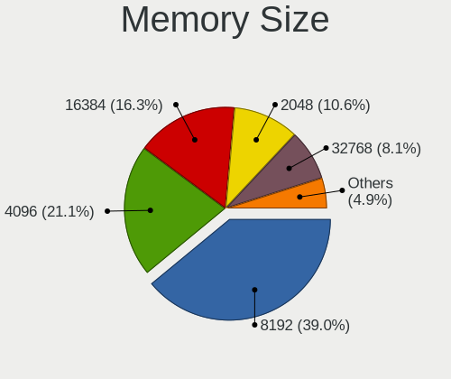

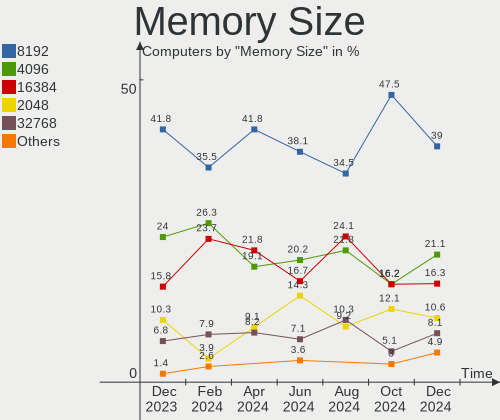

| Size  | Computers | Percent |
|-------|-----------|---------|
| 8192  | 51        | 41.13%  |
| 16384 | 25        | 20.16%  |
| 4096  | 23        | 18.55%  |
| 2048  | 16        | 12.9%   |
| 32768 | 7         | 5.65%   |
| 1024  | 2         | 1.61%   |

Memory Speed
------------

Memory module speed

| Speed | Computers | Percent |
|-------|-----------|---------|
| 3200  | 22        | 17.6%   |
| 2667  | 19        | 15.2%   |
| 1333  | 14        | 11.2%   |
| 1600  | 13        | 10.4%   |
| 3600  | 11        | 8.8%    |
| 2400  | 6         | 4.8%    |
| 1867  | 6         | 4.8%    |
| 2133  | 5         | 4%      |
| 3000  | 3         | 2.4%    |
| 1067  | 3         | 2.4%    |
| 2933  | 2         | 1.6%    |
| 975   | 2         | 1.6%    |
| 800   | 2         | 1.6%    |
| 4800  | 1         | 0.8%    |
| 4267  | 1         | 0.8%    |
| 3866  | 1         | 0.8%    |
| 3733  | 1         | 0.8%    |
| 3533  | 1         | 0.8%    |
| 3467  | 1         | 0.8%    |
| 3466  | 1         | 0.8%    |
| 3266  | 1         | 0.8%    |
| 3134  | 1         | 0.8%    |
| 3067  | 1         | 0.8%    |
| 2800  | 1         | 0.8%    |
| 2666  | 1         | 0.8%    |
| 2048  | 1         | 0.8%    |
| 1800  | 1         | 0.8%    |
| 1334  | 1         | 0.8%    |
| 667   | 1         | 0.8%    |
| 333   | 1         | 0.8%    |

Printers & scanners
-------------------

Printer Vendor
--------------

Printer device vendors

| Vendor             | Computers | Percent |
|--------------------|-----------|---------|
| Hewlett-Packard    | 2         | 40%     |
| Brother Industries | 2         | 40%     |
| Canon              | 1         | 20%     |

Printer Model
-------------

Printer device models

| Model                     | Computers | Percent |
|---------------------------|-----------|---------|
| HP LaserJet 1018          | 1         | 20%     |
| HP ENVY Photo 7800 series | 1         | 20%     |
| Canon PIXMA MP190         | 1         | 20%     |
| Brother HL-5370DW series  | 1         | 20%     |
| Brother DCP-7030          | 1         | 20%     |

Scanner Vendor
--------------

Scanner device vendors

| Vendor          | Computers | Percent |
|-----------------|-----------|---------|
| Seiko Epson     | 2         | 66.67%  |
| Hewlett-Packard | 1         | 33.33%  |

Scanner Model
-------------

Scanner device models

| Model                                         | Computers | Percent |
|-----------------------------------------------|-----------|---------|
| Seiko Epson GT-X820 [Perfection V600 Photo]   | 1         | 33.33%  |
| Seiko Epson GT-8300UF [Perfection 1660 PHOTO] | 1         | 33.33%  |
| HP ScanJet 5590                               | 1         | 33.33%  |

Camera
------

Camera Vendor
-------------

Camera device vendors

| Vendor                                 | Computers | Percent |
|----------------------------------------|-----------|---------|
| Logitech                               | 16        | 14.55%  |
| Chicony Electronics                    | 16        | 14.55%  |
| Microdia                               | 11        | 10%     |
| Acer                                   | 8         | 7.27%   |
| Sunplus Innovation Technology          | 7         | 6.36%   |
| Microsoft                              | 6         | 5.45%   |
| IMC Networks                           | 6         | 5.45%   |
| Quanta                                 | 5         | 4.55%   |
| Realtek Semiconductor                  | 4         | 3.64%   |
| Apple                                  | 4         | 3.64%   |
| Syntek                                 | 3         | 2.73%   |
| Luxvisions Innotech Limited            | 3         | 2.73%   |
| Primax Electronics                     | 2         | 1.82%   |
| MACROSILICON                           | 2         | 1.82%   |
| Cheng Uei Precision Industry (Foxlink) | 2         | 1.82%   |
| Alcor Micro                            | 2         | 1.82%   |
| Valve Software                         | 1         | 0.91%   |
| USB Camera                             | 1         | 0.91%   |
| Suyin                                  | 1         | 0.91%   |
| Silicon Motion                         | 1         | 0.91%   |
| Samsung Electronics                    | 1         | 0.91%   |
| Lite-On Technology                     | 1         | 0.91%   |
| Lenovo                                 | 1         | 0.91%   |
| Intel                                  | 1         | 0.91%   |
| Importek                               | 1         | 0.91%   |
| Genesys Logic                          | 1         | 0.91%   |
| Cubeternet                             | 1         | 0.91%   |
| Canon                                  | 1         | 0.91%   |
| AVerMedia Technologies                 | 1         | 0.91%   |

Camera Model
------------

Camera device models

| Model                                                | Computers | Percent |
|------------------------------------------------------|-----------|---------|
| Microdia Integrated_Webcam_HD                        | 5         | 4.5%    |
| Chicony Integrated Camera                            | 4         | 3.6%    |
| Sunplus Integrated_Webcam_HD                         | 3         | 2.7%    |
| Logitech C920 PRO HD Webcam                          | 3         | 2.7%    |
| Syntek Integrated Camera                             | 2         | 1.8%    |
| Quanta HD User Facing                                | 2         | 1.8%    |
| Primax HP HD Webcam [Fixed]                          | 2         | 1.8%    |
| Microsoft LifeCam HD-3000                            | 2         | 1.8%    |
| Logitech Webcam C270                                 | 2         | 1.8%    |
| Logitech HD Pro Webcam C920                          | 2         | 1.8%    |
| Logitech BRIO Ultra HD Webcam                        | 2         | 1.8%    |
| IMC Networks Integrated Camera                       | 2         | 1.8%    |
| Chicony USB2.0 VGA UVC WebCam                        | 2         | 1.8%    |
| Chicony Integrated HP HD Webcam                      | 2         | 1.8%    |
| Apple FaceTime HD Camera (Built-in)                  | 2         | 1.8%    |
| Apple Built-in iSight                                | 2         | 1.8%    |
| Acer Integrated Camera                               | 2         | 1.8%    |
| Acer BisonCam,NB Pro                                 | 2         | 1.8%    |
| Valve Software 3D Camera                             | 1         | 0.9%    |
| USB Camera USB Camera                                | 1         | 0.9%    |
| Syntek USB Camera Device                             | 1         | 0.9%    |
| Suyin Acer/HP Integrated Webcam [CN0314]             | 1         | 0.9%    |
| Sunplus Laptop Integrated Webcam HD                  | 1         | 0.9%    |
| Sunplus HP Truevision Full HD                        | 1         | 0.9%    |
| Sunplus HD Webcam                                    | 1         | 0.9%    |
| Sunplus ASUS Webcam                                  | 1         | 0.9%    |
| Silicon Motion Lenovo EasyCamera                     | 1         | 0.9%    |
| Samsung Galaxy A5 (MTP)                              | 1         | 0.9%    |
| Realtek USB2.0 HD UVC WebCam                         | 1         | 0.9%    |
| Realtek Integrated_Webcam_HD                         | 1         | 0.9%    |
| Realtek Integrated Webcam                            | 1         | 0.9%    |
| Realtek HD Webcam - Realtek                          | 1         | 0.9%    |
| Quanta HP TrueVision HD Camera                       | 1         | 0.9%    |
| Quanta HP True Vision HD Camera                      | 1         | 0.9%    |
| Quanta HD Webcam                                     | 1         | 0.9%    |
| Microsoft Surface Camera Front                       | 1         | 0.9%    |
| Microsoft LifeCam VX-2000                            | 1         | 0.9%    |
| Microsoft LifeCam NX-6000                            | 1         | 0.9%    |
| Microsoft LifeCam Cinema                             | 1         | 0.9%    |
| Microdia Webcam Vitade AF                            | 1         | 0.9%    |
| Microdia USB 2.0 Camera                              | 1         | 0.9%    |
| Microdia Laptop_Integrated_Webcam_2M                 | 1         | 0.9%    |
| Microdia Integrated_Webcam_FHD                       | 1         | 0.9%    |
| Microdia Integrated Webcam                           | 1         | 0.9%    |
| Microdia Dell Integrated HD Webcam                   | 1         | 0.9%    |
| MacroSilicon USB Video                               | 1         | 0.9%    |
| MACROSILICON ShadowCast                              | 1         | 0.9%    |
| Luxvisions Innotech Limited Integrated Camera        | 1         | 0.9%    |
| Luxvisions Innotech Limited HP Wide Vision HD Camera | 1         | 0.9%    |
| Luxvisions Innotech Limited HP HD Camera             | 1         | 0.9%    |
| Logitech Webcam C930e                                | 1         | 0.9%    |
| Logitech Webcam C925e                                | 1         | 0.9%    |
| Logitech QuickCam Pro 9000                           | 1         | 0.9%    |
| Logitech HD Webcam C615                              | 1         | 0.9%    |
| Logitech HD Webcam C525                              | 1         | 0.9%    |
| Logitech C922 Pro Stream Webcam                      | 1         | 0.9%    |
| Logitech B525 HD Webcam                              | 1         | 0.9%    |
| Lite-On HP 2.0MP High Definition Webcam              | 1         | 0.9%    |
| Lenovo Integrated Webcam                             | 1         | 0.9%    |
| Intel RealSense Depth Camera 455                     | 1         | 0.9%    |

Security
--------

Fingerprint Vendor
------------------

Fingerprint sensor vendors

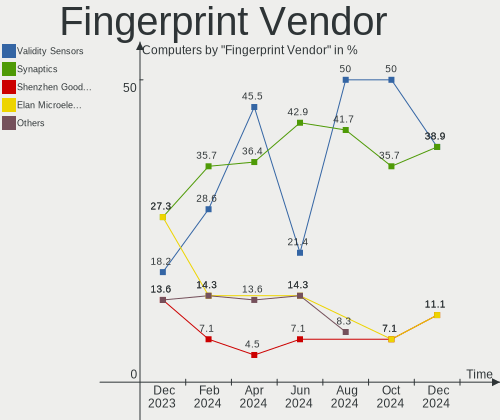

| Vendor                     | Computers | Percent |
|----------------------------|-----------|---------|
| Validity Sensors           | 7         | 33.33%  |
| Synaptics                  | 7         | 33.33%  |
| LighTuning Technology      | 2         | 9.52%   |
| Upek                       | 1         | 4.76%   |
| STMicroelectronics         | 1         | 4.76%   |
| Shenzhen Goodix Technology | 1         | 4.76%   |
| Elan Microelectronics      | 1         | 4.76%   |
| AuthenTec                  | 1         | 4.76%   |

Fingerprint Model
-----------------

Fingerprint sensor models

| Model                                                                      | Computers | Percent |
|----------------------------------------------------------------------------|-----------|---------|
| Unknown                                                                    | 3         | 14.29%  |
| Synaptics Prometheus MIS Touch Fingerprint Reader                          | 2         | 9.52%   |
| LighTuning EgisTec Touch Fingerprint Sensor                                | 2         | 9.52%   |
| Validity Sensors VFS7500 Touch Fingerprint Sensor                          | 1         | 4.76%   |
| Validity Sensors VFS5011 Fingerprint Reader                                | 1         | 4.76%   |
| Validity Sensors VFS491                                                    | 1         | 4.76%   |
| Validity Sensors VFS471 Fingerprint Reader                                 | 1         | 4.76%   |
| Validity Sensors VFS Fingerprint sensor                                    | 1         | 4.76%   |
| Validity Sensors Synaptics WBDI                                            | 1         | 4.76%   |
| Validity Sensors Synaptics VFS7552 Touch Fingerprint Sensor with PurePrint | 1         | 4.76%   |
| Upek Biometric Touchchip/Touchstrip Fingerprint Sensor                     | 1         | 4.76%   |
| Synaptics  WBDI                                                            | 1         | 4.76%   |
| Synaptics Metallica MIS Touch Fingerprint Reader                           | 1         | 4.76%   |
| STMicroelectronics Fingerprint Reader                                      | 1         | 4.76%   |
| Shenzhen Goodix FingerPrint                                                | 1         | 4.76%   |
| Elan ELAN:ARM-M4                                                           | 1         | 4.76%   |
| AuthenTec AES2810                                                          | 1         | 4.76%   |

Chipcard Vendor
---------------

Chipcard module vendors

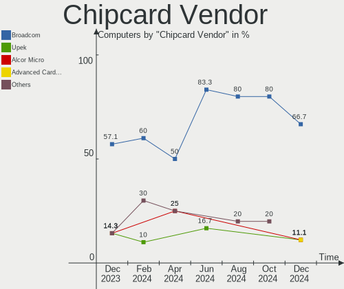

| Vendor      | Computers | Percent |
|-------------|-----------|---------|
| Broadcom    | 2         | 50%     |
| O2 Micro    | 1         | 25%     |
| Alcor Micro | 1         | 25%     |

Chipcard Model
--------------

Chipcard module models

| Model                                                                        | Computers | Percent |
|------------------------------------------------------------------------------|-----------|---------|
| O2 Micro OZ776 CCID Smartcard Reader                                         | 1         | 25%     |
| Broadcom BCM5880 Secure Applications Processor with fingerprint swipe sensor | 1         | 25%     |
| Broadcom BCM5880 Secure Applications Processor                               | 1         | 25%     |
| Alcor Micro AU9540 Smartcard Reader                                          | 1         | 25%     |

Unsupported
-----------

Unsupported Devices
-------------------

Total unsupported devices on board

| Total | Computers | Percent |
|-------|-----------|---------|
| 0     | 149       | 76.41%  |
| 1     | 42        | 21.54%  |
| 2     | 4         | 2.05%   |

Unsupported Device Types
------------------------

Types of unsupported devices

| Type                     | Computers | Percent |
|--------------------------|-----------|---------|
| Fingerprint reader       | 21        | 42%     |
| Graphics card            | 11        | 22%     |
| Net/wireless             | 6         | 12%     |
| Chipcard                 | 4         | 8%      |
| Multimedia controller    | 2         | 4%      |
| Communication controller | 2         | 4%      |
| Unassigned class         | 1         | 2%      |
| Storage/raid             | 1         | 2%      |
| Storage                  | 1         | 2%      |
| Bluetooth                | 1         | 2%      |

