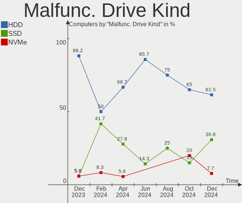
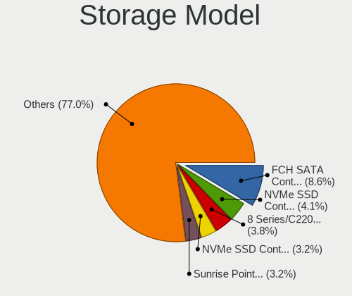
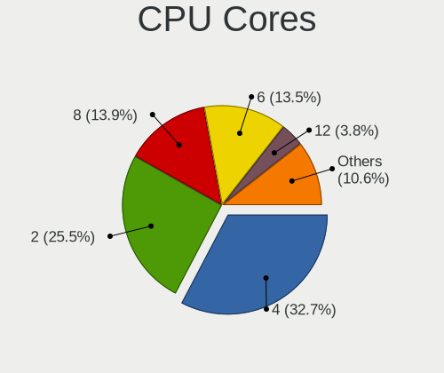
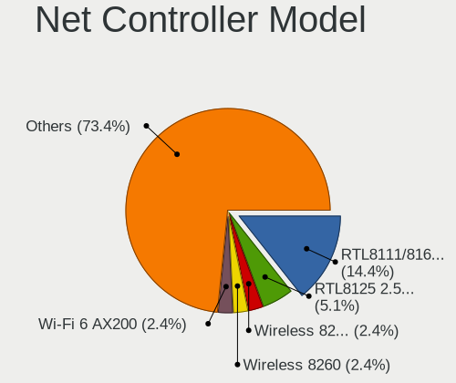
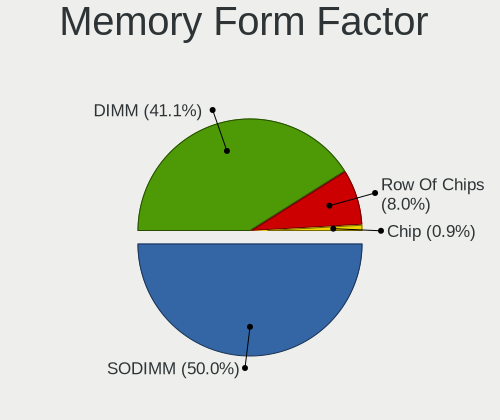
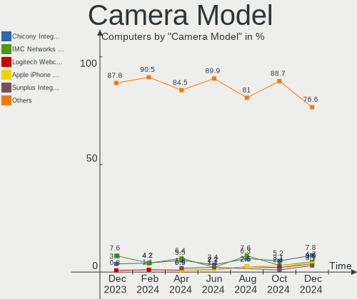

Linux in Canada - Hardware Trends
---------------------------------

A project to identify most popular hardware characteristics and track their change
over time based on data collected by Linux users at https://Linux-Hardware.org.

Anyone can contribute to this report by the [hw-probe](https://github.com/linuxhw/hw-probe) tool:

    sudo -E hw-probe -all -upload

This is a report for all computer types. See also reports for [desktops](/Location/Canada/Desktop/README.md) and [notebooks](/Location/Canada/Notebook/README.md).

Period: Dec, 2024.

Contents
--------

* [ System ](#system)
  - [ OS                       ](#os)
  - [ OS Family                ](#os-family)
  - [ Kernel                   ](#kernel)
  - [ Kernel Family            ](#kernel-family)
  - [ Kernel Major Ver.        ](#kernel-major-ver)
  - [ Arch                     ](#arch)
  - [ DE                       ](#de)
  - [ Display Server           ](#display-server)
  - [ Display Manager          ](#display-manager)
  - [ OS Lang                  ](#os-lang)
  - [ Boot Mode                ](#boot-mode)
  - [ Filesystem               ](#filesystem)
  - [ Part. scheme             ](#part-scheme)
  - [ Dual Boot with Linux/BSD ](#dual-boot-with-linuxbsd)
  - [ Dual Boot (Win)          ](#dual-boot-win)

* [ Board ](#board)
  - [ Vendor                   ](#vendor)
  - [ Model                    ](#model)
  - [ Model Family             ](#model-family)
  - [ MFG Year                 ](#mfg-year)
  - [ Form Factor              ](#form-factor)
  - [ Secure Boot              ](#secure-boot)
  - [ Coreboot                 ](#coreboot)
  - [ RAM Size                 ](#ram-size)
  - [ RAM Used                 ](#ram-used)
  - [ Total Drives             ](#total-drives)
  - [ Has CD-ROM               ](#has-cd-rom)
  - [ Has Ethernet             ](#has-ethernet)
  - [ Has WiFi                 ](#has-wifi)
  - [ Has Bluetooth            ](#has-bluetooth)

* [ Location ](#location)
  - [ Country                  ](#country)
  - [ City                     ](#city)

* [ Drives ](#drives)
  - [ Drive Vendor             ](#drive-vendor)
  - [ Drive Model              ](#drive-model)
  - [ HDD Vendor               ](#hdd-vendor)
  - [ SSD Vendor               ](#ssd-vendor)
  - [ Drive Kind               ](#drive-kind)
  - [ Drive Connector          ](#drive-connector)
  - [ Drive Size               ](#drive-size)
  - [ Space Total              ](#space-total)
  - [ Space Used               ](#space-used)
  - [ Malfunc. Drives          ](#malfunc-drives)
  - [ Malfunc. Drive Vendor    ](#malfunc-drive-vendor)
  - [ Malfunc. HDD Vendor      ](#malfunc-hdd-vendor)
  - [ Malfunc. Drive Kind      ](#malfunc-drive-kind)
  - [ Failed Drives            ](#failed-drives)
  - [ Failed Drive Vendor      ](#failed-drive-vendor)
  - [ Drive Status             ](#drive-status)

* [ Storage controller ](#storage-controller)
  - [ Storage Vendor           ](#storage-vendor)
  - [ Storage Model            ](#storage-model)
  - [ Storage Kind             ](#storage-kind)

* [ Processor ](#processor)
  - [ CPU Vendor               ](#cpu-vendor)
  - [ CPU Model                ](#cpu-model)
  - [ CPU Model Family         ](#cpu-model-family)
  - [ CPU Cores                ](#cpu-cores)
  - [ CPU Sockets              ](#cpu-sockets)
  - [ CPU Threads              ](#cpu-threads)
  - [ CPU Op-Modes             ](#cpu-op-modes)
  - [ CPU Microcode            ](#cpu-microcode)
  - [ CPU Microarch            ](#cpu-microarch)

* [ Graphics ](#graphics)
  - [ GPU Vendor               ](#gpu-vendor)
  - [ GPU Model                ](#gpu-model)
  - [ GPU Combo                ](#gpu-combo)
  - [ GPU Driver               ](#gpu-driver)
  - [ GPU Memory               ](#gpu-memory)

* [ Monitor ](#monitor)
  - [ Monitor Vendor           ](#monitor-vendor)
  - [ Monitor Model            ](#monitor-model)
  - [ Monitor Resolution       ](#monitor-resolution)
  - [ Monitor Diagonal         ](#monitor-diagonal)
  - [ Monitor Width            ](#monitor-width)
  - [ Aspect Ratio             ](#aspect-ratio)
  - [ Monitor Area             ](#monitor-area)
  - [ Pixel Density            ](#pixel-density)
  - [ Multiple Monitors        ](#multiple-monitors)

* [ Network ](#network)
  - [ Net Controller Vendor    ](#net-controller-vendor)
  - [ Net Controller Model     ](#net-controller-model)
  - [ Wireless Vendor          ](#wireless-vendor)
  - [ Wireless Model           ](#wireless-model)
  - [ Ethernet Vendor          ](#ethernet-vendor)
  - [ Ethernet Model           ](#ethernet-model)
  - [ Net Controller Kind      ](#net-controller-kind)
  - [ Used Controller          ](#used-controller)
  - [ NICs                     ](#nics)
  - [ IPv6                     ](#ipv6)

* [ Bluetooth ](#bluetooth)
  - [ Bluetooth Vendor         ](#bluetooth-vendor)
  - [ Bluetooth Model          ](#bluetooth-model)

* [ Sound ](#sound)
  - [ Sound Vendor             ](#sound-vendor)
  - [ Sound Model              ](#sound-model)

* [ Memory ](#memory)
  - [ Memory Vendor            ](#memory-vendor)
  - [ Memory Model             ](#memory-model)
  - [ Memory Kind              ](#memory-kind)
  - [ Memory Form Factor       ](#memory-form-factor)
  - [ Memory Size              ](#memory-size)
  - [ Memory Speed             ](#memory-speed)

* [ Printers & scanners ](#printers--scanners)
  - [ Printer Vendor           ](#printer-vendor)
  - [ Printer Model            ](#printer-model)
  - [ Scanner Vendor           ](#scanner-vendor)
  - [ Scanner Model            ](#scanner-model)

* [ Camera ](#camera)
  - [ Camera Vendor            ](#camera-vendor)
  - [ Camera Model             ](#camera-model)

* [ Security ](#security)
  - [ Fingerprint Vendor       ](#fingerprint-vendor)
  - [ Fingerprint Model        ](#fingerprint-model)
  - [ Chipcard Vendor          ](#chipcard-vendor)
  - [ Chipcard Model           ](#chipcard-model)

* [ Unsupported ](#unsupported)
  - [ Unsupported Devices      ](#unsupported-devices)
  - [ Unsupported Device Types ](#unsupported-device-types)

System
------

OS
--

Installed operating systems

| Name                         | Computers | Percent |
|------------------------------|-----------|---------|
| OpenMandriva 24.12           | 25        | 12.02%  |
| Ubuntu 24.04                 | 19        | 9.13%   |
| Fedora 41                    | 19        | 9.13%   |
| Arch Rolling                 | 14        | 6.73%   |
| Zorin 17                     | 13        | 6.25%   |
| Debian 12                    | 11        | 5.29%   |
| Pop!_OS 22.04                | 9         | 4.33%   |
| Linux Mint 22                | 8         | 3.85%   |
| Ubuntu 22.04                 | 7         | 3.37%   |
| Linux Mint 21.3              | 7         | 3.37%   |
| OpenMandriva 5.0             | 6         | 2.88%   |
| Manjaro                      | 5         | 2.4%    |
| Ubuntu 20.04                 | 3         | 1.44%   |
| SteamOS 3.6.20               | 3         | 1.44%   |
| openSUSE Tumbleweed-XXXXXXXX | 3         | 1.44%   |
| Nobara 40                    | 3         | 1.44%   |
| ArcoLinux Rolling            | 3         | 1.44%   |
| Ubuntu Studio 24.04          | 2         | 0.96%   |
| Ubuntu 24.10                 | 2         | 0.96%   |
| Manjaro 24.2.1               | 2         | 0.96%   |
| Linux Mint 21.1              | 2         | 0.96%   |
| Kubuntu 24.10                | 2         | 0.96%   |
| Kubuntu 24.04                | 2         | 0.96%   |
| KDE neon 24.04               | 2         | 0.96%   |
| Elementary 8                 | 2         | 0.96%   |
| CachyOS Rolling              | 2         | 0.96%   |
| Bazzite 41                   | 2         | 0.96%   |
| Aurora 41                    | 2         | 0.96%   |
| Vanilla 2.0                  | 1         | 0.48%   |
| Ubuntu MATE 24.10            | 1         | 0.48%   |
| TUXEDO OS 24.04              | 1         | 0.48%   |
| ROSA 12.5.1                  | 1         | 0.48%   |
| ROSA 12.3                    | 1         | 0.48%   |
| org.kde.Platform 5.15-21.08  | 1         | 0.48%   |
| OpenMandriva 4.50            | 1         | 0.48%   |
| OpenMandriva 24.07           | 1         | 0.48%   |
| OpenMandriva 24.03           | 1         | 0.48%   |
| OpenMandriva 23.09           | 1         | 0.48%   |
| OpenMandriva 23.08           | 1         | 0.48%   |
| NixOS 25.05                  | 1         | 0.48%   |

OS Family
---------

OS without a version

| Name             | Computers | Percent |
|------------------|-----------|---------|
| OpenMandriva     | 36        | 17.31%  |
| Ubuntu           | 31        | 14.9%   |
| Fedora           | 21        | 10.1%   |
| Linux Mint       | 19        | 9.13%   |
| Arch             | 14        | 6.73%   |
| Zorin            | 13        | 6.25%   |
| Debian           | 12        | 5.77%   |
| Pop!_OS          | 9         | 4.33%   |
| Manjaro          | 7         | 3.37%   |
| Kubuntu          | 4         | 1.92%   |
| SteamOS          | 3         | 1.44%   |
| openSUSE         | 3         | 1.44%   |
| Nobara           | 3         | 1.44%   |
| CachyOS          | 3         | 1.44%   |
| ArcoLinux        | 3         | 1.44%   |
| Ubuntu Studio    | 2         | 0.96%   |
| ROSA             | 2         | 0.96%   |
| KDE neon         | 2         | 0.96%   |
| Elementary       | 2         | 0.96%   |
| Bazzite          | 2         | 0.96%   |
| Aurora           | 2         | 0.96%   |
| Vanilla          | 1         | 0.48%   |
| Ubuntu MATE      | 1         | 0.48%   |
| TUXEDO OS        | 1         | 0.48%   |
| org.kde.Platform | 1         | 0.48%   |
| NixOS            | 1         | 0.48%   |
| MX               | 1         | 0.48%   |
| Lubuntu          | 1         | 0.48%   |
| LMDE             | 1         | 0.48%   |
| Lilidog          | 1         | 0.48%   |
| Dts-distro       | 1         | 0.48%   |
| CentOS           | 1         | 0.48%   |
| BunsenLabs       | 1         | 0.48%   |
| Bluefin          | 1         | 0.48%   |
| Artix            | 1         | 0.48%   |
| Alpine           | 1         | 0.48%   |

Kernel
------

Version of the Linux kernel

| Version                                  | Computers | Percent |
|------------------------------------------|-----------|---------|
| 6.8.0-49-generic                         | 23        | 11.06%  |
| 6.12.1-desktop-1omv2490                  | 23        | 11.06%  |
| 6.8.0-50-generic                         | 13        | 6.25%   |
| 6.8.0-51-generic                         | 10        | 4.81%   |
| 6.9.3-76060903-generic                   | 9         | 4.33%   |
| 6.12.4-200.fc41.x86_64                   | 9         | 4.33%   |
| 6.1.0-28-amd64                           | 7         | 3.37%   |
| 6.6.2-desktop-1omv2390                   | 6         | 2.88%   |
| 5.15.0-126-generic                       | 6         | 2.88%   |
| 6.12.4-1-MANJARO                         | 5         | 2.4%    |
| 6.12.4-arch1-1                           | 4         | 1.92%   |
| 6.5.0-valve22-1-neptune-65-g9a338ed8a75e | 3         | 1.44%   |
| 6.11.11-300.fc41.x86_64                  | 3         | 1.44%   |
| 6.11.0-13-generic                        | 3         | 1.44%   |
| 6.8.0-38-generic                         | 2         | 0.96%   |
| 6.6.63-1-lts                             | 2         | 0.96%   |
| 6.12.7-zen1-1-zen                        | 2         | 0.96%   |
| 6.12.6-desktop-1omv2490                  | 2         | 0.96%   |
| 6.12.1-arch1-1                           | 2         | 0.96%   |
| 6.11.9-200.fsync.fc40.x86_64             | 2         | 0.96%   |
| 6.11.8-1-default                         | 2         | 0.96%   |
| 6.11.5+bpo-amd64                         | 2         | 0.96%   |
| 6.11.4-301.fc41.x86_64                   | 2         | 0.96%   |
| 6.11.10-300.fc41.x86_64                  | 2         | 0.96%   |
| 6.1.0-27-amd64                           | 2         | 0.96%   |
| 5.15.0-130-generic                       | 2         | 0.96%   |
| 6.9.3-surface-2                          | 1         | 0.48%   |
| 6.8.7-desktop-1omv2490                   | 1         | 0.48%   |
| 6.8.12-5-pve                             | 1         | 0.48%   |
| 6.8.12-4-pve                             | 1         | 0.48%   |
| 6.8.0-50-lowlatency                      | 1         | 0.48%   |
| 6.8.0-49-lowlatency                      | 1         | 0.48%   |
| 6.8.0-45-generic                         | 1         | 0.48%   |
| 6.8.0-40-generic                         | 1         | 0.48%   |
| 6.8.0-31-generic                         | 1         | 0.48%   |
| 6.8.0-19-generic                         | 1         | 0.48%   |
| 6.7.4-200.fc39.x86_64                    | 1         | 0.48%   |
| 6.6.63                                   | 1         | 0.48%   |
| 6.6.62+rpt-rpi-2712                      | 1         | 0.48%   |
| 6.6.47-generic-1rosa2021.1-x86_64        | 1         | 0.48%   |

Kernel Family
-------------

Linux kernel without a distro release

| Version | Computers | Percent |
|---------|-----------|---------|
| 6.8.0   | 54        | 25.96%  |
| 6.12.1  | 28        | 13.46%  |
| 6.12.4  | 20        | 9.62%   |
| 6.9.3   | 10        | 4.81%   |
| 6.12.6  | 10        | 4.81%   |
| 5.15.0  | 10        | 4.81%   |
| 6.1.0   | 9         | 4.33%   |
| 6.6.2   | 6         | 2.88%   |
| 6.11.10 | 6         | 2.88%   |
| 6.11.11 | 5         | 2.4%    |
| 6.11.0  | 5         | 2.4%    |
| 6.5.0   | 4         | 1.92%   |
| 6.6.63  | 3         | 1.44%   |
| 6.12.7  | 3         | 1.44%   |
| 6.11.9  | 3         | 1.44%   |
| 6.11.8  | 3         | 1.44%   |
| 6.8.12  | 2         | 0.96%   |
| 6.12.3  | 2         | 0.96%   |
| 6.11.5  | 2         | 0.96%   |
| 6.11.4  | 2         | 0.96%   |
| 6.11.3  | 2         | 0.96%   |
| 5.19.0  | 2         | 0.96%   |
| 6.8.7   | 1         | 0.48%   |
| 6.7.4   | 1         | 0.48%   |
| 6.6.62  | 1         | 0.48%   |
| 6.6.47  | 1         | 0.48%   |
| 6.6.21  | 1         | 0.48%   |
| 6.5.5   | 1         | 0.48%   |
| 6.4.8   | 1         | 0.48%   |
| 6.13.0  | 1         | 0.48%   |
| 6.12.5  | 1         | 0.48%   |
| 6.11.7  | 1         | 0.48%   |
| 6.11.6  | 1         | 0.48%   |
| 6.10.10 | 1         | 0.48%   |
| 6.10.0  | 1         | 0.48%   |
| 5.4.0   | 1         | 0.48%   |
| 5.19.5  | 1         | 0.48%   |
| 5.15.75 | 1         | 0.48%   |
| 3.10.0  | 1         | 0.48%   |

Kernel Major Ver.
-----------------

Linux kernel major version

| Version | Computers | Percent |
|---------|-----------|---------|
| 6.12    | 64        | 30.77%  |
| 6.8     | 57        | 27.4%   |
| 6.11    | 30        | 14.42%  |
| 6.6     | 12        | 5.77%   |
| 5.15    | 11        | 5.29%   |
| 6.9     | 10        | 4.81%   |
| 6.1     | 9         | 4.33%   |
| 6.5     | 5         | 2.4%    |
| 5.19    | 3         | 1.44%   |
| 6.10    | 2         | 0.96%   |
| 6.7     | 1         | 0.48%   |
| 6.4     | 1         | 0.48%   |
| 6.13    | 1         | 0.48%   |
| 5.4     | 1         | 0.48%   |
| 3.10    | 1         | 0.48%   |

Arch
----

OS architecture (x86_64, i586, etc.)

| Name    | Computers | Percent |
|---------|-----------|---------|
| x86_64  | 207       | 99.52%  |
| aarch64 | 1         | 0.48%   |

DE
--

Desktop Environment

| Name       | Computers | Percent |
|------------|-----------|---------|
| GNOME      | 75        | 36.06%  |
| KDE6       | 32        | 15.38%  |
| Unknown    | 32        | 15.38%  |
| X-Cinnamon | 19        | 9.13%   |
| KDE5       | 17        | 8.17%   |
| XFCE       | 14        | 6.73%   |
| LXQt       | 8         | 3.85%   |
| MATE       | 3         | 1.44%   |
| Pantheon   | 2         | 0.96%   |
| KDE        | 2         | 0.96%   |
| xmonad     | 1         | 0.48%   |
| openbox    | 1         | 0.48%   |
| i3         | 1         | 0.48%   |
| BunsenLabs | 1         | 0.48%   |

Display Server
--------------

X11 or Wayland

| Name    | Computers | Percent |
|---------|-----------|---------|
| Wayland | 101       | 48.56%  |
| X11     | 95        | 45.67%  |
| Tty     | 6         | 2.88%   |
| Unknown | 6         | 2.88%   |

Display Manager
---------------

SDDM, LightDM, etc.

| Name    | Computers | Percent |
|---------|-----------|---------|
| Unknown | 86        | 41.35%  |
| SDDM    | 53        | 25.48%  |
| GDM3    | 30        | 14.42%  |
| LightDM | 25        | 12.02%  |
| GDM     | 13        | 6.25%   |
| GREETD  | 1         | 0.48%   |

OS Lang
-------

Language

| Lang    | Computers | Percent |
|---------|-----------|---------|
| en_CA   | 103       | 49.52%  |
| en_US   | 86        | 41.35%  |
| fr_CA   | 6         | 2.88%   |
| en_GB   | 4         | 1.92%   |
| C       | 3         | 1.44%   |
| fr_FR   | 2         | 0.96%   |
| Unknown | 2         | 0.96%   |
| ru_RU   | 1         | 0.48%   |
| da_DK   | 1         | 0.48%   |

Boot Mode
---------

EFI or BIOS

| Mode | Computers | Percent |
|------|-----------|---------|
| BIOS | 113       | 54.33%  |
| EFI  | 95        | 45.67%  |

Filesystem
----------

Type of filesystem

| Type     | Computers | Percent |
|----------|-----------|---------|
| Ext4     | 111       | 53.37%  |
| Btrfs    | 44        | 21.15%  |
| Tmpfs    | 27        | 12.98%  |
| Overlay  | 21        | 10.1%   |
| Zfs      | 1         | 0.48%   |
| Xfs      | 1         | 0.48%   |
| Rootfs   | 1         | 0.48%   |
| Bcachefs | 1         | 0.48%   |
| Unknown  | 1         | 0.48%   |

Part. scheme
------------

Scheme of partitioning

| Type    | Computers | Percent |
|---------|-----------|---------|
| GPT     | 119       | 57.21%  |
| Unknown | 77        | 37.02%  |
| MBR     | 12        | 5.77%   |

Dual Boot with Linux/BSD
------------------------

Hosting more than one Linux/BSD

| Dual boot | Computers | Percent |
|-----------|-----------|---------|
| No        | 165       | 79.33%  |
| Yes       | 43        | 20.67%  |

Dual Boot (Win)
---------------

Hosting Linux and Windows

| Dual boot | Computers | Percent |
|-----------|-----------|---------|
| No        | 166       | 79.81%  |
| Yes       | 42        | 20.19%  |

Board
-----

Vendor
------

Motherboard manufacturer

| Name                    | Computers | Percent |
|-------------------------|-----------|---------|
| ASUSTek Computer        | 49        | 23.56%  |
| Lenovo                  | 29        | 13.94%  |
| Dell                    | 26        | 12.5%   |
| Apple                   | 17        | 8.17%   |
| MSI                     | 16        | 7.69%   |
| Gigabyte Technology     | 15        | 7.21%   |
| Acer                    | 15        | 7.21%   |
| Hewlett-Packard         | 14        | 6.73%   |
| Microsoft               | 4         | 1.92%   |
| Valve                   | 3         | 1.44%   |
| ASRock                  | 3         | 1.44%   |
| Intel                   | 2         | 0.96%   |
| Framework               | 2         | 0.96%   |
| Wistron                 | 1         | 0.48%   |
| Toshiba                 | 1         | 0.48%   |
| System76                | 1         | 0.48%   |
| Supermicro              | 1         | 0.48%   |
| Raspberry Pi Foundation | 1         | 0.48%   |
| Pegatron                | 1         | 0.48%   |
| Panasonic               | 1         | 0.48%   |
| ONE-NETBOOK TECHNOLOGY  | 1         | 0.48%   |
| Morshow                 | 1         | 0.48%   |
| LG Electronics          | 1         | 0.48%   |
| Google                  | 1         | 0.48%   |
| Foxconn                 | 1         | 0.48%   |
| Unknown                 | 1         | 0.48%   |

Model
-----

Motherboard model

| Name                               | Computers | Percent |
|------------------------------------|-----------|---------|
| MSI MS-7C37                        | 3         | 1.44%   |
| Acer Aspire A515-57                | 3         | 1.44%   |
| Valve Galileo                      | 2         | 0.96%   |
| Gigabyte X570 AORUS PRO WIFI       | 2         | 0.96%   |
| Dell Latitude 5480                 | 2         | 0.96%   |
| ASUS TUF Gaming X570-PLUS          | 2         | 0.96%   |
| ASUS All Series                    | 2         | 0.96%   |
| ASRock B650M Pro RS WiFi           | 2         | 0.96%   |
| Apple MacBookPro9,2                | 2         | 0.96%   |
| Apple MacBookPro12,1               | 2         | 0.96%   |
| Apple MacBookPro11,3               | 2         | 0.96%   |
| Apple iMac7,1                      | 2         | 0.96%   |
| Wistron ProLiant ML110 G6          | 1         | 0.48%   |
| Valve Jupiter                      | 1         | 0.48%   |
| Toshiba Satellite P70-A            | 1         | 0.48%   |
| System76 Oryx Pro                  | 1         | 0.48%   |
| Supermicro Super Server            | 1         | 0.48%   |
| RPi Raspberry Pi 5 Model B Rev 1.0 | 1         | 0.48%   |
| Pegatron FQ516AA-A2L a6648f        | 1         | 0.48%   |
| Panasonic CF-191DCSG1M             | 1         | 0.48%   |
| ONE-NETBOOK TECHNOLOGY ONEMIX5     | 1         | 0.48%   |
| MSI MS-7E02                        | 1         | 0.48%   |
| MSI MS-7D77                        | 1         | 0.48%   |
| MSI MS-7D25                        | 1         | 0.48%   |
| MSI MS-7C95                        | 1         | 0.48%   |
| MSI MS-7C84                        | 1         | 0.48%   |
| MSI MS-7C56                        | 1         | 0.48%   |
| MSI MS-7A37                        | 1         | 0.48%   |
| MSI MS-7A34                        | 1         | 0.48%   |
| MSI MS-7998                        | 1         | 0.48%   |
| MSI MS-7978                        | 1         | 0.48%   |
| MSI MS-7640                        | 1         | 0.48%   |
| MSI GT73EVR 7RD                    | 1         | 0.48%   |
| MSI GS66 Stealth 10SE              | 1         | 0.48%   |
| Morshow CB01                       | 1         | 0.48%   |
| Microsoft Surface Pro 7            | 1         | 0.48%   |
| Microsoft Surface Pro 2            | 1         | 0.48%   |
| Microsoft Surface Laptop Go        | 1         | 0.48%   |
| Microsoft Surface Go 3             | 1         | 0.48%   |
| LG 17Z90R-K.AA78A9                 | 1         | 0.48%   |

Model Family
------------

Motherboard model prefix

| Name                 | Computers | Percent |
|----------------------|-----------|---------|
| Lenovo ThinkPad      | 17        | 8.17%   |
| ASUS ROG             | 10        | 4.81%   |
| Acer Aspire          | 9         | 4.33%   |
| Dell Latitude        | 8         | 3.85%   |
| ASUS TUF             | 7         | 3.37%   |
| Dell OptiPlex        | 5         | 2.4%    |
| ASUS PRIME           | 5         | 2.4%    |
| Microsoft Surface    | 4         | 1.92%   |
| Lenovo ThinkCentre   | 4         | 1.92%   |
| Dell Precision       | 4         | 1.92%   |
| Dell Inspiron        | 4         | 1.92%   |
| ASUS VivoBook        | 4         | 1.92%   |
| MSI MS-7C37          | 3         | 1.44%   |
| Lenovo ThinkStation  | 3         | 1.44%   |
| HP EliteBook         | 3         | 1.44%   |
| Acer Nitro           | 3         | 1.44%   |
| Valve Galileo        | 2         | 0.96%   |
| Lenovo ThinkBook     | 2         | 0.96%   |
| HP ProBook           | 2         | 0.96%   |
| HP Laptop            | 2         | 0.96%   |
| HP Compaq            | 2         | 0.96%   |
| Gigabyte X570        | 2         | 0.96%   |
| Framework Laptop     | 2         | 0.96%   |
| Dell XPS             | 2         | 0.96%   |
| ASUS ZenBook         | 2         | 0.96%   |
| ASUS P8Z77-V         | 2         | 0.96%   |
| ASUS All             | 2         | 0.96%   |
| ASRock B650M         | 2         | 0.96%   |
| Apple MacBookPro9    | 2         | 0.96%   |
| Apple MacBookPro12   | 2         | 0.96%   |
| Apple MacBookPro11   | 2         | 0.96%   |
| Apple iMac7          | 2         | 0.96%   |
| Apple iMac14         | 2         | 0.96%   |
| Wistron ProLiant     | 1         | 0.48%   |
| Valve Jupiter        | 1         | 0.48%   |
| Toshiba Satellite    | 1         | 0.48%   |
| System76 Oryx        | 1         | 0.48%   |
| Supermicro Super     | 1         | 0.48%   |
| RPi Raspberry        | 1         | 0.48%   |
| Pegatron FQ516AA-A2L | 1         | 0.48%   |

MFG Year
--------

Motherboard manufacture year

| Year    | Computers | Percent |
|---------|-----------|---------|
| 2022    | 18        | 8.65%   |
| 2021    | 17        | 8.17%   |
| 2018    | 17        | 8.17%   |
| 2023    | 16        | 7.69%   |
| 2017    | 16        | 7.69%   |
| 2020    | 15        | 7.21%   |
| 2024    | 14        | 6.73%   |
| 2019    | 14        | 6.73%   |
| 2012    | 14        | 6.73%   |
| 2015    | 10        | 4.81%   |
| 2011    | 10        | 4.81%   |
| 2016    | 9         | 4.33%   |
| 2014    | 9         | 4.33%   |
| 2013    | 9         | 4.33%   |
| 2008    | 6         | 2.88%   |
| 2010    | 4         | 1.92%   |
| 2009    | 4         | 1.92%   |
| 2007    | 3         | 1.44%   |
| 2006    | 2         | 0.96%   |
| Unknown | 1         | 0.48%   |

Form Factor
-----------

Physical design of the computer

| Name           | Computers | Percent |
|----------------|-----------|---------|
| Notebook       | 96        | 46.15%  |
| Desktop        | 91        | 43.75%  |
| All in one     | 8         | 3.85%   |
| Convertible    | 5         | 2.4%    |
| Tablet         | 4         | 1.92%   |
| Server         | 2         | 0.96%   |
| System on chip | 1         | 0.48%   |
| Mini pc        | 1         | 0.48%   |

Secure Boot
-----------

Enabled or disabled

| State    | Computers | Percent |
|----------|-----------|---------|
| Disabled | 205       | 98.56%  |
| Enabled  | 3         | 1.44%   |

Coreboot
--------

Have coreboot on board

| Used | Computers | Percent |
|------|-----------|---------|
| No   | 206       | 99.04%  |
| Yes  | 2         | 0.96%   |

RAM Size
--------

Total RAM memory

| Size in GB  | Computers | Percent |
|-------------|-----------|---------|
| 16.01-24.0  | 50        | 24.04%  |
| 32.01-64.0  | 40        | 19.23%  |
| 4.01-8.0    | 37        | 17.79%  |
| 8.01-16.0   | 36        | 17.31%  |
| 64.01-256.0 | 18        | 8.65%   |
| 3.01-4.0    | 13        | 6.25%   |
| 24.01-32.0  | 9         | 4.33%   |
| 2.01-3.0    | 3         | 1.44%   |
| 1.01-2.0    | 2         | 0.96%   |

RAM Used
--------

Used RAM memory

| Used GB    | Computers | Percent |
|------------|-----------|---------|
| 4.01-8.0   | 57        | 27.4%   |
| 2.01-3.0   | 52        | 25%     |
| 1.01-2.0   | 38        | 18.27%  |
| 3.01-4.0   | 36        | 17.31%  |
| 8.01-16.0  | 13        | 6.25%   |
| 0.51-1.0   | 6         | 2.88%   |
| 16.01-24.0 | 3         | 1.44%   |
| 0.01-0.5   | 3         | 1.44%   |

Total Drives
------------

Number of drives on board

| Drives | Computers | Percent |
|--------|-----------|---------|
| 1      | 119       | 57.21%  |
| 2      | 49        | 23.56%  |
| 3      | 23        | 11.06%  |
| 4      | 8         | 3.85%   |
| 6      | 4         | 1.92%   |
| 5      | 3         | 1.44%   |
| 8      | 1         | 0.48%   |
| 7      | 1         | 0.48%   |

Has CD-ROM
----------

Has CD-ROM on board

| Presented | Computers | Percent |
|-----------|-----------|---------|
| No        | 153       | 73.56%  |
| Yes       | 55        | 26.44%  |

Has Ethernet
------------

Has Ethernet on board

| Presented | Computers | Percent |
|-----------|-----------|---------|
| Yes       | 183       | 87.98%  |
| No        | 25        | 12.02%  |

Has WiFi
--------

Has WiFi module

| Presented | Computers | Percent |
|-----------|-----------|---------|
| Yes       | 154       | 74.04%  |
| No        | 54        | 25.96%  |

Has Bluetooth
-------------

Has Bluetooth module

| Presented | Computers | Percent |
|-----------|-----------|---------|
| Yes       | 138       | 66.35%  |
| No        | 70        | 33.65%  |

Location
--------

Country
-------

Geographic location (country)

| Country | Computers | Percent |
|---------|-----------|---------|
| Canada  | 208       | 100%    |

City
----

Geographic location (city)

| City              | Computers | Percent |
|-------------------|-----------|---------|
| Toronto           | 24        | 11.54%  |
| Montreal          | 14        | 6.73%   |
| Vancouver         | 9         | 4.33%   |
| Calgary           | 7         | 3.37%   |
| Québec           | 5         | 2.4%    |
| Ottawa            | 5         | 2.4%    |
| Edmonton          | 5         | 2.4%    |
| Richmond          | 4         | 1.92%   |
| Mississauga       | 4         | 1.92%   |
| London            | 4         | 1.92%   |
| Hamilton          | 4         | 1.92%   |
| Cochrane          | 4         | 1.92%   |
| Whitby            | 3         | 1.44%   |
| Victoria          | 3         | 1.44%   |
| Thornhill         | 3         | 1.44%   |
| St. Catharines    | 3         | 1.44%   |
| Saskatoon         | 3         | 1.44%   |
| Richmond Hill     | 3         | 1.44%   |
| Kitchener         | 3         | 1.44%   |
| Burnaby           | 3         | 1.44%   |
| Barrie            | 3         | 1.44%   |
| Winnipeg          | 2         | 0.96%   |
| Windsor           | 2         | 0.96%   |
| Surrey            | 2         | 0.96%   |
| Nepean            | 2         | 0.96%   |
| Lower Sackville   | 2         | 0.96%   |
| Kingston          | 2         | 0.96%   |
| Fredericton       | 2         | 0.96%   |
| Chateauguay       | 2         | 0.96%   |
| Brampton          | 2         | 0.96%   |
| Abbotsford        | 2         | 0.96%   |
| Waterford         | 1         | 0.48%   |
| Waterdown         | 1         | 0.48%   |
| Vaudreuil-Dorion  | 1         | 0.48%   |
| Uxbridge          | 1         | 0.48%   |
| Tracadie–Sheila | 1         | 0.48%   |
| Tottenham         | 1         | 0.48%   |
| Timmins           | 1         | 0.48%   |
| Three Hills       | 1         | 0.48%   |
| Terrebonne        | 1         | 0.48%   |

Drives
------

Drive Vendor
------------

Hard drive vendors

| Vendor                         | Computers | Drives | Percent |
|--------------------------------|-----------|--------|---------|
| Samsung Electronics            | 55        | 66     | 17.13%  |
| Seagate                        | 45        | 57     | 14.02%  |
| WDC                            | 38        | 53     | 11.84%  |
| Sandisk                        | 30        | 34     | 9.35%   |
| Kingston                       | 18        | 19     | 5.61%   |
| SK hynix                       | 12        | 12     | 3.74%   |
| Micron Technology              | 10        | 10     | 3.12%   |
| Crucial                        | 10        | 10     | 3.12%   |
| Unknown                        | 9         | 12     | 2.8%    |
| Toshiba                        | 9         | 9      | 2.8%    |
| Phison Electronics             | 8         | 8      | 2.49%   |
| Intel                          | 7         | 8      | 2.18%   |
| Apple                          | 7         | 8      | 2.18%   |
| Kingston Technology Company    | 6         | 7      | 1.87%   |
| HGST                           | 6         | 7      | 1.87%   |
| Shenzhen Longsys Electronics   | 3         | 3      | 0.93%   |
| MAXIO Technology (Hangzhou)    | 3         | 3      | 0.93%   |
| Hitachi                        | 3         | 3      | 0.93%   |
| Transcend                      | 2         | 2      | 0.62%   |
| Timetec                        | 2         | 2      | 0.62%   |
| Team                           | 2         | 2      | 0.62%   |
| T-FORCE                        | 2         | 2      | 0.62%   |
| Realtek Semiconductor          | 2         | 2      | 0.62%   |
| Patriot                        | 2         | 2      | 0.62%   |
| LITEONIT                       | 2         | 2      | 0.62%   |
| JMicron Technology             | 2         | 3      | 0.62%   |
| Hewlett-Packard                | 2         | 2      | 0.62%   |
| FIKWOT                         | 2         | 2      | 0.62%   |
| Unknown                        | 2         | 2      | 0.62%   |
| Solid State Storage Technology | 1         | 1      | 0.31%   |
| Silicon Motion                 | 1         | 1      | 0.31%   |
| SABRENT                        | 1         | 1      | 0.31%   |
| Radeon                         | 1         | 1      | 0.31%   |
| Phison                         | 1         | 1      | 0.31%   |
| OWC                            | 1         | 1      | 0.31%   |
| Mushkin                        | 1         | 1      | 0.31%   |
| Micron/Crucial Technology      | 1         | 1      | 0.31%   |
| LITEON                         | 1         | 1      | 0.31%   |
| Lenovo                         | 1         | 1      | 0.31%   |
| KIOXIA                         | 1         | 1      | 0.31%   |

Drive Model
-----------

Hard drive models

| Model                                                 | Computers | Percent |
|-------------------------------------------------------|-----------|---------|
| Samsung NVMe SSD Controller SM981/PM981/PM983 512GB   | 12        | 3.37%   |
| Samsung NVMe SSD Controller SM961/PM961/SM963 256GB   | 9         | 2.53%   |
| Kingston SA400S37240G 240GB SSD                       | 7         | 1.97%   |
| WDC WDS100T2B0A-00SM50 1TB SSD                        | 5         | 1.4%    |
| Seagate ST4000DM004-2CV104 4TB                        | 5         | 1.4%    |
| Sandisk WD Blue SN550 NVMe SSD 256GB                  | 4         | 1.12%   |
| Samsung SSD 860 EVO 500GB                             | 4         | 1.12%   |
| Samsung SSD 850 EVO 500GB                             | 4         | 1.12%   |
| Kingston Company OM3PDP3 NVMe SSD 512GB               | 4         | 1.12%   |
| WDC WDS500G2B0A-00SM50 500GB SSD                      | 3         | 0.84%   |
| Seagate ST2000DM008-2FR102 2TB                        | 3         | 0.84%   |
| Seagate ST1000DM003-1CH162 1TB                        | 3         | 0.84%   |
| Sandisk WD_BLACK SN850X 2000GB                        | 3         | 0.84%   |
| Sandisk WD_BLACK SN770 1TB                            | 3         | 0.84%   |
| Samsung SSD 870 EVO 500GB                             | 3         | 0.84%   |
| Samsung NVMe SSD Controller PM9A1/PM9A3/980PRO 512GB  | 3         | 0.84%   |
| Micron 2450_MTFDKBA512TFK 512GB                       | 3         | 0.84%   |
| Kingston Company SNV2S1000G 1TB                       | 3         | 0.84%   |
| Crucial CT500MX500SSD1 500GB                          | 3         | 0.84%   |
| WDC WD5000AAKS-00TMA0 500GB                           | 2         | 0.56%   |
| WDC WD40EZRX-00SPEB0 4TB                              | 2         | 0.56%   |
| WDC WD20EZRX-00D8PB0 2TB                              | 2         | 0.56%   |
| WDC WD Green 2.5 1000GB SSD                           | 2         | 0.56%   |
| Toshiba MQ01ABD032V -63 320GB                         | 2         | 0.56%   |
| Toshiba DT01ACA100 1TB                                | 2         | 0.56%   |
| Seagate ST2000LM003 HN-M201RAD 2TB                    | 2         | 0.56%   |
| Seagate ST1000LM035-1RK172 1TB                        | 2         | 0.56%   |
| Seagate ST1000DM010-2EP102 1TB                        | 2         | 0.56%   |
| Seagate Expansion Desk 5TB                            | 2         | 0.56%   |
| Sandisk WD_BLACK SN850X 4000GB                        | 2         | 0.56%   |
| Sandisk WD Black 2018/SN750 / PC SN720 NVMe SSD 512GB | 2         | 0.56%   |
| SanDisk SSD PLUS 1000GB                               | 2         | 0.56%   |
| Samsung SSD 990 PRO 1TB                               | 2         | 0.56%   |
| Samsung SSD 990 EVO 2TB                               | 2         | 0.56%   |
| Samsung SSD 870 EVO 250GB                             | 2         | 0.56%   |
| Samsung SSD 870 EVO 1TB                               | 2         | 0.56%   |
| Kingston SA400S37480G 480GB SSD                       | 2         | 0.56%   |
| Kingston SA400S37120G 120GB SSD                       | 2         | 0.56%   |
| JMicron Disk 320GB                                    | 2         | 0.56%   |
| HGST HTS721010A9E630 1TB                              | 2         | 0.56%   |

HDD Vendor
----------

Hard disk drive vendors

| Vendor             | Computers | Drives | Percent |
|--------------------|-----------|--------|---------|
| Seagate            | 42        | 54     | 44.68%  |
| WDC                | 27        | 35     | 28.72%  |
| Toshiba            | 7         | 7      | 7.45%   |
| HGST               | 6         | 7      | 6.38%   |
| Hitachi            | 3         | 3      | 3.19%   |
| JMicron Technology | 2         | 3      | 2.13%   |
| Hewlett-Packard    | 2         | 2      | 2.13%   |
| Apple              | 2         | 2      | 2.13%   |
| Unknown            | 1         | 1      | 1.06%   |
| SABRENT            | 1         | 1      | 1.06%   |
| External           | 1         | 1      | 1.06%   |

SSD Vendor
----------

Solid state drive vendors

| Vendor              | Computers | Drives | Percent |
|---------------------|-----------|--------|---------|
| Samsung Electronics | 22        | 25     | 24.44%  |
| Kingston            | 12        | 13     | 13.33%  |
| WDC                 | 11        | 15     | 12.22%  |
| Crucial             | 10        | 10     | 11.11%  |
| SanDisk             | 5         | 5      | 5.56%   |
| Apple               | 4         | 4      | 4.44%   |
| SK hynix            | 3         | 3      | 3.33%   |
| Intel               | 3         | 3      | 3.33%   |
| Transcend           | 2         | 2      | 2.22%   |
| Team                | 2         | 2      | 2.22%   |
| Patriot             | 2         | 2      | 2.22%   |
| Micron Technology   | 2         | 2      | 2.22%   |
| LITEONIT            | 2         | 2      | 2.22%   |
| Timetec             | 1         | 1      | 1.11%   |
| Seagate             | 1         | 1      | 1.11%   |
| Radeon              | 1         | 1      | 1.11%   |
| OWC                 | 1         | 1      | 1.11%   |
| Mushkin             | 1         | 1      | 1.11%   |
| LITEON              | 1         | 1      | 1.11%   |
| FIKWOT              | 1         | 1      | 1.11%   |
| Corsair             | 1         | 1      | 1.11%   |
| CF400               | 1         | 1      | 1.11%   |
| A-DATA Technology   | 1         | 1      | 1.11%   |

Drive Kind
----------

HDD or SSD

| Kind    | Computers | Drives | Percent |
|---------|-----------|--------|---------|
| NVMe    | 113       | 136    | 38.7%   |
| HDD     | 81        | 116    | 27.74%  |
| SSD     | 79        | 98     | 27.05%  |
| Unknown | 10        | 13     | 3.42%   |
| MMC     | 9         | 9      | 3.08%   |

Drive Connector
---------------

SATA, SAS, NVMe, etc.

| Type | Computers | Drives | Percent |
|------|-----------|--------|---------|
| SATA | 130       | 206    | 48.51%  |
| NVMe | 113       | 136    | 42.16%  |
| SAS  | 16        | 21     | 5.97%   |
| MMC  | 9         | 9      | 3.36%   |

Drive Size
----------

Size of hard drive

| Size in TB | Computers | Drives | Percent |
|------------|-----------|--------|---------|
| 0.01-0.5   | 76        | 91     | 43.18%  |
| 0.51-1.0   | 55        | 69     | 31.25%  |
| 1.01-2.0   | 17        | 20     | 9.66%   |
| 3.01-4.0   | 13        | 17     | 7.39%   |
| 4.01-10.0  | 8         | 10     | 4.55%   |
| 2.01-3.0   | 4         | 4      | 2.27%   |
| 10.01-20.0 | 3         | 3      | 1.7%    |

Space Total
-----------

Amount of disk space available on the file system

| Size in GB     | Computers | Percent |
|----------------|-----------|---------|
| 501-1000       | 43        | 20.67%  |
| 251-500        | 37        | 17.79%  |
| 101-250        | 34        | 16.35%  |
| 1001-2000      | 26        | 12.5%   |
| More than 3000 | 22        | 10.58%  |
| 1-20           | 21        | 10.1%   |
| 2001-3000      | 10        | 4.81%   |
| 51-100         | 6         | 2.88%   |
| Unknown        | 5         | 2.4%    |
| 21-50          | 4         | 1.92%   |

Space Used
----------

Amount of used disk space

| Used GB        | Computers | Percent |
|----------------|-----------|---------|
| 1-20           | 70        | 33.65%  |
| 21-50          | 36        | 17.31%  |
| 101-250        | 24        | 11.54%  |
| 251-500        | 19        | 9.13%   |
| 51-100         | 18        | 8.65%   |
| 1001-2000      | 13        | 6.25%   |
| 501-1000       | 13        | 6.25%   |
| More than 3000 | 6         | 2.88%   |
| Unknown        | 5         | 2.4%    |
| 2001-3000      | 4         | 1.92%   |

Malfunc. Drives
---------------

Drive models with a malfunction

| Model                                 | Computers | Drives | Percent |
|---------------------------------------|-----------|--------|---------|
| WDC WD20EARS-00J2GB0 2TB              | 1         | 1      | 7.14%   |
| WDC WD10EZEX-60ZF5A0 1TB              | 1         | 1      | 7.14%   |
| Toshiba MQ04ABF100 1TB                | 1         | 1      | 7.14%   |
| Toshiba MQ01ABD032V -63 320GB         | 1         | 1      | 7.14%   |
| Seagate ST9250315AS 250GB             | 1         | 1      | 7.14%   |
| Seagate ST500DM002-1BD142 500GB       | 1         | 1      | 7.14%   |
| Seagate ST4000DX001-1CE168 4TB        | 1         | 2      | 7.14%   |
| Seagate ST3250823A 250GB              | 1         | 1      | 7.14%   |
| Seagate ST1000LM035-1RK172 1TB        | 1         | 1      | 7.14%   |
| Samsung Electronics SSD 870 EVO 1TB   | 1         | 1      | 7.14%   |
| Samsung Electronics SSD 850 PRO 512GB | 1         | 1      | 7.14%   |
| Mushkin MKNSSDE3480GB                 | 1         | 1      | 7.14%   |
| Intel SSD 600P Series 256GB           | 1         | 1      | 7.14%   |
| A-DATA Technology SX900 512GB SSD     | 1         | 1      | 7.14%   |

Malfunc. Drive Vendor
---------------------

Vendors of faulty drives

| Vendor              | Computers | Drives | Percent |
|---------------------|-----------|--------|---------|
| Seagate             | 5         | 6      | 35.71%  |
| WDC                 | 2         | 2      | 14.29%  |
| Toshiba             | 2         | 2      | 14.29%  |
| Samsung Electronics | 2         | 2      | 14.29%  |
| Mushkin             | 1         | 1      | 7.14%   |
| Intel               | 1         | 1      | 7.14%   |
| A-DATA Technology   | 1         | 1      | 7.14%   |

Malfunc. HDD Vendor
-------------------

Vendors of faulty HDD drives

| Vendor  | Computers | Drives | Percent |
|---------|-----------|--------|---------|
| Seagate | 5         | 6      | 55.56%  |
| WDC     | 2         | 2      | 22.22%  |
| Toshiba | 2         | 2      | 22.22%  |

Malfunc. Drive Kind
-------------------

Kinds of faulty drives

| Kind | Computers | Drives | Percent |
|------|-----------|--------|---------|
| HDD  | 8         | 10     | 61.54%  |
| SSD  | 4         | 4      | 30.77%  |
| NVMe | 1         | 1      | 7.69%   |

Failed Drives
-------------

Failed drive models

Zero info for selected period =(

Failed Drive Vendor
-------------------

Failed drive vendors

Zero info for selected period =(

Drive Status
------------

Number of failed and malfunc. drives

| Status   | Computers | Drives | Percent |
|----------|-----------|--------|---------|
| Detected | 122       | 218    | 54.22%  |
| Works    | 90        | 138    | 40%     |
| Malfunc  | 12        | 15     | 5.33%   |
| Fixed    | 1         | 1      | 0.44%   |

Storage controller
------------------

Storage Vendor
--------------

Storage controller vendors

| Vendor                         | Computers | Percent |
|--------------------------------|-----------|---------|
| Intel                          | 112       | 36.72%  |
| AMD                            | 53        | 17.38%  |
| Samsung Electronics            | 42        | 13.77%  |
| SanDisk                        | 27        | 8.85%   |
| Kingston Technology Company    | 12        | 3.93%   |
| Phison Electronics             | 9         | 2.95%   |
| SK hynix                       | 8         | 2.62%   |
| Micron Technology              | 8         | 2.62%   |
| ASMedia Technology             | 7         | 2.3%    |
| Shenzhen Longsys Electronics   | 3         | 0.98%   |
| MAXIO Technology (Hangzhou)    | 3         | 0.98%   |
| JMicron Technology             | 3         | 0.98%   |
| Toshiba America Info Systems   | 2         | 0.66%   |
| Seagate Technology             | 2         | 0.66%   |
| Realtek Semiconductor          | 2         | 0.66%   |
| Marvell Technology Group       | 2         | 0.66%   |
| Solid State Storage Technology | 1         | 0.33%   |
| Silicon Motion                 | 1         | 0.33%   |
| Nvidia                         | 1         | 0.33%   |
| Micron/Crucial Technology      | 1         | 0.33%   |
| LSI Logic / Symbios Logic      | 1         | 0.33%   |
| Lenovo                         | 1         | 0.33%   |
| KIOXIA                         | 1         | 0.33%   |
| Broadcom / LSI                 | 1         | 0.33%   |
| Biwin Storage Technology       | 1         | 0.33%   |
| Apple                          | 1         | 0.33%   |

Storage Model
-------------

Storage controller models

| Model                                                                          | Computers | Percent |
|--------------------------------------------------------------------------------|-----------|---------|
| AMD FCH SATA Controller [AHCI mode]                                            | 29        | 8.55%   |
| Samsung NVMe SSD Controller SM981/PM981/PM983                                  | 14        | 4.13%   |
| Intel 8 Series/C220 Series Chipset Family 6-port SATA Controller 1 [AHCI mode] | 13        | 3.83%   |
| Samsung NVMe SSD Controller SM961/PM961/SM963                                  | 11        | 3.24%   |
| Intel Sunrise Point-LP SATA Controller [AHCI mode]                             | 11        | 3.24%   |
| AMD 500 Series Chipset SATA Controller                                         | 9         | 2.65%   |
| Intel Volume Management Device NVMe RAID Controller                            | 8         | 2.36%   |
| Intel Q170/Q150/B150/H170/H110/Z170/CM236 Chipset SATA Controller [AHCI Mode]  | 8         | 2.36%   |
| AMD 600 Series Chipset SATA Controller                                         | 8         | 2.36%   |
| Sandisk WD Black SN850X NVMe SSD                                               | 7         | 2.06%   |
| Intel SATA Controller [RAID mode]                                              | 7         | 2.06%   |
| Intel Cannon Lake PCH SATA AHCI Controller                                     | 7         | 2.06%   |
| Intel 7 Series Chipset Family 6-port SATA Controller [AHCI mode]               | 7         | 2.06%   |
| SanDisk WD Black SN770 / PC SN740 256GB / PC SN560 (DRAM-less) NVMe SSD        | 5         | 1.47%   |
| SanDisk Ultra 3D / WD PC SN530, IX SN530, Blue SN550 NVMe SSD (DRAM-less)      | 5         | 1.47%   |
| Samsung NVMe SSD Controller PM9A1/PM9A3/980PRO                                 | 5         | 1.47%   |
| Intel Raptor Lake SATA AHCI Controller                                         | 5         | 1.47%   |
| Intel 82801 Mobile SATA Controller [RAID mode]                                 | 5         | 1.47%   |
| ASMedia ASM1061/ASM1062 Serial ATA Controller                                  | 5         | 1.47%   |
| AMD SB7x0/SB8x0/SB9x0 SATA Controller [AHCI mode]                              | 5         | 1.47%   |
| Phison PS5021-E21 PCIe4 NVMe Controller (DRAM-less)                            | 4         | 1.18%   |
| Micron 2450 NVMe SSD [HendrixV] (DRAM-less)                                    | 4         | 1.18%   |
| Kingston Company OM3PDP3 NVMe SSD                                              | 4         | 1.18%   |
| AMD 400 Series Chipset SATA Controller                                         | 4         | 1.18%   |
| SK hynix Gold P31/BC711/PC711 NVMe Solid State Drive                           | 3         | 0.88%   |
| SanDisk Extreme Pro / WD Black 2018/SN750/PC SN720 NVMe SSD                    | 3         | 0.88%   |
| Samsung NVMe SSD Controller S4LV008[Pascal]                                    | 3         | 0.88%   |
| Samsung NVMe SSD Controller PM9C1a (DRAM-less)                                 | 3         | 0.88%   |
| Intel Alder Lake-S PCH SATA Controller [AHCI Mode]                             | 3         | 0.88%   |
| Intel Alder Lake-P SATA AHCI Controller                                        | 3         | 0.88%   |
| Intel 8 Series SATA Controller 1 [AHCI mode]                                   | 3         | 0.88%   |
| Intel 7 Series/C210 Series Chipset Family 6-port SATA Controller [AHCI mode]   | 3         | 0.88%   |
| Intel 400 Series Chipset Family SATA AHCI Controller                           | 3         | 0.88%   |
| AMD SB7x0/SB8x0/SB9x0 IDE Controller                                           | 3         | 0.88%   |
| AMD 300 Series Chipset SATA Controller                                         | 3         | 0.88%   |
| SK hynix Platinum P41/PC801 NVMe Solid State Drive                             | 2         | 0.59%   |
| SanDisk PC SN735 / WD_BLACK SN750 SE NVMe SSD (DRAM-less)                      | 2         | 0.59%   |
| Samsung S4LN058A01[SSUBX] AHCI SSD Controller (Apple slot)                     | 2         | 0.59%   |
| Samsung S4LN053X01 AHCI SSD Controller(Apple slot)                             | 2         | 0.59%   |
| Samsung NVMe SSD Controller 980 (DRAM-less)                                    | 2         | 0.59%   |

Storage Kind
------------

Kind of storage controller (IDE, SATA, NVMe, SAS, ...)

| Kind | Computers | Percent |
|------|-----------|---------|
| SATA | 150       | 50.17%  |
| NVMe | 113       | 37.79%  |
| RAID | 24        | 8.03%   |
| IDE  | 11        | 3.68%   |
| SCSI | 1         | 0.33%   |

Processor
---------

CPU Vendor
----------

Processor vendors

| Vendor | Computers | Percent |
|--------|-----------|---------|
| Intel  | 142       | 68.27%  |
| AMD    | 65        | 31.25%  |
| ARM    | 1         | 0.48%   |

CPU Model
---------

Processor models

| Model                                  | Computers | Percent |
|----------------------------------------|-----------|---------|
| AMD Ryzen 7 5800X 8-Core Processor     | 5         | 2.4%    |
| Intel Core i7-6700 CPU @ 3.40GHz       | 3         | 1.44%   |
| Intel Core i7-6600U CPU @ 2.60GHz      | 3         | 1.44%   |
| AMD Ryzen 7 5700U with Radeon Graphics | 3         | 1.44%   |
| Intel Pentium CPU G3220 @ 3.00GHz      | 2         | 0.96%   |
| Intel Core i9-14900K                   | 2         | 0.96%   |
| Intel Core i7-8550U CPU @ 1.80GHz      | 2         | 0.96%   |
| Intel Core i7-7700HQ CPU @ 2.80GHz     | 2         | 0.96%   |
| Intel Core i7-7500U CPU @ 2.70GHz      | 2         | 0.96%   |
| Intel Core i7-6500U CPU @ 2.50GHz      | 2         | 0.96%   |
| Intel Core i7-4960HQ CPU @ 2.60GHz     | 2         | 0.96%   |
| Intel Core i7-4790 CPU @ 3.60GHz       | 2         | 0.96%   |
| Intel Core i7-4600U CPU @ 2.10GHz      | 2         | 0.96%   |
| Intel Core i7-3770K CPU @ 3.50GHz      | 2         | 0.96%   |
| Intel Core i7-10750H CPU @ 2.60GHz     | 2         | 0.96%   |
| Intel Core i5-8500T CPU @ 2.10GHz      | 2         | 0.96%   |
| Intel Core i5-7440HQ CPU @ 2.80GHz     | 2         | 0.96%   |
| Intel Core i5-6500 CPU @ 3.20GHz       | 2         | 0.96%   |
| Intel Core i5-6300U CPU @ 2.40GHz      | 2         | 0.96%   |
| Intel Core i5-4570 CPU @ 3.20GHz       | 2         | 0.96%   |
| Intel Core i5-3317U CPU @ 1.70GHz      | 2         | 0.96%   |
| Intel Core i5-3210M CPU @ 2.50GHz      | 2         | 0.96%   |
| Intel Core i5-10300H CPU @ 2.50GHz     | 2         | 0.96%   |
| Intel Core 2 Quad CPU Q6600 @ 2.40GHz  | 2         | 0.96%   |
| Intel 12th Gen Core i5-12600K          | 2         | 0.96%   |
| Intel 12th Gen Core i5-12500H          | 2         | 0.96%   |
| AMD Ryzen 9 7950X3D 16-Core Processor  | 2         | 0.96%   |
| AMD Ryzen 7 5800X3D 8-Core Processor   | 2         | 0.96%   |
| AMD Ryzen 5 7600X 6-Core Processor     | 2         | 0.96%   |
| AMD Ryzen 5 5500                       | 2         | 0.96%   |
| AMD Ryzen 5 3600X 6-Core Processor     | 2         | 0.96%   |
| AMD Custom APU 0932                    | 2         | 0.96%   |
| Intel Xeon W-2123 CPU @ 3.60GHz        | 1         | 0.48%   |
| Intel Xeon Silver 4410Y                | 1         | 0.48%   |
| Intel Xeon CPU X5675 @ 3.07GHz         | 1         | 0.48%   |
| Intel Xeon CPU X3430 @ 2.40GHz         | 1         | 0.48%   |
| Intel Xeon CPU W3530 @ 2.80GHz         | 1         | 0.48%   |
| Intel Xeon CPU E5-2699 v3 @ 2.30GHz    | 1         | 0.48%   |
| Intel Xeon CPU E5-2697 v3 @ 2.60GHz    | 1         | 0.48%   |
| Intel Xeon CPU E3-1270 v5 @ 3.60GHz    | 1         | 0.48%   |

CPU Model Family
----------------

Processor model prefix

| Model                  | Computers | Percent |
|------------------------|-----------|---------|
| Intel Core i5          | 47        | 22.6%   |
| Intel Core i7          | 42        | 20.19%  |
| AMD Ryzen 7            | 20        | 9.62%   |
| Other                  | 18        | 8.65%   |
| AMD Ryzen 5            | 16        | 7.69%   |
| Intel Xeon             | 9         | 4.33%   |
| AMD Ryzen 9            | 9         | 4.33%   |
| Intel Pentium          | 5         | 2.4%    |
| Intel Core 2 Duo       | 5         | 2.4%    |
| Intel Core i3          | 4         | 1.92%   |
| Intel Core 2 Quad      | 3         | 1.44%   |
| Intel Core i9          | 2         | 0.96%   |
| Intel Core             | 2         | 0.96%   |
| Intel Celeron          | 2         | 0.96%   |
| Intel Atom             | 2         | 0.96%   |
| AMD Ryzen 5 PRO        | 2         | 0.96%   |
| AMD FX                 | 2         | 0.96%   |
| AMD E                  | 2         | 0.96%   |
| AMD Athlon 64 X2       | 2         | 0.96%   |
| AMD A10                | 2         | 0.96%   |
| Intel Xeon Silver      | 1         | 0.48%   |
| Intel Pentium Silver   | 1         | 0.48%   |
| Intel Pentium Dual     | 1         | 0.48%   |
| Intel Pentium D        | 1         | 0.48%   |
| Intel Core m3          | 1         | 0.48%   |
| AMD Ryzen Threadripper | 1         | 0.48%   |
| AMD Ryzen 7 PRO        | 1         | 0.48%   |
| AMD Ryzen 3 PRO        | 1         | 0.48%   |
| AMD Ryzen 3            | 1         | 0.48%   |
| AMD Phenom             | 1         | 0.48%   |
| AMD Athlon II X4       | 1         | 0.48%   |
| AMD A6                 | 1         | 0.48%   |

CPU Cores
---------

Number of processor cores

| Number  | Computers | Percent |
|---------|-----------|---------|
| 4       | 68        | 32.69%  |
| 2       | 53        | 25.48%  |
| 8       | 29        | 13.94%  |
| 6       | 28        | 13.46%  |
| 12      | 8         | 3.85%   |
| 16      | 6         | 2.88%   |
| 10      | 6         | 2.88%   |
| 24      | 4         | 1.92%   |
| 14      | 4         | 1.92%   |
| 18      | 1         | 0.48%   |
| Unknown | 1         | 0.48%   |

CPU Sockets
-----------

Number of sockets

| Number  | Computers | Percent |
|---------|-----------|---------|
| 1       | 205       | 98.56%  |
| 2       | 2         | 0.96%   |
| Unknown | 1         | 0.48%   |

CPU Threads
-----------

Threads per core (Hyper-Threading)

| Number  | Computers | Percent |
|---------|-----------|---------|
| 2       | 154       | 74.04%  |
| 1       | 53        | 25.48%  |
| Unknown | 1         | 0.48%   |

CPU Op-Modes
------------

CPU Operation Modes (32-bit, 64-bit)

| Op mode        | Computers | Percent |
|----------------|-----------|---------|
| 32-bit, 64-bit | 207       | 99.52%  |
| 64-bit         | 1         | 0.48%   |

CPU Microcode
-------------

Microcode number

| Number     | Computers | Percent |
|------------|-----------|---------|
| Unknown    | 190       | 91.35%  |
| 0x906e9    | 1         | 0.48%   |
| 0x906a4    | 1         | 0.48%   |
| 0x906a3    | 1         | 0.48%   |
| 0x90661    | 1         | 0.48%   |
| 0x806f8    | 1         | 0.48%   |
| 0x6fd      | 1         | 0.48%   |
| 0x6fb      | 1         | 0.48%   |
| 0x406e3    | 1         | 0.48%   |
| 0x406c4    | 1         | 0.48%   |
| 0x306f2    | 1         | 0.48%   |
| 0x306c3    | 1         | 0.48%   |
| 0x306a9    | 1         | 0.48%   |
| 0x30678    | 1         | 0.48%   |
| 0x0a50000d | 1         | 0.48%   |
| 0x0600611a | 1         | 0.48%   |
| 0x06001119 | 1         | 0.48%   |
| 0x06000852 | 1         | 0.48%   |
| 0x01000095 | 1         | 0.48%   |

CPU Microarch
-------------

Microarchitecture

| Name              | Computers | Percent |
|-------------------|-----------|---------|
| Unknown           | 29        | 13.94%  |
| KabyLake          | 28        | 13.46%  |
| Haswell           | 22        | 10.58%  |
| Zen 3             | 21        | 10.1%   |
| Skylake           | 20        | 9.62%   |
| IvyBridge         | 9         | 4.33%   |
| Alderlake Hybrid  | 9         | 4.33%   |
| CometLake         | 7         | 3.37%   |
| Zen 2             | 6         | 2.88%   |
| SandyBridge       | 6         | 2.88%   |
| Zen+              | 5         | 2.4%    |
| Core              | 5         | 2.4%    |
| Westmere          | 4         | 1.92%   |
| Silvermont        | 4         | 1.92%   |
| Penryn            | 4         | 1.92%   |
| Zen               | 3         | 1.44%   |
| Piledriver        | 3         | 1.44%   |
| Nehalem           | 3         | 1.44%   |
| Broadwell         | 3         | 1.44%   |
| K8 Hammer         | 2         | 0.96%   |
| K10               | 2         | 0.96%   |
| IceLake           | 2         | 0.96%   |
| Gracemont         | 2         | 0.96%   |
| Bobcat            | 2         | 0.96%   |
| Tremont           | 1         | 0.48%   |
| TigerLake         | 1         | 0.48%   |
| NetBurst          | 1         | 0.48%   |
| Meteorlake Hybrid | 1         | 0.48%   |
| K10 Llano         | 1         | 0.48%   |
| Goldmont plus     | 1         | 0.48%   |
| Excavator         | 1         | 0.48%   |

Graphics
--------

GPU Vendor
----------

Vendors of graphics cards

| Vendor                     | Computers | Percent |
|----------------------------|-----------|---------|
| Intel                      | 105       | 43.03%  |
| AMD                        | 77        | 31.56%  |
| Nvidia                     | 59        | 24.18%  |
| Matrox Electronics Systems | 2         | 0.82%   |
| ASPEED Technology          | 1         | 0.41%   |

GPU Model
---------

Graphics card models

| Model                                                                                    | Computers | Percent |
|------------------------------------------------------------------------------------------|-----------|---------|
| Intel Skylake GT2 [HD Graphics 520]                                                      | 9         | 3.57%   |
| Intel Xeon E3-1200 v3/4th Gen Core Processor Integrated Graphics Controller              | 7         | 2.78%   |
| AMD Raphael                                                                              | 7         | 2.78%   |
| Intel HD Graphics 530                                                                    | 6         | 2.38%   |
| Intel 3rd Gen Core processor Graphics Controller                                         | 6         | 2.38%   |
| AMD Cezanne [Radeon Vega Series / Radeon Vega Mobile Series]                             | 6         | 2.38%   |
| Intel UHD Graphics 620                                                                   | 5         | 1.98%   |
| Intel CometLake-H GT2 [UHD Graphics]                                                     | 5         | 1.98%   |
| Intel 2nd Generation Core Processor Family Integrated Graphics Controller                | 5         | 1.98%   |
| AMD Navi 32 [Radeon RX 7700 XT / 7800 XT]                                                | 5         | 1.98%   |
| Intel HD Graphics 630                                                                    | 4         | 1.59%   |
| Intel HD Graphics 620                                                                    | 4         | 1.59%   |
| Intel Haswell-ULT Integrated Graphics Controller                                         | 4         | 1.59%   |
| Intel Alder Lake-P GT2 [Iris Xe Graphics]                                                | 4         | 1.59%   |
| Intel 4th Gen Core Processor Integrated Graphics Controller                              | 4         | 1.59%   |
| AMD Lucienne                                                                             | 4         | 1.59%   |
| AMD Ellesmere [Radeon RX 470/480/570/570X/580/580X/590]                                  | 4         | 1.59%   |
| Nvidia TU117M [GeForce GTX 1650 Mobile / Max-Q]                                          | 3         | 1.19%   |
| Intel Raptor Lake-S GT1 [UHD Graphics 770]                                               | 3         | 1.19%   |
| Intel Core Processor Integrated Graphics Controller                                      | 3         | 1.19%   |
| Intel CoffeeLake-S GT2 [UHD Graphics 630]                                                | 3         | 1.19%   |
| Intel CoffeeLake-H GT2 [UHD Graphics 630]                                                | 3         | 1.19%   |
| Intel AlderLake-S GT1                                                                    | 3         | 1.19%   |
| AMD Navi 33 [Radeon RX 7600/7600 XT/7600M XT/7600S/7700S / PRO W7600]                    | 3         | 1.19%   |
| AMD Navi 31 [Radeon RX 7900 XT/7900 XTX/7900 GRE/7900M]                                  | 3         | 1.19%   |
| AMD Navi 21 [Radeon RX 6800/6800 XT / 6900 XT]                                           | 3         | 1.19%   |
| Nvidia TU117 [GeForce GTX 1650]                                                          | 2         | 0.79%   |
| Nvidia TU106M [GeForce RTX 2060 Mobile]                                                  | 2         | 0.79%   |
| Nvidia TU106 [GeForce RTX 2060 Rev. A]                                                   | 2         | 0.79%   |
| Nvidia GP106GL [Quadro P2000]                                                            | 2         | 0.79%   |
| Nvidia GK208B [GeForce GT 710]                                                           | 2         | 0.79%   |
| Nvidia GK107M [GeForce GT 750M Mac Edition]                                              | 2         | 0.79%   |
| Nvidia AD107 [GeForce RTX 4060]                                                          | 2         | 0.79%   |
| Intel IvyBridge GT2 [HD Graphics 4000]                                                   | 2         | 0.79%   |
| Intel Iris Graphics 6100                                                                 | 2         | 0.79%   |
| Intel Atom/Celeron/Pentium Processor x5-E8000/J3xxx/N3xxx Integrated Graphics Controller | 2         | 0.79%   |
| Intel Atom Processor Z36xxx/Z37xxx Series Graphics & Display                             | 2         | 0.79%   |
| Intel Alder Lake-N [UHD Graphics]                                                        | 2         | 0.79%   |
| AMD Wrestler [Radeon HD 6310]                                                            | 2         | 0.79%   |
| AMD Sephiroth [AMD Custom GPU 0405]                                                      | 2         | 0.79%   |

GPU Combo
---------

Combinations of graphics cards

| Name           | Computers | Percent |
|----------------|-----------|---------|
| 1 x Intel      | 76        | 36.54%  |
| 1 x AMD        | 55        | 26.44%  |
| 1 x Nvidia     | 32        | 15.38%  |
| Intel + Nvidia | 20        | 9.62%   |
| 2 x AMD        | 7         | 3.37%   |
| Intel + AMD    | 7         | 3.37%   |
| AMD + Nvidia   | 7         | 3.37%   |
| 1 x Matrox     | 2         | 0.96%   |
| Other          | 1         | 0.48%   |
| 1 x ASPEED     | 1         | 0.48%   |

GPU Driver
----------

Free vs proprietary

| Driver      | Computers | Percent |
|-------------|-----------|---------|
| Free        | 159       | 76.44%  |
| Proprietary | 33        | 15.87%  |
| Unknown     | 16        | 7.69%   |

GPU Memory
----------

Total video memory

| Size in GB | Computers | Percent |
|------------|-----------|---------|
| Unknown    | 153       | 73.56%  |
| 0.01-0.5   | 14        | 6.73%   |
| 8.01-16.0  | 11        | 5.29%   |
| 1.01-2.0   | 10        | 4.81%   |
| 3.01-4.0   | 6         | 2.88%   |
| 0.51-1.0   | 5         | 2.4%    |
| 7.01-8.0   | 3         | 1.44%   |
| 5.01-6.0   | 2         | 0.96%   |
| 16.01-24.0 | 2         | 0.96%   |
| 4.01-5.0   | 1         | 0.48%   |
| 2.01-3.0   | 1         | 0.48%   |

Monitor
-------

Monitor Vendor
--------------

Monitor vendors

| Vendor                  | Computers | Percent |
|-------------------------|-----------|---------|
| Samsung Electronics     | 32        | 14.41%  |
| LG Display              | 20        | 9.01%   |
| Goldstar                | 20        | 9.01%   |
| Chimei Innolux          | 17        | 7.66%   |
| BOE                     | 17        | 7.66%   |
| AU Optronics            | 15        | 6.76%   |
| Apple                   | 14        | 6.31%   |
| Dell                    | 10        | 4.5%    |
| BenQ                    | 7         | 3.15%   |
| ASUSTek Computer        | 6         | 2.7%    |
| Ancor Communications    | 6         | 2.7%    |
| Acer                    | 6         | 2.7%    |
| ViewSonic               | 4         | 1.8%    |
| Insignia                | 4         | 1.8%    |
| Valve                   | 3         | 1.35%   |
| MSI                     | 3         | 1.35%   |
| Hewlett-Packard         | 3         | 1.35%   |
| Sony                    | 2         | 0.9%    |
| RTK                     | 2         | 0.9%    |
| Philips                 | 2         | 0.9%    |
| MStar                   | 2         | 0.9%    |
| Lenovo                  | 2         | 0.9%    |
| Gigabyte Technology     | 2         | 0.9%    |
| DENON                   | 2         | 0.9%    |
| Chi Mei Optoelectronics | 2         | 0.9%    |
| Unknown                 | 2         | 0.9%    |
| Vizio                   | 1         | 0.45%   |
| Unknown                 | 1         | 0.45%   |
| Sharp                   | 1         | 0.45%   |
| Sceptre Tech            | 1         | 0.45%   |
| PANDA                   | 1         | 0.45%   |
| LTM                     | 1         | 0.45%   |
| LG Philips              | 1         | 0.45%   |
| LG Electronics          | 1         | 0.45%   |
| InfoVision              | 1         | 0.45%   |
| HKC                     | 1         | 0.45%   |
| Hitachi                 | 1         | 0.45%   |
| GVV                     | 1         | 0.45%   |
| FL_                     | 1         | 0.45%   |
| eMachines               | 1         | 0.45%   |

Monitor Model
-------------

Monitor models

| Model                                                                  | Computers | Percent |
|------------------------------------------------------------------------|-----------|---------|
| Goldstar FULL HD GSM5B55 1920x1080 480x270mm 21.7-inch                 | 4         | 1.78%   |
| LG Display LCD Monitor LGD0521 1920x1080 309x174mm 14.0-inch           | 3         | 1.33%   |
| Insignia NS-19E310A13 BBY0032 1680x1050 640x384mm 29.4-inch            | 3         | 1.33%   |
| Chimei Innolux LCD Monitor CMN15E7 1920x1080 344x193mm 15.5-inch       | 3         | 1.33%   |
| Valve ANX7530 U VLV3003 800x1280 100x160mm 7.4-inch                    | 2         | 0.89%   |
| Samsung Electronics S22B350 SAM08D4 1920x1080 477x268mm 21.5-inch      | 2         | 0.89%   |
| Samsung Electronics LCD Monitor SDC416D 2880x1800 312x195mm 14.5-inch  | 2         | 0.89%   |
| MStar Demo MST0030 1920x1080 708x398mm 32.0-inch                       | 2         | 0.89%   |
| LG Display LCD Monitor LGD0555 2880x1920 274x183mm 13.0-inch           | 2         | 0.89%   |
| Goldstar ULTRAWIDE GSM7768 3440x1440 800x334mm 34.1-inch               | 2         | 0.89%   |
| Goldstar HDR 4K GSM7707 3840x2160 600x340mm 27.2-inch                  | 2         | 0.89%   |
| Gigabyte Technology G27Q GBT2709 2560x1440 598x336mm 27.0-inch         | 2         | 0.89%   |
| Chimei Innolux LCD Monitor CMN15F5 1920x1080 344x193mm 15.5-inch       | 2         | 0.89%   |
| Chimei Innolux LCD Monitor CMN1521 1920x1080 344x193mm 15.5-inch       | 2         | 0.89%   |
| Apple LCD Monitor APP9CC5 1280x800 286x179mm 13.3-inch                 | 2         | 0.89%   |
| Apple Color LCD APPA030 2880x1800 331x207mm 15.4-inch                  | 2         | 0.89%   |
| Apple Color LCD APPA019 2880x1800 331x207mm 15.4-inch                  | 2         | 0.89%   |
| Apple Color LCD APP9C6A 1680x1050 433x270mm 20.1-inch                  | 2         | 0.89%   |
| Ancor Communications VS248 ACI2498 1920x1080 531x299mm 24.0-inch       | 2         | 0.89%   |
| Unknown                                                                | 2         | 0.89%   |
| Vizio D32f-E1 VIZ1027 1920x1080 698x392mm 31.5-inch                    | 1         | 0.44%   |
| ViewSonic VX2476 Series VSCD332 1920x1080 527x296mm 23.8-inch          | 1         | 0.44%   |
| ViewSonic VX2453 Series VSC0C28 1920x1080 520x290mm 23.4-inch          | 1         | 0.44%   |
| ViewSonic VA2447-FHD VSC303B 1920x1080 527x296mm 23.8-inch             | 1         | 0.44%   |
| ViewSonic VA2231 Series VSCBB25 1920x1080 477x268mm 21.5-inch          | 1         | 0.44%   |
| Valve ANX7530 U VLV3001 800x1280 100x150mm 7.1-inch                    | 1         | 0.44%   |
| Unknown LCD Monitor Dell SE2717H/HX                                    | 1         | 0.44%   |
| Sony TV SNY4903 1920x1080 1107x623mm 50.0-inch                         | 1         | 0.44%   |
| Sony BW8 MS_9001 2560x1600                                             | 1         | 0.44%   |
| Sharp LQ156M1JW03 SHP14C5 1920x1080 344x194mm 15.5-inch                | 1         | 0.44%   |
| Sceptre Tech X240T-1920 SPT2405 1920x1080 531x299mm 24.0-inch          | 1         | 0.44%   |
| Samsung Electronics SyncMaster SAM0586 1920x1200 518x324mm 24.1-inch   | 1         | 0.44%   |
| Samsung Electronics SyncMaster SAM0379 1680x1050 433x271mm 20.1-inch   | 1         | 0.44%   |
| Samsung Electronics SMBX2240 SAM0684 1920x1080 477x268mm 21.5-inch     | 1         | 0.44%   |
| Samsung Electronics S27F350 SAM0D23 1920x1080 598x336mm 27.0-inch      | 1         | 0.44%   |
| Samsung Electronics S24F350 SAM0D20 1920x1080 521x293mm 23.5-inch      | 1         | 0.44%   |
| Samsung Electronics S24D590 SAM0B47 1920x1080 521x293mm 23.5-inch      | 1         | 0.44%   |
| Samsung Electronics S24B240 SAM08E9 1920x1080 521x293mm 23.5-inch      | 1         | 0.44%   |
| Samsung Electronics Odyssey G65B SAM7236 2560x1440 698x392mm 31.5-inch | 1         | 0.44%   |
| Samsung Electronics LS27C33xG SAM7437 1920x1080 598x336mm 27.0-inch    | 1         | 0.44%   |

Monitor Resolution
------------------

Monitor screen resolution

| Resolution         | Computers | Percent |
|--------------------|-----------|---------|
| 1920x1080 (FHD)    | 91        | 42.72%  |
| 3840x2160 (4K)     | 28        | 13.15%  |
| 1366x768 (WXGA)    | 25        | 11.74%  |
| 2560x1440 (QHD)    | 13        | 6.1%    |
| 2880x1800          | 8         | 3.76%   |
| 2560x1600          | 6         | 2.82%   |
| 3440x1440          | 5         | 2.35%   |
| 1920x1200 (WUXGA)  | 5         | 2.35%   |
| 1680x1050 (WSXGA+) | 5         | 2.35%   |
| 1280x800 (WXGA)    | 5         | 2.35%   |
| 800x1280           | 3         | 1.41%   |
| 1920x540           | 3         | 1.41%   |
| 1600x900 (HD+)     | 3         | 1.41%   |
| 3840x1080          | 2         | 0.94%   |
| 2880x1920          | 2         | 0.94%   |
| 2256x1504          | 2         | 0.94%   |
| Unknown            | 2         | 0.94%   |
| 1920x720           | 1         | 0.47%   |
| 1920x1280          | 1         | 0.47%   |
| 1600x1200          | 1         | 0.47%   |
| 1440x900 (WXGA+)   | 1         | 0.47%   |
| 1280x1024 (SXGA)   | 1         | 0.47%   |

Monitor Diagonal
----------------

Diagonal size in inches

| Inches  | Computers | Percent |
|---------|-----------|---------|
| 15      | 44        | 20.18%  |
| 27      | 23        | 10.55%  |
| 13      | 19        | 8.72%   |
| 14      | 18        | 8.26%   |
| 21      | 17        | 7.8%    |
| 31      | 13        | 5.96%   |
| 24      | 13        | 5.96%   |
| 23      | 11        | 5.05%   |
| 17      | 7         | 3.21%   |
| 84      | 6         | 2.75%   |
| 34      | 6         | 2.75%   |
| 20      | 6         | 2.75%   |
| 12      | 4         | 1.83%   |
| Unknown | 4         | 1.83%   |
| 48      | 3         | 1.38%   |
| 16      | 3         | 1.38%   |
| 7       | 3         | 1.38%   |
| 52      | 2         | 0.92%   |
| 19      | 2         | 0.92%   |
| 72      | 1         | 0.46%   |
| 70      | 1         | 0.46%   |
| 57      | 1         | 0.46%   |
| 49      | 1         | 0.46%   |
| 43      | 1         | 0.46%   |
| 40      | 1         | 0.46%   |
| 39      | 1         | 0.46%   |
| 32      | 1         | 0.46%   |
| 26      | 1         | 0.46%   |
| 22      | 1         | 0.46%   |
| 18      | 1         | 0.46%   |
| 11      | 1         | 0.46%   |
| 10      | 1         | 0.46%   |
| 8       | 1         | 0.46%   |

Monitor Width
-------------

Physical width

| Width in mm | Computers | Percent |
|-------------|-----------|---------|
| 301-350     | 71        | 33.02%  |
| 501-600     | 46        | 21.4%   |
| 401-500     | 25        | 11.63%  |
| 201-300     | 19        | 8.84%   |
| 601-700     | 13        | 6.05%   |
| 701-800     | 8         | 3.72%   |
| 351-400     | 8         | 3.72%   |
| 1501-2000   | 8         | 3.72%   |
| 1001-1500   | 6         | 2.79%   |
| Unknown     | 4         | 1.86%   |
| 1-100       | 3         | 1.4%    |
| 801-900     | 2         | 0.93%   |
| 101-200     | 1         | 0.47%   |
| 901-1000    | 1         | 0.47%   |

Aspect Ratio
------------

Proportional relationship between the width and the height

| Ratio   | Computers | Percent |
|---------|-----------|---------|
| 16/9    | 144       | 72.73%  |
| 16/10   | 29        | 14.65%  |
| 3/2     | 5         | 2.53%   |
| 21/9    | 5         | 2.53%   |
| Unknown | 4         | 2.02%   |
| 1.96    | 3         | 1.52%   |
| 0.62    | 3         | 1.52%   |
| 5/4     | 1         | 0.51%   |
| 4/3     | 1         | 0.51%   |
| 2.69    | 1         | 0.51%   |
| 0.67    | 1         | 0.51%   |
| 0.56    | 1         | 0.51%   |

Monitor Area
------------

Area in inch²

| Area in inch² | Computers | Percent |
|----------------|-----------|---------|
| 101-110        | 44        | 20.47%  |
| 201-250        | 33        | 15.35%  |
| 81-90          | 28        | 13.02%  |
| 301-350        | 24        | 11.16%  |
| 351-500        | 19        | 8.84%   |
| More than 1000 | 12        | 5.58%   |
| 151-200        | 9         | 4.19%   |
| 121-130        | 7         | 3.26%   |
| 501-1000       | 7         | 3.26%   |
| 71-80          | 6         | 2.79%   |
| 251-300        | 5         | 2.33%   |
| 61-70          | 4         | 1.86%   |
| 1-40           | 4         | 1.86%   |
| Unknown        | 4         | 1.86%   |
| 51-60          | 3         | 1.4%    |
| 111-120        | 3         | 1.4%    |
| 91-100         | 2         | 0.93%   |
| 141-150        | 1         | 0.47%   |

Pixel Density
-------------

Pixels per inch

| Density       | Computers | Percent |
|---------------|-----------|---------|
| 51-100        | 61        | 28.77%  |
| 121-160       | 52        | 24.53%  |
| 101-120       | 50        | 23.58%  |
| 161-240       | 31        | 14.62%  |
| 1-50          | 10        | 4.72%   |
| More than 240 | 4         | 1.89%   |
| Unknown       | 4         | 1.89%   |

Multiple Monitors
-----------------

Total monitors connected

| Total | Computers | Percent |
|-------|-----------|---------|
| 1     | 160       | 76.92%  |
| 2     | 33        | 15.87%  |
| 0     | 12        | 5.77%   |
| 3     | 3         | 1.44%   |

Network
-------

Net Controller Vendor
---------------------

Controller vendors

| Vendor                   | Computers | Percent |
|--------------------------|-----------|---------|
| Intel                    | 104       | 33.02%  |
| Realtek Semiconductor    | 96        | 30.48%  |
| Broadcom                 | 27        | 8.57%   |
| Qualcomm Atheros         | 22        | 6.98%   |
| MediaTek                 | 22        | 6.98%   |
| ASIX Electronics         | 8         | 2.54%   |
| TP-Link                  | 4         | 1.27%   |
| Microsoft                | 4         | 1.27%   |
| Marvell Technology Group | 4         | 1.27%   |
| Ralink Technology        | 3         | 0.95%   |
| Ralink                   | 2         | 0.63%   |
| Qualcomm                 | 2         | 0.63%   |
| Lenovo                   | 2         | 0.63%   |
| ASUSTek Computer         | 2         | 0.63%   |
| Aquantia                 | 2         | 0.63%   |
| Sierra Wireless          | 1         | 0.32%   |
| Samsung Electronics      | 1         | 0.32%   |
| Raspberry Pi             | 1         | 0.32%   |
| Nvidia                   | 1         | 0.32%   |
| NetGear                  | 1         | 0.32%   |
| MCS                      | 1         | 0.32%   |
| Hewlett-Packard          | 1         | 0.32%   |
| D-Link System            | 1         | 0.32%   |
| D-Link                   | 1         | 0.32%   |
| Broadcom Limited         | 1         | 0.32%   |
| ArteryTek                | 1         | 0.32%   |

Net Controller Model
--------------------

Controller models

| Model                                                                  | Computers | Percent |
|------------------------------------------------------------------------|-----------|---------|
| Realtek RTL8111/8168/8211/8411 PCI Express Gigabit Ethernet Controller | 54        | 14.36%  |
| Realtek RTL8125 2.5GbE Controller                                      | 19        | 5.05%   |
| Intel Wireless 8265 / 8275                                             | 9         | 2.39%   |
| Intel Wireless 8260                                                    | 9         | 2.39%   |
| Intel Wi-Fi 6 AX200                                                    | 9         | 2.39%   |
| MediaTek MT7922 802.11ax PCI Express Wireless Network Adapter          | 8         | 2.13%   |
| MediaTek MT7921 802.11ax PCI Express Wireless Network Adapter          | 8         | 2.13%   |
| ASIX AX88179 Gigabit Ethernet                                          | 7         | 1.86%   |
| Realtek RTL8153 Gigabit Ethernet Adapter                               | 6         | 1.6%    |
| Realtek RTL810xE PCI Express Fast Ethernet controller                  | 6         | 1.6%    |
| Intel I211 Gigabit Network Connection                                  | 6         | 1.6%    |
| Intel Ethernet Controller I225-V                                       | 6         | 1.6%    |
| Intel Ethernet Connection (2) I219-LM                                  | 6         | 1.6%    |
| Intel 82579LM Gigabit Network Connection (Lewisville)                  | 6         | 1.6%    |
| Realtek 802.11ac NIC                                                   | 5         | 1.33%   |
| Intel Wi-Fi 6E(802.11ax) AX210/AX1675* 2x2 [Typhoon Peak]              | 5         | 1.33%   |
| Intel Ethernet Connection I217-LM                                      | 5         | 1.33%   |
| Intel Comet Lake PCH CNVi WiFi                                         | 5         | 1.33%   |
| Broadcom BCM4360 802.11ac Dual Band Wireless Network Adapter           | 5         | 1.33%   |
| Qualcomm Atheros AR9485 Wireless Network Adapter                       | 4         | 1.06%   |
| Intel Ethernet Connection I219-LM                                      | 4         | 1.06%   |
| Intel Ethernet Connection (7) I219-V                                   | 4         | 1.06%   |
| Intel Alder Lake-P PCH CNVi WiFi                                       | 4         | 1.06%   |
| Broadcom NetXtreme BCM57766 Gigabit Ethernet PCIe                      | 4         | 1.06%   |
| Broadcom BCM43602 802.11ac Wireless LAN SoC                            | 4         | 1.06%   |
| Realtek RTL8821CE 802.11ac PCIe Wireless Network Adapter               | 3         | 0.8%    |
| Realtek Killer E2600 GbE Controller                                    | 3         | 0.8%    |
| Ralink MT7601U Wireless Adapter                                        | 3         | 0.8%    |
| Qualcomm Atheros QCA9565 / AR9565 Wireless Network Adapter             | 3         | 0.8%    |
| Qualcomm Atheros QCA6174 802.11ac Wireless Network Adapter             | 3         | 0.8%    |
| Qualcomm Atheros AR928X Wireless Network Adapter (PCI-Express)         | 3         | 0.8%    |
| Microsoft Xbox Wireless Adapter for Windows                            | 3         | 0.8%    |
| Intel Wireless 3165                                                    | 3         | 0.8%    |
| Intel Ethernet Connection (5) I219-LM                                  | 3         | 0.8%    |
| Intel Ethernet Connection (4) I219-LM                                  | 3         | 0.8%    |
| Intel Ethernet Connection (2) I219-V                                   | 3         | 0.8%    |
| Intel Cannon Lake PCH CNVi WiFi                                        | 3         | 0.8%    |
| Broadcom NetXtreme BCM57765 Gigabit Ethernet PCIe                      | 3         | 0.8%    |
| Broadcom BCM4331 802.11a/b/g/n                                         | 3         | 0.8%    |
| TP-Link 802.11ac WLAN Adapter                                          | 2         | 0.53%   |

Wireless Vendor
---------------

Wireless vendors

| Vendor                | Computers | Percent |
|-----------------------|-----------|---------|
| Intel                 | 67        | 39.88%  |
| Realtek Semiconductor | 24        | 14.29%  |
| Broadcom              | 20        | 11.9%   |
| Qualcomm Atheros      | 18        | 10.71%  |
| MediaTek              | 18        | 10.71%  |
| TP-Link               | 4         | 2.38%   |
| Ralink Technology     | 3         | 1.79%   |
| Microsoft             | 3         | 1.79%   |
| Ralink                | 2         | 1.19%   |
| Qualcomm              | 2         | 1.19%   |
| ASUSTek Computer      | 2         | 1.19%   |
| Sierra Wireless       | 1         | 0.6%    |
| NetGear               | 1         | 0.6%    |
| D-Link System         | 1         | 0.6%    |
| D-Link                | 1         | 0.6%    |
| Broadcom Limited      | 1         | 0.6%    |

Wireless Model
--------------

Wireless models

| Model                                                          | Computers | Percent |
|----------------------------------------------------------------|-----------|---------|
| Intel Wireless 8265 / 8275                                     | 9         | 5.36%   |
| Intel Wireless 8260                                            | 9         | 5.36%   |
| Intel Wi-Fi 6 AX200                                            | 9         | 5.36%   |
| MediaTek MT7921 802.11ax PCI Express Wireless Network Adapter  | 8         | 4.76%   |
| Realtek 802.11ac NIC                                           | 5         | 2.98%   |
| MediaTek MT7922 802.11ax PCI Express Wireless Network Adapter  | 5         | 2.98%   |
| Intel Wi-Fi 6E(802.11ax) AX210/AX1675* 2x2 [Typhoon Peak]      | 5         | 2.98%   |
| Intel Comet Lake PCH CNVi WiFi                                 | 5         | 2.98%   |
| Broadcom BCM4360 802.11ac Dual Band Wireless Network Adapter   | 5         | 2.98%   |
| Qualcomm Atheros AR9485 Wireless Network Adapter               | 4         | 2.38%   |
| Intel Alder Lake-P PCH CNVi WiFi                               | 4         | 2.38%   |
| Broadcom BCM43602 802.11ac Wireless LAN SoC                    | 4         | 2.38%   |
| Realtek RTL8821CE 802.11ac PCIe Wireless Network Adapter       | 3         | 1.79%   |
| Ralink MT7601U Wireless Adapter                                | 3         | 1.79%   |
| Qualcomm Atheros QCA9565 / AR9565 Wireless Network Adapter     | 3         | 1.79%   |
| Qualcomm Atheros QCA6174 802.11ac Wireless Network Adapter     | 3         | 1.79%   |
| Qualcomm Atheros AR928X Wireless Network Adapter (PCI-Express) | 3         | 1.79%   |
| Microsoft Xbox Wireless Adapter for Windows                    | 3         | 1.79%   |
| Intel Wireless 3165                                            | 3         | 1.79%   |
| Intel Cannon Lake PCH CNVi WiFi                                | 3         | 1.79%   |
| Broadcom BCM4331 802.11a/b/g/n                                 | 3         | 1.79%   |
| TP-Link 802.11ac WLAN Adapter                                  | 2         | 1.19%   |
| Realtek RTL8852AE 802.11ax PCIe Wireless Network Adapter       | 2         | 1.19%   |
| Realtek RTL8822CE 802.11ac PCIe Wireless Network Adapter       | 2         | 1.19%   |
| Realtek RTL8822BE 802.11a/b/g/n/ac WiFi adapter                | 2         | 1.19%   |
| Realtek RTL8188CE 802.11b/g/n WiFi Adapter                     | 2         | 1.19%   |
| Qualcomm QCNFA765 Wireless Network Adapter                     | 2         | 1.19%   |
| Qualcomm Atheros QCA9377 802.11ac Wireless Network Adapter     | 2         | 1.19%   |
| Qualcomm Atheros AR9285 Wireless Network Adapter (PCI-Express) | 2         | 1.19%   |
| MediaTek Wi-Fi 6E MT7902 Wireless Network Adapter              | 2         | 1.19%   |
| MediaTek MT7921K (RZ608) Wi-Fi 6E 80MHz                        | 2         | 1.19%   |
| Intel Wireless 7265                                            | 2         | 1.19%   |
| Intel Wireless 7260                                            | 2         | 1.19%   |
| Intel Raptor Lake-S PCH CNVi WiFi                              | 2         | 1.19%   |
| Intel Meteor Lake PCH CNVi WiFi                                | 2         | 1.19%   |
| Intel Ice Lake-LP PCH CNVi WiFi                                | 2         | 1.19%   |
| Intel Dual Band Wireless-AC 3168NGW [Stone Peak]               | 2         | 1.19%   |
| Intel Centrino Advanced-N 6235                                 | 2         | 1.19%   |
| Intel Centrino Advanced-N 6205 [Taylor Peak]                   | 2         | 1.19%   |
| Broadcom BCM4364 802.11ac Wireless Network Adapter             | 2         | 1.19%   |

Ethernet Vendor
---------------

Ethernet vendors

| Vendor                   | Computers | Percent |
|--------------------------|-----------|---------|
| Realtek Semiconductor    | 85        | 43.37%  |
| Intel                    | 66        | 33.67%  |
| Broadcom                 | 15        | 7.65%   |
| ASIX Electronics         | 8         | 4.08%   |
| Qualcomm Atheros         | 6         | 3.06%   |
| MediaTek                 | 4         | 2.04%   |
| Marvell Technology Group | 4         | 2.04%   |
| Lenovo                   | 2         | 1.02%   |
| Aquantia                 | 2         | 1.02%   |
| Raspberry Pi             | 1         | 0.51%   |
| Nvidia                   | 1         | 0.51%   |
| Microsoft                | 1         | 0.51%   |
| Hewlett-Packard          | 1         | 0.51%   |

Ethernet Model
--------------

Ethernet models

| Model                                                                  | Computers | Percent |
|------------------------------------------------------------------------|-----------|---------|
| Realtek RTL8111/8168/8211/8411 PCI Express Gigabit Ethernet Controller | 54        | 26.34%  |
| Realtek RTL8125 2.5GbE Controller                                      | 19        | 9.27%   |
| ASIX AX88179 Gigabit Ethernet                                          | 7         | 3.41%   |
| Realtek RTL8153 Gigabit Ethernet Adapter                               | 6         | 2.93%   |
| Realtek RTL810xE PCI Express Fast Ethernet controller                  | 6         | 2.93%   |
| Intel I211 Gigabit Network Connection                                  | 6         | 2.93%   |
| Intel Ethernet Controller I225-V                                       | 6         | 2.93%   |
| Intel Ethernet Connection (2) I219-LM                                  | 6         | 2.93%   |
| Intel 82579LM Gigabit Network Connection (Lewisville)                  | 6         | 2.93%   |
| Intel Ethernet Connection I217-LM                                      | 5         | 2.44%   |
| Intel Ethernet Connection I219-LM                                      | 4         | 1.95%   |
| Intel Ethernet Connection (7) I219-V                                   | 4         | 1.95%   |
| Broadcom NetXtreme BCM57766 Gigabit Ethernet PCIe                      | 4         | 1.95%   |
| Realtek Killer E2600 GbE Controller                                    | 3         | 1.46%   |
| MediaTek MT7922 802.11ax PCI Express Wireless Network Adapter          | 3         | 1.46%   |
| Intel Ethernet Connection (5) I219-LM                                  | 3         | 1.46%   |
| Intel Ethernet Connection (4) I219-LM                                  | 3         | 1.46%   |
| Intel Ethernet Connection (2) I219-V                                   | 3         | 1.46%   |
| Broadcom NetXtreme BCM57765 Gigabit Ethernet PCIe                      | 3         | 1.46%   |
| Qualcomm Atheros Killer E2400 Gigabit Ethernet Controller              | 2         | 0.98%   |
| Marvell Group 88E8058 PCI-E Gigabit Ethernet Controller                | 2         | 0.98%   |
| Intel I210 Gigabit Network Connection                                  | 2         | 0.98%   |
| Intel Ethernet Controller I225-LM                                      | 2         | 0.98%   |
| Intel Ethernet Connection I218-LM                                      | 2         | 0.98%   |
| Intel Ethernet Connection (7) I219-LM                                  | 2         | 0.98%   |
| Intel Ethernet Connection (4) I219-V                                   | 2         | 0.98%   |
| Broadcom NetXtreme BCM5764M Gigabit Ethernet PCIe                      | 2         | 0.98%   |
| Broadcom NetXtreme BCM5761 Gigabit Ethernet PCIe                       | 2         | 0.98%   |
| Realtek USB 10/100/1G/2.5G LAN                                         | 1         | 0.49%   |
| Realtek RTL8852BE PCIe 802.11ax Wireless Network Controller            | 1         | 0.49%   |
| Realtek RTL8111/8168/8411 PCI Express Gigabit Ethernet Controller      | 1         | 0.49%   |
| Raspberry Pi RP1 PCIe 2.0 South Bridge                                 | 1         | 0.49%   |
| Qualcomm Atheros QCA8171 Gigabit Ethernet                              | 1         | 0.49%   |
| Qualcomm Atheros Killer E220x Gigabit Ethernet Controller              | 1         | 0.49%   |
| Qualcomm Atheros AR8161 Gigabit Ethernet                               | 1         | 0.49%   |
| Qualcomm Atheros AR8132 Fast Ethernet                                  | 1         | 0.49%   |
| Nvidia MCP79 Ethernet                                                  | 1         | 0.49%   |
| Microsoft Ethernet Adapter                                             | 1         | 0.49%   |
| MediaTek WLAN controller                                               | 1         | 0.49%   |
| Marvell Group 88E8071 PCI-E Gigabit Ethernet Controller                | 1         | 0.49%   |

Net Controller Kind
-------------------

Ethernet, WiFi or modem

| Kind     | Computers | Percent |
|----------|-----------|---------|
| Ethernet | 181       | 53.55%  |
| WiFi     | 154       | 45.56%  |
| Modem    | 3         | 0.89%   |

Used Controller
---------------

Currently used network controller

| Kind     | Computers | Percent |
|----------|-----------|---------|
| Ethernet | 110       | 50.69%  |
| WiFi     | 107       | 49.31%  |

NICs
----

Total network controllers on board

| Total | Computers | Percent |
|-------|-----------|---------|
| 2     | 113       | 54.33%  |
| 1     | 86        | 41.35%  |
| 3     | 6         | 2.88%   |
| 4     | 2         | 0.96%   |
| 0     | 1         | 0.48%   |

IPv6
----

IPv6 vs IPv4

| Used | Computers | Percent |
|------|-----------|---------|
| No   | 137       | 65.87%  |
| Yes  | 71        | 34.13%  |

Bluetooth
---------

Bluetooth Vendor
----------------

Controller vendors

| Vendor                          | Computers | Percent |
|---------------------------------|-----------|---------|
| Intel                           | 63        | 44.68%  |
| Apple                           | 13        | 9.22%   |
| Realtek Semiconductor           | 11        | 7.8%    |
| IMC Networks                    | 10        | 7.09%   |
| MediaTek                        | 7         | 4.96%   |
| Lite-On Technology              | 7         | 4.96%   |
| Foxconn / Hon Hai               | 6         | 4.26%   |
| Broadcom                        | 6         | 4.26%   |
| Qualcomm Atheros Communications | 5         | 3.55%   |
| TP-Link                         | 4         | 2.84%   |
| Cambridge Silicon Radio         | 3         | 2.13%   |
| ASUSTek Computer                | 3         | 2.13%   |
| Toshiba                         | 1         | 0.71%   |
| Dell                            | 1         | 0.71%   |
| Unknown                         | 1         | 0.71%   |

Bluetooth Model
---------------

Controller models

| Model                                               | Computers | Percent |
|-----------------------------------------------------|-----------|---------|
| Intel Bluetooth wireless interface                  | 25        | 17.73%  |
| Intel AX201 Bluetooth                               | 9         | 6.38%   |
| Intel AX200 Bluetooth                               | 9         | 6.38%   |
| Realtek Bluetooth Radio                             | 8         | 5.67%   |
| Apple Bluetooth Host Controller                     | 8         | 5.67%   |
| MediaTek Wireless_Device                            | 7         | 4.96%   |
| Intel AX211 Bluetooth                               | 7         | 4.96%   |
| Lite-On Wireless_Device                             | 6         | 4.26%   |
| Intel AX210 Bluetooth                               | 5         | 3.55%   |
| TP-Link TP-Link Bluetooth USB Adapter               | 4         | 2.84%   |
| IMC Networks Bluetooth Radio                        | 4         | 2.84%   |
| Foxconn / Hon Hai Wireless_Device                   | 4         | 2.84%   |
| Intel Bluetooth 9460/9560 Jefferson Peak (JfP)      | 3         | 2.13%   |
| IMC Networks Wireless_Device                        | 3         | 2.13%   |
| Cambridge Silicon Radio Bluetooth Dongle (HCI mode) | 3         | 2.13%   |
| Broadcom BCM20702A0 Bluetooth 4.0                   | 3         | 2.13%   |
| Qualcomm Atheros  Bluetooth Device                  | 2         | 1.42%   |
| Qualcomm Atheros QCA61x4 Bluetooth 4.0              | 2         | 1.42%   |
| Intel Wireless-AC 3168 Bluetooth                    | 2         | 1.42%   |
| Intel Centrino Bluetooth Wireless Transceiver       | 2         | 1.42%   |
| IMC Networks Atheros AR3012 Bluetooth 4.0 Adapter   | 2         | 1.42%   |
| Apple Bluetooth USB Host Controller                 | 2         | 1.42%   |
| Toshiba Bluetooth Device                            | 1         | 0.71%   |
| Realtek RTL8822BE Bluetooth 4.2 Adapter             | 1         | 0.71%   |
| Realtek Bluetooth 5.3 Radio                         | 1         | 0.71%   |
| Realtek 802.11ac WLAN Adapter                       | 1         | 0.71%   |
| Qualcomm Atheros AR3012 Bluetooth                   | 1         | 0.71%   |
| Lite-On Qualcomm Atheros QCA9377 Bluetooth          | 1         | 0.71%   |
| Intel Wireless-AC 9260 Bluetooth Adapter            | 1         | 0.71%   |
| IMC Networks Bluetooth Device                       | 1         | 0.71%   |
| Foxconn / Hon Hai MediaTek Bluetooth Adapter        | 1         | 0.71%   |
| Foxconn / Hon Hai BT                                | 1         | 0.71%   |
| Dell DW375 Bluetooth Module                         | 1         | 0.71%   |
| Broadcom BCM92046DG-CL1ROM Bluetooth 2.1 Adapter    | 1         | 0.71%   |
| Broadcom BCM43142A0 Bluetooth Device                | 1         | 0.71%   |
| Broadcom BCM20702 Bluetooth 4.0 [ThinkPad]          | 1         | 0.71%   |
| ASUS Broadcom BCM20702A0 Bluetooth                  | 1         | 0.71%   |
| ASUS Bluetooth Radio                                | 1         | 0.71%   |
| ASUS ASUS USB-BT500                                 | 1         | 0.71%   |
| Apple Built-in Bluetooth 2.0+EDR HCI                | 1         | 0.71%   |

Sound
-----

Sound Vendor
------------

Sound card vendors

| Vendor                                       | Computers | Percent |
|----------------------------------------------|-----------|---------|
| Intel                                        | 134       | 41.74%  |
| AMD                                          | 84        | 26.17%  |
| Nvidia                                       | 53        | 16.51%  |
| C-Media Electronics                          | 6         | 1.87%   |
| Logitech                                     | 5         | 1.56%   |
| Razer USA                                    | 4         | 1.25%   |
| JMTek                                        | 3         | 0.93%   |
| Creative Labs                                | 3         | 0.93%   |
| Generalplus Technology                       | 2         | 0.62%   |
| Focusrite-Novation                           | 2         | 0.62%   |
| Corsair                                      | 2         | 0.62%   |
| ASUSTek Computer                             | 2         | 0.62%   |
| Apple                                        | 2         | 0.62%   |
| Zoran Co. Personal Media Division (Nogatech) | 1         | 0.31%   |
| XMOS                                         | 1         | 0.31%   |
| Texas Instruments                            | 1         | 0.31%   |
| SteelSeries ApS                              | 1         | 0.31%   |
| Sony                                         | 1         | 0.31%   |
| RODE Microphones                             | 1         | 0.31%   |
| Lenovo                                       | 1         | 0.31%   |
| KTMicro                                      | 1         | 0.31%   |
| Kingston Technology                          | 1         | 0.31%   |
| JOUNIVO                                      | 1         | 0.31%   |
| Jieli Technology                             | 1         | 0.31%   |
| ESI Audiotechnik                             | 1         | 0.31%   |
| Elektron Music Machines                      | 1         | 0.31%   |
| Drop                                         | 1         | 0.31%   |
| Conexant Systems                             | 1         | 0.31%   |
| CMTECK                                       | 1         | 0.31%   |
| CME (Central Music)                          | 1         | 0.31%   |
| Alesis                                       | 1         | 0.31%   |
| Actions Semiconductor                        | 1         | 0.31%   |

Sound Model
-----------

Sound card models

| Model                                                                      | Computers | Percent |
|----------------------------------------------------------------------------|-----------|---------|
| AMD Family 17h/19h/1ah HD Audio Controller                                 | 26        | 6.65%   |
| Intel Sunrise Point-LP HD Audio                                            | 20        | 5.12%   |
| AMD Starship/Matisse HD Audio Controller                                   | 16        | 4.09%   |
| Intel 8 Series/C220 Series Chipset High Definition Audio Controller        | 15        | 3.84%   |
| AMD Rembrandt Radeon High Definition Audio Controller                      | 15        | 3.84%   |
| AMD Renoir Radeon High Definition Audio Controller                         | 14        | 3.58%   |
| Intel Xeon E3-1200 v3/4th Gen Core Processor HD Audio Controller           | 12        | 3.07%   |
| AMD Navi 31 HDMI/DP Audio                                                  | 11        | 2.81%   |
| Intel Cannon Lake PCH cAVS                                                 | 10        | 2.56%   |
| Intel 100 Series/C230 Series Chipset Family HD Audio Controller            | 10        | 2.56%   |
| Intel 7 Series/C216 Chipset Family High Definition Audio Controller        | 9         | 2.3%    |
| AMD Navi 21/23 HDMI/DP Audio Controller                                    | 9         | 2.3%    |
| Nvidia TU106 High Definition Audio Controller                              | 7         | 1.79%   |
| Intel Comet Lake PCH cAVS                                                  | 7         | 1.79%   |
| AMD SBx00 Azalia (Intel HDA)                                               | 7         | 1.79%   |
| Nvidia TU107 GeForce GTX 1650 High Definition Audio Controller             | 6         | 1.53%   |
| Intel Alder Lake PCH-P High Definition Audio Controller                    | 6         | 1.53%   |
| AMD Ellesmere HDMI Audio [Radeon RX 470/480 / 570/580/590]                 | 6         | 1.53%   |
| Intel Raptor Lake High Definition Audio Controller                         | 5         | 1.28%   |
| Intel 6 Series/C200 Series Chipset Family High Definition Audio Controller | 5         | 1.28%   |
| AMD Family 17h (Models 00h-0fh) HD Audio Controller                        | 5         | 1.28%   |
| Nvidia GA102 High Definition Audio Controller                              | 4         | 1.02%   |
| Intel Haswell-ULT HD Audio Controller                                      | 4         | 1.02%   |
| Intel CM238 HD Audio Controller                                            | 4         | 1.02%   |
| Intel 8 Series HD Audio Controller                                         | 4         | 1.02%   |
| Intel 5 Series/3400 Series Chipset High Definition Audio                   | 4         | 1.02%   |
| Nvidia GP106 High Definition Audio Controller                              | 3         | 0.77%   |
| Nvidia GM107 High Definition Audio Controller [GeForce 940MX]              | 3         | 0.77%   |
| Nvidia GK107 HDMI Audio Controller                                         | 3         | 0.77%   |
| Logitech Blue Microphones                                                  | 3         | 0.77%   |
| Intel Alder Lake-S HD Audio Controller                                     | 3         | 0.77%   |
| Intel 82801JI (ICH10 Family) HD Audio Controller                           | 3         | 0.77%   |
| Intel 82801H (ICH8 Family) HD Audio Controller                             | 3         | 0.77%   |
| Intel 200 Series PCH HD Audio                                              | 3         | 0.77%   |
| AMD RV770 HDMI Audio [Radeon HD 4850/4870]                                 | 3         | 0.77%   |
| AMD FCH Azalia Controller                                                  | 3         | 0.77%   |
| AMD Baffin HDMI/DP Audio [Radeon RX 550 640SP / RX 560/560X]               | 3         | 0.77%   |
| Nvidia GP107GL High Definition Audio Controller                            | 2         | 0.51%   |
| Nvidia GP102 HDMI Audio Controller                                         | 2         | 0.51%   |
| Nvidia GM206 High Definition Audio Controller                              | 2         | 0.51%   |

Memory
------

Memory Vendor
-------------

Memory module vendors

| Vendor              | Computers | Percent |
|---------------------|-----------|---------|
| SK hynix            | 31        | 23.48%  |
| Samsung Electronics | 27        | 20.45%  |
| Corsair             | 13        | 9.85%   |
| Micron Technology   | 12        | 9.09%   |
| Kingston            | 11        | 8.33%   |
| G.Skill             | 11        | 8.33%   |
| Unknown             | 10        | 7.58%   |
| Elpida              | 3         | 2.27%   |
| Team                | 2         | 1.52%   |
| Crucial             | 2         | 1.52%   |
| A-DATA Technology   | 2         | 1.52%   |
| Transcend           | 1         | 0.76%   |
| Timetec             | 1         | 0.76%   |
| Ramos Technology    | 1         | 0.76%   |
| Ramaxel Technology  | 1         | 0.76%   |
| Patriot             | 1         | 0.76%   |
| Nanya Technology    | 1         | 0.76%   |
| Colorful            | 1         | 0.76%   |
| Unknown             | 1         | 0.76%   |

Memory Model
------------

Memory module models

| Model                                                        | Computers | Percent |
|--------------------------------------------------------------|-----------|---------|
| Samsung RAM M471A1K43EB1-CWE 8GB SODIMM DDR4 3200MT/s        | 4         | 2.92%   |
| SK hynix RAM HMA81GS6AFR8N-UH 8GB SODIMM DDR4 2667MT/s       | 3         | 2.19%   |
| SK hynix RAM Module 8GB SODIMM DDR3 1600MT/s                 | 2         | 1.46%   |
| SK hynix RAM HMA81GS6CJR8N-VK 8GB SODIMM DDR4 2667MT/s       | 2         | 1.46%   |
| Samsung RAM M471A1G44BB0-CWE 8GB SODIMM DDR4 3200MT/s        | 2         | 1.46%   |
| G.Skill RAM F5-6000J3038F16G 16GB DIMM DDR5 6000MT/s         | 2         | 1.46%   |
| Corsair RAM CMK32GX4M2E3200C16 16GB DIMM DDR4 3534MT/s       | 2         | 1.46%   |
| Corsair RAM CMK32GX4M2D3600C18 16GB DIMM DDR4 3800MT/s       | 2         | 1.46%   |
| Corsair RAM CMK32GX4M2B3200C16 16GB DIMM DDR4 3800MT/s       | 2         | 1.46%   |
| Corsair RAM CMK16GX4M2B3200C16 8GB DIMM DDR4 3600MT/s        | 2         | 1.46%   |
| Unknown RAM Module 8GB SODIMM DDR4 2133MT/s                  | 1         | 0.73%   |
| Unknown RAM Module 8GB SODIMM DDR3 1600MT/s                  | 1         | 0.73%   |
| Unknown RAM Module 4GB DIMM DDR3 1332MT/s                    | 1         | 0.73%   |
| Unknown RAM Module 2GB SODIMM DDR3 1600MT/s                  | 1         | 0.73%   |
| Unknown RAM Module 2GB DIMM DDR2 333MT/s                     | 1         | 0.73%   |
| Unknown RAM Module 2GB DIMM DDR 800MT/s                      | 1         | 0.73%   |
| Unknown RAM Module 2GB DIMM 800MT/s                          | 1         | 0.73%   |
| Unknown RAM Module 2GB DIMM 667MT/s                          | 1         | 0.73%   |
| Unknown RAM Module 1GB DIMM DDR2 333MT/s                     | 1         | 0.73%   |
| Unknown RAM Module 1GB DIMM 800MT/s                          | 1         | 0.73%   |
| Unknown RAM 1600 CL9 Series 8192MB DIMM DDR3 1066MT/s        | 1         | 0.73%   |
| Transcend RAM Module 1GB SODIMM DDR2 667MT/s                 | 1         | 0.73%   |
| Timetec RAM S8G-1600 8GB SODIMM DDR3 1600MT/s                | 1         | 0.73%   |
| Team RAM UD5-6000 32GB DIMM DDR5 6000MT/s                    | 1         | 0.73%   |
| Team RAM TEAMGROUP-UD4-3600 8GB DIMM DDR4 3733MT/s           | 1         | 0.73%   |
| SK hynix RAM Module 8GB SODIMM DDR3 1333MT/s                 | 1         | 0.73%   |
| SK hynix RAM Module 4GB DIMM DDR3 1066MT/s                   | 1         | 0.73%   |
| SK hynix RAM Module 1GB SODIMM DDR2 667MT/s                  | 1         | 0.73%   |
| SK hynix RAM HYMP112S64CP6-Y5 1GB SODIMM DDR2 667MT/s        | 1         | 0.73%   |
| SK hynix RAM HMT451U6BFR8C-PB 4GB DIMM DDR3 1600MT/s         | 1         | 0.73%   |
| SK hynix RAM HMT425S6AFR6A-PB 2GB SODIMM DDR3 3200MT/s       | 1         | 0.73%   |
| SK hynix RAM HMT425S6AFR6A-PB 2GB SODIMM DDR3 1600MT/s       | 1         | 0.73%   |
| SK hynix RAM HMT41GU6MFR8C-PB 8GB DIMM DDR3 1600MT/s         | 1         | 0.73%   |
| SK hynix RAM HMT351U6CFR8C-H9 4GB SODIMM DDR3 1333MT/s       | 1         | 0.73%   |
| SK hynix RAM HMT325S6BFR8C-H9 2048MB SODIMM DDR3 1600MT/s    | 1         | 0.73%   |
| SK hynix RAM HMCG88AGBUA081N 32GB DIMM DDR5 5600MT/s         | 1         | 0.73%   |
| SK hynix RAM HMAA1GS6CJR6N-XN 8GB SODIMM DDR4 3200MT/s       | 1         | 0.73%   |
| SK hynix RAM HMAA1GS6CJR6N-XN 8GB Row Of Chips DDR4 3200MT/s | 1         | 0.73%   |
| SK hynix RAM HMA851S6CJR6N-VK 4GB SODIMM DDR4 2667MT/s       | 1         | 0.73%   |
| SK hynix RAM HMA851S6AFR6N-UH 4GB SODIMM DDR4 2400MT/s       | 1         | 0.73%   |

Memory Kind
-----------

Memory module kinds

| Kind    | Computers | Percent |
|---------|-----------|---------|
| DDR4    | 58        | 52.25%  |
| DDR3    | 29        | 26.13%  |
| DDR5    | 8         | 7.21%   |
| LPDDR5  | 4         | 3.6%    |
| Unknown | 4         | 3.6%    |
| LPDDR4  | 3         | 2.7%    |
| DDR2    | 3         | 2.7%    |
| LPDDR3  | 1         | 0.9%    |
| DDR     | 1         | 0.9%    |

Memory Form Factor
------------------

Physical design of the memory module

| Name         | Computers | Percent |
|--------------|-----------|---------|
| SODIMM       | 56        | 50%     |
| DIMM         | 46        | 41.07%  |
| Row Of Chips | 9         | 8.04%   |
| Chip         | 1         | 0.89%   |

Memory Size
-----------

Memory module size

| Size  | Computers | Percent |
|-------|-----------|---------|
| 8192  | 48        | 39.02%  |
| 4096  | 26        | 21.14%  |
| 16384 | 20        | 16.26%  |
| 2048  | 13        | 10.57%  |
| 32768 | 10        | 8.13%   |
| 1024  | 5         | 4.07%   |
| 65536 | 1         | 0.81%   |

Memory Speed
------------

Memory module speed

| Speed | Computers | Percent |
|-------|-----------|---------|
| 3200  | 22        | 18.8%   |
| 1600  | 18        | 15.38%  |
| 2667  | 14        | 11.97%  |
| 3600  | 7         | 5.98%   |
| 2133  | 7         | 5.98%   |
| 3800  | 5         | 4.27%   |
| 6400  | 4         | 3.42%   |
| 6000  | 4         | 3.42%   |
| 2400  | 4         | 3.42%   |
| 1333  | 4         | 3.42%   |
| 5600  | 3         | 2.56%   |
| 1867  | 3         | 2.56%   |
| 800   | 3         | 2.56%   |
| 667   | 3         | 2.56%   |
| 3733  | 2         | 1.71%   |
| 3534  | 2         | 1.71%   |
| 1334  | 2         | 1.71%   |
| 5200  | 1         | 0.85%   |
| 4800  | 1         | 0.85%   |
| 4267  | 1         | 0.85%   |
| 2933  | 1         | 0.85%   |
| 2733  | 1         | 0.85%   |
| 1866  | 1         | 0.85%   |
| 1332  | 1         | 0.85%   |
| 1067  | 1         | 0.85%   |
| 1066  | 1         | 0.85%   |
| 333   | 1         | 0.85%   |

Printers & scanners
-------------------

Printer Vendor
--------------

Printer device vendors

| Vendor              | Computers | Percent |
|---------------------|-----------|---------|
| Canon               | 3         | 30%     |
| Samsung Electronics | 2         | 20%     |
| Hewlett-Packard     | 2         | 20%     |
| Brother Industries  | 2         | 20%     |
| Seiko Epson         | 1         | 10%     |

Printer Model
-------------

Printer device models

| Model                          | Computers | Percent |
|--------------------------------|-----------|---------|
| Seiko Epson XP-4100 Series     | 1         | 10%     |
| Samsung M332x 382x 402x Series | 1         | 10%     |
| Samsung M2070 Series           | 1         | 10%     |
| HP LaserJet 1020               | 1         | 10%     |
| HP Deskjet 3050A               | 1         | 10%     |
| Canon TS5300 series            | 1         | 10%     |
| Canon MF4410                   | 1         | 10%     |
| Canon LiDE 400                 | 1         | 10%     |
| Brother MFC-J480DW             | 1         | 10%     |
| Brother HL-2240D series        | 1         | 10%     |

Scanner Vendor
--------------

Scanner device vendors

Zero info for selected period =(

Scanner Model
-------------

Scanner device models

Zero info for selected period =(

Camera
------

Camera Vendor
-------------

Camera device vendors

| Vendor                                 | Computers | Percent |
|----------------------------------------|-----------|---------|
| Chicony Electronics                    | 29        | 23.2%   |
| Apple                                  | 15        | 12%     |
| IMC Networks                           | 13        | 10.4%   |
| Logitech                               | 12        | 9.6%    |
| Quanta                                 | 8         | 6.4%    |
| Microsoft                              | 6         | 4.8%    |
| Microdia                               | 5         | 4%      |
| Sunplus Innovation Technology          | 4         | 3.2%    |
| Realtek Semiconductor                  | 4         | 3.2%    |
| Generalplus Technology                 | 3         | 2.4%    |
| Suyin                                  | 2         | 1.6%    |
| Samsung Electronics                    | 2         | 1.6%    |
| Luxvisions Innotech Limited            | 2         | 1.6%    |
| Lite-On Technology                     | 2         | 1.6%    |
| Bison Electronics                      | 2         | 1.6%    |
| AVerMedia Technologies                 | 2         | 1.6%    |
| Acer                                   | 2         | 1.6%    |
| Z-Star Microelectronics                | 1         | 0.8%    |
| Syntek                                 | 1         | 0.8%    |
| SunplusIT                              | 1         | 0.8%    |
| Sonix Technology                       | 1         | 0.8%    |
| Ricoh                                  | 1         | 0.8%    |
| Razer USA                              | 1         | 0.8%    |
| Linux Foundation                       | 1         | 0.8%    |
| Lenovo                                 | 1         | 0.8%    |
| Crestron                               | 1         | 0.8%    |
| Cheng Uei Precision Industry (Foxlink) | 1         | 0.8%    |
| Alcor Micro                            | 1         | 0.8%    |
| 2M UVC CAMERA                          | 1         | 0.8%    |

Camera Model
------------

Camera device models

| Model                                    | Computers | Percent |
|------------------------------------------|-----------|---------|
| Chicony Integrated Camera                | 10        | 7.81%   |
| IMC Networks USB2.0 HD UVC WebCam        | 6         | 4.69%   |
| Logitech Webcam C270                     | 5         | 3.91%   |
| Apple iPhone 5/5C/5S/6/SE/7/8/X/XR       | 5         | 3.91%   |
| Sunplus Integrated_Webcam_HD             | 4         | 3.13%   |
| Quanta ACER HD User Facing               | 4         | 3.13%   |
| Apple Built-in iSight                    | 4         | 3.13%   |
| Realtek Integrated_Webcam_HD             | 3         | 2.34%   |
| Microdia Integrated_Webcam_HD            | 3         | 2.34%   |
| Chicony HD User Facing                   | 3         | 2.34%   |
| Apple FaceTime HD Camera (Built-in)      | 3         | 2.34%   |
| Apple FaceTime HD Camera                 | 3         | 2.34%   |
| Samsung Galaxy series, misc. (MTP mode)  | 2         | 1.56%   |
| Quanta HD User Facing                    | 2         | 1.56%   |
| Microsoft LifeCam VX-5000                | 2         | 1.56%   |
| IMC Networks USB Camera                  | 2         | 1.56%   |
| IMC Networks Integrated Camera           | 2         | 1.56%   |
| Generalplus GENERAL WEBCAM               | 2         | 1.56%   |
| Chicony USB2.0 VGA UVC WebCam            | 2         | 1.56%   |
| Chicony USB2.0 HD UVC WebCam             | 2         | 1.56%   |
| Chicony Integrated Camera (1280x720@30)  | 2         | 1.56%   |
| Chicony HP HD Camera                     | 2         | 1.56%   |
| Chicony HD WebCam (Asus N-series)        | 2         | 1.56%   |
| Z-Star 338 Camera                        | 1         | 0.78%   |
| Syntek Integrated Camera                 | 1         | 0.78%   |
| Suyin Asus Integrated Webcam             | 1         | 0.78%   |
| Suyin Acer/HP Integrated Webcam [CN0314] | 1         | 0.78%   |
| SunplusIT USB 2.0 Camera                 | 1         | 0.78%   |
| Sonix USB2.0 HD UVC WebCam               | 1         | 0.78%   |
| Ricoh Laptop_Integrated_Webcam_FHD       | 1         | 0.78%   |
| Realtek Integrated Camera                | 1         | 0.78%   |
| Razer USA Gaming Webcam [Kiyo]           | 1         | 0.78%   |
| Quanta VGA WebCam                        | 1         | 0.78%   |
| Quanta HD Camera                         | 1         | 0.78%   |
| Microsoft Rear LifeCam                   | 1         | 0.78%   |
| Microsoft Microsoft LifeCam Studio     | 1         | 0.78%   |
| Microsoft Microsoft LifeCam HD-5001    | 1         | 0.78%   |
| Microsoft LifeCam Cinema                 | 1         | 0.78%   |
| Microsoft Front LifeCam                  | 1         | 0.78%   |
| Microdia Webcam Vitade AF                | 1         | 0.78%   |

Security
--------

Fingerprint Vendor
------------------

Fingerprint sensor vendors

| Vendor                     | Computers | Percent |
|----------------------------|-----------|---------|
| Validity Sensors           | 7         | 38.89%  |
| Synaptics                  | 7         | 38.89%  |
| Shenzhen Goodix Technology | 2         | 11.11%  |
| Elan Microelectronics      | 2         | 11.11%  |

Fingerprint Model
-----------------

Fingerprint sensor models

| Model                                                       | Computers | Percent |
|-------------------------------------------------------------|-----------|---------|
| Validity Sensors Synaptics WBDI                             | 3         | 16.67%  |
| Synaptics Prometheus MIS Touch Fingerprint Reader           | 3         | 16.67%  |
| Validity Sensors VFS495 Fingerprint Reader                  | 2         | 11.11%  |
| Shenzhen Goodix  FingerPrint Device                         | 2         | 11.11%  |
| Validity Sensors VFS 5011 fingerprint sensor                | 1         | 5.56%   |
| Validity Sensors Synaptics VFS7552 Touch Fingerprint Sensor | 1         | 5.56%   |
| Synaptics UWP WBDI Device                                   | 1         | 5.56%   |
| Synaptics  WBDI                                             | 1         | 5.56%   |
| Synaptics Metallica MOH Touch Fingerprint Reader            | 1         | 5.56%   |
| Synaptics Metallica MIS Touch Fingerprint Reader            | 1         | 5.56%   |
| Elan ELAN:Fingerprint                                       | 1         | 5.56%   |
| Elan ELAN:ARM-M4                                            | 1         | 5.56%   |

Chipcard Vendor
---------------

Chipcard module vendors

| Vendor                | Computers | Percent |
|-----------------------|-----------|---------|
| Broadcom              | 6         | 66.67%  |
| Upek                  | 1         | 11.11%  |
| Alcor Micro           | 1         | 11.11%  |
| Advanced Card Systems | 1         | 11.11%  |

Chipcard Model
--------------

Chipcard module models

| Model                                                                        | Computers | Percent |
|------------------------------------------------------------------------------|-----------|---------|
| Broadcom 5880                                                                | 4         | 44.44%  |
| Upek TouchChip Fingerprint Coprocessor (WBF advanced mode)                   | 1         | 11.11%  |
| Broadcom BCM5880 Secure Applications Processor with fingerprint swipe sensor | 1         | 11.11%  |
| Broadcom BCM5880 Secure Applications Processor                               | 1         | 11.11%  |
| Alcor Micro Watchdata W 1981                                                 | 1         | 11.11%  |
| Advanced Card Systems ACR122U                                                | 1         | 11.11%  |

Unsupported
-----------

Unsupported Devices
-------------------

Total unsupported devices on board

| Total | Computers | Percent |
|-------|-----------|---------|
| 0     | 153       | 73.56%  |
| 1     | 43        | 20.67%  |
| 2     | 12        | 5.77%   |

Unsupported Device Types
------------------------

Types of unsupported devices

| Type                     | Computers | Percent |
|--------------------------|-----------|---------|
| Fingerprint reader       | 18        | 27.27%  |
| Graphics card            | 16        | 24.24%  |
| Chipcard                 | 8         | 12.12%  |
| Multimedia controller    | 7         | 10.61%  |
| Net/wireless             | 4         | 6.06%   |
| Unassigned class         | 3         | 4.55%   |
| Communication controller | 3         | 4.55%   |
| Storage                  | 2         | 3.03%   |
| Bluetooth                | 2         | 3.03%   |
| Sound                    | 1         | 1.52%   |
| Card reader              | 1         | 1.52%   |
| Camera                   | 1         | 1.52%   |

