Linux in Canada - Hardware Trends
---------------------------------

A project to identify most popular hardware characteristics and track their change
over time based on data collected by Linux users at https://Linux-Hardware.org.

Anyone can contribute to this report by the [hw-probe](https://github.com/linuxhw/hw-probe) tool:

    sudo -E hw-probe -all -upload

This is a report for all computer types. See also reports for [desktops](/Location/Canada/Desktop/README.md) and [notebooks](/Location/Canada/Notebook/README.md).

Period: Jun, 2023.

Contents
--------

* [ System ](#system)
  - [ OS                       ](#os)
  - [ OS Family                ](#os-family)
  - [ Kernel                   ](#kernel)
  - [ Kernel Family            ](#kernel-family)
  - [ Kernel Major Ver.        ](#kernel-major-ver)
  - [ Arch                     ](#arch)
  - [ DE                       ](#de)
  - [ Display Server           ](#display-server)
  - [ Display Manager          ](#display-manager)
  - [ OS Lang                  ](#os-lang)
  - [ Boot Mode                ](#boot-mode)
  - [ Filesystem               ](#filesystem)
  - [ Part. scheme             ](#part-scheme)
  - [ Dual Boot with Linux/BSD ](#dual-boot-with-linuxbsd)
  - [ Dual Boot (Win)          ](#dual-boot-win)

* [ Board ](#board)
  - [ Vendor                   ](#vendor)
  - [ Model                    ](#model)
  - [ Model Family             ](#model-family)
  - [ MFG Year                 ](#mfg-year)
  - [ Form Factor              ](#form-factor)
  - [ Secure Boot              ](#secure-boot)
  - [ Coreboot                 ](#coreboot)
  - [ RAM Size                 ](#ram-size)
  - [ RAM Used                 ](#ram-used)
  - [ Total Drives             ](#total-drives)
  - [ Has CD-ROM               ](#has-cd-rom)
  - [ Has Ethernet             ](#has-ethernet)
  - [ Has WiFi                 ](#has-wifi)
  - [ Has Bluetooth            ](#has-bluetooth)

* [ Location ](#location)
  - [ Country                  ](#country)
  - [ City                     ](#city)

* [ Drives ](#drives)
  - [ Drive Vendor             ](#drive-vendor)
  - [ Drive Model              ](#drive-model)
  - [ HDD Vendor               ](#hdd-vendor)
  - [ SSD Vendor               ](#ssd-vendor)
  - [ Drive Kind               ](#drive-kind)
  - [ Drive Connector          ](#drive-connector)
  - [ Drive Size               ](#drive-size)
  - [ Space Total              ](#space-total)
  - [ Space Used               ](#space-used)
  - [ Malfunc. Drives          ](#malfunc-drives)
  - [ Malfunc. Drive Vendor    ](#malfunc-drive-vendor)
  - [ Malfunc. HDD Vendor      ](#malfunc-hdd-vendor)
  - [ Malfunc. Drive Kind      ](#malfunc-drive-kind)
  - [ Failed Drives            ](#failed-drives)
  - [ Failed Drive Vendor      ](#failed-drive-vendor)
  - [ Drive Status             ](#drive-status)

* [ Storage controller ](#storage-controller)
  - [ Storage Vendor           ](#storage-vendor)
  - [ Storage Model            ](#storage-model)
  - [ Storage Kind             ](#storage-kind)

* [ Processor ](#processor)
  - [ CPU Vendor               ](#cpu-vendor)
  - [ CPU Model                ](#cpu-model)
  - [ CPU Model Family         ](#cpu-model-family)
  - [ CPU Cores                ](#cpu-cores)
  - [ CPU Sockets              ](#cpu-sockets)
  - [ CPU Threads              ](#cpu-threads)
  - [ CPU Op-Modes             ](#cpu-op-modes)
  - [ CPU Microcode            ](#cpu-microcode)
  - [ CPU Microarch            ](#cpu-microarch)

* [ Graphics ](#graphics)
  - [ GPU Vendor               ](#gpu-vendor)
  - [ GPU Model                ](#gpu-model)
  - [ GPU Combo                ](#gpu-combo)
  - [ GPU Driver               ](#gpu-driver)
  - [ GPU Memory               ](#gpu-memory)

* [ Monitor ](#monitor)
  - [ Monitor Vendor           ](#monitor-vendor)
  - [ Monitor Model            ](#monitor-model)
  - [ Monitor Resolution       ](#monitor-resolution)
  - [ Monitor Diagonal         ](#monitor-diagonal)
  - [ Monitor Width            ](#monitor-width)
  - [ Aspect Ratio             ](#aspect-ratio)
  - [ Monitor Area             ](#monitor-area)
  - [ Pixel Density            ](#pixel-density)
  - [ Multiple Monitors        ](#multiple-monitors)

* [ Network ](#network)
  - [ Net Controller Vendor    ](#net-controller-vendor)
  - [ Net Controller Model     ](#net-controller-model)
  - [ Wireless Vendor          ](#wireless-vendor)
  - [ Wireless Model           ](#wireless-model)
  - [ Ethernet Vendor          ](#ethernet-vendor)
  - [ Ethernet Model           ](#ethernet-model)
  - [ Net Controller Kind      ](#net-controller-kind)
  - [ Used Controller          ](#used-controller)
  - [ NICs                     ](#nics)
  - [ IPv6                     ](#ipv6)

* [ Bluetooth ](#bluetooth)
  - [ Bluetooth Vendor         ](#bluetooth-vendor)
  - [ Bluetooth Model          ](#bluetooth-model)

* [ Sound ](#sound)
  - [ Sound Vendor             ](#sound-vendor)
  - [ Sound Model              ](#sound-model)

* [ Memory ](#memory)
  - [ Memory Vendor            ](#memory-vendor)
  - [ Memory Model             ](#memory-model)
  - [ Memory Kind              ](#memory-kind)
  - [ Memory Form Factor       ](#memory-form-factor)
  - [ Memory Size              ](#memory-size)
  - [ Memory Speed             ](#memory-speed)

* [ Printers & scanners ](#printers--scanners)
  - [ Printer Vendor           ](#printer-vendor)
  - [ Printer Model            ](#printer-model)
  - [ Scanner Vendor           ](#scanner-vendor)
  - [ Scanner Model            ](#scanner-model)

* [ Camera ](#camera)
  - [ Camera Vendor            ](#camera-vendor)
  - [ Camera Model             ](#camera-model)

* [ Security ](#security)
  - [ Fingerprint Vendor       ](#fingerprint-vendor)
  - [ Fingerprint Model        ](#fingerprint-model)
  - [ Chipcard Vendor          ](#chipcard-vendor)
  - [ Chipcard Model           ](#chipcard-model)

* [ Unsupported ](#unsupported)
  - [ Unsupported Devices      ](#unsupported-devices)
  - [ Unsupported Device Types ](#unsupported-device-types)

System
------

OS
--

Installed operating systems

| Name                         | Computers | Percent |
|------------------------------|-----------|---------|
| Fedora 38                    | 22        | 14.47%  |
| Ubuntu 22.04                 | 19        | 12.5%   |
| Linux Mint 21.1              | 13        | 8.55%   |
| Ubuntu 23.04                 | 12        | 7.89%   |
| Debian 12                    | 8         | 5.26%   |
| Arch Rolling                 | 7         | 4.61%   |
| Manjaro 23.0.0               | 6         | 3.95%   |
| ArcoLinux Rolling            | 6         | 3.95%   |
| OpenMandriva 23.03           | 5         | 3.29%   |
| Manjaro                      | 4         | 2.63%   |
| Debian 11                    | 4         | 2.63%   |
| Zorin 16                     | 3         | 1.97%   |
| Pop!_OS 22.04                | 3         | 1.97%   |
| openSUSE Tumbleweed-XXXXXXXX | 3         | 1.97%   |
| Linux Mint 20.3              | 3         | 1.97%   |
| KDE neon 22.04               | 3         | 1.97%   |
| EndeavourOS Rolling          | 3         | 1.97%   |
| Xero Rolling                 | 2         | 1.32%   |
| Ubuntu 22.10                 | 2         | 1.32%   |
| Ubuntu 20.04                 | 2         | 1.32%   |
| SteamOS 3.4.8                | 2         | 1.32%   |
| openSUSE Leap-15.5           | 2         | 1.32%   |
| Linux Mint 20.2              | 2         | 1.32%   |
| Elementary 5.1.7             | 2         | 1.32%   |
| Ubuntu MATE 22.04            | 1         | 0.66%   |
| Ubuntu 20.10                 | 1         | 0.66%   |
| Nobara 37                    | 1         | 0.66%   |
| MX 21                        | 1         | 0.66%   |
| Mabox 23.06                  | 1         | 0.66%   |
| Lubuntu 22.10                | 1         | 0.66%   |
| Linux Mint 21                | 1         | 0.66%   |
| Kubuntu 23.04                | 1         | 0.66%   |
| Garuda Linux Rolling         | 1         | 0.66%   |
| Endless 4.0.13               | 1         | 0.66%   |
| ChimeraOS 42                 | 1         | 0.66%   |
| BlackPanther 18.1            | 1         | 0.66%   |
| ArcoLinux                    | 1         | 0.66%   |
| AlmaLinux 8.8                | 1         | 0.66%   |

OS Family
---------

OS without a version

| Name         | Computers | Percent |
|--------------|-----------|---------|
| Ubuntu       | 36        | 23.68%  |
| Fedora       | 22        | 14.47%  |
| Linux Mint   | 19        | 12.5%   |
| Debian       | 12        | 7.89%   |
| Manjaro      | 10        | 6.58%   |
| ArcoLinux    | 7         | 4.61%   |
| Arch         | 7         | 4.61%   |
| openSUSE     | 5         | 3.29%   |
| OpenMandriva | 5         | 3.29%   |
| Zorin        | 3         | 1.97%   |
| Pop!_OS      | 3         | 1.97%   |
| KDE neon     | 3         | 1.97%   |
| EndeavourOS  | 3         | 1.97%   |
| Xero         | 2         | 1.32%   |
| SteamOS      | 2         | 1.32%   |
| Elementary   | 2         | 1.32%   |
| Ubuntu MATE  | 1         | 0.66%   |
| Nobara       | 1         | 0.66%   |
| MX           | 1         | 0.66%   |
| Mabox        | 1         | 0.66%   |
| Lubuntu      | 1         | 0.66%   |
| Kubuntu      | 1         | 0.66%   |
| Garuda Linux | 1         | 0.66%   |
| Endless      | 1         | 0.66%   |
| ChimeraOS    | 1         | 0.66%   |
| BlackPanther | 1         | 0.66%   |
| AlmaLinux    | 1         | 0.66%   |

Kernel
------

Version of the Linux kernel

| Version                     | Computers | Percent |
|-----------------------------|-----------|---------|
| 5.19.0-43-generic           | 12        | 7.89%   |
| 5.15.0-73-generic           | 10        | 6.58%   |
| 5.15.0-75-generic           | 9         | 5.92%   |
| 6.2.0-20-generic            | 7         | 4.61%   |
| 6.1.0-9-amd64               | 7         | 4.61%   |
| 5.19.0-45-generic           | 7         | 4.61%   |
| 6.3.5-arch1-1               | 5         | 3.29%   |
| 6.3.5-2-MANJARO             | 5         | 3.29%   |
| 6.2.9-300.fc38.x86_64       | 5         | 3.29%   |
| 6.2.6-desktop-1omv2390      | 5         | 3.29%   |
| 6.2.0-23-generic            | 5         | 3.29%   |
| 6.3.8-200.fc38.x86_64       | 3         | 1.97%   |
| 6.3.6-200.fc38.x86_64       | 3         | 1.97%   |
| 6.3.5-200.fc38.x86_64       | 3         | 1.97%   |
| 6.2.6-76060206-generic      | 3         | 1.97%   |
| 6.1.31-2-MANJARO            | 3         | 1.97%   |
| 5.19.0-46-generic           | 3         | 1.97%   |
| 6.3.9-arch1-1               | 2         | 1.32%   |
| 6.3.7-arch1-1               | 2         | 1.32%   |
| 6.3.7-200.fc38.x86_64       | 2         | 1.32%   |
| 6.3.7-060307-generic        | 2         | 1.32%   |
| 6.3.4-201.fc38.x86_64       | 2         | 1.32%   |
| 6.2.15-300.fc38.x86_64      | 2         | 1.32%   |
| 6.0.0-6mx-amd64             | 2         | 1.32%   |
| 5.4.0-150-generic           | 2         | 1.32%   |
| 5.14.21-150500.53-default   | 2         | 1.32%   |
| 5.13.0-valve36-1-neptune    | 2         | 1.32%   |
| 6.4.0-1-MANJARO             | 1         | 0.66%   |
| 6.3.9-lqx1-1-lqx            | 1         | 0.66%   |
| 6.3.9-1-MANJARO             | 1         | 0.66%   |
| 6.3.9-1-default             | 1         | 0.66%   |
| 6.3.8-zen1-1-zen            | 1         | 0.66%   |
| 6.3.7-zen1-1-zen            | 1         | 0.66%   |
| 6.3.7-1-default             | 1         | 0.66%   |
| 6.3.6-arch1-1-surface       | 1         | 0.66%   |
| 6.3.5-201.fsync.fc37.x86_64 | 1         | 0.66%   |
| 6.3.5-1-MANJARO             | 1         | 0.66%   |
| 6.3.4-zen1-1-zen            | 1         | 0.66%   |
| 6.3.4-arch1-1-surface       | 1         | 0.66%   |
| 6.3.4-1-default             | 1         | 0.66%   |

Kernel Family
-------------

Linux kernel without a distro release

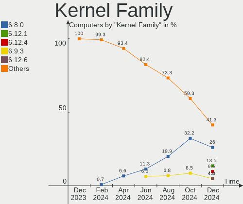

| Version  | Computers | Percent |
|----------|-----------|---------|
| 5.19.0   | 22        | 14.47%  |
| 5.15.0   | 21        | 13.82%  |
| 6.3.5    | 15        | 9.87%   |
| 6.2.0    | 12        | 7.89%   |
| 6.3.7    | 8         | 5.26%   |
| 6.2.6    | 8         | 5.26%   |
| 6.1.0    | 8         | 5.26%   |
| 6.3.4    | 6         | 3.95%   |
| 6.3.9    | 5         | 3.29%   |
| 6.2.9    | 5         | 3.29%   |
| 5.4.0    | 5         | 3.29%   |
| 6.3.8    | 4         | 2.63%   |
| 6.3.6    | 4         | 2.63%   |
| 6.1.31   | 4         | 2.63%   |
| 6.2.15   | 2         | 1.32%   |
| 6.0.0    | 2         | 1.32%   |
| 5.14.21  | 2         | 1.32%   |
| 5.13.0   | 2         | 1.32%   |
| 6.4.0    | 1         | 0.66%   |
| 6.3.3    | 1         | 0.66%   |
| 6.2.16   | 1         | 0.66%   |
| 6.2.12   | 1         | 0.66%   |
| 6.1.35   | 1         | 0.66%   |
| 6.1.33   | 1         | 0.66%   |
| 6.1.32   | 1         | 0.66%   |
| 6.1.27   | 1         | 0.66%   |
| 6.1.11   | 1         | 0.66%   |
| 5.8.0    | 1         | 0.66%   |
| 5.6.14   | 1         | 0.66%   |
| 5.15.94  | 1         | 0.66%   |
| 5.15.102 | 1         | 0.66%   |
| 5.11.0   | 1         | 0.66%   |
| 5.10.160 | 1         | 0.66%   |
| 5.10.0   | 1         | 0.66%   |
| 4.18.0   | 1         | 0.66%   |

Kernel Major Ver.
-----------------

Linux kernel major version

| Version | Computers | Percent |
|---------|-----------|---------|
| 6.3     | 43        | 28.29%  |
| 6.2     | 29        | 19.08%  |
| 5.15    | 23        | 15.13%  |
| 5.19    | 22        | 14.47%  |
| 6.1     | 17        | 11.18%  |
| 5.4     | 5         | 3.29%   |
| 6.0     | 2         | 1.32%   |
| 5.14    | 2         | 1.32%   |
| 5.13    | 2         | 1.32%   |
| 5.10    | 2         | 1.32%   |
| 6.4     | 1         | 0.66%   |
| 5.8     | 1         | 0.66%   |
| 5.6     | 1         | 0.66%   |
| 5.11    | 1         | 0.66%   |
| 4.18    | 1         | 0.66%   |

Arch
----

OS architecture (x86_64, i586, etc.)

| Name    | Computers | Percent |
|---------|-----------|---------|
| x86_64  | 150       | 98.68%  |
| aarch64 | 2         | 1.32%   |

DE
--

Desktop Environment

| Name          | Computers | Percent |
|---------------|-----------|---------|
| GNOME         | 69        | 45.39%  |
| KDE5          | 38        | 25%     |
| X-Cinnamon    | 16        | 10.53%  |
| Unknown       | 8         | 5.26%   |
| XFCE          | 7         | 4.61%   |
| i3            | 3         | 1.97%   |
| MATE          | 2         | 1.32%   |
| GNOME Classic | 2         | 1.32%   |
| Cinnamon      | 2         | 1.32%   |
| Pantheon      | 1         | 0.66%   |
| LXQt          | 1         | 0.66%   |
| Hyprland      | 1         | 0.66%   |
| herbstluftwm  | 1         | 0.66%   |
| Deepin        | 1         | 0.66%   |

Display Server
--------------

X11 or Wayland

| Name    | Computers | Percent |
|---------|-----------|---------|
| X11     | 84        | 55.26%  |
| Wayland | 59        | 38.82%  |
| Tty     | 5         | 3.29%   |
| Unknown | 4         | 2.63%   |

Display Manager
---------------

SDDM, LightDM, etc.

| Name    | Computers | Percent |
|---------|-----------|---------|
| Unknown | 69        | 45.39%  |
| GDM3    | 35        | 23.03%  |
| SDDM    | 23        | 15.13%  |
| LightDM | 19        | 12.5%   |
| GDM     | 5         | 3.29%   |
| Ly      | 1         | 0.66%   |

OS Lang
-------

Language

| Lang    | Computers | Percent |
|---------|-----------|---------|
| en_CA   | 87        | 57.24%  |
| en_US   | 50        | 32.89%  |
| fr_CA   | 6         | 3.95%   |
| fr_FR   | 3         | 1.97%   |
| C       | 2         | 1.32%   |
| Unknown | 2         | 1.32%   |
| hu_HU   | 1         | 0.66%   |
| en_GB   | 1         | 0.66%   |

Boot Mode
---------

EFI or BIOS

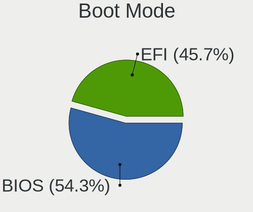

| Mode | Computers | Percent |
|------|-----------|---------|
| EFI  | 82        | 53.95%  |
| BIOS | 70        | 46.05%  |

Filesystem
----------

Type of filesystem

| Type    | Computers | Percent |
|---------|-----------|---------|
| Ext4    | 75        | 49.34%  |
| Btrfs   | 45        | 29.61%  |
| Tmpfs   | 25        | 16.45%  |
| Overlay | 6         | 3.95%   |
| Xfs     | 1         | 0.66%   |

Part. scheme
------------

Scheme of partitioning

| Type    | Computers | Percent |
|---------|-----------|---------|
| GPT     | 74        | 48.68%  |
| Unknown | 61        | 40.13%  |
| MBR     | 17        | 11.18%  |

Dual Boot with Linux/BSD
------------------------

Hosting more than one Linux/BSD

| Dual boot | Computers | Percent |
|-----------|-----------|---------|
| No        | 134       | 88.16%  |
| Yes       | 18        | 11.84%  |

Dual Boot (Win)
---------------

Hosting Linux and Windows

| Dual boot | Computers | Percent |
|-----------|-----------|---------|
| No        | 117       | 76.97%  |
| Yes       | 35        | 23.03%  |

Board
-----

Vendor
------

Motherboard manufacturer

| Name                | Computers | Percent |
|---------------------|-----------|---------|
| ASUSTek Computer    | 31        | 20.39%  |
| Lenovo              | 20        | 13.16%  |
| MSI                 | 19        | 12.5%   |
| Dell                | 17        | 11.18%  |
| Hewlett-Packard     | 15        | 9.87%   |
| Apple               | 9         | 5.92%   |
| ASRock              | 6         | 3.95%   |
| Microsoft           | 5         | 3.29%   |
| Gigabyte Technology | 5         | 3.29%   |
| Acer                | 5         | 3.29%   |
| Sony                | 3         | 1.97%   |
| AZW                 | 3         | 1.97%   |
| Valve               | 2         | 1.32%   |
| Xplore              | 1         | 0.66%   |
| Samsung Electronics | 1         | 0.66%   |
| Rockchip            | 1         | 0.66%   |
| Panasonic           | 1         | 0.66%   |
| Intel               | 1         | 0.66%   |
| Google              | 1         | 0.66%   |
| Gateway             | 1         | 0.66%   |
| Fujitsu             | 1         | 0.66%   |
| ASRockRack          | 1         | 0.66%   |
| Amlogic             | 1         | 0.66%   |
| Alienware           | 1         | 0.66%   |
| Unknown             | 1         | 0.66%   |

Model
-----

Motherboard model

| Name                                     | Computers | Percent |
|------------------------------------------|-----------|---------|
| Apple MacBookPro5,5                      | 3         | 1.97%   |
| Valve Jupiter                            | 2         | 1.32%   |
| MSI MS-7E06                              | 2         | 1.32%   |
| MSI MS-7C37                              | 2         | 1.32%   |
| Microsoft Surface Laptop Go              | 2         | 1.32%   |
| Dell XPS 13 9310                         | 2         | 1.32%   |
| Dell OptiPlex 755                        | 2         | 1.32%   |
| AZW SER                                  | 2         | 1.32%   |
| ASUS TUF Gaming X570-PLUS                | 2         | 1.32%   |
| Apple iMac8,1                            | 2         | 1.32%   |
| Xplore iX104C6                           | 1         | 0.66%   |
| Sony VPCF120FD                           | 1         | 0.66%   |
| Sony VPCEB37FD                           | 1         | 0.66%   |
| Sony VPCEB2AFD                           | 1         | 0.66%   |
| Samsung R430/R480                        | 1         | 0.66%   |
| Rockchip Orange Pi 5                     | 1         | 0.66%   |
| Panasonic CF-S10CDHEDM                   | 1         | 0.66%   |
| MSI MS-7E12                              | 1         | 0.66%   |
| MSI MS-7C94                              | 1         | 0.66%   |
| MSI MS-7B98                              | 1         | 0.66%   |
| MSI MS-7B93                              | 1         | 0.66%   |
| MSI MS-7A64                              | 1         | 0.66%   |
| MSI MS-7A39                              | 1         | 0.66%   |
| MSI MS-7A37                              | 1         | 0.66%   |
| MSI MS-7972                              | 1         | 0.66%   |
| MSI MS-7893                              | 1         | 0.66%   |
| MSI MS-7821                              | 1         | 0.66%   |
| MSI MS-7758                              | 1         | 0.66%   |
| MSI MS-7673                              | 1         | 0.66%   |
| MSI MPG H410 Trident 3 (MS-B932)         | 1         | 0.66%   |
| MSI GP72 7RDX                            | 1         | 0.66%   |
| MSI GE62 2QF                             | 1         | 0.66%   |
| Microsoft Surface Pro 7                  | 1         | 0.66%   |
| Microsoft Surface Laptop 4               | 1         | 0.66%   |
| Microsoft Surface Go 2                   | 1         | 0.66%   |
| Lenovo Yoga 3 Pro-1370 80HE              | 1         | 0.66%   |
| Lenovo ThinkStation P340 Tiny 30DF001KUS | 1         | 0.66%   |
| Lenovo ThinkPad W520 4282AB9             | 1         | 0.66%   |
| Lenovo ThinkPad W510 4391B49             | 1         | 0.66%   |
| Lenovo ThinkPad T580 20LAS0DL00          | 1         | 0.66%   |

Model Family
------------

Motherboard model prefix

| Name                   | Computers | Percent |
|------------------------|-----------|---------|
| Lenovo ThinkPad        | 8         | 5.26%   |
| ASUS ROG               | 7         | 4.61%   |
| Microsoft Surface      | 5         | 3.29%   |
| Dell XPS               | 5         | 3.29%   |
| ASUS VivoBook          | 5         | 3.29%   |
| Acer Aspire            | 5         | 3.29%   |
| Dell Latitude          | 4         | 2.63%   |
| ASUS PRIME             | 4         | 2.63%   |
| Lenovo ThinkCentre     | 3         | 1.97%   |
| HP ProBook             | 3         | 1.97%   |
| Dell Inspiron          | 3         | 1.97%   |
| ASUS Zenbook           | 3         | 1.97%   |
| ASUS TUF               | 3         | 1.97%   |
| Apple MacBookPro5      | 3         | 1.97%   |
| Valve Jupiter          | 2         | 1.32%   |
| MSI MS-7E06            | 2         | 1.32%   |
| MSI MS-7C37            | 2         | 1.32%   |
| Lenovo IdeaPadFlex     | 2         | 1.32%   |
| Lenovo IdeaPad         | 2         | 1.32%   |
| HP EliteDesk           | 2         | 1.32%   |
| Dell Precision         | 2         | 1.32%   |
| Dell OptiPlex          | 2         | 1.32%   |
| AZW SER                | 2         | 1.32%   |
| Apple iMac8            | 2         | 1.32%   |
| Xplore iX104C6         | 1         | 0.66%   |
| Sony VPCF120FD         | 1         | 0.66%   |
| Sony VPCEB37FD         | 1         | 0.66%   |
| Sony VPCEB2AFD         | 1         | 0.66%   |
| Samsung R430           | 1         | 0.66%   |
| Rockchip Orange        | 1         | 0.66%   |
| Panasonic CF-S10CDHEDM | 1         | 0.66%   |
| MSI MS-7E12            | 1         | 0.66%   |
| MSI MS-7C94            | 1         | 0.66%   |
| MSI MS-7B98            | 1         | 0.66%   |
| MSI MS-7B93            | 1         | 0.66%   |
| MSI MS-7A64            | 1         | 0.66%   |
| MSI MS-7A39            | 1         | 0.66%   |
| MSI MS-7A37            | 1         | 0.66%   |
| MSI MS-7972            | 1         | 0.66%   |
| MSI MS-7893            | 1         | 0.66%   |

MFG Year
--------

Motherboard manufacture year

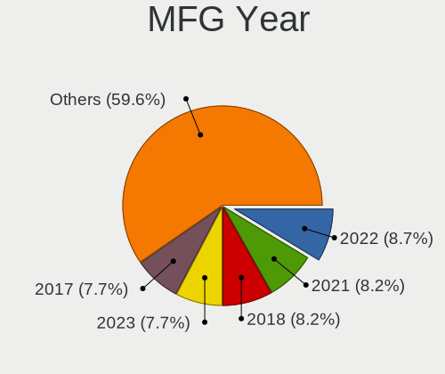

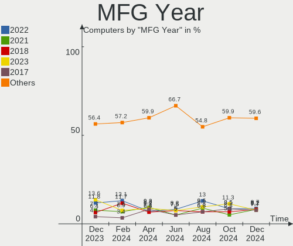

| Year    | Computers | Percent |
|---------|-----------|---------|
| 2020    | 19        | 12.5%   |
| 2019    | 15        | 9.87%   |
| 2022    | 13        | 8.55%   |
| 2018    | 13        | 8.55%   |
| 2016    | 9         | 5.92%   |
| 2012    | 9         | 5.92%   |
| 2010    | 9         | 5.92%   |
| 2021    | 8         | 5.26%   |
| 2015    | 8         | 5.26%   |
| 2014    | 8         | 5.26%   |
| 2011    | 8         | 5.26%   |
| 2017    | 7         | 4.61%   |
| 2023    | 6         | 3.95%   |
| 2008    | 6         | 3.95%   |
| 2009    | 4         | 2.63%   |
| 2007    | 4         | 2.63%   |
| 2013    | 3         | 1.97%   |
| Unknown | 2         | 1.32%   |
| 2006    | 1         | 0.66%   |

Form Factor
-----------

Physical design of the computer

| Name           | Computers | Percent |
|----------------|-----------|---------|
| Notebook       | 68        | 44.74%  |
| Desktop        | 64        | 42.11%  |
| Tablet         | 6         | 3.95%   |
| Mini pc        | 5         | 3.29%   |
| Convertible    | 3         | 1.97%   |
| All in one     | 3         | 1.97%   |
| System on chip | 2         | 1.32%   |
| Server         | 1         | 0.66%   |

Secure Boot
-----------

Enabled or disabled

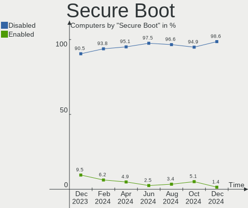

| State    | Computers | Percent |
|----------|-----------|---------|
| Disabled | 143       | 94.08%  |
| Enabled  | 9         | 5.92%   |

Coreboot
--------

Have coreboot on board

| Used | Computers | Percent |
|------|-----------|---------|
| No   | 151       | 99.34%  |
| Yes  | 1         | 0.66%   |

RAM Size
--------

Total RAM memory

| Size in GB  | Computers | Percent |
|-------------|-----------|---------|
| 16.01-24.0  | 30        | 19.74%  |
| 8.01-16.0   | 28        | 18.42%  |
| 4.01-8.0    | 26        | 17.11%  |
| 32.01-64.0  | 26        | 17.11%  |
| 3.01-4.0    | 21        | 13.82%  |
| 64.01-256.0 | 12        | 7.89%   |
| 24.01-32.0  | 4         | 2.63%   |
| 1.01-2.0    | 4         | 2.63%   |
| 2.01-3.0    | 1         | 0.66%   |

RAM Used
--------

Used RAM memory

| Used GB    | Computers | Percent |
|------------|-----------|---------|
| 1.01-2.0   | 39        | 25.66%  |
| 2.01-3.0   | 36        | 23.68%  |
| 4.01-8.0   | 33        | 21.71%  |
| 3.01-4.0   | 22        | 14.47%  |
| 8.01-16.0  | 12        | 7.89%   |
| 0.51-1.0   | 4         | 2.63%   |
| 32.01-64.0 | 2         | 1.32%   |
| 0.01-0.5   | 2         | 1.32%   |
| 24.01-32.0 | 1         | 0.66%   |
| 16.01-24.0 | 1         | 0.66%   |

Total Drives
------------

Number of drives on board

| Drives | Computers | Percent |
|--------|-----------|---------|
| 1      | 85        | 55.92%  |
| 2      | 31        | 20.39%  |
| 3      | 15        | 9.87%   |
| 4      | 11        | 7.24%   |
| 6      | 3         | 1.97%   |
| 5      | 2         | 1.32%   |
| 13     | 1         | 0.66%   |
| 11     | 1         | 0.66%   |
| 9      | 1         | 0.66%   |
| 7      | 1         | 0.66%   |
| 0      | 1         | 0.66%   |

Has CD-ROM
----------

Has CD-ROM on board

| Presented | Computers | Percent |
|-----------|-----------|---------|
| No        | 106       | 69.74%  |
| Yes       | 46        | 30.26%  |

Has Ethernet
------------

Has Ethernet on board

| Presented | Computers | Percent |
|-----------|-----------|---------|
| Yes       | 126       | 82.89%  |
| No        | 26        | 17.11%  |

Has WiFi
--------

Has WiFi module

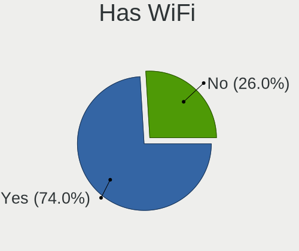

| Presented | Computers | Percent |
|-----------|-----------|---------|
| Yes       | 122       | 80.26%  |
| No        | 30        | 19.74%  |

Has Bluetooth
-------------

Has Bluetooth module

| Presented | Computers | Percent |
|-----------|-----------|---------|
| Yes       | 103       | 67.76%  |
| No        | 49        | 32.24%  |

Location
--------

Country
-------

Geographic location (country)

| Country | Computers | Percent |
|---------|-----------|---------|
| Canada  | 152       | 100%    |

City
----

Geographic location (city)

| City                     | Computers | Percent |
|--------------------------|-----------|---------|
| Toronto                  | 23        | 15.13%  |
| Montreal                 | 16        | 10.53%  |
| London                   | 6         | 3.95%   |
| Ottawa                   | 5         | 3.29%   |
| Vancouver                | 4         | 2.63%   |
| Surrey                   | 4         | 2.63%   |
| Calgary                  | 4         | 2.63%   |
| Winnipeg                 | 3         | 1.97%   |
| Victoria                 | 3         | 1.97%   |
| Thunder Bay              | 3         | 1.97%   |
| Mississauga              | 3         | 1.97%   |
| Laval                    | 3         | 1.97%   |
| Kingston                 | 3         | 1.97%   |
| Waterloo                 | 2         | 1.32%   |
| Vernon                   | 2         | 1.32%   |
| Saskatoon                | 2         | 1.32%   |
| Red Lake                 | 2         | 1.32%   |
| North Vancouver          | 2         | 1.32%   |
| Maple Ridge              | 2         | 1.32%   |
| Kitchener                | 2         | 1.32%   |
| Greater Sudbury          | 2         | 1.32%   |
| Edmonton                 | 2         | 1.32%   |
| Burnaby                  | 2         | 1.32%   |
| Alliston                 | 2         | 1.32%   |
| Wolfville                | 1         | 0.66%   |
| Williams Lake            | 1         | 0.66%   |
| Whitby                   | 1         | 0.66%   |
| Wetaskiwin               | 1         | 0.66%   |
| Wakefield                | 1         | 0.66%   |
| Verdun                   | 1         | 0.66%   |
| Vegreville               | 1         | 0.66%   |
| St. Catharines           | 1         | 0.66%   |
| Spruce Grove             | 1         | 0.66%   |
| Sarnia                   | 1         | 0.66%   |
| Salmon Arm               | 1         | 0.66%   |
| Sainte-Anne-de-la-Perade | 1         | 0.66%   |
| Saint-Jerome             | 1         | 0.66%   |
| Saint-Honore             | 1         | 0.66%   |
| Saint-Calixte            | 1         | 0.66%   |
| Riviere-Beaudette        | 1         | 0.66%   |

Drives
------

Drive Vendor
------------

Hard drive vendors

| Vendor                       | Computers | Drives | Percent |
|------------------------------|-----------|--------|---------|
| WDC                          | 37        | 52     | 14.62%  |
| Samsung Electronics          | 37        | 45     | 14.62%  |
| Seagate                      | 35        | 56     | 13.83%  |
| Toshiba                      | 17        | 17     | 6.72%   |
| SanDisk                      | 15        | 16     | 5.93%   |
| Unknown                      | 13        | 14     | 5.14%   |
| Kingston                     | 13        | 14     | 5.14%   |
| Crucial                      | 9         | 9      | 3.56%   |
| Intel                        | 8         | 8      | 3.16%   |
| SK hynix                     | 6         | 6      | 2.37%   |
| SPCC                         | 5         | 5      | 1.98%   |
| HGST                         | 5         | 5      | 1.98%   |
| Kingston Technology Company  | 4         | 4      | 1.58%   |
| Hitachi                      | 4         | 4      | 1.58%   |
| A-DATA Technology            | 4         | 4      | 1.58%   |
| PNY                          | 3         | 4      | 1.19%   |
| Micron Technology            | 3         | 3      | 1.19%   |
| Silicon Motion               | 2         | 3      | 0.79%   |
| QNAP                         | 2         | 2      | 0.79%   |
| Phison Electronics           | 2         | 2      | 0.79%   |
| Netac                        | 2         | 2      | 0.79%   |
| Corsair                      | 2         | 2      | 0.79%   |
| XPG                          | 1         | 1      | 0.4%    |
| Vaseky                       | 1         | 1      | 0.4%    |
| Timetec                      | 1         | 1      | 0.4%    |
| Team                         | 1         | 1      | 0.4%    |
| TCSUNBOW                     | 1         | 1      | 0.4%    |
| Super Talent                 | 1         | 1      | 0.4%    |
| StoreJet                     | 1         | 1      | 0.4%    |
| Shenzhen Longsys Electronics | 1         | 1      | 0.4%    |
| Realtek Semiconductor        | 1         | 1      | 0.4%    |
| Plextor                      | 1         | 1      | 0.4%    |
| OWC                          | 1         | 2      | 0.4%    |
| OCZ                          | 1         | 1      | 0.4%    |
| Micron/Crucial Technology    | 1         | 1      | 0.4%    |
| MAXIO Technology (Hangzhou)  | 1         | 1      | 0.4%    |
| Lexar                        | 1         | 1      | 0.4%    |
| KIOXIA                       | 1         | 1      | 0.4%    |
| KingFast                     | 1         | 1      | 0.4%    |
| JMicron Technology           | 1         | 1      | 0.4%    |

Drive Model
-----------

Hard drive models

| Model                                               | Computers | Percent |
|-----------------------------------------------------|-----------|---------|
| Unknown MMC Card  64GB                              | 6         | 2.11%   |
| Samsung NVMe SSD Controller SM981/PM981/PM983 250GB | 6         | 2.11%   |
| Seagate ST2000DM008-2FR102 2TB                      | 5         | 1.75%   |
| SanDisk NVMe SSD Drive 1TB                          | 4         | 1.4%    |
| Samsung SSD 870 EVO 1TB                             | 4         | 1.4%    |
| WDC WD40EZRZ-00GXCB0 4TB                            | 3         | 1.05%   |
| SPCC Solid State Disk 256GB                         | 3         | 1.05%   |
| Seagate ST1000DM010-2EP102 1TB                      | 3         | 1.05%   |
| Seagate BUP Portable 4TB                            | 3         | 1.05%   |
| Samsung SSD 860 EVO 500GB                           | 3         | 1.05%   |
| Intel SSDPEKNU512GZ 512GB                           | 3         | 1.05%   |
| HGST HTS721010A9E630 1TB                            | 3         | 1.05%   |
| WDC WD40EFZX-68AWUN0 4TB                            | 2         | 0.7%    |
| WDC WD40EFRX-68N32N0 4TB                            | 2         | 0.7%    |
| WDC WD10JPVX-22JC3T0 1TB                            | 2         | 0.7%    |
| WDC WD10EZEX-60WN4A0 1TB                            | 2         | 0.7%    |
| Unknown SD/MMC/MS PRO 250GB                         | 2         | 0.7%    |
| Toshiba MQ04ABF100 1TB                              | 2         | 0.7%    |
| Toshiba DT01ACA200 2TB                              | 2         | 0.7%    |
| SK hynix BC501 NVMe Solid State Drive 512GB         | 2         | 0.7%    |
| Seagate ST3000DM001-1ER166 3TB                      | 2         | 0.7%    |
| Samsung SSD 970 EVO Plus 1TB                        | 2         | 0.7%    |
| Samsung SSD 860 EVO 250GB                           | 2         | 0.7%    |
| Samsung SSD 850 EVO 1TB                             | 2         | 0.7%    |
| Samsung MZVLQ512HALU-00000 512GB                    | 2         | 0.7%    |
| QNAP iSCSI Storage 2.1TB                            | 2         | 0.7%    |
| Kingston SNV2S500G 500GB                            | 2         | 0.7%    |
| Kingston SA400S37240G 240GB SSD                     | 2         | 0.7%    |
| HGST HTS541010A9E680 1TB                            | 2         | 0.7%    |
| Crucial CT500MX500SSD1 500GB                        | 2         | 0.7%    |
| XPG GAMMIX S70 BLADE 2TB                            | 1         | 0.35%   |
| WDC WDS960G2G0C-00AJM0 960GB                        | 1         | 0.35%   |
| WDC WDS500G2B0B 500GB SSD                           | 1         | 0.35%   |
| WDC WDS500G2B0A-00SM50 500GB SSD                    | 1         | 0.35%   |
| WDC WDS250G1B0A-00H9H0 250GB SSD                    | 1         | 0.35%   |
| WDC WDS100T3X0C-00SJG0 1TB                          | 1         | 0.35%   |
| WDC WDS100T2B0C-00PXH0 1TB                          | 1         | 0.35%   |
| WDC WD80EAZZ-00BKLB0 8TB                            | 1         | 0.35%   |
| WDC WD6400AAKS-65A7B2 640GB                         | 1         | 0.35%   |
| WDC WD5000LPCX-60VHAT0 500GB                        | 1         | 0.35%   |

HDD Vendor
----------

Hard disk drive vendors

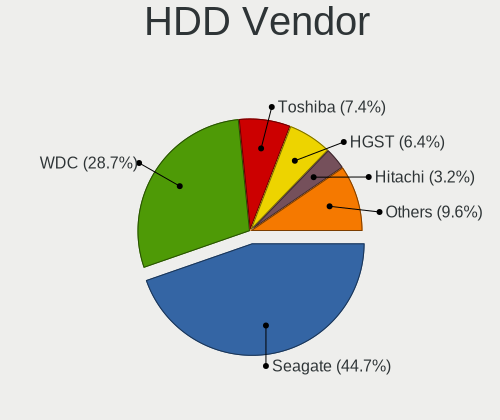

| Vendor              | Computers | Drives | Percent |
|---------------------|-----------|--------|---------|
| Seagate             | 34        | 49     | 37.78%  |
| WDC                 | 30        | 42     | 33.33%  |
| Toshiba             | 12        | 12     | 13.33%  |
| HGST                | 5         | 5      | 5.56%   |
| Hitachi             | 4         | 4      | 4.44%   |
| Unknown             | 2         | 2      | 2.22%   |
| QNAP                | 2         | 2      | 2.22%   |
| Samsung Electronics | 1         | 2      | 1.11%   |

SSD Vendor
----------

Solid state drive vendors

| Vendor              | Computers | Drives | Percent |
|---------------------|-----------|--------|---------|
| Samsung Electronics | 23        | 24     | 29.11%  |
| Crucial             | 8         | 8      | 10.13%  |
| Kingston            | 7         | 8      | 8.86%   |
| WDC                 | 5         | 5      | 6.33%   |
| SPCC                | 5         | 5      | 6.33%   |
| SanDisk             | 4         | 4      | 5.06%   |
| PNY                 | 3         | 4      | 3.8%    |
| Intel               | 3         | 3      | 3.8%    |
| A-DATA Technology   | 3         | 3      | 3.8%    |
| Vaseky              | 1         | 1      | 1.27%   |
| Timetec             | 1         | 1      | 1.27%   |
| Team                | 1         | 1      | 1.27%   |
| Super Talent        | 1         | 1      | 1.27%   |
| StoreJet            | 1         | 1      | 1.27%   |
| SK hynix            | 1         | 1      | 1.27%   |
| Seagate             | 1         | 1      | 1.27%   |
| Plextor             | 1         | 1      | 1.27%   |
| OWC                 | 1         | 2      | 1.27%   |
| OCZ                 | 1         | 1      | 1.27%   |
| Netac               | 1         | 1      | 1.27%   |
| Micron Technology   | 1         | 1      | 1.27%   |
| Lexar               | 1         | 1      | 1.27%   |
| Hewlett-Packard     | 1         | 1      | 1.27%   |
| CT2000MX            | 1         | 2      | 1.27%   |
| Corsair             | 1         | 1      | 1.27%   |
| ASMT                | 1         | 1      | 1.27%   |
| Apple               | 1         | 1      | 1.27%   |

Drive Kind
----------

HDD or SSD

| Kind    | Computers | Drives | Percent |
|---------|-----------|--------|---------|
| SSD     | 70        | 84     | 31.82%  |
| HDD     | 67        | 118    | 30.45%  |
| NVMe    | 65        | 79     | 29.55%  |
| MMC     | 13        | 14     | 5.91%   |
| Unknown | 5         | 9      | 2.27%   |

Drive Connector
---------------

SATA, SAS, NVMe, etc.

| Type | Computers | Drives | Percent |
|------|-----------|--------|---------|
| SATA | 106       | 180    | 52.48%  |
| NVMe | 65        | 78     | 32.18%  |
| SAS  | 18        | 32     | 8.91%   |
| MMC  | 13        | 14     | 6.44%   |

Drive Size
----------

Size of hard drive

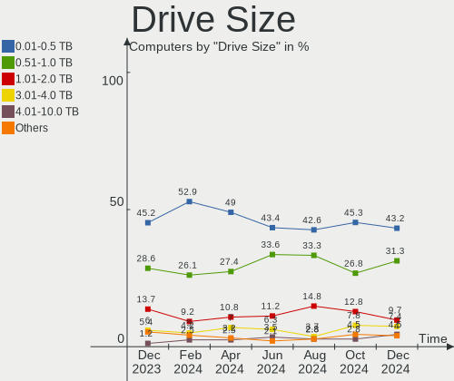

| Size in TB | Computers | Drives | Percent |
|------------|-----------|--------|---------|
| 0.01-0.5   | 68        | 84     | 43.04%  |
| 0.51-1.0   | 44        | 58     | 27.85%  |
| 1.01-2.0   | 19        | 23     | 12.03%  |
| 3.01-4.0   | 12        | 19     | 7.59%   |
| 4.01-10.0  | 7         | 9      | 4.43%   |
| 2.01-3.0   | 6         | 7      | 3.8%    |
| 10.01-20.0 | 2         | 2      | 1.27%   |

Space Total
-----------

Amount of disk space available on the file system

| Size in GB     | Computers | Percent |
|----------------|-----------|---------|
| 101-250        | 33        | 21.71%  |
| 501-1000       | 29        | 19.08%  |
| 251-500        | 24        | 15.79%  |
| More than 3000 | 19        | 12.5%   |
| 1001-2000      | 18        | 11.84%  |
| 1-20           | 9         | 5.92%   |
| Unknown        | 8         | 5.26%   |
| 2001-3000      | 5         | 3.29%   |
| 51-100         | 5         | 3.29%   |
| 21-50          | 2         | 1.32%   |

Space Used
----------

Amount of used disk space

| Used GB        | Computers | Percent |
|----------------|-----------|---------|
| 1-20           | 37        | 24.34%  |
| 21-50          | 25        | 16.45%  |
| 101-250        | 22        | 14.47%  |
| 251-500        | 16        | 10.53%  |
| 51-100         | 14        | 9.21%   |
| 501-1000       | 12        | 7.89%   |
| More than 3000 | 9         | 5.92%   |
| Unknown        | 8         | 5.26%   |
| 1001-2000      | 6         | 3.95%   |
| 2001-3000      | 3         | 1.97%   |

Malfunc. Drives
---------------

Drive models with a malfunction

| Model                                                     | Computers | Drives | Percent |
|-----------------------------------------------------------|-----------|--------|---------|
| WDC WD Blue SA510 M.2 2280 500GB SSD                      | 1         | 1      | 6.25%   |
| Toshiba THNSN51T02DUK NVMe 1024GB                         | 1         | 1      | 6.25%   |
| Timetec SD08 512GB SSD                                    | 1         | 1      | 6.25%   |
| Seagate ST9750420AS 752GB                                 | 1         | 1      | 6.25%   |
| Seagate ST9250414ASG 250GB                                | 1         | 1      | 6.25%   |
| Seagate ST4000DM000-1F2168 4TB                            | 1         | 1      | 6.25%   |
| Seagate ST33000651AS 3TB                                  | 1         | 1      | 6.25%   |
| Seagate ST3200822AS 200GB                                 | 1         | 1      | 6.25%   |
| Seagate ST3000DM001-1CH166 3TB                            | 1         | 1      | 6.25%   |
| Seagate ST2000DM001-1CH164 2TB                            | 1         | 1      | 6.25%   |
| Seagate ST2000DL003-9VT166 2TB                            | 1         | 1      | 6.25%   |
| Realtek Semiconductor RTS5763DL NVMe SSD Controller 512GB | 1         | 1      | 6.25%   |
| Intel SSDSA2M160G2GC 160GB                                | 1         | 1      | 6.25%   |
| Hitachi HCS5C3232SLA380 320GB                             | 1         | 1      | 6.25%   |
| HGST HTS721010A9E630 1TB                                  | 1         | 1      | 6.25%   |
| HGST HTS541010A9E680 1TB                                  | 1         | 1      | 6.25%   |

Malfunc. Drive Vendor
---------------------

Vendors of faulty drives

| Vendor                | Computers | Drives | Percent |
|-----------------------|-----------|--------|---------|
| Seagate               | 7         | 8      | 46.67%  |
| HGST                  | 2         | 2      | 13.33%  |
| WDC                   | 1         | 1      | 6.67%   |
| Toshiba               | 1         | 1      | 6.67%   |
| Timetec               | 1         | 1      | 6.67%   |
| Realtek Semiconductor | 1         | 1      | 6.67%   |
| Intel                 | 1         | 1      | 6.67%   |
| Hitachi               | 1         | 1      | 6.67%   |

Malfunc. HDD Vendor
-------------------

Vendors of faulty HDD drives

| Vendor  | Computers | Drives | Percent |
|---------|-----------|--------|---------|
| Seagate | 7         | 8      | 70%     |
| HGST    | 2         | 2      | 20%     |
| Hitachi | 1         | 1      | 10%     |

Malfunc. Drive Kind
-------------------

Kinds of faulty drives

| Kind | Computers | Drives | Percent |
|------|-----------|--------|---------|
| HDD  | 9         | 11     | 64.29%  |
| SSD  | 3         | 3      | 21.43%  |
| NVMe | 2         | 2      | 14.29%  |

Failed Drives
-------------

Failed drive models

Zero info for selected period =(

Failed Drive Vendor
-------------------

Failed drive vendors

Zero info for selected period =(

Drive Status
------------

Number of failed and malfunc. drives

| Status   | Computers | Drives | Percent |
|----------|-----------|--------|---------|
| Detected | 105       | 189    | 61.4%   |
| Works    | 52        | 99     | 30.41%  |
| Malfunc  | 14        | 16     | 8.19%   |

Storage controller
------------------

Storage Vendor
--------------

Storage controller vendors

| Vendor                       | Computers | Percent |
|------------------------------|-----------|---------|
| Intel                        | 85        | 40.28%  |
| AMD                          | 40        | 18.96%  |
| Samsung Electronics          | 20        | 9.48%   |
| SanDisk                      | 15        | 7.11%   |
| Kingston Technology Company  | 10        | 4.74%   |
| ASMedia Technology           | 7         | 3.32%   |
| Toshiba America Info Systems | 5         | 2.37%   |
| SK hynix                     | 5         | 2.37%   |
| Nvidia                       | 4         | 1.9%    |
| Phison Electronics           | 3         | 1.42%   |
| ADATA Technology             | 3         | 1.42%   |
| Silicon Motion               | 2         | 0.95%   |
| Micron/Crucial Technology    | 2         | 0.95%   |
| Micron Technology            | 2         | 0.95%   |
| Silicon Image                | 1         | 0.47%   |
| Shenzhen Longsys Electronics | 1         | 0.47%   |
| Realtek Semiconductor        | 1         | 0.47%   |
| Netac Technology             | 1         | 0.47%   |
| MAXIO Technology (Hangzhou)  | 1         | 0.47%   |
| Marvell Technology Group     | 1         | 0.47%   |
| KIOXIA                       | 1         | 0.47%   |
| JMicron Technology           | 1         | 0.47%   |

Storage Model
-------------

Storage controller models

| Model                                                                         | Computers | Percent |
|-------------------------------------------------------------------------------|-----------|---------|
| AMD FCH SATA Controller [AHCI mode]                                           | 29        | 12.24%  |
| Samsung NVMe SSD Controller SM981/PM981/PM983                                 | 8         | 3.38%   |
| Samsung NVMe SSD Controller 980                                               | 6         | 2.53%   |
| Intel Q170/Q150/B150/H170/H110/Z170/CM236 Chipset SATA Controller [AHCI Mode] | 6         | 2.53%   |
| AMD 500 Series Chipset SATA Controller                                        | 6         | 2.53%   |
| SanDisk Non-Volatile memory controller                                        | 5         | 2.11%   |
| Intel HM170/QM170 Chipset SATA Controller [AHCI Mode]                         | 5         | 2.11%   |
| Intel 8 Series SATA Controller 1 [AHCI mode]                                  | 5         | 2.11%   |
| Intel 6 Series/C200 Series Chipset Family 6 port Mobile SATA AHCI Controller  | 5         | 2.11%   |
| ASMedia ASM1062 Serial ATA Controller                                         | 5         | 2.11%   |
| AMD 400 Series Chipset SATA Controller                                        | 5         | 2.11%   |
| Kingston Company Company Non-Volatile memory controller                       | 4         | 1.69%   |
| Intel Volume Management Device NVMe RAID Controller                           | 4         | 1.69%   |
| Intel 82801 Mobile SATA Controller [RAID mode]                                | 4         | 1.69%   |
| Intel 5 Series/3400 Series Chipset 4 port SATA AHCI Controller                | 4         | 1.69%   |
| AMD SB7x0/SB8x0/SB9x0 SATA Controller [AHCI mode]                             | 4         | 1.69%   |
| SanDisk WD Black SN750 / PC SN730 NVMe SSD                                    | 3         | 1.27%   |
| Nvidia MCP79 AHCI Controller                                                  | 3         | 1.27%   |
| Intel Tiger Lake-LP SATA Controller                                           | 3         | 1.27%   |
| Intel Sunrise Point-LP SATA Controller [AHCI mode]                            | 3         | 1.27%   |
| Intel Non-Volatile memory controller                                          | 3         | 1.27%   |
| Intel Cannon Lake PCH SATA AHCI Controller                                    | 3         | 1.27%   |
| Intel 82Q35 Express PT IDER Controller                                        | 3         | 1.27%   |
| Intel 82801JI (ICH10 Family) SATA AHCI Controller                             | 3         | 1.27%   |
| Intel 82801IR/IO/IH (ICH9R/DO/DH) 6 port SATA Controller [AHCI mode]          | 3         | 1.27%   |
| Intel 82801I (ICH9 Family) 2 port SATA Controller [IDE mode]                  | 3         | 1.27%   |
| Intel 700 Series Chipset Family SATA AHCI Controller                          | 3         | 1.27%   |
| Intel 5 Series/3400 Series Chipset 6 port SATA AHCI Controller                | 3         | 1.27%   |
| Intel 200 Series PCH SATA controller [AHCI mode]                              | 3         | 1.27%   |
| Toshiba America Info Systems XG4 NVMe SSD Controller                          | 2         | 0.84%   |
| SK hynix BC501 NVMe Solid State Drive                                         | 2         | 0.84%   |
| SanDisk WD Blue SN550 NVMe SSD                                                | 2         | 0.84%   |
| SanDisk WD Black SN770 NVMe SSD                                               | 2         | 0.84%   |
| Samsung NVMe SSD Controller PM9A1/PM9A3/980PRO                                | 2         | 0.84%   |
| Phison E18 PCIe4 NVMe Controller                                              | 2         | 0.84%   |
| Micron/Crucial P2 NVMe PCIe SSD                                               | 2         | 0.84%   |
| Kingston Company FURY Renegade NVMe SSD                                       | 2         | 0.84%   |
| Kingston Company A2000 NVMe SSD                                               | 2         | 0.84%   |
| Intel Wildcat Point-LP SATA Controller [AHCI Mode]                            | 2         | 0.84%   |
| Intel Celeron/Pentium Silver Processor SATA Controller                        | 2         | 0.84%   |

Storage Kind
------------

Kind of storage controller (IDE, SATA, NVMe, SAS, ...)

| Kind | Computers | Percent |
|------|-----------|---------|
| SATA | 114       | 55.88%  |
| NVMe | 66        | 32.35%  |
| IDE  | 13        | 6.37%   |
| RAID | 11        | 5.39%   |

Processor
---------

CPU Vendor
----------

Processor vendors

| Vendor | Computers | Percent |
|--------|-----------|---------|
| Intel  | 103       | 67.76%  |
| AMD    | 47        | 30.92%  |
| ARM    | 2         | 1.32%   |

CPU Model
---------

Processor models

| Model                                       | Computers | Percent |
|---------------------------------------------|-----------|---------|
| AMD Ryzen 7 5800X 8-Core Processor          | 5         | 3.29%   |
| Intel Core i7-2670QM CPU @ 2.20GHz          | 3         | 1.97%   |
| AMD Ryzen 5 1600 Six-Core Processor         | 3         | 1.97%   |
| AMD FX-8350 Eight-Core Processor            | 3         | 1.97%   |
| Intel Core i7-8550U CPU @ 1.80GHz           | 2         | 1.32%   |
| Intel Core i7-7700HQ CPU @ 2.80GHz          | 2         | 1.32%   |
| Intel Core i7-6820HQ CPU @ 2.70GHz          | 2         | 1.32%   |
| Intel Core i7-4510U CPU @ 2.00GHz           | 2         | 1.32%   |
| Intel Core i5-8265U CPU @ 1.60GHz           | 2         | 1.32%   |
| Intel Core i5-6500T CPU @ 2.50GHz           | 2         | 1.32%   |
| Intel Core i5-3570K CPU @ 3.40GHz           | 2         | 1.32%   |
| Intel Core i5-1035G1 CPU @ 1.00GHz          | 2         | 1.32%   |
| Intel Core i5 CPU M 430 @ 2.27GHz           | 2         | 1.32%   |
| Intel Core i3-6100 CPU @ 3.70GHz            | 2         | 1.32%   |
| Intel Core 2 Duo CPU P7550 @ 2.26GHz        | 2         | 1.32%   |
| Intel Celeron N4020 CPU @ 1.10GHz           | 2         | 1.32%   |
| Intel 13th Gen Core i7-13700K               | 2         | 1.32%   |
| Intel 11th Gen Core i7-1185G7 @ 3.00GHz     | 2         | 1.32%   |
| Intel 11th Gen Core i7-1165G7 @ 2.80GHz     | 2         | 1.32%   |
| Intel 11th Gen Core i5-1135G7 @ 2.40GHz     | 2         | 1.32%   |
| ARM Processor                               | 2         | 1.32%   |
| AMD Ryzen 7 6800H with Radeon Graphics      | 2         | 1.32%   |
| AMD Ryzen 7 5700X 8-Core Processor          | 2         | 1.32%   |
| AMD Ryzen 7 4700U with Radeon Graphics      | 2         | 1.32%   |
| AMD Ryzen 5 5600 6-Core Processor           | 2         | 1.32%   |
| AMD Custom APU 0405                         | 2         | 1.32%   |
| Intel Xeon CPU X5690 @ 3.47GHz              | 1         | 0.66%   |
| Intel Xeon CPU L5520 @ 2.27GHz              | 1         | 0.66%   |
| Intel Xeon CPU 5120 @ 1.86GHz               | 1         | 0.66%   |
| Intel Pentium Dual-Core CPU E5200 @ 2.50GHz | 1         | 0.66%   |
| Intel Pentium Dual CPU E2160 @ 1.80GHz      | 1         | 0.66%   |
| Intel Pentium CPU N3700 @ 1.60GHz           | 1         | 0.66%   |
| Intel Pentium CPU N3530 @ 2.16GHz           | 1         | 0.66%   |
| Intel Pentium CPU 4425Y @ 1.70GHz           | 1         | 0.66%   |
| Intel N100                                  | 1         | 0.66%   |
| Intel Core M-5Y71 CPU @ 1.20GHz             | 1         | 0.66%   |
| Intel Core i9-10900KF CPU @ 3.70GHz         | 1         | 0.66%   |
| Intel Core i7-9850H CPU @ 2.60GHz           | 1         | 0.66%   |
| Intel Core i7-9750H CPU @ 2.60GHz           | 1         | 0.66%   |
| Intel Core i7-9700K CPU @ 3.60GHz           | 1         | 0.66%   |

CPU Model Family
----------------

Processor model prefix

| Model                   | Computers | Percent |
|-------------------------|-----------|---------|
| Intel Core i5           | 29        | 19.08%  |
| Intel Core i7           | 27        | 17.76%  |
| Other                   | 19        | 12.5%   |
| AMD Ryzen 7             | 17        | 11.18%  |
| AMD Ryzen 5             | 11        | 7.24%   |
| Intel Core 2 Duo        | 8         | 5.26%   |
| Intel Core i3           | 7         | 4.61%   |
| AMD Ryzen 9             | 5         | 3.29%   |
| Intel Core 2 Quad       | 4         | 2.63%   |
| AMD FX                  | 4         | 2.63%   |
| Intel Xeon              | 3         | 1.97%   |
| Intel Pentium           | 3         | 1.97%   |
| Intel Celeron           | 3         | 1.97%   |
| AMD Ryzen 3             | 2         | 1.32%   |
| AMD A6                  | 2         | 1.32%   |
| Intel Pentium Dual-Core | 1         | 0.66%   |
| Intel Pentium Dual      | 1         | 0.66%   |
| Intel Core M            | 1         | 0.66%   |
| Intel Core i9           | 1         | 0.66%   |
| Intel Atom              | 1         | 0.66%   |
| AMD Embedded            | 1         | 0.66%   |
| AMD A12                 | 1         | 0.66%   |
| AMD A10                 | 1         | 0.66%   |

CPU Cores
---------

Number of processor cores

| Number | Computers | Percent |
|--------|-----------|---------|
| 4      | 56        | 36.84%  |
| 2      | 42        | 27.63%  |
| 8      | 22        | 14.47%  |
| 6      | 19        | 12.5%   |
| 16     | 5         | 3.29%   |
| 12     | 3         | 1.97%   |
| 10     | 3         | 1.97%   |
| 3      | 1         | 0.66%   |
| 1      | 1         | 0.66%   |

CPU Sockets
-----------

Number of sockets

| Number | Computers | Percent |
|--------|-----------|---------|
| 1      | 150       | 98.68%  |
| 2      | 2         | 1.32%   |

CPU Threads
-----------

Threads per core (Hyper-Threading)

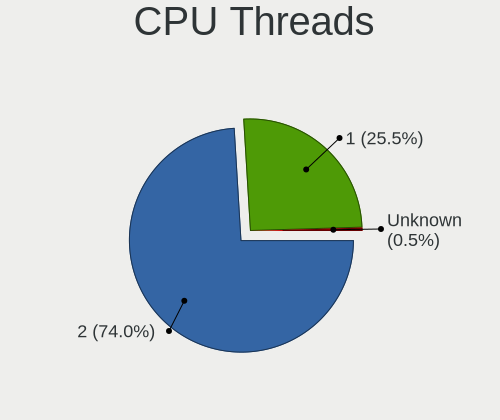

| Number | Computers | Percent |
|--------|-----------|---------|
| 2      | 109       | 71.71%  |
| 1      | 43        | 28.29%  |

CPU Op-Modes
------------

CPU Operation Modes (32-bit, 64-bit)

| Op mode        | Computers | Percent |
|----------------|-----------|---------|
| 32-bit, 64-bit | 152       | 100%    |

CPU Microcode
-------------

Microcode number

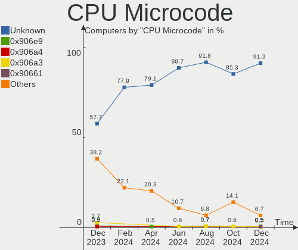

| Number     | Computers | Percent |
|------------|-----------|---------|
| Unknown    | 84        | 55.26%  |
| 0x506e3    | 4         | 2.63%   |
| 0x08600106 | 4         | 2.63%   |
| 0x1067a    | 3         | 1.97%   |
| 0x0a50000c | 3         | 1.97%   |
| 0x0a20120a | 3         | 1.97%   |
| 0x08001138 | 3         | 1.97%   |
| 0x6fd      | 2         | 1.32%   |
| 0x40651    | 2         | 1.32%   |
| 0x206a7    | 2         | 1.32%   |
| 0x20655    | 2         | 1.32%   |
| 0x0a201016 | 2         | 1.32%   |
| 0x08701013 | 2         | 1.32%   |
| 0x08600104 | 2         | 1.32%   |
| 0x0600611a | 2         | 1.32%   |
| 0x06000852 | 2         | 1.32%   |
| 0xb06a3    | 1         | 0.66%   |
| 0xb0671    | 1         | 0.66%   |
| 0xa0655    | 1         | 0.66%   |
| 0x906ed    | 1         | 0.66%   |
| 0x906ec    | 1         | 0.66%   |
| 0x906ea    | 1         | 0.66%   |
| 0x906e9    | 1         | 0.66%   |
| 0x806ec    | 1         | 0.66%   |
| 0x806ea    | 1         | 0.66%   |
| 0x806e9    | 1         | 0.66%   |
| 0x806c1    | 1         | 0.66%   |
| 0x706e5    | 1         | 0.66%   |
| 0x706a8    | 1         | 0.66%   |
| 0x6f6      | 1         | 0.66%   |
| 0x406e3    | 1         | 0.66%   |
| 0x406c3    | 1         | 0.66%   |
| 0x306c3    | 1         | 0.66%   |
| 0x206c2    | 1         | 0.66%   |
| 0x20652    | 1         | 0.66%   |
| 0x106e5    | 1         | 0.66%   |
| 0x10676    | 1         | 0.66%   |
| 0x0a601203 | 1         | 0.66%   |
| 0x0a50000d | 1         | 0.66%   |
| 0x0a404102 | 1         | 0.66%   |

CPU Microarch
-------------

Microarchitecture

| Name             | Computers | Percent |
|------------------|-----------|---------|
| Zen 3            | 15        | 9.87%   |
| KabyLake         | 15        | 9.87%   |
| Skylake          | 13        | 8.55%   |
| Zen 2            | 11        | 7.24%   |
| Unknown          | 11        | 7.24%   |
| Penryn           | 10        | 6.58%   |
| Haswell          | 9         | 5.92%   |
| Westmere         | 8         | 5.26%   |
| SandyBridge      | 7         | 4.61%   |
| TigerLake        | 6         | 3.95%   |
| Piledriver       | 6         | 3.95%   |
| Core             | 5         | 3.29%   |
| Silvermont       | 4         | 2.63%   |
| IvyBridge        | 4         | 2.63%   |
| IceLake          | 4         | 2.63%   |
| Excavator        | 4         | 2.63%   |
| CometLake        | 4         | 2.63%   |
| Zen              | 3         | 1.97%   |
| Broadwell        | 3         | 1.97%   |
| Alderlake Hybrid | 3         | 1.97%   |
| Zen+             | 2         | 1.32%   |
| Nehalem          | 2         | 1.32%   |
| Goldmont plus    | 2         | 1.32%   |
| Gracemont        | 1         | 0.66%   |

Graphics
--------

GPU Vendor
----------

Vendors of graphics cards

| Vendor                     | Computers | Percent |
|----------------------------|-----------|---------|
| Intel                      | 74        | 44.31%  |
| AMD                        | 50        | 29.94%  |
| Nvidia                     | 41        | 24.55%  |
| Matrox Electronics Systems | 1         | 0.6%    |
| ASPEED Technology          | 1         | 0.6%    |

GPU Model
---------

Graphics card models

| Model                                                                                    | Computers | Percent |
|------------------------------------------------------------------------------------------|-----------|---------|
| Intel HD Graphics 530                                                                    | 8         | 4.76%   |
| Intel TigerLake-LP GT2 [Iris Xe Graphics]                                                | 6         | 3.57%   |
| Intel Haswell-ULT Integrated Graphics Controller                                         | 6         | 3.57%   |
| Intel 2nd Generation Core Processor Family Integrated Graphics Controller                | 6         | 3.57%   |
| AMD Ellesmere [Radeon RX 470/480/570/570X/580/580X/590]                                  | 6         | 3.57%   |
| Intel Core Processor Integrated Graphics Controller                                      | 5         | 2.98%   |
| AMD Renoir                                                                               | 5         | 2.98%   |
| Nvidia GP107 [GeForce GTX 1050 Ti]                                                       | 4         | 2.38%   |
| AMD Navi 23 [Radeon RX 6600/6600 XT/6600M]                                               | 4         | 2.38%   |
| Nvidia C79 [GeForce 9400M]                                                               | 3         | 1.79%   |
| Intel UHD Graphics 620                                                                   | 3         | 1.79%   |
| Intel Atom/Celeron/Pentium Processor x5-E8000/J3xxx/N3xxx Integrated Graphics Controller | 3         | 1.79%   |
| Nvidia TU116 [GeForce GTX 1660 SUPER]                                                    | 2         | 1.19%   |
| Nvidia GP107M [GeForce GTX 1050 Mobile]                                                  | 2         | 1.19%   |
| Nvidia GF119 [GeForce GT 610]                                                            | 2         | 1.19%   |
| Nvidia GA104 [GeForce RTX 3070 Ti]                                                       | 2         | 1.19%   |
| Nvidia GA102 [GeForce RTX 3080]                                                          | 2         | 1.19%   |
| Intel WhiskeyLake-U GT2 [UHD Graphics 620]                                               | 2         | 1.19%   |
| Intel Iris Plus Graphics G1 (Ice Lake)                                                   | 2         | 1.19%   |
| Intel HD Graphics 630                                                                    | 2         | 1.19%   |
| Intel GeminiLake [UHD Graphics 600]                                                      | 2         | 1.19%   |
| Intel CoffeeLake-S GT2 [UHD Graphics 630]                                                | 2         | 1.19%   |
| Intel CoffeeLake-H GT2 [UHD Graphics 630]                                                | 2         | 1.19%   |
| Intel 3rd Gen Core processor Graphics Controller                                         | 2         | 1.19%   |
| AMD Wani [Radeon R5/R6/R7 Graphics]                                                      | 2         | 1.19%   |
| AMD VanGogh [AMD Custom GPU 0405]                                                        | 2         | 1.19%   |
| AMD Stoney [Radeon R2/R3/R4/R5 Graphics]                                                 | 2         | 1.19%   |
| AMD Rembrandt [Radeon 680M]                                                              | 2         | 1.19%   |
| AMD Navi 22 [Radeon RX 6700/6700 XT/6750 XT / 6800M/6850M XT]                            | 2         | 1.19%   |
| AMD Navi 21 [Radeon RX 6800/6800 XT / 6900 XT]                                           | 2         | 1.19%   |
| AMD Navi 10 [Radeon RX 5600 OEM/5600 XT / 5700/5700 XT]                                  | 2         | 1.19%   |
| AMD Hawaii XT / Grenada XT [Radeon R9 290X/390X]                                         | 2         | 1.19%   |
| AMD Barcelo                                                                              | 2         | 1.19%   |
| Nvidia TU117M [GeForce GTX 1650 Mobile / Max-Q]                                          | 1         | 0.6%    |
| Nvidia TU117GLM [Quadro T2000 Mobile / Max-Q]                                            | 1         | 0.6%    |
| Nvidia TU106M [GeForce RTX 2070 Mobile / Max-Q Refresh]                                  | 1         | 0.6%    |
| Nvidia TU106 [GeForce RTX 2070]                                                          | 1         | 0.6%    |
| Nvidia TU106 [GeForce GTX 1650]                                                          | 1         | 0.6%    |
| Nvidia TU104 [GeForce RTX 2080 SUPER]                                                    | 1         | 0.6%    |
| Nvidia NV44 [Quadro NVS 285]                                                             | 1         | 0.6%    |

GPU Combo
---------

Combinations of graphics cards

| Name           | Computers | Percent |
|----------------|-----------|---------|
| 1 x Intel      | 58        | 38.16%  |
| 1 x AMD        | 45        | 29.61%  |
| 1 x Nvidia     | 28        | 18.42%  |
| Intel + Nvidia | 10        | 6.58%   |
| AMD + Nvidia   | 3         | 1.97%   |
| Other          | 2         | 1.32%   |
| 2 x Intel      | 2         | 1.32%   |
| Intel + AMD    | 2         | 1.32%   |
| 1 x Matrox     | 1         | 0.66%   |
| 1 x ASPEED     | 1         | 0.66%   |

GPU Driver
----------

Free vs proprietary

| Driver      | Computers | Percent |
|-------------|-----------|---------|
| Free        | 123       | 80.92%  |
| Proprietary | 23        | 15.13%  |
| Unknown     | 6         | 3.95%   |

GPU Memory
----------

Total video memory

| Size in GB | Computers | Percent |
|------------|-----------|---------|
| Unknown    | 97        | 63.82%  |
| 0.01-0.5   | 16        | 10.53%  |
| 7.01-8.0   | 12        | 7.89%   |
| 3.01-4.0   | 9         | 5.92%   |
| 1.01-2.0   | 6         | 3.95%   |
| 8.01-16.0  | 4         | 2.63%   |
| 5.01-6.0   | 3         | 1.97%   |
| 0.51-1.0   | 3         | 1.97%   |
| 2.01-3.0   | 2         | 1.32%   |

Monitor
-------

Monitor Vendor
--------------

Monitor vendors

| Vendor                  | Computers | Percent |
|-------------------------|-----------|---------|
| Samsung Electronics     | 27        | 15.61%  |
| Goldstar                | 12        | 6.94%   |
| AU Optronics            | 12        | 6.94%   |
| BOE                     | 11        | 6.36%   |
| Acer                    | 11        | 6.36%   |
| Chimei Innolux          | 10        | 5.78%   |
| Sharp                   | 8         | 4.62%   |
| LG Display              | 8         | 4.62%   |
| Apple                   | 8         | 4.62%   |
| Hewlett-Packard         | 6         | 3.47%   |
| Sony                    | 5         | 2.89%   |
| Dell                    | 5         | 2.89%   |
| Ancor Communications    | 5         | 2.89%   |
| Lenovo                  | 4         | 2.31%   |
| ASUSTek Computer        | 4         | 2.31%   |
| ViewSonic               | 3         | 1.73%   |
| PANDA                   | 3         | 1.73%   |
| Valve                   | 2         | 1.16%   |
| Toshiba                 | 2         | 1.16%   |
| TCT                     | 2         | 1.16%   |
| MSI                     | 2         | 1.16%   |
| Chi Mei Optoelectronics | 2         | 1.16%   |
| Unknown                 | 1         | 0.58%   |
| Sceptre Tech            | 1         | 0.58%   |
| SANYO                   | 1         | 0.58%   |
| Ruijiang                | 1         | 0.58%   |
| Planar                  | 1         | 0.58%   |
| Philips                 | 1         | 0.58%   |
| NXG                     | 1         | 0.58%   |
| NEC Computers           | 1         | 0.58%   |
| Microstep               | 1         | 0.58%   |
| Marantz                 | 1         | 0.58%   |
| LG Philips              | 1         | 0.58%   |
| InnoView                | 1         | 0.58%   |
| HSI                     | 1         | 0.58%   |
| Hitachi                 | 1         | 0.58%   |
| HannStar                | 1         | 0.58%   |
| Gigabyte Technology     | 1         | 0.58%   |
| COBY                    | 1         | 0.58%   |
| CND                     | 1         | 0.58%   |

Monitor Model
-------------

Monitor models

| Model                                                                | Computers | Percent |
|----------------------------------------------------------------------|-----------|---------|
| LG Display LCD Monitor LGD0555 1536x1024 263x175mm 12.4-inch         | 3         | 1.64%   |
| Goldstar FULL HD GSM5B55 1920x1080 480x270mm 21.7-inch               | 3         | 1.64%   |
| Valve ANX7530 U VLV3001 800x1280 100x150mm 7.1-inch                  | 2         | 1.09%   |
| TCT DP1080P60 TCT0270 2560x1600 480x270mm 21.7-inch                  | 2         | 1.09%   |
| Sharp LCD Monitor SHP14BA 1920x1080 344x194mm 15.5-inch              | 2         | 1.09%   |
| Samsung Electronics U32J59x SAM0F35 3840x2160 697x392mm 31.5-inch    | 2         | 1.09%   |
| Samsung Electronics C49RG9x SAM0F9C 3840x1080 1193x336mm 48.8-inch   | 2         | 1.09%   |
| Lenovo LCD Monitor LEN40B2 1920x1080 344x193mm 15.5-inch             | 2         | 1.09%   |
| Goldstar HDR 4K GSM7707 3840x2160 600x340mm 27.2-inch                | 2         | 1.09%   |
| AU Optronics LCD Monitor AUO11EC 1366x768 344x193mm 15.5-inch        | 2         | 1.09%   |
| Apple Color LCD APP9CC9 1280x800 286x178mm 13.3-inch                 | 2         | 1.09%   |
| Acer VG280K ACR0747 3840x2160 621x341mm 27.9-inch                    | 2         | 1.09%   |
| ViewSonic VX3258 series VSCDE35 2560x1440 700x390mm 31.5-inch        | 1         | 0.55%   |
| ViewSonic VX2476 Series VSCD332 1920x1080 530x300mm 24.0-inch        | 1         | 0.55%   |
| ViewSonic VA2703 Series VSC622A 1920x1080 598x336mm 27.0-inch        | 1         | 0.55%   |
| Unknown LCD Monitor SAMSUNG 1360x768                                 | 1         | 0.55%   |
| Toshiba TV TSB0206 1920x1080 886x498mm 40.0-inch                     | 1         | 0.55%   |
| Toshiba TV TSB0200 1360x768 409x230mm 18.5-inch                      | 1         | 0.55%   |
| Sony TV SNY4502 1920x1080                                            | 1         | 0.55%   |
| Sony TV *30 SNYB905 3840x2160 1439x809mm 65.0-inch                   | 1         | 0.55%   |
| Sony TV *00 SNYF303 1920x1080 1218x685mm 55.0-inch                   | 1         | 0.55%   |
| Sony TV *00 SNY7105 3840x2160 1218x685mm 55.0-inch                   | 1         | 0.55%   |
| Sony Nvidia Defaul t Flat Panel SNY06FA 1600x900 360x200mm 16.2-inch | 1         | 0.55%   |
| Sharp LQ150P1JX51 SHP14B4 2496x1664 317x211mm 15.0-inch              | 1         | 0.55%   |
| Sharp LCD Monitor SHP14FA 3840x2400 288x180mm 13.4-inch              | 1         | 0.55%   |
| Sharp LCD Monitor SHP14F9 1920x1200 288x180mm 13.4-inch              | 1         | 0.55%   |
| Sharp LCD Monitor SHP1484 1920x1080 294x165mm 13.3-inch              | 1         | 0.55%   |
| Sharp LCD Monitor SHP1476 3840x2160 346x194mm 15.6-inch              | 1         | 0.55%   |
| Sharp HDMI SHP0FFC 1920x1080 640x360mm 28.9-inch                     | 1         | 0.55%   |
| Sceptre Tech Sceptre F24 SPT09AB 1920x1080 530x290mm 23.8-inch       | 1         | 0.55%   |
| SANYO TV SAN0206 1920x1080 886x498mm 40.0-inch                       | 1         | 0.55%   |
| Samsung Electronics SyncMaster SAM0560 1440x900 408x255mm 18.9-inch  | 1         | 0.55%   |
| Samsung Electronics SyncMaster SAM0423 1920x1080                     | 1         | 0.55%   |
| Samsung Electronics SyncMaster SAM027D 1680x1050 433x271mm 20.1-inch | 1         | 0.55%   |
| Samsung Electronics SyncMaster SAM026F 1280x1024 380x300mm 19.1-inch | 1         | 0.55%   |
| Samsung Electronics S27R35x SAM1053 1920x1080 598x336mm 27.0-inch    | 1         | 0.55%   |
| Samsung Electronics S27A950D SAM079F 1920x1080 598x336mm 27.0-inch   | 1         | 0.55%   |
| Samsung Electronics S27A950D SAM079E 1920x1080 598x336mm 27.0-inch   | 1         | 0.55%   |
| Samsung Electronics S27A950D SAM079D 1920x1080 598x336mm 27.0-inch   | 1         | 0.55%   |
| Samsung Electronics S24F350 SAM0D21 1920x1080 521x293mm 23.5-inch    | 1         | 0.55%   |

Monitor Resolution
------------------

Monitor screen resolution

| Resolution         | Computers | Percent |
|--------------------|-----------|---------|
| 1920x1080 (FHD)    | 67        | 40.85%  |
| 1366x768 (WXGA)    | 19        | 11.59%  |
| 3840x2160 (4K)     | 18        | 10.98%  |
| 2560x1440 (QHD)    | 14        | 8.54%   |
| 1680x1050 (WSXGA+) | 6         | 3.66%   |
| 1280x800 (WXGA)    | 6         | 3.66%   |
| 1440x900 (WXGA+)   | 5         | 3.05%   |
| 1920x1200 (WUXGA)  | 4         | 2.44%   |
| 2880x1800          | 3         | 1.83%   |
| 2736x1824          | 3         | 1.83%   |
| 1600x900 (HD+)     | 3         | 1.83%   |
| 800x1280           | 2         | 1.22%   |
| 3840x1080          | 2         | 1.22%   |
| 1280x1024 (SXGA)   | 2         | 1.22%   |
| 5760x2160          | 1         | 0.61%   |
| 3840x2400          | 1         | 0.61%   |
| 3840x1600          | 1         | 0.61%   |
| 3440x1440          | 1         | 0.61%   |
| 3200x1800 (QHD+)   | 1         | 0.61%   |
| 2560x1080          | 1         | 0.61%   |
| 2496x1664          | 1         | 0.61%   |
| 1920x1280          | 1         | 0.61%   |
| 1360x768           | 1         | 0.61%   |
| Unknown            | 1         | 0.61%   |

Monitor Diagonal
----------------

Diagonal size in inches

| Inches  | Computers | Percent |
|---------|-----------|---------|
| 15      | 36        | 20.69%  |
| 27      | 23        | 13.22%  |
| 13      | 15        | 8.62%   |
| 14      | 13        | 7.47%   |
| 23      | 11        | 6.32%   |
| 21      | 11        | 6.32%   |
| 31      | 9         | 5.17%   |
| 24      | 7         | 4.02%   |
| 20      | 5         | 2.87%   |
| Unknown | 5         | 2.87%   |
| 19      | 4         | 2.3%    |
| 17      | 4         | 2.3%    |
| 84      | 3         | 1.72%   |
| 34      | 3         | 1.72%   |
| 12      | 3         | 1.72%   |
| 72      | 2         | 1.15%   |
| 48      | 2         | 1.15%   |
| 40      | 2         | 1.15%   |
| 7       | 2         | 1.15%   |
| 86      | 1         | 0.57%   |
| 85      | 1         | 0.57%   |
| 75      | 1         | 0.57%   |
| 74      | 1         | 0.57%   |
| 65      | 1         | 0.57%   |
| 43      | 1         | 0.57%   |
| 39      | 1         | 0.57%   |
| 33      | 1         | 0.57%   |
| 32      | 1         | 0.57%   |
| 28      | 1         | 0.57%   |
| 26      | 1         | 0.57%   |
| 22      | 1         | 0.57%   |
| 11      | 1         | 0.57%   |
| 10      | 1         | 0.57%   |

Monitor Width
-------------

Physical width

| Width in mm | Computers | Percent |
|-------------|-----------|---------|
| 301-350     | 51        | 29.82%  |
| 501-600     | 36        | 21.05%  |
| 401-500     | 19        | 11.11%  |
| 201-300     | 17        | 9.94%   |
| 601-700     | 15        | 8.77%   |
| 1501-2000   | 8         | 4.68%   |
| 351-400     | 6         | 3.51%   |
| 701-800     | 5         | 2.92%   |
| Unknown     | 5         | 2.92%   |
| 801-900     | 3         | 1.75%   |
| 1001-1500   | 3         | 1.75%   |
| 1-100       | 2         | 1.17%   |
| 901-1000    | 1         | 0.58%   |

Aspect Ratio
------------

Proportional relationship between the width and the height

| Ratio   | Computers | Percent |
|---------|-----------|---------|
| 16/9    | 106       | 70.67%  |
| 16/10   | 25        | 16.67%  |
| 3/2     | 6         | 4%      |
| 21/9    | 3         | 2%      |
| Unknown | 3         | 2%      |
| 5/4     | 2         | 1.33%   |
| 32/9    | 2         | 1.33%   |
| 0.67    | 2         | 1.33%   |
| 4/3     | 1         | 0.67%   |

Monitor Area
------------

Area in inch

| Area in inch | Computers | Percent |
|----------------|-----------|---------|
| 101-110        | 37        | 21.39%  |
| 201-250        | 25        | 14.45%  |
| 301-350        | 24        | 13.87%  |
| 81-90          | 18        | 10.4%   |
| 351-500        | 15        | 8.67%   |
| 71-80          | 11        | 6.36%   |
| 151-200        | 11        | 6.36%   |
| More than 1000 | 9         | 5.2%    |
| 501-1000       | 6         | 3.47%   |
| Unknown        | 5         | 2.89%   |
| 251-300        | 3         | 1.73%   |
| 121-130        | 3         | 1.73%   |
| 51-60          | 2         | 1.16%   |
| 1-40           | 2         | 1.16%   |
| 131-140        | 1         | 0.58%   |
| 91-100         | 1         | 0.58%   |

Pixel Density
-------------

Pixels per inch

| Density       | Computers | Percent |
|---------------|-----------|---------|
| 51-100        | 60        | 35.93%  |
| 121-160       | 41        | 24.55%  |
| 101-120       | 40        | 23.95%  |
| 161-240       | 12        | 7.19%   |
| More than 240 | 5         | 2.99%   |
| Unknown       | 5         | 2.99%   |
| 1-50          | 4         | 2.4%    |

Multiple Monitors
-----------------

Total monitors connected

| Total | Computers | Percent |
|-------|-----------|---------|
| 1     | 111       | 73.03%  |
| 2     | 28        | 18.42%  |
| 3     | 7         | 4.61%   |
| 0     | 5         | 3.29%   |
| 4     | 1         | 0.66%   |

Network
-------

Net Controller Vendor
---------------------

Controller vendors

| Vendor                   | Computers | Percent |
|--------------------------|-----------|---------|
| Intel                    | 91        | 37.76%  |
| Realtek Semiconductor    | 72        | 29.88%  |
| Qualcomm Atheros         | 19        | 7.88%   |
| Broadcom                 | 13        | 5.39%   |
| MediaTek                 | 8         | 3.32%   |
| Marvell Technology Group | 7         | 2.9%    |
| Broadcom Limited         | 4         | 1.66%   |
| Nvidia                   | 3         | 1.24%   |
| DisplayLink              | 3         | 1.24%   |
| D-Link                   | 3         | 1.24%   |
| TRENDnet                 | 2         | 0.83%   |
| ASIX Electronics         | 2         | 0.83%   |
| VIA Technologies         | 1         | 0.41%   |
| U-Blox                   | 1         | 0.41%   |
| TP-Link                  | 1         | 0.41%   |
| STMicroelectronics       | 1         | 0.41%   |
| Samsung Electronics      | 1         | 0.41%   |
| Qualcomm                 | 1         | 0.41%   |
| Microsoft                | 1         | 0.41%   |
| Mellanox Technologies    | 1         | 0.41%   |
| Linksys                  | 1         | 0.41%   |
| Google                   | 1         | 0.41%   |
| Gemtek                   | 1         | 0.41%   |
| D-Link System            | 1         | 0.41%   |
| Aquantia                 | 1         | 0.41%   |
| Apple                    | 1         | 0.41%   |

Net Controller Model
--------------------

Controller models

| Model                                                                          | Computers | Percent |
|--------------------------------------------------------------------------------|-----------|---------|
| Realtek RTL8111/8168/8411 PCI Express Gigabit Ethernet Controller              | 44        | 15.83%  |
| Intel Wi-Fi 6 AX200                                                            | 18        | 6.47%   |
| Realtek RTL8125 2.5GbE Controller                                              | 6         | 2.16%   |
| Intel Ethernet Controller I225-V                                               | 6         | 2.16%   |
| Intel Ethernet Connection (2) I219-LM                                          | 6         | 2.16%   |
| Intel Wireless 8260                                                            | 5         | 1.8%    |
| Intel Dual Band Wireless-AC 3168NGW [Stone Peak]                               | 5         | 1.8%    |
| Realtek RTL8822CE 802.11ac PCIe Wireless Network Adapter                       | 4         | 1.44%   |
| Realtek RTL810xE PCI Express Fast Ethernet controller                          | 4         | 1.44%   |
| Realtek 802.11ac NIC                                                           | 4         | 1.44%   |
| MediaTek MT7922 802.11ax PCI Express Wireless Network Adapter                  | 4         | 1.44%   |
| Intel Wireless-AC 9260                                                         | 4         | 1.44%   |
| Intel Wireless 7260                                                            | 4         | 1.44%   |
| Intel I211 Gigabit Network Connection                                          | 4         | 1.44%   |
| Intel 82566DM-2 Gigabit Network Connection                                     | 4         | 1.44%   |
| Broadcom BCM4322 802.11a/b/g/n Wireless LAN Controller                         | 4         | 1.44%   |
| Realtek RTL8821CE 802.11ac PCIe Wireless Network Adapter                       | 3         | 1.08%   |
| Realtek RTL8153 Gigabit Ethernet Adapter                                       | 3         | 1.08%   |
| Qualcomm Atheros QCA9377 802.11ac Wireless Network Adapter                     | 3         | 1.08%   |
| Qualcomm Atheros Killer E220x Gigabit Ethernet Controller                      | 3         | 1.08%   |
| Qualcomm Atheros AR9285 Wireless Network Adapter (PCI-Express)                 | 3         | 1.08%   |
| Nvidia MCP79 Ethernet                                                          | 3         | 1.08%   |
| Intel Wireless 8265 / 8275                                                     | 3         | 1.08%   |
| Intel Wi-Fi 6 AX210/AX211/AX411 160MHz                                         | 3         | 1.08%   |
| Intel Wi-Fi 6 AX201                                                            | 3         | 1.08%   |
| Intel Ice Lake-LP PCH CNVi WiFi                                                | 3         | 1.08%   |
| Intel Ethernet Connection I218-LM                                              | 3         | 1.08%   |
| Intel Centrino Advanced-N 6205 [Taylor Peak]                                   | 3         | 1.08%   |
| Intel 82579LM Gigabit Network Connection (Lewisville)                          | 3         | 1.08%   |
| TRENDnet TEW-805UB 300Mbps+867Mbps Wireless AC Adapter [Realtek RTL8812AU]     | 2         | 0.72%   |
| Realtek RTL8852BE PCIe 802.11ax Wireless Network Controller                    | 2         | 0.72%   |
| Qualcomm Atheros QCA9565 / AR9565 Wireless Network Adapter                     | 2         | 0.72%   |
| Marvell Group Yukon Optima 88E8059 [PCIe Gigabit Ethernet Controller with AVB] | 2         | 0.72%   |
| Marvell Group 88E8058 PCI-E Gigabit Ethernet Controller                        | 2         | 0.72%   |
| Intel Wireless 3165                                                            | 2         | 0.72%   |
| Intel Wireless 3160                                                            | 2         | 0.72%   |
| Intel Ethernet Connection (7) I219-V                                           | 2         | 0.72%   |
| Intel Ethernet Connection (2) I219-V                                           | 2         | 0.72%   |
| Intel Comet Lake PCH CNVi WiFi                                                 | 2         | 0.72%   |
| Intel Centrino Wireless-N 1000 [Condor Peak]                                   | 2         | 0.72%   |

Wireless Vendor
---------------

Wireless vendors

| Vendor                | Computers | Percent |
|-----------------------|-----------|---------|
| Intel                 | 71        | 53.79%  |
| Realtek Semiconductor | 18        | 13.64%  |
| Qualcomm Atheros      | 15        | 11.36%  |
| Broadcom              | 9         | 6.82%   |
| MediaTek              | 6         | 4.55%   |
| Broadcom Limited      | 4         | 3.03%   |
| D-Link                | 3         | 2.27%   |
| TRENDnet              | 2         | 1.52%   |
| TP-Link               | 1         | 0.76%   |
| Qualcomm              | 1         | 0.76%   |
| Linksys               | 1         | 0.76%   |
| Gemtek                | 1         | 0.76%   |

Wireless Model
--------------

Wireless models

| Model                                                                      | Computers | Percent |
|----------------------------------------------------------------------------|-----------|---------|
| Intel Wi-Fi 6 AX200                                                        | 18        | 13.64%  |
| Intel Wireless 8260                                                        | 5         | 3.79%   |
| Intel Dual Band Wireless-AC 3168NGW [Stone Peak]                           | 5         | 3.79%   |
| Realtek RTL8822CE 802.11ac PCIe Wireless Network Adapter                   | 4         | 3.03%   |
| Realtek 802.11ac NIC                                                       | 4         | 3.03%   |
| MediaTek MT7922 802.11ax PCI Express Wireless Network Adapter              | 4         | 3.03%   |
| Intel Wireless-AC 9260                                                     | 4         | 3.03%   |
| Intel Wireless 7260                                                        | 4         | 3.03%   |
| Broadcom BCM4322 802.11a/b/g/n Wireless LAN Controller                     | 4         | 3.03%   |
| Realtek RTL8821CE 802.11ac PCIe Wireless Network Adapter                   | 3         | 2.27%   |
| Qualcomm Atheros QCA9377 802.11ac Wireless Network Adapter                 | 3         | 2.27%   |
| Qualcomm Atheros AR9285 Wireless Network Adapter (PCI-Express)             | 3         | 2.27%   |
| Intel Wireless 8265 / 8275                                                 | 3         | 2.27%   |
| Intel Wi-Fi 6 AX210/AX211/AX411 160MHz                                     | 3         | 2.27%   |
| Intel Wi-Fi 6 AX201                                                        | 3         | 2.27%   |
| Intel Ice Lake-LP PCH CNVi WiFi                                            | 3         | 2.27%   |
| Intel Centrino Advanced-N 6205 [Taylor Peak]                               | 3         | 2.27%   |
| TRENDnet TEW-805UB 300Mbps+867Mbps Wireless AC Adapter [Realtek RTL8812AU] | 2         | 1.52%   |
| Realtek RTL8852BE PCIe 802.11ax Wireless Network Controller                | 2         | 1.52%   |
| Qualcomm Atheros QCA9565 / AR9565 Wireless Network Adapter                 | 2         | 1.52%   |
| Intel Wireless 3165                                                        | 2         | 1.52%   |
| Intel Wireless 3160                                                        | 2         | 1.52%   |
| Intel Comet Lake PCH CNVi WiFi                                             | 2         | 1.52%   |
| Intel Centrino Wireless-N 1000 [Condor Peak]                               | 2         | 1.52%   |
| Intel 700 Series Chipset Family Wi-Fi                                      | 2         | 1.52%   |
| Broadcom Limited BCM4360 802.11ac Wireless Network Adapter                 | 2         | 1.52%   |
| Broadcom BCM4321 802.11a/b/g/n                                             | 2         | 1.52%   |
| TP-Link Archer T4U ver.3                                                   | 1         | 0.76%   |
| Realtek RTL88x2bu [AC1200 Techkey]                                         | 1         | 0.76%   |
| Realtek RTL8852AE 802.11ax PCIe Wireless Network Adapter                   | 1         | 0.76%   |
| Realtek RTL8188FTV 802.11b/g/n 1T1R 2.4G WLAN Adapter                      | 1         | 0.76%   |
| Realtek 8821CE PCIe 802.11ac Wireless Network Controller                   | 1         | 0.76%   |
| Realtek 802.11ac WLAN Adapter                                              | 1         | 0.76%   |
| Qualcomm QCA6390 Wireless Network Adapter                                  | 1         | 0.76%   |
| Qualcomm Atheros QCA986x/988x 802.11ac Wireless Network Adapter            | 1         | 0.76%   |
| Qualcomm Atheros QCA6174 802.11ac Wireless Network Adapter                 | 1         | 0.76%   |
| Qualcomm Atheros AR9462 Wireless Network Adapter                           | 1         | 0.76%   |
| Qualcomm Atheros AR93xx Wireless Network Adapter                           | 1         | 0.76%   |
| Qualcomm Atheros AR9287 Wireless Network Adapter (PCI-Express)             | 1         | 0.76%   |
| Qualcomm Atheros AR922X Wireless Network Adapter                           | 1         | 0.76%   |

Ethernet Vendor
---------------

Ethernet vendors

| Vendor                   | Computers | Percent |
|--------------------------|-----------|---------|
| Realtek Semiconductor    | 58        | 42.34%  |
| Intel                    | 46        | 33.58%  |
| Marvell Technology Group | 7         | 5.11%   |
| Broadcom                 | 6         | 4.38%   |
| Qualcomm Atheros         | 4         | 2.92%   |
| Nvidia                   | 3         | 2.19%   |
| DisplayLink              | 3         | 2.19%   |
| ASIX Electronics         | 2         | 1.46%   |
| VIA Technologies         | 1         | 0.73%   |
| Microsoft                | 1         | 0.73%   |
| Mellanox Technologies    | 1         | 0.73%   |
| MediaTek                 | 1         | 0.73%   |
| Google                   | 1         | 0.73%   |
| D-Link System            | 1         | 0.73%   |
| Aquantia                 | 1         | 0.73%   |
| Apple                    | 1         | 0.73%   |

Ethernet Model
--------------

Ethernet models

| Model                                                                          | Computers | Percent |
|--------------------------------------------------------------------------------|-----------|---------|
| Realtek RTL8111/8168/8411 PCI Express Gigabit Ethernet Controller              | 44        | 30.99%  |
| Realtek RTL8125 2.5GbE Controller                                              | 6         | 4.23%   |
| Intel Ethernet Controller I225-V                                               | 6         | 4.23%   |
| Intel Ethernet Connection (2) I219-LM                                          | 6         | 4.23%   |
| Realtek RTL810xE PCI Express Fast Ethernet controller                          | 4         | 2.82%   |
| Intel I211 Gigabit Network Connection                                          | 4         | 2.82%   |
| Intel 82566DM-2 Gigabit Network Connection                                     | 4         | 2.82%   |
| Realtek RTL8153 Gigabit Ethernet Adapter                                       | 3         | 2.11%   |
| Qualcomm Atheros Killer E220x Gigabit Ethernet Controller                      | 3         | 2.11%   |
| Nvidia MCP79 Ethernet                                                          | 3         | 2.11%   |
| Intel Ethernet Connection I218-LM                                              | 3         | 2.11%   |
| Intel 82579LM Gigabit Network Connection (Lewisville)                          | 3         | 2.11%   |
| Marvell Group Yukon Optima 88E8059 [PCIe Gigabit Ethernet Controller with AVB] | 2         | 1.41%   |
| Marvell Group 88E8058 PCI-E Gigabit Ethernet Controller                        | 2         | 1.41%   |
| Intel Ethernet Connection (7) I219-V                                           | 2         | 1.41%   |
| Intel Ethernet Connection (2) I219-V                                           | 2         | 1.41%   |
| Intel 82577LM Gigabit Network Connection                                       | 2         | 1.41%   |
| DisplayLink ThinkPad USB 3.0 Ultra Dock                                        | 2         | 1.41%   |
| ASIX AX88179 Gigabit Ethernet                                                  | 2         | 1.41%   |
| VIA VT6102/VT6103 [Rhine-II]                                                   | 1         | 0.7%    |
| Realtek USB 10/100/1G/2.5G LAN                                                 | 1         | 0.7%    |
| Realtek RTL-8100/8101L/8139 PCI Fast Ethernet Adapter                          | 1         | 0.7%    |
| Realtek Killer E3000 2.5GbE Controller                                         | 1         | 0.7%    |
| Qualcomm Atheros Killer E2400 Gigabit Ethernet Controller                      | 1         | 0.7%    |
| Microsoft RTL8153B GigE [Surface Ethernet Adapter]                             | 1         | 0.7%    |
| Mellanox MT27520 Family [ConnectX-3 Pro]                                       | 1         | 0.7%    |
| MediaTek Armor X10 Pro                                                         | 1         | 0.7%    |
| Marvell Group 88E8057 PCI-E Gigabit Ethernet Controller                        | 1         | 0.7%    |
| Marvell Group 88E8056 PCI-E Gigabit Ethernet Controller                        | 1         | 0.7%    |
| Marvell Group 88E8040 PCI-E Fast Ethernet Controller                           | 1         | 0.7%    |
| Intel I210 Gigabit Network Connection                                          | 1         | 0.7%    |
| Intel Ethernet Controller X550                                                 | 1         | 0.7%    |
| Intel Ethernet Controller I225-LM                                              | 1         | 0.7%    |
| Intel Ethernet Connection I219-LM                                              | 1         | 0.7%    |
| Intel Ethernet Connection I217-LM                                              | 1         | 0.7%    |
| Intel Ethernet Connection (7) I219-LM                                          | 1         | 0.7%    |
| Intel Ethernet Connection (4) I219-LM                                          | 1         | 0.7%    |
| Intel Ethernet Connection (16) I219-V                                          | 1         | 0.7%    |
| Intel Ethernet Connection (13) I219-V                                          | 1         | 0.7%    |
| Intel Ethernet Connection (12) I219-V                                          | 1         | 0.7%    |

Net Controller Kind
-------------------

Ethernet, WiFi or modem

| Kind     | Computers | Percent |
|----------|-----------|---------|
| Ethernet | 125       | 49.8%   |
| WiFi     | 122       | 48.61%  |
| Modem    | 4         | 1.59%   |

Used Controller
---------------

Currently used network controller

| Kind     | Computers | Percent |
|----------|-----------|---------|
| WiFi     | 81        | 52.6%   |
| Ethernet | 73        | 47.4%   |

NICs
----

Total network controllers on board

| Total | Computers | Percent |
|-------|-----------|---------|
| 2     | 84        | 55.26%  |
| 1     | 58        | 38.16%  |
| 3     | 8         | 5.26%   |
| 0     | 2         | 1.32%   |

IPv6
----

IPv6 vs IPv4

| Used | Computers | Percent |
|------|-----------|---------|
| No   | 112       | 73.68%  |
| Yes  | 40        | 26.32%  |

Bluetooth
---------

Bluetooth Vendor
----------------

Controller vendors

| Vendor                          | Computers | Percent |
|---------------------------------|-----------|---------|
| Intel                           | 59        | 56.73%  |
| Apple                           | 10        | 9.62%   |
| IMC Networks                    | 7         | 6.73%   |
| Foxconn / Hon Hai               | 7         | 6.73%   |
| Realtek Semiconductor           | 5         | 4.81%   |
| Lite-On Technology              | 4         | 3.85%   |
| Qualcomm Atheros Communications | 3         | 2.88%   |
| Cambridge Silicon Radio         | 3         | 2.88%   |
| ASUSTek Computer                | 2         | 1.92%   |
| Taiyo Yuden                     | 1         | 0.96%   |
| MediaTek                        | 1         | 0.96%   |
| Broadcom                        | 1         | 0.96%   |
| Alps Electric                   | 1         | 0.96%   |

Bluetooth Model
---------------

Controller models

| Model                                                                               | Computers | Percent |
|-------------------------------------------------------------------------------------|-----------|---------|
| Intel Bluetooth wireless interface                                                  | 17        | 16.35%  |
| Intel AX200 Bluetooth                                                               | 16        | 15.38%  |
| Intel AX201 Bluetooth                                                               | 10        | 9.62%   |
| Intel Wireless-AC 3168 Bluetooth                                                    | 5         | 4.81%   |
| Apple Bluetooth Host Controller                                                     | 5         | 4.81%   |
| Realtek Bluetooth Radio                                                             | 4         | 3.85%   |
| IMC Networks Bluetooth Radio                                                        | 4         | 3.85%   |
| Intel Wireless-AC 9260 Bluetooth Adapter                                            | 3         | 2.88%   |
| Intel AX210 Bluetooth                                                               | 3         | 2.88%   |
| IMC Networks Wireless_Device                                                        | 3         | 2.88%   |
| Foxconn / Hon Hai Foxconn T77H114 BCM2070 [Single-Chip Bluetooth 2.1 + EDR Adapter] | 3         | 2.88%   |
| Cambridge Silicon Radio Bluetooth Dongle (HCI mode)                                 | 3         | 2.88%   |
| Apple Bluetooth USB Host Controller                                                 | 3         | 2.88%   |
| Qualcomm Atheros  Bluetooth Device                                                  | 2         | 1.92%   |
| Lite-On Qualcomm Atheros QCA9377 Bluetooth                                          | 2         | 1.92%   |
| Intel Bluetooth Device                                                              | 2         | 1.92%   |
| Foxconn / Hon Hai Bluetooth Device                                                  | 2         | 1.92%   |
| ASUS Broadcom BCM20702A0 Bluetooth                                                  | 2         | 1.92%   |
| Apple Bluetooth HCI                                                                 | 2         | 1.92%   |
| Taiyo Yuden Bluetooth Device                                                        | 1         | 0.96%   |
| Realtek  Bluetooth 4.2 Adapter                                                      | 1         | 0.96%   |
| Qualcomm Atheros AR3011 Bluetooth                                                   | 1         | 0.96%   |
| MediaTek Wireless_Device                                                            | 1         | 0.96%   |
| Lite-On Bluetooth Radio                                                             | 1         | 0.96%   |
| Lite-On Bluetooth Device                                                            | 1         | 0.96%   |
| Intel Centrino Bluetooth Wireless Transceiver                                       | 1         | 0.96%   |
| Intel Centrino Advanced-N 6230 Bluetooth adapter                                    | 1         | 0.96%   |
| Intel Bluetooth 9460/9560 Jefferson Peak (JfP)                                      | 1         | 0.96%   |
| Foxconn / Hon Hai Wireless_Device                                                   | 1         | 0.96%   |
| Foxconn / Hon Hai BCM20702A0                                                        | 1         | 0.96%   |
| Broadcom BCM20702 Bluetooth 4.0 [ThinkPad]                                          | 1         | 0.96%   |
| Alps Electric UGTZ4 Bluetooth                                                       | 1         | 0.96%   |

Sound
-----

Sound Vendor
------------

Sound card vendors

| Vendor                               | Computers | Percent |
|--------------------------------------|-----------|---------|
| Intel                                | 94        | 42.73%  |
| AMD                                  | 56        | 25.45%  |
| Nvidia                               | 32        | 14.55%  |
| Logitech                             | 4         | 1.82%   |
| C-Media Electronics                  | 4         | 1.82%   |
| Texas Instruments                    | 3         | 1.36%   |
| GN Netcom                            | 3         | 1.36%   |
| Realtek Semiconductor                | 2         | 0.91%   |
| Blue Microphones                     | 2         | 0.91%   |
| XMOS                                 | 1         | 0.45%   |
| VIA Technologies                     | 1         | 0.45%   |
| Thesycon Systemsoftware & Consulting | 1         | 0.45%   |
| Shure                                | 1         | 0.45%   |
| SAVITECH                             | 1         | 0.45%   |
| Samson Technologies                  | 1         | 0.45%   |
| Razer USA                            | 1         | 0.45%   |
| Microsoft                            | 1         | 0.45%   |
| Lenovo                               | 1         | 0.45%   |
| Kingston Technology                  | 1         | 0.45%   |
| JOUNIVO JV601P                       | 1         | 0.45%   |
| Hewlett-Packard                      | 1         | 0.45%   |
| Focusrite-Novation                   | 1         | 0.45%   |
| FDUCE PRO AUDIO MADE                 | 1         | 0.45%   |
| DSEA A/S                             | 1         | 0.45%   |
| Creative Technology                  | 1         | 0.45%   |
| Creative Labs                        | 1         | 0.45%   |
| Conexant Systems                     | 1         | 0.45%   |
| BEHRINGER International              | 1         | 0.45%   |
| ASUSTek Computer                     | 1         | 0.45%   |

Sound Model
-----------

Sound card models

| Model                                                                      | Computers | Percent |
|----------------------------------------------------------------------------|-----------|---------|
| AMD Family 17h/19h HD Audio Controller                                     | 16        | 5.97%   |
| AMD Starship/Matisse HD Audio Controller                                   | 14        | 5.22%   |
| AMD Renoir Radeon High Definition Audio Controller                         | 11        | 4.1%    |
| AMD Navi 21/23 HDMI/DP Audio Controller                                    | 9         | 3.36%   |
| Intel 100 Series/C230 Series Chipset Family HD Audio Controller            | 8         | 2.99%   |
| Intel 82801I (ICH9 Family) HD Audio Controller                             | 7         | 2.61%   |
| Intel 6 Series/C200 Series Chipset Family High Definition Audio Controller | 7         | 2.61%   |
| Intel 5 Series/3400 Series Chipset High Definition Audio                   | 7         | 2.61%   |
| Intel Tiger Lake-LP Smart Sound Technology Audio Controller                | 6         | 2.24%   |
| Intel Sunrise Point-LP HD Audio                                            | 6         | 2.24%   |
| Intel Haswell-ULT HD Audio Controller                                      | 6         | 2.24%   |
| Intel 8 Series HD Audio Controller                                         | 6         | 2.24%   |
| AMD Ellesmere HDMI Audio [Radeon RX 470/480 / 570/580/590]                 | 6         | 2.24%   |
| AMD Rembrandt Radeon High Definition Audio Controller                      | 5         | 1.87%   |
| Nvidia GP107GL High Definition Audio Controller                            | 4         | 1.49%   |
| Intel Cannon Lake PCH cAVS                                                 | 4         | 1.49%   |
| Intel 7 Series/C216 Chipset Family High Definition Audio Controller        | 4         | 1.49%   |
| AMD SBx00 Azalia (Intel HDA)                                               | 4         | 1.49%   |
| AMD Family 17h (Models 00h-0fh) HD Audio Controller                        | 4         | 1.49%   |
| AMD Family 15h (Models 60h-6fh) Audio Controller                           | 4         | 1.49%   |
| Nvidia TU106 High Definition Audio Controller                              | 3         | 1.12%   |
| Nvidia MCP79 High Definition Audio                                         | 3         | 1.12%   |
| Nvidia GM107 High Definition Audio Controller [GeForce 940MX]              | 3         | 1.12%   |
| Nvidia GA104 High Definition Audio Controller                              | 3         | 1.12%   |
| Intel Wildcat Point-LP High Definition Audio Controller                    | 3         | 1.12%   |
| Intel Ice Lake-LP Smart Sound Technology Audio Controller                  | 3         | 1.12%   |
| Intel Comet Lake PCH cAVS                                                  | 3         | 1.12%   |
| Intel Broadwell-U Audio Controller                                         | 3         | 1.12%   |
| Intel 700 Series Chipset Family Precise Touch and Stylus Port #1           | 3         | 1.12%   |
| Intel 200 Series PCH HD Audio                                              | 3         | 1.12%   |
| Texas Instruments PCM2902 Audio Codec                                      | 2         | 0.75%   |
| Nvidia TU116 High Definition Audio Controller                              | 2         | 0.75%   |
| Nvidia High Definition Audio Controller                                    | 2         | 0.75%   |
| Nvidia GF119 HDMI Audio Controller                                         | 2         | 0.75%   |
| Nvidia GF108 High Definition Audio Controller                              | 2         | 0.75%   |
| Nvidia GA102 High Definition Audio Controller                              | 2         | 0.75%   |
| Intel Xeon E3-1200 v3/4th Gen Core Processor HD Audio Controller           | 2         | 0.75%   |
| Intel CM238 HD Audio Controller                                            | 2         | 0.75%   |
| Intel Celeron/Pentium Silver Processor High Definition Audio               | 2         | 0.75%   |
| Intel Cannon Point-LP High Definition Audio Controller                     | 2         | 0.75%   |

Memory
------

Memory Vendor
-------------

Memory module vendors

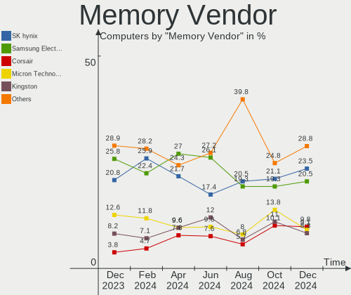

| Vendor              | Computers | Percent |
|---------------------|-----------|---------|
| Micron Technology   | 16        | 18.82%  |
| Samsung Electronics | 15        | 17.65%  |
| SK hynix            | 14        | 16.47%  |
| Kingston            | 11        | 12.94%  |
| Unknown             | 8         | 9.41%   |
| Crucial             | 7         | 8.24%   |
| Corsair             | 5         | 5.88%   |
| G.Skill             | 4         | 4.71%   |
| Timetec             | 1         | 1.18%   |
| Team                | 1         | 1.18%   |
| Patriot             | 1         | 1.18%   |
| GeIL                | 1         | 1.18%   |
| A-DATA Technology   | 1         | 1.18%   |

Memory Model
------------

Memory module models

| Model                                                            | Computers | Percent |
|------------------------------------------------------------------|-----------|---------|
| SK hynix RAM HMA851S6CJR6N-VK 4GB SODIMM DDR4 2400MT/s           | 2         | 2.25%   |
| SK hynix RAM HMA81GS6DJR8N-XN 8GB SODIMM DDR4 3200MT/s           | 2         | 2.25%   |
| SK hynix RAM HMA41GS6AFR8N-TF 8GB SODIMM DDR4 2667MT/s           | 2         | 2.25%   |
| Samsung RAM Module 2GB SODIMM DDR3 1333MT/s                      | 2         | 2.25%   |
| Samsung RAM K4UBE3D4AA-MGCL 8GB Row Of Chips LPDDR4 4267MT/s     | 2         | 2.25%   |
| Micron RAM MT53E1G32D4NQ-046 8GB Row Of Chips LPDDR4 4267MT/s    | 2         | 2.25%   |
| Micron RAM 8ATF1G64HZ-2G6E1 8GB SODIMM DDR4 2667MT/s             | 2         | 2.25%   |
| Kingston RAM KF3200C16D4/32GX 32GB DIMM DDR4 3933MT/s            | 2         | 2.25%   |
| Kingston RAM KF3200C16D4/16GX 16GB DIMM DDR4 3200MT/s            | 2         | 2.25%   |
| G.Skill RAM F4-3600C16-16GVKC 16GB DIMM DDR4 3866MT/s            | 2         | 2.25%   |
| Crucial RAM CT8G4SFS832A.M8FR 8GB SODIMM DDR4 3200MT/s           | 2         | 2.25%   |
| Corsair RAM CMK32GX4M2E3200C16 16GB DIMM DDR4 3534MT/s           | 2         | 2.25%   |
| Unknown RAM Module 8GB SODIMM DDR3 1333MT/s                      | 1         | 1.12%   |
| Unknown RAM Module 4GB SODIMM LPDDR3 1600MT/s                    | 1         | 1.12%   |
| Unknown RAM Module 4GB Row Of Chips LPDDR4 4267MT/s              | 1         | 1.12%   |
| Unknown RAM Module 2GB SODIMM DDR3 1600MT/s                      | 1         | 1.12%   |
| Unknown RAM Module 2GB SODIMM DDR3                               | 1         | 1.12%   |
| Unknown RAM Module 2GB Row Of Chips LPDDR4 4267MT/s              | 1         | 1.12%   |
| Unknown RAM Module 2GB DIMM SDRAM                                | 1         | 1.12%   |
| Unknown RAM Module 2048MB SODIMM DDR3                            | 1         | 1.12%   |
| Timetec RAM S16G-2133 16GB SODIMM DDR4 2133MT/s                  | 1         | 1.12%   |
| Team RAM TEAMGROUP-UD4-3200 8GB DIMM DDR4 3800MT/s               | 1         | 1.12%   |
| SK hynix RAM Module 2GB SODIMM DDR3 1333MT/s                     | 1         | 1.12%   |
| SK hynix RAM HYMP125S64CP8-S6 2GB SODIMM DDR 800MT/s             | 1         | 1.12%   |
| SK hynix RAM HMT351S6CFR8C-H9 4GB SODIMM DDR3 1334MT/s           | 1         | 1.12%   |
| SK hynix RAM HMA851U6CJR6N-VK 4096MB DIMM DDR4 2667MT/s          | 1         | 1.12%   |
| SK hynix RAM HMA82GS6DJR8N-VK 16GB SODIMM DDR4 2667MT/s          | 1         | 1.12%   |
| SK hynix RAM HMA82GS6AFR8N-UH 16GB SODIMM DDR4 2667MT/s          | 1         | 1.12%   |
| SK hynix RAM H9HCNNNCPMMLXR-NEE 8GB SODIMM LPDDR4 4266MT/s       | 1         | 1.12%   |
| SK hynix RAM H9CCNNNCLGALAR-NVD 8GB Row Of Chips LPDDR3 2133MT/s | 1         | 1.12%   |
| Samsung RAM Module 8192MB SODIMM DDR4 2133MT/s                   | 1         | 1.12%   |
| Samsung RAM M471B5273CH0-CH9 4GB SODIMM DDR3 1334MT/s            | 1         | 1.12%   |
| Samsung RAM M471A5143DB0-CPB 4096MB SODIMM DDR4 2133MT/s         | 1         | 1.12%   |
| Samsung RAM M471A2K43DB1-CWE 16GB SODIMM DDR4 3200MT/s           | 1         | 1.12%   |
| Samsung RAM M471A1K43DB1-CWE 8GB SODIMM DDR4 3200MT/s            | 1         | 1.12%   |
| Samsung RAM M471A1K43CB1-CTD 8GB SODIMM DDR4 2667MT/s            | 1         | 1.12%   |
| Samsung RAM M471A1G44AB0-CWE 8GB SODIMM DDR4 3200MT/s            | 1         | 1.12%   |
| Samsung RAM M378A4G43MB1-CTD 32GB DIMM DDR4 3466MT/s             | 1         | 1.12%   |
| Samsung RAM M3 78T5663QZ3-CF7 2GB DIMM DDR2 800MT/s              | 1         | 1.12%   |
| Samsung RAM M3 78T2953EZ3-CE6 1GB DIMM DDR2 667MT/s              | 1         | 1.12%   |

Memory Kind
-----------

Memory module kinds

| Kind   | Computers | Percent |
|--------|-----------|---------|
| DDR4   | 38        | 52.05%  |
| DDR3   | 15        | 20.55%  |
| LPDDR4 | 8         | 10.96%  |
| SDRAM  | 3         | 4.11%   |
| DDR5   | 3         | 4.11%   |
| DDR2   | 3         | 4.11%   |
| LPDDR3 | 2         | 2.74%   |
| LPDDR5 | 1         | 1.37%   |

Memory Form Factor
------------------

Physical design of the memory module

| Name         | Computers | Percent |
|--------------|-----------|---------|
| SODIMM       | 42        | 57.53%  |
| DIMM         | 23        | 31.51%  |
| Row Of Chips | 7         | 9.59%   |
| Chip         | 1         | 1.37%   |

Memory Size
-----------

Memory module size

| Size  | Computers | Percent |
|-------|-----------|---------|
| 8192  | 28        | 36.36%  |
| 16384 | 14        | 18.18%  |
| 4096  | 14        | 18.18%  |
| 2048  | 10        | 12.99%  |
| 32768 | 8         | 10.39%  |
| 1024  | 2         | 2.6%    |
| 512   | 1         | 1.3%    |

Memory Speed
------------

Memory module speed

| Speed   | Computers | Percent |
|---------|-----------|---------|
| 3200    | 11        | 13.92%  |
| 2667    | 11        | 13.92%  |
| 1600    | 7         | 8.86%   |
| 4267    | 6         | 7.59%   |
| 2400    | 6         | 7.59%   |
| 2133    | 5         | 6.33%   |
| 1333    | 5         | 6.33%   |
| 1334    | 3         | 3.8%    |
| Unknown | 3         | 3.8%    |
| 4266    | 2         | 2.53%   |
| 3933    | 2         | 2.53%   |
| 3866    | 2         | 2.53%   |
| 3800    | 2         | 2.53%   |
| 3534    | 2         | 2.53%   |
| 667     | 2         | 2.53%   |
| 6400    | 1         | 1.27%   |
| 6000    | 1         | 1.27%   |
| 5800    | 1         | 1.27%   |
| 4800    | 1         | 1.27%   |
| 3600    | 1         | 1.27%   |
| 3466    | 1         | 1.27%   |
| 2800    | 1         | 1.27%   |
| 1867    | 1         | 1.27%   |
| 1639    | 1         | 1.27%   |
| 975     | 1         | 1.27%   |

Printers & scanners
-------------------

Printer Vendor
--------------

Printer device vendors

| Vendor                | Computers | Percent |
|-----------------------|-----------|---------|
| Hewlett-Packard       | 2         | 33.33%  |
| Seiko Epson           | 1         | 16.67%  |
| Lexmark International | 1         | 16.67%  |
| Canon                 | 1         | 16.67%  |
| Brother Industries    | 1         | 16.67%  |

Printer Model
-------------

Printer device models

| Model                         | Computers | Percent |
|-------------------------------|-----------|---------|
| Seiko Epson ET-2800 Series    | 1         | 16.67%  |
| Lexmark International B2236dw | 1         | 16.67%  |
| HP LaserJet 1020              | 1         | 16.67%  |
| HP DeskJet F4200 series       | 1         | 16.67%  |
| Canon G3060 series            | 1         | 16.67%  |
| Brother Printer               | 1         | 16.67%  |

Scanner Vendor
--------------

Scanner device vendors

| Vendor          | Computers | Percent |
|-----------------|-----------|---------|
| Seiko Epson     | 1         | 33.33%  |
| Canon           | 1         | 33.33%  |
| AGFA-Gevaert NV | 1         | 33.33%  |

Scanner Model
-------------

Scanner device models

| Model                                         | Computers | Percent |
|-----------------------------------------------|-----------|---------|
| Seiko Epson GT-8300UF [Perfection 1660 PHOTO] | 1         | 33.33%  |
| Canon CanoScan LiDE 120                       | 1         | 33.33%  |
| AGFA-Gevaert NV SnapScan 1212U (?)            | 1         | 33.33%  |

Camera
------

Camera Vendor
-------------

Camera device vendors

| Vendor                                 | Computers | Percent |
|----------------------------------------|-----------|---------|
| Microdia                               | 14        | 14.58%  |
| Chicony Electronics                    | 13        | 13.54%  |
| Logitech                               | 11        | 11.46%  |
| Apple                                  | 10        | 10.42%  |
| IMC Networks                           | 8         | 8.33%   |
| Realtek Semiconductor                  | 7         | 7.29%   |
| Quanta                                 | 4         | 4.17%   |
| Bison Electronics                      | 4         | 4.17%   |
| Suyin                                  | 2         | 2.08%   |
| Sunplus Innovation Technology          | 2         | 2.08%   |
| Samsung Electronics                    | 2         | 2.08%   |
| Microsoft                              | 2         | 2.08%   |
| Luxvisions Innotech Limited            | 2         | 2.08%   |
| Lite-On Technology                     | 2         | 2.08%   |
| Linux Foundation                       | 2         | 2.08%   |
| Generalplus Technology                 | 2         | 2.08%   |
| ZOOM                                   | 1         | 1.04%   |
| Z-Star Microelectronics                | 1         | 1.04%   |
| SunplusIT                              | 1         | 1.04%   |
| Sonix Technology                       | 1         | 1.04%   |
| Ricoh                                  | 1         | 1.04%   |
| Lenovo                                 | 1         | 1.04%   |
| Cheng Uei Precision Industry (Foxlink) | 1         | 1.04%   |
| AVerMedia Technologies                 | 1         | 1.04%   |
| 2M UVC CAMERA                          | 1         | 1.04%   |

Camera Model
------------

Camera device models

| Model                                         | Computers | Percent |
|-----------------------------------------------|-----------|---------|
| Apple Built-in iSight                         | 6         | 6.25%   |
| Microdia Integrated_Webcam_HD                 | 5         | 5.21%   |
| Realtek Integrated_Webcam_HD                  | 4         | 4.17%   |
| Microdia Webcam Vitade AF                     | 3         | 3.13%   |
| Logitech HD Pro Webcam C920                   | 3         | 3.13%   |
| IMC Networks USB2.0 HD UVC WebCam             | 3         | 3.13%   |
| Apple iPhone 5/5C/5S/6/SE/7/8/X               | 3         | 3.13%   |
| Samsung Galaxy A5 (MTP)                       | 2         | 2.08%   |
| Realtek Integrated Webcam                     | 2         | 2.08%   |
| Quanta HD Camera                              | 2         | 2.08%   |
| Microdia USB 2.0 Camera                       | 2         | 2.08%   |
| Luxvisions Innotech Limited Integrated Camera | 2         | 2.08%   |
| Logitech HD Webcam C525                       | 2         | 2.08%   |
| Lite-On HP HD Camera                          | 2         | 2.08%   |
| Linux Foundation EEM Gadget                   | 2         | 2.08%   |
| IMC Networks USB2.0 VGA UVC WebCam            | 2         | 2.08%   |
| Generalplus GENERAL WEBCAM                    | 2         | 2.08%   |
| Chicony Integrated Camera                     | 2         | 2.08%   |
| Bison Integrated Camera                       | 2         | 2.08%   |
| ZOOM Q4n Web Cam                              | 1         | 1.04%   |
| Z-Star WebCam SCB-1900N                       | 1         | 1.04%   |
| Suyin USB 2.0 Camera                          | 1         | 1.04%   |
| Suyin HP Truevision HD                        | 1         | 1.04%   |
| SunplusIT RearCam-5M                          | 1         | 1.04%   |
| Sunplus Lenovo EasyCamera                     | 1         | 1.04%   |
| Sunplus Laptop_Integrated_Webcam_HD           | 1         | 1.04%   |
| Sonix USB2.0 HD UVC WebCam                    | 1         | 1.04%   |
| Ricoh Sony Visual Communication Camera        | 1         | 1.04%   |
| Realtek USB Camera                            | 1         | 1.04%   |
| Quanta Laptop_Integrated_Webcam_2HDM          | 1         | 1.04%   |
| Quanta HP TrueVision HD Camera                | 1         | 1.04%   |
| Microsoft Surface Camera Front                | 1         | 1.04%   |
| Microsoft Microsoft LifeCam HD-5001         | 1         | 1.04%   |
| Microdia Webcam                               | 1         | 1.04%   |
| Microdia USB Camera                           | 1         | 1.04%   |
| Microdia Sonix Integrated Webcam              | 1         | 1.04%   |
| Microdia Integrated Webcam                    | 1         | 1.04%   |
| Logitech Webcam C270                          | 1         | 1.04%   |
| Logitech Webcam C200                          | 1         | 1.04%   |
| Logitech QuickCam Pro 9000                    | 1         | 1.04%   |

Security
--------

Fingerprint Vendor
------------------

Fingerprint sensor vendors

| Vendor                     | Computers | Percent |
|----------------------------|-----------|---------|
| Validity Sensors           | 5         | 33.33%  |
| Shenzhen Goodix Technology | 4         | 26.67%  |
| Synaptics                  | 2         | 13.33%  |
| Elan Microelectronics      | 2         | 13.33%  |
| LighTuning Technology      | 1         | 6.67%   |
| AuthenTec                  | 1         | 6.67%   |

Fingerprint Model
-----------------

Fingerprint sensor models

| Model                                             | Computers | Percent |
|---------------------------------------------------|-----------|---------|
| Validity Sensors VFS495 Fingerprint Reader        | 2         | 13.33%  |
| Validity Sensors Fingerprint scanner              | 2         | 13.33%  |
| Shenzhen Goodix FingerPrint                       | 2         | 13.33%  |
| Validity Sensors VFS7500 Touch Fingerprint Sensor | 1         | 6.67%   |
| Synaptics Metallica MOH Touch Fingerprint Reader  | 1         | 6.67%   |
| Synaptics Metallica MIS Touch Fingerprint Reader  | 1         | 6.67%   |
| Shenzhen Goodix  FingerPrint Device               | 1         | 6.67%   |
| Shenzhen Goodix Fingerprint Reader                | 1         | 6.67%   |
| LighTuning ES603 Swipe Fingerprint Sensor         | 1         | 6.67%   |
| Elan fingerprint sensor [FeinTech FPS00200]       | 1         | 6.67%   |
| Elan ELAN:Fingerprint                             | 1         | 6.67%   |
| AuthenTec AES2550 Fingerprint Sensor              | 1         | 6.67%   |

Chipcard Vendor
---------------

Chipcard module vendors

| Vendor      | Computers | Percent |
|-------------|-----------|---------|
| Broadcom    | 1         | 50%     |
| Alcor Micro | 1         | 50%     |

Chipcard Model
--------------

Chipcard module models

| Model                                                                        | Computers | Percent |
|------------------------------------------------------------------------------|-----------|---------|
| Broadcom BCM5880 Secure Applications Processor with fingerprint swipe sensor | 1         | 50%     |
| Alcor Micro AU9540 Smartcard Reader                                          | 1         | 50%     |

Unsupported
-----------

Unsupported Devices
-------------------

Total unsupported devices on board

| Total | Computers | Percent |
|-------|-----------|---------|
| 0     | 114       | 75%     |
| 1     | 32        | 21.05%  |
| 2     | 5         | 3.29%   |
| 4     | 1         | 0.66%   |

Unsupported Device Types
------------------------

Types of unsupported devices

| Type                     | Computers | Percent |
|--------------------------|-----------|---------|
| Fingerprint reader       | 14        | 30.43%  |
| Net/wireless             | 8         | 17.39%  |
| Graphics card            | 7         | 15.22%  |
| Multimedia controller    | 6         | 13.04%  |
| Communication controller | 3         | 6.52%   |
| Storage/ide              | 1         | 2.17%   |
| Storage                  | 1         | 2.17%   |
| Network                  | 1         | 2.17%   |
| Dvb card                 | 1         | 2.17%   |
| Chipcard                 | 1         | 2.17%   |
| Card reader              | 1         | 2.17%   |
| Camera                   | 1         | 2.17%   |
| Bluetooth                | 1         | 2.17%   |

