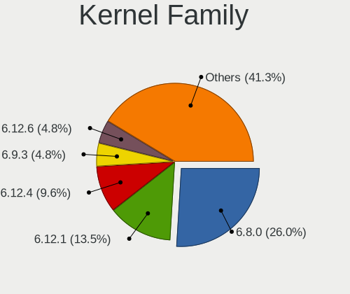
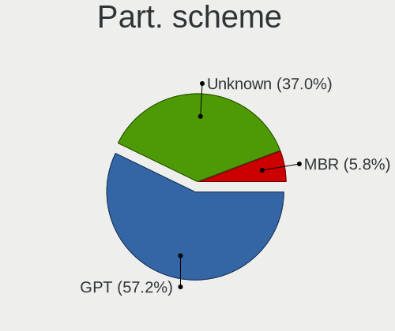
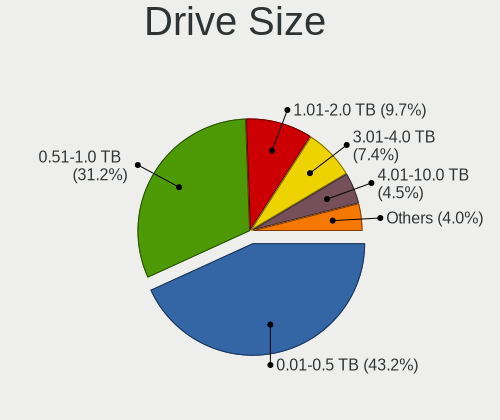
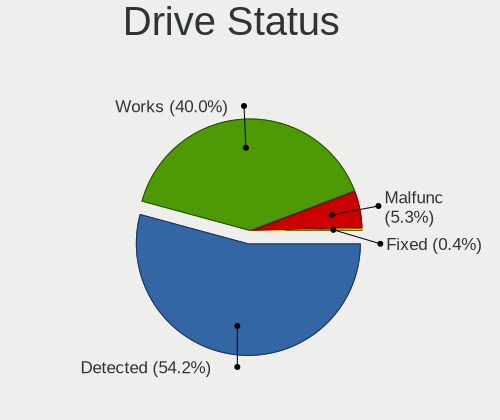
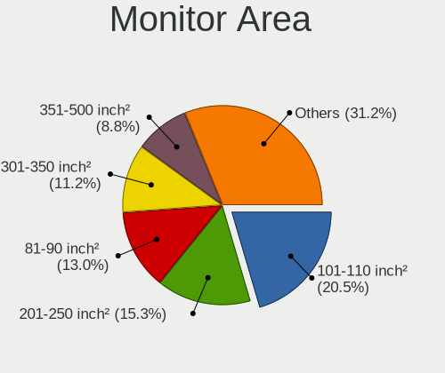
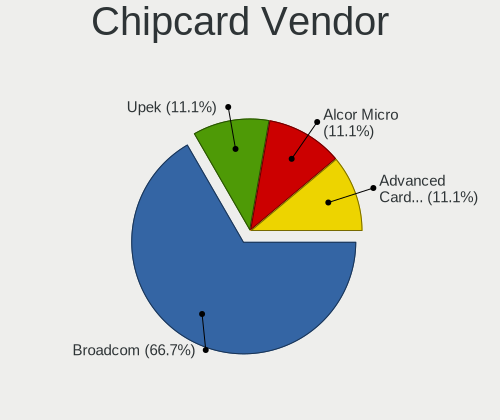
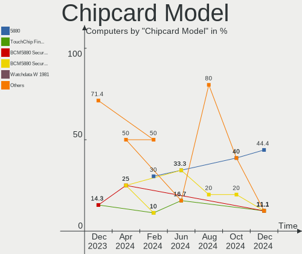

Linux in Canada - Hardware Trends
---------------------------------

A project to identify most popular hardware characteristics and track their change
over time based on data collected by Linux users at https://Linux-Hardware.org.

Anyone can contribute to this report by the [hw-probe](https://github.com/linuxhw/hw-probe) tool:

    sudo -E hw-probe -all -upload

This is a report for all computer types. See also reports for [desktops](/Location/Canada/Desktop/README.md) and [notebooks](/Location/Canada/Notebook/README.md).

Period: Apr, 2023.

Contents
--------

* [ System ](#system)
  - [ OS                       ](#os)
  - [ OS Family                ](#os-family)
  - [ Kernel                   ](#kernel)
  - [ Kernel Family            ](#kernel-family)
  - [ Kernel Major Ver.        ](#kernel-major-ver)
  - [ Arch                     ](#arch)
  - [ DE                       ](#de)
  - [ Display Server           ](#display-server)
  - [ Display Manager          ](#display-manager)
  - [ OS Lang                  ](#os-lang)
  - [ Boot Mode                ](#boot-mode)
  - [ Filesystem               ](#filesystem)
  - [ Part. scheme             ](#part-scheme)
  - [ Dual Boot with Linux/BSD ](#dual-boot-with-linuxbsd)
  - [ Dual Boot (Win)          ](#dual-boot-win)

* [ Board ](#board)
  - [ Vendor                   ](#vendor)
  - [ Model                    ](#model)
  - [ Model Family             ](#model-family)
  - [ MFG Year                 ](#mfg-year)
  - [ Form Factor              ](#form-factor)
  - [ Secure Boot              ](#secure-boot)
  - [ Coreboot                 ](#coreboot)
  - [ RAM Size                 ](#ram-size)
  - [ RAM Used                 ](#ram-used)
  - [ Total Drives             ](#total-drives)
  - [ Has CD-ROM               ](#has-cd-rom)
  - [ Has Ethernet             ](#has-ethernet)
  - [ Has WiFi                 ](#has-wifi)
  - [ Has Bluetooth            ](#has-bluetooth)

* [ Location ](#location)
  - [ Country                  ](#country)
  - [ City                     ](#city)

* [ Drives ](#drives)
  - [ Drive Vendor             ](#drive-vendor)
  - [ Drive Model              ](#drive-model)
  - [ HDD Vendor               ](#hdd-vendor)
  - [ SSD Vendor               ](#ssd-vendor)
  - [ Drive Kind               ](#drive-kind)
  - [ Drive Connector          ](#drive-connector)
  - [ Drive Size               ](#drive-size)
  - [ Space Total              ](#space-total)
  - [ Space Used               ](#space-used)
  - [ Malfunc. Drives          ](#malfunc-drives)
  - [ Malfunc. Drive Vendor    ](#malfunc-drive-vendor)
  - [ Malfunc. HDD Vendor      ](#malfunc-hdd-vendor)
  - [ Malfunc. Drive Kind      ](#malfunc-drive-kind)
  - [ Failed Drives            ](#failed-drives)
  - [ Failed Drive Vendor      ](#failed-drive-vendor)
  - [ Drive Status             ](#drive-status)

* [ Storage controller ](#storage-controller)
  - [ Storage Vendor           ](#storage-vendor)
  - [ Storage Model            ](#storage-model)
  - [ Storage Kind             ](#storage-kind)

* [ Processor ](#processor)
  - [ CPU Vendor               ](#cpu-vendor)
  - [ CPU Model                ](#cpu-model)
  - [ CPU Model Family         ](#cpu-model-family)
  - [ CPU Cores                ](#cpu-cores)
  - [ CPU Sockets              ](#cpu-sockets)
  - [ CPU Threads              ](#cpu-threads)
  - [ CPU Op-Modes             ](#cpu-op-modes)
  - [ CPU Microcode            ](#cpu-microcode)
  - [ CPU Microarch            ](#cpu-microarch)

* [ Graphics ](#graphics)
  - [ GPU Vendor               ](#gpu-vendor)
  - [ GPU Model                ](#gpu-model)
  - [ GPU Combo                ](#gpu-combo)
  - [ GPU Driver               ](#gpu-driver)
  - [ GPU Memory               ](#gpu-memory)

* [ Monitor ](#monitor)
  - [ Monitor Vendor           ](#monitor-vendor)
  - [ Monitor Model            ](#monitor-model)
  - [ Monitor Resolution       ](#monitor-resolution)
  - [ Monitor Diagonal         ](#monitor-diagonal)
  - [ Monitor Width            ](#monitor-width)
  - [ Aspect Ratio             ](#aspect-ratio)
  - [ Monitor Area             ](#monitor-area)
  - [ Pixel Density            ](#pixel-density)
  - [ Multiple Monitors        ](#multiple-monitors)

* [ Network ](#network)
  - [ Net Controller Vendor    ](#net-controller-vendor)
  - [ Net Controller Model     ](#net-controller-model)
  - [ Wireless Vendor          ](#wireless-vendor)
  - [ Wireless Model           ](#wireless-model)
  - [ Ethernet Vendor          ](#ethernet-vendor)
  - [ Ethernet Model           ](#ethernet-model)
  - [ Net Controller Kind      ](#net-controller-kind)
  - [ Used Controller          ](#used-controller)
  - [ NICs                     ](#nics)
  - [ IPv6                     ](#ipv6)

* [ Bluetooth ](#bluetooth)
  - [ Bluetooth Vendor         ](#bluetooth-vendor)
  - [ Bluetooth Model          ](#bluetooth-model)

* [ Sound ](#sound)
  - [ Sound Vendor             ](#sound-vendor)
  - [ Sound Model              ](#sound-model)

* [ Memory ](#memory)
  - [ Memory Vendor            ](#memory-vendor)
  - [ Memory Model             ](#memory-model)
  - [ Memory Kind              ](#memory-kind)
  - [ Memory Form Factor       ](#memory-form-factor)
  - [ Memory Size              ](#memory-size)
  - [ Memory Speed             ](#memory-speed)

* [ Printers & scanners ](#printers--scanners)
  - [ Printer Vendor           ](#printer-vendor)
  - [ Printer Model            ](#printer-model)
  - [ Scanner Vendor           ](#scanner-vendor)
  - [ Scanner Model            ](#scanner-model)

* [ Camera ](#camera)
  - [ Camera Vendor            ](#camera-vendor)
  - [ Camera Model             ](#camera-model)

* [ Security ](#security)
  - [ Fingerprint Vendor       ](#fingerprint-vendor)
  - [ Fingerprint Model        ](#fingerprint-model)
  - [ Chipcard Vendor          ](#chipcard-vendor)
  - [ Chipcard Model           ](#chipcard-model)

* [ Unsupported ](#unsupported)
  - [ Unsupported Devices      ](#unsupported-devices)
  - [ Unsupported Device Types ](#unsupported-device-types)

System
------

OS
--

Installed operating systems

| Name                         | Computers | Percent |
|------------------------------|-----------|---------|
| OpenMandriva 23.03           | 23        | 13.37%  |
| Ubuntu 22.04                 | 17        | 9.88%   |
| Linux Mint 21.1              | 16        | 9.3%    |
| Pop!_OS 22.04                | 11        | 6.4%    |
| Fedora 38                    | 9         | 5.23%   |
| Arch Rolling                 | 9         | 5.23%   |
| Fedora 37                    | 8         | 4.65%   |
| KDE neon 22.04               | 6         | 3.49%   |
| Gentoo 2.13                  | 6         | 3.49%   |
| Ubuntu 22.10                 | 5         | 2.91%   |
| Debian 11                    | 5         | 2.91%   |
| Zorin 16                     | 4         | 2.33%   |
| EndeavourOS Rolling          | 4         | 2.33%   |
| Ubuntu 23.04                 | 3         | 1.74%   |
| Ubuntu 20.04                 | 3         | 1.74%   |
| Manjaro 22.1.0               | 3         | 1.74%   |
| Manjaro                      | 3         | 1.74%   |
| ArcoLinux Rolling            | 3         | 1.74%   |
| Xubuntu 22.04                | 2         | 1.16%   |
| Xubuntu 20.04                | 2         | 1.16%   |
| openSUSE Microos-XXXXXXXX    | 2         | 1.16%   |
| OpenMandriva 4.3             | 2         | 1.16%   |
| Linux Mint 21                | 2         | 1.16%   |
| Linux Mint 20.3              | 2         | 1.16%   |
| Kubuntu 22.10                | 2         | 1.16%   |
| Elementary 6.1               | 2         | 1.16%   |
| Debian 12                    | 2         | 1.16%   |
| Void Linux Rolling           | 1         | 0.58%   |
| Ubuntu MATE 20.04            | 1         | 0.58%   |
| SteamOS 3.4.6                | 1         | 0.58%   |
| openSUSE Tumbleweed-XXXXXXXX | 1         | 0.58%   |
| Nobara 37                    | 1         | 0.58%   |
| MX 21                        | 1         | 0.58%   |
| LMDE 5                       | 1         | 0.58%   |
| Linux Mint 19.3              | 1         | 0.58%   |
| Linux Lite 6.4               | 1         | 0.58%   |
| Kubuntu 23.04                | 1         | 0.58%   |
| Debian 10                    | 1         | 0.58%   |
| ChimeraOS 41                 | 1         | 0.58%   |
| BunsenLabs 11                | 1         | 0.58%   |

OS Family
---------

OS without a version

| Name         | Computers | Percent |
|--------------|-----------|---------|
| Ubuntu       | 28        | 16.28%  |
| OpenMandriva | 25        | 14.53%  |
| Linux Mint   | 21        | 12.21%  |
| Fedora       | 17        | 9.88%   |
| Pop!_OS      | 11        | 6.4%    |
| Arch         | 9         | 5.23%   |
| Debian       | 8         | 4.65%   |
| Manjaro      | 6         | 3.49%   |
| KDE neon     | 6         | 3.49%   |
| Gentoo       | 6         | 3.49%   |
| Zorin        | 4         | 2.33%   |
| Xubuntu      | 4         | 2.33%   |
| EndeavourOS  | 4         | 2.33%   |
| ArcoLinux    | 4         | 2.33%   |
| openSUSE     | 3         | 1.74%   |
| Kubuntu      | 3         | 1.74%   |
| Elementary   | 2         | 1.16%   |
| Void Linux   | 1         | 0.58%   |
| Ubuntu MATE  | 1         | 0.58%   |
| SteamOS      | 1         | 0.58%   |
| Nobara       | 1         | 0.58%   |
| MX           | 1         | 0.58%   |
| LMDE         | 1         | 0.58%   |
| Linux Lite   | 1         | 0.58%   |
| ChimeraOS    | 1         | 0.58%   |
| BunsenLabs   | 1         | 0.58%   |
| blendOS      | 1         | 0.58%   |
| AlmaLinux    | 1         | 0.58%   |

Kernel
------

Version of the Linux kernel

| Version                     | Computers | Percent |
|-----------------------------|-----------|---------|
| 5.15.0-69-generic           | 26        | 15.12%  |
| 6.2.6-desktop-1omv2390      | 23        | 13.37%  |
| 5.19.0-38-generic           | 12        | 6.98%   |
| 6.2.6-76060206-generic      | 9         | 5.23%   |
| 6.2.11-300.fc38.x86_64      | 6         | 3.49%   |
| 6.2.10-arch1-1              | 6         | 3.49%   |
| 5.19.0-40-generic           | 5         | 2.91%   |
| 6.2.0-20-generic            | 4         | 2.33%   |
| 5.15.0-70-generic           | 4         | 2.33%   |
| 5.10.0-21-amd64             | 4         | 2.33%   |
| 6.2.10-200.fc37.x86_64      | 3         | 1.74%   |
| 6.1.19-gentoo-x86_64        | 3         | 1.74%   |
| 5.19.0-41-generic           | 3         | 1.74%   |
| 5.15.0-60-generic           | 3         | 1.74%   |
| 6.2.9-300.fc38.x86_64       | 2         | 1.16%   |
| 6.2.9-200.fc37.x86_64       | 2         | 1.16%   |
| 6.2.9-1-default             | 2         | 1.16%   |
| 6.2.8-200.fc37.x86_64       | 2         | 1.16%   |
| 6.2.12-arch1-1              | 2         | 1.16%   |
| 6.2.11-arch1-1              | 2         | 1.16%   |
| 5.4.0-146-generic           | 2         | 1.16%   |
| 5.19.0-21-generic           | 2         | 1.16%   |
| 5.16.7-desktop-1omv4003     | 2         | 1.16%   |
| 5.15.0-71-generic           | 2         | 1.16%   |
| 5.10.0-20-amd64             | 2         | 1.16%   |
| 6.3.0-x64v3-xanmod1         | 1         | 0.58%   |
| 6.3.0-273-tkg-pds-llvm      | 1         | 0.58%   |
| 6.2.9-zen1-1-zen            | 1         | 0.58%   |
| 6.2.9-gentoo-dist           | 1         | 0.58%   |
| 6.2.9-arch1-1               | 1         | 0.58%   |
| 6.2.9-4-liquorix-amd64      | 1         | 0.58%   |
| 6.2.8_1                     | 1         | 0.58%   |
| 6.2.8-arch1-1               | 1         | 0.58%   |
| 6.2.8-200.fsync.fc37.x86_64 | 1         | 0.58%   |
| 6.2.13-300.fc38.x86_64      | 1         | 0.58%   |
| 6.2.12-1-MANJARO            | 1         | 0.58%   |
| 6.2.12-060212-generic       | 1         | 0.58%   |
| 6.2.11-gentoo-dist          | 1         | 0.58%   |
| 6.2.10-zen1-1-zen           | 1         | 0.58%   |
| 6.2.10-arch1-1-surface      | 1         | 0.58%   |

Kernel Family
-------------

Linux kernel without a distro release

| Version  | Computers | Percent |
|----------|-----------|---------|
| 5.15.0   | 38        | 22.09%  |
| 6.2.6    | 32        | 18.6%   |
| 5.19.0   | 22        | 12.79%  |
| 6.2.10   | 14        | 8.14%   |
| 6.2.9    | 10        | 5.81%   |
| 6.2.11   | 9         | 5.23%   |
| 5.10.0   | 6         | 3.49%   |
| 6.2.8    | 5         | 2.91%   |
| 6.2.12   | 4         | 2.33%   |
| 6.2.0    | 4         | 2.33%   |
| 5.4.0    | 4         | 2.33%   |
| 6.1.19   | 3         | 1.74%   |
| 6.3.0    | 2         | 1.16%   |
| 6.1.25   | 2         | 1.16%   |
| 6.0.0    | 2         | 1.16%   |
| 5.16.7   | 2         | 1.16%   |
| 6.2.13   | 1         | 0.58%   |
| 6.1.23   | 1         | 0.58%   |
| 6.1.22   | 1         | 0.58%   |
| 6.1.21   | 1         | 0.58%   |
| 6.1.11   | 1         | 0.58%   |
| 6.1.0    | 1         | 0.58%   |
| 6.0.6    | 1         | 0.58%   |
| 6.0.18   | 1         | 0.58%   |
| 5.3.5    | 1         | 0.58%   |
| 5.15.106 | 1         | 0.58%   |
| 5.15.104 | 1         | 0.58%   |
| 5.13.0   | 1         | 0.58%   |
| 4.18.0   | 1         | 0.58%   |

Kernel Major Ver.
-----------------

Linux kernel major version

| Version | Computers | Percent |
|---------|-----------|---------|
| 6.2     | 79        | 45.93%  |
| 5.15    | 40        | 23.26%  |
| 5.19    | 22        | 12.79%  |
| 6.1     | 10        | 5.81%   |
| 5.10    | 6         | 3.49%   |
| 6.0     | 4         | 2.33%   |
| 5.4     | 4         | 2.33%   |
| 6.3     | 2         | 1.16%   |
| 5.16    | 2         | 1.16%   |
| 5.3     | 1         | 0.58%   |
| 5.13    | 1         | 0.58%   |
| 4.18    | 1         | 0.58%   |

Arch
----

OS architecture (x86_64, i586, etc.)

| Name   | Computers | Percent |
|--------|-----------|---------|
| x86_64 | 171       | 99.42%  |
| i686   | 1         | 0.58%   |

DE
--

Desktop Environment

| Name            | Computers | Percent |
|-----------------|-----------|---------|
| GNOME           | 62        | 36.05%  |
| KDE5            | 57        | 33.14%  |
| X-Cinnamon      | 19        | 11.05%  |
| XFCE            | 10        | 5.81%   |
| MATE            | 7         | 4.07%   |
| Unknown         | 6         | 3.49%   |
| Pantheon        | 2         | 1.16%   |
| Hyprland        | 2         | 1.16%   |
| Cinnamon        | 2         | 1.16%   |
| sway            | 1         | 0.58%   |
| Jwm             | 1         | 0.58%   |
| GNOME-Classic   | 1         | 0.58%   |
| GNOME Flashback | 1         | 0.58%   |
| chadwm          | 1         | 0.58%   |

Display Server
--------------

X11 or Wayland

| Name    | Computers | Percent |
|---------|-----------|---------|
| X11     | 116       | 67.44%  |
| Wayland | 46        | 26.74%  |
| Tty     | 6         | 3.49%   |
| Unknown | 4         | 2.33%   |

Display Manager
---------------

SDDM, LightDM, etc.

| Name    | Computers | Percent |
|---------|-----------|---------|
| Unknown | 60        | 34.88%  |
| SDDM    | 44        | 25.58%  |
| GDM3    | 27        | 15.7%   |
| LightDM | 25        | 14.53%  |
| GDM     | 13        | 7.56%   |
| NODM    | 1         | 0.58%   |
| Ly      | 1         | 0.58%   |
| LXDM    | 1         | 0.58%   |

OS Lang
-------

Language

| Lang    | Computers | Percent |
|---------|-----------|---------|
| en_CA   | 100       | 58.14%  |
| en_US   | 48        | 27.91%  |
| fr_CA   | 10        | 5.81%   |
| C       | 4         | 2.33%   |
| Unknown | 3         | 1.74%   |
| fr_FR   | 2         | 1.16%   |
| C.UTF8  | 2         | 1.16%   |
| pa_IN   | 1         | 0.58%   |
| en_GB   | 1         | 0.58%   |
| en_AU   | 1         | 0.58%   |

Boot Mode
---------

EFI or BIOS

| Mode | Computers | Percent |
|------|-----------|---------|
| EFI  | 97        | 56.4%   |
| BIOS | 75        | 43.6%   |

Filesystem
----------

Type of filesystem

| Type    | Computers | Percent |
|---------|-----------|---------|
| Ext4    | 114       | 66.28%  |
| Btrfs   | 32        | 18.6%   |
| Overlay | 12        | 6.98%   |
| Tmpfs   | 7         | 4.07%   |
| Zfs     | 3         | 1.74%   |
| Xfs     | 2         | 1.16%   |
| Rootfs  | 1         | 0.58%   |
| F2fs    | 1         | 0.58%   |

Part. scheme
------------

Scheme of partitioning

| Type    | Computers | Percent |
|---------|-----------|---------|
| GPT     | 106       | 61.63%  |
| Unknown | 54        | 31.4%   |
| MBR     | 12        | 6.98%   |

Dual Boot with Linux/BSD
------------------------

Hosting more than one Linux/BSD

| Dual boot | Computers | Percent |
|-----------|-----------|---------|
| No        | 144       | 83.72%  |
| Yes       | 28        | 16.28%  |

Dual Boot (Win)
---------------

Hosting Linux and Windows

| Dual boot | Computers | Percent |
|-----------|-----------|---------|
| No        | 136       | 79.07%  |
| Yes       | 36        | 20.93%  |

Board
-----

Vendor
------

Motherboard manufacturer

| Name                                 | Computers | Percent |
|--------------------------------------|-----------|---------|
| ASUSTek Computer                     | 42        | 24.42%  |
| Lenovo                               | 24        | 13.95%  |
| Dell                                 | 20        | 11.63%  |
| Hewlett-Packard                      | 16        | 9.3%    |
| MSI                                  | 14        | 8.14%   |
| Gigabyte Technology                  | 11        | 6.4%    |
| Apple                                | 10        | 5.81%   |
| Acer                                 | 8         | 4.65%   |
| ASRock                               | 7         | 4.07%   |
| Microsoft                            | 4         | 2.33%   |
| Intel                                | 3         | 1.74%   |
| Toshiba                              | 2         | 1.16%   |
| WeiBu                                | 1         | 0.58%   |
| Valve                                | 1         | 0.58%   |
| Shenzhen Wangang Technology          | 1         | 0.58%   |
| Shenzhen Meigao Electronic Equipment | 1         | 0.58%   |
| Pegatron                             | 1         | 0.58%   |
| Google                               | 1         | 0.58%   |
| Gateway                              | 1         | 0.58%   |
| Framework                            | 1         | 0.58%   |
| Biostar                              | 1         | 0.58%   |
| ASRockRack                           | 1         | 0.58%   |
| Alienware                            | 1         | 0.58%   |

Model
-----

Motherboard model

| Name                                        | Computers | Percent |
|---------------------------------------------|-----------|---------|
| HP Pavilion dv7                             | 3         | 1.74%   |
| ASUS All Series                             | 3         | 1.74%   |
| Lenovo ThinkPad X1 Carbon Gen 10 21CBCTO1WW | 2         | 1.16%   |
| ASUS PRIME B450M-A                          | 2         | 1.16%   |
| Apple MacPro5,1                             | 2         | 1.16%   |
| Apple MacBookPro8,1                         | 2         | 1.16%   |
| WeiBu ADL-N                                 | 1         | 0.58%   |
| Valve Jupiter                               | 1         | 0.58%   |
| Toshiba Satellite L850                      | 1         | 0.58%   |
| Toshiba Satellite L300D                     | 1         | 0.58%   |
| Shenzhen Wangang AERO 2                     | 1         | 0.58%   |
| Shenzhen Meigao Electronic Equipment HX99G  | 1         | 0.58%   |
| Pegatron KQ497AA-A2L m9340f                 | 1         | 0.58%   |
| MSI MS-7D54                                 | 1         | 0.58%   |
| MSI MS-7D53                                 | 1         | 0.58%   |
| MSI MS-7C80                                 | 1         | 0.58%   |
| MSI MS-7C56                                 | 1         | 0.58%   |
| MSI MS-7B98                                 | 1         | 0.58%   |
| MSI MS-7B33                                 | 1         | 0.58%   |
| MSI MS-7996                                 | 1         | 0.58%   |
| MSI MS-7917                                 | 1         | 0.58%   |
| MSI MS-7850                                 | 1         | 0.58%   |
| MSI MS-7817                                 | 1         | 0.58%   |
| MSI Modern 14 B10MW                         | 1         | 0.58%   |
| MSI GP72 7RDX                               | 1         | 0.58%   |
| MSI GP60 2QE                                | 1         | 0.58%   |
| MSI GF75 Thin 9SC                           | 1         | 0.58%   |
| Microsoft Surface Pro 8                     | 1         | 0.58%   |
| Microsoft Surface Laptop Go                 | 1         | 0.58%   |
| Microsoft Surface Go 3                      | 1         | 0.58%   |
| Microsoft Surface Go                        | 1         | 0.58%   |
| Lenovo Yoga 9 14IAP7 82LU                   | 1         | 0.58%   |
| Lenovo Yoga 6 13ALC7 82UD                   | 1         | 0.58%   |
| Lenovo XXXX 3000 H210                       | 1         | 0.58%   |
| Lenovo ThinkStation P410 30B3003SUS         | 1         | 0.58%   |
| Lenovo ThinkPad X1 Carbon 7th 20QDS3B200    | 1         | 0.58%   |
| Lenovo ThinkPad X1 Carbon 6th 20KH002KUS    | 1         | 0.58%   |
| Lenovo ThinkPad T550 20CKA00ECD             | 1         | 0.58%   |
| Lenovo ThinkPad T480s 20L8S0ER00            | 1         | 0.58%   |
| Lenovo ThinkPad T470s W10DG 20JTS1FA00      | 1         | 0.58%   |

Model Family
------------

Motherboard model prefix

| Name                                       | Computers | Percent |
|--------------------------------------------|-----------|---------|
| Lenovo ThinkPad                            | 10        | 5.81%   |
| ASUS ROG                                   | 9         | 5.23%   |
| ASUS PRIME                                 | 8         | 4.65%   |
| Dell Latitude                              | 7         | 4.07%   |
| ASUS VivoBook                              | 5         | 2.91%   |
| Microsoft Surface                          | 4         | 2.33%   |
| Lenovo ThinkCentre                         | 4         | 2.33%   |
| HP Pavilion                                | 4         | 2.33%   |
| HP EliteBook                               | 4         | 2.33%   |
| Dell XPS                                   | 4         | 2.33%   |
| Acer Aspire                                | 4         | 2.33%   |
| Lenovo IdeaPad                             | 3         | 1.74%   |
| Dell Precision                             | 3         | 1.74%   |
| Dell Inspiron                              | 3         | 1.74%   |
| ASUS All                                   | 3         | 1.74%   |
| Toshiba Satellite                          | 2         | 1.16%   |
| Lenovo Yoga                                | 2         | 1.16%   |
| HP ENVY                                    | 2         | 1.16%   |
| Dell OptiPlex                              | 2         | 1.16%   |
| Apple MacPro5                              | 2         | 1.16%   |
| Apple MacBookPro8                          | 2         | 1.16%   |
| WeiBu ADL-N                                | 1         | 0.58%   |
| Valve Jupiter                              | 1         | 0.58%   |
| Shenzhen Wangang AERO                      | 1         | 0.58%   |
| Shenzhen Meigao Electronic Equipment HX99G | 1         | 0.58%   |
| Pegatron KQ497AA-A2L                       | 1         | 0.58%   |
| MSI MS-7D54                                | 1         | 0.58%   |
| MSI MS-7D53                                | 1         | 0.58%   |
| MSI MS-7C80                                | 1         | 0.58%   |
| MSI MS-7C56                                | 1         | 0.58%   |
| MSI MS-7B98                                | 1         | 0.58%   |
| MSI MS-7B33                                | 1         | 0.58%   |
| MSI MS-7996                                | 1         | 0.58%   |
| MSI MS-7917                                | 1         | 0.58%   |
| MSI MS-7850                                | 1         | 0.58%   |
| MSI MS-7817                                | 1         | 0.58%   |
| MSI Modern                                 | 1         | 0.58%   |
| MSI GP72                                   | 1         | 0.58%   |
| MSI GP60                                   | 1         | 0.58%   |
| MSI GF75                                   | 1         | 0.58%   |

MFG Year
--------

Motherboard manufacture year

| Year | Computers | Percent |
|------|-----------|---------|
| 2022 | 23        | 13.37%  |
| 2018 | 20        | 11.63%  |
| 2020 | 15        | 8.72%   |
| 2012 | 14        | 8.14%   |
| 2021 | 13        | 7.56%   |
| 2013 | 13        | 7.56%   |
| 2011 | 11        | 6.4%    |
| 2019 | 10        | 5.81%   |
| 2014 | 10        | 5.81%   |
| 2015 | 9         | 5.23%   |
| 2010 | 8         | 4.65%   |
| 2017 | 6         | 3.49%   |
| 2016 | 6         | 3.49%   |
| 2009 | 6         | 3.49%   |
| 2008 | 4         | 2.33%   |
| 2023 | 2         | 1.16%   |
| 2007 | 1         | 0.58%   |
| 2006 | 1         | 0.58%   |

Form Factor
-----------

Physical design of the computer

| Name        | Computers | Percent |
|-------------|-----------|---------|
| Desktop     | 88        | 51.16%  |
| Notebook    | 66        | 38.37%  |
| Convertible | 7         | 4.07%   |
| Tablet      | 4         | 2.33%   |
| All in one  | 4         | 2.33%   |
| Server      | 2         | 1.16%   |
| Mini pc     | 1         | 0.58%   |

Secure Boot
-----------

Enabled or disabled

| State    | Computers | Percent |
|----------|-----------|---------|
| Disabled | 159       | 92.44%  |
| Enabled  | 13        | 7.56%   |

Coreboot
--------

Have coreboot on board

| Used | Computers | Percent |
|------|-----------|---------|
| No   | 171       | 99.42%  |
| Yes  | 1         | 0.58%   |

RAM Size
--------

Total RAM memory

| Size in GB  | Computers | Percent |
|-------------|-----------|---------|
| 16.01-24.0  | 47        | 27.33%  |
| 32.01-64.0  | 29        | 16.86%  |
| 4.01-8.0    | 28        | 16.28%  |
| 8.01-16.0   | 26        | 15.12%  |
| 3.01-4.0    | 19        | 11.05%  |
| 64.01-256.0 | 15        | 8.72%   |
| 24.01-32.0  | 6         | 3.49%   |
| 1.01-2.0    | 2         | 1.16%   |

RAM Used
--------

Used RAM memory

| Used GB    | Computers | Percent |
|------------|-----------|---------|
| 2.01-3.0   | 48        | 27.91%  |
| 1.01-2.0   | 43        | 25%     |
| 4.01-8.0   | 31        | 18.02%  |
| 3.01-4.0   | 28        | 16.28%  |
| 8.01-16.0  | 11        | 6.4%    |
| 0.51-1.0   | 4         | 2.33%   |
| 16.01-24.0 | 3         | 1.74%   |
| 32.01-64.0 | 2         | 1.16%   |
| 24.01-32.0 | 1         | 0.58%   |
| 0.01-0.5   | 1         | 0.58%   |

Total Drives
------------

Number of drives on board

| Drives | Computers | Percent |
|--------|-----------|---------|
| 1      | 93        | 54.07%  |
| 2      | 44        | 25.58%  |
| 3      | 16        | 9.3%    |
| 4      | 12        | 6.98%   |
| 5      | 2         | 1.16%   |
| 26     | 1         | 0.58%   |
| 19     | 1         | 0.58%   |
| 8      | 1         | 0.58%   |
| 7      | 1         | 0.58%   |
| 6      | 1         | 0.58%   |

Has CD-ROM
----------

Has CD-ROM on board

| Presented | Computers | Percent |
|-----------|-----------|---------|
| No        | 106       | 61.63%  |
| Yes       | 66        | 38.37%  |

Has Ethernet
------------

Has Ethernet on board

| Presented | Computers | Percent |
|-----------|-----------|---------|
| Yes       | 143       | 83.14%  |
| No        | 29        | 16.86%  |

Has WiFi
--------

Has WiFi module

| Presented | Computers | Percent |
|-----------|-----------|---------|
| Yes       | 131       | 76.16%  |
| No        | 41        | 23.84%  |

Has Bluetooth
-------------

Has Bluetooth module

| Presented | Computers | Percent |
|-----------|-----------|---------|
| Yes       | 106       | 61.63%  |
| No        | 66        | 38.37%  |

Location
--------

Country
-------

Geographic location (country)

| Country | Computers | Percent |
|---------|-----------|---------|
| Canada  | 172       | 100%    |

City
----

Geographic location (city)

| City                    | Computers | Percent |
|-------------------------|-----------|---------|
| Montreal                | 15        | 8.72%   |
| Toronto                 | 12        | 6.98%   |
| Calgary                 | 11        | 6.4%    |
| Winnipeg                | 9         | 5.23%   |
| Edmonton                | 9         | 5.23%   |
| Mississauga             | 6         | 3.49%   |
| Vancouver               | 5         | 2.91%   |
| Brampton                | 5         | 2.91%   |
| Sarnia                  | 4         | 2.33%   |
| Nepean                  | 4         | 2.33%   |
| Burnaby                 | 4         | 2.33%   |
| Victoria                | 3         | 1.74%   |
| St. Jean Baptiste       | 3         | 1.74%   |
| Ottawa                  | 3         | 1.74%   |
| New Westminster         | 3         | 1.74%   |
| Kippens                 | 3         | 1.74%   |
| Gatineau                | 3         | 1.74%   |
| Verdun                  | 2         | 1.16%   |
| Trois-Rivières         | 2         | 1.16%   |
| Sutton                  | 2         | 1.16%   |
| Saint-Jerome            | 2         | 1.16%   |
| Québec                 | 2         | 1.16%   |
| North York              | 2         | 1.16%   |
| Moncton                 | 2         | 1.16%   |
| Kitchener               | 2         | 1.16%   |
| Beauharnois             | 2         | 1.16%   |
| Wynyard                 | 1         | 0.58%   |
| Woodbridge              | 1         | 0.58%   |
| Westville               | 1         | 0.58%   |
| Vernon                  | 1         | 0.58%   |
| Stephenville Crossing   | 1         | 0.58%   |
| Steinbach               | 1         | 0.58%   |
| St. John's              | 1         | 0.58%   |
| St. Albert              | 1         | 0.58%   |
| Simcoe                  | 1         | 0.58%   |
| Sherwood Park           | 1         | 0.58%   |
| Sherbrooke              | 1         | 0.58%   |
| Scarborough             | 1         | 0.58%   |
| Sault Ste. Marie        | 1         | 0.58%   |
| Sainte-Agathe-des-Monts | 1         | 0.58%   |

Drives
------

Drive Vendor
------------

Hard drive vendors

| Vendor                      | Computers | Drives | Percent |
|-----------------------------|-----------|--------|---------|
| Seagate                     | 43        | 68     | 15.41%  |
| Samsung Electronics         | 41        | 44     | 14.7%   |
| WDC                         | 34        | 46     | 12.19%  |
| Kingston                    | 26        | 26     | 9.32%   |
| Sandisk                     | 20        | 24     | 7.17%   |
| Toshiba                     | 11        | 13     | 3.94%   |
| Unknown                     | 10        | 11     | 3.58%   |
| Intel                       | 8         | 8      | 2.87%   |
| Hitachi                     | 8         | 28     | 2.87%   |
| A-DATA Technology           | 8         | 8      | 2.87%   |
| SK hynix                    | 7         | 7      | 2.51%   |
| Crucial                     | 7         | 7      | 2.51%   |
| Micron/Crucial Technology   | 6         | 6      | 2.15%   |
| Phison Electronics          | 4         | 5      | 1.43%   |
| Kingston Technology Company | 3         | 3      | 1.08%   |
| HGST                        | 3         | 3      | 1.08%   |
| Timetec                     | 2         | 2      | 0.72%   |
| SPCC                        | 2         | 2      | 0.72%   |
| OWC                         | 2         | 3      | 0.72%   |
| Micron Technology           | 2         | 2      | 0.72%   |
| LITEONIT                    | 2         | 2      | 0.72%   |
| KingSpec                    | 2         | 2      | 0.72%   |
| JMicron Technology          | 2         | 2      | 0.72%   |
| ADATA Technology            | 2         | 2      | 0.72%   |
| Unknown                     | 2         | 2      | 0.72%   |
| Union Memory                | 1         | 1      | 0.36%   |
| UMIS                        | 1         | 1      | 0.36%   |
| Team                        | 1         | 1      | 0.36%   |
| T-FORCE                     | 1         | 2      | 0.36%   |
| Silicon Motion              | 1         | 2      | 0.36%   |
| Seagate Technology          | 1         | 1      | 0.36%   |
| SABRENT                     | 1         | 1      | 0.36%   |
| Realtek Semiconductor       | 1         | 1      | 0.36%   |
| Realtek                     | 1         | 1      | 0.36%   |
| PNY                         | 1         | 1      | 0.36%   |
| ORICO                       | 1         | 1      | 0.36%   |
| MicroFrom                   | 1         | 1      | 0.36%   |
| Maxtor                      | 1         | 1      | 0.36%   |
| Lexar                       | 1         | 2      | 0.36%   |
| KingFast                    | 1         | 1      | 0.36%   |

Drive Model
-----------

Hard drive models

| Model                                              | Computers | Percent |
|----------------------------------------------------|-----------|---------|
| Seagate ST1000DM010-2EP102 1TB                     | 5         | 1.62%   |
| Samsung NVMe SSD Controller PM9A1/PM9A3/980PRO 2TB | 5         | 1.62%   |
| Kingston SA400S37240G 240GB SSD                    | 5         | 1.62%   |
| Unknown SD/MMC/MS PRO 249GB                        | 4         | 1.3%    |
| Seagate ST4000DM004-2CV104 4TB                     | 4         | 1.3%    |
| Micron/Crucial P2 NVMe PCIe SSD 1TB                | 4         | 1.3%    |
| Kingston SA400S37960G 960GB SSD                    | 4         | 1.3%    |
| Seagate ST1000LM035-1RK172 970GB                   | 3         | 0.97%   |
| Seagate Expansion Desk 8TB                         | 3         | 0.97%   |
| Sandisk WD Blue SN550 NVMe SSD 1024GB              | 3         | 0.97%   |
| Sandisk WD Black SN750 / PC SN730 NVMe SSD 512GB   | 3         | 0.97%   |
| Samsung SSD 860 EVO 500GB                          | 3         | 0.97%   |
| Samsung NVMe SSD Controller SM981/PM981/PM983 1TB  | 3         | 0.97%   |
| Phison E12 NVMe Controller 512GB                   | 3         | 0.97%   |
| Kingston SV300S37A240G 240GB SSD                   | 3         | 0.97%   |
| Kingston SA400S37480G 480GB SSD                    | 3         | 0.97%   |
| WDC WD30EZRX-00D8PB0 3TB                           | 2         | 0.65%   |
| WDC WD20EZAZ-00L9GB0 2TB                           | 2         | 0.65%   |
| SPCC Solid State Disk 256GB                        | 2         | 0.65%   |
| SK hynix SKHynix_HFS512GEJ9X115N 512GB             | 2         | 0.65%   |
| Seagate ST500LT012-1DG142 500GB                    | 2         | 0.65%   |
| Seagate ST500LM021-1KJ152 500GB                    | 2         | 0.65%   |
| Seagate ST31000524AS 1TB                           | 2         | 0.65%   |
| Seagate ST3000DM008-2DM166 3TB                     | 2         | 0.65%   |
| Sandisk WD_BLACK SN770 1TB                         | 2         | 0.65%   |
| SanDisk NVMe SSD Drive 2TB                         | 2         | 0.65%   |
| Samsung SSD 980 PRO 1TB                            | 2         | 0.65%   |
| Samsung SSD 870 EVO 1TB                            | 2         | 0.65%   |
| Samsung MZALQ512HBLU-00BL2 512GB                   | 2         | 0.65%   |
| Kingston Company A2000 NVMe SSD 500GB              | 2         | 0.65%   |
| Kingston SH103S3120G 120GB SSD                     | 2         | 0.65%   |
| Intel SSDPEKNU512GZ 512GB                          | 2         | 0.65%   |
| Crucial CT500MX500SSD1 500GB                       | 2         | 0.65%   |
| Unknown                                            | 2         | 0.65%   |
| WDC WDS500G3X0C-00SJG0 500GB                       | 1         | 0.32%   |
| WDC WDS250G2B0A-00SM50 250GB SSD                   | 1         | 0.32%   |
| WDC WDS250G1B0A-00H9H0 250GB SSD                   | 1         | 0.32%   |
| WDC WDS100T2B0C-00PXH0 1TB                         | 1         | 0.32%   |
| WDC WDS100T2B0C 1TB                                | 1         | 0.32%   |
| WDC WDS100T2B0B-00YS70 1TB SSD                     | 1         | 0.32%   |

HDD Vendor
----------

Hard disk drive vendors

| Vendor              | Computers | Drives | Percent |
|---------------------|-----------|--------|---------|
| Seagate             | 41        | 65     | 41%     |
| WDC                 | 29        | 37     | 29%     |
| Toshiba             | 8         | 9      | 8%      |
| Hitachi             | 8         | 28     | 8%      |
| Unknown             | 4         | 4      | 4%      |
| HGST                | 3         | 3      | 3%      |
| Samsung Electronics | 2         | 2      | 2%      |
| JMicron Technology  | 2         | 2      | 2%      |
| SABRENT             | 1         | 1      | 1%      |
| Maxtor              | 1         | 1      | 1%      |
| Fujitsu             | 1         | 1      | 1%      |

SSD Vendor
----------

Solid state drive vendors

| Vendor              | Computers | Drives | Percent |
|---------------------|-----------|--------|---------|
| Samsung Electronics | 19        | 19     | 21.11%  |
| Kingston            | 19        | 19     | 21.11%  |
| A-DATA Technology   | 7         | 7      | 7.78%   |
| SanDisk             | 6         | 6      | 6.67%   |
| Crucial             | 6         | 6      | 6.67%   |
| Intel               | 5         | 5      | 5.56%   |
| WDC                 | 4         | 4      | 4.44%   |
| SPCC                | 2         | 2      | 2.22%   |
| OWC                 | 2         | 3      | 2.22%   |
| LITEONIT            | 2         | 2      | 2.22%   |
| KingSpec            | 2         | 2      | 2.22%   |
| Toshiba             | 1         | 2      | 1.11%   |
| Timetec             | 1         | 1      | 1.11%   |
| Team                | 1         | 1      | 1.11%   |
| T-FORCE             | 1         | 1      | 1.11%   |
| SK hynix            | 1         | 1      | 1.11%   |
| Seagate             | 1         | 1      | 1.11%   |
| PNY                 | 1         | 1      | 1.11%   |
| MicroFrom           | 1         | 1      | 1.11%   |
| Lexar               | 1         | 2      | 1.11%   |
| KingFast            | 1         | 1      | 1.11%   |
| Gigabyte Technology | 1         | 1      | 1.11%   |
| Fanxiang            | 1         | 1      | 1.11%   |
| External            | 1         | 1      | 1.11%   |
| AEROFARA            | 1         | 1      | 1.11%   |
| ADROITLARK          | 1         | 1      | 1.11%   |
| Unknown             | 1         | 1      | 1.11%   |

Drive Kind
----------

HDD or SSD

| Kind    | Computers | Drives | Percent |
|---------|-----------|--------|---------|
| SSD     | 79        | 93     | 32.92%  |
| HDD     | 76        | 153    | 31.67%  |
| NVMe    | 74        | 93     | 30.83%  |
| MMC     | 7         | 8      | 2.92%   |
| Unknown | 4         | 4      | 1.67%   |

Drive Connector
---------------

SATA, SAS, NVMe, etc.

| Type | Computers | Drives | Percent |
|------|-----------|--------|---------|
| SATA | 117       | 212    | 54.42%  |
| NVMe | 74        | 92     | 34.42%  |
| SAS  | 17        | 39     | 7.91%   |
| MMC  | 7         | 8      | 3.26%   |

Drive Size
----------

Size of hard drive

| Size in TB | Computers | Drives | Percent |
|------------|-----------|--------|---------|
| 0.01-0.5   | 81        | 120    | 48.5%   |
| 0.51-1.0   | 47        | 58     | 28.14%  |
| 1.01-2.0   | 15        | 17     | 8.98%   |
| 2.01-3.0   | 9         | 10     | 5.39%   |
| 3.01-4.0   | 7         | 12     | 4.19%   |
| 4.01-10.0  | 7         | 28     | 4.19%   |
| 10.01-20.0 | 1         | 1      | 0.6%    |

Space Total
-----------

Amount of disk space available on the file system

| Size in GB     | Computers | Percent |
|----------------|-----------|---------|
| 251-500        | 39        | 22.67%  |
| 501-1000       | 37        | 21.51%  |
| 101-250        | 26        | 15.12%  |
| 1001-2000      | 22        | 12.79%  |
| More than 3000 | 20        | 11.63%  |
| 1-20           | 12        | 6.98%   |
| 51-100         | 8         | 4.65%   |
| Unknown        | 6         | 3.49%   |
| 2001-3000      | 2         | 1.16%   |

Space Used
----------

Amount of used disk space

| Used GB        | Computers | Percent |
|----------------|-----------|---------|
| 1-20           | 54        | 31.4%   |
| 21-50          | 24        | 13.95%  |
| 51-100         | 21        | 12.21%  |
| 101-250        | 20        | 11.63%  |
| 251-500        | 18        | 10.47%  |
| 501-1000       | 14        | 8.14%   |
| 1001-2000      | 7         | 4.07%   |
| More than 3000 | 6         | 3.49%   |
| Unknown        | 6         | 3.49%   |
| 2001-3000      | 2         | 1.16%   |

Malfunc. Drives
---------------

Drive models with a malfunction

| Model                                 | Computers | Drives | Percent |
|---------------------------------------|-----------|--------|---------|
| Seagate ST500LM021-1KJ152 500GB       | 2         | 5      | 8.7%    |
| WDC WD3200AAJS-65B4A0 320GB           | 1         | 1      | 4.35%   |
| WDC WD1001FALS-40Y6A0 1TB             | 1         | 1      | 4.35%   |
| Toshiba MK5061GS 500GB                | 1         | 1      | 4.35%   |
| Toshiba MK5056GSY 500GB               | 1         | 1      | 4.35%   |
| Seagate ST500LT012-1DG142 500GB       | 1         | 2      | 4.35%   |
| Seagate ST500LM000-1EJ162-SSHD-8GB    | 1         | 1      | 4.35%   |
| Seagate ST3750528AS 752GB             | 1         | 1      | 4.35%   |
| Seagate ST31000528AS 1TB              | 1         | 2      | 4.35%   |
| Seagate ST14000NM0018-2H4101 14TB     | 1         | 1      | 4.35%   |
| Seagate ST1000LX015-1U7172 1TB        | 1         | 2      | 4.35%   |
| Seagate ST1000LM024 HN-M101MBB 1TB    | 1         | 1      | 4.35%   |
| Samsung Electronics SSD 870 EVO 250GB | 1         | 1      | 4.35%   |
| Samsung Electronics HM160HC 160GB     | 1         | 1      | 4.35%   |
| Maxtor 7Y250M0 250GB                  | 1         | 1      | 4.35%   |
| Kingston SV300S37A240G 240GB SSD      | 1         | 1      | 4.35%   |
| KingSpec Q-360 360GB SSD              | 1         | 1      | 4.35%   |
| KingSpec P3-512 512GB                 | 1         | 1      | 4.35%   |
| Intel SSDSC2CW120A3 120GB             | 1         | 1      | 4.35%   |
| Intel SSDSC2BW180A4 180GB             | 1         | 1      | 4.35%   |
| Hitachi HTS541616J9SA00 160GB         | 1         | 1      | 4.35%   |
| Fujitsu MHV2080AH 80GB                | 1         | 1      | 4.35%   |

Malfunc. Drive Vendor
---------------------

Vendors of faulty drives

| Vendor              | Computers | Drives | Percent |
|---------------------|-----------|--------|---------|
| Seagate             | 7         | 15     | 33.33%  |
| WDC                 | 2         | 2      | 9.52%   |
| Toshiba             | 2         | 2      | 9.52%   |
| Samsung Electronics | 2         | 2      | 9.52%   |
| KingSpec            | 2         | 2      | 9.52%   |
| Intel               | 2         | 2      | 9.52%   |
| Maxtor              | 1         | 1      | 4.76%   |
| Kingston            | 1         | 1      | 4.76%   |
| Hitachi             | 1         | 1      | 4.76%   |
| Fujitsu             | 1         | 1      | 4.76%   |

Malfunc. HDD Vendor
-------------------

Vendors of faulty HDD drives

| Vendor              | Computers | Drives | Percent |
|---------------------|-----------|--------|---------|
| Seagate             | 7         | 15     | 46.67%  |
| WDC                 | 2         | 2      | 13.33%  |
| Toshiba             | 2         | 2      | 13.33%  |
| Samsung Electronics | 1         | 1      | 6.67%   |
| Maxtor              | 1         | 1      | 6.67%   |
| Hitachi             | 1         | 1      | 6.67%   |
| Fujitsu             | 1         | 1      | 6.67%   |

Malfunc. Drive Kind
-------------------

Kinds of faulty drives

| Kind | Computers | Drives | Percent |
|------|-----------|--------|---------|
| HDD  | 14        | 23     | 70%     |
| SSD  | 6         | 6      | 30%     |

Failed Drives
-------------

Failed drive models

Zero info for selected period =(

Failed Drive Vendor
-------------------

Failed drive vendors

Zero info for selected period =(

Drive Status
------------

Number of failed and malfunc. drives

| Status   | Computers | Drives | Percent |
|----------|-----------|--------|---------|
| Detected | 95        | 184    | 47.98%  |
| Works    | 84        | 138    | 42.42%  |
| Malfunc  | 19        | 29     | 9.6%    |

Storage controller
------------------

Storage Vendor
--------------

Storage controller vendors

| Vendor                        | Computers | Percent |
|-------------------------------|-----------|---------|
| Intel                         | 97        | 39.43%  |
| AMD                           | 47        | 19.11%  |
| Samsung Electronics           | 22        | 8.94%   |
| SanDisk                       | 19        | 7.72%   |
| Kingston Technology Company   | 10        | 4.07%   |
| SK hynix                      | 6         | 2.44%   |
| Micron/Crucial Technology     | 6         | 2.44%   |
| Marvell Technology Group      | 5         | 2.03%   |
| ASMedia Technology            | 5         | 2.03%   |
| Phison Electronics            | 4         | 1.63%   |
| Broadcom / LSI                | 3         | 1.22%   |
| ADATA Technology              | 3         | 1.22%   |
| Union Memory (Shenzhen)       | 2         | 0.81%   |
| Toshiba America Info Systems  | 2         | 0.81%   |
| Silicon Motion                | 2         | 0.81%   |
| Seagate Technology            | 2         | 0.81%   |
| Nvidia                        | 2         | 0.81%   |
| Micron Technology             | 2         | 0.81%   |
| LSI Logic / Symbios Logic     | 2         | 0.81%   |
| JMicron Technology            | 2         | 0.81%   |
| VIA Technologies              | 1         | 0.41%   |
| Realtek Semiconductor         | 1         | 0.41%   |
| Integrated Technology Express | 1         | 0.41%   |

Storage Model
-------------

Storage controller models

| Model                                                                          | Computers | Percent |
|--------------------------------------------------------------------------------|-----------|---------|
| AMD FCH SATA Controller [AHCI mode]                                            | 31        | 11.03%  |
| Intel 8 Series/C220 Series Chipset Family 6-port SATA Controller 1 [AHCI mode] | 12        | 4.27%   |
| Samsung NVMe SSD Controller PM9A1/PM9A3/980PRO                                 | 8         | 2.85%   |
| Samsung NVMe SSD Controller 980                                                | 8         | 2.85%   |
| Samsung NVMe SSD Controller SM981/PM981/PM983                                  | 7         | 2.49%   |
| Intel Volume Management Device NVMe RAID Controller                            | 7         | 2.49%   |
| AMD 400 Series Chipset SATA Controller                                         | 7         | 2.49%   |
| Intel Sunrise Point-LP SATA Controller [AHCI mode]                             | 6         | 2.14%   |
| Intel SATA Controller [RAID mode]                                              | 6         | 2.14%   |
| Intel 7 Series/C210 Series Chipset Family 6-port SATA Controller [AHCI mode]   | 6         | 2.14%   |
| AMD 500 Series Chipset SATA Controller                                         | 6         | 2.14%   |
| SanDisk WD Blue SN550 NVMe SSD                                                 | 5         | 1.78%   |
| Intel Q170/Q150/B150/H170/H110/Z170/CM236 Chipset SATA Controller [AHCI Mode]  | 5         | 1.78%   |
| Intel 6 Series/C200 Series Chipset Family 6 port Mobile SATA AHCI Controller   | 5         | 1.78%   |
| SanDisk WD Black SN750 / PC SN730 NVMe SSD                                     | 4         | 1.42%   |
| Micron/Crucial P2 NVMe PCIe SSD                                                | 4         | 1.42%   |
| Kingston Company Company Non-Volatile memory controller                        | 4         | 1.42%   |
| Intel Celeron/Pentium Silver Processor SATA Controller                         | 4         | 1.42%   |
| Intel 6 Series/C200 Series Chipset Family 6 port Desktop SATA AHCI Controller  | 4         | 1.42%   |
| ASMedia ASM1062 Serial ATA Controller                                          | 4         | 1.42%   |
| AMD SB7x0/SB8x0/SB9x0 SATA Controller [AHCI mode]                              | 4         | 1.42%   |
| SK hynix Platinum P41 NVMe Solid State Drive 2TB                               | 3         | 1.07%   |
| SanDisk WD PC SN810 / Black SN850 NVMe SSD                                     | 3         | 1.07%   |
| SanDisk WD Black SN770 NVMe SSD                                                | 3         | 1.07%   |
| Phison E12 NVMe Controller                                                     | 3         | 1.07%   |
| Marvell Group 88SE9230 PCIe 2.0 x2 4-port SATA 6 Gb/s RAID Controller          | 3         | 1.07%   |
| Kingston Company A2000 NVMe SSD                                                | 3         | 1.07%   |
| Intel Non-Volatile memory controller                                           | 3         | 1.07%   |
| Intel Cannon Lake PCH SATA AHCI Controller                                     | 3         | 1.07%   |
| Intel Alder Lake-S PCH SATA Controller [AHCI Mode]                             | 3         | 1.07%   |
| Intel 82801JI (ICH10 Family) SATA AHCI Controller                              | 3         | 1.07%   |
| Intel 82801 Mobile SATA Controller [RAID mode]                                 | 3         | 1.07%   |
| Intel 7 Series Chipset Family 6-port SATA Controller [AHCI mode]               | 3         | 1.07%   |
| AMD SB7x0/SB8x0/SB9x0 IDE Controller                                           | 3         | 1.07%   |
| Union Memory (Shenzhen) Non-Volatile memory controller                         | 2         | 0.71%   |
| SK hynix BC511                                                                 | 2         | 0.71%   |
| Silicon Motion SM2262/SM2262EN SSD Controller                                  | 2         | 0.71%   |
| SanDisk WD Blue SN570 NVMe SSD 1TB                                             | 2         | 0.71%   |
| Nvidia MCP79 AHCI Controller                                                   | 2         | 0.71%   |
| Micron NVMe Storage Controller                                                 | 2         | 0.71%   |

Storage Kind
------------

Kind of storage controller (IDE, SATA, NVMe, SAS, ...)

| Kind | Computers | Percent |
|------|-----------|---------|
| SATA | 130       | 53.5%   |
| NVMe | 74        | 30.45%  |
| RAID | 20        | 8.23%   |
| IDE  | 16        | 6.58%   |
| SAS  | 3         | 1.23%   |

Processor
---------

CPU Vendor
----------

Processor vendors

| Vendor | Computers | Percent |
|--------|-----------|---------|
| Intel  | 122       | 70.93%  |
| AMD    | 50        | 29.07%  |

CPU Model
---------

Processor models

| Model                                           | Computers | Percent |
|-------------------------------------------------|-----------|---------|
| Intel Core i7-8650U CPU @ 1.90GHz               | 4         | 2.33%   |
| AMD Ryzen 5 5600X 6-Core Processor              | 4         | 2.33%   |
| Intel Core i7-4790K CPU @ 4.00GHz               | 3         | 1.74%   |
| Intel Celeron N4020 CPU @ 1.10GHz               | 3         | 1.74%   |
| Intel 12th Gen Core i7-1260P                    | 3         | 1.74%   |
| AMD Ryzen 9 7950X 16-Core Processor             | 3         | 1.74%   |
| Intel Core i7-8550U CPU @ 1.80GHz               | 2         | 1.16%   |
| Intel Core i7-7700K CPU @ 4.20GHz               | 2         | 1.16%   |
| Intel Core i7-6700K CPU @ 4.00GHz               | 2         | 1.16%   |
| Intel Core i7-6600U CPU @ 2.60GHz               | 2         | 1.16%   |
| Intel Core i7-4770 CPU @ 3.40GHz                | 2         | 1.16%   |
| Intel Core i7-4720HQ CPU @ 2.60GHz              | 2         | 1.16%   |
| Intel Core i7-3770 CPU @ 3.40GHz                | 2         | 1.16%   |
| Intel Core i5-5200U CPU @ 2.20GHz               | 2         | 1.16%   |
| Intel Core i5-3450 CPU @ 3.10GHz                | 2         | 1.16%   |
| Intel Core i5-2520M CPU @ 2.50GHz               | 2         | 1.16%   |
| Intel 12th Gen Core i7-1255U                    | 2         | 1.16%   |
| Intel 11th Gen Core i7-1165G7 @ 2.80GHz         | 2         | 1.16%   |
| Intel 11th Gen Core i5-1135G7 @ 2.40GHz         | 2         | 1.16%   |
| AMD Ryzen 7 5800X 8-Core Processor              | 2         | 1.16%   |
| AMD Ryzen 7 5800H with Radeon Graphics          | 2         | 1.16%   |
| AMD Ryzen 5 3400G with Radeon Vega Graphics     | 2         | 1.16%   |
| AMD A10-7850K Radeon R7, 12 Compute Cores 4C+8G | 2         | 1.16%   |
| Intel Xeon CPU X5690 @ 3.47GHz                  | 1         | 0.58%   |
| Intel Xeon CPU X5675 @ 3.07GHz                  | 1         | 0.58%   |
| Intel Xeon CPU W3530 @ 2.80GHz                  | 1         | 0.58%   |
| Intel Xeon CPU E5520 @ 2.27GHz                  | 1         | 0.58%   |
| Intel Xeon CPU E5-2680 v2 @ 2.80GHz             | 1         | 0.58%   |
| Intel Xeon CPU E5-2630 v3 @ 2.40GHz             | 1         | 0.58%   |
| Intel Xeon CPU E5-1650 v2 @ 3.50GHz             | 1         | 0.58%   |
| Intel Xeon CPU E5-1630 v4 @ 3.70GHz             | 1         | 0.58%   |
| Intel Xeon CPU 5150 @ 2.66GHz                   | 1         | 0.58%   |
| Intel Pentium Dual-Core CPU E5200 @ 2.50GHz     | 1         | 0.58%   |
| Intel Pentium CPU N3530 @ 2.16GHz               | 1         | 0.58%   |
| Intel Pentium CPU GOLD 6500Y @ 1.10GHz          | 1         | 0.58%   |
| Intel Pentium CPU G3240 @ 3.10GHz               | 1         | 0.58%   |
| Intel Pentium CPU B960 @ 2.20GHz                | 1         | 0.58%   |
| Intel Pentium CPU 4415Y @ 1.60GHz               | 1         | 0.58%   |
| Intel N95                                       | 1         | 0.58%   |
| Intel Core i7-9750H CPU @ 2.60GHz               | 1         | 0.58%   |

CPU Model Family
----------------

Processor model prefix

| Model                   | Computers | Percent |
|-------------------------|-----------|---------|
| Intel Core i7           | 35        | 20.35%  |
| Intel Core i5           | 34        | 19.77%  |
| Other                   | 20        | 11.63%  |
| AMD Ryzen 5             | 17        | 9.88%   |
| AMD Ryzen 7             | 10        | 5.81%   |
| Intel Xeon              | 9         | 5.23%   |
| Intel Core i3           | 9         | 5.23%   |
| AMD Ryzen 9             | 8         | 4.65%   |
| Intel Pentium           | 5         | 2.91%   |
| Intel Celeron           | 5         | 2.91%   |
| Intel Core 2 Duo        | 3         | 1.74%   |
| AMD A10                 | 3         | 1.74%   |
| Intel Core 2 Quad       | 2         | 1.16%   |
| AMD FX                  | 2         | 1.16%   |
| Intel Pentium Dual-Core | 1         | 0.58%   |
| AMD Turion 64 Mobile    | 1         | 0.58%   |
| AMD Ryzen 3             | 1         | 0.58%   |
| AMD Phenom II X4        | 1         | 0.58%   |
| AMD E                   | 1         | 0.58%   |
| AMD Athlon II X2        | 1         | 0.58%   |
| AMD Athlon II           | 1         | 0.58%   |
| AMD Athlon 64 X2        | 1         | 0.58%   |
| AMD A6                  | 1         | 0.58%   |
| AMD A4                  | 1         | 0.58%   |

CPU Cores
---------

Number of processor cores

| Number | Computers | Percent |
|--------|-----------|---------|
| 4      | 71        | 41.28%  |
| 2      | 43        | 25%     |
| 6      | 19        | 11.05%  |
| 8      | 15        | 8.72%   |
| 16     | 8         | 4.65%   |
| 12     | 6         | 3.49%   |
| 1      | 3         | 1.74%   |
| 14     | 2         | 1.16%   |
| 10     | 2         | 1.16%   |
| 24     | 1         | 0.58%   |
| 20     | 1         | 0.58%   |
| 3      | 1         | 0.58%   |

CPU Sockets
-----------

Number of sockets

| Number | Computers | Percent |
|--------|-----------|---------|
| 1      | 167       | 97.09%  |
| 2      | 5         | 2.91%   |

CPU Threads
-----------

Threads per core (Hyper-Threading)

| Number | Computers | Percent |
|--------|-----------|---------|
| 2      | 129       | 75%     |
| 1      | 43        | 25%     |

CPU Op-Modes
------------

CPU Operation Modes (32-bit, 64-bit)

| Op mode        | Computers | Percent |
|----------------|-----------|---------|
| 32-bit, 64-bit | 172       | 100%    |

CPU Microcode
-------------

Microcode number

| Number     | Computers | Percent |
|------------|-----------|---------|
| Unknown    | 101       | 58.72%  |
| 0x306c3    | 6         | 3.49%   |
| 0x0a601203 | 5         | 2.91%   |
| 0x306a9    | 4         | 2.33%   |
| 0x906a3    | 3         | 1.74%   |
| 0x206a7    | 3         | 1.74%   |
| 0x106e5    | 3         | 1.74%   |
| 0xb0671    | 2         | 1.16%   |
| 0x90672    | 2         | 1.16%   |
| 0x806ea    | 2         | 1.16%   |
| 0x406e3    | 2         | 1.16%   |
| 0x0a50000c | 2         | 1.16%   |
| 0x0a20120a | 2         | 1.16%   |
| 0x08701021 | 2         | 1.16%   |
| 0x06003106 | 2         | 1.16%   |
| 0x906eb    | 1         | 0.58%   |
| 0x906ea    | 1         | 0.58%   |
| 0x906a4    | 1         | 0.58%   |
| 0x806ec    | 1         | 0.58%   |
| 0x706a8    | 1         | 0.58%   |
| 0x6f6      | 1         | 0.58%   |
| 0x506e3    | 1         | 0.58%   |
| 0x40651    | 1         | 0.58%   |
| 0x306e4    | 1         | 0.58%   |
| 0x306d4    | 1         | 0.58%   |
| 0x30678    | 1         | 0.58%   |
| 0x1067a    | 1         | 0.58%   |
| 0x10676    | 1         | 0.58%   |
| 0x0a50000d | 1         | 0.58%   |
| 0x0a201204 | 1         | 0.58%   |
| 0x0a201016 | 1         | 0.58%   |
| 0x08608103 | 1         | 0.58%   |
| 0x08600104 | 1         | 0.58%   |
| 0x08108109 | 1         | 0.58%   |
| 0x08101007 | 1         | 0.58%   |
| 0x0800820d | 1         | 0.58%   |
| 0x08001138 | 1         | 0.58%   |
| 0x08001137 | 1         | 0.58%   |
| 0x06003104 | 1         | 0.58%   |
| 0x06001119 | 1         | 0.58%   |

CPU Microarch
-------------

Microarchitecture

| Name             | Computers | Percent |
|------------------|-----------|---------|
| KabyLake         | 22        | 12.79%  |
| Haswell          | 19        | 11.05%  |
| Zen 3            | 12        | 6.98%   |
| IvyBridge        | 12        | 6.98%   |
| SandyBridge      | 11        | 6.4%    |
| Alderlake Hybrid | 11        | 6.4%    |
| Unknown          | 11        | 6.4%    |
| Skylake          | 9         | 5.23%   |
| Zen 2            | 8         | 4.65%   |
| Zen+             | 5         | 2.91%   |
| TigerLake        | 5         | 2.91%   |
| Penryn           | 5         | 2.91%   |
| Nehalem          | 5         | 2.91%   |
| Westmere         | 4         | 2.33%   |
| Goldmont plus    | 4         | 2.33%   |
| Broadwell        | 4         | 2.33%   |
| Zen              | 3         | 1.74%   |
| Steamroller      | 3         | 1.74%   |
| K10              | 3         | 1.74%   |
| IceLake          | 3         | 1.74%   |
| Silvermont       | 2         | 1.16%   |
| Piledriver       | 2         | 1.16%   |
| K8 Hammer        | 2         | 1.16%   |
| Core             | 2         | 1.16%   |
| CometLake        | 2         | 1.16%   |
| K10 Llano        | 1         | 0.58%   |
| Bulldozer        | 1         | 0.58%   |
| Bobcat           | 1         | 0.58%   |

Graphics
--------

GPU Vendor
----------

Vendors of graphics cards

| Vendor            | Computers | Percent |
|-------------------|-----------|---------|
| Intel             | 82        | 42.27%  |
| AMD               | 56        | 28.87%  |
| Nvidia            | 55        | 28.35%  |
| ASPEED Technology | 1         | 0.52%   |

GPU Model
---------

Graphics card models

| Model                                                                       | Computers | Percent |
|-----------------------------------------------------------------------------|-----------|---------|
| Intel 2nd Generation Core Processor Family Integrated Graphics Controller   | 9         | 4.57%   |
| Intel UHD Graphics 620                                                      | 8         | 4.06%   |
| Intel Xeon E3-1200 v3/4th Gen Core Processor Integrated Graphics Controller | 7         | 3.55%   |
| AMD Ellesmere [Radeon RX 470/480/570/570X/580/580X/590]                     | 6         | 3.05%   |
| Nvidia GM107 [GeForce GTX 750 Ti]                                           | 5         | 2.54%   |
| Intel TigerLake-LP GT2 [Iris Xe Graphics]                                   | 5         | 2.54%   |
| Intel Alder Lake-P Integrated Graphics Controller                           | 5         | 2.54%   |
| Nvidia GK208B [GeForce GT 710]                                              | 4         | 2.03%   |
| Nvidia AD102 [GeForce RTX 4090]                                             | 4         | 2.03%   |
| Intel Skylake GT2 [HD Graphics 520]                                         | 4         | 2.03%   |
| Intel GeminiLake [UHD Graphics 600]                                         | 4         | 2.03%   |
| AMD Raphael                                                                 | 4         | 2.03%   |
| AMD Navi 22 [Radeon RX 6700/6700 XT/6750 XT / 6800M/6850M XT]               | 4         | 2.03%   |
| Intel Xeon E3-1200 v2/3rd Gen Core processor Graphics Controller            | 3         | 1.52%   |
| Intel HD Graphics 5500                                                      | 3         | 1.52%   |
| Intel CoffeeLake-H GT2 [UHD Graphics 630]                                   | 3         | 1.52%   |
| AMD Picasso/Raven 2 [Radeon Vega Series / Radeon Vega Mobile Series]        | 3         | 1.52%   |
| AMD Cezanne [Radeon Vega Series / Radeon Vega Mobile Series]                | 3         | 1.52%   |
| Nvidia TU117M [GeForce GTX 1650 Mobile / Max-Q]                             | 2         | 1.02%   |
| Nvidia TU116 [GeForce GTX 1660 Ti]                                          | 2         | 1.02%   |
| Nvidia TU106 [GeForce RTX 2060 SUPER]                                       | 2         | 1.02%   |
| Nvidia GP106 [GeForce GTX 1060 3GB]                                         | 2         | 1.02%   |
| Nvidia GP104 [GeForce GTX 1080]                                             | 2         | 1.02%   |
| Nvidia GM108M [GeForce 940M]                                                | 2         | 1.02%   |
| Nvidia GA106M [GeForce RTX 3060 Mobile / Max-Q]                             | 2         | 1.02%   |
| Intel IvyBridge GT2 [HD Graphics 4000]                                      | 2         | 1.02%   |
| Intel Haswell-ULT Integrated Graphics Controller                            | 2         | 1.02%   |
| Intel Core Processor Integrated Graphics Controller                         | 2         | 1.02%   |
| Intel CoffeeLake-S GT2 [UHD Graphics 630]                                   | 2         | 1.02%   |
| Intel Alder Lake-UP3 GT2 [Iris Xe Graphics]                                 | 2         | 1.02%   |
| Intel 4th Generation Core Processor Family Integrated Graphics Controller   | 2         | 1.02%   |
| Intel 4th Gen Core Processor Integrated Graphics Controller                 | 2         | 1.02%   |
| AMD Navi 24 [Radeon RX 6400/6500 XT/6500M]                                  | 2         | 1.02%   |
| AMD Lucienne                                                                | 2         | 1.02%   |
| AMD Kaveri [Radeon R7 Graphics]                                             | 2         | 1.02%   |
| Nvidia TU117 [GeForce GTX 1650]                                             | 1         | 0.51%   |
| Nvidia TU116 [GeForce GTX 1660 SUPER]                                       | 1         | 0.51%   |
| Nvidia TU106M [GeForce RTX 2070 Mobile]                                     | 1         | 0.51%   |
| Nvidia TU106M [GeForce RTX 2060 Max-Q]                                      | 1         | 0.51%   |
| Nvidia GP107M [GeForce GTX 1050 Mobile]                                     | 1         | 0.51%   |

GPU Combo
---------

Combinations of graphics cards

| Name           | Computers | Percent |
|----------------|-----------|---------|
| 1 x Intel      | 64        | 37.21%  |
| 1 x AMD        | 44        | 25.58%  |
| 1 x Nvidia     | 41        | 23.84%  |
| Intel + Nvidia | 9         | 5.23%   |
| AMD + Nvidia   | 5         | 2.91%   |
| Intel + AMD    | 4         | 2.33%   |
| 2 x AMD        | 3         | 1.74%   |
| 2 x Intel      | 1         | 0.58%   |
| 1 x ASPEED     | 1         | 0.58%   |

GPU Driver
----------

Free vs proprietary

| Driver      | Computers | Percent |
|-------------|-----------|---------|
| Free        | 137       | 79.65%  |
| Proprietary | 34        | 19.77%  |
| Unknown     | 1         | 0.58%   |

GPU Memory
----------

Total video memory

| Size in GB | Computers | Percent |
|------------|-----------|---------|
| Unknown    | 100       | 58.14%  |
| 1.01-2.0   | 13        | 7.56%   |
| 0.51-1.0   | 13        | 7.56%   |
| 7.01-8.0   | 12        | 6.98%   |
| 0.01-0.5   | 12        | 6.98%   |
| 8.01-16.0  | 7         | 4.07%   |
| 3.01-4.0   | 6         | 3.49%   |
| 5.01-6.0   | 4         | 2.33%   |
| 16.01-24.0 | 3         | 1.74%   |
| 2.01-3.0   | 2         | 1.16%   |

Monitor
-------

Monitor Vendor
--------------

Monitor vendors

| Vendor                  | Computers | Percent |
|-------------------------|-----------|---------|
| Dell                    | 17        | 9.04%   |
| AU Optronics            | 16        | 8.51%   |
| Acer                    | 16        | 8.51%   |
| Samsung Electronics     | 15        | 7.98%   |
| Hewlett-Packard         | 13        | 6.91%   |
| BOE                     | 13        | 6.91%   |
| LG Display              | 12        | 6.38%   |
| Chimei Innolux          | 10        | 5.32%   |
| Goldstar                | 9         | 4.79%   |
| Apple                   | 7         | 3.72%   |
| Ancor Communications    | 7         | 3.72%   |
| BenQ                    | 6         | 3.19%   |
| Sharp                   | 5         | 2.66%   |
| ViewSonic               | 3         | 1.6%    |
| MSI                     | 3         | 1.6%    |
| Chi Mei Optoelectronics | 3         | 1.6%    |
| ASUSTek Computer        | 3         | 1.6%    |
| Unknown                 | 2         | 1.06%   |
| Toshiba                 | 2         | 1.06%   |
| Sony                    | 2         | 1.06%   |
| Philips                 | 2         | 1.06%   |
| PANDA                   | 2         | 1.06%   |
| LG Electronics          | 2         | 1.06%   |
| Lenovo                  | 2         | 1.06%   |
| CSO                     | 2         | 1.06%   |
| Valve                   | 1         | 0.53%   |
| Unknown (AAA)           | 1         | 0.53%   |
| Sun                     | 1         | 0.53%   |
| RCA                     | 1         | 0.53%   |
| ONN                     | 1         | 0.53%   |
| Onkyo                   | 1         | 0.53%   |
| LG Philips              | 1         | 0.53%   |
| JVC                     | 1         | 0.53%   |
| InfoVision              | 1         | 0.53%   |
| HKC                     | 1         | 0.53%   |
| Hisense                 | 1         | 0.53%   |
| Element                 | 1         | 0.53%   |
| AUS                     | 1         | 0.53%   |
| AOpen                   | 1         | 0.53%   |

Monitor Model
-------------

Monitor models

| Model                                                                  | Computers | Percent |
|------------------------------------------------------------------------|-----------|---------|
| LG Display LCD Monitor LGD06ED 1920x1200 302x188mm 14.0-inch           | 2         | 1.01%   |
| Hewlett-Packard LA2006 HWP2943 1600x900 443x249mm 20.0-inch            | 2         | 1.01%   |
| Hewlett-Packard 27er HWP3325 1920x1080 598x336mm 27.0-inch             | 2         | 1.01%   |
| CSO LCD Monitor CSO1404 1920x1200 302x189mm 14.0-inch                  | 2         | 1.01%   |
| BOE LCD Monitor BOE095F 2256x1504 285x190mm 13.5-inch                  | 2         | 1.01%   |
| AU Optronics LCD Monitor AUO26EC 1366x768 344x193mm 15.5-inch          | 2         | 1.01%   |
| Acer P246HL ACR023F 1920x1080 531x299mm 24.0-inch                      | 2         | 1.01%   |
| Acer ED320QR S ACR0805 1920x1080 609x348mm 27.6-inch                   | 2         | 1.01%   |
| ViewSonic VX2776 Series VSC3E32 1920x1080 598x336mm 27.0-inch          | 1         | 0.5%    |
| ViewSonic VX2255wmSERIE VSC991F 1680x1050 474x296mm 22.0-inch          | 1         | 0.5%    |
| ViewSonic VA2231 Series VSCBB25 1920x1080 477x268mm 21.5-inch          | 1         | 0.5%    |
| Valve ANX7530 U VLV3001 800x1280 100x150mm 7.1-inch                    | 1         | 0.5%    |
| Unknown LCD Monitor SAMSUNG 3840x2160                                  | 1         | 0.5%    |
| Unknown LCD Monitor FFFF 2288x1287 2550x2550mm 142.0-inch              | 1         | 0.5%    |
| Unknown (AAA) LCDTV AAA3393 1360x768 890x500mm 40.2-inch               | 1         | 0.5%    |
| Toshiba TV TSB0209 1920x1080 1594x900mm 72.1-inch                      | 1         | 0.5%    |
| Toshiba TV TSB0206 1920x1080 886x498mm 40.0-inch                       | 1         | 0.5%    |
| Sun SCEI MONITOR SCE0301 1920x1080 522x294mm 23.6-inch                 | 1         | 0.5%    |
| Sony TV *30 SNYAC06 3840x2160 1218x685mm 55.0-inch                     | 1         | 0.5%    |
| Sony LCD Monitor TV  *30 3840x2160                                     | 1         | 0.5%    |
| Sharp LQ100P1JX51 SHP14A6 1800x1200 211x141mm 10.0-inch                | 1         | 0.5%    |
| Sharp LCD Monitor SHP14AF 1920x1200 288x180mm 13.4-inch                | 1         | 0.5%    |
| Sharp LCD Monitor SHP1421 3200x1800 294x165mm 13.3-inch                | 1         | 0.5%    |
| Sharp LCD Monitor SHP1420 1920x1080 294x165mm 13.3-inch                | 1         | 0.5%    |
| Sharp HDMI SHP0FE9 1360x768 820x460mm 37.0-inch                        | 1         | 0.5%    |
| Samsung Electronics SA300/SA350 SAM0792 1920x1080 531x299mm 24.0-inch  | 1         | 0.5%    |
| Samsung Electronics S22B300 SAM08A9 1600x900 443x249mm 20.0-inch       | 1         | 0.5%    |
| Samsung Electronics LCD Monitor SyncMaster 1280x1024                   | 1         | 0.5%    |
| Samsung Electronics LCD Monitor SEC544B 1600x900 310x174mm 14.0-inch   | 1         | 0.5%    |
| Samsung Electronics LCD Monitor SEC4149 1366x768 292x174mm 13.4-inch   | 1         | 0.5%    |
| Samsung Electronics LCD Monitor SEC334B 1440x900 367x230mm 17.1-inch   | 1         | 0.5%    |
| Samsung Electronics LCD Monitor SDC416E 2880x1620 344x194mm 15.5-inch  | 1         | 0.5%    |
| Samsung Electronics LCD Monitor SDC324C 1920x1080 344x194mm 15.5-inch  | 1         | 0.5%    |
| Samsung Electronics LCD Monitor SAM0A7A 1920x1080 1060x626mm 48.5-inch | 1         | 0.5%    |
| Samsung Electronics LCD Monitor SAM0503 1920x1080                      | 1         | 0.5%    |
| Samsung Electronics LCD Monitor SAM0356 1920x1080 886x498mm 40.0-inch  | 1         | 0.5%    |
| Samsung Electronics LCD Monitor SAM032E 1920x540                       | 1         | 0.5%    |
| Samsung Electronics LCD Monitor C24F390                                | 1         | 0.5%    |
| Samsung Electronics LC32G5xT SAM7088 2560x1440 698x393mm 31.5-inch     | 1         | 0.5%    |
| Samsung Electronics LC24RG50 SAM0F90 1920x1080 532x304mm 24.1-inch     | 1         | 0.5%    |

Monitor Resolution
------------------

Monitor screen resolution

| Resolution         | Computers | Percent |
|--------------------|-----------|---------|
| 1920x1080 (FHD)    | 80        | 43.01%  |
| 1366x768 (WXGA)    | 17        | 9.14%   |
| 1920x1200 (WUXGA)  | 13        | 6.99%   |
| 3840x2160 (4K)     | 11        | 5.91%   |
| 2560x1440 (QHD)    | 10        | 5.38%   |
| 1600x900 (HD+)     | 10        | 5.38%   |
| 1680x1050 (WSXGA+) | 6         | 3.23%   |
| 1280x1024 (SXGA)   | 5         | 2.69%   |
| 1440x900 (WXGA+)   | 4         | 2.15%   |
| 1280x800 (WXGA)    | 4         | 2.15%   |
| Unknown            | 4         | 2.15%   |
| 3840x1080          | 2         | 1.08%   |
| 3440x1440          | 2         | 1.08%   |
| 2560x1600          | 2         | 1.08%   |
| 2256x1504          | 2         | 1.08%   |
| 1920x540           | 2         | 1.08%   |
| 800x1280           | 1         | 0.54%   |
| 6400x1440          | 1         | 0.54%   |
| 4480x1440          | 1         | 0.54%   |
| 3520x1200          | 1         | 0.54%   |
| 3200x1800 (QHD+)   | 1         | 0.54%   |
| 2880x1920          | 1         | 0.54%   |
| 2880x1620          | 1         | 0.54%   |
| 2736x1824          | 1         | 0.54%   |
| 2288x1287          | 1         | 0.54%   |
| 1920x1280          | 1         | 0.54%   |
| 1800x1200          | 1         | 0.54%   |
| 1360x768           | 1         | 0.54%   |

Monitor Diagonal
----------------

Diagonal size in inches

| Inches  | Computers | Percent |
|---------|-----------|---------|
| 15      | 25        | 13.23%  |
| 27      | 24        | 12.7%   |
| 24      | 21        | 11.11%  |
| 13      | 19        | 10.05%  |
| Unknown | 15        | 7.94%   |
| 14      | 13        | 6.88%   |
| 17      | 10        | 5.29%   |
| 21      | 9         | 4.76%   |
| 20      | 9         | 4.76%   |
| 23      | 7         | 3.7%    |
| 31      | 5         | 2.65%   |
| 22      | 5         | 2.65%   |
| 19      | 3         | 1.59%   |
| 72      | 2         | 1.06%   |
| 40      | 2         | 1.06%   |
| 16      | 2         | 1.06%   |
| 12      | 2         | 1.06%   |
| 11      | 2         | 1.06%   |
| 10      | 2         | 1.06%   |
| 142     | 1         | 0.53%   |
| 84      | 1         | 0.53%   |
| 74      | 1         | 0.53%   |
| 57      | 1         | 0.53%   |
| 55      | 1         | 0.53%   |
| 48      | 1         | 0.53%   |
| 37      | 1         | 0.53%   |
| 36      | 1         | 0.53%   |
| 35      | 1         | 0.53%   |
| 34      | 1         | 0.53%   |
| 18      | 1         | 0.53%   |
| 7       | 1         | 0.53%   |

Monitor Width
-------------

Physical width

| Width in mm    | Computers | Percent |
|----------------|-----------|---------|
| 501-600        | 46        | 25.41%  |
| 301-350        | 46        | 25.41%  |
| 401-500        | 22        | 12.15%  |
| 201-300        | 21        | 11.6%   |
| Unknown        | 15        | 8.29%   |
| 351-400        | 10        | 5.52%   |
| 601-700        | 6         | 3.31%   |
| 801-900        | 4         | 2.21%   |
| 1501-2000      | 4         | 2.21%   |
| 1001-1500      | 3         | 1.66%   |
| 701-800        | 2         | 1.1%    |
| More than 2000 | 1         | 0.55%   |
| 1-100          | 1         | 0.55%   |

Aspect Ratio
------------

Proportional relationship between the width and the height

| Ratio   | Computers | Percent |
|---------|-----------|---------|
| 16/9    | 113       | 66.47%  |
| 16/10   | 29        | 17.06%  |
| Unknown | 12        | 7.06%   |
| 3/2     | 6         | 3.53%   |
| 5/4     | 4         | 2.35%   |
| 32/9    | 2         | 1.18%   |
| 21/9    | 2         | 1.18%   |
| 1.00    | 1         | 0.59%   |
| 0.67    | 1         | 0.59%   |

Monitor Area
------------

Area in inch²

| Area in inch² | Computers | Percent |
|----------------|-----------|---------|
| 201-250        | 29        | 15.85%  |
| 101-110        | 25        | 13.66%  |
| 301-350        | 24        | 13.11%  |
| 81-90          | 20        | 10.93%  |
| Unknown        | 15        | 8.2%    |
| 71-80          | 13        | 7.1%    |
| 151-200        | 13        | 7.1%    |
| More than 1000 | 8         | 4.37%   |
| 351-500        | 7         | 3.83%   |
| 251-300        | 7         | 3.83%   |
| 121-130        | 5         | 2.73%   |
| 501-1000       | 4         | 2.19%   |
| 51-60          | 3         | 1.64%   |
| 131-140        | 3         | 1.64%   |
| 141-150        | 2         | 1.09%   |
| 111-120        | 2         | 1.09%   |
| 61-70          | 1         | 0.55%   |
| 41-50          | 1         | 0.55%   |
| 1-40           | 1         | 0.55%   |

Pixel Density
-------------

Pixels per inch

| Density       | Computers | Percent |
|---------------|-----------|---------|
| 51-100        | 66        | 36.87%  |
| 121-160       | 34        | 18.99%  |
| 101-120       | 34        | 18.99%  |
| 161-240       | 19        | 10.61%  |
| Unknown       | 15        | 8.38%   |
| 1-50          | 8         | 4.47%   |
| More than 240 | 3         | 1.68%   |

Multiple Monitors
-----------------

Total monitors connected

| Total | Computers | Percent |
|-------|-----------|---------|
| 1     | 139       | 80.81%  |
| 2     | 24        | 13.95%  |
| 3     | 4         | 2.33%   |
| 0     | 3         | 1.74%   |
| 4     | 2         | 1.16%   |

Network
-------

Net Controller Vendor
---------------------

Controller vendors

| Vendor                          | Computers | Percent |
|---------------------------------|-----------|---------|
| Intel                           | 96        | 39.51%  |
| Realtek Semiconductor           | 79        | 32.51%  |
| Qualcomm Atheros                | 23        | 9.47%   |
| Broadcom                        | 16        | 6.58%   |
| MediaTek                        | 8         | 3.29%   |
| Samsung Electronics             | 3         | 1.23%   |
| D-Link                          | 3         | 1.23%   |
| Broadcom Limited                | 3         | 1.23%   |
| Ralink                          | 2         | 0.82%   |
| Nvidia                          | 2         | 0.82%   |
| TP-Link                         | 1         | 0.41%   |
| Qualcomm Atheros Communications | 1         | 0.41%   |
| Mellanox Technologies           | 1         | 0.41%   |
| Linksys                         | 1         | 0.41%   |
| D-Link System                   | 1         | 0.41%   |
| ASIX Electronics                | 1         | 0.41%   |
| Aquantia                        | 1         | 0.41%   |
| AMD                             | 1         | 0.41%   |

Net Controller Model
--------------------

Controller models

| Model                                                             | Computers | Percent |
|-------------------------------------------------------------------|-----------|---------|
| Realtek RTL8111/8168/8411 PCI Express Gigabit Ethernet Controller | 53        | 17.85%  |
| Realtek RTL8125 2.5GbE Controller                                 | 8         | 2.69%   |
| Intel Ethernet Controller I225-V                                  | 8         | 2.69%   |
| Intel Wireless 8265 / 8275                                        | 7         | 2.36%   |
| Intel 82579LM Gigabit Network Connection (Lewisville)             | 7         | 2.36%   |
| Intel Wireless 7260                                               | 6         | 2.02%   |
| Intel Wi-Fi 6 AX210/AX211/AX411 160MHz                            | 6         | 2.02%   |
| Intel Wi-Fi 6 AX200                                               | 6         | 2.02%   |
| Intel Alder Lake-P PCH CNVi WiFi                                  | 6         | 2.02%   |
| Qualcomm Atheros QCA6174 802.11ac Wireless Network Adapter        | 5         | 1.68%   |
| Intel Ethernet Connection I217-LM                                 | 5         | 1.68%   |
| Intel Ethernet Connection (4) I219-LM                             | 5         | 1.68%   |
| Realtek RTL8821CE 802.11ac PCIe Wireless Network Adapter          | 4         | 1.35%   |
| Qualcomm Atheros Killer E2400 Gigabit Ethernet Controller         | 4         | 1.35%   |
| MediaTek MT7921 802.11ax PCI Express Wireless Network Adapter     | 4         | 1.35%   |
| Intel Wireless 7265                                               | 4         | 1.35%   |
| Intel Wi-Fi 6 AX201                                               | 4         | 1.35%   |
| Intel I211 Gigabit Network Connection                             | 4         | 1.35%   |
| Intel Cannon Lake PCH CNVi WiFi                                   | 4         | 1.35%   |
| Realtek RTL88x2bu [AC1200 Techkey]                                | 3         | 1.01%   |
| Realtek RTL8153 Gigabit Ethernet Adapter                          | 3         | 1.01%   |
| Qualcomm Atheros AR928X Wireless Network Adapter (PCI-Express)    | 3         | 1.01%   |
| MediaTek MT7922 802.11ax PCI Express Wireless Network Adapter     | 3         | 1.01%   |
| Intel Wireless 8260                                               | 3         | 1.01%   |
| Intel Ethernet Connection (2) I219-V                              | 3         | 1.01%   |
| Intel Dual Band Wireless-AC 3168NGW [Stone Peak]                  | 3         | 1.01%   |
| Intel 82579V Gigabit Network Connection                           | 3         | 1.01%   |
| Broadcom BCM4360 802.11ac Wireless Network Adapter                | 3         | 1.01%   |
| Broadcom BCM4322 802.11a/b/g/n Wireless LAN Controller            | 3         | 1.01%   |
| Samsung Galaxy series, misc. (tethering mode)                     | 2         | 0.67%   |
| Realtek RTL8852BE PCIe 802.11ax Wireless Network Controller       | 2         | 0.67%   |
| Realtek RTL8822BE 802.11a/b/g/n/ac WiFi adapter                   | 2         | 0.67%   |
| Realtek RTL8188CE 802.11b/g/n WiFi Adapter                        | 2         | 0.67%   |
| Realtek RTL810xE PCI Express Fast Ethernet controller             | 2         | 0.67%   |
| Realtek 802.11ac NIC                                              | 2         | 0.67%   |
| Qualcomm Atheros QCA9377 802.11ac Wireless Network Adapter        | 2         | 0.67%   |
| Qualcomm Atheros QCA8171 Gigabit Ethernet                         | 2         | 0.67%   |
| Qualcomm Atheros Killer E220x Gigabit Ethernet Controller         | 2         | 0.67%   |
| Qualcomm Atheros AR9485 Wireless Network Adapter                  | 2         | 0.67%   |
| Nvidia MCP79 Ethernet                                             | 2         | 0.67%   |

Wireless Vendor
---------------

Wireless vendors

| Vendor                          | Computers | Percent |
|---------------------------------|-----------|---------|
| Intel                           | 67        | 49.26%  |
| Realtek Semiconductor           | 21        | 15.44%  |
| Qualcomm Atheros                | 17        | 12.5%   |
| Broadcom                        | 12        | 8.82%   |
| MediaTek                        | 8         | 5.88%   |
| Broadcom Limited                | 3         | 2.21%   |
| Ralink                          | 2         | 1.47%   |
| D-Link                          | 2         | 1.47%   |
| TP-Link                         | 1         | 0.74%   |
| Samsung Electronics             | 1         | 0.74%   |
| Qualcomm Atheros Communications | 1         | 0.74%   |
| Linksys                         | 1         | 0.74%   |

Wireless Model
--------------

Wireless models

| Model                                                                                         | Computers | Percent |
|-----------------------------------------------------------------------------------------------|-----------|---------|
| Intel Wireless 8265 / 8275                                                                    | 7         | 5.11%   |
| Intel Wireless 7260                                                                           | 6         | 4.38%   |
| Intel Wi-Fi 6 AX210/AX211/AX411 160MHz                                                        | 6         | 4.38%   |
| Intel Wi-Fi 6 AX200                                                                           | 6         | 4.38%   |
| Intel Alder Lake-P PCH CNVi WiFi                                                              | 6         | 4.38%   |
| Qualcomm Atheros QCA6174 802.11ac Wireless Network Adapter                                    | 5         | 3.65%   |
| Realtek RTL8821CE 802.11ac PCIe Wireless Network Adapter                                      | 4         | 2.92%   |
| MediaTek MT7921 802.11ax PCI Express Wireless Network Adapter                                 | 4         | 2.92%   |
| Intel Wireless 7265                                                                           | 4         | 2.92%   |
| Intel Wi-Fi 6 AX201                                                                           | 4         | 2.92%   |
| Intel Cannon Lake PCH CNVi WiFi                                                               | 4         | 2.92%   |
| Realtek RTL88x2bu [AC1200 Techkey]                                                            | 3         | 2.19%   |
| Qualcomm Atheros AR928X Wireless Network Adapter (PCI-Express)                                | 3         | 2.19%   |
| MediaTek MT7922 802.11ax PCI Express Wireless Network Adapter                                 | 3         | 2.19%   |
| Intel Wireless 8260                                                                           | 3         | 2.19%   |
| Intel Dual Band Wireless-AC 3168NGW [Stone Peak]                                              | 3         | 2.19%   |
| Broadcom BCM4360 802.11ac Wireless Network Adapter                                            | 3         | 2.19%   |
| Broadcom BCM4322 802.11a/b/g/n Wireless LAN Controller                                        | 3         | 2.19%   |
| Realtek RTL8852BE PCIe 802.11ax Wireless Network Controller                                   | 2         | 1.46%   |
| Realtek RTL8822BE 802.11a/b/g/n/ac WiFi adapter                                               | 2         | 1.46%   |
| Realtek RTL8188CE 802.11b/g/n WiFi Adapter                                                    | 2         | 1.46%   |
| Realtek 802.11ac NIC                                                                          | 2         | 1.46%   |
| Qualcomm Atheros QCA9377 802.11ac Wireless Network Adapter                                    | 2         | 1.46%   |
| Qualcomm Atheros AR9485 Wireless Network Adapter                                              | 2         | 1.46%   |
| Intel Ice Lake-LP PCH CNVi WiFi                                                               | 2         | 1.46%   |
| Intel Alder Lake-S PCH CNVi WiFi                                                              | 2         | 1.46%   |
| D-Link 802.11ac NIC                                                                           | 2         | 1.46%   |
| Broadcom BCM4331 802.11a/b/g/n                                                                | 2         | 1.46%   |
| Broadcom BCM4313 802.11bgn Wireless Network Adapter                                           | 2         | 1.46%   |
| TP-Link 802.11ac WLAN Adapter                                                                 | 1         | 0.73%   |
| Samsung WIS09ABGN LinkStick Wireless LAN Adapter                                              | 1         | 0.73%   |
| Realtek RTL8852AE 802.11ax PCIe Wireless Network Adapter                                      | 1         | 0.73%   |
| Realtek RTL8822CE 802.11ac PCIe Wireless Network Adapter                                      | 1         | 0.73%   |
| Realtek RTL8821AE 802.11ac PCIe Wireless Network Adapter                                      | 1         | 0.73%   |
| Realtek RTL8812AU 802.11a/b/g/n/ac 2T2R DB WLAN Adapter                                       | 1         | 0.73%   |
| Realtek RTL8192EE PCIe Wireless Network Adapter                                               | 1         | 0.73%   |
| Realtek RTL8192CE PCIe Wireless Network Adapter                                               | 1         | 0.73%   |
| Realtek Realtek 8812AU/8821AU 802.11ac WLAN Adapter [USB Wireless Dual-Band Adapter 2.4/5Ghz] | 1         | 0.73%   |
| Ralink RT3090 Wireless 802.11n 1T/1R PCIe                                                     | 1         | 0.73%   |
| Ralink RT2790 Wireless 802.11n 1T/2R PCIe                                                     | 1         | 0.73%   |

Ethernet Vendor
---------------

Ethernet vendors

| Vendor                | Computers | Percent |
|-----------------------|-----------|---------|
| Realtek Semiconductor | 69        | 44.81%  |
| Intel                 | 59        | 38.31%  |
| Qualcomm Atheros      | 9         | 5.84%   |
| Broadcom              | 8         | 5.19%   |
| Samsung Electronics   | 2         | 1.3%    |
| Nvidia                | 2         | 1.3%    |
| Mellanox Technologies | 1         | 0.65%   |
| D-Link System         | 1         | 0.65%   |
| D-Link                | 1         | 0.65%   |
| ASIX Electronics      | 1         | 0.65%   |
| Aquantia              | 1         | 0.65%   |

Ethernet Model
--------------

Ethernet models

| Model                                                             | Computers | Percent |
|-------------------------------------------------------------------|-----------|---------|
| Realtek RTL8111/8168/8411 PCI Express Gigabit Ethernet Controller | 53        | 33.33%  |
| Realtek RTL8125 2.5GbE Controller                                 | 8         | 5.03%   |
| Intel Ethernet Controller I225-V                                  | 8         | 5.03%   |
| Intel 82579LM Gigabit Network Connection (Lewisville)             | 7         | 4.4%    |
| Intel Ethernet Connection I217-LM                                 | 5         | 3.14%   |
| Intel Ethernet Connection (4) I219-LM                             | 5         | 3.14%   |
| Qualcomm Atheros Killer E2400 Gigabit Ethernet Controller         | 4         | 2.52%   |
| Intel I211 Gigabit Network Connection                             | 4         | 2.52%   |
| Realtek RTL8153 Gigabit Ethernet Adapter                          | 3         | 1.89%   |
| Intel Ethernet Connection (2) I219-V                              | 3         | 1.89%   |
| Intel 82579V Gigabit Network Connection                           | 3         | 1.89%   |
| Samsung Galaxy series, misc. (tethering mode)                     | 2         | 1.26%   |
| Realtek RTL810xE PCI Express Fast Ethernet controller             | 2         | 1.26%   |
| Qualcomm Atheros QCA8171 Gigabit Ethernet                         | 2         | 1.26%   |
| Qualcomm Atheros Killer E220x Gigabit Ethernet Controller         | 2         | 1.26%   |
| Nvidia MCP79 Ethernet                                             | 2         | 1.26%   |
| Intel Ethernet Connection I219-LM                                 | 2         | 1.26%   |
| Intel Ethernet Connection I217-V                                  | 2         | 1.26%   |
| Intel Ethernet Connection (7) I219-V                              | 2         | 1.26%   |
| Intel Ethernet Connection (16) I219-V                             | 2         | 1.26%   |
| Intel 82574L Gigabit Network Connection                           | 2         | 1.26%   |
| Broadcom NetXtreme BCM57765 Gigabit Ethernet PCIe                 | 2         | 1.26%   |
| Broadcom NetLink BCM57785 Gigabit Ethernet PCIe                   | 2         | 1.26%   |
| Realtek RTL8169 PCI Gigabit Ethernet Controller                   | 1         | 0.63%   |
| Realtek RTL-8100/8101L/8139 PCI Fast Ethernet Adapter             | 1         | 0.63%   |
| Realtek Killer E3000 2.5GbE Controller                            | 1         | 0.63%   |
| Realtek Killer E2600 Gigabit Ethernet Controller                  | 1         | 0.63%   |
| Qualcomm Atheros Killer E2500 Gigabit Ethernet Controller         | 1         | 0.63%   |
| Mellanox MT27500 Family [ConnectX-3]                              | 1         | 0.63%   |
| Intel NM10/ICH7 Family LAN Controller                             | 1         | 0.63%   |
| Intel I350 Gigabit Network Connection                             | 1         | 0.63%   |
| Intel I210 Gigabit Network Connection                             | 1         | 0.63%   |
| Intel Ethernet Controller X550                                    | 1         | 0.63%   |
| Intel Ethernet controller                                         | 1         | 0.63%   |
| Intel Ethernet Connection I219-V                                  | 1         | 0.63%   |
| Intel Ethernet Connection (6) I219-LM                             | 1         | 0.63%   |
| Intel Ethernet Connection (3) I218-V                              | 1         | 0.63%   |
| Intel Ethernet Connection (3) I218-LM                             | 1         | 0.63%   |
| Intel Ethernet Connection (2) I218-LM                             | 1         | 0.63%   |
| Intel Ethernet Connection (17) I219-LM                            | 1         | 0.63%   |

Net Controller Kind
-------------------

Ethernet, WiFi or modem

| Kind     | Computers | Percent |
|----------|-----------|---------|
| Ethernet | 143       | 52.19%  |
| WiFi     | 130       | 47.45%  |
| Modem    | 1         | 0.36%   |

Used Controller
---------------

Currently used network controller

| Kind     | Computers | Percent |
|----------|-----------|---------|
| WiFi     | 97        | 54.19%  |
| Ethernet | 82        | 45.81%  |

NICs
----

Total network controllers on board

| Total | Computers | Percent |
|-------|-----------|---------|
| 2     | 90        | 52.33%  |
| 1     | 70        | 40.7%   |
| 3     | 9         | 5.23%   |
| 10    | 1         | 0.58%   |
| 5     | 1         | 0.58%   |
| 4     | 1         | 0.58%   |

IPv6
----

IPv6 vs IPv4

| Used | Computers | Percent |
|------|-----------|---------|
| No   | 129       | 75%     |
| Yes  | 43        | 25%     |

Bluetooth
---------

Bluetooth Vendor
----------------

Controller vendors

| Vendor                          | Computers | Percent |
|---------------------------------|-----------|---------|
| Intel                           | 58        | 53.21%  |
| IMC Networks                    | 9         | 8.26%   |
| Apple                           | 9         | 8.26%   |
| Realtek Semiconductor           | 7         | 6.42%   |
| Qualcomm Atheros Communications | 6         | 5.5%    |
| TP-Link                         | 3         | 2.75%   |
| MediaTek                        | 3         | 2.75%   |
| Cambridge Silicon Radio         | 3         | 2.75%   |
| Broadcom                        | 3         | 2.75%   |
| ASUSTek Computer                | 3         | 2.75%   |
| Realtek                         | 2         | 1.83%   |
| Lite-On Technology              | 2         | 1.83%   |
| Hewlett-Packard                 | 1         | 0.92%   |

Bluetooth Model
---------------

Controller models

| Model                                               | Computers | Percent |
|-----------------------------------------------------|-----------|---------|
| Intel Bluetooth wireless interface                  | 21        | 19.27%  |
| Intel AX201 Bluetooth                               | 8         | 7.34%   |
| Intel Bluetooth Device                              | 7         | 6.42%   |
| Realtek Bluetooth Radio                             | 6         | 5.5%    |
| Qualcomm Atheros  Bluetooth Device                  | 6         | 5.5%    |
| Intel Bluetooth 9460/9560 Jefferson Peak (JfP)      | 6         | 5.5%    |
| Intel AX200 Bluetooth                               | 6         | 5.5%    |
| Apple Bluetooth Host Controller                     | 6         | 5.5%    |
| Intel AX210 Bluetooth                               | 5         | 4.59%   |
| IMC Networks Bluetooth Radio                        | 5         | 4.59%   |
| IMC Networks Wireless_Device                        | 4         | 3.67%   |
| TP-Link UB500 Adapter                               | 3         | 2.75%   |
| MediaTek Wireless_Device                            | 3         | 2.75%   |
| Intel Wireless-AC 3168 Bluetooth                    | 3         | 2.75%   |
| Cambridge Silicon Radio Bluetooth Dongle (HCI mode) | 3         | 2.75%   |
| Apple Built-in Bluetooth 2.0+EDR HCI                | 3         | 2.75%   |
| Realtek Bluetooth Radio                             | 2         | 1.83%   |
| Lite-On Bluetooth Device                            | 2         | 1.83%   |
| ASUS ASUS USB-BT500                                 | 2         | 1.83%   |
| Realtek  Bluetooth 4.2 Adapter                      | 1         | 0.92%   |
| Intel Wireless-AC 9260 Bluetooth Adapter            | 1         | 0.92%   |
| Intel Centrino Bluetooth Wireless Transceiver       | 1         | 0.92%   |
| HP Broadcom 2070 Bluetooth Combo                    | 1         | 0.92%   |
| Broadcom BCM20702A0 Bluetooth 4.0                   | 1         | 0.92%   |
| Broadcom BCM20702A0 Bluetooth                       | 1         | 0.92%   |
| Broadcom BCM2045B (BDC-2.1)                         | 1         | 0.92%   |
| ASUS BCM20702A0                                     | 1         | 0.92%   |

Sound
-----

Sound Vendor
------------

Sound card vendors

| Vendor                   | Computers | Percent |
|--------------------------|-----------|---------|
| Intel                    | 114       | 43.35%  |
| AMD                      | 68        | 25.86%  |
| Nvidia                   | 49        | 18.63%  |
| C-Media Electronics      | 6         | 2.28%   |
| Razer USA                | 3         | 1.14%   |
| ASUSTek Computer         | 3         | 1.14%   |
| Realtek Semiconductor    | 2         | 0.76%   |
| Micro Star International | 2         | 0.76%   |
| Logitech                 | 2         | 0.76%   |
| JMTek                    | 2         | 0.76%   |
| BR25                     | 2         | 0.76%   |
| Sony                     | 1         | 0.38%   |
| Samson Technologies      | 1         | 0.38%   |
| Quanta                   | 1         | 0.38%   |
| No brand                 | 1         | 0.38%   |
| Kingston Technology      | 1         | 0.38%   |
| Hewlett-Packard          | 1         | 0.38%   |
| Focusrite-Novation       | 1         | 0.38%   |
| Creative Technology      | 1         | 0.38%   |
| Creative Labs            | 1         | 0.38%   |
| Corsair                  | 1         | 0.38%   |

Sound Model
-----------

Sound card models

| Model                                                                      | Computers | Percent |
|----------------------------------------------------------------------------|-----------|---------|
| AMD Starship/Matisse HD Audio Controller                                   | 15        | 4.84%   |
| AMD Family 17h/19h HD Audio Controller                                     | 15        | 4.84%   |
| Intel Sunrise Point-LP HD Audio                                            | 14        | 4.52%   |
| Intel 8 Series/C220 Series Chipset High Definition Audio Controller        | 13        | 4.19%   |
| Intel 7 Series/C216 Chipset Family High Definition Audio Controller        | 11        | 3.55%   |
| Intel Xeon E3-1200 v3/4th Gen Core Processor HD Audio Controller           | 10        | 3.23%   |
| Intel 6 Series/C200 Series Chipset Family High Definition Audio Controller | 9         | 2.9%    |
| Intel Alder Lake PCH-P High Definition Audio Controller                    | 8         | 2.58%   |
| AMD Navi 21/23 HDMI/DP Audio Controller                                    | 8         | 2.58%   |
| AMD SBx00 Azalia (Intel HDA)                                               | 7         | 2.26%   |
| AMD Ellesmere HDMI Audio [Radeon RX 470/480 / 570/580/590]                 | 7         | 2.26%   |
| Nvidia GM107 High Definition Audio Controller [GeForce 940MX]              | 6         | 1.94%   |
| Intel Cannon Lake PCH cAVS                                                 | 6         | 1.94%   |
| AMD Renoir Radeon High Definition Audio Controller                         | 6         | 1.94%   |
| AMD Rembrandt Radeon High Definition Audio Controller                      | 6         | 1.94%   |
| Intel Tiger Lake-LP Smart Sound Technology Audio Controller                | 5         | 1.61%   |
| Intel 5 Series/3400 Series Chipset High Definition Audio                   | 5         | 1.61%   |
| Intel 100 Series/C230 Series Chipset Family HD Audio Controller            | 5         | 1.61%   |
| AMD FCH Azalia Controller                                                  | 5         | 1.61%   |
| Nvidia TU106 High Definition Audio Controller                              | 4         | 1.29%   |
| Nvidia GK208 HDMI/DP Audio Controller                                      | 4         | 1.29%   |
| Nvidia AD102 High Definition Audio Controller                              | 4         | 1.29%   |
| Intel Celeron/Pentium Silver Processor High Definition Audio               | 4         | 1.29%   |
| Intel Alder Lake-S HD Audio Controller                                     | 4         | 1.29%   |
| Intel 82801JI (ICH10 Family) HD Audio Controller                           | 4         | 1.29%   |
| AMD Raven/Raven2/Fenghuang HDMI/DP Audio Controller                        | 4         | 1.29%   |
| AMD Family 17h (Models 00h-0fh) HD Audio Controller                        | 4         | 1.29%   |
| Nvidia TU116 High Definition Audio Controller                              | 3         | 0.97%   |
| Nvidia GP106 High Definition Audio Controller                              | 3         | 0.97%   |
| Nvidia GP104 High Definition Audio Controller                              | 3         | 0.97%   |
| Intel Wildcat Point-LP High Definition Audio Controller                    | 3         | 0.97%   |
| Intel Broadwell-U Audio Controller                                         | 3         | 0.97%   |
| Nvidia TU107 GeForce GTX 1650 High Definition Audio Controller             | 2         | 0.65%   |
| Nvidia MCP79 High Definition Audio                                         | 2         | 0.65%   |
| Nvidia GP107GL High Definition Audio Controller                            | 2         | 0.65%   |
| Nvidia GM206 High Definition Audio Controller                              | 2         | 0.65%   |
| Nvidia GK107 HDMI Audio Controller                                         | 2         | 0.65%   |
| Nvidia GF119 HDMI Audio Controller                                         | 2         | 0.65%   |
| Nvidia GA106 High Definition Audio Controller                              | 2         | 0.65%   |
| Nvidia GA102 High Definition Audio Controller                              | 2         | 0.65%   |

Memory
------

Memory Vendor
-------------

Memory module vendors

| Vendor                                           | Computers | Percent |
|--------------------------------------------------|-----------|---------|
| Samsung Electronics                              | 29        | 24.58%  |
| SK hynix                                         | 21        | 17.8%   |
| Kingston                                         | 15        | 12.71%  |
| Corsair                                          | 13        | 11.02%  |
| Micron Technology                                | 10        | 8.47%   |
| G.Skill                                          | 9         | 7.63%   |
| Unknown                                          | 3         | 2.54%   |
| Crucial                                          | 3         | 2.54%   |
| Ramaxel Technology                               | 2         | 1.69%   |
| Elpida                                           | 2         | 1.69%   |
| A-DATA Technology                                | 2         | 1.69%   |
| Unknown                                          | 2         | 1.69%   |
| Unknown (ABCD)                                   | 1         | 0.85%   |
| Unknown (0x7F61)                                 | 1         | 0.85%   |
| Unknown (0x48594D503132355336344350382D53362020) | 1         | 0.85%   |
| Sesame                                           | 1         | 0.85%   |
| Qumo                                             | 1         | 0.85%   |
| Avant                                            | 1         | 0.85%   |
| 8CFD000080AD                                     | 1         | 0.85%   |

Memory Model
------------

Memory module models

| Model                                                                              | Computers | Percent |
|------------------------------------------------------------------------------------|-----------|---------|
| Kingston RAM KHX1600C10D3/8G 8GB DIMM DDR3 1600MT/s                                | 3         | 2.31%   |
| SK hynix RAM HMAA1GS6CJR6N-XN 8GB SODIMM DDR4 3200MT/s                             | 2         | 1.54%   |
| SK hynix RAM H9JCNNNFA5MLYR-N6E 4096MB Row Of Chips 6400MT/s                       | 2         | 1.54%   |
| Samsung RAM M471A1K43CB1-CRC 8GB SODIMM DDR4 2667MT/s                              | 2         | 1.54%   |
| Samsung RAM M471A1K43BB1-CRC 8GB SODIMM DDR4 2667MT/s                              | 2         | 1.54%   |
| Micron RAM MT62F1G32D4DR-031 2GB Row Of Chips LPDDR5 6400MT/s                      | 2         | 1.54%   |
| Kingston RAM KHX1600C10D3/4G 4GB DIMM DDR3 1866MT/s                                | 2         | 1.54%   |
| Corsair RAM CMK16GX4M2D3600C18 8GB DIMM DDR4 3600MT/s                              | 2         | 1.54%   |
| Corsair RAM CMK16GX4M2B3000C15 8192MB DIMM DDR4 3200MT/s                           | 2         | 1.54%   |
| Unknown                                                                            | 2         | 1.54%   |
| Unknown RAM Module 8192MB DIMM DDR3 1333MT/s                                       | 1         | 0.77%   |
| Unknown RAM Module 4GB DIMM 1333MT/s                                               | 1         | 0.77%   |
| Unknown RAM Module 4096MB DIMM DDR3 1333MT/s                                       | 1         | 0.77%   |
| Unknown RAM Module 1GB SODIMM DRAM                                                 | 1         | 0.77%   |
| Unknown (ABCD) RAM 123456789012345678 2GB DIMM LPDDR4 2400MT/s                     | 1         | 0.77%   |
| Unknown (0x7F61) RAM Module 1GB FB-DIMM DDR2 667MT/s                               | 1         | 0.77%   |
| Unknown (0x48594D503132355336344350382D53362020) RAM Module 2GB SODIMM DDR 667MT/s | 1         | 0.77%   |
| SK hynix RAM Module 8GB Row Of Chips LPDDR3 2133MT/s                               | 1         | 0.77%   |
| SK hynix RAM HMT451U6AFR8C-PB 4096MB DIMM DDR3 1600MT/s                            | 1         | 0.77%   |
| SK hynix RAM HMT42GR7MFR4A-PB 16GB DIMM DDR3 1600MT/s                              | 1         | 0.77%   |
| SK hynix RAM HMT425S6AFR6A-PB 2GB SODIMM DDR3 3200MT/s                             | 1         | 0.77%   |
| SK hynix RAM HMT41GU6AFR8C-PB 8GB DIMM DDR3 1600MT/s                               | 1         | 0.77%   |
| SK hynix RAM HMT41GS6BFR8A-PB 8GB SODIMM DDR3 1600MT/s                             | 1         | 0.77%   |
| SK hynix RAM HMT351U6CFR8C-PB 4GB DIMM DDR3 1800MT/s                               | 1         | 0.77%   |
| SK hynix RAM HMT325U7BFR8C-H9 2GB DIMM DDR3 1333MT/s                               | 1         | 0.77%   |
| SK hynix RAM HMT325S6BFR8C-H9 2GB SODIMM DDR3 1334MT/s                             | 1         | 0.77%   |
| SK hynix RAM HMAA1GS6CJR6N-XN 8GB Row Of Chips DDR4 3200MT/s                       | 1         | 0.77%   |
| SK hynix RAM HMA851S6CJR6N-XN 4GB SODIMM DDR4 3200MT/s                             | 1         | 0.77%   |
| SK hynix RAM HMA851S6AFR6N-UH 4GB SODIMM DDR4 2667MT/s                             | 1         | 0.77%   |
| SK hynix RAM HMA851S6AFR6N-UH 4GB SODIMM DDR4 2400MT/s                             | 1         | 0.77%   |
| SK hynix RAM HMA82GS6DJR8N-VK 16GB SODIMM DDR4 2667MT/s                            | 1         | 0.77%   |
| SK hynix RAM HMA42GR7AFR4N-UH 16GB DIMM DDR4 2400MT/s                              | 1         | 0.77%   |
| SK hynix RAM HMA41GR7AFR8N-UH 8GB DIMM DDR4 2400MT/s                               | 1         | 0.77%   |
| SK hynix RAM HCNNNBKMMLXR-NEE 1GB Row Of Chips LPDDR4 4267MT/s                     | 1         | 0.77%   |
| SK hynix RAM H9CCNNNBKTALBR-NTD 2GB Row Of Chips LPDDR3 1867MT/s                   | 1         | 0.77%   |
| Sesame RAM S939A2UGS-ITR 8GB DIMM 1600MT/s                                         | 1         | 0.77%   |
| Samsung RAM M471B5673FH0-CH9 2GB SODIMM DDR3 1334MT/s                              | 1         | 0.77%   |
| Samsung RAM M471B5173QH0-YK0 4GB SODIMM DDR3 1600MT/s                              | 1         | 0.77%   |
| Samsung RAM M471B5173BH0-CK0 4GB SODIMM DDR3 1600MT/s                              | 1         | 0.77%   |
| Samsung RAM M471B1G73QH0-YK0 8GB SODIMM DDR3 1867MT/s                              | 1         | 0.77%   |

Memory Kind
-----------

Memory module kinds

| Kind    | Computers | Percent |
|---------|-----------|---------|
| DDR4    | 39        | 38.24%  |
| DDR3    | 38        | 37.25%  |
| DDR5    | 7         | 6.86%   |
| LPDDR4  | 5         | 4.9%    |
| LPDDR5  | 4         | 3.92%   |
| LPDDR3  | 3         | 2.94%   |
| DDR2    | 2         | 1.96%   |
| SDRAM   | 1         | 0.98%   |
| DRAM    | 1         | 0.98%   |
| DDR     | 1         | 0.98%   |
| Unknown | 1         | 0.98%   |

Memory Form Factor
------------------

Physical design of the memory module

| Name            | Computers | Percent |
|-----------------|-----------|---------|
| DIMM            | 52        | 50.98%  |
| SODIMM          | 36        | 35.29%  |
| Row Of Chips    | 12        | 11.76%  |
| Proprietary Car | 1         | 0.98%   |
| FB-DIMM         | 1         | 0.98%   |

Memory Size
-----------

Memory module size

| Size  | Computers | Percent |
|-------|-----------|---------|
| 8192  | 41        | 35.96%  |
| 4096  | 28        | 24.56%  |
| 16384 | 23        | 20.18%  |
| 2048  | 12        | 10.53%  |
| 32768 | 5         | 4.39%   |
| 1024  | 2         | 1.75%   |
| 65536 | 1         | 0.88%   |
| 512   | 1         | 0.88%   |
| 64    | 1         | 0.88%   |

Memory Speed
------------

Memory module speed

| Speed   | Computers | Percent |
|---------|-----------|---------|
| 1600    | 18        | 16.82%  |
| 3200    | 17        | 15.89%  |
| 1333    | 10        | 9.35%   |
| 2667    | 8         | 7.48%   |
| 2400    | 6         | 5.61%   |
| 2133    | 5         | 4.67%   |
| 6400    | 4         | 3.74%   |
| 4800    | 4         | 3.74%   |
| 1867    | 4         | 3.74%   |
| 1866    | 4         | 3.74%   |
| 4267    | 3         | 2.8%    |
| 3466    | 3         | 2.8%    |
| 667     | 3         | 2.8%    |
| 3666    | 2         | 1.87%   |
| 3600    | 2         | 1.87%   |
| 1334    | 2         | 1.87%   |
| 8400    | 1         | 0.93%   |
| 5800    | 1         | 0.93%   |
| 5600    | 1         | 0.93%   |
| 5200    | 1         | 0.93%   |
| 3800    | 1         | 0.93%   |
| 3500    | 1         | 0.93%   |
| 3266    | 1         | 0.93%   |
| 2800    | 1         | 0.93%   |
| 2666    | 1         | 0.93%   |
| 1800    | 1         | 0.93%   |
| 800     | 1         | 0.93%   |
| Unknown | 1         | 0.93%   |

Printers & scanners
-------------------

Printer Vendor
--------------

Printer device vendors

| Vendor             | Computers | Percent |
|--------------------|-----------|---------|
| Seiko Epson        | 2         | 40%     |
| Hewlett-Packard    | 1         | 20%     |
| Canon              | 1         | 20%     |
| Brother Industries | 1         | 20%     |

Printer Model
-------------

Printer device models

| Model                      | Computers | Percent |
|----------------------------|-----------|---------|
| Seiko Epson WF-3520 Series | 1         | 16.67%  |
| Seiko Epson ET-2800 Series | 1         | 16.67%  |
| HP Deskjet 3050A           | 1         | 16.67%  |
| Canon PIXMA iP4300 Printer | 1         | 16.67%  |
| Brother Printer            | 1         | 16.67%  |
| Brother MFC-J480DW         | 1         | 16.67%  |

Scanner Vendor
--------------

Scanner device vendors

| Vendor          | Computers | Percent |
|-----------------|-----------|---------|
| Seiko Epson     | 1         | 33.33%  |
| Hewlett-Packard | 1         | 33.33%  |
| Canon           | 1         | 33.33%  |

Scanner Model
-------------

Scanner device models

| Model                                 | Computers | Percent |
|---------------------------------------|-----------|---------|
| Seiko Epson GT-6600U [Perfection 610] | 1         | 33.33%  |
| HP ScanJet 82x0C                      | 1         | 33.33%  |
| Canon CanoScan LiDE 210               | 1         | 33.33%  |

Camera
------

Camera Vendor
-------------

Camera device vendors

| Vendor                        | Computers | Percent |
|-------------------------------|-----------|---------|
| Chicony Electronics           | 16        | 16.33%  |
| Logitech                      | 15        | 15.31%  |
| Apple                         | 8         | 8.16%   |
| Sunplus Innovation Technology | 7         | 7.14%   |
| Microdia                      | 7         | 7.14%   |
| IMC Networks                  | 7         | 7.14%   |
| Bison Electronics             | 5         | 5.1%    |
| Realtek Semiconductor         | 4         | 4.08%   |
| Quanta                        | 4         | 4.08%   |
| Microsoft                     | 3         | 3.06%   |
| Lite-On Technology            | 3         | 3.06%   |
| Z-Star Microelectronics       | 2         | 2.04%   |
| Syntek                        | 2         | 2.04%   |
| Sonix Technology              | 2         | 2.04%   |
| Acer                          | 2         | 2.04%   |
| 2M UVC CAMERA                 | 2         | 2.04%   |
| WaveRider Communications      | 1         | 1.02%   |
| ValueHD                       | 1         | 1.02%   |
| Suyin                         | 1         | 1.02%   |
| Samsung Electronics           | 1         | 1.02%   |
| MacroSilicon                  | 1         | 1.02%   |
| Luxvisions Innotech Limited   | 1         | 1.02%   |
| Generalplus Technology        | 1         | 1.02%   |
| GEMBIRD                       | 1         | 1.02%   |
| AVerMedia Technologies        | 1         | 1.02%   |

Camera Model
------------

Camera device models

| Model                                    | Computers | Percent |
|------------------------------------------|-----------|---------|
| Chicony Integrated Camera                | 8         | 8.08%   |
| Sunplus HD Webcam                        | 3         | 3.03%   |
| Realtek Integrated_Webcam_HD             | 3         | 3.03%   |
| Logitech Webcam C270                     | 3         | 3.03%   |
| Logitech C922 Pro Stream Webcam          | 3         | 3.03%   |
| IMC Networks USB2.0 VGA UVC WebCam       | 3         | 3.03%   |
| Apple iPhone 5/5C/5S/6/SE/7/8/X          | 3         | 3.03%   |
| Apple Built-in iSight                    | 3         | 3.03%   |
| Sunplus Integrated_Webcam_HD             | 2         | 2.02%   |
| Sonix USB2.0 HD UVC WebCam               | 2         | 2.02%   |
| Quanta HD Camera                         | 2         | 2.02%   |
| Microdia Integrated_Webcam_HD            | 2         | 2.02%   |
| Microdia Integrated_Webcam_FHD           | 2         | 2.02%   |
| Logitech HD Pro Webcam C920              | 2         | 2.02%   |
| Logitech C920 PRO HD Webcam              | 2         | 2.02%   |
| Lite-On HP HD Camera                     | 2         | 2.02%   |
| IMC Networks USB2.0 HD UVC WebCam        | 2         | 2.02%   |
| Chicony HD WebCam                        | 2         | 2.02%   |
| Bison Lenovo Integrated Webcam           | 2         | 2.02%   |
| Bison HD Webcam                          | 2         | 2.02%   |
| Apple FaceTime HD Camera                 | 2         | 2.02%   |
| Acer Integrated Camera                   | 2         | 2.02%   |
| 2M UVC CAMERA NexiGo N60 FHD Webcam      | 2         | 2.02%   |
| Z-Star Integrated Camera                 | 1         | 1.01%   |
| Z-Star HP 3-MegaPixel Webcam GX607AA     | 1         | 1.01%   |
| WaveRider USB 2.0 Camera                 | 1         | 1.01%   |
| ValueHD Avaya HC020                      | 1         | 1.01%   |
| Syntek Integrated Camera                 | 1         | 1.01%   |
| Syntek EasyCamera                        | 1         | 1.01%   |
| Suyin HP TrueVision HD Integrated Webcam | 1         | 1.01%   |
| Sunplus YPCendoscope                     | 1         | 1.01%   |
| Sunplus HP HD Webcam [Fixed]             | 1         | 1.01%   |
| Samsung Galaxy series, misc. (MTP mode)  | 1         | 1.01%   |
| Realtek 2SF022                           | 1         | 1.01%   |
| Quanta HP True Vision 5MP Camera         | 1         | 1.01%   |
| Quanta HD User Facing                    | 1         | 1.01%   |
| Microsoft Xbox NUI Camera                | 1         | 1.01%   |
| Microsoft Modern Webcam                  | 1         | 1.01%   |
| Microsoft LifeCam HD-3000                | 1         | 1.01%   |
| Microdia Laptop_Integrated_Webcam_1.3M   | 1         | 1.01%   |

Security
--------

Fingerprint Vendor
------------------

Fingerprint sensor vendors

| Vendor                     | Computers | Percent |
|----------------------------|-----------|---------|
| Validity Sensors           | 8         | 47.06%  |
| Synaptics                  | 4         | 23.53%  |
| Elan Microelectronics      | 3         | 17.65%  |
| Shenzhen Goodix Technology | 1         | 5.88%   |
| LighTuning Technology      | 1         | 5.88%   |

Fingerprint Model
-----------------

Fingerprint sensor models

| Model                                             | Computers | Percent |
|---------------------------------------------------|-----------|---------|
| Elan ELAN:Fingerprint                             | 3         | 17.65%  |
| Validity Sensors Synaptics WBDI                   | 2         | 11.76%  |
| Synaptics Metallica MIS Touch Fingerprint Reader  | 2         | 11.76%  |
| Validity Sensors VFS495 Fingerprint Reader        | 1         | 5.88%   |
| Validity Sensors VFS471 Fingerprint Reader        | 1         | 5.88%   |
| Validity Sensors VFS451 Fingerprint Reader        | 1         | 5.88%   |
| Validity Sensors VFS301 Fingerprint Reader        | 1         | 5.88%   |
| Validity Sensors VFS 5011 fingerprint sensor      | 1         | 5.88%   |
| Validity Sensors Fingerprint scanner              | 1         | 5.88%   |
| Synaptics UWP WBDI                                | 1         | 5.88%   |
| Synaptics Prometheus MIS Touch Fingerprint Reader | 1         | 5.88%   |
| Shenzhen Goodix Fingerprint Reader                | 1         | 5.88%   |
| LighTuning ES603 Swipe Fingerprint Sensor         | 1         | 5.88%   |

Chipcard Vendor
---------------

Chipcard module vendors

| Vendor      | Computers | Percent |
|-------------|-----------|---------|
| Broadcom    | 2         | 66.67%  |
| Alcor Micro | 1         | 33.33%  |

Chipcard Model
--------------

Chipcard module models

| Model                                          | Computers | Percent |
|------------------------------------------------|-----------|---------|
| Broadcom BCM5880 Secure Applications Processor | 2         | 66.67%  |
| Alcor Micro Watchdata W 1981                   | 1         | 33.33%  |

Unsupported
-----------

Unsupported Devices
-------------------

Total unsupported devices on board

| Total | Computers | Percent |
|-------|-----------|---------|
| 0     | 131       | 76.16%  |
| 1     | 33        | 19.19%  |
| 2     | 6         | 3.49%   |
| 3     | 2         | 1.16%   |

Unsupported Device Types
------------------------

Types of unsupported devices

| Type                     | Computers | Percent |
|--------------------------|-----------|---------|
| Fingerprint reader       | 17        | 34.69%  |
| Graphics card            | 8         | 16.33%  |
| Net/wireless             | 7         | 14.29%  |
| Multimedia controller    | 5         | 10.2%   |
| Chipcard                 | 3         | 6.12%   |
| Camera                   | 3         | 6.12%   |
| Unassigned class         | 2         | 4.08%   |
| Communication controller | 2         | 4.08%   |
| Storage                  | 1         | 2.04%   |
| Dvb card                 | 1         | 2.04%   |

