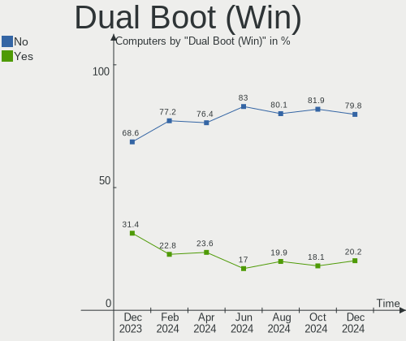
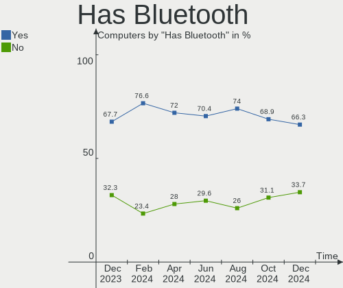
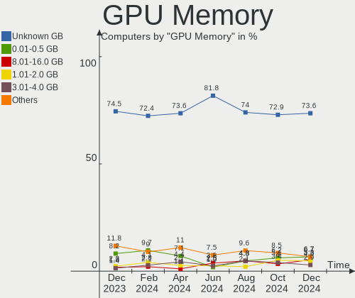
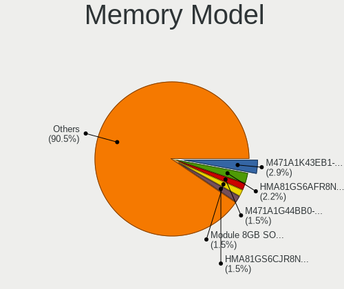
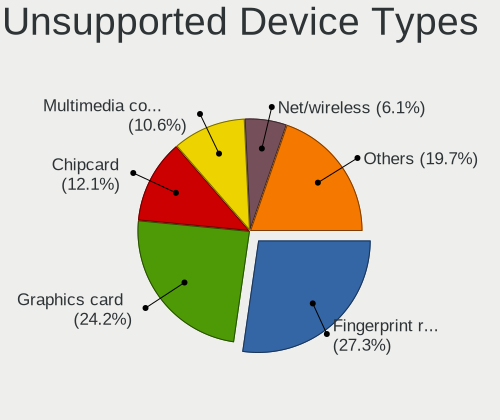

Linux in Canada - Hardware Trends
---------------------------------

A project to identify most popular hardware characteristics and track their change
over time based on data collected by Linux users at https://Linux-Hardware.org.

Anyone can contribute to this report by the [hw-probe](https://github.com/linuxhw/hw-probe) tool:

    sudo -E hw-probe -all -upload

This is a report for all computer types. See also reports for [desktops](/Location/Canada/Desktop/README.md) and [notebooks](/Location/Canada/Notebook/README.md).

Period: Sep, 2022.

Contents
--------

* [ System ](#system)
  - [ OS                       ](#os)
  - [ OS Family                ](#os-family)
  - [ Kernel                   ](#kernel)
  - [ Kernel Family            ](#kernel-family)
  - [ Kernel Major Ver.        ](#kernel-major-ver)
  - [ Arch                     ](#arch)
  - [ DE                       ](#de)
  - [ Display Server           ](#display-server)
  - [ Display Manager          ](#display-manager)
  - [ OS Lang                  ](#os-lang)
  - [ Boot Mode                ](#boot-mode)
  - [ Filesystem               ](#filesystem)
  - [ Part. scheme             ](#part-scheme)
  - [ Dual Boot with Linux/BSD ](#dual-boot-with-linuxbsd)
  - [ Dual Boot (Win)          ](#dual-boot-win)

* [ Board ](#board)
  - [ Vendor                   ](#vendor)
  - [ Model                    ](#model)
  - [ Model Family             ](#model-family)
  - [ MFG Year                 ](#mfg-year)
  - [ Form Factor              ](#form-factor)
  - [ Secure Boot              ](#secure-boot)
  - [ Coreboot                 ](#coreboot)
  - [ RAM Size                 ](#ram-size)
  - [ RAM Used                 ](#ram-used)
  - [ Total Drives             ](#total-drives)
  - [ Has CD-ROM               ](#has-cd-rom)
  - [ Has Ethernet             ](#has-ethernet)
  - [ Has WiFi                 ](#has-wifi)
  - [ Has Bluetooth            ](#has-bluetooth)

* [ Location ](#location)
  - [ Country                  ](#country)
  - [ City                     ](#city)

* [ Drives ](#drives)
  - [ Drive Vendor             ](#drive-vendor)
  - [ Drive Model              ](#drive-model)
  - [ HDD Vendor               ](#hdd-vendor)
  - [ SSD Vendor               ](#ssd-vendor)
  - [ Drive Kind               ](#drive-kind)
  - [ Drive Connector          ](#drive-connector)
  - [ Drive Size               ](#drive-size)
  - [ Space Total              ](#space-total)
  - [ Space Used               ](#space-used)
  - [ Malfunc. Drives          ](#malfunc-drives)
  - [ Malfunc. Drive Vendor    ](#malfunc-drive-vendor)
  - [ Malfunc. HDD Vendor      ](#malfunc-hdd-vendor)
  - [ Malfunc. Drive Kind      ](#malfunc-drive-kind)
  - [ Failed Drives            ](#failed-drives)
  - [ Failed Drive Vendor      ](#failed-drive-vendor)
  - [ Drive Status             ](#drive-status)

* [ Storage controller ](#storage-controller)
  - [ Storage Vendor           ](#storage-vendor)
  - [ Storage Model            ](#storage-model)
  - [ Storage Kind             ](#storage-kind)

* [ Processor ](#processor)
  - [ CPU Vendor               ](#cpu-vendor)
  - [ CPU Model                ](#cpu-model)
  - [ CPU Model Family         ](#cpu-model-family)
  - [ CPU Cores                ](#cpu-cores)
  - [ CPU Sockets              ](#cpu-sockets)
  - [ CPU Threads              ](#cpu-threads)
  - [ CPU Op-Modes             ](#cpu-op-modes)
  - [ CPU Microcode            ](#cpu-microcode)
  - [ CPU Microarch            ](#cpu-microarch)

* [ Graphics ](#graphics)
  - [ GPU Vendor               ](#gpu-vendor)
  - [ GPU Model                ](#gpu-model)
  - [ GPU Combo                ](#gpu-combo)
  - [ GPU Driver               ](#gpu-driver)
  - [ GPU Memory               ](#gpu-memory)

* [ Monitor ](#monitor)
  - [ Monitor Vendor           ](#monitor-vendor)
  - [ Monitor Model            ](#monitor-model)
  - [ Monitor Resolution       ](#monitor-resolution)
  - [ Monitor Diagonal         ](#monitor-diagonal)
  - [ Monitor Width            ](#monitor-width)
  - [ Aspect Ratio             ](#aspect-ratio)
  - [ Monitor Area             ](#monitor-area)
  - [ Pixel Density            ](#pixel-density)
  - [ Multiple Monitors        ](#multiple-monitors)

* [ Network ](#network)
  - [ Net Controller Vendor    ](#net-controller-vendor)
  - [ Net Controller Model     ](#net-controller-model)
  - [ Wireless Vendor          ](#wireless-vendor)
  - [ Wireless Model           ](#wireless-model)
  - [ Ethernet Vendor          ](#ethernet-vendor)
  - [ Ethernet Model           ](#ethernet-model)
  - [ Net Controller Kind      ](#net-controller-kind)
  - [ Used Controller          ](#used-controller)
  - [ NICs                     ](#nics)
  - [ IPv6                     ](#ipv6)

* [ Bluetooth ](#bluetooth)
  - [ Bluetooth Vendor         ](#bluetooth-vendor)
  - [ Bluetooth Model          ](#bluetooth-model)

* [ Sound ](#sound)
  - [ Sound Vendor             ](#sound-vendor)
  - [ Sound Model              ](#sound-model)

* [ Memory ](#memory)
  - [ Memory Vendor            ](#memory-vendor)
  - [ Memory Model             ](#memory-model)
  - [ Memory Kind              ](#memory-kind)
  - [ Memory Form Factor       ](#memory-form-factor)
  - [ Memory Size              ](#memory-size)
  - [ Memory Speed             ](#memory-speed)

* [ Printers & scanners ](#printers--scanners)
  - [ Printer Vendor           ](#printer-vendor)
  - [ Printer Model            ](#printer-model)
  - [ Scanner Vendor           ](#scanner-vendor)
  - [ Scanner Model            ](#scanner-model)

* [ Camera ](#camera)
  - [ Camera Vendor            ](#camera-vendor)
  - [ Camera Model             ](#camera-model)

* [ Security ](#security)
  - [ Fingerprint Vendor       ](#fingerprint-vendor)
  - [ Fingerprint Model        ](#fingerprint-model)
  - [ Chipcard Vendor          ](#chipcard-vendor)
  - [ Chipcard Model           ](#chipcard-model)

* [ Unsupported ](#unsupported)
  - [ Unsupported Devices      ](#unsupported-devices)
  - [ Unsupported Device Types ](#unsupported-device-types)

System
------

OS
--

Installed operating systems

| Name                         | Computers | Percent |
|------------------------------|-----------|---------|
| Ubuntu 22.04                 | 30        | 20.41%  |
| Fedora 36                    | 15        | 10.2%   |
| Linux Mint 21                | 13        | 8.84%   |
| Pop!_OS 22.04                | 8         | 5.44%   |
| Debian 11                    | 8         | 5.44%   |
| Ubuntu 20.04                 | 7         | 4.76%   |
| Linux Mint 20.3              | 6         | 4.08%   |
| SteamOS 3.3.1                | 5         | 3.4%    |
| Fedora 37                    | 5         | 3.4%    |
| Xubuntu 22.04                | 4         | 2.72%   |
| Zorin 16                     | 3         | 2.04%   |
| SteamOS 3.4                  | 3         | 2.04%   |
| Nobara 36                    | 3         | 2.04%   |
| EndeavourOS Rolling          | 3         | 2.04%   |
| Arch Rolling                 | 3         | 2.04%   |
| Arch                         | 3         | 2.04%   |
| Ubuntu MATE 22.04            | 2         | 1.36%   |
| Kali 2022.3                  | 2         | 1.36%   |
| Debian Testing               | 2         | 1.36%   |
| ArcoLinux Rolling            | 2         | 1.36%   |
| Xubuntu 20.04                | 1         | 0.68%   |
| Ubuntu Unity 22.04           | 1         | 0.68%   |
| Ubuntu 18.04                 | 1         | 0.68%   |
| SteamOS                      | 1         | 0.68%   |
| Rocky Linux 9.0              | 1         | 0.68%   |
| openSUSE Tumbleweed-XXXXXXXX | 1         | 0.68%   |
| OpenMandriva 4.50            | 1         | 0.68%   |
| OpenMandriva 4.3             | 1         | 0.68%   |
| OpenMandriva 4.2             | 1         | 0.68%   |
| Manjaro-ARM                  | 1         | 0.68%   |
| Manjaro                      | 1         | 0.68%   |
| Kubuntu 22.04                | 1         | 0.68%   |
| Kubuntu 18.04                | 1         | 0.68%   |
| KDE neon 20.04               | 1         | 0.68%   |
| Gentoo 2.8                   | 1         | 0.68%   |
| Garuda Linux Soaring         | 1         | 0.68%   |
| Garuda Linux                 | 1         | 0.68%   |
| EndeavourOS                  | 1         | 0.68%   |
| CentOS 7                     | 1         | 0.68%   |
| AlmaLinux 9.0                | 1         | 0.68%   |

OS Family
---------

OS without a version

| Name         | Computers | Percent |
|--------------|-----------|---------|
| Ubuntu       | 38        | 25.85%  |
| Fedora       | 20        | 13.61%  |
| Linux Mint   | 19        | 12.93%  |
| Debian       | 10        | 6.8%    |
| SteamOS      | 9         | 6.12%   |
| Pop!_OS      | 8         | 5.44%   |
| Arch         | 6         | 4.08%   |
| Xubuntu      | 5         | 3.4%    |
| EndeavourOS  | 4         | 2.72%   |
| Zorin        | 3         | 2.04%   |
| OpenMandriva | 3         | 2.04%   |
| Nobara       | 3         | 2.04%   |
| Ubuntu MATE  | 2         | 1.36%   |
| Kubuntu      | 2         | 1.36%   |
| Kali         | 2         | 1.36%   |
| Garuda Linux | 2         | 1.36%   |
| ArcoLinux    | 2         | 1.36%   |
| Ubuntu Unity | 1         | 0.68%   |
| Rocky Linux  | 1         | 0.68%   |
| openSUSE     | 1         | 0.68%   |
| Manjaro-ARM  | 1         | 0.68%   |
| Manjaro      | 1         | 0.68%   |
| KDE neon     | 1         | 0.68%   |
| Gentoo       | 1         | 0.68%   |
| CentOS       | 1         | 0.68%   |
| AlmaLinux    | 1         | 0.68%   |

Kernel
------

Version of the Linux kernel

| Version                                                      | Computers | Percent |
|--------------------------------------------------------------|-----------|---------|
| 5.15.0-47-generic                                            | 29        | 19.73%  |
| 5.15.0-48-generic                                            | 19        | 12.93%  |
| 5.19.0-76051900-generic                                      | 8         | 5.44%   |
| 5.4.0-125-generic                                            | 6         | 4.08%   |
| 5.19.9-200.fc36.x86_64                                       | 5         | 3.4%    |
| 5.15.0-46-generic                                            | 5         | 3.4%    |
| 5.13.0-valve21.1-1-neptune-02211-gc54cda5a36f3               | 5         | 3.4%    |
| 5.19.6-200.fc36.x86_64                                       | 3         | 2.04%   |
| 5.15.0-43-generic                                            | 3         | 2.04%   |
| 5.13.0-valve24-1-neptune-02226-g5b8545e4c5a1                 | 3         | 2.04%   |
| 5.4.0-126-generic                                            | 2         | 1.36%   |
| 5.4.0-124-generic                                            | 2         | 1.36%   |
| 5.19.9-zen1-1-zen                                            | 2         | 1.36%   |
| 5.19.8-zen1-1-zen                                            | 2         | 1.36%   |
| 5.19.8-200.fc36.x86_64                                       | 2         | 1.36%   |
| 5.19.7-204.fsync.fc36.x86_64                                 | 2         | 1.36%   |
| 5.19.0-1-amd64                                               | 2         | 1.36%   |
| 5.14.0-70.22.1.el9_0.x86_64                                  | 2         | 1.36%   |
| 5.10.0-18-amd64                                              | 2         | 1.36%   |
| 5.10.0-17-amd64                                              | 2         | 1.36%   |
| 5.10.0-16-amd64                                              | 2         | 1.36%   |
| 6.0.0-rc7-rt-amd64                                           | 1         | 0.68%   |
| 6.0.0-0.rc5.37.test.fc36.x86_64                              | 1         | 0.68%   |
| 6.0.0-0.rc5.20220913gite839a756012b.38.vanilla.1.fc36.x86_64 | 1         | 0.68%   |
| 5.8.15-301.fc33.x86_64                                       | 1         | 0.68%   |
| 5.4.0-91-generic                                             | 1         | 0.68%   |
| 5.4.0-72-generic                                             | 1         | 0.68%   |
| 5.19.9-arch1-1                                               | 1         | 0.68%   |
| 5.19.9-300.fc37.x86_64                                       | 1         | 0.68%   |
| 5.19.9-201.fsync.fc36.x86_64                                 | 1         | 0.68%   |
| 5.19.8-300.fc37.x86_64                                       | 1         | 0.68%   |
| 5.19.8-1-default                                             | 1         | 0.68%   |
| 5.19.7-zen2-1-zen                                            | 1         | 0.68%   |
| 5.19.7-300.fc37.x86_64                                       | 1         | 0.68%   |
| 5.19.7-1-MANJARO                                             | 1         | 0.68%   |
| 5.19.6-arch1-1                                               | 1         | 0.68%   |
| 5.19.5-desktop-1omv4090                                      | 1         | 0.68%   |
| 5.19.4-200.fc36.x86_64                                       | 1         | 0.68%   |
| 5.19.2-arch1-1                                               | 1         | 0.68%   |
| 5.19.11-zen1-1-zen                                           | 1         | 0.68%   |

Kernel Family
-------------

Linux kernel without a distro release

| Version  | Computers | Percent |
|----------|-----------|---------|
| 5.15.0   | 56        | 38.1%   |
| 5.4.0    | 12        | 8.16%   |
| 5.19.9   | 10        | 6.8%    |
| 5.19.0   | 10        | 6.8%    |
| 5.13.0   | 9         | 6.12%   |
| 5.19.8   | 6         | 4.08%   |
| 5.10.0   | 6         | 4.08%   |
| 5.19.7   | 5         | 3.4%    |
| 5.19.6   | 4         | 2.72%   |
| 6.0.0    | 3         | 2.04%   |
| 5.19.11  | 3         | 2.04%   |
| 5.19.10  | 3         | 2.04%   |
| 5.18.0   | 2         | 1.36%   |
| 5.17.0   | 2         | 1.36%   |
| 5.14.0   | 2         | 1.36%   |
| 5.8.15   | 1         | 0.68%   |
| 5.19.5   | 1         | 0.68%   |
| 5.19.4   | 1         | 0.68%   |
| 5.19.2   | 1         | 0.68%   |
| 5.19.1   | 1         | 0.68%   |
| 5.17.5   | 1         | 0.68%   |
| 5.16.7   | 1         | 0.68%   |
| 5.15.71  | 1         | 0.68%   |
| 5.15.70  | 1         | 0.68%   |
| 5.15.63  | 1         | 0.68%   |
| 5.15.54  | 1         | 0.68%   |
| 5.15.30  | 1         | 0.68%   |
| 5.10.14  | 1         | 0.68%   |
| 4.19.187 | 1         | 0.68%   |

Kernel Major Ver.
-----------------

Linux kernel major version

| Version | Computers | Percent |
|---------|-----------|---------|
| 5.15    | 61        | 41.5%   |
| 5.19    | 45        | 30.61%  |
| 5.4     | 12        | 8.16%   |
| 5.13    | 9         | 6.12%   |
| 5.10    | 7         | 4.76%   |
| 6.0     | 3         | 2.04%   |
| 5.17    | 3         | 2.04%   |
| 5.18    | 2         | 1.36%   |
| 5.14    | 2         | 1.36%   |
| 5.8     | 1         | 0.68%   |
| 5.16    | 1         | 0.68%   |
| 4.19    | 1         | 0.68%   |

Arch
----

OS architecture (x86_64, i586, etc.)

| Name    | Computers | Percent |
|---------|-----------|---------|
| x86_64  | 146       | 99.32%  |
| aarch64 | 1         | 0.68%   |

DE
--

Desktop Environment

| Name            | Computers | Percent |
|-----------------|-----------|---------|
| GNOME           | 76        | 51.7%   |
| KDE5            | 27        | 18.37%  |
| X-Cinnamon      | 12        | 8.16%   |
| XFCE            | 9         | 6.12%   |
| Unknown         | 7         | 4.76%   |
| MATE            | 4         | 2.72%   |
| Cinnamon        | 3         | 2.04%   |
| Unity           | 2         | 1.36%   |
| i3              | 2         | 1.36%   |
| GNOME Flashback | 2         | 1.36%   |
| qtile           | 1         | 0.68%   |
| KDE4            | 1         | 0.68%   |
| Enlightenment   | 1         | 0.68%   |

Display Server
--------------

X11 or Wayland

| Name    | Computers | Percent |
|---------|-----------|---------|
| X11     | 96        | 65.31%  |
| Wayland | 46        | 31.29%  |
| Tty     | 4         | 2.72%   |
| Unknown | 1         | 0.68%   |

Display Manager
---------------

SDDM, LightDM, etc.

| Name    | Computers | Percent |
|---------|-----------|---------|
| Unknown | 58        | 39.46%  |
| GDM3    | 34        | 23.13%  |
| LightDM | 27        | 18.37%  |
| GDM     | 15        | 10.2%   |
| SDDM    | 13        | 8.84%   |

OS Lang
-------

Language

| Lang  | Computers | Percent |
|-------|-----------|---------|
| en_CA | 93        | 63.27%  |
| en_US | 44        | 29.93%  |
| fr_CA | 7         | 4.76%   |
| fr_FR | 2         | 1.36%   |
| C     | 1         | 0.68%   |

Boot Mode
---------

EFI or BIOS

| Mode | Computers | Percent |
|------|-----------|---------|
| BIOS | 81        | 55.1%   |
| EFI  | 66        | 44.9%   |

Filesystem
----------

Type of filesystem

| Type    | Computers | Percent |
|---------|-----------|---------|
| Ext4    | 101       | 68.71%  |
| Btrfs   | 39        | 26.53%  |
| Overlay | 4         | 2.72%   |
| Xfs     | 2         | 1.36%   |
| Zfs     | 1         | 0.68%   |

Part. scheme
------------

Scheme of partitioning

| Type    | Computers | Percent |
|---------|-----------|---------|
| Unknown | 83        | 56.46%  |
| GPT     | 57        | 38.78%  |
| MBR     | 7         | 4.76%   |

Dual Boot with Linux/BSD
------------------------

Hosting more than one Linux/BSD

| Dual boot | Computers | Percent |
|-----------|-----------|---------|
| No        | 125       | 85.03%  |
| Yes       | 22        | 14.97%  |

Dual Boot (Win)
---------------

Hosting Linux and Windows

| Dual boot | Computers | Percent |
|-----------|-----------|---------|
| No        | 108       | 73.47%  |
| Yes       | 39        | 26.53%  |

Board
-----

Vendor
------

Motherboard manufacturer

| Name                      | Computers | Percent |
|---------------------------|-----------|---------|
| ASUSTek Computer          | 26        | 17.69%  |
| Lenovo                    | 23        | 15.65%  |
| Dell                      | 20        | 13.61%  |
| Hewlett-Packard           | 17        | 11.56%  |
| MSI                       | 10        | 6.8%    |
| Acer                      | 10        | 6.8%    |
| Valve                     | 8         | 5.44%   |
| Gigabyte Technology       | 8         | 5.44%   |
| ASRock                    | 4         | 2.72%   |
| Apple                     | 3         | 2.04%   |
| Samsung Electronics       | 2         | 1.36%   |
| Razer                     | 2         | 1.36%   |
| Microsoft                 | 2         | 1.36%   |
| Intel                     | 2         | 1.36%   |
| Toshiba                   | 1         | 0.68%   |
| Pine Microsystems         | 1         | 0.68%   |
| IBT.ca (IBT Technologies) | 1         | 0.68%   |
| Google                    | 1         | 0.68%   |
| Gateway                   | 1         | 0.68%   |
| ECS                       | 1         | 0.68%   |
| DFI                       | 1         | 0.68%   |
| BESSTAR Tech              | 1         | 0.68%   |
| AZW                       | 1         | 0.68%   |
| Unknown                   | 1         | 0.68%   |

Model
-----

Motherboard model

| Name                                       | Computers | Percent |
|--------------------------------------------|-----------|---------|
| Valve Jupiter                              | 8         | 5.44%   |
| MSI MS-7C37                                | 2         | 1.36%   |
| MSI MS-7599                                | 2         | 1.36%   |
| Lenovo ThinkStation P910 30B8S0EN00        | 2         | 1.36%   |
| HP EliteDesk 800 G1 SFF                    | 2         | 1.36%   |
| Toshiba Satellite P200                     | 1         | 0.68%   |
| Samsung 730QED                             | 1         | 0.68%   |
| Samsung 305E4A/305E5A/305E7A               | 1         | 0.68%   |
| Razer Blade 14 - RZ09-0370                 | 1         | 0.68%   |
| Razer Blade                                | 1         | 0.68%   |
| Pine Microsystems Pine64 PinePhone (1.2)   | 1         | 0.68%   |
| MSI MS-7A38                                | 1         | 0.68%   |
| MSI MS-7845                                | 1         | 0.68%   |
| MSI MS-7817                                | 1         | 0.68%   |
| MSI GS65 Stealth 9SE                       | 1         | 0.68%   |
| MSI GE75 Raider 8SF                        | 1         | 0.68%   |
| MSI Alpha 15 B5EEK                         | 1         | 0.68%   |
| Microsoft Surface Pro 2                    | 1         | 0.68%   |
| Microsoft Surface Laptop Go                | 1         | 0.68%   |
| Lenovo ThinkStation P350 30E6S20S00        | 1         | 0.68%   |
| Lenovo ThinkPad X230 23252UU               | 1         | 0.68%   |
| Lenovo ThinkPad X13 Yoga Gen 2 20W8001UUS  | 1         | 0.68%   |
| Lenovo ThinkPad X1 Carbon Gen 8 20U9A005CD | 1         | 0.68%   |
| Lenovo ThinkPad T61p 64575KU               | 1         | 0.68%   |
| Lenovo ThinkPad T510 4349BR8               | 1         | 0.68%   |
| Lenovo ThinkPad T480 20L5001FUS            | 1         | 0.68%   |
| Lenovo ThinkPad T460 20FMS43J0V            | 1         | 0.68%   |
| Lenovo ThinkPad T430 2347G4U               | 1         | 0.68%   |
| Lenovo ThinkPad T410 2518F5U               | 1         | 0.68%   |
| Lenovo ThinkPad T410 2516CTO               | 1         | 0.68%   |
| Lenovo ThinkPad P17 Gen 1 20SQS28100       | 1         | 0.68%   |
| Lenovo ThinkPad L460 20FVS1BC0S            | 1         | 0.68%   |
| Lenovo ThinkPad Edge E530 3259CTO          | 1         | 0.68%   |
| Lenovo ThinkPad E15 Gen 4 21EDCTO1WW       | 1         | 0.68%   |
| Lenovo ThinkCentre M93p 10A8S33600         | 1         | 0.68%   |
| Lenovo ThinkCentre M92p 3238E5U            | 1         | 0.68%   |
| Lenovo ThinkBook 13s G4 ARB 21AS           | 1         | 0.68%   |
| Lenovo IdeaPad Flex-15IWL 81SR             | 1         | 0.68%   |
| Lenovo IdeaPad 3 15IGL05 81WQ              | 1         | 0.68%   |
| Lenovo IdeaPad 3 15ARE05 81W4              | 1         | 0.68%   |

Model Family
------------

Motherboard model prefix

| Name                            | Computers | Percent |
|---------------------------------|-----------|---------|
| Lenovo ThinkPad                 | 14        | 9.52%   |
| Valve Jupiter                   | 8         | 5.44%   |
| Dell Latitude                   | 6         | 4.08%   |
| Acer Aspire                     | 6         | 4.08%   |
| Dell Inspiron                   | 5         | 3.4%    |
| ASUS ROG                        | 5         | 3.4%    |
| HP Pavilion                     | 4         | 2.72%   |
| Lenovo ThinkStation             | 3         | 2.04%   |
| Lenovo IdeaPad                  | 3         | 2.04%   |
| HP Compaq                       | 3         | 2.04%   |
| Dell XPS                        | 3         | 2.04%   |
| ASUS VivoBook                   | 3         | 2.04%   |
| ASUS PRIME                      | 3         | 2.04%   |
| Razer Blade                     | 2         | 1.36%   |
| MSI MS-7C37                     | 2         | 1.36%   |
| MSI MS-7599                     | 2         | 1.36%   |
| Microsoft Surface               | 2         | 1.36%   |
| Lenovo ThinkCentre              | 2         | 1.36%   |
| HP Laptop                       | 2         | 1.36%   |
| HP EliteDesk                    | 2         | 1.36%   |
| Gigabyte X570                   | 2         | 1.36%   |
| Dell PowerEdge                  | 2         | 1.36%   |
| ASUS TUF                        | 2         | 1.36%   |
| ASRock B450M                    | 2         | 1.36%   |
| Acer Swift                      | 2         | 1.36%   |
| Toshiba Satellite               | 1         | 0.68%   |
| Samsung 730QED                  | 1         | 0.68%   |
| Samsung 305E4A                  | 1         | 0.68%   |
| Pine Microsystems Pine64        | 1         | 0.68%   |
| MSI MS-7A38                     | 1         | 0.68%   |
| MSI MS-7845                     | 1         | 0.68%   |
| MSI MS-7817                     | 1         | 0.68%   |
| MSI GS65                        | 1         | 0.68%   |
| MSI GE75                        | 1         | 0.68%   |
| MSI Alpha                       | 1         | 0.68%   |
| Lenovo ThinkBook                | 1         | 0.68%   |
| Intel DQ67SW                    | 1         | 0.68%   |
| Intel DP35DP                    | 1         | 0.68%   |
| IBT.ca (IBT Technologies) MI836 | 1         | 0.68%   |
| HP Z440                         | 1         | 0.68%   |

MFG Year
--------

Motherboard manufacture year

| Year    | Computers | Percent |
|---------|-----------|---------|
| 2022    | 22        | 14.97%  |
| 2019    | 18        | 12.24%  |
| 2020    | 13        | 8.84%   |
| 2021    | 12        | 8.16%   |
| 2012    | 12        | 8.16%   |
| 2018    | 9         | 6.12%   |
| 2011    | 8         | 5.44%   |
| 2013    | 7         | 4.76%   |
| 2010    | 7         | 4.76%   |
| 2017    | 6         | 4.08%   |
| 2015    | 6         | 4.08%   |
| 2009    | 6         | 4.08%   |
| 2014    | 5         | 3.4%    |
| 2008    | 5         | 3.4%    |
| 2016    | 4         | 2.72%   |
| 2007    | 4         | 2.72%   |
| 2006    | 1         | 0.68%   |
| 2005    | 1         | 0.68%   |
| Unknown | 1         | 0.68%   |

Form Factor
-----------

Physical design of the computer

| Name        | Computers | Percent |
|-------------|-----------|---------|
| Notebook    | 70        | 47.62%  |
| Desktop     | 63        | 42.86%  |
| Convertible | 5         | 3.4%    |
| Server      | 3         | 2.04%   |
| Tablet      | 2         | 1.36%   |
| Mini pc     | 2         | 1.36%   |
| Phone       | 1         | 0.68%   |
| All in one  | 1         | 0.68%   |

Secure Boot
-----------

Enabled or disabled

| State    | Computers | Percent |
|----------|-----------|---------|
| Disabled | 138       | 93.88%  |
| Enabled  | 9         | 6.12%   |

Coreboot
--------

Have coreboot on board

| Used | Computers | Percent |
|------|-----------|---------|
| No   | 146       | 99.32%  |
| Yes  | 1         | 0.68%   |

RAM Size
--------

Total RAM memory

| Size in GB  | Computers | Percent |
|-------------|-----------|---------|
| 16.01-24.0  | 35        | 23.81%  |
| 8.01-16.0   | 27        | 18.37%  |
| 4.01-8.0    | 26        | 17.69%  |
| 32.01-64.0  | 25        | 17.01%  |
| 3.01-4.0    | 23        | 15.65%  |
| 64.01-256.0 | 5         | 3.4%    |
| 24.01-32.0  | 2         | 1.36%   |
| 1.01-2.0    | 2         | 1.36%   |
| 0.51-1.0    | 2         | 1.36%   |

RAM Used
--------

Used RAM memory

| Used GB   | Computers | Percent |
|-----------|-----------|---------|
| 2.01-3.0  | 41        | 27.89%  |
| 1.01-2.0  | 37        | 25.17%  |
| 4.01-8.0  | 30        | 20.41%  |
| 3.01-4.0  | 24        | 16.33%  |
| 8.01-16.0 | 8         | 5.44%   |
| 0.51-1.0  | 5         | 3.4%    |
| 0.01-0.5  | 2         | 1.36%   |

Total Drives
------------

Number of drives on board

| Drives | Computers | Percent |
|--------|-----------|---------|
| 1      | 78        | 53.06%  |
| 2      | 38        | 25.85%  |
| 3      | 12        | 8.16%   |
| 4      | 11        | 7.48%   |
| 5      | 4         | 2.72%   |
| 6      | 2         | 1.36%   |
| 10     | 1         | 0.68%   |
| 7      | 1         | 0.68%   |

Has CD-ROM
----------

Has CD-ROM on board

| Presented | Computers | Percent |
|-----------|-----------|---------|
| No        | 91        | 61.9%   |
| Yes       | 56        | 38.1%   |

Has Ethernet
------------

Has Ethernet on board

| Presented | Computers | Percent |
|-----------|-----------|---------|
| Yes       | 117       | 79.59%  |
| No        | 30        | 20.41%  |

Has WiFi
--------

Has WiFi module

| Presented | Computers | Percent |
|-----------|-----------|---------|
| Yes       | 113       | 76.87%  |
| No        | 34        | 23.13%  |

Has Bluetooth
-------------

Has Bluetooth module

| Presented | Computers | Percent |
|-----------|-----------|---------|
| Yes       | 88        | 59.86%  |
| No        | 59        | 40.14%  |

Location
--------

Country
-------

Geographic location (country)

| Country | Computers | Percent |
|---------|-----------|---------|
| Canada  | 147       | 100%    |

City
----

Geographic location (city)

| City              | Computers | Percent |
|-------------------|-----------|---------|
| Montreal          | 20        | 13.61%  |
| Toronto           | 14        | 9.52%   |
| Vancouver         | 6         | 4.08%   |
| Surrey            | 4         | 2.72%   |
| Ottawa            | 4         | 2.72%   |
| Calgary           | 4         | 2.72%   |
| Regina            | 3         | 2.04%   |
| North Vancouver   | 3         | 2.04%   |
| Edmonton          | 3         | 2.04%   |
| Brampton          | 3         | 2.04%   |
| Boucherville      | 3         | 2.04%   |
| Winnipeg          | 2         | 1.36%   |
| Rouyn-Noranda     | 2         | 1.36%   |
| Richmond          | 2         | 1.36%   |
| Nanaimo           | 2         | 1.36%   |
| Mississauga       | 2         | 1.36%   |
| Milton            | 2         | 1.36%   |
| Kingston          | 2         | 1.36%   |
| Hamilton          | 2         | 1.36%   |
| Burnaby           | 2         | 1.36%   |
| Woodville         | 1         | 0.68%   |
| Woodbridge        | 1         | 0.68%   |
| Weston            | 1         | 0.68%   |
| West Kelowna      | 1         | 0.68%   |
| Wabasca-Desmarais | 1         | 0.68%   |
| Victoriaville     | 1         | 0.68%   |
| Victoria          | 1         | 0.68%   |
| Vegreville        | 1         | 0.68%   |
| Vaudreuil-Dorion  | 1         | 0.68%   |
| Terrebonne        | 1         | 0.68%   |
| Terrace           | 1         | 0.68%   |
| Sydney            | 1         | 0.68%   |
| Stouffville       | 1         | 0.68%   |
| Steinbach         | 1         | 0.68%   |
| Spruce Grove      | 1         | 0.68%   |
| Simcoe            | 1         | 0.68%   |
| Sherbrooke        | 1         | 0.68%   |
| Selkirk           | 1         | 0.68%   |
| Scarborough       | 1         | 0.68%   |
| Saskatoon         | 1         | 0.68%   |

Drives
------

Drive Vendor
------------

Hard drive vendors

| Vendor                       | Computers | Drives | Percent |
|------------------------------|-----------|--------|---------|
| WDC                          | 39        | 50     | 16.05%  |
| Seagate                      | 37        | 56     | 15.23%  |
| Samsung Electronics          | 32        | 42     | 13.17%  |
| Kingston                     | 16        | 16     | 6.58%   |
| Sandisk                      | 15        | 16     | 6.17%   |
| Unknown                      | 13        | 15     | 5.35%   |
| Crucial                      | 13        | 13     | 5.35%   |
| Toshiba                      | 11        | 11     | 4.53%   |
| Intel                        | 8         | 8      | 3.29%   |
| SK hynix                     | 5         | 5      | 2.06%   |
| Phison                       | 5         | 6      | 2.06%   |
| Hitachi                      | 4         | 4      | 1.65%   |
| A-DATA Technology            | 4         | 4      | 1.65%   |
| Phison Electronics           | 3         | 3      | 1.23%   |
| KIOXIA                       | 3         | 3      | 1.23%   |
| HGST                         | 3         | 3      | 1.23%   |
| Apple                        | 3         | 3      | 1.23%   |
| SPCC                         | 2         | 2      | 0.82%   |
| OCZ                          | 2         | 2      | 0.82%   |
| Micron/Crucial Technology    | 2         | 2      | 0.82%   |
| Kingston Technology Company  | 2         | 2      | 0.82%   |
| JMicron Technology           | 2         | 2      | 0.82%   |
| Team                         | 1         | 1      | 0.41%   |
| Shenzhen Longsys Electronics | 1         | 1      | 0.41%   |
| Seagate Technology           | 1         | 1      | 0.41%   |
| Realtek Semiconductor        | 1         | 1      | 0.41%   |
| PNY                          | 1         | 1      | 0.41%   |
| Patriot                      | 1         | 1      | 0.41%   |
| NGFF                         | 1         | 1      | 0.41%   |
| Mushkin                      | 1         | 1      | 0.41%   |
| Micron Technology            | 1         | 1      | 0.41%   |
| Maxtor                       | 1         | 1      | 0.41%   |
| LITEONIT                     | 1         | 1      | 0.41%   |
| Kingchuxing                  | 1         | 2      | 0.41%   |
| Fujitsu                      | 1         | 1      | 0.41%   |
| DF4064                       | 1         | 1      | 0.41%   |
| Corsair                      | 1         | 1      | 0.41%   |
| CHN25SATAS1                  | 1         | 1      | 0.41%   |
| China                        | 1         | 1      | 0.41%   |
| ADATA Technology             | 1         | 1      | 0.41%   |

Drive Model
-----------

Hard drive models

| Model                                                 | Computers | Percent |
|-------------------------------------------------------|-----------|---------|
| Samsung NVMe SSD Controller SM981/PM981/PM983 256GB   | 5         | 1.82%   |
| Seagate ST1000DM003-1SB102 1TB                        | 3         | 1.09%   |
| Sandisk WD Blue SN550 NVMe SSD 1024GB                 | 3         | 1.09%   |
| Samsung SSD 850 EVO 250GB                             | 3         | 1.09%   |
| Phison NVMe SSD Drive 512GB                           | 3         | 1.09%   |
| Kingston SA400S37240G 240GB SSD                       | 3         | 1.09%   |
| Kingston NVMe SSD Drive 256GB                         | 3         | 1.09%   |
| Crucial CT1000MX500SSD1 1TB                           | 3         | 1.09%   |
| WDC WDBNCE5000PNC 500GB SSD                           | 2         | 0.73%   |
| WDC WD800JD-75MSA3 80GB                               | 2         | 0.73%   |
| WDC WD60EFZX-68B3FN0 6TB                              | 2         | 0.73%   |
| WDC WD3200BEVT-22ZCT0 320GB                           | 2         | 0.73%   |
| WDC WD30EFRX-68EUZN0 3TB                              | 2         | 0.73%   |
| WDC WD20EZRZ-00Z5HB0 2TB                              | 2         | 0.73%   |
| WDC WD10EZEX-08WN4A0 1TB                              | 2         | 0.73%   |
| Unknown MMC Card  128GB                               | 2         | 0.73%   |
| Toshiba DT01ACA300 3TB                                | 2         | 0.73%   |
| Seagate ST500DM002-1BD142 500GB                       | 2         | 0.73%   |
| Seagate ST4000DM004-2CV104 4TB                        | 2         | 0.73%   |
| Seagate ST3320418AS 320GB                             | 2         | 0.73%   |
| Seagate ST2000LX001-1RG174 2TB                        | 2         | 0.73%   |
| Seagate ST2000DM008-2FR102 2TB                        | 2         | 0.73%   |
| Seagate ST1000LM024 HN-M101MBB 1TB                    | 2         | 0.73%   |
| Seagate ST1000DM003-1ER162 1TB                        | 2         | 0.73%   |
| Seagate Portable 2TB                                  | 2         | 0.73%   |
| Seagate BUP Portable 4TB                              | 2         | 0.73%   |
| Sandisk WD Black SN750 / PC SN730 NVMe SSD 1024GB     | 2         | 0.73%   |
| Sandisk WD Black 2018/SN750 / PC SN720 NVMe SSD 512GB | 2         | 0.73%   |
| SanDisk NVMe SSD Drive 1TB                            | 2         | 0.73%   |
| Samsung SSD 970 EVO Plus 500GB                        | 2         | 0.73%   |
| Samsung SSD 870 EVO 1TB                               | 2         | 0.73%   |
| Samsung SSD 860 EVO 250GB                             | 2         | 0.73%   |
| Samsung SSD 840 EVO 250GB                             | 2         | 0.73%   |
| Samsung NVMe SSD Drive 256GB                          | 2         | 0.73%   |
| Phison E16 PCIe4 NVMe Controller 1TB                  | 2         | 0.73%   |
| Kingston SA400S37120G 120GB SSD                       | 2         | 0.73%   |
| Kingston NVMe SSD Drive 512GB                         | 2         | 0.73%   |
| Intel SSD 660P Series 512GB                           | 2         | 0.73%   |
| Crucial CT2000MX500SSD1 2TB                           | 2         | 0.73%   |
| Crucial CT1050MX300SSD1 1TB                           | 2         | 0.73%   |

HDD Vendor
----------

Hard disk drive vendors

| Vendor              | Computers | Drives | Percent |
|---------------------|-----------|--------|---------|
| Seagate             | 33        | 51     | 37.08%  |
| WDC                 | 32        | 42     | 35.96%  |
| Toshiba             | 9         | 9      | 10.11%  |
| Hitachi             | 4         | 4      | 4.49%   |
| HGST                | 3         | 3      | 3.37%   |
| Apple               | 3         | 3      | 3.37%   |
| Unknown             | 1         | 1      | 1.12%   |
| Samsung Electronics | 1         | 1      | 1.12%   |
| Maxtor              | 1         | 1      | 1.12%   |
| JMicron Technology  | 1         | 1      | 1.12%   |
| Fujitsu             | 1         | 1      | 1.12%   |

SSD Vendor
----------

Solid state drive vendors

| Vendor              | Computers | Drives | Percent |
|---------------------|-----------|--------|---------|
| Samsung Electronics | 16        | 19     | 25%     |
| Crucial             | 12        | 12     | 18.75%  |
| Kingston            | 7         | 7      | 10.94%  |
| SanDisk             | 4         | 4      | 6.25%   |
| WDC                 | 3         | 3      | 4.69%   |
| A-DATA Technology   | 3         | 3      | 4.69%   |
| Toshiba             | 2         | 2      | 3.13%   |
| SPCC                | 2         | 2      | 3.13%   |
| Seagate             | 2         | 2      | 3.13%   |
| OCZ                 | 2         | 2      | 3.13%   |
| Team                | 1         | 1      | 1.56%   |
| SK hynix            | 1         | 1      | 1.56%   |
| PNY                 | 1         | 1      | 1.56%   |
| Patriot             | 1         | 1      | 1.56%   |
| NGFF                | 1         | 1      | 1.56%   |
| Mushkin             | 1         | 1      | 1.56%   |
| LITEONIT            | 1         | 1      | 1.56%   |
| Kingchuxing         | 1         | 1      | 1.56%   |
| Intel               | 1         | 1      | 1.56%   |
| Corsair             | 1         | 1      | 1.56%   |
| China               | 1         | 1      | 1.56%   |

Drive Kind
----------

HDD or SSD

| Kind    | Computers | Drives | Percent |
|---------|-----------|--------|---------|
| HDD     | 71        | 117    | 33.65%  |
| NVMe    | 67        | 83     | 31.75%  |
| SSD     | 54        | 67     | 25.59%  |
| MMC     | 13        | 15     | 6.16%   |
| Unknown | 6         | 6      | 2.84%   |

Drive Connector
---------------

SATA, SAS, NVMe, etc.

| Type | Computers | Drives | Percent |
|------|-----------|--------|---------|
| SATA | 98        | 175    | 51.58%  |
| NVMe | 67        | 82     | 35.26%  |
| MMC  | 13        | 15     | 6.84%   |
| SAS  | 12        | 16     | 6.32%   |

Drive Size
----------

Size of hard drive

| Size in TB | Computers | Drives | Percent |
|------------|-----------|--------|---------|
| 0.01-0.5   | 61        | 87     | 44.85%  |
| 0.51-1.0   | 42        | 51     | 30.88%  |
| 1.01-2.0   | 16        | 22     | 11.76%  |
| 3.01-4.0   | 6         | 8      | 4.41%   |
| 2.01-3.0   | 6         | 10     | 4.41%   |
| 4.01-10.0  | 5         | 6      | 3.68%   |

Space Total
-----------

Amount of disk space available on the file system

| Size in GB     | Computers | Percent |
|----------------|-----------|---------|
| 251-500        | 38        | 25.85%  |
| 101-250        | 35        | 23.81%  |
| 501-1000       | 21        | 14.29%  |
| More than 3000 | 18        | 12.24%  |
| 1001-2000      | 10        | 6.8%    |
| 1-20           | 8         | 5.44%   |
| 51-100         | 8         | 5.44%   |
| 2001-3000      | 5         | 3.4%    |
| 21-50          | 2         | 1.36%   |
| Unknown        | 2         | 1.36%   |

Space Used
----------

Amount of used disk space

| Used GB        | Computers | Percent |
|----------------|-----------|---------|
| 1-20           | 47        | 31.97%  |
| 21-50          | 25        | 17.01%  |
| 101-250        | 21        | 14.29%  |
| 251-500        | 18        | 12.24%  |
| 51-100         | 11        | 7.48%   |
| More than 3000 | 8         | 5.44%   |
| 501-1000       | 7         | 4.76%   |
| 1001-2000      | 6         | 4.08%   |
| 2001-3000      | 2         | 1.36%   |
| Unknown        | 2         | 1.36%   |

Malfunc. Drives
---------------

Drive models with a malfunction

| Model                                 | Computers | Drives | Percent |
|---------------------------------------|-----------|--------|---------|
| WDC WD7500BPKT-60PK4T0 752GB          | 1         | 1      | 7.14%   |
| WDC WD3200BEVT-22ZCT0 320GB           | 1         | 1      | 7.14%   |
| WDC WD2003FYYS-02W0B0 2TB             | 1         | 2      | 7.14%   |
| SK hynix HFS128G3AMNB-2200A 128GB SSD | 1         | 1      | 7.14%   |
| Seagate ST500LT012-1DG142 500GB       | 1         | 1      | 7.14%   |
| Seagate ST500LM021-1KJ152 500GB       | 1         | 1      | 7.14%   |
| Seagate ST3160815AS 160GB             | 1         | 1      | 7.14%   |
| Seagate ST1000LX015-1U7172 1TB        | 1         | 1      | 7.14%   |
| Seagate ST1000LM014-1EJ164 1TB        | 1         | 1      | 7.14%   |
| Samsung Electronics SSD 840 EVO 250GB | 1         | 1      | 7.14%   |
| Samsung Electronics HM160HC 160GB     | 1         | 1      | 7.14%   |
| Hitachi HUS724030ALE641 3TB           | 1         | 1      | 7.14%   |
| Hitachi HDS725050KLA360 500GB         | 1         | 1      | 7.14%   |
| Crucial CT960M500SSD1 960GB           | 1         | 1      | 7.14%   |

Malfunc. Drive Vendor
---------------------

Vendors of faulty drives

| Vendor              | Computers | Drives | Percent |
|---------------------|-----------|--------|---------|
| WDC                 | 3         | 4      | 25%     |
| Seagate             | 3         | 5      | 25%     |
| Samsung Electronics | 2         | 2      | 16.67%  |
| Hitachi             | 2         | 2      | 16.67%  |
| SK hynix            | 1         | 1      | 8.33%   |
| Crucial             | 1         | 1      | 8.33%   |

Malfunc. HDD Vendor
-------------------

Vendors of faulty HDD drives

| Vendor              | Computers | Drives | Percent |
|---------------------|-----------|--------|---------|
| WDC                 | 3         | 4      | 33.33%  |
| Seagate             | 3         | 5      | 33.33%  |
| Hitachi             | 2         | 2      | 22.22%  |
| Samsung Electronics | 1         | 1      | 11.11%  |

Malfunc. Drive Kind
-------------------

Kinds of faulty drives

| Kind | Computers | Drives | Percent |
|------|-----------|--------|---------|
| HDD  | 9         | 12     | 75%     |
| SSD  | 3         | 3      | 25%     |

Failed Drives
-------------

Failed drive models

Zero info for selected period =(

Failed Drive Vendor
-------------------

Failed drive vendors

Zero info for selected period =(

Drive Status
------------

Number of failed and malfunc. drives

| Status   | Computers | Drives | Percent |
|----------|-----------|--------|---------|
| Detected | 100       | 189    | 60.61%  |
| Works    | 54        | 84     | 32.73%  |
| Malfunc  | 11        | 15     | 6.67%   |

Storage controller
------------------

Storage Vendor
--------------

Storage controller vendors

| Vendor                       | Computers | Percent |
|------------------------------|-----------|---------|
| Intel                        | 85        | 42.29%  |
| AMD                          | 35        | 17.41%  |
| Samsung Electronics          | 18        | 8.96%   |
| SanDisk                      | 15        | 7.46%   |
| Kingston Technology Company  | 11        | 5.47%   |
| Phison Electronics           | 8         | 3.98%   |
| SK hynix                     | 4         | 1.99%   |
| Micron/Crucial Technology    | 3         | 1.49%   |
| Marvell Technology Group     | 3         | 1.49%   |
| KIOXIA                       | 3         | 1.49%   |
| JMicron Technology           | 3         | 1.49%   |
| ASMedia Technology           | 3         | 1.49%   |
| Nvidia                       | 2         | 1%      |
| LSI Logic / Symbios Logic    | 2         | 1%      |
| ADATA Technology             | 2         | 1%      |
| Shenzhen Longsys Electronics | 1         | 0.5%    |
| Seagate Technology           | 1         | 0.5%    |
| Realtek Semiconductor        | 1         | 0.5%    |
| Micron Technology            | 1         | 0.5%    |

Storage Model
-------------

Storage controller models

| Model                                                                          | Computers | Percent |
|--------------------------------------------------------------------------------|-----------|---------|
| AMD FCH SATA Controller [AHCI mode]                                            | 24        | 10.3%   |
| Samsung NVMe SSD Controller SM981/PM981/PM983                                  | 9         | 3.86%   |
| Intel 8 Series/C220 Series Chipset Family 6-port SATA Controller 1 [AHCI mode] | 8         | 3.43%   |
| Kingston Company OM3PDP3 NVMe SSD                                              | 6         | 2.58%   |
| Intel 6 Series/C200 Series Chipset Family 6 port Desktop SATA AHCI Controller  | 6         | 2.58%   |
| AMD 400 Series Chipset SATA Controller                                         | 6         | 2.58%   |
| SanDisk WD Blue SN550 NVMe SSD                                                 | 5         | 2.15%   |
| Intel Volume Management Device NVMe RAID Controller                            | 5         | 2.15%   |
| Samsung NVMe SSD Controller PM9A1/PM9A3/980PRO                                 | 4         | 1.72%   |
| Intel Sunrise Point-LP SATA Controller [AHCI mode]                             | 4         | 1.72%   |
| Intel SSD 660P Series                                                          | 4         | 1.72%   |
| Intel Celeron/Pentium Silver Processor SATA Controller                         | 4         | 1.72%   |
| Intel Cannon Lake Mobile PCH SATA AHCI Controller                              | 4         | 1.72%   |
| Intel 7 Series Chipset Family 6-port SATA Controller [AHCI mode]               | 4         | 1.72%   |
| Intel 5 Series/3400 Series Chipset 6 port SATA AHCI Controller                 | 4         | 1.72%   |
| AMD SB7x0/SB8x0/SB9x0 IDE Controller                                           | 4         | 1.72%   |
| SanDisk WD Black SN750 / PC SN730 NVMe SSD                                     | 3         | 1.29%   |
| SanDisk WD Black 2018/SN750 / PC SN720 NVMe SSD                                | 3         | 1.29%   |
| Samsung NVMe SSD Controller 980                                                | 3         | 1.29%   |
| Phison PS5013 E13 NVMe Controller                                              | 3         | 1.29%   |
| Phison E16 PCIe4 NVMe Controller                                               | 3         | 1.29%   |
| Intel C610/X99 series chipset sSATA Controller [AHCI mode]                     | 3         | 1.29%   |
| Intel C610/X99 series chipset 6-Port SATA Controller [AHCI mode]               | 3         | 1.29%   |
| Intel 82801 Mobile SATA Controller [RAID mode]                                 | 3         | 1.29%   |
| Intel 7 Series/C210 Series Chipset Family 6-port SATA Controller [AHCI mode]   | 3         | 1.29%   |
| ASMedia ASM1062 Serial ATA Controller                                          | 3         | 1.29%   |
| AMD 300 Series Chipset SATA Controller                                         | 3         | 1.29%   |
| SK hynix Non-Volatile memory controller                                        | 2         | 0.86%   |
| SK hynix Gold P31 SSD                                                          | 2         | 0.86%   |
| SanDisk WD Blue SN570 NVMe SSD                                                 | 2         | 0.86%   |
| SanDisk Non-Volatile memory controller                                         | 2         | 0.86%   |
| Samsung NVMe SSD Controller SM961/PM961/SM963                                  | 2         | 0.86%   |
| Micron/Crucial P1 NVMe PCIe SSD                                                | 2         | 0.86%   |
| KIOXIA Non-Volatile memory controller                                          | 2         | 0.86%   |
| Kingston Company U-SNS8154P3 NVMe SSD                                          | 2         | 0.86%   |
| Kingston Company A2000 NVMe SSD                                                | 2         | 0.86%   |
| JMicron JMB363 SATA/IDE Controller                                             | 2         | 0.86%   |
| Intel Tiger Lake-LP SATA Controller                                            | 2         | 0.86%   |
| Intel Q170/Q150/B150/H170/H110/Z170/CM236 Chipset SATA Controller [AHCI Mode]  | 2         | 0.86%   |
| Intel Non-Volatile memory controller                                           | 2         | 0.86%   |

Storage Kind
------------

Kind of storage controller (IDE, SATA, NVMe, SAS, ...)

| Kind | Computers | Percent |
|------|-----------|---------|
| SATA | 98        | 49.25%  |
| NVMe | 67        | 33.67%  |
| IDE  | 21        | 10.55%  |
| RAID | 12        | 6.03%   |
| SAS  | 1         | 0.5%    |

Processor
---------

CPU Vendor
----------

Processor vendors

| Vendor | Computers | Percent |
|--------|-----------|---------|
| Intel  | 94        | 63.95%  |
| AMD    | 52        | 35.37%  |
| ARM    | 1         | 0.68%   |

CPU Model
---------

Processor models

| Model                                         | Computers | Percent |
|-----------------------------------------------|-----------|---------|
| AMD Custom APU 0405                           | 8         | 5.44%   |
| Intel Core i5-3320M CPU @ 2.60GHz             | 3         | 2.04%   |
| Intel Celeron N4020 CPU @ 1.10GHz             | 3         | 2.04%   |
| Intel 11th Gen Core i5-1135G7 @ 2.40GHz       | 3         | 2.04%   |
| Intel Xeon CPU E5-2640 v4 @ 2.40GHz           | 2         | 1.36%   |
| Intel Core i7-9750H CPU @ 2.60GHz             | 2         | 1.36%   |
| Intel Core i7-8750H CPU @ 2.20GHz             | 2         | 1.36%   |
| Intel Core i7-7700HQ CPU @ 2.80GHz            | 2         | 1.36%   |
| Intel Core i7-4790 CPU @ 3.60GHz              | 2         | 1.36%   |
| Intel Core i5-3210M CPU @ 2.50GHz             | 2         | 1.36%   |
| Intel Core i5-1035G1 CPU @ 1.00GHz            | 2         | 1.36%   |
| Intel Core i5 CPU M 560 @ 2.67GHz             | 2         | 1.36%   |
| Intel Core i5 CPU M 520 @ 2.40GHz             | 2         | 1.36%   |
| Intel Atom x5-Z8350 CPU @ 1.44GHz             | 2         | 1.36%   |
| AMD Ryzen 9 5900HX with Radeon Graphics       | 2         | 1.36%   |
| AMD Ryzen 9 3900X 12-Core Processor           | 2         | 1.36%   |
| AMD Ryzen 7 5825U with Radeon Graphics        | 2         | 1.36%   |
| AMD Ryzen 7 3800X 8-Core Processor            | 2         | 1.36%   |
| AMD Ryzen 7 3700X 8-Core Processor            | 2         | 1.36%   |
| AMD Ryzen 5 3500U with Radeon Vega Mobile Gfx | 2         | 1.36%   |
| AMD Phenom II X6 1090T Processor              | 2         | 1.36%   |
| AMD A10-5800K APU with Radeon HD Graphics     | 2         | 1.36%   |
| Intel Xeon W-1350 @ 3.30GHz                   | 1         | 0.68%   |
| Intel Xeon CPU L5520 @ 2.27GHz                | 1         | 0.68%   |
| Intel Xeon CPU E5645 @ 2.40GHz                | 1         | 0.68%   |
| Intel Xeon CPU E5-2660 v3 @ 2.60GHz           | 1         | 0.68%   |
| Intel Pentium D CPU 3.00GHz                   | 1         | 0.68%   |
| Intel Pentium CPU N3710 @ 1.60GHz             | 1         | 0.68%   |
| Intel Pentium CPU N3530 @ 2.16GHz             | 1         | 0.68%   |
| Intel Pentium CPU G630 @ 2.70GHz              | 1         | 0.68%   |
| Intel Genuine CPU U2700 @ 1.30GHz             | 1         | 0.68%   |
| Intel Core i7-8650U CPU @ 1.90GHz             | 1         | 0.68%   |
| Intel Core i7-8565U CPU @ 1.80GHz             | 1         | 0.68%   |
| Intel Core i7-7700K CPU @ 4.20GHz             | 1         | 0.68%   |
| Intel Core i7-6700 CPU @ 3.40GHz              | 1         | 0.68%   |
| Intel Core i7-4810MQ CPU @ 2.80GHz            | 1         | 0.68%   |
| Intel Core i7-4790K CPU @ 4.00GHz             | 1         | 0.68%   |
| Intel Core i7-4770 CPU @ 3.40GHz              | 1         | 0.68%   |
| Intel Core i7-2600K CPU @ 3.40GHz             | 1         | 0.68%   |
| Intel Core i7-2600 CPU @ 3.40GHz              | 1         | 0.68%   |

CPU Model Family
----------------

Processor model prefix

| Model                   | Computers | Percent |
|-------------------------|-----------|---------|
| Intel Core i5           | 32        | 21.77%  |
| Other                   | 20        | 13.61%  |
| Intel Core i7           | 19        | 12.93%  |
| AMD Ryzen 7             | 13        | 8.84%   |
| AMD Ryzen 5             | 13        | 8.84%   |
| Intel Core 2 Duo        | 7         | 4.76%   |
| Intel Celeron           | 7         | 4.76%   |
| Intel Xeon              | 6         | 4.08%   |
| AMD Ryzen 9             | 5         | 3.4%    |
| Intel Pentium           | 3         | 2.04%   |
| Intel Core i3           | 3         | 2.04%   |
| Intel Atom              | 3         | 2.04%   |
| AMD A10                 | 3         | 2.04%   |
| AMD Phenom II X6        | 2         | 1.36%   |
| Intel Pentium D         | 1         | 0.68%   |
| Intel Genuine           | 1         | 0.68%   |
| Intel Core 2 Quad       | 1         | 0.68%   |
| AMD Turion II           | 1         | 0.68%   |
| AMD Turion 64 X2 Mobile | 1         | 0.68%   |
| AMD Turion 64 Mobile    | 1         | 0.68%   |
| AMD Phenom              | 1         | 0.68%   |
| AMD Opteron             | 1         | 0.68%   |
| AMD FX                  | 1         | 0.68%   |
| AMD Athlon II X4        | 1         | 0.68%   |
| AMD A4                  | 1         | 0.68%   |

CPU Cores
---------

Number of processor cores

| Number  | Computers | Percent |
|---------|-----------|---------|
| 4       | 55        | 37.41%  |
| 2       | 41        | 27.89%  |
| 8       | 18        | 12.24%  |
| 6       | 17        | 11.56%  |
| 12      | 4         | 2.72%   |
| 10      | 4         | 2.72%   |
| 20      | 2         | 1.36%   |
| 3       | 2         | 1.36%   |
| 1       | 2         | 1.36%   |
| 16      | 1         | 0.68%   |
| Unknown | 1         | 0.68%   |

CPU Sockets
-----------

Number of sockets

| Number  | Computers | Percent |
|---------|-----------|---------|
| 1       | 142       | 96.6%   |
| 2       | 4         | 2.72%   |
| Unknown | 1         | 0.68%   |

CPU Threads
-----------

Threads per core (Hyper-Threading)

| Number  | Computers | Percent |
|---------|-----------|---------|
| 2       | 102       | 69.39%  |
| 1       | 44        | 29.93%  |
| Unknown | 1         | 0.68%   |

CPU Op-Modes
------------

CPU Operation Modes (32-bit, 64-bit)

| Op mode        | Computers | Percent |
|----------------|-----------|---------|
| 32-bit, 64-bit | 146       | 99.32%  |
| 64-bit         | 1         | 0.68%   |

CPU Microcode
-------------

Microcode number

| Number     | Computers | Percent |
|------------|-----------|---------|
| Unknown    | 52        | 35.37%  |
| 0x306a9    | 6         | 4.08%   |
| 0x906ea    | 5         | 3.4%    |
| 0x0a50000c | 5         | 3.4%    |
| 0x08701021 | 5         | 3.4%    |
| 0x706a8    | 4         | 2.72%   |
| 0x306c3    | 4         | 2.72%   |
| 0x206a7    | 4         | 2.72%   |
| 0x906e9    | 3         | 2.04%   |
| 0x406e3    | 3         | 2.04%   |
| 0x406c4    | 3         | 2.04%   |
| 0x20655    | 3         | 2.04%   |
| 0x20652    | 3         | 2.04%   |
| 0x1067a    | 3         | 2.04%   |
| 0x08108109 | 3         | 2.04%   |
| 0x906a4    | 2         | 1.36%   |
| 0x806e9    | 2         | 1.36%   |
| 0x706e5    | 2         | 1.36%   |
| 0x30678    | 2         | 1.36%   |
| 0x0800820d | 2         | 1.36%   |
| 0x010000dc | 2         | 1.36%   |
| 0xf44      | 1         | 0.68%   |
| 0xa0671    | 1         | 0.68%   |
| 0xa0653    | 1         | 0.68%   |
| 0xa0652    | 1         | 0.68%   |
| 0x90672    | 1         | 0.68%   |
| 0x90661    | 1         | 0.68%   |
| 0x806ec    | 1         | 0.68%   |
| 0x806ea    | 1         | 0.68%   |
| 0x806d1    | 1         | 0.68%   |
| 0x806c2    | 1         | 0.68%   |
| 0x706a1    | 1         | 0.68%   |
| 0x6fd      | 1         | 0.68%   |
| 0x6fb      | 1         | 0.68%   |
| 0x6fa      | 1         | 0.68%   |
| 0x506e3    | 1         | 0.68%   |
| 0x406f1    | 1         | 0.68%   |
| 0x40651    | 1         | 0.68%   |
| 0x206c2    | 1         | 0.68%   |
| 0x106e5    | 1         | 0.68%   |

CPU Microarch
-------------

Microarchitecture

| Name             | Computers | Percent |
|------------------|-----------|---------|
| KabyLake         | 13        | 8.84%   |
| Unknown          | 13        | 8.84%   |
| Haswell          | 12        | 8.16%   |
| Zen 3            | 10        | 6.8%    |
| Zen 2            | 10        | 6.8%    |
| IvyBridge        | 9         | 6.12%   |
| Zen+             | 7         | 4.76%   |
| Westmere         | 7         | 4.76%   |
| SandyBridge      | 7         | 4.76%   |
| TigerLake        | 5         | 3.4%    |
| Skylake          | 5         | 3.4%    |
| Silvermont       | 5         | 3.4%    |
| Penryn           | 5         | 3.4%    |
| K10              | 5         | 3.4%    |
| Goldmont plus    | 5         | 3.4%    |
| Icelake          | 4         | 2.72%   |
| Core             | 4         | 2.72%   |
| Zen              | 3         | 2.04%   |
| Piledriver       | 2         | 1.36%   |
| Nehalem          | 2         | 1.36%   |
| K8 Hammer        | 2         | 1.36%   |
| CometLake        | 2         | 1.36%   |
| Bulldozer        | 2         | 1.36%   |
| Broadwell        | 2         | 1.36%   |
| Alderlake Hybrid | 2         | 1.36%   |
| Tremont          | 1         | 0.68%   |
| NetBurst         | 1         | 0.68%   |
| K10 Llano        | 1         | 0.68%   |
| Excavator        | 1         | 0.68%   |

Graphics
--------

GPU Vendor
----------

Vendors of graphics cards

| Vendor                     | Computers | Percent |
|----------------------------|-----------|---------|
| Intel                      | 69        | 41.57%  |
| AMD                        | 49        | 29.52%  |
| Nvidia                     | 45        | 27.11%  |
| Matrox Electronics Systems | 2         | 1.2%    |
| ASPEED Technology          | 1         | 0.6%    |

GPU Model
---------

Graphics card models

| Model                                                                                    | Computers | Percent |
|------------------------------------------------------------------------------------------|-----------|---------|
| AMD VanGogh [AMD Custom GPU 0405]                                                        | 8         | 4.68%   |
| Intel TigerLake-LP GT2 [Iris Xe Graphics]                                                | 5         | 2.92%   |
| Intel GeminiLake [UHD Graphics 600]                                                      | 5         | 2.92%   |
| Intel CoffeeLake-H GT2 [UHD Graphics 630]                                                | 5         | 2.92%   |
| Intel 3rd Gen Core processor Graphics Controller                                         | 5         | 2.92%   |
| Intel Xeon E3-1200 v3/4th Gen Core Processor Integrated Graphics Controller              | 4         | 2.34%   |
| Intel Core Processor Integrated Graphics Controller                                      | 4         | 2.34%   |
| Intel 2nd Generation Core Processor Family Integrated Graphics Controller                | 4         | 2.34%   |
| AMD Ellesmere [Radeon RX 470/480/570/570X/580/580X/590]                                  | 4         | 2.34%   |
| AMD Cezanne                                                                              | 4         | 2.34%   |
| Nvidia GA104M [GeForce RTX 3080 Mobile / Max-Q 8GB/16GB]                                 | 3         | 1.75%   |
| Intel Xeon E3-1200 v2/3rd Gen Core processor Graphics Controller                         | 3         | 1.75%   |
| Intel VGA compatible controller                                                          | 3         | 1.75%   |
| Intel Mobile 4 Series Chipset Integrated Graphics Controller                             | 3         | 1.75%   |
| Intel Atom/Celeron/Pentium Processor x5-E8000/J3xxx/N3xxx Integrated Graphics Controller | 3         | 1.75%   |
| AMD Picasso/Raven 2 [Radeon Vega Series / Radeon Vega Mobile Series]                     | 3         | 1.75%   |
| AMD Navi 23 [Radeon RX 6600/6600 XT/6600M]                                               | 3         | 1.75%   |
| AMD Barcelo                                                                              | 3         | 1.75%   |
| Nvidia TU117M [GeForce GTX 1650 Mobile / Max-Q]                                          | 2         | 1.17%   |
| Nvidia TU104 [GeForce RTX 2060]                                                          | 2         | 1.17%   |
| Nvidia GT218M [NVS 3100M]                                                                | 2         | 1.17%   |
| Nvidia GP106 [GeForce GTX 1060 3GB]                                                      | 2         | 1.17%   |
| Nvidia GM200 [GeForce GTX TITAN X]                                                       | 2         | 1.17%   |
| Nvidia GK107GL [Quadro K420]                                                             | 2         | 1.17%   |
| Intel TigerLake-H GT1 [UHD Graphics]                                                     | 2         | 1.17%   |
| Intel Skylake GT2 [HD Graphics 520]                                                      | 2         | 1.17%   |
| Intel Iris Plus Graphics G1 (Ice Lake)                                                   | 2         | 1.17%   |
| Intel Atom Processor Z36xxx/Z37xxx Series Graphics & Display                             | 2         | 1.17%   |
| AMD Trinity [Radeon HD 7660D]                                                            | 2         | 1.17%   |
| AMD Renoir                                                                               | 2         | 1.17%   |
| AMD Navi 22 [Radeon RX 6700/6700 XT/6750 XT / 6800M]                                     | 2         | 1.17%   |
| AMD Navi 10 [Radeon RX 5600 OEM/5600 XT / 5700/5700 XT]                                  | 2         | 1.17%   |
| Nvidia TU117GLM [Quadro T2000 Mobile / Max-Q]                                            | 1         | 0.58%   |
| Nvidia TU116 [GeForce GTX 1660]                                                          | 1         | 0.58%   |
| Nvidia TU116 [GeForce GTX 1660 SUPER]                                                    | 1         | 0.58%   |
| Nvidia TU116 [GeForce GTX 1650 SUPER]                                                    | 1         | 0.58%   |
| Nvidia TU106M [GeForce RTX 2070 Mobile]                                                  | 1         | 0.58%   |
| Nvidia TU106M [GeForce RTX 2060 Mobile]                                                  | 1         | 0.58%   |
| Nvidia TU106 [GeForce RTX 2070 Rev. A]                                                   | 1         | 0.58%   |
| Nvidia GT218 [GeForce 210]                                                               | 1         | 0.58%   |

GPU Combo
---------

Combinations of graphics cards

| Name            | Computers | Percent |
|-----------------|-----------|---------|
| 1 x Intel       | 52        | 35.37%  |
| 1 x AMD         | 40        | 27.21%  |
| 1 x Nvidia      | 28        | 19.05%  |
| Intel + Nvidia  | 14        | 9.52%   |
| 2 x AMD         | 5         | 3.4%    |
| 1 x Matrox      | 2         | 1.36%   |
| Intel + AMD     | 2         | 1.36%   |
| AMD + Nvidia    | 2         | 1.36%   |
| Other           | 1         | 0.68%   |
| Nvidia + ASPEED | 1         | 0.68%   |

GPU Driver
----------

Free vs proprietary

| Driver      | Computers | Percent |
|-------------|-----------|---------|
| Free        | 121       | 82.31%  |
| Proprietary | 23        | 15.65%  |
| Unknown     | 3         | 2.04%   |

GPU Memory
----------

Total video memory

| Size in GB | Computers | Percent |
|------------|-----------|---------|
| Unknown    | 92        | 62.59%  |
| 0.01-0.5   | 14        | 9.52%   |
| 7.01-8.0   | 11        | 7.48%   |
| 1.01-2.0   | 9         | 6.12%   |
| 3.01-4.0   | 8         | 5.44%   |
| 5.01-6.0   | 6         | 4.08%   |
| 0.51-1.0   | 4         | 2.72%   |
| 2.01-3.0   | 2         | 1.36%   |
| 8.01-16.0  | 1         | 0.68%   |

Monitor
-------

Monitor Vendor
--------------

Monitor vendors

| Vendor                  | Computers | Percent |
|-------------------------|-----------|---------|
| Samsung Electronics     | 19        | 11.73%  |
| Goldstar                | 16        | 9.88%   |
| Chimei Innolux          | 12        | 7.41%   |
| LG Display              | 11        | 6.79%   |
| AU Optronics            | 11        | 6.79%   |
| BOE                     | 9         | 5.56%   |
| Hewlett-Packard         | 8         | 4.94%   |
| Dell                    | 8         | 4.94%   |
| BenQ                    | 6         | 3.7%    |
| ANX                     | 5         | 3.09%   |
| Ancor Communications    | 5         | 3.09%   |
| Acer                    | 5         | 3.09%   |
| ViewSonic               | 4         | 2.47%   |
| Sharp                   | 4         | 2.47%   |
| Lenovo                  | 4         | 2.47%   |
| Chi Mei Optoelectronics | 4         | 2.47%   |
| Valve                   | 3         | 1.85%   |
| AOC                     | 3         | 1.85%   |
| Toshiba                 | 2         | 1.23%   |
| TMX                     | 2         | 1.23%   |
| LG Philips              | 2         | 1.23%   |
| LG Electronics          | 2         | 1.23%   |
| Lenovo Group Limited    | 2         | 1.23%   |
| ASUSTek Computer        | 2         | 1.23%   |
| Apple                   | 2         | 1.23%   |
| Unknown                 | 2         | 1.23%   |
| Westinghouse            | 1         | 0.62%   |
| Philips                 | 1         | 0.62%   |
| MSI                     | 1         | 0.62%   |
| Insignia                | 1         | 0.62%   |
| InfoVision              | 1         | 0.62%   |
| HKC                     | 1         | 0.62%   |
| HannStar                | 1         | 0.62%   |
| GreenWood               | 1         | 0.62%   |
| CHR                     | 1         | 0.62%   |

Monitor Model
-------------

Monitor models

| Model                                                                    | Computers | Percent |
|--------------------------------------------------------------------------|-----------|---------|
| ANX ANX7530 U ANX7539 800x1280                                           | 5         | 2.98%   |
| Valve ANX7530 U VLV3001 800x1280 100x150mm 7.1-inch                      | 3         | 1.79%   |
| Chimei Innolux LCD Monitor CMN15F5 1920x1080 344x193mm 15.5-inch         | 3         | 1.79%   |
| Lenovo LCD Monitor LEN4036 1440x900 303x190mm 14.1-inch                  | 2         | 1.19%   |
| Lenovo Group Limited LCD Monitor L2251x Wide                             | 2         | 1.19%   |
| Goldstar FULL HD GSM5B55 1920x1080 480x270mm 21.7-inch                   | 2         | 1.19%   |
| Goldstar 32inch FHD GSM76F3 1920x1080 698x392mm 31.5-inch                | 2         | 1.19%   |
| Chimei Innolux LCD Monitor CMN1515 1920x1080 344x193mm 15.5-inch         | 2         | 1.19%   |
| Chi Mei Optoelectronics LCD Monitor CMO15A3 1366x768 344x193mm 15.5-inch | 2         | 1.19%   |
| Unknown                                                                  | 2         | 1.19%   |
| Westinghouse WE50UR4200 WET6586 1920x1080 708x398mm 32.0-inch            | 1         | 0.6%    |
| ViewSonic VX3211-2K VSCF634 2560x1440 698x392mm 31.5-inch                | 1         | 0.6%    |
| ViewSonic VA2448 SERIES VSC3828 1920x1080 521x293mm 23.5-inch            | 1         | 0.6%    |
| ViewSonic VA2259 Series VSC5E32 1920x1080 476x268mm 21.5-inch            | 1         | 0.6%    |
| ViewSonic VA1948 SERIES VSCE827 1440x900 408x255mm 18.9-inch             | 1         | 0.6%    |
| Toshiba LCD Monitor LCD2207 1280x800 287x180mm 13.3-inch                 | 1         | 0.6%    |
| Toshiba LCD Monitor LCD1309 1600x900 295x166mm 13.3-inch                 | 1         | 0.6%    |
| TMX TL156MDMP01-0 TMX1560 3200x2000 336x210mm 15.6-inch                  | 1         | 0.6%    |
| TMX TL140BDXP01-0 TMX1400 2560x1440 310x174mm 14.0-inch                  | 1         | 0.6%    |
| Sharp LQ156M1JW03 SHP155D 1920x1080 344x194mm 15.5-inch                  | 1         | 0.6%    |
| Sharp LQ156M1JW03 SHP14C5 1920x1080 344x194mm 15.5-inch                  | 1         | 0.6%    |
| Sharp LCD Monitor SHP1548 1920x1200 288x180mm 13.4-inch                  | 1         | 0.6%    |
| Sharp LCD Monitor SHP14BA 1920x1080 344x194mm 15.5-inch                  | 1         | 0.6%    |
| Samsung Electronics T22B350 SAM0938 1920x1080 477x268mm 21.5-inch        | 1         | 0.6%    |
| Samsung Electronics SyncMaster SAM062E 1280x1024 376x301mm 19.0-inch     | 1         | 0.6%    |
| Samsung Electronics SyncMaster SAM058C 1600x900 443x249mm 20.0-inch      | 1         | 0.6%    |
| Samsung Electronics SyncMaster SAM037C 1680x1050 470x300mm 22.0-inch     | 1         | 0.6%    |
| Samsung Electronics SyncMaster SAM02B6 1920x1200 518x324mm 24.1-inch     | 1         | 0.6%    |
| Samsung Electronics SyncMaster SAM027F 1680x1050 474x296mm 22.0-inch     | 1         | 0.6%    |
| Samsung Electronics SMB2430HD SAM0711 1920x1080 531x299mm 24.0-inch      | 1         | 0.6%    |
| Samsung Electronics SA300/SA350 SAM0793 1920x1080 531x299mm 24.0-inch    | 1         | 0.6%    |
| Samsung Electronics S27R35A SAM7126 1920x1080 598x336mm 27.0-inch        | 1         | 0.6%    |
| Samsung Electronics S24R35xFZ SAM71A8 1920x1080 521x293mm 23.5-inch      | 1         | 0.6%    |
| Samsung Electronics S24F350 SAM0D20 1920x1080 521x293mm 23.5-inch        | 1         | 0.6%    |
| Samsung Electronics LCD Monitor SEC5441 1366x768 353x198mm 15.9-inch     | 1         | 0.6%    |
| Samsung Electronics LCD Monitor SEC384A 1366x768 344x194mm 15.5-inch     | 1         | 0.6%    |
| Samsung Electronics LCD Monitor SEC3242 1920x1080 235x132mm 10.6-inch    | 1         | 0.6%    |
| Samsung Electronics LCD Monitor SDC434B 3840x2160 344x194mm 15.5-inch    | 1         | 0.6%    |
| Samsung Electronics LCD Monitor SDC4156 1920x1080 294x165mm 13.3-inch    | 1         | 0.6%    |
| Samsung Electronics LCD Monitor SDC354A 1366x768 344x194mm 15.5-inch     | 1         | 0.6%    |

Monitor Resolution
------------------

Monitor screen resolution

| Resolution         | Computers | Percent |
|--------------------|-----------|---------|
| 1920x1080 (FHD)    | 66        | 40.99%  |
| 1366x768 (WXGA)    | 16        | 9.94%   |
| 2560x1440 (QHD)    | 13        | 8.07%   |
| 800x1280           | 8         | 4.97%   |
| 1440x900 (WXGA+)   | 8         | 4.97%   |
| 1920x1200 (WUXGA)  | 7         | 4.35%   |
| 1600x900 (HD+)     | 7         | 4.35%   |
| 3840x2160 (4K)     | 6         | 3.73%   |
| 1680x1050 (WSXGA+) | 5         | 3.11%   |
| 1280x1024 (SXGA)   | 5         | 3.11%   |
| 2560x1080          | 3         | 1.86%   |
| Unknown            | 3         | 1.86%   |
| 3600x1080          | 2         | 1.24%   |
| 2560x1600          | 2         | 1.24%   |
| 1280x800 (WXGA)    | 2         | 1.24%   |
| 6400x2160          | 1         | 0.62%   |
| 3840x1080          | 1         | 0.62%   |
| 3440x1440          | 1         | 0.62%   |
| 3200x2000          | 1         | 0.62%   |
| 3072x1920          | 1         | 0.62%   |
| 2880x1800          | 1         | 0.62%   |
| 2736x1824          | 1         | 0.62%   |
| 1360x768           | 1         | 0.62%   |

Monitor Diagonal
----------------

Diagonal size in inches

| Inches  | Computers | Percent |
|---------|-----------|---------|
| 15      | 32        | 19.63%  |
| 24      | 16        | 9.82%   |
| 27      | 15        | 9.2%    |
| 13      | 15        | 9.2%    |
| 23      | 11        | 6.75%   |
| 17      | 11        | 6.75%   |
| 14      | 11        | 6.75%   |
| Unknown | 11        | 6.75%   |
| 21      | 8         | 4.91%   |
| 19      | 6         | 3.68%   |
| 31      | 5         | 3.07%   |
| 34      | 4         | 2.45%   |
| 20      | 4         | 2.45%   |
| 22      | 3         | 1.84%   |
| 7       | 3         | 1.84%   |
| 12      | 2         | 1.23%   |
| 32      | 1         | 0.61%   |
| 29      | 1         | 0.61%   |
| 25      | 1         | 0.61%   |
| 18      | 1         | 0.61%   |
| 16      | 1         | 0.61%   |
| 11      | 1         | 0.61%   |

Monitor Width
-------------

Physical width

| Width in mm | Computers | Percent |
|-------------|-----------|---------|
| 301-350     | 53        | 33.76%  |
| 501-600     | 35        | 22.29%  |
| 401-500     | 20        | 12.74%  |
| 351-400     | 11        | 7.01%   |
| 201-300     | 11        | 7.01%   |
| Unknown     | 11        | 7.01%   |
| 601-700     | 8         | 5.1%    |
| 701-800     | 5         | 3.18%   |
| 1-100       | 3         | 1.91%   |

Aspect Ratio
------------

Proportional relationship between the width and the height

| Ratio   | Computers | Percent |
|---------|-----------|---------|
| 16/9    | 96        | 64.43%  |
| 16/10   | 29        | 19.46%  |
| Unknown | 6         | 4.03%   |
| 0.62    | 5         | 3.36%   |
| 5/4     | 4         | 2.68%   |
| 21/9    | 4         | 2.68%   |
| 0.67    | 3         | 2.01%   |
| 6/5     | 1         | 0.67%   |
| 3/2     | 1         | 0.67%   |

Monitor Area
------------

Area in inch

| Area in inch | Computers | Percent |
|----------------|-----------|---------|
| 101-110        | 32        | 20.13%  |
| 201-250        | 29        | 18.24%  |
| 81-90          | 18        | 11.32%  |
| 301-350        | 15        | 9.43%   |
| 151-200        | 14        | 8.81%   |
| 351-500        | 11        | 6.92%   |
| Unknown        | 11        | 6.92%   |
| 71-80          | 9         | 5.66%   |
| 121-130        | 6         | 3.77%   |
| 1-40           | 3         | 1.89%   |
| 251-300        | 3         | 1.89%   |
| 141-150        | 3         | 1.89%   |
| 131-140        | 2         | 1.26%   |
| 61-70          | 1         | 0.63%   |
| 51-60          | 1         | 0.63%   |
| 111-120        | 1         | 0.63%   |

Pixel Density
-------------

Pixels per inch

| Density       | Computers | Percent |
|---------------|-----------|---------|
| 51-100        | 60        | 39.74%  |
| 121-160       | 37        | 24.5%   |
| 101-120       | 25        | 16.56%  |
| 161-240       | 14        | 9.27%   |
| Unknown       | 11        | 7.28%   |
| More than 240 | 4         | 2.65%   |

Multiple Monitors
-----------------

Total monitors connected

| Total | Computers | Percent |
|-------|-----------|---------|
| 1     | 116       | 78.91%  |
| 2     | 26        | 17.69%  |
| 3     | 3         | 2.04%   |
| 0     | 2         | 1.36%   |

Network
-------

Net Controller Vendor
---------------------

Controller vendors

| Vendor                | Computers | Percent |
|-----------------------|-----------|---------|
| Intel                 | 88        | 40.55%  |
| Realtek Semiconductor | 71        | 32.72%  |
| Qualcomm Atheros      | 18        | 8.29%   |
| Broadcom              | 10        | 4.61%   |
| MediaTek              | 5         | 2.3%    |
| Ralink                | 3         | 1.38%   |
| TP-Link               | 2         | 0.92%   |
| Ralink Technology     | 2         | 0.92%   |
| Nvidia                | 2         | 0.92%   |
| Microsoft             | 2         | 0.92%   |
| D-Link                | 2         | 0.92%   |
| ASIX Electronics      | 2         | 0.92%   |
| TRENDnet              | 1         | 0.46%   |
| Samsung Electronics   | 1         | 0.46%   |
| Linksys               | 1         | 0.46%   |
| JMicron Technology    | 1         | 0.46%   |
| Edimax Technology     | 1         | 0.46%   |
| DisplayLink           | 1         | 0.46%   |
| D-Link System         | 1         | 0.46%   |
| Broadcom Limited      | 1         | 0.46%   |
| AMD                   | 1         | 0.46%   |
| 3Com                  | 1         | 0.46%   |

Net Controller Model
--------------------

Controller models

| Model                                                             | Computers | Percent |
|-------------------------------------------------------------------|-----------|---------|
| Realtek RTL8111/8168/8411 PCI Express Gigabit Ethernet Controller | 40        | 15.5%   |
| Realtek RTL8822CE 802.11ac PCIe Wireless Network Adapter          | 10        | 3.88%   |
| Intel Wi-Fi 6 AX200                                               | 10        | 3.88%   |
| Intel I211 Gigabit Network Connection                             | 8         | 3.1%    |
| Intel 82579LM Gigabit Network Connection (Lewisville)             | 8         | 3.1%    |
| Realtek RTL8153 Gigabit Ethernet Adapter                          | 5         | 1.94%   |
| Intel Ethernet Connection I217-LM                                 | 5         | 1.94%   |
| Realtek RTL810xE PCI Express Fast Ethernet controller             | 4         | 1.55%   |
| Realtek 802.11ac NIC                                              | 4         | 1.55%   |
| Qualcomm Atheros AR8131 Gigabit Ethernet                          | 4         | 1.55%   |
| Intel Wireless 8260                                               | 4         | 1.55%   |
| Intel Wi-Fi 6 AX210/AX211/AX411 160MHz                            | 4         | 1.55%   |
| Intel I210 Gigabit Network Connection                             | 4         | 1.55%   |
| Intel Cannon Lake PCH CNVi WiFi                                   | 4         | 1.55%   |
| Intel 82577LM Gigabit Network Connection                          | 4         | 1.55%   |
| Realtek RTL8125 2.5GbE Controller                                 | 3         | 1.16%   |
| Qualcomm Atheros AR9485 Wireless Network Adapter                  | 3         | 1.16%   |
| Intel Wireless 8265 / 8275                                        | 3         | 1.16%   |
| Intel Wireless 7260                                               | 3         | 1.16%   |
| Intel Wi-Fi 6 AX201                                               | 3         | 1.16%   |
| Intel Ethernet Connection (2) I218-LM                             | 3         | 1.16%   |
| Intel Dual Band Wireless-AC 3168NGW [Stone Peak]                  | 3         | 1.16%   |
| Intel Centrino Advanced-N 6205 [Taylor Peak]                      | 3         | 1.16%   |
| Realtek RTL8822BE 802.11a/b/g/n/ac WiFi adapter                   | 2         | 0.78%   |
| Realtek RTL8821CE 802.11ac PCIe Wireless Network Adapter          | 2         | 0.78%   |
| Realtek RTL8723BU 802.11b/g/n WLAN Adapter                        | 2         | 0.78%   |
| Realtek Realtek Network controller                                | 2         | 0.78%   |
| Ralink MT7601U Wireless Adapter                                   | 2         | 0.78%   |
| Ralink RT3090 Wireless 802.11n 1T/1R PCIe                         | 2         | 0.78%   |
| Qualcomm Atheros QCA9377 802.11ac Wireless Network Adapter        | 2         | 0.78%   |
| Qualcomm Atheros Killer E2500 Gigabit Ethernet Controller         | 2         | 0.78%   |
| Qualcomm Atheros AR9285 Wireless Network Adapter (PCI-Express)    | 2         | 0.78%   |
| Microsoft Xbox 360 Wireless Adapter                               | 2         | 0.78%   |
| MediaTek MT7921K (RZ608) Wi-Fi 6E 80MHz                           | 2         | 0.78%   |
| MediaTek MT7921 802.11ax PCI Express Wireless Network Adapter     | 2         | 0.78%   |
| Intel Wireless 3165                                               | 2         | 0.78%   |
| Intel PRO/Wireless 4965 AG or AGN [Kedron] Network Connection     | 2         | 0.78%   |
| Intel Ice Lake-LP PCH CNVi WiFi                                   | 2         | 0.78%   |
| Intel Gemini Lake PCH CNVi WiFi                                   | 2         | 0.78%   |
| Intel Ethernet Controller I225-V                                  | 2         | 0.78%   |

Wireless Vendor
---------------

Wireless vendors

| Vendor                | Computers | Percent |
|-----------------------|-----------|---------|
| Intel                 | 58        | 47.54%  |
| Realtek Semiconductor | 24        | 19.67%  |
| Qualcomm Atheros      | 13        | 10.66%  |
| Broadcom              | 8         | 6.56%   |
| MediaTek              | 5         | 4.1%    |
| Ralink                | 3         | 2.46%   |
| TP-Link               | 2         | 1.64%   |
| Ralink Technology     | 2         | 1.64%   |
| Microsoft             | 2         | 1.64%   |
| D-Link                | 2         | 1.64%   |
| TRENDnet              | 1         | 0.82%   |
| Linksys               | 1         | 0.82%   |
| Edimax Technology     | 1         | 0.82%   |

Wireless Model
--------------

Wireless models

| Model                                                                      | Computers | Percent |
|----------------------------------------------------------------------------|-----------|---------|
| Realtek RTL8822CE 802.11ac PCIe Wireless Network Adapter                   | 10        | 8.06%   |
| Intel Wi-Fi 6 AX200                                                        | 10        | 8.06%   |
| Realtek 802.11ac NIC                                                       | 4         | 3.23%   |
| Intel Wireless 8260                                                        | 4         | 3.23%   |
| Intel Wi-Fi 6 AX210/AX211/AX411 160MHz                                     | 4         | 3.23%   |
| Intel Cannon Lake PCH CNVi WiFi                                            | 4         | 3.23%   |
| Qualcomm Atheros AR9485 Wireless Network Adapter                           | 3         | 2.42%   |
| Intel Wireless 8265 / 8275                                                 | 3         | 2.42%   |
| Intel Wireless 7260                                                        | 3         | 2.42%   |
| Intel Wi-Fi 6 AX201                                                        | 3         | 2.42%   |
| Intel Dual Band Wireless-AC 3168NGW [Stone Peak]                           | 3         | 2.42%   |
| Intel Centrino Advanced-N 6205 [Taylor Peak]                               | 3         | 2.42%   |
| Realtek RTL8822BE 802.11a/b/g/n/ac WiFi adapter                            | 2         | 1.61%   |
| Realtek RTL8821CE 802.11ac PCIe Wireless Network Adapter                   | 2         | 1.61%   |
| Realtek RTL8723BU 802.11b/g/n WLAN Adapter                                 | 2         | 1.61%   |
| Realtek Realtek Network controller                                         | 2         | 1.61%   |
| Ralink MT7601U Wireless Adapter                                            | 2         | 1.61%   |
| Ralink RT3090 Wireless 802.11n 1T/1R PCIe                                  | 2         | 1.61%   |
| Qualcomm Atheros QCA9377 802.11ac Wireless Network Adapter                 | 2         | 1.61%   |
| Qualcomm Atheros AR9285 Wireless Network Adapter (PCI-Express)             | 2         | 1.61%   |
| Microsoft Xbox 360 Wireless Adapter                                        | 2         | 1.61%   |
| MediaTek MT7921K (RZ608) Wi-Fi 6E 80MHz                                    | 2         | 1.61%   |
| MediaTek MT7921 802.11ax PCI Express Wireless Network Adapter              | 2         | 1.61%   |
| Intel Wireless 3165                                                        | 2         | 1.61%   |
| Intel PRO/Wireless 4965 AG or AGN [Kedron] Network Connection              | 2         | 1.61%   |
| Intel Ice Lake-LP PCH CNVi WiFi                                            | 2         | 1.61%   |
| Intel Gemini Lake PCH CNVi WiFi                                            | 2         | 1.61%   |
| Intel Centrino Ultimate-N 6300                                             | 2         | 1.61%   |
| Intel Alder Lake-P PCH CNVi WiFi                                           | 2         | 1.61%   |
| D-Link 802.11ac NIC                                                        | 2         | 1.61%   |
| Broadcom BCM4360 802.11ac Wireless Network Adapter                         | 2         | 1.61%   |
| TRENDnet TEW-805UB 300Mbps+867Mbps Wireless AC Adapter [Realtek RTL8812AU] | 1         | 0.81%   |
| TP-Link TL-WN823N v2/v3 [Realtek RTL8192EU]                                | 1         | 0.81%   |
| TP-Link Archer T2U PLUS [RTL8821AU]                                        | 1         | 0.81%   |
| Realtek RTL8192EU 802.11b/g/n WLAN Adapter                                 | 1         | 0.81%   |
| Realtek RTL8192EE PCIe Wireless Network Adapter                            | 1         | 0.81%   |
| Realtek RTL8191SEvB Wireless LAN Controller                                | 1         | 0.81%   |
| Ralink RT3290 Wireless 802.11n 1T/1R PCIe                                  | 1         | 0.81%   |
| Qualcomm Atheros QCA9565 / AR9565 Wireless Network Adapter                 | 1         | 0.81%   |
| Qualcomm Atheros QCA6174 802.11ac Wireless Network Adapter                 | 1         | 0.81%   |

Ethernet Vendor
---------------

Ethernet vendors

| Vendor                | Computers | Percent |
|-----------------------|-----------|---------|
| Realtek Semiconductor | 54        | 42.86%  |
| Intel                 | 50        | 39.68%  |
| Qualcomm Atheros      | 7         | 5.56%   |
| Broadcom              | 4         | 3.17%   |
| Nvidia                | 2         | 1.59%   |
| ASIX Electronics      | 2         | 1.59%   |
| Samsung Electronics   | 1         | 0.79%   |
| JMicron Technology    | 1         | 0.79%   |
| DisplayLink           | 1         | 0.79%   |
| D-Link System         | 1         | 0.79%   |
| D-Link                | 1         | 0.79%   |
| Broadcom Limited      | 1         | 0.79%   |
| 3Com                  | 1         | 0.79%   |

Ethernet Model
--------------

Ethernet models

| Model                                                             | Computers | Percent |
|-------------------------------------------------------------------|-----------|---------|
| Realtek RTL8111/8168/8411 PCI Express Gigabit Ethernet Controller | 40        | 30.08%  |
| Intel I211 Gigabit Network Connection                             | 8         | 6.02%   |
| Intel 82579LM Gigabit Network Connection (Lewisville)             | 8         | 6.02%   |
| Realtek RTL8153 Gigabit Ethernet Adapter                          | 5         | 3.76%   |
| Intel Ethernet Connection I217-LM                                 | 5         | 3.76%   |
| Realtek RTL810xE PCI Express Fast Ethernet controller             | 4         | 3.01%   |
| Qualcomm Atheros AR8131 Gigabit Ethernet                          | 4         | 3.01%   |
| Intel I210 Gigabit Network Connection                             | 4         | 3.01%   |
| Intel 82577LM Gigabit Network Connection                          | 4         | 3.01%   |
| Realtek RTL8125 2.5GbE Controller                                 | 3         | 2.26%   |
| Intel Ethernet Connection (2) I218-LM                             | 3         | 2.26%   |
| Qualcomm Atheros Killer E2500 Gigabit Ethernet Controller         | 2         | 1.5%    |
| Intel Ethernet Controller I225-V                                  | 2         | 1.5%    |
| Broadcom NetXtreme BCM57766 Gigabit Ethernet PCIe                 | 2         | 1.5%    |
| ASIX AX88179 Gigabit Ethernet                                     | 2         | 1.5%    |
| Samsung Galaxy series, misc. (tethering mode)                     | 1         | 0.75%   |
| Realtek USB 10/100/1G/2.5G LAN                                    | 1         | 0.75%   |
| Realtek RTL-8100/8101L/8139 PCI Fast Ethernet Adapter             | 1         | 0.75%   |
| Realtek Killer E3000 2.5GbE Controller                            | 1         | 0.75%   |
| Qualcomm Atheros Killer E220x Gigabit Ethernet Controller         | 1         | 0.75%   |
| Nvidia MCP67 Ethernet                                             | 1         | 0.75%   |
| Nvidia MCP61 Ethernet                                             | 1         | 0.75%   |
| JMicron JMC250 PCI Express Gigabit Ethernet Controller            | 1         | 0.75%   |
| Intel NM10/ICH7 Family LAN Controller                             | 1         | 0.75%   |
| Intel I350 Gigabit Network Connection                             | 1         | 0.75%   |
| Intel Ethernet Controller (2) I225-IT                             | 1         | 0.75%   |
| Intel Ethernet Connection I219-V                                  | 1         | 0.75%   |
| Intel Ethernet Connection I219-LM                                 | 1         | 0.75%   |
| Intel Ethernet Connection (4) I219-LM                             | 1         | 0.75%   |
| Intel Ethernet Connection (2) I219-V                              | 1         | 0.75%   |
| Intel Ethernet Connection (2) I219-LM                             | 1         | 0.75%   |
| Intel Ethernet Connection (2) I218-V                              | 1         | 0.75%   |
| Intel Ethernet Connection (14) I219-V                             | 1         | 0.75%   |
| Intel Ethernet Connection (14) I219-LM                            | 1         | 0.75%   |
| Intel Ethernet Connection (11) I219-V                             | 1         | 0.75%   |
| Intel Ethernet Connection (10) I219-V                             | 1         | 0.75%   |
| Intel Centrino Advanced-N + WiMAX 6250                            | 1         | 0.75%   |
| Intel 82579V Gigabit Network Connection                           | 1         | 0.75%   |
| Intel 82576 Gigabit Network Connection                            | 1         | 0.75%   |
| Intel 82574L Gigabit Network Connection                           | 1         | 0.75%   |

Net Controller Kind
-------------------

Ethernet, WiFi or modem

| Kind     | Computers | Percent |
|----------|-----------|---------|
| Ethernet | 116       | 50.66%  |
| WiFi     | 112       | 48.91%  |
| Modem    | 1         | 0.44%   |

Used Controller
---------------

Currently used network controller

| Kind     | Computers | Percent |
|----------|-----------|---------|
| WiFi     | 90        | 57.69%  |
| Ethernet | 66        | 42.31%  |

NICs
----

Total network controllers on board

| Total | Computers | Percent |
|-------|-----------|---------|
| 2     | 72        | 48.98%  |
| 1     | 65        | 44.22%  |
| 3     | 7         | 4.76%   |
| 0     | 2         | 1.36%   |
| 4     | 1         | 0.68%   |

IPv6
----

IPv6 vs IPv4

| Used | Computers | Percent |
|------|-----------|---------|
| No   | 118       | 80.27%  |
| Yes  | 29        | 19.73%  |

Bluetooth
---------

Bluetooth Vendor
----------------

Controller vendors

| Vendor                          | Computers | Percent |
|---------------------------------|-----------|---------|
| Intel                           | 48        | 52.75%  |
| IMC Networks                    | 10        | 10.99%  |
| Realtek Semiconductor           | 7         | 7.69%   |
| Broadcom                        | 7         | 7.69%   |
| Qualcomm Atheros Communications | 3         | 3.3%    |
| Lite-On Technology              | 3         | 3.3%    |
| Cambridge Silicon Radio         | 3         | 3.3%    |
| MediaTek                        | 2         | 2.2%    |
| Foxconn / Hon Hai               | 2         | 2.2%    |
| Apple                           | 2         | 2.2%    |
| Ralink                          | 1         | 1.1%    |
| Marvell Semiconductor           | 1         | 1.1%    |
| Integrated System Solution      | 1         | 1.1%    |
| ASUSTek Computer                | 1         | 1.1%    |

Bluetooth Model
---------------

Controller models

| Model                                                 | Computers | Percent |
|-------------------------------------------------------|-----------|---------|
| Intel Bluetooth wireless interface                    | 13        | 14.13%  |
| Intel AX200 Bluetooth                                 | 10        | 10.87%  |
| Intel Bluetooth 9460/9560 Jefferson Peak (JfP)        | 8         | 8.7%    |
| IMC Networks 802.11ac WLAN Adapter                    | 8         | 8.7%    |
| Realtek Bluetooth Radio                               | 6         | 6.52%   |
| Intel AX201 Bluetooth                                 | 6         | 6.52%   |
| Intel AX210 Bluetooth                                 | 4         | 4.35%   |
| Intel Wireless-AC 3168 Bluetooth                      | 3         | 3.26%   |
| Cambridge Silicon Radio Bluetooth Dongle (HCI mode)   | 3         | 3.26%   |
| MediaTek Wireless_Device                              | 2         | 2.17%   |
| Lite-On Bluetooth Device                              | 2         | 2.17%   |
| Intel Wireless-AC 9260 Bluetooth Adapter              | 2         | 2.17%   |
| Intel Bluetooth Device                                | 2         | 2.17%   |
| Foxconn / Hon Hai Wireless_Device                     | 2         | 2.17%   |
| Broadcom BCM20702 Bluetooth 4.0 [ThinkPad]            | 2         | 2.17%   |
| Apple Bluetooth USB Host Controller                   | 2         | 2.17%   |
| Realtek  Bluetooth 4.2 Adapter                        | 1         | 1.09%   |
| Ralink RT3290 Bluetooth                               | 1         | 1.09%   |
| Qualcomm Atheros  Bluetooth Device                    | 1         | 1.09%   |
| Qualcomm Atheros QCA61x4 Bluetooth 4.0                | 1         | 1.09%   |
| Qualcomm Atheros AR3012 Bluetooth 4.0                 | 1         | 1.09%   |
| Marvell Bluetooth and Wireless LAN Composite Device   | 1         | 1.09%   |
| Lite-On Qualcomm Atheros QCA9377 Bluetooth            | 1         | 1.09%   |
| Intel Centrino Advanced-N 6230 Bluetooth adapter      | 1         | 1.09%   |
| Integrated System Solution KY-BT100 Bluetooth Adapter | 1         | 1.09%   |
| IMC Networks Bluetooth Radio                          | 1         | 1.09%   |
| IMC Networks Atheros AR3012 Bluetooth 4.0 Adapter     | 1         | 1.09%   |
| Broadcom BCM43142A0 Bluetooth 4.0                     | 1         | 1.09%   |
| Broadcom BCM20702A0 Bluetooth 4.0                     | 1         | 1.09%   |
| Broadcom BCM20702A0                                   | 1         | 1.09%   |
| Broadcom BCM2045B (BDC-2.1)                           | 1         | 1.09%   |
| Broadcom BCM2045B (BDC-2) [Bluetooth Controller]      | 1         | 1.09%   |
| ASUS Broadcom BCM20702A0 Bluetooth                    | 1         | 1.09%   |

Sound
-----

Sound Vendor
------------

Sound card vendors

| Vendor                      | Computers | Percent |
|-----------------------------|-----------|---------|
| Intel                       | 85        | 42.71%  |
| AMD                         | 53        | 26.63%  |
| Nvidia                      | 40        | 20.1%   |
| C-Media Electronics         | 5         | 2.51%   |
| XMOS                        | 2         | 1.01%   |
| Texas Instruments           | 2         | 1.01%   |
| SteelSeries ApS             | 1         | 0.5%    |
| Pioneer DJ                  | 1         | 0.5%    |
| Logitech                    | 1         | 0.5%    |
| Kingston Technology         | 1         | 0.5%    |
| Giga-Byte Technology        | 1         | 0.5%    |
| GHW Micro                   | 1         | 0.5%    |
| FiiO Electronics Technology | 1         | 0.5%    |
| Creative Technology         | 1         | 0.5%    |
| Creative Labs               | 1         | 0.5%    |
| Corsair                     | 1         | 0.5%    |
| Cirrus Logic                | 1         | 0.5%    |
| Blue Microphones            | 1         | 0.5%    |

Sound Model
-----------

Sound card models

| Model                                                                      | Computers | Percent |
|----------------------------------------------------------------------------|-----------|---------|
| AMD Family 17h/19h HD Audio Controller                                     | 14        | 5.93%   |
| AMD Starship/Matisse HD Audio Controller                                   | 10        | 4.24%   |
| AMD Rembrandt Radeon High Definition Audio Controller                      | 9         | 3.81%   |
| Intel 7 Series/C216 Chipset Family High Definition Audio Controller        | 8         | 3.39%   |
| Intel 6 Series/C200 Series Chipset Family High Definition Audio Controller | 8         | 3.39%   |
| AMD Renoir Radeon High Definition Audio Controller                         | 8         | 3.39%   |
| Intel 8 Series/C220 Series Chipset High Definition Audio Controller        | 7         | 2.97%   |
| Intel Xeon E3-1200 v3/4th Gen Core Processor HD Audio Controller           | 6         | 2.54%   |
| Intel Sunrise Point-LP HD Audio                                            | 6         | 2.54%   |
| Intel 5 Series/3400 Series Chipset High Definition Audio                   | 6         | 2.54%   |
| AMD Navi 21/23 HDMI/DP Audio Controller                                    | 6         | 2.54%   |
| AMD Family 17h (Models 00h-0fh) HD Audio Controller                        | 6         | 2.54%   |
| Nvidia GP106 High Definition Audio Controller                              | 5         | 2.12%   |
| Intel Tiger Lake-LP Smart Sound Technology Audio Controller                | 5         | 2.12%   |
| Intel Celeron/Pentium Silver Processor High Definition Audio               | 5         | 2.12%   |
| Intel Cannon Lake PCH cAVS                                                 | 5         | 2.12%   |
| Intel 82801I (ICH9 Family) HD Audio Controller                             | 5         | 2.12%   |
| AMD SBx00 Azalia (Intel HDA)                                               | 5         | 2.12%   |
| AMD Ellesmere HDMI Audio [Radeon RX 470/480 / 570/580/590]                 | 4         | 1.69%   |
| Nvidia TU116 High Definition Audio Controller                              | 3         | 1.27%   |
| Nvidia TU106 High Definition Audio Controller                              | 3         | 1.27%   |
| Nvidia High Definition Audio Controller                                    | 3         | 1.27%   |
| Nvidia GA104 High Definition Audio Controller                              | 3         | 1.27%   |
| Intel C610/X99 series chipset HD Audio Controller                          | 3         | 1.27%   |
| AMD Raven/Raven2/Fenghuang HDMI/DP Audio Controller                        | 3         | 1.27%   |
| AMD Navi 10 HDMI Audio                                                     | 3         | 1.27%   |
| AMD FCH Azalia Controller                                                  | 3         | 1.27%   |
| Nvidia TU107 GeForce GTX 1650 High Definition Audio Controller             | 2         | 0.85%   |
| Nvidia TU104 HD Audio Controller                                           | 2         | 0.85%   |
| Nvidia GM206 High Definition Audio Controller                              | 2         | 0.85%   |
| Nvidia GM200 High Definition Audio                                         | 2         | 0.85%   |
| Nvidia GM107 High Definition Audio Controller [GeForce 940MX]              | 2         | 0.85%   |
| Nvidia GK107 HDMI Audio Controller                                         | 2         | 0.85%   |
| Nvidia GF108 High Definition Audio Controller                              | 2         | 0.85%   |
| Nvidia GA102 High Definition Audio Controller                              | 2         | 0.85%   |
| Intel Tiger Lake-H HD Audio Controller                                     | 2         | 0.85%   |
| Intel Ice Lake-LP Smart Sound Technology Audio Controller                  | 2         | 0.85%   |
| Intel CM238 HD Audio Controller                                            | 2         | 0.85%   |
| Intel Audio device                                                         | 2         | 0.85%   |
| Intel Atom Processor Z36xxx/Z37xxx Series High Definition Audio Controller | 2         | 0.85%   |

Memory
------

Memory Vendor
-------------

Memory module vendors

| Vendor              | Computers | Percent |
|---------------------|-----------|---------|
| Samsung Electronics | 19        | 23.75%  |
| SK hynix            | 18        | 22.5%   |
| Unknown             | 7         | 8.75%   |
| Micron Technology   | 7         | 8.75%   |
| Kingston            | 7         | 8.75%   |
| Crucial             | 5         | 6.25%   |
| Corsair             | 4         | 5%      |
| Nanya Technology    | 2         | 2.5%    |
| G.Skill             | 2         | 2.5%    |
| Unknown             | 2         | 2.5%    |
| Transcend           | 1         | 1.25%   |
| Timetec             | 1         | 1.25%   |
| Ramaxel Technology  | 1         | 1.25%   |
| PNY                 | 1         | 1.25%   |
| Mushkin             | 1         | 1.25%   |
| HBS                 | 1         | 1.25%   |
| Elpida              | 1         | 1.25%   |

Memory Model
------------

Memory module models

| Model                                                       | Computers | Percent |
|-------------------------------------------------------------|-----------|---------|
| SK hynix RAM HMAA1GS6CJR6N-XN 8GB SODIMM DDR4 3200MT/s      | 2         | 2.44%   |
| Unknown                                                     | 2         | 2.44%   |
| Unknown RAM Module 512MB DIMM DDR2 533MT/s                  | 1         | 1.22%   |
| Unknown RAM Module 4GB DIMM DDR3 1600MT/s                   | 1         | 1.22%   |
| Unknown RAM Module 4GB DIMM DDR3 1333MT/s                   | 1         | 1.22%   |
| Unknown RAM Module 2048MB SODIMM DDR2 667MT/s               | 1         | 1.22%   |
| Unknown RAM Module 1GB SODIMM DRAM                          | 1         | 1.22%   |
| Unknown RAM Module 16GB DIMM DDR4 3800MT/s                  | 1         | 1.22%   |
| Unknown RAM Module 1024MB SODIMM DRAM                       | 1         | 1.22%   |
| Unknown RAM DDR4 NB 8G 2400 8192MB SODIMM DDR4 2667MT/s     | 1         | 1.22%   |
| Transcend RAM TS512MSH64V1H 4096MB SODIMM DDR4 2133MT/s     | 1         | 1.22%   |
| Timetec RAM SD3-1600 8GB SODIMM DDR3 1600MT/s               | 1         | 1.22%   |
| SK hynix RAM Module 2GB SODIMM DDR3 1600MT/s                | 1         | 1.22%   |
| SK hynix RAM HMT41GU6BFR8C-PB 8GB DIMM DDR3 1600MT/s        | 1         | 1.22%   |
| SK hynix RAM HMT41GU6AFR8C-PB 8GB DIMM DDR3 1600MT/s        | 1         | 1.22%   |
| SK hynix RAM HMT351U6BFR8C-H9 4096MB DIMM DDR3 1333MT/s     | 1         | 1.22%   |
| SK hynix RAM HMT351S6BFR8C-G7 4GB SODIMM DDR3 1067MT/s      | 1         | 1.22%   |
| SK hynix RAM HMT325S6BFR8C-H9 2GB SODIMM DDR3 1600MT/s      | 1         | 1.22%   |
| SK hynix RAM HMT151R7BFR4C-G7 4096MB DIMM DDR3 1066MT/s     | 1         | 1.22%   |
| SK hynix RAM HMAA2GS6AJR8N-XN 16GB SODIMM DDR4 3200MT/s     | 1         | 1.22%   |
| SK hynix RAM HMA851S6AFR6N-UH 4GB SODIMM DDR4 2667MT/s      | 1         | 1.22%   |
| SK hynix RAM HMA81GS6DJR8N-VK 8GB SODIMM DDR4 2667MT/s      | 1         | 1.22%   |
| SK hynix RAM HMA81GS6CJR8N-XN 8GB SODIMM DDR4 3200MT/s      | 1         | 1.22%   |
| SK hynix RAM HMA81GS6AFR8N-UH 8GB SODIMM DDR4 2400MT/s      | 1         | 1.22%   |
| SK hynix RAM HMA41GR7AFR8N-UH 8GB DIMM DDR4 2400MT/s        | 1         | 1.22%   |
| SK hynix RAM H9HCNNN8KUMLHR-NME 1GB LPDDR4 2400MT/s         | 1         | 1.22%   |
| SK hynix RAM H9CCNNN8JTMLAR-NTM 2GB SODIMM DDR3 1600MT/s    | 1         | 1.22%   |
| SK hynix RAM H5ANAG6NCJR-XNC 8GB Row Of Chips DDR4 3200MT/s | 1         | 1.22%   |
| Samsung RAM Module 8GB SODIMM DDR4 2400MT/s                 | 1         | 1.22%   |
| Samsung RAM Module 8192MB Row Of Chips LPDDR3 2133MT/s      | 1         | 1.22%   |
| Samsung RAM Module 4GB DIMM 1066MT/s                        | 1         | 1.22%   |
| Samsung RAM M471B1G73QH0-YK0 8192MB SODIMM DDR3 1600MT/s    | 1         | 1.22%   |
| Samsung RAM M471B1G73EB0-YK0 8GB SODIMM DDR3 1600MT/s       | 1         | 1.22%   |
| Samsung RAM M471B1G73DB0-YK0 8GB SODIMM DDR3 1600MT/s       | 1         | 1.22%   |
| Samsung RAM M471A5244CB0-CWE 4GB SODIMM DDR4 3200MT/s       | 1         | 1.22%   |
| Samsung RAM M471A5244CB0-CTD 4GB SODIMM DDR4 3266MT/s       | 1         | 1.22%   |
| Samsung RAM M471A5244CB0-CRC 4GB SODIMM DDR4 2667MT/s       | 1         | 1.22%   |
| Samsung RAM M471A2K43EB1-CWE 16GB SODIMM DDR4 3200MT/s      | 1         | 1.22%   |
| Samsung RAM M471A2K43CB1-CTD 16384MB SODIMM DDR4 8400MT/s   | 1         | 1.22%   |
| Samsung RAM M471A2K43CB1-CRC 16GB SODIMM DDR4 2667MT/s      | 1         | 1.22%   |

Memory Kind
-----------

Memory module kinds

| Kind    | Computers | Percent |
|---------|-----------|---------|
| DDR4    | 34        | 47.89%  |
| DDR3    | 24        | 33.8%   |
| LPDDR4  | 5         | 7.04%   |
| Unknown | 3         | 4.23%   |
| DDR2    | 2         | 2.82%   |
| LPDDR5  | 1         | 1.41%   |
| LPDDR3  | 1         | 1.41%   |
| DRAM    | 1         | 1.41%   |

Memory Form Factor
------------------

Physical design of the memory module

| Name         | Computers | Percent |
|--------------|-----------|---------|
| SODIMM       | 35        | 48.61%  |
| DIMM         | 26        | 36.11%  |
| Row Of Chips | 10        | 13.89%  |
| Unknown      | 1         | 1.39%   |

Memory Size
-----------

Memory module size

| Size  | Computers | Percent |
|-------|-----------|---------|
| 8192  | 31        | 41.33%  |
| 4096  | 22        | 29.33%  |
| 16384 | 11        | 14.67%  |
| 2048  | 7         | 9.33%   |
| 1024  | 2         | 2.67%   |
| 32768 | 1         | 1.33%   |
| 512   | 1         | 1.33%   |

Memory Speed
------------

Memory module speed

| Speed   | Computers | Percent |
|---------|-----------|---------|
| 1600    | 18        | 23.38%  |
| 3200    | 15        | 19.48%  |
| 2667    | 10        | 12.99%  |
| 2400    | 8         | 10.39%  |
| 1333    | 3         | 3.9%    |
| 1066    | 3         | 3.9%    |
| 6400    | 2         | 2.6%    |
| 4267    | 2         | 2.6%    |
| 3600    | 2         | 2.6%    |
| 2133    | 2         | 2.6%    |
| 8400    | 1         | 1.3%    |
| 3800    | 1         | 1.3%    |
| 3733    | 1         | 1.3%    |
| 3466    | 1         | 1.3%    |
| 3333    | 1         | 1.3%    |
| 3266    | 1         | 1.3%    |
| 1334    | 1         | 1.3%    |
| 1067    | 1         | 1.3%    |
| 800     | 1         | 1.3%    |
| 667     | 1         | 1.3%    |
| 533     | 1         | 1.3%    |
| Unknown | 1         | 1.3%    |

Printers & scanners
-------------------

Printer Vendor
--------------

Printer device vendors

| Vendor          | Computers | Percent |
|-----------------|-----------|---------|
| Seiko Epson     | 1         | 33.33%  |
| Hewlett-Packard | 1         | 33.33%  |
| Canon           | 1         | 33.33%  |

Printer Model
-------------

Printer device models

| Model                      | Computers | Percent |
|----------------------------|-----------|---------|
| Seiko Epson XP-4100 Series | 1         | 33.33%  |
| HP LaserJet 4250           | 1         | 33.33%  |
| Canon PIXMA MP240          | 1         | 33.33%  |

Scanner Vendor
--------------

Scanner device vendors

| Vendor | Computers | Percent |
|--------|-----------|---------|
| Canon  | 1         | 100%    |

Scanner Model
-------------

Scanner device models

| Model                                  | Computers | Percent |
|----------------------------------------|-----------|---------|
| Canon CanoScan LiDE 50/LiDE 35/LiDE 40 | 1         | 100%    |

Camera
------

Camera Vendor
-------------

Camera device vendors

| Vendor                                 | Computers | Percent |
|----------------------------------------|-----------|---------|
| Logitech                               | 16        | 17.02%  |
| Chicony Electronics                    | 13        | 13.83%  |
| Microdia                               | 8         | 8.51%   |
| IMC Networks                           | 8         | 8.51%   |
| Quanta                                 | 6         | 6.38%   |
| Luxvisions Innotech Limited            | 6         | 6.38%   |
| Microsoft                              | 5         | 5.32%   |
| Acer                                   | 5         | 5.32%   |
| Apple                                  | 4         | 4.26%   |
| Sunplus Innovation Technology          | 3         | 3.19%   |
| Realtek Semiconductor                  | 3         | 3.19%   |
| Z-Star Microelectronics                | 2         | 2.13%   |
| Syntek                                 | 2         | 2.13%   |
| Samsung Electronics                    | 2         | 2.13%   |
| Lenovo                                 | 2         | 2.13%   |
| AVerMedia Technologies                 | 2         | 2.13%   |
| SunplusIT                              | 1         | 1.06%   |
| Silicon Motion                         | 1         | 1.06%   |
| Ricoh                                  | 1         | 1.06%   |
| Primax Electronics                     | 1         | 1.06%   |
| Google                                 | 1         | 1.06%   |
| Cheng Uei Precision Industry (Foxlink) | 1         | 1.06%   |
| 2M UVC CAMERA                          | 1         | 1.06%   |

Camera Model
------------

Camera device models

| Model                                             | Computers | Percent |
|---------------------------------------------------|-----------|---------|
| IMC Networks USB2.0 HD UVC WebCam                 | 5         | 5.26%   |
| Logitech Webcam C270                              | 4         | 4.21%   |
| Logitech HD Pro Webcam C920                       | 4         | 4.21%   |
| Chicony Integrated Camera                         | 4         | 4.21%   |
| Microdia Integrated_Webcam_HD                     | 3         | 3.16%   |
| Apple iPhone5/5C/5S/6                             | 3         | 3.16%   |
| Acer Integrated Camera                            | 3         | 3.16%   |
| Z-Star Lenovo USB 2.0 UVC Camera                  | 2         | 2.11%   |
| Syntek Integrated Camera                          | 2         | 2.11%   |
| Sunplus Integrated_Webcam_HD                      | 2         | 2.11%   |
| Samsung Galaxy A5 (MTP)                           | 2         | 2.11%   |
| Realtek USB Camera                                | 2         | 2.11%   |
| Quanta HP TrueVision HD Camera                    | 2         | 2.11%   |
| Quanta HD User Facing                             | 2         | 2.11%   |
| Luxvisions Innotech Limited Integrated Camera     | 2         | 2.11%   |
| Lenovo Integrated Webcam [R5U877]                 | 2         | 2.11%   |
| IMC Networks Integrated Camera                    | 2         | 2.11%   |
| Chicony USB2.0 HD UVC WebCam                      | 2         | 2.11%   |
| Chicony HD WebCam                                 | 2         | 2.11%   |
| AVerMedia Live Streamer CAM 313                   | 2         | 2.11%   |
| SunplusIT 720p HD Camera                          | 1         | 1.05%   |
| Sunplus SPCA2085 PC Camera                        | 1         | 1.05%   |
| Silicon Motion WebCam SC-0311139N                 | 1         | 1.05%   |
| Ricoh Integrated Webcam                           | 1         | 1.05%   |
| Realtek HP 1.0MP High Definition Webcam           | 1         | 1.05%   |
| Quanta HD Webcam                                  | 1         | 1.05%   |
| Quanta HD Camera                                  | 1         | 1.05%   |
| Primax Dell Laptop Integrated Webcam 2Mpix        | 1         | 1.05%   |
| Microsoft Rear LifeCam                            | 1         | 1.05%   |
| Microsoft Modern Webcam                           | 1         | 1.05%   |
| Microsoft LifeCam VX-7000 (UVC-compliant)         | 1         | 1.05%   |
| Microsoft LifeCam VX-5000                         | 1         | 1.05%   |
| Microsoft LifeCam Studio                          | 1         | 1.05%   |
| Microsoft Front LifeCam                           | 1         | 1.05%   |
| Microdia USB 2.0 Camera                           | 1         | 1.05%   |
| Microdia Laptop_Integrated_Webcam_HD              | 1         | 1.05%   |
| Microdia Integrated_Webcam_FHD                    | 1         | 1.05%   |
| Microdia Integrated_Webcam_2M                     | 1         | 1.05%   |
| Microdia Integrated_Webcam_1.3M                   | 1         | 1.05%   |
| Luxvisions Innotech Limited Integrated RGB Camera | 1         | 1.05%   |

Security
--------

Fingerprint Vendor
------------------

Fingerprint sensor vendors

| Vendor                | Computers | Percent |
|-----------------------|-----------|---------|
| Synaptics             | 4         | 30.77%  |
| Elan Microelectronics | 3         | 23.08%  |
| Validity Sensors      | 2         | 15.38%  |
| Upek                  | 2         | 15.38%  |
| STMicroelectronics    | 1         | 7.69%   |
| LighTuning Technology | 1         | 7.69%   |

Fingerprint Model
-----------------

Fingerprint sensor models

| Model                                                  | Computers | Percent |
|--------------------------------------------------------|-----------|---------|
| Validity Sensors VFS5011 Fingerprint Reader            | 2         | 15.38%  |
| Upek Biometric Touchchip/Touchstrip Fingerprint Sensor | 2         | 15.38%  |
| Synaptics Prometheus MIS Touch Fingerprint Reader      | 2         | 15.38%  |
| Elan ELAN:Fingerprint                                  | 2         | 15.38%  |
| Synaptics Metallica MIS Touch Fingerprint Reader       | 1         | 7.69%   |
| STMicroelectronics Fingerprint Reader                  | 1         | 7.69%   |
| LighTuning EgisTec Touch Fingerprint Sensor            | 1         | 7.69%   |
| Elan ELAN:ARM-M4                                       | 1         | 7.69%   |
| Unknown                                                | 1         | 7.69%   |

Chipcard Vendor
---------------

Chipcard module vendors

| Vendor           | Computers | Percent |
|------------------|-----------|---------|
| Upek             | 2         | 28.57%  |
| Lenovo           | 2         | 28.57%  |
| Broadcom         | 2         | 28.57%  |
| In Focus Systems | 1         | 14.29%  |

Chipcard Model
--------------

Chipcard module models

| Model                                                      | Computers | Percent |
|------------------------------------------------------------|-----------|---------|
| Upek TouchChip Fingerprint Coprocessor (WBF advanced mode) | 2         | 28.57%  |
| Lenovo Integrated Smart Card Reader                        | 2         | 28.57%  |
| Broadcom BCM5880 Secure Applications Processor             | 2         | 28.57%  |
| In Focus Systems EMV Smartcard Reader                      | 1         | 14.29%  |

Unsupported
-----------

Unsupported Devices
-------------------

Total unsupported devices on board

| Total | Computers | Percent |
|-------|-----------|---------|
| 0     | 109       | 74.15%  |
| 1     | 28        | 19.05%  |
| 2     | 8         | 5.44%   |
| 8     | 1         | 0.68%   |
| 3     | 1         | 0.68%   |

Unsupported Device Types
------------------------

Types of unsupported devices

| Type                     | Computers | Percent |
|--------------------------|-----------|---------|
| Fingerprint reader       | 13        | 26%     |
| Net/wireless             | 8         | 16%     |
| Graphics card            | 6         | 12%     |
| Chipcard                 | 5         | 10%     |
| Unassigned class         | 3         | 6%      |
| Multimedia controller    | 3         | 6%      |
| Sound                    | 2         | 4%      |
| Communication controller | 2         | 4%      |
| Camera                   | 2         | 4%      |
| Bluetooth                | 2         | 4%      |
| Network                  | 1         | 2%      |
| Net/ethernet             | 1         | 2%      |
| Dvb card                 | 1         | 2%      |
| Card reader              | 1         | 2%      |

