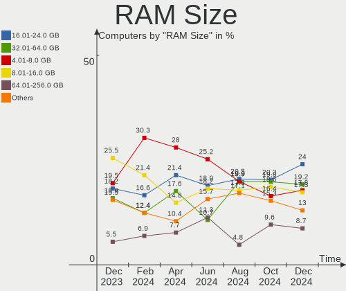
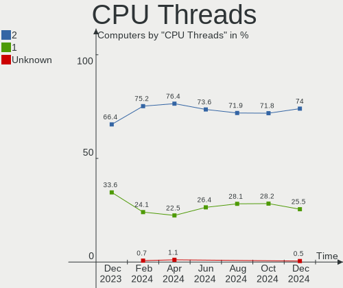
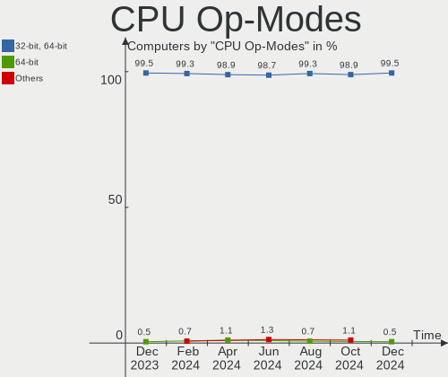
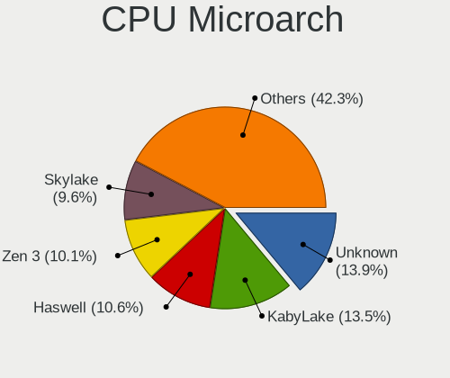
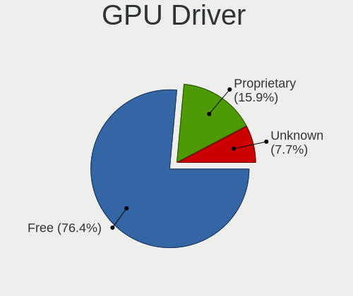
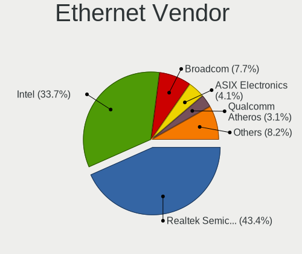
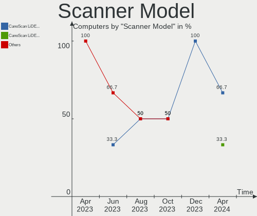

Linux in Canada - Hardware Trends
---------------------------------

A project to identify most popular hardware characteristics and track their change
over time based on data collected by Linux users at https://Linux-Hardware.org.

Anyone can contribute to this report by the [hw-probe](https://github.com/linuxhw/hw-probe) tool:

    sudo -E hw-probe -all -upload

This is a report for all computer types. See also reports for [desktops](/Location/Canada/Desktop/README.md) and [notebooks](/Location/Canada/Notebook/README.md).

Period: Nov, 2023.

Contents
--------

* [ System ](#system)
  - [ OS                       ](#os)
  - [ OS Family                ](#os-family)
  - [ Kernel                   ](#kernel)
  - [ Kernel Family            ](#kernel-family)
  - [ Kernel Major Ver.        ](#kernel-major-ver)
  - [ Arch                     ](#arch)
  - [ DE                       ](#de)
  - [ Display Server           ](#display-server)
  - [ Display Manager          ](#display-manager)
  - [ OS Lang                  ](#os-lang)
  - [ Boot Mode                ](#boot-mode)
  - [ Filesystem               ](#filesystem)
  - [ Part. scheme             ](#part-scheme)
  - [ Dual Boot with Linux/BSD ](#dual-boot-with-linuxbsd)
  - [ Dual Boot (Win)          ](#dual-boot-win)

* [ Board ](#board)
  - [ Vendor                   ](#vendor)
  - [ Model                    ](#model)
  - [ Model Family             ](#model-family)
  - [ MFG Year                 ](#mfg-year)
  - [ Form Factor              ](#form-factor)
  - [ Secure Boot              ](#secure-boot)
  - [ Coreboot                 ](#coreboot)
  - [ RAM Size                 ](#ram-size)
  - [ RAM Used                 ](#ram-used)
  - [ Total Drives             ](#total-drives)
  - [ Has CD-ROM               ](#has-cd-rom)
  - [ Has Ethernet             ](#has-ethernet)
  - [ Has WiFi                 ](#has-wifi)
  - [ Has Bluetooth            ](#has-bluetooth)

* [ Location ](#location)
  - [ Country                  ](#country)
  - [ City                     ](#city)

* [ Drives ](#drives)
  - [ Drive Vendor             ](#drive-vendor)
  - [ Drive Model              ](#drive-model)
  - [ HDD Vendor               ](#hdd-vendor)
  - [ SSD Vendor               ](#ssd-vendor)
  - [ Drive Kind               ](#drive-kind)
  - [ Drive Connector          ](#drive-connector)
  - [ Drive Size               ](#drive-size)
  - [ Space Total              ](#space-total)
  - [ Space Used               ](#space-used)
  - [ Malfunc. Drives          ](#malfunc-drives)
  - [ Malfunc. Drive Vendor    ](#malfunc-drive-vendor)
  - [ Malfunc. HDD Vendor      ](#malfunc-hdd-vendor)
  - [ Malfunc. Drive Kind      ](#malfunc-drive-kind)
  - [ Failed Drives            ](#failed-drives)
  - [ Failed Drive Vendor      ](#failed-drive-vendor)
  - [ Drive Status             ](#drive-status)

* [ Storage controller ](#storage-controller)
  - [ Storage Vendor           ](#storage-vendor)
  - [ Storage Model            ](#storage-model)
  - [ Storage Kind             ](#storage-kind)

* [ Processor ](#processor)
  - [ CPU Vendor               ](#cpu-vendor)
  - [ CPU Model                ](#cpu-model)
  - [ CPU Model Family         ](#cpu-model-family)
  - [ CPU Cores                ](#cpu-cores)
  - [ CPU Sockets              ](#cpu-sockets)
  - [ CPU Threads              ](#cpu-threads)
  - [ CPU Op-Modes             ](#cpu-op-modes)
  - [ CPU Microcode            ](#cpu-microcode)
  - [ CPU Microarch            ](#cpu-microarch)

* [ Graphics ](#graphics)
  - [ GPU Vendor               ](#gpu-vendor)
  - [ GPU Model                ](#gpu-model)
  - [ GPU Combo                ](#gpu-combo)
  - [ GPU Driver               ](#gpu-driver)
  - [ GPU Memory               ](#gpu-memory)

* [ Monitor ](#monitor)
  - [ Monitor Vendor           ](#monitor-vendor)
  - [ Monitor Model            ](#monitor-model)
  - [ Monitor Resolution       ](#monitor-resolution)
  - [ Monitor Diagonal         ](#monitor-diagonal)
  - [ Monitor Width            ](#monitor-width)
  - [ Aspect Ratio             ](#aspect-ratio)
  - [ Monitor Area             ](#monitor-area)
  - [ Pixel Density            ](#pixel-density)
  - [ Multiple Monitors        ](#multiple-monitors)

* [ Network ](#network)
  - [ Net Controller Vendor    ](#net-controller-vendor)
  - [ Net Controller Model     ](#net-controller-model)
  - [ Wireless Vendor          ](#wireless-vendor)
  - [ Wireless Model           ](#wireless-model)
  - [ Ethernet Vendor          ](#ethernet-vendor)
  - [ Ethernet Model           ](#ethernet-model)
  - [ Net Controller Kind      ](#net-controller-kind)
  - [ Used Controller          ](#used-controller)
  - [ NICs                     ](#nics)
  - [ IPv6                     ](#ipv6)

* [ Bluetooth ](#bluetooth)
  - [ Bluetooth Vendor         ](#bluetooth-vendor)
  - [ Bluetooth Model          ](#bluetooth-model)

* [ Sound ](#sound)
  - [ Sound Vendor             ](#sound-vendor)
  - [ Sound Model              ](#sound-model)

* [ Memory ](#memory)
  - [ Memory Vendor            ](#memory-vendor)
  - [ Memory Model             ](#memory-model)
  - [ Memory Kind              ](#memory-kind)
  - [ Memory Form Factor       ](#memory-form-factor)
  - [ Memory Size              ](#memory-size)
  - [ Memory Speed             ](#memory-speed)

* [ Printers & scanners ](#printers--scanners)
  - [ Printer Vendor           ](#printer-vendor)
  - [ Printer Model            ](#printer-model)
  - [ Scanner Vendor           ](#scanner-vendor)
  - [ Scanner Model            ](#scanner-model)

* [ Camera ](#camera)
  - [ Camera Vendor            ](#camera-vendor)
  - [ Camera Model             ](#camera-model)

* [ Security ](#security)
  - [ Fingerprint Vendor       ](#fingerprint-vendor)
  - [ Fingerprint Model        ](#fingerprint-model)
  - [ Chipcard Vendor          ](#chipcard-vendor)
  - [ Chipcard Model           ](#chipcard-model)

* [ Unsupported ](#unsupported)
  - [ Unsupported Devices      ](#unsupported-devices)
  - [ Unsupported Device Types ](#unsupported-device-types)

System
------

OS
--

Installed operating systems

| Name                         | Computers | Percent |
|------------------------------|-----------|---------|
| Ubuntu 22.04                 | 27        | 14.59%  |
| Fedora 39                    | 23        | 12.43%  |
| Linux Mint 21.2              | 11        | 5.95%   |
| Pop!_OS 22.04                | 9         | 4.86%   |
| Debian 12                    | 9         | 4.86%   |
| Ubuntu 23.10                 | 8         | 4.32%   |
| Zorin 16                     | 5         | 2.7%    |
| Debian 11                    | 5         | 2.7%    |
| ArcoLinux Rolling            | 5         | 2.7%    |
| Ubuntu 20.04                 | 4         | 2.16%   |
| OpenMandriva 5.0             | 4         | 2.16%   |
| Kali 2023.3                  | 4         | 2.16%   |
| Fedora 38                    | 4         | 2.16%   |
| EndeavourOS Rolling          | 4         | 2.16%   |
| Arch Rolling                 | 4         | 2.16%   |
| openSUSE Tumbleweed-XXXXXXXX | 3         | 1.62%   |
| OpenMandriva 23.11           | 3         | 1.62%   |
| Manjaro                      | 3         | 1.62%   |
| KDE neon 22.04               | 3         | 1.62%   |
| Xubuntu 22.04                | 2         | 1.08%   |
| SteamOS 3.4.11               | 2         | 1.08%   |
| OpenMandriva 23.10           | 2         | 1.08%   |
| Nobara 38                    | 2         | 1.08%   |
| NixOS 23.11                  | 2         | 1.08%   |
| Manjaro 23.1.0               | 2         | 1.08%   |
| LMDE 6                       | 2         | 1.08%   |
| Linux Mint 21.1              | 2         | 1.08%   |
| Kubuntu 23.10                | 2         | 1.08%   |
| Debian Testing/unstable      | 2         | 1.08%   |
| Debian                       | 2         | 1.08%   |
| Zorin 12                     | 1         | 0.54%   |
| Xubuntu 18.04                | 1         | 0.54%   |
| Ubuntu MATE 20.04            | 1         | 0.54%   |
| Ubuntu 23.04                 | 1         | 0.54%   |
| SteamOS 3.5.5                | 1         | 0.54%   |
| SteamOS 3.4.8                | 1         | 0.54%   |
| Q4OS 5                       | 1         | 0.54%   |
| OpenMandriva 4.3             | 1         | 0.54%   |
| OpenMandriva 23.90           | 1         | 0.54%   |
| OpenMandriva 23.08           | 1         | 0.54%   |

OS Family
---------

OS without a version

| Name         | Computers | Percent |
|--------------|-----------|---------|
| Ubuntu       | 40        | 21.62%  |
| Fedora       | 27        | 14.59%  |
| Debian       | 18        | 9.73%   |
| Linux Mint   | 16        | 8.65%   |
| OpenMandriva | 12        | 6.49%   |
| Pop!_OS      | 9         | 4.86%   |
| Zorin        | 6         | 3.24%   |
| ArcoLinux    | 6         | 3.24%   |
| Manjaro      | 5         | 2.7%    |
| SteamOS      | 4         | 2.16%   |
| Kali         | 4         | 2.16%   |
| EndeavourOS  | 4         | 2.16%   |
| Arch         | 4         | 2.16%   |
| Xubuntu      | 3         | 1.62%   |
| openSUSE     | 3         | 1.62%   |
| Kubuntu      | 3         | 1.62%   |
| KDE neon     | 3         | 1.62%   |
| Nobara       | 2         | 1.08%   |
| NixOS        | 2         | 1.08%   |
| MX           | 2         | 1.08%   |
| LMDE         | 2         | 1.08%   |
| Elementary   | 2         | 1.08%   |
| AlmaLinux    | 2         | 1.08%   |
| Ubuntu MATE  | 1         | 0.54%   |
| Q4OS         | 1         | 0.54%   |
| Lubuntu      | 1         | 0.54%   |
| Gentoo       | 1         | 0.54%   |
| Garuda Linux | 1         | 0.54%   |
| BlackPanther | 1         | 0.54%   |

Kernel
------

Version of the Linux kernel

| Version                     | Computers | Percent |
|-----------------------------|-----------|---------|
| 6.2.0-36-generic            | 13        | 7.03%   |
| 5.15.0-88-generic           | 13        | 7.03%   |
| 6.2.0-37-generic            | 11        | 5.95%   |
| 6.1.0-13-amd64              | 10        | 5.41%   |
| 6.5.11-300.fc39.x86_64      | 8         | 4.32%   |
| 5.15.0-89-generic           | 8         | 4.32%   |
| 6.5.6-300.fc39.x86_64       | 6         | 3.24%   |
| 6.6.2-arch1-1               | 5         | 2.7%    |
| 6.5.6-76060506-generic      | 5         | 2.7%    |
| 6.5.12-300.fc39.x86_64      | 5         | 2.7%    |
| 6.5.0-10-generic            | 5         | 2.7%    |
| 6.6.2-desktop-1omv2390      | 4         | 2.16%   |
| 6.5.0-13-generic            | 4         | 2.16%   |
| 6.6.1-arch1-1               | 3         | 1.62%   |
| 6.6.0-desktop-1omv2390      | 3         | 1.62%   |
| 6.5.5-desktop-1omv2390      | 3         | 1.62%   |
| 6.5.9-1-default             | 2         | 1.08%   |
| 6.5.8-arch1-1               | 2         | 1.08%   |
| 6.5.4-76060504-generic      | 2         | 1.08%   |
| 6.5.11-1-MANJARO            | 2         | 1.08%   |
| 6.5.10-300.fc39.x86_64      | 2         | 1.08%   |
| 6.5.0-kali3-amd64           | 2         | 1.08%   |
| 6.3.13-1-liquorix-amd64     | 2         | 1.08%   |
| 6.2.0-26-generic            | 2         | 1.08%   |
| 5.18.0-kali5-amd64          | 2         | 1.08%   |
| 5.15.0-76-generic           | 2         | 1.08%   |
| 5.13.0-valve37-1-neptune    | 2         | 1.08%   |
| 5.10.10-64                  | 2         | 1.08%   |
| 6.6.3-arch1-1               | 1         | 0.54%   |
| 6.6.2-zen1-1-zen            | 1         | 0.54%   |
| 6.6.2-zabbly+               | 1         | 0.54%   |
| 6.6.2-201.fsync.fc38.x86_64 | 1         | 0.54%   |
| 6.6.2-201.fc39.x86_64       | 1         | 0.54%   |
| 6.6.1-1-default             | 1         | 0.54%   |
| 6.6.0-rc3+                  | 1         | 0.54%   |
| 6.6.0-gentoo                | 1         | 0.54%   |
| 6.6.0-1-MANJARO             | 1         | 0.54%   |
| 6.6.0                       | 1         | 0.54%   |
| 6.5.9-300.fc39.x86_64       | 1         | 0.54%   |
| 6.5.9-201.fsync.fc38.x86_64 | 1         | 0.54%   |

Kernel Family
-------------

Linux kernel without a distro release

| Version  | Computers | Percent |
|----------|-----------|---------|
| 6.2.0    | 27        | 14.59%  |
| 5.15.0   | 26        | 14.05%  |
| 6.5.0    | 16        | 8.65%   |
| 6.6.2    | 13        | 7.03%   |
| 6.5.6    | 11        | 5.95%   |
| 6.1.0    | 11        | 5.95%   |
| 6.5.11   | 10        | 5.41%   |
| 6.6.0    | 7         | 3.78%   |
| 6.5.12   | 6         | 3.24%   |
| 6.5.9    | 5         | 2.7%    |
| 6.6.1    | 4         | 2.16%   |
| 6.5.5    | 4         | 2.16%   |
| 5.13.0   | 4         | 2.16%   |
| 6.5.8    | 3         | 1.62%   |
| 6.5.10   | 3         | 1.62%   |
| 5.10.0   | 3         | 1.62%   |
| 6.5.4    | 2         | 1.08%   |
| 6.3.13   | 2         | 1.08%   |
| 5.4.0    | 2         | 1.08%   |
| 5.18.0   | 2         | 1.08%   |
| 5.14.0   | 2         | 1.08%   |
| 5.10.10  | 2         | 1.08%   |
| 6.6.3    | 1         | 0.54%   |
| 6.5.7    | 1         | 0.54%   |
| 6.5.3    | 1         | 0.54%   |
| 6.4.16   | 1         | 0.54%   |
| 6.4.11   | 1         | 0.54%   |
| 6.2.9    | 1         | 0.54%   |
| 6.2.16   | 1         | 0.54%   |
| 6.1.62   | 1         | 0.54%   |
| 6.1.61   | 1         | 0.54%   |
| 6.1.60   | 1         | 0.54%   |
| 6.1.58   | 1         | 0.54%   |
| 6.1.52   | 1         | 0.54%   |
| 6.1.40   | 1         | 0.54%   |
| 5.19.0   | 1         | 0.54%   |
| 5.17.5   | 1         | 0.54%   |
| 5.16.7   | 1         | 0.54%   |
| 5.15.85  | 1         | 0.54%   |
| 5.15.131 | 1         | 0.54%   |

Kernel Major Ver.
-----------------

Linux kernel major version

| Version | Computers | Percent |
|---------|-----------|---------|
| 6.5     | 62        | 33.51%  |
| 6.2     | 29        | 15.68%  |
| 5.15    | 28        | 15.14%  |
| 6.6     | 25        | 13.51%  |
| 6.1     | 17        | 9.19%   |
| 5.10    | 5         | 2.7%    |
| 5.13    | 4         | 2.16%   |
| 6.4     | 2         | 1.08%   |
| 6.3     | 2         | 1.08%   |
| 5.4     | 2         | 1.08%   |
| 5.18    | 2         | 1.08%   |
| 5.14    | 2         | 1.08%   |
| 5.19    | 1         | 0.54%   |
| 5.17    | 1         | 0.54%   |
| 5.16    | 1         | 0.54%   |
| 4.18    | 1         | 0.54%   |
| 4.15    | 1         | 0.54%   |

Arch
----

OS architecture (x86_64, i586, etc.)

| Name   | Computers | Percent |
|--------|-----------|---------|
| x86_64 | 181       | 97.84%  |
| i686   | 3         | 1.62%   |
| armv7l | 1         | 0.54%   |

DE
--

Desktop Environment

| Name       | Computers | Percent |
|------------|-----------|---------|
| GNOME      | 87        | 47.03%  |
| KDE5       | 45        | 24.32%  |
| XFCE       | 17        | 9.19%   |
| X-Cinnamon | 17        | 9.19%   |
| Unknown    | 8         | 4.32%   |
| Pantheon   | 2         | 1.08%   |
| LXQt       | 2         | 1.08%   |
| LXDE       | 2         | 1.08%   |
| i3         | 2         | 1.08%   |
| MATE       | 1         | 0.54%   |
| KDE        | 1         | 0.54%   |
| Cinnamon   | 1         | 0.54%   |

Display Server
--------------

X11 or Wayland

| Name    | Computers | Percent |
|---------|-----------|---------|
| X11     | 96        | 51.89%  |
| Wayland | 76        | 41.08%  |
| Tty     | 11        | 5.95%   |
| Unknown | 2         | 1.08%   |

Display Manager
---------------

SDDM, LightDM, etc.

| Name    | Computers | Percent |
|---------|-----------|---------|
| Unknown | 67        | 36.22%  |
| GDM3    | 40        | 21.62%  |
| SDDM    | 35        | 18.92%  |
| LightDM | 28        | 15.14%  |
| GDM     | 11        | 5.95%   |
| NODM    | 3         | 1.62%   |
| LXDM    | 1         | 0.54%   |

OS Lang
-------

Language

| Lang    | Computers | Percent |
|---------|-----------|---------|
| en_CA   | 102       | 55.14%  |
| en_US   | 61        | 32.97%  |
| fr_CA   | 9         | 4.86%   |
| C       | 7         | 3.78%   |
| fr_FR   | 2         | 1.08%   |
| Unknown | 2         | 1.08%   |
| tr_TR   | 1         | 0.54%   |
| en_IN   | 1         | 0.54%   |

Boot Mode
---------

EFI or BIOS

| Mode | Computers | Percent |
|------|-----------|---------|
| EFI  | 93        | 50.27%  |
| BIOS | 92        | 49.73%  |

Filesystem
----------

Type of filesystem

| Type    | Computers | Percent |
|---------|-----------|---------|
| Ext4    | 99        | 53.51%  |
| Btrfs   | 41        | 22.16%  |
| Tmpfs   | 30        | 16.22%  |
| Overlay | 8         | 4.32%   |
| Xfs     | 3         | 1.62%   |
| Zfs     | 2         | 1.08%   |
| Rootfs  | 2         | 1.08%   |

Part. scheme
------------

Scheme of partitioning

| Type    | Computers | Percent |
|---------|-----------|---------|
| GPT     | 103       | 55.68%  |
| Unknown | 61        | 32.97%  |
| MBR     | 21        | 11.35%  |

Dual Boot with Linux/BSD
------------------------

Hosting more than one Linux/BSD

| Dual boot | Computers | Percent |
|-----------|-----------|---------|
| No        | 160       | 86.49%  |
| Yes       | 25        | 13.51%  |

Dual Boot (Win)
---------------

Hosting Linux and Windows

| Dual boot | Computers | Percent |
|-----------|-----------|---------|
| No        | 139       | 75.14%  |
| Yes       | 46        | 24.86%  |

Board
-----

Vendor
------

Motherboard manufacturer

| Name                 | Computers | Percent |
|----------------------|-----------|---------|
| Dell                 | 29        | 15.68%  |
| Hewlett-Packard      | 28        | 15.14%  |
| ASUSTek Computer     | 26        | 14.05%  |
| Lenovo               | 25        | 13.51%  |
| Acer                 | 15        | 8.11%   |
| MSI                  | 11        | 5.95%   |
| Apple                | 10        | 5.41%   |
| Gigabyte Technology  | 5         | 2.7%    |
| ASRock               | 5         | 2.7%    |
| Valve                | 4         | 2.16%   |
| Intel                | 4         | 2.16%   |
| Google               | 3         | 1.62%   |
| Toshiba              | 2         | 1.08%   |
| Microsoft            | 2         | 1.08%   |
| AZW                  | 2         | 1.08%   |
| Unknown              | 2         | 1.08%   |
| Xunlong              | 1         | 0.54%   |
| Soyo                 | 1         | 0.54%   |
| retsamarret          | 1         | 0.54%   |
| Panasonic            | 1         | 0.54%   |
| OEM                  | 1         | 0.54%   |
| Intel Client Systems | 1         | 0.54%   |
| Gateway              | 1         | 0.54%   |
| Foxconn              | 1         | 0.54%   |
| CWWK                 | 1         | 0.54%   |
| BCM                  | 1         | 0.54%   |
| Alienware            | 1         | 0.54%   |
| Acidanthera          | 1         | 0.54%   |

Model
-----

Motherboard model

| Name                                       | Computers | Percent |
|--------------------------------------------|-----------|---------|
| Valve Jupiter                              | 4         | 2.16%   |
| MSI GF65 Thin 10UE                         | 2         | 1.08%   |
| HP Pavilion Notebook                       | 2         | 1.08%   |
| HP Laptop 15-ef3xxx                        | 2         | 1.08%   |
| Unknown                                    | 2         | 1.08%   |
| Xunlong Orange Pi Zero                     | 1         | 0.54%   |
| Toshiba Satellite L755                     | 1         | 0.54%   |
| Toshiba Satellite L300D                    | 1         | 0.54%   |
| Soyo SY-N3150L Quad                        | 1         | 0.54%   |
| retsamarret 000-F4423-FBA004-2000-N        | 1         | 0.54%   |
| Panasonic CF-53JALZY1M                     | 1         | 0.54%   |
| OEM B75                                    | 1         | 0.54%   |
| MSI MS-7E07                                | 1         | 0.54%   |
| MSI MS-7E06                                | 1         | 0.54%   |
| MSI MS-7C95                                | 1         | 0.54%   |
| MSI MS-7C91                                | 1         | 0.54%   |
| MSI MS-7B89                                | 1         | 0.54%   |
| MSI MS-7A66                                | 1         | 0.54%   |
| MSI MS-7916                                | 1         | 0.54%   |
| MSI MS-7721                                | 1         | 0.54%   |
| MSI GP60 2QE                               | 1         | 0.54%   |
| Microsoft Surface Pro                      | 1         | 0.54%   |
| Microsoft Surface Laptop Go                | 1         | 0.54%   |
| Lenovo Yoga 7 14IRL8 82YL                  | 1         | 0.54%   |
| Lenovo ThinkStation P340 Tiny 30DF001KUS   | 1         | 0.54%   |
| Lenovo ThinkStation E31 3695H4U            | 1         | 0.54%   |
| Lenovo ThinkPad X230 2320JPU               | 1         | 0.54%   |
| Lenovo ThinkPad X1 Extreme 20MGS1QU00      | 1         | 0.54%   |
| Lenovo ThinkPad X1 Carbon Gen 9 20XW003LUS | 1         | 0.54%   |
| Lenovo ThinkPad X1 Carbon 7th 20QD000BUS   | 1         | 0.54%   |
| Lenovo ThinkPad T500 20552CU               | 1         | 0.54%   |
| Lenovo ThinkPad T490 20N3S4VV00            | 1         | 0.54%   |
| Lenovo ThinkPad T480s 20L8SA3Q00           | 1         | 0.54%   |
| Lenovo ThinkPad T470s W10DG 20JS0004US     | 1         | 0.54%   |
| Lenovo ThinkPad T470p 20J6000TAD           | 1         | 0.54%   |
| Lenovo ThinkPad T430s 23553J2              | 1         | 0.54%   |
| Lenovo ThinkPad T14 Gen 1 20S1S4R500       | 1         | 0.54%   |
| Lenovo ThinkPad P16s Gen 2 21K9CTO1WW      | 1         | 0.54%   |
| Lenovo ThinkPad E15 Gen 4 21ED0049US       | 1         | 0.54%   |
| Lenovo ThinkCentre M58p 6234A1U            | 1         | 0.54%   |

Model Family
------------

Motherboard model prefix

| Name                                | Computers | Percent |
|-------------------------------------|-----------|---------|
| Lenovo ThinkPad                     | 13        | 7.03%   |
| Dell Latitude                       | 10        | 5.41%   |
| Acer Aspire                         | 8         | 4.32%   |
| HP Pavilion                         | 7         | 3.78%   |
| ASUS VivoBook                       | 7         | 3.78%   |
| Dell XPS                            | 6         | 3.24%   |
| Dell OptiPlex                       | 6         | 3.24%   |
| HP Laptop                           | 5         | 2.7%    |
| ASUS PRIME                          | 5         | 2.7%    |
| Valve Jupiter                       | 4         | 2.16%   |
| Lenovo IdeaPad                      | 4         | 2.16%   |
| HP EliteBook                        | 4         | 2.16%   |
| Lenovo Legion                       | 3         | 1.62%   |
| Dell Precision                      | 3         | 1.62%   |
| ASUS ROG                            | 3         | 1.62%   |
| Acer Predator                       | 3         | 1.62%   |
| Toshiba Satellite                   | 2         | 1.08%   |
| MSI GF65                            | 2         | 1.08%   |
| Microsoft Surface                   | 2         | 1.08%   |
| Lenovo ThinkStation                 | 2         | 1.08%   |
| HP ProBook                          | 2         | 1.08%   |
| Gigabyte X570                       | 2         | 1.08%   |
| Dell Inspiron                       | 2         | 1.08%   |
| AZW Green                           | 2         | 1.08%   |
| Apple iMac12                        | 2         | 1.08%   |
| Acer Nitro                          | 2         | 1.08%   |
| Unknown                             | 2         | 1.08%   |
| Xunlong Orange                      | 1         | 0.54%   |
| Soyo SY-N3150L                      | 1         | 0.54%   |
| retsamarret 000-F4423-FBA004-2000-N | 1         | 0.54%   |
| Panasonic CF-53JALZY1M              | 1         | 0.54%   |
| OEM B75                             | 1         | 0.54%   |
| MSI MS-7E07                         | 1         | 0.54%   |
| MSI MS-7E06                         | 1         | 0.54%   |
| MSI MS-7C95                         | 1         | 0.54%   |
| MSI MS-7C91                         | 1         | 0.54%   |
| MSI MS-7B89                         | 1         | 0.54%   |
| MSI MS-7A66                         | 1         | 0.54%   |
| MSI MS-7916                         | 1         | 0.54%   |
| MSI MS-7721                         | 1         | 0.54%   |

MFG Year
--------

Motherboard manufacture year

| Year    | Computers | Percent |
|---------|-----------|---------|
| 2022    | 26        | 14.05%  |
| 2018    | 20        | 10.81%  |
| 2023    | 18        | 9.73%   |
| 2020    | 18        | 9.73%   |
| 2021    | 12        | 6.49%   |
| 2012    | 12        | 6.49%   |
| 2011    | 12        | 6.49%   |
| 2019    | 11        | 5.95%   |
| 2017    | 11        | 5.95%   |
| 2016    | 9         | 4.86%   |
| 2010    | 7         | 3.78%   |
| 2008    | 6         | 3.24%   |
| 2014    | 5         | 2.7%    |
| 2013    | 5         | 2.7%    |
| 2009    | 5         | 2.7%    |
| 2015    | 4         | 2.16%   |
| 2007    | 2         | 1.08%   |
| 2006    | 1         | 0.54%   |
| Unknown | 1         | 0.54%   |

Form Factor
-----------

Physical design of the computer

| Name           | Computers | Percent |
|----------------|-----------|---------|
| Notebook       | 97        | 52.43%  |
| Desktop        | 68        | 36.76%  |
| Convertible    | 6         | 3.24%   |
| All in one     | 6         | 3.24%   |
| Tablet         | 3         | 1.62%   |
| Mini pc        | 2         | 1.08%   |
| Server         | 2         | 1.08%   |
| System on chip | 1         | 0.54%   |

Secure Boot
-----------

Enabled or disabled

| State    | Computers | Percent |
|----------|-----------|---------|
| Disabled | 175       | 94.59%  |
| Enabled  | 10        | 5.41%   |

Coreboot
--------

Have coreboot on board

| Used | Computers | Percent |
|------|-----------|---------|
| No   | 181       | 97.84%  |
| Yes  | 4         | 2.16%   |

RAM Size
--------

Total RAM memory

| Size in GB  | Computers | Percent |
|-------------|-----------|---------|
| 16.01-24.0  | 43        | 23.24%  |
| 8.01-16.0   | 43        | 23.24%  |
| 4.01-8.0    | 30        | 16.22%  |
| 32.01-64.0  | 23        | 12.43%  |
| 3.01-4.0    | 21        | 11.35%  |
| 64.01-256.0 | 19        | 10.27%  |
| 24.01-32.0  | 2         | 1.08%   |
| 2.01-3.0    | 2         | 1.08%   |
| 1.01-2.0    | 1         | 0.54%   |
| 0.01-0.5    | 1         | 0.54%   |

RAM Used
--------

Used RAM memory

| Used GB    | Computers | Percent |
|------------|-----------|---------|
| 2.01-3.0   | 47        | 25.41%  |
| 1.01-2.0   | 47        | 25.41%  |
| 3.01-4.0   | 34        | 18.38%  |
| 4.01-8.0   | 32        | 17.3%   |
| 8.01-16.0  | 12        | 6.49%   |
| 0.51-1.0   | 9         | 4.86%   |
| 16.01-24.0 | 2         | 1.08%   |
| 24.01-32.0 | 1         | 0.54%   |
| 0.01-0.5   | 1         | 0.54%   |

Total Drives
------------

Number of drives on board

| Drives | Computers | Percent |
|--------|-----------|---------|
| 1      | 110       | 59.46%  |
| 2      | 47        | 25.41%  |
| 3      | 11        | 5.95%   |
| 6      | 5         | 2.7%    |
| 4      | 5         | 2.7%    |
| 5      | 2         | 1.08%   |
| 21     | 1         | 0.54%   |
| 12     | 1         | 0.54%   |
| 9      | 1         | 0.54%   |
| 7      | 1         | 0.54%   |
| 0      | 1         | 0.54%   |

Has CD-ROM
----------

Has CD-ROM on board

| Presented | Computers | Percent |
|-----------|-----------|---------|
| No        | 124       | 67.03%  |
| Yes       | 61        | 32.97%  |

Has Ethernet
------------

Has Ethernet on board

| Presented | Computers | Percent |
|-----------|-----------|---------|
| Yes       | 157       | 84.86%  |
| No        | 28        | 15.14%  |

Has WiFi
--------

Has WiFi module

| Presented | Computers | Percent |
|-----------|-----------|---------|
| Yes       | 149       | 80.54%  |
| No        | 36        | 19.46%  |

Has Bluetooth
-------------

Has Bluetooth module

| Presented | Computers | Percent |
|-----------|-----------|---------|
| Yes       | 124       | 67.03%  |
| No        | 61        | 32.97%  |

Location
--------

Country
-------

Geographic location (country)

| Country | Computers | Percent |
|---------|-----------|---------|
| Canada  | 185       | 100%    |

City
----

Geographic location (city)

| City               | Computers | Percent |
|--------------------|-----------|---------|
| Toronto            | 29        | 15.68%  |
| Calgary            | 9         | 4.86%   |
| Winnipeg           | 8         | 4.32%   |
| Montreal           | 8         | 4.32%   |
| Mississauga        | 7         | 3.78%   |
| Ottawa             | 5         | 2.7%    |
| Guelph             | 5         | 2.7%    |
| Edmonton           | 5         | 2.7%    |
| Victoria           | 4         | 2.16%   |
| Vancouver          | 4         | 2.16%   |
| Québec            | 4         | 2.16%   |
| Kingston           | 4         | 2.16%   |
| Surrey             | 3         | 1.62%   |
| Regina             | 3         | 1.62%   |
| Kitchener          | 3         | 1.62%   |
| Corner Brook       | 3         | 1.62%   |
| Sydney             | 2         | 1.08%   |
| Saskatoon          | 2         | 1.08%   |
| Sarnia             | 2         | 1.08%   |
| Red Deer           | 2         | 1.08%   |
| Peterborough       | 2         | 1.08%   |
| Markham            | 2         | 1.08%   |
| Langley            | 2         | 1.08%   |
| Halifax            | 2         | 1.08%   |
| Gatineau           | 2         | 1.08%   |
| Dartmouth          | 2         | 1.08%   |
| Brampton           | 2         | 1.08%   |
| Woodstock          | 1         | 0.54%   |
| Whitehorse         | 1         | 0.54%   |
| West Kelowna       | 1         | 0.54%   |
| Waterloo           | 1         | 0.54%   |
| Terrebonne         | 1         | 0.54%   |
| Stratford          | 1         | 0.54%   |
| St. Catharines     | 1         | 0.54%   |
| Simcoe             | 1         | 0.54%   |
| Sherwood Park      | 1         | 0.54%   |
| Sherbrooke         | 1         | 0.54%   |
| Saint-Damase       | 1         | 0.54%   |
| Saint-Bruno        | 1         | 0.54%   |
| Saint-Benoit-Labre | 1         | 0.54%   |

Drives
------

Drive Vendor
------------

Hard drive vendors

| Vendor                       | Computers | Drives | Percent |
|------------------------------|-----------|--------|---------|
| Seagate                      | 42        | 67     | 14.89%  |
| Samsung Electronics          | 41        | 48     | 14.54%  |
| WDC                          | 33        | 48     | 11.7%   |
| SanDisk                      | 25        | 25     | 8.87%   |
| Unknown                      | 15        | 18     | 5.32%   |
| Kingston                     | 15        | 16     | 5.32%   |
| Intel                        | 12        | 13     | 4.26%   |
| Toshiba                      | 10        | 10     | 3.55%   |
| Crucial                      | 9         | 11     | 3.19%   |
| Phison Electronics           | 8         | 8      | 2.84%   |
| Micron Technology            | 8         | 8      | 2.84%   |
| Kingston Technology Company  | 7         | 7      | 2.48%   |
| SK hynix                     | 6         | 6      | 2.13%   |
| Hitachi                      | 5         | 7      | 1.77%   |
| MAXIO Technology (Hangzhou)  | 4         | 4      | 1.42%   |
| A-DATA Technology            | 4         | 5      | 1.42%   |
| PNY                          | 3         | 3      | 1.06%   |
| KIOXIA                       | 3         | 3      | 1.06%   |
| ADATA Technology             | 3         | 5      | 1.06%   |
| TO Exter                     | 2         | 2      | 0.71%   |
| Micron/Crucial Technology    | 2         | 2      | 0.71%   |
| Lite-On Technology           | 2         | 2      | 0.71%   |
| Lexar                        | 2         | 2      | 0.71%   |
| Fujitsu                      | 2         | 4      | 0.71%   |
| China                        | 2         | 2      | 0.71%   |
| Apple                        | 2         | 2      | 0.71%   |
| Timetec                      | 1         | 1      | 0.35%   |
| Team                         | 1         | 1      | 0.35%   |
| Shenzhen Longsys Electronics | 1         | 1      | 0.35%   |
| Patriot                      | 1         | 1      | 0.35%   |
| NXT                          | 1         | 1      | 0.35%   |
| Mushkin                      | 1         | 1      | 0.35%   |
| KingFast                     | 1         | 1      | 0.35%   |
| JMicron Technology           | 1         | 1      | 0.35%   |
| JetFlash                     | 1         | 1      | 0.35%   |
| HGST HTS                     | 1         | 1      | 0.35%   |
| HGST                         | 1         | 1      | 0.35%   |
| Hewlett-Packard              | 1         | 1      | 0.35%   |
| Dogfish                      | 1         | 1      | 0.35%   |
| DockCase                     | 1         | 1      | 0.35%   |

Drive Model
-----------

Hard drive models

| Model                                                           | Computers | Percent |
|-----------------------------------------------------------------|-----------|---------|
| Toshiba DT01ACA100 1TB                                          | 5         | 1.63%   |
| Seagate ST4000DM004-2CV104 4TB                                  | 4         | 1.3%    |
| Sandisk WD_BLACK SN770 2TB                                      | 4         | 1.3%    |
| MAXIO (Hangzhou) NVMe SSD Controller MAP1202 1024GB             | 4         | 1.3%    |
| Unknown MMC Card  32GB                                          | 3         | 0.98%   |
| Seagate ST2000DM001-1ER164 2TB                                  | 3         | 0.98%   |
| Samsung SSD 870 EVO 500GB                                       | 3         | 0.98%   |
| Samsung SSD 870 EVO 2TB                                         | 3         | 0.98%   |
| Samsung NVMe SSD Controller SM961/PM961/SM963 256GB             | 3         | 0.98%   |
| Samsung NVMe SSD Controller PM9A1/PM9A3/980PRO 2TB              | 3         | 0.98%   |
| Kingston SA400S37240G 240GB SSD                                 | 3         | 0.98%   |
| Intel SSDPEKNU512GZ 512GB                                       | 3         | 0.98%   |
| WDC WDS100T2B0C-00PXH0 1TB                                      | 2         | 0.65%   |
| WDC WD30EFRX-68EUZN0 3TB                                        | 2         | 0.65%   |
| WDC WD2500BEVT-22A23T0 250GB                                    | 2         | 0.65%   |
| WDC WD My Passport 264F 1TB                                     | 2         | 0.65%   |
| Unknown MMC Card  128GB                                         | 2         | 0.65%   |
| TO Exter nal USB 3.0 1TB                                        | 2         | 0.65%   |
| Seagate ST500DM002-1BD142 500GB                                 | 2         | 0.65%   |
| Seagate ST31000528AS 1TB                                        | 2         | 0.65%   |
| Seagate ST2000LX001-1RG174 2TB                                  | 2         | 0.65%   |
| Seagate ST2000DM008-2FR102 2TB                                  | 2         | 0.65%   |
| Seagate ST1000LM024 HN-M101MBB 1TB                              | 2         | 0.65%   |
| Seagate ST1000DM003-1ER162 1TB                                  | 2         | 0.65%   |
| Seagate ST1000DM003-1CH162 1TB                                  | 2         | 0.65%   |
| Sandisk WD Blue SN550 NVMe SSD 512GB                            | 2         | 0.65%   |
| Samsung SSD 860 EVO 1TB                                         | 2         | 0.65%   |
| Samsung PSSD T7 1TB                                             | 2         | 0.65%   |
| Phison PS5013 E13 NVMe Controller 512GB                         | 2         | 0.65%   |
| Phison E12 NVMe Controller 512GB                                | 2         | 0.65%   |
| Phison Corsair MP600 MINI 1TB                                   | 2         | 0.65%   |
| Micron/Crucial P2 NVMe PCIe SSD 1TB                             | 2         | 0.65%   |
| Lite-On CX2-8B512-Q11 NVMe LITEON 512GB                         | 2         | 0.65%   |
| Kingston Company U-SNS8154P3 NVMe SSD 256GB                     | 2         | 0.65%   |
| Kingston Company SNV2S1000G 1TB                                 | 2         | 0.65%   |
| Kingston SA400S37480G 480GB SSD                                 | 2         | 0.65%   |
| Crucial CT500MX500SSD1 500GB                                    | 2         | 0.65%   |
| Crucial CT1000MX500SSD1 1TB                                     | 2         | 0.65%   |
| China SSD 256GB                                                 | 2         | 0.65%   |
| ADATA XPG SX8200 Pro PCIe Gen3x4 M.2 2280 Solid State Drive 1TB | 2         | 0.65%   |

HDD Vendor
----------

Hard disk drive vendors

| Vendor              | Computers | Drives | Percent |
|---------------------|-----------|--------|---------|
| Seagate             | 42        | 66     | 48.28%  |
| WDC                 | 24        | 35     | 27.59%  |
| Toshiba             | 8         | 8      | 9.2%    |
| Hitachi             | 5         | 7      | 5.75%   |
| TO Exter            | 2         | 2      | 2.3%    |
| Fujitsu             | 2         | 4      | 2.3%    |
| Unknown             | 1         | 1      | 1.15%   |
| Samsung Electronics | 1         | 1      | 1.15%   |
| HGST HTS            | 1         | 1      | 1.15%   |
| HGST                | 1         | 1      | 1.15%   |

SSD Vendor
----------

Solid state drive vendors

| Vendor              | Computers | Drives | Percent |
|---------------------|-----------|--------|---------|
| Samsung Electronics | 18        | 23     | 24.66%  |
| Kingston            | 10        | 11     | 13.7%   |
| SanDisk             | 7         | 7      | 9.59%   |
| Crucial             | 7         | 8      | 9.59%   |
| Intel               | 5         | 6      | 6.85%   |
| WDC                 | 4         | 4      | 5.48%   |
| PNY                 | 3         | 3      | 4.11%   |
| A-DATA Technology   | 3         | 4      | 4.11%   |
| SK hynix            | 2         | 2      | 2.74%   |
| Micron Technology   | 2         | 2      | 2.74%   |
| Lexar               | 2         | 2      | 2.74%   |
| China               | 2         | 2      | 2.74%   |
| Apple               | 2         | 2      | 2.74%   |
| Timetec             | 1         | 1      | 1.37%   |
| Team                | 1         | 1      | 1.37%   |
| Patriot             | 1         | 1      | 1.37%   |
| Mushkin             | 1         | 1      | 1.37%   |
| Dogfish             | 1         | 1      | 1.37%   |
| Unknown             | 1         | 1      | 1.37%   |

Drive Kind
----------

HDD or SSD

| Kind    | Computers | Drives | Percent |
|---------|-----------|--------|---------|
| NVMe    | 94        | 110    | 38.06%  |
| HDD     | 71        | 126    | 28.74%  |
| SSD     | 61        | 82     | 24.7%   |
| MMC     | 12        | 13     | 4.86%   |
| Unknown | 9         | 12     | 3.64%   |

Drive Connector
---------------

SATA, SAS, NVMe, etc.

| Type | Computers | Drives | Percent |
|------|-----------|--------|---------|
| SATA | 109       | 182    | 47.39%  |
| NVMe | 93        | 108    | 40.43%  |
| SAS  | 16        | 40     | 6.96%   |
| MMC  | 12        | 13     | 5.22%   |

Drive Size
----------

Size of hard drive

| Size in TB | Computers | Drives | Percent |
|------------|-----------|--------|---------|
| 0.01-0.5   | 68        | 81     | 46.26%  |
| 0.51-1.0   | 41        | 53     | 27.89%  |
| 1.01-2.0   | 20        | 50     | 13.61%  |
| 3.01-4.0   | 9         | 9      | 6.12%   |
| 4.01-10.0  | 5         | 10     | 3.4%    |
| 2.01-3.0   | 4         | 5      | 2.72%   |

Space Total
-----------

Amount of disk space available on the file system

| Size in GB     | Computers | Percent |
|----------------|-----------|---------|
| 251-500        | 47        | 25.41%  |
| 101-250        | 46        | 24.86%  |
| 501-1000       | 32        | 17.3%   |
| More than 3000 | 20        | 10.81%  |
| 1001-2000      | 10        | 5.41%   |
| 1-20           | 8         | 4.32%   |
| 2001-3000      | 6         | 3.24%   |
| Unknown        | 6         | 3.24%   |
| 21-50          | 5         | 2.7%    |
| 51-100         | 5         | 2.7%    |

Space Used
----------

Amount of used disk space

| Used GB        | Computers | Percent |
|----------------|-----------|---------|
| 1-20           | 61        | 32.97%  |
| 21-50          | 36        | 19.46%  |
| 101-250        | 28        | 15.14%  |
| 51-100         | 21        | 11.35%  |
| 501-1000       | 9         | 4.86%   |
| More than 3000 | 8         | 4.32%   |
| 251-500        | 8         | 4.32%   |
| Unknown        | 6         | 3.24%   |
| 1001-2000      | 5         | 2.7%    |
| 2001-3000      | 3         | 1.62%   |

Malfunc. Drives
---------------

Drive models with a malfunction

| Model                                  | Computers | Drives | Percent |
|----------------------------------------|-----------|--------|---------|
| WDC WD5000AAKX-08U6AA0 500GB           | 1         | 1      | 7.69%   |
| Timetec SD08 512GB                     | 1         | 1      | 7.69%   |
| SK hynix SC210 mSATA 128GB SSD         | 1         | 1      | 7.69%   |
| SK hynix PC401 NVMe 512GB              | 1         | 1      | 7.69%   |
| Seagate ST2000NM0011 2TB               | 1         | 2      | 7.69%   |
| Seagate ST2000LX001-1RG174 2TB         | 1         | 1      | 7.69%   |
| SanDisk SD8SBAT128G1002 128GB SSD      | 1         | 1      | 7.69%   |
| Kingston SV300S37A480G 480GB SSD       | 1         | 1      | 7.69%   |
| Kingston SA400S37120G 120GB SSD        | 1         | 1      | 7.69%   |
| Hitachi HDS5C3020ALA632 2TB            | 1         | 3      | 7.69%   |
| HGST HTS545050A7E680 500GB             | 1         | 1      | 7.69%   |
| Fujitsu MHV2080AH 80GB                 | 1         | 1      | 7.69%   |
| A-DATA Technology IM2P33F3A NVMe 256GB | 1         | 1      | 7.69%   |

Malfunc. Drive Vendor
---------------------

Vendors of faulty drives

| Vendor            | Computers | Drives | Percent |
|-------------------|-----------|--------|---------|
| SK hynix          | 2         | 2      | 15.38%  |
| Seagate           | 2         | 3      | 15.38%  |
| Kingston          | 2         | 2      | 15.38%  |
| WDC               | 1         | 1      | 7.69%   |
| Timetec           | 1         | 1      | 7.69%   |
| SanDisk           | 1         | 1      | 7.69%   |
| Hitachi           | 1         | 3      | 7.69%   |
| HGST              | 1         | 1      | 7.69%   |
| Fujitsu           | 1         | 1      | 7.69%   |
| A-DATA Technology | 1         | 1      | 7.69%   |

Malfunc. HDD Vendor
-------------------

Vendors of faulty HDD drives

| Vendor  | Computers | Drives | Percent |
|---------|-----------|--------|---------|
| Seagate | 2         | 3      | 33.33%  |
| WDC     | 1         | 1      | 16.67%  |
| Hitachi | 1         | 3      | 16.67%  |
| HGST    | 1         | 1      | 16.67%  |
| Fujitsu | 1         | 1      | 16.67%  |

Malfunc. Drive Kind
-------------------

Kinds of faulty drives

| Kind | Computers | Drives | Percent |
|------|-----------|--------|---------|
| SSD  | 5         | 5      | 41.67%  |
| HDD  | 5         | 9      | 41.67%  |
| NVMe | 2         | 2      | 16.67%  |

Failed Drives
-------------

Failed drive models

| Model                             | Computers | Drives | Percent |
|-----------------------------------|-----------|--------|---------|
| Samsung Electronics HM160HC 160GB | 1         | 1      | 100%    |

Failed Drive Vendor
-------------------

Failed drive vendors

| Vendor              | Computers | Drives | Percent |
|---------------------|-----------|--------|---------|
| Samsung Electronics | 1         | 1      | 100%    |

Drive Status
------------

Number of failed and malfunc. drives

| Status   | Computers | Drives | Percent |
|----------|-----------|--------|---------|
| Detected | 111       | 192    | 53.88%  |
| Works    | 83        | 134    | 40.29%  |
| Malfunc  | 11        | 16     | 5.34%   |
| Failed   | 1         | 1      | 0.49%   |

Storage controller
------------------

Storage Vendor
--------------

Storage controller vendors

| Vendor                       | Computers | Percent |
|------------------------------|-----------|---------|
| Intel                        | 110       | 43.82%  |
| AMD                          | 29        | 11.55%  |
| SanDisk                      | 24        | 9.56%   |
| Samsung Electronics          | 22        | 8.76%   |
| Kingston Technology Company  | 11        | 4.38%   |
| Phison Electronics           | 8         | 3.19%   |
| ASMedia Technology           | 7         | 2.79%   |
| Micron Technology            | 6         | 2.39%   |
| Micron/Crucial Technology    | 5         | 1.99%   |
| MAXIO Technology (Hangzhou)  | 5         | 1.99%   |
| SK hynix                     | 4         | 1.59%   |
| Marvell Technology Group     | 4         | 1.59%   |
| ADATA Technology             | 4         | 1.59%   |
| Toshiba America Info Systems | 3         | 1.2%    |
| Lite-On Technology           | 2         | 0.8%    |
| KIOXIA                       | 2         | 0.8%    |
| JMicron Technology           | 2         | 0.8%    |
| Broadcom / LSI               | 2         | 0.8%    |
| Shenzhen Longsys Electronics | 1         | 0.4%    |

Storage Model
-------------

Storage controller models

| Model                                                                          | Computers | Percent |
|--------------------------------------------------------------------------------|-----------|---------|
| AMD FCH SATA Controller [AHCI mode]                                            | 19        | 6.83%   |
| Intel 82801 Mobile SATA Controller [RAID mode]                                 | 8         | 2.88%   |
| ASMedia ASM1062 Serial ATA Controller                                          | 7         | 2.52%   |
| Samsung NVMe SSD Controller 980 (DRAM-less)                                    | 6         | 2.16%   |
| Intel Volume Management Device NVMe RAID Controller                            | 6         | 2.16%   |
| Intel SSD 670p Series [Keystone Harbor]                                        | 6         | 2.16%   |
| Intel 6 Series/C200 Series Chipset Family 6 port Desktop SATA AHCI Controller  | 6         | 2.16%   |
| SanDisk WD Black SN770 / PC SN740 256GB / PC SN560 (DRAM-less) NVMe SSD        | 5         | 1.8%    |
| SanDisk Ultra 3D / WD Blue SN550 NVMe SSD                                      | 5         | 1.8%    |
| Samsung NVMe SSD Controller SM981/PM981/PM983                                  | 5         | 1.8%    |
| MAXIO (Hangzhou) NVMe SSD Controller MAP1202                                   | 5         | 1.8%    |
| Intel Sunrise Point-LP SATA Controller [AHCI mode]                             | 5         | 1.8%    |
| Intel Q170/Q150/B150/H170/H110/Z170/CM236 Chipset SATA Controller [AHCI Mode]  | 5         | 1.8%    |
| Intel 8 Series/C220 Series Chipset Family 6-port SATA Controller 1 [AHCI mode] | 5         | 1.8%    |
| Intel 700 Series Chipset Family SATA AHCI Controller                           | 5         | 1.8%    |
| Intel 7 Series Chipset Family 6-port SATA Controller [AHCI mode]               | 5         | 1.8%    |
| Intel 200 Series PCH SATA controller [AHCI mode]                               | 5         | 1.8%    |
| AMD 500 Series Chipset SATA Controller                                         | 5         | 1.8%    |
| Samsung NVMe SSD Controller SM961/PM961/SM963                                  | 4         | 1.44%   |
| Samsung NVMe SSD Controller PM9A1/PM9A3/980PRO                                 | 4         | 1.44%   |
| Micron/Crucial P2 [Nick P2] / P3 / P3 Plus NVMe PCIe SSD (DRAM-less)           | 4         | 1.44%   |
| Kingston Company NV2 NVMe SSD SM2267XT                                         | 4         | 1.44%   |
| Intel Comet Lake SATA AHCI Controller                                          | 4         | 1.44%   |
| Intel 6 Series/C200 Series Chipset Family 6 port Mobile SATA AHCI Controller   | 4         | 1.44%   |
| Intel 5 Series/3400 Series Chipset 6 port SATA AHCI Controller                 | 4         | 1.44%   |
| AMD SB7x0/SB8x0/SB9x0 SATA Controller [AHCI mode]                              | 4         | 1.44%   |
| SanDisk Extreme Pro / WD Black SN750 / PC SN730 / Red SN700 NVMe SSD           | 3         | 1.08%   |
| Phison PS5021-E21 PCIe4 NVMe Controller (DRAM-less)                            | 3         | 1.08%   |
| Kingston Company A1000/U-SNS8154P3 x2 NVMe SSD                                 | 3         | 1.08%   |
| Intel HM170/QM170 Chipset SATA Controller [AHCI Mode]                          | 3         | 1.08%   |
| Intel Celeron/Pentium Silver Processor SATA Controller                         | 3         | 1.08%   |
| Intel Cannon Lake PCH SATA AHCI Controller                                     | 3         | 1.08%   |
| AMD 400 Series Chipset SATA Controller                                         | 3         | 1.08%   |
| Sandisk WD Black SN850X NVMe SSD                                               | 2         | 0.72%   |
| Phison PS5013-E13 PCIe3 NVMe Controller (DRAM-less)                            | 2         | 0.72%   |
| Phison E12 NVMe Controller                                                     | 2         | 0.72%   |
| Micron 2450 NVMe SSD [HendrixV] (DRAM-less)                                    | 2         | 0.72%   |
| Micron 2210 NVMe SSD [Cobain]                                                  | 2         | 0.72%   |
| Lite-On CX2-8B256, CX2-8B512 NVMe SSD                                          | 2         | 0.72%   |
| Kingston Company KC3000/FURY Renegade NVMe SSD E18                             | 2         | 0.72%   |

Storage Kind
------------

Kind of storage controller (IDE, SATA, NVMe, SAS, ...)

| Kind | Computers | Percent |
|------|-----------|---------|
| SATA | 112       | 45.53%  |
| NVMe | 93        | 37.8%   |
| RAID | 20        | 8.13%   |
| IDE  | 18        | 7.32%   |
| SAS  | 2         | 0.81%   |
| SCSI | 1         | 0.41%   |

Processor
---------

CPU Vendor
----------

Processor vendors

| Vendor | Computers | Percent |
|--------|-----------|---------|
| Intel  | 139       | 75.14%  |
| AMD    | 45        | 24.32%  |
| ARM    | 1         | 0.54%   |

CPU Model
---------

Processor models

| Model                                           | Computers | Percent |
|-------------------------------------------------|-----------|---------|
| Intel Core i5-8250U CPU @ 1.60GHz               | 4         | 2.16%   |
| AMD Custom APU 0405                             | 4         | 2.16%   |
| Intel Core i7-2600 CPU @ 3.40GHz                | 3         | 1.62%   |
| Intel Core i7-10750H CPU @ 2.60GHz              | 3         | 1.62%   |
| Intel 13th Gen Core i7-1355U                    | 3         | 1.62%   |
| AMD Ryzen 5 5625U with Radeon Graphics          | 3         | 1.62%   |
| Intel N100                                      | 2         | 1.08%   |
| Intel Core i7-9700 CPU @ 3.00GHz                | 2         | 1.08%   |
| Intel Core i7-7700K CPU @ 4.20GHz               | 2         | 1.08%   |
| Intel Core i7-6700 CPU @ 3.40GHz                | 2         | 1.08%   |
| Intel Core i7-2670QM CPU @ 2.20GHz              | 2         | 1.08%   |
| Intel Core i7-10700 CPU @ 2.90GHz               | 2         | 1.08%   |
| Intel Core i5-8265U CPU @ 1.60GHz               | 2         | 1.08%   |
| Intel Core i5-7500 CPU @ 3.40GHz                | 2         | 1.08%   |
| Intel Core i5-7200U CPU @ 2.50GHz               | 2         | 1.08%   |
| Intel Core i5-6400 CPU @ 2.70GHz                | 2         | 1.08%   |
| Intel Core i5-3470 CPU @ 3.20GHz                | 2         | 1.08%   |
| Intel Core i5-3320M CPU @ 2.60GHz               | 2         | 1.08%   |
| Intel Core i5-3210M CPU @ 2.50GHz               | 2         | 1.08%   |
| Intel Core i5-10310U CPU @ 1.70GHz              | 2         | 1.08%   |
| Intel Celeron N4000 CPU @ 1.10GHz               | 2         | 1.08%   |
| Intel Celeron J4125 CPU @ 2.00GHz               | 2         | 1.08%   |
| Intel 11th Gen Core i5-1135G7 @ 2.40GHz         | 2         | 1.08%   |
| AMD Ryzen 7 5825U with Radeon Graphics          | 2         | 1.08%   |
| AMD Ryzen 5 5600G with Radeon Graphics          | 2         | 1.08%   |
| AMD Ryzen 5 2600 Six-Core Processor             | 2         | 1.08%   |
| AMD A10-9600P RADEON R5, 10 COMPUTE CORES 4C+6G | 2         | 1.08%   |
| Intel Xeon CPU X5690 @ 3.47GHz                  | 1         | 0.54%   |
| Intel Xeon CPU E7540 @ 2.00GHz                  | 1         | 0.54%   |
| Intel Xeon CPU E5520 @ 2.27GHz                  | 1         | 0.54%   |
| Intel Xeon CPU E5-2690 0 @ 2.90GHz              | 1         | 0.54%   |
| Intel Xeon CPU E5-2650 v2 @ 2.60GHz             | 1         | 0.54%   |
| Intel Pentium Silver N5030 CPU @ 1.10GHz        | 1         | 0.54%   |
| Intel Pentium Dual-Core CPU T4400 @ 2.20GHz     | 1         | 0.54%   |
| Intel Genuine CPU 0000 @ 2.60GHz                | 1         | 0.54%   |
| Intel Core i9-10900KF CPU @ 3.70GHz             | 1         | 0.54%   |
| Intel Core i7-9850H CPU @ 2.60GHz               | 1         | 0.54%   |
| Intel Core i7-8850H CPU @ 2.60GHz               | 1         | 0.54%   |
| Intel Core i7-8700 CPU @ 3.20GHz                | 1         | 0.54%   |
| Intel Core i7-8665U CPU @ 1.90GHz               | 1         | 0.54%   |

CPU Model Family
----------------

Processor model prefix

| Model                   | Computers | Percent |
|-------------------------|-----------|---------|
| Intel Core i5           | 45        | 24.32%  |
| Intel Core i7           | 38        | 20.54%  |
| Other                   | 27        | 14.59%  |
| AMD Ryzen 5             | 14        | 7.57%   |
| Intel Celeron           | 9         | 4.86%   |
| AMD Ryzen 7             | 8         | 4.32%   |
| Intel Core i3           | 6         | 3.24%   |
| Intel Xeon              | 5         | 2.7%    |
| Intel Core 2 Duo        | 5         | 2.7%    |
| AMD Ryzen 9             | 4         | 2.16%   |
| Intel Core 2 Quad       | 2         | 1.08%   |
| AMD A8                  | 2         | 1.08%   |
| AMD A12                 | 2         | 1.08%   |
| AMD A10                 | 2         | 1.08%   |
| Intel Pentium Silver    | 1         | 0.54%   |
| Intel Pentium Dual-Core | 1         | 0.54%   |
| Intel Genuine           | 1         | 0.54%   |
| Intel Core i9           | 1         | 0.54%   |
| Intel Core 2            | 1         | 0.54%   |
| Intel Atom              | 1         | 0.54%   |
| ARM Allwinner           | 1         | 0.54%   |
| AMD Turion 64 Mobile    | 1         | 0.54%   |
| AMD Ryzen 7 PRO         | 1         | 0.54%   |
| AMD Ryzen 3             | 1         | 0.54%   |
| AMD FX                  | 1         | 0.54%   |
| AMD Athlon X4           | 1         | 0.54%   |
| AMD Athlon X2           | 1         | 0.54%   |
| AMD Athlon II Neo       | 1         | 0.54%   |
| AMD Athlon II Dual-Core | 1         | 0.54%   |
| AMD Athlon              | 1         | 0.54%   |

CPU Cores
---------

Number of processor cores

| Number | Computers | Percent |
|--------|-----------|---------|
| 4      | 71        | 38.38%  |
| 2      | 46        | 24.86%  |
| 6      | 22        | 11.89%  |
| 8      | 19        | 10.27%  |
| 16     | 6         | 3.24%   |
| 10     | 6         | 3.24%   |
| 12     | 4         | 2.16%   |
| 1      | 4         | 2.16%   |
| 14     | 3         | 1.62%   |
| 24     | 2         | 1.08%   |
| 20     | 1         | 0.54%   |
| 3      | 1         | 0.54%   |

CPU Sockets
-----------

Number of sockets

| Number | Computers | Percent |
|--------|-----------|---------|
| 1      | 180       | 97.3%   |
| 2      | 4         | 2.16%   |
| 4      | 1         | 0.54%   |

CPU Threads
-----------

Threads per core (Hyper-Threading)

| Number | Computers | Percent |
|--------|-----------|---------|
| 2      | 135       | 72.97%  |
| 1      | 50        | 27.03%  |

CPU Op-Modes
------------

CPU Operation Modes (32-bit, 64-bit)

| Op mode        | Computers | Percent |
|----------------|-----------|---------|
| 32-bit, 64-bit | 184       | 99.46%  |
| Unknown        | 1         | 0.54%   |

CPU Microcode
-------------

Microcode number

| Number     | Computers | Percent |
|------------|-----------|---------|
| Unknown    | 117       | 63.24%  |
| 0x206a7    | 7         | 3.78%   |
| 0x0a50000c | 6         | 3.24%   |
| 0x0a601203 | 4         | 2.16%   |
| 0x806ec    | 3         | 1.62%   |
| 0x08108109 | 3         | 1.62%   |
| 0xb0671    | 2         | 1.08%   |
| 0x906ea    | 2         | 1.08%   |
| 0x706a8    | 2         | 1.08%   |
| 0x506e3    | 2         | 1.08%   |
| 0x306c3    | 2         | 1.08%   |
| 0x306a9    | 2         | 1.08%   |
| 0x1067a    | 2         | 1.08%   |
| 0x0a50000f | 2         | 1.08%   |
| 0x0a50000d | 2         | 1.08%   |
| 0xb06a3    | 1         | 0.54%   |
| 0xb06a2    | 1         | 0.54%   |
| 0xa0653    | 1         | 0.54%   |
| 0x906ed    | 1         | 0.54%   |
| 0x906c0    | 1         | 0.54%   |
| 0x906a4    | 1         | 0.54%   |
| 0x806ea    | 1         | 0.54%   |
| 0x806e9    | 1         | 0.54%   |
| 0x806d1    | 1         | 0.54%   |
| 0x806c1    | 1         | 0.54%   |
| 0x6f6      | 1         | 0.54%   |
| 0x406c3    | 1         | 0.54%   |
| 0x106e5    | 1         | 0.54%   |
| 0x106ca    | 1         | 0.54%   |
| 0x10676    | 1         | 0.54%   |
| 0x0a704103 | 1         | 0.54%   |
| 0x0a404102 | 1         | 0.54%   |
| 0x0a20102b | 1         | 0.54%   |
| 0x08a00006 | 1         | 0.54%   |
| 0x08608103 | 1         | 0.54%   |
| 0x08600103 | 1         | 0.54%   |
| 0x0800820d | 1         | 0.54%   |
| 0x07030105 | 1         | 0.54%   |
| 0x0600611a | 1         | 0.54%   |
| 0x06001116 | 1         | 0.54%   |

CPU Microarch
-------------

Microarchitecture

| Name             | Computers | Percent |
|------------------|-----------|---------|
| KabyLake         | 32        | 17.3%   |
| Unknown          | 20        | 10.81%  |
| SandyBridge      | 15        | 8.11%   |
| Zen 3            | 14        | 7.57%   |
| Alderlake Hybrid | 11        | 5.95%   |
| IvyBridge        | 10        | 5.41%   |
| Skylake          | 9         | 4.86%   |
| Haswell          | 9         | 4.86%   |
| CometLake        | 8         | 4.32%   |
| Penryn           | 7         | 3.78%   |
| Goldmont plus    | 6         | 3.24%   |
| Zen+             | 5         | 2.7%    |
| Westmere         | 5         | 2.7%    |
| TigerLake        | 4         | 2.16%   |
| Nehalem          | 4         | 2.16%   |
| Excavator        | 4         | 2.16%   |
| Icelake          | 3         | 1.62%   |
| Zen 2            | 2         | 1.08%   |
| Tremont          | 2         | 1.08%   |
| Silvermont       | 2         | 1.08%   |
| Piledriver       | 2         | 1.08%   |
| K10              | 2         | 1.08%   |
| Gracemont        | 2         | 1.08%   |
| Core             | 2         | 1.08%   |
| Puma             | 1         | 0.54%   |
| K8 Hammer        | 1         | 0.54%   |
| K8 & K10 hybrid  | 1         | 0.54%   |
| Bulldozer        | 1         | 0.54%   |
| Bonnell          | 1         | 0.54%   |

Graphics
--------

GPU Vendor
----------

Vendors of graphics cards

| Vendor                     | Computers | Percent |
|----------------------------|-----------|---------|
| Intel                      | 108       | 49.77%  |
| AMD                        | 56        | 25.81%  |
| Nvidia                     | 52        | 23.96%  |
| Matrox Electronics Systems | 1         | 0.46%   |

GPU Model
---------

Graphics card models

| Model                                                                                    | Computers | Percent |
|------------------------------------------------------------------------------------------|-----------|---------|
| Intel 2nd Generation Core Processor Family Integrated Graphics Controller                | 11        | 5%      |
| Intel HD Graphics 530                                                                    | 7         | 3.18%   |
| Intel UHD Graphics 620                                                                   | 6         | 2.73%   |
| Intel 3rd Gen Core processor Graphics Controller                                         | 6         | 2.73%   |
| Intel Raptor Lake-P [Iris Xe Graphics]                                                   | 5         | 2.27%   |
| Intel GeminiLake [UHD Graphics 600]                                                      | 5         | 2.27%   |
| AMD Ellesmere [Radeon RX 470/480/570/570X/580/580X/590]                                  | 5         | 2.27%   |
| AMD Cezanne [Radeon Vega Series / Radeon Vega Mobile Series]                             | 5         | 2.27%   |
| AMD Barcelo                                                                              | 5         | 2.27%   |
| Intel WhiskeyLake-U GT2 [UHD Graphics 620]                                               | 4         | 1.82%   |
| Intel TigerLake-LP GT2 [Iris Xe Graphics]                                                | 4         | 1.82%   |
| Intel HD Graphics 630                                                                    | 4         | 1.82%   |
| Intel HD Graphics 620                                                                    | 4         | 1.82%   |
| Intel Core Processor Integrated Graphics Controller                                      | 4         | 1.82%   |
| AMD Wani [Radeon R5/R6/R7 Graphics]                                                      | 4         | 1.82%   |
| AMD VanGogh [AMD Custom GPU 0405]                                                        | 4         | 1.82%   |
| AMD Raphael                                                                              | 4         | 1.82%   |
| Nvidia GA106M [GeForce RTX 3060 Mobile / Max-Q]                                          | 3         | 1.36%   |
| Nvidia GA104 [GeForce RTX 3060]                                                          | 3         | 1.36%   |
| Intel Mobile 4 Series Chipset Integrated Graphics Controller                             | 3         | 1.36%   |
| Intel CometLake-U GT2 [UHD Graphics]                                                     | 3         | 1.36%   |
| Intel CometLake-H GT2 [UHD Graphics]                                                     | 3         | 1.36%   |
| Intel CoffeeLake-H GT2 [UHD Graphics 630]                                                | 3         | 1.36%   |
| Intel Alder Lake-N [UHD Graphics]                                                        | 3         | 1.36%   |
| Intel 4th Gen Core Processor Integrated Graphics Controller                              | 3         | 1.36%   |
| AMD Picasso/Raven 2 [Radeon Vega Series / Radeon Vega Mobile Series]                     | 3         | 1.36%   |
| Nvidia TU106 [GeForce RTX 2060 Rev. A]                                                   | 2         | 0.91%   |
| Nvidia GP107M [GeForce GTX 1050 Ti Mobile]                                               | 2         | 0.91%   |
| Nvidia GP104 [GeForce GTX 1070]                                                          | 2         | 0.91%   |
| Intel TigerLake-H GT1 [UHD Graphics]                                                     | 2         | 0.91%   |
| Intel Raptor Lake-S GT1 [UHD Graphics 770]                                               | 2         | 0.91%   |
| Intel JasperLake [UHD Graphics]                                                          | 2         | 0.91%   |
| Intel Haswell-ULT Integrated Graphics Controller                                         | 2         | 0.91%   |
| Intel CometLake-S GT2 [UHD Graphics 630]                                                 | 2         | 0.91%   |
| Intel Atom/Celeron/Pentium Processor x5-E8000/J3xxx/N3xxx Integrated Graphics Controller | 2         | 0.91%   |
| Intel Alder Lake-UP3 GT2 [Iris Xe Graphics]                                              | 2         | 0.91%   |
| Intel Alder Lake-P GT2 [Iris Xe Graphics]                                                | 2         | 0.91%   |
| Intel 4 Series Chipset Integrated Graphics Controller                                    | 2         | 0.91%   |
| AMD RS880M [Mobility Radeon HD 4225/4250]                                                | 2         | 0.91%   |
| Nvidia TU117GLM [Quadro T2000 Mobile / Max-Q]                                            | 1         | 0.45%   |

GPU Combo
---------

Combinations of graphics cards

| Name           | Computers | Percent |
|----------------|-----------|---------|
| 1 x Intel      | 81        | 43.78%  |
| 1 x AMD        | 43        | 23.24%  |
| 1 x Nvidia     | 26        | 14.05%  |
| Intel + Nvidia | 19        | 10.27%  |
| AMD + Nvidia   | 7         | 3.78%   |
| 2 x AMD        | 3         | 1.62%   |
| Intel + AMD    | 3         | 1.62%   |
| Other          | 1         | 0.54%   |
| 2 x Intel      | 1         | 0.54%   |
| 1 x Matrox     | 1         | 0.54%   |

GPU Driver
----------

Free vs proprietary

| Driver      | Computers | Percent |
|-------------|-----------|---------|
| Free        | 150       | 81.08%  |
| Proprietary | 31        | 16.76%  |
| Unknown     | 4         | 2.16%   |

GPU Memory
----------

Total video memory

| Size in GB | Computers | Percent |
|------------|-----------|---------|
| Unknown    | 126       | 68.11%  |
| 0.01-0.5   | 18        | 9.73%   |
| 7.01-8.0   | 9         | 4.86%   |
| 1.01-2.0   | 9         | 4.86%   |
| 3.01-4.0   | 6         | 3.24%   |
| 8.01-16.0  | 6         | 3.24%   |
| 0.51-1.0   | 6         | 3.24%   |
| 5.01-6.0   | 2         | 1.08%   |
| 16.01-24.0 | 2         | 1.08%   |
| 2.01-3.0   | 1         | 0.54%   |

Monitor
-------

Monitor Vendor
--------------

Monitor vendors

| Vendor                  | Computers | Percent |
|-------------------------|-----------|---------|
| Samsung Electronics     | 28        | 13.86%  |
| BOE                     | 23        | 11.39%  |
| AU Optronics            | 23        | 11.39%  |
| Acer                    | 20        | 9.9%    |
| Chimei Innolux          | 14        | 6.93%   |
| Dell                    | 12        | 5.94%   |
| LG Display              | 11        | 5.45%   |
| Goldstar                | 11        | 5.45%   |
| Apple                   | 8         | 3.96%   |
| BenQ                    | 6         | 2.97%   |
| Valve                   | 4         | 1.98%   |
| Sharp                   | 4         | 1.98%   |
| Lenovo                  | 4         | 1.98%   |
| ASUSTek Computer        | 3         | 1.49%   |
| LG Philips              | 2         | 0.99%   |
| Hewlett-Packard         | 2         | 0.99%   |
| Gigabyte Technology     | 2         | 0.99%   |
| Chi Mei Optoelectronics | 2         | 0.99%   |
| AOC                     | 2         | 0.99%   |
| Ancor Communications    | 2         | 0.99%   |
| Xerox                   | 1         | 0.5%    |
| ViewSonic               | 1         | 0.5%    |
| Unknown (AAA)           | 1         | 0.5%    |
| Unknown                 | 1         | 0.5%    |
| TMX                     | 1         | 0.5%    |
| Sony                    | 1         | 0.5%    |
| Sceptre Tech            | 1         | 0.5%    |
| RTK                     | 1         | 0.5%    |
| Philips                 | 1         | 0.5%    |
| Panasonic               | 1         | 0.5%    |
| NEC Computers           | 1         | 0.5%    |
| MSI                     | 1         | 0.5%    |
| Insignia                | 1         | 0.5%    |
| Fluid                   | 1         | 0.5%    |
| Elo Touch               | 1         | 0.5%    |
| DPL                     | 1         | 0.5%    |
| DENON                   | 1         | 0.5%    |
| CTO                     | 1         | 0.5%    |
| CSO                     | 1         | 0.5%    |

Monitor Model
-------------

Monitor models

| Model                                                                 | Computers | Percent |
|-----------------------------------------------------------------------|-----------|---------|
| Valve ANX7530 U VLV3001 800x1280 100x150mm 7.1-inch                   | 4         | 1.94%   |
| LG Display LCD Monitor LGD0555 2736x1824 260x173mm 12.3-inch          | 2         | 0.97%   |
| LG Display LCD Monitor LGD0521 1920x1080 309x174mm 14.0-inch          | 2         | 0.97%   |
| Gigabyte Technology G27QC GBT270B 2560x1440 597x336mm 27.0-inch       | 2         | 0.97%   |
| Chimei Innolux LCD Monitor CMN15C4 1920x1080 344x193mm 15.5-inch      | 2         | 0.97%   |
| Chimei Innolux LCD Monitor CMN14D4 1920x1080 309x173mm 13.9-inch      | 2         | 0.97%   |
| Chimei Innolux LCD Monitor CMN1406 1920x1080 309x173mm 13.9-inch      | 2         | 0.97%   |
| BOE LCD Monitor BOE07B5 1366x768 309x173mm 13.9-inch                  | 2         | 0.97%   |
| BOE LCD Monitor BOE0747 1920x1080 345x195mm 15.6-inch                 | 2         | 0.97%   |
| AU Optronics LCD Monitor AUO106C 1366x768 276x155mm 12.5-inch         | 2         | 0.97%   |
| Xerox XG-91D XER90B2 1280x1024 376x301mm 19.0-inch                    | 1         | 0.49%   |
| ViewSonic VA2252 Series VSC7731 1920x1080 476x268mm 21.5-inch         | 1         | 0.49%   |
| Unknown LCD Monitor HISENSE 3840x2160                                 | 1         | 0.49%   |
| Unknown (AAA) LCDTV AAA3393 1360x768 890x500mm 40.2-inch              | 1         | 0.49%   |
| TMX LCD Monitor TMX1560 1920x1080 344x194mm 15.5-inch                 | 1         | 0.49%   |
| Sony TV *00 SNY3705 3840x2160 1439x809mm 65.0-inch                    | 1         | 0.49%   |
| Sharp LCD Monitor SHP1515 1920x1200 336x210mm 15.6-inch               | 1         | 0.49%   |
| Sharp LCD Monitor SHP14BA 1920x1080 344x194mm 15.5-inch               | 1         | 0.49%   |
| Sharp LCD Monitor SHP148B 3840x2160 294x165mm 13.3-inch               | 1         | 0.49%   |
| Sharp LCD Monitor SHP144A 3200x1800 294x165mm 13.3-inch               | 1         | 0.49%   |
| Sceptre Tech Sceptre L27 SPT0AB8 1920x1080 598x336mm 27.0-inch        | 1         | 0.49%   |
| Samsung Electronics U32J59x SAM0F35 3840x2160 697x392mm 31.5-inch     | 1         | 0.49%   |
| Samsung Electronics SyncMaster SAM03B8 1680x1050 459x296mm 21.5-inch  | 1         | 0.49%   |
| Samsung Electronics SyncMaster SAM02B6 1920x1200 518x324mm 24.1-inch  | 1         | 0.49%   |
| Samsung Electronics SyncMaster SAM026E 1280x1024 376x301mm 19.0-inch  | 1         | 0.49%   |
| Samsung Electronics SyncMaster SAM0226 1440x900 410x257mm 19.1-inch   | 1         | 0.49%   |
| Samsung Electronics SMB2430HD SAM0711 1920x1080 531x299mm 24.0-inch   | 1         | 0.49%   |
| Samsung Electronics SE790C SAM0BFD 3440x1440 797x333mm 34.0-inch      | 1         | 0.49%   |
| Samsung Electronics S32D850 SAM0BCB 2560x1440 708x398mm 32.0-inch     | 1         | 0.49%   |
| Samsung Electronics LS49AG95 SAM71AC 3840x1080 1193x336mm 48.8-inch   | 1         | 0.49%   |
| Samsung Electronics LS32B30 SAM7246 1920x1080 698x393mm 31.5-inch     | 1         | 0.49%   |
| Samsung Electronics LF27T35 SAM707F 1920x1080 598x337mm 27.0-inch     | 1         | 0.49%   |
| Samsung Electronics LCD Monitor SEC4447 1680x1050 365x228mm 16.9-inch | 1         | 0.49%   |
| Samsung Electronics LCD Monitor SEC3741 1280x800 331x207mm 15.4-inch  | 1         | 0.49%   |
| Samsung Electronics LCD Monitor SEC3451 1366x768 344x194mm 15.5-inch  | 1         | 0.49%   |
| Samsung Electronics LCD Monitor SEC3046 1366x768 344x193mm 15.5-inch  | 1         | 0.49%   |
| Samsung Electronics LCD Monitor SDC5441 1366x768 344x194mm 15.5-inch  | 1         | 0.49%   |
| Samsung Electronics LCD Monitor SDC4178 3200x2000 344x215mm 16.0-inch | 1         | 0.49%   |
| Samsung Electronics LCD Monitor SDC4171 2880x1800 302x189mm 14.0-inch | 1         | 0.49%   |
| Samsung Electronics LCD Monitor SDC4161 1920x1080 344x194mm 15.5-inch | 1         | 0.49%   |

Monitor Resolution
------------------

Monitor screen resolution

| Resolution         | Computers | Percent |
|--------------------|-----------|---------|
| 1920x1080 (FHD)    | 80        | 40.82%  |
| 1366x768 (WXGA)    | 26        | 13.27%  |
| 2560x1440 (QHD)    | 16        | 8.16%   |
| 3840x2160 (4K)     | 14        | 7.14%   |
| 1680x1050 (WSXGA+) | 9         | 4.59%   |
| 1440x900 (WXGA+)   | 9         | 4.59%   |
| 1280x1024 (SXGA)   | 7         | 3.57%   |
| 1600x900 (HD+)     | 6         | 3.06%   |
| 1920x1200 (WUXGA)  | 5         | 2.55%   |
| 800x1280           | 4         | 2.04%   |
| 3440x1440          | 3         | 1.53%   |
| 2560x1600          | 3         | 1.53%   |
| 3200x2000          | 2         | 1.02%   |
| 2736x1824          | 2         | 1.02%   |
| 3840x1080          | 1         | 0.51%   |
| 3200x1800 (QHD+)   | 1         | 0.51%   |
| 3000x2000          | 1         | 0.51%   |
| 2880x1800          | 1         | 0.51%   |
| 2560x1080          | 1         | 0.51%   |
| 2240x1400          | 1         | 0.51%   |
| 1360x768           | 1         | 0.51%   |
| 1280x800 (WXGA)    | 1         | 0.51%   |
| 1024x600           | 1         | 0.51%   |
| Unknown            | 1         | 0.51%   |

Monitor Diagonal
----------------

Diagonal size in inches

| Inches  | Computers | Percent |
|---------|-----------|---------|
| 15      | 43        | 21.29%  |
| 13      | 21        | 10.4%   |
| 27      | 20        | 9.9%    |
| 24      | 13        | 6.44%   |
| 19      | 11        | 5.45%   |
| 14      | 11        | 5.45%   |
| 31      | 10        | 4.95%   |
| 23      | 10        | 4.95%   |
| 21      | 8         | 3.96%   |
| 17      | 8         | 3.96%   |
| 16      | 6         | 2.97%   |
| 84      | 5         | 2.48%   |
| 12      | 5         | 2.48%   |
| Unknown | 5         | 2.48%   |
| 34      | 4         | 1.98%   |
| 22      | 4         | 1.98%   |
| 20      | 4         | 1.98%   |
| 7       | 4         | 1.98%   |
| 40      | 3         | 1.49%   |
| 11      | 2         | 0.99%   |
| 85      | 1         | 0.5%    |
| 48      | 1         | 0.5%    |
| 32      | 1         | 0.5%    |
| 25      | 1         | 0.5%    |
| 10      | 1         | 0.5%    |

Monitor Width
-------------

Physical width

| Width in mm | Computers | Percent |
|-------------|-----------|---------|
| 301-350     | 73        | 37.06%  |
| 501-600     | 39        | 19.8%   |
| 401-500     | 20        | 10.15%  |
| 201-300     | 16        | 8.12%   |
| 351-400     | 13        | 6.6%    |
| 601-700     | 12        | 6.09%   |
| 1501-2000   | 6         | 3.05%   |
| 701-800     | 5         | 2.54%   |
| Unknown     | 5         | 2.54%   |
| 1-100       | 4         | 2.03%   |
| 801-900     | 3         | 1.52%   |
| 1001-1500   | 1         | 0.51%   |

Aspect Ratio
------------

Proportional relationship between the width and the height

| Ratio   | Computers | Percent |
|---------|-----------|---------|
| 16/9    | 128       | 69.95%  |
| 16/10   | 33        | 18.03%  |
| 5/4     | 7         | 3.83%   |
| 0.67    | 4         | 2.19%   |
| Unknown | 4         | 2.19%   |
| 3/2     | 3         | 1.64%   |
| 21/9    | 3         | 1.64%   |
| 32/9    | 1         | 0.55%   |

Monitor Area
------------

Area in inch²

| Area in inch² | Computers | Percent |
|----------------|-----------|---------|
| 101-110        | 43        | 21.61%  |
| 201-250        | 30        | 15.08%  |
| 81-90          | 27        | 13.57%  |
| 301-350        | 20        | 10.05%  |
| 151-200        | 15        | 7.54%   |
| 351-500        | 14        | 7.04%   |
| 71-80          | 8         | 4.02%   |
| More than 1000 | 6         | 3.02%   |
| 111-120        | 6         | 3.02%   |
| 121-130        | 5         | 2.51%   |
| 501-1000       | 5         | 2.51%   |
| Unknown        | 5         | 2.51%   |
| 1-40           | 4         | 2.01%   |
| 251-300        | 3         | 1.51%   |
| 61-70          | 2         | 1.01%   |
| 51-60          | 2         | 1.01%   |
| 131-140        | 2         | 1.01%   |
| 41-50          | 1         | 0.5%    |
| 141-150        | 1         | 0.5%    |

Pixel Density
-------------

Pixels per inch

| Density       | Computers | Percent |
|---------------|-----------|---------|
| 51-100        | 67        | 35.08%  |
| 121-160       | 55        | 28.8%   |
| 101-120       | 42        | 21.99%  |
| 161-240       | 13        | 6.81%   |
| More than 240 | 7         | 3.66%   |
| Unknown       | 5         | 2.62%   |
| 1-50          | 2         | 1.05%   |

Multiple Monitors
-----------------

Total monitors connected

| Total | Computers | Percent |
|-------|-----------|---------|
| 1     | 142       | 76.76%  |
| 2     | 25        | 13.51%  |
| 0     | 11        | 5.95%   |
| 3     | 7         | 3.78%   |

Network
-------

Net Controller Vendor
---------------------

Controller vendors

| Vendor                   | Computers | Percent |
|--------------------------|-----------|---------|
| Intel                    | 107       | 38.08%  |
| Realtek Semiconductor    | 96        | 34.16%  |
| Qualcomm Atheros         | 18        | 6.41%   |
| Broadcom                 | 15        | 5.34%   |
| MediaTek                 | 7         | 2.49%   |
| Broadcom Limited         | 5         | 1.78%   |
| TP-Link                  | 4         | 1.42%   |
| Ralink                   | 4         | 1.42%   |
| Samsung Electronics      | 3         | 1.07%   |
| Marvell Technology Group | 3         | 1.07%   |
| D-Link                   | 3         | 1.07%   |
| ASIX Electronics         | 3         | 1.07%   |
| Sierra Wireless          | 2         | 0.71%   |
| Qualcomm                 | 2         | 0.71%   |
| DisplayLink              | 2         | 0.71%   |
| SEGGER                   | 1         | 0.36%   |
| NetGear                  | 1         | 0.36%   |
| Micro Star International | 1         | 0.36%   |
| Mellanox Technologies    | 1         | 0.36%   |
| Dell                     | 1         | 0.36%   |
| D-Link System            | 1         | 0.36%   |
| AMD                      | 1         | 0.36%   |

Net Controller Model
--------------------

Controller models

| Model                                                             | Computers | Percent |
|-------------------------------------------------------------------|-----------|---------|
| Realtek RTL8111/8168/8411 PCI Express Gigabit Ethernet Controller | 54        | 16.07%  |
| Intel 82579LM Gigabit Network Connection (Lewisville)             | 12        | 3.57%   |
| Realtek RTL8153 Gigabit Ethernet Adapter                          | 9         | 2.68%   |
| Intel Wi-Fi 6 AX200                                               | 7         | 2.08%   |
| Intel Comet Lake PCH CNVi WiFi                                    | 7         | 2.08%   |
| Realtek RTL8125 2.5GbE Controller                                 | 6         | 1.79%   |
| Realtek RTL810xE PCI Express Fast Ethernet controller             | 6         | 1.79%   |
| Intel Wi-Fi 6 AX210/AX211/AX411 160MHz                            | 6         | 1.79%   |
| Intel Ethernet Controller I225-V                                  | 6         | 1.79%   |
| Realtek RTL8822CE 802.11ac PCIe Wireless Network Adapter          | 5         | 1.49%   |
| Intel Wireless 8265 / 8275                                        | 5         | 1.49%   |
| Intel Wireless 7265                                               | 5         | 1.49%   |
| Realtek RTL8852BE PCIe 802.11ax Wireless Network Controller       | 4         | 1.19%   |
| Realtek 802.11ac NIC                                              | 4         | 1.19%   |
| Intel Wi-Fi 6 AX201                                               | 4         | 1.19%   |
| Intel Raptor Lake PCH CNVi WiFi                                   | 4         | 1.19%   |
| Intel Cannon Lake PCH CNVi WiFi                                   | 4         | 1.19%   |
| Intel 700 Series Chipset Family Wi-Fi                             | 4         | 1.19%   |
| Realtek RTL8821CE 802.11ac PCIe Wireless Network Adapter          | 3         | 0.89%   |
| Realtek RTL8821AE 802.11ac PCIe Wireless Network Adapter          | 3         | 0.89%   |
| Realtek RTL8188EUS 802.11n Wireless Network Adapter               | 3         | 0.89%   |
| Qualcomm Atheros QCA6174 802.11ac Wireless Network Adapter        | 3         | 0.89%   |
| MediaTek MT7921 802.11ax PCI Express Wireless Network Adapter     | 3         | 0.89%   |
| Intel Wireless 8260                                               | 3         | 0.89%   |
| Intel Wireless 7260                                               | 3         | 0.89%   |
| Intel I211 Gigabit Network Connection                             | 3         | 0.89%   |
| Intel Ethernet Connection (4) I219-LM                             | 3         | 0.89%   |
| Intel Ethernet Connection (2) I219-V                              | 3         | 0.89%   |
| Intel Centrino Ultimate-N 6300                                    | 3         | 0.89%   |
| Intel Centrino Advanced-N 6205 [Taylor Peak]                      | 3         | 0.89%   |
| Intel Alder Lake-P PCH CNVi WiFi                                  | 3         | 0.89%   |
| Intel 82574L Gigabit Network Connection                           | 3         | 0.89%   |
| Broadcom NetXtreme BCM57765 Gigabit Ethernet PCIe                 | 3         | 0.89%   |
| ASIX AX88179 Gigabit Ethernet                                     | 3         | 0.89%   |
| TP-Link Archer T2U PLUS [RTL8821AU]                               | 2         | 0.6%    |
| Samsung GT-I9070 (network tethering, USB debugging enabled)       | 2         | 0.6%    |
| Realtek Realtek WLAN controller                                   | 2         | 0.6%    |
| Realtek Killer E2600 Gigabit Ethernet Controller                  | 2         | 0.6%    |
| Ralink RT2790 Wireless 802.11n 1T/2R PCIe                         | 2         | 0.6%    |
| Qualcomm Atheros QCA9377 802.11ac Wireless Network Adapter        | 2         | 0.6%    |

Wireless Vendor
---------------

Wireless vendors

| Vendor                   | Computers | Percent |
|--------------------------|-----------|---------|
| Intel                    | 80        | 49.69%  |
| Realtek Semiconductor    | 32        | 19.88%  |
| Qualcomm Atheros         | 12        | 7.45%   |
| Broadcom                 | 9         | 5.59%   |
| MediaTek                 | 7         | 4.35%   |
| Ralink                   | 4         | 2.48%   |
| Broadcom Limited         | 4         | 2.48%   |
| TP-Link                  | 3         | 1.86%   |
| D-Link                   | 3         | 1.86%   |
| Sierra Wireless          | 2         | 1.24%   |
| Qualcomm                 | 1         | 0.62%   |
| NetGear                  | 1         | 0.62%   |
| Micro Star International | 1         | 0.62%   |
| Marvell Technology Group | 1         | 0.62%   |
| D-Link System            | 1         | 0.62%   |

Wireless Model
--------------

Wireless models

| Model                                                                | Computers | Percent |
|----------------------------------------------------------------------|-----------|---------|
| Intel Wi-Fi 6 AX200                                                  | 7         | 4.32%   |
| Intel Comet Lake PCH CNVi WiFi                                       | 7         | 4.32%   |
| Intel Wi-Fi 6 AX210/AX211/AX411 160MHz                               | 6         | 3.7%    |
| Realtek RTL8822CE 802.11ac PCIe Wireless Network Adapter             | 5         | 3.09%   |
| Intel Wireless 8265 / 8275                                           | 5         | 3.09%   |
| Intel Wireless 7265                                                  | 5         | 3.09%   |
| Realtek RTL8852BE PCIe 802.11ax Wireless Network Controller          | 4         | 2.47%   |
| Realtek 802.11ac NIC                                                 | 4         | 2.47%   |
| Intel Wi-Fi 6 AX201                                                  | 4         | 2.47%   |
| Intel Raptor Lake PCH CNVi WiFi                                      | 4         | 2.47%   |
| Intel Cannon Lake PCH CNVi WiFi                                      | 4         | 2.47%   |
| Intel 700 Series Chipset Family Wi-Fi                                | 4         | 2.47%   |
| Realtek RTL8821CE 802.11ac PCIe Wireless Network Adapter             | 3         | 1.85%   |
| Realtek RTL8821AE 802.11ac PCIe Wireless Network Adapter             | 3         | 1.85%   |
| Realtek RTL8188EUS 802.11n Wireless Network Adapter                  | 3         | 1.85%   |
| Qualcomm Atheros QCA6174 802.11ac Wireless Network Adapter           | 3         | 1.85%   |
| MediaTek MT7921 802.11ax PCI Express Wireless Network Adapter        | 3         | 1.85%   |
| Intel Wireless 8260                                                  | 3         | 1.85%   |
| Intel Wireless 7260                                                  | 3         | 1.85%   |
| Intel Centrino Ultimate-N 6300                                       | 3         | 1.85%   |
| Intel Centrino Advanced-N 6205 [Taylor Peak]                         | 3         | 1.85%   |
| Intel Alder Lake-P PCH CNVi WiFi                                     | 3         | 1.85%   |
| TP-Link Archer T2U PLUS [RTL8821AU]                                  | 2         | 1.23%   |
| Realtek Realtek WLAN controller                                      | 2         | 1.23%   |
| Ralink RT2790 Wireless 802.11n 1T/2R PCIe                            | 2         | 1.23%   |
| Qualcomm Atheros QCA9377 802.11ac Wireless Network Adapter           | 2         | 1.23%   |
| Qualcomm Atheros AR93xx Wireless Network Adapter                     | 2         | 1.23%   |
| Qualcomm Atheros AR928X Wireless Network Adapter (PCI-Express)       | 2         | 1.23%   |
| Qualcomm Atheros AR9285 Wireless Network Adapter (PCI-Express)       | 2         | 1.23%   |
| MediaTek MT7922 802.11ax PCI Express Wireless Network Adapter        | 2         | 1.23%   |
| Intel Wireless 3165                                                  | 2         | 1.23%   |
| Intel Tiger Lake PCH CNVi WiFi                                       | 2         | 1.23%   |
| Intel Comet Lake PCH-LP CNVi WiFi                                    | 2         | 1.23%   |
| Intel CNVi: Wi-Fi                                                    | 2         | 1.23%   |
| Intel Centrino Wireless-N 1030 [Rainbow Peak]                        | 2         | 1.23%   |
| Intel Cannon Point-LP CNVi [Wireless-AC]                             | 2         | 1.23%   |
| Broadcom Limited BCM4360 802.11ac Dual Band Wireless Network Adapter | 2         | 1.23%   |
| Broadcom Limited BCM43224 802.11a/b/g/n                              | 2         | 1.23%   |
| Broadcom BCM43228 802.11a/b/g/n                                      | 2         | 1.23%   |
| TP-Link RTL8812AU Archer T4U 802.11ac                                | 1         | 0.62%   |

Ethernet Vendor
---------------

Ethernet vendors

| Vendor                   | Computers | Percent |
|--------------------------|-----------|---------|
| Realtek Semiconductor    | 77        | 46.67%  |
| Intel                    | 59        | 35.76%  |
| Broadcom                 | 9         | 5.45%   |
| Qualcomm Atheros         | 8         | 4.85%   |
| ASIX Electronics         | 3         | 1.82%   |
| Marvell Technology Group | 2         | 1.21%   |
| DisplayLink              | 2         | 1.21%   |
| TP-Link                  | 1         | 0.61%   |
| Samsung Electronics      | 1         | 0.61%   |
| Qualcomm                 | 1         | 0.61%   |
| Mellanox Technologies    | 1         | 0.61%   |
| Broadcom Limited         | 1         | 0.61%   |

Ethernet Model
--------------

Ethernet models

| Model                                                             | Computers | Percent |
|-------------------------------------------------------------------|-----------|---------|
| Realtek RTL8111/8168/8411 PCI Express Gigabit Ethernet Controller | 54        | 31.95%  |
| Intel 82579LM Gigabit Network Connection (Lewisville)             | 12        | 7.1%    |
| Realtek RTL8153 Gigabit Ethernet Adapter                          | 9         | 5.33%   |
| Realtek RTL8125 2.5GbE Controller                                 | 6         | 3.55%   |
| Realtek RTL810xE PCI Express Fast Ethernet controller             | 6         | 3.55%   |
| Intel Ethernet Controller I225-V                                  | 6         | 3.55%   |
| Intel I211 Gigabit Network Connection                             | 3         | 1.78%   |
| Intel Ethernet Connection (4) I219-LM                             | 3         | 1.78%   |
| Intel Ethernet Connection (2) I219-V                              | 3         | 1.78%   |
| Intel 82574L Gigabit Network Connection                           | 3         | 1.78%   |
| Broadcom NetXtreme BCM57765 Gigabit Ethernet PCIe                 | 3         | 1.78%   |
| ASIX AX88179 Gigabit Ethernet                                     | 3         | 1.78%   |
| Realtek Killer E2600 Gigabit Ethernet Controller                  | 2         | 1.18%   |
| Qualcomm Atheros Killer E220x Gigabit Ethernet Controller         | 2         | 1.18%   |
| Qualcomm Atheros AR8132 Fast Ethernet                             | 2         | 1.18%   |
| Intel Ethernet Controller I226-V                                  | 2         | 1.18%   |
| Intel Ethernet Connection I217-LM                                 | 2         | 1.18%   |
| Intel Ethernet Connection (5) I219-V                              | 2         | 1.18%   |
| Intel Ethernet Connection (11) I219-LM                            | 2         | 1.18%   |
| Intel Ethernet Connection (10) I219-LM                            | 2         | 1.18%   |
| Intel 82578DC Gigabit Network Connection                          | 2         | 1.18%   |
| Intel 82567LM Gigabit Network Connection                          | 2         | 1.18%   |
| TP-Link UE300 10/100/1000 LAN (ethernet mode) [Realtek RTL8153]   | 1         | 0.59%   |
| Samsung Galaxy series, misc. (tethering mode)                     | 1         | 0.59%   |
| Realtek RTL8152 Fast Ethernet Adapter                             | 1         | 0.59%   |
| Realtek RTL-8100/8101L/8139 PCI Fast Ethernet Adapter             | 1         | 0.59%   |
| Realtek Killer E3000 2.5GbE Controller                            | 1         | 0.59%   |
| Qualcomm Redmi 9T                                                 | 1         | 0.59%   |
| Qualcomm Atheros QCA8171 Gigabit Ethernet                         | 1         | 0.59%   |
| Qualcomm Atheros AR8151 v2.0 Gigabit Ethernet                     | 1         | 0.59%   |
| Qualcomm Atheros AR8151 v1.0 Gigabit Ethernet                     | 1         | 0.59%   |
| Qualcomm Atheros AR8131 Gigabit Ethernet                          | 1         | 0.59%   |
| Mellanox MT27500 Family [ConnectX-3]                              | 1         | 0.59%   |
| Marvell Group 88E8058 PCI-E Gigabit Ethernet Controller           | 1         | 0.59%   |
| Marvell Group 88E8053 PCI-E Gigabit Ethernet Controller           | 1         | 0.59%   |
| Intel I210 Gigabit Network Connection                             | 1         | 0.59%   |
| Intel Ethernet Controller I225-LM                                 | 1         | 0.59%   |
| Intel Ethernet Connection I219-LM                                 | 1         | 0.59%   |
| Intel Ethernet Connection I217-V                                  | 1         | 0.59%   |
| Intel Ethernet Connection (7) I219-LM                             | 1         | 0.59%   |

Net Controller Kind
-------------------

Ethernet, WiFi or modem

| Kind     | Computers | Percent |
|----------|-----------|---------|
| Ethernet | 157       | 50.48%  |
| WiFi     | 149       | 47.91%  |
| Modem    | 5         | 1.61%   |

Used Controller
---------------

Currently used network controller

| Kind     | Computers | Percent |
|----------|-----------|---------|
| WiFi     | 114       | 57.58%  |
| Ethernet | 84        | 42.42%  |

NICs
----

Total network controllers on board

| Total | Computers | Percent |
|-------|-----------|---------|
| 2     | 102       | 55.14%  |
| 1     | 70        | 37.84%  |
| 3     | 6         | 3.24%   |
| 0     | 5         | 2.7%    |
| 4     | 2         | 1.08%   |

IPv6
----

IPv6 vs IPv4

| Used | Computers | Percent |
|------|-----------|---------|
| No   | 143       | 77.3%   |
| Yes  | 42        | 22.7%   |

Bluetooth
---------

Bluetooth Vendor
----------------

Controller vendors

| Vendor                          | Computers | Percent |
|---------------------------------|-----------|---------|
| Intel                           | 69        | 53.08%  |
| Realtek Semiconductor           | 11        | 8.46%   |
| IMC Networks                    | 8         | 6.15%   |
| Broadcom                        | 8         | 6.15%   |
| Apple                           | 8         | 6.15%   |
| Foxconn / Hon Hai               | 5         | 3.85%   |
| Hewlett-Packard                 | 4         | 3.08%   |
| Qualcomm Atheros Communications | 3         | 2.31%   |
| ASUSTek Computer                | 3         | 2.31%   |
| Cambridge Silicon Radio         | 2         | 1.54%   |
| USI                             | 1         | 0.77%   |
| Realtek                         | 1         | 0.77%   |
| Micro Star International        | 1         | 0.77%   |
| MediaTek                        | 1         | 0.77%   |
| Marvell Semiconductor           | 1         | 0.77%   |
| Lite-On Technology              | 1         | 0.77%   |
| Dell                            | 1         | 0.77%   |
| Alps Electric                   | 1         | 0.77%   |
| Actions                         | 1         | 0.77%   |

Bluetooth Model
---------------

Controller models

| Model                                               | Computers | Percent |
|-----------------------------------------------------|-----------|---------|
| Intel Bluetooth wireless interface                  | 19        | 14.62%  |
| Intel AX201 Bluetooth                               | 19        | 14.62%  |
| Realtek Bluetooth Radio                             | 10        | 7.69%   |
| Intel Bluetooth Device                              | 10        | 7.69%   |
| Intel Bluetooth 9460/9560 Jefferson Peak (JfP)      | 7         | 5.38%   |
| Intel AX210 Bluetooth                               | 6         | 4.62%   |
| Intel AX200 Bluetooth                               | 6         | 4.62%   |
| IMC Networks Bluetooth Radio                        | 5         | 3.85%   |
| Qualcomm Atheros  Bluetooth Device                  | 3         | 2.31%   |
| IMC Networks Wireless_Device                        | 3         | 2.31%   |
| HP Broadcom 2070 Bluetooth Combo                    | 3         | 2.31%   |
| Broadcom BCM20702A0 Bluetooth 4.0                   | 3         | 2.31%   |
| Foxconn / Hon Hai Bluetooth Device                  | 2         | 1.54%   |
| Cambridge Silicon Radio Bluetooth Dongle (HCI mode) | 2         | 1.54%   |
| Broadcom BCM20702 Bluetooth 4.0 [ThinkPad]          | 2         | 1.54%   |
| ASUS Broadcom BCM20702A0 Bluetooth                  | 2         | 1.54%   |
| Apple Built-in Bluetooth 2.0+EDR HCI                | 2         | 1.54%   |
| Apple Bluetooth USB Host Controller                 | 2         | 1.54%   |
| Apple Bluetooth Host Controller                     | 2         | 1.54%   |
| Apple Bluetooth HCI                                 | 2         | 1.54%   |
| USI Bluetooth Device                                | 1         | 0.77%   |
| Realtek  Bluetooth 4.2 Adapter                      | 1         | 0.77%   |
| Realtek Bluetooth Radio                             | 1         | 0.77%   |
| Micro Star International Bluetooth Device           | 1         | 0.77%   |
| MediaTek Wireless_Device                            | 1         | 0.77%   |
| Marvell Bluetooth and Wireless LAN Composite        | 1         | 0.77%   |
| Lite-On Bluetooth Radio                             | 1         | 0.77%   |
| Intel Wireless-AC 3168 Bluetooth                    | 1         | 0.77%   |
| Intel Centrino Advanced-N 6230 Bluetooth adapter    | 1         | 0.77%   |
| HP Bluetooth 2.0 Interface [Broadcom BCM2045]       | 1         | 0.77%   |
| Foxconn / Hon Hai MediaTek Bluetooth Adapter        | 1         | 0.77%   |
| Foxconn / Hon Hai Bluetooth USB Host Controller     | 1         | 0.77%   |
| Foxconn / Hon Hai Acer Bluetooth module             | 1         | 0.77%   |
| Dell DW375 Bluetooth Module                         | 1         | 0.77%   |
| Broadcom BCM92046DG-CL1ROM Bluetooth 2.1 Adapter    | 1         | 0.77%   |
| Broadcom BCM43142A0 Bluetooth 4.0                   | 1         | 0.77%   |
| Broadcom BCM2045B (BDC-2.1) [Bluetooth Controller]  | 1         | 0.77%   |
| ASUS ASUS USB-BT500                                 | 1         | 0.77%   |
| Alps Electric UGNZG                                 | 1         | 0.77%   |
| Actions general adapter                             | 1         | 0.77%   |

Sound
-----

Sound Vendor
------------

Sound card vendors

| Vendor                               | Computers | Percent |
|--------------------------------------|-----------|---------|
| Intel                                | 137       | 50.93%  |
| AMD                                  | 57        | 21.19%  |
| Nvidia                               | 44        | 16.36%  |
| C-Media Electronics                  | 4         | 1.49%   |
| Logitech                             | 3         | 1.12%   |
| JMTek                                | 3         | 1.12%   |
| SteelSeries ApS                      | 2         | 0.74%   |
| ASUSTek Computer                     | 2         | 0.74%   |
| Thesycon Systemsoftware & Consulting | 1         | 0.37%   |
| Texas Instruments                    | 1         | 0.37%   |
| Realtek Semiconductor                | 1         | 0.37%   |
| Razer USA                            | 1         | 0.37%   |
| Micro Star International             | 1         | 0.37%   |
| M-Audio                              | 1         | 0.37%   |
| GYROCOM C&C                          | 1         | 0.37%   |
| GN Netcom                            | 1         | 0.37%   |
| FDUCE PRO AUDIO MADE                 | 1         | 0.37%   |
| Elgato Systems                       | 1         | 0.37%   |
| Creative Technology                  | 1         | 0.37%   |
| Corsair                              | 1         | 0.37%   |
| BR25                                 | 1         | 0.37%   |
| Bose                                 | 1         | 0.37%   |
| Astro Gaming                         | 1         | 0.37%   |
| Applied Microsystems                 | 1         | 0.37%   |
| Apple                                | 1         | 0.37%   |

Sound Model
-----------

Sound card models

| Model                                                                      | Computers | Percent |
|----------------------------------------------------------------------------|-----------|---------|
| AMD Family 17h/19h HD Audio Controller                                     | 21        | 6.82%   |
| Intel 6 Series/C200 Series Chipset Family High Definition Audio Controller | 13        | 4.22%   |
| Intel Sunrise Point-LP HD Audio                                            | 12        | 3.9%    |
| AMD Renoir Radeon High Definition Audio Controller                         | 12        | 3.9%    |
| AMD Rembrandt Radeon High Definition Audio Controller                      | 10        | 3.25%   |
| Intel 7 Series/C216 Chipset Family High Definition Audio Controller        | 9         | 2.92%   |
| Intel 100 Series/C230 Series Chipset Family HD Audio Controller            | 9         | 2.92%   |
| Intel Comet Lake PCH cAVS                                                  | 8         | 2.6%    |
| Nvidia GA104 High Definition Audio Controller                              | 6         | 1.95%   |
| Intel Celeron/Pentium Silver Processor High Definition Audio               | 6         | 1.95%   |
| Intel Cannon Lake PCH cAVS                                                 | 6         | 1.95%   |
| Intel 8 Series/C220 Series Chipset High Definition Audio Controller        | 6         | 1.95%   |
| Intel 700 Series Chipset Family Precise Touch and Stylus Port #1           | 6         | 1.95%   |
| Intel 5 Series/3400 Series Chipset High Definition Audio                   | 6         | 1.95%   |
| AMD Ellesmere HDMI Audio [Radeon RX 470/480 / 570/580/590]                 | 6         | 1.95%   |
| Nvidia TU106 High Definition Audio Controller                              | 5         | 1.62%   |
| Nvidia Audio device                                                        | 5         | 1.62%   |
| Intel Raptor Lake-P/U/H cAVS                                               | 5         | 1.62%   |
| Intel Alder Lake PCH-P High Definition Audio Controller                    | 5         | 1.62%   |
| Intel 200 Series PCH HD Audio                                              | 5         | 1.62%   |
| AMD Kabini HDMI/DP Audio                                                   | 5         | 1.62%   |
| Nvidia GF108 High Definition Audio Controller                              | 4         | 1.3%    |
| Nvidia GA106 High Definition Audio Controller                              | 4         | 1.3%    |
| Intel Xeon E3-1200 v3/4th Gen Core Processor HD Audio Controller           | 4         | 1.3%    |
| Intel Tiger Lake-LP Smart Sound Technology Audio Controller                | 4         | 1.3%    |
| Intel Cannon Point-LP High Definition Audio Controller                     | 4         | 1.3%    |
| AMD Starship/Matisse HD Audio Controller                                   | 4         | 1.3%    |
| AMD SBx00 Azalia (Intel HDA)                                               | 4         | 1.3%    |
| AMD Family 15h (Models 60h-6fh) Audio Controller                           | 4         | 1.3%    |
| Nvidia GP107GL High Definition Audio Controller                            | 3         | 0.97%   |
| Nvidia GK208 HDMI/DP Audio Controller                                      | 3         | 0.97%   |
| Intel Tiger Lake-H HD Audio Controller                                     | 3         | 0.97%   |
| Intel NM10/ICH7 Family High Definition Audio Controller                    | 3         | 0.97%   |
| Intel Comet Lake PCH-LP cAVS                                               | 3         | 0.97%   |
| Intel C600/X79 series chipset High Definition Audio Controller             | 3         | 0.97%   |
| Intel Alder Lake-N HD Graphics SGPC                                        | 3         | 0.97%   |
| Intel 82801I (ICH9 Family) HD Audio Controller                             | 3         | 0.97%   |
| AMD Raven/Raven2/Fenghuang HDMI/DP Audio Controller                        | 3         | 0.97%   |
| AMD FCH Azalia Controller                                                  | 3         | 0.97%   |
| Nvidia GP104 High Definition Audio Controller                              | 2         | 0.65%   |

Memory
------

Memory Vendor
-------------

Memory module vendors

| Vendor              | Computers | Percent |
|---------------------|-----------|---------|
| Samsung Electronics | 25        | 21.37%  |
| SK hynix            | 21        | 17.95%  |
| Micron Technology   | 16        | 13.68%  |
| Kingston            | 11        | 9.4%    |
| Crucial             | 9         | 7.69%   |
| Unknown             | 8         | 6.84%   |
| G.Skill             | 5         | 4.27%   |
| Corsair             | 5         | 4.27%   |
| Team                | 3         | 2.56%   |
| Unknown (ABCD)      | 2         | 1.71%   |
| Nanya Technology    | 2         | 1.71%   |
| Unknown             | 2         | 1.71%   |
| Unknown (0x0080)    | 1         | 0.85%   |
| Super Talent        | 1         | 0.85%   |
| Ramaxel Technology  | 1         | 0.85%   |
| ff                  | 1         | 0.85%   |
| Elpida              | 1         | 0.85%   |
| A-DATA Technology   | 1         | 0.85%   |
| 4ea5                | 1         | 0.85%   |
| 130b                | 1         | 0.85%   |

Memory Model
------------

Memory module models

| Model                                                            | Computers | Percent |
|------------------------------------------------------------------|-----------|---------|
| Samsung RAM M471A1K43EB1-CWE 8GB SODIMM DDR4 3200MT/s            | 3         | 2.29%   |
| Unknown (ABCD) RAM 123456789012345678 2GB SODIMM LPDDR4 2400MT/s | 2         | 1.53%   |
| Team RAM TEAMGROUP-SD4-3200 16GB SODIMM DDR4 3200MT/s            | 2         | 1.53%   |
| SK hynix RAM HMT351U6CFR8C-PB 4GB DIMM DDR3 1800MT/s             | 2         | 1.53%   |
| SK hynix RAM HMAG68EXNSA051N 8GB SODIMM DDR4 3200MT/s            | 2         | 1.53%   |
| SK hynix RAM HMA81GS6AFR8N-UH 8GB SODIMM DDR4 2667MT/s           | 2         | 1.53%   |
| Samsung RAM M471A1K43CB1-CRC 8GB SODIMM DDR4 2667MT/s            | 2         | 1.53%   |
| Samsung RAM M471A1G44BB0-CWE 8GB SODIMM DDR4 3200MT/s            | 2         | 1.53%   |
| Micron RAM 4ATF1G64HZ-3G2E2 8GB SODIMM DDR4 3200MT/s             | 2         | 1.53%   |
| Micron RAM 16KTF1G64AZ-1G6P1 8GB DIMM DDR3 1600MT/s              | 2         | 1.53%   |
| G.Skill RAM F4-3200C22-32GRS 32GB SODIMM DDR4 3200MT/s           | 2         | 1.53%   |
| Crucial RAM CT8G48C40S5.M4A1 8GB SODIMM DDR5 4800MT/s            | 2         | 1.53%   |
| Corsair RAM CMSX32GX4M2A3200C22 16GB SODIMM DDR4 3200MT/s        | 2         | 1.53%   |
| Unknown                                                          | 2         | 1.53%   |
| Unknown RAM Module 8GB SODIMM DDR3 1600MT/s                      | 1         | 0.76%   |
| Unknown RAM Module 4GB DIMM DDR3 1333MT/s                        | 1         | 0.76%   |
| Unknown RAM Module 2GB SODIMM DDR3 800MT/s                       | 1         | 0.76%   |
| Unknown RAM Module 2GB SODIMM 800MT/s                            | 1         | 0.76%   |
| Unknown RAM Module 2GB DIMM DDR2 1067MT/s                        | 1         | 0.76%   |
| Unknown RAM Module 2048MB DIMM DDR2 667MT/s                      | 1         | 0.76%   |
| Unknown RAM Module 1GB SODIMM DRAM                               | 1         | 0.76%   |
| Unknown RAM 3600 C18 Series 16GB DIMM DDR4 2933MT/s              | 1         | 0.76%   |
| Unknown (0x0080) RAM DDR4 16GB 2666MHz 16GB SODIMM DDR4 2667MT/s | 1         | 0.76%   |
| Team RAM TEAMGROUP-SD4-3200 32GB SODIMM DDR4 3200MT/s            | 1         | 0.76%   |
| Super Talent RAM SUPERTALENT02 4GB DIMM DDR3 1600MT/s            | 1         | 0.76%   |
| SK hynix RAM Module 8GB SODIMM DDR4 2667MT/s                     | 1         | 0.76%   |
| SK hynix RAM Module 4GB SODIMM DDR3 1600MT/s                     | 1         | 0.76%   |
| SK hynix RAM Module 16GB SODIMM DDR5 5600MT/s                    | 1         | 0.76%   |
| SK hynix RAM HYMP125S64CP8-S6 2GB SODIMM DDR2 975MT/s            | 1         | 0.76%   |
| SK hynix RAM HMT351S6CFR8C-PB 4GB SODIMM DDR3 1600MT/s           | 1         | 0.76%   |
| SK hynix RAM HMT325U6CFR8C-PB 2GB DIMM DDR3 1600MT/s             | 1         | 0.76%   |
| SK hynix RAM HMCG78AGBSA095N 16GB SODIMM DDR5 5600MT/s           | 1         | 0.76%   |
| SK hynix RAM HMAA1GS6CJR6N-XN 8GB SODIMM DDR4 3200MT/s           | 1         | 0.76%   |
| SK hynix RAM HMA851S6DJR6N-XN 4GB SODIMM DDR4 3200MT/s           | 1         | 0.76%   |
| SK hynix RAM HMA851S6CJR6N-XN 4GB SODIMM DDR4 3200MT/s           | 1         | 0.76%   |
| SK hynix RAM HMA81GS6DJR8N-XN 8GB SODIMM DDR4 3200MT/s           | 1         | 0.76%   |
| SK hynix RAM HMA451U6AFR8N-TF 4GB DIMM DDR4 2133MT/s             | 1         | 0.76%   |
| SK hynix RAM HMA41GU6AFR8N-TF 8GB DIMM DDR4 2465MT/s             | 1         | 0.76%   |
| SK hynix RAM H9HCNNN8KUMLHR-NME 1GB LPDDR4 2400MT/s              | 1         | 0.76%   |
| SK hynix RAM H5AN4G6NBJR-UHC 2GB Row Of Chips DDR4 2400MT/s      | 1         | 0.76%   |

Memory Kind
-----------

Memory module kinds

| Kind    | Computers | Percent |
|---------|-----------|---------|
| DDR4    | 49        | 48.51%  |
| DDR3    | 25        | 24.75%  |
| DDR5    | 10        | 9.9%    |
| LPDDR4  | 4         | 3.96%   |
| DDR2    | 4         | 3.96%   |
| LPDDR5  | 3         | 2.97%   |
| LPDDR3  | 3         | 2.97%   |
| Unknown | 2         | 1.98%   |
| DRAM    | 1         | 0.99%   |

Memory Form Factor
------------------

Physical design of the memory module

| Name         | Computers | Percent |
|--------------|-----------|---------|
| SODIMM       | 63        | 61.76%  |
| DIMM         | 31        | 30.39%  |
| Row Of Chips | 7         | 6.86%   |
| Unknown      | 1         | 0.98%   |

Memory Size
-----------

Memory module size

| Size  | Computers | Percent |
|-------|-----------|---------|
| 8192  | 50        | 44.25%  |
| 4096  | 21        | 18.58%  |
| 16384 | 17        | 15.04%  |
| 32768 | 11        | 9.73%   |
| 2048  | 11        | 9.73%   |
| 1024  | 2         | 1.77%   |
| 49152 | 1         | 0.88%   |

Memory Speed
------------

Memory module speed

| Speed   | Computers | Percent |
|---------|-----------|---------|
| 3200    | 29        | 25.22%  |
| 1600    | 15        | 13.04%  |
| 2667    | 11        | 9.57%   |
| 2400    | 9         | 7.83%   |
| 1333    | 8         | 6.96%   |
| 5600    | 5         | 4.35%   |
| 2133    | 5         | 4.35%   |
| 4800    | 4         | 3.48%   |
| 6400    | 3         | 2.61%   |
| 1334    | 3         | 2.61%   |
| 800     | 3         | 2.61%   |
| 3600    | 2         | 1.74%   |
| 1800    | 2         | 1.74%   |
| 667     | 2         | 1.74%   |
| 5200    | 1         | 0.87%   |
| 4333    | 1         | 0.87%   |
| 4267    | 1         | 0.87%   |
| 3666    | 1         | 0.87%   |
| 3534    | 1         | 0.87%   |
| 3500    | 1         | 0.87%   |
| 3333    | 1         | 0.87%   |
| 3266    | 1         | 0.87%   |
| 2666    | 1         | 0.87%   |
| 2465    | 1         | 0.87%   |
| 2448    | 1         | 0.87%   |
| 1067    | 1         | 0.87%   |
| 975     | 1         | 0.87%   |
| Unknown | 1         | 0.87%   |

Printers & scanners
-------------------

Printer Vendor
--------------

Printer device vendors

| Vendor                | Computers | Percent |
|-----------------------|-----------|---------|
| Canon                 | 2         | 28.57%  |
| Brother Industries    | 2         | 28.57%  |
| Lexmark International | 1         | 14.29%  |
| Hewlett-Packard       | 1         | 14.29%  |
| Dymo-CoStar           | 1         | 14.29%  |

Printer Model
-------------

Printer device models

| Model                               | Computers | Percent |
|-------------------------------------|-----------|---------|
| Lexmark International Laser Printer | 1         | 14.29%  |
| HP DeskJet 2700 series              | 1         | 14.29%  |
| Dymo-CoStar LabelWriter 450         | 1         | 14.29%  |
| Canon TS3400 series                 | 1         | 14.29%  |
| Canon MF230 Series UFRII LT         | 1         | 14.29%  |
| Brother Printer                     | 1         | 14.29%  |
| Brother HL-2240D series             | 1         | 14.29%  |

Scanner Vendor
--------------

Scanner device vendors

| Vendor | Computers | Percent |
|--------|-----------|---------|
| Canon  | 1         | 100%    |

Scanner Model
-------------

Scanner device models

| Model                   | Computers | Percent |
|-------------------------|-----------|---------|
| Canon CanoScan LiDE 120 | 1         | 100%    |

Camera
------

Camera Vendor
-------------

Camera device vendors

| Vendor                                 | Computers | Percent |
|----------------------------------------|-----------|---------|
| Chicony Electronics                    | 19        | 18.45%  |
| Microdia                               | 13        | 12.62%  |
| IMC Networks                           | 9         | 8.74%   |
| Apple                                  | 7         | 6.8%    |
| Bison Electronics                      | 6         | 5.83%   |
| Sunplus Innovation Technology          | 5         | 4.85%   |
| Realtek Semiconductor                  | 5         | 4.85%   |
| Luxvisions Innotech Limited            | 5         | 4.85%   |
| Cheng Uei Precision Industry (Foxlink) | 5         | 4.85%   |
| Suyin                                  | 3         | 2.91%   |
| Quanta                                 | 3         | 2.91%   |
| Logitech                               | 3         | 2.91%   |
| Syntek                                 | 2         | 1.94%   |
| Sonix Technology                       | 2         | 1.94%   |
| Microsoft                              | 2         | 1.94%   |
| Lite-On Technology                     | 2         | 1.94%   |
| icSpring                               | 2         | 1.94%   |
| Acer                                   | 2         | 1.94%   |
| WaveRider Communications               | 1         | 0.97%   |
| Unknown                                | 1         | 0.97%   |
| Razer USA                              | 1         | 0.97%   |
| MacroSilicon                           | 1         | 0.97%   |
| HDR webcam                             | 1         | 0.97%   |
| GEMBIRD                                | 1         | 0.97%   |
| DQYGF0A9IHU4ID                         | 1         | 0.97%   |
| Alcor Micro                            | 1         | 0.97%   |

Camera Model
------------

Camera device models

| Model                                                | Computers | Percent |
|------------------------------------------------------|-----------|---------|
| Chicony Integrated Camera                            | 6         | 5.77%   |
| Microdia Integrated_Webcam_HD                        | 5         | 4.81%   |
| IMC Networks USB2.0 HD UVC WebCam                    | 5         | 4.81%   |
| Bison Integrated Camera                              | 5         | 4.81%   |
| Luxvisions Innotech Limited HP Wide Vision HD Camera | 3         | 2.88%   |
| Apple FaceTime HD Camera (Built-in)                  | 3         | 2.88%   |
| Realtek Integrated_Webcam_HD                         | 2         | 1.92%   |
| Quanta HD User Facing                                | 2         | 1.92%   |
| IMC Networks EasyCamera                              | 2         | 1.92%   |
| icSpring camera                                      | 2         | 1.92%   |
| Chicony HP TrueVision HD                             | 2         | 1.92%   |
| Cheng Uei Precision Industry (Foxlink) HP HD Camera  | 2         | 1.92%   |
| Apple iPhone 5/5C/5S/6/SE/7/8/X/XR                   | 2         | 1.92%   |
| WaveRider USB 2.0 Camera                             | 1         | 0.96%   |
| Unknown HD camera                                    | 1         | 0.96%   |
| Syntek Integrated Camera                             | 1         | 0.96%   |
| Syntek EasyCamera                                    | 1         | 0.96%   |
| Suyin HP Webcam-101                                  | 1         | 0.96%   |
| Suyin Acer/Lenovo Webcam [CN0316]                    | 1         | 0.96%   |
| Suyin Acer/HP Integrated Webcam [CN0314]             | 1         | 0.96%   |
| Sunplus WEBCAM ESSENTIELB W1                         | 1         | 0.96%   |
| Sunplus Laptop_Integrated_Webcam_FHD                 | 1         | 0.96%   |
| Sunplus Laptop Integrated Webcam FHD                 | 1         | 0.96%   |
| Sunplus Integrated_Webcam_HD                         | 1         | 0.96%   |
| Sunplus HP Wide Vision HD                            | 1         | 0.96%   |
| Sonix USB2.0 HD UVC WebCam                           | 1         | 0.96%   |
| Sonix USB2.0 FHD UVC WebCam                          | 1         | 0.96%   |
| Realtek USB Camera                                   | 1         | 0.96%   |
| Realtek HD WebCam                                    | 1         | 0.96%   |
| Realtek Bluetooth Radio                              | 1         | 0.96%   |
| Razer USA Gaming Webcam [Kiyo]                       | 1         | 0.96%   |
| Quanta HD Camera                                     | 1         | 0.96%   |
| Microsoft Microsoft LifeCam Studio                 | 1         | 0.96%   |
| Microsoft LifeCam HD-3000                            | 1         | 0.96%   |
| Microdia Webcam Vitade AF                            | 1         | 0.96%   |
| Microdia USB Live camera                             | 1         | 0.96%   |
| Microdia USB Camera                                  | 1         | 0.96%   |
| Microdia Sonix Integrated Webcam                     | 1         | 0.96%   |
| Microdia Laptop_Integrated_Webcam_HD                 | 1         | 0.96%   |
| Microdia Laptop_Integrated_Webcam_E4HD               | 1         | 0.96%   |

Security
--------

Fingerprint Vendor
------------------

Fingerprint sensor vendors

| Vendor                             | Computers | Percent |
|------------------------------------|-----------|---------|
| Synaptics                          | 8         | 42.11%  |
| Elan Microelectronics              | 5         | 26.32%  |
| Validity Sensors                   | 4         | 21.05%  |
| Realtek USB2.0 Finger Print Bridge | 1         | 5.26%   |
| AuthenTec                          | 1         | 5.26%   |

Fingerprint Model
-----------------

Fingerprint sensor models

| Model                                                           | Computers | Percent |
|-----------------------------------------------------------------|-----------|---------|
| Elan ELAN:ARM-M4                                                | 3         | 15.79%  |
| Synaptics Prometheus MIS Touch Fingerprint Reader               | 2         | 10.53%  |
| Synaptics Metallica MIS Touch Fingerprint Reader                | 2         | 10.53%  |
| Synaptics FS7604 Touch Fingerprint Sensor with PurePrint        | 2         | 10.53%  |
| Elan ELAN:Fingerprint                                           | 2         | 10.53%  |
| Validity Sensors VFS495 Fingerprint Reader                      | 1         | 5.26%   |
| Validity Sensors VFS471 Fingerprint Reader                      | 1         | 5.26%   |
| Validity Sensors VFS301 Fingerprint Reader                      | 1         | 5.26%   |
| Validity Sensors Synaptics WBDI                                 | 1         | 5.26%   |
| Synaptics WBDI                                                  | 1         | 5.26%   |
| Synaptics Fingerprint reader [HP G6]                            | 1         | 5.26%   |
| Realtek USB2.0 Finger Print Bridge FocalTech Fingerprint Device | 1         | 5.26%   |
| AuthenTec AES2501 Fingerprint Sensor                            | 1         | 5.26%   |

Chipcard Vendor
---------------

Chipcard module vendors

| Vendor      | Computers | Percent |
|-------------|-----------|---------|
| Broadcom    | 5         | 45.45%  |
| Alcor Micro | 3         | 27.27%  |
| Upek        | 1         | 9.09%   |
| O2 Micro    | 1         | 9.09%   |
| Lenovo      | 1         | 9.09%   |

Chipcard Model
--------------

Chipcard module models

| Model                                                                        | Computers | Percent |
|------------------------------------------------------------------------------|-----------|---------|
| Alcor Micro AU9540 Smartcard Reader                                          | 3         | 27.27%  |
| Broadcom BCM5880 Secure Applications Processor with fingerprint swipe sensor | 2         | 18.18%  |
| Upek TouchChip Fingerprint Coprocessor (WBF advanced mode)                   | 1         | 9.09%   |
| O2 Micro OZ776 CCID Smartcard Reader                                         | 1         | 9.09%   |
| Lenovo Integrated Smart Card Reader                                          | 1         | 9.09%   |
| Broadcom BCM5880 Secure Applications Processor                               | 1         | 9.09%   |
| Broadcom 5880                                                                | 1         | 9.09%   |
| Broadcom 58200                                                               | 1         | 9.09%   |

Unsupported
-----------

Unsupported Devices
-------------------

Total unsupported devices on board

| Total | Computers | Percent |
|-------|-----------|---------|
| 0     | 133       | 71.89%  |
| 1     | 39        | 21.08%  |
| 2     | 11        | 5.95%   |
| 5     | 1         | 0.54%   |
| 3     | 1         | 0.54%   |

Unsupported Device Types
------------------------

Types of unsupported devices

| Type                     | Computers | Percent |
|--------------------------|-----------|---------|
| Fingerprint reader       | 18        | 26.87%  |
| Graphics card            | 12        | 17.91%  |
| Net/wireless             | 10        | 14.93%  |
| Chipcard                 | 9         | 13.43%  |
| Multimedia controller    | 5         | 7.46%   |
| Camera                   | 4         | 5.97%   |
| Communication controller | 3         | 4.48%   |
| Storage/raid             | 2         | 2.99%   |
| Storage                  | 2         | 2.99%   |
| Sound                    | 1         | 1.49%   |
| Card reader              | 1         | 1.49%   |

