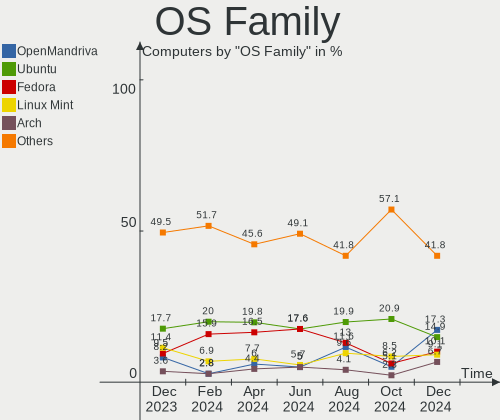
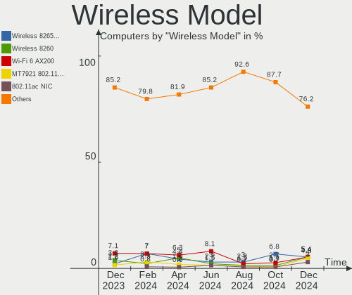
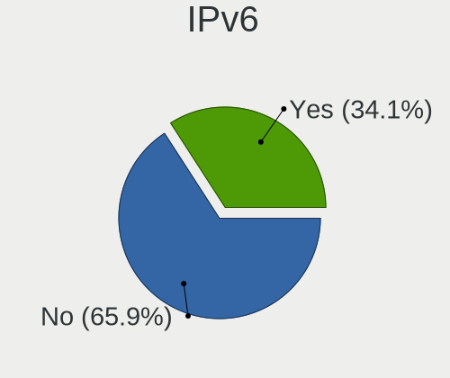
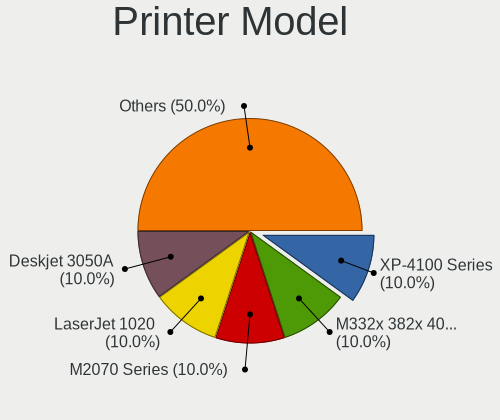

Linux in Canada - Hardware Trends
---------------------------------

A project to identify most popular hardware characteristics and track their change
over time based on data collected by Linux users at https://Linux-Hardware.org.

Anyone can contribute to this report by the [hw-probe](https://github.com/linuxhw/hw-probe) tool:

    sudo -E hw-probe -all -upload

This is a report for all computer types. See also reports for [desktops](/Location/Canada/Desktop/README.md) and [notebooks](/Location/Canada/Notebook/README.md).

Period: Mar, 2023.

Contents
--------

* [ System ](#system)
  - [ OS                       ](#os)
  - [ OS Family                ](#os-family)
  - [ Kernel                   ](#kernel)
  - [ Kernel Family            ](#kernel-family)
  - [ Kernel Major Ver.        ](#kernel-major-ver)
  - [ Arch                     ](#arch)
  - [ DE                       ](#de)
  - [ Display Server           ](#display-server)
  - [ Display Manager          ](#display-manager)
  - [ OS Lang                  ](#os-lang)
  - [ Boot Mode                ](#boot-mode)
  - [ Filesystem               ](#filesystem)
  - [ Part. scheme             ](#part-scheme)
  - [ Dual Boot with Linux/BSD ](#dual-boot-with-linuxbsd)
  - [ Dual Boot (Win)          ](#dual-boot-win)

* [ Board ](#board)
  - [ Vendor                   ](#vendor)
  - [ Model                    ](#model)
  - [ Model Family             ](#model-family)
  - [ MFG Year                 ](#mfg-year)
  - [ Form Factor              ](#form-factor)
  - [ Secure Boot              ](#secure-boot)
  - [ Coreboot                 ](#coreboot)
  - [ RAM Size                 ](#ram-size)
  - [ RAM Used                 ](#ram-used)
  - [ Total Drives             ](#total-drives)
  - [ Has CD-ROM               ](#has-cd-rom)
  - [ Has Ethernet             ](#has-ethernet)
  - [ Has WiFi                 ](#has-wifi)
  - [ Has Bluetooth            ](#has-bluetooth)

* [ Location ](#location)
  - [ Country                  ](#country)
  - [ City                     ](#city)

* [ Drives ](#drives)
  - [ Drive Vendor             ](#drive-vendor)
  - [ Drive Model              ](#drive-model)
  - [ HDD Vendor               ](#hdd-vendor)
  - [ SSD Vendor               ](#ssd-vendor)
  - [ Drive Kind               ](#drive-kind)
  - [ Drive Connector          ](#drive-connector)
  - [ Drive Size               ](#drive-size)
  - [ Space Total              ](#space-total)
  - [ Space Used               ](#space-used)
  - [ Malfunc. Drives          ](#malfunc-drives)
  - [ Malfunc. Drive Vendor    ](#malfunc-drive-vendor)
  - [ Malfunc. HDD Vendor      ](#malfunc-hdd-vendor)
  - [ Malfunc. Drive Kind      ](#malfunc-drive-kind)
  - [ Failed Drives            ](#failed-drives)
  - [ Failed Drive Vendor      ](#failed-drive-vendor)
  - [ Drive Status             ](#drive-status)

* [ Storage controller ](#storage-controller)
  - [ Storage Vendor           ](#storage-vendor)
  - [ Storage Model            ](#storage-model)
  - [ Storage Kind             ](#storage-kind)

* [ Processor ](#processor)
  - [ CPU Vendor               ](#cpu-vendor)
  - [ CPU Model                ](#cpu-model)
  - [ CPU Model Family         ](#cpu-model-family)
  - [ CPU Cores                ](#cpu-cores)
  - [ CPU Sockets              ](#cpu-sockets)
  - [ CPU Threads              ](#cpu-threads)
  - [ CPU Op-Modes             ](#cpu-op-modes)
  - [ CPU Microcode            ](#cpu-microcode)
  - [ CPU Microarch            ](#cpu-microarch)

* [ Graphics ](#graphics)
  - [ GPU Vendor               ](#gpu-vendor)
  - [ GPU Model                ](#gpu-model)
  - [ GPU Combo                ](#gpu-combo)
  - [ GPU Driver               ](#gpu-driver)
  - [ GPU Memory               ](#gpu-memory)

* [ Monitor ](#monitor)
  - [ Monitor Vendor           ](#monitor-vendor)
  - [ Monitor Model            ](#monitor-model)
  - [ Monitor Resolution       ](#monitor-resolution)
  - [ Monitor Diagonal         ](#monitor-diagonal)
  - [ Monitor Width            ](#monitor-width)
  - [ Aspect Ratio             ](#aspect-ratio)
  - [ Monitor Area             ](#monitor-area)
  - [ Pixel Density            ](#pixel-density)
  - [ Multiple Monitors        ](#multiple-monitors)

* [ Network ](#network)
  - [ Net Controller Vendor    ](#net-controller-vendor)
  - [ Net Controller Model     ](#net-controller-model)
  - [ Wireless Vendor          ](#wireless-vendor)
  - [ Wireless Model           ](#wireless-model)
  - [ Ethernet Vendor          ](#ethernet-vendor)
  - [ Ethernet Model           ](#ethernet-model)
  - [ Net Controller Kind      ](#net-controller-kind)
  - [ Used Controller          ](#used-controller)
  - [ NICs                     ](#nics)
  - [ IPv6                     ](#ipv6)

* [ Bluetooth ](#bluetooth)
  - [ Bluetooth Vendor         ](#bluetooth-vendor)
  - [ Bluetooth Model          ](#bluetooth-model)

* [ Sound ](#sound)
  - [ Sound Vendor             ](#sound-vendor)
  - [ Sound Model              ](#sound-model)

* [ Memory ](#memory)
  - [ Memory Vendor            ](#memory-vendor)
  - [ Memory Model             ](#memory-model)
  - [ Memory Kind              ](#memory-kind)
  - [ Memory Form Factor       ](#memory-form-factor)
  - [ Memory Size              ](#memory-size)
  - [ Memory Speed             ](#memory-speed)

* [ Printers & scanners ](#printers--scanners)
  - [ Printer Vendor           ](#printer-vendor)
  - [ Printer Model            ](#printer-model)
  - [ Scanner Vendor           ](#scanner-vendor)
  - [ Scanner Model            ](#scanner-model)

* [ Camera ](#camera)
  - [ Camera Vendor            ](#camera-vendor)
  - [ Camera Model             ](#camera-model)

* [ Security ](#security)
  - [ Fingerprint Vendor       ](#fingerprint-vendor)
  - [ Fingerprint Model        ](#fingerprint-model)
  - [ Chipcard Vendor          ](#chipcard-vendor)
  - [ Chipcard Model           ](#chipcard-model)

* [ Unsupported ](#unsupported)
  - [ Unsupported Devices      ](#unsupported-devices)
  - [ Unsupported Device Types ](#unsupported-device-types)

System
------

OS
--

Installed operating systems

| Name                         | Computers | Percent |
|------------------------------|-----------|---------|
| Ubuntu 22.04                 | 27        | 16.36%  |
| OpenMandriva 23.03           | 14        | 8.48%   |
| Debian 11                    | 12        | 7.27%   |
| Pop!_OS 22.04                | 10        | 6.06%   |
| Linux Mint 21.1              | 9         | 5.45%   |
| Ubuntu 22.10                 | 8         | 4.85%   |
| Zorin 16                     | 7         | 4.24%   |
| OpenMandriva 4.3             | 6         | 3.64%   |
| Fedora 37                    | 6         | 3.64%   |
| Arch Rolling                 | 6         | 3.64%   |
| OpenMandriva 23.01           | 5         | 3.03%   |
| Kubuntu 22.04                | 4         | 2.42%   |
| Fedora 38                    | 4         | 2.42%   |
| Linux Mint 20.3              | 3         | 1.82%   |
| Kubuntu 22.10                | 3         | 1.82%   |
| ArcoLinux Rolling            | 3         | 1.82%   |
| Xubuntu 22.04                | 2         | 1.21%   |
| Ubuntu 18.04                 | 2         | 1.21%   |
| SteamOS 3.4.4                | 2         | 1.21%   |
| Linux Mint 21                | 2         | 1.21%   |
| KDE neon 22.04               | 2         | 1.21%   |
| Gentoo 2.9                   | 2         | 1.21%   |
| EndeavourOS Rolling          | 2         | 1.21%   |
| Xubuntu 20.04                | 1         | 0.61%   |
| Ubuntu 23.04                 | 1         | 0.61%   |
| Ubuntu 20.04                 | 1         | 0.61%   |
| Rocky Linux 9.1              | 1         | 0.61%   |
| PCLinuxOS 2023               | 1         | 0.61%   |
| openSUSE Tumbleweed-XXXXXXXX | 1         | 0.61%   |
| OpenMandriva 4.90            | 1         | 0.61%   |
| Nobara 37                    | 1         | 0.61%   |
| MX 21                        | 1         | 0.61%   |
| Manjaro 22.0.5               | 1         | 0.61%   |
| Manjaro 22.0.4               | 1         | 0.61%   |
| Manjaro                      | 1         | 0.61%   |
| LMDE 5                       | 1         | 0.61%   |
| Linux Mint 20                | 1         | 0.61%   |
| Kubuntu 18.04                | 1         | 0.61%   |
| Kali 2023.1                  | 1         | 0.61%   |
| Gentoo 2.13                  | 1         | 0.61%   |

OS Family
---------

OS without a version

| Name         | Computers | Percent |
|--------------|-----------|---------|
| Ubuntu       | 39        | 23.64%  |
| OpenMandriva | 26        | 15.76%  |
| Linux Mint   | 15        | 9.09%   |
| Debian       | 13        | 7.88%   |
| Pop!_OS      | 10        | 6.06%   |
| Fedora       | 10        | 6.06%   |
| Kubuntu      | 8         | 4.85%   |
| Zorin        | 7         | 4.24%   |
| Arch         | 6         | 3.64%   |
| Xubuntu      | 3         | 1.82%   |
| Manjaro      | 3         | 1.82%   |
| Gentoo       | 3         | 1.82%   |
| ArcoLinux    | 3         | 1.82%   |
| SteamOS      | 2         | 1.21%   |
| KDE neon     | 2         | 1.21%   |
| EndeavourOS  | 2         | 1.21%   |
| Rocky Linux  | 1         | 0.61%   |
| PCLinuxOS    | 1         | 0.61%   |
| openSUSE     | 1         | 0.61%   |
| Nobara       | 1         | 0.61%   |
| MX           | 1         | 0.61%   |
| LMDE         | 1         | 0.61%   |
| Kali         | 1         | 0.61%   |
| Garuda Linux | 1         | 0.61%   |
| Elementary   | 1         | 0.61%   |
| BunsenLabs   | 1         | 0.61%   |
| BlackPanther | 1         | 0.61%   |
| Alpine       | 1         | 0.61%   |
| AlmaLinux    | 1         | 0.61%   |

Kernel
------

Version of the Linux kernel

| Version                      | Computers | Percent |
|------------------------------|-----------|---------|
| 5.19.0-35-generic            | 24        | 14.55%  |
| 5.15.0-67-generic            | 17        | 10.3%   |
| 6.2.6-desktop-1omv2390       | 11        | 6.67%   |
| 5.10.0-21-amd64              | 10        | 6.06%   |
| 6.2.0-76060200-generic       | 6         | 3.64%   |
| 6.1.1-desktop-1omv2290       | 5         | 3.03%   |
| 5.19.0-32-generic            | 5         | 3.03%   |
| 5.16.7-desktop-1omv4003      | 5         | 3.03%   |
| 5.15.0-56-generic            | 5         | 3.03%   |
| 5.4.0-144-generic            | 4         | 2.42%   |
| 5.15.0-60-generic            | 4         | 2.42%   |
| 6.2.8-arch1-1                | 3         | 1.82%   |
| 6.2.2-desktop-1omv2390       | 3         | 1.82%   |
| 5.19.0-21-generic            | 3         | 1.82%   |
| 5.15.0-69-generic            | 3         | 1.82%   |
| 6.2.7-200.fc37.x86_64        | 2         | 1.21%   |
| 6.2.1-zen1-1-zen             | 2         | 1.21%   |
| 6.1.18-200.fc37.x86_64       | 2         | 1.21%   |
| 6.1.14-200.fc37.x86_64       | 2         | 1.21%   |
| 6.1.11-76060111-generic      | 2         | 1.21%   |
| 5.19.0-38-generic            | 2         | 1.21%   |
| 5.15.88-gentoo               | 2         | 1.21%   |
| 5.13.0-valve36-1-neptune     | 2         | 1.21%   |
| 6.2.8-300.fc38.x86_64        | 1         | 0.61%   |
| 6.2.8-060208-generic         | 1         | 0.61%   |
| 6.2.7-v8+                    | 1         | 0.61%   |
| 6.2.7-arch1-1                | 1         | 0.61%   |
| 6.2.7-300.fc38.x86_64        | 1         | 0.61%   |
| 6.2.7-2-MANJARO              | 1         | 0.61%   |
| 6.2.6-zen1-1-zen             | 1         | 0.61%   |
| 6.2.6-arch1-1                | 1         | 0.61%   |
| 6.2.6-300.fc38.x86_64        | 1         | 0.61%   |
| 6.2.6-1-default              | 1         | 0.61%   |
| 6.2.3-300.fc38.x86_64        | 1         | 0.61%   |
| 6.2.2-x64v3-xanmod1          | 1         | 0.61%   |
| 6.2.2-arch2-1                | 1         | 0.61%   |
| 6.2.1-arch1-1                | 1         | 0.61%   |
| 6.2.0-18-generic             | 1         | 0.61%   |
| 6.2.0-060200-generic         | 1         | 0.61%   |
| 6.1.14-201.fsync.fc37.x86_64 | 1         | 0.61%   |

Kernel Family
-------------

Linux kernel without a distro release

| Version  | Computers | Percent |
|----------|-----------|---------|
| 5.19.0   | 35        | 21.21%  |
| 5.15.0   | 30        | 18.18%  |
| 6.2.6    | 15        | 9.09%   |
| 5.10.0   | 11        | 6.67%   |
| 6.2.0    | 8         | 4.85%   |
| 6.2.7    | 6         | 3.64%   |
| 6.2.8    | 5         | 3.03%   |
| 6.2.2    | 5         | 3.03%   |
| 6.1.1    | 5         | 3.03%   |
| 5.16.7   | 5         | 3.03%   |
| 5.4.0    | 4         | 2.42%   |
| 6.2.1    | 3         | 1.82%   |
| 6.1.14   | 3         | 1.82%   |
| 6.1.11   | 3         | 1.82%   |
| 5.13.0   | 3         | 1.82%   |
| 6.1.18   | 2         | 1.21%   |
| 6.1.12   | 2         | 1.21%   |
| 6.1.0    | 2         | 1.21%   |
| 5.15.88  | 2         | 1.21%   |
| 5.15.102 | 2         | 1.21%   |
| 6.2.3    | 1         | 0.61%   |
| 6.0.19   | 1         | 0.61%   |
| 6.0.13   | 1         | 0.61%   |
| 6.0.12   | 1         | 0.61%   |
| 5.6.14   | 1         | 0.61%   |
| 5.18.12  | 1         | 0.61%   |
| 5.16.13  | 1         | 0.61%   |
| 5.15.94  | 1         | 0.61%   |
| 5.15.85  | 1         | 0.61%   |
| 5.15.103 | 1         | 0.61%   |
| 5.14.0   | 1         | 0.61%   |
| 4.9.253  | 1         | 0.61%   |
| 4.18.0   | 1         | 0.61%   |
| 4.15.0   | 1         | 0.61%   |

Kernel Major Ver.
-----------------

Linux kernel major version

| Version | Computers | Percent |
|---------|-----------|---------|
| 6.2     | 43        | 26.06%  |
| 5.15    | 37        | 22.42%  |
| 5.19    | 35        | 21.21%  |
| 6.1     | 17        | 10.3%   |
| 5.10    | 11        | 6.67%   |
| 5.16    | 6         | 3.64%   |
| 5.4     | 4         | 2.42%   |
| 6.0     | 3         | 1.82%   |
| 5.13    | 3         | 1.82%   |
| 5.6     | 1         | 0.61%   |
| 5.18    | 1         | 0.61%   |
| 5.14    | 1         | 0.61%   |
| 4.9     | 1         | 0.61%   |
| 4.18    | 1         | 0.61%   |
| 4.15    | 1         | 0.61%   |

Arch
----

OS architecture (x86_64, i586, etc.)

| Name    | Computers | Percent |
|---------|-----------|---------|
| x86_64  | 161       | 97.58%  |
| aarch64 | 3         | 1.82%   |
| i686    | 1         | 0.61%   |

DE
--

Desktop Environment

| Name            | Computers | Percent |
|-----------------|-----------|---------|
| GNOME           | 73        | 44.24%  |
| KDE5            | 43        | 26.06%  |
| XFCE            | 14        | 8.48%   |
| Unknown         | 11        | 6.67%   |
| X-Cinnamon      | 10        | 6.06%   |
| LXDE            | 3         | 1.82%   |
| Cinnamon        | 3         | 1.82%   |
| xsession        | 1         | 0.61%   |
| qtile           | 1         | 0.61%   |
| Pantheon        | 1         | 0.61%   |
| MATE            | 1         | 0.61%   |
| LXQt            | 1         | 0.61%   |
| i3              | 1         | 0.61%   |
| GNOME Flashback | 1         | 0.61%   |
| bspwm           | 1         | 0.61%   |

Display Server
--------------

X11 or Wayland

| Name    | Computers | Percent |
|---------|-----------|---------|
| X11     | 121       | 73.33%  |
| Wayland | 34        | 20.61%  |
| Tty     | 7         | 4.24%   |
| Unknown | 3         | 1.82%   |

Display Manager
---------------

SDDM, LightDM, etc.

| Name    | Computers | Percent |
|---------|-----------|---------|
| Unknown | 58        | 35.15%  |
| SDDM    | 37        | 22.42%  |
| GDM3    | 35        | 21.21%  |
| LightDM | 22        | 13.33%  |
| GDM     | 12        | 7.27%   |
| LXDM    | 1         | 0.61%   |

OS Lang
-------

Language

| Lang    | Computers | Percent |
|---------|-----------|---------|
| en_CA   | 92        | 55.76%  |
| en_US   | 51        | 30.91%  |
| C       | 9         | 5.45%   |
| fr_CA   | 8         | 4.85%   |
| fr_FR   | 3         | 1.82%   |
| en_GB   | 1         | 0.61%   |
| Unknown | 1         | 0.61%   |

Boot Mode
---------

EFI or BIOS

| Mode | Computers | Percent |
|------|-----------|---------|
| EFI  | 83        | 50.3%   |
| BIOS | 82        | 49.7%   |

Filesystem
----------

Type of filesystem

| Type    | Computers | Percent |
|---------|-----------|---------|
| Ext4    | 127       | 76.97%  |
| Btrfs   | 21        | 12.73%  |
| Overlay | 14        | 8.48%   |
| Xfs     | 2         | 1.21%   |
| Zfs     | 1         | 0.61%   |

Part. scheme
------------

Scheme of partitioning

| Type    | Computers | Percent |
|---------|-----------|---------|
| GPT     | 101       | 61.21%  |
| Unknown | 50        | 30.3%   |
| MBR     | 14        | 8.48%   |

Dual Boot with Linux/BSD
------------------------

Hosting more than one Linux/BSD

| Dual boot | Computers | Percent |
|-----------|-----------|---------|
| No        | 134       | 81.21%  |
| Yes       | 31        | 18.79%  |

Dual Boot (Win)
---------------

Hosting Linux and Windows

| Dual boot | Computers | Percent |
|-----------|-----------|---------|
| No        | 126       | 76.36%  |
| Yes       | 39        | 23.64%  |

Board
-----

Vendor
------

Motherboard manufacturer

| Name                           | Computers | Percent |
|--------------------------------|-----------|---------|
| ASUSTek Computer               | 30        | 18.18%  |
| Dell                           | 21        | 12.73%  |
| Hewlett-Packard                | 20        | 12.12%  |
| Lenovo                         | 18        | 10.91%  |
| MSI                            | 16        | 9.7%    |
| Acer                           | 11        | 6.67%   |
| Gigabyte Technology            | 10        | 6.06%   |
| Apple                          | 5         | 3.03%   |
| ASRock                         | 4         | 2.42%   |
| Microsoft                      | 3         | 1.82%   |
| Valve                          | 2         | 1.21%   |
| Framework                      | 2         | 1.21%   |
| ECS                            | 2         | 1.21%   |
| AZW                            | 2         | 1.21%   |
| Wistron                        | 1         | 0.61%   |
| Win element                    | 1         | 0.61%   |
| Toshiba                        | 1         | 0.61%   |
| Supermicro                     | 1         | 0.61%   |
| Sony                           | 1         | 0.61%   |
| Shuttle                        | 1         | 0.61%   |
| ReachingTech                   | 1         | 0.61%   |
| Raspberry Pi Foundation        | 1         | 0.61%   |
| Nvidia                         | 1         | 0.61%   |
| Matsushita Electric Industrial | 1         | 0.61%   |
| libre-computer                 | 1         | 0.61%   |
| Intel                          | 1         | 0.61%   |
| Google                         | 1         | 0.61%   |
| Fujitsu                        | 1         | 0.61%   |
| Datto                          | 1         | 0.61%   |
| Biostar                        | 1         | 0.61%   |
| BESSTAR Tech                   | 1         | 0.61%   |
| ASRockRack                     | 1         | 0.61%   |
| Unknown                        | 1         | 0.61%   |

Model
-----

Motherboard model

| Name                                        | Computers | Percent |
|---------------------------------------------|-----------|---------|
| Valve Jupiter                               | 2         | 1.21%   |
| MSI MS-7817                                 | 2         | 1.21%   |
| MSI GS65 Stealth Thin 8RF                   | 2         | 1.21%   |
| Dell Latitude 7490                          | 2         | 1.21%   |
| Wistron ProLiant ML110 G5                   | 1         | 0.61%   |
| Win element M600                            | 1         | 0.61%   |
| Toshiba Satellite P870                      | 1         | 0.61%   |
| Supermicro PIO-1UDP10-01-AI036              | 1         | 0.61%   |
| Sony VPCCB32FD                              | 1         | 0.61%   |
| Shuttle XH270                               | 1         | 0.61%   |
| ReachingTech DreamQuest Pro 2022            | 1         | 0.61%   |
| RPi Raspberry Pi 4 Model B Rev 1.5          | 1         | 0.61%   |
| Nvidia Tegra                                | 1         | 0.61%   |
| MSI PS42 8RB                                | 1         | 0.61%   |
| MSI MS-7D42                                 | 1         | 0.61%   |
| MSI MS-7D06                                 | 1         | 0.61%   |
| MSI MS-7C95                                 | 1         | 0.61%   |
| MSI MS-7C91                                 | 1         | 0.61%   |
| MSI MS-7C56                                 | 1         | 0.61%   |
| MSI MS-7C37                                 | 1         | 0.61%   |
| MSI MS-7B86                                 | 1         | 0.61%   |
| MSI MS-7B48                                 | 1         | 0.61%   |
| MSI MS-7850                                 | 1         | 0.61%   |
| MSI MS-7693                                 | 1         | 0.61%   |
| MSI GE63 Raider RGB 8RE                     | 1         | 0.61%   |
| Microsoft Surface Laptop Go                 | 1         | 0.61%   |
| Microsoft Surface Laptop 4                  | 1         | 0.61%   |
| Microsoft Surface Book                      | 1         | 0.61%   |
| Matsushita Electric Industrial CF-18KH2ZXBC | 1         | 0.61%   |
| libre-computer aml-s905x-cc                 | 1         | 0.61%   |
| Lenovo V15-IIL 82C5                         | 1         | 0.61%   |
| Lenovo ThinkPad X220 4290LR3                | 1         | 0.61%   |
| Lenovo ThinkPad X220 429035U                | 1         | 0.61%   |
| Lenovo ThinkPad X1 Carbon 5th 20HR000MUS    | 1         | 0.61%   |
| Lenovo ThinkPad X1 Carbon 2nd 20A8S0ET00    | 1         | 0.61%   |
| Lenovo ThinkPad T470 W10DG 20JNS15B26       | 1         | 0.61%   |
| Lenovo ThinkPad T430 4237ZC7                | 1         | 0.61%   |
| Lenovo ThinkPad P16 Gen 1 21D6004QUS        | 1         | 0.61%   |
| Lenovo ThinkCentre M92p 2988D9U             | 1         | 0.61%   |
| Lenovo ThinkCentre M91p 4524B61             | 1         | 0.61%   |

Model Family
------------

Motherboard model prefix

| Name                           | Computers | Percent |
|--------------------------------|-----------|---------|
| ASUS PRIME                     | 8         | 4.85%   |
| Acer Aspire                    | 8         | 4.85%   |
| Lenovo ThinkPad                | 7         | 4.24%   |
| Dell OptiPlex                  | 5         | 3.03%   |
| Dell Latitude                  | 5         | 3.03%   |
| Lenovo IdeaPad                 | 4         | 2.42%   |
| Microsoft Surface              | 3         | 1.82%   |
| HP Pavilion                    | 3         | 1.82%   |
| HP ENVY                        | 3         | 1.82%   |
| Dell Precision                 | 3         | 1.82%   |
| Dell Inspiron                  | 3         | 1.82%   |
| ASUS ROG                       | 3         | 1.82%   |
| Acer Swift                     | 3         | 1.82%   |
| Valve Jupiter                  | 2         | 1.21%   |
| MSI MS-7817                    | 2         | 1.21%   |
| MSI GS65                       | 2         | 1.21%   |
| Lenovo ThinkCentre             | 2         | 1.21%   |
| HP Compaq                      | 2         | 1.21%   |
| Gigabyte B550                  | 2         | 1.21%   |
| Framework Laptop               | 2         | 1.21%   |
| Dell XPS                       | 2         | 1.21%   |
| Dell Studio                    | 2         | 1.21%   |
| ASUS M5A78L-M                  | 2         | 1.21%   |
| Apple MacBookPro11             | 2         | 1.21%   |
| Wistron ProLiant               | 1         | 0.61%   |
| Win element M600               | 1         | 0.61%   |
| Toshiba Satellite              | 1         | 0.61%   |
| Supermicro PIO-1UDP10-01-AI036 | 1         | 0.61%   |
| Sony VPCCB32FD                 | 1         | 0.61%   |
| Shuttle XH270                  | 1         | 0.61%   |
| ReachingTech DreamQuest        | 1         | 0.61%   |
| RPi Raspberry                  | 1         | 0.61%   |
| Nvidia Tegra                   | 1         | 0.61%   |
| MSI PS42                       | 1         | 0.61%   |
| MSI MS-7D42                    | 1         | 0.61%   |
| MSI MS-7D06                    | 1         | 0.61%   |
| MSI MS-7C95                    | 1         | 0.61%   |
| MSI MS-7C91                    | 1         | 0.61%   |
| MSI MS-7C56                    | 1         | 0.61%   |
| MSI MS-7C37                    | 1         | 0.61%   |

MFG Year
--------

Motherboard manufacture year

| Year    | Computers | Percent |
|---------|-----------|---------|
| 2022    | 19        | 11.52%  |
| 2018    | 17        | 10.3%   |
| 2020    | 15        | 9.09%   |
| 2012    | 14        | 8.48%   |
| 2014    | 13        | 7.88%   |
| 2021    | 10        | 6.06%   |
| 2011    | 10        | 6.06%   |
| 2016    | 9         | 5.45%   |
| 2019    | 8         | 4.85%   |
| 2017    | 8         | 4.85%   |
| 2013    | 8         | 4.85%   |
| 2007    | 8         | 4.85%   |
| 2015    | 7         | 4.24%   |
| 2009    | 7         | 4.24%   |
| 2008    | 5         | 3.03%   |
| 2010    | 3         | 1.82%   |
| 2006    | 2         | 1.21%   |
| Unknown | 2         | 1.21%   |

Form Factor
-----------

Physical design of the computer

| Name           | Computers | Percent |
|----------------|-----------|---------|
| Desktop        | 81        | 49.09%  |
| Notebook       | 69        | 41.82%  |
| Mini pc        | 4         | 2.42%   |
| System on chip | 3         | 1.82%   |
| Tablet         | 3         | 1.82%   |
| Convertible    | 3         | 1.82%   |
| All in one     | 2         | 1.21%   |

Secure Boot
-----------

Enabled or disabled

| State    | Computers | Percent |
|----------|-----------|---------|
| Disabled | 155       | 93.94%  |
| Enabled  | 10        | 6.06%   |

Coreboot
--------

Have coreboot on board

| Used | Computers | Percent |
|------|-----------|---------|
| No   | 163       | 98.79%  |
| Yes  | 2         | 1.21%   |

RAM Size
--------

Total RAM memory

| Size in GB  | Computers | Percent |
|-------------|-----------|---------|
| 16.01-24.0  | 38        | 23.03%  |
| 4.01-8.0    | 35        | 21.21%  |
| 32.01-64.0  | 33        | 20%     |
| 8.01-16.0   | 21        | 12.73%  |
| 3.01-4.0    | 20        | 12.12%  |
| 1.01-2.0    | 8         | 4.85%   |
| 64.01-256.0 | 6         | 3.64%   |
| 24.01-32.0  | 2         | 1.21%   |
| 2.01-3.0    | 1         | 0.61%   |
| 0.51-1.0    | 1         | 0.61%   |

RAM Used
--------

Used RAM memory

| Used GB    | Computers | Percent |
|------------|-----------|---------|
| 1.01-2.0   | 50        | 30.3%   |
| 4.01-8.0   | 39        | 23.64%  |
| 2.01-3.0   | 38        | 23.03%  |
| 3.01-4.0   | 17        | 10.3%   |
| 8.01-16.0  | 9         | 5.45%   |
| 0.51-1.0   | 7         | 4.24%   |
| 0.01-0.5   | 4         | 2.42%   |
| 32.01-64.0 | 1         | 0.61%   |

Total Drives
------------

Number of drives on board

| Drives | Computers | Percent |
|--------|-----------|---------|
| 1      | 95        | 57.58%  |
| 2      | 34        | 20.61%  |
| 3      | 15        | 9.09%   |
| 4      | 10        | 6.06%   |
| 5      | 3         | 1.82%   |
| 8      | 2         | 1.21%   |
| 0      | 2         | 1.21%   |
| 13     | 1         | 0.61%   |
| 9      | 1         | 0.61%   |
| 7      | 1         | 0.61%   |
| 6      | 1         | 0.61%   |

Has CD-ROM
----------

Has CD-ROM on board

| Presented | Computers | Percent |
|-----------|-----------|---------|
| No        | 108       | 65.45%  |
| Yes       | 57        | 34.55%  |

Has Ethernet
------------

Has Ethernet on board

| Presented | Computers | Percent |
|-----------|-----------|---------|
| Yes       | 134       | 81.21%  |
| No        | 31        | 18.79%  |

Has WiFi
--------

Has WiFi module

| Presented | Computers | Percent |
|-----------|-----------|---------|
| Yes       | 122       | 73.94%  |
| No        | 43        | 26.06%  |

Has Bluetooth
-------------

Has Bluetooth module

| Presented | Computers | Percent |
|-----------|-----------|---------|
| Yes       | 93        | 56.36%  |
| No        | 72        | 43.64%  |

Location
--------

Country
-------

Geographic location (country)

| Country | Computers | Percent |
|---------|-----------|---------|
| Canada  | 165       | 100%    |

City
----

Geographic location (city)

| City             | Computers | Percent |
|------------------|-----------|---------|
| Montreal         | 15        | 9.09%   |
| Vancouver        | 11        | 6.67%   |
| Toronto          | 9         | 5.45%   |
| Ottawa           | 6         | 3.64%   |
| Mississauga      | 6         | 3.64%   |
| Calgary          | 5         | 3.03%   |
| Winnipeg         | 4         | 2.42%   |
| Laval            | 3         | 1.82%   |
| Kitchener        | 3         | 1.82%   |
| Edmonton         | 3         | 1.82%   |
| Courtice         | 3         | 1.82%   |
| Victoria         | 2         | 1.21%   |
| Surrey           | 2         | 1.21%   |
| Sombra           | 2         | 1.21%   |
| Saint-Hyacinthe  | 2         | 1.21%   |
| Port Perry       | 2         | 1.21%   |
| Paquetville      | 2         | 1.21%   |
| Oshawa           | 2         | 1.21%   |
| Langley          | 2         | 1.21%   |
| Kingston         | 2         | 1.21%   |
| Greater Sudbury  | 2         | 1.21%   |
| Courtenay        | 2         | 1.21%   |
| Coquitlam        | 2         | 1.21%   |
| Burnaby          | 2         | 1.21%   |
| Burlington       | 2         | 1.21%   |
| Belleville       | 2         | 1.21%   |
| Barrie           | 2         | 1.21%   |
| Aurora           | 2         | 1.21%   |
| Woodstock        | 1         | 0.61%   |
| Whitehorse       | 1         | 0.61%   |
| West Kelowna     | 1         | 0.61%   |
| Viking           | 1         | 0.61%   |
| Vernon           | 1         | 0.61%   |
| Vaudreuil-Dorion | 1         | 0.61%   |
| Trois-Rivières  | 1         | 0.61%   |
| Trois Pistoles   | 1         | 0.61%   |
| Thornhill        | 1         | 0.61%   |
| Terrace          | 1         | 0.61%   |
| Sutton           | 1         | 0.61%   |
| Summerside       | 1         | 0.61%   |

Drives
------

Drive Vendor
------------

Hard drive vendors

| Vendor                      | Computers | Drives | Percent |
|-----------------------------|-----------|--------|---------|
| WDC                         | 48        | 67     | 18.39%  |
| Samsung Electronics         | 39        | 49     | 14.94%  |
| Seagate                     | 34        | 46     | 13.03%  |
| SanDisk                     | 20        | 25     | 7.66%   |
| Kingston                    | 19        | 20     | 7.28%   |
| Toshiba                     | 16        | 19     | 6.13%   |
| Unknown                     | 9         | 9      | 3.45%   |
| Hitachi                     | 7         | 7      | 2.68%   |
| Crucial                     | 7         | 10     | 2.68%   |
| Micron Technology           | 6         | 7      | 2.3%    |
| Micron/Crucial Technology   | 4         | 4      | 1.53%   |
| Kingston Technology Company | 4         | 4      | 1.53%   |
| Intel                       | 4         | 4      | 1.53%   |
| A-DATA Technology           | 4         | 4      | 1.53%   |
| Timetec                     | 3         | 3      | 1.15%   |
| SPCC                        | 3         | 3      | 1.15%   |
| SK hynix                    | 3         | 3      | 1.15%   |
| Silicon Motion              | 3         | 4      | 1.15%   |
| TO Exter                    | 2         | 2      | 0.77%   |
| Phison Electronics          | 2         | 2      | 0.77%   |
| KIOXIA                      | 2         | 2      | 0.77%   |
| HGST                        | 2         | 2      | 0.77%   |
| Zheino                      | 1         | 1      | 0.38%   |
| Team                        | 1         | 1      | 0.38%   |
| Seagate Technology          | 1         | 1      | 0.38%   |
| Saichi D                    | 1         | 1      | 0.38%   |
| PNY                         | 1         | 1      | 0.38%   |
| Patriot                     | 1         | 1      | 0.38%   |
| OWC                         | 1         | 1      | 0.38%   |
| NGFF                        | 1         | 1      | 0.38%   |
| Mushkin                     | 1         | 1      | 0.38%   |
| LITEONIT                    | 1         | 1      | 0.38%   |
| LITEON                      | 1         | 1      | 0.38%   |
| KingFast                    | 1         | 1      | 0.38%   |
| JMicron Technology          | 1         | 1      | 0.38%   |
| Hewlett-Packard             | 1         | 1      | 0.38%   |
| Fujitsu                     | 1         | 1      | 0.38%   |
| Fanxiang                    | 1         | 1      | 0.38%   |
| BIWIN                       | 1         | 1      | 0.38%   |
| Apple                       | 1         | 1      | 0.38%   |

Drive Model
-----------

Hard drive models

| Model                                               | Computers | Percent |
|-----------------------------------------------------|-----------|---------|
| Samsung NVMe SSD Controller SM981/PM981/PM983 250GB | 7         | 2.36%   |
| Samsung SSD 860 EVO 500GB                           | 5         | 1.69%   |
| Kingston SA400S37240G 240GB SSD                     | 5         | 1.69%   |
| Kingston SA400S37120G 120GB SSD                     | 4         | 1.35%   |
| WDC WDS100T2G0A-00JH30 1TB SSD                      | 3         | 1.01%   |
| Toshiba MQ01ABD100 1TB                              | 3         | 1.01%   |
| Toshiba MK2555GSXF 250GB                            | 3         | 1.01%   |
| Seagate ST2000DM008-2FR102 2TB                      | 3         | 1.01%   |
| Seagate ST2000DM001-1ER164 2TB                      | 3         | 1.01%   |
| Sandisk WD Blue SN550 NVMe SSD 256GB                | 3         | 1.01%   |
| Samsung SSD 970 EVO Plus 500GB                      | 3         | 1.01%   |
| Samsung SSD 870 QVO 2TB                             | 3         | 1.01%   |
| Samsung SSD 850 EVO 500GB                           | 3         | 1.01%   |
| Samsung SSD 850 EVO 250GB                           | 3         | 1.01%   |
| Micron/Crucial P2 NVMe PCIe SSD 1TB                 | 3         | 1.01%   |
| WDC WDS500G2B0B-00YS70 500GB SSD                    | 2         | 0.68%   |
| WDC WDS500G2B0A-00SM50 500GB SSD                    | 2         | 0.68%   |
| WDC WDS250G2B0A-00SM50 250GB SSD                    | 2         | 0.68%   |
| WDC WDS200T2B0A-00SM50 2TB SSD                      | 2         | 0.68%   |
| WDC WD20EZAZ-00L9GB0 2TB                            | 2         | 0.68%   |
| WDC WD10JPVX-22JC3T0 1TB                            | 2         | 0.68%   |
| WDC WD10EZEX-08WN4A0 1TB                            | 2         | 0.68%   |
| Unknown MMC Card  64GB                              | 2         | 0.68%   |
| Unknown MMC Card  32GB                              | 2         | 0.68%   |
| Toshiba DT01ACA200 2TB                              | 2         | 0.68%   |
| Toshiba DT01ACA100 1TB                              | 2         | 0.68%   |
| TO Exter nal USB 3.0 1TB                            | 2         | 0.68%   |
| Seagate ST9500325AS 500GB                           | 2         | 0.68%   |
| Seagate ST380815AS 80GB                             | 2         | 0.68%   |
| Seagate ST31500341AS 1TB                            | 2         | 0.68%   |
| Seagate ST2000DM006-2DM164 2TB                      | 2         | 0.68%   |
| Seagate ST2000DM001-9YN164 2TB                      | 2         | 0.68%   |
| Seagate ST2000DM001-1CH164 2TB                      | 2         | 0.68%   |
| Seagate ST1000LM035-1RK172 1TB                      | 2         | 0.68%   |
| Seagate ST1000LM024 HN-M101MBB 1TB                  | 2         | 0.68%   |
| Sandisk WD Black SN750 / PC SN730 NVMe SSD 1TB      | 2         | 0.68%   |
| SanDisk SD8SBAT256G1122 256GB SSD                   | 2         | 0.68%   |
| SanDisk NVMe SSD Drive 1TB                          | 2         | 0.68%   |
| Samsung SSD 860 EVO 250GB                           | 2         | 0.68%   |
| Samsung MZALQ512HBLU-00BL2 512GB                    | 2         | 0.68%   |

HDD Vendor
----------

Hard disk drive vendors

| Vendor              | Computers | Drives | Percent |
|---------------------|-----------|--------|---------|
| Seagate             | 33        | 45     | 36.26%  |
| WDC                 | 32        | 46     | 35.16%  |
| Toshiba             | 13        | 16     | 14.29%  |
| Hitachi             | 7         | 7      | 7.69%   |
| HGST                | 2         | 2      | 2.2%    |
| Unknown             | 1         | 1      | 1.1%    |
| Samsung Electronics | 1         | 1      | 1.1%    |
| Fujitsu             | 1         | 1      | 1.1%    |
| Apple               | 1         | 1      | 1.1%    |

SSD Vendor
----------

Solid state drive vendors

| Vendor              | Computers | Drives | Percent |
|---------------------|-----------|--------|---------|
| Samsung Electronics | 19        | 22     | 19.79%  |
| WDC                 | 17        | 18     | 17.71%  |
| Kingston            | 14        | 15     | 14.58%  |
| SanDisk             | 9         | 9      | 9.38%   |
| Crucial             | 7         | 10     | 7.29%   |
| A-DATA Technology   | 4         | 4      | 4.17%   |
| Timetec             | 3         | 3      | 3.13%   |
| SPCC                | 3         | 3      | 3.13%   |
| Micron Technology   | 3         | 3      | 3.13%   |
| TO Exter            | 2         | 2      | 2.08%   |
| Intel               | 2         | 2      | 2.08%   |
| Toshiba             | 1         | 1      | 1.04%   |
| Team                | 1         | 1      | 1.04%   |
| SK hynix            | 1         | 1      | 1.04%   |
| Seagate             | 1         | 1      | 1.04%   |
| PNY                 | 1         | 1      | 1.04%   |
| Patriot             | 1         | 1      | 1.04%   |
| OWC                 | 1         | 1      | 1.04%   |
| NGFF                | 1         | 1      | 1.04%   |
| Mushkin             | 1         | 1      | 1.04%   |
| LITEONIT            | 1         | 1      | 1.04%   |
| LITEON              | 1         | 1      | 1.04%   |
| KingFast            | 1         | 1      | 1.04%   |
| BIWIN               | 1         | 1      | 1.04%   |

Drive Kind
----------

HDD or SSD

| Kind    | Computers | Drives | Percent |
|---------|-----------|--------|---------|
| SSD     | 79        | 104    | 34.35%  |
| HDD     | 74        | 120    | 32.17%  |
| NVMe    | 65        | 81     | 28.26%  |
| MMC     | 9         | 9      | 3.91%   |
| Unknown | 3         | 3      | 1.3%    |

Drive Connector
---------------

SATA, SAS, NVMe, etc.

| Type | Computers | Drives | Percent |
|------|-----------|--------|---------|
| SATA | 119       | 213    | 58.33%  |
| NVMe | 65        | 81     | 31.86%  |
| SAS  | 11        | 14     | 5.39%   |
| MMC  | 9         | 9      | 4.41%   |

Drive Size
----------

Size of hard drive

| Size in TB | Computers | Drives | Percent |
|------------|-----------|--------|---------|
| 0.01-0.5   | 82        | 106    | 48.81%  |
| 0.51-1.0   | 45        | 61     | 26.79%  |
| 1.01-2.0   | 25        | 35     | 14.88%  |
| 2.01-3.0   | 6         | 7      | 3.57%   |
| 3.01-4.0   | 5         | 7      | 2.98%   |
| 4.01-10.0  | 4         | 7      | 2.38%   |
| 10.01-20.0 | 1         | 1      | 0.6%    |

Space Total
-----------

Amount of disk space available on the file system

| Size in GB     | Computers | Percent |
|----------------|-----------|---------|
| 101-250        | 41        | 24.85%  |
| 501-1000       | 29        | 17.58%  |
| 251-500        | 26        | 15.76%  |
| 1001-2000      | 20        | 12.12%  |
| More than 3000 | 14        | 8.48%   |
| 51-100         | 10        | 6.06%   |
| Unknown        | 9         | 5.45%   |
| 1-20           | 7         | 4.24%   |
| 21-50          | 6         | 3.64%   |
| 2001-3000      | 3         | 1.82%   |

Space Used
----------

Amount of used disk space

| Used GB        | Computers | Percent |
|----------------|-----------|---------|
| 1-20           | 50        | 30.3%   |
| 21-50          | 30        | 18.18%  |
| 51-100         | 23        | 13.94%  |
| 101-250        | 17        | 10.3%   |
| 251-500        | 11        | 6.67%   |
| Unknown        | 9         | 5.45%   |
| 1001-2000      | 8         | 4.85%   |
| 501-1000       | 8         | 4.85%   |
| More than 3000 | 6         | 3.64%   |
| 2001-3000      | 3         | 1.82%   |

Malfunc. Drives
---------------

Drive models with a malfunction

| Model                                   | Computers | Drives | Percent |
|-----------------------------------------|-----------|--------|---------|
| Toshiba MK2555GSXF 250GB                | 3         | 3      | 11.54%  |
| WDC WD30EZRX-00MMMB0 3TB                | 1         | 2      | 3.85%   |
| WDC WD2500BEVS-75UST0 250GB             | 1         | 1      | 3.85%   |
| WDC WD10JPVX-22JC3T0 1TB                | 1         | 1      | 3.85%   |
| WDC WD10EADS-00L5B1 1TB                 | 1         | 1      | 3.85%   |
| Toshiba MQ01ABD100 1TB                  | 1         | 1      | 3.85%   |
| Toshiba KSG60ZMV512G M.2 2280 512GB SSD | 1         | 1      | 3.85%   |
| Seagate ST9500325AS 500GB               | 1         | 1      | 3.85%   |
| Seagate ST910021AS 100GB                | 1         | 1      | 3.85%   |
| Seagate ST500LM021-1KJ152 500GB         | 1         | 1      | 3.85%   |
| Seagate ST31500341AS 1TB                | 1         | 1      | 3.85%   |
| Seagate ST2000DM001-9YN164 2TB          | 1         | 1      | 3.85%   |
| Seagate ST1000VM002-1CT162 1TB          | 1         | 3      | 3.85%   |
| Seagate ST1000LM024 HN-M101MBB 1TB      | 1         | 1      | 3.85%   |
| Seagate ST1000DM003-1SB102 1TB          | 1         | 1      | 3.85%   |
| SanDisk SDSSDXPS960G 960GB              | 1         | 1      | 3.85%   |
| Samsung Electronics HM160HC 160GB       | 1         | 1      | 3.85%   |
| Mushkin MKNSSDRE1TB                     | 1         | 1      | 3.85%   |
| Kingston SA400S37120G 120GB SSD         | 1         | 1      | 3.85%   |
| Hitachi HDT725050VLA380 500GB           | 1         | 1      | 3.85%   |
| Hitachi HDT721010SLA360 1TB             | 1         | 1      | 3.85%   |
| Hitachi HDS721010CLA332 1TB             | 1         | 1      | 3.85%   |
| Hewlett-Packard SSD EX900 250GB         | 1         | 1      | 3.85%   |
| Fujitsu MHV2080AH 80GB                  | 1         | 1      | 3.85%   |

Malfunc. Drive Vendor
---------------------

Vendors of faulty drives

| Vendor              | Computers | Drives | Percent |
|---------------------|-----------|--------|---------|
| Seagate             | 7         | 10     | 28%     |
| Toshiba             | 5         | 5      | 20%     |
| WDC                 | 4         | 5      | 16%     |
| Hitachi             | 3         | 3      | 12%     |
| SanDisk             | 1         | 1      | 4%      |
| Samsung Electronics | 1         | 1      | 4%      |
| Mushkin             | 1         | 1      | 4%      |
| Kingston            | 1         | 1      | 4%      |
| Hewlett-Packard     | 1         | 1      | 4%      |
| Fujitsu             | 1         | 1      | 4%      |

Malfunc. HDD Vendor
-------------------

Vendors of faulty HDD drives

| Vendor              | Computers | Drives | Percent |
|---------------------|-----------|--------|---------|
| Seagate             | 7         | 10     | 35%     |
| WDC                 | 4         | 5      | 20%     |
| Toshiba             | 4         | 4      | 20%     |
| Hitachi             | 3         | 3      | 15%     |
| Samsung Electronics | 1         | 1      | 5%      |
| Fujitsu             | 1         | 1      | 5%      |

Malfunc. Drive Kind
-------------------

Kinds of faulty drives

| Kind | Computers | Drives | Percent |
|------|-----------|--------|---------|
| HDD  | 15        | 24     | 75%     |
| SSD  | 4         | 4      | 20%     |
| NVMe | 1         | 1      | 5%      |

Failed Drives
-------------

Failed drive models

Zero info for selected period =(

Failed Drive Vendor
-------------------

Failed drive vendors

Zero info for selected period =(

Drive Status
------------

Number of failed and malfunc. drives

| Status   | Computers | Drives | Percent |
|----------|-----------|--------|---------|
| Detected | 85        | 163    | 48.3%   |
| Works    | 71        | 125    | 40.34%  |
| Malfunc  | 20        | 29     | 11.36%  |

Storage controller
------------------

Storage Vendor
--------------

Storage controller vendors

| Vendor                       | Computers | Percent |
|------------------------------|-----------|---------|
| Intel                        | 97        | 44.09%  |
| AMD                          | 41        | 18.64%  |
| Samsung Electronics          | 23        | 10.45%  |
| SanDisk                      | 14        | 6.36%   |
| Kingston Technology Company  | 9         | 4.09%   |
| ASMedia Technology           | 6         | 2.73%   |
| Silicon Motion               | 4         | 1.82%   |
| Micron/Crucial Technology    | 4         | 1.82%   |
| Micron Technology            | 3         | 1.36%   |
| Marvell Technology Group     | 3         | 1.36%   |
| JMicron Technology           | 3         | 1.36%   |
| Toshiba America Info Systems | 2         | 0.91%   |
| SK hynix                     | 2         | 0.91%   |
| Phison Electronics           | 2         | 0.91%   |
| KIOXIA                       | 2         | 0.91%   |
| Seagate Technology           | 1         | 0.45%   |
| Nvidia                       | 1         | 0.45%   |
| LSI Logic / Symbios Logic    | 1         | 0.45%   |
| INNOGRIT                     | 1         | 0.45%   |
| ADATA Technology             | 1         | 0.45%   |

Storage Model
-------------

Storage controller models

| Model                                                                            | Computers | Percent |
|----------------------------------------------------------------------------------|-----------|---------|
| AMD FCH SATA Controller [AHCI mode]                                              | 20        | 7.84%   |
| Samsung NVMe SSD Controller SM981/PM981/PM983                                    | 13        | 5.1%    |
| AMD 500 Series Chipset SATA Controller                                           | 10        | 3.92%   |
| Intel 8 Series/C220 Series Chipset Family 6-port SATA Controller 1 [AHCI mode]   | 8         | 3.14%   |
| Samsung NVMe SSD Controller 980                                                  | 7         | 2.75%   |
| Intel 8 Series SATA Controller 1 [AHCI mode]                                     | 6         | 2.35%   |
| Intel 6 Series/C200 Series Chipset Family 6 port Mobile SATA AHCI Controller     | 6         | 2.35%   |
| AMD 400 Series Chipset SATA Controller                                           | 6         | 2.35%   |
| SanDisk WD Blue SN550 NVMe SSD                                                   | 5         | 1.96%   |
| Intel SATA Controller [RAID mode]                                                | 5         | 1.96%   |
| Intel 200 Series PCH SATA controller [AHCI mode]                                 | 5         | 1.96%   |
| ASMedia ASM1062 Serial ATA Controller                                            | 5         | 1.96%   |
| AMD SB7x0/SB8x0/SB9x0 SATA Controller [AHCI mode]                                | 5         | 1.96%   |
| Intel Tiger Lake-LP SATA Controller                                              | 4         | 1.57%   |
| Intel NM10/ICH7 Family SATA Controller [IDE mode]                                | 4         | 1.57%   |
| Intel Cannon Lake PCH SATA AHCI Controller                                       | 4         | 1.57%   |
| Intel 82801G (ICH7 Family) IDE Controller                                        | 4         | 1.57%   |
| Intel 7 Series Chipset Family 6-port SATA Controller [AHCI mode]                 | 4         | 1.57%   |
| SanDisk WD Black SN750 / PC SN730 NVMe SSD                                       | 3         | 1.18%   |
| SanDisk Non-Volatile memory controller                                           | 3         | 1.18%   |
| Micron/Crucial P2 NVMe PCIe SSD                                                  | 3         | 1.18%   |
| Micron NVMe Storage Controller                                                   | 3         | 1.18%   |
| Kingston Company Company Non-Volatile memory controller                          | 3         | 1.18%   |
| Kingston Company A2000 NVMe SSD                                                  | 3         | 1.18%   |
| Intel Volume Management Device NVMe RAID Controller                              | 3         | 1.18%   |
| Intel Sunrise Point-LP SATA Controller [AHCI mode]                               | 3         | 1.18%   |
| Intel Q170/Q150/B150/H170/H110/Z170/CM236 Chipset SATA Controller [AHCI Mode]    | 3         | 1.18%   |
| Intel Atom/Celeron/Pentium Processor x5-E8000/J3xxx/N3xxx Series SATA Controller | 3         | 1.18%   |
| Intel 82801I (ICH9 Family) 2 port SATA Controller [IDE mode]                     | 3         | 1.18%   |
| Intel 82801 Mobile SATA Controller [RAID mode]                                   | 3         | 1.18%   |
| Intel 7 Series/C210 Series Chipset Family 6-port SATA Controller [AHCI mode]     | 3         | 1.18%   |
| AMD SB7x0/SB8x0/SB9x0 SATA Controller [IDE mode]                                 | 3         | 1.18%   |
| AMD SB7x0/SB8x0/SB9x0 IDE Controller                                             | 3         | 1.18%   |
| Silicon Motion SM2263EN/SM2263XT SSD Controller                                  | 2         | 0.78%   |
| Sandisk Western Digital WD Black SN850X NVMe SSD                                 | 2         | 0.78%   |
| SanDisk NVMe Controller                                                          | 2         | 0.78%   |
| Samsung NVMe SSD Controller PM9A1/PM9A3/980PRO                                   | 2         | 0.78%   |
| Phison E12 NVMe Controller                                                       | 2         | 0.78%   |
| Marvell Group 88SE9172 SATA 6Gb/s Controller                                     | 2         | 0.78%   |
| KIOXIA NVMe SSD Controller BG4                                                   | 2         | 0.78%   |

Storage Kind
------------

Kind of storage controller (IDE, SATA, NVMe, SAS, ...)

| Kind | Computers | Percent |
|------|-----------|---------|
| SATA | 114       | 53.02%  |
| NVMe | 65        | 30.23%  |
| IDE  | 23        | 10.7%   |
| RAID | 11        | 5.12%   |
| SAS  | 2         | 0.93%   |

Processor
---------

CPU Vendor
----------

Processor vendors

| Vendor  | Computers | Percent |
|---------|-----------|---------|
| Intel   | 114       | 69.09%  |
| AMD     | 48        | 29.09%  |
| ARM     | 2         | 1.21%   |
| Unknown | 1         | 0.61%   |

CPU Model
---------

Processor models

| Model                                   | Computers | Percent |
|-----------------------------------------|-----------|---------|
| Intel Core i7-8750H CPU @ 2.20GHz       | 3         | 1.82%   |
| Intel Core i7-3770 CPU @ 3.40GHz        | 3         | 1.82%   |
| Intel Core i5-7300U CPU @ 2.60GHz       | 3         | 1.82%   |
| Intel Core i5-4460 CPU @ 3.20GHz        | 3         | 1.82%   |
| Intel Core i5-1035G1 CPU @ 1.00GHz      | 3         | 1.82%   |
| AMD Ryzen 7 5700U with Radeon Graphics  | 3         | 1.82%   |
| AMD Ryzen 5 5600X 6-Core Processor      | 3         | 1.82%   |
| Intel Core i7-8550U CPU @ 1.80GHz       | 2         | 1.21%   |
| Intel Core i7-7700K CPU @ 4.20GHz       | 2         | 1.21%   |
| Intel Core i7-4790 CPU @ 3.60GHz        | 2         | 1.21%   |
| Intel Core i5-6300U CPU @ 2.40GHz       | 2         | 1.21%   |
| Intel Core i5-2430M CPU @ 2.40GHz       | 2         | 1.21%   |
| Intel Core i5-2400 CPU @ 3.10GHz        | 2         | 1.21%   |
| Intel Celeron CPU N3050 @ 1.60GHz       | 2         | 1.21%   |
| Intel 12th Gen Core i7-1260P            | 2         | 1.21%   |
| Intel 11th Gen Core i5-1135G7 @ 2.40GHz | 2         | 1.21%   |
| ARM Processor                           | 2         | 1.21%   |
| AMD Ryzen 9 6900HX with Radeon Graphics | 2         | 1.21%   |
| AMD Ryzen 7 5800X3D 8-Core Processor    | 2         | 1.21%   |
| AMD Ryzen 5 5600G with Radeon Graphics  | 2         | 1.21%   |
| AMD Ryzen 5 3600 6-Core Processor       | 2         | 1.21%   |
| AMD Ryzen 5 3500X 6-Core Processor      | 2         | 1.21%   |
| AMD Custom APU 0405                     | 2         | 1.21%   |
| Intel Xeon CPU X3220 @ 2.40GHz          | 1         | 0.61%   |
| Intel Xeon CPU W3530 @ 2.80GHz          | 1         | 0.61%   |
| Intel Xeon CPU E5405 @ 2.00GHz          | 1         | 0.61%   |
| Intel Xeon CPU E5-2667 v2 @ 3.30GHz     | 1         | 0.61%   |
| Intel Xeon CPU E5-2620 v3 @ 2.40GHz     | 1         | 0.61%   |
| Intel Xeon CPU E3110 @ 3.00GHz          | 1         | 0.61%   |
| Intel Xeon CPU 5150 @ 2.66GHz           | 1         | 0.61%   |
| Intel Pentium M processor 1.20GHz       | 1         | 0.61%   |
| Intel Pentium Dual CPU T2330 @ 1.60GHz  | 1         | 0.61%   |
| Intel Pentium Dual CPU E2140 @ 1.60GHz  | 1         | 0.61%   |
| Intel Pentium CPU N3710 @ 1.60GHz       | 1         | 0.61%   |
| Intel Pentium CPU B940 @ 2.00GHz        | 1         | 0.61%   |
| Intel Core i9-9900K CPU @ 3.60GHz       | 1         | 0.61%   |
| Intel Core i9-10850K CPU @ 3.60GHz      | 1         | 0.61%   |
| Intel Core i7-9700K CPU @ 3.60GHz       | 1         | 0.61%   |
| Intel Core i7-9700 CPU @ 3.00GHz        | 1         | 0.61%   |
| Intel Core i7-8700K CPU @ 3.70GHz       | 1         | 0.61%   |

CPU Model Family
----------------

Processor model prefix

| Model                   | Computers | Percent |
|-------------------------|-----------|---------|
| Intel Core i7           | 32        | 19.39%  |
| Intel Core i5           | 32        | 19.39%  |
| Other                   | 17        | 10.3%   |
| AMD Ryzen 5             | 16        | 9.7%    |
| AMD Ryzen 7             | 10        | 6.06%   |
| Intel Core i3           | 9         | 5.45%   |
| Intel Xeon              | 7         | 4.24%   |
| Intel Core 2 Duo        | 7         | 4.24%   |
| Intel Celeron           | 6         | 3.64%   |
| AMD FX                  | 5         | 3.03%   |
| AMD Ryzen 9             | 4         | 2.42%   |
| Intel Pentium Dual      | 2         | 1.21%   |
| Intel Pentium           | 2         | 1.21%   |
| Intel Core i9           | 2         | 1.21%   |
| AMD Ryzen 3             | 2         | 1.21%   |
| AMD A8                  | 2         | 1.21%   |
| Intel Pentium M         | 1         | 0.61%   |
| Intel Core 2 Quad       | 1         | 0.61%   |
| Intel Atom              | 1         | 0.61%   |
| AMD Turion 64 Mobile    | 1         | 0.61%   |
| AMD Phenom II X6        | 1         | 0.61%   |
| AMD Phenom II           | 1         | 0.61%   |
| AMD GX                  | 1         | 0.61%   |
| AMD Athlon X2           | 1         | 0.61%   |
| AMD Athlon II Dual-Core | 1         | 0.61%   |
| AMD A12                 | 1         | 0.61%   |

CPU Cores
---------

Number of processor cores

| Number  | Computers | Percent |
|---------|-----------|---------|
| 4       | 62        | 37.58%  |
| 2       | 50        | 30.3%   |
| 6       | 26        | 15.76%  |
| 8       | 15        | 9.09%   |
| 16      | 3         | 1.82%   |
| 12      | 3         | 1.82%   |
| 1       | 2         | 1.21%   |
| 14      | 1         | 0.61%   |
| 10      | 1         | 0.61%   |
| 3       | 1         | 0.61%   |
| Unknown | 1         | 0.61%   |

CPU Sockets
-----------

Number of sockets

| Number  | Computers | Percent |
|---------|-----------|---------|
| 1       | 161       | 97.58%  |
| 2       | 2         | 1.21%   |
| 3       | 1         | 0.61%   |
| Unknown | 1         | 0.61%   |

CPU Threads
-----------

Threads per core (Hyper-Threading)

| Number  | Computers | Percent |
|---------|-----------|---------|
| 2       | 111       | 67.27%  |
| 1       | 53        | 32.12%  |
| Unknown | 1         | 0.61%   |

CPU Op-Modes
------------

CPU Operation Modes (32-bit, 64-bit)

| Op mode        | Computers | Percent |
|----------------|-----------|---------|
| 32-bit, 64-bit | 161       | 97.58%  |
| Unknown        | 2         | 1.21%   |
| 64-bit         | 1         | 0.61%   |
| 32-bit         | 1         | 0.61%   |

CPU Microcode
-------------

Microcode number

| Number     | Computers | Percent |
|------------|-----------|---------|
| Unknown    | 75        | 45.45%  |
| 0x306a9    | 7         | 4.24%   |
| 0x206a7    | 6         | 3.64%   |
| 0x08701021 | 5         | 3.03%   |
| 0x1067a    | 4         | 2.42%   |
| 0x806ea    | 3         | 1.82%   |
| 0x806c1    | 3         | 1.82%   |
| 0x6fd      | 3         | 1.82%   |
| 0x40651    | 3         | 1.82%   |
| 0x306c3    | 3         | 1.82%   |
| 0x0a201016 | 3         | 1.82%   |
| 0x906ed    | 2         | 1.21%   |
| 0x906ea    | 2         | 1.21%   |
| 0x906a3    | 2         | 1.21%   |
| 0x806c2    | 2         | 1.21%   |
| 0x706e5    | 2         | 1.21%   |
| 0x706a8    | 2         | 1.21%   |
| 0x506e3    | 2         | 1.21%   |
| 0x406c4    | 2         | 1.21%   |
| 0x0a50000d | 2         | 1.21%   |
| 0x08608103 | 2         | 1.21%   |
| 0x08600106 | 2         | 1.21%   |
| 0xa0655    | 1         | 0.61%   |
| 0xa0653    | 1         | 0.61%   |
| 0x906e9    | 1         | 0.61%   |
| 0x90675    | 1         | 0.61%   |
| 0x90672    | 1         | 0.61%   |
| 0x6fb      | 1         | 0.61%   |
| 0x6d8      | 1         | 0.61%   |
| 0x506c9    | 1         | 0.61%   |
| 0x406c3    | 1         | 0.61%   |
| 0x306f2    | 1         | 0.61%   |
| 0x306e4    | 1         | 0.61%   |
| 0x20652    | 1         | 0.61%   |
| 0x106e5    | 1         | 0.61%   |
| 0x10676    | 1         | 0.61%   |
| 0x0a50000c | 1         | 0.61%   |
| 0x0a404102 | 1         | 0.61%   |
| 0x0a404101 | 1         | 0.61%   |
| 0x0a20120a | 1         | 0.61%   |

CPU Microarch
-------------

Microarchitecture

| Name             | Computers | Percent |
|------------------|-----------|---------|
| KabyLake         | 21        | 12.73%  |
| Haswell          | 20        | 12.12%  |
| Unknown          | 12        | 7.27%   |
| Zen 3            | 11        | 6.67%   |
| IvyBridge        | 11        | 6.67%   |
| Zen 2            | 10        | 6.06%   |
| SandyBridge      | 10        | 6.06%   |
| Piledriver       | 7         | 4.24%   |
| Penryn           | 7         | 4.24%   |
| Core             | 7         | 4.24%   |
| TigerLake        | 6         | 3.64%   |
| Skylake          | 6         | 3.64%   |
| Alderlake Hybrid | 5         | 3.03%   |
| Zen+             | 4         | 2.42%   |
| Silvermont       | 4         | 2.42%   |
| IceLake          | 4         | 2.42%   |
| Nehalem          | 3         | 1.82%   |
| K10              | 3         | 1.82%   |
| Westmere         | 2         | 1.21%   |
| Goldmont plus    | 2         | 1.21%   |
| CometLake        | 2         | 1.21%   |
| Zen              | 1         | 0.61%   |
| P6               | 1         | 0.61%   |
| K8 Hammer        | 1         | 0.61%   |
| K8 & K10 hybrid  | 1         | 0.61%   |
| Jaguar           | 1         | 0.61%   |
| Goldmont         | 1         | 0.61%   |
| Excavator        | 1         | 0.61%   |
| Broadwell        | 1         | 0.61%   |

Graphics
--------

GPU Vendor
----------

Vendors of graphics cards

| Vendor                     | Computers | Percent |
|----------------------------|-----------|---------|
| Intel                      | 88        | 48.62%  |
| Nvidia                     | 45        | 24.86%  |
| AMD                        | 45        | 24.86%  |
| Matrox Electronics Systems | 2         | 1.1%    |
| ASPEED Technology          | 1         | 0.55%   |

GPU Model
---------

Graphics card models

| Model                                                                                    | Computers | Percent |
|------------------------------------------------------------------------------------------|-----------|---------|
| Intel Haswell-ULT Integrated Graphics Controller                                         | 7         | 3.78%   |
| Intel 2nd Generation Core Processor Family Integrated Graphics Controller                | 7         | 3.78%   |
| Intel Xeon E3-1200 v3/4th Gen Core Processor Integrated Graphics Controller              | 6         | 3.24%   |
| Intel TigerLake-LP GT2 [Iris Xe Graphics]                                                | 6         | 3.24%   |
| Intel IvyBridge GT2 [HD Graphics 4000]                                                   | 4         | 2.16%   |
| Intel Iris Plus Graphics G1 (Ice Lake)                                                   | 4         | 2.16%   |
| Intel HD Graphics 620                                                                    | 4         | 2.16%   |
| Intel Atom/Celeron/Pentium Processor x5-E8000/J3xxx/N3xxx Integrated Graphics Controller | 4         | 2.16%   |
| Intel Alder Lake-P Integrated Graphics Controller                                        | 4         | 2.16%   |
| Intel 3rd Gen Core processor Graphics Controller                                         | 4         | 2.16%   |
| AMD Lucienne                                                                             | 4         | 2.16%   |
| Nvidia GP107 [GeForce GTX 1050 Ti]                                                       | 3         | 1.62%   |
| Intel UHD Graphics 620                                                                   | 3         | 1.62%   |
| Intel HD Graphics 630                                                                    | 3         | 1.62%   |
| Intel HD Graphics 530                                                                    | 3         | 1.62%   |
| Intel CoffeeLake-H GT2 [UHD Graphics 630]                                                | 3         | 1.62%   |
| AMD Renoir                                                                               | 3         | 1.62%   |
| AMD Cezanne [Radeon Vega Series / Radeon Vega Mobile Series]                             | 3         | 1.62%   |
| Nvidia GT218 [GeForce 210]                                                               | 2         | 1.08%   |
| Nvidia GP104M [GeForce GTX 1070 Mobile]                                                  | 2         | 1.08%   |
| Nvidia GP104 [GeForce GTX 1080]                                                          | 2         | 1.08%   |
| Nvidia GP104 [GeForce GTX 1070]                                                          | 2         | 1.08%   |
| Nvidia GK208B [GeForce GT 730]                                                           | 2         | 1.08%   |
| Nvidia GA104 [GeForce RTX 3070 Ti]                                                       | 2         | 1.08%   |
| Intel Skylake GT2 [HD Graphics 520]                                                      | 2         | 1.08%   |
| Intel Mobile GM965/GL960 Integrated Graphics Controller (secondary)                      | 2         | 1.08%   |
| Intel Mobile GM965/GL960 Integrated Graphics Controller (primary)                        | 2         | 1.08%   |
| Intel GeminiLake [UHD Graphics 600]                                                      | 2         | 1.08%   |
| Intel Core Processor Integrated Graphics Controller                                      | 2         | 1.08%   |
| Intel CoffeeLake-S GT2 [UHD Graphics 630]                                                | 2         | 1.08%   |
| Intel 82945G/GZ Integrated Graphics Controller                                           | 2         | 1.08%   |
| Intel 4th Generation Core Processor Family Integrated Graphics Controller                | 2         | 1.08%   |
| Intel 4th Gen Core Processor Integrated Graphics Controller                              | 2         | 1.08%   |
| AMD VanGogh [AMD Custom GPU 0405]                                                        | 2         | 1.08%   |
| AMD RS880M [Mobility Radeon HD 4225/4250]                                                | 2         | 1.08%   |
| AMD Rembrandt [Radeon 680M]                                                              | 2         | 1.08%   |
| AMD Picasso/Raven 2 [Radeon Vega Series / Radeon Vega Mobile Series]                     | 2         | 1.08%   |
| AMD Navi 10 [Radeon RX 5600 OEM/5600 XT / 5700/5700 XT]                                  | 2         | 1.08%   |
| AMD Ellesmere [Radeon RX 470/480/570/570X/580/580X/590]                                  | 2         | 1.08%   |
| Nvidia TU117M [GeForce GTX 1650 Mobile / Max-Q]                                          | 1         | 0.54%   |

GPU Combo
---------

Combinations of graphics cards

| Name           | Computers | Percent |
|----------------|-----------|---------|
| 1 x Intel      | 71        | 43.03%  |
| 1 x AMD        | 38        | 23.03%  |
| 1 x Nvidia     | 31        | 18.79%  |
| Intel + Nvidia | 11        | 6.67%   |
| Other          | 4         | 2.42%   |
| Intel + AMD    | 2         | 1.21%   |
| AMD + Nvidia   | 2         | 1.21%   |
| 2 x Nvidia     | 1         | 0.61%   |
| 2 x Intel      | 1         | 0.61%   |
| 2 x AMD        | 1         | 0.61%   |
| 1 x Matrox     | 1         | 0.61%   |
| 1 x ASPEED     | 1         | 0.61%   |
| AMD + Matrox   | 1         | 0.61%   |

GPU Driver
----------

Free vs proprietary

| Driver      | Computers | Percent |
|-------------|-----------|---------|
| Free        | 130       | 78.79%  |
| Proprietary | 23        | 13.94%  |
| Unknown     | 12        | 7.27%   |

GPU Memory
----------

Total video memory

| Size in GB | Computers | Percent |
|------------|-----------|---------|
| Unknown    | 107       | 64.85%  |
| 0.01-0.5   | 17        | 10.3%   |
| 7.01-8.0   | 16        | 9.7%    |
| 1.01-2.0   | 7         | 4.24%   |
| 3.01-4.0   | 6         | 3.64%   |
| 0.51-1.0   | 6         | 3.64%   |
| 5.01-6.0   | 3         | 1.82%   |
| 8.01-16.0  | 2         | 1.21%   |
| 2.01-3.0   | 1         | 0.61%   |

Monitor
-------

Monitor Vendor
--------------

Monitor vendors

| Vendor                  | Computers | Percent |
|-------------------------|-----------|---------|
| Samsung Electronics     | 27        | 15.52%  |
| AU Optronics            | 19        | 10.92%  |
| Chimei Innolux          | 12        | 6.9%    |
| Acer                    | 12        | 6.9%    |
| Goldstar                | 10        | 5.75%   |
| Hewlett-Packard         | 9         | 5.17%   |
| LG Display              | 8         | 4.6%    |
| Ancor Communications    | 8         | 4.6%    |
| Dell                    | 7         | 4.02%   |
| ASUSTek Computer        | 7         | 4.02%   |
| Lenovo                  | 6         | 3.45%   |
| BOE                     | 6         | 3.45%   |
| BenQ                    | 6         | 3.45%   |
| ViewSonic               | 4         | 2.3%    |
| Apple                   | 4         | 2.3%    |
| Sharp                   | 3         | 1.72%   |
| AOpen                   | 3         | 1.72%   |
| Unknown                 | 3         | 1.72%   |
| Valve                   | 2         | 1.15%   |
| Toshiba                 | 2         | 1.15%   |
| Philips                 | 2         | 1.15%   |
| MSI                     | 2         | 1.15%   |
| LG Electronics          | 2         | 1.15%   |
| Chi Mei Optoelectronics | 2         | 1.15%   |
| RTK                     | 1         | 0.57%   |
| PRI                     | 1         | 0.57%   |
| Panasonic               | 1         | 0.57%   |
| NEC Computers           | 1         | 0.57%   |
| LG Philips              | 1         | 0.57%   |
| InnoView                | 1         | 0.57%   |
| HSI                     | 1         | 0.57%   |
| EQV                     | 1         | 0.57%   |

Monitor Model
-------------

Monitor models

| Model                                                                  | Computers | Percent |
|------------------------------------------------------------------------|-----------|---------|
| Lenovo P24q-10 LEN61A5 2560x1440 527x296mm 23.8-inch                   | 3         | 1.64%   |
| BOE LCD Monitor BOE08D5 1920x1080 344x194mm 15.5-inch                  | 3         | 1.64%   |
| Unknown                                                                | 3         | 1.64%   |
| Valve ANX7530 U VLV3001 800x1280 100x150mm 7.1-inch                    | 2         | 1.09%   |
| Chimei Innolux LCD Monitor CMN15F5 1920x1080 344x193mm 15.5-inch       | 2         | 1.09%   |
| BOE LCD Monitor BOE095F 2256x1504 285x190mm 13.5-inch                  | 2         | 1.09%   |
| BenQ GW2750H BNQ78C3 1920x1080 598x336mm 27.0-inch                     | 2         | 1.09%   |
| AU Optronics LCD Monitor AUO80ED 1920x1080 344x193mm 15.5-inch         | 2         | 1.09%   |
| AU Optronics LCD Monitor AUO26EC 1366x768 344x193mm 15.5-inch          | 2         | 1.09%   |
| AU Optronics LCD Monitor AUO235C 1366x768 256x144mm 11.6-inch          | 2         | 1.09%   |
| ASUSTek Computer VG249 AUS2421 1920x1080 527x296mm 23.8-inch           | 2         | 1.09%   |
| Acer X223W ACR0050 1680x1050 474x296mm 22.0-inch                       | 2         | 1.09%   |
| Acer X223W ACR000D 1680x1050 474x296mm 22.0-inch                       | 2         | 1.09%   |
| ViewSonic VX3276-FHD VSCE735 1920x1080 698x393mm 31.5-inch             | 1         | 0.55%   |
| ViewSonic VX2776 Series VSC3E32 1920x1080 598x336mm 27.0-inch          | 1         | 0.55%   |
| ViewSonic VG1930wm VSC9D1E 1440x900 410x256mm 19.0-inch                | 1         | 0.55%   |
| ViewSonic VA2055 Series VSC3C31 1920x1080 435x239mm 19.5-inch          | 1         | 0.55%   |
| Toshiba TV TSB2017 3840x2160                                           | 1         | 0.55%   |
| Toshiba TV TSB0206 1920x1080                                           | 1         | 0.55%   |
| Toshiba TV TSB0205 1360x765 886x498mm 40.0-inch                        | 1         | 0.55%   |
| Sharp LQ150P1JX51 SHP14B4 2496x1664 317x211mm 15.0-inch                | 1         | 0.55%   |
| Sharp LCD Monitor SHP1497 1920x1080 309x174mm 14.0-inch                | 1         | 0.55%   |
| Sharp LCD Monitor SHP1453 1920x1080 346x194mm 15.6-inch                | 1         | 0.55%   |
| Samsung Electronics U32R59x SAM0F94 3840x2160 697x392mm 31.5-inch      | 1         | 0.55%   |
| Samsung Electronics SyncMaster SAM027E 1680x1050 474x296mm 22.0-inch   | 1         | 0.55%   |
| Samsung Electronics SME2320 SAM0602 1920x1080 510x287mm 23.0-inch      | 1         | 0.55%   |
| Samsung Electronics S24C300 SAM0A2A 1920x1080 521x293mm 23.5-inch      | 1         | 0.55%   |
| Samsung Electronics S22D390 SAM0B63 1920x1080 477x268mm 21.5-inch      | 1         | 0.55%   |
| Samsung Electronics S22D300 SAM0B3F 1920x1080 477x268mm 21.5-inch      | 1         | 0.55%   |
| Samsung Electronics S22B300 SAM08C8 1920x1080 477x268mm 21.5-inch      | 1         | 0.55%   |
| Samsung Electronics Odyssey G40B SAM727A 1920x1080 597x336mm 27.0-inch | 1         | 0.55%   |
| Samsung Electronics LCD SAM0256 1440x900 408x225mm 18.3-inch           | 1         | 0.55%   |
| Samsung Electronics LCD Monitor SyncMaster 5520x1080                   | 1         | 0.55%   |
| Samsung Electronics LCD Monitor SMB2430H                               | 1         | 0.55%   |
| Samsung Electronics LCD Monitor SEC5443 1920x1200 331x207mm 15.4-inch  | 1         | 0.55%   |
| Samsung Electronics LCD Monitor SEC504B 1600x900 382x215mm 17.3-inch   | 1         | 0.55%   |
| Samsung Electronics LCD Monitor SEC4251 1366x768 344x194mm 15.5-inch   | 1         | 0.55%   |
| Samsung Electronics LCD Monitor SEC3649 1366x768 309x174mm 14.0-inch   | 1         | 0.55%   |
| Samsung Electronics LCD Monitor SEC3633 1280x800 331x207mm 15.4-inch   | 1         | 0.55%   |
| Samsung Electronics LCD Monitor SEC314C 1920x1080 344x194mm 15.5-inch  | 1         | 0.55%   |

Monitor Resolution
------------------

Monitor screen resolution

| Resolution         | Computers | Percent |
|--------------------|-----------|---------|
| 1920x1080 (FHD)    | 72        | 42.35%  |
| 1366x768 (WXGA)    | 18        | 10.59%  |
| 3840x2160 (4K)     | 14        | 8.24%   |
| 2560x1440 (QHD)    | 11        | 6.47%   |
| 1680x1050 (WSXGA+) | 9         | 5.29%   |
| Unknown            | 8         | 4.71%   |
| 1920x1200 (WUXGA)  | 7         | 4.12%   |
| 1440x900 (WXGA+)   | 5         | 2.94%   |
| 1600x900 (HD+)     | 4         | 2.35%   |
| 800x1280           | 2         | 1.18%   |
| 3840x1080          | 2         | 1.18%   |
| 2256x1504          | 2         | 1.18%   |
| 1280x800 (WXGA)    | 2         | 1.18%   |
| 5520x1080          | 1         | 0.59%   |
| 4480x2023          | 1         | 0.59%   |
| 4480x1792          | 1         | 0.59%   |
| 3520x1080          | 1         | 0.59%   |
| 3440x1440          | 1         | 0.59%   |
| 3280x1080          | 1         | 0.59%   |
| 2880x1800          | 1         | 0.59%   |
| 2736x1824          | 1         | 0.59%   |
| 2560x1600          | 1         | 0.59%   |
| 2560x1080          | 1         | 0.59%   |
| 2496x1664          | 1         | 0.59%   |
| 1920x540           | 1         | 0.59%   |
| 1600x1200          | 1         | 0.59%   |
| 1280x1024 (SXGA)   | 1         | 0.59%   |

Monitor Diagonal
----------------

Diagonal size in inches

| Inches  | Computers | Percent |
|---------|-----------|---------|
| 15      | 29        | 16.76%  |
| 27      | 24        | 13.87%  |
| 24      | 17        | 9.83%   |
| 21      | 14        | 8.09%   |
| 13      | 13        | 7.51%   |
| 23      | 11        | 6.36%   |
| Unknown | 10        | 5.78%   |
| 22      | 7         | 4.05%   |
| 14      | 7         | 4.05%   |
| 31      | 6         | 3.47%   |
| 19      | 5         | 2.89%   |
| 17      | 5         | 2.89%   |
| 84      | 4         | 2.31%   |
| 12      | 4         | 2.31%   |
| 72      | 3         | 1.73%   |
| 20      | 3         | 1.73%   |
| 34      | 2         | 1.16%   |
| 16      | 2         | 1.16%   |
| 11      | 2         | 1.16%   |
| 7       | 2         | 1.16%   |
| 74      | 1         | 0.58%   |
| 28      | 1         | 0.58%   |
| 18      | 1         | 0.58%   |

Monitor Width
-------------

Physical width

| Width in mm | Computers | Percent |
|-------------|-----------|---------|
| 501-600     | 46        | 27.38%  |
| 301-350     | 40        | 23.81%  |
| 401-500     | 29        | 17.26%  |
| 201-300     | 16        | 9.52%   |
| Unknown     | 10        | 5.95%   |
| 601-700     | 9         | 5.36%   |
| 351-400     | 7         | 4.17%   |
| 1501-2000   | 7         | 4.17%   |
| 701-800     | 2         | 1.19%   |
| 1-100       | 2         | 1.19%   |

Aspect Ratio
------------

Proportional relationship between the width and the height

| Ratio   | Computers | Percent |
|---------|-----------|---------|
| 16/9    | 109       | 69.87%  |
| 16/10   | 26        | 16.67%  |
| Unknown | 9         | 5.77%   |
| 3/2     | 4         | 2.56%   |
| 21/9    | 3         | 1.92%   |
| 0.67    | 2         | 1.28%   |
| 5/4     | 1         | 0.64%   |
| 4/3     | 1         | 0.64%   |
| 11/10   | 1         | 0.64%   |

Monitor Area
------------

Area in inch²

| Area in inch² | Computers | Percent |
|----------------|-----------|---------|
| 201-250        | 39        | 22.94%  |
| 101-110        | 28        | 16.47%  |
| 301-350        | 24        | 14.12%  |
| 151-200        | 15        | 8.82%   |
| 81-90          | 14        | 8.24%   |
| Unknown        | 10        | 5.88%   |
| 351-500        | 8         | 4.71%   |
| More than 1000 | 7         | 4.12%   |
| 71-80          | 7         | 4.12%   |
| 61-70          | 3         | 1.76%   |
| 251-300        | 3         | 1.76%   |
| 131-140        | 3         | 1.76%   |
| 121-130        | 3         | 1.76%   |
| 51-60          | 2         | 1.18%   |
| 1-40           | 2         | 1.18%   |
| 111-120        | 2         | 1.18%   |

Pixel Density
-------------

Pixels per inch

| Density       | Computers | Percent |
|---------------|-----------|---------|
| 51-100        | 64        | 39.51%  |
| 121-160       | 36        | 22.22%  |
| 101-120       | 31        | 19.14%  |
| 161-240       | 16        | 9.88%   |
| Unknown       | 10        | 6.17%   |
| 1-50          | 3         | 1.85%   |
| More than 240 | 2         | 1.23%   |

Multiple Monitors
-----------------

Total monitors connected

| Total | Computers | Percent |
|-------|-----------|---------|
| 1     | 115       | 69.7%   |
| 2     | 32        | 19.39%  |
| 0     | 12        | 7.27%   |
| 3     | 6         | 3.64%   |

Network
-------

Net Controller Vendor
---------------------

Controller vendors

| Vendor                   | Computers | Percent |
|--------------------------|-----------|---------|
| Intel                    | 87        | 35.22%  |
| Realtek Semiconductor    | 76        | 30.77%  |
| Qualcomm Atheros         | 24        | 9.72%   |
| Broadcom                 | 17        | 6.88%   |
| MediaTek                 | 6         | 2.43%   |
| Broadcom Limited         | 6         | 2.43%   |
| D-Link                   | 5         | 2.02%   |
| TP-Link                  | 3         | 1.21%   |
| Ralink Technology        | 2         | 0.81%   |
| Ralink                   | 2         | 0.81%   |
| Marvell Technology Group | 2         | 0.81%   |
| Linksys                  | 2         | 0.81%   |
| Google                   | 2         | 0.81%   |
| Sierra Wireless          | 1         | 0.4%    |
| NetGear                  | 1         | 0.4%    |
| Microsoft                | 1         | 0.4%    |
| Lenovo                   | 1         | 0.4%    |
| HMD Global               | 1         | 0.4%    |
| Gemtek                   | 1         | 0.4%    |
| DisplayLink              | 1         | 0.4%    |
| D-Link System            | 1         | 0.4%    |
| Cypress Semiconductor    | 1         | 0.4%    |
| ASUSTek Computer         | 1         | 0.4%    |
| ASIX Electronics         | 1         | 0.4%    |
| Aquantia                 | 1         | 0.4%    |
| AMD                      | 1         | 0.4%    |

Net Controller Model
--------------------

Controller models

| Model                                                             | Computers | Percent |
|-------------------------------------------------------------------|-----------|---------|
| Realtek RTL8111/8168/8411 PCI Express Gigabit Ethernet Controller | 47        | 16.79%  |
| Realtek RTL8125 2.5GbE Controller                                 | 10        | 3.57%   |
| Intel Wi-Fi 6 AX200                                               | 10        | 3.57%   |
| Realtek RTL8153 Gigabit Ethernet Adapter                          | 7         | 2.5%    |
| Intel 82579LM Gigabit Network Connection (Lewisville)             | 7         | 2.5%    |
| Realtek RTL8822CE 802.11ac PCIe Wireless Network Adapter          | 6         | 2.14%   |
| Intel Wireless 8265 / 8275                                        | 6         | 2.14%   |
| Intel Wireless 7260                                               | 6         | 2.14%   |
| Intel Ethernet Controller I225-V                                  | 6         | 2.14%   |
| Intel Ethernet Connection I217-LM                                 | 5         | 1.79%   |
| Intel Wi-Fi 6 AX201                                               | 4         | 1.43%   |
| Intel I211 Gigabit Network Connection                             | 4         | 1.43%   |
| Intel Ethernet Connection (4) I219-LM                             | 4         | 1.43%   |
| Intel Dual Band Wireless-AC 3168NGW [Stone Peak]                  | 4         | 1.43%   |
| Broadcom BCM4360 802.11ac Wireless Network Adapter                | 4         | 1.43%   |
| Realtek RTL810xE PCI Express Fast Ethernet controller             | 3         | 1.07%   |
| Qualcomm Atheros QCA9565 / AR9565 Wireless Network Adapter        | 3         | 1.07%   |
| Qualcomm Atheros Killer E2500 Gigabit Ethernet Controller         | 3         | 1.07%   |
| MediaTek MT7921 802.11ax PCI Express Wireless Network Adapter     | 3         | 1.07%   |
| Intel Wireless 7265                                               | 3         | 1.07%   |
| Intel Wi-Fi 6 AX210/AX211/AX411 160MHz                            | 3         | 1.07%   |
| Intel Ethernet Connection (7) I219-V                              | 3         | 1.07%   |
| Intel Cannon Lake PCH CNVi WiFi                                   | 3         | 1.07%   |
| Intel Alder Lake-P PCH CNVi WiFi                                  | 3         | 1.07%   |
| TP-Link Archer T2U PLUS [RTL8821AU]                               | 2         | 0.71%   |
| Realtek RTL88x2bu [AC1200 Techkey]                                | 2         | 0.71%   |
| Realtek RTL8822BE 802.11a/b/g/n/ac WiFi adapter                   | 2         | 0.71%   |
| Realtek RTL8188CE 802.11b/g/n WiFi Adapter                        | 2         | 0.71%   |
| Ralink MT7601U Wireless Adapter                                   | 2         | 0.71%   |
| Qualcomm Atheros QCA9377 802.11ac Wireless Network Adapter        | 2         | 0.71%   |
| Qualcomm Atheros QCA8171 Gigabit Ethernet                         | 2         | 0.71%   |
| Qualcomm Atheros QCA6174 802.11ac Wireless Network Adapter        | 2         | 0.71%   |
| Qualcomm Atheros AR9285 Wireless Network Adapter (PCI-Express)    | 2         | 0.71%   |
| Qualcomm Atheros AR8161 Gigabit Ethernet                          | 2         | 0.71%   |
| MediaTek MT7921K (RZ608) Wi-Fi 6E 80MHz                           | 2         | 0.71%   |
| Intel Wireless 8260                                               | 2         | 0.71%   |
| Intel WiFi Link 5100                                              | 2         | 0.71%   |
| Intel Ice Lake-LP PCH CNVi WiFi                                   | 2         | 0.71%   |
| Intel Ethernet Connection (2) I219-V                              | 2         | 0.71%   |
| Intel Centrino Wireless-N 2230                                    | 2         | 0.71%   |

Wireless Vendor
---------------

Wireless vendors

| Vendor                   | Computers | Percent |
|--------------------------|-----------|---------|
| Intel                    | 62        | 47.33%  |
| Realtek Semiconductor    | 15        | 11.45%  |
| Qualcomm Atheros         | 14        | 10.69%  |
| Broadcom                 | 10        | 7.63%   |
| MediaTek                 | 6         | 4.58%   |
| D-Link                   | 5         | 3.82%   |
| TP-Link                  | 3         | 2.29%   |
| Ralink Technology        | 2         | 1.53%   |
| Ralink                   | 2         | 1.53%   |
| Marvell Technology Group | 2         | 1.53%   |
| Linksys                  | 2         | 1.53%   |
| Broadcom Limited         | 2         | 1.53%   |
| Sierra Wireless          | 1         | 0.76%   |
| NetGear                  | 1         | 0.76%   |
| Gemtek                   | 1         | 0.76%   |
| D-Link System            | 1         | 0.76%   |
| Cypress Semiconductor    | 1         | 0.76%   |
| ASUSTek Computer         | 1         | 0.76%   |

Wireless Model
--------------

Wireless models

| Model                                                          | Computers | Percent |
|----------------------------------------------------------------|-----------|---------|
| Intel Wi-Fi 6 AX200                                            | 10        | 7.52%   |
| Realtek RTL8822CE 802.11ac PCIe Wireless Network Adapter       | 6         | 4.51%   |
| Intel Wireless 8265 / 8275                                     | 6         | 4.51%   |
| Intel Wireless 7260                                            | 6         | 4.51%   |
| Intel Wi-Fi 6 AX201                                            | 4         | 3.01%   |
| Intel Dual Band Wireless-AC 3168NGW [Stone Peak]               | 4         | 3.01%   |
| Broadcom BCM4360 802.11ac Wireless Network Adapter             | 4         | 3.01%   |
| Qualcomm Atheros QCA9565 / AR9565 Wireless Network Adapter     | 3         | 2.26%   |
| MediaTek MT7921 802.11ax PCI Express Wireless Network Adapter  | 3         | 2.26%   |
| Intel Wireless 7265                                            | 3         | 2.26%   |
| Intel Wi-Fi 6 AX210/AX211/AX411 160MHz                         | 3         | 2.26%   |
| Intel Cannon Lake PCH CNVi WiFi                                | 3         | 2.26%   |
| Intel Alder Lake-P PCH CNVi WiFi                               | 3         | 2.26%   |
| TP-Link Archer T2U PLUS [RTL8821AU]                            | 2         | 1.5%    |
| Realtek RTL88x2bu [AC1200 Techkey]                             | 2         | 1.5%    |
| Realtek RTL8822BE 802.11a/b/g/n/ac WiFi adapter                | 2         | 1.5%    |
| Realtek RTL8188CE 802.11b/g/n WiFi Adapter                     | 2         | 1.5%    |
| Ralink MT7601U Wireless Adapter                                | 2         | 1.5%    |
| Qualcomm Atheros QCA9377 802.11ac Wireless Network Adapter     | 2         | 1.5%    |
| Qualcomm Atheros QCA6174 802.11ac Wireless Network Adapter     | 2         | 1.5%    |
| Qualcomm Atheros AR9285 Wireless Network Adapter (PCI-Express) | 2         | 1.5%    |
| MediaTek MT7921K (RZ608) Wi-Fi 6E 80MHz                        | 2         | 1.5%    |
| Intel Wireless 8260                                            | 2         | 1.5%    |
| Intel WiFi Link 5100                                           | 2         | 1.5%    |
| Intel Ice Lake-LP PCH CNVi WiFi                                | 2         | 1.5%    |
| Intel Centrino Wireless-N 2230                                 | 2         | 1.5%    |
| Intel Centrino Advanced-N 6205 [Taylor Peak]                   | 2         | 1.5%    |
| Intel Alder Lake-S PCH CNVi WiFi                               | 2         | 1.5%    |
| D-Link 802.11ac WLAN Adapter                                   | 2         | 1.5%    |
| D-Link 802.11ac NIC                                            | 2         | 1.5%    |
| Broadcom Limited BCM4360 802.11ac Wireless Network Adapter     | 2         | 1.5%    |
| Broadcom BCM4313 802.11bgn Wireless Network Adapter            | 2         | 1.5%    |
| TP-Link 802.11ac NIC                                           | 1         | 0.75%   |
| Sierra Wireless EM7345 4G LTE                                  | 1         | 0.75%   |
| Realtek RTL8852BE PCIe 802.11ax Wireless Network Controller    | 1         | 0.75%   |
| Realtek RTL8192EU 802.11b/g/n WLAN Adapter                     | 1         | 0.75%   |
| Realtek RTL8188FTV 802.11b/g/n 1T1R 2.4G WLAN Adapter          | 1         | 0.75%   |
| Realtek 802.11ac WLAN Adapter                                  | 1         | 0.75%   |
| Realtek 802.11ac NIC                                           | 1         | 0.75%   |
| Ralink RT3290 Wireless 802.11n 1T/1R PCIe                      | 1         | 0.75%   |

Ethernet Vendor
---------------

Ethernet vendors

| Vendor                | Computers | Percent |
|-----------------------|-----------|---------|
| Realtek Semiconductor | 66        | 46.48%  |
| Intel                 | 44        | 30.99%  |
| Qualcomm Atheros      | 12        | 8.45%   |
| Broadcom              | 9         | 6.34%   |
| Broadcom Limited      | 4         | 2.82%   |
| Microsoft             | 1         | 0.7%    |
| Lenovo                | 1         | 0.7%    |
| HMD Global            | 1         | 0.7%    |
| Google                | 1         | 0.7%    |
| DisplayLink           | 1         | 0.7%    |
| ASIX Electronics      | 1         | 0.7%    |
| Aquantia              | 1         | 0.7%    |

Ethernet Model
--------------

Ethernet models

| Model                                                             | Computers | Percent |
|-------------------------------------------------------------------|-----------|---------|
| Realtek RTL8111/8168/8411 PCI Express Gigabit Ethernet Controller | 47        | 32.41%  |
| Realtek RTL8125 2.5GbE Controller                                 | 10        | 6.9%    |
| Realtek RTL8153 Gigabit Ethernet Adapter                          | 7         | 4.83%   |
| Intel 82579LM Gigabit Network Connection (Lewisville)             | 7         | 4.83%   |
| Intel Ethernet Controller I225-V                                  | 6         | 4.14%   |
| Intel Ethernet Connection I217-LM                                 | 5         | 3.45%   |
| Intel I211 Gigabit Network Connection                             | 4         | 2.76%   |
| Intel Ethernet Connection (4) I219-LM                             | 4         | 2.76%   |
| Realtek RTL810xE PCI Express Fast Ethernet controller             | 3         | 2.07%   |
| Qualcomm Atheros Killer E2500 Gigabit Ethernet Controller         | 3         | 2.07%   |
| Intel Ethernet Connection (7) I219-V                              | 3         | 2.07%   |
| Qualcomm Atheros QCA8171 Gigabit Ethernet                         | 2         | 1.38%   |
| Qualcomm Atheros AR8161 Gigabit Ethernet                          | 2         | 1.38%   |
| Intel Ethernet Connection (2) I219-V                              | 2         | 1.38%   |
| Intel 82566DM-2 Gigabit Network Connection                        | 2         | 1.38%   |
| Broadcom NetLink BCM57785 Gigabit Ethernet PCIe                   | 2         | 1.38%   |
| Broadcom Limited NetLink BCM5906M Fast Ethernet PCI Express       | 2         | 1.38%   |
| Realtek USB 10/100/1G/2.5G LAN                                    | 1         | 0.69%   |
| Realtek RTL-8100/8101L/8139 PCI Fast Ethernet Adapter             | 1         | 0.69%   |
| Qualcomm Atheros Killer E220x Gigabit Ethernet Controller         | 1         | 0.69%   |
| Qualcomm Atheros Attansic L2 Fast Ethernet                        | 1         | 0.69%   |
| Qualcomm Atheros Attansic L1 Gigabit Ethernet                     | 1         | 0.69%   |
| Qualcomm Atheros AR8151 v2.0 Gigabit Ethernet                     | 1         | 0.69%   |
| Qualcomm Atheros AR8121/AR8113/AR8114 Gigabit or Fast Ethernet    | 1         | 0.69%   |
| Microsoft RTL8153B GigE [Surface Ethernet Adapter]                | 1         | 0.69%   |
| Lenovo RTL8153 Gigabit Ethernet [ThinkPad OneLink Pro Dock]       | 1         | 0.69%   |
| Intel I210 Gigabit Network Connection                             | 1         | 0.69%   |
| Intel Ethernet Controller X550                                    | 1         | 0.69%   |
| Intel Ethernet Controller 10-Gigabit X540-AT2                     | 1         | 0.69%   |
| Intel Ethernet Connection I219-LM                                 | 1         | 0.69%   |
| Intel Ethernet Connection I218-LM                                 | 1         | 0.69%   |
| Intel Ethernet Connection I217-V                                  | 1         | 0.69%   |
| Intel Ethernet Connection (7) I219-LM                             | 1         | 0.69%   |
| Intel Ethernet Connection (2) I219-LM                             | 1         | 0.69%   |
| Intel Ethernet Connection (2) I218-LM                             | 1         | 0.69%   |
| Intel 82579V Gigabit Network Connection                           | 1         | 0.69%   |
| Intel 80003ES2LAN Gigabit Ethernet Controller (Copper)            | 1         | 0.69%   |
| HMD Global Nokia7.2                                               | 1         | 0.69%   |
| Google Nexus/Pixel Device (tether)                                | 1         | 0.69%   |
| DisplayLink ThinkPad USB 3.0 Ultra Dock                           | 1         | 0.69%   |

Net Controller Kind
-------------------

Ethernet, WiFi or modem

| Kind     | Computers | Percent |
|----------|-----------|---------|
| Ethernet | 134       | 51.94%  |
| WiFi     | 122       | 47.29%  |
| Modem    | 2         | 0.78%   |

Used Controller
---------------

Currently used network controller

| Kind     | Computers | Percent |
|----------|-----------|---------|
| Ethernet | 87        | 51.48%  |
| WiFi     | 82        | 48.52%  |

NICs
----

Total network controllers on board

| Total | Computers | Percent |
|-------|-----------|---------|
| 1     | 79        | 47.88%  |
| 2     | 74        | 44.85%  |
| 3     | 8         | 4.85%   |
| 0     | 4         | 2.42%   |

IPv6
----

IPv6 vs IPv4

| Used | Computers | Percent |
|------|-----------|---------|
| No   | 125       | 75.76%  |
| Yes  | 40        | 24.24%  |

Bluetooth
---------

Bluetooth Vendor
----------------

Controller vendors

| Vendor                          | Computers | Percent |
|---------------------------------|-----------|---------|
| Intel                           | 49        | 51.04%  |
| Realtek Semiconductor           | 9         | 9.38%   |
| Broadcom                        | 6         | 6.25%   |
| Qualcomm Atheros Communications | 5         | 5.21%   |
| TP-Link                         | 4         | 4.17%   |
| IMC Networks                    | 4         | 4.17%   |
| Apple                           | 4         | 4.17%   |
| Lite-On Technology              | 3         | 3.13%   |
| Cambridge Silicon Radio         | 3         | 3.13%   |
| MediaTek                        | 2         | 2.08%   |
| Foxconn / Hon Hai               | 2         | 2.08%   |
| ASUSTek Computer                | 2         | 2.08%   |
| SINO WEALTH                     | 1         | 1.04%   |
| Ralink                          | 1         | 1.04%   |
| Marvell Semiconductor           | 1         | 1.04%   |

Bluetooth Model
---------------

Controller models

| Model                                                                               | Computers | Percent |
|-------------------------------------------------------------------------------------|-----------|---------|
| Intel Bluetooth wireless interface                                                  | 16        | 16.67%  |
| Intel AX200 Bluetooth                                                               | 10        | 10.42%  |
| Realtek Bluetooth Radio                                                             | 8         | 8.33%   |
| Intel AX201 Bluetooth                                                               | 7         | 7.29%   |
| TP-Link UB500 Adapter                                                               | 4         | 4.17%   |
| Intel Wireless-AC 3168 Bluetooth                                                    | 4         | 4.17%   |
| Intel Bluetooth 9460/9560 Jefferson Peak (JfP)                                      | 4         | 4.17%   |
| Qualcomm Atheros  Bluetooth Device                                                  | 3         | 3.13%   |
| Intel Bluetooth Device                                                              | 3         | 3.13%   |
| Intel AX210 Bluetooth                                                               | 3         | 3.13%   |
| Cambridge Silicon Radio Bluetooth Dongle (HCI mode)                                 | 3         | 3.13%   |
| Broadcom BCM20702A0 Bluetooth 4.0                                                   | 3         | 3.13%   |
| Apple Bluetooth Host Controller                                                     | 3         | 3.13%   |
| MediaTek Wireless_Device                                                            | 2         | 2.08%   |
| Lite-On Atheros AR3012 Bluetooth                                                    | 2         | 2.08%   |
| Intel Centrino Bluetooth Wireless Transceiver                                       | 2         | 2.08%   |
| IMC Networks Bluetooth Radio                                                        | 2         | 2.08%   |
| SINO WEALTH RK Bluetooth Keyboar                                                    | 1         | 1.04%   |
| Realtek  Bluetooth 4.2 Adapter                                                      | 1         | 1.04%   |
| Ralink RT3290 Bluetooth                                                             | 1         | 1.04%   |
| Qualcomm Atheros QCA61x4 Bluetooth 4.0                                              | 1         | 1.04%   |
| Qualcomm Atheros AR3011 Bluetooth                                                   | 1         | 1.04%   |
| Marvell Bluetooth and Wireless LAN Composite                                        | 1         | 1.04%   |
| Lite-On Wireless_Device                                                             | 1         | 1.04%   |
| IMC Networks Wireless_Device                                                        | 1         | 1.04%   |
| IMC Networks Bluetooth Device                                                       | 1         | 1.04%   |
| Foxconn / Hon Hai Wireless_Device                                                   | 1         | 1.04%   |
| Foxconn / Hon Hai Foxconn T77H114 BCM2070 [Single-Chip Bluetooth 2.1 + EDR Adapter] | 1         | 1.04%   |
| Broadcom BCM20702 Bluetooth 4.0 [ThinkPad]                                          | 1         | 1.04%   |
| Broadcom BCM2070 Bluetooth 2.1 + EDR                                                | 1         | 1.04%   |
| Broadcom BCM2045B (BDC-2.1)                                                         | 1         | 1.04%   |
| ASUS Broadcom BCM20702A0 Bluetooth                                                  | 1         | 1.04%   |
| ASUS ASUS USB-BT500                                                                 | 1         | 1.04%   |
| Apple Bluetooth USB Host Controller                                                 | 1         | 1.04%   |

Sound
-----

Sound Vendor
------------

Sound card vendors

| Vendor                   | Computers | Percent |
|--------------------------|-----------|---------|
| Intel                    | 110       | 46.61%  |
| AMD                      | 58        | 24.58%  |
| Nvidia                   | 38        | 16.1%   |
| JMTek                    | 4         | 1.69%   |
| C-Media Electronics      | 4         | 1.69%   |
| Creative Labs            | 3         | 1.27%   |
| Creative Technology      | 2         | 0.85%   |
| Corsair                  | 2         | 0.85%   |
| Tenx Technology          | 1         | 0.42%   |
| Realtek Semiconductor    | 1         | 0.42%   |
| No brand                 | 1         | 0.42%   |
| Microsoft                | 1         | 0.42%   |
| Micro Star International | 1         | 0.42%   |
| Medeli Electronics       | 1         | 0.42%   |
| Logitech                 | 1         | 0.42%   |
| Huawei Technologies      | 1         | 0.42%   |
| GYROCOM C&C              | 1         | 0.42%   |
| Generalplus Technology   | 1         | 0.42%   |
| Focusrite-Novation       | 1         | 0.42%   |
| Blue Microphones         | 1         | 0.42%   |
| Audioengine              | 1         | 0.42%   |
| Audio-Technica           | 1         | 0.42%   |
| Apple                    | 1         | 0.42%   |

Sound Model
-----------

Sound card models

| Model                                                                                             | Computers | Percent |
|---------------------------------------------------------------------------------------------------|-----------|---------|
| AMD Family 17h/19h HD Audio Controller                                                            | 16        | 5.67%   |
| AMD Starship/Matisse HD Audio Controller                                                          | 12        | 4.26%   |
| AMD Renoir Radeon High Definition Audio Controller                                                | 12        | 4.26%   |
| Intel Xeon E3-1200 v3/4th Gen Core Processor HD Audio Controller                                  | 10        | 3.55%   |
| Intel 7 Series/C216 Chipset Family High Definition Audio Controller                               | 10        | 3.55%   |
| Intel 6 Series/C200 Series Chipset Family High Definition Audio Controller                        | 10        | 3.55%   |
| Intel Sunrise Point-LP HD Audio                                                                   | 9         | 3.19%   |
| Intel 8 Series/C220 Series Chipset High Definition Audio Controller                               | 9         | 3.19%   |
| Nvidia GP104 High Definition Audio Controller                                                     | 8         | 2.84%   |
| AMD SBx00 Azalia (Intel HDA)                                                                      | 8         | 2.84%   |
| Intel Haswell-ULT HD Audio Controller                                                             | 7         | 2.48%   |
| Intel Cannon Lake PCH cAVS                                                                        | 7         | 2.48%   |
| Intel 8 Series HD Audio Controller                                                                | 7         | 2.48%   |
| Intel Tiger Lake-LP Smart Sound Technology Audio Controller                                       | 6         | 2.13%   |
| Intel 82801I (ICH9 Family) HD Audio Controller                                                    | 6         | 2.13%   |
| Intel 200 Series PCH HD Audio                                                                     | 6         | 2.13%   |
| Nvidia GP107GL High Definition Audio Controller                                                   | 4         | 1.42%   |
| Nvidia GA104 High Definition Audio Controller                                                     | 4         | 1.42%   |
| Intel NM10/ICH7 Family High Definition Audio Controller                                           | 4         | 1.42%   |
| Intel Ice Lake-LP Smart Sound Technology Audio Controller                                         | 4         | 1.42%   |
| Intel Alder Lake PCH-P High Definition Audio Controller                                           | 4         | 1.42%   |
| AMD Navi 21/23 HDMI/DP Audio Controller                                                           | 4         | 1.42%   |
| Nvidia High Definition Audio Controller                                                           | 3         | 1.06%   |
| Nvidia GK208 HDMI/DP Audio Controller                                                             | 3         | 1.06%   |
| Intel Atom/Celeron/Pentium Processor x5-E8000/J3xxx/N3xxx Series High Definition Audio Controller | 3         | 1.06%   |
| Intel 5 Series/3400 Series Chipset High Definition Audio                                          | 3         | 1.06%   |
| Intel 100 Series/C230 Series Chipset Family HD Audio Controller                                   | 3         | 1.06%   |
| AMD RS880 HDMI Audio [Radeon HD 4200 Series]                                                      | 3         | 1.06%   |
| AMD Rembrandt Radeon High Definition Audio Controller                                             | 3         | 1.06%   |
| AMD Navi 10 HDMI Audio                                                                            | 3         | 1.06%   |
| AMD FCH Azalia Controller                                                                         | 3         | 1.06%   |
| AMD Family 17h (Models 00h-0fh) HD Audio Controller                                               | 3         | 1.06%   |
| Nvidia TU116 High Definition Audio Controller                                                     | 2         | 0.71%   |
| Nvidia GP106 High Definition Audio Controller                                                     | 2         | 0.71%   |
| Nvidia GK106 HDMI Audio Controller                                                                | 2         | 0.71%   |
| JMTek USB PnP Audio Device                                                                        | 2         | 0.71%   |
| Intel Celeron/Pentium Silver Processor High Definition Audio                                      | 2         | 0.71%   |
| Intel Alder Lake-S HD Audio Controller                                                            | 2         | 0.71%   |
| Intel 82801JI (ICH10 Family) HD Audio Controller                                                  | 2         | 0.71%   |
| Intel 82801H (ICH8 Family) HD Audio Controller                                                    | 2         | 0.71%   |

Memory
------

Memory Vendor
-------------

Memory module vendors

| Vendor              | Computers | Percent |
|---------------------|-----------|---------|
| Samsung Electronics | 21        | 19.63%  |
| SK hynix            | 15        | 14.02%  |
| Kingston            | 13        | 12.15%  |
| Unknown             | 12        | 11.21%  |
| Micron Technology   | 11        | 10.28%  |
| G.Skill             | 5         | 4.67%   |
| Elpida              | 5         | 4.67%   |
| Crucial             | 5         | 4.67%   |
| Corsair             | 5         | 4.67%   |
| Ramaxel Technology  | 4         | 3.74%   |
| Unifosa             | 2         | 1.87%   |
| Nanya Technology    | 2         | 1.87%   |
| Team                | 1         | 0.93%   |
| Super Talent        | 1         | 0.93%   |
| Patriot             | 1         | 0.93%   |
| Neo Forza           | 1         | 0.93%   |
| ff                  | 1         | 0.93%   |
| A-DATA Technology   | 1         | 0.93%   |
| 4ea5                | 1         | 0.93%   |

Memory Model
------------

Memory module models

| Model                                                          | Computers | Percent |
|----------------------------------------------------------------|-----------|---------|
| Samsung RAM M471A2K43CB1-CTD 16GB SODIMM DDR4 8400MT/s         | 3         | 2.52%   |
| Unknown RAM Module 1GB DIMM SDRAM                              | 2         | 1.68%   |
| SK hynix RAM HMA851S6DJR6N-XN 4GB SODIMM DDR4 3200MT/s         | 2         | 1.68%   |
| Samsung RAM M471B5273CH0-CH9 4GB SODIMM DDR3 1334MT/s          | 2         | 1.68%   |
| Unknown RAM Module 8GB DIMM 1600MT/s                           | 1         | 0.84%   |
| Unknown RAM Module 512MB DIMM DDR2 667MT/s                     | 1         | 0.84%   |
| Unknown RAM Module 4GB SODIMM DDR3                             | 1         | 0.84%   |
| Unknown RAM Module 2GB SODIMM DDR3                             | 1         | 0.84%   |
| Unknown RAM Module 2GB DIMM SDRAM                              | 1         | 0.84%   |
| Unknown RAM Module 2GB DIMM DDR3 1600MT/s                      | 1         | 0.84%   |
| Unknown RAM Module 2GB DIMM DDR2 800MT/s                       | 1         | 0.84%   |
| Unknown RAM Module 2GB DIMM DDR 1333MT/s                       | 1         | 0.84%   |
| Unknown RAM Module 1GB SODIMM DRAM                             | 1         | 0.84%   |
| Unknown RAM Module 1GB SODIMM DDR2 533MT/s                     | 1         | 0.84%   |
| Unknown RAM Module 16GB Row Of Chips LPDDR4 4267MT/s           | 1         | 0.84%   |
| Unknown RAM 3733 C17 Series 8192MB DIMM DDR4 2133MT/s          | 1         | 0.84%   |
| Unifosa RAM HU6E4403EP0200 4GB SODIMM DDR3 1333MT/s            | 1         | 0.84%   |
| Unifosa RAM GU512303EP0202 2GB DIMM DDR3 1333MT/s              | 1         | 0.84%   |
| Team RAM TEAMGROUP-UD4-3200 8GB DIMM DDR4 3800MT/s             | 1         | 0.84%   |
| Super Talent RAM SUPERTALENT02 4GB DIMM DDR3 1600MT/s          | 1         | 0.84%   |
| SK hynix RAM Module 2GB SODIMM DDR3 1600MT/s                   | 1         | 0.84%   |
| SK hynix RAM HYMP112S64CP6-Y5 1GB SODIMM DDR 667MT/s           | 1         | 0.84%   |
| SK hynix RAM HMT451U6BFR8A-PB 4GB DIMM DDR3 1648MT/s           | 1         | 0.84%   |
| SK hynix RAM HMT451U6AFR8C-PB 4GB DIMM DDR3 1600MT/s           | 1         | 0.84%   |
| SK hynix RAM HMT41GU6BFR8A-PB 8GB DIMM DDR3 2000MT/s           | 1         | 0.84%   |
| SK hynix RAM HMT41GU6AFR8C-PB 8GB DIMM DDR3 1600MT/s           | 1         | 0.84%   |
| SK hynix RAM HMT41GS6DFR8A-PB 8GB SODIMM DDR3 1600MT/s         | 1         | 0.84%   |
| SK hynix RAM HMT41GS6BFR8A-PB 8GB SODIMM DDR3 1600MT/s         | 1         | 0.84%   |
| SK hynix RAM HMT351S6AFR6N-PB 8GB SODIMM DDR3 1600MT/s         | 1         | 0.84%   |
| SK hynix RAM HMCG78MEBSA092N 16GB SODIMM DDR5 4800MT/s         | 1         | 0.84%   |
| SK hynix RAM HMAA1GS6CJR6N-XN 8GB SODIMM DDR4 3200MT/s         | 1         | 0.84%   |
| SK hynix RAM HMA41GU6AFR8N-TF 8GB DIMM DDR4 2465MT/s           | 1         | 0.84%   |
| SK hynix RAM HKNNNFBMAVAR-NEH 2GB Row Of Chips LPDDR4 3200MT/s | 1         | 0.84%   |
| SK hynix RAM H9HCNNN8KUMLHR-NME 1GB LPDDR4 2400MT/s            | 1         | 0.84%   |
| Samsung RAM Module 8192MB SODIMM DDR4 2133MT/s                 | 1         | 0.84%   |
| Samsung RAM M471B5674-H0-YK0--- 4GB Chip DDR3 1600MT/s         | 1         | 0.84%   |
| Samsung RAM M471B5273DH0-CH9 4GB SODIMM DDR3 1334MT/s          | 1         | 0.84%   |
| Samsung RAM M471B1G73QH0-YK0 8GB SODIMM DDR3 1867MT/s          | 1         | 0.84%   |
| Samsung RAM M471A5244CB0-CWE 4GB Row Of Chips DDR4 3200MT/s    | 1         | 0.84%   |
| Samsung RAM M471A5244CB0-CTD 4GB Row Of Chips DDR4 2667MT/s    | 1         | 0.84%   |

Memory Kind
-----------

Memory module kinds

| Kind    | Computers | Percent |
|---------|-----------|---------|
| DDR4    | 35        | 38.89%  |
| DDR3    | 33        | 36.67%  |
| LPDDR4  | 6         | 6.67%   |
| DDR2    | 6         | 6.67%   |
| SDRAM   | 3         | 3.33%   |
| DDR5    | 3         | 3.33%   |
| LPDDR3  | 1         | 1.11%   |
| DRAM    | 1         | 1.11%   |
| DDR     | 1         | 1.11%   |
| Unknown | 1         | 1.11%   |

Memory Form Factor
------------------

Physical design of the memory module

| Name         | Computers | Percent |
|--------------|-----------|---------|
| SODIMM       | 42        | 45.16%  |
| DIMM         | 41        | 44.09%  |
| Row Of Chips | 8         | 8.6%    |
| Chip         | 1         | 1.08%   |
| Unknown      | 1         | 1.08%   |

Memory Size
-----------

Memory module size

| Size  | Computers | Percent |
|-------|-----------|---------|
| 8192  | 35        | 34.65%  |
| 4096  | 24        | 23.76%  |
| 2048  | 15        | 14.85%  |
| 16384 | 13        | 12.87%  |
| 1024  | 7         | 6.93%   |
| 32768 | 6         | 5.94%   |
| 512   | 1         | 0.99%   |

Memory Speed
------------

Memory module speed

| Speed   | Computers | Percent |
|---------|-----------|---------|
| 1600    | 21        | 20.59%  |
| 3200    | 9         | 8.82%   |
| 2667    | 7         | 6.86%   |
| 1333    | 6         | 5.88%   |
| 3600    | 5         | 4.9%    |
| 2400    | 5         | 4.9%    |
| 1334    | 5         | 4.9%    |
| Unknown | 4         | 3.92%   |
| 8400    | 3         | 2.94%   |
| 4800    | 3         | 2.94%   |
| 667     | 3         | 2.94%   |
| 4267    | 2         | 1.96%   |
| 4266    | 2         | 1.96%   |
| 3866    | 2         | 1.96%   |
| 3466    | 2         | 1.96%   |
| 3400    | 2         | 1.96%   |
| 3266    | 2         | 1.96%   |
| 2133    | 2         | 1.96%   |
| 1867    | 2         | 1.96%   |
| 1067    | 2         | 1.96%   |
| 4400    | 1         | 0.98%   |
| 3800    | 1         | 0.98%   |
| 3733    | 1         | 0.98%   |
| 3666    | 1         | 0.98%   |
| 3100    | 1         | 0.98%   |
| 2465    | 1         | 0.98%   |
| 2000    | 1         | 0.98%   |
| 1866    | 1         | 0.98%   |
| 1648    | 1         | 0.98%   |
| 1639    | 1         | 0.98%   |
| 975     | 1         | 0.98%   |
| 800     | 1         | 0.98%   |
| 533     | 1         | 0.98%   |

Printers & scanners
-------------------

Printer Vendor
--------------

Printer device vendors

| Vendor              | Computers | Percent |
|---------------------|-----------|---------|
| Brother Industries  | 4         | 33.33%  |
| Seiko Epson         | 2         | 16.67%  |
| Canon               | 2         | 16.67%  |
| Xerox               | 1         | 8.33%   |
| Samsung Electronics | 1         | 8.33%   |
| Hewlett-Packard     | 1         | 8.33%   |
| Dymo-CoStar         | 1         | 8.33%   |

Printer Model
-------------

Printer device models

| Model                       | Computers | Percent |
|-----------------------------|-----------|---------|
| Brother HL-L2320D series    | 2         | 16.67%  |
| Xerox B210                  | 1         | 8.33%   |
| Seiko Epson XP-7100 Series  | 1         | 8.33%   |
| Seiko Epson WF-3520 Series  | 1         | 8.33%   |
| Samsung M267x 287x Series   | 1         | 8.33%   |
| HP LaserJet 1020            | 1         | 8.33%   |
| Dymo-CoStar LabelWriter 400 | 1         | 8.33%   |
| Canon TR7500 series         | 1         | 8.33%   |
| Canon PIXMA MG3100 Series   | 1         | 8.33%   |
| Brother MFC-L2717DW         | 1         | 8.33%   |
| Brother HL-5370DW series    | 1         | 8.33%   |

Scanner Vendor
--------------

Scanner device vendors

Zero info for selected period =(

Scanner Model
-------------

Scanner device models

Zero info for selected period =(

Camera
------

Camera Vendor
-------------

Camera device vendors

| Vendor                                 | Computers | Percent |
|----------------------------------------|-----------|---------|
| Logitech                               | 12        | 13.79%  |
| Chicony Electronics                    | 11        | 12.64%  |
| Microdia                               | 9         | 10.34%  |
| Apple                                  | 7         | 8.05%   |
| Sunplus Innovation Technology          | 6         | 6.9%    |
| Quanta                                 | 6         | 6.9%    |
| Realtek Semiconductor                  | 5         | 5.75%   |
| Microsoft                              | 4         | 4.6%    |
| IMC Networks                           | 4         | 4.6%    |
| Acer                                   | 3         | 3.45%   |
| Silicon Motion                         | 2         | 2.3%    |
| Ricoh                                  | 2         | 2.3%    |
| MacroSilicon                           | 2         | 2.3%    |
| Generalplus Technology                 | 2         | 2.3%    |
| Cheng Uei Precision Industry (Foxlink) | 2         | 2.3%    |
| YGTek                                  | 1         | 1.15%   |
| Suyin                                  | 1         | 1.15%   |
| Sunplus Technology                     | 1         | 1.15%   |
| OmniVision Technologies                | 1         | 1.15%   |
| Lite-On Technology                     | 1         | 1.15%   |
| Elgato Systems                         | 1         | 1.15%   |
| Cubeternet                             | 1         | 1.15%   |
| AVerMedia Technologies                 | 1         | 1.15%   |
| Aveo Technology                        | 1         | 1.15%   |
| Anker PowerConf C200                   | 1         | 1.15%   |

Camera Model
------------

Camera device models

| Model                                               | Computers | Percent |
|-----------------------------------------------------|-----------|---------|
| Apple iPhone 5/5C/5S/6/SE/7/8/X                     | 5         | 5.75%   |
| Microdia Integrated_Webcam_HD                       | 4         | 4.6%    |
| Logitech C922 Pro Stream Webcam                     | 4         | 4.6%    |
| Quanta HD User Facing                               | 3         | 3.45%   |
| Chicony Integrated Camera                           | 3         | 3.45%   |
| Sunplus HD WebCam                                   | 2         | 2.3%    |
| Microdia Laptop_Integrated_Webcam_2M                | 2         | 2.3%    |
| MacroSilicon USB Video                              | 2         | 2.3%    |
| Logitech HD Pro Webcam C920                         | 2         | 2.3%    |
| IMC Networks Integrated Camera                      | 2         | 2.3%    |
| Generalplus GENERAL WEBCAM                          | 2         | 2.3%    |
| Chicony Lenovo Integrated Camera (0.3MP)            | 2         | 2.3%    |
| Chicony HD User Facing                              | 2         | 2.3%    |
| Cheng Uei Precision Industry (Foxlink) HP HD Camera | 2         | 2.3%    |
| Acer Integrated Camera                              | 2         | 2.3%    |
| YGTek Webcam                                        | 1         | 1.15%   |
| Suyin HP TrueVision HD Integrated Webcam            | 1         | 1.15%   |
| Sunplus 1.3M HD WebCam                              | 1         | 1.15%   |
| Sunplus Integrated_Webcam_HD                        | 1         | 1.15%   |
| Sunplus Integrated_Webcam_FHD                       | 1         | 1.15%   |
| Sunplus HP Truevision Full HD                       | 1         | 1.15%   |
| Sunplus ASUS Webcam                                 | 1         | 1.15%   |
| Silicon Motion Lenovo EasyCamera                    | 1         | 1.15%   |
| Silicon Motion HP Webcam-101                        | 1         | 1.15%   |
| Ricoh USB2.0 Camera                                 | 1         | 1.15%   |
| Ricoh Integrated Webcam                             | 1         | 1.15%   |
| Realtek Laptop Camera                               | 1         | 1.15%   |
| Realtek Integrated_Webcam_HD                        | 1         | 1.15%   |
| Realtek Integrated Webcam                           | 1         | 1.15%   |
| Realtek HP 2.0MP High Definition Webcam             | 1         | 1.15%   |
| Realtek Acer 640 x 480 laptop camera                | 1         | 1.15%   |
| Quanta Lenovo EasyCamera                            | 1         | 1.15%   |
| Quanta HP TrueVision HD Camera                      | 1         | 1.15%   |
| Quanta HD Camera                                    | 1         | 1.15%   |
| OmniVision OV2640 Webcam                            | 1         | 1.15%   |
| Microsoft Surface Camera Front                      | 1         | 1.15%   |
| Microsoft LifeCam VX-2000                           | 1         | 1.15%   |
| Microsoft LifeCam HD-3000                           | 1         | 1.15%   |
| Microsoft LifeCam Cinema                            | 1         | 1.15%   |
| Microdia USB Live camera                            | 1         | 1.15%   |

Security
--------

Fingerprint Vendor
------------------

Fingerprint sensor vendors

| Vendor                     | Computers | Percent |
|----------------------------|-----------|---------|
| Validity Sensors           | 5         | 33.33%  |
| Upek                       | 2         | 13.33%  |
| Synaptics                  | 2         | 13.33%  |
| Elan Microelectronics      | 2         | 13.33%  |
| STMicroelectronics         | 1         | 6.67%   |
| Shenzhen Goodix Technology | 1         | 6.67%   |
| LighTuning Technology      | 1         | 6.67%   |
| AuthenTec                  | 1         | 6.67%   |

Fingerprint Model
-----------------

Fingerprint sensor models

| Model                                                                      | Computers | Percent |
|----------------------------------------------------------------------------|-----------|---------|
| Validity Sensors Synaptics WBDI                                            | 2         | 13.33%  |
| Upek Biometric Touchchip/Touchstrip Fingerprint Sensor                     | 2         | 13.33%  |
| Elan ELAN:Fingerprint                                                      | 2         | 13.33%  |
| Validity Sensors VFS495 Fingerprint Reader                                 | 1         | 6.67%   |
| Validity Sensors Synaptics VFS7552 Touch Fingerprint Sensor with PurePrint | 1         | 6.67%   |
| Validity Sensors Swipe Fingerprint Sensor                                  | 1         | 6.67%   |
| Synaptics WBDI Fingerprint Reader USB 086                                  | 1         | 6.67%   |
| Synaptics UWP WBDI                                                         | 1         | 6.67%   |
| STMicroelectronics Fingerprint Reader                                      | 1         | 6.67%   |
| Shenzhen Goodix  FingerPrint Device                                        | 1         | 6.67%   |
| LighTuning Fingerprint Sensor                                              | 1         | 6.67%   |
| AuthenTec AES2501 Fingerprint Sensor                                       | 1         | 6.67%   |

Chipcard Vendor
---------------

Chipcard module vendors

| Vendor   | Computers | Percent |
|----------|-----------|---------|
| Broadcom | 3         | 75%     |
| Upek     | 1         | 25%     |

Chipcard Model
--------------

Chipcard module models

| Model                                                      | Computers | Percent |
|------------------------------------------------------------|-----------|---------|
| Broadcom BCM5880 Secure Applications Processor             | 2         | 50%     |
| Upek TouchChip Fingerprint Coprocessor (WBF advanced mode) | 1         | 25%     |
| Broadcom 5880                                              | 1         | 25%     |

Unsupported
-----------

Unsupported Devices
-------------------

Total unsupported devices on board

| Total | Computers | Percent |
|-------|-----------|---------|
| 0     | 112       | 67.88%  |
| 1     | 47        | 28.48%  |
| 2     | 5         | 3.03%   |
| 3     | 1         | 0.61%   |

Unsupported Device Types
------------------------

Types of unsupported devices

| Type                     | Computers | Percent |
|--------------------------|-----------|---------|
| Graphics card            | 16        | 26.67%  |
| Fingerprint reader       | 15        | 25%     |
| Net/wireless             | 12        | 20%     |
| Communication controller | 5         | 8.33%   |
| Chipcard                 | 4         | 6.67%   |
| Multimedia controller    | 3         | 5%      |
| Bluetooth                | 2         | 3.33%   |
| Unassigned class         | 1         | 1.67%   |
| Storage                  | 1         | 1.67%   |
| Dvb card                 | 1         | 1.67%   |

