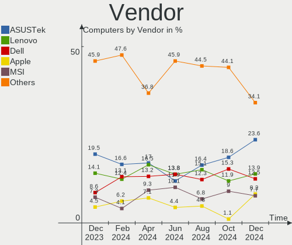
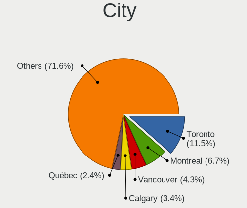
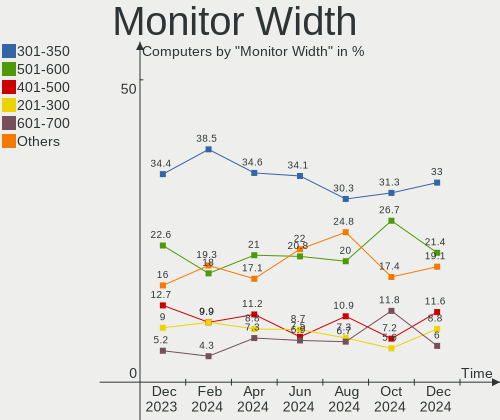
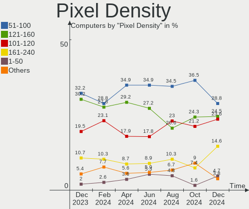
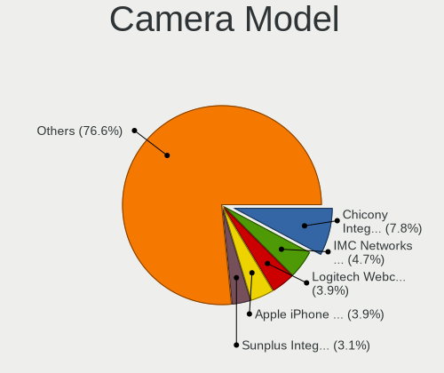

Linux in Canada - Hardware Trends
---------------------------------

A project to identify most popular hardware characteristics and track their change
over time based on data collected by Linux users at https://Linux-Hardware.org.

Anyone can contribute to this report by the [hw-probe](https://github.com/linuxhw/hw-probe) tool:

    sudo -E hw-probe -all -upload

This is a report for all computer types. See also reports for [desktops](/Location/Canada/Desktop/README.md) and [notebooks](/Location/Canada/Notebook/README.md).

Period: Jan, 2024.

Contents
--------

* [ System ](#system)
  - [ OS                       ](#os)
  - [ OS Family                ](#os-family)
  - [ Kernel                   ](#kernel)
  - [ Kernel Family            ](#kernel-family)
  - [ Kernel Major Ver.        ](#kernel-major-ver)
  - [ Arch                     ](#arch)
  - [ DE                       ](#de)
  - [ Display Server           ](#display-server)
  - [ Display Manager          ](#display-manager)
  - [ OS Lang                  ](#os-lang)
  - [ Boot Mode                ](#boot-mode)
  - [ Filesystem               ](#filesystem)
  - [ Part. scheme             ](#part-scheme)
  - [ Dual Boot with Linux/BSD ](#dual-boot-with-linuxbsd)
  - [ Dual Boot (Win)          ](#dual-boot-win)

* [ Board ](#board)
  - [ Vendor                   ](#vendor)
  - [ Model                    ](#model)
  - [ Model Family             ](#model-family)
  - [ MFG Year                 ](#mfg-year)
  - [ Form Factor              ](#form-factor)
  - [ Secure Boot              ](#secure-boot)
  - [ Coreboot                 ](#coreboot)
  - [ RAM Size                 ](#ram-size)
  - [ RAM Used                 ](#ram-used)
  - [ Total Drives             ](#total-drives)
  - [ Has CD-ROM               ](#has-cd-rom)
  - [ Has Ethernet             ](#has-ethernet)
  - [ Has WiFi                 ](#has-wifi)
  - [ Has Bluetooth            ](#has-bluetooth)

* [ Location ](#location)
  - [ Country                  ](#country)
  - [ City                     ](#city)

* [ Drives ](#drives)
  - [ Drive Vendor             ](#drive-vendor)
  - [ Drive Model              ](#drive-model)
  - [ HDD Vendor               ](#hdd-vendor)
  - [ SSD Vendor               ](#ssd-vendor)
  - [ Drive Kind               ](#drive-kind)
  - [ Drive Connector          ](#drive-connector)
  - [ Drive Size               ](#drive-size)
  - [ Space Total              ](#space-total)
  - [ Space Used               ](#space-used)
  - [ Malfunc. Drives          ](#malfunc-drives)
  - [ Malfunc. Drive Vendor    ](#malfunc-drive-vendor)
  - [ Malfunc. HDD Vendor      ](#malfunc-hdd-vendor)
  - [ Malfunc. Drive Kind      ](#malfunc-drive-kind)
  - [ Failed Drives            ](#failed-drives)
  - [ Failed Drive Vendor      ](#failed-drive-vendor)
  - [ Drive Status             ](#drive-status)

* [ Storage controller ](#storage-controller)
  - [ Storage Vendor           ](#storage-vendor)
  - [ Storage Model            ](#storage-model)
  - [ Storage Kind             ](#storage-kind)

* [ Processor ](#processor)
  - [ CPU Vendor               ](#cpu-vendor)
  - [ CPU Model                ](#cpu-model)
  - [ CPU Model Family         ](#cpu-model-family)
  - [ CPU Cores                ](#cpu-cores)
  - [ CPU Sockets              ](#cpu-sockets)
  - [ CPU Threads              ](#cpu-threads)
  - [ CPU Op-Modes             ](#cpu-op-modes)
  - [ CPU Microcode            ](#cpu-microcode)
  - [ CPU Microarch            ](#cpu-microarch)

* [ Graphics ](#graphics)
  - [ GPU Vendor               ](#gpu-vendor)
  - [ GPU Model                ](#gpu-model)
  - [ GPU Combo                ](#gpu-combo)
  - [ GPU Driver               ](#gpu-driver)
  - [ GPU Memory               ](#gpu-memory)

* [ Monitor ](#monitor)
  - [ Monitor Vendor           ](#monitor-vendor)
  - [ Monitor Model            ](#monitor-model)
  - [ Monitor Resolution       ](#monitor-resolution)
  - [ Monitor Diagonal         ](#monitor-diagonal)
  - [ Monitor Width            ](#monitor-width)
  - [ Aspect Ratio             ](#aspect-ratio)
  - [ Monitor Area             ](#monitor-area)
  - [ Pixel Density            ](#pixel-density)
  - [ Multiple Monitors        ](#multiple-monitors)

* [ Network ](#network)
  - [ Net Controller Vendor    ](#net-controller-vendor)
  - [ Net Controller Model     ](#net-controller-model)
  - [ Wireless Vendor          ](#wireless-vendor)
  - [ Wireless Model           ](#wireless-model)
  - [ Ethernet Vendor          ](#ethernet-vendor)
  - [ Ethernet Model           ](#ethernet-model)
  - [ Net Controller Kind      ](#net-controller-kind)
  - [ Used Controller          ](#used-controller)
  - [ NICs                     ](#nics)
  - [ IPv6                     ](#ipv6)

* [ Bluetooth ](#bluetooth)
  - [ Bluetooth Vendor         ](#bluetooth-vendor)
  - [ Bluetooth Model          ](#bluetooth-model)

* [ Sound ](#sound)
  - [ Sound Vendor             ](#sound-vendor)
  - [ Sound Model              ](#sound-model)

* [ Memory ](#memory)
  - [ Memory Vendor            ](#memory-vendor)
  - [ Memory Model             ](#memory-model)
  - [ Memory Kind              ](#memory-kind)
  - [ Memory Form Factor       ](#memory-form-factor)
  - [ Memory Size              ](#memory-size)
  - [ Memory Speed             ](#memory-speed)

* [ Printers & scanners ](#printers--scanners)
  - [ Printer Vendor           ](#printer-vendor)
  - [ Printer Model            ](#printer-model)
  - [ Scanner Vendor           ](#scanner-vendor)
  - [ Scanner Model            ](#scanner-model)

* [ Camera ](#camera)
  - [ Camera Vendor            ](#camera-vendor)
  - [ Camera Model             ](#camera-model)

* [ Security ](#security)
  - [ Fingerprint Vendor       ](#fingerprint-vendor)
  - [ Fingerprint Model        ](#fingerprint-model)
  - [ Chipcard Vendor          ](#chipcard-vendor)
  - [ Chipcard Model           ](#chipcard-model)

* [ Unsupported ](#unsupported)
  - [ Unsupported Devices      ](#unsupported-devices)
  - [ Unsupported Device Types ](#unsupported-device-types)

System
------

OS
--

Installed operating systems

| Name                         | Computers | Percent |
|------------------------------|-----------|---------|
| Ubuntu 22.04                 | 31        | 16.06%  |
| Fedora 39                    | 17        | 8.81%   |
| Linux Mint 21.2              | 14        | 7.25%   |
| Debian 12                    | 14        | 7.25%   |
| Ubuntu 23.10                 | 9         | 4.66%   |
| ArcoLinux Rolling            | 8         | 4.15%   |
| Zorin 17                     | 7         | 3.63%   |
| Pop!_OS 22.04                | 7         | 3.63%   |
| Arch Rolling                 | 6         | 3.11%   |
| Zorin 16                     | 5         | 2.59%   |
| EndeavourOS Rolling          | 5         | 2.59%   |
| Ubuntu 20.04                 | 4         | 2.07%   |
| Nobara 39                    | 4         | 2.07%   |
| Kubuntu 23.10                | 4         | 2.07%   |
| Kali 2023.4                  | 4         | 2.07%   |
| openSUSE Tumbleweed-XXXXXXXX | 3         | 1.55%   |
| OpenMandriva 5.0             | 3         | 1.55%   |
| Manjaro                      | 3         | 1.55%   |
| Linux Mint 21.3              | 3         | 1.55%   |
| Xubuntu 22.04                | 2         | 1.04%   |
| Void Linux Rolling           | 2         | 1.04%   |
| OpenMandriva 23.08           | 2         | 1.04%   |
| Lubuntu 22.04                | 2         | 1.04%   |
| LMDE 6                       | 2         | 1.04%   |
| Endless 5.1.1                | 2         | 1.04%   |
| Xubuntu 20.04                | 1         | 0.52%   |
| Vanilla 2.0                  | 1         | 0.52%   |
| Ubuntu Unity 16.04           | 1         | 0.52%   |
| Ubuntu MATE 20.04            | 1         | 0.52%   |
| Ubuntu Budgie 22.04          | 1         | 0.52%   |
| Ubuntu 23.04                 | 1         | 0.52%   |
| Rocky Linux 8.8              | 1         | 0.52%   |
| RHEL 9                       | 1         | 0.52%   |
| Parrot 6.0                   | 1         | 0.52%   |
| OpenMandriva 4.2             | 1         | 0.52%   |
| Nobara 38                    | 1         | 0.52%   |
| MX 23                        | 1         | 0.52%   |
| Manjaro 23.1.3               | 1         | 0.52%   |
| Linux Mint 21                | 1         | 0.52%   |
| Linux Mint 20.3              | 1         | 0.52%   |

OS Family
---------

OS without a version

| Name          | Computers | Percent |
|---------------|-----------|---------|
| Ubuntu        | 45        | 23.32%  |
| Linux Mint    | 20        | 10.36%  |
| Fedora        | 18        | 9.33%   |
| Debian        | 16        | 8.29%   |
| Zorin         | 12        | 6.22%   |
| ArcoLinux     | 8         | 4.15%   |
| Pop!_OS       | 7         | 3.63%   |
| OpenMandriva  | 6         | 3.11%   |
| Arch          | 6         | 3.11%   |
| Nobara        | 5         | 2.59%   |
| Kubuntu       | 5         | 2.59%   |
| EndeavourOS   | 5         | 2.59%   |
| Manjaro       | 4         | 2.07%   |
| Kali          | 4         | 2.07%   |
| Xubuntu       | 3         | 1.55%   |
| openSUSE      | 3         | 1.55%   |
| Void Linux    | 2         | 1.04%   |
| Lubuntu       | 2         | 1.04%   |
| LMDE          | 2         | 1.04%   |
| Gentoo        | 2         | 1.04%   |
| Endless       | 2         | 1.04%   |
| Vanilla       | 1         | 0.52%   |
| Ubuntu Unity  | 1         | 0.52%   |
| Ubuntu MATE   | 1         | 0.52%   |
| Ubuntu Budgie | 1         | 0.52%   |
| Rocky Linux   | 1         | 0.52%   |
| RHEL          | 1         | 0.52%   |
| Parrot        | 1         | 0.52%   |
| MX            | 1         | 0.52%   |
| Lilidog       | 1         | 0.52%   |
| KDE neon      | 1         | 0.52%   |
| Garuda Linux  | 1         | 0.52%   |
| Elementary    | 1         | 0.52%   |
| ChimeraOS     | 1         | 0.52%   |
| CachyOS       | 1         | 0.52%   |
| BlackPanther  | 1         | 0.52%   |
| Artix         | 1         | 0.52%   |

Kernel
------

Version of the Linux kernel

| Version                     | Computers | Percent |
|-----------------------------|-----------|---------|
| 6.5.0-14-generic            | 25        | 12.95%  |
| 5.15.0-91-generic           | 22        | 11.4%   |
| 6.2.0-39-generic            | 15        | 7.77%   |
| 6.6.9-200.fc39.x86_64       | 11        | 5.7%    |
| 6.1.0-17-amd64              | 7         | 3.63%   |
| 6.6.6-76060606-generic      | 6         | 3.11%   |
| 6.5.0-15-generic            | 5         | 2.59%   |
| 6.5.0-kali3-amd64           | 4         | 2.07%   |
| 6.1.0-16-amd64              | 4         | 2.07%   |
| 6.7.1-arch1-1               | 3         | 1.55%   |
| 6.6.2-desktop-1omv2390      | 3         | 1.55%   |
| 6.6.13-200.fc39.x86_64      | 3         | 1.55%   |
| 6.5.0-17-generic            | 3         | 1.55%   |
| 6.6.9-arch1-1               | 2         | 1.04%   |
| 6.6.11_1                    | 2         | 1.04%   |
| 6.6.11-200.fc39.x86_64      | 2         | 1.04%   |
| 6.5.0-10-generic            | 2         | 1.04%   |
| 6.4.11-desktop-1omv2390     | 2         | 1.04%   |
| 6.1.0-rpi7-rpi-v8           | 2         | 1.04%   |
| 5.4.0-169-generic           | 2         | 1.04%   |
| 5.15.0-76-generic           | 2         | 1.04%   |
| 6.7.2-zen1-1-zen            | 1         | 0.52%   |
| 6.7.2-arch1-1               | 1         | 0.52%   |
| 6.7.1-zen1-1-zen            | 1         | 0.52%   |
| 6.7.1-x64v3-xanmod1         | 1         | 0.52%   |
| 6.7.1-artix1-1              | 1         | 0.52%   |
| 6.7.1-2-cachyos             | 1         | 0.52%   |
| 6.7.0-zen3-1-zen            | 1         | 0.52%   |
| 6.7.0-204.fsync.fc39.x86_64 | 1         | 0.52%   |
| 6.7.0-200.fsync.fc39.x86_64 | 1         | 0.52%   |
| 6.7.0-0-MANJARO             | 1         | 0.52%   |
| 6.6.9-zen1-1-zen            | 1         | 0.52%   |
| 6.6.8-zen1                  | 1         | 0.52%   |
| 6.6.8-arch1-1               | 1         | 0.52%   |
| 6.6.8-200.fsync.fc39.x86_64 | 1         | 0.52%   |
| 6.6.7-zen1-1-zen            | 1         | 0.52%   |
| 6.6.7-arch1-1               | 1         | 0.52%   |
| 6.6.7-203.fsync.fc39.x86_64 | 1         | 0.52%   |
| 6.6.7-1-default             | 1         | 0.52%   |
| 6.6.14-1-lts                | 1         | 0.52%   |

Kernel Family
-------------

Linux kernel without a distro release

| Version  | Computers | Percent |
|----------|-----------|---------|
| 6.5.0    | 44        | 22.8%   |
| 5.15.0   | 28        | 14.51%  |
| 6.2.0    | 19        | 9.84%   |
| 6.1.0    | 15        | 7.77%   |
| 6.6.9    | 14        | 7.25%   |
| 6.6.11   | 8         | 4.15%   |
| 6.7.1    | 7         | 3.63%   |
| 6.6.6    | 6         | 3.11%   |
| 6.6.13   | 6         | 3.11%   |
| 6.7.0    | 4         | 2.07%   |
| 6.6.7    | 4         | 2.07%   |
| 6.6.10   | 4         | 2.07%   |
| 6.6.8    | 3         | 1.55%   |
| 6.6.2    | 3         | 1.55%   |
| 6.5.6    | 3         | 1.55%   |
| 5.4.0    | 3         | 1.55%   |
| 6.7.2    | 2         | 1.04%   |
| 6.5.8    | 2         | 1.04%   |
| 6.4.11   | 2         | 1.04%   |
| 6.6.14   | 1         | 0.52%   |
| 6.6.0    | 1         | 0.52%   |
| 6.5.5    | 1         | 0.52%   |
| 6.5.13   | 1         | 0.52%   |
| 6.5.11   | 1         | 0.52%   |
| 6.4.10   | 1         | 0.52%   |
| 6.1.68   | 1         | 0.52%   |
| 5.19.0   | 1         | 0.52%   |
| 5.15.85  | 1         | 0.52%   |
| 5.14.0   | 1         | 0.52%   |
| 5.10.52  | 1         | 0.52%   |
| 5.10.160 | 1         | 0.52%   |
| 5.10.14  | 1         | 0.52%   |
| 5.10.0   | 1         | 0.52%   |
| 4.4.0    | 1         | 0.52%   |
| 4.18.0   | 1         | 0.52%   |

Kernel Major Ver.
-----------------

Linux kernel major version

| Version | Computers | Percent |
|---------|-----------|---------|
| 6.5     | 52        | 26.94%  |
| 6.6     | 50        | 25.91%  |
| 5.15    | 29        | 15.03%  |
| 6.2     | 19        | 9.84%   |
| 6.1     | 16        | 8.29%   |
| 6.7     | 13        | 6.74%   |
| 5.10    | 4         | 2.07%   |
| 6.4     | 3         | 1.55%   |
| 5.4     | 3         | 1.55%   |
| 5.19    | 1         | 0.52%   |
| 5.14    | 1         | 0.52%   |
| 4.4     | 1         | 0.52%   |
| 4.18    | 1         | 0.52%   |

Arch
----

OS architecture (x86_64, i586, etc.)

| Name    | Computers | Percent |
|---------|-----------|---------|
| x86_64  | 188       | 97.41%  |
| aarch64 | 4         | 2.07%   |
| i686    | 1         | 0.52%   |

DE
--

Desktop Environment

| Name             | Computers | Percent |
|------------------|-----------|---------|
| GNOME            | 87        | 45.08%  |
| KDE5             | 38        | 19.69%  |
| XFCE             | 21        | 10.88%  |
| X-Cinnamon       | 21        | 10.88%  |
| MATE             | 4         | 2.07%   |
| Hyprland         | 3         | 1.55%   |
| sway             | 2         | 1.04%   |
| LXQt             | 2         | 1.04%   |
| Endless:GNOME    | 2         | 1.04%   |
| Cinnamon         | 2         | 1.04%   |
| Budgie           | 2         | 1.04%   |
| Unknown          | 2         | 1.04%   |
| Unity            | 1         | 0.52%   |
| Pantheon         | 1         | 0.52%   |
| LXDE-pi-wayfire  | 1         | 0.52%   |
| lightdm-xsession | 1         | 0.52%   |
| i3               | 1         | 0.52%   |
| Enlightenment    | 1         | 0.52%   |
| DWM              | 1         | 0.52%   |

Display Server
--------------

X11 or Wayland

| Name    | Computers | Percent |
|---------|-----------|---------|
| X11     | 111       | 57.51%  |
| Wayland | 73        | 37.82%  |
| Tty     | 7         | 3.63%   |
| Unknown | 2         | 1.04%   |

Display Manager
---------------

SDDM, LightDM, etc.

| Name    | Computers | Percent |
|---------|-----------|---------|
| Unknown | 86        | 44.56%  |
| GDM3    | 41        | 21.24%  |
| LightDM | 29        | 15.03%  |
| SDDM    | 26        | 13.47%  |
| GDM     | 8         | 4.15%   |
| XDM     | 1         | 0.52%   |
| NODM    | 1         | 0.52%   |
| GREETD  | 1         | 0.52%   |

OS Lang
-------

Language

| Lang    | Computers | Percent |
|---------|-----------|---------|
| en_CA   | 103       | 53.37%  |
| en_US   | 62        | 32.12%  |
| fr_CA   | 13        | 6.74%   |
| C       | 5         | 2.59%   |
| fr_FR   | 3         | 1.55%   |
| en_GB   | 3         | 1.55%   |
| zh_CN   | 1         | 0.52%   |
| it_IT   | 1         | 0.52%   |
| en_BW   | 1         | 0.52%   |
| Unknown | 1         | 0.52%   |

Boot Mode
---------

EFI or BIOS

| Mode | Computers | Percent |
|------|-----------|---------|
| EFI  | 97        | 50.26%  |
| BIOS | 96        | 49.74%  |

Filesystem
----------

Type of filesystem

| Type    | Computers | Percent |
|---------|-----------|---------|
| Ext4    | 118       | 61.14%  |
| Btrfs   | 39        | 20.21%  |
| Tmpfs   | 26        | 13.47%  |
| Overlay | 7         | 3.63%   |
| Xfs     | 2         | 1.04%   |
| Zfs     | 1         | 0.52%   |

Part. scheme
------------

Scheme of partitioning

| Type    | Computers | Percent |
|---------|-----------|---------|
| GPT     | 99        | 51.3%   |
| Unknown | 80        | 41.45%  |
| MBR     | 14        | 7.25%   |

Dual Boot with Linux/BSD
------------------------

Hosting more than one Linux/BSD

| Dual boot | Computers | Percent |
|-----------|-----------|---------|
| No        | 172       | 89.12%  |
| Yes       | 21        | 10.88%  |

Dual Boot (Win)
---------------

Hosting Linux and Windows

| Dual boot | Computers | Percent |
|-----------|-----------|---------|
| No        | 160       | 82.9%   |
| Yes       | 33        | 17.1%   |

Board
-----

Vendor
------

Motherboard manufacturer

| Name                                 | Computers | Percent |
|--------------------------------------|-----------|---------|
| ASUSTek Computer                     | 38        | 19.69%  |
| Lenovo                               | 30        | 15.54%  |
| Hewlett-Packard                      | 26        | 13.47%  |
| Dell                                 | 25        | 12.95%  |
| MSI                                  | 17        | 8.81%   |
| Acer                                 | 15        | 7.77%   |
| Apple                                | 8         | 4.15%   |
| Gigabyte Technology                  | 6         | 3.11%   |
| Raspberry Pi Foundation              | 3         | 1.55%   |
| Intel                                | 3         | 1.55%   |
| ASRock                               | 3         | 1.55%   |
| Unknown                              | 3         | 1.55%   |
| Samsung Electronics                  | 2         | 1.04%   |
| Panasonic                            | 2         | 1.04%   |
| Alienware                            | 2         | 1.04%   |
| Toshiba                              | 1         | 0.52%   |
| Shuttle                              | 1         | 0.52%   |
| Shenzhen Meigao Electronic Equipment | 1         | 0.52%   |
| Rockchip                             | 1         | 0.52%   |
| NZXT                                 | 1         | 0.52%   |
| Microsoft                            | 1         | 0.52%   |
| Huanan                               | 1         | 0.52%   |
| Framework                            | 1         | 0.52%   |
| Ciara Technologies                   | 1         | 0.52%   |
| AZW                                  | 1         | 0.52%   |

Model
-----

Motherboard model

| Name                                          | Computers | Percent |
|-----------------------------------------------|-----------|---------|
| Unknown                                       | 3         | 1.55%   |
| Dell OptiPlex 7050                            | 2         | 1.04%   |
| Dell Latitude 7440                            | 2         | 1.04%   |
| ASUS P8P67 DELUXE                             | 2         | 1.04%   |
| Apple MacBookPro11,3                          | 2         | 1.04%   |
| Toshiba Satellite Pro A50-C                   | 1         | 0.52%   |
| Shuttle SG31                                  | 1         | 0.52%   |
| Shenzhen Meigao Electronic Equipment UM560 XT | 1         | 0.52%   |
| Samsung 700Z3C/700Z5C                         | 1         | 0.52%   |
| Samsung 300E5M/300E5L                         | 1         | 0.52%   |
| Rockchip RK3588 OPi 5 Plus                    | 1         | 0.52%   |
| RPi Raspberry Pi 5 Model B Rev 1.0            | 1         | 0.52%   |
| RPi Raspberry Pi 4 Model B Rev 1.4            | 1         | 0.52%   |
| RPi Raspberry Pi 4 Model B Rev 1.1            | 1         | 0.52%   |
| Panasonic CF-52PFN61PM                        | 1         | 0.52%   |
| Panasonic CF-31ATAAX1M                        | 1         | 0.52%   |
| NZXT N7 B650E                                 | 1         | 0.52%   |
| MSI Z1-7641                                   | 1         | 0.52%   |
| MSI Prestige 13Evo A13M                       | 1         | 0.52%   |
| MSI MS-7E27                                   | 1         | 0.52%   |
| MSI MS-7E12                                   | 1         | 0.52%   |
| MSI MS-7D73                                   | 1         | 0.52%   |
| MSI MS-7D25                                   | 1         | 0.52%   |
| MSI MS-7C95                                   | 1         | 0.52%   |
| MSI MS-7C56                                   | 1         | 0.52%   |
| MSI MS-7B98                                   | 1         | 0.52%   |
| MSI MS-7B79                                   | 1         | 0.52%   |
| MSI MS-7B17                                   | 1         | 0.52%   |
| MSI MS-7A38                                   | 1         | 0.52%   |
| MSI MS-7A37                                   | 1         | 0.52%   |
| MSI H310 Gaming Infinite S (MS-B928)          | 1         | 0.52%   |
| MSI GP72 6QF                                  | 1         | 0.52%   |
| MSI GF63 Thin 11UC                            | 1         | 0.52%   |
| MSI GE70 2PE                                  | 1         | 0.52%   |
| Microsoft Surface Pro 7                       | 1         | 0.52%   |
| Lenovo Yoga 6 13ALC7 82UD                     | 1         | 0.52%   |
| Lenovo Yoga 14sACH 2021 82MS                  | 1         | 0.52%   |
| Lenovo ThinkStation P340 Tiny 30DF001KUS      | 1         | 0.52%   |
| Lenovo ThinkStation P330 Tiny 30CES3F200      | 1         | 0.52%   |
| Lenovo ThinkPad X61 76754BJ                   | 1         | 0.52%   |

Model Family
------------

Motherboard model prefix

| Name                                       | Computers | Percent |
|--------------------------------------------|-----------|---------|
| Lenovo ThinkPad                            | 16        | 8.29%   |
| Acer Aspire                                | 12        | 6.22%   |
| ASUS ROG                                   | 8         | 4.15%   |
| Dell OptiPlex                              | 7         | 3.63%   |
| ASUS VivoBook                              | 7         | 3.63%   |
| ASUS PRIME                                 | 7         | 3.63%   |
| Dell Precision                             | 6         | 3.11%   |
| HP Compaq                                  | 5         | 2.59%   |
| Lenovo ThinkCentre                         | 4         | 2.07%   |
| HP ProBook                                 | 4         | 2.07%   |
| HP Pavilion                                | 4         | 2.07%   |
| Dell Inspiron                              | 4         | 2.07%   |
| ASUS Zenbook                               | 4         | 2.07%   |
| RPi Raspberry                              | 3         | 1.55%   |
| HP Laptop                                  | 3         | 1.55%   |
| HP EliteBook                               | 3         | 1.55%   |
| Dell XPS                                   | 3         | 1.55%   |
| Dell Latitude                              | 3         | 1.55%   |
| Unknown                                    | 3         | 1.55%   |
| Lenovo Yoga                                | 2         | 1.04%   |
| Lenovo ThinkStation                        | 2         | 1.04%   |
| Lenovo Legion                              | 2         | 1.04%   |
| Lenovo IdeaPadFlex                         | 2         | 1.04%   |
| HP Spectre                                 | 2         | 1.04%   |
| ASUS P8P67                                 | 2         | 1.04%   |
| Apple MacBookPro11                         | 2         | 1.04%   |
| Acer Swift                                 | 2         | 1.04%   |
| Toshiba Satellite                          | 1         | 0.52%   |
| Shuttle SG31                               | 1         | 0.52%   |
| Shenzhen Meigao Electronic Equipment UM560 | 1         | 0.52%   |
| Samsung 700Z3C                             | 1         | 0.52%   |
| Samsung 300E5M                             | 1         | 0.52%   |
| Rockchip RK3588                            | 1         | 0.52%   |
| Panasonic CF-52PFN61PM                     | 1         | 0.52%   |
| Panasonic CF-31ATAAX1M                     | 1         | 0.52%   |
| NZXT N7                                    | 1         | 0.52%   |
| MSI Z1-7641                                | 1         | 0.52%   |
| MSI Prestige                               | 1         | 0.52%   |
| MSI MS-7E27                                | 1         | 0.52%   |
| MSI MS-7E12                                | 1         | 0.52%   |

MFG Year
--------

Motherboard manufacture year

| Year    | Computers | Percent |
|---------|-----------|---------|
| 2022    | 20        | 10.36%  |
| 2023    | 17        | 8.81%   |
| 2021    | 17        | 8.81%   |
| 2017    | 17        | 8.81%   |
| 2020    | 16        | 8.29%   |
| 2019    | 15        | 7.77%   |
| 2013    | 12        | 6.22%   |
| 2018    | 11        | 5.7%    |
| 2012    | 11        | 5.7%    |
| 2015    | 10        | 5.18%   |
| 2016    | 8         | 4.15%   |
| 2011    | 8         | 4.15%   |
| 2009    | 8         | 4.15%   |
| 2014    | 7         | 3.63%   |
| 2010    | 4         | 2.07%   |
| 2008    | 4         | 2.07%   |
| 2007    | 4         | 2.07%   |
| 2006    | 2         | 1.04%   |
| Unknown | 2         | 1.04%   |

Form Factor
-----------

Physical design of the computer

| Name           | Computers | Percent |
|----------------|-----------|---------|
| Notebook       | 92        | 47.67%  |
| Desktop        | 75        | 38.86%  |
| Mini pc        | 8         | 4.15%   |
| Convertible    | 7         | 3.63%   |
| All in one     | 5         | 2.59%   |
| System on chip | 4         | 2.07%   |
| Tablet         | 1         | 0.52%   |
| Server         | 1         | 0.52%   |

Secure Boot
-----------

Enabled or disabled

| State    | Computers | Percent |
|----------|-----------|---------|
| Disabled | 183       | 94.82%  |
| Enabled  | 10        | 5.18%   |

Coreboot
--------

Have coreboot on board

| Used | Computers | Percent |
|------|-----------|---------|
| No   | 192       | 99.48%  |
| Yes  | 1         | 0.52%   |

RAM Size
--------

Total RAM memory

| Size in GB      | Computers | Percent |
|-----------------|-----------|---------|
| 4.01-8.0        | 44        | 22.8%   |
| 8.01-16.0       | 38        | 19.69%  |
| 16.01-24.0      | 37        | 19.17%  |
| 32.01-64.0      | 23        | 11.92%  |
| 64.01-256.0     | 21        | 10.88%  |
| 3.01-4.0        | 18        | 9.33%   |
| 24.01-32.0      | 7         | 3.63%   |
| 1.01-2.0        | 4         | 2.07%   |
| More than 256.0 | 1         | 0.52%   |

RAM Used
--------

Used RAM memory

| Used GB    | Computers | Percent |
|------------|-----------|---------|
| 2.01-3.0   | 56        | 29.02%  |
| 1.01-2.0   | 42        | 21.76%  |
| 4.01-8.0   | 36        | 18.65%  |
| 3.01-4.0   | 31        | 16.06%  |
| 8.01-16.0  | 19        | 9.84%   |
| 0.51-1.0   | 6         | 3.11%   |
| 24.01-32.0 | 1         | 0.52%   |
| 16.01-24.0 | 1         | 0.52%   |
| 0.01-0.5   | 1         | 0.52%   |

Total Drives
------------

Number of drives on board

| Drives | Computers | Percent |
|--------|-----------|---------|
| 1      | 110       | 56.99%  |
| 2      | 47        | 24.35%  |
| 3      | 13        | 6.74%   |
| 5      | 8         | 4.15%   |
| 4      | 6         | 3.11%   |
| 8      | 4         | 2.07%   |
| 6      | 2         | 1.04%   |
| 25     | 1         | 0.52%   |
| 7      | 1         | 0.52%   |
| 0      | 1         | 0.52%   |

Has CD-ROM
----------

Has CD-ROM on board

| Presented | Computers | Percent |
|-----------|-----------|---------|
| No        | 136       | 70.47%  |
| Yes       | 57        | 29.53%  |

Has Ethernet
------------

Has Ethernet on board

| Presented | Computers | Percent |
|-----------|-----------|---------|
| Yes       | 157       | 81.35%  |
| No        | 36        | 18.65%  |

Has WiFi
--------

Has WiFi module

| Presented | Computers | Percent |
|-----------|-----------|---------|
| Yes       | 158       | 81.87%  |
| No        | 35        | 18.13%  |

Has Bluetooth
-------------

Has Bluetooth module

| Presented | Computers | Percent |
|-----------|-----------|---------|
| Yes       | 144       | 74.61%  |
| No        | 49        | 25.39%  |

Location
--------

Country
-------

Geographic location (country)

| Country | Computers | Percent |
|---------|-----------|---------|
| Canada  | 193       | 100%    |

City
----

Geographic location (city)

| City                     | Computers | Percent |
|--------------------------|-----------|---------|
| Toronto                  | 28        | 14.51%  |
| Montreal                 | 20        | 10.36%  |
| Calgary                  | 17        | 8.81%   |
| Winnipeg                 | 8         | 4.15%   |
| Edmonton                 | 8         | 4.15%   |
| Victoria                 | 6         | 3.11%   |
| Surrey                   | 4         | 2.07%   |
| Oshawa                   | 4         | 2.07%   |
| Whitby                   | 3         | 1.55%   |
| Vancouver                | 3         | 1.55%   |
| Richmond                 | 3         | 1.55%   |
| Regina                   | 3         | 1.55%   |
| Mississauga              | 3         | 1.55%   |
| London                   | 3         | 1.55%   |
| Dartmouth                | 3         | 1.55%   |
| Burnaby                  | 3         | 1.55%   |
| Sturgeon County          | 2         | 1.04%   |
| Steinbach                | 2         | 1.04%   |
| Quinte West              | 2         | 1.04%   |
| Québec                  | 2         | 1.04%   |
| Pierrefonds              | 2         | 1.04%   |
| Ottawa                   | 2         | 1.04%   |
| Kelowna                  | 2         | 1.04%   |
| Greater Sudbury          | 2         | 1.04%   |
| Coquitlam                | 2         | 1.04%   |
| Chatham                  | 2         | 1.04%   |
| Windsor                  | 1         | 0.52%   |
| Vernon                   | 1         | 0.52%   |
| Verdun                   | 1         | 0.52%   |
| Three Mile Plains        | 1         | 0.52%   |
| Swift Current            | 1         | 0.52%   |
| Summerland               | 1         | 0.52%   |
| Ste-Anne-Des-Monts       | 1         | 0.52%   |
| St. Claude               | 1         | 0.52%   |
| St. Catharines           | 1         | 0.52%   |
| Simcoe                   | 1         | 0.52%   |
| Scarborough              | 1         | 0.52%   |
| Salaberry-de-Valleyfield | 1         | 0.52%   |
| Sainte-Agathe-des-Monts  | 1         | 0.52%   |
| Saint-Colomban           | 1         | 0.52%   |

Drives
------

Drive Vendor
------------

Hard drive vendors

| Vendor                       | Computers | Drives | Percent |
|------------------------------|-----------|--------|---------|
| Samsung Electronics          | 46        | 61     | 15.23%  |
| WDC                          | 42        | 60     | 13.91%  |
| Seagate                      | 37        | 64     | 12.25%  |
| Kingston                     | 20        | 23     | 6.62%   |
| Toshiba                      | 18        | 21     | 5.96%   |
| Sandisk                      | 18        | 21     | 5.96%   |
| Unknown                      | 16        | 19     | 5.3%    |
| Intel                        | 12        | 13     | 3.97%   |
| Hitachi                      | 12        | 14     | 3.97%   |
| Kingston Technology Company  | 7         | 7      | 2.32%   |
| Crucial                      | 6         | 7      | 1.99%   |
| Micron Technology            | 5         | 5      | 1.66%   |
| Apple                        | 5         | 5      | 1.66%   |
| SK hynix                     | 4         | 4      | 1.32%   |
| Unknown                      | 4         | 4      | 1.32%   |
| Timetec                      | 3         | 3      | 0.99%   |
| SPCC                         | 3         | 3      | 0.99%   |
| PNY                          | 3         | 3      | 0.99%   |
| KIOXIA                       | 3         | 3      | 0.99%   |
| China                        | 3         | 3      | 0.99%   |
| Shenzhen Longsys Electronics | 2         | 2      | 0.66%   |
| Phison Electronics           | 2         | 2      | 0.66%   |
| Patriot                      | 2         | 2      | 0.66%   |
| Micron/Crucial Technology    | 2         | 2      | 0.66%   |
| MAXIO Technology (Hangzhou)  | 2         | 2      | 0.66%   |
| LITEONIT                     | 2         | 2      | 0.66%   |
| JMicron Technology           | 2         | 2      | 0.66%   |
| HGST                         | 2         | 2      | 0.66%   |
| Fujitsu                      | 2         | 2      | 0.66%   |
| External                     | 2         | 2      | 0.66%   |
| Corsair                      | 2         | 2      | 0.66%   |
| TSA 256G                     | 1         | 1      | 0.33%   |
| SSSTC                        | 1         | 1      | 0.33%   |
| Seagate Technology           | 1         | 1      | 0.33%   |
| SABRENT                      | 1         | 1      | 0.33%   |
| Phison                       | 1         | 1      | 0.33%   |
| Mushkin                      | 1         | 1      | 0.33%   |
| LITEON                       | 1         | 1      | 0.33%   |
| KingSpec                     | 1         | 1      | 0.33%   |
| IBM-ESXS                     | 1         | 1      | 0.33%   |

Drive Model
-----------

Hard drive models

| Model                                               | Computers | Percent |
|-----------------------------------------------------|-----------|---------|
| Samsung NVMe SSD Controller SM981/PM981/PM983 1TB   | 11        | 3.05%   |
| Samsung NVMe SSD Controller PM9A1/PM9A3/980PRO 2TB  | 8         | 2.22%   |
| Kingston SA400S37240G 240GB SSD                     | 5         | 1.39%   |
| Unknown MMC Card  64GB                              | 4         | 1.11%   |
| Samsung NVMe SSD Controller SM961/PM961/SM963 256GB | 4         | 1.11%   |
| Kingston SA400S37960G 960GB SSD                     | 4         | 1.11%   |
| Intel SSD Pro 7600p/760p/E 6100p Series 1024GB      | 4         | 1.11%   |
| Unknown                                             | 4         | 1.11%   |
| WDC WDS500G2B0A-00SM50 500GB SSD                    | 3         | 0.83%   |
| WDC WD20EARX-00PASB0 2TB                            | 3         | 0.83%   |
| WDC WD10JPVX-22JC3T0 1TB                            | 3         | 0.83%   |
| Toshiba XG4 NVMe SSD Controller 512GB               | 3         | 0.83%   |
| Toshiba MQ01ABD100 1TB                              | 3         | 0.83%   |
| Timetec SD08 512GB SSD                              | 3         | 0.83%   |
| SPCC Solid State Disk 512GB                         | 3         | 0.83%   |
| Seagate ST500DM002-1BD142 500GB                     | 3         | 0.83%   |
| SanDisk NVMe SSD Drive 1TB                          | 3         | 0.83%   |
| WDC WDS100T2B0B-00YS70 1TB SSD                      | 2         | 0.55%   |
| WDC WD5000AAKX-22ERMA0 500GB                        | 2         | 0.55%   |
| WDC WD40EFAX-68JH4N1 4TB                            | 2         | 0.55%   |
| WDC WD10EZEX-08M2NA0 1TB                            | 2         | 0.55%   |
| Unknown SD64G  64GB                                 | 2         | 0.55%   |
| Unknown SD/MMC/MS PRO 256GB                         | 2         | 0.55%   |
| Unknown MMC Card  32GB                              | 2         | 0.55%   |
| Unknown MMC Card  128GB                             | 2         | 0.55%   |
| Toshiba MQ04ABF100 1TB                              | 2         | 0.55%   |
| Toshiba DT01ACA100 1TB                              | 2         | 0.55%   |
| Seagate ST4000VN008-2DR166 4TB                      | 2         | 0.55%   |
| Seagate ST4000LM024-2AN17V 4TB                      | 2         | 0.55%   |
| Seagate ST4000DM004-2CV104 4TB                      | 2         | 0.55%   |
| Seagate ST3500418AS 500GB                           | 2         | 0.55%   |
| Seagate ST3400820AS 400GB                           | 2         | 0.55%   |
| Seagate ST2000LM015-2E8174 2TB                      | 2         | 0.55%   |
| Seagate ST1000LM035-1RK172 1TB                      | 2         | 0.55%   |
| Seagate Expansion Desk 8TB                          | 2         | 0.55%   |
| Seagate Expansion 1TB                               | 2         | 0.55%   |
| SanDisk NVMe SSD Drive 512GB                        | 2         | 0.55%   |
| Samsung SSD 870 EVO 500GB                           | 2         | 0.55%   |
| Samsung SSD 860 EVO 500GB                           | 2         | 0.55%   |
| Samsung SSD 860 EVO 1TB                             | 2         | 0.55%   |

HDD Vendor
----------

Hard disk drive vendors

| Vendor              | Computers | Drives | Percent |
|---------------------|-----------|--------|---------|
| Seagate             | 36        | 61     | 33.96%  |
| WDC                 | 29        | 47     | 27.36%  |
| Toshiba             | 13        | 16     | 12.26%  |
| Hitachi             | 12        | 14     | 11.32%  |
| Apple               | 3         | 3      | 2.83%   |
| Unknown             | 2         | 2      | 1.89%   |
| Samsung Electronics | 2         | 2      | 1.89%   |
| HGST                | 2         | 2      | 1.89%   |
| Fujitsu             | 2         | 2      | 1.89%   |
| External            | 2         | 2      | 1.89%   |
| JMicron Technology  | 1         | 1      | 0.94%   |
| IBM-ESXS            | 1         | 1      | 0.94%   |
| Hewlett-Packard     | 1         | 1      | 0.94%   |

SSD Vendor
----------

Solid state drive vendors

| Vendor              | Computers | Drives | Percent |
|---------------------|-----------|--------|---------|
| Samsung Electronics | 19        | 21     | 22.89%  |
| Kingston            | 15        | 17     | 18.07%  |
| WDC                 | 10        | 10     | 12.05%  |
| SanDisk             | 4         | 4      | 4.82%   |
| Timetec             | 3         | 3      | 3.61%   |
| SPCC                | 3         | 3      | 3.61%   |
| PNY                 | 3         | 3      | 3.61%   |
| Crucial             | 3         | 3      | 3.61%   |
| China               | 3         | 3      | 3.61%   |
| Patriot             | 2         | 2      | 2.41%   |
| LITEONIT            | 2         | 2      | 2.41%   |
| Intel               | 2         | 2      | 2.41%   |
| Corsair             | 2         | 2      | 2.41%   |
| Apple               | 2         | 2      | 2.41%   |
| TSA 256G            | 1         | 1      | 1.2%    |
| SK hynix            | 1         | 1      | 1.2%    |
| Seagate             | 1         | 2      | 1.2%    |
| SABRENT             | 1         | 1      | 1.2%    |
| Mushkin             | 1         | 1      | 1.2%    |
| Micron Technology   | 1         | 1      | 1.2%    |
| LITEON              | 1         | 1      | 1.2%    |
| KingSpec            | 1         | 1      | 1.2%    |
| FORESEE             | 1         | 1      | 1.2%    |
| FIKWOT              | 1         | 1      | 1.2%    |

Drive Kind
----------

HDD or SSD

| Kind    | Computers | Drives | Percent |
|---------|-----------|--------|---------|
| NVMe    | 94        | 115    | 36.43%  |
| HDD     | 77        | 154    | 29.84%  |
| SSD     | 69        | 88     | 26.74%  |
| MMC     | 16        | 19     | 6.2%    |
| Unknown | 2         | 2      | 0.78%   |

Drive Connector
---------------

SATA, SAS, NVMe, etc.

| Type | Computers | Drives | Percent |
|------|-----------|--------|---------|
| SATA | 121       | 220    | 48.79%  |
| NVMe | 93        | 114    | 37.5%   |
| SAS  | 18        | 25     | 7.26%   |
| MMC  | 16        | 19     | 6.45%   |

Drive Size
----------

Size of hard drive

| Size in TB | Computers | Drives | Percent |
|------------|-----------|--------|---------|
| 0.01-0.5   | 79        | 114    | 46.47%  |
| 0.51-1.0   | 56        | 69     | 32.94%  |
| 1.01-2.0   | 19        | 23     | 11.18%  |
| 3.01-4.0   | 7         | 18     | 4.12%   |
| 4.01-10.0  | 6         | 7      | 3.53%   |
| 2.01-3.0   | 3         | 11     | 1.76%   |

Space Total
-----------

Amount of disk space available on the file system

| Size in GB     | Computers | Percent |
|----------------|-----------|---------|
| 251-500        | 41        | 21.24%  |
| 101-250        | 38        | 19.69%  |
| 501-1000       | 34        | 17.62%  |
| 1001-2000      | 26        | 13.47%  |
| More than 3000 | 23        | 11.92%  |
| 1-20           | 14        | 7.25%   |
| 2001-3000      | 5         | 2.59%   |
| 51-100         | 5         | 2.59%   |
| 21-50          | 4         | 2.07%   |
| Unknown        | 3         | 1.55%   |

Space Used
----------

Amount of used disk space

| Used GB        | Computers | Percent |
|----------------|-----------|---------|
| 1-20           | 55        | 28.5%   |
| 21-50          | 40        | 20.73%  |
| 101-250        | 26        | 13.47%  |
| 51-100         | 21        | 10.88%  |
| 501-1000       | 19        | 9.84%   |
| 251-500        | 14        | 7.25%   |
| 1001-2000      | 9         | 4.66%   |
| More than 3000 | 3         | 1.55%   |
| 2001-3000      | 3         | 1.55%   |
| Unknown        | 3         | 1.55%   |

Malfunc. Drives
---------------

Drive models with a malfunction

| Model                                              | Computers | Drives | Percent |
|----------------------------------------------------|-----------|--------|---------|
| WDC WD5000LPVX-28V0TT0 500GB                       | 1         | 1      | 4.55%   |
| WDC WD5000LPLX-08ZNTT0 500GB                       | 1         | 1      | 4.55%   |
| WDC WD5000LPCX-60VHAT0 500GB                       | 1         | 1      | 4.55%   |
| WDC WD5000AVDS-63U7B1 500GB                        | 1         | 2      | 4.55%   |
| WDC WD5000AAKX-22ERMA0 500GB                       | 1         | 1      | 4.55%   |
| WDC WD5000AAJB-00UHA0 500GB                        | 1         | 1      | 4.55%   |
| WDC WD40EFAX-68JH4N1 4TB                           | 1         | 1      | 4.55%   |
| WDC WD20EARX-00PASB0 2TB                           | 1         | 1      | 4.55%   |
| Timetec SD08 512GB SSD                             | 1         | 1      | 4.55%   |
| Seagate ST3500418AS 500GB                          | 1         | 1      | 4.55%   |
| Seagate ST3160811AS 160GB                          | 1         | 1      | 4.55%   |
| Seagate ST1000LM035-1RK172 1TB                     | 1         | 1      | 4.55%   |
| Seagate ST1000DM003-9YN162 1TB                     | 1         | 1      | 4.55%   |
| Samsung Electronics SSD 870 EVO 500GB              | 1         | 1      | 4.55%   |
| Kingston Technology Company OM3PDP3 NVMe SSD 256GB | 1         | 1      | 4.55%   |
| Hitachi HTS547575A9E384 752GB                      | 1         | 1      | 4.55%   |
| Hitachi HDT725025VLA380 250GB                      | 1         | 1      | 4.55%   |
| Hitachi HDT721016SLA380 160GB                      | 1         | 3      | 4.55%   |
| Hitachi HCS721050CLA362 499GB                      | 1         | 1      | 4.55%   |
| Corsair Performance3 SSD 128GB                     | 1         | 1      | 4.55%   |
| Apple SSD SM1024F 1TB                              | 1         | 1      | 4.55%   |
| Apple HDD HTS541010A9E662 1TB                      | 1         | 1      | 4.55%   |

Malfunc. Drive Vendor
---------------------

Vendors of faulty drives

| Vendor                      | Computers | Drives | Percent |
|-----------------------------|-----------|--------|---------|
| WDC                         | 5         | 9      | 26.32%  |
| Seagate                     | 4         | 4      | 21.05%  |
| Hitachi                     | 4         | 6      | 21.05%  |
| Apple                       | 2         | 2      | 10.53%  |
| Timetec                     | 1         | 1      | 5.26%   |
| Samsung Electronics         | 1         | 1      | 5.26%   |
| Kingston Technology Company | 1         | 1      | 5.26%   |
| Corsair                     | 1         | 1      | 5.26%   |

Malfunc. HDD Vendor
-------------------

Vendors of faulty HDD drives

| Vendor  | Computers | Drives | Percent |
|---------|-----------|--------|---------|
| WDC     | 5         | 9      | 35.71%  |
| Seagate | 4         | 4      | 28.57%  |
| Hitachi | 4         | 6      | 28.57%  |
| Apple   | 1         | 1      | 7.14%   |

Malfunc. Drive Kind
-------------------

Kinds of faulty drives

| Kind | Computers | Drives | Percent |
|------|-----------|--------|---------|
| HDD  | 11        | 20     | 68.75%  |
| SSD  | 4         | 4      | 25%     |
| NVMe | 1         | 1      | 6.25%   |

Failed Drives
-------------

Failed drive models

Zero info for selected period =(

Failed Drive Vendor
-------------------

Failed drive vendors

Zero info for selected period =(

Drive Status
------------

Number of failed and malfunc. drives

| Status   | Computers | Drives | Percent |
|----------|-----------|--------|---------|
| Detected | 125       | 224    | 58.41%  |
| Works    | 74        | 129    | 34.58%  |
| Malfunc  | 15        | 25     | 7.01%   |

Storage controller
------------------

Storage Vendor
--------------

Storage controller vendors

| Vendor                         | Computers | Percent |
|--------------------------------|-----------|---------|
| Intel                          | 116       | 43.28%  |
| AMD                            | 42        | 15.67%  |
| Samsung Electronics            | 32        | 11.94%  |
| Sandisk                        | 17        | 6.34%   |
| Kingston Technology Company    | 12        | 4.48%   |
| Micron/Crucial Technology      | 6         | 2.24%   |
| Toshiba America Info Systems   | 4         | 1.49%   |
| Micron Technology              | 4         | 1.49%   |
| KIOXIA                         | 4         | 1.49%   |
| ASMedia Technology             | 4         | 1.49%   |
| SK hynix                       | 3         | 1.12%   |
| Phison Electronics             | 3         | 1.12%   |
| Nvidia                         | 3         | 1.12%   |
| Marvell Technology Group       | 3         | 1.12%   |
| JMicron Technology             | 3         | 1.12%   |
| Shenzhen Longsys Electronics   | 2         | 0.75%   |
| MAXIO Technology (Hangzhou)    | 2         | 0.75%   |
| LSI Logic / Symbios Logic      | 2         | 0.75%   |
| Solidigm                       | 1         | 0.37%   |
| Solid State Storage Technology | 1         | 0.37%   |
| Seagate Technology             | 1         | 0.37%   |
| Realtek Semiconductor          | 1         | 0.37%   |
| Broadcom / LSI                 | 1         | 0.37%   |
| ADATA Technology               | 1         | 0.37%   |

Storage Model
-------------

Storage controller models

| Model                                                                          | Computers | Percent |
|--------------------------------------------------------------------------------|-----------|---------|
| AMD FCH SATA Controller [AHCI mode]                                            | 21        | 6.89%   |
| Samsung NVMe SSD Controller SM981/PM981/PM983                                  | 12        | 3.93%   |
| Intel 8 Series/C220 Series Chipset Family 6-port SATA Controller 1 [AHCI mode] | 10        | 3.28%   |
| Samsung NVMe SSD Controller PM9A1/PM9A3/980PRO                                 | 9         | 2.95%   |
| Intel 7 Series Chipset Family 6-port SATA Controller [AHCI mode]               | 8         | 2.62%   |
| AMD 600 Series Chipset SATA Controller                                         | 8         | 2.62%   |
| Intel Sunrise Point-LP SATA Controller [AHCI mode]                             | 7         | 2.3%    |
| SanDisk WD Black SN770 / PC SN740 256GB / PC SN560 (DRAM-less) NVMe SSD        | 6         | 1.97%   |
| Intel 200 Series PCH SATA controller [AHCI mode]                               | 6         | 1.97%   |
| AMD 500 Series Chipset SATA Controller                                         | 6         | 1.97%   |
| Intel SATA Controller [RAID Mode]                                              | 5         | 1.64%   |
| Intel Comet Lake SATA AHCI Controller                                          | 5         | 1.64%   |
| Intel 6 Series/C200 Series Chipset Family 6 port Desktop SATA AHCI Controller  | 5         | 1.64%   |
| Samsung NVMe SSD Controller SM961/PM961/SM963                                  | 4         | 1.31%   |
| Kingston Company NV2 NVMe SSD SM2267XT (DRAM-less)                             | 4         | 1.31%   |
| Intel Volume Management Device NVMe RAID Controller Intel Corporation          | 4         | 1.31%   |
| Intel SSD DC P4101/Pro 7600p/760p/E 6100p Series                               | 4         | 1.31%   |
| Intel Cannon Lake PCH SATA AHCI Controller                                     | 4         | 1.31%   |
| Intel Alder Lake-S PCH SATA Controller [AHCI Mode]                             | 4         | 1.31%   |
| Intel 82801 Mobile SATA Controller [RAID mode]                                 | 4         | 1.31%   |
| Intel 6 Series/C200 Series Chipset Family 6 port Mobile SATA AHCI Controller   | 4         | 1.31%   |
| AMD SB7x0/SB8x0/SB9x0 SATA Controller [IDE mode]                               | 4         | 1.31%   |
| AMD SB7x0/SB8x0/SB9x0 IDE Controller                                           | 4         | 1.31%   |
| AMD 300 Series Chipset SATA Controller                                         | 4         | 1.31%   |
| Toshiba America Info Systems XG4 NVMe SSD Controller                           | 3         | 0.98%   |
| Sandisk WD Black SN850X NVMe SSD                                               | 3         | 0.98%   |
| SanDisk Ultra 3D / WD Blue SN550 NVMe SSD                                      | 3         | 0.98%   |
| Samsung NVMe SSD Controller S4LV008[Pascal]                                    | 3         | 0.98%   |
| Micron/Crucial P2 [Nick P2] / P3 / P3 Plus NVMe PCIe SSD (DRAM-less)           | 3         | 0.98%   |
| Intel Wildcat Point-LP SATA Controller [AHCI Mode]                             | 3         | 0.98%   |
| Intel Volume Management Device NVMe RAID Controller                            | 3         | 0.98%   |
| Intel Cannon Lake Mobile PCH SATA AHCI Controller                              | 3         | 0.98%   |
| Intel 82801IBM/IEM (ICH9M/ICH9M-E) 4 port SATA Controller [AHCI mode]          | 3         | 0.98%   |
| Intel 5 Series/3400 Series Chipset 6 port SATA AHCI Controller                 | 3         | 0.98%   |
| ASMedia ASM1061/ASM1062 Serial ATA Controller                                  | 3         | 0.98%   |
| SK hynix Gold P31/BC711/PC711 NVMe Solid State Drive                           | 2         | 0.66%   |
| Shenzhen Longsys Lexar NM790 NVME SSD (DRAM-less)                              | 2         | 0.66%   |
| Samsung S4LN053X01 AHCI SSD Controller(Apple slot)                             | 2         | 0.66%   |
| Samsung NVMe SSD Controller PM9B1 (DRAM-less)                                  | 2         | 0.66%   |
| Samsung NVMe SSD Controller 980 (DRAM-less)                                    | 2         | 0.66%   |

Storage Kind
------------

Kind of storage controller (IDE, SATA, NVMe, SAS, ...)

| Kind | Computers | Percent |
|------|-----------|---------|
| SATA | 134       | 50.38%  |
| NVMe | 94        | 35.34%  |
| RAID | 18        | 6.77%   |
| IDE  | 18        | 6.77%   |
| SAS  | 2         | 0.75%   |

Processor
---------

CPU Vendor
----------

Processor vendors

| Vendor | Computers | Percent |
|--------|-----------|---------|
| Intel  | 136       | 70.47%  |
| AMD    | 53        | 27.46%  |
| ARM    | 4         | 2.07%   |

CPU Model
---------

Processor models

| Model                                   | Computers | Percent |
|-----------------------------------------|-----------|---------|
| ARM Processor                           | 4         | 2.07%   |
| AMD Ryzen 5 5600H with Radeon Graphics  | 4         | 2.07%   |
| Intel Core i7-8650U CPU @ 1.90GHz       | 3         | 1.55%   |
| Intel Core i5-8250U CPU @ 1.60GHz       | 3         | 1.55%   |
| Intel Core i5-3470 CPU @ 3.20GHz        | 3         | 1.55%   |
| AMD Ryzen 9 7950X 16-Core Processor     | 3         | 1.55%   |
| AMD Ryzen 7 5700X 8-Core Processor      | 3         | 1.55%   |
| Intel Core i7-9750H CPU @ 2.60GHz       | 2         | 1.04%   |
| Intel Core i7-7700T CPU @ 2.90GHz       | 2         | 1.04%   |
| Intel Core i7-6820HQ CPU @ 2.70GHz      | 2         | 1.04%   |
| Intel Core i7-4710HQ CPU @ 2.50GHz      | 2         | 1.04%   |
| Intel Core i5-8365U CPU @ 1.60GHz       | 2         | 1.04%   |
| Intel Core i5-7200U CPU @ 2.50GHz       | 2         | 1.04%   |
| Intel Core i5-2520M CPU @ 2.50GHz       | 2         | 1.04%   |
| Intel Core i5 CPU M 520 @ 2.40GHz       | 2         | 1.04%   |
| Intel Core 2 Duo CPU T7300 @ 2.00GHz    | 2         | 1.04%   |
| Intel 13th Gen Core i9-13900H           | 2         | 1.04%   |
| Intel 13th Gen Core i7-1365U            | 2         | 1.04%   |
| Intel 12th Gen Core i7-12700H           | 2         | 1.04%   |
| Intel 12th Gen Core i5-12600K           | 2         | 1.04%   |
| Intel 11th Gen Core i5-1135G7 @ 2.40GHz | 2         | 1.04%   |
| Intel Xeon CPU E7- 8870 @ 2.40GHz       | 1         | 0.52%   |
| Intel Xeon CPU E5410 @ 2.33GHz          | 1         | 0.52%   |
| Intel Xeon CPU E5-2687W v3 @ 3.10GHz    | 1         | 0.52%   |
| Intel Xeon CPU E5-2680 v4 @ 2.40GHz     | 1         | 0.52%   |
| Intel Xeon CPU E5-2620 v4 @ 2.10GHz     | 1         | 0.52%   |
| Intel Xeon CPU E3-1275 V2 @ 3.50GHz     | 1         | 0.52%   |
| Intel N95                               | 1         | 0.52%   |
| Intel Genuine CPU U2700 @ 1.30GHz       | 1         | 0.52%   |
| Intel Core m5-6Y54 CPU @ 1.10GHz        | 1         | 0.52%   |
| Intel Core i9-9900K CPU @ 3.60GHz       | 1         | 0.52%   |
| Intel Core i9-7900X CPU @ 3.30GHz       | 1         | 0.52%   |
| Intel Core i9-14900K                    | 1         | 0.52%   |
| Intel Core i7-9850H CPU @ 2.60GHz       | 1         | 0.52%   |
| Intel Core i7-9700T CPU @ 2.00GHz       | 1         | 0.52%   |
| Intel Core i7-8750H CPU @ 2.20GHz       | 1         | 0.52%   |
| Intel Core i7-8700K CPU @ 3.70GHz       | 1         | 0.52%   |
| Intel Core i7-8700 CPU @ 3.20GHz        | 1         | 0.52%   |
| Intel Core i7-8565U CPU @ 1.80GHz       | 1         | 0.52%   |
| Intel Core i7-8550U CPU @ 1.80GHz       | 1         | 0.52%   |

CPU Model Family
----------------

Processor model prefix

| Model             | Computers | Percent |
|-------------------|-----------|---------|
| Intel Core i7     | 40        | 20.73%  |
| Intel Core i5     | 37        | 19.17%  |
| Other             | 31        | 16.06%  |
| AMD Ryzen 7       | 15        | 7.77%   |
| AMD Ryzen 5       | 14        | 7.25%   |
| Intel Core 2 Duo  | 7         | 3.63%   |
| Intel Xeon        | 6         | 3.11%   |
| Intel Core i3     | 6         | 3.11%   |
| Intel Celeron     | 5         | 2.59%   |
| AMD Ryzen 9       | 5         | 2.59%   |
| Intel Core i9     | 3         | 1.55%   |
| Intel Core 2 Quad | 3         | 1.55%   |
| AMD Ryzen 3       | 2         | 1.04%   |
| AMD FX            | 2         | 1.04%   |
| AMD E1            | 2         | 1.04%   |
| AMD A8            | 2         | 1.04%   |
| AMD A4            | 2         | 1.04%   |
| Intel Genuine     | 1         | 0.52%   |
| Intel Core m5     | 1         | 0.52%   |
| Intel Atom        | 1         | 0.52%   |
| AMD Turion 64 X2  | 1         | 0.52%   |
| AMD Ryzen 5 PRO   | 1         | 0.52%   |
| AMD Phenom II X4  | 1         | 0.52%   |
| AMD Phenom II X2  | 1         | 0.52%   |
| AMD E2            | 1         | 0.52%   |
| AMD C-60          | 1         | 0.52%   |
| AMD Athlon 64 X2  | 1         | 0.52%   |
| AMD Athlon        | 1         | 0.52%   |

CPU Cores
---------

Number of processor cores

| Number  | Computers | Percent |
|---------|-----------|---------|
| 4       | 66        | 34.2%   |
| 2       | 49        | 25.39%  |
| 6       | 25        | 12.95%  |
| 8       | 21        | 10.88%  |
| 10      | 8         | 4.15%   |
| 14      | 7         | 3.63%   |
| 16      | 5         | 2.59%   |
| 12      | 4         | 2.07%   |
| Unknown | 3         | 1.55%   |
| 24      | 2         | 1.04%   |
| 1       | 2         | 1.04%   |
| 20      | 1         | 0.52%   |

CPU Sockets
-----------

Number of sockets

| Number  | Computers | Percent |
|---------|-----------|---------|
| 1       | 185       | 95.85%  |
| 2       | 5         | 2.59%   |
| Unknown | 3         | 1.55%   |

CPU Threads
-----------

Threads per core (Hyper-Threading)

| Number  | Computers | Percent |
|---------|-----------|---------|
| 2       | 141       | 73.06%  |
| 1       | 49        | 25.39%  |
| Unknown | 3         | 1.55%   |

CPU Op-Modes
------------

CPU Operation Modes (32-bit, 64-bit)

| Op mode        | Computers | Percent |
|----------------|-----------|---------|
| 32-bit, 64-bit | 191       | 98.96%  |
| 64-bit         | 2         | 1.04%   |

CPU Microcode
-------------

Microcode number

| Number     | Computers | Percent |
|------------|-----------|---------|
| Unknown    | 139       | 72.02%  |
| 0x0a50000d | 4         | 2.07%   |
| 0x506e3    | 3         | 1.55%   |
| 0x08001138 | 3         | 1.55%   |
| 0xb06a3    | 2         | 1.04%   |
| 0xa0653    | 2         | 1.04%   |
| 0x906ed    | 2         | 1.04%   |
| 0x506c9    | 2         | 1.04%   |
| 0x306a9    | 2         | 1.04%   |
| 0x0a20120e | 2         | 1.04%   |
| 0x08701021 | 2         | 1.04%   |
| 0xb06a2    | 1         | 0.52%   |
| 0xb0671    | 1         | 0.52%   |
| 0x806ea    | 1         | 0.52%   |
| 0x806e9    | 1         | 0.52%   |
| 0x6fb      | 1         | 0.52%   |
| 0x6fa      | 1         | 0.52%   |
| 0x406f1    | 1         | 0.52%   |
| 0x306c3    | 1         | 0.52%   |
| 0x206a7    | 1         | 0.52%   |
| 0x20655    | 1         | 0.52%   |
| 0x1067a    | 1         | 0.52%   |
| 0x0a601206 | 1         | 0.52%   |
| 0x0a601203 | 1         | 0.52%   |
| 0x0a50000f | 1         | 0.52%   |
| 0x0a50000b | 1         | 0.52%   |
| 0x0a404101 | 1         | 0.52%   |
| 0x0a20120a | 1         | 0.52%   |
| 0x08608103 | 1         | 0.52%   |
| 0x08608102 | 1         | 0.52%   |
| 0x08600106 | 1         | 0.52%   |
| 0x08108109 | 1         | 0.52%   |
| 0x08108102 | 1         | 0.52%   |
| 0x08101016 | 1         | 0.52%   |
| 0x0810100b | 1         | 0.52%   |
| 0x07030105 | 1         | 0.52%   |
| 0x0700010f | 1         | 0.52%   |
| 0x06006704 | 1         | 0.52%   |
| 0x06000852 | 1         | 0.52%   |
| 0x0600063e | 1         | 0.52%   |

CPU Microarch
-------------

Microarchitecture

| Name             | Computers | Percent |
|------------------|-----------|---------|
| KabyLake         | 32        | 16.58%  |
| Unknown          | 28        | 14.51%  |
| Zen 3            | 13        | 6.74%   |
| Haswell          | 13        | 6.74%   |
| IvyBridge        | 11        | 5.7%    |
| Alderlake Hybrid | 10        | 5.18%   |
| SandyBridge      | 9         | 4.66%   |
| Skylake          | 8         | 4.15%   |
| Penryn           | 8         | 4.15%   |
| Zen 2            | 5         | 2.59%   |
| Zen              | 5         | 2.59%   |
| Broadwell        | 5         | 2.59%   |
| Westmere         | 4         | 2.07%   |
| TigerLake        | 4         | 2.07%   |
| Core             | 4         | 2.07%   |
| CometLake        | 4         | 2.07%   |
| Zen+             | 3         | 1.55%   |
| Piledriver       | 3         | 1.55%   |
| Jaguar           | 3         | 1.55%   |
| IceLake          | 3         | 1.55%   |
| Nehalem          | 2         | 1.04%   |
| K8 Hammer        | 2         | 1.04%   |
| K10              | 2         | 1.04%   |
| Goldmont plus    | 2         | 1.04%   |
| Goldmont         | 2         | 1.04%   |
| Bobcat           | 2         | 1.04%   |
| Tremont          | 1         | 0.52%   |
| Silvermont       | 1         | 0.52%   |
| Puma             | 1         | 0.52%   |
| Gracemont        | 1         | 0.52%   |
| Excavator        | 1         | 0.52%   |
| Bulldozer        | 1         | 0.52%   |

Graphics
--------

GPU Vendor
----------

Vendors of graphics cards

| Vendor                     | Computers | Percent |
|----------------------------|-----------|---------|
| Intel                      | 105       | 46.05%  |
| Nvidia                     | 68        | 29.82%  |
| AMD                        | 54        | 23.68%  |
| Matrox Electronics Systems | 1         | 0.44%   |

GPU Model
---------

Graphics card models

| Model                                                                       | Computers | Percent |
|-----------------------------------------------------------------------------|-----------|---------|
| Intel Raptor Lake-P [Iris Xe Graphics]                                      | 8         | 3.43%   |
| Intel UHD Graphics 620                                                      | 7         | 3%      |
| Intel 2nd Generation Core Processor Family Integrated Graphics Controller   | 7         | 3%      |
| Intel 3rd Gen Core processor Graphics Controller                            | 6         | 2.58%   |
| AMD Raphael                                                                 | 6         | 2.58%   |
| AMD Cezanne [Radeon Vega Series / Radeon Vega Mobile Series]                | 6         | 2.58%   |
| Intel HD Graphics 530                                                       | 5         | 2.15%   |
| Intel Xeon E3-1200 v2/3rd Gen Core processor Graphics Controller            | 4         | 1.72%   |
| Intel WhiskeyLake-U GT2 [UHD Graphics 620]                                  | 4         | 1.72%   |
| Intel TigerLake-LP GT2 [Iris Xe Graphics]                                   | 4         | 1.72%   |
| Intel HD Graphics 630                                                       | 4         | 1.72%   |
| Intel HD Graphics 620                                                       | 4         | 1.72%   |
| Intel CometLake-S GT2 [UHD Graphics 630]                                    | 4         | 1.72%   |
| Intel CoffeeLake-S GT2 [UHD Graphics 630]                                   | 4         | 1.72%   |
| Intel 4th Gen Core Processor Integrated Graphics Controller                 | 4         | 1.72%   |
| Intel CoffeeLake-H GT2 [UHD Graphics 630]                                   | 3         | 1.29%   |
| Intel Alder Lake-P GT2 [Iris Xe Graphics]                                   | 3         | 1.29%   |
| AMD Picasso/Raven 2 [Radeon Vega Series / Radeon Vega Mobile Series]        | 3         | 1.29%   |
| AMD Navi 32 [Radeon RX 7700 XT / 7800 XT]                                   | 3         | 1.29%   |
| AMD Ellesmere [Radeon RX 470/480/570/570X/580/580X/590]                     | 3         | 1.29%   |
| Nvidia TU117M [GeForce GTX 1650 Mobile / Max-Q]                             | 2         | 0.86%   |
| Nvidia GT218 [GeForce 210]                                                  | 2         | 0.86%   |
| Nvidia GP106 [GeForce GTX 1060 6GB]                                         | 2         | 0.86%   |
| Nvidia GK208B [GeForce GT 710]                                              | 2         | 0.86%   |
| Nvidia GK107M [GeForce GT 750M Mac Edition]                                 | 2         | 0.86%   |
| Nvidia GA106 [GeForce RTX 3060 Lite Hash Rate]                              | 2         | 0.86%   |
| Nvidia G96CM [GeForce 9600M GT]                                             | 2         | 0.86%   |
| Intel Xeon E3-1200 v3/4th Gen Core Processor Integrated Graphics Controller | 2         | 0.86%   |
| Intel TigerLake-H GT1 [UHD Graphics]                                        | 2         | 0.86%   |
| Intel Raptor Lake-S GT1 [UHD Graphics 770]                                  | 2         | 0.86%   |
| Intel Iris Plus Graphics G1 (Ice Lake)                                      | 2         | 0.86%   |
| Intel HD Graphics 5500                                                      | 2         | 0.86%   |
| Intel HD Graphics 500                                                       | 2         | 0.86%   |
| Intel GeminiLake [UHD Graphics 600]                                         | 2         | 0.86%   |
| Intel Core Processor Integrated Graphics Controller                         | 2         | 0.86%   |
| Intel CometLake-U GT2 [UHD Graphics]                                        | 2         | 0.86%   |
| AMD Navi 31 [Radeon RX 7900 XT/7900 XTX/7900M]                              | 2         | 0.86%   |
| AMD Navi 21 [Radeon RX 6800/6800 XT / 6900 XT]                              | 2         | 0.86%   |
| AMD Lucienne                                                                | 2         | 0.86%   |
| Nvidia TU117GLM [Quadro T2000 Mobile / Max-Q]                               | 1         | 0.43%   |

GPU Combo
---------

Combinations of graphics cards

| Name           | Computers | Percent |
|----------------|-----------|---------|
| 1 x Intel      | 68        | 35.23%  |
| 1 x AMD        | 45        | 23.32%  |
| 1 x Nvidia     | 41        | 21.24%  |
| Intel + Nvidia | 24        | 12.44%  |
| Other          | 4         | 2.07%   |
| Intel + AMD    | 4         | 2.07%   |
| AMD + Nvidia   | 3         | 1.55%   |
| 2 x AMD        | 2         | 1.04%   |
| 2 x Intel      | 1         | 0.52%   |
| 1 x Matrox     | 1         | 0.52%   |

GPU Driver
----------

Free vs proprietary

| Driver      | Computers | Percent |
|-------------|-----------|---------|
| Free        | 143       | 74.09%  |
| Proprietary | 40        | 20.73%  |
| Unknown     | 10        | 5.18%   |

GPU Memory
----------

Total video memory

| Size in GB | Computers | Percent |
|------------|-----------|---------|
| Unknown    | 127       | 65.8%   |
| 1.01-2.0   | 13        | 6.74%   |
| 0.01-0.5   | 13        | 6.74%   |
| 7.01-8.0   | 9         | 4.66%   |
| 3.01-4.0   | 8         | 4.15%   |
| 8.01-16.0  | 8         | 4.15%   |
| 0.51-1.0   | 8         | 4.15%   |
| 5.01-6.0   | 6         | 3.11%   |
| 16.01-24.0 | 1         | 0.52%   |

Monitor
-------

Monitor Vendor
--------------

Monitor vendors

| Vendor                  | Computers | Percent |
|-------------------------|-----------|---------|
| Samsung Electronics     | 29        | 13.36%  |
| AU Optronics            | 25        | 11.52%  |
| Dell                    | 19        | 8.76%   |
| Chimei Innolux          | 18        | 8.29%   |
| Goldstar                | 14        | 6.45%   |
| LG Display              | 11        | 5.07%   |
| Acer                    | 11        | 5.07%   |
| BOE                     | 10        | 4.61%   |
| Apple                   | 9         | 4.15%   |
| ASUSTek Computer        | 7         | 3.23%   |
| Lenovo                  | 5         | 2.3%    |
| ViewSonic               | 4         | 1.84%   |
| Sharp                   | 4         | 1.84%   |
| Hewlett-Packard         | 4         | 1.84%   |
| Toshiba                 | 3         | 1.38%   |
| LG Electronics          | 3         | 1.38%   |
| InfoVision              | 3         | 1.38%   |
| BenQ                    | 3         | 1.38%   |
| Ancor Communications    | 3         | 1.38%   |
| Sony                    | 2         | 0.92%   |
| Sceptre Tech            | 2         | 0.92%   |
| SANSUI                  | 2         | 0.92%   |
| Philips                 | 2         | 0.92%   |
| PANDA                   | 2         | 0.92%   |
| NEC Computers           | 2         | 0.92%   |
| LG Philips              | 2         | 0.92%   |
| Gigabyte Technology     | 2         | 0.92%   |
| CSO                     | 2         | 0.92%   |
| AOC                     | 2         | 0.92%   |
| Xiaomi                  | 1         | 0.46%   |
| Vizio                   | 1         | 0.46%   |
| SKY                     | 1         | 0.46%   |
| RCA                     | 1         | 0.46%   |
| Insignia                | 1         | 0.46%   |
| HKC                     | 1         | 0.46%   |
| Hitachi                 | 1         | 0.46%   |
| EXP                     | 1         | 0.46%   |
| eMachines               | 1         | 0.46%   |
| CND                     | 1         | 0.46%   |
| Chi Mei Optoelectronics | 1         | 0.46%   |

Monitor Model
-------------

Monitor models

| Model                                                                  | Computers | Percent |
|------------------------------------------------------------------------|-----------|---------|
| Chimei Innolux LCD Monitor CMN1735 1920x1080 382x215mm 17.3-inch       | 3         | 1.33%   |
| AU Optronics LCD Monitor AUO106C 1366x768 276x155mm 12.5-inch          | 3         | 1.33%   |
| Apple iMac APPA007 2560x1440 597x336mm 27.0-inch                       | 3         | 1.33%   |
| Samsung Electronics LCD Monitor SDC4161 1920x1080 344x194mm 15.5-inch  | 2         | 0.88%   |
| Samsung Electronics LCD Monitor SDC4154 2880x1800 302x189mm 14.0-inch  | 2         | 0.88%   |
| Samsung Electronics LCD Monitor SAM71B4 3840x2160 1210x680mm 54.6-inch | 2         | 0.88%   |
| LG Display LCD Monitor LGD0751 1920x1200 302x188mm 14.0-inch           | 2         | 0.88%   |
| Goldstar FULL HD GSM5B55 1920x1080 480x270mm 21.7-inch                 | 2         | 0.88%   |
| Goldstar FHD GSM5BC6 1920x1080 480x270mm 21.7-inch                     | 2         | 0.88%   |
| Chimei Innolux LCD Monitor CMN15BF 1366x768 344x193mm 15.5-inch        | 2         | 0.88%   |
| Chimei Innolux LCD Monitor CMN14D6 1366x768 309x173mm 13.9-inch        | 2         | 0.88%   |
| Chimei Innolux LCD Monitor CMN1406 1920x1080 309x173mm 13.9-inch       | 2         | 0.88%   |
| AU Optronics LCD Monitor AUO323D 1920x1080 309x174mm 14.0-inch         | 2         | 0.88%   |
| AU Optronics LCD Monitor AUO213E 1600x900 309x174mm 14.0-inch          | 2         | 0.88%   |
| Apple Color LCD APPA019 2880x1800 331x207mm 15.4-inch                  | 2         | 0.88%   |
| Xiaomi Mi TV XMD009A 2880x1800 600x340mm 27.2-inch                     | 1         | 0.44%   |
| Vizio P552ui-B2 VIZ1010 3840x2160 1330x750mm 60.1-inch                 | 1         | 0.44%   |
| ViewSonic VX2739 Series VSC3F24 1920x1080 598x336mm 27.0-inch          | 1         | 0.44%   |
| ViewSonic VX2418C SER VSC1A3D 1920x1080 520x300mm 23.6-inch            | 1         | 0.44%   |
| ViewSonic VA702b VSC231C 1280x1024 338x270mm 17.0-inch                 | 1         | 0.44%   |
| ViewSonic VA2251 SERIES VSC112B 1920x1080 480x270mm 21.7-inch          | 1         | 0.44%   |
| Toshiba TV TSB0206 1920x1080                                           | 1         | 0.44%   |
| Toshiba ScreenXpert TSB8888 1080x2160                                  | 1         | 0.44%   |
| Toshiba LCD Monitor LCD1775 1280x1024 340x270mm 17.1-inch              | 1         | 0.44%   |
| Sony TV SNY4502 1920x1080                                              | 1         | 0.44%   |
| Sony AVSYSTEM SNY050A 1280x720 708x398mm 32.0-inch                     | 1         | 0.44%   |
| SKY TV-monitor SKY1202 1920x1080 890x500mm 40.2-inch                   | 1         | 0.44%   |
| Sharp LCD Monitor SHP1517 3840x2400 366x229mm 17.0-inch                | 1         | 0.44%   |
| Sharp LCD Monitor SHP14BA 1920x1080 344x194mm 15.5-inch                | 1         | 0.44%   |
| Sharp LCD Monitor SHP149A 1920x1080 344x194mm 15.5-inch                | 1         | 0.44%   |
| Sharp LCD Monitor SHP1453 1920x1080 346x194mm 15.6-inch                | 1         | 0.44%   |
| Sceptre Tech X409BV-FHDR SPT0F70 1920x1080 698x392mm 31.5-inch         | 1         | 0.44%   |
| Sceptre Tech X246W-1080p SPT2303 1920x1080 521x293mm 23.5-inch         | 1         | 0.44%   |
| SANSUI ES-27F1 XEC1658 1920x1080 597x336mm 27.0-inch                   | 1         | 0.44%   |
| SANSUI ES-22F1 XEC3150 1920x1080 476x268mm 21.5-inch                   | 1         | 0.44%   |
| Samsung Electronics U28E590 SAM0C4D 3840x2160 607x345mm 27.5-inch      | 1         | 0.44%   |
| Samsung Electronics SyncMaster SAM04EA 1680x1050 480x300mm 22.3-inch   | 1         | 0.44%   |
| Samsung Electronics SyncMaster SAM04D4 1920x1080 531x298mm 24.0-inch   | 1         | 0.44%   |
| Samsung Electronics SyncMaster SAM043F 1920x1200 518x324mm 24.1-inch   | 1         | 0.44%   |
| Samsung Electronics SyncMaster SAM0354 1920x1200 291x364mm 18.3-inch   | 1         | 0.44%   |

Monitor Resolution
------------------

Monitor screen resolution

| Resolution         | Computers | Percent |
|--------------------|-----------|---------|
| 1920x1080 (FHD)    | 82        | 40.2%   |
| 1366x768 (WXGA)    | 28        | 13.73%  |
| 3840x2160 (4K)     | 22        | 10.78%  |
| 2560x1440 (QHD)    | 13        | 6.37%   |
| 1920x1200 (WUXGA)  | 10        | 4.9%    |
| 1600x900 (HD+)     | 7         | 3.43%   |
| 2880x1800          | 6         | 2.94%   |
| 1680x1050 (WSXGA+) | 5         | 2.45%   |
| 3840x1080          | 3         | 1.47%   |
| 3440x1440          | 3         | 1.47%   |
| 2560x1600          | 3         | 1.47%   |
| 1280x1024 (SXGA)   | 3         | 1.47%   |
| 2560x1080          | 2         | 0.98%   |
| 1680x945           | 2         | 0.98%   |
| 1440x900 (WXGA+)   | 2         | 0.98%   |
| 1280x800 (WXGA)    | 2         | 0.98%   |
| Unknown            | 2         | 0.98%   |
| 5760x2160          | 1         | 0.49%   |
| 3840x2400          | 1         | 0.49%   |
| 2880x1440          | 1         | 0.49%   |
| 2736x1824          | 1         | 0.49%   |
| 2560x2880          | 1         | 0.49%   |
| 2256x1504          | 1         | 0.49%   |
| 1920x1280          | 1         | 0.49%   |
| 1600x1200          | 1         | 0.49%   |
| 1360x768           | 1         | 0.49%   |

Monitor Diagonal
----------------

Diagonal size in inches

| Inches  | Computers | Percent |
|---------|-----------|---------|
| 15      | 37        | 17.29%  |
| 27      | 30        | 14.02%  |
| 14      | 21        | 9.81%   |
| 13      | 16        | 7.48%   |
| 21      | 14        | 6.54%   |
| 23      | 11        | 5.14%   |
| Unknown | 10        | 4.67%   |
| 31      | 9         | 4.21%   |
| 24      | 9         | 4.21%   |
| 17      | 9         | 4.21%   |
| 20      | 8         | 3.74%   |
| 18      | 5         | 2.34%   |
| 12      | 5         | 2.34%   |
| 84      | 3         | 1.4%    |
| 34      | 3         | 1.4%    |
| 40      | 2         | 0.93%   |
| 22      | 2         | 0.93%   |
| 19      | 2         | 0.93%   |
| 16      | 2         | 0.93%   |
| 11      | 2         | 0.93%   |
| 86      | 1         | 0.47%   |
| 74      | 1         | 0.47%   |
| 72      | 1         | 0.47%   |
| 60      | 1         | 0.47%   |
| 58      | 1         | 0.47%   |
| 52      | 1         | 0.47%   |
| 49      | 1         | 0.47%   |
| 48      | 1         | 0.47%   |
| 42      | 1         | 0.47%   |
| 41      | 1         | 0.47%   |
| 36      | 1         | 0.47%   |
| 35      | 1         | 0.47%   |
| 28      | 1         | 0.47%   |
| 26      | 1         | 0.47%   |

Monitor Width
-------------

Physical width

| Width in mm | Computers | Percent |
|-------------|-----------|---------|
| 301-350     | 69        | 32.39%  |
| 501-600     | 46        | 21.6%   |
| 401-500     | 28        | 13.15%  |
| 201-300     | 16        | 7.51%   |
| 601-700     | 15        | 7.04%   |
| Unknown     | 10        | 4.69%   |
| 351-400     | 9         | 4.23%   |
| 1001-1500   | 6         | 2.82%   |
| 1501-2000   | 5         | 2.35%   |
| 701-800     | 4         | 1.88%   |
| 801-900     | 3         | 1.41%   |
| 901-1000    | 2         | 0.94%   |

Aspect Ratio
------------

Proportional relationship between the width and the height

| Ratio   | Computers | Percent |
|---------|-----------|---------|
| 16/9    | 137       | 72.49%  |
| 16/10   | 30        | 15.87%  |
| Unknown | 5         | 2.65%   |
| 21/9    | 4         | 2.12%   |
| 5/4     | 3         | 1.59%   |
| 3/2     | 3         | 1.59%   |
| 32/9    | 2         | 1.06%   |
| 4/3     | 1         | 0.53%   |
| 2.00    | 1         | 0.53%   |
| 0.89    | 1         | 0.53%   |
| 0.80    | 1         | 0.53%   |
| 0.56    | 1         | 0.53%   |

Monitor Area
------------

Area in inch²

| Area in inch² | Computers | Percent |
|----------------|-----------|---------|
| 101-110        | 36        | 16.74%  |
| 301-350        | 31        | 14.42%  |
| 201-250        | 31        | 14.42%  |
| 81-90          | 29        | 13.49%  |
| 351-500        | 15        | 6.98%   |
| 151-200        | 14        | 6.51%   |
| Unknown        | 10        | 4.65%   |
| More than 1000 | 9         | 4.19%   |
| 71-80          | 8         | 3.72%   |
| 501-1000       | 7         | 3.26%   |
| 121-130        | 6         | 2.79%   |
| 141-150        | 5         | 2.33%   |
| 61-70          | 4         | 1.86%   |
| 251-300        | 3         | 1.4%    |
| 51-60          | 2         | 0.93%   |
| 111-120        | 2         | 0.93%   |
| 91-100         | 2         | 0.93%   |
| 131-140        | 1         | 0.47%   |

Pixel Density
-------------

Pixels per inch

| Density       | Computers | Percent |
|---------------|-----------|---------|
| 51-100        | 62        | 30.24%  |
| 121-160       | 51        | 24.88%  |
| 101-120       | 48        | 23.41%  |
| 161-240       | 23        | 11.22%  |
| Unknown       | 10        | 4.88%   |
| 1-50          | 6         | 2.93%   |
| More than 240 | 5         | 2.44%   |

Multiple Monitors
-----------------

Total monitors connected

| Total | Computers | Percent |
|-------|-----------|---------|
| 1     | 135       | 69.95%  |
| 2     | 41        | 21.24%  |
| 0     | 10        | 5.18%   |
| 3     | 6         | 3.11%   |
| 4     | 1         | 0.52%   |

Network
-------

Net Controller Vendor
---------------------

Controller vendors

| Vendor                                | Computers | Percent |
|---------------------------------------|-----------|---------|
| Intel                                 | 109       | 37.72%  |
| Realtek Semiconductor                 | 82        | 28.37%  |
| Qualcomm Atheros                      | 25        | 8.65%   |
| Broadcom                              | 21        | 7.27%   |
| MediaTek                              | 8         | 2.77%   |
| Broadcom Limited                      | 6         | 2.08%   |
| TP-Link                               | 5         | 1.73%   |
| Ralink Technology                     | 3         | 1.04%   |
| Nvidia                                | 3         | 1.04%   |
| NetGear                               | 3         | 1.04%   |
| Marvell Technology Group              | 3         | 1.04%   |
| Samsung Electronics                   | 2         | 0.69%   |
| DisplayLink                           | 2         | 0.69%   |
| D-Link                                | 2         | 0.69%   |
| ASIX Electronics                      | 2         | 0.69%   |
| Aquantia                              | 2         | 0.69%   |
| Zaber Technologies                    | 1         | 0.35%   |
| Solarflare Communications             | 1         | 0.35%   |
| Raspberry Pi                          | 1         | 0.35%   |
| Qualcomm Technologies                 | 1         | 0.35%   |
| NetXen Incorporated                   | 1         | 0.35%   |
| Microsoft                             | 1         | 0.35%   |
| Linksys                               | 1         | 0.35%   |
| Chelsio Communications                | 1         | 0.35%   |
| ASUSTek Computer                      | 1         | 0.35%   |
| 802.11g Adapter [Linksys WUSB54GC v3] | 1         | 0.35%   |
| 3Com                                  | 1         | 0.35%   |

Net Controller Model
--------------------

Controller models

| Model                                                                  | Computers | Percent |
|------------------------------------------------------------------------|-----------|---------|
| Realtek RTL8111/8168/8211/8411 PCI Express Gigabit Ethernet Controller | 48        | 13.87%  |
| Intel Wireless 8265 / 8275                                             | 13        | 3.76%   |
| Realtek RTL8125 2.5GbE Controller                                      | 9         | 2.6%    |
| Intel Wi-Fi 6E(802.11ax) AX210/AX1675* 2x2 [Typhoon Peak]              | 9         | 2.6%    |
| Intel Wi-Fi 6 AX200                                                    | 9         | 2.6%    |
| Intel Raptor Lake PCH CNVi WiFi                                        | 7         | 2.02%   |
| Qualcomm Atheros QCA9377 802.11ac Wireless Network Adapter             | 6         | 1.73%   |
| Intel Ethernet Controller I225-V                                       | 6         | 1.73%   |
| Realtek RTL8852BE PCIe 802.11ax Wireless Network Controller            | 5         | 1.45%   |
| Realtek RTL8822BE 802.11a/b/g/n/ac WiFi adapter                        | 5         | 1.45%   |
| Realtek RTL810xE PCI Express Fast Ethernet controller                  | 5         | 1.45%   |
| Qualcomm Atheros QCA9565 / AR9565 Wireless Network Adapter             | 5         | 1.45%   |
| Intel Wireless 7265                                                    | 5         | 1.45%   |
| Intel Ethernet Connection (4) I219-LM                                  | 5         | 1.45%   |
| Intel Ethernet Connection (2) I219-V                                   | 5         | 1.45%   |
| Realtek RTL8153 Gigabit Ethernet Adapter                               | 4         | 1.16%   |
| MediaTek MT7922 802.11ax PCI Express Wireless Network Adapter          | 4         | 1.16%   |
| Intel Ethernet Connection I217-LM                                      | 4         | 1.16%   |
| Intel 82579LM Gigabit Network Connection (Lewisville)                  | 4         | 1.16%   |
| TP-Link 802.11ac NIC                                                   | 3         | 0.87%   |
| Qualcomm Atheros QCA6174 802.11ac Wireless Network Adapter             | 3         | 0.87%   |
| MediaTek MT7921K (RZ608) Wi-Fi 6E 80MHz                                | 3         | 0.87%   |
| Intel Wireless 8260                                                    | 3         | 0.87%   |
| Intel Wireless 7260                                                    | 3         | 0.87%   |
| Intel Wireless 3165                                                    | 3         | 0.87%   |
| Intel Wi-Fi 6 AX201                                                    | 3         | 0.87%   |
| Intel Ethernet Connection (7) I219-V                                   | 3         | 0.87%   |
| Intel Dual Band Wireless-AC 3168NGW [Stone Peak]                       | 3         | 0.87%   |
| Intel Alder Lake-S PCH CNVi WiFi                                       | 3         | 0.87%   |
| Intel Alder Lake-P PCH CNVi WiFi                                       | 3         | 0.87%   |
| Broadcom BCM4331 802.11a/b/g/n                                         | 3         | 0.87%   |
| Broadcom BCM43142 802.11b/g/n                                          | 3         | 0.87%   |
| Samsung Galaxy series, misc. (tethering mode)                          | 2         | 0.58%   |
| Realtek RTL8822CE 802.11ac PCIe Wireless Network Adapter               | 2         | 0.58%   |
| Realtek RTL8821CE 802.11ac PCIe Wireless Network Adapter               | 2         | 0.58%   |
| Realtek 802.11ac NIC                                                   | 2         | 0.58%   |
| Qualcomm Atheros Killer E2400 Gigabit Ethernet Controller              | 2         | 0.58%   |
| Qualcomm Atheros AR928X Wireless Network Adapter (PCI-Express)         | 2         | 0.58%   |
| NetGear A6150                                                          | 2         | 0.58%   |
| Intel Tiger Lake PCH CNVi WiFi                                         | 2         | 0.58%   |

Wireless Vendor
---------------

Wireless vendors

| Vendor                                | Computers | Percent |
|---------------------------------------|-----------|---------|
| Intel                                 | 86        | 50.59%  |
| Realtek Semiconductor                 | 22        | 12.94%  |
| Qualcomm Atheros                      | 21        | 12.35%  |
| Broadcom                              | 14        | 8.24%   |
| MediaTek                              | 8         | 4.71%   |
| TP-Link                               | 5         | 2.94%   |
| Ralink Technology                     | 3         | 1.76%   |
| NetGear                               | 3         | 1.76%   |
| D-Link                                | 2         | 1.18%   |
| Broadcom Limited                      | 2         | 1.18%   |
| Microsoft                             | 1         | 0.59%   |
| Linksys                               | 1         | 0.59%   |
| ASUSTek Computer                      | 1         | 0.59%   |
| 802.11g Adapter [Linksys WUSB54GC v3] | 1         | 0.59%   |

Wireless Model
--------------

Wireless models

| Model                                                          | Computers | Percent |
|----------------------------------------------------------------|-----------|---------|
| Intel Wireless 8265 / 8275                                     | 13        | 7.6%    |
| Intel Wi-Fi 6E(802.11ax) AX210/AX1675* 2x2 [Typhoon Peak]      | 9         | 5.26%   |
| Intel Wi-Fi 6 AX200                                            | 9         | 5.26%   |
| Intel Raptor Lake PCH CNVi WiFi                                | 7         | 4.09%   |
| Qualcomm Atheros QCA9377 802.11ac Wireless Network Adapter     | 6         | 3.51%   |
| Realtek RTL8852BE PCIe 802.11ax Wireless Network Controller    | 5         | 2.92%   |
| Realtek RTL8822BE 802.11a/b/g/n/ac WiFi adapter                | 5         | 2.92%   |
| Qualcomm Atheros QCA9565 / AR9565 Wireless Network Adapter     | 5         | 2.92%   |
| Intel Wireless 7265                                            | 5         | 2.92%   |
| MediaTek MT7922 802.11ax PCI Express Wireless Network Adapter  | 4         | 2.34%   |
| TP-Link 802.11ac NIC                                           | 3         | 1.75%   |
| Qualcomm Atheros QCA6174 802.11ac Wireless Network Adapter     | 3         | 1.75%   |
| MediaTek MT7921K (RZ608) Wi-Fi 6E 80MHz                        | 3         | 1.75%   |
| Intel Wireless 8260                                            | 3         | 1.75%   |
| Intel Wireless 7260                                            | 3         | 1.75%   |
| Intel Wireless 3165                                            | 3         | 1.75%   |
| Intel Wi-Fi 6 AX201                                            | 3         | 1.75%   |
| Intel Dual Band Wireless-AC 3168NGW [Stone Peak]               | 3         | 1.75%   |
| Intel Alder Lake-S PCH CNVi WiFi                               | 3         | 1.75%   |
| Intel Alder Lake-P PCH CNVi WiFi                               | 3         | 1.75%   |
| Broadcom BCM4331 802.11a/b/g/n                                 | 3         | 1.75%   |
| Broadcom BCM43142 802.11b/g/n                                  | 3         | 1.75%   |
| Realtek RTL8822CE 802.11ac PCIe Wireless Network Adapter       | 2         | 1.17%   |
| Realtek RTL8821CE 802.11ac PCIe Wireless Network Adapter       | 2         | 1.17%   |
| Realtek 802.11ac NIC                                           | 2         | 1.17%   |
| Qualcomm Atheros AR928X Wireless Network Adapter (PCI-Express) | 2         | 1.17%   |
| NetGear A6150                                                  | 2         | 1.17%   |
| Intel Tiger Lake PCH CNVi WiFi                                 | 2         | 1.17%   |
| Intel Ice Lake-LP PCH CNVi WiFi                                | 2         | 1.17%   |
| Intel Comet Lake PCH-LP CNVi WiFi                              | 2         | 1.17%   |
| Intel Comet Lake PCH CNVi WiFi                                 | 2         | 1.17%   |
| Intel Centrino Advanced-N 6235                                 | 2         | 1.17%   |
| Intel Centrino Advanced-N 6205 [Taylor Peak]                   | 2         | 1.17%   |
| Intel Cannon Lake PCH CNVi WiFi                                | 2         | 1.17%   |
| Broadcom BCM4360 802.11ac Dual Band Wireless Network Adapter   | 2         | 1.17%   |
| TP-Link Archer T4U ver.3                                       | 1         | 0.58%   |
| TP-Link Archer T3U [Realtek RTL8812BU]                         | 1         | 0.58%   |
| Realtek RTL8852CE PCIe 802.11ax Wireless Network Controller    | 1         | 0.58%   |
| Realtek RTL8852AE WiFi 6 802.11ax PCIe Adapter                 | 1         | 0.58%   |
| Realtek RTL8852AE 802.11ax PCIe Wireless Network Adapter       | 1         | 0.58%   |

Ethernet Vendor
---------------

Ethernet vendors

| Vendor                    | Computers | Percent |
|---------------------------|-----------|---------|
| Realtek Semiconductor     | 67        | 40.12%  |
| Intel                     | 59        | 35.33%  |
| Broadcom                  | 11        | 6.59%   |
| Qualcomm Atheros          | 7         | 4.19%   |
| Broadcom Limited          | 4         | 2.4%    |
| Nvidia                    | 3         | 1.8%    |
| Marvell Technology Group  | 3         | 1.8%    |
| Samsung Electronics       | 2         | 1.2%    |
| DisplayLink               | 2         | 1.2%    |
| ASIX Electronics          | 2         | 1.2%    |
| Aquantia                  | 2         | 1.2%    |
| Solarflare Communications | 1         | 0.6%    |
| Raspberry Pi              | 1         | 0.6%    |
| NetXen Incorporated       | 1         | 0.6%    |
| Chelsio Communications    | 1         | 0.6%    |
| 3Com                      | 1         | 0.6%    |

Ethernet Model
--------------

Ethernet models

| Model                                                                  | Computers | Percent |
|------------------------------------------------------------------------|-----------|---------|
| Realtek RTL8111/8168/8211/8411 PCI Express Gigabit Ethernet Controller | 48        | 27.75%  |
| Realtek RTL8125 2.5GbE Controller                                      | 9         | 5.2%    |
| Intel Ethernet Controller I225-V                                       | 6         | 3.47%   |
| Realtek RTL810xE PCI Express Fast Ethernet controller                  | 5         | 2.89%   |
| Intel Ethernet Connection (4) I219-LM                                  | 5         | 2.89%   |
| Intel Ethernet Connection (2) I219-V                                   | 5         | 2.89%   |
| Realtek RTL8153 Gigabit Ethernet Adapter                               | 4         | 2.31%   |
| Intel Ethernet Connection I217-LM                                      | 4         | 2.31%   |
| Intel 82579LM Gigabit Network Connection (Lewisville)                  | 4         | 2.31%   |
| Intel Ethernet Connection (7) I219-V                                   | 3         | 1.73%   |
| Samsung Galaxy series, misc. (tethering mode)                          | 2         | 1.16%   |
| Qualcomm Atheros Killer E2400 Gigabit Ethernet Controller              | 2         | 1.16%   |
| Intel I211 Gigabit Network Connection                                  | 2         | 1.16%   |
| Intel Ethernet Controller I226-V                                       | 2         | 1.16%   |
| Intel Ethernet Connection (6) I219-LM                                  | 2         | 1.16%   |
| Intel Ethernet Connection (5) I219-LM                                  | 2         | 1.16%   |
| Intel Ethernet Connection (4) I219-V                                   | 2         | 1.16%   |
| Intel Ethernet Connection (2) I219-LM                                  | 2         | 1.16%   |
| Intel Ethernet Connection (11) I219-LM                                 | 2         | 1.16%   |
| Intel 82579V Gigabit Network Connection                                | 2         | 1.16%   |
| Intel 82577LM Gigabit Network Connection                               | 2         | 1.16%   |
| DisplayLink USB3.0 Dual Video Dock                                     | 2         | 1.16%   |
| Broadcom NetXtreme BCM57786 Gigabit Ethernet PCIe                      | 2         | 1.16%   |
| Broadcom NetXtreme BCM57765 Gigabit Ethernet PCIe                      | 2         | 1.16%   |
| Broadcom Limited NetXtreme BCM5761 Gigabit Ethernet PCIe               | 2         | 1.16%   |
| ASIX AX88179 Gigabit Ethernet                                          | 2         | 1.16%   |
| Solarflare SFC9020 10G Ethernet Controller                             | 1         | 0.58%   |
| Realtek USB 10/100/1G/2.5G LAN                                         | 1         | 0.58%   |
| Realtek Killer E3000 2.5GbE Controller                                 | 1         | 0.58%   |
| Realtek Killer E2600 GbE Controller                                    | 1         | 0.58%   |
| Raspberry Pi RP1 PCIe 2.0 South Bridge                                 | 1         | 0.58%   |
| Qualcomm Atheros QCA8172 Fast Ethernet                                 | 1         | 0.58%   |
| Qualcomm Atheros QCA8171 Gigabit Ethernet                              | 1         | 0.58%   |
| Qualcomm Atheros Killer E220x Gigabit Ethernet Controller              | 1         | 0.58%   |
| Qualcomm Atheros AR8151 v2.0 Gigabit Ethernet                          | 1         | 0.58%   |
| Qualcomm Atheros AR8131 Gigabit Ethernet                               | 1         | 0.58%   |
| Nvidia MCP79 Ethernet                                                  | 1         | 0.58%   |
| Nvidia MCP67 Ethernet                                                  | 1         | 0.58%   |
| Nvidia MCP51 Ethernet Controller                                       | 1         | 0.58%   |
| NetXen Incorporated NX3031 Multifunction 1/10-Gigabit Server Adapter   | 1         | 0.58%   |

Net Controller Kind
-------------------

Ethernet, WiFi or modem

| Kind     | Computers | Percent |
|----------|-----------|---------|
| WiFi     | 158       | 50%     |
| Ethernet | 156       | 49.37%  |
| Modem    | 1         | 0.32%   |
| Unknown  | 1         | 0.32%   |

Used Controller
---------------

Currently used network controller

| Kind     | Computers | Percent |
|----------|-----------|---------|
| WiFi     | 121       | 58.74%  |
| Ethernet | 85        | 41.26%  |

NICs
----

Total network controllers on board

| Total | Computers | Percent |
|-------|-----------|---------|
| 2     | 106       | 54.92%  |
| 1     | 76        | 39.38%  |
| 3     | 5         | 2.59%   |
| 0     | 3         | 1.55%   |
| 17    | 1         | 0.52%   |
| 6     | 1         | 0.52%   |
| 4     | 1         | 0.52%   |

IPv6
----

IPv6 vs IPv4

| Used | Computers | Percent |
|------|-----------|---------|
| No   | 133       | 68.91%  |
| Yes  | 60        | 31.09%  |

Bluetooth
---------

Bluetooth Vendor
----------------

Controller vendors

| Vendor                          | Computers | Percent |
|---------------------------------|-----------|---------|
| Intel                           | 75        | 50.34%  |
| Realtek Semiconductor           | 12        | 8.05%   |
| Apple                           | 9         | 6.04%   |
| Qualcomm Atheros Communications | 7         | 4.7%    |
| Lite-On Technology              | 7         | 4.7%    |
| Cambridge Silicon Radio         | 7         | 4.7%    |
| Foxconn / Hon Hai               | 6         | 4.03%   |
| Broadcom                        | 6         | 4.03%   |
| IMC Networks                    | 5         | 3.36%   |
| MediaTek                        | 4         | 2.68%   |
| ASUSTek Computer                | 3         | 2.01%   |
| TP-Link                         | 2         | 1.34%   |
| Hewlett-Packard                 | 2         | 1.34%   |
| Alps Electric                   | 2         | 1.34%   |
| Dynex                           | 1         | 0.67%   |
| Dell                            | 1         | 0.67%   |

Bluetooth Model
---------------

Controller models

| Model                                                    | Computers | Percent |
|----------------------------------------------------------|-----------|---------|
| Intel Bluetooth wireless interface                       | 27        | 18.12%  |
| Intel Bluetooth Device                                   | 12        | 8.05%   |
| Intel AX201 Bluetooth                                    | 12        | 8.05%   |
| Realtek Bluetooth Radio                                  | 10        | 6.71%   |
| Intel AX210 Bluetooth                                    | 8         | 5.37%   |
| Cambridge Silicon Radio Bluetooth Dongle (HCI mode)      | 7         | 4.7%    |
| Intel AX200 Bluetooth                                    | 6         | 4.03%   |
| Qualcomm Atheros  Bluetooth Device                       | 5         | 3.36%   |
| MediaTek Wireless_Device                                 | 4         | 2.68%   |
| IMC Networks Bluetooth Radio                             | 4         | 2.68%   |
| Foxconn / Hon Hai Bluetooth Device                       | 4         | 2.68%   |
| Apple Bluetooth Host Controller                          | 4         | 2.68%   |
| Lite-On Qualcomm Atheros QCA9377 Bluetooth               | 3         | 2.01%   |
| Intel Wireless-AC 3168 Bluetooth                         | 3         | 2.01%   |
| Intel Centrino Bluetooth Wireless Transceiver            | 3         | 2.01%   |
| Intel Bluetooth 9460/9560 Jefferson Peak (JfP)           | 3         | 2.01%   |
| TP-Link UB500 Adapter                                    | 2         | 1.34%   |
| Foxconn / Hon Hai Wireless_Device                        | 2         | 1.34%   |
| ASUS Bluetooth Radio                                     | 2         | 1.34%   |
| Apple Built-in Bluetooth 2.0+EDR HCI                     | 2         | 1.34%   |
| Apple Bluetooth USB Host Controller                      | 2         | 1.34%   |
| Alps Electric UGTZ4 Bluetooth                            | 2         | 1.34%   |
| Realtek RTL8822BE Bluetooth 4.2 Adapter                  | 1         | 0.67%   |
| Realtek  Bluetooth 4.2 Adapter                           | 1         | 0.67%   |
| Qualcomm Atheros AR9462 Bluetooth                        | 1         | 0.67%   |
| Qualcomm Atheros AR3011 Bluetooth                        | 1         | 0.67%   |
| Lite-On Wireless_Device                                  | 1         | 0.67%   |
| Lite-On Broadcom BCM43142A0 Bluetooth Device             | 1         | 0.67%   |
| Lite-On Bluetooth Device                                 | 1         | 0.67%   |
| Lite-On Atheros AR3012 Bluetooth                         | 1         | 0.67%   |
| Intel Wireless-AC 9260 Bluetooth Adapter                 | 1         | 0.67%   |
| IMC Networks BCM20702A0                                  | 1         | 0.67%   |
| HP Broadcom 2070 Bluetooth Combo                         | 1         | 0.67%   |
| HP Bluetooth 2.0 Interface [Broadcom BCM2045]            | 1         | 0.67%   |
| Dynex Bluetooth 4.0 Adapter [Broadcom, 1.12, BCM20702A0] | 1         | 0.67%   |
| Dell DW375 Bluetooth Module                              | 1         | 0.67%   |
| Broadcom BCM43142A0 Bluetooth 4.0                        | 1         | 0.67%   |
| Broadcom BCM43142 Bluetooth 4.0                          | 1         | 0.67%   |
| Broadcom BCM20702A0                                      | 1         | 0.67%   |
| Broadcom BCM20702 Bluetooth 4.0 [ThinkPad]               | 1         | 0.67%   |

Sound
-----

Sound Vendor
------------

Sound card vendors

| Vendor                                       | Computers | Percent |
|----------------------------------------------|-----------|---------|
| Intel                                        | 130       | 47.45%  |
| AMD                                          | 61        | 22.26%  |
| Nvidia                                       | 51        | 18.61%  |
| Logitech                                     | 5         | 1.82%   |
| C-Media Electronics                          | 5         | 1.82%   |
| ASUSTek Computer                             | 3         | 1.09%   |
| Realtek Semiconductor                        | 2         | 0.73%   |
| Razer USA                                    | 2         | 0.73%   |
| Hewlett-Packard                              | 2         | 0.73%   |
| Zoran Co. Personal Media Division (Nogatech) | 1         | 0.36%   |
| Texas Instruments                            | 1         | 0.36%   |
| Tenx Technology                              | 1         | 0.36%   |
| TEAC                                         | 1         | 0.36%   |
| SteelSeries ApS                              | 1         | 0.36%   |
| Sony                                         | 1         | 0.36%   |
| Native Instruments                           | 1         | 0.36%   |
| Micro Star International                     | 1         | 0.36%   |
| Lenovo                                       | 1         | 0.36%   |
| JMTek                                        | 1         | 0.36%   |
| GYROCOM C&C                                  | 1         | 0.36%   |
| Focusrite-Novation                           | 1         | 0.36%   |
| BR23                                         | 1         | 0.36%   |

Sound Model
-----------

Sound card models

| Model                                                                      | Computers | Percent |
|----------------------------------------------------------------------------|-----------|---------|
| AMD Family 17h/19h HD Audio Controller                                     | 25        | 7.6%    |
| Intel Sunrise Point-LP HD Audio                                            | 13        | 3.95%   |
| Intel 8 Series/C220 Series Chipset High Definition Audio Controller        | 11        | 3.34%   |
| Intel 7 Series/C216 Chipset Family High Definition Audio Controller        | 11        | 3.34%   |
| AMD Renoir Radeon High Definition Audio Controller                         | 11        | 3.34%   |
| AMD Starship/Matisse HD Audio Controller                                   | 9         | 2.74%   |
| Intel Raptor Lake-P/U/H cAVS                                               | 8         | 2.43%   |
| Intel Cannon Lake PCH cAVS                                                 | 8         | 2.43%   |
| Intel 6 Series/C200 Series Chipset Family High Definition Audio Controller | 8         | 2.43%   |
| Intel 200 Series PCH HD Audio                                              | 8         | 2.43%   |
| AMD Rembrandt Radeon High Definition Audio Controller                      | 8         | 2.43%   |
| AMD FCH Azalia Controller                                                  | 7         | 2.13%   |
| Nvidia Audio device                                                        | 6         | 1.82%   |
| Intel Xeon E3-1200 v3/4th Gen Core Processor HD Audio Controller           | 6         | 1.82%   |
| Nvidia GK107 HDMI Audio Controller                                         | 5         | 1.52%   |
| Intel 5 Series/3400 Series Chipset High Definition Audio                   | 5         | 1.52%   |
| AMD SBx00 Azalia (Intel HDA)                                               | 5         | 1.52%   |
| AMD Navi 31 HDMI/DP Audio                                                  | 5         | 1.52%   |
| Nvidia TU107 GeForce GTX 1650 High Definition Audio Controller             | 4         | 1.22%   |
| Nvidia GA106 High Definition Audio Controller                              | 4         | 1.22%   |
| Intel Tiger Lake-LP Smart Sound Technology Audio Controller                | 4         | 1.22%   |
| Intel Cannon Point-LP High Definition Audio Controller                     | 4         | 1.22%   |
| Intel Alder Lake-S HD Audio Controller                                     | 4         | 1.22%   |
| Intel Alder Lake PCH-P High Definition Audio Controller                    | 4         | 1.22%   |
| Intel 82801I (ICH9 Family) HD Audio Controller                             | 4         | 1.22%   |
| Intel 100 Series/C230 Series Chipset Family HD Audio Controller            | 4         | 1.22%   |
| AMD Raven/Raven2/Fenghuang HDMI/DP Audio Controller                        | 4         | 1.22%   |
| AMD Navi 21/23 HDMI/DP Audio Controller                                    | 4         | 1.22%   |
| AMD Kabini HDMI/DP Audio                                                   | 4         | 1.22%   |
| Nvidia High Definition Audio Controller                                    | 3         | 0.91%   |
| Nvidia GP107GL High Definition Audio Controller                            | 3         | 0.91%   |
| Nvidia GP106 High Definition Audio Controller                              | 3         | 0.91%   |
| Nvidia GA104 High Definition Audio Controller                              | 3         | 0.91%   |
| Intel Wildcat Point-LP High Definition Audio Controller                    | 3         | 0.91%   |
| Intel Tiger Lake-H HD Audio Controller                                     | 3         | 0.91%   |
| Intel Ice Lake-LP Smart Sound Technology Audio Controller                  | 3         | 0.91%   |
| Intel Comet Lake PCH cAVS                                                  | 3         | 0.91%   |
| Intel Broadwell-U Audio Controller                                         | 3         | 0.91%   |
| Intel 82801H (ICH8 Family) HD Audio Controller                             | 3         | 0.91%   |
| ASUSTek Computer USB Audio                                                 | 3         | 0.91%   |

Memory
------

Memory Vendor
-------------

Memory module vendors

| Vendor                       | Computers | Percent |
|------------------------------|-----------|---------|
| SK hynix                     | 28        | 25.45%  |
| Samsung Electronics          | 14        | 12.73%  |
| Micron Technology            | 13        | 11.82%  |
| Crucial                      | 12        | 10.91%  |
| Kingston                     | 8         | 7.27%   |
| Corsair                      | 8         | 7.27%   |
| Unknown                      | 5         | 4.55%   |
| G.Skill                      | 5         | 4.55%   |
| Ramaxel Technology           | 2         | 1.82%   |
| Patriot Memory (PDP Systems) | 2         | 1.82%   |
| Patriot                      | 2         | 1.82%   |
| Elpida                       | 2         | 1.82%   |
| A-DATA Technology            | 2         | 1.82%   |
| Unknown                      | 2         | 1.82%   |
| Unknown (268C)               | 1         | 0.91%   |
| Unknown (0x7F7FBAFFFFFFFFFF) | 1         | 0.91%   |
| Unknown (009E80B380CE)       | 1         | 0.91%   |
| Timetec                      | 1         | 0.91%   |
| Smart                        | 1         | 0.91%   |

Memory Model
------------

Memory module models

| Model                                                              | Computers | Percent |
|--------------------------------------------------------------------|-----------|---------|
| SK hynix RAM HMT41GS6BFR8A-PB 8GB SODIMM DDR3 1600MT/s             | 2         | 1.72%   |
| SK hynix RAM HMCG78AGBSA092N 16GB SODIMM DDR5 5600MT/s             | 2         | 1.72%   |
| Crucial RAM CT16G56C46S5.M8G1 16GB SODIMM DDR5 5600MT/s            | 2         | 1.72%   |
| Unknown                                                            | 2         | 1.72%   |
| Unknown RAM Module 4GB SODIMM DDR3 1067MT/s                        | 1         | 0.86%   |
| Unknown RAM Module 4GB SODIMM DDR2 667MT/s                         | 1         | 0.86%   |
| Unknown RAM Module 4GB DIMM DDR 1333MT/s                           | 1         | 0.86%   |
| Unknown RAM Module 2GB SODIMM DDR 800MT/s                          | 1         | 0.86%   |
| Unknown RAM Module 2GB DIMM 800MT/s                                | 1         | 0.86%   |
| Unknown RAM Module 1GB DIMM DDR 1333MT/s                           | 1         | 0.86%   |
| Unknown (268C) RAM Module 8GB SODIMM DDR4 3200MT/s                 | 1         | 0.86%   |
| Unknown (0x7F7FBAFFFFFFFFFF) RAM Module 2GB SODIMM DDR2 667MT/s    | 1         | 0.86%   |
| Unknown (009E80B380CE) RAM CM72FB2048-667 2GB FB-DIMM DDR2 667MT/s | 1         | 0.86%   |
| Timetec RAM S8G-1600 8GB SODIMM DDR3 1600MT/s                      | 1         | 0.86%   |
| Smart RAM SF4641G8CKHIWDFSEG 8GB SODIMM DDR4 2133MT/s              | 1         | 0.86%   |
| SK hynix RAM Module 8GB SODIMM DDR4 3200MT/s                       | 1         | 0.86%   |
| SK hynix RAM Module 8GB SODIMM DDR4 2400MT/s                       | 1         | 0.86%   |
| SK hynix RAM Module 8GB SODIMM DDR3 1600MT/s                       | 1         | 0.86%   |
| SK hynix RAM Module 2GB SODIMM DDR3 1333MT/s                       | 1         | 0.86%   |
| SK hynix RAM HYMP125S64CP8-Y5 2048MB SODIMM DDR2 667MT/s           | 1         | 0.86%   |
| SK hynix RAM HMT451S6MFR8A-PB 4GB SODIMM DDR3 1600MT/s             | 1         | 0.86%   |
| SK hynix RAM HMT451S6AFR8A-PB 4GB SODIMM DDR3 1600MT/s             | 1         | 0.86%   |
| SK hynix RAM HMT42GR7CMR4C-G7 16GB DIMM DDR3 1066MT/s              | 1         | 0.86%   |
| SK hynix RAM HMT42GR7BMR4C-G7 16GB DIMM DDR3 1067MT/s              | 1         | 0.86%   |
| SK hynix RAM HMT41GU6BFR8C-PB 8GB DIMM DDR3 1600MT/s               | 1         | 0.86%   |
| SK hynix RAM HMT351S6BFR8C-H9 4GB SODIMM DDR3 1333MT/s             | 1         | 0.86%   |
| SK hynix RAM HMT125U6BFR8C-H9 2GB DIMM DDR3 1333MT/s               | 1         | 0.86%   |
| SK hynix RAM HMCG88AGBSA092N 32GB SODIMM 5600MT/s                  | 1         | 0.86%   |
| SK hynix RAM HMCG78MEBSA095N 16GB SODIMM DDR5 4800MT/s             | 1         | 0.86%   |
| SK hynix RAM HMCG66MEBSA092N 8GB SODIMM DDR5 4800MT/s              | 1         | 0.86%   |
| SK hynix RAM HMAA1GS6CMR6N-XN 8GB Row Of Chips DDR4 3200MT/s       | 1         | 0.86%   |
| SK hynix RAM HMA851S6AFR6N-UH 4GB SODIMM DDR4 2400MT/s             | 1         | 0.86%   |
| SK hynix RAM HMA82GS6CJR8N-VK 16GB SODIMM DDR4 2667MT/s            | 1         | 0.86%   |
| SK hynix RAM HMA81GS6CJR8N-XN 8GB SODIMM DDR4 3200MT/s             | 1         | 0.86%   |
| SK hynix RAM HMA81GS6AFR8N-UH 8GB SODIMM DDR4 2667MT/s             | 1         | 0.86%   |
| SK hynix RAM HMA81GS6AFR8N-UH 8GB SODIMM DDR4 2400MT/s             | 1         | 0.86%   |
| SK hynix RAM HMA42GR7AFR4N-UH 16GB DIMM DDR4 2400MT/s              | 1         | 0.86%   |
| SK hynix RAM H9JCNNNFA5MLYR-N6E 4GB Row Of Chips LPDDR5 6400MT/s   | 1         | 0.86%   |
| SK hynix RAM H9JCNNNCP3MLYR-N6E 2GB Row Of Chips LPDDR5 6400MT/s   | 1         | 0.86%   |
| SK hynix RAM H9HCNNNCPMALHR-NEE 8GB Row Of Chips LPDDR4 4800MT/s   | 1         | 0.86%   |

Memory Kind
-----------

Memory module kinds

| Kind    | Computers | Percent |
|---------|-----------|---------|
| DDR4    | 36        | 40.45%  |
| DDR3    | 19        | 21.35%  |
| DDR5    | 11        | 12.36%  |
| LPDDR5  | 5         | 5.62%   |
| LPDDR4  | 5         | 5.62%   |
| LPDDR3  | 5         | 5.62%   |
| DDR2    | 4         | 4.49%   |
| DDR     | 2         | 2.25%   |
| SDRAM   | 1         | 1.12%   |
| Unknown | 1         | 1.12%   |

Memory Form Factor
------------------

Physical design of the memory module

| Name         | Computers | Percent |
|--------------|-----------|---------|
| SODIMM       | 46        | 52.27%  |
| DIMM         | 25        | 28.41%  |
| Row Of Chips | 15        | 17.05%  |
| RIMM         | 1         | 1.14%   |
| FB-DIMM      | 1         | 1.14%   |

Memory Size
-----------

Memory module size

| Size  | Computers | Percent |
|-------|-----------|---------|
| 8192  | 35        | 35%     |
| 4096  | 26        | 26%     |
| 16384 | 22        | 22%     |
| 32768 | 8         | 8%      |
| 2048  | 7         | 7%      |
| 1024  | 1         | 1%      |
| 512   | 1         | 1%      |

Memory Speed
------------

Memory module speed

| Speed | Computers | Percent |
|-------|-----------|---------|
| 3200  | 17        | 17.35%  |
| 1600  | 12        | 12.24%  |
| 2133  | 9         | 9.18%   |
| 2667  | 8         | 8.16%   |
| 2400  | 7         | 7.14%   |
| 6400  | 6         | 6.12%   |
| 4800  | 5         | 5.1%    |
| 1333  | 5         | 5.1%    |
| 5600  | 4         | 4.08%   |
| 3600  | 4         | 4.08%   |
| 667   | 4         | 4.08%   |
| 4267  | 2         | 2.04%   |
| 1067  | 2         | 2.04%   |
| 800   | 2         | 2.04%   |
| 5200  | 1         | 1.02%   |
| 4802  | 1         | 1.02%   |
| 4266  | 1         | 1.02%   |
| 4200  | 1         | 1.02%   |
| 3800  | 1         | 1.02%   |
| 3733  | 1         | 1.02%   |
| 3534  | 1         | 1.02%   |
| 3466  | 1         | 1.02%   |
| 1867  | 1         | 1.02%   |
| 1334  | 1         | 1.02%   |
| 1066  | 1         | 1.02%   |

Printers & scanners
-------------------

Printer Vendor
--------------

Printer device vendors

| Vendor                | Computers | Percent |
|-----------------------|-----------|---------|
| Brother Industries    | 3         | 50%     |
| Seiko Epson           | 1         | 16.67%  |
| Lexmark International | 1         | 16.67%  |
| Hewlett-Packard       | 1         | 16.67%  |

Printer Model
-------------

Printer device models

| Model                         | Computers | Percent |
|-------------------------------|-----------|---------|
| Seiko Epson ET-4850 Series    | 1         | 16.67%  |
| Lexmark International MX310dn | 1         | 16.67%  |
| HP ENVY 5000 series           | 1         | 16.67%  |
| Brother MFC-J435W             | 1         | 16.67%  |
| Brother HL-2230 series        | 1         | 16.67%  |
| Brother HL-2170W series       | 1         | 16.67%  |

Scanner Vendor
--------------

Scanner device vendors

| Vendor | Computers | Percent |
|--------|-----------|---------|
| Canon  | 1         | 100%    |

Scanner Model
-------------

Scanner device models

| Model                   | Computers | Percent |
|-------------------------|-----------|---------|
| Canon CanoScan LiDE 120 | 1         | 100%    |

Camera
------

Camera Vendor
-------------

Camera device vendors

| Vendor                                 | Computers | Percent |
|----------------------------------------|-----------|---------|
| Chicony Electronics                    | 17        | 14.91%  |
| Logitech                               | 10        | 8.77%   |
| Quanta                                 | 9         | 7.89%   |
| IMC Networks                           | 9         | 7.89%   |
| Realtek Semiconductor                  | 7         | 6.14%   |
| Microdia                               | 7         | 6.14%   |
| Apple                                  | 7         | 6.14%   |
| Sunplus Innovation Technology          | 5         | 4.39%   |
| Microsoft                              | 5         | 4.39%   |
| Cheng Uei Precision Industry (Foxlink) | 5         | 4.39%   |
| Acer                                   | 5         | 4.39%   |
| Lite-On Technology                     | 3         | 2.63%   |
| Bison Electronics                      | 3         | 2.63%   |
| Z-Star Microelectronics                | 2         | 1.75%   |
| Syntek                                 | 2         | 1.75%   |
| Suyin                                  | 2         | 1.75%   |
| Silicon Motion                         | 2         | 1.75%   |
| Samsung Electronics                    | 2         | 1.75%   |
| Luxvisions Innotech Limited            | 2         | 1.75%   |
| eMeet                                  | 2         | 1.75%   |
| webcamvendor                           | 1         | 0.88%   |
| Unknown                                | 1         | 0.88%   |
| Sonix Technology                       | 1         | 0.88%   |
| ShineTech                              | 1         | 0.88%   |
| Nintendo                               | 1         | 0.88%   |
| Alcor Micro                            | 1         | 0.88%   |
| 8SSC21K12273V1SR33X2817                | 1         | 0.88%   |
| 8SSC21D67422V1SR3AV5KW1                | 1         | 0.88%   |

Camera Model
------------

Camera device models

| Model                                               | Computers | Percent |
|-----------------------------------------------------|-----------|---------|
| IMC Networks USB2.0 HD UVC WebCam                   | 5         | 4.31%   |
| Microdia Integrated_Webcam_HD                       | 3         | 2.59%   |
| Logitech HD Pro Webcam C920                         | 3         | 2.59%   |
| Lite-On Integrated Camera                           | 3         | 2.59%   |
| Syntek Integrated Camera                            | 2         | 1.72%   |
| Sunplus Integrated_Webcam_HD                        | 2         | 1.72%   |
| Samsung Galaxy series, misc. (MTP mode)             | 2         | 1.72%   |
| Quanta HP Webcam                                    | 2         | 1.72%   |
| Quanta HP TrueVision HD Camera                      | 2         | 1.72%   |
| Microsoft LifeCam Cinema                            | 2         | 1.72%   |
| Luxvisions Innotech Limited Integrated Camera       | 2         | 1.72%   |
| Logitech HD Webcam C910                             | 2         | 1.72%   |
| Logitech HD Webcam C615                             | 2         | 1.72%   |
| IMC Networks Integrated Camera                      | 2         | 1.72%   |
| eMeet HD Webcam C960                                | 2         | 1.72%   |
| Chicony Integrated Camera (1280x720@30)             | 2         | 1.72%   |
| Chicony Integrated Camera                           | 2         | 1.72%   |
| Chicony HP HD Camera                                | 2         | 1.72%   |
| Chicony HD WebCam (Acer)                            | 2         | 1.72%   |
| Cheng Uei Precision Industry (Foxlink) HP Webcam    | 2         | 1.72%   |
| Cheng Uei Precision Industry (Foxlink) HP HD Camera | 2         | 1.72%   |
| Apple iPhone 5/5C/5S/6/SE/7/8/X/XR                  | 2         | 1.72%   |
| Apple FaceTime HD Camera (Built-in)                 | 2         | 1.72%   |
| Apple Built-in iSight                               | 2         | 1.72%   |
| Acer Integrated Camera                              | 2         | 1.72%   |
| Z-Star Vimicro USB Camera(358boot)                  | 1         | 0.86%   |
| Z-Star Venus USB2.0 Camera                          | 1         | 0.86%   |
| webcamvendor NexiGo N660 FHD Webcam Audio           | 1         | 0.86%   |
| Unknown HD camera                                   | 1         | 0.86%   |
| Suyin Laptop_Integrated_Webcam_HD                   | 1         | 0.86%   |
| Suyin Acer/HP Integrated Webcam [CN0314]            | 1         | 0.86%   |
| Sunplus USB Camera                                  | 1         | 0.86%   |
| Sunplus HD WebCam                                   | 1         | 0.86%   |
| Sunplus Full HD webcam                              | 1         | 0.86%   |
| Sonix USB2.0 FHD UVC WebCam                         | 1         | 0.86%   |
| Silicon Motion WebCam SC-13HDL12131N                | 1         | 0.86%   |
| Silicon Motion Web Camera                           | 1         | 0.86%   |
| ShineTech USB2.0 HD UVC WebCam                      | 1         | 0.86%   |
| Realtek USB Camera                                  | 1         | 0.86%   |
| Realtek Laptop Camera                               | 1         | 0.86%   |

Security
--------

Fingerprint Vendor
------------------

Fingerprint sensor vendors

| Vendor                             | Computers | Percent |
|------------------------------------|-----------|---------|
| Synaptics                          | 11        | 42.31%  |
| Validity Sensors                   | 5         | 19.23%  |
| Elan Microelectronics              | 4         | 15.38%  |
| Upek                               | 1         | 3.85%   |
| STMicroelectronics                 | 1         | 3.85%   |
| Shenzhen Goodix Technology         | 1         | 3.85%   |
| Realtek USB2.0 Finger Print Bridge | 1         | 3.85%   |
| LighTuning Technology              | 1         | 3.85%   |
| AuthenTec                          | 1         | 3.85%   |

Fingerprint Model
-----------------

Fingerprint sensor models

| Model                                                                      | Computers | Percent |
|----------------------------------------------------------------------------|-----------|---------|
| Synaptics Metallica MIS Touch Fingerprint Reader                           | 5         | 19.23%  |
| Elan ELAN:Fingerprint                                                      | 3         | 11.54%  |
| Validity Sensors VFS495 Fingerprint Reader                                 | 1         | 3.85%   |
| Validity Sensors VFS301 Fingerprint Reader                                 | 1         | 3.85%   |
| Validity Sensors VFS101 Fingerprint Reader                                 | 1         | 3.85%   |
| Validity Sensors Synaptics WBDI                                            | 1         | 3.85%   |
| Validity Sensors Synaptics VFS7552 Touch Fingerprint Sensor with PurePrint | 1         | 3.85%   |
| Upek Biometric Touchchip/Touchstrip Fingerprint Sensor                     | 1         | 3.85%   |
| Synaptics WBDI Fingerprint Reader USB 102                                  | 1         | 3.85%   |
| Synaptics WBDI                                                             | 1         | 3.85%   |
| Synaptics UWP WBDI                                                         | 1         | 3.85%   |
| Synaptics Prometheus MIS Touch Fingerprint Reader                          | 1         | 3.85%   |
| Synaptics FS7604 Touch Fingerprint Sensor with PurePrint                   | 1         | 3.85%   |
| Synaptics Fingerprint reader [HP G6]                                       | 1         | 3.85%   |
| STMicroelectronics Fingerprint Reader                                      | 1         | 3.85%   |
| Shenzhen Goodix Fingerprint Reader                                         | 1         | 3.85%   |
| Realtek USB2.0 Finger Print Bridge FocalTech Fingerprint Device            | 1         | 3.85%   |
| LighTuning EgisTec Touch Fingerprint Sensor                                | 1         | 3.85%   |
| Elan ELAN:ARM-M4                                                           | 1         | 3.85%   |
| AuthenTec AES2501 Fingerprint Sensor                                       | 1         | 3.85%   |

Chipcard Vendor
---------------

Chipcard module vendors

| Vendor      | Computers | Percent |
|-------------|-----------|---------|
| Broadcom    | 3         | 50%     |
| Alcor Micro | 3         | 50%     |

Chipcard Model
--------------

Chipcard module models

| Model                                          | Computers | Percent |
|------------------------------------------------|-----------|---------|
| Alcor Micro AU9540 Smartcard Reader            | 3         | 50%     |
| Broadcom 58200                                 | 2         | 33.33%  |
| Broadcom BCM5880 Secure Applications Processor | 1         | 16.67%  |

Unsupported
-----------

Unsupported Devices
-------------------

Total unsupported devices on board

| Total | Computers | Percent |
|-------|-----------|---------|
| 0     | 129       | 66.84%  |
| 1     | 54        | 27.98%  |
| 2     | 9         | 4.66%   |
| 3     | 1         | 0.52%   |

Unsupported Device Types
------------------------

Types of unsupported devices

| Type                     | Computers | Percent |
|--------------------------|-----------|---------|
| Fingerprint reader       | 24        | 32%     |
| Graphics card            | 16        | 21.33%  |
| Multimedia controller    | 9         | 12%     |
| Net/wireless             | 6         | 8%      |
| Chipcard                 | 5         | 6.67%   |
| Unassigned class         | 2         | 2.67%   |
| Network                  | 2         | 2.67%   |
| Net/ethernet             | 2         | 2.67%   |
| Communication controller | 2         | 2.67%   |
| Camera                   | 2         | 2.67%   |
| Storage/nvme             | 1         | 1.33%   |
| Storage                  | 1         | 1.33%   |
| Sound                    | 1         | 1.33%   |
| Modem                    | 1         | 1.33%   |
| Bluetooth                | 1         | 1.33%   |

