Linux in Canada - Hardware Trends
---------------------------------

A project to identify most popular hardware characteristics and track their change
over time based on data collected by Linux users at https://Linux-Hardware.org.

Anyone can contribute to this report by the [hw-probe](https://github.com/linuxhw/hw-probe) tool:

    sudo -E hw-probe -all -upload

This is a report for all computer types. See also reports for [desktops](/Location/Canada/Desktop/README.md) and [notebooks](/Location/Canada/Notebook/README.md).

Period: Apr, 2024.

Contents
--------

* [ System ](#system)
  - [ OS                       ](#os)
  - [ OS Family                ](#os-family)
  - [ Kernel                   ](#kernel)
  - [ Kernel Family            ](#kernel-family)
  - [ Kernel Major Ver.        ](#kernel-major-ver)
  - [ Arch                     ](#arch)
  - [ DE                       ](#de)
  - [ Display Server           ](#display-server)
  - [ Display Manager          ](#display-manager)
  - [ OS Lang                  ](#os-lang)
  - [ Boot Mode                ](#boot-mode)
  - [ Filesystem               ](#filesystem)
  - [ Part. scheme             ](#part-scheme)
  - [ Dual Boot with Linux/BSD ](#dual-boot-with-linuxbsd)
  - [ Dual Boot (Win)          ](#dual-boot-win)

* [ Board ](#board)
  - [ Vendor                   ](#vendor)
  - [ Model                    ](#model)
  - [ Model Family             ](#model-family)
  - [ MFG Year                 ](#mfg-year)
  - [ Form Factor              ](#form-factor)
  - [ Secure Boot              ](#secure-boot)
  - [ Coreboot                 ](#coreboot)
  - [ RAM Size                 ](#ram-size)
  - [ RAM Used                 ](#ram-used)
  - [ Total Drives             ](#total-drives)
  - [ Has CD-ROM               ](#has-cd-rom)
  - [ Has Ethernet             ](#has-ethernet)
  - [ Has WiFi                 ](#has-wifi)
  - [ Has Bluetooth            ](#has-bluetooth)

* [ Location ](#location)
  - [ Country                  ](#country)
  - [ City                     ](#city)

* [ Drives ](#drives)
  - [ Drive Vendor             ](#drive-vendor)
  - [ Drive Model              ](#drive-model)
  - [ HDD Vendor               ](#hdd-vendor)
  - [ SSD Vendor               ](#ssd-vendor)
  - [ Drive Kind               ](#drive-kind)
  - [ Drive Connector          ](#drive-connector)
  - [ Drive Size               ](#drive-size)
  - [ Space Total              ](#space-total)
  - [ Space Used               ](#space-used)
  - [ Malfunc. Drives          ](#malfunc-drives)
  - [ Malfunc. Drive Vendor    ](#malfunc-drive-vendor)
  - [ Malfunc. HDD Vendor      ](#malfunc-hdd-vendor)
  - [ Malfunc. Drive Kind      ](#malfunc-drive-kind)
  - [ Failed Drives            ](#failed-drives)
  - [ Failed Drive Vendor      ](#failed-drive-vendor)
  - [ Drive Status             ](#drive-status)

* [ Storage controller ](#storage-controller)
  - [ Storage Vendor           ](#storage-vendor)
  - [ Storage Model            ](#storage-model)
  - [ Storage Kind             ](#storage-kind)

* [ Processor ](#processor)
  - [ CPU Vendor               ](#cpu-vendor)
  - [ CPU Model                ](#cpu-model)
  - [ CPU Model Family         ](#cpu-model-family)
  - [ CPU Cores                ](#cpu-cores)
  - [ CPU Sockets              ](#cpu-sockets)
  - [ CPU Threads              ](#cpu-threads)
  - [ CPU Op-Modes             ](#cpu-op-modes)
  - [ CPU Microcode            ](#cpu-microcode)
  - [ CPU Microarch            ](#cpu-microarch)

* [ Graphics ](#graphics)
  - [ GPU Vendor               ](#gpu-vendor)
  - [ GPU Model                ](#gpu-model)
  - [ GPU Combo                ](#gpu-combo)
  - [ GPU Driver               ](#gpu-driver)
  - [ GPU Memory               ](#gpu-memory)

* [ Monitor ](#monitor)
  - [ Monitor Vendor           ](#monitor-vendor)
  - [ Monitor Model            ](#monitor-model)
  - [ Monitor Resolution       ](#monitor-resolution)
  - [ Monitor Diagonal         ](#monitor-diagonal)
  - [ Monitor Width            ](#monitor-width)
  - [ Aspect Ratio             ](#aspect-ratio)
  - [ Monitor Area             ](#monitor-area)
  - [ Pixel Density            ](#pixel-density)
  - [ Multiple Monitors        ](#multiple-monitors)

* [ Network ](#network)
  - [ Net Controller Vendor    ](#net-controller-vendor)
  - [ Net Controller Model     ](#net-controller-model)
  - [ Wireless Vendor          ](#wireless-vendor)
  - [ Wireless Model           ](#wireless-model)
  - [ Ethernet Vendor          ](#ethernet-vendor)
  - [ Ethernet Model           ](#ethernet-model)
  - [ Net Controller Kind      ](#net-controller-kind)
  - [ Used Controller          ](#used-controller)
  - [ NICs                     ](#nics)
  - [ IPv6                     ](#ipv6)

* [ Bluetooth ](#bluetooth)
  - [ Bluetooth Vendor         ](#bluetooth-vendor)
  - [ Bluetooth Model          ](#bluetooth-model)

* [ Sound ](#sound)
  - [ Sound Vendor             ](#sound-vendor)
  - [ Sound Model              ](#sound-model)

* [ Memory ](#memory)
  - [ Memory Vendor            ](#memory-vendor)
  - [ Memory Model             ](#memory-model)
  - [ Memory Kind              ](#memory-kind)
  - [ Memory Form Factor       ](#memory-form-factor)
  - [ Memory Size              ](#memory-size)
  - [ Memory Speed             ](#memory-speed)

* [ Printers & scanners ](#printers--scanners)
  - [ Printer Vendor           ](#printer-vendor)
  - [ Printer Model            ](#printer-model)
  - [ Scanner Vendor           ](#scanner-vendor)
  - [ Scanner Model            ](#scanner-model)

* [ Camera ](#camera)
  - [ Camera Vendor            ](#camera-vendor)
  - [ Camera Model             ](#camera-model)

* [ Security ](#security)
  - [ Fingerprint Vendor       ](#fingerprint-vendor)
  - [ Fingerprint Model        ](#fingerprint-model)
  - [ Chipcard Vendor          ](#chipcard-vendor)
  - [ Chipcard Model           ](#chipcard-model)

* [ Unsupported ](#unsupported)
  - [ Unsupported Devices      ](#unsupported-devices)
  - [ Unsupported Device Types ](#unsupported-device-types)

System
------

OS
--

Installed operating systems

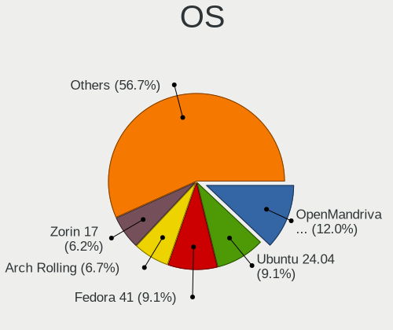

| Name                 | Computers | Percent |
|----------------------|-----------|---------|
| Ubuntu 22.04         | 24        | 13.19%  |
| Fedora 39            | 21        | 11.54%  |
| Debian 12            | 16        | 8.79%   |
| Pop!_OS 22.04        | 9         | 4.95%   |
| Linux Mint 21.3      | 9         | 4.95%   |
| Fedora 40            | 9         | 4.95%   |
| Arch Rolling         | 8         | 4.4%    |
| Zorin 17             | 6         | 3.3%    |
| Ubuntu 24.04         | 5         | 2.75%   |
| Ubuntu 23.10         | 5         | 2.75%   |
| OpenMandriva 5.0     | 5         | 2.75%   |
| OpenMandriva 23.08   | 3         | 1.65%   |
| Manjaro 23.1.4       | 3         | 1.65%   |
| Manjaro              | 3         | 1.65%   |
| Kubuntu 22.04        | 3         | 1.65%   |
| KDE neon 22.04       | 3         | 1.65%   |
| Garuda Linux Soaring | 3         | 1.65%   |
| Debian               | 3         | 1.65%   |
| Zorin 16             | 2         | 1.1%    |
| Ubuntu MATE 20.04    | 2         | 1.1%    |
| Nobara 39            | 2         | 1.1%    |
| NixOS 24.05          | 2         | 1.1%    |
| Linux Mint 21.2      | 2         | 1.1%    |
| Linux Mint 20.3      | 2         | 1.1%    |
| Kali 2024.1          | 2         | 1.1%    |
| EndeavourOS Rolling  | 2         | 1.1%    |
| ArcoLinux Rolling    | 2         | 1.1%    |
| Arch ARM             | 2         | 1.1%    |
| Xubuntu 23.10        | 1         | 0.55%   |
| Xubuntu 22.04        | 1         | 0.55%   |
| Xubuntu 20.04        | 1         | 0.55%   |
| Void Linux Rolling   | 1         | 0.55%   |
| Ubuntu MATE 22.04    | 1         | 0.55%   |
| Ubuntu 23.04         | 1         | 0.55%   |
| Ubuntu 20.04         | 1         | 0.55%   |
| SteamOS 3.5.17       | 1         | 0.55%   |
| Slackware 15.0       | 1         | 0.55%   |
| Pika OS 3            | 1         | 0.55%   |
| Parrot 6.0           | 1         | 0.55%   |
| OpenMandriva 4.2     | 1         | 0.55%   |

OS Family
---------

OS without a version

| Name         | Computers | Percent |
|--------------|-----------|---------|
| Ubuntu       | 36        | 19.78%  |
| Fedora       | 30        | 16.48%  |
| Debian       | 20        | 10.99%  |
| Linux Mint   | 14        | 7.69%   |
| OpenMandriva | 11        | 6.04%   |
| Pop!_OS      | 9         | 4.95%   |
| Zorin        | 8         | 4.4%    |
| Arch         | 8         | 4.4%    |
| Manjaro      | 6         | 3.3%    |
| Kubuntu      | 4         | 2.2%    |
| Xubuntu      | 3         | 1.65%   |
| Ubuntu MATE  | 3         | 1.65%   |
| KDE neon     | 3         | 1.65%   |
| Garuda Linux | 3         | 1.65%   |
| Nobara       | 2         | 1.1%    |
| NixOS        | 2         | 1.1%    |
| Kali         | 2         | 1.1%    |
| EndeavourOS  | 2         | 1.1%    |
| ArcoLinux    | 2         | 1.1%    |
| Arch ARM     | 2         | 1.1%    |
| Void Linux   | 1         | 0.55%   |
| SteamOS      | 1         | 0.55%   |
| Slackware    | 1         | 0.55%   |
| Pikaos       | 1         | 0.55%   |
| Parrot       | 1         | 0.55%   |
| MX           | 1         | 0.55%   |
| Manjaro-ARM  | 1         | 0.55%   |
| LMDE         | 1         | 0.55%   |
| Gentoo       | 1         | 0.55%   |
| Elementary   | 1         | 0.55%   |
| ChimeraOS    | 1         | 0.55%   |
| BlackPanther | 1         | 0.55%   |

Kernel
------

Version of the Linux kernel

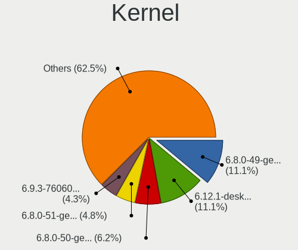

| Version                             | Computers | Percent |
|-------------------------------------|-----------|---------|
| 6.5.0-28-generic                    | 16        | 8.79%   |
| 6.5.0-27-generic                    | 16        | 8.79%   |
| 6.5.0-26-generic                    | 10        | 5.49%   |
| 6.7.11-200.fc39.x86_64              | 9         | 4.95%   |
| 6.8.0-76060800daily20240311-generic | 8         | 4.4%    |
| 6.8.7-300.fc40.x86_64               | 6         | 3.3%    |
| 5.15.0-102-generic                  | 6         | 3.3%    |
| 6.8.7-arch1-1                       | 5         | 2.75%   |
| 6.6.2-desktop-1omv2390              | 5         | 2.75%   |
| 5.15.0-105-generic                  | 5         | 2.75%   |
| 6.8.0-31-generic                    | 4         | 2.2%    |
| 6.5.13-3-pve                        | 4         | 2.2%    |
| 6.1.0-20-amd64                      | 4         | 2.2%    |
| 6.8.7-200.fc39.x86_64               | 3         | 1.65%   |
| 6.8.5-zen1-1-zen                    | 3         | 1.65%   |
| 6.8.4-200.fc39.x86_64               | 3         | 1.65%   |
| 6.6.15-amd64                        | 3         | 1.65%   |
| 6.5.6-300.fc39.x86_64               | 3         | 1.65%   |
| 6.4.11-desktop-1omv2390             | 3         | 1.65%   |
| 6.1.0-18-amd64                      | 3         | 1.65%   |
| 5.15.0-101-generic                  | 3         | 1.65%   |
| 6.8.5-arch1-1                       | 2         | 1.1%    |
| 6.8.5-301.fc40.x86_64               | 2         | 1.1%    |
| 6.8.5-201.fc39.x86_64               | 2         | 1.1%    |
| 6.8.4-arch1-1                       | 2         | 1.1%    |
| 6.8.2-zen2-1-zen                    | 2         | 1.1%    |
| 6.6.26-1-MANJARO                    | 2         | 1.1%    |
| 6.6.25-1-MANJARO                    | 2         | 1.1%    |
| 6.5.0-25-generic                    | 2         | 1.1%    |
| 6.8.7-desktop-1omv2490              | 1         | 0.55%   |
| 6.8.7                               | 1         | 0.55%   |
| 6.8.6-200.fc39.x86_64               | 1         | 0.55%   |
| 6.8.5-201.fsync.fc39.x86_64         | 1         | 0.55%   |
| 6.8.5-1-MANJARO                     | 1         | 0.55%   |
| 6.8.4-zen1-1-zen                    | 1         | 0.55%   |
| 6.8.4-300.fc40.x86_64               | 1         | 0.55%   |
| 6.8.4-060804-generic                | 1         | 0.55%   |
| 6.8.3-pikaos                        | 1         | 0.55%   |
| 6.8.2-201.fsync.fc39.x86_64         | 1         | 0.55%   |
| 6.7.9-amd64                         | 1         | 0.55%   |

Kernel Family
-------------

Linux kernel without a distro release

| Version  | Computers | Percent |
|----------|-----------|---------|
| 6.5.0    | 46        | 25.27%  |
| 5.15.0   | 17        | 9.34%   |
| 6.8.7    | 16        | 8.79%   |
| 6.8.0    | 12        | 6.59%   |
| 6.8.5    | 11        | 6.04%   |
| 6.1.0    | 10        | 5.49%   |
| 6.7.11   | 9         | 4.95%   |
| 6.8.4    | 8         | 4.4%    |
| 6.6.2    | 5         | 2.75%   |
| 6.5.13   | 5         | 2.75%   |
| 6.8.2    | 3         | 1.65%   |
| 6.6.25   | 3         | 1.65%   |
| 6.6.15   | 3         | 1.65%   |
| 6.5.6    | 3         | 1.65%   |
| 6.4.11   | 3         | 1.65%   |
| 6.7.9    | 2         | 1.1%    |
| 6.6.9    | 2         | 1.1%    |
| 6.6.28   | 2         | 1.1%    |
| 6.6.26   | 2         | 1.1%    |
| 6.6.10   | 2         | 1.1%    |
| 5.4.0    | 2         | 1.1%    |
| 6.8.6    | 1         | 0.55%   |
| 6.8.3    | 1         | 0.55%   |
| 6.7.0    | 1         | 0.55%   |
| 6.6.13   | 1         | 0.55%   |
| 6.2.0    | 1         | 0.55%   |
| 6.1.79   | 1         | 0.55%   |
| 6.1.52   | 1         | 0.55%   |
| 6.1.1    | 1         | 0.55%   |
| 5.19.0   | 1         | 0.55%   |
| 5.18.0   | 1         | 0.55%   |
| 5.15.85  | 1         | 0.55%   |
| 5.14.0   | 1         | 0.55%   |
| 5.11.12  | 1         | 0.55%   |
| 5.10.63  | 1         | 0.55%   |
| 5.10.160 | 1         | 0.55%   |
| 5.10.0   | 1         | 0.55%   |

Kernel Major Ver.
-----------------

Linux kernel major version

| Version | Computers | Percent |
|---------|-----------|---------|
| 6.5     | 54        | 29.67%  |
| 6.8     | 52        | 28.57%  |
| 6.6     | 20        | 10.99%  |
| 5.15    | 18        | 9.89%   |
| 6.1     | 13        | 7.14%   |
| 6.7     | 12        | 6.59%   |
| 6.4     | 3         | 1.65%   |
| 5.10    | 3         | 1.65%   |
| 5.4     | 2         | 1.1%    |
| 6.2     | 1         | 0.55%   |
| 5.19    | 1         | 0.55%   |
| 5.18    | 1         | 0.55%   |
| 5.14    | 1         | 0.55%   |
| 5.11    | 1         | 0.55%   |

Arch
----

OS architecture (x86_64, i586, etc.)

| Name    | Computers | Percent |
|---------|-----------|---------|
| x86_64  | 179       | 98.35%  |
| aarch64 | 3         | 1.65%   |

DE
--

Desktop Environment

| Name            | Computers | Percent |
|-----------------|-----------|---------|
| GNOME           | 93        | 51.1%   |
| KDE5            | 30        | 16.48%  |
| X-Cinnamon      | 14        | 7.69%   |
| Unknown         | 12        | 6.59%   |
| KDE6            | 9         | 4.95%   |
| MATE            | 6         | 3.3%    |
| XFCE            | 5         | 2.75%   |
| LXQt            | 3         | 1.65%   |
| KDE4            | 2         | 1.1%    |
| KDE             | 2         | 1.1%    |
| ubuntu          | 1         | 0.55%   |
| pika:GNOME      | 1         | 0.55%   |
| Pantheon        | 1         | 0.55%   |
| LXDE            | 1         | 0.55%   |
| i3              | 1         | 0.55%   |
| GNOME Flashback | 1         | 0.55%   |

Display Server
--------------

X11 or Wayland

| Name    | Computers | Percent |
|---------|-----------|---------|
| X11     | 90        | 49.45%  |
| Wayland | 80        | 43.96%  |
| Tty     | 7         | 3.85%   |
| Unknown | 5         | 2.75%   |

Display Manager
---------------

SDDM, LightDM, etc.

| Name    | Computers | Percent |
|---------|-----------|---------|
| Unknown | 76        | 41.76%  |
| GDM3    | 39        | 21.43%  |
| SDDM    | 33        | 18.13%  |
| LightDM | 21        | 11.54%  |
| GDM     | 13        | 7.14%   |

OS Lang
-------

Language

| Lang    | Computers | Percent |
|---------|-----------|---------|
| en_CA   | 91        | 50%     |
| en_US   | 63        | 34.62%  |
| fr_CA   | 12        | 6.59%   |
| Unknown | 6         | 3.3%    |
| C       | 5         | 2.75%   |
| fr_FR   | 3         | 1.65%   |
| en_GB   | 2         | 1.1%    |

Boot Mode
---------

EFI or BIOS

| Mode | Computers | Percent |
|------|-----------|---------|
| BIOS | 95        | 52.2%   |
| EFI  | 87        | 47.8%   |

Filesystem
----------

Type of filesystem

| Type    | Computers | Percent |
|---------|-----------|---------|
| Ext4    | 102       | 56.04%  |
| Btrfs   | 40        | 21.98%  |
| Tmpfs   | 25        | 13.74%  |
| Overlay | 9         | 4.95%   |
| Zfs     | 4         | 2.2%    |
| Xfs     | 1         | 0.55%   |
| Ext2    | 1         | 0.55%   |

Part. scheme
------------

Scheme of partitioning

| Type    | Computers | Percent |
|---------|-----------|---------|
| GPT     | 108       | 59.34%  |
| Unknown | 64        | 35.16%  |
| MBR     | 10        | 5.49%   |

Dual Boot with Linux/BSD
------------------------

Hosting more than one Linux/BSD

| Dual boot | Computers | Percent |
|-----------|-----------|---------|
| No        | 156       | 85.71%  |
| Yes       | 26        | 14.29%  |

Dual Boot (Win)
---------------

Hosting Linux and Windows

| Dual boot | Computers | Percent |
|-----------|-----------|---------|
| No        | 139       | 76.37%  |
| Yes       | 43        | 23.63%  |

Board
-----

Vendor
------

Motherboard manufacturer

| Name                      | Computers | Percent |
|---------------------------|-----------|---------|
| ASUSTek Computer          | 31        | 17.03%  |
| Lenovo                    | 30        | 16.48%  |
| Dell                      | 24        | 13.19%  |
| Hewlett-Packard           | 18        | 9.89%   |
| MSI                       | 17        | 9.34%   |
| Apple                     | 13        | 7.14%   |
| Gigabyte Technology       | 9         | 4.95%   |
| Acer                      | 8         | 4.4%    |
| ASRock                    | 6         | 3.3%    |
| Intel                     | 3         | 1.65%   |
| Unknown                   | 3         | 1.65%   |
| Microsoft                 | 2         | 1.1%    |
| AZW                       | 2         | 1.1%    |
| Valve                     | 1         | 0.55%   |
| Trigkey                   | 1         | 0.55%   |
| Toshiba                   | 1         | 0.55%   |
| System76                  | 1         | 0.55%   |
| Supermicro                | 1         | 0.55%   |
| STGAUBRON                 | 1         | 0.55%   |
| Sony                      | 1         | 0.55%   |
| RTD Embedded Technologies | 1         | 0.55%   |
| Raspberry Pi Foundation   | 1         | 0.55%   |
| Pine Microsystems         | 1         | 0.55%   |
| Pegatron                  | 1         | 0.55%   |
| Panasonic                 | 1         | 0.55%   |
| OEM                       | 1         | 0.55%   |
| Intel Client Systems      | 1         | 0.55%   |
| Framework                 | 1         | 0.55%   |
| Chuwi                     | 1         | 0.55%   |

Model
-----

Motherboard model

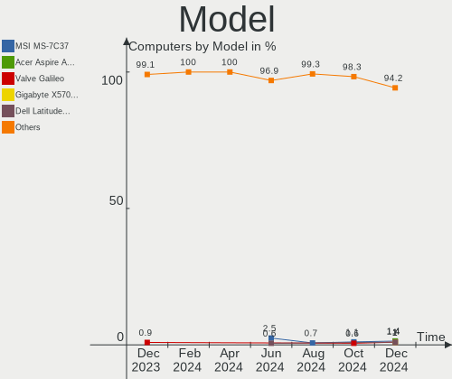

| Name                                       | Computers | Percent |
|--------------------------------------------|-----------|---------|
| Unknown                                    | 3         | 1.65%   |
| MSI MS-7D91                                | 2         | 1.1%    |
| MSI MS-7C95                                | 2         | 1.1%    |
| MSI MS-7C92                                | 2         | 1.1%    |
| Lenovo IdeaPadFlex 5 14ALC7 82R9           | 2         | 1.1%    |
| Apple MacBookPro11,1                       | 2         | 1.1%    |
| Valve Jupiter                              | 1         | 0.55%   |
| Trigkey S5                                 | 1         | 0.55%   |
| Toshiba TECRA Z40-C                        | 1         | 0.55%   |
| System76 Gazelle                           | 1         | 0.55%   |
| Supermicro Super Server                    | 1         | 0.55%   |
| STGAUBRON ZRD5104                          | 1         | 0.55%   |
| Sony SVF15213CDW                           | 1         | 0.55%   |
| RTD Embedded CMX34BT                       | 1         | 0.55%   |
| RPi Raspberry Pi                           | 1         | 0.55%   |
| Pine Microsystems Pine64 RK3566 Quartz64-A | 1         | 0.55%   |
| Pegatron p7-1238                           | 1         | 0.55%   |
| Panasonic CF-31WFL72LM                     | 1         | 0.55%   |
| OEM KabyLake                               | 1         | 0.55%   |
| MSI MS-7E12                                | 1         | 0.55%   |
| MSI MS-7C56                                | 1         | 0.55%   |
| MSI MS-7C02                                | 1         | 0.55%   |
| MSI MS-7B89                                | 1         | 0.55%   |
| MSI MS-7B85                                | 1         | 0.55%   |
| MSI MS-7A38                                | 1         | 0.55%   |
| MSI MS-7850                                | 1         | 0.55%   |
| MSI MS-7817                                | 1         | 0.55%   |
| MSI GF63 Thin 10SC                         | 1         | 0.55%   |
| MSI Cyborg 15 A12VF                        | 1         | 0.55%   |
| MSI Bravo 15 C7VFK                         | 1         | 0.55%   |
| Microsoft Surface Pro                      | 1         | 0.55%   |
| Microsoft Surface Laptop Go                | 1         | 0.55%   |
| Lenovo Yoga 9 14IRP8 83B1                  | 1         | 0.55%   |
| Lenovo Yoga 7 14ITL5 82BH                  | 1         | 0.55%   |
| Lenovo ThinkPad X1 Nano Gen 1 20UQS1RQ00   | 1         | 0.55%   |
| Lenovo ThinkPad X1 Carbon 2nd 20A8S0ET00   | 1         | 0.55%   |
| Lenovo ThinkPad T530 2359CTO               | 1         | 0.55%   |
| Lenovo ThinkPad T510 4349BW3               | 1         | 0.55%   |
| Lenovo ThinkPad T480s 20L8S6BW14           | 1         | 0.55%   |
| Lenovo ThinkPad T470p 20J7S0FA05           | 1         | 0.55%   |

Model Family
------------

Motherboard model prefix

| Name                     | Computers | Percent |
|--------------------------|-----------|---------|
| Lenovo ThinkPad          | 16        | 8.79%   |
| Acer Aspire              | 6         | 3.3%    |
| Dell Latitude            | 5         | 2.75%   |
| ASUS VivoBook            | 5         | 2.75%   |
| Lenovo Legion            | 4         | 2.2%    |
| HP EliteBook             | 4         | 2.2%    |
| Dell Precision           | 4         | 2.2%    |
| Dell OptiPlex            | 4         | 2.2%    |
| Lenovo IdeaPadFlex       | 3         | 1.65%   |
| HP Pavilion              | 3         | 1.65%   |
| Dell Inspiron            | 3         | 1.65%   |
| ASUS PRIME               | 3         | 1.65%   |
| Apple MacBookPro11       | 3         | 1.65%   |
| Unknown                  | 3         | 1.65%   |
| MSI MS-7D91              | 2         | 1.1%    |
| MSI MS-7C95              | 2         | 1.1%    |
| MSI MS-7C92              | 2         | 1.1%    |
| Microsoft Surface        | 2         | 1.1%    |
| Lenovo Yoga              | 2         | 1.1%    |
| Lenovo ThinkBook         | 2         | 1.1%    |
| HP ProBook               | 2         | 1.1%    |
| Gigabyte AERO            | 2         | 1.1%    |
| Dell Studio              | 2         | 1.1%    |
| Dell PowerEdge           | 2         | 1.1%    |
| ASUS ROG                 | 2         | 1.1%    |
| ASUS ASUS                | 2         | 1.1%    |
| Apple MacBookPro8        | 2         | 1.1%    |
| Valve Jupiter            | 1         | 0.55%   |
| Trigkey S5               | 1         | 0.55%   |
| Toshiba TECRA            | 1         | 0.55%   |
| System76 Gazelle         | 1         | 0.55%   |
| Supermicro Super         | 1         | 0.55%   |
| STGAUBRON ZRD5104        | 1         | 0.55%   |
| Sony SVF15213CDW         | 1         | 0.55%   |
| RTD Embedded CMX34BT     | 1         | 0.55%   |
| RPi Raspberry            | 1         | 0.55%   |
| Pine Microsystems Pine64 | 1         | 0.55%   |
| Pegatron p7-1238         | 1         | 0.55%   |
| Panasonic CF-31WFL72LM   | 1         | 0.55%   |
| OEM KabyLake             | 1         | 0.55%   |

MFG Year
--------

Motherboard manufacture year

| Year    | Computers | Percent |
|---------|-----------|---------|
| 2020    | 21        | 11.54%  |
| 2021    | 17        | 9.34%   |
| 2023    | 16        | 8.79%   |
| 2017    | 15        | 8.24%   |
| 2022    | 13        | 7.14%   |
| 2019    | 13        | 7.14%   |
| 2018    | 12        | 6.59%   |
| 2014    | 11        | 6.04%   |
| 2012    | 11        | 6.04%   |
| 2009    | 9         | 4.95%   |
| 2015    | 8         | 4.4%    |
| 2013    | 8         | 4.4%    |
| 2016    | 6         | 3.3%    |
| 2011    | 5         | 2.75%   |
| 2010    | 5         | 2.75%   |
| 2008    | 5         | 2.75%   |
| Unknown | 3         | 1.65%   |
| 2024    | 2         | 1.1%    |
| 2007    | 1         | 0.55%   |
| 2006    | 1         | 0.55%   |

Form Factor
-----------

Physical design of the computer

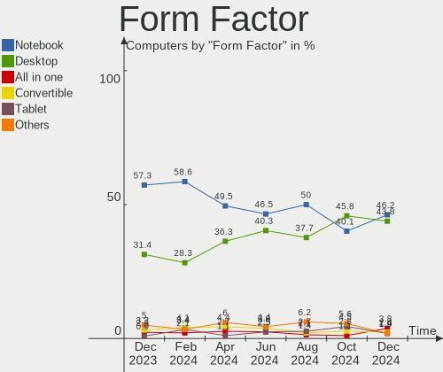

| Name           | Computers | Percent |
|----------------|-----------|---------|
| Notebook       | 90        | 49.45%  |
| Desktop        | 66        | 36.26%  |
| Convertible    | 8         | 4.4%    |
| All in one     | 5         | 2.75%   |
| Server         | 5         | 2.75%   |
| System on chip | 3         | 1.65%   |
| Mini pc        | 3         | 1.65%   |
| Tablet         | 2         | 1.1%    |

Secure Boot
-----------

Enabled or disabled

| State    | Computers | Percent |
|----------|-----------|---------|
| Disabled | 173       | 95.05%  |
| Enabled  | 9         | 4.95%   |

Coreboot
--------

Have coreboot on board

| Used | Computers | Percent |
|------|-----------|---------|
| No   | 181       | 99.45%  |
| Yes  | 1         | 0.55%   |

RAM Size
--------

Total RAM memory

| Size in GB      | Computers | Percent |
|-----------------|-----------|---------|
| 4.01-8.0        | 51        | 28.02%  |
| 16.01-24.0      | 39        | 21.43%  |
| 32.01-64.0      | 32        | 17.58%  |
| 8.01-16.0       | 27        | 14.84%  |
| 3.01-4.0        | 14        | 7.69%   |
| 64.01-256.0     | 14        | 7.69%   |
| 24.01-32.0      | 4         | 2.2%    |
| More than 256.0 | 1         | 0.55%   |

RAM Used
--------

Used RAM memory

| Used GB     | Computers | Percent |
|-------------|-----------|---------|
| 4.01-8.0    | 50        | 27.47%  |
| 1.01-2.0    | 41        | 22.53%  |
| 2.01-3.0    | 37        | 20.33%  |
| 3.01-4.0    | 34        | 18.68%  |
| 8.01-16.0   | 11        | 6.04%   |
| 0.51-1.0    | 4         | 2.2%    |
| 32.01-64.0  | 2         | 1.1%    |
| 24.01-32.0  | 1         | 0.55%   |
| 64.01-256.0 | 1         | 0.55%   |
| 16.01-24.0  | 1         | 0.55%   |

Total Drives
------------

Number of drives on board

| Drives | Computers | Percent |
|--------|-----------|---------|
| 1      | 100       | 54.95%  |
| 2      | 50        | 27.47%  |
| 4      | 11        | 6.04%   |
| 3      | 8         | 4.4%    |
| 5      | 5         | 2.75%   |
| 14     | 2         | 1.1%    |
| 0      | 2         | 1.1%    |
| 13     | 1         | 0.55%   |
| 9      | 1         | 0.55%   |
| 7      | 1         | 0.55%   |
| 6      | 1         | 0.55%   |

Has CD-ROM
----------

Has CD-ROM on board

| Presented | Computers | Percent |
|-----------|-----------|---------|
| No        | 138       | 75.82%  |
| Yes       | 44        | 24.18%  |

Has Ethernet
------------

Has Ethernet on board

| Presented | Computers | Percent |
|-----------|-----------|---------|
| Yes       | 153       | 84.07%  |
| No        | 29        | 15.93%  |

Has WiFi
--------

Has WiFi module

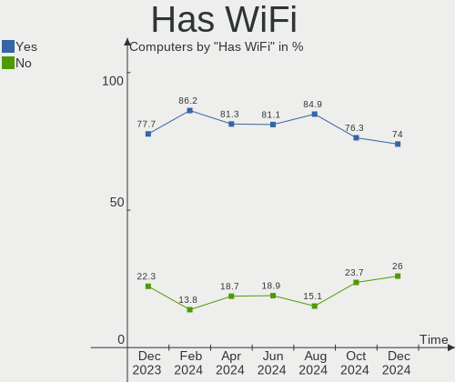

| Presented | Computers | Percent |
|-----------|-----------|---------|
| Yes       | 151       | 82.97%  |
| No        | 31        | 17.03%  |

Has Bluetooth
-------------

Has Bluetooth module

| Presented | Computers | Percent |
|-----------|-----------|---------|
| Yes       | 131       | 71.98%  |
| No        | 51        | 28.02%  |

Location
--------

Country
-------

Geographic location (country)

| Country | Computers | Percent |
|---------|-----------|---------|
| Canada  | 182       | 100%    |

City
----

Geographic location (city)

| City             | Computers | Percent |
|------------------|-----------|---------|
| Montreal         | 23        | 12.64%  |
| Toronto          | 20        | 10.99%  |
| Mississauga      | 7         | 3.85%   |
| Ottawa           | 6         | 3.3%    |
| Calgary          | 6         | 3.3%    |
| Edmonton         | 5         | 2.75%   |
| Winnipeg         | 4         | 2.2%    |
| Hamilton         | 4         | 2.2%    |
| Burnaby          | 4         | 2.2%    |
| Vancouver        | 3         | 1.65%   |
| Scarborough      | 3         | 1.65%   |
| London           | 3         | 1.65%   |
| Victoria         | 2         | 1.1%    |
| Surrey           | 2         | 1.1%    |
| Sherwood Park    | 2         | 1.1%    |
| Port Moody       | 2         | 1.1%    |
| Pierrefonds      | 2         | 1.1%    |
| Newcastle        | 2         | 1.1%    |
| Nepean           | 2         | 1.1%    |
| Markham          | 2         | 1.1%    |
| Mandeville       | 2         | 1.1%    |
| Laval            | 2         | 1.1%    |
| Kitchener        | 2         | 1.1%    |
| Kingston         | 2         | 1.1%    |
| Guelph           | 2         | 1.1%    |
| Chilliwack       | 2         | 1.1%    |
| Brampton         | 2         | 1.1%    |
| Windsor          | 1         | 0.55%   |
| Whitby           | 1         | 0.55%   |
| Vernon           | 1         | 0.55%   |
| Vaudreuil-Dorion | 1         | 0.55%   |
| Trois-Rivières  | 1         | 0.55%   |
| Tottenham        | 1         | 0.55%   |
| Thunder Bay      | 1         | 0.55%   |
| Sydney           | 1         | 0.55%   |
| Swift Current    | 1         | 0.55%   |
| St. John's       | 1         | 0.55%   |
| Spruce Grove     | 1         | 0.55%   |
| Sorel-Tracy      | 1         | 0.55%   |
| Simcoe           | 1         | 0.55%   |

Drives
------

Drive Vendor
------------

Hard drive vendors

| Vendor                      | Computers | Drives | Percent |
|-----------------------------|-----------|--------|---------|
| Samsung Electronics         | 47        | 53     | 17.15%  |
| WDC                         | 31        | 62     | 11.31%  |
| Seagate                     | 31        | 42     | 11.31%  |
| Sandisk                     | 20        | 27     | 7.3%    |
| SK hynix                    | 12        | 12     | 4.38%   |
| Kingston                    | 12        | 14     | 4.38%   |
| Crucial                     | 11        | 12     | 4.01%   |
| Toshiba                     | 10        | 10     | 3.65%   |
| A-DATA Technology           | 10        | 14     | 3.65%   |
| Unknown                     | 9         | 10     | 3.28%   |
| Micron Technology           | 8         | 8      | 2.92%   |
| Phison Electronics          | 7         | 7      | 2.55%   |
| Intel                       | 7         | 7      | 2.55%   |
| Apple                       | 6         | 6      | 2.19%   |
| SPCC                        | 5         | 5      | 1.82%   |
| Hitachi                     | 5         | 5      | 1.82%   |
| OCZ                         | 4         | 4      | 1.46%   |
| Kingston Technology Company | 4         | 5      | 1.46%   |
| China                       | 4         | 4      | 1.46%   |
| Corsair                     | 3         | 3      | 1.09%   |
| Unknown                     | 3         | 3      | 1.09%   |
| LITEON                      | 2         | 2      | 0.73%   |
| KingSpec                    | 2         | 2      | 0.73%   |
| UMIS                        | 1         | 1      | 0.36%   |
| TSA                         | 1         | 1      | 0.36%   |
| TO Exter                    | 1         | 1      | 0.36%   |
| Timetec                     | 1         | 1      | 0.36%   |
| Team                        | 1         | 1      | 0.36%   |
| Silicon Motion              | 1         | 1      | 0.36%   |
| Realtek Semiconductor       | 1         | 1      | 0.36%   |
| Realtek                     | 1         | 1      | 0.36%   |
| Radeon                      | 1         | 1      | 0.36%   |
| PNY                         | 1         | 1      | 0.36%   |
| Pioneer                     | 1         | 1      | 0.36%   |
| Patriot                     | 1         | 1      | 0.36%   |
| MS                          | 1         | 1      | 0.36%   |
| Lexar                       | 1         | 1      | 0.36%   |
| KingFast                    | 1         | 1      | 0.36%   |
| HGST                        | 1         | 1      | 0.36%   |
| FORESEE                     | 1         | 1      | 0.36%   |

Drive Model
-----------

Hard drive models

| Model                                              | Computers | Percent |
|----------------------------------------------------|-----------|---------|
| Samsung NVMe SSD Controller SM981/PM981/PM983 1TB  | 6         | 1.9%    |
| Sandisk WD Blue SN550 NVMe SSD 2TB                 | 5         | 1.58%   |
| Samsung NVMe SSD Controller PM9A1/PM9A3/980PRO 1TB | 5         | 1.58%   |
| WDC WD40EFRX-68N32N0 4TB                           | 4         | 1.27%   |
| Kingston SA400S37240G 240GB SSD                    | 4         | 1.27%   |
| WDC WDS100T3X0C-00SJG0 1TB                         | 3         | 0.95%   |
| WDC WD20EZRX-00DC0B0 2TB                           | 3         | 0.95%   |
| WDC WD20EZBX-00AYRA0 2TB                           | 3         | 0.95%   |
| Unknown SD/MMC/MS PRO 128GB                        | 3         | 0.95%   |
| Samsung SSD 850 EVO 250GB                          | 3         | 0.95%   |
| Samsung NVMe SSD Controller SM961/PM961/SM963 1TB  | 3         | 0.95%   |
| Crucial CT1000MX500SSD1 1TB                        | 3         | 0.95%   |
| Unknown                                            | 3         | 0.95%   |
| WDC WDS500G2B0B-00YS70 500GB SSD                   | 2         | 0.63%   |
| WDC WD10JPVX-22JC3T0 1TB                           | 2         | 0.63%   |
| SK hynix SKHynix_HFS512GEJ9X115N 512GB             | 2         | 0.63%   |
| Seagate ST8000DM004-2U9188 8TB                     | 2         | 0.63%   |
| Seagate ST500DM002-1BD142 500GB                    | 2         | 0.63%   |
| Seagate ST2000DM008-2FR102 2TB                     | 2         | 0.63%   |
| Seagate ST1000DM003-1SB102 1TB                     | 2         | 0.63%   |
| Sandisk WD_BLACK SN770 1TB                         | 2         | 0.63%   |
| Sandisk WD Black SN750 / PC SN730 NVMe SSD 512GB   | 2         | 0.63%   |
| Samsung SSD 860 EVO 250GB                          | 2         | 0.63%   |
| Phison PCIe SSD 2TB                                | 2         | 0.63%   |
| Micron MTFDKCD512TFK 512GB                         | 2         | 0.63%   |
| Kingston Company SNV2S1000G 1TB                    | 2         | 0.63%   |
| Kingston Company A2000 NVMe SSD 500GB              | 2         | 0.63%   |
| Intel SSDPEKNU512GZ 512GB                          | 2         | 0.63%   |
| China SSD 256GB                                    | 2         | 0.63%   |
| Apple SSD SM0256F 256GB                            | 2         | 0.63%   |
| A-DATA SX900 128GB SSD                             | 2         | 0.63%   |
| A-DATA SX8200PNP 512GB                             | 2         | 0.63%   |
| WDC WDS500G2B0C-00PXH0 500GB                       | 1         | 0.32%   |
| WDC WDS500G1X0E-00AFY0 500GB                       | 1         | 0.32%   |
| WDC WDS200T2B0B-00YS70 2TB SSD                     | 1         | 0.32%   |
| WDC WDS200T2B0A-00SM50 2TB SSD                     | 1         | 0.32%   |
| WDC WDS200T1X0E-00AFY0 2TB                         | 1         | 0.32%   |
| WDC WDS100T2B0A-00SM50 1TB SSD                     | 1         | 0.32%   |
| WDC WDS100T1X0E-00AFY0 1TB                         | 1         | 0.32%   |
| WDC WD7500BPKX-00HPJT0 752GB                       | 1         | 0.32%   |

HDD Vendor
----------

Hard disk drive vendors

| Vendor   | Computers | Drives | Percent |
|----------|-----------|--------|---------|
| Seagate  | 30        | 41     | 42.86%  |
| WDC      | 22        | 50     | 31.43%  |
| Toshiba  | 6         | 6      | 8.57%   |
| Hitachi  | 5         | 5      | 7.14%   |
| Unknown  | 3         | 3      | 4.29%   |
| TO Exter | 1         | 1      | 1.43%   |
| HGST     | 1         | 1      | 1.43%   |
| ASMT     | 1         | 1      | 1.43%   |
| Apple    | 1         | 1      | 1.43%   |

SSD Vendor
----------

Solid state drive vendors

| Vendor              | Computers | Drives | Percent |
|---------------------|-----------|--------|---------|
| Samsung Electronics | 17        | 19     | 18.28%  |
| Kingston            | 9         | 10     | 9.68%   |
| A-DATA Technology   | 9         | 11     | 9.68%   |
| Crucial             | 8         | 8      | 8.6%    |
| WDC                 | 5         | 5      | 5.38%   |
| Apple               | 5         | 5      | 5.38%   |
| SanDisk             | 4         | 4      | 4.3%    |
| OCZ                 | 4         | 4      | 4.3%    |
| China               | 4         | 4      | 4.3%    |
| SPCC                | 3         | 3      | 3.23%   |
| Micron Technology   | 3         | 3      | 3.23%   |
| SK hynix            | 2         | 2      | 2.15%   |
| LITEON              | 2         | 2      | 2.15%   |
| KingSpec            | 2         | 2      | 2.15%   |
| Intel               | 2         | 2      | 2.15%   |
| Corsair             | 2         | 2      | 2.15%   |
| Unknown             | 2         | 2      | 2.15%   |
| TSA                 | 1         | 1      | 1.08%   |
| Timetec             | 1         | 1      | 1.08%   |
| Team                | 1         | 1      | 1.08%   |
| Seagate             | 1         | 1      | 1.08%   |
| Radeon              | 1         | 1      | 1.08%   |
| PNY                 | 1         | 1      | 1.08%   |
| Pioneer             | 1         | 1      | 1.08%   |
| Patriot             | 1         | 1      | 1.08%   |
| FORESEE             | 1         | 1      | 1.08%   |
| Dogfish             | 1         | 1      | 1.08%   |

Drive Kind
----------

HDD or SSD

| Kind    | Computers | Drives | Percent |
|---------|-----------|--------|---------|
| NVMe    | 90        | 119    | 37.34%  |
| SSD     | 80        | 98     | 33.2%   |
| HDD     | 59        | 109    | 24.48%  |
| MMC     | 8         | 9      | 3.32%   |
| Unknown | 4         | 4      | 1.66%   |

Drive Connector
---------------

SATA, SAS, NVMe, etc.

| Type | Computers | Drives | Percent |
|------|-----------|--------|---------|
| SATA | 116       | 191    | 50.88%  |
| NVMe | 90        | 118    | 39.47%  |
| SAS  | 14        | 21     | 6.14%   |
| MMC  | 8         | 9      | 3.51%   |

Drive Size
----------

Size of hard drive

| Size in TB | Computers | Drives | Percent |
|------------|-----------|--------|---------|
| 0.01-0.5   | 77        | 97     | 49.36%  |
| 0.51-1.0   | 44        | 54     | 28.21%  |
| 1.01-2.0   | 15        | 23     | 9.62%   |
| 3.01-4.0   | 11        | 21     | 7.05%   |
| 2.01-3.0   | 4         | 7      | 2.56%   |
| 4.01-10.0  | 4         | 4      | 2.56%   |
| 10.01-20.0 | 1         | 1      | 0.64%   |

Space Total
-----------

Amount of disk space available on the file system

| Size in GB     | Computers | Percent |
|----------------|-----------|---------|
| 101-250        | 39        | 21.43%  |
| 251-500        | 34        | 18.68%  |
| 501-1000       | 33        | 18.13%  |
| 1001-2000      | 21        | 11.54%  |
| More than 3000 | 12        | 6.59%   |
| 1-20           | 11        | 6.04%   |
| 51-100         | 11        | 6.04%   |
| 2001-3000      | 9         | 4.95%   |
| Unknown        | 8         | 4.4%    |
| 21-50          | 4         | 2.2%    |

Space Used
----------

Amount of used disk space

| Used GB        | Computers | Percent |
|----------------|-----------|---------|
| 1-20           | 55        | 30.22%  |
| 21-50          | 29        | 15.93%  |
| 101-250        | 23        | 12.64%  |
| 51-100         | 19        | 10.44%  |
| 251-500        | 16        | 8.79%   |
| 501-1000       | 14        | 7.69%   |
| 1001-2000      | 11        | 6.04%   |
| Unknown        | 8         | 4.4%    |
| More than 3000 | 5         | 2.75%   |
| 2001-3000      | 2         | 1.1%    |

Malfunc. Drives
---------------

Drive models with a malfunction

| Model                                 | Computers | Drives | Percent |
|---------------------------------------|-----------|--------|---------|
| Seagate ST500DM002-1BD142 500GB       | 2         | 2      | 8.7%    |
| WDC WD7500BPKX-00HPJT0 752GB          | 1         | 1      | 4.35%   |
| WDC WD5000AAKS-00V1A0 500GB           | 1         | 1      | 4.35%   |
| WDC WD40EZRZ-22GXCB0 4TB              | 1         | 3      | 4.35%   |
| WDC WD40EFRX-68N32N0 4TB              | 1         | 1      | 4.35%   |
| WDC WD20EARX-22PASB0 2TB              | 1         | 2      | 4.35%   |
| WDC WD10JPVX-22JC3T0 1TB              | 1         | 1      | 4.35%   |
| WDC WD10EZRX-22A3KB0 1TB              | 1         | 1      | 4.35%   |
| Toshiba MQ01ABD075 752GB              | 1         | 1      | 4.35%   |
| Timetec SD08 512GB SSD                | 1         | 1      | 4.35%   |
| Seagate ST3750640AS 752GB             | 1         | 1      | 4.35%   |
| Seagate ST3000DM008-2DM166 3TB        | 1         | 1      | 4.35%   |
| Seagate ST2000DM008-2FR102 2TB        | 1         | 1      | 4.35%   |
| Seagate ST2000DL003-9VT166 2TB        | 1         | 1      | 4.35%   |
| Seagate ST1000LM014-1EJ164-SSHD 1TB   | 1         | 1      | 4.35%   |
| Samsung Electronics SSD 980 1TB       | 1         | 1      | 4.35%   |
| Samsung Electronics SSD 870 EVO 250GB | 1         | 1      | 4.35%   |
| OCZ VERTEX2 64GB SSD                  | 1         | 1      | 4.35%   |
| KingSpec NT-256 256GB SSD             | 1         | 1      | 4.35%   |
| Hitachi HTS725025A9A364 250GB         | 1         | 1      | 4.35%   |
| Hitachi HTS545050A7E380 500GB         | 1         | 1      | 4.35%   |
| Crucial CT480M500SSD1 480GB           | 1         | 1      | 4.35%   |

Malfunc. Drive Vendor
---------------------

Vendors of faulty drives

| Vendor              | Computers | Drives | Percent |
|---------------------|-----------|--------|---------|
| WDC                 | 6         | 10     | 28.57%  |
| Seagate             | 6         | 7      | 28.57%  |
| Samsung Electronics | 2         | 2      | 9.52%   |
| Hitachi             | 2         | 2      | 9.52%   |
| Toshiba             | 1         | 1      | 4.76%   |
| Timetec             | 1         | 1      | 4.76%   |
| OCZ                 | 1         | 1      | 4.76%   |
| KingSpec            | 1         | 1      | 4.76%   |
| Crucial             | 1         | 1      | 4.76%   |

Malfunc. HDD Vendor
-------------------

Vendors of faulty HDD drives

| Vendor  | Computers | Drives | Percent |
|---------|-----------|--------|---------|
| WDC     | 6         | 10     | 40%     |
| Seagate | 6         | 7      | 40%     |
| Hitachi | 2         | 2      | 13.33%  |
| Toshiba | 1         | 1      | 6.67%   |

Malfunc. Drive Kind
-------------------

Kinds of faulty drives

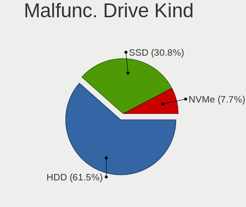

| Kind | Computers | Drives | Percent |
|------|-----------|--------|---------|
| HDD  | 12        | 20     | 66.67%  |
| SSD  | 5         | 5      | 27.78%  |
| NVMe | 1         | 1      | 5.56%   |

Failed Drives
-------------

Failed drive models

Zero info for selected period =(

Failed Drive Vendor
-------------------

Failed drive vendors

Zero info for selected period =(

Drive Status
------------

Number of failed and malfunc. drives

| Status   | Computers | Drives | Percent |
|----------|-----------|--------|---------|
| Detected | 98        | 152    | 49.25%  |
| Works    | 86        | 161    | 43.22%  |
| Malfunc  | 15        | 26     | 7.54%   |

Storage controller
------------------

Storage Vendor
--------------

Storage controller vendors

| Vendor                       | Computers | Percent |
|------------------------------|-----------|---------|
| Intel                        | 106       | 39.55%  |
| Samsung Electronics          | 36        | 13.43%  |
| AMD                          | 36        | 13.43%  |
| Sandisk                      | 21        | 7.84%   |
| SK hynix                     | 10        | 3.73%   |
| Phison Electronics           | 9         | 3.36%   |
| ASMedia Technology           | 8         | 2.99%   |
| Kingston Technology Company  | 6         | 2.24%   |
| Micron Technology            | 5         | 1.87%   |
| Realtek Semiconductor        | 4         | 1.49%   |
| Micron/Crucial Technology    | 4         | 1.49%   |
| Toshiba America Info Systems | 3         | 1.12%   |
| Marvell Technology Group     | 3         | 1.12%   |
| JMicron Technology           | 3         | 1.12%   |
| ADATA Technology             | 3         | 1.12%   |
| Nvidia                       | 2         | 0.75%   |
| Broadcom / LSI               | 2         | 0.75%   |
| Adaptec                      | 2         | 0.75%   |
| Union Memory (Shenzhen)      | 1         | 0.37%   |
| Silicon Motion               | 1         | 0.37%   |
| LSI Logic / Symbios Logic    | 1         | 0.37%   |
| KIOXIA                       | 1         | 0.37%   |
| Hewlett-Packard              | 1         | 0.37%   |

Storage Model
-------------

Storage controller models

| Model                                                                          | Computers | Percent |
|--------------------------------------------------------------------------------|-----------|---------|
| AMD FCH SATA Controller [AHCI mode]                                            | 19        | 6.35%   |
| Samsung NVMe SSD Controller SM981/PM981/PM983                                  | 10        | 3.34%   |
| Intel Volume Management Device NVMe RAID Controller                            | 9         | 3.01%   |
| Samsung NVMe SSD Controller 980 (DRAM-less)                                    | 8         | 2.68%   |
| Intel Sunrise Point-LP SATA Controller [AHCI mode]                             | 8         | 2.68%   |
| Intel 7 Series Chipset Family 6-port SATA Controller [AHCI mode]               | 7         | 2.34%   |
| AMD 500 Series Chipset SATA Controller                                         | 7         | 2.34%   |
| AMD 400 Series Chipset SATA Controller                                         | 7         | 2.34%   |
| SanDisk WD Black SN770 / PC SN740 256GB / PC SN560 (DRAM-less) NVMe SSD        | 6         | 2.01%   |
| SanDisk Ultra 3D / WD Blue SN550 NVMe SSD                                      | 6         | 2.01%   |
| Samsung NVMe SSD Controller PM9A1/PM9A3/980PRO                                 | 6         | 2.01%   |
| Intel 8 Series/C220 Series Chipset Family 6-port SATA Controller 1 [AHCI mode] | 6         | 2.01%   |
| Intel 8 Series SATA Controller 1 [AHCI mode]                                   | 6         | 2.01%   |
| ASMedia ASM1061/ASM1062 Serial ATA Controller                                  | 6         | 2.01%   |
| Intel SATA Controller [RAID mode]                                              | 5         | 1.67%   |
| Intel Q170/Q150/B150/H170/H110/Z170/CM236 Chipset SATA Controller [AHCI Mode]  | 5         | 1.67%   |
| SanDisk WD PC SN810 / Black SN850 NVMe SSD                                     | 4         | 1.34%   |
| SanDisk Extreme Pro / WD Black SN750 / PC SN730 / Red SN700 NVMe SSD           | 4         | 1.34%   |
| SK hynix Platinum P41/PC801 NVMe Solid State Drive                             | 3         | 1%      |
| SK hynix PC611 NVMe Solid State Drive                                          | 3         | 1%      |
| SanDisk Ultra 3D / WD Blue SN570 NVMe SSD (DRAM-less)                          | 3         | 1%      |
| Samsung S4LN053X01 AHCI SSD Controller(Apple slot)                             | 3         | 1%      |
| Samsung NVMe SSD Controller SM961/PM961/SM963                                  | 3         | 1%      |
| Samsung NVMe SSD Controller PM9B1 (DRAM-less)                                  | 3         | 1%      |
| Realtek RTS5765DL NVMe SSD Controller (DRAM-less)                              | 3         | 1%      |
| Phison PS5021-E21 PCIe4 NVMe Controller (DRAM-less)                            | 3         | 1%      |
| Intel Tiger Lake-LP SATA Controller                                            | 3         | 1%      |
| Intel SSD 670p Series [Keystone Harbor]                                        | 3         | 1%      |
| Intel Cannon Lake Mobile PCH SATA AHCI Controller                              | 3         | 1%      |
| Intel 82801IBM/IEM (ICH9M/ICH9M-E) 4 port SATA Controller [AHCI mode]          | 3         | 1%      |
| Intel 82801 Mobile SATA Controller [RAID mode]                                 | 3         | 1%      |
| Intel 6 Series/C200 Series Chipset Family 6 port Mobile SATA AHCI Controller   | 3         | 1%      |
| Intel 500 Series Chipset Family SATA AHCI Controller                           | 3         | 1%      |
| Intel 400 Series Chipset Family SATA AHCI Controller                           | 3         | 1%      |
| AMD SB7x0/SB8x0/SB9x0 SATA Controller [AHCI mode]                              | 3         | 1%      |
| AMD SB7x0/SB8x0/SB9x0 IDE Controller                                           | 3         | 1%      |
| AMD 600 Series Chipset SATA Controller                                         | 3         | 1%      |
| ADATA XPG SX8200 Pro PCIe Gen3x4 M.2 2280 Solid State Drive                    | 3         | 1%      |
| SK hynix Gold P31/BC711/PC711 NVMe Solid State Drive                           | 2         | 0.67%   |
| Phison PS5015-E15 PCIe3 NVMe Controller (DRAM-less)                            | 2         | 0.67%   |

Storage Kind
------------

Kind of storage controller (IDE, SATA, NVMe, SAS, ...)

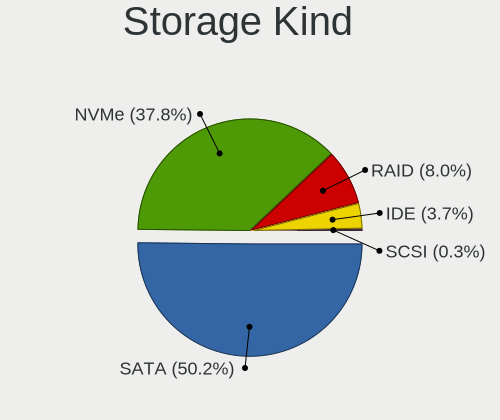

| Kind | Computers | Percent |
|------|-----------|---------|
| SATA | 125       | 49.41%  |
| NVMe | 91        | 35.97%  |
| RAID | 23        | 9.09%   |
| IDE  | 12        | 4.74%   |
| SAS  | 2         | 0.79%   |

Processor
---------

CPU Vendor
----------

Processor vendors

| Vendor | Computers | Percent |
|--------|-----------|---------|
| Intel  | 135       | 74.18%  |
| AMD    | 44        | 24.18%  |
| ARM    | 3         | 1.65%   |

CPU Model
---------

Processor models

| Model                                   | Computers | Percent |
|-----------------------------------------|-----------|---------|
| Intel 11th Gen Core i7-1165G7 @ 2.80GHz | 4         | 2.2%    |
| Intel 11th Gen Core i5-11400H @ 2.70GHz | 4         | 2.2%    |
| ARM Processor                           | 3         | 1.65%   |
| AMD Ryzen 5 5600X 6-Core Processor      | 3         | 1.65%   |
| Intel Core i7-8750H CPU @ 2.20GHz       | 2         | 1.1%    |
| Intel Core i7-6700HQ CPU @ 2.60GHz      | 2         | 1.1%    |
| Intel Core i7-4500U CPU @ 1.80GHz       | 2         | 1.1%    |
| Intel Core i5-8500T CPU @ 2.10GHz       | 2         | 1.1%    |
| Intel Core i5-8350U CPU @ 1.70GHz       | 2         | 1.1%    |
| Intel Core i5-7300U CPU @ 2.60GHz       | 2         | 1.1%    |
| Intel Core i5-6300U CPU @ 2.40GHz       | 2         | 1.1%    |
| Intel Core i5-4278U CPU @ 2.60GHz       | 2         | 1.1%    |
| Intel Core i5-10300H CPU @ 2.50GHz      | 2         | 1.1%    |
| Intel Core i5-10210U CPU @ 1.60GHz      | 2         | 1.1%    |
| Intel 13th Gen Core i9-13900H           | 2         | 1.1%    |
| Intel 11th Gen Core i7-11800H @ 2.30GHz | 2         | 1.1%    |
| Intel 11th Gen Core i5-11600K @ 3.90GHz | 2         | 1.1%    |
| Intel 11th Gen Core i5-1135G7 @ 2.40GHz | 2         | 1.1%    |
| AMD Ryzen 9 5900X 12-Core Processor     | 2         | 1.1%    |
| AMD Ryzen 7 5700U with Radeon Graphics  | 2         | 1.1%    |
| AMD Ryzen 7 2700X Eight-Core Processor  | 2         | 1.1%    |
| AMD Ryzen 5 3600X 6-Core Processor      | 2         | 1.1%    |
| Intel Xeon W-2104 CPU @ 3.20GHz         | 1         | 0.55%   |
| Intel Xeon CPU X5670 @ 2.93GHz          | 1         | 0.55%   |
| Intel Xeon CPU X5660 @ 2.80GHz          | 1         | 0.55%   |
| Intel Xeon CPU L5420 @ 2.50GHz          | 1         | 0.55%   |
| Intel Xeon CPU E5440 @ 2.83GHz          | 1         | 0.55%   |
| Intel Xeon CPU E5-2687W v3 @ 3.10GHz    | 1         | 0.55%   |
| Intel Xeon CPU E5-2673 v4 @ 2.30GHz     | 1         | 0.55%   |
| Intel Xeon CPU E5-2650 v2 @ 2.60GHz     | 1         | 0.55%   |
| Intel Xeon CPU E5-2470 v2 @ 2.40GHz     | 1         | 0.55%   |
| Intel Xeon CPU E5-1650 v2 @ 3.50GHz     | 1         | 0.55%   |
| Intel Xeon CPU E3-1535M v6 @ 3.10GHz    | 1         | 0.55%   |
| Intel Xeon CPU E3-1225 v5 @ 3.30GHz     | 1         | 0.55%   |
| Intel Pentium Silver N6000 @ 1.10GHz    | 1         | 0.55%   |
| Intel Pentium CPU N3540 @ 2.16GHz       | 1         | 0.55%   |
| Intel Pentium CPU J4205 @ 1.50GHz       | 1         | 0.55%   |
| Intel Pentium 3556U @ 1.70GHz           | 1         | 0.55%   |
| Intel N100                              | 1         | 0.55%   |
| Intel Genuine CPU U2700 @ 1.30GHz       | 1         | 0.55%   |

CPU Model Family
----------------

Processor model prefix

| Model                  | Computers | Percent |
|------------------------|-----------|---------|
| Other                  | 34        | 18.68%  |
| Intel Core i5          | 33        | 18.13%  |
| Intel Core i7          | 30        | 16.48%  |
| AMD Ryzen 5            | 17        | 9.34%   |
| Intel Xeon             | 12        | 6.59%   |
| AMD Ryzen 7            | 12        | 6.59%   |
| Intel Core i3          | 9         | 4.95%   |
| Intel Core 2 Duo       | 8         | 4.4%    |
| Intel Pentium          | 3         | 1.65%   |
| Intel Core 2 Quad      | 3         | 1.65%   |
| Intel Celeron          | 3         | 1.65%   |
| AMD Ryzen 9            | 3         | 1.65%   |
| AMD A8                 | 3         | 1.65%   |
| AMD FX                 | 2         | 1.1%    |
| Intel Pentium Silver   | 1         | 0.55%   |
| Intel Genuine          | 1         | 0.55%   |
| Intel Core m3          | 1         | 0.55%   |
| Intel Atom             | 1         | 0.55%   |
| AMD Ryzen Threadripper | 1         | 0.55%   |
| AMD Phenom II X6       | 1         | 0.55%   |
| AMD Phenom II X4       | 1         | 0.55%   |
| AMD Athlon II X4       | 1         | 0.55%   |
| AMD A6                 | 1         | 0.55%   |
| AMD A10                | 1         | 0.55%   |

CPU Cores
---------

Number of processor cores

| Number  | Computers | Percent |
|---------|-----------|---------|
| 4       | 61        | 33.52%  |
| 2       | 44        | 24.18%  |
| 6       | 33        | 18.13%  |
| 8       | 17        | 9.34%   |
| 12      | 7         | 3.85%   |
| 14      | 5         | 2.75%   |
| 10      | 3         | 1.65%   |
| 24      | 2         | 1.1%    |
| 20      | 2         | 1.1%    |
| 16      | 2         | 1.1%    |
| Unknown | 2         | 1.1%    |
| 40      | 1         | 0.55%   |
| 5       | 1         | 0.55%   |
| 3       | 1         | 0.55%   |
| 1       | 1         | 0.55%   |

CPU Sockets
-----------

Number of sockets

| Number  | Computers | Percent |
|---------|-----------|---------|
| 1       | 172       | 94.51%  |
| 2       | 8         | 4.4%    |
| Unknown | 2         | 1.1%    |

CPU Threads
-----------

Threads per core (Hyper-Threading)

| Number  | Computers | Percent |
|---------|-----------|---------|
| 2       | 139       | 76.37%  |
| 1       | 41        | 22.53%  |
| Unknown | 2         | 1.1%    |

CPU Op-Modes
------------

CPU Operation Modes (32-bit, 64-bit)

| Op mode        | Computers | Percent |
|----------------|-----------|---------|
| 32-bit, 64-bit | 180       | 98.9%   |
| 64-bit         | 2         | 1.1%    |

CPU Microcode
-------------

Microcode number

| Number     | Computers | Percent |
|------------|-----------|---------|
| Unknown    | 144       | 79.12%  |
| 0x1067a    | 3         | 1.65%   |
| 0xa0652    | 2         | 1.1%    |
| 0x506e3    | 2         | 1.1%    |
| 0x40651    | 2         | 1.1%    |
| 0x0a50000d | 2         | 1.1%    |
| 0x0a20102b | 2         | 1.1%    |
| 0x0800820d | 2         | 1.1%    |
| 0xb0671    | 1         | 0.55%   |
| 0xa0671    | 1         | 0.55%   |
| 0xa0653    | 1         | 0.55%   |
| 0x906e9    | 1         | 0.55%   |
| 0x806ec    | 1         | 0.55%   |
| 0x6fd      | 1         | 0.55%   |
| 0x50654    | 1         | 0.55%   |
| 0x406e3    | 1         | 0.55%   |
| 0x306c3    | 1         | 0.55%   |
| 0x30679    | 1         | 0.55%   |
| 0x206a7    | 1         | 0.55%   |
| 0x20655    | 1         | 0.55%   |
| 0x0a201016 | 1         | 0.55%   |
| 0x0a201009 | 1         | 0.55%   |
| 0x08701030 | 1         | 0.55%   |
| 0x08701013 | 1         | 0.55%   |
| 0x08608104 | 1         | 0.55%   |
| 0x08608103 | 1         | 0.55%   |
| 0x07030105 | 1         | 0.55%   |
| 0x06006705 | 1         | 0.55%   |
| 0x06000852 | 1         | 0.55%   |
| 0x010000dc | 1         | 0.55%   |
| 0x010000db | 1         | 0.55%   |

CPU Microarch
-------------

Microarchitecture

| Name             | Computers | Percent |
|------------------|-----------|---------|
| Unknown          | 24        | 13.19%  |
| KabyLake         | 21        | 11.54%  |
| Haswell          | 20        | 10.99%  |
| Zen 3            | 13        | 7.14%   |
| Penryn           | 12        | 6.59%   |
| IvyBridge        | 12        | 6.59%   |
| Skylake          | 11        | 6.04%   |
| Alderlake Hybrid | 9         | 4.95%   |
| TigerLake        | 7         | 3.85%   |
| CometLake        | 7         | 3.85%   |
| Zen 2            | 6         | 3.3%    |
| Icelake          | 6         | 3.3%    |
| Westmere         | 5         | 2.75%   |
| SandyBridge      | 4         | 2.2%    |
| Zen+             | 3         | 1.65%   |
| Piledriver       | 3         | 1.65%   |
| K10              | 3         | 1.65%   |
| Silvermont       | 2         | 1.1%    |
| Goldmont         | 2         | 1.1%    |
| Excavator        | 2         | 1.1%    |
| Core             | 2         | 1.1%    |
| Broadwell        | 2         | 1.1%    |
| Zen              | 1         | 0.55%   |
| Puma             | 1         | 0.55%   |
| Nehalem          | 1         | 0.55%   |
| K10 Llano        | 1         | 0.55%   |
| Gracemont        | 1         | 0.55%   |
| Goldmont plus    | 1         | 0.55%   |

Graphics
--------

GPU Vendor
----------

Vendors of graphics cards

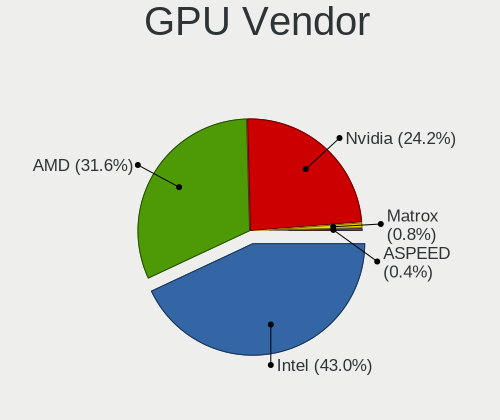

| Vendor                     | Computers | Percent |
|----------------------------|-----------|---------|
| Intel                      | 102       | 47%     |
| Nvidia                     | 65        | 29.95%  |
| AMD                        | 47        | 21.66%  |
| Matrox Electronics Systems | 3         | 1.38%   |

GPU Model
---------

Graphics card models

| Model                                                                       | Computers | Percent |
|-----------------------------------------------------------------------------|-----------|---------|
| Intel Haswell-ULT Integrated Graphics Controller                            | 8         | 3.62%   |
| Intel 3rd Gen Core processor Graphics Controller                            | 7         | 3.17%   |
| Intel UHD Graphics 620                                                      | 6         | 2.71%   |
| Intel TigerLake-LP GT2 [Iris Xe Graphics]                                   | 6         | 2.71%   |
| Intel TigerLake-H GT1 [UHD Graphics]                                        | 6         | 2.71%   |
| Intel Raptor Lake-P [Iris Xe Graphics]                                      | 5         | 2.26%   |
| Intel Xeon E3-1200 v3/4th Gen Core Processor Integrated Graphics Controller | 4         | 1.81%   |
| Intel CometLake-H GT2 [UHD Graphics]                                        | 4         | 1.81%   |
| Intel 2nd Generation Core Processor Family Integrated Graphics Controller   | 4         | 1.81%   |
| AMD Ellesmere [Radeon RX 470/480/570/570X/580/580X/590]                     | 4         | 1.81%   |
| AMD Cezanne [Radeon Vega Series / Radeon Vega Mobile Series]                | 4         | 1.81%   |
| Nvidia GA107M [GeForce RTX 3050 Mobile]                                     | 3         | 1.36%   |
| Nvidia GA104 [GeForce RTX 3070]                                             | 3         | 1.36%   |
| Intel Skylake GT2 [HD Graphics 520]                                         | 3         | 1.36%   |
| Intel RocketLake-S GT1 [UHD Graphics 750]                                   | 3         | 1.36%   |
| Intel HD Graphics 630                                                       | 3         | 1.36%   |
| Intel CoffeeLake-H GT2 [UHD Graphics 630]                                   | 3         | 1.36%   |
| Intel Alder Lake-P GT2 [Iris Xe Graphics]                                   | 3         | 1.36%   |
| Intel 4th Gen Core Processor Integrated Graphics Controller                 | 3         | 1.36%   |
| AMD Lucienne                                                                | 3         | 1.36%   |
| Nvidia TU117M [GeForce GTX 1650 Mobile / Max-Q]                             | 2         | 0.9%    |
| Nvidia GP104 [GeForce GTX 1080]                                             | 2         | 0.9%    |
| Nvidia GM107 [GeForce GTX 750 Ti]                                           | 2         | 0.9%    |
| Nvidia GA107BM [GeForce RTX 3050 Ti Mobile]                                 | 2         | 0.9%    |
| Nvidia AD107M [GeForce RTX 4060 Max-Q / Mobile]                             | 2         | 0.9%    |
| Intel Mobile 4 Series Chipset Integrated Graphics Controller                | 2         | 0.9%    |
| Intel JasperLake [UHD Graphics]                                             | 2         | 0.9%    |
| Intel HD Graphics 620                                                       | 2         | 0.9%    |
| Intel HD Graphics 530                                                       | 2         | 0.9%    |
| Intel CometLake-U GT2 [UHD Graphics]                                        | 2         | 0.9%    |
| Intel CometLake-S GT2 [UHD Graphics 630]                                    | 2         | 0.9%    |
| Intel CoffeeLake-S GT2 [UHD Graphics 630]                                   | 2         | 0.9%    |
| Intel Atom Processor Z36xxx/Z37xxx Series Graphics & Display                | 2         | 0.9%    |
| Intel 4th Generation Core Processor Family Integrated Graphics Controller   | 2         | 0.9%    |
| Intel 4 Series Chipset Integrated Graphics Controller                       | 2         | 0.9%    |
| AMD RV770 [Radeon HD 4850]                                                  | 2         | 0.9%    |
| AMD RV730/M96-XT [Mobility Radeon HD 4670]                                  | 2         | 0.9%    |
| AMD Renoir [Radeon RX Vega 6 (Ryzen 4000/5000 Mobile Series)]               | 2         | 0.9%    |
| AMD Rembrandt [Radeon 680M]                                                 | 2         | 0.9%    |
| AMD Phoenix1                                                                | 2         | 0.9%    |

GPU Combo
---------

Combinations of graphics cards

| Name           | Computers | Percent |
|----------------|-----------|---------|
| 1 x Intel      | 68        | 37.36%  |
| 1 x AMD        | 37        | 20.33%  |
| 1 x Nvidia     | 31        | 17.03%  |
| Intel + Nvidia | 28        | 15.38%  |
| AMD + Nvidia   | 5         | 2.75%   |
| Other          | 3         | 1.65%   |
| 2 x AMD        | 3         | 1.65%   |
| 1 x Matrox     | 3         | 1.65%   |
| Intel + AMD    | 2         | 1.1%    |
| 2 x Nvidia     | 1         | 0.55%   |
| 2 x Intel      | 1         | 0.55%   |

GPU Driver
----------

Free vs proprietary

| Driver      | Computers | Percent |
|-------------|-----------|---------|
| Free        | 139       | 76.37%  |
| Proprietary | 36        | 19.78%  |
| Unknown     | 7         | 3.85%   |

GPU Memory
----------

Total video memory

| Size in GB | Computers | Percent |
|------------|-----------|---------|
| Unknown    | 134       | 73.63%  |
| 0.01-0.5   | 13        | 7.14%   |
| 7.01-8.0   | 8         | 4.4%    |
| 3.01-4.0   | 8         | 4.4%    |
| 0.51-1.0   | 6         | 3.3%    |
| 1.01-2.0   | 5         | 2.75%   |
| 5.01-6.0   | 4         | 2.2%    |
| 2.01-3.0   | 2         | 1.1%    |
| 8.01-16.0  | 2         | 1.1%    |

Monitor
-------

Monitor Vendor
--------------

Monitor vendors

| Vendor               | Computers | Percent |
|----------------------|-----------|---------|
| Samsung Electronics  | 28        | 13.86%  |
| Chimei Innolux       | 22        | 10.89%  |
| AU Optronics         | 16        | 7.92%   |
| LG Display           | 15        | 7.43%   |
| Dell                 | 14        | 6.93%   |
| BOE                  | 12        | 5.94%   |
| Apple                | 12        | 5.94%   |
| Hewlett-Packard      | 8         | 3.96%   |
| Goldstar             | 8         | 3.96%   |
| Acer                 | 8         | 3.96%   |
| ASUSTek Computer     | 6         | 2.97%   |
| InfoVision           | 4         | 1.98%   |
| BenQ                 | 4         | 1.98%   |
| AOC                  | 4         | 1.98%   |
| ViewSonic            | 3         | 1.49%   |
| Panasonic            | 3         | 1.49%   |
| Ancor Communications | 3         | 1.49%   |
| Unknown              | 2         | 0.99%   |
| Sony                 | 2         | 0.99%   |
| RTK                  | 2         | 0.99%   |
| Philips              | 2         | 0.99%   |
| PANDA                | 2         | 0.99%   |
| Lenovo               | 2         | 0.99%   |
| Gigabyte Technology  | 2         | 0.99%   |
| VST                  | 1         | 0.5%    |
| Valve                | 1         | 0.5%    |
| Unknown (CDD)        | 1         | 0.5%    |
| UHD                  | 1         | 0.5%    |
| Sun                  | 1         | 0.5%    |
| SKY                  | 1         | 0.5%    |
| Sharp                | 1         | 0.5%    |
| Sceptre              | 1         | 0.5%    |
| NEC Computers        | 1         | 0.5%    |
| LG Philips           | 1         | 0.5%    |
| JVC                  | 1         | 0.5%    |
| InnoView             | 1         | 0.5%    |
| HKC                  | 1         | 0.5%    |
| Hitachi              | 1         | 0.5%    |
| Elo Touch            | 1         | 0.5%    |
| Daewoo               | 1         | 0.5%    |

Monitor Model
-------------

Monitor models

| Model                                                                   | Computers | Percent |
|-------------------------------------------------------------------------|-----------|---------|
| ViewSonic VX2000 VSC4208 1600x1200 408x306mm 20.1-inch                  | 3         | 1.42%   |
| Chimei Innolux LCD Monitor CMN1521 1920x1080 344x193mm 15.5-inch        | 3         | 1.42%   |
| AU Optronics LCD Monitor AUO103D 1920x1080 309x173mm 13.9-inch          | 3         | 1.42%   |
| Unknown LCD Monitor FFFF 2288x1287 2550x2550mm 142.0-inch               | 2         | 0.94%   |
| Samsung Electronics S23C350 SAM0A36 1920x1080 510x287mm 23.0-inch       | 2         | 0.94%   |
| Samsung Electronics LCD Monitor SDC5441 1366x768 293x165mm 13.2-inch    | 2         | 0.94%   |
| PANDA LCD Monitor NCP004D 1920x1080 344x194mm 15.5-inch                 | 2         | 0.94%   |
| LG Display LCD Monitor LGD0555 2736x1824 260x170mm 12.2-inch            | 2         | 0.94%   |
| Dell P2210 DEL404E 1680x1050 474x296mm 22.0-inch                        | 2         | 0.94%   |
| Chimei Innolux LCD Monitor CMN150C 1920x1080 344x193mm 15.5-inch        | 2         | 0.94%   |
| Chimei Innolux LCD Monitor CMN14D4 1920x1080 309x173mm 13.9-inch        | 2         | 0.94%   |
| Apple Color LCD APPA018 2560x1600 286x179mm 13.3-inch                   | 2         | 0.94%   |
| VST VST6612 Demo VST6611 1366x768 576x324mm 26.0-inch                   | 1         | 0.47%   |
| Valve ANX7530 U VLV3001 800x1280 100x150mm 7.1-inch                     | 1         | 0.47%   |
| Unknown (CDD) LED TV CDD0030 1920x1080 708x398mm 32.0-inch              | 1         | 0.47%   |
| UHD UHD UHD0D42 3840x2160 890x500mm 40.2-inch                           | 1         | 0.47%   |
| Sun SCEI MONITOR SCE0301 1920x1080 522x294mm 23.6-inch                  | 1         | 0.47%   |
| Sony TV SNY5803 1360x768                                                | 1         | 0.47%   |
| Sony LCD Monitor TV  *30 3840x2160                                      | 1         | 0.47%   |
| SKY TV MONITOR SKY0030 1920x1080 1430x800mm 64.5-inch                   | 1         | 0.47%   |
| Sharp LCD Monitor SHP14BA 1920x1080 344x194mm 15.5-inch                 | 1         | 0.47%   |
| Sceptre LCD Monitor P30 2560x1080                                       | 1         | 0.47%   |
| Samsung Electronics U32R59x SAM0F96 3840x2160 697x392mm 31.5-inch       | 1         | 0.47%   |
| Samsung Electronics U32J59x SAM0F33 3840x2160 697x392mm 31.5-inch       | 1         | 0.47%   |
| Samsung Electronics U28E590 SAM0C4E 3840x2160 608x345mm 27.5-inch       | 1         | 0.47%   |
| Samsung Electronics U28E590 SAM0C4D 3840x2160 607x345mm 27.5-inch       | 1         | 0.47%   |
| Samsung Electronics SMB2430HD SAM0711 1920x1080 531x299mm 24.0-inch     | 1         | 0.47%   |
| Samsung Electronics S24F350 SAM0D20 1920x1080 521x293mm 23.5-inch       | 1         | 0.47%   |
| Samsung Electronics S24D360 SAM0B25 1920x1080 521x293mm 23.5-inch       | 1         | 0.47%   |
| Samsung Electronics S24B240 SAM08E9 1920x1080 521x293mm 23.5-inch       | 1         | 0.47%   |
| Samsung Electronics Odyssey G52A SAM71E7 2560x1440 699x393mm 31.6-inch  | 1         | 0.47%   |
| Samsung Electronics LCD Monitor SEC544B 1600x900 310x174mm 14.0-inch    | 1         | 0.47%   |
| Samsung Electronics LCD Monitor SEC5441 1366x768 344x194mm 15.5-inch    | 1         | 0.47%   |
| Samsung Electronics LCD Monitor SEC3953 1366x768 256x144mm 11.6-inch    | 1         | 0.47%   |
| Samsung Electronics LCD Monitor SEC3152 1366x768 344x194mm 15.5-inch    | 1         | 0.47%   |
| Samsung Electronics LCD Monitor SDC4152 2880x1800 302x189mm 14.0-inch   | 1         | 0.47%   |
| Samsung Electronics LCD Monitor SDC414D 3456x2160 336x210mm 15.6-inch   | 1         | 0.47%   |
| Samsung Electronics LCD Monitor SDC4143 3840x2160 344x194mm 15.5-inch   | 1         | 0.47%   |
| Samsung Electronics LCD Monitor SAM7210 3840x1600 1872x1053mm 84.6-inch | 1         | 0.47%   |
| Samsung Electronics LCD Monitor SAM7129 3840x2160 950x540mm 43.0-inch   | 1         | 0.47%   |

Monitor Resolution
------------------

Monitor screen resolution

| Resolution         | Computers | Percent |
|--------------------|-----------|---------|
| 1920x1080 (FHD)    | 89        | 44.28%  |
| 1366x768 (WXGA)    | 22        | 10.95%  |
| 3840x2160 (4K)     | 18        | 8.96%   |
| 2560x1440 (QHD)    | 11        | 5.47%   |
| 1680x1050 (WSXGA+) | 9         | 4.48%   |
| 1920x1200 (WUXGA)  | 6         | 2.99%   |
| 1600x900 (HD+)     | 6         | 2.99%   |
| 1440x900 (WXGA+)   | 6         | 2.99%   |
| 2560x1600          | 5         | 2.49%   |
| 1600x1200          | 4         | 1.99%   |
| 3440x1440          | 3         | 1.49%   |
| 1280x800 (WXGA)    | 3         | 1.49%   |
| 2880x1800          | 2         | 1%      |
| 2736x1824          | 2         | 1%      |
| 2560x1080          | 2         | 1%      |
| 2288x1287          | 2         | 1%      |
| 1920x540           | 2         | 1%      |
| 1280x1024 (SXGA)   | 2         | 1%      |
| 800x1280           | 1         | 0.5%    |
| 3840x1600          | 1         | 0.5%    |
| 3456x2160          | 1         | 0.5%    |
| 2560x2880          | 1         | 0.5%    |
| 2256x1504          | 1         | 0.5%    |
| 2160x1350          | 1         | 0.5%    |
| 1360x768           | 1         | 0.5%    |

Monitor Diagonal
----------------

Diagonal size in inches

| Inches  | Computers | Percent |
|---------|-----------|---------|
| 15      | 50        | 24.15%  |
| 13      | 21        | 10.14%  |
| 27      | 17        | 8.21%   |
| 24      | 17        | 8.21%   |
| 23      | 11        | 5.31%   |
| 14      | 11        | 5.31%   |
| 31      | 10        | 4.83%   |
| 17      | 10        | 4.83%   |
| 20      | 9         | 4.35%   |
| 21      | 6         | 2.9%    |
| 84      | 5         | 2.42%   |
| 22      | 5         | 2.42%   |
| Unknown | 5         | 2.42%   |
| 34      | 4         | 1.93%   |
| 12      | 4         | 1.93%   |
| 40      | 3         | 1.45%   |
| 26      | 3         | 1.45%   |
| 19      | 3         | 1.45%   |
| 18      | 3         | 1.45%   |
| 142     | 2         | 0.97%   |
| 11      | 2         | 0.97%   |
| 72      | 1         | 0.48%   |
| 64      | 1         | 0.48%   |
| 57      | 1         | 0.48%   |
| 54      | 1         | 0.48%   |
| 32      | 1         | 0.48%   |
| 7       | 1         | 0.48%   |

Monitor Width
-------------

Physical width

| Width in mm    | Computers | Percent |
|----------------|-----------|---------|
| 301-350        | 71        | 34.63%  |
| 501-600        | 43        | 20.98%  |
| 401-500        | 24        | 11.71%  |
| 201-300        | 18        | 8.78%   |
| 601-700        | 14        | 6.83%   |
| 351-400        | 10        | 4.88%   |
| 1501-2000      | 6         | 2.93%   |
| 701-800        | 5         | 2.44%   |
| Unknown        | 5         | 2.44%   |
| 801-900        | 3         | 1.46%   |
| 1001-1500      | 3         | 1.46%   |
| More than 2000 | 2         | 0.98%   |
| 1-100          | 1         | 0.49%   |

Aspect Ratio
------------

Proportional relationship between the width and the height

| Ratio   | Computers | Percent |
|---------|-----------|---------|
| 16/9    | 134       | 70.9%   |
| 16/10   | 34        | 17.99%  |
| 4/3     | 5         | 2.65%   |
| 21/9    | 4         | 2.12%   |
| 3/2     | 3         | 1.59%   |
| 5/4     | 2         | 1.06%   |
| 1.00    | 2         | 1.06%   |
| Unknown | 2         | 1.06%   |
| 32/9    | 1         | 0.53%   |
| 0.89    | 1         | 0.53%   |
| 0.67    | 1         | 0.53%   |

Monitor Area
------------

Area in inch²

| Area in inch² | Computers | Percent |
|----------------|-----------|---------|
| 101-110        | 50        | 24.63%  |
| 201-250        | 30        | 14.78%  |
| 81-90          | 24        | 11.82%  |
| 301-350        | 19        | 9.36%   |
| 151-200        | 17        | 8.37%   |
| 351-500        | 14        | 6.9%    |
| More than 1000 | 10        | 4.93%   |
| 71-80          | 10        | 4.93%   |
| 121-130        | 7         | 3.45%   |
| 251-300        | 6         | 2.96%   |
| Unknown        | 5         | 2.46%   |
| 501-1000       | 3         | 1.48%   |
| 61-70          | 2         | 0.99%   |
| 51-60          | 2         | 0.99%   |
| 141-150        | 2         | 0.99%   |
| 1-40           | 1         | 0.49%   |
| 131-140        | 1         | 0.49%   |

Pixel Density
-------------

Pixels per inch

| Density       | Computers | Percent |
|---------------|-----------|---------|
| 51-100        | 67        | 34.36%  |
| 121-160       | 59        | 30.26%  |
| 101-120       | 36        | 18.46%  |
| 161-240       | 17        | 8.72%   |
| 1-50          | 7         | 3.59%   |
| Unknown       | 5         | 2.56%   |
| More than 240 | 4         | 2.05%   |

Multiple Monitors
-----------------

Total monitors connected

| Total | Computers | Percent |
|-------|-----------|---------|
| 1     | 140       | 76.92%  |
| 2     | 29        | 15.93%  |
| 0     | 8         | 4.4%    |
| 3     | 3         | 1.65%   |
| 4     | 2         | 1.1%    |

Network
-------

Net Controller Vendor
---------------------

Controller vendors

| Vendor                     | Computers | Percent |
|----------------------------|-----------|---------|
| Intel                      | 103       | 36.92%  |
| Realtek Semiconductor      | 82        | 29.39%  |
| Broadcom                   | 25        | 8.96%   |
| Qualcomm Atheros           | 18        | 6.45%   |
| MediaTek                   | 14        | 5.02%   |
| TP-Link                    | 6         | 2.15%   |
| Broadcom Limited           | 6         | 2.15%   |
| Marvell Technology Group   | 4         | 1.43%   |
| Sierra Wireless            | 3         | 1.08%   |
| Samsung Electronics        | 2         | 0.72%   |
| Ralink                     | 2         | 0.72%   |
| Nvidia                     | 2         | 0.72%   |
| Mellanox Technologies      | 2         | 0.72%   |
| D-Link                     | 2         | 0.72%   |
| ZTE WCDMA Technologies MSM | 1         | 0.36%   |
| U-Blox                     | 1         | 0.36%   |
| Ralink Technology          | 1         | 0.36%   |
| Lenovo                     | 1         | 0.36%   |
| Google                     | 1         | 0.36%   |
| Edimax Technology          | 1         | 0.36%   |
| ASIX Electronics           | 1         | 0.36%   |
| Aquantia                   | 1         | 0.36%   |

Net Controller Model
--------------------

Controller models

| Model                                                                  | Computers | Percent |
|------------------------------------------------------------------------|-----------|---------|
| Realtek RTL8111/8168/8211/8411 PCI Express Gigabit Ethernet Controller | 55        | 16.47%  |
| Realtek RTL8125 2.5GbE Controller                                      | 12        | 3.59%   |
| Intel Wi-Fi 6 AX200                                                    | 10        | 2.99%   |
| Intel Wireless 8260                                                    | 8         | 2.4%    |
| Intel Wireless 8265 / 8275                                             | 7         | 2.1%    |
| Intel Wireless 7260                                                    | 7         | 2.1%    |
| Intel Wi-Fi 6 AX201                                                    | 7         | 2.1%    |
| MediaTek MT7922 802.11ax PCI Express Wireless Network Adapter          | 5         | 1.5%    |
| Intel Ethernet Connection (2) I219-LM                                  | 5         | 1.5%    |
| Qualcomm Atheros AR928X Wireless Network Adapter (PCI-Express)         | 4         | 1.2%    |
| Intel Wi-Fi 6E(802.11ax) AX210/AX1675* 2x2 [Typhoon Peak]              | 4         | 1.2%    |
| Intel Tiger Lake PCH CNVi WiFi                                         | 4         | 1.2%    |
| Intel I211 Gigabit Network Connection                                  | 4         | 1.2%    |
| Intel Ethernet Connection I217-LM                                      | 4         | 1.2%    |
| Intel Ethernet Connection (14) I219-V                                  | 4         | 1.2%    |
| Intel Dual Band Wireless-AC 3168NGW [Stone Peak]                       | 4         | 1.2%    |
| Intel Comet Lake PCH CNVi WiFi                                         | 4         | 1.2%    |
| Intel Alder Lake-P PCH CNVi WiFi                                       | 4         | 1.2%    |
| Realtek RTL8153 Gigabit Ethernet Adapter                               | 3         | 0.9%    |
| Realtek RTL810xE PCI Express Fast Ethernet controller                  | 3         | 0.9%    |
| MediaTek MT7921K (RZ608) Wi-Fi 6E 80MHz                                | 3         | 0.9%    |
| MediaTek MT7921 802.11ax PCI Express Wireless Network Adapter          | 3         | 0.9%    |
| Intel Wireless 7265                                                    | 3         | 0.9%    |
| Intel Wi-Fi 5(802.11ac) Wireless-AC 9x6x [Thunder Peak]                | 3         | 0.9%    |
| Intel I210 Gigabit Network Connection                                  | 3         | 0.9%    |
| Intel Ethernet Controller I225-V                                       | 3         | 0.9%    |
| Intel Ethernet Connection (5) I219-LM                                  | 3         | 0.9%    |
| Intel Cannon Lake PCH CNVi WiFi                                        | 3         | 0.9%    |
| Intel 82579LM Gigabit Network Connection (Lewisville)                  | 3         | 0.9%    |
| Intel 82574L Gigabit Network Connection                                | 3         | 0.9%    |
| Broadcom BCM4360 802.11ac Dual Band Wireless Network Adapter           | 3         | 0.9%    |
| TP-Link 802.11ac NIC                                                   | 2         | 0.6%    |
| Sierra Wireless MC7750                                                 | 2         | 0.6%    |
| Samsung GT-I9070 (network tethering, USB debugging enabled)            | 2         | 0.6%    |
| Realtek RTL88x2bu [AC1200 Techkey]                                     | 2         | 0.6%    |
| Realtek RTL8852BE PCIe 802.11ax Wireless Network Controller            | 2         | 0.6%    |
| Qualcomm Atheros QCA9565 / AR9565 Wireless Network Adapter             | 2         | 0.6%    |
| Qualcomm Atheros AR9227 Wireless Network Adapter                       | 2         | 0.6%    |
| Qualcomm Atheros AR8131 Gigabit Ethernet                               | 2         | 0.6%    |
| Qualcomm Atheros AR8121/AR8113/AR8114 Gigabit or Fast Ethernet         | 2         | 0.6%    |

Wireless Vendor
---------------

Wireless vendors

| Vendor                   | Computers | Percent |
|--------------------------|-----------|---------|
| Intel                    | 85        | 52.8%   |
| Broadcom                 | 15        | 9.32%   |
| MediaTek                 | 14        | 8.7%    |
| Realtek Semiconductor    | 13        | 8.07%   |
| Qualcomm Atheros         | 12        | 7.45%   |
| TP-Link                  | 6         | 3.73%   |
| Broadcom Limited         | 6         | 3.73%   |
| Sierra Wireless          | 3         | 1.86%   |
| Ralink                   | 2         | 1.24%   |
| D-Link                   | 2         | 1.24%   |
| Ralink Technology        | 1         | 0.62%   |
| Marvell Technology Group | 1         | 0.62%   |
| Edimax Technology        | 1         | 0.62%   |

Wireless Model
--------------

Wireless models

| Model                                                                | Computers | Percent |
|----------------------------------------------------------------------|-----------|---------|
| Intel Wi-Fi 6 AX200                                                  | 10        | 6.13%   |
| Intel Wireless 8260                                                  | 8         | 4.91%   |
| Intel Wireless 8265 / 8275                                           | 7         | 4.29%   |
| Intel Wireless 7260                                                  | 7         | 4.29%   |
| Intel Wi-Fi 6 AX201                                                  | 7         | 4.29%   |
| MediaTek MT7922 802.11ax PCI Express Wireless Network Adapter        | 5         | 3.07%   |
| Qualcomm Atheros AR928X Wireless Network Adapter (PCI-Express)       | 4         | 2.45%   |
| Intel Wi-Fi 6E(802.11ax) AX210/AX1675* 2x2 [Typhoon Peak]            | 4         | 2.45%   |
| Intel Tiger Lake PCH CNVi WiFi                                       | 4         | 2.45%   |
| Intel Dual Band Wireless-AC 3168NGW [Stone Peak]                     | 4         | 2.45%   |
| Intel Comet Lake PCH CNVi WiFi                                       | 4         | 2.45%   |
| Intel Alder Lake-P PCH CNVi WiFi                                     | 4         | 2.45%   |
| MediaTek MT7921K (RZ608) Wi-Fi 6E 80MHz                              | 3         | 1.84%   |
| MediaTek MT7921 802.11ax PCI Express Wireless Network Adapter        | 3         | 1.84%   |
| Intel Wireless 7265                                                  | 3         | 1.84%   |
| Intel Wi-Fi 5(802.11ac) Wireless-AC 9x6x [Thunder Peak]              | 3         | 1.84%   |
| Intel Cannon Lake PCH CNVi WiFi                                      | 3         | 1.84%   |
| Broadcom BCM4360 802.11ac Dual Band Wireless Network Adapter         | 3         | 1.84%   |
| TP-Link 802.11ac NIC                                                 | 2         | 1.23%   |
| Sierra Wireless MC7750                                               | 2         | 1.23%   |
| Realtek RTL88x2bu [AC1200 Techkey]                                   | 2         | 1.23%   |
| Realtek RTL8852BE PCIe 802.11ax Wireless Network Controller          | 2         | 1.23%   |
| Qualcomm Atheros QCA9565 / AR9565 Wireless Network Adapter           | 2         | 1.23%   |
| Qualcomm Atheros AR9227 Wireless Network Adapter                     | 2         | 1.23%   |
| MediaTek Wi-Fi 6E MT7902 Wireless Network Adapter                    | 2         | 1.23%   |
| Intel Wireless 3165                                                  | 2         | 1.23%   |
| Intel Raptor Lake-S PCH CNVi WiFi                                    | 2         | 1.23%   |
| Intel Raptor Lake PCH CNVi WiFi                                      | 2         | 1.23%   |
| Intel Comet Lake PCH-LP CNVi WiFi                                    | 2         | 1.23%   |
| Intel Centrino Advanced-N 6235                                       | 2         | 1.23%   |
| Broadcom Limited BCM4360 802.11ac Dual Band Wireless Network Adapter | 2         | 1.23%   |
| Broadcom BCM43602 802.11ac Wireless LAN SoC                          | 2         | 1.23%   |
| Broadcom BCM4352 802.11ac Dual Band Wireless Network Adapter         | 2         | 1.23%   |
| Broadcom BCM4331 802.11a/b/g/n                                       | 2         | 1.23%   |
| Broadcom BCM43142 802.11b/g/n                                        | 2         | 1.23%   |
| TP-Link Archer T3U [Realtek RTL8812BU]                               | 1         | 0.61%   |
| TP-Link Archer T2U PLUS [RTL8821AU]                                  | 1         | 0.61%   |
| TP-Link AC600 wireless Realtek RTL8811AU [Archer T2U Nano]           | 1         | 0.61%   |
| TP-Link 802.11ac WLAN Adapter                                        | 1         | 0.61%   |
| Sierra Wireless Sierra Wireless EM7345 4G LTE                        | 1         | 0.61%   |

Ethernet Vendor
---------------

Ethernet vendors

| Vendor                   | Computers | Percent |
|--------------------------|-----------|---------|
| Realtek Semiconductor    | 76        | 46.63%  |
| Intel                    | 53        | 32.52%  |
| Broadcom                 | 14        | 8.59%   |
| Qualcomm Atheros         | 7         | 4.29%   |
| Marvell Technology Group | 3         | 1.84%   |
| Samsung Electronics      | 2         | 1.23%   |
| Nvidia                   | 2         | 1.23%   |
| Mellanox Technologies    | 1         | 0.61%   |
| Lenovo                   | 1         | 0.61%   |
| Google                   | 1         | 0.61%   |
| Broadcom Limited         | 1         | 0.61%   |
| ASIX Electronics         | 1         | 0.61%   |
| Aquantia                 | 1         | 0.61%   |

Ethernet Model
--------------

Ethernet models

| Model                                                                          | Computers | Percent |
|--------------------------------------------------------------------------------|-----------|---------|
| Realtek RTL8111/8168/8211/8411 PCI Express Gigabit Ethernet Controller         | 55        | 32.74%  |
| Realtek RTL8125 2.5GbE Controller                                              | 12        | 7.14%   |
| Intel Ethernet Connection (2) I219-LM                                          | 5         | 2.98%   |
| Intel I211 Gigabit Network Connection                                          | 4         | 2.38%   |
| Intel Ethernet Connection I217-LM                                              | 4         | 2.38%   |
| Intel Ethernet Connection (14) I219-V                                          | 4         | 2.38%   |
| Realtek RTL8153 Gigabit Ethernet Adapter                                       | 3         | 1.79%   |
| Realtek RTL810xE PCI Express Fast Ethernet controller                          | 3         | 1.79%   |
| Intel I210 Gigabit Network Connection                                          | 3         | 1.79%   |
| Intel Ethernet Controller I225-V                                               | 3         | 1.79%   |
| Intel Ethernet Connection (5) I219-LM                                          | 3         | 1.79%   |
| Intel 82579LM Gigabit Network Connection (Lewisville)                          | 3         | 1.79%   |
| Intel 82574L Gigabit Network Connection                                        | 3         | 1.79%   |
| Samsung GT-I9070 (network tethering, USB debugging enabled)                    | 2         | 1.19%   |
| Qualcomm Atheros AR8131 Gigabit Ethernet                                       | 2         | 1.19%   |
| Qualcomm Atheros AR8121/AR8113/AR8114 Gigabit or Fast Ethernet                 | 2         | 1.19%   |
| Nvidia MCP79 Ethernet                                                          | 2         | 1.19%   |
| Intel Ethernet Controller I226-V                                               | 2         | 1.19%   |
| Intel Ethernet Connection I219-LM                                              | 2         | 1.19%   |
| Intel Ethernet Connection I218-LM                                              | 2         | 1.19%   |
| Intel Ethernet Connection (4) I219-LM                                          | 2         | 1.19%   |
| Intel Ethernet Connection (11) I219-LM                                         | 2         | 1.19%   |
| Broadcom NetXtreme BCM57766 Gigabit Ethernet PCIe                              | 2         | 1.19%   |
| Broadcom NetXtreme BCM57765 Gigabit Ethernet PCIe                              | 2         | 1.19%   |
| Broadcom NetXtreme BCM5764M Gigabit Ethernet PCIe                              | 2         | 1.19%   |
| Realtek USB 10/100/1G/2.5G LAN                                                 | 1         | 0.6%    |
| Realtek RTL8152 Fast Ethernet Adapter                                          | 1         | 0.6%    |
| Realtek PCIe GbE Family Controller                                             | 1         | 0.6%    |
| Realtek Killer E2600 GbE Controller                                            | 1         | 0.6%    |
| Qualcomm Atheros QCA8171 Gigabit Ethernet                                      | 1         | 0.6%    |
| Qualcomm Atheros Killer E2500 Gigabit Ethernet Controller                      | 1         | 0.6%    |
| Qualcomm Atheros AR8162 Fast Ethernet                                          | 1         | 0.6%    |
| Mellanox MT27500 Family [ConnectX-3]                                           | 1         | 0.6%    |
| Marvell Group Yukon Optima 88E8059 [PCIe Gigabit Ethernet Controller with AVB] | 1         | 0.6%    |
| Marvell Group 88E8058 PCI-E Gigabit Ethernet Controller                        | 1         | 0.6%    |
| Marvell Group 88E8056 PCI-E Gigabit Ethernet Controller                        | 1         | 0.6%    |
| Lenovo RTL8153 Gigabit Ethernet [ThinkPad OneLink Pro Dock]                    | 1         | 0.6%    |
| Intel Ethernet Controller I225-LM                                              | 1         | 0.6%    |
| Intel Ethernet Controller 10-Gigabit X540-AT2                                  | 1         | 0.6%    |
| Intel Ethernet Connection I219-V                                               | 1         | 0.6%    |

Net Controller Kind
-------------------

Ethernet, WiFi or modem

| Kind     | Computers | Percent |
|----------|-----------|---------|
| Ethernet | 153       | 50%     |
| WiFi     | 151       | 49.35%  |
| Modem    | 1         | 0.33%   |
| Unknown  | 1         | 0.33%   |

Used Controller
---------------

Currently used network controller

| Kind     | Computers | Percent |
|----------|-----------|---------|
| WiFi     | 108       | 57.14%  |
| Ethernet | 81        | 42.86%  |

NICs
----

Total network controllers on board

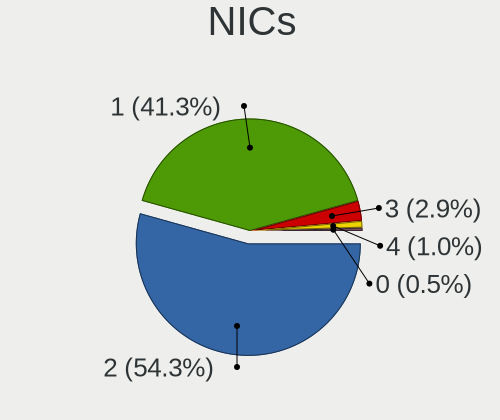

| Total | Computers | Percent |
|-------|-----------|---------|
| 2     | 107       | 58.79%  |
| 1     | 59        | 32.42%  |
| 3     | 6         | 3.3%    |
| 4     | 4         | 2.2%    |
| 0     | 4         | 2.2%    |
| 8     | 1         | 0.55%   |
| 5     | 1         | 0.55%   |

IPv6
----

IPv6 vs IPv4

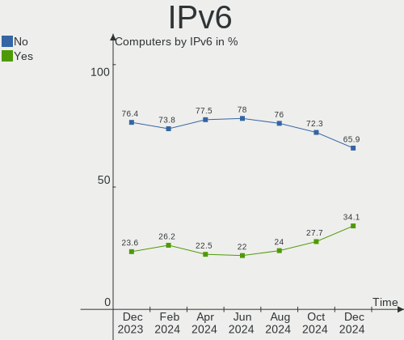

| Used | Computers | Percent |
|------|-----------|---------|
| No   | 141       | 77.47%  |
| Yes  | 41        | 22.53%  |

Bluetooth
---------

Bluetooth Vendor
----------------

Controller vendors

| Vendor                          | Computers | Percent |
|---------------------------------|-----------|---------|
| Intel                           | 76        | 56.72%  |
| Apple                           | 13        | 9.7%    |
| Realtek Semiconductor           | 8         | 5.97%   |
| MediaTek                        | 7         | 5.22%   |
| IMC Networks                    | 6         | 4.48%   |
| Foxconn / Hon Hai               | 4         | 2.99%   |
| Broadcom                        | 4         | 2.99%   |
| Dell                            | 3         | 2.24%   |
| Cambridge Silicon Radio         | 3         | 2.24%   |
| Qualcomm Atheros Communications | 2         | 1.49%   |
| Lite-On Technology              | 2         | 1.49%   |
| ASUSTek Computer                | 2         | 1.49%   |
| TP-Link                         | 1         | 0.75%   |
| Marvell Semiconductor           | 1         | 0.75%   |
| Edimax Technology               | 1         | 0.75%   |
| Actions                         | 1         | 0.75%   |

Bluetooth Model
---------------

Controller models

| Model                                                 | Computers | Percent |
|-------------------------------------------------------|-----------|---------|
| Intel AX201 Bluetooth                                 | 20        | 14.93%  |
| Intel Bluetooth Device                                | 12        | 8.96%   |
| Intel Bluetooth wireless interface                    | 11        | 8.21%   |
| Intel AX200 Bluetooth                                 | 10        | 7.46%   |
| Apple Bluetooth Host Controller                       | 8         | 5.97%   |
| MediaTek Wireless_Device                              | 7         | 5.22%   |
| Realtek Bluetooth Radio                               | 6         | 4.48%   |
| Intel AX211 Bluetooth                                 | 6         | 4.48%   |
| Intel Wireless-AC 9260 Bluetooth Adapter              | 4         | 2.99%   |
| Intel Wireless-AC 3168 Bluetooth                      | 4         | 2.99%   |
| Intel AX210 Bluetooth                                 | 4         | 2.99%   |
| Intel Bluetooth 9460/9560 Jefferson Peak (JfP)        | 3         | 2.24%   |
| IMC Networks Wireless_Device                          | 3         | 2.24%   |
| Cambridge Silicon Radio Bluetooth Dongle (HCI mode)   | 3         | 2.24%   |
| Intel Centrino Bluetooth Wireless Transceiver         | 2         | 1.49%   |
| IMC Networks BCM20702A0                               | 2         | 1.49%   |
| Foxconn / Hon Hai MediaTek Bluetooth Adapter          | 2         | 1.49%   |
| Apple Built-in Bluetooth 2.0+EDR HCI                  | 2         | 1.49%   |
| Apple Bluetooth USB Host Controller                   | 2         | 1.49%   |
| TP-Link UB500 Adapter                                 | 1         | 0.75%   |
| Realtek RTL8822BE Bluetooth 4.2 Adapter               | 1         | 0.75%   |
| Realtek  Bluetooth 4.2 Adapter                        | 1         | 0.75%   |
| Qualcomm Atheros  Bluetooth Device                    | 1         | 0.75%   |
| Qualcomm Atheros AR3011 Bluetooth                     | 1         | 0.75%   |
| Marvell Bluetooth and Wireless LAN Composite          | 1         | 0.75%   |
| Lite-On Qualcomm Atheros QCA9377 Bluetooth            | 1         | 0.75%   |
| Lite-On Atheros AR3012 Bluetooth                      | 1         | 0.75%   |
| IMC Networks Bluetooth Radio                          | 1         | 0.75%   |
| Foxconn / Hon Hai Wireless_Device                     | 1         | 0.75%   |
| Foxconn / Hon Hai Broadcom BCM20702 Bluetooth         | 1         | 0.75%   |
| Edimax Edimax Bluetooth Adapter                       | 1         | 0.75%   |
| Dell Wireless 370 Bluetooth Mini-card                 | 1         | 0.75%   |
| Dell DW375 Bluetooth Module                           | 1         | 0.75%   |
| Dell Broadcom BCM20702A0 Bluetooth                    | 1         | 0.75%   |
| Broadcom HP Portable Valentine                        | 1         | 0.75%   |
| Broadcom BCM43142 Bluetooth 4.0                       | 1         | 0.75%   |
| Broadcom BCM20702 Bluetooth 4.0 [ThinkPad]            | 1         | 0.75%   |
| Broadcom BCM2045B (BDC-2.1)                           | 1         | 0.75%   |
| ASUS BT-253 Bluetooth Adapter                         | 1         | 0.75%   |
| ASUS Broadcom BCM20702 Single-Chip Bluetooth 4.0 + LE | 1         | 0.75%   |

Sound
-----

Sound Vendor
------------

Sound card vendors

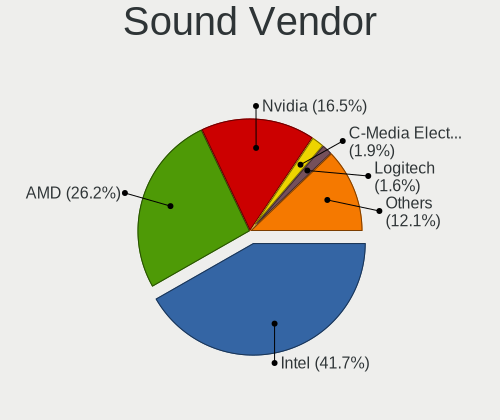

| Vendor                   | Computers | Percent |
|--------------------------|-----------|---------|
| Intel                    | 128       | 47.58%  |
| AMD                      | 55        | 20.45%  |
| Nvidia                   | 52        | 19.33%  |
| Logitech                 | 8         | 2.97%   |
| C-Media Electronics      | 4         | 1.49%   |
| Creative Labs            | 3         | 1.12%   |
| Micro Star International | 2         | 0.74%   |
| GN Netcom                | 2         | 0.74%   |
| Corsair                  | 2         | 0.74%   |
| Shure                    | 1         | 0.37%   |
| RODE Microphones         | 1         | 0.37%   |
| NAD Electronics          | 1         | 0.37%   |
| KTMicro                  | 1         | 0.37%   |
| Hewlett-Packard          | 1         | 0.37%   |
| Giga-Byte Technology     | 1         | 0.37%   |
| Focusrite-Novation       | 1         | 0.37%   |
| FIFINE 683 Microphone    | 1         | 0.37%   |
| Ensoniq                  | 1         | 0.37%   |
| Creative Technology      | 1         | 0.37%   |
| Cambridge Silicon Radio  | 1         | 0.37%   |
| Bose                     | 1         | 0.37%   |
| BEHRINGER International  | 1         | 0.37%   |

Sound Model
-----------

Sound card models

| Model                                                                      | Computers | Percent |
|----------------------------------------------------------------------------|-----------|---------|
| AMD Family 17h/19h HD Audio Controller                                     | 17        | 5.36%   |
| Intel Sunrise Point-LP HD Audio                                            | 12        | 3.79%   |
| AMD Starship/Matisse HD Audio Controller                                   | 11        | 3.47%   |
| Intel Tiger Lake-H HD Audio Controller                                     | 10        | 3.15%   |
| Intel 7 Series/C216 Chipset Family High Definition Audio Controller        | 10        | 3.15%   |
| Nvidia Audio device                                                        | 9         | 2.84%   |
| Intel 8 Series/C220 Series Chipset High Definition Audio Controller        | 9         | 2.84%   |
| Intel Xeon E3-1200 v3/4th Gen Core Processor HD Audio Controller           | 8         | 2.52%   |
| Intel Haswell-ULT HD Audio Controller                                      | 8         | 2.52%   |
| Intel 8 Series HD Audio Controller                                         | 8         | 2.52%   |
| Intel 100 Series/C230 Series Chipset Family HD Audio Controller            | 8         | 2.52%   |
| AMD Renoir Radeon High Definition Audio Controller                         | 8         | 2.52%   |
| Nvidia GA104 High Definition Audio Controller                              | 7         | 2.21%   |
| Intel Tiger Lake-LP Smart Sound Technology Audio Controller                | 7         | 2.21%   |
| AMD Rembrandt Radeon High Definition Audio Controller                      | 7         | 2.21%   |
| Nvidia TU106 High Definition Audio Controller                              | 6         | 1.89%   |
| Intel Cannon Lake PCH cAVS                                                 | 6         | 1.89%   |
| Intel 82801I (ICH9 Family) HD Audio Controller                             | 6         | 1.89%   |
| Intel Raptor Lake-P/U/H cAVS                                               | 5         | 1.58%   |
| Intel Comet Lake PCH cAVS                                                  | 5         | 1.58%   |
| AMD SBx00 Azalia (Intel HDA)                                               | 5         | 1.58%   |
| AMD Navi 21/23 HDMI/DP Audio Controller                                    | 5         | 1.58%   |
| Nvidia GM107 High Definition Audio Controller [GeForce 940MX]              | 4         | 1.26%   |
| Intel Alder Lake PCH-P High Definition Audio Controller                    | 4         | 1.26%   |
| AMD Ellesmere HDMI Audio [Radeon RX 470/480 / 570/580/590]                 | 4         | 1.26%   |
| AMD Baffin HDMI/DP Audio [Radeon RX 550 640SP / RX 560/560X]               | 4         | 1.26%   |
| Nvidia GP107GL High Definition Audio Controller                            | 3         | 0.95%   |
| Nvidia GP106 High Definition Audio Controller                              | 3         | 0.95%   |
| Nvidia GA106 High Definition Audio Controller                              | 3         | 0.95%   |
| Intel C610/X99 series chipset HD Audio Controller                          | 3         | 0.95%   |
| Intel 82801JI (ICH10 Family) HD Audio Controller                           | 3         | 0.95%   |
| Intel 6 Series/C200 Series Chipset Family High Definition Audio Controller | 3         | 0.95%   |
| Intel 5 Series/3400 Series Chipset High Definition Audio                   | 3         | 0.95%   |
| C-Media Electronics Blue Snowball                                          | 3         | 0.95%   |
| AMD FCH Azalia Controller                                                  | 3         | 0.95%   |
| AMD Family 17h (Models 00h-0fh) HD Audio Controller                        | 3         | 0.95%   |
| Nvidia TU107 GeForce GTX 1650 High Definition Audio Controller             | 2         | 0.63%   |
| Nvidia MCP79 High Definition Audio                                         | 2         | 0.63%   |
| Nvidia High Definition Audio Controller                                    | 2         | 0.63%   |
| Nvidia GP104 High Definition Audio Controller                              | 2         | 0.63%   |

Memory
------

Memory Vendor
-------------

Memory module vendors

| Vendor                                  | Computers | Percent |
|-----------------------------------------|-----------|---------|
| Samsung Electronics                     | 31        | 26.96%  |
| SK hynix                                | 25        | 21.74%  |
| Micron Technology                       | 11        | 9.57%   |
| Kingston                                | 11        | 9.57%   |
| Corsair                                 | 9         | 7.83%   |
| G.Skill                                 | 5         | 4.35%   |
| Crucial                                 | 5         | 4.35%   |
| Unknown                                 | 4         | 3.48%   |
| A-DATA Technology                       | 4         | 3.48%   |
| Unknown (ABCD)                          | 2         | 1.74%   |
| Elpida                                  | 2         | 1.74%   |
| Unknown                                 | 2         | 1.74%   |
| Timetec                                 | 1         | 0.87%   |
| Team                                    | 1         | 0.87%   |
| Silicon Power Computer & Communications | 1         | 0.87%   |
| Hewlett-Packard                         | 1         | 0.87%   |

Memory Model
------------

Memory module models

| Model                                                            | Computers | Percent |
|------------------------------------------------------------------|-----------|---------|
| Unknown RAM Module 2GB DIMM DDR2 800MT/s                         | 2         | 1.6%    |
| SK hynix RAM HMT451S6BFR8A-PB 4GB SODIMM DDR3 1600MT/s           | 2         | 1.6%    |
| SK hynix RAM HMT41GS6BFR8A-PB 8GB SODIMM DDR3 1600MT/s           | 2         | 1.6%    |
| SK hynix RAM HMT41GS6AFR8A-PB 8GB SODIMM DDR3 1600MT/s           | 2         | 1.6%    |
| Samsung RAM M471B5173DB0-YK0 4GB SODIMM DDR3 1600MT/s            | 2         | 1.6%    |
| Samsung RAM M471B1G73QH0-YK0 8GB SODIMM DDR3 1600MT/s            | 2         | 1.6%    |
| Samsung RAM M471A1K43EB1-CWE 8GB SODIMM DDR4 3200MT/s            | 2         | 1.6%    |
| Micron RAM MT53E1G32D4NQ-046 8GB Row Of Chips LPDDR4 4267MT/s    | 2         | 1.6%    |
| Kingston RAM KF3200C20S4/32GX 32GB SODIMM DDR4 3200MT/s          | 2         | 1.6%    |
| Unknown                                                          | 2         | 1.6%    |
| Unknown RAM Module 4GB SODIMM DDR3                               | 1         | 0.8%    |
| Unknown RAM Module 2048MB DIMM DDR 800MT/s                       | 1         | 0.8%    |
| Unknown (ABCD) RAM 123456789012345678 4GB DIMM DDR4 2400MT/s     | 1         | 0.8%    |
| Unknown (ABCD) RAM 123456789012345678 2GB SODIMM LPDDR4 2400MT/s | 1         | 0.8%    |
| Timetec RAM Module 8GB SODIMM DDR3 1333MT/s                      | 1         | 0.8%    |
| Team RAM TEAMGROUP-SD4-3200 16384MB SODIMM DDR4 3200MT/s         | 1         | 0.8%    |
| SK hynix RAM Module 4GB SODIMM DDR3 1600MT/s                     | 1         | 0.8%    |
| SK hynix RAM HYMP125S64CP8-S6 2GB SODIMM DDR2 975MT/s            | 1         | 0.8%    |
| SK hynix RAM HMT451S6CFR6A-PB 4GB SODIMM DDR3 1600MT/s           | 1         | 0.8%    |
| SK hynix RAM HMT42GR7AFR4C-RD 16GB DIMM DDR3                     | 1         | 0.8%    |
| SK hynix RAM HMT351S6EFR8A-PB 4GB SODIMM DDR3 1600MT/s           | 1         | 0.8%    |
| SK hynix RAM HMT351S6BFR8C-H9 4GB SODIMM DDR3 1333MT/s           | 1         | 0.8%    |
| SK hynix RAM HMT351R7EFR4A-H9 4GB DIMM DDR3 1333MT/s             | 1         | 0.8%    |
| SK hynix RAM HMT351R7CFR4A-H9 4GB DIMM DDR3 1333MT/s             | 1         | 0.8%    |
| SK hynix RAM HMCG78AEBSA095N 16GB SODIMM 4800MT/s                | 1         | 0.8%    |
| SK hynix RAM HMAA1GS6CMR6N-XN 8GB Row Of Chips DDR4 3200MT/s     | 1         | 0.8%    |
| SK hynix RAM HMAA1GS6CMR6N-VK 8GB SODIMM DDR4 2667MT/s           | 1         | 0.8%    |
| SK hynix RAM HMAA1GS6CJR6N-XN 8GB Row Of Chips DDR4 3200MT/s     | 1         | 0.8%    |
| SK hynix RAM HMA851S6JJR6N-VK 4GB SODIMM DDR4 2667MT/s           | 1         | 0.8%    |
| SK hynix RAM HMA851S6DJR6N-XN 4GB SODIMM DDR4 3200MT/s           | 1         | 0.8%    |
| SK hynix RAM HMA851S6AFR6N-UH 4GB SODIMM DDR4 2667MT/s           | 1         | 0.8%    |
| SK hynix RAM HMA82GS6CJR8N-VK 16GB SODIMM DDR4 2667MT/s          | 1         | 0.8%    |
| SK hynix RAM HMA81GS6CJR8N-XN 8GB SODIMM DDR4 3200MT/s           | 1         | 0.8%    |
| SK hynix RAM HMA81GS6AFR8N-UH 8GB SODIMM DDR4 2667MT/s           | 1         | 0.8%    |
| SK hynix RAM HMA81GR7AFR8N-VK 8GB DIMM DDR4 2666MT/s             | 1         | 0.8%    |
| SK hynix RAM HMA81GR7AFR8N-UH 8GB DIMM DDR4 2400MT/s             | 1         | 0.8%    |
| SK hynix RAM HMA41GS6AFR8N-TF 8GB SODIMM DDR4 2667MT/s           | 1         | 0.8%    |
| SK hynix RAM H9CCNNNBJTALAR-NUD 4GB Row Of Chips LPDDR3 1867MT/s | 1         | 0.8%    |
| Silicon Power & RAM Module 8GB DIMM DDR4 2667MT/s                | 1         | 0.8%    |
| Samsung RAM Module 8192MB SODIMM DDR4 2133MT/s                   | 1         | 0.8%    |

Memory Kind
-----------

Memory module kinds

| Kind   | Computers | Percent |
|--------|-----------|---------|
| DDR4   | 49        | 48.04%  |
| DDR3   | 26        | 25.49%  |
| DDR5   | 8         | 7.84%   |
| LPDDR4 | 7         | 6.86%   |
| DDR2   | 5         | 4.9%    |
| LPDDR5 | 3         | 2.94%   |
| SDRAM  | 1         | 0.98%   |
| LPDDR3 | 1         | 0.98%   |
| DRAM   | 1         | 0.98%   |
| DDR    | 1         | 0.98%   |

Memory Form Factor
------------------

Physical design of the memory module

| Name         | Computers | Percent |
|--------------|-----------|---------|
| SODIMM       | 53        | 51.96%  |
| DIMM         | 37        | 36.27%  |
| Row Of Chips | 10        | 9.8%    |
| FB-DIMM      | 1         | 0.98%   |
| Chip         | 1         | 0.98%   |

Memory Size
-----------

Memory module size

| Size  | Computers | Percent |
|-------|-----------|---------|
| 8192  | 45        | 40.91%  |
| 16384 | 24        | 21.82%  |
| 4096  | 22        | 20%     |
| 2048  | 10        | 9.09%   |
| 32768 | 9         | 8.18%   |

Memory Speed
------------

Memory module speed

| Speed   | Computers | Percent |
|---------|-----------|---------|
| 3200    | 19        | 16.96%  |
| 1600    | 17        | 15.18%  |
| 2667    | 11        | 9.82%   |
| 3600    | 7         | 6.25%   |
| 2400    | 7         | 6.25%   |
| 6400    | 4         | 3.57%   |
| 4800    | 4         | 3.57%   |
| 4267    | 4         | 3.57%   |
| 2133    | 3         | 2.68%   |
| 1867    | 3         | 2.68%   |
| 1866    | 3         | 2.68%   |
| 1333    | 3         | 2.68%   |
| 800     | 3         | 2.68%   |
| 5600    | 2         | 1.79%   |
| 3800    | 2         | 1.79%   |
| 3400    | 2         | 1.79%   |
| 3266    | 2         | 1.79%   |
| 2933    | 2         | 1.79%   |
| 975     | 2         | 1.79%   |
| Unknown | 2         | 1.79%   |
| 8400    | 1         | 0.89%   |
| 6000    | 1         | 0.89%   |
| 4333    | 1         | 0.89%   |
| 3000    | 1         | 0.89%   |
| 2666    | 1         | 0.89%   |
| 1800    | 1         | 0.89%   |
| 1639    | 1         | 0.89%   |
| 1334    | 1         | 0.89%   |
| 1067    | 1         | 0.89%   |
| 667     | 1         | 0.89%   |

Printers & scanners
-------------------

Printer Vendor
--------------

Printer device vendors

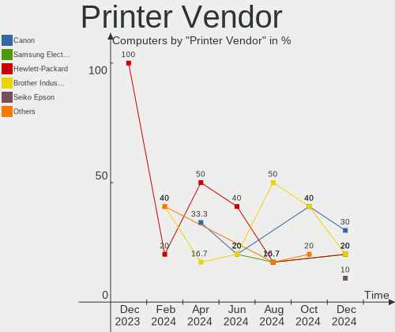

| Vendor             | Computers | Percent |
|--------------------|-----------|---------|
| Hewlett-Packard    | 3         | 50%     |
| Canon              | 2         | 33.33%  |
| Brother Industries | 1         | 16.67%  |

Printer Model
-------------

Printer device models

| Model                | Computers | Percent |
|----------------------|-----------|---------|
| HP LaserJet 1018     | 1         | 16.67%  |
| HP ENVY 5000 series  | 1         | 16.67%  |
| HP Deskjet 3050A     | 1         | 16.67%  |
| Canon PRO-100 series | 1         | 16.67%  |
| Canon MF3010         | 1         | 16.67%  |
| Brother Printer      | 1         | 16.67%  |

Scanner Vendor
--------------

Scanner device vendors

| Vendor | Computers | Percent |
|--------|-----------|---------|
| Canon  | 3         | 100%    |

Scanner Model
-------------

Scanner device models

| Model                   | Computers | Percent |
|-------------------------|-----------|---------|
| Canon CanoScan LiDE 120 | 2         | 66.67%  |
| Canon CanoScan LiDE 220 | 1         | 33.33%  |

Camera
------

Camera Vendor
-------------

Camera device vendors

| Vendor                                 | Computers | Percent |
|----------------------------------------|-----------|---------|
| Chicony Electronics                    | 24        | 21.82%  |
| IMC Networks                           | 9         | 8.18%   |
| Apple                                  | 9         | 8.18%   |
| Logitech                               | 8         | 7.27%   |
| Microdia                               | 7         | 6.36%   |
| Bison Electronics                      | 6         | 5.45%   |
| Sunplus Innovation Technology          | 5         | 4.55%   |
| Luxvisions Innotech Limited            | 5         | 4.55%   |
| Suyin                                  | 4         | 3.64%   |
| Acer                                   | 4         | 3.64%   |
| Lite-On Technology                     | 3         | 2.73%   |
| Syntek                                 | 2         | 1.82%   |
| Sonix Technology                       | 2         | 1.82%   |
| Realtek Semiconductor                  | 2         | 1.82%   |
| Quanta                                 | 2         | 1.82%   |
| icSpring                               | 2         | 1.82%   |
| Generalplus Technology                 | 2         | 1.82%   |
| ValueHD                                | 1         | 0.91%   |
| Samsung Electronics                    | 1         | 0.91%   |
| Ricoh                                  | 1         | 0.91%   |
| Microsoft                              | 1         | 0.91%   |
| MacroSilicon                           | 1         | 0.91%   |
| Linux Foundation                       | 1         | 0.91%   |
| lihappe8                               | 1         | 0.91%   |
| Lenovo                                 | 1         | 0.91%   |
| KYE Systems (Mouse Systems)            | 1         | 0.91%   |
| eMeet                                  | 1         | 0.91%   |
| Cubeternet                             | 1         | 0.91%   |
| Cheng Uei Precision Industry (Foxlink) | 1         | 0.91%   |
| ARC International                      | 1         | 0.91%   |
| 2M UVC CAMERA                          | 1         | 0.91%   |

Camera Model
------------

Camera device models

| Model                                         | Computers | Percent |
|-----------------------------------------------|-----------|---------|
| IMC Networks USB2.0 HD UVC WebCam             | 7         | 6.36%   |
| Chicony Integrated Camera                     | 6         | 5.45%   |
| Microdia Integrated_Webcam_HD                 | 3         | 2.73%   |
| Luxvisions Innotech Limited Integrated Camera | 3         | 2.73%   |
| Chicony Integrated Camera (1280x720@30)       | 3         | 2.73%   |
| Bison Integrated Camera                       | 3         | 2.73%   |
| Apple FaceTime HD Camera (Built-in)           | 3         | 2.73%   |
| Apple Built-in iSight                         | 3         | 2.73%   |
| Acer Integrated Camera                        | 3         | 2.73%   |
| Sunplus Integrated_Webcam_HD                  | 2         | 1.82%   |
| Sonix USB2.0 HD UVC WebCam                    | 2         | 1.82%   |
| Logitech Webcam C930e                         | 2         | 1.82%   |
| Logitech Logi Webcam C920e                    | 2         | 1.82%   |
| Lite-On Integrated Camera                     | 2         | 1.82%   |
| IMC Networks Integrated Camera                | 2         | 1.82%   |
| icSpring camera                               | 2         | 1.82%   |
| Generalplus CAMERA - UVC                      | 2         | 1.82%   |
| Chicony USB2.0 VGA UVC WebCam                 | 2         | 1.82%   |
| Chicony USB2.0 HD UVC WebCam                  | 2         | 1.82%   |
| Chicony HP HD Camera                          | 2         | 1.82%   |
| Apple FaceTime HD Camera                      | 2         | 1.82%   |
| ValueHD Avaya HC020                           | 1         | 0.91%   |
| Syntek Lenovo EasyCamera                      | 1         | 0.91%   |
| Syntek Integrated Camera                      | 1         | 0.91%   |
| Suyin WebCam                                  | 1         | 0.91%   |
| Suyin UVC 1.3MPixel WebCam                    | 1         | 0.91%   |
| Suyin HP Truevision HD                        | 1         | 0.91%   |
| Suyin HD WebCam                               | 1         | 0.91%   |
| Sunplus Laptop Integrated Webcam HD           | 1         | 0.91%   |
| Sunplus HD WebCam                             | 1         | 0.91%   |
| Sunplus Dell E5570 integrated webcam          | 1         | 0.91%   |
| Samsung Galaxy series, misc. (MTP mode)       | 1         | 0.91%   |
| Ricoh Integrated Webcam                       | 1         | 0.91%   |
| Realtek USB Camera                            | 1         | 0.91%   |
| Realtek Integrated Camera                     | 1         | 0.91%   |
| Quanta HD User Facing                         | 1         | 0.91%   |
| Quanta HD Camera                              | 1         | 0.91%   |
| Microsoft LifeCam VX-5000                     | 1         | 0.91%   |
| Microdia USB 2.0 Camera                       | 1         | 0.91%   |
| Microdia Sonix Integrated Webcam              | 1         | 0.91%   |

Security
--------

Fingerprint Vendor
------------------

Fingerprint sensor vendors

| Vendor                     | Computers | Percent |
|----------------------------|-----------|---------|
| Validity Sensors           | 10        | 45.45%  |
| Synaptics                  | 8         | 36.36%  |
| AuthenTec                  | 2         | 9.09%   |
| Shenzhen Goodix Technology | 1         | 4.55%   |
| LighTuning Technology      | 1         | 4.55%   |

Fingerprint Model
-----------------

Fingerprint sensor models

| Model                                                                      | Computers | Percent |
|----------------------------------------------------------------------------|-----------|---------|
| Synaptics Prometheus MIS Touch Fingerprint Reader                          | 4         | 18.18%  |
| Validity Sensors Synaptics WBDI                                            | 3         | 13.64%  |
| Validity Sensors VFS 5011 fingerprint sensor                               | 2         | 9.09%   |
| Validity Sensors Synaptics VFS7552 Touch Fingerprint Sensor with PurePrint | 2         | 9.09%   |
| Validity Sensors VFS495 Fingerprint Reader                                 | 1         | 4.55%   |
| Validity Sensors VFS491                                                    | 1         | 4.55%   |
| Validity Sensors Fingerprint scanner                                       | 1         | 4.55%   |
| Synaptics WBDI                                                             | 1         | 4.55%   |
| Synaptics Metallica MOH Touch Fingerprint Reader                           | 1         | 4.55%   |
| Synaptics Metallica MIS Touch Fingerprint Reader                           | 1         | 4.55%   |
| Synaptics FS7604 Touch Fingerprint Sensor with PurePrint                   | 1         | 4.55%   |
| Shenzhen Goodix Fingerprint Reader                                         | 1         | 4.55%   |
| LighTuning EgisTec Touch Fingerprint Sensor                                | 1         | 4.55%   |
| AuthenTec AES2810                                                          | 1         | 4.55%   |
| AuthenTec AES1600                                                          | 1         | 4.55%   |

Chipcard Vendor
---------------

Chipcard module vendors

| Vendor      | Computers | Percent |
|-------------|-----------|---------|
| Broadcom    | 2         | 50%     |
| Lenovo      | 1         | 25%     |
| Alcor Micro | 1         | 25%     |

Chipcard Model
--------------

Chipcard module models

| Model                                                                        | Computers | Percent |
|------------------------------------------------------------------------------|-----------|---------|
| Lenovo Integrated Smart Card Reader                                          | 1         | 25%     |
| Broadcom BCM5880 Secure Applications Processor with fingerprint swipe sensor | 1         | 25%     |
| Broadcom BCM5880 Secure Applications Processor                               | 1         | 25%     |
| Alcor Micro AU9540 Smartcard Reader                                          | 1         | 25%     |

Unsupported
-----------

Unsupported Devices
-------------------

Total unsupported devices on board

| Total | Computers | Percent |
|-------|-----------|---------|
| 0     | 128       | 70.33%  |
| 1     | 43        | 23.63%  |
| 2     | 9         | 4.95%   |
| 3     | 2         | 1.1%    |

Unsupported Device Types
------------------------

Types of unsupported devices

| Type                     | Computers | Percent |
|--------------------------|-----------|---------|
| Fingerprint reader       | 22        | 34.92%  |
| Graphics card            | 13        | 20.63%  |
| Net/wireless             | 9         | 14.29%  |
| Multimedia controller    | 5         | 7.94%   |
| Unassigned class         | 3         | 4.76%   |
| Communication controller | 3         | 4.76%   |
| Camera                   | 3         | 4.76%   |
| Chipcard                 | 2         | 3.17%   |
| Storage/nvme             | 1         | 1.59%   |
| Storage                  | 1         | 1.59%   |
| Net/ethernet             | 1         | 1.59%   |

