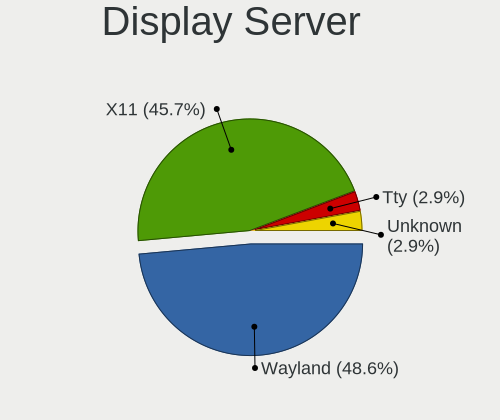
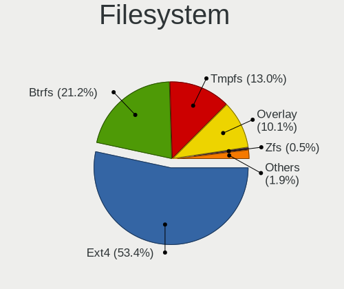
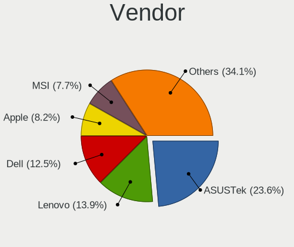
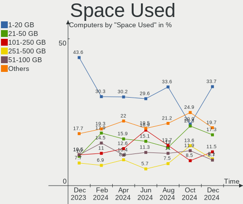
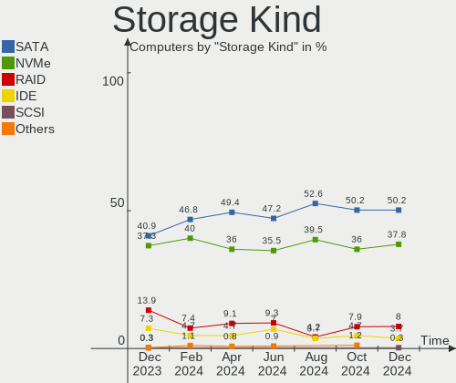
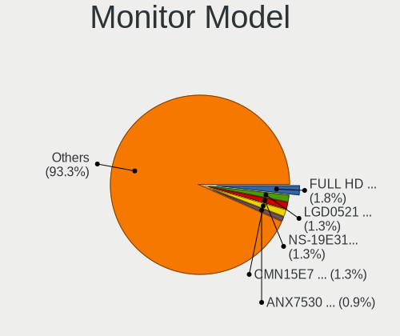
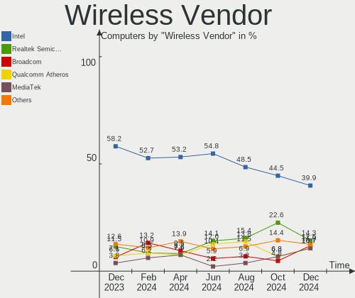
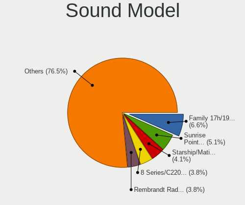
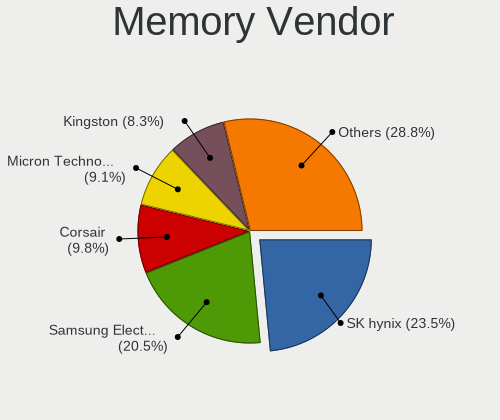
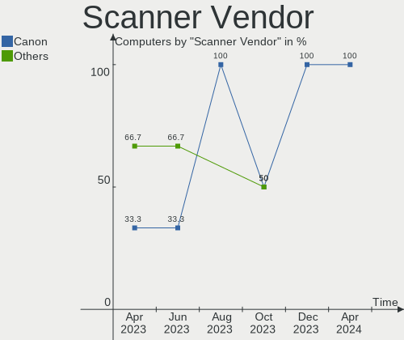

Linux in Canada - Hardware Trends
---------------------------------

A project to identify most popular hardware characteristics and track their change
over time based on data collected by Linux users at https://Linux-Hardware.org.

Anyone can contribute to this report by the [hw-probe](https://github.com/linuxhw/hw-probe) tool:

    sudo -E hw-probe -all -upload

This is a report for all computer types. See also reports for [desktops](/Location/Canada/Desktop/README.md) and [notebooks](/Location/Canada/Notebook/README.md).

Contents
--------

* [ System ](#system)
  - [ OS                       ](#os)
  - [ OS Family                ](#os-family)
  - [ Kernel                   ](#kernel)
  - [ Kernel Family            ](#kernel-family)
  - [ Kernel Major Ver.        ](#kernel-major-ver)
  - [ Arch                     ](#arch)
  - [ DE                       ](#de)
  - [ Display Server           ](#display-server)
  - [ Display Manager          ](#display-manager)
  - [ OS Lang                  ](#os-lang)
  - [ Boot Mode                ](#boot-mode)
  - [ Filesystem               ](#filesystem)
  - [ Part. scheme             ](#part-scheme)
  - [ Dual Boot with Linux/BSD ](#dual-boot-with-linuxbsd)
  - [ Dual Boot (Win)          ](#dual-boot-win)

* [ Board ](#board)
  - [ Vendor                   ](#vendor)
  - [ Model                    ](#model)
  - [ Model Family             ](#model-family)
  - [ MFG Year                 ](#mfg-year)
  - [ Form Factor              ](#form-factor)
  - [ Secure Boot              ](#secure-boot)
  - [ Coreboot                 ](#coreboot)
  - [ RAM Size                 ](#ram-size)
  - [ RAM Used                 ](#ram-used)
  - [ Total Drives             ](#total-drives)
  - [ Has CD-ROM               ](#has-cd-rom)
  - [ Has Ethernet             ](#has-ethernet)
  - [ Has WiFi                 ](#has-wifi)
  - [ Has Bluetooth            ](#has-bluetooth)

* [ Location ](#location)
  - [ Country                  ](#country)
  - [ City                     ](#city)

* [ Drives ](#drives)
  - [ Drive Vendor             ](#drive-vendor)
  - [ Drive Model              ](#drive-model)
  - [ HDD Vendor               ](#hdd-vendor)
  - [ SSD Vendor               ](#ssd-vendor)
  - [ Drive Kind               ](#drive-kind)
  - [ Drive Connector          ](#drive-connector)
  - [ Drive Size               ](#drive-size)
  - [ Space Total              ](#space-total)
  - [ Space Used               ](#space-used)
  - [ Malfunc. Drives          ](#malfunc-drives)
  - [ Malfunc. Drive Vendor    ](#malfunc-drive-vendor)
  - [ Malfunc. HDD Vendor      ](#malfunc-hdd-vendor)
  - [ Malfunc. Drive Kind      ](#malfunc-drive-kind)
  - [ Failed Drives            ](#failed-drives)
  - [ Failed Drive Vendor      ](#failed-drive-vendor)
  - [ Drive Status             ](#drive-status)

* [ Storage controller ](#storage-controller)
  - [ Storage Vendor           ](#storage-vendor)
  - [ Storage Model            ](#storage-model)
  - [ Storage Kind             ](#storage-kind)

* [ Processor ](#processor)
  - [ CPU Vendor               ](#cpu-vendor)
  - [ CPU Model                ](#cpu-model)
  - [ CPU Model Family         ](#cpu-model-family)
  - [ CPU Cores                ](#cpu-cores)
  - [ CPU Sockets              ](#cpu-sockets)
  - [ CPU Threads              ](#cpu-threads)
  - [ CPU Op-Modes             ](#cpu-op-modes)
  - [ CPU Microcode            ](#cpu-microcode)
  - [ CPU Microarch            ](#cpu-microarch)

* [ Graphics ](#graphics)
  - [ GPU Vendor               ](#gpu-vendor)
  - [ GPU Model                ](#gpu-model)
  - [ GPU Combo                ](#gpu-combo)
  - [ GPU Driver               ](#gpu-driver)
  - [ GPU Memory               ](#gpu-memory)

* [ Monitor ](#monitor)
  - [ Monitor Vendor           ](#monitor-vendor)
  - [ Monitor Model            ](#monitor-model)
  - [ Monitor Resolution       ](#monitor-resolution)
  - [ Monitor Diagonal         ](#monitor-diagonal)
  - [ Monitor Width            ](#monitor-width)
  - [ Aspect Ratio             ](#aspect-ratio)
  - [ Monitor Area             ](#monitor-area)
  - [ Pixel Density            ](#pixel-density)
  - [ Multiple Monitors        ](#multiple-monitors)

* [ Network ](#network)
  - [ Net Controller Vendor    ](#net-controller-vendor)
  - [ Net Controller Model     ](#net-controller-model)
  - [ Wireless Vendor          ](#wireless-vendor)
  - [ Wireless Model           ](#wireless-model)
  - [ Ethernet Vendor          ](#ethernet-vendor)
  - [ Ethernet Model           ](#ethernet-model)
  - [ Net Controller Kind      ](#net-controller-kind)
  - [ Used Controller          ](#used-controller)
  - [ NICs                     ](#nics)
  - [ IPv6                     ](#ipv6)

* [ Bluetooth ](#bluetooth)
  - [ Bluetooth Vendor         ](#bluetooth-vendor)
  - [ Bluetooth Model          ](#bluetooth-model)

* [ Sound ](#sound)
  - [ Sound Vendor             ](#sound-vendor)
  - [ Sound Model              ](#sound-model)

* [ Memory ](#memory)
  - [ Memory Vendor            ](#memory-vendor)
  - [ Memory Model             ](#memory-model)
  - [ Memory Kind              ](#memory-kind)
  - [ Memory Form Factor       ](#memory-form-factor)
  - [ Memory Size              ](#memory-size)
  - [ Memory Speed             ](#memory-speed)

* [ Printers & scanners ](#printers--scanners)
  - [ Printer Vendor           ](#printer-vendor)
  - [ Printer Model            ](#printer-model)
  - [ Scanner Vendor           ](#scanner-vendor)
  - [ Scanner Model            ](#scanner-model)

* [ Camera ](#camera)
  - [ Camera Vendor            ](#camera-vendor)
  - [ Camera Model             ](#camera-model)

* [ Security ](#security)
  - [ Fingerprint Vendor       ](#fingerprint-vendor)
  - [ Fingerprint Model        ](#fingerprint-model)
  - [ Chipcard Vendor          ](#chipcard-vendor)
  - [ Chipcard Model           ](#chipcard-model)

* [ Unsupported ](#unsupported)
  - [ Unsupported Devices      ](#unsupported-devices)
  - [ Unsupported Device Types ](#unsupported-device-types)

System
------

OS
--

Installed operating systems

| Name                         | Computers | Percent |
|------------------------------|-----------|---------|
| Ubuntu 22.04                 | 19        | 13.67%  |
| Linux Mint 20.3              | 12        | 8.63%   |
| Ubuntu 20.04                 | 10        | 7.19%   |
| OpenMandriva 4.3             | 8         | 5.76%   |
| Fedora 36                    | 8         | 5.76%   |
| Pop!_OS 22.04                | 7         | 5.04%   |
| Manjaro                      | 7         | 5.04%   |
| Zorin 16                     | 6         | 4.32%   |
| Debian 11                    | 5         | 3.6%    |
| Fedora 35                    | 3         | 2.16%   |
| Elementary 6.1               | 3         | 2.16%   |
| ArcoLinux Rolling            | 3         | 2.16%   |
| Arch                         | 3         | 2.16%   |
| Ubuntu 18.04                 | 2         | 1.44%   |
| Manjaro 21.2.6               | 2         | 1.44%   |
| Kubuntu 22.04                | 2         | 1.44%   |
| Kubuntu 11                   | 2         | 1.44%   |
| KDE neon 20.04               | 2         | 1.44%   |
| Garuda Linux                 | 2         | 1.44%   |
| EndeavourOS Rolling          | 2         | 1.44%   |
| Arch Rolling                 | 2         | 1.44%   |
| yiffOS 0.2.0-dev             | 1         | 0.72%   |
| Xubuntu 20.04                | 1         | 0.72%   |
| Xubuntu 16.04                | 1         | 0.72%   |
| Ubuntu MATE 20.04            | 1         | 0.72%   |
| Ubuntu 16.04                 | 1         | 0.72%   |
| SteamOS 3.1                  | 1         | 0.72%   |
| ROSA 12.2                    | 1         | 0.72%   |
| Raspbian 11                  | 1         | 0.72%   |
| Pop!_OS 21.10                | 1         | 0.72%   |
| openSUSE Tumbleweed-XXXXXXXX | 1         | 0.72%   |
| Manjaro-ARM 22.05            | 1         | 0.72%   |
| Makulu Build: 2021.12.15     | 1         | 0.72%   |
| Makulu 2020                  | 1         | 0.72%   |
| Lubuntu 22.04                | 1         | 0.72%   |
| LMDE 5                       | 1         | 0.72%   |
| LMDE 4                       | 1         | 0.72%   |
| Kubuntu 21.10                | 1         | 0.72%   |
| Kali 2022.1                  | 1         | 0.72%   |
| Kali 2021.4                  | 1         | 0.72%   |
| Gentoo 2.8                   | 1         | 0.72%   |
| Gentoo 2.6                   | 1         | 0.72%   |
| Garuda Linux Soaring         | 1         | 0.72%   |
| Endless 4.0.6                | 1         | 0.72%   |
| Endless 4.0.4                | 1         | 0.72%   |
| Debian Testing               | 1         | 0.72%   |
| Debian 10                    | 1         | 0.72%   |
| CentOS 7                     | 1         | 0.72%   |
| ArcoLinux                    | 1         | 0.72%   |
| Alpine 3.14.3                | 1         | 0.72%   |

OS Family
---------

OS without a version

| Name         | Computers | Percent |
|--------------|-----------|---------|
| Ubuntu       | 32        | 23.02%  |
| Linux Mint   | 12        | 8.63%   |
| Fedora       | 11        | 7.91%   |
| Manjaro      | 9         | 6.47%   |
| Pop!_OS      | 8         | 5.76%   |
| OpenMandriva | 8         | 5.76%   |
| Debian       | 7         | 5.04%   |
| Zorin        | 6         | 4.32%   |
| Kubuntu      | 5         | 3.6%    |
| Arch         | 5         | 3.6%    |
| ArcoLinux    | 4         | 2.88%   |
| Garuda Linux | 3         | 2.16%   |
| Elementary   | 3         | 2.16%   |
| Xubuntu      | 2         | 1.44%   |
| Makulu       | 2         | 1.44%   |
| LMDE         | 2         | 1.44%   |
| KDE neon     | 2         | 1.44%   |
| Kali         | 2         | 1.44%   |
| Gentoo       | 2         | 1.44%   |
| Endless      | 2         | 1.44%   |
| EndeavourOS  | 2         | 1.44%   |
| yiffOS       | 1         | 0.72%   |
| Ubuntu MATE  | 1         | 0.72%   |
| SteamOS      | 1         | 0.72%   |
| ROSA         | 1         | 0.72%   |
| Raspbian     | 1         | 0.72%   |
| openSUSE     | 1         | 0.72%   |
| Manjaro-ARM  | 1         | 0.72%   |
| Lubuntu      | 1         | 0.72%   |
| CentOS       | 1         | 0.72%   |
| Alpine       | 1         | 0.72%   |

Kernel
------

Version of the Linux kernel

| Version                                         | Computers | Percent |
|-------------------------------------------------|-----------|---------|
| 5.13.0-40-generic                               | 12        | 8.63%   |
| 5.15.0-30-generic                               | 9         | 6.47%   |
| 5.16.7-desktop-1omv4003                         | 8         | 5.76%   |
| 5.15.0-27-generic                               | 8         | 5.76%   |
| 5.13.0-41-generic                               | 6         | 4.32%   |
| 5.4.0-110-generic                               | 5         | 3.6%    |
| 5.17.5-76051705-generic                         | 5         | 3.6%    |
| 5.4.0-109-generic                               | 4         | 2.88%   |
| 5.17.9-arch1-1                                  | 4         | 2.88%   |
| 5.13.0-44-generic                               | 4         | 2.88%   |
| 5.17.9-zen1-1-zen                               | 3         | 2.16%   |
| 5.15.32-1-MANJARO                               | 3         | 2.16%   |
| 5.4.0-84-generic                                | 2         | 1.44%   |
| 5.4.0-113-generic                               | 2         | 1.44%   |
| 5.17.8-300.fc36.x86_64                          | 2         | 1.44%   |
| 5.17.8-051708-generic                           | 2         | 1.44%   |
| 5.17.6-arch1-1                                  | 2         | 1.44%   |
| 5.17.5-arch1-1                                  | 2         | 1.44%   |
| 5.17.11-300.fc36.x86_64                         | 2         | 1.44%   |
| 5.17.1-3-MANJARO                                | 2         | 1.44%   |
| 5.16.19-76051619-generic                        | 2         | 1.44%   |
| 5.15.38-1-MANJARO                               | 2         | 1.44%   |
| 5.15.35-1-pve                                   | 2         | 1.44%   |
| 5.11.0-35-generic                               | 2         | 1.44%   |
| 5.10.0-14-amd64                                 | 2         | 1.44%   |
| 5.10.0-13-amd64                                 | 2         | 1.44%   |
| 5.4.0-91-generic                                | 1         | 0.72%   |
| 5.4.0-100-generic                               | 1         | 0.72%   |
| 5.18.0-yiffOS                                   | 1         | 0.72%   |
| 5.18.0-rc7-x86_64-git-00119-gb015dcd62b86-dirty | 1         | 0.72%   |
| 5.18.0-rc7-4-MANJARO-ARM-RC                     | 1         | 0.72%   |
| 5.18.0-arch1-1                                  | 1         | 0.72%   |
| 5.17.9-300.fc36.x86_64                          | 1         | 0.72%   |
| 5.17.9-1-MANJARO                                | 1         | 0.72%   |
| 5.17.8-zen1-1-zen                               | 1         | 0.72%   |
| 5.17.7-1-default                                | 1         | 0.72%   |
| 5.17.6-300.fc36.x86_64                          | 1         | 0.72%   |
| 5.17.5-301.fsync.fc35.x86_64                    | 1         | 0.72%   |
| 5.17.5-300.fc36.x86_64                          | 1         | 0.72%   |
| 5.17.5-200.fc35.x86_64                          | 1         | 0.72%   |
| 5.17.4-200.fc35.x86_64                          | 1         | 0.72%   |
| 5.17.11-602.inttf.fc36.x86_64                   | 1         | 0.72%   |
| 5.17.0-kali1-amd64                              | 1         | 0.72%   |
| 5.17.0-1-amd64                                  | 1         | 0.72%   |
| 5.16.11-76051611-generic                        | 1         | 0.72%   |
| 5.15.43-1-lts                                   | 1         | 0.72%   |
| 5.15.36-xanmod1                                 | 1         | 0.72%   |
| 5.15.32-v7l+                                    | 1         | 0.72%   |
| 5.15.10-gentoo                                  | 1         | 0.72%   |
| 5.15.0-kali3-amd64                              | 1         | 0.72%   |
| 5.15.0-35-generic                               | 1         | 0.72%   |
| 5.15.0-32-generic                               | 1         | 0.72%   |
| 5.15.0-30-lowlatency                            | 1         | 0.72%   |
| 5.15.0-25-generic                               | 1         | 0.72%   |
| 5.13.19-2-MANJARO                               | 1         | 0.72%   |
| 5.13.0-valve10.3-1-neptune-02176-g5fe416c4acd8  | 1         | 0.72%   |
| 5.13.0-30-generic                               | 1         | 0.72%   |
| 5.11.0-41-generic                               | 1         | 0.72%   |
| 5.11.0-38-generic                               | 1         | 0.72%   |
| 5.10.74-generic-2rosa2021.1-x86_64              | 1         | 0.72%   |

Kernel Family
-------------

Linux kernel without a distro release

| Version  | Computers | Percent |
|----------|-----------|---------|
| 5.13.0   | 24        | 17.27%  |
| 5.15.0   | 22        | 15.83%  |
| 5.4.0    | 15        | 10.79%  |
| 5.17.5   | 10        | 7.19%   |
| 5.17.9   | 9         | 6.47%   |
| 5.16.7   | 8         | 5.76%   |
| 5.17.8   | 5         | 3.6%    |
| 5.18.0   | 4         | 2.88%   |
| 5.15.32  | 4         | 2.88%   |
| 5.11.0   | 4         | 2.88%   |
| 5.10.0   | 4         | 2.88%   |
| 5.17.6   | 3         | 2.16%   |
| 5.17.11  | 3         | 2.16%   |
| 5.17.1   | 2         | 1.44%   |
| 5.17.0   | 2         | 1.44%   |
| 5.16.19  | 2         | 1.44%   |
| 5.15.38  | 2         | 1.44%   |
| 5.15.35  | 2         | 1.44%   |
| 4.4.0    | 2         | 1.44%   |
| 4.19.0   | 2         | 1.44%   |
| 5.17.7   | 1         | 0.72%   |
| 5.17.4   | 1         | 0.72%   |
| 5.16.11  | 1         | 0.72%   |
| 5.15.43  | 1         | 0.72%   |
| 5.15.36  | 1         | 0.72%   |
| 5.15.10  | 1         | 0.72%   |
| 5.13.19  | 1         | 0.72%   |
| 5.10.74  | 1         | 0.72%   |
| 5.10.108 | 1         | 0.72%   |
| 3.10.0   | 1         | 0.72%   |

Kernel Major Ver.
-----------------

Linux kernel major version

| Version | Computers | Percent |
|---------|-----------|---------|
| 5.17    | 36        | 25.9%   |
| 5.15    | 33        | 23.74%  |
| 5.13    | 25        | 17.99%  |
| 5.4     | 15        | 10.79%  |
| 5.16    | 11        | 7.91%   |
| 5.10    | 6         | 4.32%   |
| 5.18    | 4         | 2.88%   |
| 5.11    | 4         | 2.88%   |
| 4.4     | 2         | 1.44%   |
| 4.19    | 2         | 1.44%   |
| 3.10    | 1         | 0.72%   |

Arch
----

OS architecture (x86_64, i586, etc.)

| Name    | Computers | Percent |
|---------|-----------|---------|
| x86_64  | 137       | 98.56%  |
| armv7l  | 1         | 0.72%   |
| aarch64 | 1         | 0.72%   |

DE
--

Desktop Environment

| Name            | Computers | Percent |
|-----------------|-----------|---------|
| GNOME           | 61        | 43.88%  |
| KDE5            | 34        | 24.46%  |
| X-Cinnamon      | 11        | 7.91%   |
| XFCE            | 10        | 7.19%   |
| Unknown         | 9         | 6.47%   |
| MATE            | 5         | 3.6%    |
| Pantheon        | 3         | 2.16%   |
| Unity           | 1         | 0.72%   |
| LXQt            | 1         | 0.72%   |
| LXDE            | 1         | 0.72%   |
| i3              | 1         | 0.72%   |
| GNOME Flashback | 1         | 0.72%   |
| Cinnamon        | 1         | 0.72%   |

Display Server
--------------

X11 or Wayland

| Name    | Computers | Percent |
|---------|-----------|---------|
| X11     | 108       | 77.7%   |
| Wayland | 22        | 15.83%  |
| Unknown | 5         | 3.6%    |
| Tty     | 4         | 2.88%   |

Display Manager
---------------

SDDM, LightDM, etc.

| Name    | Computers | Percent |
|---------|-----------|---------|
| Unknown | 64        | 46.04%  |
| GDM3    | 24        | 17.27%  |
| SDDM    | 21        | 15.11%  |
| GDM     | 15        | 10.79%  |
| LightDM | 14        | 10.07%  |
| Ly      | 1         | 0.72%   |

OS Lang
-------

Language

| Lang    | Computers | Percent |
|---------|-----------|---------|
| en_CA   | 79        | 56.83%  |
| en_US   | 45        | 32.37%  |
| fr_CA   | 5         | 3.6%    |
| C       | 4         | 2.88%   |
| Unknown | 2         | 1.44%   |
| ro_RO   | 1         | 0.72%   |
| POSIX   | 1         | 0.72%   |
| fr_FR   | 1         | 0.72%   |
| de_DE   | 1         | 0.72%   |

Boot Mode
---------

EFI or BIOS

| Mode | Computers | Percent |
|------|-----------|---------|
| BIOS | 70        | 50.36%  |
| EFI  | 69        | 49.64%  |

Filesystem
----------

Type of filesystem

| Type    | Computers | Percent |
|---------|-----------|---------|
| Ext4    | 105       | 75.54%  |
| Btrfs   | 21        | 15.11%  |
| Overlay | 10        | 7.19%   |
| Xfs     | 3         | 2.16%   |

Part. scheme
------------

Scheme of partitioning

| Type    | Computers | Percent |
|---------|-----------|---------|
| Unknown | 78        | 56.12%  |
| GPT     | 55        | 39.57%  |
| MBR     | 6         | 4.32%   |

Dual Boot with Linux/BSD
------------------------

Hosting more than one Linux/BSD

| Dual boot | Computers | Percent |
|-----------|-----------|---------|
| No        | 118       | 84.89%  |
| Yes       | 21        | 15.11%  |

Dual Boot (Win)
---------------

Hosting Linux and Windows

| Dual boot | Computers | Percent |
|-----------|-----------|---------|
| No        | 109       | 78.42%  |
| Yes       | 30        | 21.58%  |

Board
-----

Vendor
------

Motherboard manufacturer

| Name                    | Computers | Percent |
|-------------------------|-----------|---------|
| ASUSTek Computer        | 28        | 20.14%  |
| Dell                    | 27        | 19.42%  |
| Lenovo                  | 15        | 10.79%  |
| MSI                     | 13        | 9.35%   |
| Hewlett-Packard         | 12        | 8.63%   |
| Gigabyte Technology     | 10        | 7.19%   |
| Acer                    | 8         | 5.76%   |
| Apple                   | 5         | 3.6%    |
| Intel                   | 3         | 2.16%   |
| Alienware               | 3         | 2.16%   |
| Toshiba                 | 2         | 1.44%   |
| Fanless Mini PC         | 2         | 1.44%   |
| ASRock                  | 2         | 1.44%   |
| Unknown                 | 2         | 1.44%   |
| Valve                   | 1         | 0.72%   |
| Samsung Electronics     | 1         | 0.72%   |
| Raspberry Pi Foundation | 1         | 0.72%   |
| Pine Microsystems       | 1         | 0.72%   |
| Microsoft               | 1         | 0.72%   |
| Google                  | 1         | 0.72%   |
| A-DATA Technology       | 1         | 0.72%   |

Model
-----

Motherboard model

| Name                                       | Computers | Percent |
|--------------------------------------------|-----------|---------|
| MSI MS-7C91                                | 2         | 1.44%   |
| Fanless Mini PC Quieter2                   | 2         | 1.44%   |
| Dell XPS 15 9510                           | 2         | 1.44%   |
| Dell XPS 13 9310                           | 2         | 1.44%   |
| Unknown                                    | 2         | 1.44%   |
| Valve Jupiter                              | 1         | 0.72%   |
| Toshiba Satellite L655                     | 1         | 0.72%   |
| Toshiba Satellite C670D                    | 1         | 0.72%   |
| Samsung 950QCG                             | 1         | 0.72%   |
| RPi Raspberry Pi 4 Model B Rev 1.4         | 1         | 0.72%   |
| Pine Microsystems Pine64 RK3566 Quartz64-A | 1         | 0.72%   |
| MSI Stealth GS66 12UE                      | 1         | 0.72%   |
| MSI p7-1240                                | 1         | 0.72%   |
| MSI MS-7D52                                | 1         | 0.72%   |
| MSI MS-7B98                                | 1         | 0.72%   |
| MSI MS-7B86                                | 1         | 0.72%   |
| MSI MS-7B79                                | 1         | 0.72%   |
| MSI MS-7B33                                | 1         | 0.72%   |
| MSI MS-7A34                                | 1         | 0.72%   |
| MSI MS-7721                                | 1         | 0.72%   |
| MSI GS65 Stealth 8SG                       | 1         | 0.72%   |
| MSI GF75 Thin 9SC                          | 1         | 0.72%   |
| Microsoft Surface Laptop Go                | 1         | 0.72%   |
| Lenovo Yoga 7 16IAP7 82QG                  | 1         | 0.72%   |
| Lenovo Yoga 7 14ITL5 82BH                  | 1         | 0.72%   |
| Lenovo ThinkStation S30 43516Y7            | 1         | 0.72%   |
| Lenovo ThinkPad X131e 33691J6              | 1         | 0.72%   |
| Lenovo ThinkPad W520 42763JF               | 1         | 0.72%   |
| Lenovo ThinkPad T490 20N2CTO1WW            | 1         | 0.72%   |
| Lenovo ThinkPad T460s 20FAS0F400           | 1         | 0.72%   |
| Lenovo ThinkPad T440p 20AN00DEUS           | 1         | 0.72%   |
| Lenovo ThinkPad P15 Gen 1 20SUS5W400       | 1         | 0.72%   |
| Lenovo ThinkCentre M90p 5864AL2            | 1         | 0.72%   |
| Lenovo Legion 7 15IMH05 81YT               | 1         | 0.72%   |
| Lenovo IdeaPadFlex 6-14IKB 81EM            | 1         | 0.72%   |
| Lenovo IdeaPad 3 15IIL05 81WE              | 1         | 0.72%   |
| Lenovo IdeaPad 3 15ARE05 81W4              | 1         | 0.72%   |
| Lenovo Edge 15 80K9                        | 1         | 0.72%   |
| Intel S5520HC                              | 1         | 0.72%   |
| Intel S1200SP                              | 1         | 0.72%   |
| Intel DQ77MK AAG39642-400                  | 1         | 0.72%   |
| HP ZBook 15 G3                             | 1         | 0.72%   |
| HP Stream Laptop 11-ak1xxx                 | 1         | 0.72%   |
| HP Spectre x360 Convertible                | 1         | 0.72%   |
| HP ProLiant DL360e Gen8                    | 1         | 0.72%   |
| HP Pavilion g4                             | 1         | 0.72%   |
| HP OMEN 25L Desktop GT12-0xxx              | 1         | 0.72%   |
| HP Notebook                                | 1         | 0.72%   |
| HP Laptop 15-ef0xxx                        | 1         | 0.72%   |
| HP Laptop 15-bs0xx                         | 1         | 0.72%   |
| HP Compaq Elite 8300 USDT                  | 1         | 0.72%   |
| HP Compaq Elite 8300 SFF                   | 1         | 0.72%   |
| HP 700-249                                 | 1         | 0.72%   |
| Google Terra                               | 1         | 0.72%   |
| Gigabyte Z390 UD                           | 1         | 0.72%   |
| Gigabyte Z370P D3                          | 1         | 0.72%   |
| Gigabyte X570S AORUS MASTER                | 1         | 0.72%   |
| Gigabyte X570 AORUS MASTER                 | 1         | 0.72%   |
| Gigabyte X470 AORUS ULTRA GAMING           | 1         | 0.72%   |
| Gigabyte GA-78LMT-USB3                     | 1         | 0.72%   |

Model Family
------------

Motherboard model prefix

| Name                     | Computers | Percent |
|--------------------------|-----------|---------|
| Dell XPS                 | 9         | 6.47%   |
| Dell Latitude            | 8         | 5.76%   |
| Lenovo ThinkPad          | 6         | 4.32%   |
| ASUS ROG                 | 6         | 4.32%   |
| ASUS PRIME               | 5         | 3.6%    |
| Acer Aspire              | 5         | 3.6%    |
| Dell Inspiron            | 3         | 2.16%   |
| ASUS VivoBook            | 3         | 2.16%   |
| Toshiba Satellite        | 2         | 1.44%   |
| MSI MS-7C91              | 2         | 1.44%   |
| Lenovo Yoga              | 2         | 1.44%   |
| Lenovo IdeaPad           | 2         | 1.44%   |
| HP Laptop                | 2         | 1.44%   |
| HP Compaq                | 2         | 1.44%   |
| Fanless Mini PC Quieter2 | 2         | 1.44%   |
| Dell Vostro              | 2         | 1.44%   |
| Dell OptiPlex            | 2         | 1.44%   |
| Alienware m15            | 2         | 1.44%   |
| Unknown                  | 2         | 1.44%   |
| Valve Jupiter            | 1         | 0.72%   |
| Samsung 950QCG           | 1         | 0.72%   |
| RPi Raspberry            | 1         | 0.72%   |
| Pine Microsystems Pine64 | 1         | 0.72%   |
| MSI Stealth              | 1         | 0.72%   |
| MSI p7-1240              | 1         | 0.72%   |
| MSI MS-7D52              | 1         | 0.72%   |
| MSI MS-7B98              | 1         | 0.72%   |
| MSI MS-7B86              | 1         | 0.72%   |
| MSI MS-7B79              | 1         | 0.72%   |
| MSI MS-7B33              | 1         | 0.72%   |
| MSI MS-7A34              | 1         | 0.72%   |
| MSI MS-7721              | 1         | 0.72%   |
| MSI GS65                 | 1         | 0.72%   |
| MSI GF75                 | 1         | 0.72%   |
| Microsoft Surface        | 1         | 0.72%   |
| Lenovo ThinkStation      | 1         | 0.72%   |
| Lenovo ThinkCentre       | 1         | 0.72%   |
| Lenovo Legion            | 1         | 0.72%   |
| Lenovo IdeaPadFlex       | 1         | 0.72%   |
| Lenovo Edge              | 1         | 0.72%   |
| Intel S5520HC            | 1         | 0.72%   |
| Intel S1200SP            | 1         | 0.72%   |
| Intel DQ77MK             | 1         | 0.72%   |
| HP ZBook                 | 1         | 0.72%   |
| HP Stream                | 1         | 0.72%   |
| HP Spectre               | 1         | 0.72%   |
| HP ProLiant              | 1         | 0.72%   |
| HP Pavilion              | 1         | 0.72%   |
| HP OMEN                  | 1         | 0.72%   |
| HP Notebook              | 1         | 0.72%   |
| HP 700-249               | 1         | 0.72%   |
| Google Terra             | 1         | 0.72%   |
| Gigabyte Z390            | 1         | 0.72%   |
| Gigabyte Z370P           | 1         | 0.72%   |
| Gigabyte X570S           | 1         | 0.72%   |
| Gigabyte X570            | 1         | 0.72%   |
| Gigabyte X470            | 1         | 0.72%   |
| Gigabyte GA-78LMT-USB3   | 1         | 0.72%   |
| Gigabyte B75M-HD3        | 1         | 0.72%   |
| Gigabyte B550            | 1         | 0.72%   |

MFG Year
--------

Motherboard manufacture year

| Year    | Computers | Percent |
|---------|-----------|---------|
| 2020    | 23        | 16.55%  |
| 2021    | 20        | 14.39%  |
| 2018    | 13        | 9.35%   |
| 2012    | 13        | 9.35%   |
| 2019    | 10        | 7.19%   |
| 2016    | 9         | 6.47%   |
| 2010    | 8         | 5.76%   |
| 2011    | 7         | 5.04%   |
| 2022    | 6         | 4.32%   |
| 2017    | 6         | 4.32%   |
| 2015    | 6         | 4.32%   |
| 2013    | 5         | 3.6%    |
| 2014    | 4         | 2.88%   |
| 2008    | 3         | 2.16%   |
| 2007    | 3         | 2.16%   |
| Unknown | 2         | 1.44%   |
| 2009    | 1         | 0.72%   |

Form Factor
-----------

Physical design of the computer

| Name           | Computers | Percent |
|----------------|-----------|---------|
| Notebook       | 67        | 48.2%   |
| Desktop        | 52        | 37.41%  |
| Convertible    | 8         | 5.76%   |
| All in one     | 4         | 2.88%   |
| Server         | 3         | 2.16%   |
| System on chip | 2         | 1.44%   |
| Mini pc        | 2         | 1.44%   |
| Tablet         | 1         | 0.72%   |

Secure Boot
-----------

Enabled or disabled

| State    | Computers | Percent |
|----------|-----------|---------|
| Disabled | 131       | 94.24%  |
| Enabled  | 8         | 5.76%   |

Coreboot
--------

Have coreboot on board

| Used | Computers | Percent |
|------|-----------|---------|
| No   | 138       | 99.28%  |
| Yes  | 1         | 0.72%   |

RAM Size
--------

Total RAM memory

| Size in GB  | Computers | Percent |
|-------------|-----------|---------|
| 16.01-24.0  | 38        | 27.34%  |
| 4.01-8.0    | 24        | 17.27%  |
| 8.01-16.0   | 22        | 15.83%  |
| 3.01-4.0    | 20        | 14.39%  |
| 32.01-64.0  | 19        | 13.67%  |
| 64.01-256.0 | 10        | 7.19%   |
| 24.01-32.0  | 3         | 2.16%   |
| 1.01-2.0    | 2         | 1.44%   |
| 2.01-3.0    | 1         | 0.72%   |

RAM Used
--------

Used RAM memory

| Used GB    | Computers | Percent |
|------------|-----------|---------|
| 1.01-2.0   | 38        | 27.34%  |
| 2.01-3.0   | 31        | 22.3%   |
| 3.01-4.0   | 26        | 18.71%  |
| 4.01-8.0   | 22        | 15.83%  |
| 8.01-16.0  | 11        | 7.91%   |
| 0.51-1.0   | 7         | 5.04%   |
| 24.01-32.0 | 2         | 1.44%   |
| 32.01-64.0 | 1         | 0.72%   |
| 0.01-0.5   | 1         | 0.72%   |

Total Drives
------------

Number of drives on board

| Drives | Computers | Percent |
|--------|-----------|---------|
| 1      | 69        | 49.64%  |
| 2      | 46        | 33.09%  |
| 3      | 9         | 6.47%   |
| 4      | 8         | 5.76%   |
| 6      | 4         | 2.88%   |
| 5      | 2         | 1.44%   |
| 10     | 1         | 0.72%   |

Has CD-ROM
----------

Has CD-ROM on board

| Presented | Computers | Percent |
|-----------|-----------|---------|
| No        | 92        | 66.19%  |
| Yes       | 47        | 33.81%  |

Has Ethernet
------------

Has Ethernet on board

| Presented | Computers | Percent |
|-----------|-----------|---------|
| Yes       | 111       | 79.86%  |
| No        | 28        | 20.14%  |

Has WiFi
--------

Has WiFi module

| Presented | Computers | Percent |
|-----------|-----------|---------|
| Yes       | 106       | 76.26%  |
| No        | 33        | 23.74%  |

Has Bluetooth
-------------

Has Bluetooth module

| Presented | Computers | Percent |
|-----------|-----------|---------|
| Yes       | 97        | 69.78%  |
| No        | 42        | 30.22%  |

Location
--------

Country
-------

Geographic location (country)

| Country | Computers | Percent |
|---------|-----------|---------|
| Canada  | 139       | 100%    |

City
----

Geographic location (city)

| City               | Computers | Percent |
|--------------------|-----------|---------|
| Toronto            | 13        | 9.35%   |
| Montreal           | 13        | 9.35%   |
| Vancouver          | 11        | 7.91%   |
| Calgary            | 7         | 5.04%   |
| Québec            | 5         | 3.6%    |
| Saskatoon          | 4         | 2.88%   |
| Regina             | 4         | 2.88%   |
| Surrey             | 3         | 2.16%   |
| Ottawa             | 3         | 2.16%   |
| Mississauga        | 3         | 2.16%   |
| Halifax            | 3         | 2.16%   |
| Edmonton           | 3         | 2.16%   |
| Burnaby            | 3         | 2.16%   |
| Brampton           | 3         | 2.16%   |
| Winnipeg           | 2         | 1.44%   |
| Victoria           | 2         | 1.44%   |
| Spruce Grove       | 2         | 1.44%   |
| Sidney             | 2         | 1.44%   |
| Oakville           | 2         | 1.44%   |
| North Vancouver    | 2         | 1.44%   |
| Laval              | 2         | 1.44%   |
| Hamilton           | 2         | 1.44%   |
| Beauharnois        | 2         | 1.44%   |
| Whistler           | 1         | 0.72%   |
| Weyburn            | 1         | 0.72%   |
| Victoriaville      | 1         | 0.72%   |
| Vermilion          | 1         | 0.72%   |
| Tidnish Bridge     | 1         | 0.72%   |
| Smiths Falls       | 1         | 0.72%   |
| Saint John         | 1         | 0.72%   |
| Richmond           | 1         | 0.72%   |
| Red Deer           | 1         | 0.72%   |
| Qualicum Beach     | 1         | 0.72%   |
| Port Hawkesbury    | 1         | 0.72%   |
| Port Coquitlam     | 1         | 0.72%   |
| Pickering          | 1         | 0.72%   |
| Nipigon            | 1         | 0.72%   |
| New Westminster    | 1         | 0.72%   |
| New Glasgow        | 1         | 0.72%   |
| Nelson             | 1         | 0.72%   |
| Napierville        | 1         | 0.72%   |
| Moncton            | 1         | 0.72%   |
| Milton             | 1         | 0.72%   |
| Meadow Creek       | 1         | 0.72%   |
| Markham            | 1         | 0.72%   |
| Manitouwadge       | 1         | 0.72%   |
| Lower Sackville    | 1         | 0.72%   |
| London             | 1         | 0.72%   |
| L'Ancienne-Lorette | 1         | 0.72%   |
| Kitchener          | 1         | 0.72%   |
| Kirkland           | 1         | 0.72%   |
| Kinburn            | 1         | 0.72%   |
| Kelowna            | 1         | 0.72%   |
| Kanata             | 1         | 0.72%   |
| Joliette           | 1         | 0.72%   |
| Glenwood           | 1         | 0.72%   |
| Georgetown         | 1         | 0.72%   |
| Gatineau           | 1         | 0.72%   |
| Elliot Lake        | 1         | 0.72%   |
| Delta              | 1         | 0.72%   |

Drives
------

Drive Vendor
------------

Hard drive vendors

| Vendor              | Computers | Drives | Percent |
|---------------------|-----------|--------|---------|
| Samsung Electronics | 42        | 54     | 18.67%  |
| WDC                 | 41        | 55     | 18.22%  |
| Seagate             | 29        | 39     | 12.89%  |
| SanDisk             | 13        | 14     | 5.78%   |
| Toshiba             | 12        | 12     | 5.33%   |
| Unknown             | 11        | 13     | 4.89%   |
| Kingston            | 11        | 12     | 4.89%   |
| Intel               | 8         | 8      | 3.56%   |
| Hitachi             | 8         | 8      | 3.56%   |
| SK Hynix            | 6         | 6      | 2.67%   |
| Phison              | 6         | 6      | 2.67%   |
| Micron Technology   | 5         | 5      | 2.22%   |
| HGST                | 4         | 5      | 1.78%   |
| KIOXIA              | 3         | 3      | 1.33%   |
| Crucial             | 3         | 3      | 1.33%   |
| Apple               | 3         | 3      | 1.33%   |
| Mushkin             | 2         | 2      | 0.89%   |
| A-DATA Technology   | 2         | 3      | 0.89%   |
| Unknown             | 2         | 2      | 0.89%   |
| USB3.0              | 1         | 1      | 0.44%   |
| USB 3.0             | 1         | 1      | 0.44%   |
| PLEXTOR             | 1         | 1      | 0.44%   |
| Patriot             | 1         | 1      | 0.44%   |
| OCZ-VERTEX2         | 1         | 1      | 0.44%   |
| OCZ                 | 1         | 1      | 0.44%   |
| KingSpec            | 1         | 1      | 0.44%   |
| KingFast            | 1         | 1      | 0.44%   |
| JMicron             | 1         | 1      | 0.44%   |
| Inateck             | 1         | 1      | 0.44%   |
| Gigabyte Technology | 1         | 1      | 0.44%   |
| FORESEE             | 1         | 1      | 0.44%   |
| China               | 1         | 1      | 0.44%   |
| AMicro              | 1         | 1      | 0.44%   |

Drive Model
-----------

Hard drive models

| Model                            | Computers | Percent |
|----------------------------------|-----------|---------|
| Kingston SA400S37240G 240GB SSD  | 7         | 2.75%   |
| Samsung NVMe SSD Drive 500GB     | 5         | 1.96%   |
| Toshiba DT01ACA200 2TB           | 4         | 1.57%   |
| Samsung SSD 850 EVO 250GB        | 4         | 1.57%   |
| Toshiba DT01ACA100 1TB           | 3         | 1.18%   |
| SK Hynix NVMe SSD Drive 512GB    | 3         | 1.18%   |
| Sandisk NVMe SSD Drive 500GB     | 3         | 1.18%   |
| Samsung NVMe SSD Drive 2TB       | 3         | 1.18%   |
| Phison NVMe SSD Drive 1TB        | 3         | 1.18%   |
| WDC WDS500G2B0A-00SM50 500GB SSD | 2         | 0.78%   |
| Unknown SD/MMC/MS PRO 999GB      | 2         | 0.78%   |
| Toshiba MQ01ABD100 1TB           | 2         | 0.78%   |
| Seagate ST8000DM004-2CX188 8TB   | 2         | 0.78%   |
| Seagate ST4000DM004-2CV104 4TB   | 2         | 0.78%   |
| Seagate Expansion 4TB            | 2         | 0.78%   |
| Sandisk NVMe SSD Drive 512GB     | 2         | 0.78%   |
| Sandisk NVMe SSD Drive 1TB       | 2         | 0.78%   |
| Samsung SSD 970 EVO Plus 500GB   | 2         | 0.78%   |
| Samsung SSD 970 EVO Plus 2TB     | 2         | 0.78%   |
| Samsung SSD 970 EVO Plus 1TB     | 2         | 0.78%   |
| Samsung NVMe SSD Drive 1TB       | 2         | 0.78%   |
| Samsung MZVLQ512HALU-00000 512GB | 2         | 0.78%   |
| Samsung MZVLB512HAJQ-00000 512GB | 2         | 0.78%   |
| Kingston SA400S37120G 120GB SSD  | 2         | 0.78%   |
| Crucial CT500MX500SSD1 500GB     | 2         | 0.78%   |
| Unknown                          | 2         | 0.78%   |
| WDC WDS500G2X0C-00L350 500GB     | 1         | 0.39%   |
| WDC WDS500G2B0B-00YS70 500GB SSD | 1         | 0.39%   |
| WDC WDS500G2B0B 500GB SSD        | 1         | 0.39%   |
| WDC WDS100T2B0B-00YS70 1TB SSD   | 1         | 0.39%   |
| WDC WDS100T2B0A-00SM50 1TB SSD   | 1         | 0.39%   |
| WDC WDS100T1X0E-00AFY0 1TB       | 1         | 0.39%   |
| WDC WDBRPG0010BNC-WRSN 1TB       | 1         | 0.39%   |
| WDC WDBNCE5000PNC 500GB SSD      | 1         | 0.39%   |
| WDC WDBNCE0010PNC 1TB SSD        | 1         | 0.39%   |
| WDC WD80EZAZ-11TDBA0 8TB         | 1         | 0.39%   |
| WDC WD800AAJS-00WAA0 80GB        | 1         | 0.39%   |
| WDC WD60EFRX-68MYMN1 6TB         | 1         | 0.39%   |
| WDC WD6003FZBX-00GXAB0 6TB       | 1         | 0.39%   |
| WDC WD6000HLHX-01JJPV0 600GB     | 1         | 0.39%   |
| WDC WD5001AALS-00L3B2 500GB      | 1         | 0.39%   |
| WDC WD5000AAKX-08U6AA0 500GB     | 1         | 0.39%   |
| WDC WD5000AAKS-65V0A0 500GB      | 1         | 0.39%   |
| WDC WD5000AAKS-00UU3A0 500GB     | 1         | 0.39%   |
| WDC WD5000AADS-00S9B0 500GB      | 1         | 0.39%   |
| WDC WD40EZRZ-00GXCB0 4TB         | 1         | 0.39%   |
| WDC WD3200BEVT-22ZCT0 320GB      | 1         | 0.39%   |
| WDC WD3200AAKS-00SBA0 320GB      | 1         | 0.39%   |
| WDC WD30EZRZ-00Z5HB0 3TB         | 1         | 0.39%   |
| WDC WD30EZRX-00D8PB0 3TB         | 1         | 0.39%   |
| WDC WD2500JS-22NCB1 250GB        | 1         | 0.39%   |
| WDC WD2500BEVT-00ZCT0 250GB      | 1         | 0.39%   |
| WDC WD20EZRX-00D8PB0 2TB         | 1         | 0.39%   |
| WDC WD20EARS-00MVWB0 2TB         | 1         | 0.39%   |
| WDC WD20EARS-00J2GB0 2TB         | 1         | 0.39%   |
| WDC WD2005FBYZ-01YCBB3 2TB       | 1         | 0.39%   |
| WDC WD2003FZEX-00Z4SA0 2TB       | 1         | 0.39%   |
| WDC WD2003FZEX-00SRLA0 2TB       | 1         | 0.39%   |
| WDC WD10SPZX-22Z10T1 1TB         | 1         | 0.39%   |
| WDC WD10JPVX-22JC3T0 1TB         | 1         | 0.39%   |

HDD Vendor
----------

Hard disk drive vendors

| Vendor              | Computers | Drives | Percent |
|---------------------|-----------|--------|---------|
| Seagate             | 27        | 36     | 32.53%  |
| WDC                 | 26        | 38     | 31.33%  |
| Toshiba             | 12        | 12     | 14.46%  |
| Hitachi             | 8         | 8      | 9.64%   |
| HGST                | 4         | 5      | 4.82%   |
| Unknown             | 2         | 2      | 2.41%   |
| USB3.0              | 1         | 1      | 1.2%    |
| USB 3.0             | 1         | 1      | 1.2%    |
| Samsung Electronics | 1         | 1      | 1.2%    |
| JMicron             | 1         | 1      | 1.2%    |

SSD Vendor
----------

Solid state drive vendors

| Vendor              | Computers | Drives | Percent |
|---------------------|-----------|--------|---------|
| Samsung Electronics | 15        | 20     | 23.44%  |
| Kingston            | 9         | 9      | 14.06%  |
| WDC                 | 8         | 8      | 12.5%   |
| Intel               | 6         | 6      | 9.38%   |
| SanDisk             | 5         | 6      | 7.81%   |
| Seagate             | 3         | 3      | 4.69%   |
| Apple               | 3         | 3      | 4.69%   |
| Mushkin             | 2         | 2      | 3.13%   |
| Micron Technology   | 2         | 2      | 3.13%   |
| Crucial             | 2         | 2      | 3.13%   |
| A-DATA Technology   | 2         | 3      | 3.13%   |
| PLEXTOR             | 1         | 1      | 1.56%   |
| Patriot             | 1         | 1      | 1.56%   |
| OCZ-VERTEX2         | 1         | 1      | 1.56%   |
| OCZ                 | 1         | 1      | 1.56%   |
| KingSpec            | 1         | 1      | 1.56%   |
| FORESEE             | 1         | 1      | 1.56%   |
| China               | 1         | 1      | 1.56%   |

Drive Kind
----------

HDD or SSD

| Kind    | Computers | Drives | Percent |
|---------|-----------|--------|---------|
| HDD     | 64        | 105    | 32.65%  |
| NVMe    | 62        | 76     | 31.63%  |
| SSD     | 57        | 71     | 29.08%  |
| MMC     | 10        | 12     | 5.1%    |
| Unknown | 3         | 3      | 1.53%   |

Drive Connector
---------------

SATA, SAS, NVMe, etc.

| Type | Computers | Drives | Percent |
|------|-----------|--------|---------|
| SATA | 94        | 159    | 51.65%  |
| NVMe | 62        | 76     | 34.07%  |
| SAS  | 16        | 20     | 8.79%   |
| MMC  | 10        | 12     | 5.49%   |

Drive Size
----------

Size of hard drive

| Size in TB | Computers | Drives | Percent |
|------------|-----------|--------|---------|
| 0.01-0.5   | 65        | 79     | 48.15%  |
| 0.51-1.0   | 37        | 54     | 27.41%  |
| 1.01-2.0   | 15        | 20     | 11.11%  |
| 4.01-10.0  | 7         | 10     | 5.19%   |
| 3.01-4.0   | 6         | 7      | 4.44%   |
| 2.01-3.0   | 4         | 5      | 2.96%   |
| 10.01-20.0 | 1         | 1      | 0.74%   |

Space Total
-----------

Amount of disk space available on the file system

| Size in GB     | Computers | Percent |
|----------------|-----------|---------|
| 251-500        | 33        | 23.74%  |
| 501-1000       | 24        | 17.27%  |
| 101-250        | 20        | 14.39%  |
| More than 3000 | 18        | 12.95%  |
| 1001-2000      | 16        | 11.51%  |
| 1-20           | 11        | 7.91%   |
| 51-100         | 7         | 5.04%   |
| 21-50          | 5         | 3.6%    |
| Unknown        | 3         | 2.16%   |
| 2001-3000      | 2         | 1.44%   |

Space Used
----------

Amount of used disk space

| Used GB        | Computers | Percent |
|----------------|-----------|---------|
| 1-20           | 38        | 27.34%  |
| 21-50          | 28        | 20.14%  |
| 251-500        | 16        | 11.51%  |
| 101-250        | 15        | 10.79%  |
| 51-100         | 15        | 10.79%  |
| 501-1000       | 9         | 6.47%   |
| More than 3000 | 6         | 4.32%   |
| 1001-2000      | 5         | 3.6%    |
| 2001-3000      | 4         | 2.88%   |
| Unknown        | 3         | 2.16%   |

Malfunc. Drives
---------------

Drive models with a malfunction

| Model                                 | Computers | Drives | Percent |
|---------------------------------------|-----------|--------|---------|
| WDC WD60EFRX-68MYMN1 6TB              | 1         | 1      | 5.56%   |
| WDC WD5001AALS-00L3B2 500GB           | 1         | 1      | 5.56%   |
| WDC WD5000AAKX-08U6AA0 500GB          | 1         | 1      | 5.56%   |
| WDC WD5000AAKS-65V0A0 500GB           | 1         | 1      | 5.56%   |
| WDC WD2500JS-22NCB1 250GB             | 1         | 1      | 5.56%   |
| WDC WD10EZEX-08M2NA0 1TB              | 1         | 1      | 5.56%   |
| WDC WD10EZEX-00KUWA0 1TB              | 1         | 1      | 5.56%   |
| Toshiba DT01ACA200 2TB                | 1         | 1      | 5.56%   |
| Seagate ST32000542AS 2TB              | 1         | 2      | 5.56%   |
| Seagate ST31500341AS 1TB              | 1         | 1      | 5.56%   |
| Seagate ST2000DX002-2DV164 2TB        | 1         | 1      | 5.56%   |
| Seagate ST1500DM003-9YN16G 1TB        | 1         | 1      | 5.56%   |
| Seagate ST1000LX015-1U7172 1TB        | 1         | 1      | 5.56%   |
| Seagate ST1000DM003-1ER162 1TB        | 1         | 2      | 5.56%   |
| Samsung Electronics SSD 970 EVO 500GB | 1         | 1      | 5.56%   |
| Intel SSDSCKKF256H6 SATA 256GB        | 1         | 1      | 5.56%   |
| Intel SSDSC2CT180A4 180GB             | 1         | 1      | 5.56%   |
| Hitachi HDS721010CLA332 1TB           | 1         | 1      | 5.56%   |

Malfunc. Drive Vendor
---------------------

Vendors of faulty drives

| Vendor              | Computers | Drives | Percent |
|---------------------|-----------|--------|---------|
| WDC                 | 6         | 7      | 35.29%  |
| Seagate             | 6         | 8      | 35.29%  |
| Intel               | 2         | 2      | 11.76%  |
| Toshiba             | 1         | 1      | 5.88%   |
| Samsung Electronics | 1         | 1      | 5.88%   |
| Hitachi             | 1         | 1      | 5.88%   |

Malfunc. HDD Vendor
-------------------

Vendors of faulty HDD drives

| Vendor  | Computers | Drives | Percent |
|---------|-----------|--------|---------|
| WDC     | 6         | 7      | 42.86%  |
| Seagate | 6         | 8      | 42.86%  |
| Toshiba | 1         | 1      | 7.14%   |
| Hitachi | 1         | 1      | 7.14%   |

Malfunc. Drive Kind
-------------------

Kinds of faulty drives

| Kind | Computers | Drives | Percent |
|------|-----------|--------|---------|
| HDD  | 12        | 17     | 80%     |
| SSD  | 2         | 2      | 13.33%  |
| NVMe | 1         | 1      | 6.67%   |

Failed Drives
-------------

Failed drive models

Zero info for selected period =(

Failed Drive Vendor
-------------------

Failed drive vendors

Zero info for selected period =(

Drive Status
------------

Number of failed and malfunc. drives

| Status   | Computers | Drives | Percent |
|----------|-----------|--------|---------|
| Detected | 94        | 166    | 58.02%  |
| Works    | 53        | 81     | 32.72%  |
| Malfunc  | 15        | 20     | 9.26%   |

Storage controller
------------------

Storage Vendor
--------------

Storage controller vendors

| Vendor                      | Computers | Percent |
|-----------------------------|-----------|---------|
| Intel                       | 76        | 40.64%  |
| AMD                         | 32        | 17.11%  |
| Samsung Electronics         | 31        | 16.58%  |
| Sandisk                     | 16        | 8.56%   |
| Phison Electronics          | 7         | 3.74%   |
| SK Hynix                    | 6         | 3.21%   |
| Micron Technology           | 3         | 1.6%    |
| KIOXIA                      | 3         | 1.6%    |
| Nvidia                      | 2         | 1.07%   |
| Marvell Technology Group    | 2         | 1.07%   |
| Kingston Technology Company | 2         | 1.07%   |
| ASMedia Technology          | 2         | 1.07%   |
| Unknown                     | 1         | 0.53%   |
| Micron/Crucial Technology   | 1         | 0.53%   |
| LSI Logic / Symbios Logic   | 1         | 0.53%   |
| JMicron Technology          | 1         | 0.53%   |
| Adaptec                     | 1         | 0.53%   |

Storage Model
-------------

Storage controller models

| Model                                                                          | Computers | Percent |
|--------------------------------------------------------------------------------|-----------|---------|
| AMD FCH SATA Controller [AHCI mode]                                            | 22        | 10.53%  |
| Samsung NVMe SSD Controller SM981/PM981/PM983                                  | 19        | 9.09%   |
| Intel Volume Management Device NVMe RAID Controller                            | 7         | 3.35%   |
| Sandisk WD Black SN750 / PC SN730 NVMe SSD                                     | 5         | 2.39%   |
| Samsung NVMe SSD Controller 980                                                | 5         | 2.39%   |
| SK Hynix Gold P31 SSD                                                          | 4         | 1.91%   |
| Intel Wildcat Point-LP SATA Controller [AHCI Mode]                             | 4         | 1.91%   |
| Intel Celeron/Pentium Silver Processor SATA Controller                         | 4         | 1.91%   |
| Intel Alder Lake-S PCH SATA Controller [AHCI Mode]                             | 4         | 1.91%   |
| Intel 8 Series/C220 Series Chipset Family 6-port SATA Controller 1 [AHCI mode] | 4         | 1.91%   |
| Intel 6 Series/C200 Series Chipset Family 6 port Mobile SATA AHCI Controller   | 4         | 1.91%   |
| Intel 5 Series/3400 Series Chipset 6 port SATA AHCI Controller                 | 4         | 1.91%   |
| Intel 200 Series PCH SATA controller [AHCI mode]                               | 4         | 1.91%   |
| AMD SB7x0/SB8x0/SB9x0 SATA Controller [AHCI mode]                              | 4         | 1.91%   |
| AMD 500 Series Chipset SATA Controller                                         | 4         | 1.91%   |
| AMD 400 Series Chipset SATA Controller                                         | 4         | 1.91%   |
| Sandisk WD Blue SN550 NVMe SSD                                                 | 3         | 1.44%   |
| Sandisk Non-Volatile memory controller                                         | 3         | 1.44%   |
| Samsung NVMe SSD Controller PM9A1/PM9A3/980PRO                                 | 3         | 1.44%   |
| Phison E12 NVMe Controller                                                     | 3         | 1.44%   |
| Micron Non-Volatile memory controller                                          | 3         | 1.44%   |
| KIOXIA Non-Volatile memory controller                                          | 3         | 1.44%   |
| Intel Sunrise Point-LP SATA Controller [AHCI mode]                             | 3         | 1.44%   |
| Intel SATA Controller [RAID mode]                                              | 3         | 1.44%   |
| Intel Cannon Lake PCH SATA AHCI Controller                                     | 3         | 1.44%   |
| Intel 82801 Mobile SATA Controller [RAID mode]                                 | 3         | 1.44%   |
| Intel 7 Series/C210 Series Chipset Family 6-port SATA Controller [AHCI mode]   | 3         | 1.44%   |
| Intel 7 Series Chipset Family 6-port SATA Controller [AHCI mode]               | 3         | 1.44%   |
| Sandisk WD PC SN810 / Black SN850 NVMe SSD                                     | 2         | 0.96%   |
| Sandisk WD Black 2018/SN750 / PC SN720 NVMe SSD                                | 2         | 0.96%   |
| Samsung NVMe SSD Controller SM961/PM961/SM963                                  | 2         | 0.96%   |
| Phison E16 PCIe4 NVMe Controller                                               | 2         | 0.96%   |
| Intel Q170/Q150/B150/H170/H110/Z170/CM236 Chipset SATA Controller [AHCI Mode]  | 2         | 0.96%   |
| Intel Ice Lake-LP SATA Controller [AHCI mode]                                  | 2         | 0.96%   |
| Intel Cannon Lake Mobile PCH SATA AHCI Controller                              | 2         | 0.96%   |
| Intel C600/X79 series chipset 6-Port SATA AHCI Controller                      | 2         | 0.96%   |
| Intel 82801JI (ICH10 Family) 4 port SATA IDE Controller #1                     | 2         | 0.96%   |
| Intel 82801JI (ICH10 Family) 2 port SATA IDE Controller #2                     | 2         | 0.96%   |
| Intel 82801HM/HEM (ICH8M/ICH8M-E) IDE Controller                               | 2         | 0.96%   |
| Intel 8 Series SATA Controller 1 [AHCI mode]                                   | 2         | 0.96%   |
| Intel 7 Series/C210 Series Chipset Family 4-port SATA Controller [IDE mode]    | 2         | 0.96%   |
| Intel 7 Series/C210 Series Chipset Family 2-port SATA Controller [IDE mode]    | 2         | 0.96%   |
| Intel 6 Series/C200 Series Chipset Family 6 port Desktop SATA AHCI Controller  | 2         | 0.96%   |
| Intel 5 Series/3400 Series Chipset 4 port SATA AHCI Controller                 | 2         | 0.96%   |
| ASMedia ASM1062 Serial ATA Controller                                          | 2         | 0.96%   |
| AMD SB7x0/SB8x0/SB9x0 IDE Controller                                           | 2         | 0.96%   |
| AMD 300 Series Chipset SATA Controller                                         | 2         | 0.96%   |
| Unknown Non-Volatile memory controller                                         | 1         | 0.48%   |
| SK Hynix PC401 NVMe Solid State Drive 256GB                                    | 1         | 0.48%   |
| SK Hynix BC511                                                                 | 1         | 0.48%   |
| Sandisk WD Blue SN570 NVMe SSD                                                 | 1         | 0.48%   |
| Samsung NVMe SSD Controller SM951/PM951                                        | 1         | 0.48%   |
| Samsung Electronics SATA controller                                            | 1         | 0.48%   |
| Samsung Apple PCIe SSD                                                         | 1         | 0.48%   |
| Phison PS5013 E13 NVMe Controller                                              | 1         | 0.48%   |
| Phison E7 NVMe Controller                                                      | 1         | 0.48%   |
| Nvidia MCP78S [GeForce 8200] IDE                                               | 1         | 0.48%   |
| Nvidia MCP78S [GeForce 8200] AHCI Controller                                   | 1         | 0.48%   |
| Nvidia MCP61 SATA Controller                                                   | 1         | 0.48%   |
| Nvidia MCP61 IDE                                                               | 1         | 0.48%   |

Storage Kind
------------

Kind of storage controller (IDE, SATA, NVMe, SAS, ...)

| Kind | Computers | Percent |
|------|-----------|---------|
| SATA | 93        | 50.54%  |
| NVMe | 62        | 33.7%   |
| RAID | 14        | 7.61%   |
| IDE  | 14        | 7.61%   |
| SAS  | 1         | 0.54%   |

Processor
---------

CPU Vendor
----------

Processor vendors

| Vendor | Computers | Percent |
|--------|-----------|---------|
| Intel  | 98        | 70.5%   |
| AMD    | 39        | 28.06%  |
| ARM    | 2         | 1.44%   |

CPU Model
---------

Processor models

| Model                                    | Computers | Percent |
|------------------------------------------|-----------|---------|
| Intel Core i7-3770 CPU @ 3.40GHz         | 3         | 2.16%   |
| AMD Ryzen 9 5900X 12-Core Processor      | 3         | 2.16%   |
| AMD Ryzen 5 5600X 6-Core Processor       | 3         | 2.16%   |
| Intel Core i7-8750H CPU @ 2.20GHz        | 2         | 1.44%   |
| Intel Core i7-8700K CPU @ 3.70GHz        | 2         | 1.44%   |
| Intel Core i7-4770 CPU @ 3.40GHz         | 2         | 1.44%   |
| Intel Core i7-10750H CPU @ 2.60GHz       | 2         | 1.44%   |
| Intel Core i7-1065G7 CPU @ 1.30GHz       | 2         | 1.44%   |
| Intel Celeron J4125 CPU @ 2.00GHz        | 2         | 1.44%   |
| Intel 12th Gen Core i7-12700K            | 2         | 1.44%   |
| Intel 11th Gen Core i7-1195G7 @ 2.90GHz  | 2         | 1.44%   |
| Intel 11th Gen Core i7-11800H @ 2.30GHz  | 2         | 1.44%   |
| AMD Ryzen 7 5800H with Radeon Graphics   | 2         | 1.44%   |
| Intel Xeon CPU E5620 @ 2.40GHz           | 1         | 0.72%   |
| Intel Xeon CPU E5450 @ 3.00GHz           | 1         | 0.72%   |
| Intel Xeon CPU E5-2430L 0 @ 2.00GHz      | 1         | 0.72%   |
| Intel Xeon CPU E5-1680 v2 @ 3.00GHz      | 1         | 0.72%   |
| Intel Xeon CPU E3-1270 v6 @ 3.80GHz      | 1         | 0.72%   |
| Intel Pentium Silver N5000 CPU @ 1.10GHz | 1         | 0.72%   |
| Intel Pentium CPU B940 @ 2.00GHz         | 1         | 0.72%   |
| Intel Genuine CPU U2700 @ 1.30GHz        | 1         | 0.72%   |
| Intel Core i9-9900K CPU @ 3.60GHz        | 1         | 0.72%   |
| Intel Core i9-8950HK CPU @ 2.90GHz       | 1         | 0.72%   |
| Intel Core i9-10885H CPU @ 2.40GHz       | 1         | 0.72%   |
| Intel Core i7-9750H CPU @ 2.60GHz        | 1         | 0.72%   |
| Intel Core i7-9700K CPU @ 3.60GHz        | 1         | 0.72%   |
| Intel Core i7-8550U CPU @ 1.80GHz        | 1         | 0.72%   |
| Intel Core i7-8500Y CPU @ 1.50GHz        | 1         | 0.72%   |
| Intel Core i7-7700HQ CPU @ 2.80GHz       | 1         | 0.72%   |
| Intel Core i7-6820HQ CPU @ 2.70GHz       | 1         | 0.72%   |
| Intel Core i7-6500U CPU @ 2.50GHz        | 1         | 0.72%   |
| Intel Core i7-5600U CPU @ 2.60GHz        | 1         | 0.72%   |
| Intel Core i7-4770HQ CPU @ 2.20GHz       | 1         | 0.72%   |
| Intel Core i7-4558U CPU @ 2.80GHz        | 1         | 0.72%   |
| Intel Core i7-3632QM CPU @ 2.20GHz       | 1         | 0.72%   |
| Intel Core i7-2670QM CPU @ 2.20GHz       | 1         | 0.72%   |
| Intel Core i7-2600 CPU @ 3.40GHz         | 1         | 0.72%   |
| Intel Core i7-10870H CPU @ 2.20GHz       | 1         | 0.72%   |
| Intel Core i7-10700F CPU @ 2.90GHz       | 1         | 0.72%   |
| Intel Core i7 CPU Q 740 @ 1.73GHz        | 1         | 0.72%   |
| Intel Core i7 CPU Q 720 @ 1.60GHz        | 1         | 0.72%   |
| Intel Core i7 CPU 950 @ 3.07GHz          | 1         | 0.72%   |
| Intel Core i5-9600K CPU @ 3.70GHz        | 1         | 0.72%   |
| Intel Core i5-9300H CPU @ 2.40GHz        | 1         | 0.72%   |
| Intel Core i5-8400 CPU @ 2.80GHz         | 1         | 0.72%   |
| Intel Core i5-8265U CPU @ 1.60GHz        | 1         | 0.72%   |
| Intel Core i5-8250U CPU @ 1.60GHz        | 1         | 0.72%   |
| Intel Core i5-7300U CPU @ 2.60GHz        | 1         | 0.72%   |
| Intel Core i5-7200U CPU @ 2.50GHz        | 1         | 0.72%   |
| Intel Core i5-6300U CPU @ 2.40GHz        | 1         | 0.72%   |
| Intel Core i5-5675R CPU @ 3.10GHz        | 1         | 0.72%   |
| Intel Core i5-5200U CPU @ 2.20GHz        | 1         | 0.72%   |
| Intel Core i5-4570R CPU @ 2.70GHz        | 1         | 0.72%   |
| Intel Core i5-4310M CPU @ 2.70GHz        | 1         | 0.72%   |
| Intel Core i5-4300M CPU @ 2.60GHz        | 1         | 0.72%   |
| Intel Core i5-3470S CPU @ 2.90GHz        | 1         | 0.72%   |
| Intel Core i5-2520M CPU @ 2.50GHz        | 1         | 0.72%   |
| Intel Core i5-2467M CPU @ 1.60GHz        | 1         | 0.72%   |
| Intel Core i5-2400 CPU @ 3.10GHz         | 1         | 0.72%   |
| Intel Core i5-1035G1 CPU @ 1.00GHz       | 1         | 0.72%   |

CPU Model Family
----------------

Processor model prefix

| Model                | Computers | Percent |
|----------------------|-----------|---------|
| Intel Core i7        | 31        | 22.3%   |
| Intel Core i5        | 20        | 14.39%  |
| Other                | 17        | 12.23%  |
| AMD Ryzen 5          | 10        | 7.19%   |
| Intel Core i3        | 9         | 6.47%   |
| AMD Ryzen 7          | 9         | 6.47%   |
| Intel Celeron        | 7         | 5.04%   |
| AMD Ryzen 9          | 6         | 4.32%   |
| Intel Xeon           | 5         | 3.6%    |
| Intel Core 2 Duo     | 4         | 2.88%   |
| Intel Core i9        | 3         | 2.16%   |
| AMD FX               | 2         | 1.44%   |
| AMD A4               | 2         | 1.44%   |
| AMD A10              | 2         | 1.44%   |
| Intel Pentium Silver | 1         | 0.72%   |
| Intel Pentium        | 1         | 0.72%   |
| Intel Genuine        | 1         | 0.72%   |
| Intel Atom           | 1         | 0.72%   |
| ARM BCM              | 1         | 0.72%   |
| AMD Phenom II X6     | 1         | 0.72%   |
| AMD E                | 1         | 0.72%   |
| AMD C-50             | 1         | 0.72%   |
| AMD Athlon II X3     | 1         | 0.72%   |
| AMD Athlon 64 X2     | 1         | 0.72%   |
| AMD A6               | 1         | 0.72%   |
| AMD A12              | 1         | 0.72%   |

CPU Cores
---------

Number of processor cores

| Number  | Computers | Percent |
|---------|-----------|---------|
| 4       | 47        | 33.81%  |
| 2       | 38        | 27.34%  |
| 8       | 19        | 13.67%  |
| 6       | 19        | 13.67%  |
| 12      | 7         | 5.04%   |
| 16      | 2         | 1.44%   |
| 14      | 2         | 1.44%   |
| 3       | 2         | 1.44%   |
| 1       | 2         | 1.44%   |
| Unknown | 1         | 0.72%   |

CPU Sockets
-----------

Number of sockets

| Number  | Computers | Percent |
|---------|-----------|---------|
| 1       | 137       | 98.56%  |
| 2       | 1         | 0.72%   |
| Unknown | 1         | 0.72%   |

CPU Threads
-----------

Threads per core (Hyper-Threading)

| Number  | Computers | Percent |
|---------|-----------|---------|
| 2       | 100       | 71.94%  |
| 1       | 38        | 27.34%  |
| Unknown | 1         | 0.72%   |

CPU Op-Modes
------------

CPU Operation Modes (32-bit, 64-bit)

| Op mode        | Computers | Percent |
|----------------|-----------|---------|
| 32-bit, 64-bit | 137       | 98.56%  |
| Unknown        | 2         | 1.44%   |

CPU Microcode
-------------

Microcode number

| Number     | Computers | Percent |
|------------|-----------|---------|
| Unknown    | 46        | 33.09%  |
| 0x906ea    | 7         | 5.04%   |
| 0x306a9    | 5         | 3.6%    |
| 0x206a7    | 5         | 3.6%    |
| 0x906a3    | 3         | 2.16%   |
| 0x806c2    | 3         | 2.16%   |
| 0x706e5    | 3         | 2.16%   |
| 0x306d4    | 3         | 2.16%   |
| 0xa0652    | 2         | 1.44%   |
| 0x906ed    | 2         | 1.44%   |
| 0x906e9    | 2         | 1.44%   |
| 0x90672    | 2         | 1.44%   |
| 0x806e9    | 2         | 1.44%   |
| 0x806c1    | 2         | 1.44%   |
| 0x406e3    | 2         | 1.44%   |
| 0x40661    | 2         | 1.44%   |
| 0x40651    | 2         | 1.44%   |
| 0x306c3    | 2         | 1.44%   |
| 0x106e5    | 2         | 1.44%   |
| 0x10676    | 2         | 1.44%   |
| 0x0a50000c | 2         | 1.44%   |
| 0x0a201205 | 2         | 1.44%   |
| 0x06001119 | 2         | 1.44%   |
| 0x06000852 | 2         | 1.44%   |
| 0xa0655    | 1         | 0.72%   |
| 0x906eb    | 1         | 0.72%   |
| 0x90675    | 1         | 0.72%   |
| 0x806eb    | 1         | 0.72%   |
| 0x806ea    | 1         | 0.72%   |
| 0x806d1    | 1         | 0.72%   |
| 0x706a8    | 1         | 0.72%   |
| 0x706a1    | 1         | 0.72%   |
| 0x6fb      | 1         | 0.72%   |
| 0x406c4    | 1         | 0.72%   |
| 0x40671    | 1         | 0.72%   |
| 0x206d7    | 1         | 0.72%   |
| 0x206c2    | 1         | 0.72%   |
| 0x20655    | 1         | 0.72%   |
| 0x106a5    | 1         | 0.72%   |
| 0x1067a    | 1         | 0.72%   |
| 0x0a20120a | 1         | 0.72%   |
| 0x0a201204 | 1         | 0.72%   |
| 0x0a201016 | 1         | 0.72%   |
| 0x0a201009 | 1         | 0.72%   |
| 0x08608103 | 1         | 0.72%   |
| 0x08600106 | 1         | 0.72%   |
| 0x08600102 | 1         | 0.72%   |
| 0x08101016 | 1         | 0.72%   |
| 0x0800820d | 1         | 0.72%   |
| 0x08001138 | 1         | 0.72%   |
| 0x08001105 | 1         | 0.72%   |
| 0x07030105 | 1         | 0.72%   |
| 0x0700010f | 1         | 0.72%   |
| 0x06006118 | 1         | 0.72%   |
| 0x05000028 | 1         | 0.72%   |
| 0x010000dc | 1         | 0.72%   |

CPU Microarch
-------------

Microarchitecture

| Name             | Computers | Percent |
|------------------|-----------|---------|
| KabyLake         | 20        | 14.39%  |
| Zen 3            | 13        | 9.35%   |
| IvyBridge        | 9         | 6.47%   |
| Haswell          | 8         | 5.76%   |
| Unknown          | 8         | 5.76%   |
| SandyBridge      | 7         | 5.04%   |
| TigerLake        | 5         | 3.6%    |
| Piledriver       | 5         | 3.6%    |
| IceLake          | 5         | 3.6%    |
| CometLake        | 5         | 3.6%    |
| Broadwell        | 5         | 3.6%    |
| Alderlake Hybrid | 5         | 3.6%    |
| Zen 2            | 4         | 2.88%   |
| Zen              | 4         | 2.88%   |
| Westmere         | 4         | 2.88%   |
| Skylake          | 4         | 2.88%   |
| Penryn           | 4         | 2.88%   |
| Nehalem          | 4         | 2.88%   |
| Goldmont plus    | 4         | 2.88%   |
| Zen+             | 3         | 2.16%   |
| Silvermont       | 3         | 2.16%   |
| K10              | 2         | 1.44%   |
| Core             | 2         | 1.44%   |
| Bobcat           | 2         | 1.44%   |
| Puma             | 1         | 0.72%   |
| K8 Hammer        | 1         | 0.72%   |
| Jaguar           | 1         | 0.72%   |
| Excavator        | 1         | 0.72%   |

Graphics
--------

GPU Vendor
----------

Vendors of graphics cards

| Vendor                     | Computers | Percent |
|----------------------------|-----------|---------|
| Intel                      | 69        | 43.67%  |
| Nvidia                     | 52        | 32.91%  |
| AMD                        | 35        | 22.15%  |
| Matrox Electronics Systems | 2         | 1.27%   |

GPU Model
---------

Graphics card models

| Model                                                                                    | Computers | Percent |
|------------------------------------------------------------------------------------------|-----------|---------|
| Intel TigerLake-LP GT2 [Iris Xe Graphics]                                                | 5         | 3.09%   |
| Intel CoffeeLake-H GT2 [UHD Graphics 630]                                                | 5         | 3.09%   |
| Intel 2nd Generation Core Processor Family Integrated Graphics Controller                | 5         | 3.09%   |
| Intel HD Graphics 5500                                                                   | 4         | 2.47%   |
| AMD Ellesmere [Radeon RX 470/480/570/570X/580/580X/590]                                  | 4         | 2.47%   |
| AMD Cezanne                                                                              | 4         | 2.47%   |
| Nvidia TU117M [GeForce GTX 1650 Mobile / Max-Q]                                          | 3         | 1.85%   |
| Nvidia GK208B [GeForce GT 710]                                                           | 3         | 1.85%   |
| Nvidia GA106M [GeForce RTX 3060 Mobile / Max-Q]                                          | 3         | 1.85%   |
| Nvidia GA104M [GeForce RTX 3070 Mobile / Max-Q]                                          | 3         | 1.85%   |
| Intel TigerLake-H GT1 [UHD Graphics]                                                     | 3         | 1.85%   |
| Intel Skylake GT2 [HD Graphics 520]                                                      | 3         | 1.85%   |
| Intel GeminiLake [UHD Graphics 600]                                                      | 3         | 1.85%   |
| Intel CoffeeLake-S GT2 [UHD Graphics 630]                                                | 3         | 1.85%   |
| Intel Alder Lake-P Integrated Graphics Controller                                        | 3         | 1.85%   |
| Intel 3rd Gen Core processor Graphics Controller                                         | 3         | 1.85%   |
| Nvidia TU117 [GeForce GTX 1650]                                                          | 2         | 1.23%   |
| Nvidia GP104 [GeForce GTX 1070]                                                          | 2         | 1.23%   |
| Nvidia GM204 [GeForce GTX 970]                                                           | 2         | 1.23%   |
| Nvidia GA107M [GeForce RTX 3050 Ti Mobile]                                               | 2         | 1.23%   |
| Intel Xeon E3-1200 v2/3rd Gen Core processor Graphics Controller                         | 2         | 1.23%   |
| Intel UHD Graphics 620                                                                   | 2         | 1.23%   |
| Intel Mobile 4 Series Chipset Integrated Graphics Controller                             | 2         | 1.23%   |
| Intel Iris Plus Graphics G7                                                              | 2         | 1.23%   |
| Intel Iris Plus Graphics G1 (Ice Lake)                                                   | 2         | 1.23%   |
| Intel HD Graphics 620                                                                    | 2         | 1.23%   |
| Intel Haswell-ULT Integrated Graphics Controller                                         | 2         | 1.23%   |
| Intel Core Processor Integrated Graphics Controller                                      | 2         | 1.23%   |
| Intel CometLake-H GT2 [UHD Graphics]                                                     | 2         | 1.23%   |
| Intel Atom/Celeron/Pentium Processor x5-E8000/J3xxx/N3xxx Integrated Graphics Controller | 2         | 1.23%   |
| Intel 4th Gen Core Processor Integrated Graphics Controller                              | 2         | 1.23%   |
| AMD Trinity [Radeon HD 7660D]                                                            | 2         | 1.23%   |
| AMD Renoir                                                                               | 2         | 1.23%   |
| AMD Navi 24 [Radeon RX 6400 / 6500 XT]                                                   | 2         | 1.23%   |
| Nvidia TU117GLM [Quadro T500 Mobile]                                                     | 1         | 0.62%   |
| Nvidia TU117GLM [Quadro T1000 Mobile]                                                    | 1         | 0.62%   |
| Nvidia TU106BM [GeForce RTX 2070 Mobile]                                                 | 1         | 0.62%   |
| Nvidia TU106 [GeForce RTX 2060 Rev. A]                                                   | 1         | 0.62%   |
| Nvidia TU104M [GeForce RTX 2080 Mobile]                                                  | 1         | 0.62%   |
| Nvidia TU104GLM [Quadro RTX 5000 Mobile / Max-Q]                                         | 1         | 0.62%   |
| Nvidia TU102 [GeForce RTX 2080 Ti Rev. A]                                                | 1         | 0.62%   |
| Nvidia GP108M [GeForce MX250]                                                            | 1         | 0.62%   |
| Nvidia GP107M [GeForce GTX 1050 Ti Mobile]                                               | 1         | 0.62%   |
| Nvidia GP107 [GeForce GTX 1050 Ti]                                                       | 1         | 0.62%   |
| Nvidia GP106 [GeForce GTX 1060 6GB]                                                      | 1         | 0.62%   |
| Nvidia GP106 [GeForce GTX 1060 3GB]                                                      | 1         | 0.62%   |
| Nvidia GP104BM [GeForce GTX 1070 Mobile]                                                 | 1         | 0.62%   |
| Nvidia GM108M [GeForce 840M]                                                             | 1         | 0.62%   |
| Nvidia GM107GLM [Quadro M1000M]                                                          | 1         | 0.62%   |
| Nvidia GM107 [GeForce GTX 750]                                                           | 1         | 0.62%   |
| Nvidia GM107 [GeForce GTX 750 Ti]                                                        | 1         | 0.62%   |
| Nvidia GK208 [GeForce GT 635]                                                            | 1         | 0.62%   |
| Nvidia GK104 [GeForce GTX 760]                                                           | 1         | 0.62%   |
| Nvidia GF116 [GeForce GTX 550 Ti]                                                        | 1         | 0.62%   |
| Nvidia GF110 [GeForce GTX 570]                                                           | 1         | 0.62%   |
| Nvidia GF108GLM [Quadro 1000M]                                                           | 1         | 0.62%   |
| Nvidia GF108 [GeForce GT 620]                                                            | 1         | 0.62%   |
| Nvidia GA106 [GeForce RTX 3060]                                                          | 1         | 0.62%   |
| Nvidia GA106 [GeForce RTX 3060 Lite Hash Rate]                                           | 1         | 0.62%   |
| Nvidia GA106 [Geforce RTX 3050]                                                          | 1         | 0.62%   |

GPU Combo
---------

Combinations of graphics cards

| Name           | Computers | Percent |
|----------------|-----------|---------|
| 1 x Intel      | 51        | 36.69%  |
| 1 x Nvidia     | 31        | 22.3%   |
| 1 x AMD        | 29        | 20.86%  |
| Intel + Nvidia | 16        | 11.51%  |
| AMD + Nvidia   | 3         | 2.16%   |
| Other          | 2         | 1.44%   |
| 2 x Nvidia     | 2         | 1.44%   |
| 2 x AMD        | 2         | 1.44%   |
| 1 x Matrox     | 2         | 1.44%   |
| Intel + AMD    | 1         | 0.72%   |

GPU Driver
----------

Free vs proprietary

| Driver      | Computers | Percent |
|-------------|-----------|---------|
| Free        | 92        | 66.19%  |
| Proprietary | 38        | 27.34%  |
| Unknown     | 9         | 6.47%   |

GPU Memory
----------

Total video memory

| Size in GB | Computers | Percent |
|------------|-----------|---------|
| Unknown    | 89        | 64.03%  |
| 3.01-4.0   | 10        | 7.19%   |
| 0.01-0.5   | 10        | 7.19%   |
| 0.51-1.0   | 8         | 5.76%   |
| 7.01-8.0   | 7         | 5.04%   |
| 1.01-2.0   | 7         | 5.04%   |
| 8.01-16.0  | 5         | 3.6%    |
| 5.01-6.0   | 2         | 1.44%   |
| 2.01-3.0   | 1         | 0.72%   |

Monitor
-------

Monitor Vendor
--------------

Monitor vendors

| Vendor                  | Computers | Percent |
|-------------------------|-----------|---------|
| AU Optronics            | 19        | 12.18%  |
| Samsung Electronics     | 16        | 10.26%  |
| LG Display              | 15        | 9.62%   |
| Dell                    | 13        | 8.33%   |
| Chimei Innolux          | 9         | 5.77%   |
| Hewlett-Packard         | 8         | 5.13%   |
| Goldstar                | 7         | 4.49%   |
| ViewSonic               | 6         | 3.85%   |
| Sharp                   | 6         | 3.85%   |
| BOE                     | 6         | 3.85%   |
| Acer                    | 6         | 3.85%   |
| Apple                   | 5         | 3.21%   |
| Lenovo                  | 4         | 2.56%   |
| ASUSTek Computer        | 4         | 2.56%   |
| PANDA                   | 3         | 1.92%   |
| Ancor Communications    | 3         | 1.92%   |
| Philips                 | 2         | 1.28%   |
| InfoVision              | 2         | 1.28%   |
| BenQ                    | 2         | 1.28%   |
| AOC                     | 2         | 1.28%   |
| Unknown                 | 2         | 1.28%   |
| YTH                     | 1         | 0.64%   |
| Vizio                   | 1         | 0.64%   |
| Unknown (XXX)           | 1         | 0.64%   |
| TMX                     | 1         | 0.64%   |
| STD                     | 1         | 0.64%   |
| Seiko/Epson             | 1         | 0.64%   |
| RTK                     | 1         | 0.64%   |
| Onkyo                   | 1         | 0.64%   |
| NEC Computers           | 1         | 0.64%   |
| LG Electronics          | 1         | 0.64%   |
| Huion                   | 1         | 0.64%   |
| HJW                     | 1         | 0.64%   |
| Gateway                 | 1         | 0.64%   |
| Chi Mei Optoelectronics | 1         | 0.64%   |
| AUS                     | 1         | 0.64%   |
| ANX                     | 1         | 0.64%   |

Monitor Model
-------------

Monitor models

| Model                                                                  | Computers | Percent |
|------------------------------------------------------------------------|-----------|---------|
| Sharp LCD Monitor SHP14D1 1920x1200 336x210mm 15.6-inch                | 2         | 1.26%   |
| Samsung Electronics LCD Monitor SDC414F 3456x2160 288x180mm 13.4-inch  | 2         | 1.26%   |
| Goldstar FULL HD GSM5B55 1920x1080 480x270mm 21.7-inch                 | 2         | 1.26%   |
| Dell E228WFP DELD015 1680x1050 470x300mm 22.0-inch                     | 2         | 1.26%   |
| Chimei Innolux LCD Monitor CMN14D4 1920x1080 309x173mm 13.9-inch       | 2         | 1.26%   |
| AU Optronics LCD Monitor AUO11ED 1920x1080 344x193mm 15.5-inch         | 2         | 1.26%   |
| Unknown                                                                | 2         | 1.26%   |
| YTH YTH156KC YTH1560 3840x2160 600x330mm 27.0-inch                     | 1         | 0.63%   |
| Vizio D32f-E1 VIZ1027 1920x1080 698x392mm 31.5-inch                    | 1         | 0.63%   |
| ViewSonic VX2452 Series VSCDE2E 1920x1080 521x293mm 23.5-inch          | 1         | 0.63%   |
| ViewSonic VA2719 Series VSCC132 1920x1080 598x336mm 27.0-inch          | 1         | 0.63%   |
| ViewSonic VA2452 Series VSC7931 1920x1080 521x293mm 23.5-inch          | 1         | 0.63%   |
| ViewSonic VA2037 SERIES VSCCC2C 1600x900 432x240mm 19.5-inch           | 1         | 0.63%   |
| ViewSonic LCD Monitor VSCD22B 1920x1080 520x290mm 23.4-inch            | 1         | 0.63%   |
| ViewSonic LCD Monitor VSC1B35 1920x1080 530x300mm 24.0-inch            | 1         | 0.63%   |
| ViewSonic LCD Monitor VSC0E28 1920x1080 480x270mm 21.7-inch            | 1         | 0.63%   |
| Unknown (XXX) SMART TV XXX2851 3840x2160                               | 1         | 0.63%   |
| TMX TL156VDXP01 TMX1560 1920x1080 344x194mm 15.5-inch                  | 1         | 0.63%   |
| STD HDMI TV STD00C7 1680x1050 698x392mm 31.5-inch                      | 1         | 0.63%   |
| Sharp LQ156M1JW03 SHP155D 1920x1080 344x194mm 15.5-inch                | 1         | 0.63%   |
| Sharp LCD Monitor SHP148B 3840x2160 294x165mm 13.3-inch                | 1         | 0.63%   |
| Sharp LCD Monitor SHP146B 3200x1800 294x165mm 13.3-inch                | 1         | 0.63%   |
| Sharp LCD Monitor SHP1420 1920x1080 294x165mm 13.3-inch                | 1         | 0.63%   |
| Seiko/Epson LCD Monitor 1680x1050                                      | 1         | 0.63%   |
| Samsung Electronics U32R59x SAM0F94 3840x2160 697x392mm 31.5-inch      | 1         | 0.63%   |
| Samsung Electronics U32J59x SAM0F35 3840x2160 697x392mm 31.5-inch      | 1         | 0.63%   |
| Samsung Electronics U28E590 SAM0C4E 3840x2160 610x350mm 27.7-inch      | 1         | 0.63%   |
| Samsung Electronics SyncMaster SAM044C 1680x1050 474x296mm 22.0-inch   | 1         | 0.63%   |
| Samsung Electronics S32F351 SAM0D24 1920x1080 700x390mm 31.5-inch      | 1         | 0.63%   |
| Samsung Electronics Odyssey G50A SAM7181 2560x1440 600x340mm 27.2-inch | 1         | 0.63%   |
| Samsung Electronics LCD Monitor SEC5541 1366x768 344x193mm 15.5-inch   | 1         | 0.63%   |
| Samsung Electronics LCD Monitor SDC4E51 1366x768 344x194mm 15.5-inch   | 1         | 0.63%   |
| Samsung Electronics LCD Monitor SAM0DF7 3840x2160 950x540mm 43.0-inch  | 1         | 0.63%   |
| Samsung Electronics LCD Monitor SAM0C39 1920x1080 885x498mm 40.0-inch  | 1         | 0.63%   |
| Samsung Electronics LCD Monitor SAM07BA 1920x1080 890x500mm 40.2-inch  | 1         | 0.63%   |
| Samsung Electronics LCD Monitor C32JG5x 5120x1440                      | 1         | 0.63%   |
| Samsung Electronics C49J89x SAM0F21 3840x1080 1196x336mm 48.9-inch     | 1         | 0.63%   |
| Samsung Electronics C32JG5x SAM0F55 2560x1440 697x392mm 31.5-inch      | 1         | 0.63%   |
| RTK C-FORCE RTK2A3B 1920x1080 531x299mm 24.0-inch                      | 1         | 0.63%   |
| Philips LCD Monitor PHL 276E8V                                         | 1         | 0.63%   |
| Philips 221E PHLC02F 1920x1080 476x268mm 21.5-inch                     | 1         | 0.63%   |
| PANDA LCD Monitor NCP005E 1920x1080 309x174mm 14.0-inch                | 1         | 0.63%   |
| PANDA LCD Monitor NCP0040 1920x1080 344x194mm 15.5-inch                | 1         | 0.63%   |
| PANDA LCD Monitor NCP002D 1920x1080 344x194mm 15.5-inch                | 1         | 0.63%   |
| Onkyo AV Receiver ONK1070 3840x2160 1872x1053mm 84.6-inch              | 1         | 0.63%   |
| NEC Computers V423 NEC68AC 1920x1080 930x523mm 42.0-inch               | 1         | 0.63%   |
| LG Electronics LCD Monitor LG FULL HD 1920x1080                        | 1         | 0.63%   |
| LG Display LP156WH3-TLA1 LGD0202 1366x768 345x194mm 15.6-inch          | 1         | 0.63%   |
| LG Display LCD Monitor LGD06E0 1920x1080 344x194mm 15.5-inch           | 1         | 0.63%   |
| LG Display LCD Monitor LGD06B3 1920x1200 336x210mm 15.6-inch           | 1         | 0.63%   |
| LG Display LCD Monitor LGD06A8 1920x1080 576x324mm 26.0-inch           | 1         | 0.63%   |
| LG Display LCD Monitor LGD0690 2560x1440 344x194mm 15.5-inch           | 1         | 0.63%   |
| LG Display LCD Monitor LGD0555 1536x1024 263x175mm 12.4-inch           | 1         | 0.63%   |
| LG Display LCD Monitor LGD0542 1920x1080 276x156mm 12.5-inch           | 1         | 0.63%   |
| LG Display LCD Monitor LGD04DA 1920x1080 344x194mm 15.5-inch           | 1         | 0.63%   |
| LG Display LCD Monitor LGD04D5 1920x1080 344x194mm 15.5-inch           | 1         | 0.63%   |
| LG Display LCD Monitor LGD046F 1920x1080 344x194mm 15.5-inch           | 1         | 0.63%   |
| LG Display LCD Monitor LGD046D 1920x1080 309x174mm 14.0-inch           | 1         | 0.63%   |
| LG Display LCD Monitor LGD044F 1920x1080 345x194mm 15.6-inch           | 1         | 0.63%   |
| LG Display LCD Monitor LGD0406 1920x1080 309x175mm 14.0-inch           | 1         | 0.63%   |

Monitor Resolution
------------------

Monitor screen resolution

| Resolution         | Computers | Percent |
|--------------------|-----------|---------|
| 1920x1080 (FHD)    | 64        | 42.95%  |
| 1366x768 (WXGA)    | 17        | 11.41%  |
| 3840x2160 (4K)     | 15        | 10.07%  |
| 2560x1440 (QHD)    | 12        | 8.05%   |
| 1680x1050 (WSXGA+) | 8         | 5.37%   |
| 1600x900 (HD+)     | 6         | 4.03%   |
| 1920x1200 (WUXGA)  | 4         | 2.68%   |
| Unknown            | 4         | 2.68%   |
| 3456x2160          | 2         | 1.34%   |
| 3440x1440          | 2         | 1.34%   |
| 2560x1600          | 2         | 1.34%   |
| 1280x800 (WXGA)    | 2         | 1.34%   |
| 800x1280           | 1         | 0.67%   |
| 5760x2160          | 1         | 0.67%   |
| 5120x1440          | 1         | 0.67%   |
| 3840x1080          | 1         | 0.67%   |
| 3360x1080          | 1         | 0.67%   |
| 3200x2000          | 1         | 0.67%   |
| 3200x1800 (QHD+)   | 1         | 0.67%   |
| 2880x1800          | 1         | 0.67%   |
| 2736x1824          | 1         | 0.67%   |
| 2560x1080          | 1         | 0.67%   |
| 1280x1024 (SXGA)   | 1         | 0.67%   |

Monitor Diagonal
----------------

Diagonal size in inches

| Inches  | Computers | Percent |
|---------|-----------|---------|
| 15      | 35        | 23.18%  |
| 27      | 14        | 9.27%   |
| 14      | 12        | 7.95%   |
| Unknown | 11        | 7.28%   |
| 21      | 10        | 6.62%   |
| 13      | 9         | 5.96%   |
| 24      | 8         | 5.3%    |
| 31      | 7         | 4.64%   |
| 23      | 6         | 3.97%   |
| 22      | 5         | 3.31%   |
| 20      | 5         | 3.31%   |
| 17      | 5         | 3.31%   |
| 11      | 5         | 3.31%   |
| 84      | 2         | 1.32%   |
| 49      | 2         | 1.32%   |
| 46      | 2         | 1.32%   |
| 34      | 2         | 1.32%   |
| 26      | 2         | 1.32%   |
| 12      | 2         | 1.32%   |
| 54      | 1         | 0.66%   |
| 47      | 1         | 0.66%   |
| 42      | 1         | 0.66%   |
| 32      | 1         | 0.66%   |
| 30      | 1         | 0.66%   |
| 19      | 1         | 0.66%   |
| 16      | 1         | 0.66%   |

Monitor Width
-------------

Physical width

| Width in mm | Computers | Percent |
|-------------|-----------|---------|
| 301-350     | 51        | 34.23%  |
| 501-600     | 27        | 18.12%  |
| 401-500     | 19        | 12.75%  |
| 201-300     | 13        | 8.72%   |
| Unknown     | 11        | 7.38%   |
| 601-700     | 10        | 6.71%   |
| 351-400     | 6         | 4.03%   |
| 1001-1500   | 6         | 4.03%   |
| 701-800     | 3         | 2.01%   |
| 1501-2000   | 2         | 1.34%   |
| 901-1000    | 1         | 0.67%   |

Aspect Ratio
------------

Proportional relationship between the width and the height

| Ratio   | Computers | Percent |
|---------|-----------|---------|
| 16/9    | 101       | 74.26%  |
| 16/10   | 19        | 13.97%  |
| Unknown | 10        | 7.35%   |
| 21/9    | 2         | 1.47%   |
| 5/4     | 1         | 0.74%   |
| 32/9    | 1         | 0.74%   |
| 3/2     | 1         | 0.74%   |
| 0.62    | 1         | 0.74%   |

Monitor Area
------------

Area in inch²

| Area in inch² | Computers | Percent |
|----------------|-----------|---------|
| 101-110        | 35        | 23.18%  |
| 201-250        | 25        | 16.56%  |
| 81-90          | 15        | 9.93%   |
| 301-350        | 15        | 9.93%   |
| 351-500        | 11        | 7.28%   |
| Unknown        | 11        | 7.28%   |
| 151-200        | 9         | 5.96%   |
| 71-80          | 7         | 4.64%   |
| 51-60          | 5         | 3.31%   |
| 121-130        | 5         | 3.31%   |
| 501-1000       | 5         | 3.31%   |
| More than 1000 | 4         | 2.65%   |
| 251-300        | 2         | 1.32%   |
| 61-70          | 1         | 0.66%   |
| 111-120        | 1         | 0.66%   |

Pixel Density
-------------

Pixels per inch

| Density       | Computers | Percent |
|---------------|-----------|---------|
| 121-160       | 45        | 31.03%  |
| 51-100        | 39        | 26.9%   |
| 101-120       | 31        | 21.38%  |
| Unknown       | 11        | 7.59%   |
| 161-240       | 10        | 6.9%    |
| More than 240 | 5         | 3.45%   |
| 1-50          | 4         | 2.76%   |

Multiple Monitors
-----------------

Total monitors connected

| Total | Computers | Percent |
|-------|-----------|---------|
| 1     | 101       | 72.66%  |
| 2     | 24        | 17.27%  |
| 0     | 10        | 7.19%   |
| 3     | 4         | 2.88%   |

Network
-------

Net Controller Vendor
---------------------

Controller vendors

| Vendor                            | Computers | Percent |
|-----------------------------------|-----------|---------|
| Intel                             | 81        | 38.39%  |
| Realtek Semiconductor             | 68        | 32.23%  |
| Qualcomm Atheros                  | 18        | 8.53%   |
| Broadcom                          | 14        | 6.64%   |
| ASIX Electronics                  | 4         | 1.9%    |
| D-Link                            | 3         | 1.42%   |
| Broadcom Limited                  | 3         | 1.42%   |
| Samsung Electronics               | 2         | 0.95%   |
| Nvidia                            | 2         | 0.95%   |
| Microsoft                         | 2         | 0.95%   |
| MEDIATEK                          | 2         | 0.95%   |
| Aquantia                          | 2         | 0.95%   |
| TP-Link                           | 1         | 0.47%   |
| Raspberry Pi                      | 1         | 0.47%   |
| Ralink Technology                 | 1         | 0.47%   |
| Ralink                            | 1         | 0.47%   |
| MicroPython                       | 1         | 0.47%   |
| Microchip Technology              | 1         | 0.47%   |
| Linksys                           | 1         | 0.47%   |
| Ericsson Business Mobile Networks | 1         | 0.47%   |
| D-Link System                     | 1         | 0.47%   |
| ASUSTek Computer                  | 1         | 0.47%   |

Net Controller Model
--------------------

Controller models

| Model                                                             | Computers | Percent |
|-------------------------------------------------------------------|-----------|---------|
| Realtek RTL8111/8168/8411 PCI Express Gigabit Ethernet Controller | 32        | 12.85%  |
| Intel Wi-Fi 6 AX200                                               | 12        | 4.82%   |
| Realtek RTL8125 2.5GbE Controller                                 | 10        | 4.02%   |
| Realtek RTL8153 Gigabit Ethernet Adapter                          | 7         | 2.81%   |
| Realtek RTL810xE PCI Express Fast Ethernet controller             | 7         | 2.81%   |
| Intel 82579LM Gigabit Network Connection (Lewisville)             | 7         | 2.81%   |
| Intel I211 Gigabit Network Connection                             | 6         | 2.41%   |
| Intel Wireless 7265                                               | 5         | 2.01%   |
| Intel Wi-Fi 6 AX210/AX211/AX411 160MHz                            | 5         | 2.01%   |
| Qualcomm Atheros QCA9377 802.11ac Wireless Network Adapter        | 4         | 1.61%   |
| Intel Wi-Fi 6 AX201                                               | 4         | 1.61%   |
| Intel Comet Lake PCH CNVi WiFi                                    | 4         | 1.61%   |
| Intel Cannon Lake PCH CNVi WiFi                                   | 4         | 1.61%   |
| Broadcom BCM4313 802.11bgn Wireless Network Adapter               | 4         | 1.61%   |
| Realtek RTL8822CE 802.11ac PCIe Wireless Network Adapter          | 3         | 1.2%    |
| Realtek Killer E3000 2.5GbE Controller                            | 3         | 1.2%    |
| Qualcomm Atheros QCA6174 802.11ac Wireless Network Adapter        | 3         | 1.2%    |
| Intel Wireless 8260                                               | 3         | 1.2%    |
| Intel Tiger Lake PCH CNVi WiFi                                    | 3         | 1.2%    |
| Intel Ice Lake-LP PCH CNVi WiFi                                   | 3         | 1.2%    |
| Intel Ethernet Controller I225-V                                  | 3         | 1.2%    |
| Intel Dual Band Wireless-AC 3168NGW [Stone Peak]                  | 3         | 1.2%    |
| Intel Alder Lake-S PCH CNVi WiFi                                  | 3         | 1.2%    |
| Intel Alder Lake-P PCH CNVi WiFi                                  | 3         | 1.2%    |
| ASIX AX88179 Gigabit Ethernet                                     | 3         | 1.2%    |
| Samsung Galaxy series, misc. (tethering mode)                     | 2         | 0.8%    |
| Realtek RTL8188CE 802.11b/g/n WiFi Adapter                        | 2         | 0.8%    |
| Qualcomm Atheros AR9485 Wireless Network Adapter                  | 2         | 0.8%    |
| Qualcomm Atheros AR928X Wireless Network Adapter (PCI-Express)    | 2         | 0.8%    |
| Qualcomm Atheros AR9285 Wireless Network Adapter (PCI-Express)    | 2         | 0.8%    |
| Qualcomm Atheros AR8131 Gigabit Ethernet                          | 2         | 0.8%    |
| MEDIATEK MT7921 802.11ax PCI Express Wireless Network Adapter     | 2         | 0.8%    |
| Intel Wireless 8265 / 8275                                        | 2         | 0.8%    |
| Intel PRO/Wireless 4965 AG or AGN [Kedron] Network Connection     | 2         | 0.8%    |
| Intel Ethernet Connection I217-LM                                 | 2         | 0.8%    |
| Intel Ethernet Connection (2) I219-V                              | 2         | 0.8%    |
| Intel Centrino Advanced-N 6205 [Taylor Peak]                      | 2         | 0.8%    |
| D-Link 802.11ac NIC                                               | 2         | 0.8%    |
| Broadcom NetXtreme BCM57766 Gigabit Ethernet PCIe                 | 2         | 0.8%    |
| Broadcom NetXtreme BCM57762 Gigabit Ethernet PCIe                 | 2         | 0.8%    |
| Broadcom NetLink BCM5784M Gigabit Ethernet PCIe                   | 2         | 0.8%    |
| Broadcom BCM4360 802.11ac Wireless Network Adapter                | 2         | 0.8%    |
| Aquantia AQC107 NBase-T/IEEE 802.3bz Ethernet Controller [AQtion] | 2         | 0.8%    |
| TP-Link USB 10/100/1000 LAN                                       | 1         | 0.4%    |
| Realtek RTL88x2bu [AC1200 Techkey]                                | 1         | 0.4%    |
| Realtek RTL8822BE 802.11a/b/g/n/ac WiFi adapter                   | 1         | 0.4%    |
| Realtek RTL8821CE 802.11ac PCIe Wireless Network Adapter          | 1         | 0.4%    |
| Realtek RTL8812AU 802.11a/b/g/n/ac 2T2R DB WLAN Adapter           | 1         | 0.4%    |
| Realtek RTL8723BE PCIe Wireless Network Adapter                   | 1         | 0.4%    |
| Realtek RTL8192CU 802.11n WLAN Adapter                            | 1         | 0.4%    |
| Realtek RTL8188EUS 802.11n Wireless Network Adapter               | 1         | 0.4%    |
| Realtek RTL8188EE Wireless Network Adapter                        | 1         | 0.4%    |
| Realtek RTL8169 PCI Gigabit Ethernet Controller                   | 1         | 0.4%    |
| Realtek RTL-8100/8101L/8139 PCI Fast Ethernet Adapter             | 1         | 0.4%    |
| Realtek 802.11ac NIC                                              | 1         | 0.4%    |
| Raspberry Pi Picoprobe                                            | 1         | 0.4%    |
| Ralink MT7601U Wireless Adapter                                   | 1         | 0.4%    |
| Ralink RT3290 Wireless 802.11n 1T/1R PCIe                         | 1         | 0.4%    |
| Qualcomm Atheros QCA8172 Fast Ethernet                            | 1         | 0.4%    |
| Qualcomm Atheros Killer E2500 Gigabit Ethernet Controller         | 1         | 0.4%    |

Wireless Vendor
---------------

Wireless vendors

| Vendor                | Computers | Percent |
|-----------------------|-----------|---------|
| Intel                 | 63        | 55.75%  |
| Realtek Semiconductor | 13        | 11.5%   |
| Qualcomm Atheros      | 13        | 11.5%   |
| Broadcom              | 11        | 9.73%   |
| D-Link                | 3         | 2.65%   |
| Microsoft             | 2         | 1.77%   |
| MEDIATEK              | 2         | 1.77%   |
| Broadcom Limited      | 2         | 1.77%   |
| Ralink Technology     | 1         | 0.88%   |
| Ralink                | 1         | 0.88%   |
| Linksys               | 1         | 0.88%   |
| ASUSTek Computer      | 1         | 0.88%   |

Wireless Model
--------------

Wireless models

| Model                                                               | Computers | Percent |
|---------------------------------------------------------------------|-----------|---------|
| Intel Wi-Fi 6 AX200                                                 | 12        | 10.53%  |
| Intel Wireless 7265                                                 | 5         | 4.39%   |
| Intel Wi-Fi 6 AX210/AX211/AX411 160MHz                              | 5         | 4.39%   |
| Qualcomm Atheros QCA9377 802.11ac Wireless Network Adapter          | 4         | 3.51%   |
| Intel Wi-Fi 6 AX201                                                 | 4         | 3.51%   |
| Intel Comet Lake PCH CNVi WiFi                                      | 4         | 3.51%   |
| Intel Cannon Lake PCH CNVi WiFi                                     | 4         | 3.51%   |
| Broadcom BCM4313 802.11bgn Wireless Network Adapter                 | 4         | 3.51%   |
| Realtek RTL8822CE 802.11ac PCIe Wireless Network Adapter            | 3         | 2.63%   |
| Qualcomm Atheros QCA6174 802.11ac Wireless Network Adapter          | 3         | 2.63%   |
| Intel Wireless 8260                                                 | 3         | 2.63%   |
| Intel Tiger Lake PCH CNVi WiFi                                      | 3         | 2.63%   |
| Intel Ice Lake-LP PCH CNVi WiFi                                     | 3         | 2.63%   |
| Intel Dual Band Wireless-AC 3168NGW [Stone Peak]                    | 3         | 2.63%   |
| Intel Alder Lake-S PCH CNVi WiFi                                    | 3         | 2.63%   |
| Intel Alder Lake-P PCH CNVi WiFi                                    | 3         | 2.63%   |
| Realtek RTL8188CE 802.11b/g/n WiFi Adapter                          | 2         | 1.75%   |
| Qualcomm Atheros AR9485 Wireless Network Adapter                    | 2         | 1.75%   |
| Qualcomm Atheros AR928X Wireless Network Adapter (PCI-Express)      | 2         | 1.75%   |
| Qualcomm Atheros AR9285 Wireless Network Adapter (PCI-Express)      | 2         | 1.75%   |
| MEDIATEK MT7921 802.11ax PCI Express Wireless Network Adapter       | 2         | 1.75%   |
| Intel Wireless 8265 / 8275                                          | 2         | 1.75%   |
| Intel PRO/Wireless 4965 AG or AGN [Kedron] Network Connection       | 2         | 1.75%   |
| Intel Centrino Advanced-N 6205 [Taylor Peak]                        | 2         | 1.75%   |
| D-Link 802.11ac NIC                                                 | 2         | 1.75%   |
| Broadcom BCM4360 802.11ac Wireless Network Adapter                  | 2         | 1.75%   |
| Realtek RTL88x2bu [AC1200 Techkey]                                  | 1         | 0.88%   |
| Realtek RTL8822BE 802.11a/b/g/n/ac WiFi adapter                     | 1         | 0.88%   |
| Realtek RTL8821CE 802.11ac PCIe Wireless Network Adapter            | 1         | 0.88%   |
| Realtek RTL8812AU 802.11a/b/g/n/ac 2T2R DB WLAN Adapter             | 1         | 0.88%   |
| Realtek RTL8723BE PCIe Wireless Network Adapter                     | 1         | 0.88%   |
| Realtek RTL8192CU 802.11n WLAN Adapter                              | 1         | 0.88%   |
| Realtek RTL8188EUS 802.11n Wireless Network Adapter                 | 1         | 0.88%   |
| Realtek RTL8188EE Wireless Network Adapter                          | 1         | 0.88%   |
| Realtek 802.11ac NIC                                                | 1         | 0.88%   |
| Ralink MT7601U Wireless Adapter                                     | 1         | 0.88%   |
| Ralink RT3290 Wireless 802.11n 1T/1R PCIe                           | 1         | 0.88%   |
| Microsoft XBOX ACC                                                  | 1         | 0.88%   |
| Microsoft Wireless XBox Controller Dongle                           | 1         | 0.88%   |
| Linksys WUSB6100M 802.11a/b/g/n/ac Wireless Adapter                 | 1         | 0.88%   |
| Intel Wireless 7260                                                 | 1         | 0.88%   |
| Intel Wireless 3165                                                 | 1         | 0.88%   |
| Intel WiFi Link 5100                                                | 1         | 0.88%   |
| Intel Centrino Advanced-N 6235                                      | 1         | 0.88%   |
| Intel Cannon Point-LP CNVi [Wireless-AC]                            | 1         | 0.88%   |
| D-Link 802.11 n WLAN                                                | 1         | 0.88%   |
| Broadcom Limited BCM4352 802.11ac Wireless Network Adapter          | 1         | 0.88%   |
| Broadcom Limited BCM4312 802.11b/g LP-PHY                           | 1         | 0.88%   |
| Broadcom BCM43602 802.11ac Wireless LAN SoC                         | 1         | 0.88%   |
| Broadcom BCM43228 802.11a/b/g/n                                     | 1         | 0.88%   |
| Broadcom BCM43225 802.11b/g/n                                       | 1         | 0.88%   |
| Broadcom BCM43224 802.11a/b/g/n                                     | 1         | 0.88%   |
| Broadcom BCM4312 802.11b/g LP-PHY                                   | 1         | 0.88%   |
| ASUS USB-AC56 802.11a/b/g/n/ac Wireless Adapter [Realtek RTL8812AU] | 1         | 0.88%   |

Ethernet Vendor
---------------

Ethernet vendors

| Vendor                | Computers | Percent |
|-----------------------|-----------|---------|
| Realtek Semiconductor | 60        | 48%     |
| Intel                 | 35        | 28%     |
| Qualcomm Atheros      | 9         | 7.2%    |
| Broadcom              | 8         | 6.4%    |
| ASIX Electronics      | 4         | 3.2%    |
| Samsung Electronics   | 2         | 1.6%    |
| Nvidia                | 2         | 1.6%    |
| Aquantia              | 2         | 1.6%    |
| TP-Link               | 1         | 0.8%    |
| D-Link System         | 1         | 0.8%    |
| Broadcom Limited      | 1         | 0.8%    |

Ethernet Model
--------------

Ethernet models

| Model                                                             | Computers | Percent |
|-------------------------------------------------------------------|-----------|---------|
| Realtek RTL8111/8168/8411 PCI Express Gigabit Ethernet Controller | 32        | 24.43%  |
| Realtek RTL8125 2.5GbE Controller                                 | 10        | 7.63%   |
| Realtek RTL8153 Gigabit Ethernet Adapter                          | 7         | 5.34%   |
| Realtek RTL810xE PCI Express Fast Ethernet controller             | 7         | 5.34%   |
| Intel 82579LM Gigabit Network Connection (Lewisville)             | 7         | 5.34%   |
| Intel I211 Gigabit Network Connection                             | 6         | 4.58%   |
| Realtek Killer E3000 2.5GbE Controller                            | 3         | 2.29%   |
| Intel Ethernet Controller I225-V                                  | 3         | 2.29%   |
| ASIX AX88179 Gigabit Ethernet                                     | 3         | 2.29%   |
| Samsung Galaxy series, misc. (tethering mode)                     | 2         | 1.53%   |
| Qualcomm Atheros AR8131 Gigabit Ethernet                          | 2         | 1.53%   |
| Intel Ethernet Connection I217-LM                                 | 2         | 1.53%   |
| Intel Ethernet Connection (2) I219-V                              | 2         | 1.53%   |
| Broadcom NetXtreme BCM57766 Gigabit Ethernet PCIe                 | 2         | 1.53%   |
| Broadcom NetXtreme BCM57762 Gigabit Ethernet PCIe                 | 2         | 1.53%   |
| Broadcom NetLink BCM5784M Gigabit Ethernet PCIe                   | 2         | 1.53%   |
| Aquantia AQC107 NBase-T/IEEE 802.3bz Ethernet Controller [AQtion] | 2         | 1.53%   |
| TP-Link USB 10/100/1000 LAN                                       | 1         | 0.76%   |
| Realtek RTL8169 PCI Gigabit Ethernet Controller                   | 1         | 0.76%   |
| Realtek RTL-8100/8101L/8139 PCI Fast Ethernet Adapter             | 1         | 0.76%   |
| Qualcomm Atheros QCA8172 Fast Ethernet                            | 1         | 0.76%   |
| Qualcomm Atheros Killer E2500 Gigabit Ethernet Controller         | 1         | 0.76%   |
| Qualcomm Atheros Killer E2400 Gigabit Ethernet Controller         | 1         | 0.76%   |
| Qualcomm Atheros AR8161 Gigabit Ethernet                          | 1         | 0.76%   |
| Qualcomm Atheros AR8152 v2.0 Fast Ethernet                        | 1         | 0.76%   |
| Qualcomm Atheros AR8152 v1.1 Fast Ethernet                        | 1         | 0.76%   |
| Qualcomm Atheros AR8121/AR8113/AR8114 Gigabit or Fast Ethernet    | 1         | 0.76%   |
| Nvidia MCP77 Ethernet                                             | 1         | 0.76%   |
| Nvidia MCP61 Ethernet                                             | 1         | 0.76%   |
| Intel I350 Gigabit Network Connection                             | 1         | 0.76%   |
| Intel I210 Gigabit Network Connection                             | 1         | 0.76%   |
| Intel Ethernet controller                                         | 1         | 0.76%   |
| Intel Ethernet Connection I219-LM                                 | 1         | 0.76%   |
| Intel Ethernet Connection (7) I219-V                              | 1         | 0.76%   |
| Intel Ethernet Connection (6) I219-V                              | 1         | 0.76%   |
| Intel Ethernet Connection (3) I218-LM                             | 1         | 0.76%   |
| Intel Ethernet Connection (2) I219-LM                             | 1         | 0.76%   |
| Intel Ethernet Connection (17) I219-V                             | 1         | 0.76%   |
| Intel Ethernet Connection (13) I219-LM                            | 1         | 0.76%   |
| Intel Ethernet Connection (11) I219-LM                            | 1         | 0.76%   |
| Intel 82599ES 10-Gigabit SFI/SFP+ Network Connection              | 1         | 0.76%   |
| Intel 82578DM Gigabit Network Connection                          | 1         | 0.76%   |
| Intel 82575EB Gigabit Network Connection                          | 1         | 0.76%   |
| Intel 82574L Gigabit Network Connection                           | 1         | 0.76%   |
| Intel 82571EB/82571GB Gigabit Ethernet Controller (Copper)        | 1         | 0.76%   |
| Intel 82567V-2 Gigabit Network Connection                         | 1         | 0.76%   |
| Intel 82567LM Gigabit Network Connection                          | 1         | 0.76%   |
| D-Link System RTL8139 Ethernet                                    | 1         | 0.76%   |
| Broadcom NetXtreme BCM57761 Gigabit Ethernet PCIe                 | 1         | 0.76%   |
| Broadcom NetXtreme BCM5764M Gigabit Ethernet PCIe                 | 1         | 0.76%   |
| Broadcom NetXtreme BCM5755M Gigabit Ethernet PCI Express          | 1         | 0.76%   |
| Broadcom NetLink BCM57788 Gigabit Ethernet PCIe                   | 1         | 0.76%   |
| Broadcom Limited NetXtreme BCM5755M Gigabit Ethernet PCI Express  | 1         | 0.76%   |
| ASIX AX88772                                                      | 1         | 0.76%   |

Net Controller Kind
-------------------

Ethernet, WiFi or modem

| Kind     | Computers | Percent |
|----------|-----------|---------|
| Ethernet | 111       | 50.45%  |
| WiFi     | 106       | 48.18%  |
| Modem    | 3         | 1.36%   |

Used Controller
---------------

Currently used network controller

| Kind     | Computers | Percent |
|----------|-----------|---------|
| WiFi     | 71        | 51.82%  |
| Ethernet | 66        | 48.18%  |

NICs
----

Total network controllers on board

| Total | Computers | Percent |
|-------|-----------|---------|
| 2     | 66        | 47.48%  |
| 1     | 62        | 44.6%   |
| 3     | 6         | 4.32%   |
| 0     | 2         | 1.44%   |
| 6     | 1         | 0.72%   |
| 5     | 1         | 0.72%   |
| 4     | 1         | 0.72%   |

IPv6
----

IPv6 vs IPv4

| Used | Computers | Percent |
|------|-----------|---------|
| No   | 109       | 78.42%  |
| Yes  | 30        | 21.58%  |

Bluetooth
---------

Bluetooth Vendor
----------------

Controller vendors

| Vendor                          | Computers | Percent |
|---------------------------------|-----------|---------|
| Intel                           | 58        | 56.86%  |
| Cambridge Silicon Radio         | 9         | 8.82%   |
| Realtek Semiconductor           | 5         | 4.9%    |
| Qualcomm Atheros Communications | 5         | 4.9%    |
| IMC Networks                    | 5         | 4.9%    |
| Broadcom                        | 5         | 4.9%    |
| Apple                           | 5         | 4.9%    |
| ASUSTek Computer                | 3         | 2.94%   |
| Foxconn / Hon Hai               | 2         | 1.96%   |
| Dell                            | 2         | 1.96%   |
| Ralink                          | 1         | 0.98%   |
| Lite-On Technology              | 1         | 0.98%   |
| HTC (High Tech Computer)        | 1         | 0.98%   |

Bluetooth Model
---------------

Controller models

| Model                                                                | Computers | Percent |
|----------------------------------------------------------------------|-----------|---------|
| Intel AX201 Bluetooth                                                | 14        | 13.73%  |
| Intel Bluetooth wireless interface                                   | 12        | 11.76%  |
| Intel AX200 Bluetooth                                                | 12        | 11.76%  |
| Cambridge Silicon Radio Bluetooth Dongle (HCI mode)                  | 9         | 8.82%   |
| Intel Bluetooth 9460/9560 Jefferson Peak (JfP)                       | 7         | 6.86%   |
| Intel AX210 Bluetooth                                                | 6         | 5.88%   |
| Realtek Bluetooth Radio                                              | 3         | 2.94%   |
| Intel Wireless-AC 3168 Bluetooth                                     | 3         | 2.94%   |
| Intel Bluetooth Device                                               | 3         | 2.94%   |
| Realtek 802.11ac WLAN Adapter                                        | 2         | 1.96%   |
| Qualcomm Atheros  Bluetooth Device                                   | 2         | 1.96%   |
| Qualcomm Atheros QCA61x4 Bluetooth 4.0                               | 2         | 1.96%   |
| IMC Networks Wireless_Device                                         | 2         | 1.96%   |
| IMC Networks Bluetooth Radio                                         | 2         | 1.96%   |
| ASUS ASUS USB-BT500                                                  | 2         | 1.96%   |
| Apple Built-in Bluetooth 2.0+EDR HCI                                 | 2         | 1.96%   |
| Apple Bluetooth USB Host Controller                                  | 2         | 1.96%   |
| Ralink RT3290 Bluetooth                                              | 1         | 0.98%   |
| Qualcomm Atheros Bluetooth USB Host Controller                       | 1         | 0.98%   |
| Lite-On Qualcomm Atheros QCA9377 Bluetooth                           | 1         | 0.98%   |
| Intel Centrino Bluetooth Wireless Transceiver                        | 1         | 0.98%   |
| IMC Networks Bluetooth Device                                        | 1         | 0.98%   |
| HTC (High Tech Computer) Vive Hub Bluetooth 4.1 (Broadcom BCM920703) | 1         | 0.98%   |
| Foxconn / Hon Hai Bluetooth Device                                   | 1         | 0.98%   |
| Foxconn / Hon Hai BCM20702A0                                         | 1         | 0.98%   |
| Dell Wireless 370 Bluetooth Mini-card                                | 1         | 0.98%   |
| Dell Wireless 360 Bluetooth                                          | 1         | 0.98%   |
| Broadcom HP Portable Bumble Bee                                      | 1         | 0.98%   |
| Broadcom HP Bluethunder                                              | 1         | 0.98%   |
| Broadcom BCM20702A0 Bluetooth 4.0                                    | 1         | 0.98%   |
| Broadcom BCM2070 Bluetooth 2.1 + EDR                                 | 1         | 0.98%   |
| Broadcom BCM2045B (BDC-2.1)                                          | 1         | 0.98%   |
| ASUS Bluetooth Radio                                                 | 1         | 0.98%   |
| Apple Bluetooth Host Controller                                      | 1         | 0.98%   |

Sound
-----

Sound Vendor
------------

Sound card vendors

| Vendor                               | Computers | Percent |
|--------------------------------------|-----------|---------|
| Intel                                | 92        | 43.6%   |
| AMD                                  | 45        | 21.33%  |
| Nvidia                               | 42        | 19.91%  |
| Logitech                             | 4         | 1.9%    |
| Texas Instruments                    | 2         | 0.95%   |
| SteelSeries ApS                      | 2         | 0.95%   |
| Creative Technology                  | 2         | 0.95%   |
| Conexant Systems                     | 2         | 0.95%   |
| Thesycon Systemsoftware & Consulting | 1         | 0.47%   |
| Sony                                 | 1         | 0.47%   |
| Sennheiser Communications            | 1         | 0.47%   |
| SAVITECH                             | 1         | 0.47%   |
| Realtek Semiconductor                | 1         | 0.47%   |
| PreSonus Audio Electronics           | 1         | 0.47%   |
| Micro Star International             | 1         | 0.47%   |
| Medeli Electronics                   | 1         | 0.47%   |
| Kingston Technology                  | 1         | 0.47%   |
| JOUNIVO JV601                        | 1         | 0.47%   |
| JMTek                                | 1         | 0.47%   |
| Huawei Technologies                  | 1         | 0.47%   |
| Hewlett-Packard                      | 1         | 0.47%   |
| Focusrite-Novation                   | 1         | 0.47%   |
| Cambridge Audio                      | 1         | 0.47%   |
| C-Media Electronics                  | 1         | 0.47%   |
| Bose                                 | 1         | 0.47%   |
| ASUSTek Computer                     | 1         | 0.47%   |
| Alesis                               | 1         | 0.47%   |
| AKAI Professional M.I.               | 1         | 0.47%   |

Sound Model
-----------

Sound card models

| Model                                                                                             | Computers | Percent |
|---------------------------------------------------------------------------------------------------|-----------|---------|
| AMD Family 17h/19h HD Audio Controller                                                            | 10        | 4.07%   |
| AMD Starship/Matisse HD Audio Controller                                                          | 9         | 3.66%   |
| Intel Sunrise Point-LP HD Audio                                                                   | 8         | 3.25%   |
| Intel 7 Series/C216 Chipset Family High Definition Audio Controller                               | 8         | 3.25%   |
| Nvidia Audio device                                                                               | 7         | 2.85%   |
| Intel Cannon Lake PCH cAVS                                                                        | 7         | 2.85%   |
| Intel 8 Series/C220 Series Chipset High Definition Audio Controller                               | 6         | 2.44%   |
| Intel 6 Series/C200 Series Chipset Family High Definition Audio Controller                        | 6         | 2.44%   |
| AMD Renoir Radeon High Definition Audio Controller                                                | 6         | 2.44%   |
| Intel Tiger Lake-LP Smart Sound Technology Audio Controller                                       | 5         | 2.03%   |
| Intel Comet Lake PCH cAVS                                                                         | 5         | 2.03%   |
| Intel Broadwell-U Audio Controller                                                                | 5         | 2.03%   |
| Intel 5 Series/3400 Series Chipset High Definition Audio                                          | 5         | 2.03%   |
| AMD SBx00 Azalia (Intel HDA)                                                                      | 5         | 2.03%   |
| AMD FCH Azalia Controller                                                                         | 5         | 2.03%   |
| AMD Family 17h (Models 00h-0fh) HD Audio Controller                                               | 5         | 2.03%   |
| Nvidia TU107 GeForce GTX 1650 High Definition Audio Controller                                    | 4         | 1.63%   |
| Nvidia GK208 HDMI/DP Audio Controller                                                             | 4         | 1.63%   |
| Intel Wildcat Point-LP High Definition Audio Controller                                           | 4         | 1.63%   |
| Intel Ice Lake-LP Smart Sound Technology Audio Controller                                         | 4         | 1.63%   |
| Intel Celeron/Pentium Silver Processor High Definition Audio                                      | 4         | 1.63%   |
| Intel Alder Lake-S HD Audio Controller                                                            | 4         | 1.63%   |
| Intel 200 Series PCH HD Audio                                                                     | 4         | 1.63%   |
| AMD Navi 21/23 HDMI/DP Audio Controller                                                           | 4         | 1.63%   |
| AMD Ellesmere HDMI Audio [Radeon RX 470/480 / 570/580/590]                                        | 4         | 1.63%   |
| Nvidia GP104 High Definition Audio Controller                                                     | 3         | 1.22%   |
| Nvidia GM107 High Definition Audio Controller [GeForce 940MX]                                     | 3         | 1.22%   |
| Nvidia GA104 High Definition Audio Controller                                                     | 3         | 1.22%   |
| Intel Tiger Lake-H HD Audio Controller                                                            | 3         | 1.22%   |
| Intel Alder Lake PCH-P High Definition Audio Controller                                           | 3         | 1.22%   |
| AMD Kabini HDMI/DP Audio                                                                          | 3         | 1.22%   |
| Nvidia TU106 High Definition Audio Controller                                                     | 2         | 0.81%   |
| Nvidia TU104 HD Audio Controller                                                                  | 2         | 0.81%   |
| Nvidia GP106 High Definition Audio Controller                                                     | 2         | 0.81%   |
| Nvidia GM204 High Definition Audio Controller                                                     | 2         | 0.81%   |
| Nvidia GF108 High Definition Audio Controller                                                     | 2         | 0.81%   |
| Nvidia GA102 High Definition Audio Controller                                                     | 2         | 0.81%   |
| Logitech H390 headset with microphone                                                             | 2         | 0.81%   |
| Intel Xeon E3-1200 v3/4th Gen Core Processor HD Audio Controller                                  | 2         | 0.81%   |
| Intel Haswell-ULT HD Audio Controller                                                             | 2         | 0.81%   |
| Intel Crystal Well HD Audio Controller                                                            | 2         | 0.81%   |
| Intel Atom/Celeron/Pentium Processor x5-E8000/J3xxx/N3xxx Series High Definition Audio Controller | 2         | 0.81%   |
| Intel 82801JI (ICH10 Family) HD Audio Controller                                                  | 2         | 0.81%   |
| Intel 82801I (ICH9 Family) HD Audio Controller                                                    | 2         | 0.81%   |
| Intel 82801H (ICH8 Family) HD Audio Controller                                                    | 2         | 0.81%   |
| Intel 8 Series HD Audio Controller                                                                | 2         | 0.81%   |
| Creative Technology Pebble V3                                                                     | 2         | 0.81%   |
| Conexant Systems HP Dock Audio                                                                    | 2         | 0.81%   |
| AMD Raven/Raven2/Fenghuang HDMI/DP Audio Controller                                               | 2         | 0.81%   |
| AMD Juniper HDMI Audio [Radeon HD 5700 Series]                                                    | 2         | 0.81%   |
| AMD Cedar HDMI Audio [Radeon HD 5400/6300/7300 Series]                                            | 2         | 0.81%   |
| Thesycon Systemsoftware & Consulting SMSL USB AUDIO                                               | 1         | 0.41%   |
| Texas Instruments PCM2900C Audio CODEC                                                            | 1         | 0.41%   |
| Texas Instruments PCM2900B Audio CODEC                                                            | 1         | 0.41%   |
| SteelSeries ApS SteelSeries Arctis 7                                                              | 1         | 0.41%   |
| SteelSeries ApS Arctis 7P+                                                                        | 1         | 0.41%   |
| Sony DualShock 4 [CUH-ZCT2x]                                                                      | 1         | 0.41%   |
| Sennheiser Communications Sennheiser 3D G4ME1                                                     | 1         | 0.41%   |
| SAVITECH SA9023 audio controller                                                                  | 1         | 0.41%   |
| Realtek Semiconductor USB Audio                                                                   | 1         | 0.41%   |

Memory
------

Memory Vendor
-------------

Memory module vendors

| Vendor                     | Computers | Percent |
|----------------------------|-----------|---------|
| Samsung Electronics        | 19        | 24.05%  |
| SK Hynix                   | 14        | 17.72%  |
| Kingston                   | 9         | 11.39%  |
| G.Skill                    | 9         | 11.39%  |
| Unknown                    | 8         | 10.13%  |
| Micron Technology          | 8         | 10.13%  |
| Crucial                    | 3         | 3.8%    |
| Corsair                    | 3         | 3.8%    |
| Unknown (ABCD)             | 1         | 1.27%   |
| Unknown (7F7F7F94FFFFFFFF) | 1         | 1.27%   |
| Super Talent               | 1         | 1.27%   |
| Nanya Technology           | 1         | 1.27%   |
| A-DATA Technology          | 1         | 1.27%   |
| Unknown                    | 1         | 1.27%   |

Memory Model
------------

Memory module models

| Model                                                                 | Computers | Percent |
|-----------------------------------------------------------------------|-----------|---------|
| Samsung RAM M471A5244CB0-CWE 4GB SODIMM DDR4 3200MT/s                 | 3         | 3.33%   |
| SK Hynix RAM HMT41GS6BFR8A-PB 8GB SODIMM DDR3 1600MT/s                | 2         | 2.22%   |
| SK Hynix RAM HMAA1GS6CJR6N-XN 8GB SODIMM DDR4 3200MT/s                | 2         | 2.22%   |
| Samsung RAM M471A1G44AB0-CWE 8GB SODIMM DDR4 3200MT/s                 | 2         | 2.22%   |
| Samsung RAM K4UBE3D4AA-MGCL 8GB Row Of Chips LPDDR4 4267MT/s          | 2         | 2.22%   |
| Micron RAM 4ATF51264HZ-3G2J1 4GB SODIMM DDR4 3200MT/s                 | 2         | 2.22%   |
| Micron RAM 16JTF51264AZ-1G6M1 4GB DIMM DDR3 1600MT/s                  | 2         | 2.22%   |
| Unknown RAM Module 8GB SODIMM DDR3 1600MT/s                           | 1         | 1.11%   |
| Unknown RAM Module 8GB DIMM DDR4 3200MT/s                             | 1         | 1.11%   |
| Unknown RAM Module 8192MB DIMM 1333MT/s                               | 1         | 1.11%   |
| Unknown RAM Module 4GB Row Of Chips LPDDR3 1867MT/s                   | 1         | 1.11%   |
| Unknown RAM Module 4GB DIMM 1066MT/s                                  | 1         | 1.11%   |
| Unknown RAM Module 2GB SODIMM LPDDR4 2400MT/s                         | 1         | 1.11%   |
| Unknown RAM Module 2GB Row Of Chips LPDDR4 4267MT/s                   | 1         | 1.11%   |
| Unknown RAM Module 2GB DIMM 1066MT/s                                  | 1         | 1.11%   |
| Unknown RAM Module 16GB DIMM DDR3 1333MT/s                            | 1         | 1.11%   |
| Unknown (ABCD) RAM 123456789012345678 2GB DIMM LPDDR4 2400MT/s        | 1         | 1.11%   |
| Unknown (7F7F7F94FFFFFFFF) RAM 991559 (996559) 2GB SODIMM DDR 667MT/s | 1         | 1.11%   |
| Super Talent RAM SUPERTALENT02 4GB DIMM DDR3 1600MT/s                 | 1         | 1.11%   |
| SK Hynix RAM Module 8GB SODIMM DDR3 1600MT/s                          | 1         | 1.11%   |
| SK Hynix RAM HYMP125S64CP8-S6 2GB SODIMM DDR 975MT/s                  | 1         | 1.11%   |
| SK Hynix RAM HMT41GS6AFR8A-PB 8GB SODIMM DDR3 1600MT/s                | 1         | 1.11%   |
| SK Hynix RAM HMT351S6AFR6N-PB 8GB SODIMM DDR3 1600MT/s                | 1         | 1.11%   |
| SK Hynix RAM HMT325U6CFR8C-H9 2GB DIMM DDR3 1600MT/s                  | 1         | 1.11%   |
| SK Hynix RAM HMAB2GS6AMR6N-XN 16GB Row Of Chips DDR4 3200MT/s         | 1         | 1.11%   |
| SK Hynix RAM HMAA1GS6CMR6N-XN 8GB Row Of Chips DDR4 3200MT/s          | 1         | 1.11%   |
| SK Hynix RAM HMAA1GS6CJR6N-XN 8192MB Row Of Chips DDR4 3200MT/s       | 1         | 1.11%   |
| SK Hynix RAM HMA851S6CJR6N-XN 4GB Row Of Chips DDR4 3200MT/s          | 1         | 1.11%   |
| SK Hynix RAM HMA81GS6DJR8N-XN 8GB SODIMM DDR4 3200MT/s                | 1         | 1.11%   |
| SK Hynix RAM HMA41GS6AFR8N-TF 8GB SODIMM DDR4 2667MT/s                | 1         | 1.11%   |
| SK Hynix RAM H9CCNNNCLGALAR-NVD 8GB Row Of Chips LPDDR3 2133MT/s      | 1         | 1.11%   |
| Samsung RAM Module 4GB SODIMM DDR3 1867MT/s                           | 1         | 1.11%   |
| Samsung RAM Module 2GB DIMM DDR3 1333MT/s                             | 1         | 1.11%   |
| Samsung RAM Module 1GB DIMM DDR3 1333MT/s                             | 1         | 1.11%   |
| Samsung RAM M471B5273DH0-CH9 4GB SODIMM DDR3 1334MT/s                 | 1         | 1.11%   |
| Samsung RAM M471B5273CH0-CH9 4GB SODIMM DDR3 1334MT/s                 | 1         | 1.11%   |
| Samsung RAM M471B1G73DB0-YK0 8192MB SODIMM DDR3 1600MT/s              | 1         | 1.11%   |
| Samsung RAM M471A5244CB0-CWE 4GB Row Of Chips DDR4 3200MT/s           | 1         | 1.11%   |
| Samsung RAM M471A2K43CB1-CTD 16GB SODIMM DDR4 2667MT/s                | 1         | 1.11%   |
| Samsung RAM M471A1K43BB1-CRC 8GB SODIMM DDR4 2667MT/s                 | 1         | 1.11%   |
| Samsung RAM M425R4GA3BB0-CQKOD 32GB SODIMM 4800MT/s                   | 1         | 1.11%   |
| Samsung RAM M391A2K43BB1-CTD 16384MB DIMM DDR4 3600MT/s               | 1         | 1.11%   |
| Samsung RAM M378B5773DH0-CH9 2GB DIMM DDR3 1333MT/s                   | 1         | 1.11%   |
| Samsung RAM M378B1G73EB0-YK0 8192MB DIMM DDR3 1600MT/s                | 1         | 1.11%   |
| Samsung RAM K4F6E3S4HM-MGCJ 4096MB SODIMM LPDDR4 3733MT/s             | 1         | 1.11%   |
| Nanya RAM NT5CC256M16ER-EK 2GB Row Of Chips DDR3 1600MT/s             | 1         | 1.11%   |
| Micron RAM MT62F1G32D4DR-031 2GB Row Of Chips 6400MT/s                | 1         | 1.11%   |
| Micron RAM 8JTF25664AZ-1G6M1 2GB DIMM DDR3 1600MT/s                   | 1         | 1.11%   |
| Micron RAM 4ATS1G64HZ-2G6E1 8192MB SODIMM DDR4 2667MT/s               | 1         | 1.11%   |
| Micron RAM 4ATF51264HZ-3G2J1 4GB Row Of Chips DDR4 3200MT/s           | 1         | 1.11%   |
| Micron RAM 4ATF1G64HZ-3G2E1 8GB SODIMM DDR4 3200MT/s                  | 1         | 1.11%   |
| Micron RAM 4471A5244CB0-CWE 4GB SODIMM DDR4 3200MT/s                  | 1         | 1.11%   |
| Micron RAM 4471A5244CB0-CWE 4GB Row Of Chips DDR4 3200MT/s            | 1         | 1.11%   |
| Kingston RAM MSI26D4S9S8ME-8 8GB SODIMM DDR4 2667MT/s                 | 1         | 1.11%   |
| Kingston RAM Module 8GB DIMM DDR3 1333MT/s                            | 1         | 1.11%   |
| Kingston RAM Module 4GB DIMM DDR3 1333MT/s                            | 1         | 1.11%   |
| Kingston RAM Module 16384MB DIMM DDR4 2933MT/s                        | 1         | 1.11%   |
| Kingston RAM KHX1600C10D3/8G 4096MB DIMM DDR3 1600MT/s                | 1         | 1.11%   |
| Kingston RAM KF548S38-16 16GB SODIMM 4800MT/s                         | 1         | 1.11%   |
| Kingston RAM KF3200C16D4/16GX 16GB DIMM DDR4 3200MT/s                 | 1         | 1.11%   |

Memory Kind
-----------

Memory module kinds

| Kind    | Computers | Percent |
|---------|-----------|---------|
| DDR4    | 34        | 49.28%  |
| DDR3    | 18        | 26.09%  |
| LPDDR4  | 6         | 8.7%    |
| Unknown | 6         | 8.7%    |
| LPDDR3  | 2         | 2.9%    |
| SDRAM   | 1         | 1.45%   |
| DDR2    | 1         | 1.45%   |
| DDR     | 1         | 1.45%   |

Memory Form Factor
------------------

Physical design of the memory module

| Name         | Computers | Percent |
|--------------|-----------|---------|
| SODIMM       | 29        | 42.03%  |
| DIMM         | 28        | 40.58%  |
| Row Of Chips | 12        | 17.39%  |

Memory Size
-----------

Memory module size

| Size  | Computers | Percent |
|-------|-----------|---------|
| 8192  | 36        | 46.75%  |
| 4096  | 17        | 22.08%  |
| 16384 | 13        | 16.88%  |
| 2048  | 8         | 10.39%  |
| 32768 | 2         | 2.6%    |
| 1024  | 1         | 1.3%    |

Memory Speed
------------

Memory module speed

| Speed | Computers | Percent |
|-------|-----------|---------|
| 3200  | 18        | 25%     |
| 1600  | 11        | 15.28%  |
| 1333  | 6         | 8.33%   |
| 3600  | 5         | 6.94%   |
| 2667  | 5         | 6.94%   |
| 2400  | 5         | 6.94%   |
| 4800  | 3         | 4.17%   |
| 4267  | 3         | 4.17%   |
| 1867  | 3         | 4.17%   |
| 2133  | 2         | 2.78%   |
| 1334  | 2         | 2.78%   |
| 6400  | 1         | 1.39%   |
| 3866  | 1         | 1.39%   |
| 3733  | 1         | 1.39%   |
| 3466  | 1         | 1.39%   |
| 2933  | 1         | 1.39%   |
| 1067  | 1         | 1.39%   |
| 1066  | 1         | 1.39%   |
| 975   | 1         | 1.39%   |
| 667   | 1         | 1.39%   |

Printers & scanners
-------------------

Printer Vendor
--------------

Printer device vendors

| Vendor             | Computers | Percent |
|--------------------|-----------|---------|
| Brother Industries | 2         | 40%     |
| Seiko Epson        | 1         | 20%     |
| Hewlett-Packard    | 1         | 20%     |
| Dymo-CoStar        | 1         | 20%     |

Printer Model
-------------

Printer device models

| Model                       | Computers | Percent |
|-----------------------------|-----------|---------|
| Seiko Epson ET-2720 Series  | 1         | 20%     |
| HP LaserJet 1160 series     | 1         | 20%     |
| Dymo-CoStar LabelWriter 450 | 1         | 20%     |
| Brother HL-2140 series      | 1         | 20%     |
| Brother DCP-L2540DW         | 1         | 20%     |

Scanner Vendor
--------------

Scanner device vendors

| Vendor | Computers | Percent |
|--------|-----------|---------|
| Canon  | 1         | 100%    |

Scanner Model
-------------

Scanner device models

| Model                   | Computers | Percent |
|-------------------------|-----------|---------|
| Canon CanoScan LiDE 220 | 1         | 100%    |

Camera
------

Camera Vendor
-------------

Camera device vendors

| Vendor                                 | Computers | Percent |
|----------------------------------------|-----------|---------|
| Chicony Electronics                    | 12        | 15.58%  |
| Microdia                               | 11        | 14.29%  |
| Realtek Semiconductor                  | 10        | 12.99%  |
| Apple                                  | 8         | 10.39%  |
| Logitech                               | 7         | 9.09%   |
| IMC Networks                           | 6         | 7.79%   |
| Acer                                   | 5         | 6.49%   |
| Quanta                                 | 4         | 5.19%   |
| Sunplus Innovation Technology          | 2         | 2.6%    |
| Unknown                                | 1         | 1.3%    |
| Syntek                                 | 1         | 1.3%    |
| Samsung Electronics                    | 1         | 1.3%    |
| Primax Electronics                     | 1         | 1.3%    |
| Microsoft                              | 1         | 1.3%    |
| Luxvisions Innotech Limited            | 1         | 1.3%    |
| Importek                               | 1         | 1.3%    |
| HD WEBCAM                              | 1         | 1.3%    |
| GEMBIRD                                | 1         | 1.3%    |
| Cheng Uei Precision Industry (Foxlink) | 1         | 1.3%    |
| AVerMedia Technologies                 | 1         | 1.3%    |
| ARC International                      | 1         | 1.3%    |

Camera Model
------------

Camera device models

| Model                                                          | Computers | Percent |
|----------------------------------------------------------------|-----------|---------|
| Realtek Integrated_Webcam_HD                                   | 7         | 8.97%   |
| Microdia Integrated_Webcam_HD                                  | 7         | 8.97%   |
| IMC Networks USB2.0 HD UVC WebCam                              | 4         | 5.13%   |
| Chicony Integrated Camera                                      | 4         | 5.13%   |
| Apple iPhone 5/5C/5S/6/SE                                      | 4         | 5.13%   |
| Acer Integrated Camera                                         | 3         | 3.85%   |
| Microdia Laptop_Integrated_Webcam_2M                           | 2         | 2.56%   |
| IMC Networks USB2.0 VGA UVC WebCam                             | 2         | 2.56%   |
| Apple FaceTime HD Camera (Built-in)                            | 2         | 2.56%   |
| Unknown 720p HD Camera                                         | 1         | 1.28%   |
| Syntek Integrated Camera                                       | 1         | 1.28%   |
| Sunplus Integrated_Webcam_HD                                   | 1         | 1.28%   |
| Sunplus HP Truevision Full HD                                  | 1         | 1.28%   |
| Samsung Galaxy A5 (MTP)                                        | 1         | 1.28%   |
| Samsung Galaxy (debugging mode)                                | 1         | 1.28%   |
| Realtek USB2.0 HD UVC WebCam                                   | 1         | 1.28%   |
| Realtek USB Camera                                             | 1         | 1.28%   |
| Realtek Integrated Webcam HD                                   | 1         | 1.28%   |
| Quanta USB2.0 VGA UVC WebCam                                   | 1         | 1.28%   |
| Quanta HP Webcam                                               | 1         | 1.28%   |
| Quanta HD User Facing                                          | 1         | 1.28%   |
| Quanta HD Camera                                               | 1         | 1.28%   |
| Primax webcam                                                  | 1         | 1.28%   |
| Microsoft Microsoft LifeCam Cinema                           | 1         | 1.28%   |
| Microdia Integrated Webcam                                     | 1         | 1.28%   |
| Microdia HP Webcam                                             | 1         | 1.28%   |
| Luxvisions Innotech Limited HP TrueVision HD Camera            | 1         | 1.28%   |
| Logitech Webcam C310                                           | 1         | 1.28%   |
| Logitech StreamCam                                             | 1         | 1.28%   |
| Logitech QuickCam Pro 9000                                     | 1         | 1.28%   |
| Logitech HD Webcam C615                                        | 1         | 1.28%   |
| Logitech HD Webcam C525                                        | 1         | 1.28%   |
| Logitech HD Pro Webcam C920                                    | 1         | 1.28%   |
| Logitech C922 Pro Stream Webcam                                | 1         | 1.28%   |
| Importek Laptop Integrated Webcam                              | 1         | 1.28%   |
| HD WEBCAM Web Camera                                           | 1         | 1.28%   |
| GEMBIRD USB2.0 PC CAMERA                                       | 1         | 1.28%   |
| Chicony USB2.0 FHD Camera                                      | 1         | 1.28%   |
| Chicony ThinkPad T490 Webcam                                   | 1         | 1.28%   |
| Chicony Lenovo Integrated Camera (0.3MP)                       | 1         | 1.28%   |
| Chicony HP HD Camera                                           | 1         | 1.28%   |
| Chicony HD WebCam                                              | 1         | 1.28%   |
| Chicony CNF9113                                                | 1         | 1.28%   |
| Chicony CNF9055 Toshiba Webcam                                 | 1         | 1.28%   |
| Chicony 4-Port Hub                                             | 1         | 1.28%   |
| Cheng Uei Precision Industry (Foxlink) HP TrueVision HD Camera | 1         | 1.28%   |
| AVerMedia Live Streamer CAM 313                                | 1         | 1.28%   |
| ARC International Camera                                       | 1         | 1.28%   |
| Apple FaceTime Camera                                          | 1         | 1.28%   |
| Apple Built-in iSight                                          | 1         | 1.28%   |
| Acer Lenovo EasyCamera                                         | 1         | 1.28%   |
| Acer Integrated RGB Camera                                     | 1         | 1.28%   |

Security
--------

Fingerprint Vendor
------------------

Fingerprint sensor vendors

| Vendor                     | Computers | Percent |
|----------------------------|-----------|---------|
| Synaptics                  | 5         | 29.41%  |
| Shenzhen Goodix Technology | 4         | 23.53%  |
| Validity Sensors           | 3         | 17.65%  |
| Upek                       | 1         | 5.88%   |
| STMicroelectronics         | 1         | 5.88%   |
| Samsung Electronics        | 1         | 5.88%   |
| LighTuning Technology      | 1         | 5.88%   |
| Elan Microelectronics      | 1         | 5.88%   |

Fingerprint Model
-----------------

Fingerprint sensor models

| Model                                                  | Computers | Percent |
|--------------------------------------------------------|-----------|---------|
| Shenzhen Goodix FingerPrint                            | 3         | 17.65%  |
| Synaptics Prometheus MIS Touch Fingerprint Reader      | 2         | 11.76%  |
| Unknown                                                | 2         | 11.76%  |
| Validity Sensors VFS7552 Touch Fingerprint Sensor      | 1         | 5.88%   |
| Validity Sensors VFS7500 Touch Fingerprint Sensor      | 1         | 5.88%   |
| Validity Sensors VFS495 Fingerprint Reader             | 1         | 5.88%   |
| Upek Biometric Touchchip/Touchstrip Fingerprint Sensor | 1         | 5.88%   |
| Synaptics  WBDI                                        | 1         | 5.88%   |
| STMicroelectronics Fingerprint Reader                  | 1         | 5.88%   |
| Shenzhen Goodix Fingerprint Reader                     | 1         | 5.88%   |
| Samsung Fingerprint Sensor Device - 730B               | 1         | 5.88%   |
| LighTuning ES603 Swipe Fingerprint Sensor              | 1         | 5.88%   |
| Elan ELAN:Fingerprint                                  | 1         | 5.88%   |

Chipcard Vendor
---------------

Chipcard module vendors

| Vendor   | Computers | Percent |
|----------|-----------|---------|
| Broadcom | 4         | 66.67%  |
| O2 Micro | 2         | 33.33%  |

Chipcard Model
--------------

Chipcard module models

| Model                                                                        | Computers | Percent |
|------------------------------------------------------------------------------|-----------|---------|
| O2 Micro OZ776 CCID Smartcard Reader                                         | 2         | 33.33%  |
| Broadcom BCM5880 Secure Applications Processor with fingerprint swipe sensor | 2         | 33.33%  |
| Broadcom BCM5880 Secure Applications Processor                               | 2         | 33.33%  |

Unsupported
-----------

Unsupported Devices
-------------------

Total unsupported devices on board

| Total | Computers | Percent |
|-------|-----------|---------|
| 0     | 97        | 69.78%  |
| 1     | 33        | 23.74%  |
| 3     | 4         | 2.88%   |
| 2     | 4         | 2.88%   |
| 5     | 1         | 0.72%   |

Unsupported Device Types
------------------------

Types of unsupported devices

| Type                     | Computers | Percent |
|--------------------------|-----------|---------|
| Fingerprint reader       | 17        | 31.48%  |
| Graphics card            | 10        | 18.52%  |
| Communication controller | 7         | 12.96%  |
| Chipcard                 | 6         | 11.11%  |
| Net/wireless             | 5         | 9.26%   |
| Multimedia controller    | 2         | 3.7%    |
| Camera                   | 2         | 3.7%    |
| Storage/ide              | 1         | 1.85%   |
| Storage                  | 1         | 1.85%   |
| Sound                    | 1         | 1.85%   |
| Dvb card                 | 1         | 1.85%   |
| Bluetooth                | 1         | 1.85%   |

