Linux in Canada - Hardware Trends
---------------------------------

A project to identify most popular hardware characteristics and track their change
over time based on data collected by Linux users at https://Linux-Hardware.org.

Anyone can contribute to this report by the [hw-probe](https://github.com/linuxhw/hw-probe) tool:

    sudo -E hw-probe -all -upload

This is a report for all computer types. See also reports for [desktops](/Location/Canada/Desktop/README.md) and [notebooks](/Location/Canada/Notebook/README.md).

Period: Dec, 2023.

Contents
--------

* [ System ](#system)
  - [ OS                       ](#os)
  - [ OS Family                ](#os-family)
  - [ Kernel                   ](#kernel)
  - [ Kernel Family            ](#kernel-family)
  - [ Kernel Major Ver.        ](#kernel-major-ver)
  - [ Arch                     ](#arch)
  - [ DE                       ](#de)
  - [ Display Server           ](#display-server)
  - [ Display Manager          ](#display-manager)
  - [ OS Lang                  ](#os-lang)
  - [ Boot Mode                ](#boot-mode)
  - [ Filesystem               ](#filesystem)
  - [ Part. scheme             ](#part-scheme)
  - [ Dual Boot with Linux/BSD ](#dual-boot-with-linuxbsd)
  - [ Dual Boot (Win)          ](#dual-boot-win)

* [ Board ](#board)
  - [ Vendor                   ](#vendor)
  - [ Model                    ](#model)
  - [ Model Family             ](#model-family)
  - [ MFG Year                 ](#mfg-year)
  - [ Form Factor              ](#form-factor)
  - [ Secure Boot              ](#secure-boot)
  - [ Coreboot                 ](#coreboot)
  - [ RAM Size                 ](#ram-size)
  - [ RAM Used                 ](#ram-used)
  - [ Total Drives             ](#total-drives)
  - [ Has CD-ROM               ](#has-cd-rom)
  - [ Has Ethernet             ](#has-ethernet)
  - [ Has WiFi                 ](#has-wifi)
  - [ Has Bluetooth            ](#has-bluetooth)

* [ Location ](#location)
  - [ Country                  ](#country)
  - [ City                     ](#city)

* [ Drives ](#drives)
  - [ Drive Vendor             ](#drive-vendor)
  - [ Drive Model              ](#drive-model)
  - [ HDD Vendor               ](#hdd-vendor)
  - [ SSD Vendor               ](#ssd-vendor)
  - [ Drive Kind               ](#drive-kind)
  - [ Drive Connector          ](#drive-connector)
  - [ Drive Size               ](#drive-size)
  - [ Space Total              ](#space-total)
  - [ Space Used               ](#space-used)
  - [ Malfunc. Drives          ](#malfunc-drives)
  - [ Malfunc. Drive Vendor    ](#malfunc-drive-vendor)
  - [ Malfunc. HDD Vendor      ](#malfunc-hdd-vendor)
  - [ Malfunc. Drive Kind      ](#malfunc-drive-kind)
  - [ Failed Drives            ](#failed-drives)
  - [ Failed Drive Vendor      ](#failed-drive-vendor)
  - [ Drive Status             ](#drive-status)

* [ Storage controller ](#storage-controller)
  - [ Storage Vendor           ](#storage-vendor)
  - [ Storage Model            ](#storage-model)
  - [ Storage Kind             ](#storage-kind)

* [ Processor ](#processor)
  - [ CPU Vendor               ](#cpu-vendor)
  - [ CPU Model                ](#cpu-model)
  - [ CPU Model Family         ](#cpu-model-family)
  - [ CPU Cores                ](#cpu-cores)
  - [ CPU Sockets              ](#cpu-sockets)
  - [ CPU Threads              ](#cpu-threads)
  - [ CPU Op-Modes             ](#cpu-op-modes)
  - [ CPU Microcode            ](#cpu-microcode)
  - [ CPU Microarch            ](#cpu-microarch)

* [ Graphics ](#graphics)
  - [ GPU Vendor               ](#gpu-vendor)
  - [ GPU Model                ](#gpu-model)
  - [ GPU Combo                ](#gpu-combo)
  - [ GPU Driver               ](#gpu-driver)
  - [ GPU Memory               ](#gpu-memory)

* [ Monitor ](#monitor)
  - [ Monitor Vendor           ](#monitor-vendor)
  - [ Monitor Model            ](#monitor-model)
  - [ Monitor Resolution       ](#monitor-resolution)
  - [ Monitor Diagonal         ](#monitor-diagonal)
  - [ Monitor Width            ](#monitor-width)
  - [ Aspect Ratio             ](#aspect-ratio)
  - [ Monitor Area             ](#monitor-area)
  - [ Pixel Density            ](#pixel-density)
  - [ Multiple Monitors        ](#multiple-monitors)

* [ Network ](#network)
  - [ Net Controller Vendor    ](#net-controller-vendor)
  - [ Net Controller Model     ](#net-controller-model)
  - [ Wireless Vendor          ](#wireless-vendor)
  - [ Wireless Model           ](#wireless-model)
  - [ Ethernet Vendor          ](#ethernet-vendor)
  - [ Ethernet Model           ](#ethernet-model)
  - [ Net Controller Kind      ](#net-controller-kind)
  - [ Used Controller          ](#used-controller)
  - [ NICs                     ](#nics)
  - [ IPv6                     ](#ipv6)

* [ Bluetooth ](#bluetooth)
  - [ Bluetooth Vendor         ](#bluetooth-vendor)
  - [ Bluetooth Model          ](#bluetooth-model)

* [ Sound ](#sound)
  - [ Sound Vendor             ](#sound-vendor)
  - [ Sound Model              ](#sound-model)

* [ Memory ](#memory)
  - [ Memory Vendor            ](#memory-vendor)
  - [ Memory Model             ](#memory-model)
  - [ Memory Kind              ](#memory-kind)
  - [ Memory Form Factor       ](#memory-form-factor)
  - [ Memory Size              ](#memory-size)
  - [ Memory Speed             ](#memory-speed)

* [ Printers & scanners ](#printers--scanners)
  - [ Printer Vendor           ](#printer-vendor)
  - [ Printer Model            ](#printer-model)
  - [ Scanner Vendor           ](#scanner-vendor)
  - [ Scanner Model            ](#scanner-model)

* [ Camera ](#camera)
  - [ Camera Vendor            ](#camera-vendor)
  - [ Camera Model             ](#camera-model)

* [ Security ](#security)
  - [ Fingerprint Vendor       ](#fingerprint-vendor)
  - [ Fingerprint Model        ](#fingerprint-model)
  - [ Chipcard Vendor          ](#chipcard-vendor)
  - [ Chipcard Model           ](#chipcard-model)

* [ Unsupported ](#unsupported)
  - [ Unsupported Devices      ](#unsupported-devices)
  - [ Unsupported Device Types ](#unsupported-device-types)

System
------

OS
--

Installed operating systems

| Name                         | Computers | Percent |
|------------------------------|-----------|---------|
| Debian Testing/unstable      | 24        | 10.91%  |
| Ubuntu 23.10                 | 19        | 8.64%   |
| Linux Mint 21.2              | 19        | 8.64%   |
| Fedora 39                    | 18        | 8.18%   |
| Ubuntu 22.04                 | 17        | 7.73%   |
| Pop!_OS 22.04                | 9         | 4.09%   |
| Debian 12                    | 9         | 4.09%   |
| Arch Rolling                 | 8         | 3.64%   |
| OpenMandriva 5.0             | 7         | 3.18%   |
| SteamOS 3.5.7                | 6         | 2.73%   |
| ArcoLinux Rolling            | 6         | 2.73%   |
| Kubuntu 23.10                | 5         | 2.27%   |
| OpenMandriva 23.11           | 4         | 1.82%   |
| KDE neon 22.04               | 4         | 1.82%   |
| EndeavourOS Rolling          | 4         | 1.82%   |
| Zorin 16                     | 3         | 1.36%   |
| openSUSE Tumbleweed-XXXXXXXX | 3         | 1.36%   |
| Nobara 38                    | 3         | 1.36%   |
| Manjaro 23.1.0               | 3         | 1.36%   |
| Kali 2023.4                  | 3         | 1.36%   |
| Fedora 38                    | 3         | 1.36%   |
| Xubuntu 18.04                | 2         | 0.91%   |
| Ubuntu 20.04                 | 2         | 0.91%   |
| openSUSE Microos-XXXXXXXX    | 2         | 0.91%   |
| OpenMandriva 4.3             | 2         | 0.91%   |
| MX 23                        | 2         | 0.91%   |
| Lubuntu 22.04                | 2         | 0.91%   |
| Linux Mint 21.1              | 2         | 0.91%   |
| Linux Mint 20.3              | 2         | 0.91%   |
| Debian 12-updates            | 2         | 0.91%   |
| Ubuntu Studio 22.04          | 1         | 0.45%   |
| Ubuntu 22.10                 | 1         | 0.45%   |
| Parrot 5.3                   | 1         | 0.45%   |
| Parrot 5.2                   | 1         | 0.45%   |
| OpenMandriva 4.50            | 1         | 0.45%   |
| OpenMandriva 23.09           | 1         | 0.45%   |
| OpenMandriva 23.08           | 1         | 0.45%   |
| OpenMandriva 23.03           | 1         | 0.45%   |
| OpenMandriva 23.01           | 1         | 0.45%   |
| Manjaro 23.1.1               | 1         | 0.45%   |

OS Family
---------

OS without a version

| Name               | Computers | Percent |
|--------------------|-----------|---------|
| Ubuntu             | 39        | 17.73%  |
| Debian             | 36        | 16.36%  |
| Linux Mint         | 25        | 11.36%  |
| Fedora             | 21        | 9.55%   |
| OpenMandriva       | 18        | 8.18%   |
| Pop!_OS            | 9         | 4.09%   |
| Arch               | 8         | 3.64%   |
| Kubuntu            | 7         | 3.18%   |
| SteamOS            | 6         | 2.73%   |
| ArcoLinux          | 6         | 2.73%   |
| openSUSE           | 5         | 2.27%   |
| Manjaro            | 5         | 2.27%   |
| KDE neon           | 4         | 1.82%   |
| EndeavourOS        | 4         | 1.82%   |
| Zorin              | 3         | 1.36%   |
| Nobara             | 3         | 1.36%   |
| Kali               | 3         | 1.36%   |
| Xubuntu            | 2         | 0.91%   |
| Parrot             | 2         | 0.91%   |
| MX                 | 2         | 0.91%   |
| Lubuntu            | 2         | 0.91%   |
| Ubuntu Studio      | 1         | 0.45%   |
| Gentoo             | 1         | 0.45%   |
| Garuda Linux       | 1         | 0.45%   |
| Fedora-asahi-remix | 1         | 0.45%   |
| Endless            | 1         | 0.45%   |
| Elementary         | 1         | 0.45%   |
| Devuan-daedalus    | 1         | 0.45%   |
| ChimeraOS          | 1         | 0.45%   |
| BlackPanther       | 1         | 0.45%   |
| AlmaLinux          | 1         | 0.45%   |

Kernel
------

Version of the Linux kernel

| Version                                                | Computers | Percent |
|--------------------------------------------------------|-----------|---------|
| 5.10.10-64                                             | 26        | 11.82%  |
| 6.5.0-14-generic                                       | 20        | 9.09%   |
| 5.15.0-91-generic                                      | 12        | 5.45%   |
| 6.2.0-37-generic                                       | 11        | 5%      |
| 6.6.2-desktop-1omv2390                                 | 10        | 4.55%   |
| 6.2.0-39-generic                                       | 9         | 4.09%   |
| 6.5.6-76060506-generic                                 | 6         | 2.73%   |
| 6.1.52-valve9-1-neptune-61                             | 6         | 2.73%   |
| 6.6.7-200.fc39.x86_64                                  | 5         | 2.27%   |
| 5.15.0-89-generic                                      | 5         | 2.27%   |
| 6.6.4-200.fc39.x86_64                                  | 4         | 1.82%   |
| 6.5.0-9-generic                                        | 4         | 1.82%   |
| 5.15.0-76-generic                                      | 4         | 1.82%   |
| 6.6.8-arch1-1                                          | 3         | 1.36%   |
| 6.6.7-zen1-1-zen                                       | 3         | 1.36%   |
| 6.6.6-76060606-generic                                 | 3         | 1.36%   |
| 6.6.2-201.fc39.x86_64                                  | 3         | 1.36%   |
| 6.5.6-300.fc39.x86_64                                  | 3         | 1.36%   |
| 6.5.11-7-pve                                           | 3         | 1.36%   |
| 6.5.0-kali3-amd64                                      | 3         | 1.36%   |
| 6.1.0-13-amd64                                         | 3         | 1.36%   |
| 6.6.6-200.fc39.x86_64                                  | 2         | 0.91%   |
| 6.6.6-1-default                                        | 2         | 0.91%   |
| 6.6.4-arch1-1                                          | 2         | 0.91%   |
| 6.6.3-arch1-1                                          | 2         | 0.91%   |
| 6.6.3-1-MANJARO                                        | 2         | 0.91%   |
| 6.6.2-1-default                                        | 2         | 0.91%   |
| 6.4.11-desktop-1omv2390                                | 2         | 0.91%   |
| 6.4.10-202.fsync.fc38.x86_64                           | 2         | 0.91%   |
| 6.2.0-26-generic                                       | 2         | 0.91%   |
| 5.4.0-167-generic                                      | 2         | 0.91%   |
| 5.15.0-88-generic                                      | 2         | 0.91%   |
| 6.7.0-0.rc5.20231216gtc8e97fc6.345.vanilla.fc39.x86_64 | 1         | 0.45%   |
| 6.6.8-gentoo                                           | 1         | 0.45%   |
| 6.6.8-100.fc38.x86_64                                  | 1         | 0.45%   |
| 6.6.7-arch1-1                                          | 1         | 0.45%   |
| 6.6.7-4-MANJARO                                        | 1         | 0.45%   |
| 6.6.7-1-default                                        | 1         | 0.45%   |
| 6.6.6-arch1-1                                          | 1         | 0.45%   |
| 6.6.5-060605-generic                                   | 1         | 0.45%   |

Kernel Family
-------------

Linux kernel without a distro release

| Version  | Computers | Percent |
|----------|-----------|---------|
| 6.5.0    | 30        | 13.64%  |
| 5.15.0   | 28        | 12.73%  |
| 5.10.10  | 26        | 11.82%  |
| 6.2.0    | 24        | 10.91%  |
| 6.6.2    | 17        | 7.73%   |
| 6.6.7    | 11        | 5%      |
| 6.5.6    | 10        | 4.55%   |
| 6.6.6    | 8         | 3.64%   |
| 6.1.0    | 8         | 3.64%   |
| 6.6.4    | 7         | 3.18%   |
| 6.1.52   | 6         | 2.73%   |
| 6.6.8    | 5         | 2.27%   |
| 6.6.3    | 5         | 2.27%   |
| 6.5.11   | 3         | 1.36%   |
| 6.4.11   | 3         | 1.36%   |
| 5.4.0    | 3         | 1.36%   |
| 6.6.1    | 2         | 0.91%   |
| 6.4.10   | 2         | 0.91%   |
| 6.1.69   | 2         | 0.91%   |
| 6.7.0    | 1         | 0.45%   |
| 6.6.5    | 1         | 0.45%   |
| 6.5.3    | 1         | 0.45%   |
| 6.3.3    | 1         | 0.45%   |
| 6.2.9    | 1         | 0.45%   |
| 6.2.6    | 1         | 0.45%   |
| 6.2.1    | 1         | 0.45%   |
| 6.1.67   | 1         | 0.45%   |
| 6.1.63   | 1         | 0.45%   |
| 6.1.62   | 1         | 0.45%   |
| 6.1.21   | 1         | 0.45%   |
| 6.1.1    | 1         | 0.45%   |
| 6.0.0    | 1         | 0.45%   |
| 5.16.7   | 1         | 0.45%   |
| 5.16.13  | 1         | 0.45%   |
| 5.15.85  | 1         | 0.45%   |
| 5.15.138 | 1         | 0.45%   |
| 5.14.14  | 1         | 0.45%   |
| 5.14.0   | 1         | 0.45%   |
| 4.15.0   | 1         | 0.45%   |

Kernel Major Ver.
-----------------

Linux kernel major version

| Version | Computers | Percent |
|---------|-----------|---------|
| 6.6     | 56        | 25.45%  |
| 6.5     | 44        | 20%     |
| 5.15    | 30        | 13.64%  |
| 6.2     | 27        | 12.27%  |
| 5.10    | 26        | 11.82%  |
| 6.1     | 21        | 9.55%   |
| 6.4     | 5         | 2.27%   |
| 5.4     | 3         | 1.36%   |
| 5.16    | 2         | 0.91%   |
| 5.14    | 2         | 0.91%   |
| 6.7     | 1         | 0.45%   |
| 6.3     | 1         | 0.45%   |
| 6.0     | 1         | 0.45%   |
| 4.15    | 1         | 0.45%   |

Arch
----

OS architecture (x86_64, i586, etc.)

| Name    | Computers | Percent |
|---------|-----------|---------|
| x86_64  | 215       | 97.73%  |
| aarch64 | 4         | 1.82%   |
| i686    | 1         | 0.45%   |

DE
--

Desktop Environment

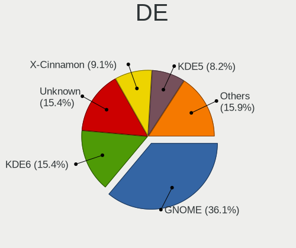

| Name          | Computers | Percent |
|---------------|-----------|---------|
| GNOME         | 67        | 30.45%  |
| KDE5          | 64        | 29.09%  |
| LXDE          | 26        | 11.82%  |
| X-Cinnamon    | 19        | 8.64%   |
| XFCE          | 17        | 7.73%   |
| Unknown       | 10        | 4.55%   |
| MATE          | 5         | 2.27%   |
| GNOME Classic | 3         | 1.36%   |
| LXQt          | 2         | 0.91%   |
| Cinnamon      | 2         | 0.91%   |
| sway          | 1         | 0.45%   |
| Pantheon      | 1         | 0.45%   |
| Jwm           | 1         | 0.45%   |
| Endless:GNOME | 1         | 0.45%   |
| Cutefish      | 1         | 0.45%   |

Display Server
--------------

X11 or Wayland

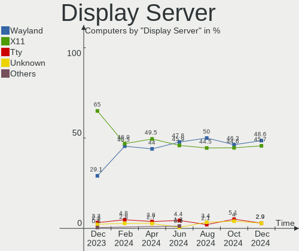

| Name    | Computers | Percent |
|---------|-----------|---------|
| X11     | 143       | 65%     |
| Wayland | 65        | 29.55%  |
| Tty     | 7         | 3.18%   |
| Unknown | 4         | 1.82%   |
| Web     | 1         | 0.45%   |

Display Manager
---------------

SDDM, LightDM, etc.

| Name    | Computers | Percent |
|---------|-----------|---------|
| Unknown | 71        | 32.27%  |
| SDDM    | 52        | 23.64%  |
| GDM3    | 40        | 18.18%  |
| NODM    | 25        | 11.36%  |
| LightDM | 24        | 10.91%  |
| GDM     | 6         | 2.73%   |
| LXDM    | 1         | 0.45%   |
| KDM     | 1         | 0.45%   |

OS Lang
-------

Language

| Lang    | Computers | Percent |
|---------|-----------|---------|
| en_US   | 106       | 48.18%  |
| en_CA   | 81        | 36.82%  |
| fr_CA   | 15        | 6.82%   |
| C       | 5         | 2.27%   |
| fr_FR   | 4         | 1.82%   |
| en_GB   | 3         | 1.36%   |
| Unknown | 2         | 0.91%   |
| POSIX   | 1         | 0.45%   |
| ja_JP   | 1         | 0.45%   |
| es_AR   | 1         | 0.45%   |
| C.UTF8  | 1         | 0.45%   |

Boot Mode
---------

EFI or BIOS

| Mode | Computers | Percent |
|------|-----------|---------|
| EFI  | 128       | 58.18%  |
| BIOS | 92        | 41.82%  |

Filesystem
----------

Type of filesystem

| Type    | Computers | Percent |
|---------|-----------|---------|
| Ext4    | 110       | 50%     |
| Btrfs   | 41        | 18.64%  |
| Rootfs  | 26        | 11.82%  |
| Tmpfs   | 25        | 11.36%  |
| Overlay | 13        | 5.91%   |
| Zfs     | 2         | 0.91%   |
| Xfs     | 1         | 0.45%   |
| Ext3    | 1         | 0.45%   |
| Aufs    | 1         | 0.45%   |

Part. scheme
------------

Scheme of partitioning

| Type    | Computers | Percent |
|---------|-----------|---------|
| GPT     | 135       | 61.36%  |
| Unknown | 64        | 29.09%  |
| MBR     | 21        | 9.55%   |

Dual Boot with Linux/BSD
------------------------

Hosting more than one Linux/BSD

| Dual boot | Computers | Percent |
|-----------|-----------|---------|
| No        | 189       | 85.91%  |
| Yes       | 31        | 14.09%  |

Dual Boot (Win)
---------------

Hosting Linux and Windows

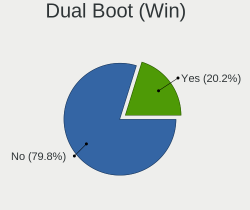

| Dual boot | Computers | Percent |
|-----------|-----------|---------|
| No        | 151       | 68.64%  |
| Yes       | 69        | 31.36%  |

Board
-----

Vendor
------

Motherboard manufacturer

| Name                    | Computers | Percent |
|-------------------------|-----------|---------|
| ASUSTek Computer        | 43        | 19.55%  |
| Lenovo                  | 31        | 14.09%  |
| Hewlett-Packard         | 30        | 13.64%  |
| Dell                    | 19        | 8.64%   |
| MSI                     | 16        | 7.27%   |
| Acer                    | 13        | 5.91%   |
| Gigabyte Technology     | 12        | 5.45%   |
| Apple                   | 10        | 4.55%   |
| Unknown                 | 7         | 3.18%   |
| Valve                   | 6         | 2.73%   |
| Alienware               | 6         | 2.73%   |
| ASRock                  | 5         | 2.27%   |
| Toshiba                 | 4         | 1.82%   |
| Intel                   | 2         | 0.91%   |
| Google                  | 2         | 0.91%   |
| AZW                     | 2         | 0.91%   |
| Supermicro              | 1         | 0.45%   |
| Samsung Electronics     | 1         | 0.45%   |
| Razer                   | 1         | 0.45%   |
| Raspberry Pi Foundation | 1         | 0.45%   |
| Pine Microsystems       | 1         | 0.45%   |
| Pegatron                | 1         | 0.45%   |
| Notebook                | 1         | 0.45%   |
| Microsoft               | 1         | 0.45%   |
| HC Technology.          | 1         | 0.45%   |
| Gateway                 | 1         | 0.45%   |
| Foxconn                 | 1         | 0.45%   |
| EVGA                    | 1         | 0.45%   |

Model
-----

Motherboard model

| Name                                      | Computers | Percent |
|-------------------------------------------|-----------|---------|
| Unknown                                   | 7         | 3.18%   |
| Valve Jupiter                             | 4         | 1.82%   |
| Valve Galileo                             | 2         | 0.91%   |
| MSI MS-7C95                               | 2         | 0.91%   |
| Gigabyte X570 AORUS ELITE WIFI            | 2         | 0.91%   |
| Dell Latitude E6440                       | 2         | 0.91%   |
| AZW SER                                   | 2         | 0.91%   |
| ASUS ROG Strix G513RM_G513RM              | 2         | 0.91%   |
| ASUS ASUS TUF Gaming F15 FX507ZC_TUF507ZC | 2         | 0.91%   |
| Apple MacBookAir9,1                       | 2         | 0.91%   |
| Alienware m18 R1                          | 2         | 0.91%   |
| Toshiba TECRA Z50-A                       | 1         | 0.45%   |
| Toshiba Satellite S50D-A                  | 1         | 0.45%   |
| Toshiba Satellite L650D                   | 1         | 0.45%   |
| Toshiba PORTEGE R930                      | 1         | 0.45%   |
| Supermicro X10SL7-F                       | 1         | 0.45%   |
| Samsung 930QDB                            | 1         | 0.45%   |
| Razer Blade                               | 1         | 0.45%   |
| RPi Raspberry Pi                          | 1         | 0.45%   |
| Pine Microsystems Pine64 RockPro64 v2.1   | 1         | 0.45%   |
| Pegatron 600-1352                         | 1         | 0.45%   |
| Notebook W94_95_97SU2,SUY,-C,-T           | 1         | 0.45%   |
| MSI Vector GP77 13VG                      | 1         | 0.45%   |
| MSI Thin GF63 12VE                        | 1         | 0.45%   |
| MSI Stealth 16Studio A13VF                | 1         | 0.45%   |
| MSI Pulse 17 B13VGK                       | 1         | 0.45%   |
| MSI MS-7D98                               | 1         | 0.45%   |
| MSI MS-7D91                               | 1         | 0.45%   |
| MSI MS-7C91                               | 1         | 0.45%   |
| MSI MS-7B86                               | 1         | 0.45%   |
| MSI MS-7B18                               | 1         | 0.45%   |
| MSI MS-7A38                               | 1         | 0.45%   |
| MSI MEG Z590 Aegis Ti5 (MS-B931)          | 1         | 0.45%   |
| MSI GT72VR 6RD                            | 1         | 0.45%   |
| MSI GF65 Thin 10SER                       | 1         | 0.45%   |
| MSI Cyborg 15 A12VF                       | 1         | 0.45%   |
| Microsoft Surface Laptop Go               | 1         | 0.45%   |
| Lenovo Yoga 2 Pro 20266                   | 1         | 0.45%   |
| Lenovo ThinkSmart Hub 500 10V50000US      | 1         | 0.45%   |
| Lenovo ThinkPad X390 20Q1S1WB00           | 1         | 0.45%   |

Model Family
------------

Motherboard model prefix

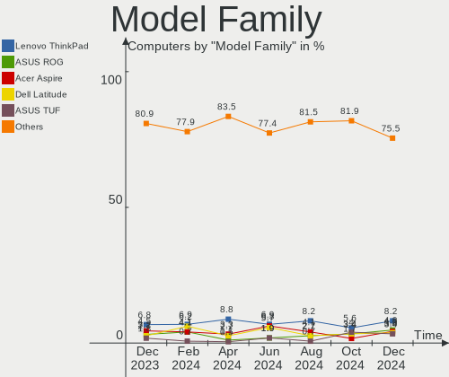

| Name                     | Computers | Percent |
|--------------------------|-----------|---------|
| Lenovo ThinkPad          | 15        | 6.82%   |
| Acer Aspire              | 10        | 4.55%   |
| ASUS VivoBook            | 8         | 3.64%   |
| ASUS ROG                 | 7         | 3.18%   |
| ASUS ASUS                | 7         | 3.18%   |
| Unknown                  | 7         | 3.18%   |
| Dell Latitude            | 6         | 2.73%   |
| ASUS PRIME               | 6         | 2.73%   |
| Lenovo Legion            | 5         | 2.27%   |
| HP Pavilion              | 5         | 2.27%   |
| Valve Jupiter            | 4         | 1.82%   |
| HP Compaq                | 4         | 1.82%   |
| Dell OptiPlex            | 4         | 1.82%   |
| ASUS TUF                 | 4         | 1.82%   |
| Lenovo ThinkCentre       | 3         | 1.36%   |
| Gigabyte X570            | 3         | 1.36%   |
| Dell Precision           | 3         | 1.36%   |
| Valve Galileo            | 2         | 0.91%   |
| Toshiba Satellite        | 2         | 0.91%   |
| MSI MS-7C95              | 2         | 0.91%   |
| Lenovo ThinkBook         | 2         | 0.91%   |
| Lenovo IdeaPad           | 2         | 0.91%   |
| HP ProBook               | 2         | 0.91%   |
| HP Laptop                | 2         | 0.91%   |
| HP EliteBook             | 2         | 0.91%   |
| Gigabyte AERO            | 2         | 0.91%   |
| Dell XPS                 | 2         | 0.91%   |
| Dell Inspiron            | 2         | 0.91%   |
| AZW SER                  | 2         | 0.91%   |
| ASUS Zenbook             | 2         | 0.91%   |
| Apple MacBookAir9        | 2         | 0.91%   |
| Alienware m18            | 2         | 0.91%   |
| Alienware Aurora         | 2         | 0.91%   |
| Toshiba TECRA            | 1         | 0.45%   |
| Toshiba PORTEGE          | 1         | 0.45%   |
| Supermicro X10SL7-F      | 1         | 0.45%   |
| Samsung 930QDB           | 1         | 0.45%   |
| Razer Blade              | 1         | 0.45%   |
| RPi Raspberry            | 1         | 0.45%   |
| Pine Microsystems Pine64 | 1         | 0.45%   |

MFG Year
--------

Motherboard manufacture year

| Year    | Computers | Percent |
|---------|-----------|---------|
| 2023    | 34        | 15.45%  |
| 2022    | 22        | 10%     |
| 2019    | 19        | 8.64%   |
| 2021    | 17        | 7.73%   |
| 2020    | 16        | 7.27%   |
| 2018    | 14        | 6.36%   |
| 2016    | 12        | 5.45%   |
| 2012    | 11        | 5%      |
| 2013    | 10        | 4.55%   |
| 2017    | 9         | 4.09%   |
| 2014    | 9         | 4.09%   |
| 2010    | 9         | 4.09%   |
| 2009    | 9         | 4.09%   |
| 2011    | 8         | 3.64%   |
| 2015    | 6         | 2.73%   |
| 2007    | 6         | 2.73%   |
| 2008    | 4         | 1.82%   |
| Unknown | 4         | 1.82%   |
| 2006    | 1         | 0.45%   |

Form Factor
-----------

Physical design of the computer

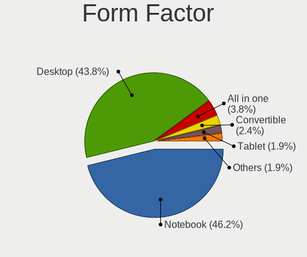

| Name           | Computers | Percent |
|----------------|-----------|---------|
| Notebook       | 126       | 57.27%  |
| Desktop        | 69        | 31.36%  |
| Convertible    | 7         | 3.18%   |
| All in one     | 5         | 2.27%   |
| Mini pc        | 4         | 1.82%   |
| Server         | 4         | 1.82%   |
| System on chip | 3         | 1.36%   |
| Tablet         | 2         | 0.91%   |

Secure Boot
-----------

Enabled or disabled

| State    | Computers | Percent |
|----------|-----------|---------|
| Disabled | 200       | 90.91%  |
| Enabled  | 20        | 9.09%   |

Coreboot
--------

Have coreboot on board

| Used | Computers | Percent |
|------|-----------|---------|
| No   | 218       | 99.09%  |
| Yes  | 2         | 0.91%   |

RAM Size
--------

Total RAM memory

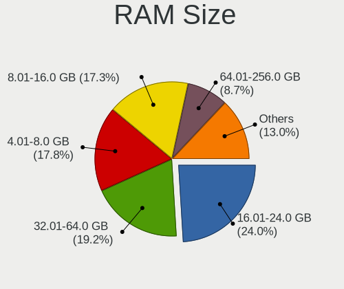

| Size in GB      | Computers | Percent |
|-----------------|-----------|---------|
| 8.01-16.0       | 56        | 25.45%  |
| 4.01-8.0        | 43        | 19.55%  |
| 16.01-24.0      | 40        | 18.18%  |
| 32.01-64.0      | 35        | 15.91%  |
| 3.01-4.0        | 21        | 9.55%   |
| 64.01-256.0     | 12        | 5.45%   |
| 24.01-32.0      | 5         | 2.27%   |
| 1.01-2.0        | 4         | 1.82%   |
| 2.01-3.0        | 3         | 1.36%   |
| More than 256.0 | 1         | 0.45%   |

RAM Used
--------

Used RAM memory

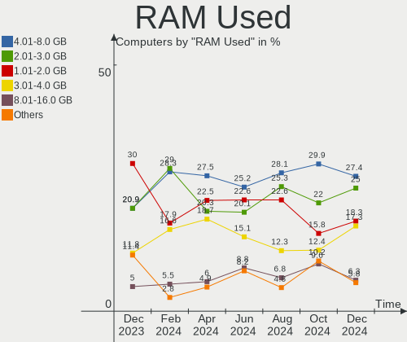

| Used GB    | Computers | Percent |
|------------|-----------|---------|
| 1.01-2.0   | 66        | 30%     |
| 4.01-8.0   | 47        | 21.36%  |
| 2.01-3.0   | 44        | 20%     |
| 3.01-4.0   | 26        | 11.82%  |
| 0.51-1.0   | 18        | 8.18%   |
| 8.01-16.0  | 12        | 5.45%   |
| 16.01-24.0 | 5         | 2.27%   |
| 0.01-0.5   | 2         | 0.91%   |

Total Drives
------------

Number of drives on board

| Drives | Computers | Percent |
|--------|-----------|---------|
| 1      | 121       | 55%     |
| 2      | 56        | 25.45%  |
| 3      | 19        | 8.64%   |
| 4      | 6         | 2.73%   |
| 0      | 6         | 2.73%   |
| 9      | 3         | 1.36%   |
| 6      | 3         | 1.36%   |
| 5      | 2         | 0.91%   |
| 16     | 1         | 0.45%   |
| 13     | 1         | 0.45%   |
| 10     | 1         | 0.45%   |
| 7      | 1         | 0.45%   |

Has CD-ROM
----------

Has CD-ROM on board

| Presented | Computers | Percent |
|-----------|-----------|---------|
| No        | 163       | 74.09%  |
| Yes       | 57        | 25.91%  |

Has Ethernet
------------

Has Ethernet on board

| Presented | Computers | Percent |
|-----------|-----------|---------|
| Yes       | 176       | 80%     |
| No        | 44        | 20%     |

Has WiFi
--------

Has WiFi module

| Presented | Computers | Percent |
|-----------|-----------|---------|
| Yes       | 175       | 79.55%  |
| No        | 45        | 20.45%  |

Has Bluetooth
-------------

Has Bluetooth module

| Presented | Computers | Percent |
|-----------|-----------|---------|
| Yes       | 149       | 67.73%  |
| No        | 71        | 32.27%  |

Location
--------

Country
-------

Geographic location (country)

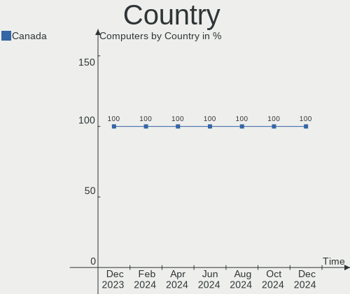

| Country | Computers | Percent |
|---------|-----------|---------|
| Canada  | 220       | 100%    |

City
----

Geographic location (city)

| City            | Computers | Percent |
|-----------------|-----------|---------|
| Toronto         | 27        | 12.27%  |
| Montreal        | 20        | 9.09%   |
| Québec         | 14        | 6.36%   |
| Vancouver       | 10        | 4.55%   |
| Calgary         | 8         | 3.64%   |
| Levis           | 7         | 3.18%   |
| Edmonton        | 6         | 2.73%   |
| Winnipeg        | 4         | 1.82%   |
| Burnaby         | 4         | 1.82%   |
| St. John's      | 3         | 1.36%   |
| Saskatoon       | 3         | 1.36%   |
| Peterborough    | 3         | 1.36%   |
| Oshawa          | 3         | 1.36%   |
| Kitchener       | 3         | 1.36%   |
| Gatineau        | 3         | 1.36%   |
| Courtenay       | 3         | 1.36%   |
| Zurich          | 2         | 0.91%   |
| Woodbridge      | 2         | 0.91%   |
| Windsor         | 2         | 0.91%   |
| Victoria        | 2         | 0.91%   |
| Terrebonne      | 2         | 0.91%   |
| Surrey          | 2         | 0.91%   |
| Sherbrooke      | 2         | 0.91%   |
| Richmond        | 2         | 0.91%   |
| Ottawa          | 2         | 0.91%   |
| Newmarket       | 2         | 0.91%   |
| Markham         | 2         | 0.91%   |
| Longueuil       | 2         | 0.91%   |
| London          | 2         | 0.91%   |
| Kelowna         | 2         | 0.91%   |
| Hamilton        | 2         | 0.91%   |
| Halifax         | 2         | 0.91%   |
| Grande Prairie  | 2         | 0.91%   |
| Brantford       | 2         | 0.91%   |
| Amherst         | 2         | 0.91%   |
| Whitehorse      | 1         | 0.45%   |
| Valcourt        | 1         | 0.45%   |
| Tillsonburg     | 1         | 0.45%   |
| Sturgeon County | 1         | 0.45%   |
| Stratford       | 1         | 0.45%   |

Drives
------

Drive Vendor
------------

Hard drive vendors

| Vendor                      | Computers | Drives | Percent |
|-----------------------------|-----------|--------|---------|
| Samsung Electronics         | 49        | 60     | 15.51%  |
| WDC                         | 46        | 71     | 14.56%  |
| Seagate                     | 31        | 47     | 9.81%   |
| Sandisk                     | 21        | 23     | 6.65%   |
| Unknown                     | 20        | 25     | 6.33%   |
| Toshiba                     | 15        | 15     | 4.75%   |
| SK hynix                    | 12        | 12     | 3.8%    |
| Intel                       | 12        | 13     | 3.8%    |
| Kingston                    | 11        | 13     | 3.48%   |
| Micron Technology           | 8         | 8      | 2.53%   |
| Kingston Technology Company | 7         | 7      | 2.22%   |
| Hitachi                     | 7         | 7      | 2.22%   |
| Crucial                     | 7         | 10     | 2.22%   |
| A-DATA Technology           | 7         | 7      | 2.22%   |
| Apple                       | 6         | 8      | 1.9%    |
| Unknown                     | 4         | 4      | 1.27%   |
| Timetec                     | 3         | 3      | 0.95%   |
| SPCC                        | 3         | 3      | 0.95%   |
| PNY                         | 3         | 3      | 0.95%   |
| Phison Electronics          | 3         | 3      | 0.95%   |
| KIOXIA                      | 3         | 3      | 0.95%   |
| Fujitsu                     | 3         | 3      | 0.95%   |
| ADATA Technology            | 3         | 4      | 0.95%   |
| TO Exter                    | 2         | 2      | 0.63%   |
| Phison                      | 2         | 2      | 0.63%   |
| Patriot                     | 2         | 2      | 0.63%   |
| ASMT                        | 2         | 2      | 0.63%   |
| Vaseky                      | 1         | 1      | 0.32%   |
| USB                         | 1         | 1      | 0.32%   |
| Union Memory (Shenzhen)     | 1         | 1      | 0.32%   |
| UMIS                        | 1         | 1      | 0.32%   |
| UB88RRF6                    | 1         | 1      | 0.32%   |
| Transcend                   | 1         | 1      | 0.32%   |
| Tech                        | 1         | 4      | 0.32%   |
| Team                        | 1         | 1      | 0.32%   |
| SSK                         | 1         | 1      | 0.32%   |
| Seagate Technology          | 1         | 1      | 0.32%   |
| Micron/Crucial Technology   | 1         | 1      | 0.32%   |
| MAXIO Technology (Hangzhou) | 1         | 1      | 0.32%   |
| LS                          | 1         | 1      | 0.32%   |

Drive Model
-----------

Hard drive models

| Model                                               | Computers | Percent |
|-----------------------------------------------------|-----------|---------|
| Samsung NVMe SSD Controller SM981/PM981/PM983 512GB | 6         | 1.66%   |
| Samsung NVMe SSD Controller PM9A1/PM9A3/980PRO 2TB  | 6         | 1.66%   |
| Samsung SSD 860 EVO 1TB                             | 4         | 1.1%    |
| Kingston Company SNV2S1000G 1TB                     | 4         | 1.1%    |
| Kingston SA400S37480G 480GB SSD                     | 4         | 1.1%    |
| Unknown                                             | 4         | 1.1%    |
| WDC WDS500G2B0A-00SM50 500GB SSD                    | 3         | 0.83%   |
| WDC WD10EZEX-08WN4A0 1TB                            | 3         | 0.83%   |
| Unknown DA4064  64GB                                | 3         | 0.83%   |
| Seagate ST2000DM001-1ER164 2TB                      | 3         | 0.83%   |
| Sandisk WD Blue SN570 1TB                           | 3         | 0.83%   |
| SanDisk NVMe SSD Drive 1TB                          | 3         | 0.83%   |
| Samsung SSD 870 EVO 1TB                             | 3         | 0.83%   |
| Samsung MZVL41T0HBLB-00BTW 1TB                      | 3         | 0.83%   |
| Micron 2450_MTFDKBA1T0TFK 1TB                       | 3         | 0.83%   |
| WDC WDS100T2B0A-00SM50 1TB SSD                      | 2         | 0.55%   |
| WDC WD40EFRX-68N32N0 4TB                            | 2         | 0.55%   |
| WDC WD20EZAZ-00GGJB0 2TB                            | 2         | 0.55%   |
| WDC WD1001FALS-00J7B0 1TB                           | 2         | 0.55%   |
| Unknown SD/MMC/MS PRO 512GB                         | 2         | 0.55%   |
| Unknown MMC Card  64GB                              | 2         | 0.55%   |
| Unknown MMC Card  128GB                             | 2         | 0.55%   |
| Toshiba XG4 NVMe SSD Controller 256GB               | 2         | 0.55%   |
| Toshiba MQ04ABF100 1TB                              | 2         | 0.55%   |
| Toshiba MQ01ABD100 1TB                              | 2         | 0.55%   |
| TO Exter nal USB 3.0 480GB                          | 2         | 0.55%   |
| Timetec SD08 512GB SSD                              | 2         | 0.55%   |
| SK hynix HFM512GD3JX013N 512GB                      | 2         | 0.55%   |
| SK hynix HFM001TD3JX013N 1024GB                     | 2         | 0.55%   |
| Seagate ST500DM002-1BD142 500GB                     | 2         | 0.55%   |
| Seagate ST2000DM008-2FR102 2TB                      | 2         | 0.55%   |
| Seagate ST2000DM006-2DM164 2TB                      | 2         | 0.55%   |
| Seagate ST1000LM024 HN-M101MBB 1TB                  | 2         | 0.55%   |
| Seagate Expansion 2TB                               | 2         | 0.55%   |
| Sandisk WD_BLACK SN770 2TB                          | 2         | 0.55%   |
| Sandisk WD Blue SN550 NVMe SSD 1TB                  | 2         | 0.55%   |
| Sandisk WD Blue SN500 / PC SN520 NVMe SSD 128GB     | 2         | 0.55%   |
| Samsung SSD 980 500GB                               | 2         | 0.55%   |
| Samsung SSD 860 EVO 500GB                           | 2         | 0.55%   |
| Samsung MZVL4512HBLU-00BTW 512GB                    | 2         | 0.55%   |

HDD Vendor
----------

Hard disk drive vendors

| Vendor              | Computers | Drives | Percent |
|---------------------|-----------|--------|---------|
| WDC                 | 37        | 58     | 36.63%  |
| Seagate             | 29        | 45     | 28.71%  |
| Toshiba             | 11        | 11     | 10.89%  |
| Hitachi             | 7         | 7      | 6.93%   |
| Samsung Electronics | 4         | 4      | 3.96%   |
| Fujitsu             | 3         | 3      | 2.97%   |
| Unknown             | 2         | 2      | 1.98%   |
| TO Exter            | 2         | 2      | 1.98%   |
| Apple               | 2         | 2      | 1.98%   |
| IBM-ESXS            | 1         | 1      | 0.99%   |
| HGST                | 1         | 1      | 0.99%   |
| Hewlett-Packard     | 1         | 1      | 0.99%   |
| H/W                 | 1         | 7      | 0.99%   |

SSD Vendor
----------

Solid state drive vendors

| Vendor              | Computers | Drives | Percent |
|---------------------|-----------|--------|---------|
| Samsung Electronics | 13        | 17     | 16.67%  |
| Kingston            | 10        | 11     | 12.82%  |
| WDC                 | 9         | 9      | 11.54%  |
| Intel               | 6         | 6      | 7.69%   |
| Crucial             | 6         | 7      | 7.69%   |
| A-DATA Technology   | 5         | 5      | 6.41%   |
| SanDisk             | 4         | 4      | 5.13%   |
| SPCC                | 3         | 3      | 3.85%   |
| PNY                 | 3         | 3      | 3.85%   |
| Timetec             | 2         | 2      | 2.56%   |
| Patriot             | 2         | 2      | 2.56%   |
| Vaseky              | 1         | 1      | 1.28%   |
| Transcend           | 1         | 1      | 1.28%   |
| Toshiba             | 1         | 1      | 1.28%   |
| SK hynix            | 1         | 1      | 1.28%   |
| Seagate             | 1         | 1      | 1.28%   |
| LS                  | 1         | 1      | 1.28%   |
| LITEONIT            | 1         | 1      | 1.28%   |
| Lexar               | 1         | 2      | 1.28%   |
| Lenovo              | 1         | 1      | 1.28%   |
| KingDian            | 1         | 1      | 1.28%   |
| JMicron Technology  | 1         | 1      | 1.28%   |
| Indilinx            | 1         | 1      | 1.28%   |
| Dogfish             | 1         | 1      | 1.28%   |
| ASMT                | 1         | 1      | 1.28%   |
| Apple               | 1         | 1      | 1.28%   |

Drive Kind
----------

HDD or SSD

| Kind    | Computers | Drives | Percent |
|---------|-----------|--------|---------|
| NVMe    | 114       | 131    | 40%     |
| HDD     | 80        | 144    | 28.07%  |
| SSD     | 65        | 85     | 22.81%  |
| MMC     | 22        | 26     | 7.72%   |
| Unknown | 4         | 8      | 1.4%    |

Drive Connector
---------------

SATA, SAS, NVMe, etc.

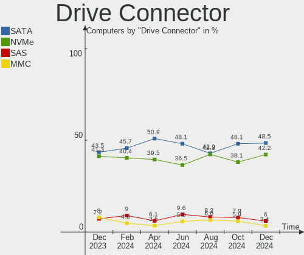

| Type | Computers | Drives | Percent |
|------|-----------|--------|---------|
| SATA | 120       | 202    | 43.48%  |
| NVMe | 114       | 129    | 41.3%   |
| MMC  | 22        | 26     | 7.97%   |
| SAS  | 20        | 37     | 7.25%   |

Drive Size
----------

Size of hard drive

| Size in TB | Computers | Drives | Percent |
|------------|-----------|--------|---------|
| 0.01-0.5   | 75        | 96     | 44.91%  |
| 0.51-1.0   | 49        | 62     | 29.34%  |
| 1.01-2.0   | 22        | 34     | 13.17%  |
| 3.01-4.0   | 10        | 18     | 5.99%   |
| 2.01-3.0   | 5         | 6      | 2.99%   |
| 10.01-20.0 | 4         | 11     | 2.4%    |
| 4.01-10.0  | 2         | 2      | 1.2%    |

Space Total
-----------

Amount of disk space available on the file system

| Size in GB     | Computers | Percent |
|----------------|-----------|---------|
| 101-250        | 42        | 19.09%  |
| 251-500        | 41        | 18.64%  |
| 501-1000       | 29        | 13.18%  |
| 51-100         | 27        | 12.27%  |
| More than 3000 | 21        | 9.55%   |
| 1-20           | 21        | 9.55%   |
| 1001-2000      | 20        | 9.09%   |
| 2001-3000      | 10        | 4.55%   |
| Unknown        | 5         | 2.27%   |
| 21-50          | 4         | 1.82%   |

Space Used
----------

Amount of used disk space

| Used GB        | Computers | Percent |
|----------------|-----------|---------|
| 1-20           | 96        | 43.64%  |
| 51-100         | 24        | 10.91%  |
| 21-50          | 22        | 10%     |
| 101-250        | 22        | 10%     |
| 251-500        | 19        | 8.64%   |
| 1001-2000      | 13        | 5.91%   |
| More than 3000 | 9         | 4.09%   |
| 501-1000       | 8         | 3.64%   |
| Unknown        | 5         | 2.27%   |
| 2001-3000      | 2         | 0.91%   |

Malfunc. Drives
---------------

Drive models with a malfunction

| Model                              | Computers | Drives | Percent |
|------------------------------------|-----------|--------|---------|
| WDC WD5000AAKS-00UU3A0 500GB       | 1         | 1      | 5.88%   |
| WDC WD10SPZX-16Z10T0 1TB           | 1         | 1      | 5.88%   |
| WDC WD1001FALS-00J7B0 1TB          | 1         | 1      | 5.88%   |
| UMIS RPITJ512VME2OWD 512GB         | 1         | 1      | 5.88%   |
| Toshiba MK3261GSYN 320GB           | 1         | 1      | 5.88%   |
| Toshiba DT01ACA050 500GB           | 1         | 1      | 5.88%   |
| Timetec SD08 512GB SSD             | 1         | 1      | 5.88%   |
| Seagate ST9500420AS 500GB          | 1         | 1      | 5.88%   |
| Seagate ST9500325AS 500GB          | 1         | 1      | 5.88%   |
| Seagate ST4000NE 001-2MA101 4TB    | 1         | 1      | 5.88%   |
| Seagate ST3000NC000 3TB            | 1         | 1      | 5.88%   |
| Seagate ST2000DM008-2UB102 2TB     | 1         | 2      | 5.88%   |
| Seagate ST2000DM006-2DM164 2TB     | 1         | 1      | 5.88%   |
| Seagate ST1000LM024 HN-M101MBB 1TB | 1         | 1      | 5.88%   |
| Hitachi HTS547564A9E384 640GB      | 1         | 1      | 5.88%   |
| HGST HTS721010A9E630 1TB           | 1         | 1      | 5.88%   |
| Fujitsu MHV2080AH 80GB             | 1         | 1      | 5.88%   |

Malfunc. Drive Vendor
---------------------

Vendors of faulty drives

| Vendor  | Computers | Drives | Percent |
|---------|-----------|--------|---------|
| Seagate | 7         | 8      | 41.18%  |
| WDC     | 3         | 3      | 17.65%  |
| Toshiba | 2         | 2      | 11.76%  |
| UMIS    | 1         | 1      | 5.88%   |
| Timetec | 1         | 1      | 5.88%   |
| Hitachi | 1         | 1      | 5.88%   |
| HGST    | 1         | 1      | 5.88%   |
| Fujitsu | 1         | 1      | 5.88%   |

Malfunc. HDD Vendor
-------------------

Vendors of faulty HDD drives

| Vendor  | Computers | Drives | Percent |
|---------|-----------|--------|---------|
| Seagate | 7         | 8      | 46.67%  |
| WDC     | 3         | 3      | 20%     |
| Toshiba | 2         | 2      | 13.33%  |
| Hitachi | 1         | 1      | 6.67%   |
| HGST    | 1         | 1      | 6.67%   |
| Fujitsu | 1         | 1      | 6.67%   |

Malfunc. Drive Kind
-------------------

Kinds of faulty drives

| Kind | Computers | Drives | Percent |
|------|-----------|--------|---------|
| HDD  | 15        | 16     | 88.24%  |
| NVMe | 1         | 1      | 5.88%   |
| SSD  | 1         | 1      | 5.88%   |

Failed Drives
-------------

Failed drive models

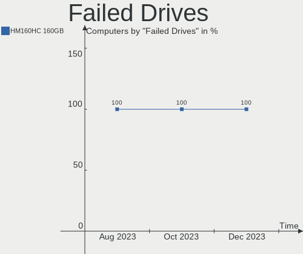

| Model                             | Computers | Drives | Percent |
|-----------------------------------|-----------|--------|---------|
| Samsung Electronics HM160HC 160GB | 1         | 1      | 100%    |

Failed Drive Vendor
-------------------

Failed drive vendors

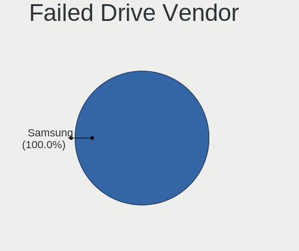

| Vendor              | Computers | Drives | Percent |
|---------------------|-----------|--------|---------|
| Samsung Electronics | 1         | 1      | 100%    |

Drive Status
------------

Number of failed and malfunc. drives

| Status   | Computers | Drives | Percent |
|----------|-----------|--------|---------|
| Detected | 120       | 196    | 49.79%  |
| Works    | 103       | 179    | 42.74%  |
| Malfunc  | 17        | 18     | 7.05%   |
| Failed   | 1         | 1      | 0.41%   |

Storage controller
------------------

Storage Vendor
--------------

Storage controller vendors

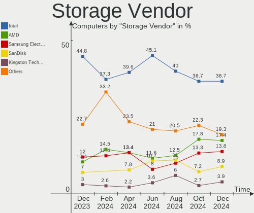

| Vendor                       | Computers | Percent |
|------------------------------|-----------|---------|
| Intel                        | 134       | 44.82%  |
| Samsung Electronics          | 36        | 12.04%  |
| AMD                          | 31        | 10.37%  |
| SanDisk                      | 21        | 7.02%   |
| SK hynix                     | 10        | 3.34%   |
| Kingston Technology Company  | 9         | 3.01%   |
| Micron Technology            | 8         | 2.68%   |
| JMicron Technology           | 6         | 2.01%   |
| ASMedia Technology           | 6         | 2.01%   |
| Phison Electronics           | 5         | 1.67%   |
| Micron/Crucial Technology    | 4         | 1.34%   |
| ADATA Technology             | 4         | 1.34%   |
| Toshiba America Info Systems | 3         | 1%      |
| KIOXIA                       | 3         | 1%      |
| Union Memory (Shenzhen)      | 2         | 0.67%   |
| Solidigm                     | 2         | 0.67%   |
| Silicon Motion               | 2         | 0.67%   |
| Nvidia                       | 2         | 0.67%   |
| Broadcom / LSI               | 2         | 0.67%   |
| Apple                        | 2         | 0.67%   |
| Adaptec                      | 2         | 0.67%   |
| Seagate Technology           | 1         | 0.33%   |
| MAXIO Technology (Hangzhou)  | 1         | 0.33%   |
| Marvell Technology Group     | 1         | 0.33%   |
| LSI Logic / Symbios Logic    | 1         | 0.33%   |
| 3ware                        | 1         | 0.33%   |

Storage Model
-------------

Storage controller models

| Model                                                                          | Computers | Percent |
|--------------------------------------------------------------------------------|-----------|---------|
| AMD FCH SATA Controller [AHCI mode]                                            | 17        | 5.12%   |
| Intel Volume Management Device NVMe RAID Controller                            | 16        | 4.82%   |
| Samsung NVMe SSD Controller SM981/PM981/PM983                                  | 9         | 2.71%   |
| Samsung NVMe SSD Controller PM9A1/PM9A3/980PRO                                 | 9         | 2.71%   |
| Samsung NVMe SSD Controller 980 (DRAM-less)                                    | 9         | 2.71%   |
| Intel 82801 Mobile SATA Controller [RAID mode]                                 | 8         | 2.41%   |
| Intel Volume Management Device NVMe RAID Controller Intel Corporation          | 7         | 2.11%   |
| Intel 6 Series/C200 Series Chipset Family 6 port Desktop SATA AHCI Controller  | 7         | 2.11%   |
| Intel 200 Series PCH SATA controller [AHCI mode]                               | 7         | 2.11%   |
| SanDisk WD Black SN770 / PC SN740 256GB / PC SN560 (DRAM-less) NVMe SSD        | 6         | 1.81%   |
| Samsung NVMe SSD Controller PM9B1 (DRAM-less)                                  | 6         | 1.81%   |
| AMD 500 Series Chipset SATA Controller                                         | 6         | 1.81%   |
| SK hynix Gold P31/BC711/PC711 NVMe Solid State Drive                           | 5         | 1.51%   |
| Kingston Company NV2 NVMe SSD SM2267XT                                         | 5         | 1.51%   |
| JMicron JMB363 SATA/IDE Controller                                             | 5         | 1.51%   |
| Intel Sunrise Point-LP SATA Controller [AHCI mode]                             | 5         | 1.51%   |
| Intel Q170/Q150/B150/H170/H110/Z170/CM236 Chipset SATA Controller [AHCI Mode]  | 5         | 1.51%   |
| Intel 8 Series SATA Controller 1 [AHCI mode]                                   | 5         | 1.51%   |
| ASMedia ASM1062 Serial ATA Controller                                          | 5         | 1.51%   |
| SanDisk Ultra 3D / WD Blue SN570 NVMe SSD (DRAM-less)                          | 4         | 1.2%    |
| Intel SSD 670p Series [Keystone Harbor]                                        | 4         | 1.2%    |
| Intel 82801IBM/IEM (ICH9M/ICH9M-E) 4 port SATA Controller [AHCI mode]          | 4         | 1.2%    |
| Intel 8 Series/C220 Series Chipset Family 6-port SATA Controller 1 [AHCI mode] | 4         | 1.2%    |
| Intel 700 Series Chipset Family SATA AHCI Controller                           | 4         | 1.2%    |
| Intel 7 Series/C210 Series Chipset Family 6-port SATA Controller [AHCI mode]   | 4         | 1.2%    |
| Intel 7 Series Chipset Family 6-port SATA Controller [AHCI mode]               | 4         | 1.2%    |
| AMD SB7x0/SB8x0/SB9x0 IDE Controller                                           | 4         | 1.2%    |
| SK hynix PC601 NVMe Solid State Drive                                          | 3         | 0.9%    |
| SanDisk Ultra 3D / WD Blue SN550 NVMe SSD                                      | 3         | 0.9%    |
| SanDisk Extreme Pro / WD Black SN750 / PC SN730 / Red SN700 NVMe SSD           | 3         | 0.9%    |
| Micron 2450 NVMe SSD [HendrixV] (DRAM-less)                                    | 3         | 0.9%    |
| KIOXIA NVMe SSD Controller XG8                                                 | 3         | 0.9%    |
| Intel SATA Controller [RAID mode]                                              | 3         | 0.9%    |
| Intel Comet Lake SATA AHCI Controller                                          | 3         | 0.9%    |
| Intel Celeron/Pentium Silver Processor SATA Controller                         | 3         | 0.9%    |
| Intel Cannon Lake PCH SATA AHCI Controller                                     | 3         | 0.9%    |
| Intel Cannon Lake Mobile PCH SATA AHCI Controller                              | 3         | 0.9%    |
| Intel Alder Lake-P SATA AHCI Controller                                        | 3         | 0.9%    |
| Intel 631xESB/632xESB IDE Controller                                           | 3         | 0.9%    |
| Intel 6 Series/C200 Series Chipset Family 6 port Mobile SATA AHCI Controller   | 3         | 0.9%    |

Storage Kind
------------

Kind of storage controller (IDE, SATA, NVMe, SAS, ...)

| Kind | Computers | Percent |
|------|-----------|---------|
| SATA | 124       | 40.92%  |
| NVMe | 113       | 37.29%  |
| RAID | 42        | 13.86%  |
| IDE  | 22        | 7.26%   |
| SAS  | 1         | 0.33%   |
| SCSI | 1         | 0.33%   |

Processor
---------

CPU Vendor
----------

Processor vendors

| Vendor   | Computers | Percent |
|----------|-----------|---------|
| Intel    | 167       | 75.91%  |
| AMD      | 49        | 22.27%  |
| ARM      | 2         | 0.91%   |
| Qualcomm | 1         | 0.45%   |
| Unknown  | 1         | 0.45%   |

CPU Model
---------

Processor models

| Model                                      | Computers | Percent |
|--------------------------------------------|-----------|---------|
| AMD Custom APU 0405                        | 6         | 2.73%   |
| Intel 12th Gen Core i7-12700H              | 5         | 2.27%   |
| Intel Core i5-8265U CPU @ 1.60GHz          | 4         | 1.82%   |
| Intel Core i7-8750H CPU @ 2.20GHz          | 3         | 1.36%   |
| Intel Core i7-8665U CPU @ 1.90GHz          | 3         | 1.36%   |
| Intel Core i7-10750H CPU @ 2.60GHz         | 3         | 1.36%   |
| Intel Core i5-3470 CPU @ 3.20GHz           | 3         | 1.36%   |
| Intel 13th Gen Core i9-13900H              | 3         | 1.36%   |
| Intel 12th Gen Core i7-12650H              | 3         | 1.36%   |
| Intel 12th Gen Core i5-1235U               | 3         | 1.36%   |
| AMD Ryzen 7 5800X 8-Core Processor         | 3         | 1.36%   |
| Intel Xeon CPU E5440 @ 2.83GHz             | 2         | 0.91%   |
| Intel Core i7-6700HQ CPU @ 2.60GHz         | 2         | 0.91%   |
| Intel Core i7-4610M CPU @ 3.00GHz          | 2         | 0.91%   |
| Intel Core i7-2600 CPU @ 3.40GHz           | 2         | 0.91%   |
| Intel Core i5-6300U CPU @ 2.40GHz          | 2         | 0.91%   |
| Intel Core i5-4300U CPU @ 1.90GHz          | 2         | 0.91%   |
| Intel Core i5-3210M CPU @ 2.50GHz          | 2         | 0.91%   |
| Intel Core i5-1035G1 CPU @ 1.00GHz         | 2         | 0.91%   |
| Intel Core i3-1000NG4 CPU @ 1.10GHz        | 2         | 0.91%   |
| Intel Core 2 Duo CPU T7700 @ 2.40GHz       | 2         | 0.91%   |
| Intel Core 2 Duo CPU E8400 @ 3.00GHz       | 2         | 0.91%   |
| Intel Celeron N4020 CPU @ 1.10GHz          | 2         | 0.91%   |
| Intel Celeron N4000 CPU @ 1.10GHz          | 2         | 0.91%   |
| Intel 13th Gen Core i7-13700HX             | 2         | 0.91%   |
| Intel 13th Gen Core i7-1355U               | 2         | 0.91%   |
| Intel 11th Gen Core i7-1185G7 @ 3.00GHz    | 2         | 0.91%   |
| Intel 11th Gen Core i7-11800H @ 2.30GHz    | 2         | 0.91%   |
| Intel 11th Gen Core i5-11400H @ 2.70GHz    | 2         | 0.91%   |
| ARM Processor                              | 2         | 0.91%   |
| AMD Ryzen 7 6800H with Radeon Graphics     | 2         | 0.91%   |
| AMD Ryzen 7 5700U with Radeon Graphics     | 2         | 0.91%   |
| AMD Ryzen 7 5700G with Radeon Graphics     | 2         | 0.91%   |
| AMD Ryzen 5 5500U with Radeon Graphics     | 2         | 0.91%   |
| Qualcomm AArch64 Processor rev 0 (aarch64) | 1         | 0.45%   |
| Intel Xeon CPU X5680 @ 3.33GHz             | 1         | 0.45%   |
| Intel Xeon CPU E7- 8870 @ 2.40GHz          | 1         | 0.45%   |
| Intel Xeon CPU E5620 @ 2.40GHz             | 1         | 0.45%   |
| Intel Xeon CPU E5-2650 0 @ 2.00GHz         | 1         | 0.45%   |
| Intel Xeon CPU E5-2630 0 @ 2.30GHz         | 1         | 0.45%   |

CPU Model Family
----------------

Processor model prefix

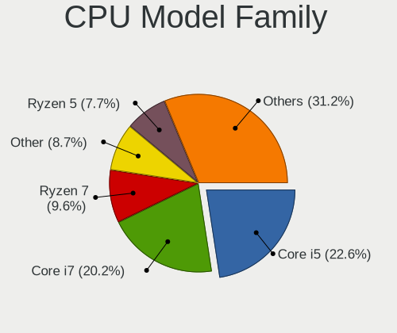

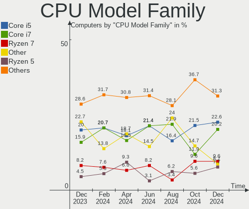

| Model                   | Computers | Percent |
|-------------------------|-----------|---------|
| Other                   | 50        | 22.73%  |
| Intel Core i5           | 44        | 20%     |
| Intel Core i7           | 35        | 15.91%  |
| AMD Ryzen 7             | 18        | 8.18%   |
| Intel Xeon              | 10        | 4.55%   |
| Intel Core i3           | 10        | 4.55%   |
| AMD Ryzen 5             | 10        | 4.55%   |
| Intel Celeron           | 9         | 4.09%   |
| Intel Core 2 Duo        | 8         | 3.64%   |
| AMD Ryzen 9             | 4         | 1.82%   |
| Intel Atom              | 3         | 1.36%   |
| AMD Phenom II X6        | 3         | 1.36%   |
| Intel Pentium           | 2         | 0.91%   |
| AMD A10                 | 2         | 0.91%   |
| Intel Pentium Silver    | 1         | 0.45%   |
| Intel Pentium Gold      | 1         | 0.45%   |
| Intel Pentium Dual-Core | 1         | 0.45%   |
| Intel Pentium Dual      | 1         | 0.45%   |
| Intel Core m5           | 1         | 0.45%   |
| Intel Core i9           | 1         | 0.45%   |
| Intel Core 2 Quad       | 1         | 0.45%   |
| AMD Turion II           | 1         | 0.45%   |
| AMD Turion 64 Mobile    | 1         | 0.45%   |
| AMD FX                  | 1         | 0.45%   |
| AMD Athlon II X4        | 1         | 0.45%   |
| AMD Athlon II Dual-Core | 1         | 0.45%   |

CPU Cores
---------

Number of processor cores

| Number | Computers | Percent |
|--------|-----------|---------|
| 4      | 73        | 33.18%  |
| 2      | 56        | 25.45%  |
| 8      | 28        | 12.73%  |
| 6      | 28        | 12.73%  |
| 14     | 12        | 5.45%   |
| 10     | 10        | 4.55%   |
| 12     | 7         | 3.18%   |
| 24     | 2         | 0.91%   |
| 16     | 2         | 0.91%   |
| 20     | 1         | 0.45%   |
| 1      | 1         | 0.45%   |

CPU Sockets
-----------

Number of sockets

| Number | Computers | Percent |
|--------|-----------|---------|
| 1      | 213       | 96.82%  |
| 2      | 7         | 3.18%   |

CPU Threads
-----------

Threads per core (Hyper-Threading)

| Number | Computers | Percent |
|--------|-----------|---------|
| 2      | 146       | 66.36%  |
| 1      | 74        | 33.64%  |

CPU Op-Modes
------------

CPU Operation Modes (32-bit, 64-bit)

| Op mode        | Computers | Percent |
|----------------|-----------|---------|
| 32-bit, 64-bit | 219       | 99.55%  |
| 64-bit         | 1         | 0.45%   |

CPU Microcode
-------------

Microcode number

| Number     | Computers | Percent |
|------------|-----------|---------|
| Unknown    | 127       | 57.73%  |
| 0x906a3    | 6         | 2.73%   |
| 0xb06a2    | 4         | 1.82%   |
| 0x0a50000d | 4         | 1.82%   |
| 0xb0671    | 3         | 1.36%   |
| 0x906ea    | 3         | 1.36%   |
| 0x806ec    | 3         | 1.36%   |
| 0x806d1    | 3         | 1.36%   |
| 0x506e3    | 3         | 1.36%   |
| 0x40651    | 3         | 1.36%   |
| 0x306c3    | 3         | 1.36%   |
| 0x306a9    | 3         | 1.36%   |
| 0x206a7    | 3         | 1.36%   |
| 0x0a404102 | 3         | 1.36%   |
| 0x0a20120e | 3         | 1.36%   |
| 0x08608103 | 3         | 1.36%   |
| 0xa0652    | 2         | 0.91%   |
| 0x906ed    | 2         | 0.91%   |
| 0x906e9    | 2         | 0.91%   |
| 0x706a8    | 2         | 0.91%   |
| 0x1067a    | 2         | 0.91%   |
| 0x010000bf | 2         | 0.91%   |
| 0xb06f2    | 1         | 0.45%   |
| 0xb06a3    | 1         | 0.45%   |
| 0x906a4    | 1         | 0.45%   |
| 0x90672    | 1         | 0.45%   |
| 0x806ea    | 1         | 0.45%   |
| 0x706e5    | 1         | 0.45%   |
| 0x706a1    | 1         | 0.45%   |
| 0x6fb      | 1         | 0.45%   |
| 0x506ca    | 1         | 0.45%   |
| 0x406e3    | 1         | 0.45%   |
| 0x406c3    | 1         | 0.45%   |
| 0x30678    | 1         | 0.45%   |
| 0x206c2    | 1         | 0.45%   |
| 0x20655    | 1         | 0.45%   |
| 0x106e5    | 1         | 0.45%   |
| 0x0a601206 | 1         | 0.45%   |
| 0x0a601203 | 1         | 0.45%   |
| 0x0a50000b | 1         | 0.45%   |

CPU Microarch
-------------

Microarchitecture

| Name             | Computers | Percent |
|------------------|-----------|---------|
| Unknown          | 41        | 18.64%  |
| KabyLake         | 30        | 13.64%  |
| Alderlake Hybrid | 16        | 7.27%   |
| Zen 3            | 14        | 6.36%   |
| Skylake          | 12        | 5.45%   |
| Haswell          | 12        | 5.45%   |
| SandyBridge      | 11        | 5%      |
| IvyBridge        | 11        | 5%      |
| Penryn           | 10        | 4.55%   |
| Westmere         | 7         | 3.18%   |
| Silvermont       | 6         | 2.73%   |
| K10              | 6         | 2.73%   |
| IceLake          | 6         | 2.73%   |
| Goldmont plus    | 6         | 2.73%   |
| CometLake        | 6         | 2.73%   |
| TigerLake        | 5         | 2.27%   |
| Zen 2            | 4         | 1.82%   |
| Core             | 4         | 1.82%   |
| Broadwell        | 3         | 1.36%   |
| Zen+             | 2         | 0.91%   |
| Piledriver       | 2         | 0.91%   |
| Excavator        | 2         | 0.91%   |
| Zen              | 1         | 0.45%   |
| Nehalem          | 1         | 0.45%   |
| K8 Hammer        | 1         | 0.45%   |
| Goldmont         | 1         | 0.45%   |

Graphics
--------

GPU Vendor
----------

Vendors of graphics cards

| Vendor                     | Computers | Percent |
|----------------------------|-----------|---------|
| Intel                      | 129       | 49.62%  |
| Nvidia                     | 72        | 27.69%  |
| AMD                        | 57        | 21.92%  |
| Matrox Electronics Systems | 1         | 0.38%   |
| ASPEED Technology          | 1         | 0.38%   |

GPU Model
---------

Graphics card models

| Model                                                                                    | Computers | Percent |
|------------------------------------------------------------------------------------------|-----------|---------|
| Intel WhiskeyLake-U GT2 [UHD Graphics 620]                                               | 10        | 3.75%   |
| Intel Raptor Lake-P [Iris Xe Graphics]                                                   | 7         | 2.62%   |
| Intel 2nd Generation Core Processor Family Integrated Graphics Controller                | 7         | 2.62%   |
| Intel GeminiLake [UHD Graphics 600]                                                      | 6         | 2.25%   |
| Intel Alder Lake-P GT2 [Iris Xe Graphics]                                                | 6         | 2.25%   |
| Nvidia GA106M [GeForce RTX 3060 Mobile / Max-Q]                                          | 5         | 1.87%   |
| Nvidia AD107M [GeForce RTX 4060 Max-Q / Mobile]                                          | 5         | 1.87%   |
| Intel Haswell-ULT Integrated Graphics Controller                                         | 5         | 1.87%   |
| Intel CoffeeLake-H GT2 [UHD Graphics 630]                                                | 5         | 1.87%   |
| Intel 4th Gen Core Processor Integrated Graphics Controller                              | 5         | 1.87%   |
| Intel 3rd Gen Core processor Graphics Controller                                         | 5         | 1.87%   |
| AMD Rembrandt [Radeon 680M]                                                              | 5         | 1.87%   |
| Nvidia GA107M [GeForce RTX 3050 Mobile]                                                  | 4         | 1.5%    |
| Nvidia AD106M [GeForce RTX 4070 Max-Q / Mobile]                                          | 4         | 1.5%    |
| Intel Xeon E3-1200 v2/3rd Gen Core processor Graphics Controller                         | 4         | 1.5%    |
| Intel TigerLake-LP GT2 [Iris Xe Graphics]                                                | 4         | 1.5%    |
| Intel TigerLake-H GT1 [UHD Graphics]                                                     | 4         | 1.5%    |
| Intel HD Graphics 630                                                                    | 4         | 1.5%    |
| Intel HD Graphics 530                                                                    | 4         | 1.5%    |
| Intel Alder Lake-UP3 GT2 [Iris Xe Graphics]                                              | 4         | 1.5%    |
| AMD VanGogh [AMD Custom GPU 0405]                                                        | 4         | 1.5%    |
| AMD Navi 22 [Radeon RX 6700/6700 XT/6750 XT / 6800M/6850M XT]                            | 4         | 1.5%    |
| AMD Lucienne                                                                             | 4         | 1.5%    |
| AMD Cezanne [Radeon Vega Series / Radeon Vega Mobile Series]                             | 4         | 1.5%    |
| Nvidia TU117M [GeForce GTX 1650 Mobile / Max-Q]                                          | 3         | 1.12%   |
| Nvidia AD107M [GeForce RTX 4050 Max-Q / Mobile]                                          | 3         | 1.12%   |
| Intel UHD Graphics 620                                                                   | 3         | 1.12%   |
| Intel Skylake GT2 [HD Graphics 520]                                                      | 3         | 1.12%   |
| Intel Mobile 4 Series Chipset Integrated Graphics Controller                             | 3         | 1.12%   |
| Intel Core Processor Integrated Graphics Controller                                      | 3         | 1.12%   |
| Intel Atom/Celeron/Pentium Processor x5-E8000/J3xxx/N3xxx Integrated Graphics Controller | 3         | 1.12%   |
| Intel Atom Processor Z36xxx/Z37xxx Series Graphics & Display                             | 3         | 1.12%   |
| Intel Alder Lake-P GT1 [UHD Graphics]                                                    | 3         | 1.12%   |
| AMD Navi 23 [Radeon RX 6600/6600 XT/6600M]                                               | 3         | 1.12%   |
| AMD Ellesmere [Radeon RX 470/480/570/570X/580/580X/590]                                  | 3         | 1.12%   |
| Nvidia TU117M [GeForce GTX 1650 Ti Mobile]                                               | 2         | 0.75%   |
| Nvidia GP106 [GeForce GTX 1060 6GB]                                                      | 2         | 0.75%   |
| Nvidia GM107GLM [Quadro M1000M]                                                          | 2         | 0.75%   |
| Nvidia GA104 [GeForce RTX 3070]                                                          | 2         | 0.75%   |
| Nvidia AD106 [GeForce RTX 4060 Ti 16GB]                                                  | 2         | 0.75%   |

GPU Combo
---------

Combinations of graphics cards

| Name                 | Computers | Percent |
|----------------------|-----------|---------|
| 1 x Intel            | 89        | 40.45%  |
| 1 x AMD              | 44        | 20%     |
| Intel + Nvidia       | 34        | 15.45%  |
| 1 x Nvidia           | 32        | 14.55%  |
| AMD + Nvidia         | 5         | 2.27%   |
| Other                | 4         | 1.82%   |
| 2 x AMD              | 4         | 1.82%   |
| Intel + AMD          | 3         | 1.36%   |
| 2 x Intel            | 2         | 0.91%   |
| 2 x AMD + 1 x Nvidia | 1         | 0.45%   |
| 1 x Matrox           | 1         | 0.45%   |
| 1 x ASPEED           | 1         | 0.45%   |

GPU Driver
----------

Free vs proprietary

| Driver      | Computers | Percent |
|-------------|-----------|---------|
| Free        | 163       | 74.09%  |
| Unknown     | 29        | 13.18%  |
| Proprietary | 28        | 12.73%  |

GPU Memory
----------

Total video memory

| Size in GB | Computers | Percent |
|------------|-----------|---------|
| Unknown    | 164       | 74.55%  |
| 0.01-0.5   | 18        | 8.18%   |
| 7.01-8.0   | 14        | 6.36%   |
| 0.51-1.0   | 6         | 2.73%   |
| 1.01-2.0   | 5         | 2.27%   |
| 5.01-6.0   | 4         | 1.82%   |
| 8.01-16.0  | 4         | 1.82%   |
| 3.01-4.0   | 3         | 1.36%   |
| 2.01-3.0   | 2         | 0.91%   |

Monitor
-------

Monitor Vendor
--------------

Monitor vendors

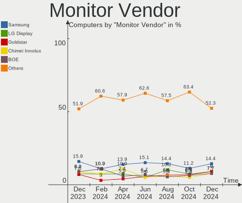

| Vendor                  | Computers | Percent |
|-------------------------|-----------|---------|
| Samsung Electronics     | 34        | 15.89%  |
| AU Optronics            | 21        | 9.81%   |
| Chimei Innolux          | 19        | 8.88%   |
| BOE                     | 19        | 8.88%   |
| LG Display              | 16        | 7.48%   |
| Goldstar                | 15        | 7.01%   |
| Acer                    | 11        | 5.14%   |
| Dell                    | 10        | 4.67%   |
| Apple                   | 10        | 4.67%   |
| Hewlett-Packard         | 6         | 2.8%    |
| BenQ                    | 6         | 2.8%    |
| ViewSonic               | 5         | 2.34%   |
| Valve                   | 5         | 2.34%   |
| Sharp                   | 4         | 1.87%   |
| Lenovo                  | 3         | 1.4%    |
| ASUSTek Computer        | 3         | 1.4%    |
| Ancor Communications    | 3         | 1.4%    |
| Toshiba                 | 2         | 0.93%   |
| Sony                    | 2         | 0.93%   |
| Philips                 | 2         | 0.93%   |
| Zoran                   | 1         | 0.47%   |
| Seiki                   | 1         | 0.47%   |
| SBE                     | 1         | 0.47%   |
| PANDA                   | 1         | 0.47%   |
| NEC Computers           | 1         | 0.47%   |
| MSI                     | 1         | 0.47%   |
| LLP                     | 1         | 0.47%   |
| LG Philips              | 1         | 0.47%   |
| Insignia                | 1         | 0.47%   |
| InfoVision              | 1         | 0.47%   |
| HKC                     | 1         | 0.47%   |
| GMS                     | 1         | 0.47%   |
| Gigabyte Technology     | 1         | 0.47%   |
| CSO                     | 1         | 0.47%   |
| CHR                     | 1         | 0.47%   |
| Chi Mei Optoelectronics | 1         | 0.47%   |
| BDS                     | 1         | 0.47%   |
| AOC                     | 1         | 0.47%   |

Monitor Model
-------------

Monitor models

| Model                                                                | Computers | Percent |
|----------------------------------------------------------------------|-----------|---------|
| Valve ANX7530 U VLV3001 800x1280 100x150mm 7.1-inch                  | 3         | 1.37%   |
| Chimei Innolux LCD Monitor CMN15F5 1920x1080 344x193mm 15.5-inch     | 3         | 1.37%   |
| Chimei Innolux LCD Monitor CMN1521 1920x1080 344x193mm 15.5-inch     | 3         | 1.37%   |
| ViewSonic VX2000 VSC4208 1600x1200 408x306mm 20.1-inch               | 2         | 0.91%   |
| Samsung Electronics LF27T35 SAM707F 1920x1080 598x337mm 27.0-inch    | 2         | 0.91%   |
| Samsung Electronics LCD Monitor SAM065D 1920x1080                    | 2         | 0.91%   |
| Goldstar 27GL650F GSM5B71 1920x1080 597x336mm 27.0-inch              | 2         | 0.91%   |
| BOE LCD Monitor BOE08B2 1366x768 309x174mm 14.0-inch                 | 2         | 0.91%   |
| BOE LCD Monitor BOE0715 1366x768 256x144mm 11.6-inch                 | 2         | 0.91%   |
| AU Optronics LCD Monitor AUO8294 1920x1080 382x215mm 17.3-inch       | 2         | 0.91%   |
| AU Optronics LCD Monitor AUO323D 1920x1080 309x174mm 14.0-inch       | 2         | 0.91%   |
| Apple iMac APPA007 2560x1440 597x336mm 27.0-inch                     | 2         | 0.91%   |
| Apple Color LCD APPA041 2560x1600 286x179mm 13.3-inch                | 2         | 0.91%   |
| Acer ED320QR S ACR0805 1920x1080 698x393mm 31.5-inch                 | 2         | 0.91%   |
| Zoran ZORAN ZRN02E9 1280x720 440x250mm 19.9-inch                     | 1         | 0.46%   |
| ViewSonic XG2431 VSC3B3B 1920x1080 527x296mm 23.8-inch               | 1         | 0.46%   |
| ViewSonic VX3276-FHD VSCE735 1920x1080 698x393mm 31.5-inch           | 1         | 0.46%   |
| ViewSonic VA2447-FHD VSC303B 1920x1080 527x296mm 23.8-inch           | 1         | 0.46%   |
| Valve ANX7530 U VLV3004 800x1280 100x160mm 7.4-inch                  | 1         | 0.46%   |
| Valve ANX7530 U VLV3003 800x1280 100x160mm 7.4-inch                  | 1         | 0.46%   |
| Toshiba TV TSB0206 1920x1080 890x500mm 40.2-inch                     | 1         | 0.46%   |
| Toshiba TV TSB0200 1360x768 409x230mm 18.5-inch                      | 1         | 0.46%   |
| Sony TV SNY9C01 1360x768                                             | 1         | 0.46%   |
| Sony LCD Monitor TV  *00 3840x2160                                   | 1         | 0.46%   |
| Sharp LQ140Z1JW01 SHP1401 3200x1800 310x174mm 14.0-inch              | 1         | 0.46%   |
| Sharp LCD Monitor SHP14D0 3840x2400 336x210mm 15.6-inch              | 1         | 0.46%   |
| Sharp LCD Monitor SHP14BA 1920x1080 344x194mm 15.5-inch              | 1         | 0.46%   |
| Sharp LCD Monitor SHP1453 1920x1080 346x194mm 15.6-inch              | 1         | 0.46%   |
| Seiki SE32HXC1TCA SEK6308 1366x768 700x390mm 31.5-inch               | 1         | 0.46%   |
| SBE 2511600 SBE2442 1920x1080 478x269mm 21.6-inch                    | 1         | 0.46%   |
| Samsung Electronics SyncMaster SAM05ED 1920x1080 600x340mm 27.2-inch | 1         | 0.46%   |
| Samsung Electronics SyncMaster SAM0498 1600x900 443x249mm 20.0-inch  | 1         | 0.46%   |
| Samsung Electronics SyncMaster SAM037C 1680x1050 474x296mm 22.0-inch | 1         | 0.46%   |
| Samsung Electronics SyncMaster SAM027D 1680x1050 433x271mm 20.1-inch | 1         | 0.46%   |
| Samsung Electronics SMS27A850 SAM083C 2560x1440 518x324mm 24.1-inch  | 1         | 0.46%   |
| Samsung Electronics SMBX2450L SAM0720 1920x1080 521x293mm 23.5-inch  | 1         | 0.46%   |
| Samsung Electronics SMB2230H SAM0648 1920x1080                       | 1         | 0.46%   |
| Samsung Electronics S32D850 SAM0BCB 2560x1440 708x398mm 32.0-inch    | 1         | 0.46%   |
| Samsung Electronics S27F350 SAM0D22 1920x1080 598x336mm 27.0-inch    | 1         | 0.46%   |
| Samsung Electronics S24D300 SAM0B45 1920x1080 521x293mm 23.5-inch    | 1         | 0.46%   |

Monitor Resolution
------------------

Monitor screen resolution

| Resolution         | Computers | Percent |
|--------------------|-----------|---------|
| 1920x1080 (FHD)    | 107       | 52.45%  |
| 1366x768 (WXGA)    | 21        | 10.29%  |
| 2560x1440 (QHD)    | 12        | 5.88%   |
| 3840x2160 (4K)     | 9         | 4.41%   |
| 2560x1600          | 7         | 3.43%   |
| 1600x900 (HD+)     | 6         | 2.94%   |
| 800x1280           | 5         | 2.45%   |
| 1680x1050 (WSXGA+) | 5         | 2.45%   |
| 1440x900 (WXGA+)   | 5         | 2.45%   |
| 1920x1200 (WUXGA)  | 4         | 1.96%   |
| 1280x1024 (SXGA)   | 3         | 1.47%   |
| 3440x1440          | 2         | 0.98%   |
| 3200x1800 (QHD+)   | 2         | 0.98%   |
| 2560x1080          | 2         | 0.98%   |
| 1600x1200          | 2         | 0.98%   |
| 1360x768           | 2         | 0.98%   |
| 1280x800 (WXGA)    | 2         | 0.98%   |
| 3840x2400          | 1         | 0.49%   |
| 2880x1800          | 1         | 0.49%   |
| 2880x1620          | 1         | 0.49%   |
| 2736x1824          | 1         | 0.49%   |
| 1920x1280          | 1         | 0.49%   |
| 1680x945           | 1         | 0.49%   |
| 1536x2048          | 1         | 0.49%   |
| 1280x720 (HD)      | 1         | 0.49%   |

Monitor Diagonal
----------------

Diagonal size in inches

| Inches  | Computers | Percent |
|---------|-----------|---------|
| 15      | 39        | 18.14%  |
| 27      | 22        | 10.23%  |
| 14      | 20        | 9.3%    |
| 13      | 18        | 8.37%   |
| 23      | 15        | 6.98%   |
| 24      | 14        | 6.51%   |
| 21      | 13        | 6.05%   |
| 17      | 13        | 6.05%   |
| 31      | 9         | 4.19%   |
| 20      | 8         | 3.72%   |
| Unknown | 6         | 2.79%   |
| 11      | 5         | 2.33%   |
| 7       | 5         | 2.33%   |
| 34      | 4         | 1.86%   |
| 18      | 4         | 1.86%   |
| 16      | 4         | 1.86%   |
| 19      | 3         | 1.4%    |
| 12      | 3         | 1.4%    |
| 25      | 2         | 0.93%   |
| 84      | 1         | 0.47%   |
| 74      | 1         | 0.47%   |
| 72      | 1         | 0.47%   |
| 42      | 1         | 0.47%   |
| 41      | 1         | 0.47%   |
| 35      | 1         | 0.47%   |
| 32      | 1         | 0.47%   |
| 22      | 1         | 0.47%   |

Monitor Width
-------------

Physical width

| Width in mm | Computers | Percent |
|-------------|-----------|---------|
| 301-350     | 73        | 34.43%  |
| 501-600     | 48        | 22.64%  |
| 401-500     | 27        | 12.74%  |
| 201-300     | 19        | 8.96%   |
| 351-400     | 12        | 5.66%   |
| 601-700     | 11        | 5.19%   |
| Unknown     | 6         | 2.83%   |
| 701-800     | 5         | 2.36%   |
| 1-100       | 5         | 2.36%   |
| 1501-2000   | 3         | 1.42%   |
| 901-1000    | 2         | 0.94%   |
| 801-900     | 1         | 0.47%   |

Aspect Ratio
------------

Proportional relationship between the width and the height

| Ratio   | Computers | Percent |
|---------|-----------|---------|
| 16/9    | 145       | 75.13%  |
| 16/10   | 30        | 15.54%  |
| 21/9    | 4         | 2.07%   |
| 0.67    | 3         | 1.55%   |
| 5/4     | 2         | 1.04%   |
| 4/3     | 2         | 1.04%   |
| 3/2     | 2         | 1.04%   |
| 0.62    | 2         | 1.04%   |
| Unknown | 2         | 1.04%   |
| 0.75    | 1         | 0.52%   |

Monitor Area
------------

Area in inch²

| Area in inch² | Computers | Percent |
|----------------|-----------|---------|
| 101-110        | 39        | 18.14%  |
| 201-250        | 35        | 16.28%  |
| 81-90          | 27        | 12.56%  |
| 301-350        | 22        | 10.23%  |
| 151-200        | 15        | 6.98%   |
| 351-500        | 14        | 6.51%   |
| 71-80          | 10        | 4.65%   |
| 121-130        | 9         | 4.19%   |
| 251-300        | 7         | 3.26%   |
| Unknown        | 6         | 2.79%   |
| 51-60          | 5         | 2.33%   |
| 1-40           | 5         | 2.33%   |
| 141-150        | 5         | 2.33%   |
| 111-120        | 4         | 1.86%   |
| More than 1000 | 3         | 1.4%    |
| 501-1000       | 3         | 1.4%    |
| 61-70          | 2         | 0.93%   |
| 131-140        | 2         | 0.93%   |
| 91-100         | 2         | 0.93%   |

Pixel Density
-------------

Pixels per inch

| Density       | Computers | Percent |
|---------------|-----------|---------|
| 51-100        | 66        | 32.2%   |
| 121-160       | 63        | 30.73%  |
| 101-120       | 40        | 19.51%  |
| 161-240       | 22        | 10.73%  |
| Unknown       | 6         | 2.93%   |
| More than 240 | 4         | 1.95%   |
| 1-50          | 4         | 1.95%   |

Multiple Monitors
-----------------

Total monitors connected

| Total | Computers | Percent |
|-------|-----------|---------|
| 1     | 153       | 69.55%  |
| 2     | 36        | 16.36%  |
| 0     | 29        | 13.18%  |
| 3     | 2         | 0.91%   |

Network
-------

Net Controller Vendor
---------------------

Controller vendors

| Vendor                          | Computers | Percent |
|---------------------------------|-----------|---------|
| Intel                           | 129       | 39.57%  |
| Realtek Semiconductor           | 108       | 33.13%  |
| Qualcomm Atheros                | 19        | 5.83%   |
| Broadcom                        | 19        | 5.83%   |
| MediaTek                        | 10        | 3.07%   |
| Ralink                          | 5         | 1.53%   |
| Marvell Technology Group        | 3         | 0.92%   |
| ASIX Electronics                | 3         | 0.92%   |
| Ralink Technology               | 2         | 0.61%   |
| Qualcomm Technologies           | 2         | 0.61%   |
| Qualcomm Atheros Communications | 2         | 0.61%   |
| Qualcomm                        | 2         | 0.61%   |
| Nvidia                          | 2         | 0.61%   |
| Microsoft                       | 2         | 0.61%   |
| DisplayLink                     | 2         | 0.61%   |
| D-Link                          | 2         | 0.61%   |
| Broadcom Limited                | 2         | 0.61%   |
| Texas Instruments               | 1         | 0.31%   |
| NetXen Incorporated             | 1         | 0.31%   |
| NetGear                         | 1         | 0.31%   |
| Netchip Technology              | 1         | 0.31%   |
| Linksys                         | 1         | 0.31%   |
| Lenovo                          | 1         | 0.31%   |
| Hewlett-Packard                 | 1         | 0.31%   |
| D-Link System                   | 1         | 0.31%   |
| Cisco Systems                   | 1         | 0.31%   |
| ASUSTek Computer                | 1         | 0.31%   |
| Aquantia                        | 1         | 0.31%   |
| AMD                             | 1         | 0.31%   |

Net Controller Model
--------------------

Controller models

| Model                                                             | Computers | Percent |
|-------------------------------------------------------------------|-----------|---------|
| Realtek RTL8111/8168/8411 PCI Express Gigabit Ethernet Controller | 62        | 15.98%  |
| Realtek RTL8125 2.5GbE Controller                                 | 15        | 3.87%   |
| Intel Wi-Fi 6 AX200                                               | 13        | 3.35%   |
| Intel Alder Lake-P PCH CNVi WiFi                                  | 10        | 2.58%   |
| Realtek RTL8153 Gigabit Ethernet Adapter                          | 9         | 2.32%   |
| Intel I211 Gigabit Network Connection                             | 9         | 2.32%   |
| Intel Wireless 7260                                               | 8         | 2.06%   |
| Intel 82579LM Gigabit Network Connection (Lewisville)             | 8         | 2.06%   |
| Intel Wireless 8260                                               | 7         | 1.8%    |
| Intel Raptor Lake PCH CNVi WiFi                                   | 7         | 1.8%    |
| Intel Cannon Point-LP CNVi [Wireless-AC]                          | 7         | 1.8%    |
| Intel 700 Series Chipset Family Wi-Fi                             | 7         | 1.8%    |
| Intel Wireless 7265                                               | 6         | 1.55%   |
| Realtek RTL8822CE 802.11ac PCIe Wireless Network Adapter          | 5         | 1.29%   |
| Realtek RTL8821CE 802.11ac PCIe Wireless Network Adapter          | 5         | 1.29%   |
| Realtek RTL810xE PCI Express Fast Ethernet controller             | 4         | 1.03%   |
| Realtek Killer E3000 2.5GbE Controller                            | 4         | 1.03%   |
| Qualcomm Atheros QCA9377 802.11ac Wireless Network Adapter        | 4         | 1.03%   |
| Intel Wireless 8265 / 8275                                        | 4         | 1.03%   |
| Intel Wi-Fi 6 AX201                                               | 4         | 1.03%   |
| Intel Ethernet Controller I225-V                                  | 4         | 1.03%   |
| Intel Comet Lake PCH CNVi WiFi                                    | 4         | 1.03%   |
| Intel Cannon Lake PCH CNVi WiFi                                   | 4         | 1.03%   |
| Qualcomm Atheros QCA6174 802.11ac Wireless Network Adapter        | 3         | 0.77%   |
| MediaTek MT7922 802.11ax PCI Express Wireless Network Adapter     | 3         | 0.77%   |
| MediaTek MT7921 802.11ax PCI Express Wireless Network Adapter     | 3         | 0.77%   |
| Intel Wi-Fi 6 AX210/AX211/AX411 160MHz                            | 3         | 0.77%   |
| Intel Ethernet Connection I218-LM                                 | 3         | 0.77%   |
| Intel Ethernet Connection I217-LM                                 | 3         | 0.77%   |
| Intel Ethernet Connection (6) I219-LM                             | 3         | 0.77%   |
| Intel Ethernet Connection (2) I219-V                              | 3         | 0.77%   |
| Intel Ethernet Connection (2) I219-LM                             | 3         | 0.77%   |
| Intel Ethernet Connection (16) I219-LM                            | 3         | 0.77%   |
| Intel Dual Band Wireless-AC 3168NGW [Stone Peak]                  | 3         | 0.77%   |
| Intel Centrino Advanced-N 6235                                    | 3         | 0.77%   |
| Broadcom NetXtreme BCM5764M Gigabit Ethernet PCIe                 | 3         | 0.77%   |
| ASIX AX88179 Gigabit Ethernet                                     | 3         | 0.77%   |
| Realtek RTL8852BE PCIe 802.11ax Wireless Network Controller       | 2         | 0.52%   |
| Realtek RTL8821AE 802.11ac PCIe Wireless Network Adapter          | 2         | 0.52%   |
| Realtek RTL8188EE Wireless Network Adapter                        | 2         | 0.52%   |

Wireless Vendor
---------------

Wireless vendors

| Vendor                          | Computers | Percent |
|---------------------------------|-----------|---------|
| Intel                           | 106       | 56.99%  |
| Realtek Semiconductor           | 23        | 12.37%  |
| Qualcomm Atheros                | 13        | 6.99%   |
| Broadcom                        | 12        | 6.45%   |
| MediaTek                        | 10        | 5.38%   |
| Ralink                          | 5         | 2.69%   |
| Ralink Technology               | 2         | 1.08%   |
| Qualcomm Atheros Communications | 2         | 1.08%   |
| Qualcomm                        | 2         | 1.08%   |
| Microsoft                       | 2         | 1.08%   |
| D-Link                          | 2         | 1.08%   |
| Broadcom Limited                | 2         | 1.08%   |
| Qualcomm Technologies           | 1         | 0.54%   |
| NetGear                         | 1         | 0.54%   |
| Linksys                         | 1         | 0.54%   |
| D-Link System                   | 1         | 0.54%   |
| ASUSTek Computer                | 1         | 0.54%   |

Wireless Model
--------------

Wireless models

| Model                                                          | Computers | Percent |
|----------------------------------------------------------------|-----------|---------|
| Intel Wi-Fi 6 AX200                                            | 13        | 6.95%   |
| Intel Alder Lake-P PCH CNVi WiFi                               | 10        | 5.35%   |
| Intel Wireless 7260                                            | 8         | 4.28%   |
| Intel Wireless 8260                                            | 7         | 3.74%   |
| Intel Raptor Lake PCH CNVi WiFi                                | 7         | 3.74%   |
| Intel Cannon Point-LP CNVi [Wireless-AC]                       | 7         | 3.74%   |
| Intel 700 Series Chipset Family Wi-Fi                          | 7         | 3.74%   |
| Intel Wireless 7265                                            | 6         | 3.21%   |
| Realtek RTL8822CE 802.11ac PCIe Wireless Network Adapter       | 5         | 2.67%   |
| Realtek RTL8821CE 802.11ac PCIe Wireless Network Adapter       | 5         | 2.67%   |
| Qualcomm Atheros QCA9377 802.11ac Wireless Network Adapter     | 4         | 2.14%   |
| Intel Wireless 8265 / 8275                                     | 4         | 2.14%   |
| Intel Wi-Fi 6 AX201                                            | 4         | 2.14%   |
| Intel Comet Lake PCH CNVi WiFi                                 | 4         | 2.14%   |
| Intel Cannon Lake PCH CNVi WiFi                                | 4         | 2.14%   |
| Qualcomm Atheros QCA6174 802.11ac Wireless Network Adapter     | 3         | 1.6%    |
| MediaTek MT7922 802.11ax PCI Express Wireless Network Adapter  | 3         | 1.6%    |
| MediaTek MT7921 802.11ax PCI Express Wireless Network Adapter  | 3         | 1.6%    |
| Intel Wi-Fi 6 AX210/AX211/AX411 160MHz                         | 3         | 1.6%    |
| Intel Dual Band Wireless-AC 3168NGW [Stone Peak]               | 3         | 1.6%    |
| Intel Centrino Advanced-N 6235                                 | 3         | 1.6%    |
| Realtek RTL8852BE PCIe 802.11ax Wireless Network Controller    | 2         | 1.07%   |
| Realtek RTL8821AE 802.11ac PCIe Wireless Network Adapter       | 2         | 1.07%   |
| Realtek RTL8188EE Wireless Network Adapter                     | 2         | 1.07%   |
| Qualcomm QCNFA765 Wireless Network Adapter                     | 2         | 1.07%   |
| Qualcomm Atheros AR9271 802.11n                                | 2         | 1.07%   |
| Qualcomm Atheros AR928X Wireless Network Adapter (PCI-Express) | 2         | 1.07%   |
| Microsoft Wireless XBox Controller Dongle                      | 2         | 1.07%   |
| MediaTek Wi-Fi 6E MT7902 Wireless Network Adapter              | 2         | 1.07%   |
| MediaTek MT7921K (RZ608) Wi-Fi 6E 80MHz                        | 2         | 1.07%   |
| Intel Ice Lake-LP PCH CNVi WiFi                                | 2         | 1.07%   |
| Intel Gemini Lake PCH CNVi WiFi                                | 2         | 1.07%   |
| Intel Centrino Advanced-N 6205 [Taylor Peak]                   | 2         | 1.07%   |
| Intel Alder Lake-S PCH CNVi WiFi                               | 2         | 1.07%   |
| Broadcom BCM4377b Wireless Network Adapter                     | 2         | 1.07%   |
| Broadcom BCM4331 802.11a/b/g/n                                 | 2         | 1.07%   |
| Realtek RTL8852AE WiFi 6 802.11ax PCIe Adapter                 | 1         | 0.53%   |
| Realtek RTL8814AU 802.11a/b/g/n/ac Wireless Adapter            | 1         | 0.53%   |
| Realtek RTL8192EU 802.11b/g/n WLAN Adapter                     | 1         | 0.53%   |
| Realtek RTL8188ETV Wireless LAN 802.11n Network Adapter        | 1         | 0.53%   |

Ethernet Vendor
---------------

Ethernet vendors

| Vendor                   | Computers | Percent |
|--------------------------|-----------|---------|
| Realtek Semiconductor    | 94        | 50.54%  |
| Intel                    | 60        | 32.26%  |
| Broadcom                 | 10        | 5.38%   |
| Qualcomm Atheros         | 9         | 4.84%   |
| Marvell Technology Group | 3         | 1.61%   |
| ASIX Electronics         | 3         | 1.61%   |
| Nvidia                   | 2         | 1.08%   |
| DisplayLink              | 2         | 1.08%   |
| NetXen Incorporated      | 1         | 0.54%   |
| Hewlett-Packard          | 1         | 0.54%   |
| Aquantia                 | 1         | 0.54%   |

Ethernet Model
--------------

Ethernet models

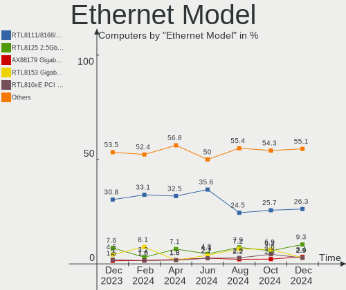

| Model                                                                          | Computers | Percent |
|--------------------------------------------------------------------------------|-----------|---------|
| Realtek RTL8111/8168/8411 PCI Express Gigabit Ethernet Controller              | 62        | 32.29%  |
| Realtek RTL8125 2.5GbE Controller                                              | 15        | 7.81%   |
| Realtek RTL8153 Gigabit Ethernet Adapter                                       | 9         | 4.69%   |
| Intel I211 Gigabit Network Connection                                          | 9         | 4.69%   |
| Intel 82579LM Gigabit Network Connection (Lewisville)                          | 8         | 4.17%   |
| Realtek RTL810xE PCI Express Fast Ethernet controller                          | 4         | 2.08%   |
| Realtek Killer E3000 2.5GbE Controller                                         | 4         | 2.08%   |
| Intel Ethernet Controller I225-V                                               | 4         | 2.08%   |
| Intel Ethernet Connection I218-LM                                              | 3         | 1.56%   |
| Intel Ethernet Connection I217-LM                                              | 3         | 1.56%   |
| Intel Ethernet Connection (6) I219-LM                                          | 3         | 1.56%   |
| Intel Ethernet Connection (2) I219-V                                           | 3         | 1.56%   |
| Intel Ethernet Connection (2) I219-LM                                          | 3         | 1.56%   |
| Intel Ethernet Connection (16) I219-LM                                         | 3         | 1.56%   |
| Broadcom NetXtreme BCM5764M Gigabit Ethernet PCIe                              | 3         | 1.56%   |
| ASIX AX88179 Gigabit Ethernet                                                  | 3         | 1.56%   |
| Realtek RTL-8100/8101L/8139 PCI Fast Ethernet Adapter                          | 2         | 1.04%   |
| Qualcomm Atheros Killer E2500 Gigabit Ethernet Controller                      | 2         | 1.04%   |
| Qualcomm Atheros AR8121/AR8113/AR8114 Gigabit or Fast Ethernet                 | 2         | 1.04%   |
| Intel Ethernet Connection I219-LM                                              | 2         | 1.04%   |
| Intel Ethernet Connection (7) I219-V                                           | 2         | 1.04%   |
| Intel Ethernet Connection (6) I219-V                                           | 2         | 1.04%   |
| Intel 82567LM-3 Gigabit Network Connection                                     | 2         | 1.04%   |
| Intel 80003ES2LAN Gigabit Ethernet Controller (Copper)                         | 2         | 1.04%   |
| Broadcom NetXtreme BCM57765 Gigabit Ethernet PCIe                              | 2         | 1.04%   |
| Realtek USB 10/100/1G/2.5G LAN                                                 | 1         | 0.52%   |
| Qualcomm Atheros QCA8172 Fast Ethernet                                         | 1         | 0.52%   |
| Qualcomm Atheros QCA8171 Gigabit Ethernet                                      | 1         | 0.52%   |
| Qualcomm Atheros Killer E2400 Gigabit Ethernet Controller                      | 1         | 0.52%   |
| Qualcomm Atheros AR8152 v1.1 Fast Ethernet                                     | 1         | 0.52%   |
| Qualcomm Atheros AR8151 v2.0 Gigabit Ethernet                                  | 1         | 0.52%   |
| Nvidia MCP79 Ethernet                                                          | 1         | 0.52%   |
| Nvidia MCP61 Ethernet                                                          | 1         | 0.52%   |
| NetXen Incorporated NX3031 Multifunction 1/10-Gigabit Server Adapter           | 1         | 0.52%   |
| Marvell Group Yukon Optima 88E8059 [PCIe Gigabit Ethernet Controller with AVB] | 1         | 0.52%   |
| Marvell Group 88E8058 PCI-E Gigabit Ethernet Controller                        | 1         | 0.52%   |
| Marvell Group 88E8057 PCI-E Gigabit Ethernet Controller                        | 1         | 0.52%   |
| Intel I210 Gigabit Network Connection                                          | 1         | 0.52%   |
| Intel Ethernet Controller I226-V                                               | 1         | 0.52%   |
| Intel Ethernet Connection (5) I219-V                                           | 1         | 0.52%   |

Net Controller Kind
-------------------

Ethernet, WiFi or modem

| Kind     | Computers | Percent |
|----------|-----------|---------|
| Ethernet | 176       | 48.89%  |
| WiFi     | 175       | 48.61%  |
| Modem    | 5         | 1.39%   |
| Unknown  | 4         | 1.11%   |

Used Controller
---------------

Currently used network controller

| Kind     | Computers | Percent |
|----------|-----------|---------|
| WiFi     | 125       | 56.05%  |
| Ethernet | 98        | 43.95%  |

NICs
----

Total network controllers on board

| Total | Computers | Percent |
|-------|-----------|---------|
| 2     | 129       | 58.64%  |
| 1     | 76        | 34.55%  |
| 3     | 9         | 4.09%   |
| 0     | 5         | 2.27%   |
| 6     | 1         | 0.45%   |

IPv6
----

IPv6 vs IPv4

| Used | Computers | Percent |
|------|-----------|---------|
| No   | 168       | 76.36%  |
| Yes  | 52        | 23.64%  |

Bluetooth
---------

Bluetooth Vendor
----------------

Controller vendors

| Vendor                          | Computers | Percent |
|---------------------------------|-----------|---------|
| Intel                           | 95        | 63.76%  |
| IMC Networks                    | 12        | 8.05%   |
| Broadcom                        | 8         | 5.37%   |
| Realtek Semiconductor           | 7         | 4.7%    |
| Apple                           | 7         | 4.7%    |
| Foxconn / Hon Hai               | 6         | 4.03%   |
| Lite-On Technology              | 4         | 2.68%   |
| Qualcomm Atheros Communications | 3         | 2.01%   |
| MediaTek                        | 2         | 1.34%   |
| Toshiba                         | 1         | 0.67%   |
| Realtek                         | 1         | 0.67%   |
| Ralink                          | 1         | 0.67%   |
| Cambridge Silicon Radio         | 1         | 0.67%   |
| ASUSTek Computer                | 1         | 0.67%   |

Bluetooth Model
---------------

Controller models

| Model                                               | Computers | Percent |
|-----------------------------------------------------|-----------|---------|
| Intel Bluetooth Device                              | 31        | 20.81%  |
| Intel Bluetooth wireless interface                  | 25        | 16.78%  |
| Intel Bluetooth 9460/9560 Jefferson Peak (JfP)      | 14        | 9.4%    |
| Intel AX200 Bluetooth                               | 13        | 8.72%   |
| Realtek Bluetooth Radio                             | 6         | 4.03%   |
| IMC Networks Wireless_Device                        | 5         | 3.36%   |
| Intel Centrino Bluetooth Wireless Transceiver       | 4         | 2.68%   |
| IMC Networks 802.11ac WLAN Adapter                  | 4         | 2.68%   |
| Lite-On Qualcomm Atheros QCA9377 Bluetooth          | 3         | 2.01%   |
| Intel Wireless-AC 3168 Bluetooth                    | 3         | 2.01%   |
| Intel AX210 Bluetooth                               | 3         | 2.01%   |
| IMC Networks Bluetooth Radio                        | 3         | 2.01%   |
| Foxconn / Hon Hai Bluetooth Device                  | 3         | 2.01%   |
| Broadcom BCM20702A0 Bluetooth 4.0                   | 3         | 2.01%   |
| Apple Bluetooth USB Host Controller                 | 3         | 2.01%   |
| Qualcomm Atheros QCA61x4 Bluetooth 4.0              | 2         | 1.34%   |
| MediaTek Wireless_Device                            | 2         | 1.34%   |
| Foxconn / Hon Hai Wireless_Device                   | 2         | 1.34%   |
| Apple Bluetooth Host Controller                     | 2         | 1.34%   |
| Toshiba Atheros AR3012 Bluetooth                    | 1         | 0.67%   |
| Realtek  Bluetooth 4.2 Adapter                      | 1         | 0.67%   |
| Realtek Bluetooth Radio                             | 1         | 0.67%   |
| Ralink RT3290 Bluetooth                             | 1         | 0.67%   |
| Qualcomm Atheros  Bluetooth Device                  | 1         | 0.67%   |
| Lite-On Broadcom BCM43142A0 Bluetooth Device        | 1         | 0.67%   |
| Intel Wireless-AC 9260 Bluetooth Adapter            | 1         | 0.67%   |
| Intel Centrino Advanced-N 6230 Bluetooth adapter    | 1         | 0.67%   |
| Foxconn / Hon Hai Bluetooth Adapter                 | 1         | 0.67%   |
| Cambridge Silicon Radio Bluetooth Dongle (HCI mode) | 1         | 0.67%   |
| Broadcom BCM92046DG-CL1ROM Bluetooth 2.1 Adapter    | 1         | 0.67%   |
| Broadcom BCM2070B0                                  | 1         | 0.67%   |
| Broadcom BCM20702 Bluetooth 4.0 [ThinkPad]          | 1         | 0.67%   |
| Broadcom BCM2045B (BDC-2.1)                         | 1         | 0.67%   |
| Broadcom BCM2045B (BDC-2) [Bluetooth Controller]    | 1         | 0.67%   |
| ASUS Broadcom BCM20702A0 Bluetooth                  | 1         | 0.67%   |
| Apple Built-in Bluetooth 2.0+EDR HCI                | 1         | 0.67%   |
| Apple Bluetooth HCI                                 | 1         | 0.67%   |

Sound
-----

Sound Vendor
------------

Sound card vendors

| Vendor                     | Computers | Percent |
|----------------------------|-----------|---------|
| Intel                      | 159       | 50.8%   |
| AMD                        | 58        | 18.53%  |
| Nvidia                     | 57        | 18.21%  |
| C-Media Electronics        | 5         | 1.6%    |
| SteelSeries ApS            | 3         | 0.96%   |
| Kingston Technology        | 3         | 0.96%   |
| ASUSTek Computer           | 3         | 0.96%   |
| Logitech                   | 2         | 0.64%   |
| JMTek                      | 2         | 0.64%   |
| Hewlett-Packard            | 2         | 0.64%   |
| BEHRINGER International    | 2         | 0.64%   |
| Apple                      | 2         | 0.64%   |
| Texas Instruments          | 1         | 0.32%   |
| Realtek Semiconductor      | 1         | 0.32%   |
| PreSonus Audio Electronics | 1         | 0.32%   |
| Plantronics                | 1         | 0.32%   |
| Micro Star International   | 1         | 0.32%   |
| Lenovo                     | 1         | 0.32%   |
| iCON                       | 1         | 0.32%   |
| Google                     | 1         | 0.32%   |
| GN Netcom                  | 1         | 0.32%   |
| DSEA A/S                   | 1         | 0.32%   |
| Creative Technology        | 1         | 0.32%   |
| Creative Labs              | 1         | 0.32%   |
| BR23                       | 1         | 0.32%   |
| Bose                       | 1         | 0.32%   |
| Blue Microphones           | 1         | 0.32%   |

Sound Model
-----------

Sound card models

| Model                                                                      | Computers | Percent |
|----------------------------------------------------------------------------|-----------|---------|
| AMD Family 17h/19h HD Audio Controller                                     | 20        | 5.54%   |
| Nvidia Audio device                                                        | 18        | 4.99%   |
| Intel Alder Lake PCH-P High Definition Audio Controller                    | 13        | 3.6%    |
| Intel 7 Series/C216 Chipset Family High Definition Audio Controller        | 11        | 3.05%   |
| AMD Renoir Radeon High Definition Audio Controller                         | 11        | 3.05%   |
| Intel Cannon Point-LP High Definition Audio Controller                     | 10        | 2.77%   |
| AMD Starship/Matisse HD Audio Controller                                   | 10        | 2.77%   |
| AMD Navi 21/23 HDMI/DP Audio Controller                                    | 10        | 2.77%   |
| Intel 6 Series/C200 Series Chipset Family High Definition Audio Controller | 9         | 2.49%   |
| AMD Rembrandt Radeon High Definition Audio Controller                      | 9         | 2.49%   |
| Intel Sunrise Point-LP HD Audio                                            | 8         | 2.22%   |
| Intel Raptor Lake-P/U/H cAVS                                               | 8         | 2.22%   |
| Intel Cannon Lake PCH cAVS                                                 | 8         | 2.22%   |
| Intel 700 Series Chipset Family Precise Touch and Stylus Port #1           | 8         | 2.22%   |
| Intel 200 Series PCH HD Audio                                              | 8         | 2.22%   |
| Intel 100 Series/C230 Series Chipset Family HD Audio Controller            | 7         | 1.94%   |
| Intel Celeron/Pentium Silver Processor High Definition Audio               | 6         | 1.66%   |
| Intel 8 Series HD Audio Controller                                         | 6         | 1.66%   |
| AMD SBx00 Azalia (Intel HDA)                                               | 6         | 1.66%   |
| Nvidia GA106 High Definition Audio Controller                              | 5         | 1.39%   |
| Nvidia GA104 High Definition Audio Controller                              | 5         | 1.39%   |
| Intel Xeon E3-1200 v3/4th Gen Core Processor HD Audio Controller           | 5         | 1.39%   |
| Intel Tiger Lake-LP Smart Sound Technology Audio Controller                | 5         | 1.39%   |
| Intel Tiger Lake-H HD Audio Controller                                     | 5         | 1.39%   |
| Intel Haswell-ULT HD Audio Controller                                      | 5         | 1.39%   |
| Intel Comet Lake PCH cAVS                                                  | 5         | 1.39%   |
| Intel 8 Series/C220 Series Chipset High Definition Audio Controller        | 5         | 1.39%   |
| Intel 5 Series/3400 Series Chipset High Definition Audio                   | 5         | 1.39%   |
| Nvidia TU107 GeForce GTX 1650 High Definition Audio Controller             | 4         | 1.11%   |
| Nvidia GP106 High Definition Audio Controller                              | 4         | 1.11%   |
| Intel 82801I (ICH9 Family) HD Audio Controller                             | 4         | 1.11%   |
| AMD Ellesmere HDMI Audio [Radeon RX 470/480 / 570/580/590]                 | 4         | 1.11%   |
| Nvidia TU106 High Definition Audio Controller                              | 3         | 0.83%   |
| Nvidia GK106 HDMI Audio Controller                                         | 3         | 0.83%   |
| Intel 82801H (ICH8 Family) HD Audio Controller                             | 3         | 0.83%   |
| ASUSTek Computer C-Media Audio                                             | 3         | 0.83%   |
| Nvidia TU116 High Definition Audio Controller                              | 2         | 0.55%   |
| Nvidia GP107GL High Definition Audio Controller                            | 2         | 0.55%   |
| Nvidia GM107 High Definition Audio Controller [GeForce 940MX]              | 2         | 0.55%   |
| Nvidia GK107 HDMI Audio Controller                                         | 2         | 0.55%   |

Memory
------

Memory Vendor
-------------

Memory module vendors

| Vendor                       | Computers | Percent |
|------------------------------|-----------|---------|
| Samsung Electronics          | 41        | 25.79%  |
| SK hynix                     | 33        | 20.75%  |
| Micron Technology            | 20        | 12.58%  |
| Kingston                     | 13        | 8.18%   |
| Unknown                      | 10        | 6.29%   |
| G.Skill                      | 8         | 5.03%   |
| Corsair                      | 6         | 3.77%   |
| Crucial                      | 5         | 3.14%   |
| Team                         | 4         | 2.52%   |
| A-DATA Technology            | 3         | 1.89%   |
| Timetec                      | 2         | 1.26%   |
| Elpida                       | 2         | 1.26%   |
| Transcend                    | 1         | 0.63%   |
| Ramaxel Technology           | 1         | 0.63%   |
| PSC                          | 1         | 0.63%   |
| Patriot Memory (PDP Systems) | 1         | 0.63%   |
| Nanya Technology             | 1         | 0.63%   |
| Goldkey                      | 1         | 0.63%   |
| ASint Technology             | 1         | 0.63%   |
| 2C0C0938D64355CB             | 1         | 0.63%   |
| 2C0C0938D64355C8             | 1         | 0.63%   |
| 2C0C0938D64355B4             | 1         | 0.63%   |
| 2C0C0938D64355B2             | 1         | 0.63%   |
| Unknown                      | 1         | 0.63%   |

Memory Model
------------

Memory module models

| Model                                                        | Computers | Percent |
|--------------------------------------------------------------|-----------|---------|
| Samsung RAM M425R1GB4BB0-CQKOL 8GB SODIMM DDR5 4800MT/s      | 5         | 2.94%   |
| SK hynix RAM HMA851S6CJR6N-VK 4GB SODIMM DDR4 2667MT/s       | 4         | 2.35%   |
| SK hynix RAM HMAG68EXNSA051N 8GB SODIMM DDR4 3200MT/s        | 3         | 1.76%   |
| Samsung RAM M471B1G73QH0-YK0 8GB SODIMM DDR3 1867MT/s        | 3         | 1.76%   |
| Samsung RAM M471A1K43EB1-CWE 8GB SODIMM DDR4 3200MT/s        | 3         | 1.76%   |
| Unknown RAM Module 4GB DIMM 1333MT/s                         | 2         | 1.18%   |
| Timetec RAM S8G-1600 8GB SODIMM DDR3 1600MT/s                | 2         | 1.18%   |
| SK hynix RAM HMT451S6BFR8A-PB 4GB SODIMM DDR3 1600MT/s       | 2         | 1.18%   |
| SK hynix RAM HMT41GS6BFR8A-PB 8GB SODIMM DDR3 1600MT/s       | 2         | 1.18%   |
| SK hynix RAM HMCG78AGBSA095N 16GB SODIMM DDR5 5600MT/s       | 2         | 1.18%   |
| Samsung RAM M471A1G44BB0-CWE 8GB SODIMM DDR4 3200MT/s        | 2         | 1.18%   |
| Samsung RAM M425R2GA3BB0-CWMOD 16GB SODIMM DDR5 5600MT/s     | 2         | 1.18%   |
| Samsung RAM K3UH5H50MM-JGCJ 4GB Row Of Chips LPDDR4 3733MT/s | 2         | 1.18%   |
| Samsung RAM K3KL8L80CM-MGCT 2GB Row Of Chips LPDDR5 6400MT/s | 2         | 1.18%   |
| Micron RAM 4ATF51264HZ-2G6E1 4GB SODIMM DDR4 2667MT/s        | 2         | 1.18%   |
| Kingston RAM Module 4GB FB-DIMM DDR2 667MT/s                 | 2         | 1.18%   |
| G.Skill RAM F4-3200C16-8GTZR 8GB DIMM DDR4 3200MT/s          | 2         | 1.18%   |
| Corsair RAM CMK32GX4M2D3600C18 16GB DIMM DDR4 3800MT/s       | 2         | 1.18%   |
| Corsair RAM CMK16GX4M2D3600C18 8GB DIMM DDR4 3600MT/s        | 2         | 1.18%   |
| Unknown RAM Module 4GB SODIMM                                | 1         | 0.59%   |
| Unknown RAM Module 4096MB DIMM DDR 1333MT/s                  | 1         | 0.59%   |
| Unknown RAM Module 2GB SODIMM DDR3 1600MT/s                  | 1         | 0.59%   |
| Unknown RAM Module 2GB SODIMM DDR3 1333MT/s                  | 1         | 0.59%   |
| Unknown RAM Module 2GB DIMM DDR2 800MT/s                     | 1         | 0.59%   |
| Unknown RAM Module 2GB DIMM DDR2 1067MT/s                    | 1         | 0.59%   |
| Unknown RAM Module 2GB DIMM 1333MT/s                         | 1         | 0.59%   |
| Unknown RAM Module 1GB SODIMM DRAM                           | 1         | 0.59%   |
| Unknown RAM Module 16384MB DIMM DDR4 3200MT/s                | 1         | 0.59%   |
| Transcend RAM TS1GSK64W6H-I 8GB SODIMM DDR3 1600MT/s         | 1         | 0.59%   |
| Team RAM TEAMGROUP-UD4-3600 8GB DIMM DDR4 3733MT/s           | 1         | 0.59%   |
| Team RAM TEAMGROUP-UD4-3200 8GB DIMM DDR4 3733MT/s           | 1         | 0.59%   |
| Team RAM TEAMGROUP-UD4-3000 8192MB DIMM DDR4 3200MT/s        | 1         | 0.59%   |
| Team RAM TEAMGROUP-SD4-3200 16GB SODIMM DDR4 3200MT/s        | 1         | 0.59%   |
| SK hynix RAM Module 8GB SODIMM DDR3 1333MT/s                 | 1         | 0.59%   |
| SK hynix RAM Module 4GB SODIMM DDR4 2400MT/s                 | 1         | 0.59%   |
| SK hynix RAM Module 4GB SODIMM DDR3 1333MT/s                 | 1         | 0.59%   |
| SK hynix RAM Module 4GB DIMM DDR3 1333MT/s                   | 1         | 0.59%   |
| SK hynix RAM Module 2GB SODIMM LPDDR3 1867MT/s               | 1         | 0.59%   |
| SK hynix RAM Module 2GB DIMM DDR3 1333MT/s                   | 1         | 0.59%   |
| SK hynix RAM HYMP125S64CP8-Y5 2GB SODIMM DDR2 667MT/s        | 1         | 0.59%   |

Memory Kind
-----------

Memory module kinds

| Kind    | Computers | Percent |
|---------|-----------|---------|
| DDR4    | 63        | 46.32%  |
| DDR3    | 33        | 24.26%  |
| DDR5    | 15        | 11.03%  |
| DDR2    | 7         | 5.15%   |
| LPDDR5  | 5         | 3.68%   |
| LPDDR4  | 4         | 2.94%   |
| Unknown | 4         | 2.94%   |
| LPDDR3  | 3         | 2.21%   |
| DRAM    | 1         | 0.74%   |
| DDR     | 1         | 0.74%   |

Memory Form Factor
------------------

Physical design of the memory module

| Name         | Computers | Percent |
|--------------|-----------|---------|
| SODIMM       | 89        | 64.96%  |
| DIMM         | 33        | 24.09%  |
| Row Of Chips | 11        | 8.03%   |
| FB-DIMM      | 2         | 1.46%   |
| Chip         | 1         | 0.73%   |
| Unknown      | 1         | 0.73%   |

Memory Size
-----------

Memory module size

| Size  | Computers | Percent |
|-------|-----------|---------|
| 8192  | 60        | 41.1%   |
| 4096  | 35        | 23.97%  |
| 16384 | 21        | 14.38%  |
| 2048  | 18        | 12.33%  |
| 32768 | 10        | 6.85%   |
| 1024  | 2         | 1.37%   |

Memory Speed
------------

Memory module speed

| Speed   | Computers | Percent |
|---------|-----------|---------|
| 3200    | 27        | 18.75%  |
| 2667    | 17        | 11.81%  |
| 1600    | 17        | 11.81%  |
| 1333    | 15        | 10.42%  |
| 4800    | 9         | 6.25%   |
| 5600    | 7         | 4.86%   |
| 6400    | 5         | 3.47%   |
| 3600    | 5         | 3.47%   |
| 2400    | 5         | 3.47%   |
| 3733    | 4         | 2.78%   |
| 2133    | 4         | 2.78%   |
| 1867    | 3         | 2.08%   |
| 1067    | 3         | 2.08%   |
| 667     | 3         | 2.08%   |
| 3800    | 2         | 1.39%   |
| 3666    | 2         | 1.39%   |
| 1334    | 2         | 1.39%   |
| 800     | 2         | 1.39%   |
| Unknown | 2         | 1.39%   |
| 8400    | 1         | 0.69%   |
| 4267    | 1         | 0.69%   |
| 3866    | 1         | 0.69%   |
| 2800    | 1         | 0.69%   |
| 2666    | 1         | 0.69%   |
| 2465    | 1         | 0.69%   |
| 1866    | 1         | 0.69%   |
| 1800    | 1         | 0.69%   |
| 1066    | 1         | 0.69%   |
| 975     | 1         | 0.69%   |

Printers & scanners
-------------------

Printer Vendor
--------------

Printer device vendors

| Vendor          | Computers | Percent |
|-----------------|-----------|---------|
| Hewlett-Packard | 3         | 100%    |

Printer Model
-------------

Printer device models

| Model                        | Computers | Percent |
|------------------------------|-----------|---------|
| HP OfficeJet Pro 9010 series | 1         | 33.33%  |
| HP OfficeJet Pro 7740 series | 1         | 33.33%  |
| HP LaserJet 1020             | 1         | 33.33%  |

Scanner Vendor
--------------

Scanner device vendors

| Vendor | Computers | Percent |
|--------|-----------|---------|
| Canon  | 1         | 100%    |

Scanner Model
-------------

Scanner device models

| Model                   | Computers | Percent |
|-------------------------|-----------|---------|
| Canon CanoScan LiDE 120 | 1         | 100%    |

Camera
------

Camera Vendor
-------------

Camera device vendors

| Vendor                                  | Computers | Percent |
|-----------------------------------------|-----------|---------|
| Chicony Electronics                     | 23        | 17.56%  |
| IMC Networks                            | 18        | 13.74%  |
| Realtek Semiconductor                   | 14        | 10.69%  |
| Logitech                                | 9         | 6.87%   |
| Bison Electronics                       | 9         | 6.87%   |
| Microdia                                | 8         | 6.11%   |
| Sonix Technology                        | 7         | 5.34%   |
| Apple                                   | 7         | 5.34%   |
| Quanta                                  | 5         | 3.82%   |
| Sunplus Innovation Technology           | 4         | 3.05%   |
| Luxvisions Innotech Limited             | 4         | 3.05%   |
| Cheng Uei Precision Industry (Foxlink)  | 4         | 3.05%   |
| Suyin                                   | 3         | 2.29%   |
| Lite-On Technology                      | 3         | 2.29%   |
| WaveRider Communications                | 1         | 0.76%   |
| Syntek                                  | 1         | 0.76%   |
| ShineTech                               | 1         | 0.76%   |
| Shenzhen Kingcome Optoelectronic        | 1         | 0.76%   |
| Samsung Electronics                     | 1         | 0.76%   |
| Microsoft                               | 1         | 0.76%   |
| MacroSilicon                            | 1         | 0.76%   |
| Importek                                | 1         | 0.76%   |
| Future Technology Devices International | 1         | 0.76%   |
| eMeet                                   | 1         | 0.76%   |
| BRS 2Mp Camera                          | 1         | 0.76%   |
| Alcor Micro                             | 1         | 0.76%   |
| Acer                                    | 1         | 0.76%   |

Camera Model
------------

Camera device models

| Model                                               | Computers | Percent |
|-----------------------------------------------------|-----------|---------|
| IMC Networks USB2.0 HD UVC WebCam                   | 10        | 7.63%   |
| IMC Networks Integrated Camera                      | 7         | 5.34%   |
| Sonix USB2.0 HD UVC WebCam                          | 5         | 3.82%   |
| Realtek Integrated_Webcam_HD                        | 5         | 3.82%   |
| Chicony Integrated Camera                           | 5         | 3.82%   |
| Chicony HD Webcam                                   | 3         | 2.29%   |
| Bison HD Webcam                                     | 3         | 2.29%   |
| Apple FaceTime HD Camera (Built-in)                 | 3         | 2.29%   |
| Apple Built-in iSight                               | 3         | 2.29%   |
| Suyin Acer/HP Integrated Webcam [CN0314]            | 2         | 1.53%   |
| Sonix USB2.0 FHD UVC WebCam                         | 2         | 1.53%   |
| Realtek USB Camera                                  | 2         | 1.53%   |
| Realtek Integrated_Webcam_FHD                       | 2         | 1.53%   |
| Realtek HP Wide Vision FHD Camera                   | 2         | 1.53%   |
| Quanta HP Wide Vision HD Camera                     | 2         | 1.53%   |
| Microdia Laptop_Integrated_Webcam_HD                | 2         | 1.53%   |
| Microdia Integrated Webcam                          | 2         | 1.53%   |
| Luxvisions Innotech Limited Integrated Camera       | 2         | 1.53%   |
| Luxvisions Innotech Limited HP TrueVision HD Camera | 2         | 1.53%   |
| Logitech C920 PRO HD Webcam                         | 2         | 1.53%   |
| Chicony TOSHIBA Web Camera - HD                     | 2         | 1.53%   |
| Chicony HD User Facing                              | 2         | 1.53%   |
| Bison Integrated Camera                             | 2         | 1.53%   |
| WaveRider USB 2.0 Camera                            | 1         | 0.76%   |
| Syntek Integrated Camera                            | 1         | 0.76%   |
| Suyin Laptop_Integrated_Webcam_FHD                  | 1         | 0.76%   |
| Sunplus TOSHIBA Web Camera - HD                     | 1         | 0.76%   |
| Sunplus Integrated_Webcam_HD                        | 1         | 0.76%   |
| Sunplus Integrated_Webcam_FHD                       | 1         | 0.76%   |
| Sunplus HD WebCam                                   | 1         | 0.76%   |
| ShineTech USB2.0 HD UVC WebCam                      | 1         | 0.76%   |
| Shenzhen Kingcome Optoelectronic 720p HD Camera     | 1         | 0.76%   |
| Samsung Galaxy series, misc. (MTP mode)             | 1         | 0.76%   |
| Realtek HP 1.0MP High Definition Webcam             | 1         | 0.76%   |
| Realtek HD Webcam - Realtek                         | 1         | 0.76%   |
| Realtek Bluetooth Radio                             | 1         | 0.76%   |
| Quanta VGA WebCam                                   | 1         | 0.76%   |
| Quanta USB2.0 HD UVC WebCam                         | 1         | 0.76%   |
| Quanta HD Camera                                    | 1         | 0.76%   |
| Microsoft Microsoft LifeCam Studio                | 1         | 0.76%   |

Security
--------

Fingerprint Vendor
------------------

Fingerprint sensor vendors

| Vendor                     | Computers | Percent |
|----------------------------|-----------|---------|
| Elan Microelectronics      | 6         | 28.57%  |
| Synaptics                  | 5         | 23.81%  |
| Validity Sensors           | 4         | 19.05%  |
| Shenzhen Goodix Technology | 3         | 14.29%  |
| Upek                       | 1         | 4.76%   |
| LighTuning Technology      | 1         | 4.76%   |
| AuthenTec                  | 1         | 4.76%   |

Fingerprint Model
-----------------

Fingerprint sensor models

| Model                                                  | Computers | Percent |
|--------------------------------------------------------|-----------|---------|
| Elan ELAN:Fingerprint                                  | 3         | 14.29%  |
| Elan ELAN:ARM-M4                                       | 3         | 14.29%  |
| Validity Sensors VFS495 Fingerprint Reader             | 2         | 9.52%   |
| Synaptics Prometheus MIS Touch Fingerprint Reader      | 2         | 9.52%   |
| Validity Sensors VFS Fingerprint sensor                | 1         | 4.76%   |
| Validity Sensors Synaptics WBDI                        | 1         | 4.76%   |
| Upek Biometric Touchchip/Touchstrip Fingerprint Sensor | 1         | 4.76%   |
| Synaptics Metallica MIS Touch Fingerprint Reader       | 1         | 4.76%   |
| Synaptics Fingerprint scanner                          | 1         | 4.76%   |
| Synaptics Fingerprint reader [HP G6]                   | 1         | 4.76%   |
| Shenzhen Goodix  FingerPrint Device                    | 1         | 4.76%   |
| Shenzhen Goodix Fingerprint Reader                     | 1         | 4.76%   |
| Shenzhen Goodix FingerPrint                            | 1         | 4.76%   |
| LighTuning EgisTec Touch Fingerprint Sensor            | 1         | 4.76%   |
| AuthenTec Fingerprint Sensor                           | 1         | 4.76%   |

Chipcard Vendor
---------------

Chipcard module vendors

| Vendor      | Computers | Percent |
|-------------|-----------|---------|
| Broadcom    | 4         | 57.14%  |
| Upek        | 1         | 14.29%  |
| O2 Micro    | 1         | 14.29%  |
| Alcor Micro | 1         | 14.29%  |

Chipcard Model
--------------

Chipcard module models

| Model                                                                        | Computers | Percent |
|------------------------------------------------------------------------------|-----------|---------|
| Broadcom 58200                                                               | 3         | 42.86%  |
| Upek TouchChip Fingerprint Coprocessor (WBF advanced mode)                   | 1         | 14.29%  |
| O2 Micro OZ776 CCID Smartcard Reader                                         | 1         | 14.29%  |
| Broadcom BCM5880 Secure Applications Processor with fingerprint swipe sensor | 1         | 14.29%  |
| Alcor Micro AU9540 Smartcard Reader                                          | 1         | 14.29%  |

Unsupported
-----------

Unsupported Devices
-------------------

Total unsupported devices on board

| Total | Computers | Percent |
|-------|-----------|---------|
| 0     | 141       | 64.09%  |
| 1     | 51        | 23.18%  |
| 2     | 10        | 4.55%   |
| 5     | 6         | 2.73%   |
| 6     | 4         | 1.82%   |
| 4     | 4         | 1.82%   |
| 3     | 4         | 1.82%   |

Unsupported Device Types
------------------------

Types of unsupported devices

| Type                     | Computers | Percent |
|--------------------------|-----------|---------|
| Graphics card            | 36        | 26.28%  |
| Net/wireless             | 26        | 18.98%  |
| Fingerprint reader       | 21        | 15.33%  |
| Communication controller | 15        | 10.95%  |
| Sound                    | 14        | 10.22%  |
| Chipcard                 | 7         | 5.11%   |
| Storage/raid             | 4         | 2.92%   |
| Camera                   | 4         | 2.92%   |
| Bluetooth                | 3         | 2.19%   |
| Video                    | 1         | 0.73%   |
| Unassigned class         | 1         | 0.73%   |
| Storage                  | 1         | 0.73%   |
| Network                  | 1         | 0.73%   |
| Net/ethernet             | 1         | 0.73%   |
| Multimedia controller    | 1         | 0.73%   |
| Flash memory             | 1         | 0.73%   |

