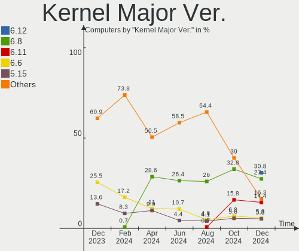
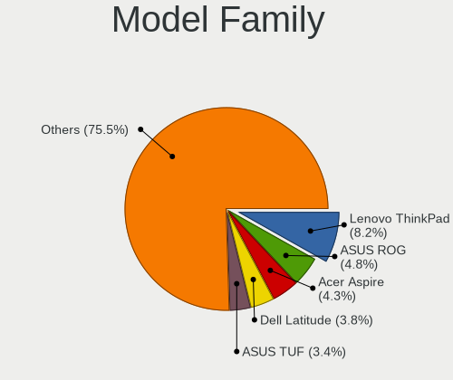
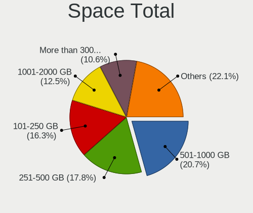
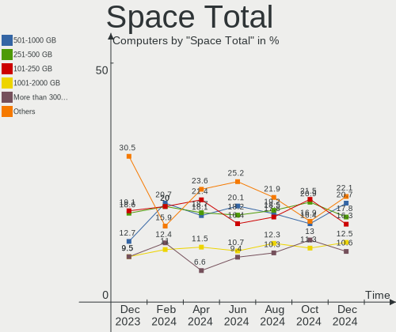
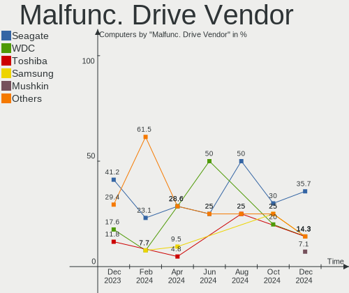
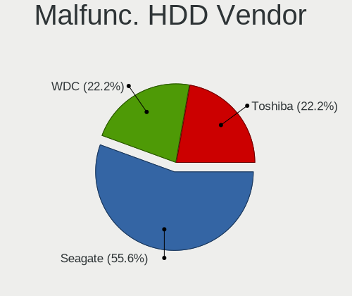
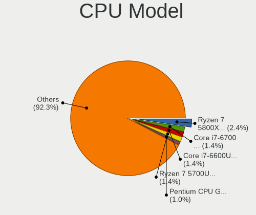
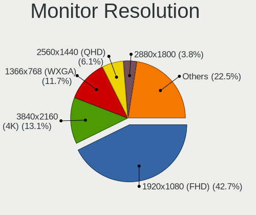
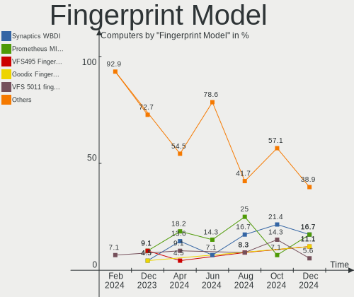

Linux in Canada - Hardware Trends
---------------------------------

A project to identify most popular hardware characteristics and track their change
over time based on data collected by Linux users at https://Linux-Hardware.org.

Anyone can contribute to this report by the [hw-probe](https://github.com/linuxhw/hw-probe) tool:

    sudo -E hw-probe -all -upload

This is a report for all computer types. See also reports for [desktops](/Location/Canada/Desktop/README.md) and [notebooks](/Location/Canada/Notebook/README.md).

Period: Dec, 2022.

Contents
--------

* [ System ](#system)
  - [ OS                       ](#os)
  - [ OS Family                ](#os-family)
  - [ Kernel                   ](#kernel)
  - [ Kernel Family            ](#kernel-family)
  - [ Kernel Major Ver.        ](#kernel-major-ver)
  - [ Arch                     ](#arch)
  - [ DE                       ](#de)
  - [ Display Server           ](#display-server)
  - [ Display Manager          ](#display-manager)
  - [ OS Lang                  ](#os-lang)
  - [ Boot Mode                ](#boot-mode)
  - [ Filesystem               ](#filesystem)
  - [ Part. scheme             ](#part-scheme)
  - [ Dual Boot with Linux/BSD ](#dual-boot-with-linuxbsd)
  - [ Dual Boot (Win)          ](#dual-boot-win)

* [ Board ](#board)
  - [ Vendor                   ](#vendor)
  - [ Model                    ](#model)
  - [ Model Family             ](#model-family)
  - [ MFG Year                 ](#mfg-year)
  - [ Form Factor              ](#form-factor)
  - [ Secure Boot              ](#secure-boot)
  - [ Coreboot                 ](#coreboot)
  - [ RAM Size                 ](#ram-size)
  - [ RAM Used                 ](#ram-used)
  - [ Total Drives             ](#total-drives)
  - [ Has CD-ROM               ](#has-cd-rom)
  - [ Has Ethernet             ](#has-ethernet)
  - [ Has WiFi                 ](#has-wifi)
  - [ Has Bluetooth            ](#has-bluetooth)

* [ Location ](#location)
  - [ Country                  ](#country)
  - [ City                     ](#city)

* [ Drives ](#drives)
  - [ Drive Vendor             ](#drive-vendor)
  - [ Drive Model              ](#drive-model)
  - [ HDD Vendor               ](#hdd-vendor)
  - [ SSD Vendor               ](#ssd-vendor)
  - [ Drive Kind               ](#drive-kind)
  - [ Drive Connector          ](#drive-connector)
  - [ Drive Size               ](#drive-size)
  - [ Space Total              ](#space-total)
  - [ Space Used               ](#space-used)
  - [ Malfunc. Drives          ](#malfunc-drives)
  - [ Malfunc. Drive Vendor    ](#malfunc-drive-vendor)
  - [ Malfunc. HDD Vendor      ](#malfunc-hdd-vendor)
  - [ Malfunc. Drive Kind      ](#malfunc-drive-kind)
  - [ Failed Drives            ](#failed-drives)
  - [ Failed Drive Vendor      ](#failed-drive-vendor)
  - [ Drive Status             ](#drive-status)

* [ Storage controller ](#storage-controller)
  - [ Storage Vendor           ](#storage-vendor)
  - [ Storage Model            ](#storage-model)
  - [ Storage Kind             ](#storage-kind)

* [ Processor ](#processor)
  - [ CPU Vendor               ](#cpu-vendor)
  - [ CPU Model                ](#cpu-model)
  - [ CPU Model Family         ](#cpu-model-family)
  - [ CPU Cores                ](#cpu-cores)
  - [ CPU Sockets              ](#cpu-sockets)
  - [ CPU Threads              ](#cpu-threads)
  - [ CPU Op-Modes             ](#cpu-op-modes)
  - [ CPU Microcode            ](#cpu-microcode)
  - [ CPU Microarch            ](#cpu-microarch)

* [ Graphics ](#graphics)
  - [ GPU Vendor               ](#gpu-vendor)
  - [ GPU Model                ](#gpu-model)
  - [ GPU Combo                ](#gpu-combo)
  - [ GPU Driver               ](#gpu-driver)
  - [ GPU Memory               ](#gpu-memory)

* [ Monitor ](#monitor)
  - [ Monitor Vendor           ](#monitor-vendor)
  - [ Monitor Model            ](#monitor-model)
  - [ Monitor Resolution       ](#monitor-resolution)
  - [ Monitor Diagonal         ](#monitor-diagonal)
  - [ Monitor Width            ](#monitor-width)
  - [ Aspect Ratio             ](#aspect-ratio)
  - [ Monitor Area             ](#monitor-area)
  - [ Pixel Density            ](#pixel-density)
  - [ Multiple Monitors        ](#multiple-monitors)

* [ Network ](#network)
  - [ Net Controller Vendor    ](#net-controller-vendor)
  - [ Net Controller Model     ](#net-controller-model)
  - [ Wireless Vendor          ](#wireless-vendor)
  - [ Wireless Model           ](#wireless-model)
  - [ Ethernet Vendor          ](#ethernet-vendor)
  - [ Ethernet Model           ](#ethernet-model)
  - [ Net Controller Kind      ](#net-controller-kind)
  - [ Used Controller          ](#used-controller)
  - [ NICs                     ](#nics)
  - [ IPv6                     ](#ipv6)

* [ Bluetooth ](#bluetooth)
  - [ Bluetooth Vendor         ](#bluetooth-vendor)
  - [ Bluetooth Model          ](#bluetooth-model)

* [ Sound ](#sound)
  - [ Sound Vendor             ](#sound-vendor)
  - [ Sound Model              ](#sound-model)

* [ Memory ](#memory)
  - [ Memory Vendor            ](#memory-vendor)
  - [ Memory Model             ](#memory-model)
  - [ Memory Kind              ](#memory-kind)
  - [ Memory Form Factor       ](#memory-form-factor)
  - [ Memory Size              ](#memory-size)
  - [ Memory Speed             ](#memory-speed)

* [ Printers & scanners ](#printers--scanners)
  - [ Printer Vendor           ](#printer-vendor)
  - [ Printer Model            ](#printer-model)
  - [ Scanner Vendor           ](#scanner-vendor)
  - [ Scanner Model            ](#scanner-model)

* [ Camera ](#camera)
  - [ Camera Vendor            ](#camera-vendor)
  - [ Camera Model             ](#camera-model)

* [ Security ](#security)
  - [ Fingerprint Vendor       ](#fingerprint-vendor)
  - [ Fingerprint Model        ](#fingerprint-model)
  - [ Chipcard Vendor          ](#chipcard-vendor)
  - [ Chipcard Model           ](#chipcard-model)

* [ Unsupported ](#unsupported)
  - [ Unsupported Devices      ](#unsupported-devices)
  - [ Unsupported Device Types ](#unsupported-device-types)

System
------

OS
--

Installed operating systems

| Name                         | Computers | Percent |
|------------------------------|-----------|---------|
| Ubuntu 22.04                 | 32        | 18.5%   |
| Pop!_OS 22.04                | 19        | 10.98%  |
| Fedora 37                    | 10        | 5.78%   |
| Debian 11                    | 10        | 5.78%   |
| Linux Mint 21                | 9         | 5.2%    |
| Ubuntu 20.04                 | 8         | 4.62%   |
| OpenMandriva 4.3             | 8         | 4.62%   |
| Linux Mint 20.3              | 7         | 4.05%   |
| Zorin 16                     | 5         | 2.89%   |
| openSUSE Tumbleweed-XXXXXXXX | 5         | 2.89%   |
| Fedora 36                    | 5         | 2.89%   |
| Ubuntu 22.10                 | 4         | 2.31%   |
| Linux Mint 21.1              | 4         | 2.31%   |
| Nobara 36                    | 3         | 1.73%   |
| Manjaro 22.0.0               | 3         | 1.73%   |
| KDE neon 22.04               | 3         | 1.73%   |
| Gentoo 2.9                   | 3         | 1.73%   |
| Arch Rolling                 | 3         | 1.73%   |
| NixOS 22.11                  | 2         | 1.16%   |
| Manjaro                      | 2         | 1.16%   |
| Garuda Linux Rolling         | 2         | 1.16%   |
| EndeavourOS Rolling          | 2         | 1.16%   |
| ArcoLinux Rolling            | 2         | 1.16%   |
| Uruk OS 3                    | 1         | 0.58%   |
| Ubuntu Unity 22.04           | 1         | 0.58%   |
| Ubuntu MATE 20.04            | 1         | 0.58%   |
| Ubuntu 18.04                 | 1         | 0.58%   |
| SteamOS 3.3.3                | 1         | 0.58%   |
| ROSA 12.3                    | 1         | 0.58%   |
| Rocky Linux 9.1              | 1         | 0.58%   |
| Nitrux 2.5.1                 | 1         | 0.58%   |
| Manjaro-ARM                  | 1         | 0.58%   |
| Manjaro 21.3.2               | 1         | 0.58%   |
| Lubuntu 22.04                | 1         | 0.58%   |
| LMDE 5                       | 1         | 0.58%   |
| Linux Mint 19.2              | 1         | 0.58%   |
| Linux Lite 5.2               | 1         | 0.58%   |
| Kylin V10                    | 1         | 0.58%   |
| Kubuntu 22.04                | 1         | 0.58%   |
| Kali 2022.4                  | 1         | 0.58%   |

OS Family
---------

OS without a version

| Name         | Computers | Percent |
|--------------|-----------|---------|
| Ubuntu       | 45        | 26.01%  |
| Linux Mint   | 21        | 12.14%  |
| Pop!_OS      | 19        | 10.98%  |
| Fedora       | 15        | 8.67%   |
| Debian       | 10        | 5.78%   |
| OpenMandriva | 8         | 4.62%   |
| Manjaro      | 6         | 3.47%   |
| Zorin        | 5         | 2.89%   |
| openSUSE     | 5         | 2.89%   |
| Nobara       | 3         | 1.73%   |
| KDE neon     | 3         | 1.73%   |
| Gentoo       | 3         | 1.73%   |
| Arch         | 3         | 1.73%   |
| NixOS        | 2         | 1.16%   |
| Garuda Linux | 2         | 1.16%   |
| EndeavourOS  | 2         | 1.16%   |
| Elementary   | 2         | 1.16%   |
| ArcoLinux    | 2         | 1.16%   |
| Uruk OS      | 1         | 0.58%   |
| Ubuntu Unity | 1         | 0.58%   |
| Ubuntu MATE  | 1         | 0.58%   |
| SteamOS      | 1         | 0.58%   |
| ROSA         | 1         | 0.58%   |
| Rocky Linux  | 1         | 0.58%   |
| Nitrux       | 1         | 0.58%   |
| Manjaro-ARM  | 1         | 0.58%   |
| Lubuntu      | 1         | 0.58%   |
| LMDE         | 1         | 0.58%   |
| Linux Lite   | 1         | 0.58%   |
| Kylin        | 1         | 0.58%   |
| Kubuntu      | 1         | 0.58%   |
| Kali         | 1         | 0.58%   |
| Clear Linux  | 1         | 0.58%   |
| CachyOS      | 1         | 0.58%   |
| AlmaLinux    | 1         | 0.58%   |

Kernel
------

Version of the Linux kernel

| Version                      | Computers | Percent |
|------------------------------|-----------|---------|
| 5.15.0-56-generic            | 46        | 26.59%  |
| 6.0.6-76060006-generic       | 14        | 8.09%   |
| 5.4.0-135-generic            | 8         | 4.62%   |
| 5.16.7-desktop-1omv4003      | 8         | 4.62%   |
| 5.15.0-53-generic            | 7         | 4.05%   |
| 6.0.12-300.fc37.x86_64       | 5         | 2.89%   |
| 5.15.81-1-MANJARO            | 4         | 2.31%   |
| 5.10.0-20-amd64              | 4         | 2.31%   |
| 6.0.12-76060006-generic      | 3         | 1.73%   |
| 5.10.0-19-amd64              | 3         | 1.73%   |
| 6.1.0-x64v1-xanmod1          | 2         | 1.16%   |
| 6.0.15-300.fc37.x86_64       | 2         | 1.16%   |
| 6.0.13-300.fc37.x86_64       | 2         | 1.16%   |
| 6.0.12-200.fc36.x86_64       | 2         | 1.16%   |
| 6.0.12-1-default             | 2         | 1.16%   |
| 6.0.11-zen1-1-zen            | 2         | 1.16%   |
| 6.0.11-200.fc36.x86_64       | 2         | 1.16%   |
| 6.0.10-201.fc36.x86_64       | 2         | 1.16%   |
| 6.0.0-11.2-liquorix-amd64    | 2         | 1.16%   |
| 5.19.0-26-generic            | 2         | 1.16%   |
| 5.19.0-21-generic            | 2         | 1.16%   |
| 5.15.0-48-generic            | 2         | 1.16%   |
| 5.15.0-051500-generic        | 2         | 1.16%   |
| 6.1.1-zen1-1-zen             | 1         | 0.58%   |
| 6.1.1-1-default              | 1         | 0.58%   |
| 6.1.0-1221.native            | 1         | 0.58%   |
| 6.1.0-1-default              | 1         | 0.58%   |
| 6.0.9-300.fc37.x86_64        | 1         | 0.58%   |
| 6.0.8-zen1-1-zen             | 1         | 0.58%   |
| 6.0.8-arch1-1                | 1         | 0.58%   |
| 6.0.8-1-MANJARO              | 1         | 0.58%   |
| 6.0.5-200.fc36.x86_64        | 1         | 0.58%   |
| 6.0.14-201.fsync.fc36.x86_64 | 1         | 0.58%   |
| 6.0.12                       | 1         | 0.58%   |
| 6.0.11-arch1-1               | 1         | 0.58%   |
| 6.0.11-1-MANJARO             | 1         | 0.58%   |
| 6.0.11                       | 1         | 0.58%   |
| 6.0.10-arch2-1               | 1         | 0.58%   |
| 6.0.10-1-default             | 1         | 0.58%   |
| 6.0.10-1-cachyos             | 1         | 0.58%   |

Kernel Family
-------------

Linux kernel without a distro release

| Version | Computers | Percent |
|---------|-----------|---------|
| 5.15.0  | 61        | 35.26%  |
| 6.0.6   | 14        | 8.09%   |
| 6.0.12  | 13        | 7.51%   |
| 5.4.0   | 11        | 6.36%   |
| 5.10.0  | 9         | 5.2%    |
| 5.16.7  | 8         | 4.62%   |
| 6.0.11  | 7         | 4.05%   |
| 6.0.10  | 6         | 3.47%   |
| 5.19.0  | 5         | 2.89%   |
| 6.1.0   | 4         | 2.31%   |
| 6.0.0   | 4         | 2.31%   |
| 5.15.81 | 4         | 2.31%   |
| 6.0.8   | 3         | 1.73%   |
| 5.15.75 | 3         | 1.73%   |
| 5.14.0  | 3         | 1.73%   |
| 6.1.1   | 2         | 1.16%   |
| 6.0.15  | 2         | 1.16%   |
| 6.0.13  | 2         | 1.16%   |
| 4.15.0  | 2         | 1.16%   |
| 6.0.9   | 1         | 0.58%   |
| 6.0.5   | 1         | 0.58%   |
| 6.0.14  | 1         | 0.58%   |
| 5.19.8  | 1         | 0.58%   |
| 5.17.0  | 1         | 0.58%   |
| 5.15.80 | 1         | 0.58%   |
| 5.15.74 | 1         | 0.58%   |
| 5.15.41 | 1         | 0.58%   |
| 5.15.40 | 1         | 0.58%   |
| 5.13.0  | 1         | 0.58%   |

Kernel Major Ver.
-----------------

Linux kernel major version

| Version | Computers | Percent |
|---------|-----------|---------|
| 5.15    | 72        | 41.62%  |
| 6.0     | 54        | 31.21%  |
| 5.4     | 11        | 6.36%   |
| 5.10    | 9         | 5.2%    |
| 5.16    | 8         | 4.62%   |
| 6.1     | 6         | 3.47%   |
| 5.19    | 6         | 3.47%   |
| 5.14    | 3         | 1.73%   |
| 4.15    | 2         | 1.16%   |
| 5.17    | 1         | 0.58%   |
| 5.13    | 1         | 0.58%   |

Arch
----

OS architecture (x86_64, i586, etc.)

| Name    | Computers | Percent |
|---------|-----------|---------|
| x86_64  | 172       | 99.42%  |
| aarch64 | 1         | 0.58%   |

DE
--

Desktop Environment

| Name       | Computers | Percent |
|------------|-----------|---------|
| GNOME      | 82        | 47.4%   |
| KDE5       | 34        | 19.65%  |
| X-Cinnamon | 18        | 10.4%   |
| Unknown    | 12        | 6.94%   |
| XFCE       | 9         | 5.2%    |
| MATE       | 6         | 3.47%   |
| Pantheon   | 2         | 1.16%   |
| LXQt       | 2         | 1.16%   |
| xmonad     | 1         | 0.58%   |
| Unity      | 1         | 0.58%   |
| sway       | 1         | 0.58%   |
| LXDE       | 1         | 0.58%   |
| Deepin     | 1         | 0.58%   |
| Cinnamon   | 1         | 0.58%   |
| Budgie     | 1         | 0.58%   |
| awesome    | 1         | 0.58%   |

Display Server
--------------

X11 or Wayland

| Name    | Computers | Percent |
|---------|-----------|---------|
| X11     | 122       | 70.52%  |
| Wayland | 36        | 20.81%  |
| Tty     | 8         | 4.62%   |
| Unknown | 5         | 2.89%   |
| Web     | 2         | 1.16%   |

Display Manager
---------------

SDDM, LightDM, etc.

| Name    | Computers | Percent |
|---------|-----------|---------|
| Unknown | 66        | 38.15%  |
| GDM3    | 43        | 24.86%  |
| LightDM | 25        | 14.45%  |
| SDDM    | 23        | 13.29%  |
| GDM     | 14        | 8.09%   |
| XDM     | 1         | 0.58%   |
| GREETD  | 1         | 0.58%   |

OS Lang
-------

Language

| Lang    | Computers | Percent |
|---------|-----------|---------|
| en_CA   | 89        | 51.45%  |
| en_US   | 64        | 36.99%  |
| fr_CA   | 9         | 5.2%    |
| C       | 4         | 2.31%   |
| POSIX   | 2         | 1.16%   |
| Unknown | 2         | 1.16%   |
| fr_FR   | 1         | 0.58%   |
| es_BO   | 1         | 0.58%   |
| en_IN   | 1         | 0.58%   |

Boot Mode
---------

EFI or BIOS

| Mode | Computers | Percent |
|------|-----------|---------|
| BIOS | 93        | 53.76%  |
| EFI  | 80        | 46.24%  |

Filesystem
----------

Type of filesystem

| Type    | Computers | Percent |
|---------|-----------|---------|
| Ext4    | 117       | 67.63%  |
| Btrfs   | 30        | 17.34%  |
| Overlay | 13        | 7.51%   |
| Zfs     | 6         | 3.47%   |
| Xfs     | 5         | 2.89%   |
| Tmpfs   | 1         | 0.58%   |
| Ext3    | 1         | 0.58%   |

Part. scheme
------------

Scheme of partitioning

| Type    | Computers | Percent |
|---------|-----------|---------|
| GPT     | 98        | 56.65%  |
| Unknown | 55        | 31.79%  |
| MBR     | 20        | 11.56%  |

Dual Boot with Linux/BSD
------------------------

Hosting more than one Linux/BSD

| Dual boot | Computers | Percent |
|-----------|-----------|---------|
| No        | 147       | 84.97%  |
| Yes       | 26        | 15.03%  |

Dual Boot (Win)
---------------

Hosting Linux and Windows

| Dual boot | Computers | Percent |
|-----------|-----------|---------|
| No        | 121       | 69.94%  |
| Yes       | 52        | 30.06%  |

Board
-----

Vendor
------

Motherboard manufacturer

| Name                    | Computers | Percent |
|-------------------------|-----------|---------|
| ASUSTek Computer        | 37        | 21.39%  |
| Dell                    | 26        | 15.03%  |
| Hewlett-Packard         | 23        | 13.29%  |
| Lenovo                  | 19        | 10.98%  |
| MSI                     | 12        | 6.94%   |
| Gigabyte Technology     | 10        | 5.78%   |
| Acer                    | 10        | 5.78%   |
| Apple                   | 8         | 4.62%   |
| Toshiba                 | 3         | 1.73%   |
| Microsoft               | 3         | 1.73%   |
| ASRock                  | 3         | 1.73%   |
| System76                | 2         | 1.16%   |
| Intel                   | 2         | 1.16%   |
| Google                  | 2         | 1.16%   |
| Alienware               | 2         | 1.16%   |
| Valve                   | 1         | 0.58%   |
| Supermicro              | 1         | 0.58%   |
| Razer                   | 1         | 0.58%   |
| Pine Microsystems       | 1         | 0.58%   |
| Pegatron                | 1         | 0.58%   |
| Panasonic               | 1         | 0.58%   |
| Intel Client Systems    | 1         | 0.58%   |
| GIFA Industrial Control | 1         | 0.58%   |
| Framework               | 1         | 0.58%   |
| Foxconn                 | 1         | 0.58%   |
| EUROCOM                 | 1         | 0.58%   |

Model
-----

Motherboard model

| Name                                        | Computers | Percent |
|---------------------------------------------|-----------|---------|
| MSI MS-7900                                 | 2         | 1.16%   |
| HP EliteDesk 800 G1 TWR                     | 2         | 1.16%   |
| Gigabyte 990FXA-UD3                         | 2         | 1.16%   |
| Dell Precision WorkStation T3500            | 2         | 1.16%   |
| ASUS M51BC                                  | 2         | 1.16%   |
| Valve Jupiter                               | 1         | 0.58%   |
| Toshiba TECRA R940                          | 1         | 0.58%   |
| Toshiba Satellite S50-A                     | 1         | 0.58%   |
| Toshiba Satellite C650D                     | 1         | 0.58%   |
| System76 Pangolin                           | 1         | 0.58%   |
| System76 Gazelle                            | 1         | 0.58%   |
| Supermicro X9DR3-F                          | 1         | 0.58%   |
| Razer Blade 15 (2022) - RZ09-0421           | 1         | 0.58%   |
| Pine Microsystems Pine64 PinePhone (1.2)    | 1         | 0.58%   |
| Pegatron p7-1219                            | 1         | 0.58%   |
| Panasonic FZ55-2                            | 1         | 0.58%   |
| MSI Pulse GL76 12UEK                        | 1         | 0.58%   |
| MSI MS-7C91                                 | 1         | 0.58%   |
| MSI MS-7C56                                 | 1         | 0.58%   |
| MSI MS-7A62                                 | 1         | 0.58%   |
| MSI MS-7A38                                 | 1         | 0.58%   |
| MSI MS-7972                                 | 1         | 0.58%   |
| MSI MS-7817                                 | 1         | 0.58%   |
| MSI Gseries                                 | 1         | 0.58%   |
| MSI GS66 Stealth 11UH                       | 1         | 0.58%   |
| MSI GE72VR 6RF                              | 1         | 0.58%   |
| Microsoft Surface Pro 7                     | 1         | 0.58%   |
| Microsoft Surface Laptop Go                 | 1         | 0.58%   |
| Microsoft Surface Book                      | 1         | 0.58%   |
| Lenovo Y70-70 Touch 80DU                    | 1         | 0.58%   |
| Lenovo ThinkPad X1 Carbon Gen 9 20XW004GUS  | 1         | 0.58%   |
| Lenovo ThinkPad X1 Carbon Gen 10 21CBCTO1WW | 1         | 0.58%   |
| Lenovo ThinkPad T500 2055A38                | 1         | 0.58%   |
| Lenovo ThinkPad T500 205545F                | 1         | 0.58%   |
| Lenovo ThinkPad T495 20NKS01W02             | 1         | 0.58%   |
| Lenovo ThinkPad T420 4236V6S                | 1         | 0.58%   |
| Lenovo ThinkPad T15p Gen 3 21DA000QUS       | 1         | 0.58%   |
| Lenovo ThinkPad P15v Gen 1 20TQCTO1WW       | 1         | 0.58%   |
| Lenovo ThinkPad E560 20EV002FUS             | 1         | 0.58%   |
| Lenovo ThinkCentre M93p 10A9000SUS          | 1         | 0.58%   |

Model Family
------------

Motherboard model prefix

| Name                     | Computers | Percent |
|--------------------------|-----------|---------|
| Lenovo ThinkPad          | 9         | 5.2%    |
| Dell Latitude            | 9         | 5.2%    |
| Acer Aspire              | 7         | 4.05%   |
| ASUS ROG                 | 6         | 3.47%   |
| HP Pavilion              | 5         | 2.89%   |
| ASUS VivoBook            | 5         | 2.89%   |
| Lenovo ThinkCentre       | 4         | 2.31%   |
| Dell XPS                 | 4         | 2.31%   |
| Dell OptiPlex            | 4         | 2.31%   |
| Dell Inspiron            | 4         | 2.31%   |
| ASUS TUF                 | 4         | 2.31%   |
| ASUS PRIME               | 4         | 2.31%   |
| Microsoft Surface        | 3         | 1.73%   |
| Lenovo IdeaPad           | 3         | 1.73%   |
| HP EliteBook             | 3         | 1.73%   |
| Dell Precision           | 3         | 1.73%   |
| Toshiba Satellite        | 2         | 1.16%   |
| MSI MS-7900              | 2         | 1.16%   |
| HP Spectre               | 2         | 1.16%   |
| HP EliteDesk             | 2         | 1.16%   |
| HP Compaq                | 2         | 1.16%   |
| Gigabyte 990FXA-UD3      | 2         | 1.16%   |
| ASUS Zenbook             | 2         | 1.16%   |
| ASUS M51BC               | 2         | 1.16%   |
| Valve Jupiter            | 1         | 0.58%   |
| Toshiba TECRA            | 1         | 0.58%   |
| System76 Pangolin        | 1         | 0.58%   |
| System76 Gazelle         | 1         | 0.58%   |
| Supermicro X9DR3-F       | 1         | 0.58%   |
| Razer Blade              | 1         | 0.58%   |
| Pine Microsystems Pine64 | 1         | 0.58%   |
| Pegatron p7-1219         | 1         | 0.58%   |
| Panasonic FZ55-2         | 1         | 0.58%   |
| MSI Pulse                | 1         | 0.58%   |
| MSI MS-7C91              | 1         | 0.58%   |
| MSI MS-7C56              | 1         | 0.58%   |
| MSI MS-7A62              | 1         | 0.58%   |
| MSI MS-7A38              | 1         | 0.58%   |
| MSI MS-7972              | 1         | 0.58%   |
| MSI MS-7817              | 1         | 0.58%   |

MFG Year
--------

Motherboard manufacture year

| Year    | Computers | Percent |
|---------|-----------|---------|
| 2022    | 25        | 14.45%  |
| 2021    | 17        | 9.83%   |
| 2020    | 15        | 8.67%   |
| 2013    | 15        | 8.67%   |
| 2012    | 12        | 6.94%   |
| 2017    | 10        | 5.78%   |
| 2016    | 10        | 5.78%   |
| 2014    | 10        | 5.78%   |
| 2011    | 10        | 5.78%   |
| 2019    | 9         | 5.2%    |
| 2015    | 9         | 5.2%    |
| 2010    | 9         | 5.2%    |
| 2018    | 7         | 4.05%   |
| 2008    | 5         | 2.89%   |
| 2009    | 4         | 2.31%   |
| 2007    | 2         | 1.16%   |
| 2006    | 2         | 1.16%   |
| 2005    | 1         | 0.58%   |
| Unknown | 1         | 0.58%   |

Form Factor
-----------

Physical design of the computer

| Name        | Computers | Percent |
|-------------|-----------|---------|
| Notebook    | 81        | 46.82%  |
| Desktop     | 72        | 41.62%  |
| Convertible | 7         | 4.05%   |
| Mini pc     | 4         | 2.31%   |
| All in one  | 4         | 2.31%   |
| Tablet      | 3         | 1.73%   |
| Phone       | 1         | 0.58%   |
| Server      | 1         | 0.58%   |

Secure Boot
-----------

Enabled or disabled

| State    | Computers | Percent |
|----------|-----------|---------|
| Disabled | 165       | 95.38%  |
| Enabled  | 8         | 4.62%   |

Coreboot
--------

Have coreboot on board

| Used | Computers | Percent |
|------|-----------|---------|
| No   | 170       | 98.27%  |
| Yes  | 3         | 1.73%   |

RAM Size
--------

Total RAM memory

| Size in GB  | Computers | Percent |
|-------------|-----------|---------|
| 16.01-24.0  | 43        | 24.86%  |
| 4.01-8.0    | 38        | 21.97%  |
| 8.01-16.0   | 32        | 18.5%   |
| 32.01-64.0  | 22        | 12.72%  |
| 3.01-4.0    | 18        | 10.4%   |
| 64.01-256.0 | 9         | 5.2%    |
| 1.01-2.0    | 6         | 3.47%   |
| 24.01-32.0  | 4         | 2.31%   |
| 2.01-3.0    | 1         | 0.58%   |

RAM Used
--------

Used RAM memory

| Used GB    | Computers | Percent |
|------------|-----------|---------|
| 1.01-2.0   | 46        | 26.59%  |
| 2.01-3.0   | 40        | 23.12%  |
| 4.01-8.0   | 39        | 22.54%  |
| 3.01-4.0   | 22        | 12.72%  |
| 8.01-16.0  | 14        | 8.09%   |
| 0.51-1.0   | 10        | 5.78%   |
| 16.01-24.0 | 1         | 0.58%   |
| 0.01-0.5   | 1         | 0.58%   |

Total Drives
------------

Number of drives on board

| Drives | Computers | Percent |
|--------|-----------|---------|
| 1      | 94        | 54.34%  |
| 2      | 44        | 25.43%  |
| 3      | 11        | 6.36%   |
| 5      | 9         | 5.2%    |
| 4      | 7         | 4.05%   |
| 6      | 4         | 2.31%   |
| 10     | 1         | 0.58%   |
| 9      | 1         | 0.58%   |
| 7      | 1         | 0.58%   |
| 0      | 1         | 0.58%   |

Has CD-ROM
----------

Has CD-ROM on board

| Presented | Computers | Percent |
|-----------|-----------|---------|
| No        | 115       | 66.47%  |
| Yes       | 58        | 33.53%  |

Has Ethernet
------------

Has Ethernet on board

| Presented | Computers | Percent |
|-----------|-----------|---------|
| Yes       | 141       | 81.5%   |
| No        | 32        | 18.5%   |

Has WiFi
--------

Has WiFi module

| Presented | Computers | Percent |
|-----------|-----------|---------|
| Yes       | 137       | 79.19%  |
| No        | 36        | 20.81%  |

Has Bluetooth
-------------

Has Bluetooth module

| Presented | Computers | Percent |
|-----------|-----------|---------|
| Yes       | 113       | 65.32%  |
| No        | 60        | 34.68%  |

Location
--------

Country
-------

Geographic location (country)

| Country | Computers | Percent |
|---------|-----------|---------|
| Canada  | 173       | 100%    |

City
----

Geographic location (city)

| City            | Computers | Percent |
|-----------------|-----------|---------|
| Toronto         | 16        | 9.25%   |
| Montreal        | 11        | 6.36%   |
| Calgary         | 8         | 4.62%   |
| Victoria        | 5         | 2.89%   |
| Québec         | 5         | 2.89%   |
| Edmonton        | 5         | 2.89%   |
| Vancouver       | 4         | 2.31%   |
| Saskatoon       | 4         | 2.31%   |
| Ottawa          | 4         | 2.31%   |
| Markham         | 4         | 2.31%   |
| Hamilton        | 4         | 2.31%   |
| Winnipeg        | 3         | 1.73%   |
| Thornhill       | 3         | 1.73%   |
| Port Perry      | 3         | 1.73%   |
| Chicoutimi      | 3         | 1.73%   |
| Cambridge       | 3         | 1.73%   |
| Burnaby         | 3         | 1.73%   |
| Brampton        | 3         | 1.73%   |
| Beauharnois     | 3         | 1.73%   |
| Surrey          | 2         | 1.16%   |
| St. Paul        | 2         | 1.16%   |
| St. John's      | 2         | 1.16%   |
| North York      | 2         | 1.16%   |
| Nanaimo         | 2         | 1.16%   |
| Moncton         | 2         | 1.16%   |
| London          | 2         | 1.16%   |
| Dartmouth       | 2         | 1.16%   |
| Courtice        | 2         | 1.16%   |
| Courtenay       | 2         | 1.16%   |
| Airdrie         | 2         | 1.16%   |
| Yorkton         | 1         | 0.58%   |
| Woodville       | 1         | 0.58%   |
| Windsor         | 1         | 0.58%   |
| Whitehorse      | 1         | 0.58%   |
| Whitby          | 1         | 0.58%   |
| Verdun          | 1         | 0.58%   |
| Trois-Rivières | 1         | 0.58%   |
| Summerside      | 1         | 0.58%   |
| St. Claude      | 1         | 0.58%   |
| St. Albert      | 1         | 0.58%   |

Drives
------

Drive Vendor
------------

Hard drive vendors

| Vendor                      | Computers | Drives | Percent |
|-----------------------------|-----------|--------|---------|
| Samsung Electronics         | 48        | 56     | 17.52%  |
| Seagate                     | 43        | 60     | 15.69%  |
| WDC                         | 42        | 72     | 15.33%  |
| SanDisk                     | 15        | 16     | 5.47%   |
| Kingston                    | 13        | 15     | 4.74%   |
| Toshiba                     | 12        | 12     | 4.38%   |
| Intel                       | 12        | 13     | 4.38%   |
| SK hynix                    | 9         | 9      | 3.28%   |
| Hitachi                     | 9         | 9      | 3.28%   |
| Micron Technology           | 8         | 9      | 2.92%   |
| Unknown                     | 7         | 8      | 2.55%   |
| Crucial                     | 7         | 11     | 2.55%   |
| HGST                        | 6         | 8      | 2.19%   |
| A-DATA Technology           | 5         | 5      | 1.82%   |
| JMicron Technology          | 3         | 3      | 1.09%   |
| ADATA Technology            | 3         | 4      | 1.09%   |
| Union Memory (Shenzhen)     | 2         | 2      | 0.73%   |
| SABRENT                     | 2         | 2      | 0.73%   |
| Phison Electronics          | 2         | 2      | 0.73%   |
| Micron/Crucial Technology   | 2         | 2      | 0.73%   |
| LITEON                      | 2         | 2      | 0.73%   |
| LaCie                       | 2         | 2      | 0.73%   |
| KIOXIA                      | 2         | 2      | 0.73%   |
| Kingston Technology Company | 2         | 2      | 0.73%   |
| Fujitsu                     | 2         | 2      | 0.73%   |
| XPG                         | 1         | 2      | 0.36%   |
| USB 3.0                     | 1         | 1      | 0.36%   |
| Timetec                     | 1         | 1      | 0.36%   |
| T-FORCE                     | 1         | 1      | 0.36%   |
| SYMWAVE                     | 1         | 1      | 0.36%   |
| SPCC                        | 1         | 1      | 0.36%   |
| Silicon Motion              | 1         | 1      | 0.36%   |
| Phison                      | 1         | 1      | 0.36%   |
| Lexar                       | 1         | 1      | 0.36%   |
| Hewlett-Packard             | 1         | 1      | 0.36%   |
| FC-1307                     | 1         | 1      | 0.36%   |
| External                    | 1         | 1      | 0.36%   |
| Dogfish                     | 1         | 1      | 0.36%   |
| Unknown                     | 1         | 1      | 0.36%   |

Drive Model
-----------

Hard drive models

| Model                                                           | Computers | Percent |
|-----------------------------------------------------------------|-----------|---------|
| Samsung NVMe SSD Controller SM981/PM981/PM983 500GB             | 6         | 1.94%   |
| Samsung SSD 860 EVO 500GB                                       | 5         | 1.61%   |
| Samsung SSD 850 EVO 500GB                                       | 4         | 1.29%   |
| Samsung SSD 850 EVO 250GB                                       | 4         | 1.29%   |
| Samsung NVMe SSD Controller PM9A1/PM9A3/980PRO 2TB              | 4         | 1.29%   |
| Seagate ST2000DM001-9YN164 2TB                                  | 3         | 0.97%   |
| Seagate ST1000DM003-1CH162 1TB                                  | 3         | 0.97%   |
| Seagate Expansion Desk 5TB                                      | 3         | 0.97%   |
| Samsung SSD 860 EVO 1TB                                         | 3         | 0.97%   |
| Kingston SA400S37240G 240GB SSD                                 | 3         | 0.97%   |
| ADATA XPG SX8200 Pro PCIe Gen3x4 M.2 2280 Solid State Drive 1TB | 3         | 0.97%   |
| WDC WDS100T2B0A-00SM50 1TB SSD                                  | 2         | 0.65%   |
| WDC WDBNCE5000PNC 500GB SSD                                     | 2         | 0.65%   |
| WDC WD40EZRZ-00GXCB0 4TB                                        | 2         | 0.65%   |
| WDC WD40EFRX-68N32N0 4TB                                        | 2         | 0.65%   |
| WDC WD20EARS-00J2GB0 2TB                                        | 2         | 0.65%   |
| WDC WD1002FAEX-00Y9A0 1TB                                       | 2         | 0.65%   |
| Unknown MMC Card  32GB                                          | 2         | 0.65%   |
| Toshiba DT01ACA200 2TB                                          | 2         | 0.65%   |
| Seagate ST9500325AS 500GB                                       | 2         | 0.65%   |
| Seagate ST8000DM004-2CX188 8TB                                  | 2         | 0.65%   |
| Seagate ST5000DM000-1FK178 5TB                                  | 2         | 0.65%   |
| Seagate ST4000DM004-2CV104 4TB                                  | 2         | 0.65%   |
| Seagate ST3000DM001-9YN166 3TB                                  | 2         | 0.65%   |
| Seagate ST3000DM001-1CH166 3TB                                  | 2         | 0.65%   |
| Seagate ST2000DM006-2DM164 2TB                                  | 2         | 0.65%   |
| Seagate ST2000DL003-9VT166 2TB                                  | 2         | 0.65%   |
| Seagate ST1000LM014-1EJ164 1TB                                  | 2         | 0.65%   |
| Seagate Expansion 4TB                                           | 2         | 0.65%   |
| SanDisk SDSSDHP256G 256GB                                       | 2         | 0.65%   |
| SanDisk NVMe SSD Drive 1TB                                      | 2         | 0.65%   |
| Samsung SSD 970 EVO Plus 1TB                                    | 2         | 0.65%   |
| Samsung SSD 860 EVO 250GB                                       | 2         | 0.65%   |
| Samsung HD161GJ 160GB                                           | 2         | 0.65%   |
| Micron/Crucial P2 NVMe PCIe SSD 500GB                           | 2         | 0.65%   |
| Micron 2450_MTFDKBA512TFK 512GB                                 | 2         | 0.65%   |
| Kingston Company OM3PDP3 NVMe SSD 512GB                         | 2         | 0.65%   |
| Kingston SA400S37480G 480GB SSD                                 | 2         | 0.65%   |
| Intel SSDPEKNU512GZ 512GB                                       | 2         | 0.65%   |
| Crucial CT2000MX500SSD1 2TB                                     | 2         | 0.65%   |

HDD Vendor
----------

Hard disk drive vendors

| Vendor              | Computers | Drives | Percent |
|---------------------|-----------|--------|---------|
| Seagate             | 41        | 58     | 37.27%  |
| WDC                 | 36        | 61     | 32.73%  |
| Hitachi             | 9         | 9      | 8.18%   |
| Toshiba             | 7         | 7      | 6.36%   |
| HGST                | 6         | 8      | 5.45%   |
| Samsung Electronics | 3         | 3      | 2.73%   |
| JMicron Technology  | 2         | 2      | 1.82%   |
| Fujitsu             | 2         | 2      | 1.82%   |
| USB 3.0             | 1         | 1      | 0.91%   |
| SABRENT             | 1         | 1      | 0.91%   |
| LaCie               | 1         | 1      | 0.91%   |
| External            | 1         | 1      | 0.91%   |

SSD Vendor
----------

Solid state drive vendors

| Vendor              | Computers | Drives | Percent |
|---------------------|-----------|--------|---------|
| Samsung Electronics | 26        | 30     | 34.21%  |
| Kingston            | 10        | 11     | 13.16%  |
| WDC                 | 7         | 7      | 9.21%   |
| Crucial             | 7         | 11     | 9.21%   |
| SanDisk             | 6         | 6      | 7.89%   |
| Intel               | 6         | 7      | 7.89%   |
| A-DATA Technology   | 5         | 5      | 6.58%   |
| Micron Technology   | 2         | 2      | 2.63%   |
| Timetec             | 1         | 1      | 1.32%   |
| T-FORCE             | 1         | 1      | 1.32%   |
| SPCC                | 1         | 1      | 1.32%   |
| Seagate             | 1         | 1      | 1.32%   |
| LITEON              | 1         | 1      | 1.32%   |
| Lexar               | 1         | 1      | 1.32%   |
| Dogfish             | 1         | 1      | 1.32%   |

Drive Kind
----------

HDD or SSD

| Kind    | Computers | Drives | Percent |
|---------|-----------|--------|---------|
| HDD     | 91        | 154    | 37.45%  |
| NVMe    | 74        | 90     | 30.45%  |
| SSD     | 66        | 86     | 27.16%  |
| MMC     | 8         | 9      | 3.29%   |
| Unknown | 4         | 4      | 1.65%   |

Drive Connector
---------------

SATA, SAS, NVMe, etc.

| Type | Computers | Drives | Percent |
|------|-----------|--------|---------|
| SATA | 117       | 225    | 53.67%  |
| NVMe | 74        | 89     | 33.94%  |
| SAS  | 19        | 20     | 8.72%   |
| MMC  | 8         | 9      | 3.67%   |

Drive Size
----------

Size of hard drive

| Size in TB | Computers | Drives | Percent |
|------------|-----------|--------|---------|
| 0.01-0.5   | 76        | 95     | 43.68%  |
| 0.51-1.0   | 45        | 56     | 25.86%  |
| 1.01-2.0   | 20        | 32     | 11.49%  |
| 3.01-4.0   | 12        | 20     | 6.9%    |
| 4.01-10.0  | 12        | 25     | 6.9%    |
| 2.01-3.0   | 9         | 12     | 5.17%   |

Space Total
-----------

Amount of disk space available on the file system

| Size in GB     | Computers | Percent |
|----------------|-----------|---------|
| 251-500        | 40        | 23.12%  |
| 101-250        | 32        | 18.5%   |
| 501-1000       | 22        | 12.72%  |
| More than 3000 | 19        | 10.98%  |
| 1001-2000      | 18        | 10.4%   |
| 1-20           | 15        | 8.67%   |
| 51-100         | 9         | 5.2%    |
| Unknown        | 9         | 5.2%    |
| 2001-3000      | 5         | 2.89%   |
| 21-50          | 4         | 2.31%   |

Space Used
----------

Amount of used disk space

| Used GB        | Computers | Percent |
|----------------|-----------|---------|
| 1-20           | 53        | 30.64%  |
| 21-50          | 29        | 16.76%  |
| 101-250        | 20        | 11.56%  |
| 51-100         | 18        | 10.4%   |
| 251-500        | 12        | 6.94%   |
| 501-1000       | 11        | 6.36%   |
| Unknown        | 9         | 5.2%    |
| More than 3000 | 8         | 4.62%   |
| 1001-2000      | 8         | 4.62%   |
| 2001-3000      | 5         | 2.89%   |

Malfunc. Drives
---------------

Drive models with a malfunction

| Model                                        | Computers | Drives | Percent |
|----------------------------------------------|-----------|--------|---------|
| WDC WD6400AAKS-22A7B2 640GB                  | 1         | 1      | 5%      |
| WDC WD5000LPVX-75V0TT0 500GB                 | 1         | 1      | 5%      |
| WDC WD5000LPVX-08V0TT5 500GB                 | 1         | 1      | 5%      |
| WDC WD30EZRZ-00Z5HB0 3TB                     | 1         | 1      | 5%      |
| WDC WD20EARS-00J2GB0 2TB                     | 1         | 1      | 5%      |
| WDC WD1001FALS-40Y6A0 1TB                    | 1         | 1      | 5%      |
| Toshiba MK8037GSX 80GB                       | 1         | 1      | 5%      |
| Toshiba MK3261GSYN 320GB                     | 1         | 1      | 5%      |
| Seagate ST9500420ASG 500GB                   | 1         | 1      | 5%      |
| Seagate ST9320423AS 320GB                    | 1         | 1      | 5%      |
| Seagate ST500LM021-1KJ152 500GB              | 1         | 1      | 5%      |
| Seagate ST1000DM003-1SB102 1TB               | 1         | 1      | 5%      |
| Samsung Electronics SSD 840 PRO Series 512GB | 1         | 1      | 5%      |
| Samsung Electronics HM160HC 160GB            | 1         | 1      | 5%      |
| LaCie Rugged Mini USB3 2TB                   | 1         | 1      | 5%      |
| Intel SSDSC2BF180A4H 180GB                   | 1         | 1      | 5%      |
| Hitachi HTS725050A9A364 500GB                | 1         | 1      | 5%      |
| Hitachi HTS541612J9SA00 120GB                | 1         | 1      | 5%      |
| HGST HTS545050A7E680 500GB                   | 1         | 1      | 5%      |
| Crucial CT275MX300SSD1 275GB                 | 1         | 1      | 5%      |

Malfunc. Drive Vendor
---------------------

Vendors of faulty drives

| Vendor              | Computers | Drives | Percent |
|---------------------|-----------|--------|---------|
| WDC                 | 6         | 6      | 30%     |
| Seagate             | 4         | 4      | 20%     |
| Toshiba             | 2         | 2      | 10%     |
| Samsung Electronics | 2         | 2      | 10%     |
| Hitachi             | 2         | 2      | 10%     |
| LaCie               | 1         | 1      | 5%      |
| Intel               | 1         | 1      | 5%      |
| HGST                | 1         | 1      | 5%      |
| Crucial             | 1         | 1      | 5%      |

Malfunc. HDD Vendor
-------------------

Vendors of faulty HDD drives

| Vendor              | Computers | Drives | Percent |
|---------------------|-----------|--------|---------|
| WDC                 | 6         | 6      | 35.29%  |
| Seagate             | 4         | 4      | 23.53%  |
| Toshiba             | 2         | 2      | 11.76%  |
| Hitachi             | 2         | 2      | 11.76%  |
| Samsung Electronics | 1         | 1      | 5.88%   |
| LaCie               | 1         | 1      | 5.88%   |
| HGST                | 1         | 1      | 5.88%   |

Malfunc. Drive Kind
-------------------

Kinds of faulty drives

| Kind | Computers | Drives | Percent |
|------|-----------|--------|---------|
| HDD  | 17        | 17     | 85%     |
| SSD  | 3         | 3      | 15%     |

Failed Drives
-------------

Failed drive models

Zero info for selected period =(

Failed Drive Vendor
-------------------

Failed drive vendors

Zero info for selected period =(

Drive Status
------------

Number of failed and malfunc. drives

| Status   | Computers | Drives | Percent |
|----------|-----------|--------|---------|
| Detected | 94        | 176    | 49.47%  |
| Works    | 76        | 147    | 40%     |
| Malfunc  | 20        | 20     | 10.53%  |

Storage controller
------------------

Storage Vendor
--------------

Storage controller vendors

| Vendor                       | Computers | Percent |
|------------------------------|-----------|---------|
| Intel                        | 99        | 42.31%  |
| AMD                          | 39        | 16.67%  |
| Samsung Electronics          | 21        | 8.97%   |
| SanDisk                      | 13        | 5.56%   |
| SK hynix                     | 9         | 3.85%   |
| Micron Technology            | 7         | 2.99%   |
| Toshiba America Info Systems | 5         | 2.14%   |
| Marvell Technology Group     | 5         | 2.14%   |
| Kingston Technology Company  | 5         | 2.14%   |
| Nvidia                       | 4         | 1.71%   |
| ADATA Technology             | 4         | 1.71%   |
| Phison Electronics           | 3         | 1.28%   |
| JMicron Technology           | 3         | 1.28%   |
| ASMedia Technology           | 3         | 1.28%   |
| Union Memory (Shenzhen)      | 2         | 0.85%   |
| Silicon Motion               | 2         | 0.85%   |
| Silicon Image                | 2         | 0.85%   |
| Micron/Crucial Technology    | 2         | 0.85%   |
| KIOXIA                       | 2         | 0.85%   |
| VIA Technologies             | 1         | 0.43%   |
| Seagate Technology           | 1         | 0.43%   |
| LSI Logic / Symbios Logic    | 1         | 0.43%   |
| Lite-On Technology           | 1         | 0.43%   |

Storage Model
-------------

Storage controller models

| Model                                                                          | Computers | Percent |
|--------------------------------------------------------------------------------|-----------|---------|
| AMD FCH SATA Controller [AHCI mode]                                            | 22        | 8.59%   |
| Samsung NVMe SSD Controller SM981/PM981/PM983                                  | 10        | 3.91%   |
| AMD SB7x0/SB8x0/SB9x0 SATA Controller [AHCI mode]                              | 10        | 3.91%   |
| Samsung NVMe SSD Controller PM9A1/PM9A3/980PRO                                 | 9         | 3.52%   |
| Intel 8 Series/C220 Series Chipset Family 6-port SATA Controller 1 [AHCI mode] | 8         | 3.13%   |
| Micron Non-Volatile memory controller                                          | 7         | 2.73%   |
| Intel Volume Management Device NVMe RAID Controller                            | 6         | 2.34%   |
| Intel Sunrise Point-LP SATA Controller [AHCI mode]                             | 6         | 2.34%   |
| Intel SATA Controller [RAID mode]                                              | 6         | 2.34%   |
| Intel 7 Series/C210 Series Chipset Family 6-port SATA Controller [AHCI mode]   | 6         | 2.34%   |
| Intel 6 Series/C200 Series Chipset Family 6 port Desktop SATA AHCI Controller  | 6         | 2.34%   |
| SK hynix Gold P31/PC711 NVMe Solid State Drive                                 | 5         | 1.95%   |
| SanDisk Non-Volatile memory controller                                         | 5         | 1.95%   |
| Intel 82801 Mobile SATA Controller [RAID mode]                                 | 5         | 1.95%   |
| Intel 6 Series/C200 Series Chipset Family 6 port Mobile SATA AHCI Controller   | 5         | 1.95%   |
| SanDisk WD Blue SN550 NVMe SSD                                                 | 4         | 1.56%   |
| Marvell Group 88SE9172 SATA 6Gb/s Controller                                   | 4         | 1.56%   |
| Intel 7 Series Chipset Family 6-port SATA Controller [AHCI mode]               | 4         | 1.56%   |
| AMD 500 Series Chipset SATA Controller                                         | 4         | 1.56%   |
| ADATA XPG SX8200 Pro PCIe Gen3x4 M.2 2280 Solid State Drive                    | 4         | 1.56%   |
| Samsung NVMe SSD Controller 980                                                | 3         | 1.17%   |
| Intel Alder Lake-S PCH SATA Controller [AHCI Mode]                             | 3         | 1.17%   |
| Intel 5 Series/3400 Series Chipset 6 port SATA AHCI Controller                 | 3         | 1.17%   |
| Intel 200 Series PCH SATA controller [AHCI mode]                               | 3         | 1.17%   |
| AMD SB7x0/SB8x0/SB9x0 IDE Controller                                           | 3         | 1.17%   |
| Toshiba America Info Systems XG5 NVMe SSD Controller                           | 2         | 0.78%   |
| SK hynix Non-Volatile memory controller                                        | 2         | 0.78%   |
| SanDisk WD Black SN750 / PC SN730 NVMe SSD                                     | 2         | 0.78%   |
| Phison E16 PCIe4 NVMe Controller                                               | 2         | 0.78%   |
| Micron/Crucial P2 NVMe PCIe SSD                                                | 2         | 0.78%   |
| KIOXIA NVMe SSD Controller BG4                                                 | 2         | 0.78%   |
| Kingston Company Company Non-Volatile memory controller                        | 2         | 0.78%   |
| Kingston Company OM3PDP3 NVMe SSD                                              | 2         | 0.78%   |
| JMicron JMB363 SATA/IDE Controller                                             | 2         | 0.78%   |
| Intel Wildcat Point-LP SATA Controller [AHCI Mode]                             | 2         | 0.78%   |
| Intel SSD 600P Series                                                          | 2         | 0.78%   |
| Intel Non-Volatile memory controller                                           | 2         | 0.78%   |
| Intel Celeron N3350/Pentium N4200/Atom E3900 Series SATA AHCI Controller       | 2         | 0.78%   |
| Intel C600/X79 series chipset 6-Port SATA AHCI Controller                      | 2         | 0.78%   |
| Intel 9 Series Chipset Family SATA Controller [AHCI Mode]                      | 2         | 0.78%   |

Storage Kind
------------

Kind of storage controller (IDE, SATA, NVMe, SAS, ...)

| Kind | Computers | Percent |
|------|-----------|---------|
| SATA | 112       | 50.22%  |
| NVMe | 74        | 33.18%  |
| RAID | 19        | 8.52%   |
| IDE  | 16        | 7.17%   |
| SAS  | 2         | 0.9%    |

Processor
---------

CPU Vendor
----------

Processor vendors

| Vendor | Computers | Percent |
|--------|-----------|---------|
| Intel  | 119       | 68.79%  |
| AMD    | 53        | 30.64%  |
| ARM    | 1         | 0.58%   |

CPU Model
---------

Processor models

| Model                                           | Computers | Percent |
|-------------------------------------------------|-----------|---------|
| AMD FX-8320 Eight-Core Processor                | 4         | 2.31%   |
| Intel Core i7-10750H CPU @ 2.60GHz              | 3         | 1.73%   |
| Intel Core i5-6200U CPU @ 2.30GHz               | 3         | 1.73%   |
| Intel Xeon CPU E3-1245 V2 @ 3.40GHz             | 2         | 1.16%   |
| Intel Core i7-9700 CPU @ 3.00GHz                | 2         | 1.16%   |
| Intel Core i7-4790 CPU @ 3.60GHz                | 2         | 1.16%   |
| Intel Core i5-8250U CPU @ 1.60GHz               | 2         | 1.16%   |
| Intel Core i5-2400 CPU @ 3.10GHz                | 2         | 1.16%   |
| Intel Core i5-1035G1 CPU @ 1.00GHz              | 2         | 1.16%   |
| Intel Core i3-2120 CPU @ 3.30GHz                | 2         | 1.16%   |
| Intel Core 2 Duo CPU E8600 @ 3.33GHz            | 2         | 1.16%   |
| Intel 12th Gen Core i7-12800H                   | 2         | 1.16%   |
| Intel 12th Gen Core i7-12700H                   | 2         | 1.16%   |
| AMD Ryzen 9 7950X 16-Core Processor             | 2         | 1.16%   |
| AMD Ryzen 9 5900HX with Radeon Graphics         | 2         | 1.16%   |
| AMD Ryzen 7 6800H with Radeon Graphics          | 2         | 1.16%   |
| AMD Ryzen 7 5700G with Radeon Graphics          | 2         | 1.16%   |
| AMD Ryzen 7 4700U with Radeon Graphics          | 2         | 1.16%   |
| AMD Ryzen 7 3750H with Radeon Vega Mobile Gfx   | 2         | 1.16%   |
| AMD Ryzen 5 5600X 6-Core Processor              | 2         | 1.16%   |
| AMD Ryzen 5 5600G with Radeon Graphics          | 2         | 1.16%   |
| AMD FX-6300 Six-Core Processor                  | 2         | 1.16%   |
| AMD A10-7850K Radeon R7, 12 Compute Cores 4C+8G | 2         | 1.16%   |
| Intel Xeon CPU X5690 @ 3.47GHz                  | 1         | 0.58%   |
| Intel Xeon CPU X5650 @ 2.67GHz                  | 1         | 0.58%   |
| Intel Xeon CPU E5-2697 v2 @ 2.70GHz             | 1         | 0.58%   |
| Intel Xeon CPU E3-1225 V2 @ 3.20GHz             | 1         | 0.58%   |
| Intel Pentium CPU G630 @ 2.70GHz                | 1         | 0.58%   |
| Intel Genuine CPU U7300 @ 1.30GHz               | 1         | 0.58%   |
| Intel Core i7-9700K CPU @ 3.60GHz               | 1         | 0.58%   |
| Intel Core i7-8750H CPU @ 2.20GHz               | 1         | 0.58%   |
| Intel Core i7-8565U CPU @ 1.80GHz               | 1         | 0.58%   |
| Intel Core i7-8550U CPU @ 1.80GHz               | 1         | 0.58%   |
| Intel Core i7-7Y75 CPU @ 1.30GHz                | 1         | 0.58%   |
| Intel Core i7-7700K CPU @ 4.20GHz               | 1         | 0.58%   |
| Intel Core i7-6700HQ CPU @ 2.60GHz              | 1         | 0.58%   |
| Intel Core i7-6600U CPU @ 2.60GHz               | 1         | 0.58%   |
| Intel Core i7-5600U CPU @ 2.60GHz               | 1         | 0.58%   |
| Intel Core i7-4810MQ CPU @ 2.80GHz              | 1         | 0.58%   |
| Intel Core i7-4790K CPU @ 4.00GHz               | 1         | 0.58%   |

CPU Model Family
----------------

Processor model prefix

| Model                  | Computers | Percent |
|------------------------|-----------|---------|
| Intel Core i5          | 35        | 20.23%  |
| Intel Core i7          | 33        | 19.08%  |
| Other                  | 24        | 13.87%  |
| AMD Ryzen 7            | 12        | 6.94%   |
| AMD FX                 | 8         | 4.62%   |
| Intel Core i3          | 7         | 4.05%   |
| Intel Core 2 Duo       | 7         | 4.05%   |
| AMD Ryzen 5            | 7         | 4.05%   |
| Intel Xeon             | 6         | 3.47%   |
| Intel Celeron          | 6         | 3.47%   |
| AMD Ryzen 9            | 5         | 2.89%   |
| AMD A10                | 3         | 1.73%   |
| AMD Ryzen 3            | 2         | 1.16%   |
| AMD Athlon 64 X2       | 2         | 1.16%   |
| AMD A8                 | 2         | 1.16%   |
| Intel Pentium          | 1         | 0.58%   |
| Intel Genuine          | 1         | 0.58%   |
| Intel Core 2           | 1         | 0.58%   |
| AMD Turion 64 Mobile   | 1         | 0.58%   |
| AMD Ryzen Threadripper | 1         | 0.58%   |
| AMD Ryzen 5 PRO        | 1         | 0.58%   |
| AMD Ryzen 3 PRO        | 1         | 0.58%   |
| AMD Phenom II X6       | 1         | 0.58%   |
| AMD Embedded           | 1         | 0.58%   |
| AMD E2                 | 1         | 0.58%   |
| AMD E                  | 1         | 0.58%   |
| AMD C-70               | 1         | 0.58%   |
| AMD Athlon II X2       | 1         | 0.58%   |
| AMD Athlon II          | 1         | 0.58%   |

CPU Cores
---------

Number of processor cores

| Number  | Computers | Percent |
|---------|-----------|---------|
| 4       | 59        | 34.1%   |
| 2       | 56        | 32.37%  |
| 8       | 19        | 10.98%  |
| 6       | 15        | 8.67%   |
| 14      | 5         | 2.89%   |
| 12      | 5         | 2.89%   |
| 16      | 4         | 2.31%   |
| 10      | 3         | 1.73%   |
| 24      | 2         | 1.16%   |
| 3       | 2         | 1.16%   |
| 1       | 2         | 1.16%   |
| Unknown | 1         | 0.58%   |

CPU Sockets
-----------

Number of sockets

| Number  | Computers | Percent |
|---------|-----------|---------|
| 1       | 171       | 98.84%  |
| 2       | 1         | 0.58%   |
| Unknown | 1         | 0.58%   |

CPU Threads
-----------

Threads per core (Hyper-Threading)

| Number  | Computers | Percent |
|---------|-----------|---------|
| 2       | 122       | 70.52%  |
| 1       | 50        | 28.9%   |
| Unknown | 1         | 0.58%   |

CPU Op-Modes
------------

CPU Operation Modes (32-bit, 64-bit)

| Op mode        | Computers | Percent |
|----------------|-----------|---------|
| 32-bit, 64-bit | 172       | 99.42%  |
| 64-bit         | 1         | 0.58%   |

CPU Microcode
-------------

Microcode number

| Number     | Computers | Percent |
|------------|-----------|---------|
| Unknown    | 53        | 30.64%  |
| 0x306a9    | 10        | 5.78%   |
| 0x206a7    | 9         | 5.2%    |
| 0x906a3    | 7         | 4.05%   |
| 0x306c3    | 6         | 3.47%   |
| 0x406e3    | 4         | 2.31%   |
| 0xa0652    | 3         | 1.73%   |
| 0x906a4    | 3         | 1.73%   |
| 0x806ea    | 3         | 1.73%   |
| 0x20655    | 3         | 1.73%   |
| 0x1067a    | 3         | 1.73%   |
| 0x10676    | 3         | 1.73%   |
| 0x0a50000c | 3         | 1.73%   |
| 0x06003106 | 3         | 1.73%   |
| 0x06000822 | 3         | 1.73%   |
| 0xa0671    | 2         | 1.16%   |
| 0x906e9    | 2         | 1.16%   |
| 0x90672    | 2         | 1.16%   |
| 0x806eb    | 2         | 1.16%   |
| 0x806e9    | 2         | 1.16%   |
| 0x806c1    | 2         | 1.16%   |
| 0x506e3    | 2         | 1.16%   |
| 0x506c9    | 2         | 1.16%   |
| 0x40651    | 2         | 1.16%   |
| 0x106e5    | 2         | 1.16%   |
| 0x0a601203 | 2         | 1.16%   |
| 0x0a50000d | 2         | 1.16%   |
| 0x0a404101 | 2         | 1.16%   |
| 0x06000852 | 2         | 1.16%   |
| 0xb0671    | 1         | 0.58%   |
| 0x906eb    | 1         | 0.58%   |
| 0x906c0    | 1         | 0.58%   |
| 0x90675    | 1         | 0.58%   |
| 0x806ec    | 1         | 0.58%   |
| 0x806d1    | 1         | 0.58%   |
| 0x706e5    | 1         | 0.58%   |
| 0x706a1    | 1         | 0.58%   |
| 0x6f6      | 1         | 0.58%   |
| 0x406c3    | 1         | 0.58%   |
| 0x306e4    | 1         | 0.58%   |

CPU Microarch
-------------

Microarchitecture

| Name             | Computers | Percent |
|------------------|-----------|---------|
| KabyLake         | 17        | 9.83%   |
| Haswell          | 14        | 8.09%   |
| SandyBridge      | 13        | 7.51%   |
| Alderlake Hybrid | 13        | 7.51%   |
| IvyBridge        | 12        | 6.94%   |
| Unknown          | 12        | 6.94%   |
| Zen 3            | 11        | 6.36%   |
| Piledriver       | 9         | 5.2%    |
| Skylake          | 8         | 4.62%   |
| Penryn           | 8         | 4.62%   |
| Zen+             | 6         | 3.47%   |
| Westmere         | 6         | 3.47%   |
| Icelake          | 6         | 3.47%   |
| Zen 2            | 5         | 2.89%   |
| CometLake        | 4         | 2.31%   |
| Steamroller      | 3         | 1.73%   |
| K8 Hammer        | 3         | 1.73%   |
| K10              | 3         | 1.73%   |
| Zen              | 2         | 1.16%   |
| TigerLake        | 2         | 1.16%   |
| Silvermont       | 2         | 1.16%   |
| Nehalem          | 2         | 1.16%   |
| Goldmont         | 2         | 1.16%   |
| Broadwell        | 2         | 1.16%   |
| Bobcat           | 2         | 1.16%   |
| Tremont          | 1         | 0.58%   |
| Puma             | 1         | 0.58%   |
| Goldmont plus    | 1         | 0.58%   |
| Excavator        | 1         | 0.58%   |
| Core             | 1         | 0.58%   |
| Bulldozer        | 1         | 0.58%   |

Graphics
--------

GPU Vendor
----------

Vendors of graphics cards

| Vendor            | Computers | Percent |
|-------------------|-----------|---------|
| Intel             | 93        | 44.93%  |
| Nvidia            | 61        | 29.47%  |
| AMD               | 52        | 25.12%  |
| ASPEED Technology | 1         | 0.48%   |

GPU Model
---------

Graphics card models

| Model                                                                       | Computers | Percent |
|-----------------------------------------------------------------------------|-----------|---------|
| Intel 2nd Generation Core Processor Family Integrated Graphics Controller   | 10        | 4.69%   |
| Intel Alder Lake-P Integrated Graphics Controller                           | 9         | 4.23%   |
| AMD Cezanne [Radeon Vega Series / Radeon Vega Mobile Series]                | 7         | 3.29%   |
| Intel Xeon E3-1200 v3/4th Gen Core Processor Integrated Graphics Controller | 6         | 2.82%   |
| Nvidia GP107 [GeForce GTX 1050 Ti]                                          | 5         | 2.35%   |
| Intel Xeon E3-1200 v2/3rd Gen Core processor Graphics Controller            | 5         | 2.35%   |
| Intel Skylake GT2 [HD Graphics 520]                                         | 5         | 2.35%   |
| AMD Picasso/Raven 2 [Radeon Vega Series / Radeon Vega Mobile Series]        | 5         | 2.35%   |
| Intel Core Processor Integrated Graphics Controller                         | 4         | 1.88%   |
| Intel CometLake-H GT2 [UHD Graphics]                                        | 4         | 1.88%   |
| Nvidia GA106M [GeForce RTX 3060 Mobile / Max-Q]                             | 3         | 1.41%   |
| Intel UHD Graphics 620                                                      | 3         | 1.41%   |
| Intel Iris Plus Graphics G1 (Ice Lake)                                      | 3         | 1.41%   |
| Intel HD Graphics 620                                                       | 3         | 1.41%   |
| Intel Haswell-ULT Integrated Graphics Controller                            | 3         | 1.41%   |
| Intel 3rd Gen Core processor Graphics Controller                            | 3         | 1.41%   |
| AMD Renoir                                                                  | 3         | 1.41%   |
| AMD Ellesmere [Radeon RX 470/480/570/570X/580/580X/590]                     | 3         | 1.41%   |
| Nvidia TU117M [GeForce GTX 1650 Mobile / Max-Q]                             | 2         | 0.94%   |
| Nvidia TU106 [GeForce RTX 2070 Rev. A]                                      | 2         | 0.94%   |
| Nvidia GP106 [GeForce GTX 1060 6GB]                                         | 2         | 0.94%   |
| Nvidia GK208B [GeForce GT 710]                                              | 2         | 0.94%   |
| Nvidia GA107M [GeForce RTX 3050 Ti Mobile]                                  | 2         | 0.94%   |
| Nvidia GA104M [GeForce RTX 3070 Mobile / Max-Q]                             | 2         | 0.94%   |
| Intel WhiskeyLake-U GT2 [UHD Graphics 620]                                  | 2         | 0.94%   |
| Intel TigerLake-LP GT2 [Iris Xe Graphics]                                   | 2         | 0.94%   |
| Intel TigerLake-H GT1 [UHD Graphics]                                        | 2         | 0.94%   |
| Intel Mobile 4 Series Chipset Integrated Graphics Controller                | 2         | 0.94%   |
| Intel HD Graphics 5500                                                      | 2         | 0.94%   |
| Intel HD Graphics 530                                                       | 2         | 0.94%   |
| Intel HD Graphics 500                                                       | 2         | 0.94%   |
| Intel CoffeeLake-S GT2 [UHD Graphics 630]                                   | 2         | 0.94%   |
| Intel Alder Lake-UP3 GT2 [Iris Xe Graphics]                                 | 2         | 0.94%   |
| AMD RV635/M86 [Mobility Radeon HD 3650]                                     | 2         | 0.94%   |
| AMD Rembrandt [Radeon 680M]                                                 | 2         | 0.94%   |
| AMD Raphael                                                                 | 2         | 0.94%   |
| AMD Navi 23 [Radeon RX 6600/6600 XT/6600M]                                  | 2         | 0.94%   |
| AMD Navi 22 [Radeon RX 6700/6700 XT/6750 XT / 6800M]                        | 2         | 0.94%   |
| AMD Kaveri [Radeon R7 Graphics]                                             | 2         | 0.94%   |
| Nvidia TU117M                                                               | 1         | 0.47%   |

GPU Combo
---------

Combinations of graphics cards

| Name           | Computers | Percent |
|----------------|-----------|---------|
| 1 x Intel      | 66        | 38.15%  |
| 1 x AMD        | 38        | 21.97%  |
| 1 x Nvidia     | 28        | 16.18%  |
| Intel + Nvidia | 20        | 11.56%  |
| AMD + Nvidia   | 8         | 4.62%   |
| Intel + AMD    | 4         | 2.31%   |
| Other          | 3         | 1.73%   |
| 2 x Nvidia     | 3         | 1.73%   |
| 2 x AMD        | 2         | 1.16%   |
| 1 x ASPEED     | 1         | 0.58%   |

GPU Driver
----------

Free vs proprietary

| Driver      | Computers | Percent |
|-------------|-----------|---------|
| Free        | 125       | 72.25%  |
| Proprietary | 37        | 21.39%  |
| Unknown     | 11        | 6.36%   |

GPU Memory
----------

Total video memory

| Size in GB | Computers | Percent |
|------------|-----------|---------|
| Unknown    | 116       | 67.05%  |
| 0.01-0.5   | 14        | 8.09%   |
| 0.51-1.0   | 12        | 6.94%   |
| 7.01-8.0   | 10        | 5.78%   |
| 3.01-4.0   | 6         | 3.47%   |
| 1.01-2.0   | 5         | 2.89%   |
| 5.01-6.0   | 4         | 2.31%   |
| 8.01-16.0  | 4         | 2.31%   |
| 2.01-3.0   | 1         | 0.58%   |
| 16.01-24.0 | 1         | 0.58%   |

Monitor
-------

Monitor Vendor
--------------

Monitor vendors

| Vendor                  | Computers | Percent |
|-------------------------|-----------|---------|
| Samsung Electronics     | 21        | 11.48%  |
| AU Optronics            | 17        | 9.29%   |
| BOE                     | 14        | 7.65%   |
| Acer                    | 13        | 7.1%    |
| LG Display              | 12        | 6.56%   |
| Chimei Innolux          | 12        | 6.56%   |
| Dell                    | 11        | 6.01%   |
| Ancor Communications    | 9         | 4.92%   |
| ASUSTek Computer        | 8         | 4.37%   |
| Apple                   | 8         | 4.37%   |
| Hewlett-Packard         | 7         | 3.83%   |
| Goldstar                | 7         | 3.83%   |
| Sharp                   | 6         | 3.28%   |
| ViewSonic               | 5         | 2.73%   |
| Lenovo                  | 4         | 2.19%   |
| BenQ                    | 4         | 2.19%   |
| PANDA                   | 3         | 1.64%   |
| TMX                     | 2         | 1.09%   |
| Gigabyte Technology     | 2         | 1.09%   |
| eMachines               | 2         | 1.09%   |
| Toshiba                 | 1         | 0.55%   |
| Sony                    | 1         | 0.55%   |
| SKY                     | 1         | 0.55%   |
| Philips                 | 1         | 0.55%   |
| Panasonic               | 1         | 0.55%   |
| LG Philips              | 1         | 0.55%   |
| InnoLux Display         | 1         | 0.55%   |
| InfoVision              | 1         | 0.55%   |
| IBM                     | 1         | 0.55%   |
| HKC                     | 1         | 0.55%   |
| Gateway                 | 1         | 0.55%   |
| CSO                     | 1         | 0.55%   |
| Chi Mei Optoelectronics | 1         | 0.55%   |
| AOC                     | 1         | 0.55%   |
| Analogix                | 1         | 0.55%   |
| Unknown                 | 1         | 0.55%   |

Monitor Model
-------------

Monitor models

| Model                                                                   | Computers | Percent |
|-------------------------------------------------------------------------|-----------|---------|
| Ancor Communications VE247 ACI2493 1920x1080 530x300mm 24.0-inch        | 3         | 1.57%   |
| ViewSonic VX2233wm-1 VSC1D22 1920x1080 477x268mm 21.5-inch              | 2         | 1.05%   |
| TMX TL156MDMP01-0 TMX1560 3200x2000 336x210mm 15.6-inch                 | 2         | 1.05%   |
| LG Display LCD Monitor LGD0555 1536x1024 263x175mm 12.4-inch            | 2         | 1.05%   |
| LG Display LCD Monitor LGD0469 1920x1080 382x215mm 17.3-inch            | 2         | 1.05%   |
| AU Optronics LCD Monitor AUO61ED 1920x1080 344x194mm 15.5-inch          | 2         | 1.05%   |
| ViewSonic VX2776 Series VSC3E32 1920x1080 598x336mm 27.0-inch           | 1         | 0.52%   |
| ViewSonic VX2453 Series VSC0C28 1920x1080 520x290mm 23.4-inch           | 1         | 0.52%   |
| ViewSonic VA2446 Series VSC732E 1920x1080 521x293mm 23.5-inch           | 1         | 0.52%   |
| Toshiba LCD Monitor LCD1309 1600x900 295x166mm 13.3-inch                | 1         | 0.52%   |
| Sony SAMSUNG SNY2203 1920x540                                           | 1         | 0.52%   |
| SKY TV Monitor SKY1502 3840x2160 1430x800mm 64.5-inch                   | 1         | 0.52%   |
| Sharp LQ173M1JW08 SHP1544 1920x1080 382x215mm 17.3-inch                 | 1         | 0.52%   |
| Sharp LCD SHP0FFC 1600x1200                                             | 1         | 0.52%   |
| Sharp LCD Monitor SHP14D0 3840x2400 336x210mm 15.6-inch                 | 1         | 0.52%   |
| Sharp LCD Monitor SHP14A1 3840x2160 344x194mm 15.5-inch                 | 1         | 0.52%   |
| Sharp LCD Monitor SHP146A 1920x1080 294x165mm 13.3-inch                 | 1         | 0.52%   |
| Sharp LCD Monitor SHP1449 1920x1080 294x165mm 13.3-inch                 | 1         | 0.52%   |
| Samsung Electronics U28D590 SAM0B81 3840x2160 608x345mm 27.5-inch       | 1         | 0.52%   |
| Samsung Electronics SyncMaster SAM044C 1680x1050 474x296mm 22.0-inch    | 1         | 0.52%   |
| Samsung Electronics SyncMaster SAM030C 1680x1050 474x296mm 22.0-inch    | 1         | 0.52%   |
| Samsung Electronics SMS27A850 SAM083C 2560x1440 518x324mm 24.1-inch     | 1         | 0.52%   |
| Samsung Electronics S24R65x SAM1028 1920x1080 527x296mm 23.8-inch       | 1         | 0.52%   |
| Samsung Electronics S24F350 SAM0D20 1920x1080 520x290mm 23.4-inch       | 1         | 0.52%   |
| Samsung Electronics S24D360 SAM0B25 1920x1080 521x293mm 23.5-inch       | 1         | 0.52%   |
| Samsung Electronics Q90A SAM713C 3840x2160 1872x1053mm 84.6-inch        | 1         | 0.52%   |
| Samsung Electronics LU28R55 SAM1017 3840x2160 630x360mm 28.6-inch       | 1         | 0.52%   |
| Samsung Electronics LF27T35 SAM707F 1920x1080 598x337mm 27.0-inch       | 1         | 0.52%   |
| Samsung Electronics LCD Monitor SyncMaster 5520x1080                    | 1         | 0.52%   |
| Samsung Electronics LCD Monitor SMB2430H                                | 1         | 0.52%   |
| Samsung Electronics LCD Monitor SEC5441 1366x768 344x194mm 15.5-inch    | 1         | 0.52%   |
| Samsung Electronics LCD Monitor SEC4351 1366x768 344x194mm 15.5-inch    | 1         | 0.52%   |
| Samsung Electronics LCD Monitor SEC3255 1920x1200 331x207mm 15.4-inch   | 1         | 0.52%   |
| Samsung Electronics LCD Monitor SDC4C48 1920x1080 239x134mm 10.8-inch   | 1         | 0.52%   |
| Samsung Electronics LCD Monitor SDC416E 2880x1620 344x194mm 15.5-inch   | 1         | 0.52%   |
| Samsung Electronics LCD Monitor SDC416D 2880x1800 312x195mm 14.5-inch   | 1         | 0.52%   |
| Samsung Electronics LCD Monitor SDC4161 1920x1080 344x194mm 15.5-inch   | 1         | 0.52%   |
| Samsung Electronics LCD Monitor SAM7103 3840x2160 700x390mm 31.5-inch   | 1         | 0.52%   |
| Samsung Electronics LCD Monitor SAM7017 3840x2160 1872x1053mm 84.6-inch | 1         | 0.52%   |
| Samsung Electronics LCD Monitor SAM0FEE 3840x2160 1872x1053mm 84.6-inch | 1         | 0.52%   |

Monitor Resolution
------------------

Monitor screen resolution

| Resolution         | Computers | Percent |
|--------------------|-----------|---------|
| 1920x1080 (FHD)    | 77        | 43.5%   |
| 1366x768 (WXGA)    | 20        | 11.3%   |
| 3840x2160 (4K)     | 15        | 8.47%   |
| 2560x1440 (QHD)    | 12        | 6.78%   |
| 1680x1050 (WSXGA+) | 9         | 5.08%   |
| 1920x1200 (WUXGA)  | 6         | 3.39%   |
| 1600x900 (HD+)     | 5         | 2.82%   |
| 1440x900 (WXGA+)   | 4         | 2.26%   |
| 3440x1440          | 3         | 1.69%   |
| 2880x1800          | 3         | 1.69%   |
| 1280x1024 (SXGA)   | 3         | 1.69%   |
| 3200x2000          | 2         | 1.13%   |
| 2736x1824          | 2         | 1.13%   |
| 1920x540           | 2         | 1.13%   |
| 1280x800 (WXGA)    | 2         | 1.13%   |
| Unknown            | 2         | 1.13%   |
| 800x1280           | 1         | 0.56%   |
| 5760x1080          | 1         | 0.56%   |
| 5520x1080          | 1         | 0.56%   |
| 3840x2400          | 1         | 0.56%   |
| 3840x1080          | 1         | 0.56%   |
| 2880x1620          | 1         | 0.56%   |
| 2256x1504          | 1         | 0.56%   |
| 1600x1200          | 1         | 0.56%   |
| 1360x768           | 1         | 0.56%   |
| 1024x768 (XGA)     | 1         | 0.56%   |

Monitor Diagonal
----------------

Diagonal size in inches

| Inches  | Computers | Percent |
|---------|-----------|---------|
| 15      | 50        | 27.32%  |
| 24      | 20        | 10.93%  |
| 23      | 14        | 7.65%   |
| 13      | 14        | 7.65%   |
| 27      | 13        | 7.1%    |
| Unknown | 10        | 5.46%   |
| 17      | 9         | 4.92%   |
| 21      | 8         | 4.37%   |
| 14      | 8         | 4.37%   |
| 20      | 7         | 3.83%   |
| 19      | 4         | 2.19%   |
| 18      | 4         | 2.19%   |
| 12      | 4         | 2.19%   |
| 84      | 3         | 1.64%   |
| 34      | 3         | 1.64%   |
| 22      | 3         | 1.64%   |
| 31      | 2         | 1.09%   |
| 11      | 2         | 1.09%   |
| 64      | 1         | 0.55%   |
| 43      | 1         | 0.55%   |
| 40      | 1         | 0.55%   |
| 28      | 1         | 0.55%   |
| 25      | 1         | 0.55%   |

Monitor Width
-------------

Physical width

| Width in mm | Computers | Percent |
|-------------|-----------|---------|
| 301-350     | 62        | 34.83%  |
| 501-600     | 40        | 22.47%  |
| 401-500     | 24        | 13.48%  |
| 201-300     | 16        | 8.99%   |
| 351-400     | 11        | 6.18%   |
| Unknown     | 10        | 5.62%   |
| 601-700     | 6         | 3.37%   |
| 701-800     | 3         | 1.69%   |
| 1501-2000   | 3         | 1.69%   |
| 801-900     | 1         | 0.56%   |
| 1001-1500   | 1         | 0.56%   |
| 901-1000    | 1         | 0.56%   |

Aspect Ratio
------------

Proportional relationship between the width and the height

| Ratio   | Computers | Percent |
|---------|-----------|---------|
| 16/9    | 120       | 71.43%  |
| 16/10   | 28        | 16.67%  |
| Unknown | 6         | 3.57%   |
| 5/4     | 3         | 1.79%   |
| 3/2     | 3         | 1.79%   |
| 21/9    | 3         | 1.79%   |
| 4/3     | 2         | 1.19%   |
| 32/9    | 2         | 1.19%   |
| 0.62    | 1         | 0.6%    |

Monitor Area
------------

Area in inch²

| Area in inch² | Computers | Percent |
|----------------|-----------|---------|
| 101-110        | 50        | 27.47%  |
| 201-250        | 33        | 18.13%  |
| 151-200        | 15        | 8.24%   |
| 81-90          | 13        | 7.14%   |
| 301-350        | 13        | 7.14%   |
| 71-80          | 10        | 5.49%   |
| Unknown        | 10        | 5.49%   |
| 251-300        | 9         | 4.95%   |
| 351-500        | 6         | 3.3%    |
| 121-130        | 5         | 2.75%   |
| More than 1000 | 4         | 2.2%    |
| 141-150        | 4         | 2.2%    |
| 131-140        | 3         | 1.65%   |
| 61-70          | 2         | 1.1%    |
| 51-60          | 2         | 1.1%    |
| 501-1000       | 2         | 1.1%    |
| 91-100         | 1         | 0.55%   |

Pixel Density
-------------

Pixels per inch

| Density       | Computers | Percent |
|---------------|-----------|---------|
| 51-100        | 53        | 30.64%  |
| 121-160       | 50        | 28.9%   |
| 101-120       | 37        | 21.39%  |
| 161-240       | 15        | 8.67%   |
| Unknown       | 10        | 5.78%   |
| More than 240 | 7         | 4.05%   |
| 1-50          | 1         | 0.58%   |

Multiple Monitors
-----------------

Total monitors connected

| Total | Computers | Percent |
|-------|-----------|---------|
| 1     | 130       | 75.14%  |
| 2     | 24        | 13.87%  |
| 0     | 13        | 7.51%   |
| 3     | 6         | 3.47%   |

Network
-------

Net Controller Vendor
---------------------

Controller vendors

| Vendor                          | Computers | Percent |
|---------------------------------|-----------|---------|
| Intel                           | 95        | 36.4%   |
| Realtek Semiconductor           | 81        | 31.03%  |
| Qualcomm Atheros                | 22        | 8.43%   |
| Broadcom                        | 15        | 5.75%   |
| MediaTek                        | 9         | 3.45%   |
| Ralink                          | 4         | 1.53%   |
| Marvell Technology Group        | 4         | 1.53%   |
| D-Link                          | 4         | 1.53%   |
| TP-Link                         | 3         | 1.15%   |
| Nvidia                          | 3         | 1.15%   |
| Lenovo                          | 3         | 1.15%   |
| Broadcom Limited                | 2         | 0.77%   |
| ASIX Electronics                | 2         | 0.77%   |
| Qualcomm Atheros Communications | 1         | 0.38%   |
| OPPO Electronics                | 1         | 0.38%   |
| Microsoft                       | 1         | 0.38%   |
| Linksys                         | 1         | 0.38%   |
| Hewlett-Packard                 | 1         | 0.38%   |
| FlexRadio                       | 1         | 0.38%   |
| Dresden Elektronik              | 1         | 0.38%   |
| DisplayLink                     | 1         | 0.38%   |
| Chelsio Communications          | 1         | 0.38%   |
| Belkin Components               | 1         | 0.38%   |
| Belkin                          | 1         | 0.38%   |
| Aquantia                        | 1         | 0.38%   |
| Apple                           | 1         | 0.38%   |
| AMD                             | 1         | 0.38%   |

Net Controller Model
--------------------

Controller models

| Model                                                             | Computers | Percent |
|-------------------------------------------------------------------|-----------|---------|
| Realtek RTL8111/8168/8411 PCI Express Gigabit Ethernet Controller | 57        | 18.69%  |
| Intel Wi-Fi 6 AX200                                               | 11        | 3.61%   |
| Intel Alder Lake-P PCH CNVi WiFi                                  | 8         | 2.62%   |
| Intel 82579LM Gigabit Network Connection (Lewisville)             | 8         | 2.62%   |
| Realtek RTL8153 Gigabit Ethernet Adapter                          | 7         | 2.3%    |
| Intel Wireless 8265 / 8275                                        | 7         | 2.3%    |
| Intel Ethernet Controller I225-V                                  | 6         | 1.97%   |
| Realtek RTL8125 2.5GbE Controller                                 | 5         | 1.64%   |
| Realtek RTL810xE PCI Express Fast Ethernet controller             | 5         | 1.64%   |
| Intel Wireless 7260                                               | 5         | 1.64%   |
| Intel Wi-Fi 6 AX210/AX211/AX411 160MHz                            | 5         | 1.64%   |
| Realtek RTL8822CE 802.11ac PCIe Wireless Network Adapter          | 4         | 1.31%   |
| MediaTek MT7921 802.11ax PCI Express Wireless Network Adapter     | 4         | 1.31%   |
| Intel Ice Lake-LP PCH CNVi WiFi                                   | 4         | 1.31%   |
| Intel Ethernet Connection I217-LM                                 | 4         | 1.31%   |
| Intel Comet Lake PCH CNVi WiFi                                    | 4         | 1.31%   |
| Qualcomm Atheros Killer E220x Gigabit Ethernet Controller         | 3         | 0.98%   |
| Qualcomm Atheros AR9462 Wireless Network Adapter                  | 3         | 0.98%   |
| Intel I211 Gigabit Network Connection                             | 3         | 0.98%   |
| Intel Cannon Lake PCH CNVi WiFi                                   | 3         | 0.98%   |
| Intel 82577LM Gigabit Network Connection                          | 3         | 0.98%   |
| Realtek RTL8822BE 802.11a/b/g/n/ac WiFi adapter                   | 2         | 0.66%   |
| Realtek Killer E3000 2.5GbE Controller                            | 2         | 0.66%   |
| Qualcomm Atheros QCA9565 / AR9565 Wireless Network Adapter        | 2         | 0.66%   |
| Qualcomm Atheros QCA9377 802.11ac Wireless Network Adapter        | 2         | 0.66%   |
| Qualcomm Atheros Killer E2500 Gigabit Ethernet Controller         | 2         | 0.66%   |
| Qualcomm Atheros AR93xx Wireless Network Adapter                  | 2         | 0.66%   |
| MediaTek MT7922 802.11ax PCI Express Wireless Network Adapter     | 2         | 0.66%   |
| MediaTek MT7921K (RZ608) Wi-Fi 6E 80MHz                           | 2         | 0.66%   |
| Marvell Group 88E8058 PCI-E Gigabit Ethernet Controller           | 2         | 0.66%   |
| Intel Wireless-AC 9260                                            | 2         | 0.66%   |
| Intel Wireless 8260                                               | 2         | 0.66%   |
| Intel Wireless 7265                                               | 2         | 0.66%   |
| Intel Wireless 3165                                               | 2         | 0.66%   |
| Intel Wi-Fi 6 AX201                                               | 2         | 0.66%   |
| Intel Ethernet Connection (3) I218-LM                             | 2         | 0.66%   |
| Intel Centrino Advanced-N 6235                                    | 2         | 0.66%   |
| Intel Alder Lake-S PCH CNVi WiFi                                  | 2         | 0.66%   |
| Intel 82567LM Gigabit Network Connection                          | 2         | 0.66%   |
| Broadcom NetXtreme BCM5764M Gigabit Ethernet PCIe                 | 2         | 0.66%   |

Wireless Vendor
---------------

Wireless vendors

| Vendor                          | Computers | Percent |
|---------------------------------|-----------|---------|
| Intel                           | 74        | 52.86%  |
| Realtek Semiconductor           | 17        | 12.14%  |
| Qualcomm Atheros                | 14        | 10%     |
| Broadcom                        | 9         | 6.43%   |
| MediaTek                        | 8         | 5.71%   |
| Ralink                          | 4         | 2.86%   |
| D-Link                          | 4         | 2.86%   |
| TP-Link                         | 2         | 1.43%   |
| Broadcom Limited                | 2         | 1.43%   |
| Qualcomm Atheros Communications | 1         | 0.71%   |
| Microsoft                       | 1         | 0.71%   |
| Marvell Technology Group        | 1         | 0.71%   |
| Linksys                         | 1         | 0.71%   |
| Belkin Components               | 1         | 0.71%   |
| Belkin                          | 1         | 0.71%   |

Wireless Model
--------------

Wireless models

| Model                                                         | Computers | Percent |
|---------------------------------------------------------------|-----------|---------|
| Intel Wi-Fi 6 AX200                                           | 11        | 7.86%   |
| Intel Alder Lake-P PCH CNVi WiFi                              | 8         | 5.71%   |
| Intel Wireless 8265 / 8275                                    | 7         | 5%      |
| Intel Wireless 7260                                           | 5         | 3.57%   |
| Intel Wi-Fi 6 AX210/AX211/AX411 160MHz                        | 5         | 3.57%   |
| Realtek RTL8822CE 802.11ac PCIe Wireless Network Adapter      | 4         | 2.86%   |
| MediaTek MT7921 802.11ax PCI Express Wireless Network Adapter | 4         | 2.86%   |
| Intel Ice Lake-LP PCH CNVi WiFi                               | 4         | 2.86%   |
| Intel Comet Lake PCH CNVi WiFi                                | 4         | 2.86%   |
| Qualcomm Atheros AR9462 Wireless Network Adapter              | 3         | 2.14%   |
| Intel Cannon Lake PCH CNVi WiFi                               | 3         | 2.14%   |
| Realtek RTL8822BE 802.11a/b/g/n/ac WiFi adapter               | 2         | 1.43%   |
| Qualcomm Atheros QCA9565 / AR9565 Wireless Network Adapter    | 2         | 1.43%   |
| Qualcomm Atheros QCA9377 802.11ac Wireless Network Adapter    | 2         | 1.43%   |
| Qualcomm Atheros AR93xx Wireless Network Adapter              | 2         | 1.43%   |
| MediaTek MT7922 802.11ax PCI Express Wireless Network Adapter | 2         | 1.43%   |
| MediaTek MT7921K (RZ608) Wi-Fi 6E 80MHz                       | 2         | 1.43%   |
| Intel Wireless-AC 9260                                        | 2         | 1.43%   |
| Intel Wireless 8260                                           | 2         | 1.43%   |
| Intel Wireless 7265                                           | 2         | 1.43%   |
| Intel Wireless 3165                                           | 2         | 1.43%   |
| Intel Wi-Fi 6 AX201                                           | 2         | 1.43%   |
| Intel Centrino Advanced-N 6235                                | 2         | 1.43%   |
| Intel Alder Lake-S PCH CNVi WiFi                              | 2         | 1.43%   |
| Broadcom BCM43224 802.11a/b/g/n                               | 2         | 1.43%   |
| Broadcom BCM4321 802.11a/b/g/n                                | 2         | 1.43%   |
| TP-Link Archer T2U PLUS [RTL8821AU]                           | 1         | 0.71%   |
| TP-Link 802.11ac WLAN Adapter                                 | 1         | 0.71%   |
| Realtek RTL88x2bu [AC1200 Techkey]                            | 1         | 0.71%   |
| Realtek RTL8821CE 802.11ac PCIe Wireless Network Adapter      | 1         | 0.71%   |
| Realtek RTL8821AE 802.11ac PCIe Wireless Network Adapter      | 1         | 0.71%   |
| Realtek RTL8812AE 802.11ac PCIe Wireless Network Adapter      | 1         | 0.71%   |
| Realtek RTL8723BE PCIe Wireless Network Adapter               | 1         | 0.71%   |
| Realtek RTL8188FTV 802.11b/g/n 1T1R 2.4G WLAN Adapter         | 1         | 0.71%   |
| Realtek RTL8188EUS 802.11n Wireless Network Adapter           | 1         | 0.71%   |
| Realtek RTL8188EE Wireless Network Adapter                    | 1         | 0.71%   |
| Realtek RTL8188CE 802.11b/g/n WiFi Adapter                    | 1         | 0.71%   |
| Realtek Realtek Network controller                            | 1         | 0.71%   |
| Realtek 802.11ac NIC                                          | 1         | 0.71%   |
| Ralink RT5392 PCIe Wireless Network Adapter                   | 1         | 0.71%   |

Ethernet Vendor
---------------

Ethernet vendors

| Vendor                   | Computers | Percent |
|--------------------------|-----------|---------|
| Realtek Semiconductor    | 75        | 47.47%  |
| Intel                    | 46        | 29.11%  |
| Qualcomm Atheros         | 10        | 6.33%   |
| Broadcom                 | 7         | 4.43%   |
| Nvidia                   | 3         | 1.9%    |
| Marvell Technology Group | 3         | 1.9%    |
| Lenovo                   | 3         | 1.9%    |
| ASIX Electronics         | 2         | 1.27%   |
| TP-Link                  | 1         | 0.63%   |
| OPPO Electronics         | 1         | 0.63%   |
| MediaTek                 | 1         | 0.63%   |
| Hewlett-Packard          | 1         | 0.63%   |
| DisplayLink              | 1         | 0.63%   |
| D-Link                   | 1         | 0.63%   |
| Chelsio Communications   | 1         | 0.63%   |
| Aquantia                 | 1         | 0.63%   |
| Apple                    | 1         | 0.63%   |

Ethernet Model
--------------

Ethernet models

| Model                                                             | Computers | Percent |
|-------------------------------------------------------------------|-----------|---------|
| Realtek RTL8111/8168/8411 PCI Express Gigabit Ethernet Controller | 57        | 35.19%  |
| Intel 82579LM Gigabit Network Connection (Lewisville)             | 8         | 4.94%   |
| Realtek RTL8153 Gigabit Ethernet Adapter                          | 7         | 4.32%   |
| Intel Ethernet Controller I225-V                                  | 6         | 3.7%    |
| Realtek RTL8125 2.5GbE Controller                                 | 5         | 3.09%   |
| Realtek RTL810xE PCI Express Fast Ethernet controller             | 5         | 3.09%   |
| Intel Ethernet Connection I217-LM                                 | 4         | 2.47%   |
| Qualcomm Atheros Killer E220x Gigabit Ethernet Controller         | 3         | 1.85%   |
| Intel I211 Gigabit Network Connection                             | 3         | 1.85%   |
| Intel 82577LM Gigabit Network Connection                          | 3         | 1.85%   |
| Realtek Killer E3000 2.5GbE Controller                            | 2         | 1.23%   |
| Qualcomm Atheros Killer E2500 Gigabit Ethernet Controller         | 2         | 1.23%   |
| Marvell Group 88E8058 PCI-E Gigabit Ethernet Controller           | 2         | 1.23%   |
| Intel Ethernet Connection (3) I218-LM                             | 2         | 1.23%   |
| Intel 82567LM Gigabit Network Connection                          | 2         | 1.23%   |
| Broadcom NetXtreme BCM5764M Gigabit Ethernet PCIe                 | 2         | 1.23%   |
| ASIX AX88179 Gigabit Ethernet                                     | 2         | 1.23%   |
| TP-Link UE300 10/100/1000 LAN (ethernet mode) [Realtek RTL8153]   | 1         | 0.62%   |
| Realtek USB 10/100/1G/2.5G LAN                                    | 1         | 0.62%   |
| Realtek RTL-8100/8101L/8139 PCI Fast Ethernet Adapter             | 1         | 0.62%   |
| Realtek Killer E2600 Gigabit Ethernet Controller                  | 1         | 0.62%   |
| Qualcomm Atheros QCA8171 Gigabit Ethernet                         | 1         | 0.62%   |
| Qualcomm Atheros Killer E2400 Gigabit Ethernet Controller         | 1         | 0.62%   |
| Qualcomm Atheros Attansic L1 Gigabit Ethernet                     | 1         | 0.62%   |
| Qualcomm Atheros AR8152 v2.0 Fast Ethernet                        | 1         | 0.62%   |
| Qualcomm Atheros AR8131 Gigabit Ethernet                          | 1         | 0.62%   |
| OPPO RMX3263                                                      | 1         | 0.62%   |
| Nvidia MCP79 Ethernet                                             | 1         | 0.62%   |
| Nvidia MCP77 Ethernet                                             | 1         | 0.62%   |
| Nvidia CK804 Ethernet Controller                                  | 1         | 0.62%   |
| MediaTek TECNO CAMON 18P                                          | 1         | 0.62%   |
| Marvell Group 88E8053 PCI-E Gigabit Ethernet Controller           | 1         | 0.62%   |
| Lenovo ThinkPad TBT 3 Dock                                        | 1         | 0.62%   |
| Lenovo ThinkPad Lan                                               | 1         | 0.62%   |
| Lenovo ThinkPad Dock Ethernet [Realtek RTL8153B]                  | 1         | 0.62%   |
| Intel Network controller                                          | 1         | 0.62%   |
| Intel I350 Gigabit Network Connection                             | 1         | 0.62%   |
| Intel Ethernet Connection I219-V                                  | 1         | 0.62%   |
| Intel Ethernet Connection I219-LM                                 | 1         | 0.62%   |
| Intel Ethernet Connection I218-LM                                 | 1         | 0.62%   |

Net Controller Kind
-------------------

Ethernet, WiFi or modem

| Kind     | Computers | Percent |
|----------|-----------|---------|
| Ethernet | 141       | 50.36%  |
| WiFi     | 136       | 48.57%  |
| Modem    | 3         | 1.07%   |

Used Controller
---------------

Currently used network controller

| Kind     | Computers | Percent |
|----------|-----------|---------|
| WiFi     | 108       | 58.38%  |
| Ethernet | 77        | 41.62%  |

NICs
----

Total network controllers on board

| Total | Computers | Percent |
|-------|-----------|---------|
| 2     | 93        | 53.76%  |
| 1     | 75        | 43.35%  |
| 3     | 4         | 2.31%   |
| 0     | 1         | 0.58%   |

IPv6
----

IPv6 vs IPv4

| Used | Computers | Percent |
|------|-----------|---------|
| No   | 137       | 79.19%  |
| Yes  | 36        | 20.81%  |

Bluetooth
---------

Bluetooth Vendor
----------------

Controller vendors

| Vendor                          | Computers | Percent |
|---------------------------------|-----------|---------|
| Intel                           | 66        | 56.9%   |
| Realtek Semiconductor           | 8         | 6.9%    |
| Cambridge Silicon Radio         | 7         | 6.03%   |
| Apple                           | 7         | 6.03%   |
| IMC Networks                    | 6         | 5.17%   |
| Broadcom                        | 6         | 5.17%   |
| Qualcomm Atheros Communications | 5         | 4.31%   |
| Lite-On Technology              | 3         | 2.59%   |
| Foxconn / Hon Hai               | 3         | 2.59%   |
| MediaTek                        | 2         | 1.72%   |
| TP-Link                         | 1         | 0.86%   |
| Ralink                          | 1         | 0.86%   |
| Marvell Semiconductor           | 1         | 0.86%   |

Bluetooth Model
---------------

Controller models

| Model                                               | Computers | Percent |
|-----------------------------------------------------|-----------|---------|
| Intel Bluetooth wireless interface                  | 17        | 14.66%  |
| Intel AX201 Bluetooth                               | 14        | 12.07%  |
| Intel AX200 Bluetooth                               | 11        | 9.48%   |
| Intel Bluetooth Device                              | 7         | 6.03%   |
| Cambridge Silicon Radio Bluetooth Dongle (HCI mode) | 7         | 6.03%   |
| Realtek Bluetooth Radio                             | 6         | 5.17%   |
| Intel Bluetooth 9460/9560 Jefferson Peak (JfP)      | 6         | 5.17%   |
| Intel AX210 Bluetooth                               | 5         | 4.31%   |
| Qualcomm Atheros  Bluetooth Device                  | 3         | 2.59%   |
| IMC Networks Wireless_Device                        | 3         | 2.59%   |
| Apple Bluetooth Host Controller                     | 3         | 2.59%   |
| MediaTek Wireless_Device                            | 2         | 1.72%   |
| Intel Wireless-AC 9260 Bluetooth Adapter            | 2         | 1.72%   |
| Intel Centrino Bluetooth Wireless Transceiver       | 2         | 1.72%   |
| IMC Networks Bluetooth Radio                        | 2         | 1.72%   |
| Foxconn / Hon Hai Wireless_Device                   | 2         | 1.72%   |
| Broadcom BCM20702A0 Bluetooth 4.0                   | 2         | 1.72%   |
| Broadcom BCM2045B (BDC-2.1) [Bluetooth Controller]  | 2         | 1.72%   |
| Apple Built-in Bluetooth 2.0+EDR HCI                | 2         | 1.72%   |
| Apple Bluetooth HCI                                 | 2         | 1.72%   |
| TP-Link UB500 Adapter                               | 1         | 0.86%   |
| Realtek RTL8821A Bluetooth                          | 1         | 0.86%   |
| Realtek  Bluetooth 4.2 Adapter                      | 1         | 0.86%   |
| Ralink RT3290 Bluetooth                             | 1         | 0.86%   |
| Qualcomm Atheros AR3012 Bluetooth 4.0               | 1         | 0.86%   |
| Qualcomm Atheros AR3011 Bluetooth                   | 1         | 0.86%   |
| Marvell Bluetooth and Wireless LAN Composite        | 1         | 0.86%   |
| Lite-On Wireless_Device                             | 1         | 0.86%   |
| Lite-On Bluetooth Device                            | 1         | 0.86%   |
| Lite-On Atheros AR3012 Bluetooth                    | 1         | 0.86%   |
| Intel Wireless-AC 3168 Bluetooth                    | 1         | 0.86%   |
| Intel Centrino Advanced-N 6230 Bluetooth adapter    | 1         | 0.86%   |
| IMC Networks Bluetooth Device                       | 1         | 0.86%   |
| Foxconn / Hon Hai BCM20702A0                        | 1         | 0.86%   |
| Broadcom BCM2045A0                                  | 1         | 0.86%   |
| Broadcom BCM2045 Bluetooth                          | 1         | 0.86%   |

Sound
-----

Sound Vendor
------------

Sound card vendors

| Vendor                 | Computers | Percent |
|------------------------|-----------|---------|
| Intel                  | 113       | 45.02%  |
| AMD                    | 61        | 24.3%   |
| Nvidia                 | 53        | 21.12%  |
| ASUSTek Computer       | 5         | 1.99%   |
| C-Media Electronics    | 3         | 1.2%    |
| Realtek Semiconductor  | 2         | 0.8%    |
| Lenovo                 | 2         | 0.8%    |
| Focusrite-Novation     | 2         | 0.8%    |
| Panasonic (Matsushita) | 1         | 0.4%    |
| NAD Electronics        | 1         | 0.4%    |
| M-Audio                | 1         | 0.4%    |
| KTMicro                | 1         | 0.4%    |
| JMTek                  | 1         | 0.4%    |
| Elgato Systems         | 1         | 0.4%    |
| DSEA A/S               | 1         | 0.4%    |
| Corsair                | 1         | 0.4%    |
| Blue Microphones       | 1         | 0.4%    |
| Anlya.cn               | 1         | 0.4%    |

Sound Model
-----------

Sound card models

| Model                                                                      | Computers | Percent |
|----------------------------------------------------------------------------|-----------|---------|
| AMD Family 17h/19h HD Audio Controller                                     | 18        | 6.06%   |
| Intel Sunrise Point-LP HD Audio                                            | 12        | 4.04%   |
| Intel Alder Lake PCH-P High Definition Audio Controller                    | 12        | 4.04%   |
| Intel 6 Series/C200 Series Chipset Family High Definition Audio Controller | 12        | 4.04%   |
| AMD SBx00 Azalia (Intel HDA)                                               | 11        | 3.7%    |
| Intel 8 Series/C220 Series Chipset High Definition Audio Controller        | 9         | 3.03%   |
| Intel 7 Series/C216 Chipset Family High Definition Audio Controller        | 9         | 3.03%   |
| AMD Renoir Radeon High Definition Audio Controller                         | 9         | 3.03%   |
| Intel Xeon E3-1200 v3/4th Gen Core Processor HD Audio Controller           | 8         | 2.69%   |
| AMD FCH Azalia Controller                                                  | 7         | 2.36%   |
| Nvidia GP107GL High Definition Audio Controller                            | 6         | 2.02%   |
| Intel 5 Series/3400 Series Chipset High Definition Audio                   | 6         | 2.02%   |
| Nvidia TU106 High Definition Audio Controller                              | 5         | 1.68%   |
| Nvidia GA106 High Definition Audio Controller                              | 5         | 1.68%   |
| AMD Starship/Matisse HD Audio Controller                                   | 5         | 1.68%   |
| Nvidia TU107 GeForce GTX 1650 High Definition Audio Controller             | 4         | 1.35%   |
| Nvidia GP106 High Definition Audio Controller                              | 4         | 1.35%   |
| Nvidia GA104 High Definition Audio Controller                              | 4         | 1.35%   |
| Nvidia Audio device                                                        | 4         | 1.35%   |
| Intel Ice Lake-LP Smart Sound Technology Audio Controller                  | 4         | 1.35%   |
| Intel Comet Lake PCH cAVS                                                  | 4         | 1.35%   |
| Intel Cannon Lake PCH cAVS                                                 | 4         | 1.35%   |
| Intel 82801I (ICH9 Family) HD Audio Controller                             | 4         | 1.35%   |
| AMD Rembrandt Radeon High Definition Audio Controller                      | 4         | 1.35%   |
| AMD Raven/Raven2/Fenghuang HDMI/DP Audio Controller                        | 4         | 1.35%   |
| AMD Navi 21/23 HDMI/DP Audio Controller                                    | 4         | 1.35%   |
| Nvidia GK208 HDMI/DP Audio Controller                                      | 3         | 1.01%   |
| Nvidia GK107 HDMI Audio Controller                                         | 3         | 1.01%   |
| Intel Tiger Lake-H HD Audio Controller                                     | 3         | 1.01%   |
| Intel Haswell-ULT HD Audio Controller                                      | 3         | 1.01%   |
| Intel Alder Lake-S HD Audio Controller                                     | 3         | 1.01%   |
| Intel 8 Series HD Audio Controller                                         | 3         | 1.01%   |
| Intel 200 Series PCH HD Audio                                              | 3         | 1.01%   |
| Intel 100 Series/C230 Series Chipset Family HD Audio Controller            | 3         | 1.01%   |
| ASUSTek Computer USB Audio                                                 | 3         | 1.01%   |
| AMD Ellesmere HDMI Audio [Radeon RX 470/480 / 570/580/590]                 | 3         | 1.01%   |
| Nvidia High Definition Audio Controller                                    | 2         | 0.67%   |
| Nvidia GP104 High Definition Audio Controller                              | 2         | 0.67%   |
| Nvidia GM107 High Definition Audio Controller [GeForce 940MX]              | 2         | 0.67%   |
| Intel Wildcat Point-LP High Definition Audio Controller                    | 2         | 0.67%   |

Memory
------

Memory Vendor
-------------

Memory module vendors

| Vendor                     | Computers | Percent |
|----------------------------|-----------|---------|
| Samsung Electronics        | 21        | 19.63%  |
| SK hynix                   | 19        | 17.76%  |
| Kingston                   | 14        | 13.08%  |
| Micron Technology          | 9         | 8.41%   |
| G.Skill                    | 8         | 7.48%   |
| Unknown                    | 6         | 5.61%   |
| Crucial                    | 5         | 4.67%   |
| Corsair                    | 4         | 3.74%   |
| Unknown                    | 4         | 3.74%   |
| Ramaxel Technology         | 2         | 1.87%   |
| Patriot                    | 2         | 1.87%   |
| Nanya Technology           | 2         | 1.87%   |
| Unknown (7F7F7F94FFFFFFFF) | 1         | 0.93%   |
| Undefi                     | 1         | 0.93%   |
| Timetec                    | 1         | 0.93%   |
| Team                       | 1         | 0.93%   |
| Sesame                     | 1         | 0.93%   |
| OCZ                        | 1         | 0.93%   |
| Goldkey                    | 1         | 0.93%   |
| ff                         | 1         | 0.93%   |
| Elpida                     | 1         | 0.93%   |
| A-DATA Technology          | 1         | 0.93%   |
| 4ea5                       | 1         | 0.93%   |

Memory Model
------------

Memory module models

| Model                                                                    | Computers | Percent |
|--------------------------------------------------------------------------|-----------|---------|
| Unknown                                                                  | 4         | 3.45%   |
| Samsung RAM M471A5244CB0-CWE 4GB SODIMM DDR4 3200MT/s                    | 3         | 2.59%   |
| SK hynix RAM HMCG78MEBSA092N 16GB SODIMM DDR5 4800MT/s                   | 2         | 1.72%   |
| Samsung RAM M471B5173DB0-YK0 4GB SODIMM DDR3 1600MT/s                    | 2         | 1.72%   |
| Samsung RAM M471A1G44BB0-CWE 8GB SODIMM DDR4 3200MT/s                    | 2         | 1.72%   |
| Crucial RAM CT102464BF160B.M16 8GB SODIMM DDR3 1600MT/s                  | 2         | 1.72%   |
| Unknown RAM Module 8GB SODIMM DDR3 1600MT/s                              | 1         | 0.86%   |
| Unknown RAM Module 8GB DIMM DDR 1333MT/s                                 | 1         | 0.86%   |
| Unknown RAM Module 8192MB SODIMM DDR3 1600MT/s                           | 1         | 0.86%   |
| Unknown RAM Module 8192MB DIMM DDR3 1600MT/s                             | 1         | 0.86%   |
| Unknown RAM Module 4GB DIMM 1333MT/s                                     | 1         | 0.86%   |
| Unknown RAM Module 2048MB DIMM DDR2 800MT/s                              | 1         | 0.86%   |
| Unknown RAM Module 1GB SODIMM DRAM                                       | 1         | 0.86%   |
| Unknown (7F7F7F94FFFFFFFF) RAM 991559 (996559) 2048MB SODIMM DDR 667MT/s | 1         | 0.86%   |
| Undefi RAM Module 2GB SODIMM DDR3 1600MT/s                               | 1         | 0.86%   |
| Timetec RAM SD3-1600 8GB SODIMM DDR3 1600MT/s                            | 1         | 0.86%   |
| Team RAM TEAMGROUP-UD4-3600 16GB DIMM DDR4 3600MT/s                      | 1         | 0.86%   |
| SK hynix RAM Module 4GB SODIMM DDR3 1600MT/s                             | 1         | 0.86%   |
| SK hynix RAM Module 2GB Row Of Chips DDR3 1600MT/s                       | 1         | 0.86%   |
| SK hynix RAM HMT451S6CFR6A-PB 4GB SODIMM DDR3 1600MT/s                   | 1         | 0.86%   |
| SK hynix RAM HMT42GR7AFR4A 16GB DIMM DDR3 1600MT/s                       | 1         | 0.86%   |
| SK hynix RAM HMT425S6AFR6A-PB 2GB SODIMM DDR3 3200MT/s                   | 1         | 0.86%   |
| SK hynix RAM HMT41GU6AFR8C-PB 8GB DIMM DDR3 1600MT/s                     | 1         | 0.86%   |
| SK hynix RAM HMT41GS6BFR8A-PB 8GB SODIMM DDR3 1600MT/s                   | 1         | 0.86%   |
| SK hynix RAM HMT351U6CFR8C-PB 4096MB DIMM DDR3 1800MT/s                  | 1         | 0.86%   |
| SK hynix RAM HMT351S6EFR8C-PB 4GB SODIMM DDR3 1600MT/s                   | 1         | 0.86%   |
| SK hynix RAM HMT325S6EFR8A-PB 2GB SODIMM DDR3 1600MT/s                   | 1         | 0.86%   |
| SK hynix RAM HMT125S6BFR8C-G7 2GB SODIMM DDR3 1333MT/s                   | 1         | 0.86%   |
| SK hynix RAM HMCG66MEBSA092N 8GB SODIMM DDR5 4800MT/s                    | 1         | 0.86%   |
| SK hynix RAM HMAA1GS6CJR6N-XN 8GB SODIMM DDR4 3200MT/s                   | 1         | 0.86%   |
| SK hynix RAM HMA851S6AFR6N-UH 2GB SODIMM LPDDR4 2667MT/s                 | 1         | 0.86%   |
| SK hynix RAM HMA81GS6AFR8N-UH 8GB SODIMM DDR4 2667MT/s                   | 1         | 0.86%   |
| SK hynix RAM HMA425S6AFR6N-UH 2GB SODIMM DDR4 2400MT/s                   | 1         | 0.86%   |
| SK hynix RAM H9HCNNN8KUMLHR-NME 1GB LPDDR4 2400MT/s                      | 1         | 0.86%   |
| SK hynix RAM H9CCNNNBJTMLAR-NUD 4GB Chip LPDDR3 1867MT/s                 | 1         | 0.86%   |
| Sesame RAM S939A2SGS-ITR 8GB SODIMM DDR3 2667MT/s                        | 1         | 0.86%   |
| Samsung RAM Module 8GB SODIMM DDR4 2133MT/s                              | 1         | 0.86%   |
| Samsung RAM M471B5673DZ1-CF8 2048MB SODIMM DDR3 1067MT/s                 | 1         | 0.86%   |
| Samsung RAM M471B5173QH0-YK0 4GB SODIMM DDR3 1600MT/s                    | 1         | 0.86%   |
| Samsung RAM M471B5173EB0-YK0 4GB SODIMM DDR3 1600MT/s                    | 1         | 0.86%   |

Memory Kind
-----------

Memory module kinds

| Kind    | Computers | Percent |
|---------|-----------|---------|
| DDR3    | 39        | 40.63%  |
| DDR4    | 35        | 36.46%  |
| DDR5    | 7         | 7.29%   |
| LPDDR4  | 5         | 5.21%   |
| LPDDR3  | 3         | 3.13%   |
| DDR2    | 2         | 2.08%   |
| DDR     | 2         | 2.08%   |
| LPDDR5  | 1         | 1.04%   |
| DRAM    | 1         | 1.04%   |
| Unknown | 1         | 1.04%   |

Memory Form Factor
------------------

Physical design of the memory module

| Name         | Computers | Percent |
|--------------|-----------|---------|
| SODIMM       | 46        | 48.42%  |
| DIMM         | 40        | 42.11%  |
| Row Of Chips | 7         | 7.37%   |
| Chip         | 1         | 1.05%   |
| Unknown      | 1         | 1.05%   |

Memory Size
-----------

Memory module size

| Size  | Computers | Percent |
|-------|-----------|---------|
| 8192  | 38        | 38%     |
| 4096  | 26        | 26%     |
| 2048  | 15        | 15%     |
| 16384 | 13        | 13%     |
| 32768 | 5         | 5%      |
| 1024  | 3         | 3%      |

Memory Speed
------------

Memory module speed

| Speed   | Computers | Percent |
|---------|-----------|---------|
| 1600    | 23        | 22.55%  |
| 3200    | 16        | 15.69%  |
| 1333    | 11        | 10.78%  |
| 2667    | 7         | 6.86%   |
| 2400    | 7         | 6.86%   |
| 4800    | 6         | 5.88%   |
| 2133    | 5         | 4.9%    |
| 3600    | 4         | 3.92%   |
| 3733    | 3         | 2.94%   |
| 1867    | 3         | 2.94%   |
| 6400    | 2         | 1.96%   |
| 4267    | 2         | 1.96%   |
| 1866    | 2         | 1.96%   |
| 1800    | 2         | 1.96%   |
| 667     | 2         | 1.96%   |
| 3400    | 1         | 0.98%   |
| 3066    | 1         | 0.98%   |
| 2933    | 1         | 0.98%   |
| 1334    | 1         | 0.98%   |
| 1067    | 1         | 0.98%   |
| 800     | 1         | 0.98%   |
| Unknown | 1         | 0.98%   |

Printers & scanners
-------------------

Printer Vendor
--------------

Printer device vendors

| Vendor              | Computers | Percent |
|---------------------|-----------|---------|
| Hewlett-Packard     | 2         | 40%     |
| Samsung Electronics | 1         | 20%     |
| Canon               | 1         | 20%     |
| Brother Industries  | 1         | 20%     |

Printer Model
-------------

Printer device models

| Model                              | Computers | Percent |
|------------------------------------|-----------|---------|
| Samsung M2020 Series               | 1         | 20%     |
| HP DeskJet F4200 series            | 1         | 20%     |
| HP DeskJet 2620 All-in-One Printer | 1         | 20%     |
| Canon PIXMA MX920 Series           | 1         | 20%     |
| Brother HL-5370DW series           | 1         | 20%     |

Scanner Vendor
--------------

Scanner device vendors

| Vendor          | Computers | Percent |
|-----------------|-----------|---------|
| Hewlett-Packard | 1         | 50%     |
| Canon           | 1         | 50%     |

Scanner Model
-------------

Scanner device models

| Model                   | Computers | Percent |
|-------------------------|-----------|---------|
| HP ScanJet 5200c        | 1         | 50%     |
| Canon CanoScan LiDE 120 | 1         | 50%     |

Camera
------

Camera Vendor
-------------

Camera device vendors

| Vendor                                 | Computers | Percent |
|----------------------------------------|-----------|---------|
| Chicony Electronics                    | 15        | 15.15%  |
| IMC Networks                           | 11        | 11.11%  |
| Logitech                               | 10        | 10.1%   |
| Acer                                   | 10        | 10.1%   |
| Microdia                               | 9         | 9.09%   |
| Apple                                  | 7         | 7.07%   |
| Suyin                                  | 6         | 6.06%   |
| Realtek Semiconductor                  | 5         | 5.05%   |
| Quanta                                 | 5         | 5.05%   |
| Sunplus Innovation Technology          | 4         | 4.04%   |
| Cheng Uei Precision Industry (Foxlink) | 3         | 3.03%   |
| Sonix Technology                       | 2         | 2.02%   |
| Samsung Electronics                    | 2         | 2.02%   |
| Lite-On Technology                     | 2         | 2.02%   |
| Google                                 | 2         | 2.02%   |
| Z-Star Microelectronics                | 1         | 1.01%   |
| Syntek                                 | 1         | 1.01%   |
| Primax Electronics                     | 1         | 1.01%   |
| MacroSilicon                           | 1         | 1.01%   |
| Lenovo                                 | 1         | 1.01%   |
| Alcor Micro                            | 1         | 1.01%   |

Camera Model
------------

Camera device models

| Model                                      | Computers | Percent |
|--------------------------------------------|-----------|---------|
| IMC Networks USB2.0 HD UVC WebCam          | 6         | 6%      |
| Chicony Integrated Camera                  | 5         | 5%      |
| Microdia Integrated_Webcam_HD              | 4         | 4%      |
| Logitech HD Pro Webcam C920                | 4         | 4%      |
| Apple Built-in iSight                      | 4         | 4%      |
| Realtek Integrated_Webcam_HD               | 3         | 3%      |
| Quanta HD User Facing                      | 3         | 3%      |
| Sunplus Integrated_Webcam_HD               | 2         | 2%      |
| Sonix USB2.0 HD UVC WebCam                 | 2         | 2%      |
| Samsung Galaxy A5 (MTP)                    | 2         | 2%      |
| Microdia USB 2.0 Camera                    | 2         | 2%      |
| Logitech C922 Pro Stream Webcam            | 2         | 2%      |
| Logitech C920 PRO HD Webcam                | 2         | 2%      |
| Google Nexus/Pixel Device (MTP + debug)    | 2         | 2%      |
| Chicony HD User Facing                     | 2         | 2%      |
| Apple iPhone5/5C/5S/6                      | 2         | 2%      |
| Acer BisonCam,NB Pro                       | 2         | 2%      |
| Acer BisonCam, NB Pro                      | 2         | 2%      |
| Z-Star Integrated Camera                   | 1         | 1%      |
| Syntek Integrated Camera                   | 1         | 1%      |
| Suyin USB 2.0 Camera                       | 1         | 1%      |
| Suyin Integrated_Webcam_HD                 | 1         | 1%      |
| Suyin HP TrueVision HD Integrated Webcam   | 1         | 1%      |
| Suyin HP Truevision HD                     | 1         | 1%      |
| Suyin HP TrueVision FHD RGB-IR             | 1         | 1%      |
| Suyin HD WebCam                            | 1         | 1%      |
| Sunplus SPCA2650 AV Camera                 | 1         | 1%      |
| Sunplus HP HD Webcam [Fixed]               | 1         | 1%      |
| Realtek Laptop Camera                      | 1         | 1%      |
| Realtek Integrated Webcam HD               | 1         | 1%      |
| Quanta HP TrueVision HD Camera             | 1         | 1%      |
| Quanta HD Camera                           | 1         | 1%      |
| Primax Dell Laptop Integrated Webcam 2Mpix | 1         | 1%      |
| Microdia Laptop_Integrated_Webcam_FHD      | 1         | 1%      |
| Microdia Integrated Webcam HD              | 1         | 1%      |
| Microdia Integrated Webcam                 | 1         | 1%      |
| MacroSilicon USB Video                     | 1         | 1%      |
| Logitech Webcam C270                       | 1         | 1%      |
| Logitech Webcam C170                       | 1         | 1%      |
| Lite-On HP HD Webcam                       | 1         | 1%      |

Security
--------

Fingerprint Vendor
------------------

Fingerprint sensor vendors

| Vendor                             | Computers | Percent |
|------------------------------------|-----------|---------|
| Validity Sensors                   | 5         | 33.33%  |
| Synaptics                          | 3         | 20%     |
| AuthenTec                          | 3         | 20%     |
| Upek                               | 1         | 6.67%   |
| Shenzhen Goodix Technology         | 1         | 6.67%   |
| Realtek USB2.0 Finger Print Bridge | 1         | 6.67%   |
| Elan Microelectronics              | 1         | 6.67%   |

Fingerprint Model
-----------------

Fingerprint sensor models

| Model                                                           | Computers | Percent |
|-----------------------------------------------------------------|-----------|---------|
| Synaptics Prometheus MIS Touch Fingerprint Reader               | 3         | 20%     |
| AuthenTec AES2810                                               | 2         | 13.33%  |
| Validity Sensors VFS7552 Touch Fingerprint Sensor               | 1         | 6.67%   |
| Validity Sensors VFS5011 Fingerprint Reader                     | 1         | 6.67%   |
| Validity Sensors VFS495 Fingerprint Reader                      | 1         | 6.67%   |
| Validity Sensors Synaptics VFS7552 Touch Fingerprint Sensor     | 1         | 6.67%   |
| Validity Sensors Fingerprint scanner                            | 1         | 6.67%   |
| Upek Biometric Touchchip/Touchstrip Fingerprint Sensor          | 1         | 6.67%   |
| Shenzhen Goodix FingerPrint                                     | 1         | 6.67%   |
| Realtek USB2.0 Finger Print Bridge FocalTech Fingerprint Device | 1         | 6.67%   |
| Elan ELAN:Fingerprint                                           | 1         | 6.67%   |
| AuthenTec Fingerprint Sensor                                    | 1         | 6.67%   |

Chipcard Vendor
---------------

Chipcard module vendors

| Vendor                | Computers | Percent |
|-----------------------|-----------|---------|
| Broadcom              | 4         | 57.14%  |
| O2 Micro              | 1         | 14.29%  |
| Lenovo                | 1         | 14.29%  |
| Gemalto (was Gemplus) | 1         | 14.29%  |

Chipcard Model
--------------

Chipcard module models

| Model                                                                        | Computers | Percent |
|------------------------------------------------------------------------------|-----------|---------|
| Broadcom BCM5880 Secure Applications Processor                               | 2         | 28.57%  |
| O2 Micro Oz776 SmartCard Reader                                              | 1         | 14.29%  |
| Lenovo Integrated Smart Card Reader                                          | 1         | 14.29%  |
| Gemalto (was Gemplus) GemPC Twin SmartCard Reader                            | 1         | 14.29%  |
| Broadcom BCM5880 Secure Applications Processor with fingerprint swipe sensor | 1         | 14.29%  |
| Broadcom 58200                                                               | 1         | 14.29%  |

Unsupported
-----------

Unsupported Devices
-------------------

Total unsupported devices on board

| Total | Computers | Percent |
|-------|-----------|---------|
| 0     | 115       | 66.47%  |
| 1     | 48        | 27.75%  |
| 2     | 7         | 4.05%   |
| 3     | 2         | 1.16%   |
| 5     | 1         | 0.58%   |

Unsupported Device Types
------------------------

Types of unsupported devices

| Type                     | Computers | Percent |
|--------------------------|-----------|---------|
| Graphics card            | 18        | 25.71%  |
| Fingerprint reader       | 15        | 21.43%  |
| Communication controller | 8         | 11.43%  |
| Chipcard                 | 7         | 10%     |
| Net/wireless             | 6         | 8.57%   |
| Multimedia controller    | 4         | 5.71%   |
| Camera                   | 3         | 4.29%   |
| Bluetooth                | 3         | 4.29%   |
| Card reader              | 2         | 2.86%   |
| Unassigned class         | 1         | 1.43%   |
| Sound                    | 1         | 1.43%   |
| Network                  | 1         | 1.43%   |
| Net/ethernet             | 1         | 1.43%   |

