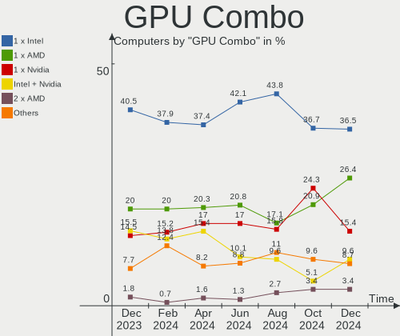
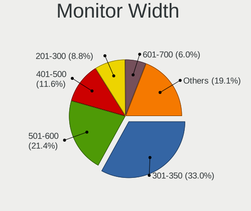
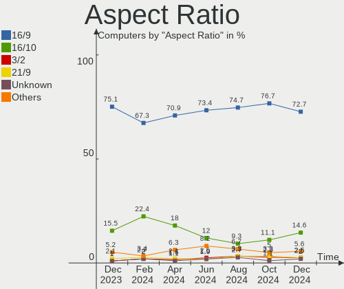
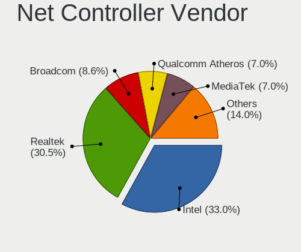
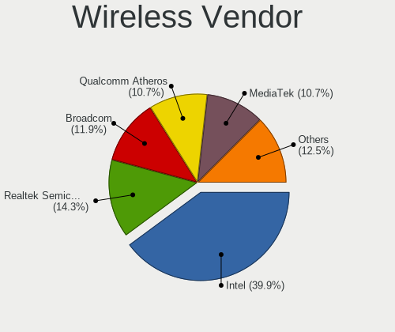
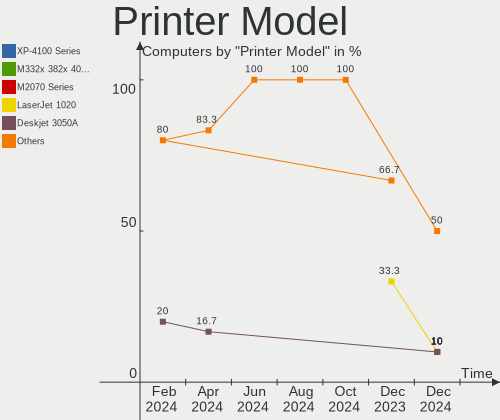

Linux in Canada - Hardware Trends
---------------------------------

A project to identify most popular hardware characteristics and track their change
over time based on data collected by Linux users at https://Linux-Hardware.org.

Anyone can contribute to this report by the [hw-probe](https://github.com/linuxhw/hw-probe) tool:

    sudo -E hw-probe -all -upload

This is a report for all computer types. See also reports for [desktops](/Location/Canada/Desktop/README.md) and [notebooks](/Location/Canada/Notebook/README.md).

Period: Jul, 2023.

Contents
--------

* [ System ](#system)
  - [ OS                       ](#os)
  - [ OS Family                ](#os-family)
  - [ Kernel                   ](#kernel)
  - [ Kernel Family            ](#kernel-family)
  - [ Kernel Major Ver.        ](#kernel-major-ver)
  - [ Arch                     ](#arch)
  - [ DE                       ](#de)
  - [ Display Server           ](#display-server)
  - [ Display Manager          ](#display-manager)
  - [ OS Lang                  ](#os-lang)
  - [ Boot Mode                ](#boot-mode)
  - [ Filesystem               ](#filesystem)
  - [ Part. scheme             ](#part-scheme)
  - [ Dual Boot with Linux/BSD ](#dual-boot-with-linuxbsd)
  - [ Dual Boot (Win)          ](#dual-boot-win)

* [ Board ](#board)
  - [ Vendor                   ](#vendor)
  - [ Model                    ](#model)
  - [ Model Family             ](#model-family)
  - [ MFG Year                 ](#mfg-year)
  - [ Form Factor              ](#form-factor)
  - [ Secure Boot              ](#secure-boot)
  - [ Coreboot                 ](#coreboot)
  - [ RAM Size                 ](#ram-size)
  - [ RAM Used                 ](#ram-used)
  - [ Total Drives             ](#total-drives)
  - [ Has CD-ROM               ](#has-cd-rom)
  - [ Has Ethernet             ](#has-ethernet)
  - [ Has WiFi                 ](#has-wifi)
  - [ Has Bluetooth            ](#has-bluetooth)

* [ Location ](#location)
  - [ Country                  ](#country)
  - [ City                     ](#city)

* [ Drives ](#drives)
  - [ Drive Vendor             ](#drive-vendor)
  - [ Drive Model              ](#drive-model)
  - [ HDD Vendor               ](#hdd-vendor)
  - [ SSD Vendor               ](#ssd-vendor)
  - [ Drive Kind               ](#drive-kind)
  - [ Drive Connector          ](#drive-connector)
  - [ Drive Size               ](#drive-size)
  - [ Space Total              ](#space-total)
  - [ Space Used               ](#space-used)
  - [ Malfunc. Drives          ](#malfunc-drives)
  - [ Malfunc. Drive Vendor    ](#malfunc-drive-vendor)
  - [ Malfunc. HDD Vendor      ](#malfunc-hdd-vendor)
  - [ Malfunc. Drive Kind      ](#malfunc-drive-kind)
  - [ Failed Drives            ](#failed-drives)
  - [ Failed Drive Vendor      ](#failed-drive-vendor)
  - [ Drive Status             ](#drive-status)

* [ Storage controller ](#storage-controller)
  - [ Storage Vendor           ](#storage-vendor)
  - [ Storage Model            ](#storage-model)
  - [ Storage Kind             ](#storage-kind)

* [ Processor ](#processor)
  - [ CPU Vendor               ](#cpu-vendor)
  - [ CPU Model                ](#cpu-model)
  - [ CPU Model Family         ](#cpu-model-family)
  - [ CPU Cores                ](#cpu-cores)
  - [ CPU Sockets              ](#cpu-sockets)
  - [ CPU Threads              ](#cpu-threads)
  - [ CPU Op-Modes             ](#cpu-op-modes)
  - [ CPU Microcode            ](#cpu-microcode)
  - [ CPU Microarch            ](#cpu-microarch)

* [ Graphics ](#graphics)
  - [ GPU Vendor               ](#gpu-vendor)
  - [ GPU Model                ](#gpu-model)
  - [ GPU Combo                ](#gpu-combo)
  - [ GPU Driver               ](#gpu-driver)
  - [ GPU Memory               ](#gpu-memory)

* [ Monitor ](#monitor)
  - [ Monitor Vendor           ](#monitor-vendor)
  - [ Monitor Model            ](#monitor-model)
  - [ Monitor Resolution       ](#monitor-resolution)
  - [ Monitor Diagonal         ](#monitor-diagonal)
  - [ Monitor Width            ](#monitor-width)
  - [ Aspect Ratio             ](#aspect-ratio)
  - [ Monitor Area             ](#monitor-area)
  - [ Pixel Density            ](#pixel-density)
  - [ Multiple Monitors        ](#multiple-monitors)

* [ Network ](#network)
  - [ Net Controller Vendor    ](#net-controller-vendor)
  - [ Net Controller Model     ](#net-controller-model)
  - [ Wireless Vendor          ](#wireless-vendor)
  - [ Wireless Model           ](#wireless-model)
  - [ Ethernet Vendor          ](#ethernet-vendor)
  - [ Ethernet Model           ](#ethernet-model)
  - [ Net Controller Kind      ](#net-controller-kind)
  - [ Used Controller          ](#used-controller)
  - [ NICs                     ](#nics)
  - [ IPv6                     ](#ipv6)

* [ Bluetooth ](#bluetooth)
  - [ Bluetooth Vendor         ](#bluetooth-vendor)
  - [ Bluetooth Model          ](#bluetooth-model)

* [ Sound ](#sound)
  - [ Sound Vendor             ](#sound-vendor)
  - [ Sound Model              ](#sound-model)

* [ Memory ](#memory)
  - [ Memory Vendor            ](#memory-vendor)
  - [ Memory Model             ](#memory-model)
  - [ Memory Kind              ](#memory-kind)
  - [ Memory Form Factor       ](#memory-form-factor)
  - [ Memory Size              ](#memory-size)
  - [ Memory Speed             ](#memory-speed)

* [ Printers & scanners ](#printers--scanners)
  - [ Printer Vendor           ](#printer-vendor)
  - [ Printer Model            ](#printer-model)
  - [ Scanner Vendor           ](#scanner-vendor)
  - [ Scanner Model            ](#scanner-model)

* [ Camera ](#camera)
  - [ Camera Vendor            ](#camera-vendor)
  - [ Camera Model             ](#camera-model)

* [ Security ](#security)
  - [ Fingerprint Vendor       ](#fingerprint-vendor)
  - [ Fingerprint Model        ](#fingerprint-model)
  - [ Chipcard Vendor          ](#chipcard-vendor)
  - [ Chipcard Model           ](#chipcard-model)

* [ Unsupported ](#unsupported)
  - [ Unsupported Devices      ](#unsupported-devices)
  - [ Unsupported Device Types ](#unsupported-device-types)

System
------

OS
--

Installed operating systems

| Name                 | Computers | Percent |
|----------------------|-----------|---------|
| Ubuntu 22.04         | 18        | 11.92%  |
| Fedora 38            | 14        | 9.27%   |
| Pop!_OS 22.04        | 12        | 7.95%   |
| Debian 12            | 12        | 7.95%   |
| Ubuntu 23.04         | 11        | 7.28%   |
| Linux Mint 21.1      | 10        | 6.62%   |
| Arch Rolling         | 10        | 6.62%   |
| OpenMandriva 23.03   | 7         | 4.64%   |
| Linux Mint 21.2      | 6         | 3.97%   |
| Debian 11            | 4         | 2.65%   |
| Ubuntu 22.10         | 3         | 1.99%   |
| Kubuntu 22.04        | 3         | 1.99%   |
| KDE neon 22.04       | 3         | 1.99%   |
| Xubuntu 22.04        | 2         | 1.32%   |
| Manjaro              | 2         | 1.32%   |
| Linux Mint 21        | 2         | 1.32%   |
| Kubuntu 23.04        | 2         | 1.32%   |
| Kali 2023.2          | 2         | 1.32%   |
| Debian               | 2         | 1.32%   |
| ArcoLinux Rolling    | 2         | 1.32%   |
| Zorin 15             | 1         | 0.66%   |
| Xero Rolling         | 1         | 0.66%   |
| Ultramarine 38       | 1         | 0.66%   |
| Ubuntu Unity 16.04   | 1         | 0.66%   |
| Ubuntu 20.04         | 1         | 0.66%   |
| TUXEDO OS 22.04      | 1         | 0.66%   |
| Pop!_OS 20.04        | 1         | 0.66%   |
| Parrot 5.3           | 1         | 0.66%   |
| OpenMandriva 4.3     | 1         | 0.66%   |
| OpenMandriva 23.07   | 1         | 0.66%   |
| OpenMandriva 23.06   | 1         | 0.66%   |
| MX 21                | 1         | 0.66%   |
| Linux Mint 20.3      | 1         | 0.66%   |
| Linux Mint 20.2      | 1         | 0.66%   |
| Gentoo 2.7           | 1         | 0.66%   |
| Garuda Linux Rolling | 1         | 0.66%   |
| Funtoo 2023-07-11    | 1         | 0.66%   |
| Feren OS 20.04       | 1         | 0.66%   |
| Endless 4.0.13       | 1         | 0.66%   |
| EndeavourOS Rolling  | 1         | 0.66%   |

OS Family
---------

OS without a version

| Name         | Computers | Percent |
|--------------|-----------|---------|
| Ubuntu       | 33        | 21.85%  |
| Linux Mint   | 20        | 13.25%  |
| Debian       | 18        | 11.92%  |
| Fedora       | 14        | 9.27%   |
| Pop!_OS      | 13        | 8.61%   |
| OpenMandriva | 10        | 6.62%   |
| Arch         | 10        | 6.62%   |
| Kubuntu      | 5         | 3.31%   |
| KDE neon     | 3         | 1.99%   |
| Xubuntu      | 2         | 1.32%   |
| Manjaro      | 2         | 1.32%   |
| Kali         | 2         | 1.32%   |
| Elementary   | 2         | 1.32%   |
| ArcoLinux    | 2         | 1.32%   |
| Zorin        | 1         | 0.66%   |
| Xero         | 1         | 0.66%   |
| Ultramarine  | 1         | 0.66%   |
| Ubuntu Unity | 1         | 0.66%   |
| TUXEDO OS    | 1         | 0.66%   |
| Parrot       | 1         | 0.66%   |
| MX           | 1         | 0.66%   |
| Gentoo       | 1         | 0.66%   |
| Garuda Linux | 1         | 0.66%   |
| Funtoo       | 1         | 0.66%   |
| Feren OS     | 1         | 0.66%   |
| Endless      | 1         | 0.66%   |
| EndeavourOS  | 1         | 0.66%   |
| CentOS       | 1         | 0.66%   |
| AlmaLinux    | 1         | 0.66%   |

Kernel
------

Version of the Linux kernel

| Version                     | Computers | Percent |
|-----------------------------|-----------|---------|
| 5.19.0-46-generic           | 17        | 11.26%  |
| 5.15.0-76-generic           | 13        | 8.61%   |
| 6.2.6-76060206-generic      | 12        | 7.95%   |
| 6.2.6-desktop-1omv2390      | 8         | 5.3%    |
| 6.1.0-10-amd64              | 7         | 4.64%   |
| 6.2.0-25-generic            | 5         | 3.31%   |
| 5.15.0-78-generic           | 5         | 3.31%   |
| 6.3.12-200.fc38.x86_64      | 4         | 2.65%   |
| 6.4.3-arch1-2               | 3         | 1.99%   |
| 6.3.11-200.fc38.x86_64      | 3         | 1.99%   |
| 6.2.0-26-generic            | 3         | 1.99%   |
| 6.2.0-24-generic            | 3         | 1.99%   |
| 6.1.0-9-amd64               | 3         | 1.99%   |
| 6.4.4-arch1-1               | 2         | 1.32%   |
| 6.4.4-200.fc38.x86_64       | 2         | 1.32%   |
| 6.4.1-arch1-1               | 2         | 1.32%   |
| 6.3.8-200.fc38.x86_64       | 2         | 1.32%   |
| 6.3.0-1-amd64               | 2         | 1.32%   |
| 6.2.9-300.fc38.x86_64       | 2         | 1.32%   |
| 6.2.6-1-pve                 | 2         | 1.32%   |
| 5.19.0-50-generic           | 2         | 1.32%   |
| 5.19.0-32-generic           | 2         | 1.32%   |
| 6.4.7-arch1-1               | 1         | 0.66%   |
| 6.4.6-arch1-1               | 1         | 0.66%   |
| 6.4.6-1.surface.fc38.x86_64 | 1         | 0.66%   |
| 6.4.3-arch1-1               | 1         | 0.66%   |
| 6.4.3-060403-generic        | 1         | 0.66%   |
| 6.4.2-arch1-1-surface       | 1         | 0.66%   |
| 6.4.2-060402-generic        | 1         | 0.66%   |
| 6.4.1-arch2-1               | 1         | 0.66%   |
| 6.3.5-desktop-3omv2390      | 1         | 0.66%   |
| 6.3.3-arch1-1               | 1         | 0.66%   |
| 6.3.12-1-MANJARO            | 1         | 0.66%   |
| 6.3.11_p1-debian-sources    | 1         | 0.66%   |
| 6.3.0-kali1-amd64           | 1         | 0.66%   |
| 6.2.16-3-pve                | 1         | 0.66%   |
| 6.2.16-2-MANJARO            | 1         | 0.66%   |
| 6.2.16-060216-generic       | 1         | 0.66%   |
| 6.2.15-lqx1-1-lqx           | 1         | 0.66%   |
| 6.2.15-300.fc38.x86_64      | 1         | 0.66%   |

Kernel Family
-------------

Linux kernel without a distro release

| Version  | Computers | Percent |
|----------|-----------|---------|
| 5.19.0   | 23        | 15.23%  |
| 5.15.0   | 23        | 15.23%  |
| 6.2.6    | 22        | 14.57%  |
| 6.2.0    | 14        | 9.27%   |
| 6.1.0    | 13        | 8.61%   |
| 6.4.3    | 5         | 3.31%   |
| 6.3.12   | 5         | 3.31%   |
| 6.4.4    | 4         | 2.65%   |
| 6.3.11   | 4         | 2.65%   |
| 6.4.1    | 3         | 1.99%   |
| 6.3.0    | 3         | 1.99%   |
| 6.2.16   | 3         | 1.99%   |
| 5.4.0    | 3         | 1.99%   |
| 6.4.6    | 2         | 1.32%   |
| 6.4.2    | 2         | 1.32%   |
| 6.3.8    | 2         | 1.32%   |
| 6.2.9    | 2         | 1.32%   |
| 6.2.15   | 2         | 1.32%   |
| 5.10.0   | 2         | 1.32%   |
| 6.4.7    | 1         | 0.66%   |
| 6.3.5    | 1         | 0.66%   |
| 6.3.3    | 1         | 0.66%   |
| 6.2.11   | 1         | 0.66%   |
| 6.1.38   | 1         | 0.66%   |
| 6.0.12   | 1         | 0.66%   |
| 6.0.0    | 1         | 0.66%   |
| 5.19.5   | 1         | 0.66%   |
| 5.16.13  | 1         | 0.66%   |
| 5.11.0   | 1         | 0.66%   |
| 5.10.52  | 1         | 0.66%   |
| 4.4.0    | 1         | 0.66%   |
| 4.19.187 | 1         | 0.66%   |
| 4.18.0   | 1         | 0.66%   |

Kernel Major Ver.
-----------------

Linux kernel major version

| Version | Computers | Percent |
|---------|-----------|---------|
| 6.2     | 44        | 29.14%  |
| 5.19    | 24        | 15.89%  |
| 5.15    | 23        | 15.23%  |
| 6.4     | 17        | 11.26%  |
| 6.3     | 16        | 10.6%   |
| 6.1     | 14        | 9.27%   |
| 5.4     | 3         | 1.99%   |
| 5.10    | 3         | 1.99%   |
| 6.0     | 2         | 1.32%   |
| 5.16    | 1         | 0.66%   |
| 5.11    | 1         | 0.66%   |
| 4.4     | 1         | 0.66%   |
| 4.19    | 1         | 0.66%   |
| 4.18    | 1         | 0.66%   |

Arch
----

OS architecture (x86_64, i586, etc.)

| Name   | Computers | Percent |
|--------|-----------|---------|
| x86_64 | 148       | 98.01%  |
| i686   | 3         | 1.99%   |

DE
--

Desktop Environment

| Name            | Computers | Percent |
|-----------------|-----------|---------|
| GNOME           | 68        | 45.03%  |
| KDE5            | 35        | 23.18%  |
| X-Cinnamon      | 20        | 13.25%  |
| XFCE            | 10        | 6.62%   |
| Unknown         | 5         | 3.31%   |
| MATE            | 3         | 1.99%   |
| Pantheon        | 2         | 1.32%   |
| Unity           | 1         | 0.66%   |
| KDE4            | 1         | 0.66%   |
| Jwm             | 1         | 0.66%   |
| i3              | 1         | 0.66%   |
| Hyprland        | 1         | 0.66%   |
| GNOME Flashback | 1         | 0.66%   |
| DWM             | 1         | 0.66%   |
| Cutefish        | 1         | 0.66%   |

Display Server
--------------

X11 or Wayland

| Name    | Computers | Percent |
|---------|-----------|---------|
| X11     | 105       | 69.54%  |
| Wayland | 38        | 25.17%  |
| Unknown | 5         | 3.31%   |
| Tty     | 3         | 1.99%   |

Display Manager
---------------

SDDM, LightDM, etc.

| Name    | Computers | Percent |
|---------|-----------|---------|
| Unknown | 60        | 39.74%  |
| GDM3    | 35        | 23.18%  |
| SDDM    | 23        | 15.23%  |
| LightDM | 22        | 14.57%  |
| GDM     | 9         | 5.96%   |
| LY-DM   | 1         | 0.66%   |
| LXDM    | 1         | 0.66%   |

OS Lang
-------

Language

| Lang  | Computers | Percent |
|-------|-----------|---------|
| en_CA | 83        | 54.97%  |
| en_US | 54        | 35.76%  |
| fr_CA | 11        | 7.28%   |
| fr_FR | 2         | 1.32%   |
| C     | 1         | 0.66%   |

Boot Mode
---------

EFI or BIOS

| Mode | Computers | Percent |
|------|-----------|---------|
| EFI  | 80        | 52.98%  |
| BIOS | 71        | 47.02%  |

Filesystem
----------

Type of filesystem

| Type    | Computers | Percent |
|---------|-----------|---------|
| Ext4    | 96        | 63.58%  |
| Btrfs   | 26        | 17.22%  |
| Tmpfs   | 20        | 13.25%  |
| Overlay | 8         | 5.3%    |
| Zfs     | 1         | 0.66%   |

Part. scheme
------------

Scheme of partitioning

| Type    | Computers | Percent |
|---------|-----------|---------|
| GPT     | 87        | 57.62%  |
| Unknown | 56        | 37.09%  |
| MBR     | 8         | 5.3%    |

Dual Boot with Linux/BSD
------------------------

Hosting more than one Linux/BSD

| Dual boot | Computers | Percent |
|-----------|-----------|---------|
| No        | 139       | 92.05%  |
| Yes       | 12        | 7.95%   |

Dual Boot (Win)
---------------

Hosting Linux and Windows

| Dual boot | Computers | Percent |
|-----------|-----------|---------|
| No        | 110       | 72.85%  |
| Yes       | 41        | 27.15%  |

Board
-----

Vendor
------

Motherboard manufacturer

| Name                | Computers | Percent |
|---------------------|-----------|---------|
| ASUSTek Computer    | 30        | 19.87%  |
| Lenovo              | 25        | 16.56%  |
| Hewlett-Packard     | 23        | 15.23%  |
| Dell                | 21        | 13.91%  |
| MSI                 | 11        | 7.28%   |
| ASRock              | 7         | 4.64%   |
| Acer                | 5         | 3.31%   |
| Gigabyte Technology | 4         | 2.65%   |
| Apple               | 4         | 2.65%   |
| Microsoft           | 3         | 1.99%   |
| System76            | 2         | 1.32%   |
| Intel               | 2         | 1.32%   |
| Google              | 2         | 1.32%   |
| Gateway             | 2         | 1.32%   |
| Framework           | 2         | 1.32%   |
| ASRockRack          | 2         | 1.32%   |
| Toshiba             | 1         | 0.66%   |
| Panasonic           | 1         | 0.66%   |
| BOSGAME             | 1         | 0.66%   |
| AZW                 | 1         | 0.66%   |
| Alienware           | 1         | 0.66%   |
| Unknown             | 1         | 0.66%   |

Model
-----

Motherboard model

| Name                                   | Computers | Percent |
|----------------------------------------|-----------|---------|
| ASUS M11AD                             | 2         | 1.32%   |
| Toshiba TECRA R950                     | 1         | 0.66%   |
| System76 Serval WS                     | 1         | 0.66%   |
| System76 Pangolin                      | 1         | 0.66%   |
| Panasonic CF-S10CDHEDM                 | 1         | 0.66%   |
| MSI MS-7D76                            | 1         | 0.66%   |
| MSI MS-7C91                            | 1         | 0.66%   |
| MSI MS-7B93                            | 1         | 0.66%   |
| MSI MS-7B33                            | 1         | 0.66%   |
| MSI MS-7B23                            | 1         | 0.66%   |
| MSI MS-7A72                            | 1         | 0.66%   |
| MSI MS-7A37                            | 1         | 0.66%   |
| MSI MS-7599                            | 1         | 0.66%   |
| MSI Katana GF66 11UE                   | 1         | 0.66%   |
| MSI GT72VR 6RD                         | 1         | 0.66%   |
| MSI GF65 Thin 10UE                     | 1         | 0.66%   |
| Microsoft Surface Pro 8                | 1         | 0.66%   |
| Microsoft Surface Laptop Go            | 1         | 0.66%   |
| Microsoft Surface Book 2               | 1         | 0.66%   |
| Lenovo Yoga 14sACH 2021 82MS           | 1         | 0.66%   |
| Lenovo ThinkPad X220 Tablet 42962WU    | 1         | 0.66%   |
| Lenovo ThinkPad T510 4349RK6           | 1         | 0.66%   |
| Lenovo ThinkPad T480s 20L70028US       | 1         | 0.66%   |
| Lenovo ThinkPad T470s W10DG 20JTS0DN00 | 1         | 0.66%   |
| Lenovo ThinkPad T470s 20HGS0DT00       | 1         | 0.66%   |
| Lenovo ThinkPad T450s 20BWS0PJ00       | 1         | 0.66%   |
| Lenovo ThinkPad T430 2347H91           | 1         | 0.66%   |
| Lenovo ThinkPad T420s 417152U          | 1         | 0.66%   |
| Lenovo ThinkPad P53 20QN004BCA         | 1         | 0.66%   |
| Lenovo ThinkPad P50s 20FLCTO1WW        | 1         | 0.66%   |
| Lenovo ThinkPad P15v Gen 1 20TQCTO1WW  | 1         | 0.66%   |
| Lenovo ThinkPad P14s Gen 3 21J6S05H00  | 1         | 0.66%   |
| Lenovo ThinkPad E14 Gen 2 20TA004MUS   | 1         | 0.66%   |
| Lenovo ThinkPad 20JB002BUS             | 1         | 0.66%   |
| Lenovo ThinkPad 11e 20DAS0C800         | 1         | 0.66%   |
| Lenovo ThinkCentre M93p 10A7000QUS     | 1         | 0.66%   |
| Lenovo ThinkCentre M75q-1 11A4001WUS   | 1         | 0.66%   |
| Lenovo ThinkCentre M58e 7268C5F        | 1         | 0.66%   |
| Lenovo Legion Pro 7 16IRX8H 82WQ       | 1         | 0.66%   |
| Lenovo Legion 7 16ITHg6 82K6           | 1         | 0.66%   |

Model Family
------------

Motherboard model prefix

| Name                   | Computers | Percent |
|------------------------|-----------|---------|
| Lenovo ThinkPad        | 15        | 9.93%   |
| Dell Latitude          | 8         | 5.3%    |
| HP Pavilion            | 6         | 3.97%   |
| Lenovo IdeaPad         | 4         | 2.65%   |
| HP ProBook             | 4         | 2.65%   |
| Dell XPS               | 4         | 2.65%   |
| ASUS VivoBook          | 4         | 2.65%   |
| ASUS ROG               | 4         | 2.65%   |
| Microsoft Surface      | 3         | 1.99%   |
| Lenovo ThinkCentre     | 3         | 1.99%   |
| Dell Precision         | 3         | 1.99%   |
| ASUS TUF               | 3         | 1.99%   |
| ASUS PRIME             | 3         | 1.99%   |
| Acer Aspire            | 3         | 1.99%   |
| Lenovo Legion          | 2         | 1.32%   |
| HP Laptop              | 2         | 1.32%   |
| HP EliteDesk           | 2         | 1.32%   |
| HP EliteBook           | 2         | 1.32%   |
| HP Compaq              | 2         | 1.32%   |
| Framework Laptop       | 2         | 1.32%   |
| Dell OptiPlex          | 2         | 1.32%   |
| ASUS ZenBook           | 2         | 1.32%   |
| ASUS M11AD             | 2         | 1.32%   |
| ASUS ASUS              | 2         | 1.32%   |
| ASRock B450            | 2         | 1.32%   |
| Acer Nitro             | 2         | 1.32%   |
| Toshiba TECRA          | 1         | 0.66%   |
| System76 Serval        | 1         | 0.66%   |
| System76 Pangolin      | 1         | 0.66%   |
| Panasonic CF-S10CDHEDM | 1         | 0.66%   |
| MSI MS-7D76            | 1         | 0.66%   |
| MSI MS-7C91            | 1         | 0.66%   |
| MSI MS-7B93            | 1         | 0.66%   |
| MSI MS-7B33            | 1         | 0.66%   |
| MSI MS-7B23            | 1         | 0.66%   |
| MSI MS-7A72            | 1         | 0.66%   |
| MSI MS-7A37            | 1         | 0.66%   |
| MSI MS-7599            | 1         | 0.66%   |
| MSI Katana             | 1         | 0.66%   |
| MSI GT72VR             | 1         | 0.66%   |

MFG Year
--------

Motherboard manufacture year

| Year | Computers | Percent |
|------|-----------|---------|
| 2022 | 19        | 12.58%  |
| 2021 | 18        | 11.92%  |
| 2019 | 14        | 9.27%   |
| 2018 | 12        | 7.95%   |
| 2020 | 11        | 7.28%   |
| 2012 | 11        | 7.28%   |
| 2011 | 11        | 7.28%   |
| 2016 | 10        | 6.62%   |
| 2017 | 9         | 5.96%   |
| 2023 | 7         | 4.64%   |
| 2014 | 7         | 4.64%   |
| 2013 | 7         | 4.64%   |
| 2009 | 4         | 2.65%   |
| 2008 | 3         | 1.99%   |
| 2015 | 2         | 1.32%   |
| 2010 | 2         | 1.32%   |
| 2006 | 2         | 1.32%   |
| 2007 | 1         | 0.66%   |
| 2003 | 1         | 0.66%   |

Form Factor
-----------

Physical design of the computer

| Name        | Computers | Percent |
|-------------|-----------|---------|
| Notebook    | 78        | 51.66%  |
| Desktop     | 59        | 39.07%  |
| Tablet      | 5         | 3.31%   |
| Convertible | 3         | 1.99%   |
| Mini pc     | 3         | 1.99%   |
| All in one  | 3         | 1.99%   |

Secure Boot
-----------

Enabled or disabled

| State    | Computers | Percent |
|----------|-----------|---------|
| Disabled | 140       | 92.72%  |
| Enabled  | 11        | 7.28%   |

Coreboot
--------

Have coreboot on board

| Used | Computers | Percent |
|------|-----------|---------|
| No   | 148       | 98.01%  |
| Yes  | 3         | 1.99%   |

RAM Size
--------

Total RAM memory

| Size in GB  | Computers | Percent |
|-------------|-----------|---------|
| 16.01-24.0  | 35        | 23.18%  |
| 4.01-8.0    | 29        | 19.21%  |
| 32.01-64.0  | 29        | 19.21%  |
| 8.01-16.0   | 20        | 13.25%  |
| 3.01-4.0    | 16        | 10.6%   |
| 64.01-256.0 | 10        | 6.62%   |
| 24.01-32.0  | 6         | 3.97%   |
| 1.01-2.0    | 3         | 1.99%   |
| 2.01-3.0    | 2         | 1.32%   |
| 0.51-1.0    | 1         | 0.66%   |

RAM Used
--------

Used RAM memory

| Used GB    | Computers | Percent |
|------------|-----------|---------|
| 2.01-3.0   | 39        | 25.83%  |
| 4.01-8.0   | 30        | 19.87%  |
| 3.01-4.0   | 29        | 19.21%  |
| 1.01-2.0   | 28        | 18.54%  |
| 8.01-16.0  | 13        | 8.61%   |
| 0.51-1.0   | 5         | 3.31%   |
| 16.01-24.0 | 3         | 1.99%   |
| 32.01-64.0 | 2         | 1.32%   |
| 0.01-0.5   | 2         | 1.32%   |

Total Drives
------------

Number of drives on board

| Drives | Computers | Percent |
|--------|-----------|---------|
| 1      | 80        | 52.98%  |
| 2      | 35        | 23.18%  |
| 3      | 14        | 9.27%   |
| 4      | 13        | 8.61%   |
| 6      | 4         | 2.65%   |
| 5      | 2         | 1.32%   |
| 12     | 1         | 0.66%   |
| 7      | 1         | 0.66%   |
| 0      | 1         | 0.66%   |

Has CD-ROM
----------

Has CD-ROM on board

| Presented | Computers | Percent |
|-----------|-----------|---------|
| No        | 103       | 68.21%  |
| Yes       | 48        | 31.79%  |

Has Ethernet
------------

Has Ethernet on board

| Presented | Computers | Percent |
|-----------|-----------|---------|
| Yes       | 127       | 84.11%  |
| No        | 24        | 15.89%  |

Has WiFi
--------

Has WiFi module

| Presented | Computers | Percent |
|-----------|-----------|---------|
| Yes       | 123       | 81.46%  |
| No        | 28        | 18.54%  |

Has Bluetooth
-------------

Has Bluetooth module

| Presented | Computers | Percent |
|-----------|-----------|---------|
| Yes       | 107       | 70.86%  |
| No        | 44        | 29.14%  |

Location
--------

Country
-------

Geographic location (country)

| Country | Computers | Percent |
|---------|-----------|---------|
| Canada  | 151       | 100%    |

City
----

Geographic location (city)

| City            | Computers | Percent |
|-----------------|-----------|---------|
| Montreal        | 16        | 10.6%   |
| Toronto         | 13        | 8.61%   |
| Vancouver       | 11        | 7.28%   |
| Edmonton        | 4         | 2.65%   |
| Calgary         | 4         | 2.65%   |
| Winnipeg        | 3         | 1.99%   |
| Victoria        | 3         | 1.99%   |
| Québec         | 3         | 1.99%   |
| Ottawa          | 3         | 1.99%   |
| Kelowna         | 3         | 1.99%   |
| Gatineau        | 3         | 1.99%   |
| Burnaby         | 3         | 1.99%   |
| Surrey          | 2         | 1.32%   |
| Sherbrooke      | 2         | 1.32%   |
| Scarborough     | 2         | 1.32%   |
| Oshawa          | 2         | 1.32%   |
| London          | 2         | 1.32%   |
| Laval           | 2         | 1.32%   |
| LaSalle         | 2         | 1.32%   |
| Kitchener       | 2         | 1.32%   |
| Kingston        | 2         | 1.32%   |
| Hamilton        | 2         | 1.32%   |
| Greater Sudbury | 2         | 1.32%   |
| Burlington      | 2         | 1.32%   |
| Woodstock       | 1         | 0.66%   |
| Wetaskiwin      | 1         | 0.66%   |
| Waterloo        | 1         | 0.66%   |
| Vernon          | 1         | 0.66%   |
| Val-d'Or        | 1         | 0.66%   |
| Tillsonburg     | 1         | 0.66%   |
| Thunder Bay     | 1         | 0.66%   |
| Thornhill       | 1         | 0.66%   |
| Thetford-Mines  | 1         | 0.66%   |
| Sydney          | 1         | 0.66%   |
| St. Thomas      | 1         | 0.66%   |
| St. Marys       | 1         | 0.66%   |
| St. George      | 1         | 0.66%   |
| Spruce Grove    | 1         | 0.66%   |
| Shawinigan      | 1         | 0.66%   |
| Saskatoon       | 1         | 0.66%   |

Drives
------

Drive Vendor
------------

Hard drive vendors

| Vendor                      | Computers | Drives | Percent |
|-----------------------------|-----------|--------|---------|
| Samsung Electronics         | 34        | 41     | 14.23%  |
| WDC                         | 30        | 55     | 12.55%  |
| Seagate                     | 28        | 43     | 11.72%  |
| Sandisk                     | 18        | 19     | 7.53%   |
| Kingston                    | 15        | 17     | 6.28%   |
| Intel                       | 14        | 14     | 5.86%   |
| Toshiba                     | 13        | 13     | 5.44%   |
| SK hynix                    | 12        | 12     | 5.02%   |
| Unknown                     | 10        | 10     | 4.18%   |
| HGST                        | 6         | 6      | 2.51%   |
| Micron Technology           | 5         | 5      | 2.09%   |
| Hitachi                     | 5         | 5      | 2.09%   |
| Kingston Technology Company | 4         | 4      | 1.67%   |
| A-DATA Technology           | 4         | 4      | 1.67%   |
| Crucial                     | 3         | 3      | 1.26%   |
| Corsair                     | 3         | 3      | 1.26%   |
| Team                        | 2         | 2      | 0.84%   |
| Silicon Motion              | 2         | 3      | 0.84%   |
| SABRENT                     | 2         | 2      | 0.84%   |
| Realtek Semiconductor       | 2         | 2      | 0.84%   |
| PNY                         | 2         | 2      | 0.84%   |
| Phison Electronics          | 2         | 2      | 0.84%   |
| OCZ                         | 2         | 2      | 0.84%   |
| Micron/Crucial Technology   | 2         | 2      | 0.84%   |
| Timetec                     | 1         | 1      | 0.42%   |
| SSSTC                       | 1         | 1      | 0.42%   |
| SPCC                        | 1         | 1      | 0.42%   |
| Patriot                     | 1         | 1      | 0.42%   |
| OWC                         | 1         | 2      | 0.42%   |
| Mushkin                     | 1         | 1      | 0.42%   |
| Maxtor                      | 1         | 1      | 0.42%   |
| Lexar                       | 1         | 1      | 0.42%   |
| KIOXIA                      | 1         | 1      | 0.42%   |
| KingSpec                    | 1         | 4      | 0.42%   |
| KingDian                    | 1         | 1      | 0.42%   |
| JMicron Technology          | 1         | 2      | 0.42%   |
| Fujitsu                     | 1         | 1      | 0.42%   |
| FIKWOT                      | 1         | 1      | 0.42%   |
| Enmotus                     | 1         | 1      | 0.42%   |
| China                       | 1         | 1      | 0.42%   |

Drive Model
-----------

Hard drive models

| Model                                               | Computers | Percent |
|-----------------------------------------------------|-----------|---------|
| Intel SSD 660P Series 1024GB                        | 4         | 1.48%   |
| Samsung NVMe SSD Controller SM981/PM981/PM983 500GB | 3         | 1.11%   |
| Intel SSDPEKNU512GZ 512GB                           | 3         | 1.11%   |
| WDC WDS100T2G0A-00JH30 1TB SSD                      | 2         | 0.74%   |
| WDC WDS100T2B0A-00SM50 1TB SSD                      | 2         | 0.74%   |
| WDC WD40EFRX-68N32N0 4TB                            | 2         | 0.74%   |
| WDC WD40EFAX-68JH4N1 4TB                            | 2         | 0.74%   |
| Unknown SD/MMC/MS PRO 128GB                         | 2         | 0.74%   |
| Unknown MMC Card  64GB                              | 2         | 0.74%   |
| Toshiba MQ01ABD100 1TB                              | 2         | 0.74%   |
| Toshiba DT01ACA100 1TB                              | 2         | 0.74%   |
| SK hynix SC311 SATA 256GB SSD                       | 2         | 0.74%   |
| SK hynix BC501 NVMe Solid State Drive 512GB         | 2         | 0.74%   |
| Seagate ST500DM002-1BD142 500GB                     | 2         | 0.74%   |
| Seagate ST2000DM008-2FR102 2TB                      | 2         | 0.74%   |
| Seagate ST1000LM024 HN-M101MBB 1TB                  | 2         | 0.74%   |
| Seagate ST1000DM010-2EP102 1TB                      | 2         | 0.74%   |
| Seagate Expansion 1TB                               | 2         | 0.74%   |
| Sandisk WD_BLACK SN770 2TB                          | 2         | 0.74%   |
| Sandisk WD Blue SN550 NVMe SSD 250GB                | 2         | 0.74%   |
| Sandisk WD Black SN850 1TB                          | 2         | 0.74%   |
| SanDisk NVMe SSD Drive 1TB                          | 2         | 0.74%   |
| Samsung SSD 970 EVO Plus 1TB                        | 2         | 0.74%   |
| Samsung SSD 870 EVO 2TB                             | 2         | 0.74%   |
| Samsung SSD 870 EVO 250GB                           | 2         | 0.74%   |
| Samsung NVMe SSD Controller PM9A1/PM9A3/980PRO 1TB  | 2         | 0.74%   |
| SABRENT Disk 1TB                                    | 2         | 0.74%   |
| Kingston Company SNV2S1000G 1TB                     | 2         | 0.74%   |
| Kingston SNVS1000G 1TB                              | 2         | 0.74%   |
| Kingston SKC3000S1024G 1024GB                       | 2         | 0.74%   |
| Kingston SA400S37480G 480GB SSD                     | 2         | 0.74%   |
| Kingston SA400S37120G 120GB SSD                     | 2         | 0.74%   |
| HGST HTS721010A9E630 1TB                            | 2         | 0.74%   |
| HGST HTS541010B7E610 1TB                            | 2         | 0.74%   |
| WDC WDS500G2B0C-00PXH0 500GB                        | 1         | 0.37%   |
| WDC WDS500G2B0B-00YS70 500GB SSD                    | 1         | 0.37%   |
| WDC WDS500G2B0A-00SM50 500GB SSD                    | 1         | 0.37%   |
| WDC WDS250G2B0A-00SM50 250GB SSD                    | 1         | 0.37%   |
| WDC WDS100T2B0B-00YS70 1TB SSD                      | 1         | 0.37%   |
| WDC WDBNCE0010PNC 1TB SSD                           | 1         | 0.37%   |

HDD Vendor
----------

Hard disk drive vendors

| Vendor              | Computers | Drives | Percent |
|---------------------|-----------|--------|---------|
| Seagate             | 27        | 41     | 34.18%  |
| WDC                 | 22        | 42     | 27.85%  |
| Toshiba             | 11        | 11     | 13.92%  |
| HGST                | 6         | 6      | 7.59%   |
| Hitachi             | 5         | 5      | 6.33%   |
| Unknown             | 2         | 2      | 2.53%   |
| Samsung Electronics | 2         | 2      | 2.53%   |
| Maxtor              | 1         | 1      | 1.27%   |
| JMicron Technology  | 1         | 1      | 1.27%   |
| Fujitsu             | 1         | 1      | 1.27%   |
| ACASIS              | 1         | 1      | 1.27%   |

SSD Vendor
----------

Solid state drive vendors

| Vendor              | Computers | Drives | Percent |
|---------------------|-----------|--------|---------|
| Samsung Electronics | 15        | 17     | 21.74%  |
| WDC                 | 10        | 11     | 14.49%  |
| Kingston            | 9         | 10     | 13.04%  |
| Intel               | 4         | 4      | 5.8%    |
| SK hynix            | 3         | 3      | 4.35%   |
| Crucial             | 3         | 3      | 4.35%   |
| A-DATA Technology   | 3         | 3      | 4.35%   |
| Team                | 2         | 2      | 2.9%    |
| SanDisk             | 2         | 2      | 2.9%    |
| PNY                 | 2         | 2      | 2.9%    |
| OCZ                 | 2         | 2      | 2.9%    |
| Micron Technology   | 2         | 2      | 2.9%    |
| Timetec             | 1         | 1      | 1.45%   |
| SPCC                | 1         | 1      | 1.45%   |
| Seagate             | 1         | 1      | 1.45%   |
| Patriot             | 1         | 1      | 1.45%   |
| OWC                 | 1         | 2      | 1.45%   |
| Mushkin             | 1         | 1      | 1.45%   |
| Lexar               | 1         | 1      | 1.45%   |
| KingSpec            | 1         | 4      | 1.45%   |
| KingDian            | 1         | 1      | 1.45%   |
| Corsair             | 1         | 1      | 1.45%   |
| China               | 1         | 1      | 1.45%   |
| Apple               | 1         | 1      | 1.45%   |

Drive Kind
----------

HDD or SSD

| Kind    | Computers | Drives | Percent |
|---------|-----------|--------|---------|
| NVMe    | 78        | 93     | 36.97%  |
| HDD     | 61        | 113    | 28.91%  |
| SSD     | 60        | 77     | 28.44%  |
| MMC     | 9         | 9      | 4.27%   |
| Unknown | 3         | 3      | 1.42%   |

Drive Connector
---------------

SATA, SAS, NVMe, etc.

| Type | Computers | Drives | Percent |
|------|-----------|--------|---------|
| SATA | 97        | 178    | 49.74%  |
| NVMe | 76        | 91     | 38.97%  |
| SAS  | 13        | 17     | 6.67%   |
| MMC  | 9         | 9      | 4.62%   |

Drive Size
----------

Size of hard drive

| Size in TB | Computers | Drives | Percent |
|------------|-----------|--------|---------|
| 0.01-0.5   | 59        | 75     | 42.45%  |
| 0.51-1.0   | 47        | 63     | 33.81%  |
| 1.01-2.0   | 12        | 14     | 8.63%   |
| 3.01-4.0   | 8         | 16     | 5.76%   |
| 4.01-10.0  | 8         | 15     | 5.76%   |
| 10.01-20.0 | 3         | 5      | 2.16%   |
| 2.01-3.0   | 2         | 2      | 1.44%   |

Space Total
-----------

Amount of disk space available on the file system

| Size in GB     | Computers | Percent |
|----------------|-----------|---------|
| 101-250        | 40        | 26.49%  |
| 251-500        | 30        | 19.87%  |
| 501-1000       | 26        | 17.22%  |
| 1001-2000      | 17        | 11.26%  |
| More than 3000 | 15        | 9.93%   |
| 51-100         | 11        | 7.28%   |
| 1-20           | 8         | 5.3%    |
| 2001-3000      | 2         | 1.32%   |
| Unknown        | 2         | 1.32%   |

Space Used
----------

Amount of used disk space

| Used GB        | Computers | Percent |
|----------------|-----------|---------|
| 1-20           | 40        | 26.49%  |
| 21-50          | 26        | 17.22%  |
| 51-100         | 24        | 15.89%  |
| 101-250        | 21        | 13.91%  |
| 251-500        | 13        | 8.61%   |
| 501-1000       | 11        | 7.28%   |
| More than 3000 | 7         | 4.64%   |
| 1001-2000      | 5         | 3.31%   |
| 2001-3000      | 2         | 1.32%   |
| Unknown        | 2         | 1.32%   |

Malfunc. Drives
---------------

Drive models with a malfunction

| Model                                 | Computers | Drives | Percent |
|---------------------------------------|-----------|--------|---------|
| WDC WD80EFBX-68AZZN0 8TB              | 1         | 2      | 4.55%   |
| WDC WD40EFRX-68N32N0 4TB              | 1         | 1      | 4.55%   |
| WDC WD30EFRX-68EUZN0 3TB              | 1         | 1      | 4.55%   |
| WDC WD10EZEX-21M2NA0 1TB              | 1         | 1      | 4.55%   |
| WDC WD1001FALS-00J7B1 1TB             | 1         | 1      | 4.55%   |
| Toshiba MK2555GSXF 250GB              | 1         | 1      | 4.55%   |
| Seagate ST500LM000-1EJ162-SSHD-8GB    | 1         | 1      | 4.55%   |
| Seagate ST380815AS 80GB               | 1         | 1      | 4.55%   |
| Seagate ST3160812AS 160GB             | 1         | 1      | 4.55%   |
| Seagate ST14000NM0018-2H4101 14TB     | 1         | 1      | 4.55%   |
| Seagate ST1000LM024 HN-M101MBB 1TB    | 1         | 1      | 4.55%   |
| Samsung Electronics SSD 970 EVO 500GB | 1         | 1      | 4.55%   |
| Samsung Electronics SSD 870 EVO 250GB | 1         | 1      | 4.55%   |
| Samsung Electronics PM9A1 NVMe 2048GB | 1         | 2      | 4.55%   |
| Samsung Electronics HM160HC 160GB     | 1         | 1      | 4.55%   |
| Kingston SVP200S37A60G 64GB SSD       | 1         | 1      | 4.55%   |
| Kingston SVP200S360G 64GB SSD         | 1         | 1      | 4.55%   |
| Intel SSDSCKKF256G8 SATA 256GB        | 1         | 1      | 4.55%   |
| Hitachi HTS723216L9A360 160GB         | 1         | 1      | 4.55%   |
| Hitachi HDS721010CLA332 1TB           | 1         | 1      | 4.55%   |
| HGST HTS541010B7E610 1TB              | 1         | 1      | 4.55%   |
| Fujitsu MHV2080AH 80GB                | 1         | 1      | 4.55%   |

Malfunc. Drive Vendor
---------------------

Vendors of faulty drives

| Vendor              | Computers | Drives | Percent |
|---------------------|-----------|--------|---------|
| WDC                 | 4         | 6      | 21.05%  |
| Seagate             | 4         | 5      | 21.05%  |
| Samsung Electronics | 4         | 5      | 21.05%  |
| Hitachi             | 2         | 2      | 10.53%  |
| Toshiba             | 1         | 1      | 5.26%   |
| Kingston            | 1         | 2      | 5.26%   |
| Intel               | 1         | 1      | 5.26%   |
| HGST                | 1         | 1      | 5.26%   |
| Fujitsu             | 1         | 1      | 5.26%   |

Malfunc. HDD Vendor
-------------------

Vendors of faulty HDD drives

| Vendor              | Computers | Drives | Percent |
|---------------------|-----------|--------|---------|
| WDC                 | 4         | 6      | 28.57%  |
| Seagate             | 4         | 5      | 28.57%  |
| Hitachi             | 2         | 2      | 14.29%  |
| Toshiba             | 1         | 1      | 7.14%   |
| Samsung Electronics | 1         | 1      | 7.14%   |
| HGST                | 1         | 1      | 7.14%   |
| Fujitsu             | 1         | 1      | 7.14%   |

Malfunc. Drive Kind
-------------------

Kinds of faulty drives

| Kind | Computers | Drives | Percent |
|------|-----------|--------|---------|
| HDD  | 13        | 17     | 72.22%  |
| SSD  | 3         | 4      | 16.67%  |
| NVMe | 2         | 3      | 11.11%  |

Failed Drives
-------------

Failed drive models

Zero info for selected period =(

Failed Drive Vendor
-------------------

Failed drive vendors

Zero info for selected period =(

Drive Status
------------

Number of failed and malfunc. drives

| Status   | Computers | Drives | Percent |
|----------|-----------|--------|---------|
| Detected | 87        | 158    | 51.79%  |
| Works    | 64        | 113    | 38.1%   |
| Malfunc  | 17        | 24     | 10.12%  |

Storage controller
------------------

Storage Vendor
--------------

Storage controller vendors

| Vendor                         | Computers | Percent |
|--------------------------------|-----------|---------|
| Intel                          | 90        | 42.06%  |
| AMD                            | 32        | 14.95%  |
| Samsung Electronics            | 22        | 10.28%  |
| SanDisk                        | 18        | 8.41%   |
| Kingston Technology Company    | 10        | 4.67%   |
| SK hynix                       | 8         | 3.74%   |
| ASMedia Technology             | 5         | 2.34%   |
| Phison Electronics             | 4         | 1.87%   |
| Marvell Technology Group       | 4         | 1.87%   |
| Micron Technology              | 3         | 1.4%    |
| Toshiba America Info Systems   | 2         | 0.93%   |
| Silicon Motion                 | 2         | 0.93%   |
| Realtek Semiconductor          | 2         | 0.93%   |
| Micron/Crucial Technology      | 2         | 0.93%   |
| JMicron Technology             | 2         | 0.93%   |
| Broadcom / LSI                 | 2         | 0.93%   |
| ADATA Technology               | 2         | 0.93%   |
| Solid State Storage Technology | 1         | 0.47%   |
| Nvidia                         | 1         | 0.47%   |
| KIOXIA                         | 1         | 0.47%   |
| Enmotus                        | 1         | 0.47%   |

Storage Model
-------------

Storage controller models

| Model                                                                          | Computers | Percent |
|--------------------------------------------------------------------------------|-----------|---------|
| AMD FCH SATA Controller [AHCI mode]                                            | 23        | 9.66%   |
| Samsung NVMe SSD Controller SM981/PM981/PM983                                  | 8         | 3.36%   |
| SanDisk WD Black SN770 / PC SN740 256GB / PC SN560 (DRAM-less) NVMe SSD        | 6         | 2.52%   |
| Intel Volume Management Device NVMe RAID Controller                            | 6         | 2.52%   |
| Intel 8 Series/C220 Series Chipset Family 6-port SATA Controller 1 [AHCI mode] | 6         | 2.52%   |
| Samsung NVMe SSD Controller PM9A1/PM9A3/980PRO                                 | 5         | 2.1%    |
| Intel Sunrise Point-LP SATA Controller [AHCI mode]                             | 5         | 2.1%    |
| Intel 6 Series/C200 Series Chipset Family 6 port Mobile SATA AHCI Controller   | 5         | 2.1%    |
| AMD 400 Series Chipset SATA Controller                                         | 5         | 2.1%    |
| Intel SSD 660P Series                                                          | 4         | 1.68%   |
| Intel 82801 Mobile SATA Controller [RAID mode]                                 | 4         | 1.68%   |
| Intel 7 Series Chipset Family 6-port SATA Controller [AHCI mode]               | 4         | 1.68%   |
| Intel 200 Series PCH SATA controller [AHCI mode]                               | 4         | 1.68%   |
| ASMedia ASM1062 Serial ATA Controller                                          | 4         | 1.68%   |
| AMD 500 Series Chipset SATA Controller                                         | 4         | 1.68%   |
| SanDisk WD Blue SN550 NVMe SSD                                                 | 3         | 1.26%   |
| Samsung NVMe SSD Controller SM961/PM961/SM963                                  | 3         | 1.26%   |
| Samsung NVMe SSD Controller 980                                                | 3         | 1.26%   |
| Kingston Company Company Non-Volatile memory controller                        | 3         | 1.26%   |
| Intel Tiger Lake SATA AHCI Controller                                          | 3         | 1.26%   |
| Intel SSD 670p Series [Keystone Harbor]                                        | 3         | 1.26%   |
| Intel SATA Controller [RAID mode]                                              | 3         | 1.26%   |
| Intel Q170/Q150/B150/H170/H110/Z170/CM236 Chipset SATA Controller [AHCI Mode]  | 3         | 1.26%   |
| Intel Cannon Lake PCH SATA AHCI Controller                                     | 3         | 1.26%   |
| Intel 7 Series/C210 Series Chipset Family 6-port SATA Controller [AHCI mode]   | 3         | 1.26%   |
| Intel 6 Series/C200 Series Chipset Family 6 port Desktop SATA AHCI Controller  | 3         | 1.26%   |
| Toshiba America Info Systems XG5 NVMe SSD Controller                           | 2         | 0.84%   |
| SK hynix Gold P31/BC711/PC711 NVMe Solid State Drive                           | 2         | 0.84%   |
| SK hynix BC501 NVMe Solid State Drive                                          | 2         | 0.84%   |
| SanDisk WD PC SN810 / Black SN850 NVMe SSD                                     | 2         | 0.84%   |
| Marvell Group 88SE9172 SATA 6Gb/s Controller                                   | 2         | 0.84%   |
| Kingston Company NVMe Controller                                               | 2         | 0.84%   |
| Kingston Company KC3000/Renegade NVMe SSD                                      | 2         | 0.84%   |
| Intel Wildcat Point-LP SATA Controller [AHCI Mode]                             | 2         | 0.84%   |
| Intel Tiger Lake-LP SATA Controller                                            | 2         | 0.84%   |
| Intel NM10/ICH7 Family SATA Controller [IDE mode]                              | 2         | 0.84%   |
| Intel HM170/QM170 Chipset SATA Controller [AHCI Mode]                          | 2         | 0.84%   |
| Intel Cannon Point-LP SATA Controller [AHCI Mode]                              | 2         | 0.84%   |
| Intel Cannon Lake Mobile PCH SATA AHCI Controller                              | 2         | 0.84%   |
| Intel 82801JI (ICH10 Family) SATA AHCI Controller                              | 2         | 0.84%   |

Storage Kind
------------

Kind of storage controller (IDE, SATA, NVMe, SAS, ...)

| Kind | Computers | Percent |
|------|-----------|---------|
| SATA | 102       | 49.28%  |
| NVMe | 76        | 36.71%  |
| RAID | 17        | 8.21%   |
| IDE  | 12        | 5.8%    |

Processor
---------

CPU Vendor
----------

Processor vendors

| Vendor | Computers | Percent |
|--------|-----------|---------|
| Intel  | 109       | 72.19%  |
| AMD    | 42        | 27.81%  |

CPU Model
---------

Processor models

| Model                                         | Computers | Percent |
|-----------------------------------------------|-----------|---------|
| Intel Core i5-2520M CPU @ 2.50GHz             | 3         | 1.99%   |
| Intel 11th Gen Core i7-1165G7 @ 2.80GHz       | 3         | 1.99%   |
| Intel 11th Gen Core i5-11400H @ 2.70GHz       | 3         | 1.99%   |
| Intel Core i7-6700HQ CPU @ 2.60GHz            | 2         | 1.32%   |
| Intel Core i7-2670QM CPU @ 2.20GHz            | 2         | 1.32%   |
| Intel Core i7-2600 CPU @ 3.40GHz              | 2         | 1.32%   |
| Intel Core i5-8250U CPU @ 1.60GHz             | 2         | 1.32%   |
| Intel Core i5-7300U CPU @ 2.60GHz             | 2         | 1.32%   |
| Intel Core i5-6200U CPU @ 2.30GHz             | 2         | 1.32%   |
| Intel Core i5-3320M CPU @ 2.60GHz             | 2         | 1.32%   |
| Intel Core i5-10300H CPU @ 2.50GHz            | 2         | 1.32%   |
| Intel Celeron N4020 CPU @ 1.10GHz             | 2         | 1.32%   |
| Intel 13th Gen Core i9-13900HX                | 2         | 1.32%   |
| Intel 11th Gen Core i5-1135G7 @ 2.40GHz       | 2         | 1.32%   |
| AMD Ryzen 9 3900X 12-Core Processor           | 2         | 1.32%   |
| AMD Ryzen 7 3700U with Radeon Vega Mobile Gfx | 2         | 1.32%   |
| AMD Ryzen 5 2500U with Radeon Vega Mobile Gfx | 2         | 1.32%   |
| AMD Phenom II X6 1090T Processor              | 2         | 1.32%   |
| AMD Athlon Silver 3050U with Radeon Graphics  | 2         | 1.32%   |
| Intel Xeon CPU X5690 @ 3.47GHz                | 1         | 0.66%   |
| Intel Xeon CPU W3530 @ 2.80GHz                | 1         | 0.66%   |
| Intel Xeon CPU E5-1607 v2 @ 3.00GHz           | 1         | 0.66%   |
| Intel Xeon CPU E3-1230 V2 @ 3.30GHz           | 1         | 0.66%   |
| Intel Pentium Gold 7505 @ 2.00GHz             | 1         | 0.66%   |
| Intel Pentium D CPU 2.80GHz                   | 1         | 0.66%   |
| Intel Pentium 4 CPU 2.66GHz                   | 1         | 0.66%   |
| Intel Genuine CPU U2700 @ 1.30GHz             | 1         | 0.66%   |
| Intel Core i9-9880H CPU @ 2.30GHz             | 1         | 0.66%   |
| Intel Core i9-10980HK CPU @ 2.40GHz           | 1         | 0.66%   |
| Intel Core i7-9850H CPU @ 2.60GHz             | 1         | 0.66%   |
| Intel Core i7-9750H CPU @ 2.60GHz             | 1         | 0.66%   |
| Intel Core i7-8665U CPU @ 1.90GHz             | 1         | 0.66%   |
| Intel Core i7-8650U CPU @ 1.90GHz             | 1         | 0.66%   |
| Intel Core i7-8559U CPU @ 2.70GHz             | 1         | 0.66%   |
| Intel Core i7-7Y75 CPU @ 1.30GHz              | 1         | 0.66%   |
| Intel Core i7-7700K CPU @ 4.20GHz             | 1         | 0.66%   |
| Intel Core i7-7700HQ CPU @ 2.80GHz            | 1         | 0.66%   |
| Intel Core i7-7600U CPU @ 2.80GHz             | 1         | 0.66%   |
| Intel Core i7-6600U CPU @ 2.60GHz             | 1         | 0.66%   |
| Intel Core i7-5600U CPU @ 2.60GHz             | 1         | 0.66%   |

CPU Model Family
----------------

Processor model prefix

| Model                | Computers | Percent |
|----------------------|-----------|---------|
| Intel Core i5        | 36        | 23.84%  |
| Intel Core i7        | 26        | 17.22%  |
| Other                | 20        | 13.25%  |
| AMD Ryzen 7          | 12        | 7.95%   |
| AMD Ryzen 5          | 9         | 5.96%   |
| Intel Core i3        | 7         | 4.64%   |
| AMD Ryzen 9          | 7         | 4.64%   |
| Intel Celeron        | 6         | 3.97%   |
| Intel Xeon           | 4         | 2.65%   |
| Intel Core 2 Duo     | 3         | 1.99%   |
| Intel Core i9        | 2         | 1.32%   |
| AMD Ryzen 3          | 2         | 1.32%   |
| AMD Phenom II X6     | 2         | 1.32%   |
| AMD Athlon           | 2         | 1.32%   |
| AMD A6               | 2         | 1.32%   |
| Intel Pentium Gold   | 1         | 0.66%   |
| Intel Pentium D      | 1         | 0.66%   |
| Intel Pentium 4      | 1         | 0.66%   |
| Intel Genuine        | 1         | 0.66%   |
| Intel Atom           | 1         | 0.66%   |
| AMD Turion 64 Mobile | 1         | 0.66%   |
| AMD Sempron          | 1         | 0.66%   |
| AMD Ryzen 7 PRO      | 1         | 0.66%   |
| AMD Ryzen 5 PRO      | 1         | 0.66%   |
| AMD A12              | 1         | 0.66%   |
| AMD A10              | 1         | 0.66%   |

CPU Cores
---------

Number of processor cores

| Number | Computers | Percent |
|--------|-----------|---------|
| 4      | 60        | 39.74%  |
| 2      | 37        | 24.5%   |
| 6      | 20        | 13.25%  |
| 8      | 13        | 8.61%   |
| 16     | 6         | 3.97%   |
| 12     | 4         | 2.65%   |
| 1      | 4         | 2.65%   |
| 14     | 3         | 1.99%   |
| 24     | 2         | 1.32%   |
| 10     | 2         | 1.32%   |

CPU Sockets
-----------

Number of sockets

| Number | Computers | Percent |
|--------|-----------|---------|
| 1      | 151       | 100%    |

CPU Threads
-----------

Threads per core (Hyper-Threading)

| Number | Computers | Percent |
|--------|-----------|---------|
| 2      | 109       | 72.19%  |
| 1      | 42        | 27.81%  |

CPU Op-Modes
------------

CPU Operation Modes (32-bit, 64-bit)

| Op mode        | Computers | Percent |
|----------------|-----------|---------|
| 32-bit, 64-bit | 150       | 99.34%  |
| 32-bit         | 1         | 0.66%   |

CPU Microcode
-------------

Microcode number

| Number     | Computers | Percent |
|------------|-----------|---------|
| Unknown    | 92        | 60.93%  |
| 0x206a7    | 5         | 3.31%   |
| 0x306a9    | 3         | 1.99%   |
| 0xb06a2    | 2         | 1.32%   |
| 0x806e9    | 2         | 1.32%   |
| 0x406e3    | 2         | 1.32%   |
| 0x0a601203 | 2         | 1.32%   |
| 0x0a50000d | 2         | 1.32%   |
| 0x0a20120a | 2         | 1.32%   |
| 0x08600106 | 2         | 1.32%   |
| 0x08108109 | 2         | 1.32%   |
| 0x010000dc | 2         | 1.32%   |
| 0xf47      | 1         | 0.66%   |
| 0xf29      | 1         | 0.66%   |
| 0xb06a3    | 1         | 0.66%   |
| 0xa0655    | 1         | 0.66%   |
| 0x906ed    | 1         | 0.66%   |
| 0x906eb    | 1         | 0.66%   |
| 0x906e9    | 1         | 0.66%   |
| 0x906a3    | 1         | 0.66%   |
| 0x806ec    | 1         | 0.66%   |
| 0x806ea    | 1         | 0.66%   |
| 0x806d1    | 1         | 0.66%   |
| 0x6fa      | 1         | 0.66%   |
| 0x506c9    | 1         | 0.66%   |
| 0x40661    | 1         | 0.66%   |
| 0x306e4    | 1         | 0.66%   |
| 0x306d4    | 1         | 0.66%   |
| 0x306c3    | 1         | 0.66%   |
| 0x30678    | 1         | 0.66%   |
| 0x106e5    | 1         | 0.66%   |
| 0x106a5    | 1         | 0.66%   |
| 0x1067a    | 1         | 0.66%   |
| 0x10676    | 1         | 0.66%   |
| 0x0a50000c | 1         | 0.66%   |
| 0x0a50000b | 1         | 0.66%   |
| 0x0a404102 | 1         | 0.66%   |
| 0x0a201016 | 1         | 0.66%   |
| 0x08701021 | 1         | 0.66%   |
| 0x08108102 | 1         | 0.66%   |

CPU Microarch
-------------

Microarchitecture

| Name             | Computers | Percent |
|------------------|-----------|---------|
| KabyLake         | 22        | 14.57%  |
| Unknown          | 15        | 9.93%   |
| SandyBridge      | 14        | 9.27%   |
| Zen 3            | 11        | 7.28%   |
| Skylake          | 10        | 6.62%   |
| Haswell          | 10        | 6.62%   |
| Zen 2            | 7         | 4.64%   |
| TigerLake        | 7         | 4.64%   |
| Zen+             | 6         | 3.97%   |
| IvyBridge        | 5         | 3.31%   |
| CometLake        | 5         | 3.31%   |
| Icelake          | 4         | 2.65%   |
| Alderlake Hybrid | 4         | 2.65%   |
| Zen              | 3         | 1.99%   |
| Penryn           | 3         | 1.99%   |
| Nehalem          | 3         | 1.99%   |
| Goldmont plus    | 3         | 1.99%   |
| Westmere         | 2         | 1.32%   |
| Silvermont       | 2         | 1.32%   |
| NetBurst         | 2         | 1.32%   |
| K10              | 2         | 1.32%   |
| Excavator        | 2         | 1.32%   |
| Broadwell        | 2         | 1.32%   |
| Tremont          | 1         | 0.66%   |
| Piledriver       | 1         | 0.66%   |
| K8 Hammer        | 1         | 0.66%   |
| K8 & K10 hybrid  | 1         | 0.66%   |
| Jaguar           | 1         | 0.66%   |
| Goldmont         | 1         | 0.66%   |
| Core             | 1         | 0.66%   |

Graphics
--------

GPU Vendor
----------

Vendors of graphics cards

| Vendor            | Computers | Percent |
|-------------------|-----------|---------|
| Intel             | 83        | 46.63%  |
| Nvidia            | 48        | 26.97%  |
| AMD               | 45        | 25.28%  |
| ASPEED Technology | 2         | 1.12%   |

GPU Model
---------

Graphics card models

| Model                                                                       | Computers | Percent |
|-----------------------------------------------------------------------------|-----------|---------|
| Intel 2nd Generation Core Processor Family Integrated Graphics Controller   | 11        | 6.08%   |
| Intel TigerLake-LP GT2 [Iris Xe Graphics]                                   | 6         | 3.31%   |
| AMD Picasso/Raven 2 [Radeon Vega Series / Radeon Vega Mobile Series]        | 6         | 3.31%   |
| AMD Ellesmere [Radeon RX 470/480/570/570X/580/580X/590]                     | 6         | 3.31%   |
| AMD Raphael                                                                 | 5         | 2.76%   |
| AMD Cezanne [Radeon Vega Series / Radeon Vega Mobile Series]                | 5         | 2.76%   |
| Intel Skylake GT2 [HD Graphics 520]                                         | 4         | 2.21%   |
| Intel HD Graphics 620                                                       | 4         | 2.21%   |
| Intel CometLake-H GT2 [UHD Graphics]                                        | 4         | 2.21%   |
| Nvidia TU117M [GeForce GTX 1650 Mobile / Max-Q]                             | 3         | 1.66%   |
| Nvidia GA106M [GeForce RTX 3060 Mobile / Max-Q]                             | 3         | 1.66%   |
| Intel Xeon E3-1200 v3/4th Gen Core Processor Integrated Graphics Controller | 3         | 1.66%   |
| Intel UHD Graphics 620                                                      | 3         | 1.66%   |
| Intel TigerLake-H GT1 [UHD Graphics]                                        | 3         | 1.66%   |
| Intel Raptor Lake-P [Iris Xe Graphics]                                      | 3         | 1.66%   |
| Intel HD Graphics 630                                                       | 3         | 1.66%   |
| Intel HD Graphics 530                                                       | 3         | 1.66%   |
| Intel GeminiLake [UHD Graphics 600]                                         | 3         | 1.66%   |
| Intel CoffeeLake-H GT2 [UHD Graphics 630]                                   | 3         | 1.66%   |
| Nvidia TU117M                                                               | 2         | 1.1%    |
| Nvidia TU106 [GeForce RTX 2060 Rev. A]                                      | 2         | 1.1%    |
| Nvidia GP106BM [GeForce GTX 1060 Mobile 6GB]                                | 2         | 1.1%    |
| Nvidia GK104 [GeForce GTX 760]                                              | 2         | 1.1%    |
| Nvidia GA107M [GeForce RTX 3050 Ti Mobile]                                  | 2         | 1.1%    |
| Nvidia GA104M [GeForce RTX 3080 Mobile / Max-Q 8GB/16GB]                    | 2         | 1.1%    |
| Intel WhiskeyLake-U GT2 [UHD Graphics 620]                                  | 2         | 1.1%    |
| Intel Raptor Lake-S UHD Graphics                                            | 2         | 1.1%    |
| Intel HD Graphics 5500                                                      | 2         | 1.1%    |
| Intel Haswell-ULT Integrated Graphics Controller                            | 2         | 1.1%    |
| Intel Atom Processor Z36xxx/Z37xxx Series Graphics & Display                | 2         | 1.1%    |
| Intel Alder Lake-P Integrated Graphics Controller                           | 2         | 1.1%    |
| Intel 3rd Gen Core processor Graphics Controller                            | 2         | 1.1%    |
| ASPEED Technology ASPEED Graphics Family                                    | 2         | 1.1%    |
| AMD Rembrandt [Radeon 680M]                                                 | 2         | 1.1%    |
| AMD Raven Ridge [Radeon Vega Series / Radeon Vega Mobile Series]            | 2         | 1.1%    |
| AMD Navi 23 [Radeon RX 6650 XT / 6700S / 6800S]                             | 2         | 1.1%    |
| AMD Navi 22 [Radeon RX 6700/6700 XT/6750 XT / 6800M/6850M XT]               | 2         | 1.1%    |
| AMD Barcelo                                                                 | 2         | 1.1%    |
| Nvidia TU117GLM [Quadro T2000 Mobile / Max-Q]                               | 1         | 0.55%   |
| Nvidia TU117 [GeForce GTX 1650]                                             | 1         | 0.55%   |

GPU Combo
---------

Combinations of graphics cards

| Name            | Computers | Percent |
|-----------------|-----------|---------|
| 1 x Intel       | 62        | 41.06%  |
| 1 x AMD         | 35        | 23.18%  |
| 1 x Nvidia      | 26        | 17.22%  |
| Intel + Nvidia  | 15        | 9.93%   |
| AMD + Nvidia    | 6         | 3.97%   |
| 2 x AMD         | 3         | 1.99%   |
| Other           | 1         | 0.66%   |
| Nvidia + ASPEED | 1         | 0.66%   |
| Intel + AMD     | 1         | 0.66%   |
| 1 x ASPEED      | 1         | 0.66%   |

GPU Driver
----------

Free vs proprietary

| Driver      | Computers | Percent |
|-------------|-----------|---------|
| Free        | 117       | 77.48%  |
| Proprietary | 31        | 20.53%  |
| Unknown     | 3         | 1.99%   |

GPU Memory
----------

Total video memory

| Size in GB | Computers | Percent |
|------------|-----------|---------|
| Unknown    | 102       | 67.55%  |
| 0.01-0.5   | 14        | 9.27%   |
| 1.01-2.0   | 9         | 5.96%   |
| 3.01-4.0   | 8         | 5.3%    |
| 7.01-8.0   | 6         | 3.97%   |
| 5.01-6.0   | 4         | 2.65%   |
| 8.01-16.0  | 4         | 2.65%   |
| 0.51-1.0   | 3         | 1.99%   |
| 16.01-24.0 | 1         | 0.66%   |

Monitor
-------

Monitor Vendor
--------------

Monitor vendors

| Vendor                  | Computers | Percent |
|-------------------------|-----------|---------|
| Samsung Electronics     | 22        | 12.5%   |
| BOE                     | 16        | 9.09%   |
| LG Display              | 14        | 7.95%   |
| AU Optronics            | 14        | 7.95%   |
| Chimei Innolux          | 13        | 7.39%   |
| Dell                    | 11        | 6.25%   |
| Hewlett-Packard         | 10        | 5.68%   |
| Goldstar                | 10        | 5.68%   |
| Ancor Communications    | 9         | 5.11%   |
| Acer                    | 7         | 3.98%   |
| ASUSTek Computer        | 6         | 3.41%   |
| Lenovo                  | 5         | 2.84%   |
| Sharp                   | 3         | 1.7%    |
| Panasonic               | 3         | 1.7%    |
| InfoVision              | 3         | 1.7%    |
| CSO                     | 3         | 1.7%    |
| Apple                   | 3         | 1.7%    |
| Philips                 | 2         | 1.14%   |
| Xiaomi                  | 1         | 0.57%   |
| Vita                    | 1         | 0.57%   |
| Unknown                 | 1         | 0.57%   |
| Toshiba                 | 1         | 0.57%   |
| Sony                    | 1         | 0.57%   |
| Sceptre Tech            | 1         | 0.57%   |
| Ruijiang                | 1         | 0.57%   |
| RTK                     | 1         | 0.57%   |
| PANDA                   | 1         | 0.57%   |
| Microstep               | 1         | 0.57%   |
| LG Philips              | 1         | 0.57%   |
| LG Electronics          | 1         | 0.57%   |
| JVC                     | 1         | 0.57%   |
| GreenWood               | 1         | 0.57%   |
| Gigabyte Technology     | 1         | 0.57%   |
| Gateway                 | 1         | 0.57%   |
| Elo Touch               | 1         | 0.57%   |
| DENON                   | 1         | 0.57%   |
| Chi Mei Optoelectronics | 1         | 0.57%   |
| BenQ                    | 1         | 0.57%   |
| AVX                     | 1         | 0.57%   |
| AUS                     | 1         | 0.57%   |

Monitor Model
-------------

Monitor models

| Model                                                                 | Computers | Percent |
|-----------------------------------------------------------------------|-----------|---------|
| Chimei Innolux LCD Monitor CMN1521 1920x1080 344x193mm 15.5-inch      | 4         | 2.2%    |
| Samsung Electronics LS32B30 SAM7246 1920x1080 698x393mm 31.5-inch     | 2         | 1.1%    |
| Philips PHL 272P7VU PHL093A 3840x2160 597x336mm 27.0-inch             | 2         | 1.1%    |
| Panasonic LCD Monitor MEI96A2 2560x1440 309x173mm 13.9-inch           | 2         | 1.1%    |
| InfoVision LCD Monitor IVO057D 1920x1080 309x174mm 14.0-inch          | 2         | 1.1%    |
| Goldstar FULL HD GSM5B55 1920x1080 480x270mm 21.7-inch                | 2         | 1.1%    |
| BOE LCD Monitor BOE095F 2256x1504 285x190mm 13.5-inch                 | 2         | 1.1%    |
| Xiaomi Mi TV XMD009A 3440x1440 480x270mm 21.7-inch                    | 1         | 0.55%   |
| Vita VT988 VIT03DC 1280x1024 376x301mm 19.0-inch                      | 1         | 0.55%   |
| Unknown LCD Monitor FFFF 2288x1287 2550x2550mm 142.0-inch             | 1         | 0.55%   |
| Toshiba TV TSB0206 1920x1080 1600x1000mm 74.3-inch                    | 1         | 0.55%   |
| Sony TV SNY4502 1920x1080                                             | 1         | 0.55%   |
| Sharp LCD Monitor SHP1515 1920x1200 336x210mm 15.6-inch               | 1         | 0.55%   |
| Sharp LCD Monitor SHP14BA 1920x1080 344x194mm 15.5-inch               | 1         | 0.55%   |
| Sharp LC-32LB370U SHP3253 1920x1080 698x392mm 31.5-inch               | 1         | 0.55%   |
| Sceptre Tech Sceptre L27 SPT0AB8 1920x1080 598x336mm 27.0-inch        | 1         | 0.55%   |
| Samsung Electronics U32J59x SAM0F35 3840x2160 697x392mm 31.5-inch     | 1         | 0.55%   |
| Samsung Electronics U28E590 SAM0C4C 3840x2160 608x345mm 27.5-inch     | 1         | 0.55%   |
| Samsung Electronics SyncMaster SAM037C 1680x1050 470x300mm 22.0-inch  | 1         | 0.55%   |
| Samsung Electronics SyncMaster SAM01BB 1280x1024 376x301mm 19.0-inch  | 1         | 0.55%   |
| Samsung Electronics S27B550 SAM091B 1920x1080 598x336mm 27.0-inch     | 1         | 0.55%   |
| Samsung Electronics S24F350 SAM0D20 1920x1080 521x293mm 23.5-inch     | 1         | 0.55%   |
| Samsung Electronics S24D390 SAM0B65 1920x1080 521x293mm 23.5-inch     | 1         | 0.55%   |
| Samsung Electronics S23A700 SAM085F 1920x1080 509x286mm 23.0-inch     | 1         | 0.55%   |
| Samsung Electronics QBQ90 SAM7203 3840x2160 1872x1053mm 84.6-inch     | 1         | 0.55%   |
| Samsung Electronics QBQ90 SAM7202 3840x2160 1872x1053mm 84.6-inch     | 1         | 0.55%   |
| Samsung Electronics QBQ90 SAM71FF 3840x2160 1872x1053mm 84.6-inch     | 1         | 0.55%   |
| Samsung Electronics LS32B30 SAM7247 1920x1080 698x393mm 31.5-inch     | 1         | 0.55%   |
| Samsung Electronics LF24T35 SAM707D 1920x1080 528x297mm 23.9-inch     | 1         | 0.55%   |
| Samsung Electronics LCD Monitor SEC354C 1366x768 353x198mm 15.9-inch  | 1         | 0.55%   |
| Samsung Electronics LCD Monitor SDC5441 1366x768 309x174mm 14.0-inch  | 1         | 0.55%   |
| Samsung Electronics LCD Monitor SDC4A42 1366x768 309x174mm 14.0-inch  | 1         | 0.55%   |
| Samsung Electronics LCD Monitor SDC424D 2160x1440 254x169mm 12.0-inch | 1         | 0.55%   |
| Samsung Electronics LCD Monitor SDC4171 2880x1800 302x189mm 14.0-inch | 1         | 0.55%   |
| Samsung Electronics LCD Monitor SDC414A 1920x1080 294x165mm 13.3-inch | 1         | 0.55%   |
| Samsung Electronics LCD Monitor SAM7108 3840x1600 950x540mm 43.0-inch | 1         | 0.55%   |
| Samsung Electronics LCD Monitor SAM0C39 1920x1080 885x498mm 40.0-inch | 1         | 0.55%   |
| Samsung Electronics LCD Monitor SAM094E 1920x1080 700x390mm 31.5-inch | 1         | 0.55%   |
| Samsung Electronics LCD Monitor SAM050F 1920x1080                     | 1         | 0.55%   |
| Samsung Electronics C27F390 SAM0D32 1920x1080 598x336mm 27.0-inch     | 1         | 0.55%   |

Monitor Resolution
------------------

Monitor screen resolution

| Resolution         | Computers | Percent |
|--------------------|-----------|---------|
| 1920x1080 (FHD)    | 72        | 41.86%  |
| 1366x768 (WXGA)    | 23        | 13.37%  |
| 3840x2160 (4K)     | 19        | 11.05%  |
| 2560x1440 (QHD)    | 8         | 4.65%   |
| 1680x1050 (WSXGA+) | 7         | 4.07%   |
| 1440x900 (WXGA+)   | 6         | 3.49%   |
| 1920x1200 (WUXGA)  | 5         | 2.91%   |
| 1600x900 (HD+)     | 5         | 2.91%   |
| 1280x1024 (SXGA)   | 5         | 2.91%   |
| 3440x1440          | 3         | 1.74%   |
| 2880x1800          | 3         | 1.74%   |
| 2736x1824          | 2         | 1.16%   |
| 2560x1600          | 2         | 1.16%   |
| 2256x1504          | 2         | 1.16%   |
| 1920x540           | 2         | 1.16%   |
| 4480x1440          | 1         | 0.58%   |
| 3840x1600          | 1         | 0.58%   |
| 2880x1920          | 1         | 0.58%   |
| 2560x1080          | 1         | 0.58%   |
| 2288x1287          | 1         | 0.58%   |
| 2160x1440          | 1         | 0.58%   |
| 1024x768 (XGA)     | 1         | 0.58%   |
| Unknown            | 1         | 0.58%   |

Monitor Diagonal
----------------

Diagonal size in inches

| Inches  | Computers | Percent |
|---------|-----------|---------|
| 15      | 39        | 22.16%  |
| 27      | 21        | 11.93%  |
| 24      | 14        | 7.95%   |
| 14      | 14        | 7.95%   |
| 13      | 12        | 6.82%   |
| 23      | 11        | 6.25%   |
| 17      | 10        | 5.68%   |
| 19      | 8         | 4.55%   |
| 31      | 6         | 3.41%   |
| 21      | 5         | 2.84%   |
| 20      | 5         | 2.84%   |
| 22      | 4         | 2.27%   |
| 12      | 4         | 2.27%   |
| Unknown | 4         | 2.27%   |
| 34      | 3         | 1.7%    |
| 72      | 2         | 1.14%   |
| 25      | 2         | 1.14%   |
| 142     | 1         | 0.57%   |
| 86      | 1         | 0.57%   |
| 84      | 1         | 0.57%   |
| 74      | 1         | 0.57%   |
| 54      | 1         | 0.57%   |
| 47      | 1         | 0.57%   |
| 43      | 1         | 0.57%   |
| 40      | 1         | 0.57%   |
| 32      | 1         | 0.57%   |
| 18      | 1         | 0.57%   |
| 16      | 1         | 0.57%   |
| 11      | 1         | 0.57%   |

Monitor Width
-------------

Physical width

| Width in mm    | Computers | Percent |
|----------------|-----------|---------|
| 301-350        | 59        | 34.1%   |
| 501-600        | 39        | 22.54%  |
| 401-500        | 19        | 10.98%  |
| 351-400        | 16        | 9.25%   |
| 601-700        | 11        | 6.36%   |
| 201-300        | 11        | 6.36%   |
| 1501-2000      | 5         | 2.89%   |
| 701-800        | 4         | 2.31%   |
| Unknown        | 4         | 2.31%   |
| 1001-1500      | 2         | 1.16%   |
| More than 2000 | 1         | 0.58%   |
| 801-900        | 1         | 0.58%   |
| 901-1000       | 1         | 0.58%   |

Aspect Ratio
------------

Proportional relationship between the width and the height

| Ratio   | Computers | Percent |
|---------|-----------|---------|
| 16/9    | 115       | 72.33%  |
| 16/10   | 24        | 15.09%  |
| 3/2     | 7         | 4.4%    |
| 5/4     | 5         | 3.14%   |
| 21/9    | 3         | 1.89%   |
| Unknown | 2         | 1.26%   |
| 4/3     | 1         | 0.63%   |
| 32/9    | 1         | 0.63%   |
| 1.00    | 1         | 0.63%   |

Monitor Area
------------

Area in inch²

| Area in inch² | Computers | Percent |
|----------------|-----------|---------|
| 101-110        | 39        | 22.29%  |
| 201-250        | 26        | 14.86%  |
| 81-90          | 22        | 12.57%  |
| 301-350        | 21        | 12%     |
| 151-200        | 13        | 7.43%   |
| 351-500        | 10        | 5.71%   |
| 251-300        | 10        | 5.71%   |
| 121-130        | 8         | 4.57%   |
| More than 1000 | 7         | 4%      |
| 71-80          | 4         | 2.29%   |
| Unknown        | 4         | 2.29%   |
| 61-70          | 3         | 1.71%   |
| 501-1000       | 3         | 1.71%   |
| 131-140        | 2         | 1.14%   |
| 111-120        | 2         | 1.14%   |
| 51-60          | 1         | 0.57%   |

Pixel Density
-------------

Pixels per inch

| Density       | Computers | Percent |
|---------------|-----------|---------|
| 51-100        | 59        | 35.76%  |
| 121-160       | 44        | 26.67%  |
| 101-120       | 30        | 18.18%  |
| 161-240       | 12        | 7.27%   |
| More than 240 | 9         | 5.45%   |
| 1-50          | 7         | 4.24%   |
| Unknown       | 4         | 2.42%   |

Multiple Monitors
-----------------

Total monitors connected

| Total | Computers | Percent |
|-------|-----------|---------|
| 1     | 112       | 74.17%  |
| 2     | 30        | 19.87%  |
| 0     | 5         | 3.31%   |
| 3     | 4         | 2.65%   |

Network
-------

Net Controller Vendor
---------------------

Controller vendors

| Vendor                   | Computers | Percent |
|--------------------------|-----------|---------|
| Intel                    | 90        | 38.3%   |
| Realtek Semiconductor    | 79        | 33.62%  |
| Qualcomm Atheros         | 13        | 5.53%   |
| MediaTek                 | 11        | 4.68%   |
| Broadcom                 | 11        | 4.68%   |
| Marvell Technology Group | 4         | 1.7%    |
| Ralink Technology        | 3         | 1.28%   |
| Mellanox Technologies    | 3         | 1.28%   |
| D-Link                   | 3         | 1.28%   |
| Samsung Electronics      | 2         | 0.85%   |
| Sigma Designs            | 1         | 0.43%   |
| Sierra Wireless          | 1         | 0.43%   |
| Ralink                   | 1         | 0.43%   |
| Qualcomm                 | 1         | 0.43%   |
| Panasonic (Matsushita)   | 1         | 0.43%   |
| Nvidia                   | 1         | 0.43%   |
| NetGear                  | 1         | 0.43%   |
| MicroPython              | 1         | 0.43%   |
| MCS                      | 1         | 0.43%   |
| Linksys                  | 1         | 0.43%   |
| DisplayLink              | 1         | 0.43%   |
| Broadcom Limited         | 1         | 0.43%   |
| ASUSTek Computer         | 1         | 0.43%   |
| ASIX Electronics         | 1         | 0.43%   |
| AMD                      | 1         | 0.43%   |
| 3Com                     | 1         | 0.43%   |

Net Controller Model
--------------------

Controller models

| Model                                                             | Computers | Percent |
|-------------------------------------------------------------------|-----------|---------|
| Realtek RTL8111/8168/8411 PCI Express Gigabit Ethernet Controller | 50        | 17.86%  |
| Intel Wi-Fi 6 AX200                                               | 13        | 4.64%   |
| Realtek RTL8125 2.5GbE Controller                                 | 12        | 4.29%   |
| Intel 82579LM Gigabit Network Connection (Lewisville)             | 9         | 3.21%   |
| Realtek RTL8153 Gigabit Ethernet Adapter                          | 8         | 2.86%   |
| Intel Wireless 8265 / 8275                                        | 8         | 2.86%   |
| Intel Centrino Advanced-N 6205 [Taylor Peak]                      | 6         | 2.14%   |
| MediaTek MT7921K (RZ608) Wi-Fi 6E 80MHz                           | 5         | 1.79%   |
| Intel Wi-Fi 6 AX210/AX211/AX411 160MHz                            | 5         | 1.79%   |
| Intel Wi-Fi 6 AX201                                               | 5         | 1.79%   |
| Intel I211 Gigabit Network Connection                             | 5         | 1.79%   |
| MediaTek MT7922 802.11ax PCI Express Wireless Network Adapter     | 4         | 1.43%   |
| Realtek RTL8821CE 802.11ac PCIe Wireless Network Adapter          | 3         | 1.07%   |
| Qualcomm Atheros QCA6174 802.11ac Wireless Network Adapter        | 3         | 1.07%   |
| Qualcomm Atheros AR9462 Wireless Network Adapter                  | 3         | 1.07%   |
| Intel Wireless 8260                                               | 3         | 1.07%   |
| Intel Wireless 7265                                               | 3         | 1.07%   |
| Intel Tiger Lake PCH CNVi WiFi                                    | 3         | 1.07%   |
| Intel Raptor Lake PCH CNVi WiFi                                   | 3         | 1.07%   |
| Intel Ethernet Controller I225-V                                  | 3         | 1.07%   |
| Intel Ethernet Connection I217-LM                                 | 3         | 1.07%   |
| Intel Ethernet Connection (4) I219-LM                             | 3         | 1.07%   |
| Intel Dual Band Wireless-AC 3168NGW [Stone Peak]                  | 3         | 1.07%   |
| Intel Cannon Point-LP CNVi [Wireless-AC]                          | 3         | 1.07%   |
| Intel 700 Series Chipset Family Wi-Fi                             | 3         | 1.07%   |
| Realtek RTL88x2bu [AC1200 Techkey]                                | 2         | 0.71%   |
| Realtek RTL8852BE PCIe 802.11ax Wireless Network Controller       | 2         | 0.71%   |
| Realtek RTL8852AE 802.11ax PCIe Wireless Network Adapter          | 2         | 0.71%   |
| Realtek RTL8822BE 802.11a/b/g/n/ac WiFi adapter                   | 2         | 0.71%   |
| Realtek RTL810xE PCI Express Fast Ethernet controller             | 2         | 0.71%   |
| Ralink MT7601U Wireless Adapter                                   | 2         | 0.71%   |
| Qualcomm Atheros AR8131 Gigabit Ethernet                          | 2         | 0.71%   |
| Mellanox MT27500 Family [ConnectX-3]                              | 2         | 0.71%   |
| MediaTek MT7921 802.11ax PCI Express Wireless Network Adapter     | 2         | 0.71%   |
| Marvell Group 88E8058 PCI-E Gigabit Ethernet Controller           | 2         | 0.71%   |
| Intel Wireless 7260                                               | 2         | 0.71%   |
| Intel Gemini Lake PCH CNVi WiFi                                   | 2         | 0.71%   |
| Intel Ethernet Connection I219-LM                                 | 2         | 0.71%   |
| Intel Ethernet Connection (3) I218-LM                             | 2         | 0.71%   |
| Intel Comet Lake PCH CNVi WiFi                                    | 2         | 0.71%   |

Wireless Vendor
---------------

Wireless vendors

| Vendor                   | Computers | Percent |
|--------------------------|-----------|---------|
| Intel                    | 71        | 54.62%  |
| Realtek Semiconductor    | 15        | 11.54%  |
| Qualcomm Atheros         | 11        | 8.46%   |
| MediaTek                 | 11        | 8.46%   |
| Broadcom                 | 7         | 5.38%   |
| Ralink Technology        | 3         | 2.31%   |
| D-Link                   | 3         | 2.31%   |
| Sierra Wireless          | 1         | 0.77%   |
| Ralink                   | 1         | 0.77%   |
| Qualcomm                 | 1         | 0.77%   |
| Panasonic (Matsushita)   | 1         | 0.77%   |
| NetGear                  | 1         | 0.77%   |
| Marvell Technology Group | 1         | 0.77%   |
| Linksys                  | 1         | 0.77%   |
| Broadcom Limited         | 1         | 0.77%   |
| ASUSTek Computer         | 1         | 0.77%   |

Wireless Model
--------------

Wireless models

| Model                                                         | Computers | Percent |
|---------------------------------------------------------------|-----------|---------|
| Intel Wi-Fi 6 AX200                                           | 13        | 10%     |
| Intel Wireless 8265 / 8275                                    | 8         | 6.15%   |
| Intel Centrino Advanced-N 6205 [Taylor Peak]                  | 6         | 4.62%   |
| MediaTek MT7921K (RZ608) Wi-Fi 6E 80MHz                       | 5         | 3.85%   |
| Intel Wi-Fi 6 AX210/AX211/AX411 160MHz                        | 5         | 3.85%   |
| Intel Wi-Fi 6 AX201                                           | 5         | 3.85%   |
| MediaTek MT7922 802.11ax PCI Express Wireless Network Adapter | 4         | 3.08%   |
| Realtek RTL8821CE 802.11ac PCIe Wireless Network Adapter      | 3         | 2.31%   |
| Qualcomm Atheros QCA6174 802.11ac Wireless Network Adapter    | 3         | 2.31%   |
| Qualcomm Atheros AR9462 Wireless Network Adapter              | 3         | 2.31%   |
| Intel Wireless 8260                                           | 3         | 2.31%   |
| Intel Wireless 7265                                           | 3         | 2.31%   |
| Intel Tiger Lake PCH CNVi WiFi                                | 3         | 2.31%   |
| Intel Raptor Lake PCH CNVi WiFi                               | 3         | 2.31%   |
| Intel Dual Band Wireless-AC 3168NGW [Stone Peak]              | 3         | 2.31%   |
| Intel Cannon Point-LP CNVi [Wireless-AC]                      | 3         | 2.31%   |
| Intel 700 Series Chipset Family Wi-Fi                         | 3         | 2.31%   |
| Realtek RTL88x2bu [AC1200 Techkey]                            | 2         | 1.54%   |
| Realtek RTL8852BE PCIe 802.11ax Wireless Network Controller   | 2         | 1.54%   |
| Realtek RTL8852AE 802.11ax PCIe Wireless Network Adapter      | 2         | 1.54%   |
| Realtek RTL8822BE 802.11a/b/g/n/ac WiFi adapter               | 2         | 1.54%   |
| Ralink MT7601U Wireless Adapter                               | 2         | 1.54%   |
| MediaTek MT7921 802.11ax PCI Express Wireless Network Adapter | 2         | 1.54%   |
| Intel Wireless 7260                                           | 2         | 1.54%   |
| Intel Gemini Lake PCH CNVi WiFi                               | 2         | 1.54%   |
| Intel Comet Lake PCH CNVi WiFi                                | 2         | 1.54%   |
| D-Link 802.11ac NIC                                           | 2         | 1.54%   |
| Broadcom BCM4360 802.11ac Wireless Network Adapter            | 2         | 1.54%   |
| Broadcom BCM4321 802.11a/b/g/n                                | 2         | 1.54%   |
| Sierra Wireless EM7455                                        | 1         | 0.77%   |
| Realtek RTL8822CE 802.11ac PCIe Wireless Network Adapter      | 1         | 0.77%   |
| Realtek RTL8723BE PCIe Wireless Network Adapter               | 1         | 0.77%   |
| Realtek RTL8192CE PCIe Wireless Network Adapter               | 1         | 0.77%   |
| Realtek 802.11ac NIC                                          | 1         | 0.77%   |
| Ralink RT2870/RT3070 Wireless Adapter                         | 1         | 0.77%   |
| Ralink RT2561/RT61 802.11g PCI                                | 1         | 0.77%   |
| Qualcomm QCNFA765 Wireless Network Adapter                    | 1         | 0.77%   |
| Qualcomm Atheros QCA9565 / AR9565 Wireless Network Adapter    | 1         | 0.77%   |
| Qualcomm Atheros QCA9377 802.11ac Wireless Network Adapter    | 1         | 0.77%   |
| Qualcomm Atheros AR9485 Wireless Network Adapter              | 1         | 0.77%   |

Ethernet Vendor
---------------

Ethernet vendors

| Vendor                   | Computers | Percent |
|--------------------------|-----------|---------|
| Realtek Semiconductor    | 72        | 51.43%  |
| Intel                    | 48        | 34.29%  |
| Broadcom                 | 5         | 3.57%   |
| Qualcomm Atheros         | 4         | 2.86%   |
| Mellanox Technologies    | 3         | 2.14%   |
| Marvell Technology Group | 3         | 2.14%   |
| Samsung Electronics      | 1         | 0.71%   |
| Nvidia                   | 1         | 0.71%   |
| DisplayLink              | 1         | 0.71%   |
| ASIX Electronics         | 1         | 0.71%   |
| 3Com                     | 1         | 0.71%   |

Ethernet Model
--------------

Ethernet models

| Model                                                             | Computers | Percent |
|-------------------------------------------------------------------|-----------|---------|
| Realtek RTL8111/8168/8411 PCI Express Gigabit Ethernet Controller | 50        | 34.48%  |
| Realtek RTL8125 2.5GbE Controller                                 | 12        | 8.28%   |
| Intel 82579LM Gigabit Network Connection (Lewisville)             | 9         | 6.21%   |
| Realtek RTL8153 Gigabit Ethernet Adapter                          | 8         | 5.52%   |
| Intel I211 Gigabit Network Connection                             | 5         | 3.45%   |
| Intel Ethernet Controller I225-V                                  | 3         | 2.07%   |
| Intel Ethernet Connection I217-LM                                 | 3         | 2.07%   |
| Intel Ethernet Connection (4) I219-LM                             | 3         | 2.07%   |
| Realtek RTL810xE PCI Express Fast Ethernet controller             | 2         | 1.38%   |
| Qualcomm Atheros AR8131 Gigabit Ethernet                          | 2         | 1.38%   |
| Mellanox MT27500 Family [ConnectX-3]                              | 2         | 1.38%   |
| Marvell Group 88E8058 PCI-E Gigabit Ethernet Controller           | 2         | 1.38%   |
| Intel Ethernet Connection I219-LM                                 | 2         | 1.38%   |
| Intel Ethernet Connection (3) I218-LM                             | 2         | 1.38%   |
| Intel 82579V Gigabit Network Connection                           | 2         | 1.38%   |
| Broadcom NetLink BCM57785 Gigabit Ethernet PCIe                   | 2         | 1.38%   |
| Samsung Galaxy series, misc. (tethering mode)                     | 1         | 0.69%   |
| Realtek USB 10/100/1G/2.5G LAN                                    | 1         | 0.69%   |
| Realtek RTL-8100/8101L/8139 PCI Fast Ethernet Adapter             | 1         | 0.69%   |
| Realtek Killer E2600 Gigabit Ethernet Controller                  | 1         | 0.69%   |
| Qualcomm Atheros Killer E2400 Gigabit Ethernet Controller         | 1         | 0.69%   |
| Qualcomm Atheros Killer E220x Gigabit Ethernet Controller         | 1         | 0.69%   |
| Nvidia MCP77 Ethernet                                             | 1         | 0.69%   |
| Mellanox MT27520 Family [ConnectX-3 Pro]                          | 1         | 0.69%   |
| Marvell Group 88E8057 PCI-E Gigabit Ethernet Controller           | 1         | 0.69%   |
| Intel X540 Ethernet Controller Virtual Function                   | 1         | 0.69%   |
| Intel NM10/ICH7 Family LAN Controller                             | 1         | 0.69%   |
| Intel Killer E3100X 2.5 Gigabit Ethernet Controller               | 1         | 0.69%   |
| Intel I210 Gigabit Network Connection                             | 1         | 0.69%   |
| Intel Ethernet Controller X550                                    | 1         | 0.69%   |
| Intel Ethernet Controller I219-LM                                 | 1         | 0.69%   |
| Intel Ethernet Controller 10-Gigabit X540-AT2                     | 1         | 0.69%   |
| Intel Ethernet Connection I218-LM                                 | 1         | 0.69%   |
| Intel Ethernet Connection I217-V                                  | 1         | 0.69%   |
| Intel Ethernet Connection (7) I219-V                              | 1         | 0.69%   |
| Intel Ethernet Connection (7) I219-LM                             | 1         | 0.69%   |
| Intel Ethernet Connection (6) I219-V                              | 1         | 0.69%   |
| Intel Ethernet Connection (5) I219-LM                             | 1         | 0.69%   |
| Intel Ethernet Connection (4) I219-V                              | 1         | 0.69%   |
| Intel Ethernet Connection (2) I219-V                              | 1         | 0.69%   |

Net Controller Kind
-------------------

Ethernet, WiFi or modem

| Kind     | Computers | Percent |
|----------|-----------|---------|
| Ethernet | 127       | 49.8%   |
| WiFi     | 123       | 48.24%  |
| Modem    | 5         | 1.96%   |

Used Controller
---------------

Currently used network controller

| Kind     | Computers | Percent |
|----------|-----------|---------|
| WiFi     | 94        | 59.12%  |
| Ethernet | 65        | 40.88%  |

NICs
----

Total network controllers on board

| Total | Computers | Percent |
|-------|-----------|---------|
| 2     | 88        | 58.28%  |
| 1     | 53        | 35.1%   |
| 3     | 6         | 3.97%   |
| 0     | 2         | 1.32%   |
| 12    | 1         | 0.66%   |
| 5     | 1         | 0.66%   |

IPv6
----

IPv6 vs IPv4

| Used | Computers | Percent |
|------|-----------|---------|
| No   | 116       | 76.82%  |
| Yes  | 35        | 23.18%  |

Bluetooth
---------

Bluetooth Vendor
----------------

Controller vendors

| Vendor                          | Computers | Percent |
|---------------------------------|-----------|---------|
| Intel                           | 57        | 52.78%  |
| Realtek Semiconductor           | 9         | 8.33%   |
| IMC Networks                    | 7         | 6.48%   |
| Qualcomm Atheros Communications | 6         | 5.56%   |
| MediaTek                        | 6         | 5.56%   |
| Foxconn / Hon Hai               | 4         | 3.7%    |
| Broadcom                        | 4         | 3.7%    |
| Apple                           | 4         | 3.7%    |
| Cambridge Silicon Radio         | 3         | 2.78%   |
| ASUSTek Computer                | 3         | 2.78%   |
| USI                             | 1         | 0.93%   |
| Realtek                         | 1         | 0.93%   |
| Marvell Semiconductor           | 1         | 0.93%   |
| Lite-On Technology              | 1         | 0.93%   |
| Alps Electric                   | 1         | 0.93%   |

Bluetooth Model
---------------

Controller models

| Model                                               | Computers | Percent |
|-----------------------------------------------------|-----------|---------|
| Intel Bluetooth wireless interface                  | 13        | 12.04%  |
| Intel AX201 Bluetooth                               | 12        | 11.11%  |
| Intel AX200 Bluetooth                               | 12        | 11.11%  |
| Intel Bluetooth 9460/9560 Jefferson Peak (JfP)      | 7         | 6.48%   |
| Realtek Bluetooth Radio                             | 6         | 5.56%   |
| MediaTek Wireless_Device                            | 6         | 5.56%   |
| Intel Bluetooth Device                              | 5         | 4.63%   |
| Intel AX210 Bluetooth                               | 4         | 3.7%    |
| Realtek  Bluetooth 4.2 Adapter                      | 3         | 2.78%   |
| Qualcomm Atheros  Bluetooth Device                  | 3         | 2.78%   |
| Intel Wireless-AC 3168 Bluetooth                    | 3         | 2.78%   |
| IMC Networks Wireless_Device                        | 3         | 2.78%   |
| Cambridge Silicon Radio Bluetooth Dongle (HCI mode) | 3         | 2.78%   |
| Qualcomm Atheros QCA61x4 Bluetooth 4.0              | 2         | 1.85%   |
| IMC Networks Bluetooth Radio                        | 2         | 1.85%   |
| IMC Networks Bluetooth Device                       | 2         | 1.85%   |
| Broadcom BCM2045B (BDC-2.1)                         | 2         | 1.85%   |
| ASUS ASUS USB-BT500                                 | 2         | 1.85%   |
| Apple Bluetooth HCI                                 | 2         | 1.85%   |
| USI Bluetooth Device                                | 1         | 0.93%   |
| Realtek Bluetooth Radio                             | 1         | 0.93%   |
| Qualcomm Atheros AR3011 Bluetooth                   | 1         | 0.93%   |
| Marvell Bluetooth and Wireless LAN Composite        | 1         | 0.93%   |
| Lite-On Bluetooth Device                            | 1         | 0.93%   |
| Intel Centrino Bluetooth Wireless Transceiver       | 1         | 0.93%   |
| Foxconn / Hon Hai Wireless_Device                   | 1         | 0.93%   |
| Foxconn / Hon Hai Broadcom Bluetooth 2.1 Device     | 1         | 0.93%   |
| Foxconn / Hon Hai Bluetooth USB Host Controller     | 1         | 0.93%   |
| Foxconn / Hon Hai Bluetooth Device                  | 1         | 0.93%   |
| Broadcom HP Portable Valentine                      | 1         | 0.93%   |
| Broadcom BCM20702 Bluetooth 4.0 [ThinkPad]          | 1         | 0.93%   |
| ASUS Broadcom BCM20702A0 Bluetooth                  | 1         | 0.93%   |
| Apple Bluetooth USB Host Controller                 | 1         | 0.93%   |
| Apple Bluetooth Host Controller                     | 1         | 0.93%   |
| Alps Electric UGTZ4 Bluetooth                       | 1         | 0.93%   |

Sound
-----

Sound Vendor
------------

Sound card vendors

| Vendor                   | Computers | Percent |
|--------------------------|-----------|---------|
| Intel                    | 107       | 48.42%  |
| AMD                      | 50        | 22.62%  |
| Nvidia                   | 42        | 19%     |
| C-Media Electronics      | 5         | 2.26%   |
| JMTek                    | 2         | 0.9%    |
| Focusrite-Novation       | 2         | 0.9%    |
| Schiit Audio             | 1         | 0.45%   |
| Samson Technologies      | 1         | 0.45%   |
| Plantronics              | 1         | 0.45%   |
| Micro Star International | 1         | 0.45%   |
| Logitech                 | 1         | 0.45%   |
| KTMicro                  | 1         | 0.45%   |
| Kingston Technology      | 1         | 0.45%   |
| Hewlett-Packard          | 1         | 0.45%   |
| Hauppauge                | 1         | 0.45%   |
| GN Netcom                | 1         | 0.45%   |
| FUXIN                    | 1         | 0.45%   |
| FDUCE PRO AUDIO MADE     | 1         | 0.45%   |
| ASUSTek Computer         | 1         | 0.45%   |

Sound Model
-----------

Sound card models

| Model                                                                      | Computers | Percent |
|----------------------------------------------------------------------------|-----------|---------|
| AMD Family 17h/19h HD Audio Controller                                     | 23        | 8.78%   |
| Intel Sunrise Point-LP HD Audio                                            | 12        | 4.58%   |
| Intel 6 Series/C200 Series Chipset Family High Definition Audio Controller | 11        | 4.2%    |
| AMD Starship/Matisse HD Audio Controller                                   | 9         | 3.44%   |
| AMD Renoir Radeon High Definition Audio Controller                         | 8         | 3.05%   |
| Intel Tiger Lake-LP Smart Sound Technology Audio Controller                | 7         | 2.67%   |
| Intel 8 Series/C220 Series Chipset High Definition Audio Controller        | 7         | 2.67%   |
| Intel 7 Series/C216 Chipset Family High Definition Audio Controller        | 7         | 2.67%   |
| AMD Raven/Raven2/Fenghuang HDMI/DP Audio Controller                        | 7         | 2.67%   |
| AMD Ellesmere HDMI Audio [Radeon RX 470/480 / 570/580/590]                 | 7         | 2.67%   |
| Nvidia TU107 GeForce GTX 1650 High Definition Audio Controller             | 6         | 2.29%   |
| Intel Cannon Lake PCH cAVS                                                 | 6         | 2.29%   |
| AMD Rembrandt Radeon High Definition Audio Controller                      | 6         | 2.29%   |
| Intel Comet Lake PCH cAVS                                                  | 5         | 1.91%   |
| Intel 100 Series/C230 Series Chipset Family HD Audio Controller            | 5         | 1.91%   |
| AMD Navi 21/23 HDMI/DP Audio Controller                                    | 5         | 1.91%   |
| Nvidia GA106 High Definition Audio Controller                              | 4         | 1.53%   |
| Nvidia Audio device                                                        | 4         | 1.53%   |
| Intel Xeon E3-1200 v3/4th Gen Core Processor HD Audio Controller           | 4         | 1.53%   |
| Intel Tiger Lake-H HD Audio Controller                                     | 4         | 1.53%   |
| Intel 700 Series Chipset Family Precise Touch and Stylus Port #1           | 4         | 1.53%   |
| Intel 200 Series PCH HD Audio                                              | 4         | 1.53%   |
| Nvidia TU106 High Definition Audio Controller                              | 3         | 1.15%   |
| Nvidia GA104 High Definition Audio Controller                              | 3         | 1.15%   |
| Intel Raptor Lake-P/U/H cAVS                                               | 3         | 1.15%   |
| Intel Celeron/Pentium Silver Processor High Definition Audio               | 3         | 1.15%   |
| Intel Cannon Point-LP High Definition Audio Controller                     | 3         | 1.15%   |
| Intel 82801JI (ICH10 Family) HD Audio Controller                           | 3         | 1.15%   |
| Nvidia TU116 High Definition Audio Controller                              | 2         | 0.76%   |
| Nvidia GP106 High Definition Audio Controller                              | 2         | 0.76%   |
| Nvidia GP104 High Definition Audio Controller                              | 2         | 0.76%   |
| Nvidia GM206 High Definition Audio Controller                              | 2         | 0.76%   |
| Nvidia GK208 HDMI/DP Audio Controller                                      | 2         | 0.76%   |
| Nvidia GK104 HDMI Audio Controller                                         | 2         | 0.76%   |
| Nvidia GF119 HDMI Audio Controller                                         | 2         | 0.76%   |
| Nvidia GA102 High Definition Audio Controller                              | 2         | 0.76%   |
| JMTek USB PnP Audio Device                                                 | 2         | 0.76%   |
| Intel Wildcat Point-LP High Definition Audio Controller                    | 2         | 0.76%   |
| Intel NM10/ICH7 Family High Definition Audio Controller                    | 2         | 0.76%   |
| Intel Ice Lake-LP Smart Sound Technology Audio Controller                  | 2         | 0.76%   |

Memory
------

Memory Vendor
-------------

Memory module vendors

| Vendor              | Computers | Percent |
|---------------------|-----------|---------|
| SK hynix            | 23        | 22.77%  |
| Samsung Electronics | 18        | 17.82%  |
| Micron Technology   | 13        | 12.87%  |
| Kingston            | 9         | 8.91%   |
| G.Skill             | 7         | 6.93%   |
| Unknown             | 6         | 5.94%   |
| Corsair             | 6         | 5.94%   |
| Crucial             | 5         | 4.95%   |
| Team                | 2         | 1.98%   |
| Patriot             | 2         | 1.98%   |
| Unknown             | 2         | 1.98%   |
| Sesame              | 1         | 0.99%   |
| Ramaxel Technology  | 1         | 0.99%   |
| pqi                 | 1         | 0.99%   |
| Mushkin             | 1         | 0.99%   |
| ff                  | 1         | 0.99%   |
| Elpida              | 1         | 0.99%   |
| A-DATA Technology   | 1         | 0.99%   |
| 4ea5                | 1         | 0.99%   |

Memory Model
------------

Memory module models

| Model                                                         | Computers | Percent |
|---------------------------------------------------------------|-----------|---------|
| Samsung RAM M471A5244CB0-CTD 4GB SODIMM DDR4 3266MT/s         | 2         | 1.87%   |
| Kingston RAM KHX2400C14S4/16G 16GB SODIMM DDR4 2667MT/s       | 2         | 1.87%   |
| Kingston RAM KHX1600C10D3/8G 8GB DIMM DDR3 1600MT/s           | 2         | 1.87%   |
| Unknown                                                       | 2         | 1.87%   |
| Unknown RAM Module 4GB DIMM DDR3 1333MT/s                     | 1         | 0.93%   |
| Unknown RAM Module 2GB DIMM SDRAM 800MT/s                     | 1         | 0.93%   |
| Unknown RAM Module 1GB SODIMM DRAM                            | 1         | 0.93%   |
| Unknown RAM Module 1GB SODIMM DDR3 1066MT/s                   | 1         | 0.93%   |
| Unknown RAM Module 1GB Row Of Chips LPDDR4 4267MT/s           | 1         | 0.93%   |
| Unknown RAM Module 1GB DIMM SDRAM 800MT/s                     | 1         | 0.93%   |
| Unknown RAM DDR4 NB 8G 2666 8GB SODIMM DDR4 2667MT/s          | 1         | 0.93%   |
| Team RAM TEAMGROUP-UD4-3200 8GB DIMM DDR4 3800MT/s            | 1         | 0.93%   |
| Team RAM TEAMGROUP-SD4-3200 16GB SODIMM DDR4 3200MT/s         | 1         | 0.93%   |
| SK hynix RAM Module 4GB SODIMM DDR3 1600MT/s                  | 1         | 0.93%   |
| SK hynix RAM Module 1GB SODIMM DDR2 800MT/s                   | 1         | 0.93%   |
| SK hynix RAM HMT451S6CFR6A-PB 4GB SODIMM DDR3 1600MT/s        | 1         | 0.93%   |
| SK hynix RAM HMT451S6BFR8A-PB 4GB SODIMM DDR3 1600MT/s        | 1         | 0.93%   |
| SK hynix RAM HMT451R7AFR8C-RD 4GB DIMM DDR3 1866MT/s          | 1         | 0.93%   |
| SK hynix RAM HMT425S6AFR6A-PB 2GB SODIMM DDR3 3200MT/s        | 1         | 0.93%   |
| SK hynix RAM HMT41GU6AFR8C-PB 8GB DIMM DDR3 1600MT/s          | 1         | 0.93%   |
| SK hynix RAM HMT41GS6BFR8A-PB 8GB SODIMM DDR3 1600MT/s        | 1         | 0.93%   |
| SK hynix RAM HMT351U6EFR8C-PB 4GB DIMM DDR3 1800MT/s          | 1         | 0.93%   |
| SK hynix RAM HMT351S6BFR8C-H9 4GB SODIMM DDR3 1333MT/s        | 1         | 0.93%   |
| SK hynix RAM HMT125S6BFR8C-G7 2GB SODIMM DDR3 1067MT/s        | 1         | 0.93%   |
| SK hynix RAM HMCG78MEBSA095N 16GB SODIMM DDR5 4800MT/s        | 1         | 0.93%   |
| SK hynix RAM HMAB2GS6AMR6N-XN 16GB Row Of Chips DDR4 3200MT/s | 1         | 0.93%   |
| SK hynix RAM HMAA2GS6CJR8N-XN 16GB SODIMM DDR4 3200MT/s       | 1         | 0.93%   |
| SK hynix RAM HMAA1GS6CMR6N-XN 8GB Row Of Chips DDR4 3200MT/s  | 1         | 0.93%   |
| SK hynix RAM HMA851U6JJR6N-VK 4GB DIMM DDR4 2667MT/s          | 1         | 0.93%   |
| SK hynix RAM HMA851S6AFR6N-UH 4096MB SODIMM DDR4 2667MT/s     | 1         | 0.93%   |
| SK hynix RAM HMA82GS6DJR8N-XN 16GB SODIMM DDR4 3200MT/s       | 1         | 0.93%   |
| SK hynix RAM HMA81GS6DJR8N-XN 8GB SODIMM DDR4 3200MT/s        | 1         | 0.93%   |
| SK hynix RAM HMA81GS6CJR8N-VK 8GB SODIMM DDR4 2667MT/s        | 1         | 0.93%   |
| SK hynix RAM HMA81GS6AFR8N-UH 8GB SODIMM DDR4 2667MT/s        | 1         | 0.93%   |
| SK hynix RAM HMA451U6AFR8N-TF 4GB DIMM DDR4 2133MT/s          | 1         | 0.93%   |
| SK hynix RAM H9JCNNNFA5MLYR-N6E 8GB SODIMM LPDDR5 6400MT/s    | 1         | 0.93%   |
| SK hynix RAM H9HCNNNCPMMLXR-NEE 8GB SODIMM LPDDR4 4266MT/s    | 1         | 0.93%   |
| SK hynix RAM H9HCNNN8KUMLHR-NME 1GB LPDDR4 2400MT/s           | 1         | 0.93%   |
| Sesame RAM S939A2SGS-ITR 8GB SODIMM DDR3 2667MT/s             | 1         | 0.93%   |
| Samsung RAM Module 8GB SODIMM DDR4 2400MT/s                   | 1         | 0.93%   |

Memory Kind
-----------

Memory module kinds

| Kind    | Computers | Percent |
|---------|-----------|---------|
| DDR4    | 39        | 45.88%  |
| DDR3    | 24        | 28.24%  |
| DDR5    | 8         | 9.41%   |
| LPDDR4  | 6         | 7.06%   |
| LPDDR3  | 2         | 2.35%   |
| Unknown | 2         | 2.35%   |
| SDRAM   | 1         | 1.18%   |
| LPDDR5  | 1         | 1.18%   |
| DRAM    | 1         | 1.18%   |
| DDR2    | 1         | 1.18%   |

Memory Form Factor
------------------

Physical design of the memory module

| Name         | Computers | Percent |
|--------------|-----------|---------|
| SODIMM       | 46        | 54.12%  |
| DIMM         | 29        | 34.12%  |
| Row Of Chips | 7         | 8.24%   |
| Chip         | 2         | 2.35%   |
| Unknown      | 1         | 1.18%   |

Memory Size
-----------

Memory module size

| Size  | Computers | Percent |
|-------|-----------|---------|
| 8192  | 40        | 40.82%  |
| 4096  | 20        | 20.41%  |
| 16384 | 18        | 18.37%  |
| 32768 | 8         | 8.16%   |
| 2048  | 6         | 6.12%   |
| 1024  | 6         | 6.12%   |

Memory Speed
------------

Memory module speed

| Speed   | Computers | Percent |
|---------|-----------|---------|
| 3200    | 15        | 16.3%   |
| 2667    | 15        | 16.3%   |
| 1600    | 12        | 13.04%  |
| 1867    | 6         | 6.52%   |
| 1333    | 6         | 6.52%   |
| 2400    | 5         | 5.43%   |
| 4800    | 4         | 4.35%   |
| 6400    | 3         | 3.26%   |
| 4267    | 3         | 3.26%   |
| 3266    | 3         | 3.26%   |
| 2133    | 3         | 3.26%   |
| 3600    | 2         | 2.17%   |
| 800     | 2         | 2.17%   |
| 5800    | 1         | 1.09%   |
| 5600    | 1         | 1.09%   |
| 5200    | 1         | 1.09%   |
| 4266    | 1         | 1.09%   |
| 3933    | 1         | 1.09%   |
| 3800    | 1         | 1.09%   |
| 3466    | 1         | 1.09%   |
| 1866    | 1         | 1.09%   |
| 1800    | 1         | 1.09%   |
| 1334    | 1         | 1.09%   |
| 1067    | 1         | 1.09%   |
| 1066    | 1         | 1.09%   |
| Unknown | 1         | 1.09%   |

Printers & scanners
-------------------

Printer Vendor
--------------

Printer device vendors

| Vendor              | Computers | Percent |
|---------------------|-----------|---------|
| Brother Industries  | 3         | 42.86%  |
| Samsung Electronics | 2         | 28.57%  |
| Hewlett-Packard     | 1         | 14.29%  |
| Canon               | 1         | 14.29%  |

Printer Model
-------------

Printer device models

| Model                           | Computers | Percent |
|---------------------------------|-----------|---------|
| Samsung SCX-3200 Series         | 1         | 14.29%  |
| Samsung C460 Series             | 1         | 14.29%  |
| HP LaserJet M203-M206           | 1         | 14.29%  |
| Canon G3060 series              | 1         | 14.29%  |
| Brother Printer                 | 1         | 14.29%  |
| Brother HL-L2320D series        | 1         | 14.29%  |
| Brother HL-2270DW Laser Printer | 1         | 14.29%  |

Scanner Vendor
--------------

Scanner device vendors

Zero info for selected period =(

Scanner Model
-------------

Scanner device models

Zero info for selected period =(

Camera
------

Camera Vendor
-------------

Camera device vendors

| Vendor                        | Computers | Percent |
|-------------------------------|-----------|---------|
| Chicony Electronics           | 17        | 19.1%   |
| IMC Networks                  | 13        | 14.61%  |
| Quanta                        | 8         | 8.99%   |
| Microdia                      | 8         | 8.99%   |
| Logitech                      | 8         | 8.99%   |
| Realtek Semiconductor         | 6         | 6.74%   |
| Sunplus Innovation Technology | 4         | 4.49%   |
| Luxvisions Innotech Limited   | 4         | 4.49%   |
| Lite-On Technology            | 3         | 3.37%   |
| Acer                          | 3         | 3.37%   |
| Sonix Technology              | 2         | 2.25%   |
| Apple                         | 2         | 2.25%   |
| Samson Technologies           | 1         | 1.12%   |
| Microsoft                     | 1         | 1.12%   |
| Linux Foundation              | 1         | 1.12%   |
| LG Electronics                | 1         | 1.12%   |
| Google                        | 1         | 1.12%   |
| Generalplus Technology        | 1         | 1.12%   |
| Bison Electronics             | 1         | 1.12%   |
| AVerMedia Technologies        | 1         | 1.12%   |
| Alcor Micro                   | 1         | 1.12%   |
| 2M UVC CAMERA                 | 1         | 1.12%   |
| Unknown                       | 1         | 1.12%   |

Camera Model
------------

Camera device models

| Model                                                 | Computers | Percent |
|-------------------------------------------------------|-----------|---------|
| IMC Networks USB2.0 HD UVC WebCam                     | 5         | 5.62%   |
| Microdia Integrated_Webcam_HD                         | 4         | 4.49%   |
| IMC Networks Integrated Camera                        | 4         | 4.49%   |
| Chicony Integrated Camera                             | 4         | 4.49%   |
| Realtek Integrated_Webcam_HD                          | 3         | 3.37%   |
| Quanta HP TrueVision HD Camera                        | 3         | 3.37%   |
| Lite-On HP HD Camera                                  | 3         | 3.37%   |
| IMC Networks USB2.0 VGA UVC WebCam                    | 3         | 3.37%   |
| Sonix USB2.0 HD UVC WebCam                            | 2         | 2.25%   |
| Quanta HD User Facing                                 | 2         | 2.25%   |
| Luxvisions Innotech Limited Integrated Camera         | 2         | 2.25%   |
| Logitech BRIO Ultra HD Webcam                         | 2         | 2.25%   |
| Apple Built-in iSight                                 | 2         | 2.25%   |
| Sunplus Laptop_Integrated_Webcam_FHD                  | 1         | 1.12%   |
| Sunplus Integrated_Webcam_FHD                         | 1         | 1.12%   |
| Sunplus HD WebCam                                     | 1         | 1.12%   |
| Sunplus 1080P Webcam                                  | 1         | 1.12%   |
| Samson Go Mic Video                                   | 1         | 1.12%   |
| Realtek Laptop Camera                                 | 1         | 1.12%   |
| Realtek HP High Definition 1MP Webcam                 | 1         | 1.12%   |
| Realtek 2SF022                                        | 1         | 1.12%   |
| Quanta HP Wide Vision HD Camera                       | 1         | 1.12%   |
| Quanta HP True Vision FHD Camera                      | 1         | 1.12%   |
| Quanta HD Camera                                      | 1         | 1.12%   |
| Microsoft LifeCam HD-3000                             | 1         | 1.12%   |
| Microdia Webcam Vitade AF                             | 1         | 1.12%   |
| Microdia USB2.0 Camera                                | 1         | 1.12%   |
| Microdia Integrated_Webcam_FHD                        | 1         | 1.12%   |
| Microdia Integrated Webcam                            | 1         | 1.12%   |
| Luxvisions Innotech Limited Integrated RGB Camera     | 1         | 1.12%   |
| Luxvisions Innotech Limited EasyCamera 1M             | 1         | 1.12%   |
| Logitech Webcam C925e                                 | 1         | 1.12%   |
| Logitech Webcam C250                                  | 1         | 1.12%   |
| Logitech StreamCam                                    | 1         | 1.12%   |
| Logitech HD Webcam C910                               | 1         | 1.12%   |
| Logitech C922 Pro Stream Webcam                       | 1         | 1.12%   |
| Logitech C920 PRO HD Webcam                           | 1         | 1.12%   |
| Linux Foundation EEM Gadget                           | 1         | 1.12%   |
| LG LM-X420xxx/G2/G3 Android Phone (MTP/download mode) | 1         | 1.12%   |
| IMC Networks Integrated Webcam                        | 1         | 1.12%   |

Security
--------

Fingerprint Vendor
------------------

Fingerprint sensor vendors

| Vendor                     | Computers | Percent |
|----------------------------|-----------|---------|
| Validity Sensors           | 6         | 46.15%  |
| Synaptics                  | 4         | 30.77%  |
| Upek                       | 1         | 7.69%   |
| Shenzhen Goodix Technology | 1         | 7.69%   |
| AuthenTec                  | 1         | 7.69%   |

Fingerprint Model
-----------------

Fingerprint sensor models

| Model                                                       | Computers | Percent |
|-------------------------------------------------------------|-----------|---------|
| Validity Sensors Synaptics WBDI                             | 2         | 15.38%  |
| Synaptics Prometheus MIS Touch Fingerprint Reader           | 2         | 15.38%  |
| Validity Sensors VFS495 Fingerprint Reader                  | 1         | 7.69%   |
| Validity Sensors VFS301 Fingerprint Reader                  | 1         | 7.69%   |
| Validity Sensors VFS 5011 fingerprint sensor                | 1         | 7.69%   |
| Validity Sensors Synaptics VFS7552 Touch Fingerprint Sensor | 1         | 7.69%   |
| Upek Biometric Touchchip/Touchstrip Fingerprint Sensor      | 1         | 7.69%   |
| Synaptics Metallica MIS Touch Fingerprint Reader            | 1         | 7.69%   |
| Synaptics Fingerprint reader [HP G6]                        | 1         | 7.69%   |
| Shenzhen Goodix  Fingerprint Device                         | 1         | 7.69%   |
| AuthenTec Fingerprint Sensor                                | 1         | 7.69%   |

Chipcard Vendor
---------------

Chipcard module vendors

| Vendor   | Computers | Percent |
|----------|-----------|---------|
| Broadcom | 4         | 80%     |
| Upek     | 1         | 20%     |

Chipcard Model
--------------

Chipcard module models

| Model                                                      | Computers | Percent |
|------------------------------------------------------------|-----------|---------|
| Broadcom 58200                                             | 2         | 40%     |
| Upek TouchChip Fingerprint Coprocessor (WBF advanced mode) | 1         | 20%     |
| Broadcom BCM5880 Secure Applications Processor             | 1         | 20%     |
| Broadcom 5880                                              | 1         | 20%     |

Unsupported
-----------

Unsupported Devices
-------------------

Total unsupported devices on board

| Total | Computers | Percent |
|-------|-----------|---------|
| 0     | 116       | 76.82%  |
| 1     | 29        | 19.21%  |
| 3     | 3         | 1.99%   |
| 2     | 3         | 1.99%   |

Unsupported Device Types
------------------------

Types of unsupported devices

| Type                     | Computers | Percent |
|--------------------------|-----------|---------|
| Fingerprint reader       | 12        | 28.57%  |
| Graphics card            | 10        | 23.81%  |
| Multimedia controller    | 6         | 14.29%  |
| Net/wireless             | 5         | 11.9%   |
| Chipcard                 | 5         | 11.9%   |
| Communication controller | 2         | 4.76%   |
| Storage                  | 1         | 2.38%   |
| Camera                   | 1         | 2.38%   |

