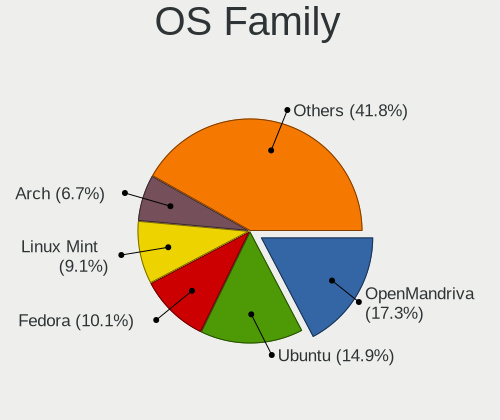
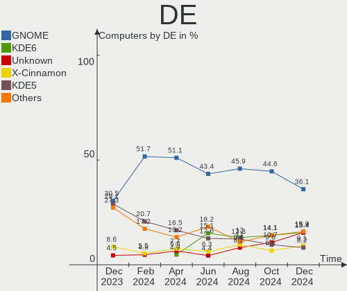
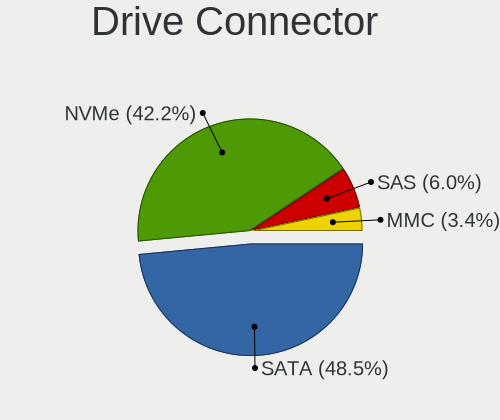
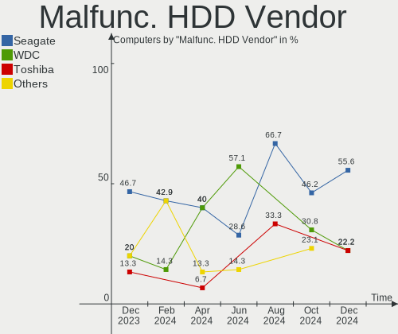
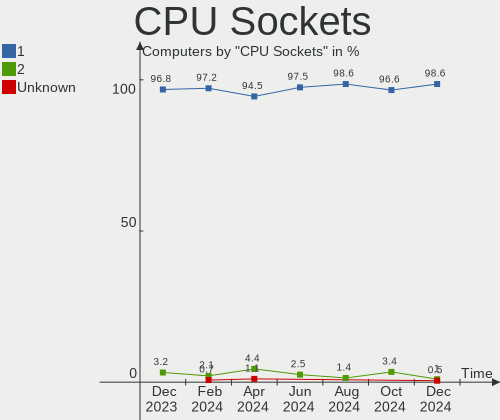
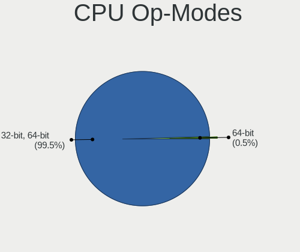
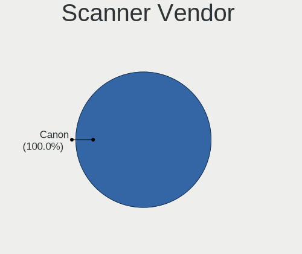
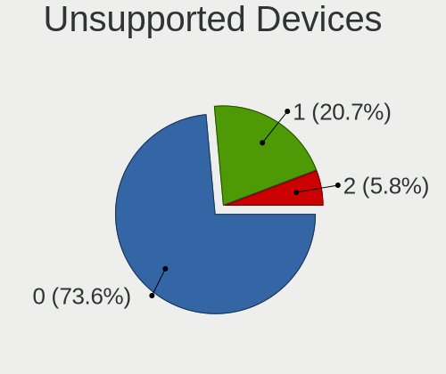

Linux in Canada - Hardware Trends
---------------------------------

A project to identify most popular hardware characteristics and track their change
over time based on data collected by Linux users at https://Linux-Hardware.org.

Anyone can contribute to this report by the [hw-probe](https://github.com/linuxhw/hw-probe) tool:

    sudo -E hw-probe -all -upload

This is a report for all computer types. See also reports for [desktops](/Location/Canada/Desktop/README.md) and [notebooks](/Location/Canada/Notebook/README.md).

Period: Feb, 2023.

Contents
--------

* [ System ](#system)
  - [ OS                       ](#os)
  - [ OS Family                ](#os-family)
  - [ Kernel                   ](#kernel)
  - [ Kernel Family            ](#kernel-family)
  - [ Kernel Major Ver.        ](#kernel-major-ver)
  - [ Arch                     ](#arch)
  - [ DE                       ](#de)
  - [ Display Server           ](#display-server)
  - [ Display Manager          ](#display-manager)
  - [ OS Lang                  ](#os-lang)
  - [ Boot Mode                ](#boot-mode)
  - [ Filesystem               ](#filesystem)
  - [ Part. scheme             ](#part-scheme)
  - [ Dual Boot with Linux/BSD ](#dual-boot-with-linuxbsd)
  - [ Dual Boot (Win)          ](#dual-boot-win)

* [ Board ](#board)
  - [ Vendor                   ](#vendor)
  - [ Model                    ](#model)
  - [ Model Family             ](#model-family)
  - [ MFG Year                 ](#mfg-year)
  - [ Form Factor              ](#form-factor)
  - [ Secure Boot              ](#secure-boot)
  - [ Coreboot                 ](#coreboot)
  - [ RAM Size                 ](#ram-size)
  - [ RAM Used                 ](#ram-used)
  - [ Total Drives             ](#total-drives)
  - [ Has CD-ROM               ](#has-cd-rom)
  - [ Has Ethernet             ](#has-ethernet)
  - [ Has WiFi                 ](#has-wifi)
  - [ Has Bluetooth            ](#has-bluetooth)

* [ Location ](#location)
  - [ Country                  ](#country)
  - [ City                     ](#city)

* [ Drives ](#drives)
  - [ Drive Vendor             ](#drive-vendor)
  - [ Drive Model              ](#drive-model)
  - [ HDD Vendor               ](#hdd-vendor)
  - [ SSD Vendor               ](#ssd-vendor)
  - [ Drive Kind               ](#drive-kind)
  - [ Drive Connector          ](#drive-connector)
  - [ Drive Size               ](#drive-size)
  - [ Space Total              ](#space-total)
  - [ Space Used               ](#space-used)
  - [ Malfunc. Drives          ](#malfunc-drives)
  - [ Malfunc. Drive Vendor    ](#malfunc-drive-vendor)
  - [ Malfunc. HDD Vendor      ](#malfunc-hdd-vendor)
  - [ Malfunc. Drive Kind      ](#malfunc-drive-kind)
  - [ Failed Drives            ](#failed-drives)
  - [ Failed Drive Vendor      ](#failed-drive-vendor)
  - [ Drive Status             ](#drive-status)

* [ Storage controller ](#storage-controller)
  - [ Storage Vendor           ](#storage-vendor)
  - [ Storage Model            ](#storage-model)
  - [ Storage Kind             ](#storage-kind)

* [ Processor ](#processor)
  - [ CPU Vendor               ](#cpu-vendor)
  - [ CPU Model                ](#cpu-model)
  - [ CPU Model Family         ](#cpu-model-family)
  - [ CPU Cores                ](#cpu-cores)
  - [ CPU Sockets              ](#cpu-sockets)
  - [ CPU Threads              ](#cpu-threads)
  - [ CPU Op-Modes             ](#cpu-op-modes)
  - [ CPU Microcode            ](#cpu-microcode)
  - [ CPU Microarch            ](#cpu-microarch)

* [ Graphics ](#graphics)
  - [ GPU Vendor               ](#gpu-vendor)
  - [ GPU Model                ](#gpu-model)
  - [ GPU Combo                ](#gpu-combo)
  - [ GPU Driver               ](#gpu-driver)
  - [ GPU Memory               ](#gpu-memory)

* [ Monitor ](#monitor)
  - [ Monitor Vendor           ](#monitor-vendor)
  - [ Monitor Model            ](#monitor-model)
  - [ Monitor Resolution       ](#monitor-resolution)
  - [ Monitor Diagonal         ](#monitor-diagonal)
  - [ Monitor Width            ](#monitor-width)
  - [ Aspect Ratio             ](#aspect-ratio)
  - [ Monitor Area             ](#monitor-area)
  - [ Pixel Density            ](#pixel-density)
  - [ Multiple Monitors        ](#multiple-monitors)

* [ Network ](#network)
  - [ Net Controller Vendor    ](#net-controller-vendor)
  - [ Net Controller Model     ](#net-controller-model)
  - [ Wireless Vendor          ](#wireless-vendor)
  - [ Wireless Model           ](#wireless-model)
  - [ Ethernet Vendor          ](#ethernet-vendor)
  - [ Ethernet Model           ](#ethernet-model)
  - [ Net Controller Kind      ](#net-controller-kind)
  - [ Used Controller          ](#used-controller)
  - [ NICs                     ](#nics)
  - [ IPv6                     ](#ipv6)

* [ Bluetooth ](#bluetooth)
  - [ Bluetooth Vendor         ](#bluetooth-vendor)
  - [ Bluetooth Model          ](#bluetooth-model)

* [ Sound ](#sound)
  - [ Sound Vendor             ](#sound-vendor)
  - [ Sound Model              ](#sound-model)

* [ Memory ](#memory)
  - [ Memory Vendor            ](#memory-vendor)
  - [ Memory Model             ](#memory-model)
  - [ Memory Kind              ](#memory-kind)
  - [ Memory Form Factor       ](#memory-form-factor)
  - [ Memory Size              ](#memory-size)
  - [ Memory Speed             ](#memory-speed)

* [ Printers & scanners ](#printers--scanners)
  - [ Printer Vendor           ](#printer-vendor)
  - [ Printer Model            ](#printer-model)
  - [ Scanner Vendor           ](#scanner-vendor)
  - [ Scanner Model            ](#scanner-model)

* [ Camera ](#camera)
  - [ Camera Vendor            ](#camera-vendor)
  - [ Camera Model             ](#camera-model)

* [ Security ](#security)
  - [ Fingerprint Vendor       ](#fingerprint-vendor)
  - [ Fingerprint Model        ](#fingerprint-model)
  - [ Chipcard Vendor          ](#chipcard-vendor)
  - [ Chipcard Model           ](#chipcard-model)

* [ Unsupported ](#unsupported)
  - [ Unsupported Devices      ](#unsupported-devices)
  - [ Unsupported Device Types ](#unsupported-device-types)

System
------

OS
--

Installed operating systems

| Name                         | Computers | Percent |
|------------------------------|-----------|---------|
| Ubuntu 22.04                 | 30        | 19.23%  |
| OpenMandriva 23.01           | 13        | 8.33%   |
| Fedora 37                    | 13        | 8.33%   |
| Linux Mint 21.1              | 11        | 7.05%   |
| Zorin 16                     | 9         | 5.77%   |
| Ubuntu 22.10                 | 9         | 5.77%   |
| Pop!_OS 22.04                | 6         | 3.85%   |
| Debian 11                    | 5         | 3.21%   |
| Arch Rolling                 | 5         | 3.21%   |
| KDE neon 22.04               | 4         | 2.56%   |
| Ubuntu 20.04                 | 3         | 1.92%   |
| Kubuntu 22.10                | 3         | 1.92%   |
| Xubuntu 22.04                | 2         | 1.28%   |
| SteamOS 3.4.4                | 2         | 1.28%   |
| Nobara 37                    | 2         | 1.28%   |
| MX 21                        | 2         | 1.28%   |
| Manjaro                      | 2         | 1.28%   |
| EndeavourOS Rolling          | 2         | 1.28%   |
| Xubuntu 22.10                | 1         | 0.64%   |
| Xubuntu 20.04                | 1         | 0.64%   |
| Xero Rolling                 | 1         | 0.64%   |
| Ubuntu Unity 20.04           | 1         | 0.64%   |
| Ubuntu MATE 22.04            | 1         | 0.64%   |
| Ubuntu 18.04                 | 1         | 0.64%   |
| SteamOS 3.4                  | 1         | 0.64%   |
| Sparky 7                     | 1         | 0.64%   |
| Rocky Linux 9.1              | 1         | 0.64%   |
| Rocky Linux 8.7              | 1         | 0.64%   |
| openSUSE Tumbleweed-XXXXXXXX | 1         | 0.64%   |
| OpenMandriva 4.3             | 1         | 0.64%   |
| OpenMandriva 23.90           | 1         | 0.64%   |
| LinuxFX 10                   | 1         | 0.64%   |
| Linux Mint 21                | 1         | 0.64%   |
| Linux Mint 20.2              | 1         | 0.64%   |
| Linux Mint 19.3              | 1         | 0.64%   |
| Linux Mint 19.2              | 1         | 0.64%   |
| Linux Mint 19.1              | 1         | 0.64%   |
| Kubuntu 22.04                | 1         | 0.64%   |
| Kubuntu 18.04                | 1         | 0.64%   |
| Gentoo 2.13                  | 1         | 0.64%   |

OS Family
---------

OS without a version

| Name         | Computers | Percent |
|--------------|-----------|---------|
| Ubuntu       | 43        | 27.56%  |
| Linux Mint   | 16        | 10.26%  |
| OpenMandriva | 15        | 9.62%   |
| Fedora       | 13        | 8.33%   |
| Zorin        | 9         | 5.77%   |
| Debian       | 7         | 4.49%   |
| Pop!_OS      | 6         | 3.85%   |
| Kubuntu      | 5         | 3.21%   |
| Arch         | 5         | 3.21%   |
| Xubuntu      | 4         | 2.56%   |
| KDE neon     | 4         | 2.56%   |
| SteamOS      | 3         | 1.92%   |
| Rocky Linux  | 2         | 1.28%   |
| Nobara       | 2         | 1.28%   |
| MX           | 2         | 1.28%   |
| Manjaro      | 2         | 1.28%   |
| EndeavourOS  | 2         | 1.28%   |
| AlmaLinux    | 2         | 1.28%   |
| Xero         | 1         | 0.64%   |
| Ubuntu Unity | 1         | 0.64%   |
| Ubuntu MATE  | 1         | 0.64%   |
| Sparky       | 1         | 0.64%   |
| openSUSE     | 1         | 0.64%   |
| LinuxFX      | 1         | 0.64%   |
| Gentoo       | 1         | 0.64%   |
| Garuda Linux | 1         | 0.64%   |
| Elementary   | 1         | 0.64%   |
| Clear Linux  | 1         | 0.64%   |
| CentOS       | 1         | 0.64%   |
| BlackPanther | 1         | 0.64%   |
| Artix        | 1         | 0.64%   |
| ArcoLinux    | 1         | 0.64%   |

Kernel
------

Version of the Linux kernel

| Version                      | Computers | Percent |
|------------------------------|-----------|---------|
| 5.15.0-60-generic            | 22        | 14.1%   |
| 5.15.0-58-generic            | 19        | 12.18%  |
| 6.1.1-desktop-1omv2290       | 9         | 5.77%   |
| 5.19.0-32-generic            | 9         | 5.77%   |
| 5.19.0-31-generic            | 7         | 4.49%   |
| 6.1.4-desktop-1omv2301       | 4         | 2.56%   |
| 6.0.12-76060006-generic      | 4         | 2.56%   |
| 6.1.8-200.fc37.x86_64        | 3         | 1.92%   |
| 6.1.13-200.fc37.x86_64       | 3         | 1.92%   |
| 5.19.0-29-generic            | 3         | 1.92%   |
| 5.15.0-56-generic            | 3         | 1.92%   |
| 5.10.0-21-amd64              | 3         | 1.92%   |
| 6.1.9-200.fc37.x86_64        | 2         | 1.28%   |
| 6.1.12-arch1-1               | 2         | 1.28%   |
| 6.1.11-200.fc37.x86_64       | 2         | 1.28%   |
| 6.1.10-200.fc37.x86_64       | 2         | 1.28%   |
| 5.4.0-137-generic            | 2         | 1.28%   |
| 5.19.0-35-generic            | 2         | 1.28%   |
| 5.13.0-valve36-1-neptune     | 2         | 1.28%   |
| 4.15.0-204-generic           | 2         | 1.28%   |
| 6.2.1-zen1-1-zen             | 1         | 0.64%   |
| 6.2.1-060201-generic         | 1         | 0.64%   |
| 6.1.9-x64v1-xanmod1-1        | 1         | 0.64%   |
| 6.1.9-arch1-1                | 1         | 0.64%   |
| 6.1.9-200.fsync.fc37.x86_64  | 1         | 0.64%   |
| 6.1.8-artix1-1               | 1         | 0.64%   |
| 6.1.8-1-default              | 1         | 0.64%   |
| 6.1.7-200.fc37.x86_64        | 1         | 0.64%   |
| 6.1.4-gentoo-x86_64          | 1         | 0.64%   |
| 6.1.13-x64v3-xanmod1         | 1         | 0.64%   |
| 6.1.12-zen1-1-zen            | 1         | 0.64%   |
| 6.1.12-1265.native           | 1         | 0.64%   |
| 6.1.12-1-MANJARO             | 1         | 0.64%   |
| 6.1.11-zen1-1-zen            | 1         | 0.64%   |
| 6.1.11-desktop-1omv2390      | 1         | 0.64%   |
| 6.1.11-arch1-1-surface       | 1         | 0.64%   |
| 6.1.11-76060111-generic      | 1         | 0.64%   |
| 6.1.11-201.fsync.fc37.x86_64 | 1         | 0.64%   |
| 6.1.10-060110-generic        | 1         | 0.64%   |
| 6.1.0-3-amd64                | 1         | 0.64%   |

Kernel Family
-------------

Linux kernel without a distro release

| Version  | Computers | Percent |
|----------|-----------|---------|
| 5.15.0   | 51        | 32.69%  |
| 5.19.0   | 21        | 13.46%  |
| 6.1.1    | 9         | 5.77%   |
| 6.1.11   | 7         | 4.49%   |
| 5.4.0    | 6         | 3.85%   |
| 6.1.9    | 5         | 3.21%   |
| 6.1.8    | 5         | 3.21%   |
| 6.1.4    | 5         | 3.21%   |
| 6.1.12   | 5         | 3.21%   |
| 6.1.13   | 4         | 2.56%   |
| 6.0.12   | 4         | 2.56%   |
| 5.13.0   | 4         | 2.56%   |
| 6.1.10   | 3         | 1.92%   |
| 5.10.0   | 3         | 1.92%   |
| 4.15.0   | 3         | 1.92%   |
| 6.2.1    | 2         | 1.28%   |
| 6.1.0    | 2         | 1.28%   |
| 6.0.0    | 2         | 1.28%   |
| 5.15.94  | 2         | 1.28%   |
| 5.14.0   | 2         | 1.28%   |
| 4.18.0   | 2         | 1.28%   |
| 6.1.7    | 1         | 0.64%   |
| 5.17.1   | 1         | 0.64%   |
| 5.16.13  | 1         | 0.64%   |
| 5.15.91  | 1         | 0.64%   |
| 5.15.80  | 1         | 0.64%   |
| 5.10.142 | 1         | 0.64%   |
| 4.9.79   | 1         | 0.64%   |
| 4.19.187 | 1         | 0.64%   |
| 4.18.16  | 1         | 0.64%   |

Kernel Major Ver.
-----------------

Linux kernel major version

| Version | Computers | Percent |
|---------|-----------|---------|
| 5.15    | 55        | 35.26%  |
| 6.1     | 46        | 29.49%  |
| 5.19    | 21        | 13.46%  |
| 6.0     | 6         | 3.85%   |
| 5.4     | 6         | 3.85%   |
| 5.13    | 4         | 2.56%   |
| 5.10    | 4         | 2.56%   |
| 4.18    | 3         | 1.92%   |
| 4.15    | 3         | 1.92%   |
| 6.2     | 2         | 1.28%   |
| 5.14    | 2         | 1.28%   |
| 5.17    | 1         | 0.64%   |
| 5.16    | 1         | 0.64%   |
| 4.9     | 1         | 0.64%   |
| 4.19    | 1         | 0.64%   |

Arch
----

OS architecture (x86_64, i586, etc.)

| Name    | Computers | Percent |
|---------|-----------|---------|
| x86_64  | 152       | 97.44%  |
| mips64  | 1         | 0.64%   |
| i686    | 1         | 0.64%   |
| armv7l  | 1         | 0.64%   |
| aarch64 | 1         | 0.64%   |

DE
--

Desktop Environment

| Name          | Computers | Percent |
|---------------|-----------|---------|
| GNOME         | 72        | 46.15%  |
| KDE5          | 41        | 26.28%  |
| X-Cinnamon    | 11        | 7.05%   |
| XFCE          | 10        | 6.41%   |
| Unknown       | 9         | 5.77%   |
| MATE          | 3         | 1.92%   |
| LXDE          | 2         | 1.28%   |
| Cinnamon      | 2         | 1.28%   |
| Unity         | 1         | 0.64%   |
| Pantheon      | 1         | 0.64%   |
| LXQt          | 1         | 0.64%   |
| KDE4          | 1         | 0.64%   |
| GNOME Classic | 1         | 0.64%   |
| chadwm        | 1         | 0.64%   |

Display Server
--------------

X11 or Wayland

| Name    | Computers | Percent |
|---------|-----------|---------|
| X11     | 99        | 63.46%  |
| Wayland | 45        | 28.85%  |
| Tty     | 6         | 3.85%   |
| Unknown | 6         | 3.85%   |

Display Manager
---------------

SDDM, LightDM, etc.

| Name    | Computers | Percent |
|---------|-----------|---------|
| Unknown | 63        | 40.38%  |
| GDM3    | 38        | 24.36%  |
| SDDM    | 30        | 19.23%  |
| LightDM | 12        | 7.69%   |
| GDM     | 11        | 7.05%   |
| Ly      | 1         | 0.64%   |
| LXDM    | 1         | 0.64%   |

OS Lang
-------

Language

| Lang    | Computers | Percent |
|---------|-----------|---------|
| en_CA   | 98        | 62.82%  |
| en_US   | 44        | 28.21%  |
| fr_CA   | 7         | 4.49%   |
| en_GB   | 3         | 1.92%   |
| C       | 2         | 1.28%   |
| fr_FR   | 1         | 0.64%   |
| Unknown | 1         | 0.64%   |

Boot Mode
---------

EFI or BIOS

| Mode | Computers | Percent |
|------|-----------|---------|
| BIOS | 85        | 54.49%  |
| EFI  | 71        | 45.51%  |

Filesystem
----------

Type of filesystem

| Type    | Computers | Percent |
|---------|-----------|---------|
| Ext4    | 115       | 73.72%  |
| Btrfs   | 24        | 15.38%  |
| Overlay | 9         | 5.77%   |
| Xfs     | 5         | 3.21%   |
| Zfs     | 1         | 0.64%   |
| F2fs    | 1         | 0.64%   |
| Ext3    | 1         | 0.64%   |

Part. scheme
------------

Scheme of partitioning

| Type    | Computers | Percent |
|---------|-----------|---------|
| GPT     | 82        | 52.56%  |
| Unknown | 53        | 33.97%  |
| MBR     | 21        | 13.46%  |

Dual Boot with Linux/BSD
------------------------

Hosting more than one Linux/BSD

| Dual boot | Computers | Percent |
|-----------|-----------|---------|
| No        | 127       | 81.41%  |
| Yes       | 29        | 18.59%  |

Dual Boot (Win)
---------------

Hosting Linux and Windows

| Dual boot | Computers | Percent |
|-----------|-----------|---------|
| No        | 114       | 73.08%  |
| Yes       | 42        | 26.92%  |

Board
-----

Vendor
------

Motherboard manufacturer

| Name                    | Computers | Percent |
|-------------------------|-----------|---------|
| ASUSTek Computer        | 32        | 20.51%  |
| Dell                    | 22        | 14.1%   |
| Hewlett-Packard         | 20        | 12.82%  |
| Lenovo                  | 15        | 9.62%   |
| MSI                     | 12        | 7.69%   |
| Acer                    | 8         | 5.13%   |
| Gigabyte Technology     | 7         | 4.49%   |
| ASRock                  | 5         | 3.21%   |
| Intel                   | 4         | 2.56%   |
| Google                  | 3         | 1.92%   |
| AZW                     | 3         | 1.92%   |
| Valve                   | 2         | 1.28%   |
| Panasonic               | 2         | 1.28%   |
| Microsoft               | 2         | 1.28%   |
| ASRockRack              | 2         | 1.28%   |
| Apple                   | 2         | 1.28%   |
| Unknown                 | 2         | 1.28%   |
| Xunlong                 | 1         | 0.64%   |
| Toshiba                 | 1         | 0.64%   |
| Supermicro              | 1         | 0.64%   |
| Sapphire                | 1         | 0.64%   |
| Raspberry Pi Foundation | 1         | 0.64%   |
| Protectli               | 1         | 0.64%   |
| Pegatron                | 1         | 0.64%   |
| IBM                     | 1         | 0.64%   |
| Gateway                 | 1         | 0.64%   |
| CWWK                    | 1         | 0.64%   |
| BESSTAR Tech            | 1         | 0.64%   |
| AWOW                    | 1         | 0.64%   |
| Alienware               | 1         | 0.64%   |

Model
-----

Motherboard model

| Name                                  | Computers | Percent |
|---------------------------------------|-----------|---------|
| Unknown                               | 3         | 1.92%   |
| Valve Jupiter                         | 2         | 1.28%   |
| HP G60                                | 2         | 1.28%   |
| Dell XPS 15 9520                      | 2         | 1.28%   |
| Dell OptiPlex 9020                    | 2         | 1.28%   |
| ASUS All Series                       | 2         | 1.28%   |
| Xunlong Orange Pi Zero                | 1         | 0.64%   |
| Toshiba Satellite P870                | 1         | 0.64%   |
| Supermicro C7Z370-CG-IW               | 1         | 0.64%   |
| Sapphire PE-AM2RS690V2                | 1         | 0.64%   |
| RPi Raspberry Pi 4 Model B Rev 1.5    | 1         | 0.64%   |
| Protectli VP2420                      | 1         | 0.64%   |
| Pegatron AY014AA-ABL a4310f           | 1         | 0.64%   |
| Panasonic CF-S10CDHEDM                | 1         | 0.64%   |
| Panasonic CF-C2CCEZXCM                | 1         | 0.64%   |
| MSI Raider GE76 12UGS                 | 1         | 0.64%   |
| MSI MS-7E06                           | 1         | 0.64%   |
| MSI MS-7D89                           | 1         | 0.64%   |
| MSI MS-7C96                           | 1         | 0.64%   |
| MSI MS-7C52                           | 1         | 0.64%   |
| MSI MS-7C37                           | 1         | 0.64%   |
| MSI MS-7B93                           | 1         | 0.64%   |
| MSI MS-7B86                           | 1         | 0.64%   |
| MSI MS-7B50                           | 1         | 0.64%   |
| MSI MS-7B17                           | 1         | 0.64%   |
| MSI MS-7599                           | 1         | 0.64%   |
| MSI GT72 6QE                          | 1         | 0.64%   |
| Microsoft Surface Pro 3               | 1         | 0.64%   |
| Microsoft Surface Laptop Go           | 1         | 0.64%   |
| Lenovo Yoga 9 14IAP7 82LU             | 1         | 0.64%   |
| Lenovo ThinkPad T470 W10DG 20JNS0L300 | 1         | 0.64%   |
| Lenovo ThinkPad T460 20FMS35H02       | 1         | 0.64%   |
| Lenovo ThinkPad T440s 20ARS1VL00      | 1         | 0.64%   |
| Lenovo ThinkPad T16 Gen 1 21CH000FUS  | 1         | 0.64%   |
| Lenovo ThinkPad Edge E540 20C6008SUS  | 1         | 0.64%   |
| Lenovo ThinkCentre M92p 2988D9U       | 1         | 0.64%   |
| Lenovo ThinkCentre M900 10FGS0MX08    | 1         | 0.64%   |
| Lenovo ThinkCentre M58 8910B4U        | 1         | 0.64%   |
| Lenovo ThinkBook 13s G4 ARB 21AS      | 1         | 0.64%   |
| Lenovo IdeaPad Yoga 11S 20246         | 1         | 0.64%   |

Model Family
------------

Motherboard model prefix

| Name                    | Computers | Percent |
|-------------------------|-----------|---------|
| Acer Aspire             | 7         | 4.49%   |
| ASUS PRIME              | 6         | 3.85%   |
| Lenovo ThinkPad         | 5         | 3.21%   |
| HP EliteBook            | 5         | 3.21%   |
| Dell OptiPlex           | 5         | 3.21%   |
| ASUS VivoBook           | 5         | 3.21%   |
| HP Pavilion             | 4         | 2.56%   |
| Dell Latitude           | 4         | 2.56%   |
| Dell Inspiron           | 4         | 2.56%   |
| Lenovo ThinkCentre      | 3         | 1.92%   |
| Lenovo IdeaPad          | 3         | 1.92%   |
| Dell XPS                | 3         | 1.92%   |
| Dell Precision          | 3         | 1.92%   |
| ASUS ROG                | 3         | 1.92%   |
| Unknown                 | 3         | 1.92%   |
| Valve Jupiter           | 2         | 1.28%   |
| Microsoft Surface       | 2         | 1.28%   |
| HP G60                  | 2         | 1.28%   |
| HP EliteDesk            | 2         | 1.28%   |
| Dell PowerEdge          | 2         | 1.28%   |
| ASUS Zenbook            | 2         | 1.28%   |
| ASUS ProArt             | 2         | 1.28%   |
| ASUS B150               | 2         | 1.28%   |
| ASUS All                | 2         | 1.28%   |
| Xunlong Orange          | 1         | 0.64%   |
| Toshiba Satellite       | 1         | 0.64%   |
| Supermicro C7Z370-CG-IW | 1         | 0.64%   |
| Sapphire PE-AM2RS690V2  | 1         | 0.64%   |
| RPi Raspberry           | 1         | 0.64%   |
| Protectli VP2420        | 1         | 0.64%   |
| Pegatron AY014AA-ABL    | 1         | 0.64%   |
| Panasonic CF-S10CDHEDM  | 1         | 0.64%   |
| Panasonic CF-C2CCEZXCM  | 1         | 0.64%   |
| MSI Raider              | 1         | 0.64%   |
| MSI MS-7E06             | 1         | 0.64%   |
| MSI MS-7D89             | 1         | 0.64%   |
| MSI MS-7C96             | 1         | 0.64%   |
| MSI MS-7C52             | 1         | 0.64%   |
| MSI MS-7C37             | 1         | 0.64%   |
| MSI MS-7B93             | 1         | 0.64%   |

MFG Year
--------

Motherboard manufacture year

| Year    | Computers | Percent |
|---------|-----------|---------|
| 2022    | 28        | 17.95%  |
| 2018    | 17        | 10.9%   |
| 2020    | 14        | 8.97%   |
| 2013    | 11        | 7.05%   |
| 2019    | 10        | 6.41%   |
| 2016    | 10        | 6.41%   |
| 2011    | 9         | 5.77%   |
| 2014    | 8         | 5.13%   |
| 2021    | 7         | 4.49%   |
| 2009    | 6         | 3.85%   |
| 2008    | 6         | 3.85%   |
| 2017    | 5         | 3.21%   |
| 2012    | 5         | 3.21%   |
| 2010    | 5         | 3.21%   |
| 2007    | 4         | 2.56%   |
| 2023    | 3         | 1.92%   |
| 2006    | 3         | 1.92%   |
| Unknown | 3         | 1.92%   |
| 2015    | 2         | 1.28%   |

Form Factor
-----------

Physical design of the computer

| Name           | Computers | Percent |
|----------------|-----------|---------|
| Desktop        | 80        | 51.28%  |
| Notebook       | 60        | 38.46%  |
| Convertible    | 4         | 2.56%   |
| Mini pc        | 3         | 1.92%   |
| Server         | 3         | 1.92%   |
| System on chip | 2         | 1.28%   |
| Tablet         | 2         | 1.28%   |
| All in one     | 2         | 1.28%   |

Secure Boot
-----------

Enabled or disabled

| State    | Computers | Percent |
|----------|-----------|---------|
| Disabled | 146       | 93.59%  |
| Enabled  | 10        | 6.41%   |

Coreboot
--------

Have coreboot on board

| Used | Computers | Percent |
|------|-----------|---------|
| No   | 153       | 98.08%  |
| Yes  | 3         | 1.92%   |

RAM Size
--------

Total RAM memory

| Size in GB  | Computers | Percent |
|-------------|-----------|---------|
| 4.01-8.0    | 34        | 21.79%  |
| 16.01-24.0  | 33        | 21.15%  |
| 32.01-64.0  | 22        | 14.1%   |
| 3.01-4.0    | 20        | 12.82%  |
| 8.01-16.0   | 19        | 12.18%  |
| 64.01-256.0 | 11        | 7.05%   |
| 24.01-32.0  | 7         | 4.49%   |
| 1.01-2.0    | 6         | 3.85%   |
| 0.01-0.5    | 2         | 1.28%   |
| 2.01-3.0    | 1         | 0.64%   |
| 0.51-1.0    | 1         | 0.64%   |

RAM Used
--------

Used RAM memory

| Used GB    | Computers | Percent |
|------------|-----------|---------|
| 2.01-3.0   | 50        | 32.05%  |
| 1.01-2.0   | 39        | 25%     |
| 4.01-8.0   | 30        | 19.23%  |
| 3.01-4.0   | 13        | 8.33%   |
| 8.01-16.0  | 9         | 5.77%   |
| 0.51-1.0   | 8         | 5.13%   |
| 0.01-0.5   | 6         | 3.85%   |
| 32.01-64.0 | 1         | 0.64%   |

Total Drives
------------

Number of drives on board

| Drives | Computers | Percent |
|--------|-----------|---------|
| 1      | 83        | 53.21%  |
| 2      | 41        | 26.28%  |
| 3      | 16        | 10.26%  |
| 4      | 5         | 3.21%   |
| 6      | 4         | 2.56%   |
| 5      | 4         | 2.56%   |
| 11     | 1         | 0.64%   |
| 7      | 1         | 0.64%   |
| 0      | 1         | 0.64%   |

Has CD-ROM
----------

Has CD-ROM on board

| Presented | Computers | Percent |
|-----------|-----------|---------|
| No        | 104       | 66.67%  |
| Yes       | 52        | 33.33%  |

Has Ethernet
------------

Has Ethernet on board

| Presented | Computers | Percent |
|-----------|-----------|---------|
| Yes       | 132       | 84.62%  |
| No        | 24        | 15.38%  |

Has WiFi
--------

Has WiFi module

| Presented | Computers | Percent |
|-----------|-----------|---------|
| Yes       | 111       | 71.15%  |
| No        | 45        | 28.85%  |

Has Bluetooth
-------------

Has Bluetooth module

| Presented | Computers | Percent |
|-----------|-----------|---------|
| Yes       | 90        | 57.69%  |
| No        | 66        | 42.31%  |

Location
--------

Country
-------

Geographic location (country)

| Country | Computers | Percent |
|---------|-----------|---------|
| Canada  | 156       | 100%    |

City
----

Geographic location (city)

| City            | Computers | Percent |
|-----------------|-----------|---------|
| Toronto         | 13        | 8.33%   |
| Vancouver       | 12        | 7.69%   |
| Montreal        | 12        | 7.69%   |
| Calgary         | 6         | 3.85%   |
| Regina          | 5         | 3.21%   |
| Windsor         | 4         | 2.56%   |
| Victoria        | 4         | 2.56%   |
| Ottawa          | 4         | 2.56%   |
| Edmonton        | 4         | 2.56%   |
| Saskatoon       | 3         | 1.92%   |
| Burlington      | 3         | 1.92%   |
| Brampton        | 3         | 1.92%   |
| Tillsonburg     | 2         | 1.28%   |
| Spruce Grove    | 2         | 1.28%   |
| Sherbrooke      | 2         | 1.28%   |
| Saint John      | 2         | 1.28%   |
| Oshawa          | 2         | 1.28%   |
| Oakville        | 2         | 1.28%   |
| Nanaimo         | 2         | 1.28%   |
| Mississauga     | 2         | 1.28%   |
| Markham         | 2         | 1.28%   |
| Fredericton     | 2         | 1.28%   |
| Courtenay       | 2         | 1.28%   |
| Beauharnois     | 2         | 1.28%   |
| Winnipeg        | 1         | 0.64%   |
| Viking          | 1         | 0.64%   |
| Surrey          | 1         | 0.64%   |
| Stouffville     | 1         | 0.64%   |
| Stoney Creek    | 1         | 0.64%   |
| St. Catharines  | 1         | 0.64%   |
| Sorel-Tracy     | 1         | 0.64%   |
| Sidney          | 1         | 0.64%   |
| Sherwood Park   | 1         | 0.64%   |
| Scarborough     | 1         | 0.64%   |
| Sarnia          | 1         | 0.64%   |
| Saint-Jerome    | 1         | 0.64%   |
| Saint-Hyacinthe | 1         | 0.64%   |
| Saint-Henri     | 1         | 0.64%   |
| Saint-Eustache  | 1         | 0.64%   |
| Riviere-Bleue   | 1         | 0.64%   |

Drives
------

Drive Vendor
------------

Hard drive vendors

| Vendor                         | Computers | Drives | Percent |
|--------------------------------|-----------|--------|---------|
| WDC                            | 40        | 57     | 16.33%  |
| Seagate                        | 36        | 54     | 14.69%  |
| Samsung Electronics            | 30        | 41     | 12.24%  |
| Unknown                        | 15        | 15     | 6.12%   |
| Sandisk                        | 15        | 18     | 6.12%   |
| Kingston                       | 14        | 17     | 5.71%   |
| Toshiba                        | 10        | 10     | 4.08%   |
| Crucial                        | 7         | 8      | 2.86%   |
| SK hynix                       | 6         | 6      | 2.45%   |
| Intel                          | 6         | 7      | 2.45%   |
| A-DATA Technology              | 6         | 6      | 2.45%   |
| SPCC                           | 5         | 5      | 2.04%   |
| Timetec                        | 4         | 4      | 1.63%   |
| Hitachi                        | 4         | 5      | 1.63%   |
| Dogfish                        | 4         | 4      | 1.63%   |
| Silicon Motion                 | 3         | 5      | 1.22%   |
| Phison Electronics             | 3         | 4      | 1.22%   |
| Micron/Crucial Technology      | 3         | 3      | 1.22%   |
| Solid State Storage Technology | 2         | 2      | 0.82%   |
| KIOXIA                         | 2         | 2      | 0.82%   |
| Kingston Technology Company    | 2         | 2      | 0.82%   |
| Fujitsu                        | 2         | 2      | 0.82%   |
| Corsair                        | 2         | 2      | 0.82%   |
| China                          | 2         | 2      | 0.82%   |
| Team                           | 1         | 2      | 0.41%   |
| T-FORCE                        | 1         | 1      | 0.41%   |
| Super Talent                   | 1         | 1      | 0.41%   |
| sk600                          | 1         | 1      | 0.41%   |
| Realtek                        | 1         | 1      | 0.41%   |
| Phison                         | 1         | 1      | 0.41%   |
| OCZ                            | 1         | 1      | 0.41%   |
| Micron Technology              | 1         | 1      | 0.41%   |
| Mac                            | 1         | 1      | 0.41%   |
| LITEONIT                       | 1         | 1      | 0.41%   |
| Lexar                          | 1         | 1      | 0.41%   |
| Lenovo                         | 1         | 1      | 0.41%   |
| KingFast                       | 1         | 1      | 0.41%   |
| HS256E                         | 1         | 1      | 0.41%   |
| HP SSD S                       | 1         | 1      | 0.41%   |
| HGST                           | 1         | 1      | 0.41%   |

Drive Model
-----------

Hard drive models

| Model                                                | Computers | Percent |
|------------------------------------------------------|-----------|---------|
| Seagate ST1000DM010-2EP102 1TB                       | 6         | 2.11%   |
| Sandisk WD Blue SN550 NVMe SSD 1TB                   | 5         | 1.76%   |
| Unknown MMC Card  64GB                               | 4         | 1.41%   |
| Seagate ST4000DM004-2CV104 4TB                       | 4         | 1.41%   |
| Samsung SSD 870 EVO 500GB                            | 4         | 1.41%   |
| Kingston SA400S37480G 480GB SSD                      | 4         | 1.41%   |
| SPCC Solid State Disk 256GB                          | 3         | 1.06%   |
| Seagate ST1000LM048-2E7172 1TB                       | 3         | 1.06%   |
| Samsung NVMe SSD Controller SM981/PM981/PM983 250GB  | 3         | 1.06%   |
| WDC WD80EFAX-68KNBN0 8TB                             | 2         | 0.7%    |
| WDC WD40EZRZ-00GXCB0 4TB                             | 2         | 0.7%    |
| WDC WD30EZRX-00MMMB0 3TB                             | 2         | 0.7%    |
| WDC WD30EFRX-68EUZN0 3TB                             | 2         | 0.7%    |
| WDC WD20EZRZ-00Z5HB0 2TB                             | 2         | 0.7%    |
| WDC WD10EZEX-60WN4A0 1TB                             | 2         | 0.7%    |
| Toshiba MQ01ABD100 1TB                               | 2         | 0.7%    |
| Toshiba DT01ACA300 3TB                               | 2         | 0.7%    |
| Timetec SD08 512GB                                   | 2         | 0.7%    |
| Solid State Storage CA6-8D2048-Q11 NVMe SSSTC 2048GB | 2         | 0.7%    |
| Silicon Motion SM2262/SM2262EN SSD Controller 1TB    | 2         | 0.7%    |
| Seagate ST6000DM003-2CY186 6TB                       | 2         | 0.7%    |
| Seagate ST2000DM008-2FR102 2TB                       | 2         | 0.7%    |
| Seagate ST1000DM003-1CH162 1TB                       | 2         | 0.7%    |
| Seagate Expansion Desk 5TB                           | 2         | 0.7%    |
| Sandisk WD_BLACK SN770 2TB                           | 2         | 0.7%    |
| Sandisk WD Blue SN570 1TB                            | 2         | 0.7%    |
| Sandisk WD Black SN750 / PC SN730 NVMe SSD 512GB     | 2         | 0.7%    |
| Samsung SSD 980 PRO 1TB                              | 2         | 0.7%    |
| Samsung PM991 NVMe 256GB                             | 2         | 0.7%    |
| Samsung NVMe SSD Controller PM9A1/PM9A3/980PRO 960GB | 2         | 0.7%    |
| Phison PS5013 E13 NVMe Controller 500GB              | 2         | 0.7%    |
| Micron/Crucial P2 NVMe PCIe SSD 1TB                  | 2         | 0.7%    |
| Kingston SA400S37240G 240GB SSD                      | 2         | 0.7%    |
| Kingston SA400S37120G 120GB SSD                      | 2         | 0.7%    |
| Kingston RBU-SNS8152S312 128GB SSD                   | 2         | 0.7%    |
| Intel SSD 660P Series 1024GB                         | 2         | 0.7%    |
| Dogfish SSD 256GB                                    | 2         | 0.7%    |
| Crucial CT1000MX500SSD1 1TB                          | 2         | 0.7%    |
| WDC WDS500G3X0C-00SJG0 500GB                         | 1         | 0.35%   |
| WDC WDS250G1B0A-00H9H0 250GB SSD                     | 1         | 0.35%   |

HDD Vendor
----------

Hard disk drive vendors

| Vendor              | Computers | Drives | Percent |
|---------------------|-----------|--------|---------|
| WDC                 | 35        | 50     | 39.77%  |
| Seagate             | 35        | 53     | 39.77%  |
| Toshiba             | 8         | 8      | 9.09%   |
| Hitachi             | 4         | 5      | 4.55%   |
| Samsung Electronics | 2         | 2      | 2.27%   |
| Fujitsu             | 2         | 2      | 2.27%   |
| HGST                | 1         | 1      | 1.14%   |
| ACASIS              | 1         | 1      | 1.14%   |

SSD Vendor
----------

Solid state drive vendors

| Vendor              | Computers | Drives | Percent |
|---------------------|-----------|--------|---------|
| Samsung Electronics | 12        | 15     | 17.14%  |
| Kingston            | 12        | 15     | 17.14%  |
| Crucial             | 7         | 8      | 10%     |
| A-DATA Technology   | 6         | 6      | 8.57%   |
| SPCC                | 5         | 5      | 7.14%   |
| Dogfish             | 4         | 4      | 5.71%   |
| WDC                 | 3         | 3      | 4.29%   |
| Timetec             | 3         | 3      | 4.29%   |
| Intel               | 2         | 2      | 2.86%   |
| China               | 2         | 2      | 2.86%   |
| Team                | 1         | 2      | 1.43%   |
| T-FORCE             | 1         | 1      | 1.43%   |
| Super Talent        | 1         | 1      | 1.43%   |
| sk600               | 1         | 1      | 1.43%   |
| Seagate             | 1         | 1      | 1.43%   |
| OCZ                 | 1         | 1      | 1.43%   |
| Micron Technology   | 1         | 1      | 1.43%   |
| LITEONIT            | 1         | 1      | 1.43%   |
| Lexar               | 1         | 1      | 1.43%   |
| KingFast            | 1         | 1      | 1.43%   |
| HS256E              | 1         | 1      | 1.43%   |
| HAJAAN              | 1         | 1      | 1.43%   |
| Gigabyte Technology | 1         | 1      | 1.43%   |
| Corsair             | 1         | 1      | 1.43%   |

Drive Kind
----------

HDD or SSD

| Kind    | Computers | Drives | Percent |
|---------|-----------|--------|---------|
| HDD     | 71        | 122    | 33.02%  |
| NVMe    | 63        | 84     | 29.3%   |
| SSD     | 61        | 78     | 28.37%  |
| MMC     | 14        | 14     | 6.51%   |
| Unknown | 6         | 6      | 2.79%   |

Drive Connector
---------------

SATA, SAS, NVMe, etc.

| Type | Computers | Drives | Percent |
|------|-----------|--------|---------|
| SATA | 105       | 196    | 54.69%  |
| NVMe | 63        | 83     | 32.81%  |
| MMC  | 14        | 14     | 7.29%   |
| SAS  | 10        | 11     | 5.21%   |

Drive Size
----------

Size of hard drive

| Size in TB | Computers | Drives | Percent |
|------------|-----------|--------|---------|
| 0.01-0.5   | 68        | 83     | 44.16%  |
| 0.51-1.0   | 44        | 58     | 28.57%  |
| 1.01-2.0   | 16        | 22     | 10.39%  |
| 2.01-3.0   | 9         | 10     | 5.84%   |
| 4.01-10.0  | 9         | 16     | 5.84%   |
| 3.01-4.0   | 7         | 10     | 4.55%   |
| 10.01-20.0 | 1         | 1      | 0.65%   |

Space Total
-----------

Amount of disk space available on the file system

| Size in GB     | Computers | Percent |
|----------------|-----------|---------|
| 101-250        | 40        | 25.64%  |
| 501-1000       | 28        | 17.95%  |
| 251-500        | 27        | 17.31%  |
| 1001-2000      | 16        | 10.26%  |
| More than 3000 | 13        | 8.33%   |
| 21-50          | 9         | 5.77%   |
| 1-20           | 8         | 5.13%   |
| 51-100         | 8         | 5.13%   |
| 2001-3000      | 5         | 3.21%   |
| Unknown        | 2         | 1.28%   |

Space Used
----------

Amount of used disk space

| Used GB        | Computers | Percent |
|----------------|-----------|---------|
| 1-20           | 55        | 35.26%  |
| 21-50          | 33        | 21.15%  |
| 51-100         | 22        | 14.1%   |
| 101-250        | 12        | 7.69%   |
| 251-500        | 9         | 5.77%   |
| 501-1000       | 9         | 5.77%   |
| More than 3000 | 7         | 4.49%   |
| 1001-2000      | 6         | 3.85%   |
| Unknown        | 2         | 1.28%   |
| 2001-3000      | 1         | 0.64%   |

Malfunc. Drives
---------------

Drive models with a malfunction

| Model                                 | Computers | Drives | Percent |
|---------------------------------------|-----------|--------|---------|
| WDC WD6400AAKS-65Z7B0 640GB           | 1         | 1      | 7.14%   |
| WDC WD30EZRX-00MMMB0 3TB              | 1         | 2      | 7.14%   |
| WDC WD30EFRX-68EUZN0 3TB              | 1         | 1      | 7.14%   |
| WDC WD1001FALS-40Y6A0 1TB             | 1         | 1      | 7.14%   |
| WDC WD1001FALS-00J7B1 1TB             | 1         | 1      | 7.14%   |
| Seagate ST500LM021-1KJ152 500GB       | 1         | 1      | 7.14%   |
| Seagate ST3500418AS 500GB             | 1         | 1      | 7.14%   |
| Seagate ST14000NM0018-2H4101 14TB     | 1         | 1      | 7.14%   |
| Samsung Electronics SSD 870 EVO 500GB | 1         | 1      | 7.14%   |
| Samsung Electronics PM9A1 NVMe 1024GB | 1         | 1      | 7.14%   |
| Samsung Electronics HM160HC 160GB     | 1         | 1      | 7.14%   |
| Hitachi HDS725050KLA360 500GB         | 1         | 1      | 7.14%   |
| HGST HTS725050A7E630 500GB            | 1         | 1      | 7.14%   |
| Fujitsu MHV2080AH 80GB                | 1         | 1      | 7.14%   |

Malfunc. Drive Vendor
---------------------

Vendors of faulty drives

| Vendor              | Computers | Drives | Percent |
|---------------------|-----------|--------|---------|
| WDC                 | 5         | 6      | 35.71%  |
| Seagate             | 3         | 3      | 21.43%  |
| Samsung Electronics | 3         | 3      | 21.43%  |
| Hitachi             | 1         | 1      | 7.14%   |
| HGST                | 1         | 1      | 7.14%   |
| Fujitsu             | 1         | 1      | 7.14%   |

Malfunc. HDD Vendor
-------------------

Vendors of faulty HDD drives

| Vendor              | Computers | Drives | Percent |
|---------------------|-----------|--------|---------|
| WDC                 | 5         | 6      | 41.67%  |
| Seagate             | 3         | 3      | 25%     |
| Samsung Electronics | 1         | 1      | 8.33%   |
| Hitachi             | 1         | 1      | 8.33%   |
| HGST                | 1         | 1      | 8.33%   |
| Fujitsu             | 1         | 1      | 8.33%   |

Malfunc. Drive Kind
-------------------

Kinds of faulty drives

| Kind | Computers | Drives | Percent |
|------|-----------|--------|---------|
| HDD  | 10        | 13     | 83.33%  |
| NVMe | 1         | 1      | 8.33%   |
| SSD  | 1         | 1      | 8.33%   |

Failed Drives
-------------

Failed drive models

Zero info for selected period =(

Failed Drive Vendor
-------------------

Failed drive vendors

Zero info for selected period =(

Drive Status
------------

Number of failed and malfunc. drives

| Status   | Computers | Drives | Percent |
|----------|-----------|--------|---------|
| Detected | 96        | 176    | 56.14%  |
| Works    | 63        | 113    | 36.84%  |
| Malfunc  | 12        | 15     | 7.02%   |

Storage controller
------------------

Storage Vendor
--------------

Storage controller vendors

| Vendor                         | Computers | Percent |
|--------------------------------|-----------|---------|
| Intel                          | 94        | 42.73%  |
| AMD                            | 37        | 16.82%  |
| Samsung Electronics            | 21        | 9.55%   |
| SanDisk                        | 18        | 8.18%   |
| SK hynix                       | 6         | 2.73%   |
| Phison Electronics             | 5         | 2.27%   |
| Nvidia                         | 5         | 2.27%   |
| Marvell Technology Group       | 5         | 2.27%   |
| ASMedia Technology             | 5         | 2.27%   |
| Kingston Technology Company    | 4         | 1.82%   |
| JMicron Technology             | 4         | 1.82%   |
| Silicon Motion                 | 3         | 1.36%   |
| Micron/Crucial Technology      | 3         | 1.36%   |
| Toshiba America Info Systems   | 2         | 0.91%   |
| Solid State Storage Technology | 2         | 0.91%   |
| KIOXIA                         | 2         | 0.91%   |
| LSI Logic / Symbios Logic      | 1         | 0.45%   |
| Lenovo                         | 1         | 0.45%   |
| Broadcom / LSI                 | 1         | 0.45%   |
| ADATA Technology               | 1         | 0.45%   |

Storage Model
-------------

Storage controller models

| Model                                                                          | Computers | Percent |
|--------------------------------------------------------------------------------|-----------|---------|
| AMD FCH SATA Controller [AHCI mode]                                            | 20        | 8%      |
| Samsung NVMe SSD Controller PM9A1/PM9A3/980PRO                                 | 8         | 3.2%    |
| Intel Volume Management Device NVMe RAID Controller                            | 7         | 2.8%    |
| Intel 8 Series/C220 Series Chipset Family 6-port SATA Controller 1 [AHCI mode] | 7         | 2.8%    |
| Samsung NVMe SSD Controller SM981/PM981/PM983                                  | 6         | 2.4%    |
| Intel Cannon Lake PCH SATA AHCI Controller                                     | 6         | 2.4%    |
| AMD 400 Series Chipset SATA Controller                                         | 6         | 2.4%    |
| SanDisk WD Blue SN550 NVMe SSD                                                 | 5         | 2%      |
| SanDisk Non-Volatile memory controller                                         | 5         | 2%      |
| Samsung NVMe SSD Controller 980                                                | 5         | 2%      |
| Intel Sunrise Point-LP SATA Controller [AHCI mode]                             | 5         | 2%      |
| Intel SATA Controller [RAID mode]                                              | 5         | 2%      |
| Intel 8 Series SATA Controller 1 [AHCI mode]                                   | 5         | 2%      |
| AMD 500 Series Chipset SATA Controller                                         | 5         | 2%      |
| Intel SATA controller                                                          | 4         | 1.6%    |
| Intel Celeron/Pentium Silver Processor SATA Controller                         | 4         | 1.6%    |
| Intel 6 Series/C200 Series Chipset Family 6 port Mobile SATA AHCI Controller   | 4         | 1.6%    |
| Intel 6 Series/C200 Series Chipset Family 6 port Desktop SATA AHCI Controller  | 4         | 1.6%    |
| ASMedia ASM1062 Serial ATA Controller                                          | 4         | 1.6%    |
| AMD SB7x0/SB8x0/SB9x0 IDE Controller                                           | 4         | 1.6%    |
| SanDisk WD Blue SN570 NVMe SSD                                                 | 3         | 1.2%    |
| SanDisk WD Black SN750 / PC SN730 NVMe SSD                                     | 3         | 1.2%    |
| Phison PS5013 E13 NVMe Controller                                              | 3         | 1.2%    |
| Intel SSD 660P Series                                                          | 3         | 1.2%    |
| Intel Q170/Q150/B150/H170/H110/Z170/CM236 Chipset SATA Controller [AHCI Mode]  | 3         | 1.2%    |
| Intel 82801IBM/IEM (ICH9M/ICH9M-E) 4 port SATA Controller [AHCI mode]          | 3         | 1.2%    |
| AMD SB7x0/SB8x0/SB9x0 SATA Controller [IDE mode]                               | 3         | 1.2%    |
| Solid State Storage Non-Volatile memory controller                             | 2         | 0.8%    |
| SK hynix Gold P31/PC711 NVMe Solid State Drive                                 | 2         | 0.8%    |
| SK hynix BC501 NVMe Solid State Drive                                          | 2         | 0.8%    |
| Silicon Motion SM2262/SM2262EN SSD Controller                                  | 2         | 0.8%    |
| Samsung Electronics Non-Volatile memory controller                             | 2         | 0.8%    |
| Phison E16 PCIe4 NVMe Controller                                               | 2         | 0.8%    |
| Micron/Crucial P2 NVMe PCIe SSD                                                | 2         | 0.8%    |
| Marvell Group 88SE9215 PCIe 2.0 x1 4-port SATA 6 Gb/s Controller               | 2         | 0.8%    |
| Marvell Group 88SE9172 SATA 6Gb/s Controller                                   | 2         | 0.8%    |
| Kingston Company Company Non-Volatile memory controller                        | 2         | 0.8%    |
| JMicron JMB363 SATA/IDE Controller                                             | 2         | 0.8%    |
| JMicron JMB362 SATA Controller                                                 | 2         | 0.8%    |
| Intel Jasper Lake SATA AHCI Controller                                         | 2         | 0.8%    |

Storage Kind
------------

Kind of storage controller (IDE, SATA, NVMe, SAS, ...)

| Kind | Computers | Percent |
|------|-----------|---------|
| SATA | 111       | 52.86%  |
| NVMe | 63        | 30%     |
| IDE  | 19        | 9.05%   |
| RAID | 16        | 7.62%   |
| SAS  | 1         | 0.48%   |

Processor
---------

CPU Vendor
----------

Processor vendors

| Vendor  | Computers | Percent |
|---------|-----------|---------|
| Intel   | 105       | 67.31%  |
| AMD     | 48        | 30.77%  |
| ARM     | 2         | 1.28%   |
| Unknown | 1         | 0.64%   |

CPU Model
---------

Processor models

| Model                                       | Computers | Percent |
|---------------------------------------------|-----------|---------|
| Intel Core i5-2520M CPU @ 2.50GHz           | 3         | 1.92%   |
| Intel 13th Gen Core i9-13900K               | 3         | 1.92%   |
| Intel 12th Gen Core i7-12700H               | 3         | 1.92%   |
| Intel Core i7-8700K CPU @ 3.70GHz           | 2         | 1.28%   |
| Intel Core i7-4600U CPU @ 2.10GHz           | 2         | 1.28%   |
| Intel Core i7-2600K CPU @ 3.40GHz           | 2         | 1.28%   |
| Intel Core i5-8250U CPU @ 1.60GHz           | 2         | 1.28%   |
| Intel Core i5-6300U CPU @ 2.40GHz           | 2         | 1.28%   |
| Intel Core i5-4460 CPU @ 3.20GHz            | 2         | 1.28%   |
| Intel Core i5-4300U CPU @ 1.90GHz           | 2         | 1.28%   |
| Intel Core i5-1035G1 CPU @ 1.00GHz          | 2         | 1.28%   |
| Intel Celeron N5105 @ 2.00GHz               | 2         | 1.28%   |
| Intel Celeron N4020 CPU @ 1.10GHz           | 2         | 1.28%   |
| Intel Celeron J6413 @ 1.80GHz               | 2         | 1.28%   |
| AMD Ryzen 9 5900X 12-Core Processor         | 2         | 1.28%   |
| AMD Ryzen 7 6800H with Radeon Graphics      | 2         | 1.28%   |
| AMD Ryzen 5 3600 6-Core Processor           | 2         | 1.28%   |
| AMD Ryzen 5 2600 Six-Core Processor         | 2         | 1.28%   |
| AMD Custom APU 0405                         | 2         | 1.28%   |
| Intel Xeon E-2274G CPU @ 4.00GHz            | 1         | 0.64%   |
| Intel Xeon CPU W3530 @ 2.80GHz              | 1         | 0.64%   |
| Intel Xeon CPU E5-2658 v2 @ 2.40GHz         | 1         | 0.64%   |
| Intel Xeon CPU E5-2630 v3 @ 2.40GHz         | 1         | 0.64%   |
| Intel Xeon CPU E3-1225 v6 @ 3.30GHz         | 1         | 0.64%   |
| Intel Xeon CPU E3-1220 V2 @ 3.10GHz         | 1         | 0.64%   |
| Intel Pentium Silver N5030 CPU @ 1.10GHz    | 1         | 0.64%   |
| Intel Pentium Silver J5005 CPU @ 1.50GHz    | 1         | 0.64%   |
| Intel Pentium Dual-Core CPU E5700 @ 3.00GHz | 1         | 0.64%   |
| Intel Pentium CPU N3700 @ 1.60GHz           | 1         | 0.64%   |
| Intel Pentium 4 CPU 3.00GHz                 | 1         | 0.64%   |
| Intel Core i9-10900K CPU @ 3.70GHz          | 1         | 0.64%   |
| Intel Core i7-9700 CPU @ 3.00GHz            | 1         | 0.64%   |
| Intel Core i7-8700 CPU @ 3.20GHz            | 1         | 0.64%   |
| Intel Core i7-8550U CPU @ 1.80GHz           | 1         | 0.64%   |
| Intel Core i7-7700T CPU @ 2.90GHz           | 1         | 0.64%   |
| Intel Core i7-6920HQ CPU @ 2.90GHz          | 1         | 0.64%   |
| Intel Core i7-6820HQ CPU @ 2.70GHz          | 1         | 0.64%   |
| Intel Core i7-6700K CPU @ 4.00GHz           | 1         | 0.64%   |
| Intel Core i7-6700HQ CPU @ 2.60GHz          | 1         | 0.64%   |
| Intel Core i7-6700 CPU @ 3.40GHz            | 1         | 0.64%   |

CPU Model Family
----------------

Processor model prefix

| Model                   | Computers | Percent |
|-------------------------|-----------|---------|
| Intel Core i5           | 33        | 21.15%  |
| Intel Core i7           | 24        | 15.38%  |
| Other                   | 19        | 12.18%  |
| AMD Ryzen 5             | 12        | 7.69%   |
| Intel Celeron           | 9         | 5.77%   |
| AMD Ryzen 7             | 9         | 5.77%   |
| Intel Core 2 Duo        | 7         | 4.49%   |
| Intel Xeon              | 6         | 3.85%   |
| AMD Ryzen 9             | 6         | 3.85%   |
| Intel Core i3           | 4         | 2.56%   |
| AMD A6                  | 3         | 1.92%   |
| Intel Pentium Silver    | 2         | 1.28%   |
| AMD Phenom II X6        | 2         | 1.28%   |
| AMD Athlon II X2        | 2         | 1.28%   |
| Intel Pentium Dual-Core | 1         | 0.64%   |
| Intel Pentium 4         | 1         | 0.64%   |
| Intel Pentium           | 1         | 0.64%   |
| Intel Core i9           | 1         | 0.64%   |
| Intel Core 2            | 1         | 0.64%   |
| Intel Atom              | 1         | 0.64%   |
| ARM Allwinner           | 1         | 0.64%   |
| AMD Turion 64 X2 Mobile | 1         | 0.64%   |
| AMD Turion 64 Mobile    | 1         | 0.64%   |
| AMD Sempron             | 1         | 0.64%   |
| AMD Ryzen 5 PRO         | 1         | 0.64%   |
| AMD Ryzen 3             | 1         | 0.64%   |
| AMD Phenom II X4        | 1         | 0.64%   |
| AMD FX                  | 1         | 0.64%   |
| AMD Athlon 64 X2        | 1         | 0.64%   |
| AMD Athlon              | 1         | 0.64%   |
| AMD A8                  | 1         | 0.64%   |
| AMD A4                  | 1         | 0.64%   |

CPU Cores
---------

Number of processor cores

| Number  | Computers | Percent |
|---------|-----------|---------|
| 4       | 58        | 37.18%  |
| 2       | 41        | 26.28%  |
| 6       | 21        | 13.46%  |
| 8       | 11        | 7.05%   |
| 1       | 5         | 3.21%   |
| 16      | 4         | 2.56%   |
| 14      | 4         | 2.56%   |
| 12      | 4         | 2.56%   |
| 10      | 4         | 2.56%   |
| 24      | 3         | 1.92%   |
| Unknown | 1         | 0.64%   |

CPU Sockets
-----------

Number of sockets

| Number  | Computers | Percent |
|---------|-----------|---------|
| 1       | 154       | 98.72%  |
| 2       | 1         | 0.64%   |
| Unknown | 1         | 0.64%   |

CPU Threads
-----------

Threads per core (Hyper-Threading)

| Number  | Computers | Percent |
|---------|-----------|---------|
| 2       | 98        | 62.82%  |
| 1       | 56        | 35.9%   |
| 4       | 1         | 0.64%   |
| Unknown | 1         | 0.64%   |

CPU Op-Modes
------------

CPU Operation Modes (32-bit, 64-bit)

| Op mode        | Computers | Percent |
|----------------|-----------|---------|
| 32-bit, 64-bit | 154       | 98.72%  |
| Unknown        | 2         | 1.28%   |

CPU Microcode
-------------

Microcode number

| Number     | Computers | Percent |
|------------|-----------|---------|
| Unknown    | 57        | 36.54%  |
| 0x906ea    | 5         | 3.21%   |
| 0x906a3    | 5         | 3.21%   |
| 0x40651    | 5         | 3.21%   |
| 0x306c3    | 5         | 3.21%   |
| 0x506e3    | 4         | 2.56%   |
| 0x206a7    | 4         | 2.56%   |
| 0x1067a    | 4         | 2.56%   |
| 0x806ea    | 3         | 1.92%   |
| 0x706a8    | 3         | 1.92%   |
| 0x306a9    | 3         | 1.92%   |
| 0x0a50000c | 3         | 1.92%   |
| 0xa0655    | 2         | 1.28%   |
| 0x906ed    | 2         | 1.28%   |
| 0x706e5    | 2         | 1.28%   |
| 0x406e3    | 2         | 1.28%   |
| 0x406c4    | 2         | 1.28%   |
| 0x20652    | 2         | 1.28%   |
| 0x106e5    | 2         | 1.28%   |
| 0x0a601203 | 2         | 1.28%   |
| 0x0a201016 | 2         | 1.28%   |
| 0x08108102 | 2         | 1.28%   |
| 0x010000c7 | 2         | 1.28%   |
| 0xf43      | 1         | 0.64%   |
| 0xa0653    | 1         | 0.64%   |
| 0x906e9    | 1         | 0.64%   |
| 0x906c0    | 1         | 0.64%   |
| 0x90675    | 1         | 0.64%   |
| 0x90672    | 1         | 0.64%   |
| 0x806ec    | 1         | 0.64%   |
| 0x806d1    | 1         | 0.64%   |
| 0x806c2    | 1         | 0.64%   |
| 0x706a1    | 1         | 0.64%   |
| 0x6fd      | 1         | 0.64%   |
| 0x6f6      | 1         | 0.64%   |
| 0x506c9    | 1         | 0.64%   |
| 0x306f2    | 1         | 0.64%   |
| 0x306e4    | 1         | 0.64%   |
| 0x306d4    | 1         | 0.64%   |
| 0x206d7    | 1         | 0.64%   |

CPU Microarch
-------------

Microarchitecture

| Name             | Computers | Percent |
|------------------|-----------|---------|
| KabyLake         | 19        | 12.18%  |
| Unknown          | 19        | 12.18%  |
| Haswell          | 16        | 10.26%  |
| SandyBridge      | 9         | 5.77%   |
| Zen+             | 8         | 5.13%   |
| Zen 3            | 8         | 5.13%   |
| Skylake          | 8         | 5.13%   |
| Alderlake Hybrid | 8         | 5.13%   |
| Penryn           | 7         | 4.49%   |
| Zen 2            | 6         | 3.85%   |
| K10              | 6         | 3.85%   |
| IvyBridge        | 5         | 3.21%   |
| Goldmont plus    | 5         | 3.21%   |
| Silvermont       | 3         | 1.92%   |
| Nehalem          | 3         | 1.92%   |
| K8 Hammer        | 3         | 1.92%   |
| IceLake          | 3         | 1.92%   |
| CometLake        | 3         | 1.92%   |
| Westmere         | 2         | 1.28%   |
| Excavator        | 2         | 1.28%   |
| Core             | 2         | 1.28%   |
| Zen              | 1         | 0.64%   |
| Tremont          | 1         | 0.64%   |
| TigerLake        | 1         | 0.64%   |
| Puma             | 1         | 0.64%   |
| Piledriver       | 1         | 0.64%   |
| NetBurst         | 1         | 0.64%   |
| K8 & K10 hybrid  | 1         | 0.64%   |
| K10 Llano        | 1         | 0.64%   |
| Jaguar           | 1         | 0.64%   |
| Goldmont         | 1         | 0.64%   |
| Broadwell        | 1         | 0.64%   |

Graphics
--------

GPU Vendor
----------

Vendors of graphics cards

| Vendor                     | Computers | Percent |
|----------------------------|-----------|---------|
| Intel                      | 73        | 41.48%  |
| AMD                        | 51        | 28.98%  |
| Nvidia                     | 49        | 27.84%  |
| ASPEED Technology          | 2         | 1.14%   |
| Matrox Electronics Systems | 1         | 0.57%   |

GPU Model
---------

Graphics card models

| Model                                                                                    | Computers | Percent |
|------------------------------------------------------------------------------------------|-----------|---------|
| Intel Xeon E3-1200 v3/4th Gen Core Processor Integrated Graphics Controller              | 6         | 3.35%   |
| Intel Haswell-ULT Integrated Graphics Controller                                         | 5         | 2.79%   |
| AMD Picasso/Raven 2 [Radeon Vega Series / Radeon Vega Mobile Series]                     | 5         | 2.79%   |
| Intel UHD Graphics 620                                                                   | 4         | 2.23%   |
| Intel Alder Lake-P Integrated Graphics Controller                                        | 4         | 2.23%   |
| AMD Rembrandt [Radeon 680M]                                                              | 4         | 2.23%   |
| Nvidia TU116 [GeForce GTX 1660]                                                          | 3         | 1.68%   |
| Nvidia GA107M [GeForce RTX 3050 Ti Mobile]                                               | 3         | 1.68%   |
| Intel Mobile 4 Series Chipset Integrated Graphics Controller                             | 3         | 1.68%   |
| Intel HD Graphics 530                                                                    | 3         | 1.68%   |
| Intel GeminiLake [UHD Graphics 600]                                                      | 3         | 1.68%   |
| Intel CoffeeLake-S GT2 [UHD Graphics 630]                                                | 3         | 1.68%   |
| Intel Atom/Celeron/Pentium Processor x5-E8000/J3xxx/N3xxx Integrated Graphics Controller | 3         | 1.68%   |
| AMD Navi 22 [Radeon RX 6700/6700 XT/6750 XT / 6800M/6850M XT]                            | 3         | 1.68%   |
| AMD Ellesmere [Radeon RX 470/480/570/570X/580/580X/590]                                  | 3         | 1.68%   |
| AMD Cezanne [Radeon Vega Series / Radeon Vega Mobile Series]                             | 3         | 1.68%   |
| Nvidia TU116 [GeForce GTX 1660 Ti]                                                       | 2         | 1.12%   |
| Nvidia GT218 [GeForce 8400 GS Rev. 3]                                                    | 2         | 1.12%   |
| Nvidia GP108M [GeForce MX150]                                                            | 2         | 1.12%   |
| Nvidia GP108 [GeForce GT 1030]                                                           | 2         | 1.12%   |
| Nvidia GF117M [GeForce 610M/710M/810M/820M / GT 620M/625M/630M/720M]                     | 2         | 1.12%   |
| Nvidia GA104 [GeForce RTX 3070 Ti]                                                       | 2         | 1.12%   |
| Intel Skylake GT2 [HD Graphics 520]                                                      | 2         | 1.12%   |
| Intel JasperLake [UHD Graphics]                                                          | 2         | 1.12%   |
| Intel Iris Plus Graphics G1 (Ice Lake)                                                   | 2         | 1.12%   |
| Intel HD Graphics 630                                                                    | 2         | 1.12%   |
| Intel HD Graphics 620                                                                    | 2         | 1.12%   |
| Intel GeminiLake [UHD Graphics 605]                                                      | 2         | 1.12%   |
| Intel Elkhart Lake [UHD Graphics Gen11 16EU]                                             | 2         | 1.12%   |
| Intel AlderLake-S GT1                                                                    | 2         | 1.12%   |
| Intel 3rd Gen Core processor Graphics Controller                                         | 2         | 1.12%   |
| Intel 2nd Generation Core Processor Family Integrated Graphics Controller                | 2         | 1.12%   |
| ASPEED Technology ASPEED Graphics Family                                                 | 2         | 1.12%   |
| AMD VanGogh [AMD Custom GPU 0405]                                                        | 2         | 1.12%   |
| AMD Seymour [Radeon HD 6400M/7400M Series]                                               | 2         | 1.12%   |
| AMD RS880 [Radeon HD 4200]                                                               | 2         | 1.12%   |
| AMD Raphael                                                                              | 2         | 1.12%   |
| AMD Navi 21 [Radeon RX 6800/6800 XT / 6900 XT]                                           | 2         | 1.12%   |
| Nvidia TU106 [GeForce RTX 2070]                                                          | 1         | 0.56%   |
| Nvidia TU106 [GeForce RTX 2060 SUPER]                                                    | 1         | 0.56%   |

GPU Combo
---------

Combinations of graphics cards

| Name            | Computers | Percent |
|-----------------|-----------|---------|
| 1 x Intel       | 51        | 32.69%  |
| 1 x AMD         | 43        | 27.56%  |
| 1 x Nvidia      | 32        | 20.51%  |
| Intel + Nvidia  | 13        | 8.33%   |
| Other           | 4         | 2.56%   |
| 2 x AMD         | 3         | 1.92%   |
| Intel + AMD     | 3         | 1.92%   |
| 2 x Intel       | 2         | 1.28%   |
| 1 x ASPEED      | 2         | 1.28%   |
| AMD + Nvidia    | 2         | 1.28%   |
| Nvidia + Matrox | 1         | 0.64%   |

GPU Driver
----------

Free vs proprietary

| Driver      | Computers | Percent |
|-------------|-----------|---------|
| Free        | 124       | 79.49%  |
| Proprietary | 24        | 15.38%  |
| Unknown     | 8         | 5.13%   |

GPU Memory
----------

Total video memory

| Size in GB | Computers | Percent |
|------------|-----------|---------|
| Unknown    | 96        | 61.54%  |
| 0.01-0.5   | 18        | 11.54%  |
| 1.01-2.0   | 12        | 7.69%   |
| 0.51-1.0   | 9         | 5.77%   |
| 7.01-8.0   | 8         | 5.13%   |
| 8.01-16.0  | 6         | 3.85%   |
| 5.01-6.0   | 4         | 2.56%   |
| 3.01-4.0   | 3         | 1.92%   |

Monitor
-------

Monitor Vendor
--------------

Monitor vendors

| Vendor                  | Computers | Percent |
|-------------------------|-----------|---------|
| Samsung Electronics     | 28        | 17.18%  |
| AU Optronics            | 12        | 7.36%   |
| Goldstar                | 11        | 6.75%   |
| Acer                    | 10        | 6.13%   |
| Hewlett-Packard         | 9         | 5.52%   |
| Chimei Innolux          | 8         | 4.91%   |
| BOE                     | 8         | 4.91%   |
| Ancor Communications    | 8         | 4.91%   |
| LG Display              | 7         | 4.29%   |
| Sharp                   | 6         | 3.68%   |
| Dell                    | 5         | 3.07%   |
| BenQ                    | 5         | 3.07%   |
| Lenovo                  | 4         | 2.45%   |
| ASUSTek Computer        | 4         | 2.45%   |
| ViewSonic               | 3         | 1.84%   |
| Toshiba                 | 3         | 1.84%   |
| Sony                    | 3         | 1.84%   |
| LG Electronics          | 3         | 1.84%   |
| Valve                   | 2         | 1.23%   |
| MSI                     | 2         | 1.23%   |
| HKC                     | 2         | 1.23%   |
| Chi Mei Optoelectronics | 2         | 1.23%   |
| Apple                   | 2         | 1.23%   |
| XEC                     | 1         | 0.61%   |
| VKK                     | 1         | 0.61%   |
| Unknown                 | 1         | 0.61%   |
| Seiki                   | 1         | 0.61%   |
| Pioneer                 | 1         | 0.61%   |
| Philips                 | 1         | 0.61%   |
| PANDA                   | 1         | 0.61%   |
| Onkyo                   | 1         | 0.61%   |
| LG Philips              | 1         | 0.61%   |
| InfoVision              | 1         | 0.61%   |
| HPN                     | 1         | 0.61%   |
| Gigabyte Technology     | 1         | 0.61%   |
| Gateway                 | 1         | 0.61%   |
| CSO                     | 1         | 0.61%   |
| Arnos Instruments       | 1         | 0.61%   |
| AOC                     | 1         | 0.61%   |

Monitor Model
-------------

Monitor models

| Model                                                                 | Computers | Percent |
|-----------------------------------------------------------------------|-----------|---------|
| Samsung Electronics C32F391 SAM0D34 1920x1080 698x393mm 31.5-inch     | 4         | 2.37%   |
| Valve ANX7530 U VLV3001 800x1280 100x150mm 7.1-inch                   | 2         | 1.18%   |
| Toshiba TV TSB0206 1920x1080 886x498mm 40.0-inch                      | 2         | 1.18%   |
| Toshiba TV TSB0205 1360x765 886x498mm 40.0-inch                       | 2         | 1.18%   |
| Sharp LCD Monitor SHP1515 1920x1200 336x210mm 15.6-inch               | 2         | 1.18%   |
| Goldstar ULTRAWIDE GSM76F9 2560x1080 531x298mm 24.0-inch              | 2         | 1.18%   |
| Goldstar IPS FULLHD GSM5AB8 1920x1080 480x270mm 21.7-inch             | 2         | 1.18%   |
| Chimei Innolux LCD Monitor CMN14D6 1366x768 309x173mm 13.9-inch       | 2         | 1.18%   |
| XEC ES-24F1 XEC2552 1920x1080 527x296mm 23.8-inch                     | 1         | 0.59%   |
| VKK VK1160 VKK1160 1920x1080 256x144mm 11.6-inch                      | 1         | 0.59%   |
| ViewSonic VX2768-2KPC VSC093A 2560x1440 597x336mm 27.0-inch           | 1         | 0.59%   |
| ViewSonic VP2365WB VSC7123 1920x1080 509x286mm 23.0-inch              | 1         | 0.59%   |
| ViewSonic VA902b VSC211C 1280x1024 376x301mm 19.0-inch                | 1         | 0.59%   |
| Unknown LCD Monitor FFFF 2288x1287 2550x2550mm 142.0-inch             | 1         | 0.59%   |
| Sony TV SNYF301 1920x1080                                             | 1         | 0.59%   |
| Sony TV SNY5803 1360x768                                              | 1         | 0.59%   |
| Sony TV SNY5703 1920x1080                                             | 1         | 0.59%   |
| Sharp LQ173M1JW08 SHP1544 1920x1080 382x215mm 17.3-inch               | 1         | 0.59%   |
| Sharp LCD SHP0FEA 1360x768                                            | 1         | 0.59%   |
| Sharp LCD Monitor SHP14D0 3840x2400 336x210mm 15.6-inch               | 1         | 0.59%   |
| Sharp LC55LBU591C SHP4353 3840x2160 800x450mm 36.1-inch               | 1         | 0.59%   |
| Seiki SE42UMT SEK0030 3840x2160 708x398mm 32.0-inch                   | 1         | 0.59%   |
| Samsung Electronics SyncMaster SAM0F4C 3840x2160 1210x680mm 54.6-inch | 1         | 0.59%   |
| Samsung Electronics SyncMaster SAM058C 1600x900 443x249mm 20.0-inch   | 1         | 0.59%   |
| Samsung Electronics SyncMaster SAM0525 1920x1080 510x287mm 23.0-inch  | 1         | 0.59%   |
| Samsung Electronics SyncMaster SAM0124 1280x1024 338x270mm 17.0-inch  | 1         | 0.59%   |
| Samsung Electronics S27D590 SAM0B48 1920x1080 598x336mm 27.0-inch     | 1         | 0.59%   |
| Samsung Electronics S24R35xFZ SAM71A8 1920x1080 527x296mm 23.8-inch   | 1         | 0.59%   |
| Samsung Electronics Q90A SAM7140 3840x2160 1872x1053mm 84.6-inch      | 1         | 0.59%   |
| Samsung Electronics LCD Monitor SyncMaster 1680x1080                  | 1         | 0.59%   |
| Samsung Electronics LCD Monitor SEC5441 1366x768 293x165mm 13.2-inch  | 1         | 0.59%   |
| Samsung Electronics LCD Monitor SEC504B 1600x900 382x215mm 17.3-inch  | 1         | 0.59%   |
| Samsung Electronics LCD Monitor SEC3859 1366x768 293x165mm 13.2-inch  | 1         | 0.59%   |
| Samsung Electronics LCD Monitor SEC3649 1366x768 309x174mm 14.0-inch  | 1         | 0.59%   |
| Samsung Electronics LCD Monitor SEC354C 1366x768 353x198mm 15.9-inch  | 1         | 0.59%   |
| Samsung Electronics LCD Monitor SEC3542 2160x1440 254x169mm 12.0-inch | 1         | 0.59%   |
| Samsung Electronics LCD Monitor SEC3451 1366x768 344x194mm 15.5-inch  | 1         | 0.59%   |
| Samsung Electronics LCD Monitor SDC4C48 1920x1080 344x194mm 15.5-inch | 1         | 0.59%   |
| Samsung Electronics LCD Monitor SDC416D 2880x1800 312x195mm 14.5-inch | 1         | 0.59%   |
| Samsung Electronics LCD Monitor SDC415A 3840x2400 302x189mm 14.0-inch | 1         | 0.59%   |

Monitor Resolution
------------------

Monitor screen resolution

| Resolution         | Computers | Percent |
|--------------------|-----------|---------|
| 1920x1080 (FHD)    | 65        | 41.4%   |
| 1366x768 (WXGA)    | 20        | 12.74%  |
| 2560x1440 (QHD)    | 17        | 10.83%  |
| 3840x2160 (4K)     | 10        | 6.37%   |
| 1920x1200 (WUXGA)  | 6         | 3.82%   |
| 1600x900 (HD+)     | 6         | 3.82%   |
| 1680x1050 (WSXGA+) | 4         | 2.55%   |
| 1280x800 (WXGA)    | 3         | 1.91%   |
| 1280x1024 (SXGA)   | 3         | 1.91%   |
| 800x1280           | 2         | 1.27%   |
| 3840x2400          | 2         | 1.27%   |
| 3440x1440          | 2         | 1.27%   |
| 2880x1800          | 2         | 1.27%   |
| 2560x1080          | 2         | 1.27%   |
| 1440x900 (WXGA+)   | 2         | 1.27%   |
| 1360x768           | 2         | 1.27%   |
| Unknown            | 2         | 1.27%   |
| 3840x1080          | 1         | 0.64%   |
| 3520x1200          | 1         | 0.64%   |
| 2736x1824          | 1         | 0.64%   |
| 2560x1600          | 1         | 0.64%   |
| 2288x1287          | 1         | 0.64%   |
| 2160x1440          | 1         | 0.64%   |
| 1680x1080          | 1         | 0.64%   |

Monitor Diagonal
----------------

Diagonal size in inches

| Inches  | Computers | Percent |
|---------|-----------|---------|
| 15      | 23        | 14.02%  |
| 27      | 15        | 9.15%   |
| 23      | 15        | 9.15%   |
| 31      | 13        | 7.93%   |
| 24      | 11        | 6.71%   |
| 13      | 11        | 6.71%   |
| 14      | 10        | 6.1%    |
| Unknown | 10        | 6.1%    |
| 21      | 9         | 5.49%   |
| 72      | 6         | 3.66%   |
| 17      | 6         | 3.66%   |
| 18      | 5         | 3.05%   |
| 34      | 4         | 2.44%   |
| 20      | 4         | 2.44%   |
| 12      | 4         | 2.44%   |
| 11      | 3         | 1.83%   |
| 74      | 2         | 1.22%   |
| 32      | 2         | 1.22%   |
| 22      | 2         | 1.22%   |
| 7       | 2         | 1.22%   |
| 142     | 1         | 0.61%   |
| 84      | 1         | 0.61%   |
| 64      | 1         | 0.61%   |
| 54      | 1         | 0.61%   |
| 43      | 1         | 0.61%   |
| 19      | 1         | 0.61%   |
| 16      | 1         | 0.61%   |

Monitor Width
-------------

Physical width

| Width in mm    | Computers | Percent |
|----------------|-----------|---------|
| 501-600        | 40        | 24.84%  |
| 301-350        | 40        | 24.84%  |
| 401-500        | 18        | 11.18%  |
| 601-700        | 13        | 8.07%   |
| 201-300        | 11        | 6.83%   |
| Unknown        | 10        | 6.21%   |
| 351-400        | 9         | 5.59%   |
| 1501-2000      | 8         | 4.97%   |
| 701-800        | 6         | 3.73%   |
| 1001-1500      | 2         | 1.24%   |
| 1-100          | 2         | 1.24%   |
| More than 2000 | 1         | 0.62%   |
| 901-1000       | 1         | 0.62%   |

Aspect Ratio
------------

Proportional relationship between the width and the height

| Ratio   | Computers | Percent |
|---------|-----------|---------|
| 16/9    | 107       | 73.79%  |
| 16/10   | 21        | 14.48%  |
| Unknown | 6         | 4.14%   |
| 21/9    | 4         | 2.76%   |
| 5/4     | 3         | 2.07%   |
| 0.67    | 2         | 1.38%   |
| 3/2     | 1         | 0.69%   |
| 1.00    | 1         | 0.69%   |

Monitor Area
------------

Area in inch

| Area in inch | Computers | Percent |
|----------------|-----------|---------|
| 201-250        | 30        | 18.63%  |
| 101-110        | 21        | 13.04%  |
| 351-500        | 19        | 11.8%   |
| 81-90          | 16        | 9.94%   |
| 301-350        | 15        | 9.32%   |
| More than 1000 | 11        | 6.83%   |
| Unknown        | 10        | 6.21%   |
| 151-200        | 9         | 5.59%   |
| 71-80          | 5         | 3.11%   |
| 141-150        | 4         | 2.48%   |
| 61-70          | 3         | 1.86%   |
| 51-60          | 3         | 1.86%   |
| 251-300        | 3         | 1.86%   |
| 121-130        | 3         | 1.86%   |
| 111-120        | 3         | 1.86%   |
| 1-40           | 2         | 1.24%   |
| 131-140        | 2         | 1.24%   |
| 501-1000       | 1         | 0.62%   |
| 91-100         | 1         | 0.62%   |

Pixel Density
-------------

Pixels per inch

| Density       | Computers | Percent |
|---------------|-----------|---------|
| 51-100        | 58        | 36.94%  |
| 101-120       | 38        | 24.2%   |
| 121-160       | 31        | 19.75%  |
| Unknown       | 10        | 6.37%   |
| 1-50          | 9         | 5.73%   |
| 161-240       | 8         | 5.1%    |
| More than 240 | 3         | 1.91%   |

Multiple Monitors
-----------------

Total monitors connected

| Total | Computers | Percent |
|-------|-----------|---------|
| 1     | 117       | 75%     |
| 2     | 24        | 15.38%  |
| 0     | 11        | 7.05%   |
| 3     | 3         | 1.92%   |
| 4     | 1         | 0.64%   |

Network
-------

Net Controller Vendor
---------------------

Controller vendors

| Vendor                          | Computers | Percent |
|---------------------------------|-----------|---------|
| Intel                           | 93        | 39.74%  |
| Realtek Semiconductor           | 68        | 29.06%  |
| Qualcomm Atheros                | 20        | 8.55%   |
| Broadcom                        | 10        | 4.27%   |
| Nvidia                          | 5         | 2.14%   |
| MediaTek                        | 4         | 1.71%   |
| D-Link                          | 3         | 1.28%   |
| ASIX Electronics                | 3         | 1.28%   |
| TP-Link                         | 2         | 0.85%   |
| Qualcomm Atheros Communications | 2         | 0.85%   |
| Qualcomm                        | 2         | 0.85%   |
| Broadcom Limited                | 2         | 0.85%   |
| Sierra Wireless                 | 1         | 0.43%   |
| Samsung Electronics             | 1         | 0.43%   |
| Ralink Technology               | 1         | 0.43%   |
| Ralink                          | 1         | 0.43%   |
| QinHeng Electronics             | 1         | 0.43%   |
| NetGear                         | 1         | 0.43%   |
| Motorola PCS                    | 1         | 0.43%   |
| Microsoft                       | 1         | 0.43%   |
| Mellanox Technologies           | 1         | 0.43%   |
| Marvell Technology Group        | 1         | 0.43%   |
| Linksys                         | 1         | 0.43%   |
| LG Electronics                  | 1         | 0.43%   |
| Google                          | 1         | 0.43%   |
| D-Link System                   | 1         | 0.43%   |
| Chelsio Communications          | 1         | 0.43%   |
| Aquantia                        | 1         | 0.43%   |
| Apple                           | 1         | 0.43%   |
| American Megatrends             | 1         | 0.43%   |
| AMD                             | 1         | 0.43%   |
| 3Com                            | 1         | 0.43%   |

Net Controller Model
--------------------

Controller models

| Model                                                             | Computers | Percent |
|-------------------------------------------------------------------|-----------|---------|
| Realtek RTL8111/8168/8411 PCI Express Gigabit Ethernet Controller | 37        | 13.41%  |
| Intel Wi-Fi 6 AX200                                               | 8         | 2.9%    |
| Realtek RTL8125 2.5GbE Controller                                 | 7         | 2.54%   |
| Realtek RTL8153 Gigabit Ethernet Adapter                          | 6         | 2.17%   |
| Realtek RTL810xE PCI Express Fast Ethernet controller             | 6         | 2.17%   |
| Intel Wireless 8265 / 8275                                        | 6         | 2.17%   |
| Intel Alder Lake-P PCH CNVi WiFi                                  | 6         | 2.17%   |
| Intel Wireless 8260                                               | 5         | 1.81%   |
| Intel Wireless 7260                                               | 5         | 1.81%   |
| Intel I211 Gigabit Network Connection                             | 5         | 1.81%   |
| Intel Ethernet Controller I225-V                                  | 5         | 1.81%   |
| Intel 82579LM Gigabit Network Connection (Lewisville)             | 5         | 1.81%   |
| Realtek RTL8821CE 802.11ac PCIe Wireless Network Adapter          | 4         | 1.45%   |
| Qualcomm Atheros QCA9377 802.11ac Wireless Network Adapter        | 4         | 1.45%   |
| Intel Ethernet Controller I226-V                                  | 4         | 1.45%   |
| Intel Ethernet Connection I217-LM                                 | 4         | 1.45%   |
| Intel Ethernet Connection (7) I219-V                              | 4         | 1.45%   |
| Intel Ethernet Connection (2) I219-LM                             | 4         | 1.45%   |
| Intel Cannon Lake PCH CNVi WiFi                                   | 4         | 1.45%   |
| MediaTek MT7922 802.11ax PCI Express Wireless Network Adapter     | 3         | 1.09%   |
| Intel WLAN controller                                             | 3         | 1.09%   |
| Intel Wireless 7265                                               | 3         | 1.09%   |
| Intel Wireless 3165                                               | 3         | 1.09%   |
| Intel Ethernet Connection I218-LM                                 | 3         | 1.09%   |
| Intel Ethernet Connection (2) I219-V                              | 3         | 1.09%   |
| Intel Centrino Advanced-N 6205 [Taylor Peak]                      | 3         | 1.09%   |
| Intel 82579V Gigabit Network Connection                           | 3         | 1.09%   |
| ASIX AX88179 Gigabit Ethernet                                     | 3         | 1.09%   |
| Realtek RTL8822CE 802.11ac PCIe Wireless Network Adapter          | 2         | 0.72%   |
| Realtek RTL8822BE 802.11a/b/g/n/ac WiFi adapter                   | 2         | 0.72%   |
| Realtek Realtek Network controller                                | 2         | 0.72%   |
| Qualcomm Atheros QCA9565 / AR9565 Wireless Network Adapter        | 2         | 0.72%   |
| Qualcomm Atheros QCA6174 802.11ac Wireless Network Adapter        | 2         | 0.72%   |
| Qualcomm Atheros AR9271 802.11n                                   | 2         | 0.72%   |
| Qualcomm Atheros AR9462 Wireless Network Adapter                  | 2         | 0.72%   |
| Qualcomm Atheros AR93xx Wireless Network Adapter                  | 2         | 0.72%   |
| Qualcomm Atheros AR928X Wireless Network Adapter (PCI-Express)    | 2         | 0.72%   |
| Intel PRO/Wireless 5100 AGN [Shiloh] Network Connection           | 2         | 0.72%   |
| Intel Gemini Lake PCH CNVi WiFi                                   | 2         | 0.72%   |
| Intel Ethernet Controller X550                                    | 2         | 0.72%   |

Wireless Vendor
---------------

Wireless vendors

| Vendor                          | Computers | Percent |
|---------------------------------|-----------|---------|
| Intel                           | 61        | 51.69%  |
| Realtek Semiconductor           | 16        | 13.56%  |
| Qualcomm Atheros                | 16        | 13.56%  |
| MediaTek                        | 4         | 3.39%   |
| Broadcom                        | 4         | 3.39%   |
| D-Link                          | 3         | 2.54%   |
| TP-Link                         | 2         | 1.69%   |
| Qualcomm Atheros Communications | 2         | 1.69%   |
| Sierra Wireless                 | 1         | 0.85%   |
| Ralink Technology               | 1         | 0.85%   |
| Ralink                          | 1         | 0.85%   |
| Qualcomm                        | 1         | 0.85%   |
| NetGear                         | 1         | 0.85%   |
| Microsoft                       | 1         | 0.85%   |
| Marvell Technology Group        | 1         | 0.85%   |
| Linksys                         | 1         | 0.85%   |
| D-Link System                   | 1         | 0.85%   |
| Broadcom Limited                | 1         | 0.85%   |

Wireless Model
--------------

Wireless models

| Model                                                          | Computers | Percent |
|----------------------------------------------------------------|-----------|---------|
| Intel Wi-Fi 6 AX200                                            | 8         | 6.67%   |
| Intel Wireless 8265 / 8275                                     | 6         | 5%      |
| Intel Alder Lake-P PCH CNVi WiFi                               | 6         | 5%      |
| Intel Wireless 8260                                            | 5         | 4.17%   |
| Intel Wireless 7260                                            | 5         | 4.17%   |
| Realtek RTL8821CE 802.11ac PCIe Wireless Network Adapter       | 4         | 3.33%   |
| Qualcomm Atheros QCA9377 802.11ac Wireless Network Adapter     | 4         | 3.33%   |
| Intel Cannon Lake PCH CNVi WiFi                                | 4         | 3.33%   |
| MediaTek MT7922 802.11ax PCI Express Wireless Network Adapter  | 3         | 2.5%    |
| Intel WLAN controller                                          | 3         | 2.5%    |
| Intel Wireless 7265                                            | 3         | 2.5%    |
| Intel Wireless 3165                                            | 3         | 2.5%    |
| Intel Centrino Advanced-N 6205 [Taylor Peak]                   | 3         | 2.5%    |
| Realtek RTL8822CE 802.11ac PCIe Wireless Network Adapter       | 2         | 1.67%   |
| Realtek RTL8822BE 802.11a/b/g/n/ac WiFi adapter                | 2         | 1.67%   |
| Realtek Realtek Network controller                             | 2         | 1.67%   |
| Qualcomm Atheros QCA9565 / AR9565 Wireless Network Adapter     | 2         | 1.67%   |
| Qualcomm Atheros QCA6174 802.11ac Wireless Network Adapter     | 2         | 1.67%   |
| Qualcomm Atheros AR9271 802.11n                                | 2         | 1.67%   |
| Qualcomm Atheros AR9462 Wireless Network Adapter               | 2         | 1.67%   |
| Qualcomm Atheros AR93xx Wireless Network Adapter               | 2         | 1.67%   |
| Qualcomm Atheros AR928X Wireless Network Adapter (PCI-Express) | 2         | 1.67%   |
| Intel PRO/Wireless 5100 AGN [Shiloh] Network Connection        | 2         | 1.67%   |
| Intel Gemini Lake PCH CNVi WiFi                                | 2         | 1.67%   |
| Intel Dual Band Wireless-AC 3168NGW [Stone Peak]               | 2         | 1.67%   |
| Intel Alder Lake-S PCH CNVi WiFi                               | 2         | 1.67%   |
| D-Link 802.11ac NIC                                            | 2         | 1.67%   |
| TP-Link Archer T2U PLUS [RTL8821AU]                            | 1         | 0.83%   |
| TP-Link 802.11ac NIC                                           | 1         | 0.83%   |
| Sierra Wireless EM7455                                         | 1         | 0.83%   |
| Realtek RTL8812AE 802.11ac PCIe Wireless Network Adapter       | 1         | 0.83%   |
| Realtek RTL8723AU 802.11n WLAN Adapter                         | 1         | 0.83%   |
| Realtek RTL8192EE PCIe Wireless Network Adapter                | 1         | 0.83%   |
| Realtek RTL8192CU 802.11n WLAN Adapter                         | 1         | 0.83%   |
| Realtek RTL8188EE Wireless Network Adapter                     | 1         | 0.83%   |
| Realtek 802.11ac NIC                                           | 1         | 0.83%   |
| Ralink MT7601U Wireless Adapter                                | 1         | 0.83%   |
| Ralink RT3290 Wireless 802.11n 1T/1R PCIe                      | 1         | 0.83%   |
| Qualcomm QCNFA765 Wireless Network Adapter                     | 1         | 0.83%   |
| Qualcomm Atheros AR9285 Wireless Network Adapter (PCI-Express) | 1         | 0.83%   |

Ethernet Vendor
---------------

Ethernet vendors

| Vendor                 | Computers | Percent |
|------------------------|-----------|---------|
| Intel                  | 61        | 41.22%  |
| Realtek Semiconductor  | 56        | 37.84%  |
| Broadcom               | 6         | 4.05%   |
| Qualcomm Atheros       | 5         | 3.38%   |
| Nvidia                 | 5         | 3.38%   |
| ASIX Electronics       | 3         | 2.03%   |
| Samsung Electronics    | 1         | 0.68%   |
| Qualcomm               | 1         | 0.68%   |
| Motorola PCS           | 1         | 0.68%   |
| Mellanox Technologies  | 1         | 0.68%   |
| LG Electronics         | 1         | 0.68%   |
| Google                 | 1         | 0.68%   |
| Chelsio Communications | 1         | 0.68%   |
| Broadcom Limited       | 1         | 0.68%   |
| Aquantia               | 1         | 0.68%   |
| Apple                  | 1         | 0.68%   |
| American Megatrends    | 1         | 0.68%   |
| 3Com                   | 1         | 0.68%   |

Ethernet Model
--------------

Ethernet models

| Model                                                             | Computers | Percent |
|-------------------------------------------------------------------|-----------|---------|
| Realtek RTL8111/8168/8411 PCI Express Gigabit Ethernet Controller | 37        | 24.03%  |
| Realtek RTL8125 2.5GbE Controller                                 | 7         | 4.55%   |
| Realtek RTL8153 Gigabit Ethernet Adapter                          | 6         | 3.9%    |
| Realtek RTL810xE PCI Express Fast Ethernet controller             | 6         | 3.9%    |
| Intel I211 Gigabit Network Connection                             | 5         | 3.25%   |
| Intel Ethernet Controller I225-V                                  | 5         | 3.25%   |
| Intel 82579LM Gigabit Network Connection (Lewisville)             | 5         | 3.25%   |
| Intel Ethernet Controller I226-V                                  | 4         | 2.6%    |
| Intel Ethernet Connection I217-LM                                 | 4         | 2.6%    |
| Intel Ethernet Connection (7) I219-V                              | 4         | 2.6%    |
| Intel Ethernet Connection (2) I219-LM                             | 4         | 2.6%    |
| Intel Ethernet Connection I218-LM                                 | 3         | 1.95%   |
| Intel Ethernet Connection (2) I219-V                              | 3         | 1.95%   |
| Intel 82579V Gigabit Network Connection                           | 3         | 1.95%   |
| ASIX AX88179 Gigabit Ethernet                                     | 3         | 1.95%   |
| Intel Ethernet Controller X550                                    | 2         | 1.3%    |
| Intel Ethernet Connection I219-LM                                 | 2         | 1.3%    |
| Intel Ethernet Connection (4) I219-LM                             | 2         | 1.3%    |
| Intel 82574L Gigabit Network Connection                           | 2         | 1.3%    |
| Intel 82567LM Gigabit Network Connection                          | 2         | 1.3%    |
| Intel 82566DM-2 Gigabit Network Connection                        | 2         | 1.3%    |
| Broadcom NetLink BCM57780 Gigabit Ethernet PCIe                   | 2         | 1.3%    |
| Samsung GT-I9070 (network tethering, USB debugging enabled)       | 1         | 0.65%   |
| Realtek USB 10/100/1G/2.5G LAN                                    | 1         | 0.65%   |
| Realtek RTL-8100/8101L/8139 PCI Fast Ethernet Adapter             | 1         | 0.65%   |
| Realtek Killer E3000 2.5GbE Controller                            | 1         | 0.65%   |
| Qualcomm Redmi 9T                                                 | 1         | 0.65%   |
| Qualcomm Atheros QCA8171 Gigabit Ethernet                         | 1         | 0.65%   |
| Qualcomm Atheros Killer E2400 Gigabit Ethernet Controller         | 1         | 0.65%   |
| Qualcomm Atheros Attansic L1 Gigabit Ethernet                     | 1         | 0.65%   |
| Qualcomm Atheros AR8161 Gigabit Ethernet                          | 1         | 0.65%   |
| Qualcomm Atheros AR8131 Gigabit Ethernet                          | 1         | 0.65%   |
| Nvidia MCP79 Ethernet                                             | 1         | 0.65%   |
| Nvidia MCP77 Ethernet                                             | 1         | 0.65%   |
| Nvidia MCP67 Ethernet                                             | 1         | 0.65%   |
| Nvidia MCP61 Ethernet                                             | 1         | 0.65%   |
| Nvidia MCP51 Ethernet Controller                                  | 1         | 0.65%   |
| Motorola PCS moto g(8) plus                                       | 1         | 0.65%   |
| Mellanox MT27500 Family [ConnectX-3]                              | 1         | 0.65%   |
| LG LM-X420xxx/G2 Android Phone (USB tethering mode)               | 1         | 0.65%   |

Net Controller Kind
-------------------

Ethernet, WiFi or modem

| Kind     | Computers | Percent |
|----------|-----------|---------|
| Ethernet | 132       | 53.88%  |
| WiFi     | 111       | 45.31%  |
| Modem    | 2         | 0.82%   |

Used Controller
---------------

Currently used network controller

| Kind     | Computers | Percent |
|----------|-----------|---------|
| WiFi     | 81        | 50%     |
| Ethernet | 81        | 50%     |

NICs
----

Total network controllers on board

| Total | Computers | Percent |
|-------|-----------|---------|
| 2     | 80        | 51.28%  |
| 1     | 62        | 39.74%  |
| 0     | 5         | 3.21%   |
| 3     | 4         | 2.56%   |
| 6     | 2         | 1.28%   |
| 4     | 2         | 1.28%   |
| 5     | 1         | 0.64%   |

IPv6
----

IPv6 vs IPv4

| Used | Computers | Percent |
|------|-----------|---------|
| No   | 120       | 76.92%  |
| Yes  | 36        | 23.08%  |

Bluetooth
---------

Bluetooth Vendor
----------------

Controller vendors

| Vendor                          | Computers | Percent |
|---------------------------------|-----------|---------|
| Intel                           | 53        | 58.24%  |
| Qualcomm Atheros Communications | 7         | 7.69%   |
| IMC Networks                    | 6         | 6.59%   |
| Realtek Semiconductor           | 4         | 4.4%    |
| Lite-On Technology              | 4         | 4.4%    |
| Broadcom                        | 4         | 4.4%    |
| Foxconn / Hon Hai               | 3         | 3.3%    |
| ASUSTek Computer                | 2         | 2.2%    |
| Apple                           | 2         | 2.2%    |
| USI                             | 1         | 1.1%    |
| Ralink                          | 1         | 1.1%    |
| MediaTek                        | 1         | 1.1%    |
| Marvell Semiconductor           | 1         | 1.1%    |
| Cambridge Silicon Radio         | 1         | 1.1%    |
| Alps Electric                   | 1         | 1.1%    |

Bluetooth Model
---------------

Controller models

| Model                                               | Computers | Percent |
|-----------------------------------------------------|-----------|---------|
| Intel Bluetooth wireless interface                  | 21        | 23.08%  |
| Intel Bluetooth Device                              | 8         | 8.79%   |
| Intel Bluetooth 9460/9560 Jefferson Peak (JfP)      | 8         | 8.79%   |
| Intel AX200 Bluetooth                               | 8         | 8.79%   |
| IMC Networks Bluetooth Radio                        | 6         | 6.59%   |
| Intel AX201 Bluetooth                               | 5         | 5.49%   |
| Realtek Bluetooth Radio                             | 4         | 4.4%    |
| Qualcomm Atheros  Bluetooth Device                  | 4         | 4.4%    |
| Foxconn / Hon Hai Wireless_Device                   | 3         | 3.3%    |
| Qualcomm Atheros QCA61x4 Bluetooth 4.0              | 2         | 2.2%    |
| Lite-On Qualcomm Atheros QCA9377 Bluetooth          | 2         | 2.2%    |
| Lite-On Bluetooth Device                            | 2         | 2.2%    |
| Intel Wireless-AC 3168 Bluetooth                    | 2         | 2.2%    |
| Broadcom BCM20702A0 Bluetooth 4.0                   | 2         | 2.2%    |
| USI Bluetooth Device                                | 1         | 1.1%    |
| Ralink RT3290 Bluetooth                             | 1         | 1.1%    |
| Qualcomm Atheros AR3011 Bluetooth                   | 1         | 1.1%    |
| MediaTek Wireless_Device                            | 1         | 1.1%    |
| Marvell Bluetooth and Wireless LAN Composite Device | 1         | 1.1%    |
| Intel Centrino Bluetooth Wireless Transceiver       | 1         | 1.1%    |
| Cambridge Silicon Radio Bluetooth Dongle (HCI mode) | 1         | 1.1%    |
| Broadcom HP Portable SoftSailing                    | 1         | 1.1%    |
| Broadcom BCM2045B (BDC-2.1) [Bluetooth Controller]  | 1         | 1.1%    |
| ASUS Broadcom BCM20702A0 Bluetooth                  | 1         | 1.1%    |
| ASUS ASUS USB-BT500                                 | 1         | 1.1%    |
| Apple Built-in Bluetooth 2.0+EDR HCI                | 1         | 1.1%    |
| Apple Bluetooth Host Controller                     | 1         | 1.1%    |
| Alps Electric UGTZ4 Bluetooth                       | 1         | 1.1%    |

Sound
-----

Sound Vendor
------------

Sound card vendors

| Vendor                   | Computers | Percent |
|--------------------------|-----------|---------|
| Intel                    | 98        | 43.95%  |
| AMD                      | 55        | 24.66%  |
| Nvidia                   | 40        | 17.94%  |
| Realtek Semiconductor    | 4         | 1.79%   |
| C-Media Electronics      | 4         | 1.79%   |
| Logitech                 | 3         | 1.35%   |
| KTMicro                  | 2         | 0.9%    |
| Creative Labs            | 2         | 0.9%    |
| VIA Technologies         | 1         | 0.45%   |
| Texas Instruments        | 1         | 0.45%   |
| SteelSeries ApS          | 1         | 0.45%   |
| Samson Technologies      | 1         | 0.45%   |
| Razer USA                | 1         | 0.45%   |
| Plantronics              | 1         | 0.45%   |
| Micro Star International | 1         | 0.45%   |
| Kingston Technology      | 1         | 0.45%   |
| JMTek                    | 1         | 0.45%   |
| Harman                   | 1         | 0.45%   |
| GEMBIRD                  | 1         | 0.45%   |
| Dell                     | 1         | 0.45%   |
| Corsair                  | 1         | 0.45%   |
| Cambridge Silicon Radio  | 1         | 0.45%   |
| ASUSTek Computer         | 1         | 0.45%   |

Sound Model
-----------

Sound card models

| Model                                                                      | Computers | Percent |
|----------------------------------------------------------------------------|-----------|---------|
| AMD Family 17h/19h HD Audio Controller                                     | 17        | 6.32%   |
| AMD Starship/Matisse HD Audio Controller                                   | 9         | 3.35%   |
| Intel Xeon E3-1200 v3/4th Gen Core Processor HD Audio Controller           | 8         | 2.97%   |
| Intel Sunrise Point-LP HD Audio                                            | 8         | 2.97%   |
| Intel 8 Series/C220 Series Chipset High Definition Audio Controller        | 8         | 2.97%   |
| Intel 6 Series/C200 Series Chipset Family High Definition Audio Controller | 8         | 2.97%   |
| AMD Rembrandt Radeon High Definition Audio Controller                      | 8         | 2.97%   |
| Intel 100 Series/C230 Series Chipset Family HD Audio Controller            | 7         | 2.6%    |
| AMD Navi 21/23 HDMI/DP Audio Controller                                    | 7         | 2.6%    |
| Intel Haswell-ULT HD Audio Controller                                      | 6         | 2.23%   |
| Intel Cannon Lake PCH cAVS                                                 | 6         | 2.23%   |
| Intel Alder Lake PCH-P High Definition Audio Controller                    | 6         | 2.23%   |
| Intel 8 Series HD Audio Controller                                         | 6         | 2.23%   |
| AMD Raven/Raven2/Fenghuang HDMI/DP Audio Controller                        | 6         | 2.23%   |
| Nvidia TU116 High Definition Audio Controller                              | 5         | 1.86%   |
| Nvidia GA104 High Definition Audio Controller                              | 5         | 1.86%   |
| Intel Celeron/Pentium Silver Processor High Definition Audio               | 5         | 1.86%   |
| Intel Audio device                                                         | 5         | 1.86%   |
| Intel 82801I (ICH9 Family) HD Audio Controller                             | 5         | 1.86%   |
| AMD SBx00 Azalia (Intel HDA)                                               | 5         | 1.86%   |
| AMD Renoir Radeon High Definition Audio Controller                         | 5         | 1.86%   |
| Intel 5 Series/3400 Series Chipset High Definition Audio                   | 4         | 1.49%   |
| AMD Ellesmere HDMI Audio [Radeon RX 470/480 / 570/580/590]                 | 4         | 1.49%   |
| Nvidia TU106 High Definition Audio Controller                              | 3         | 1.12%   |
| Intel 7 Series/C216 Chipset Family High Definition Audio Controller        | 3         | 1.12%   |
| Intel 200 Series PCH HD Audio                                              | 3         | 1.12%   |
| AMD RS880 HDMI Audio [Radeon HD 4200 Series]                               | 3         | 1.12%   |
| AMD FCH Azalia Controller                                                  | 3         | 1.12%   |
| AMD Family 17h (Models 00h-0fh) HD Audio Controller                        | 3         | 1.12%   |
| Realtek Semiconductor USB Audio                                            | 2         | 0.74%   |
| Nvidia TU104 HD Audio Controller                                           | 2         | 0.74%   |
| Nvidia High Definition Audio Controller                                    | 2         | 0.74%   |
| Nvidia GP108 High Definition Audio Controller                              | 2         | 0.74%   |
| Nvidia GM206 High Definition Audio Controller                              | 2         | 0.74%   |
| Nvidia GM204 High Definition Audio Controller                              | 2         | 0.74%   |
| Nvidia GK208 HDMI/DP Audio Controller                                      | 2         | 0.74%   |
| KTMicro KT USB Audio                                                       | 2         | 0.74%   |
| Intel Jasper Lake HD Audio                                                 | 2         | 0.74%   |
| Intel Ice Lake-LP Smart Sound Technology Audio Controller                  | 2         | 0.74%   |
| Intel Elkhart Lake High Density Audio bus interface                        | 2         | 0.74%   |

Memory
------

Memory Vendor
-------------

Memory module vendors

| Vendor                 | Computers | Percent |
|------------------------|-----------|---------|
| Samsung Electronics    | 18        | 19.78%  |
| SK hynix               | 16        | 17.58%  |
| Kingston               | 15        | 16.48%  |
| Micron Technology      | 8         | 8.79%   |
| Corsair                | 7         | 7.69%   |
| Unknown                | 6         | 6.59%   |
| G.Skill                | 5         | 5.49%   |
| A-DATA Technology      | 5         | 5.49%   |
| Unknown                | 2         | 2.2%    |
| Unknown (000080B30080) | 1         | 1.1%    |
| Transcend              | 1         | 1.1%    |
| Timetec                | 1         | 1.1%    |
| Team                   | 1         | 1.1%    |
| Ramaxel Technology     | 1         | 1.1%    |
| Patriot                | 1         | 1.1%    |
| Mushkin                | 1         | 1.1%    |
| ff                     | 1         | 1.1%    |
| 4ea5                   | 1         | 1.1%    |

Memory Model
------------

Memory module models

| Model                                                                  | Computers | Percent |
|------------------------------------------------------------------------|-----------|---------|
| SK hynix RAM HMCG78MEBSA095N 16GB SODIMM DDR5 4800MT/s                 | 2         | 2.06%   |
| SK hynix RAM HMA81GS6AFR8N-UH 8GB SODIMM DDR4 2667MT/s                 | 2         | 2.06%   |
| Samsung RAM M471B5173DB0-YK0 4GB SODIMM DDR3 1600MT/s                  | 2         | 2.06%   |
| A-DATA RAM DDR4 3000 8GB DIMM DDR4 3600MT/s                            | 2         | 2.06%   |
| Unknown                                                                | 2         | 2.06%   |
| Unknown RAM Module 4GB SODIMM DDR3 1600MT/s                            | 1         | 1.03%   |
| Unknown RAM Module 4GB DIMM 1333MT/s                                   | 1         | 1.03%   |
| Unknown RAM Module 1GB SODIMM DRAM                                     | 1         | 1.03%   |
| Unknown RAM Module 1GB DIMM DDR2 533MT/s                               | 1         | 1.03%   |
| Unknown RAM DDR4 NB 8G 2666 8GB SODIMM DDR4 2667MT/s                   | 1         | 1.03%   |
| Unknown RAM 3600 C20 Series 32GB DIMM DDR4 3666MT/s                    | 1         | 1.03%   |
| Unknown (000080B30080) RAM DDR4 NB 8G 2666 8192MB SODIMM DDR4 2667MT/s | 1         | 1.03%   |
| Transcend RAM JM667QLU-1G 1GB DIMM DDR2 667MT/s                        | 1         | 1.03%   |
| Timetec RAM UD4-2666 16GB DIMM DDR4 2667MT/s                           | 1         | 1.03%   |
| Team RAM TEAMGROUP-UD4-3000 8GB DIMM DDR4 3200MT/s                     | 1         | 1.03%   |
| SK hynix RAM HYMP125S64CP8-S6 2GB SODIMM DDR2 800MT/s                  | 1         | 1.03%   |
| SK hynix RAM HMT451U6BFR8C-PB 4096MB DIMM DDR3 1600MT/s                | 1         | 1.03%   |
| SK hynix RAM HMT451U6AFR8C-PB 4096MB DIMM DDR3 1600MT/s                | 1         | 1.03%   |
| SK hynix RAM HMT451S6BFR8A-PB 4GB SODIMM DDR3 1600MT/s                 | 1         | 1.03%   |
| SK hynix RAM HMT41GU6AFR8C-PB 8GB DIMM DDR3 1600MT/s                   | 1         | 1.03%   |
| SK hynix RAM HMT41GS6AFR8A-PB 8GB SODIMM DDR3 1600MT/s                 | 1         | 1.03%   |
| SK hynix RAM HMT351S6EFR8A-PB 4GB SODIMM DDR3 1600MT/s                 | 1         | 1.03%   |
| SK hynix RAM HMA851S6AFR6N-UH 4096MB SODIMM DDR4 2400MT/s              | 1         | 1.03%   |
| SK hynix RAM HMA82GS6MFR8N-TF 16GB SODIMM DDR4 2133MT/s                | 1         | 1.03%   |
| SK hynix RAM HMA81GS6DJR8N-VK 8GB SODIMM DDR4 2667MT/s                 | 1         | 1.03%   |
| SK hynix RAM HMA81GS6AFR8N-UH 8GB SODIMM DDR4 2400MT/s                 | 1         | 1.03%   |
| SK hynix RAM H9JCNNNFA5MLYR-N6E 8GB SODIMM LPDDR5 6400MT/s             | 1         | 1.03%   |
| SK hynix RAM H9HCNNN8KUMLHR-NME 1GB LPDDR4 2400MT/s                    | 1         | 1.03%   |
| SK hynix RAM 53D512M64D4RQ-046 4GB Row Of Chips LPDDR4 4267MT/s        | 1         | 1.03%   |
| Samsung RAM Module 8GB SODIMM DDR4 2400MT/s                            | 1         | 1.03%   |
| Samsung RAM Module 8GB DIMM DDR4 3200MT/s                              | 1         | 1.03%   |
| Samsung RAM Module 8GB DIMM DDR4 2667MT/s                              | 1         | 1.03%   |
| Samsung RAM Module 8192MB SODIMM DDR4 2133MT/s                         | 1         | 1.03%   |
| Samsung RAM Module 1GB DIMM DDR2 533MT/s                               | 1         | 1.03%   |
| Samsung RAM M471B5173CB0-YK0 4GB SODIMM DDR3 1600MT/s                  | 1         | 1.03%   |
| Samsung RAM M471B1G73QH0-YK0 8GB SODIMM DDR3 1867MT/s                  | 1         | 1.03%   |
| Samsung RAM M471A1G44BB0-CWE 8GB SODIMM DDR4 3200MT/s                  | 1         | 1.03%   |
| Samsung RAM M425R2GA3BB0-CQKOL 16GB SODIMM DDR5 4800MT/s               | 1         | 1.03%   |
| Samsung RAM M393A2G40DB0-CPB 16GB DIMM DDR4 2133MT/s                   | 1         | 1.03%   |
| Samsung RAM M391B5773CH0-YH9 2GB DIMM DDR3 1333MT/s                    | 1         | 1.03%   |

Memory Kind
-----------

Memory module kinds

| Kind    | Computers | Percent |
|---------|-----------|---------|
| DDR4    | 37        | 47.44%  |
| DDR3    | 17        | 21.79%  |
| DDR5    | 6         | 7.69%   |
| LPDDR4  | 5         | 6.41%   |
| DDR2    | 4         | 5.13%   |
| LPDDR5  | 3         | 3.85%   |
| SDRAM   | 2         | 2.56%   |
| Unknown | 2         | 2.56%   |
| DRAM    | 1         | 1.28%   |
| DDR     | 1         | 1.28%   |

Memory Form Factor
------------------

Physical design of the memory module

| Name         | Computers | Percent |
|--------------|-----------|---------|
| SODIMM       | 37        | 47.44%  |
| DIMM         | 35        | 44.87%  |
| Row Of Chips | 4         | 5.13%   |
| Chip         | 1         | 1.28%   |
| Unknown      | 1         | 1.28%   |

Memory Size
-----------

Memory module size

| Size  | Computers | Percent |
|-------|-----------|---------|
| 8192  | 28        | 34.15%  |
| 16384 | 20        | 24.39%  |
| 4096  | 20        | 24.39%  |
| 2048  | 5         | 6.1%    |
| 1024  | 5         | 6.1%    |
| 32768 | 4         | 4.88%   |

Memory Speed
------------

Memory module speed

| Speed   | Computers | Percent |
|---------|-----------|---------|
| 1600    | 14        | 16.67%  |
| 2667    | 13        | 15.48%  |
| 2400    | 9         | 10.71%  |
| 3200    | 8         | 9.52%   |
| 2133    | 5         | 5.95%   |
| 1333    | 5         | 5.95%   |
| 6400    | 4         | 4.76%   |
| 4800    | 4         | 4.76%   |
| 4267    | 2         | 2.38%   |
| 3600    | 2         | 2.38%   |
| 3466    | 2         | 2.38%   |
| 800     | 2         | 2.38%   |
| 667     | 2         | 2.38%   |
| 5200    | 1         | 1.19%   |
| 4266    | 1         | 1.19%   |
| 3800    | 1         | 1.19%   |
| 3666    | 1         | 1.19%   |
| 3151    | 1         | 1.19%   |
| 2800    | 1         | 1.19%   |
| 2176    | 1         | 1.19%   |
| 2048    | 1         | 1.19%   |
| 1867    | 1         | 1.19%   |
| 1866    | 1         | 1.19%   |
| 533     | 1         | 1.19%   |
| Unknown | 1         | 1.19%   |

Printers & scanners
-------------------

Printer Vendor
--------------

Printer device vendors

| Vendor                | Computers | Percent |
|-----------------------|-----------|---------|
| Samsung Electronics   | 2         | 40%     |
| Lexmark International | 1         | 20%     |
| Canon                 | 1         | 20%     |
| Brother Industries    | 1         | 20%     |

Printer Model
-------------

Printer device models

| Model                                    | Computers | Percent |
|------------------------------------------|-----------|---------|
| Samsung CLP-310 Color Laser Printer      | 1         | 20%     |
| Samsung C460 Series                      | 1         | 20%     |
| Lexmark International Laser Printer E210 | 1         | 20%     |
| Canon MG2100 series                      | 1         | 20%     |
| Brother HL-L2370DW series                | 1         | 20%     |

Scanner Vendor
--------------

Scanner device vendors

| Vendor | Computers | Percent |
|--------|-----------|---------|
| Canon  | 2         | 100%    |

Scanner Model
-------------

Scanner device models

| Model                                  | Computers | Percent |
|----------------------------------------|-----------|---------|
| Canon CanoScan LiDE 50/LiDE 35/LiDE 40 | 1         | 50%     |
| Canon CanoScan LiDE 210                | 1         | 50%     |

Camera
------

Camera Vendor
-------------

Camera device vendors

| Vendor                                 | Computers | Percent |
|----------------------------------------|-----------|---------|
| Chicony Electronics                    | 13        | 15.85%  |
| Logitech                               | 11        | 13.41%  |
| IMC Networks                           | 9         | 10.98%  |
| Microdia                               | 8         | 9.76%   |
| Quanta                                 | 5         | 6.1%    |
| Cheng Uei Precision Industry (Foxlink) | 5         | 6.1%    |
| Realtek Semiconductor                  | 4         | 4.88%   |
| Apple                                  | 4         | 4.88%   |
| Microsoft                              | 3         | 3.66%   |
| Acer                                   | 3         | 3.66%   |
| Suyin                                  | 2         | 2.44%   |
| Sunplus Innovation Technology          | 2         | 2.44%   |
| Luxvisions Innotech Limited            | 2         | 2.44%   |
| WaveRider Communications               | 1         | 1.22%   |
| Sonix Technology                       | 1         | 1.22%   |
| Ricoh                                  | 1         | 1.22%   |
| MacroSilicon                           | 1         | 1.22%   |
| Lenovo                                 | 1         | 1.22%   |
| Importek                               | 1         | 1.22%   |
| HD WEBCAM                              | 1         | 1.22%   |
| Generalplus Technology                 | 1         | 1.22%   |
| Creative Technology                    | 1         | 1.22%   |
| Canon                                  | 1         | 1.22%   |
| 2M UVC CAMERA                          | 1         | 1.22%   |

Camera Model
------------

Camera device models

| Model                                               | Computers | Percent |
|-----------------------------------------------------|-----------|---------|
| Microdia Integrated_Webcam_HD                       | 6         | 7.23%   |
| Logitech Webcam C270                                | 4         | 4.82%   |
| IMC Networks USB2.0 HD UVC WebCam                   | 4         | 4.82%   |
| IMC Networks USB2.0 VGA UVC WebCam                  | 3         | 3.61%   |
| Chicony Integrated Camera                           | 3         | 3.61%   |
| Luxvisions Innotech Limited Integrated RGB Camera   | 2         | 2.41%   |
| Logitech BRIO Ultra HD Webcam                       | 2         | 2.41%   |
| Chicony Webcam                                      | 2         | 2.41%   |
| Cheng Uei Precision Industry (Foxlink) HP HD Camera | 2         | 2.41%   |
| Apple iPhone 5/5C/5S/6/SE                           | 2         | 2.41%   |
| Apple Built-in iSight                               | 2         | 2.41%   |
| Acer Integrated Camera                              | 2         | 2.41%   |
| WaveRider USB 2.0 Camera                            | 1         | 1.2%    |
| Suyin HP TrueVision HD Integrated Webcam            | 1         | 1.2%    |
| Suyin Acer HD Crystal Eye webcam                    | 1         | 1.2%    |
| Sunplus Laptop_Integrated_Webcam_HD                 | 1         | 1.2%    |
| Sunplus Integrated_Webcam_HD                        | 1         | 1.2%    |
| Sonix USB2.0 HD UVC WebCam                          | 1         | 1.2%    |
| Ricoh HD Webcam                                     | 1         | 1.2%    |
| Realtek Integrated_Webcam_HD                        | 1         | 1.2%    |
| Realtek Integrated_Webcam_FHD                       | 1         | 1.2%    |
| Realtek Integrated Camera                           | 1         | 1.2%    |
| Realtek FULL HD 1080P Webcam                        | 1         | 1.2%    |
| Quanta VGA WebCam                                   | 1         | 1.2%    |
| Quanta USB2.0 HD UVC WebCam                         | 1         | 1.2%    |
| Quanta HD Webcam                                    | 1         | 1.2%    |
| Quanta HD User Facing                               | 1         | 1.2%    |
| Quanta HD Camera                                    | 1         | 1.2%    |
| Microsoft LifeCam VX-700                            | 1         | 1.2%    |
| Microsoft LifeCam Rear                              | 1         | 1.2%    |
| Microsoft LifeCam HD-5000                           | 1         | 1.2%    |
| Microsoft LifeCam Front                             | 1         | 1.2%    |
| Microdia USB 2.0 Camera                             | 1         | 1.2%    |
| Microdia Integrated Webcam HD                       | 1         | 1.2%    |
| MacroSilicon USB Video                              | 1         | 1.2%    |
| Logitech QuickCam Pro 9000                          | 1         | 1.2%    |
| Logitech HD Webcam C615                             | 1         | 1.2%    |
| Logitech HD Webcam C525                             | 1         | 1.2%    |
| Logitech C922 Pro Stream Webcam                     | 1         | 1.2%    |
| Logitech C920 PRO HD Webcam                         | 1         | 1.2%    |

Security
--------

Fingerprint Vendor
------------------

Fingerprint sensor vendors

| Vendor                | Computers | Percent |
|-----------------------|-----------|---------|
| Validity Sensors      | 10        | 66.67%  |
| Elan Microelectronics | 2         | 13.33%  |
| Synaptics             | 1         | 6.67%   |
| LighTuning Technology | 1         | 6.67%   |
| AuthenTec             | 1         | 6.67%   |

Fingerprint Model
-----------------

Fingerprint sensor models

| Model                                                                      | Computers | Percent |
|----------------------------------------------------------------------------|-----------|---------|
| Validity Sensors VFS495 Fingerprint Reader                                 | 2         | 13.33%  |
| Validity Sensors VFS 5011 fingerprint sensor                               | 2         | 13.33%  |
| Validity Sensors Synaptics VFS7552 Touch Fingerprint Sensor with PurePrint | 2         | 13.33%  |
| Elan ELAN:Fingerprint                                                      | 2         | 13.33%  |
| Validity Sensors VFS5011 Fingerprint Reader                                | 1         | 6.67%   |
| Validity Sensors VFS471 Fingerprint Reader                                 | 1         | 6.67%   |
| Validity Sensors Synaptics WBDI                                            | 1         | 6.67%   |
| Validity Sensors Fingerprint scanner                                       | 1         | 6.67%   |
| LighTuning Fingerprint Reader                                              | 1         | 6.67%   |
| AuthenTec AES2810                                                          | 1         | 6.67%   |
| Unknown                                                                    | 1         | 6.67%   |

Chipcard Vendor
---------------

Chipcard module vendors

| Vendor   | Computers | Percent |
|----------|-----------|---------|
| Broadcom | 3         | 60%     |
| O2 Micro | 1         | 20%     |
| Lenovo   | 1         | 20%     |

Chipcard Model
--------------

Chipcard module models

| Model                                          | Computers | Percent |
|------------------------------------------------|-----------|---------|
| Broadcom BCM5880 Secure Applications Processor | 2         | 40%     |
| O2 Micro OZ776 CCID Smartcard Reader           | 1         | 20%     |
| Lenovo Integrated Smart Card Reader            | 1         | 20%     |
| Broadcom 5880                                  | 1         | 20%     |

Unsupported
-----------

Unsupported Devices
-------------------

Total unsupported devices on board

| Total | Computers | Percent |
|-------|-----------|---------|
| 0     | 110       | 70.51%  |
| 1     | 38        | 24.36%  |
| 2     | 7         | 4.49%   |
| 7     | 1         | 0.64%   |

Unsupported Device Types
------------------------

Types of unsupported devices

| Type                     | Computers | Percent |
|--------------------------|-----------|---------|
| Graphics card            | 15        | 26.32%  |
| Fingerprint reader       | 15        | 26.32%  |
| Net/wireless             | 9         | 15.79%  |
| Chipcard                 | 5         | 8.77%   |
| Multimedia controller    | 3         | 5.26%   |
| Communication controller | 3         | 5.26%   |
| Unassigned class         | 1         | 1.75%   |
| Storage                  | 1         | 1.75%   |
| Sound                    | 1         | 1.75%   |
| Net/ethernet             | 1         | 1.75%   |
| Firewire controller      | 1         | 1.75%   |
| Camera                   | 1         | 1.75%   |
| Bluetooth                | 1         | 1.75%   |

