Linux in Canada - Hardware Trends
---------------------------------

A project to identify most popular hardware characteristics and track their change
over time based on data collected by Linux users at https://Linux-Hardware.org.

Anyone can contribute to this report by the [hw-probe](https://github.com/linuxhw/hw-probe) tool:

    sudo -E hw-probe -all -upload

This is a report for all computer types. See also reports for [desktops](/Location/Canada/Desktop/README.md) and [notebooks](/Location/Canada/Notebook/README.md).

Period: Oct, 2022.

Contents
--------

* [ System ](#system)
  - [ OS                       ](#os)
  - [ OS Family                ](#os-family)
  - [ Kernel                   ](#kernel)
  - [ Kernel Family            ](#kernel-family)
  - [ Kernel Major Ver.        ](#kernel-major-ver)
  - [ Arch                     ](#arch)
  - [ DE                       ](#de)
  - [ Display Server           ](#display-server)
  - [ Display Manager          ](#display-manager)
  - [ OS Lang                  ](#os-lang)
  - [ Boot Mode                ](#boot-mode)
  - [ Filesystem               ](#filesystem)
  - [ Part. scheme             ](#part-scheme)
  - [ Dual Boot with Linux/BSD ](#dual-boot-with-linuxbsd)
  - [ Dual Boot (Win)          ](#dual-boot-win)

* [ Board ](#board)
  - [ Vendor                   ](#vendor)
  - [ Model                    ](#model)
  - [ Model Family             ](#model-family)
  - [ MFG Year                 ](#mfg-year)
  - [ Form Factor              ](#form-factor)
  - [ Secure Boot              ](#secure-boot)
  - [ Coreboot                 ](#coreboot)
  - [ RAM Size                 ](#ram-size)
  - [ RAM Used                 ](#ram-used)
  - [ Total Drives             ](#total-drives)
  - [ Has CD-ROM               ](#has-cd-rom)
  - [ Has Ethernet             ](#has-ethernet)
  - [ Has WiFi                 ](#has-wifi)
  - [ Has Bluetooth            ](#has-bluetooth)

* [ Location ](#location)
  - [ Country                  ](#country)
  - [ City                     ](#city)

* [ Drives ](#drives)
  - [ Drive Vendor             ](#drive-vendor)
  - [ Drive Model              ](#drive-model)
  - [ HDD Vendor               ](#hdd-vendor)
  - [ SSD Vendor               ](#ssd-vendor)
  - [ Drive Kind               ](#drive-kind)
  - [ Drive Connector          ](#drive-connector)
  - [ Drive Size               ](#drive-size)
  - [ Space Total              ](#space-total)
  - [ Space Used               ](#space-used)
  - [ Malfunc. Drives          ](#malfunc-drives)
  - [ Malfunc. Drive Vendor    ](#malfunc-drive-vendor)
  - [ Malfunc. HDD Vendor      ](#malfunc-hdd-vendor)
  - [ Malfunc. Drive Kind      ](#malfunc-drive-kind)
  - [ Failed Drives            ](#failed-drives)
  - [ Failed Drive Vendor      ](#failed-drive-vendor)
  - [ Drive Status             ](#drive-status)

* [ Storage controller ](#storage-controller)
  - [ Storage Vendor           ](#storage-vendor)
  - [ Storage Model            ](#storage-model)
  - [ Storage Kind             ](#storage-kind)

* [ Processor ](#processor)
  - [ CPU Vendor               ](#cpu-vendor)
  - [ CPU Model                ](#cpu-model)
  - [ CPU Model Family         ](#cpu-model-family)
  - [ CPU Cores                ](#cpu-cores)
  - [ CPU Sockets              ](#cpu-sockets)
  - [ CPU Threads              ](#cpu-threads)
  - [ CPU Op-Modes             ](#cpu-op-modes)
  - [ CPU Microcode            ](#cpu-microcode)
  - [ CPU Microarch            ](#cpu-microarch)

* [ Graphics ](#graphics)
  - [ GPU Vendor               ](#gpu-vendor)
  - [ GPU Model                ](#gpu-model)
  - [ GPU Combo                ](#gpu-combo)
  - [ GPU Driver               ](#gpu-driver)
  - [ GPU Memory               ](#gpu-memory)

* [ Monitor ](#monitor)
  - [ Monitor Vendor           ](#monitor-vendor)
  - [ Monitor Model            ](#monitor-model)
  - [ Monitor Resolution       ](#monitor-resolution)
  - [ Monitor Diagonal         ](#monitor-diagonal)
  - [ Monitor Width            ](#monitor-width)
  - [ Aspect Ratio             ](#aspect-ratio)
  - [ Monitor Area             ](#monitor-area)
  - [ Pixel Density            ](#pixel-density)
  - [ Multiple Monitors        ](#multiple-monitors)

* [ Network ](#network)
  - [ Net Controller Vendor    ](#net-controller-vendor)
  - [ Net Controller Model     ](#net-controller-model)
  - [ Wireless Vendor          ](#wireless-vendor)
  - [ Wireless Model           ](#wireless-model)
  - [ Ethernet Vendor          ](#ethernet-vendor)
  - [ Ethernet Model           ](#ethernet-model)
  - [ Net Controller Kind      ](#net-controller-kind)
  - [ Used Controller          ](#used-controller)
  - [ NICs                     ](#nics)
  - [ IPv6                     ](#ipv6)

* [ Bluetooth ](#bluetooth)
  - [ Bluetooth Vendor         ](#bluetooth-vendor)
  - [ Bluetooth Model          ](#bluetooth-model)

* [ Sound ](#sound)
  - [ Sound Vendor             ](#sound-vendor)
  - [ Sound Model              ](#sound-model)

* [ Memory ](#memory)
  - [ Memory Vendor            ](#memory-vendor)
  - [ Memory Model             ](#memory-model)
  - [ Memory Kind              ](#memory-kind)
  - [ Memory Form Factor       ](#memory-form-factor)
  - [ Memory Size              ](#memory-size)
  - [ Memory Speed             ](#memory-speed)

* [ Printers & scanners ](#printers--scanners)
  - [ Printer Vendor           ](#printer-vendor)
  - [ Printer Model            ](#printer-model)
  - [ Scanner Vendor           ](#scanner-vendor)
  - [ Scanner Model            ](#scanner-model)

* [ Camera ](#camera)
  - [ Camera Vendor            ](#camera-vendor)
  - [ Camera Model             ](#camera-model)

* [ Security ](#security)
  - [ Fingerprint Vendor       ](#fingerprint-vendor)
  - [ Fingerprint Model        ](#fingerprint-model)
  - [ Chipcard Vendor          ](#chipcard-vendor)
  - [ Chipcard Model           ](#chipcard-model)

* [ Unsupported ](#unsupported)
  - [ Unsupported Devices      ](#unsupported-devices)
  - [ Unsupported Device Types ](#unsupported-device-types)

System
------

OS
--

Installed operating systems

| Name                 | Computers | Percent |
|----------------------|-----------|---------|
| Ubuntu 22.04         | 24        | 18.75%  |
| Pop!_OS 22.04        | 12        | 9.38%   |
| Zorin 16             | 8         | 6.25%   |
| OpenMandriva 4.3     | 6         | 4.69%   |
| Linux Mint 21        | 6         | 4.69%   |
| Ubuntu 22.10         | 5         | 3.91%   |
| EndeavourOS Rolling  | 5         | 3.91%   |
| OpenMandriva 4.50    | 4         | 3.13%   |
| Linux Mint 20.3      | 4         | 3.13%   |
| Kali 2022.3          | 4         | 3.13%   |
| Gentoo 2.8           | 4         | 3.13%   |
| Fedora 36            | 4         | 3.13%   |
| Arch Rolling         | 4         | 3.13%   |
| Ubuntu 20.04         | 3         | 2.34%   |
| Debian 11            | 3         | 2.34%   |
| SteamOS 3.4          | 2         | 1.56%   |
| Nobara 36            | 2         | 1.56%   |
| Linux Mint 19.3      | 2         | 1.56%   |
| Zorin 15             | 1         | 0.78%   |
| Xubuntu 22.04        | 1         | 0.78%   |
| Xubuntu 20.04        | 1         | 0.78%   |
| Ubuntu Unity 22.04   | 1         | 0.78%   |
| Ubuntu 18.04         | 1         | 0.78%   |
| SteamOS 3.3.2        | 1         | 0.78%   |
| SteamOS 3.3          | 1         | 0.78%   |
| Rocky Linux 8.6      | 1         | 0.78%   |
| Redcore Rolling      | 1         | 0.78%   |
| Raspbian 11          | 1         | 0.78%   |
| Manjaro              | 1         | 0.78%   |
| Lubuntu 18.04        | 1         | 0.78%   |
| LMDE 5               | 1         | 0.78%   |
| Linux Mint 20.2      | 1         | 0.78%   |
| Linux Mint 20        | 1         | 0.78%   |
| Kubuntu 22.04        | 1         | 0.78%   |
| KDE neon 20.04       | 1         | 0.78%   |
| Garuda Linux Soaring | 1         | 0.78%   |
| Feren OS 20.04       | 1         | 0.78%   |
| Fedora 37            | 1         | 0.78%   |
| Elementary 6.1       | 1         | 0.78%   |
| Clear Linux 37500    | 1         | 0.78%   |

OS Family
---------

OS without a version

| Name         | Computers | Percent |
|--------------|-----------|---------|
| Ubuntu       | 33        | 25.78%  |
| Linux Mint   | 14        | 10.94%  |
| Pop!_OS      | 12        | 9.38%   |
| OpenMandriva | 10        | 7.81%   |
| Zorin        | 9         | 7.03%   |
| Fedora       | 5         | 3.91%   |
| EndeavourOS  | 5         | 3.91%   |
| SteamOS      | 4         | 3.13%   |
| Kali         | 4         | 3.13%   |
| Gentoo       | 4         | 3.13%   |
| Arch         | 4         | 3.13%   |
| Debian       | 3         | 2.34%   |
| Xubuntu      | 2         | 1.56%   |
| Nobara       | 2         | 1.56%   |
| Clear Linux  | 2         | 1.56%   |
| Ubuntu Unity | 1         | 0.78%   |
| Rocky Linux  | 1         | 0.78%   |
| Redcore      | 1         | 0.78%   |
| Raspbian     | 1         | 0.78%   |
| Manjaro      | 1         | 0.78%   |
| Lubuntu      | 1         | 0.78%   |
| LMDE         | 1         | 0.78%   |
| Kubuntu      | 1         | 0.78%   |
| KDE neon     | 1         | 0.78%   |
| Garuda Linux | 1         | 0.78%   |
| Feren OS     | 1         | 0.78%   |
| Elementary   | 1         | 0.78%   |
| CentOS       | 1         | 0.78%   |
| Artix        | 1         | 0.78%   |
| ArcoLinux    | 1         | 0.78%   |

Kernel
------

Version of the Linux kernel

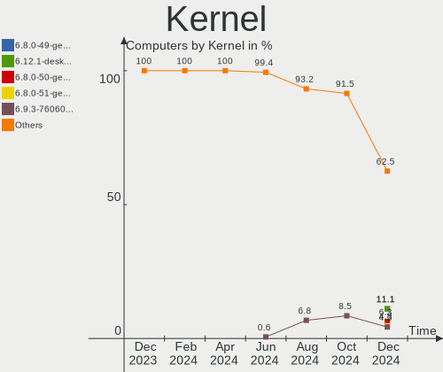

| Version                       | Computers | Percent |
|-------------------------------|-----------|---------|
| 5.15.0-52-generic             | 20        | 15.63%  |
| 5.15.0-48-generic             | 14        | 10.94%  |
| 5.15.0-50-generic             | 10        | 7.81%   |
| 5.19.0-76051900-generic       | 7         | 5.47%   |
| 6.0.2-arch1-1                 | 5         | 3.91%   |
| 5.16.7-desktop-1omv4003       | 5         | 3.91%   |
| 5.4.0-131-generic             | 4         | 3.13%   |
| 5.19.5-desktop-1omv4090       | 4         | 3.13%   |
| 5.19.16-76051916-generic      | 3         | 2.34%   |
| 6.0.2-zen1-1-zen              | 2         | 1.56%   |
| 5.4.0-126-generic             | 2         | 1.56%   |
| 5.19.14-201.fsync.fc36.x86_64 | 2         | 1.56%   |
| 5.19.13-200.fc36.x86_64       | 2         | 1.56%   |
| 5.19.0-21-generic             | 2         | 1.56%   |
| 5.18.0-kali7-amd64            | 2         | 1.56%   |
| 5.13.0-valve24-1-neptune      | 2         | 1.56%   |
| 5.10.0-19-amd64               | 2         | 1.56%   |
| 6.0.3-1202.native             | 1         | 0.78%   |
| 6.0.2-76060002-generic        | 1         | 0.78%   |
| 6.0.1-arch2-1                 | 1         | 0.78%   |
| 6.0.0-zen1-1-zen              | 1         | 0.78%   |
| 6.0.0-1194.native             | 1         | 0.78%   |
| 6.0.0-060000-generic          | 1         | 0.78%   |
| 6.0.0                         | 1         | 0.78%   |
| 5.4.0-124-generic             | 1         | 0.78%   |
| 5.4.0-122-generic             | 1         | 0.78%   |
| 5.19.9-200.fc36.x86_64        | 1         | 0.78%   |
| 5.19.16-300.fc37.x86_64       | 1         | 0.78%   |
| 5.19.14-200.fc36.x86_64       | 1         | 0.78%   |
| 5.19.10-arch1-1-surface       | 1         | 0.78%   |
| 5.19.0-kali2-amd64            | 1         | 0.78%   |
| 5.19.0-23-generic             | 1         | 0.78%   |
| 5.19.0-1004-raspi             | 1         | 0.78%   |
| 5.18.12-arch1-1               | 1         | 0.78%   |
| 5.18.0-kali5-amd64            | 1         | 0.78%   |
| 5.17.5-76051705-generic       | 1         | 0.78%   |
| 5.16.13-desktop-1omv4003      | 1         | 0.78%   |
| 5.15.74-3-MANJARO             | 1         | 0.78%   |
| 5.15.72-gentoo                | 1         | 0.78%   |
| 5.15.71-redcore-lts           | 1         | 0.78%   |

Kernel Family
-------------

Linux kernel without a distro release

| Version | Computers | Percent |
|---------|-----------|---------|
| 5.15.0  | 49        | 38.28%  |
| 5.19.0  | 12        | 9.38%   |
| 6.0.2   | 8         | 6.25%   |
| 5.4.0   | 8         | 6.25%   |
| 5.16.7  | 5         | 3.91%   |
| 6.0.0   | 4         | 3.13%   |
| 5.19.5  | 4         | 3.13%   |
| 5.19.16 | 4         | 3.13%   |
| 5.13.0  | 4         | 3.13%   |
| 5.19.14 | 3         | 2.34%   |
| 5.18.0  | 3         | 2.34%   |
| 5.10.0  | 3         | 2.34%   |
| 5.19.13 | 2         | 1.56%   |
| 5.15.61 | 2         | 1.56%   |
| 6.0.3   | 1         | 0.78%   |
| 6.0.1   | 1         | 0.78%   |
| 5.19.9  | 1         | 0.78%   |
| 5.19.10 | 1         | 0.78%   |
| 5.18.12 | 1         | 0.78%   |
| 5.17.5  | 1         | 0.78%   |
| 5.16.13 | 1         | 0.78%   |
| 5.15.74 | 1         | 0.78%   |
| 5.15.72 | 1         | 0.78%   |
| 5.15.71 | 1         | 0.78%   |
| 5.15.55 | 1         | 0.78%   |
| 5.15.19 | 1         | 0.78%   |
| 5.10.61 | 1         | 0.78%   |
| 5.0.0   | 1         | 0.78%   |
| 4.18.0  | 1         | 0.78%   |
| 4.15.0  | 1         | 0.78%   |
| 3.10.0  | 1         | 0.78%   |

Kernel Major Ver.
-----------------

Linux kernel major version

| Version | Computers | Percent |
|---------|-----------|---------|
| 5.15    | 56        | 43.75%  |
| 5.19    | 27        | 21.09%  |
| 6.0     | 14        | 10.94%  |
| 5.4     | 8         | 6.25%   |
| 5.16    | 6         | 4.69%   |
| 5.18    | 4         | 3.13%   |
| 5.13    | 4         | 3.13%   |
| 5.10    | 4         | 3.13%   |
| 5.17    | 1         | 0.78%   |
| 5.0     | 1         | 0.78%   |
| 4.18    | 1         | 0.78%   |
| 4.15    | 1         | 0.78%   |
| 3.10    | 1         | 0.78%   |

Arch
----

OS architecture (x86_64, i586, etc.)

| Name    | Computers | Percent |
|---------|-----------|---------|
| x86_64  | 124       | 96.88%  |
| aarch64 | 2         | 1.56%   |
| i686    | 1         | 0.78%   |
| armv7l  | 1         | 0.78%   |

DE
--

Desktop Environment

| Name       | Computers | Percent |
|------------|-----------|---------|
| GNOME      | 63        | 49.22%  |
| KDE5       | 25        | 19.53%  |
| X-Cinnamon | 13        | 10.16%  |
| Unknown    | 10        | 7.81%   |
| XFCE       | 7         | 5.47%   |
| MATE       | 3         | 2.34%   |
| Unity      | 2         | 1.56%   |
| xmonad     | 1         | 0.78%   |
| Pantheon   | 1         | 0.78%   |
| LXDE       | 1         | 0.78%   |
| i3         | 1         | 0.78%   |
| Cinnamon   | 1         | 0.78%   |

Display Server
--------------

X11 or Wayland

| Name    | Computers | Percent |
|---------|-----------|---------|
| X11     | 88        | 68.75%  |
| Wayland | 30        | 23.44%  |
| Tty     | 6         | 4.69%   |
| Unknown | 3         | 2.34%   |
| Web     | 1         | 0.78%   |

Display Manager
---------------

SDDM, LightDM, etc.

| Name    | Computers | Percent |
|---------|-----------|---------|
| Unknown | 56        | 43.75%  |
| GDM3    | 32        | 25%     |
| SDDM    | 14        | 10.94%  |
| LightDM | 14        | 10.94%  |
| GDM     | 12        | 9.38%   |

OS Lang
-------

Language

| Lang    | Computers | Percent |
|---------|-----------|---------|
| en_CA   | 75        | 58.59%  |
| en_US   | 35        | 27.34%  |
| fr_CA   | 12        | 9.38%   |
| C       | 2         | 1.56%   |
| pl_PL   | 1         | 0.78%   |
| en_IN   | 1         | 0.78%   |
| C.UTF8  | 1         | 0.78%   |
| Unknown | 1         | 0.78%   |

Boot Mode
---------

EFI or BIOS

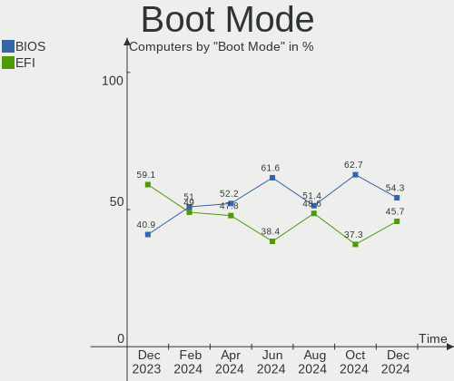

| Mode | Computers | Percent |
|------|-----------|---------|
| BIOS | 75        | 58.59%  |
| EFI  | 53        | 41.41%  |

Filesystem
----------

Type of filesystem

| Type    | Computers | Percent |
|---------|-----------|---------|
| Ext4    | 98        | 76.56%  |
| Btrfs   | 18        | 14.06%  |
| Overlay | 9         | 7.03%   |
| Zfs     | 1         | 0.78%   |
| Xfs     | 1         | 0.78%   |
| Ext3    | 1         | 0.78%   |

Part. scheme
------------

Scheme of partitioning

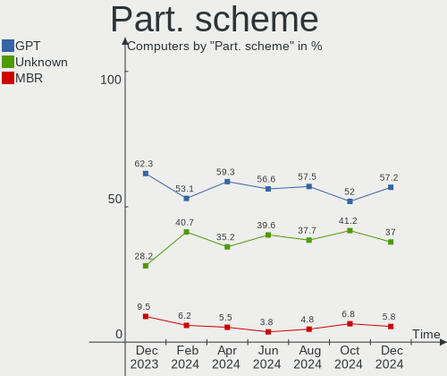

| Type    | Computers | Percent |
|---------|-----------|---------|
| GPT     | 61        | 47.66%  |
| Unknown | 47        | 36.72%  |
| MBR     | 20        | 15.63%  |

Dual Boot with Linux/BSD
------------------------

Hosting more than one Linux/BSD

| Dual boot | Computers | Percent |
|-----------|-----------|---------|
| No        | 107       | 83.59%  |
| Yes       | 21        | 16.41%  |

Dual Boot (Win)
---------------

Hosting Linux and Windows

| Dual boot | Computers | Percent |
|-----------|-----------|---------|
| No        | 105       | 82.03%  |
| Yes       | 23        | 17.97%  |

Board
-----

Vendor
------

Motherboard manufacturer

| Name                    | Computers | Percent |
|-------------------------|-----------|---------|
| Lenovo                  | 20        | 15.63%  |
| Hewlett-Packard         | 19        | 14.84%  |
| ASUSTek Computer        | 19        | 14.84%  |
| Dell                    | 12        | 9.38%   |
| Apple                   | 8         | 6.25%   |
| ASRock                  | 7         | 5.47%   |
| Acer                    | 7         | 5.47%   |
| MSI                     | 6         | 4.69%   |
| Gigabyte Technology     | 4         | 3.13%   |
| Alienware               | 4         | 3.13%   |
| Valve                   | 3         | 2.34%   |
| Raspberry Pi Foundation | 3         | 2.34%   |
| Samsung Electronics     | 2         | 1.56%   |
| Pegatron                | 2         | 1.56%   |
| Oracle                  | 2         | 1.56%   |
| Google                  | 2         | 1.56%   |
| Toshiba                 | 1         | 0.78%   |
| Sun Microsystems        | 1         | 0.78%   |
| Sony                    | 1         | 0.78%   |
| ReachingTech            | 1         | 0.78%   |
| Panasonic               | 1         | 0.78%   |
| Microsoft               | 1         | 0.78%   |
| Intel                   | 1         | 0.78%   |
| Fujitsu                 | 1         | 0.78%   |

Model
-----

Motherboard model

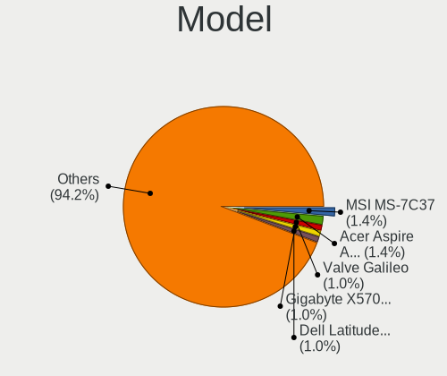

| Name                                      | Computers | Percent |
|-------------------------------------------|-----------|---------|
| Valve Jupiter                             | 3         | 2.34%   |
| Oracle SUN SERVER X4-2                    | 2         | 1.56%   |
| Apple MacBookPro6,2                       | 2         | 1.56%   |
| Toshiba Satellite A200                    | 1         | 0.78%   |
| Sun Microsystems Sun Fire X4170 M2 SERVER | 1         | 0.78%   |
| Sony VPCEH3QFX                            | 1         | 0.78%   |
| Samsung 950XDB/951XDB/950XDY              | 1         | 0.78%   |
| Samsung 305E4A/305E5A/305E7A              | 1         | 0.78%   |
| ReachingTech Dream Quest Office 2021      | 1         | 0.78%   |
| RPi Raspberry Pi 400 Rev 1.1              | 1         | 0.78%   |
| RPi Raspberry Pi 4 Model B Rev 1.4        | 1         | 0.78%   |
| RPi Raspberry Pi 4 Model B Rev 1.1        | 1         | 0.78%   |
| Pegatron h8-1549                          | 1         | 0.78%   |
| Pegatron h8-1503                          | 1         | 0.78%   |
| Panasonic CFSX4-1                         | 1         | 0.78%   |
| MSI Pulse GL76 12UEK                      | 1         | 0.78%   |
| MSI MS-7C91                               | 1         | 0.78%   |
| MSI MS-7C80                               | 1         | 0.78%   |
| MSI MS-7B09                               | 1         | 0.78%   |
| MSI MS-7A37                               | 1         | 0.78%   |
| MSI GP66 Leopard 11UH                     | 1         | 0.78%   |
| Microsoft Surface Laptop Go               | 1         | 0.78%   |
| Lenovo ThinkStation P910 30B8S0EN00       | 1         | 0.78%   |
| Lenovo ThinkPad T460 20FMS7DA00           | 1         | 0.78%   |
| Lenovo ThinkPad T460 20FMS4U300           | 1         | 0.78%   |
| Lenovo ThinkPad T460 20FMS43J0V           | 1         | 0.78%   |
| Lenovo ThinkPad T440s 20ARS4PR00          | 1         | 0.78%   |
| Lenovo ThinkPad T420 4180DW1              | 1         | 0.78%   |
| Lenovo ThinkPad T16 Gen 1 21BVCTO1WW      | 1         | 0.78%   |
| Lenovo ThinkPad R500 2714CTO              | 1         | 0.78%   |
| Lenovo ThinkPad E580 20KSCTO1WW           | 1         | 0.78%   |
| Lenovo ThinkCentre M93p 10A9000SUS        | 1         | 0.78%   |
| Lenovo ThinkCentre M92p 2988D9U           | 1         | 0.78%   |
| Lenovo ThinkCentre M73 10AXS0FX01         | 1         | 0.78%   |
| Lenovo ThinkCentre A57 9851CDF            | 1         | 0.78%   |
| Lenovo IdeaPadFlex 5 14ARE05 81X2         | 1         | 0.78%   |
| Lenovo IdeaPad Z500 20202                 | 1         | 0.78%   |
| Lenovo IdeaPad 510-15IKB 80SV             | 1         | 0.78%   |
| Lenovo IdeaPad 5 15ALC05 82LN             | 1         | 0.78%   |
| Lenovo IdeaPad 330-15IKB 81DE             | 1         | 0.78%   |

Model Family
------------

Motherboard model prefix

| Name                 | Computers | Percent |
|----------------------|-----------|---------|
| Lenovo ThinkPad      | 8         | 6.25%   |
| Lenovo IdeaPad       | 5         | 3.91%   |
| HP Pavilion          | 5         | 3.91%   |
| Dell Precision       | 5         | 3.91%   |
| Lenovo ThinkCentre   | 4         | 3.13%   |
| ASUS ROG             | 4         | 3.13%   |
| Valve Jupiter        | 3         | 2.34%   |
| RPi Raspberry        | 3         | 2.34%   |
| HP ENVY              | 3         | 2.34%   |
| Dell Latitude        | 3         | 2.34%   |
| ASUS PRIME           | 3         | 2.34%   |
| Acer Aspire          | 3         | 2.34%   |
| Oracle SUN           | 2         | 1.56%   |
| HP ProBook           | 2         | 1.56%   |
| HP Laptop            | 2         | 1.56%   |
| HP EliteBook         | 2         | 1.56%   |
| ASUS ZenBook         | 2         | 1.56%   |
| ASRock X570          | 2         | 1.56%   |
| Apple MacBookPro6    | 2         | 1.56%   |
| Acer Spin            | 2         | 1.56%   |
| Toshiba Satellite    | 1         | 0.78%   |
| Sun Microsystems Sun | 1         | 0.78%   |
| Sony VPCEH3QFX       | 1         | 0.78%   |
| Samsung 950XDB       | 1         | 0.78%   |
| Samsung 305E4A       | 1         | 0.78%   |
| ReachingTech Dream   | 1         | 0.78%   |
| Pegatron h8-1549     | 1         | 0.78%   |
| Pegatron h8-1503     | 1         | 0.78%   |
| Panasonic CFSX4-1    | 1         | 0.78%   |
| MSI Pulse            | 1         | 0.78%   |
| MSI MS-7C91          | 1         | 0.78%   |
| MSI MS-7C80          | 1         | 0.78%   |
| MSI MS-7B09          | 1         | 0.78%   |
| MSI MS-7A37          | 1         | 0.78%   |
| MSI GP66             | 1         | 0.78%   |
| Microsoft Surface    | 1         | 0.78%   |
| Lenovo ThinkStation  | 1         | 0.78%   |
| Lenovo IdeaPadFlex   | 1         | 0.78%   |
| Lenovo G50-30        | 1         | 0.78%   |
| Intel D33217GKE      | 1         | 0.78%   |

MFG Year
--------

Motherboard manufacture year

| Year    | Computers | Percent |
|---------|-----------|---------|
| 2020    | 16        | 12.5%   |
| 2013    | 14        | 10.94%  |
| 2022    | 10        | 7.81%   |
| 2019    | 10        | 7.81%   |
| 2018    | 10        | 7.81%   |
| 2011    | 10        | 7.81%   |
| 2017    | 9         | 7.03%   |
| 2021    | 8         | 6.25%   |
| 2012    | 8         | 6.25%   |
| 2016    | 7         | 5.47%   |
| 2014    | 7         | 5.47%   |
| 2008    | 5         | 3.91%   |
| 2010    | 4         | 3.13%   |
| 2015    | 3         | 2.34%   |
| 2009    | 3         | 2.34%   |
| 2007    | 2         | 1.56%   |
| 2006    | 1         | 0.78%   |
| Unknown | 1         | 0.78%   |

Form Factor
-----------

Physical design of the computer

| Name           | Computers | Percent |
|----------------|-----------|---------|
| Notebook       | 64        | 50%     |
| Desktop        | 48        | 37.5%   |
| Convertible    | 7         | 5.47%   |
| System on chip | 3         | 2.34%   |
| Server         | 3         | 2.34%   |
| Tablet         | 1         | 0.78%   |
| Mini pc        | 1         | 0.78%   |
| All in one     | 1         | 0.78%   |

Secure Boot
-----------

Enabled or disabled

| State    | Computers | Percent |
|----------|-----------|---------|
| Disabled | 120       | 93.75%  |
| Enabled  | 8         | 6.25%   |

Coreboot
--------

Have coreboot on board

| Used | Computers | Percent |
|------|-----------|---------|
| No   | 126       | 98.44%  |
| Yes  | 2         | 1.56%   |

RAM Size
--------

Total RAM memory

| Size in GB      | Computers | Percent |
|-----------------|-----------|---------|
| 16.01-24.0      | 26        | 20.31%  |
| 4.01-8.0        | 25        | 19.53%  |
| 8.01-16.0       | 25        | 19.53%  |
| 32.01-64.0      | 21        | 16.41%  |
| 3.01-4.0        | 13        | 10.16%  |
| 64.01-256.0     | 7         | 5.47%   |
| 1.01-2.0        | 4         | 3.13%   |
| 24.01-32.0      | 3         | 2.34%   |
| More than 256.0 | 2         | 1.56%   |
| 2.01-3.0        | 1         | 0.78%   |
| 0.51-1.0        | 1         | 0.78%   |

RAM Used
--------

Used RAM memory

| Used GB     | Computers | Percent |
|-------------|-----------|---------|
| 2.01-3.0    | 34        | 26.56%  |
| 1.01-2.0    | 29        | 22.66%  |
| 3.01-4.0    | 26        | 20.31%  |
| 4.01-8.0    | 21        | 16.41%  |
| 8.01-16.0   | 8         | 6.25%   |
| 0.51-1.0    | 5         | 3.91%   |
| 0.01-0.5    | 4         | 3.13%   |
| 64.01-256.0 | 1         | 0.78%   |

Total Drives
------------

Number of drives on board

| Drives | Computers | Percent |
|--------|-----------|---------|
| 1      | 70        | 54.69%  |
| 2      | 27        | 21.09%  |
| 3      | 12        | 9.38%   |
| 4      | 8         | 6.25%   |
| 6      | 3         | 2.34%   |
| 5      | 3         | 2.34%   |
| 10     | 2         | 1.56%   |
| 8      | 2         | 1.56%   |
| 11     | 1         | 0.78%   |

Has CD-ROM
----------

Has CD-ROM on board

| Presented | Computers | Percent |
|-----------|-----------|---------|
| No        | 76        | 59.38%  |
| Yes       | 52        | 40.63%  |

Has Ethernet
------------

Has Ethernet on board

| Presented | Computers | Percent |
|-----------|-----------|---------|
| Yes       | 108       | 84.38%  |
| No        | 20        | 15.63%  |

Has WiFi
--------

Has WiFi module

| Presented | Computers | Percent |
|-----------|-----------|---------|
| Yes       | 99        | 77.34%  |
| No        | 29        | 22.66%  |

Has Bluetooth
-------------

Has Bluetooth module

| Presented | Computers | Percent |
|-----------|-----------|---------|
| Yes       | 86        | 67.19%  |
| No        | 42        | 32.81%  |

Location
--------

Country
-------

Geographic location (country)

| Country | Computers | Percent |
|---------|-----------|---------|
| Canada  | 128       | 100%    |

City
----

Geographic location (city)

| City              | Computers | Percent |
|-------------------|-----------|---------|
| Toronto           | 12        | 9.38%   |
| Montreal          | 11        | 8.59%   |
| Victoria          | 6         | 4.69%   |
| Edmonton          | 6         | 4.69%   |
| Calgary           | 6         | 4.69%   |
| Vancouver         | 5         | 3.91%   |
| Ottawa            | 5         | 3.91%   |
| Surrey            | 3         | 2.34%   |
| Regina            | 3         | 2.34%   |
| Mississauga       | 3         | 2.34%   |
| Winnipeg          | 2         | 1.56%   |
| Saskatoon         | 2         | 1.56%   |
| Richmond          | 2         | 1.56%   |
| Red Deer          | 2         | 1.56%   |
| Québec           | 2         | 1.56%   |
| Longueuil         | 2         | 1.56%   |
| London            | 2         | 1.56%   |
| Lachine           | 2         | 1.56%   |
| Kingston          | 2         | 1.56%   |
| Kentville         | 2         | 1.56%   |
| Gatineau          | 2         | 1.56%   |
| Fort St. John     | 2         | 1.56%   |
| Waterloo          | 1         | 0.78%   |
| Wallaceburg       | 1         | 0.78%   |
| Vernon            | 1         | 0.78%   |
| Tracadie–Sheila | 1         | 0.78%   |
| Sorel-Tracy       | 1         | 0.78%   |
| Smiths Falls      | 1         | 0.78%   |
| Simcoe            | 1         | 0.78%   |
| Sherbrooke        | 1         | 0.78%   |
| Sarnia            | 1         | 0.78%   |
| Saint-Jerome      | 1         | 0.78%   |
| Saguenay          | 1         | 0.78%   |
| Rouyn-Noranda     | 1         | 0.78%   |
| Repentigny        | 1         | 0.78%   |
| Quispamsis        | 1         | 0.78%   |
| Pilot Mound       | 1         | 0.78%   |
| Otterburn Park    | 1         | 0.78%   |
| Oshawa            | 1         | 0.78%   |
| Oromocto          | 1         | 0.78%   |

Drives
------

Drive Vendor
------------

Hard drive vendors

| Vendor                      | Computers | Drives  | Percent |
|-----------------------------|-----------|---------|---------|
| Samsung Electronics         | 34        | 42      | 15.81%  |
| Seagate                     | 30        | 43      | 13.95%  |
| WDC                         | 28        | 42      | 13.02%  |
| Kingston                    | 16        | 16      | 7.44%   |
| Unknown                     | 15        | 15      | 6.98%   |
| Toshiba                     | 10        | 10      | 4.65%   |
| Crucial                     | 10        | 11      | 4.65%   |
| Sandisk                     | 7         | 7       | 3.26%   |
| Intel                       | 7         | 9       | 3.26%   |
| SK hynix                    | 6         | 6       | 2.79%   |
| Hitachi                     | 5         | 11      | 2.33%   |
| Micron Technology           | 4         | 4       | 1.86%   |
| HGST                        | 4         | 4       | 1.86%   |
| Phison Electronics          | 3         | 4       | 1.4%    |
| Kingston Technology Company | 3         | 3       | 1.4%    |
| Fujitsu                     | 3         | 3       | 1.4%    |
| Timetec                     | 2         | 2       | 0.93%   |
| Patriot                     | 2         | 2       | 0.93%   |
| OCZ                         | 2         | 2       | 0.93%   |
| Micron/Crucial Technology   | 2         | 2       | 0.93%   |
| Hewlett-Packard             | 2         | 9       | 0.93%   |
| Apple                       | 2         | 3       | 0.93%   |
| ADATA Technology            | 2         | 2       | 0.93%   |
| Unknown                     | 2         | 2       | 0.93%   |
| UMIS                        | 1         | 1       | 0.47%   |
| Super Talent                | 1         | 1       | 0.47%   |
| SUNEAST                     | 1         | 1       | 0.47%   |
| SPCC                        | 1         | 1       | 0.47%   |
| SABRENT                     | 1         | 1       | 0.47%   |
| ROG                         | 1         | 1       | 0.47%   |
| Realtek Semiconductor       | 1         | 1       | 0.47%   |
| PNY                         | 1         | 1       | 0.47%   |
| Phison                      | 1         | 1       | 0.47%   |
| NGFF                        | 1         | 1       | 0.47%   |
| KIOXIA                      | 1         | 1       | 0.47%   |
| Hjwdz                       | 1         | Unknown | 0.47%   |
| ASMT                        | 1         | 1       | 0.47%   |
| A-DATA Technology           | 1         | 1       | 0.47%   |

Drive Model
-----------

Hard drive models

| Model                                                           | Computers | Percent |
|-----------------------------------------------------------------|-----------|---------|
| Samsung NVMe SSD Controller SM981/PM981/PM983 500GB             | 5         | 2.1%    |
| Unknown MMC Card  32GB                                          | 4         | 1.68%   |
| Kingston SA400S37240G 240GB SSD                                 | 4         | 1.68%   |
| WDC WDS100T2B0A-00SM50 1TB SSD                                  | 3         | 1.26%   |
| WDC WD10EZEX-08WN4A0 1TB                                        | 3         | 1.26%   |
| Toshiba DT01ACA200 2TB                                          | 3         | 1.26%   |
| Seagate ST8000DM004-2CX188 8TB                                  | 3         | 1.26%   |
| Samsung NVMe SSD Controller PM9A1/PM9A3/980PRO 250GB            | 3         | 1.26%   |
| Kingston SV300S37A120G 120GB SSD                                | 3         | 1.26%   |
| Intel SSD 660P Series 1024GB                                    | 3         | 1.26%   |
| WDC WDS100T2B0A 1TB SSD                                         | 2         | 0.84%   |
| WDC WD4005FZBX-00K5WB0 4TB                                      | 2         | 0.84%   |
| WDC WD2002FAEX-007BA0 2TB                                       | 2         | 0.84%   |
| Unknown SD/MMC/MS PRO 1TB                                       | 2         | 0.84%   |
| Unknown DA4064  64GB                                            | 2         | 0.84%   |
| Toshiba MQ01ABF050 500GB                                        | 2         | 0.84%   |
| Seagate ST4000DM004-2CV104 4TB                                  | 2         | 0.84%   |
| Seagate ST3000DM001-1CH166 3TB                                  | 2         | 0.84%   |
| Seagate ST1000LM035-1RK172 1TB                                  | 2         | 0.84%   |
| Seagate ST1000LM014-1EJ164 1TB                                  | 2         | 0.84%   |
| Seagate BUP Slim 2TB                                            | 2         | 0.84%   |
| Sandisk WD Blue SN550 NVMe SSD 1TB                              | 2         | 0.84%   |
| Sandisk WD Black SN750 / PC SN730 NVMe SSD 1TB                  | 2         | 0.84%   |
| SanDisk Extreme SSD 500GB                                       | 2         | 0.84%   |
| Samsung SSD 870 EVO 1TB                                         | 2         | 0.84%   |
| Samsung SSD 860 EVO 1TB                                         | 2         | 0.84%   |
| Samsung SSD 850 EVO 500GB                                       | 2         | 0.84%   |
| Samsung SSD 850 EVO 250GB                                       | 2         | 0.84%   |
| Samsung NVMe SSD Controller SM961/PM961/SM963 250GB             | 2         | 0.84%   |
| Phison E12 NVMe Controller 2TB                                  | 2         | 0.84%   |
| Kingston SV300S37A240G 240GB SSD                                | 2         | 0.84%   |
| Kingston SA400S37120G 120GB SSD                                 | 2         | 0.84%   |
| HGST HTS541010A9E680 1TB                                        | 2         | 0.84%   |
| Crucial M4-CT128M4SSD2 128GB                                    | 2         | 0.84%   |
| Crucial CT1000BX500SSD1 1TB                                     | 2         | 0.84%   |
| ADATA XPG SX8200 Pro PCIe Gen3x4 M.2 2280 Solid State Drive 1TB | 2         | 0.84%   |
| Unknown                                                         | 2         | 0.84%   |
| WDC WDS500G2B0A-00SM50 500GB SSD                                | 1         | 0.42%   |
| WDC WDS250G2B0A-00SM50 250GB SSD                                | 1         | 0.42%   |
| WDC WDBNCE2500PNC 250GB SSD                                     | 1         | 0.42%   |

HDD Vendor
----------

Hard disk drive vendors

| Vendor              | Computers | Drives | Percent |
|---------------------|-----------|--------|---------|
| Seagate             | 30        | 42     | 38.96%  |
| WDC                 | 21        | 28     | 27.27%  |
| Toshiba             | 8         | 8      | 10.39%  |
| Hitachi             | 5         | 11     | 6.49%   |
| HGST                | 4         | 4      | 5.19%   |
| Fujitsu             | 3         | 3      | 3.9%    |
| Unknown             | 2         | 2      | 2.6%    |
| Samsung Electronics | 2         | 2      | 2.6%    |
| SABRENT             | 1         | 1      | 1.3%    |
| Hewlett-Packard     | 1         | 8      | 1.3%    |

SSD Vendor
----------

Solid state drive vendors

| Vendor              | Computers | Drives | Percent |
|---------------------|-----------|--------|---------|
| Samsung Electronics | 15        | 18     | 21.74%  |
| Kingston            | 14        | 14     | 20.29%  |
| Crucial             | 9         | 9      | 13.04%  |
| WDC                 | 8         | 14     | 11.59%  |
| Micron Technology   | 3         | 3      | 4.35%   |
| SK hynix            | 2         | 2      | 2.9%    |
| SanDisk             | 2         | 2      | 2.9%    |
| Patriot             | 2         | 2      | 2.9%    |
| OCZ                 | 2         | 2      | 2.9%    |
| Intel               | 2         | 2      | 2.9%    |
| Toshiba             | 1         | 1      | 1.45%   |
| Timetec             | 1         | 1      | 1.45%   |
| Super Talent        | 1         | 1      | 1.45%   |
| SUNEAST             | 1         | 1      | 1.45%   |
| SPCC                | 1         | 1      | 1.45%   |
| PNY                 | 1         | 1      | 1.45%   |
| NGFF                | 1         | 1      | 1.45%   |
| ASMT                | 1         | 1      | 1.45%   |
| Apple               | 1         | 1      | 1.45%   |
| A-DATA Technology   | 1         | 1      | 1.45%   |

Drive Kind
----------

HDD or SSD

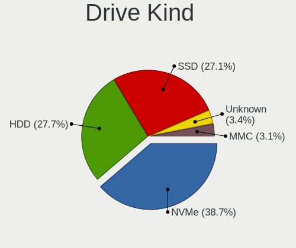

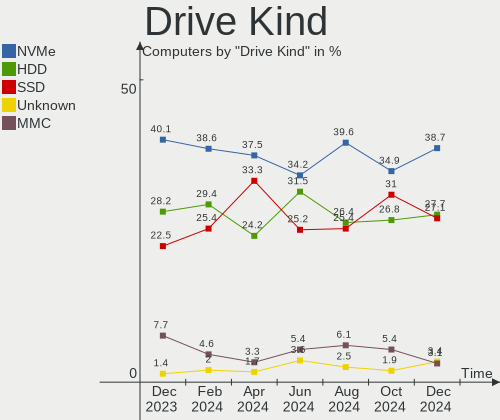

| Kind    | Computers | Drives | Percent |
|---------|-----------|--------|---------|
| SSD     | 63        | 78     | 34.05%  |
| HDD     | 57        | 109    | 30.81%  |
| NVMe    | 45        | 61     | 24.32%  |
| MMC     | 15        | 15     | 8.11%   |
| Unknown | 5         | 4      | 2.7%    |

Drive Connector
---------------

SATA, SAS, NVMe, etc.

| Type | Computers | Drives | Percent |
|------|-----------|--------|---------|
| SATA | 95        | 170    | 56.55%  |
| NVMe | 45        | 61     | 26.79%  |
| MMC  | 15        | 15     | 8.93%   |
| SAS  | 13        | 21     | 7.74%   |

Drive Size
----------

Size of hard drive

| Size in TB | Computers | Drives | Percent |
|------------|-----------|--------|---------|
| 0.01-0.5   | 62        | 81     | 46.27%  |
| 0.51-1.0   | 41        | 55     | 30.6%   |
| 1.01-2.0   | 14        | 22     | 10.45%  |
| 3.01-4.0   | 8         | 10     | 5.97%   |
| 2.01-3.0   | 5         | 11     | 3.73%   |
| 4.01-10.0  | 4         | 8      | 2.99%   |

Space Total
-----------

Amount of disk space available on the file system

| Size in GB     | Computers | Percent |
|----------------|-----------|---------|
| 101-250        | 40        | 31.25%  |
| 251-500        | 29        | 22.66%  |
| 501-1000       | 17        | 13.28%  |
| 1001-2000      | 11        | 8.59%   |
| More than 3000 | 10        | 7.81%   |
| 1-20           | 10        | 7.81%   |
| 21-50          | 6         | 4.69%   |
| 51-100         | 3         | 2.34%   |
| 2001-3000      | 2         | 1.56%   |

Space Used
----------

Amount of used disk space

| Used GB        | Computers | Percent |
|----------------|-----------|---------|
| 1-20           | 44        | 34.38%  |
| 21-50          | 28        | 21.88%  |
| 51-100         | 18        | 14.06%  |
| 101-250        | 16        | 12.5%   |
| 501-1000       | 8         | 6.25%   |
| 251-500        | 5         | 3.91%   |
| 2001-3000      | 4         | 3.13%   |
| More than 3000 | 3         | 2.34%   |
| 1001-2000      | 2         | 1.56%   |

Malfunc. Drives
---------------

Drive models with a malfunction

| Model                             | Computers | Drives | Percent |
|-----------------------------------|-----------|--------|---------|
| WDC WD40EFRX-68WT0N0 4TB          | 1         | 1      | 9.09%   |
| WDC WD30EZRX-00MMMB0 3TB          | 1         | 2      | 9.09%   |
| Seagate ST320LT007-9ZV142 320GB   | 1         | 1      | 9.09%   |
| Seagate ST31500341AS 1TB          | 1         | 1      | 9.09%   |
| Seagate ST3000DM001-1ER166 3TB    | 1         | 1      | 9.09%   |
| Seagate ST3000DM001-1CH166 3TB    | 1         | 1      | 9.09%   |
| Seagate ST2000DM001-1CH164 2TB    | 1         | 1      | 9.09%   |
| Samsung Electronics HM160HC 160GB | 1         | 1      | 9.09%   |
| Intel SSDPEKKW256G7 256GB         | 1         | 1      | 9.09%   |
| Intel SSD 600P Series 256GB       | 1         | 1      | 9.09%   |
| HGST HTS541010A9E680 1TB          | 1         | 1      | 9.09%   |

Malfunc. Drive Vendor
---------------------

Vendors of faulty drives

| Vendor              | Computers | Drives | Percent |
|---------------------|-----------|--------|---------|
| Seagate             | 4         | 5      | 44.44%  |
| WDC                 | 2         | 3      | 22.22%  |
| Samsung Electronics | 1         | 1      | 11.11%  |
| Intel               | 1         | 2      | 11.11%  |
| HGST                | 1         | 1      | 11.11%  |

Malfunc. HDD Vendor
-------------------

Vendors of faulty HDD drives

| Vendor              | Computers | Drives | Percent |
|---------------------|-----------|--------|---------|
| Seagate             | 4         | 5      | 50%     |
| WDC                 | 2         | 3      | 25%     |
| Samsung Electronics | 1         | 1      | 12.5%   |
| HGST                | 1         | 1      | 12.5%   |

Malfunc. Drive Kind
-------------------

Kinds of faulty drives

| Kind | Computers | Drives | Percent |
|------|-----------|--------|---------|
| HDD  | 8         | 10     | 88.89%  |
| NVMe | 1         | 2      | 11.11%  |

Failed Drives
-------------

Failed drive models

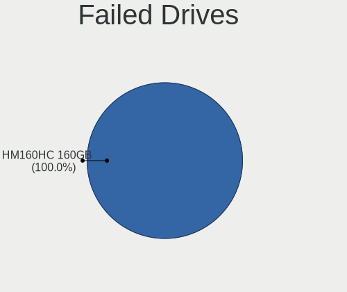

| Model                             | Computers | Drives | Percent |
|-----------------------------------|-----------|--------|---------|
| Hewlett-Packard EF0450FARMV 450GB | 1         | 4      | 100%    |

Failed Drive Vendor
-------------------

Failed drive vendors

| Vendor          | Computers | Drives | Percent |
|-----------------|-----------|--------|---------|
| Hewlett-Packard | 1         | 4      | 100%    |

Drive Status
------------

Number of failed and malfunc. drives

| Status   | Computers | Drives | Percent |
|----------|-----------|--------|---------|
| Detected | 84        | 160    | 59.15%  |
| Works    | 48        | 91     | 33.8%   |
| Malfunc  | 9         | 12     | 6.34%   |
| Failed   | 1         | 4      | 0.7%    |

Storage controller
------------------

Storage Vendor
--------------

Storage controller vendors

| Vendor                       | Computers | Percent |
|------------------------------|-----------|---------|
| Intel                        | 79        | 47.31%  |
| AMD                          | 28        | 16.77%  |
| Samsung Electronics          | 19        | 11.38%  |
| SanDisk                      | 5         | 2.99%   |
| Kingston Technology Company  | 5         | 2.99%   |
| SK hynix                     | 4         | 2.4%    |
| Phison Electronics           | 4         | 2.4%    |
| LSI Logic / Symbios Logic    | 4         | 2.4%    |
| Micron/Crucial Technology    | 3         | 1.8%    |
| ASMedia Technology           | 3         | 1.8%    |
| Nvidia                       | 2         | 1.2%    |
| ADATA Technology             | 2         | 1.2%    |
| Union Memory (Shenzhen)      | 1         | 0.6%    |
| Toshiba America Info Systems | 1         | 0.6%    |
| Realtek Semiconductor        | 1         | 0.6%    |
| Micron Technology            | 1         | 0.6%    |
| Marvell Technology Group     | 1         | 0.6%    |
| KIOXIA                       | 1         | 0.6%    |
| JMicron Technology           | 1         | 0.6%    |
| Hewlett-Packard              | 1         | 0.6%    |
| Apple                        | 1         | 0.6%    |

Storage Model
-------------

Storage controller models

| Model                                                                          | Computers | Percent |
|--------------------------------------------------------------------------------|-----------|---------|
| AMD FCH SATA Controller [AHCI mode]                                            | 20        | 10.58%  |
| Samsung NVMe SSD Controller SM981/PM981/PM983                                  | 10        | 5.29%   |
| Intel Sunrise Point-LP SATA Controller [AHCI mode]                             | 8         | 4.23%   |
| Intel 8 Series/C220 Series Chipset Family 6-port SATA Controller 1 [AHCI mode] | 8         | 4.23%   |
| Intel 7 Series Chipset Family 6-port SATA Controller [AHCI mode]               | 6         | 3.17%   |
| AMD 400 Series Chipset SATA Controller                                         | 5         | 2.65%   |
| Samsung NVMe SSD Controller 980                                                | 4         | 2.12%   |
| Intel Volume Management Device NVMe RAID Controller                            | 4         | 2.12%   |
| Intel SATA Controller [RAID mode]                                              | 4         | 2.12%   |
| Intel 82801 Mobile SATA Controller [RAID mode]                                 | 4         | 2.12%   |
| Intel 7 Series/C210 Series Chipset Family 6-port SATA Controller [AHCI mode]   | 4         | 2.12%   |
| AMD SB7x0/SB8x0/SB9x0 SATA Controller [AHCI mode]                              | 4         | 2.12%   |
| Samsung NVMe SSD Controller SM961/PM961/SM963                                  | 3         | 1.59%   |
| Samsung NVMe SSD Controller PM9A1/PM9A3/980PRO                                 | 3         | 1.59%   |
| LSI Logic / Symbios Logic SAS2008 PCI-Express Fusion-MPT SAS-2 [Falcon]        | 3         | 1.59%   |
| Intel SSD 660P Series                                                          | 3         | 1.59%   |
| Intel C600/X79 series chipset 6-Port SATA AHCI Controller                      | 3         | 1.59%   |
| Intel 82801IBM/IEM (ICH9M/ICH9M-E) 4 port SATA Controller [AHCI mode]          | 3         | 1.59%   |
| Intel 8 Series SATA Controller 1 [AHCI mode]                                   | 3         | 1.59%   |
| Intel 6 Series/C200 Series Chipset Family 6 port Mobile SATA AHCI Controller   | 3         | 1.59%   |
| Intel 200 Series PCH SATA controller [AHCI mode]                               | 3         | 1.59%   |
| ASMedia ASM1062 Serial ATA Controller                                          | 3         | 1.59%   |
| SK hynix Gold P31 SSD                                                          | 2         | 1.06%   |
| SanDisk WD Blue SN550 NVMe SSD                                                 | 2         | 1.06%   |
| SanDisk WD Black SN750 / PC SN730 NVMe SSD                                     | 2         | 1.06%   |
| Phison E16 PCIe4 NVMe Controller                                               | 2         | 1.06%   |
| Phison E12 NVMe Controller                                                     | 2         | 1.06%   |
| Micron/Crucial P1 NVMe PCIe SSD                                                | 2         | 1.06%   |
| Kingston Company Company Non-Volatile memory controller                        | 2         | 1.06%   |
| Intel SSD 600P Series                                                          | 2         | 1.06%   |
| Intel Q170/Q150/B150/H170/H110/Z170/CM236 Chipset SATA Controller [AHCI Mode]  | 2         | 1.06%   |
| Intel C610/X99 series chipset 6-Port SATA Controller [AHCI mode]               | 2         | 1.06%   |
| Intel 82801HM/HEM (ICH8M/ICH8M-E) SATA Controller [AHCI mode]                  | 2         | 1.06%   |
| Intel 82801HM/HEM (ICH8M/ICH8M-E) IDE Controller                               | 2         | 1.06%   |
| Intel 5 Series/3400 Series Chipset 4 port SATA AHCI Controller                 | 2         | 1.06%   |
| AMD 500 Series Chipset SATA Controller                                         | 2         | 1.06%   |
| ADATA XPG SX8200 Pro PCIe Gen3x4 M.2 2280 Solid State Drive                    | 2         | 1.06%   |
| Union Memory (Shenzhen) Non-Volatile memory controller                         | 1         | 0.53%   |
| Toshiba America Info Systems XG6 NVMe SSD Controller                           | 1         | 0.53%   |
| SK hynix Non-Volatile memory controller                                        | 1         | 0.53%   |

Storage Kind
------------

Kind of storage controller (IDE, SATA, NVMe, SAS, ...)

| Kind | Computers | Percent |
|------|-----------|---------|
| SATA | 91        | 56.17%  |
| NVMe | 45        | 27.78%  |
| RAID | 14        | 8.64%   |
| IDE  | 9         | 5.56%   |
| SAS  | 3         | 1.85%   |

Processor
---------

CPU Vendor
----------

Processor vendors

| Vendor | Computers | Percent |
|--------|-----------|---------|
| Intel  | 91        | 71.09%  |
| AMD    | 34        | 26.56%  |
| ARM    | 3         | 2.34%   |

CPU Model
---------

Processor models

| Model                                       | Computers | Percent |
|---------------------------------------------|-----------|---------|
| Intel Core i7-3770 CPU @ 3.40GHz            | 4         | 3.13%   |
| Intel Core i7-4790 CPU @ 3.60GHz            | 3         | 2.34%   |
| Intel Core i5-6300U CPU @ 2.40GHz           | 3         | 2.34%   |
| AMD Custom APU 0405                         | 3         | 2.34%   |
| Intel Xeon CPU E5-2650 v2 @ 2.60GHz         | 2         | 1.56%   |
| Intel Core i7-8550U CPU @ 1.80GHz           | 2         | 1.56%   |
| Intel Core i7-4810MQ CPU @ 2.80GHz          | 2         | 1.56%   |
| Intel Core i5-7200U CPU @ 2.50GHz           | 2         | 1.56%   |
| Intel Core 2 Duo CPU P8600 @ 2.40GHz        | 2         | 1.56%   |
| Intel Celeron N4020 CPU @ 1.10GHz           | 2         | 1.56%   |
| Intel 12th Gen Core i7-12700H               | 2         | 1.56%   |
| Intel 11th Gen Core i7-1165G7 @ 2.80GHz     | 2         | 1.56%   |
| Intel 11th Gen Core i5-1135G7 @ 2.40GHz     | 2         | 1.56%   |
| ARM Processor                               | 2         | 1.56%   |
| AMD Ryzen 7 4700U with Radeon Graphics      | 2         | 1.56%   |
| AMD Ryzen 7 3800X 8-Core Processor          | 2         | 1.56%   |
| AMD Ryzen 7 2700X Eight-Core Processor      | 2         | 1.56%   |
| Intel Xeon CPU L5640 @ 2.27GHz              | 1         | 0.78%   |
| Intel Xeon CPU E5-2680 0 @ 2.70GHz          | 1         | 0.78%   |
| Intel Xeon CPU E5-2640 v4 @ 2.40GHz         | 1         | 0.78%   |
| Intel Xeon CPU E3-1270 V2 @ 3.50GHz         | 1         | 0.78%   |
| Intel Xeon CPU E3-1230 v3 @ 3.30GHz         | 1         | 0.78%   |
| Intel Pentium Silver J5005 CPU @ 1.50GHz    | 1         | 0.78%   |
| Intel Pentium Dual-Core CPU T4300 @ 2.10GHz | 1         | 0.78%   |
| Intel Pentium CPU N3530 @ 2.16GHz           | 1         | 0.78%   |
| Intel Pentium CPU B960 @ 2.20GHz            | 1         | 0.78%   |
| Intel Core i9-9900K CPU @ 3.60GHz           | 1         | 0.78%   |
| Intel Core i7-8700K CPU @ 3.70GHz           | 1         | 0.78%   |
| Intel Core i7-8086K CPU @ 4.00GHz           | 1         | 0.78%   |
| Intel Core i7-7700K CPU @ 4.20GHz           | 1         | 0.78%   |
| Intel Core i7-7700HQ CPU @ 2.80GHz          | 1         | 0.78%   |
| Intel Core i7-5930K CPU @ 3.50GHz           | 1         | 0.78%   |
| Intel Core i7-4790T CPU @ 2.70GHz           | 1         | 0.78%   |
| Intel Core i7-4770 CPU @ 3.40GHz            | 1         | 0.78%   |
| Intel Core i7-4700MQ CPU @ 2.40GHz          | 1         | 0.78%   |
| Intel Core i7-3632QM CPU @ 2.20GHz          | 1         | 0.78%   |
| Intel Core i7-3615QM CPU @ 2.30GHz          | 1         | 0.78%   |
| Intel Core i7-3612QM CPU @ 2.10GHz          | 1         | 0.78%   |
| Intel Core i7-10700K CPU @ 3.80GHz          | 1         | 0.78%   |
| Intel Core i7 CPU M 620 @ 2.67GHz           | 1         | 0.78%   |

CPU Model Family
----------------

Processor model prefix

| Model                   | Computers | Percent |
|-------------------------|-----------|---------|
| Intel Core i5           | 27        | 21.09%  |
| Intel Core i7           | 25        | 19.53%  |
| Other                   | 15        | 11.72%  |
| AMD Ryzen 7             | 11        | 8.59%   |
| Intel Xeon              | 7         | 5.47%   |
| Intel Core 2 Duo        | 6         | 4.69%   |
| AMD Ryzen 5             | 5         | 3.91%   |
| Intel Core i3           | 4         | 3.13%   |
| Intel Celeron           | 4         | 3.13%   |
| AMD Ryzen 9             | 3         | 2.34%   |
| Intel Pentium           | 2         | 1.56%   |
| Intel Atom              | 2         | 1.56%   |
| AMD Phenom II X6        | 2         | 1.56%   |
| AMD FX                  | 2         | 1.56%   |
| AMD A4                  | 2         | 1.56%   |
| AMD A10                 | 2         | 1.56%   |
| Intel Pentium Silver    | 1         | 0.78%   |
| Intel Pentium Dual-Core | 1         | 0.78%   |
| Intel Core i9           | 1         | 0.78%   |
| Intel Core 2 Quad       | 1         | 0.78%   |
| ARM BCM                 | 1         | 0.78%   |
| AMD Turion 64 Mobile    | 1         | 0.78%   |
| AMD Ryzen Threadripper  | 1         | 0.78%   |
| AMD Athlon 64 X2        | 1         | 0.78%   |
| AMD A6                  | 1         | 0.78%   |

CPU Cores
---------

Number of processor cores

| Number  | Computers | Percent |
|---------|-----------|---------|
| 4       | 46        | 35.94%  |
| 2       | 41        | 32.03%  |
| 8       | 14        | 10.94%  |
| 6       | 10        | 7.81%   |
| 16      | 6         | 4.69%   |
| 14      | 3         | 2.34%   |
| 12      | 3         | 2.34%   |
| 1       | 2         | 1.56%   |
| 24      | 1         | 0.78%   |
| 20      | 1         | 0.78%   |
| Unknown | 1         | 0.78%   |

CPU Sockets
-----------

Number of sockets

| Number  | Computers | Percent |
|---------|-----------|---------|
| 1       | 122       | 95.31%  |
| 2       | 5         | 3.91%   |
| Unknown | 1         | 0.78%   |

CPU Threads
-----------

Threads per core (Hyper-Threading)

| Number  | Computers | Percent |
|---------|-----------|---------|
| 2       | 92        | 71.88%  |
| 1       | 35        | 27.34%  |
| Unknown | 1         | 0.78%   |

CPU Op-Modes
------------

CPU Operation Modes (32-bit, 64-bit)

| Op mode        | Computers | Percent |
|----------------|-----------|---------|
| 32-bit, 64-bit | 126       | 98.44%  |
| 32-bit         | 1         | 0.78%   |
| Unknown        | 1         | 0.78%   |

CPU Microcode
-------------

Microcode number

| Number     | Computers | Percent |
|------------|-----------|---------|
| Unknown    | 47        | 36.72%  |
| 0x306a9    | 9         | 7.03%   |
| 0x306c3    | 6         | 4.69%   |
| 0x806e9    | 5         | 3.91%   |
| 0x906ea    | 3         | 2.34%   |
| 0x906a3    | 3         | 2.34%   |
| 0x806ea    | 3         | 2.34%   |
| 0x806c1    | 3         | 2.34%   |
| 0x0800820d | 3         | 2.34%   |
| 0x706a8    | 2         | 1.56%   |
| 0x306e4    | 2         | 1.56%   |
| 0x206a7    | 2         | 1.56%   |
| 0x1067a    | 2         | 1.56%   |
| 0x08600106 | 2         | 1.56%   |
| 0x08001138 | 2         | 1.56%   |
| 0x06000852 | 2         | 1.56%   |
| 0x010000dc | 2         | 1.56%   |
| 0xa0655    | 1         | 0.78%   |
| 0x906e9    | 1         | 0.78%   |
| 0x806ec    | 1         | 0.78%   |
| 0x706e5    | 1         | 0.78%   |
| 0x706a1    | 1         | 0.78%   |
| 0x6fd      | 1         | 0.78%   |
| 0x6fa      | 1         | 0.78%   |
| 0x506e3    | 1         | 0.78%   |
| 0x506c9    | 1         | 0.78%   |
| 0x406f1    | 1         | 0.78%   |
| 0x406e3    | 1         | 0.78%   |
| 0x40651    | 1         | 0.78%   |
| 0x306f2    | 1         | 0.78%   |
| 0x306d4    | 1         | 0.78%   |
| 0x206d7    | 1         | 0.78%   |
| 0x206c2    | 1         | 0.78%   |
| 0x20655    | 1         | 0.78%   |
| 0x20652    | 1         | 0.78%   |
| 0x106e5    | 1         | 0.78%   |
| 0x106ca    | 1         | 0.78%   |
| 0x106c2    | 1         | 0.78%   |
| 0x0a601201 | 1         | 0.78%   |
| 0x0a201016 | 1         | 0.78%   |

CPU Microarch
-------------

Microarchitecture

| Name             | Computers | Percent |
|------------------|-----------|---------|
| KabyLake         | 17        | 13.28%  |
| Haswell          | 17        | 13.28%  |
| IvyBridge        | 14        | 10.94%  |
| Unknown          | 11        | 8.59%   |
| Zen+             | 7         | 5.47%   |
| Zen 2            | 7         | 5.47%   |
| Penryn           | 6         | 4.69%   |
| SandyBridge      | 5         | 3.91%   |
| TigerLake        | 4         | 3.13%   |
| Skylake          | 4         | 3.13%   |
| Goldmont plus    | 4         | 3.13%   |
| Westmere         | 3         | 2.34%   |
| Piledriver       | 3         | 2.34%   |
| Excavator        | 3         | 2.34%   |
| Alderlake Hybrid | 3         | 2.34%   |
| Zen 3            | 2         | 1.56%   |
| Zen              | 2         | 1.56%   |
| K8 Hammer        | 2         | 1.56%   |
| K10              | 2         | 1.56%   |
| Core             | 2         | 1.56%   |
| Broadwell        | 2         | 1.56%   |
| Bonnell          | 2         | 1.56%   |
| Silvermont       | 1         | 0.78%   |
| Nehalem          | 1         | 0.78%   |
| K10 Llano        | 1         | 0.78%   |
| IceLake          | 1         | 0.78%   |
| Goldmont         | 1         | 0.78%   |
| CometLake        | 1         | 0.78%   |

Graphics
--------

GPU Vendor
----------

Vendors of graphics cards

| Vendor                     | Computers | Percent |
|----------------------------|-----------|---------|
| Intel                      | 65        | 45.14%  |
| Nvidia                     | 38        | 26.39%  |
| AMD                        | 37        | 25.69%  |
| ASPEED Technology          | 3         | 2.08%   |
| Matrox Electronics Systems | 1         | 0.69%   |

GPU Model
---------

Graphics card models

| Model                                                                       | Computers | Percent |
|-----------------------------------------------------------------------------|-----------|---------|
| Intel Xeon E3-1200 v3/4th Gen Core Processor Integrated Graphics Controller | 7         | 4.7%    |
| Intel 3rd Gen Core processor Graphics Controller                            | 6         | 4.03%   |
| Intel UHD Graphics 620                                                      | 4         | 2.68%   |
| Intel TigerLake-LP GT2 [Iris Xe Graphics]                                   | 4         | 2.68%   |
| Intel HD Graphics 620                                                       | 4         | 2.68%   |
| Intel Alder Lake-P Integrated Graphics Controller                           | 4         | 2.68%   |
| Intel 2nd Generation Core Processor Family Integrated Graphics Controller   | 4         | 2.68%   |
| AMD Ellesmere [Radeon RX 470/480/570/570X/580/580X/590]                     | 4         | 2.68%   |
| Intel Skylake GT2 [HD Graphics 520]                                         | 3         | 2.01%   |
| Intel Mobile 4 Series Chipset Integrated Graphics Controller                | 3         | 2.01%   |
| Intel Haswell-ULT Integrated Graphics Controller                            | 3         | 2.01%   |
| Intel GeminiLake [UHD Graphics 600]                                         | 3         | 2.01%   |
| Intel 4th Gen Core Processor Integrated Graphics Controller                 | 3         | 2.01%   |
| ASPEED Technology ASPEED Graphics Family                                    | 3         | 2.01%   |
| AMD VanGogh [AMD Custom GPU 0405]                                           | 3         | 2.01%   |
| AMD Renoir                                                                  | 3         | 2.01%   |
| AMD Navi 10 [Radeon RX 5600 OEM/5600 XT / 5700/5700 XT]                     | 3         | 2.01%   |
| Nvidia TU104 [GeForce RTX 2070 SUPER]                                       | 2         | 1.34%   |
| Nvidia GT216M [GeForce GT 330M]                                             | 2         | 1.34%   |
| Nvidia GP107 [GeForce GTX 1050 Ti]                                          | 2         | 1.34%   |
| Nvidia GP104 [GeForce GTX 1070]                                             | 2         | 1.34%   |
| Nvidia GM107 [GeForce GTX 745]                                              | 2         | 1.34%   |
| Nvidia GK208M [GeForce GT 740M]                                             | 2         | 1.34%   |
| Nvidia GK104 [GeForce GTX 670]                                              | 2         | 1.34%   |
| Intel IvyBridge GT2 [HD Graphics 4000]                                      | 2         | 1.34%   |
| Intel Core Processor Integrated Graphics Controller                         | 2         | 1.34%   |
| AMD Stoney [Radeon R2/R3/R4/R5 Graphics]                                    | 2         | 1.34%   |
| AMD Navi 22 [Radeon RX 6700/6700 XT/6750 XT / 6800M]                        | 2         | 1.34%   |
| Nvidia TU117M                                                               | 1         | 0.67%   |
| Nvidia TU117 [GeForce GTX 1650]                                             | 1         | 0.67%   |
| Nvidia TU116 [GeForce GTX 1660]                                             | 1         | 0.67%   |
| Nvidia TU116 [GeForce GTX 1660 Ti]                                          | 1         | 0.67%   |
| Nvidia TU116 [GeForce GTX 1650 SUPER]                                       | 1         | 0.67%   |
| Nvidia TU106 [GeForce RTX 2060 Rev. A]                                      | 1         | 0.67%   |
| Nvidia TU104BM [GeForce RTX 2080 Mobile]                                    | 1         | 0.67%   |
| Nvidia TU104 [GeForce RTX 2080 SUPER]                                       | 1         | 0.67%   |
| Nvidia GP108 [GeForce GT 1030]                                              | 1         | 0.67%   |
| Nvidia GP106 [GeForce GTX 1060 6GB]                                         | 1         | 0.67%   |
| Nvidia GP104 [GeForce GTX 1080]                                             | 1         | 0.67%   |
| Nvidia GM206 [GeForce GTX 960]                                              | 1         | 0.67%   |

GPU Combo
---------

Combinations of graphics cards

| Name           | Computers | Percent |
|----------------|-----------|---------|
| 1 x Intel      | 47        | 36.72%  |
| 1 x AMD        | 29        | 22.66%  |
| 1 x Nvidia     | 26        | 20.31%  |
| Intel + Nvidia | 9         | 7.03%   |
| Other          | 3         | 2.34%   |
| 2 x AMD        | 3         | 2.34%   |
| 1 x ASPEED     | 3         | 2.34%   |
| 2 x Intel      | 2         | 1.56%   |
| Intel + AMD    | 2         | 1.56%   |
| AMD + Nvidia   | 2         | 1.56%   |
| 2 x Nvidia     | 1         | 0.78%   |
| 1 x Matrox     | 1         | 0.78%   |

GPU Driver
----------

Free vs proprietary

| Driver      | Computers | Percent |
|-------------|-----------|---------|
| Free        | 101       | 78.91%  |
| Proprietary | 21        | 16.41%  |
| Unknown     | 6         | 4.69%   |

GPU Memory
----------

Total video memory

| Size in GB | Computers | Percent |
|------------|-----------|---------|
| Unknown    | 87        | 67.97%  |
| 7.01-8.0   | 11        | 8.59%   |
| 0.01-0.5   | 10        | 7.81%   |
| 1.01-2.0   | 7         | 5.47%   |
| 3.01-4.0   | 5         | 3.91%   |
| 5.01-6.0   | 3         | 2.34%   |
| 0.51-1.0   | 3         | 2.34%   |
| 8.01-16.0  | 2         | 1.56%   |

Monitor
-------

Monitor Vendor
--------------

Monitor vendors

| Vendor                  | Computers | Percent |
|-------------------------|-----------|---------|
| Samsung Electronics     | 16        | 11.11%  |
| LG Display              | 13        | 9.03%   |
| Goldstar                | 13        | 9.03%   |
| AU Optronics            | 13        | 9.03%   |
| BOE                     | 11        | 7.64%   |
| Dell                    | 10        | 6.94%   |
| Chimei Innolux          | 8         | 5.56%   |
| Apple                   | 7         | 4.86%   |
| Acer                    | 7         | 4.86%   |
| Hewlett-Packard         | 5         | 3.47%   |
| Ancor Communications    | 4         | 2.78%   |
| ViewSonic               | 3         | 2.08%   |
| ASUSTek Computer        | 3         | 2.08%   |
| Vizio                   | 2         | 1.39%   |
| Valve                   | 2         | 1.39%   |
| Sony                    | 2         | 1.39%   |
| Sharp                   | 2         | 1.39%   |
| PANDA                   | 2         | 1.39%   |
| Lenovo Group Limited    | 2         | 1.39%   |
| BenQ                    | 2         | 1.39%   |
| Unknown (AAA)           | 1         | 0.69%   |
| Unknown                 | 1         | 0.69%   |
| SSD                     | 1         | 0.69%   |
| Ruijiang                | 1         | 0.69%   |
| NEC Computers           | 1         | 0.69%   |
| LG Philips              | 1         | 0.69%   |
| LG Electronics          | 1         | 0.69%   |
| Lenovo                  | 1         | 0.69%   |
| GreenWood               | 1         | 0.69%   |
| Gigabyte Technology     | 1         | 0.69%   |
| CSO                     | 1         | 0.69%   |
| Chi Mei Optoelectronics | 1         | 0.69%   |
| CEX                     | 1         | 0.69%   |
| AUS                     | 1         | 0.69%   |
| AOD                     | 1         | 0.69%   |
| Analogix                | 1         | 0.69%   |
| Unknown                 | 1         | 0.69%   |

Monitor Model
-------------

Monitor models

| Model                                                                 | Computers | Percent |
|-----------------------------------------------------------------------|-----------|---------|
| Goldstar Ultra HD GSM5B09 3840x2160 600x340mm 27.2-inch               | 3         | 2.04%   |
| Valve ANX7530 U VLV3001 800x1280 100x150mm 7.1-inch                   | 2         | 1.36%   |
| Goldstar Ultra HD GSM5B08 3840x2160 600x340mm 27.2-inch               | 2         | 1.36%   |
| AU Optronics LCD Monitor AUO70EC 1366x768 344x193mm 15.5-inch         | 2         | 1.36%   |
| Apple LCD Monitor APP9CA3 1440x900 331x207mm 15.4-inch                | 2         | 1.36%   |
| Vizio P552ui-B2 VIZ1010 3840x2160 708x398mm 32.0-inch                 | 1         | 0.68%   |
| Vizio E370VL VIZ0070 1920x1080 820x461mm 37.0-inch                    | 1         | 0.68%   |
| ViewSonic VX2452 Series VSCDE2E 1920x1080 521x293mm 23.5-inch         | 1         | 0.68%   |
| ViewSonic VG2230wm VSCA21E 1680x1050 474x296mm 22.0-inch              | 1         | 0.68%   |
| ViewSonic LCD Monitor VSC732E 1920x1080 520x290mm 23.4-inch           | 1         | 0.68%   |
| Unknown LCD Monitor SAMSUNG                                           | 1         | 0.68%   |
| Unknown (AAA) LCDTV AAA3393 1360x768 890x500mm 40.2-inch              | 1         | 0.68%   |
| SSD HDTV SSD0001 1360x768 708x398mm 32.0-inch                         | 1         | 0.68%   |
| Sony TV *00 SNYF303 1920x1080 1439x809mm 65.0-inch                    | 1         | 0.68%   |
| Sony LCD Monitor TV XV                                                | 1         | 0.68%   |
| Sharp LQ156M1JW03 SHP155D 1920x1080 344x194mm 15.5-inch               | 1         | 0.68%   |
| Sharp LCD Monitor SHP1551 3840x2400 288x180mm 13.4-inch               | 1         | 0.68%   |
| Samsung Electronics SyncMaster SAM058B 1920x1080 531x298mm 24.0-inch  | 1         | 0.68%   |
| Samsung Electronics SyncMaster SAM01B7 1280x1024 340x270mm 17.1-inch  | 1         | 0.68%   |
| Samsung Electronics S32F351 SAM0D24 1920x1080 698x393mm 31.5-inch     | 1         | 0.68%   |
| Samsung Electronics S27R35x SAM1053 1920x1080 598x336mm 27.0-inch     | 1         | 0.68%   |
| Samsung Electronics S27R35A SAM7126 1920x1080 598x336mm 27.0-inch     | 1         | 0.68%   |
| Samsung Electronics S27C230 SAM0A86 1920x1080 598x336mm 27.0-inch     | 1         | 0.68%   |
| Samsung Electronics S24R35xFZ SAM71A8 1920x1080 527x296mm 23.8-inch   | 1         | 0.68%   |
| Samsung Electronics S24F350 SAM0D20 1920x1080 521x293mm 23.5-inch     | 1         | 0.68%   |
| Samsung Electronics LCD Monitor SEC384A 1366x768 344x194mm 15.5-inch  | 1         | 0.68%   |
| Samsung Electronics LCD Monitor SEC354C 1366x768 353x198mm 15.9-inch  | 1         | 0.68%   |
| Samsung Electronics LCD Monitor SDC5441 1366x768 309x174mm 14.0-inch  | 1         | 0.68%   |
| Samsung Electronics LCD Monitor SDC4C48 1920x1080 410x230mm 18.5-inch | 1         | 0.68%   |
| Samsung Electronics LCD Monitor SDC4852 1366x768 344x194mm 15.5-inch  | 1         | 0.68%   |
| Samsung Electronics LCD Monitor SDC4159 1920x1080 344x194mm 15.5-inch | 1         | 0.68%   |
| Samsung Electronics LCD Monitor SDC3654 1600x900 382x215mm 17.3-inch  | 1         | 0.68%   |
| Samsung Electronics LCD Monitor SAM07BC 1360x768 700x390mm 31.5-inch  | 1         | 0.68%   |
| Samsung Electronics C34J79x SAM0F1C 3440x1440 797x333mm 34.0-inch     | 1         | 0.68%   |
| Ruijiang RJT HDMI RJT1200 1920x1200 320x180mm 14.5-inch               | 1         | 0.68%   |
| PANDA LM133LF1L02 NCP0019 1920x1080 294x165mm 13.3-inch               | 1         | 0.68%   |
| PANDA LCD Monitor NCP0035 1920x1080 309x174mm 14.0-inch               | 1         | 0.68%   |
| NEC Computers V423 NEC68AC 1920x1080 930x523mm 42.0-inch              | 1         | 0.68%   |
| LG Philips LCD Monitor LPL1288 1440x900 367x230mm 17.1-inch           | 1         | 0.68%   |
| LG Electronics LCD Monitor 47LV4400                                   | 1         | 0.68%   |

Monitor Resolution
------------------

Monitor screen resolution

| Resolution         | Computers | Percent |
|--------------------|-----------|---------|
| 1920x1080 (FHD)    | 51        | 37.78%  |
| 1366x768 (WXGA)    | 18        | 13.33%  |
| 2560x1440 (QHD)    | 8         | 5.93%   |
| 3840x2160 (4K)     | 7         | 5.19%   |
| 1600x900 (HD+)     | 6         | 4.44%   |
| 1440x900 (WXGA+)   | 6         | 4.44%   |
| 1680x1050 (WSXGA+) | 5         | 3.7%    |
| 1280x800 (WXGA)    | 4         | 2.96%   |
| 800x1280           | 3         | 2.22%   |
| 3440x1440          | 3         | 2.22%   |
| 2560x1600          | 3         | 2.22%   |
| 1280x1024 (SXGA)   | 3         | 2.22%   |
| Unknown            | 3         | 2.22%   |
| 2560x1080          | 2         | 1.48%   |
| 1360x768           | 2         | 1.48%   |
| 1024x600           | 2         | 1.48%   |
| 5760x1080          | 1         | 0.74%   |
| 3840x2400          | 1         | 0.74%   |
| 3840x1080          | 1         | 0.74%   |
| 3600x1080          | 1         | 0.74%   |
| 2880x1800          | 1         | 0.74%   |
| 2736x1824          | 1         | 0.74%   |
| 1920x515           | 1         | 0.74%   |
| 1920x1200 (WUXGA)  | 1         | 0.74%   |
| 1600x1200          | 1         | 0.74%   |

Monitor Diagonal
----------------

Diagonal size in inches

| Inches  | Computers | Percent |
|---------|-----------|---------|
| 15      | 34        | 24.11%  |
| 27      | 17        | 12.06%  |
| 13      | 13        | 9.22%   |
| 23      | 10        | 7.09%   |
| 24      | 8         | 5.67%   |
| 17      | 8         | 5.67%   |
| 14      | 7         | 4.96%   |
| 31      | 6         | 4.26%   |
| Unknown | 5         | 3.55%   |
| 22      | 4         | 2.84%   |
| 34      | 3         | 2.13%   |
| 21      | 3         | 2.13%   |
| 42      | 2         | 1.42%   |
| 32      | 2         | 1.42%   |
| 20      | 2         | 1.42%   |
| 19      | 2         | 1.42%   |
| 18      | 2         | 1.42%   |
| 10      | 2         | 1.42%   |
| 7       | 2         | 1.42%   |
| 86      | 1         | 0.71%   |
| 75      | 1         | 0.71%   |
| 40      | 1         | 0.71%   |
| 36      | 1         | 0.71%   |
| 35      | 1         | 0.71%   |
| 28      | 1         | 0.71%   |
| 16      | 1         | 0.71%   |
| 12      | 1         | 0.71%   |
| 11      | 1         | 0.71%   |

Monitor Width
-------------

Physical width

| Width in mm | Computers | Percent |
|-------------|-----------|---------|
| 301-350     | 48        | 35.56%  |
| 501-600     | 30        | 22.22%  |
| 201-300     | 12        | 8.89%   |
| 401-500     | 11        | 8.15%   |
| 351-400     | 8         | 5.93%   |
| 601-700     | 7         | 5.19%   |
| 701-800     | 5         | 3.7%    |
| Unknown     | 5         | 3.7%    |
| 801-900     | 3         | 2.22%   |
| 1501-2000   | 2         | 1.48%   |
| 901-1000    | 2         | 1.48%   |
| 1-100       | 2         | 1.48%   |

Aspect Ratio
------------

Proportional relationship between the width and the height

| Ratio   | Computers | Percent |
|---------|-----------|---------|
| 16/9    | 87        | 69.6%   |
| 16/10   | 22        | 17.6%   |
| 21/9    | 5         | 4%      |
| 5/4     | 3         | 2.4%    |
| Unknown | 3         | 2.4%    |
| 0.67    | 2         | 1.6%    |
| 3/2     | 1         | 0.8%    |
| 3.73    | 1         | 0.8%    |
| 0.62    | 1         | 0.8%    |

Monitor Area
------------

Area in inch²

| Area in inch² | Computers | Percent |
|----------------|-----------|---------|
| 101-110        | 34        | 24.64%  |
| 201-250        | 21        | 15.22%  |
| 301-350        | 17        | 12.32%  |
| 81-90          | 14        | 10.14%  |
| 351-500        | 12        | 8.7%    |
| 71-80          | 7         | 5.07%   |
| 121-130        | 5         | 3.62%   |
| Unknown        | 5         | 3.62%   |
| 151-200        | 4         | 2.9%    |
| 141-150        | 4         | 2.9%    |
| 501-1000       | 4         | 2.9%    |
| More than 1000 | 2         | 1.45%   |
| 41-50          | 2         | 1.45%   |
| 1-40           | 2         | 1.45%   |
| 251-300        | 2         | 1.45%   |
| 51-60          | 1         | 0.72%   |
| 131-140        | 1         | 0.72%   |
| 111-120        | 1         | 0.72%   |

Pixel Density
-------------

Pixels per inch

| Density       | Computers | Percent |
|---------------|-----------|---------|
| 51-100        | 43        | 33.59%  |
| 101-120       | 34        | 26.56%  |
| 121-160       | 30        | 23.44%  |
| 161-240       | 9         | 7.03%   |
| 1-50          | 5         | 3.91%   |
| Unknown       | 5         | 3.91%   |
| More than 240 | 2         | 1.56%   |

Multiple Monitors
-----------------

Total monitors connected

| Total | Computers | Percent |
|-------|-----------|---------|
| 1     | 87        | 67.97%  |
| 2     | 27        | 21.09%  |
| 0     | 10        | 7.81%   |
| 3     | 4         | 3.13%   |

Network
-------

Net Controller Vendor
---------------------

Controller vendors

| Vendor                   | Computers | Percent |
|--------------------------|-----------|---------|
| Intel                    | 83        | 42.35%  |
| Realtek Semiconductor    | 58        | 29.59%  |
| Broadcom                 | 18        | 9.18%   |
| Qualcomm Atheros         | 13        | 6.63%   |
| DisplayLink              | 3         | 1.53%   |
| ASIX Electronics         | 3         | 1.53%   |
| MediaTek                 | 2         | 1.02%   |
| Marvell Technology Group | 2         | 1.02%   |
| D-Link                   | 2         | 1.02%   |
| Broadcom Limited         | 2         | 1.02%   |
| Unknown                  | 1         | 0.51%   |
| TP-Link                  | 1         | 0.51%   |
| Sigma Designs            | 1         | 0.51%   |
| Samsung Electronics      | 1         | 0.51%   |
| Ralink                   | 1         | 0.51%   |
| Nvidia                   | 1         | 0.51%   |
| Microchip Technology     | 1         | 0.51%   |
| Linksys                  | 1         | 0.51%   |
| Hewlett-Packard          | 1         | 0.51%   |
| AMD                      | 1         | 0.51%   |

Net Controller Model
--------------------

Controller models

| Model                                                             | Computers | Percent |
|-------------------------------------------------------------------|-----------|---------|
| Realtek RTL8111/8168/8411 PCI Express Gigabit Ethernet Controller | 30        | 12.82%  |
| Intel Wi-Fi 6 AX200                                               | 15        | 6.41%   |
| Intel I211 Gigabit Network Connection                             | 8         | 3.42%   |
| Realtek RTL8153 Gigabit Ethernet Adapter                          | 6         | 2.56%   |
| Realtek RTL810xE PCI Express Fast Ethernet controller             | 6         | 2.56%   |
| Realtek RTL8822CE 802.11ac PCIe Wireless Network Adapter          | 5         | 2.14%   |
| Realtek RTL8125 2.5GbE Controller                                 | 5         | 2.14%   |
| Intel Wireless 7260                                               | 5         | 2.14%   |
| Intel Ethernet Controller I225-V                                  | 5         | 2.14%   |
| Intel Wireless 8260                                               | 4         | 1.71%   |
| Intel Ethernet Connection I217-LM                                 | 4         | 1.71%   |
| Intel Alder Lake-P PCH CNVi WiFi                                  | 4         | 1.71%   |
| Intel 82579LM Gigabit Network Connection (Lewisville)             | 4         | 1.71%   |
| Qualcomm Atheros QCA6174 802.11ac Wireless Network Adapter        | 3         | 1.28%   |
| Intel Wireless 8265 / 8275                                        | 3         | 1.28%   |
| Intel Wireless 7265                                               | 3         | 1.28%   |
| Intel Wi-Fi 6 AX210/AX211/AX411 160MHz                            | 3         | 1.28%   |
| Intel Ethernet Connection I219-LM                                 | 3         | 1.28%   |
| Intel Ethernet Connection I218-LM                                 | 3         | 1.28%   |
| Broadcom BCM43224 802.11a/b/g/n                                   | 3         | 1.28%   |
| Realtek RTL8822BE 802.11a/b/g/n/ac WiFi adapter                   | 2         | 0.85%   |
| Realtek RTL8821AE 802.11ac PCIe Wireless Network Adapter          | 2         | 0.85%   |
| Realtek RTL8192EU 802.11b/g/n WLAN Adapter                        | 2         | 0.85%   |
| Realtek 802.11ac NIC                                              | 2         | 0.85%   |
| Qualcomm Atheros AR9485 Wireless Network Adapter                  | 2         | 0.85%   |
| Qualcomm Atheros AR9285 Wireless Network Adapter (PCI-Express)    | 2         | 0.85%   |
| Qualcomm Atheros AR8161 Gigabit Ethernet                          | 2         | 0.85%   |
| Intel Wi-Fi 6 AX201                                               | 2         | 0.85%   |
| Intel PRO/Wireless 5100 AGN [Shiloh] Network Connection           | 2         | 0.85%   |
| Intel Gemini Lake PCH CNVi WiFi                                   | 2         | 0.85%   |
| Intel Ethernet Controller 10-Gigabit X540-AT2                     | 2         | 0.85%   |
| Intel Ethernet Connection I217-V                                  | 2         | 0.85%   |
| Intel Ethernet Connection (2) I219-V                              | 2         | 0.85%   |
| Intel Ethernet Connection (2) I218-V                              | 2         | 0.85%   |
| Intel Dual Band Wireless-AC 3168NGW [Stone Peak]                  | 2         | 0.85%   |
| Intel Centrino Wireless-N 2230                                    | 2         | 0.85%   |
| Intel Centrino Advanced-N 6205 [Taylor Peak]                      | 2         | 0.85%   |
| Intel 82579V Gigabit Network Connection                           | 2         | 0.85%   |
| D-Link 802.11ac NIC                                               | 2         | 0.85%   |
| Broadcom NetXtreme BCM57765 Gigabit Ethernet PCIe                 | 2         | 0.85%   |

Wireless Vendor
---------------

Wireless vendors

| Vendor                | Computers | Percent |
|-----------------------|-----------|---------|
| Intel                 | 58        | 54.72%  |
| Realtek Semiconductor | 16        | 15.09%  |
| Broadcom              | 13        | 12.26%  |
| Qualcomm Atheros      | 10        | 9.43%   |
| MediaTek              | 2         | 1.89%   |
| D-Link                | 2         | 1.89%   |
| Broadcom Limited      | 2         | 1.89%   |
| TP-Link               | 1         | 0.94%   |
| Ralink                | 1         | 0.94%   |
| Linksys               | 1         | 0.94%   |

Wireless Model
--------------

Wireless models

| Model                                                                  | Computers | Percent |
|------------------------------------------------------------------------|-----------|---------|
| Intel Wi-Fi 6 AX200                                                    | 15        | 14.15%  |
| Realtek RTL8822CE 802.11ac PCIe Wireless Network Adapter               | 5         | 4.72%   |
| Intel Wireless 7260                                                    | 5         | 4.72%   |
| Intel Wireless 8260                                                    | 4         | 3.77%   |
| Intel Alder Lake-P PCH CNVi WiFi                                       | 4         | 3.77%   |
| Qualcomm Atheros QCA6174 802.11ac Wireless Network Adapter             | 3         | 2.83%   |
| Intel Wireless 8265 / 8275                                             | 3         | 2.83%   |
| Intel Wireless 7265                                                    | 3         | 2.83%   |
| Intel Wi-Fi 6 AX210/AX211/AX411 160MHz                                 | 3         | 2.83%   |
| Broadcom BCM43224 802.11a/b/g/n                                        | 3         | 2.83%   |
| Realtek RTL8822BE 802.11a/b/g/n/ac WiFi adapter                        | 2         | 1.89%   |
| Realtek RTL8821AE 802.11ac PCIe Wireless Network Adapter               | 2         | 1.89%   |
| Realtek RTL8192EU 802.11b/g/n WLAN Adapter                             | 2         | 1.89%   |
| Realtek 802.11ac NIC                                                   | 2         | 1.89%   |
| Qualcomm Atheros AR9485 Wireless Network Adapter                       | 2         | 1.89%   |
| Qualcomm Atheros AR9285 Wireless Network Adapter (PCI-Express)         | 2         | 1.89%   |
| Intel Wi-Fi 6 AX201                                                    | 2         | 1.89%   |
| Intel PRO/Wireless 5100 AGN [Shiloh] Network Connection                | 2         | 1.89%   |
| Intel Gemini Lake PCH CNVi WiFi                                        | 2         | 1.89%   |
| Intel Dual Band Wireless-AC 3168NGW [Stone Peak]                       | 2         | 1.89%   |
| Intel Centrino Wireless-N 2230                                         | 2         | 1.89%   |
| Intel Centrino Advanced-N 6205 [Taylor Peak]                           | 2         | 1.89%   |
| D-Link 802.11ac NIC                                                    | 2         | 1.89%   |
| Broadcom BCM4331 802.11a/b/g/n                                         | 2         | 1.89%   |
| Broadcom BCM43228 802.11a/b/g/n                                        | 2         | 1.89%   |
| TP-Link AC600 wireless Realtek RTL8811AU [Archer T2U Nano]             | 1         | 0.94%   |
| Realtek RTL88x2bu [AC1200 Techkey]                                     | 1         | 0.94%   |
| Realtek RTL8723BE PCIe Wireless Network Adapter                        | 1         | 0.94%   |
| Realtek RTL8188EE Wireless Network Adapter                             | 1         | 0.94%   |
| Ralink RT5390R 802.11bgn PCIe Wireless Network Adapter                 | 1         | 0.94%   |
| Qualcomm Atheros QCA9565 / AR9565 Wireless Network Adapter             | 1         | 0.94%   |
| Qualcomm Atheros QCA9377 802.11ac Wireless Network Adapter             | 1         | 0.94%   |
| Qualcomm Atheros AR928X Wireless Network Adapter (PCI-Express)         | 1         | 0.94%   |
| MediaTek MT7922 802.11ax PCI Express Wireless Network Adapter          | 1         | 0.94%   |
| MediaTek MT7612U 802.11a/b/g/n/ac Wireless Adapter                     | 1         | 0.94%   |
| Linksys WUSB6300 802.11a/b/g/n/ac Wireless Adapter [Realtek RTL8812AU] | 1         | 0.94%   |
| Intel Wireless 3165                                                    | 1         | 0.94%   |
| Intel Wireless 3160                                                    | 1         | 0.94%   |
| Intel PRO/Wireless 4965 AG or AGN [Kedron] Network Connection          | 1         | 0.94%   |
| Intel Ice Lake-LP PCH CNVi WiFi                                        | 1         | 0.94%   |

Ethernet Vendor
---------------

Ethernet vendors

| Vendor                   | Computers | Percent |
|--------------------------|-----------|---------|
| Realtek Semiconductor    | 49        | 41.53%  |
| Intel                    | 44        | 37.29%  |
| Broadcom                 | 9         | 7.63%   |
| Qualcomm Atheros         | 5         | 4.24%   |
| DisplayLink              | 3         | 2.54%   |
| ASIX Electronics         | 3         | 2.54%   |
| Marvell Technology Group | 2         | 1.69%   |
| Samsung Electronics      | 1         | 0.85%   |
| Nvidia                   | 1         | 0.85%   |
| Hewlett-Packard          | 1         | 0.85%   |

Ethernet Model
--------------

Ethernet models

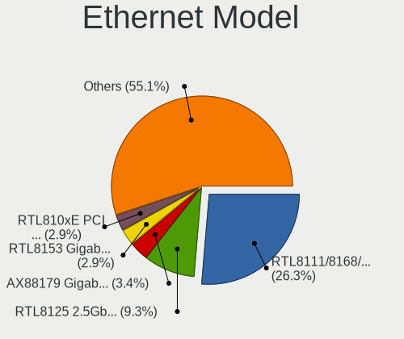

| Model                                                             | Computers | Percent |
|-------------------------------------------------------------------|-----------|---------|
| Realtek RTL8111/8168/8411 PCI Express Gigabit Ethernet Controller | 30        | 24.19%  |
| Intel I211 Gigabit Network Connection                             | 8         | 6.45%   |
| Realtek RTL8153 Gigabit Ethernet Adapter                          | 6         | 4.84%   |
| Realtek RTL810xE PCI Express Fast Ethernet controller             | 6         | 4.84%   |
| Realtek RTL8125 2.5GbE Controller                                 | 5         | 4.03%   |
| Intel Ethernet Controller I225-V                                  | 5         | 4.03%   |
| Intel Ethernet Connection I217-LM                                 | 4         | 3.23%   |
| Intel 82579LM Gigabit Network Connection (Lewisville)             | 4         | 3.23%   |
| Intel Ethernet Connection I219-LM                                 | 3         | 2.42%   |
| Intel Ethernet Connection I218-LM                                 | 3         | 2.42%   |
| Qualcomm Atheros AR8161 Gigabit Ethernet                          | 2         | 1.61%   |
| Intel Ethernet Controller 10-Gigabit X540-AT2                     | 2         | 1.61%   |
| Intel Ethernet Connection I217-V                                  | 2         | 1.61%   |
| Intel Ethernet Connection (2) I219-V                              | 2         | 1.61%   |
| Intel Ethernet Connection (2) I218-V                              | 2         | 1.61%   |
| Intel 82579V Gigabit Network Connection                           | 2         | 1.61%   |
| Broadcom NetXtreme BCM57765 Gigabit Ethernet PCIe                 | 2         | 1.61%   |
| Broadcom NetXtreme BCM5764M Gigabit Ethernet PCIe                 | 2         | 1.61%   |
| ASIX AX88179 Gigabit Ethernet                                     | 2         | 1.61%   |
| Samsung Galaxy series, misc. (tethering mode)                     | 1         | 0.81%   |
| Realtek USB 10/100/1G/2.5G LAN                                    | 1         | 0.81%   |
| Realtek RTL-8100/8101L/8139 PCI Fast Ethernet Adapter             | 1         | 0.81%   |
| Realtek Killer E3000 2.5GbE Controller                            | 1         | 0.81%   |
| Realtek Killer E2600 Gigabit Ethernet Controller                  | 1         | 0.81%   |
| Qualcomm Atheros Killer E220x Gigabit Ethernet Controller         | 1         | 0.81%   |
| Qualcomm Atheros AR8151 v2.0 Gigabit Ethernet                     | 1         | 0.81%   |
| Qualcomm Atheros AR8132 Fast Ethernet                             | 1         | 0.81%   |
| Nvidia MCP79 Ethernet                                             | 1         | 0.81%   |
| Marvell Group 88E8058 PCI-E Gigabit Ethernet Controller           | 1         | 0.81%   |
| Marvell Group 88E8056 PCI-E Gigabit Ethernet Controller           | 1         | 0.81%   |
| Intel I210 Gigabit Network Connection                             | 1         | 0.81%   |
| Intel Ethernet Connection (7) I219-V                              | 1         | 0.81%   |
| Intel Ethernet Connection (5) I219-LM                             | 1         | 0.81%   |
| Intel Ethernet Connection (3) I218-LM                             | 1         | 0.81%   |
| Intel Ethernet Connection (2) I218-LM                             | 1         | 0.81%   |
| Intel Ethernet Connection (16) I219-V                             | 1         | 0.81%   |
| Intel 82599 10 Gigabit Network Connection                         | 1         | 0.81%   |
| Intel 82583V Gigabit Network Connection                           | 1         | 0.81%   |
| Intel 82576 Gigabit Network Connection                            | 1         | 0.81%   |
| Intel 82574L Gigabit Network Connection                           | 1         | 0.81%   |

Net Controller Kind
-------------------

Ethernet, WiFi or modem

| Kind     | Computers | Percent |
|----------|-----------|---------|
| Ethernet | 108       | 51.18%  |
| WiFi     | 99        | 46.92%  |
| Modem    | 3         | 1.42%   |
| Unknown  | 1         | 0.47%   |

Used Controller
---------------

Currently used network controller

| Kind     | Computers | Percent |
|----------|-----------|---------|
| WiFi     | 71        | 52.59%  |
| Ethernet | 64        | 47.41%  |

NICs
----

Total network controllers on board

| Total | Computers | Percent |
|-------|-----------|---------|
| 2     | 72        | 56.25%  |
| 1     | 45        | 35.16%  |
| 4     | 4         | 3.13%   |
| 3     | 4         | 3.13%   |
| 0     | 3         | 2.34%   |

IPv6
----

IPv6 vs IPv4

| Used | Computers | Percent |
|------|-----------|---------|
| No   | 104       | 81.25%  |
| Yes  | 24        | 18.75%  |

Bluetooth
---------

Bluetooth Vendor
----------------

Controller vendors

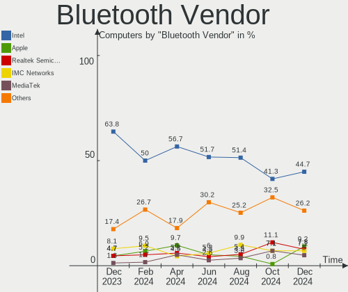

| Vendor                          | Computers | Percent |
|---------------------------------|-----------|---------|
| Intel                           | 50        | 56.18%  |
| Realtek Semiconductor           | 7         | 7.87%   |
| Apple                           | 7         | 7.87%   |
| Qualcomm Atheros Communications | 5         | 5.62%   |
| Cambridge Silicon Radio         | 5         | 5.62%   |
| Broadcom                        | 5         | 5.62%   |
| IMC Networks                    | 4         | 4.49%   |
| Foxconn / Hon Hai               | 2         | 2.25%   |
| Lite-On Technology              | 1         | 1.12%   |
| Dynex                           | 1         | 1.12%   |
| Dell                            | 1         | 1.12%   |
| ASUSTek Computer                | 1         | 1.12%   |

Bluetooth Model
---------------

Controller models

| Model                                                    | Computers | Percent |
|----------------------------------------------------------|-----------|---------|
| Intel Bluetooth wireless interface                       | 17        | 19.1%   |
| Intel AX200 Bluetooth                                    | 15        | 16.85%  |
| Cambridge Silicon Radio Bluetooth Dongle (HCI mode)      | 5         | 5.62%   |
| Realtek Bluetooth Radio                                  | 4         | 4.49%   |
| Intel AX201 Bluetooth                                    | 4         | 4.49%   |
| IMC Networks Bluetooth Radio                             | 4         | 4.49%   |
| Apple Bluetooth Host Controller                          | 4         | 4.49%   |
| Intel Centrino Bluetooth Wireless Transceiver            | 3         | 3.37%   |
| Intel Bluetooth Device                                   | 3         | 3.37%   |
| Intel Bluetooth 9460/9560 Jefferson Peak (JfP)           | 3         | 3.37%   |
| Intel AX210 Bluetooth                                    | 3         | 3.37%   |
| Qualcomm Atheros  Bluetooth Device                       | 2         | 2.25%   |
| Qualcomm Atheros AR3012 Bluetooth 4.0                    | 2         | 2.25%   |
| Intel Wireless-AC 3168 Bluetooth                         | 2         | 2.25%   |
| Broadcom HP Portable Bumble Bee                          | 2         | 2.25%   |
| Apple Bluetooth USB Host Controller                      | 2         | 2.25%   |
| Realtek RTL8822BE Bluetooth 4.2 Adapter                  | 1         | 1.12%   |
| Realtek RTL8821A Bluetooth                               | 1         | 1.12%   |
| Realtek  Bluetooth 4.2 Adapter                           | 1         | 1.12%   |
| Qualcomm Atheros QCA61x4 Bluetooth 4.0                   | 1         | 1.12%   |
| Lite-On Bluetooth Device                                 | 1         | 1.12%   |
| Foxconn / Hon Hai Wireless_Device                        | 1         | 1.12%   |
| Foxconn / Hon Hai BCM20702A0                             | 1         | 1.12%   |
| Dynex Bluetooth 4.0 Adapter [Broadcom, 1.12, BCM20702A0] | 1         | 1.12%   |
| Dell Broadcom BCM20702A0 Bluetooth                       | 1         | 1.12%   |
| Broadcom BCM43142A0 Bluetooth 4.0                        | 1         | 1.12%   |
| Broadcom BCM20702A0 Bluetooth 4.0                        | 1         | 1.12%   |
| Broadcom BCM2045B (BDC-2.1) [Bluetooth Controller]       | 1         | 1.12%   |
| ASUS Broadcom BCM20702 Single-Chip Bluetooth 4.0 + LE    | 1         | 1.12%   |
| Apple Bluetooth HCI                                      | 1         | 1.12%   |

Sound
-----

Sound Vendor
------------

Sound card vendors

| Vendor              | Computers | Percent |
|---------------------|-----------|---------|
| Intel               | 85        | 46.96%  |
| AMD                 | 42        | 23.2%   |
| Nvidia              | 34        | 18.78%  |
| Creative Labs       | 2         | 1.1%    |
| C-Media Electronics | 2         | 1.1%    |
| Blue Microphones    | 2         | 1.1%    |
| Samson Technologies | 1         | 0.55%   |
| RODE Microphones    | 1         | 0.55%   |
| NAD Electronics     | 1         | 0.55%   |
| Logitech            | 1         | 0.55%   |
| KTMicro             | 1         | 0.55%   |
| JMTek               | 1         | 0.55%   |
| Hewlett-Packard     | 1         | 0.55%   |
| GN Netcom           | 1         | 0.55%   |
| Focusrite-Novation  | 1         | 0.55%   |
| EVGA                | 1         | 0.55%   |
| Drop                | 1         | 0.55%   |
| Creative Technology | 1         | 0.55%   |
| Chicony Electronics | 1         | 0.55%   |
| ASUSTek Computer    | 1         | 0.55%   |

Sound Model
-----------

Sound card models

| Model                                                                      | Computers | Percent |
|----------------------------------------------------------------------------|-----------|---------|
| Intel Sunrise Point-LP HD Audio                                            | 12        | 5.56%   |
| Intel 8 Series/C220 Series Chipset High Definition Audio Controller        | 11        | 5.09%   |
| Intel 7 Series/C216 Chipset Family High Definition Audio Controller        | 11        | 5.09%   |
| Intel Xeon E3-1200 v3/4th Gen Core Processor HD Audio Controller           | 10        | 4.63%   |
| AMD Family 17h (Models 00h-0fh) HD Audio Controller                        | 7         | 3.24%   |
| AMD Starship/Matisse HD Audio Controller                                   | 6         | 2.78%   |
| AMD Family 17h/19h HD Audio Controller                                     | 5         | 2.31%   |
| Nvidia TU104 HD Audio Controller                                           | 4         | 1.85%   |
| Intel Tiger Lake-LP Smart Sound Technology Audio Controller                | 4         | 1.85%   |
| Intel Celeron/Pentium Silver Processor High Definition Audio               | 4         | 1.85%   |
| Intel Alder Lake PCH-P High Definition Audio Controller                    | 4         | 1.85%   |
| Intel 82801I (ICH9 Family) HD Audio Controller                             | 4         | 1.85%   |
| Intel 6 Series/C200 Series Chipset Family High Definition Audio Controller | 4         | 1.85%   |
| AMD SBx00 Azalia (Intel HDA)                                               | 4         | 1.85%   |
| AMD Ellesmere HDMI Audio [Radeon RX 470/480 / 570/580/590]                 | 4         | 1.85%   |
| Nvidia TU116 High Definition Audio Controller                              | 3         | 1.39%   |
| Nvidia GP104 High Definition Audio Controller                              | 3         | 1.39%   |
| Nvidia GA106 High Definition Audio Controller                              | 3         | 1.39%   |
| Intel NM10/ICH7 Family High Definition Audio Controller                    | 3         | 1.39%   |
| Intel Haswell-ULT HD Audio Controller                                      | 3         | 1.39%   |
| Intel 8 Series HD Audio Controller                                         | 3         | 1.39%   |
| Intel 5 Series/3400 Series Chipset High Definition Audio                   | 3         | 1.39%   |
| Intel 200 Series PCH HD Audio                                              | 3         | 1.39%   |
| AMD Renoir Radeon High Definition Audio Controller                         | 3         | 1.39%   |
| AMD Rembrandt Radeon High Definition Audio Controller                      | 3         | 1.39%   |
| AMD Oland/Hainan/Cape Verde/Pitcairn HDMI Audio [Radeon HD 7000 Series]    | 3         | 1.39%   |
| AMD Navi 21/23 HDMI/DP Audio Controller                                    | 3         | 1.39%   |
| AMD Navi 10 HDMI Audio                                                     | 3         | 1.39%   |
| AMD Family 15h (Models 60h-6fh) Audio Controller                           | 3         | 1.39%   |
| AMD Baffin HDMI/DP Audio [Radeon RX 550 640SP / RX 560/560X]               | 3         | 1.39%   |
| Nvidia TU107 GeForce GTX 1650 High Definition Audio Controller             | 2         | 0.93%   |
| Nvidia GT216 HDMI Audio Controller                                         | 2         | 0.93%   |
| Nvidia GP107GL High Definition Audio Controller                            | 2         | 0.93%   |
| Nvidia GM107 High Definition Audio Controller [GeForce 940MX]              | 2         | 0.93%   |
| Nvidia GK107 HDMI Audio Controller                                         | 2         | 0.93%   |
| Nvidia GK104 HDMI Audio Controller                                         | 2         | 0.93%   |
| Nvidia GF108 High Definition Audio Controller                              | 2         | 0.93%   |
| Intel Cannon Lake PCH cAVS                                                 | 2         | 0.93%   |
| Intel C610/X99 series chipset HD Audio Controller                          | 2         | 0.93%   |
| Intel 82801H (ICH8 Family) HD Audio Controller                             | 2         | 0.93%   |

Memory
------

Memory Vendor
-------------

Memory module vendors

| Vendor              | Computers | Percent |
|---------------------|-----------|---------|
| Samsung Electronics | 19        | 26.03%  |
| SK hynix            | 14        | 19.18%  |
| Micron Technology   | 6         | 8.22%   |
| Corsair             | 6         | 8.22%   |
| Unknown             | 5         | 6.85%   |
| Kingston            | 5         | 6.85%   |
| G.Skill             | 5         | 6.85%   |
| Crucial             | 2         | 2.74%   |
| Unknown             | 2         | 2.74%   |
| Unknown (ABCD)      | 1         | 1.37%   |
| Unknown (0x0080)    | 1         | 1.37%   |
| Ramaxel Technology  | 1         | 1.37%   |
| Patriot             | 1         | 1.37%   |
| Melco               | 1         | 1.37%   |
| Hewlett-Packard     | 1         | 1.37%   |
| Elpida              | 1         | 1.37%   |
| Apacer              | 1         | 1.37%   |
| A-DATA Technology   | 1         | 1.37%   |

Memory Model
------------

Memory module models

| Model                                                        | Computers | Percent |
|--------------------------------------------------------------|-----------|---------|
| Unknown                                                      | 2         | 2.63%   |
| Unknown RAM Module 8GB SODIMM DDR3 1600MT/s                  | 1         | 1.32%   |
| Unknown RAM Module 8GB DIMM 1600MT/s                         | 1         | 1.32%   |
| Unknown RAM Module 4GB DIMM DDR3 1600MT/s                    | 1         | 1.32%   |
| Unknown RAM Module 2GB SODIMM DDR2 667MT/s                   | 1         | 1.32%   |
| Unknown RAM Module 1GB SODIMM DRAM                           | 1         | 1.32%   |
| Unknown RAM Module 1GB SODIMM DDR2 667MT/s                   | 1         | 1.32%   |
| Unknown (ABCD) RAM 123456789012345678 8GB DIMM DDR4 2400MT/s | 1         | 1.32%   |
| Unknown (0x0080) RAM Module 4GB SODIMM DDR3 1067MT/s         | 1         | 1.32%   |
| SK hynix RAM Module 8GB DIMM DDR3 1600MT/s                   | 1         | 1.32%   |
| SK hynix RAM Module 4GB SODIMM DDR4 2400MT/s                 | 1         | 1.32%   |
| SK hynix RAM Module 2GB SODIMM DDR3 1600MT/s                 | 1         | 1.32%   |
| SK hynix RAM Module 16GB DIMM DDR3 1600MT/s                  | 1         | 1.32%   |
| SK hynix RAM HMT851S6AMR6A-PB 4GB Chip DDR3 1600MT/s         | 1         | 1.32%   |
| SK hynix RAM HMT41GU6AFR8C-PB 8GB DIMM DDR3 1600MT/s         | 1         | 1.32%   |
| SK hynix RAM HMT41GS6AFR8A-PB 8GB SODIMM DDR3 1600MT/s       | 1         | 1.32%   |
| SK hynix RAM HMT41GR7AFR4A-PB 8192MB DIMM DDR3 1600MT/s      | 1         | 1.32%   |
| SK hynix RAM HMT351U6CFR8C-H9 4096MB DIMM DDR3 1600MT/s      | 1         | 1.32%   |
| SK hynix RAM HMT351S6EFR8A-PB 4GB SODIMM DDR3 1600MT/s       | 1         | 1.32%   |
| SK hynix RAM HMA851S6DJR6N-XN 4GB SODIMM DDR4 3200MT/s       | 1         | 1.32%   |
| SK hynix RAM HMA81GS6AFR8N-UH 8GB SODIMM DDR4 2667MT/s       | 1         | 1.32%   |
| SK hynix RAM HMA41GR7AFR8N-UH 8GB DIMM DDR4 2400MT/s         | 1         | 1.32%   |
| SK hynix RAM H9HCNNN8KUMLHR-NME 1GB LPDDR4 2400MT/s          | 1         | 1.32%   |
| Samsung RAM UBE3D4AA-MGCR 8GB Row Of Chips LPDDR4 4267MT/s   | 1         | 1.32%   |
| Samsung RAM U6E3S4AA-MGCR 4GB Row Of Chips LPDDR4 4267MT/s   | 1         | 1.32%   |
| Samsung RAM Module 16GB DIMM DDR3 1600MT/s                   | 1         | 1.32%   |
| Samsung RAM M471B5273DH0-YK0 4GB SODIMM DDR3 1600MT/s        | 1         | 1.32%   |
| Samsung RAM M471B5273DH0-CH9 4GB SODIMM DDR3 1334MT/s        | 1         | 1.32%   |
| Samsung RAM M471B5173EB0-YK0 4GB SODIMM DDR3 1600MT/s        | 1         | 1.32%   |
| Samsung RAM M471B2874EH1-CF8 1GB SODIMM DDR3 1067MT/s        | 1         | 1.32%   |
| Samsung RAM M471B1G73DB0-YK0 8GB SODIMM DDR3 1600MT/s        | 1         | 1.32%   |
| Samsung RAM M471A5244CB0-CWE 4GB Row Of Chips DDR4 3200MT/s  | 1         | 1.32%   |
| Samsung RAM M471A5244CB0-CTD 4GB SODIMM DDR4 3266MT/s        | 1         | 1.32%   |
| Samsung RAM M471A2G44BM0-CWE 16GB SODIMM DDR4 3200MT/s       | 1         | 1.32%   |
| Samsung RAM M471A1K43CB1-CTD 8GB SODIMM DDR4 2667MT/s        | 1         | 1.32%   |
| Samsung RAM M471A1G44BB0-CWE 8GB SODIMM DDR4 3200MT/s        | 1         | 1.32%   |
| Samsung RAM M471A1G44AB0-CWE 8GB Row Of Chips DDR4 3200MT/s  | 1         | 1.32%   |
| Samsung RAM M4 70T5663QZ3-CE6 2GB SODIMM DDR2 667MT/s        | 1         | 1.32%   |
| Samsung RAM M393B2G70DB0-YK0 16GB DIMM DDR3 1600MT/s         | 1         | 1.32%   |
| Samsung RAM M378B5773DH0-CH9 2GB DIMM DDR3 1333MT/s          | 1         | 1.32%   |

Memory Kind
-----------

Memory module kinds

| Kind    | Computers | Percent |
|---------|-----------|---------|
| DDR3    | 31        | 46.97%  |
| DDR4    | 18        | 27.27%  |
| LPDDR4  | 6         | 9.09%   |
| DDR2    | 3         | 4.55%   |
| SDRAM   | 2         | 3.03%   |
| LPDDR3  | 2         | 3.03%   |
| Unknown | 2         | 3.03%   |
| DRAM    | 1         | 1.52%   |
| DDR5    | 1         | 1.52%   |

Memory Form Factor
------------------

Physical design of the memory module

| Name         | Computers | Percent |
|--------------|-----------|---------|
| SODIMM       | 28        | 43.08%  |
| DIMM         | 27        | 41.54%  |
| Row Of Chips | 7         | 10.77%  |
| Unknown      | 2         | 3.08%   |
| Chip         | 1         | 1.54%   |

Memory Size
-----------

Memory module size

| Size  | Computers | Percent |
|-------|-----------|---------|
| 8192  | 26        | 36.62%  |
| 4096  | 21        | 29.58%  |
| 16384 | 11        | 15.49%  |
| 2048  | 7         | 9.86%   |
| 1024  | 5         | 7.04%   |
| 32768 | 1         | 1.41%   |

Memory Speed
------------

Memory module speed

| Speed   | Computers | Percent |
|---------|-----------|---------|
| 1600    | 25        | 37.31%  |
| 3200    | 7         | 10.45%  |
| 2400    | 6         | 8.96%   |
| 2667    | 4         | 5.97%   |
| 2133    | 4         | 5.97%   |
| 4267    | 3         | 4.48%   |
| 1067    | 3         | 4.48%   |
| 667     | 3         | 4.48%   |
| 1867    | 2         | 2.99%   |
| 1333    | 2         | 2.99%   |
| 6400    | 1         | 1.49%   |
| 4800    | 1         | 1.49%   |
| 3600    | 1         | 1.49%   |
| 3466    | 1         | 1.49%   |
| 3266    | 1         | 1.49%   |
| 2933    | 1         | 1.49%   |
| 1334    | 1         | 1.49%   |
| Unknown | 1         | 1.49%   |

Printers & scanners
-------------------

Printer Vendor
--------------

Printer device vendors

| Vendor             | Computers | Percent |
|--------------------|-----------|---------|
| Hewlett-Packard    | 1         | 33.33%  |
| Canon              | 1         | 33.33%  |
| Brother Industries | 1         | 33.33%  |

Printer Model
-------------

Printer device models

| Model              | Computers | Percent |
|--------------------|-----------|---------|
| HP LaserJet 4250   | 1         | 33.33%  |
| Canon MF3010       | 1         | 33.33%  |
| Brother MFC-J450DW | 1         | 33.33%  |

Scanner Vendor
--------------

Scanner device vendors

Zero info for selected period =(

Scanner Model
-------------

Scanner device models

Zero info for selected period =(

Camera
------

Camera Vendor
-------------

Camera device vendors

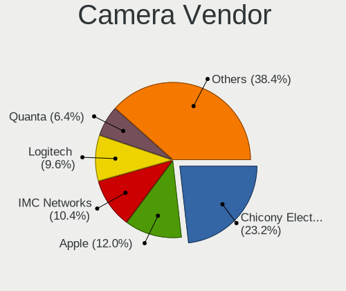

| Vendor                                 | Computers | Percent |
|----------------------------------------|-----------|---------|
| Chicony Electronics                    | 18        | 24.32%  |
| Apple                                  | 8         | 10.81%  |
| Acer                                   | 7         | 9.46%   |
| Microdia                               | 6         | 8.11%   |
| IMC Networks                           | 6         | 8.11%   |
| Realtek Semiconductor                  | 5         | 6.76%   |
| Logitech                               | 5         | 6.76%   |
| Cheng Uei Precision Industry (Foxlink) | 3         | 4.05%   |
| Razer USA                              | 2         | 2.7%    |
| Quanta                                 | 2         | 2.7%    |
| Z-Star Microelectronics                | 1         | 1.35%   |
| WaveRider Communications               | 1         | 1.35%   |
| Unknown                                | 1         | 1.35%   |
| Syntek                                 | 1         | 1.35%   |
| Suyin                                  | 1         | 1.35%   |
| Sunplus Innovation Technology          | 1         | 1.35%   |
| Silicon Motion                         | 1         | 1.35%   |
| Microsoft                              | 1         | 1.35%   |
| MacroSilicon                           | 1         | 1.35%   |
| Lite-On Technology                     | 1         | 1.35%   |
| LG Electronics                         | 1         | 1.35%   |
| Generalplus Technology                 | 1         | 1.35%   |

Camera Model
------------

Camera device models

| Model                                                 | Computers | Percent |
|-------------------------------------------------------|-----------|---------|
| IMC Networks USB2.0 HD UVC WebCam                     | 4         | 5.33%   |
| Chicony integrated camera                             | 4         | 5.33%   |
| Apple Built-in iSight                                 | 4         | 5.33%   |
| Razer USA Gaming Webcam [Kiyo]                        | 2         | 2.67%   |
| Logitech HD Pro Webcam C920                           | 2         | 2.67%   |
| Chicony HP TrueVision HD Camera                       | 2         | 2.67%   |
| Chicony HD WebCam                                     | 2         | 2.67%   |
| Apple FaceTime HD Camera                              | 2         | 2.67%   |
| Acer HD Webcam                                        | 2         | 2.67%   |
| Z-Star Lenovo USB 2.0 UVC Camera                      | 1         | 1.33%   |
| WaveRider USB 2.0 Camera                              | 1         | 1.33%   |
| Unknown 720p HD Camera                                | 1         | 1.33%   |
| Syntek EasyCamera                                     | 1         | 1.33%   |
| Suyin WebCam                                          | 1         | 1.33%   |
| Sunplus Laptop Integrated Webcam HD                   | 1         | 1.33%   |
| Silicon Motion WebCam SC-0311139N                     | 1         | 1.33%   |
| Realtek VGA WebCam                                    | 1         | 1.33%   |
| Realtek USB2.0 HD UVC WebCam                          | 1         | 1.33%   |
| Realtek NexiGo N660P FHD Webcam                       | 1         | 1.33%   |
| Realtek Integrated_Webcam_HD                          | 1         | 1.33%   |
| Realtek HP Truevision HD                              | 1         | 1.33%   |
| Quanta HD User Facing                                 | 1         | 1.33%   |
| Quanta HD Camera                                      | 1         | 1.33%   |
| Microsoft LifeCam Cinema                              | 1         | 1.33%   |
| Microdia USB Live camera                              | 1         | 1.33%   |
| Microdia Sonix USB 2.0 Camera                         | 1         | 1.33%   |
| Microdia Laptop_Integrated_Webcam_FHD                 | 1         | 1.33%   |
| Microdia Integrated_Webcam_HD                         | 1         | 1.33%   |
| Microdia Integrated Webcam                            | 1         | 1.33%   |
| Microdia Dell Integrated HD Webcam                    | 1         | 1.33%   |
| MacroSilicon USB Video                                | 1         | 1.33%   |
| Logitech Webcam C310                                  | 1         | 1.33%   |
| Logitech Webcam C270                                  | 1         | 1.33%   |
| Logitech C922 Pro Stream Webcam                       | 1         | 1.33%   |
| Lite-On HP HD Webcam                                  | 1         | 1.33%   |
| LG LM-X420xxx/G2/G3 Android Phone (MTP/download mode) | 1         | 1.33%   |
| IMC Networks UVC VGA Webcam                           | 1         | 1.33%   |
| IMC Networks Integrated Camera                        | 1         | 1.33%   |
| Generalplus GENERAL WEBCAM                            | 1         | 1.33%   |
| Chicony Webcam                                        | 1         | 1.33%   |

Security
--------

Fingerprint Vendor
------------------

Fingerprint sensor vendors

| Vendor                | Computers | Percent |
|-----------------------|-----------|---------|
| Validity Sensors      | 4         | 44.44%  |
| Elan Microelectronics | 3         | 33.33%  |
| Synaptics             | 2         | 22.22%  |

Fingerprint Model
-----------------

Fingerprint sensor models

| Model                                                       | Computers | Percent |
|-------------------------------------------------------------|-----------|---------|
| Elan ELAN:Fingerprint                                       | 3         | 33.33%  |
| Validity Sensors VFS495 Fingerprint Reader                  | 1         | 11.11%  |
| Validity Sensors VFS 5011 fingerprint sensor                | 1         | 11.11%  |
| Validity Sensors Synaptics VFS7552 Touch Fingerprint Sensor | 1         | 11.11%  |
| Validity Sensors Swipe Fingerprint Sensor                   | 1         | 11.11%  |
| Synaptics  WBDI                                             | 1         | 11.11%  |
| Unknown                                                     | 1         | 11.11%  |

Chipcard Vendor
---------------

Chipcard module vendors

| Vendor      | Computers | Percent |
|-------------|-----------|---------|
| Broadcom    | 3         | 50%     |
| Alcor Micro | 2         | 33.33%  |
| O2 Micro    | 1         | 16.67%  |

Chipcard Model
--------------

Chipcard module models

| Model                                                                        | Computers | Percent |
|------------------------------------------------------------------------------|-----------|---------|
| Alcor Micro AU9540 Smartcard Reader                                          | 2         | 33.33%  |
| O2 Micro OZ776 CCID Smartcard Reader                                         | 1         | 16.67%  |
| Broadcom BCM5880 Secure Applications Processor with fingerprint swipe sensor | 1         | 16.67%  |
| Broadcom BCM5880 Secure Applications Processor                               | 1         | 16.67%  |
| Broadcom 5880                                                                | 1         | 16.67%  |

Unsupported
-----------

Unsupported Devices
-------------------

Total unsupported devices on board

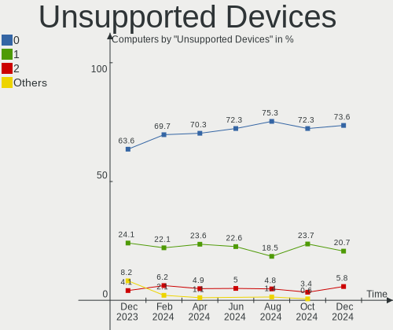

| Total | Computers | Percent |
|-------|-----------|---------|
| 0     | 92        | 71.88%  |
| 1     | 31        | 24.22%  |
| 2     | 5         | 3.91%   |

Unsupported Device Types
------------------------

Types of unsupported devices

| Type                     | Computers | Percent |
|--------------------------|-----------|---------|
| Fingerprint reader       | 9         | 21.95%  |
| Net/wireless             | 6         | 14.63%  |
| Graphics card            | 6         | 14.63%  |
| Chipcard                 | 6         | 14.63%  |
| Multimedia controller    | 5         | 12.2%   |
| Unassigned class         | 2         | 4.88%   |
| Net/ethernet             | 2         | 4.88%   |
| Camera                   | 2         | 4.88%   |
| Sound                    | 1         | 2.44%   |
| Network                  | 1         | 2.44%   |
| Communication controller | 1         | 2.44%   |

