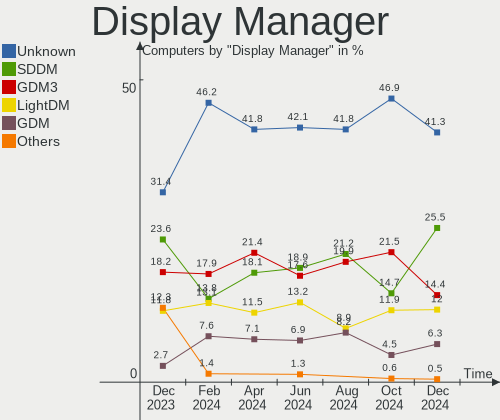
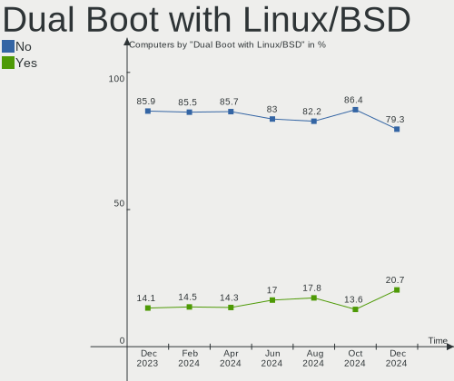
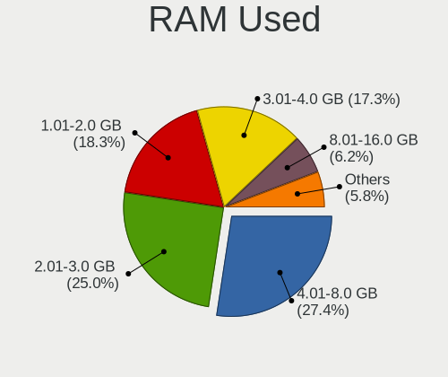
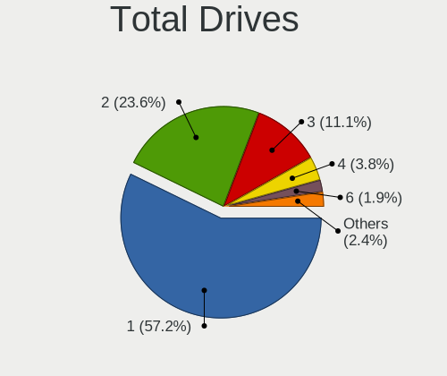
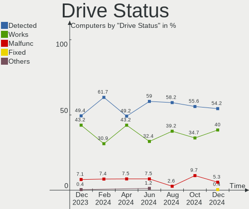
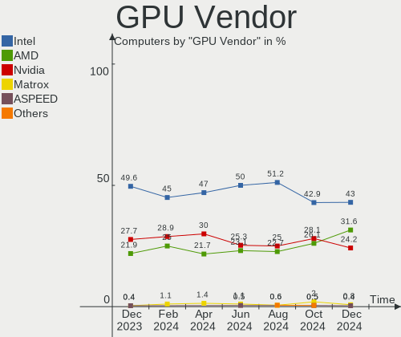
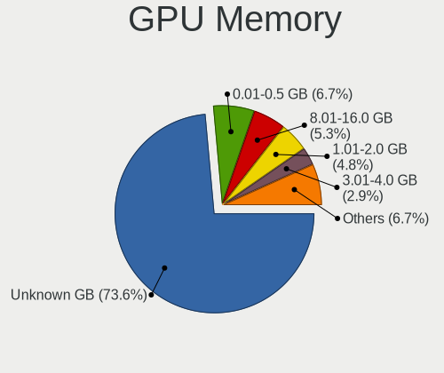
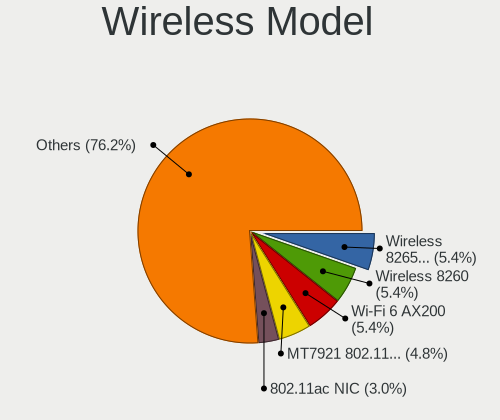
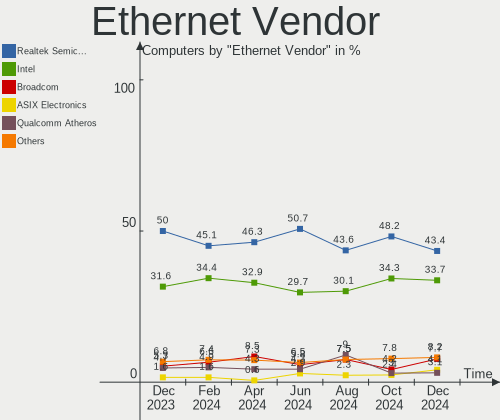
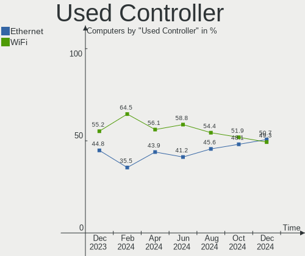

Linux in Canada - Hardware Trends
---------------------------------

A project to identify most popular hardware characteristics and track their change
over time based on data collected by Linux users at https://Linux-Hardware.org.

Anyone can contribute to this report by the [hw-probe](https://github.com/linuxhw/hw-probe) tool:

    sudo -E hw-probe -all -upload

This is a report for all computer types. See also reports for [desktops](/Location/Canada/Desktop/README.md) and [notebooks](/Location/Canada/Notebook/README.md).

Period: Nov, 2022.

Contents
--------

* [ System ](#system)
  - [ OS                       ](#os)
  - [ OS Family                ](#os-family)
  - [ Kernel                   ](#kernel)
  - [ Kernel Family            ](#kernel-family)
  - [ Kernel Major Ver.        ](#kernel-major-ver)
  - [ Arch                     ](#arch)
  - [ DE                       ](#de)
  - [ Display Server           ](#display-server)
  - [ Display Manager          ](#display-manager)
  - [ OS Lang                  ](#os-lang)
  - [ Boot Mode                ](#boot-mode)
  - [ Filesystem               ](#filesystem)
  - [ Part. scheme             ](#part-scheme)
  - [ Dual Boot with Linux/BSD ](#dual-boot-with-linuxbsd)
  - [ Dual Boot (Win)          ](#dual-boot-win)

* [ Board ](#board)
  - [ Vendor                   ](#vendor)
  - [ Model                    ](#model)
  - [ Model Family             ](#model-family)
  - [ MFG Year                 ](#mfg-year)
  - [ Form Factor              ](#form-factor)
  - [ Secure Boot              ](#secure-boot)
  - [ Coreboot                 ](#coreboot)
  - [ RAM Size                 ](#ram-size)
  - [ RAM Used                 ](#ram-used)
  - [ Total Drives             ](#total-drives)
  - [ Has CD-ROM               ](#has-cd-rom)
  - [ Has Ethernet             ](#has-ethernet)
  - [ Has WiFi                 ](#has-wifi)
  - [ Has Bluetooth            ](#has-bluetooth)

* [ Location ](#location)
  - [ Country                  ](#country)
  - [ City                     ](#city)

* [ Drives ](#drives)
  - [ Drive Vendor             ](#drive-vendor)
  - [ Drive Model              ](#drive-model)
  - [ HDD Vendor               ](#hdd-vendor)
  - [ SSD Vendor               ](#ssd-vendor)
  - [ Drive Kind               ](#drive-kind)
  - [ Drive Connector          ](#drive-connector)
  - [ Drive Size               ](#drive-size)
  - [ Space Total              ](#space-total)
  - [ Space Used               ](#space-used)
  - [ Malfunc. Drives          ](#malfunc-drives)
  - [ Malfunc. Drive Vendor    ](#malfunc-drive-vendor)
  - [ Malfunc. HDD Vendor      ](#malfunc-hdd-vendor)
  - [ Malfunc. Drive Kind      ](#malfunc-drive-kind)
  - [ Failed Drives            ](#failed-drives)
  - [ Failed Drive Vendor      ](#failed-drive-vendor)
  - [ Drive Status             ](#drive-status)

* [ Storage controller ](#storage-controller)
  - [ Storage Vendor           ](#storage-vendor)
  - [ Storage Model            ](#storage-model)
  - [ Storage Kind             ](#storage-kind)

* [ Processor ](#processor)
  - [ CPU Vendor               ](#cpu-vendor)
  - [ CPU Model                ](#cpu-model)
  - [ CPU Model Family         ](#cpu-model-family)
  - [ CPU Cores                ](#cpu-cores)
  - [ CPU Sockets              ](#cpu-sockets)
  - [ CPU Threads              ](#cpu-threads)
  - [ CPU Op-Modes             ](#cpu-op-modes)
  - [ CPU Microcode            ](#cpu-microcode)
  - [ CPU Microarch            ](#cpu-microarch)

* [ Graphics ](#graphics)
  - [ GPU Vendor               ](#gpu-vendor)
  - [ GPU Model                ](#gpu-model)
  - [ GPU Combo                ](#gpu-combo)
  - [ GPU Driver               ](#gpu-driver)
  - [ GPU Memory               ](#gpu-memory)

* [ Monitor ](#monitor)
  - [ Monitor Vendor           ](#monitor-vendor)
  - [ Monitor Model            ](#monitor-model)
  - [ Monitor Resolution       ](#monitor-resolution)
  - [ Monitor Diagonal         ](#monitor-diagonal)
  - [ Monitor Width            ](#monitor-width)
  - [ Aspect Ratio             ](#aspect-ratio)
  - [ Monitor Area             ](#monitor-area)
  - [ Pixel Density            ](#pixel-density)
  - [ Multiple Monitors        ](#multiple-monitors)

* [ Network ](#network)
  - [ Net Controller Vendor    ](#net-controller-vendor)
  - [ Net Controller Model     ](#net-controller-model)
  - [ Wireless Vendor          ](#wireless-vendor)
  - [ Wireless Model           ](#wireless-model)
  - [ Ethernet Vendor          ](#ethernet-vendor)
  - [ Ethernet Model           ](#ethernet-model)
  - [ Net Controller Kind      ](#net-controller-kind)
  - [ Used Controller          ](#used-controller)
  - [ NICs                     ](#nics)
  - [ IPv6                     ](#ipv6)

* [ Bluetooth ](#bluetooth)
  - [ Bluetooth Vendor         ](#bluetooth-vendor)
  - [ Bluetooth Model          ](#bluetooth-model)

* [ Sound ](#sound)
  - [ Sound Vendor             ](#sound-vendor)
  - [ Sound Model              ](#sound-model)

* [ Memory ](#memory)
  - [ Memory Vendor            ](#memory-vendor)
  - [ Memory Model             ](#memory-model)
  - [ Memory Kind              ](#memory-kind)
  - [ Memory Form Factor       ](#memory-form-factor)
  - [ Memory Size              ](#memory-size)
  - [ Memory Speed             ](#memory-speed)

* [ Printers & scanners ](#printers--scanners)
  - [ Printer Vendor           ](#printer-vendor)
  - [ Printer Model            ](#printer-model)
  - [ Scanner Vendor           ](#scanner-vendor)
  - [ Scanner Model            ](#scanner-model)

* [ Camera ](#camera)
  - [ Camera Vendor            ](#camera-vendor)
  - [ Camera Model             ](#camera-model)

* [ Security ](#security)
  - [ Fingerprint Vendor       ](#fingerprint-vendor)
  - [ Fingerprint Model        ](#fingerprint-model)
  - [ Chipcard Vendor          ](#chipcard-vendor)
  - [ Chipcard Model           ](#chipcard-model)

* [ Unsupported ](#unsupported)
  - [ Unsupported Devices      ](#unsupported-devices)
  - [ Unsupported Device Types ](#unsupported-device-types)

System
------

OS
--

Installed operating systems

| Name                         | Computers | Percent |
|------------------------------|-----------|---------|
| Ubuntu 22.04                 | 19        | 14.62%  |
| Debian 11                    | 12        | 9.23%   |
| Linux Mint 21                | 11        | 8.46%   |
| Ubuntu 22.10                 | 10        | 7.69%   |
| Pop!_OS 22.04                | 8         | 6.15%   |
| Ubuntu 20.04                 | 7         | 5.38%   |
| Arch Rolling                 | 7         | 5.38%   |
| Zorin 16                     | 4         | 3.08%   |
| OpenMandriva 4.3             | 4         | 3.08%   |
| Fedora 36                    | 4         | 3.08%   |
| EndeavourOS Rolling          | 4         | 3.08%   |
| openSUSE Tumbleweed-XXXXXXXX | 3         | 2.31%   |
| Linux Mint 20.3              | 3         | 2.31%   |
| KDE neon 22.04               | 3         | 2.31%   |
| Ubuntu 18.04                 | 2         | 1.54%   |
| Redcore Rolling              | 2         | 1.54%   |
| OpenMandriva 4.50            | 2         | 1.54%   |
| Manjaro                      | 2         | 1.54%   |
| Kali 2022.3                  | 2         | 1.54%   |
| Fedora 37                    | 2         | 1.54%   |
| ArcoLinux Rolling            | 2         | 1.54%   |
| Xubuntu 22.04                | 1         | 0.77%   |
| Ubuntu MATE 22.04            | 1         | 0.77%   |
| Ubuntu 23.04                 | 1         | 0.77%   |
| Ubuntu 21.04                 | 1         | 0.77%   |
| RHEL 9                       | 1         | 0.77%   |
| Parrot 5.1                   | 1         | 0.77%   |
| MX 21                        | 1         | 0.77%   |
| Lubuntu 22.10                | 1         | 0.77%   |
| Lubuntu 22.04                | 1         | 0.77%   |
| Gentoo 2.9                   | 1         | 0.77%   |
| Gentoo 2.8                   | 1         | 0.77%   |
| Garuda Linux Rolling         | 1         | 0.77%   |
| Feren OS 20.04               | 1         | 0.77%   |
| Elementary 6.1               | 1         | 0.77%   |
| Debian                       | 1         | 0.77%   |
| CentOS 8                     | 1         | 0.77%   |
| CentOS 7                     | 1         | 0.77%   |

OS Family
---------

OS without a version

| Name         | Computers | Percent |
|--------------|-----------|---------|
| Ubuntu       | 40        | 30.77%  |
| Linux Mint   | 14        | 10.77%  |
| Debian       | 13        | 10%     |
| Pop!_OS      | 8         | 6.15%   |
| Arch         | 7         | 5.38%   |
| OpenMandriva | 6         | 4.62%   |
| Fedora       | 6         | 4.62%   |
| Zorin        | 4         | 3.08%   |
| EndeavourOS  | 4         | 3.08%   |
| openSUSE     | 3         | 2.31%   |
| KDE neon     | 3         | 2.31%   |
| Redcore      | 2         | 1.54%   |
| Manjaro      | 2         | 1.54%   |
| Lubuntu      | 2         | 1.54%   |
| Kali         | 2         | 1.54%   |
| Gentoo       | 2         | 1.54%   |
| CentOS       | 2         | 1.54%   |
| ArcoLinux    | 2         | 1.54%   |
| Xubuntu      | 1         | 0.77%   |
| Ubuntu MATE  | 1         | 0.77%   |
| RHEL         | 1         | 0.77%   |
| Parrot       | 1         | 0.77%   |
| MX           | 1         | 0.77%   |
| Garuda Linux | 1         | 0.77%   |
| Feren OS     | 1         | 0.77%   |
| Elementary   | 1         | 0.77%   |

Kernel
------

Version of the Linux kernel

| Version                                | Computers | Percent |
|----------------------------------------|-----------|---------|
| 5.15.0-52-generic                      | 25        | 19.23%  |
| 5.15.0-53-generic                      | 17        | 13.08%  |
| 5.19.0-23-generic                      | 10        | 7.69%   |
| 5.10.0-19-amd64                        | 7         | 5.38%   |
| 6.0.6-76060006-generic                 | 6         | 4.62%   |
| 5.16.7-desktop-1omv4003                | 4         | 3.08%   |
| 6.0.8-zen1-1-zen                       | 3         | 2.31%   |
| 6.0.8-edge                             | 3         | 2.31%   |
| 6.0.9-300.fc37.x86_64                  | 2         | 1.54%   |
| 6.0.6-zen1-1-zen                       | 2         | 1.54%   |
| 6.0.6-arch1-1                          | 2         | 1.54%   |
| 6.0.5-200.fc36.x86_64                  | 2         | 1.54%   |
| 5.4.0-131-generic                      | 2         | 1.54%   |
| 5.19.12-desktop-2omv4090               | 2         | 1.54%   |
| 5.15.71-redcore-lts                    | 2         | 1.54%   |
| 6.0.9-gentoo-x86_64                    | 1         | 0.77%   |
| 6.0.9-arch1-1                          | 1         | 0.77%   |
| 6.0.9-060009-generic                   | 1         | 0.77%   |
| 6.0.8-arch1-1                          | 1         | 0.77%   |
| 6.0.8-1-default                        | 1         | 0.77%   |
| 6.0.7-arch1-1                          | 1         | 0.77%   |
| 6.0.7-200.fc36.x86_64                  | 1         | 0.77%   |
| 6.0.7-1-default                        | 1         | 0.77%   |
| 6.0.6-arch1-1-surface                  | 1         | 0.77%   |
| 6.0.5-zen1-1-zen                       | 1         | 0.77%   |
| 6.0.5-1-default                        | 1         | 0.77%   |
| 6.0.2-76060002-generic                 | 1         | 0.77%   |
| 6.0.10-arch2-1                         | 1         | 0.77%   |
| 6.0.10-1-cachyos                       | 1         | 0.77%   |
| 6.0.0-4-amd64                          | 1         | 0.77%   |
| 6.0.0-2parrot1-amd64                   | 1         | 0.77%   |
| 6.0.0-0.deb11.2-amd64                  | 1         | 0.77%   |
| 5.4.0-132-generic                      | 1         | 0.77%   |
| 5.19.15-xanmod1                        | 1         | 0.77%   |
| 5.19.11-200.fc36.x86_64                | 1         | 0.77%   |
| 5.19.0-kali2-amd64                     | 1         | 0.77%   |
| 5.19.0-24-generic                      | 1         | 0.77%   |
| 5.19.0-21-generic                      | 1         | 0.77%   |
| 5.18.0-kali5-amd64                     | 1         | 0.77%   |
| 5.17.0-rc4-next-20220217-g21d89a4d51a7 | 1         | 0.77%   |

Kernel Family
-------------

Linux kernel without a distro release

| Version  | Computers | Percent |
|----------|-----------|---------|
| 5.15.0   | 45        | 34.62%  |
| 5.19.0   | 13        | 10%     |
| 6.0.6    | 11        | 8.46%   |
| 6.0.8    | 8         | 6.15%   |
| 5.10.0   | 7         | 5.38%   |
| 6.0.9    | 5         | 3.85%   |
| 6.0.5    | 4         | 3.08%   |
| 5.16.7   | 4         | 3.08%   |
| 6.0.7    | 3         | 2.31%   |
| 6.0.0    | 3         | 2.31%   |
| 5.4.0    | 3         | 2.31%   |
| 6.0.10   | 2         | 1.54%   |
| 5.19.12  | 2         | 1.54%   |
| 5.15.71  | 2         | 1.54%   |
| 5.13.0   | 2         | 1.54%   |
| 5.11.0   | 2         | 1.54%   |
| 6.0.2    | 1         | 0.77%   |
| 5.19.15  | 1         | 0.77%   |
| 5.19.11  | 1         | 0.77%   |
| 5.18.0   | 1         | 0.77%   |
| 5.17.0   | 1         | 0.77%   |
| 5.15.78  | 1         | 0.77%   |
| 5.15.76  | 1         | 0.77%   |
| 5.15.41  | 1         | 0.77%   |
| 5.15.30  | 1         | 0.77%   |
| 5.14.0   | 1         | 0.77%   |
| 5.10.148 | 1         | 0.77%   |
| 4.19.187 | 1         | 0.77%   |
| 4.18.0   | 1         | 0.77%   |
| 4.15.0   | 1         | 0.77%   |

Kernel Major Ver.
-----------------

Linux kernel major version

| Version | Computers | Percent |
|---------|-----------|---------|
| 5.15    | 51        | 39.23%  |
| 6.0     | 37        | 28.46%  |
| 5.19    | 17        | 13.08%  |
| 5.10    | 8         | 6.15%   |
| 5.16    | 4         | 3.08%   |
| 5.4     | 3         | 2.31%   |
| 5.13    | 2         | 1.54%   |
| 5.11    | 2         | 1.54%   |
| 5.18    | 1         | 0.77%   |
| 5.17    | 1         | 0.77%   |
| 5.14    | 1         | 0.77%   |
| 4.19    | 1         | 0.77%   |
| 4.18    | 1         | 0.77%   |
| 4.15    | 1         | 0.77%   |

Arch
----

OS architecture (x86_64, i586, etc.)

| Name    | Computers | Percent |
|---------|-----------|---------|
| x86_64  | 127       | 97.69%  |
| i686    | 1         | 0.77%   |
| armv7l  | 1         | 0.77%   |
| aarch64 | 1         | 0.77%   |

DE
--

Desktop Environment

| Name            | Computers | Percent |
|-----------------|-----------|---------|
| GNOME           | 62        | 47.69%  |
| KDE5            | 24        | 18.46%  |
| X-Cinnamon      | 13        | 10%     |
| Unknown         | 11        | 8.46%   |
| XFCE            | 6         | 4.62%   |
| MATE            | 3         | 2.31%   |
| LXQt            | 2         | 1.54%   |
| xmonad          | 1         | 0.77%   |
| sway            | 1         | 0.77%   |
| Pantheon        | 1         | 0.77%   |
| KDE4            | 1         | 0.77%   |
| i3              | 1         | 0.77%   |
| Hyprland        | 1         | 0.77%   |
| GNOME Flashback | 1         | 0.77%   |
| Deepin          | 1         | 0.77%   |
| awesome         | 1         | 0.77%   |

Display Server
--------------

X11 or Wayland

| Name    | Computers | Percent |
|---------|-----------|---------|
| X11     | 82        | 63.08%  |
| Wayland | 37        | 28.46%  |
| Tty     | 8         | 6.15%   |
| Unknown | 3         | 2.31%   |

Display Manager
---------------

SDDM, LightDM, etc.

| Name    | Computers | Percent |
|---------|-----------|---------|
| Unknown | 54        | 41.54%  |
| GDM3    | 29        | 22.31%  |
| SDDM    | 17        | 13.08%  |
| LightDM | 15        | 11.54%  |
| GDM     | 10        | 7.69%   |
| Ly      | 3         | 2.31%   |
| XDM     | 1         | 0.77%   |
| GREETD  | 1         | 0.77%   |

OS Lang
-------

Language

| Lang    | Computers | Percent |
|---------|-----------|---------|
| en_CA   | 68        | 52.31%  |
| en_US   | 44        | 33.85%  |
| fr_CA   | 12        | 9.23%   |
| Unknown | 3         | 2.31%   |
| en_GB   | 2         | 1.54%   |
| zh_TW   | 1         | 0.77%   |

Boot Mode
---------

EFI or BIOS

| Mode | Computers | Percent |
|------|-----------|---------|
| EFI  | 66        | 50.77%  |
| BIOS | 64        | 49.23%  |

Filesystem
----------

Type of filesystem

| Type    | Computers | Percent |
|---------|-----------|---------|
| Ext4    | 103       | 79.23%  |
| Btrfs   | 16        | 12.31%  |
| Overlay | 6         | 4.62%   |
| Xfs     | 3         | 2.31%   |
| Zfs     | 1         | 0.77%   |
| Ext3    | 1         | 0.77%   |

Part. scheme
------------

Scheme of partitioning

| Type    | Computers | Percent |
|---------|-----------|---------|
| GPT     | 76        | 58.46%  |
| Unknown | 41        | 31.54%  |
| MBR     | 13        | 10%     |

Dual Boot with Linux/BSD
------------------------

Hosting more than one Linux/BSD

| Dual boot | Computers | Percent |
|-----------|-----------|---------|
| No        | 113       | 86.92%  |
| Yes       | 17        | 13.08%  |

Dual Boot (Win)
---------------

Hosting Linux and Windows

| Dual boot | Computers | Percent |
|-----------|-----------|---------|
| No        | 95        | 73.08%  |
| Yes       | 35        | 26.92%  |

Board
-----

Vendor
------

Motherboard manufacturer

| Name                    | Computers | Percent |
|-------------------------|-----------|---------|
| ASUSTek Computer        | 30        | 23.08%  |
| Dell                    | 19        | 14.62%  |
| Hewlett-Packard         | 17        | 13.08%  |
| Lenovo                  | 12        | 9.23%   |
| MSI                     | 9         | 6.92%   |
| Gigabyte Technology     | 9         | 6.92%   |
| ASRock                  | 5         | 3.85%   |
| Apple                   | 5         | 3.85%   |
| Acer                    | 5         | 3.85%   |
| Toshiba                 | 3         | 2.31%   |
| Microsoft               | 2         | 1.54%   |
| Google                  | 2         | 1.54%   |
| AZW                     | 2         | 1.54%   |
| ZOTAC                   | 1         | 0.77%   |
| Timi                    | 1         | 0.77%   |
| Sony                    | 1         | 0.77%   |
| ReachingTech            | 1         | 0.77%   |
| Razer                   | 1         | 0.77%   |
| Raspberry Pi Foundation | 1         | 0.77%   |
| Pegatron                | 1         | 0.77%   |
| Alienware               | 1         | 0.77%   |
| Acidanthera             | 1         | 0.77%   |
| Unknown                 | 1         | 0.77%   |

Model
-----

Motherboard model

| Name                                       | Computers | Percent |
|--------------------------------------------|-----------|---------|
| MSI MS-7C95                                | 2         | 1.54%   |
| Gigabyte 990FXA-UD3                        | 2         | 1.54%   |
| ASUS P8Z68 DELUXE/GEN3                     | 2         | 1.54%   |
| ZOTAC ZBOX-MI522NANO/MI542NANO             | 1         | 0.77%   |
| Toshiba TECRA R940                         | 1         | 0.77%   |
| Toshiba Satellite A200                     | 1         | 0.77%   |
| Toshiba PORTEGE R930                       | 1         | 0.77%   |
| Timi RedmiBook Pro 15                      | 1         | 0.77%   |
| Sony VGN-NS110E                            | 1         | 0.77%   |
| ReachingTech Dream Quest Office 2021       | 1         | 0.77%   |
| Razer Blade Stealth                        | 1         | 0.77%   |
| RPi Raspberry Pi 4 Model B Rev 1.1         | 1         | 0.77%   |
| Pegatron 600-1352                          | 1         | 0.77%   |
| MSI MS-7C94                                | 1         | 0.77%   |
| MSI MS-7C91                                | 1         | 0.77%   |
| MSI MS-7B89                                | 1         | 0.77%   |
| MSI MS-7B79                                | 1         | 0.77%   |
| MSI MS-7A37                                | 1         | 0.77%   |
| MSI MS-7599                                | 1         | 0.77%   |
| MSI GF75 Thin 9SC                          | 1         | 0.77%   |
| Microsoft Surface Laptop Go                | 1         | 0.77%   |
| Microsoft Surface 2                        | 1         | 0.77%   |
| Lenovo Y520-15IKBA 80WY                    | 1         | 0.77%   |
| Lenovo ThinkStation P910 30B8S0EN00        | 1         | 0.77%   |
| Lenovo ThinkPad T495 20NKS01W02            | 1         | 0.77%   |
| Lenovo ThinkPad T480 20L6S09E00            | 1         | 0.77%   |
| Lenovo ThinkPad T470p 20J6CTO1WW           | 1         | 0.77%   |
| Lenovo ThinkPad T420 4236V6S               | 1         | 0.77%   |
| Lenovo ThinkPad T14 Gen 1 20UDCTO1WW       | 1         | 0.77%   |
| Lenovo ThinkPad L490 20Q5CTO1WW            | 1         | 0.77%   |
| Lenovo ThinkCentre M91p 4518RS8            | 1         | 0.77%   |
| Lenovo Legion 5 Pro 16ACH6H 82JQ           | 1         | 0.77%   |
| Lenovo IdeaPad 5 15ALC05 82LN              | 1         | 0.77%   |
| Lenovo IdeaCentre AIO 300-23ACL F0BC0018CF | 1         | 0.77%   |
| HP ZBook 15 G4                             | 1         | 0.77%   |
| HP Z440 Workstation                        | 1         | 0.77%   |
| HP Z420 Workstation                        | 1         | 0.77%   |
| HP Z400 Workstation                        | 1         | 0.77%   |
| HP Victus by Laptop 16-d0xxx               | 1         | 0.77%   |
| HP ProBook 650 G1                          | 1         | 0.77%   |

Model Family
------------

Motherboard model prefix

| Name                 | Computers | Percent |
|----------------------|-----------|---------|
| Lenovo ThinkPad      | 6         | 4.62%   |
| Dell Inspiron        | 5         | 3.85%   |
| ASUS ROG             | 5         | 3.85%   |
| ASUS PRIME           | 5         | 3.85%   |
| Dell OptiPlex        | 4         | 3.08%   |
| Dell Latitude        | 4         | 3.08%   |
| Acer Aspire          | 3         | 2.31%   |
| MSI MS-7C95          | 2         | 1.54%   |
| Microsoft Surface    | 2         | 1.54%   |
| HP ProBook           | 2         | 1.54%   |
| HP Pavilion          | 2         | 1.54%   |
| HP Laptop            | 2         | 1.54%   |
| HP EliteDesk         | 2         | 1.54%   |
| Gigabyte 990FXA-UD3  | 2         | 1.54%   |
| Dell XPS             | 2         | 1.54%   |
| Dell Precision       | 2         | 1.54%   |
| ASUS ZenBook         | 2         | 1.54%   |
| ASUS P8Z68           | 2         | 1.54%   |
| ASUS P8H77-M         | 2         | 1.54%   |
| ASUS P8H61-M         | 2         | 1.54%   |
| ZOTAC ZBOX-MI522NANO | 1         | 0.77%   |
| Toshiba TECRA        | 1         | 0.77%   |
| Toshiba Satellite    | 1         | 0.77%   |
| Toshiba PORTEGE      | 1         | 0.77%   |
| Timi RedmiBook       | 1         | 0.77%   |
| Sony VGN-NS110E      | 1         | 0.77%   |
| ReachingTech Dream   | 1         | 0.77%   |
| Razer Blade          | 1         | 0.77%   |
| RPi Raspberry        | 1         | 0.77%   |
| Pegatron 600-1352    | 1         | 0.77%   |
| MSI MS-7C94          | 1         | 0.77%   |
| MSI MS-7C91          | 1         | 0.77%   |
| MSI MS-7B89          | 1         | 0.77%   |
| MSI MS-7B79          | 1         | 0.77%   |
| MSI MS-7A37          | 1         | 0.77%   |
| MSI MS-7599          | 1         | 0.77%   |
| MSI GF75             | 1         | 0.77%   |
| Lenovo Y520-15IKBA   | 1         | 0.77%   |
| Lenovo ThinkStation  | 1         | 0.77%   |
| Lenovo ThinkCentre   | 1         | 0.77%   |

MFG Year
--------

Motherboard manufacture year

| Year | Computers | Percent |
|------|-----------|---------|
| 2020 | 15        | 11.54%  |
| 2019 | 15        | 11.54%  |
| 2012 | 12        | 9.23%   |
| 2021 | 11        | 8.46%   |
| 2011 | 11        | 8.46%   |
| 2018 | 10        | 7.69%   |
| 2015 | 9         | 6.92%   |
| 2013 | 9         | 6.92%   |
| 2017 | 8         | 6.15%   |
| 2022 | 7         | 5.38%   |
| 2010 | 7         | 5.38%   |
| 2014 | 5         | 3.85%   |
| 2016 | 4         | 3.08%   |
| 2009 | 2         | 1.54%   |
| 2007 | 2         | 1.54%   |
| 2006 | 2         | 1.54%   |
| 2008 | 1         | 0.77%   |

Form Factor
-----------

Physical design of the computer

| Name           | Computers | Percent |
|----------------|-----------|---------|
| Desktop        | 65        | 50%     |
| Notebook       | 57        | 43.85%  |
| All in one     | 3         | 2.31%   |
| Tablet         | 2         | 1.54%   |
| Mini pc        | 2         | 1.54%   |
| System on chip | 1         | 0.77%   |

Secure Boot
-----------

Enabled or disabled

| State    | Computers | Percent |
|----------|-----------|---------|
| Disabled | 119       | 91.54%  |
| Enabled  | 11        | 8.46%   |

Coreboot
--------

Have coreboot on board

| Used | Computers | Percent |
|------|-----------|---------|
| No   | 128       | 98.46%  |
| Yes  | 2         | 1.54%   |

RAM Size
--------

Total RAM memory

| Size in GB  | Computers | Percent |
|-------------|-----------|---------|
| 16.01-24.0  | 38        | 29.23%  |
| 4.01-8.0    | 25        | 19.23%  |
| 32.01-64.0  | 20        | 15.38%  |
| 8.01-16.0   | 19        | 14.62%  |
| 3.01-4.0    | 12        | 9.23%   |
| 64.01-256.0 | 8         | 6.15%   |
| 1.01-2.0    | 4         | 3.08%   |
| 24.01-32.0  | 2         | 1.54%   |
| 2.01-3.0    | 2         | 1.54%   |

RAM Used
--------

Used RAM memory

| Used GB    | Computers | Percent |
|------------|-----------|---------|
| 2.01-3.0   | 39        | 30%     |
| 4.01-8.0   | 28        | 21.54%  |
| 1.01-2.0   | 27        | 20.77%  |
| 3.01-4.0   | 15        | 11.54%  |
| 8.01-16.0  | 10        | 7.69%   |
| 0.51-1.0   | 7         | 5.38%   |
| 32.01-64.0 | 3         | 2.31%   |
| 0.01-0.5   | 1         | 0.77%   |

Total Drives
------------

Number of drives on board

| Drives | Computers | Percent |
|--------|-----------|---------|
| 1      | 63        | 48.46%  |
| 2      | 39        | 30%     |
| 5      | 8         | 6.15%   |
| 4      | 7         | 5.38%   |
| 3      | 7         | 5.38%   |
| 10     | 2         | 1.54%   |
| 12     | 1         | 0.77%   |
| 11     | 1         | 0.77%   |
| 7      | 1         | 0.77%   |
| 0      | 1         | 0.77%   |

Has CD-ROM
----------

Has CD-ROM on board

| Presented | Computers | Percent |
|-----------|-----------|---------|
| No        | 78        | 60%     |
| Yes       | 52        | 40%     |

Has Ethernet
------------

Has Ethernet on board

| Presented | Computers | Percent |
|-----------|-----------|---------|
| Yes       | 115       | 88.46%  |
| No        | 15        | 11.54%  |

Has WiFi
--------

Has WiFi module

| Presented | Computers | Percent |
|-----------|-----------|---------|
| Yes       | 92        | 70.77%  |
| No        | 38        | 29.23%  |

Has Bluetooth
-------------

Has Bluetooth module

| Presented | Computers | Percent |
|-----------|-----------|---------|
| Yes       | 82        | 63.08%  |
| No        | 48        | 36.92%  |

Location
--------

Country
-------

Geographic location (country)

| Country | Computers | Percent |
|---------|-----------|---------|
| Canada  | 130       | 100%    |

City
----

Geographic location (city)

| City                      | Computers | Percent |
|---------------------------|-----------|---------|
| Montreal                  | 14        | 10.77%  |
| Toronto                   | 10        | 7.69%   |
| Ottawa                    | 5         | 3.85%   |
| Edmonton                  | 5         | 3.85%   |
| Calgary                   | 5         | 3.85%   |
| Vancouver                 | 4         | 3.08%   |
| Richmond Hill             | 4         | 3.08%   |
| Laval                     | 4         | 3.08%   |
| Tillsonburg               | 3         | 2.31%   |
| Blainville                | 3         | 2.31%   |
| Winnipeg                  | 2         | 1.54%   |
| Trenton                   | 2         | 1.54%   |
| Sherwood Park             | 2         | 1.54%   |
| Saguenay                  | 2         | 1.54%   |
| Regina                    | 2         | 1.54%   |
| Rawdon                    | 2         | 1.54%   |
| Québec                   | 2         | 1.54%   |
| Oakville                  | 2         | 1.54%   |
| Maple Ridge               | 2         | 1.54%   |
| London                    | 2         | 1.54%   |
| Larouche                  | 2         | 1.54%   |
| Lachine                   | 2         | 1.54%   |
| Kitchener                 | 2         | 1.54%   |
| Kingston                  | 2         | 1.54%   |
| Halifax                   | 2         | 1.54%   |
| Gatineau                  | 2         | 1.54%   |
| Burlington                | 2         | 1.54%   |
| Welland                   | 1         | 0.77%   |
| Waterloo                  | 1         | 0.77%   |
| Victoria                  | 1         | 0.77%   |
| Vanderhoof                | 1         | 0.77%   |
| Surrey                    | 1         | 0.77%   |
| Sherbrooke                | 1         | 0.77%   |
| Saskatoon                 | 1         | 0.77%   |
| Saint-Raymond-de-Portneuf | 1         | 0.77%   |
| Saint-Lambert             | 1         | 0.77%   |
| Saint-Jean-sur-Richelieu  | 1         | 0.77%   |
| Saint-Eustache            | 1         | 0.77%   |
| Saint John                | 1         | 0.77%   |
| Sackville                 | 1         | 0.77%   |

Drives
------

Drive Vendor
------------

Hard drive vendors

| Vendor                      | Computers | Drives | Percent |
|-----------------------------|-----------|--------|---------|
| WDC                         | 40        | 57     | 17.47%  |
| Seagate                     | 39        | 55     | 17.03%  |
| Samsung Electronics         | 34        | 40     | 14.85%  |
| SanDisk                     | 19        | 20     | 8.3%    |
| Kingston                    | 11        | 15     | 4.8%    |
| Intel                       | 9         | 11     | 3.93%   |
| Toshiba                     | 8         | 8      | 3.49%   |
| Crucial                     | 8         | 11     | 3.49%   |
| Unknown                     | 7         | 8      | 3.06%   |
| A-DATA Technology           | 7         | 9      | 3.06%   |
| SPCC                        | 4         | 4      | 1.75%   |
| Hitachi                     | 4         | 4      | 1.75%   |
| SK hynix                    | 3         | 3      | 1.31%   |
| Phison Electronics          | 3         | 3      | 1.31%   |
| Kingston Technology Company | 3         | 3      | 1.31%   |
| China                       | 3         | 4      | 1.31%   |
| Silicon Motion              | 2         | 2      | 0.87%   |
| OCZ                         | 2         | 2      | 0.87%   |
| NGFF                        | 2         | 2      | 0.87%   |
| HGST                        | 2         | 2      | 0.87%   |
| Fujitsu                     | 2         | 2      | 0.87%   |
| Unknown                     | 2         | 2      | 0.87%   |
| Yangtze Memory Technologies | 1         | 1      | 0.44%   |
| UMIS                        | 1         | 1      | 0.44%   |
| Timetec                     | 1         | 1      | 0.44%   |
| Super Talent                | 1         | 1      | 0.44%   |
| SSSTC                       | 1         | 1      | 0.44%   |
| SABRENT                     | 1         | 1      | 0.44%   |
| PNY                         | 1         | 1      | 0.44%   |
| Phison                      | 1         | 1      | 0.44%   |
| Micron/Crucial Technology   | 1         | 1      | 0.44%   |
| Micron Technology           | 1         | 1      | 0.44%   |
| LITEON                      | 1         | 1      | 0.44%   |
| JMicron Technology          | 1         | 1      | 0.44%   |
| Apple                       | 1         | 2      | 0.44%   |
| ADATA Technology            | 1         | 1      | 0.44%   |
| 1TBE                        | 1         | 1      | 0.44%   |

Drive Model
-----------

Hard drive models

| Model                                                 | Computers | Percent |
|-------------------------------------------------------|-----------|---------|
| Samsung NVMe SSD Controller SM981/PM981/PM983 1TB     | 8         | 3.04%   |
| Kingston SA400S37240G 240GB SSD                       | 4         | 1.52%   |
| Seagate ST1000LX015-1U7172 1TB                        | 3         | 1.14%   |
| Sandisk WD Blue SN550 NVMe SSD 1TB                    | 3         | 1.14%   |
| Sandisk WD Black SN750 / PC SN730 NVMe SSD 1024GB     | 3         | 1.14%   |
| Samsung SSD 850 EVO 250GB                             | 3         | 1.14%   |
| WDC WDS500G2B0A-00SM50 500GB SSD                      | 2         | 0.76%   |
| WDC WD60EFAX-68JH4N1 6TB                              | 2         | 0.76%   |
| WDC WD40EZRZ-00GXCB0 4TB                              | 2         | 0.76%   |
| WDC WD20EARS-42S0XB0 2TB                              | 2         | 0.76%   |
| WDC WD10EZEX-08WN4A0 1TB                              | 2         | 0.76%   |
| Unknown MMC Card  64GB                                | 2         | 0.76%   |
| Toshiba MQ01ABD100 1TB                                | 2         | 0.76%   |
| SPCC Solid State Disk 512GB                           | 2         | 0.76%   |
| SPCC Solid State Disk 256GB                           | 2         | 0.76%   |
| Silicon Motion SM2263EN/SM2263XT SSD Controller 128GB | 2         | 0.76%   |
| Seagate ST8000DM004-2CX188 8TB                        | 2         | 0.76%   |
| Seagate ST500DM002-1BD142 500GB                       | 2         | 0.76%   |
| Seagate ST2000DM006-2DM164 2TB                        | 2         | 0.76%   |
| Seagate ST2000DM001-1CH164 2TB                        | 2         | 0.76%   |
| Seagate ST1000DM010-2EP102 1TB                        | 2         | 0.76%   |
| Samsung SSD 960 PRO 512GB                             | 2         | 0.76%   |
| Samsung SSD 860 EVO 500GB                             | 2         | 0.76%   |
| Samsung NVMe SSD Controller SM961/PM961/SM963 250GB   | 2         | 0.76%   |
| Phison E16 PCIe4 NVMe Controller 1TB                  | 2         | 0.76%   |
| Kingston Company A2000 NVMe SSD 500GB                 | 2         | 0.76%   |
| Intel SSDPEKNW010T8 1TB                               | 2         | 0.76%   |
| Intel SSD 660P Series 512GB                           | 2         | 0.76%   |
| Crucial CT1000MX500SSD1 1TB                           | 2         | 0.76%   |
| A-DATA SU800 512GB SSD                                | 2         | 0.76%   |
| A-DATA SU800 1TB SSD                                  | 2         | 0.76%   |
| Unknown                                               | 2         | 0.76%   |
| Yangtze Memory YMTC PC005 512GB                       | 1         | 0.38%   |
| WDC WDS500G3X0C-00SJG0 500GB                          | 1         | 0.38%   |
| WDC WDS480G2G0A-00JH30 480GB SSD                      | 1         | 0.38%   |
| WDC WDS250G2B0B-00YS70 250GB SSD                      | 1         | 0.38%   |
| WDC WDS250G2B0A-00SM50 250GB SSD                      | 1         | 0.38%   |
| WDC WDS250G1B0A-00H9H0 250GB SSD                      | 1         | 0.38%   |
| WDC WDS200T1X0E-00AFY0 2TB                            | 1         | 0.38%   |
| WDC WDS100T2B0C 1TB                                   | 1         | 0.38%   |

HDD Vendor
----------

Hard disk drive vendors

| Vendor              | Computers | Drives | Percent |
|---------------------|-----------|--------|---------|
| Seagate             | 38        | 54     | 42.7%   |
| WDC                 | 33        | 45     | 37.08%  |
| Toshiba             | 7         | 7      | 7.87%   |
| Hitachi             | 4         | 4      | 4.49%   |
| HGST                | 2         | 2      | 2.25%   |
| Fujitsu             | 2         | 2      | 2.25%   |
| Unknown             | 1         | 1      | 1.12%   |
| Samsung Electronics | 1         | 1      | 1.12%   |
| Apple               | 1         | 1      | 1.12%   |

SSD Vendor
----------

Solid state drive vendors

| Vendor              | Computers | Drives | Percent |
|---------------------|-----------|--------|---------|
| Samsung Electronics | 17        | 19     | 22.97%  |
| Kingston            | 10        | 13     | 13.51%  |
| Crucial             | 8         | 11     | 10.81%  |
| WDC                 | 7         | 8      | 9.46%   |
| SanDisk             | 7         | 7      | 9.46%   |
| A-DATA Technology   | 7         | 9      | 9.46%   |
| SPCC                | 4         | 4      | 5.41%   |
| China               | 3         | 4      | 4.05%   |
| OCZ                 | 2         | 2      | 2.7%    |
| NGFF                | 2         | 2      | 2.7%    |
| Timetec             | 1         | 1      | 1.35%   |
| Super Talent        | 1         | 1      | 1.35%   |
| PNY                 | 1         | 1      | 1.35%   |
| Micron Technology   | 1         | 1      | 1.35%   |
| LITEON              | 1         | 1      | 1.35%   |
| Intel               | 1         | 1      | 1.35%   |
| Apple               | 1         | 1      | 1.35%   |

Drive Kind
----------

HDD or SSD

| Kind    | Computers | Drives | Percent |
|---------|-----------|--------|---------|
| HDD     | 73        | 117    | 37.82%  |
| SSD     | 59        | 86     | 30.57%  |
| NVMe    | 48        | 65     | 24.87%  |
| MMC     | 9         | 11     | 4.66%   |
| Unknown | 4         | 4      | 2.07%   |

Drive Connector
---------------

SATA, SAS, NVMe, etc.

| Type | Computers | Drives | Percent |
|------|-----------|--------|---------|
| SATA | 94        | 197    | 58.75%  |
| NVMe | 48        | 64     | 30%     |
| SAS  | 9         | 11     | 5.63%   |
| MMC  | 9         | 11     | 5.63%   |

Drive Size
----------

Size of hard drive

| Size in TB | Computers | Drives | Percent |
|------------|-----------|--------|---------|
| 0.01-0.5   | 68        | 94     | 47.22%  |
| 0.51-1.0   | 42        | 57     | 29.17%  |
| 1.01-2.0   | 13        | 18     | 9.03%   |
| 3.01-4.0   | 7         | 10     | 4.86%   |
| 2.01-3.0   | 7         | 7      | 4.86%   |
| 4.01-10.0  | 5         | 8      | 3.47%   |
| 10.01-20.0 | 2         | 9      | 1.39%   |

Space Total
-----------

Amount of disk space available on the file system

| Size in GB     | Computers | Percent |
|----------------|-----------|---------|
| 501-1000       | 27        | 20.77%  |
| 251-500        | 25        | 19.23%  |
| 101-250        | 23        | 17.69%  |
| More than 3000 | 16        | 12.31%  |
| 1001-2000      | 10        | 7.69%   |
| 51-100         | 7         | 5.38%   |
| Unknown        | 7         | 5.38%   |
| 21-50          | 6         | 4.62%   |
| 2001-3000      | 6         | 4.62%   |
| 1-20           | 3         | 2.31%   |

Space Used
----------

Amount of used disk space

| Used GB        | Computers | Percent |
|----------------|-----------|---------|
| 1-20           | 36        | 27.69%  |
| 101-250        | 21        | 16.15%  |
| 21-50          | 19        | 14.62%  |
| 251-500        | 13        | 10%     |
| 501-1000       | 9         | 6.92%   |
| 51-100         | 9         | 6.92%   |
| Unknown        | 7         | 5.38%   |
| 1001-2000      | 6         | 4.62%   |
| More than 3000 | 5         | 3.85%   |
| 2001-3000      | 5         | 3.85%   |

Malfunc. Drives
---------------

Drive models with a malfunction

| Model                                             | Computers | Drives | Percent |
|---------------------------------------------------|-----------|--------|---------|
| WDC WD6400AAKS-65A7B0 640GB                       | 1         | 1      | 5.88%   |
| WDC WD5000LPVX-22V0TT0 500GB                      | 1         | 1      | 5.88%   |
| WDC WD5000AAKX-00ERMA0 500GB                      | 1         | 1      | 5.88%   |
| WDC WD10JPLX-00MBPT1 1TB                          | 1         | 1      | 5.88%   |
| Super Talent FTM56N325H 256GB SSD                 | 1         | 1      | 5.88%   |
| Seagate ST9320423AS 320GB                         | 1         | 1      | 5.88%   |
| Seagate ST500LT012-9WS142 500GB                   | 1         | 1      | 5.88%   |
| Seagate ST250LT012-9WS141 250GB                   | 1         | 1      | 5.88%   |
| Seagate ST2000DM008-2FR102 2TB                    | 1         | 1      | 5.88%   |
| Seagate ST2000DL003-9VT166 2TB                    | 1         | 1      | 5.88%   |
| Seagate ST1000LM035-1RK172 1TB                    | 1         | 1      | 5.88%   |
| Seagate ST1000LM014-1EJ164 1TB                    | 1         | 1      | 5.88%   |
| Sandisk WD Black SN750 / PC SN730 NVMe SSD 1024GB | 1         | 1      | 5.88%   |
| Samsung Electronics HM160HC 160GB                 | 1         | 1      | 5.88%   |
| China SSD 120GB                                   | 1         | 1      | 5.88%   |
| Apple SSD SD0128F 121GB                           | 1         | 1      | 5.88%   |
| A-DATA Technology SU800 1TB SSD                   | 1         | 2      | 5.88%   |

Malfunc. Drive Vendor
---------------------

Vendors of faulty drives

| Vendor              | Computers | Drives | Percent |
|---------------------|-----------|--------|---------|
| Seagate             | 7         | 7      | 41.18%  |
| WDC                 | 4         | 4      | 23.53%  |
| Super Talent        | 1         | 1      | 5.88%   |
| Sandisk             | 1         | 1      | 5.88%   |
| Samsung Electronics | 1         | 1      | 5.88%   |
| China               | 1         | 1      | 5.88%   |
| Apple               | 1         | 1      | 5.88%   |
| A-DATA Technology   | 1         | 2      | 5.88%   |

Malfunc. HDD Vendor
-------------------

Vendors of faulty HDD drives

| Vendor              | Computers | Drives | Percent |
|---------------------|-----------|--------|---------|
| Seagate             | 7         | 7      | 58.33%  |
| WDC                 | 4         | 4      | 33.33%  |
| Samsung Electronics | 1         | 1      | 8.33%   |

Malfunc. Drive Kind
-------------------

Kinds of faulty drives

| Kind | Computers | Drives | Percent |
|------|-----------|--------|---------|
| HDD  | 12        | 12     | 70.59%  |
| SSD  | 4         | 5      | 23.53%  |
| NVMe | 1         | 1      | 5.88%   |

Failed Drives
-------------

Failed drive models

Zero info for selected period =(

Failed Drive Vendor
-------------------

Failed drive vendors

Zero info for selected period =(

Drive Status
------------

Number of failed and malfunc. drives

| Status   | Computers | Drives | Percent |
|----------|-----------|--------|---------|
| Detected | 75        | 150    | 53.57%  |
| Works    | 49        | 115    | 35%     |
| Malfunc  | 16        | 18     | 11.43%  |

Storage controller
------------------

Storage Vendor
--------------

Storage controller vendors

| Vendor                         | Computers | Percent |
|--------------------------------|-----------|---------|
| Intel                          | 86        | 46.99%  |
| AMD                            | 28        | 15.3%   |
| Samsung Electronics            | 19        | 10.38%  |
| SanDisk                        | 14        | 7.65%   |
| Marvell Technology Group       | 7         | 3.83%   |
| Phison Electronics             | 4         | 2.19%   |
| Kingston Technology Company    | 4         | 2.19%   |
| ASMedia Technology             | 4         | 2.19%   |
| Silicon Motion                 | 2         | 1.09%   |
| Nvidia                         | 2         | 1.09%   |
| LSI Logic / Symbios Logic      | 2         | 1.09%   |
| JMicron Technology             | 2         | 1.09%   |
| ADATA Technology               | 2         | 1.09%   |
| Yangtze Memory Technologies    | 1         | 0.55%   |
| VIA Technologies               | 1         | 0.55%   |
| Union Memory (Shenzhen)        | 1         | 0.55%   |
| Solid State Storage Technology | 1         | 0.55%   |
| SK hynix                       | 1         | 0.55%   |
| OCZ Technology Group           | 1         | 0.55%   |
| Micron/Crucial Technology      | 1         | 0.55%   |

Storage Model
-------------

Storage controller models

| Model                                                                                   | Computers | Percent |
|-----------------------------------------------------------------------------------------|-----------|---------|
| AMD FCH SATA Controller [AHCI mode]                                                     | 16        | 7.31%   |
| Samsung NVMe SSD Controller SM981/PM981/PM983                                           | 10        | 4.57%   |
| Intel 8 Series/C220 Series Chipset Family 6-port SATA Controller 1 [AHCI mode]          | 7         | 3.2%    |
| Samsung NVMe SSD Controller SM961/PM961/SM963                                           | 6         | 2.74%   |
| Intel Volume Management Device NVMe RAID Controller                                     | 6         | 2.74%   |
| Intel 200 Series PCH SATA controller [AHCI mode]                                        | 6         | 2.74%   |
| Intel SATA Controller [RAID mode]                                                       | 5         | 2.28%   |
| Intel 6 Series/C200 Series Chipset Family 6 port Desktop SATA AHCI Controller           | 5         | 2.28%   |
| AMD 500 Series Chipset SATA Controller                                                  | 5         | 2.28%   |
| AMD 400 Series Chipset SATA Controller                                                  | 5         | 2.28%   |
| SanDisk WD Blue SN550 NVMe SSD                                                          | 4         | 1.83%   |
| Intel SSD 660P Series                                                                   | 4         | 1.83%   |
| Intel Q170/Q150/B150/H170/H110/Z170/CM236 Chipset SATA Controller [AHCI Mode]           | 4         | 1.83%   |
| Intel Cannon Lake Mobile PCH SATA AHCI Controller                                       | 4         | 1.83%   |
| Intel 7 Series/C210 Series Chipset Family 6-port SATA Controller [AHCI mode]            | 4         | 1.83%   |
| Intel 7 Series Chipset Family 6-port SATA Controller [AHCI mode]                        | 4         | 1.83%   |
| ASMedia ASM1062 Serial ATA Controller                                                   | 4         | 1.83%   |
| SanDisk WD Black SN750 / PC SN730 NVMe SSD                                              | 3         | 1.37%   |
| SanDisk Non-Volatile memory controller                                                  | 3         | 1.37%   |
| Phison E16 PCIe4 NVMe Controller                                                        | 3         | 1.37%   |
| Intel HM170/QM170 Chipset SATA Controller [AHCI Mode]                                   | 3         | 1.37%   |
| Intel 82801 Mobile SATA Controller [RAID mode]                                          | 3         | 1.37%   |
| Intel 6 Series/C200 Series Chipset Family Desktop SATA Controller (IDE mode, ports 4-5) | 3         | 1.37%   |
| Intel 6 Series/C200 Series Chipset Family Desktop SATA Controller (IDE mode, ports 0-3) | 3         | 1.37%   |
| AMD SB7x0/SB8x0/SB9x0 SATA Controller [AHCI mode]                                       | 3         | 1.37%   |
| Silicon Motion SM2263EN/SM2263XT SSD Controller                                         | 2         | 0.91%   |
| Samsung NVMe SSD Controller PM9A1/PM9A3/980PRO                                          | 2         | 0.91%   |
| Samsung NVMe SSD Controller 980                                                         | 2         | 0.91%   |
| Marvell Group 88SE9172 SATA 6Gb/s Controller                                            | 2         | 0.91%   |
| Marvell Group 88SE9128 PCIe SATA 6 Gb/s RAID controller with HyperDuo                   | 2         | 0.91%   |
| LSI Logic / Symbios Logic SAS2008 PCI-Express Fusion-MPT SAS-2 [Falcon]                 | 2         | 0.91%   |
| Kingston Company Company Non-Volatile memory controller                                 | 2         | 0.91%   |
| Kingston Company A2000 NVMe SSD                                                         | 2         | 0.91%   |
| JMicron JMB362 SATA Controller                                                          | 2         | 0.91%   |
| Intel Wildcat Point-LP SATA Controller [AHCI Mode]                                      | 2         | 0.91%   |
| Intel Sunrise Point-LP SATA Controller [AHCI mode]                                      | 2         | 0.91%   |
| Intel Celeron N3350/Pentium N4200/Atom E3900 Series SATA AHCI Controller                | 2         | 0.91%   |
| Intel Cannon Lake PCH SATA AHCI Controller                                              | 2         | 0.91%   |
| Intel C610/X99 series chipset sSATA Controller [AHCI mode]                              | 2         | 0.91%   |
| Intel C610/X99 series chipset 6-Port SATA Controller [AHCI mode]                        | 2         | 0.91%   |

Storage Kind
------------

Kind of storage controller (IDE, SATA, NVMe, SAS, ...)

| Kind | Computers | Percent |
|------|-----------|---------|
| SATA | 91        | 52.6%   |
| NVMe | 48        | 27.75%  |
| IDE  | 16        | 9.25%   |
| RAID | 15        | 8.67%   |
| SAS  | 3         | 1.73%   |

Processor
---------

CPU Vendor
----------

Processor vendors

| Vendor | Computers | Percent |
|--------|-----------|---------|
| Intel  | 96        | 73.85%  |
| AMD    | 32        | 24.62%  |
| ARM    | 2         | 1.54%   |

CPU Model
---------

Processor models

| Model                                    | Computers | Percent |
|------------------------------------------|-----------|---------|
| Intel Core i7-9750H CPU @ 2.60GHz        | 2         | 1.54%   |
| Intel Core i7-7700HQ CPU @ 2.80GHz       | 2         | 1.54%   |
| Intel Core i7-3770 CPU @ 3.40GHz         | 2         | 1.54%   |
| Intel Core i7-3520M CPU @ 2.90GHz        | 2         | 1.54%   |
| Intel Core i7-2600K CPU @ 3.40GHz        | 2         | 1.54%   |
| Intel Core i5-7300U CPU @ 2.60GHz        | 2         | 1.54%   |
| Intel Core i5-3570K CPU @ 3.40GHz        | 2         | 1.54%   |
| Intel Core i5-3470 CPU @ 3.20GHz         | 2         | 1.54%   |
| Intel Core i5-2500 CPU @ 3.30GHz         | 2         | 1.54%   |
| Intel 12th Gen Core i7-12700H            | 2         | 1.54%   |
| Intel 11th Gen Core i7-1165G7 @ 2.80GHz  | 2         | 1.54%   |
| Intel 11th Gen Core i5-1135G7 @ 2.40GHz  | 2         | 1.54%   |
| AMD Ryzen 5 5600G with Radeon Graphics   | 2         | 1.54%   |
| AMD Ryzen 5 3600X 6-Core Processor       | 2         | 1.54%   |
| Intel Xeon CPU X5680 @ 3.33GHz           | 1         | 0.77%   |
| Intel Xeon CPU X5650 @ 2.67GHz           | 1         | 0.77%   |
| Intel Xeon CPU E5-2640 v4 @ 2.40GHz      | 1         | 0.77%   |
| Intel Xeon CPU E5-2620 v3 @ 2.40GHz      | 1         | 0.77%   |
| Intel Xeon CPU E5-1607 0 @ 3.00GHz       | 1         | 0.77%   |
| Intel Xeon CPU E3-1220 v5 @ 3.00GHz      | 1         | 0.77%   |
| Intel Pentium Silver J5005 CPU @ 1.50GHz | 1         | 0.77%   |
| Intel Pentium Gold G5400 CPU @ 3.70GHz   | 1         | 0.77%   |
| Intel Pentium Dual CPU T3200 @ 2.00GHz   | 1         | 0.77%   |
| Intel Pentium CPU P6100 @ 2.00GHz        | 1         | 0.77%   |
| Intel Pentium CPU N3710 @ 1.60GHz        | 1         | 0.77%   |
| Intel Pentium 3556U @ 1.70GHz            | 1         | 0.77%   |
| Intel Core M-5Y71 CPU @ 1.20GHz          | 1         | 0.77%   |
| Intel Core i9-9900KS CPU @ 4.00GHz       | 1         | 0.77%   |
| Intel Core i7-8750H CPU @ 2.20GHz        | 1         | 0.77%   |
| Intel Core i7-8700K CPU @ 3.70GHz        | 1         | 0.77%   |
| Intel Core i7-8665U CPU @ 1.90GHz        | 1         | 0.77%   |
| Intel Core i7-8550U CPU @ 1.80GHz        | 1         | 0.77%   |
| Intel Core i7-7700K CPU @ 4.20GHz        | 1         | 0.77%   |
| Intel Core i7-7700 CPU @ 3.60GHz         | 1         | 0.77%   |
| Intel Core i7-7500U CPU @ 2.70GHz        | 1         | 0.77%   |
| Intel Core i7-6700K CPU @ 4.00GHz        | 1         | 0.77%   |
| Intel Core i7-6700HQ CPU @ 2.60GHz       | 1         | 0.77%   |
| Intel Core i7-6700 CPU @ 3.40GHz         | 1         | 0.77%   |
| Intel Core i7-4790 CPU @ 3.60GHz         | 1         | 0.77%   |
| Intel Core i7-4770 CPU @ 3.40GHz         | 1         | 0.77%   |

CPU Model Family
----------------

Processor model prefix

| Model                | Computers | Percent |
|----------------------|-----------|---------|
| Intel Core i7        | 31        | 23.85%  |
| Intel Core i5        | 28        | 21.54%  |
| Other                | 13        | 10%     |
| AMD Ryzen 7          | 9         | 6.92%   |
| AMD Ryzen 5          | 8         | 6.15%   |
| Intel Xeon           | 6         | 4.62%   |
| Intel Core 2 Duo     | 4         | 3.08%   |
| Intel Celeron        | 4         | 3.08%   |
| AMD Ryzen 9          | 4         | 3.08%   |
| Intel Pentium        | 3         | 2.31%   |
| Intel Core i3        | 3         | 2.31%   |
| Intel Atom           | 2         | 1.54%   |
| AMD FX               | 2         | 1.54%   |
| Intel Pentium Silver | 1         | 0.77%   |
| Intel Pentium Gold   | 1         | 0.77%   |
| Intel Pentium Dual   | 1         | 0.77%   |
| Intel Core M         | 1         | 0.77%   |
| Intel Core i9        | 1         | 0.77%   |
| AMD Turion 64 Mobile | 1         | 0.77%   |
| AMD Ryzen 7 PRO      | 1         | 0.77%   |
| AMD Ryzen 5 PRO      | 1         | 0.77%   |
| AMD Phenom II X6     | 1         | 0.77%   |
| AMD E                | 1         | 0.77%   |
| AMD Athlon 64 X2     | 1         | 0.77%   |
| AMD A8               | 1         | 0.77%   |
| AMD A4               | 1         | 0.77%   |

CPU Cores
---------

Number of processor cores

| Number  | Computers | Percent |
|---------|-----------|---------|
| 4       | 59        | 45.38%  |
| 2       | 27        | 20.77%  |
| 6       | 19        | 14.62%  |
| 8       | 14        | 10.77%  |
| 16      | 3         | 2.31%   |
| 14      | 2         | 1.54%   |
| 12      | 2         | 1.54%   |
| 1       | 2         | 1.54%   |
| 10      | 1         | 0.77%   |
| Unknown | 1         | 0.77%   |

CPU Sockets
-----------

Number of sockets

| Number  | Computers | Percent |
|---------|-----------|---------|
| 1       | 128       | 98.46%  |
| 2       | 1         | 0.77%   |
| Unknown | 1         | 0.77%   |

CPU Threads
-----------

Threads per core (Hyper-Threading)

| Number  | Computers | Percent |
|---------|-----------|---------|
| 2       | 81        | 62.31%  |
| 1       | 48        | 36.92%  |
| Unknown | 1         | 0.77%   |

CPU Op-Modes
------------

CPU Operation Modes (32-bit, 64-bit)

| Op mode        | Computers | Percent |
|----------------|-----------|---------|
| 32-bit, 64-bit | 128       | 98.46%  |
| 64-bit         | 1         | 0.77%   |
| Unknown        | 1         | 0.77%   |

CPU Microcode
-------------

Microcode number

| Number     | Computers | Percent |
|------------|-----------|---------|
| Unknown    | 50        | 38.46%  |
| 0x306c3    | 7         | 5.38%   |
| 0x206a7    | 7         | 5.38%   |
| 0x306a9    | 6         | 4.62%   |
| 0x906ea    | 5         | 3.85%   |
| 0x906e9    | 4         | 3.08%   |
| 0x806e9    | 3         | 2.31%   |
| 0x6fd      | 3         | 2.31%   |
| 0x906ed    | 2         | 1.54%   |
| 0x806ec    | 2         | 1.54%   |
| 0x706e5    | 2         | 1.54%   |
| 0x506e3    | 2         | 1.54%   |
| 0x406c4    | 2         | 1.54%   |
| 0x40651    | 2         | 1.54%   |
| 0x206c2    | 2         | 1.54%   |
| 0x0a50000c | 2         | 1.54%   |
| 0x08701021 | 2         | 1.54%   |
| 0x0800820d | 2         | 1.54%   |
| 0xa0655    | 1         | 0.77%   |
| 0x906a3    | 1         | 0.77%   |
| 0x90672    | 1         | 0.77%   |
| 0x806ea    | 1         | 0.77%   |
| 0x806d1    | 1         | 0.77%   |
| 0x806c1    | 1         | 0.77%   |
| 0x706a8    | 1         | 0.77%   |
| 0x506c9    | 1         | 0.77%   |
| 0x30678    | 1         | 0.77%   |
| 0x206d7    | 1         | 0.77%   |
| 0x20655    | 1         | 0.77%   |
| 0x1067a    | 1         | 0.77%   |
| 0x0a50000d | 1         | 0.77%   |
| 0x0a404101 | 1         | 0.77%   |
| 0x0a201205 | 1         | 0.77%   |
| 0x0a201016 | 1         | 0.77%   |
| 0x0a201009 | 1         | 0.77%   |
| 0x08701013 | 1         | 0.77%   |
| 0x08608102 | 1         | 0.77%   |
| 0x08600106 | 1         | 0.77%   |
| 0x08108109 | 1         | 0.77%   |
| 0x08001138 | 1         | 0.77%   |

CPU Microarch
-------------

Microarchitecture

| Name             | Computers | Percent |
|------------------|-----------|---------|
| KabyLake         | 23        | 17.69%  |
| IvyBridge        | 12        | 9.23%   |
| SandyBridge      | 11        | 8.46%   |
| Haswell          | 11        | 8.46%   |
| Zen 2            | 9         | 6.92%   |
| Unknown          | 9         | 6.92%   |
| Zen 3            | 6         | 4.62%   |
| TigerLake        | 5         | 3.85%   |
| Zen+             | 4         | 3.08%   |
| Westmere         | 4         | 3.08%   |
| Skylake          | 4         | 3.08%   |
| Silvermont       | 4         | 3.08%   |
| Core             | 4         | 3.08%   |
| Broadwell        | 3         | 2.31%   |
| Piledriver       | 2         | 1.54%   |
| Nehalem          | 2         | 1.54%   |
| K8 Hammer        | 2         | 1.54%   |
| IceLake          | 2         | 1.54%   |
| Goldmont plus    | 2         | 1.54%   |
| Goldmont         | 2         | 1.54%   |
| Excavator        | 2         | 1.54%   |
| Zen              | 1         | 0.77%   |
| Puma             | 1         | 0.77%   |
| Penryn           | 1         | 0.77%   |
| K10              | 1         | 0.77%   |
| CometLake        | 1         | 0.77%   |
| Bobcat           | 1         | 0.77%   |
| Alderlake Hybrid | 1         | 0.77%   |

Graphics
--------

GPU Vendor
----------

Vendors of graphics cards

| Vendor | Computers | Percent |
|--------|-----------|---------|
| Intel  | 67        | 43.51%  |
| Nvidia | 46        | 29.87%  |
| AMD    | 41        | 26.62%  |

GPU Model
---------

Graphics card models

| Model                                                                                    | Computers | Percent |
|------------------------------------------------------------------------------------------|-----------|---------|
| Intel 2nd Generation Core Processor Family Integrated Graphics Controller                | 7         | 4.43%   |
| Intel TigerLake-LP GT2 [Iris Xe Graphics]                                                | 5         | 3.16%   |
| Intel CoffeeLake-H GT2 [UHD Graphics 630]                                                | 4         | 2.53%   |
| Intel 3rd Gen Core processor Graphics Controller                                         | 4         | 2.53%   |
| AMD Ellesmere [Radeon RX 470/480/570/570X/580/580X/590]                                  | 4         | 2.53%   |
| Nvidia GF119 [GeForce GT 610]                                                            | 3         | 1.9%    |
| Intel Xeon E3-1200 v3/4th Gen Core Processor Integrated Graphics Controller              | 3         | 1.9%    |
| Intel HD Graphics 630                                                                    | 3         | 1.9%    |
| Intel HD Graphics 620                                                                    | 3         | 1.9%    |
| Intel CoffeeLake-S GT2 [UHD Graphics 630]                                                | 3         | 1.9%    |
| Intel Atom/Celeron/Pentium Processor x5-E8000/J3xxx/N3xxx Integrated Graphics Controller | 3         | 1.9%    |
| AMD Renoir                                                                               | 3         | 1.9%    |
| AMD Cezanne [Radeon Vega Series / Radeon Vega Mobile Series]                             | 3         | 1.9%    |
| Nvidia TU117M [GeForce GTX 1650 Mobile / Max-Q]                                          | 2         | 1.27%   |
| Nvidia TU117 [GeForce GTX 1650]                                                          | 2         | 1.27%   |
| Nvidia GP104 [GeForce GTX 1080]                                                          | 2         | 1.27%   |
| Nvidia GA106M [GeForce RTX 3060 Mobile / Max-Q]                                          | 2         | 1.27%   |
| Intel Xeon E3-1200 v2/3rd Gen Core processor Graphics Controller                         | 2         | 1.27%   |
| Intel WhiskeyLake-U GT2 [UHD Graphics 620]                                               | 2         | 1.27%   |
| Intel UHD Graphics 620                                                                   | 2         | 1.27%   |
| Intel Mobile 4 Series Chipset Integrated Graphics Controller                             | 2         | 1.27%   |
| Intel IvyBridge GT2 [HD Graphics 4000]                                                   | 2         | 1.27%   |
| Intel HD Graphics 530                                                                    | 2         | 1.27%   |
| Intel HD Graphics 500                                                                    | 2         | 1.27%   |
| Intel Haswell-ULT Integrated Graphics Controller                                         | 2         | 1.27%   |
| Intel Core Processor Integrated Graphics Controller                                      | 2         | 1.27%   |
| Intel Alder Lake-P Integrated Graphics Controller                                        | 2         | 1.27%   |
| Intel 4th Gen Core Processor Integrated Graphics Controller                              | 2         | 1.27%   |
| AMD Stoney [Radeon R2/R3/R4/R5 Graphics]                                                 | 2         | 1.27%   |
| AMD Navi 21 [Radeon RX 6800/6800 XT / 6900 XT]                                           | 2         | 1.27%   |
| AMD Navi 10 [Radeon RX 5600 OEM/5600 XT / 5700/5700 XT]                                  | 2         | 1.27%   |
| AMD Baffin [Radeon RX 460/560D / Pro 450/455/460/555/555X/560/560X]                      | 2         | 1.27%   |
| Nvidia TU116 [GeForce GTX 1660 Ti]                                                       | 1         | 0.63%   |
| Nvidia TU106M [GeForce RTX 2060 Mobile]                                                  | 1         | 0.63%   |
| Nvidia TU106M [GeForce RTX 2060 Max-Q]                                                   | 1         | 0.63%   |
| Nvidia TU106 [GeForce RTX 2060 SUPER]                                                    | 1         | 0.63%   |
| Nvidia TU104M [GeForce RTX 2080 Mobile]                                                  | 1         | 0.63%   |
| Nvidia TU104 [GeForce RTX 2080 SUPER]                                                    | 1         | 0.63%   |
| Nvidia TU102 [GeForce RTX 2080 Ti Rev. A]                                                | 1         | 0.63%   |
| Nvidia GP107M [GeForce GTX 1050 3 GB Max-Q]                                              | 1         | 0.63%   |

GPU Combo
---------

Combinations of graphics cards

| Name               | Computers | Percent |
|--------------------|-----------|---------|
| 1 x Intel          | 47        | 36.15%  |
| 1 x AMD            | 29        | 22.31%  |
| 1 x Nvidia         | 28        | 21.54%  |
| Intel + Nvidia     | 10        | 7.69%   |
| AMD + Nvidia       | 5         | 3.85%   |
| Intel + AMD        | 4         | 3.08%   |
| Other              | 3         | 2.31%   |
| 2 x AMD            | 2         | 1.54%   |
| 2 x Nvidia         | 1         | 0.77%   |
| Intel + 2 x Nvidia | 1         | 0.77%   |

GPU Driver
----------

Free vs proprietary

| Driver      | Computers | Percent |
|-------------|-----------|---------|
| Free        | 98        | 75.38%  |
| Proprietary | 24        | 18.46%  |
| Unknown     | 8         | 6.15%   |

GPU Memory
----------

Total video memory

| Size in GB | Computers | Percent |
|------------|-----------|---------|
| Unknown    | 84        | 64.62%  |
| 1.01-2.0   | 11        | 8.46%   |
| 3.01-4.0   | 7         | 5.38%   |
| 0.51-1.0   | 7         | 5.38%   |
| 0.01-0.5   | 7         | 5.38%   |
| 7.01-8.0   | 6         | 4.62%   |
| 8.01-16.0  | 4         | 3.08%   |
| 5.01-6.0   | 2         | 1.54%   |
| 4.01-5.0   | 1         | 0.77%   |
| 2.01-3.0   | 1         | 0.77%   |

Monitor
-------

Monitor Vendor
--------------

Monitor vendors

| Vendor                  | Computers | Percent |
|-------------------------|-----------|---------|
| AU Optronics            | 16        | 11.59%  |
| Samsung Electronics     | 12        | 8.7%    |
| Goldstar                | 12        | 8.7%    |
| Acer                    | 11        | 7.97%   |
| BOE                     | 10        | 7.25%   |
| Dell                    | 7         | 5.07%   |
| Sharp                   | 6         | 4.35%   |
| BenQ                    | 6         | 4.35%   |
| ASUSTek Computer        | 6         | 4.35%   |
| Chimei Innolux          | 5         | 3.62%   |
| Apple                   | 5         | 3.62%   |
| LG Display              | 4         | 2.9%    |
| Hewlett-Packard         | 4         | 2.9%    |
| Ancor Communications    | 3         | 2.17%   |
| Unknown                 | 3         | 2.17%   |
| Toshiba                 | 2         | 1.45%   |
| PANDA                   | 2         | 1.45%   |
| ViewSonic               | 1         | 0.72%   |
| UTV                     | 1         | 0.72%   |
| Unknown (AAA)           | 1         | 0.72%   |
| TMX                     | 1         | 0.72%   |
| SSD                     | 1         | 0.72%   |
| Sony                    | 1         | 0.72%   |
| Sceptre Tech            | 1         | 0.72%   |
| Ruijiang                | 1         | 0.72%   |
| Philips                 | 1         | 0.72%   |
| MSI                     | 1         | 0.72%   |
| MiTAC                   | 1         | 0.72%   |
| LG Philips              | 1         | 0.72%   |
| LG Electronics          | 1         | 0.72%   |
| Lenovo Group Limited    | 1         | 0.72%   |
| Lenovo                  | 1         | 0.72%   |
| InfoVision              | 1         | 0.72%   |
| HKC                     | 1         | 0.72%   |
| Gigabyte Technology     | 1         | 0.72%   |
| Gateway                 | 1         | 0.72%   |
| eMachines               | 1         | 0.72%   |
| CSO                     | 1         | 0.72%   |
| Chi Mei Optoelectronics | 1         | 0.72%   |
| AUS                     | 1         | 0.72%   |

Monitor Model
-------------

Monitor models

| Model                                                                 | Computers | Percent |
|-----------------------------------------------------------------------|-----------|---------|
| Unknown                                                               | 3         | 2.05%   |
| Toshiba TSB-TV TSB0205 1920x1080 531x398mm 26.1-inch                  | 2         | 1.37%   |
| AU Optronics LCD Monitor AUO403D 1920x1080 309x173mm 13.9-inch        | 2         | 1.37%   |
| ASUSTek Computer VG27W AUS27E0 2560x1440 597x336mm 27.0-inch          | 2         | 1.37%   |
| Acer P206HV ACR01ED 1600x900 443x249mm 20.0-inch                      | 2         | 1.37%   |
| ViewSonic VA2431 Series VSCD824 1920x1080 521x293mm 23.5-inch         | 1         | 0.68%   |
| UTV MONITOR UTV002F 3840x2160 1872x1053mm 84.6-inch                   | 1         | 0.68%   |
| Unknown (AAA) LCDTV AAA3393 1360x768 890x500mm 40.2-inch              | 1         | 0.68%   |
| TMX TL156VDXP01 TMX1560 1920x1080 344x194mm 15.5-inch                 | 1         | 0.68%   |
| SSD HDTV SSD0001 1360x768 708x398mm 32.0-inch                         | 1         | 0.68%   |
| Sony TV XV SNY8300 1920x1080                                          | 1         | 0.68%   |
| Sony LCD Monitor TV XV                                                | 1         | 0.68%   |
| Sharp LQ156M1JW30 SHP153F 1920x1080 344x194mm 15.5-inch               | 1         | 0.68%   |
| Sharp LQ133Z1JW26 SHP1493 3200x1800 294x165mm 13.3-inch               | 1         | 0.68%   |
| Sharp LCD Monitor SHP1515 1920x1200 336x210mm 15.6-inch               | 1         | 0.68%   |
| Sharp LCD Monitor SHP14BA 1920x1080 344x194mm 15.5-inch               | 1         | 0.68%   |
| Sharp LCD Monitor SHP1479 1920x1280 259x173mm 12.3-inch               | 1         | 0.68%   |
| Sharp HDMI SHP0FFB 1920x1080 820x460mm 37.0-inch                      | 1         | 0.68%   |
| Sceptre Tech Sceptre M27 SPT0ACD 1920x1080 598x336mm 27.0-inch        | 1         | 0.68%   |
| Samsung Electronics SyncMaster SAM0657 1920x1080                      | 1         | 0.68%   |
| Samsung Electronics SyncMaster SAM037C 1680x1050 470x300mm 22.0-inch  | 1         | 0.68%   |
| Samsung Electronics SyncMaster SAM010F 1280x1024 376x301mm 19.0-inch  | 1         | 0.68%   |
| Samsung Electronics SMT24A350 SAM07AC 1920x1080 531x299mm 24.0-inch   | 1         | 0.68%   |
| Samsung Electronics SME2020 SAM06A0 1600x900 443x249mm 20.0-inch      | 1         | 0.68%   |
| Samsung Electronics S27R35A SAM7126 1920x1080 600x340mm 27.2-inch     | 1         | 0.68%   |
| Samsung Electronics LS49AG95 SAM71AC 2560x1440 1193x336mm 48.8-inch   | 1         | 0.68%   |
| Samsung Electronics LS32R75 SAM0F92 3840x2160 697x392mm 31.5-inch     | 1         | 0.68%   |
| Samsung Electronics LCD Monitor SEC5448 1920x1080 344x194mm 15.5-inch | 1         | 0.68%   |
| Samsung Electronics LCD Monitor SDC416D 2880x1800 312x195mm 14.5-inch | 1         | 0.68%   |
| Samsung Electronics LCD Monitor SDC4153 1920x1080 256x144mm 11.6-inch | 1         | 0.68%   |
| Samsung Electronics LCD Monitor SAM0C3C 1366x768 609x347mm 27.6-inch  | 1         | 0.68%   |
| Samsung Electronics LCD Monitor S24R65x 3840x1080                     | 1         | 0.68%   |
| Samsung Electronics LCD Monitor S24R65x                               | 1         | 0.68%   |
| Ruijiang RJT HDMI RJT1200 1920x1200 320x180mm 14.5-inch               | 1         | 0.68%   |
| Philips PHL 246V5 PHLC0C5 1920x1080 531x299mm 24.0-inch               | 1         | 0.68%   |
| PANDA LCD Monitor NCP0050 1920x1080 309x174mm 14.0-inch               | 1         | 0.68%   |
| PANDA LCD Monitor NCP004D 1920x1080 344x194mm 15.5-inch               | 1         | 0.68%   |
| MSI G27C6 MSI5CA9 1920x1080 600x340mm 27.2-inch                       | 1         | 0.68%   |
| MSI G27C6 MSI5CA9 1920x1080 598x336mm 27.0-inch                       | 1         | 0.68%   |
| MiTAC MTC26T42 MTC0B01 1920x540 700x390mm 31.5-inch                   | 1         | 0.68%   |

Monitor Resolution
------------------

Monitor screen resolution

| Resolution         | Computers | Percent |
|--------------------|-----------|---------|
| 1920x1080 (FHD)    | 50        | 38.46%  |
| 2560x1440 (QHD)    | 17        | 13.08%  |
| 1366x768 (WXGA)    | 14        | 10.77%  |
| 3840x2160 (4K)     | 7         | 5.38%   |
| 1600x900 (HD+)     | 7         | 5.38%   |
| 1680x1050 (WSXGA+) | 6         | 4.62%   |
| 1280x800 (WXGA)    | 3         | 2.31%   |
| 1280x1024 (SXGA)   | 3         | 2.31%   |
| Unknown            | 3         | 2.31%   |
| 3840x1080          | 2         | 1.54%   |
| 1440x900 (WXGA+)   | 2         | 1.54%   |
| 5760x1080          | 1         | 0.77%   |
| 3600x1080          | 1         | 0.77%   |
| 3440x1440          | 1         | 0.77%   |
| 3200x2000          | 1         | 0.77%   |
| 3200x1800 (QHD+)   | 1         | 0.77%   |
| 2880x1800          | 1         | 0.77%   |
| 2736x1824          | 1         | 0.77%   |
| 2560x1600          | 1         | 0.77%   |
| 2560x1080          | 1         | 0.77%   |
| 1920x540           | 1         | 0.77%   |
| 1920x515           | 1         | 0.77%   |
| 1920x1280          | 1         | 0.77%   |
| 1920x1200 (WUXGA)  | 1         | 0.77%   |
| 1360x768           | 1         | 0.77%   |
| 1280x720 (HD)      | 1         | 0.77%   |
| 1024x768 (XGA)     | 1         | 0.77%   |

Monitor Diagonal
----------------

Diagonal size in inches

| Inches  | Computers | Percent |
|---------|-----------|---------|
| 15      | 24        | 17.65%  |
| 27      | 19        | 13.97%  |
| 24      | 9         | 6.62%   |
| 23      | 9         | 6.62%   |
| 14      | 9         | 6.62%   |
| 13      | 8         | 5.88%   |
| Unknown | 8         | 5.88%   |
| 31      | 7         | 5.15%   |
| 17      | 7         | 5.15%   |
| 72      | 4         | 2.94%   |
| 22      | 4         | 2.94%   |
| 21      | 4         | 2.94%   |
| 20      | 4         | 2.94%   |
| 19      | 3         | 2.21%   |
| 18      | 3         | 2.21%   |
| 34      | 2         | 1.47%   |
| 32      | 2         | 1.47%   |
| 16      | 2         | 1.47%   |
| 12      | 2         | 1.47%   |
| 86      | 1         | 0.74%   |
| 84      | 1         | 0.74%   |
| 48      | 1         | 0.74%   |
| 40      | 1         | 0.74%   |
| 37      | 1         | 0.74%   |
| 11      | 1         | 0.74%   |

Monitor Width
-------------

Physical width

| Width in mm | Computers | Percent |
|-------------|-----------|---------|
| 301-350     | 40        | 29.85%  |
| 501-600     | 33        | 24.63%  |
| 401-500     | 16        | 11.94%  |
| 601-700     | 9         | 6.72%   |
| 351-400     | 9         | 6.72%   |
| Unknown     | 8         | 5.97%   |
| 201-300     | 6         | 4.48%   |
| 1501-2000   | 6         | 4.48%   |
| 701-800     | 4         | 2.99%   |
| 801-900     | 2         | 1.49%   |
| 1001-1500   | 1         | 0.75%   |

Aspect Ratio
------------

Proportional relationship between the width and the height

| Ratio   | Computers | Percent |
|---------|-----------|---------|
| 16/9    | 88        | 73.33%  |
| 16/10   | 16        | 13.33%  |
| Unknown | 6         | 5%      |
| 5/4     | 3         | 2.5%    |
| 3/2     | 2         | 1.67%   |
| 21/9    | 2         | 1.67%   |
| 4/3     | 1         | 0.83%   |
| 32/9    | 1         | 0.83%   |
| 3.73    | 1         | 0.83%   |

Monitor Area
------------

Area in inch²

| Area in inch² | Computers | Percent |
|----------------|-----------|---------|
| 201-250        | 24        | 17.78%  |
| 101-110        | 24        | 17.78%  |
| 301-350        | 19        | 14.07%  |
| 81-90          | 14        | 10.37%  |
| 351-500        | 11        | 8.15%   |
| 151-200        | 8         | 5.93%   |
| Unknown        | 8         | 5.93%   |
| More than 1000 | 6         | 4.44%   |
| 121-130        | 5         | 3.7%    |
| 141-150        | 4         | 2.96%   |
| 71-80          | 3         | 2.22%   |
| 501-1000       | 3         | 2.22%   |
| 111-120        | 2         | 1.48%   |
| 61-70          | 1         | 0.74%   |
| 51-60          | 1         | 0.74%   |
| 131-140        | 1         | 0.74%   |
| 91-100         | 1         | 0.74%   |

Pixel Density
-------------

Pixels per inch

| Density       | Computers | Percent |
|---------------|-----------|---------|
| 51-100        | 50        | 37.88%  |
| 101-120       | 29        | 21.97%  |
| 121-160       | 28        | 21.21%  |
| 161-240       | 8         | 6.06%   |
| Unknown       | 8         | 6.06%   |
| 1-50          | 7         | 5.3%    |
| More than 240 | 2         | 1.52%   |

Multiple Monitors
-----------------

Total monitors connected

| Total | Computers | Percent |
|-------|-----------|---------|
| 1     | 93        | 71.54%  |
| 2     | 19        | 14.62%  |
| 0     | 12        | 9.23%   |
| 3     | 4         | 3.08%   |
| 4     | 2         | 1.54%   |

Network
-------

Net Controller Vendor
---------------------

Controller vendors

| Vendor                          | Computers | Percent |
|---------------------------------|-----------|---------|
| Intel                           | 75        | 37.13%  |
| Realtek Semiconductor           | 66        | 32.67%  |
| Qualcomm Atheros                | 16        | 7.92%   |
| Broadcom                        | 14        | 6.93%   |
| D-Link                          | 4         | 1.98%   |
| ASIX Electronics                | 4         | 1.98%   |
| MediaTek                        | 3         | 1.49%   |
| Nvidia                          | 2         | 0.99%   |
| Mellanox Technologies           | 2         | 0.99%   |
| DisplayLink                     | 2         | 0.99%   |
| 3Com                            | 2         | 0.99%   |
| TP-Link                         | 1         | 0.5%    |
| Ralink                          | 1         | 0.5%    |
| Qualcomm Atheros Communications | 1         | 0.5%    |
| Prusa                           | 1         | 0.5%    |
| Marvell Technology Group        | 1         | 0.5%    |
| Linksys                         | 1         | 0.5%    |
| Hewlett-Packard                 | 1         | 0.5%    |
| Dell                            | 1         | 0.5%    |
| Databook                        | 1         | 0.5%    |
| Broadcom Limited                | 1         | 0.5%    |
| ASUSTek Computer                | 1         | 0.5%    |
| AMD                             | 1         | 0.5%    |

Net Controller Model
--------------------

Controller models

| Model                                                             | Computers | Percent |
|-------------------------------------------------------------------|-----------|---------|
| Realtek RTL8111/8168/8411 PCI Express Gigabit Ethernet Controller | 54        | 22.41%  |
| Intel Wi-Fi 6 AX200                                               | 8         | 3.32%   |
| Realtek RTL8125 2.5GbE Controller                                 | 7         | 2.9%    |
| Intel 82579LM Gigabit Network Connection (Lewisville)             | 7         | 2.9%    |
| Intel Wireless 8265 / 8275                                        | 5         | 2.07%   |
| Intel I211 Gigabit Network Connection                             | 5         | 2.07%   |
| Intel Ethernet Connection (2) I219-V                              | 5         | 2.07%   |
| Realtek RTL8153 Gigabit Ethernet Adapter                          | 4         | 1.66%   |
| Qualcomm Atheros AR928X Wireless Network Adapter (PCI-Express)    | 4         | 1.66%   |
| Intel Wireless-AC 9260                                            | 4         | 1.66%   |
| Intel Wireless 7265                                               | 4         | 1.66%   |
| Intel Wi-Fi 6 AX201                                               | 4         | 1.66%   |
| Intel Dual Band Wireless-AC 3168NGW [Stone Peak]                  | 4         | 1.66%   |
| ASIX AX88179 Gigabit Ethernet                                     | 4         | 1.66%   |
| Realtek RTL810xE PCI Express Fast Ethernet controller             | 3         | 1.24%   |
| Qualcomm Atheros QCA9565 / AR9565 Wireless Network Adapter        | 3         | 1.24%   |
| Qualcomm Atheros QCA9377 802.11ac Wireless Network Adapter        | 3         | 1.24%   |
| Intel Wireless 3165                                               | 3         | 1.24%   |
| Intel Wireless 3160                                               | 3         | 1.24%   |
| Intel Ethernet Controller I225-V                                  | 3         | 1.24%   |
| Intel Centrino Advanced-N 6235                                    | 3         | 1.24%   |
| Intel 82579V Gigabit Network Connection                           | 3         | 1.24%   |
| Qualcomm Atheros QCA6174 802.11ac Wireless Network Adapter        | 2         | 0.83%   |
| Qualcomm Atheros AR8131 Gigabit Ethernet                          | 2         | 0.83%   |
| Mellanox MT27500 Family [ConnectX-3]                              | 2         | 0.83%   |
| MediaTek MT7922 802.11ax PCI Express Wireless Network Adapter     | 2         | 0.83%   |
| Intel Wireless 7260                                               | 2         | 0.83%   |
| Intel Ice Lake-LP PCH CNVi WiFi                                   | 2         | 0.83%   |
| Intel Ethernet Connection I217-LM                                 | 2         | 0.83%   |
| Intel Ethernet Connection (5) I219-V                              | 2         | 0.83%   |
| Intel Ethernet Connection (4) I219-LM                             | 2         | 0.83%   |
| Intel Ethernet Connection (2) I219-LM                             | 2         | 0.83%   |
| Intel Ethernet Connection (2) I218-LM                             | 2         | 0.83%   |
| Intel Centrino Advanced-N 6205 [Taylor Peak]                      | 2         | 0.83%   |
| Intel Cannon Lake PCH CNVi WiFi                                   | 2         | 0.83%   |
| Intel Alder Lake-P PCH CNVi WiFi                                  | 2         | 0.83%   |
| D-Link 802.11ac NIC                                               | 2         | 0.83%   |
| Broadcom NetXtreme BCM57765 Gigabit Ethernet PCIe                 | 2         | 0.83%   |
| Broadcom NetXtreme BCM5764M Gigabit Ethernet PCIe                 | 2         | 0.83%   |
| Broadcom BCM4331 802.11a/b/g/n                                    | 2         | 0.83%   |

Wireless Vendor
---------------

Wireless vendors

| Vendor                          | Computers | Percent |
|---------------------------------|-----------|---------|
| Intel                           | 55        | 57.29%  |
| Qualcomm Atheros                | 15        | 15.63%  |
| Broadcom                        | 8         | 8.33%   |
| Realtek Semiconductor           | 4         | 4.17%   |
| D-Link                          | 4         | 4.17%   |
| MediaTek                        | 3         | 3.13%   |
| TP-Link                         | 1         | 1.04%   |
| Ralink                          | 1         | 1.04%   |
| Qualcomm Atheros Communications | 1         | 1.04%   |
| Linksys                         | 1         | 1.04%   |
| Dell                            | 1         | 1.04%   |
| Broadcom Limited                | 1         | 1.04%   |
| ASUSTek Computer                | 1         | 1.04%   |

Wireless Model
--------------

Wireless models

| Model                                                          | Computers | Percent |
|----------------------------------------------------------------|-----------|---------|
| Intel Wi-Fi 6 AX200                                            | 8         | 8.25%   |
| Intel Wireless 8265 / 8275                                     | 5         | 5.15%   |
| Qualcomm Atheros AR928X Wireless Network Adapter (PCI-Express) | 4         | 4.12%   |
| Intel Wireless-AC 9260                                         | 4         | 4.12%   |
| Intel Wireless 7265                                            | 4         | 4.12%   |
| Intel Wi-Fi 6 AX201                                            | 4         | 4.12%   |
| Intel Dual Band Wireless-AC 3168NGW [Stone Peak]               | 4         | 4.12%   |
| Qualcomm Atheros QCA9565 / AR9565 Wireless Network Adapter     | 3         | 3.09%   |
| Qualcomm Atheros QCA9377 802.11ac Wireless Network Adapter     | 3         | 3.09%   |
| Intel Wireless 3165                                            | 3         | 3.09%   |
| Intel Wireless 3160                                            | 3         | 3.09%   |
| Intel Centrino Advanced-N 6235                                 | 3         | 3.09%   |
| Qualcomm Atheros QCA6174 802.11ac Wireless Network Adapter     | 2         | 2.06%   |
| MediaTek MT7922 802.11ax PCI Express Wireless Network Adapter  | 2         | 2.06%   |
| Intel Wireless 7260                                            | 2         | 2.06%   |
| Intel Ice Lake-LP PCH CNVi WiFi                                | 2         | 2.06%   |
| Intel Centrino Advanced-N 6205 [Taylor Peak]                   | 2         | 2.06%   |
| Intel Cannon Lake PCH CNVi WiFi                                | 2         | 2.06%   |
| Intel Alder Lake-P PCH CNVi WiFi                               | 2         | 2.06%   |
| D-Link 802.11ac NIC                                            | 2         | 2.06%   |
| Broadcom BCM4331 802.11a/b/g/n                                 | 2         | 2.06%   |
| TP-Link 802.11ac WLAN Adapter                                  | 1         | 1.03%   |
| Realtek RTL8822CE 802.11ac PCIe Wireless Network Adapter       | 1         | 1.03%   |
| Realtek RTL8821CE 802.11ac PCIe Wireless Network Adapter       | 1         | 1.03%   |
| Realtek 802.11n WLAN Adapter                                   | 1         | 1.03%   |
| Realtek 802.11ac NIC                                           | 1         | 1.03%   |
| Ralink RT3092 Wireless 802.11n 2T/2R PCIe                      | 1         | 1.03%   |
| Qualcomm Atheros AR9271 802.11n                                | 1         | 1.03%   |
| Qualcomm Atheros AR9485 Wireless Network Adapter               | 1         | 1.03%   |
| Qualcomm Atheros AR9462 Wireless Network Adapter               | 1         | 1.03%   |
| Qualcomm Atheros AR9285 Wireless Network Adapter (PCI-Express) | 1         | 1.03%   |
| MediaTek MT7921 802.11ax PCI Express Wireless Network Adapter  | 1         | 1.03%   |
| Linksys WUSB6300 V2                                            | 1         | 1.03%   |
| Intel Wireless Gigabit 17265                                   | 1         | 1.03%   |
| Intel Wireless 8260                                            | 1         | 1.03%   |
| Intel Wi-Fi 6 AX210/AX211/AX411 160MHz                         | 1         | 1.03%   |
| Intel Tiger Lake PCH CNVi WiFi                                 | 1         | 1.03%   |
| Intel PRO/Wireless 4965 AG or AGN [Kedron] Network Connection  | 1         | 1.03%   |
| Intel Gemini Lake PCH CNVi WiFi                                | 1         | 1.03%   |
| Intel Dual Band Wireless-AC 3165 Plus Bluetooth                | 1         | 1.03%   |

Ethernet Vendor
---------------

Ethernet vendors

| Vendor                   | Computers | Percent |
|--------------------------|-----------|---------|
| Realtek Semiconductor    | 65        | 49.24%  |
| Intel                    | 39        | 29.55%  |
| Broadcom                 | 9         | 6.82%   |
| ASIX Electronics         | 4         | 3.03%   |
| Qualcomm Atheros         | 3         | 2.27%   |
| Nvidia                   | 2         | 1.52%   |
| Mellanox Technologies    | 2         | 1.52%   |
| DisplayLink              | 2         | 1.52%   |
| 3Com                     | 2         | 1.52%   |
| Marvell Technology Group | 1         | 0.76%   |
| Hewlett-Packard          | 1         | 0.76%   |
| Databook                 | 1         | 0.76%   |
| D-Link                   | 1         | 0.76%   |

Ethernet Model
--------------

Ethernet models

| Model                                                             | Computers | Percent |
|-------------------------------------------------------------------|-----------|---------|
| Realtek RTL8111/8168/8411 PCI Express Gigabit Ethernet Controller | 54        | 38.03%  |
| Realtek RTL8125 2.5GbE Controller                                 | 7         | 4.93%   |
| Intel 82579LM Gigabit Network Connection (Lewisville)             | 7         | 4.93%   |
| Intel I211 Gigabit Network Connection                             | 5         | 3.52%   |
| Intel Ethernet Connection (2) I219-V                              | 5         | 3.52%   |
| Realtek RTL8153 Gigabit Ethernet Adapter                          | 4         | 2.82%   |
| ASIX AX88179 Gigabit Ethernet                                     | 4         | 2.82%   |
| Realtek RTL810xE PCI Express Fast Ethernet controller             | 3         | 2.11%   |
| Intel Ethernet Controller I225-V                                  | 3         | 2.11%   |
| Intel 82579V Gigabit Network Connection                           | 3         | 2.11%   |
| Qualcomm Atheros AR8131 Gigabit Ethernet                          | 2         | 1.41%   |
| Mellanox MT27500 Family [ConnectX-3]                              | 2         | 1.41%   |
| Intel Ethernet Connection I217-LM                                 | 2         | 1.41%   |
| Intel Ethernet Connection (5) I219-V                              | 2         | 1.41%   |
| Intel Ethernet Connection (4) I219-LM                             | 2         | 1.41%   |
| Intel Ethernet Connection (2) I219-LM                             | 2         | 1.41%   |
| Intel Ethernet Connection (2) I218-LM                             | 2         | 1.41%   |
| Broadcom NetXtreme BCM57765 Gigabit Ethernet PCIe                 | 2         | 1.41%   |
| Broadcom NetXtreme BCM5764M Gigabit Ethernet PCIe                 | 2         | 1.41%   |
| Realtek USB 10/100/1G/2.5G LAN                                    | 1         | 0.7%    |
| Realtek RTL8169 PCI Gigabit Ethernet Controller                   | 1         | 0.7%    |
| Realtek RTL-8100/8101L/8139 PCI Fast Ethernet Adapter             | 1         | 0.7%    |
| Qualcomm Atheros Killer E2500 Gigabit Ethernet Controller         | 1         | 0.7%    |
| Nvidia MCP79 Ethernet                                             | 1         | 0.7%    |
| Nvidia MCP55 Ethernet                                             | 1         | 0.7%    |
| Marvell Group 88E8055 PCI-E Gigabit Ethernet Controller           | 1         | 0.7%    |
| Intel I210 Gigabit Network Connection                             | 1         | 0.7%    |
| Intel Ethernet Connection I218-LM                                 | 1         | 0.7%    |
| Intel Ethernet Connection I217-V                                  | 1         | 0.7%    |
| Intel Ethernet Connection (7) I219-V                              | 1         | 0.7%    |
| Intel Ethernet Connection (6) I219-LM                             | 1         | 0.7%    |
| Intel 82599ES 10-Gigabit SFI/SFP+ Network Connection              | 1         | 0.7%    |
| Intel 82578DM Gigabit Network Connection                          | 1         | 0.7%    |
| Intel 82574L Gigabit Network Connection                           | 1         | 0.7%    |
| Intel 82562V-2 10/100 Network Connection                          | 1         | 0.7%    |
| Intel 82541PI Gigabit Ethernet Controller                         | 1         | 0.7%    |
| HP lt4211 Gobi 4G Module                                          | 1         | 0.7%    |
| DisplayLink USB 3.0 DOCK                                          | 1         | 0.7%    |
| DisplayLink ThinkPad USB 3.0 Ultra Dock                           | 1         | 0.7%    |
| Databook Ethernet controller                                      | 1         | 0.7%    |

Net Controller Kind
-------------------

Ethernet, WiFi or modem

| Kind     | Computers | Percent |
|----------|-----------|---------|
| Ethernet | 115       | 55.02%  |
| WiFi     | 92        | 44.02%  |
| Modem    | 2         | 0.96%   |

Used Controller
---------------

Currently used network controller

| Kind     | Computers | Percent |
|----------|-----------|---------|
| Ethernet | 74        | 54.41%  |
| WiFi     | 62        | 45.59%  |

NICs
----

Total network controllers on board

| Total | Computers | Percent |
|-------|-----------|---------|
| 2     | 71        | 54.62%  |
| 1     | 44        | 33.85%  |
| 3     | 12        | 9.23%   |
| 0     | 3         | 2.31%   |

IPv6
----

IPv6 vs IPv4

| Used | Computers | Percent |
|------|-----------|---------|
| No   | 103       | 79.23%  |
| Yes  | 27        | 20.77%  |

Bluetooth
---------

Bluetooth Vendor
----------------

Controller vendors

| Vendor                          | Computers | Percent |
|---------------------------------|-----------|---------|
| Intel                           | 51        | 60.71%  |
| Qualcomm Atheros Communications | 7         | 8.33%   |
| Cambridge Silicon Radio         | 5         | 5.95%   |
| Apple                           | 5         | 5.95%   |
| Foxconn / Hon Hai               | 4         | 4.76%   |
| Lite-On Technology              | 3         | 3.57%   |
| ASUSTek Computer                | 3         | 3.57%   |
| Realtek Semiconductor           | 2         | 2.38%   |
| Realtek                         | 1         | 1.19%   |
| MediaTek                        | 1         | 1.19%   |
| IMC Networks                    | 1         | 1.19%   |
| Broadcom                        | 1         | 1.19%   |

Bluetooth Model
---------------

Controller models

| Model                                               | Computers | Percent |
|-----------------------------------------------------|-----------|---------|
| Intel Bluetooth wireless interface                  | 19        | 22.62%  |
| Intel AX200 Bluetooth                               | 8         | 9.52%   |
| Intel AX201 Bluetooth                               | 6         | 7.14%   |
| Cambridge Silicon Radio Bluetooth Dongle (HCI mode) | 5         | 5.95%   |
| Intel Wireless-AC 9260 Bluetooth Adapter            | 4         | 4.76%   |
| Intel Wireless-AC 3168 Bluetooth                    | 4         | 4.76%   |
| Intel Bluetooth 9460/9560 Jefferson Peak (JfP)      | 4         | 4.76%   |
| Qualcomm Atheros  Bluetooth Device                  | 3         | 3.57%   |
| Intel Centrino Bluetooth Wireless Transceiver       | 3         | 3.57%   |
| Lite-On Qualcomm Atheros QCA9377 Bluetooth          | 2         | 2.38%   |
| Intel Bluetooth Device                              | 2         | 2.38%   |
| Foxconn / Hon Hai Wireless_Device                   | 2         | 2.38%   |
| Apple Bluetooth USB Host Controller                 | 2         | 2.38%   |
| Apple Bluetooth Host Controller                     | 2         | 2.38%   |
| Realtek  Bluetooth 4.2 Adapter                      | 1         | 1.19%   |
| Realtek Bluetooth Radio                             | 1         | 1.19%   |
| Realtek Bluetooth Radio                             | 1         | 1.19%   |
| Qualcomm Atheros QCA61x4 Bluetooth 4.0              | 1         | 1.19%   |
| Qualcomm Atheros Bluetooth USB Host Controller      | 1         | 1.19%   |
| Qualcomm Atheros AR9462 Bluetooth                   | 1         | 1.19%   |
| Qualcomm Atheros AR3011 Bluetooth                   | 1         | 1.19%   |
| MediaTek Wireless_Device                            | 1         | 1.19%   |
| Lite-On Atheros AR3012 Bluetooth                    | 1         | 1.19%   |
| Intel AX210 Bluetooth                               | 1         | 1.19%   |
| IMC Networks Bluetooth Radio                        | 1         | 1.19%   |
| Foxconn / Hon Hai BCM20702A0                        | 1         | 1.19%   |
| Foxconn / Hon Hai BCM2045A0                         | 1         | 1.19%   |
| Broadcom BCM20702A0 Bluetooth 4.0                   | 1         | 1.19%   |
| ASUS Bluetooth Device                               | 1         | 1.19%   |
| ASUS Bluetooth Adapter                              | 1         | 1.19%   |
| ASUS ASUS USB-BT500                                 | 1         | 1.19%   |
| Apple Built-in Bluetooth 2.0+EDR HCI                | 1         | 1.19%   |

Sound
-----

Sound Vendor
------------

Sound card vendors

| Vendor                               | Computers | Percent |
|--------------------------------------|-----------|---------|
| Intel                                | 91        | 44.61%  |
| AMD                                  | 45        | 22.06%  |
| Nvidia                               | 41        | 20.1%   |
| C-Media Electronics                  | 6         | 2.94%   |
| Logitech                             | 3         | 1.47%   |
| Thesycon Systemsoftware & Consulting | 2         | 0.98%   |
| SteelSeries ApS                      | 2         | 0.98%   |
| NAD Electronics                      | 2         | 0.98%   |
| ASUSTek Computer                     | 2         | 0.98%   |
| XMOS                                 | 1         | 0.49%   |
| RODE Microphones                     | 1         | 0.49%   |
| Realtek Semiconductor                | 1         | 0.49%   |
| Razer USA                            | 1         | 0.49%   |
| Plantronics                          | 1         | 0.49%   |
| JMTek                                | 1         | 0.49%   |
| Huawei Technologies                  | 1         | 0.49%   |
| GN Netcom                            | 1         | 0.49%   |
| Corsair                              | 1         | 0.49%   |
| Audio-Technica                       | 1         | 0.49%   |

Sound Model
-----------

Sound card models

| Model                                                                      | Computers | Percent |
|----------------------------------------------------------------------------|-----------|---------|
| Intel 6 Series/C200 Series Chipset Family High Definition Audio Controller | 11        | 4.7%    |
| Intel 7 Series/C216 Chipset Family High Definition Audio Controller        | 10        | 4.27%   |
| AMD Family 17h/19h HD Audio Controller                                     | 10        | 4.27%   |
| AMD Starship/Matisse HD Audio Controller                                   | 9         | 3.85%   |
| Intel 8 Series/C220 Series Chipset High Definition Audio Controller        | 8         | 3.42%   |
| Intel Cannon Lake PCH cAVS                                                 | 6         | 2.56%   |
| Intel 200 Series PCH HD Audio                                              | 6         | 2.56%   |
| AMD Renoir Radeon High Definition Audio Controller                         | 6         | 2.56%   |
| Intel Xeon E3-1200 v3/4th Gen Core Processor HD Audio Controller           | 5         | 2.14%   |
| Intel Tiger Lake-LP Smart Sound Technology Audio Controller                | 5         | 2.14%   |
| Intel Sunrise Point-LP HD Audio                                            | 5         | 2.14%   |
| Nvidia GM107 High Definition Audio Controller [GeForce 940MX]              | 4         | 1.71%   |
| Nvidia GF119 HDMI Audio Controller                                         | 4         | 1.71%   |
| Nvidia GA106 High Definition Audio Controller                              | 4         | 1.71%   |
| Intel 100 Series/C230 Series Chipset Family HD Audio Controller            | 4         | 1.71%   |
| AMD SBx00 Azalia (Intel HDA)                                               | 4         | 1.71%   |
| AMD Navi 21/23 HDMI/DP Audio Controller                                    | 4         | 1.71%   |
| AMD Family 17h (Models 00h-0fh) HD Audio Controller                        | 4         | 1.71%   |
| AMD Ellesmere HDMI Audio [Radeon RX 470/480 / 570/580/590]                 | 4         | 1.71%   |
| Nvidia TU106 High Definition Audio Controller                              | 3         | 1.28%   |
| Nvidia GP107GL High Definition Audio Controller                            | 3         | 1.28%   |
| Nvidia GP104 High Definition Audio Controller                              | 3         | 1.28%   |
| Intel CM238 HD Audio Controller                                            | 3         | 1.28%   |
| Intel 82801I (ICH9 Family) HD Audio Controller                             | 3         | 1.28%   |
| Intel 5 Series/3400 Series Chipset High Definition Audio                   | 3         | 1.28%   |
| Nvidia TU107 GeForce GTX 1650 High Definition Audio Controller             | 2         | 0.85%   |
| Nvidia TU104 HD Audio Controller                                           | 2         | 0.85%   |
| Nvidia GP106 High Definition Audio Controller                              | 2         | 0.85%   |
| Nvidia GK208 HDMI/DP Audio Controller                                      | 2         | 0.85%   |
| Nvidia GK107 HDMI Audio Controller                                         | 2         | 0.85%   |
| Nvidia GA104 High Definition Audio Controller                              | 2         | 0.85%   |
| NAD Electronics USB Audio                                                  | 2         | 0.85%   |
| Logitech Blue Microphones                                                  | 2         | 0.85%   |
| Intel Ice Lake-LP Smart Sound Technology Audio Controller                  | 2         | 0.85%   |
| Intel Haswell-ULT HD Audio Controller                                      | 2         | 0.85%   |
| Intel Celeron/Pentium Silver Processor High Definition Audio               | 2         | 0.85%   |
| Intel Celeron N3350/Pentium N4200/Atom E3900 Series Audio Cluster          | 2         | 0.85%   |
| Intel Cannon Point-LP High Definition Audio Controller                     | 2         | 0.85%   |
| Intel C610/X99 series chipset HD Audio Controller                          | 2         | 0.85%   |
| Intel Broadwell-U Audio Controller                                         | 2         | 0.85%   |

Memory
------

Memory Vendor
-------------

Memory module vendors

| Vendor              | Computers | Percent |
|---------------------|-----------|---------|
| SK hynix            | 17        | 22.08%  |
| Samsung Electronics | 12        | 15.58%  |
| Kingston            | 10        | 12.99%  |
| Micron Technology   | 8         | 10.39%  |
| Corsair             | 7         | 9.09%   |
| G.Skill             | 6         | 7.79%   |
| Unknown             | 5         | 6.49%   |
| A-DATA Technology   | 3         | 3.9%    |
| Ramaxel Technology  | 2         | 2.6%    |
| Crucial             | 2         | 2.6%    |
| Unknown (ABCD)      | 1         | 1.3%    |
| Team                | 1         | 1.3%    |
| Patriot             | 1         | 1.3%    |
| Nanya Technology    | 1         | 1.3%    |
| Mushkin             | 1         | 1.3%    |

Memory Model
------------

Memory module models

| Model                                                                     | Computers | Percent |
|---------------------------------------------------------------------------|-----------|---------|
| SK hynix RAM HMA81GS6AFR8N-UH 8GB SODIMM DDR4 2667MT/s                    | 2         | 2.41%   |
| Unknown RAM Module 512MB DIMM 533MT/s                                     | 1         | 1.2%    |
| Unknown RAM Module 4GB Row Of Chips LPDDR3 1867MT/s                       | 1         | 1.2%    |
| Unknown RAM Module 2GB SODIMM DDR2 667MT/s                                | 1         | 1.2%    |
| Unknown RAM Module 2GB DIMM 533MT/s                                       | 1         | 1.2%    |
| Unknown RAM Module 1GB SODIMM DRAM                                        | 1         | 1.2%    |
| Unknown RAM Module 1GB SODIMM DDR3 1066MT/s                               | 1         | 1.2%    |
| Unknown RAM Module 1GB SODIMM DDR2 667MT/s                                | 1         | 1.2%    |
| Unknown (ABCD) RAM 123456789012345678 4GB DIMM DDR4 2400MT/s              | 1         | 1.2%    |
| Team RAM TEAMGROUP-UD4-3200 16GB DIMM DDR4 3800MT/s                       | 1         | 1.2%    |
| SK hynix RAM Module 8GB SODIMM DDR4 2400MT/s                              | 1         | 1.2%    |
| SK hynix RAM Module 8GB SODIMM DDR3 1600MT/s                              | 1         | 1.2%    |
| SK hynix RAM Module 4GB SODIMM DDR3 1066MT/s                              | 1         | 1.2%    |
| SK hynix RAM Module 4GB Row Of Chips LPDDR4 3733MT/s                      | 1         | 1.2%    |
| SK hynix RAM Module 16GB SODIMM DDR4 2667MT/s                             | 1         | 1.2%    |
| SK hynix RAM HYMP112U64CP8-S6 1GB DIMM DDR2 800MT/s                       | 1         | 1.2%    |
| SK hynix RAM HMT41GU6AFR8C-PB 8GB DIMM DDR3 1600MT/s                      | 1         | 1.2%    |
| SK hynix RAM HMT41GS6BFR8A-PB 8GB SODIMM DDR3 1600MT/s                    | 1         | 1.2%    |
| SK hynix RAM HMT351S6EFR8A-PB 4GB SODIMM DDR3 1600MT/s                    | 1         | 1.2%    |
| SK hynix RAM HMT351R7BFR4A-H9 4GB DIMM DDR3 1333MT/s                      | 1         | 1.2%    |
| SK hynix RAM HMCG78MEBSA095N 16GB SODIMM DDR5 4800MT/s                    | 1         | 1.2%    |
| SK hynix RAM HMCG66MEBSA092N 8GB SODIMM DDR5 4800MT/s                     | 1         | 1.2%    |
| SK hynix RAM HMAB2GS6AMR6N-XN 16GB SODIMM DDR4 3200MT/s                   | 1         | 1.2%    |
| SK hynix RAM H9HCNNN8KUMLHR-NME 1GB LPDDR4 2400MT/s                       | 1         | 1.2%    |
| SK hynix RAM 595959595959595959595959595959595959 2GB SODIMM DDR2 800MT/s | 1         | 1.2%    |
| SK hynix RAM 575757575757575757575757575757575757 2GB SODIMM DDR2 800MT/s | 1         | 1.2%    |
| Samsung RAM Module 8GB SODIMM DDR3 1600MT/s                               | 1         | 1.2%    |
| Samsung RAM M471B5674EB0-YK0 2GB SODIMM DDR3 1600MT/s                     | 1         | 1.2%    |
| Samsung RAM M471B5273CH0-YK0 4GB SODIMM DDR3 1600MT/s                     | 1         | 1.2%    |
| Samsung RAM M471B5273CH0-CH9 4GB SODIMM DDR3 1334MT/s                     | 1         | 1.2%    |
| Samsung RAM M471B5173DB0-YK0 4096MB SODIMM DDR3 1600MT/s                  | 1         | 1.2%    |
| Samsung RAM M471B1G73DB0-YK0 8GB SODIMM DDR3 1600MT/s                     | 1         | 1.2%    |
| Samsung RAM M471A5244CB0-CWE 4GB Row Of Chips DDR4 3200MT/s               | 1         | 1.2%    |
| Samsung RAM M471A5244CB0-CTD 4GB SODIMM DDR4 3266MT/s                     | 1         | 1.2%    |
| Samsung RAM M471A2K43CB1-CTD 16GB SODIMM DDR4 8400MT/s                    | 1         | 1.2%    |
| Samsung RAM M471A1K43CB1-CRC 8GB SODIMM DDR4 2667MT/s                     | 1         | 1.2%    |
| Samsung RAM M471A1G44AB0-CWE 8GB Row Of Chips DDR4 3200MT/s               | 1         | 1.2%    |
| Samsung RAM K4UBE3D4AA-MGCL 8GB Row Of Chips LPDDR4 4267MT/s              | 1         | 1.2%    |
| Ramaxel RAM RMT3010KD58E8F1333 2GB SODIMM DDR3 1333MT/s                   | 1         | 1.2%    |
| Ramaxel RAM RMSA3270ME86H9F-2666 4GB SODIMM DDR4 2667MT/s                 | 1         | 1.2%    |

Memory Kind
-----------

Memory module kinds

| Kind    | Computers | Percent |
|---------|-----------|---------|
| DDR4    | 29        | 43.94%  |
| DDR3    | 22        | 33.33%  |
| LPDDR4  | 4         | 6.06%   |
| DDR2    | 3         | 4.55%   |
| Unknown | 3         | 4.55%   |
| LPDDR3  | 2         | 3.03%   |
| DDR5    | 2         | 3.03%   |
| DRAM    | 1         | 1.52%   |

Memory Form Factor
------------------

Physical design of the memory module

| Name         | Computers | Percent |
|--------------|-----------|---------|
| SODIMM       | 31        | 46.97%  |
| DIMM         | 28        | 42.42%  |
| Row Of Chips | 6         | 9.09%   |
| Unknown      | 1         | 1.52%   |

Memory Size
-----------

Memory module size

| Size  | Computers | Percent |
|-------|-----------|---------|
| 8192  | 27        | 37.5%   |
| 4096  | 16        | 22.22%  |
| 16384 | 10        | 13.89%  |
| 2048  | 8         | 11.11%  |
| 1024  | 6         | 8.33%   |
| 32768 | 4         | 5.56%   |
| 512   | 1         | 1.39%   |

Memory Speed
------------

Memory module speed

| Speed   | Computers | Percent |
|---------|-----------|---------|
| 1600    | 13        | 18.06%  |
| 3200    | 8         | 11.11%  |
| 2400    | 8         | 11.11%  |
| 2667    | 7         | 9.72%   |
| 1333    | 7         | 9.72%   |
| 3600    | 6         | 8.33%   |
| 4800    | 2         | 2.78%   |
| 1867    | 2         | 2.78%   |
| 1066    | 2         | 2.78%   |
| 800     | 2         | 2.78%   |
| 667     | 2         | 2.78%   |
| 8400    | 1         | 1.39%   |
| 4267    | 1         | 1.39%   |
| 4000    | 1         | 1.39%   |
| 3800    | 1         | 1.39%   |
| 3733    | 1         | 1.39%   |
| 3466    | 1         | 1.39%   |
| 3266    | 1         | 1.39%   |
| 3100    | 1         | 1.39%   |
| 2800    | 1         | 1.39%   |
| 2133    | 1         | 1.39%   |
| 1334    | 1         | 1.39%   |
| 533     | 1         | 1.39%   |
| Unknown | 1         | 1.39%   |

Printers & scanners
-------------------

Printer Vendor
--------------

Printer device vendors

| Vendor              | Computers | Percent |
|---------------------|-----------|---------|
| Samsung Electronics | 1         | 50%     |
| Brother Industries  | 1         | 50%     |

Printer Model
-------------

Printer device models

| Model                   | Computers | Percent |
|-------------------------|-----------|---------|
| Samsung SCX-472x Series | 1         | 50%     |
| Brother DCP-7040        | 1         | 50%     |

Scanner Vendor
--------------

Scanner device vendors

Zero info for selected period =(

Scanner Model
-------------

Scanner device models

Zero info for selected period =(

Camera
------

Camera Vendor
-------------

Camera device vendors

| Vendor                                 | Computers | Percent |
|----------------------------------------|-----------|---------|
| Chicony Electronics                    | 12        | 17.14%  |
| Microdia                               | 7         | 10%     |
| Logitech                               | 7         | 10%     |
| Sunplus Innovation Technology          | 5         | 7.14%   |
| Realtek Semiconductor                  | 5         | 7.14%   |
| IMC Networks                           | 5         | 7.14%   |
| Apple                                  | 5         | 7.14%   |
| Quanta                                 | 4         | 5.71%   |
| Acer                                   | 3         | 4.29%   |
| Samsung Electronics                    | 2         | 2.86%   |
| Luxvisions Innotech Limited            | 2         | 2.86%   |
| Lite-On Technology                     | 2         | 2.86%   |
| Cheng Uei Precision Industry (Foxlink) | 2         | 2.86%   |
| Z-Star Microelectronics                | 1         | 1.43%   |
| Syntek                                 | 1         | 1.43%   |
| Razer USA                              | 1         | 1.43%   |
| MacroSilicon                           | 1         | 1.43%   |
| Google                                 | 1         | 1.43%   |
| Generalplus Technology                 | 1         | 1.43%   |
| DJKANA19IDX53W                         | 1         | 1.43%   |
| Cubeternet                             | 1         | 1.43%   |
| AVerMedia Technologies                 | 1         | 1.43%   |

Camera Model
------------

Camera device models

| Model                                               | Computers | Percent |
|-----------------------------------------------------|-----------|---------|
| IMC Networks USB2.0 HD UVC WebCam                   | 4         | 5.56%   |
| Logitech Webcam C270                                | 3         | 4.17%   |
| Chicony integrated camera                           | 3         | 4.17%   |
| Samsung Galaxy series, misc. (MTP mode)             | 2         | 2.78%   |
| Realtek Integrated_Webcam_HD                        | 2         | 2.78%   |
| Microdia Integrated_Webcam_HD                       | 2         | 2.78%   |
| Logitech HD Pro Webcam C920                         | 2         | 2.78%   |
| Lite-On HP HD Webcam                                | 2         | 2.78%   |
| Chicony HD WebCam                                   | 2         | 2.78%   |
| Apple Built-in iSight                               | 2         | 2.78%   |
| Acer SunplusIT Integrated Camera                    | 2         | 2.78%   |
| Z-Star Lenovo USB 2.0 UVC Camera                    | 1         | 1.39%   |
| Syntek Integrated Camera                            | 1         | 1.39%   |
| Sunplus USB Camera                                  | 1         | 1.39%   |
| Sunplus MYPIN HD Capture                            | 1         | 1.39%   |
| Sunplus Laptop Integrated Webcam FHD                | 1         | 1.39%   |
| Sunplus Integrated_Webcam_FHD                       | 1         | 1.39%   |
| Sunplus HD WebCam                                   | 1         | 1.39%   |
| Realtek WEB CAMERA M9 Pro                           | 1         | 1.39%   |
| Realtek USB2.0 HD UVC WebCam                        | 1         | 1.39%   |
| Realtek Integrated Camera                           | 1         | 1.39%   |
| Razer USA Gaming Webcam [Kiyo]                      | 1         | 1.39%   |
| Quanta VGA WebCam                                   | 1         | 1.39%   |
| Quanta USB2.0 HD UVC WebCam                         | 1         | 1.39%   |
| Quanta HD User Facing                               | 1         | 1.39%   |
| Quanta HD Camera                                    | 1         | 1.39%   |
| Microdia Webcam Vitade AF                           | 1         | 1.39%   |
| Microdia USB 2.0 Camera                             | 1         | 1.39%   |
| Microdia Laptop_Integrated_Webcam_HD                | 1         | 1.39%   |
| Microdia Integrated Webcam                          | 1         | 1.39%   |
| Microdia Hy-HD-Camera                               | 1         | 1.39%   |
| MacroSilicon USB Video                              | 1         | 1.39%   |
| Luxvisions Innotech Limited HP TrueVision HD Camera | 1         | 1.39%   |
| Luxvisions Innotech Limited HP HD Camera            | 1         | 1.39%   |
| Logitech Webcam C210                                | 1         | 1.39%   |
| Logitech C922 Pro Stream Webcam                     | 1         | 1.39%   |
| IMC Networks Integrated Camera                      | 1         | 1.39%   |
| Google Nexus/Pixel Device (MTP + debug)             | 1         | 1.39%   |
| Generalplus GENERAL WEBCAM                          | 1         | 1.39%   |
| DJKANA19IDX53W HP Wide Vision HD Camera             | 1         | 1.39%   |

Security
--------

Fingerprint Vendor
------------------

Fingerprint sensor vendors

| Vendor                     | Computers | Percent |
|----------------------------|-----------|---------|
| Validity Sensors           | 5         | 35.71%  |
| Synaptics                  | 3         | 21.43%  |
| Shenzhen Goodix Technology | 2         | 14.29%  |
| AuthenTec                  | 2         | 14.29%  |
| Upek                       | 1         | 7.14%   |
| LighTuning Technology      | 1         | 7.14%   |

Fingerprint Model
-----------------

Fingerprint sensor models

| Model                                                  | Computers | Percent |
|--------------------------------------------------------|-----------|---------|
| Validity Sensors VFS495 Fingerprint Reader             | 2         | 14.29%  |
| Synaptics Prometheus MIS Touch Fingerprint Reader      | 2         | 14.29%  |
| AuthenTec Fingerprint Sensor                           | 2         | 14.29%  |
| Validity Sensors VFS491                                | 1         | 7.14%   |
| Validity Sensors Synaptics WBDI                        | 1         | 7.14%   |
| Validity Sensors Swipe Fingerprint Sensor              | 1         | 7.14%   |
| Upek Biometric Touchchip/Touchstrip Fingerprint Sensor | 1         | 7.14%   |
| Synaptics Metallica MIS Touch Fingerprint Reader       | 1         | 7.14%   |
| Shenzhen Goodix  FingerPrint Device                    | 1         | 7.14%   |
| Shenzhen Goodix Fingerprint Reader                     | 1         | 7.14%   |
| LighTuning EgisTec Touch Fingerprint Sensor            | 1         | 7.14%   |

Chipcard Vendor
---------------

Chipcard module vendors

| Vendor      | Computers | Percent |
|-------------|-----------|---------|
| Broadcom    | 2         | 40%     |
| Alcor Micro | 2         | 40%     |
| Lenovo      | 1         | 20%     |

Chipcard Model
--------------

Chipcard module models

| Model                                          | Computers | Percent |
|------------------------------------------------|-----------|---------|
| Alcor Micro AU9540 Smartcard Reader            | 2         | 40%     |
| Lenovo Integrated Smart Card Reader            | 1         | 20%     |
| Broadcom BCM5880 Secure Applications Processor | 1         | 20%     |
| Broadcom 5880                                  | 1         | 20%     |

Unsupported
-----------

Unsupported Devices
-------------------

Total unsupported devices on board

| Total | Computers | Percent |
|-------|-----------|---------|
| 0     | 84        | 64.62%  |
| 1     | 37        | 28.46%  |
| 2     | 9         | 6.92%   |

Unsupported Device Types
------------------------

Types of unsupported devices

| Type                     | Computers | Percent |
|--------------------------|-----------|---------|
| Graphics card            | 14        | 25.45%  |
| Fingerprint reader       | 14        | 25.45%  |
| Net/wireless             | 8         | 14.55%  |
| Multimedia controller    | 4         | 7.27%   |
| Chipcard                 | 4         | 7.27%   |
| Camera                   | 3         | 5.45%   |
| Unassigned class         | 2         | 3.64%   |
| Net/ethernet             | 2         | 3.64%   |
| Storage                  | 1         | 1.82%   |
| Sound                    | 1         | 1.82%   |
| Dvb card                 | 1         | 1.82%   |
| Communication controller | 1         | 1.82%   |

