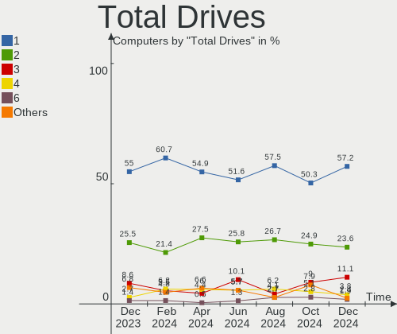
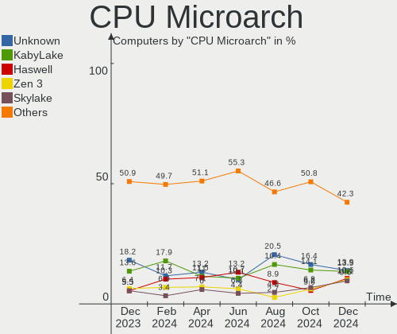
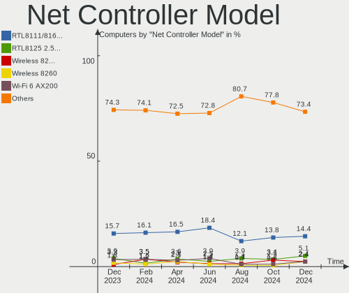
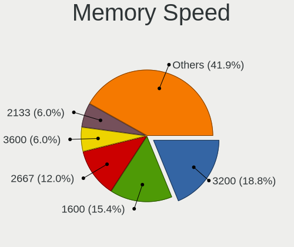
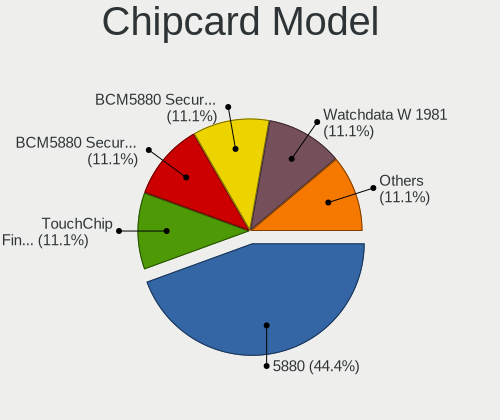
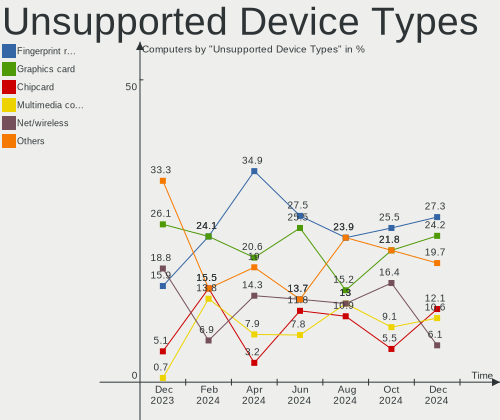

Linux in Canada - Hardware Trends
---------------------------------

A project to identify most popular hardware characteristics and track their change
over time based on data collected by Linux users at https://Linux-Hardware.org.

Anyone can contribute to this report by the [hw-probe](https://github.com/linuxhw/hw-probe) tool:

    sudo -E hw-probe -all -upload

This is a report for all computer types. See also reports for [desktops](/Location/Canada/Desktop/README.md) and [notebooks](/Location/Canada/Notebook/README.md).

Period: Sep, 2023.

Contents
--------

* [ System ](#system)
  - [ OS                       ](#os)
  - [ OS Family                ](#os-family)
  - [ Kernel                   ](#kernel)
  - [ Kernel Family            ](#kernel-family)
  - [ Kernel Major Ver.        ](#kernel-major-ver)
  - [ Arch                     ](#arch)
  - [ DE                       ](#de)
  - [ Display Server           ](#display-server)
  - [ Display Manager          ](#display-manager)
  - [ OS Lang                  ](#os-lang)
  - [ Boot Mode                ](#boot-mode)
  - [ Filesystem               ](#filesystem)
  - [ Part. scheme             ](#part-scheme)
  - [ Dual Boot with Linux/BSD ](#dual-boot-with-linuxbsd)
  - [ Dual Boot (Win)          ](#dual-boot-win)

* [ Board ](#board)
  - [ Vendor                   ](#vendor)
  - [ Model                    ](#model)
  - [ Model Family             ](#model-family)
  - [ MFG Year                 ](#mfg-year)
  - [ Form Factor              ](#form-factor)
  - [ Secure Boot              ](#secure-boot)
  - [ Coreboot                 ](#coreboot)
  - [ RAM Size                 ](#ram-size)
  - [ RAM Used                 ](#ram-used)
  - [ Total Drives             ](#total-drives)
  - [ Has CD-ROM               ](#has-cd-rom)
  - [ Has Ethernet             ](#has-ethernet)
  - [ Has WiFi                 ](#has-wifi)
  - [ Has Bluetooth            ](#has-bluetooth)

* [ Location ](#location)
  - [ Country                  ](#country)
  - [ City                     ](#city)

* [ Drives ](#drives)
  - [ Drive Vendor             ](#drive-vendor)
  - [ Drive Model              ](#drive-model)
  - [ HDD Vendor               ](#hdd-vendor)
  - [ SSD Vendor               ](#ssd-vendor)
  - [ Drive Kind               ](#drive-kind)
  - [ Drive Connector          ](#drive-connector)
  - [ Drive Size               ](#drive-size)
  - [ Space Total              ](#space-total)
  - [ Space Used               ](#space-used)
  - [ Malfunc. Drives          ](#malfunc-drives)
  - [ Malfunc. Drive Vendor    ](#malfunc-drive-vendor)
  - [ Malfunc. HDD Vendor      ](#malfunc-hdd-vendor)
  - [ Malfunc. Drive Kind      ](#malfunc-drive-kind)
  - [ Failed Drives            ](#failed-drives)
  - [ Failed Drive Vendor      ](#failed-drive-vendor)
  - [ Drive Status             ](#drive-status)

* [ Storage controller ](#storage-controller)
  - [ Storage Vendor           ](#storage-vendor)
  - [ Storage Model            ](#storage-model)
  - [ Storage Kind             ](#storage-kind)

* [ Processor ](#processor)
  - [ CPU Vendor               ](#cpu-vendor)
  - [ CPU Model                ](#cpu-model)
  - [ CPU Model Family         ](#cpu-model-family)
  - [ CPU Cores                ](#cpu-cores)
  - [ CPU Sockets              ](#cpu-sockets)
  - [ CPU Threads              ](#cpu-threads)
  - [ CPU Op-Modes             ](#cpu-op-modes)
  - [ CPU Microcode            ](#cpu-microcode)
  - [ CPU Microarch            ](#cpu-microarch)

* [ Graphics ](#graphics)
  - [ GPU Vendor               ](#gpu-vendor)
  - [ GPU Model                ](#gpu-model)
  - [ GPU Combo                ](#gpu-combo)
  - [ GPU Driver               ](#gpu-driver)
  - [ GPU Memory               ](#gpu-memory)

* [ Monitor ](#monitor)
  - [ Monitor Vendor           ](#monitor-vendor)
  - [ Monitor Model            ](#monitor-model)
  - [ Monitor Resolution       ](#monitor-resolution)
  - [ Monitor Diagonal         ](#monitor-diagonal)
  - [ Monitor Width            ](#monitor-width)
  - [ Aspect Ratio             ](#aspect-ratio)
  - [ Monitor Area             ](#monitor-area)
  - [ Pixel Density            ](#pixel-density)
  - [ Multiple Monitors        ](#multiple-monitors)

* [ Network ](#network)
  - [ Net Controller Vendor    ](#net-controller-vendor)
  - [ Net Controller Model     ](#net-controller-model)
  - [ Wireless Vendor          ](#wireless-vendor)
  - [ Wireless Model           ](#wireless-model)
  - [ Ethernet Vendor          ](#ethernet-vendor)
  - [ Ethernet Model           ](#ethernet-model)
  - [ Net Controller Kind      ](#net-controller-kind)
  - [ Used Controller          ](#used-controller)
  - [ NICs                     ](#nics)
  - [ IPv6                     ](#ipv6)

* [ Bluetooth ](#bluetooth)
  - [ Bluetooth Vendor         ](#bluetooth-vendor)
  - [ Bluetooth Model          ](#bluetooth-model)

* [ Sound ](#sound)
  - [ Sound Vendor             ](#sound-vendor)
  - [ Sound Model              ](#sound-model)

* [ Memory ](#memory)
  - [ Memory Vendor            ](#memory-vendor)
  - [ Memory Model             ](#memory-model)
  - [ Memory Kind              ](#memory-kind)
  - [ Memory Form Factor       ](#memory-form-factor)
  - [ Memory Size              ](#memory-size)
  - [ Memory Speed             ](#memory-speed)

* [ Printers & scanners ](#printers--scanners)
  - [ Printer Vendor           ](#printer-vendor)
  - [ Printer Model            ](#printer-model)
  - [ Scanner Vendor           ](#scanner-vendor)
  - [ Scanner Model            ](#scanner-model)

* [ Camera ](#camera)
  - [ Camera Vendor            ](#camera-vendor)
  - [ Camera Model             ](#camera-model)

* [ Security ](#security)
  - [ Fingerprint Vendor       ](#fingerprint-vendor)
  - [ Fingerprint Model        ](#fingerprint-model)
  - [ Chipcard Vendor          ](#chipcard-vendor)
  - [ Chipcard Model           ](#chipcard-model)

* [ Unsupported ](#unsupported)
  - [ Unsupported Devices      ](#unsupported-devices)
  - [ Unsupported Device Types ](#unsupported-device-types)

System
------

OS
--

Installed operating systems

| Name                         | Computers | Percent |
|------------------------------|-----------|---------|
| Ubuntu 22.04                 | 23        | 12.78%  |
| Fedora 38                    | 20        | 11.11%  |
| OpenMandriva 23.08           | 16        | 8.89%   |
| Ubuntu 23.04                 | 14        | 7.78%   |
| Linux Mint 21.2              | 10        | 5.56%   |
| Debian 12                    | 8         | 4.44%   |
| OpenMandriva 23.09           | 6         | 3.33%   |
| Zorin 16                     | 5         | 2.78%   |
| Ubuntu 20.04                 | 5         | 2.78%   |
| Pop!_OS 22.04                | 5         | 2.78%   |
| openSUSE Tumbleweed-XXXXXXXX | 5         | 2.78%   |
| EndeavourOS Rolling          | 5         | 2.78%   |
| Arch Rolling                 | 5         | 2.78%   |
| Xero Rolling                 | 4         | 2.22%   |
| ArcoLinux Rolling            | 4         | 2.22%   |
| Garuda Linux Rolling         | 3         | 1.67%   |
| Clear Linux 39960            | 3         | 1.67%   |
| MX 23                        | 2         | 1.11%   |
| Manjaro                      | 2         | 1.11%   |
| Linux Mint 21.1              | 2         | 1.11%   |
| Linux Mint 20.3              | 2         | 1.11%   |
| Kubuntu 23.04                | 2         | 1.11%   |
| Kubuntu 22.04                | 2         | 1.11%   |
| KDE neon 22.04               | 2         | 1.11%   |
| Kali 2023.3                  | 2         | 1.11%   |
| Xubuntu 22.04                | 1         | 0.56%   |
| Ubuntu 22.10                 | 1         | 0.56%   |
| SteamOS Rolling              | 1         | 0.56%   |
| SteamOS 3.4.10               | 1         | 0.56%   |
| Parrot 5.3                   | 1         | 0.56%   |
| OpenMandriva 4.3             | 1         | 0.56%   |
| OpenMandriva 23.06           | 1         | 0.56%   |
| OpenMandriva 23.03           | 1         | 0.56%   |
| Nobara 38                    | 1         | 0.56%   |
| Manjaro 23.0.1               | 1         | 0.56%   |
| LMDE 5                       | 1         | 0.56%   |
| Linux Mint 21                | 1         | 0.56%   |
| Gentoo 2.14                  | 1         | 0.56%   |
| Fedora 39                    | 1         | 0.56%   |
| Elementary 7                 | 1         | 0.56%   |

OS Family
---------

OS without a version

| Name         | Computers | Percent |
|--------------|-----------|---------|
| Ubuntu       | 43        | 23.89%  |
| OpenMandriva | 25        | 13.89%  |
| Fedora       | 21        | 11.67%  |
| Linux Mint   | 15        | 8.33%   |
| Debian       | 9         | 5%      |
| Zorin        | 5         | 2.78%   |
| Pop!_OS      | 5         | 2.78%   |
| openSUSE     | 5         | 2.78%   |
| EndeavourOS  | 5         | 2.78%   |
| ArcoLinux    | 5         | 2.78%   |
| Arch         | 5         | 2.78%   |
| Xero         | 4         | 2.22%   |
| Kubuntu      | 4         | 2.22%   |
| Manjaro      | 3         | 1.67%   |
| Garuda Linux | 3         | 1.67%   |
| Clear Linux  | 3         | 1.67%   |
| SteamOS      | 2         | 1.11%   |
| MX           | 2         | 1.11%   |
| KDE neon     | 2         | 1.11%   |
| Kali         | 2         | 1.11%   |
| Alpine       | 2         | 1.11%   |
| Xubuntu      | 1         | 0.56%   |
| Parrot       | 1         | 0.56%   |
| Nobara       | 1         | 0.56%   |
| LMDE         | 1         | 0.56%   |
| Gentoo       | 1         | 0.56%   |
| Elementary   | 1         | 0.56%   |
| CentOS       | 1         | 0.56%   |
| BunsenLabs   | 1         | 0.56%   |
| BlackPanther | 1         | 0.56%   |
| Athena       | 1         | 0.56%   |

Kernel
------

Version of the Linux kernel

| Version                                                | Computers | Percent |
|--------------------------------------------------------|-----------|---------|
| 6.2.0-32-generic                                       | 18        | 10%     |
| 6.2.0-33-generic                                       | 15        | 8.33%   |
| 6.4.11-desktop-1omv2390                                | 11        | 6.11%   |
| 5.15.0-83-generic                                      | 10        | 5.56%   |
| 6.4.12-arch1-1                                         | 7         | 3.89%   |
| 6.5.0-desktop-1omv2390                                 | 5         | 2.78%   |
| 6.4.15-200.fc38.x86_64                                 | 5         | 2.78%   |
| 5.15.0-84-generic                                      | 5         | 2.78%   |
| 6.4.6-76060406-generic                                 | 4         | 2.22%   |
| 6.4.13-200.fc38.x86_64                                 | 4         | 2.22%   |
| 6.2.9-300.fc38.x86_64                                  | 4         | 2.22%   |
| 6.1.0-11-amd64                                         | 4         | 2.22%   |
| 6.5.2-zen1-1-zen                                       | 3         | 1.67%   |
| 6.4.8-desktop-2omv2390                                 | 3         | 1.67%   |
| 6.2.0-31-generic                                       | 3         | 1.67%   |
| 6.2.0-26-generic                                       | 3         | 1.67%   |
| 6.1.0-10-amd64                                         | 3         | 1.67%   |
| 5.15.0-76-generic                                      | 3         | 1.67%   |
| 6.5.5-200.fc38.x86_64                                  | 2         | 1.11%   |
| 6.5.4-arch2-1                                          | 2         | 1.11%   |
| 6.5.3-zen1-1-zen                                       | 2         | 1.11%   |
| 6.5.3-arch1-1                                          | 2         | 1.11%   |
| 6.5.2-desktop-1omv2390                                 | 2         | 1.11%   |
| 6.4.14-200.fc38.x86_64                                 | 2         | 1.11%   |
| 6.4.12-arch1-1-surface                                 | 2         | 1.11%   |
| 6.4.12-1-default                                       | 2         | 1.11%   |
| 6.1.1-1228.native                                      | 2         | 1.11%   |
| 6.1.0-12-amd64                                         | 2         | 1.11%   |
| 5.15.0-82-generic                                      | 2         | 1.11%   |
| 5.10.0-25-amd64                                        | 2         | 1.11%   |
| 6.6.0-desktop-0.rc3.1omv2390                           | 1         | 0.56%   |
| 6.6.0-0.rc1.212.vanilla.fc38.x86_64                    | 1         | 0.56%   |
| 6.6.0-0.rc1.20230913gt3669558b.214.vanilla.fc38.x86_64 | 1         | 0.56%   |
| 6.5.5-x64v3-xanmod1                                    | 1         | 0.56%   |
| 6.5.5-300.fc39.x86_64                                  | 1         | 0.56%   |
| 6.5.5-200.fsync.fc38.x86_64                            | 1         | 0.56%   |
| 6.5.4-1-default                                        | 1         | 0.56%   |
| 6.5.3-1358.native                                      | 1         | 0.56%   |
| 6.5.3-1-MANJARO                                        | 1         | 0.56%   |
| 6.5.3-1-default                                        | 1         | 0.56%   |

Kernel Family
-------------

Linux kernel without a distro release

| Version | Computers | Percent |
|---------|-----------|---------|
| 6.2.0   | 41        | 22.78%  |
| 5.15.0  | 26        | 14.44%  |
| 6.4.12  | 12        | 6.67%   |
| 6.4.11  | 12        | 6.67%   |
| 6.1.0   | 11        | 6.11%   |
| 6.5.3   | 7         | 3.89%   |
| 6.5.2   | 7         | 3.89%   |
| 6.5.0   | 7         | 3.89%   |
| 6.4.15  | 6         | 3.33%   |
| 6.5.5   | 5         | 2.78%   |
| 6.4.6   | 4         | 2.22%   |
| 6.4.13  | 4         | 2.22%   |
| 6.2.9   | 4         | 2.22%   |
| 6.6.0   | 3         | 1.67%   |
| 6.5.4   | 3         | 1.67%   |
| 6.4.8   | 3         | 1.67%   |
| 5.10.0  | 3         | 1.67%   |
| 6.5.1   | 2         | 1.11%   |
| 6.4.14  | 2         | 1.11%   |
| 6.1.52  | 2         | 1.11%   |
| 6.1.1   | 2         | 1.11%   |
| 5.19.0  | 2         | 1.11%   |
| 6.4.16  | 1         | 0.56%   |
| 6.4.10  | 1         | 0.56%   |
| 6.4.0   | 1         | 0.56%   |
| 6.3.5   | 1         | 0.56%   |
| 6.2.6   | 1         | 0.56%   |
| 6.1.51  | 1         | 0.56%   |
| 5.6.14  | 1         | 0.56%   |
| 5.4.0   | 1         | 0.56%   |
| 5.16.7  | 1         | 0.56%   |
| 5.13.0  | 1         | 0.56%   |
| 3.18.24 | 1         | 0.56%   |
| 3.10.0  | 1         | 0.56%   |

Kernel Major Ver.
-----------------

Linux kernel major version

| Version | Computers | Percent |
|---------|-----------|---------|
| 6.4     | 46        | 25.56%  |
| 6.2     | 46        | 25.56%  |
| 6.5     | 31        | 17.22%  |
| 5.15    | 26        | 14.44%  |
| 6.1     | 16        | 8.89%   |
| 6.6     | 3         | 1.67%   |
| 5.10    | 3         | 1.67%   |
| 5.19    | 2         | 1.11%   |
| 6.3     | 1         | 0.56%   |
| 5.6     | 1         | 0.56%   |
| 5.4     | 1         | 0.56%   |
| 5.16    | 1         | 0.56%   |
| 5.13    | 1         | 0.56%   |
| 3.18    | 1         | 0.56%   |
| 3.10    | 1         | 0.56%   |

Arch
----

OS architecture (x86_64, i586, etc.)

| Name   | Computers | Percent |
|--------|-----------|---------|
| x86_64 | 178       | 98.89%  |
| i686   | 1         | 0.56%   |
| armv7l | 1         | 0.56%   |

DE
--

Desktop Environment

| Name       | Computers | Percent |
|------------|-----------|---------|
| GNOME      | 77        | 42.78%  |
| KDE5       | 56        | 31.11%  |
| X-Cinnamon | 13        | 7.22%   |
| XFCE       | 11        | 6.11%   |
| Unknown    | 8         | 4.44%   |
| MATE       | 5         | 2.78%   |
| LXQt       | 4         | 2.22%   |
| sway       | 1         | 0.56%   |
| Pantheon   | 1         | 0.56%   |
| LXDE       | 1         | 0.56%   |
| KDE4       | 1         | 0.56%   |
| KDE        | 1         | 0.56%   |
| Jwm        | 1         | 0.56%   |

Display Server
--------------

X11 or Wayland

| Name    | Computers | Percent |
|---------|-----------|---------|
| X11     | 91        | 50.56%  |
| Wayland | 77        | 42.78%  |
| Tty     | 8         | 4.44%   |
| Unknown | 4         | 2.22%   |

Display Manager
---------------

SDDM, LightDM, etc.

| Name    | Computers | Percent |
|---------|-----------|---------|
| Unknown | 64        | 35.56%  |
| SDDM    | 47        | 26.11%  |
| GDM3    | 38        | 21.11%  |
| LightDM | 17        | 9.44%   |
| GDM     | 13        | 7.22%   |
| LXDM    | 1         | 0.56%   |

OS Lang
-------

Language

| Lang    | Computers | Percent |
|---------|-----------|---------|
| en_CA   | 92        | 51.11%  |
| en_US   | 57        | 31.67%  |
| fr_CA   | 12        | 6.67%   |
| fr_FR   | 6         | 3.33%   |
| C       | 5         | 2.78%   |
| Unknown | 3         | 1.67%   |
| en_GB   | 2         | 1.11%   |
| POSIX   | 1         | 0.56%   |
| en_DK   | 1         | 0.56%   |
| C.UTF8  | 1         | 0.56%   |

Boot Mode
---------

EFI or BIOS

| Mode | Computers | Percent |
|------|-----------|---------|
| EFI  | 102       | 56.67%  |
| BIOS | 78        | 43.33%  |

Filesystem
----------

Type of filesystem

| Type    | Computers | Percent |
|---------|-----------|---------|
| Ext4    | 90        | 50%     |
| Btrfs   | 46        | 25.56%  |
| Tmpfs   | 28        | 15.56%  |
| Overlay | 14        | 7.78%   |
| Xfs     | 2         | 1.11%   |

Part. scheme
------------

Scheme of partitioning

| Type    | Computers | Percent |
|---------|-----------|---------|
| GPT     | 107       | 59.44%  |
| Unknown | 57        | 31.67%  |
| MBR     | 16        | 8.89%   |

Dual Boot with Linux/BSD
------------------------

Hosting more than one Linux/BSD

| Dual boot | Computers | Percent |
|-----------|-----------|---------|
| No        | 152       | 84.44%  |
| Yes       | 28        | 15.56%  |

Dual Boot (Win)
---------------

Hosting Linux and Windows

| Dual boot | Computers | Percent |
|-----------|-----------|---------|
| No        | 133       | 73.89%  |
| Yes       | 47        | 26.11%  |

Board
-----

Vendor
------

Motherboard manufacturer

| Name                           | Computers | Percent |
|--------------------------------|-----------|---------|
| ASUSTek Computer               | 35        | 19.44%  |
| Hewlett-Packard                | 28        | 15.56%  |
| Lenovo                         | 27        | 15%     |
| Dell                           | 22        | 12.22%  |
| Apple                          | 12        | 6.67%   |
| Gigabyte Technology            | 9         | 5%      |
| Acer                           | 8         | 4.44%   |
| MSI                            | 7         | 3.89%   |
| ASRock                         | 5         | 2.78%   |
| Intel                          | 4         | 2.22%   |
| Google                         | 4         | 2.22%   |
| Unknown                        | 3         | 1.67%   |
| Valve                          | 2         | 1.11%   |
| Toshiba                        | 2         | 1.11%   |
| Microsoft                      | 2         | 1.11%   |
| AZW                            | 2         | 1.11%   |
| Alienware                      | 2         | 1.11%   |
| Sony                           | 1         | 0.56%   |
| ReachingTech                   | 1         | 0.56%   |
| Matsushita Electric Industrial | 1         | 0.56%   |
| Fujitsu                        | 1         | 0.56%   |
| Compaq Presario 06             | 1         | 0.56%   |
| BESSTAR Tech                   | 1         | 0.56%   |

Model
-----

Motherboard model

| Name                                        | Computers | Percent |
|---------------------------------------------|-----------|---------|
| Unknown                                     | 3         | 1.67%   |
| Valve Jupiter                               | 2         | 1.11%   |
| Microsoft Surface Laptop Go                 | 2         | 1.11%   |
| Lenovo IdeaPad 320-15IKB 81BG               | 2         | 1.11%   |
| HP EliteBook 850 G1                         | 2         | 1.11%   |
| Dell OptiPlex 7010                          | 2         | 1.11%   |
| Dell Latitude E6410                         | 2         | 1.11%   |
| ASUS Zenbook UP6502ZD_UP6502ZD              | 2         | 1.11%   |
| ASUS M32CD_A_F_K20CD_K31CD                  | 2         | 1.11%   |
| Toshiba Satellite C70-B                     | 1         | 0.56%   |
| Toshiba Satellite C650                      | 1         | 0.56%   |
| Sony VPCEB27FX                              | 1         | 0.56%   |
| ReachingTech Dream Quest Office 2021        | 1         | 0.56%   |
| MSI MS-7D75                                 | 1         | 0.56%   |
| MSI MS-7D19                                 | 1         | 0.56%   |
| MSI MS-7C95                                 | 1         | 0.56%   |
| MSI MS-7C87                                 | 1         | 0.56%   |
| MSI MS-7B98                                 | 1         | 0.56%   |
| MSI MS-7B86                                 | 1         | 0.56%   |
| MSI GP75 Leopard 10SEK                      | 1         | 0.56%   |
| Matsushita Electric Industrial CF-74JCJBDAM | 1         | 0.56%   |
| Lenovo Yoga 9 14ITL5 82BG                   | 1         | 0.56%   |
| Lenovo ThinkStation P910 30B8S0EN00         | 1         | 0.56%   |
| Lenovo ThinkPad Yoga 11e 4th Gen 20HSS04A00 | 1         | 0.56%   |
| Lenovo ThinkPad X1C 5th W10DG 20K4S0E900    | 1         | 0.56%   |
| Lenovo ThinkPad X1 Carbon 6th 20KGS0AB00    | 1         | 0.56%   |
| Lenovo ThinkPad W540 20BG0016US             | 1         | 0.56%   |
| Lenovo ThinkPad W540 20BG0014US             | 1         | 0.56%   |
| Lenovo ThinkPad W510 438923U                | 1         | 0.56%   |
| Lenovo ThinkPad T60 2623DAU                 | 1         | 0.56%   |
| Lenovo ThinkPad T550 20CKA00ECD             | 1         | 0.56%   |
| Lenovo ThinkPad T470s 20HFCTO1WW            | 1         | 0.56%   |
| Lenovo ThinkPad T440s 20AQ005QUS            | 1         | 0.56%   |
| Lenovo ThinkPad P15 Gen 1 20ST004DUS        | 1         | 0.56%   |
| Lenovo ThinkPad L13 Yoga 20R5002GUS         | 1         | 0.56%   |
| Lenovo ThinkCentre M900 10FGS1400W          | 1         | 0.56%   |
| Lenovo ThinkCentre M58p 7484AEF             | 1         | 0.56%   |
| Lenovo ThinkBook 15 G3 ACL 21A4             | 1         | 0.56%   |
| Lenovo Slim 7 14IRP8 83A4                   | 1         | 0.56%   |
| Lenovo Legion 5 17ACH6H 82JY                | 1         | 0.56%   |

Model Family
------------

Motherboard model prefix

| Name               | Computers | Percent |
|--------------------|-----------|---------|
| Lenovo ThinkPad    | 12        | 6.67%   |
| Dell Latitude      | 7         | 3.89%   |
| ASUS Vivobook      | 7         | 3.89%   |
| Dell OptiPlex      | 6         | 3.33%   |
| Lenovo IdeaPad     | 5         | 2.78%   |
| ASUS PRIME         | 5         | 2.78%   |
| Acer Aspire        | 5         | 2.78%   |
| HP Laptop          | 4         | 2.22%   |
| HP EliteDesk       | 4         | 2.22%   |
| HP EliteBook       | 4         | 2.22%   |
| Dell XPS           | 4         | 2.22%   |
| ASUS Zenbook       | 4         | 2.22%   |
| ASUS ROG           | 4         | 2.22%   |
| HP Pavilion        | 3         | 1.67%   |
| HP Compaq          | 3         | 1.67%   |
| ASUS ASUS          | 3         | 1.67%   |
| Unknown            | 3         | 1.67%   |
| Valve Jupiter      | 2         | 1.11%   |
| Toshiba Satellite  | 2         | 1.11%   |
| Microsoft Surface  | 2         | 1.11%   |
| Lenovo ThinkCentre | 2         | 1.11%   |
| Lenovo IdeaPadFlex | 2         | 1.11%   |
| HP ProBook         | 2         | 1.11%   |
| HP ENVY            | 2         | 1.11%   |
| Dell Precision     | 2         | 1.11%   |
| ASUS TUF           | 2         | 1.11%   |
| ASUS M32CD         | 2         | 1.11%   |
| Apple MacBookPro9  | 2         | 1.11%   |
| Apple MacBookPro8  | 2         | 1.11%   |
| Apple MacBookPro5  | 2         | 1.11%   |
| Apple MacBookPro11 | 2         | 1.11%   |
| Acer Swift         | 2         | 1.11%   |
| Sony VPCEB27FX     | 1         | 0.56%   |
| ReachingTech Dream | 1         | 0.56%   |
| MSI MS-7D75        | 1         | 0.56%   |
| MSI MS-7D19        | 1         | 0.56%   |
| MSI MS-7C95        | 1         | 0.56%   |
| MSI MS-7C87        | 1         | 0.56%   |
| MSI MS-7B98        | 1         | 0.56%   |
| MSI MS-7B86        | 1         | 0.56%   |

MFG Year
--------

Motherboard manufacture year

| Year    | Computers | Percent |
|---------|-----------|---------|
| 2022    | 19        | 10.56%  |
| 2021    | 19        | 10.56%  |
| 2020    | 19        | 10.56%  |
| 2012    | 16        | 8.89%   |
| 2018    | 14        | 7.78%   |
| 2019    | 12        | 6.67%   |
| 2023    | 11        | 6.11%   |
| 2017    | 10        | 5.56%   |
| 2014    | 10        | 5.56%   |
| 2013    | 9         | 5%      |
| 2010    | 9         | 5%      |
| 2015    | 7         | 3.89%   |
| 2016    | 6         | 3.33%   |
| 2011    | 6         | 3.33%   |
| 2008    | 4         | 2.22%   |
| 2009    | 3         | 1.67%   |
| 2007    | 2         | 1.11%   |
| 2006    | 2         | 1.11%   |
| 2002    | 1         | 0.56%   |
| Unknown | 1         | 0.56%   |

Form Factor
-----------

Physical design of the computer

| Name        | Computers | Percent |
|-------------|-----------|---------|
| Notebook    | 87        | 48.33%  |
| Desktop     | 70        | 38.89%  |
| Convertible | 14        | 7.78%   |
| Mini pc     | 4         | 2.22%   |
| Tablet      | 2         | 1.11%   |
| All in one  | 2         | 1.11%   |
| Server      | 1         | 0.56%   |

Secure Boot
-----------

Enabled or disabled

| State    | Computers | Percent |
|----------|-----------|---------|
| Disabled | 166       | 92.22%  |
| Enabled  | 14        | 7.78%   |

Coreboot
--------

Have coreboot on board

| Used | Computers | Percent |
|------|-----------|---------|
| No   | 175       | 97.22%  |
| Yes  | 5         | 2.78%   |

RAM Size
--------

Total RAM memory

| Size in GB  | Computers | Percent |
|-------------|-----------|---------|
| 16.01-24.0  | 43        | 23.89%  |
| 4.01-8.0    | 39        | 21.67%  |
| 8.01-16.0   | 38        | 21.11%  |
| 32.01-64.0  | 24        | 13.33%  |
| 3.01-4.0    | 20        | 11.11%  |
| 24.01-32.0  | 6         | 3.33%   |
| 64.01-256.0 | 5         | 2.78%   |
| 1.01-2.0    | 3         | 1.67%   |
| 2.01-3.0    | 1         | 0.56%   |
| 0.51-1.0    | 1         | 0.56%   |

RAM Used
--------

Used RAM memory

| Used GB   | Computers | Percent |
|-----------|-----------|---------|
| 1.01-2.0  | 51        | 28.33%  |
| 2.01-3.0  | 49        | 27.22%  |
| 4.01-8.0  | 36        | 20%     |
| 3.01-4.0  | 28        | 15.56%  |
| 0.51-1.0  | 8         | 4.44%   |
| 8.01-16.0 | 7         | 3.89%   |
| 0.01-0.5  | 1         | 0.56%   |

Total Drives
------------

Number of drives on board

| Drives | Computers | Percent |
|--------|-----------|---------|
| 1      | 119       | 66.11%  |
| 2      | 36        | 20%     |
| 3      | 18        | 10%     |
| 4      | 4         | 2.22%   |
| 6      | 2         | 1.11%   |
| 0      | 1         | 0.56%   |

Has CD-ROM
----------

Has CD-ROM on board

| Presented | Computers | Percent |
|-----------|-----------|---------|
| No        | 131       | 72.78%  |
| Yes       | 49        | 27.22%  |

Has Ethernet
------------

Has Ethernet on board

| Presented | Computers | Percent |
|-----------|-----------|---------|
| Yes       | 140       | 77.78%  |
| No        | 40        | 22.22%  |

Has WiFi
--------

Has WiFi module

| Presented | Computers | Percent |
|-----------|-----------|---------|
| Yes       | 147       | 81.67%  |
| No        | 33        | 18.33%  |

Has Bluetooth
-------------

Has Bluetooth module

| Presented | Computers | Percent |
|-----------|-----------|---------|
| Yes       | 124       | 68.89%  |
| No        | 56        | 31.11%  |

Location
--------

Country
-------

Geographic location (country)

| Country | Computers | Percent |
|---------|-----------|---------|
| Canada  | 180       | 100%    |

City
----

Geographic location (city)

| City           | Computers | Percent |
|----------------|-----------|---------|
| Montreal       | 17        | 9.44%   |
| Toronto        | 11        | 6.11%   |
| Vancouver      | 8         | 4.44%   |
| Calgary        | 8         | 4.44%   |
| Edmonton       | 6         | 3.33%   |
| Surrey         | 5         | 2.78%   |
| Winnipeg       | 4         | 2.22%   |
| Victoria       | 4         | 2.22%   |
| Saskatoon      | 4         | 2.22%   |
| Scarborough    | 3         | 1.67%   |
| Mississauga    | 3         | 1.67%   |
| Burlington     | 3         | 1.67%   |
| Woodbridge     | 2         | 1.11%   |
| Thornhill      | 2         | 1.11%   |
| Sherbrooke     | 2         | 1.11%   |
| Red Lake       | 2         | 1.11%   |
| Pierrefonds    | 2         | 1.11%   |
| Oshawa         | 2         | 1.11%   |
| Lloydminster   | 2         | 1.11%   |
| Kitchener      | 2         | 1.11%   |
| Kingston       | 2         | 1.11%   |
| Grande Prairie | 2         | 1.11%   |
| Gatineau       | 2         | 1.11%   |
| Fort Frances   | 2         | 1.11%   |
| Dartmouth      | 2         | 1.11%   |
| Coldwater      | 2         | 1.11%   |
| Chicoutimi     | 2         | 1.11%   |
| Burnaby        | 2         | 1.11%   |
| Brampton       | 2         | 1.11%   |
| Barrie         | 2         | 1.11%   |
| Woodstock      | 1         | 0.56%   |
| Wolfville      | 1         | 0.56%   |
| Wetaskiwin     | 1         | 0.56%   |
| Trail          | 1         | 0.56%   |
| Sydney         | 1         | 0.56%   |
| Strathroy      | 1         | 0.56%   |
| Stoney Creek   | 1         | 0.56%   |
| Stevensville   | 1         | 0.56%   |
| St. Albert     | 1         | 0.56%   |
| Spruce Grove   | 1         | 0.56%   |

Drives
------

Drive Vendor
------------

Hard drive vendors

| Vendor                      | Computers | Drives | Percent |
|-----------------------------|-----------|--------|---------|
| Samsung Electronics         | 35        | 38     | 13.83%  |
| WDC                         | 27        | 33     | 10.67%  |
| Seagate                     | 23        | 30     | 9.09%   |
| SanDisk                     | 16        | 19     | 6.32%   |
| Unknown                     | 15        | 15     | 5.93%   |
| Toshiba                     | 13        | 13     | 5.14%   |
| Crucial                     | 13        | 14     | 5.14%   |
| Kingston                    | 12        | 13     | 4.74%   |
| SK hynix                    | 11        | 11     | 4.35%   |
| Micron Technology           | 10        | 10     | 3.95%   |
| SPCC                        | 7         | 7      | 2.77%   |
| Hitachi                     | 7         | 7      | 2.77%   |
| Intel                       | 6         | 6      | 2.37%   |
| A-DATA Technology           | 5         | 5      | 1.98%   |
| Team                        | 3         | 3      | 1.19%   |
| Micron/Crucial Technology   | 3         | 3      | 1.19%   |
| KIOXIA                      | 3         | 3      | 1.19%   |
| China                       | 3         | 3      | 1.19%   |
| Apple                       | 3         | 3      | 1.19%   |
| Timetec                     | 2         | 2      | 0.79%   |
| Silicon Motion              | 2         | 2      | 0.79%   |
| Realtek Semiconductor       | 2         | 2      | 0.79%   |
| Patriot                     | 2         | 2      | 0.79%   |
| Kingston Technology Company | 2         | 2      | 0.79%   |
| KingFast                    | 2         | 2      | 0.79%   |
| Unknown                     | 2         | 2      | 0.79%   |
| XPG                         | 1         | 1      | 0.4%    |
| WDC WDS5                    | 1         | 1      | 0.4%    |
| Vaseky                      | 1         | 1      | 0.4%    |
| TO Exter                    | 1         | 1      | 0.4%    |
| T-FORCE                     | 1         | 1      | 0.4%    |
| Super Talent                | 1         | 1      | 0.4%    |
| StoreJet                    | 1         | 1      | 0.4%    |
| Solid State Storage         | 1         | 1      | 0.4%    |
| SABRENT                     | 1         | 1      | 0.4%    |
| PNY                         | 1         | 1      | 0.4%    |
| Plextor                     | 1         | 1      | 0.4%    |
| Phison Electronics          | 1         | 1      | 0.4%    |
| NGFF                        | 1         | 1      | 0.4%    |
| Maxone                      | 1         | 1      | 0.4%    |

Drive Model
-----------

Hard drive models

| Model                                               | Computers | Percent |
|-----------------------------------------------------|-----------|---------|
| Samsung NVMe SSD Controller SM981/PM981/PM983 256GB | 7         | 2.65%   |
| SPCC Solid State Disk 1TB                           | 4         | 1.52%   |
| Toshiba MQ04ABF100 1TB                              | 3         | 1.14%   |
| Toshiba DT01ACA200 2TB                              | 3         | 1.14%   |
| SK hynix BC501 NVMe Solid State Drive 512GB         | 3         | 1.14%   |
| Sandisk WD Black SN750 / PC SN730 NVMe SSD 512GB    | 3         | 1.14%   |
| Kingston SA400S37240G 240GB SSD                     | 3         | 1.14%   |
| Crucial CT250MX500SSD1 250GB                        | 3         | 1.14%   |
| WDC WD6400AAKS-22A7B2 640GB                         | 2         | 0.76%   |
| WDC WD10JPVX-22JC3T0 1TB                            | 2         | 0.76%   |
| WDC WD10EZEX-08WN4A0 1TB                            | 2         | 0.76%   |
| Unknown SD/MMC/MS PRO 128GB                         | 2         | 0.76%   |
| Unknown MMC Card  32GB                              | 2         | 0.76%   |
| Unknown MMC Card  128GB                             | 2         | 0.76%   |
| Toshiba MQ03ABB200 2TB                              | 2         | 0.76%   |
| SK hynix HFM001TD3JX013N 1024GB                     | 2         | 0.76%   |
| Silicon Motion SM2262/SM2262EN SSD Controller 500GB | 2         | 0.76%   |
| Seagate ST1000DM003-1SB102 1TB                      | 2         | 0.76%   |
| Samsung SSD 850 EVO 250GB                           | 2         | 0.76%   |
| Samsung MZAL41T0HBLB-00BL2 1TB                      | 2         | 0.76%   |
| Micron/Crucial P2 NVMe PCIe SSD 1TB                 | 2         | 0.76%   |
| Micron 2210_MTFDHBA512QFD 512GB                     | 2         | 0.76%   |
| Unknown                                             | 2         | 0.76%   |
| XPG SPECTRIX S20G 1TB                               | 1         | 0.38%   |
| WDC WDS5 00G2B0A-00SM 500GB SSD                     | 1         | 0.38%   |
| WDC WDS250G2B0A 250GB SSD                           | 1         | 0.38%   |
| WDC WDS100T2G0A-00JH30 1TB SSD                      | 1         | 0.38%   |
| WDC WDBNCE0010PNC 1TB SSD                           | 1         | 0.38%   |
| WDC WD7500BPVT-22HXZT1 752GB                        | 1         | 0.38%   |
| WDC WD6400AAKS-65A7B2 640GB                         | 1         | 0.38%   |
| WDC WD5000LPLX-75ZNTT0 500GB                        | 1         | 0.38%   |
| WDC WD5000AAKX-75U6AA0 500GB                        | 1         | 0.38%   |
| WDC WD5000AAKX-001CA0 500GB                         | 1         | 0.38%   |
| WDC WD40EFAX-68JH4N1 4TB                            | 1         | 0.38%   |
| WDC WD3200AAKS-00L9A0 320GB                         | 1         | 0.38%   |
| WDC WD30EZRX-00MMMB0 3TB                            | 1         | 0.38%   |
| WDC WD2500AAJS-08L7A0 250GB                         | 1         | 0.38%   |
| WDC WD20EZRZ-00Z5HB0 2TB                            | 1         | 0.38%   |
| WDC WD20EURX-63T0FY0 2TB                            | 1         | 0.38%   |
| WDC WD20EADS-65R6B1 2TB                             | 1         | 0.38%   |

HDD Vendor
----------

Hard disk drive vendors

| Vendor              | Computers | Drives | Percent |
|---------------------|-----------|--------|---------|
| WDC                 | 22        | 26     | 32.35%  |
| Seagate             | 22        | 29     | 32.35%  |
| Toshiba             | 11        | 11     | 16.18%  |
| Hitachi             | 7         | 7      | 10.29%  |
| Unknown             | 2         | 2      | 2.94%   |
| Samsung Electronics | 1         | 1      | 1.47%   |
| SABRENT             | 1         | 1      | 1.47%   |
| Maxone              | 1         | 1      | 1.47%   |
| Fujitsu             | 1         | 1      | 1.47%   |

SSD Vendor
----------

Solid state drive vendors

| Vendor              | Computers | Drives | Percent |
|---------------------|-----------|--------|---------|
| Samsung Electronics | 12        | 14     | 15%     |
| Crucial             | 12        | 12     | 15%     |
| Kingston            | 8         | 8      | 10%     |
| SPCC                | 7         | 7      | 8.75%   |
| WDC                 | 5         | 7      | 6.25%   |
| SanDisk             | 3         | 3      | 3.75%   |
| China               | 3         | 3      | 3.75%   |
| A-DATA Technology   | 3         | 3      | 3.75%   |
| Team                | 2         | 2      | 2.5%    |
| SK hynix            | 2         | 2      | 2.5%    |
| Intel               | 2         | 2      | 2.5%    |
| WDC WDS5            | 1         | 1      | 1.25%   |
| Vaseky              | 1         | 1      | 1.25%   |
| Toshiba             | 1         | 1      | 1.25%   |
| TO Exter            | 1         | 1      | 1.25%   |
| Timetec             | 1         | 1      | 1.25%   |
| Super Talent        | 1         | 1      | 1.25%   |
| StoreJet            | 1         | 1      | 1.25%   |
| PNY                 | 1         | 1      | 1.25%   |
| Plextor             | 1         | 1      | 1.25%   |
| Patriot             | 1         | 1      | 1.25%   |
| NGFF                | 1         | 1      | 1.25%   |
| Micron Technology   | 1         | 1      | 1.25%   |
| LITEON              | 1         | 1      | 1.25%   |
| Lexar               | 1         | 1      | 1.25%   |
| KingFast            | 1         | 1      | 1.25%   |
| Hewlett-Packard     | 1         | 1      | 1.25%   |
| Fanxiang            | 1         | 1      | 1.25%   |
| Dogfish             | 1         | 1      | 1.25%   |
| CT2000MX            | 1         | 1      | 1.25%   |
| Apple               | 1         | 1      | 1.25%   |
| Unknown             | 1         | 1      | 1.25%   |

Drive Kind
----------

HDD or SSD

| Kind    | Computers | Drives | Percent |
|---------|-----------|--------|---------|
| NVMe    | 83        | 93     | 36.4%   |
| SSD     | 72        | 84     | 31.58%  |
| HDD     | 55        | 79     | 24.12%  |
| MMC     | 15        | 15     | 6.58%   |
| Unknown | 3         | 3      | 1.32%   |

Drive Connector
---------------

SATA, SAS, NVMe, etc.

| Type | Computers | Drives | Percent |
|------|-----------|--------|---------|
| SATA | 108       | 151    | 48.87%  |
| NVMe | 83        | 93     | 37.56%  |
| SAS  | 15        | 15     | 6.79%   |
| MMC  | 15        | 15     | 6.79%   |

Drive Size
----------

Size of hard drive

| Size in TB | Computers | Drives | Percent |
|------------|-----------|--------|---------|
| 0.01-0.5   | 68        | 78     | 50.37%  |
| 0.51-1.0   | 44        | 56     | 32.59%  |
| 1.01-2.0   | 15        | 19     | 11.11%  |
| 4.01-10.0  | 4         | 4      | 2.96%   |
| 3.01-4.0   | 2         | 4      | 1.48%   |
| 2.01-3.0   | 2         | 2      | 1.48%   |

Space Total
-----------

Amount of disk space available on the file system

| Size in GB     | Computers | Percent |
|----------------|-----------|---------|
| 101-250        | 35        | 19.44%  |
| 251-500        | 34        | 18.89%  |
| 501-1000       | 31        | 17.22%  |
| 1001-2000      | 24        | 13.33%  |
| More than 3000 | 16        | 8.89%   |
| 1-20           | 15        | 8.33%   |
| Unknown        | 9         | 5%      |
| 51-100         | 8         | 4.44%   |
| 2001-3000      | 5         | 2.78%   |
| 21-50          | 3         | 1.67%   |

Space Used
----------

Amount of used disk space

| Used GB        | Computers | Percent |
|----------------|-----------|---------|
| 1-20           | 66        | 36.67%  |
| 21-50          | 28        | 15.56%  |
| 101-250        | 20        | 11.11%  |
| 51-100         | 19        | 10.56%  |
| 501-1000       | 14        | 7.78%   |
| 251-500        | 12        | 6.67%   |
| Unknown        | 9         | 5%      |
| 1001-2000      | 6         | 3.33%   |
| More than 3000 | 5         | 2.78%   |
| 2001-3000      | 1         | 0.56%   |

Malfunc. Drives
---------------

Drive models with a malfunction

| Model                                 | Computers | Drives | Percent |
|---------------------------------------|-----------|--------|---------|
| WDC WD5000AAKX-001CA0 500GB           | 1         | 1      | 8.33%   |
| WDC WD1600BEVS-22RST0 160GB           | 1         | 1      | 8.33%   |
| WDC WD10EZEX-08WN4A0 1TB              | 1         | 1      | 8.33%   |
| WDC WD Blue SA510 2.5 500GB           | 1         | 2      | 8.33%   |
| Toshiba MK6459GSXP 640GB              | 1         | 1      | 8.33%   |
| Timetec SD08 512GB SSD                | 1         | 1      | 8.33%   |
| Seagate ST3500414CS 500GB             | 1         | 1      | 8.33%   |
| Seagate ST1000LX015-1U7172 1TB        | 1         | 2      | 8.33%   |
| Samsung Electronics SSD 870 EVO 250GB | 1         | 1      | 8.33%   |
| Hitachi HTS545032B9A300 320GB         | 1         | 1      | 8.33%   |
| Fujitsu MHV2080AH 80GB                | 1         | 1      | 8.33%   |
| A-DATA Technology SWORDFISH 1TB       | 1         | 1      | 8.33%   |

Malfunc. Drive Vendor
---------------------

Vendors of faulty drives

| Vendor              | Computers | Drives | Percent |
|---------------------|-----------|--------|---------|
| WDC                 | 4         | 5      | 33.33%  |
| Seagate             | 2         | 3      | 16.67%  |
| Toshiba             | 1         | 1      | 8.33%   |
| Timetec             | 1         | 1      | 8.33%   |
| Samsung Electronics | 1         | 1      | 8.33%   |
| Hitachi             | 1         | 1      | 8.33%   |
| Fujitsu             | 1         | 1      | 8.33%   |
| A-DATA Technology   | 1         | 1      | 8.33%   |

Malfunc. HDD Vendor
-------------------

Vendors of faulty HDD drives

| Vendor  | Computers | Drives | Percent |
|---------|-----------|--------|---------|
| WDC     | 3         | 3      | 37.5%   |
| Seagate | 2         | 3      | 25%     |
| Toshiba | 1         | 1      | 12.5%   |
| Hitachi | 1         | 1      | 12.5%   |
| Fujitsu | 1         | 1      | 12.5%   |

Malfunc. Drive Kind
-------------------

Kinds of faulty drives

| Kind | Computers | Drives | Percent |
|------|-----------|--------|---------|
| HDD  | 8         | 9      | 66.67%  |
| SSD  | 3         | 4      | 25%     |
| NVMe | 1         | 1      | 8.33%   |

Failed Drives
-------------

Failed drive models

| Model                             | Computers | Drives | Percent |
|-----------------------------------|-----------|--------|---------|
| Samsung Electronics HM160HC 160GB | 1         | 1      | 100%    |

Failed Drive Vendor
-------------------

Failed drive vendors

| Vendor              | Computers | Drives | Percent |
|---------------------|-----------|--------|---------|
| Samsung Electronics | 1         | 1      | 100%    |

Drive Status
------------

Number of failed and malfunc. drives

| Status   | Computers | Drives | Percent |
|----------|-----------|--------|---------|
| Detected | 102       | 145    | 52.31%  |
| Works    | 80        | 114    | 41.03%  |
| Malfunc  | 12        | 14     | 6.15%   |
| Failed   | 1         | 1      | 0.51%   |

Storage controller
------------------

Storage Vendor
--------------

Storage controller vendors

| Vendor                         | Computers | Percent |
|--------------------------------|-----------|---------|
| Intel                          | 109       | 45.42%  |
| AMD                            | 33        | 13.75%  |
| Samsung Electronics            | 24        | 10%     |
| SanDisk                        | 12        | 5%      |
| SK hynix                       | 9         | 3.75%   |
| Micron Technology              | 9         | 3.75%   |
| Nvidia                         | 5         | 2.08%   |
| Micron/Crucial Technology      | 5         | 2.08%   |
| Kingston Technology Company    | 5         | 2.08%   |
| Silicon Motion                 | 3         | 1.25%   |
| Realtek Semiconductor          | 3         | 1.25%   |
| KIOXIA                         | 3         | 1.25%   |
| JMicron Technology             | 3         | 1.25%   |
| Toshiba America Info Systems   | 2         | 0.83%   |
| Phison Electronics             | 2         | 0.83%   |
| MAXIO Technology (Hangzhou)    | 2         | 0.83%   |
| Marvell Technology Group       | 2         | 0.83%   |
| ASMedia Technology             | 2         | 0.83%   |
| VIA Technologies               | 1         | 0.42%   |
| Solid State Storage Technology | 1         | 0.42%   |
| Seagate Technology             | 1         | 0.42%   |
| Hewlett-Packard                | 1         | 0.42%   |
| Biwin Storage Technology       | 1         | 0.42%   |
| Apple                          | 1         | 0.42%   |
| ADATA Technology               | 1         | 0.42%   |

Storage Model
-------------

Storage controller models

| Model                                                                          | Computers | Percent |
|--------------------------------------------------------------------------------|-----------|---------|
| AMD FCH SATA Controller [AHCI mode]                                            | 21        | 7.87%   |
| Intel Volume Management Device NVMe RAID Controller                            | 13        | 4.87%   |
| Samsung NVMe SSD Controller SM981/PM981/PM983                                  | 10        | 3.75%   |
| Intel Q170/Q150/B150/H170/H110/Z170/CM236 Chipset SATA Controller [AHCI Mode]  | 7         | 2.62%   |
| Intel 82801 Mobile SATA Controller [RAID mode]                                 | 7         | 2.62%   |
| Intel 8 Series/C220 Series Chipset Family 6-port SATA Controller 1 [AHCI mode] | 7         | 2.62%   |
| Samsung NVMe SSD Controller 980                                                | 6         | 2.25%   |
| Intel 7 Series/C210 Series Chipset Family 6-port SATA Controller [AHCI mode]   | 6         | 2.25%   |
| Intel 6 Series/C200 Series Chipset Family 6 port Mobile SATA AHCI Controller   | 6         | 2.25%   |
| AMD 500 Series Chipset SATA Controller                                         | 5         | 1.87%   |
| AMD 400 Series Chipset SATA Controller                                         | 5         | 1.87%   |
| SK hynix Gold P31/BC711/PC711 NVMe Solid State Drive                           | 4         | 1.5%    |
| Intel Sunrise Point-LP SATA Controller [AHCI mode]                             | 4         | 1.5%    |
| Intel SATA Controller [RAID mode]                                              | 4         | 1.5%    |
| Intel 7 Series Chipset Family 6-port SATA Controller [AHCI mode]               | 4         | 1.5%    |
| Intel 6 Series/C200 Series Chipset Family 6 port Desktop SATA AHCI Controller  | 4         | 1.5%    |
| SK hynix BC501 NVMe Solid State Drive                                          | 3         | 1.12%   |
| SanDisk WD Black SN770 / PC SN740 256GB / PC SN560 (DRAM-less) NVMe SSD        | 3         | 1.12%   |
| SanDisk WD Black SN750 / PC SN730 NVMe SSD                                     | 3         | 1.12%   |
| Samsung NVMe SSD Controller PM9A1/PM9A3/980PRO                                 | 3         | 1.12%   |
| Realtek RTS5763DL NVMe SSD Controller (DRAM-less)                              | 3         | 1.12%   |
| Micron/Crucial P2 [Nick P2] / P3 / P3 Plus NVMe PCIe SSD (DRAM-less)           | 3         | 1.12%   |
| Micron 2400 NVMe SSD (DRAM-less)                                               | 3         | 1.12%   |
| Intel Wildcat Point-LP SATA Controller [AHCI Mode]                             | 3         | 1.12%   |
| Intel SSD 670p Series [Keystone Harbor]                                        | 3         | 1.12%   |
| Intel Celeron/Pentium Silver Processor SATA Controller                         | 3         | 1.12%   |
| Intel Cannon Lake PCH SATA AHCI Controller                                     | 3         | 1.12%   |
| Intel Alder Lake-S PCH SATA Controller [AHCI Mode]                             | 3         | 1.12%   |
| Intel 8 Series SATA Controller 1 [AHCI mode]                                   | 3         | 1.12%   |
| Intel 5 Series/3400 Series Chipset 6 port SATA AHCI Controller                 | 3         | 1.12%   |
| Intel 400 Series Chipset Family SATA AHCI Controller                           | 3         | 1.12%   |
| AMD SB7x0/SB8x0/SB9x0 SATA Controller [AHCI mode]                              | 3         | 1.12%   |
| Silicon Motion SM2262/SM2262EN SSD Controller                                  | 2         | 0.75%   |
| Sandisk Western Digital WD Black SN850X NVMe SSD                               | 2         | 0.75%   |
| Samsung NVMe SSD Controller SM961/PM961/SM963                                  | 2         | 0.75%   |
| Samsung NVMe SSD Controller PM9B1                                              | 2         | 0.75%   |
| Nvidia MCP79 AHCI Controller                                                   | 2         | 0.75%   |
| Nvidia MCP61 SATA Controller                                                   | 2         | 0.75%   |
| Nvidia MCP61 IDE                                                               | 2         | 0.75%   |
| Micron/Crucial P5 Plus NVMe PCIe SSD                                           | 2         | 0.75%   |

Storage Kind
------------

Kind of storage controller (IDE, SATA, NVMe, SAS, ...)

| Kind | Computers | Percent |
|------|-----------|---------|
| SATA | 116       | 47.54%  |
| NVMe | 83        | 34.02%  |
| RAID | 27        | 11.07%  |
| IDE  | 17        | 6.97%   |
| SAS  | 1         | 0.41%   |

Processor
---------

CPU Vendor
----------

Processor vendors

| Vendor | Computers | Percent |
|--------|-----------|---------|
| Intel  | 134       | 74.44%  |
| AMD    | 45        | 25%     |
| ARM    | 1         | 0.56%   |

CPU Model
---------

Processor models

| Model                                      | Computers | Percent |
|--------------------------------------------|-----------|---------|
| Intel Core i5-8250U CPU @ 1.60GHz          | 6         | 3.33%   |
| Intel 11th Gen Core i7-1165G7 @ 2.80GHz    | 4         | 2.22%   |
| Intel Core i7-6700 CPU @ 3.40GHz           | 3         | 1.67%   |
| Intel Core i5-6500T CPU @ 2.50GHz          | 3         | 1.67%   |
| Intel Celeron N4020 CPU @ 1.10GHz          | 3         | 1.67%   |
| Intel 12th Gen Core i7-12700H              | 3         | 1.67%   |
| AMD Ryzen 5 5600X 6-Core Processor         | 3         | 1.67%   |
| Intel Core i7-7500U CPU @ 2.70GHz          | 2         | 1.11%   |
| Intel Core i7-4800MQ CPU @ 2.70GHz         | 2         | 1.11%   |
| Intel Core i7-4600U CPU @ 2.10GHz          | 2         | 1.11%   |
| Intel Core i7-10750H CPU @ 2.60GHz         | 2         | 1.11%   |
| Intel Core i5-8400 CPU @ 2.80GHz           | 2         | 1.11%   |
| Intel Core i5-5200U CPU @ 2.20GHz          | 2         | 1.11%   |
| Intel Core i5-3470 CPU @ 3.20GHz           | 2         | 1.11%   |
| Intel Core i5-1035G1 CPU @ 1.00GHz         | 2         | 1.11%   |
| Intel Core i5 CPU M 520 @ 2.40GHz          | 2         | 1.11%   |
| Intel Core i3-2350M CPU @ 2.30GHz          | 2         | 1.11%   |
| Intel Core 2 Duo CPU P8600 @ 2.40GHz       | 2         | 1.11%   |
| Intel Celeron CPU N3060 @ 1.60GHz          | 2         | 1.11%   |
| Intel 12th Gen Core i5-12400               | 2         | 1.11%   |
| Intel 11th Gen Core i7-1185G7 @ 3.00GHz    | 2         | 1.11%   |
| Intel 11th Gen Core i5-11400 @ 2.60GHz     | 2         | 1.11%   |
| AMD Ryzen 9 7940HS w/ Radeon 780M Graphics | 2         | 1.11%   |
| AMD Ryzen 7 5700U with Radeon Graphics     | 2         | 1.11%   |
| AMD Ryzen 7 5700G with Radeon Graphics     | 2         | 1.11%   |
| AMD Ryzen 7 4700U with Radeon Graphics     | 2         | 1.11%   |
| AMD Ryzen 5 5600G with Radeon Graphics     | 2         | 1.11%   |
| AMD Custom APU 0405                        | 2         | 1.11%   |
| Intel Xeon CPU E5645 @ 2.40GHz             | 1         | 0.56%   |
| Intel Xeon CPU E5-2670 v2 @ 2.50GHz        | 1         | 0.56%   |
| Intel Xeon CPU E5-2640 v4 @ 2.40GHz        | 1         | 0.56%   |
| Intel Xeon CPU E5-1620 0 @ 3.60GHz         | 1         | 0.56%   |
| Intel Xeon CPU E3-1271 v3 @ 3.60GHz        | 1         | 0.56%   |
| Intel Pentium Silver N5000 CPU @ 1.10GHz   | 1         | 0.56%   |
| Intel Pentium Silver J5005 CPU @ 1.50GHz   | 1         | 0.56%   |
| Intel N100                                 | 1         | 0.56%   |
| Intel Core i9-9900K CPU @ 3.60GHz          | 1         | 0.56%   |
| Intel Core i7-9850H CPU @ 2.60GHz          | 1         | 0.56%   |
| Intel Core i7-9750H CPU @ 2.60GHz          | 1         | 0.56%   |
| Intel Core i7-8750H CPU @ 2.20GHz          | 1         | 0.56%   |

CPU Model Family
----------------

Processor model prefix

| Model                | Computers | Percent |
|----------------------|-----------|---------|
| Intel Core i5        | 43        | 23.89%  |
| Intel Core i7        | 32        | 17.78%  |
| Other                | 27        | 15%     |
| AMD Ryzen 7          | 15        | 8.33%   |
| AMD Ryzen 5          | 11        | 6.11%   |
| Intel Celeron        | 10        | 5.56%   |
| Intel Core 2 Duo     | 7         | 3.89%   |
| Intel Core i3        | 6         | 3.33%   |
| Intel Xeon           | 5         | 2.78%   |
| AMD Ryzen 9          | 4         | 2.22%   |
| AMD FX               | 3         | 1.67%   |
| Intel Pentium Silver | 2         | 1.11%   |
| Intel Core 2         | 2         | 1.11%   |
| Intel Atom           | 2         | 1.11%   |
| AMD Ryzen 3          | 2         | 1.11%   |
| Intel Core i9        | 1         | 0.56%   |
| ARM ARMv7            | 1         | 0.56%   |
| AMD Turion 64 Mobile | 1         | 0.56%   |
| AMD Phenom II X6     | 1         | 0.56%   |
| AMD Athlon XP        | 1         | 0.56%   |
| AMD Athlon II X3     | 1         | 0.56%   |
| AMD Athlon II Neo    | 1         | 0.56%   |
| AMD A4               | 1         | 0.56%   |
| AMD A10              | 1         | 0.56%   |

CPU Cores
---------

Number of processor cores

| Number  | Computers | Percent |
|---------|-----------|---------|
| 4       | 68        | 37.78%  |
| 2       | 48        | 26.67%  |
| 6       | 25        | 13.89%  |
| 8       | 19        | 10.56%  |
| 12      | 6         | 3.33%   |
| 14      | 4         | 2.22%   |
| 10      | 3         | 1.67%   |
| 3       | 2         | 1.11%   |
| 1       | 2         | 1.11%   |
| 20      | 1         | 0.56%   |
| 5       | 1         | 0.56%   |
| Unknown | 1         | 0.56%   |

CPU Sockets
-----------

Number of sockets

| Number  | Computers | Percent |
|---------|-----------|---------|
| 1       | 177       | 98.33%  |
| 2       | 2         | 1.11%   |
| Unknown | 1         | 0.56%   |

CPU Threads
-----------

Threads per core (Hyper-Threading)

| Number  | Computers | Percent |
|---------|-----------|---------|
| 2       | 125       | 69.44%  |
| 1       | 54        | 30%     |
| Unknown | 1         | 0.56%   |

CPU Op-Modes
------------

CPU Operation Modes (32-bit, 64-bit)

| Op mode        | Computers | Percent |
|----------------|-----------|---------|
| 32-bit, 64-bit | 178       | 98.89%  |
| 32-bit         | 1         | 0.56%   |
| Unknown        | 1         | 0.56%   |

CPU Microcode
-------------

Microcode number

| Number     | Computers | Percent |
|------------|-----------|---------|
| Unknown    | 123       | 68.33%  |
| 0x206a7    | 4         | 2.22%   |
| 0x0a20120a | 4         | 2.22%   |
| 0x0a50000c | 3         | 1.67%   |
| 0x08108109 | 3         | 1.67%   |
| 0x906ea    | 2         | 1.11%   |
| 0x906a3    | 2         | 1.11%   |
| 0x506e3    | 2         | 1.11%   |
| 0x306c3    | 2         | 1.11%   |
| 0x0a601203 | 2         | 1.11%   |
| 0x0a201016 | 2         | 1.11%   |
| 0x08608103 | 2         | 1.11%   |
| 0x06006705 | 2         | 1.11%   |
| 0xb06a2    | 1         | 0.56%   |
| 0xa0652    | 1         | 0.56%   |
| 0x906ed    | 1         | 0.56%   |
| 0x90672    | 1         | 0.56%   |
| 0x806ec    | 1         | 0.56%   |
| 0x806ea    | 1         | 0.56%   |
| 0x706a8    | 1         | 0.56%   |
| 0x706a1    | 1         | 0.56%   |
| 0x6fd      | 1         | 0.56%   |
| 0x6f6      | 1         | 0.56%   |
| 0x406c4    | 1         | 0.56%   |
| 0x306a9    | 1         | 0.56%   |
| 0x30661    | 1         | 0.56%   |
| 0x20655    | 1         | 0.56%   |
| 0x1067a    | 1         | 0.56%   |
| 0x0a704103 | 1         | 0.56%   |
| 0x0a704101 | 1         | 0.56%   |
| 0x0a50000d | 1         | 0.56%   |
| 0x08900201 | 1         | 0.56%   |
| 0x08701030 | 1         | 0.56%   |
| 0x08600106 | 1         | 0.56%   |
| 0x08600104 | 1         | 0.56%   |
| 0x08600102 | 1         | 0.56%   |
| 0x0800820d | 1         | 0.56%   |
| 0x0600081c | 1         | 0.56%   |
| 0x010000dc | 1         | 0.56%   |
| 0x010000c8 | 1         | 0.56%   |

CPU Microarch
-------------

Microarchitecture

| Name             | Computers | Percent |
|------------------|-----------|---------|
| KabyLake         | 22        | 12.22%  |
| Unknown          | 16        | 8.89%   |
| Zen 3            | 15        | 8.33%   |
| Haswell          | 15        | 8.33%   |
| Skylake          | 12        | 6.67%   |
| SandyBridge      | 11        | 6.11%   |
| IvyBridge        | 10        | 5.56%   |
| TigerLake        | 8         | 4.44%   |
| Alderlake Hybrid | 7         | 3.89%   |
| Penryn           | 6         | 3.33%   |
| Icelake          | 6         | 3.33%   |
| Zen 2            | 5         | 2.78%   |
| Goldmont plus    | 5         | 2.78%   |
| CometLake        | 5         | 2.78%   |
| Broadwell        | 5         | 2.78%   |
| Zen+             | 4         | 2.22%   |
| Westmere         | 4         | 2.22%   |
| Silvermont       | 3         | 1.67%   |
| Piledriver       | 3         | 1.67%   |
| Nehalem          | 3         | 1.67%   |
| K10              | 3         | 1.67%   |
| Excavator        | 3         | 1.67%   |
| Core             | 3         | 1.67%   |
| Zen              | 1         | 0.56%   |
| K8 Hammer        | 1         | 0.56%   |
| K6               | 1         | 0.56%   |
| Gracemont        | 1         | 0.56%   |
| Goldmont         | 1         | 0.56%   |
| Bonnell          | 1         | 0.56%   |

Graphics
--------

GPU Vendor
----------

Vendors of graphics cards

| Vendor | Computers | Percent |
|--------|-----------|---------|
| Intel  | 105       | 51.22%  |
| Nvidia | 52        | 25.37%  |
| AMD    | 48        | 23.41%  |

GPU Model
---------

Graphics card models

| Model                                                                                    | Computers | Percent |
|------------------------------------------------------------------------------------------|-----------|---------|
| Intel 2nd Generation Core Processor Family Integrated Graphics Controller                | 10        | 4.74%   |
| Intel HD Graphics 530                                                                    | 9         | 4.27%   |
| Intel UHD Graphics 620                                                                   | 8         | 3.79%   |
| Intel TigerLake-LP GT2 [Iris Xe Graphics]                                                | 7         | 3.32%   |
| Intel Haswell-ULT Integrated Graphics Controller                                         | 6         | 2.84%   |
| AMD Ellesmere [Radeon RX 470/480/570/570X/580/580X/590]                                  | 5         | 2.37%   |
| AMD Cezanne [Radeon Vega Series / Radeon Vega Mobile Series]                             | 5         | 2.37%   |
| Intel Xeon E3-1200 v3/4th Gen Core Processor Integrated Graphics Controller              | 4         | 1.9%    |
| Intel Xeon E3-1200 v2/3rd Gen Core processor Graphics Controller                         | 4         | 1.9%    |
| Intel HD Graphics 5500                                                                   | 4         | 1.9%    |
| Intel Alder Lake-P Integrated Graphics Controller                                        | 4         | 1.9%    |
| Intel 3rd Gen Core processor Graphics Controller                                         | 4         | 1.9%    |
| AMD Renoir                                                                               | 4         | 1.9%    |
| Intel Raptor Lake-P [Iris Xe Graphics]                                                   | 3         | 1.42%   |
| Intel Iris Plus Graphics G1 (Ice Lake)                                                   | 3         | 1.42%   |
| Intel GeminiLake [UHD Graphics 600]                                                      | 3         | 1.42%   |
| Intel CometLake-H GT2 [UHD Graphics]                                                     | 3         | 1.42%   |
| Intel Atom/Celeron/Pentium Processor x5-E8000/J3xxx/N3xxx Integrated Graphics Controller | 3         | 1.42%   |
| AMD Raphael                                                                              | 3         | 1.42%   |
| AMD Picasso/Raven 2 [Radeon Vega Series / Radeon Vega Mobile Series]                     | 3         | 1.42%   |
| Nvidia TU117GLM [Quadro T2000 Mobile / Max-Q]                                            | 2         | 0.95%   |
| Nvidia TU116 [GeForce GTX 1660 Ti]                                                       | 2         | 0.95%   |
| Nvidia TU106M [GeForce RTX 2060 Mobile]                                                  | 2         | 0.95%   |
| Nvidia GP106 [GeForce GTX 1060 6GB]                                                      | 2         | 0.95%   |
| Nvidia GP104 [GeForce GTX 1070]                                                          | 2         | 0.95%   |
| Nvidia GM206 [GeForce GTX 960]                                                           | 2         | 0.95%   |
| Nvidia GK106GLM [Quadro K2100M]                                                          | 2         | 0.95%   |
| Nvidia C79 [GeForce 9400M]                                                               | 2         | 0.95%   |
| Nvidia AD107M [GeForce RTX 4060 Max-Q / Mobile]                                          | 2         | 0.95%   |
| Intel Mobile 4 Series Chipset Integrated Graphics Controller                             | 2         | 0.95%   |
| Intel HD Graphics 620                                                                    | 2         | 0.95%   |
| Intel GeminiLake [UHD Graphics 605]                                                      | 2         | 0.95%   |
| Intel DG2 [Arc A370M]                                                                    | 2         | 0.95%   |
| Intel CometLake-U GT2 [UHD Graphics]                                                     | 2         | 0.95%   |
| Intel CoffeeLake-S GT2 [UHD Graphics 630]                                                | 2         | 0.95%   |
| Intel CoffeeLake-H GT2 [UHD Graphics 630]                                                | 2         | 0.95%   |
| Intel 4th Gen Core Processor Integrated Graphics Controller                              | 2         | 0.95%   |
| AMD VanGogh [AMD Custom GPU 0405]                                                        | 2         | 0.95%   |
| AMD Stoney [Radeon R2/R3/R4/R5 Graphics]                                                 | 2         | 0.95%   |
| AMD Phoenix1                                                                             | 2         | 0.95%   |

GPU Combo
---------

Combinations of graphics cards

| Name           | Computers | Percent |
|----------------|-----------|---------|
| 1 x Intel      | 83        | 46.11%  |
| 1 x AMD        | 36        | 20%     |
| 1 x Nvidia     | 30        | 16.67%  |
| Intel + Nvidia | 13        | 7.22%   |
| AMD + Nvidia   | 6         | 3.33%   |
| Intel + AMD    | 4         | 2.22%   |
| 2 x Intel      | 3         | 1.67%   |
| 2 x Nvidia     | 2         | 1.11%   |
| 2 x AMD        | 2         | 1.11%   |
| Other          | 1         | 0.56%   |

GPU Driver
----------

Free vs proprietary

| Driver      | Computers | Percent |
|-------------|-----------|---------|
| Free        | 151       | 83.89%  |
| Proprietary | 24        | 13.33%  |
| Unknown     | 5         | 2.78%   |

GPU Memory
----------

Total video memory

| Size in GB | Computers | Percent |
|------------|-----------|---------|
| Unknown    | 123       | 68.33%  |
| 0.01-0.5   | 18        | 10%     |
| 7.01-8.0   | 10        | 5.56%   |
| 1.01-2.0   | 9         | 5%      |
| 5.01-6.0   | 6         | 3.33%   |
| 0.51-1.0   | 6         | 3.33%   |
| 8.01-16.0  | 4         | 2.22%   |
| 3.01-4.0   | 3         | 1.67%   |
| 16.01-24.0 | 1         | 0.56%   |

Monitor
-------

Monitor Vendor
--------------

Monitor vendors

| Vendor                  | Computers | Percent |
|-------------------------|-----------|---------|
| Samsung Electronics     | 27        | 13.85%  |
| BOE                     | 22        | 11.28%  |
| AU Optronics            | 16        | 8.21%   |
| Chimei Innolux          | 13        | 6.67%   |
| Apple                   | 12        | 6.15%   |
| LG Display              | 11        | 5.64%   |
| Lenovo                  | 10        | 5.13%   |
| Hewlett-Packard         | 10        | 5.13%   |
| Dell                    | 10        | 5.13%   |
| Goldstar                | 9         | 4.62%   |
| Acer                    | 9         | 4.62%   |
| Sony                    | 4         | 2.05%   |
| BenQ                    | 4         | 2.05%   |
| Valve                   | 2         | 1.03%   |
| Toshiba                 | 2         | 1.03%   |
| TMX                     | 2         | 1.03%   |
| Sharp                   | 2         | 1.03%   |
| PANDA                   | 2         | 1.03%   |
| LG Philips              | 2         | 1.03%   |
| LG Electronics          | 2         | 1.03%   |
| Chi Mei Optoelectronics | 2         | 1.03%   |
| AOC                     | 2         | 1.03%   |
| Ancor Communications    | 2         | 1.03%   |
| Unknown                 | 2         | 1.03%   |
| Wacom                   | 1         | 0.51%   |
| ViewSonic               | 1         | 0.51%   |
| Seiki                   | 1         | 0.51%   |
| Planar                  | 1         | 0.51%   |
| Philips                 | 1         | 0.51%   |
| Panasonic               | 1         | 0.51%   |
| OOO                     | 1         | 0.51%   |
| MSI                     | 1         | 0.51%   |
| Lenovo Group Limited    | 1         | 0.51%   |
| InfoVision              | 1         | 0.51%   |
| IBM                     | 1         | 0.51%   |
| Hitachi                 | 1         | 0.51%   |
| Element                 | 1         | 0.51%   |
| ASUSTek Computer        | 1         | 0.51%   |
| Aosiman                 | 1         | 0.51%   |
| AOD                     | 1         | 0.51%   |

Monitor Model
-------------

Monitor models

| Model                                                                  | Computers | Percent |
|------------------------------------------------------------------------|-----------|---------|
| Lenovo LEN T24i-10 LEN61CE 1920x1080 527x296mm 23.8-inch               | 3         | 1.5%    |
| Valve ANX7530 U VLV3001 800x1280 100x150mm 7.1-inch                    | 2         | 1%      |
| Sharp LCD Monitor SHP14BA 1920x1080 344x194mm 15.5-inch                | 2         | 1%      |
| Samsung Electronics LCD Monitor SDC416E 2880x1620 344x194mm 15.5-inch  | 2         | 1%      |
| Samsung Electronics C32F391 SAM0D34 1920x1080 698x393mm 31.5-inch      | 2         | 1%      |
| LG Display LCD Monitor LGD0555 2736x1824 260x173mm 12.3-inch           | 2         | 1%      |
| LG Display LCD Monitor LGD046F 1920x1080 345x194mm 15.6-inch           | 2         | 1%      |
| Goldstar IPS FULLHD GSM5AB8 1920x1080 480x270mm 21.7-inch              | 2         | 1%      |
| Dell P2312H DEL4077 1920x1080 510x287mm 23.0-inch                      | 2         | 1%      |
| Chimei Innolux LCD Monitor CMN14D4 1920x1080 309x173mm 13.9-inch       | 2         | 1%      |
| BOE LCD Monitor BOE075A 1366x768 309x173mm 13.9-inch                   | 2         | 1%      |
| BOE LCD Monitor BOE0675 1366x768 344x194mm 15.5-inch                   | 2         | 1%      |
| AU Optronics LCD Monitor AUO34ED 1920x1080 344x193mm 15.5-inch         | 2         | 1%      |
| Unknown                                                                | 2         | 1%      |
| Wacom One 13 WAC1070 1920x1080 294x166mm 13.3-inch                     | 1         | 0.5%    |
| ViewSonic VX2776 Series VSC3E32 1920x1080 600x340mm 27.2-inch          | 1         | 0.5%    |
| Toshiba no-audio-HD TSB8888 1080x1920 1080x1920mm 86.7-inch            | 1         | 0.5%    |
| Toshiba LCD Monitor TV 1920x1080                                       | 1         | 0.5%    |
| TMX TL140ADXP02-0 TMX1401 2560x1600 301x188mm 14.0-inch                | 1         | 0.5%    |
| TMX TL134ADXP01-0 TMX0001 2560x1600 288x180mm 13.4-inch                | 1         | 0.5%    |
| Sony TV SNYF301 1920x1080                                              | 1         | 0.5%    |
| Sony TV SNY4C03 1920x1080 1063x598mm 48.0-inch                         | 1         | 0.5%    |
| Sony LCD Monitor SNY05FA 1366x768 340x190mm 15.3-inch                  | 1         | 0.5%    |
| Sony BW8 MS_9001 2560x1600                                             | 1         | 0.5%    |
| Seiki SC32FI SEK3201 1680x1050 698x392mm 31.5-inch                     | 1         | 0.5%    |
| Samsung Electronics U32J59x SAM0F52 3840x2160 697x392mm 31.5-inch      | 1         | 0.5%    |
| Samsung Electronics U28E590 SAM0C4E 3840x2160 608x345mm 27.5-inch      | 1         | 0.5%    |
| Samsung Electronics U28E590 SAM0C4D 3840x2160 610x350mm 27.7-inch      | 1         | 0.5%    |
| Samsung Electronics SyncMaster SAM03EF 1680x1050 433x271mm 20.1-inch   | 1         | 0.5%    |
| Samsung Electronics SyncMaster SAM0380 1680x1050 459x296mm 21.5-inch   | 1         | 0.5%    |
| Samsung Electronics SyncMaster SAM030A 1280x1024 376x301mm 19.0-inch   | 1         | 0.5%    |
| Samsung Electronics S24F350 SAM0D20 1920x1080 521x293mm 23.5-inch      | 1         | 0.5%    |
| Samsung Electronics S22C300 SAM0A20 1920x1080 477x268mm 21.5-inch      | 1         | 0.5%    |
| Samsung Electronics LS32R75 SAM0F92 3840x2160 697x392mm 31.5-inch      | 1         | 0.5%    |
| Samsung Electronics LCD Monitor SEC504B 1600x900 382x215mm 17.3-inch   | 1         | 0.5%    |
| Samsung Electronics LCD Monitor SEC3150 1366x768 344x193mm 15.5-inch   | 1         | 0.5%    |
| Samsung Electronics LCD Monitor SDC4178 3200x2000 344x215mm 16.0-inch  | 1         | 0.5%    |
| Samsung Electronics LCD Monitor SDC4171 2880x1800 302x189mm 14.0-inch  | 1         | 0.5%    |
| Samsung Electronics LCD Monitor SAM0DF7 3840x2160 890x500mm 40.2-inch  | 1         | 0.5%    |
| Samsung Electronics LCD Monitor SAM0A7A 1920x1080 1060x626mm 48.5-inch | 1         | 0.5%    |

Monitor Resolution
------------------

Monitor screen resolution

| Resolution         | Computers | Percent |
|--------------------|-----------|---------|
| 1920x1080 (FHD)    | 77        | 41.4%   |
| 1366x768 (WXGA)    | 25        | 13.44%  |
| 3840x2160 (4K)     | 14        | 7.53%   |
| 1680x1050 (WSXGA+) | 9         | 4.84%   |
| 2560x1440 (QHD)    | 8         | 4.3%    |
| 1600x900 (HD+)     | 8         | 4.3%    |
| 1280x800 (WXGA)    | 7         | 3.76%   |
| 2880x1800          | 4         | 2.15%   |
| 2560x1600          | 4         | 2.15%   |
| 1920x1200 (WUXGA)  | 4         | 2.15%   |
| 1440x900 (WXGA+)   | 3         | 1.61%   |
| 1280x1024 (SXGA)   | 3         | 1.61%   |
| Unknown            | 3         | 1.61%   |
| 800x1280           | 2         | 1.08%   |
| 2880x1620          | 2         | 1.08%   |
| 2736x1824          | 2         | 1.08%   |
| 1360x768           | 2         | 1.08%   |
| 1024x768 (XGA)     | 2         | 1.08%   |
| 4480x1440          | 1         | 0.54%   |
| 3840x1080          | 1         | 0.54%   |
| 3600x1080          | 1         | 0.54%   |
| 3200x2000          | 1         | 0.54%   |
| 2160x1350          | 1         | 0.54%   |
| 1920x540           | 1         | 0.54%   |
| 1600x1200          | 1         | 0.54%   |

Monitor Diagonal
----------------

Diagonal size in inches

| Inches  | Computers | Percent |
|---------|-----------|---------|
| 15      | 43        | 22.05%  |
| 14      | 22        | 11.28%  |
| 13      | 19        | 9.74%   |
| 27      | 14        | 7.18%   |
| 24      | 12        | 6.15%   |
| 21      | 12        | 6.15%   |
| 23      | 11        | 5.64%   |
| Unknown | 11        | 5.64%   |
| 17      | 9         | 4.62%   |
| 31      | 8         | 4.1%    |
| 11      | 5         | 2.56%   |
| 20      | 4         | 2.05%   |
| 72      | 3         | 1.54%   |
| 22      | 3         | 1.54%   |
| 19      | 3         | 1.54%   |
| 84      | 2         | 1.03%   |
| 54      | 2         | 1.03%   |
| 48      | 2         | 1.03%   |
| 12      | 2         | 1.03%   |
| 7       | 2         | 1.03%   |
| 86      | 1         | 0.51%   |
| 46      | 1         | 0.51%   |
| 40      | 1         | 0.51%   |
| 36      | 1         | 0.51%   |
| 16      | 1         | 0.51%   |
| 8       | 1         | 0.51%   |

Monitor Width
-------------

Physical width

| Width in mm | Computers | Percent |
|-------------|-----------|---------|
| 301-350     | 73        | 37.82%  |
| 501-600     | 34        | 17.62%  |
| 401-500     | 21        | 10.88%  |
| 201-300     | 19        | 9.84%   |
| Unknown     | 11        | 5.7%    |
| 601-700     | 10        | 5.18%   |
| 351-400     | 9         | 4.66%   |
| 1001-1500   | 6         | 3.11%   |
| 1501-2000   | 5         | 2.59%   |
| 1-100       | 2         | 1.04%   |
| 801-900     | 1         | 0.52%   |
| 701-800     | 1         | 0.52%   |
| 101-200     | 1         | 0.52%   |

Aspect Ratio
------------

Proportional relationship between the width and the height

| Ratio   | Computers | Percent |
|---------|-----------|---------|
| 16/9    | 123       | 70.69%  |
| 16/10   | 32        | 18.39%  |
| Unknown | 8         | 4.6%    |
| 4/3     | 3         | 1.72%   |
| 5/4     | 2         | 1.15%   |
| 3/2     | 2         | 1.15%   |
| 0.67    | 2         | 1.15%   |
| 0.62    | 1         | 0.57%   |
| 0.56    | 1         | 0.57%   |

Monitor Area
------------

Area in inch

| Area in inch | Computers | Percent |
|----------------|-----------|---------|
| 101-110        | 42        | 21.99%  |
| 81-90          | 31        | 16.23%  |
| 201-250        | 29        | 15.18%  |
| 301-350        | 14        | 7.33%   |
| 71-80          | 12        | 6.28%   |
| Unknown        | 11        | 5.76%   |
| 151-200        | 10        | 5.24%   |
| More than 1000 | 9         | 4.71%   |
| 351-500        | 8         | 4.19%   |
| 121-130        | 6         | 3.14%   |
| 51-60          | 5         | 2.62%   |
| 501-1000       | 4         | 2.09%   |
| 1-40           | 3         | 1.57%   |
| 251-300        | 2         | 1.05%   |
| 141-150        | 2         | 1.05%   |
| 131-140        | 1         | 0.52%   |
| 111-120        | 1         | 0.52%   |
| 91-100         | 1         | 0.52%   |

Pixel Density
-------------

Pixels per inch

| Density       | Computers | Percent |
|---------------|-----------|---------|
| 51-100        | 53        | 27.75%  |
| 121-160       | 48        | 25.13%  |
| 101-120       | 42        | 21.99%  |
| 161-240       | 21        | 10.99%  |
| Unknown       | 11        | 5.76%   |
| 1-50          | 10        | 5.24%   |
| More than 240 | 6         | 3.14%   |

Multiple Monitors
-----------------

Total monitors connected

| Total | Computers | Percent |
|-------|-----------|---------|
| 1     | 139       | 77.22%  |
| 2     | 32        | 17.78%  |
| 0     | 7         | 3.89%   |
| 3     | 2         | 1.11%   |

Network
-------

Net Controller Vendor
---------------------

Controller vendors

| Vendor                   | Computers | Percent |
|--------------------------|-----------|---------|
| Intel                    | 110       | 41.67%  |
| Realtek Semiconductor    | 75        | 28.41%  |
| Broadcom                 | 16        | 6.06%   |
| Qualcomm Atheros         | 11        | 4.17%   |
| MediaTek                 | 11        | 4.17%   |
| ASIX Electronics         | 10        | 3.79%   |
| TP-Link                  | 4         | 1.52%   |
| Nvidia                   | 4         | 1.52%   |
| D-Link                   | 3         | 1.14%   |
| Broadcom Limited         | 3         | 1.14%   |
| Ralink Technology        | 2         | 0.76%   |
| Ralink                   | 2         | 0.76%   |
| DisplayLink              | 2         | 0.76%   |
| D-Link System            | 2         | 0.76%   |
| Sierra Wireless          | 1         | 0.38%   |
| Samsung Electronics      | 1         | 0.38%   |
| QinHeng Electronics      | 1         | 0.38%   |
| OPPO Electronics         | 1         | 0.38%   |
| NetGear                  | 1         | 0.38%   |
| Marvell Technology Group | 1         | 0.38%   |
| Google                   | 1         | 0.38%   |
| ASUSTek Computer         | 1         | 0.38%   |
| AMD                      | 1         | 0.38%   |

Net Controller Model
--------------------

Controller models

| Model                                                             | Computers | Percent |
|-------------------------------------------------------------------|-----------|---------|
| Realtek RTL8111/8168/8411 PCI Express Gigabit Ethernet Controller | 41        | 12.85%  |
| Intel Wi-Fi 6 AX200                                               | 13        | 4.08%   |
| Intel 82579LM Gigabit Network Connection (Lewisville)             | 9         | 2.82%   |
| ASIX AX88179 Gigabit Ethernet                                     | 9         | 2.82%   |
| Realtek RTL8822CE 802.11ac PCIe Wireless Network Adapter          | 8         | 2.51%   |
| Intel Wireless 7265                                               | 8         | 2.51%   |
| Intel Wi-Fi 6 AX201                                               | 8         | 2.51%   |
| Intel Ethernet Connection I217-LM                                 | 8         | 2.51%   |
| Intel Wireless 7260                                               | 7         | 2.19%   |
| Realtek RTL8125 2.5GbE Controller                                 | 6         | 1.88%   |
| Intel Alder Lake-P PCH CNVi WiFi                                  | 6         | 1.88%   |
| Realtek RTL8153 Gigabit Ethernet Adapter                          | 5         | 1.57%   |
| MediaTek MT7922 802.11ax PCI Express Wireless Network Adapter     | 5         | 1.57%   |
| Intel Wi-Fi 6 AX210/AX211/AX411 160MHz                            | 5         | 1.57%   |
| Intel Ethernet Controller I225-V                                  | 5         | 1.57%   |
| Intel Dual Band Wireless-AC 3168NGW [Stone Peak]                  | 5         | 1.57%   |
| Intel Wireless 8265 / 8275                                        | 4         | 1.25%   |
| Intel I211 Gigabit Network Connection                             | 4         | 1.25%   |
| Intel Ethernet Connection (2) I219-LM                             | 4         | 1.25%   |
| Broadcom NetXtreme BCM57765 Gigabit Ethernet PCIe                 | 4         | 1.25%   |
| Broadcom BCM4331 802.11a/b/g/n                                    | 4         | 1.25%   |
| Realtek RTL8821CE 802.11ac PCIe Wireless Network Adapter          | 3         | 0.94%   |
| Realtek RTL810xE PCI Express Fast Ethernet controller             | 3         | 0.94%   |
| Realtek 802.11ac NIC                                              | 3         | 0.94%   |
| Qualcomm Atheros QCA9377 802.11ac Wireless Network Adapter        | 3         | 0.94%   |
| MediaTek MT7921 802.11ax PCI Express Wireless Network Adapter     | 3         | 0.94%   |
| Intel Wireless-AC 9260                                            | 3         | 0.94%   |
| Intel Wireless 8260                                               | 3         | 0.94%   |
| Intel Raptor Lake PCH CNVi WiFi                                   | 3         | 0.94%   |
| Intel Ethernet Connection I218-LM                                 | 3         | 0.94%   |
| Intel Ethernet Connection (2) I219-V                              | 3         | 0.94%   |
| Intel 82577LM Gigabit Network Connection                          | 3         | 0.94%   |
| Realtek USB 10/100/1G/2.5G LAN                                    | 2         | 0.63%   |
| Realtek RTL8852BE PCIe 802.11ax Wireless Network Controller       | 2         | 0.63%   |
| Realtek RTL8821AE 802.11ac PCIe Wireless Network Adapter          | 2         | 0.63%   |
| Realtek RTL8723BE PCIe Wireless Network Adapter                   | 2         | 0.63%   |
| Realtek RTL-8100/8101L/8139 PCI Fast Ethernet Adapter             | 2         | 0.63%   |
| Realtek Killer E3000 2.5GbE Controller                            | 2         | 0.63%   |
| Ralink RT2870/RT3070 Wireless Adapter                             | 2         | 0.63%   |
| Qualcomm Atheros AR8152 v2.0 Fast Ethernet                        | 2         | 0.63%   |

Wireless Vendor
---------------

Wireless vendors

| Vendor                | Computers | Percent |
|-----------------------|-----------|---------|
| Intel                 | 84        | 53.5%   |
| Realtek Semiconductor | 25        | 15.92%  |
| Broadcom              | 12        | 7.64%   |
| MediaTek              | 11        | 7.01%   |
| Qualcomm Atheros      | 7         | 4.46%   |
| TP-Link               | 4         | 2.55%   |
| D-Link                | 3         | 1.91%   |
| Ralink Technology     | 2         | 1.27%   |
| Ralink                | 2         | 1.27%   |
| D-Link System         | 2         | 1.27%   |
| Broadcom Limited      | 2         | 1.27%   |
| Sierra Wireless       | 1         | 0.64%   |
| NetGear               | 1         | 0.64%   |
| ASUSTek Computer      | 1         | 0.64%   |

Wireless Model
--------------

Wireless models

| Model                                                                | Computers | Percent |
|----------------------------------------------------------------------|-----------|---------|
| Intel Wi-Fi 6 AX200                                                  | 13        | 8.13%   |
| Realtek RTL8822CE 802.11ac PCIe Wireless Network Adapter             | 8         | 5%      |
| Intel Wireless 7265                                                  | 8         | 5%      |
| Intel Wi-Fi 6 AX201                                                  | 8         | 5%      |
| Intel Wireless 7260                                                  | 7         | 4.38%   |
| Intel Alder Lake-P PCH CNVi WiFi                                     | 6         | 3.75%   |
| MediaTek MT7922 802.11ax PCI Express Wireless Network Adapter        | 5         | 3.13%   |
| Intel Wi-Fi 6 AX210/AX211/AX411 160MHz                               | 5         | 3.13%   |
| Intel Dual Band Wireless-AC 3168NGW [Stone Peak]                     | 5         | 3.13%   |
| Intel Wireless 8265 / 8275                                           | 4         | 2.5%    |
| Broadcom BCM4331 802.11a/b/g/n                                       | 4         | 2.5%    |
| Realtek RTL8821CE 802.11ac PCIe Wireless Network Adapter             | 3         | 1.88%   |
| Realtek 802.11ac NIC                                                 | 3         | 1.88%   |
| Qualcomm Atheros QCA9377 802.11ac Wireless Network Adapter           | 3         | 1.88%   |
| MediaTek MT7921 802.11ax PCI Express Wireless Network Adapter        | 3         | 1.88%   |
| Intel Wireless-AC 9260                                               | 3         | 1.88%   |
| Intel Wireless 8260                                                  | 3         | 1.88%   |
| Intel Raptor Lake PCH CNVi WiFi                                      | 3         | 1.88%   |
| Realtek RTL8852BE PCIe 802.11ax Wireless Network Controller          | 2         | 1.25%   |
| Realtek RTL8821AE 802.11ac PCIe Wireless Network Adapter             | 2         | 1.25%   |
| Realtek RTL8723BE PCIe Wireless Network Adapter                      | 2         | 1.25%   |
| Ralink RT2870/RT3070 Wireless Adapter                                | 2         | 1.25%   |
| MediaTek MT7921K (RZ608) Wi-Fi 6E 80MHz                              | 2         | 1.25%   |
| Intel Ice Lake-LP PCH CNVi WiFi                                      | 2         | 1.25%   |
| Intel Comet Lake PCH-LP CNVi WiFi                                    | 2         | 1.25%   |
| Intel Comet Lake PCH CNVi WiFi                                       | 2         | 1.25%   |
| Intel Centrino Wireless-N 1030 [Rainbow Peak]                        | 2         | 1.25%   |
| Intel Centrino Advanced-N 6200                                       | 2         | 1.25%   |
| Intel Alder Lake-S PCH CNVi WiFi                                     | 2         | 1.25%   |
| D-Link System DWA-140 RangeBooster N Adapter(rev.B1) [Ralink RT2870] | 2         | 1.25%   |
| D-Link 802.11ac WLAN Adapter                                         | 2         | 1.25%   |
| Broadcom Limited BCM4360 802.11ac Wireless Network Adapter           | 2         | 1.25%   |
| Broadcom BCM4360 802.11ac Wireless Network Adapter                   | 2         | 1.25%   |
| Broadcom BCM4322 802.11a/b/g/n Wireless LAN Controller               | 2         | 1.25%   |
| TP-Link TL-WN722N v2/v3 [Realtek RTL8188EUS]                         | 1         | 0.63%   |
| TP-Link Archer T3U [Realtek RTL8812BU]                               | 1         | 0.63%   |
| TP-Link Archer T2U PLUS [RTL8821AU]                                  | 1         | 0.63%   |
| TP-Link AC600 wireless Realtek RTL8811AU [Archer T2U Nano]           | 1         | 0.63%   |
| Sierra Wireless EM7455                                               | 1         | 0.63%   |
| Realtek RTL88x2bu [AC1200 Techkey]                                   | 1         | 0.63%   |

Ethernet Vendor
---------------

Ethernet vendors

| Vendor                   | Computers | Percent |
|--------------------------|-----------|---------|
| Realtek Semiconductor    | 59        | 38.82%  |
| Intel                    | 58        | 38.16%  |
| Broadcom                 | 10        | 6.58%   |
| ASIX Electronics         | 10        | 6.58%   |
| Qualcomm Atheros         | 4         | 2.63%   |
| Nvidia                   | 4         | 2.63%   |
| DisplayLink              | 2         | 1.32%   |
| Samsung Electronics      | 1         | 0.66%   |
| OPPO Electronics         | 1         | 0.66%   |
| Marvell Technology Group | 1         | 0.66%   |
| Google                   | 1         | 0.66%   |
| Broadcom Limited         | 1         | 0.66%   |

Ethernet Model
--------------

Ethernet models

| Model                                                                          | Computers | Percent |
|--------------------------------------------------------------------------------|-----------|---------|
| Realtek RTL8111/8168/8411 PCI Express Gigabit Ethernet Controller              | 41        | 26.11%  |
| Intel 82579LM Gigabit Network Connection (Lewisville)                          | 9         | 5.73%   |
| ASIX AX88179 Gigabit Ethernet                                                  | 9         | 5.73%   |
| Intel Ethernet Connection I217-LM                                              | 8         | 5.1%    |
| Realtek RTL8125 2.5GbE Controller                                              | 6         | 3.82%   |
| Realtek RTL8153 Gigabit Ethernet Adapter                                       | 5         | 3.18%   |
| Intel Ethernet Controller I225-V                                               | 5         | 3.18%   |
| Intel I211 Gigabit Network Connection                                          | 4         | 2.55%   |
| Intel Ethernet Connection (2) I219-LM                                          | 4         | 2.55%   |
| Broadcom NetXtreme BCM57765 Gigabit Ethernet PCIe                              | 4         | 2.55%   |
| Realtek RTL810xE PCI Express Fast Ethernet controller                          | 3         | 1.91%   |
| Intel Ethernet Connection I218-LM                                              | 3         | 1.91%   |
| Intel Ethernet Connection (2) I219-V                                           | 3         | 1.91%   |
| Intel 82577LM Gigabit Network Connection                                       | 3         | 1.91%   |
| Realtek USB 10/100/1G/2.5G LAN                                                 | 2         | 1.27%   |
| Realtek RTL-8100/8101L/8139 PCI Fast Ethernet Adapter                          | 2         | 1.27%   |
| Realtek Killer E3000 2.5GbE Controller                                         | 2         | 1.27%   |
| Qualcomm Atheros AR8152 v2.0 Fast Ethernet                                     | 2         | 1.27%   |
| Nvidia MCP79 Ethernet                                                          | 2         | 1.27%   |
| Nvidia MCP61 Ethernet                                                          | 2         | 1.27%   |
| Intel Ethernet Connection (4) I219-V                                           | 2         | 1.27%   |
| Intel 82574L Gigabit Network Connection                                        | 2         | 1.27%   |
| Broadcom NetXtreme II BCM5709 Gigabit Ethernet                                 | 2         | 1.27%   |
| Samsung Galaxy series, misc. (tethering mode)                                  | 1         | 0.64%   |
| Qualcomm Atheros Killer E2400 Gigabit Ethernet Controller                      | 1         | 0.64%   |
| Qualcomm Atheros Attansic L1 Gigabit Ethernet                                  | 1         | 0.64%   |
| OPPO KALAMA-MTP_CID:0437_SN:7EF55BBA                                           | 1         | 0.64%   |
| Marvell Group Yukon Optima 88E8059 [PCIe Gigabit Ethernet Controller with AVB] | 1         | 0.64%   |
| Intel I210 Gigabit Network Connection                                          | 1         | 0.64%   |
| Intel Ethernet Connection I219-LM                                              | 1         | 0.64%   |
| Intel Ethernet Connection (7) I219-V                                           | 1         | 0.64%   |
| Intel Ethernet Connection (5) I219-LM                                          | 1         | 0.64%   |
| Intel Ethernet Connection (4) I219-LM                                          | 1         | 0.64%   |
| Intel Ethernet Connection (3) I218-V                                           | 1         | 0.64%   |
| Intel Ethernet Connection (3) I218-LM                                          | 1         | 0.64%   |
| Intel Ethernet Connection (2) I218-LM                                          | 1         | 0.64%   |
| Intel Ethernet Connection (17) I219-V                                          | 1         | 0.64%   |
| Intel Ethernet Connection (13) I219-V                                          | 1         | 0.64%   |
| Intel Ethernet Connection (13) I219-LM                                         | 1         | 0.64%   |
| Intel Ethernet Connection (11) I219-V                                          | 1         | 0.64%   |

Net Controller Kind
-------------------

Ethernet, WiFi or modem

| Kind     | Computers | Percent |
|----------|-----------|---------|
| WiFi     | 147       | 50.87%  |
| Ethernet | 140       | 48.44%  |
| Modem    | 2         | 0.69%   |

Used Controller
---------------

Currently used network controller

| Kind     | Computers | Percent |
|----------|-----------|---------|
| WiFi     | 110       | 59.78%  |
| Ethernet | 74        | 40.22%  |

NICs
----

Total network controllers on board

| Total | Computers | Percent |
|-------|-----------|---------|
| 1     | 87        | 48.33%  |
| 2     | 86        | 47.78%  |
| 3     | 3         | 1.67%   |
| 0     | 3         | 1.67%   |
| 4     | 1         | 0.56%   |

IPv6
----

IPv6 vs IPv4

| Used | Computers | Percent |
|------|-----------|---------|
| No   | 128       | 71.11%  |
| Yes  | 52        | 28.89%  |

Bluetooth
---------

Bluetooth Vendor
----------------

Controller vendors

| Vendor                          | Computers | Percent |
|---------------------------------|-----------|---------|
| Intel                           | 72        | 55.38%  |
| Realtek Semiconductor           | 12        | 9.23%   |
| Apple                           | 12        | 9.23%   |
| IMC Networks                    | 10        | 7.69%   |
| MediaTek                        | 4         | 3.08%   |
| Qualcomm Atheros Communications | 3         | 2.31%   |
| Foxconn / Hon Hai               | 3         | 2.31%   |
| Broadcom                        | 3         | 2.31%   |
| ASUSTek Computer                | 3         | 2.31%   |
| Lite-On Technology              | 2         | 1.54%   |
| TP-Link                         | 1         | 0.77%   |
| Toshiba                         | 1         | 0.77%   |
| Dell                            | 1         | 0.77%   |
| Cambridge Silicon Radio         | 1         | 0.77%   |
| Alps Electric                   | 1         | 0.77%   |
| Actions                         | 1         | 0.77%   |

Bluetooth Model
---------------

Controller models

| Model                                                                               | Computers | Percent |
|-------------------------------------------------------------------------------------|-----------|---------|
| Intel Bluetooth wireless interface                                                  | 21        | 15.91%  |
| Intel AX201 Bluetooth                                                               | 17        | 12.88%  |
| Realtek Bluetooth Radio                                                             | 12        | 9.09%   |
| Intel AX200 Bluetooth                                                               | 12        | 9.09%   |
| Apple Bluetooth Host Controller                                                     | 7         | 5.3%    |
| Intel Bluetooth Device                                                              | 6         | 4.55%   |
| Intel Wireless-AC 3168 Bluetooth                                                    | 5         | 3.79%   |
| Intel AX210 Bluetooth                                                               | 5         | 3.79%   |
| IMC Networks Bluetooth Radio                                                        | 5         | 3.79%   |
| Apple Bluetooth USB Host Controller                                                 | 5         | 3.79%   |
| MediaTek Wireless_Device                                                            | 4         | 3.03%   |
| IMC Networks Wireless_Device                                                        | 4         | 3.03%   |
| Intel Centrino Advanced-N 6230 Bluetooth adapter                                    | 3         | 2.27%   |
| Intel Bluetooth 9460/9560 Jefferson Peak (JfP)                                      | 3         | 2.27%   |
| Qualcomm Atheros  Bluetooth Device                                                  | 2         | 1.52%   |
| Intel Wireless-AC 9260 Bluetooth Adapter                                            | 2         | 1.52%   |
| ASUS ASUS USB-BT500                                                                 | 2         | 1.52%   |
| TP-Link UB5A Adapter                                                                | 1         | 0.76%   |
| Toshiba BCM43142A0                                                                  | 1         | 0.76%   |
| Qualcomm Atheros Bluetooth USB Host Controller                                      | 1         | 0.76%   |
| Lite-On Qualcomm Atheros QCA9377 Bluetooth                                          | 1         | 0.76%   |
| Lite-On Bluetooth Radio                                                             | 1         | 0.76%   |
| IMC Networks Bluetooth Device                                                       | 1         | 0.76%   |
| Foxconn / Hon Hai Wireless_Device                                                   | 1         | 0.76%   |
| Foxconn / Hon Hai Foxconn T77H114 BCM2070 [Single-Chip Bluetooth 2.1 + EDR Adapter] | 1         | 0.76%   |
| Foxconn / Hon Hai BCM20702A0                                                        | 1         | 0.76%   |
| Dell DW375 Bluetooth Module                                                         | 1         | 0.76%   |
| Cambridge Silicon Radio Bluetooth Dongle (HCI mode)                                 | 1         | 0.76%   |
| Broadcom Bluetooth Device                                                           | 1         | 0.76%   |
| Broadcom BCM20702A0 Bluetooth 4.0                                                   | 1         | 0.76%   |
| Broadcom BCM2045B (BDC-2.1)                                                         | 1         | 0.76%   |
| ASUS Bluetooth Radio                                                                | 1         | 0.76%   |
| Alps Electric UGTZ4 Bluetooth                                                       | 1         | 0.76%   |
| Actions general adapter                                                             | 1         | 0.76%   |

Sound
-----

Sound Vendor
------------

Sound card vendors

| Vendor                      | Computers | Percent |
|-----------------------------|-----------|---------|
| Intel                       | 127       | 49.42%  |
| AMD                         | 53        | 20.62%  |
| Nvidia                      | 45        | 17.51%  |
| C-Media Electronics         | 5         | 1.95%   |
| Logitech                    | 4         | 1.56%   |
| Plantronics                 | 2         | 0.78%   |
| Generalplus Technology      | 2         | 0.78%   |
| Focusrite-Novation          | 2         | 0.78%   |
| Blue Microphones            | 2         | 0.78%   |
| VIA Technologies            | 1         | 0.39%   |
| Universal Audio             | 1         | 0.39%   |
| Texas Instruments           | 1         | 0.39%   |
| Realtek Semiconductor       | 1         | 0.39%   |
| Microsoft                   | 1         | 0.39%   |
| Micro Star International    | 1         | 0.39%   |
| Lenovo                      | 1         | 0.39%   |
| KTMicro                     | 1         | 0.39%   |
| FiiO Electronics Technology | 1         | 0.39%   |
| Dell                        | 1         | 0.39%   |
| DCMT Technology             | 1         | 0.39%   |
| Corsair                     | 1         | 0.39%   |
| ASUSTek Computer            | 1         | 0.39%   |
| Applied Microsystems        | 1         | 0.39%   |
| Apple                       | 1         | 0.39%   |

Sound Model
-----------

Sound card models

| Model                                                                      | Computers | Percent |
|----------------------------------------------------------------------------|-----------|---------|
| AMD Family 17h/19h HD Audio Controller                                     | 23        | 7.35%   |
| AMD Renoir Radeon High Definition Audio Controller                         | 14        | 4.47%   |
| Intel Sunrise Point-LP HD Audio                                            | 12        | 3.83%   |
| Intel 8 Series/C220 Series Chipset High Definition Audio Controller        | 10        | 3.19%   |
| Intel 7 Series/C216 Chipset Family High Definition Audio Controller        | 10        | 3.19%   |
| Intel 6 Series/C200 Series Chipset Family High Definition Audio Controller | 10        | 3.19%   |
| Intel 100 Series/C230 Series Chipset Family HD Audio Controller            | 10        | 3.19%   |
| Intel Tiger Lake-LP Smart Sound Technology Audio Controller                | 8         | 2.56%   |
| AMD Starship/Matisse HD Audio Controller                                   | 7         | 2.24%   |
| AMD Rembrandt Radeon High Definition Audio Controller                      | 7         | 2.24%   |
| Intel Xeon E3-1200 v3/4th Gen Core Processor HD Audio Controller           | 6         | 1.92%   |
| Intel Haswell-ULT HD Audio Controller                                      | 6         | 1.92%   |
| Intel Cannon Lake PCH cAVS                                                 | 6         | 1.92%   |
| Intel 8 Series HD Audio Controller                                         | 6         | 1.92%   |
| Intel 5 Series/3400 Series Chipset High Definition Audio                   | 6         | 1.92%   |
| Nvidia TU116 High Definition Audio Controller                              | 5         | 1.6%    |
| Intel Celeron/Pentium Silver Processor High Definition Audio               | 5         | 1.6%    |
| Intel Alder Lake PCH-P High Definition Audio Controller                    | 5         | 1.6%    |
| AMD Ellesmere HDMI Audio [Radeon RX 470/480 / 570/580/590]                 | 5         | 1.6%    |
| Nvidia GK107 HDMI Audio Controller                                         | 4         | 1.28%   |
| Intel Wildcat Point-LP High Definition Audio Controller                    | 4         | 1.28%   |
| Intel Comet Lake PCH cAVS                                                  | 4         | 1.28%   |
| Intel Broadwell-U Audio Controller                                         | 4         | 1.28%   |
| C-Media Electronics Audio Adapter (Unitek Y-247A)                          | 4         | 1.28%   |
| AMD SBx00 Azalia (Intel HDA)                                               | 4         | 1.28%   |
| Nvidia TU106 High Definition Audio Controller                              | 3         | 0.96%   |
| Nvidia High Definition Audio Controller                                    | 3         | 0.96%   |
| Nvidia GP106 High Definition Audio Controller                              | 3         | 0.96%   |
| Nvidia Audio device                                                        | 3         | 0.96%   |
| Intel Raptor Lake-P/U/H cAVS                                               | 3         | 0.96%   |
| Intel Ice Lake-LP Smart Sound Technology Audio Controller                  | 3         | 0.96%   |
| Intel Alder Lake-S HD Audio Controller                                     | 3         | 0.96%   |
| Intel 82801I (ICH9 Family) HD Audio Controller                             | 3         | 0.96%   |
| AMD Raven/Raven2/Fenghuang HDMI/DP Audio Controller                        | 3         | 0.96%   |
| AMD Navi 31 HDMI/DP Audio                                                  | 3         | 0.96%   |
| AMD Navi 21/23 HDMI/DP Audio Controller                                    | 3         | 0.96%   |
| AMD Family 15h (Models 60h-6fh) Audio Controller                           | 3         | 0.96%   |
| Nvidia TU107 GeForce GTX 1650 High Definition Audio Controller             | 2         | 0.64%   |
| Nvidia TU104 HD Audio Controller                                           | 2         | 0.64%   |
| Nvidia MCP79 High Definition Audio                                         | 2         | 0.64%   |

Memory
------

Memory Vendor
-------------

Memory module vendors

| Vendor              | Computers | Percent |
|---------------------|-----------|---------|
| Samsung Electronics | 29        | 24.37%  |
| Micron Technology   | 21        | 17.65%  |
| SK hynix            | 14        | 11.76%  |
| Kingston            | 12        | 10.08%  |
| Unknown             | 10        | 8.4%    |
| Corsair             | 7         | 5.88%   |
| Crucial             | 6         | 5.04%   |
| G.Skill             | 5         | 4.2%    |
| Team                | 2         | 1.68%   |
| ff                  | 2         | 1.68%   |
| Elpida              | 2         | 1.68%   |
| A-DATA Technology   | 2         | 1.68%   |
| 4ea5                | 2         | 1.68%   |
| Unknown             | 2         | 1.68%   |
| Unknown (0x7FFF)    | 1         | 0.84%   |
| Timetec             | 1         | 0.84%   |
| Nanya Technology    | 1         | 0.84%   |

Memory Model
------------

Memory module models

| Model                                                        | Computers | Percent |
|--------------------------------------------------------------|-----------|---------|
| SK hynix RAM HMA41GU6AFR8N-TF 8GB DIMM DDR4 2465MT/s         | 2         | 1.57%   |
| Samsung RAM M471B5173EB0-YK0 4GB SODIMM DDR3 1600MT/s        | 2         | 1.57%   |
| Samsung RAM K4UBE3D4AA-MGCL 8GB Row Of Chips LPDDR4 4267MT/s | 2         | 1.57%   |
| Crucial RAM CT32G4SFD832A.M16FF 32GB SODIMM DDR4 3200MT/s    | 2         | 1.57%   |
| Corsair RAM CMK32GX4M2D3600C18 16GB DIMM DDR4 3800MT/s       | 2         | 1.57%   |
| Unknown                                                      | 2         | 1.57%   |
| Unknown RAM Module 8GB SODIMM LPDDR4 4266MT/s                | 1         | 0.79%   |
| Unknown RAM Module 8192MB DIMM DDR3 1600MT/s                 | 1         | 0.79%   |
| Unknown RAM Module 512MB DIMM                                | 1         | 0.79%   |
| Unknown RAM Module 4GB SODIMM DDR3                           | 1         | 0.79%   |
| Unknown RAM Module 4GB DIMM DDR3 1333MT/s                    | 1         | 0.79%   |
| Unknown RAM Module 4GB DIMM DDR3 1066MT/s                    | 1         | 0.79%   |
| Unknown RAM Module 4GB DIMM 1333MT/s                         | 1         | 0.79%   |
| Unknown RAM Module 2GB SODIMM DDR3 1600MT/s                  | 1         | 0.79%   |
| Unknown RAM Module 2GB SODIMM DDR2                           | 1         | 0.79%   |
| Unknown RAM Module 2GB DIMM DDR3 1066MT/s                    | 1         | 0.79%   |
| Unknown RAM Module 256MB DIMM                                | 1         | 0.79%   |
| Unknown RAM Module 1GB SODIMM DRAM                           | 1         | 0.79%   |
| Unknown (0x7FFF) RAM 3200 C18 Series 32GB DIMM DDR4 2667MT/s | 1         | 0.79%   |
| Timetec RAM SD4-3200 16GB SODIMM DDR4 3200MT/s               | 1         | 0.79%   |
| Team RAM TEAMGROUP-UD4-3600 8GB DIMM DDR4 3600MT/s           | 1         | 0.79%   |
| Team RAM TEAMGROUP-UD4-3000 8GB DIMM DDR4 3200MT/s           | 1         | 0.79%   |
| SK hynix RAM Module 8GB SODIMM DDR3 1333MT/s                 | 1         | 0.79%   |
| SK hynix RAM Module 4GB Row Of Chips LPDDR3 2133MT/s         | 1         | 0.79%   |
| SK hynix RAM Module 4GB DIMM DDR3 1333MT/s                   | 1         | 0.79%   |
| SK hynix RAM Module 4096MB DIMM DDR3 1333MT/s                | 1         | 0.79%   |
| SK hynix RAM HYMP512U64CP8-Y5 1GB DIMM DDR2 1331MT/s         | 1         | 0.79%   |
| SK hynix RAM HMT41GS6AFR8A-PB 8GB SODIMM DDR3 1600MT/s       | 1         | 0.79%   |
| SK hynix RAM HMT351U6CFR8C-PB 4GB DIMM DDR3 1800MT/s         | 1         | 0.79%   |
| SK hynix RAM HMA851S6CJR6N-XN 4GB SODIMM DDR4 3200MT/s       | 1         | 0.79%   |
| SK hynix RAM HMA851S6CJR6N-VK 4096MB SODIMM DDR4 2667MT/s    | 1         | 0.79%   |
| SK hynix RAM HMA851S6AFR6N-UH 4GB SODIMM DDR4 2667MT/s       | 1         | 0.79%   |
| SK hynix RAM HMA851S6AFR6N-UH 4GB SODIMM DDR4 2400MT/s       | 1         | 0.79%   |
| SK hynix RAM HMA81GS6AFR8N-UH 8GB SODIMM DDR4 2400MT/s       | 1         | 0.79%   |
| SK hynix RAM H9HCNNNBKMMLXR-NEE 4GB SODIMM LPDDR4 4266MT/s   | 1         | 0.79%   |
| SK hynix RAM H9HCNNN8KUMLHR-NME 1GB LPDDR4 2400MT/s          | 1         | 0.79%   |
| Samsung RAM Module 8192MB SODIMM DDR4 2133MT/s               | 1         | 0.79%   |
| Samsung RAM Module 4GB SODIMM DDR3 1600MT/s                  | 1         | 0.79%   |
| Samsung RAM Module 2GB SODIMM DDR3 1600MT/s                  | 1         | 0.79%   |
| Samsung RAM M471B5773CHS-CH9 2GB SODIMM DDR3 4199MT/s        | 1         | 0.79%   |

Memory Kind
-----------

Memory module kinds

| Kind    | Computers | Percent |
|---------|-----------|---------|
| DDR4    | 44        | 44%     |
| DDR3    | 25        | 25%     |
| LPDDR4  | 10        | 10%     |
| LPDDR3  | 4         | 4%      |
| DDR5    | 4         | 4%      |
| SDRAM   | 3         | 3%      |
| LPDDR5  | 3         | 3%      |
| Unknown | 3         | 3%      |
| DDR2    | 2         | 2%      |
| DRAM    | 1         | 1%      |
| DDR     | 1         | 1%      |

Memory Form Factor
------------------

Physical design of the memory module

| Name         | Computers | Percent |
|--------------|-----------|---------|
| SODIMM       | 51        | 52.58%  |
| DIMM         | 30        | 30.93%  |
| Row Of Chips | 13        | 13.4%   |
| Unknown      | 3         | 3.09%   |

Memory Size
-----------

Memory module size

| Size  | Computers | Percent |
|-------|-----------|---------|
| 8192  | 44        | 40.74%  |
| 4096  | 27        | 25%     |
| 16384 | 17        | 15.74%  |
| 2048  | 8         | 7.41%   |
| 32768 | 6         | 5.56%   |
| 1024  | 4         | 3.7%    |
| 512   | 1         | 0.93%   |
| 256   | 1         | 0.93%   |

Memory Speed
------------

Memory module speed

| Speed   | Computers | Percent |
|---------|-----------|---------|
| 3200    | 20        | 18.52%  |
| 1600    | 18        | 16.67%  |
| 2400    | 10        | 9.26%   |
| 2667    | 8         | 7.41%   |
| 1333    | 6         | 5.56%   |
| 3600    | 5         | 4.63%   |
| 4267    | 4         | 3.7%    |
| 4266    | 4         | 3.7%    |
| 2133    | 4         | 3.7%    |
| Unknown | 4         | 3.7%    |
| 6400    | 3         | 2.78%   |
| 1867    | 3         | 2.78%   |
| 6000    | 2         | 1.85%   |
| 4800    | 2         | 1.85%   |
| 3800    | 2         | 1.85%   |
| 2465    | 2         | 1.85%   |
| 1066    | 2         | 1.85%   |
| 4199    | 1         | 0.93%   |
| 3666    | 1         | 0.93%   |
| 3266    | 1         | 0.93%   |
| 2933    | 1         | 0.93%   |
| 2200    | 1         | 0.93%   |
| 1800    | 1         | 0.93%   |
| 1331    | 1         | 0.93%   |
| 800     | 1         | 0.93%   |
| 667     | 1         | 0.93%   |

Printers & scanners
-------------------

Printer Vendor
--------------

Printer device vendors

| Vendor              | Computers | Percent |
|---------------------|-----------|---------|
| Brother Industries  | 3         | 50%     |
| Xerox               | 1         | 16.67%  |
| Samsung Electronics | 1         | 16.67%  |
| Hewlett-Packard     | 1         | 16.67%  |

Printer Model
-------------

Printer device models

| Model                    | Computers | Percent |
|--------------------------|-----------|---------|
| Xerox B210               | 1         | 16.67%  |
| Samsung C460 Series      | 1         | 16.67%  |
| HP Deskjet 3050A         | 1         | 16.67%  |
| Brother MFC-J6530DW      | 1         | 16.67%  |
| Brother MFC-7360N        | 1         | 16.67%  |
| Brother HL-5370DW series | 1         | 16.67%  |

Scanner Vendor
--------------

Scanner device vendors

| Vendor | Computers | Percent |
|--------|-----------|---------|
| Canon  | 1         | 100%    |

Scanner Model
-------------

Scanner device models

| Model                   | Computers | Percent |
|-------------------------|-----------|---------|
| Canon CanoScan LiDE 120 | 1         | 100%    |

Camera
------

Camera Vendor
-------------

Camera device vendors

| Vendor                                 | Computers | Percent |
|----------------------------------------|-----------|---------|
| IMC Networks                           | 19        | 18.27%  |
| Logitech                               | 11        | 10.58%  |
| Chicony Electronics                    | 9         | 8.65%   |
| Bison Electronics                      | 8         | 7.69%   |
| Apple                                  | 8         | 7.69%   |
| Sonix Technology                       | 7         | 6.73%   |
| Realtek Semiconductor                  | 6         | 5.77%   |
| Quanta                                 | 6         | 5.77%   |
| Microdia                               | 5         | 4.81%   |
| Cheng Uei Precision Industry (Foxlink) | 5         | 4.81%   |
| Lite-On Technology                     | 3         | 2.88%   |
| Z-Star Microelectronics                | 2         | 1.92%   |
| Sunplus Innovation Technology          | 2         | 1.92%   |
| Importek                               | 2         | 1.92%   |
| SunplusIT                              | 1         | 0.96%   |
| Ruision                                | 1         | 0.96%   |
| Razer USA                              | 1         | 0.96%   |
| Primax Electronics                     | 1         | 0.96%   |
| Luxvisions Innotech Limited            | 1         | 0.96%   |
| Huawei Technologies                    | 1         | 0.96%   |
| Generalplus Technology                 | 1         | 0.96%   |
| AVerMedia Technologies                 | 1         | 0.96%   |
| Aveo Technology                        | 1         | 0.96%   |
| Alcor Micro                            | 1         | 0.96%   |
| Acer                                   | 1         | 0.96%   |

Camera Model
------------

Camera device models

| Model                                               | Computers | Percent |
|-----------------------------------------------------|-----------|---------|
| IMC Networks USB2.0 HD UVC WebCam                   | 9         | 8.57%   |
| Bison Integrated Camera                             | 6         | 5.71%   |
| Sonix USB2.0 FHD UVC WebCam                         | 5         | 4.76%   |
| Logitech HD Pro Webcam C920                         | 5         | 4.76%   |
| Chicony Integrated Camera                           | 5         | 4.76%   |
| IMC Networks USB2.0 VGA UVC WebCam                  | 4         | 3.81%   |
| Apple FaceTime HD Camera                            | 4         | 3.81%   |
| Realtek Integrated_Webcam_HD                        | 3         | 2.86%   |
| Apple Built-in iSight                               | 3         | 2.86%   |
| Sunplus Integrated_Webcam_HD                        | 2         | 1.9%    |
| Realtek HD WebCam                                   | 2         | 1.9%    |
| Quanta HD Camera                                    | 2         | 1.9%    |
| Microdia Integrated_Webcam_HD                       | 2         | 1.9%    |
| Lite-On Integrated Camera                           | 2         | 1.9%    |
| IMC Networks Integrated Camera                      | 2         | 1.9%    |
| IMC Networks EasyCamera                             | 2         | 1.9%    |
| Cheng Uei Precision Industry (Foxlink) HP HD Webcam | 2         | 1.9%    |
| Z-Star Lenovo USB 2.0 UVC Camera                    | 1         | 0.95%   |
| Z-Star A4 tech USB2.0 Camera                        | 1         | 0.95%   |
| SunplusIT HP True Vision HD Camera                  | 1         | 0.95%   |
| Sonix USB2.0 HD UVC WebCam                          | 1         | 0.95%   |
| Sonix Lihappe8 Webcam L4085A2SN                     | 1         | 0.95%   |
| Ruision UVC Camera                                  | 1         | 0.95%   |
| Realtek Integrated_Webcam_5M                        | 1         | 0.95%   |
| Realtek Integrated Camera                           | 1         | 0.95%   |
| Razer USA Gaming Webcam [Kiyo]                      | 1         | 0.95%   |
| Quanta VGA WebCam                                   | 1         | 0.95%   |
| Quanta HP Wide Vision HD Camera                     | 1         | 0.95%   |
| Quanta HP TrueVision HD Camera                      | 1         | 0.95%   |
| Quanta HD User Facing                               | 1         | 0.95%   |
| Primax HP HD Webcam [Fixed]                         | 1         | 0.95%   |
| Microdia Webcam Vitade AF                           | 1         | 0.95%   |
| Microdia Webcam                                     | 1         | 0.95%   |
| Microdia USB Live camera                            | 1         | 0.95%   |
| Luxvisions Innotech Limited HP HD Camera            | 1         | 0.95%   |
| Logitech Webcam C270                                | 1         | 0.95%   |
| Logitech Webcam C170                                | 1         | 0.95%   |
| Logitech StreamCam                                  | 1         | 0.95%   |
| Logitech C930c                                      | 1         | 0.95%   |
| Logitech Brio 500                                   | 1         | 0.95%   |

Security
--------

Fingerprint Vendor
------------------

Fingerprint sensor vendors

| Vendor                             | Computers | Percent |
|------------------------------------|-----------|---------|
| Validity Sensors                   | 11        | 44%     |
| Synaptics                          | 6         | 24%     |
| Shenzhen Goodix Technology         | 2         | 8%      |
| Elan Microelectronics              | 2         | 8%      |
| Upek                               | 1         | 4%      |
| STMicroelectronics                 | 1         | 4%      |
| Realtek USB2.0 Finger Print Bridge | 1         | 4%      |
| AuthenTec                          | 1         | 4%      |

Fingerprint Model
-----------------

Fingerprint sensor models

| Model                                                                      | Computers | Percent |
|----------------------------------------------------------------------------|-----------|---------|
| Validity Sensors VFS 5011 fingerprint sensor                               | 4         | 16%     |
| Validity Sensors VFS495 Fingerprint Reader                                 | 3         | 12%     |
| Shenzhen Goodix Fingerprint Reader                                         | 2         | 8%      |
| Elan ELAN:Fingerprint                                                      | 2         | 8%      |
| Validity Sensors VFS491                                                    | 1         | 4%      |
| Validity Sensors Synaptics WBDI                                            | 1         | 4%      |
| Validity Sensors Synaptics VFS7552 Touch Fingerprint Sensor with PurePrint | 1         | 4%      |
| Validity Sensors Fingerprint scanner                                       | 1         | 4%      |
| Upek Biometric Touchchip/Touchstrip Fingerprint Sensor                     | 1         | 4%      |
| Synaptics WBDI                                                             | 1         | 4%      |
| Synaptics UWP WBDI                                                         | 1         | 4%      |
| Synaptics  FS7604 Touch Fingerprint Sensor with PurePrint                  | 1         | 4%      |
| Synaptics Prometheus MIS Touch Fingerprint Reader                          | 1         | 4%      |
| Synaptics Metallica MIS Touch Fingerprint Reader                           | 1         | 4%      |
| Synaptics FS7604 Touch Fingerprint Sensor with PurePrint                   | 1         | 4%      |
| STMicroelectronics Fingerprint Reader                                      | 1         | 4%      |
| Realtek USB2.0 Finger Print Bridge FocalTech Fingerprint Device            | 1         | 4%      |
| AuthenTec Fingerprint Sensor                                               | 1         | 4%      |

Chipcard Vendor
---------------

Chipcard module vendors

| Vendor      | Computers | Percent |
|-------------|-----------|---------|
| Broadcom    | 4         | 66.67%  |
| Alcor Micro | 2         | 33.33%  |

Chipcard Model
--------------

Chipcard module models

| Model                                          | Computers | Percent |
|------------------------------------------------|-----------|---------|
| Broadcom BCM5880 Secure Applications Processor | 3         | 50%     |
| Alcor Micro AU9540 Smartcard Reader            | 2         | 33.33%  |
| Broadcom 58200                                 | 1         | 16.67%  |

Unsupported
-----------

Unsupported Devices
-------------------

Total unsupported devices on board

| Total | Computers | Percent |
|-------|-----------|---------|
| 0     | 123       | 68.33%  |
| 1     | 47        | 26.11%  |
| 2     | 7         | 3.89%   |
| 3     | 2         | 1.11%   |
| 4     | 1         | 0.56%   |

Unsupported Device Types
------------------------

Types of unsupported devices

| Type                     | Computers | Percent |
|--------------------------|-----------|---------|
| Fingerprint reader       | 25        | 38.46%  |
| Graphics card            | 13        | 20%     |
| Multimedia controller    | 7         | 10.77%  |
| Net/wireless             | 6         | 9.23%   |
| Chipcard                 | 5         | 7.69%   |
| Communication controller | 2         | 3.08%   |
| Bluetooth                | 2         | 3.08%   |
| Unassigned class         | 1         | 1.54%   |
| Storage/ide              | 1         | 1.54%   |
| Sound                    | 1         | 1.54%   |
| Dvb card                 | 1         | 1.54%   |
| Card reader              | 1         | 1.54%   |

