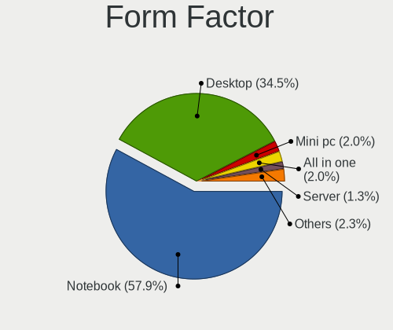
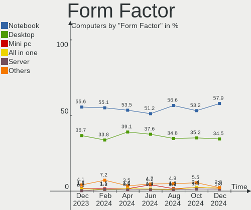
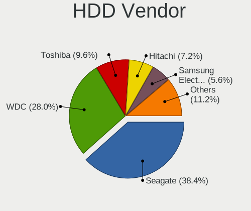
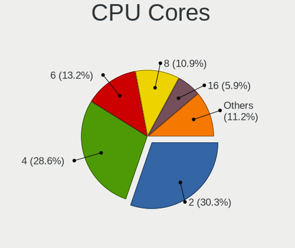
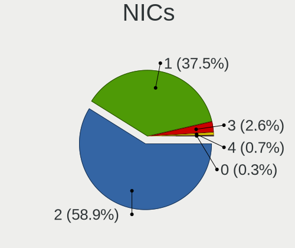
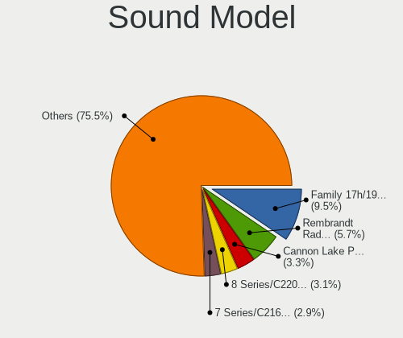
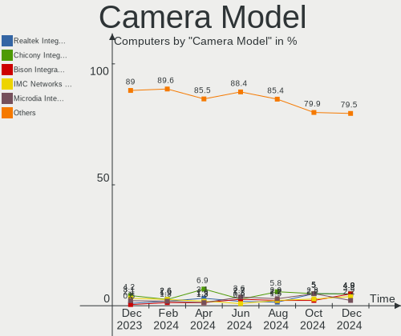
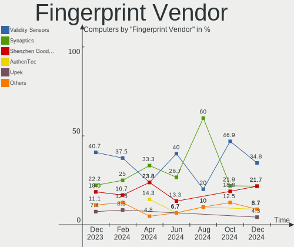

Linux in France - Hardware Trends
---------------------------------

A project to identify most popular hardware characteristics and track their change
over time based on data collected by Linux users at https://Linux-Hardware.org.

Anyone can contribute to this report by the [hw-probe](https://github.com/linuxhw/hw-probe) tool:

    sudo -E hw-probe -all -upload

This is a report for all computer types. See also reports for [desktops](/Location/France/Desktop/README.md) and [notebooks](/Location/France/Notebook/README.md).

Period: Jul, 2023.

Contents
--------

* [ System ](#system)
  - [ OS                       ](#os)
  - [ OS Family                ](#os-family)
  - [ Kernel                   ](#kernel)
  - [ Kernel Family            ](#kernel-family)
  - [ Kernel Major Ver.        ](#kernel-major-ver)
  - [ Arch                     ](#arch)
  - [ DE                       ](#de)
  - [ Display Server           ](#display-server)
  - [ Display Manager          ](#display-manager)
  - [ OS Lang                  ](#os-lang)
  - [ Boot Mode                ](#boot-mode)
  - [ Filesystem               ](#filesystem)
  - [ Part. scheme             ](#part-scheme)
  - [ Dual Boot with Linux/BSD ](#dual-boot-with-linuxbsd)
  - [ Dual Boot (Win)          ](#dual-boot-win)

* [ Board ](#board)
  - [ Vendor                   ](#vendor)
  - [ Model                    ](#model)
  - [ Model Family             ](#model-family)
  - [ MFG Year                 ](#mfg-year)
  - [ Form Factor              ](#form-factor)
  - [ Secure Boot              ](#secure-boot)
  - [ Coreboot                 ](#coreboot)
  - [ RAM Size                 ](#ram-size)
  - [ RAM Used                 ](#ram-used)
  - [ Total Drives             ](#total-drives)
  - [ Has CD-ROM               ](#has-cd-rom)
  - [ Has Ethernet             ](#has-ethernet)
  - [ Has WiFi                 ](#has-wifi)
  - [ Has Bluetooth            ](#has-bluetooth)

* [ Location ](#location)
  - [ Country                  ](#country)
  - [ City                     ](#city)

* [ Drives ](#drives)
  - [ Drive Vendor             ](#drive-vendor)
  - [ Drive Model              ](#drive-model)
  - [ HDD Vendor               ](#hdd-vendor)
  - [ SSD Vendor               ](#ssd-vendor)
  - [ Drive Kind               ](#drive-kind)
  - [ Drive Connector          ](#drive-connector)
  - [ Drive Size               ](#drive-size)
  - [ Space Total              ](#space-total)
  - [ Space Used               ](#space-used)
  - [ Malfunc. Drives          ](#malfunc-drives)
  - [ Malfunc. Drive Vendor    ](#malfunc-drive-vendor)
  - [ Malfunc. HDD Vendor      ](#malfunc-hdd-vendor)
  - [ Malfunc. Drive Kind      ](#malfunc-drive-kind)
  - [ Failed Drives            ](#failed-drives)
  - [ Failed Drive Vendor      ](#failed-drive-vendor)
  - [ Drive Status             ](#drive-status)

* [ Storage controller ](#storage-controller)
  - [ Storage Vendor           ](#storage-vendor)
  - [ Storage Model            ](#storage-model)
  - [ Storage Kind             ](#storage-kind)

* [ Processor ](#processor)
  - [ CPU Vendor               ](#cpu-vendor)
  - [ CPU Model                ](#cpu-model)
  - [ CPU Model Family         ](#cpu-model-family)
  - [ CPU Cores                ](#cpu-cores)
  - [ CPU Sockets              ](#cpu-sockets)
  - [ CPU Threads              ](#cpu-threads)
  - [ CPU Op-Modes             ](#cpu-op-modes)
  - [ CPU Microcode            ](#cpu-microcode)
  - [ CPU Microarch            ](#cpu-microarch)

* [ Graphics ](#graphics)
  - [ GPU Vendor               ](#gpu-vendor)
  - [ GPU Model                ](#gpu-model)
  - [ GPU Combo                ](#gpu-combo)
  - [ GPU Driver               ](#gpu-driver)
  - [ GPU Memory               ](#gpu-memory)

* [ Monitor ](#monitor)
  - [ Monitor Vendor           ](#monitor-vendor)
  - [ Monitor Model            ](#monitor-model)
  - [ Monitor Resolution       ](#monitor-resolution)
  - [ Monitor Diagonal         ](#monitor-diagonal)
  - [ Monitor Width            ](#monitor-width)
  - [ Aspect Ratio             ](#aspect-ratio)
  - [ Monitor Area             ](#monitor-area)
  - [ Pixel Density            ](#pixel-density)
  - [ Multiple Monitors        ](#multiple-monitors)

* [ Network ](#network)
  - [ Net Controller Vendor    ](#net-controller-vendor)
  - [ Net Controller Model     ](#net-controller-model)
  - [ Wireless Vendor          ](#wireless-vendor)
  - [ Wireless Model           ](#wireless-model)
  - [ Ethernet Vendor          ](#ethernet-vendor)
  - [ Ethernet Model           ](#ethernet-model)
  - [ Net Controller Kind      ](#net-controller-kind)
  - [ Used Controller          ](#used-controller)
  - [ NICs                     ](#nics)
  - [ IPv6                     ](#ipv6)

* [ Bluetooth ](#bluetooth)
  - [ Bluetooth Vendor         ](#bluetooth-vendor)
  - [ Bluetooth Model          ](#bluetooth-model)

* [ Sound ](#sound)
  - [ Sound Vendor             ](#sound-vendor)
  - [ Sound Model              ](#sound-model)

* [ Memory ](#memory)
  - [ Memory Vendor            ](#memory-vendor)
  - [ Memory Model             ](#memory-model)
  - [ Memory Kind              ](#memory-kind)
  - [ Memory Form Factor       ](#memory-form-factor)
  - [ Memory Size              ](#memory-size)
  - [ Memory Speed             ](#memory-speed)

* [ Printers & scanners ](#printers--scanners)
  - [ Printer Vendor           ](#printer-vendor)
  - [ Printer Model            ](#printer-model)
  - [ Scanner Vendor           ](#scanner-vendor)
  - [ Scanner Model            ](#scanner-model)

* [ Camera ](#camera)
  - [ Camera Vendor            ](#camera-vendor)
  - [ Camera Model             ](#camera-model)

* [ Security ](#security)
  - [ Fingerprint Vendor       ](#fingerprint-vendor)
  - [ Fingerprint Model        ](#fingerprint-model)
  - [ Chipcard Vendor          ](#chipcard-vendor)
  - [ Chipcard Model           ](#chipcard-model)

* [ Unsupported ](#unsupported)
  - [ Unsupported Devices      ](#unsupported-devices)
  - [ Unsupported Device Types ](#unsupported-device-types)

System
------

OS
--

Installed operating systems

| Name                         | Computers | Percent |
|------------------------------|-----------|---------|
| Ubuntu 22.04                 | 49        | 21.78%  |
| Linux Mint 21.1              | 19        | 8.44%   |
| Debian 11                    | 16        | 7.11%   |
| Ubuntu 23.04                 | 12        | 5.33%   |
| Ubuntu 20.04                 | 12        | 5.33%   |
| Debian 12                    | 11        | 4.89%   |
| OpenMandriva 23.03           | 9         | 4%      |
| Zorin 16                     | 8         | 3.56%   |
| Fedora 38                    | 7         | 3.11%   |
| OpenMandriva 23.07           | 6         | 2.67%   |
| Arch Rolling                 | 6         | 2.67%   |
| Linux Mint 21.2              | 5         | 2.22%   |
| Xubuntu 22.04                | 4         | 1.78%   |
| OpenMandriva 4.2             | 4         | 1.78%   |
| OpenMandriva 4.3             | 3         | 1.33%   |
| OpenMandriva 23.90           | 3         | 1.33%   |
| KDE neon 22.04               | 3         | 1.33%   |
| Debian                       | 3         | 1.33%   |
| Xubuntu 23.04                | 2         | 0.89%   |
| Ubuntu MATE 22.04            | 2         | 0.89%   |
| Ubuntu Budgie 22.04          | 2         | 0.89%   |
| openSUSE Tumbleweed-XXXXXXXX | 2         | 0.89%   |
| Manjaro                      | 2         | 0.89%   |
| Lubuntu 22.04                | 2         | 0.89%   |
| Kubuntu 23.04                | 2         | 0.89%   |
| Kubuntu 22.04                | 2         | 0.89%   |
| Kali 2023.2                  | 2         | 0.89%   |
| Fedora 37                    | 2         | 0.89%   |
| ArcoLinux Rolling            | 2         | 0.89%   |
| Xubuntu 22.10                | 1         | 0.44%   |
| Xubuntu 20.04                | 1         | 0.44%   |
| Xubuntu 18.04                | 1         | 0.44%   |
| Xero Rolling                 | 1         | 0.44%   |
| Ubuntu 22.10                 | 1         | 0.44%   |
| SteamOS 4                    | 1         | 0.44%   |
| SteamOS 3.4.8                | 1         | 0.44%   |
| ROSA 12.4                    | 1         | 0.44%   |
| Pop!_OS 22.04                | 1         | 0.44%   |
| openSUSE Leap-15.5           | 1         | 0.44%   |
| openSUSE Leap-15.4           | 1         | 0.44%   |

OS Family
---------

OS without a version

| Name          | Computers | Percent |
|---------------|-----------|---------|
| Ubuntu        | 74        | 32.89%  |
| Debian        | 30        | 13.33%  |
| OpenMandriva  | 26        | 11.56%  |
| Linux Mint    | 25        | 11.11%  |
| Xubuntu       | 9         | 4%      |
| Fedora        | 9         | 4%      |
| Zorin         | 8         | 3.56%   |
| Arch          | 6         | 2.67%   |
| openSUSE      | 4         | 1.78%   |
| Lubuntu       | 4         | 1.78%   |
| Kubuntu       | 4         | 1.78%   |
| Manjaro       | 3         | 1.33%   |
| KDE neon      | 3         | 1.33%   |
| Kali          | 3         | 1.33%   |
| Ubuntu MATE   | 2         | 0.89%   |
| Ubuntu Budgie | 2         | 0.89%   |
| SteamOS       | 2         | 0.89%   |
| ArcoLinux     | 2         | 0.89%   |
| Xero          | 1         | 0.44%   |
| ROSA          | 1         | 0.44%   |
| Pop!_OS       | 1         | 0.44%   |
| Nobara        | 1         | 0.44%   |
| NixOS         | 1         | 0.44%   |
| Manjaro-ARM   | 1         | 0.44%   |
| Gentoo        | 1         | 0.44%   |
| EndeavourOS   | 1         | 0.44%   |
| Artix         | 1         | 0.44%   |

Kernel
------

Version of the Linux kernel

| Version                    | Computers | Percent |
|----------------------------|-----------|---------|
| 5.19.0-46-generic          | 40        | 17.78%  |
| 5.15.0-76-generic          | 37        | 16.44%  |
| 6.2.6-desktop-1omv2390     | 10        | 4.44%   |
| 5.10.0-23-amd64            | 8         | 3.56%   |
| 5.19.0-50-generic          | 7         | 3.11%   |
| 6.2.0-25-generic           | 6         | 2.67%   |
| 6.3.5-desktop-3omv2390     | 5         | 2.22%   |
| 6.2.0-24-generic           | 5         | 2.22%   |
| 5.15.0-78-generic          | 5         | 2.22%   |
| 6.1.0-10-amd64             | 4         | 1.78%   |
| 5.4.0-153-generic          | 4         | 1.78%   |
| 5.19.0-45-generic          | 4         | 1.78%   |
| 5.10.14-desktop-1omv4002   | 4         | 1.78%   |
| 6.1.0-9-amd64              | 3         | 1.33%   |
| 5.16.13-desktop-1omv4003   | 3         | 1.33%   |
| 6.3.9-arch1-1              | 2         | 0.89%   |
| 6.3.8-200.fc38.x86_64      | 2         | 0.89%   |
| 6.3.8-100.fc37.x86_64      | 2         | 0.89%   |
| 6.3.11-200.fc38.x86_64     | 2         | 0.89%   |
| 6.3.0-1-amd64              | 2         | 0.89%   |
| 6.2.0-26-generic           | 2         | 0.89%   |
| 5.19.0-43-generic          | 2         | 0.89%   |
| 5.15.0-75-generic          | 2         | 0.89%   |
| 5.15.0-56-generic          | 2         | 0.89%   |
| 6.4.5-x64v3-xanmod1        | 1         | 0.44%   |
| 6.4.4-hardened1-1-hardened | 1         | 0.44%   |
| 6.4.4-arch1-1              | 1         | 0.44%   |
| 6.4.4-200.fc38.x86_64      | 1         | 0.44%   |
| 6.4.4-1-MANJARO-ARM        | 1         | 0.44%   |
| 6.4.3-zen1-2-zen           | 1         | 0.44%   |
| 6.4.3-zen1-1-zen           | 1         | 0.44%   |
| 6.4.3-desktop-2omv2390     | 1         | 0.44%   |
| 6.4.3-arch1-1              | 1         | 0.44%   |
| 6.4.3-1-liquorix-amd64     | 1         | 0.44%   |
| 6.4.3-1-default            | 1         | 0.44%   |
| 6.4.2-artix1-1             | 1         | 0.44%   |
| 6.4.2-arch1-1              | 1         | 0.44%   |
| 6.4.2-3-MANJARO            | 1         | 0.44%   |
| 6.4.2-1-default            | 1         | 0.44%   |
| 6.4.1-arch2-1              | 1         | 0.44%   |

Kernel Family
-------------

Linux kernel without a distro release

| Version  | Computers | Percent |
|----------|-----------|---------|
| 5.19.0   | 57        | 25.33%  |
| 5.15.0   | 50        | 22.22%  |
| 6.2.0    | 15        | 6.67%   |
| 5.10.0   | 13        | 5.78%   |
| 6.1.0    | 11        | 4.89%   |
| 6.2.6    | 10        | 4.44%   |
| 6.4.3    | 6         | 2.67%   |
| 5.4.0    | 6         | 2.67%   |
| 6.3.5    | 5         | 2.22%   |
| 6.4.4    | 4         | 1.78%   |
| 6.4.2    | 4         | 1.78%   |
| 6.3.8    | 4         | 1.78%   |
| 6.3.0    | 4         | 1.78%   |
| 5.10.14  | 4         | 1.78%   |
| 5.16.13  | 3         | 1.33%   |
| 6.3.9    | 2         | 0.89%   |
| 6.3.12   | 2         | 0.89%   |
| 6.3.11   | 2         | 0.89%   |
| 6.1.38   | 2         | 0.89%   |
| 5.14.21  | 2         | 0.89%   |
| 5.13.0   | 2         | 0.89%   |
| 6.4.5    | 1         | 0.44%   |
| 6.4.1    | 1         | 0.44%   |
| 6.3.6    | 1         | 0.44%   |
| 6.3.4    | 1         | 0.44%   |
| 6.3.3.15 | 1         | 0.44%   |
| 6.3.3    | 1         | 0.44%   |
| 6.2.8    | 1         | 0.44%   |
| 6.2.16   | 1         | 0.44%   |
| 6.1.4    | 1         | 0.44%   |
| 6.1.37   | 1         | 0.44%   |
| 6.1.29   | 1         | 0.44%   |
| 6.1.12   | 1         | 0.44%   |
| 6.0.0    | 1         | 0.44%   |
| 5.15.117 | 1         | 0.44%   |
| 5.15.102 | 1         | 0.44%   |
| 5.10.110 | 1         | 0.44%   |
| 4.15.0   | 1         | 0.44%   |

Kernel Major Ver.
-----------------

Linux kernel major version

| Version | Computers | Percent |
|---------|-----------|---------|
| 5.19    | 57        | 25.33%  |
| 5.15    | 52        | 23.11%  |
| 6.2     | 27        | 12%     |
| 6.3     | 22        | 9.78%   |
| 5.10    | 18        | 8%      |
| 6.1     | 17        | 7.56%   |
| 6.4     | 16        | 7.11%   |
| 5.4     | 6         | 2.67%   |
| 5.16    | 3         | 1.33%   |
| 5.14    | 2         | 0.89%   |
| 5.13    | 2         | 0.89%   |
| 6.3.3   | 1         | 0.44%   |
| 6.0     | 1         | 0.44%   |
| 4.15    | 1         | 0.44%   |

Arch
----

OS architecture (x86_64, i586, etc.)

| Name    | Computers | Percent |
|---------|-----------|---------|
| x86_64  | 222       | 98.67%  |
| aarch64 | 2         | 0.89%   |
| i686    | 1         | 0.44%   |

DE
--

Desktop Environment

| Name          | Computers | Percent |
|---------------|-----------|---------|
| GNOME         | 100       | 44.44%  |
| KDE5          | 48        | 21.33%  |
| XFCE          | 28        | 12.44%  |
| X-Cinnamon    | 20        | 8.89%   |
| LXQt          | 10        | 4.44%   |
| Unknown       | 7         | 3.11%   |
| MATE          | 5         | 2.22%   |
| Budgie        | 3         | 1.33%   |
| LXDE          | 1         | 0.44%   |
| i3            | 1         | 0.44%   |
| GNOME Classic | 1         | 0.44%   |
| Cinnamon      | 1         | 0.44%   |

Display Server
--------------

X11 or Wayland

| Name    | Computers | Percent |
|---------|-----------|---------|
| X11     | 149       | 66.22%  |
| Wayland | 62        | 27.56%  |
| Tty     | 11        | 4.89%   |
| Unknown | 3         | 1.33%   |

Display Manager
---------------

SDDM, LightDM, etc.

| Name    | Computers | Percent |
|---------|-----------|---------|
| GDM3    | 61        | 27.11%  |
| Unknown | 56        | 24.89%  |
| SDDM    | 45        | 20%     |
| LightDM | 42        | 18.67%  |
| GDM     | 21        | 9.33%   |

OS Lang
-------

Language

| Lang    | Computers | Percent |
|---------|-----------|---------|
| fr_FR   | 178       | 79.11%  |
| en_US   | 37        | 16.44%  |
| en_GB   | 4         | 1.78%   |
| pl_PL   | 1         | 0.44%   |
| it_IT   | 1         | 0.44%   |
| de_DE   | 1         | 0.44%   |
| C.UTF8  | 1         | 0.44%   |
| C       | 1         | 0.44%   |
| Unknown | 1         | 0.44%   |

Boot Mode
---------

EFI or BIOS

| Mode | Computers | Percent |
|------|-----------|---------|
| EFI  | 125       | 55.56%  |
| BIOS | 100       | 44.44%  |

Filesystem
----------

Type of filesystem

| Type    | Computers | Percent |
|---------|-----------|---------|
| Ext4    | 152       | 67.56%  |
| Tmpfs   | 33        | 14.67%  |
| Btrfs   | 27        | 12%     |
| Overlay | 9         | 4%      |
| Zfs     | 2         | 0.89%   |
| Xfs     | 2         | 0.89%   |

Part. scheme
------------

Scheme of partitioning

| Type    | Computers | Percent |
|---------|-----------|---------|
| GPT     | 146       | 64.89%  |
| Unknown | 50        | 22.22%  |
| MBR     | 29        | 12.89%  |

Dual Boot with Linux/BSD
------------------------

Hosting more than one Linux/BSD

| Dual boot | Computers | Percent |
|-----------|-----------|---------|
| No        | 183       | 81.33%  |
| Yes       | 42        | 18.67%  |

Dual Boot (Win)
---------------

Hosting Linux and Windows

| Dual boot | Computers | Percent |
|-----------|-----------|---------|
| No        | 163       | 72.44%  |
| Yes       | 62        | 27.56%  |

Board
-----

Vendor
------

Motherboard manufacturer

| Name                        | Computers | Percent |
|-----------------------------|-----------|---------|
| ASUSTek Computer            | 36        | 16%     |
| Dell                        | 32        | 14.22%  |
| Hewlett-Packard             | 28        | 12.44%  |
| Lenovo                      | 19        | 8.44%   |
| MSI                         | 18        | 8%      |
| Gigabyte Technology         | 15        | 6.67%   |
| Acer                        | 15        | 6.67%   |
| ASRock                      | 8         | 3.56%   |
| Toshiba                     | 5         | 2.22%   |
| Thomson                     | 4         | 1.78%   |
| Apple                       | 4         | 1.78%   |
| Unknown                     | 4         | 1.78%   |
| Samsung Electronics         | 3         | 1.33%   |
| Pegatron                    | 3         | 1.33%   |
| Intel                       | 3         | 1.33%   |
| AZW                         | 3         | 1.33%   |
| Sony                        | 2         | 0.89%   |
| Notebook                    | 2         | 0.89%   |
| Fujitsu                     | 2         | 0.89%   |
| Valve                       | 1         | 0.44%   |
| Ugoos                       | 1         | 0.44%   |
| TR                          | 1         | 0.44%   |
| Timi                        | 1         | 0.44%   |
| Teclast                     | 1         | 0.44%   |
| SLIMBOOK                    | 1         | 0.44%   |
| Shuttle                     | 1         | 0.44%   |
| Radxa                       | 1         | 0.44%   |
| Packard Bell                | 1         | 0.44%   |
| Medion                      | 1         | 0.44%   |
| GEEKOM                      | 1         | 0.44%   |
| Fujitsu Siemens             | 1         | 0.44%   |
| Foxconn                     | 1         | 0.44%   |
| eMachines                   | 1         | 0.44%   |
| Cincoze                     | 1         | 0.44%   |
| Chuwi                       | 1         | 0.44%   |
| Chitech Shenzhen Technology | 1         | 0.44%   |
| BESSTAR Tech                | 1         | 0.44%   |
| Alienware                   | 1         | 0.44%   |

Model
-----

Motherboard model

| Name                            | Computers | Percent |
|---------------------------------|-----------|---------|
| Unknown                         | 4         | 1.78%   |
| Thomson N15C4SL128              | 2         | 0.89%   |
| MSI MS-7A32                     | 2         | 0.89%   |
| HP Pavilion 17                  | 2         | 0.89%   |
| Dell Latitude E6320             | 2         | 0.89%   |
| AZW SER                         | 2         | 0.89%   |
| ASUS All Series                 | 2         | 0.89%   |
| Apple iMac12,1                  | 2         | 0.89%   |
| Acer Nitro AN515-57             | 2         | 0.89%   |
| Valve Jupiter                   | 1         | 0.44%   |
| Ugoos AM6b Plus                 | 1         | 0.44%   |
| TR ST Plus-KN                   | 1         | 0.44%   |
| Toshiba Satellite Pro L500      | 1         | 0.44%   |
| Toshiba Satellite P500          | 1         | 0.44%   |
| Toshiba Satellite L670          | 1         | 0.44%   |
| Toshiba Satellite C870D-108     | 1         | 0.44%   |
| Toshiba Satellite C70-B         | 1         | 0.44%   |
| Timi TM1612                     | 1         | 0.44%   |
| Thomson X15I5-8TU512            | 1         | 0.44%   |
| Thomson N15C8BK2T               | 1         | 0.44%   |
| Teclast F6 Plus                 | 1         | 0.44%   |
| Sony VPCEF4E1E                  | 1         | 0.44%   |
| Sony VGN-NS38E_S                | 1         | 0.44%   |
| SLIMBOOK PROX15-AMD             | 1         | 0.44%   |
| Shuttle XS35V3                  | 1         | 0.44%   |
| Samsung RV410/RV510/S3510/E3510 | 1         | 0.44%   |
| Samsung 950XED                  | 1         | 0.44%   |
| Samsung 530U3BI/530U4BI/530U4BH | 1         | 0.44%   |
| Radxa ROCK 5B                   | 1         | 0.44%   |
| Pegatron WE301AA-ABF p6215fr    | 1         | 0.44%   |
| Pegatron KT600AA-ABF a6443.fr   | 1         | 0.44%   |
| Pegatron G5445frm               | 1         | 0.44%   |
| Packard Bell H17HV              | 1         | 0.44%   |
| Notebook NS5x_NS7xPU            | 1         | 0.44%   |
| Notebook NLx0MU                 | 1         | 0.44%   |
| MSI VS201AA-ABF HPE-010fr       | 1         | 0.44%   |
| MSI MS-7D09                     | 1         | 0.44%   |
| MSI MS-7C92                     | 1         | 0.44%   |
| MSI MS-7C37                     | 1         | 0.44%   |
| MSI MS-7B93                     | 1         | 0.44%   |

Model Family
------------

Motherboard model prefix

| Name                 | Computers | Percent |
|----------------------|-----------|---------|
| Lenovo ThinkPad      | 13        | 5.78%   |
| Acer Aspire          | 9         | 4%      |
| Dell Latitude        | 8         | 3.56%   |
| HP Pavilion          | 7         | 3.11%   |
| HP Compaq            | 6         | 2.67%   |
| Dell Precision       | 6         | 2.67%   |
| Dell OptiPlex        | 6         | 2.67%   |
| Dell Inspiron        | 6         | 2.67%   |
| Toshiba Satellite    | 5         | 2.22%   |
| HP EliteBook         | 5         | 2.22%   |
| ASUS VivoBook        | 4         | 1.78%   |
| ASUS ROG             | 4         | 1.78%   |
| ASUS PRIME           | 4         | 1.78%   |
| Unknown              | 4         | 1.78%   |
| Thomson N15C4SL128   | 2         | 0.89%   |
| MSI MS-7A32          | 2         | 0.89%   |
| MSI GF63             | 2         | 0.89%   |
| Lenovo ThinkCentre   | 2         | 0.89%   |
| Lenovo IdeaPad       | 2         | 0.89%   |
| HP ProBook           | 2         | 0.89%   |
| Dell Vostro          | 2         | 0.89%   |
| AZW SER              | 2         | 0.89%   |
| ASUS Zenbook         | 2         | 0.89%   |
| ASUS All             | 2         | 0.89%   |
| Apple iMac12         | 2         | 0.89%   |
| Acer Swift           | 2         | 0.89%   |
| Acer Nitro           | 2         | 0.89%   |
| Valve Jupiter        | 1         | 0.44%   |
| Ugoos AM6b           | 1         | 0.44%   |
| TR ST                | 1         | 0.44%   |
| Timi TM1612          | 1         | 0.44%   |
| Thomson X15I5-8TU512 | 1         | 0.44%   |
| Thomson N15C8BK2T    | 1         | 0.44%   |
| Teclast F6           | 1         | 0.44%   |
| Sony VPCEF4E1E       | 1         | 0.44%   |
| Sony VGN-NS38E       | 1         | 0.44%   |
| SLIMBOOK PROX15-AMD  | 1         | 0.44%   |
| Shuttle XS35V3       | 1         | 0.44%   |
| Samsung RV410        | 1         | 0.44%   |
| Samsung 950XED       | 1         | 0.44%   |

MFG Year
--------

Motherboard manufacture year

| Year    | Computers | Percent |
|---------|-----------|---------|
| 2021    | 26        | 11.56%  |
| 2018    | 17        | 7.56%   |
| 2013    | 17        | 7.56%   |
| 2022    | 16        | 7.11%   |
| 2011    | 16        | 7.11%   |
| 2020    | 14        | 6.22%   |
| 2019    | 14        | 6.22%   |
| 2009    | 14        | 6.22%   |
| 2017    | 13        | 5.78%   |
| 2016    | 12        | 5.33%   |
| 2014    | 12        | 5.33%   |
| 2012    | 12        | 5.33%   |
| 2010    | 12        | 5.33%   |
| 2008    | 11        | 4.89%   |
| 2023    | 8         | 3.56%   |
| 2015    | 8         | 3.56%   |
| Unknown | 2         | 0.89%   |
| 2005    | 1         | 0.44%   |

Form Factor
-----------

Physical design of the computer

| Name           | Computers | Percent |
|----------------|-----------|---------|
| Notebook       | 124       | 55.11%  |
| Desktop        | 86        | 38.22%  |
| All in one     | 5         | 2.22%   |
| Mini pc        | 3         | 1.33%   |
| System on chip | 2         | 0.89%   |
| Tablet         | 2         | 0.89%   |
| Convertible    | 2         | 0.89%   |
| Server         | 1         | 0.44%   |

Secure Boot
-----------

Enabled or disabled

| State    | Computers | Percent |
|----------|-----------|---------|
| Disabled | 218       | 96.89%  |
| Enabled  | 7         | 3.11%   |

Coreboot
--------

Have coreboot on board

| Used | Computers | Percent |
|------|-----------|---------|
| No   | 225       | 100%    |

RAM Size
--------

Total RAM memory

| Size in GB      | Computers | Percent |
|-----------------|-----------|---------|
| 4.01-8.0        | 58        | 25.78%  |
| 16.01-24.0      | 43        | 19.11%  |
| 3.01-4.0        | 41        | 18.22%  |
| 8.01-16.0       | 33        | 14.67%  |
| 32.01-64.0      | 29        | 12.89%  |
| 1.01-2.0        | 7         | 3.11%   |
| 24.01-32.0      | 5         | 2.22%   |
| 2.01-3.0        | 4         | 1.78%   |
| 64.01-256.0     | 4         | 1.78%   |
| More than 256.0 | 1         | 0.44%   |

RAM Used
--------

Used RAM memory

| Used GB     | Computers | Percent |
|-------------|-----------|---------|
| 2.01-3.0    | 69        | 30.67%  |
| 1.01-2.0    | 57        | 25.33%  |
| 4.01-8.0    | 38        | 16.89%  |
| 3.01-4.0    | 30        | 13.33%  |
| 0.51-1.0    | 16        | 7.11%   |
| 8.01-16.0   | 10        | 4.44%   |
| 24.01-32.0  | 2         | 0.89%   |
| 64.01-256.0 | 1         | 0.44%   |
| 16.01-24.0  | 1         | 0.44%   |
| 0.01-0.5    | 1         | 0.44%   |

Total Drives
------------

Number of drives on board

| Drives | Computers | Percent |
|--------|-----------|---------|
| 1      | 125       | 55.56%  |
| 2      | 58        | 25.78%  |
| 3      | 19        | 8.44%   |
| 4      | 8         | 3.56%   |
| 6      | 6         | 2.67%   |
| 5      | 4         | 1.78%   |
| 7      | 2         | 0.89%   |
| 0      | 2         | 0.89%   |
| 13     | 1         | 0.44%   |

Has CD-ROM
----------

Has CD-ROM on board

| Presented | Computers | Percent |
|-----------|-----------|---------|
| No        | 140       | 62.22%  |
| Yes       | 85        | 37.78%  |

Has Ethernet
------------

Has Ethernet on board

| Presented | Computers | Percent |
|-----------|-----------|---------|
| Yes       | 199       | 88.44%  |
| No        | 26        | 11.56%  |

Has WiFi
--------

Has WiFi module

| Presented | Computers | Percent |
|-----------|-----------|---------|
| Yes       | 170       | 75.56%  |
| No        | 55        | 24.44%  |

Has Bluetooth
-------------

Has Bluetooth module

| Presented | Computers | Percent |
|-----------|-----------|---------|
| Yes       | 136       | 60.44%  |
| No        | 89        | 39.56%  |

Location
--------

Country
-------

Geographic location (country)

| Country | Computers | Percent |
|---------|-----------|---------|
| France  | 225       | 100%    |

City
----

Geographic location (city)

| City               | Computers | Percent |
|--------------------|-----------|---------|
| Paris              | 32        | 14.22%  |
| Strasbourg         | 6         | 2.67%   |
| Montpellier        | 4         | 1.78%   |
| Marseille          | 4         | 1.78%   |
| Toulouse           | 3         | 1.33%   |
| Rennes             | 3         | 1.33%   |
| Compiègne         | 3         | 1.33%   |
| Capdenac-Gare      | 3         | 1.33%   |
| Brive-la-Gaillarde | 3         | 1.33%   |
| Saint-Etienne      | 2         | 0.89%   |
| Roubaix            | 2         | 0.89%   |
| Poitiers           | 2         | 0.89%   |
| Perpignan          | 2         | 0.89%   |
| Obernai            | 2         | 0.89%   |
| Noisy-le-Grand     | 2         | 0.89%   |
| Nantes             | 2         | 0.89%   |
| Montrouge          | 2         | 0.89%   |
| Lyon               | 2         | 0.89%   |
| Limoges            | 2         | 0.89%   |
| Liffre             | 2         | 0.89%   |
| Le Mans            | 2         | 0.89%   |
| Grenoble           | 2         | 0.89%   |
| Dijon              | 2         | 0.89%   |
| Colombes           | 2         | 0.89%   |
| Colmar             | 2         | 0.89%   |
| Châtenay-Malabry  | 2         | 0.89%   |
| Angers             | 2         | 0.89%   |
| Weckolsheim        | 1         | 0.44%   |
| Villenave-d'Ornon  | 1         | 0.44%   |
| Vichy              | 1         | 0.44%   |
| Veurey-Voroize     | 1         | 0.44%   |
| Versailles         | 1         | 0.44%   |
| Valence            | 1         | 0.44%   |
| Trans-en-Provence  | 1         | 0.44%   |
| Tours              | 1         | 0.44%   |
| Tourcoing          | 1         | 0.44%   |
| Torcy              | 1         | 0.44%   |
| Tarbes             | 1         | 0.44%   |
| Soultz-sous-Forets | 1         | 0.44%   |
| Servian            | 1         | 0.44%   |

Drives
------

Drive Vendor
------------

Hard drive vendors

| Vendor                    | Computers | Drives | Percent |
|---------------------------|-----------|--------|---------|
| Samsung Electronics       | 68        | 83     | 19.05%  |
| Seagate                   | 50        | 64     | 14.01%  |
| WDC                       | 42        | 46     | 11.76%  |
| SanDisk                   | 25        | 26     | 7%      |
| Crucial                   | 24        | 26     | 6.72%   |
| Kingston                  | 19        | 20     | 5.32%   |
| HGST                      | 12        | 12     | 3.36%   |
| Unknown                   | 11        | 13     | 3.08%   |
| Toshiba                   | 11        | 14     | 3.08%   |
| Intel                     | 9         | 9      | 2.52%   |
| SK hynix                  | 6         | 6      | 1.68%   |
| Micron/Crucial Technology | 6         | 7      | 1.68%   |
| Hitachi                   | 6         | 6      | 1.68%   |
| China                     | 6         | 6      | 1.68%   |
| Transcend                 | 5         | 5      | 1.4%    |
| PNY                       | 5         | 6      | 1.4%    |
| SPCC                      | 4         | 5      | 1.12%   |
| Silicon Motion            | 4         | 4      | 1.12%   |
| Phison Electronics        | 4         | 5      | 1.12%   |
| Micron Technology         | 4         | 4      | 1.12%   |
| Unknown                   | 4         | 4      | 1.12%   |
| Plextor                   | 2         | 2      | 0.56%   |
| Phison                    | 2         | 3      | 0.56%   |
| LITEON                    | 2         | 2      | 0.56%   |
| Gigabyte Technology       | 2         | 2      | 0.56%   |
| Corsair                   | 2         | 2      | 0.56%   |
| X12                       | 1         | 1      | 0.28%   |
| Verbatim                  | 1         | 1      | 0.28%   |
| Teclast                   | 1         | 1      | 0.28%   |
| StoreJet                  | 1         | 1      | 0.28%   |
| SSSTC                     | 1         | 1      | 0.28%   |
| Seagate Technology        | 1         | 1      | 0.28%   |
| Maxtor                    | 1         | 1      | 0.28%   |
| Lenovo                    | 1         | 1      | 0.28%   |
| LaCie                     | 1         | 1      | 0.28%   |
| KIOXIA                    | 1         | 1      | 0.28%   |
| KingDian                  | 1         | 1      | 0.28%   |
| JMicron Technology        | 1         | 1      | 0.28%   |
| Innodisk                  | 1         | 1      | 0.28%   |
| Inateck                   | 1         | 1      | 0.28%   |

Drive Model
-----------

Hard drive models

| Model                                                 | Computers | Percent |
|-------------------------------------------------------|-----------|---------|
| Samsung NVMe SSD Controller SM981/PM981/PM983 500GB   | 7         | 1.79%   |
| Samsung SSD 980 1TB                                   | 5         | 1.28%   |
| Samsung SSD 870 EVO 500GB                             | 5         | 1.28%   |
| Kingston SA400S37480G 480GB SSD                       | 5         | 1.28%   |
| HGST HTS721010A9E630 1TB                              | 5         | 1.28%   |
| Crucial CT240BX500SSD1 240GB                          | 5         | 1.28%   |
| Toshiba MQ01ABD100 1TB                                | 4         | 1.03%   |
| Seagate ST2000DM001-1CH164 2TB                        | 4         | 1.03%   |
| Seagate ST1000DM010-2EP102 1TB                        | 4         | 1.03%   |
| Seagate ST1000DM003-1ER162 1TB                        | 4         | 1.03%   |
| Samsung SSD 860 EVO 500GB                             | 4         | 1.03%   |
| Micron/Crucial P2 NVMe PCIe SSD 1TB                   | 4         | 1.03%   |
| Unknown                                               | 4         | 1.03%   |
| WDC WD10JPVX-22JC3T0 1TB                              | 3         | 0.77%   |
| Silicon Motion SM2263EN/SM2263XT SSD Controller 500GB | 3         | 0.77%   |
| Seagate ST500LM021-1KJ152 500GB                       | 3         | 0.77%   |
| Seagate Expansion HDD 4TB                             | 3         | 0.77%   |
| Samsung SSD 970 EVO Plus 1TB                          | 3         | 0.77%   |
| Samsung SSD 850 EVO 500GB                             | 3         | 0.77%   |
| Samsung SSD 850 EVO 250GB                             | 3         | 0.77%   |
| Samsung NVMe SSD Controller PM9A1/PM9A3/980PRO 1TB    | 3         | 0.77%   |
| Samsung HD103UJ 1TB                                   | 3         | 0.77%   |
| Kingston SA400S37240G 240GB SSD                       | 3         | 0.77%   |
| Intel SSD 660P Series 1024GB                          | 3         | 0.77%   |
| Crucial CT1000MX500SSD1 1TB                           | 3         | 0.77%   |
| Crucial CT1000BX500SSD1 1TB                           | 3         | 0.77%   |
| WDC WDS500G2B0A-00SM50 500GB SSD                      | 2         | 0.51%   |
| WDC WD40EZRZ-00GXCB0 4TB                              | 2         | 0.51%   |
| WDC WD3200BEVT-22ZCT0 320GB                           | 2         | 0.51%   |
| WDC WD10EADS-65L5B1 1TB                               | 2         | 0.51%   |
| Unknown MMC Card  128GB                               | 2         | 0.51%   |
| SK hynix SC311 SATA 512GB SSD                         | 2         | 0.51%   |
| Seagate ST250DM000-1BD141 250GB                       | 2         | 0.51%   |
| Seagate ST2000DM008-2FR102 2TB                        | 2         | 0.51%   |
| Seagate ST2000DM001-1ER164 2TB                        | 2         | 0.51%   |
| Seagate ST1000LM048-2E7172 1TB                        | 2         | 0.51%   |
| Sandisk WD Black SN850 1TB                            | 2         | 0.51%   |
| SanDisk SSD PLUS 240GB                                | 2         | 0.51%   |
| SanDisk SDSSDA120G 120GB                              | 2         | 0.51%   |
| Samsung SSD 990 PRO 1TB                               | 2         | 0.51%   |

HDD Vendor
----------

Hard disk drive vendors

| Vendor              | Computers | Drives | Percent |
|---------------------|-----------|--------|---------|
| Seagate             | 50        | 64     | 39.68%  |
| WDC                 | 33        | 37     | 26.19%  |
| HGST                | 12        | 12     | 9.52%   |
| Toshiba             | 11        | 14     | 8.73%   |
| Samsung Electronics | 6         | 7      | 4.76%   |
| Hitachi             | 6         | 6      | 4.76%   |
| StoreJet            | 1         | 1      | 0.79%   |
| Maxtor              | 1         | 1      | 0.79%   |
| JMicron Technology  | 1         | 1      | 0.79%   |
| Inateck             | 1         | 1      | 0.79%   |
| Hewlett-Packard     | 1         | 5      | 0.79%   |
| H/W                 | 1         | 3      | 0.79%   |
| ASMT                | 1         | 1      | 0.79%   |
| Unknown             | 1         | 1      | 0.79%   |

SSD Vendor
----------

Solid state drive vendors

| Vendor              | Computers | Drives | Percent |
|---------------------|-----------|--------|---------|
| Samsung Electronics | 36        | 40     | 27.27%  |
| Crucial             | 20        | 22     | 15.15%  |
| SanDisk             | 16        | 16     | 12.12%  |
| Kingston            | 16        | 17     | 12.12%  |
| China               | 6         | 6      | 4.55%   |
| Transcend           | 5         | 5      | 3.79%   |
| PNY                 | 5         | 6      | 3.79%   |
| WDC                 | 4         | 4      | 3.03%   |
| SK hynix            | 4         | 4      | 3.03%   |
| Intel               | 4         | 4      | 3.03%   |
| SPCC                | 3         | 4      | 2.27%   |
| Plextor             | 2         | 2      | 1.52%   |
| LITEON              | 2         | 2      | 1.52%   |
| X12                 | 1         | 1      | 0.76%   |
| Verbatim            | 1         | 1      | 0.76%   |
| Teclast             | 1         | 1      | 0.76%   |
| SSSTC               | 1         | 1      | 0.76%   |
| Phison              | 1         | 1      | 0.76%   |
| KingDian            | 1         | 1      | 0.76%   |
| Innodisk            | 1         | 1      | 0.76%   |
| Gigabyte Technology | 1         | 1      | 0.76%   |
| Unknown             | 1         | 1      | 0.76%   |

Drive Kind
----------

HDD or SSD

| Kind    | Computers | Drives | Percent |
|---------|-----------|--------|---------|
| SSD     | 112       | 141    | 35.9%   |
| HDD     | 103       | 154    | 33.01%  |
| NVMe    | 82        | 98     | 26.28%  |
| MMC     | 13        | 13     | 4.17%   |
| Unknown | 2         | 4      | 0.64%   |

Drive Connector
---------------

SATA, SAS, NVMe, etc.

| Type | Computers | Drives | Percent |
|------|-----------|--------|---------|
| SATA | 166       | 276    | 60.58%  |
| NVMe | 82        | 98     | 29.93%  |
| SAS  | 13        | 23     | 4.74%   |
| MMC  | 13        | 13     | 4.74%   |

Drive Size
----------

Size of hard drive

| Size in TB | Computers | Drives | Percent |
|------------|-----------|--------|---------|
| 0.01-0.5   | 125       | 164    | 55.56%  |
| 0.51-1.0   | 60        | 79     | 26.67%  |
| 1.01-2.0   | 21        | 22     | 9.33%   |
| 3.01-4.0   | 8         | 8      | 3.56%   |
| 2.01-3.0   | 5         | 14     | 2.22%   |
| 4.01-10.0  | 5         | 6      | 2.22%   |
| 10.01-20.0 | 1         | 2      | 0.44%   |

Space Total
-----------

Amount of disk space available on the file system

| Size in GB     | Computers | Percent |
|----------------|-----------|---------|
| 251-500        | 59        | 26.22%  |
| 101-250        | 58        | 25.78%  |
| 501-1000       | 49        | 21.78%  |
| More than 3000 | 19        | 8.44%   |
| 2001-3000      | 10        | 4.44%   |
| 1001-2000      | 10        | 4.44%   |
| 1-20           | 10        | 4.44%   |
| Unknown        | 4         | 1.78%   |
| 21-50          | 3         | 1.33%   |
| 51-100         | 3         | 1.33%   |

Space Used
----------

Amount of used disk space

| Used GB        | Computers | Percent |
|----------------|-----------|---------|
| 1-20           | 58        | 25.78%  |
| 21-50          | 38        | 16.89%  |
| 101-250        | 37        | 16.44%  |
| 51-100         | 35        | 15.56%  |
| 251-500        | 23        | 10.22%  |
| 501-1000       | 10        | 4.44%   |
| More than 3000 | 8         | 3.56%   |
| 1001-2000      | 8         | 3.56%   |
| 2001-3000      | 4         | 1.78%   |
| Unknown        | 4         | 1.78%   |

Malfunc. Drives
---------------

Drive models with a malfunction

| Model                                 | Computers | Drives | Percent |
|---------------------------------------|-----------|--------|---------|
| Seagate ST500LM021-1KJ152 500GB       | 2         | 2      | 6.67%   |
| SanDisk SSD PLUS 240GB                | 2         | 2      | 6.67%   |
| Crucial CT240M500SSD1 240GB           | 2         | 2      | 6.67%   |
| WDC WD5000BEVT-60ZAT1 500GB           | 1         | 1      | 3.33%   |
| WDC WD5000AAKX-60U6AA0 500GB          | 1         | 1      | 3.33%   |
| WDC WD5000AAKX-00ERMA0 500GB          | 1         | 2      | 3.33%   |
| WDC WD5000AAKS-402AA0 500GB           | 1         | 1      | 3.33%   |
| WDC WD4500HLHX-01JJPV0 450GB          | 1         | 1      | 3.33%   |
| WDC WD20EARS-00J2GB0 2TB              | 1         | 1      | 3.33%   |
| WDC WD10EADS-65L5B1 1TB               | 1         | 1      | 3.33%   |
| Transcend TS120GSSD220S 120GB         | 1         | 1      | 3.33%   |
| Toshiba MK3261GSYN 320GB              | 1         | 1      | 3.33%   |
| SSSTC CV8-8E128-HP 128GB SSD          | 1         | 1      | 3.33%   |
| SK hynix HFS128G39TND-N210A 128GB SSD | 1         | 1      | 3.33%   |
| Seagate ST9160301AS 160GB             | 1         | 1      | 3.33%   |
| Seagate ST2000DM001-1ER164 2TB        | 1         | 1      | 3.33%   |
| SanDisk SSD i100 16GB                 | 1         | 1      | 3.33%   |
| SanDisk SDSSDXPS480G 480GB            | 1         | 1      | 3.33%   |
| SanDisk SDSSDA120G 120GB              | 1         | 1      | 3.33%   |
| Maxtor 6L160M0 160GB                  | 1         | 1      | 3.33%   |
| LITEON CV8-8E128-HP 128GB SSD         | 1         | 1      | 3.33%   |
| Kingston RBU-SMSM151S324GD 24GB SSD   | 1         | 1      | 3.33%   |
| Intel SSDSCKKW240H6 240GB             | 1         | 1      | 3.33%   |
| Intel SSDSC2KW240H6 240GB             | 1         | 1      | 3.33%   |
| HGST HTS721010A9E630 1TB              | 1         | 1      | 3.33%   |
| HGST HTS541075A9E680 752GB            | 1         | 1      | 3.33%   |
| HGST HTS541010A9E680 1TB              | 1         | 1      | 3.33%   |

Malfunc. Drive Vendor
---------------------

Vendors of faulty drives

| Vendor    | Computers | Drives | Percent |
|-----------|-----------|--------|---------|
| WDC       | 6         | 8      | 20.69%  |
| SanDisk   | 5         | 5      | 17.24%  |
| Seagate   | 4         | 4      | 13.79%  |
| HGST      | 3         | 3      | 10.34%  |
| Intel     | 2         | 2      | 6.9%    |
| Crucial   | 2         | 2      | 6.9%    |
| Transcend | 1         | 1      | 3.45%   |
| Toshiba   | 1         | 1      | 3.45%   |
| SSSTC     | 1         | 1      | 3.45%   |
| SK hynix  | 1         | 1      | 3.45%   |
| Maxtor    | 1         | 1      | 3.45%   |
| LITEON    | 1         | 1      | 3.45%   |
| Kingston  | 1         | 1      | 3.45%   |

Malfunc. HDD Vendor
-------------------

Vendors of faulty HDD drives

| Vendor  | Computers | Drives | Percent |
|---------|-----------|--------|---------|
| WDC     | 6         | 8      | 40%     |
| Seagate | 4         | 4      | 26.67%  |
| HGST    | 3         | 3      | 20%     |
| Toshiba | 1         | 1      | 6.67%   |
| Maxtor  | 1         | 1      | 6.67%   |

Malfunc. Drive Kind
-------------------

Kinds of faulty drives

| Kind | Computers | Drives | Percent |
|------|-----------|--------|---------|
| HDD  | 15        | 17     | 51.72%  |
| SSD  | 14        | 14     | 48.28%  |

Failed Drives
-------------

Failed drive models

Zero info for selected period =(

Failed Drive Vendor
-------------------

Failed drive vendors

Zero info for selected period =(

Drive Status
------------

Number of failed and malfunc. drives

| Status   | Computers | Drives | Percent |
|----------|-----------|--------|---------|
| Works    | 126       | 206    | 50%     |
| Detected | 100       | 173    | 39.68%  |
| Malfunc  | 26        | 31     | 10.32%  |

Storage controller
------------------

Storage Vendor
--------------

Storage controller vendors

| Vendor                       | Computers | Percent |
|------------------------------|-----------|---------|
| Intel                        | 159       | 52.65%  |
| AMD                          | 40        | 13.25%  |
| Samsung Electronics          | 33        | 10.93%  |
| SanDisk                      | 13        | 4.3%    |
| Micron/Crucial Technology    | 10        | 3.31%   |
| Phison Electronics           | 8         | 2.65%   |
| ASMedia Technology           | 8         | 2.65%   |
| Silicon Motion               | 4         | 1.32%   |
| Micron Technology            | 4         | 1.32%   |
| Nvidia                       | 3         | 0.99%   |
| Kingston Technology Company  | 3         | 0.99%   |
| SK hynix                     | 2         | 0.66%   |
| JMicron Technology           | 2         | 0.66%   |
| Broadcom / LSI               | 2         | 0.66%   |
| VIA Technologies             | 1         | 0.33%   |
| Silicon Image                | 1         | 0.33%   |
| Shenzhen Longsys Electronics | 1         | 0.33%   |
| Seagate Technology           | 1         | 0.33%   |
| Realtek Semiconductor        | 1         | 0.33%   |
| Marvell Technology Group     | 1         | 0.33%   |
| Lenovo                       | 1         | 0.33%   |
| KIOXIA                       | 1         | 0.33%   |
| INNOGRIT                     | 1         | 0.33%   |
| Biwin Storage Technology     | 1         | 0.33%   |
| ADATA Technology             | 1         | 0.33%   |

Storage Model
-------------

Storage controller models

| Model                                                                                   | Computers | Percent |
|-----------------------------------------------------------------------------------------|-----------|---------|
| AMD FCH SATA Controller [AHCI mode]                                                     | 30        | 9.06%   |
| Samsung NVMe SSD Controller SM981/PM981/PM983                                           | 12        | 3.63%   |
| Intel Sunrise Point-LP SATA Controller [AHCI mode]                                      | 12        | 3.63%   |
| Intel 8 Series/C220 Series Chipset Family 6-port SATA Controller 1 [AHCI mode]          | 12        | 3.63%   |
| Samsung NVMe SSD Controller 980                                                         | 11        | 3.32%   |
| Intel Q170/Q150/B150/H170/H110/Z170/CM236 Chipset SATA Controller [AHCI Mode]           | 9         | 2.72%   |
| Intel 82801IBM/IEM (ICH9M/ICH9M-E) 4 port SATA Controller [AHCI mode]                   | 9         | 2.72%   |
| Intel Wildcat Point-LP SATA Controller [AHCI Mode]                                      | 8         | 2.42%   |
| Intel 6 Series/C200 Series Chipset Family 6 port Desktop SATA AHCI Controller           | 8         | 2.42%   |
| ASMedia ASM1062 Serial ATA Controller                                                   | 8         | 2.42%   |
| Micron/Crucial P2 [Nick P2] / P3 / P3 Plus NVMe PCIe SSD (DRAM-less)                    | 7         | 2.11%   |
| Intel Celeron/Pentium Silver Processor SATA Controller                                  | 7         | 2.11%   |
| Intel Volume Management Device NVMe RAID Controller                                     | 5         | 1.51%   |
| Intel Tiger Lake SATA AHCI Controller                                                   | 5         | 1.51%   |
| Intel SATA Controller [RAID mode]                                                       | 5         | 1.51%   |
| Intel Cannon Point-LP SATA Controller [AHCI Mode]                                       | 5         | 1.51%   |
| Intel 8 Series SATA Controller 1 [AHCI mode]                                            | 5         | 1.51%   |
| Intel 6 Series/C200 Series Chipset Family 6 port Mobile SATA AHCI Controller            | 5         | 1.51%   |
| Silicon Motion SM2263EN/SM2263XT (DRAM-less) NVMe SSD Controllers                       | 4         | 1.21%   |
| Samsung NVMe SSD Controller PM9A1/PM9A3/980PRO                                          | 4         | 1.21%   |
| Phison E12 NVMe Controller                                                              | 4         | 1.21%   |
| Intel NM10/ICH7 Family SATA Controller [IDE mode]                                       | 4         | 1.21%   |
| Intel HM170/QM170 Chipset SATA Controller [AHCI Mode]                                   | 4         | 1.21%   |
| Intel 82801 Mobile SATA Controller [RAID mode]                                          | 4         | 1.21%   |
| Intel 7 Series Chipset Family 6-port SATA Controller [AHCI mode]                        | 4         | 1.21%   |
| AMD X370 Series Chipset SATA Controller                                                 | 4         | 1.21%   |
| SanDisk WD PC SN810 / Black SN850 NVMe SSD                                              | 3         | 0.91%   |
| SanDisk WD Blue SN550 NVMe SSD                                                          | 3         | 0.91%   |
| Samsung NVMe SSD Controller SM961/PM961/SM963                                           | 3         | 0.91%   |
| Phison PS5013 E13 NVMe Controller                                                       | 3         | 0.91%   |
| Intel SSD 660P Series                                                                   | 3         | 0.91%   |
| Intel Cannon Lake PCH SATA AHCI Controller                                              | 3         | 0.91%   |
| Intel Alder Lake-S PCH SATA Controller [AHCI Mode]                                      | 3         | 0.91%   |
| Intel 82801IBM/IEM (ICH9M/ICH9M-E) 2 port SATA Controller [IDE mode]                    | 3         | 0.91%   |
| Intel 7 Series/C210 Series Chipset Family 6-port SATA Controller [AHCI mode]            | 3         | 0.91%   |
| Intel 6 Series/C200 Series Chipset Family Desktop SATA Controller (IDE mode, ports 4-5) | 3         | 0.91%   |
| Intel 6 Series/C200 Series Chipset Family Desktop SATA Controller (IDE mode, ports 0-3) | 3         | 0.91%   |
| Intel 500 Series Chipset Family SATA AHCI Controller                                    | 3         | 0.91%   |
| Intel 5 Series/3400 Series Chipset 4 port SATA AHCI Controller                          | 3         | 0.91%   |
| Intel 200 Series PCH SATA controller [AHCI mode]                                        | 3         | 0.91%   |

Storage Kind
------------

Kind of storage controller (IDE, SATA, NVMe, SAS, ...)

| Kind | Computers | Percent |
|------|-----------|---------|
| SATA | 171       | 58.36%  |
| NVMe | 82        | 27.99%  |
| IDE  | 22        | 7.51%   |
| RAID | 18        | 6.14%   |

Processor
---------

CPU Vendor
----------

Processor vendors

| Vendor | Computers | Percent |
|--------|-----------|---------|
| Intel  | 173       | 76.89%  |
| AMD    | 50        | 22.22%  |
| ARM    | 2         | 0.89%   |

CPU Model
---------

Processor models

| Model                                         | Computers | Percent |
|-----------------------------------------------|-----------|---------|
| Intel Core i7-5500U CPU @ 2.40GHz             | 4         | 1.78%   |
| Intel Core i7-8565U CPU @ 1.80GHz             | 3         | 1.33%   |
| Intel Core i5-4300M CPU @ 2.60GHz             | 3         | 1.33%   |
| Intel Core i5-3470 CPU @ 3.20GHz              | 3         | 1.33%   |
| Intel Core i5-2500 CPU @ 3.30GHz              | 3         | 1.33%   |
| Intel 11th Gen Core i7-11800H @ 2.30GHz       | 3         | 1.33%   |
| Intel 11th Gen Core i5-11400H @ 2.70GHz       | 3         | 1.33%   |
| Intel Pentium Dual-Core CPU T4500 @ 2.30GHz   | 2         | 0.89%   |
| Intel Core i7-8650U CPU @ 1.90GHz             | 2         | 0.89%   |
| Intel Core i7-7700HQ CPU @ 2.80GHz            | 2         | 0.89%   |
| Intel Core i7-6500U CPU @ 2.50GHz             | 2         | 0.89%   |
| Intel Core i7-4790 CPU @ 3.60GHz              | 2         | 0.89%   |
| Intel Core i5-8279U CPU @ 2.40GHz             | 2         | 0.89%   |
| Intel Core i5-7200U CPU @ 2.50GHz             | 2         | 0.89%   |
| Intel Core i5-6500 CPU @ 3.20GHz              | 2         | 0.89%   |
| Intel Core i5-6300U CPU @ 2.40GHz             | 2         | 0.89%   |
| Intel Core i5-2500K CPU @ 3.30GHz             | 2         | 0.89%   |
| Intel Core i5-2400S CPU @ 2.50GHz             | 2         | 0.89%   |
| Intel Core i3-6100U CPU @ 2.30GHz             | 2         | 0.89%   |
| Intel Core i3-5005U CPU @ 2.00GHz             | 2         | 0.89%   |
| Intel Core 2 Duo CPU T5870 @ 2.00GHz          | 2         | 0.89%   |
| Intel Celeron N4020 CPU @ 1.10GHz             | 2         | 0.89%   |
| Intel Celeron CPU N3060 @ 1.60GHz             | 2         | 0.89%   |
| Intel 12th Gen Core i7-1260P                  | 2         | 0.89%   |
| ARM Processor                                 | 2         | 0.89%   |
| AMD Ryzen 9 7845HX with Radeon Graphics       | 2         | 0.89%   |
| AMD Ryzen 9 3900X 12-Core Processor           | 2         | 0.89%   |
| AMD Ryzen 7 3750H with Radeon Vega Mobile Gfx | 2         | 0.89%   |
| AMD Ryzen 5 5600X 6-Core Processor            | 2         | 0.89%   |
| Intel Xeon Silver 4316 CPU @ 2.30GHz          | 1         | 0.44%   |
| Intel Xeon CPU X5472 @ 3.00GHz                | 1         | 0.44%   |
| Intel Xeon CPU E5-2620 0 @ 2.00GHz            | 1         | 0.44%   |
| Intel Xeon CPU E3-1225 V2 @ 3.20GHz           | 1         | 0.44%   |
| Intel Xeon CPU E3-1220 v3 @ 3.10GHz           | 1         | 0.44%   |
| Intel Pentium Silver N5000 CPU @ 1.10GHz      | 1         | 0.44%   |
| Intel Pentium Gold G6400 CPU @ 4.00GHz        | 1         | 0.44%   |
| Intel Pentium Dual-Core CPU T4200 @ 2.00GHz   | 1         | 0.44%   |
| Intel Pentium Dual-Core CPU E5800 @ 3.20GHz   | 1         | 0.44%   |
| Intel Pentium Dual-Core CPU E5300 @ 2.60GHz   | 1         | 0.44%   |
| Intel Pentium Dual CPU T3400 @ 2.16GHz        | 1         | 0.44%   |

CPU Model Family
----------------

Processor model prefix

| Model                   | Computers | Percent |
|-------------------------|-----------|---------|
| Intel Core i5           | 54        | 24%     |
| Intel Core i7           | 40        | 17.78%  |
| Other                   | 22        | 9.78%   |
| Intel Core i3           | 12        | 5.33%   |
| AMD Ryzen 5             | 12        | 5.33%   |
| Intel Core 2 Duo        | 11        | 4.89%   |
| Intel Celeron           | 11        | 4.89%   |
| AMD Ryzen 7             | 11        | 4.89%   |
| AMD Ryzen 9             | 7         | 3.11%   |
| Intel Pentium Dual-Core | 5         | 2.22%   |
| Intel Xeon              | 4         | 1.78%   |
| Intel Atom              | 4         | 1.78%   |
| Intel Pentium           | 3         | 1.33%   |
| AMD A6                  | 3         | 1.33%   |
| AMD A4                  | 3         | 1.33%   |
| AMD Athlon II X2        | 2         | 0.89%   |
| AMD Athlon II           | 2         | 0.89%   |
| AMD A8                  | 2         | 0.89%   |
| Intel Xeon Silver       | 1         | 0.44%   |
| Intel Pentium Silver    | 1         | 0.44%   |
| Intel Pentium Gold      | 1         | 0.44%   |
| Intel Pentium Dual      | 1         | 0.44%   |
| Intel Genuine           | 1         | 0.44%   |
| Intel Core m3           | 1         | 0.44%   |
| Intel Core i9           | 1         | 0.44%   |
| Intel Core 2 Quad       | 1         | 0.44%   |
| Intel Core 2            | 1         | 0.44%   |
| Intel Celeron Dual-Core | 1         | 0.44%   |
| AMD Sempron             | 1         | 0.44%   |
| AMD Ryzen 7 PRO         | 1         | 0.44%   |
| AMD Ryzen 3             | 1         | 0.44%   |
| AMD GX                  | 1         | 0.44%   |
| AMD FX                  | 1         | 0.44%   |
| AMD E1                  | 1         | 0.44%   |
| AMD Athlon X2           | 1         | 0.44%   |

CPU Cores
---------

Number of processor cores

| Number | Computers | Percent |
|--------|-----------|---------|
| 2      | 86        | 38.22%  |
| 4      | 81        | 36%     |
| 6      | 24        | 10.67%  |
| 8      | 15        | 6.67%   |
| 12     | 11        | 4.89%   |
| 1      | 3         | 1.33%   |
| 16     | 2         | 0.89%   |
| 20     | 1         | 0.44%   |
| 10     | 1         | 0.44%   |
| 3      | 1         | 0.44%   |

CPU Sockets
-----------

Number of sockets

| Number | Computers | Percent |
|--------|-----------|---------|
| 1      | 222       | 98.67%  |
| 2      | 3         | 1.33%   |

CPU Threads
-----------

Threads per core (Hyper-Threading)

| Number | Computers | Percent |
|--------|-----------|---------|
| 2      | 141       | 62.67%  |
| 1      | 84        | 37.33%  |

CPU Op-Modes
------------

CPU Operation Modes (32-bit, 64-bit)

| Op mode        | Computers | Percent |
|----------------|-----------|---------|
| 32-bit, 64-bit | 224       | 99.56%  |
| 64-bit         | 1         | 0.44%   |

CPU Microcode
-------------

Microcode number

| Number     | Computers | Percent |
|------------|-----------|---------|
| Unknown    | 90        | 40%     |
| 0x206a7    | 11        | 4.89%   |
| 0x306c3    | 9         | 4%      |
| 0x1067a    | 9         | 4%      |
| 0x806ea    | 6         | 2.67%   |
| 0x506e3    | 5         | 2.22%   |
| 0x406e3    | 5         | 2.22%   |
| 0x306a9    | 5         | 2.22%   |
| 0x0a601203 | 5         | 2.22%   |
| 0x706a8    | 4         | 1.78%   |
| 0x906e9    | 3         | 1.33%   |
| 0x806d1    | 3         | 1.33%   |
| 0x20655    | 3         | 1.33%   |
| 0x08701021 | 3         | 1.33%   |
| 0x08608103 | 3         | 1.33%   |
| 0xa0653    | 2         | 0.89%   |
| 0x906ea    | 2         | 0.89%   |
| 0x806eb    | 2         | 0.89%   |
| 0x806c1    | 2         | 0.89%   |
| 0x6fd      | 2         | 0.89%   |
| 0x40651    | 2         | 0.89%   |
| 0x306d4    | 2         | 0.89%   |
| 0x106e5    | 2         | 0.89%   |
| 0x0a50000c | 2         | 0.89%   |
| 0x08600103 | 2         | 0.89%   |
| 0x07030105 | 2         | 0.89%   |
| 0x06006704 | 2         | 0.89%   |
| 0x010000c8 | 2         | 0.89%   |
| 0xb06f5    | 1         | 0.44%   |
| 0xa0671    | 1         | 0.44%   |
| 0xa0655    | 1         | 0.44%   |
| 0xa0652    | 1         | 0.44%   |
| 0x906ed    | 1         | 0.44%   |
| 0x906eb    | 1         | 0.44%   |
| 0x90672    | 1         | 0.44%   |
| 0x806ec    | 1         | 0.44%   |
| 0x806e9    | 1         | 0.44%   |
| 0x6f6      | 1         | 0.44%   |
| 0x606a6    | 1         | 0.44%   |
| 0x506ca    | 1         | 0.44%   |

CPU Microarch
-------------

Microarchitecture

| Name             | Computers | Percent |
|------------------|-----------|---------|
| KabyLake         | 29        | 12.89%  |
| Unknown          | 22        | 9.78%   |
| Haswell          | 19        | 8.44%   |
| Skylake          | 17        | 7.56%   |
| SandyBridge      | 17        | 7.56%   |
| Penryn           | 16        | 7.11%   |
| IvyBridge        | 11        | 4.89%   |
| Zen 2            | 9         | 4%      |
| Broadwell        | 8         | 3.56%   |
| Goldmont plus    | 7         | 3.11%   |
| CometLake        | 7         | 3.11%   |
| Zen 3            | 6         | 2.67%   |
| Icelake          | 6         | 2.67%   |
| Core             | 6         | 2.67%   |
| K10              | 5         | 2.22%   |
| Zen              | 4         | 1.78%   |
| Westmere         | 4         | 1.78%   |
| TigerLake        | 4         | 1.78%   |
| Nehalem          | 4         | 1.78%   |
| Zen+             | 3         | 1.33%   |
| Puma             | 3         | 1.33%   |
| Bonnell          | 3         | 1.33%   |
| Silvermont       | 2         | 0.89%   |
| Jaguar           | 2         | 0.89%   |
| Goldmont         | 2         | 0.89%   |
| Excavator        | 2         | 0.89%   |
| Alderlake Hybrid | 2         | 0.89%   |
| Steamroller      | 1         | 0.44%   |
| Piledriver       | 1         | 0.44%   |
| K8 & K10 hybrid  | 1         | 0.44%   |
| Bulldozer        | 1         | 0.44%   |
| Bobcat           | 1         | 0.44%   |

Graphics
--------

GPU Vendor
----------

Vendors of graphics cards

| Vendor                     | Computers | Percent |
|----------------------------|-----------|---------|
| Intel                      | 131       | 49.06%  |
| Nvidia                     | 68        | 25.47%  |
| AMD                        | 67        | 25.09%  |
| Matrox Electronics Systems | 1         | 0.37%   |

GPU Model
---------

Graphics card models

| Model                                                                                    | Computers | Percent |
|------------------------------------------------------------------------------------------|-----------|---------|
| Intel 2nd Generation Core Processor Family Integrated Graphics Controller                | 14        | 5.13%   |
| Intel Mobile 4 Series Chipset Integrated Graphics Controller                             | 9         | 3.3%    |
| Intel HD Graphics 530                                                                    | 8         | 2.93%   |
| Intel TigerLake-H GT1 [UHD Graphics]                                                     | 7         | 2.56%   |
| Intel Skylake GT2 [HD Graphics 520]                                                      | 7         | 2.56%   |
| Intel HD Graphics 5500                                                                   | 7         | 2.56%   |
| Intel GeminiLake [UHD Graphics 600]                                                      | 6         | 2.2%    |
| Intel 4th Gen Core Processor Integrated Graphics Controller                              | 6         | 2.2%    |
| Intel HD Graphics 630                                                                    | 5         | 1.83%   |
| Intel Haswell-ULT Integrated Graphics Controller                                         | 5         | 1.83%   |
| AMD Raphael                                                                              | 5         | 1.83%   |
| Intel Xeon E3-1200 v3/4th Gen Core Processor Integrated Graphics Controller              | 4         | 1.47%   |
| Intel WhiskeyLake-U GT2 [UHD Graphics 620]                                               | 4         | 1.47%   |
| Intel UHD Graphics 620                                                                   | 4         | 1.47%   |
| AMD Vega 10 XL/XT [Radeon RX Vega 56/64]                                                 | 4         | 1.47%   |
| Nvidia GK208B [GeForce GT 710]                                                           | 3         | 1.1%    |
| Nvidia GA106M [GeForce RTX 3060 Mobile / Max-Q]                                          | 3         | 1.1%    |
| Intel TigerLake-LP GT2 [Iris Xe Graphics]                                                | 3         | 1.1%    |
| Intel CoffeeLake-U GT3e [Iris Plus Graphics 655]                                         | 3         | 1.1%    |
| Intel CoffeeLake-S GT2 [UHD Graphics 630]                                                | 3         | 1.1%    |
| Intel Alder Lake-P Integrated Graphics Controller                                        | 3         | 1.1%    |
| Intel 3rd Gen Core processor Graphics Controller                                         | 3         | 1.1%    |
| AMD Renoir                                                                               | 3         | 1.1%    |
| AMD Picasso/Raven 2 [Radeon Vega Series / Radeon Vega Mobile Series]                     | 3         | 1.1%    |
| AMD Lucienne                                                                             | 3         | 1.1%    |
| Nvidia TU117M [GeForce GTX 1650 Mobile / Max-Q]                                          | 2         | 0.73%   |
| Nvidia TU116 [GeForce GTX 1660]                                                          | 2         | 0.73%   |
| Nvidia TU116 [GeForce GTX 1660 SUPER]                                                    | 2         | 0.73%   |
| Nvidia GP107 [GeForce GTX 1050 Ti]                                                       | 2         | 0.73%   |
| Nvidia GM206GLM [Quadro M2200 Mobile]                                                    | 2         | 0.73%   |
| Nvidia GM107M [GeForce GTX 950M]                                                         | 2         | 0.73%   |
| Nvidia GF108 [GeForce GT 730]                                                            | 2         | 0.73%   |
| Intel Xeon E3-1200 v2/3rd Gen Core processor Graphics Controller                         | 2         | 0.73%   |
| Intel HD Graphics 620                                                                    | 2         | 0.73%   |
| Intel HD Graphics 500                                                                    | 2         | 0.73%   |
| Intel CometLake-U GT2 [UHD Graphics]                                                     | 2         | 0.73%   |
| Intel CometLake-S GT2 [UHD Graphics 630]                                                 | 2         | 0.73%   |
| Intel CometLake-H GT2 [UHD Graphics]                                                     | 2         | 0.73%   |
| Intel CoffeeLake-H GT2 [UHD Graphics 630]                                                | 2         | 0.73%   |
| Intel Atom/Celeron/Pentium Processor x5-E8000/J3xxx/N3xxx Integrated Graphics Controller | 2         | 0.73%   |

GPU Combo
---------

Combinations of graphics cards

| Name           | Computers | Percent |
|----------------|-----------|---------|
| 1 x Intel      | 87        | 38.67%  |
| 1 x AMD        | 58        | 25.78%  |
| Intel + Nvidia | 37        | 16.44%  |
| 1 x Nvidia     | 28        | 12.44%  |
| 2 x AMD        | 5         | 2.22%   |
| Other          | 2         | 0.89%   |
| 2 x Intel      | 2         | 0.89%   |
| Intel + AMD    | 2         | 0.89%   |
| AMD + Nvidia   | 2         | 0.89%   |
| 2 x Nvidia     | 1         | 0.44%   |
| 1 x Matrox     | 1         | 0.44%   |

GPU Driver
----------

Free vs proprietary

| Driver      | Computers | Percent |
|-------------|-----------|---------|
| Free        | 185       | 82.22%  |
| Proprietary | 33        | 14.67%  |
| Unknown     | 7         | 3.11%   |

GPU Memory
----------

Total video memory

| Size in GB | Computers | Percent |
|------------|-----------|---------|
| Unknown    | 142       | 63.11%  |
| 0.01-0.5   | 31        | 13.78%  |
| 1.01-2.0   | 16        | 7.11%   |
| 0.51-1.0   | 11        | 4.89%   |
| 7.01-8.0   | 10        | 4.44%   |
| 3.01-4.0   | 7         | 3.11%   |
| 5.01-6.0   | 3         | 1.33%   |
| 8.01-16.0  | 3         | 1.33%   |
| 2.01-3.0   | 1         | 0.44%   |
| 16.01-24.0 | 1         | 0.44%   |

Monitor
-------

Monitor Vendor
--------------

Monitor vendors

| Vendor                  | Computers | Percent |
|-------------------------|-----------|---------|
| AU Optronics            | 32        | 13.17%  |
| Samsung Electronics     | 23        | 9.47%   |
| Chimei Innolux          | 23        | 9.47%   |
| Iiyama                  | 21        | 8.64%   |
| LG Display              | 17        | 7%      |
| BOE                     | 14        | 5.76%   |
| Acer                    | 13        | 5.35%   |
| Dell                    | 10        | 4.12%   |
| Hewlett-Packard         | 9         | 3.7%    |
| Goldstar                | 8         | 3.29%   |
| Philips                 | 6         | 2.47%   |
| BenQ                    | 6         | 2.47%   |
| ViewSonic               | 5         | 2.06%   |
| Lenovo                  | 4         | 1.65%   |
| Chi Mei Optoelectronics | 4         | 1.65%   |
| Apple                   | 4         | 1.65%   |
| AOC                     | 4         | 1.65%   |
| PANDA                   | 3         | 1.23%   |
| InfoVision              | 3         | 1.23%   |
| ASUSTek Computer        | 3         | 1.23%   |
| Vestel Elektronik       | 2         | 0.82%   |
| Unknown                 | 2         | 0.82%   |
| Sharp                   | 2         | 0.82%   |
| Packard Bell            | 2         | 0.82%   |
| LG Philips              | 2         | 0.82%   |
| Gigabyte Technology     | 2         | 0.82%   |
| Denver                  | 2         | 0.82%   |
| Ancor Communications    | 2         | 0.82%   |
| Yeyian                  | 1         | 0.41%   |
| Valve                   | 1         | 0.41%   |
| SNC                     | 1         | 0.41%   |
| RTK                     | 1         | 0.41%   |
| Onkyo                   | 1         | 0.41%   |
| MSI                     | 1         | 0.41%   |
| MSF                     | 1         | 0.41%   |
| LG Electronics          | 1         | 0.41%   |
| KGS                     | 1         | 0.41%   |
| GVS                     | 1         | 0.41%   |
| Dark Matter             | 1         | 0.41%   |
| CTO                     | 1         | 0.41%   |

Monitor Model
-------------

Monitor models

| Model                                                                | Computers | Percent |
|----------------------------------------------------------------------|-----------|---------|
| Samsung Electronics LCD Monitor SEC5441 1366x768 344x194mm 15.5-inch | 3         | 1.18%   |
| Iiyama PL2530H IVM6132 1920x1080 544x303mm 24.5-inch                 | 3         | 1.18%   |
| Chimei Innolux LCD Monitor CMN1521 1920x1080 344x193mm 15.5-inch     | 3         | 1.18%   |
| Vestel Elektronik 42 FHD_LCD-TV VES3700 1920x540                     | 2         | 0.79%   |
| Samsung Electronics LCD Monitor SEC504B 1600x900 382x215mm 17.3-inch | 2         | 0.79%   |
| Iiyama PLX2783H IVM6611 1920x1080 598x336mm 27.0-inch                | 2         | 0.79%   |
| Iiyama PL2791Q IVM6646 2560x1440 597x336mm 27.0-inch                 | 2         | 0.79%   |
| Iiyama PL2783Q IVM661E 2560x1440 597x336mm 27.0-inch                 | 2         | 0.79%   |
| Hewlett-Packard V22e HPN371B 1920x1080 477x268mm 21.5-inch           | 2         | 0.79%   |
| Denver PGM270 LHC2700 2560x1440 597x336mm 27.0-inch                  | 2         | 0.79%   |
| Dell P2417H DELA0DC 1920x1080 527x296mm 23.8-inch                    | 2         | 0.79%   |
| Dell E228WFP DELD015 1680x1050 473x296mm 22.0-inch                   | 2         | 0.79%   |
| Chimei Innolux LCD Monitor CMN1734 1600x900 382x214mm 17.2-inch      | 2         | 0.79%   |
| Chimei Innolux LCD Monitor CMN1520 1920x1080 344x193mm 15.5-inch     | 2         | 0.79%   |
| BOE LCD Monitor BOE0672 1366x768 344x194mm 15.5-inch                 | 2         | 0.79%   |
| AU Optronics LCD Monitor AUO70EC 1366x768 344x193mm 15.5-inch        | 2         | 0.79%   |
| AU Optronics LCD Monitor AUO2E3C 1366x768 309x173mm 13.9-inch        | 2         | 0.79%   |
| AU Optronics LCD Monitor AUO159E 1600x900 382x214mm 17.2-inch        | 2         | 0.79%   |
| Apple iMac APPA00C 1920x1080 475x267mm 21.5-inch                     | 2         | 0.79%   |
| AOC Q27G2SG4 AOC2702 2560x1440 597x336mm 27.0-inch                   | 2         | 0.79%   |
| Acer HA240Y ACR0583 1920x1080 527x296mm 23.8-inch                    | 2         | 0.79%   |
| Acer G226HQL ACR02D3 1920x1080 477x268mm 21.5-inch                   | 2         | 0.79%   |
| Yeyian YMC-70102 YEY2700 1920x1080 698x393mm 31.5-inch               | 1         | 0.39%   |
| ViewSonic XG350R-C VSC4F37 3440x1440 819x346mm 35.0-inch             | 1         | 0.39%   |
| ViewSonic XG2401 SERIES VSCBB31 1920x1080 531x299mm 24.0-inch        | 1         | 0.39%   |
| ViewSonic VX2778 Series VSC8432 2560x1440 597x336mm 27.0-inch        | 1         | 0.39%   |
| ViewSonic VX2458 Series VSC36AF 1920x1080 521x293mm 23.5-inch        | 1         | 0.39%   |
| ViewSonic VA2746 SERIES VSC752E 1920x1080 598x336mm 27.0-inch        | 1         | 0.39%   |
| Valve ANX7530 U VLV3001 800x1280 100x150mm 7.1-inch                  | 1         | 0.39%   |
| Unknown LCD Monitor SAMSUNG 1920x1080                                | 1         | 0.39%   |
| Unknown LCD Monitor FFFF 2288x1287 2550x2550mm 142.0-inch            | 1         | 0.39%   |
| SNC G24-001 SKP SNC2409 1920x1080 600x330mm 27.0-inch                | 1         | 0.39%   |
| Sharp LQ156M1JW01 SHP14C3 1920x1080 344x194mm 15.5-inch              | 1         | 0.39%   |
| Sharp LCD Monitor SHP1421 3200x1800 294x165mm 13.3-inch              | 1         | 0.39%   |
| Samsung Electronics SyncMaster SAM0610 1920x1080                     | 1         | 0.39%   |
| Samsung Electronics SyncMaster SAM05CD 1920x1080                     | 1         | 0.39%   |
| Samsung Electronics SyncMaster SAM027C 1680x1050 433x271mm 20.1-inch | 1         | 0.39%   |
| Samsung Electronics SMC27A550U SAM07F6 1920x1080 598x336mm 27.0-inch | 1         | 0.39%   |
| Samsung Electronics S27D590 SAM0BE8 1920x1080 598x336mm 27.0-inch    | 1         | 0.39%   |
| Samsung Electronics LS27AG30x SAM717A 1920x1080 597x336mm 27.0-inch  | 1         | 0.39%   |

Monitor Resolution
------------------

Monitor screen resolution

| Resolution         | Computers | Percent |
|--------------------|-----------|---------|
| 1920x1080 (FHD)    | 112       | 49.12%  |
| 1366x768 (WXGA)    | 37        | 16.23%  |
| 3840x2160 (4K)     | 14        | 6.14%   |
| 1600x900 (HD+)     | 14        | 6.14%   |
| 2560x1440 (QHD)    | 12        | 5.26%   |
| 1680x1050 (WSXGA+) | 7         | 3.07%   |
| 1280x1024 (SXGA)   | 5         | 2.19%   |
| 1920x1200 (WUXGA)  | 4         | 1.75%   |
| 1440x900 (WXGA+)   | 4         | 1.75%   |
| 3440x1440          | 3         | 1.32%   |
| 1280x800 (WXGA)    | 3         | 1.32%   |
| 2560x1600          | 2         | 0.88%   |
| 800x1280           | 1         | 0.44%   |
| 3200x1800 (QHD+)   | 1         | 0.44%   |
| 3072x1920          | 1         | 0.44%   |
| 3000x2000          | 1         | 0.44%   |
| 2880x1800          | 1         | 0.44%   |
| 2560x1080          | 1         | 0.44%   |
| 2288x1287          | 1         | 0.44%   |
| 1680x945           | 1         | 0.44%   |
| 1600x2560          | 1         | 0.44%   |
| 1360x768           | 1         | 0.44%   |
| 1024x600           | 1         | 0.44%   |

Monitor Diagonal
----------------

Diagonal size in inches

| Inches  | Computers | Percent |
|---------|-----------|---------|
| 15      | 50        | 20.33%  |
| 24      | 28        | 11.38%  |
| 27      | 27        | 10.98%  |
| 17      | 24        | 9.76%   |
| 23      | 22        | 8.94%   |
| 13      | 16        | 6.5%    |
| 14      | 13        | 5.28%   |
| 21      | 12        | 4.88%   |
| 31      | 8         | 3.25%   |
| 22      | 6         | 2.44%   |
| 19      | 6         | 2.44%   |
| Unknown | 6         | 2.44%   |
| 12      | 4         | 1.63%   |
| 16      | 3         | 1.22%   |
| 84      | 2         | 0.81%   |
| 39      | 2         | 0.81%   |
| 35      | 2         | 0.81%   |
| 18      | 2         | 0.81%   |
| 11      | 2         | 0.81%   |
| 10      | 2         | 0.81%   |
| 142     | 1         | 0.41%   |
| 65      | 1         | 0.41%   |
| 54      | 1         | 0.41%   |
| 40      | 1         | 0.41%   |
| 34      | 1         | 0.41%   |
| 29      | 1         | 0.41%   |
| 20      | 1         | 0.41%   |
| 8       | 1         | 0.41%   |
| 7       | 1         | 0.41%   |

Monitor Width
-------------

Physical width

| Width in mm    | Computers | Percent |
|----------------|-----------|---------|
| 301-350        | 70        | 29.41%  |
| 501-600        | 69        | 28.99%  |
| 351-400        | 31        | 13.03%  |
| 401-500        | 22        | 9.24%   |
| 201-300        | 18        | 7.56%   |
| 601-700        | 9         | 3.78%   |
| Unknown        | 6         | 2.52%   |
| 801-900        | 5         | 2.1%    |
| 1501-2000      | 2         | 0.84%   |
| 1001-1500      | 2         | 0.84%   |
| More than 2000 | 1         | 0.42%   |
| 701-800        | 1         | 0.42%   |
| 101-200        | 1         | 0.42%   |
| 1-100          | 1         | 0.42%   |

Aspect Ratio
------------

Proportional relationship between the width and the height

| Ratio   | Computers | Percent |
|---------|-----------|---------|
| 16/9    | 174       | 82.08%  |
| 16/10   | 22        | 10.38%  |
| 5/4     | 6         | 2.83%   |
| 21/9    | 3         | 1.42%   |
| Unknown | 3         | 1.42%   |
| 3/2     | 1         | 0.47%   |
| 1.00    | 1         | 0.47%   |
| 0.67    | 1         | 0.47%   |
| 0.58    | 1         | 0.47%   |

Monitor Area
------------

Area in inch²

| Area in inch² | Computers | Percent |
|----------------|-----------|---------|
| 201-250        | 54        | 22.22%  |
| 101-110        | 50        | 20.58%  |
| 301-350        | 27        | 11.11%  |
| 121-130        | 21        | 8.64%   |
| 81-90          | 20        | 8.23%   |
| 351-500        | 12        | 4.94%   |
| 151-200        | 11        | 4.53%   |
| 71-80          | 10        | 4.12%   |
| 251-300        | 7         | 2.88%   |
| Unknown        | 6         | 2.47%   |
| More than 1000 | 5         | 2.06%   |
| 61-70          | 3         | 1.23%   |
| 141-150        | 3         | 1.23%   |
| 111-120        | 3         | 1.23%   |
| 501-1000       | 3         | 1.23%   |
| 51-60          | 2         | 0.82%   |
| 41-50          | 2         | 0.82%   |
| 1-40           | 2         | 0.82%   |
| 131-140        | 2         | 0.82%   |

Pixel Density
-------------

Pixels per inch

| Density       | Computers | Percent |
|---------------|-----------|---------|
| 51-100        | 89        | 38.03%  |
| 101-120       | 62        | 26.5%   |
| 121-160       | 57        | 24.36%  |
| 161-240       | 12        | 5.13%   |
| Unknown       | 6         | 2.56%   |
| More than 240 | 4         | 1.71%   |
| 1-50          | 4         | 1.71%   |

Multiple Monitors
-----------------

Total monitors connected

| Total | Computers | Percent |
|-------|-----------|---------|
| 1     | 171       | 76%     |
| 2     | 38        | 16.89%  |
| 0     | 10        | 4.44%   |
| 3     | 6         | 2.67%   |

Network
-------

Net Controller Vendor
---------------------

Controller vendors

| Vendor                            | Computers | Percent |
|-----------------------------------|-----------|---------|
| Realtek Semiconductor             | 124       | 36.58%  |
| Intel                             | 119       | 35.1%   |
| Qualcomm Atheros                  | 27        | 7.96%   |
| Broadcom                          | 23        | 6.78%   |
| Broadcom Limited                  | 6         | 1.77%   |
| Marvell Technology Group          | 5         | 1.47%   |
| Ralink                            | 4         | 1.18%   |
| Xiaomi                            | 3         | 0.88%   |
| NetGear                           | 3         | 0.88%   |
| MediaTek                          | 3         | 0.88%   |
| Ralink Technology                 | 2         | 0.59%   |
| Nvidia                            | 2         | 0.59%   |
| Microsoft                         | 2         | 0.59%   |
| DisplayLink                       | 2         | 0.59%   |
| Dell                              | 2         | 0.59%   |
| Xilinx                            | 1         | 0.29%   |
| TRENDnet                          | 1         | 0.29%   |
| TP-Link                           | 1         | 0.29%   |
| Qualcomm Technologies             | 1         | 0.29%   |
| Qualcomm                          | 1         | 0.29%   |
| OPPO Electronics                  | 1         | 0.29%   |
| Guillemot                         | 1         | 0.29%   |
| Ericsson Business Mobile Networks | 1         | 0.29%   |
| D-Link System                     | 1         | 0.29%   |
| ASIX Electronics                  | 1         | 0.29%   |
| Aquantia                          | 1         | 0.29%   |
| 3Com                              | 1         | 0.29%   |

Net Controller Model
--------------------

Controller models

| Model                                                             | Computers | Percent |
|-------------------------------------------------------------------|-----------|---------|
| Realtek RTL8111/8168/8411 PCI Express Gigabit Ethernet Controller | 79        | 19.51%  |
| Realtek RTL8153 Gigabit Ethernet Adapter                          | 13        | 3.21%   |
| Realtek RTL810xE PCI Express Fast Ethernet controller             | 11        | 2.72%   |
| Intel Wireless 8265 / 8275                                        | 8         | 1.98%   |
| Intel Wireless 7265                                               | 8         | 1.98%   |
| Intel Wi-Fi 6 AX200                                               | 8         | 1.98%   |
| Intel I211 Gigabit Network Connection                             | 8         | 1.98%   |
| Intel 82579LM Gigabit Network Connection (Lewisville)             | 8         | 1.98%   |
| Realtek RTL8821CE 802.11ac PCIe Wireless Network Adapter          | 7         | 1.73%   |
| Realtek RTL8125 2.5GbE Controller                                 | 7         | 1.73%   |
| Intel Wireless 3165                                               | 7         | 1.73%   |
| Intel Tiger Lake PCH CNVi WiFi                                    | 6         | 1.48%   |
| Intel Ethernet Controller I225-V                                  | 6         | 1.48%   |
| Broadcom BCM43142 802.11b/g/n                                     | 5         | 1.23%   |
| Broadcom BCM4313 802.11bgn Wireless Network Adapter               | 5         | 1.23%   |
| Realtek RTL8822BE 802.11a/b/g/n/ac WiFi adapter                   | 4         | 0.99%   |
| Qualcomm Atheros QCA9565 / AR9565 Wireless Network Adapter        | 4         | 0.99%   |
| Qualcomm Atheros AR9462 Wireless Network Adapter                  | 4         | 0.99%   |
| Qualcomm Atheros AR9285 Wireless Network Adapter (PCI-Express)    | 4         | 0.99%   |
| Intel Ethernet Connection I217-V                                  | 4         | 0.99%   |
| Intel Ethernet Connection (5) I219-LM                             | 4         | 0.99%   |
| Intel Dual Band Wireless-AC 3168NGW [Stone Peak]                  | 4         | 0.99%   |
| Intel Cannon Point-LP CNVi [Wireless-AC]                          | 4         | 0.99%   |
| Realtek RTL-8100/8101L/8139 PCI Fast Ethernet Adapter             | 3         | 0.74%   |
| Realtek 802.11ac NIC                                              | 3         | 0.74%   |
| Qualcomm Atheros QCA9377 802.11ac Wireless Network Adapter        | 3         | 0.74%   |
| Qualcomm Atheros AR9485 Wireless Network Adapter                  | 3         | 0.74%   |
| Qualcomm Atheros AR8131 Gigabit Ethernet                          | 3         | 0.74%   |
| MediaTek MT7922 802.11ax PCI Express Wireless Network Adapter     | 3         | 0.74%   |
| Intel Wireless 8260                                               | 3         | 0.74%   |
| Intel Wireless 7260                                               | 3         | 0.74%   |
| Intel Wi-Fi 6 AX210/AX211/AX411 160MHz                            | 3         | 0.74%   |
| Intel Ethernet Connection I217-LM                                 | 3         | 0.74%   |
| Intel Ethernet Connection (7) I219-V                              | 3         | 0.74%   |
| Intel Ethernet Connection (2) I219-V                              | 3         | 0.74%   |
| Intel Ethernet Connection (2) I219-LM                             | 3         | 0.74%   |
| Intel Comet Lake PCH CNVi WiFi                                    | 3         | 0.74%   |
| Intel 82579V Gigabit Network Connection                           | 3         | 0.74%   |
| Broadcom Limited BCM4312 802.11b/g LP-PHY                         | 3         | 0.74%   |
| Xiaomi Mi/Redmi series (RNDIS)                                    | 2         | 0.49%   |

Wireless Vendor
---------------

Wireless vendors

| Vendor                | Computers | Percent |
|-----------------------|-----------|---------|
| Intel                 | 83        | 47.16%  |
| Realtek Semiconductor | 31        | 17.61%  |
| Qualcomm Atheros      | 24        | 13.64%  |
| Broadcom              | 14        | 7.95%   |
| Ralink                | 4         | 2.27%   |
| Broadcom Limited      | 4         | 2.27%   |
| NetGear               | 3         | 1.7%    |
| MediaTek              | 3         | 1.7%    |
| Ralink Technology     | 2         | 1.14%   |
| Microsoft             | 2         | 1.14%   |
| TRENDnet              | 1         | 0.57%   |
| TP-Link               | 1         | 0.57%   |
| Qualcomm Technologies | 1         | 0.57%   |
| Guillemot             | 1         | 0.57%   |
| Dell                  | 1         | 0.57%   |
| D-Link System         | 1         | 0.57%   |

Wireless Model
--------------

Wireless models

| Model                                                          | Computers | Percent |
|----------------------------------------------------------------|-----------|---------|
| Intel Wireless 8265 / 8275                                     | 8         | 4.52%   |
| Intel Wireless 7265                                            | 8         | 4.52%   |
| Intel Wi-Fi 6 AX200                                            | 8         | 4.52%   |
| Realtek RTL8821CE 802.11ac PCIe Wireless Network Adapter       | 7         | 3.95%   |
| Intel Wireless 3165                                            | 7         | 3.95%   |
| Intel Tiger Lake PCH CNVi WiFi                                 | 6         | 3.39%   |
| Broadcom BCM43142 802.11b/g/n                                  | 5         | 2.82%   |
| Broadcom BCM4313 802.11bgn Wireless Network Adapter            | 5         | 2.82%   |
| Realtek RTL8822BE 802.11a/b/g/n/ac WiFi adapter                | 4         | 2.26%   |
| Qualcomm Atheros QCA9565 / AR9565 Wireless Network Adapter     | 4         | 2.26%   |
| Qualcomm Atheros AR9462 Wireless Network Adapter               | 4         | 2.26%   |
| Qualcomm Atheros AR9285 Wireless Network Adapter (PCI-Express) | 4         | 2.26%   |
| Intel Dual Band Wireless-AC 3168NGW [Stone Peak]               | 4         | 2.26%   |
| Intel Cannon Point-LP CNVi [Wireless-AC]                       | 4         | 2.26%   |
| Realtek 802.11ac NIC                                           | 3         | 1.69%   |
| Qualcomm Atheros QCA9377 802.11ac Wireless Network Adapter     | 3         | 1.69%   |
| Qualcomm Atheros AR9485 Wireless Network Adapter               | 3         | 1.69%   |
| MediaTek MT7922 802.11ax PCI Express Wireless Network Adapter  | 3         | 1.69%   |
| Intel Wireless 8260                                            | 3         | 1.69%   |
| Intel Wireless 7260                                            | 3         | 1.69%   |
| Intel Wi-Fi 6 AX210/AX211/AX411 160MHz                         | 3         | 1.69%   |
| Intel Comet Lake PCH CNVi WiFi                                 | 3         | 1.69%   |
| Broadcom Limited BCM4312 802.11b/g LP-PHY                      | 3         | 1.69%   |
| Realtek RTL8852BE PCIe 802.11ax Wireless Network Controller    | 2         | 1.13%   |
| Realtek RTL8723BU 802.11b/g/n WLAN Adapter                     | 2         | 1.13%   |
| Realtek RTL8723AE PCIe Wireless Network Adapter                | 2         | 1.13%   |
| Realtek RTL8192EU 802.11b/g/n WLAN Adapter                     | 2         | 1.13%   |
| Realtek RTL8191SEvB Wireless LAN Controller                    | 2         | 1.13%   |
| Realtek RTL8188EUS 802.11n Wireless Network Adapter            | 2         | 1.13%   |
| Ralink MT7601U Wireless Adapter                                | 2         | 1.13%   |
| Ralink RT3090 Wireless 802.11n 1T/1R PCIe                      | 2         | 1.13%   |
| Qualcomm Atheros AR93xx Wireless Network Adapter               | 2         | 1.13%   |
| Microsoft Xbox 360 Wireless Adapter                            | 2         | 1.13%   |
| Intel Wireless-AC 9260                                         | 2         | 1.13%   |
| Intel WiFi Link 5100                                           | 2         | 1.13%   |
| Intel Wi-Fi 6 AX201                                            | 2         | 1.13%   |
| Intel PRO/Wireless 5100 AGN [Shiloh] Network Connection        | 2         | 1.13%   |
| Intel Centrino Advanced-N 6235                                 | 2         | 1.13%   |
| Intel Alder Lake-S PCH CNVi WiFi                               | 2         | 1.13%   |
| Intel Alder Lake-P PCH CNVi WiFi                               | 2         | 1.13%   |

Ethernet Vendor
---------------

Ethernet vendors

| Vendor                   | Computers | Percent |
|--------------------------|-----------|---------|
| Realtek Semiconductor    | 112       | 51.14%  |
| Intel                    | 69        | 31.51%  |
| Broadcom                 | 10        | 4.57%   |
| Qualcomm Atheros         | 8         | 3.65%   |
| Marvell Technology Group | 5         | 2.28%   |
| Xiaomi                   | 3         | 1.37%   |
| Nvidia                   | 2         | 0.91%   |
| DisplayLink              | 2         | 0.91%   |
| Broadcom Limited         | 2         | 0.91%   |
| Xilinx                   | 1         | 0.46%   |
| Qualcomm                 | 1         | 0.46%   |
| OPPO Electronics         | 1         | 0.46%   |
| ASIX Electronics         | 1         | 0.46%   |
| Aquantia                 | 1         | 0.46%   |
| 3Com                     | 1         | 0.46%   |

Ethernet Model
--------------

Ethernet models

| Model                                                             | Computers | Percent |
|-------------------------------------------------------------------|-----------|---------|
| Realtek RTL8111/8168/8411 PCI Express Gigabit Ethernet Controller | 79        | 34.96%  |
| Realtek RTL8153 Gigabit Ethernet Adapter                          | 13        | 5.75%   |
| Realtek RTL810xE PCI Express Fast Ethernet controller             | 11        | 4.87%   |
| Intel I211 Gigabit Network Connection                             | 8         | 3.54%   |
| Intel 82579LM Gigabit Network Connection (Lewisville)             | 8         | 3.54%   |
| Realtek RTL8125 2.5GbE Controller                                 | 7         | 3.1%    |
| Intel Ethernet Controller I225-V                                  | 6         | 2.65%   |
| Intel Ethernet Connection I217-V                                  | 4         | 1.77%   |
| Intel Ethernet Connection (5) I219-LM                             | 4         | 1.77%   |
| Realtek RTL-8100/8101L/8139 PCI Fast Ethernet Adapter             | 3         | 1.33%   |
| Qualcomm Atheros AR8131 Gigabit Ethernet                          | 3         | 1.33%   |
| Intel Ethernet Connection I217-LM                                 | 3         | 1.33%   |
| Intel Ethernet Connection (7) I219-V                              | 3         | 1.33%   |
| Intel Ethernet Connection (2) I219-V                              | 3         | 1.33%   |
| Intel Ethernet Connection (2) I219-LM                             | 3         | 1.33%   |
| Intel 82579V Gigabit Network Connection                           | 3         | 1.33%   |
| Xiaomi Mi/Redmi series (RNDIS)                                    | 2         | 0.88%   |
| Realtek Killer E2600 Gigabit Ethernet Controller                  | 2         | 0.88%   |
| Qualcomm Atheros Killer E220x Gigabit Ethernet Controller         | 2         | 0.88%   |
| Intel Ethernet Connection I219-V                                  | 2         | 0.88%   |
| Intel Ethernet Connection I219-LM                                 | 2         | 0.88%   |
| Intel Ethernet Connection (6) I219-V                              | 2         | 0.88%   |
| Intel Ethernet Connection (4) I219-LM                             | 2         | 0.88%   |
| Intel Ethernet Connection (11) I219-LM                            | 2         | 0.88%   |
| Broadcom NetXtreme BCM57765 Gigabit Ethernet PCIe                 | 2         | 0.88%   |
| Broadcom NetXtreme BCM5764M Gigabit Ethernet PCIe                 | 2         | 0.88%   |
| Broadcom NetXtreme BCM5761 Gigabit Ethernet PCIe                  | 2         | 0.88%   |
| Xilinx Ethernet controller                                        | 1         | 0.44%   |
| Xiaomi Mi/Redmi series (RNDIS + ADB)                              | 1         | 0.44%   |
| Realtek RTL8152 Fast Ethernet Adapter                             | 1         | 0.44%   |
| Qualcomm Redmi Note 8                                             | 1         | 0.44%   |
| Qualcomm Atheros Killer E2500 Gigabit Ethernet Controller         | 1         | 0.44%   |
| Qualcomm Atheros AR8152 v1.1 Fast Ethernet                        | 1         | 0.44%   |
| Qualcomm Atheros AR8151 v2.0 Gigabit Ethernet                     | 1         | 0.44%   |
| OPPO SM6375-QRD _SN:F4A23F05                                      | 1         | 0.44%   |
| Nvidia MCP79 Ethernet                                             | 1         | 0.44%   |
| Nvidia MCP61 Ethernet                                             | 1         | 0.44%   |
| Marvell Group 88E8072 PCI-E Gigabit Ethernet Controller           | 1         | 0.44%   |
| Marvell Group 88E8058 PCI-E Gigabit Ethernet Controller           | 1         | 0.44%   |
| Marvell Group 88E8056 PCI-E Gigabit Ethernet Controller           | 1         | 0.44%   |

Net Controller Kind
-------------------

Ethernet, WiFi or modem

| Kind     | Computers | Percent |
|----------|-----------|---------|
| Ethernet | 199       | 53.78%  |
| WiFi     | 169       | 45.68%  |
| Modem    | 2         | 0.54%   |

Used Controller
---------------

Currently used network controller

| Kind     | Computers | Percent |
|----------|-----------|---------|
| WiFi     | 121       | 51.93%  |
| Ethernet | 112       | 48.07%  |

NICs
----

Total network controllers on board

| Total | Computers | Percent |
|-------|-----------|---------|
| 2     | 128       | 56.89%  |
| 1     | 81        | 36%     |
| 3     | 8         | 3.56%   |
| 0     | 6         | 2.67%   |
| 4     | 2         | 0.89%   |

IPv6
----

IPv6 vs IPv4

| Used | Computers | Percent |
|------|-----------|---------|
| Yes  | 130       | 57.78%  |
| No   | 95        | 42.22%  |

Bluetooth
---------

Bluetooth Vendor
----------------

Controller vendors

| Vendor                          | Computers | Percent |
|---------------------------------|-----------|---------|
| Intel                           | 70        | 50%     |
| Realtek Semiconductor           | 14        | 10%     |
| Cambridge Silicon Radio         | 11        | 7.86%   |
| Broadcom                        | 10        | 7.14%   |
| IMC Networks                    | 6         | 4.29%   |
| Qualcomm Atheros Communications | 5         | 3.57%   |
| Foxconn / Hon Hai               | 4         | 2.86%   |
| ASUSTek Computer                | 4         | 2.86%   |
| Apple                           | 4         | 2.86%   |
| Toshiba                         | 3         | 2.14%   |
| Lite-On Technology              | 3         | 2.14%   |
| Hewlett-Packard                 | 3         | 2.14%   |
| Dell                            | 2         | 1.43%   |
| TP-Link                         | 1         | 0.71%   |

Bluetooth Model
---------------

Controller models

| Model                                               | Computers | Percent |
|-----------------------------------------------------|-----------|---------|
| Intel Bluetooth wireless interface                  | 27        | 19.29%  |
| Realtek Bluetooth Radio                             | 12        | 8.57%   |
| Intel AX201 Bluetooth                               | 12        | 8.57%   |
| Cambridge Silicon Radio Bluetooth Dongle (HCI mode) | 11        | 7.86%   |
| Intel AX200 Bluetooth                               | 8         | 5.71%   |
| Intel Bluetooth 9460/9560 Jefferson Peak (JfP)      | 7         | 5%      |
| Intel Wireless-AC 3168 Bluetooth                    | 4         | 2.86%   |
| Intel Bluetooth Device                              | 4         | 2.86%   |
| Intel AX210 Bluetooth                               | 3         | 2.14%   |
| IMC Networks Bluetooth Radio                        | 3         | 2.14%   |
| Foxconn / Hon Hai Wireless_Device                   | 3         | 2.14%   |
| Broadcom BCM43142A0 Bluetooth Device                | 3         | 2.14%   |
| Realtek  Bluetooth 4.2 Adapter                      | 2         | 1.43%   |
| Qualcomm Atheros AR3012 Bluetooth 4.0               | 2         | 1.43%   |
| Lite-On Qualcomm Atheros QCA9377 Bluetooth          | 2         | 1.43%   |
| Intel Wireless-AC 9260 Bluetooth Adapter            | 2         | 1.43%   |
| Intel Centrino Advanced-N 6230 Bluetooth adapter    | 2         | 1.43%   |
| HP Broadcom 2070 Bluetooth Combo                    | 2         | 1.43%   |
| Broadcom BCM20702A0 Bluetooth 4.0                   | 2         | 1.43%   |
| ASUS ASUS USB-BT500                                 | 2         | 1.43%   |
| Apple Built-in Bluetooth 2.0+EDR HCI                | 2         | 1.43%   |
| TP-Link UB500 Adapter                               | 1         | 0.71%   |
| Toshiba RT Bluetooth Radio                          | 1         | 0.71%   |
| Toshiba BCM43142A0                                  | 1         | 0.71%   |
| Toshiba Askey Bluetooth Module                      | 1         | 0.71%   |
| Qualcomm Atheros  Bluetooth Device                  | 1         | 0.71%   |
| Qualcomm Atheros QCA61x4 Bluetooth 4.0              | 1         | 0.71%   |
| Qualcomm Atheros AR9462 Bluetooth                   | 1         | 0.71%   |
| Lite-On Atheros AR3012 Bluetooth                    | 1         | 0.71%   |
| Intel Centrino Bluetooth Wireless Transceiver       | 1         | 0.71%   |
| IMC Networks Bluetooth Device                       | 1         | 0.71%   |
| IMC Networks Atheros AR3012 Bluetooth 4.0 Adapter   | 1         | 0.71%   |
| IMC Networks Atheros AR3012 Bluetooth               | 1         | 0.71%   |
| HP Bluetooth 2.0 Interface [Broadcom BCM2045]       | 1         | 0.71%   |
| Foxconn / Hon Hai Bluetooth Device                  | 1         | 0.71%   |
| Dell Wireless 370 Bluetooth Mini-card               | 1         | 0.71%   |
| Dell Wireless 365 Bluetooth                         | 1         | 0.71%   |
| Broadcom BCM43142A0 Bluetooth 4.0                   | 1         | 0.71%   |
| Broadcom BCM20702A0 Bluetooth                       | 1         | 0.71%   |
| Broadcom BCM2070 Bluetooth 2.1 + EDR                | 1         | 0.71%   |

Sound
-----

Sound Vendor
------------

Sound card vendors

| Vendor                      | Computers | Percent |
|-----------------------------|-----------|---------|
| Intel                       | 170       | 53.8%   |
| AMD                         | 65        | 20.57%  |
| Nvidia                      | 44        | 13.92%  |
| C-Media Electronics         | 6         | 1.9%    |
| Logitech                    | 3         | 0.95%   |
| SteelSeries ApS             | 2         | 0.63%   |
| Sony                        | 2         | 0.63%   |
| Realtek Semiconductor       | 2         | 0.63%   |
| Kingston Technology         | 2         | 0.63%   |
| Focusrite-Novation          | 2         | 0.63%   |
| ASUSTek Computer            | 2         | 0.63%   |
| Yamaha                      | 1         | 0.32%   |
| VIA Technologies            | 1         | 0.32%   |
| Texas Instruments           | 1         | 0.32%   |
| Sennheiser electronic       | 1         | 0.32%   |
| RODE Microphones            | 1         | 0.32%   |
| PreSonus Audio Electronics  | 1         | 0.32%   |
| Plantronics                 | 1         | 0.32%   |
| M-Audio                     | 1         | 0.32%   |
| Jieli Technology            | 1         | 0.32%   |
| Hewlett-Packard             | 1         | 0.32%   |
| Google                      | 1         | 0.32%   |
| GN Netcom                   | 1         | 0.32%   |
| Ensoniq                     | 1         | 0.32%   |
| Earth Computer Technologies | 1         | 0.32%   |
| Creative Technology         | 1         | 0.32%   |
| Corsair                     | 1         | 0.32%   |

Sound Model
-----------

Sound card models

| Model                                                                      | Computers | Percent |
|----------------------------------------------------------------------------|-----------|---------|
| AMD Family 17h/19h HD Audio Controller                                     | 20        | 5.26%   |
| Intel 6 Series/C200 Series Chipset Family High Definition Audio Controller | 17        | 4.47%   |
| Intel Sunrise Point-LP HD Audio                                            | 15        | 3.95%   |
| Intel 82801I (ICH9 Family) HD Audio Controller                             | 15        | 3.95%   |
| Intel 8 Series/C220 Series Chipset High Definition Audio Controller        | 14        | 3.68%   |
| Intel 7 Series/C216 Chipset Family High Definition Audio Controller        | 10        | 2.63%   |
| Intel Xeon E3-1200 v3/4th Gen Core Processor HD Audio Controller           | 9         | 2.37%   |
| AMD Renoir Radeon High Definition Audio Controller                         | 9         | 2.37%   |
| Intel Wildcat Point-LP High Definition Audio Controller                    | 8         | 2.11%   |
| Intel Tiger Lake-H HD Audio Controller                                     | 8         | 2.11%   |
| Intel Broadwell-U Audio Controller                                         | 8         | 2.11%   |
| AMD Starship/Matisse HD Audio Controller                                   | 8         | 2.11%   |
| AMD FCH Azalia Controller                                                  | 8         | 2.11%   |
| Intel Celeron/Pentium Silver Processor High Definition Audio               | 7         | 1.84%   |
| Intel Cannon Point-LP High Definition Audio Controller                     | 7         | 1.84%   |
| Intel 100 Series/C230 Series Chipset Family HD Audio Controller            | 7         | 1.84%   |
| Intel CM238 HD Audio Controller                                            | 6         | 1.58%   |
| Intel 5 Series/3400 Series Chipset High Definition Audio                   | 6         | 1.58%   |
| AMD Rembrandt Radeon High Definition Audio Controller                      | 6         | 1.58%   |
| Intel NM10/ICH7 Family High Definition Audio Controller                    | 5         | 1.32%   |
| Intel Haswell-ULT HD Audio Controller                                      | 5         | 1.32%   |
| Intel Comet Lake PCH cAVS                                                  | 5         | 1.32%   |
| Intel Cannon Lake PCH cAVS                                                 | 5         | 1.32%   |
| Intel 8 Series HD Audio Controller                                         | 5         | 1.32%   |
| AMD SBx00 Azalia (Intel HDA)                                               | 5         | 1.32%   |
| AMD Raven/Raven2/Fenghuang HDMI/DP Audio Controller                        | 5         | 1.32%   |
| AMD Kabini HDMI/DP Audio                                                   | 5         | 1.32%   |
| Nvidia TU116 High Definition Audio Controller                              | 4         | 1.05%   |
| Nvidia TU107 GeForce GTX 1650 High Definition Audio Controller             | 4         | 1.05%   |
| Nvidia GP107GL High Definition Audio Controller                            | 4         | 1.05%   |
| Nvidia GK208 HDMI/DP Audio Controller                                      | 4         | 1.05%   |
| Nvidia GA106 High Definition Audio Controller                              | 4         | 1.05%   |
| Intel Tiger Lake-LP Smart Sound Technology Audio Controller                | 4         | 1.05%   |
| AMD Vega 10 HDMI Audio [Radeon Vega 56/64]                                 | 4         | 1.05%   |
| AMD Cedar HDMI Audio [Radeon HD 5400/6300/7300 Series]                     | 4         | 1.05%   |
| Nvidia GM206 High Definition Audio Controller                              | 3         | 0.79%   |
| Nvidia GF119 HDMI Audio Controller                                         | 3         | 0.79%   |
| Intel Alder Lake-S HD Audio Controller                                     | 3         | 0.79%   |
| Intel Alder Lake PCH-P High Definition Audio Controller                    | 3         | 0.79%   |
| Intel 200 Series PCH HD Audio                                              | 3         | 0.79%   |

Memory
------

Memory Vendor
-------------

Memory module vendors

| Vendor              | Computers | Percent |
|---------------------|-----------|---------|
| Samsung Electronics | 37        | 20.79%  |
| SK hynix            | 29        | 16.29%  |
| Micron Technology   | 20        | 11.24%  |
| Kingston            | 20        | 11.24%  |
| Unknown             | 15        | 8.43%   |
| Corsair             | 14        | 7.87%   |
| G.Skill             | 12        | 6.74%   |
| Crucial             | 12        | 6.74%   |
| Unknown (ABCD)      | 4         | 2.25%   |
| Ramaxel Technology  | 3         | 1.69%   |
| Elpida              | 3         | 1.69%   |
| Unknown             | 3         | 1.69%   |
| Wodposit            | 1         | 0.56%   |
| Unknown (0x0C97)    | 1         | 0.56%   |
| Transcend           | 1         | 0.56%   |
| PNY                 | 1         | 0.56%   |
| Nanya Technology    | 1         | 0.56%   |
| Innodisk            | 1         | 0.56%   |

Memory Model
------------

Memory module models

| Model                                                             | Computers | Percent |
|-------------------------------------------------------------------|-----------|---------|
| Unknown (ABCD) RAM 123456789012345678 2GB SODIMM LPDDR4 2400MT/s  | 3         | 1.6%    |
| SK hynix RAM HMT351S6EFR8A-PB 4GB SODIMM DDR3 1600MT/s            | 3         | 1.6%    |
| Samsung RAM M471A1K43EB1-CWE 8GB SODIMM DDR4 3200MT/s             | 3         | 1.6%    |
| Samsung RAM M471A1K43BB0-CPB 8GB SODIMM DDR4 2133MT/s             | 3         | 1.6%    |
| Unknown                                                           | 3         | 1.6%    |
| Unknown RAM Module 2GB DIMM DDR2 800MT/s                          | 2         | 1.07%   |
| SK hynix RAM HMT451S6BFR8A-PB 4GB SODIMM DDR3 1600MT/s            | 2         | 1.07%   |
| SK hynix RAM HMT125U6TFR8C-H9 2GB DIMM DDR3 1333MT/s              | 2         | 1.07%   |
| SK hynix RAM HMAA1GS6CJR6N-XN 8GB SODIMM DDR4 3200MT/s            | 2         | 1.07%   |
| SK hynix RAM HMA81GS6DJR8N-XN 8GB SODIMM DDR4 3200MT/s            | 2         | 1.07%   |
| Samsung RAM M471B5173QH0-YK0 4096MB SODIMM DDR3 1600MT/s          | 2         | 1.07%   |
| Samsung RAM M471B5173DB0-YK0 4GB SODIMM DDR3 1600MT/s             | 2         | 1.07%   |
| Kingston RAM HP16D3LS1KFG/4G 4GB SODIMM DDR3 1600MT/s             | 2         | 1.07%   |
| Kingston RAM ACR16D3LS1KNG/4G 4GB SODIMM DDR3 1600MT/s            | 2         | 1.07%   |
| Corsair RAM CMZ8GX3M2A1600C9 4GB DIMM DDR3 1800MT/s               | 2         | 1.07%   |
| Corsair RAM CMK16GX4M2E3200C16 8GB DIMM DDR4 3200MT/s             | 2         | 1.07%   |
| Wodposit RAM WPBH26D416SXA-8G 8GB SODIMM DDR4 2667MT/s            | 1         | 0.53%   |
| Unknown RAM Module 8GB SODIMM DDR3 1600MT/s                       | 1         | 0.53%   |
| Unknown RAM Module 8GB DIMM DDR3 1600MT/s                         | 1         | 0.53%   |
| Unknown RAM Module 8GB DIMM 1600MT/s                              | 1         | 0.53%   |
| Unknown RAM Module 4GB SODIMM DDR4 2133MT/s                       | 1         | 0.53%   |
| Unknown RAM Module 4GB DIMM DDR3 1600MT/s                         | 1         | 0.53%   |
| Unknown RAM Module 4096MB DIMM 1600MT/s                           | 1         | 0.53%   |
| Unknown RAM Module 2GB SODIMM LPDDR4 2400MT/s                     | 1         | 0.53%   |
| Unknown RAM Module 2GB SODIMM DDR2                                | 1         | 0.53%   |
| Unknown RAM Module 2GB DIMM DDR2                                  | 1         | 0.53%   |
| Unknown RAM Module 2GB DIMM 400MT/s                               | 1         | 0.53%   |
| Unknown RAM Module 2GB DIMM 1333MT/s                              | 1         | 0.53%   |
| Unknown RAM Module 2GB DIMM 1066MT/s                              | 1         | 0.53%   |
| Unknown RAM Module 1GB DIMM DDR2                                  | 1         | 0.53%   |
| Unknown RAM Module 16GB DIMM DDR4 2667MT/s                        | 1         | 0.53%   |
| Unknown (ABCD) RAM 123456789012345678 1536MB DIMM LPDDR4 2400MT/s | 1         | 0.53%   |
| Unknown (0x0C97) RAM TXU16G2M3200C16X 16GB DIMM DDR4 3200MT/s     | 1         | 0.53%   |
| Transcend RAM JM2666HSE-16G 16GB SODIMM DDR4 2667MT/s             | 1         | 0.53%   |
| Transcend RAM JM2666HSB-16G 16GB SODIMM DDR4 2667MT/s             | 1         | 0.53%   |
| SK hynix RAM Module 4GB Row Of Chips LPDDR3 2133MT/s              | 1         | 0.53%   |
| SK hynix RAM Module 1GB SODIMM DDR2 667MT/s                       | 1         | 0.53%   |
| SK hynix RAM Module 16384MB SODIMM 4800MT/s                       | 1         | 0.53%   |
| SK hynix RAM HYMP125S64CP8-S6 2GB SODIMM DDR2 800MT/s             | 1         | 0.53%   |
| SK hynix RAM HYMP125S64CP8-S6 2GB SODIMM DDR 975MT/s              | 1         | 0.53%   |

Memory Kind
-----------

Memory module kinds

| Kind    | Computers | Percent |
|---------|-----------|---------|
| DDR4    | 65        | 42.76%  |
| DDR3    | 50        | 32.89%  |
| DDR2    | 9         | 5.92%   |
| Unknown | 8         | 5.26%   |
| SDRAM   | 6         | 3.95%   |
| DDR5    | 6         | 3.95%   |
| LPDDR4  | 5         | 3.29%   |
| LPDDR5  | 2         | 1.32%   |
| LPDDR3  | 1         | 0.66%   |

Memory Form Factor
------------------

Physical design of the memory module

| Name         | Computers | Percent |
|--------------|-----------|---------|
| SODIMM       | 91        | 60.67%  |
| DIMM         | 54        | 36%     |
| Row Of Chips | 4         | 2.67%   |
| Chip         | 1         | 0.67%   |

Memory Size
-----------

Memory module size

| Size  | Computers | Percent |
|-------|-----------|---------|
| 8192  | 61        | 37.42%  |
| 4096  | 45        | 27.61%  |
| 2048  | 24        | 14.72%  |
| 16384 | 22        | 13.5%   |
| 32768 | 6         | 3.68%   |
| 1024  | 5         | 3.07%   |

Memory Speed
------------

Memory module speed

| Speed   | Computers | Percent |
|---------|-----------|---------|
| 1600    | 31        | 18.9%   |
| 3200    | 27        | 16.46%  |
| 2667    | 19        | 11.59%  |
| 2400    | 13        | 7.93%   |
| 2133    | 11        | 6.71%   |
| 1333    | 10        | 6.1%    |
| 800     | 7         | 4.27%   |
| 4800    | 5         | 3.05%   |
| 6400    | 4         | 2.44%   |
| 1334    | 4         | 2.44%   |
| 2933    | 3         | 1.83%   |
| 1867    | 3         | 1.83%   |
| 1866    | 3         | 1.83%   |
| 1800    | 3         | 1.83%   |
| 4199    | 2         | 1.22%   |
| 2800    | 2         | 1.22%   |
| 2048    | 2         | 1.22%   |
| 1067    | 2         | 1.22%   |
| 667     | 2         | 1.22%   |
| Unknown | 2         | 1.22%   |
| 8400    | 1         | 0.61%   |
| 3733    | 1         | 0.61%   |
| 3600    | 1         | 0.61%   |
| 3533    | 1         | 0.61%   |
| 3500    | 1         | 0.61%   |
| 1066    | 1         | 0.61%   |
| 975     | 1         | 0.61%   |
| 666     | 1         | 0.61%   |
| 400     | 1         | 0.61%   |

Printers & scanners
-------------------

Printer Vendor
--------------

Printer device vendors

| Vendor             | Computers | Percent |
|--------------------|-----------|---------|
| Brother Industries | 2         | 50%     |
| Ricoh              | 1         | 25%     |
| Hewlett-Packard    | 1         | 25%     |

Printer Model
-------------

Printer device models

| Model               | Computers | Percent |
|---------------------|-----------|---------|
| Ricoh SP 112SU      | 1         | 25%     |
| HP ENVY 5540 series | 1         | 25%     |
| Brother DCP-J1140DW | 1         | 25%     |
| Brother DCP-9020CDW | 1         | 25%     |

Scanner Vendor
--------------

Scanner device vendors

| Vendor | Computers | Percent |
|--------|-----------|---------|
| Canon  | 2         | 100%    |

Scanner Model
-------------

Scanner device models

| Model                                  | Computers | Percent |
|----------------------------------------|-----------|---------|
| Canon CanoScan LiDE 50/LiDE 35/LiDE 40 | 1         | 50%     |
| Canon CanoScan 8800F                   | 1         | 50%     |

Camera
------

Camera Vendor
-------------

Camera device vendors

| Vendor                                 | Computers | Percent |
|----------------------------------------|-----------|---------|
| Chicony Electronics                    | 33        | 23.08%  |
| Microdia                               | 16        | 11.19%  |
| Logitech                               | 12        | 8.39%   |
| Sunplus Innovation Technology          | 10        | 6.99%   |
| IMC Networks                           | 10        | 6.99%   |
| Realtek Semiconductor                  | 6         | 4.2%    |
| Cheng Uei Precision Industry (Foxlink) | 6         | 4.2%    |
| Bison Electronics                      | 6         | 4.2%    |
| Suyin                                  | 5         | 3.5%    |
| Quanta                                 | 5         | 3.5%    |
| Luxvisions Innotech Limited            | 4         | 2.8%    |
| Apple                                  | 4         | 2.8%    |
| Acer                                   | 4         | 2.8%    |
| Samsung Electronics                    | 3         | 2.1%    |
| Y Media                                | 2         | 1.4%    |
| Silicon Motion                         | 2         | 1.4%    |
| WaveRider Communications               | 1         | 0.7%    |
| Syntek                                 | 1         | 0.7%    |
| SunplusIT                              | 1         | 0.7%    |
| Sony Electronics                       | 1         | 0.7%    |
| Sonix Technology                       | 1         | 0.7%    |
| Primax Electronics                     | 1         | 0.7%    |
| Novatek Microelectronics               | 1         | 0.7%    |
| Mustek Systems                         | 1         | 0.7%    |
| Mimaki Engineering                     | 1         | 0.7%    |
| Lite-On Technology                     | 1         | 0.7%    |
| Importek                               | 1         | 0.7%    |
| icSpring                               | 1         | 0.7%    |
| Generalplus Technology                 | 1         | 0.7%    |
| AVerMedia Technologies                 | 1         | 0.7%    |
| ALi                                    | 1         | 0.7%    |

Camera Model
------------

Camera device models

| Model                                            | Computers | Percent |
|--------------------------------------------------|-----------|---------|
| Chicony Integrated Camera                        | 6         | 4.2%    |
| Chicony HD WebCam                                | 6         | 4.2%    |
| Microdia Integrated_Webcam_HD                    | 5         | 3.5%    |
| Sunplus Integrated_Webcam_HD                     | 3         | 2.1%    |
| Samsung Galaxy series, misc. (MTP mode)          | 3         | 2.1%    |
| Microdia Integrated Webcam                       | 3         | 2.1%    |
| Logitech Webcam C270                             | 3         | 2.1%    |
| IMC Networks USB2.0 HD UVC WebCam                | 3         | 2.1%    |
| Chicony HP Truevision HD                         | 3         | 2.1%    |
| Bison Integrated Camera                          | 3         | 2.1%    |
| Y Media USB Camera                               | 2         | 1.4%    |
| Suyin Asus Integrated Webcam                     | 2         | 1.4%    |
| Sunplus HD WebCam                                | 2         | 1.4%    |
| Quanta HD User Facing                            | 2         | 1.4%    |
| IMC Networks USB2.0 VGA UVC WebCam               | 2         | 1.4%    |
| Chicony USB2.0 UVC WebCam                        | 2         | 1.4%    |
| Chicony USB2.0 Camera                            | 2         | 1.4%    |
| Chicony CKF7063 Webcam (HP)                      | 2         | 1.4%    |
| Cheng Uei Precision Industry (Foxlink) Webcam    | 2         | 1.4%    |
| Cheng Uei Precision Industry (Foxlink) HP Webcam | 2         | 1.4%    |
| Apple FaceTime HD Camera (Built-in)              | 2         | 1.4%    |
| Acer ThinkPad P50 Integrated Camera              | 2         | 1.4%    |
| WaveRider USB 2.0 Camera                         | 1         | 0.7%    |
| Syntek Integrated Camera                         | 1         | 0.7%    |
| Suyin HP TrueVision HD Integrated Webcam         | 1         | 0.7%    |
| Suyin HD Video WebCam                            | 1         | 0.7%    |
| Suyin Acer/HP Integrated Webcam [CN0314]         | 1         | 0.7%    |
| SunplusIT 1080p FHD Camera                       | 1         | 0.7%    |
| Sunplus papalook AF 925                          | 1         | 0.7%    |
| Sunplus Laptop_Integrated_Webcam_HD              | 1         | 0.7%    |
| Sunplus Dell E5570 integrated webcam             | 1         | 0.7%    |
| Sunplus Asus Webcam                              | 1         | 0.7%    |
| Sunplus 1080P Webcam                             | 1         | 0.7%    |
| Sony OV5648                                      | 1         | 0.7%    |
| Sonix USB2.0 FHD UVC WebCam                      | 1         | 0.7%    |
| Silicon Motion WebCam SCB-0355N                  | 1         | 0.7%    |
| Silicon Motion WebCam SC-13HDL11431N             | 1         | 0.7%    |
| Realtek USB2.0 HD UVC WebCam                     | 1         | 0.7%    |
| Realtek Integrated_Webcam_HD                     | 1         | 0.7%    |
| Realtek Integrated_Webcam_FHD                    | 1         | 0.7%    |

Security
--------

Fingerprint Vendor
------------------

Fingerprint sensor vendors

| Vendor                     | Computers | Percent |
|----------------------------|-----------|---------|
| Validity Sensors           | 8         | 42.11%  |
| Synaptics                  | 6         | 31.58%  |
| LighTuning Technology      | 2         | 10.53%  |
| Upek                       | 1         | 5.26%   |
| Shenzhen Goodix Technology | 1         | 5.26%   |
| Elan Microelectronics      | 1         | 5.26%   |

Fingerprint Model
-----------------

Fingerprint sensor models

| Model                                                                      | Computers | Percent |
|----------------------------------------------------------------------------|-----------|---------|
| Validity Sensors VFS451 Fingerprint Reader                                 | 2         | 10.53%  |
| Synaptics Metallica MIS Touch Fingerprint Reader                           | 2         | 10.53%  |
| Synaptics FS7604 Touch Fingerprint Sensor with PurePrint                   | 2         | 10.53%  |
| LighTuning EgisTec Touch Fingerprint Sensor                                | 2         | 10.53%  |
| Validity Sensors VFS300 Fingerprint Reader                                 | 1         | 5.26%   |
| Validity Sensors VFS 5011 fingerprint sensor                               | 1         | 5.26%   |
| Validity Sensors Synaptics WBDI                                            | 1         | 5.26%   |
| Validity Sensors Synaptics VFS7552 Touch Fingerprint Sensor with PurePrint | 1         | 5.26%   |
| Validity Sensors Swipe Fingerprint Sensor                                  | 1         | 5.26%   |
| Validity Sensors Fingerprint scanner                                       | 1         | 5.26%   |
| Upek Biometric Touchchip/Touchstrip Fingerprint Sensor                     | 1         | 5.26%   |
| Synaptics WBDI                                                             | 1         | 5.26%   |
| Synaptics Prometheus MIS Touch Fingerprint Reader                          | 1         | 5.26%   |
| Shenzhen Goodix Fingerprint Reader                                         | 1         | 5.26%   |
| Elan ELAN:ARM-M4                                                           | 1         | 5.26%   |

Chipcard Vendor
---------------

Chipcard module vendors

| Vendor               | Computers | Percent |
|----------------------|-----------|---------|
| Broadcom             | 10        | 66.67%  |
| Alcor Micro          | 4         | 26.67%  |
| Jing-Mold Enterprise | 1         | 6.67%   |

Chipcard Model
--------------

Chipcard module models

| Model                                                                        | Computers | Percent |
|------------------------------------------------------------------------------|-----------|---------|
| Broadcom 5880                                                                | 4         | 26.67%  |
| Alcor Micro AU9540 Smartcard Reader                                          | 4         | 26.67%  |
| Broadcom BCM5880 Secure Applications Processor with fingerprint swipe sensor | 2         | 13.33%  |
| Broadcom BCM5880 Secure Applications Processor                               | 2         | 13.33%  |
| Broadcom 58200                                                               | 2         | 13.33%  |
| Jing-Mold Enterprise HP USB Business Slim Smartcard CCID Keyboard            | 1         | 6.67%   |

Unsupported
-----------

Unsupported Devices
-------------------

Total unsupported devices on board

| Total | Computers | Percent |
|-------|-----------|---------|
| 0     | 168       | 74.67%  |
| 1     | 47        | 20.89%  |
| 2     | 8         | 3.56%   |
| 4     | 1         | 0.44%   |
| 3     | 1         | 0.44%   |

Unsupported Device Types
------------------------

Types of unsupported devices

| Type                     | Computers | Percent |
|--------------------------|-----------|---------|
| Fingerprint reader       | 18        | 27.27%  |
| Graphics card            | 13        | 19.7%   |
| Chipcard                 | 12        | 18.18%  |
| Net/wireless             | 5         | 7.58%   |
| Sound                    | 4         | 6.06%   |
| Multimedia controller    | 3         | 4.55%   |
| Communication controller | 3         | 4.55%   |
| Bluetooth                | 3         | 4.55%   |
| Storage                  | 2         | 3.03%   |
| Unassigned class         | 1         | 1.52%   |
| Net/ethernet             | 1         | 1.52%   |
| Camera                   | 1         | 1.52%   |

