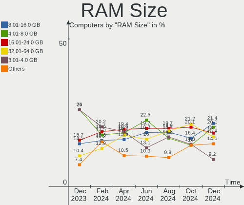
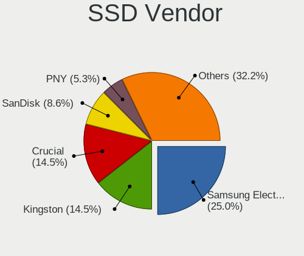
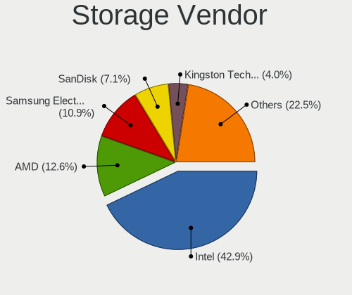
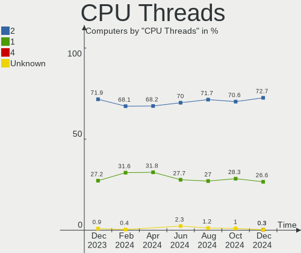
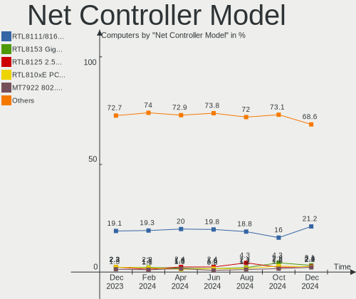
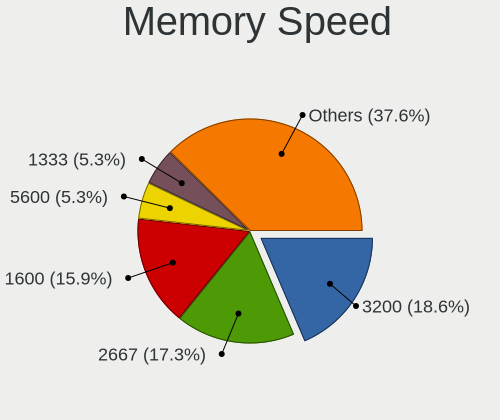
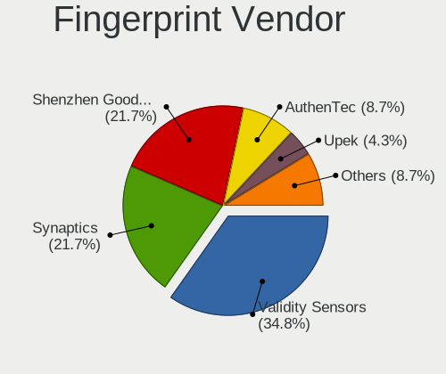

Linux in France - Hardware Trends
---------------------------------

A project to identify most popular hardware characteristics and track their change
over time based on data collected by Linux users at https://Linux-Hardware.org.

Anyone can contribute to this report by the [hw-probe](https://github.com/linuxhw/hw-probe) tool:

    sudo -E hw-probe -all -upload

This is a report for all computer types. See also reports for [desktops](/Location/France/Desktop/README.md) and [notebooks](/Location/France/Notebook/README.md).

Period: Dec, 2024.

Contents
--------

* [ System ](#system)
  - [ OS                       ](#os)
  - [ OS Family                ](#os-family)
  - [ Kernel                   ](#kernel)
  - [ Kernel Family            ](#kernel-family)
  - [ Kernel Major Ver.        ](#kernel-major-ver)
  - [ Arch                     ](#arch)
  - [ DE                       ](#de)
  - [ Display Server           ](#display-server)
  - [ Display Manager          ](#display-manager)
  - [ OS Lang                  ](#os-lang)
  - [ Boot Mode                ](#boot-mode)
  - [ Filesystem               ](#filesystem)
  - [ Part. scheme             ](#part-scheme)
  - [ Dual Boot with Linux/BSD ](#dual-boot-with-linuxbsd)
  - [ Dual Boot (Win)          ](#dual-boot-win)

* [ Board ](#board)
  - [ Vendor                   ](#vendor)
  - [ Model                    ](#model)
  - [ Model Family             ](#model-family)
  - [ MFG Year                 ](#mfg-year)
  - [ Form Factor              ](#form-factor)
  - [ Secure Boot              ](#secure-boot)
  - [ Coreboot                 ](#coreboot)
  - [ RAM Size                 ](#ram-size)
  - [ RAM Used                 ](#ram-used)
  - [ Total Drives             ](#total-drives)
  - [ Has CD-ROM               ](#has-cd-rom)
  - [ Has Ethernet             ](#has-ethernet)
  - [ Has WiFi                 ](#has-wifi)
  - [ Has Bluetooth            ](#has-bluetooth)

* [ Location ](#location)
  - [ Country                  ](#country)
  - [ City                     ](#city)

* [ Drives ](#drives)
  - [ Drive Vendor             ](#drive-vendor)
  - [ Drive Model              ](#drive-model)
  - [ HDD Vendor               ](#hdd-vendor)
  - [ SSD Vendor               ](#ssd-vendor)
  - [ Drive Kind               ](#drive-kind)
  - [ Drive Connector          ](#drive-connector)
  - [ Drive Size               ](#drive-size)
  - [ Space Total              ](#space-total)
  - [ Space Used               ](#space-used)
  - [ Malfunc. Drives          ](#malfunc-drives)
  - [ Malfunc. Drive Vendor    ](#malfunc-drive-vendor)
  - [ Malfunc. HDD Vendor      ](#malfunc-hdd-vendor)
  - [ Malfunc. Drive Kind      ](#malfunc-drive-kind)
  - [ Failed Drives            ](#failed-drives)
  - [ Failed Drive Vendor      ](#failed-drive-vendor)
  - [ Drive Status             ](#drive-status)

* [ Storage controller ](#storage-controller)
  - [ Storage Vendor           ](#storage-vendor)
  - [ Storage Model            ](#storage-model)
  - [ Storage Kind             ](#storage-kind)

* [ Processor ](#processor)
  - [ CPU Vendor               ](#cpu-vendor)
  - [ CPU Model                ](#cpu-model)
  - [ CPU Model Family         ](#cpu-model-family)
  - [ CPU Cores                ](#cpu-cores)
  - [ CPU Sockets              ](#cpu-sockets)
  - [ CPU Threads              ](#cpu-threads)
  - [ CPU Op-Modes             ](#cpu-op-modes)
  - [ CPU Microcode            ](#cpu-microcode)
  - [ CPU Microarch            ](#cpu-microarch)

* [ Graphics ](#graphics)
  - [ GPU Vendor               ](#gpu-vendor)
  - [ GPU Model                ](#gpu-model)
  - [ GPU Combo                ](#gpu-combo)
  - [ GPU Driver               ](#gpu-driver)
  - [ GPU Memory               ](#gpu-memory)

* [ Monitor ](#monitor)
  - [ Monitor Vendor           ](#monitor-vendor)
  - [ Monitor Model            ](#monitor-model)
  - [ Monitor Resolution       ](#monitor-resolution)
  - [ Monitor Diagonal         ](#monitor-diagonal)
  - [ Monitor Width            ](#monitor-width)
  - [ Aspect Ratio             ](#aspect-ratio)
  - [ Monitor Area             ](#monitor-area)
  - [ Pixel Density            ](#pixel-density)
  - [ Multiple Monitors        ](#multiple-monitors)

* [ Network ](#network)
  - [ Net Controller Vendor    ](#net-controller-vendor)
  - [ Net Controller Model     ](#net-controller-model)
  - [ Wireless Vendor          ](#wireless-vendor)
  - [ Wireless Model           ](#wireless-model)
  - [ Ethernet Vendor          ](#ethernet-vendor)
  - [ Ethernet Model           ](#ethernet-model)
  - [ Net Controller Kind      ](#net-controller-kind)
  - [ Used Controller          ](#used-controller)
  - [ NICs                     ](#nics)
  - [ IPv6                     ](#ipv6)

* [ Bluetooth ](#bluetooth)
  - [ Bluetooth Vendor         ](#bluetooth-vendor)
  - [ Bluetooth Model          ](#bluetooth-model)

* [ Sound ](#sound)
  - [ Sound Vendor             ](#sound-vendor)
  - [ Sound Model              ](#sound-model)

* [ Memory ](#memory)
  - [ Memory Vendor            ](#memory-vendor)
  - [ Memory Model             ](#memory-model)
  - [ Memory Kind              ](#memory-kind)
  - [ Memory Form Factor       ](#memory-form-factor)
  - [ Memory Size              ](#memory-size)
  - [ Memory Speed             ](#memory-speed)

* [ Printers & scanners ](#printers--scanners)
  - [ Printer Vendor           ](#printer-vendor)
  - [ Printer Model            ](#printer-model)
  - [ Scanner Vendor           ](#scanner-vendor)
  - [ Scanner Model            ](#scanner-model)

* [ Camera ](#camera)
  - [ Camera Vendor            ](#camera-vendor)
  - [ Camera Model             ](#camera-model)

* [ Security ](#security)
  - [ Fingerprint Vendor       ](#fingerprint-vendor)
  - [ Fingerprint Model        ](#fingerprint-model)
  - [ Chipcard Vendor          ](#chipcard-vendor)
  - [ Chipcard Model           ](#chipcard-model)

* [ Unsupported ](#unsupported)
  - [ Unsupported Devices      ](#unsupported-devices)
  - [ Unsupported Device Types ](#unsupported-device-types)

System
------

OS
--

Installed operating systems

| Name                | Computers | Percent |
|---------------------|-----------|---------|
| OpenMandriva 24.12  | 42        | 13.82%  |
| Ubuntu 24.04        | 37        | 12.17%  |
| Debian 12           | 33        | 10.86%  |
| Fedora 41           | 24        | 7.89%   |
| Arch Rolling        | 19        | 6.25%   |
| Ubuntu 22.04        | 17        | 5.59%   |
| Ubuntu 24.10        | 15        | 4.93%   |
| Linux Mint 22       | 15        | 4.93%   |
| Pop!_OS 22.04       | 8         | 2.63%   |
| Zorin 17            | 6         | 1.97%   |
| Linux Mint 21.3     | 6         | 1.97%   |
| Kubuntu 24.04       | 5         | 1.64%   |
| Bazzite 41          | 4         | 1.32%   |
| SteamOS 3.6.20      | 3         | 0.99%   |
| OpenMandriva 24.07  | 3         | 0.99%   |
| OpenMandriva 23.08  | 3         | 0.99%   |
| NixOS 24.11         | 3         | 0.99%   |
| KDE neon 24.04      | 3         | 0.99%   |
| Elementary 8        | 3         | 0.99%   |
| Debian 11           | 3         | 0.99%   |
| Debian              | 3         | 0.99%   |
| Xubuntu 22.04       | 2         | 0.66%   |
| OpenMandriva 5.0    | 2         | 0.66%   |
| Manjaro 24.2.0      | 2         | 0.66%   |
| Linux Mint 22.1     | 2         | 0.66%   |
| Linux Mint 20.3     | 2         | 0.66%   |
| Dts-distro 2.1.1    | 2         | 0.66%   |
| Xubuntu 24.04       | 1         | 0.33%   |
| Xubuntu 20.04       | 1         | 0.33%   |
| Void Linux Rolling  | 1         | 0.33%   |
| Vanilla 2.0         | 1         | 0.33%   |
| Ubuntu Unity 18.04  | 1         | 0.33%   |
| Ubuntu Studio 24.04 | 1         | 0.33%   |
| Ubuntu Studio 22.04 | 1         | 0.33%   |
| Ubuntu MATE 24.04   | 1         | 0.33%   |
| Ubuntu 20.04        | 1         | 0.33%   |
| Ubuntu 18.04        | 1         | 0.33%   |
| SteamOS 3.7         | 1         | 0.33%   |
| Qubes 4.2           | 1         | 0.33%   |
| Parrot 6.2          | 1         | 0.33%   |

OS Family
---------

OS without a version

| Name          | Computers | Percent |
|---------------|-----------|---------|
| Ubuntu        | 71        | 23.36%  |
| OpenMandriva  | 53        | 17.43%  |
| Debian        | 39        | 12.83%  |
| Linux Mint    | 28        | 9.21%   |
| Fedora        | 25        | 8.22%   |
| Arch          | 19        | 6.25%   |
| Pop!_OS       | 8         | 2.63%   |
| Zorin         | 6         | 1.97%   |
| Kubuntu       | 6         | 1.97%   |
| Xubuntu       | 4         | 1.32%   |
| SteamOS       | 4         | 1.32%   |
| Manjaro       | 4         | 1.32%   |
| Elementary    | 4         | 1.32%   |
| Bazzite       | 4         | 1.32%   |
| NixOS         | 3         | 0.99%   |
| KDE neon      | 3         | 0.99%   |
| Ubuntu Studio | 2         | 0.66%   |
| Lubuntu       | 2         | 0.66%   |
| Dts-distro    | 2         | 0.66%   |
| Void Linux    | 1         | 0.33%   |
| Vanilla       | 1         | 0.33%   |
| Ubuntu Unity  | 1         | 0.33%   |
| Ubuntu MATE   | 1         | 0.33%   |
| Qubes         | 1         | 0.33%   |
| Parrot        | 1         | 0.33%   |
| openSUSE      | 1         | 0.33%   |
| Nobara        | 1         | 0.33%   |
| MX            | 1         | 0.33%   |
| Mageia        | 1         | 0.33%   |
| Kali          | 1         | 0.33%   |
| Gentoo        | 1         | 0.33%   |
| Drauger OS    | 1         | 0.33%   |
| ChimeraOS     | 1         | 0.33%   |
| CachyOS       | 1         | 0.33%   |
| Android       | 1         | 0.33%   |
| Alpine        | 1         | 0.33%   |

Kernel
------

Version of the Linux kernel

| Version                                  | Computers | Percent |
|------------------------------------------|-----------|---------|
| 6.8.0-49-generic                         | 36        | 11.84%  |
| 6.12.1-desktop-1omv2490                  | 36        | 11.84%  |
| 6.8.0-51-generic                         | 24        | 7.89%   |
| 6.1.0-28-amd64                           | 14        | 4.61%   |
| 6.8.0-50-generic                         | 12        | 3.95%   |
| 6.12.1-arch1-1                           | 9         | 2.96%   |
| 6.9.3-76060903-generic                   | 8         | 2.63%   |
| 5.15.0-126-generic                       | 8         | 2.63%   |
| 6.11.0-9-generic                         | 7         | 2.3%    |
| 6.1.0-27-amd64                           | 7         | 2.3%    |
| 6.11.11-300.fc41.x86_64                  | 6         | 1.97%   |
| 6.12.6-desktop-1omv2490                  | 5         | 1.64%   |
| 6.11.10-300.fc41.x86_64                  | 5         | 1.64%   |
| 6.12.4-200.fc41.x86_64                   | 4         | 1.32%   |
| 6.10.0-desktop-1omv2490                  | 4         | 1.32%   |
| 6.8.0-45-generic                         | 3         | 0.99%   |
| 6.5.0-valve22-1-neptune-65-g9a338ed8a75e | 3         | 0.99%   |
| 6.12.5-200.fc41.x86_64                   | 3         | 0.99%   |
| 6.12.4-arch1-1                           | 3         | 0.99%   |
| 6.12.1-zen1-1-zen                        | 3         | 0.99%   |
| 6.11.4-301.fc41.x86_64                   | 3         | 0.99%   |
| 6.11.10-304.bazzite.fc41.x86_64          | 3         | 0.99%   |
| 6.11.0-13-generic                        | 3         | 0.99%   |
| 6.11.0-12-generic                        | 3         | 0.99%   |
| 6.8.12-4-pve                             | 2         | 0.66%   |
| 6.8.0-41-generic                         | 2         | 0.66%   |
| 6.8.0-38-generic                         | 2         | 0.66%   |
| 6.6.21-yocto-standard                    | 2         | 0.66%   |
| 6.6.2-desktop-1omv2390                   | 2         | 0.66%   |
| 6.4.11-desktop-1omv2390                  | 2         | 0.66%   |
| 6.12.6                                   | 2         | 0.66%   |
| 6.12.4-2-cachyos                         | 2         | 0.66%   |
| 6.11.8-300.fc41.x86_64                   | 2         | 0.66%   |
| 6.11.5+bpo-amd64                         | 2         | 0.66%   |
| 6.11.10-1-liquorix-amd64                 | 2         | 0.66%   |
| 6.11.0-8-generic                         | 2         | 0.66%   |
| 6.1.0-25-amd64                           | 2         | 0.66%   |
| 5.4.0-200-generic                        | 2         | 0.66%   |
| 6.9.7+bpo-amd64                          | 1         | 0.33%   |
| 6.9.12-chos7-chimeraos-1                 | 1         | 0.33%   |

Kernel Family
-------------

Linux kernel without a distro release

| Version  | Computers | Percent |
|----------|-----------|---------|
| 6.8.0    | 86        | 28.29%  |
| 6.12.1   | 50        | 16.45%  |
| 6.1.0    | 26        | 8.55%   |
| 6.11.0   | 20        | 6.58%   |
| 5.15.0   | 12        | 3.95%   |
| 6.12.6   | 11        | 3.62%   |
| 6.11.10  | 10        | 3.29%   |
| 6.12.4   | 9         | 2.96%   |
| 6.9.3    | 8         | 2.63%   |
| 6.11.11  | 7         | 2.3%    |
| 6.5.0    | 6         | 1.97%   |
| 5.4.0    | 5         | 1.64%   |
| 6.8.12   | 4         | 1.32%   |
| 6.11.4   | 4         | 1.32%   |
| 6.10.0   | 4         | 1.32%   |
| 6.6.63   | 3         | 0.99%   |
| 6.12.5   | 3         | 0.99%   |
| 6.11.9   | 3         | 0.99%   |
| 5.10.0   | 3         | 0.99%   |
| 6.6.65   | 2         | 0.66%   |
| 6.6.21   | 2         | 0.66%   |
| 6.6.2    | 2         | 0.66%   |
| 6.4.11   | 2         | 0.66%   |
| 6.11.8   | 2         | 0.66%   |
| 6.11.5   | 2         | 0.66%   |
| 6.10.11  | 2         | 0.66%   |
| 6.9.7    | 1         | 0.33%   |
| 6.9.12   | 1         | 0.33%   |
| 6.8.4    | 1         | 0.33%   |
| 6.6.8    | 1         | 0.33%   |
| 6.6.67   | 1         | 0.33%   |
| 6.6.54   | 1         | 0.33%   |
| 6.5.3    | 1         | 0.33%   |
| 6.4.8    | 1         | 0.33%   |
| 6.4.0    | 1         | 0.33%   |
| 6.11.6   | 1         | 0.33%   |
| 6.10.13  | 1         | 0.33%   |
| 6.10.10  | 1         | 0.33%   |
| 6.1.75   | 1         | 0.33%   |
| 5.15.137 | 1         | 0.33%   |

Kernel Major Ver.
-----------------

Linux kernel major version

| Version | Computers | Percent |
|---------|-----------|---------|
| 6.8     | 91        | 29.93%  |
| 6.12    | 73        | 24.01%  |
| 6.11    | 49        | 16.12%  |
| 6.1     | 27        | 8.88%   |
| 5.15    | 13        | 4.28%   |
| 6.6     | 12        | 3.95%   |
| 6.9     | 10        | 3.29%   |
| 6.10    | 8         | 2.63%   |
| 6.5     | 7         | 2.3%    |
| 5.4     | 5         | 1.64%   |
| 6.4     | 4         | 1.32%   |
| 5.10    | 4         | 1.32%   |
| 4.15    | 1         | 0.33%   |

Arch
----

OS architecture (x86_64, i586, etc.)

| Name    | Computers | Percent |
|---------|-----------|---------|
| x86_64  | 299       | 98.36%  |
| aarch64 | 3         | 0.99%   |
| i686    | 2         | 0.66%   |

DE
--

Desktop Environment

| Name       | Computers | Percent |
|------------|-----------|---------|
| GNOME      | 125       | 41.12%  |
| Unknown    | 54        | 17.76%  |
| KDE5       | 29        | 9.54%   |
| KDE6       | 22        | 7.24%   |
| X-Cinnamon | 20        | 6.58%   |
| XFCE       | 13        | 4.28%   |
| LXQt       | 11        | 3.62%   |
| MATE       | 9         | 2.96%   |
| Pantheon   | 4         | 1.32%   |
| KDE        | 4         | 1.32%   |
| i3         | 4         | 1.32%   |
| Cinnamon   | 3         | 0.99%   |
| Hyprland   | 2         | 0.66%   |
| Unity      | 1         | 0.33%   |
| sway       | 1         | 0.33%   |
| COSMIC     | 1         | 0.33%   |
| awesome    | 1         | 0.33%   |

Display Server
--------------

X11 or Wayland

| Name    | Computers | Percent |
|---------|-----------|---------|
| Wayland | 148       | 48.68%  |
| X11     | 137       | 45.07%  |
| Unknown | 10        | 3.29%   |
| Tty     | 9         | 2.96%   |

Display Manager
---------------

SDDM, LightDM, etc.

| Name    | Computers | Percent |
|---------|-----------|---------|
| GDM3    | 83        | 27.3%   |
| SDDM    | 80        | 26.32%  |
| Unknown | 73        | 24.01%  |
| LightDM | 48        | 15.79%  |
| GDM     | 18        | 5.92%   |
| XDM     | 1         | 0.33%   |
| GREETD  | 1         | 0.33%   |

OS Lang
-------

Language

| Lang    | Computers | Percent |
|---------|-----------|---------|
| fr_FR   | 209       | 68.75%  |
| en_US   | 55        | 18.09%  |
| C       | 9         | 2.96%   |
| it_IT   | 8         | 2.63%   |
| en_GB   | 8         | 2.63%   |
| Unknown | 5         | 1.64%   |
| de_DE   | 4         | 1.32%   |
| ru_RU   | 2         | 0.66%   |
| fr_BE   | 2         | 0.66%   |
| fr_CH   | 1         | 0.33%   |
| en_AU   | 1         | 0.33%   |

Boot Mode
---------

EFI or BIOS

| Mode | Computers | Percent |
|------|-----------|---------|
| EFI  | 164       | 53.95%  |
| BIOS | 140       | 46.05%  |

Filesystem
----------

Type of filesystem

| Type    | Computers | Percent |
|---------|-----------|---------|
| Ext4    | 178       | 58.55%  |
| Tmpfs   | 43        | 14.14%  |
| Btrfs   | 41        | 13.49%  |
| Overlay | 36        | 11.84%  |
| Xfs     | 4         | 1.32%   |
| Zfs     | 1         | 0.33%   |
| Unknown | 1         | 0.33%   |

Part. scheme
------------

Scheme of partitioning

| Type    | Computers | Percent |
|---------|-----------|---------|
| GPT     | 215       | 70.72%  |
| Unknown | 63        | 20.72%  |
| MBR     | 26        | 8.55%   |

Dual Boot with Linux/BSD
------------------------

Hosting more than one Linux/BSD

| Dual boot | Computers | Percent |
|-----------|-----------|---------|
| No        | 241       | 79.28%  |
| Yes       | 63        | 20.72%  |

Dual Boot (Win)
---------------

Hosting Linux and Windows

| Dual boot | Computers | Percent |
|-----------|-----------|---------|
| No        | 210       | 69.08%  |
| Yes       | 94        | 30.92%  |

Board
-----

Vendor
------

Motherboard manufacturer

| Name                                 | Computers | Percent |
|--------------------------------------|-----------|---------|
| ASUSTek Computer                     | 58        | 19.08%  |
| Lenovo                               | 41        | 13.49%  |
| Hewlett-Packard                      | 40        | 13.16%  |
| Dell                                 | 36        | 11.84%  |
| MSI                                  | 27        | 8.88%   |
| Gigabyte Technology                  | 20        | 6.58%   |
| Acer                                 | 17        | 5.59%   |
| Toshiba                              | 5         | 1.64%   |
| ASRock                               | 5         | 1.64%   |
| Valve                                | 4         | 1.32%   |
| Framework                            | 4         | 1.32%   |
| Apple                                | 4         | 1.32%   |
| Unknown                              | 4         | 1.32%   |
| TUXEDO                               | 3         | 0.99%   |
| Notebook                             | 3         | 0.99%   |
| HUAWEI                               | 3         | 0.99%   |
| Sony                                 | 2         | 0.66%   |
| Shuttle                              | 2         | 0.66%   |
| Shenzhen Meigao Electronic Equipment | 2         | 0.66%   |
| Packard Bell                         | 2         | 0.66%   |
| Intel                                | 2         | 0.66%   |
| Fujitsu Siemens                      | 2         | 0.66%   |
| AZW                                  | 2         | 0.66%   |
| ASRockRack                           | 2         | 0.66%   |
| Supermicro                           | 1         | 0.33%   |
| SKIKK                                | 1         | 0.33%   |
| Samsung Electronics                  | 1         | 0.33%   |
| Raspberry Pi Foundation              | 1         | 0.33%   |
| Pegatron                             | 1         | 0.33%   |
| OEM                                  | 1         | 0.33%   |
| Microsoft                            | 1         | 0.33%   |
| Medion                               | 1         | 0.33%   |
| Khadas                               | 1         | 0.33%   |
| IP3 Tech                             | 1         | 0.33%   |
| GEEKOM                               | 1         | 0.33%   |
| Fujitsu                              | 1         | 0.33%   |
| Foxconn                              | 1         | 0.33%   |
| AMI                                  | 1         | 0.33%   |

Model
-----

Motherboard model

| Name                                                  | Computers | Percent |
|-------------------------------------------------------|-----------|---------|
| Valve Galileo                                         | 4         | 1.32%   |
| MSI MS-7E51                                           | 4         | 1.32%   |
| HP ProDesk 400 G4 DM                                  | 4         | 1.32%   |
| Unknown                                               | 4         | 1.32%   |
| MSI MS-7996                                           | 3         | 0.99%   |
| Framework Laptop 13 (AMD Ryzen 7040Series)            | 3         | 0.99%   |
| Lenovo ThinkPad X1 Carbon Gen 12 21KCCTO1WW           | 2         | 0.66%   |
| HUAWEI KLVL-WXX9                                      | 2         | 0.66%   |
| HP ProBook 4720s                                      | 2         | 0.66%   |
| Gigabyte B550 GAMING X V2                             | 2         | 0.66%   |
| AZW MINI S                                            | 2         | 0.66%   |
| TUXEDO Sirius 16 Gen2                                 | 1         | 0.33%   |
| TUXEDO InfinityBook S 15 Gen6                         | 1         | 0.33%   |
| TUXEDO Aura 15 Gen1                                   | 1         | 0.33%   |
| Toshiba Satellite Pro L630                            | 1         | 0.33%   |
| Toshiba Satellite Pro A50-C                           | 1         | 0.33%   |
| Toshiba Satellite P200                                | 1         | 0.33%   |
| Toshiba Satellite C70-B                               | 1         | 0.33%   |
| Toshiba Satellite C50D-A-12M                          | 1         | 0.33%   |
| Supermicro Super Server                               | 1         | 0.33%   |
| Sony SVP1321C5E                                       | 1         | 0.33%   |
| Sony SVF1521A1EW                                      | 1         | 0.33%   |
| SKIKK Midgard                                         | 1         | 0.33%   |
| Shuttle NC03U                                         | 1         | 0.33%   |
| Shuttle DH270                                         | 1         | 0.33%   |
| Shenzhen Meigao Electronic Equipment Venus series     | 1         | 0.33%   |
| Shenzhen Meigao Electronic Equipment AtomMan G Series | 1         | 0.33%   |
| Samsung R530/R730/P530                                | 1         | 0.33%   |
| RPi Raspberry Pi                                      | 1         | 0.33%   |
| Pegatron Elite 7500 Series MT                         | 1         | 0.33%   |
| Packard Bell IXTREME I9632 FR                         | 1         | 0.33%   |
| Packard Bell EasyNote MH36                            | 1         | 0.33%   |
| OEM B75                                               | 1         | 0.33%   |
| Notebook W65_W67RZ1                                   | 1         | 0.33%   |
| Notebook W65_67SZ                                     | 1         | 0.33%   |
| Notebook NS50_70MU                                    | 1         | 0.33%   |
| MSI MS-7E49                                           | 1         | 0.33%   |
| MSI MS-7E16                                           | 1         | 0.33%   |
| MSI MS-7E12                                           | 1         | 0.33%   |
| MSI MS-7E06                                           | 1         | 0.33%   |

Model Family
------------

Motherboard model prefix

| Name                    | Computers | Percent |
|-------------------------|-----------|---------|
| Lenovo ThinkPad         | 22        | 7.24%   |
| Acer Aspire             | 13        | 4.28%   |
| Dell Precision          | 10        | 3.29%   |
| Lenovo IdeaPad          | 8         | 2.63%   |
| Dell Inspiron           | 8         | 2.63%   |
| HP Pavilion             | 7         | 2.3%    |
| HP ProDesk              | 6         | 1.97%   |
| HP EliteBook            | 6         | 1.97%   |
| Dell Latitude           | 6         | 1.97%   |
| ASUS TUF                | 6         | 1.97%   |
| Toshiba Satellite       | 5         | 1.64%   |
| HP ProBook              | 5         | 1.64%   |
| ASUS VivoBook           | 5         | 1.64%   |
| ASUS ASUS               | 5         | 1.64%   |
| Valve Galileo           | 4         | 1.32%   |
| MSI MS-7E51             | 4         | 1.32%   |
| Framework Laptop        | 4         | 1.32%   |
| Dell XPS                | 4         | 1.32%   |
| Dell OptiPlex           | 4         | 1.32%   |
| Unknown                 | 4         | 1.32%   |
| MSI MS-7996             | 3         | 0.99%   |
| Lenovo Yoga             | 3         | 0.99%   |
| Lenovo Legion           | 3         | 0.99%   |
| Gigabyte B650           | 3         | 0.99%   |
| ASUS ROG                | 3         | 0.99%   |
| ASUS PRIME              | 3         | 0.99%   |
| Notebook W65            | 2         | 0.66%   |
| Lenovo ThinkBook        | 2         | 0.66%   |
| HUAWEI KLVL-WXX9        | 2         | 0.66%   |
| HP Laptop               | 2         | 0.66%   |
| HP ENVY                 | 2         | 0.66%   |
| HP EliteDesk            | 2         | 0.66%   |
| HP Compaq               | 2         | 0.66%   |
| Gigabyte B550           | 2         | 0.66%   |
| Gigabyte B450           | 2         | 0.66%   |
| Fujitsu Siemens ESPRIMO | 2         | 0.66%   |
| AZW MINI                | 2         | 0.66%   |
| ASUS Zenbook            | 2         | 0.66%   |
| ASUS STRIX              | 2         | 0.66%   |
| ASUS P8Z68-V            | 2         | 0.66%   |

MFG Year
--------

Motherboard manufacture year

| Year    | Computers | Percent |
|---------|-----------|---------|
| 2023    | 30        | 9.87%   |
| 2024    | 27        | 8.88%   |
| 2022    | 26        | 8.55%   |
| 2018    | 25        | 8.22%   |
| 2020    | 23        | 7.57%   |
| 2019    | 22        | 7.24%   |
| 2021    | 18        | 5.92%   |
| 2012    | 18        | 5.92%   |
| 2013    | 17        | 5.59%   |
| 2017    | 16        | 5.26%   |
| 2014    | 16        | 5.26%   |
| 2011    | 14        | 4.61%   |
| 2016    | 11        | 3.62%   |
| 2010    | 10        | 3.29%   |
| 2015    | 9         | 2.96%   |
| 2009    | 8         | 2.63%   |
| 2008    | 8         | 2.63%   |
| Unknown | 3         | 0.99%   |
| 2007    | 2         | 0.66%   |
| 2006    | 1         | 0.33%   |

Form Factor
-----------

Physical design of the computer

| Name           | Computers | Percent |
|----------------|-----------|---------|
| Notebook       | 176       | 57.89%  |
| Desktop        | 105       | 34.54%  |
| Mini pc        | 6         | 1.97%   |
| All in one     | 6         | 1.97%   |
| Server         | 4         | 1.32%   |
| Convertible    | 3         | 0.99%   |
| System on chip | 2         | 0.66%   |
| Phone          | 1         | 0.33%   |
| Tablet         | 1         | 0.33%   |

Secure Boot
-----------

Enabled or disabled

| State    | Computers | Percent |
|----------|-----------|---------|
| Disabled | 283       | 93.09%  |
| Enabled  | 21        | 6.91%   |

Coreboot
--------

Have coreboot on board

| Used | Computers | Percent |
|------|-----------|---------|
| No   | 304       | 100%    |

RAM Size
--------

Total RAM memory

| Size in GB      | Computers | Percent |
|-----------------|-----------|---------|
| 8.01-16.0       | 65        | 21.38%  |
| 4.01-8.0        | 61        | 20.07%  |
| 16.01-24.0      | 55        | 18.09%  |
| 32.01-64.0      | 51        | 16.78%  |
| 3.01-4.0        | 28        | 9.21%   |
| 24.01-32.0      | 18        | 5.92%   |
| 64.01-256.0     | 16        | 5.26%   |
| 2.01-3.0        | 4         | 1.32%   |
| 1.01-2.0        | 4         | 1.32%   |
| More than 256.0 | 2         | 0.66%   |

RAM Used
--------

Used RAM memory

| Used GB     | Computers | Percent |
|-------------|-----------|---------|
| 4.01-8.0    | 74        | 24.34%  |
| 2.01-3.0    | 71        | 23.36%  |
| 1.01-2.0    | 68        | 22.37%  |
| 3.01-4.0    | 50        | 16.45%  |
| 8.01-16.0   | 21        | 6.91%   |
| 0.51-1.0    | 12        | 3.95%   |
| 16.01-24.0  | 3         | 0.99%   |
| 32.01-64.0  | 2         | 0.66%   |
| 0.01-0.5    | 2         | 0.66%   |
| 64.01-256.0 | 1         | 0.33%   |

Total Drives
------------

Number of drives on board

| Drives | Computers | Percent |
|--------|-----------|---------|
| 1      | 181       | 59.54%  |
| 2      | 72        | 23.68%  |
| 3      | 25        | 8.22%   |
| 4      | 13        | 4.28%   |
| 5      | 4         | 1.32%   |
| 8      | 2         | 0.66%   |
| 6      | 2         | 0.66%   |
| 14     | 1         | 0.33%   |
| 10     | 1         | 0.33%   |
| 9      | 1         | 0.33%   |
| 7      | 1         | 0.33%   |
| 0      | 1         | 0.33%   |

Has CD-ROM
----------

Has CD-ROM on board

| Presented | Computers | Percent |
|-----------|-----------|---------|
| No        | 211       | 69.41%  |
| Yes       | 93        | 30.59%  |

Has Ethernet
------------

Has Ethernet on board

| Presented | Computers | Percent |
|-----------|-----------|---------|
| Yes       | 252       | 82.89%  |
| No        | 52        | 17.11%  |

Has WiFi
--------

Has WiFi module

| Presented | Computers | Percent |
|-----------|-----------|---------|
| Yes       | 239       | 78.62%  |
| No        | 65        | 21.38%  |

Has Bluetooth
-------------

Has Bluetooth module

| Presented | Computers | Percent |
|-----------|-----------|---------|
| Yes       | 209       | 68.75%  |
| No        | 95        | 31.25%  |

Location
--------

Country
-------

Geographic location (country)

| Country | Computers | Percent |
|---------|-----------|---------|
| France  | 304       | 100%    |

City
----

Geographic location (city)

| City                 | Computers | Percent |
|----------------------|-----------|---------|
| Paris                | 28        | 9.21%   |
| Strasbourg           | 6         | 1.97%   |
| Nantes               | 6         | 1.97%   |
| Bagneux              | 6         | 1.97%   |
| Rosny-sous-Bois      | 5         | 1.64%   |
| Lyon                 | 5         | 1.64%   |
| Toulouse             | 4         | 1.32%   |
| Grenoble             | 4         | 1.32%   |
| Saint-Etienne        | 3         | 0.99%   |
| Nice                 | 3         | 0.99%   |
| Évry                | 3         | 0.99%   |
| Cergy                | 3         | 0.99%   |
| Argenteuil           | 3         | 0.99%   |
| Verton               | 2         | 0.66%   |
| Vernon               | 2         | 0.66%   |
| Troyes               | 2         | 0.66%   |
| Thise                | 2         | 0.66%   |
| Sarlat-la-Canéda    | 2         | 0.66%   |
| Roques               | 2         | 0.66%   |
| Rezé                | 2         | 0.66%   |
| Rennes               | 2         | 0.66%   |
| Quimper              | 2         | 0.66%   |
| Pontoise             | 2         | 0.66%   |
| Plaisance-du-Touch   | 2         | 0.66%   |
| Périgueux           | 2         | 0.66%   |
| Nancy                | 2         | 0.66%   |
| Montpellier          | 2         | 0.66%   |
| Metz                 | 2         | 0.66%   |
| Jardin               | 2         | 0.66%   |
| Gravelines           | 2         | 0.66%   |
| Draguignan           | 2         | 0.66%   |
| Courbevoie           | 2         | 0.66%   |
| Chartres-de-Bretagne | 2         | 0.66%   |
| Chambéry            | 2         | 0.66%   |
| Bressuire            | 2         | 0.66%   |
| Bois-Colombes        | 2         | 0.66%   |
| Besançon            | 2         | 0.66%   |
| Bagnols-sur-Ceze     | 2         | 0.66%   |
| Auch                 | 2         | 0.66%   |
| Aix-les-Bains        | 2         | 0.66%   |

Drives
------

Drive Vendor
------------

Hard drive vendors

| Vendor                      | Computers | Drives | Percent |
|-----------------------------|-----------|--------|---------|
| Samsung Electronics         | 82        | 110    | 18.06%  |
| Seagate                     | 48        | 65     | 10.57%  |
| WDC                         | 39        | 57     | 8.59%   |
| SanDisk                     | 38        | 38     | 8.37%   |
| Kingston                    | 31        | 34     | 6.83%   |
| Crucial                     | 22        | 22     | 4.85%   |
| Micron Technology           | 17        | 18     | 3.74%   |
| Toshiba                     | 16        | 17     | 3.52%   |
| Unknown                     | 12        | 12     | 2.64%   |
| Micron/Crucial Technology   | 12        | 14     | 2.64%   |
| SK hynix                    | 11        | 11     | 2.42%   |
| Phison Electronics          | 9         | 10     | 1.98%   |
| Hitachi                     | 9         | 9      | 1.98%   |
| PNY                         | 8         | 8      | 1.76%   |
| Kingston Technology Company | 8         | 9      | 1.76%   |
| KIOXIA                      | 7         | 7      | 1.54%   |
| Intel                       | 7         | 7      | 1.54%   |
| SPCC                        | 6         | 6      | 1.32%   |
| MAXIO Technology (Hangzhou) | 5         | 7      | 1.1%    |
| HGST                        | 5         | 6      | 1.1%    |
| Lexar                       | 4         | 4      | 0.88%   |
| Phison                      | 3         | 4      | 0.66%   |
| LITEON                      | 3         | 3      | 0.66%   |
| Corsair                     | 3         | 3      | 0.66%   |
| Verbatim                    | 2         | 2      | 0.44%   |
| Realtek Semiconductor       | 2         | 2      | 0.44%   |
| Realtek                     | 2         | 2      | 0.44%   |
| Netac                       | 2         | 2      | 0.44%   |
| Maxtor                      | 2         | 3      | 0.44%   |
| Lenovo                      | 2         | 2      | 0.44%   |
| LDLC                        | 2         | 2      | 0.44%   |
| KIOXIA-EXCERIA              | 2         | 2      | 0.44%   |
| KingSpec                    | 2         | 2      | 0.44%   |
| JMicron Technology          | 2         | 2      | 0.44%   |
| Fanxiang                    | 2         | 2      | 0.44%   |
| Emtec                       | 2         | 2      | 0.44%   |
| EAGET                       | 2         | 2      | 0.44%   |
| China                       | 2         | 2      | 0.44%   |
| XrayDisk                    | 1         | 1      | 0.22%   |
| Union Memory (Shenzhen)     | 1         | 1      | 0.22%   |

Drive Model
-----------

Hard drive models

| Model                                                | Computers | Percent |
|------------------------------------------------------|-----------|---------|
| Samsung NVMe SSD Controller SM981/PM981/PM983 512GB  | 12        | 2.42%   |
| Samsung NVMe SSD Controller PM9A1/PM9A3/980PRO 512GB | 8         | 1.62%   |
| Kingston SA400S37240G 240GB SSD                      | 8         | 1.62%   |
| SPCC Solid State Disk 256GB                          | 6         | 1.21%   |
| Samsung NVMe SSD Controller SM961/PM961/SM963 256GB  | 6         | 1.21%   |
| SanDisk NVMe SSD Drive 1TB                           | 5         | 1.01%   |
| Samsung SSD 990 PRO 1TB                              | 5         | 1.01%   |
| Samsung SSD 870 QVO 1TB                              | 5         | 1.01%   |
| Micron/Crucial P2 NVMe PCIe SSD 500GB                | 5         | 1.01%   |
| Sandisk WD Black SN850 2TB                           | 4         | 0.81%   |
| Crucial CT500MX500SSD1 500GB                         | 4         | 0.81%   |
| Crucial CT2000MX500SSD1 2TB                          | 4         | 0.81%   |
| Unknown SD/MMC/MS PRO 128GB                          | 3         | 0.61%   |
| Seagate ST9500420AS 500GB                            | 3         | 0.61%   |
| Seagate ST500DM002-1BD142 500GB                      | 3         | 0.61%   |
| Seagate ST2000DM008-2FR102 2TB                       | 3         | 0.61%   |
| Seagate ST1000DM010-2EP102 1TB                       | 3         | 0.61%   |
| Seagate ST1000DM003-1ER162 1TB                       | 3         | 0.61%   |
| Samsung SSD 860 EVO 250GB                            | 3         | 0.61%   |
| Samsung SSD 850 EVO 250GB                            | 3         | 0.61%   |
| PNY 250GB SATA SSD                                   | 3         | 0.61%   |
| Kingston Company SNV2S1000G 1TB                      | 3         | 0.61%   |
| Kingston Company OM3PDP3 NVMe SSD 512GB              | 3         | 0.61%   |
| Intel SSDPEKNU512GZ 512GB                            | 3         | 0.61%   |
| Crucial CT500BX500SSD1 500GB                         | 3         | 0.61%   |
| Crucial CT240BX500SSD1 240GB                         | 3         | 0.61%   |
| WDC WD20EZRZ-00Z5HB0 2TB                             | 2         | 0.4%    |
| Unknown MMC Card  64GB                               | 2         | 0.4%    |
| Toshiba XG6 NVMe SSD Controller 1024GB               | 2         | 0.4%    |
| Toshiba MQ01ABD100 1TB                               | 2         | 0.4%    |
| Toshiba HDWD110 1TB                                  | 2         | 0.4%    |
| SK hynix HFS256G39TND-N210A 256GB SSD                | 2         | 0.4%    |
| Seagate ST4000DM005-2DP166 4TB                       | 2         | 0.4%    |
| Seagate ST3250310AS 250GB                            | 2         | 0.4%    |
| Seagate ST2000DM006-2DM164 2TB                       | 2         | 0.4%    |
| Sandisk WD_BLACK SN770 2TB                           | 2         | 0.4%    |
| SanDisk SDSSDH3 1T00 1TB                             | 2         | 0.4%    |
| Sandisk PC SN520 NVMe SSD 256GB                      | 2         | 0.4%    |
| SanDisk NVMe SSD Drive 512GB                         | 2         | 0.4%    |
| Samsung SSD 990 PRO 2TB                              | 2         | 0.4%    |

HDD Vendor
----------

Hard disk drive vendors

| Vendor              | Computers | Drives | Percent |
|---------------------|-----------|--------|---------|
| Seagate             | 48        | 65     | 38.4%   |
| WDC                 | 35        | 52     | 28%     |
| Toshiba             | 12        | 13     | 9.6%    |
| Hitachi             | 9         | 9      | 7.2%    |
| Samsung Electronics | 7         | 8      | 5.6%    |
| HGST                | 5         | 6      | 4%      |
| Unknown             | 4         | 4      | 3.2%    |
| Maxtor              | 2         | 3      | 1.6%    |
| SABRENT             | 1         | 2      | 0.8%    |
| JMicron Technology  | 1         | 1      | 0.8%    |
| Apple               | 1         | 1      | 0.8%    |

SSD Vendor
----------

Solid state drive vendors

| Vendor              | Computers | Drives | Percent |
|---------------------|-----------|--------|---------|
| Samsung Electronics | 38        | 40     | 25%     |
| Kingston            | 22        | 24     | 14.47%  |
| Crucial             | 22        | 22     | 14.47%  |
| SanDisk             | 13        | 13     | 8.55%   |
| PNY                 | 8         | 8      | 5.26%   |
| SPCC                | 6         | 6      | 3.95%   |
| Micron Technology   | 4         | 4      | 2.63%   |
| SK hynix            | 3         | 3      | 1.97%   |
| LITEON              | 3         | 3      | 1.97%   |
| Verbatim            | 2         | 2      | 1.32%   |
| Netac               | 2         | 2      | 1.32%   |
| Lexar               | 2         | 2      | 1.32%   |
| LDLC                | 2         | 2      | 1.32%   |
| KingSpec            | 2         | 2      | 1.32%   |
| Fanxiang            | 2         | 2      | 1.32%   |
| Emtec               | 2         | 2      | 1.32%   |
| EAGET               | 2         | 2      | 1.32%   |
| Corsair             | 2         | 2      | 1.32%   |
| China               | 2         | 2      | 1.32%   |
| XrayDisk            | 1         | 1      | 0.66%   |
| Transcend           | 1         | 1      | 0.66%   |
| TEXTORM             | 1         | 1      | 0.66%   |
| TCSUNBOW            | 1         | 1      | 0.66%   |
| Plextor             | 1         | 1      | 0.66%   |
| OCZ                 | 1         | 1      | 0.66%   |
| LITEONIT            | 1         | 1      | 0.66%   |
| Lexar 24            | 1         | 1      | 0.66%   |
| KIOXIA-EXCERIA      | 1         | 1      | 0.66%   |
| INTEL SS            | 1         | 1      | 0.66%   |
| Gigastone           | 1         | 1      | 0.66%   |
| Dogfish             | 1         | 1      | 0.66%   |
| CT500MX5            | 1         | 1      | 0.66%   |

Drive Kind
----------

HDD or SSD

| Kind    | Computers | Drives | Percent |
|---------|-----------|--------|---------|
| NVMe    | 158       | 201    | 39.3%   |
| SSD     | 127       | 156    | 31.59%  |
| HDD     | 106       | 164    | 26.37%  |
| MMC     | 8         | 8      | 1.99%   |
| Unknown | 3         | 3      | 0.75%   |

Drive Connector
---------------

SATA, SAS, NVMe, etc.

| Type | Computers | Drives | Percent |
|------|-----------|--------|---------|
| SATA | 182       | 307    | 50%     |
| NVMe | 157       | 198    | 43.13%  |
| SAS  | 17        | 19     | 4.67%   |
| MMC  | 8         | 8      | 2.2%    |

Drive Size
----------

Size of hard drive

| Size in TB | Computers | Drives | Percent |
|------------|-----------|--------|---------|
| 0.01-0.5   | 136       | 180    | 55.74%  |
| 0.51-1.0   | 65        | 75     | 26.64%  |
| 1.01-2.0   | 23        | 30     | 9.43%   |
| 3.01-4.0   | 8         | 15     | 3.28%   |
| 4.01-10.0  | 6         | 11     | 2.46%   |
| 2.01-3.0   | 4         | 4      | 1.64%   |
| 10.01-20.0 | 2         | 5      | 0.82%   |

Space Total
-----------

Amount of disk space available on the file system

| Size in GB     | Computers | Percent |
|----------------|-----------|---------|
| 251-500        | 64        | 21.05%  |
| 501-1000       | 63        | 20.72%  |
| 101-250        | 49        | 16.12%  |
| 1-20           | 34        | 11.18%  |
| 1001-2000      | 33        | 10.86%  |
| More than 3000 | 25        | 8.22%   |
| 2001-3000      | 12        | 3.95%   |
| 51-100         | 10        | 3.29%   |
| Unknown        | 8         | 2.63%   |
| 21-50          | 6         | 1.97%   |

Space Used
----------

Amount of used disk space

| Used GB        | Computers | Percent |
|----------------|-----------|---------|
| 1-20           | 91        | 29.93%  |
| 21-50          | 41        | 13.49%  |
| 101-250        | 38        | 12.5%   |
| 251-500        | 37        | 12.17%  |
| 51-100         | 32        | 10.53%  |
| 501-1000       | 26        | 8.55%   |
| 1001-2000      | 15        | 4.93%   |
| More than 3000 | 10        | 3.29%   |
| Unknown        | 8         | 2.63%   |
| 2001-3000      | 4         | 1.32%   |
| 0              | 2         | 0.66%   |

Malfunc. Drives
---------------

Drive models with a malfunction

| Model                                            | Computers | Drives | Percent |
|--------------------------------------------------|-----------|--------|---------|
| Seagate ST1000DM003-1ER162 1TB                   | 2         | 2      | 5.71%   |
| Hitachi HDT722516DLA380 165GB                    | 2         | 2      | 5.71%   |
| WDC WD800JD-08LSA0 80GB                          | 1         | 1      | 2.86%   |
| WDC WD5000BPVX-00JC3T0 500GB                     | 1         | 1      | 2.86%   |
| WDC WD2002FAEX-007BA0 2TB                        | 1         | 1      | 2.86%   |
| WDC WD10EZEX-00BN5A0 1TB                         | 1         | 1      | 2.86%   |
| Toshiba HDWD130 3TB                              | 1         | 1      | 2.86%   |
| SK hynix HFS256G39TND-N210A 256GB SSD            | 1         | 1      | 2.86%   |
| Seagate ST98823AS 80GB                           | 1         | 1      | 2.86%   |
| Seagate ST9500325AS 500GB                        | 1         | 1      | 2.86%   |
| Seagate ST9250315AS 250GB                        | 1         | 1      | 2.86%   |
| Seagate ST500LM000-1EJ162 500GB                  | 1         | 1      | 2.86%   |
| Seagate ST500DM002-1BD142 500GB                  | 1         | 1      | 2.86%   |
| Seagate ST3500418AS 500GB                        | 1         | 1      | 2.86%   |
| Seagate ST3250310AS 250GB                        | 1         | 1      | 2.86%   |
| Seagate ST2000DM008-2FR102 2TB                   | 1         | 1      | 2.86%   |
| SanDisk SSD U100 24GB                            | 1         | 1      | 2.86%   |
| SanDisk SD8SN8U512G1002 512GB SSD                | 1         | 1      | 2.86%   |
| Samsung Electronics SSD 980 1TB                  | 1         | 1      | 2.86%   |
| Samsung Electronics SSD 830 Series 128GB         | 1         | 1      | 2.86%   |
| Samsung Electronics SP2004C 200GB                | 1         | 1      | 2.86%   |
| Samsung Electronics MZ5PA128HMCD-01000 128GB SSD | 1         | 1      | 2.86%   |
| Samsung Electronics HM641JI 640GB                | 1         | 1      | 2.86%   |
| Netac NS512GSSD340 512GB                         | 1         | 1      | 2.86%   |
| Micron Technology MTFDDAV256TBN 256GB SSD        | 1         | 1      | 2.86%   |
| Kingston SV300S37A120G 120GB SSD                 | 1         | 1      | 2.86%   |
| Hitachi HTS725050A9A364 500GB                    | 1         | 1      | 2.86%   |
| Hitachi HTS545016B9A300 160GB                    | 1         | 1      | 2.86%   |
| HGST HTS721010A9E630 1TB                         | 1         | 1      | 2.86%   |
| HGST HTS545050A7E680 500GB                       | 1         | 1      | 2.86%   |
| Dogfish SSD 250GB                                | 1         | 1      | 2.86%   |
| Crucial CT2000MX500SSD1 2TB                      | 1         | 1      | 2.86%   |
| Crucial CT1050MX300SSD4 1TB                      | 1         | 1      | 2.86%   |

Malfunc. Drive Vendor
---------------------

Vendors of faulty drives

| Vendor              | Computers | Drives | Percent |
|---------------------|-----------|--------|---------|
| Seagate             | 10        | 10     | 28.57%  |
| Samsung Electronics | 5         | 5      | 14.29%  |
| WDC                 | 4         | 4      | 11.43%  |
| Hitachi             | 4         | 4      | 11.43%  |
| SanDisk             | 2         | 2      | 5.71%   |
| HGST                | 2         | 2      | 5.71%   |
| Crucial             | 2         | 2      | 5.71%   |
| Toshiba             | 1         | 1      | 2.86%   |
| SK hynix            | 1         | 1      | 2.86%   |
| Netac               | 1         | 1      | 2.86%   |
| Micron Technology   | 1         | 1      | 2.86%   |
| Kingston            | 1         | 1      | 2.86%   |
| Dogfish             | 1         | 1      | 2.86%   |

Malfunc. HDD Vendor
-------------------

Vendors of faulty HDD drives

| Vendor              | Computers | Drives | Percent |
|---------------------|-----------|--------|---------|
| Seagate             | 10        | 10     | 43.48%  |
| WDC                 | 4         | 4      | 17.39%  |
| Hitachi             | 4         | 4      | 17.39%  |
| Samsung Electronics | 2         | 2      | 8.7%    |
| HGST                | 2         | 2      | 8.7%    |
| Toshiba             | 1         | 1      | 4.35%   |

Malfunc. Drive Kind
-------------------

Kinds of faulty drives

| Kind | Computers | Drives | Percent |
|------|-----------|--------|---------|
| HDD  | 20        | 23     | 62.5%   |
| SSD  | 11        | 11     | 34.38%  |
| NVMe | 1         | 1      | 3.13%   |

Failed Drives
-------------

Failed drive models

| Model                        | Computers | Drives | Percent |
|------------------------------|-----------|--------|---------|
| WDC WD7500BPVT-22HXZT1 752GB | 1         | 1      | 50%     |
| WDC WD1600BEVT-75ZCT1 160GB  | 1         | 1      | 50%     |

Failed Drive Vendor
-------------------

Failed drive vendors

| Vendor | Computers | Drives | Percent |
|--------|-----------|--------|---------|
| WDC    | 2         | 2      | 100%    |

Drive Status
------------

Number of failed and malfunc. drives

| Status   | Computers | Drives | Percent |
|----------|-----------|--------|---------|
| Works    | 170       | 284    | 52.15%  |
| Detected | 123       | 211    | 37.73%  |
| Malfunc  | 31        | 35     | 9.51%   |
| Failed   | 2         | 2      | 0.61%   |

Storage controller
------------------

Storage Vendor
--------------

Storage controller vendors

| Vendor                                  | Computers | Percent |
|-----------------------------------------|-----------|---------|
| Intel                                   | 181       | 42.89%  |
| AMD                                     | 53        | 12.56%  |
| Samsung Electronics                     | 46        | 10.9%   |
| SanDisk                                 | 30        | 7.11%   |
| Kingston Technology Company             | 17        | 4.03%   |
| Micron Technology                       | 13        | 3.08%   |
| Phison Electronics                      | 12        | 2.84%   |
| Micron/Crucial Technology               | 12        | 2.84%   |
| ASMedia Technology                      | 10        | 2.37%   |
| SK hynix                                | 7         | 1.66%   |
| KIOXIA                                  | 7         | 1.66%   |
| Toshiba America Info Systems            | 5         | 1.18%   |
| Nvidia                                  | 5         | 1.18%   |
| MAXIO Technology (Hangzhou)             | 5         | 1.18%   |
| Marvell Technology Group                | 4         | 0.95%   |
| JMicron Technology                      | 4         | 0.95%   |
| Shenzhen Longsys Electronics            | 3         | 0.71%   |
| Realtek Semiconductor                   | 2         | 0.47%   |
| Lenovo                                  | 2         | 0.47%   |
| Union Memory (Shenzhen)                 | 1         | 0.24%   |
| Shenzhen Unionmemory Information System | 1         | 0.24%   |
| LSI Logic / Symbios Logic               | 1         | 0.24%   |
| ADATA Technology                        | 1         | 0.24%   |

Storage Model
-------------

Storage controller models

| Model                                                                          | Computers | Percent |
|--------------------------------------------------------------------------------|-----------|---------|
| AMD FCH SATA Controller [AHCI mode]                                            | 29        | 6.3%    |
| Intel 8 Series/C220 Series Chipset Family 6-port SATA Controller 1 [AHCI mode] | 17        | 3.7%    |
| Samsung NVMe SSD Controller SM981/PM981/PM983                                  | 13        | 2.83%   |
| AMD 600 Series Chipset SATA Controller                                         | 13        | 2.83%   |
| Samsung NVMe SSD Controller PM9A1/PM9A3/980PRO                                 | 11        | 2.39%   |
| Intel Volume Management Device NVMe RAID Controller                            | 11        | 2.39%   |
| SanDisk WD Black SN770 / PC SN740 256GB / PC SN560 (DRAM-less) NVMe SSD        | 10        | 2.17%   |
| Samsung NVMe SSD Controller S4LV008[Pascal]                                    | 10        | 2.17%   |
| Intel 7 Series Chipset Family 6-port SATA Controller [AHCI mode]               | 10        | 2.17%   |
| Intel Volume Management Device NVMe RAID Controller Intel Corporation          | 9         | 1.96%   |
| Intel Sunrise Point-LP SATA Controller [AHCI mode]                             | 8         | 1.74%   |
| Intel 6 Series/C200 Series Chipset Family 6 port Desktop SATA AHCI Controller  | 8         | 1.74%   |
| Samsung NVMe SSD Controller SM961/PM961/SM963                                  | 7         | 1.52%   |
| Intel Cannon Lake PCH SATA AHCI Controller                                     | 7         | 1.52%   |
| Intel 200 Series PCH SATA controller [AHCI mode]                               | 7         | 1.52%   |
| SanDisk WD PC SN810 / Black SN850 NVMe SSD                                     | 6         | 1.3%    |
| Intel Cannon Lake Mobile PCH SATA AHCI Controller                              | 6         | 1.3%    |
| Intel 8 Series SATA Controller 1 [AHCI mode]                                   | 6         | 1.3%    |
| ASMedia ASM1061/ASM1062 Serial ATA Controller                                  | 6         | 1.3%    |
| Samsung NVMe SSD Controller 980 (DRAM-less)                                    | 5         | 1.09%   |
| Micron/Crucial P2 [Nick P2] / P3 / P3 Plus NVMe PCIe SSD (DRAM-less)           | 5         | 1.09%   |
| Intel Wildcat Point-LP SATA Controller [AHCI Mode]                             | 5         | 1.09%   |
| Intel SSD 670p Series [Keystone Harbor]                                        | 5         | 1.09%   |
| Intel Raptor Lake SATA AHCI Controller                                         | 5         | 1.09%   |
| Intel Q170/Q150/B150/H170/H110/Z170/CM236 Chipset SATA Controller [AHCI Mode]  | 5         | 1.09%   |
| Intel HM170/QM170 Chipset SATA Controller [AHCI Mode]                          | 5         | 1.09%   |
| Intel Alder Lake-S PCH SATA Controller [AHCI Mode]                             | 5         | 1.09%   |
| Intel Alder Lake-P SATA AHCI Controller                                        | 5         | 1.09%   |
| Intel 82801IBM/IEM (ICH9M/ICH9M-E) 4 port SATA Controller [AHCI mode]          | 5         | 1.09%   |
| Intel 5 Series/3400 Series Chipset 4 port SATA AHCI Controller                 | 5         | 1.09%   |
| AMD 500 Series Chipset SATA Controller                                         | 5         | 1.09%   |
| AMD 400 Series Chipset SATA Controller                                         | 5         | 1.09%   |
| Micron 2450 NVMe SSD [HendrixV] (DRAM-less)                                    | 4         | 0.87%   |
| Intel Comet Lake SATA AHCI Controller                                          | 4         | 0.87%   |
| Intel 82801 Mobile SATA Controller [RAID mode]                                 | 4         | 0.87%   |
| Intel 7 Series/C210 Series Chipset Family 6-port SATA Controller [AHCI mode]   | 4         | 0.87%   |
| Intel 6 Series/C200 Series Chipset Family 6 port Mobile SATA AHCI Controller   | 4         | 0.87%   |
| ASMedia ASM1064 Serial ATA Controller                                          | 4         | 0.87%   |
| Phison PS5019-E19 PCIe4 NVMe Controller (DRAM-less)                            | 3         | 0.65%   |
| Phison PS5013-E13 PCIe3 NVMe Controller (DRAM-less)                            | 3         | 0.65%   |

Storage Kind
------------

Kind of storage controller (IDE, SATA, NVMe, SAS, ...)

| Kind | Computers | Percent |
|------|-----------|---------|
| SATA | 201       | 49.26%  |
| NVMe | 157       | 38.48%  |
| RAID | 29        | 7.11%   |
| IDE  | 21        | 5.15%   |

Processor
---------

CPU Vendor
----------

Processor vendors

| Vendor | Computers | Percent |
|--------|-----------|---------|
| Intel  | 213       | 70.07%  |
| AMD    | 88        | 28.95%  |
| ARM    | 3         | 0.99%   |

CPU Model
---------

Processor models

| Model                                     | Computers | Percent |
|-------------------------------------------|-----------|---------|
| Intel 11th Gen Core i7-1165G7 @ 2.80GHz   | 5         | 1.64%   |
| Intel Celeron G4900T CPU @ 2.90GHz        | 4         | 1.32%   |
| AMD Custom APU 0932                       | 4         | 1.32%   |
| Intel Core Ultra 7 155H                   | 3         | 0.99%   |
| Intel Core i7-8750H CPU @ 2.20GHz         | 3         | 0.99%   |
| Intel Core i7-8665U CPU @ 1.90GHz         | 3         | 0.99%   |
| Intel Core i7-1065G7 CPU @ 1.30GHz        | 3         | 0.99%   |
| Intel Core i3-6006U CPU @ 2.00GHz         | 3         | 0.99%   |
| Intel Core i3-3217U CPU @ 1.80GHz         | 3         | 0.99%   |
| ARM Processor                             | 3         | 0.99%   |
| AMD Ryzen 9 5900X 12-Core Processor       | 3         | 0.99%   |
| AMD Ryzen 7 9700X 8-Core Processor        | 3         | 0.99%   |
| AMD Ryzen 7 7840U w/ Radeon 780M Graphics | 3         | 0.99%   |
| AMD Ryzen 5 5600X 6-Core Processor        | 3         | 0.99%   |
| AMD Ryzen 5 5600 6-Core Processor         | 3         | 0.99%   |
| Intel N100                                | 2         | 0.66%   |
| Intel Core Ultra 9 185H                   | 2         | 0.66%   |
| Intel Core i7-8850H CPU @ 2.60GHz         | 2         | 0.66%   |
| Intel Core i7-7820HQ CPU @ 2.90GHz        | 2         | 0.66%   |
| Intel Core i7-7700HQ CPU @ 2.80GHz        | 2         | 0.66%   |
| Intel Core i7-7500U CPU @ 2.70GHz         | 2         | 0.66%   |
| Intel Core i7-6700HQ CPU @ 2.60GHz        | 2         | 0.66%   |
| Intel Core i7-4500U CPU @ 1.80GHz         | 2         | 0.66%   |
| Intel Core i7-10510U CPU @ 1.80GHz        | 2         | 0.66%   |
| Intel Core i7 CPU 920 @ 2.67GHz           | 2         | 0.66%   |
| Intel Core i5-8300H CPU @ 2.30GHz         | 2         | 0.66%   |
| Intel Core i5-7300U CPU @ 2.60GHz         | 2         | 0.66%   |
| Intel Core i5-3570K CPU @ 3.40GHz         | 2         | 0.66%   |
| Intel Core i5-3470 CPU @ 3.20GHz          | 2         | 0.66%   |
| Intel Core i5-3320M CPU @ 2.60GHz         | 2         | 0.66%   |
| Intel Core i5-2500K CPU @ 3.30GHz         | 2         | 0.66%   |
| Intel Core i5-10400F CPU @ 2.90GHz        | 2         | 0.66%   |
| Intel Core i5-1035G1 CPU @ 1.00GHz        | 2         | 0.66%   |
| Intel Core i3-4160 CPU @ 3.60GHz          | 2         | 0.66%   |
| Intel Core i3-4150 CPU @ 3.50GHz          | 2         | 0.66%   |
| Intel Core i3-4030U CPU @ 1.90GHz         | 2         | 0.66%   |
| Intel Core i3-3220 CPU @ 3.30GHz          | 2         | 0.66%   |
| Intel Core i3 CPU M 370 @ 2.40GHz         | 2         | 0.66%   |
| Intel Core 2 Duo CPU P8600 @ 2.40GHz      | 2         | 0.66%   |
| Intel Celeron CPU J1900 @ 1.99GHz         | 2         | 0.66%   |

CPU Model Family
----------------

Processor model prefix

| Model                   | Computers | Percent |
|-------------------------|-----------|---------|
| Other                   | 47        | 15.46%  |
| Intel Core i5           | 47        | 15.46%  |
| Intel Core i7           | 45        | 14.8%   |
| Intel Core i3           | 29        | 9.54%   |
| AMD Ryzen 7             | 24        | 7.89%   |
| AMD Ryzen 5             | 22        | 7.24%   |
| Intel Celeron           | 17        | 5.59%   |
| AMD Ryzen 9             | 15        | 4.93%   |
| Intel Core 2 Duo        | 7         | 2.3%    |
| Intel Pentium           | 6         | 1.97%   |
| Intel Core              | 6         | 1.97%   |
| Intel Xeon              | 5         | 1.64%   |
| Intel Core i9           | 5         | 1.64%   |
| AMD Ryzen 5 PRO         | 4         | 1.32%   |
| Intel Pentium Dual-Core | 2         | 0.66%   |
| Intel Pentium Dual      | 2         | 0.66%   |
| AMD Ryzen 3             | 2         | 0.66%   |
| AMD FX                  | 2         | 0.66%   |
| AMD E1                  | 2         | 0.66%   |
| AMD A6                  | 2         | 0.66%   |
| Intel Core M            | 1         | 0.33%   |
| Intel Core 2            | 1         | 0.33%   |
| Intel Atom              | 1         | 0.33%   |
| AMD Ryzen Threadripper  | 1         | 0.33%   |
| AMD Ryzen 7 PRO         | 1         | 0.33%   |
| AMD Phenom II X4        | 1         | 0.33%   |
| AMD EPYC                | 1         | 0.33%   |
| AMD E2                  | 1         | 0.33%   |
| AMD Athlon II X4        | 1         | 0.33%   |
| AMD Athlon Dual Core    | 1         | 0.33%   |
| AMD Athlon              | 1         | 0.33%   |
| AMD A8                  | 1         | 0.33%   |
| AMD A12                 | 1         | 0.33%   |

CPU Cores
---------

Number of processor cores

| Number  | Computers | Percent |
|---------|-----------|---------|
| 2       | 92        | 30.26%  |
| 4       | 87        | 28.62%  |
| 6       | 40        | 13.16%  |
| 8       | 33        | 10.86%  |
| 16      | 18        | 5.92%   |
| 12      | 11        | 3.62%   |
| 10      | 9         | 2.96%   |
| 24      | 4         | 1.32%   |
| 1       | 4         | 1.32%   |
| 14      | 3         | 0.99%   |
| 20      | 2         | 0.66%   |
| Unknown | 1         | 0.33%   |

CPU Sockets
-----------

Number of sockets

| Number  | Computers | Percent |
|---------|-----------|---------|
| 1       | 302       | 99.34%  |
| 2       | 1         | 0.33%   |
| Unknown | 1         | 0.33%   |

CPU Threads
-----------

Threads per core (Hyper-Threading)

| Number  | Computers | Percent |
|---------|-----------|---------|
| 2       | 221       | 72.7%   |
| 1       | 81        | 26.64%  |
| 4       | 1         | 0.33%   |
| Unknown | 1         | 0.33%   |

CPU Op-Modes
------------

CPU Operation Modes (32-bit, 64-bit)

| Op mode        | Computers | Percent |
|----------------|-----------|---------|
| 32-bit, 64-bit | 302       | 99.34%  |
| 64-bit         | 1         | 0.33%   |
| 32-bit         | 1         | 0.33%   |

CPU Microcode
-------------

Microcode number

| Number     | Computers | Percent |
|------------|-----------|---------|
| Unknown    | 260       | 85.53%  |
| 0x906eb    | 5         | 1.64%   |
| 0x506e3    | 3         | 0.99%   |
| 0x906ea    | 2         | 0.66%   |
| 0x306c3    | 2         | 0.66%   |
| 0x306a9    | 2         | 0.66%   |
| 0x30678    | 2         | 0.66%   |
| 0x08608103 | 2         | 0.66%   |
| 0x08600106 | 2         | 0.66%   |
| 0x03000027 | 2         | 0.66%   |
| 0xb06a3    | 1         | 0.33%   |
| 0xb06a2    | 1         | 0.33%   |
| 0xa0655    | 1         | 0.33%   |
| 0xa0653    | 1         | 0.33%   |
| 0x906a4    | 1         | 0.33%   |
| 0x806ec    | 1         | 0.33%   |
| 0x806e9    | 1         | 0.33%   |
| 0x706e5    | 1         | 0.33%   |
| 0x6f6      | 1         | 0.33%   |
| 0x506c9    | 1         | 0.33%   |
| 0x40651    | 1         | 0.33%   |
| 0x206a7    | 1         | 0.33%   |
| 0x20655    | 1         | 0.33%   |
| 0x106e5    | 1         | 0.33%   |
| 0x106c2    | 1         | 0.33%   |
| 0x10676    | 1         | 0.33%   |
| 0x0a704107 | 1         | 0.33%   |
| 0x0a601203 | 1         | 0.33%   |
| 0x0a20102b | 1         | 0.33%   |
| 0x08701030 | 1         | 0.33%   |
| 0x0810100b | 1         | 0.33%   |
| 0x06006118 | 1         | 0.33%   |

CPU Microarch
-------------

Microarchitecture

| Name              | Computers | Percent |
|-------------------|-----------|---------|
| Unknown           | 60        | 19.74%  |
| KabyLake          | 42        | 13.82%  |
| Haswell           | 24        | 7.89%   |
| Alderlake Hybrid  | 18        | 5.92%   |
| Zen 3             | 17        | 5.59%   |
| IvyBridge         | 17        | 5.59%   |
| Skylake           | 15        | 4.93%   |
| SandyBridge       | 15        | 4.93%   |
| TigerLake         | 9         | 2.96%   |
| Penryn            | 8         | 2.63%   |
| Zen 2             | 7         | 2.3%    |
| Westmere          | 7         | 2.3%    |
| Icelake           | 7         | 2.3%    |
| Broadwell         | 7         | 2.3%    |
| Zen               | 6         | 1.97%   |
| CometLake         | 6         | 1.97%   |
| Core              | 5         | 1.64%   |
| Zen+              | 4         | 1.32%   |
| Nehalem           | 4         | 1.32%   |
| Meteorlake Hybrid | 4         | 1.32%   |
| Puma              | 3         | 0.99%   |
| Tremont           | 2         | 0.66%   |
| Silvermont        | 2         | 0.66%   |
| Piledriver        | 2         | 0.66%   |
| K10 Llano         | 2         | 0.66%   |
| K10               | 2         | 0.66%   |
| Gracemont         | 2         | 0.66%   |
| Excavator         | 2         | 0.66%   |
| K8 Hammer         | 1         | 0.33%   |
| Goldmont plus     | 1         | 0.33%   |
| Goldmont          | 1         | 0.33%   |
| Bonnell           | 1         | 0.33%   |
| Bobcat            | 1         | 0.33%   |

Graphics
--------

GPU Vendor
----------

Vendors of graphics cards

| Vendor                     | Computers | Percent |
|----------------------------|-----------|---------|
| Intel                      | 162       | 44.51%  |
| Nvidia                     | 103       | 28.3%   |
| AMD                        | 94        | 25.82%  |
| ASPEED Technology          | 4         | 1.1%    |
| Matrox Electronics Systems | 1         | 0.27%   |

GPU Model
---------

Graphics card models

| Model                                                                         | Computers | Percent |
|-------------------------------------------------------------------------------|-----------|---------|
| Intel 2nd Generation Core Processor Family Integrated Graphics Controller     | 10        | 2.65%   |
| Intel CoffeeLake-H GT2 [UHD Graphics 630]                                     | 9         | 2.39%   |
| Intel TigerLake-LP GT2 [Iris Xe Graphics]                                     | 8         | 2.12%   |
| Intel 3rd Gen Core processor Graphics Controller                              | 7         | 1.86%   |
| AMD Raphael                                                                   | 7         | 1.86%   |
| Intel Mobile 4 Series Chipset Integrated Graphics Controller                  | 6         | 1.59%   |
| Intel HD Graphics 620                                                         | 6         | 1.59%   |
| Intel 4th Generation Core Processor Family Integrated Graphics Controller     | 6         | 1.59%   |
| Intel Skylake GT2 [HD Graphics 520]                                           | 5         | 1.33%   |
| Intel Raptor Lake-P [Iris Xe Graphics]                                        | 5         | 1.33%   |
| Intel Meteor Lake-P [Intel Arc Graphics]                                      | 5         | 1.33%   |
| Intel Haswell-ULT Integrated Graphics Controller                              | 5         | 1.33%   |
| Intel CoffeeLake-S GT1 [UHD Graphics 610]                                     | 5         | 1.33%   |
| Intel 4th Gen Core Processor Integrated Graphics Controller                   | 5         | 1.33%   |
| AMD Rembrandt [Radeon 680M]                                                   | 5         | 1.33%   |
| AMD Raven Ridge [Radeon Vega Series / Radeon Vega Mobile Series]              | 5         | 1.33%   |
| AMD Phoenix3                                                                  | 5         | 1.33%   |
| AMD Phoenix1                                                                  | 5         | 1.33%   |
| AMD Navi 33 [Radeon RX 7600/7600 XT/7600M XT/7600S/7700S / PRO W7600]         | 5         | 1.33%   |
| Nvidia GP106M [GeForce GTX 1060 Mobile]                                       | 4         | 1.06%   |
| Intel WhiskeyLake-U GT2 [UHD Graphics 620]                                    | 4         | 1.06%   |
| Intel Raptor Lake-S GT1 [UHD Graphics 770]                                    | 4         | 1.06%   |
| Intel HD Graphics 630                                                         | 4         | 1.06%   |
| Intel HD Graphics 5500                                                        | 4         | 1.06%   |
| Intel HD Graphics 530                                                         | 4         | 1.06%   |
| Intel Alder Lake-UP3 GT2 [Iris Xe Graphics]                                   | 4         | 1.06%   |
| Intel Alder Lake-P GT2 [Iris Xe Graphics]                                     | 4         | 1.06%   |
| ASPEED Technology ASPEED Graphics Family                                      | 4         | 1.06%   |
| AMD Sephiroth [AMD Custom GPU 0405]                                           | 4         | 1.06%   |
| AMD Picasso/Raven 2 [Radeon Vega Series / Radeon Vega Mobile Series]          | 4         | 1.06%   |
| AMD Lucienne                                                                  | 4         | 1.06%   |
| AMD Granite Ridge [Radeon Graphics]                                           | 4         | 1.06%   |
| Nvidia TU117 [GeForce GTX 1650]                                               | 3         | 0.8%    |
| Nvidia AD106 [GeForce RTX 4060 Ti]                                            | 3         | 0.8%    |
| Intel Xeon E3-1200 v3/4th Gen Core Processor Integrated Graphics Controller   | 3         | 0.8%    |
| Intel UHD Graphics 620                                                        | 3         | 0.8%    |
| Intel Iris Plus Graphics G7                                                   | 3         | 0.8%    |
| Intel Core Processor Integrated Graphics Controller                           | 3         | 0.8%    |
| AMD Sun XT [Radeon HD 8670A/8670M/8690M / R5 M330 / M430 / Radeon 520 Mobile] | 3         | 0.8%    |
| AMD Renoir [Radeon Vega Series / Radeon Vega Mobile Series]                   | 3         | 0.8%    |

GPU Combo
---------

Combinations of graphics cards

| Name           | Computers | Percent |
|----------------|-----------|---------|
| 1 x Intel      | 106       | 34.87%  |
| 1 x AMD        | 63        | 20.72%  |
| 1 x Nvidia     | 54        | 17.76%  |
| Intel + Nvidia | 38        | 12.5%   |
| 2 x AMD        | 11        | 3.62%   |
| AMD + Nvidia   | 10        | 3.29%   |
| Intel + AMD    | 9         | 2.96%   |
| 2 x Intel      | 5         | 1.64%   |
| Other          | 3         | 0.99%   |
| 1 x ASPEED     | 3         | 0.99%   |
| 1 x Matrox     | 1         | 0.33%   |
| AMD + ASPEED   | 1         | 0.33%   |

GPU Driver
----------

Free vs proprietary

| Driver      | Computers | Percent |
|-------------|-----------|---------|
| Free        | 228       | 75%     |
| Proprietary | 48        | 15.79%  |
| Unknown     | 28        | 9.21%   |

GPU Memory
----------

Total video memory

| Size in GB | Computers | Percent |
|------------|-----------|---------|
| Unknown    | 211       | 69.41%  |
| 0.01-0.5   | 28        | 9.21%   |
| 1.01-2.0   | 17        | 5.59%   |
| 0.51-1.0   | 13        | 4.28%   |
| 7.01-8.0   | 12        | 3.95%   |
| 3.01-4.0   | 10        | 3.29%   |
| 8.01-16.0  | 8         | 2.63%   |
| 5.01-6.0   | 4         | 1.32%   |
| 2.01-3.0   | 1         | 0.33%   |

Monitor
-------

Monitor Vendor
--------------

Monitor vendors

| Vendor                  | Computers | Percent |
|-------------------------|-----------|---------|
| AU Optronics            | 48        | 13.52%  |
| Samsung Electronics     | 36        | 10.14%  |
| BOE                     | 32        | 9.01%   |
| Chimei Innolux          | 31        | 8.73%   |
| LG Display              | 21        | 5.92%   |
| Acer                    | 20        | 5.63%   |
| Hewlett-Packard         | 19        | 5.35%   |
| Iiyama                  | 18        | 5.07%   |
| Dell                    | 16        | 4.51%   |
| Goldstar                | 10        | 2.82%   |
| Philips                 | 8         | 2.25%   |
| Lenovo                  | 7         | 1.97%   |
| AOC                     | 7         | 1.97%   |
| ASUSTek Computer        | 6         | 1.69%   |
| BenQ                    | 5         | 1.41%   |
| Ancor Communications    | 5         | 1.41%   |
| ViewSonic               | 4         | 1.13%   |
| Valve                   | 4         | 1.13%   |
| Unknown                 | 4         | 1.13%   |
| Sharp                   | 4         | 1.13%   |
| Gigabyte Technology     | 4         | 1.13%   |
| Chi Mei Optoelectronics | 4         | 1.13%   |
| Apple                   | 4         | 1.13%   |
| Vestel Elektronik       | 3         | 0.85%   |
| MSI                     | 3         | 0.85%   |
| InfoVision              | 3         | 0.85%   |
| Toshiba                 | 2         | 0.56%   |
| SNC                     | 2         | 0.56%   |
| PANDA                   | 2         | 0.56%   |
| Mi                      | 2         | 0.56%   |
| Hitachi                 | 2         | 0.56%   |
| Eizo                    | 2         | 0.56%   |
| Denver                  | 2         | 0.56%   |
| ___                     | 1         | 0.28%   |
| XVision                 | 1         | 0.28%   |
| Unknown (AAA)           | 1         | 0.28%   |
| Sony                    | 1         | 0.28%   |
| S2-Tek                  | 1         | 0.28%   |
| QCM                     | 1         | 0.28%   |
| Panasonic               | 1         | 0.28%   |

Monitor Model
-------------

Monitor models

| Model                                                                     | Computers | Percent |
|---------------------------------------------------------------------------|-----------|---------|
| Hewlett-Packard 22xi HWP302E 1920x1080 480x270mm 21.7-inch                | 5         | 1.39%   |
| Chimei Innolux LCD Monitor CMN14D4 1920x1080 309x173mm 13.9-inch          | 5         | 1.39%   |
| Valve ANX7530 U VLV3003 800x1280 100x160mm 7.4-inch                       | 4         | 1.11%   |
| Vestel Elektronik 49FHD_LCD_TV VES3700 1920x1080 1280x720mm 57.8-inch     | 3         | 0.83%   |
| Samsung Electronics C27F390 SAM0D32 1920x1080 600x340mm 27.2-inch         | 3         | 0.83%   |
| Iiyama PL2492H IVM612F 1920x1080 527x296mm 23.8-inch                      | 3         | 0.83%   |
| AU Optronics LCD Monitor AUO219D 1920x1080 381x214mm 17.2-inch            | 3         | 0.83%   |
| Unknown LCD Monitor FFFF 2288x1287 2550x2550mm 142.0-inch                 | 2         | 0.55%   |
| SNC SKP_E5-24 SNC2360 1920x1080 521x293mm 23.5-inch                       | 2         | 0.55%   |
| Samsung Electronics LCD Monitor SEC544B 1600x900 382x215mm 17.3-inch      | 2         | 0.55%   |
| Samsung Electronics LCD Monitor SDC4187 1920x1200 302x189mm 14.0-inch     | 2         | 0.55%   |
| Samsung Electronics LC27G7xT SAM105C 2560x1440 597x336mm 27.0-inch        | 2         | 0.55%   |
| LG Display LCD Monitor LGD046F 1920x1080 344x194mm 15.5-inch              | 2         | 0.55%   |
| Hewlett-Packard U28 4K HDR HPN36D7 3840x2160 621x341mm 27.9-inch          | 2         | 0.55%   |
| Gigabyte Technology G27F GBT2708 1920x1080 598x336mm 27.0-inch            | 2         | 0.55%   |
| Chimei Innolux LCD Monitor CMN15F5 1920x1080 344x193mm 15.5-inch          | 2         | 0.55%   |
| Chimei Innolux LCD Monitor CMN15E8 1920x1080 344x193mm 15.5-inch          | 2         | 0.55%   |
| Chimei Innolux LCD Monitor CMN15CA 1366x768 344x193mm 15.5-inch           | 2         | 0.55%   |
| Chimei Innolux LCD Monitor CMN14E5 1920x1080 309x173mm 13.9-inch          | 2         | 0.55%   |
| Chimei Innolux LCD Monitor CMN14C9 1920x1080 309x173mm 13.9-inch          | 2         | 0.55%   |
| Chi Mei Optoelectronics LCD Monitor CMO1720 1920x1080 382x215mm 17.3-inch | 2         | 0.55%   |
| BOE LCD Monitor BOE0BCA 2256x1504 285x190mm 13.5-inch                     | 2         | 0.55%   |
| BOE LCD Monitor BOE091A 1600x900 382x215mm 17.3-inch                      | 2         | 0.55%   |
| BOE LCD Monitor BOE084E 1920x1080 382x215mm 17.3-inch                     | 2         | 0.55%   |
| AU Optronics LCD Monitor AUO61ED 1920x1080 344x194mm 15.5-inch            | 2         | 0.55%   |
| AU Optronics LCD Monitor AUO45EC 1366x768 344x193mm 15.5-inch             | 2         | 0.55%   |
| AU Optronics LCD Monitor AUO403D 1920x1080 309x174mm 14.0-inch            | 2         | 0.55%   |
| AU Optronics LCD Monitor AUO119D 1920x1080 381x214mm 17.2-inch            | 2         | 0.55%   |
| AOC F22 AOC2200 1920x1080 470x260mm 21.1-inch                             | 2         | 0.55%   |
| Acer EK241Y H ACR0AD8 1920x1080 527x296mm 23.8-inch                       | 2         | 0.55%   |
| ___ LCDTV16 ___0101 1920x1080                                             | 1         | 0.28%   |
| XVision 32XS510 XVS3393 1920x1080 380x300mm 19.1-inch                     | 1         | 0.28%   |
| ViewSonic XG2431 VSC3B3B 1920x1080 527x296mm 23.8-inch                    | 1         | 0.28%   |
| ViewSonic VX3276-QHD VSCE635 2560x1440 698x393mm 31.5-inch                | 1         | 0.28%   |
| ViewSonic VX2458 Series VSC36AF 1920x1080 521x293mm 23.5-inch             | 1         | 0.28%   |
| ViewSonic VX2458 series VSC0437 1920x1080 521x293mm 23.5-inch             | 1         | 0.28%   |
| Unknown LCDTV16 0101 1920x1080 1600x900mm 72.3-inch                       | 1         | 0.28%   |
| Unknown LCD Monitor SAMSUNG 3840x2160                                     | 1         | 0.28%   |
| Unknown (AAA) CR340HDU AAA8542 3440x1440 797x334mm 34.0-inch              | 1         | 0.28%   |
| Toshiba ScreenXpert TSB8888 1080x2160                                     | 1         | 0.28%   |

Monitor Resolution
------------------

Monitor screen resolution

| Resolution         | Computers | Percent |
|--------------------|-----------|---------|
| 1920x1080 (FHD)    | 165       | 50.77%  |
| 1366x768 (WXGA)    | 33        | 10.15%  |
| 2560x1440 (QHD)    | 23        | 7.08%   |
| 3840x2160 (4K)     | 20        | 6.15%   |
| 1600x900 (HD+)     | 16        | 4.92%   |
| 1920x1200 (WUXGA)  | 15        | 4.62%   |
| 2880x1800          | 8         | 2.46%   |
| 1680x1050 (WSXGA+) | 6         | 1.85%   |
| 1280x800 (WXGA)    | 5         | 1.54%   |
| 1280x1024 (SXGA)   | 5         | 1.54%   |
| 800x1280           | 4         | 1.23%   |
| 2560x1600          | 4         | 1.23%   |
| 3440x1440          | 3         | 0.92%   |
| 2256x1504          | 3         | 0.92%   |
| 2880x1920          | 2         | 0.62%   |
| 2288x1287          | 2         | 0.62%   |
| 2160x1440          | 2         | 0.62%   |
| 1440x900 (WXGA+)   | 2         | 0.62%   |
| 3840x2400          | 1         | 0.31%   |
| 3840x1080          | 1         | 0.31%   |
| 3200x2000          | 1         | 0.31%   |
| 2800x1752          | 1         | 0.31%   |
| 2560x1080          | 1         | 0.31%   |
| 2240x1400          | 1         | 0.31%   |
| 1360x768           | 1         | 0.31%   |

Monitor Diagonal
----------------

Diagonal size in inches

| Inches  | Computers | Percent |
|---------|-----------|---------|
| 15      | 75        | 21.37%  |
| 24      | 41        | 11.68%  |
| 23      | 30        | 8.55%   |
| 27      | 28        | 7.98%   |
| 13      | 28        | 7.98%   |
| 17      | 24        | 6.84%   |
| 14      | 21        | 5.98%   |
| 21      | 18        | 5.13%   |
| 31      | 11        | 3.13%   |
| 16      | 11        | 3.13%   |
| 19      | 7         | 1.99%   |
| Unknown | 7         | 1.99%   |
| 12      | 6         | 1.71%   |
| 84      | 4         | 1.14%   |
| 34      | 4         | 1.14%   |
| 20      | 4         | 1.14%   |
| 7       | 4         | 1.14%   |
| 40      | 3         | 0.85%   |
| 22      | 3         | 0.85%   |
| 11      | 3         | 0.85%   |
| 142     | 2         | 0.57%   |
| 72      | 2         | 0.57%   |
| 49      | 2         | 0.57%   |
| 25      | 2         | 0.57%   |
| 86      | 1         | 0.28%   |
| 85      | 1         | 0.28%   |
| 67      | 1         | 0.28%   |
| 65      | 1         | 0.28%   |
| 58      | 1         | 0.28%   |
| 52      | 1         | 0.28%   |
| 42      | 1         | 0.28%   |
| 33      | 1         | 0.28%   |
| 32      | 1         | 0.28%   |
| 26      | 1         | 0.28%   |
| 18      | 1         | 0.28%   |

Monitor Width
-------------

Physical width

| Width in mm    | Computers | Percent |
|----------------|-----------|---------|
| 301-350        | 117       | 33.72%  |
| 501-600        | 94        | 27.09%  |
| 351-400        | 32        | 9.22%   |
| 401-500        | 28        | 8.07%   |
| 201-300        | 24        | 6.92%   |
| 601-700        | 15        | 4.32%   |
| 701-800        | 7         | 2.02%   |
| 1501-2000      | 7         | 2.02%   |
| Unknown        | 7         | 2.02%   |
| 1001-1500      | 6         | 1.73%   |
| 1-100          | 4         | 1.15%   |
| 801-900        | 3         | 0.86%   |
| More than 2000 | 2         | 0.58%   |
| 901-1000       | 1         | 0.29%   |

Aspect Ratio
------------

Proportional relationship between the width and the height

| Ratio   | Computers | Percent |
|---------|-----------|---------|
| 16/9    | 232       | 75.82%  |
| 16/10   | 43        | 14.05%  |
| 3/2     | 8         | 2.61%   |
| 5/4     | 6         | 1.96%   |
| 21/9    | 4         | 1.31%   |
| 0.62    | 4         | 1.31%   |
| Unknown | 3         | 0.98%   |
| 32/9    | 2         | 0.65%   |
| 1.00    | 2         | 0.65%   |
| 0.56    | 1         | 0.33%   |
| 0.45    | 1         | 0.33%   |

Monitor Area
------------

Area in inch²

| Area in inch² | Computers | Percent |
|----------------|-----------|---------|
| 201-250        | 76        | 21.9%   |
| 101-110        | 75        | 21.61%  |
| 81-90          | 41        | 11.82%  |
| 301-350        | 29        | 8.36%   |
| 121-130        | 21        | 6.05%   |
| 351-500        | 16        | 4.61%   |
| 151-200        | 15        | 4.32%   |
| More than 1000 | 14        | 4.03%   |
| 251-300        | 13        | 3.75%   |
| 111-120        | 10        | 2.88%   |
| 71-80          | 8         | 2.31%   |
| Unknown        | 7         | 2.02%   |
| 61-70          | 6         | 1.73%   |
| 501-1000       | 6         | 1.73%   |
| 1-40           | 4         | 1.15%   |
| 51-60          | 3         | 0.86%   |
| 131-140        | 2         | 0.58%   |
| 141-150        | 1         | 0.29%   |

Pixel Density
-------------

Pixels per inch

| Density       | Computers | Percent |
|---------------|-----------|---------|
| 51-100        | 116       | 34.73%  |
| 121-160       | 94        | 28.14%  |
| 101-120       | 70        | 20.96%  |
| 161-240       | 31        | 9.28%   |
| More than 240 | 9         | 2.69%   |
| 1-50          | 7         | 2.1%    |
| Unknown       | 7         | 2.1%    |

Multiple Monitors
-----------------

Total monitors connected

| Total | Computers | Percent |
|-------|-----------|---------|
| 1     | 218       | 71.71%  |
| 2     | 66        | 21.71%  |
| 0     | 13        | 4.28%   |
| 3     | 7         | 2.3%    |

Network
-------

Net Controller Vendor
---------------------

Controller vendors

| Vendor                                 | Computers | Percent |
|----------------------------------------|-----------|---------|
| Realtek Semiconductor                  | 171       | 36.08%  |
| Intel                                  | 152       | 32.07%  |
| Qualcomm Atheros                       | 44        | 9.28%   |
| MediaTek                               | 31        | 6.54%   |
| Broadcom                               | 21        | 4.43%   |
| Qualcomm Technologies                  | 5         | 1.05%   |
| Qualcomm                               | 4         | 0.84%   |
| Broadcom Limited                       | 4         | 0.84%   |
| TP-Link                                | 3         | 0.63%   |
| Nvidia                                 | 3         | 0.63%   |
| Marvell Technology Group               | 3         | 0.63%   |
| Aquantia                               | 3         | 0.63%   |
| Realtek                                | 2         | 0.42%   |
| Ralink                                 | 2         | 0.42%   |
| NetGear                                | 2         | 0.42%   |
| Dell                                   | 2         | 0.42%   |
| ASIX Electronics                       | 2         | 0.42%   |
| American Megatrends                    | 2         | 0.42%   |
| Xiaomi                                 | 1         | 0.21%   |
| T & A Mobile Phones                    | 1         | 0.21%   |
| Suzhou Motorcomm Electronic Technology | 1         | 0.21%   |
| Samsung Electronics                    | 1         | 0.21%   |
| Raspberry Pi                           | 1         | 0.21%   |
| Ralink Technology                      | 1         | 0.21%   |
| QinHeng Electronics                    | 1         | 0.21%   |
| Motorola PCS                           | 1         | 0.21%   |
| MicroPython                            | 1         | 0.21%   |
| Mellanox Technologies                  | 1         | 0.21%   |
| Lenovo                                 | 1         | 0.21%   |
| Huawei Technologies                    | 1         | 0.21%   |
| Google                                 | 1         | 0.21%   |
| Ericsson Business Mobile Networks      | 1         | 0.21%   |
| DisplayLink                            | 1         | 0.21%   |
| D-Link                                 | 1         | 0.21%   |
| Belkin Components                      | 1         | 0.21%   |
| Arduino SA                             | 1         | 0.21%   |

Net Controller Model
--------------------

Controller models

| Model                                                                   | Computers | Percent |
|-------------------------------------------------------------------------|-----------|---------|
| Realtek RTL8111/8168/8211/8411 PCI Express Gigabit Ethernet Controller  | 116       | 21.21%  |
| Realtek RTL8153 Gigabit Ethernet Adapter                                | 17        | 3.11%   |
| Realtek RTL8125 2.5GbE Controller                                       | 14        | 2.56%   |
| Realtek RTL810xE PCI Express Fast Ethernet controller                   | 13        | 2.38%   |
| MediaTek MT7922 802.11ax PCI Express Wireless Network Adapter           | 12        | 2.19%   |
| MediaTek MT7921 802.11ax PCI Express Wireless Network Adapter           | 10        | 1.83%   |
| Intel Wireless 8265 / 8275                                              | 10        | 1.83%   |
| Intel Alder Lake-P PCH CNVi WiFi                                        | 10        | 1.83%   |
| Intel Wi-Fi 6E(802.11ax) AX210/AX1675* 2x2 [Typhoon Peak]               | 9         | 1.65%   |
| Intel Wireless 7260                                                     | 8         | 1.46%   |
| Realtek RTL8822CE 802.11ac PCIe Wireless Network Adapter                | 7         | 1.28%   |
| Qualcomm Atheros AR9285 Wireless Network Adapter (PCI-Express)          | 7         | 1.28%   |
| Intel Wi-Fi 6 AX200                                                     | 7         | 1.28%   |
| Intel Raptor Lake PCH CNVi WiFi                                         | 7         | 1.28%   |
| Realtek RTL8821CE 802.11ac PCIe Wireless Network Adapter                | 6         | 1.1%    |
| Intel Wireless 8260                                                     | 6         | 1.1%    |
| Intel Wireless 7265                                                     | 6         | 1.1%    |
| Intel Ethernet Controller I226-V                                        | 6         | 1.1%    |
| Intel Cannon Lake PCH CNVi WiFi                                         | 6         | 1.1%    |
| Realtek RTL8852BE PCIe 802.11ax Wireless Network Controller             | 5         | 0.91%   |
| Realtek RT8126 PCIe Ethernet Controller                                 | 5         | 0.91%   |
| Qualcomm WCN785x Wi-Fi 7(802.11be) 320MHz 2x2 [FastConnect 7800]        | 5         | 0.91%   |
| Qualcomm Atheros AR8151 v2.0 Gigabit Ethernet                           | 5         | 0.91%   |
| Intel Wi-Fi 7(802.11be) AX1775*/AX1790*/BE20*/BE401/BE1750* 2x2         | 5         | 0.91%   |
| Intel Wi-Fi 6 AX201                                                     | 5         | 0.91%   |
| Intel Raptor Lake-S PCH CNVi WiFi                                       | 5         | 0.91%   |
| Intel I211 Gigabit Network Connection                                   | 5         | 0.91%   |
| Broadcom BCM4313 802.11bgn Wireless Network Adapter                     | 5         | 0.91%   |
| Realtek 802.11ac NIC                                                    | 4         | 0.73%   |
| Qualcomm QCNFA765 Wireless Network Adapter                              | 4         | 0.73%   |
| Qualcomm Atheros QCA9565 / AR9565 Wireless Network Adapter              | 4         | 0.73%   |
| Qualcomm Atheros QCA9377 802.11ac Wireless Network Adapter              | 4         | 0.73%   |
| Qualcomm Atheros AR9485 Wireless Network Adapter                        | 4         | 0.73%   |
| Qualcomm Atheros AR242x / AR542x Wireless Network Adapter (PCI-Express) | 4         | 0.73%   |
| Intel Wi-Fi 5(802.11ac) Wireless-AC 9x6x [Thunder Peak]                 | 4         | 0.73%   |
| Intel Ethernet Connection (7) I219-LM                                   | 4         | 0.73%   |
| Intel 82579LM Gigabit Network Connection (Lewisville)                   | 4         | 0.73%   |
| Broadcom BCM43142 802.11b/g/n                                           | 4         | 0.73%   |
| Realtek RTL8852CE PCIe 802.11ax Wireless Network Controller             | 3         | 0.55%   |
| Qualcomm Atheros AR9462 Wireless Network Adapter                        | 3         | 0.55%   |

Wireless Vendor
---------------

Wireless vendors

| Vendor                | Computers | Percent |
|-----------------------|-----------|---------|
| Intel                 | 113       | 45.56%  |
| Realtek Semiconductor | 37        | 14.92%  |
| Qualcomm Atheros      | 32        | 12.9%   |
| MediaTek              | 25        | 10.08%  |
| Broadcom              | 15        | 6.05%   |
| Qualcomm Technologies | 5         | 2.02%   |
| Qualcomm              | 4         | 1.61%   |
| Broadcom Limited      | 4         | 1.61%   |
| TP-Link               | 3         | 1.21%   |
| Realtek               | 2         | 0.81%   |
| Ralink                | 2         | 0.81%   |
| NetGear               | 2         | 0.81%   |
| Ralink Technology     | 1         | 0.4%    |
| Dell                  | 1         | 0.4%    |
| D-Link                | 1         | 0.4%    |
| Belkin Components     | 1         | 0.4%    |

Wireless Model
--------------

Wireless models

| Model                                                                   | Computers | Percent |
|-------------------------------------------------------------------------|-----------|---------|
| MediaTek MT7922 802.11ax PCI Express Wireless Network Adapter           | 10        | 4.02%   |
| MediaTek MT7921 802.11ax PCI Express Wireless Network Adapter           | 10        | 4.02%   |
| Intel Wireless 8265 / 8275                                              | 10        | 4.02%   |
| Intel Alder Lake-P PCH CNVi WiFi                                        | 10        | 4.02%   |
| Intel Wi-Fi 6E(802.11ax) AX210/AX1675* 2x2 [Typhoon Peak]               | 9         | 3.61%   |
| Intel Wireless 7260                                                     | 8         | 3.21%   |
| Realtek RTL8822CE 802.11ac PCIe Wireless Network Adapter                | 7         | 2.81%   |
| Qualcomm Atheros AR9285 Wireless Network Adapter (PCI-Express)          | 7         | 2.81%   |
| Intel Wi-Fi 6 AX200                                                     | 7         | 2.81%   |
| Intel Raptor Lake PCH CNVi WiFi                                         | 7         | 2.81%   |
| Realtek RTL8821CE 802.11ac PCIe Wireless Network Adapter                | 6         | 2.41%   |
| Intel Wireless 8260                                                     | 6         | 2.41%   |
| Intel Wireless 7265                                                     | 6         | 2.41%   |
| Intel Cannon Lake PCH CNVi WiFi                                         | 6         | 2.41%   |
| Qualcomm WCN785x Wi-Fi 7(802.11be) 320MHz 2x2 [FastConnect 7800]        | 5         | 2.01%   |
| Intel Wi-Fi 6 AX201                                                     | 5         | 2.01%   |
| Intel Raptor Lake-S PCH CNVi WiFi                                       | 5         | 2.01%   |
| Broadcom BCM4313 802.11bgn Wireless Network Adapter                     | 5         | 2.01%   |
| Realtek RTL8852BE PCIe 802.11ax Wireless Network Controller             | 4         | 1.61%   |
| Realtek 802.11ac NIC                                                    | 4         | 1.61%   |
| Qualcomm QCNFA765 Wireless Network Adapter                              | 4         | 1.61%   |
| Qualcomm Atheros QCA9565 / AR9565 Wireless Network Adapter              | 4         | 1.61%   |
| Qualcomm Atheros QCA9377 802.11ac Wireless Network Adapter              | 4         | 1.61%   |
| Qualcomm Atheros AR9485 Wireless Network Adapter                        | 4         | 1.61%   |
| Qualcomm Atheros AR242x / AR542x Wireless Network Adapter (PCI-Express) | 4         | 1.61%   |
| Intel Wi-Fi 5(802.11ac) Wireless-AC 9x6x [Thunder Peak]                 | 4         | 1.61%   |
| Broadcom BCM43142 802.11b/g/n                                           | 4         | 1.61%   |
| Realtek RTL8852CE PCIe 802.11ax Wireless Network Controller             | 3         | 1.2%    |
| Qualcomm Atheros AR9462 Wireless Network Adapter                        | 3         | 1.2%    |
| Qualcomm Atheros AR93xx Wireless Network Adapter                        | 3         | 1.2%    |
| Intel Wi-Fi 7(802.11be) AX1775*/AX1790*/BE20*/BE401/BE1750* 2x2         | 3         | 1.2%    |
| Intel Meteor Lake PCH CNVi WiFi                                         | 3         | 1.2%    |
| Intel Ice Lake-LP PCH CNVi WiFi                                         | 3         | 1.2%    |
| Intel Comet Lake PCH CNVi WiFi                                          | 3         | 1.2%    |
| Realtek RTL8723BE PCIe Wireless Network Adapter                         | 2         | 0.8%    |
| Realtek RTL8188EUS 802.11n Wireless Network Adapter                     | 2         | 0.8%    |
| Realtek 802.11ac WLAN Adapter                                           | 2         | 0.8%    |
| Qualcomm Atheros QCA6174 802.11ac Wireless Network Adapter              | 2         | 0.8%    |
| Intel PRO/Wireless 5100 AGN [Shiloh] Network Connection                 | 2         | 0.8%    |
| Intel Dual Band Wireless-AC 3165 Plus Bluetooth                         | 2         | 0.8%    |

Ethernet Vendor
---------------

Ethernet vendors

| Vendor                                 | Computers | Percent |
|----------------------------------------|-----------|---------|
| Realtek Semiconductor                  | 158       | 56.83%  |
| Intel                                  | 71        | 25.54%  |
| Qualcomm Atheros                       | 15        | 5.4%    |
| Broadcom                               | 7         | 2.52%   |
| MediaTek                               | 4         | 1.44%   |
| Nvidia                                 | 3         | 1.08%   |
| Marvell Technology Group               | 3         | 1.08%   |
| Aquantia                               | 3         | 1.08%   |
| ASIX Electronics                       | 2         | 0.72%   |
| American Megatrends                    | 2         | 0.72%   |
| Xiaomi                                 | 1         | 0.36%   |
| T & A Mobile Phones                    | 1         | 0.36%   |
| Suzhou Motorcomm Electronic Technology | 1         | 0.36%   |
| Samsung Electronics                    | 1         | 0.36%   |
| Raspberry Pi                           | 1         | 0.36%   |
| Motorola PCS                           | 1         | 0.36%   |
| Mellanox Technologies                  | 1         | 0.36%   |
| Lenovo                                 | 1         | 0.36%   |
| Google                                 | 1         | 0.36%   |
| DisplayLink                            | 1         | 0.36%   |

Ethernet Model
--------------

Ethernet models

| Model                                                                  | Computers | Percent |
|------------------------------------------------------------------------|-----------|---------|
| Realtek RTL8111/8168/8211/8411 PCI Express Gigabit Ethernet Controller | 116       | 40%     |
| Realtek RTL8153 Gigabit Ethernet Adapter                               | 17        | 5.86%   |
| Realtek RTL8125 2.5GbE Controller                                      | 14        | 4.83%   |
| Realtek RTL810xE PCI Express Fast Ethernet controller                  | 13        | 4.48%   |
| Intel Ethernet Controller I226-V                                       | 6         | 2.07%   |
| Realtek RT8126 PCIe Ethernet Controller                                | 5         | 1.72%   |
| Qualcomm Atheros AR8151 v2.0 Gigabit Ethernet                          | 5         | 1.72%   |
| Intel I211 Gigabit Network Connection                                  | 5         | 1.72%   |
| Intel Ethernet Connection (7) I219-LM                                  | 4         | 1.38%   |
| Intel 82579LM Gigabit Network Connection (Lewisville)                  | 4         | 1.38%   |
| Nvidia MCP79 Ethernet                                                  | 3         | 1.03%   |
| Intel Ethernet Controller X550                                         | 3         | 1.03%   |
| Intel Ethernet Controller I225-V                                       | 3         | 1.03%   |
| Intel Ethernet Connection I217-LM                                      | 3         | 1.03%   |
| Intel Ethernet Connection (6) I219-LM                                  | 3         | 1.03%   |
| Intel Ethernet Connection (4) I219-LM                                  | 3         | 1.03%   |
| Intel Ethernet Connection (2) I219-V                                   | 3         | 1.03%   |
| Qualcomm Atheros Killer E220x Gigabit Ethernet Controller              | 2         | 0.69%   |
| Qualcomm Atheros AR8161 Gigabit Ethernet                               | 2         | 0.69%   |
| MediaTek MT7922 802.11ax PCI Express Wireless Network Adapter          | 2         | 0.69%   |
| MediaTek Infinix SMART 5                                               | 2         | 0.69%   |
| Intel Wi-Fi 7(802.11be) AX1775*/AX1790*/BE20*/BE401/BE1750* 2x2        | 2         | 0.69%   |
| Intel I210 Gigabit Network Connection                                  | 2         | 0.69%   |
| Intel Ethernet Controller I219-LM                                      | 2         | 0.69%   |
| Intel Ethernet Connection (7) I219-V                                   | 2         | 0.69%   |
| Intel Ethernet Connection (5) I219-LM                                  | 2         | 0.69%   |
| Intel Ethernet Connection (17) I219-LM                                 | 2         | 0.69%   |
| Intel Ethernet Connection (11) I219-LM                                 | 2         | 0.69%   |
| Intel 82579V Gigabit Network Connection                                | 2         | 0.69%   |
| Broadcom NetLink BCM5787M Gigabit Ethernet PCI Express                 | 2         | 0.69%   |
| ASIX AX88179 Gigabit Ethernet                                          | 2         | 0.69%   |
| American Megatrends Virtual Ethernet.                                  | 2         | 0.69%   |
| Xiaomi Mi/Redmi series (RNDIS)                                         | 1         | 0.34%   |
| T & A Mobile Phones TCL 50 NXTPAPER 5G                                 | 1         | 0.34%   |
| Suzhou Motorcomm Electronic YT6801 Gigabit Ethernet Controller         | 1         | 0.34%   |
| Samsung Galaxy series, misc. (tethering mode)                          | 1         | 0.34%   |
| Realtek RTL8852BE PCIe 802.11ax Wireless Network Controller            | 1         | 0.34%   |
| Realtek Killer E3000 2.5GbE Controller                                 | 1         | 0.34%   |
| Raspberry Pi RP1 PCIe 2.0 South Bridge                                 | 1         | 0.34%   |
| Qualcomm Atheros QCA8172 Fast Ethernet                                 | 1         | 0.34%   |

Net Controller Kind
-------------------

Ethernet, WiFi or modem

| Kind     | Computers | Percent |
|----------|-----------|---------|
| Ethernet | 252       | 50.7%   |
| WiFi     | 237       | 47.69%  |
| Modem    | 6         | 1.21%   |
| Unknown  | 2         | 0.4%    |

Used Controller
---------------

Currently used network controller

| Kind     | Computers | Percent |
|----------|-----------|---------|
| WiFi     | 170       | 54.66%  |
| Ethernet | 141       | 45.34%  |

NICs
----

Total network controllers on board

| Total | Computers | Percent |
|-------|-----------|---------|
| 2     | 179       | 58.88%  |
| 1     | 114       | 37.5%   |
| 3     | 8         | 2.63%   |
| 4     | 2         | 0.66%   |
| 0     | 1         | 0.33%   |

IPv6
----

IPv6 vs IPv4

| Used | Computers | Percent |
|------|-----------|---------|
| Yes  | 183       | 60.2%   |
| No   | 121       | 39.8%   |

Bluetooth
---------

Bluetooth Vendor
----------------

Controller vendors

| Vendor                          | Computers | Percent |
|---------------------------------|-----------|---------|
| Intel                           | 99        | 46.26%  |
| Realtek Semiconductor           | 22        | 10.28%  |
| Foxconn / Hon Hai               | 18        | 8.41%   |
| IMC Networks                    | 13        | 6.07%   |
| Cambridge Silicon Radio         | 12        | 5.61%   |
| MediaTek                        | 8         | 3.74%   |
| Lite-On Technology              | 8         | 3.74%   |
| Broadcom                        | 8         | 3.74%   |
| Qualcomm Atheros Communications | 7         | 3.27%   |
| Toshiba                         | 3         | 1.4%    |
| Hewlett-Packard                 | 3         | 1.4%    |
| ASUSTek Computer                | 3         | 1.4%    |
| Apple                           | 3         | 1.4%    |
| Realtek                         | 2         | 0.93%   |
| Ralink Technology               | 1         | 0.47%   |
| Ralink                          | 1         | 0.47%   |
| Foxconn International           | 1         | 0.47%   |
| Dell                            | 1         | 0.47%   |
| Actions                         | 1         | 0.47%   |

Bluetooth Model
---------------

Controller models

| Model                                               | Computers | Percent |
|-----------------------------------------------------|-----------|---------|
| Intel Bluetooth wireless interface                  | 29        | 13.49%  |
| Intel AX211 Bluetooth                               | 21        | 9.77%   |
| Realtek Bluetooth Radio                             | 16        | 7.44%   |
| Intel AX201 Bluetooth                               | 14        | 6.51%   |
| Intel Bluetooth 9460/9560 Jefferson Peak (JfP)      | 12        | 5.58%   |
| Cambridge Silicon Radio Bluetooth Dongle (HCI mode) | 12        | 5.58%   |
| MediaTek Wireless_Device                            | 8         | 3.72%   |
| Intel AX210 Bluetooth                               | 8         | 3.72%   |
| Intel AX200 Bluetooth                               | 7         | 3.26%   |
| Foxconn / Hon Hai Bluetooth Device                  | 7         | 3.26%   |
| Foxconn / Hon Hai Wireless_Device                   | 6         | 2.79%   |
| IMC Networks Wireless_Device                        | 5         | 2.33%   |
| Qualcomm Atheros  Bluetooth Device                  | 4         | 1.86%   |
| Intel Bluetooth Device                              | 4         | 1.86%   |
| Foxconn / Hon Hai MediaTek Bluetooth Adapter        | 4         | 1.86%   |
| Realtek  Bluetooth 4.2 Adapter                      | 3         | 1.4%    |
| Lite-On Wireless_Device                             | 3         | 1.4%    |
| IMC Networks Bluetooth Radio                        | 3         | 1.4%    |
| Realtek 802.11ac WLAN Adapter                       | 2         | 0.93%   |
| Realtek Bluetooth Radio                             | 2         | 0.93%   |
| Qualcomm Atheros AR3011 Bluetooth                   | 2         | 0.93%   |
| Lite-On Bluetooth Device                            | 2         | 0.93%   |
| Intel Centrino Bluetooth Wireless Transceiver       | 2         | 0.93%   |
| IMC Networks Bluetooth Device                       | 2         | 0.93%   |
| HP Broadcom 2070 Bluetooth Combo                    | 2         | 0.93%   |
| Broadcom BCM2070 Bluetooth 2.1 + EDR                | 2         | 0.93%   |
| Apple Built-in Bluetooth 2.0+EDR HCI                | 2         | 0.93%   |
| Toshiba Bluetooth Device                            | 1         | 0.47%   |
| Toshiba BCM43142A0                                  | 1         | 0.47%   |
| Toshiba Askey Bluetooth Module                      | 1         | 0.47%   |
| Realtek Bluetooth 5.4 Radio                         | 1         | 0.47%   |
| Ralink Motorola BC4 Bluetooth 3.0+HS Adapter        | 1         | 0.47%   |
| Ralink RT3290 Bluetooth                             | 1         | 0.47%   |
| Qualcomm Atheros AR3012 Bluetooth 4.0               | 1         | 0.47%   |
| Lite-On Qualcomm Atheros QCA9377 Bluetooth          | 1         | 0.47%   |
| Lite-On Bluetooth Radio                             | 1         | 0.47%   |
| Lite-On Atheros AR3012 Bluetooth                    | 1         | 0.47%   |
| Intel Wireless-AC 9260 Bluetooth Adapter            | 1         | 0.47%   |
| Intel Wireless-AC 3168 Bluetooth                    | 1         | 0.47%   |
| IMC Networks Bluetooth USB Host Controller          | 1         | 0.47%   |

Sound
-----

Sound Vendor
------------

Sound card vendors

| Vendor                                       | Computers | Percent |
|----------------------------------------------|-----------|---------|
| Intel                                        | 205       | 45.35%  |
| AMD                                          | 102       | 22.57%  |
| Nvidia                                       | 83        | 18.36%  |
| C-Media Electronics                          | 9         | 1.99%   |
| Micro Star International                     | 7         | 1.55%   |
| Logitech                                     | 6         | 1.33%   |
| Plantronics                                  | 3         | 0.66%   |
| Kingston Technology                          | 3         | 0.66%   |
| Generalplus Technology                       | 3         | 0.66%   |
| Texas Instruments                            | 2         | 0.44%   |
| Realtek Semiconductor                        | 2         | 0.44%   |
| Hewlett-Packard                              | 2         | 0.44%   |
| Corsair                                      | 2         | 0.44%   |
| Comtrue                                      | 2         | 0.44%   |
| ASUSTek Computer                             | 2         | 0.44%   |
| Zoran Co. Personal Media Division (Nogatech) | 1         | 0.22%   |
| XMOS                                         | 1         | 0.22%   |
| VIA Technologies                             | 1         | 0.22%   |
| RODE Microphones                             | 1         | 0.22%   |
| Mackie Designs                               | 1         | 0.22%   |
| Lenovo                                       | 1         | 0.22%   |
| KTMicro                                      | 1         | 0.22%   |
| GYROCOM C&C                                  | 1         | 0.22%   |
| Giga-Byte Technology                         | 1         | 0.22%   |
| Focusrite-Novation                           | 1         | 0.22%   |
| eMPIA Technology                             | 1         | 0.22%   |
| DSEA A/S                                     | 1         | 0.22%   |
| Dell                                         | 1         | 0.22%   |
| Creative Labs                                | 1         | 0.22%   |
| Conexant Systems                             | 1         | 0.22%   |
| Blue Microphones                             | 1         | 0.22%   |
| Anker                                        | 1         | 0.22%   |
| Afatech                                      | 1         | 0.22%   |
| Unknown                                      | 1         | 0.22%   |

Sound Model
-----------

Sound card models

| Model                                                                      | Computers | Percent |
|----------------------------------------------------------------------------|-----------|---------|
| AMD Family 17h/19h/1ah HD Audio Controller                                 | 52        | 9.49%   |
| AMD Rembrandt Radeon High Definition Audio Controller                      | 31        | 5.66%   |
| Intel Cannon Lake PCH cAVS                                                 | 18        | 3.28%   |
| Intel 8 Series/C220 Series Chipset High Definition Audio Controller        | 17        | 3.1%    |
| Intel 7 Series/C216 Chipset Family High Definition Audio Controller        | 16        | 2.92%   |
| Intel Xeon E3-1200 v3/4th Gen Core Processor HD Audio Controller           | 15        | 2.74%   |
| Intel Sunrise Point-LP HD Audio                                            | 15        | 2.74%   |
| Intel 6 Series/C200 Series Chipset Family High Definition Audio Controller | 15        | 2.74%   |
| AMD Starship/Matisse HD Audio Controller                                   | 15        | 2.74%   |
| AMD Renoir Radeon High Definition Audio Controller                         | 13        | 2.37%   |
| Intel Alder Lake PCH-P High Definition Audio Controller                    | 11        | 2.01%   |
| AMD Navi 31 HDMI/DP Audio                                                  | 10        | 1.82%   |
| Intel Tiger Lake-LP Smart Sound Technology Audio Controller                | 9         | 1.64%   |
| Intel 5 Series/3400 Series Chipset High Definition Audio                   | 9         | 1.64%   |
| AMD Raven/Raven2/Fenghuang HDMI/DP Audio Controller                        | 8         | 1.46%   |
| Micro Star International USB Audio                                         | 7         | 1.28%   |
| Intel Raptor Lake-P/U/H cAVS                                               | 7         | 1.28%   |
| Intel Raptor Lake High Definition Audio Controller                         | 7         | 1.28%   |
| Intel 82801I (ICH9 Family) HD Audio Controller                             | 7         | 1.28%   |
| Intel 200 Series PCH HD Audio                                              | 7         | 1.28%   |
| Intel 100 Series/C230 Series Chipset Family HD Audio Controller            | 7         | 1.28%   |
| Nvidia GA104 High Definition Audio Controller                              | 6         | 1.09%   |
| Intel Meteor Lake-P HD Audio Controller                                    | 6         | 1.09%   |
| Intel 8 Series HD Audio Controller                                         | 6         | 1.09%   |
| AMD FCH Azalia Controller                                                  | 6         | 1.09%   |
| Nvidia TU107 GeForce GTX 1650 High Definition Audio Controller             | 5         | 0.91%   |
| Nvidia GP107GL High Definition Audio Controller                            | 5         | 0.91%   |
| Nvidia GP106 High Definition Audio Controller                              | 5         | 0.91%   |
| Nvidia GA106 High Definition Audio Controller                              | 5         | 0.91%   |
| Nvidia AD106M High Definition Audio Controller                             | 5         | 0.91%   |
| Intel Wildcat Point-LP High Definition Audio Controller                    | 5         | 0.91%   |
| Intel Ice Lake-LP Smart Sound Technology Audio Controller                  | 5         | 0.91%   |
| Intel Haswell-ULT HD Audio Controller                                      | 5         | 0.91%   |
| Intel Comet Lake PCH cAVS                                                  | 5         | 0.91%   |
| Intel Broadwell-U Audio Controller                                         | 5         | 0.91%   |
| Intel Alder Lake-S HD Audio Controller                                     | 5         | 0.91%   |
| AMD Navi 21/23 HDMI/DP Audio Controller                                    | 5         | 0.91%   |
| Nvidia TU116 High Definition Audio Controller                              | 4         | 0.73%   |
| Nvidia AD104 High Definition Audio Controller                              | 4         | 0.73%   |
| Intel Cannon Point-LP High Definition Audio Controller                     | 4         | 0.73%   |

Memory
------

Memory Vendor
-------------

Memory module vendors

| Vendor              | Computers | Percent |
|---------------------|-----------|---------|
| Samsung Electronics | 59        | 24.48%  |
| SK hynix            | 42        | 17.43%  |
| Micron Technology   | 32        | 13.28%  |
| Kingston            | 21        | 8.71%   |
| Corsair             | 19        | 7.88%   |
| Crucial             | 16        | 6.64%   |
| Unknown             | 15        | 6.22%   |
| G.Skill             | 10        | 4.15%   |
| Elpida              | 8         | 3.32%   |
| Timetec             | 3         | 1.24%   |
| Ramaxel Technology  | 3         | 1.24%   |
| Nanya Technology    | 3         | 1.24%   |
| A-DATA Technology   | 3         | 1.24%   |
| Unknown             | 3         | 1.24%   |
| Unknown (268C)      | 1         | 0.41%   |
| Unknown (0x0E9D)    | 1         | 0.41%   |
| Team                | 1         | 0.41%   |
| Lexar               | 1         | 0.41%   |

Memory Model
------------

Memory module models

| Model                                                        | Computers | Percent |
|--------------------------------------------------------------|-----------|---------|
| Samsung RAM M471B5273DH0-CH9 4GB SODIMM DDR3 1334MT/s        | 4         | 1.56%   |
| Samsung RAM Module 16GB SODIMM DDR4 2667MT/s                 | 3         | 1.17%   |
| Samsung RAM M471B5173QH0-YK0 4GB SODIMM DDR3 1600MT/s        | 3         | 1.17%   |
| Samsung RAM M471B5173EB0-YK0 4GB SODIMM DDR3 1600MT/s        | 3         | 1.17%   |
| Micron RAM 4ATF51264HZ-2G6E1 4GB SODIMM DDR4 2667MT/s        | 3         | 1.17%   |
| Corsair RAM CMK32GX4M2E3200C16 16GB DIMM DDR4 3534MT/s       | 3         | 1.17%   |
| Unknown                                                      | 3         | 1.17%   |
| Unknown RAM Module 4GB SODIMM DDR3                           | 2         | 0.78%   |
| Timetec RAM UD3-1600 8GB DIMM DDR3 1600MT/s                  | 2         | 0.78%   |
| SK hynix RAM Module 16GB SODIMM DDR4 3200MT/s                | 2         | 0.78%   |
| SK hynix RAM HMT41GS6AFR8A-PB 8GB SODIMM DDR3 2667MT/s       | 2         | 0.78%   |
| SK hynix RAM HMT351S6CFR8C-PB 4GB SODIMM DDR3 1600MT/s       | 2         | 0.78%   |
| SK hynix RAM HMAA1GS6CJR6N-XN 8GB Row Of Chips DDR4 3200MT/s | 2         | 0.78%   |
| SK hynix RAM HMA81GS6AFR8N-UH 8GB SODIMM DDR4 2667MT/s       | 2         | 0.78%   |
| Samsung RAM M471B1G73BH0-YK0 8192MB DIMM DDR3 1600MT/s       | 2         | 0.78%   |
| Samsung RAM M471A5244CB0-CWE 4096MB SODIMM DDR4 3200MT/s     | 2         | 0.78%   |
| Samsung RAM M471A5244CB0-CTD 4GB SODIMM DDR4 3266MT/s        | 2         | 0.78%   |
| Samsung RAM M471A4G43AB1-CWE 32GB SODIMM DDR4 3200MT/s       | 2         | 0.78%   |
| Samsung RAM M471A2K43DB1-CWE 16GB SODIMM DDR4 3200MT/s       | 2         | 0.78%   |
| Samsung RAM M471A2K43CB1-CRC 16GB SODIMM DDR4 2667MT/s       | 2         | 0.78%   |
| Samsung RAM M471A1K43EB1-CWE 8GB SODIMM DDR4 3200MT/s        | 2         | 0.78%   |
| Micron RAM MTC4C10163S1SC48BA1 8GB SODIMM DDR5 4800MT/s      | 2         | 0.78%   |
| Micron RAM 8JTF51264AZ-1G6E1 4GB DIMM 1600MT/s               | 2         | 0.78%   |
| Micron RAM 8ATF2G64HZ-3G2F1 16GB SODIMM DDR4 3200MT/s        | 2         | 0.78%   |
| G.Skill RAM F4-2133C15-4GIS 4GB DIMM DDR4 2133MT/s           | 2         | 0.78%   |
| Elpida RAM EBJ40UG8EFU0 4GB SODIMM DDR3 1600MT/s             | 2         | 0.78%   |
| Crucial RAM CT51264BF160B.C16F 4GB SODIMM DDR3 1600MT/s      | 2         | 0.78%   |
| Crucial RAM CT16G4SFRA32A.M16FR 16GB SODIMM DDR4 3200MT/s    | 2         | 0.78%   |
| Corsair RAM CMK32GX5M2B6400Z32 16GB DIMM DDR5 4800MT/s       | 2         | 0.78%   |
| A-DATA RAM AD5S560032G-SFW 32GB SODIMM DDR5 5600MT/s         | 2         | 0.78%   |
| Unknown RAM Module 8GB SODIMM DDR4 2400MT/s                  | 1         | 0.39%   |
| Unknown RAM Module 8GB Row Of Chips LPDDR4 4267MT/s          | 1         | 0.39%   |
| Unknown RAM Module 8GB DIMM 667MT/s                          | 1         | 0.39%   |
| Unknown RAM Module 4GB DIMM DDR3 667MT/s                     | 1         | 0.39%   |
| Unknown RAM Module 4GB DIMM 667MT/s                          | 1         | 0.39%   |
| Unknown RAM Module 4GB DIMM 1333MT/s                         | 1         | 0.39%   |
| Unknown RAM Module 2GB SODIMM DDR2 667MT/s                   | 1         | 0.39%   |
| Unknown RAM Module 2GB SODIMM DDR2 533MT/s                   | 1         | 0.39%   |
| Unknown RAM Module 2GB SODIMM 667MT/s                        | 1         | 0.39%   |
| Unknown RAM Module 1GB SODIMM DDR2 667MT/s                   | 1         | 0.39%   |

Memory Kind
-----------

Memory module kinds

| Kind    | Computers | Percent |
|---------|-----------|---------|
| DDR4    | 100       | 48.54%  |
| DDR3    | 57        | 27.67%  |
| DDR5    | 25        | 12.14%  |
| LPDDR5  | 10        | 4.85%   |
| DDR2    | 4         | 1.94%   |
| Unknown | 4         | 1.94%   |
| LPDDR4  | 3         | 1.46%   |
| SDRAM   | 2         | 0.97%   |
| LPDDR3  | 1         | 0.49%   |

Memory Form Factor
------------------

Physical design of the memory module

| Name         | Computers | Percent |
|--------------|-----------|---------|
| SODIMM       | 127       | 61.65%  |
| DIMM         | 62        | 30.1%   |
| Row Of Chips | 17        | 8.25%   |

Memory Size
-----------

Memory module size

| Size  | Computers | Percent |
|-------|-----------|---------|
| 8192  | 76        | 33.33%  |
| 16384 | 56        | 24.56%  |
| 4096  | 54        | 23.68%  |
| 32768 | 20        | 8.77%   |
| 2048  | 16        | 7.02%   |
| 1024  | 5         | 2.19%   |
| 49152 | 1         | 0.44%   |

Memory Speed
------------

Memory module speed

| Speed   | Computers | Percent |
|---------|-----------|---------|
| 3200    | 42        | 18.58%  |
| 2667    | 39        | 17.26%  |
| 1600    | 36        | 15.93%  |
| 5600    | 12        | 5.31%   |
| 1333    | 12        | 5.31%   |
| 2133    | 10        | 4.42%   |
| 2400    | 9         | 3.98%   |
| 1334    | 9         | 3.98%   |
| 4800    | 7         | 3.1%    |
| 667     | 6         | 2.65%   |
| 7500    | 4         | 1.77%   |
| 6400    | 4         | 1.77%   |
| 3600    | 3         | 1.33%   |
| 3534    | 3         | 1.33%   |
| 3266    | 3         | 1.33%   |
| 7467    | 2         | 0.88%   |
| 4267    | 2         | 0.88%   |
| 3466    | 2         | 0.88%   |
| 1867    | 2         | 0.88%   |
| Unknown | 2         | 0.88%   |
| 8533    | 1         | 0.44%   |
| 7200    | 1         | 0.44%   |
| 6800    | 1         | 0.44%   |
| 6000    | 1         | 0.44%   |
| 5900    | 1         | 0.44%   |
| 5200    | 1         | 0.44%   |
| 4199    | 1         | 0.44%   |
| 3933    | 1         | 0.44%   |
| 3400    | 1         | 0.44%   |
| 3334    | 1         | 0.44%   |
| 2933    | 1         | 0.44%   |
| 1866    | 1         | 0.44%   |
| 1632    | 1         | 0.44%   |
| 1067    | 1         | 0.44%   |
| 1066    | 1         | 0.44%   |
| 800     | 1         | 0.44%   |
| 533     | 1         | 0.44%   |

Printers & scanners
-------------------

Printer Vendor
--------------

Printer device vendors

| Vendor          | Computers | Percent |
|-----------------|-----------|---------|
| Hewlett-Packard | 3         | 50%     |
| Seiko Epson     | 1         | 16.67%  |
| Ricoh           | 1         | 16.67%  |
| Canon           | 1         | 16.67%  |

Printer Model
-------------

Printer device models

| Model                              | Computers | Percent |
|------------------------------------|-----------|---------|
| Seiko Epson XP-2100 Series         | 1         | 16.67%  |
| Ricoh SP 213w                      | 1         | 16.67%  |
| HP HP LaserJet M14-M17             | 1         | 16.67%  |
| HP DeskJet 3630 series             | 1         | 16.67%  |
| HP DeskJet 2620 All-in-One Printer | 1         | 16.67%  |
| Canon LiDE 400                     | 1         | 16.67%  |

Scanner Vendor
--------------

Scanner device vendors

| Vendor          | Computers | Percent |
|-----------------|-----------|---------|
| Hewlett-Packard | 1         | 100%    |

Scanner Model
-------------

Scanner device models

| Model              | Computers | Percent |
|--------------------|-----------|---------|
| HP ScanJet 3400cse | 1         | 100%    |

Camera
------

Camera Vendor
-------------

Camera device vendors

| Vendor                                 | Computers | Percent |
|----------------------------------------|-----------|---------|
| Chicony Electronics                    | 41        | 22.4%   |
| Realtek Semiconductor                  | 19        | 10.38%  |
| IMC Networks                           | 19        | 10.38%  |
| Bison Electronics                      | 16        | 8.74%   |
| Microdia                               | 11        | 6.01%   |
| Logitech                               | 11        | 6.01%   |
| Sunplus Innovation Technology          | 10        | 5.46%   |
| Quanta                                 | 8         | 4.37%   |
| Cheng Uei Precision Industry (Foxlink) | 7         | 3.83%   |
| Sonix Technology                       | 5         | 2.73%   |
| Luxvisions Innotech Limited            | 5         | 2.73%   |
| Importek                               | 4         | 2.19%   |
| Apple                                  | 3         | 1.64%   |
| Acer                                   | 3         | 1.64%   |
| Syntek                                 | 2         | 1.09%   |
| Suyin                                  | 2         | 1.09%   |
| ShineTech                              | 2         | 1.09%   |
| Lite-On Technology                     | 2         | 1.09%   |
| WaveRider Communications               | 1         | 0.55%   |
| SunplusIT                              | 1         | 0.55%   |
| Samsung Electronics                    | 1         | 0.55%   |
| Razer USA                              | 1         | 0.55%   |
| Primax Electronics                     | 1         | 0.55%   |
| Microsoft                              | 1         | 0.55%   |
| Lenovo                                 | 1         | 0.55%   |
| kingcome                               | 1         | 0.55%   |
| eMeet                                  | 1         | 0.55%   |
| DigiTech                               | 1         | 0.55%   |
| Dell                                   | 1         | 0.55%   |
| Allwinner Technology                   | 1         | 0.55%   |
| Alcor Micro                            | 1         | 0.55%   |

Camera Model
------------

Camera device models

| Model                                            | Computers | Percent |
|--------------------------------------------------|-----------|---------|
| Realtek Integrated_Webcam_HD                     | 9         | 4.86%   |
| Chicony Integrated Camera                        | 9         | 4.86%   |
| Bison Integrated Camera                          | 9         | 4.86%   |
| IMC Networks USB2.0 HD UVC WebCam                | 7         | 3.78%   |
| Microdia Integrated_Webcam_HD                    | 4         | 2.16%   |
| IMC Networks Integrated Camera                   | 4         | 2.16%   |
| Chicony USB2.0 HD UVC WebCam                     | 4         | 2.16%   |
| Sonix USB2.0 HD UVC WebCam                       | 3         | 1.62%   |
| Realtek Integrated_Webcam_FHD                    | 3         | 1.62%   |
| Logitech Webcam C270                             | 3         | 1.62%   |
| Chicony HD WebCam                                | 3         | 1.62%   |
| Cheng Uei Precision Industry (Foxlink) Webcam    | 3         | 1.62%   |
| Sunplus Integrated_Webcam_FHD                    | 2         | 1.08%   |
| Sunplus Integrated Webcam                        | 2         | 1.08%   |
| Sonix USB2.0 FHD UVC WebCam                      | 2         | 1.08%   |
| Realtek USB Camera                               | 2         | 1.08%   |
| Realtek Laptop Camera                            | 2         | 1.08%   |
| Quanta HP HD Camera                              | 2         | 1.08%   |
| Quanta ACER HD User Facing                       | 2         | 1.08%   |
| Microdia Integrated Webcam                       | 2         | 1.08%   |
| Luxvisions Innotech Limited Integrated Camera    | 2         | 1.08%   |
| Logitech HD Pro Webcam C920                      | 2         | 1.08%   |
| Logitech C922 Pro Stream Webcam                  | 2         | 1.08%   |
| IMC Networks USB2.0 VGA UVC WebCam               | 2         | 1.08%   |
| IMC Networks USB2.0 UVC HD Webcam                | 2         | 1.08%   |
| Chicony USB 2.0 Camera                           | 2         | 1.08%   |
| Chicony HD User Facing                           | 2         | 1.08%   |
| Chicony Chicony USB2.0 Camera                    | 2         | 1.08%   |
| Chicony ACER HD User Facing                      | 2         | 1.08%   |
| Cheng Uei Precision Industry (Foxlink) HD Camera | 2         | 1.08%   |
| Bison Lenovo Integrated Webcam                   | 2         | 1.08%   |
| Bison HD Webcam                                  | 2         | 1.08%   |
| Apple Built-in iSight                            | 2         | 1.08%   |
| WaveRider USB 2.0 Camera                         | 1         | 0.54%   |
| Syntek Integrated Camera                         | 1         | 0.54%   |
| Syntek EasyCamera                                | 1         | 0.54%   |
| Suyin Asus Integrated Webcam                     | 1         | 0.54%   |
| Suyin Acer CrystalEye Webcam                     | 1         | 0.54%   |
| SunplusIT USB 2.0 Camera                         | 1         | 0.54%   |
| Sunplus USB Camera                               | 1         | 0.54%   |

Security
--------

Fingerprint Vendor
------------------

Fingerprint sensor vendors

| Vendor                     | Computers | Percent |
|----------------------------|-----------|---------|
| Validity Sensors           | 8         | 34.78%  |
| Synaptics                  | 5         | 21.74%  |
| Shenzhen Goodix Technology | 5         | 21.74%  |
| AuthenTec                  | 2         | 8.7%    |
| Upek                       | 1         | 4.35%   |
| LighTuning Technology      | 1         | 4.35%   |
| Elan Microelectronics      | 1         | 4.35%   |

Fingerprint Model
-----------------

Fingerprint sensor models

| Model                                                       | Computers | Percent |
|-------------------------------------------------------------|-----------|---------|
| Shenzhen Goodix  Fingerprint Device                         | 4         | 17.39%  |
| Validity Sensors VFS451 Fingerprint Reader                  | 2         | 8.7%    |
| Validity Sensors Synaptics WBDI                             | 2         | 8.7%    |
| Synaptics Prometheus MIS Touch Fingerprint Reader           | 2         | 8.7%    |
| AuthenTec AES2810                                           | 2         | 8.7%    |
| Validity Sensors VFS471 Fingerprint Reader                  | 1         | 4.35%   |
| Validity Sensors VFS301 Fingerprint Reader                  | 1         | 4.35%   |
| Validity Sensors Synaptics VFS7552 Touch Fingerprint Sensor | 1         | 4.35%   |
| Validity Sensors Swipe Fingerprint Sensor                   | 1         | 4.35%   |
| Upek Biometric Touchchip/Touchstrip Fingerprint Sensor      | 1         | 4.35%   |
| Synaptics  WBDI                                             | 1         | 4.35%   |
| Synaptics Prometheus Fingerprint Reader                     | 1         | 4.35%   |
| Synaptics Metallica MIS Touch Fingerprint Reader            | 1         | 4.35%   |
| Shenzhen Goodix FingerPrint                                 | 1         | 4.35%   |
| LighTuning EgisTec Touch Fingerprint Sensor                 | 1         | 4.35%   |
| Elan ELAN:Fingerprint                                       | 1         | 4.35%   |

Chipcard Vendor
---------------

Chipcard module vendors

| Vendor      | Computers | Percent |
|-------------|-----------|---------|
| Broadcom    | 9         | 69.23%  |
| O2 Micro    | 2         | 15.38%  |
| Alcor Micro | 2         | 15.38%  |

Chipcard Model
--------------

Chipcard module models

| Model                                          | Computers | Percent |
|------------------------------------------------|-----------|---------|
| Broadcom 58200                                 | 6         | 46.15%  |
| O2 Micro OZ776 CCID Smartcard Reader           | 2         | 15.38%  |
| Broadcom 5880                                  | 2         | 15.38%  |
| Alcor Micro AU9540 Smartcard Reader            | 2         | 15.38%  |
| Broadcom BCM5880 Secure Applications Processor | 1         | 7.69%   |

Unsupported
-----------

Unsupported Devices
-------------------

Total unsupported devices on board

| Total | Computers | Percent |
|-------|-----------|---------|
| 0     | 221       | 72.7%   |
| 1     | 69        | 22.7%   |
| 2     | 11        | 3.62%   |
| 3     | 2         | 0.66%   |
| 4     | 1         | 0.33%   |

Unsupported Device Types
------------------------

Types of unsupported devices

| Type                     | Computers | Percent |
|--------------------------|-----------|---------|
| Graphics card            | 27        | 27.27%  |
| Fingerprint reader       | 23        | 23.23%  |
| Net/wireless             | 12        | 12.12%  |
| Chipcard                 | 11        | 11.11%  |
| Multimedia controller    | 5         | 5.05%   |
| Bluetooth                | 5         | 5.05%   |
| Communication controller | 4         | 4.04%   |
| Net/ethernet             | 3         | 3.03%   |
| Camera                   | 3         | 3.03%   |
| Network                  | 2         | 2.02%   |
| Unassigned class         | 1         | 1.01%   |
| Flash memory             | 1         | 1.01%   |
| Dvb card                 | 1         | 1.01%   |
| Card reader              | 1         | 1.01%   |

