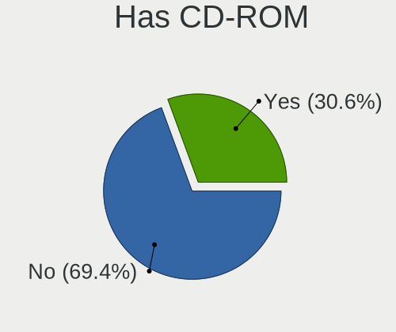
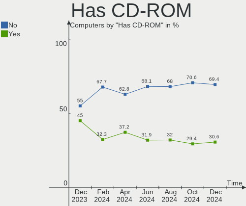
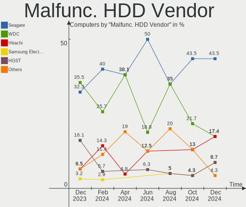
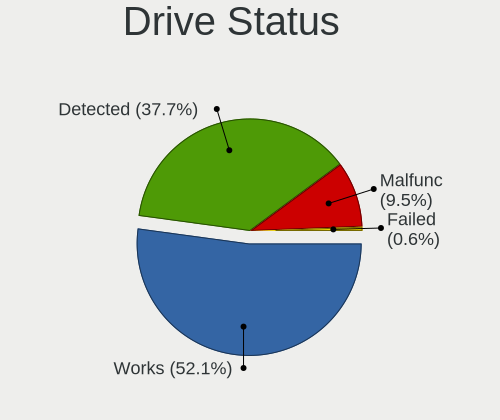
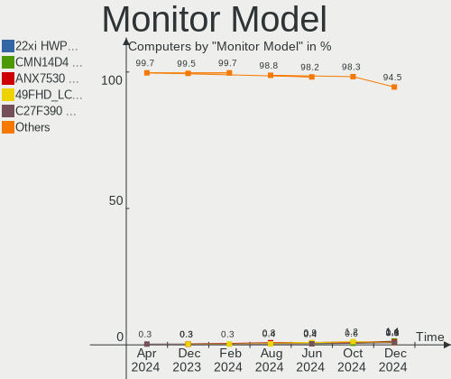
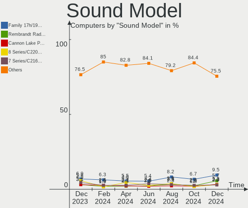
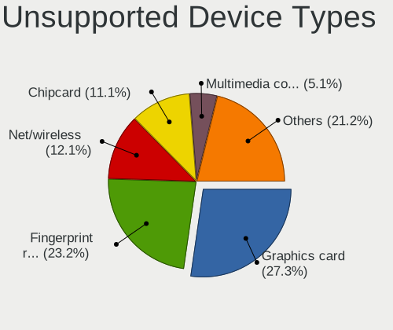

Linux in France - Hardware Trends
---------------------------------

A project to identify most popular hardware characteristics and track their change
over time based on data collected by Linux users at https://Linux-Hardware.org.

Anyone can contribute to this report by the [hw-probe](https://github.com/linuxhw/hw-probe) tool:

    sudo -E hw-probe -all -upload

This is a report for all computer types. See also reports for [desktops](/Location/France/Desktop/README.md) and [notebooks](/Location/France/Notebook/README.md).

Period: Apr, 2024.

Contents
--------

* [ System ](#system)
  - [ OS                       ](#os)
  - [ OS Family                ](#os-family)
  - [ Kernel                   ](#kernel)
  - [ Kernel Family            ](#kernel-family)
  - [ Kernel Major Ver.        ](#kernel-major-ver)
  - [ Arch                     ](#arch)
  - [ DE                       ](#de)
  - [ Display Server           ](#display-server)
  - [ Display Manager          ](#display-manager)
  - [ OS Lang                  ](#os-lang)
  - [ Boot Mode                ](#boot-mode)
  - [ Filesystem               ](#filesystem)
  - [ Part. scheme             ](#part-scheme)
  - [ Dual Boot with Linux/BSD ](#dual-boot-with-linuxbsd)
  - [ Dual Boot (Win)          ](#dual-boot-win)

* [ Board ](#board)
  - [ Vendor                   ](#vendor)
  - [ Model                    ](#model)
  - [ Model Family             ](#model-family)
  - [ MFG Year                 ](#mfg-year)
  - [ Form Factor              ](#form-factor)
  - [ Secure Boot              ](#secure-boot)
  - [ Coreboot                 ](#coreboot)
  - [ RAM Size                 ](#ram-size)
  - [ RAM Used                 ](#ram-used)
  - [ Total Drives             ](#total-drives)
  - [ Has CD-ROM               ](#has-cd-rom)
  - [ Has Ethernet             ](#has-ethernet)
  - [ Has WiFi                 ](#has-wifi)
  - [ Has Bluetooth            ](#has-bluetooth)

* [ Location ](#location)
  - [ Country                  ](#country)
  - [ City                     ](#city)

* [ Drives ](#drives)
  - [ Drive Vendor             ](#drive-vendor)
  - [ Drive Model              ](#drive-model)
  - [ HDD Vendor               ](#hdd-vendor)
  - [ SSD Vendor               ](#ssd-vendor)
  - [ Drive Kind               ](#drive-kind)
  - [ Drive Connector          ](#drive-connector)
  - [ Drive Size               ](#drive-size)
  - [ Space Total              ](#space-total)
  - [ Space Used               ](#space-used)
  - [ Malfunc. Drives          ](#malfunc-drives)
  - [ Malfunc. Drive Vendor    ](#malfunc-drive-vendor)
  - [ Malfunc. HDD Vendor      ](#malfunc-hdd-vendor)
  - [ Malfunc. Drive Kind      ](#malfunc-drive-kind)
  - [ Failed Drives            ](#failed-drives)
  - [ Failed Drive Vendor      ](#failed-drive-vendor)
  - [ Drive Status             ](#drive-status)

* [ Storage controller ](#storage-controller)
  - [ Storage Vendor           ](#storage-vendor)
  - [ Storage Model            ](#storage-model)
  - [ Storage Kind             ](#storage-kind)

* [ Processor ](#processor)
  - [ CPU Vendor               ](#cpu-vendor)
  - [ CPU Model                ](#cpu-model)
  - [ CPU Model Family         ](#cpu-model-family)
  - [ CPU Cores                ](#cpu-cores)
  - [ CPU Sockets              ](#cpu-sockets)
  - [ CPU Threads              ](#cpu-threads)
  - [ CPU Op-Modes             ](#cpu-op-modes)
  - [ CPU Microcode            ](#cpu-microcode)
  - [ CPU Microarch            ](#cpu-microarch)

* [ Graphics ](#graphics)
  - [ GPU Vendor               ](#gpu-vendor)
  - [ GPU Model                ](#gpu-model)
  - [ GPU Combo                ](#gpu-combo)
  - [ GPU Driver               ](#gpu-driver)
  - [ GPU Memory               ](#gpu-memory)

* [ Monitor ](#monitor)
  - [ Monitor Vendor           ](#monitor-vendor)
  - [ Monitor Model            ](#monitor-model)
  - [ Monitor Resolution       ](#monitor-resolution)
  - [ Monitor Diagonal         ](#monitor-diagonal)
  - [ Monitor Width            ](#monitor-width)
  - [ Aspect Ratio             ](#aspect-ratio)
  - [ Monitor Area             ](#monitor-area)
  - [ Pixel Density            ](#pixel-density)
  - [ Multiple Monitors        ](#multiple-monitors)

* [ Network ](#network)
  - [ Net Controller Vendor    ](#net-controller-vendor)
  - [ Net Controller Model     ](#net-controller-model)
  - [ Wireless Vendor          ](#wireless-vendor)
  - [ Wireless Model           ](#wireless-model)
  - [ Ethernet Vendor          ](#ethernet-vendor)
  - [ Ethernet Model           ](#ethernet-model)
  - [ Net Controller Kind      ](#net-controller-kind)
  - [ Used Controller          ](#used-controller)
  - [ NICs                     ](#nics)
  - [ IPv6                     ](#ipv6)

* [ Bluetooth ](#bluetooth)
  - [ Bluetooth Vendor         ](#bluetooth-vendor)
  - [ Bluetooth Model          ](#bluetooth-model)

* [ Sound ](#sound)
  - [ Sound Vendor             ](#sound-vendor)
  - [ Sound Model              ](#sound-model)

* [ Memory ](#memory)
  - [ Memory Vendor            ](#memory-vendor)
  - [ Memory Model             ](#memory-model)
  - [ Memory Kind              ](#memory-kind)
  - [ Memory Form Factor       ](#memory-form-factor)
  - [ Memory Size              ](#memory-size)
  - [ Memory Speed             ](#memory-speed)

* [ Printers & scanners ](#printers--scanners)
  - [ Printer Vendor           ](#printer-vendor)
  - [ Printer Model            ](#printer-model)
  - [ Scanner Vendor           ](#scanner-vendor)
  - [ Scanner Model            ](#scanner-model)

* [ Camera ](#camera)
  - [ Camera Vendor            ](#camera-vendor)
  - [ Camera Model             ](#camera-model)

* [ Security ](#security)
  - [ Fingerprint Vendor       ](#fingerprint-vendor)
  - [ Fingerprint Model        ](#fingerprint-model)
  - [ Chipcard Vendor          ](#chipcard-vendor)
  - [ Chipcard Model           ](#chipcard-model)

* [ Unsupported ](#unsupported)
  - [ Unsupported Devices      ](#unsupported-devices)
  - [ Unsupported Device Types ](#unsupported-device-types)

System
------

OS
--

Installed operating systems

| Name                         | Computers | Percent |
|------------------------------|-----------|---------|
| Ubuntu 22.04                 | 54        | 20.93%  |
| Fedora 39                    | 17        | 6.59%   |
| Linux Mint 21.3              | 15        | 5.81%   |
| Debian 12                    | 15        | 5.81%   |
| OpenMandriva 23.08           | 13        | 5.04%   |
| Ubuntu 24.04                 | 12        | 4.65%   |
| OpenMandriva 5.0             | 12        | 4.65%   |
| Fedora 40                    | 12        | 4.65%   |
| Arch Rolling                 | 9         | 3.49%   |
| Zorin 17                     | 8         | 3.1%    |
| Ubuntu 23.10                 | 6         | 2.33%   |
| Ubuntu 20.04                 | 6         | 2.33%   |
| Lubuntu 22.04                | 5         | 1.94%   |
| Xubuntu 22.04                | 4         | 1.55%   |
| Pop!_OS 22.04                | 3         | 1.16%   |
| openSUSE Tumbleweed-XXXXXXXX | 3         | 1.16%   |
| Kubuntu 23.10                | 3         | 1.16%   |
| Debian 11                    | 3         | 1.16%   |
| Zorin 16                     | 2         | 0.78%   |
| Ubuntu MATE 22.04            | 2         | 0.78%   |
| ROSA 12.5                    | 2         | 0.78%   |
| OpenMandriva 24.03           | 2         | 0.78%   |
| OpenMandriva 23.01           | 2         | 0.78%   |
| MX 23                        | 2         | 0.78%   |
| Mageia 9                     | 2         | 0.78%   |
| Linux Mint 20.3              | 2         | 0.78%   |
| KDE neon 22.04               | 2         | 0.78%   |
| Debian                       | 2         | 0.78%   |
| ArcoLinux Rolling            | 2         | 0.78%   |
| Xubuntu 24.04                | 1         | 0.39%   |
| Xubuntu 23.10                | 1         | 0.39%   |
| Xubuntu 20.04                | 1         | 0.39%   |
| Xero Rolling                 | 1         | 0.39%   |
| Ultramarine 39               | 1         | 0.39%   |
| Ubuntu MATE 23.10            | 1         | 0.39%   |
| Ubuntu 23.04                 | 1         | 0.39%   |
| Ubuntu 18.04                 | 1         | 0.39%   |
| SteamOS 3.5.17               | 1         | 0.39%   |
| Slackware 15.0               | 1         | 0.39%   |
| Raspbian 12                  | 1         | 0.39%   |

OS Family
---------

OS without a version

| Name         | Computers | Percent |
|--------------|-----------|---------|
| Ubuntu       | 80        | 31.01%  |
| OpenMandriva | 31        | 12.02%  |
| Fedora       | 30        | 11.63%  |
| Debian       | 20        | 7.75%   |
| Linux Mint   | 19        | 7.36%   |
| Zorin        | 10        | 3.88%   |
| Arch         | 9         | 3.49%   |
| Xubuntu      | 7         | 2.71%   |
| Lubuntu      | 6         | 2.33%   |
| Kubuntu      | 5         | 1.94%   |
| Ubuntu MATE  | 3         | 1.16%   |
| Pop!_OS      | 3         | 1.16%   |
| openSUSE     | 3         | 1.16%   |
| ROSA         | 2         | 0.78%   |
| Raspbian     | 2         | 0.78%   |
| MX           | 2         | 0.78%   |
| Mageia       | 2         | 0.78%   |
| KDE neon     | 2         | 0.78%   |
| Gentoo       | 2         | 0.78%   |
| ArcoLinux    | 2         | 0.78%   |
| Xero         | 1         | 0.39%   |
| Ultramarine  | 1         | 0.39%   |
| SteamOS      | 1         | 0.39%   |
| Slackware    | 1         | 0.39%   |
| PostmarketOS | 1         | 0.39%   |
| Parrot       | 1         | 0.39%   |
| Manjaro      | 1         | 0.39%   |
| LMDE         | 1         | 0.39%   |
| Kali         | 1         | 0.39%   |
| Io           | 1         | 0.39%   |
| EndeavourOS  | 1         | 0.39%   |
| Elementary   | 1         | 0.39%   |
| Drauger OS   | 1         | 0.39%   |
| Devuan       | 1         | 0.39%   |
| CloudLinux   | 1         | 0.39%   |
| Clear Linux  | 1         | 0.39%   |
| antiX        | 1         | 0.39%   |
| Alpine       | 1         | 0.39%   |

Kernel
------

Version of the Linux kernel

| Version                             | Computers | Percent |
|-------------------------------------|-----------|---------|
| 6.5.0-26-generic                    | 34        | 13.18%  |
| 6.5.0-27-generic                    | 23        | 8.91%   |
| 6.5.0-28-generic                    | 17        | 6.59%   |
| 6.6.2-desktop-1omv2390              | 14        | 5.43%   |
| 6.4.11-desktop-1omv2390             | 13        | 5.04%   |
| 6.1.0-18-amd64                      | 11        | 4.26%   |
| 6.8.7-300.fc40.x86_64               | 9         | 3.49%   |
| 6.8.0-31-generic                    | 9         | 3.49%   |
| 5.15.0-101-generic                  | 8         | 3.1%    |
| 6.7.11-200.fc39.x86_64              | 5         | 1.94%   |
| 5.15.0-105-generic                  | 5         | 1.94%   |
| 5.15.0-102-generic                  | 5         | 1.94%   |
| 6.8.7-arch1-1                       | 4         | 1.55%   |
| 6.8.6-200.fc39.x86_64               | 4         | 1.55%   |
| 6.1.0-20-amd64                      | 4         | 1.55%   |
| 6.8.0-76060800daily20240311-generic | 3         | 1.16%   |
| 6.8.0-11-generic                    | 3         | 1.16%   |
| 6.5.0-18-generic                    | 3         | 1.16%   |
| 6.8.5-arch1-1                       | 2         | 0.78%   |
| 6.8.5-201.fc39.x86_64               | 2         | 0.78%   |
| 6.8.4-200.fc39.x86_64               | 2         | 0.78%   |
| 6.8.0-22-generic                    | 2         | 0.78%   |
| 6.7.10-200.fc39.x86_64              | 2         | 0.78%   |
| 6.6.21-generic-8rosa2021.1-x86_64   | 2         | 0.78%   |
| 6.1.1-desktop-1omv2290              | 2         | 0.78%   |
| 5.10.0-28-amd64                     | 2         | 0.78%   |
| 6.8.7-301.fsync.fc40.x86_64         | 1         | 0.39%   |
| 6.8.7-200.fc39.x86_64               | 1         | 0.39%   |
| 6.8.7-100.fc38.x86_64               | 1         | 0.39%   |
| 6.8.7-1-default                     | 1         | 0.39%   |
| 6.8.6-gentoo-dist                   | 1         | 0.39%   |
| 6.8.6-1426.native                   | 1         | 0.39%   |
| 6.8.4-rc1-1-default                 | 1         | 0.39%   |
| 6.8.4-300.fc40.x86_64               | 1         | 0.39%   |
| 6.8.4-300.es83xx.fc40.x86_64        | 1         | 0.39%   |
| 6.8.4-273-tkg-eevdf-llvm            | 1         | 0.39%   |
| 6.8.2-zen2-1-zen                    | 1         | 0.39%   |
| 6.8.2-arch2-1                       | 1         | 0.39%   |
| 6.8.1-desktop-3omv2490              | 1         | 0.39%   |
| 6.8.1-arch1-1                       | 1         | 0.39%   |

Kernel Family
-------------

Linux kernel without a distro release

| Version | Computers | Percent |
|---------|-----------|---------|
| 6.5.0   | 84        | 32.56%  |
| 5.15.0  | 24        | 9.3%    |
| 6.1.0   | 20        | 7.75%   |
| 6.8.7   | 17        | 6.59%   |
| 6.8.0   | 17        | 6.59%   |
| 6.6.2   | 14        | 5.43%   |
| 6.4.11  | 13        | 5.04%   |
| 6.8.6   | 6         | 2.33%   |
| 6.8.4   | 6         | 2.33%   |
| 6.8.1   | 5         | 1.94%   |
| 6.7.11  | 5         | 1.94%   |
| 6.8.5   | 4         | 1.55%   |
| 5.4.0   | 3         | 1.16%   |
| 6.8.2   | 2         | 0.78%   |
| 6.7.10  | 2         | 0.78%   |
| 6.6.9   | 2         | 0.78%   |
| 6.6.22  | 2         | 0.78%   |
| 6.6.21  | 2         | 0.78%   |
| 6.2.0   | 2         | 0.78%   |
| 6.1.1   | 2         | 0.78%   |
| 5.13.0  | 2         | 0.78%   |
| 5.10.0  | 2         | 0.78%   |
| 6.7.9   | 1         | 0.39%   |
| 6.7.12  | 1         | 0.39%   |
| 6.6.8   | 1         | 0.39%   |
| 6.6.28  | 1         | 0.39%   |
| 6.6.20  | 1         | 0.39%   |
| 6.6.15  | 1         | 0.39%   |
| 6.6.12  | 1         | 0.39%   |
| 6.6.1   | 1         | 0.39%   |
| 6.6.0   | 1         | 0.39%   |
| 6.5.6   | 1         | 0.39%   |
| 6.5.5   | 1         | 0.39%   |
| 6.5.3   | 1         | 0.39%   |
| 6.4.9   | 1         | 0.39%   |
| 6.4.8   | 1         | 0.39%   |
| 6.1.67  | 1         | 0.39%   |
| 6.1.52  | 1         | 0.39%   |
| 6.1.42  | 1         | 0.39%   |
| 6.1.21  | 1         | 0.39%   |

Kernel Major Ver.
-----------------

Linux kernel major version

| Version | Computers | Percent |
|---------|-----------|---------|
| 6.5     | 87        | 33.72%  |
| 6.8     | 57        | 22.09%  |
| 6.6     | 27        | 10.47%  |
| 6.1     | 26        | 10.08%  |
| 5.15    | 25        | 9.69%   |
| 6.4     | 15        | 5.81%   |
| 6.7     | 9         | 3.49%   |
| 5.4     | 3         | 1.16%   |
| 6.2     | 2         | 0.78%   |
| 5.13    | 2         | 0.78%   |
| 5.10    | 2         | 0.78%   |
| 5.14    | 1         | 0.39%   |
| 4.18    | 1         | 0.39%   |
| 4.15    | 1         | 0.39%   |

Arch
----

OS architecture (x86_64, i586, etc.)

| Name    | Computers | Percent |
|---------|-----------|---------|
| x86_64  | 255       | 98.84%  |
| armv7l  | 1         | 0.39%   |
| armv6l  | 1         | 0.39%   |
| aarch64 | 1         | 0.39%   |

DE
--

Desktop Environment

| Name          | Computers | Percent |
|---------------|-----------|---------|
| GNOME         | 125       | 48.45%  |
| KDE5          | 43        | 16.67%  |
| XFCE          | 20        | 7.75%   |
| X-Cinnamon    | 19        | 7.36%   |
| Unknown       | 14        | 5.43%   |
| KDE6          | 10        | 3.88%   |
| LXQt          | 8         | 3.1%    |
| MATE          | 5         | 1.94%   |
| Cinnamon      | 4         | 1.55%   |
| LXDE          | 2         | 0.78%   |
| KDE           | 2         | 0.78%   |
| Pantheon      | 1         | 0.39%   |
| icewm         | 1         | 0.39%   |
| i3            | 1         | 0.39%   |
| Hyprland      | 1         | 0.39%   |
| GNOME Classic | 1         | 0.39%   |
| Enlightenment | 1         | 0.39%   |

Display Server
--------------

X11 or Wayland

| Name    | Computers | Percent |
|---------|-----------|---------|
| X11     | 124       | 48.06%  |
| Wayland | 122       | 47.29%  |
| Tty     | 10        | 3.88%   |
| Unknown | 2         | 0.78%   |

Display Manager
---------------

SDDM, LightDM, etc.

| Name    | Computers | Percent |
|---------|-----------|---------|
| GDM3    | 76        | 29.46%  |
| Unknown | 62        | 24.03%  |
| SDDM    | 55        | 21.32%  |
| LightDM | 47        | 18.22%  |
| GDM     | 15        | 5.81%   |
| XDM     | 1         | 0.39%   |
| SLIMSKI | 1         | 0.39%   |
| LXDM    | 1         | 0.39%   |

OS Lang
-------

Language

| Lang    | Computers | Percent |
|---------|-----------|---------|
| fr_FR   | 196       | 75.97%  |
| en_US   | 37        | 14.34%  |
| C       | 8         | 3.1%    |
| it_IT   | 7         | 2.71%   |
| en_GB   | 5         | 1.94%   |
| Unknown | 3         | 1.16%   |
| es_CU   | 1         | 0.39%   |
| de_DE   | 1         | 0.39%   |

Boot Mode
---------

EFI or BIOS

| Mode | Computers | Percent |
|------|-----------|---------|
| BIOS | 129       | 50%     |
| EFI  | 129       | 50%     |

Filesystem
----------

Type of filesystem

| Type    | Computers | Percent |
|---------|-----------|---------|
| Ext4    | 150       | 58.14%  |
| Btrfs   | 41        | 15.89%  |
| Tmpfs   | 40        | 15.5%   |
| Overlay | 23        | 8.91%   |
| Zfs     | 2         | 0.78%   |
| Xfs     | 2         | 0.78%   |

Part. scheme
------------

Scheme of partitioning

| Type    | Computers | Percent |
|---------|-----------|---------|
| GPT     | 168       | 65.12%  |
| Unknown | 58        | 22.48%  |
| MBR     | 32        | 12.4%   |

Dual Boot with Linux/BSD
------------------------

Hosting more than one Linux/BSD

| Dual boot | Computers | Percent |
|-----------|-----------|---------|
| No        | 207       | 80.23%  |
| Yes       | 51        | 19.77%  |

Dual Boot (Win)
---------------

Hosting Linux and Windows

| Dual boot | Computers | Percent |
|-----------|-----------|---------|
| No        | 187       | 72.48%  |
| Yes       | 71        | 27.52%  |

Board
-----

Vendor
------

Motherboard manufacturer

| Name                                 | Computers | Percent |
|--------------------------------------|-----------|---------|
| ASUSTek Computer                     | 53        | 20.54%  |
| Hewlett-Packard                      | 40        | 15.5%   |
| Dell                                 | 34        | 13.18%  |
| Lenovo                               | 27        | 10.47%  |
| MSI                                  | 24        | 9.3%    |
| Acer                                 | 12        | 4.65%   |
| Gigabyte Technology                  | 7         | 2.71%   |
| Samsung Electronics                  | 5         | 1.94%   |
| Fujitsu                              | 5         | 1.94%   |
| Apple                                | 5         | 1.94%   |
| Toshiba                              | 4         | 1.55%   |
| Notebook                             | 4         | 1.55%   |
| ASRock                               | 4         | 1.55%   |
| Unknown                              | 4         | 1.55%   |
| Medion                               | 3         | 1.16%   |
| Raspberry Pi Foundation              | 2         | 0.78%   |
| Packard Bell                         | 2         | 0.78%   |
| Intel                                | 2         | 0.78%   |
| Google                               | 2         | 0.78%   |
| ZOTAC                                | 1         | 0.39%   |
| Valve                                | 1         | 0.39%   |
| VALE                                 | 1         | 0.39%   |
| UNOWHY                               | 1         | 0.39%   |
| Shenzhen Meigao Electronic Equipment | 1         | 0.39%   |
| SCHNEIDER                            | 1         | 0.39%   |
| pine64                               | 1         | 0.39%   |
| Pegatron                             | 1         | 0.39%   |
| Panasonic                            | 1         | 0.39%   |
| N-one                                | 1         | 0.39%   |
| Minix                                | 1         | 0.39%   |
| HUAWEI                               | 1         | 0.39%   |
| GEEKOM                               | 1         | 0.39%   |
| Fujitsu Siemens                      | 1         | 0.39%   |
| Framework                            | 1         | 0.39%   |
| Foxconn                              | 1         | 0.39%   |
| eMachines                            | 1         | 0.39%   |
| ECS                                  | 1         | 0.39%   |
| Chuwi                                | 1         | 0.39%   |

Model
-----

Motherboard model

| Name                                            | Computers | Percent |
|-------------------------------------------------|-----------|---------|
| ASUS All Series                                 | 4         | 1.55%   |
| Unknown                                         | 4         | 1.55%   |
| Samsung 950QED                                  | 2         | 0.78%   |
| MSI MS-7C37                                     | 2         | 0.78%   |
| HP Notebook                                     | 2         | 0.78%   |
| HP EliteBook 840 G8 Notebook PC                 | 2         | 0.78%   |
| Dell OptiPlex 790                               | 2         | 0.78%   |
| Dell OptiPlex 7040                              | 2         | 0.78%   |
| Dell OptiPlex 3050                              | 2         | 0.78%   |
| ASUS PRIME A320M-K                              | 2         | 0.78%   |
| ASUS M5A97                                      | 2         | 0.78%   |
| ZOTAC ZBOX                                      | 1         | 0.39%   |
| Valve Jupiter                                   | 1         | 0.39%   |
| VALE Notebook Classic C151V                     | 1         | 0.39%   |
| UNOWHY Y13G002S4EI                              | 1         | 0.39%   |
| Toshiba Satellite U500                          | 1         | 0.39%   |
| Toshiba Satellite Pro L630                      | 1         | 0.39%   |
| Toshiba Satellite Pro C50-A-154                 | 1         | 0.39%   |
| Toshiba Satellite C870-192                      | 1         | 0.39%   |
| Shenzhen Meigao Electronic Equipment UM773 Lite | 1         | 0.39%   |
| SCHNEIDER SCL141CTP                             | 1         | 0.39%   |
| Samsung RV415/RV515/E3415                       | 1         | 0.39%   |
| Samsung RV410/RV510/S3510/E3510                 | 1         | 0.39%   |
| Samsung 950XED                                  | 1         | 0.39%   |
| RPi Raspberry Pi Model B Rev 2                  | 1         | 0.39%   |
| RPi Raspberry Pi 2 Model B Rev 1.1              | 1         | 0.39%   |
| pine64 PinePhonePro                             | 1         | 0.39%   |
| Pegatron WC954AA-ABF CQ5325FR                   | 1         | 0.39%   |
| Panasonic CF-C1BTCREFF                          | 1         | 0.39%   |
| Packard Bell IMEDIA S2185                       | 1         | 0.39%   |
| Packard Bell EasyNote LJ61                      | 1         | 0.39%   |
| Notebook W230ST                                 | 1         | 0.39%   |
| Notebook NS5x_NS7xPU                            | 1         | 0.39%   |
| Notebook NS5x_NS7xAU                            | 1         | 0.39%   |
| Notebook NP50D5                                 | 1         | 0.39%   |
| N-one Nbook Ultra                               | 1         | 0.39%   |
| MSI Raider GE78HX SmartTP 13VG                  | 1         | 0.39%   |
| MSI MS-7D98                                     | 1         | 0.39%   |
| MSI MS-7D91                                     | 1         | 0.39%   |
| MSI MS-7D22                                     | 1         | 0.39%   |

Model Family
------------

Motherboard model prefix

| Name                                       | Computers | Percent |
|--------------------------------------------|-----------|---------|
| Lenovo ThinkPad                            | 16        | 6.2%    |
| Dell Latitude                              | 13        | 5.04%   |
| Dell OptiPlex                              | 9         | 3.49%   |
| ASUS ROG                                   | 9         | 3.49%   |
| Acer Aspire                                | 9         | 3.49%   |
| HP EliteBook                               | 8         | 3.1%    |
| HP Pavilion                                | 7         | 2.71%   |
| Dell Precision                             | 6         | 2.33%   |
| ASUS PRIME                                 | 6         | 2.33%   |
| ASUS TUF                                   | 5         | 1.94%   |
| Toshiba Satellite                          | 4         | 1.55%   |
| HP Laptop                                  | 4         | 1.55%   |
| ASUS All                                   | 4         | 1.55%   |
| Unknown                                    | 4         | 1.55%   |
| Lenovo ThinkCentre                         | 3         | 1.16%   |
| HP ZBook                                   | 3         | 1.16%   |
| HP EliteDesk                               | 3         | 1.16%   |
| HP Compaq                                  | 3         | 1.16%   |
| Fujitsu ESPRIMO                            | 3         | 1.16%   |
| Dell XPS                                   | 3         | 1.16%   |
| ASUS ASUS                                  | 3         | 1.16%   |
| Samsung 950QED                             | 2         | 0.78%   |
| RPi Raspberry                              | 2         | 0.78%   |
| Notebook NS5x                              | 2         | 0.78%   |
| MSI MS-7C37                                | 2         | 0.78%   |
| Lenovo ThinkStation                        | 2         | 0.78%   |
| Lenovo Legion                              | 2         | 0.78%   |
| Lenovo IdeaPadFlex                         | 2         | 0.78%   |
| Lenovo IdeaPad                             | 2         | 0.78%   |
| HP ProLiant                                | 2         | 0.78%   |
| HP ProDesk                                 | 2         | 0.78%   |
| HP ProBook                                 | 2         | 0.78%   |
| HP Notebook                                | 2         | 0.78%   |
| ASUS M5A97                                 | 2         | 0.78%   |
| Acer Veriton                               | 2         | 0.78%   |
| ZOTAC ZBOX                                 | 1         | 0.39%   |
| Valve Jupiter                              | 1         | 0.39%   |
| VALE Notebook                              | 1         | 0.39%   |
| UNOWHY Y13G002S4EI                         | 1         | 0.39%   |
| Shenzhen Meigao Electronic Equipment UM773 | 1         | 0.39%   |

MFG Year
--------

Motherboard manufacture year

| Year    | Computers | Percent |
|---------|-----------|---------|
| 2023    | 25        | 9.69%   |
| 2013    | 23        | 8.91%   |
| 2021    | 22        | 8.53%   |
| 2020    | 21        | 8.14%   |
| 2018    | 17        | 6.59%   |
| 2015    | 17        | 6.59%   |
| 2019    | 16        | 6.2%    |
| 2022    | 15        | 5.81%   |
| 2017    | 14        | 5.43%   |
| 2014    | 14        | 5.43%   |
| 2011    | 13        | 5.04%   |
| 2010    | 12        | 4.65%   |
| 2016    | 11        | 4.26%   |
| 2012    | 10        | 3.88%   |
| 2008    | 10        | 3.88%   |
| 2009    | 8         | 3.1%    |
| 2007    | 4         | 1.55%   |
| 2024    | 3         | 1.16%   |
| Unknown | 2         | 0.78%   |
| 2005    | 1         | 0.39%   |

Form Factor
-----------

Physical design of the computer

| Name           | Computers | Percent |
|----------------|-----------|---------|
| Notebook       | 138       | 53.49%  |
| Desktop        | 101       | 39.15%  |
| Convertible    | 5         | 1.94%   |
| Mini pc        | 4         | 1.55%   |
| All in one     | 4         | 1.55%   |
| System on chip | 3         | 1.16%   |
| Server         | 2         | 0.78%   |
| Tablet         | 1         | 0.39%   |

Secure Boot
-----------

Enabled or disabled

| State    | Computers | Percent |
|----------|-----------|---------|
| Disabled | 238       | 92.25%  |
| Enabled  | 20        | 7.75%   |

Coreboot
--------

Have coreboot on board

| Used | Computers | Percent |
|------|-----------|---------|
| No   | 255       | 98.84%  |
| Yes  | 3         | 1.16%   |

RAM Size
--------

Total RAM memory

| Size in GB  | Computers | Percent |
|-------------|-----------|---------|
| 16.01-24.0  | 50        | 19.38%  |
| 3.01-4.0    | 48        | 18.6%   |
| 4.01-8.0    | 47        | 18.22%  |
| 32.01-64.0  | 45        | 17.44%  |
| 8.01-16.0   | 41        | 15.89%  |
| 64.01-256.0 | 9         | 3.49%   |
| 1.01-2.0    | 8         | 3.1%    |
| 24.01-32.0  | 7         | 2.71%   |
| 2.01-3.0    | 1         | 0.39%   |
| 0.51-1.0    | 1         | 0.39%   |
| 0.01-0.5    | 1         | 0.39%   |

RAM Used
--------

Used RAM memory

| Used GB    | Computers | Percent |
|------------|-----------|---------|
| 1.01-2.0   | 71        | 27.52%  |
| 2.01-3.0   | 66        | 25.58%  |
| 4.01-8.0   | 51        | 19.77%  |
| 3.01-4.0   | 36        | 13.95%  |
| 8.01-16.0  | 15        | 5.81%   |
| 0.51-1.0   | 13        | 5.04%   |
| 16.01-24.0 | 3         | 1.16%   |
| 0.01-0.5   | 3         | 1.16%   |

Total Drives
------------

Number of drives on board

| Drives | Computers | Percent |
|--------|-----------|---------|
| 1      | 149       | 57.75%  |
| 2      | 62        | 24.03%  |
| 3      | 20        | 7.75%   |
| 5      | 10        | 3.88%   |
| 4      | 10        | 3.88%   |
| 7      | 3         | 1.16%   |
| 0      | 2         | 0.78%   |
| 25     | 1         | 0.39%   |
| 6      | 1         | 0.39%   |

Has CD-ROM
----------

Has CD-ROM on board

| Presented | Computers | Percent |
|-----------|-----------|---------|
| No        | 162       | 62.79%  |
| Yes       | 96        | 37.21%  |

Has Ethernet
------------

Has Ethernet on board

| Presented | Computers | Percent |
|-----------|-----------|---------|
| Yes       | 225       | 87.21%  |
| No        | 33        | 12.79%  |

Has WiFi
--------

Has WiFi module

| Presented | Computers | Percent |
|-----------|-----------|---------|
| Yes       | 203       | 78.68%  |
| No        | 55        | 21.32%  |

Has Bluetooth
-------------

Has Bluetooth module

| Presented | Computers | Percent |
|-----------|-----------|---------|
| Yes       | 151       | 58.53%  |
| No        | 107       | 41.47%  |

Location
--------

Country
-------

Geographic location (country)

| Country | Computers | Percent |
|---------|-----------|---------|
| France  | 258       | 100%    |

City
----

Geographic location (city)

| City                     | Computers | Percent |
|--------------------------|-----------|---------|
| Paris                    | 27        | 10.47%  |
| Toulouse                 | 8         | 3.1%    |
| Lyon                     | 6         | 2.33%   |
| Marseille                | 5         | 1.94%   |
| Le Haillan               | 5         | 1.94%   |
| Argenteuil               | 5         | 1.94%   |
| Rosny-sous-Bois          | 4         | 1.55%   |
| Rennes                   | 4         | 1.55%   |
| Nantes                   | 4         | 1.55%   |
| Strasbourg               | 3         | 1.16%   |
| Monteux                  | 3         | 1.16%   |
| Vernon                   | 2         | 0.78%   |
| Valenciennes             | 2         | 0.78%   |
| Tourcoing                | 2         | 0.78%   |
| Sainte-Sigolene          | 2         | 0.78%   |
| Saint-Just-Saint-Rambert | 2         | 0.78%   |
| Saint-Julien-en-Genevois | 2         | 0.78%   |
| Saint-Etienne            | 2         | 0.78%   |
| Rezé                    | 2         | 0.78%   |
| Poitiers                 | 2         | 0.78%   |
| Plaisir                  | 2         | 0.78%   |
| Pasly                    | 2         | 0.78%   |
| Pace                     | 2         | 0.78%   |
| Orléans                 | 2         | 0.78%   |
| Nîmes                   | 2         | 0.78%   |
| Nice                     | 2         | 0.78%   |
| Montpellier              | 2         | 0.78%   |
| Massy                    | 2         | 0.78%   |
| Limoges                  | 2         | 0.78%   |
| L'Isle-Adam              | 2         | 0.78%   |
| Dinan                    | 2         | 0.78%   |
| Colombes                 | 2         | 0.78%   |
| Champs-sur-Marne         | 2         | 0.78%   |
| Bobigny                  | 2         | 0.78%   |
| Wasquehal                | 1         | 0.39%   |
| Vivonne                  | 1         | 0.39%   |
| Vitry-sur-Seine          | 1         | 0.39%   |
| Viry-Châtillon          | 1         | 0.39%   |
| Villeneuve-le-Roi        | 1         | 0.39%   |
| Villedieu-la-Blouere     | 1         | 0.39%   |

Drives
------

Drive Vendor
------------

Hard drive vendors

| Vendor                       | Computers | Drives | Percent |
|------------------------------|-----------|--------|---------|
| Samsung Electronics          | 60        | 79     | 15.08%  |
| Seagate                      | 51        | 61     | 12.81%  |
| WDC                          | 45        | 53     | 11.31%  |
| Crucial                      | 32        | 36     | 8.04%   |
| Kingston                     | 22        | 22     | 5.53%   |
| Toshiba                      | 19        | 32     | 4.77%   |
| Sandisk                      | 19        | 20     | 4.77%   |
| Unknown                      | 16        | 19     | 4.02%   |
| SK hynix                     | 16        | 16     | 4.02%   |
| Micron Technology            | 11        | 12     | 2.76%   |
| Hitachi                      | 10        | 11     | 2.51%   |
| Phison Electronics           | 9         | 10     | 2.26%   |
| Micron/Crucial Technology    | 7         | 7      | 1.76%   |
| Intel                        | 7         | 7      | 1.76%   |
| Kingston Technology Company  | 6         | 6      | 1.51%   |
| HGST                         | 6         | 6      | 1.51%   |
| Fanxiang                     | 5         | 5      | 1.26%   |
| PNY                          | 4         | 5      | 1.01%   |
| Apple                        | 4         | 5      | 1.01%   |
| SPCC                         | 3         | 3      | 0.75%   |
| Shenzhen Longsys Electronics | 3         | 3      | 0.75%   |
| KIOXIA                       | 3         | 3      | 0.75%   |
| Fujitsu                      | 3         | 3      | 0.75%   |
| China                        | 3         | 3      | 0.75%   |
| LDLC                         | 2         | 2      | 0.5%    |
| HS-SSD-E100                  | 2         | 2      | 0.5%    |
| Emtec                        | 2         | 2      | 0.5%    |
| Unknown                      | 2         | 2      | 0.5%    |
| WALRAM                       | 1         | 1      | 0.25%   |
| Verbatim                     | 1         | 1      | 0.25%   |
| USB3.0                       | 1         | 1      | 0.25%   |
| Transcend                    | 1         | 1      | 0.25%   |
| Team                         | 1         | 1      | 0.25%   |
| StoreJet                     | 1         | 1      | 0.25%   |
| SSSTC                        | 1         | 1      | 0.25%   |
| SSK                          | 1         | 1      | 0.25%   |
| Silicon Motion               | 1         | 1      | 0.25%   |
| NGFF                         | 1         | 1      | 0.25%   |
| Netac                        | 1         | 1      | 0.25%   |
| Maxtor                       | 1         | 1      | 0.25%   |

Drive Model
-----------

Hard drive models

| Model                                              | Computers | Percent |
|----------------------------------------------------|-----------|---------|
| Samsung NVMe SSD Controller SM981/PM981/PM983 1TB  | 6         | 1.4%    |
| Kingston SA400S37240G 240GB SSD                    | 6         | 1.4%    |
| Crucial CT500MX500SSD1 500GB                       | 6         | 1.4%    |
| Seagate ST500DM002-1BD142 500GB                    | 5         | 1.16%   |
| Samsung SSD 850 EVO 250GB                          | 5         | 1.16%   |
| Crucial CT1000BX500SSD1 1TB                        | 5         | 1.16%   |
| Toshiba MQ01ABD100 1TB                             | 4         | 0.93%   |
| Samsung SSD 870 EVO 500GB                          | 4         | 0.93%   |
| Samsung NVMe SSD Controller PM9A1/PM9A3/980PRO 1TB | 4         | 0.93%   |
| Micron/Crucial P2 NVMe PCIe SSD 4TB                | 4         | 0.93%   |
| WDC WD5000LPVX-22V0TT0 500GB                       | 3         | 0.7%    |
| Unknown MMC Card  64GB                             | 3         | 0.7%    |
| Unknown MMC Card  32GB                             | 3         | 0.7%    |
| Unknown MMC Card  128GB                            | 3         | 0.7%    |
| Seagate ST500LT012-1DG142 500GB                    | 3         | 0.7%    |
| Seagate ST2000DM008-2FR102 2TB                     | 3         | 0.7%    |
| Seagate ST2000DM006-2DM164 2TB                     | 3         | 0.7%    |
| Seagate ST1000LM049-2GH172 1TB                     | 3         | 0.7%    |
| Seagate ST1000LM024 HN-M101MBB 1TB                 | 3         | 0.7%    |
| Samsung SSD 970 EVO Plus 2TB                       | 3         | 0.7%    |
| Samsung SSD 860 EVO 500GB                          | 3         | 0.7%    |
| Samsung MZVLQ512HBLU-00B 512GB                     | 3         | 0.7%    |
| Kingston SA400S37480G 480GB SSD                    | 3         | 0.7%    |
| HGST HTS721010A9E630 1TB                           | 3         | 0.7%    |
| Crucial CT1000P3SSD8 1TB                           | 3         | 0.7%    |
| Crucial CT1000MX500SSD1 1TB                        | 3         | 0.7%    |
| WDC WD40PURX-64GVNY0 4TB                           | 2         | 0.47%   |
| WDC WD10SPZX-24Z10T0 1TB                           | 2         | 0.47%   |
| Toshiba HDWG440 4TB                                | 2         | 0.47%   |
| Toshiba HDWE160 6TB                                | 2         | 0.47%   |
| SPCC Solid State Disk 512GB                        | 2         | 0.47%   |
| SK hynix PC611 NVMe 512GB                          | 2         | 0.47%   |
| SK hynix BC711 NVMe 512GB                          | 2         | 0.47%   |
| Seagate ST500DM009-2F110A 500GB                    | 2         | 0.47%   |
| Seagate ST3500418AS 500GB                          | 2         | 0.47%   |
| Seagate ST2000DM001-1CH164 2TB                     | 2         | 0.47%   |
| Seagate ST1000DM010-2EP102 1TB                     | 2         | 0.47%   |
| Seagate Expansion HDD 12TB                         | 2         | 0.47%   |
| Sandisk WD Black SN750 / PC SN730 NVMe SSD 512GB   | 2         | 0.47%   |
| SanDisk NVMe SSD Drive 1TB                         | 2         | 0.47%   |

HDD Vendor
----------

Hard disk drive vendors

| Vendor              | Computers | Drives | Percent |
|---------------------|-----------|--------|---------|
| Seagate             | 50        | 60     | 36.23%  |
| WDC                 | 42        | 50     | 30.43%  |
| Toshiba             | 19        | 32     | 13.77%  |
| Hitachi             | 10        | 11     | 7.25%   |
| HGST                | 6         | 6      | 4.35%   |
| Samsung Electronics | 4         | 4      | 2.9%    |
| Fujitsu             | 3         | 3      | 2.17%   |
| Unknown             | 1         | 1      | 0.72%   |
| Maxtor              | 1         | 1      | 0.72%   |
| Initio              | 1         | 1      | 0.72%   |
| Apple               | 1         | 1      | 0.72%   |

SSD Vendor
----------

Solid state drive vendors

| Vendor              | Computers | Drives | Percent |
|---------------------|-----------|--------|---------|
| Samsung Electronics | 33        | 39     | 25.19%  |
| Crucial             | 24        | 26     | 18.32%  |
| Kingston            | 17        | 17     | 12.98%  |
| SanDisk             | 8         | 9      | 6.11%   |
| Micron Technology   | 5         | 6      | 3.82%   |
| PNY                 | 4         | 5      | 3.05%   |
| Intel               | 4         | 4      | 3.05%   |
| SPCC                | 3         | 3      | 2.29%   |
| Fanxiang            | 3         | 3      | 2.29%   |
| China               | 3         | 3      | 2.29%   |
| SK hynix            | 2         | 2      | 1.53%   |
| Emtec               | 2         | 2      | 1.53%   |
| Apple               | 2         | 2      | 1.53%   |
| WDC                 | 1         | 1      | 0.76%   |
| WALRAM              | 1         | 1      | 0.76%   |
| Verbatim            | 1         | 1      | 0.76%   |
| USB3.0              | 1         | 1      | 0.76%   |
| Transcend           | 1         | 1      | 0.76%   |
| StoreJet            | 1         | 1      | 0.76%   |
| SSSTC               | 1         | 1      | 0.76%   |
| NGFF                | 1         | 1      | 0.76%   |
| Netac               | 1         | 1      | 0.76%   |
| LITEON              | 1         | 1      | 0.76%   |
| Lexar               | 1         | 1      | 0.76%   |
| LDLC                | 1         | 1      | 0.76%   |
| KingSpec            | 1         | 1      | 0.76%   |
| Intenso             | 1         | 1      | 0.76%   |
| HS-SSD-E100         | 1         | 1      | 0.76%   |
| FORESEE             | 1         | 1      | 0.76%   |
| External            | 1         | 1      | 0.76%   |
| Dogfish             | 1         | 1      | 0.76%   |
| Corsair             | 1         | 1      | 0.76%   |
| A-DATA Technology   | 1         | 1      | 0.76%   |
| Unknown             | 1         | 1      | 0.76%   |

Drive Kind
----------

HDD or SSD

| Kind    | Computers | Drives | Percent |
|---------|-----------|--------|---------|
| HDD     | 117       | 170    | 33.33%  |
| SSD     | 114       | 142    | 32.48%  |
| NVMe    | 99        | 125    | 28.21%  |
| MMC     | 14        | 15     | 3.99%   |
| Unknown | 7         | 9      | 1.99%   |

Drive Connector
---------------

SATA, SAS, NVMe, etc.

| Type | Computers | Drives | Percent |
|------|-----------|--------|---------|
| SATA | 179       | 304    | 58.5%   |
| NVMe | 99        | 122    | 32.35%  |
| SAS  | 14        | 20     | 4.58%   |
| MMC  | 14        | 15     | 4.58%   |

Drive Size
----------

Size of hard drive

| Size in TB | Computers | Drives | Percent |
|------------|-----------|--------|---------|
| 0.01-0.5   | 130       | 164    | 53.28%  |
| 0.51-1.0   | 71        | 81     | 29.1%   |
| 1.01-2.0   | 22        | 31     | 9.02%   |
| 3.01-4.0   | 9         | 11     | 3.69%   |
| 4.01-10.0  | 5         | 17     | 2.05%   |
| 2.01-3.0   | 4         | 5      | 1.64%   |
| 10.01-20.0 | 3         | 3      | 1.23%   |

Space Total
-----------

Amount of disk space available on the file system

| Size in GB     | Computers | Percent |
|----------------|-----------|---------|
| 251-500        | 65        | 25.19%  |
| 101-250        | 50        | 19.38%  |
| 501-1000       | 46        | 17.83%  |
| 1001-2000      | 24        | 9.3%    |
| More than 3000 | 17        | 6.59%   |
| 1-20           | 17        | 6.59%   |
| 51-100         | 16        | 6.2%    |
| 2001-3000      | 10        | 3.88%   |
| Unknown        | 7         | 2.71%   |
| 21-50          | 6         | 2.33%   |

Space Used
----------

Amount of used disk space

| Used GB        | Computers | Percent |
|----------------|-----------|---------|
| 1-20           | 92        | 35.66%  |
| 21-50          | 45        | 17.44%  |
| 101-250        | 43        | 16.67%  |
| 251-500        | 21        | 8.14%   |
| 51-100         | 17        | 6.59%   |
| 1001-2000      | 12        | 4.65%   |
| 501-1000       | 9         | 3.49%   |
| Unknown        | 7         | 2.71%   |
| More than 3000 | 6         | 2.33%   |
| 2001-3000      | 6         | 2.33%   |

Malfunc. Drives
---------------

Drive models with a malfunction

| Model                                 | Computers | Drives | Percent |
|---------------------------------------|-----------|--------|---------|
| Toshiba MQ01ABD100 1TB                | 2         | 2      | 7.14%   |
| WDC WD5000LPVX-22V0TT0 500GB          | 1         | 1      | 3.57%   |
| WDC WD5000LPLX-08ZNTT0 500GB          | 1         | 1      | 3.57%   |
| WDC WD2500JS-60NCB1 250GB             | 1         | 1      | 3.57%   |
| WDC WD2500AAJS-22L7A0 250GB           | 1         | 1      | 3.57%   |
| WDC WD20EZRX-00DC0B0 2TB              | 1         | 1      | 3.57%   |
| WDC WD2003FZEX-00SRLA0 2TB            | 1         | 1      | 3.57%   |
| WDC WD1600BEVT-22ZCT0 160GB           | 1         | 1      | 3.57%   |
| WDC WD10SPZX-60Z10T0 1TB              | 1         | 1      | 3.57%   |
| Toshiba MK3263GSX 320GB               | 1         | 1      | 3.57%   |
| Toshiba DT01ACA300 3TB                | 1         | 1      | 3.57%   |
| SSSTC CV8-8E128-HP 128GB              | 1         | 1      | 3.57%   |
| Seagate ST9500420AS 500GB             | 1         | 1      | 3.57%   |
| Seagate ST3160812AS 160GB             | 1         | 2      | 3.57%   |
| Seagate ST2000DM008-2FR102 2TB        | 1         | 1      | 3.57%   |
| Seagate ST2000DM001-9YN164 2TB        | 1         | 2      | 3.57%   |
| Seagate ST2000DM001-1CH164 2TB        | 1         | 1      | 3.57%   |
| Seagate ST2000DL003-9VT166 2TB        | 1         | 1      | 3.57%   |
| Seagate ST1000LM024 HN-M101MBB 1TB    | 1         | 1      | 3.57%   |
| Seagate ST1000DX001-1NS162 1TB        | 1         | 1      | 3.57%   |
| Seagate ST1000DM010-2EP102 1TB        | 1         | 1      | 3.57%   |
| Samsung Electronics SSD 970 EVO 1TB   | 1         | 1      | 3.57%   |
| Samsung Electronics SSD 850 PRO 512GB | 1         | 1      | 3.57%   |
| Samsung Electronics SSD 840 EVO 120GB | 1         | 1      | 3.57%   |
| LDLC SSD 120GB                        | 1         | 1      | 3.57%   |
| Intel SSDSCKJF180A5L 180GB            | 1         | 1      | 3.57%   |
| Hitachi HDT721010SLA360 1TB           | 1         | 1      | 3.57%   |

Malfunc. Drive Vendor
---------------------

Vendors of faulty drives

| Vendor              | Computers | Drives | Percent |
|---------------------|-----------|--------|---------|
| WDC                 | 8         | 8      | 29.63%  |
| Seagate             | 8         | 11     | 29.63%  |
| Toshiba             | 4         | 4      | 14.81%  |
| Samsung Electronics | 3         | 3      | 11.11%  |
| SSSTC               | 1         | 1      | 3.7%    |
| LDLC                | 1         | 1      | 3.7%    |
| Intel               | 1         | 1      | 3.7%    |
| Hitachi             | 1         | 1      | 3.7%    |

Malfunc. HDD Vendor
-------------------

Vendors of faulty HDD drives

| Vendor  | Computers | Drives | Percent |
|---------|-----------|--------|---------|
| WDC     | 8         | 8      | 38.1%   |
| Seagate | 8         | 11     | 38.1%   |
| Toshiba | 4         | 4      | 19.05%  |
| Hitachi | 1         | 1      | 4.76%   |

Malfunc. Drive Kind
-------------------

Kinds of faulty drives

| Kind | Computers | Drives | Percent |
|------|-----------|--------|---------|
| HDD  | 19        | 24     | 76%     |
| SSD  | 5         | 5      | 20%     |
| NVMe | 1         | 1      | 4%      |

Failed Drives
-------------

Failed drive models

| Model                                   | Computers | Drives | Percent |
|-----------------------------------------|-----------|--------|---------|
| SK hynix BC501 HFM256GDJTNG-8310A 256GB | 1         | 1      | 50%     |
| Seagate ST500LT012-1DG142 500GB         | 1         | 1      | 50%     |

Failed Drive Vendor
-------------------

Failed drive vendors

| Vendor   | Computers | Drives | Percent |
|----------|-----------|--------|---------|
| SK hynix | 1         | 1      | 50%     |
| Seagate  | 1         | 1      | 50%     |

Drive Status
------------

Number of failed and malfunc. drives

| Status   | Computers | Drives | Percent |
|----------|-----------|--------|---------|
| Works    | 142       | 248    | 51.08%  |
| Detected | 110       | 181    | 39.57%  |
| Malfunc  | 24        | 30     | 8.63%   |
| Failed   | 2         | 2      | 0.72%   |

Storage controller
------------------

Storage Vendor
--------------

Storage controller vendors

| Vendor                        | Computers | Percent |
|-------------------------------|-----------|---------|
| Intel                         | 165       | 48.96%  |
| AMD                           | 41        | 12.17%  |
| Samsung Electronics           | 29        | 8.61%   |
| Micron/Crucial Technology     | 15        | 4.45%   |
| SK hynix                      | 14        | 4.15%   |
| SanDisk                       | 12        | 3.56%   |
| Kingston Technology Company   | 11        | 3.26%   |
| Phison Electronics            | 10        | 2.97%   |
| ASMedia Technology            | 8         | 2.37%   |
| Micron Technology             | 7         | 2.08%   |
| Nvidia                        | 5         | 1.48%   |
| Marvell Technology Group      | 4         | 1.19%   |
| Shenzhen Longsys Electronics  | 3         | 0.89%   |
| KIOXIA                        | 3         | 0.89%   |
| JMicron Technology            | 2         | 0.59%   |
| Solidigm                      | 1         | 0.3%    |
| Silicon Motion                | 1         | 0.3%    |
| MAXIO Technology (Hangzhou)   | 1         | 0.3%    |
| Integrated Technology Express | 1         | 0.3%    |
| Hewlett-Packard               | 1         | 0.3%    |
| Biwin Storage Technology      | 1         | 0.3%    |
| Artop Electronic              | 1         | 0.3%    |
| Apple                         | 1         | 0.3%    |

Storage Model
-------------

Storage controller models

| Model                                                                          | Computers | Percent |
|--------------------------------------------------------------------------------|-----------|---------|
| AMD FCH SATA Controller [AHCI mode]                                            | 19        | 5.09%   |
| Intel 8 Series/C220 Series Chipset Family 6-port SATA Controller 1 [AHCI mode] | 15        | 4.02%   |
| Samsung NVMe SSD Controller SM981/PM981/PM983                                  | 12        | 3.22%   |
| Micron/Crucial P2 [Nick P2] / P3 / P3 Plus NVMe PCIe SSD (DRAM-less)           | 11        | 2.95%   |
| Intel Sunrise Point-LP SATA Controller [AHCI mode]                             | 11        | 2.95%   |
| Intel SATA Controller [RAID mode]                                              | 10        | 2.68%   |
| Intel Volume Management Device NVMe RAID Controller                            | 9         | 2.41%   |
| Intel Q170/Q150/B150/H170/H110/Z170/CM236 Chipset SATA Controller [AHCI Mode]  | 9         | 2.41%   |
| Intel 82801 Mobile SATA Controller [RAID mode]                                 | 9         | 2.41%   |
| ASMedia ASM1061/ASM1062 Serial ATA Controller                                  | 8         | 2.14%   |
| Samsung NVMe SSD Controller 980 (DRAM-less)                                    | 7         | 1.88%   |
| SK hynix Gold P31/BC711/PC711 NVMe Solid State Drive                           | 6         | 1.61%   |
| Samsung NVMe SSD Controller PM9A1/PM9A3/980PRO                                 | 6         | 1.61%   |
| Intel Volume Management Device NVMe RAID Controller Intel Corporation          | 6         | 1.61%   |
| Intel 82801IBM/IEM (ICH9M/ICH9M-E) 4 port SATA Controller [AHCI mode]          | 6         | 1.61%   |
| Intel 8 Series SATA Controller 1 [AHCI mode]                                   | 6         | 1.61%   |
| Intel 7 Series Chipset Family 6-port SATA Controller [AHCI mode]               | 6         | 1.61%   |
| Intel 6 Series/C200 Series Chipset Family 6 port Mobile SATA AHCI Controller   | 6         | 1.61%   |
| AMD 600 Series Chipset SATA Controller                                         | 6         | 1.61%   |
| AMD 500 Series Chipset SATA Controller                                         | 6         | 1.61%   |
| Intel 7 Series/C210 Series Chipset Family 6-port SATA Controller [AHCI mode]   | 5         | 1.34%   |
| Intel 6 Series/C200 Series Chipset Family 6 port Desktop SATA AHCI Controller  | 5         | 1.34%   |
| AMD SB7x0/SB8x0/SB9x0 SATA Controller [AHCI mode]                              | 5         | 1.34%   |
| Intel Cannon Lake PCH SATA AHCI Controller                                     | 4         | 1.07%   |
| Intel 200 Series PCH SATA controller [AHCI mode]                               | 4         | 1.07%   |
| SK hynix PC611 NVMe Solid State Drive                                          | 3         | 0.8%    |
| Shenzhen Longsys Lexar NM790 NVME SSD (DRAM-less)                              | 3         | 0.8%    |
| SanDisk Extreme Pro / WD Black SN750 / PC SN730 / Red SN700 NVMe SSD           | 3         | 0.8%    |
| Phison PS5013-E13 PCIe3 NVMe Controller (DRAM-less)                            | 3         | 0.8%    |
| Micron/Crucial P5 Plus NVMe PCIe SSD                                           | 3         | 0.8%    |
| Intel Wildcat Point-LP SATA Controller [AHCI Mode]                             | 3         | 0.8%    |
| Intel 9 Series Chipset Family SATA Controller [AHCI Mode]                      | 3         | 0.8%    |
| Intel 82801HM/HEM (ICH8M/ICH8M-E) SATA Controller [AHCI mode]                  | 3         | 0.8%    |
| Intel 82801HM/HEM (ICH8M/ICH8M-E) IDE Controller                               | 3         | 0.8%    |
| Intel 5 Series/3400 Series Chipset 4 port SATA IDE Controller                  | 3         | 0.8%    |
| Intel 5 Series/3400 Series Chipset 4 port SATA AHCI Controller                 | 3         | 0.8%    |
| Intel 5 Series/3400 Series Chipset 2 port SATA IDE Controller                  | 3         | 0.8%    |
| Intel 400 Series Chipset Family SATA AHCI Controller                           | 3         | 0.8%    |
| AMD SB7x0/SB8x0/SB9x0 SATA Controller [IDE mode]                               | 3         | 0.8%    |
| AMD 400 Series Chipset SATA Controller                                         | 3         | 0.8%    |

Storage Kind
------------

Kind of storage controller (IDE, SATA, NVMe, SAS, ...)

| Kind | Computers | Percent |
|------|-----------|---------|
| SATA | 169       | 51.84%  |
| NVMe | 99        | 30.37%  |
| RAID | 34        | 10.43%  |
| IDE  | 22        | 6.75%   |
| SAS  | 1         | 0.31%   |
| SCSI | 1         | 0.31%   |

Processor
---------

CPU Vendor
----------

Processor vendors

| Vendor  | Computers | Percent |
|---------|-----------|---------|
| Intel   | 195       | 75.58%  |
| AMD     | 60        | 23.26%  |
| ARM     | 2         | 0.78%   |
| Unknown | 1         | 0.39%   |

CPU Model
---------

Processor models

| Model                                       | Computers | Percent |
|---------------------------------------------|-----------|---------|
| AMD Ryzen 5 5500U with Radeon Graphics      | 4         | 1.55%   |
| Intel Core Ultra 7 155H                     | 3         | 1.16%   |
| Intel Core i5-6500T CPU @ 2.50GHz           | 3         | 1.16%   |
| Intel Core i5-6500 CPU @ 3.20GHz            | 3         | 1.16%   |
| Intel Core i5-6200U CPU @ 2.30GHz           | 3         | 1.16%   |
| Intel Core i3-4150 CPU @ 3.50GHz            | 3         | 1.16%   |
| Intel Atom x5-Z8350 CPU @ 1.44GHz           | 3         | 1.16%   |
| Intel 12th Gen Core i7-1260P                | 3         | 1.16%   |
| Intel 11th Gen Core i7-1165G7 @ 2.80GHz     | 3         | 1.16%   |
| AMD Ryzen 9 3900X 12-Core Processor         | 3         | 1.16%   |
| AMD Ryzen 7 3800X 8-Core Processor          | 3         | 1.16%   |
| Intel Pentium Dual-Core CPU T4200 @ 2.00GHz | 2         | 0.78%   |
| Intel Pentium CPU G2020 @ 2.90GHz           | 2         | 0.78%   |
| Intel Core i7-8550U CPU @ 1.80GHz           | 2         | 0.78%   |
| Intel Core i7-7700 CPU @ 3.60GHz            | 2         | 0.78%   |
| Intel Core i7-6820HQ CPU @ 2.70GHz          | 2         | 0.78%   |
| Intel Core i7-3770K CPU @ 3.50GHz           | 2         | 0.78%   |
| Intel Core i5-7500 CPU @ 3.40GHz            | 2         | 0.78%   |
| Intel Core i5-5200U CPU @ 2.20GHz           | 2         | 0.78%   |
| Intel Core i5-4670K CPU @ 3.40GHz           | 2         | 0.78%   |
| Intel Core i5-2430M CPU @ 2.40GHz           | 2         | 0.78%   |
| Intel Core i5-1035G1 CPU @ 1.00GHz          | 2         | 0.78%   |
| Intel Core i5-10300H CPU @ 2.50GHz          | 2         | 0.78%   |
| Intel Core i5 CPU M 560 @ 2.67GHz           | 2         | 0.78%   |
| Intel Core i3-4130 CPU @ 3.40GHz            | 2         | 0.78%   |
| Intel Core i3-4010U CPU @ 1.70GHz           | 2         | 0.78%   |
| Intel Core i3-3110M CPU @ 2.40GHz           | 2         | 0.78%   |
| Intel Core i3 CPU M 370 @ 2.40GHz           | 2         | 0.78%   |
| Intel 13th Gen Core i5-1345U                | 2         | 0.78%   |
| Intel 12th Gen Core i5-12400F               | 2         | 0.78%   |
| Intel 11th Gen Core i7-1185G7 @ 3.00GHz     | 2         | 0.78%   |
| Intel 11th Gen Core i5-1135G7 @ 2.40GHz     | 2         | 0.78%   |
| ARM BCM2835 Processor                       | 2         | 0.78%   |
| AMD Ryzen 7 PRO 5850U with Radeon Graphics  | 2         | 0.78%   |
| AMD Ryzen 7 7735HS with Radeon Graphics     | 2         | 0.78%   |
| AMD Ryzen 5 7500F 6-Core Processor          | 2         | 0.78%   |
| AMD Ryzen 5 3600 6-Core Processor           | 2         | 0.78%   |
| Intel Xeon Gold 6230 CPU @ 2.10GHz          | 1         | 0.39%   |
| Intel Xeon E-2176M CPU @ 2.70GHz            | 1         | 0.39%   |
| Intel Xeon CPU E5-2650 v2 @ 2.60GHz         | 1         | 0.39%   |

CPU Model Family
----------------

Processor model prefix

| Model                   | Computers | Percent |
|-------------------------|-----------|---------|
| Intel Core i5           | 52        | 20.16%  |
| Other                   | 37        | 14.34%  |
| Intel Core i7           | 36        | 13.95%  |
| Intel Core i3           | 23        | 8.91%   |
| AMD Ryzen 5             | 15        | 5.81%   |
| AMD Ryzen 7             | 11        | 4.26%   |
| Intel Core 2 Duo        | 9         | 3.49%   |
| Intel Celeron           | 9         | 3.49%   |
| AMD Ryzen 9             | 9         | 3.49%   |
| Intel Pentium           | 8         | 3.1%    |
| Intel Atom              | 5         | 1.94%   |
| Intel Xeon              | 4         | 1.55%   |
| Intel Pentium Dual-Core | 3         | 1.16%   |
| Intel Core              | 3         | 1.16%   |
| AMD Ryzen 3             | 3         | 1.16%   |
| Intel Pentium Silver    | 2         | 0.78%   |
| Intel Pentium Dual      | 2         | 0.78%   |
| ARM BCM                 | 2         | 0.78%   |
| AMD Ryzen 7 PRO         | 2         | 0.78%   |
| AMD Ryzen 5 PRO         | 2         | 0.78%   |
| AMD FX                  | 2         | 0.78%   |
| AMD E1                  | 2         | 0.78%   |
| AMD Athlon II X2        | 2         | 0.78%   |
| AMD Athlon 64 X2        | 2         | 0.78%   |
| AMD A4                  | 2         | 0.78%   |
| Intel Xeon Gold         | 1         | 0.39%   |
| Intel Pentium Gold      | 1         | 0.39%   |
| Intel Core i9           | 1         | 0.39%   |
| Intel Core 2 Quad       | 1         | 0.39%   |
| AMD Ryzen 3 PRO         | 1         | 0.39%   |
| AMD Phenom II X4        | 1         | 0.39%   |
| AMD E                   | 1         | 0.39%   |
| AMD Athlon X2           | 1         | 0.39%   |
| AMD Athlon II X3        | 1         | 0.39%   |
| AMD Athlon Dual Core    | 1         | 0.39%   |
| AMD A8                  | 1         | 0.39%   |

CPU Cores
---------

Number of processor cores

| Number | Computers | Percent |
|--------|-----------|---------|
| 2      | 88        | 34.11%  |
| 4      | 86        | 33.33%  |
| 6      | 29        | 11.24%  |
| 8      | 18        | 6.98%   |
| 12     | 15        | 5.81%   |
| 10     | 7         | 2.71%   |
| 16     | 5         | 1.94%   |
| 1      | 3         | 1.16%   |
| 14     | 2         | 0.78%   |
| 3      | 2         | 0.78%   |
| 40     | 1         | 0.39%   |
| 24     | 1         | 0.39%   |
| 20     | 1         | 0.39%   |

CPU Sockets
-----------

Number of sockets

| Number | Computers | Percent |
|--------|-----------|---------|
| 1      | 256       | 99.22%  |
| 2      | 2         | 0.78%   |

CPU Threads
-----------

Threads per core (Hyper-Threading)

| Number | Computers | Percent |
|--------|-----------|---------|
| 2      | 176       | 68.22%  |
| 1      | 82        | 31.78%  |

CPU Op-Modes
------------

CPU Operation Modes (32-bit, 64-bit)

| Op mode        | Computers | Percent |
|----------------|-----------|---------|
| 32-bit, 64-bit | 255       | 98.84%  |
| Unknown        | 3         | 1.16%   |

CPU Microcode
-------------

Microcode number

| Number     | Computers | Percent |
|------------|-----------|---------|
| Unknown    | 190       | 73.64%  |
| 0x306c3    | 5         | 1.94%   |
| 0x306a9    | 4         | 1.55%   |
| 0x906ea    | 3         | 1.16%   |
| 0x40651    | 3         | 1.16%   |
| 0x08701021 | 3         | 1.16%   |
| 0xb06a3    | 2         | 0.78%   |
| 0x806ec    | 2         | 0.78%   |
| 0x806c1    | 2         | 0.78%   |
| 0x6fd      | 2         | 0.78%   |
| 0x506e3    | 2         | 0.78%   |
| 0x406e3    | 2         | 0.78%   |
| 0x306d4    | 2         | 0.78%   |
| 0x206a7    | 2         | 0.78%   |
| 0x0a601206 | 2         | 0.78%   |
| 0x08101016 | 2         | 0.78%   |
| 0xb06a2    | 1         | 0.39%   |
| 0x906e9    | 1         | 0.39%   |
| 0x906c0    | 1         | 0.39%   |
| 0x806ea    | 1         | 0.39%   |
| 0x706e5    | 1         | 0.39%   |
| 0x50657    | 1         | 0.39%   |
| 0x406c4    | 1         | 0.39%   |
| 0x30678    | 1         | 0.39%   |
| 0x106e5    | 1         | 0.39%   |
| 0x1067a    | 1         | 0.39%   |
| 0x10676    | 1         | 0.39%   |
| 0x0a704103 | 1         | 0.39%   |
| 0x0a50000d | 1         | 0.39%   |
| 0x0a50000c | 1         | 0.39%   |
| 0x0a404102 | 1         | 0.39%   |
| 0x08701033 | 1         | 0.39%   |
| 0x08701030 | 1         | 0.39%   |
| 0x08701013 | 1         | 0.39%   |
| 0x08608104 | 1         | 0.39%   |
| 0x08608103 | 1         | 0.39%   |
| 0x08600104 | 1         | 0.39%   |
| 0x08108109 | 1         | 0.39%   |
| 0x0810100b | 1         | 0.39%   |
| 0x0700010b | 1         | 0.39%   |

CPU Microarch
-------------

Microarchitecture

| Name              | Computers | Percent |
|-------------------|-----------|---------|
| Unknown           | 35        | 13.57%  |
| Haswell           | 31        | 12.02%  |
| KabyLake          | 28        | 10.85%  |
| Skylake           | 21        | 8.14%   |
| IvyBridge         | 16        | 6.2%    |
| Penryn            | 11        | 4.26%   |
| Alderlake Hybrid  | 11        | 4.26%   |
| Zen 2             | 10        | 3.88%   |
| SandyBridge       | 10        | 3.88%   |
| Zen 3             | 8         | 3.1%    |
| Westmere          | 8         | 3.1%    |
| TigerLake         | 8         | 3.1%    |
| Silvermont        | 7         | 2.71%   |
| CometLake         | 6         | 2.33%   |
| Zen               | 5         | 1.94%   |
| Core              | 5         | 1.94%   |
| K10               | 4         | 1.55%   |
| IceLake           | 4         | 1.55%   |
| Zen+              | 3         | 1.16%   |
| Piledriver        | 3         | 1.16%   |
| Nehalem           | 3         | 1.16%   |
| K8 Hammer         | 3         | 1.16%   |
| Jaguar            | 3         | 1.16%   |
| Broadwell         | 3         | 1.16%   |
| Meteorlake Hybrid | 2         | 0.78%   |
| Gracemont         | 2         | 0.78%   |
| Goldmont plus     | 2         | 0.78%   |
| Goldmont          | 2         | 0.78%   |
| Tremont           | 1         | 0.39%   |
| Puma              | 1         | 0.39%   |
| K8 & K10 hybrid   | 1         | 0.39%   |
| Bobcat            | 1         | 0.39%   |

Graphics
--------

GPU Vendor
----------

Vendors of graphics cards

| Vendor                     | Computers | Percent |
|----------------------------|-----------|---------|
| Intel                      | 151       | 50.33%  |
| Nvidia                     | 88        | 29.33%  |
| AMD                        | 59        | 19.67%  |
| Matrox Electronics Systems | 2         | 0.67%   |

GPU Model
---------

Graphics card models

| Model                                                                                    | Computers | Percent |
|------------------------------------------------------------------------------------------|-----------|---------|
| Intel HD Graphics 530                                                                    | 10        | 3.27%   |
| Intel 2nd Generation Core Processor Family Integrated Graphics Controller                | 9         | 2.94%   |
| Intel TigerLake-LP GT2 [Iris Xe Graphics]                                                | 7         | 2.29%   |
| Intel Raptor Lake-P [Iris Xe Graphics]                                                   | 7         | 2.29%   |
| Intel Mobile 4 Series Chipset Integrated Graphics Controller                             | 7         | 2.29%   |
| Intel Haswell-ULT Integrated Graphics Controller                                         | 7         | 2.29%   |
| Intel 4th Gen Core Processor Integrated Graphics Controller                              | 7         | 2.29%   |
| Intel Xeon E3-1200 v3/4th Gen Core Processor Integrated Graphics Controller              | 6         | 1.96%   |
| Intel Core Processor Integrated Graphics Controller                                      | 6         | 1.96%   |
| Intel 3rd Gen Core processor Graphics Controller                                         | 6         | 1.96%   |
| Intel UHD Graphics 620                                                                   | 5         | 1.63%   |
| Intel Skylake GT2 [HD Graphics 520]                                                      | 5         | 1.63%   |
| AMD Lucienne                                                                             | 5         | 1.63%   |
| Nvidia GT218 [GeForce 210]                                                               | 4         | 1.31%   |
| Intel WhiskeyLake-U GT2 [UHD Graphics 620]                                               | 4         | 1.31%   |
| Intel CoffeeLake-S GT2 [UHD Graphics 630]                                                | 4         | 1.31%   |
| Intel Atom Processor Z36xxx/Z37xxx Series Graphics & Display                             | 4         | 1.31%   |
| Intel Alder Lake-P GT2 [Iris Xe Graphics]                                                | 4         | 1.31%   |
| AMD Rembrandt [Radeon 680M]                                                              | 4         | 1.31%   |
| Nvidia GM107M [GeForce GTX 960M]                                                         | 3         | 0.98%   |
| Intel Meteor Lake-P [Intel Arc Graphics]                                                 | 3         | 0.98%   |
| Intel Iris Plus Graphics G1 (Ice Lake)                                                   | 3         | 0.98%   |
| Intel CometLake-H GT2 [UHD Graphics]                                                     | 3         | 0.98%   |
| Intel CoffeeLake-H GT2 [UHD Graphics 630]                                                | 3         | 0.98%   |
| Intel Atom/Celeron/Pentium Processor x5-E8000/J3xxx/N3xxx Integrated Graphics Controller | 3         | 0.98%   |
| AMD Ellesmere [Radeon RX 470/480/570/570X/580/580X/590]                                  | 3         | 0.98%   |
| AMD Cezanne [Radeon Vega Series / Radeon Vega Mobile Series]                             | 3         | 0.98%   |
| Nvidia TU117M [GeForce GTX 1650 Ti Mobile]                                               | 2         | 0.65%   |
| Nvidia TU117 [GeForce GTX 1650]                                                          | 2         | 0.65%   |
| Nvidia GP108 [GeForce GT 1030]                                                           | 2         | 0.65%   |
| Nvidia GP107M [GeForce GTX 1050 Mobile]                                                  | 2         | 0.65%   |
| Nvidia GP107 [GeForce GTX 1050]                                                          | 2         | 0.65%   |
| Nvidia GP102 [GeForce GTX 1080 Ti]                                                       | 2         | 0.65%   |
| Nvidia GM204 [GeForce GTX 970]                                                           | 2         | 0.65%   |
| Nvidia GK208BM [GeForce 920M]                                                            | 2         | 0.65%   |
| Nvidia GF108M [GeForce GT 620M/630M/635M/640M LE]                                        | 2         | 0.65%   |
| Nvidia GA106 [GeForce RTX 3060 Lite Hash Rate]                                           | 2         | 0.65%   |
| Nvidia AD107M [GeForce RTX 4060 Max-Q / Mobile]                                          | 2         | 0.65%   |
| Nvidia AD107M [GeForce RTX 4050 Max-Q / Mobile]                                          | 2         | 0.65%   |
| Matrox Electronics Systems MGA G200EH                                                    | 2         | 0.65%   |

GPU Combo
---------

Combinations of graphics cards

| Name                     | Computers | Percent |
|--------------------------|-----------|---------|
| 1 x Intel                | 112       | 43.41%  |
| 1 x AMD                  | 46        | 17.83%  |
| 1 x Nvidia               | 45        | 17.44%  |
| Intel + Nvidia           | 33        | 12.79%  |
| AMD + Nvidia             | 7         | 2.71%   |
| Other                    | 3         | 1.16%   |
| 2 x AMD                  | 3         | 1.16%   |
| 2 x Nvidia               | 2         | 0.78%   |
| 2 x Intel                | 2         | 0.78%   |
| 1 x Matrox               | 2         | 0.78%   |
| Intel + AMD              | 2         | 0.78%   |
| Intel + AMD + 1 x Nvidia | 1         | 0.39%   |

GPU Driver
----------

Free vs proprietary

| Driver      | Computers | Percent |
|-------------|-----------|---------|
| Free        | 207       | 80.23%  |
| Proprietary | 40        | 15.5%   |
| Unknown     | 11        | 4.26%   |

GPU Memory
----------

Total video memory

| Size in GB | Computers | Percent |
|------------|-----------|---------|
| Unknown    | 178       | 68.99%  |
| 1.01-2.0   | 20        | 7.75%   |
| 0.01-0.5   | 15        | 5.81%   |
| 7.01-8.0   | 12        | 4.65%   |
| 3.01-4.0   | 10        | 3.88%   |
| 8.01-16.0  | 10        | 3.88%   |
| 0.51-1.0   | 10        | 3.88%   |
| 5.01-6.0   | 2         | 0.78%   |
| 2.01-3.0   | 1         | 0.39%   |

Monitor
-------

Monitor Vendor
--------------

Monitor vendors

| Vendor                  | Computers | Percent |
|-------------------------|-----------|---------|
| Samsung Electronics     | 42        | 14.79%  |
| AU Optronics            | 32        | 11.27%  |
| Chimei Innolux          | 23        | 8.1%    |
| BOE                     | 23        | 8.1%    |
| LG Display              | 21        | 7.39%   |
| Goldstar                | 16        | 5.63%   |
| Dell                    | 16        | 5.63%   |
| Hewlett-Packard         | 14        | 4.93%   |
| Philips                 | 12        | 4.23%   |
| Iiyama                  | 12        | 4.23%   |
| Lenovo                  | 6         | 2.11%   |
| Acer                    | 6         | 2.11%   |
| Sharp                   | 5         | 1.76%   |
| Ancor Communications    | 5         | 1.76%   |
| ASUSTek Computer        | 4         | 1.41%   |
| Apple                   | 4         | 1.41%   |
| AOC                     | 4         | 1.41%   |
| Toshiba                 | 3         | 1.06%   |
| HKC                     | 3         | 1.06%   |
| InfoVision              | 2         | 0.7%    |
| HUAWEI                  | 2         | 0.7%    |
| Grundig                 | 2         | 0.7%    |
| Eizo                    | 2         | 0.7%    |
| CSO                     | 2         | 0.7%    |
| Chi Mei Optoelectronics | 2         | 0.7%    |
| BenQ                    | 2         | 0.7%    |
| Vestel                  | 1         | 0.35%   |
| Valve                   | 1         | 0.35%   |
| Unknown                 | 1         | 0.35%   |
| TCL                     | 1         | 0.35%   |
| Sun                     | 1         | 0.35%   |
| STA                     | 1         | 0.35%   |
| Sony                    | 1         | 0.35%   |
| SNC                     | 1         | 0.35%   |
| Plain Tree Systems      | 1         | 0.35%   |
| NEC Computers           | 1         | 0.35%   |
| MSI                     | 1         | 0.35%   |
| Mi                      | 1         | 0.35%   |
| JVC                     | 1         | 0.35%   |
| JDZ                     | 1         | 0.35%   |

Monitor Model
-------------

Monitor models

| Model                                                                 | Computers | Percent |
|-----------------------------------------------------------------------|-----------|---------|
| Samsung Electronics LCD Monitor SEC5441 1366x768 344x194mm 15.5-inch  | 3         | 1.03%   |
| Samsung Electronics LCD Monitor SDC4159 1920x1080 344x194mm 15.5-inch | 3         | 1.03%   |
| Goldstar W2242 GSM5677 1680x1050 474x296mm 22.0-inch                  | 3         | 1.03%   |
| Dell U2211H DEL405F 1920x1080 480x270mm 21.7-inch                     | 3         | 1.03%   |
| Philips PHL 273V7 PHLC156 1920x1080 598x336mm 27.0-inch               | 2         | 0.68%   |
| Philips PHL 273V5 PHLC0D2 1920x1080 598x336mm 27.0-inch               | 2         | 0.68%   |
| Lenovo L27e-30 LEN66BE 1920x1080 597x336mm 27.0-inch                  | 2         | 0.68%   |
| HUAWEI AD80HW HWV2402 1920x1080 527x296mm 23.8-inch                   | 2         | 0.68%   |
| Grundig WXGA GRU4448 1600x1200                                        | 2         | 0.68%   |
| Dell U2419H DEL4148 1920x1080 530x300mm 24.0-inch                     | 2         | 0.68%   |
| Chimei Innolux LCD Monitor CMN15D2 1920x1080 344x193mm 15.5-inch      | 2         | 0.68%   |
| Chimei Innolux LCD Monitor CMN15CA 1366x768 344x193mm 15.5-inch       | 2         | 0.68%   |
| Chimei Innolux LCD Monitor CMN1406 1920x1080 309x173mm 13.9-inch      | 2         | 0.68%   |
| Chimei Innolux LCD Monitor CMN1390 1920x1080 293x165mm 13.2-inch      | 2         | 0.68%   |
| BOE LCD Monitor BOE084E 1920x1080 382x215mm 17.3-inch                 | 2         | 0.68%   |
| ASUSTek Computer VP248 AUS24CB 1920x1080 531x299mm 24.0-inch          | 2         | 0.68%   |
| Vestel LCD Monitor 55UHD_LCD_TV 1920x1080                             | 1         | 0.34%   |
| Valve ANX7530 U VLV3001 800x1280 100x150mm 7.1-inch                   | 1         | 0.34%   |
| Unknown LCD Monitor FFFF 2288x1287 2550x2550mm 142.0-inch             | 1         | 0.34%   |
| Toshiba TV TSB0108 1360x768 698x393mm 31.5-inch                       | 1         | 0.34%   |
| Toshiba TMDISPLAY LCD0825 1280x800 287x180mm 13.3-inch                | 1         | 0.34%   |
| Toshiba LCD Monitor LCD2207 1280x800 287x180mm 13.3-inch              | 1         | 0.34%   |
| TCL SMART TV TCL6586 3840x2160 1209x680mm 54.6-inch                   | 1         | 0.34%   |
| Sun SUNPLUS SUN0038 1920x1080 519x292mm 23.4-inch                     | 1         | 0.34%   |
| STA LCD Monitor STAAFC9 1920x1080 344x194mm 15.5-inch                 | 1         | 0.34%   |
| Sony TV SNYA401 1920x1080                                             | 1         | 0.34%   |
| SNC SKP_E5-24 SNC2360 1920x1080 521x293mm 23.5-inch                   | 1         | 0.34%   |
| Sharp LQ156M1JW25 SHP152C 1920x1080 344x194mm 15.5-inch               | 1         | 0.34%   |
| Sharp LQ133M1JW08 SHP1425 1920x1080 294x165mm 13.3-inch               | 1         | 0.34%   |
| Sharp LCD Monitor SHP1593 1920x1200 288x180mm 13.4-inch               | 1         | 0.34%   |
| Sharp LCD Monitor SHP14D1 1920x1200 336x210mm 15.6-inch               | 1         | 0.34%   |
| Sharp LCD Monitor SHP1453 1920x1080 346x194mm 15.6-inch               | 1         | 0.34%   |
| Samsung Electronics U28E590 SAM0C4D 3840x2160 607x345mm 27.5-inch     | 1         | 0.34%   |
| Samsung Electronics U28E570 SAM0D71 1920x1080 607x345mm 27.5-inch     | 1         | 0.34%   |
| Samsung Electronics T22D390 SAM0B6B 1920x1080 477x268mm 21.5-inch     | 1         | 0.34%   |
| Samsung Electronics SyncMaster SAM05E8 1920x1080                      | 1         | 0.34%   |
| Samsung Electronics SyncMaster SAM0473 2048x1152 510x287mm 23.0-inch  | 1         | 0.34%   |
| Samsung Electronics SyncMaster SAM01F9 1280x1024 380x300mm 19.1-inch  | 1         | 0.34%   |
| Samsung Electronics SyncMaster SAM01B6 1280x1024 380x300mm 19.1-inch  | 1         | 0.34%   |
| Samsung Electronics SyncMaster SAM01B5 1280x1024 376x301mm 19.0-inch  | 1         | 0.34%   |

Monitor Resolution
------------------

Monitor screen resolution

| Resolution         | Computers | Percent |
|--------------------|-----------|---------|
| 1920x1080 (FHD)    | 133       | 49.81%  |
| 1366x768 (WXGA)    | 31        | 11.61%  |
| 3840x2160 (4K)     | 17        | 6.37%   |
| 1600x900 (HD+)     | 17        | 6.37%   |
| 2560x1440 (QHD)    | 13        | 4.87%   |
| 1920x1200 (WUXGA)  | 9         | 3.37%   |
| 1680x1050 (WSXGA+) | 7         | 2.62%   |
| 1280x1024 (SXGA)   | 7         | 2.62%   |
| 3440x1440          | 5         | 1.87%   |
| 1280x800 (WXGA)    | 5         | 1.87%   |
| 2560x1600          | 4         | 1.5%    |
| 1440x900 (WXGA+)   | 4         | 1.5%    |
| 2880x1800          | 3         | 1.12%   |
| 1920x540           | 2         | 0.75%   |
| 800x1280           | 1         | 0.37%   |
| 3840x2400          | 1         | 0.37%   |
| 3840x1100          | 1         | 0.37%   |
| 2560x1080          | 1         | 0.37%   |
| 2288x1287          | 1         | 0.37%   |
| 2256x1504          | 1         | 0.37%   |
| 2160x1440          | 1         | 0.37%   |
| 2048x1152          | 1         | 0.37%   |
| 1360x768           | 1         | 0.37%   |
| 1024x768 (XGA)     | 1         | 0.37%   |

Monitor Diagonal
----------------

Diagonal size in inches

| Inches  | Computers | Percent |
|---------|-----------|---------|
| 15      | 59        | 20.92%  |
| 27      | 37        | 13.12%  |
| 17      | 30        | 10.64%  |
| 24      | 24        | 8.51%   |
| 13      | 23        | 8.16%   |
| 23      | 21        | 7.45%   |
| 14      | 18        | 6.38%   |
| 21      | 17        | 6.03%   |
| 31      | 8         | 2.84%   |
| 19      | 7         | 2.48%   |
| 34      | 6         | 2.13%   |
| 54      | 5         | 1.77%   |
| Unknown | 5         | 1.77%   |
| 12      | 4         | 1.42%   |
| 22      | 3         | 1.06%   |
| 16      | 3         | 1.06%   |
| 72      | 2         | 0.71%   |
| 20      | 2         | 0.71%   |
| 10      | 2         | 0.71%   |
| 142     | 1         | 0.35%   |
| 84      | 1         | 0.35%   |
| 65      | 1         | 0.35%   |
| 40      | 1         | 0.35%   |
| 18      | 1         | 0.35%   |
| 7       | 1         | 0.35%   |

Monitor Width
-------------

Physical width

| Width in mm    | Computers | Percent |
|----------------|-----------|---------|
| 301-350        | 82        | 29.93%  |
| 501-600        | 76        | 27.74%  |
| 351-400        | 36        | 13.14%  |
| 401-500        | 24        | 8.76%   |
| 201-300        | 24        | 8.76%   |
| 601-700        | 9         | 3.28%   |
| 701-800        | 6         | 2.19%   |
| 1001-1500      | 6         | 2.19%   |
| Unknown        | 5         | 1.82%   |
| 1501-2000      | 3         | 1.09%   |
| More than 2000 | 1         | 0.36%   |
| 801-900        | 1         | 0.36%   |
| 1-100          | 1         | 0.36%   |

Aspect Ratio
------------

Proportional relationship between the width and the height

| Ratio   | Computers | Percent |
|---------|-----------|---------|
| 16/9    | 199       | 78.04%  |
| 16/10   | 31        | 12.16%  |
| 5/4     | 7         | 2.75%   |
| 21/9    | 6         | 2.35%   |
| 3/2     | 5         | 1.96%   |
| Unknown | 2         | 0.78%   |
| 4/3     | 1         | 0.39%   |
| 32/9    | 1         | 0.39%   |
| 3.40    | 1         | 0.39%   |
| 1.00    | 1         | 0.39%   |
| 0.67    | 1         | 0.39%   |

Monitor Area
------------

Area in inch²

| Area in inch² | Computers | Percent |
|----------------|-----------|---------|
| 101-110        | 56        | 20.22%  |
| 201-250        | 54        | 19.49%  |
| 301-350        | 37        | 13.36%  |
| 81-90          | 26        | 9.39%   |
| 121-130        | 25        | 9.03%   |
| 71-80          | 16        | 5.78%   |
| 351-500        | 14        | 5.05%   |
| 151-200        | 12        | 4.33%   |
| More than 1000 | 10        | 3.61%   |
| 111-120        | 6         | 2.17%   |
| Unknown        | 5         | 1.81%   |
| 61-70          | 3         | 1.08%   |
| 141-150        | 3         | 1.08%   |
| 131-140        | 3         | 1.08%   |
| 41-50          | 2         | 0.72%   |
| 251-300        | 2         | 0.72%   |
| 51-60          | 1         | 0.36%   |
| 1-40           | 1         | 0.36%   |
| 501-1000       | 1         | 0.36%   |

Pixel Density
-------------

Pixels per inch

| Density       | Computers | Percent |
|---------------|-----------|---------|
| 51-100        | 93        | 34.32%  |
| 101-120       | 72        | 26.57%  |
| 121-160       | 66        | 24.35%  |
| 161-240       | 25        | 9.23%   |
| More than 240 | 5         | 1.85%   |
| 1-50          | 5         | 1.85%   |
| Unknown       | 5         | 1.85%   |

Multiple Monitors
-----------------

Total monitors connected

| Total | Computers | Percent |
|-------|-----------|---------|
| 1     | 205       | 79.46%  |
| 2     | 34        | 13.18%  |
| 0     | 10        | 3.88%   |
| 3     | 6         | 2.33%   |
| 4     | 3         | 1.16%   |

Network
-------

Net Controller Vendor
---------------------

Controller vendors

| Vendor                            | Computers | Percent |
|-----------------------------------|-----------|---------|
| Realtek Semiconductor             | 140       | 36.27%  |
| Intel                             | 132       | 34.2%   |
| Qualcomm Atheros                  | 32        | 8.29%   |
| MediaTek                          | 14        | 3.63%   |
| Broadcom                          | 13        | 3.37%   |
| ASIX Electronics                  | 6         | 1.55%   |
| TP-Link                           | 5         | 1.3%    |
| Nvidia                            | 5         | 1.3%    |
| Broadcom Limited                  | 5         | 1.3%    |
| Ralink                            | 4         | 1.04%   |
| D-Link                            | 4         | 1.04%   |
| Microsoft                         | 3         | 0.78%   |
| Marvell Technology Group          | 3         | 0.78%   |
| NetGear                           | 2         | 0.52%   |
| Microchip Technology              | 2         | 0.52%   |
| DisplayLink                       | 2         | 0.52%   |
| D-Link System                     | 2         | 0.52%   |
| Z-Com                             | 1         | 0.26%   |
| Xiaomi                            | 1         | 0.26%   |
| ROCCAT                            | 1         | 0.26%   |
| Linksys                           | 1         | 0.26%   |
| Lenovo                            | 1         | 0.26%   |
| JMicron Technology                | 1         | 0.26%   |
| Google                            | 1         | 0.26%   |
| FIBOCOM                           | 1         | 0.26%   |
| Ericsson Business Mobile Networks | 1         | 0.26%   |
| Edimax Technology                 | 1         | 0.26%   |
| Belkin Components                 | 1         | 0.26%   |
| ASUSTek Computer                  | 1         | 0.26%   |

Net Controller Model
--------------------

Controller models

| Model                                                                  | Computers | Percent |
|------------------------------------------------------------------------|-----------|---------|
| Realtek RTL8111/8168/8211/8411 PCI Express Gigabit Ethernet Controller | 90        | 19.96%  |
| Realtek RTL8125 2.5GbE Controller                                      | 11        | 2.44%   |
| Realtek RTL8821CE 802.11ac PCIe Wireless Network Adapter               | 9         | 2%      |
| Intel Ethernet Controller I225-V                                       | 9         | 2%      |
| Realtek RTL8153 Gigabit Ethernet Adapter                               | 8         | 1.77%   |
| Intel Wi-Fi 6 AX200                                                    | 8         | 1.77%   |
| Intel Alder Lake-P PCH CNVi WiFi                                       | 8         | 1.77%   |
| Intel 82579LM Gigabit Network Connection (Lewisville)                  | 8         | 1.77%   |
| MediaTek MT7922 802.11ax PCI Express Wireless Network Adapter          | 7         | 1.55%   |
| Intel Wi-Fi 6E(802.11ax) AX210/AX1675* 2x2 [Typhoon Peak]              | 7         | 1.55%   |
| Intel Ethernet Connection I217-LM                                      | 7         | 1.55%   |
| Realtek RTL8822CE 802.11ac PCIe Wireless Network Adapter               | 6         | 1.33%   |
| Realtek RTL810xE PCI Express Fast Ethernet controller                  | 6         | 1.33%   |
| Intel Wi-Fi 6 AX201                                                    | 6         | 1.33%   |
| Intel Ethernet Connection (2) I219-LM                                  | 6         | 1.33%   |
| ASIX AX88179 Gigabit Ethernet                                          | 6         | 1.33%   |
| Realtek RTL8188EUS 802.11n Wireless Network Adapter                    | 5         | 1.11%   |
| Qualcomm Atheros AR9485 Wireless Network Adapter                       | 5         | 1.11%   |
| Intel Wireless 8265 / 8275                                             | 5         | 1.11%   |
| Intel Wireless 7265                                                    | 5         | 1.11%   |
| Intel Wireless 7260                                                    | 5         | 1.11%   |
| Intel Raptor Lake PCH CNVi WiFi                                        | 5         | 1.11%   |
| Qualcomm Atheros AR928X Wireless Network Adapter (PCI-Express)         | 4         | 0.89%   |
| Intel Wireless 8260                                                    | 4         | 0.89%   |
| Realtek RTL8852BE PCIe 802.11ax Wireless Network Controller            | 3         | 0.67%   |
| Realtek 802.11ac NIC                                                   | 3         | 0.67%   |
| Qualcomm Atheros QCA9565 / AR9565 Wireless Network Adapter             | 3         | 0.67%   |
| Qualcomm Atheros Killer E220x Gigabit Ethernet Controller              | 3         | 0.67%   |
| Qualcomm Atheros AR9285 Wireless Network Adapter (PCI-Express)         | 3         | 0.67%   |
| Microsoft XBOX ACC                                                     | 3         | 0.67%   |
| MediaTek MT7921 802.11ax PCI Express Wireless Network Adapter          | 3         | 0.67%   |
| Intel Raptor Lake-S PCH CNVi WiFi                                      | 3         | 0.67%   |
| Intel Ethernet Connection (7) I219-V                                   | 3         | 0.67%   |
| Intel Ethernet Connection (7) I219-LM                                  | 3         | 0.67%   |
| Intel Ethernet Connection (2) I219-V                                   | 3         | 0.67%   |
| Intel Comet Lake PCH CNVi WiFi                                         | 3         | 0.67%   |
| Intel Centrino Advanced-N 6235                                         | 3         | 0.67%   |
| Intel Cannon Point-LP CNVi [Wireless-AC]                               | 3         | 0.67%   |
| TP-Link TL-WN823N v2/v3 [Realtek RTL8192EU]                            | 2         | 0.44%   |
| Realtek USB 10/100/1G/2.5G LAN                                         | 2         | 0.44%   |

Wireless Vendor
---------------

Wireless vendors

| Vendor                | Computers | Percent |
|-----------------------|-----------|---------|
| Intel                 | 93        | 43.87%  |
| Realtek Semiconductor | 42        | 19.81%  |
| Qualcomm Atheros      | 26        | 12.26%  |
| MediaTek              | 13        | 6.13%   |
| Broadcom              | 8         | 3.77%   |
| TP-Link               | 5         | 2.36%   |
| Ralink                | 4         | 1.89%   |
| D-Link                | 4         | 1.89%   |
| Broadcom Limited      | 4         | 1.89%   |
| Microsoft             | 3         | 1.42%   |
| NetGear               | 2         | 0.94%   |
| D-Link System         | 2         | 0.94%   |
| Z-Com                 | 1         | 0.47%   |
| Linksys               | 1         | 0.47%   |
| FIBOCOM               | 1         | 0.47%   |
| Edimax Technology     | 1         | 0.47%   |
| Belkin Components     | 1         | 0.47%   |
| ASUSTek Computer      | 1         | 0.47%   |

Wireless Model
--------------

Wireless models

| Model                                                          | Computers | Percent |
|----------------------------------------------------------------|-----------|---------|
| Realtek RTL8821CE 802.11ac PCIe Wireless Network Adapter       | 9         | 4.23%   |
| Intel Wi-Fi 6 AX200                                            | 8         | 3.76%   |
| Intel Alder Lake-P PCH CNVi WiFi                               | 8         | 3.76%   |
| MediaTek MT7922 802.11ax PCI Express Wireless Network Adapter  | 7         | 3.29%   |
| Intel Wi-Fi 6E(802.11ax) AX210/AX1675* 2x2 [Typhoon Peak]      | 7         | 3.29%   |
| Realtek RTL8822CE 802.11ac PCIe Wireless Network Adapter       | 6         | 2.82%   |
| Intel Wi-Fi 6 AX201                                            | 6         | 2.82%   |
| Realtek RTL8188EUS 802.11n Wireless Network Adapter            | 5         | 2.35%   |
| Qualcomm Atheros AR9485 Wireless Network Adapter               | 5         | 2.35%   |
| Intel Wireless 8265 / 8275                                     | 5         | 2.35%   |
| Intel Wireless 7265                                            | 5         | 2.35%   |
| Intel Wireless 7260                                            | 5         | 2.35%   |
| Intel Raptor Lake PCH CNVi WiFi                                | 5         | 2.35%   |
| Qualcomm Atheros AR928X Wireless Network Adapter (PCI-Express) | 4         | 1.88%   |
| Intel Wireless 8260                                            | 4         | 1.88%   |
| Realtek RTL8852BE PCIe 802.11ax Wireless Network Controller    | 3         | 1.41%   |
| Realtek 802.11ac NIC                                           | 3         | 1.41%   |
| Qualcomm Atheros QCA9565 / AR9565 Wireless Network Adapter     | 3         | 1.41%   |
| Qualcomm Atheros AR9285 Wireless Network Adapter (PCI-Express) | 3         | 1.41%   |
| Microsoft XBOX ACC                                             | 3         | 1.41%   |
| MediaTek MT7921 802.11ax PCI Express Wireless Network Adapter  | 3         | 1.41%   |
| Intel Raptor Lake-S PCH CNVi WiFi                              | 3         | 1.41%   |
| Intel Comet Lake PCH CNVi WiFi                                 | 3         | 1.41%   |
| Intel Centrino Advanced-N 6235                                 | 3         | 1.41%   |
| Intel Cannon Point-LP CNVi [Wireless-AC]                       | 3         | 1.41%   |
| TP-Link TL-WN823N v2/v3 [Realtek RTL8192EU]                    | 2         | 0.94%   |
| Realtek RTL88x2bu [AC1200 Techkey]                             | 2         | 0.94%   |
| Realtek RTL8852AE 802.11ax PCIe Wireless Network Adapter       | 2         | 0.94%   |
| Realtek RTL8822BE 802.11a/b/g/n/ac WiFi adapter                | 2         | 0.94%   |
| Realtek RTL8821AE 802.11ac PCIe Wireless Network Adapter       | 2         | 0.94%   |
| Realtek RTL8723BE PCIe Wireless Network Adapter                | 2         | 0.94%   |
| Ralink RT5390 Wireless 802.11n 1T/1R PCIe                      | 2         | 0.94%   |
| Ralink RT3090 Wireless 802.11n 1T/1R PCIe                      | 2         | 0.94%   |
| Qualcomm Atheros QCA9377 802.11ac Wireless Network Adapter     | 2         | 0.94%   |
| Qualcomm Atheros QCA6174 802.11ac Wireless Network Adapter     | 2         | 0.94%   |
| Qualcomm Atheros AR9462 Wireless Network Adapter               | 2         | 0.94%   |
| Qualcomm Atheros AR9287 Wireless Network Adapter (PCI-Express) | 2         | 0.94%   |
| Intel Wireless-AC                                              | 2         | 0.94%   |
| Intel Wireless 3165                                            | 2         | 0.94%   |
| Intel Wireless 3160                                            | 2         | 0.94%   |

Ethernet Vendor
---------------

Ethernet vendors

| Vendor                   | Computers | Percent |
|--------------------------|-----------|---------|
| Realtek Semiconductor    | 119       | 51.29%  |
| Intel                    | 74        | 31.9%   |
| Qualcomm Atheros         | 9         | 3.88%   |
| Broadcom                 | 6         | 2.59%   |
| ASIX Electronics         | 6         | 2.59%   |
| Nvidia                   | 5         | 2.16%   |
| Marvell Technology Group | 3         | 1.29%   |
| Microchip Technology     | 2         | 0.86%   |
| DisplayLink              | 2         | 0.86%   |
| Xiaomi                   | 1         | 0.43%   |
| MediaTek                 | 1         | 0.43%   |
| Lenovo                   | 1         | 0.43%   |
| JMicron Technology       | 1         | 0.43%   |
| Google                   | 1         | 0.43%   |
| Broadcom Limited         | 1         | 0.43%   |

Ethernet Model
--------------

Ethernet models

| Model                                                                  | Computers | Percent |
|------------------------------------------------------------------------|-----------|---------|
| Realtek RTL8111/8168/8211/8411 PCI Express Gigabit Ethernet Controller | 90        | 38.14%  |
| Realtek RTL8125 2.5GbE Controller                                      | 11        | 4.66%   |
| Intel Ethernet Controller I225-V                                       | 9         | 3.81%   |
| Realtek RTL8153 Gigabit Ethernet Adapter                               | 8         | 3.39%   |
| Intel 82579LM Gigabit Network Connection (Lewisville)                  | 8         | 3.39%   |
| Intel Ethernet Connection I217-LM                                      | 7         | 2.97%   |
| Realtek RTL810xE PCI Express Fast Ethernet controller                  | 6         | 2.54%   |
| Intel Ethernet Connection (2) I219-LM                                  | 6         | 2.54%   |
| ASIX AX88179 Gigabit Ethernet                                          | 6         | 2.54%   |
| Qualcomm Atheros Killer E220x Gigabit Ethernet Controller              | 3         | 1.27%   |
| Intel Ethernet Connection (7) I219-V                                   | 3         | 1.27%   |
| Intel Ethernet Connection (7) I219-LM                                  | 3         | 1.27%   |
| Intel Ethernet Connection (2) I219-V                                   | 3         | 1.27%   |
| Realtek USB 10/100/1G/2.5G LAN                                         | 2         | 0.85%   |
| Nvidia MCP61 Ethernet                                                  | 2         | 0.85%   |
| Microchip SMSC9512/9514 Fast Ethernet Adapter                          | 2         | 0.85%   |
| Intel I211 Gigabit Network Connection                                  | 2         | 0.85%   |
| Intel Ethernet Connection (6) I219-V                                   | 2         | 0.85%   |
| Intel Ethernet Connection (4) I219-V                                   | 2         | 0.85%   |
| Intel Ethernet Connection (4) I219-LM                                  | 2         | 0.85%   |
| Intel Ethernet Connection (23) I219-LM                                 | 2         | 0.85%   |
| Intel Ethernet Connection (2) I218-V                                   | 2         | 0.85%   |
| Intel 82577LM Gigabit Network Connection                               | 2         | 0.85%   |
| Intel 82567LM Gigabit Network Connection                               | 2         | 0.85%   |
| Intel 82566MM Gigabit Network Connection                               | 2         | 0.85%   |
| DisplayLink Dell Universal Dock D6000                                  | 2         | 0.85%   |
| Xiaomi Mi/Redmi series (RNDIS)                                         | 1         | 0.42%   |
| Realtek RTL8169 PCI Gigabit Ethernet Controller                        | 1         | 0.42%   |
| Realtek RTL8152 Fast Ethernet Adapter                                  | 1         | 0.42%   |
| Realtek PCIe GbE Family Controller                                     | 1         | 0.42%   |
| Realtek Killer E3000 2.5GbE Controller                                 | 1         | 0.42%   |
| Realtek Killer E2600 GbE Controller                                    | 1         | 0.42%   |
| Qualcomm Atheros QCA8171 Gigabit Ethernet                              | 1         | 0.42%   |
| Qualcomm Atheros Killer E2500 Gigabit Ethernet Controller              | 1         | 0.42%   |
| Qualcomm Atheros Attansic L2 Fast Ethernet                             | 1         | 0.42%   |
| Qualcomm Atheros AR8161 Gigabit Ethernet                               | 1         | 0.42%   |
| Qualcomm Atheros AR8151 v1.0 Gigabit Ethernet                          | 1         | 0.42%   |
| Qualcomm Atheros AR8131 Gigabit Ethernet                               | 1         | 0.42%   |
| Nvidia MCP79 Ethernet                                                  | 1         | 0.42%   |
| Nvidia MCP73 Ethernet                                                  | 1         | 0.42%   |

Net Controller Kind
-------------------

Ethernet, WiFi or modem

| Kind     | Computers | Percent |
|----------|-----------|---------|
| Ethernet | 223       | 52.22%  |
| WiFi     | 202       | 47.31%  |
| Modem    | 1         | 0.23%   |
| Unknown  | 1         | 0.23%   |

Used Controller
---------------

Currently used network controller

| Kind     | Computers | Percent |
|----------|-----------|---------|
| WiFi     | 144       | 53.53%  |
| Ethernet | 125       | 46.47%  |

NICs
----

Total network controllers on board

| Total | Computers | Percent |
|-------|-----------|---------|
| 2     | 136       | 52.71%  |
| 1     | 110       | 42.64%  |
| 0     | 8         | 3.1%    |
| 3     | 4         | 1.55%   |

IPv6
----

IPv6 vs IPv4

| Used | Computers | Percent |
|------|-----------|---------|
| Yes  | 165       | 63.95%  |
| No   | 93        | 36.05%  |

Bluetooth
---------

Bluetooth Vendor
----------------

Controller vendors

| Vendor                          | Computers | Percent |
|---------------------------------|-----------|---------|
| Intel                           | 78        | 50%     |
| Realtek Semiconductor           | 19        | 12.18%  |
| IMC Networks                    | 17        | 10.9%   |
| Foxconn / Hon Hai               | 7         | 4.49%   |
| Cambridge Silicon Radio         | 7         | 4.49%   |
| Dell                            | 4         | 2.56%   |
| ASUSTek Computer                | 4         | 2.56%   |
| Apple                           | 4         | 2.56%   |
| Qualcomm Atheros Communications | 3         | 1.92%   |
| Hewlett-Packard                 | 3         | 1.92%   |
| MediaTek                        | 2         | 1.28%   |
| TP-Link                         | 1         | 0.64%   |
| Toshiba                         | 1         | 0.64%   |
| Taiyo Yuden                     | 1         | 0.64%   |
| Realtek                         | 1         | 0.64%   |
| Ralink Technology               | 1         | 0.64%   |
| Lite-On Technology              | 1         | 0.64%   |
| Broadcom                        | 1         | 0.64%   |
| Alps Electric                   | 1         | 0.64%   |

Bluetooth Model
---------------

Controller models

| Model                                                                                                     | Computers | Percent |
|-----------------------------------------------------------------------------------------------------------|-----------|---------|
| Realtek Bluetooth Radio                                                                                   | 15        | 9.62%   |
| Intel AX211 Bluetooth                                                                                     | 15        | 9.62%   |
| Intel AX201 Bluetooth                                                                                     | 15        | 9.62%   |
| Intel Bluetooth wireless interface                                                                        | 13        | 8.33%   |
| Intel Bluetooth Device                                                                                    | 9         | 5.77%   |
| Intel Bluetooth 9460/9560 Jefferson Peak (JfP)                                                            | 7         | 4.49%   |
| IMC Networks Bluetooth Radio                                                                              | 7         | 4.49%   |
| Cambridge Silicon Radio Bluetooth Dongle (HCI mode)                                                       | 7         | 4.49%   |
| Intel AX210 Bluetooth                                                                                     | 6         | 3.85%   |
| Intel AX200 Bluetooth                                                                                     | 6         | 3.85%   |
| IMC Networks Wireless_Device                                                                              | 6         | 3.85%   |
| Intel Centrino Bluetooth Wireless Transceiver                                                             | 3         | 1.92%   |
| IMC Networks Bluetooth Device                                                                             | 3         | 1.92%   |
| HP Bluetooth 2.0 Interface [Broadcom BCM2045]                                                             | 3         | 1.92%   |
| Foxconn / Hon Hai Wireless_Device                                                                         | 3         | 1.92%   |
| Foxconn / Hon Hai Bluetooth Device                                                                        | 3         | 1.92%   |
| Apple Bluetooth USB Host Controller                                                                       | 3         | 1.92%   |
| Realtek 802.11ac WLAN Adapter                                                                             | 2         | 1.28%   |
| Intel Wireless-AC 9260 Bluetooth Adapter                                                                  | 2         | 1.28%   |
| Intel Wireless-AC 3168 Bluetooth                                                                          | 2         | 1.28%   |
| Dell DW375 Bluetooth Module                                                                               | 2         | 1.28%   |
| ASUS Broadcom BCM20702A0 Bluetooth                                                                        | 2         | 1.28%   |
| TP-Link UB500 Adapter                                                                                     | 1         | 0.64%   |
| Toshiba Askey Bluetooth Module                                                                            | 1         | 0.64%   |
| Taiyo Yuden Bluetooth Device (V2.0+EDR)                                                                   | 1         | 0.64%   |
| Realtek  Bluetooth 4.2 Adapter                                                                            | 1         | 0.64%   |
| Realtek Bluetooth 5.3 Radio                                                                               | 1         | 0.64%   |
| Realtek Bluetooth Radio                                                                                   | 1         | 0.64%   |
| Ralink Motorola BC4 Bluetooth 3.0+HS Adapter                                                              | 1         | 0.64%   |
| Qualcomm Atheros QCA61x4 Bluetooth 4.0                                                                    | 1         | 0.64%   |
| Qualcomm Atheros Dell Wireless 1802 Bluetooth 4.0 LE                                                      | 1         | 0.64%   |
| Qualcomm Atheros AR3012 Bluetooth 4.0                                                                     | 1         | 0.64%   |
| MediaTek Wireless_Device                                                                                  | 1         | 0.64%   |
| MediaTek MT7668 2x2 Dual Band Dual Concurrent 802.11a/b/g/n/ac WiFi with MU-MIMO and Bluetooth 5.0 Radios | 1         | 0.64%   |
| Lite-On Qualcomm Atheros QCA9377 Bluetooth                                                                | 1         | 0.64%   |
| IMC Networks Bluetooth                                                                                    | 1         | 0.64%   |
| Foxconn / Hon Hai BT                                                                                      | 1         | 0.64%   |
| Dell Wireless 365 Bluetooth                                                                               | 1         | 0.64%   |
| Dell Broadcom BCM20702A0 Bluetooth                                                                        | 1         | 0.64%   |
| Broadcom BCM2045B (BDC-2.1)                                                                               | 1         | 0.64%   |

Sound
-----

Sound Vendor
------------

Sound card vendors

| Vendor                                       | Computers | Percent |
|----------------------------------------------|-----------|---------|
| Intel                                        | 182       | 48.92%  |
| Nvidia                                       | 76        | 20.43%  |
| AMD                                          | 67        | 18.01%  |
| C-Media Electronics                          | 6         | 1.61%   |
| Logitech                                     | 5         | 1.34%   |
| Hewlett-Packard                              | 4         | 1.08%   |
| Creative Labs                                | 4         | 1.08%   |
| Realtek Semiconductor                        | 3         | 0.81%   |
| ASUSTek Computer                             | 3         | 0.81%   |
| Microsoft                                    | 2         | 0.54%   |
| Generalplus Technology                       | 2         | 0.54%   |
| Zoran Co. Personal Media Division (Nogatech) | 1         | 0.27%   |
| TX                                           | 1         | 0.27%   |
| Thesycon Systemsoftware & Consulting         | 1         | 0.27%   |
| SteelSeries ApS                              | 1         | 0.27%   |
| Sennheiser Communications                    | 1         | 0.27%   |
| ROCCAT                                       | 1         | 0.27%   |
| Razer USA                                    | 1         | 0.27%   |
| Plantronics                                  | 1         | 0.27%   |
| Microchip Technology                         | 1         | 0.27%   |
| Micro Star International                     | 1         | 0.27%   |
| Lenovo                                       | 1         | 0.27%   |
| JMTek                                        | 1         | 0.27%   |
| GN Netcom                                    | 1         | 0.27%   |
| Focusrite-Novation                           | 1         | 0.27%   |
| DCMT Technology                              | 1         | 0.27%   |
| Creative Technology                          | 1         | 0.27%   |
| Corsair                                      | 1         | 0.27%   |
| Bose                                         | 1         | 0.27%   |

Sound Model
-----------

Sound card models

| Model                                                                      | Computers | Percent |
|----------------------------------------------------------------------------|-----------|---------|
| AMD Family 17h/19h HD Audio Controller                                     | 24        | 5.49%   |
| Intel 8 Series/C220 Series Chipset High Definition Audio Controller        | 20        | 4.58%   |
| Intel Xeon E3-1200 v3/4th Gen Core Processor HD Audio Controller           | 15        | 3.43%   |
| Intel Sunrise Point-LP HD Audio                                            | 14        | 3.2%    |
| Intel 7 Series/C216 Chipset Family High Definition Audio Controller        | 12        | 2.75%   |
| Nvidia Audio device                                                        | 11        | 2.52%   |
| Intel 100 Series/C230 Series Chipset Family HD Audio Controller            | 11        | 2.52%   |
| AMD Renoir Radeon High Definition Audio Controller                         | 11        | 2.52%   |
| Intel Cannon Lake PCH cAVS                                                 | 10        | 2.29%   |
| Intel 6 Series/C200 Series Chipset Family High Definition Audio Controller | 10        | 2.29%   |
| AMD Starship/Matisse HD Audio Controller                                   | 10        | 2.29%   |
| Intel 5 Series/3400 Series Chipset High Definition Audio                   | 9         | 2.06%   |
| AMD Rembrandt Radeon High Definition Audio Controller                      | 9         | 2.06%   |
| Intel Tiger Lake-LP Smart Sound Technology Audio Controller                | 8         | 1.83%   |
| Intel Alder Lake PCH-P High Definition Audio Controller                    | 8         | 1.83%   |
| AMD SBx00 Azalia (Intel HDA)                                               | 8         | 1.83%   |
| AMD Navi 21/23 HDMI/DP Audio Controller                                    | 8         | 1.83%   |
| Intel Raptor Lake-P/U/H cAVS                                               | 7         | 1.6%    |
| Intel Haswell-ULT HD Audio Controller                                      | 7         | 1.6%    |
| Intel 82801I (ICH9 Family) HD Audio Controller                             | 7         | 1.6%    |
| Intel 8 Series HD Audio Controller                                         | 7         | 1.6%    |
| Intel 200 Series PCH HD Audio                                              | 6         | 1.37%   |
| Nvidia TU106 High Definition Audio Controller                              | 5         | 1.14%   |
| Nvidia High Definition Audio Controller                                    | 5         | 1.14%   |
| Nvidia GK107 HDMI Audio Controller                                         | 5         | 1.14%   |
| AMD FCH Azalia Controller                                                  | 5         | 1.14%   |
| Nvidia TU107 GeForce GTX 1650 High Definition Audio Controller             | 4         | 0.92%   |
| Nvidia GM107 High Definition Audio Controller [GeForce 940MX]              | 4         | 0.92%   |
| Nvidia GF108 High Definition Audio Controller                              | 4         | 0.92%   |
| Nvidia GA104 High Definition Audio Controller                              | 4         | 0.92%   |
| Intel Raptor Lake High Definition Audio Controller                         | 4         | 0.92%   |
| Intel Comet Lake PCH cAVS                                                  | 4         | 0.92%   |
| Intel Cannon Point-LP High Definition Audio Controller                     | 4         | 0.92%   |
| Intel 9 Series Chipset Family HD Audio Controller                          | 4         | 0.92%   |
| AMD Raven/Raven2/Fenghuang HDMI/DP Audio Controller                        | 4         | 0.92%   |
| AMD Kabini HDMI/DP Audio                                                   | 4         | 0.92%   |
| Nvidia GP107GL High Definition Audio Controller                            | 3         | 0.69%   |
| Nvidia GM204 High Definition Audio Controller                              | 3         | 0.69%   |
| Nvidia GA106 High Definition Audio Controller                              | 3         | 0.69%   |
| Intel Wildcat Point-LP High Definition Audio Controller                    | 3         | 0.69%   |

Memory
------

Memory Vendor
-------------

Memory module vendors

| Vendor              | Computers | Percent |
|---------------------|-----------|---------|
| Samsung Electronics | 45        | 21.95%  |
| SK hynix            | 38        | 18.54%  |
| Micron Technology   | 24        | 11.71%  |
| Kingston            | 19        | 9.27%   |
| Corsair             | 18        | 8.78%   |
| Unknown             | 16        | 7.8%    |
| Crucial             | 12        | 5.85%   |
| G.Skill             | 8         | 3.9%    |
| A-DATA Technology   | 5         | 2.44%   |
| Unknown             | 5         | 2.44%   |
| Elpida              | 4         | 1.95%   |
| Unknown (ABCD)      | 2         | 0.98%   |
| Nanya Technology    | 2         | 0.98%   |
| Unknown (0x0C97)    | 1         | 0.49%   |
| Unknown (0x0B45)    | 1         | 0.49%   |
| Transcend           | 1         | 0.49%   |
| Thermaltake         | 1         | 0.49%   |
| Ramaxel Technology  | 1         | 0.49%   |
| Qimonda             | 1         | 0.49%   |
| Goldenmars          | 1         | 0.49%   |

Memory Model
------------

Memory module models

| Model                                                            | Computers | Percent |
|------------------------------------------------------------------|-----------|---------|
| Unknown                                                          | 5         | 2.36%   |
| Samsung RAM M471B5173DB0-YK0 4GB SODIMM DDR3 1600MT/s            | 3         | 1.42%   |
| Samsung RAM M471A1K43CB1-CTD 8GB SODIMM DDR4 2667MT/s            | 3         | 1.42%   |
| Unknown RAM Module 8GB DIMM DDR3 1600MT/s                        | 2         | 0.94%   |
| Unknown RAM Module 4GB DIMM DDR3 1600MT/s                        | 2         | 0.94%   |
| Unknown (ABCD) RAM 123456789012345678 2GB SODIMM LPDDR4 2400MT/s | 2         | 0.94%   |
| SK hynix RAM HYMP125S64CP8-S6 2GB SODIMM DDR2 975MT/s            | 2         | 0.94%   |
| SK hynix RAM HMT451S6BFR8A-PB 4GB SODIMM DDR3 1600MT/s           | 2         | 0.94%   |
| SK hynix RAM HMT41GS6AFR8A-PB 8GB SODIMM DDR3 1600MT/s           | 2         | 0.94%   |
| SK hynix RAM HMT351U6EFR8C-PB 4GB DIMM DDR3 1600MT/s             | 2         | 0.94%   |
| SK hynix RAM HMT351S6CFR8C-PB 4GB SODIMM DDR3 1600MT/s           | 2         | 0.94%   |
| SK hynix RAM HMA82GS6DJR8N-VK 16GB SODIMM DDR4 2667MT/s          | 2         | 0.94%   |
| Samsung RAM M471B5273DH0-CH9 4GB SODIMM DDR3 1334MT/s            | 2         | 0.94%   |
| Samsung RAM M471B5173EB0-YK0 4GB SODIMM DDR3 1600MT/s            | 2         | 0.94%   |
| Samsung RAM M471A5244CB0-CTD 4GB SODIMM DDR4 3266MT/s            | 2         | 0.94%   |
| Samsung RAM M471A1K43EB1-CWE 8GB SODIMM DDR4 3200MT/s            | 2         | 0.94%   |
| Kingston RAM KHX1600C10D3/8G 8GB DIMM DDR3 1648MT/s              | 2         | 0.94%   |
| Corsair RAM CMK32GX4M2Z3600C18 16GB DIMM DDR4 3800MT/s           | 2         | 0.94%   |
| Corsair RAM CMK16GX4M2B3000C15 8GB DIMM DDR4 3600MT/s            | 2         | 0.94%   |
| A-DATA RAM AD73I1C1674EV 4GB SODIMM DDR3 1334MT/s                | 2         | 0.94%   |
| Unknown RAM Module 8GB SODIMM DDR4 2400MT/s                      | 1         | 0.47%   |
| Unknown RAM Module 8GB SODIMM DDR3 1600MT/s                      | 1         | 0.47%   |
| Unknown RAM Module 8GB DIMM DDR3 1333MT/s                        | 1         | 0.47%   |
| Unknown RAM Module 4GB SODIMM DDR3 1333MT/s                      | 1         | 0.47%   |
| Unknown RAM Module 4GB DIMM DDR3 1333MT/s                        | 1         | 0.47%   |
| Unknown RAM Module 4096MB SODIMM DDR3 1333MT/s                   | 1         | 0.47%   |
| Unknown RAM Module 2GB SODIMM DDR2 333MT/s                       | 1         | 0.47%   |
| Unknown RAM Module 2GB Row Of Chips LPDDR4 4267MT/s              | 1         | 0.47%   |
| Unknown RAM Module 2GB DIMM DDR2 800MT/s                         | 1         | 0.47%   |
| Unknown RAM Module 2048MB DIMM DDR 1333MT/s                      | 1         | 0.47%   |
| Unknown RAM Module 1GB SODIMM DDR3 1066MT/s                      | 1         | 0.47%   |
| Unknown RAM Module 1GB DIMM                                      | 1         | 0.47%   |
| Unknown RAM Module 1024MB DIMM DDR2 333MT/s                      | 1         | 0.47%   |
| Unknown (0x0C97) RAM TXU8G1M2666C19 8GB DIMM DDR4 2667MT/s       | 1         | 0.47%   |
| Unknown (0x0B45) RAM WPBH32D408SWM-16G 16GB SODIMM DDR4 3200MT/s | 1         | 0.47%   |
| Transcend RAM JM800QLU-1G 1GB DIMM DDR2 800MT/s                  | 1         | 0.47%   |
| Thermaltake RAM R009R432GX2-3600C18A 32GB DIMM DDR4 3600MT/s     | 1         | 0.47%   |
| SK hynix RAM Module 8GB SODIMM DDR3 1600MT/s                     | 1         | 0.47%   |
| SK hynix RAM Module 8GB Row Of Chips LPDDR3 2133MT/s             | 1         | 0.47%   |
| SK hynix RAM Module 4GB SODIMM DDR4 2400MT/s                     | 1         | 0.47%   |

Memory Kind
-----------

Memory module kinds

| Kind    | Computers | Percent |
|---------|-----------|---------|
| DDR4    | 69        | 38.98%  |
| DDR3    | 66        | 37.29%  |
| DDR5    | 16        | 9.04%   |
| DDR2    | 8         | 4.52%   |
| LPDDR4  | 6         | 3.39%   |
| LPDDR5  | 5         | 2.82%   |
| SDRAM   | 3         | 1.69%   |
| LPDDR3  | 2         | 1.13%   |
| DDR     | 1         | 0.56%   |
| Unknown | 1         | 0.56%   |

Memory Form Factor
------------------

Physical design of the memory module

| Name         | Computers | Percent |
|--------------|-----------|---------|
| SODIMM       | 101       | 58.05%  |
| DIMM         | 62        | 35.63%  |
| Row Of Chips | 10        | 5.75%   |
| Unknown      | 1         | 0.57%   |

Memory Size
-----------

Memory module size

| Size  | Computers | Percent |
|-------|-----------|---------|
| 8192  | 62        | 32.63%  |
| 4096  | 54        | 28.42%  |
| 16384 | 38        | 20%     |
| 2048  | 22        | 11.58%  |
| 32768 | 8         | 4.21%   |
| 1024  | 5         | 2.63%   |
| 3072  | 1         | 0.53%   |

Memory Speed
------------

Memory module speed

| Speed   | Computers | Percent |
|---------|-----------|---------|
| 1600    | 41        | 21.35%  |
| 3200    | 27        | 14.06%  |
| 2667    | 17        | 8.85%   |
| 1333    | 13        | 6.77%   |
| 4800    | 10        | 5.21%   |
| 2400    | 10        | 5.21%   |
| 2133    | 7         | 3.65%   |
| 1334    | 7         | 3.65%   |
| 5600    | 6         | 3.13%   |
| 1867    | 5         | 2.6%    |
| 3800    | 4         | 2.08%   |
| 3600    | 4         | 2.08%   |
| 6400    | 3         | 1.56%   |
| 1800    | 3         | 1.56%   |
| 1067    | 3         | 1.56%   |
| 667     | 3         | 1.56%   |
| 7467    | 2         | 1.04%   |
| 4267    | 2         | 1.04%   |
| 3866    | 2         | 1.04%   |
| 3266    | 2         | 1.04%   |
| 2933    | 2         | 1.04%   |
| 975     | 2         | 1.04%   |
| 800     | 2         | 1.04%   |
| 333     | 2         | 1.04%   |
| 8400    | 1         | 0.52%   |
| 4199    | 1         | 0.52%   |
| 3733    | 1         | 0.52%   |
| 3534    | 1         | 0.52%   |
| 3500    | 1         | 0.52%   |
| 3000    | 1         | 0.52%   |
| 2666    | 1         | 0.52%   |
| 2465    | 1         | 0.52%   |
| 2000    | 1         | 0.52%   |
| 1866    | 1         | 0.52%   |
| 1632    | 1         | 0.52%   |
| 1066    | 1         | 0.52%   |
| Unknown | 1         | 0.52%   |

Printers & scanners
-------------------

Printer Vendor
--------------

Printer device vendors

| Vendor              | Computers | Percent |
|---------------------|-----------|---------|
| Hewlett-Packard     | 6         | 50%     |
| Canon               | 3         | 25%     |
| Samsung Electronics | 2         | 16.67%  |
| Brother Industries  | 1         | 8.33%   |

Printer Model
-------------

Printer device models

| Model                    | Computers | Percent |
|--------------------------|-----------|---------|
| HP Printing Support      | 2         | 16.67%  |
| Samsung ML-1660 Series   | 1         | 8.33%   |
| Samsung C460 Series      | 1         | 8.33%   |
| HP PhotoSmart 7150       | 1         | 8.33%   |
| HP LaserJet P2055 series | 1         | 8.33%   |
| HP ENVY 5540 series      | 1         | 8.33%   |
| HP DeskJet 2700 series   | 1         | 8.33%   |
| Canon TS5100 series      | 1         | 8.33%   |
| Canon TS3300 series      | 1         | 8.33%   |
| Canon LiDE 400           | 1         | 8.33%   |
| Brother HL-L2360D series | 1         | 8.33%   |

Scanner Vendor
--------------

Scanner device vendors

| Vendor | Computers | Percent |
|--------|-----------|---------|
| Canon  | 1         | 100%    |

Scanner Model
-------------

Scanner device models

| Model                   | Computers | Percent |
|-------------------------|-----------|---------|
| Canon CanoScan LiDE 120 | 1         | 100%    |

Camera
------

Camera Vendor
-------------

Camera device vendors

| Vendor                                 | Computers | Percent |
|----------------------------------------|-----------|---------|
| Chicony Electronics                    | 35        | 22.29%  |
| Realtek Semiconductor                  | 14        | 8.92%   |
| Logitech                               | 12        | 7.64%   |
| Sunplus Innovation Technology          | 11        | 7.01%   |
| Quanta                                 | 8         | 5.1%    |
| Microdia                               | 8         | 5.1%    |
| IMC Networks                           | 8         | 5.1%    |
| Cheng Uei Precision Industry (Foxlink) | 7         | 4.46%   |
| Suyin                                  | 6         | 3.82%   |
| Luxvisions Innotech Limited            | 6         | 3.82%   |
| Apple                                  | 5         | 3.18%   |
| Bison Electronics                      | 4         | 2.55%   |
| Alcor Micro                            | 4         | 2.55%   |
| Lite-On Technology                     | 3         | 1.91%   |
| Acer                                   | 3         | 1.91%   |
| Silicon Motion                         | 2         | 1.27%   |
| Guillemot                              | 2         | 1.27%   |
| Xiongmai                               | 1         | 0.64%   |
| webcamvendor                           | 1         | 0.64%   |
| Trust                                  | 1         | 0.64%   |
| SunplusIT                              | 1         | 0.64%   |
| Sunplus Technology                     | 1         | 0.64%   |
| Sonix Technology                       | 1         | 0.64%   |
| Shinetech                              | 1         | 0.64%   |
| SHENZHEN AONI ELECTRONIC               | 1         | 0.64%   |
| Sculpfun CAM500                        | 1         | 0.64%   |
| Santa Barbara Instrument Group         | 1         | 0.64%   |
| Ricoh                                  | 1         | 0.64%   |
| Primax Electronics                     | 1         | 0.64%   |
| Omnivision                             | 1         | 0.64%   |
| Oculus VR                              | 1         | 0.64%   |
| Microsoft                              | 1         | 0.64%   |
| icSpring                               | 1         | 0.64%   |
| HRY                                    | 1         | 0.64%   |
| GoPro                                  | 1         | 0.64%   |
| ARC International                      | 1         | 0.64%   |

Camera Model
------------

Camera device models

| Model                                                                      | Computers | Percent |
|----------------------------------------------------------------------------|-----------|---------|
| Chicony Integrated Camera                                                  | 11        | 6.92%   |
| Realtek Integrated_Webcam_HD                                               | 5         | 3.14%   |
| Chicony HP HD Camera                                                       | 5         | 3.14%   |
| Logitech Webcam C270                                                       | 4         | 2.52%   |
| Chicony USB2.0 Camera                                                      | 4         | 2.52%   |
| Suyin Acer/HP Integrated Webcam [CN0314]                                   | 3         | 1.89%   |
| Realtek USB Camera                                                         | 3         | 1.89%   |
| Quanta USB2.0 HD UVC WebCam                                                | 3         | 1.89%   |
| Microdia Integrated_Webcam_FHD                                             | 3         | 1.89%   |
| IMC Networks USB2.0 HD UVC WebCam                                          | 3         | 1.89%   |
| Chicony HD WebCam                                                          | 3         | 1.89%   |
| Apple iPhone 5/5C/5S/6/SE/7/8/X                                            | 3         | 1.89%   |
| Sunplus Integrated_Webcam_FHD                                              | 2         | 1.26%   |
| Sunplus HesTongCamera                                                      | 2         | 1.26%   |
| Sunplus 1080p FHD Camera                                                   | 2         | 1.26%   |
| Microdia Integrated_Webcam_HD                                              | 2         | 1.26%   |
| Lite-On Integrated Camera                                                  | 2         | 1.26%   |
| IMC Networks USB2.0 UVC HD Webcam                                          | 2         | 1.26%   |
| Guillemot Hercules HD Twist                                                | 2         | 1.26%   |
| Cheng Uei Precision Industry (Foxlink) HP Wide Vision HD Integrated Webcam | 2         | 1.26%   |
| Acer Integrated Camera                                                     | 2         | 1.26%   |
| Xiongmai web camera                                                        | 1         | 0.63%   |
| webcamvendor NexiGo N60 FHD Webcam Audio                                   | 1         | 0.63%   |
| Trust HD Webcam                                                            | 1         | 0.63%   |
| Suyin USB 2.0 Camera                                                       | 1         | 0.63%   |
| Suyin Integrated_Webcam_1.3M                                               | 1         | 0.63%   |
| Suyin HP Webcam                                                            | 1         | 0.63%   |
| SunplusIT 1080p FHD Camera                                                 | 1         | 0.63%   |
| Sunplus Siri A9 UVC chipset                                                | 1         | 0.63%   |
| Sunplus MTD camera                                                         | 1         | 0.63%   |
| Sunplus Laptop Integrated Webcam FHD                                       | 1         | 0.63%   |
| Sunplus Integrated Camera                                                  | 1         | 0.63%   |
| Sunplus HP Wide Vision HD                                                  | 1         | 0.63%   |
| Sunplus Full HD webcam                                                     | 1         | 0.63%   |
| Sonix USB2.0 HD UVC WebCam                                                 | 1         | 0.63%   |
| Silicon Motion WebCam SCB-0355N                                            | 1         | 0.63%   |
| Silicon Motion WebCam SC-0311139N                                          | 1         | 0.63%   |
| Shinetech USB2.0 FHD UVC WebCam                                            | 1         | 0.63%   |
| SHENZHEN AONI ELECTRONIC NexiGo N930AF FHD Webcam                          | 1         | 0.63%   |
| Sculpfun CAM500 USB Camera                                                 | 1         | 0.63%   |

Security
--------

Fingerprint Vendor
------------------

Fingerprint sensor vendors

| Vendor                     | Computers | Percent |
|----------------------------|-----------|---------|
| Synaptics                  | 7         | 33.33%  |
| Validity Sensors           | 5         | 23.81%  |
| Shenzhen Goodix Technology | 5         | 23.81%  |
| AuthenTec                  | 3         | 14.29%  |
| Elan Microelectronics      | 1         | 4.76%   |

Fingerprint Model
-----------------

Fingerprint sensor models

| Model                                                                      | Computers | Percent |
|----------------------------------------------------------------------------|-----------|---------|
| Synaptics Prometheus MIS Touch Fingerprint Reader                          | 3         | 14.29%  |
| Synaptics FS7604 Touch Fingerprint Sensor with PurePrint                   | 3         | 14.29%  |
| Shenzhen Goodix  Fingerprint Device                                        | 3         | 14.29%  |
| AuthenTec AES2501 Fingerprint Sensor                                       | 2         | 9.52%   |
| Validity Sensors VFS7500 Touch Fingerprint Sensor                          | 1         | 4.76%   |
| Validity Sensors VFS495 Fingerprint Reader                                 | 1         | 4.76%   |
| Validity Sensors VFS451 Fingerprint Reader                                 | 1         | 4.76%   |
| Validity Sensors Synaptics WBDI                                            | 1         | 4.76%   |
| Validity Sensors Synaptics VFS7552 Touch Fingerprint Sensor with PurePrint | 1         | 4.76%   |
| Synaptics Metallica MIS Touch Fingerprint Reader                           | 1         | 4.76%   |
| Shenzhen Goodix Fingerprint Reader                                         | 1         | 4.76%   |
| Shenzhen Goodix FingerPrint                                                | 1         | 4.76%   |
| Elan ELAN:ARM-M4                                                           | 1         | 4.76%   |
| AuthenTec AES2810                                                          | 1         | 4.76%   |

Chipcard Vendor
---------------

Chipcard module vendors

| Vendor      | Computers | Percent |
|-------------|-----------|---------|
| Broadcom    | 9         | 60%     |
| Alcor Micro | 6         | 40%     |

Chipcard Model
--------------

Chipcard module models

| Model                                          | Computers | Percent |
|------------------------------------------------|-----------|---------|
| Alcor Micro AU9540 Smartcard Reader            | 6         | 40%     |
| Broadcom 58200                                 | 5         | 33.33%  |
| Broadcom BCM5880 Secure Applications Processor | 4         | 26.67%  |

Unsupported
-----------

Unsupported Devices
-------------------

Total unsupported devices on board

| Total | Computers | Percent |
|-------|-----------|---------|
| 0     | 185       | 71.71%  |
| 1     | 59        | 22.87%  |
| 2     | 13        | 5.04%   |
| 3     | 1         | 0.39%   |

Unsupported Device Types
------------------------

Types of unsupported devices

| Type                     | Computers | Percent |
|--------------------------|-----------|---------|
| Graphics card            | 24        | 27.59%  |
| Fingerprint reader       | 19        | 21.84%  |
| Chipcard                 | 13        | 14.94%  |
| Net/wireless             | 9         | 10.34%  |
| Multimedia controller    | 7         | 8.05%   |
| Storage                  | 3         | 3.45%   |
| Network                  | 2         | 2.3%    |
| Net/ethernet             | 2         | 2.3%    |
| Camera                   | 2         | 2.3%    |
| Bluetooth                | 2         | 2.3%    |
| Unassigned class         | 1         | 1.15%   |
| Modem                    | 1         | 1.15%   |
| Communication controller | 1         | 1.15%   |
| Card reader              | 1         | 1.15%   |

