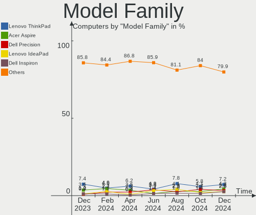
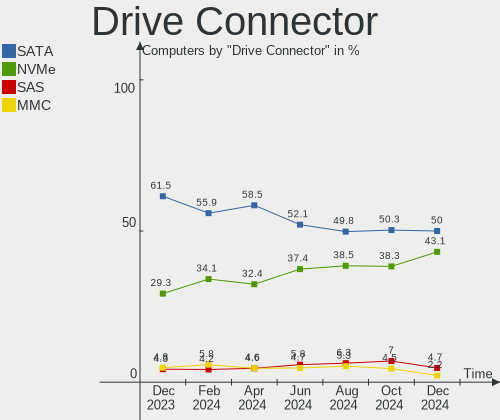
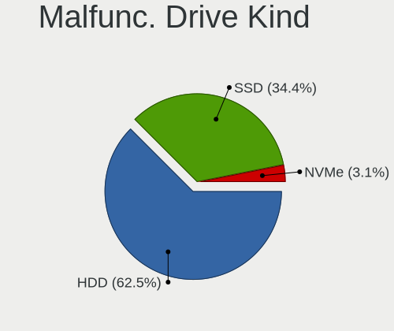
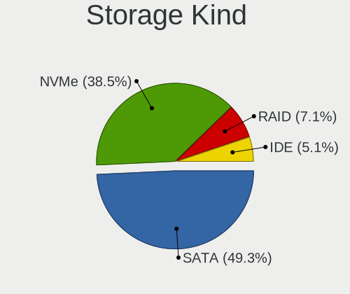
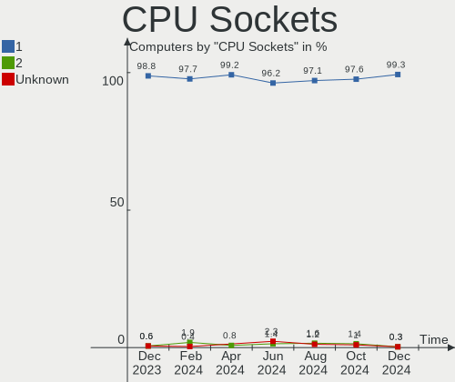
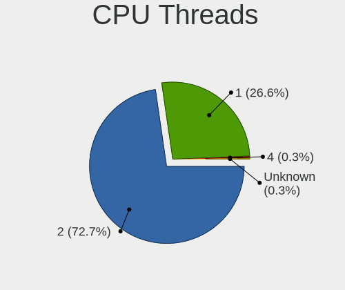
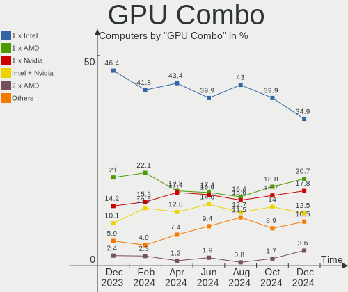
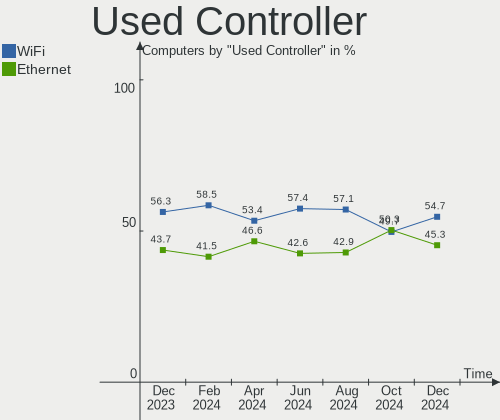

Linux in France - Hardware Trends
---------------------------------

A project to identify most popular hardware characteristics and track their change
over time based on data collected by Linux users at https://Linux-Hardware.org.

Anyone can contribute to this report by the [hw-probe](https://github.com/linuxhw/hw-probe) tool:

    sudo -E hw-probe -all -upload

This is a report for all computer types. See also reports for [desktops](/Location/France/Desktop/README.md) and [notebooks](/Location/France/Notebook/README.md).

Period: Sep, 2023.

Contents
--------

* [ System ](#system)
  - [ OS                       ](#os)
  - [ OS Family                ](#os-family)
  - [ Kernel                   ](#kernel)
  - [ Kernel Family            ](#kernel-family)
  - [ Kernel Major Ver.        ](#kernel-major-ver)
  - [ Arch                     ](#arch)
  - [ DE                       ](#de)
  - [ Display Server           ](#display-server)
  - [ Display Manager          ](#display-manager)
  - [ OS Lang                  ](#os-lang)
  - [ Boot Mode                ](#boot-mode)
  - [ Filesystem               ](#filesystem)
  - [ Part. scheme             ](#part-scheme)
  - [ Dual Boot with Linux/BSD ](#dual-boot-with-linuxbsd)
  - [ Dual Boot (Win)          ](#dual-boot-win)

* [ Board ](#board)
  - [ Vendor                   ](#vendor)
  - [ Model                    ](#model)
  - [ Model Family             ](#model-family)
  - [ MFG Year                 ](#mfg-year)
  - [ Form Factor              ](#form-factor)
  - [ Secure Boot              ](#secure-boot)
  - [ Coreboot                 ](#coreboot)
  - [ RAM Size                 ](#ram-size)
  - [ RAM Used                 ](#ram-used)
  - [ Total Drives             ](#total-drives)
  - [ Has CD-ROM               ](#has-cd-rom)
  - [ Has Ethernet             ](#has-ethernet)
  - [ Has WiFi                 ](#has-wifi)
  - [ Has Bluetooth            ](#has-bluetooth)

* [ Location ](#location)
  - [ Country                  ](#country)
  - [ City                     ](#city)

* [ Drives ](#drives)
  - [ Drive Vendor             ](#drive-vendor)
  - [ Drive Model              ](#drive-model)
  - [ HDD Vendor               ](#hdd-vendor)
  - [ SSD Vendor               ](#ssd-vendor)
  - [ Drive Kind               ](#drive-kind)
  - [ Drive Connector          ](#drive-connector)
  - [ Drive Size               ](#drive-size)
  - [ Space Total              ](#space-total)
  - [ Space Used               ](#space-used)
  - [ Malfunc. Drives          ](#malfunc-drives)
  - [ Malfunc. Drive Vendor    ](#malfunc-drive-vendor)
  - [ Malfunc. HDD Vendor      ](#malfunc-hdd-vendor)
  - [ Malfunc. Drive Kind      ](#malfunc-drive-kind)
  - [ Failed Drives            ](#failed-drives)
  - [ Failed Drive Vendor      ](#failed-drive-vendor)
  - [ Drive Status             ](#drive-status)

* [ Storage controller ](#storage-controller)
  - [ Storage Vendor           ](#storage-vendor)
  - [ Storage Model            ](#storage-model)
  - [ Storage Kind             ](#storage-kind)

* [ Processor ](#processor)
  - [ CPU Vendor               ](#cpu-vendor)
  - [ CPU Model                ](#cpu-model)
  - [ CPU Model Family         ](#cpu-model-family)
  - [ CPU Cores                ](#cpu-cores)
  - [ CPU Sockets              ](#cpu-sockets)
  - [ CPU Threads              ](#cpu-threads)
  - [ CPU Op-Modes             ](#cpu-op-modes)
  - [ CPU Microcode            ](#cpu-microcode)
  - [ CPU Microarch            ](#cpu-microarch)

* [ Graphics ](#graphics)
  - [ GPU Vendor               ](#gpu-vendor)
  - [ GPU Model                ](#gpu-model)
  - [ GPU Combo                ](#gpu-combo)
  - [ GPU Driver               ](#gpu-driver)
  - [ GPU Memory               ](#gpu-memory)

* [ Monitor ](#monitor)
  - [ Monitor Vendor           ](#monitor-vendor)
  - [ Monitor Model            ](#monitor-model)
  - [ Monitor Resolution       ](#monitor-resolution)
  - [ Monitor Diagonal         ](#monitor-diagonal)
  - [ Monitor Width            ](#monitor-width)
  - [ Aspect Ratio             ](#aspect-ratio)
  - [ Monitor Area             ](#monitor-area)
  - [ Pixel Density            ](#pixel-density)
  - [ Multiple Monitors        ](#multiple-monitors)

* [ Network ](#network)
  - [ Net Controller Vendor    ](#net-controller-vendor)
  - [ Net Controller Model     ](#net-controller-model)
  - [ Wireless Vendor          ](#wireless-vendor)
  - [ Wireless Model           ](#wireless-model)
  - [ Ethernet Vendor          ](#ethernet-vendor)
  - [ Ethernet Model           ](#ethernet-model)
  - [ Net Controller Kind      ](#net-controller-kind)
  - [ Used Controller          ](#used-controller)
  - [ NICs                     ](#nics)
  - [ IPv6                     ](#ipv6)

* [ Bluetooth ](#bluetooth)
  - [ Bluetooth Vendor         ](#bluetooth-vendor)
  - [ Bluetooth Model          ](#bluetooth-model)

* [ Sound ](#sound)
  - [ Sound Vendor             ](#sound-vendor)
  - [ Sound Model              ](#sound-model)

* [ Memory ](#memory)
  - [ Memory Vendor            ](#memory-vendor)
  - [ Memory Model             ](#memory-model)
  - [ Memory Kind              ](#memory-kind)
  - [ Memory Form Factor       ](#memory-form-factor)
  - [ Memory Size              ](#memory-size)
  - [ Memory Speed             ](#memory-speed)

* [ Printers & scanners ](#printers--scanners)
  - [ Printer Vendor           ](#printer-vendor)
  - [ Printer Model            ](#printer-model)
  - [ Scanner Vendor           ](#scanner-vendor)
  - [ Scanner Model            ](#scanner-model)

* [ Camera ](#camera)
  - [ Camera Vendor            ](#camera-vendor)
  - [ Camera Model             ](#camera-model)

* [ Security ](#security)
  - [ Fingerprint Vendor       ](#fingerprint-vendor)
  - [ Fingerprint Model        ](#fingerprint-model)
  - [ Chipcard Vendor          ](#chipcard-vendor)
  - [ Chipcard Model           ](#chipcard-model)

* [ Unsupported ](#unsupported)
  - [ Unsupported Devices      ](#unsupported-devices)
  - [ Unsupported Device Types ](#unsupported-device-types)

System
------

OS
--

Installed operating systems

| Name                | Computers | Percent |
|---------------------|-----------|---------|
| Ubuntu 22.04        | 64        | 23.1%   |
| OpenMandriva 23.08  | 26        | 9.39%   |
| Ubuntu 23.04        | 15        | 5.42%   |
| OpenMandriva 23.09  | 14        | 5.05%   |
| Fedora 38           | 14        | 5.05%   |
| Ubuntu 20.04        | 12        | 4.33%   |
| Linux Mint 21.2     | 12        | 4.33%   |
| Debian 12           | 11        | 3.97%   |
| Arch Rolling        | 7         | 2.53%   |
| KDE neon 22.04      | 6         | 2.17%   |
| Manjaro             | 5         | 1.81%   |
| Debian 11           | 5         | 1.81%   |
| Pop!_OS 22.04       | 4         | 1.44%   |
| OpenMandriva 4.3    | 4         | 1.44%   |
| Kubuntu 23.04       | 4         | 1.44%   |
| Zorin 16            | 3         | 1.08%   |
| Xubuntu 22.04       | 3         | 1.08%   |
| OpenMandriva 23.01  | 3         | 1.08%   |
| Linux Mint 21.1     | 3         | 1.08%   |
| Kubuntu 22.04       | 3         | 1.08%   |
| Gentoo 2.14         | 3         | 1.08%   |
| blendOS             | 3         | 1.08%   |
| ArcoLinux Rolling   | 3         | 1.08%   |
| Xero Rolling        | 2         | 0.72%   |
| Ubuntu MATE 22.04   | 2         | 0.72%   |
| Ubuntu 18.04        | 2         | 0.72%   |
| Manjaro 23.0.0      | 2         | 0.72%   |
| Kali 2023.3         | 2         | 0.72%   |
| Fedora 39           | 2         | 0.72%   |
| Fedora 37           | 2         | 0.72%   |
| EndeavourOS Rolling | 2         | 0.72%   |
| Xubuntu 20.04       | 1         | 0.36%   |
| Xubuntu 16.04       | 1         | 0.36%   |
| Ubuntu Unity 18.04  | 1         | 0.36%   |
| Ubuntu Studio 22.04 | 1         | 0.36%   |
| Ubuntu MATE 22.10   | 1         | 0.36%   |
| Ubuntu MATE 18.04   | 1         | 0.36%   |
| Ubuntu Budgie 22.04 | 1         | 0.36%   |
| Ubuntu Budgie 18.04 | 1         | 0.36%   |
| SystemRescue 10.01  | 1         | 0.36%   |

OS Family
---------

OS without a version

| Name          | Computers | Percent |
|---------------|-----------|---------|
| Ubuntu        | 93        | 33.57%  |
| OpenMandriva  | 49        | 17.69%  |
| Fedora        | 19        | 6.86%   |
| Linux Mint    | 18        | 6.5%    |
| Debian        | 17        | 6.14%   |
| Manjaro       | 8         | 2.89%   |
| Kubuntu       | 7         | 2.53%   |
| KDE neon      | 7         | 2.53%   |
| Arch          | 7         | 2.53%   |
| Xubuntu       | 5         | 1.81%   |
| Ubuntu MATE   | 4         | 1.44%   |
| Pop!_OS       | 4         | 1.44%   |
| Zorin         | 3         | 1.08%   |
| Gentoo        | 3         | 1.08%   |
| blendOS       | 3         | 1.08%   |
| ArcoLinux     | 3         | 1.08%   |
| Xero          | 2         | 0.72%   |
| Ubuntu Budgie | 2         | 0.72%   |
| Kali          | 2         | 0.72%   |
| EndeavourOS   | 2         | 0.72%   |
| BuildRoot     | 2         | 0.72%   |
| Ubuntu Unity  | 1         | 0.36%   |
| Ubuntu Studio | 1         | 0.36%   |
| SystemRescue  | 1         | 0.36%   |
| SteamOS       | 1         | 0.36%   |
| Solus         | 1         | 0.36%   |
| Raspbian      | 1         | 0.36%   |
| openSUSE      | 1         | 0.36%   |
| Nobara        | 1         | 0.36%   |
| MX            | 1         | 0.36%   |
| Mageia        | 1         | 0.36%   |
| Lubuntu       | 1         | 0.36%   |
| LMDE          | 1         | 0.36%   |
| Garuda Linux  | 1         | 0.36%   |
| Endless       | 1         | 0.36%   |
| ChimeraOS     | 1         | 0.36%   |
| BunsenLabs    | 1         | 0.36%   |
| BlackPanther  | 1         | 0.36%   |

Kernel
------

Version of the Linux kernel

| Version                  | Computers | Percent |
|--------------------------|-----------|---------|
| 6.2.0-32-generic         | 28        | 10.11%  |
| 6.2.0-33-generic         | 25        | 9.03%   |
| 6.4.11-desktop-1omv2390  | 21        | 7.58%   |
| 6.2.0-31-generic         | 14        | 5.05%   |
| 5.15.0-83-generic        | 13        | 4.69%   |
| 5.15.0-84-generic        | 10        | 3.61%   |
| 6.5.3-desktop-1omv2390   | 9         | 3.25%   |
| 6.2.0-26-generic         | 7         | 2.53%   |
| 6.4.12-arch1-1           | 6         | 2.17%   |
| 5.15.0-82-generic        | 6         | 2.17%   |
| 6.4.15-200.fc38.x86_64   | 5         | 1.81%   |
| 6.1.0-11-amd64           | 5         | 1.81%   |
| 6.2.9-300.fc38.x86_64    | 4         | 1.44%   |
| 6.5.5-desktop-1omv2390   | 3         | 1.08%   |
| 6.5.1-1-MANJARO          | 3         | 1.08%   |
| 6.4.8-desktop-2omv2390   | 3         | 1.08%   |
| 6.4.6-76060406-generic   | 3         | 1.08%   |
| 6.3.9-zen1-1-zen         | 3         | 1.08%   |
| 6.1.1-desktop-1omv2290   | 3         | 1.08%   |
| 5.16.13-desktop-1omv4003 | 3         | 1.08%   |
| 4.15.0-213-generic       | 3         | 1.08%   |
| 6.5.5-300.fc39.x86_64    | 2         | 0.72%   |
| 6.5.4-arch2-1            | 2         | 0.72%   |
| 6.5.0-desktop-1omv2390   | 2         | 0.72%   |
| 6.4.12-200.fc38.x86_64   | 2         | 0.72%   |
| 6.4.0-kali3-amd64        | 2         | 0.72%   |
| 6.1.0-12-amd64           | 2         | 0.72%   |
| 5.19.0-50-generic        | 2         | 0.72%   |
| 5.15.0-85-generic        | 2         | 0.72%   |
| 5.15.0-72-generic        | 2         | 0.72%   |
| 5.15.0-71-generic        | 2         | 0.72%   |
| 5.15.0-47-generic        | 2         | 0.72%   |
| 5.10.0-25-amd64          | 2         | 0.72%   |
| 6.5.5-100.fc37.x86_64    | 1         | 0.36%   |
| 6.5.3-zen1-1-zen         | 1         | 0.36%   |
| 6.5.3-arch1-1            | 1         | 0.36%   |
| 6.5.3-1-MANJARO          | 1         | 0.36%   |
| 6.5.2-desktop-1omv2390   | 1         | 0.36%   |
| 6.5.2-arch1-1            | 1         | 0.36%   |
| 6.5.2-1-MANJARO          | 1         | 0.36%   |

Kernel Family
-------------

Linux kernel without a distro release

| Version | Computers | Percent |
|---------|-----------|---------|
| 6.2.0   | 77        | 27.8%   |
| 5.15.0  | 41        | 14.8%   |
| 6.4.11  | 22        | 7.94%   |
| 6.5.3   | 12        | 4.33%   |
| 6.4.12  | 9         | 3.25%   |
| 6.1.0   | 9         | 3.25%   |
| 6.5.5   | 6         | 2.17%   |
| 6.5.0   | 6         | 2.17%   |
| 6.4.15  | 6         | 2.17%   |
| 5.4.0   | 6         | 2.17%   |
| 6.5.1   | 5         | 1.81%   |
| 4.15.0  | 5         | 1.81%   |
| 6.5.2   | 4         | 1.44%   |
| 6.3.9   | 4         | 1.44%   |
| 6.2.9   | 4         | 1.44%   |
| 5.19.0  | 4         | 1.44%   |
| 5.10.0  | 4         | 1.44%   |
| 6.4.8   | 3         | 1.08%   |
| 6.4.6   | 3         | 1.08%   |
| 6.4.0   | 3         | 1.08%   |
| 6.2.16  | 3         | 1.08%   |
| 6.1.46  | 3         | 1.08%   |
| 6.1.1   | 3         | 1.08%   |
| 5.16.13 | 3         | 1.08%   |
| 6.5.4   | 2         | 0.72%   |
| 6.4.10  | 2         | 0.72%   |
| 6.1.21  | 2         | 0.72%   |
| 5.17.0  | 2         | 0.72%   |
| 5.13.0  | 2         | 0.72%   |
| 6.4.9   | 1         | 0.36%   |
| 6.4.14  | 1         | 0.36%   |
| 6.3.8   | 1         | 0.36%   |
| 6.3.6   | 1         | 0.36%   |
| 6.3.13  | 1         | 0.36%   |
| 6.2.6   | 1         | 0.36%   |
| 6.2.10  | 1         | 0.36%   |
| 6.1.55  | 1         | 0.36%   |
| 6.1.53  | 1         | 0.36%   |
| 6.1.51  | 1         | 0.36%   |
| 6.1.50  | 1         | 0.36%   |

Kernel Major Ver.
-----------------

Linux kernel major version

| Version | Computers | Percent |
|---------|-----------|---------|
| 6.2     | 86        | 31.05%  |
| 6.4     | 50        | 18.05%  |
| 5.15    | 42        | 15.16%  |
| 6.5     | 35        | 12.64%  |
| 6.1     | 23        | 8.3%    |
| 6.3     | 7         | 2.53%   |
| 5.4     | 6         | 2.17%   |
| 5.10    | 6         | 2.17%   |
| 5.16    | 5         | 1.81%   |
| 4.15    | 5         | 1.81%   |
| 5.19    | 4         | 1.44%   |
| 5.17    | 2         | 0.72%   |
| 5.13    | 2         | 0.72%   |
| 6.0     | 1         | 0.36%   |
| 5.14    | 1         | 0.36%   |
| 4.4     | 1         | 0.36%   |
| 4.18    | 1         | 0.36%   |

Arch
----

OS architecture (x86_64, i586, etc.)

| Name    | Computers | Percent |
|---------|-----------|---------|
| x86_64  | 271       | 97.83%  |
| aarch64 | 4         | 1.44%   |
| i686    | 1         | 0.36%   |
| armv7l  | 1         | 0.36%   |

DE
--

Desktop Environment

| Name          | Computers | Percent |
|---------------|-----------|---------|
| GNOME         | 123       | 44.4%   |
| KDE5          | 75        | 27.08%  |
| Unknown       | 24        | 8.66%   |
| XFCE          | 18        | 6.5%    |
| X-Cinnamon    | 13        | 4.69%   |
| MATE          | 7         | 2.53%   |
| Budgie        | 5         | 1.81%   |
| LXQt          | 4         | 1.44%   |
| Hyprland      | 2         | 0.72%   |
| Unity         | 1         | 0.36%   |
| LXDE          | 1         | 0.36%   |
| KDE           | 1         | 0.36%   |
| i3            | 1         | 0.36%   |
| Enlightenment | 1         | 0.36%   |
| BunsenLabs    | 1         | 0.36%   |

Display Server
--------------

X11 or Wayland

| Name    | Computers | Percent |
|---------|-----------|---------|
| X11     | 128       | 46.21%  |
| Wayland | 123       | 44.4%   |
| Unknown | 16        | 5.78%   |
| Tty     | 10        | 3.61%   |

Display Manager
---------------

SDDM, LightDM, etc.

| Name    | Computers | Percent |
|---------|-----------|---------|
| GDM3    | 82        | 29.6%   |
| SDDM    | 70        | 25.27%  |
| Unknown | 64        | 23.1%   |
| LightDM | 39        | 14.08%  |
| GDM     | 20        | 7.22%   |
| SLiM    | 2         | 0.72%   |

OS Lang
-------

Language

| Lang    | Computers | Percent |
|---------|-----------|---------|
| fr_FR   | 214       | 77.26%  |
| en_US   | 47        | 16.97%  |
| en_GB   | 6         | 2.17%   |
| C       | 4         | 1.44%   |
| Unknown | 2         | 0.72%   |
| it_IT   | 1         | 0.36%   |
| en_DK   | 1         | 0.36%   |
| en_CA   | 1         | 0.36%   |
| de_CH   | 1         | 0.36%   |

Boot Mode
---------

EFI or BIOS

| Mode | Computers | Percent |
|------|-----------|---------|
| EFI  | 167       | 60.29%  |
| BIOS | 110       | 39.71%  |

Filesystem
----------

Type of filesystem

| Type    | Computers | Percent |
|---------|-----------|---------|
| Ext4    | 185       | 66.79%  |
| Tmpfs   | 35        | 12.64%  |
| Btrfs   | 34        | 12.27%  |
| Overlay | 19        | 6.86%   |
| Zfs     | 4         | 1.44%   |

Part. scheme
------------

Scheme of partitioning

| Type    | Computers | Percent |
|---------|-----------|---------|
| GPT     | 185       | 66.79%  |
| Unknown | 57        | 20.58%  |
| MBR     | 35        | 12.64%  |

Dual Boot with Linux/BSD
------------------------

Hosting more than one Linux/BSD

| Dual boot | Computers | Percent |
|-----------|-----------|---------|
| No        | 223       | 80.51%  |
| Yes       | 54        | 19.49%  |

Dual Boot (Win)
---------------

Hosting Linux and Windows

| Dual boot | Computers | Percent |
|-----------|-----------|---------|
| No        | 186       | 67.15%  |
| Yes       | 91        | 32.85%  |

Board
-----

Vendor
------

Motherboard manufacturer

| Name                    | Computers | Percent |
|-------------------------|-----------|---------|
| Dell                    | 51        | 18.41%  |
| ASUSTek Computer        | 48        | 17.33%  |
| Hewlett-Packard         | 34        | 12.27%  |
| Lenovo                  | 26        | 9.39%   |
| MSI                     | 20        | 7.22%   |
| Gigabyte Technology     | 14        | 5.05%   |
| Acer                    | 14        | 5.05%   |
| Apple                   | 8         | 2.89%   |
| Intel                   | 5         | 1.81%   |
| Raspberry Pi Foundation | 4         | 1.44%   |
| Fujitsu                 | 4         | 1.44%   |
| Sony                    | 3         | 1.08%   |
| Samsung Electronics     | 3         | 1.08%   |
| Notebook                | 3         | 1.08%   |
| HUAWEI                  | 3         | 1.08%   |
| AZW                     | 3         | 1.08%   |
| Unknown                 | 3         | 1.08%   |
| UNOWHY                  | 2         | 0.72%   |
| Toshiba                 | 2         | 0.72%   |
| Timi                    | 2         | 0.72%   |
| Supermicro              | 2         | 0.72%   |
| ASRock                  | 2         | 0.72%   |
| Valve                   | 1         | 0.36%   |
| TUXEDO                  | 1         | 0.36%   |
| Thomson                 | 1         | 0.36%   |
| SLIMBOOK                | 1         | 0.36%   |
| Schenker                | 1         | 0.36%   |
| Radxa                   | 1         | 0.36%   |
| Pegatron                | 1         | 0.36%   |
| PC Specialist           | 1         | 0.36%   |
| Packard Bell            | 1         | 0.36%   |
| Microsoft               | 1         | 0.36%   |
| Medion                  | 1         | 0.36%   |
| KUU                     | 1         | 0.36%   |
| Google                  | 1         | 0.36%   |
| Framework               | 1         | 0.36%   |
| Fanless Mini PC         | 1         | 0.36%   |
| EUROCOM                 | 1         | 0.36%   |
| eMachines               | 1         | 0.36%   |
| Clevo                   | 1         | 0.36%   |

Model
-----

Motherboard model

| Name                               | Computers | Percent |
|------------------------------------|-----------|---------|
| Dell Latitude E6400                | 3         | 1.08%   |
| ASUS All Series                    | 3         | 1.08%   |
| Unknown                            | 3         | 1.08%   |
| RPi Raspberry Pi 3 Model B Rev 1.2 | 2         | 0.72%   |
| Lenovo ThinkCentre M83z 10C20003FR | 2         | 0.72%   |
| HP Z440 Workstation                | 2         | 0.72%   |
| Gigabyte B550 AORUS ELITE V2       | 2         | 0.72%   |
| Gigabyte A320M-S2H                 | 2         | 0.72%   |
| Dell Precision 3571                | 2         | 0.72%   |
| ASUS X550CC                        | 2         | 0.72%   |
| ASUS PRIME Z390M-PLUS              | 2         | 0.72%   |
| ASRock X570 Taichi                 | 2         | 0.72%   |
| Acer Swift SF314-42                | 2         | 0.72%   |
| Acer Nitro AN515-57                | 2         | 0.72%   |
| Valve Jupiter                      | 1         | 0.36%   |
| UNOWHY Y13G012S4EI                 | 1         | 0.36%   |
| UNOWHY Y13G002S4EI                 | 1         | 0.36%   |
| TUXEDO InfinityBook Pro Gen7 (MK1) | 1         | 0.36%   |
| Toshiba Satellite L875-11M         | 1         | 0.36%   |
| Toshiba Satellite C50-B            | 1         | 0.36%   |
| Timi Xiaomi Book Pro 16 2022       | 1         | 0.36%   |
| Timi TM1612                        | 1         | 0.36%   |
| Thomson N14C4WH64                  | 1         | 0.36%   |
| Supermicro SYS-5038MD-H24TRF-OS012 | 1         | 0.36%   |
| Supermicro Super Server            | 1         | 0.36%   |
| Sony VPCEB1E1E                     | 1         | 0.36%   |
| Sony VGC-JS1E_S                    | 1         | 0.36%   |
| Sony SVE1513I4E                    | 1         | 0.36%   |
| SLIMBOOK PROX-AMD5                 | 1         | 0.36%   |
| Schenker VIA 15 Pro                | 1         | 0.36%   |
| Samsung R510/P510                  | 1         | 0.36%   |
| Samsung 950XED                     | 1         | 0.36%   |
| Samsung 305E4A/305E5A/305E7A       | 1         | 0.36%   |
| RPi Raspberry Pi 4 Model B Rev 1.4 | 1         | 0.36%   |
| RPi Raspberry Pi 4 Model B Rev 1.2 | 1         | 0.36%   |
| Radxa ROCK 5B                      | 1         | 0.36%   |
| Pegatron WC960AA-ABF p6335fr       | 1         | 0.36%   |
| PC Specialist PCX0DX               | 1         | 0.36%   |
| Packard Bell IMEDIA X2802          | 1         | 0.36%   |
| Notebook PCx0Dx                    | 1         | 0.36%   |

Model Family
------------

Motherboard model prefix

| Name                | Computers | Percent |
|---------------------|-----------|---------|
| Dell Latitude       | 19        | 6.86%   |
| Lenovo ThinkPad     | 13        | 4.69%   |
| Dell Precision      | 12        | 4.33%   |
| HP EliteBook        | 11        | 3.97%   |
| ASUS ROG            | 7         | 2.53%   |
| Acer Aspire         | 7         | 2.53%   |
| Dell XPS            | 5         | 1.81%   |
| Dell Inspiron       | 5         | 1.81%   |
| ASUS ZenBook        | 5         | 1.81%   |
| ASUS PRIME          | 5         | 1.81%   |
| RPi Raspberry       | 4         | 1.44%   |
| Lenovo ThinkCentre  | 4         | 1.44%   |
| Lenovo IdeaPad      | 4         | 1.44%   |
| Dell OptiPlex       | 4         | 1.44%   |
| ASUS VivoBook       | 4         | 1.44%   |
| Acer Swift          | 4         | 1.44%   |
| Lenovo Yoga         | 3         | 1.08%   |
| HP Pavilion         | 3         | 1.08%   |
| HP Laptop           | 3         | 1.08%   |
| Fujitsu ESPRIMO     | 3         | 1.08%   |
| Dell Vostro         | 3         | 1.08%   |
| ASUS All            | 3         | 1.08%   |
| Unknown             | 3         | 1.08%   |
| Toshiba Satellite   | 2         | 0.72%   |
| HP Z440             | 2         | 0.72%   |
| HP ProBook          | 2         | 0.72%   |
| HP EliteDesk        | 2         | 0.72%   |
| HP Compaq           | 2         | 0.72%   |
| Gigabyte B550       | 2         | 0.72%   |
| Gigabyte A320M-S2H  | 2         | 0.72%   |
| ASUS X550CC         | 2         | 0.72%   |
| ASUS ASUS           | 2         | 0.72%   |
| ASRock X570         | 2         | 0.72%   |
| Apple MacBookPro11  | 2         | 0.72%   |
| Acer Nitro          | 2         | 0.72%   |
| Valve Jupiter       | 1         | 0.36%   |
| UNOWHY Y13G012S4EI  | 1         | 0.36%   |
| UNOWHY Y13G002S4EI  | 1         | 0.36%   |
| TUXEDO InfinityBook | 1         | 0.36%   |
| Timi Xiaomi         | 1         | 0.36%   |

MFG Year
--------

Motherboard manufacture year

| Year    | Computers | Percent |
|---------|-----------|---------|
| 2020    | 28        | 10.11%  |
| 2022    | 25        | 9.03%   |
| 2021    | 24        | 8.66%   |
| 2019    | 24        | 8.66%   |
| 2018    | 24        | 8.66%   |
| 2015    | 20        | 7.22%   |
| 2023    | 17        | 6.14%   |
| 2017    | 17        | 6.14%   |
| 2014    | 17        | 6.14%   |
| 2013    | 16        | 5.78%   |
| 2012    | 14        | 5.05%   |
| 2008    | 11        | 3.97%   |
| 2011    | 10        | 3.61%   |
| 2009    | 9         | 3.25%   |
| 2016    | 7         | 2.53%   |
| 2010    | 5         | 1.81%   |
| Unknown | 5         | 1.81%   |
| 2007    | 2         | 0.72%   |
| 2006    | 1         | 0.36%   |
| 2005    | 1         | 0.36%   |

Form Factor
-----------

Physical design of the computer

| Name           | Computers | Percent |
|----------------|-----------|---------|
| Notebook       | 152       | 54.87%  |
| Desktop        | 100       | 36.1%   |
| Convertible    | 6         | 2.17%   |
| Mini pc        | 6         | 2.17%   |
| System on chip | 5         | 1.81%   |
| All in one     | 3         | 1.08%   |
| Server         | 3         | 1.08%   |
| Tablet         | 2         | 0.72%   |

Secure Boot
-----------

Enabled or disabled

| State    | Computers | Percent |
|----------|-----------|---------|
| Disabled | 262       | 94.58%  |
| Enabled  | 15        | 5.42%   |

Coreboot
--------

Have coreboot on board

| Used | Computers | Percent |
|------|-----------|---------|
| No   | 276       | 99.64%  |
| Yes  | 1         | 0.36%   |

RAM Size
--------

Total RAM memory

| Size in GB      | Computers | Percent |
|-----------------|-----------|---------|
| 4.01-8.0        | 66        | 23.83%  |
| 16.01-24.0      | 53        | 19.13%  |
| 8.01-16.0       | 46        | 16.61%  |
| 3.01-4.0        | 41        | 14.8%   |
| 32.01-64.0      | 35        | 12.64%  |
| 64.01-256.0     | 19        | 6.86%   |
| 24.01-32.0      | 6         | 2.17%   |
| 2.01-3.0        | 5         | 1.81%   |
| 0.51-1.0        | 3         | 1.08%   |
| 1.01-2.0        | 2         | 0.72%   |
| More than 256.0 | 1         | 0.36%   |

RAM Used
--------

Used RAM memory

| Used GB     | Computers | Percent |
|-------------|-----------|---------|
| 1.01-2.0    | 77        | 27.8%   |
| 2.01-3.0    | 66        | 23.83%  |
| 4.01-8.0    | 59        | 21.3%   |
| 3.01-4.0    | 36        | 13%     |
| 0.51-1.0    | 14        | 5.05%   |
| 16.01-24.0  | 9         | 3.25%   |
| 8.01-16.0   | 8         | 2.89%   |
| 0.01-0.5    | 5         | 1.81%   |
| 24.01-32.0  | 2         | 0.72%   |
| 64.01-256.0 | 1         | 0.36%   |

Total Drives
------------

Number of drives on board

| Drives | Computers | Percent |
|--------|-----------|---------|
| 1      | 158       | 57.04%  |
| 2      | 77        | 27.8%   |
| 3      | 23        | 8.3%    |
| 5      | 6         | 2.17%   |
| 6      | 5         | 1.81%   |
| 4      | 5         | 1.81%   |
| 0      | 2         | 0.72%   |
| 9      | 1         | 0.36%   |

Has CD-ROM
----------

Has CD-ROM on board

| Presented | Computers | Percent |
|-----------|-----------|---------|
| No        | 192       | 69.31%  |
| Yes       | 85        | 30.69%  |

Has Ethernet
------------

Has Ethernet on board

| Presented | Computers | Percent |
|-----------|-----------|---------|
| Yes       | 233       | 84.12%  |
| No        | 44        | 15.88%  |

Has WiFi
--------

Has WiFi module

| Presented | Computers | Percent |
|-----------|-----------|---------|
| Yes       | 216       | 77.98%  |
| No        | 61        | 22.02%  |

Has Bluetooth
-------------

Has Bluetooth module

| Presented | Computers | Percent |
|-----------|-----------|---------|
| Yes       | 186       | 67.15%  |
| No        | 91        | 32.85%  |

Location
--------

Country
-------

Geographic location (country)

| Country | Computers | Percent |
|---------|-----------|---------|
| France  | 277       | 100%    |

City
----

Geographic location (city)

| City               | Computers | Percent |
|--------------------|-----------|---------|
| Paris              | 31        | 11.19%  |
| Valenciennes       | 8         | 2.89%   |
| Toulouse           | 7         | 2.53%   |
| Champs-sur-Marne   | 6         | 2.17%   |
| Marseille          | 5         | 1.81%   |
| Bordeaux           | 5         | 1.81%   |
| Rennes             | 4         | 1.44%   |
| Lille              | 4         | 1.44%   |
| Vitry-sur-Seine    | 3         | 1.08%   |
| Poitiers           | 3         | 1.08%   |
| Nice               | 3         | 1.08%   |
| Montpellier        | 3         | 1.08%   |
| Les Hogues         | 3         | 1.08%   |
| La Courneuve       | 3         | 1.08%   |
| Vincennes          | 2         | 0.72%   |
| Villejuif          | 2         | 0.72%   |
| Trappes            | 2         | 0.72%   |
| Toul               | 2         | 0.72%   |
| Sarcelles          | 2         | 0.72%   |
| Saint-Etienne      | 2         | 0.72%   |
| Rosny-sous-Bois    | 2         | 0.72%   |
| Poissy             | 2         | 0.72%   |
| Mulhouse           | 2         | 0.72%   |
| Marmande           | 2         | 0.72%   |
| Lyon               | 2         | 0.72%   |
| La Roche-sur-Yon   | 2         | 0.72%   |
| La Baule-Escoublac | 2         | 0.72%   |
| Ivry-sur-Seine     | 2         | 0.72%   |
| Houilles           | 2         | 0.72%   |
| Fontenay-sous-Bois | 2         | 0.72%   |
| Courbevoie         | 2         | 0.72%   |
| Colomiers          | 2         | 0.72%   |
| Cergy              | 2         | 0.72%   |
| Caen               | 2         | 0.72%   |
| Arcueil            | 2         | 0.72%   |
| Angers             | 2         | 0.72%   |
| Agen               | 2         | 0.72%   |
| Villeparisis       | 1         | 0.36%   |
| Vienne-le-Chateau  | 1         | 0.36%   |
| Versailles         | 1         | 0.36%   |

Drives
------

Drive Vendor
------------

Hard drive vendors

| Vendor                      | Computers | Drives | Percent |
|-----------------------------|-----------|--------|---------|
| Samsung Electronics         | 81        | 99     | 20.05%  |
| WDC                         | 60        | 73     | 14.85%  |
| Seagate                     | 39        | 46     | 9.65%   |
| Crucial                     | 24        | 29     | 5.94%   |
| SanDisk                     | 18        | 22     | 4.46%   |
| Unknown                     | 16        | 16     | 3.96%   |
| Toshiba                     | 16        | 21     | 3.96%   |
| SK hynix                    | 13        | 13     | 3.22%   |
| Kingston                    | 13        | 13     | 3.22%   |
| Intel                       | 11        | 14     | 2.72%   |
| Micron Technology           | 10        | 10     | 2.48%   |
| KIOXIA                      | 10        | 10     | 2.48%   |
| Hitachi                     | 9         | 9      | 2.23%   |
| HGST                        | 8         | 8      | 1.98%   |
| China                       | 8         | 9      | 1.98%   |
| PNY                         | 5         | 5      | 1.24%   |
| Phison Electronics          | 4         | 5      | 0.99%   |
| Micron/Crucial Technology   | 4         | 5      | 0.99%   |
| Apple                       | 4         | 4      | 0.99%   |
| Unknown                     | 4         | 6      | 0.99%   |
| Transcend                   | 3         | 3      | 0.74%   |
| Phison                      | 3         | 4      | 0.74%   |
| OCZ                         | 2         | 2      | 0.5%    |
| MAXIO Technology (Hangzhou) | 2         | 2      | 0.5%    |
| Kingston Technology Company | 2         | 2      | 0.5%    |
| Emtec                       | 2         | 2      | 0.5%    |
| A-DATA Technology           | 2         | 2      | 0.5%    |
| Union Memory                | 1         | 1      | 0.25%   |
| UMIS                        | 1         | 1      | 0.25%   |
| Space ke                    | 1         | 1      | 0.25%   |
| Silicon Motion              | 1         | 1      | 0.25%   |
| SABRENT                     | 1         | 1      | 0.25%   |
| PNY CS90                    | 1         | 1      | 0.25%   |
| Patriot                     | 1         | 1      | 0.25%   |
| ORIGIN                      | 1         | 1      | 0.25%   |
| O2 Micro                    | 1         | 1      | 0.25%   |
| Netac                       | 1         | 1      | 0.25%   |
| Maxtor                      | 1         | 1      | 0.25%   |
| Mass                        | 1         | 1      | 0.25%   |
| M.2 SSD                     | 1         | 1      | 0.25%   |

Drive Model
-----------

Hard drive models

| Model                                               | Computers | Percent |
|-----------------------------------------------------|-----------|---------|
| Samsung NVMe SSD Controller SM981/PM981/PM983 256GB | 9         | 2.04%   |
| Samsung SSD 860 EVO 500GB                           | 6         | 1.36%   |
| Samsung NVMe SSD Controller PM9A1/PM9A3/980PRO 1TB  | 6         | 1.36%   |
| Crucial CT1000MX500SSD1 1TB                         | 6         | 1.36%   |
| Samsung SSD 980 1TB                                 | 5         | 1.13%   |
| Samsung SSD 850 EVO 500GB                           | 5         | 1.13%   |
| Crucial CT500MX500SSD1 500GB                        | 5         | 1.13%   |
| Seagate ST2000DM001-1ER164 2TB                      | 4         | 0.9%    |
| Seagate ST1000DM010-2EP102 1TB                      | 4         | 0.9%    |
| SanDisk NVMe SSD Drive 1TB                          | 4         | 0.9%    |
| Kingston SA400S37240G 240GB SSD                     | 4         | 0.9%    |
| Intel SSDPEKNW512G8 512GB                           | 4         | 0.9%    |
| Unknown                                             | 4         | 0.9%    |
| Seagate ST500DM002-1BD142 500GB                     | 3         | 0.68%   |
| Samsung SSD 870 EVO 500GB                           | 3         | 0.68%   |
| Samsung MZVLQ512HBLU-00B00 512GB                    | 3         | 0.68%   |
| Micron/Crucial P2 NVMe PCIe SSD 1TB                 | 3         | 0.68%   |
| HGST HTS721010A9E630 1TB                            | 3         | 0.68%   |
| Crucial CT480BX500SSD1 480GB                        | 3         | 0.68%   |
| China SSD 512GB                                     | 3         | 0.68%   |
| WDC WDS120G2G0B-00EPW0 120GB SSD                    | 2         | 0.45%   |
| WDC WD5000AAKX-08U6AA0 500GB                        | 2         | 0.45%   |
| WDC WD40EFRX-68WT0N0 4TB                            | 2         | 0.45%   |
| WDC WD20EZRX-00D8PB0 2TB                            | 2         | 0.45%   |
| WDC WD10EZEX-60M2NA0 1TB                            | 2         | 0.45%   |
| WDC WD10EZEX-21M2NA0 1TB                            | 2         | 0.45%   |
| WDC WD10EZEX-08WN4A0 1TB                            | 2         | 0.45%   |
| Unknown SD/MMC/MS PRO 128GB                         | 2         | 0.45%   |
| Toshiba MQ01ABD100 1TB                              | 2         | 0.45%   |
| SK hynix PC711 HFS001TDE9X073N 1TB                  | 2         | 0.45%   |
| Seagate ST500LX012-1LM162-SSHD 500GB                | 2         | 0.45%   |
| Seagate ST4000DM004-2CV104 4TB                      | 2         | 0.45%   |
| Seagate ST2000DM008-2FR102 2TB                      | 2         | 0.45%   |
| Seagate ST2000DM001-1CH164 2TB                      | 2         | 0.45%   |
| Seagate ST1000LM035-1RK172 1TB                      | 2         | 0.45%   |
| Seagate ST1000DM003-1ER162 1TB                      | 2         | 0.45%   |
| Seagate Expansion HDD 16TB                          | 2         | 0.45%   |
| Sandisk WD_BLACK SN850X 2000GB                      | 2         | 0.45%   |
| SanDisk SSD PLUS 1000GB                             | 2         | 0.45%   |
| Samsung SSD 980 PRO 1TB                             | 2         | 0.45%   |

HDD Vendor
----------

Hard disk drive vendors

| Vendor              | Computers | Drives | Percent |
|---------------------|-----------|--------|---------|
| WDC                 | 51        | 61     | 39.53%  |
| Seagate             | 39        | 46     | 30.23%  |
| Toshiba             | 10        | 15     | 7.75%   |
| Hitachi             | 9         | 9      | 6.98%   |
| HGST                | 8         | 8      | 6.2%    |
| Samsung Electronics | 5         | 5      | 3.88%   |
| Unknown             | 2         | 2      | 1.55%   |
| Maxtor              | 1         | 1      | 0.78%   |
| Intenso             | 1         | 1      | 0.78%   |
| Initio              | 1         | 1      | 0.78%   |
| H/W                 | 1         | 3      | 0.78%   |
| Apple               | 1         | 1      | 0.78%   |

SSD Vendor
----------

Solid state drive vendors

| Vendor              | Computers | Drives | Percent |
|---------------------|-----------|--------|---------|
| Samsung Electronics | 36        | 42     | 28.13%  |
| Crucial             | 20        | 23     | 15.63%  |
| Kingston            | 11        | 11     | 8.59%   |
| SanDisk             | 9         | 13     | 7.03%   |
| China               | 8         | 9      | 6.25%   |
| WDC                 | 6         | 6      | 4.69%   |
| Micron Technology   | 6         | 6      | 4.69%   |
| PNY                 | 5         | 5      | 3.91%   |
| Transcend           | 3         | 3      | 2.34%   |
| Unknown             | 3         | 5      | 2.34%   |
| OCZ                 | 2         | 2      | 1.56%   |
| Intel               | 2         | 2      | 1.56%   |
| Apple               | 2         | 2      | 1.56%   |
| Toshiba             | 1         | 1      | 0.78%   |
| SK hynix            | 1         | 1      | 0.78%   |
| PNY CS90            | 1         | 1      | 0.78%   |
| Patriot             | 1         | 1      | 0.78%   |
| ORIGIN              | 1         | 1      | 0.78%   |
| Netac               | 1         | 1      | 0.78%   |
| LITEON              | 1         | 1      | 0.78%   |
| KingSpec            | 1         | 1      | 0.78%   |
| Kingchuxing         | 1         | 1      | 0.78%   |
| Fanxiang            | 1         | 1      | 0.78%   |
| Emtec               | 1         | 1      | 0.78%   |
| Dogfish             | 1         | 1      | 0.78%   |
| ASMedia             | 1         | 1      | 0.78%   |
| ASL                 | 1         | 1      | 0.78%   |
| Argon               | 1         | 1      | 0.78%   |

Drive Kind
----------

HDD or SSD

| Kind    | Computers | Drives | Percent |
|---------|-----------|--------|---------|
| NVMe    | 120       | 144    | 32.61%  |
| SSD     | 115       | 144    | 31.25%  |
| HDD     | 107       | 153    | 29.08%  |
| MMC     | 15        | 15     | 4.08%   |
| Unknown | 11        | 12     | 2.99%   |

Drive Connector
---------------

SATA, SAS, NVMe, etc.

| Type | Computers | Drives | Percent |
|------|-----------|--------|---------|
| SATA | 171       | 281    | 51.51%  |
| NVMe | 119       | 143    | 35.84%  |
| SAS  | 27        | 29     | 8.13%   |
| MMC  | 15        | 15     | 4.52%   |

Drive Size
----------

Size of hard drive

| Size in TB | Computers | Drives | Percent |
|------------|-----------|--------|---------|
| 0.01-0.5   | 123       | 151    | 52.34%  |
| 0.51-1.0   | 74        | 95     | 31.49%  |
| 1.01-2.0   | 13        | 18     | 5.53%   |
| 3.01-4.0   | 12        | 18     | 5.11%   |
| 2.01-3.0   | 5         | 6      | 2.13%   |
| 4.01-10.0  | 5         | 6      | 2.13%   |
| 10.01-20.0 | 3         | 3      | 1.28%   |

Space Total
-----------

Amount of disk space available on the file system

| Size in GB     | Computers | Percent |
|----------------|-----------|---------|
| 251-500        | 72        | 25.99%  |
| 101-250        | 61        | 22.02%  |
| 501-1000       | 54        | 19.49%  |
| More than 3000 | 18        | 6.5%    |
| 1-20           | 17        | 6.14%   |
| 51-100         | 16        | 5.78%   |
| 1001-2000      | 14        | 5.05%   |
| Unknown        | 13        | 4.69%   |
| 21-50          | 7         | 2.53%   |
| 2001-3000      | 5         | 1.81%   |

Space Used
----------

Amount of used disk space

| Used GB        | Computers | Percent |
|----------------|-----------|---------|
| 1-20           | 93        | 33.57%  |
| 21-50          | 42        | 15.16%  |
| 101-250        | 42        | 15.16%  |
| 251-500        | 27        | 9.75%   |
| 51-100         | 27        | 9.75%   |
| 501-1000       | 15        | 5.42%   |
| Unknown        | 13        | 4.69%   |
| 1001-2000      | 8         | 2.89%   |
| More than 3000 | 7         | 2.53%   |
| 2001-3000      | 3         | 1.08%   |

Malfunc. Drives
---------------

Drive models with a malfunction

| Model                                                           | Computers | Drives | Percent |
|-----------------------------------------------------------------|-----------|--------|---------|
| Samsung Electronics SSD 870 EVO 500GB                           | 2         | 2      | 5.88%   |
| WDC WD6400AAKS-22A7B0 640GB                                     | 1         | 1      | 2.94%   |
| WDC WD5000BPKT-75PK4T0 500GB                                    | 1         | 1      | 2.94%   |
| WDC WD5000AAKX-60U6AA0 500GB                                    | 1         | 1      | 2.94%   |
| WDC WD5000AAKX-001CA0 500GB                                     | 1         | 1      | 2.94%   |
| WDC WD400BB-00FJA0 40GB                                         | 1         | 1      | 2.94%   |
| WDC WD3200BEKT-60V5T1 320GB                                     | 1         | 1      | 2.94%   |
| WDC WD30EFRX-68EUZN0 3TB                                        | 1         | 2      | 2.94%   |
| WDC WD10EZEX-60M2NA0 1TB                                        | 1         | 1      | 2.94%   |
| WDC WD10EZEX-21WN4A0 1TB                                        | 1         | 1      | 2.94%   |
| WDC WD10EZEX-21M2NA0 1TB                                        | 1         | 1      | 2.94%   |
| WDC WD10EZEX-00WN4A0 1TB                                        | 1         | 1      | 2.94%   |
| WDC WD10EARS-00Y5B1 1TB                                         | 1         | 1      | 2.94%   |
| WDC WD1001FALS-00J7B1 1TB                                       | 1         | 1      | 2.94%   |
| Seagate ST9500325AS 500GB                                       | 1         | 1      | 2.94%   |
| Seagate ST500DM002-1BD142 500GB                                 | 1         | 1      | 2.94%   |
| Seagate ST340014AS 40GB                                         | 1         | 1      | 2.94%   |
| Seagate ST3320813AS 320GB                                       | 1         | 1      | 2.94%   |
| Seagate ST2000DM001-1ER164 2TB                                  | 1         | 2      | 2.94%   |
| Seagate ST1000DM010-2EP102 1TB                                  | 1         | 2      | 2.94%   |
| Samsung Electronics NVMe SSD Controller SM981/PM981/PM983 256GB | 1         | 1      | 2.94%   |
| Samsung Electronics HD642JJ 640GB                               | 1         | 1      | 2.94%   |
| Samsung Electronics HD103UJ 1TB                                 | 1         | 1      | 2.94%   |
| OCZ VERTEX3 120GB SSD                                           | 1         | 1      | 2.94%   |
| Kingston SV300S37A120G 120GB SSD                                | 1         | 1      | 2.94%   |
| Intel SSDSC2CW120A3 120GB                                       | 1         | 1      | 2.94%   |
| Hitachi HDT722516DLA380 165GB                                   | 1         | 1      | 2.94%   |
| Hitachi HDS721680PLA380 80GB                                    | 1         | 1      | 2.94%   |
| Hitachi HDS721050CLA662 500GB                                   | 1         | 1      | 2.94%   |
| HGST HTS721010A9E630 1TB                                        | 1         | 1      | 2.94%   |
| Crucial CT240M500SSD1 240GB                                     | 1         | 1      | 2.94%   |
| Apple SSD TS128E 121GB                                          | 1         | 1      | 2.94%   |
| A-DATA Technology IM2P33F3 NVMe 512GB                           | 1         | 1      | 2.94%   |

Malfunc. Drive Vendor
---------------------

Vendors of faulty drives

| Vendor              | Computers | Drives | Percent |
|---------------------|-----------|--------|---------|
| WDC                 | 13        | 14     | 38.24%  |
| Seagate             | 6         | 8      | 17.65%  |
| Samsung Electronics | 5         | 5      | 14.71%  |
| Hitachi             | 3         | 3      | 8.82%   |
| OCZ                 | 1         | 1      | 2.94%   |
| Kingston            | 1         | 1      | 2.94%   |
| Intel               | 1         | 1      | 2.94%   |
| HGST                | 1         | 1      | 2.94%   |
| Crucial             | 1         | 1      | 2.94%   |
| Apple               | 1         | 1      | 2.94%   |
| A-DATA Technology   | 1         | 1      | 2.94%   |

Malfunc. HDD Vendor
-------------------

Vendors of faulty HDD drives

| Vendor              | Computers | Drives | Percent |
|---------------------|-----------|--------|---------|
| WDC                 | 13        | 14     | 52%     |
| Seagate             | 6         | 8      | 24%     |
| Hitachi             | 3         | 3      | 12%     |
| Samsung Electronics | 2         | 2      | 8%      |
| HGST                | 1         | 1      | 4%      |

Malfunc. Drive Kind
-------------------

Kinds of faulty drives

| Kind | Computers | Drives | Percent |
|------|-----------|--------|---------|
| HDD  | 23        | 28     | 71.88%  |
| SSD  | 7         | 7      | 21.88%  |
| NVMe | 2         | 2      | 6.25%   |

Failed Drives
-------------

Failed drive models

| Model                             | Computers | Drives | Percent |
|-----------------------------------|-----------|--------|---------|
| Samsung Electronics SSD 980 500GB | 1         | 1      | 50%     |
| Samsung Electronics SSD 980 1TB   | 1         | 2      | 50%     |

Failed Drive Vendor
-------------------

Failed drive vendors

| Vendor              | Computers | Drives | Percent |
|---------------------|-----------|--------|---------|
| Samsung Electronics | 2         | 3      | 100%    |

Drive Status
------------

Number of failed and malfunc. drives

| Status   | Computers | Drives | Percent |
|----------|-----------|--------|---------|
| Works    | 161       | 246    | 51.27%  |
| Detected | 121       | 182    | 38.54%  |
| Malfunc  | 30        | 37     | 9.55%   |
| Failed   | 2         | 3      | 0.64%   |

Storage controller
------------------

Storage Vendor
--------------

Storage controller vendors

| Vendor                       | Computers | Percent |
|------------------------------|-----------|---------|
| Intel                        | 175       | 49.16%  |
| Samsung Electronics          | 46        | 12.92%  |
| AMD                          | 43        | 12.08%  |
| SanDisk                      | 14        | 3.93%   |
| SK hynix                     | 11        | 3.09%   |
| Toshiba America Info Systems | 8         | 2.25%   |
| Phison Electronics           | 8         | 2.25%   |
| Micron/Crucial Technology    | 8         | 2.25%   |
| KIOXIA                       | 8         | 2.25%   |
| Micron Technology            | 5         | 1.4%    |
| Nvidia                       | 4         | 1.12%   |
| Kingston Technology Company  | 4         | 1.12%   |
| JMicron Technology           | 4         | 1.12%   |
| Marvell Technology Group     | 3         | 0.84%   |
| Union Memory (Shenzhen)      | 2         | 0.56%   |
| MAXIO Technology (Hangzhou)  | 2         | 0.56%   |
| LSI Logic / Symbios Logic    | 2         | 0.56%   |
| ASMedia Technology           | 2         | 0.56%   |
| ADATA Technology             | 2         | 0.56%   |
| Solidigm                     | 1         | 0.28%   |
| Silicon Motion               | 1         | 0.28%   |
| O2 Micro                     | 1         | 0.28%   |
| Broadcom / LSI               | 1         | 0.28%   |
| Apple                        | 1         | 0.28%   |

Storage Model
-------------

Storage controller models

| Model                                                                          | Computers | Percent |
|--------------------------------------------------------------------------------|-----------|---------|
| AMD FCH SATA Controller [AHCI mode]                                            | 33        | 8.21%   |
| Intel 8 Series/C220 Series Chipset Family 6-port SATA Controller 1 [AHCI mode] | 20        | 4.98%   |
| Samsung NVMe SSD Controller SM981/PM981/PM983                                  | 17        | 4.23%   |
| Samsung NVMe SSD Controller 980                                                | 16        | 3.98%   |
| Intel Volume Management Device NVMe RAID Controller                            | 14        | 3.48%   |
| Samsung NVMe SSD Controller PM9A1/PM9A3/980PRO                                 | 10        | 2.49%   |
| Intel 7 Series Chipset Family 6-port SATA Controller [AHCI mode]               | 10        | 2.49%   |
| Intel 82801 Mobile SATA Controller [RAID mode]                                 | 9         | 2.24%   |
| Intel Sunrise Point-LP SATA Controller [AHCI mode]                             | 8         | 1.99%   |
| Intel Q170/Q150/B150/H170/H110/Z170/CM236 Chipset SATA Controller [AHCI Mode]  | 6         | 1.49%   |
| Intel Cannon Lake PCH SATA AHCI Controller                                     | 6         | 1.49%   |
| AMD 500 Series Chipset SATA Controller                                         | 6         | 1.49%   |
| AMD 400 Series Chipset SATA Controller                                         | 6         | 1.49%   |
| Micron/Crucial P2 [Nick P2] / P3 / P3 Plus NVMe PCIe SSD (DRAM-less)           | 5         | 1.24%   |
| KIOXIA NVMe SSD Controller BG4 (DRAM-less)                                     | 5         | 1.24%   |
| Intel 8 Series SATA Controller 1 [AHCI mode]                                   | 5         | 1.24%   |
| Intel 6 Series/C200 Series Chipset Family 6 port Mobile SATA AHCI Controller   | 5         | 1.24%   |
| Intel Wildcat Point-LP SATA Controller [AHCI Mode]                             | 4         | 1%      |
| Intel SSD 660P Series                                                          | 4         | 1%      |
| Intel SATA Controller [RAID mode]                                              | 4         | 1%      |
| Intel Cannon Lake Mobile PCH SATA AHCI Controller                              | 4         | 1%      |
| Intel 9 Series Chipset Family SATA Controller [AHCI Mode]                      | 4         | 1%      |
| Intel 200 Series PCH SATA controller [AHCI mode]                               | 4         | 1%      |
| AMD FCH SATA Controller D                                                      | 4         | 1%      |
| Toshiba America Info Systems BG3 NVMe SSD Controller                           | 3         | 0.75%   |
| Sandisk Western Digital WD Black SN850X NVMe SSD                               | 3         | 0.75%   |
| Phison E12 NVMe Controller                                                     | 3         | 0.75%   |
| Micron/Crucial P5 Plus NVMe PCIe SSD                                           | 3         | 0.75%   |
| Intel SSD 670p Series [Keystone Harbor]                                        | 3         | 0.75%   |
| Intel Jasper Lake SATA AHCI Controller                                         | 3         | 0.75%   |
| Intel HM170/QM170 Chipset SATA Controller [AHCI Mode]                          | 3         | 0.75%   |
| Intel Celeron/Pentium Silver Processor SATA Controller                         | 3         | 0.75%   |
| Intel Celeron N3350/Pentium N4200/Atom E3900 Series SATA AHCI Controller       | 3         | 0.75%   |
| Intel Cannon Point-LP SATA Controller [AHCI Mode]                              | 3         | 0.75%   |
| Intel Alder Lake-S PCH SATA Controller [AHCI Mode]                             | 3         | 0.75%   |
| Intel Alder Lake-P SATA AHCI Controller                                        | 3         | 0.75%   |
| Intel 82801JI (ICH10 Family) SATA AHCI Controller                              | 3         | 0.75%   |
| Intel 82801IBM/IEM (ICH9M/ICH9M-E) 4 port SATA Controller [AHCI mode]          | 3         | 0.75%   |
| Intel 82801HM/HEM (ICH8M/ICH8M-E) SATA Controller [AHCI mode]                  | 3         | 0.75%   |
| Intel 82801HM/HEM (ICH8M/ICH8M-E) IDE Controller                               | 3         | 0.75%   |

Storage Kind
------------

Kind of storage controller (IDE, SATA, NVMe, SAS, ...)

| Kind | Computers | Percent |
|------|-----------|---------|
| SATA | 182       | 50.56%  |
| NVMe | 120       | 33.33%  |
| RAID | 32        | 8.89%   |
| IDE  | 23        | 6.39%   |
| SCSI | 2         | 0.56%   |
| SAS  | 1         | 0.28%   |

Processor
---------

CPU Vendor
----------

Processor vendors

| Vendor | Computers | Percent |
|--------|-----------|---------|
| Intel  | 211       | 76.17%  |
| AMD    | 61        | 22.02%  |
| ARM    | 5         | 1.81%   |

CPU Model
---------

Processor models

| Model                                         | Computers | Percent |
|-----------------------------------------------|-----------|---------|
| Intel 11th Gen Core i7-1185G7 @ 3.00GHz       | 5         | 1.81%   |
| Intel 11th Gen Core i5-1135G7 @ 2.40GHz       | 5         | 1.81%   |
| Intel Core i5-9300H CPU @ 2.40GHz             | 4         | 1.44%   |
| Intel Core i5-8250U CPU @ 1.60GHz             | 4         | 1.44%   |
| ARM Processor                                 | 4         | 1.44%   |
| Intel Core i7-8665U CPU @ 1.90GHz             | 3         | 1.08%   |
| Intel Core i5-6300U CPU @ 2.40GHz             | 3         | 1.08%   |
| Intel Core i5-3320M CPU @ 2.60GHz             | 3         | 1.08%   |
| Intel Core i5-2520M CPU @ 2.50GHz             | 3         | 1.08%   |
| Intel Core i3-4150 CPU @ 3.50GHz              | 3         | 1.08%   |
| Intel Core 2 Duo CPU E8400 @ 3.00GHz          | 3         | 1.08%   |
| Intel 12th Gen Core i7-12700H                 | 3         | 1.08%   |
| Intel 11th Gen Core i7-1165G7 @ 2.80GHz       | 3         | 1.08%   |
| Intel 11th Gen Core i5-11400H @ 2.70GHz       | 3         | 1.08%   |
| AMD Ryzen 5 2400G with Radeon Vega Graphics   | 3         | 1.08%   |
| Intel Pentium Dual-Core CPU E5300 @ 2.60GHz   | 2         | 0.72%   |
| Intel Core i7-9750H CPU @ 2.60GHz             | 2         | 0.72%   |
| Intel Core i7-7700 CPU @ 3.60GHz              | 2         | 0.72%   |
| Intel Core i7-4810MQ CPU @ 2.80GHz            | 2         | 0.72%   |
| Intel Core i7-4790 CPU @ 3.60GHz              | 2         | 0.72%   |
| Intel Core i7-4770K CPU @ 3.50GHz             | 2         | 0.72%   |
| Intel Core i7-4700HQ CPU @ 2.40GHz            | 2         | 0.72%   |
| Intel Core i7-10875H CPU @ 2.30GHz            | 2         | 0.72%   |
| Intel Core i5-9600K CPU @ 3.70GHz             | 2         | 0.72%   |
| Intel Core i5-8265U CPU @ 1.60GHz             | 2         | 0.72%   |
| Intel Core i5-5300U CPU @ 2.30GHz             | 2         | 0.72%   |
| Intel Core i5-4690K CPU @ 3.50GHz             | 2         | 0.72%   |
| Intel Core i5-4570 CPU @ 3.20GHz              | 2         | 0.72%   |
| Intel Core i3 CPU M 350 @ 2.27GHz             | 2         | 0.72%   |
| Intel Core 2 Duo CPU P8700 @ 2.53GHz          | 2         | 0.72%   |
| Intel Core 2 Duo CPU P8600 @ 2.40GHz          | 2         | 0.72%   |
| Intel Celeron N5105 @ 2.00GHz                 | 2         | 0.72%   |
| Intel 13th Gen Core i7-1370P                  | 2         | 0.72%   |
| Intel 12th Gen Core i5-12450H                 | 2         | 0.72%   |
| AMD Ryzen 7 5825U with Radeon Graphics        | 2         | 0.72%   |
| AMD Ryzen 7 4800H with Radeon Graphics        | 2         | 0.72%   |
| AMD Ryzen 7 4700U with Radeon Graphics        | 2         | 0.72%   |
| AMD Ryzen 5 5500U with Radeon Graphics        | 2         | 0.72%   |
| AMD Ryzen 5 3500U with Radeon Vega Mobile Gfx | 2         | 0.72%   |
| AMD Ryzen 5 2600 Six-Core Processor           | 2         | 0.72%   |

CPU Model Family
----------------

Processor model prefix

| Model                          | Computers | Percent |
|--------------------------------|-----------|---------|
| Intel Core i5                  | 53        | 19.13%  |
| Intel Core i7                  | 48        | 17.33%  |
| Other                          | 46        | 16.61%  |
| AMD Ryzen 5                    | 19        | 6.86%   |
| Intel Core i3                  | 18        | 6.5%    |
| Intel Celeron                  | 16        | 5.78%   |
| AMD Ryzen 7                    | 15        | 5.42%   |
| Intel Core 2 Duo               | 11        | 3.97%   |
| Intel Xeon                     | 7         | 2.53%   |
| AMD Ryzen 9                    | 5         | 1.81%   |
| Intel Pentium Dual-Core        | 4         | 1.44%   |
| AMD Ryzen 3                    | 4         | 1.44%   |
| Intel Pentium                  | 3         | 1.08%   |
| Intel Atom                     | 3         | 1.08%   |
| Intel Core i9                  | 2         | 0.72%   |
| AMD Ryzen 5 PRO                | 2         | 0.72%   |
| AMD A6                         | 2         | 0.72%   |
| Intel Xeon Silver              | 1         | 0.36%   |
| Intel Pentium M                | 1         | 0.36%   |
| Intel Pentium Dual             | 1         | 0.36%   |
| Intel Genuine                  | 1         | 0.36%   |
| Intel Core m3                  | 1         | 0.36%   |
| Intel Core 2 Quad              | 1         | 0.36%   |
| ARM BCM                        | 1         | 0.36%   |
| AMD Turion X2 Dual-Core Mobile | 1         | 0.36%   |
| AMD Sempron                    | 1         | 0.36%   |
| AMD Ryzen 7 PRO                | 1         | 0.36%   |
| AMD PRO A8                     | 1         | 0.36%   |
| AMD FX                         | 1         | 0.36%   |
| AMD EPYC                       | 1         | 0.36%   |
| AMD E2                         | 1         | 0.36%   |
| AMD Athlon II X4               | 1         | 0.36%   |
| AMD Athlon II X2               | 1         | 0.36%   |
| AMD Athlon 64 X2               | 1         | 0.36%   |
| AMD A8                         | 1         | 0.36%   |
| AMD A10                        | 1         | 0.36%   |

CPU Cores
---------

Number of processor cores

| Number  | Computers | Percent |
|---------|-----------|---------|
| 4       | 107       | 38.63%  |
| 2       | 82        | 29.6%   |
| 6       | 31        | 11.19%  |
| 8       | 27        | 9.75%   |
| 14      | 9         | 3.25%   |
| 12      | 7         | 2.53%   |
| 10      | 5         | 1.81%   |
| 1       | 3         | 1.08%   |
| 24      | 2         | 0.72%   |
| 16      | 2         | 0.72%   |
| 20      | 1         | 0.36%   |
| Unknown | 1         | 0.36%   |

CPU Sockets
-----------

Number of sockets

| Number  | Computers | Percent |
|---------|-----------|---------|
| 1       | 273       | 98.56%  |
| 2       | 3         | 1.08%   |
| Unknown | 1         | 0.36%   |

CPU Threads
-----------

Threads per core (Hyper-Threading)

| Number  | Computers | Percent |
|---------|-----------|---------|
| 2       | 193       | 69.68%  |
| 1       | 83        | 29.96%  |
| Unknown | 1         | 0.36%   |

CPU Op-Modes
------------

CPU Operation Modes (32-bit, 64-bit)

| Op mode        | Computers | Percent |
|----------------|-----------|---------|
| 32-bit, 64-bit | 275       | 99.28%  |
| 32-bit         | 1         | 0.36%   |
| Unknown        | 1         | 0.36%   |

CPU Microcode
-------------

Microcode number

| Number     | Computers | Percent |
|------------|-----------|---------|
| Unknown    | 163       | 58.84%  |
| 0x306a9    | 8         | 2.89%   |
| 0x0a50000c | 6         | 2.17%   |
| 0x306c3    | 5         | 1.81%   |
| 0x206a7    | 5         | 1.81%   |
| 0x806ec    | 4         | 1.44%   |
| 0x806c1    | 4         | 1.44%   |
| 0x0a601203 | 4         | 1.44%   |
| 0x906a3    | 3         | 1.08%   |
| 0x506e3    | 3         | 1.08%   |
| 0x40651    | 3         | 1.08%   |
| 0x1067a    | 3         | 1.08%   |
| 0x08701030 | 3         | 1.08%   |
| 0x08600106 | 3         | 1.08%   |
| 0x0810100b | 3         | 1.08%   |
| 0x806e9    | 2         | 0.72%   |
| 0x306d4    | 2         | 0.72%   |
| 0x20652    | 2         | 0.72%   |
| 0x0a50000d | 2         | 0.72%   |
| 0x08608103 | 2         | 0.72%   |
| 0x08600104 | 2         | 0.72%   |
| 0x08108109 | 2         | 0.72%   |
| 0x08108102 | 2         | 0.72%   |
| 0x0600611a | 2         | 0.72%   |
| 0x010000c8 | 2         | 0.72%   |
| 0xb06f2    | 1         | 0.36%   |
| 0xb06e0    | 1         | 0.36%   |
| 0xb06a3    | 1         | 0.36%   |
| 0xb06a2    | 1         | 0.36%   |
| 0xa0652    | 1         | 0.36%   |
| 0x906ed    | 1         | 0.36%   |
| 0x906ea    | 1         | 0.36%   |
| 0x906e9    | 1         | 0.36%   |
| 0x806eb    | 1         | 0.36%   |
| 0x706a8    | 1         | 0.36%   |
| 0x6fd      | 1         | 0.36%   |
| 0x695      | 1         | 0.36%   |
| 0x506c9    | 1         | 0.36%   |
| 0x50663    | 1         | 0.36%   |
| 0x406f1    | 1         | 0.36%   |

CPU Microarch
-------------

Microarchitecture

| Name             | Computers | Percent |
|------------------|-----------|---------|
| KabyLake         | 39        | 14.08%  |
| Haswell          | 35        | 12.64%  |
| Unknown          | 24        | 8.66%   |
| IvyBridge        | 16        | 5.78%   |
| Alderlake Hybrid | 16        | 5.78%   |
| TigerLake        | 14        | 5.05%   |
| Penryn           | 14        | 5.05%   |
| Skylake          | 13        | 4.69%   |
| Zen 3            | 12        | 4.33%   |
| Zen 2            | 11        | 3.97%   |
| SandyBridge      | 10        | 3.61%   |
| Zen              | 8         | 2.89%   |
| Broadwell        | 8         | 2.89%   |
| Zen+             | 7         | 2.53%   |
| CometLake        | 6         | 2.17%   |
| Westmere         | 5         | 1.81%   |
| Silvermont       | 5         | 1.81%   |
| Goldmont plus    | 4         | 1.44%   |
| Core             | 4         | 1.44%   |
| Tremont          | 3         | 1.08%   |
| K10              | 3         | 1.08%   |
| Icelake          | 3         | 1.08%   |
| Goldmont         | 3         | 1.08%   |
| Excavator        | 3         | 1.08%   |
| Steamroller      | 2         | 0.72%   |
| Nehalem          | 2         | 0.72%   |
| Piledriver       | 1         | 0.36%   |
| P6               | 1         | 0.36%   |
| K8 Hammer        | 1         | 0.36%   |
| K8 & K10 hybrid  | 1         | 0.36%   |
| K10 Llano        | 1         | 0.36%   |
| Gracemont        | 1         | 0.36%   |
| Bonnell          | 1         | 0.36%   |

Graphics
--------

GPU Vendor
----------

Vendors of graphics cards

| Vendor                     | Computers | Percent |
|----------------------------|-----------|---------|
| Intel                      | 171       | 51.66%  |
| Nvidia                     | 92        | 27.79%  |
| AMD                        | 65        | 19.64%  |
| ASPEED Technology          | 2         | 0.6%    |
| Matrox Electronics Systems | 1         | 0.3%    |

GPU Model
---------

Graphics card models

| Model                                                                                    | Computers | Percent |
|------------------------------------------------------------------------------------------|-----------|---------|
| Intel TigerLake-LP GT2 [Iris Xe Graphics]                                                | 14        | 4.14%   |
| Intel 3rd Gen Core processor Graphics Controller                                         | 10        | 2.96%   |
| Intel CoffeeLake-H GT2 [UHD Graphics 630]                                                | 8         | 2.37%   |
| Intel 4th Gen Core Processor Integrated Graphics Controller                              | 8         | 2.37%   |
| Intel 2nd Generation Core Processor Family Integrated Graphics Controller                | 8         | 2.37%   |
| Intel HD Graphics 630                                                                    | 7         | 2.07%   |
| Intel Haswell-ULT Integrated Graphics Controller                                         | 7         | 2.07%   |
| AMD Renoir                                                                               | 7         | 2.07%   |
| Intel Xeon E3-1200 v3/4th Gen Core Processor Integrated Graphics Controller              | 6         | 1.78%   |
| Intel WhiskeyLake-U GT2 [UHD Graphics 620]                                               | 6         | 1.78%   |
| Intel Alder Lake-P Integrated Graphics Controller                                        | 6         | 1.78%   |
| Nvidia GA106M [GeForce RTX 3060 Mobile / Max-Q]                                          | 5         | 1.48%   |
| Intel Skylake GT2 [HD Graphics 520]                                                      | 5         | 1.48%   |
| Intel Raptor Lake-P [Iris Xe Graphics]                                                   | 5         | 1.48%   |
| Intel Mobile 4 Series Chipset Integrated Graphics Controller                             | 5         | 1.48%   |
| AMD Raven Ridge [Radeon Vega Series / Radeon Vega Mobile Series]                         | 5         | 1.48%   |
| AMD Picasso/Raven 2 [Radeon Vega Series / Radeon Vega Mobile Series]                     | 5         | 1.48%   |
| Nvidia TU117M [GeForce GTX 1650 Mobile / Max-Q]                                          | 4         | 1.18%   |
| Nvidia GA106 [GeForce RTX 3060 Lite Hash Rate]                                           | 4         | 1.18%   |
| Intel UHD Graphics 620                                                                   | 4         | 1.18%   |
| Intel HD Graphics 5500                                                                   | 4         | 1.18%   |
| Intel HD Graphics 530                                                                    | 4         | 1.18%   |
| Intel GeminiLake [UHD Graphics 600]                                                      | 4         | 1.18%   |
| Intel CometLake-H GT2 [UHD Graphics]                                                     | 4         | 1.18%   |
| AMD Raphael                                                                              | 4         | 1.18%   |
| AMD Barcelo                                                                              | 4         | 1.18%   |
| Nvidia TU117 [GeForce GTX 1650]                                                          | 3         | 0.89%   |
| Nvidia GP104 [GeForce GTX 1080]                                                          | 3         | 0.89%   |
| Nvidia GK208B [GeForce GT 730]                                                           | 3         | 0.89%   |
| Nvidia GA107M [GeForce RTX 3050 Mobile]                                                  | 3         | 0.89%   |
| Intel Xeon E3-1200 v2/3rd Gen Core processor Graphics Controller                         | 3         | 0.89%   |
| Intel TigerLake-H GT1 [UHD Graphics]                                                     | 3         | 0.89%   |
| Intel JasperLake [UHD Graphics]                                                          | 3         | 0.89%   |
| Intel HD Graphics 620                                                                    | 3         | 0.89%   |
| Intel Atom/Celeron/Pentium Processor x5-E8000/J3xxx/N3xxx Integrated Graphics Controller | 3         | 0.89%   |
| Intel 4th Generation Core Processor Family Integrated Graphics Controller                | 3         | 0.89%   |
| Intel 4 Series Chipset Integrated Graphics Controller                                    | 3         | 0.89%   |
| AMD Navi 31 [Radeon RX 7900 XT/7900 XTX]                                                 | 3         | 0.89%   |
| AMD Lucienne                                                                             | 3         | 0.89%   |
| AMD Ellesmere [Radeon RX 470/480/570/570X/580/580X/590]                                  | 3         | 0.89%   |

GPU Combo
---------

Combinations of graphics cards

| Name           | Computers | Percent |
|----------------|-----------|---------|
| 1 x Intel      | 114       | 41.16%  |
| 1 x AMD        | 51        | 18.41%  |
| Intel + Nvidia | 43        | 15.52%  |
| 1 x Nvidia     | 40        | 14.44%  |
| Other          | 7         | 2.53%   |
| AMD + Nvidia   | 6         | 2.17%   |
| 2 x Intel      | 4         | 1.44%   |
| Intel + AMD    | 4         | 1.44%   |
| 2 x AMD        | 3         | 1.08%   |
| 2 x Nvidia     | 2         | 0.72%   |
| 1 x ASPEED     | 2         | 0.72%   |
| 1 x Matrox     | 1         | 0.36%   |

GPU Driver
----------

Free vs proprietary

| Driver      | Computers | Percent |
|-------------|-----------|---------|
| Free        | 230       | 83.03%  |
| Proprietary | 37        | 13.36%  |
| Unknown     | 10        | 3.61%   |

GPU Memory
----------

Total video memory

| Size in GB | Computers | Percent |
|------------|-----------|---------|
| Unknown    | 172       | 62.09%  |
| 0.01-0.5   | 26        | 9.39%   |
| 1.01-2.0   | 24        | 8.66%   |
| 0.51-1.0   | 15        | 5.42%   |
| 7.01-8.0   | 13        | 4.69%   |
| 3.01-4.0   | 13        | 4.69%   |
| 8.01-16.0  | 7         | 2.53%   |
| 5.01-6.0   | 6         | 2.17%   |
| 16.01-24.0 | 1         | 0.36%   |

Monitor
-------

Monitor Vendor
--------------

Monitor vendors

| Vendor                  | Computers | Percent |
|-------------------------|-----------|---------|
| Samsung Electronics     | 39        | 12.19%  |
| BOE                     | 32        | 10%     |
| AU Optronics            | 29        | 9.06%   |
| Chimei Innolux          | 27        | 8.44%   |
| LG Display              | 22        | 6.88%   |
| Iiyama                  | 20        | 6.25%   |
| Dell                    | 17        | 5.31%   |
| Goldstar                | 11        | 3.44%   |
| Acer                    | 10        | 3.13%   |
| Sharp                   | 9         | 2.81%   |
| Hewlett-Packard         | 8         | 2.5%    |
| ViewSonic               | 7         | 2.19%   |
| AOC                     | 7         | 2.19%   |
| Philips                 | 6         | 1.88%   |
| ASUSTek Computer        | 6         | 1.88%   |
| Apple                   | 6         | 1.88%   |
| Ancor Communications    | 6         | 1.88%   |
| BenQ                    | 5         | 1.56%   |
| Lenovo                  | 4         | 1.25%   |
| HannStar                | 4         | 1.25%   |
| Sony                    | 3         | 0.94%   |
| InfoVision              | 3         | 0.94%   |
| Eizo                    | 3         | 0.94%   |
| PANDA                   | 2         | 0.63%   |
| MiTAC                   | 2         | 0.63%   |
| LG Philips              | 2         | 0.63%   |
| GreenWood               | 2         | 0.63%   |
| Fujitsu Siemens         | 2         | 0.63%   |
| Denver                  | 2         | 0.63%   |
| Chi Mei Optoelectronics | 2         | 0.63%   |
| Vestel Elektronik       | 1         | 0.31%   |
| Valve                   | 1         | 0.31%   |
| Unknown                 | 1         | 0.31%   |
| Toshiba                 | 1         | 0.31%   |
| TMX                     | 1         | 0.31%   |
| SFX                     | 1         | 0.31%   |
| Seiko/Epson             | 1         | 0.31%   |
| Panasonic               | 1         | 0.31%   |
| NEC Computers           | 1         | 0.31%   |
| NCS                     | 1         | 0.31%   |

Monitor Model
-------------

Monitor models

| Model                                                                 | Computers | Percent |
|-----------------------------------------------------------------------|-----------|---------|
| Goldstar HDR 4K GSM7706 3840x2160 600x340mm 27.2-inch                 | 3         | 0.91%   |
| Chimei Innolux LCD Monitor CMN1521 1920x1080 344x193mm 15.5-inch      | 3         | 0.91%   |
| Chimei Innolux LCD Monitor CMN14D4 1920x1080 309x173mm 13.9-inch      | 3         | 0.91%   |
| AU Optronics LCD Monitor AUO38ED 1920x1080 344x193mm 15.5-inch        | 3         | 0.91%   |
| Samsung Electronics LCD Monitor SDC324C 1920x1080 344x194mm 15.5-inch | 2         | 0.61%   |
| Samsung Electronics C24F390 SAM0D2C 1920x1080 521x293mm 23.5-inch     | 2         | 0.61%   |
| Philips PHL 241P4 PHL08D5 1920x1080 531x299mm 24.0-inch               | 2         | 0.61%   |
| Lenovo LEN-M82-C LEN00A2 1920x1080 476x268mm 21.5-inch                | 2         | 0.61%   |
| Iiyama XB2776QS-B1 IVM660E 2560x1440 597x336mm 27.0-inch              | 2         | 0.61%   |
| Iiyama PLX2783H IVM6611 1920x1080 598x336mm 27.0-inch                 | 2         | 0.61%   |
| Iiyama PLB2712HDS IVM6602 1920x1080 598x336mm 27.0-inch               | 2         | 0.61%   |
| Iiyama PL2283H IVM562E 1920x1080 496x292mm 22.7-inch                  | 2         | 0.61%   |
| HannStar HL205DPB HSD62E0 1600x900 432x240mm 19.5-inch                | 2         | 0.61%   |
| Goldstar W2261 GSM56CF 1920x1080 477x268mm 21.5-inch                  | 2         | 0.61%   |
| Dell U2419H DEL4148 1920x1080 527x296mm 23.8-inch                     | 2         | 0.61%   |
| Dell P2210 DEL404E 1680x1050 470x300mm 22.0-inch                      | 2         | 0.61%   |
| Chimei Innolux LCD Monitor CMN14C3 1366x768 309x173mm 13.9-inch       | 2         | 0.61%   |
| BOE LCD Monitor BOE0877 1920x1080 309x173mm 13.9-inch                 | 2         | 0.61%   |
| BOE LCD Monitor BOE06AC 1920x1080 309x173mm 13.9-inch                 | 2         | 0.61%   |
| AU Optronics LCD Monitor AUO229E 1600x900 382x214mm 17.2-inch         | 2         | 0.61%   |
| AU Optronics LCD Monitor AUO21ED 1920x1080 344x194mm 15.5-inch        | 2         | 0.61%   |
| ViewSonic VX3276-QHD VSCE635 2560x1440 698x393mm 31.5-inch            | 1         | 0.3%    |
| ViewSonic VX2858Sml VSCD02F 1920x1080 621x341mm 27.9-inch             | 1         | 0.3%    |
| ViewSonic VX2457 VSCB931 1920x1080 521x293mm 23.5-inch                | 1         | 0.3%    |
| ViewSonic VP2765 SERIES VSC9F28 1920x1080 598x336mm 27.0-inch         | 1         | 0.3%    |
| ViewSonic VG2753 Series VSC0D33 1920x1080 598x336mm 27.0-inch         | 1         | 0.3%    |
| ViewSonic VG2239 Series VSCC42B 1920x1080 477x268mm 21.5-inch         | 1         | 0.3%    |
| ViewSonic PJ VSC793A 1920x1080                                        | 1         | 0.3%    |
| Vestel Elektronik 32W_LCD_TV VES3700 1920x1080 710x400mm 32.1-inch    | 1         | 0.3%    |
| Valve ANX7530 U VLV3001 800x1280 100x150mm 7.1-inch                   | 1         | 0.3%    |
| Unknown LCD Monitor FFFF 2288x1287 2550x2550mm 142.0-inch             | 1         | 0.3%    |
| Toshiba TV TSB0108 1920x540                                           | 1         | 0.3%    |
| TMX TL070FVXS01-0 TMX0002 1920x1080 160x100mm 7.4-inch                | 1         | 0.3%    |
| Sony TV SNYA401 1920x1080                                             | 1         | 0.3%    |
| Sony TV *00 SNY9D03 1920x1080 1107x623mm 50.0-inch                    | 1         | 0.3%    |
| Sony LCD Monitor SNY05FA 1366x768 340x190mm 15.3-inch                 | 1         | 0.3%    |
| Sharp LQ156M1JW03 SHP14C5 1920x1080 344x194mm 15.5-inch               | 1         | 0.3%    |
| Sharp LQ133M1JW08 SHP1425 1920x1080 294x165mm 13.3-inch               | 1         | 0.3%    |
| Sharp LCD Monitor SHP1547 1920x1200 288x180mm 13.4-inch               | 1         | 0.3%    |
| Sharp LCD Monitor SHP1516 3840x2400 336x210mm 15.6-inch               | 1         | 0.3%    |

Monitor Resolution
------------------

Monitor screen resolution

| Resolution         | Computers | Percent |
|--------------------|-----------|---------|
| 1920x1080 (FHD)    | 148       | 49.83%  |
| 1366x768 (WXGA)    | 31        | 10.44%  |
| 3840x2160 (4K)     | 23        | 7.74%   |
| 2560x1440 (QHD)    | 17        | 5.72%   |
| 1280x1024 (SXGA)   | 10        | 3.37%   |
| 1920x1200 (WUXGA)  | 9         | 3.03%   |
| 1680x1050 (WSXGA+) | 9         | 3.03%   |
| 1600x900 (HD+)     | 7         | 2.36%   |
| 3440x1440          | 6         | 2.02%   |
| 1440x900 (WXGA+)   | 6         | 2.02%   |
| 1280x800 (WXGA)    | 5         | 1.68%   |
| 3840x2400          | 4         | 1.35%   |
| 2880x1800          | 3         | 1.01%   |
| 2880x1920          | 2         | 0.67%   |
| 1920x540           | 2         | 0.67%   |
| 1920x1280          | 2         | 0.67%   |
| 1600x1200          | 2         | 0.67%   |
| 800x1280           | 1         | 0.34%   |
| 3840x1080          | 1         | 0.34%   |
| 3300x2200          | 1         | 0.34%   |
| 2880x1620          | 1         | 0.34%   |
| 2560x1600          | 1         | 0.34%   |
| 2288x1287          | 1         | 0.34%   |
| 2256x1504          | 1         | 0.34%   |
| 2160x1440          | 1         | 0.34%   |
| 1360x768           | 1         | 0.34%   |
| 1200x1600          | 1         | 0.34%   |
| 1024x768 (XGA)     | 1         | 0.34%   |

Monitor Diagonal
----------------

Diagonal size in inches

| Inches  | Computers | Percent |
|---------|-----------|---------|
| 15      | 62        | 19.31%  |
| 13      | 38        | 11.84%  |
| 27      | 34        | 10.59%  |
| 24      | 28        | 8.72%   |
| 14      | 25        | 7.79%   |
| 21      | 23        | 7.17%   |
| 17      | 18        | 5.61%   |
| 23      | 17        | 5.3%    |
| 31      | 10        | 3.12%   |
| 19      | 10        | 3.12%   |
| 22      | 7         | 2.18%   |
| 12      | 7         | 2.18%   |
| 34      | 5         | 1.56%   |
| Unknown | 5         | 1.56%   |
| 84      | 3         | 0.93%   |
| 72      | 3         | 0.93%   |
| 25      | 3         | 0.93%   |
| 20      | 3         | 0.93%   |
| 18      | 2         | 0.62%   |
| 16      | 2         | 0.62%   |
| 10      | 2         | 0.62%   |
| 7       | 2         | 0.62%   |
| 142     | 1         | 0.31%   |
| 58      | 1         | 0.31%   |
| 55      | 1         | 0.31%   |
| 54      | 1         | 0.31%   |
| 52      | 1         | 0.31%   |
| 48      | 1         | 0.31%   |
| 42      | 1         | 0.31%   |
| 40      | 1         | 0.31%   |
| 39      | 1         | 0.31%   |
| 32      | 1         | 0.31%   |
| 26      | 1         | 0.31%   |
| 11      | 1         | 0.31%   |

Monitor Width
-------------

Physical width

| Width in mm    | Computers | Percent |
|----------------|-----------|---------|
| 301-350        | 110       | 34.92%  |
| 501-600        | 75        | 23.81%  |
| 401-500        | 37        | 11.75%  |
| 201-300        | 29        | 9.21%   |
| 351-400        | 22        | 6.98%   |
| 601-700        | 14        | 4.44%   |
| 701-800        | 6         | 1.9%    |
| 1501-2000      | 6         | 1.9%    |
| 1001-1500      | 5         | 1.59%   |
| Unknown        | 5         | 1.59%   |
| 801-900        | 2         | 0.63%   |
| More than 2000 | 1         | 0.32%   |
| 101-200        | 1         | 0.32%   |
| 901-1000       | 1         | 0.32%   |
| 1-100          | 1         | 0.32%   |

Aspect Ratio
------------

Proportional relationship between the width and the height

| Ratio   | Computers | Percent |
|---------|-----------|---------|
| 16/9    | 206       | 74.1%   |
| 16/10   | 42        | 15.11%  |
| 5/4     | 9         | 3.24%   |
| 3/2     | 6         | 2.16%   |
| 21/9    | 5         | 1.8%    |
| 4/3     | 3         | 1.08%   |
| Unknown | 2         | 0.72%   |
| 6/5     | 1         | 0.36%   |
| 32/9    | 1         | 0.36%   |
| 1.00    | 1         | 0.36%   |
| 0.75    | 1         | 0.36%   |
| 0.67    | 1         | 0.36%   |

Monitor Area
------------

Area in inch

| Area in inch | Computers | Percent |
|----------------|-----------|---------|
| 101-110        | 60        | 18.87%  |
| 201-250        | 58        | 18.24%  |
| 81-90          | 48        | 15.09%  |
| 301-350        | 35        | 11.01%  |
| 151-200        | 20        | 6.29%   |
| 351-500        | 16        | 5.03%   |
| 71-80          | 15        | 4.72%   |
| 121-130        | 12        | 3.77%   |
| More than 1000 | 11        | 3.46%   |
| 251-300        | 10        | 3.14%   |
| 61-70          | 6         | 1.89%   |
| 141-150        | 5         | 1.57%   |
| Unknown        | 5         | 1.57%   |
| 131-140        | 4         | 1.26%   |
| 501-1000       | 4         | 1.26%   |
| 51-60          | 2         | 0.63%   |
| 1-40           | 2         | 0.63%   |
| 111-120        | 2         | 0.63%   |
| 91-100         | 2         | 0.63%   |
| 41-50          | 1         | 0.31%   |

Pixel Density
-------------

Pixels per inch

| Density       | Computers | Percent |
|---------------|-----------|---------|
| 51-100        | 102       | 33.22%  |
| 121-160       | 90        | 29.32%  |
| 101-120       | 62        | 20.2%   |
| 161-240       | 29        | 9.45%   |
| More than 240 | 11        | 3.58%   |
| 1-50          | 8         | 2.61%   |
| Unknown       | 5         | 1.63%   |

Multiple Monitors
-----------------

Total monitors connected

| Total | Computers | Percent |
|-------|-----------|---------|
| 1     | 204       | 73.65%  |
| 2     | 48        | 17.33%  |
| 0     | 13        | 4.69%   |
| 3     | 10        | 3.61%   |
| 4     | 2         | 0.72%   |

Network
-------

Net Controller Vendor
---------------------

Controller vendors

| Vendor                          | Computers | Percent |
|---------------------------------|-----------|---------|
| Intel                           | 159       | 38.88%  |
| Realtek Semiconductor           | 139       | 33.99%  |
| Qualcomm Atheros                | 34        | 8.31%   |
| Broadcom                        | 19        | 4.65%   |
| MediaTek                        | 13        | 3.18%   |
| TP-Link                         | 5         | 1.22%   |
| Broadcom Limited                | 5         | 1.22%   |
| ASIX Electronics                | 5         | 1.22%   |
| NetGear                         | 4         | 0.98%   |
| Nvidia                          | 3         | 0.73%   |
| Marvell Technology Group        | 3         | 0.73%   |
| Xiaomi                          | 2         | 0.49%   |
| Ralink                          | 2         | 0.49%   |
| Microchip Technology            | 2         | 0.49%   |
| Google                          | 2         | 0.49%   |
| Dell                            | 2         | 0.49%   |
| Samsung Electronics             | 1         | 0.24%   |
| Qualcomm Atheros Communications | 1         | 0.24%   |
| Motorola PCS                    | 1         | 0.24%   |
| Mellanox Technologies           | 1         | 0.24%   |
| Mad Catz                        | 1         | 0.24%   |
| DisplayLink                     | 1         | 0.24%   |
| D-Link System                   | 1         | 0.24%   |
| D-Link                          | 1         | 0.24%   |
| AVM                             | 1         | 0.24%   |
| Aquantia                        | 1         | 0.24%   |

Net Controller Model
--------------------

Controller models

| Model                                                             | Computers | Percent |
|-------------------------------------------------------------------|-----------|---------|
| Realtek RTL8111/8168/8411 PCI Express Gigabit Ethernet Controller | 89        | 18.16%  |
| Realtek RTL8153 Gigabit Ethernet Adapter                          | 17        | 3.47%   |
| Intel Wi-Fi 6 AX201                                               | 11        | 2.24%   |
| Intel Wireless 7260                                               | 10        | 2.04%   |
| Intel Wi-Fi 6 AX200                                               | 10        | 2.04%   |
| Intel 82579LM Gigabit Network Connection (Lewisville)             | 10        | 2.04%   |
| Realtek RTL8125 2.5GbE Controller                                 | 9         | 1.84%   |
| Intel Alder Lake-P PCH CNVi WiFi                                  | 9         | 1.84%   |
| Intel Wireless 8265 / 8275                                        | 8         | 1.63%   |
| Realtek RTL8821CE 802.11ac PCIe Wireless Network Adapter          | 7         | 1.43%   |
| Qualcomm Atheros QCA9377 802.11ac Wireless Network Adapter        | 7         | 1.43%   |
| MediaTek MT7922 802.11ax PCI Express Wireless Network Adapter     | 7         | 1.43%   |
| Intel Wireless 8260                                               | 7         | 1.43%   |
| Intel Wireless 7265                                               | 7         | 1.43%   |
| Intel Wireless 3165                                               | 7         | 1.43%   |
| Realtek RTL8822CE 802.11ac PCIe Wireless Network Adapter          | 6         | 1.22%   |
| Qualcomm Atheros AR9485 Wireless Network Adapter                  | 6         | 1.22%   |
| Intel Raptor Lake PCH CNVi WiFi                                   | 5         | 1.02%   |
| Intel Ethernet Controller I225-V                                  | 5         | 1.02%   |
| Intel Ethernet Connection I217-V                                  | 5         | 1.02%   |
| Intel Centrino Advanced-N 6205 [Taylor Peak]                      | 5         | 1.02%   |
| Intel Cannon Point-LP CNVi [Wireless-AC]                          | 5         | 1.02%   |
| Intel Cannon Lake PCH CNVi WiFi                                   | 5         | 1.02%   |
| ASIX AX88179 Gigabit Ethernet                                     | 5         | 1.02%   |
| Realtek RTL88x2bu [AC1200 Techkey]                                | 4         | 0.82%   |
| Realtek RTL810xE PCI Express Fast Ethernet controller             | 4         | 0.82%   |
| Qualcomm Atheros QCA6174 802.11ac Wireless Network Adapter        | 4         | 0.82%   |
| MediaTek MT7921 802.11ax PCI Express Wireless Network Adapter     | 4         | 0.82%   |
| Intel Wi-Fi 6 AX210/AX211/AX411 160MHz                            | 4         | 0.82%   |
| Intel Ethernet Connection I219-LM                                 | 4         | 0.82%   |
| Intel Ethernet Connection (7) I219-V                              | 4         | 0.82%   |
| Intel Ethernet Connection (3) I218-LM                             | 4         | 0.82%   |
| Intel 82567LM Gigabit Network Connection                          | 4         | 0.82%   |
| Realtek USB 10/100/1G/2.5G LAN                                    | 3         | 0.61%   |
| Realtek RTL8852BE PCIe 802.11ax Wireless Network Controller       | 3         | 0.61%   |
| Qualcomm Atheros Killer E220x Gigabit Ethernet Controller         | 3         | 0.61%   |
| Qualcomm Atheros AR928X Wireless Network Adapter (PCI-Express)    | 3         | 0.61%   |
| Intel Wireless-AC 9260                                            | 3         | 0.61%   |
| Intel WiFi Link 5100                                              | 3         | 0.61%   |
| Intel Tiger Lake PCH CNVi WiFi                                    | 3         | 0.61%   |

Wireless Vendor
---------------

Wireless vendors

| Vendor                          | Computers | Percent |
|---------------------------------|-----------|---------|
| Intel                           | 119       | 52.89%  |
| Realtek Semiconductor           | 35        | 15.56%  |
| Qualcomm Atheros                | 28        | 12.44%  |
| MediaTek                        | 13        | 5.78%   |
| Broadcom                        | 13        | 5.78%   |
| TP-Link                         | 4         | 1.78%   |
| NetGear                         | 4         | 1.78%   |
| Broadcom Limited                | 4         | 1.78%   |
| Ralink                          | 2         | 0.89%   |
| Qualcomm Atheros Communications | 1         | 0.44%   |
| D-Link                          | 1         | 0.44%   |
| AVM                             | 1         | 0.44%   |

Wireless Model
--------------

Wireless models

| Model                                                                   | Computers | Percent |
|-------------------------------------------------------------------------|-----------|---------|
| Intel Wi-Fi 6 AX201                                                     | 11        | 4.89%   |
| Intel Wireless 7260                                                     | 10        | 4.44%   |
| Intel Wi-Fi 6 AX200                                                     | 10        | 4.44%   |
| Intel Alder Lake-P PCH CNVi WiFi                                        | 9         | 4%      |
| Intel Wireless 8265 / 8275                                              | 8         | 3.56%   |
| Realtek RTL8821CE 802.11ac PCIe Wireless Network Adapter                | 7         | 3.11%   |
| Qualcomm Atheros QCA9377 802.11ac Wireless Network Adapter              | 7         | 3.11%   |
| MediaTek MT7922 802.11ax PCI Express Wireless Network Adapter           | 7         | 3.11%   |
| Intel Wireless 8260                                                     | 7         | 3.11%   |
| Intel Wireless 7265                                                     | 7         | 3.11%   |
| Intel Wireless 3165                                                     | 7         | 3.11%   |
| Realtek RTL8822CE 802.11ac PCIe Wireless Network Adapter                | 6         | 2.67%   |
| Qualcomm Atheros AR9485 Wireless Network Adapter                        | 6         | 2.67%   |
| Intel Centrino Advanced-N 6205 [Taylor Peak]                            | 5         | 2.22%   |
| Intel Cannon Point-LP CNVi [Wireless-AC]                                | 5         | 2.22%   |
| Intel Cannon Lake PCH CNVi WiFi                                         | 5         | 2.22%   |
| Realtek RTL88x2bu [AC1200 Techkey]                                      | 4         | 1.78%   |
| Qualcomm Atheros QCA6174 802.11ac Wireless Network Adapter              | 4         | 1.78%   |
| MediaTek MT7921 802.11ax PCI Express Wireless Network Adapter           | 4         | 1.78%   |
| Intel Wi-Fi 6 AX210/AX211/AX411 160MHz                                  | 4         | 1.78%   |
| Intel Raptor Lake PCH CNVi WiFi                                         | 4         | 1.78%   |
| Realtek RTL8852BE PCIe 802.11ax Wireless Network Controller             | 3         | 1.33%   |
| Qualcomm Atheros AR928X Wireless Network Adapter (PCI-Express)          | 3         | 1.33%   |
| Intel Wireless-AC 9260                                                  | 3         | 1.33%   |
| Intel WiFi Link 5100                                                    | 3         | 1.33%   |
| Intel Tiger Lake PCH CNVi WiFi                                          | 3         | 1.33%   |
| Intel Comet Lake PCH CNVi WiFi                                          | 3         | 1.33%   |
| Broadcom Limited BCM4360 802.11ac Wireless Network Adapter              | 3         | 1.33%   |
| Broadcom BCM4313 802.11bgn Wireless Network Adapter                     | 3         | 1.33%   |
| TP-Link Archer T3U [Realtek RTL8812BU]                                  | 2         | 0.89%   |
| Realtek RTL8723AE PCIe Wireless Network Adapter                         | 2         | 0.89%   |
| Realtek RTL8188EE Wireless Network Adapter                              | 2         | 0.89%   |
| Realtek 802.11ac NIC                                                    | 2         | 0.89%   |
| Qualcomm Atheros AR9285 Wireless Network Adapter (PCI-Express)          | 2         | 0.89%   |
| Qualcomm Atheros AR242x / AR542x Wireless Network Adapter (PCI-Express) | 2         | 0.89%   |
| NetGear A6150                                                           | 2         | 0.89%   |
| MediaTek MT7921K (RZ608) Wi-Fi 6E 80MHz                                 | 2         | 0.89%   |
| Intel Gemini Lake PCH CNVi WiFi                                         | 2         | 0.89%   |
| Intel Comet Lake PCH-LP CNVi WiFi                                       | 2         | 0.89%   |
| Intel Centrino Advanced-N 6235                                          | 2         | 0.89%   |

Ethernet Vendor
---------------

Ethernet vendors

| Vendor                   | Computers | Percent |
|--------------------------|-----------|---------|
| Realtek Semiconductor    | 124       | 48.82%  |
| Intel                    | 86        | 33.86%  |
| Qualcomm Atheros         | 9         | 3.54%   |
| Broadcom                 | 9         | 3.54%   |
| ASIX Electronics         | 5         | 1.97%   |
| Nvidia                   | 3         | 1.18%   |
| Marvell Technology Group | 3         | 1.18%   |
| Xiaomi                   | 2         | 0.79%   |
| Microchip Technology     | 2         | 0.79%   |
| Google                   | 2         | 0.79%   |
| TP-Link                  | 1         | 0.39%   |
| Samsung Electronics      | 1         | 0.39%   |
| Motorola PCS             | 1         | 0.39%   |
| Mellanox Technologies    | 1         | 0.39%   |
| DisplayLink              | 1         | 0.39%   |
| Dell                     | 1         | 0.39%   |
| D-Link System            | 1         | 0.39%   |
| Broadcom Limited         | 1         | 0.39%   |
| Aquantia                 | 1         | 0.39%   |

Ethernet Model
--------------

Ethernet models

| Model                                                             | Computers | Percent |
|-------------------------------------------------------------------|-----------|---------|
| Realtek RTL8111/8168/8411 PCI Express Gigabit Ethernet Controller | 89        | 33.97%  |
| Realtek RTL8153 Gigabit Ethernet Adapter                          | 17        | 6.49%   |
| Intel 82579LM Gigabit Network Connection (Lewisville)             | 10        | 3.82%   |
| Realtek RTL8125 2.5GbE Controller                                 | 9         | 3.44%   |
| Intel Ethernet Controller I225-V                                  | 5         | 1.91%   |
| Intel Ethernet Connection I217-V                                  | 5         | 1.91%   |
| ASIX AX88179 Gigabit Ethernet                                     | 5         | 1.91%   |
| Realtek RTL810xE PCI Express Fast Ethernet controller             | 4         | 1.53%   |
| Intel Ethernet Connection I219-LM                                 | 4         | 1.53%   |
| Intel Ethernet Connection (7) I219-V                              | 4         | 1.53%   |
| Intel Ethernet Connection (3) I218-LM                             | 4         | 1.53%   |
| Intel 82567LM Gigabit Network Connection                          | 4         | 1.53%   |
| Realtek USB 10/100/1G/2.5G LAN                                    | 3         | 1.15%   |
| Qualcomm Atheros Killer E220x Gigabit Ethernet Controller         | 3         | 1.15%   |
| Intel I211 Gigabit Network Connection                             | 3         | 1.15%   |
| Intel Ethernet Controller I219-LM                                 | 3         | 1.15%   |
| Intel Ethernet Connection I217-LM                                 | 3         | 1.15%   |
| Intel Ethernet Connection (6) I219-LM                             | 3         | 1.15%   |
| Intel Ethernet Connection (5) I219-LM                             | 3         | 1.15%   |
| Intel Ethernet Connection (2) I219-LM                             | 3         | 1.15%   |
| Intel 82567LM-3 Gigabit Network Connection                        | 3         | 1.15%   |
| Broadcom NetXtreme BCM57766 Gigabit Ethernet PCIe                 | 3         | 1.15%   |
| Broadcom NetXtreme BCM5761 Gigabit Ethernet PCIe                  | 3         | 1.15%   |
| Xiaomi Mi/Redmi series (RNDIS)                                    | 2         | 0.76%   |
| Realtek Killer E2600 Gigabit Ethernet Controller                  | 2         | 0.76%   |
| Qualcomm Atheros AR8151 v2.0 Gigabit Ethernet                     | 2         | 0.76%   |
| Microchip SMSC9512/9514 Fast Ethernet Adapter                     | 2         | 0.76%   |
| Intel I350 Gigabit Network Connection                             | 2         | 0.76%   |
| Intel I210 Gigabit Network Connection                             | 2         | 0.76%   |
| Intel Ethernet Connection I218-LM                                 | 2         | 0.76%   |
| Intel Ethernet Connection (2) I219-V                              | 2         | 0.76%   |
| Intel Ethernet Connection (2) I218-LM                             | 2         | 0.76%   |
| Intel Ethernet Connection (16) I219-LM                            | 2         | 0.76%   |
| Intel 82574L Gigabit Network Connection                           | 2         | 0.76%   |
| TP-Link UE300 10/100/1000 LAN (ethernet mode) [Realtek RTL8153]   | 1         | 0.38%   |
| Samsung Galaxy series, misc. (tethering mode)                     | 1         | 0.38%   |
| Realtek RTL8152 Fast Ethernet Adapter                             | 1         | 0.38%   |
| Realtek RTL-8100/8101L/8139 PCI Fast Ethernet Adapter             | 1         | 0.38%   |
| Realtek Killer E2500 Gigabit Ethernet Controller                  | 1         | 0.38%   |
| Qualcomm Atheros QCA8171 Gigabit Ethernet                         | 1         | 0.38%   |

Net Controller Kind
-------------------

Ethernet, WiFi or modem

| Kind     | Computers | Percent |
|----------|-----------|---------|
| Ethernet | 232       | 51.44%  |
| WiFi     | 216       | 47.89%  |
| Modem    | 2         | 0.44%   |
| Unknown  | 1         | 0.22%   |

Used Controller
---------------

Currently used network controller

| Kind     | Computers | Percent |
|----------|-----------|---------|
| WiFi     | 146       | 51.41%  |
| Ethernet | 138       | 48.59%  |

NICs
----

Total network controllers on board

| Total | Computers | Percent |
|-------|-----------|---------|
| 2     | 145       | 52.35%  |
| 1     | 112       | 40.43%  |
| 3     | 11        | 3.97%   |
| 0     | 7         | 2.53%   |
| 4     | 2         | 0.72%   |

IPv6
----

IPv6 vs IPv4

| Used | Computers | Percent |
|------|-----------|---------|
| Yes  | 163       | 58.84%  |
| No   | 114       | 41.16%  |

Bluetooth
---------

Bluetooth Vendor
----------------

Controller vendors

| Vendor                          | Computers | Percent |
|---------------------------------|-----------|---------|
| Intel                           | 104       | 55.32%  |
| Realtek Semiconductor           | 15        | 7.98%   |
| IMC Networks                    | 12        | 6.38%   |
| Apple                           | 9         | 4.79%   |
| Qualcomm Atheros Communications | 8         | 4.26%   |
| Lite-On Technology              | 8         | 4.26%   |
| Foxconn / Hon Hai               | 7         | 3.72%   |
| Cambridge Silicon Radio         | 6         | 3.19%   |
| Dell                            | 5         | 2.66%   |
| MediaTek                        | 3         | 1.6%    |
| Broadcom                        | 3         | 1.6%    |
| TP-Link                         | 2         | 1.06%   |
| Toshiba                         | 2         | 1.06%   |
| ASUSTek Computer                | 2         | 1.06%   |
| Realtek                         | 1         | 0.53%   |
| Alps Electric                   | 1         | 0.53%   |

Bluetooth Model
---------------

Controller models

| Model                                               | Computers | Percent |
|-----------------------------------------------------|-----------|---------|
| Intel Bluetooth wireless interface                  | 39        | 20.74%  |
| Intel AX201 Bluetooth                               | 18        | 9.57%   |
| Intel Bluetooth 9460/9560 Jefferson Peak (JfP)      | 14        | 7.45%   |
| Intel Bluetooth Device                              | 13        | 6.91%   |
| Realtek Bluetooth Radio                             | 12        | 6.38%   |
| Intel AX200 Bluetooth                               | 10        | 5.32%   |
| Foxconn / Hon Hai Wireless_Device                   | 6         | 3.19%   |
| Cambridge Silicon Radio Bluetooth Dongle (HCI mode) | 6         | 3.19%   |
| IMC Networks Wireless_Device                        | 5         | 2.66%   |
| IMC Networks Bluetooth Radio                        | 5         | 2.66%   |
| Apple Bluetooth Host Controller                     | 5         | 2.66%   |
| Qualcomm Atheros  Bluetooth Device                  | 4         | 2.13%   |
| Realtek  Bluetooth 4.2 Adapter                      | 3         | 1.6%    |
| MediaTek Wireless_Device                            | 3         | 1.6%    |
| Lite-On Qualcomm Atheros QCA9377 Bluetooth          | 3         | 1.6%    |
| Intel Wireless-AC 9260 Bluetooth Adapter            | 3         | 1.6%    |
| Intel Centrino Bluetooth Wireless Transceiver       | 3         | 1.6%    |
| Intel AX210 Bluetooth                               | 3         | 1.6%    |
| Dell DW375 Bluetooth Module                         | 3         | 1.6%    |
| TP-Link UB5A Adapter                                | 2         | 1.06%   |
| Lite-On Broadcom BCM43142A0 Bluetooth Device        | 2         | 1.06%   |
| Lite-On Bluetooth Device                            | 2         | 1.06%   |
| Dell Wireless 370 Bluetooth Mini-card               | 2         | 1.06%   |
| Apple Bluetooth USB Host Controller                 | 2         | 1.06%   |
| Toshiba RT Bluetooth Radio                          | 1         | 0.53%   |
| Toshiba Bluetooth Device                            | 1         | 0.53%   |
| Realtek Bluetooth Radio                             | 1         | 0.53%   |
| Qualcomm Atheros QCA61x4 Bluetooth 4.0              | 1         | 0.53%   |
| Qualcomm Atheros Bluetooth                          | 1         | 0.53%   |
| Qualcomm Atheros AR3012 Bluetooth 4.0               | 1         | 0.53%   |
| Qualcomm Atheros AR3011 Bluetooth                   | 1         | 0.53%   |
| Lite-On Bluetooth Radio                             | 1         | 0.53%   |
| Intel Centrino Advanced-N 6230 Bluetooth adapter    | 1         | 0.53%   |
| IMC Networks Bluetooth Device                       | 1         | 0.53%   |
| IMC Networks Bluetooth                              | 1         | 0.53%   |
| Foxconn / Hon Hai Bluetooth USB Host Controller     | 1         | 0.53%   |
| Broadcom Bluetooth 3.0 Device                       | 1         | 0.53%   |
| Broadcom BCM20703A1 Bluetooth 4.1 + LE              | 1         | 0.53%   |
| Broadcom BCM2045B (BDC-2.1) [Bluetooth Controller]  | 1         | 0.53%   |
| ASUS Bluetooth Radio                                | 1         | 0.53%   |

Sound
-----

Sound Vendor
------------

Sound card vendors

| Vendor                    | Computers | Percent |
|---------------------------|-----------|---------|
| Intel                     | 204       | 52.04%  |
| AMD                       | 72        | 18.37%  |
| Nvidia                    | 66        | 16.84%  |
| Logitech                  | 9         | 2.3%    |
| Realtek Semiconductor     | 5         | 1.28%   |
| Hewlett-Packard           | 4         | 1.02%   |
| JMTek                     | 3         | 0.77%   |
| C-Media Electronics       | 3         | 0.77%   |
| KTMicro                   | 2         | 0.51%   |
| Generalplus Technology    | 2         | 0.51%   |
| Creative Technology       | 2         | 0.51%   |
| ASUSTek Computer          | 2         | 0.51%   |
| Apple                     | 2         | 0.51%   |
| Xiamen VBeT Electronics   | 1         | 0.26%   |
| VIA Technologies          | 1         | 0.26%   |
| Texas Instruments         | 1         | 0.26%   |
| SteelSeries ApS           | 1         | 0.26%   |
| Sennheiser Communications | 1         | 0.26%   |
| Razer USA                 | 1         | 0.26%   |
| Microsoft                 | 1         | 0.26%   |
| Micro Star International  | 1         | 0.26%   |
| Medeli Electronics        | 1         | 0.26%   |
| M-Audio                   | 1         | 0.26%   |
| JBL                       | 1         | 0.26%   |
| GN Netcom                 | 1         | 0.26%   |
| Dell                      | 1         | 0.26%   |
| BR23                      | 1         | 0.26%   |
| Audio-Technica            | 1         | 0.26%   |
| A-DATA Technology         | 1         | 0.26%   |

Sound Model
-----------

Sound card models

| Model                                                                      | Computers | Percent |
|----------------------------------------------------------------------------|-----------|---------|
| AMD Family 17h/19h HD Audio Controller                                     | 35        | 7.48%   |
| Intel 8 Series/C220 Series Chipset High Definition Audio Controller        | 21        | 4.49%   |
| AMD Renoir Radeon High Definition Audio Controller                         | 18        | 3.85%   |
| Intel 7 Series/C216 Chipset Family High Definition Audio Controller        | 16        | 3.42%   |
| Intel Xeon E3-1200 v3/4th Gen Core Processor HD Audio Controller           | 14        | 2.99%   |
| Intel Tiger Lake-LP Smart Sound Technology Audio Controller                | 14        | 2.99%   |
| Intel Sunrise Point-LP HD Audio                                            | 14        | 2.99%   |
| Intel Cannon Lake PCH cAVS                                                 | 14        | 2.99%   |
| AMD Raven/Raven2/Fenghuang HDMI/DP Audio Controller                        | 10        | 2.14%   |
| Nvidia GA106 High Definition Audio Controller                              | 9         | 1.92%   |
| Intel Alder Lake PCH-P High Definition Audio Controller                    | 9         | 1.92%   |
| Intel 6 Series/C200 Series Chipset Family High Definition Audio Controller | 9         | 1.92%   |
| AMD Starship/Matisse HD Audio Controller                                   | 8         | 1.71%   |
| Intel Haswell-ULT HD Audio Controller                                      | 7         | 1.5%    |
| Intel 8 Series HD Audio Controller                                         | 7         | 1.5%    |
| AMD Rembrandt Radeon High Definition Audio Controller                      | 7         | 1.5%    |
| Nvidia GP104 High Definition Audio Controller                              | 6         | 1.28%   |
| Intel Cannon Point-LP High Definition Audio Controller                     | 6         | 1.28%   |
| Intel 82801I (ICH9 Family) HD Audio Controller                             | 6         | 1.28%   |
| Intel 100 Series/C230 Series Chipset Family HD Audio Controller            | 6         | 1.28%   |
| Realtek Semiconductor USB Audio                                            | 5         | 1.07%   |
| Nvidia GK208 HDMI/DP Audio Controller                                      | 5         | 1.07%   |
| Intel Wildcat Point-LP High Definition Audio Controller                    | 5         | 1.07%   |
| Intel Raptor Lake-P/U/H cAVS                                               | 5         | 1.07%   |
| Intel Broadwell-U Audio Controller                                         | 5         | 1.07%   |
| Intel 9 Series Chipset Family HD Audio Controller                          | 5         | 1.07%   |
| Intel 5 Series/3400 Series Chipset High Definition Audio                   | 5         | 1.07%   |
| Intel 200 Series PCH HD Audio                                              | 5         | 1.07%   |
| AMD Navi 31 HDMI/DP Audio                                                  | 5         | 1.07%   |
| Nvidia TU107 GeForce GTX 1650 High Definition Audio Controller             | 4         | 0.85%   |
| Nvidia High Definition Audio Controller                                    | 4         | 0.85%   |
| Nvidia Audio device                                                        | 4         | 0.85%   |
| Intel Tiger Lake-H HD Audio Controller                                     | 4         | 0.85%   |
| Intel Comet Lake PCH cAVS                                                  | 4         | 0.85%   |
| Intel CM238 HD Audio Controller                                            | 4         | 0.85%   |
| Intel Celeron/Pentium Silver Processor High Definition Audio               | 4         | 0.85%   |
| Intel 82801JI (ICH10 Family) HD Audio Controller                           | 4         | 0.85%   |
| AMD SBx00 Azalia (Intel HDA)                                               | 4         | 0.85%   |
| AMD Ellesmere HDMI Audio [Radeon RX 470/480 / 570/580/590]                 | 4         | 0.85%   |
| Nvidia TU116 High Definition Audio Controller                              | 3         | 0.64%   |

Memory
------

Memory Vendor
-------------

Memory module vendors

| Vendor              | Computers | Percent |
|---------------------|-----------|---------|
| Samsung Electronics | 56        | 24.14%  |
| SK hynix            | 40        | 17.24%  |
| Micron Technology   | 25        | 10.78%  |
| Crucial             | 24        | 10.34%  |
| Kingston            | 22        | 9.48%   |
| Unknown             | 16        | 6.9%    |
| Corsair             | 16        | 6.9%    |
| G.Skill             | 8         | 3.45%   |
| Unknown (ABCD)      | 5         | 2.16%   |
| Nanya Technology    | 5         | 2.16%   |
| Elpida              | 4         | 1.72%   |
| A-DATA Technology   | 3         | 1.29%   |
| Transcend           | 2         | 0.86%   |
| Ramaxel Technology  | 1         | 0.43%   |
| Qimonda             | 1         | 0.43%   |
| Patriot             | 1         | 0.43%   |
| Innodisk            | 1         | 0.43%   |
| Apacer              | 1         | 0.43%   |
| Unknown             | 1         | 0.43%   |

Memory Model
------------

Memory module models

| Model                                                            | Computers | Percent |
|------------------------------------------------------------------|-----------|---------|
| Samsung RAM M471B5173QH0-YK0 4GB SODIMM DDR3 1600MT/s            | 5         | 2.02%   |
| Samsung RAM M471A1G44AB0-CWE 8GB SODIMM DDR4 3200MT/s            | 5         | 2.02%   |
| Unknown (ABCD) RAM 123456789012345678 4GB DIMM LPDDR4 2400MT/s   | 3         | 1.21%   |
| SK hynix RAM HMT41GS6BFR8A-PB 8GB SODIMM DDR3 1600MT/s           | 3         | 1.21%   |
| Samsung RAM M471B1G73DB0-YK0 8GB SODIMM DDR3 1600MT/s            | 3         | 1.21%   |
| Unknown (ABCD) RAM 123456789012345678 1GB SODIMM LPDDR4 2400MT/s | 2         | 0.81%   |
| SK hynix RAM HMAA2GS6CJR8N-XN 16GB SODIMM DDR4 3200MT/s          | 2         | 0.81%   |
| Samsung RAM M471B5273DH0-CH9 4GB SODIMM DDR3 1334MT/s            | 2         | 0.81%   |
| Samsung RAM M471B5173DB0-YK0 4GB SODIMM DDR3 1600MT/s            | 2         | 0.81%   |
| Samsung RAM M471B1G73EB0-YK0 8GB SODIMM DDR3 1600MT/s            | 2         | 0.81%   |
| Samsung RAM M471A5244CB0-CWE 4GB SODIMM DDR4 3200MT/s            | 2         | 0.81%   |
| Samsung RAM M471A1K43EB1-CWE 8GB SODIMM DDR4 3200MT/s            | 2         | 0.81%   |
| Samsung RAM M425R2GA3BB0-CQKOL 16GB SODIMM DDR5 4800MT/s         | 2         | 0.81%   |
| Samsung RAM M378A5244CB0-CTD 4GB DIMM DDR4 3334MT/s              | 2         | 0.81%   |
| Micron RAM 8ATF1G64HZ-2G6J1 8GB SODIMM DDR4 2667MT/s             | 2         | 0.81%   |
| Kingston RAM KHX2400C15/8G 8GB DIMM DDR4 3400MT/s                | 2         | 0.81%   |
| Kingston RAM K1CXP8-MIE 16GB SODIMM DDR4 3200MT/s                | 2         | 0.81%   |
| G.Skill RAM F3-12800CL9-4GBXL 4GB DIMM DDR3 1867MT/s             | 2         | 0.81%   |
| Elpida RAM EBJ40UG8EFU0 4GB SODIMM DDR3 1600MT/s                 | 2         | 0.81%   |
| Unknown RAM Module 8GB SODIMM LPDDR4 4266MT/s                    | 1         | 0.4%    |
| Unknown RAM Module 8GB SODIMM DDR3                               | 1         | 0.4%    |
| Unknown RAM Module 8GB DIMM 667MT/s                              | 1         | 0.4%    |
| Unknown RAM Module 4GB DIMM 1066MT/s                             | 1         | 0.4%    |
| Unknown RAM Module 4096MB DIMM DDR3 1333MT/s                     | 1         | 0.4%    |
| Unknown RAM Module 32GB DIMM DDR4 2666MT/s                       | 1         | 0.4%    |
| Unknown RAM Module 2GB SODIMM DDR2 800MT/s                       | 1         | 0.4%    |
| Unknown RAM Module 2GB SODIMM DDR2                               | 1         | 0.4%    |
| Unknown RAM Module 2GB SODIMM 800MT/s                            | 1         | 0.4%    |
| Unknown RAM Module 2GB Row Of Chips LPDDR4 4267MT/s              | 1         | 0.4%    |
| Unknown RAM Module 2GB DIMM DRAM 800MT/s                         | 1         | 0.4%    |
| Unknown RAM Module 2GB DIMM DDR3 1600MT/s                        | 1         | 0.4%    |
| Unknown RAM Module 2GB DIMM 667MT/s                              | 1         | 0.4%    |
| Unknown RAM Module 2GB DIMM 400MT/s                              | 1         | 0.4%    |
| Unknown RAM Module 2GB DIMM 1066MT/s                             | 1         | 0.4%    |
| Unknown RAM Module 1GB SODIMM DDR 266MT/s                        | 1         | 0.4%    |
| Unknown RAM Module 1GB DIMM 667MT/s                              | 1         | 0.4%    |
| Unknown RAM Module 1GB DIMM 1066MT/s                             | 1         | 0.4%    |
| Unknown RAM DDR4 NB 8G 2666 8GB SODIMM DDR4 2667MT/s             | 1         | 0.4%    |
| Transcend RAM TS512MLK64V3N 4GB DIMM DDR3 1333MT/s               | 1         | 0.4%    |
| Transcend RAM JM800QLU-1G 1GB DIMM DDR2 800MT/s                  | 1         | 0.4%    |

Memory Kind
-----------

Memory module kinds

| Kind    | Computers | Percent |
|---------|-----------|---------|
| DDR4    | 91        | 44.61%  |
| DDR3    | 64        | 31.37%  |
| LPDDR4  | 15        | 7.35%   |
| DDR5    | 10        | 4.9%    |
| SDRAM   | 6         | 2.94%   |
| DDR2    | 5         | 2.45%   |
| Unknown | 5         | 2.45%   |
| LPDDR5  | 4         | 1.96%   |
| LPDDR3  | 2         | 0.98%   |
| DRAM    | 1         | 0.49%   |
| DDR     | 1         | 0.49%   |

Memory Form Factor
------------------

Physical design of the memory module

| Name         | Computers | Percent |
|--------------|-----------|---------|
| SODIMM       | 114       | 57%     |
| DIMM         | 70        | 35%     |
| Row Of Chips | 14        | 7%      |
| RIMM         | 1         | 0.5%    |
| Unknown      | 1         | 0.5%    |

Memory Size
-----------

Memory module size

| Size  | Computers | Percent |
|-------|-----------|---------|
| 8192  | 87        | 38.67%  |
| 4096  | 52        | 23.11%  |
| 16384 | 39        | 17.33%  |
| 2048  | 26        | 11.56%  |
| 32768 | 12        | 5.33%   |
| 1024  | 9         | 4%      |

Memory Speed
------------

Memory module speed

| Speed   | Computers | Percent |
|---------|-----------|---------|
| 1600    | 42        | 18.42%  |
| 3200    | 35        | 15.35%  |
| 2667    | 30        | 13.16%  |
| 2400    | 19        | 8.33%   |
| 2133    | 10        | 4.39%   |
| 4800    | 7         | 3.07%   |
| 3600    | 5         | 2.19%   |
| 1334    | 5         | 2.19%   |
| 1333    | 5         | 2.19%   |
| 800     | 5         | 2.19%   |
| 6400    | 4         | 1.75%   |
| 4267    | 4         | 1.75%   |
| 2933    | 4         | 1.75%   |
| 1867    | 4         | 1.75%   |
| 4266    | 3         | 1.32%   |
| 3400    | 3         | 1.32%   |
| 2666    | 3         | 1.32%   |
| 2048    | 3         | 1.32%   |
| 1800    | 3         | 1.32%   |
| 667     | 3         | 1.32%   |
| 5600    | 2         | 0.88%   |
| 3334    | 2         | 0.88%   |
| 3266    | 2         | 0.88%   |
| 2000    | 2         | 0.88%   |
| 1866    | 2         | 0.88%   |
| 1067    | 2         | 0.88%   |
| Unknown | 2         | 0.88%   |
| 6000    | 1         | 0.44%   |
| 4199    | 1         | 0.44%   |
| 3466    | 1         | 0.44%   |
| 3151    | 1         | 0.44%   |
| 3100    | 1         | 0.44%   |
| 3000    | 1         | 0.44%   |
| 2800    | 1         | 0.44%   |
| 1777    | 1         | 0.44%   |
| 1776    | 1         | 0.44%   |
| 1648    | 1         | 0.44%   |
| 1639    | 1         | 0.44%   |
| 1632    | 1         | 0.44%   |
| 1331    | 1         | 0.44%   |

Printers & scanners
-------------------

Printer Vendor
--------------

Printer device vendors

| Vendor              | Computers | Percent |
|---------------------|-----------|---------|
| Hewlett-Packard     | 6         | 60%     |
| Samsung Electronics | 2         | 20%     |
| Pantum              | 1         | 10%     |
| Canon               | 1         | 10%     |

Printer Model
-------------

Printer device models

| Model                                | Computers | Percent |
|--------------------------------------|-----------|---------|
| Samsung ML-1865                      | 1         | 10%     |
| Samsung ML-1640 Series Laser Printer | 1         | 10%     |
| Pantum M6500NW-series                | 1         | 10%     |
| HP OfficeJet Pro 9010 series         | 1         | 10%     |
| HP LaserJet 1015                     | 1         | 10%     |
| HP ENVY Inspire 7200 series          | 1         | 10%     |
| HP ENVY 4520 series                  | 1         | 10%     |
| HP DeskJet 2700 series               | 1         | 10%     |
| HP DeskJet 2600 series               | 1         | 10%     |
| Canon G4010 series                   | 1         | 10%     |

Scanner Vendor
--------------

Scanner device vendors

| Vendor | Computers | Percent |
|--------|-----------|---------|
| Canon  | 2         | 100%    |

Scanner Model
-------------

Scanner device models

| Model                   | Computers | Percent |
|-------------------------|-----------|---------|
| Canon CanoScan LIDE 25  | 1         | 50%     |
| Canon CanoScan LiDE 110 | 1         | 50%     |

Camera
------

Camera Vendor
-------------

Camera device vendors

| Vendor                                 | Computers | Percent |
|----------------------------------------|-----------|---------|
| Chicony Electronics                    | 34        | 20.36%  |
| Microdia                               | 23        | 13.77%  |
| Logitech                               | 14        | 8.38%   |
| Realtek Semiconductor                  | 12        | 7.19%   |
| IMC Networks                           | 12        | 7.19%   |
| Quanta                                 | 9         | 5.39%   |
| Acer                                   | 7         | 4.19%   |
| Apple                                  | 6         | 3.59%   |
| Sunplus Innovation Technology          | 5         | 2.99%   |
| Sonix Technology                       | 4         | 2.4%    |
| Cheng Uei Precision Industry (Foxlink) | 4         | 2.4%    |
| Ricoh                                  | 3         | 1.8%    |
| Microsoft                              | 3         | 1.8%    |
| Luxvisions Innotech Limited            | 3         | 1.8%    |
| Lite-On Technology                     | 3         | 1.8%    |
| Bison Electronics                      | 3         | 1.8%    |
| Z-Star Microelectronics                | 2         | 1.2%    |
| Syntek                                 | 2         | 1.2%    |
| Suyin                                  | 2         | 1.2%    |
| Samsung Electronics                    | 2         | 1.2%    |
| Cubeternet                             | 2         | 1.2%    |
| Alcor Micro                            | 2         | 1.2%    |
| WaveRider Communications               | 1         | 0.6%    |
| SunplusIT                              | 1         | 0.6%    |
| Shinetech                              | 1         | 0.6%    |
| Pixart Imaging                         | 1         | 0.6%    |
| MacroSilicon                           | 1         | 0.6%    |
| Intel                                  | 1         | 0.6%    |
| Google                                 | 1         | 0.6%    |
| Creative Technology                    | 1         | 0.6%    |
| ARC International                      | 1         | 0.6%    |
| Unknown                                | 1         | 0.6%    |

Camera Model
------------

Camera device models

| Model                                    | Computers | Percent |
|------------------------------------------|-----------|---------|
| Microdia Integrated_Webcam_HD            | 12        | 7.14%   |
| Realtek Integrated_Webcam_HD             | 5         | 2.98%   |
| Chicony USB2.0 Camera                    | 5         | 2.98%   |
| Chicony Integrated Camera                | 5         | 2.98%   |
| Quanta HD User Facing                    | 4         | 2.38%   |
| Microdia Integrated Webcam               | 4         | 2.38%   |
| IMC Networks USB2.0 HD UVC WebCam        | 4         | 2.38%   |
| Acer Integrated Camera                   | 4         | 2.38%   |
| Sonix USB2.0 HD UVC WebCam               | 3         | 1.79%   |
| Luxvisions Innotech Limited HP HD Camera | 3         | 1.79%   |
| Chicony HD WebCam                        | 3         | 1.79%   |
| Syntek Integrated Camera                 | 2         | 1.19%   |
| Suyin Acer/HP Integrated Webcam [CN0314] | 2         | 1.19%   |
| Sunplus Integrated_Webcam_FHD            | 2         | 1.19%   |
| Samsung Galaxy series, misc. (MTP mode)  | 2         | 1.19%   |
| Microsoft LifeCam HD-3000                | 2         | 1.19%   |
| Microdia Integrated_Webcam_FHD           | 2         | 1.19%   |
| Logitech Webcam C170                     | 2         | 1.19%   |
| Logitech StreamCam                       | 2         | 1.19%   |
| Logitech QuickCam Pro 5000               | 2         | 1.19%   |
| Logitech HD Webcam C525                  | 2         | 1.19%   |
| Logitech HD Pro Webcam C920              | 2         | 1.19%   |
| IMC Networks USB2.0 HD IR UVC WebCam     | 2         | 1.19%   |
| Chicony USB2.0 HD UVC WebCam             | 2         | 1.19%   |
| Chicony Integrated IR Camera             | 2         | 1.19%   |
| Chicony HP TrueVision HD Camera          | 2         | 1.19%   |
| Chicony HP HD Camera                     | 2         | 1.19%   |
| Chicony HD User Facing                   | 2         | 1.19%   |
| Apple iPhone 5/5C/5S/6/SE/7/8/X/XR       | 2         | 1.19%   |
| Apple FaceTime HD Camera (Built-in)      | 2         | 1.19%   |
| Apple Built-in iSight                    | 2         | 1.19%   |
| Z-Star WebCam SC-03FFL11739P             | 1         | 0.6%    |
| Z-Star Namuga 1.3M Webcam                | 1         | 0.6%    |
| WaveRider USB Live camera                | 1         | 0.6%    |
| SunplusIT 1080p FHD Camera               | 1         | 0.6%    |
| Sunplus XiaoMi WebCam                    | 1         | 0.6%    |
| Sunplus Laptop Integrated Webcam HD      | 1         | 0.6%    |
| Sunplus Integrated_Webcam_HD             | 1         | 0.6%    |
| Sonix USB Camera                         | 1         | 0.6%    |
| Shinetech USB2.0 FHD UVC WebCam          | 1         | 0.6%    |

Security
--------

Fingerprint Vendor
------------------

Fingerprint sensor vendors

| Vendor                     | Computers | Percent |
|----------------------------|-----------|---------|
| Synaptics                  | 10        | 37.04%  |
| Validity Sensors           | 8         | 29.63%  |
| Shenzhen Goodix Technology | 6         | 22.22%  |
| Upek                       | 1         | 3.7%    |
| LighTuning Technology      | 1         | 3.7%    |
| AuthenTec                  | 1         | 3.7%    |

Fingerprint Model
-----------------

Fingerprint sensor models

| Model                                                                      | Computers | Percent |
|----------------------------------------------------------------------------|-----------|---------|
| Validity Sensors VFS495 Fingerprint Reader                                 | 3         | 11.11%  |
| Shenzhen Goodix FingerPrint                                                | 3         | 11.11%  |
| Synaptics Prometheus MIS Touch Fingerprint Reader                          | 2         | 7.41%   |
| Synaptics FS7604 Touch Fingerprint Sensor with PurePrint                   | 2         | 7.41%   |
| Shenzhen Goodix  Fingerprint Device                                        | 2         | 7.41%   |
| Validity Sensors VFS7500 Touch Fingerprint Sensor                          | 1         | 3.7%    |
| Validity Sensors VFS491                                                    | 1         | 3.7%    |
| Validity Sensors VFS471 Fingerprint Reader                                 | 1         | 3.7%    |
| Validity Sensors VFS 5011 fingerprint sensor                               | 1         | 3.7%    |
| Validity Sensors Synaptics VFS7552 Touch Fingerprint Sensor with PurePrint | 1         | 3.7%    |
| Upek Biometric Touchchip/Touchstrip Fingerprint Sensor                     | 1         | 3.7%    |
| Synaptics WBDI                                                             | 1         | 3.7%    |
| Synaptics UWP WBDI                                                         | 1         | 3.7%    |
| Synaptics  WBDI                                                            | 1         | 3.7%    |
| Synaptics Metallica MIS Touch Fingerprint Reader                           | 1         | 3.7%    |
| Synaptics Fingerprint reader [HP G6]                                       | 1         | 3.7%    |
| Shenzhen Goodix Fingerprint Reader                                         | 1         | 3.7%    |
| LighTuning EgisTec Touch Fingerprint Sensor                                | 1         | 3.7%    |
| AuthenTec AES1600                                                          | 1         | 3.7%    |
| Unknown                                                                    | 1         | 3.7%    |

Chipcard Vendor
---------------

Chipcard module vendors

| Vendor      | Computers | Percent |
|-------------|-----------|---------|
| Broadcom    | 9         | 69.23%  |
| Alcor Micro | 3         | 23.08%  |
| Lenovo      | 1         | 7.69%   |

Chipcard Model
--------------

Chipcard module models

| Model                                                                        | Computers | Percent |
|------------------------------------------------------------------------------|-----------|---------|
| Broadcom BCM5880 Secure Applications Processor                               | 5         | 38.46%  |
| Alcor Micro AU9540 Smartcard Reader                                          | 3         | 23.08%  |
| Broadcom 5880                                                                | 2         | 15.38%  |
| Lenovo Integrated Smart Card Reader                                          | 1         | 7.69%   |
| Broadcom BCM5880 Secure Applications Processor with fingerprint swipe sensor | 1         | 7.69%   |
| Broadcom 58200                                                               | 1         | 7.69%   |

Unsupported
-----------

Unsupported Devices
-------------------

Total unsupported devices on board

| Total | Computers | Percent |
|-------|-----------|---------|
| 0     | 186       | 67.15%  |
| 1     | 68        | 24.55%  |
| 2     | 20        | 7.22%   |
| 3     | 3         | 1.08%   |

Unsupported Device Types
------------------------

Types of unsupported devices

| Type                     | Computers | Percent |
|--------------------------|-----------|---------|
| Graphics card            | 30        | 25.86%  |
| Fingerprint reader       | 27        | 23.28%  |
| Net/wireless             | 13        | 11.21%  |
| Chipcard                 | 13        | 11.21%  |
| Multimedia controller    | 10        | 8.62%   |
| Unassigned class         | 5         | 4.31%   |
| Camera                   | 5         | 4.31%   |
| Communication controller | 4         | 3.45%   |
| Storage                  | 2         | 1.72%   |
| Sound                    | 2         | 1.72%   |
| Storage/raid             | 1         | 0.86%   |
| Network                  | 1         | 0.86%   |
| Net/ethernet             | 1         | 0.86%   |
| Modem                    | 1         | 0.86%   |
| Firewire controller      | 1         | 0.86%   |

