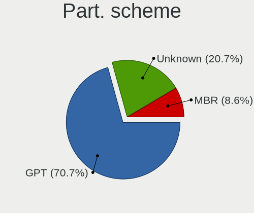
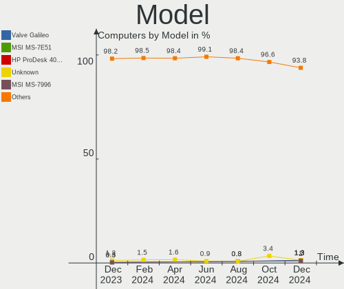
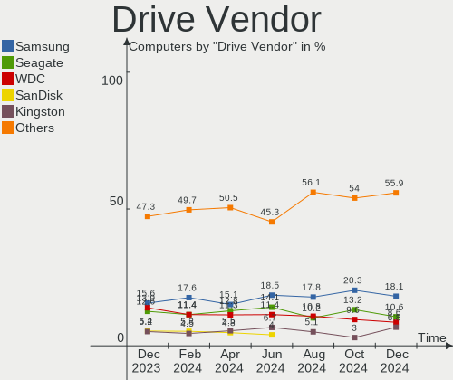
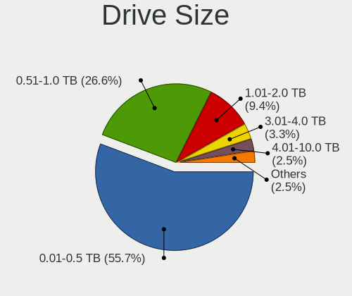
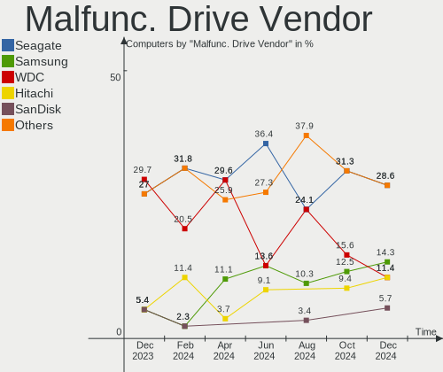
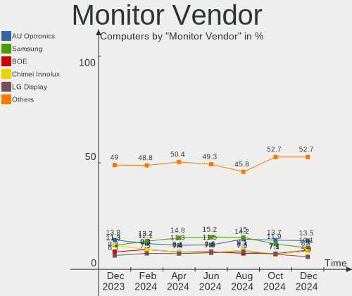
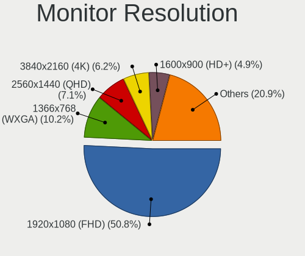
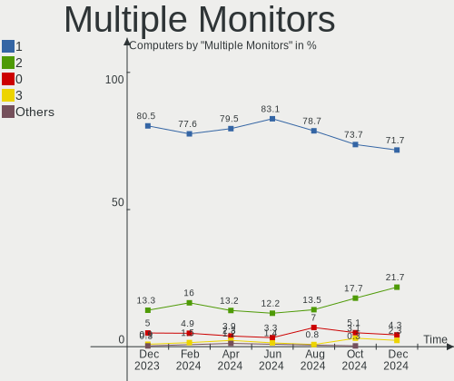
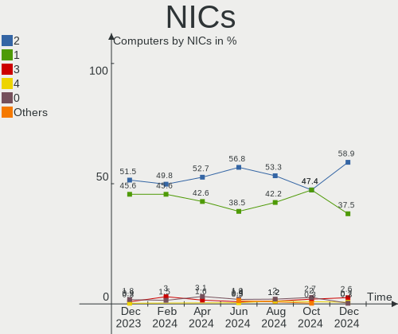

Linux in France - Hardware Trends
---------------------------------

A project to identify most popular hardware characteristics and track their change
over time based on data collected by Linux users at https://Linux-Hardware.org.

Anyone can contribute to this report by the [hw-probe](https://github.com/linuxhw/hw-probe) tool:

    sudo -E hw-probe -all -upload

This is a report for all computer types. See also reports for [desktops](/Location/France/Desktop/README.md) and [notebooks](/Location/France/Notebook/README.md).

Period: Oct, 2023.

Contents
--------

* [ System ](#system)
  - [ OS                       ](#os)
  - [ OS Family                ](#os-family)
  - [ Kernel                   ](#kernel)
  - [ Kernel Family            ](#kernel-family)
  - [ Kernel Major Ver.        ](#kernel-major-ver)
  - [ Arch                     ](#arch)
  - [ DE                       ](#de)
  - [ Display Server           ](#display-server)
  - [ Display Manager          ](#display-manager)
  - [ OS Lang                  ](#os-lang)
  - [ Boot Mode                ](#boot-mode)
  - [ Filesystem               ](#filesystem)
  - [ Part. scheme             ](#part-scheme)
  - [ Dual Boot with Linux/BSD ](#dual-boot-with-linuxbsd)
  - [ Dual Boot (Win)          ](#dual-boot-win)

* [ Board ](#board)
  - [ Vendor                   ](#vendor)
  - [ Model                    ](#model)
  - [ Model Family             ](#model-family)
  - [ MFG Year                 ](#mfg-year)
  - [ Form Factor              ](#form-factor)
  - [ Secure Boot              ](#secure-boot)
  - [ Coreboot                 ](#coreboot)
  - [ RAM Size                 ](#ram-size)
  - [ RAM Used                 ](#ram-used)
  - [ Total Drives             ](#total-drives)
  - [ Has CD-ROM               ](#has-cd-rom)
  - [ Has Ethernet             ](#has-ethernet)
  - [ Has WiFi                 ](#has-wifi)
  - [ Has Bluetooth            ](#has-bluetooth)

* [ Location ](#location)
  - [ Country                  ](#country)
  - [ City                     ](#city)

* [ Drives ](#drives)
  - [ Drive Vendor             ](#drive-vendor)
  - [ Drive Model              ](#drive-model)
  - [ HDD Vendor               ](#hdd-vendor)
  - [ SSD Vendor               ](#ssd-vendor)
  - [ Drive Kind               ](#drive-kind)
  - [ Drive Connector          ](#drive-connector)
  - [ Drive Size               ](#drive-size)
  - [ Space Total              ](#space-total)
  - [ Space Used               ](#space-used)
  - [ Malfunc. Drives          ](#malfunc-drives)
  - [ Malfunc. Drive Vendor    ](#malfunc-drive-vendor)
  - [ Malfunc. HDD Vendor      ](#malfunc-hdd-vendor)
  - [ Malfunc. Drive Kind      ](#malfunc-drive-kind)
  - [ Failed Drives            ](#failed-drives)
  - [ Failed Drive Vendor      ](#failed-drive-vendor)
  - [ Drive Status             ](#drive-status)

* [ Storage controller ](#storage-controller)
  - [ Storage Vendor           ](#storage-vendor)
  - [ Storage Model            ](#storage-model)
  - [ Storage Kind             ](#storage-kind)

* [ Processor ](#processor)
  - [ CPU Vendor               ](#cpu-vendor)
  - [ CPU Model                ](#cpu-model)
  - [ CPU Model Family         ](#cpu-model-family)
  - [ CPU Cores                ](#cpu-cores)
  - [ CPU Sockets              ](#cpu-sockets)
  - [ CPU Threads              ](#cpu-threads)
  - [ CPU Op-Modes             ](#cpu-op-modes)
  - [ CPU Microcode            ](#cpu-microcode)
  - [ CPU Microarch            ](#cpu-microarch)

* [ Graphics ](#graphics)
  - [ GPU Vendor               ](#gpu-vendor)
  - [ GPU Model                ](#gpu-model)
  - [ GPU Combo                ](#gpu-combo)
  - [ GPU Driver               ](#gpu-driver)
  - [ GPU Memory               ](#gpu-memory)

* [ Monitor ](#monitor)
  - [ Monitor Vendor           ](#monitor-vendor)
  - [ Monitor Model            ](#monitor-model)
  - [ Monitor Resolution       ](#monitor-resolution)
  - [ Monitor Diagonal         ](#monitor-diagonal)
  - [ Monitor Width            ](#monitor-width)
  - [ Aspect Ratio             ](#aspect-ratio)
  - [ Monitor Area             ](#monitor-area)
  - [ Pixel Density            ](#pixel-density)
  - [ Multiple Monitors        ](#multiple-monitors)

* [ Network ](#network)
  - [ Net Controller Vendor    ](#net-controller-vendor)
  - [ Net Controller Model     ](#net-controller-model)
  - [ Wireless Vendor          ](#wireless-vendor)
  - [ Wireless Model           ](#wireless-model)
  - [ Ethernet Vendor          ](#ethernet-vendor)
  - [ Ethernet Model           ](#ethernet-model)
  - [ Net Controller Kind      ](#net-controller-kind)
  - [ Used Controller          ](#used-controller)
  - [ NICs                     ](#nics)
  - [ IPv6                     ](#ipv6)

* [ Bluetooth ](#bluetooth)
  - [ Bluetooth Vendor         ](#bluetooth-vendor)
  - [ Bluetooth Model          ](#bluetooth-model)

* [ Sound ](#sound)
  - [ Sound Vendor             ](#sound-vendor)
  - [ Sound Model              ](#sound-model)

* [ Memory ](#memory)
  - [ Memory Vendor            ](#memory-vendor)
  - [ Memory Model             ](#memory-model)
  - [ Memory Kind              ](#memory-kind)
  - [ Memory Form Factor       ](#memory-form-factor)
  - [ Memory Size              ](#memory-size)
  - [ Memory Speed             ](#memory-speed)

* [ Printers & scanners ](#printers--scanners)
  - [ Printer Vendor           ](#printer-vendor)
  - [ Printer Model            ](#printer-model)
  - [ Scanner Vendor           ](#scanner-vendor)
  - [ Scanner Model            ](#scanner-model)

* [ Camera ](#camera)
  - [ Camera Vendor            ](#camera-vendor)
  - [ Camera Model             ](#camera-model)

* [ Security ](#security)
  - [ Fingerprint Vendor       ](#fingerprint-vendor)
  - [ Fingerprint Model        ](#fingerprint-model)
  - [ Chipcard Vendor          ](#chipcard-vendor)
  - [ Chipcard Model           ](#chipcard-model)

* [ Unsupported ](#unsupported)
  - [ Unsupported Devices      ](#unsupported-devices)
  - [ Unsupported Device Types ](#unsupported-device-types)

System
------

OS
--

Installed operating systems

| Name                         | Computers | Percent |
|------------------------------|-----------|---------|
| Ubuntu 22.04                 | 82        | 26.71%  |
| Linux Mint 21.2              | 21        | 6.84%   |
| Debian 12                    | 20        | 6.51%   |
| Fedora 38                    | 15        | 4.89%   |
| OpenMandriva 23.08           | 14        | 4.56%   |
| Ubuntu 23.04                 | 13        | 4.23%   |
| Ubuntu 20.04                 | 11        | 3.58%   |
| OpenMandriva 23.10           | 10        | 3.26%   |
| Pop!_OS 22.04                | 9         | 2.93%   |
| Zorin 16                     | 8         | 2.61%   |
| Ubuntu 23.10                 | 8         | 2.61%   |
| Arch Rolling                 | 7         | 2.28%   |
| Lubuntu 22.04                | 5         | 1.63%   |
| Gentoo 2.14                  | 5         | 1.63%   |
| ArcoLinux Rolling            | 4         | 1.3%    |
| Xubuntu 22.04                | 3         | 0.98%   |
| Ubuntu MATE 22.04            | 3         | 0.98%   |
| openSUSE Tumbleweed-XXXXXXXX | 3         | 0.98%   |
| OpenMandriva 4.3             | 3         | 0.98%   |
| LMDE 6                       | 3         | 0.98%   |
| Debian 11                    | 3         | 0.98%   |
| Xubuntu 23.10                | 2         | 0.65%   |
| Ubuntu Budgie 22.04          | 2         | 0.65%   |
| OpenMandriva 23.03           | 2         | 0.65%   |
| OpenMandriva 23.01           | 2         | 0.65%   |
| Nobara 38                    | 2         | 0.65%   |
| Manjaro                      | 2         | 0.65%   |
| Mageia 9                     | 2         | 0.65%   |
| Linux Mint 21.1              | 2         | 0.65%   |
| Kubuntu 23.10                | 2         | 0.65%   |
| Kubuntu 23.04                | 2         | 0.65%   |
| Kubuntu 22.04                | 2         | 0.65%   |
| KDE neon 22.04               | 2         | 0.65%   |
| Kali 2023.3                  | 2         | 0.65%   |
| ChimeraOS 44-1               | 2         | 0.65%   |
| Ubuntu Unity 20.04           | 1         | 0.33%   |
| Ubuntu MATE 23.04            | 1         | 0.33%   |
| Ubuntu 18.04                 | 1         | 0.33%   |
| Ubuntu 16.04                 | 1         | 0.33%   |
| SteamOS Rolling              | 1         | 0.33%   |

OS Family
---------

OS without a version

| Name          | Computers | Percent |
|---------------|-----------|---------|
| Ubuntu        | 116       | 37.79%  |
| OpenMandriva  | 34        | 11.07%  |
| Linux Mint    | 24        | 7.82%   |
| Debian        | 23        | 7.49%   |
| Fedora        | 16        | 5.21%   |
| Pop!_OS       | 9         | 2.93%   |
| Zorin         | 8         | 2.61%   |
| Kubuntu       | 7         | 2.28%   |
| Arch          | 7         | 2.28%   |
| Gentoo        | 6         | 1.95%   |
| Xubuntu       | 5         | 1.63%   |
| openSUSE      | 5         | 1.63%   |
| Lubuntu       | 5         | 1.63%   |
| Ubuntu MATE   | 4         | 1.3%    |
| Manjaro       | 4         | 1.3%    |
| ArcoLinux     | 4         | 1.3%    |
| SteamOS       | 3         | 0.98%   |
| LMDE          | 3         | 0.98%   |
| Ubuntu Budgie | 2         | 0.65%   |
| Nobara        | 2         | 0.65%   |
| Mageia        | 2         | 0.65%   |
| KDE neon      | 2         | 0.65%   |
| Kali          | 2         | 0.65%   |
| ChimeraOS     | 2         | 0.65%   |
| Ubuntu Unity  | 1         | 0.33%   |
| Solus         | 1         | 0.33%   |
| Slackware     | 1         | 0.33%   |
| Raspbian      | 1         | 0.33%   |
| NixOS         | 1         | 0.33%   |
| MX            | 1         | 0.33%   |
| Linux Lite    | 1         | 0.33%   |
| Garuda Linux  | 1         | 0.33%   |
| EndeavourOS   | 1         | 0.33%   |
| Elementary    | 1         | 0.33%   |
| BlackPanther  | 1         | 0.33%   |
| AlmaLinux     | 1         | 0.33%   |

Kernel
------

Version of the Linux kernel

| Version                             | Computers | Percent |
|-------------------------------------|-----------|---------|
| 6.2.0-34-generic                    | 42        | 13.68%  |
| 6.2.0-35-generic                    | 31        | 10.1%   |
| 5.15.0-86-generic                   | 21        | 6.84%   |
| 6.1.0-13-amd64                      | 16        | 5.21%   |
| 6.4.11-desktop-1omv2390             | 15        | 4.89%   |
| 6.2.0-33-generic                    | 13        | 4.23%   |
| 6.5.5-desktop-1omv2390              | 9         | 2.93%   |
| 5.15.0-87-generic                   | 8         | 2.61%   |
| 5.15.0-84-generic                   | 8         | 2.61%   |
| 6.5.0-9-generic                     | 6         | 1.95%   |
| 6.5.4-76060504-generic              | 5         | 1.63%   |
| 6.5.0-10-generic                    | 5         | 1.63%   |
| 5.15.0-76-generic                   | 5         | 1.63%   |
| 6.5.7-200.fc38.x86_64               | 4         | 1.3%    |
| 6.5.5-200.fc38.x86_64               | 4         | 1.3%    |
| 6.5.8-arch1-1                       | 3         | 0.98%   |
| 6.5.8-200.fc38.x86_64               | 3         | 0.98%   |
| 6.5.6-76060506-generic              | 3         | 0.98%   |
| 6.5.5-1-MANJARO                     | 3         | 0.98%   |
| 6.5.4-1-default                     | 3         | 0.98%   |
| 6.2.0-26-generic                    | 3         | 0.98%   |
| 6.1.0-12-amd64                      | 3         | 0.98%   |
| 5.16.7-desktop-1omv4003             | 3         | 0.98%   |
| 6.5.7-arch1-1                       | 2         | 0.65%   |
| 6.5.6-chos1-chimeraos-1             | 2         | 0.65%   |
| 6.5.6-200.fc38.x86_64               | 2         | 0.65%   |
| 6.5.5-arch1-1                       | 2         | 0.65%   |
| 6.4.0-0.deb12.2-amd64               | 2         | 0.65%   |
| 6.2.6-desktop-1omv2390              | 2         | 0.65%   |
| 5.4.0-52-generic                    | 2         | 0.65%   |
| 5.4.0-164-generic                   | 2         | 0.65%   |
| 5.15.0-88-generic                   | 2         | 0.65%   |
| 5.15.0-87-lowlatency                | 2         | 0.65%   |
| 5.15.0-82-generic                   | 2         | 0.65%   |
| 5.15.0-78-generic                   | 2         | 0.65%   |
| 5.15.0-25-generic                   | 2         | 0.65%   |
| 5.10.0-25-amd64                     | 2         | 0.65%   |
| 6.6.0-rc7-1-git-00039-g4f82870119a4 | 1         | 0.33%   |
| 6.6.0-rc5-1-mainline                | 1         | 0.33%   |
| 6.6.0-1-MANJARO                     | 1         | 0.33%   |

Kernel Family
-------------

Linux kernel without a distro release

| Version | Computers | Percent |
|---------|-----------|---------|
| 6.2.0   | 92        | 29.97%  |
| 5.15.0  | 57        | 18.57%  |
| 6.1.0   | 22        | 7.17%   |
| 6.5.5   | 21        | 6.84%   |
| 6.4.11  | 15        | 4.89%   |
| 6.5.0   | 13        | 4.23%   |
| 6.5.6   | 10        | 3.26%   |
| 6.5.4   | 9         | 2.93%   |
| 6.5.7   | 8         | 2.61%   |
| 6.5.8   | 6         | 1.95%   |
| 5.4.0   | 6         | 1.95%   |
| 6.6.0   | 3         | 0.98%   |
| 6.2.6   | 3         | 0.98%   |
| 5.16.7  | 3         | 0.98%   |
| 5.10.0  | 3         | 0.98%   |
| 6.5.3   | 2         | 0.65%   |
| 6.4.3   | 2         | 0.65%   |
| 6.4.0   | 2         | 0.65%   |
| 5.14.21 | 2         | 0.65%   |
| 6.4.9   | 1         | 0.33%   |
| 6.4.8   | 1         | 0.33%   |
| 6.4.16  | 1         | 0.33%   |
| 6.4.15  | 1         | 0.33%   |
| 6.4.12  | 1         | 0.33%   |
| 6.3.8   | 1         | 0.33%   |
| 6.3.0   | 1         | 0.33%   |
| 6.2.16  | 1         | 0.33%   |
| 6.2.1   | 1         | 0.33%   |
| 6.1.57  | 1         | 0.33%   |
| 6.1.53  | 1         | 0.33%   |
| 6.1.52  | 1         | 0.33%   |
| 6.1.4   | 1         | 0.33%   |
| 6.1.37  | 1         | 0.33%   |
| 6.1.21  | 1         | 0.33%   |
| 6.1.19  | 1         | 0.33%   |
| 6.1.1   | 1         | 0.33%   |
| 5.4.19  | 1         | 0.33%   |
| 5.19.5  | 1         | 0.33%   |
| 5.19.0  | 1         | 0.33%   |
| 5.17.0  | 1         | 0.33%   |

Kernel Major Ver.
-----------------

Linux kernel major version

| Version | Computers | Percent |
|---------|-----------|---------|
| 6.2     | 97        | 31.6%   |
| 6.5     | 69        | 22.48%  |
| 5.15    | 58        | 18.89%  |
| 6.1     | 30        | 9.77%   |
| 6.4     | 24        | 7.82%   |
| 5.4     | 7         | 2.28%   |
| 6.6     | 3         | 0.98%   |
| 5.16    | 3         | 0.98%   |
| 5.14    | 3         | 0.98%   |
| 5.10    | 3         | 0.98%   |
| 6.3     | 2         | 0.65%   |
| 5.19    | 2         | 0.65%   |
| 5.17    | 1         | 0.33%   |
| 5.13    | 1         | 0.33%   |
| 4.4     | 1         | 0.33%   |
| 4.18    | 1         | 0.33%   |
| 4.15    | 1         | 0.33%   |
| 4.14    | 1         | 0.33%   |

Arch
----

OS architecture (x86_64, i586, etc.)

| Name    | Computers | Percent |
|---------|-----------|---------|
| x86_64  | 304       | 99.02%  |
| aarch64 | 3         | 0.98%   |

DE
--

Desktop Environment

| Name          | Computers | Percent |
|---------------|-----------|---------|
| GNOME         | 149       | 48.53%  |
| KDE5          | 69        | 22.48%  |
| X-Cinnamon    | 26        | 8.47%   |
| XFCE          | 17        | 5.54%   |
| Unknown       | 17        | 5.54%   |
| MATE          | 7         | 2.28%   |
| LXQt          | 6         | 1.95%   |
| Cinnamon      | 3         | 0.98%   |
| i3            | 2         | 0.65%   |
| GNOME Classic | 2         | 0.65%   |
| Budgie        | 2         | 0.65%   |
| Unity         | 1         | 0.33%   |
| Pantheon      | 1         | 0.33%   |
| Openbox       | 1         | 0.33%   |
| KDE4          | 1         | 0.33%   |
| KDE           | 1         | 0.33%   |
| Hyprland      | 1         | 0.33%   |
| DDE           | 1         | 0.33%   |

Display Server
--------------

X11 or Wayland

| Name    | Computers | Percent |
|---------|-----------|---------|
| X11     | 157       | 51.14%  |
| Wayland | 128       | 41.69%  |
| Tty     | 14        | 4.56%   |
| Unknown | 8         | 2.61%   |

Display Manager
---------------

SDDM, LightDM, etc.

| Name    | Computers | Percent |
|---------|-----------|---------|
| GDM3    | 106       | 34.53%  |
| Unknown | 74        | 24.1%   |
| SDDM    | 70        | 22.8%   |
| LightDM | 40        | 13.03%  |
| GDM     | 15        | 4.89%   |
| LY-DM   | 1         | 0.33%   |
| KDM     | 1         | 0.33%   |

OS Lang
-------

Language

| Lang       | Computers | Percent |
|------------|-----------|---------|
| fr_FR      | 233       | 75.9%   |
| en_US      | 55        | 17.92%  |
| C          | 6         | 1.95%   |
| en_GB      | 5         | 1.63%   |
| it_IT      | 2         | 0.65%   |
| Unknown    | 2         | 0.65%   |
| en_IE@euro | 1         | 0.33%   |
| en         | 1         | 0.33%   |
| de_DE      | 1         | 0.33%   |
| C.UTF8     | 1         | 0.33%   |

Boot Mode
---------

EFI or BIOS

| Mode | Computers | Percent |
|------|-----------|---------|
| EFI  | 171       | 55.7%   |
| BIOS | 136       | 44.3%   |

Filesystem
----------

Type of filesystem

| Type    | Computers | Percent |
|---------|-----------|---------|
| Ext4    | 205       | 66.78%  |
| Tmpfs   | 51        | 16.61%  |
| Btrfs   | 32        | 10.42%  |
| Overlay | 12        | 3.91%   |
| Zfs     | 2         | 0.65%   |
| Ext3    | 2         | 0.65%   |
| XXXXXXX | 1         | 0.33%   |
| Xfs     | 1         | 0.33%   |
| F2fs    | 1         | 0.33%   |

Part. scheme
------------

Scheme of partitioning

| Type    | Computers | Percent |
|---------|-----------|---------|
| GPT     | 205       | 66.78%  |
| Unknown | 69        | 22.48%  |
| MBR     | 33        | 10.75%  |

Dual Boot with Linux/BSD
------------------------

Hosting more than one Linux/BSD

| Dual boot | Computers | Percent |
|-----------|-----------|---------|
| No        | 273       | 88.93%  |
| Yes       | 34        | 11.07%  |

Dual Boot (Win)
---------------

Hosting Linux and Windows

| Dual boot | Computers | Percent |
|-----------|-----------|---------|
| No        | 217       | 70.68%  |
| Yes       | 90        | 29.32%  |

Board
-----

Vendor
------

Motherboard manufacturer

| Name                                 | Computers | Percent |
|--------------------------------------|-----------|---------|
| Hewlett-Packard                      | 48        | 15.64%  |
| Dell                                 | 48        | 15.64%  |
| ASUSTek Computer                     | 43        | 14.01%  |
| Lenovo                               | 41        | 13.36%  |
| MSI                                  | 23        | 7.49%   |
| Acer                                 | 16        | 5.21%   |
| Gigabyte Technology                  | 15        | 4.89%   |
| ASRock                               | 7         | 2.28%   |
| Intel                                | 5         | 1.63%   |
| Apple                                | 5         | 1.63%   |
| UNOWHY                               | 4         | 1.3%    |
| HUAWEI                               | 4         | 1.3%    |
| Toshiba                              | 3         | 0.98%   |
| Raspberry Pi Foundation              | 3         | 0.98%   |
| Notebook                             | 3         | 0.98%   |
| Valve                                | 2         | 0.65%   |
| Thomson                              | 2         | 0.65%   |
| Samsung Electronics                  | 2         | 0.65%   |
| Pegatron                             | 2         | 0.65%   |
| MACHINIST                            | 2         | 0.65%   |
| Fujitsu Siemens                      | 2         | 0.65%   |
| Fujitsu                              | 2         | 0.65%   |
| Foxconn                              | 2         | 0.65%   |
| Clevo                                | 2         | 0.65%   |
| Unknown                              | 2         | 0.65%   |
| ZOTAC                                | 1         | 0.33%   |
| Trigkey                              | 1         | 0.33%   |
| Sony                                 | 1         | 0.33%   |
| Shuttle                              | 1         | 0.33%   |
| Shenzhen Meigao Electronic Equipment | 1         | 0.33%   |
| Quanta                               | 1         | 0.33%   |
| Packard Bell                         | 1         | 0.33%   |
| Online Labs                          | 1         | 0.33%   |
| OFF GLOBAL                           | 1         | 0.33%   |
| LattePanda                           | 1         | 0.33%   |
| GPD                                  | 1         | 0.33%   |
| Google                               | 1         | 0.33%   |
| Framework                            | 1         | 0.33%   |
| Extra Terrestrial                    | 1         | 0.33%   |
| EUROCOM                              | 1         | 0.33%   |

Model
-----

Motherboard model

| Name                                              | Computers | Percent |
|---------------------------------------------------|-----------|---------|
| Dell Precision 5480                               | 3         | 0.98%   |
| Unknown                                           | 3         | 0.98%   |
| Valve Jupiter                                     | 2         | 0.65%   |
| UNOWHY Y13G012S4EI                                | 2         | 0.65%   |
| UNOWHY Y13G011S4EI                                | 2         | 0.65%   |
| MSI MS-7816                                       | 2         | 0.65%   |
| HUAWEI NBLB-WAX9N                                 | 2         | 0.65%   |
| HP ZBook Fury 15.6 inch G8 Mobile Workstation PC  | 2         | 0.65%   |
| HP ProBook 450 G6                                 | 2         | 0.65%   |
| HP Pavilion 17                                    | 2         | 0.65%   |
| HP Elite x360 1040 14 inch G10 2-in-1 Notebook PC | 2         | 0.65%   |
| Gigabyte B450M DS3H                               | 2         | 0.65%   |
| Dell OptiPlex 7020                                | 2         | 0.65%   |
| Dell OptiPlex 380                                 | 2         | 0.65%   |
| Dell Latitude E6320                               | 2         | 0.65%   |
| Dell Latitude 9430                                | 2         | 0.65%   |
| ASUS Zenbook UX7602VI_UX7602VI                    | 2         | 0.65%   |
| ASUS PRIME Z370-P                                 | 2         | 0.65%   |
| ASUS PRIME B660-PLUS D4                           | 2         | 0.65%   |
| Acer Aspire A314-23P                              | 2         | 0.65%   |
| ZOTAC ZBOX-CI669/CI649NANO                        | 1         | 0.33%   |
| Trigkey Green G5                                  | 1         | 0.33%   |
| Toshiba Satellite C70D-B                          | 1         | 0.33%   |
| Toshiba Satellite C660D                           | 1         | 0.33%   |
| Toshiba Satellite C660                            | 1         | 0.33%   |
| Thomson X15I5-8TU512                              | 1         | 0.33%   |
| Thomson NEO14-4W64                                | 1         | 0.33%   |
| Sony VPCEH1L0E                                    | 1         | 0.33%   |
| Shuttle DH110                                     | 1         | 0.33%   |
| Shenzhen Meigao Electronic Equipment Venus series | 1         | 0.33%   |
| Samsung 350V5C/351V5C/3540VC/3440VC               | 1         | 0.33%   |
| Samsung 305E4A/305E5A/305E7A                      | 1         | 0.33%   |
| RPi Raspberry Pi 4 Model B Rev 1.1                | 1         | 0.33%   |
| RPi Raspberry Pi 3 Model B Rev 1.2                | 1         | 0.33%   |
| RPi Raspberry Pi 3 Model B Plus Rev 1.3           | 1         | 0.33%   |
| Quanta QuantaPlex T22HF-1U                        | 1         | 0.33%   |
| Pegatron WE277AA-ABF p6352fr                      | 1         | 0.33%   |
| Pegatron VD049AA-ABF p6141fr                      | 1         | 0.33%   |
| Packard Bell EasyNote LM98                        | 1         | 0.33%   |
| Online Labs SR                                    | 1         | 0.33%   |

Model Family
------------

Motherboard model prefix

| Name               | Computers | Percent |
|--------------------|-----------|---------|
| Lenovo ThinkPad    | 17        | 5.54%   |
| Dell Latitude      | 15        | 4.89%   |
| Acer Aspire        | 13        | 4.23%   |
| Dell Precision     | 12        | 3.91%   |
| Dell OptiPlex      | 10        | 3.26%   |
| Lenovo IdeaPad     | 8         | 2.61%   |
| HP Pavilion        | 8         | 2.61%   |
| HP EliteBook       | 7         | 2.28%   |
| Lenovo ThinkCentre | 6         | 1.95%   |
| HP Compaq          | 6         | 1.95%   |
| Dell XPS           | 6         | 1.95%   |
| ASUS VivoBook      | 6         | 1.95%   |
| HP ProBook         | 5         | 1.63%   |
| ASUS PRIME         | 5         | 1.63%   |
| HP EliteDesk       | 4         | 1.3%    |
| ASUS Zenbook       | 4         | 1.3%    |
| ASUS ROG           | 4         | 1.3%    |
| Toshiba Satellite  | 3         | 0.98%   |
| RPi Raspberry      | 3         | 0.98%   |
| Unknown            | 3         | 0.98%   |
| Valve Jupiter      | 2         | 0.65%   |
| UNOWHY Y13G012S4EI | 2         | 0.65%   |
| UNOWHY Y13G011S4EI | 2         | 0.65%   |
| MSI MS-7816        | 2         | 0.65%   |
| Lenovo Legion      | 2         | 0.65%   |
| Lenovo IdeaCentre  | 2         | 0.65%   |
| HUAWEI NBLB-WAX9N  | 2         | 0.65%   |
| HP ZBook           | 2         | 0.65%   |
| HP Victus          | 2         | 0.65%   |
| HP ProDesk         | 2         | 0.65%   |
| HP Laptop          | 2         | 0.65%   |
| HP Elite           | 2         | 0.65%   |
| Gigabyte B550M     | 2         | 0.65%   |
| Gigabyte B550      | 2         | 0.65%   |
| Gigabyte B450M     | 2         | 0.65%   |
| Foxconn Pro        | 2         | 0.65%   |
| Dell Inspiron      | 2         | 0.65%   |
| Dell G15           | 2         | 0.65%   |
| ASUS P5Q           | 2         | 0.65%   |
| Acer Veriton       | 2         | 0.65%   |

MFG Year
--------

Motherboard manufacture year

| Year    | Computers | Percent |
|---------|-----------|---------|
| 2023    | 35        | 11.4%   |
| 2021    | 31        | 10.1%   |
| 2022    | 30        | 9.77%   |
| 2018    | 24        | 7.82%   |
| 2015    | 22        | 7.17%   |
| 2020    | 20        | 6.51%   |
| 2014    | 19        | 6.19%   |
| 2017    | 17        | 5.54%   |
| 2011    | 17        | 5.54%   |
| 2019    | 15        | 4.89%   |
| 2016    | 15        | 4.89%   |
| 2013    | 15        | 4.89%   |
| 2012    | 14        | 4.56%   |
| 2009    | 11        | 3.58%   |
| 2010    | 10        | 3.26%   |
| 2008    | 3         | 0.98%   |
| 2007    | 3         | 0.98%   |
| Unknown | 3         | 0.98%   |
| 2006    | 2         | 0.65%   |
| 2005    | 1         | 0.33%   |

Form Factor
-----------

Physical design of the computer

| Name           | Computers | Percent |
|----------------|-----------|---------|
| Notebook       | 168       | 54.72%  |
| Desktop        | 110       | 35.83%  |
| Convertible    | 8         | 2.61%   |
| Mini pc        | 8         | 2.61%   |
| All in one     | 5         | 1.63%   |
| System on chip | 3         | 0.98%   |
| Tablet         | 3         | 0.98%   |
| Server         | 2         | 0.65%   |

Secure Boot
-----------

Enabled or disabled

| State    | Computers | Percent |
|----------|-----------|---------|
| Disabled | 285       | 92.83%  |
| Enabled  | 22        | 7.17%   |

Coreboot
--------

Have coreboot on board

| Used | Computers | Percent |
|------|-----------|---------|
| No   | 306       | 99.67%  |
| Yes  | 1         | 0.33%   |

RAM Size
--------

Total RAM memory

| Size in GB  | Computers | Percent |
|-------------|-----------|---------|
| 4.01-8.0    | 76        | 24.76%  |
| 16.01-24.0  | 55        | 17.92%  |
| 8.01-16.0   | 55        | 17.92%  |
| 3.01-4.0    | 48        | 15.64%  |
| 32.01-64.0  | 38        | 12.38%  |
| 64.01-256.0 | 18        | 5.86%   |
| 24.01-32.0  | 9         | 2.93%   |
| 1.01-2.0    | 4         | 1.3%    |
| 2.01-3.0    | 2         | 0.65%   |
| 0.51-1.0    | 2         | 0.65%   |

RAM Used
--------

Used RAM memory

| Used GB     | Computers | Percent |
|-------------|-----------|---------|
| 1.01-2.0    | 87        | 28.34%  |
| 2.01-3.0    | 83        | 27.04%  |
| 4.01-8.0    | 54        | 17.59%  |
| 3.01-4.0    | 43        | 14.01%  |
| 8.01-16.0   | 25        | 8.14%   |
| 0.51-1.0    | 6         | 1.95%   |
| 0.01-0.5    | 5         | 1.63%   |
| 16.01-24.0  | 3         | 0.98%   |
| 64.01-256.0 | 1         | 0.33%   |

Total Drives
------------

Number of drives on board

| Drives | Computers | Percent |
|--------|-----------|---------|
| 1      | 200       | 65.15%  |
| 2      | 70        | 22.8%   |
| 3      | 19        | 6.19%   |
| 4      | 6         | 1.95%   |
| 5      | 4         | 1.3%    |
| 6      | 3         | 0.98%   |
| 7      | 2         | 0.65%   |
| 18     | 1         | 0.33%   |
| 9      | 1         | 0.33%   |
| 0      | 1         | 0.33%   |

Has CD-ROM
----------

Has CD-ROM on board

| Presented | Computers | Percent |
|-----------|-----------|---------|
| No        | 206       | 67.1%   |
| Yes       | 101       | 32.9%   |

Has Ethernet
------------

Has Ethernet on board

| Presented | Computers | Percent |
|-----------|-----------|---------|
| Yes       | 257       | 83.71%  |
| No        | 50        | 16.29%  |

Has WiFi
--------

Has WiFi module

| Presented | Computers | Percent |
|-----------|-----------|---------|
| Yes       | 239       | 77.85%  |
| No        | 68        | 22.15%  |

Has Bluetooth
-------------

Has Bluetooth module

| Presented | Computers | Percent |
|-----------|-----------|---------|
| Yes       | 204       | 66.45%  |
| No        | 103       | 33.55%  |

Location
--------

Country
-------

Geographic location (country)

| Country | Computers | Percent |
|---------|-----------|---------|
| France  | 307       | 100%    |

City
----

Geographic location (city)

| City                  | Computers | Percent |
|-----------------------|-----------|---------|
| Paris                 | 43        | 14.01%  |
| Toulouse              | 9         | 2.93%   |
| Nantes                | 8         | 2.61%   |
| Lyon                  | 6         | 1.95%   |
| Marseille             | 5         | 1.63%   |
| Champs-sur-Marne      | 5         | 1.63%   |
| Tours                 | 4         | 1.3%    |
| Rennes                | 4         | 1.3%    |
| Lille                 | 4         | 1.3%    |
| Grenoble              | 4         | 1.3%    |
| Caen                  | 4         | 1.3%    |
| Trappes               | 3         | 0.98%   |
| Nîmes                | 3         | 0.98%   |
| Limoges               | 3         | 0.98%   |
| Avignon               | 3         | 0.98%   |
| Aulnay-sous-Bois      | 3         | 0.98%   |
| Argenteuil            | 3         | 0.98%   |
| Yerres                | 2         | 0.65%   |
| Vaulx-en-Velin        | 2         | 0.65%   |
| Sarreguemines         | 2         | 0.65%   |
| Saint-Denis           | 2         | 0.65%   |
| Rosny-sous-Bois       | 2         | 0.65%   |
| Poitiers              | 2         | 0.65%   |
| Pau                   | 2         | 0.65%   |
| Montpellier           | 2         | 0.65%   |
| Lezoux                | 2         | 0.65%   |
| Le Boulou             | 2         | 0.65%   |
| La Seyne-sur-Mer      | 2         | 0.65%   |
| La Ciotat             | 2         | 0.65%   |
| Garges-lès-Gonesse   | 2         | 0.65%   |
| Fontenay-sous-Bois    | 2         | 0.65%   |
| Évreux               | 2         | 0.65%   |
| Epiniac               | 2         | 0.65%   |
| Egly                  | 2         | 0.65%   |
| Cormeilles-en-Parisis | 2         | 0.65%   |
| Bordeaux              | 2         | 0.65%   |
| Asnieres-sur-Seine    | 2         | 0.65%   |
| Angers                | 2         | 0.65%   |
| Wasquehal             | 1         | 0.33%   |
| Vitry-sur-Seine       | 1         | 0.33%   |

Drives
------

Drive Vendor
------------

Hard drive vendors

| Vendor                      | Computers | Drives | Percent |
|-----------------------------|-----------|--------|---------|
| Samsung Electronics         | 78        | 107    | 18.06%  |
| Seagate                     | 43        | 60     | 9.95%   |
| WDC                         | 39        | 45     | 9.03%   |
| Crucial                     | 30        | 33     | 6.94%   |
| Kingston                    | 27        | 27     | 6.25%   |
| Toshiba                     | 21        | 23     | 4.86%   |
| SanDisk                     | 20        | 21     | 4.63%   |
| SK hynix                    | 19        | 19     | 4.4%    |
| Unknown                     | 18        | 21     | 4.17%   |
| Micron Technology           | 15        | 18     | 3.47%   |
| Hitachi                     | 13        | 13     | 3.01%   |
| HGST                        | 13        | 16     | 3.01%   |
| Intel                       | 12        | 13     | 2.78%   |
| KIOXIA                      | 10        | 10     | 2.31%   |
| China                       | 7         | 7      | 1.62%   |
| Phison Electronics          | 6         | 7      | 1.39%   |
| Micron/Crucial Technology   | 5         | 5      | 1.16%   |
| Emtec                       | 5         | 5      | 1.16%   |
| Maxtor                      | 3         | 3      | 0.69%   |
| LDLC                        | 3         | 3      | 0.69%   |
| JMicron Technology          | 3         | 3      | 0.69%   |
| Apple                       | 3         | 3      | 0.69%   |
| Verbatim                    | 2         | 2      | 0.46%   |
| SPCC                        | 2         | 2      | 0.46%   |
| Silicon Motion              | 2         | 2      | 0.46%   |
| PNY                         | 2         | 2      | 0.46%   |
| KingDian                    | 2         | 2      | 0.46%   |
| Fanxiang                    | 2         | 2      | 0.46%   |
| WDC WDB                     | 1         | 1      | 0.23%   |
| UMIS                        | 1         | 1      | 0.23%   |
| Transcend                   | 1         | 1      | 0.23%   |
| SSSTC                       | 1         | 1      | 0.23%   |
| ROG                         | 1         | 1      | 0.23%   |
| Realtek Semiconductor       | 1         | 1      | 0.23%   |
| Phison                      | 1         | 1      | 0.23%   |
| Patriot                     | 1         | 1      | 0.23%   |
| OCZ                         | 1         | 1      | 0.23%   |
| MAXIO Technology (Hangzhou) | 1         | 1      | 0.23%   |
| Magnetic Data               | 1         | 1      | 0.23%   |
| LITEONIT                    | 1         | 1      | 0.23%   |

Drive Model
-----------

Hard drive models

| Model                                                 | Computers | Percent |
|-------------------------------------------------------|-----------|---------|
| Samsung NVMe SSD Controller SM981/PM981/PM983 1TB     | 10        | 2.11%   |
| Samsung NVMe SSD Controller PM9A1/PM9A3/980PRO 1TB    | 9         | 1.89%   |
| Toshiba MQ01ABD100 1TB                                | 6         | 1.26%   |
| Samsung SSD 860 EVO 500GB                             | 5         | 1.05%   |
| Kingston SA400S37240G 240GB SSD                       | 5         | 1.05%   |
| Intel SSDPEKNU512GZ 512GB                             | 5         | 1.05%   |
| WDC WD10EZEX-08WN4A0 1TB                              | 4         | 0.84%   |
| Unknown MMC Card  64GB                                | 4         | 0.84%   |
| Samsung SSD 870 QVO 1TB                               | 4         | 0.84%   |
| Samsung SSD 850 EVO 250GB                             | 4         | 0.84%   |
| Samsung SSD 840 EVO 250GB                             | 4         | 0.84%   |
| Kingston SA400S37480G 480GB SSD                       | 4         | 0.84%   |
| HGST HTS721010A9E630 1TB                              | 4         | 0.84%   |
| Unknown MMC64G  64GB                                  | 3         | 0.63%   |
| Toshiba MQ04ABF100 1TB                                | 3         | 0.63%   |
| Seagate ST2000DM008-2FR102 2TB                        | 3         | 0.63%   |
| Seagate ST2000DM006-2DM164 2TB                        | 3         | 0.63%   |
| Seagate ST1000LM035-1RK172 1TB                        | 3         | 0.63%   |
| Samsung SSD 980 1TB                                   | 3         | 0.63%   |
| Phison E12 NVMe Controller 1TB                        | 3         | 0.63%   |
| Kingston SV300S37A120G 120GB SSD                      | 3         | 0.63%   |
| Kingston SH103S3120G 120GB SSD                        | 3         | 0.63%   |
| Emtec X150 480GB                                      | 3         | 0.63%   |
| Crucial CT275MX300SSD1 275GB                          | 3         | 0.63%   |
| Crucial CT240BX500SSD1 240GB                          | 3         | 0.63%   |
| WDC WDS120G2G0B-00EPW0 120GB SSD                      | 2         | 0.42%   |
| WDC WD5000AAKX-60U6AA0 500GB                          | 2         | 0.42%   |
| WDC WD10EZRX-00L4HB0 1TB                              | 2         | 0.42%   |
| Unknown SD/MMC/MS PRO 16GB                            | 2         | 0.42%   |
| SK hynix PC801 NVMe 512GB                             | 2         | 0.42%   |
| Silicon Motion SM2263EN/SM2263XT SSD Controller 256GB | 2         | 0.42%   |
| Seagate ST3500413AS 500GB                             | 2         | 0.42%   |
| Seagate ST2000DM008-2UB102 2TB                        | 2         | 0.42%   |
| SanDisk SSD PLUS 240GB                                | 2         | 0.42%   |
| SanDisk NVMe SSD Drive 512GB                          | 2         | 0.42%   |
| Samsung SSD 980 PRO 500GB                             | 2         | 0.42%   |
| Samsung SSD 980 500GB                                 | 2         | 0.42%   |
| Samsung SSD 870 EVO 500GB                             | 2         | 0.42%   |
| Samsung SSD 860 EVO 1TB                               | 2         | 0.42%   |
| Samsung SSD 850 PRO 512GB                             | 2         | 0.42%   |

HDD Vendor
----------

Hard disk drive vendors

| Vendor              | Computers | Drives | Percent |
|---------------------|-----------|--------|---------|
| Seagate             | 39        | 56     | 31.45%  |
| WDC                 | 33        | 35     | 26.61%  |
| Toshiba             | 15        | 17     | 12.1%   |
| Hitachi             | 13        | 13     | 10.48%  |
| HGST                | 13        | 16     | 10.48%  |
| Samsung Electronics | 3         | 3      | 2.42%   |
| Maxtor              | 3         | 3      | 2.42%   |
| Unknown             | 2         | 2      | 1.61%   |
| Magnetic Data       | 1         | 1      | 0.81%   |
| Fujitsu             | 1         | 1      | 0.81%   |
| Apple               | 1         | 1      | 0.81%   |

SSD Vendor
----------

Solid state drive vendors

| Vendor              | Computers | Drives | Percent |
|---------------------|-----------|--------|---------|
| Samsung Electronics | 36        | 49     | 24.66%  |
| Crucial             | 25        | 28     | 17.12%  |
| Kingston            | 22        | 22     | 15.07%  |
| SanDisk             | 9         | 10     | 6.16%   |
| China               | 7         | 7      | 4.79%   |
| Micron Technology   | 5         | 8      | 3.42%   |
| Emtec               | 5         | 5      | 3.42%   |
| WDC                 | 4         | 4      | 2.74%   |
| Intel               | 4         | 4      | 2.74%   |
| SK hynix            | 3         | 3      | 2.05%   |
| Verbatim            | 2         | 2      | 1.37%   |
| SPCC                | 2         | 2      | 1.37%   |
| PNY                 | 2         | 2      | 1.37%   |
| KingDian            | 2         | 2      | 1.37%   |
| WDC WDB             | 1         | 1      | 0.68%   |
| Transcend           | 1         | 1      | 0.68%   |
| ROG                 | 1         | 1      | 0.68%   |
| Patriot             | 1         | 1      | 0.68%   |
| OCZ                 | 1         | 1      | 0.68%   |
| LITEONIT            | 1         | 1      | 0.68%   |
| LITEON              | 1         | 1      | 0.68%   |
| LDLC                | 1         | 1      | 0.68%   |
| KingSpec            | 1         | 1      | 0.68%   |
| KingFast            | 1         | 1      | 0.68%   |
| Kimtigo             | 1         | 1      | 0.68%   |
| Intenso             | 1         | 1      | 0.68%   |
| Integral            | 1         | 1      | 0.68%   |
| EXRAM               | 1         | 1      | 0.68%   |
| ASMedia             | 1         | 1      | 0.68%   |
| Apple               | 1         | 1      | 0.68%   |
| Apacer              | 1         | 1      | 0.68%   |
| Unknown             | 1         | 1      | 0.68%   |

Drive Kind
----------

HDD or SSD

| Kind    | Computers | Drives | Percent |
|---------|-----------|--------|---------|
| NVMe    | 135       | 164    | 34.62%  |
| SSD     | 130       | 166    | 33.33%  |
| HDD     | 105       | 148    | 26.92%  |
| MMC     | 14        | 15     | 3.59%   |
| Unknown | 6         | 8      | 1.54%   |

Drive Connector
---------------

SATA, SAS, NVMe, etc.

| Type | Computers | Drives | Percent |
|------|-----------|--------|---------|
| SATA | 192       | 303    | 53.93%  |
| NVMe | 134       | 162    | 37.64%  |
| SAS  | 16        | 21     | 4.49%   |
| MMC  | 14        | 15     | 3.93%   |

Drive Size
----------

Size of hard drive

| Size in TB | Computers | Drives | Percent |
|------------|-----------|--------|---------|
| 0.01-0.5   | 137       | 185    | 57.08%  |
| 0.51-1.0   | 76        | 83     | 31.67%  |
| 1.01-2.0   | 20        | 34     | 8.33%   |
| 3.01-4.0   | 3         | 3      | 1.25%   |
| 2.01-3.0   | 3         | 8      | 1.25%   |
| 4.01-10.0  | 1         | 1      | 0.42%   |

Space Total
-----------

Amount of disk space available on the file system

| Size in GB     | Computers | Percent |
|----------------|-----------|---------|
| 101-250        | 74        | 24.1%   |
| 251-500        | 70        | 22.8%   |
| 501-1000       | 54        | 17.59%  |
| 1001-2000      | 26        | 8.47%   |
| More than 3000 | 20        | 6.51%   |
| 51-100         | 17        | 5.54%   |
| 21-50          | 13        | 4.23%   |
| 1-20           | 12        | 3.91%   |
| Unknown        | 11        | 3.58%   |
| 2001-3000      | 10        | 3.26%   |

Space Used
----------

Amount of used disk space

| Used GB        | Computers | Percent |
|----------------|-----------|---------|
| 1-20           | 99        | 32.25%  |
| 21-50          | 59        | 19.22%  |
| 101-250        | 41        | 13.36%  |
| 51-100         | 32        | 10.42%  |
| 251-500        | 25        | 8.14%   |
| 501-1000       | 22        | 7.17%   |
| Unknown        | 11        | 3.58%   |
| More than 3000 | 7         | 2.28%   |
| 1001-2000      | 7         | 2.28%   |
| 2001-3000      | 4         | 1.3%    |

Malfunc. Drives
---------------

Drive models with a malfunction

| Model                                            | Computers | Drives | Percent |
|--------------------------------------------------|-----------|--------|---------|
| WDC WDS120G2G0B-00EPW0 120GB SSD                 | 1         | 1      | 2.94%   |
| WDC WD2500BEKT-60PVMT0 250GB                     | 1         | 1      | 2.94%   |
| WDC WD10EZEX-00WN4A0 1TB                         | 1         | 1      | 2.94%   |
| WDC WD1003FZEX-00MK2A0 1TB                       | 1         | 1      | 2.94%   |
| Transcend TS512GMTS430S 512GB SSD                | 1         | 1      | 2.94%   |
| Toshiba MQ04ABF100 1TB                           | 1         | 1      | 2.94%   |
| Toshiba MK1655GSX 160GB                          | 1         | 1      | 2.94%   |
| SK hynix HFS128G39TND-N210A 128GB SSD            | 1         | 1      | 2.94%   |
| SK hynix BC711 HFM512GD3JX013N 512GB             | 1         | 1      | 2.94%   |
| Seagate ST500LM000-SSHD-8GB                      | 1         | 1      | 2.94%   |
| Seagate ST3500418AS 500GB                        | 1         | 1      | 2.94%   |
| Seagate ST3160318AS 160GB                        | 1         | 1      | 2.94%   |
| Seagate ST31000528AS 1TB                         | 1         | 1      | 2.94%   |
| Seagate ST31000524AS 1TB                         | 1         | 1      | 2.94%   |
| Seagate ST2000NM0033-9ZM175 2TB                  | 1         | 4      | 2.94%   |
| Seagate ST2000DM008-2FR102 2TB                   | 1         | 2      | 2.94%   |
| Seagate ST2000DM001-1ER164 2TB                   | 1         | 2      | 2.94%   |
| SanDisk SSD PLUS 240GB                           | 1         | 1      | 2.94%   |
| Samsung Electronics SSD 980 PRO 500GB            | 1         | 1      | 2.94%   |
| Samsung Electronics MZ7LN256HMJP-000H1 256GB SSD | 1         | 1      | 2.94%   |
| OCZ VERTEX3 120GB SSD                            | 1         | 1      | 2.94%   |
| Maxtor 6B200M0 208GB                             | 1         | 1      | 2.94%   |
| Magnetic Data MD02500-AVDW-RO 250GB              | 1         | 1      | 2.94%   |
| LDLC F6+M.2 240 240GB SSD                        | 1         | 1      | 2.94%   |
| Kingston SV300S37A120G 120GB SSD                 | 1         | 1      | 2.94%   |
| Kingston RBU-SMSM151S324GD 24GB SSD              | 1         | 1      | 2.94%   |
| JMicron Technology Tech 250GB                    | 1         | 1      | 2.94%   |
| Hitachi HTS547550A9E384 500GB                    | 1         | 1      | 2.94%   |
| HGST HTS725032A7E630 320GB                       | 1         | 1      | 2.94%   |
| HGST HTS721010A9E630 1TB                         | 1         | 1      | 2.94%   |
| HGST HTS545050A7E680 500GB                       | 1         | 1      | 2.94%   |
| HGST HCC545050A7E380 500GB                       | 1         | 1      | 2.94%   |
| EXRAM SSD 512GB                                  | 1         | 1      | 2.94%   |
| Crucial CT275MX300SSD1 275GB                     | 1         | 1      | 2.94%   |

Malfunc. Drive Vendor
---------------------

Vendors of faulty drives

| Vendor              | Computers | Drives | Percent |
|---------------------|-----------|--------|---------|
| Seagate             | 7         | 13     | 21.21%  |
| WDC                 | 4         | 4      | 12.12%  |
| HGST                | 4         | 4      | 12.12%  |
| Toshiba             | 2         | 2      | 6.06%   |
| SK hynix            | 2         | 2      | 6.06%   |
| Samsung Electronics | 2         | 2      | 6.06%   |
| Kingston            | 2         | 2      | 6.06%   |
| Transcend           | 1         | 1      | 3.03%   |
| SanDisk             | 1         | 1      | 3.03%   |
| OCZ                 | 1         | 1      | 3.03%   |
| Maxtor              | 1         | 1      | 3.03%   |
| Magnetic Data       | 1         | 1      | 3.03%   |
| LDLC                | 1         | 1      | 3.03%   |
| JMicron Technology  | 1         | 1      | 3.03%   |
| Hitachi             | 1         | 1      | 3.03%   |
| EXRAM               | 1         | 1      | 3.03%   |
| Crucial             | 1         | 1      | 3.03%   |

Malfunc. HDD Vendor
-------------------

Vendors of faulty HDD drives

| Vendor        | Computers | Drives | Percent |
|---------------|-----------|--------|---------|
| Seagate       | 7         | 13     | 36.84%  |
| HGST          | 4         | 4      | 21.05%  |
| WDC           | 3         | 3      | 15.79%  |
| Toshiba       | 2         | 2      | 10.53%  |
| Maxtor        | 1         | 1      | 5.26%   |
| Magnetic Data | 1         | 1      | 5.26%   |
| Hitachi       | 1         | 1      | 5.26%   |

Malfunc. Drive Kind
-------------------

Kinds of faulty drives

| Kind    | Computers | Drives | Percent |
|---------|-----------|--------|---------|
| HDD     | 18        | 25     | 56.25%  |
| SSD     | 11        | 11     | 34.38%  |
| NVMe    | 2         | 2      | 6.25%   |
| Unknown | 1         | 1      | 3.13%   |

Failed Drives
-------------

Failed drive models

Zero info for selected period =(

Failed Drive Vendor
-------------------

Failed drive vendors

Zero info for selected period =(

Drive Status
------------

Number of failed and malfunc. drives

| Status   | Computers | Drives | Percent |
|----------|-----------|--------|---------|
| Works    | 171       | 261    | 51.04%  |
| Detected | 134       | 201    | 40%     |
| Malfunc  | 30        | 39     | 8.96%   |

Storage controller
------------------

Storage Vendor
--------------

Storage controller vendors

| Vendor                         | Computers | Percent |
|--------------------------------|-----------|---------|
| Intel                          | 201       | 49.02%  |
| AMD                            | 46        | 11.22%  |
| Samsung Electronics            | 44        | 10.73%  |
| SanDisk                        | 17        | 4.15%   |
| SK hynix                       | 16        | 3.9%    |
| Micron/Crucial Technology      | 10        | 2.44%   |
| Micron Technology              | 10        | 2.44%   |
| Toshiba America Info Systems   | 9         | 2.2%    |
| Phison Electronics             | 8         | 1.95%   |
| KIOXIA                         | 7         | 1.71%   |
| Kingston Technology Company    | 6         | 1.46%   |
| JMicron Technology             | 5         | 1.22%   |
| ASMedia Technology             | 5         | 1.22%   |
| Marvell Technology Group       | 4         | 0.98%   |
| VIA Technologies               | 3         | 0.73%   |
| Silicon Motion                 | 3         | 0.73%   |
| Seagate Technology             | 2         | 0.49%   |
| Nvidia                         | 2         | 0.49%   |
| Broadcom / LSI                 | 2         | 0.49%   |
| Union Memory (Shenzhen)        | 1         | 0.24%   |
| Solid State Storage Technology | 1         | 0.24%   |
| Silicon Image                  | 1         | 0.24%   |
| Shenzhen Longsys Electronics   | 1         | 0.24%   |
| Realtek Semiconductor          | 1         | 0.24%   |
| MAXIO Technology (Hangzhou)    | 1         | 0.24%   |
| LSI Logic / Symbios Logic      | 1         | 0.24%   |
| Hosin Global Electronics       | 1         | 0.24%   |
| Biwin Storage Technology       | 1         | 0.24%   |
| Apple                          | 1         | 0.24%   |

Storage Model
-------------

Storage controller models

| Model                                                                          | Computers | Percent |
|--------------------------------------------------------------------------------|-----------|---------|
| AMD FCH SATA Controller [AHCI mode]                                            | 30        | 6.65%   |
| Intel 8 Series/C220 Series Chipset Family 6-port SATA Controller 1 [AHCI mode] | 20        | 4.43%   |
| Samsung NVMe SSD Controller PM9A1/PM9A3/980PRO                                 | 15        | 3.33%   |
| Samsung NVMe SSD Controller SM981/PM981/PM983                                  | 14        | 3.1%    |
| Samsung NVMe SSD Controller 980 (DRAM-less)                                    | 14        | 3.1%    |
| Intel Volume Management Device NVMe RAID Controller                            | 11        | 2.44%   |
| Intel Sunrise Point-LP SATA Controller [AHCI mode]                             | 11        | 2.44%   |
| Intel 82801 Mobile SATA Controller [RAID mode]                                 | 11        | 2.44%   |
| Intel 6 Series/C200 Series Chipset Family 6 port Mobile SATA AHCI Controller   | 9         | 2%      |
| Intel SSD 670p Series [Keystone Harbor]                                        | 8         | 1.77%   |
| Intel Q170/Q150/B150/H170/H110/Z170/CM236 Chipset SATA Controller [AHCI Mode]  | 8         | 1.77%   |
| Intel SATA Controller [RAID mode]                                              | 7         | 1.55%   |
| Intel 200 Series PCH SATA controller [AHCI mode]                               | 7         | 1.55%   |
| AMD 500 Series Chipset SATA Controller                                         | 7         | 1.55%   |
| Intel Wildcat Point-LP SATA Controller [AHCI Mode]                             | 6         | 1.33%   |
| Intel Volume Management Device NVMe RAID Controller Intel Corporation          | 6         | 1.33%   |
| Intel Celeron/Pentium Silver Processor SATA Controller                         | 6         | 1.33%   |
| Intel 6 Series/C200 Series Chipset Family 6 port Desktop SATA AHCI Controller  | 6         | 1.33%   |
| Toshiba America Info Systems XG6 NVMe SSD Controller                           | 5         | 1.11%   |
| SK hynix Gold P31/BC711/PC711 NVMe Solid State Drive                           | 5         | 1.11%   |
| Micron/Crucial P2 [Nick P2] / P3 / P3 Plus NVMe PCIe SSD (DRAM-less)           | 5         | 1.11%   |
| Micron 3400 NVMe SSD [Hendrix]                                                 | 5         | 1.11%   |
| Intel HM170/QM170 Chipset SATA Controller [AHCI Mode]                          | 5         | 1.11%   |
| Intel Cannon Lake PCH SATA AHCI Controller                                     | 5         | 1.11%   |
| Intel 7 Series/C210 Series Chipset Family 6-port SATA Controller [AHCI mode]   | 5         | 1.11%   |
| Intel 7 Series Chipset Family 6-port SATA Controller [AHCI mode]               | 5         | 1.11%   |
| ASMedia ASM1062 Serial ATA Controller                                          | 5         | 1.11%   |
| SK hynix Platinum P41/PC801 NVMe Solid State Drive                             | 4         | 0.89%   |
| Samsung NVMe SSD Controller SM961/PM961/SM963                                  | 4         | 0.89%   |
| Phison E12 NVMe Controller                                                     | 4         | 0.89%   |
| Intel NM10/ICH7 Family SATA Controller [IDE mode]                              | 4         | 0.89%   |
| Intel Comet Lake SATA AHCI Controller                                          | 4         | 0.89%   |
| Intel Cannon Point-LP SATA Controller [AHCI Mode]                              | 4         | 0.89%   |
| Intel Cannon Lake Mobile PCH SATA AHCI Controller                              | 4         | 0.89%   |
| Intel Atom Processor E3800 Series SATA AHCI Controller                         | 4         | 0.89%   |
| Intel 8 Series SATA Controller 1 [AHCI mode]                                   | 4         | 0.89%   |
| Intel 500 Series Chipset Family SATA AHCI Controller                           | 4         | 0.89%   |
| Intel 5 Series/3400 Series Chipset 4 port SATA AHCI Controller                 | 4         | 0.89%   |
| AMD FCH SATA Controller D                                                      | 4         | 0.89%   |
| AMD 400 Series Chipset SATA Controller                                         | 4         | 0.89%   |

Storage Kind
------------

Kind of storage controller (IDE, SATA, NVMe, SAS, ...)

| Kind | Computers | Percent |
|------|-----------|---------|
| SATA | 196       | 49.12%  |
| NVMe | 134       | 33.58%  |
| RAID | 40        | 10.03%  |
| IDE  | 28        | 7.02%   |
| SAS  | 1         | 0.25%   |

Processor
---------

CPU Vendor
----------

Processor vendors

| Vendor | Computers | Percent |
|--------|-----------|---------|
| Intel  | 236       | 76.87%  |
| AMD    | 68        | 22.15%  |
| ARM    | 3         | 0.98%   |

CPU Model
---------

Processor models

| Model                                         | Computers | Percent |
|-----------------------------------------------|-----------|---------|
| AMD Ryzen 5 7520U with Radeon Graphics        | 5         | 1.63%   |
| Intel Core i5-6300U CPU @ 2.40GHz             | 4         | 1.3%    |
| Intel Celeron N4120 CPU @ 1.10GHz             | 4         | 1.3%    |
| Intel Core i7-9750H CPU @ 2.60GHz             | 3         | 0.98%   |
| Intel Core i7-6500U CPU @ 2.50GHz             | 3         | 0.98%   |
| Intel Core i5-7200U CPU @ 2.50GHz             | 3         | 0.98%   |
| Intel Core i5-6500 CPU @ 3.20GHz              | 3         | 0.98%   |
| Intel Core i5-2520M CPU @ 2.50GHz             | 3         | 0.98%   |
| Intel 13th Gen Core i9-13900H                 | 3         | 0.98%   |
| Intel 13th Gen Core i7-1365U                  | 3         | 0.98%   |
| Intel 12th Gen Core i7-12700H                 | 3         | 0.98%   |
| Intel 11th Gen Core i7-11800H @ 2.30GHz       | 3         | 0.98%   |
| AMD Ryzen 7 3700U with Radeon Vega Mobile Gfx | 3         | 0.98%   |
| Intel Pentium Dual-Core CPU E5300 @ 2.60GHz   | 2         | 0.65%   |
| Intel Core i7-8700K CPU @ 3.70GHz             | 2         | 0.65%   |
| Intel Core i7-8700 CPU @ 3.20GHz              | 2         | 0.65%   |
| Intel Core i7-8565U CPU @ 1.80GHz             | 2         | 0.65%   |
| Intel Core i7-6820HQ CPU @ 2.70GHz            | 2         | 0.65%   |
| Intel Core i7-6700HQ CPU @ 2.60GHz            | 2         | 0.65%   |
| Intel Core i7-4790 CPU @ 3.60GHz              | 2         | 0.65%   |
| Intel Core i7-4750HQ CPU @ 2.00GHz            | 2         | 0.65%   |
| Intel Core i7-10510U CPU @ 1.80GHz            | 2         | 0.65%   |
| Intel Core i5-8300H CPU @ 2.30GHz             | 2         | 0.65%   |
| Intel Core i5-8265U CPU @ 1.60GHz             | 2         | 0.65%   |
| Intel Core i5-4460 CPU @ 3.20GHz              | 2         | 0.65%   |
| Intel Core i5-4310U CPU @ 2.00GHz             | 2         | 0.65%   |
| Intel Core i5-3320M CPU @ 2.60GHz             | 2         | 0.65%   |
| Intel Core i5-2400 CPU @ 3.10GHz              | 2         | 0.65%   |
| Intel Core i5-10400F CPU @ 2.90GHz            | 2         | 0.65%   |
| Intel Core i5-1035G1 CPU @ 1.00GHz            | 2         | 0.65%   |
| Intel Core i3-6006U CPU @ 2.00GHz             | 2         | 0.65%   |
| Intel Core i3-3220 CPU @ 3.30GHz              | 2         | 0.65%   |
| Intel Core i3-10110U CPU @ 2.10GHz            | 2         | 0.65%   |
| Intel Core 2 Quad CPU Q8200 @ 2.33GHz         | 2         | 0.65%   |
| Intel Celeron Dual-Core CPU T3000 @ 1.80GHz   | 2         | 0.65%   |
| Intel Celeron CPU N2830 @ 2.16GHz             | 2         | 0.65%   |
| Intel 13th Gen Core i7-13700H                 | 2         | 0.65%   |
| Intel 13th Gen Core i7-1360P                  | 2         | 0.65%   |
| Intel 13th Gen Core i5-1345U                  | 2         | 0.65%   |
| Intel 12th Gen Core i7-1265U                  | 2         | 0.65%   |

CPU Model Family
----------------

Processor model prefix

| Model                                | Computers | Percent |
|--------------------------------------|-----------|---------|
| Intel Core i5                        | 63        | 20.52%  |
| Other                                | 59        | 19.22%  |
| Intel Core i7                        | 45        | 14.66%  |
| Intel Core i3                        | 22        | 7.17%   |
| Intel Celeron                        | 21        | 6.84%   |
| AMD Ryzen 5                          | 16        | 5.21%   |
| AMD Ryzen 7                          | 12        | 3.91%   |
| Intel Xeon                           | 9         | 2.93%   |
| AMD Ryzen 9                          | 7         | 2.28%   |
| Intel Pentium                        | 5         | 1.63%   |
| Intel Core 2 Duo                     | 4         | 1.3%    |
| AMD Ryzen 3                          | 4         | 1.3%    |
| AMD E1                               | 4         | 1.3%    |
| Intel Core 2 Quad                    | 3         | 0.98%   |
| Intel Atom                           | 3         | 0.98%   |
| AMD Ryzen 5 PRO                      | 3         | 0.98%   |
| AMD A6                               | 3         | 0.98%   |
| Intel Pentium Dual-Core              | 2         | 0.65%   |
| Intel Celeron Dual-Core              | 2         | 0.65%   |
| AMD A4                               | 2         | 0.65%   |
| AMD A10                              | 2         | 0.65%   |
| Intel Pentium Silver                 | 1         | 0.33%   |
| Intel Pentium Dual                   | 1         | 0.33%   |
| Intel Pentium 4                      | 1         | 0.33%   |
| Intel Core i9                        | 1         | 0.33%   |
| Intel Core 2                         | 1         | 0.33%   |
| ARM BCM                              | 1         | 0.33%   |
| AMD Turion X2 Ultra Dual-Core Mobile | 1         | 0.33%   |
| AMD Phenom II X6                     | 1         | 0.33%   |
| AMD FX                               | 1         | 0.33%   |
| AMD EPYC                             | 1         | 0.33%   |
| AMD E                                | 1         | 0.33%   |
| AMD Athlon X4                        | 1         | 0.33%   |
| AMD Athlon II X2                     | 1         | 0.33%   |
| AMD Athlon Dual Core                 | 1         | 0.33%   |
| AMD Athlon 64                        | 1         | 0.33%   |
| AMD A8                               | 1         | 0.33%   |

CPU Cores
---------

Number of processor cores

| Number  | Computers | Percent |
|---------|-----------|---------|
| 4       | 102       | 33.22%  |
| 2       | 100       | 32.57%  |
| 6       | 32        | 10.42%  |
| 8       | 23        | 7.49%   |
| 10      | 14        | 4.56%   |
| 14      | 13        | 4.23%   |
| 12      | 9         | 2.93%   |
| 16      | 5         | 1.63%   |
| 1       | 5         | 1.63%   |
| Unknown | 3         | 0.98%   |
| 24      | 1         | 0.33%   |

CPU Sockets
-----------

Number of sockets

| Number  | Computers | Percent |
|---------|-----------|---------|
| 1       | 302       | 98.37%  |
| Unknown | 3         | 0.98%   |
| 2       | 2         | 0.65%   |

CPU Threads
-----------

Threads per core (Hyper-Threading)

| Number  | Computers | Percent |
|---------|-----------|---------|
| 2       | 209       | 68.08%  |
| 1       | 95        | 30.94%  |
| Unknown | 3         | 0.98%   |

CPU Op-Modes
------------

CPU Operation Modes (32-bit, 64-bit)

| Op mode        | Computers | Percent |
|----------------|-----------|---------|
| 32-bit, 64-bit | 306       | 99.67%  |
| Unknown        | 1         | 0.33%   |

CPU Microcode
-------------

Microcode number

| Number     | Computers | Percent |
|------------|-----------|---------|
| Unknown    | 196       | 63.84%  |
| 0x906a3    | 6         | 1.95%   |
| 0xb06a2    | 5         | 1.63%   |
| 0x906ea    | 4         | 1.3%    |
| 0x806ec    | 4         | 1.3%    |
| 0x506e3    | 4         | 1.3%    |
| 0x306c3    | 4         | 1.3%    |
| 0x206a7    | 4         | 1.3%    |
| 0x1067a    | 4         | 1.3%    |
| 0x08a00008 | 4         | 1.3%    |
| 0x706a8    | 3         | 0.98%   |
| 0x40651    | 3         | 0.98%   |
| 0x0a601203 | 3         | 0.98%   |
| 0x0a50000d | 3         | 0.98%   |
| 0x08701030 | 3         | 0.98%   |
| 0x08608103 | 3         | 0.98%   |
| 0x906e9    | 2         | 0.65%   |
| 0x806c1    | 2         | 0.65%   |
| 0x406f1    | 2         | 0.65%   |
| 0x306a9    | 2         | 0.65%   |
| 0x0a50000c | 2         | 0.65%   |
| 0x0a404102 | 2         | 0.65%   |
| 0x08600106 | 2         | 0.65%   |
| 0x08108109 | 2         | 0.65%   |
| 0x08101016 | 2         | 0.65%   |
| 0x0810100b | 2         | 0.65%   |
| 0xb06a3    | 1         | 0.33%   |
| 0xa0671    | 1         | 0.33%   |
| 0x906c0    | 1         | 0.33%   |
| 0x906a4    | 1         | 0.33%   |
| 0x90672    | 1         | 0.33%   |
| 0x806d1    | 1         | 0.33%   |
| 0x6fd      | 1         | 0.33%   |
| 0x506c9    | 1         | 0.33%   |
| 0x50657    | 1         | 0.33%   |
| 0x406e3    | 1         | 0.33%   |
| 0x406d8    | 1         | 0.33%   |
| 0x406c4    | 1         | 0.33%   |
| 0x406c3    | 1         | 0.33%   |
| 0x306e4    | 1         | 0.33%   |

CPU Microarch
-------------

Microarchitecture

| Name             | Computers | Percent |
|------------------|-----------|---------|
| KabyLake         | 37        | 12.05%  |
| Unknown          | 33        | 10.75%  |
| Haswell          | 28        | 9.12%   |
| Alderlake Hybrid | 27        | 8.79%   |
| Skylake          | 26        | 8.47%   |
| SandyBridge      | 21        | 6.84%   |
| Penryn           | 12        | 3.91%   |
| IvyBridge        | 11        | 3.58%   |
| Icelake          | 11        | 3.58%   |
| Broadwell        | 10        | 3.26%   |
| Zen 3            | 9         | 2.93%   |
| Zen 2            | 8         | 2.61%   |
| Silvermont       | 8         | 2.61%   |
| Goldmont plus    | 7         | 2.28%   |
| Excavator        | 7         | 2.28%   |
| Zen+             | 6         | 1.95%   |
| TigerLake        | 6         | 1.95%   |
| CometLake        | 6         | 1.95%   |
| Zen              | 5         | 1.63%   |
| Westmere         | 5         | 1.63%   |
| Puma             | 4         | 1.3%    |
| Core             | 3         | 0.98%   |
| Tremont          | 2         | 0.65%   |
| Nehalem          | 2         | 0.65%   |
| K8 Hammer        | 2         | 0.65%   |
| K10              | 2         | 0.65%   |
| Bobcat           | 2         | 0.65%   |
| Steamroller      | 1         | 0.33%   |
| Piledriver       | 1         | 0.33%   |
| NetBurst         | 1         | 0.33%   |
| K8 & K10 hybrid  | 1         | 0.33%   |
| K10 Llano        | 1         | 0.33%   |
| Goldmont         | 1         | 0.33%   |
| Bulldozer        | 1         | 0.33%   |

Graphics
--------

GPU Vendor
----------

Vendors of graphics cards

| Vendor                     | Computers | Percent |
|----------------------------|-----------|---------|
| Intel                      | 186       | 51.52%  |
| Nvidia                     | 95        | 26.32%  |
| AMD                        | 78        | 21.61%  |
| Matrox Electronics Systems | 1         | 0.28%   |
| ASPEED Technology          | 1         | 0.28%   |

GPU Model
---------

Graphics card models

| Model                                                                                    | Computers | Percent |
|------------------------------------------------------------------------------------------|-----------|---------|
| Intel Raptor Lake-P [Iris Xe Graphics]                                                   | 16        | 4.31%   |
| Intel 2nd Generation Core Processor Family Integrated Graphics Controller                | 16        | 4.31%   |
| Intel Xeon E3-1200 v3/4th Gen Core Processor Integrated Graphics Controller              | 9         | 2.43%   |
| Intel Skylake GT2 [HD Graphics 520]                                                      | 9         | 2.43%   |
| Intel HD Graphics 530                                                                    | 9         | 2.43%   |
| Intel Haswell-ULT Integrated Graphics Controller                                         | 7         | 1.89%   |
| Intel GeminiLake [UHD Graphics 600]                                                      | 7         | 1.89%   |
| Intel WhiskeyLake-U GT2 [UHD Graphics 620]                                               | 6         | 1.62%   |
| Intel TigerLake-H GT1 [UHD Graphics]                                                     | 6         | 1.62%   |
| Intel CometLake-U GT2 [UHD Graphics]                                                     | 6         | 1.62%   |
| Intel HD Graphics 620                                                                    | 5         | 1.35%   |
| Intel CoffeeLake-S GT2 [UHD Graphics 630]                                                | 5         | 1.35%   |
| Intel CoffeeLake-H GT2 [UHD Graphics 630]                                                | 5         | 1.35%   |
| Intel Alder Lake-P GT2 [Iris Xe Graphics]                                                | 5         | 1.35%   |
| Intel 4th Gen Core Processor Integrated Graphics Controller                              | 5         | 1.35%   |
| Intel 3rd Gen Core processor Graphics Controller                                         | 5         | 1.35%   |
| AMD Picasso/Raven 2 [Radeon Vega Series / Radeon Vega Mobile Series]                     | 5         | 1.35%   |
| AMD Mendocino                                                                            | 5         | 1.35%   |
| Nvidia GK208B [GeForce GT 710]                                                           | 4         | 1.08%   |
| Nvidia GA106M [GeForce RTX 3060 Mobile / Max-Q]                                          | 4         | 1.08%   |
| Nvidia AD106M [GeForce RTX 4070 Max-Q / Mobile]                                          | 4         | 1.08%   |
| Intel TigerLake-LP GT2 [Iris Xe Graphics]                                                | 4         | 1.08%   |
| Intel HD Graphics 5500                                                                   | 4         | 1.08%   |
| Intel Atom Processor Z36xxx/Z37xxx Series Graphics & Display                             | 4         | 1.08%   |
| Intel Alder Lake-UP3 GT2 [Iris Xe Graphics]                                              | 4         | 1.08%   |
| AMD Stoney [Radeon R2/R3/R4/R5 Graphics]                                                 | 4         | 1.08%   |
| AMD Raven Ridge [Radeon Vega Series / Radeon Vega Mobile Series]                         | 4         | 1.08%   |
| AMD Cezanne [Radeon Vega Series / Radeon Vega Mobile Series]                             | 4         | 1.08%   |
| Nvidia GP107M [GeForce GTX 1050 Mobile]                                                  | 3         | 0.81%   |
| Nvidia GP107 [GeForce GTX 1050 Ti]                                                       | 3         | 0.81%   |
| Nvidia GM107M [GeForce GTX 950M]                                                         | 3         | 0.81%   |
| Intel Xeon E3-1200 v2/3rd Gen Core processor Graphics Controller                         | 3         | 0.81%   |
| Intel Iris Plus Graphics G1 (Ice Lake)                                                   | 3         | 0.81%   |
| Intel HD Graphics 630                                                                    | 3         | 0.81%   |
| Intel CometLake-H GT2 [UHD Graphics]                                                     | 3         | 0.81%   |
| Intel Atom/Celeron/Pentium Processor x5-E8000/J3xxx/N3xxx Integrated Graphics Controller | 3         | 0.81%   |
| Intel 4 Series Chipset Integrated Graphics Controller                                    | 3         | 0.81%   |
| AMD Wani [Radeon R5/R6/R7 Graphics]                                                      | 3         | 0.81%   |
| AMD Renoir [Radeon RX Vega 6 (Ryzen 4000/5000 Mobile Series)]                            | 3         | 0.81%   |
| AMD Raphael                                                                              | 3         | 0.81%   |

GPU Combo
---------

Combinations of graphics cards

| Name            | Computers | Percent |
|-----------------|-----------|---------|
| 1 x Intel       | 128       | 41.69%  |
| 1 x AMD         | 68        | 22.15%  |
| Intel + Nvidia  | 52        | 16.94%  |
| 1 x Nvidia      | 39        | 12.7%   |
| 2 x AMD         | 6         | 1.95%   |
| Other           | 5         | 1.63%   |
| 2 x Intel       | 2         | 0.65%   |
| Intel + AMD     | 2         | 0.65%   |
| AMD + Nvidia    | 2         | 0.65%   |
| 2 x Nvidia      | 1         | 0.33%   |
| Nvidia + Matrox | 1         | 0.33%   |
| 1 x ASPEED      | 1         | 0.33%   |

GPU Driver
----------

Free vs proprietary

| Driver      | Computers | Percent |
|-------------|-----------|---------|
| Free        | 249       | 81.11%  |
| Proprietary | 44        | 14.33%  |
| Unknown     | 14        | 4.56%   |

GPU Memory
----------

Total video memory

| Size in GB | Computers | Percent |
|------------|-----------|---------|
| Unknown    | 210       | 68.4%   |
| 0.01-0.5   | 26        | 8.47%   |
| 1.01-2.0   | 22        | 7.17%   |
| 3.01-4.0   | 15        | 4.89%   |
| 0.51-1.0   | 15        | 4.89%   |
| 7.01-8.0   | 7         | 2.28%   |
| 5.01-6.0   | 6         | 1.95%   |
| 8.01-16.0  | 4         | 1.3%    |
| 4.01-5.0   | 1         | 0.33%   |
| 16.01-24.0 | 1         | 0.33%   |

Monitor
-------

Monitor Vendor
--------------

Monitor vendors

| Vendor                  | Computers | Percent |
|-------------------------|-----------|---------|
| AU Optronics            | 44        | 13.17%  |
| Samsung Electronics     | 41        | 12.28%  |
| BOE                     | 38        | 11.38%  |
| Chimei Innolux          | 23        | 6.89%   |
| Dell                    | 22        | 6.59%   |
| LG Display              | 18        | 5.39%   |
| Iiyama                  | 14        | 4.19%   |
| Ancor Communications    | 14        | 4.19%   |
| AOC                     | 11        | 3.29%   |
| Goldstar                | 10        | 2.99%   |
| Hewlett-Packard         | 9         | 2.69%   |
| Acer                    | 9         | 2.69%   |
| Philips                 | 8         | 2.4%    |
| Lenovo                  | 7         | 2.1%    |
| ASUSTek Computer        | 7         | 2.1%    |
| Sharp                   | 6         | 1.8%    |
| Chi Mei Optoelectronics | 5         | 1.5%    |
| Apple                   | 5         | 1.5%    |
| InfoVision              | 4         | 1.2%    |
| ViewSonic               | 3         | 0.9%    |
| Hyundai ImageQuest      | 3         | 0.9%    |
| HKC                     | 3         | 0.9%    |
| BenQ                    | 3         | 0.9%    |
| Valve                   | 2         | 0.6%    |
| TMX                     | 2         | 0.6%    |
| CPT                     | 2         | 0.6%    |
| Vestel Elektronik       | 1         | 0.3%    |
| Unknown                 | 1         | 0.3%    |
| Sony                    | 1         | 0.3%    |
| SNC                     | 1         | 0.3%    |
| Seiko/Epson             | 1         | 0.3%    |
| PANDA                   | 1         | 0.3%    |
| NTS                     | 1         | 0.3%    |
| NECCI                   | 1         | 0.3%    |
| NEC Computers           | 1         | 0.3%    |
| MSI                     | 1         | 0.3%    |
| Medion                  | 1         | 0.3%    |
| JDZ                     | 1         | 0.3%    |
| HUAWEI                  | 1         | 0.3%    |
| HD@                     | 1         | 0.3%    |

Monitor Model
-------------

Monitor models

| Model                                                                 | Computers | Percent |
|-----------------------------------------------------------------------|-----------|---------|
| BOE LCD Monitor BOE0812 1920x1080 344x194mm 15.5-inch                 | 3         | 0.87%   |
| AU Optronics LCD Monitor AUO61ED 1920x1080 344x194mm 15.5-inch        | 3         | 0.87%   |
| Valve ANX7530 U VLV3001 800x1280 100x150mm 7.1-inch                   | 2         | 0.58%   |
| Sharp LCD Monitor SHP143B 3840x2160 346x194mm 15.6-inch               | 2         | 0.58%   |
| Samsung Electronics S27F350 SAM0D22 1920x1080 598x336mm 27.0-inch     | 2         | 0.58%   |
| Samsung Electronics LCD Monitor SDC4161 1920x1080 344x194mm 15.5-inch | 2         | 0.58%   |
| Philips 17S PHL0877 1280x1024 337x270mm 17.0-inch                     | 2         | 0.58%   |
| LG Display LCD Monitor LGD06B3 1920x1200 336x210mm 15.6-inch          | 2         | 0.58%   |
| Lenovo LEN P27h-10 LEN61AF 2560x1440 597x336mm 27.0-inch              | 2         | 0.58%   |
| Iiyama PL2530H IVM6132 1920x1080 544x303mm 24.5-inch                  | 2         | 0.58%   |
| Iiyama PL2474H IVM6146 1920x1080 521x293mm 23.5-inch                  | 2         | 0.58%   |
| Hewlett-Packard S230tm HWP3115 1920x1080 509x286mm 23.0-inch          | 2         | 0.58%   |
| Hewlett-Packard LA2206 HWP2946 1920x1080 476x268mm 21.5-inch          | 2         | 0.58%   |
| Dell U2412M DELA07A 1920x1200 518x324mm 24.1-inch                     | 2         | 0.58%   |
| Dell U2312HM DEL4072 1920x1080 510x287mm 23.0-inch                    | 2         | 0.58%   |
| Dell SE2416H DELD081 1920x1080 527x296mm 23.8-inch                    | 2         | 0.58%   |
| Chimei Innolux LCD Monitor CMN1747 1920x1080 381x214mm 17.2-inch      | 2         | 0.58%   |
| Chimei Innolux LCD Monitor CMN1538 1920x1080 344x193mm 15.5-inch      | 2         | 0.58%   |
| Chimei Innolux LCD Monitor CMN1435 1920x1200 301x188mm 14.0-inch      | 2         | 0.58%   |
| Chimei Innolux LCD Monitor CMN1361 1920x1080 293x165mm 13.2-inch      | 2         | 0.58%   |
| BOE LCD Monitor BOE0877 1920x1080 309x173mm 13.9-inch                 | 2         | 0.58%   |
| BOE LCD Monitor BOE07D0 1920x1080 294x165mm 13.3-inch                 | 2         | 0.58%   |
| BOE LCD Monitor BOE069C 1920x1080 344x193mm 15.5-inch                 | 2         | 0.58%   |
| BOE LCD Monitor BOE0685 1600x900 382x215mm 17.3-inch                  | 2         | 0.58%   |
| AU Optronics LCD Monitor AUO4F9B 2560x1600 301x188mm 14.0-inch        | 2         | 0.58%   |
| AU Optronics LCD Monitor AUO499A 2560x1600 301x188mm 14.0-inch        | 2         | 0.58%   |
| AU Optronics LCD Monitor AUO403D 1920x1080 309x173mm 13.9-inch        | 2         | 0.58%   |
| ASUSTek Computer VZ249 AUS24CC 1920x1080 527x296mm 23.8-inch          | 2         | 0.58%   |
| ASUSTek Computer VA24E AUS24D1 1920x1080 527x296mm 23.8-inch          | 2         | 0.58%   |
| AOC Q27P2W AOC2702 2560x1440 597x336mm 27.0-inch                      | 2         | 0.58%   |
| Ancor Communications VS278 ACI27A1 1920x1080 598x336mm 27.0-inch      | 2         | 0.58%   |
| ViewSonic XG2730 SERIES VSC0835 2560x1440 597x336mm 27.0-inch         | 1         | 0.29%   |
| ViewSonic VX2858Sml VSCD02F 1920x1080 621x341mm 27.9-inch             | 1         | 0.29%   |
| ViewSonic TD2230 Series VSC9A32 1920x1080 477x268mm 21.5-inch         | 1         | 0.29%   |
| Vestel Elektronik 42 FHD_LCD-TV VES3700 1920x540                      | 1         | 0.29%   |
| Unknown LCD Monitor FFFF 2288x1287 2550x2550mm 142.0-inch             | 1         | 0.29%   |
| TMX TL156MDMP11-0 TMX1560 3200x2000 336x210mm 15.6-inch               | 1         | 0.29%   |
| TMX TL070FVXS01-0 TMX0002 1920x1080 160x100mm 7.4-inch                | 1         | 0.29%   |
| Sony TV SNYD301 1360x768                                              | 1         | 0.29%   |
| SNC G24-001 SKP SNC2409 1920x1080 600x330mm 27.0-inch                 | 1         | 0.29%   |

Monitor Resolution
------------------

Monitor screen resolution

| Resolution         | Computers | Percent |
|--------------------|-----------|---------|
| 1920x1080 (FHD)    | 154       | 49.04%  |
| 1366x768 (WXGA)    | 36        | 11.46%  |
| 3840x2160 (4K)     | 17        | 5.41%   |
| 2560x1440 (QHD)    | 16        | 5.1%    |
| 1920x1200 (WUXGA)  | 15        | 4.78%   |
| 1600x900 (HD+)     | 14        | 4.46%   |
| 1680x1050 (WSXGA+) | 12        | 3.82%   |
| 1280x1024 (SXGA)   | 10        | 3.18%   |
| 2560x1600          | 8         | 2.55%   |
| 1280x800 (WXGA)    | 5         | 1.59%   |
| 3440x1440          | 4         | 1.27%   |
| 800x1280           | 2         | 0.64%   |
| 3840x1080          | 2         | 0.64%   |
| 3200x2000          | 2         | 0.64%   |
| 3072x1920          | 2         | 0.64%   |
| 2880x1620          | 2         | 0.64%   |
| 1440x900 (WXGA+)   | 2         | 0.64%   |
| 3840x2400          | 1         | 0.32%   |
| 3456x2160          | 1         | 0.32%   |
| 2560x1080          | 1         | 0.32%   |
| 2288x1287          | 1         | 0.32%   |
| 2256x1504          | 1         | 0.32%   |
| 2048x1152          | 1         | 0.32%   |
| 1920x1280          | 1         | 0.32%   |
| 1600x1200          | 1         | 0.32%   |
| 1366x912           | 1         | 0.32%   |
| 1360x768           | 1         | 0.32%   |
| 1128x1504          | 1         | 0.32%   |

Monitor Diagonal
----------------

Diagonal size in inches

| Inches  | Computers | Percent |
|---------|-----------|---------|
| 15      | 79        | 23.65%  |
| 27      | 35        | 10.48%  |
| 24      | 33        | 9.88%   |
| 23      | 28        | 8.38%   |
| 13      | 28        | 8.38%   |
| 17      | 26        | 7.78%   |
| 14      | 21        | 6.29%   |
| 21      | 17        | 5.09%   |
| 16      | 11        | 3.29%   |
| 22      | 7         | 2.1%    |
| Unknown | 6         | 1.8%    |
| 34      | 5         | 1.5%    |
| 31      | 5         | 1.5%    |
| 12      | 5         | 1.5%    |
| 19      | 4         | 1.2%    |
| 84      | 3         | 0.9%    |
| 11      | 3         | 0.9%    |
| 7       | 3         | 0.9%    |
| 48      | 2         | 0.6%    |
| 26      | 2         | 0.6%    |
| 20      | 2         | 0.6%    |
| 18      | 2         | 0.6%    |
| 142     | 1         | 0.3%    |
| 72      | 1         | 0.3%    |
| 65      | 1         | 0.3%    |
| 52      | 1         | 0.3%    |
| 46      | 1         | 0.3%    |
| 33      | 1         | 0.3%    |
| 28      | 1         | 0.3%    |

Monitor Width
-------------

Physical width

| Width in mm    | Computers | Percent |
|----------------|-----------|---------|
| 301-350        | 125       | 38.23%  |
| 501-600        | 88        | 26.91%  |
| 401-500        | 28        | 8.56%   |
| 201-300        | 26        | 7.95%   |
| 351-400        | 25        | 7.65%   |
| 601-700        | 10        | 3.06%   |
| 701-800        | 6         | 1.83%   |
| Unknown        | 6         | 1.83%   |
| 1001-1500      | 5         | 1.53%   |
| 1501-2000      | 4         | 1.22%   |
| 1-100          | 2         | 0.61%   |
| More than 2000 | 1         | 0.31%   |
| 101-200        | 1         | 0.31%   |

Aspect Ratio
------------

Proportional relationship between the width and the height

| Ratio   | Computers | Percent |
|---------|-----------|---------|
| 16/9    | 220       | 74.07%  |
| 16/10   | 47        | 15.82%  |
| 5/4     | 8         | 2.69%   |
| 3/2     | 5         | 1.68%   |
| 21/9    | 5         | 1.68%   |
| Unknown | 5         | 1.68%   |
| 32/9    | 2         | 0.67%   |
| 0.67    | 2         | 0.67%   |
| 6/5     | 1         | 0.34%   |
| 4/3     | 1         | 0.34%   |
| 1.00    | 1         | 0.34%   |

Monitor Area
------------

Area in inch²

| Area in inch² | Computers | Percent |
|----------------|-----------|---------|
| 101-110        | 77        | 23.62%  |
| 201-250        | 63        | 19.33%  |
| 301-350        | 37        | 11.35%  |
| 81-90          | 35        | 10.74%  |
| 121-130        | 19        | 5.83%   |
| 71-80          | 14        | 4.29%   |
| 151-200        | 13        | 3.99%   |
| 351-500        | 12        | 3.68%   |
| 111-120        | 10        | 3.07%   |
| 251-300        | 8         | 2.45%   |
| More than 1000 | 7         | 2.15%   |
| 141-150        | 7         | 2.15%   |
| Unknown        | 6         | 1.84%   |
| 61-70          | 5         | 1.53%   |
| 51-60          | 3         | 0.92%   |
| 1-40           | 3         | 0.92%   |
| 501-1000       | 3         | 0.92%   |
| 91-100         | 3         | 0.92%   |
| 131-140        | 1         | 0.31%   |

Pixel Density
-------------

Pixels per inch

| Density       | Computers | Percent |
|---------------|-----------|---------|
| 51-100        | 109       | 34.28%  |
| 121-160       | 87        | 27.36%  |
| 101-120       | 71        | 22.33%  |
| 161-240       | 33        | 10.38%  |
| More than 240 | 6         | 1.89%   |
| 1-50          | 6         | 1.89%   |
| Unknown       | 6         | 1.89%   |

Multiple Monitors
-----------------

Total monitors connected

| Total | Computers | Percent |
|-------|-----------|---------|
| 1     | 234       | 76.22%  |
| 2     | 43        | 14.01%  |
| 0     | 18        | 5.86%   |
| 3     | 9         | 2.93%   |
| 4     | 3         | 0.98%   |

Network
-------

Net Controller Vendor
---------------------

Controller vendors

| Vendor                          | Computers | Percent |
|---------------------------------|-----------|---------|
| Intel                           | 175       | 37.63%  |
| Realtek Semiconductor           | 157       | 33.76%  |
| Qualcomm Atheros                | 42        | 9.03%   |
| Broadcom                        | 22        | 4.73%   |
| MediaTek                        | 11        | 2.37%   |
| TP-Link                         | 4         | 0.86%   |
| NetGear                         | 4         | 0.86%   |
| Lenovo                          | 4         | 0.86%   |
| Broadcom Limited                | 4         | 0.86%   |
| Samsung Electronics             | 3         | 0.65%   |
| Ralink                          | 3         | 0.65%   |
| Google                          | 3         | 0.65%   |
| Belkin Components               | 3         | 0.65%   |
| ASIX Electronics                | 3         | 0.65%   |
| Aquantia                        | 3         | 0.65%   |
| Xiaomi                          | 2         | 0.43%   |
| Sierra Wireless                 | 2         | 0.43%   |
| Qualcomm Atheros Communications | 2         | 0.43%   |
| OPPO Electronics                | 2         | 0.43%   |
| Microchip Technology            | 2         | 0.43%   |
| Marvell Technology Group        | 2         | 0.43%   |
| Fibocom                         | 2         | 0.43%   |
| Texas Instruments               | 1         | 0.22%   |
| Standard Microsystems           | 1         | 0.22%   |
| Qualcomm                        | 1         | 0.22%   |
| Nvidia                          | 1         | 0.22%   |
| JMicron Technology              | 1         | 0.22%   |
| Hewlett-Packard                 | 1         | 0.22%   |
| DisplayLink                     | 1         | 0.22%   |
| Dell                            | 1         | 0.22%   |
| D-Link System                   | 1         | 0.22%   |
| D-Link                          | 1         | 0.22%   |

Net Controller Model
--------------------

Controller models

| Model                                                             | Computers | Percent |
|-------------------------------------------------------------------|-----------|---------|
| Realtek RTL8111/8168/8411 PCI Express Gigabit Ethernet Controller | 92        | 16.79%  |
| Realtek RTL8153 Gigabit Ethernet Adapter                          | 19        | 3.47%   |
| Intel Raptor Lake PCH CNVi WiFi                                   | 15        | 2.74%   |
| Realtek RTL8125 2.5GbE Controller                                 | 14        | 2.55%   |
| Realtek RTL810xE PCI Express Fast Ethernet controller             | 14        | 2.55%   |
| Intel Wi-Fi 6 AX200                                               | 14        | 2.55%   |
| Intel Alder Lake-P PCH CNVi WiFi                                  | 13        | 2.37%   |
| Intel 82579LM Gigabit Network Connection (Lewisville)             | 11        | 2.01%   |
| Intel Wireless 8260                                               | 10        | 1.82%   |
| Qualcomm Atheros QCA9377 802.11ac Wireless Network Adapter        | 9         | 1.64%   |
| Intel Wireless 7260                                               | 9         | 1.64%   |
| Intel Ethernet Connection I217-LM                                 | 9         | 1.64%   |
| Realtek RTL8821CE 802.11ac PCIe Wireless Network Adapter          | 7         | 1.28%   |
| Intel Wireless 7265                                               | 7         | 1.28%   |
| Intel Ethernet Connection (2) I219-LM                             | 7         | 1.28%   |
| Intel Wi-Fi 6 AX201                                               | 6         | 1.09%   |
| Intel Comet Lake PCH-LP CNVi WiFi                                 | 6         | 1.09%   |
| Realtek RTL8822CE 802.11ac PCIe Wireless Network Adapter          | 5         | 0.91%   |
| Qualcomm Atheros QCA6174 802.11ac Wireless Network Adapter        | 5         | 0.91%   |
| MediaTek MT7922 802.11ax PCI Express Wireless Network Adapter     | 5         | 0.91%   |
| Intel Wireless 8265 / 8275                                        | 5         | 0.91%   |
| Intel Tiger Lake PCH CNVi WiFi                                    | 5         | 0.91%   |
| Intel Ethernet Controller I225-V                                  | 5         | 0.91%   |
| Intel Ethernet Connection I217-V                                  | 5         | 0.91%   |
| Realtek RTL8852BE PCIe 802.11ax Wireless Network Controller       | 4         | 0.73%   |
| Realtek RTL8188CE 802.11b/g/n WiFi Adapter                        | 4         | 0.73%   |
| Qualcomm Atheros AR9485 Wireless Network Adapter                  | 4         | 0.73%   |
| Qualcomm Atheros AR9285 Wireless Network Adapter (PCI-Express)    | 4         | 0.73%   |
| MediaTek Wi-Fi 6E MT7902 Wireless Network Adapter                 | 4         | 0.73%   |
| Lenovo USB-C Dock Ethernet                                        | 4         | 0.73%   |
| Intel Wireless 3165                                               | 4         | 0.73%   |
| Intel I211 Gigabit Network Connection                             | 4         | 0.73%   |
| Intel I210 Gigabit Network Connection                             | 4         | 0.73%   |
| Intel Ethernet Connection I219-LM                                 | 4         | 0.73%   |
| Intel Ethernet Connection (2) I219-V                              | 4         | 0.73%   |
| Intel Ethernet Connection (14) I219-LM                            | 4         | 0.73%   |
| Intel Centrino Advanced-N 6205 [Taylor Peak]                      | 4         | 0.73%   |
| Intel Cannon Lake PCH CNVi WiFi                                   | 4         | 0.73%   |
| Broadcom BCM43142 802.11b/g/n                                     | 4         | 0.73%   |
| Samsung Galaxy series, misc. (tethering mode)                     | 3         | 0.55%   |

Wireless Vendor
---------------

Wireless vendors

| Vendor                          | Computers | Percent |
|---------------------------------|-----------|---------|
| Intel                           | 129       | 50.79%  |
| Realtek Semiconductor           | 43        | 16.93%  |
| Qualcomm Atheros                | 34        | 13.39%  |
| Broadcom                        | 12        | 4.72%   |
| MediaTek                        | 11        | 4.33%   |
| TP-Link                         | 4         | 1.57%   |
| NetGear                         | 4         | 1.57%   |
| Ralink                          | 3         | 1.18%   |
| Broadcom Limited                | 3         | 1.18%   |
| Belkin Components               | 3         | 1.18%   |
| Sierra Wireless                 | 2         | 0.79%   |
| Qualcomm Atheros Communications | 2         | 0.79%   |
| Fibocom                         | 2         | 0.79%   |
| D-Link System                   | 1         | 0.39%   |
| D-Link                          | 1         | 0.39%   |

Wireless Model
--------------

Wireless models

| Model                                                                         | Computers | Percent |
|-------------------------------------------------------------------------------|-----------|---------|
| Intel Raptor Lake PCH CNVi WiFi                                               | 15        | 5.91%   |
| Intel Wi-Fi 6 AX200                                                           | 14        | 5.51%   |
| Intel Alder Lake-P PCH CNVi WiFi                                              | 13        | 5.12%   |
| Intel Wireless 8260                                                           | 10        | 3.94%   |
| Qualcomm Atheros QCA9377 802.11ac Wireless Network Adapter                    | 9         | 3.54%   |
| Intel Wireless 7260                                                           | 9         | 3.54%   |
| Realtek RTL8821CE 802.11ac PCIe Wireless Network Adapter                      | 7         | 2.76%   |
| Intel Wireless 7265                                                           | 7         | 2.76%   |
| Intel Wi-Fi 6 AX201                                                           | 6         | 2.36%   |
| Intel Comet Lake PCH-LP CNVi WiFi                                             | 6         | 2.36%   |
| Realtek RTL8822CE 802.11ac PCIe Wireless Network Adapter                      | 5         | 1.97%   |
| Qualcomm Atheros QCA6174 802.11ac Wireless Network Adapter                    | 5         | 1.97%   |
| MediaTek MT7922 802.11ax PCI Express Wireless Network Adapter                 | 5         | 1.97%   |
| Intel Wireless 8265 / 8275                                                    | 5         | 1.97%   |
| Intel Tiger Lake PCH CNVi WiFi                                                | 5         | 1.97%   |
| Realtek RTL8852BE PCIe 802.11ax Wireless Network Controller                   | 4         | 1.57%   |
| Realtek RTL8188CE 802.11b/g/n WiFi Adapter                                    | 4         | 1.57%   |
| Qualcomm Atheros AR9485 Wireless Network Adapter                              | 4         | 1.57%   |
| Qualcomm Atheros AR9285 Wireless Network Adapter (PCI-Express)                | 4         | 1.57%   |
| MediaTek Wi-Fi 6E MT7902 Wireless Network Adapter                             | 4         | 1.57%   |
| Intel Wireless 3165                                                           | 4         | 1.57%   |
| Intel Centrino Advanced-N 6205 [Taylor Peak]                                  | 4         | 1.57%   |
| Intel Cannon Lake PCH CNVi WiFi                                               | 4         | 1.57%   |
| Broadcom BCM43142 802.11b/g/n                                                 | 4         | 1.57%   |
| Realtek RTL8188EUS 802.11n Wireless Network Adapter                           | 3         | 1.18%   |
| Intel Ice Lake-LP PCH CNVi WiFi                                               | 3         | 1.18%   |
| Intel Gemini Lake PCH CNVi WiFi                                               | 3         | 1.18%   |
| Intel Cannon Point-LP CNVi [Wireless-AC]                                      | 3         | 1.18%   |
| TP-Link TL-WN823N v2/v3 [Realtek RTL8192EU]                                   | 2         | 0.79%   |
| TP-Link 802.11ac NIC                                                          | 2         | 0.79%   |
| Realtek RTL8821AE 802.11ac PCIe Wireless Network Adapter                      | 2         | 0.79%   |
| Realtek RTL8812AE 802.11ac PCIe Wireless Network Adapter                      | 2         | 0.79%   |
| Realtek RTL8188EE Wireless Network Adapter                                    | 2         | 0.79%   |
| Realtek RTL8188CUS 802.11n WLAN Adapter                                       | 2         | 0.79%   |
| Realtek 802.11ac NIC                                                          | 2         | 0.79%   |
| Qualcomm Atheros QCA9565 / AR9565 Wireless Network Adapter                    | 2         | 0.79%   |
| Qualcomm Atheros TP-Link TL-WN821N v2 / TL-WN822N v1 802.11n [Atheros AR9170] | 2         | 0.79%   |
| Qualcomm Atheros AR928X Wireless Network Adapter (PCI-Express)                | 2         | 0.79%   |
| Qualcomm Atheros AR9287 Wireless Network Adapter (PCI-Express)                | 2         | 0.79%   |
| Qualcomm Atheros AR922X Wireless Network Adapter                              | 2         | 0.79%   |

Ethernet Vendor
---------------

Ethernet vendors

| Vendor                   | Computers | Percent |
|--------------------------|-----------|---------|
| Realtek Semiconductor    | 139       | 50.36%  |
| Intel                    | 85        | 30.8%   |
| Qualcomm Atheros         | 11        | 3.99%   |
| Broadcom                 | 11        | 3.99%   |
| Lenovo                   | 4         | 1.45%   |
| Samsung Electronics      | 3         | 1.09%   |
| Google                   | 3         | 1.09%   |
| ASIX Electronics         | 3         | 1.09%   |
| Aquantia                 | 3         | 1.09%   |
| Xiaomi                   | 2         | 0.72%   |
| OPPO Electronics         | 2         | 0.72%   |
| Microchip Technology     | 2         | 0.72%   |
| Marvell Technology Group | 2         | 0.72%   |
| Standard Microsystems    | 1         | 0.36%   |
| Qualcomm                 | 1         | 0.36%   |
| Nvidia                   | 1         | 0.36%   |
| JMicron Technology       | 1         | 0.36%   |
| DisplayLink              | 1         | 0.36%   |
| Broadcom Limited         | 1         | 0.36%   |

Ethernet Model
--------------

Ethernet models

| Model                                                             | Computers | Percent |
|-------------------------------------------------------------------|-----------|---------|
| Realtek RTL8111/8168/8411 PCI Express Gigabit Ethernet Controller | 92        | 31.62%  |
| Realtek RTL8153 Gigabit Ethernet Adapter                          | 19        | 6.53%   |
| Realtek RTL8125 2.5GbE Controller                                 | 14        | 4.81%   |
| Realtek RTL810xE PCI Express Fast Ethernet controller             | 14        | 4.81%   |
| Intel 82579LM Gigabit Network Connection (Lewisville)             | 11        | 3.78%   |
| Intel Ethernet Connection I217-LM                                 | 9         | 3.09%   |
| Intel Ethernet Connection (2) I219-LM                             | 7         | 2.41%   |
| Intel Ethernet Controller I225-V                                  | 5         | 1.72%   |
| Intel Ethernet Connection I217-V                                  | 5         | 1.72%   |
| Lenovo USB-C Dock Ethernet                                        | 4         | 1.37%   |
| Intel I211 Gigabit Network Connection                             | 4         | 1.37%   |
| Intel I210 Gigabit Network Connection                             | 4         | 1.37%   |
| Intel Ethernet Connection I219-LM                                 | 4         | 1.37%   |
| Intel Ethernet Connection (2) I219-V                              | 4         | 1.37%   |
| Intel Ethernet Connection (14) I219-LM                            | 4         | 1.37%   |
| Samsung Galaxy series, misc. (tethering mode)                     | 3         | 1.03%   |
| Realtek RTL8152 Fast Ethernet Adapter                             | 3         | 1.03%   |
| Qualcomm Atheros QCA8171 Gigabit Ethernet                         | 3         | 1.03%   |
| Qualcomm Atheros Killer E220x Gigabit Ethernet Controller         | 3         | 1.03%   |
| Intel Ethernet Connection I218-LM                                 | 3         | 1.03%   |
| Intel Ethernet Connection (7) I219-V                              | 3         | 1.03%   |
| Intel Ethernet Connection (5) I219-LM                             | 3         | 1.03%   |
| Intel Ethernet Connection (16) I219-LM                            | 3         | 1.03%   |
| Broadcom NetLink BCM57780 Gigabit Ethernet PCIe                   | 3         | 1.03%   |
| Aquantia AQC107 NBase-T/IEEE 802.3bz Ethernet Controller [AQtion] | 3         | 1.03%   |
| Realtek USB 10/100/1G/2.5G LAN                                    | 2         | 0.69%   |
| Qualcomm Atheros Killer E2400 Gigabit Ethernet Controller         | 2         | 0.69%   |
| OPPO RMX2027                                                      | 2         | 0.69%   |
| Intel Ethernet Connection I219-V                                  | 2         | 0.69%   |
| Intel Ethernet Connection (4) I219-LM                             | 2         | 0.69%   |
| Intel Ethernet Connection (3) I218-V                              | 2         | 0.69%   |
| Intel 82579V Gigabit Network Connection                           | 2         | 0.69%   |
| Google Pixel 8 Pro                                                | 2         | 0.69%   |
| ASIX AX88179 Gigabit Ethernet                                     | 2         | 0.69%   |
| Xiaomi Mi/Redmi series (RNDIS)                                    | 1         | 0.34%   |
| Xiaomi Mi/Redmi series (RNDIS + ADB)                              | 1         | 0.34%   |
| Standard Microsystems Ethernet controller                         | 1         | 0.34%   |
| Realtek RTL-8100/8101L/8139 PCI Fast Ethernet Adapter             | 1         | 0.34%   |
| Realtek Killer E3000 2.5GbE Controller                            | 1         | 0.34%   |
| Realtek Killer E2600 Gigabit Ethernet Controller                  | 1         | 0.34%   |

Net Controller Kind
-------------------

Ethernet, WiFi or modem

| Kind     | Computers | Percent |
|----------|-----------|---------|
| Ethernet | 257       | 51.5%   |
| WiFi     | 239       | 47.9%   |
| Modem    | 2         | 0.4%    |
| Unknown  | 1         | 0.2%    |

Used Controller
---------------

Currently used network controller

| Kind     | Computers | Percent |
|----------|-----------|---------|
| WiFi     | 169       | 53.31%  |
| Ethernet | 148       | 46.69%  |

NICs
----

Total network controllers on board

| Total | Computers | Percent |
|-------|-----------|---------|
| 2     | 154       | 50.16%  |
| 1     | 138       | 44.95%  |
| 3     | 8         | 2.61%   |
| 0     | 5         | 1.63%   |
| 4     | 2         | 0.65%   |

IPv6
----

IPv6 vs IPv4

| Used | Computers | Percent |
|------|-----------|---------|
| Yes  | 180       | 58.63%  |
| No   | 127       | 41.37%  |

Bluetooth
---------

Bluetooth Vendor
----------------

Controller vendors

| Vendor                          | Computers | Percent |
|---------------------------------|-----------|---------|
| Intel                           | 117       | 56.8%   |
| IMC Networks                    | 18        | 8.74%   |
| Realtek Semiconductor           | 13        | 6.31%   |
| Qualcomm Atheros Communications | 11        | 5.34%   |
| Cambridge Silicon Radio         | 8         | 3.88%   |
| Lite-On Technology              | 7         | 3.4%    |
| Broadcom                        | 6         | 2.91%   |
| Foxconn / Hon Hai               | 4         | 1.94%   |
| Apple                           | 4         | 1.94%   |
| TP-Link                         | 3         | 1.46%   |
| Realtek                         | 3         | 1.46%   |
| Dell                            | 3         | 1.46%   |
| ASUSTek Computer                | 3         | 1.46%   |
| Toshiba                         | 1         | 0.49%   |
| Ralink Technology               | 1         | 0.49%   |
| Ralink                          | 1         | 0.49%   |
| MediaTek                        | 1         | 0.49%   |
| Kensington                      | 1         | 0.49%   |
| Belkin Components               | 1         | 0.49%   |

Bluetooth Model
---------------

Controller models

| Model                                               | Computers | Percent |
|-----------------------------------------------------|-----------|---------|
| Intel Bluetooth wireless interface                  | 32        | 15.53%  |
| Intel Bluetooth Device                              | 23        | 11.17%  |
| Intel AX201 Bluetooth                               | 22        | 10.68%  |
| Intel Bluetooth 9460/9560 Jefferson Peak (JfP)      | 19        | 9.22%   |
| Intel AX200 Bluetooth                               | 14        | 6.8%    |
| Realtek Bluetooth Radio                             | 11        | 5.34%   |
| Cambridge Silicon Radio Bluetooth Dongle (HCI mode) | 8         | 3.88%   |
| IMC Networks Wireless_Device                        | 6         | 2.91%   |
| IMC Networks Bluetooth Radio                        | 6         | 2.91%   |
| Qualcomm Atheros QCA61x4 Bluetooth 4.0              | 4         | 1.94%   |
| Lite-On Qualcomm Atheros QCA9377 Bluetooth          | 4         | 1.94%   |
| TP-Link UB500 Adapter                               | 3         | 1.46%   |
| Realtek Bluetooth Radio                             | 3         | 1.46%   |
| Qualcomm Atheros AR3012 Bluetooth 4.0               | 3         | 1.46%   |
| IMC Networks Bluetooth Device                       | 3         | 1.46%   |
| Foxconn / Hon Hai Wireless_Device                   | 3         | 1.46%   |
| Apple Bluetooth USB Host Controller                 | 3         | 1.46%   |
| Qualcomm Atheros  Bluetooth Device                  | 2         | 0.97%   |
| Qualcomm Atheros AR3011 Bluetooth                   | 2         | 0.97%   |
| Lite-On Bluetooth Device                            | 2         | 0.97%   |
| Intel Wireless-AC 3168 Bluetooth                    | 2         | 0.97%   |
| Intel Centrino Bluetooth Wireless Transceiver       | 2         | 0.97%   |
| Intel AX210 Bluetooth                               | 2         | 0.97%   |
| Dell DW375 Bluetooth Module                         | 2         | 0.97%   |
| Broadcom BCM43142A0 Bluetooth Device                | 2         | 0.97%   |
| Toshiba BCM43142A0                                  | 1         | 0.49%   |
| Realtek RTL8822BE Bluetooth 4.2 Adapter             | 1         | 0.49%   |
| Realtek  Bluetooth 4.2 Adapter                      | 1         | 0.49%   |
| Ralink CSR BS8510                                   | 1         | 0.49%   |
| Ralink RT3290 Bluetooth                             | 1         | 0.49%   |
| MediaTek Wireless_Device                            | 1         | 0.49%   |
| Lite-On Bluetooth Radio                             | 1         | 0.49%   |
| Kensington Bluetooth EDR Dongle                     | 1         | 0.49%   |
| Intel Wireless-AC 9260 Bluetooth Adapter            | 1         | 0.49%   |
| IMC Networks Bluetooth                              | 1         | 0.49%   |
| IMC Networks BCM20702A0                             | 1         | 0.49%   |
| IMC Networks Atheros AR3012 Bluetooth 4.0 Adapter   | 1         | 0.49%   |
| Foxconn / Hon Hai BCM43142A0 broadcom bluetooth     | 1         | 0.49%   |
| Dell BCM20702A0 Bluetooth Module                    | 1         | 0.49%   |
| Broadcom HP Portable Valentine                      | 1         | 0.49%   |

Sound
-----

Sound Vendor
------------

Sound card vendors

| Vendor                                       | Computers | Percent |
|----------------------------------------------|-----------|---------|
| Intel                                        | 227       | 53.79%  |
| AMD                                          | 78        | 18.48%  |
| Nvidia                                       | 68        | 16.11%  |
| Lenovo                                       | 5         | 1.18%   |
| Logitech                                     | 4         | 0.95%   |
| C-Media Electronics                          | 4         | 0.95%   |
| Creative Labs                                | 3         | 0.71%   |
| ASUSTek Computer                             | 3         | 0.71%   |
| Texas Instruments                            | 2         | 0.47%   |
| Realtek Semiconductor                        | 2         | 0.47%   |
| Plantronics                                  | 2         | 0.47%   |
| Kingston Technology                          | 2         | 0.47%   |
| Hewlett-Packard                              | 2         | 0.47%   |
| Zoran Co. Personal Media Division (Nogatech) | 1         | 0.24%   |
| Yamaha                                       | 1         | 0.24%   |
| SteelSeries ApS                              | 1         | 0.24%   |
| Razer USA                                    | 1         | 0.24%   |
| PreSonus Audio Electronics                   | 1         | 0.24%   |
| Ploopy                                       | 1         | 0.24%   |
| JMTek                                        | 1         | 0.24%   |
| ESS Technology                               | 1         | 0.24%   |
| Ensoniq                                      | 1         | 0.24%   |
| DSEA A/S                                     | 1         | 0.24%   |
| Drop                                         | 1         | 0.24%   |
| DigiTech                                     | 1         | 0.24%   |
| Dell                                         | 1         | 0.24%   |
| Creative Technology                          | 1         | 0.24%   |
| Corsair                                      | 1         | 0.24%   |
| BTD 600                                      | 1         | 0.24%   |
| Asahi Kasei Microsystems                     | 1         | 0.24%   |
| Apple                                        | 1         | 0.24%   |
| AKAI Professional M.I.                       | 1         | 0.24%   |
| A-DATA Technology                            | 1         | 0.24%   |

Sound Model
-----------

Sound card models

| Model                                                                      | Computers | Percent |
|----------------------------------------------------------------------------|-----------|---------|
| AMD Family 17h/19h HD Audio Controller                                     | 35        | 6.84%   |
| Intel 8 Series/C220 Series Chipset High Definition Audio Controller        | 21        | 4.1%    |
| Intel 6 Series/C200 Series Chipset Family High Definition Audio Controller | 18        | 3.52%   |
| Intel Raptor Lake-P/U/H cAVS                                               | 17        | 3.32%   |
| Intel Sunrise Point-LP HD Audio                                            | 16        | 3.13%   |
| Intel Xeon E3-1200 v3/4th Gen Core Processor HD Audio Controller           | 15        | 2.93%   |
| AMD Rembrandt Radeon High Definition Audio Controller                      | 14        | 2.73%   |
| Intel Alder Lake PCH-P High Definition Audio Controller                    | 13        | 2.54%   |
| AMD Renoir Radeon High Definition Audio Controller                         | 13        | 2.54%   |
| Intel 7 Series/C216 Chipset Family High Definition Audio Controller        | 12        | 2.34%   |
| Nvidia Audio device                                                        | 11        | 2.15%   |
| Intel 100 Series/C230 Series Chipset Family HD Audio Controller            | 11        | 2.15%   |
| Intel Cannon Lake PCH cAVS                                                 | 9         | 1.76%   |
| Intel 200 Series PCH HD Audio                                              | 9         | 1.76%   |
| AMD Raven/Raven2/Fenghuang HDMI/DP Audio Controller                        | 9         | 1.76%   |
| Intel Tiger Lake-H HD Audio Controller                                     | 8         | 1.56%   |
| AMD FCH Azalia Controller                                                  | 8         | 1.56%   |
| Nvidia GK208 HDMI/DP Audio Controller                                      | 7         | 1.37%   |
| Intel Haswell-ULT HD Audio Controller                                      | 7         | 1.37%   |
| Intel Celeron/Pentium Silver Processor High Definition Audio               | 7         | 1.37%   |
| Intel 8 Series HD Audio Controller                                         | 7         | 1.37%   |
| AMD Kabini HDMI/DP Audio                                                   | 7         | 1.37%   |
| AMD Family 15h (Models 60h-6fh) Audio Controller                           | 7         | 1.37%   |
| Nvidia GP107GL High Definition Audio Controller                            | 6         | 1.17%   |
| Intel Wildcat Point-LP High Definition Audio Controller                    | 6         | 1.17%   |
| Intel Tiger Lake-LP Smart Sound Technology Audio Controller                | 6         | 1.17%   |
| Intel Comet Lake PCH-LP cAVS                                               | 6         | 1.17%   |
| Intel Cannon Point-LP High Definition Audio Controller                     | 6         | 1.17%   |
| Intel Broadwell-U Audio Controller                                         | 6         | 1.17%   |
| AMD Starship/Matisse HD Audio Controller                                   | 6         | 1.17%   |
| AMD Navi 21/23 HDMI/DP Audio Controller                                    | 6         | 1.17%   |
| Nvidia GA106 High Definition Audio Controller                              | 5         | 0.98%   |
| Intel 5 Series/3400 Series Chipset High Definition Audio                   | 5         | 0.98%   |
| AMD SBx00 Azalia (Intel HDA)                                               | 5         | 0.98%   |
| Nvidia TU107 GeForce GTX 1650 High Definition Audio Controller             | 4         | 0.78%   |
| Nvidia GP106 High Definition Audio Controller                              | 4         | 0.78%   |
| Nvidia GM107 High Definition Audio Controller [GeForce 940MX]              | 4         | 0.78%   |
| Nvidia GF108 High Definition Audio Controller                              | 4         | 0.78%   |
| Lenovo ThinkPad USB-C Dock Gen2 USB Audio                                  | 4         | 0.78%   |
| Intel NM10/ICH7 Family High Definition Audio Controller                    | 4         | 0.78%   |

Memory
------

Memory Vendor
-------------

Memory module vendors

| Vendor              | Computers | Percent |
|---------------------|-----------|---------|
| Samsung Electronics | 59        | 24.79%  |
| SK hynix            | 51        | 21.43%  |
| Kingston            | 26        | 10.92%  |
| Micron Technology   | 22        | 9.24%   |
| Unknown             | 15        | 6.3%    |
| G.Skill             | 15        | 6.3%    |
| Crucial             | 14        | 5.88%   |
| Corsair             | 11        | 4.62%   |
| Unknown             | 9         | 3.78%   |
| Unknown (ABCD)      | 3         | 1.26%   |
| Nanya Technology    | 3         | 1.26%   |
| Transcend           | 2         | 0.84%   |
| Ramaxel Technology  | 2         | 0.84%   |
| Elpida              | 2         | 0.84%   |
| Apacer              | 2         | 0.84%   |
| Shenzhen Longsys    | 1         | 0.42%   |
| A-DATA Technology   | 1         | 0.42%   |

Memory Model
------------

Memory module models

| Model                                                            | Computers | Percent |
|------------------------------------------------------------------|-----------|---------|
| Unknown                                                          | 9         | 3.56%   |
| SK hynix RAM HMT451S6BFR8A-PB 4GB SODIMM DDR3 1600MT/s           | 5         | 1.98%   |
| Unknown (ABCD) RAM 123456789012345678 2GB SODIMM LPDDR4 2400MT/s | 3         | 1.19%   |
| Samsung RAM M471B5173QH0-YK0 4GB SODIMM DDR3 1600MT/s            | 3         | 1.19%   |
| Samsung RAM M378B5173QH0-CK0 4GB DIMM DDR3 1600MT/s              | 3         | 1.19%   |
| G.Skill RAM F3-1600C9-8GRSL 8GB SODIMM DDR3 1600MT/s             | 3         | 1.19%   |
| Corsair RAM CMK16GX4M2B3200C16 8GB DIMM DDR4 3600MT/s            | 3         | 1.19%   |
| SK hynix RAM Module 16GB SODIMM DDR4 3200MT/s                    | 2         | 0.79%   |
| SK hynix RAM HMCG78MEBSA095N 16GB SODIMM DDR5 4800MT/s           | 2         | 0.79%   |
| SK hynix RAM H9JCNNNFA5MLYR-N6E 8GB SODIMM LPDDR5 6400MT/s       | 2         | 0.79%   |
| SK hynix RAM H58G78BK7BX114 8GB SODIMM LPDDR4 6400MT/s           | 2         | 0.79%   |
| Samsung RAM Module 4GB Row Of Chips LPDDR5 6400MT/s              | 2         | 0.79%   |
| Samsung RAM M471B5273DH0-CH9 4GB SODIMM DDR3 1334MT/s            | 2         | 0.79%   |
| Samsung RAM M471B5173DB0-YK0 4GB SODIMM DDR3 1600MT/s            | 2         | 0.79%   |
| Samsung RAM M471A5244CB0-CWE 4GB SODIMM DDR4 3200MT/s            | 2         | 0.79%   |
| Samsung RAM M471A5244CB0-CTD 4GB SODIMM DDR4 3266MT/s            | 2         | 0.79%   |
| Samsung RAM M471A1K43DB1-CWE 8GB SODIMM DDR4 3200MT/s            | 2         | 0.79%   |
| Samsung RAM M471A1K43CB1-CTD 8GB SODIMM DDR4 2667MT/s            | 2         | 0.79%   |
| Samsung RAM M471A1K43CB1-CRC 8GB SODIMM DDR4 2667MT/s            | 2         | 0.79%   |
| Samsung RAM M471A1G44BB0-CWE 8GB SODIMM DDR4 3200MT/s            | 2         | 0.79%   |
| Samsung RAM M471A1G44AB0-CWE 8GB SODIMM DDR4 3200MT/s            | 2         | 0.79%   |
| Samsung RAM M425R2GA3BB0-CQKOD 16GB SODIMM DDR5 4800MT/s         | 2         | 0.79%   |
| Samsung RAM K3LKBKB0BM-MGCP 4GB SODIMM LPDDR5 6400MT/s           | 2         | 0.79%   |
| Micron RAM 8ATF1G64HZ-2G6E1 8GB SODIMM DDR4 2667MT/s             | 2         | 0.79%   |
| Micron RAM 16ATF2G64HZ-3G2J1 16GB SODIMM DDR4 3200MT/s           | 2         | 0.79%   |
| Kingston RAM MSI24D4S7S8MB-8 8GB SODIMM DDR4 2667MT/s            | 2         | 0.79%   |
| Unknown RAM Module 8GB SODIMM DDR3 1333MT/s                      | 1         | 0.4%    |
| Unknown RAM Module 8GB DIMM DDR4 2667MT/s                        | 1         | 0.4%    |
| Unknown RAM Module 8GB DIMM DDR3 1600MT/s                        | 1         | 0.4%    |
| Unknown RAM Module 8GB DIMM DDR3 1333MT/s                        | 1         | 0.4%    |
| Unknown RAM Module 512MB DIMM DDR 400MT/s                        | 1         | 0.4%    |
| Unknown RAM Module 4GB DIMM DDR 1333MT/s                         | 1         | 0.4%    |
| Unknown RAM Module 2GB SODIMM DDR3 1333MT/s                      | 1         | 0.4%    |
| Unknown RAM Module 2GB SODIMM DDR2 667MT/s                       | 1         | 0.4%    |
| Unknown RAM Module 2GB SODIMM DDR2 533MT/s                       | 1         | 0.4%    |
| Unknown RAM Module 2GB DIMM DDR2 800MT/s                         | 1         | 0.4%    |
| Unknown RAM Module 2GB DIMM DDR2 400MT/s                         | 1         | 0.4%    |
| Unknown RAM Module 2GB DIMM 533MT/s                              | 1         | 0.4%    |
| Unknown RAM Module 2GB DIMM 1333MT/s                             | 1         | 0.4%    |
| Unknown RAM Module 1GB SODIMM DDR2 533MT/s                       | 1         | 0.4%    |

Memory Kind
-----------

Memory module kinds

| Kind    | Computers | Percent |
|---------|-----------|---------|
| DDR4    | 87        | 42.23%  |
| DDR3    | 58        | 28.16%  |
| LPDDR5  | 17        | 8.25%   |
| DDR5    | 17        | 8.25%   |
| LPDDR4  | 10        | 4.85%   |
| DDR2    | 6         | 2.91%   |
| SDRAM   | 5         | 2.43%   |
| LPDDR3  | 2         | 0.97%   |
| DDR     | 2         | 0.97%   |
| Unknown | 2         | 0.97%   |

Memory Form Factor
------------------

Physical design of the memory module

| Name         | Computers | Percent |
|--------------|-----------|---------|
| SODIMM       | 117       | 57.07%  |
| DIMM         | 64        | 31.22%  |
| Row Of Chips | 20        | 9.76%   |
| Unknown      | 2         | 0.98%   |
| RIMM         | 1         | 0.49%   |
| Chip         | 1         | 0.49%   |

Memory Size
-----------

Memory module size

| Size  | Computers | Percent |
|-------|-----------|---------|
| 8192  | 80        | 34.93%  |
| 4096  | 64        | 27.95%  |
| 16384 | 39        | 17.03%  |
| 2048  | 28        | 12.23%  |
| 32768 | 11        | 4.8%    |
| 1024  | 3         | 1.31%   |
| 512   | 2         | 0.87%   |
| 6144  | 1         | 0.44%   |
| 256   | 1         | 0.44%   |

Memory Speed
------------

Memory module speed

| Speed | Computers | Percent |
|-------|-----------|---------|
| 1600  | 40        | 17.94%  |
| 3200  | 33        | 14.8%   |
| 2667  | 28        | 12.56%  |
| 6400  | 17        | 7.62%   |
| 1333  | 15        | 6.73%   |
| 2400  | 13        | 5.83%   |
| 4800  | 10        | 4.48%   |
| 2133  | 7         | 3.14%   |
| 1867  | 6         | 2.69%   |
| 5600  | 5         | 2.24%   |
| 3600  | 4         | 1.79%   |
| 1866  | 4         | 1.79%   |
| 4266  | 3         | 1.35%   |
| 2666  | 3         | 1.35%   |
| 1334  | 3         | 1.35%   |
| 667   | 3         | 1.35%   |
| 533   | 3         | 1.35%   |
| 3733  | 2         | 0.9%    |
| 3400  | 2         | 0.9%    |
| 3266  | 2         | 0.9%    |
| 2933  | 2         | 0.9%    |
| 400   | 2         | 0.9%    |
| 6000  | 1         | 0.45%   |
| 5500  | 1         | 0.45%   |
| 5200  | 1         | 0.45%   |
| 4267  | 1         | 0.45%   |
| 4199  | 1         | 0.45%   |
| 4000  | 1         | 0.45%   |
| 3800  | 1         | 0.45%   |
| 3533  | 1         | 0.45%   |
| 3466  | 1         | 0.45%   |
| 3334  | 1         | 0.45%   |
| 2733  | 1         | 0.45%   |
| 2048  | 1         | 0.45%   |
| 1648  | 1         | 0.45%   |
| 1639  | 1         | 0.45%   |
| 1066  | 1         | 0.45%   |
| 800   | 1         | 0.45%   |

Printers & scanners
-------------------

Printer Vendor
--------------

Printer device vendors

| Vendor             | Computers | Percent |
|--------------------|-----------|---------|
| Canon              | 3         | 50%     |
| Hewlett-Packard    | 2         | 33.33%  |
| Brother Industries | 1         | 16.67%  |

Printer Model
-------------

Printer device models

| Model                      | Computers | Percent |
|----------------------------|-----------|---------|
| HP LaserJet 1320           | 1         | 16.67%  |
| HP Deskjet 3050A           | 1         | 16.67%  |
| Canon TS3400 series        | 1         | 16.67%  |
| Canon TS3300 series        | 1         | 16.67%  |
| Canon PIXMA MG3600 Series  | 1         | 16.67%  |
| Brother DCP-L2530DW series | 1         | 16.67%  |

Scanner Vendor
--------------

Scanner device vendors

| Vendor          | Computers | Percent |
|-----------------|-----------|---------|
| Seiko Epson     | 1         | 50%     |
| Hewlett-Packard | 1         | 50%     |

Scanner Model
-------------

Scanner device models

| Model                                 | Computers | Percent |
|---------------------------------------|-----------|---------|
| Seiko Epson GT-X770 [Perfection V500] | 1         | 50%     |
| HP ScanJet G4050                      | 1         | 50%     |

Camera
------

Camera Vendor
-------------

Camera device vendors

| Vendor                                 | Computers | Percent |
|----------------------------------------|-----------|---------|
| Chicony Electronics                    | 36        | 20.81%  |
| Realtek Semiconductor                  | 17        | 9.83%   |
| Microdia                               | 17        | 9.83%   |
| IMC Networks                           | 17        | 9.83%   |
| Bison Electronics                      | 11        | 6.36%   |
| Sunplus Innovation Technology          | 8         | 4.62%   |
| Quanta                                 | 7         | 4.05%   |
| Luxvisions Innotech Limited            | 7         | 4.05%   |
| Logitech                               | 6         | 3.47%   |
| Lite-On Technology                     | 6         | 3.47%   |
| Cheng Uei Precision Industry (Foxlink) | 5         | 2.89%   |
| Sonix Technology                       | 4         | 2.31%   |
| Apple                                  | 4         | 2.31%   |
| Syntek                                 | 3         | 1.73%   |
| Suyin                                  | 3         | 1.73%   |
| Acer                                   | 3         | 1.73%   |
| Z-Star Microelectronics                | 2         | 1.16%   |
| Microsoft                              | 2         | 1.16%   |
| ARC International                      | 2         | 1.16%   |
| Alcor Micro                            | 2         | 1.16%   |
| Y Media                                | 1         | 0.58%   |
| Sony Ericsson Mobile Communications AB | 1         | 0.58%   |
| Silicon Motion                         | 1         | 0.58%   |
| Shinetech                              | 1         | 0.58%   |
| SHENZHEN AONI ELECTRONIC               | 1         | 0.58%   |
| Samsung Electronics                    | 1         | 0.58%   |
| HD 2MP WEBCAM                          | 1         | 0.58%   |
| GEMBIRD                                | 1         | 0.58%   |
| Elgato Systems                         | 1         | 0.58%   |
| AVerMedia Technologies                 | 1         | 0.58%   |
| 8SSC20F27114V1SR0BK1X4S                | 1         | 0.58%   |

Camera Model
------------

Camera device models

| Model                                                   | Computers | Percent |
|---------------------------------------------------------|-----------|---------|
| Microdia Integrated_Webcam_HD                           | 7         | 4.02%   |
| Chicony Integrated Camera                               | 7         | 4.02%   |
| Realtek USB2.0 camera                                   | 5         | 2.87%   |
| Realtek Integrated_Webcam_HD                            | 5         | 2.87%   |
| Luxvisions Innotech Limited HP HD Camera                | 4         | 2.3%    |
| Syntek Integrated Camera                                | 3         | 1.72%   |
| Sonix USB2.0 HD UVC WebCam                              | 3         | 1.72%   |
| Luxvisions Innotech Limited HP Wide Vision HD Camera    | 3         | 1.72%   |
| IMC Networks USB2.0 HD UVC WebCam                       | 3         | 1.72%   |
| IMC Networks HD Camera                                  | 3         | 1.72%   |
| Chicony ACER HD User Facing                             | 3         | 1.72%   |
| Bison HD Webcam                                         | 3         | 1.72%   |
| Sunplus Dell E5570 integrated webcam                    | 2         | 1.15%   |
| Sunplus Asus Webcam                                     | 2         | 1.15%   |
| Realtek USB2.0 HD UVC WebCam                            | 2         | 1.15%   |
| Realtek Acer 640 x 480 laptop camera                    | 2         | 1.15%   |
| Quanta HP Webcam                                        | 2         | 1.15%   |
| Microdia Laptop Integrated Webcam HD (Composite Device) | 2         | 1.15%   |
| Logitech Webcam C930e                                   | 2         | 1.15%   |
| Logitech Webcam C270                                    | 2         | 1.15%   |
| Lite-On Integrated Camera                               | 2         | 1.15%   |
| IMC Networks USB2.0 VGA UVC WebCam                      | 2         | 1.15%   |
| IMC Networks USB2.0 FHD UVC WebCam                      | 2         | 1.15%   |
| IMC Networks Integrated Camera                          | 2         | 1.15%   |
| IMC Networks EasyCamera                                 | 2         | 1.15%   |
| Chicony USB2.0 Camera                                   | 2         | 1.15%   |
| Chicony HP Truevision HD camera                         | 2         | 1.15%   |
| Chicony HP 720p HD Monitor Webcam                       | 2         | 1.15%   |
| Chicony HD WebCam (Asus N-series)                       | 2         | 1.15%   |
| Chicony HD WebCam                                       | 2         | 1.15%   |
| Bison Integrated RGB Camera                             | 2         | 1.15%   |
| Bison Integrated Camera                                 | 2         | 1.15%   |
| ARC International Camera                                | 2         | 1.15%   |
| Z-Star WebCam SC-03FFL11739P                            | 1         | 0.57%   |
| Z-Star Venus USB2.0 Camera                              | 1         | 0.57%   |
| Y Media USB Camera                                      | 1         | 0.57%   |
| Suyin HP 2.0MP High Definition Webcam                   | 1         | 0.57%   |
| Suyin Asus Integrated Webcam                            | 1         | 0.57%   |
| Suyin 1.3M HD WebCam                                    | 1         | 0.57%   |
| Sunplus Integrated_Webcam_FHD                           | 1         | 0.57%   |

Security
--------

Fingerprint Vendor
------------------

Fingerprint sensor vendors

| Vendor                             | Computers | Percent |
|------------------------------------|-----------|---------|
| Validity Sensors                   | 7         | 35%     |
| Synaptics                          | 6         | 30%     |
| Shenzhen Goodix Technology         | 2         | 10%     |
| Upek                               | 1         | 5%      |
| Realtek USB2.0 Finger Print Bridge | 1         | 5%      |
| LighTuning Technology              | 1         | 5%      |
| Focal-systems.Corp                 | 1         | 5%      |
| Elan Microelectronics              | 1         | 5%      |

Fingerprint Model
-----------------

Fingerprint sensor models

| Model                                                           | Computers | Percent |
|-----------------------------------------------------------------|-----------|---------|
| Synaptics FS7604 Touch Fingerprint Sensor with PurePrint        | 3         | 15%     |
| Validity Sensors VFS7500 Touch Fingerprint Sensor               | 2         | 10%     |
| Validity Sensors VFS495 Fingerprint Reader                      | 2         | 10%     |
| Validity Sensors Synaptics WBDI                                 | 2         | 10%     |
| Shenzhen Goodix  Fingerprint Device                             | 2         | 10%     |
| Validity Sensors VFS471 Fingerprint Reader                      | 1         | 5%      |
| Upek Biometric Touchchip/Touchstrip Fingerprint Sensor          | 1         | 5%      |
| Synaptics WBDI                                                  | 1         | 5%      |
| Synaptics Metallica MIS Touch Fingerprint Reader                | 1         | 5%      |
| Synaptics Fingerprint reader [HP G6]                            | 1         | 5%      |
| Realtek USB2.0 Finger Print Bridge FocalTech Fingerprint Device | 1         | 5%      |
| LighTuning EgisTec Touch Fingerprint Sensor                     | 1         | 5%      |
| Focal-systems.Corp FT9201Fingerprint.                           | 1         | 5%      |
| Elan ELAN:ARM-M4                                                | 1         | 5%      |

Chipcard Vendor
---------------

Chipcard module vendors

| Vendor                | Computers | Percent |
|-----------------------|-----------|---------|
| Broadcom              | 12        | 70.59%  |
| Lenovo                | 3         | 17.65%  |
| Alcor Micro           | 1         | 5.88%   |
| Advanced Card Systems | 1         | 5.88%   |

Chipcard Model
--------------

Chipcard module models

| Model                                          | Computers | Percent |
|------------------------------------------------|-----------|---------|
| Broadcom 58200                                 | 7         | 41.18%  |
| Broadcom BCM5880 Secure Applications Processor | 3         | 17.65%  |
| Lenovo Integrated Smart Card Reader            | 2         | 11.76%  |
| Broadcom 5880                                  | 2         | 11.76%  |
| Lenovo Smartcard Keyboard                      | 1         | 5.88%   |
| Alcor Micro AU9540 Smartcard Reader            | 1         | 5.88%   |
| Advanced Card Systems ACR122U                  | 1         | 5.88%   |

Unsupported
-----------

Unsupported Devices
-------------------

Total unsupported devices on board

| Total | Computers | Percent |
|-------|-----------|---------|
| 0     | 216       | 70.36%  |
| 1     | 79        | 25.73%  |
| 2     | 10        | 3.26%   |
| 3     | 2         | 0.65%   |

Unsupported Device Types
------------------------

Types of unsupported devices

| Type                     | Computers | Percent |
|--------------------------|-----------|---------|
| Graphics card            | 32        | 31.37%  |
| Fingerprint reader       | 20        | 19.61%  |
| Net/wireless             | 13        | 12.75%  |
| Chipcard                 | 11        | 10.78%  |
| Multimedia controller    | 8         | 7.84%   |
| Bluetooth                | 4         | 3.92%   |
| Sound                    | 3         | 2.94%   |
| Card reader              | 3         | 2.94%   |
| Camera                   | 3         | 2.94%   |
| Unassigned class         | 2         | 1.96%   |
| Net/ethernet             | 2         | 1.96%   |
| Communication controller | 1         | 0.98%   |

